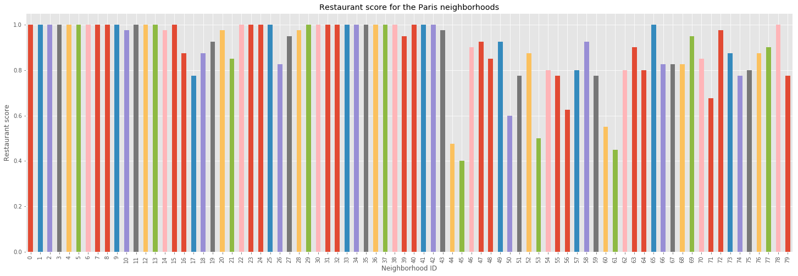
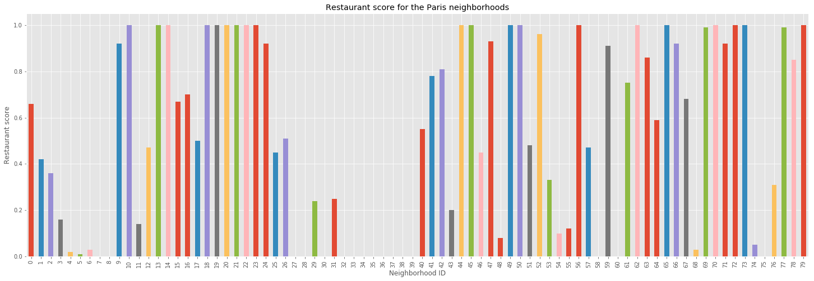
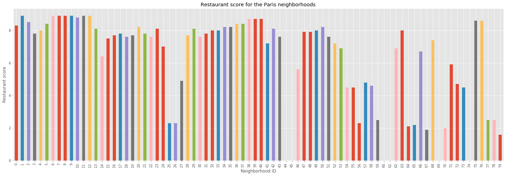
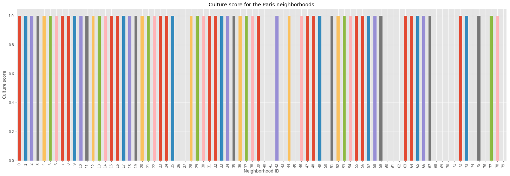
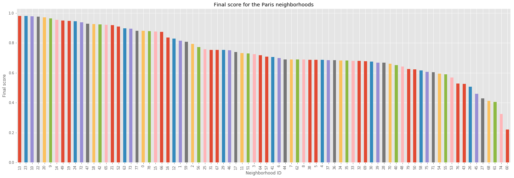

# Capstone Project Week 3 by Loïc BRISSOT: Business Analysis

---
## Table of Contents

<div class="alert alert-block alert-info" style="margin-top: 20px">

<font size = 3>
1. <a href="#1. Introduction">Introduction </a>    
2. <a href="#2. Data">Data</a>    
3. <a href="#3. Methodology">Methodology </a>    
3. 1. <a href="#3.1. Exploratory Data Analysis">Exploratory Data Analysis </a>    
3. 2. <a href="#3.2. Scoring">Scoring </a>    
4. <a href="#4. Results">Results and Discussion</a>    
5. <a href="#6. Conclusion">Conclusion </a>    
</font>
</div>

---
---
## 1. Introduction

Jean-Philippe starts a new job on the other side of the town in two months. Right now he appreciates the neighborhood he lives in and he only has to walk 15mn to be at his job. He really appreciates the quality of life he has. With the future job his travel time will drastically change and he considers moving. He wants to find a neighborhood that will allow him to maintain his activities and a low travel time.

In his daily life Jean-Philippe likes practising tennis and hanging out with his friends at Chinese restaurant and movie theaters. A neighborhood where he would be comfortable needs to have several of those facilities and those facilities should be well ranked/appreciated. To solve this problem, we will rank all the neighborhoods of Paris.

To rank the best neighborhoods we will create a score that behaves on the following conditions:

\begin{equation}
\begin{cases}
neighborhoodScore = \alpha_1*travelScore + \alpha_2*sportScore + \alpha_3*restaurantScore + \alpha_4*cultureScore
\\ \sum \alpha_i =1
\end{cases}
\end{equation}

The parameters and score will be defined in the methodology section.

---
---
## 2. Data

To analyze the composition of Jean-Philippe's current neighborhoods and the neighborhoods where he could live we will use the FourSquare API: https://developer.foursquare.com/

To map Paris and its administrative borough we will use the geospatial data available at: https://opendata.paris.fr/explore/dataset/quartier_paris/table/?sort=-c_qu&location=12,48.85889,2.34692&basemap=jawg.streets

To measure travel times inside Paris with the public transportation system and walking distances we will use the Citymapper API: https://citymapper.3scale.net/

---
---
## 3. Methodology

For each neighborhood we will use the center of the neighborhood as given by the geospatial data file to simulate the adress of Jean-Philippe's possible new home.

Ideally we wouldn't use the center of the neighborhood as given by the geospatial data but we do not have unlimited API calls to measure travel time between Jean-Philippe's home and his new job. Later on, we might be able to refine this part of the project.

---
### 3.1. Exploratory Data Analysis and Data Wrangling

First, we need to import libraries.


```python
## General libraries

# Handling data
import pandas as pd
import numpy as np
import time # To set pauses in-between API calls
import os

# Nominatim converts an address into latitude and longitude values
!conda install -c conda-forge geopy --yes 
from geopy.geocoders import Nominatim

# Handling API requests
import requests

# Reading JSON files
import json

# Tranforming JSON file into a pandas dataframe library
from pandas.io.json import json_normalize
```

    Solving environment: ...working... done
    
    # All requested packages already installed.
    
    Solving environment: ...working... done
    
    # All requested packages already installed.
    
    


```python
## Data visualization

# Inline backend to generate the plots within the browser
%matplotlib inline 

# Displaying plots and graphs
import matplotlib as mpl
import matplotlib.pyplot as plt
mpl.style.use('ggplot') # Optional: for ggplot-like style

# Displaying maps
!conda install -c conda-forge folium=0.5.0 --yes
import folium
```

---
#### 3.1.1. Paris Geospatial Data

Let's read the JSON file containing the geospatial data and insert it into a Pandas dataframe.


```python
# Recovering and reading the JSON file
paris_neighborhoods_json = r'quartier_paris.geojson' # geojson file

with open(paris_neighborhoods_json) as f:
    paris_neighborhoods = json.load(f)

# Extracting the relevant parts of the JSON and normalizing it into a dataframe
neighborhoods = json_normalize(paris_neighborhoods['features'])
neighborhoods.head(3)
```


<div>
<style scoped>
    .dataframe tbody tr th:only-of-type {
        vertical-align: middle;
    }

    .dataframe tbody tr th {
        vertical-align: top;
    }

    .dataframe thead th {
        text-align: right;
    }
</style>
<table border="1" class="dataframe">
  <thead>
    <tr style="text-align: right;">
      <th></th>
      <th>geometry.coordinates</th>
      <th>geometry.type</th>
      <th>properties.c_ar</th>
      <th>properties.c_qu</th>
      <th>properties.c_quinsee</th>
      <th>properties.geom_x_y</th>
      <th>properties.l_qu</th>
      <th>properties.longueur</th>
      <th>properties.n_sq_ar</th>
      <th>properties.n_sq_qu</th>
      <th>properties.objectid</th>
      <th>properties.perimetre</th>
      <th>properties.surface</th>
      <th>type</th>
    </tr>
  </thead>
  <tbody>
    <tr>
      <th>0</th>
      <td>[[[2.367101341254551, 48.86162755885409], [2.3...</td>
      <td>Polygon</td>
      <td>3</td>
      <td>10</td>
      <td>7510302</td>
      <td>[48.86388739200148, 2.3631233009869512]</td>
      <td>Enfants-Rouges</td>
      <td>2139.535591</td>
      <td>750000003</td>
      <td>750000010</td>
      <td>50</td>
      <td>2139.625388</td>
      <td>271750.323937</td>
      <td>Feature</td>
    </tr>
    <tr>
      <th>1</th>
      <td>[[[2.361313701339139, 48.84858030437791], [2.3...</td>
      <td>Polygon</td>
      <td>4</td>
      <td>16</td>
      <td>7510404</td>
      <td>[48.85289558621802, 2.3527750121216866]</td>
      <td>Notre-Dame</td>
      <td>3282.999717</td>
      <td>750000004</td>
      <td>750000016</td>
      <td>56</td>
      <td>3283.163371</td>
      <td>378252.153674</td>
      <td>Feature</td>
    </tr>
    <tr>
      <th>2</th>
      <td>[[[2.364561460891576, 48.843657461143984], [2....</td>
      <td>Polygon</td>
      <td>5</td>
      <td>18</td>
      <td>7510502</td>
      <td>[48.841940193375144, 2.3568938896247458]</td>
      <td>Jardin-des-Plantes</td>
      <td>4052.473226</td>
      <td>750000005</td>
      <td>750000018</td>
      <td>58</td>
      <td>4052.729521</td>
      <td>798389.398463</td>
      <td>Feature</td>
    </tr>
  </tbody>
</table>
</div>


The dataframe contains more data than we need. We can clean the parts we like and drop the superfluous.


```python
# Dropping useless columns
neighborhoods.drop(['geometry.type',
                    'properties.c_quinsee',
                    'properties.n_sq_ar',
                    'properties.objectid',
                    'type',
                    'properties.n_sq_qu',
                    'properties.longueur'
                   ], axis=1, inplace=True)

# Renaming columns
neighborhoods.rename(index=str, columns={"geometry.coordinates": "coordonnees_frontiere", 
                                         "properties.geom_x_y": "coordonees_centre",
                                         "properties.l_qu": "quartier",
                                         "properties.c_ar": "arrondissement",
                                         "properties.c_qu": "numero_quartier",
                                         "properties.perimetre": "perimetre",
                                         "properties.surface": "surface"
                                        }, inplace=True)

# Sorting
neighborhoods.sort_values(by=['numero_quartier'],inplace=True)

# Resetting index
neighborhoods.reset_index(drop=True,inplace=True)

# Splitting the coordinates from the center of the neighborhood
lat_list = []
long_list =[]
for index, row in neighborhoods.iterrows():
    lat_list.append(neighborhoods['coordonees_centre'][index][0])
    long_list.append(neighborhoods['coordonees_centre'][index][1])

neighborhoods['latitude'] = lat_list
neighborhoods['longitude'] = long_list

# Sorting the columns
neighborhoods = neighborhoods[['numero_quartier','arrondissement','quartier',
                               'latitude','longitude',
                               'coordonees_centre',
                               'coordonnees_frontiere', 'perimetre','surface']]

neighborhoods.head(3)
```


<div>
<style scoped>
    .dataframe tbody tr th:only-of-type {
        vertical-align: middle;
    }

    .dataframe tbody tr th {
        vertical-align: top;
    }

    .dataframe thead th {
        text-align: right;
    }
</style>
<table border="1" class="dataframe">
  <thead>
    <tr style="text-align: right;">
      <th></th>
      <th>numero_quartier</th>
      <th>arrondissement</th>
      <th>quartier</th>
      <th>latitude</th>
      <th>longitude</th>
      <th>coordonees_centre</th>
      <th>coordonnees_frontiere</th>
      <th>perimetre</th>
      <th>surface</th>
    </tr>
  </thead>
  <tbody>
    <tr>
      <th>0</th>
      <td>1</td>
      <td>1</td>
      <td>St-Germain-l'Auxerrois</td>
      <td>48.860650</td>
      <td>2.334910</td>
      <td>[48.86065013520992, 2.334910329280203]</td>
      <td>[[[2.344593389828428, 48.854049914861925], [2....</td>
      <td>5057.549475</td>
      <td>869000.664564</td>
    </tr>
    <tr>
      <th>1</th>
      <td>2</td>
      <td>1</td>
      <td>Halles</td>
      <td>48.862289</td>
      <td>2.344899</td>
      <td>[48.86228910809422, 2.344898858311021]</td>
      <td>[[[2.349365804803003, 48.86057567227663], [2.3...</td>
      <td>2606.417128</td>
      <td>412458.496330</td>
    </tr>
    <tr>
      <th>2</th>
      <td>3</td>
      <td>1</td>
      <td>Palais-Royal</td>
      <td>48.864660</td>
      <td>2.336309</td>
      <td>[48.86465997810258, 2.3363089189653086]</td>
      <td>[[[2.339465868602756, 48.86213531210705], [2.3...</td>
      <td>2166.839239</td>
      <td>273696.793301</td>
    </tr>
  </tbody>
</table>
</div>


The data is now well formated.

In the next step we will check that everything is in place by displaying the neighborhoods.


```python
# Recovering the coordinates for Paris with Nominatim
address = 'Paris, France'
geolocator = Nominatim()
location = geolocator.geocode(address)
paris_latitude = location.latitude
paris_longitude = location.longitude
```

    C:\Users\LoicBrissot\Anaconda3\lib\site-packages\geopy\geocoders\osm.py:143: UserWarning: Using Nominatim with the default "geopy/1.17.0" `user_agent` is strongly discouraged, as it violates Nominatim's ToS https://operations.osmfoundation.org/policies/nominatim/ and may possibly cause 403 and 429 HTTP errors. Please specify a custom `user_agent` with `Nominatim(user_agent="my-application")` or by overriding the default `user_agent`: `geopy.geocoders.options.default_user_agent = "my-application"`. In geopy 2.0 this will become an exception.
      UserWarning
    


```python
# Create a plain map centered on Paris
map_paris = folium.Map(location=[paris_latitude, paris_longitude], zoom_start=12, width=800, height=500)

# Option 1. Choropleth map to display neighborhood boundaries
map_paris.choropleth(
    geo_data=paris_neighborhoods_json,
    fill_color='green',
    fill_opacity=0.1, 
    line_opacity=0.8
)

# Option 2. Choropleth map using neighborhoods and sequential data
'''map_paris.choropleth(
    geo_data=paris_neighborhoods_json,
    
    data=neighborhoods,
    columns=['quartier', 'surface'],
    key_on='feature.properties.l_qu',
    # Color brewer palettes: ‘BuGn’, ‘BuPu’, ‘GnBu’, ‘OrRd’, ‘PuBu’, ‘PuBuGn’,
    #                        ‘PuRd’, ‘RdPu’, ‘YlGn’, ‘YlGnBu’, ‘YlOrBr’, and ‘YlOrRd'
    fill_color='PuBuGn',
    fill_opacity=0.4, 
    line_opacity=0.8,
    legend_name='Surface in square km'
)'''

# Add neighborhood markers to the map
# NB: If the chloropleth is added after the markers, the markers wont't display their labels
for coord, borough, neighborhood in zip(neighborhoods['coordonees_centre'],
                                           neighborhoods['arrondissement'],
                                           neighborhoods['quartier']):
    label = '{}, {}'.format(neighborhood, borough)
    label = folium.Popup(label, parse_html=True)
    folium.CircleMarker(
        coord,
        radius=5,
        popup=label,
        color='blue',
        fill=True,
        fill_color='#3186cc',
        fill_opacity=0.7).add_to(map_paris)

# Display map
map_paris
```


<div style="width:100%;"><div style="position:relative;width:100%;height:0;padding-bottom:60%;"><iframe src="data:text/html;charset=utf-8;base64,PCFET0NUWVBFIGh0bWw+CjxoZWFkPiAgICAKICAgIDxtZXRhIGh0dHAtZXF1aXY9ImNvbnRlbnQtdHlwZSIgY29udGVudD0idGV4dC9odG1sOyBjaGFyc2V0PVVURi04IiAvPgogICAgPHNjcmlwdD5MX1BSRUZFUl9DQU5WQVMgPSBmYWxzZTsgTF9OT19UT1VDSCA9IGZhbHNlOyBMX0RJU0FCTEVfM0QgPSBmYWxzZTs8L3NjcmlwdD4KICAgIDxzY3JpcHQgc3JjPSJodHRwczovL2Nkbi5qc2RlbGl2ci5uZXQvbnBtL2xlYWZsZXRAMS4yLjAvZGlzdC9sZWFmbGV0LmpzIj48L3NjcmlwdD4KICAgIDxzY3JpcHQgc3JjPSJodHRwczovL2FqYXguZ29vZ2xlYXBpcy5jb20vYWpheC9saWJzL2pxdWVyeS8xLjExLjEvanF1ZXJ5Lm1pbi5qcyI+PC9zY3JpcHQ+CiAgICA8c2NyaXB0IHNyYz0iaHR0cHM6Ly9tYXhjZG4uYm9vdHN0cmFwY2RuLmNvbS9ib290c3RyYXAvMy4yLjAvanMvYm9vdHN0cmFwLm1pbi5qcyI+PC9zY3JpcHQ+CiAgICA8c2NyaXB0IHNyYz0iaHR0cHM6Ly9jZG5qcy5jbG91ZGZsYXJlLmNvbS9hamF4L2xpYnMvTGVhZmxldC5hd2Vzb21lLW1hcmtlcnMvMi4wLjIvbGVhZmxldC5hd2Vzb21lLW1hcmtlcnMuanMiPjwvc2NyaXB0PgogICAgPGxpbmsgcmVsPSJzdHlsZXNoZWV0IiBocmVmPSJodHRwczovL2Nkbi5qc2RlbGl2ci5uZXQvbnBtL2xlYWZsZXRAMS4yLjAvZGlzdC9sZWFmbGV0LmNzcyIvPgogICAgPGxpbmsgcmVsPSJzdHlsZXNoZWV0IiBocmVmPSJodHRwczovL21heGNkbi5ib290c3RyYXBjZG4uY29tL2Jvb3RzdHJhcC8zLjIuMC9jc3MvYm9vdHN0cmFwLm1pbi5jc3MiLz4KICAgIDxsaW5rIHJlbD0ic3R5bGVzaGVldCIgaHJlZj0iaHR0cHM6Ly9tYXhjZG4uYm9vdHN0cmFwY2RuLmNvbS9ib290c3RyYXAvMy4yLjAvY3NzL2Jvb3RzdHJhcC10aGVtZS5taW4uY3NzIi8+CiAgICA8bGluayByZWw9InN0eWxlc2hlZXQiIGhyZWY9Imh0dHBzOi8vbWF4Y2RuLmJvb3RzdHJhcGNkbi5jb20vZm9udC1hd2Vzb21lLzQuNi4zL2Nzcy9mb250LWF3ZXNvbWUubWluLmNzcyIvPgogICAgPGxpbmsgcmVsPSJzdHlsZXNoZWV0IiBocmVmPSJodHRwczovL2NkbmpzLmNsb3VkZmxhcmUuY29tL2FqYXgvbGlicy9MZWFmbGV0LmF3ZXNvbWUtbWFya2Vycy8yLjAuMi9sZWFmbGV0LmF3ZXNvbWUtbWFya2Vycy5jc3MiLz4KICAgIDxsaW5rIHJlbD0ic3R5bGVzaGVldCIgaHJlZj0iaHR0cHM6Ly9yYXdnaXQuY29tL3B5dGhvbi12aXN1YWxpemF0aW9uL2ZvbGl1bS9tYXN0ZXIvZm9saXVtL3RlbXBsYXRlcy9sZWFmbGV0LmF3ZXNvbWUucm90YXRlLmNzcyIvPgogICAgPHN0eWxlPmh0bWwsIGJvZHkge3dpZHRoOiAxMDAlO2hlaWdodDogMTAwJTttYXJnaW46IDA7cGFkZGluZzogMDt9PC9zdHlsZT4KICAgIDxzdHlsZT4jbWFwIHtwb3NpdGlvbjphYnNvbHV0ZTt0b3A6MDtib3R0b206MDtyaWdodDowO2xlZnQ6MDt9PC9zdHlsZT4KICAgIAogICAgICAgICAgICA8c3R5bGU+ICNtYXBfYjI5ZjUzNTkzOWVmNGNlMzg4MWFmODgyMGE3YWEzODMgewogICAgICAgICAgICAgICAgcG9zaXRpb24gOiByZWxhdGl2ZTsKICAgICAgICAgICAgICAgIHdpZHRoIDogODAwLjBweDsKICAgICAgICAgICAgICAgIGhlaWdodDogNTAwLjBweDsKICAgICAgICAgICAgICAgIGxlZnQ6IDAuMCU7CiAgICAgICAgICAgICAgICB0b3A6IDAuMCU7CiAgICAgICAgICAgICAgICB9CiAgICAgICAgICAgIDwvc3R5bGU+CiAgICAgICAgCjwvaGVhZD4KPGJvZHk+ICAgIAogICAgCiAgICAgICAgICAgIDxkaXYgY2xhc3M9ImZvbGl1bS1tYXAiIGlkPSJtYXBfYjI5ZjUzNTkzOWVmNGNlMzg4MWFmODgyMGE3YWEzODMiID48L2Rpdj4KICAgICAgICAKPC9ib2R5Pgo8c2NyaXB0PiAgICAKICAgIAoKICAgICAgICAgICAgCiAgICAgICAgICAgICAgICB2YXIgYm91bmRzID0gbnVsbDsKICAgICAgICAgICAgCgogICAgICAgICAgICB2YXIgbWFwX2IyOWY1MzU5MzllZjRjZTM4ODFhZjg4MjBhN2FhMzgzID0gTC5tYXAoCiAgICAgICAgICAgICAgICAgICAgICAgICAgICAgICAgICAnbWFwX2IyOWY1MzU5MzllZjRjZTM4ODFhZjg4MjBhN2FhMzgzJywKICAgICAgICAgICAgICAgICAgICAgICAgICAgICAgICAgIHtjZW50ZXI6IFs0OC44NTY2MTAxLDIuMzUxNDk5Ml0sCiAgICAgICAgICAgICAgICAgICAgICAgICAgICAgICAgICB6b29tOiAxMiwKICAgICAgICAgICAgICAgICAgICAgICAgICAgICAgICAgIG1heEJvdW5kczogYm91bmRzLAogICAgICAgICAgICAgICAgICAgICAgICAgICAgICAgICAgbGF5ZXJzOiBbXSwKICAgICAgICAgICAgICAgICAgICAgICAgICAgICAgICAgIHdvcmxkQ29weUp1bXA6IGZhbHNlLAogICAgICAgICAgICAgICAgICAgICAgICAgICAgICAgICAgY3JzOiBMLkNSUy5FUFNHMzg1NwogICAgICAgICAgICAgICAgICAgICAgICAgICAgICAgICB9KTsKICAgICAgICAgICAgCiAgICAgICAgCiAgICAKICAgICAgICAgICAgdmFyIHRpbGVfbGF5ZXJfNjNlYTUxYmRiMjhmNGEzZjgxNjY0YjZiNGQzMjA4OGUgPSBMLnRpbGVMYXllcigKICAgICAgICAgICAgICAgICdodHRwczovL3tzfS50aWxlLm9wZW5zdHJlZXRtYXAub3JnL3t6fS97eH0ve3l9LnBuZycsCiAgICAgICAgICAgICAgICB7CiAgImF0dHJpYnV0aW9uIjogbnVsbCwKICAiZGV0ZWN0UmV0aW5hIjogZmFsc2UsCiAgIm1heFpvb20iOiAxOCwKICAibWluWm9vbSI6IDEsCiAgIm5vV3JhcCI6IGZhbHNlLAogICJzdWJkb21haW5zIjogImFiYyIKfQogICAgICAgICAgICAgICAgKS5hZGRUbyhtYXBfYjI5ZjUzNTkzOWVmNGNlMzg4MWFmODgyMGE3YWEzODMpOwogICAgICAgIAogICAgCgogICAgICAgICAgICAKCiAgICAgICAgICAgICAgICB2YXIgZ2VvX2pzb25fNDc4ZjU0MDYwN2RmNGMwYjkwMmU4MGFmYWJmNWZiZWIgPSBMLmdlb0pzb24oCiAgICAgICAgICAgICAgICAgICAgeyJmZWF0dXJlcyI6IFt7Imdlb21ldHJ5IjogeyJjb29yZGluYXRlcyI6IFtbWzIuMzY3MTAxMzQxMjU0NTUxLCA0OC44NjE2Mjc1NTg4NTQwOV0sIFsyLjM2NzI2NTE3NjExNjM4MywgNDguODYwOTQ5MTk0MTM4MTRdLCBbMi4zNjM1NjA5Njg2MDY5NjgsIDQ4Ljg2MTQ3MDI3MzA1MDk4XSwgWzIuMzYxMjI1Mjc5MDY0OTAzLCA0OC44NjE3OTU0MjI2NzA5N10sIFsyLjM1OTgxMjM1Mzc5OTYzNiwgNDguODYyNjAxNjAzNTgxNTc0XSwgWzIuMzU4NzU4Njg5MDY3Mzc4LCA0OC44NjMxNTk5NDIwODg5OV0sIFsyLjM1ODM3Njc5MDg2OTIxNywgNDguODYzMzMxNTQ0NDExNjE1XSwgWzIuMzU4MjY1NDczNDIwOTA3LCA0OC44NjMzNjU5MDY5MDM4NF0sIFsyLjM1ODQwMzQ4OTg4MTAxMjIsIDQ4Ljg2MzU0OTU5OTc1MTkxXSwgWzIuMzU4ODUxMDUxMTgxOTQ2MywgNDguODY0MDAxNzM0NTA3Njc0XSwgWzIuMzU5MzM1MjE1MTEyMjc2LCA0OC44NjQ0MjkxMzk3ODI4N10sIFsyLjM1OTUzNjYzNTM3MDE4NywgNDguODY0NjI1MDAzMTcxMjRdLCBbMi4zNTk2NTg4MDgwOTcxOCwgNDguODY0Njk1MjA3NjY4ODldLCBbMi4zNTk3NjE0NjM5MTU3MzQsIDQ4Ljg2NDc1NDYzMjQxOTYzXSwgWzIuMzYwMjA5OTc5NTQ3NDQ1LCA0OC44NjUxOTAyNDAyNTMwN10sIFsyLjM2MDQyMzUyMTc2NTEzNiwgNDguODY1Mzk3NjUyMjkzNTc0XSwgWzIuMzYxNjU4MjMwODE1NTA4LCA0OC44NjY1ODk0Njk4MjI0Nl0sIFsyLjM2MTY5MTAxNjg4MjA4NiwgNDguODY2NjE2NzMwMTY5NzhdLCBbMi4zNjE3MzQ5MzQwMTMyOSwgNDguODY2NjQ4OTUxMjgyNDJdLCBbMi4zNjE3ODU4NjY4MDg1NDUsIDQ4Ljg2NjY4MTM0NDY4OTU0XSwgWzIuMzYxODMyMjgzNDU4MzQ4LCA0OC44NjY3MDcwNTcwNjM3MV0sIFsyLjM2MTg4NTI2MTA1MDE2MSwgNDguODY2NzMyNjcxMjk2NjNdLCBbMi4zNjI1OTM2OTk4MTU4ODUsIDQ4Ljg2NzAxNDA5MDIwNjUyXSwgWzIuMzYzMTQwNDEyNTM4NDY3LCA0OC44NjcyMzEyNjE0ODI1NF0sIFsyLjM2MzY3NTM5MDkxMDA3OSwgNDguODY3NDQzNzY1ODc5NTZdLCBbMi4zNjM3MjA1MjY1Mzg1NDksIDQ4Ljg2NzQ2MTY1MjcxMDc0NV0sIFsyLjM2MzcyMDc4NTY1NDE5MSwgNDguODY3NDYxNzU1NzEzODFdLCBbMi4zNjM3MzMzMzQxMzk2NzEsIDQ4Ljg2NzQ2Njc2OTY5OTE0XSwgWzIuMzYzNzU2Mzg0NDc0NzI1LCA0OC44Njc0NzU5NDIzMDQ3M10sIFsyLjM2MzgyODA5NjA2MjkyNSwgNDguODY3NTA0NDMwNjAzMzNdLCBbMi4zNjM4ODkyODMwOTI0OTAyLCA0OC44Njc0Njc5OTcwMzY4NV0sIFsyLjM2Mzg5NTI3MDY5NDg0OSwgNDguODY3NDY0Mzk0NjIxMTddLCBbMi4zNjM5MDYwMzc2NDA1MDksIDQ4Ljg2NzQ1ODAwODA2MzQ2Nl0sIFsyLjM2MzkwNjI2NDIyNTI0MiwgNDguODY3NDU3ODcyNTY3NzldLCBbMi4zNjM5NjA0MTA4NTU2LCA0OC44Njc0MjU2MjM5NTQyNTRdLCBbMi4zNjQwNTA4ODcwNDAyOSwgNDguODY3MzcxODIyMjgxMzVdLCBbMi4zNjQxMzYyMDIyMDEwMjYsIDQ4Ljg2NzMyMDkwMTU4OTU2NV0sIFsyLjM2NDE5NjE1MDY4MzQwOCwgNDguODY3Mjg1Mjc2MDg1N10sIFsyLjM2NDIzMTA0NjA1NzQwNCwgNDguODY3MjY0NTA0OTk4NTQ1XSwgWzIuMzY0MjQ4ODg5MjA5OTMyMywgNDguODY3MjUzODg0MTI1NTFdLCBbMi4zNjQyNjIzNzQ3NTQxMTUsIDQ4Ljg2NzIzMTQ4NzUxMDExXSwgWzIuMzY0MzE3NTI2OTU3MDY4LCA0OC44NjcxMzk5MjE3MTAwOV0sIFsyLjM2NDM3ODgxMTI2NzA0NywgNDguODY3MDM4MDI3MTI5ODE2XSwgWzIuMzY0Mzc4ODU0NDM0MzQxLCA0OC44NjcwMzc5NTI3MTM3Ml0sIFsyLjM2NDQzNzcwOTI3MjcsIDQ4Ljg2Njk0MDE5Mjk1NjYwNV0sIFsyLjM2NDQzNzc4MTU5MTc5OSwgNDguODY2OTQwMDc1NTI2ODZdLCBbMi4zNjQ0NTM3MTMwNzA0MzkzLCA0OC44NjY5MTM3MjU3NzYxXSwgWzIuMzY0NDg5NTI5NTY2NzM3LCA0OC44NjY4NTQxODQzODI1NF0sIFsyLjM2NDQ5OTIxNTIwNjEzMzMsIDQ4Ljg2NjgzODA4MzYzMzYyNF0sIFsyLjM2NDQ5OTUwMzI1MDAxOSwgNDguODY2ODM3NjAzMTE1OTA0XSwgWzIuMzY0NTE3MTc3MDA1NjQ5LCA0OC44NjY4MDgyMjE5MzEwOV0sIFsyLjM2NDU0NDU0Nzg1Mjg5NywgNDguODY2NzYyODAzMDA0MjVdLCBbMi4zNjQ2NzQ1MjIxMzk0NDYsIDQ4Ljg2NjU0NjU5NzgzNjcyNF0sIFsyLjM2NDczNTUyMDQzMDc2NCwgNDguODY2NDQ1MTI2ODk3MV0sIFsyLjM2NDc1MTIyNTI4NDg1LCA0OC44NjY0MTkwMDM0MjcyMV0sIFsyLjM2NTQwNTg5MTU1MzA4NiwgNDguODY1MzI5OTU2MTAxNjc1XSwgWzIuMzY1Nzk5ODM4ODUwMDgyLCA0OC44NjQ2NzIyMTc4MzMzOF0sIFsyLjM2NTgzNTQ5Mjk0ODY2OSwgNDguODY0NjEyNzczOTk5OTk0XSwgWzIuMzY1ODM1OTMxMjQyNTk4MywgNDguODY0NjEyMDQyNDU4MjFdLCBbMi4zNjY3MDMwNTEwMzUyNSwgNDguODYzMTY5OTIwNTk0NDJdLCBbMi4zNjY3MTc3NTI0OTM3ODQsIDQ4Ljg2MzEzOTE2MTY2NDRdLCBbMi4zNjY3MzUxNzk4MTcwMzUsIDQ4Ljg2MzEwMDEzMDU5NDg4XSwgWzIuMzY2NzUxNTE0MDA2NzczLCA0OC44NjMwNjAxOTQzOTI5XSwgWzIuMzY2NzY1Mzg2NjY3NjUzLCA0OC44NjMwMTkwMDQwNjc0NDZdLCBbMi4zNjY5MDEwOTI5MzE4OSwgNDguODYyNDU3MDEyNzY3Mzg2XSwgWzIuMzY3MTAxMzQxMjU0NTUxLCA0OC44NjE2Mjc1NTg4NTQwOV1dXSwgInR5cGUiOiAiUG9seWdvbiJ9LCAicHJvcGVydGllcyI6IHsiY19hciI6IDMsICJjX3F1IjogMTAsICJjX3F1aW5zZWUiOiA3NTEwMzAyLCAiZ2VvbV94X3kiOiBbNDguODYzODg3MzkyMDAxNDgsIDIuMzYzMTIzMzAwOTg2OTUxMl0sICJoaWdobGlnaHQiOiB7fSwgImxfcXUiOiAiRW5mYW50cy1Sb3VnZXMiLCAibG9uZ3VldXIiOiAyMTM5LjUzNTU5MTEsICJuX3NxX2FyIjogNzUwMDAwMDAzLCAibl9zcV9xdSI6IDc1MDAwMDAxMCwgIm9iamVjdGlkIjogNTAsICJwZXJpbWV0cmUiOiAyMTM5LjYyNTM4Nzc1LCAic3R5bGUiOiB7ImNvbG9yIjogImJsYWNrIiwgImZpbGxDb2xvciI6ICJncmVlbiIsICJmaWxsT3BhY2l0eSI6IDAuMSwgIm9wYWNpdHkiOiAwLjgsICJ3ZWlnaHQiOiAxfSwgInN1cmZhY2UiOiAyNzE3NTAuMzIzOTM2NTZ9LCAidHlwZSI6ICJGZWF0dXJlIn0sIHsiZ2VvbWV0cnkiOiB7ImNvb3JkaW5hdGVzIjogW1tbMi4zNjEzMTM3MDEzMzkxMzksIDQ4Ljg0ODU4MDMwNDM3NzkxXSwgWzIuMzYxNTE0NzkxNzk0NDA2LCA0OC44NDgyMzE3OTEzNTI3Ml0sIFsyLjM2MDc5OTA3NzM1MDExLCA0OC44NDg2MzIwMzU1MDE1NF0sIFsyLjM2MDc5ODAzNTM2ODYyOSwgNDguODQ4NjMyNjYxMjgzMTU1XSwgWzIuMzU5ODE2NDgzNjg3OTY5LCA0OC44NDkxODE2MDY3MTExODRdLCBbMi4zNTk2OTI5ODI3MzAyOTcsIDQ4Ljg0OTI0Mzg0NjgxNjUzNV0sIFsyLjM1OTU2ODk1Mzg1MjA2MiwgNDguODQ5MzA1MjE5Njg1Ml0sIFsyLjM1OTM1MDgzMjI4NjkwNCwgNDguODQ5NDAzNTUxMzE5NDhdLCBbMi4zNTkxNzQ4MTcwMDAyNSwgNDguODQ5NDc5MzA0MDA1NTU1XSwgWzIuMzU4ODcyOTU5NzcyNzQ3LCA0OC44NDk1OTQyNjc3MTE3MTZdLCBbMi4zNTg1NDUxMTIxODc2NTUsIDQ4Ljg0OTcwODU2Nzg4Njk2XSwgWzIuMzU4MzI5ODQ5NjUzMDg2LCA0OC44NDk3Nzc5NDIwMTM1OV0sIFsyLjM1ODI1MDAwMzgzODQ1NCwgNDguODQ5ODAzNjgwNTMyM10sIFsyLjM1ODE0ODIzNDYwNzI2LCA0OC44NDk4MzkyMTQwOTE4Ml0sIFsyLjM1ODA1NjUzNDMyODE0MywgNDguODQ5ODY2MDMyODY2Nzg1XSwgWzIuMzU3OTk3NTM4NDA2OTY4LCA0OC44NDk4ODUwMjI3OTM5NF0sIFsyLjM1NTY0ODUwOTg0ODE4MywgNDguODUwNjQyMTc1NTM0NDk2XSwgWzIuMzU1NTk5MzE4MjAwMDM2LCA0OC44NTA2NTgwMDkwNzMzN10sIFsyLjM1NTUxMTU2NjgzNTU3OTMsIDQ4Ljg1MDY4NjE3OTEwNjcyNF0sIFsyLjM1NTM0NzY2ODE2MjMzNCwgNDguODUwNzM0Njc0MzY3NDZdLCBbMi4zNTM3MDU5NTcxNTk2ODUsIDQ4Ljg1MTIyMDkwMzA1MTM0XSwgWzIuMzUzMTg1NDM4MTc4MTgyLCA0OC44NTEyOTk5Mzg4MjYwM10sIFsyLjM1MjUxNTU3MTY3NTE1MiwgNDguODUxMzkwMDUwMTE1NzZdLCBbMi4zNTE2MDEwMDA0NTc1ODAyLCA0OC44NTE1OTQ0ODcxMTRdLCBbMi4zNTAyMjMxNTc3MTExOTQsIDQ4Ljg1MTk0NzM1NTMzMDc4XSwgWzIuMzUwMDQyODU2MTgyMzAxMiwgNDguODUyMDAwMjcwODAwNjk0XSwgWzIuMzQ5OTc5NTE2NTM4ODQsIDQ4Ljg1MjAyMDUwMzA2MDVdLCBbMi4zNDk5MDY2MjQ5NjQyODIsIDQ4Ljg1MjA0NDg4MDY3OTE0XSwgWzIuMzQ5ODczNjI0ODcwNDQ5MywgNDguODUyMDU2NjQ0ODExOThdLCBbMi4zNDk2NDExMzQ0NjQ5MTYsIDQ4Ljg1MjEzOTUyMTQwNDE2XSwgWzIuMzQ5MzgxNzgxNzQ2NDY3LCA0OC44NTIyNDEzMTYwMDQ5OF0sIFsyLjM0OTI2MDM2MjAzOTk3OCwgNDguODUyMjkyMzQ1MjM1NzQ2XSwgWzIuMzQ4NDcwMjAxNjU3Njc2LCA0OC44NTI2MTIyOTY4NDY0M10sIFsyLjM0Njk0NjU0NzA2Mzg2LCA0OC44NTMyOTM2NDcxNDE3NF0sIFsyLjM0Njg3MjI3OTk3NDMwNSwgNDguODUzMzE5MTA0NTEyMTNdLCBbMi4zNDY4MTg4NjU4MDE3OSwgNDguODUzMzM1MjA2MzcwODZdLCBbMi4zNDQ3ODYwNDg5MTc1MjcsIDQ4Ljg1Mzk4NjgxMDk3Mzg1XSwgWzIuMzQ0NzAyMzgyOTA4ODcyLCA0OC44NTQwMTI4MDI4MDM1OV0sIFsyLjM0NDU5MjY3NzQ4NTA0MywgNDguODU0MDQ5MjMwMTQ5MThdLCBbMi4zNDQ1OTMzODk4Mjg0MjgsIDQ4Ljg1NDA0OTkxNDg2MTkyNV0sIFsyLjM0NTg2OTUyOTkwNDg0OCwgNDguODU1Mjc3MjczNzM1OTg2XSwgWzIuMzQ1OTAxNDIzODIxMzkxLCA0OC44NTUzMTQyMzUyMTE4Nl0sIFsyLjM0NTk3NTE4ODIzNDYwMjMsIDQ4Ljg1NTQxNjgyMTk3MjkxNl0sIFsyLjM0NTk3NTcxNzM2NjQ0OCwgNDguODU1NDE3NTU2MDM4Nzk1XSwgWzIuMzQ2MTA0Mzg3MTU2MDU4LCA0OC44NTU1ODY3ODM1Mzc4M10sIFsyLjM0NjgwMjY0MjExMzc1NCwgNDguODU2NzA3ODQ2OTYzODJdLCBbMi4zNDg2NzU0Mzc4MzI0NDgsIDQ4Ljg1NjE0ODEzNjE3ODk0XSwgWzIuMzQ5OTA3MDQyMjg1NzIsIDQ4Ljg1NTc2NDk5ODcwNjQwNV0sIFsyLjM1MjQ5MTgwMDEyOTMyNiwgNDguODU0NjY3MTg5MTQ2NTA0XSwgWzIuMzU1MjkyODExOTg0OTg0LCA0OC44NTM0NzE4OTQzMzQxMV0sIFsyLjM1NzM0MzA3MTI3MzIzOCwgNDguODUyNzcyNTA2NDEzMjVdLCBbMi4zNTg3MzI2MDA2ODg2NDMsIDQ4Ljg1MjMwMzE5OTY3MjUxXSwgWzIuMzU5Njk4OTI3MzkxMzEyLCA0OC44NTE5MjY1Mzk1ODQ4NjZdLCBbMi4zNjAwNDQxNTM1MTA2NzIsIDQ4Ljg1MTc3Mzk5MTY4OTY4XSwgWzIuMzYwMTUzODE1MTI5NTMsIDQ4Ljg1MTcwNTQ0MjEwMjQ5XSwgWzIuMzYwMjEzMzgxMTgwMzkxLCA0OC44NTE2NTU5OTIxNTE2N10sIFsyLjM2MDI2NDA3NzE0MzA0MSwgNDguODUxNjEyMDUyNzU0NDc2XSwgWzIuMzYwMzAyMDkzNzA0Njg3LCA0OC44NTE1NzAyMDkzOTI2NzZdLCBbMi4zNjAzMzM3NzY5ODgwOTcsIDQ4Ljg1MTUzODgyNTgyNzQ3NV0sIFsyLjM2MDM1OTExNzExNzcwMywgNDguODUxNTAxMTY3NzIyMTA1XSwgWzIuMzYwMzg3NjI2ODU5NDMyLCA0OC44NTE0NjE0MTc1Njc2N10sIFsyLjM2MDQxNjEzMTYwMDg5MywgNDguODUxNDEzMjk5NzgzMzk1XSwgWzIuMzYwNDM4Mjk0NzUxNjA1LCA0OC44NTEzNjEwMDAyNjkzNl0sIFsyLjM2MDQ1NzI4OTM2NTI5OCwgNDguODUxMzA4NzAwOTAwNDhdLCBbMi4zNjA0NzYyODM5NDA5NjcsIDQ4Ljg1MTI1NjQwMTUyNjA5XSwgWzIuMzYwNDkyMTAzNjQ5NjI2LCA0OC44NTExOTU3MzU1Njc2M10sIFsyLjM2MDUwNDc1NTI3MDAwMiwgNDguODUxMTM5MjU0NDU2OTZdLCBbMi4zNjA1MTQyMzY1NzkyMiwgNDguODUxMDc4NTg5Njg2ODZdLCBbMi4zNjA1MjA1Mzc2MTczMDUsIDQ4Ljg1MDk5NzAwNzgwNjM4NF0sIFsyLjM2MDUwNTE2MzUzODE1NiwgNDguODUwNjYzNzk5MTI0MTZdLCBbMi4zNjA1MTEyMTQxNjQ3NTYsIDQ4Ljg1MDQ4OTkwNjA0NzM4XSwgWzIuMzYwNTQwNjQ3MzUzNTEsIDQ4Ljg1MDMxNzIxMjY0NDkyNF0sIFsyLjM2MDYxMTE0Mzg1MDE4MSwgNDguODUwMDE0OTUzNTQyMTg1XSwgWzIuMzYwNjg1MjkwMzkwODE2LCA0OC44NDk3NzQyMjcwNzEyODZdLCBbMi4zNjA3NTMyODU5MDkwOSwgNDguODQ5NjAzODQyMjUzODldLCBbMi4zNjA4MzIzMjkxMjkwODEsIDQ4Ljg0OTQzNTUzNjM0NzgyXSwgWzIuMzYwODcyMDU0MjUyNzY0LCA0OC44NDkzNTk0NDA4ODY4OF0sIFsyLjM2MTA2NTIzODk5Mzc0MywgNDguODQ5MDIxNDU5NDMyMDRdLCBbMi4zNjEzMTM3MDEzMzkxMzksIDQ4Ljg0ODU4MDMwNDM3NzkxXV1dLCAidHlwZSI6ICJQb2x5Z29uIn0sICJwcm9wZXJ0aWVzIjogeyJjX2FyIjogNCwgImNfcXUiOiAxNiwgImNfcXVpbnNlZSI6IDc1MTA0MDQsICJnZW9tX3hfeSI6IFs0OC44NTI4OTU1ODYyMTgwMiwgMi4zNTI3NzUwMTIxMjE2ODY2XSwgImhpZ2hsaWdodCI6IHt9LCAibF9xdSI6ICJOb3RyZS1EYW1lIiwgImxvbmd1ZXVyIjogMzI4Mi45OTk3MTY3NywgIm5fc3FfYXIiOiA3NTAwMDAwMDQsICJuX3NxX3F1IjogNzUwMDAwMDE2LCAib2JqZWN0aWQiOiA1NiwgInBlcmltZXRyZSI6IDMyODMuMTYzMzcwODIsICJzdHlsZSI6IHsiY29sb3IiOiAiYmxhY2siLCAiZmlsbENvbG9yIjogImdyZWVuIiwgImZpbGxPcGFjaXR5IjogMC4xLCAib3BhY2l0eSI6IDAuOCwgIndlaWdodCI6IDF9LCAic3VyZmFjZSI6IDM3ODI1Mi4xNTM2NzQwNH0sICJ0eXBlIjogIkZlYXR1cmUifSwgeyJnZW9tZXRyeSI6IHsiY29vcmRpbmF0ZXMiOiBbW1syLjM2NDU2MTQ2MDg5MTU3NiwgNDguODQzNjU3NDYxMTQzOTg0XSwgWzIuMzY0NTAxNDUwNTYyODQ2LCA0OC44NDM1NzY1OTQ3NDY3Nl0sIFsyLjM2MjEwOTQwMDk0NTUsIDQ4Ljg0MDM1MzU2NzUzMjQzXSwgWzIuMzYxODE2MDI4MjEzNTk4LCA0OC44Mzk5NjEyODA1NTczN10sIFsyLjM2MTYwOTQ1NjgyOTQ5NCwgNDguODM5ODk1NjA0OTAwMzRdLCBbMi4zNjE0MDc2MzIxMDY1NDcsIDQ4LjgzOTgzMTQzODE3MDEyXSwgWzIuMzU5MTUwMDQyODMwMDI1LCA0OC44MzkxMTM2NDI2NDldLCBbMi4zNTc3OTYyMzUzNjQ1NjEsIDQ4LjgzODY4MzI0MjYwMTk3NF0sIFsyLjM1Njk1Mjk4NDAxNTE2MywgNDguODM4NDE1MTQ0NDI2ODJdLCBbMi4zNTU4NjA4MTA5MDEwMzUsIDQ4LjgzODA2NjY5MDczMjE4NF0sIFsyLjM1NTM1MDk4MDY5Nzc2MiwgNDguODM3OTAzNjY0NjE1MTldLCBbMi4zNTI3MjA5MDQ4NDA4NTksIDQ4LjgzNzA2MjYwMTg1OTA0Nl0sIFsyLjM1MTg2OTI2MjQ3MTE1LCA0OC44MzY3OTYyNTgyNzU4M10sIFsyLjM1MTg0NDMwMzg1NDY2MywgNDguODM2Nzg4NzQzNzI2OTddLCBbMi4zNTE4MTg0MjY5MjMwMDQyLCA0OC44MzY3ODI3Njc1MTA2MzRdLCBbMi4zNTE3OTE4MTc3MTkzNzgsIDQ4LjgzNjc3ODM3ODMwMDk2XSwgWzIuMzUxNzY0NzA0NjE5NjA3LCA0OC44MzY3NzU2MTY5MDcyNF0sIFsyLjM1MTc2MTYzMDgwMjQ1NywgNDguODM2Nzc1NDE0OTc5MzNdLCBbMi4zNTE2NjI2MDExMjYxMzEyLCA0OC44MzY3ODAwMTI3NDMyOF0sIFsyLjM0ODk4NTY1MDczODUzMSwgNDguODM3MDg2ODk4ODcxOTQ1XSwgWzIuMzQ5Nzk5NzkyODg5MzEsIDQ4LjgzODgwMzYxMjkzNjA5XSwgWzIuMzQ5OTU0MzYyNzAyNTE4LCA0OC44MzkxMjY3MDExMTEwM10sIFsyLjM0OTg5NDE5MzEzMTUzNSwgNDguODM5MzAxODAyNTM5XSwgWzIuMzQ5ODMzMjE1OTg3ODcsIDQ4LjgzOTQ3MzY3MzQ5OTExXSwgWzIuMzQ5Nzc2ODc4MTQ5NTYsIDQ4LjgzOTc3NDM4Mzg3Njc2XSwgWzIuMzQ5NzkzMjU4MTcwMjA2LCA0OC44Mzk5ODQ5NDQ5ODMwNV0sIFsyLjM0OTc1MzI1OTU2MDUsIDQ4Ljg0MDM0Njk2Mzc3MTUxNl0sIFsyLjM0OTYzNzk3NDIxNDA2OSwgNDguODQxMDM3MTMzMzM1MzNdLCBbMi4zNDk2MTg4MDIzODU0MzcsIDQ4Ljg0MTMyMTg3NzQyNDM4XSwgWzIuMzQ5NzcxMjU4MTY4MzQsIDQ4Ljg0MjI5MDU1MjQ3MDAzXSwgWzIuMzQ5NTU2NzY3NzkwODY5LCA0OC44NDMxODM0NjcwODU2OF0sIFsyLjM0OTI0NDU0MjEwNjg1NCwgNDguODQ0NTE2MzE2NjcxNDI0XSwgWzIuMzQ5MzM2Njg2ODQ2NTk3LCA0OC44NDQ0ODczNDc1OTkxMDZdLCBbMi4zNDk0ODg0Njc2NDg1ODgsIDQ4Ljg0NDQzOTYwMjExMjA5XSwgWzIuMzQ5NjQyOTk1NDQ2OTMyMiwgNDguODQ0MzkyODE5MjkyMjZdLCBbMi4zNTI3NTY1MTQ1NzY3MzcsIDQ4Ljg0MzY5NDI4OTg3MzA1XSwgWzIuMzU0OTE2ODIxODI2NzAyLCA0OC44NDM2NDQ3NzMwMTI2ODRdLCBbMi4zNTQ5MjE5OTIzMzM3NjMsIDQ4Ljg0Mzc3OTc4MTUzODM3XSwgWzIuMzU4MzMwMjAwOTcyODAyLCA0OC44NDU1MDc3NDA3MDgzOF0sIFsyLjM2MTA5NDYwODYzNDU0NSwgNDguODQ2OTExODQwOTA2MzE2XSwgWzIuMzYxMTM0ODEzODk4NTk0LCA0OC44NDY5MzIzMzUyMzQ3M10sIFsyLjM2MTE4NDk2NzcwODgxNiwgNDguODQ2OTU3ODY0MjE0ODJdLCBbMi4zNjEyMTY0NDk0OTM5MDMsIDQ4Ljg0Njk3Mzc3NDY3MzI3XSwgWzIuMzYxNzU5OTYzMTQ1MDc2LCA0OC44NDcyNDk4MzAyMDAxNTVdLCBbMi4zNjI0OTM0OTgzNzkwMTgsIDQ4Ljg0NzYyMjQxMDMxMjI5XSwgWzIuMzY0NDMzMTI4MzU1Nzk2LCA0OC44NDYxNDAwMzY4ODcwMV0sIFsyLjM2NDgzNjQxMzcwOTgwNiwgNDguODQ1ODQzNzEzMDE1OV0sIFsyLjM2NjAyOTE4Mzg4MTY3NCwgNDguODQ0OTMwMjg2ODI4NTZdLCBbMi4zNjUxNTA3NjgxMjcyNjEsIDQ4Ljg0NDQzMjQwNTQ1NDgxXSwgWzIuMzY1MDk1ODg3NDQzNDI2LCA0OC44NDQzOTU1MDc1NjY1MV0sIFsyLjM2NTA0NDczMTA3NzM5LCA0OC44NDQzNTYzNTQwMzhdLCBbMi4zNjUwMzI3MjQxMDgxOTMsIDQ4Ljg0NDM0NjM3MjE2OTEwNl0sIFsyLjM2NDk1NDQ1ODQ5OTgzNiwgNDguODQ0MjcxOTAyNTQxOF0sIFsyLjM2NDk0NTYxODcyOTM4MiwgNDguODQ0MjYyMjE4MDc1OTVdLCBbMi4zNjQ5MTg5NDkyNTgyOCwgNDguODQ0MjI3NTk3NzM3N10sIFsyLjM2NDg5NjA4MzM2MDM5MywgNDguODQ0MTkxODE3NjI0Mzg1XSwgWzIuMzY0ODg0MjU0ODI5MDk5LCA0OC44NDQxNjk4ODIzOTI0Nl0sIFsyLjM2NDg2MTQyNDMxNzA1NywgNDguODQ0MTIzMjY0MjcwMDQ2XSwgWzIuMzY0ODUwNzYzMTY2MzkyLCA0OC44NDQwOTU4ODMzMTAxMl0sIFsyLjM2NDg0NTQ3MjkzNTQyNCwgNDguODQ0MDgyMjkyODcyNjddLCBbMi4zNjQ4MzI5OTA0Mzg2OTQsIDQ4Ljg0NDA0NzA0OTkyNjY5NF0sIFsyLjM2NDc4ODc2NjU0MzgwNSwgNDguODQzOTYzNzA1MjQzOTldLCBbMi4zNjQ3Njg5MDMxMjMzNzksIDQ4Ljg0MzkzNjk0MTgzNjQ2XSwgWzIuMzY0Njk3OTMxMzc5MzM1LCA0OC44NDM4NDEzMjQ1MDczNl0sIFsyLjM2NDYzMzEwMjQxMzA2NiwgNDguODQzNzUzOTgyMzg5NDQ0XSwgWzIuMzY0NTYxNDYwODkxNTc2LCA0OC44NDM2NTc0NjExNDM5ODRdXV0sICJ0eXBlIjogIlBvbHlnb24ifSwgInByb3BlcnRpZXMiOiB7ImNfYXIiOiA1LCAiY19xdSI6IDE4LCAiY19xdWluc2VlIjogNzUxMDUwMiwgImdlb21feF95IjogWzQ4Ljg0MTk0MDE5MzM3NTE0NCwgMi4zNTY4OTM4ODk2MjQ3NDU4XSwgImhpZ2hsaWdodCI6IHt9LCAibF9xdSI6ICJKYXJkaW4tZGVzLVBsYW50ZXMiLCAibG9uZ3VldXIiOiA0MDUyLjQ3MzIyNTczLCAibl9zcV9hciI6IDc1MDAwMDAwNSwgIm5fc3FfcXUiOiA3NTAwMDAwMTgsICJvYmplY3RpZCI6IDU4LCAicGVyaW1ldHJlIjogNDA1Mi43Mjk1MjA3OSwgInN0eWxlIjogeyJjb2xvciI6ICJibGFjayIsICJmaWxsQ29sb3IiOiAiZ3JlZW4iLCAiZmlsbE9wYWNpdHkiOiAwLjEsICJvcGFjaXR5IjogMC44LCAid2VpZ2h0IjogMX0sICJzdXJmYWNlIjogNzk4Mzg5LjM5ODQ2MjcyfSwgInR5cGUiOiAiRmVhdHVyZSJ9LCB7Imdlb21ldHJ5IjogeyJjb29yZGluYXRlcyI6IFtbWzIuMzIyMTMzNTA4NjQwMTAzLCA0OC44NDkyNDk3MzQ0NjQzMV0sIFsyLjMyMDU0MTE1NTczNjk4NSwgNDguODQ4NDE5OTQyMDk4MjA0XSwgWzIuMzIwNTQxMTI3NzQ1OTA4LCA0OC44NDg0MTk5OTg1OTldLCBbMi4zMTk1NzEzOTA3ODMyOTUsIDQ4Ljg1MDUyNDkyNjY0ODY3NF0sIFsyLjMxOTAzNDIwNTA0MzQ4MDIsIDQ4Ljg1MTY5NTY4MDI5ODUxXSwgWzIuMzE5MDExMzQyMDE5MDU4LCA0OC44NTE3NDQ0MjIyMDQ2M10sIFsyLjMxOTEwMzI3NzYwODA1MywgNDguODUyNzU0Njg1MDY5MTVdLCBbMi4zMTkyMDYzNDUzMjMzNTIsIDQ4Ljg1MzAyMTE1NDg0ODc3XSwgWzIuMzE5OTUwMTM5NzE5NDQ5LCA0OC44NTQ5NDkxMzc0ODcyNF0sIFsyLjMyMTEyMDY4MjE3MTEyNywgNDguODU2NDc0NTU1NDMwOTE0XSwgWzIuMzIyNzkzNDczMzkyMzM1LCA0OC44NTgxNTc2NzU4NjAyNl0sIFsyLjMyMzEyOTMyNjcwOTUzNywgNDguODU4NTA4NDMzMDkxODldLCBbMi4zMjM4MDA2MjExMDI1OTIsIDQ4Ljg1OTIxMjE5MjE2Njc5XSwgWzIuMzI0NjI1MzYzMzgxODk3LCA0OC44NjAwNjE1ODg3NjczXSwgWzIuMzI1NDkxMzcxNTE4MjgyLCA0OC44NjA4OTM0MDA3NDQyM10sIFsyLjMyNTUyMzgxMjE3NjU3NCwgNDguODYwOTI0NDUwMTg0NDZdLCBbMi4zMjU1NzgxMjE5NDI0NDEsIDQ4Ljg2MDk3NjQyOTMyODEwNV0sIFsyLjMyNTY2NjIyMTY5OTY1NiwgNDguODYxMDYwNzQ5NzE2NDddLCBbMi4zMjYxMDIyNTQ3MzQxNjEsIDQ4Ljg2MTQ3ODA3MjM5MzQ0XSwgWzIuMzI2MTAyMzI0NTI0NDI2LCA0OC44NjE0NzgwNTEyMDIwNF0sIFsyLjMyNzA2NzYzOTk0MDIwNywgNDguODYxMTQ1ODUxMDU3MjE2XSwgWzIuMzI4MzExNTMyNTgzOTQsIDQ4Ljg2MDczNzEzNzEyNTkyXSwgWzIuMzI4MzI3MTczOTc4MTg1LCA0OC44NjA3MzExNzk0ODUxXSwgWzIuMzI5NTIzNjU3NjIzMjIyLCA0OC44NjAyNjgwNjU3MDgxMzRdLCBbMi4zMjk4MTUzNDM1MTg3MzgsIDQ4Ljg2MDE2NDg1MTUxMzk1XSwgWzIuMzI5ODU2MTAwMjg3NDY5LCA0OC44NjAxNTAzNzE3NzkwOF0sIFsyLjMyOTkwNDQ5NTI2OTY4NCwgNDguODYwMTMzMjU1NjM1OTNdLCBbMi4zMjk5MDg5ODM0MzU5ODEsIDQ4Ljg2MDEzMTU4MTg5NDQ4XSwgWzIuMzMyOTEwMTAwNTY2Nzg1LCA0OC44NTkzNDk2MDcwNTgxMzVdLCBbMi4zMzI0NDU3OTc2MTEwMDQsIDQ4Ljg1ODUwODUwNjk1NDhdLCBbMi4zMzMyNjU5ODczMjM0NTUsIDQ4Ljg1ODI2NDU2MTc0MTMyXSwgWzIuMzMzMjQ4NTQ5NjM2MSwgNDguODU4MjQzMTM0NjYxMDY2XSwgWzIuMzMzMjQyOTc0MTM4ODY2LCA0OC44NTgyMzYyODM4MTE5N10sIFsyLjMzMjc1MDA1NTgzNjc1NywgNDguODU3NjMwNjQ0OTc2MzZdLCBbMi4zMzE2NzI4NjY3OTI1MjYsIDQ4Ljg1NjMxNDI0Nzg2MzU5NF0sIFsyLjMzMTE0NTY4MjI1OTEyNSwgNDguODU1NjIzMzExMTEwNTNdLCBbMi4zMzA4NDExNDExNzA5NzYsIDQ4Ljg1NTE5ODc0OTIwNDgzXSwgWzIuMzMwNzAwNTQxNTYyMDg0LCA0OC44NTQ5NjM3NjI4NjM4Nl0sIFsyLjMzMDQ1Nzg4ODc1MTM3NiwgNDguODU0NDYwMjQ0MzI0MjVdLCBbMi4zMzA0MzI2OTA0ODMyNTYsIDQ4Ljg1NDQxNzA3OTA4MDY1XSwgWzIuMzI5Mzc4NDQ0MTQwMDQ1LCA0OC44NTI3MzU0NjIxNTY1NDVdLCBbMi4zMjkzMDk5MTYwMjk1OTUsIDQ4Ljg1MjYxMzk2ODkwNjAxXSwgWzIuMzI4NDE4NTY0MDE5Mjc2LCA0OC44NTE4MjQ3OTU2MjUyMzRdLCBbMi4zMjcxOTMxNDAwNjAyMjQsIDQ4Ljg1MTYyNTMzNDQ3MzM3Nl0sIFsyLjMyNjg2NTcyNzk3NjU1MywgNDguODUxNDA4NDAxNjU1MjldLCBbMi4zMjY2Mzg3MzQyNDQ0MTYsIDQ4Ljg1MTI2MTUyOTE0OTU1NF0sIFsyLjMyNTI3MzU5NjE5ODYwMSwgNDguODUwNjk2NjYxODczNTldLCBbMi4zMjQxMzk3MTQ2NDcwMDUsIDQ4Ljg1MDIzMDI2NTM2MTk3XSwgWzIuMzIzMjg2NTM0OTYyNTE2LCA0OC44NDk4MjU3Njk0MDk3Ml0sIFsyLjMyMjg5ODEwMzc0OTE4OSwgNDguODQ5NjM0ODk5Njc1MDc0XSwgWzIuMzIyMTMzNTA4NjQwMTAzLCA0OC44NDkyNDk3MzQ0NjQzMV1dXSwgInR5cGUiOiAiUG9seWdvbiJ9LCAicHJvcGVydGllcyI6IHsiY19hciI6IDcsICJjX3F1IjogMjUsICJjX3F1aW5zZWUiOiA3NTEwNzAxLCAiZ2VvbV94X3kiOiBbNDguODU1MjYzMjY5MzczNzYsIDIuMzI1NTg3NjUyNTgwODAzXSwgImhpZ2hsaWdodCI6IHt9LCAibF9xdSI6ICJTYWludC1UaG9tYXMtZCdBcXVpbiIsICJsb25ndWV1ciI6IDM4MjcuMDUzNDIxMzUsICJuX3NxX2FyIjogNzUwMDAwMDA3LCAibl9zcV9xdSI6IDc1MDAwMDAyNSwgIm9iamVjdGlkIjogNywgInBlcmltZXRyZSI6IDM4MjcuMjUzMzUyODEsICJzdHlsZSI6IHsiY29sb3IiOiAiYmxhY2siLCAiZmlsbENvbG9yIjogImdyZWVuIiwgImZpbGxPcGFjaXR5IjogMC4xLCAib3BhY2l0eSI6IDAuOCwgIndlaWdodCI6IDF9LCAic3VyZmFjZSI6IDgyNjU1OS40MzY3ODA0Nn0sICJ0eXBlIjogIkZlYXR1cmUifSwgeyJnZW9tZXRyeSI6IHsiY29vcmRpbmF0ZXMiOiBbW1syLjM0MDI1NTI5OTEyNTA4NSwgNDguODc2NjAxNDQ3MjcwODZdLCBbMi4zNDIyODM5NzM3NDM3MDMsIDQ4Ljg3NjUxMjQ0Nzg3NDMxXSwgWzIuMzQzMTMyNTQxMDUzODQyLCA0OC44NzY1NTU1NzM1MDgzNV0sIFsyLjM0NDM3NDUxMTM5ODIyNSwgNDguODc2NTQxNTMwODY2MzddLCBbMi4zNDQzODQ0MDY2NzE5OTUsIDQ4Ljg3NjU1NDU4MjI1OTcxXSwgWzIuMzQ4NjYxMjk5Mjk2NDcxLCA0OC44NzY2MzQwNjc0NTMzNl0sIFsyLjM0ODMyMTEyOTA3MTc0NCwgNDguODc2MDE5NzIzNjcxOF0sIFsyLjM0ODI0NjUwNjgxMTU4NywgNDguODc1NzkzNzM2MTAzNzhdLCBbMi4zNDc5MTE5NTEyODA0NjcsIDQ4Ljg3NDAyMzkxMDgzMTFdLCBbMi4zNDc5MDA0NzE4OTE5NDYsIDQ4Ljg3MjAwNjY1NjkxMzI2XSwgWzIuMzQ3ODgwMjgyNDgzMTgzLCA0OC44NzA3MDQxNDg1MDk0NV0sIFsyLjM0MzA2ODkzNDIwODA5OSwgNDguODcxNDg4ODc0NzE0MDI1XSwgWzIuMzQwMDQ0MjMxOTA4NTEsIDQ4Ljg3MTk4MDgyNjQyMzcyXSwgWzIuMzM5ODk4MDkzNjA4ODExLCA0OC44NzE5NTU3MzMwMzI4N10sIFsyLjMzOTczNTU1ODg4MzY2NywgNDguODcxOTI3ODIzMTIwNDhdLCBbMi4zMzcwOTYzNDk1MTczMzQsIDQ4Ljg3MTQ3NDU5MTczMDhdLCBbMi4zMzc0MjM2ODAwNjA2MTEsIDQ4Ljg3MjM2MjI2MzEwNjIzXSwgWzIuMzM4MDg5NjYyNjM2NDM1LCA0OC44NzQxNjE3MDA5NjE2Ml0sIFsyLjMzODQ0Mjc4OTg2MzczMSwgNDguODc1MTA1MzExMDMyNF0sIFsyLjMzODc2NjMzMjM2MDExOSwgNDguODc1OTY0ODI0Mjc2NzNdLCBbMi4zMzkwNTEyNzYzNTMyNDMsIDQ4Ljg3NTk0NzczNjY0ODkzXSwgWzIuMzM5MzExNDM5OTE5NTczLCA0OC44NzY2NjYzNDIzMDUwMzZdLCBbMi4zMzk2Nzg1ODA5MjMyNjEsIDQ4Ljg3NjY1NTM4MDcwOTQ0XSwgWzIuMzQwMjU1Mjk5MTI1MDg1LCA0OC44NzY2MDE0NDcyNzA4Nl1dXSwgInR5cGUiOiAiUG9seWdvbiJ9LCAicHJvcGVydGllcyI6IHsiY19hciI6IDksICJjX3F1IjogMzUsICJjX3F1aW5zZWUiOiA3NTEwOTAzLCAiZ2VvbV94X3kiOiBbNDguODczOTM0NjkxNzU4MSwgMi4zNDMyNTI1Nzk0NzMzNDVdLCAiaGlnaGxpZ2h0Ijoge30sICJsX3F1IjogIkZhdWJvdXJnLU1vbnRtYXJ0cmUiLCAibG9uZ3VldXIiOiAyNzg2LjQ0ODk3Nzg5LCAibl9zcV9hciI6IDc1MDAwMDAwOSwgIm5fc3FfcXUiOiA3NTAwMDAwMzUsICJvYmplY3RpZCI6IDE3LCAicGVyaW1ldHJlIjogMjc4Ni41NDE5MjYwNSwgInN0eWxlIjogeyJjb2xvciI6ICJibGFjayIsICJmaWxsQ29sb3IiOiAiZ3JlZW4iLCAiZmlsbE9wYWNpdHkiOiAwLjEsICJvcGFjaXR5IjogMC44LCAid2VpZ2h0IjogMX0sICJzdXJmYWNlIjogNDE3MzM1LjA4MDYyMDl9LCAidHlwZSI6ICJGZWF0dXJlIn0sIHsiZ2VvbWV0cnkiOiB7ImNvb3JkaW5hdGVzIjogW1tbMi4zNDk3MDg1Njc0NjM1ODIsIDQ4Ljg4MjIyMjY4MDc2Njg0XSwgWzIuMzQ5ODI5NDg3Nzk5OTU3LCA0OC44ODEwODkzOTYyMTQxMzZdLCBbMi4zNDk4NTg5NTUyMDgwOTEsIDQ4Ljg4MDYyNjQ1MDc5OTk2Nl0sIFsyLjM0OTUyNDM5ODY3MDY4NSwgNDguODc5Njg1MjA5MDE5NjRdLCBbMi4zNDk1MTUyNDc5MTYxNzUsIDQ4Ljg3OTY2OTM4NTAwNDU5XSwgWzIuMzQ5MjkxNzYxMzc3NjAxLCA0OC44NzkwNDg0NjM1Mzg2OV0sIFsyLjM0OTE5NjYxMDUwMzU3MSwgNDguODc4NTQ2NjgwMzU5OTNdLCBbMi4zNDkxMTM4NjY1ODI3MzQsIDQ4Ljg3NzQ3Nzg5NjMwNjA0XSwgWzIuMzQ5MDg0OTQ4MTQ4MDI3LCA0OC44Nzc0MjI1MTAwMzg1Ml0sIFsyLjM0ODY2MTI5OTI5NjQ3MSwgNDguODc2NjM0MDY3NDUzMzZdLCBbMi4zNDQzODQ0MDY2NzE5OTUsIDQ4Ljg3NjU1NDU4MjI1OTcxXSwgWzIuMzQ0Mzc0NTExMzk4MjI1LCA0OC44NzY1NDE1MzA4NjYzN10sIFsyLjM0MzEzMjU0MTA1Mzg0MiwgNDguODc2NTU1NTczNTA4MzVdLCBbMi4zNDIyODM5NzM3NDM3MDMsIDQ4Ljg3NjUxMjQ0Nzg3NDMxXSwgWzIuMzQwMjU1Mjk5MTI1MDg1LCA0OC44NzY2MDE0NDcyNzA4Nl0sIFsyLjMzOTY3ODU4MDkyMzI2MSwgNDguODc2NjU1MzgwNzA5NDRdLCBbMi4zMzkzMTE0Mzk5MTk1NzMsIDQ4Ljg3NjY2NjM0MjMwNTAzNl0sIFsyLjMzOTIyODU1MDI3NjA0OCwgNDguODc2NzkyNjkxMTgyMzVdLCBbMi4zMzk4NjEwOTg4OTIyMjUsIDQ4Ljg3OTA0ODA4NzA3ODE0XSwgWzIuMzQwNDE1MTk3ODk2NzgsIDQ4Ljg4MDM4MTcwOTU5OTY5XSwgWzIuMzM5NjEwNzE2MjYxNjM1LCA0OC44ODIwMDc4MTAwNjc1Nl0sIFsyLjMzOTU5NDkwODY5MjcwOSwgNDguODgyMDM5OTExNzUxNDZdLCBbMi4zMzk1ODY0MzEwMjc1ODIyLCA0OC44ODIwNTcxMjk0NTcxNl0sIFsyLjMzOTU5NzcxMjU0NDM1NSwgNDguODgyMDU1NDgwMjU5Mzk2XSwgWzIuMzM5Njc4MTAzODc2MjcsIDQ4Ljg4MjA0MzczMTQzODldLCBbMi4zMzk3NzY1NDE3MDg0MzQsIDQ4Ljg4MjAyOTM0ODExNjc5NV0sIFsyLjMzOTgxNjA0MzMzOTU4NDMsIDQ4Ljg4MjAyMzU3NTQ5NzcxXSwgWzIuMzQxNTc1NDMwMDk5MDU2LCA0OC44ODIzNjc1MDc5ODQxNV0sIFsyLjM0MTg4ODc5NDI1OTE0LCA0OC44ODI0Mjg3NjIxNTU4M10sIFsyLjM0MTk4ODc0MTI3MzI2NiwgNDguODgyNDQ4Mjk5MDkxMzY1XSwgWzIuMzQzOTAzOTkzMTcxNzQ4LCA0OC44ODI4MjI2NTU5NzQxNl0sIFsyLjM0NDQzNjY4NzY1ODI1NiwgNDguODgyOTMwNTc3MTA0ODhdLCBbMi4zNDQ0NDY2OTU2NTYyOTUsIDQ4Ljg4MjkzMjYwNTAzNTAxNl0sIFsyLjM0NDUxNDc1MzM4MTQxNTIsIDQ4Ljg4Mjk0NTg3MTM2NTYyXSwgWzIuMzQ2NjI5OTUyMjQwOTA5LCA0OC44ODMzNTgxNjQ4MDc3OV0sIFsyLjM0NjY1NjEyODYyMTcyNywgNDguODgzMzYzMjY1NjYwNTVdLCBbMi4zNDY2NjA5MDMyODI2ODcsIDQ4Ljg4MzM2NDE5NzM0MDk0Nl0sIFsyLjM0Njc3NTI0MjUwNDg3LCA0OC44ODMzODY0ODI0ODg4MV0sIFsyLjM0Njk1MDM4NzYyNzMxNCwgNDguODgzNDIwNjE4NzI0OThdLCBbMi4zNDcwMDA3OTY2NzQ1OTYsIDQ4Ljg4MzQyNjYzMjI5NTE5XSwgWzIuMzQ3MTM0MzIzMTI1NzgsIDQ4Ljg4MzQ0MjU2MDA2MDJdLCBbMi4zNDcyNDA3NDQzMjEwMjUsIDQ4Ljg4MzQ1NTI1MzM5ODU2Nl0sIFsyLjM0ODgxNjMzNzgzNDc0MiwgNDguODgzNjQzMTgxMjA2MV0sIFsyLjM0OTMzNjkwMzI4MzgxMiwgNDguODgzNzA1MjY1NDk5MzQ0XSwgWzIuMzQ5NTA1NjQxMTMwMzU1LCA0OC44ODM3MjUzODg0NzMyNDVdLCBbMi4zNDk1OTAxMjUxMjQ1MzYsIDQ4Ljg4MzQ4NzUxODg2MTcxXSwgWzIuMzQ5NzA4NTY3NDYzNTgyLCA0OC44ODIyMjI2ODA3NjY4NF1dXSwgInR5cGUiOiAiUG9seWdvbiJ9LCAicHJvcGVydGllcyI6IHsiY19hciI6IDksICJjX3F1IjogMzYsICJjX3F1aW5zZWUiOiA3NTEwOTA0LCAiZ2VvbV94X3kiOiBbNDguODc5ODExOTE5Nzc4Njk2LCAyLjM0NDg2MTI5MTAwMjQ0NF0sICJoaWdobGlnaHQiOiB7fSwgImxfcXUiOiAiUm9jaGVjaG91YXJ0IiwgImxvbmd1ZXVyIjogMjg2Mi4zNjkwNzgxNiwgIm5fc3FfYXIiOiA3NTAwMDAwMDksICJuX3NxX3F1IjogNzUwMDAwMDM2LCAib2JqZWN0aWQiOiAxOCwgInBlcmltZXRyZSI6IDI4NjIuNDUwNTI1NDEsICJzdHlsZSI6IHsiY29sb3IiOiAiYmxhY2siLCAiZmlsbENvbG9yIjogImdyZWVuIiwgImZpbGxPcGFjaXR5IjogMC4xLCAib3BhY2l0eSI6IDAuOCwgIndlaWdodCI6IDF9LCAic3VyZmFjZSI6IDUwMDQzNS40MTQ5NjQzOX0sICJ0eXBlIjogIkZlYXR1cmUifSwgeyJnZW9tZXRyeSI6IHsiY29vcmRpbmF0ZXMiOiBbW1syLjM1NTM0NDczNDM4NTI2NiwgNDguODcxMjYyNjg1MjY0OTFdLCBbMi4zNTQyNjA1ODA0MTY2MTEsIDQ4Ljg2OTMzMDA1MDcyNTYxNV0sIFsyLjM1MjYzMTAxNDM2NDY0MSwgNDguODY5Njk0NDk4NzkyODJdLCBbMi4zNTA5NjA2ODU0NTk4ODgsIDQ4Ljg3MDA0OTQ4OTkwNzE1XSwgWzIuMzQ3ODgwMjgyNDgzMTgzLCA0OC44NzA3MDQxNDg1MDk0NV0sIFsyLjM0NzkwMDQ3MTg5MTk0NiwgNDguODcyMDA2NjU2OTEzMjZdLCBbMi4zNDc5MTE5NTEyODA0NjcsIDQ4Ljg3NDAyMzkxMDgzMTFdLCBbMi4zNDgyNDY1MDY4MTE1ODcsIDQ4Ljg3NTc5MzczNjEwMzc4XSwgWzIuMzQ4MzIxMTI5MDcxNzQ0LCA0OC44NzYwMTk3MjM2NzE4XSwgWzIuMzQ4NjYxMjk5Mjk2NDcxLCA0OC44NzY2MzQwNjc0NTMzNl0sIFsyLjM0OTA4NDk0ODE0ODAyNywgNDguODc3NDIyNTEwMDM4NTJdLCBbMi4zNTE0MDQ4MDQ3MTM1LCA0OC44NzcwOTgxMzE1OTkxNl0sIFsyLjM1NTM2OTA1NDQxNjUyMSwgNDguODc2NTU4MDY3MzA1NzFdLCBbMi4zNTYwMTk4MTIzNTYyNDMsIDQ4Ljg3NjQ5MzU5NTQyMzg3XSwgWzIuMzU2MTE3OTAyODAzNjEyLCA0OC44NzY0ODkzMjA2MTU3OV0sIFsyLjM1NjE2NTUwNjA4MjE2OCwgNDguODc2NDg3MjQ1NTc0NTFdLCBbMi4zNTgwODM1NDAxODE0ODcsIDQ4Ljg3NjE2MjcxMjkwOTM0XSwgWzIuMzU4MDMyMTI2NzI2MTkxLCA0OC44NzYwNjg4NjIzMjA0OTRdLCBbMi4zNTc5NDQ1OTE2MzE5NzUyLCA0OC44NzU5MTI2NTUwMzk0Ml0sIFsyLjM1Nzg5MDAxMTIzMjkyMiwgNDguODc1ODAyMjMwNjIxODFdLCBbMi4zNTc3NzI5NDc0NjcyMjMsIDQ4Ljg3NTU5MTc2NTI2OTI5XSwgWzIuMzU3MjczNjAyNjg4Mzk2MywgNDguODc0NjkzOTg4MTk5NDk2XSwgWzIuMzU2Nzc0ODE2NzY3MzM5LCA0OC44NzM4MTYzODA2NTI0NjRdLCBbMi4zNTU5MDQwMzY2NTA4NTUsIDQ4Ljg3MjI2ODUyMzM4OTcxNF0sIFsyLjM1NTM0NDczNDM4NTI2NiwgNDguODcxMjYyNjg1MjY0OTFdXV0sICJ0eXBlIjogIlBvbHlnb24ifSwgInByb3BlcnRpZXMiOiB7ImNfYXIiOiAxMCwgImNfcXUiOiAzOCwgImNfcXVpbnNlZSI6IDc1MTEwMDIsICJnZW9tX3hfeSI6IFs0OC44NzM2MTc2NjA5NzQ2NiwgMi4zNTIyODI4OTQ5NTEyMTg3XSwgImhpZ2hsaWdodCI6IHt9LCAibF9xdSI6ICJQb3J0ZS1TYWludC1EZW5pcyIsICJsb25ndWV1ciI6IDI3MzYuMjAwMTIyMzksICJuX3NxX2FyIjogNzUwMDAwMDEwLCAibl9zcV9xdSI6IDc1MDAwMDAzOCwgIm9iamVjdGlkIjogMjAsICJwZXJpbWV0cmUiOiAyNzM2LjI5Mjk1MzY1LCAic3R5bGUiOiB7ImNvbG9yIjogImJsYWNrIiwgImZpbGxDb2xvciI6ICJncmVlbiIsICJmaWxsT3BhY2l0eSI6IDAuMSwgIm9wYWNpdHkiOiAwLjgsICJ3ZWlnaHQiOiAxfSwgInN1cmZhY2UiOiA0NzIxMTMuNTk5ODk2NTR9LCAidHlwZSI6ICJGZWF0dXJlIn0sIHsiZ2VvbWV0cnkiOiB7ImNvb3JkaW5hdGVzIjogW1tbMi4zNjM5MTcxODMwNDgxMDUsIDQ4Ljg2NzU0MTA4NzI4NDY1XSwgWzIuMzYzODI4MDk2MDYyOTI1LCA0OC44Njc1MDQ0MzA2MDMzM10sIFsyLjM2Mzc2NjkwNzU4NDcyMywgNDguODY3NTQwODY0MTMwMTJdLCBbMi4zNjM3NjA5MTk5NjQ3LCA0OC44Njc1NDQ0NjY1MzkwOF0sIFsyLjM2Mzc1MDE1Mjk3MjM5NCwgNDguODY3NTUwODUzOTgyNTVdLCBbMi4zNjM3NDg5NzMzNzk1MTgsIDQ4Ljg2NzU1MTU1NzI5MjE3NF0sIFsyLjM2MzY5NTc3OTUwNjk2OSwgNDguODY3NTgzMjM3MDkzMjhdLCBbMi4zNjM1ODY3NjM5OTEwMjEsIDQ4Ljg2NzY0ODEwMDczODMxNV0sIFsyLjM2MzQyMDUxMjgwNjQ5NiwgNDguODY3NzQ3MTQ3ODEyMzddLCBbMi4zNjMzNDEwNjc3NjMyNTUsIDQ4Ljg2Nzc5NDM3NzczMzU2XSwgWzIuMzYzMjY0ODk1MjExODA2LCA0OC44Njc4NDI4NzIzOTYxMV0sIFsyLjM2MzE5MTAyMDM0NzYwNSwgNDguODY3ODUzNDk4OTkwODNdLCBbMi4zNjMwOTcxMTMwNTY2NDcsIDQ4Ljg2Nzg2NzAwOTI1MTY4XSwgWzIuMzYyOTUwNDQxMDk0NzIxLCA0OC44Njc4ODgxODE1ODg0MDVdLCBbMi4zNjI4MzU4MjEzNjYxNzYsIDQ4Ljg2NzkwNDY1NzE0NjI1XSwgWzIuMzYyNjA5MTM3ODY0Mzc5LCA0OC44Njc5MzcyNjM2MDY4NTVdLCBbMi4zNjIzNDYzNTI1MzcyODcsIDQ4Ljg2Nzk3MzQ3ODgyMzI2XSwgWzIuMzU5NjYxMjkwMjQxNDUxLCA0OC44NjgzNjE2NDEyMzU3OV0sIFsyLjM1OTAxMjA2NzAwMTY3OCwgNDguODY4NDU1Mzg2NzA2MThdLCBbMi4zNTcyNzY2MDk4NzA0MTYsIDQ4Ljg2ODcxMTgzMzU0MzM4XSwgWzIuMzU2Mzc2MzA0NjI2Nzc2MywgNDguODY4ODUyNjM4NTA5MDc1XSwgWzIuMzU2MTIyMjM2MDU1MzA3LCA0OC44Njg5MDI3NzQ1NzIxNl0sIFsyLjM1NTg1MTI1MTQxMzI4MSwgNDguODY4OTY0OTUyOTY1NjVdLCBbMi4zNTQyNjA1ODA0MTY2MTEsIDQ4Ljg2OTMzMDA1MDcyNTYxNV0sIFsyLjM1NTM0NDczNDM4NTI2NiwgNDguODcxMjYyNjg1MjY0OTFdLCBbMi4zNTU5MDQwMzY2NTA4NTUsIDQ4Ljg3MjI2ODUyMzM4OTcxNF0sIFsyLjM1Njc3NDgxNjc2NzMzOSwgNDguODczODE2MzgwNjUyNDY0XSwgWzIuMzU3MjczNjAyNjg4Mzk2MywgNDguODc0NjkzOTg4MTk5NDk2XSwgWzIuMzU3NzcyOTQ3NDY3MjIzLCA0OC44NzU1OTE3NjUyNjkyOV0sIFsyLjM1Nzg5MDAxMTIzMjkyMiwgNDguODc1ODAyMjMwNjIxODFdLCBbMi4zNTc5NDQ1OTE2MzE5NzUyLCA0OC44NzU5MTI2NTUwMzk0Ml0sIFsyLjM1ODAzMjEyNjcyNjE5MSwgNDguODc2MDY4ODYyMzIwNDk0XSwgWzIuMzU4MDgzNTQwMTgxNDg3LCA0OC44NzYxNjI3MTI5MDkzNF0sIFsyLjM1OTU0NjExMzcyMzAyMSwgNDguODc1OTIwNDgyMjQyMzE0XSwgWzIuMzU5MjE2NDM0NjQxMDIyLCA0OC44NzUyNTMxNDQzNTA1OF0sIFsyLjM2MTEzOTcwNTg1ODk5NCwgNDguODc0NjA1NzE3NTcxNl0sIFsyLjM2MjkxMjgwNzQyNDQyMTIsIDQ4Ljg3NDIxMjM2NzUxNjUyXSwgWzIuMzYzMDAxNTkwODE2Nzc5LCA0OC44NzQxOTIzNTA0MzU0Ml0sIFsyLjM2MzAwNzE4OTM2MjIzMiwgNDguODc0MTkwOTc0NTY1Nl0sIFsyLjM2MzQxMjAyODEwMzcwNCwgNDguODc0MDkxNDI2Nzg3OTVdLCBbMi4zNjM0MzQ2NTA2MDQ2MjEsIDQ4Ljg3NDA4NTg2NDE4ODk4NF0sIFsyLjM2MzUwNjcxNTIyMjY0NiwgNDguODc0MDY3MjI3MzM5MjRdLCBbMi4zNjQ4OTYwMzI4NTYxNTcsIDQ4Ljg3MzcwNzkxMTM1ODM3XSwgWzIuMzY2Njc2ODE4NjM0NjQ5LCA0OC44NzI2NTk1MjYyNTExXSwgWzIuMzY2NTU4NTcxODAyMDg2LCA0OC44NzI1NzIxNTA1MzAxOTZdLCBbMi4zNjc4NzM3NzYxMTMxODcsIDQ4Ljg3MTgwNjY5MjMwMzldLCBbMi4zNjkzMzMwOTk2NjAzMjMsIDQ4Ljg2OTQ2MDk2NTAyNTY3XSwgWzIuMzY4MzE3MjkxMDE3MTg5MiwgNDguODY5MDc0NDc2NDMyNzM2XSwgWzIuMzY3ODczNTgxNjQyMjkwMiwgNDguODY4OTIzMDIxNTg4OV0sIFsyLjM2NzYxNDcxNjM5NTk1NywgNDguODY4ODM0NjU5MjMwMTNdLCBbMi4zNjczOTI2MTIzMTgzOTQsIDQ4Ljg2ODc2MjMyMDc4MTMxNV0sIFsyLjM2NjM0NTgwMzcxNzU2LCA0OC44Njg0NjU3NTE2MTg5OV0sIFsyLjM2NTUyMjcxODM5Njk1MSwgNDguODY4MjAxNjY5ODY5MjQ0XSwgWzIuMzYzOTE3MTgzMDQ4MTA1LCA0OC44Njc1NDEwODcyODQ2NV1dXSwgInR5cGUiOiAiUG9seWdvbiJ9LCAicHJvcGVydGllcyI6IHsiY19hciI6IDEwLCAiY19xdSI6IDM5LCAiY19xdWluc2VlIjogNzUxMTAwMywgImdlb21feF95IjogWzQ4Ljg3MTI0NDY1MDg5MjM4NiwgMi4zNjE1MDM2NDczNDUwMTI2XSwgImhpZ2hsaWdodCI6IHt9LCAibF9xdSI6ICJQb3J0ZS1TYWludC1NYXJ0aW4iLCAibG9uZ3VldXIiOiAzMjQ1Ljc3ODIyMTU3LCAibl9zcV9hciI6IDc1MDAwMDAxMCwgIm5fc3FfcXUiOiA3NTAwMDAwMzksICJvYmplY3RpZCI6IDIxLCAicGVyaW1ldHJlIjogMzI0NS44OTE0MTMwNSwgInN0eWxlIjogeyJjb2xvciI6ICJibGFjayIsICJmaWxsQ29sb3IiOiAiZ3JlZW4iLCAiZmlsbE9wYWNpdHkiOiAwLjEsICJvcGFjaXR5IjogMC44LCAid2VpZ2h0IjogMX0sICJzdXJmYWNlIjogNjA5MDM0LjY1NDQ1MDk4fSwgInR5cGUiOiAiRmVhdHVyZSJ9LCB7Imdlb21ldHJ5IjogeyJjb29yZGluYXRlcyI6IFtbWzIuMzk2MjM2NTc2Mjk5NDA4MiwgNDguODU0MTU0NTg4Mzg2NDRdLCBbMi4zOTcwNzUwMzQwODMzMTUsIDQ4Ljg1MzA4MjMzMTYzNDg5XSwgWzIuMzk3MTE3NTAxNDM3NzA4LCA0OC44NTMwMjgwMjA3MjUxOV0sIFsyLjM5NzE3Mjc3Mzk2NTAxMzMsIDQ4Ljg1Mjk1NzMyNjA5OTY4XSwgWzIuMzk3NjkzNTc3NTc1NzU4LCA0OC44NTIyOTEyMTI2NDc0NV0sIFsyLjM5ODM3MjU2MTEwOTc2OCwgNDguODUxNDIyNzgxNzA5MThdLCBbMi4zOTg0MzI2MzY4NDI5MTcsIDQ4Ljg1MTM0NTk0MjgxNzQ3NF0sIFsyLjM5ODQzNDkxMzQyNzIyOSwgNDguODUxMzM5MDMyODU2MjY2XSwgWzIuMzk4NDM3Nzk0NDM5MjgxLCA0OC44NTEzMzAyOTAzNTc5NV0sIFsyLjM5ODQ0MzY4MzQ0MzUzOSwgNDguODUxMzEyNDMwMDcwNDY1XSwgWzIuMzk4NDcxNDM5NDg4NDkzLCA0OC44NTEyMjgyNDE5Mzk0Ml0sIFsyLjM5ODcxMjIyMTQyOTM4OCwgNDguODUwNDk3OTE3ODA2NDhdLCBbMi4zOTg3MjY5MzIxNjY1OTEsIDQ4Ljg1MDQ1MzMwMTEzODA5XSwgWzIuMzk4NzMxMzE5Nzg4NDc5LCA0OC44NTA0Mzk5OTY1OTAyMjVdLCBbMi4zOTg3NDIxNTk4MDAxNjEsIDQ4Ljg1MDQwNzExMTM5OTE2NF0sIFsyLjM5ODc1NDAzNTI2MTg0MSwgNDguODUwMzcxNzY2Mjg1NjI2XSwgWzIuMzk4NzU4NTgwNzU3ODgsIDQ4Ljg1MDM1ODI0MjE4NzkzXSwgWzIuMzk4Nzc4NjMwMDIwMTg0LCA0OC44NTAyOTg1NjY2MDMxM10sIFsyLjM5ODk1MzAwMjk1MzU3MiwgNDguODQ5Nzc5NTY3NjE5NzddLCBbMi4zOTkyMzcxMzI0MjgyNCwgNDguODQ4OTIxNDMwMDkzNDA1XSwgWzIuMzk5MjYzNzMwODY4NjgzMywgNDguODQ4ODQxMDk1ODIxODI1XSwgWzIuMzk5MTY5MDE4MTU3MTE1LCA0OC44NDgzNTkwNTg3NDY1NDZdLCBbMi4zOTkxNDI3NTA4MTc5NjgsIDQ4Ljg0ODIyNTM2NzQxNzQ1Nl0sIFsyLjM5OTExNzY5MjE4MDA0NywgNDguODQ4MDk3ODM0NjE1OTFdLCBbMi4zOTg4NjMyNzI5MzMyNzUsIDQ4Ljg0ODEyMDYzMTM2NjU4NF0sIFsyLjM5ODY2ODEyODMxNzAyNiwgNDguODQ4MTM4MTE2MjQxOTVdLCBbMi4zOTc4MDM4MTc2MTQ2OTgsIDQ4Ljg0ODIxNTU1NTM0OTU3XSwgWzIuMzk3NjE5NDg5NzQ4NTI5LCA0OC44NDgyMzIwNjk0OTU2MV0sIFsyLjM5NzM1ODQ3MjI5NzAwMywgNDguODQ4MjU1NDU0ODc5OTc1XSwgWzIuMzk2OTUyOTM4MjEyNzcsIDQ4Ljg0ODI5MTc4NTEzNDA5NF0sIFsyLjM5NjUwNzI4MDU4OTksIDQ4Ljg0ODMzMTcwNzgwNTgzXSwgWzIuMzk1OTE2NjI1MTcyNzgsIDQ4Ljg0ODM4NDYxODI0NDc1XSwgWzIuMzk1MzI3MjY4NTMzMzQ1LCA0OC44NDg0NzAxNzg4ODA0NF0sIFsyLjM5NDM2MTIxMDA1ODk1MiwgNDguODQ4NjEwNDE5NDY1NDNdLCBbMi4zOTMzNjgzMTg0Mzc1OTcsIDQ4Ljg0ODc2MjcxNTk0Mjg1NF0sIFsyLjM5MDA5NzA5MjY5NzkyNywgNDguODQ5MjY0MzgwODQ1OTE2XSwgWzIuMzg5NDkyNTg5NTU4NzE0LCA0OC44NDkzNTQ1MDIzMDYzNl0sIFsyLjM4NDM0MzMwMzY2MDc4MiwgNDguODUwMTMxNTA2NDI5ODJdLCBbMi4zODM3NzkyMzg3MDU1NDEsIDQ4Ljg1MDIxMjY3Njg5MzIxXSwgWzIuMzgxNTc0OTAwMTY1NjI5LCA0OC44NTAzODUzMjY1MzQ5XSwgWzIuMzgwMTE5NTEzODk5OTMzLCA0OC44NTA0NTA3MzAwNDY1OF0sIFsyLjM3OTM5NjU2NjgzNTc1NCwgNDguODUwNTUwOTE3MDQ1ODhdLCBbMi4zNzg4MTgxOTc3NjE2NjgzLCA0OC44NTA2Mjk4MTg5MTkzOTRdLCBbMi4zNzg1MTAyOTE4NjkxNTgsIDQ4Ljg1MDcwNjM3MTk3NTg5XSwgWzIuMzc3NzcyODMyNDExMzA3LCA0OC44NTA4ODUzMjgyMDY4MV0sIFsyLjM3NDg1MDA0ODQzODMyMywgNDguODUxNjA0NDE1NjMwODI0XSwgWzIuMzczNzg3MjE0MDkzNjU0LCA0OC44NTE4NjUxOTY3MjAwN10sIFsyLjM3NDYwNTgxNTkxMTc1NSwgNDguODUyOTg3MzU1MzcxMjNdLCBbMi4zNzUyMjA5OTgzMDk0MTUyLCA0OC44NTMyNjAwODY5NDIyN10sIFsyLjM3NTQzNzkwMDQ1NzU0OSwgNDguODUzMzExNjU2NzUzNjRdLCBbMi4zNzY3MzgxNTM0MjMyNTcsIDQ4Ljg1MzI3MTQ3MTYxNzc0XSwgWzIuMzc3MDI1NTcwNTQzNDk3LCA0OC44NTMyNzE5NzI4MDc3OTZdLCBbMi4zNzcxNTMyNTUxMzg5NjMsIDQ4Ljg1MzI3MjE5Njg0Mjc0XSwgWzIuMzc3MzgyMDQ1NDM5NDA5LCA0OC44NTMyNzI1OTUyMzk2OF0sIFsyLjM3ODA5ODkzMzY0ODcyOCwgNDguODUzMjQxMDgzMjE5ODldLCBbMi4zNzg2ODYzNDY0MzY0NjMsIDQ4Ljg1MzI5MTY5NjE1NTU5XSwgWzIuMzc5MzcyNzk2NzcyNTg1LCA0OC44NTMzODYyNDI0MTE2OTVdLCBbMi4zNzk3MjA4MTg4ODY5MjYsIDQ4Ljg1MzQ0MDg4NDgyMjkzXSwgWzIuMzgwNDIzMjc2MDQ3OTcsIDQ4Ljg1MzU4Mzg3MTQ5ODg4NF0sIFsyLjM4MjAxMDIyNjI1NjQwMSwgNDguODUzOTI0NTM0MDUzMzZdLCBbMi4zODI2NzA1OTA4MDA4NjEsIDQ4Ljg1NDA3NjIzNTg0MjY3Nl0sIFsyLjM4NDY5ODY5MjM0MzQ1NywgNDguODU0NTU3NzY1MTkxODldLCBbMi4zODcxMDk2MDMxNjE2NCwgNDguODU1MTE3NTkyOTY0ODNdLCBbMi4zODkxMzk2NTUwNjA1NTgsIDQ4Ljg1NTQxODM2ODkxNzEzXSwgWzIuMzkxMzM2NTQzMjU5OTgxLCA0OC44NTU3NTk3OTY1MDg3OF0sIFsyLjM5MjI0NjUwMDQ1NjI2LCA0OC44NTU4OTk4MjMwMDE4ODRdLCBbMi4zOTQ0NjA5NzkzNjI3NDksIDQ4Ljg1NjUzNjAzNjE3Mjc0XSwgWzIuMzk0OTAwMjQ5MjQ1OTE5LCA0OC44NTU4ODk0MzExMDU5XSwgWzIuMzk1MDY2NzkyODYyNzM4LCA0OC44NTU2NDQyNzcyMTY5M10sIFsyLjM5NjA0MTY2ODU3MDI4NSwgNDguODU0NDAzNTc4ODM4NzldLCBbMi4zOTYwODQyMjQ5MTkwMzczLCA0OC44NTQzNDk0MTg5OTAwMDRdLCBbMi4zOTYxMTc5MzYyMjM5NTYsIDQ4Ljg1NDMwNjMwOTc1NDUzNF0sIFsyLjM5NjIzNjU3NjI5OTQwODIsIDQ4Ljg1NDE1NDU4ODM4NjQ0XV1dLCAidHlwZSI6ICJQb2x5Z29uIn0sICJwcm9wZXJ0aWVzIjogeyJjX2FyIjogMTEsICJjX3F1IjogNDQsICJjX3F1aW5zZWUiOiA3NTExMTA0LCAiZ2VvbV94X3kiOiBbNDguODUyMDk2NTA2OTgwMDEsIDIuMzg4NzY0ODMzNjAyNTY0XSwgImhpZ2hsaWdodCI6IHt9LCAibF9xdSI6ICJTYWludGUtTWFyZ3Vlcml0ZSIsICJsb25ndWV1ciI6IDQ1OTEuMDczOTI2NywgIm5fc3FfYXIiOiA3NTAwMDAwMTEsICJuX3NxX3F1IjogNzUwMDAwMDQ0LCAib2JqZWN0aWQiOiAyNiwgInBlcmltZXRyZSI6IDQ1OTEuMzEwNzk4NTIsICJzdHlsZSI6IHsiY29sb3IiOiAiYmxhY2siLCAiZmlsbENvbG9yIjogImdyZWVuIiwgImZpbGxPcGFjaXR5IjogMC4xLCAib3BhY2l0eSI6IDAuOCwgIndlaWdodCI6IDF9LCAic3VyZmFjZSI6IDkyOTYwOS4yNDE2OTA0OH0sICJ0eXBlIjogIkZlYXR1cmUifSwgeyJnZW9tZXRyeSI6IHsiY29vcmRpbmF0ZXMiOiBbW1syLjM5MTE0MTAzNzgzOTQ3MSwgNDguODI2MTEyNjQ1Nzc0NzFdLCBbMi4zOTAyNTgxOTU2MTUwODIsIDQ4LjgyNTcyNzQ5OTE0MDg5XSwgWzIuMzkwMjU2NTQwNDk3MjExLCA0OC44MjU3Mjg2NzYwNzUwMV0sIFsyLjM4OTA2MjQxNzUxNTc1OSwgNDguODI2NTU4MDA1OTIxMV0sIFsyLjM4NzU4Njc3OTY1Nzc0NTIsIDQ4LjgyNzU4MjY4MDgxMjZdLCBbMi4zODcwNjI2NTE1MzQzNDksIDQ4LjgyNzk3OTg1MDczNzkyXSwgWzIuMzg2OTU4MTE1MjU0NDg0LCA0OC44MjgwNjg0Njg2NzYzOV0sIFsyLjM4NjkxMDczNDg1NDM3MSwgNDguODI4MTA4NjM0NTMxNDNdLCBbMi4zODY4ODUwNzI5NzAzODUsIDQ4LjgyODEzMDM4ODI2Nzc0NV0sIFsyLjM4NjIzNjA1MzAwMDI1NCwgNDguODI4NjgwNTY4ODcwMTI2XSwgWzIuMzg1MTU3NjY4NTU0ODUsIDQ4LjgyOTYyNDkxMjI0MjY5XSwgWzIuMzg0NzgxNDQ2MjYyNDUzLCA0OC44Mjk5MjE1NTg0MDQwNl0sIFsyLjM4MzMyMzczODc4NTQ5OCwgNDguODMxMDcwOTAxNzI4ODVdLCBbMi4zODI4NDIwMzg3Mzk0MDIsIDQ4LjgzMTQ1MDU5MzkzMzg5NF0sIFsyLjM4MDk5MjQ1OTc4OTk4MSwgNDguODMyOTA4MjQzMzQ4NjA1XSwgWzIuMzc4OTI2Mjg1MDE3NTExLCA0OC44MzQ0OTQ1NDY1OTE4OV0sIFsyLjM3ODQ1Njc3NDI2MTM1MiwgNDguODM0ODgwMDU1NzI5NzFdLCBbMi4zNzcwNzYzODI0MDk4NjMsIDQ4LjgzNjAxMjY1NzMzNDM4XSwgWzIuMzc2OTgyNTQ1MzU5OTQyLCA0OC44MzYwOTkyNjQ5NjAxNV0sIFsyLjM3NDkxMzM3OTI1NzA5LCA0OC44MzgwMDg5NTQ0MDI0NzZdLCBbMi4zNzQ4MjgyMDA2OTgxOTgsIDQ4LjgzODA4NzU2NDI1MzczXSwgWzIuMzc0ODA3MDk4NTU3Mjk2LCA0OC44MzgxMDcwMzg1MTQyNDVdLCBbMi4zNzM1OTg0NDIxNjQ0MywgNDguODM5MjEwMDQxNjg0MzA0XSwgWzIuMzczMDg5NDAxMzE2ODcsIDQ4LjgzOTY3NDUwMDU2Mjc3XSwgWzIuMzcyNTQ1Mjg3ODMwMjk2LCA0OC44NDAwNzEyNDk5MjI0Ml0sIFsyLjM3MjQxNDAxODcyODQxNSwgNDguODQwMTcxMTE2MzQwNThdLCBbMi4zNzMyMDQ3NjIyMzQwNiwgNDguODQwNTcwMjkzNjkxNzhdLCBbMi4zNzM0MjkyMDg4MDY5ODUsIDQ4Ljg0MDY4MzU5NDc5NTUyXSwgWzIuMzczNzc2NTIyNjA3NTkzLCA0OC44NDA4NTg5MTc0NzkyNl0sIFsyLjM3MzgwOTA1NDMxMDIwOCwgNDguODQwODc1MzQwMTQ0NTRdLCBbMi4zNzYzMjQzNDY5NjExNiwgNDguODQyMTQ0OTgxNDIxNTFdLCBbMi4zNzYzNTY5MzE3NjMyNTIsIDQ4Ljg0MjE2MTQyNzAyNjg0NV0sIFsyLjM3NjM2Mjg0MTE3MjkzNywgNDguODQyMTY0Mzg1MjUyNDk1XSwgWzIuMzc2NTIxMDMzMDk2NDE2LCA0OC44NDIyNDM1NjAzMjI2N10sIFsyLjM3Njc1NzIyODM5MDM4NywgNDguODQyMzUwMTM0MDkxOTRdLCBbMi4zNzcxMDIwNDU0MTU5OTQsIDQ4Ljg0MjUwNTU4NDg1Mzc3XSwgWzIuMzc3MTY1NDI4MzQyNDQ1LCA0OC44NDI1MzQyNTM3MTA0NF0sIFsyLjM3NzI0NjExMzAwNzMxLCA0OC44NDI1NzA0NTkzMDQ1OF0sIFsyLjM3NzMwOTQ5NTA0OTY3NywgNDguODQyNTk5MjE1MzE1NzY1XSwgWzIuMzc3ODE0ODc5NjkwMjI0LCA0OC44NDI4MjcxNzU5NDA2Ml0sIFsyLjM3NzkwODkxMTEwMTY2MjIsIDQ4Ljg0Mjg2OTU4ODYyMDAwNV0sIFsyLjM3Nzk4NDk2NDY3Mzk4MywgNDguODQyOTAzOTE2MDM2MzM1XSwgWzIuMzc4NTMyODc3NzY0NDQsIDQ4Ljg0MzE1MTAxNjI4MTY0NV0sIFsyLjM3ODYwMjc5NDA3MzU0OSwgNDguODQzMTc5OTQ0OTMwODVdLCBbMi4zODMwMDE5MTk4NTIxMzYsIDQ4Ljg0NDgzMDM4ODkyNDA2Nl0sIFsyLjM4MzE3ODM1NzkxOTAxNiwgNDguODQ0ODQwOTIyNzgyMjddLCBbMi4zODMzNzM4OTA1OTY5MjYsIDQ4Ljg0NDg1MjU5NTM1NzIxXSwgWzIuMzgzMzgxOTM3OTg1MjIsIDQ4Ljg0NDg1MzA3NjYyMTM5XSwgWzIuMzgzNDExNzU4NjM4NTE4LCA0OC44NDQ4Mjc4Nzc0MjI1NF0sIFsyLjM4NTQxODkwMDAzMTU5OSwgNDguODQzMTYxNTc5MjU4MjldLCBbMi4zODU2NzQ2MjA5NjI1MjcsIDQ4Ljg0MjkwMzAyMDIwOTk3XSwgWzIuMzg2MjY2MTMzMzEzMTQsIDQ4Ljg0MjI5MTg4MTA5MDk0NF0sIFsyLjM4Njk1MTUzNDMyNDQ0NSwgNDguODQxNTgzNDk4MjAxNDRdLCBbMi4zODczNjA5MTU3NjUxMTUsIDQ4Ljg0MTE1NjM0OTY4OTkzXSwgWzIuMzg3NzI0MTQ5Mjg1NTQ0LCA0OC44NDA3NzY5NjUwMzczNjRdLCBbMi4zODkyNjQ3Nzc5MTY3NTQsIDQ4LjgzODk5MDEwODQzMjc5Nl0sIFsyLjM4OTQ0MDgyMTg5ODc0OCwgNDguODM4Nzg4NTU5ODE0NjQ1XSwgWzIuMzg5Njg2MDQwMjc0NDE4LCA0OC44Mzg1NjI1OTA5MzE0OTVdLCBbMi4zOTEyNzcxNjU1NzcwMTcsIDQ4LjgzNzI1MDQzNjc1NjExXSwgWzIuMzkxMzEzODcxODE4ODA1LCA0OC44MzcyMDk3MjU5MDM0M10sIFsyLjM5MTQ2MTE1OTE3MTU2NSwgNDguODM3MDE1MTYzMjczNzVdLCBbMi4zOTIxNzY2OTAwMDg1NjYsIDQ4LjgzNjA3NjM0MDEzODM1NV0sIFsyLjM5MjcyNTEwOTk3MDY2NSwgNDguODM1MzMxOTIwMzI1MzVdLCBbMi4zOTQxNzMyMTQ5ODYwNDksIDQ4LjgzNDA2Mjc2MzQyMzk2XSwgWzIuMzk0ODY4OTI2MzI0MzgsIDQ4LjgzMzYxOTI1NDY0NDAwNl0sIFsyLjM5NjUzMjE1NDAwNjYxNSwgNDguODMyNTYyMjg1ODcyODc1XSwgWzIuMzk3NDI3MDQ3MzI2MjM1LCA0OC44MzE5ODUxMDQ0Mzk3N10sIFsyLjM5NzUwNDM2MDY4ODUwNCwgNDguODMxOTM0NzkyMTE1ODZdLCBbMi4zOTkzMTk3Mzc1OTQ1MzgsIDQ4LjgzMDc3MzAyMjU4NzY2NF0sIFsyLjM5OTUyMzM0MDY2MTg1MSwgNDguODMwNjM5Mjc1NjI4MjFdLCBbMi40MDEyNjM0Njk0MzM0ODcsIDQ4LjgyOTUxNDk5OTA2NjQyNl0sIFsyLjQwMTM2NjkzNzMxODc5NCwgNDguODI5NDQ4MTQ3MTA3MDY1XSwgWzIuNDAxNDk0MzIyOTkzMTk4LCA0OC44MjkzNjU4NDIxODI0NTVdLCBbMi40MDEzMDM5MTQwMzQ4ODEsIDQ4LjgyOTMxMTg5Mzg1MzExXSwgWzIuNDAwOTIwNTE3NDkwMjE0LCA0OC44MjkyMDMyNjY1NTc1MzVdLCBbMi4zOTkwNTkwMzEzMzA3MjEsIDQ4LjgyODY3NTgzMjQxMTM1XSwgWzIuMzk1NzIzMTU4MTkyNDg2LCA0OC44Mjc3MzA1NDE5NjE4OV0sIFsyLjM5NDY1ODYwOTQ5MjIyMiwgNDguODI3NTYxOTcwMTc4MjQ1XSwgWzIuMzk0NjE4MTU4MDY4NzQ1LCA0OC44Mjc1NTU1NjQyNTcwNV0sIFsyLjM5NDM1MjE1ODY2NTc2MiwgNDguODI3NTEzNDQyNjg3NjhdLCBbMi4zOTM1NzE5OTUxMzg3ODMsIDQ4LjgyNzE3MzEyMTcyOTk4XSwgWzIuMzkzNDcyMTMyODAyODc4LCA0OC44MjcxMjk1NjA2MDcwNTVdLCBbMi4zOTMzMjA5NDc3NTM2NTcsIDQ4LjgyNzA2MzYxMDkyMjM2XSwgWzIuMzkyNTA0MTA4MjIxMjQ4LCA0OC44MjY3MDcyNzY3ODUxMl0sIFsyLjM5MTgwMDIwNzcwNjE3NSwgNDguODI2NDAwMjA2OTIzMzVdLCBbMi4zOTE3MDgwNzE4MzQyMzgsIDQ4LjgyNjM2MDAxMzA1MTc4XSwgWzIuMzkxNTE0NzQzNTA1OTU4LCA0OC44MjYyNzU2NzMwMzU3NDVdLCBbMi4zOTE1MDIxMjIyMzgwMDksIDQ4LjgyNjI3MDE2NTgxNjkxXSwgWzIuMzkxMzgxOTgyMzM1MzM5MywgNDguODI2MjE3NzU2MDIxODRdLCBbMi4zOTEyOTE4MDUzOTk5NjksIDQ4LjgyNjE3ODQxNzE5OTA1XSwgWzIuMzkxMTQxMDM3ODM5NDcxLCA0OC44MjYxMTI2NDU3NzQ3MV1dXSwgInR5cGUiOiAiUG9seWdvbiJ9LCAicHJvcGVydGllcyI6IHsiY19hciI6IDEyLCAiY19xdSI6IDQ3LCAiY19xdWluc2VlIjogNzUxMTIwMywgImdlb21feF95IjogWzQ4LjgzNTIwOTA0OTg2NTExLCAyLjM4NjIxMDA4NDIxMjAxNzVdLCAiaGlnaGxpZ2h0Ijoge30sICJsX3F1IjogIkJlcmN5IiwgImxvbmd1ZXVyIjogNjE1NC41OTEzODY5NCwgIm5fc3FfYXIiOiA3NTAwMDAwMTIsICJuX3NxX3F1IjogNzUwMDAwMDQ3LCAib2JqZWN0aWQiOiAyOSwgInBlcmltZXRyZSI6IDYxNTUuMDA1MDM1ODEsICJzdHlsZSI6IHsiY29sb3IiOiAiYmxhY2siLCAiZmlsbENvbG9yIjogImdyZWVuIiwgImZpbGxPcGFjaXR5IjogMC4xLCAib3BhY2l0eSI6IDAuOCwgIndlaWdodCI6IDF9LCAic3VyZmFjZSI6IDE5MDI5MzIuMjAxODA4Mzl9LCAidHlwZSI6ICJGZWF0dXJlIn0sIHsiZ2VvbWV0cnkiOiB7ImNvb3JkaW5hdGVzIjogW1tbMi4zNDQ1OTMzODk4Mjg0MjgsIDQ4Ljg1NDA0OTkxNDg2MTkyNV0sIFsyLjM0NDU5MjY3NzQ4NTA0MywgNDguODU0MDQ5MjMwMTQ5MThdLCBbMi4zNDI4NTc0NDY2MzIxNzMsIDQ4Ljg1NDg2MjY0NzcyNjg3NV0sIFsyLjM0MjgwNDU3NjY0NDgxOSwgNDguODU0ODk2NjQ2MTEwMDVdLCBbMi4zNDI2ODI0ODIzNDk3MTEsIDQ4Ljg1NDk4MjUzMTkzOTU4NF0sIFsyLjM0MTkzNzk0MDI3Mzk4NSwgNDguODU1NjI1NjI4NTY1MTNdLCBbMi4zNDA4NTUzOTAxMTA5MjQsIDQ4Ljg1NjU2MjkwNzY4Njg4XSwgWzIuMzQwNDc3Nzc2Njc2ODk4LCA0OC44NTY3NzIwODAzODMyMTZdLCBbMi4zNDAzODE3NTg0NTQ2NDUsIDQ4Ljg1NjgyNDk5MTUzOTE1Nl0sIFsyLjM0MDM2NTYxOTA3MjA3OSwgNDguODU2ODMzODg0NDAxODE2XSwgWzIuMzM3NTQ2NzY0NDMzMDAxLCA0OC44NTgzODg2MTE5Njc1MDZdLCBbMi4zMzY2MDkyNDMxNzEzOTYsIDQ4Ljg1ODU4Mjg1NTcyMTI4XSwgWzIuMzM2NjA5MTk5NDQ0NDEyMywgNDguODU4NTgyODY0NDcyMzZdLCBbMi4zMzI5MTAxMDA1NjY3ODUsIDQ4Ljg1OTM0OTYwNzA1ODEzNV0sIFsyLjMyOTkwODk4MzQzNTk4MSwgNDguODYwMTMxNTgxODk0NDhdLCBbMi4zMjk5MDQ0OTUyNjk2ODQsIDQ4Ljg2MDEzMzI1NTYzNTkzXSwgWzIuMzI5ODU2MTAwMjg3NDY5LCA0OC44NjAxNTAzNzE3NzkwOF0sIFsyLjMyOTgxNTM0MzUxODczOCwgNDguODYwMTY0ODUxNTEzOTVdLCBbMi4zMjk1MjM2NTc2MjMyMjIsIDQ4Ljg2MDI2ODA2NTcwODEzNF0sIFsyLjMyODMyNzE3Mzk3ODE4NSwgNDguODYwNzMxMTc5NDg1MV0sIFsyLjMyODMxMTUzMjU4Mzk0LCA0OC44NjA3MzcxMzcxMjU5Ml0sIFsyLjMyNzA2NzYzOTk0MDIwNywgNDguODYxMTQ1ODUxMDU3MjE2XSwgWzIuMzI2MTAyMzI0NTI0NDI2LCA0OC44NjE0NzgwNTEyMDIwNF0sIFsyLjMyNjEwMjI1NDczNDE2MSwgNDguODYxNDc4MDcyMzkzNDRdLCBbMi4zMjUyNzk3MzAzNjA0MzgsIDQ4Ljg2MTcxNzQ1MDI2OTQxXSwgWzIuMzI1MjM3MjAxMTk3MjQ3LCA0OC44NjE3Mjk3NjcyMDE3Nl0sIFsyLjMyNTIzMDc4ODA0NDA2OCwgNDguODYxNzMxNzU5OTc0NjhdLCBbMi4zMjQ3MzU1OTQwMDU1ODksIDQ4Ljg2MTg4NTY0OTczMjAxXSwgWzIuMzIwOTQxMzYyMDMxMjI4LCA0OC44NjMwNDU1MjM2NzIxOF0sIFsyLjMyMDkwMjg3ODMwMTA0MSwgNDguODYzMDU3MzgzNTYxODhdLCBbMi4zMjEyODk4NDUwMjIwMTcsIDQ4Ljg2MzU1MzUwNjQzOTYxXSwgWzIuMzIxMzI4MjAxODU0MzY2LCA0OC44NjM2MDI2Nzk5OTMyODVdLCBbMi4zMjE0MDM1NjI4NTcxMDQsIDQ4Ljg2MzY5OTI5ODkzMjc1XSwgWzIuMzIxNDA5ODEwNjY3MDg3LCA0OC44NjM3MDczMDg4ODA0NjRdLCBbMi4zMjE1NzMzODMyODI2ODUsIDQ4Ljg2MzkxNzAxNjM0MDQ1XSwgWzIuMzIyNDU4Nzg0NzgyMDk5LCA0OC44NjUwNTIxMDE5OTgxM10sIFsyLjMyMjU0MDE5NDE1Njk0NywgNDguODY1MTYxNjE4NTcyNzg1XSwgWzIuMzIzMzI2NTYyMTEyOTkyLCA0OC44NjYxNzY1NzY2MTc2NV0sIFsyLjMyMzQ0NTE1NjE5NDA1MSwgNDguODY2MzI5NjQwMzYwOTQ1XSwgWzIuMzIzNTcwOTE3ODcwNzcsIDQ4Ljg2NjQ5MzA1MTg3NDNdLCBbMi4zMjM1NzM0Mzk2NjM2OSwgNDguODY2NDk2NjMwMjM0NDQ0XSwgWzIuMzI0NjAwMjk4NjY1MjEzLCA0OC44NjYxNjY1NzEzMDQyMl0sIFsyLjMyNzI1NzA5MTkzNDc3OTMsIDQ4Ljg2NTMwMzY3MDE4NTc4XSwgWzIuMzMxMzUzNjQ5OTYzMDU5LCA0OC44NjM5OTA2MjMzOTkyMV0sIFsyLjMzMjA4NjU2NjE2NTI3NSwgNDguODYzNzUzMTU0ODg3NV0sIFsyLjMzNTI3Nzk2NTk4MDYxNywgNDguODYyNzI0MTk0MzIzMTY0XSwgWzIuMzM4MTE1NTU5ODYzNzczLCA0OC44NjE4MDM2ODg3NTEzOTRdLCBbMi4zMzgxMTYwMzg5NDk1NzMsIDQ4Ljg2MTgwMzUzMDQxNzc3XSwgWzIuMzM5MTIzNDYwMjI5NzYyLCA0OC44NjE0Nzc5NTMzOTExNl0sIFsyLjM0MDgyNjQzMjQwNTI1LCA0OC44NjA5MDc3NTc4MDQ0NV0sIFsyLjM0Mzk2ODYyNTc0MTgxNywgNDguODU5ODkwOTY1NTQzNzM0XSwgWzIuMzQzOTcwMzE1OTE3NDM5LCA0OC44NTk4OTA0MjE3MDk0OF0sIFsyLjM0NDc4NTgzODk4OTEwNiwgNDguODU5NjI1NzExNjg3MzJdLCBbMi4zNDgxNjU0Mjc4MTE2NTIsIDQ4Ljg1ODUzNDAwMDA5ODEyXSwgWzIuMzQ4MjE5ODQxMjY2MjYxLCA0OC44NTg1MTY0MjEwMDA4Ml0sIFsyLjM0ODIwNzc3NjYwODE4OSwgNDguODU4NDk0OTIxMDc5ODRdLCBbMi4zNDc1NjQ4NjkyNDkwNzQsIDQ4Ljg1NzM0OTIyODkzMjc2XSwgWzIuMzQ3NTE4NjUyMDkwNzU0LCA0OC44NTczMTIxODI2ODc4Nl0sIFsyLjM0NzUxODMzMDg1MDM5MiwgNDguODU3MzEyMDQwNjM3NDk1XSwgWzIuMzQ3Mjk5MDg3MDk0MjcsIDQ4Ljg1NzIxNTE3MjAxMDg5XSwgWzIuMzQ3MTg0NDU5NDEzMDE2LCA0OC44NTcxNjQwMTg0NzUyOTVdLCBbMi4zNDcxODM2MjUyMTQxMiwgNDguODU3MTYzNDgwNjA5MDk2XSwgWzIuMzQ3MDUyNjYwMTQxMzQzLCA0OC44NTcwNzkwNDYzNTczOV0sIFsyLjM0Njk4NjI3MTk0Njc5NSwgNDguODU3MDA5MjczMDU0MzddLCBbMi4zNDY4MDI2NDIxMTM3NTQsIDQ4Ljg1NjcwNzg0Njk2MzgyXSwgWzIuMzQ2MTA0Mzg3MTU2MDU4LCA0OC44NTU1ODY3ODM1Mzc4M10sIFsyLjM0NTk3NTcxNzM2NjQ0OCwgNDguODU1NDE3NTU2MDM4Nzk1XSwgWzIuMzQ1OTc1MTg4MjM0NjAyMywgNDguODU1NDE2ODIxOTcyOTE2XSwgWzIuMzQ1OTAxNDIzODIxMzkxLCA0OC44NTUzMTQyMzUyMTE4Nl0sIFsyLjM0NTg2OTUyOTkwNDg0OCwgNDguODU1Mjc3MjczNzM1OTg2XSwgWzIuMzQ0NTkzMzg5ODI4NDI4LCA0OC44NTQwNDk5MTQ4NjE5MjVdXV0sICJ0eXBlIjogIlBvbHlnb24ifSwgInByb3BlcnRpZXMiOiB7ImNfYXIiOiAxLCAiY19xdSI6IDEsICJjX3F1aW5zZWUiOiA3NTEwMTAxLCAiZ2VvbV94X3kiOiBbNDguODYwNjUwMTM1MjA5OTIsIDIuMzM0OTEwMzI5MjgwMjAzXSwgImhpZ2hsaWdodCI6IHt9LCAibF9xdSI6ICJTdC1HZXJtYWluLWwnQXV4ZXJyb2lzIiwgImxvbmd1ZXVyIjogNTA1Ny4zMzI3NzI0LCAibl9zcV9hciI6IDc1MDAwMDAwMSwgIm5fc3FfcXUiOiA3NTAwMDAwMDEsICJvYmplY3RpZCI6IDQxLCAicGVyaW1ldHJlIjogNTA1Ny41NDk0NzUwNiwgInN0eWxlIjogeyJjb2xvciI6ICJibGFjayIsICJmaWxsQ29sb3IiOiAiZ3JlZW4iLCAiZmlsbE9wYWNpdHkiOiAwLjEsICJvcGFjaXR5IjogMC44LCAid2VpZ2h0IjogMX0sICJzdXJmYWNlIjogODY5MDAwLjY2NDU2Mzk1fSwgInR5cGUiOiAiRmVhdHVyZSJ9LCB7Imdlb21ldHJ5IjogeyJjb29yZGluYXRlcyI6IFtbWzIuMzg4MzQzMzEzNTI2Mzk2LCA0OC44ODA1NjY2NzM3NzI3Ml0sIFsyLjM4OTUwNDIwNTQ3MDg2MywgNDguODc5NTUzNzA4MzY4MjNdLCBbMi4zODgzNzQ3NDc3MzE5MTEsIDQ4Ljg3OTU2NjA3NjU3MTQ1XSwgWzIuMzg4MzEzMTE4NjMxMzUzLCA0OC44NzkxOTQ4NDg1OTEwMV0sIFsyLjM4ODIxNTgzMjMzOTQ5NSwgNDguODc4NjEyNjgyMDY4OTRdLCBbMi4zODc5Mjc3MzUwNjY1NTQsIDQ4Ljg3NzU0Nzg3MjU5MTFdLCBbMi4zODc4ODQ3MjM1NjQyNDgsIDQ4Ljg3NzIxNjYwNTMyMjAwNV0sIFsyLjM4Nzg2OTk1NTM0ODUyOCwgNDguODc3MTA1NzQ1NjkyMTRdLCBbMi4zODc4MzczNDE3OTQ4NDcsIDQ4Ljg3Njg1MjI0MDg3NDE4Nl0sIFsyLjM4NzYwOTMxMzYyODQ4MywgNDguODc2MzIwNzcxOTYzMDk0XSwgWzIuMzg3NDEzMTE3NzUzMDksIDQ4Ljg3NTg3MDAwNDA0NjY0XSwgWzIuMzg3NDAyNzUyODUwMjUxMywgNDguODc1NjcyNzE3NTIwMzc0XSwgWzIuMzg3NDAwODkwMzg3Njc3LCA0OC44NzU2MDk2NTkzODU0OF0sIFsyLjM4NzQ0MDkzMzYzOTg5MSwgNDguODc0NjcwOTI1Njc4MDI1XSwgWzIuMzg3MDAwMDA4NDQzMDM0LCA0OC44NzQ2NDM1MTQyMDM5MjVdLCBbMi4zODY5Mjg5ODA1MjcwMjIsIDQ4Ljg3NDYzNjgyMTg0NzE1XSwgWzIuMzg2ODQzMzI0MjQyMzM1LCA0OC44NzQ2MTk0MDAxMTY5NF0sIFsyLjM4Njc2ODE5NzU3MzQ5NSwgNDguODc0NTk2NzYzOTcxODVdLCBbMi4zODYzMDAyNjA0Nzg1MjMsIDQ4Ljg3NDQxMTYyNjcxNDI5XSwgWzIuMzg1Njk0MTA1MjQxNTAxLCA0OC44NzQxMDQ1MTkzNjI1OF0sIFsyLjM4NTIxMzQ0MDc1MjMzMSwgNDguODczODU5MjI0MzA2MDFdLCBbMi4zODUwNjczNzQ1ODUwNjYsIDQ4Ljg3MzgwMDM4MzM0MjExXSwgWzIuMzg0OTYwNzI5NDk5NzY3LCA0OC44NzM3NjQyNzc1NjgwMTRdLCBbMi4zODQ5MjI0MDg5NDI1OTksIDQ4Ljg3Mzc1MjUxNDMzMjAxXSwgWzIuMzg0NDQ2MjUwODE1OCwgNDguODczNjU0OTY1NzA5NDZdLCBbMi4zODMxMDA1MzU4OTUzOTksIDQ4Ljg3MzQ4MzU4MTIwODc4XSwgWzIuMzgyNTY4Nzc0OTk2NTk2LCA0OC44NzMzOTYxMTc3MTg3NV0sIFsyLjM4MjIzNDcxOTg5ODczMTMsIDQ4Ljg3MzM0MDA0NzM3NzYxXSwgWzIuMzgxODk2NDIyNzY4MDcsIDQ4Ljg3MzI3NDg5Njk5MTQ1XSwgWzIuMzgwNTg5NjI2MjUyMjY0LCA0OC44NzMwMDg5NDYzOTgyOF0sIFsyLjM4MDIwNDQyNzg3MzA1MywgNDguODcyOTI0NDc4MDc3MzE2XSwgWzIuMzc5ODUyNzY4NzY1NTI5LCA0OC44NzI4NDA2MTg0NDY0N10sIFsyLjM3OTU0Njc4Nzc2OTMwMiwgNDguODcyNzY2NTQ1NDg4NjNdLCBbMi4zNzkyNjM4NDczODY4NywgNDguODcyNjkzMDAwNDIxNTldLCBbMi4zNzg5NzM0MDcyNzIwNDcsIDQ4Ljg3MjYxNDYwMTYyMzA2XSwgWzIuMzc2OTg4NzM2NTQzMjE1LCA0OC44NzIwNjIxNzkzNDM3NV0sIFsyLjM3NjkxNjY3NjY0MzAyMywgNDguODcyMTI3NTY0NjM1MTJdLCBbMi4zNzUxOTQwMjMxMjgyMTgsIDQ4Ljg3MzY5MDU3Mzc3MzU2XSwgWzIuMzc1MTE5MjUyOTc2Mzk2LCA0OC44NzM3NTg0MTE1MzkwM10sIFsyLjM3NTAxNzYxMzEzMDA0MiwgNDguODczODQ0MzE3ODA1NzVdLCBbMi4zNzQ3ODA1NTgyNjMzOTMsIDQ4Ljg3NDA0NDY3MzkyMTk2NV0sIFsyLjM3NDcxMzkzNjYxNjAwNSwgNDguODc0MTAzMTQ5NjMyODQ1XSwgWzIuMzc0Mzk2OTk2NjA5MzUsIDQ4Ljg3NDM4MTYyNzQ0MTg4XSwgWzIuMzc0MjQ5OTE0MDQ0NDAxLCA0OC44NzQ1MTA4NTgzODgyMzRdLCBbMi4zNzQyMTY4ODA2MDM4MzgsIDQ4Ljg3NDUzOTg4MzUwMDEzNF0sIFsyLjM3MzcyMjY1ODk5MzM0NywgNDguODc0OTc0MTE4MTYyN10sIFsyLjM3MzU5MjQ5MDQ2MTE2LCA0OC44NzUwODg0ODQ0MDg2MzZdLCBbMi4zNzI0MzM5MTM2NzM1MzQsIDQ4Ljg3NjEwNjM5MzE3Njg0XSwgWzIuMzcyMzkwMTk1NzY0NTA3LCA0OC44NzYxNDQ4MDAyNDQ1OF0sIFsyLjM3MjExNDIzMzE3OTM2OCwgNDguODc2Mzg3MjQ5NjE4MzI1XSwgWzIuMzcwNDYzNzY0MjEyODM5LCA0OC44Nzc4MjkwMTkwNzk3XSwgWzIuMzcwMjc2NTM4MzM2NjgxLCA0OC44Nzc5OTI1NjQ0OTA0M10sIFsyLjM3MDQ5ODY0OTYxNzE1MiwgNDguODc4MTk3ODQyMzQwODZdLCBbMi4zNzA3MDgyNzY1MjczNDIsIDQ4Ljg3ODM5MTIwNDUxMTk4XSwgWzIuMzcwNzk0NTU0MTI2OTUzLCA0OC44Nzg0NzkyNzgwOTc0OV0sIFsyLjM3MTI2ODgyMzk4MzQ2MywgNDguODc4OTc5NTgwMzc5Njg1XSwgWzIuMzcyMjE4NDAzNDE3NzA0LCA0OC44Nzk5NzcxODQ2Njc5NV0sIFsyLjM3Mjc0NTI2OTg2NDk3NSwgNDguODgwNTMwNjcyNjM4MDldLCBbMi4zNzI4NDgwNjY1MzU5ODEsIDQ4Ljg4MDgxNTkyNTQ3Mjc5XSwgWzIuMzczMTQ3MTExNTg5MjkzLCA0OC44ODEyMDEyMzk5ODYzNDZdLCBbMi4zNzMzNzM4ODA2Mzk2ODYsIDQ4Ljg4MTMyNzgwNzA5NTEzXSwgWzIuMzczODgxNjQzNTUyOTk5MiwgNDguODgxNzg4NDg4MjYyNDQ0XSwgWzIuMzc0MTY4Nzk5MTYwNTc2LCA0OC44ODIwMTUxNTgxNTc5N10sIFsyLjM3NTYzOTAxMDc2NjQ3MSwgNDguODgyODAxOTQyMDQxNDNdLCBbMi4zNzc4NDg5NTQ4OTcwNzYzLCA0OC44ODQwMjg2MTQzNDA1Nl0sIFsyLjM3ODc1NTA1OTc3Mjc2NywgNDguODg0NTI2OTMwNzQ0NjddLCBbMi4zNzk2NDA0NTI4NzYxMTQsIDQ4Ljg4NDg2MzM3NzI2NTYyNF0sIFsyLjM4MjI2ODYwNzEwMDYzMywgNDguODg1ODY4MTAyODEyODY0XSwgWzIuMzgzMjc0MjgyODg3MzI4LCA0OC44ODQ5OTA3MjI5ODg5OV0sIFsyLjM4NTU0MzI4OTE1NzM5MSwgNDguODgzMDEwOTE1NjI2MThdLCBbMi4zODU5Mzg5MjMzNjI2MzIsIDQ4Ljg4MjY2NTA2MzM3OTk3NF0sIFsyLjM4ODM0MzMxMzUyNjM5NiwgNDguODgwNTY2NjczNzcyNzJdXV0sICJ0eXBlIjogIlBvbHlnb24ifSwgInByb3BlcnRpZXMiOiB7ImNfYXIiOiAxOSwgImNfcXUiOiA3NiwgImNfcXVpbnNlZSI6IDc1MTE5MDQsICJnZW9tX3hfeSI6IFs0OC44Nzg2MzkwNzU3MjQ4MzQsIDIuMzgwMTI3MjgxODI5Mjk0XSwgImhpZ2hsaWdodCI6IHt9LCAibF9xdSI6ICJDb21iYXQiLCAibG9uZ3VldXIiOiA0NDM1LjE0MzY0MDk1LCAibl9zcV9hciI6IDc1MDAwMDAxOSwgIm5fc3FfcXUiOiA3NTAwMDAwNzYsICJvYmplY3RpZCI6IDc5LCAicGVyaW1ldHJlIjogNDQzNS4yNzMyNTE5NywgInN0eWxlIjogeyJjb2xvciI6ICJibGFjayIsICJmaWxsQ29sb3IiOiAiZ3JlZW4iLCAiZmlsbE9wYWNpdHkiOiAwLjEsICJvcGFjaXR5IjogMC44LCAid2VpZ2h0IjogMX0sICJzdXJmYWNlIjogMTI5NDk4Ny44OTE5ODEyM30sICJ0eXBlIjogIkZlYXR1cmUifSwgeyJnZW9tZXRyeSI6IHsiY29vcmRpbmF0ZXMiOiBbW1syLjI5NTAzOTYxODY2MzcxNywgNDguODczNzc4Njk1NDc1ODddLCBbMi4yOTUwMzk1OTQ1OTkzNDQsIDQ4Ljg3Mzc3ODY2MDI1OTc3NF0sIFsyLjI5NDkzMzQxMDAyNjg1NiwgNDguODczODEyMjgwMDM4MzddLCBbMi4yOTQ1NDczNjcxOTIwMzIsIDQ4Ljg3MzkzNDUwNTE4Mjk0NV0sIFsyLjI5NDAyMjA5MzUwODE4NiwgNDguODc0MTAwODExMjkzNjk0XSwgWzIuMjkzMDA0NTU0NDA0MDE2LCA0OC44NzQ0MjI5MTgzNjAyNl0sIFsyLjI5MzAwNDQ0MzUwMDk1MywgNDguODc0NDIyOTUyNzc5NThdLCBbMi4yOTA0ODc1NjM5MzI5OTgsIDQ4Ljg3NTIyNDAyMDEyNTc5XSwgWzIuMjg5OTY5NDgxOTk4NTM0LCA0OC44NzUzODgyMjk0OTEyNjRdLCBbMi4yODkxOTg0MTQ4OTAyMTgsIDQ4Ljg3NTYzMjQ4NjExMzIyNl0sIFsyLjI4ODAwMDQ4NTAzMTMyMDMsIDQ4Ljg3NjAxNzM5MzcwN10sIFsyLjI4NzE5NDg3NzE4Mzg5NiwgNDguODc2Mjc2MTQ2MDc2NjNdLCBbMi4yODQyODY2MDc0MTcyODQsIDQ4Ljg3NzE5Mjg1NjcwNzVdLCBbMi4yODQwNzMyMDg5NzcxNTcsIDQ4Ljg3NzI2MDExNzY2MTE0NV0sIFsyLjI4Mzk1ODY2MDA1MzkxMTIsIDQ4Ljg3NzI5NjIyMTg5NTk0XSwgWzIuMjgzOTMwMjk2NjgxMTExLCA0OC44NzczMDUxNjE2NjVdLCBbMi4yODM4NjE2Nzk0MTIxNDksIDQ4Ljg3NzMyNjg3NTg4OTkyXSwgWzIuMjgzNzk4ODY4NTQzMTY2MywgNDguODc3MzQ2NzUxNDg2MzldLCBbMi4yODM3ODI0NTcxMjYwMDYsIDQ4Ljg3NzM1MTk0NTAyMjU5XSwgWzIuMjgzMzk5NDIzNjAzMjUsIDQ4Ljg3NzQ3NTk2NzAxMDUwNF0sIFsyLjI4MzM1MTQ3MTUzOTc4OSwgNDguODc3NDkxNDkyMTY5NTZdLCBbMi4yODEzMTUwODIyMDQ0MzYsIDQ4Ljg3ODE1ODI4MDE2MDgwNF0sIFsyLjI3OTgwMTA3MzEyNzY1MSwgNDguODc4NjUzOTg1NzU2ODM0XSwgWzIuMjc5OTYzOTUzNDU5NTEzLCA0OC44Nzg3MDI2MjI0NzU0OV0sIFsyLjI3OTk5MDA3NzUwODAzNywgNDguODc4ODE2NTEwMTY5NzA2XSwgWzIuMjc5OTkzMzYwNzMwOTI0LCA0OC44Nzg4MzA4MjEzMzE2Nl0sIFsyLjI3OTk5MzQ1MDc5ODg1NiwgNDguODc4ODMxMjEwMzg4MzFdLCBbMi4yODAwMTM1NTY0NTk0NDYsIDQ4Ljg3ODkxODg1NTk5NDUzNF0sIFsyLjI4MDEyMDY0MjA2Mjk1MywgNDguODc5Mzg1NjYyMDQzNDc1XSwgWzIuMjgwMTUwMzIxNTkzMDMzLCA0OC44Nzk1MTUwMzQyNTM3XSwgWzIuMjgwMTUzNDA4MDU3OTk2LCA0OC44Nzk1Mjg0OTM0NDMzMV0sIFsyLjI4MDE5MDkyMzY1NDQ1MSwgNDguODc5NjkyMDI4Mjg3ODNdLCBbMi4yODAxOTA5NDMwODY3OTQsIDQ4Ljg3OTY5MjEwMjE1MDUxXSwgWzIuMjgwMjQxMDQ1Nzk3ODQ2LCA0OC44Nzk5MDUwNzAxNzUyM10sIFsyLjI4MDI2MDQ2ODYzNzE0MSwgNDguODc5OTg3NjIyMTgzNTNdLCBbMi4yODAzODU2Mzg0MzYyOTIsIDQ4Ljg4MDUxOTYzNjY3NDc4XSwgWzIuMjgwNDExNjM1ODk1ODE1LCA0OC44ODA2MzcwOTQ1OTExM10sIFsyLjI4MDUwNjUxMzI1NjgxNSwgNDguODgxMDY1NzMwMTczMzldLCBbMi4yODA1MzA1MTU0NjA2NDgsIDQ4Ljg4MTE3NDE3MDkzNzU1XSwgWzIuMjgwNTUyMjg0NTA5Mjk0LCA0OC44ODEyNzI1MjIwODA5ODRdLCBbMi4yODA2MjYyNjk5Nzk0MywgNDguODgxNjA2NzcxMjYwMDJdLCBbMi4yODA2OTY1Mzk0MTUwOTcsIDQ4Ljg4MTkyNDIyMjYxNTM5XSwgWzIuMjgwNzAxODY1OTE5Mzc0LCA0OC44ODE5NDgyOTIxMTI5OF0sIFsyLjI4MDg2MzIwMzUxMjgzLCA0OC44ODI2NzcxNDM1NTUyMV0sIFsyLjI4MDg4ODk5Mzg4NzYxLCA0OC44ODI3OTM2NTczNzU4Ml0sIFsyLjI4MDkwNzkxNzM5NDc0OSwgNDguODgyODc5MTQ0MTg0XSwgWzIuMjgwOTk0OTE5MjgzNTg0LCA0OC44ODI5NDY3Mjg0NTAxODZdLCBbMi4yODEwNTA1MjYzNTE1MjUsIDQ4Ljg4Mjk4OTkyNDc3MzQwNV0sIFsyLjI4MTExMjk0NTQyOTI0NSwgNDguODgzMDM4NDE0MDk3NTFdLCBbMi4yODE3MjA3NDQ2OTQ5MTgsIDQ4Ljg4MzUxMDU1NjA5MzFdLCBbMi4yODE5NTc2MDI1OTc1MjIsIDQ4Ljg4MzY5NDU0NjU4MjMwNV0sIFsyLjI4MjA2NzcyMDQyNTQxOSwgNDguODgzNzgwMDgzNTgwNzddLCBbMi4yODIyNjAwNTY3MzcxNDgzLCA0OC44ODM5Mjk0ODk1Nzg1Ml0sIFsyLjI4NDM0MjQzNzAxMDk4MywgNDguODg1NTQ2OTY5MjA3MDVdLCBbMi4yODQ0NTk0NDY3OTk4NjMsIDQ4Ljg4NTYzNzg1MTA4MTA0XSwgWzIuMjg0NDU5NDk0MDE4ODUzLCA0OC44ODU2Mzc4ODgyMzU5M10sIFsyLjI4NDY0NzI0NzAwMjg2OSwgNDguODg1NzgzNzE2NTk5MTNdLCBbMi4yODUzMjI5NjQyOTkzMTgsIDQ4Ljg4NjMwODU0MDc1NjI3NV0sIFsyLjI4NTY2MjA1NTI5MDQzOCwgNDguODg2NTcxOTA0MjgxNjJdLCBbMi4yODg2Mjk5NDQ4NjQ2MzMsIDQ4Ljg4ODAyNzEwMzAwNzk2NF0sIFsyLjI4ODYzMDA2NDA3OTc5MSwgNDguODg4MDI3MTYxMjczNDRdLCBbMi4yODg3MjU1ODg3MTQyMjksIDQ4Ljg4ODA3Mzk5NjY3OTQ0XSwgWzIuMjkxNTQwMTQyNDQ3MjA4LCA0OC44ODk0NTM4NTg5OTgzOF0sIFsyLjI5MTg3MTYzNDc3MDEyMSwgNDguODg5NDkyOTUwNTA3NzZdLCBbMi4yOTI0MDg1ODUxNTMyNjUsIDQ4Ljg4OTU1NjI3MDE1Nzg0XSwgWzIuMjkyNjYwOTk5ODI1NzkzLCA0OC44ODk1ODYwMzQ2NDM2M10sIFsyLjI5NDcwMjAwNTk4OTM3NTIsIDQ4Ljg4NzU1MjM3NDQ2NTYzNV0sIFsyLjI5NDAyMDU4MTUxMDc1MywgNDguODg3MTI5Mzc3OTIxNTVdLCBbMi4yOTMwMDgwNzA5ODc0MjYsIDQ4Ljg4NjUxNDA1NTY1NTMyXSwgWzIuMjkyOTQxOTQ0MjI1Mjg3LCA0OC44ODY0NzM4NzA2MDc3OV0sIFsyLjI5MjkwNzQ5ODU5Njg1NywgNDguODg2NDUyOTM1Nzc1NTY2XSwgWzIuMjkyODk0MzAzMDI1MDI0LCA0OC44ODY0NDQ5MTY3NDAxXSwgWzIuMjkyODYwMjQxNjU5NjU2LCA0OC44ODY0MjQyMDgwOTY2NTZdLCBbMi4yOTI0OTM0NDQzMDcyODQsIDQ4Ljg4NjIwMTI5OTEwMjhdLCBbMi4yOTI0NjM0MjQ1NTAxMTQsIDQ4Ljg4NjE4MzA1NTAxMTYzXSwgWzIuMjkyNDMyODQ2MjE1NDEsIDQ4Ljg4NjE2NDQ3MTI2MV0sIFsyLjI5MjM5NzYzNDA4OTU2MiwgNDguODg2MTQzMDcxMjg1NjZdLCBbMi4yOTIzNjY4MjA0NjU2MTYsIDQ4Ljg4NjEyNDM0NDAzMjA4XSwgWzIuMjkyNDAwNDYxOTU1MjUsIDQ4Ljg4NjEwMDQ1NTExODA3Nl0sIFsyLjI5MzQxMDk4NjI4ODE4OSwgNDguODg1MzgyODg5NTY2MDRdLCBbMi4yOTQ1MzI5NjU0MDg1MjgsIDQ4Ljg4NDQ3NzYxOTkyNTQxXSwgWzIuMjk0NDA5OTU0OTQyMzM3LCA0OC44ODQ0MTcwODMwNDA2MV0sIFsyLjI5NjM4NTYwMjczNjU0OCwgNDguODgyOTI4NjM3NjcxOV0sIFsyLjI5NzA1MjQzODQyMTc5MywgNDguODgyNDMxMTQ3NDQ2MzI2XSwgWzIuMjk4NTMzNzUwMzc0MTM0LCA0OC44ODEzMjEyMDA0Mjc0MTVdLCBbMi4yOTk2NTAzMzI5ODc4MjIsIDQ4Ljg4MDQ4NDMzODgwNjI4XSwgWzIuMjk4ODU3MTkzMzIxOTM3LCA0OC44ODAwNDgzODU5NjA5NzZdLCBbMi4zMDA5Njg4MjQzMDEzOSwgNDguODc4NjgzNTE3NTE3MDFdLCBbMi4yOTg3MzgyNzg3MzUzODMsIDQ4Ljg3ODIwNDMxODA1NjI4XSwgWzIuMjk4NzMyMjE1MDM0MDUsIDQ4Ljg3ODIwMzAxNjI2Njg5XSwgWzIuMjk4NzMwMzMyMDMyOTk1LCA0OC44NzgyMDI2MTEzMjYwNzRdLCBbMi4yOTg1OTE1NzgzNDk0NzYsIDQ4Ljg3ODE3MjgwMDE1Nzk2XSwgWzIuMjk4NDY0NDk2NzEwMDM1LCA0OC44NzgxNDU0OTcxMzQwODVdLCBbMi4yOTgxNTUwNDAzMzgzMjEsIDQ4Ljg3ODA3OTAwOTExNjY3XSwgWzIuMjk4MDE1NTA0NjI4ODQ4LCA0OC44Nzc4ODM3MDM1MDc2M10sIFsyLjI5Nzk3NTY3ODM3NTI3MiwgNDguODc3ODI3OTYwMDUxODFdLCBbMi4yOTYwMTMzNzgzMTQ0MjQsIDQ4Ljg3NTEyMjYxOTQ2NTVdLCBbMi4yOTUzMDMwODQzMDkxNTYsIDQ4Ljg3NDE0Mjk2MjQ3MjE2XSwgWzIuMjk1MjczNTM0NzkzOTEzLCA0OC44NzQxMDIzOTYzNDA5NjZdLCBbMi4yOTUxNjY5MTExODkwOCwgNDguODczOTU1MjMzMjkwMTI1XSwgWzIuMjk1MDM5NjE4NjYzNzE3LCA0OC44NzM3Nzg2OTU0NzU4N11dXSwgInR5cGUiOiAiUG9seWdvbiJ9LCAicHJvcGVydGllcyI6IHsiY19hciI6IDE3LCAiY19xdSI6IDY1LCAiY19xdWluc2VlIjogNzUxMTcwMSwgImdlb21feF95IjogWzQ4Ljg4MTE3NzU1MDI4NDEsIDIuMjg5OTYzNzM4MTE1MTUzXSwgImhpZ2hsaWdodCI6IHt9LCAibF9xdSI6ICJUZXJuZXMiLCAibG9uZ3VldXIiOiA1MjY0LjQ2MzQwNjA2LCAibl9zcV9hciI6IDc1MDAwMDAxNywgIm5fc3FfcXUiOiA3NTAwMDAwNjUsICJvYmplY3RpZCI6IDY4LCAicGVyaW1ldHJlIjogNTI2NC41OTcwODE1NywgInN0eWxlIjogeyJjb2xvciI6ICJibGFjayIsICJmaWxsQ29sb3IiOiAiZ3JlZW4iLCAiZmlsbE9wYWNpdHkiOiAwLjEsICJvcGFjaXR5IjogMC44LCAid2VpZ2h0IjogMX0sICJzdXJmYWNlIjogMTQ2NTA3MC45MDY3MDczNX0sICJ0eXBlIjogIkZlYXR1cmUifSwgeyJnZW9tZXRyeSI6IHsiY29vcmRpbmF0ZXMiOiBbW1syLjMyNTkxNDIxNDA5MDg0MSwgNDguODg4NTMyOTk1MTk4NzJdLCBbMi4zMjU3NTQxMzg3MDg0MzEsIDQ4Ljg4ODAyMTQ2MDk0MzA2NV0sIFsyLjMyNTY3OTIyNTEzMTI3MiwgNDguODg3NzgyMDY4Njg3OTZdLCBbMi4zMjU2MTY1MTMzNjg4NzYsIDQ4Ljg4NzU4MTY1OTg5NzIxNV0sIFsyLjMyNTU5MDE2MTQyOTA0OSwgNDguODg3NDk3NDQ1ODQxOTFdLCBbMi4zMjUzNzg1MDQ0MDg5MjksIDQ4Ljg4NzU5ODI3NzgyNjEzNl0sIFsyLjMyNDYyNjYzNzQ3NzE5MSwgNDguODg4MDMzMDAxNDU0MDhdLCBbMi4zMjMxNzcwMDU1OTkzODMsIDQ4Ljg4NzA4NzAwMzI3Njk5XSwgWzIuMzIzMDM5MzU0OTU0OTk0LCA0OC44ODY5NzI5NDAyMDQyXSwgWzIuMzIyMTMyOTAyMjczNzgzLCA0OC44ODc1MDYwNTkzOTc2OTRdLCBbMi4zMjEwNDUxMTU5NjA4NDUsIDQ4Ljg4ODEzNTIzMzE4OTgzNl0sIFsyLjMxOTU0MzQ0MTkwMjA3LCA0OC44ODkwMDI4NDc4MTUyODRdLCBbMi4zMTg2ODE0OTY0NTgzMjEsIDQ4Ljg4OTQ2MTMyMTQ5NTE4XSwgWzIuMzE3MjEwMjc3MDM4MjQ1LCA0OC44OTAyNTk4MTQyNjA5NV0sIFsyLjMxNzMzNDQ4NDcyMzY3MywgNDguODkwMzkzMDA3NzA4NjddLCBbMi4zMTcyNTMwMjQ5NDk1NjQsIDQ4Ljg5MDQzMDE0NzcyODk2NF0sIFsyLjMxNzIyNTc3MjQwODcyNCwgNDguODkwNDQzMTk4MDU1MDhdLCBbMi4zMTYzNzc3NDc0MDA5ODIsIDQ4Ljg5MDg0OTI3MTk1MzUwNl0sIFsyLjMxNTYyOTY5NTgyNzUzNCwgNDguODkxMjA3NDYzNTY5Ml0sIFsyLjMxNTUxMzg4NzAzMzkwOCwgNDguODkxMjYyOTI2ODA0NDE2XSwgWzIuMzE1NDYwMTM2MTk3OTEzMiwgNDguODkxMjg5NzE5ODQ0NzFdLCBbMi4zMTQ5OTg4Njg3OTI3MjQsIDQ4Ljg5MTUyMDE4MDI1NjgyNl0sIFsyLjMxNDkyNzI4MjkyMDI4MiwgNDguODkxNTU1OTQ3MDI5MzRdLCBbMi4zMTQ0NDMyMTM5ODIwNTgsIDQ4Ljg5MTc5Nzc5NDI4OTY5NF0sIFsyLjMxMzg4NjM3OTIxMTk5OCwgNDguODkyMDg3NzAyNjI1MjVdLCBbMi4zMTMxOTMyNjMyNTA3MTUsIDQ4Ljg5MjQ1OTE0NjU1NDEzXSwgWzIuMzEyMzM5MTU5NjQ1MzAxLCA0OC44OTI5MDU2Mzg4NDU1OF0sIFsyLjMxMTk4MjgzMzcyODM5OSwgNDguODkzMDkxODkxMDUyODU1XSwgWzIuMzExNjQ2ODQzMjEzNjkyLCA0OC44OTMyNjc0NTAwODg0OF0sIFsyLjMxMTYyNjc4NzIwNTk0NywgNDguODkzMjc3OTY0ODIzMjJdLCBbMi4zMTE1NTM5MzM5NzU5ODUsIDQ4Ljg5MzMxNjA3NTc5NzU2XSwgWzIuMzExNDk5MDk5NjUzNzExLCA0OC44OTMzNDQ3NjAxNzkyNV0sIFsyLjMxMTI4NTE5MjE3MzEyMSwgNDguODkzNDU2NzYyMzU1NTddLCBbMi4zMTMxODMxODE4MTI0MzIsIDQ4Ljg5NDIxMDI2NjAyMDQ1XSwgWzIuMzEzMjM4OTU2NDYyMzU0LCA0OC44OTQyMzI0MDc5OTYwN10sIFsyLjMxMzI4NTEwNzI1MDY1OSwgNDguODk0MjUwNzI5Mjg3MTY1XSwgWzIuMzEzNDIwMDcwMDc2NzYsIDQ4Ljg5NDMwNDMwNjk3MDY1XSwgWzIuMzEzNjE2NzEzMDM1MjI5LCA0OC44OTQzODIzNzE0MDY4ODRdLCBbMi4zMTM2MjQ1NTI3NzczMjYsIDQ4Ljg5NDM4NTQ4MzAzNjYzNl0sIFsyLjMxMzU4NTkwOTkzNTgwMSwgNDguODk0NDA3NDIxNzg4NjVdLCBbMi4zMTM0NjMxNjQwNTI2MjQsIDQ4Ljg5NDQ3NzA4Mzk2NDcxXSwgWzIuMzEzNDIxMTM2NDc1ODAxLCA0OC44OTQ1MDA5MzY4MDQ1XSwgWzIuMzEyMDU2NDgyOTM2NTEsIDQ4Ljg5NTI3NTUyODQ2NTRdLCBbMi4zMTAzODM5MzQ2ODY4OTEsIDQ4Ljg5NjIzMDI0NzU5NTE4XSwgWzIuMzEwMjY0MDkzOTIxMjUzLCA0OC44OTYyOTg2NTI0MTE1MjRdLCBbMi4zMTAxMjQzMjE2NDczNzksIDQ4Ljg5NjM3ODQzNTYzNDUxXSwgWzIuMzA5ODI2NTIxMzMzNDksIDQ4Ljg5NjU0ODQxNTc1MDJdLCBbMi4zMDk1NDU1MDE3NDU2NTMsIDQ4Ljg5NjcwODgxNzg0NjRdLCBbMi4zMDk2NzkxMTE1NjI3ODQsIDQ4Ljg5Njc1OTE5MDIyMjI1NV0sIFsyLjMwOTY4MDAxMDA0MjUyNCwgNDguODk2NzU5NTI4MTUwNjhdLCBbMi4zMDk4NTM3NDcyODc0NywgNDguODk2ODI1MDI5ODAyNTddLCBbMi4zMDk5NTQ0ODc0MTUxNzQsIDQ4Ljg5Njg2MzAxMTMyODg1NF0sIFsyLjMwOTk1NTE2MzMxNzQxNiwgNDguODk2ODYzMjY1MjM0OTldLCBbMi4zMTA4NDQ4NTUwNjMzMzYsIDQ4Ljg5NzE5ODY4MjM2NjY4NV0sIFsyLjMxMTQ2NTI2MzkxMTYxNywgNDguODk3NDMyNTY5OTM3ODg0XSwgWzIuMzExNzcxNzI5MTU3Njk5LCA0OC44OTc1NDgxMDM3OTU4OV0sIFsyLjMxMTkyNjUxNjM1MTg0MiwgNDguODk3NjA2NDU1MzcwNDY1XSwgWzIuMzEyMjc0NDM0MjI4OTk4LCA0OC44OTc3Mzc2MTE2NTg4M10sIFsyLjMxMzA4MzE5ODA1OTAwOCwgNDguODk3OTgzNDA4OTU2NTA2XSwgWzIuMzEzMzg2NTM1MjA5NDY2LCA0OC44OTgwNzU1OTU4NTIxNF0sIFsyLjMxMzQxNzg0MzYzMjUzMTIsIDQ4Ljg5ODA4NTExMDI5NzUyXSwgWzIuMzEzODE4NTc4ODA3NTI1LCA0OC44OTgyMDY4OTUyODkyODVdLCBbMi4zMTM4Njg1MTYyODQwMzcsIDQ4Ljg5ODIyMjA3MjM1NDExXSwgWzIuMzE0MTQwNjc3OTQ0NDE0LCA0OC44OTgzMDQ3ODI0MTIwOV0sIFsyLjMxNDk1NjUyMTQyNjQyNiwgNDguODk4NTUyNzExNzg0NjVdLCBbMi4zMTYxMTU2NTg3MzAxODksIDQ4Ljg5ODkwNDk1MDYyOTkwNV0sIFsyLjMxNjI4NzQ3OTU1MTc0MSwgNDguODk4OTU3MTYzMjIxMzVdLCBbMi4zMTY1NDQ5Nzg0NDAzOTUsIDQ4Ljg5OTAzNTQwOTcxNTQ0XSwgWzIuMzE3MDYyMzgxOTc1ODQ2LCA0OC44OTkxOTI2MzA1ODk3OV0sIFsyLjMxNzIwNzQ0MjI3MDA0NiwgNDguODk5MjM2NzA3NzczMjg0XSwgWzIuMzE3Mzc2NDAxMjcyNzk4LCA0OC44OTkyODgwNDgxMDQ4OF0sIFsyLjMxNzUzNzUwNjMwNDU2NSwgNDguODk5MzM3MDAwNzExNThdLCBbMi4zMTc4Mjg2MjA1MzQ4MTEsIDQ4Ljg5OTQyNTQ1NzA2MjQ3XSwgWzIuMzE4MDQ3NjE5ODc5Mjg0LCA0OC44OTk0OTIwMDAyNTczNl0sIFsyLjMxODUxNjM4ODQzMjkzMSwgNDguODk5NjM0NDMzNTcwNDJdLCBbMi4zMTg2MDY3NTA5NDk3NzksIDQ4Ljg5OTY4ODcxNTMxMzk1XSwgWzIuMzE4NzUwMTExMTA1MTk3LCA0OC44OTk3NzQ4MzM5ODM5Nl0sIFsyLjMxODc4MDY2NzQyNzEyOCwgNDguODk5NzkzMTkwMjI0NjZdLCBbMi4zMTkxMTIyNTQ0NzkyMTIsIDQ4Ljg5OTk5MjM3NjUxMTA3XSwgWzIuMzE5ODE4NDMyODg0NzIxLCA0OC45MDA0MTY1NzUxMjgyNzZdLCBbMi4zMTk5MDY5OTkzNjMyODUsIDQ4LjkwMDQ2OTc3NTQ0NzUyNl0sIFsyLjMyMDIzMTQwOTQ0MzM1NSwgNDguOTAwNjY0NjQyMzUwMDY1XSwgWzIuMzIwMzU0NTgyNDQ4OTU5LCA0OC45MDA3Mzg2Mjk1MjI5Nl0sIFsyLjMyMDM4NzQyNDU2ODE4MiwgNDguOTAwNzU4MzU4MDcxMzhdLCBbMi4zMjEwNjAzMzI1NjMyMDEsIDQ4LjkwMDc4MTY3MzU1NTM4XSwgWzIuMzIxNjYxMTQ3MzEyMjM2LCA0OC45MDA4MDI0ODYwNDIyN10sIFsyLjMyMTg5Mjg1MTI0NTk2NCwgNDguOTAwODEwNTEyNDQ1MTVdLCBbMi4zMjMyMTI5NzAzMTc0OTcsIDQ4LjkwMDg1NjIzMTA1NTgxXSwgWzIuMzIzMjk4NjM1MDYxODA0LCA0OC45MDA4NTkxOTcyMTc2NF0sIFsyLjMyMzQ3NzU3Mjc5MjAwNCwgNDguOTAwODY1MzkzNTY1NjI0XSwgWzIuMzIzNzQzNjY0MjkyNDIyLCA0OC45MDA4NzQ2MDYxNjU4MV0sIFsyLjMyMzg3NDQ4MjE1NzY3NSwgNDguOTAwODc5MTM0NDY2NF0sIFsyLjMyNDM0NzAwOTA4Nzk0MzIsIDQ4LjkwMDg5NTQ5MjI5NTgxXSwgWzIuMzI2MTg0Njg4MjgzMzc0LCA0OC45MDA5NTkwOTE5NTM0M10sIFsyLjMyNjM5MTE2OTEzMzkzNiwgNDguOTAwOTY2MjM1NjkzMzQ2XSwgWzIuMzI2NTg4NDk3MzM3NjE5LCA0OC45MDA5Njk5NzQ5NjAyNV0sIFsyLjMyNzQ5NDEwOTQ1MzAwNSwgNDguOTAwOTg3MTI5NTgyOTY1XSwgWzIuMzI5NjI5NjI1MTg2NDE0LCA0OC45MDEwMjc1NTUwNjE3OV0sIFsyLjMzMDE0OTk4MDg2OTkxMiwgNDguOTAxMDM3Mzk4NDA4NzNdLCBbMi4zMzAwOTE4MDU2OTI5MywgNDguOTAwODY0OTc0MzE4NzM2XSwgWzIuMzI5OTcwNTY1ODY0NzkzLCA0OC45MDA1MDU2MzY2ODg0MTVdLCBbMi4zMjk5MzY1MjY1MjI4MzgsIDQ4LjkwMDQwNDc0Njk3NTc2XSwgWzIuMzI5OTAzMjQ5NzYwODcyMywgNDguOTAwMzA2MDg4MjIwNF0sIFsyLjMyOTQ2MDQxMTMyNzg1NSwgNDguODk4OTkzNTQwNTIwMDk1XSwgWzIuMzI5MDkyMDI5MjAzODcxLCA0OC44OTc5MzYxODAzMDI5ODVdLCBbMi4zMjkwNTU2MTczNDYyNTIsIDQ4Ljg5NzgzMTY3NTAxNzUzXSwgWzIuMzI5MDA5NzYyOTQ4NDU5LCA0OC44OTc3MDAwNDkwNzc5Ml0sIFsyLjMyODk4NDc0MjQ0ODE0NywgNDguODk3NjI4MjI4NjAwNl0sIFsyLjMyODk3Njk3MDMzMDAwOSwgNDguODk3NjA1MDUyNzQ2NDM1XSwgWzIuMzI4MjkwOTk0Mzc4NTYxLCA0OC44OTU1NTkzMjE3NTQ5Ml0sIFsyLjMyNzQ0MzQwMjIzNTcyNCwgNDguODkzMDU1MDM5MDE4ODJdLCBbMi4zMjcyODQ1ODc3MDYyNzEsIDQ4Ljg5MjU4MDQ4OTE3OTAzXSwgWzIuMzI2ODczMDYyMDQwNTQ4LCA0OC44OTEzNTA3NzI3OTY1NF0sIFsyLjMyNjYxNjA4OTExMzE2MSwgNDguODkwNTgyODU5NzYwOTc2XSwgWzIuMzI2MjgxNTIwMTMwNzA0LCA0OC44ODk2MDU3NTY0MjQ4Nl0sIFsyLjMyNTkxNDIxNDA5MDg0MSwgNDguODg4NTMyOTk1MTk4NzJdXV0sICJ0eXBlIjogIlBvbHlnb24ifSwgInByb3BlcnRpZXMiOiB7ImNfYXIiOiAxNywgImNfcXUiOiA2OCwgImNfcXVpbnNlZSI6IDc1MTE3MDQsICJnZW9tX3hfeSI6IFs0OC44OTQ5NDI2NTM3OTA4MTQsIDIuMzIxMTE4NzQzNzA1MTU1XSwgImhpZ2hsaWdodCI6IHt9LCAibF9xdSI6ICJFcGluZXR0ZXMiLCAibG9uZ3VldXIiOiA1MTcxLjYzMzAwNjU2LCAibl9zcV9hciI6IDc1MDAwMDAxNywgIm5fc3FfcXUiOiA3NTAwMDAwNjgsICJvYmplY3RpZCI6IDcxLCAicGVyaW1ldHJlIjogNTE3MS43MDY0NTA2NywgInN0eWxlIjogeyJjb2xvciI6ICJibGFjayIsICJmaWxsQ29sb3IiOiAiZ3JlZW4iLCAiZmlsbE9wYWNpdHkiOiAwLjEsICJvcGFjaXR5IjogMC44LCAid2VpZ2h0IjogMX0sICJzdXJmYWNlIjogMTM3ODU0NC45NDc4MDI2fSwgInR5cGUiOiAiRmVhdHVyZSJ9LCB7Imdlb21ldHJ5IjogeyJjb29yZGluYXRlcyI6IFtbWzIuMzU4MjE3NjgwNDM0MjA0LCA0OC44NjEyMjQ5MjI5Njk4NzVdLCBbMi4zNTY5MDMzMzA2MDU0MDEsIDQ4Ljg2MDA2NTgyMTA1NV0sIFsyLjM1Njg2MjMxNDkwMzE0MjIsIDQ4Ljg2MDA4MDAzNzg2NTQ5NF0sIFsyLjM1MzQ3Mjg0NjE3NTc5OCwgNDguODYxMjE3NjMxOTU2MDE2XSwgWzIuMzUzMzQwNzg5NDE0NzI2LCA0OC44NjEyNzI3NzYwMTQxNV0sIFsyLjM1MTY1MjQ4MDIwNjU5OCwgNDguODYxNjUwNTMzMjQ4ODddLCBbMi4zNTAxNTYwNDE3NTY3MzQsIDQ4Ljg2MTk5MTE5MDc3NTE5XSwgWzIuMzUwMjE0NjQ0NTA3NTksIDQ4Ljg2MjA5NDk5OTUyOTExXSwgWzIuMzUwOTQ3NjM4NDgwODQ3LCA0OC44NjM0MDMzMDUzNjU0MTZdLCBbMi4zNTA5NDkxMDUyMDc3MTksIDQ4Ljg2MzQwNTkyOTUxNjc5NF0sIFsyLjM1MTUxODQ4MzY3MDgyMSwgNDguODY0NDI1ODA1MDc0MV0sIFsyLjM1MzI2OTcxNTc5Mzc1LCA0OC44NjQ4MjMwMzM1OTkyOV0sIFsyLjM1NTE0MTExMjg1NDY4NSwgNDguODY0Mjc5MzE0MzM1NDg0XSwgWzIuMzU1NjkxMjgwNzg4ODUxLCA0OC44NjQxMjEwNjAwNDc2NV0sIFsyLjM1NjcyNjE0MjM5Njg0NiwgNDguODYzODQwMDE1NTcwNjI0XSwgWzIuMzU3NDM3NjgyOTY3NjM3LCA0OC44NjM2MTczMTYzNzU4OF0sIFsyLjM1ODI0MDEzNDM5OTk0NCwgNDguODYzMzc1NDQwNzg3NzFdLCBbMi4zNTgyNjU0NzM0MjA5MDcsIDQ4Ljg2MzM2NTkwNjkwMzg0XSwgWzIuMzU4Mzc2NzkwODY5MjE3LCA0OC44NjMzMzE1NDQ0MTE2MTVdLCBbMi4zNTg3NTg2ODkwNjczNzgsIDQ4Ljg2MzE1OTk0MjA4ODk5XSwgWzIuMzU5ODEyMzUzNzk5NjM2LCA0OC44NjI2MDE2MDM1ODE1NzRdLCBbMi4zNTgyMTc2ODA0MzQyMDQsIDQ4Ljg2MTIyNDkyMjk2OTg3NV1dXSwgInR5cGUiOiAiUG9seWdvbiJ9LCAicHJvcGVydGllcyI6IHsiY19hciI6IDMsICJjX3F1IjogMTIsICJjX3F1aW5zZWUiOiA3NTEwMzA0LCAiZ2VvbV94X3kiOiBbNDguODYyNTU3MjQ1MDQzMTksIDIuMzU0ODUxNTE4MjQ1NjddLCAiaGlnaGxpZ2h0Ijoge30sICJsX3F1IjogIlNhaW50ZS1Bdm9pZSIsICJsb25ndWV1ciI6IDE4NjEuNzI0ODkyMDYsICJuX3NxX2FyIjogNzUwMDAwMDAzLCAibl9zcV9xdSI6IDc1MDAwMDAxMiwgIm9iamVjdGlkIjogNTIsICJwZXJpbWV0cmUiOiAxODYxLjgwNDExNDM1LCAic3R5bGUiOiB7ImNvbG9yIjogImJsYWNrIiwgImZpbGxDb2xvciI6ICJncmVlbiIsICJmaWxsT3BhY2l0eSI6IDAuMSwgIm9wYWNpdHkiOiAwLjgsICJ3ZWlnaHQiOiAxfSwgInN1cmZhY2UiOiAyMTMzMTYuMzUxNTExMjV9LCAidHlwZSI6ICJGZWF0dXJlIn0sIHsiZ2VvbWV0cnkiOiB7ImNvb3JkaW5hdGVzIjogW1tbMi4zNDMxNjg1NTA0Mzk1MzgsIDQ4Ljg1MTM4ODU1MDAwMzY1NV0sIFsyLjM0MjY3Nzg3MDU1MTI5OCwgNDguODUwMzU3NjUyMzA0MDhdLCBbMi4zNDEzMDU4NTU2OTM0NzksIDQ4Ljg1MDg4MzI1ODIyMzYwNF0sIFsyLjM0MTE4NDM3NjI1NzcwNywgNDguODUwODc3NDAzNjkzNjhdLCBbMi4zNDA4NDQ0MjgzMzY5MTgsIDQ4Ljg1MTA2OTk0ODkxNjEzXSwgWzIuMzQwNTA2ODg5NjMwNCwgNDguODUxMjgxNTg1MzgzMTJdLCBbMi4zNDAyMzQ5NzgyMTAzLCA0OC44NTE0NzA2OTg2NDQ5NF0sIFsyLjMzOTcyOTE3NDAzMDY0NCwgNDguODUxOTUwMzg1MjcwMDZdLCBbMi4zMzk0NjEwMTU1ODQwODUsIDQ4Ljg1MjExMTE3MTUwMjAzXSwgWzIuMzM5MTYxMDE5MTU5NDI4LCA0OC44NTIyOTEwNDQ1ODQ2MDRdLCBbMi4zMzg5NDE0MjQyODkwODMsIDQ4Ljg1MjQyMjcwOTU4MDkzXSwgWzIuMzM2OTg4NjY3MjA2NTUxLCA0OC44NTI5MDE5NTk0MTM4Nl0sIFsyLjMzNjk1OTkzMzg1ODcwOCwgNDguODUzODEwODg4MjUxNjFdLCBbMi4zMzY5NzI0NDQ3MzA2MzEzLCA0OC44NTM5Mjk0NjgyNTkzMl0sIFsyLjMzNjc3MzA3MDIyODQzLCA0OC44NTUyOTgxNjYxNjcwOTZdLCBbMi4zMzY3MTU4Mjg0OTQ2MTgsIDQ4Ljg1NTY3MTgxNDQ3MTIxNV0sIFsyLjMzNjUwODExODEzNzE0LCA0OC44NTcxNjcwNDI5OTExXSwgWzIuMzM2NDk3MjUyMzA0MDc1LCA0OC44NTcyMjg4MzAyOTI0MV0sIFsyLjMzNjQ5MjA0MjM0NTI3NywgNDguODU3MjU0ODk3OTA1MjM2XSwgWzIuMzM2NDY2ODMyODk3MDQ5LCA0OC44NTczMzUyOTY5MDAwMl0sIFsyLjMzNjQ0ODY2NTk4NTM5MDIsIDQ4Ljg1NzM3MjAxMzgzNzI5XSwgWzIuMzM2NDI2NTczNTM1Njk1LCA0OC44NTc0MDc3ODM1NjkyNF0sIFsyLjMzNjQwNjE4Mjk1NTM0MiwgNDguODU3NDM1NTYxMTk5MjVdLCBbMi4zMzYzODE4OTM4MTAwMDEsIDQ4Ljg1NzQ2MTM0NDAyNjgzXSwgWzIuMzM2MzU0MzMwNTkyMjE3LCA0OC44NTc0ODY5MzA2MTk2MzZdLCBbMi4zMzYzMTg0MDk1OTM5MywgNDguODU3NTEzMTY2OTUwMzJdLCBbMi4zMzYyOTA3NTM1NDg4MTYsIDQ4Ljg1NzUyOTIzNzg2OTQ4XSwgWzIuMzM2MjYyNTYwMDU1MTk5LCA0OC44NTc1NDM4NDQzNTQyNV0sIFsyLjMzNjIzMDQ2NDAxMTMyNiwgNDguODU3NTU3NDExMTE4NzRdLCBbMi4zMzYxOTIxMDEwNjE2ODEsIDQ4Ljg1NzU3MDk3ODE4NTI0NF0sIFsyLjMzNjE1MzczODM3MDM5OSwgNDguODU3NTgyMDYzMDI5NjJdLCBbMi4zMzYxMTAxMTAwNjY1MTgzLCA0OC44NTc1OTI2NTA5ODU0N10sIFsyLjMzNjA3OTUxOTg1MTYxNywgNDguODU3NTk5NTk5NjM4ODc0XSwgWzIuMzM2Mjg5Mzc1NjgyNTQ0LCA0OC44NTc5OTQwMTUyMDIwM10sIFsyLjMzNjMzMTg5NjIzNjYzMSwgNDguODU4MDcyMzQxNzIyMDNdLCBbMi4zMzY2MDkxOTk0NDQ0MTIzLCA0OC44NTg1ODI4NjQ0NzIzNl0sIFsyLjMzNjYwOTI0MzE3MTM5NiwgNDguODU4NTgyODU1NzIxMjhdLCBbMi4zMzc1NDY3NjQ0MzMwMDEsIDQ4Ljg1ODM4ODYxMTk2NzUwNl0sIFsyLjM0MDM2NTYxOTA3MjA3OSwgNDguODU2ODMzODg0NDAxODE2XSwgWzIuMzQwMzgxNzU4NDU0NjQ1LCA0OC44NTY4MjQ5OTE1MzkxNTZdLCBbMi4zNDA0Nzc3NzY2NzY4OTgsIDQ4Ljg1Njc3MjA4MDM4MzIxNl0sIFsyLjM0MDg1NTM5MDExMDkyNCwgNDguODU2NTYyOTA3Njg2ODhdLCBbMi4zNDE5Mzc5NDAyNzM5ODUsIDQ4Ljg1NTYyNTYyODU2NTEzXSwgWzIuMzQyNjgyNDgyMzQ5NzExLCA0OC44NTQ5ODI1MzE5Mzk1ODRdLCBbMi4zNDI4MDQ1NzY2NDQ4MTksIDQ4Ljg1NDg5NjY0NjExMDA1XSwgWzIuMzQyODU3NDQ2NjMyMTczLCA0OC44NTQ4NjI2NDc3MjY4NzVdLCBbMi4zNDQ1OTI2Nzc0ODUwNDMsIDQ4Ljg1NDA0OTIzMDE0OTE4XSwgWzIuMzQ0MjgzNTY1Mjc3NjIzLCA0OC44NTM3NDk2MTgzNjQxM10sIFsyLjM0MzgyNzU5MDIwODY4ODIsIDQ4Ljg1Mjc2OTA3OTUyMzc5Nl0sIFsyLjM0MzE2ODU1MDQzOTUzOCwgNDguODUxMzg4NTUwMDAzNjU1XV1dLCAidHlwZSI6ICJQb2x5Z29uIn0sICJwcm9wZXJ0aWVzIjogeyJjX2FyIjogNiwgImNfcXUiOiAyMSwgImNfcXVpbnNlZSI6IDc1MTA2MDEsICJnZW9tX3hfeSI6IFs0OC44NTQzODQ0MDM2Mzk5NSwgMi4zNDAwMzUzNzExMzA1MTczXSwgImhpZ2hsaWdodCI6IHt9LCAibF9xdSI6ICJNb25uYWllIiwgImxvbmd1ZXVyIjogMjM5MS4wMDI5NzMwNiwgIm5fc3FfYXIiOiA3NTAwMDAwMDYsICJuX3NxX3F1IjogNzUwMDAwMDIxLCAib2JqZWN0aWQiOiAzLCAicGVyaW1ldHJlIjogMjM5MS4xMjI4MTgzLCAic3R5bGUiOiB7ImNvbG9yIjogImJsYWNrIiwgImZpbGxDb2xvciI6ICJncmVlbiIsICJmaWxsT3BhY2l0eSI6IDAuMSwgIm9wYWNpdHkiOiAwLjgsICJ3ZWlnaHQiOiAxfSwgInN1cmZhY2UiOiAyOTMzNjAuNTcyMzExM30sICJ0eXBlIjogIkZlYXR1cmUifSwgeyJnZW9tZXRyeSI6IHsiY29vcmRpbmF0ZXMiOiBbW1syLjMzNjc1NjU3ODg5NzczMiwgNDguODQwMTMwNjQ0MDYwNTldLCBbMi4zMzY3MjkxNDA4NTQ0NjEsIDQ4LjgzOTY1MzQ0Mjk1MzU1NV0sIFsyLjMzNjcyODgyMDcwMzc5NiwgNDguODM5NjUzNTQ3MzAzNjA1XSwgWzIuMzMzODA2NTQ1NDA4MzYyLCA0OC44NDA2MDkyMDU2NTM3N10sIFsyLjMzMzgwNjQ1NjQ0ODc0OCwgNDguODQwNjA5MjM2NjM2MTU1XSwgWzIuMzMxMDc3MzA2MzI0MTEsIDQ4Ljg0MTUxMTg4ODQ2ODA2XSwgWzIuMzMwNDUwNzExNjAzOTI5LCA0OC44NDE3MTkwOTQ0MzI3OF0sIFsyLjMyOTgyNDExMDMxMDA2MSwgNDguODQxOTI2MjA4OTMwMzRdLCBbMi4zMjcxMTIzMDM4MzcxMDEsIDQ4Ljg0MjgyMjc3MzA3OTAxXSwgWzIuMzI3MTEyMjIzMDkxMDY1MiwgNDguODQyODIyODAwNTA1MTJdLCBbMi4zMjYzODA2MTgyOTQ1NCwgNDguODQzMDYwNjU4MDkxMV0sIFsyLjMyNDcxMTg5MDAyOTM0LCA0OC44NDM2MTUyNjU3NzUxXSwgWzIuMzIzODkwOTgzNDYxNzU1LCA0OC44NDM4ODkzOTUxNTk4N10sIFsyLjMyMzg5MDgwMDA2OTY0MSwgNDguODQzODg5NDU3MDc4ODk1XSwgWzIuMzIzMTI5MzgwMDUzNDI0LCA0OC44NDQxNDA1MzQ4MzMxNDRdLCBbMi4zMjEzMjUzOTY3MTMyNDYsIDQ4Ljg0NDczNTI3MjQzMzA4XSwgWzIuMzIwMjAzMzkwMjQ5NjQ4LCA0OC44NDUxMTM0NDU2ODUyNl0sIFsyLjMxOTE1MzAyNzI1NTI4MiwgNDguODQ1NTA2NDUwOTA3NjE0XSwgWzIuMzE2NTcxNTI1OTIyMDAzLCA0OC44NDY4MjQ2MDgzMTgwM10sIFsyLjMxODA0MzEwMDkzMTI3OCwgNDguODQ3MzM4MTAwODU5MzI1XSwgWzIuMzE4MDQzMjIxNjAxODM2LCA0OC44NDczMzgxNDc0MTQ2MDRdLCBbMi4zMTkwNzkwNTc4MjMzNTQsIDQ4Ljg0NzczNDM5MTg1NzMyXSwgWzIuMzE5MzU1MjE4NjAzNTc1LCA0OC44NDc4NDUwNDMyMzI2OV0sIFsyLjMyMDA4MzY3MzcwNzY3LCA0OC44NDgxODAxMzAzODcxMzVdLCBbMi4zMjAxNzc1ODQ1NzA0ODIsIDQ4Ljg0ODIzMTI2Mzg5MTQ1Nl0sIFsyLjMyMDE3NzY4MDY0NzUyNywgNDguODQ4MjMxMzE1NzAwOThdLCBbMi4zMjA1NDExNTU3MzY5ODUsIDQ4Ljg0ODQxOTk0MjA5ODIwNF0sIFsyLjMyMjEzMzUwODY0MDEwMywgNDguODQ5MjQ5NzM0NDY0MzFdLCBbMi4zMjI4OTgxMDM3NDkxODksIDQ4Ljg0OTYzNDg5OTY3NTA3NF0sIFsyLjMyMzI4NjUzNDk2MjUxNiwgNDguODQ5ODI1NzY5NDA5NzJdLCBbMi4zMjQxMzk3MTQ2NDcwMDUsIDQ4Ljg1MDIzMDI2NTM2MTk3XSwgWzIuMzI1MjczNTk2MTk4NjAxLCA0OC44NTA2OTY2NjE4NzM1OV0sIFsyLjMyNjYzODczNDI0NDQxNiwgNDguODUxMjYxNTI5MTQ5NTU0XSwgWzIuMzI2ODY1NzI3OTc2NTUzLCA0OC44NTE0MDg0MDE2NTUyOV0sIFsyLjMyNzE5MzE0MDA2MDIyNCwgNDguODUxNjI1MzM0NDczMzc2XSwgWzIuMzI4NDE4NTY0MDE5Mjc2LCA0OC44NTE4MjQ3OTU2MjUyMzRdLCBbMi4zMjk1Mzg2NzcwMDA5NDUsIDQ4Ljg1MjAxNDk3NTI4MDMwNV0sIFsyLjMzMDMyNDY4NTc4MjExMDMsIDQ4Ljg1MjE4NTI3NDI2Mjc2Nl0sIFsyLjMzMTU4MzI4MDkzNTY5NywgNDguODUyMzkzNzc3NjUyNTVdLCBbMi4zMzIwMTcyNzk4MzQ5MzIsIDQ4Ljg1MjQ3NjUzNjM1NTE4NF0sIFsyLjMzMTkwNTk5NDUyNjU2MiwgNDguODUxMzk4MTY1MzMwMzQ1XSwgWzIuMzMyMDIyMDczNzIzMTIsIDQ4Ljg1MTM4MTg4ODQyOTI0XSwgWzIuMzMxODAwMzc3MDYxMDQ3LCA0OC44NTAyNjE2OTM4Njc2MTZdLCBbMi4zMzE2NTQwOTkwMDE5MzMsIDQ4Ljg0ODQxODYxNDYwMTA0XSwgWzIuMzMxNTc1MDcyNTIxMDY3LCA0OC44NDcwNTQ3NzA3OTE4Ml0sIFsyLjMzMTQ5NjY0NjgzNDA1MywgNDguODQ1NzkxMTEzMDE0OTldLCBbMi4zMzYxMjI3MjQyNDU5ODUsIDQ4Ljg0MTAxMTQ3NzgwODIzXSwgWzIuMzM2MTU4NzE2MTg4NjMyLCA0OC44NDA5NzY4NjA0MTg0NV0sIFsyLjMzNjE5NDk1NTkyOTI5MiwgNDguODQwOTQ2OTYwNjYzODddLCBbMi4zMzYyMjk2ODQ2NzE2MDUsIDQ4Ljg0MDkyMDA1MDA5ODIxXSwgWzIuMzM2MjYyOTA1MTI1ODgyLCA0OC44NDA4OTYxMzA1MzY2OV0sIFsyLjMzNjMwMzY3MzAwMzU4OCwgNDguODQwODcxMjEzMTc0MDU0XSwgWzIuMzM2MzQ0NDQzNTY3MjEsIDQ4Ljg0MDg0NjI5NTgxMjA1XSwgWzIuMzM2MzgxNDc5NTUzNjM3LCA0OC44NDA4MjUyMjA0OTI1NTVdLCBbMi4zMzYzODgyMzIwNjg1MDQsIDQ4Ljg0MDgyMTM3ODk4OTI1NF0sIFsyLjMzNjQzNTA0MDM3OTY2LCA0OC44NDA3OTg0NTU3MDY1NzZdLCBbMi4zMzY0MzgxNTUxMTA4NDMsIDQ4Ljg0MDc5NzA2MzY3ODY1XSwgWzIuMzM2NDgxODQ3ODAzMDU2MiwgNDguODQwNzc3NTI1Mzk0MTk1XSwgWzIuMzM2NTI1NjM3ODE3MDIxLCA0OC44NDA3NjE1Nzc5MDAyNDZdLCBbMi4zMzY1NzU0NjU5NTQzNzksIDQ4Ljg0MDc0MzYzODUwNjM4XSwgWzIuMzM2NjM3Mzc2NDY2OTI3LCA0OC44NDA3MjY2OTQyMzkyNl0sIFsyLjMzNjY5MTczMzc1MTkwMywgNDguODQwNzE0NzMzNzEyMTddLCBbMi4zMzY3NDc2MDI1NTUwNywgNDguODQwNzA0NzY3MzM5ODddLCBbMi4zMzY3ODk0NzI4MTU4MDMsIDQ4Ljg0MDcwMjcyNTg4NjMzXSwgWzIuMzM2NzgwODM0NjExOTQ5LCA0OC44NDA1NTI0ODY2NDk4MV0sIFsyLjMzNjc2OTMzMTIwNjIyNSwgNDguODQwMzUyNDQ5ODE0NzRdLCBbMi4zMzY3NTY1Nzg4OTc3MzIsIDQ4Ljg0MDEzMDY0NDA2MDU5XV1dLCAidHlwZSI6ICJQb2x5Z29uIn0sICJwcm9wZXJ0aWVzIjogeyJjX2FyIjogNiwgImNfcXUiOiAyMywgImNfcXVpbnNlZSI6IDc1MTA2MDMsICJnZW9tX3hfeSI6IFs0OC44NDY0Mjc1OTQwMDQxNTUsIDIuMzI3MzU2ODc4MjM0NjAzMl0sICJoaWdobGlnaHQiOiB7fSwgImxfcXUiOiAiTm90cmUtRGFtZS1kZXMtQ2hhbXBzIiwgImxvbmd1ZXVyIjogNDU1OS43MjY3MTQyNywgIm5fc3FfYXIiOiA3NTAwMDAwMDYsICJuX3NxX3F1IjogNzUwMDAwMDIzLCAib2JqZWN0aWQiOiA1LCAicGVyaW1ldHJlIjogNDU1OS45ODk3NzI2MywgInN0eWxlIjogeyJjb2xvciI6ICJibGFjayIsICJmaWxsQ29sb3IiOiAiZ3JlZW4iLCAiZmlsbE9wYWNpdHkiOiAwLjEsICJvcGFjaXR5IjogMC44LCAid2VpZ2h0IjogMX0sICJzdXJmYWNlIjogODYxMzA3LjAzNzgyNjE1fSwgInR5cGUiOiAiRmVhdHVyZSJ9LCB7Imdlb21ldHJ5IjogeyJjb29yZGluYXRlcyI6IFtbWzIuMzIwMDgzNjczNzA3NjcsIDQ4Ljg0ODE4MDEzMDM4NzEzNV0sIFsyLjMxOTM1NTIxODYwMzU3NSwgNDguODQ3ODQ1MDQzMjMyNjldLCBbMi4zMTkwNzkwNTc4MjMzNTQsIDQ4Ljg0NzczNDM5MTg1NzMyXSwgWzIuMzE4MDQzMjIxNjAxODM2LCA0OC44NDczMzgxNDc0MTQ2MDRdLCBbMi4zMTgwNDMxMDA5MzEyNzgsIDQ4Ljg0NzMzODEwMDg1OTMyNV0sIFsyLjMxNjU3MTUyNTkyMjAwMywgNDguODQ2ODI0NjA4MzE4MDNdLCBbMi4zMTYwOTc1MDkxNzk0MzAyLCA0OC44NDY2NjMwNDI0NTc5XSwgWzIuMzEzNzI5ODczNTg2MzI5LCA0OC44NDU5MzMyODc0NjI2N10sIFsyLjMxMzY0MTI4MDk1Nzg1MywgNDguODQ1OTkwMDQ2MjAzMjVdLCBbMi4zMTIwOTEwMjcyMTc2MSwgNDguODQ2OTgzMjEyNzUxMTA1XSwgWzIuMzExNzY3NzA5MTU5NTMyLCA0OC44NDcxOTAzMzYzOTE3MjZdLCBbMi4zMTE2MjU4NDc2NDQwODYsIDQ4Ljg0NzI4MTIxNjU1NTM2XSwgWzIuMzExNDg2NjMxMTk1Njk3LCA0OC44NDczNjg4NTYwNzU5MjRdLCBbMi4zMTEyNjA4MzU4MTk0OTMsIDQ4Ljg0NzUxMDk5NjY1ODU2XSwgWzIuMzExMTU1Mzc1OTIyMjc4LCA0OC44NDc1NzkzOTAzODgxMDVdLCBbMi4zMTA1MjU5NTA3ODg3MTczLCA0OC44NDc5ODc1ODM2MjQyMV0sIFsyLjMxMDM3ODI1MDE0NjEyNCwgNDguODQ3OTUyMTg3ODUyMjFdLCBbMi4zMDgyMTk4ODY5MTU1NiwgNDguODQ3NDM0OTI2NzkzMzc2XSwgWzIuMzA4MDQxOTU3Nzk3ODc1LCA0OC44NDczOTIyNTQ2MzkwNV0sIFsyLjMwNzMzOTcwOTAwNTA5NiwgNDguODQ3MTM5Mzc2Nzk1NDFdLCBbMi4zMDYxNDkzMTAwMDQwMzgsIDQ4Ljg0Nzg5OTk0NTgzMDI2XSwgWzIuMzAzNzQ2MDQ3OTEzNDIyLCA0OC44NDk0MzkyOTE1NDgzNV0sIFsyLjMwMDk2NDY1OTgzODg2MSwgNDguODUxMjMwMTI2NTA3NDFdLCBbMi4zMDA5NjU4MTE5NzI0ODUsIDQ4Ljg1MTIzMDg5Njc5NTcwNV0sIFsyLjMwMzg5MTY0NTM4MDM4NywgNDguODUzMjE4OTgyODM2MzldLCBbMi4zMDU1MDExMDUyNDIwMTcsIDQ4Ljg1NDMyNzQxMzc4MzE4XSwgWzIuMzA2NDYyNzI2NzI1NTg5LCA0OC44NTQxMjg3NTA4MDI5M10sIFsyLjMwOTU0NDI1MDEzNjE1NSwgNDguODUzOTU1NzA4NTc0OTNdLCBbMi4zMTIxNDE1Nzg2ODkxNzcsIDQ4Ljg1MzgyMzAxNTk5MTI5XSwgWzIuMzE0NzMxNDE4OTAwNzA5LCA0OC44NTM2OTE5MTEzOTc0NzZdLCBbMi4zMTQ1MTE2MjAwMTQ1MTgsIDQ4Ljg1MTgzMjk0NTkxNDUxXSwgWzIuMzE5MDM0MjA1MDQzNDgwMiwgNDguODUxNjk1NjgwMjk4NTFdLCBbMi4zMTk1NzEzOTA3ODMyOTUsIDQ4Ljg1MDUyNDkyNjY0ODY3NF0sIFsyLjMyMDU0MTEyNzc0NTkwOCwgNDguODQ4NDE5OTk4NTk5XSwgWzIuMzIwNTQxMTU1NzM2OTg1LCA0OC44NDg0MTk5NDIwOTgyMDRdLCBbMi4zMjAxNzc2ODA2NDc1MjcsIDQ4Ljg0ODIzMTMxNTcwMDk4XSwgWzIuMzIwMTc3NTg0NTcwNDgyLCA0OC44NDgyMzEyNjM4OTE0NTZdLCBbMi4zMjAwODM2NzM3MDc2NywgNDguODQ4MTgwMTMwMzg3MTM1XV1dLCAidHlwZSI6ICJQb2x5Z29uIn0sICJwcm9wZXJ0aWVzIjogeyJjX2FyIjogNywgImNfcXUiOiAyNywgImNfcXVpbnNlZSI6IDc1MTA3MDMsICJnZW9tX3hfeSI6IFs0OC44NTAzNTkyNjE1NDc1OCwgMi4zMTEwMzA5MzYyNjU3NjJdLCAiaGlnaGxpZ2h0Ijoge30sICJsX3F1IjogIkVjb2xlLU1pbGl0YWlyZSIsICJsb25ndWV1ciI6IDM4ODcuNDkzODU1NjMsICJuX3NxX2FyIjogNzUwMDAwMDA3LCAibl9zcV9xdSI6IDc1MDAwMDAyNywgIm9iamVjdGlkIjogOSwgInBlcmltZXRyZSI6IDM4ODcuNzAzMTU2NTMsICJzdHlsZSI6IHsiY29sb3IiOiAiYmxhY2siLCAiZmlsbENvbG9yIjogImdyZWVuIiwgImZpbGxPcGFjaXR5IjogMC4xLCAib3BhY2l0eSI6IDAuOCwgIndlaWdodCI6IDF9LCAic3VyZmFjZSI6IDgwNzg3MC43NjY1ODE1N30sICJ0eXBlIjogIkZlYXR1cmUifSwgeyJnZW9tZXRyeSI6IHsiY29vcmRpbmF0ZXMiOiBbW1syLjMzOTIyODU1MDI3NjA0OCwgNDguODc2NzkyNjkxMTgyMzVdLCBbMi4zMzgxNTY1MjUyNDg0MzQsIDQ4Ljg3Njg2MTQxMDM2MTYxXSwgWzIuMzM3MDk5MjA0NTY3ODM1LCA0OC44NzY3MTQyMDA2MTkyMV0sIFsyLjMzNTQ1MDA4NDQ4OTQ0NSwgNDguODc2ODMwNDkxMjEwMl0sIFsyLjMzNDMzOTQ3MzY2MzQ2NywgNDguODc2OTEzNzQ3MTE5MzFdLCBbMi4zMzI4MDczNjAwMzI4NTksIDQ4Ljg3Njg0MzA1NDgyNjg5XSwgWzIuMzMyNDM5MDk2MDYxOTA3LCA0OC44NzY3MjcwNDUwMzczNTZdLCBbMi4zMzEwMzExMDk2MjA5ODIsIDQ4Ljg3NjE2MDAxNDI0MDQ1XSwgWzIuMzMwMTgwNDgzMDEyOTM4LCA0OC44NzU5OTQ3MTg3MjkyNV0sIFsyLjMyNjg1MjIxNjQ4OTg5OCwgNDguODc1NTczNTMxNzYxMDNdLCBbMi4zMjY4NDY4Nzk1ODUzMDQsIDQ4Ljg3NTYyNTc4Mzg3MzU5XSwgWzIuMzI2OTQ1ODE4MDEwNzE1LCA0OC44Nzc4NDYwMDg3NDM4Nl0sIFsyLjMyNjk0ODI3MDAwOTQwMiwgNDguODc3OTA0NjM2NzcxNDU0XSwgWzIuMzI2OTUxNDA4NTI2OTQ1LCA0OC44Nzc5NzgzMDAxNjA3OF0sIFsyLjMyNzAyMDg2MzQzMDc0LCA0OC44Nzk2MjIwODQxODcwOV0sIFsyLjMyNzAyMTYxMjY3ODY2OCwgNDguODc5NjQzNzY5NTYzMTQ1XSwgWzIuMzI3MDYyMjA3OTUxODUyLCA0OC44ODA4MTc5NDc0NDA1N10sIFsyLjMyNzEyMDc1OTQ5OTgxOSwgNDguODgyMTI3NzQwOTMyNDI1XSwgWzIuMzI3MTgxMjY2MzEwMDUzLCA0OC44ODM0ODExNTQyMDA1NDVdLCBbMi4zMjcyOTUxNDc5NDc4NiwgNDguODgzNDk5ODMwMjE2NjM1XSwgWzIuMzI3NDI5MjgxODMzNjQsIDQ4Ljg4MzUyMTgyNjAxMDg5XSwgWzIuMzI3NTU4ODY5OTMxMzc1LCA0OC44ODM1NDkzODE4NzEwNTZdLCBbMi4zMjc3MzQ4MTA2MzYxLCA0OC44ODM1ODY3OTI4MzY3N10sIFsyLjMyNzgzNjY5NjM1NTY3NCwgNDguODgzNjA4NDU2OTA0MzM0XSwgWzIuMzI4MTQwNDgxOTIxMTA5LCA0OC44ODM3MDgyMDgwMjk3MV0sIFsyLjMyODM1MzE0NTkxNjU5MiwgNDguODgzODQ2MjEzODAyMzddLCBbMi4zMjg1MTkyODM5MzQxODMsIDQ4Ljg4Mzk1NDAyNjcwNjc4XSwgWzIuMzI5MTMwNDU4NjM2NjkxLCA0OC44ODQzNTA2MzMxNTY0NV0sIFsyLjMyOTIwMzc5Mjg2NzIyOCwgNDguODg0Mzk4MjIxMTM3MjldLCBbMi4zMjkyNjEwNjc5NTE2NDMyLCA0OC44ODQ0MzUzODg0OTM5MV0sIFsyLjMyOTQ0MjgzOTAyNzIzOSwgNDguODg0NTUzMzQxMjMyMjU1XSwgWzIuMzI5NzA4MDExMjI3NTkzLCA0OC44ODQ0OTExMTM4OTQzMl0sIFsyLjMzMDQ3MTE2MzU1MDM3OCwgNDguODg0MzEyMDIzODkwNDY2XSwgWzIuMzMwNTU0OTA3NjI5NzY0LCA0OC44ODQyOTIzNzA1MzkxNjRdLCBbMi4zMzIxMjIzNjkyOTQwMTYsIDQ4Ljg4MzkyNDUwODIyOTI4XSwgWzIuMzMyNDQxODM3OTkxOTA1LCA0OC44ODM4NDk1MzExMTUyOF0sIFsyLjMzMjQ3MjU4NjAxNTQwMSwgNDguODgzODM5NzA0NjkwNl0sIFsyLjMzMjUwMDMzNjczNDMwMjIsIDQ4Ljg4MzgzMDgzNTUyMjg5XSwgWzIuMzMyNjAwNjA4ODY2Nzk1LCA0OC44ODM3OTgxMzQ1NjE0MjRdLCBbMi4zMzI2ODYxOTU2ODQ1NjgsIDQ4Ljg4Mzc3MDIyOTYzN10sIFsyLjMzMjg0NTI5MjgyOTQ3NSwgNDguODgzNzIyNzA1Mjk2NDVdLCBbMi4zMzQ4ODc3NjA1MDk3NzgsIDQ4Ljg4MzExMjU4MTA1MzA2XSwgWzIuMzM0OTc0MjY3NjkzODE2LCA0OC44ODMwODY3MzkwNzAyM10sIFsyLjMzNjk1Mzg0ODU4MzI5NSwgNDguODgyNDk1MzQ5MDYzNjRdLCBbMi4zMzcwNDk3MzgzNDEzMDUsIDQ4Ljg4MjQ2NjcwMDM2MzIyXSwgWzIuMzM3MTQ5NDg2NzkxMjgxLCA0OC44ODI0Mzg3MTE0NzQ5NV0sIFsyLjMzNzE5OTA5MzQyNDg5MSwgNDguODgyNDI0NzkyODYwNzA0XSwgWzIuMzM3MzAzMDM0NzkzNjE0LCA0OC44ODIzOTU2MjY0NDg5NzVdLCBbMi4zMzczMDM5MDkyNzA4MzIsIDQ4Ljg4MjM5NTM4MDM3NTg5XSwgWzIuMzM3ODIzOTUyMzQ4NTc3LCA0OC44ODIzMDc3OTMxMzEzN10sIFsyLjMzNzg4ODEzNjA2NjY0MywgNDguODgyMjk4NjY1NTUzODVdLCBbMi4zMzgwNDkxNDQ0MzQ0MjksIDQ4Ljg4MjI3NTc2NzY1NjM0Nl0sIFsyLjMzOTQ5OTM0ODU3NzU2MSwgNDguODgyMDY5NTE0OTAxNTJdLCBbMi4zMzk1ODY0MzEwMjc1ODIyLCA0OC44ODIwNTcxMjk0NTcxNl0sIFsyLjMzOTU5NDkwODY5MjcwOSwgNDguODgyMDM5OTExNzUxNDZdLCBbMi4zMzk2MTA3MTYyNjE2MzUsIDQ4Ljg4MjAwNzgxMDA2NzU2XSwgWzIuMzQwNDE1MTk3ODk2NzgsIDQ4Ljg4MDM4MTcwOTU5OTY5XSwgWzIuMzM5ODYxMDk4ODkyMjI1LCA0OC44NzkwNDgwODcwNzgxNF0sIFsyLjMzOTIyODU1MDI3NjA0OCwgNDguODc2NzkyNjkxMTgyMzVdXV0sICJ0eXBlIjogIlBvbHlnb24ifSwgInByb3BlcnRpZXMiOiB7ImNfYXIiOiA5LCAiY19xdSI6IDMzLCAiY19xdWluc2VlIjogNzUxMDkwMSwgImdlb21feF95IjogWzQ4Ljg3OTkzNDMzODc4MjU1NCwgMi4zMzI4NTAxOTY1NTU0Njk4XSwgImhpZ2hsaWdodCI6IHt9LCAibF9xdSI6ICJTYWludC1HZW9yZ2VzIiwgImxvbmd1ZXVyIjogMzQyOS4wOTMwNDQ4MywgIm5fc3FfYXIiOiA3NTAwMDAwMDksICJuX3NxX3F1IjogNzUwMDAwMDMzLCAib2JqZWN0aWQiOiAxNSwgInBlcmltZXRyZSI6IDM0MjkuMTg4MzMzOTcsICJzdHlsZSI6IHsiY29sb3IiOiAiYmxhY2siLCAiZmlsbENvbG9yIjogImdyZWVuIiwgImZpbGxPcGFjaXR5IjogMC4xLCAib3BhY2l0eSI6IDAuOCwgIndlaWdodCI6IDF9LCAic3VyZmFjZSI6IDcxNzA5MS41Njk2NDMzNX0sICJ0eXBlIjogIkZlYXR1cmUifSwgeyJnZW9tZXRyeSI6IHsiY29vcmRpbmF0ZXMiOiBbW1syLjQxMTI0OTczMzEzNjQ1MSwgNDguODI5NjU3MjEwMDg1NV0sIFsyLjQxMTk1MDg4MzAwMjIxNSwgNDguODI5MzM1MTc4NDU3MzhdLCBbMi40MTI2OTI1MjUyMzQzMzUsIDQ4LjgyOTAwODkwNjc0MDM5XSwgWzIuNDEzMTQ2NTk3MzkxODg1LCA0OC44Mjg4MzM5MzMyMzE3OF0sIFsyLjQxMzY5NTk5NjgzNTEyMywgNDguODI4NjIwNjgxNDczOTM2XSwgWzIuNDE0MzUwNjA0NzUyNTQxLCA0OC44MjgzOTU4NjY2MDIyOV0sIFsyLjQxNDYzNzc4NDQ2OTU5MywgNDguODI4MzEwMDAxNDU0MjZdLCBbMi40MTQ4MjkyNDQ4NzAwMDEsIDQ4LjgyODI1NjgzNzgwODM5XSwgWzIuNDE1MDczMjAwNDcwNTA3LCA0OC44MjgxODkzNTgxNTAxNl0sIFsyLjQxNTMzMjYwNDAxMzkzNSwgNDguODI4MTIxODY4MDc1ODRdLCBbMi40MTU1OTIwMTE1NjUxMzUsIDQ4LjgyODA1ODQ1NjA5Mzk5XSwgWzIuNDE1ODY5OTY5OTE1NTI1LCA0OC44MjgwMDMxOTE2MDA4M10sIFsyLjQxNjE0MTc0NjEwODI4OSwgNDguODI3OTQ3OTI4NjU3ODE0XSwgWzIuNDE2NDIyNzk1NzczODYxLCA0OC44Mjc4OTQ2OTk3NTI1Nl0sIFsyLjQxNjc4OTk3MzMxMDE1NiwgNDguODI3ODM4ODEzNDkwNDZdLCBbMi40MTcwNzQ1MDcyMDM0NDEsIDQ4LjgyNzgwNDQ5Mzk4MTc0NV0sIFsyLjQxNzM1NTU5NjYyNjk5NSwgNDguODI3Nzc3Nzc4MjY1NTE0XSwgWzIuNDE3NjU1MjQ4NDI4NDY0LCA0OC44Mjc3NjczNjY5OTQ3NF0sIFsyLjQxNzkzMDE5ODUxNTE4MiwgNDguODI3NzY1MTMyMzI1MjldLCBbMi40MTgyMTEzNzA3MDEzMSwgNDguODI3Nzg5NDA4MzAwMThdLCBbMi40MTg0NTg1ODU4NTk0MjMsIDQ4LjgyNzgzMDAyNTUwNDU4XSwgWzIuNDE4NjkwNDAyMjU4OTkxMiwgNDguODI3ODk5MjEwNDMxODFdLCBbMi40MTg4MzI2MDM2NjE5MTIsIDQ4LjgyNzk1NDE4MTEyNzA2XSwgWzIuNDE4OTY4NjQzNTg0ODI5LCA0OC44MjgwMTkzNTU2MjYxOV0sIFsyLjQxOTA5NTQyMzIwNTE3NCwgNDguODI4MDg4NjE0ODg0MTZdLCBbMi40MTkyMDM2ODg1ODUwMDQsIDQ4LjgyODE3MjE2NTg4Njc2XSwgWzIuNDE5MzI2Mzk0NTI2MzM0LCA0OC44MjgyNzQ5NDE2MzkzXSwgWzIuNDE5NDAxNjcyNDY2MiwgNDguODI4MzYxMzIyNjczMzQ1XSwgWzIuNDE5NDcwMjUyODUxNjE1LCA0OC44Mjg0NjY3ODA5MTAzOF0sIFsyLjQxOTQ3NzM3MzgxMzg4MiwgNDguODI4NDc3NzE3NjEzNzFdLCBbMi40MTk1MTAxNDk5Nzk0NzcsIDQ4LjgyODUyODA2NzcyODg3XSwgWzIuNDE5NTQ1NDkzNTk3MzU4LCA0OC44Mjg1ODIzNjMyMjg5NzVdLCBbMi40MTk1NTMzOTI3MjM2MzMsIDQ4LjgyODU5NDQ5NDQ2NjIzXSwgWzIuNDE5NTYzMzg2NDQ4NDUxLCA0OC44Mjg2MDk4NDc1MTA5Nl0sIFsyLjQxOTY0NjU1ODg5MjA3OSwgNDguODI4NzcxMDE4NTE3MDldLCBbMi40MTk3MzEzNTM5OTAyMjYsIDQ4LjgyODk0MDA0MzM5NDYyNF0sIFsyLjQyMDAwMzUyNzA2NjEwOCwgNDguODI5MzYyNTYxNjI3OTQ2XSwgWzIuNDIwMjYwMjYzMjMxMTA0LCA0OC44Mjk3Mzk0Mzc4MTU1NF0sIFsyLjQyMDQzNjg5NjA3MTg0LCA0OC44Mjk2OTE5NjM3MjM5NDVdLCBbMi40MjA1Njc0NDc0MzE0NDIzLCA0OC44Mjk2NTQ2NjgxOTg5MDZdLCBbMi40MjA5MTQ0NTc5OTc3NzczLCA0OC44Mjk1Njc0MjA0MTU2N10sIFsyLjQyMTE2MTM5MDA2NzMxLCA0OC44Mjk1MjIzNDI0NzAxNF0sIFsyLjQyMTQ4Mzk5MzYzMzkyNCwgNDguODI5NDY5Njg1OTY5NTJdLCBbMi40MjE4NjI5NjA3MzkxODMzLCA0OC44Mjk0Mjg4MjI4NjU4OV0sIFsyLjQyMjIwMDk4MTEzNTE0MiwgNDguODI5NDA2NTg4OTkzNTg1XSwgWzIuNDIzNDE3NDU3OTc5NzYxLCA0OC44MjkzOTM4MzM5ODEzMTRdLCBbMi40MjM5NDI0NDIxNTcxMjEsIDQ4LjgyOTM3NjUyNTU2ODg2XSwgWzIuNDI0MjExMzM0MTI3Nzc2LCA0OC44MjkzNjYxNzM2MjcyOF0sIFsyLjQyNDQ4NTMzMzY0OTI1OSwgNDguODI5MzQ3MzYzNzMxOTVdLCBbMi40MjQ3NTg2NzY2NjYxNDUsIDQ4LjgyOTMyODI4MTE0MTIyXSwgWzIuNDI1MDY0MDUxMTg0NTY2LCA0OC44MjkzMDI5NTQ3MTk1OF0sIFsyLjQyNTMxMjQyMDA1ODU3MSwgNDguODI5Mjc0MDE2OTU3OTJdLCBbMi40MjU1NTgyMTE0MzQ4MTcsIDQ4LjgyOTIzNDkzNDkzNDQyXSwgWzIuNDI1ODIxOTAyMDA4NTE1LCA0OC44MjkxODA2MjIxMjQ3MV0sIFsyLjQyNjA4MzAxODM1MjczMiwgNDguODI5MTE5NTQ2NjMyNjddLCBbMi40MjYzNDkyMjM2NTM4MjQsIDQ4LjgyOTAzOTg2NjM5NDI5XSwgWzIuNDI2NTg5ODA3NjE4MTU4LCA0OC44Mjg5NTUxMzQxOTA3NV0sIFsyLjQyNjgyMDE1NTI1NDE3NiwgNDguODI4ODc1NDgxNTMxNjhdLCBbMi40MjkyNTY2OTgzMDk2MjEsIDQ4LjgzMjE4MjU2MDE0MjQzXSwgWzIuNDI5MzIwOTg0NzE3MTczMywgNDguODMyMzIxMTU4NTA1NTg2XSwgWzIuNDI5MzYzNjgyNTkyMjUyLCA0OC44MzI0NzEwMTgxNzk0MjZdLCBbMi40MjkzODQ5NTQ0MzA2NzYsIDQ4LjgzMjY1MTc1MzI4MjMwNl0sIFsyLjQyOTQwMjEwNzk1NzMyOCwgNDguODMyNzY5MTYwNzAzNDZdLCBbMi40Mjk0Nzc4MDM3ODM2NjksIDQ4LjgzMzA0MDY2MDEwNTg0NF0sIFsyLjQyOTUyNDk1Nzg1NTk5MSwgNDguODMzMjAxOTM0OTA5ODk0XSwgWzIuNDI5NTU4NDMzOTEyMjE4MywgNDguODMzMjk4Mjg3NzYzMjM1XSwgWzIuNDI5NjQwNzU1NDE1OTc0MiwgNDguODMzNDkyNjcwMjcxMTddLCBbMi40Mjk3NDYxNDQ3MTU1OTEyLCA0OC44MzM2OTU0ODg5Njk3Nl0sIFsyLjQyOTg2NDM0MjE5MzkyMywgNDguODMzODk4Mjk2NjM5MzRdLCBbMi40MzAwMDEyNjU3MDA2ODQsIDQ4LjgzNDA5MzAxOTk4NTg3XSwgWzIuNDMwMTQwMTQxMjQwNjE1LCA0OC44MzQyODc0ODA4Mjk2OTRdLCBbMi40MzAyOTUwODE0OTc1NDkyLCA0OC44MzQ0NTk2MDEzODk3XSwgWzIuNDMwNDA2Mzk0NTc5MTE1MiwgNDguODM0NTU3MzI4MjkwNjhdLCBbMi40MzA1Mjg5ODIzMDYwNTMsIDQ4LjgzNDY1Mzk4MzY1NTYzNV0sIFsyLjQzMDYzMzgwODEwODMyMiwgNDguODM0NzI2MTk4NzE1NDZdLCBbMi40MzA3MzUzOTM0NjM1MjcsIDQ4LjgzNDc4Nzc4MzA4Njg3NF0sIFsyLjQzMDgxNjAwOTMwMjc4NiwgNDguODM0ODMzNDM3MDE1NzVdLCBbMi40MzA5MDc5MDU2MjQyLCA0OC44MzQ4ODEyMDY3OTYxNF0sIFsyLjQzMDk5ODIwMDUwMjM4NDIsIDQ4LjgzNDkzNDI5NTgwNDM3XSwgWzIuNDMxMTMzNDk1NDgwMDYsIDQ4LjgzNTA2NjE2MDcwNzU3Nl0sIFsyLjQzMTE5MDIwMTI0NTI4OSwgNDguODM1MTM5MTY0NDU1MDg2XSwgWzIuNDMxMjE3MzA1MDYwMDkyLCA0OC44MzUxNzkyNzI2NjI1NF0sIFsyLjQzMTIzNzIwNjY0NTczMiwgNDguODM1MjA4NzE4ODYwNDE0XSwgWzIuNDMxMjQ1MTYzNzk3Mzc3LCA0OC44MzUyMjA0OTI0NjUzMDRdLCBbMi40MzEyOTM0MjQwMjUyNTksIDQ4LjgzNTMwMzY2Mjg0NTg2XSwgWzIuNDMxMzEzMDAwOTQ2NTg3LCA0OC44MzUzNDM3NzAzMTIzM10sIFsyLjQzMTMzNDc5OTMyNzkzNiwgNDguODM1Mzg4NDI3NDEyMTRdLCBbMi40MzEzNjkxNzY1NTg0MzUsIDQ4LjgzNTQ3NDU0MDEwNzQ3XSwgWzIuNDMxMzk2NDgwNzcwNzM3LCA0OC44MzU1NjE3NDk2NTk3Ml0sIFsyLjQzMTUyMTA5MzgzNjQxNywgNDguODM1NTQ2NzgyMTI0NjVdLCBbMi40MzUyMjQ5Njg0MzA3MzMsIDQ4LjgzNTEwMTg1MzMyMzU2XSwgWzIuNDM3NDI5NDE2Nzk1MDg5LCA0OC44MzQ4MzY5NjcyNDE1Ml0sIFsyLjQ0NDkzMTc0MDMwNDcsIDQ4LjgzMzkzNTE1MTAzMzExXSwgWzIuNDQ1MjAxMzEzOTYzMTAyLCA0OC44MzM5MjUzNjc0ODE4Ml0sIFsyLjQ0ODM1ODQ4MDY0Mjg2NywgNDguODM0NDc0NDcxMjI1M10sIFsyLjQ0OTU3ODE4NzgwNTIxMywgNDguODM0NzY1NTM0NzUyMjM2XSwgWzIuNDUwNzk5NDYxMjg4NzQ4LCA0OC44MzUwODMzODg0Mjc3MV0sIFsyLjQ1MzA0MDM1Nzc5OTg0LCA0OC44MzU4MDYwNTEwMzMwNDZdLCBbMi40NTMwOTUzOTUyMDkzMzYsIDQ4LjgzNTgxMjkxMjk4MzY5XSwgWzIuNDUzMTU1NjQxNzkxMTkxLCA0OC44MzU4MDU5MzMzMDI3NjVdLCBbMi40NTMyMjQxNTM0MTg2MTEsIDQ4LjgzNTc3MzgwMTIxOTddLCBbMi40NTM1MjY4MzYwNjU3MDcsIDQ4LjgzNTQ0MDYwMzg5MTQ0XSwgWzIuNDUzNzU1NzU0MzAzMDg2LCA0OC44MzUxOTg5MTU5ODAyMV0sIFsyLjQ1Mzk1MDI0NzczOTI5NywgNDguODM0OTk5MTE2NDA4NjddLCBbMi40NTQxNjk4MTY1NTc2NjEsIDQ4LjgzNDc4MDk1ODk2OTA3XSwgWzIuNDU0ODIzNzI1ODcyMzM3LCA0OC44MzQxODU3NzU4ODI0MV0sIFsyLjQ1NTI2MDE4NzM5NjI5NywgNDguODMzODEzMDI3MDIyNzhdLCBbMi40NTU3MzExNzQ1NTk2NzMsIDQ4LjgzMzQ0MzI3ODI2NjYyXSwgWzIuNDU2MjUwNDc5ODkzNjcxLCA0OC44MzMwNjczOTk1NDUwN10sIFsyLjQ1Njg2MTc2MTE2NTE2MywgNDguODMyNjU2NDcwNzYyOTldLCBbMi40NjE5NTMxNDA4MDMwMjQsIDQ4LjgyOTI3OTIyNTQ5MTU2XSwgWzIuNDYyNTcyMzAxMzk4Nzg1LCA0OC44Mjg4NDU4MTUxODUzNzVdLCBbMi40NjMwNjA1Mjg2MjA2MTcsIDQ4LjgyODQ3NTg3MzcwNTY4NV0sIFsyLjQ2MzY2OTg5NTQ1OTQzNCwgNDguODI3OTcwNjk5MDc4NjRdLCBbMi40NjM5MzE0NDc4MTA0OTgsIDQ4LjgyNzczMTg3OTg1MTExNV0sIFsyLjQ2NDEyNTk2MzA3NzAxMDMsIDQ4LjgyNzUzMzI0MDk2OTE3NF0sIFsyLjQ2NDMzOTYwODkxMTU3NywgNDguODI3MzE1NTgyMjE2MDhdLCBbMi40NjQ0MzIxMTc2NTY3MjQsIDQ4LjgyNzIzNTI2NTkxMjU1XSwgWzIuNDY0NDYzNzUwNzkxMTU0LCA0OC44MjcyMjI5Mzg3NzA3OF0sIFsyLjQ2NDQ5OTgzMDY0NDAyODIsIDQ4LjgyNzIxNTE4NjgxNjldLCBbMi40NjQ1NTE4NTAxMjY3MjYsIDQ4LjgyNzIxMzAyNjUyMzQ3NF0sIFsyLjQ2NDYwNjAxOTEyMTU2NCwgNDguODI3MjIwNjc3MTEyOTZdLCBbMi40NjQ2NDc0NjkwNDEzMjMsIDQ4LjgyNzIzNjc1MzU1NDU3XSwgWzIuNDY0Njg2ODI1NTU1MzU1LCA0OC44MjcyNjQ3NTA2OTA2M10sIFsyLjQ2NDcxODgwMzkxODM1NSwgNDguODI3MzEzNzg2MDE1OTY0XSwgWzIuNDY0NzcwMDU2MzA1NzI5LCA0OC44Mjc0MjU4OTI4Mjc1MzRdLCBbMi40NjQ3ODI5MzExODUwNDYsIDQ4LjgyNzQ3ODQ1NTM3OTIxNF0sIFsyLjQ2NDc4MDkwMTkwNjM1MywgNDguODI3NTE0OTExMDUxOTNdLCBbMi40NjQ3NzY3NjAzMDE3NjYsIDQ4LjgyNzU1NTU3NTI5MTcwNF0sIFsyLjQ2NDc3NDMxMjg0OTE4MSwgNDguODI3NTcyMTI3MDQzNTNdLCBbMi40NjQ3Njk1NjE0MDUwOTQsIDQ4LjgyNzU4NzE0MzE2MDc1XSwgWzIuNDY0NzY0NDM0NjQxMzY0LCA0OC44Mjc1OTg2NDczNzY1M10sIFsyLjQ2NDgwODE3MTI4NDAyMSwgNDguODI3NTkwNTA4Njk1OTldLCBbMi40NjQ4MDk0NDg3MDc0ODYsIDQ4LjgyNzU5MDI3MDY4NDcxXSwgWzIuNDY0ODk4Njk2MTQ1NTYxLCA0OC44Mjc1NzM2NjMwNTE3MV0sIFsyLjQ2NDkzMjExMzc2ODYxNiwgNDguODI3NTY3NDQ0MTY2MjJdLCBbMi40NjUwMTE4NzczOTIxMzMsIDQ4LjgyNzU1MjYwMDg0MTIxXSwgWzIuNDY1MDg1OTA3NjAwNTk1LCA0OC44Mjc1Mzg4MjQ1NDcyMjZdLCBbMi40NjUyMjkyNTc1NTg5NTIsIDQ4LjgyNzY2OTk2MjU4MjQxXSwgWzIuNDY1NDMzMzAwODY2MzE1LCA0OC44Mjc1NjkwMTI3NDAzNzZdLCBbMi40NjYxNzYzNDU4NDEwMiwgNDguODI3MzMxNjYwODAwMDddLCBbMi40NjU4OTkwMTA3ODEzMywgNDguODI2NjMwMTIyNzIzN10sIFsyLjQ2NTg5MTEzNDY4Mzc4NSwgNDguODI2NjEwMjAyNTc0MDZdLCBbMi40NjU4ODExMjA5NjgzOTYsIDQ4LjgyNjU4NDg3Mzk4NDVdLCBbMi40NjU4MzE4MTYxMzYxNzYsIDQ4LjgyNjQ2MDE0NjQ3Nzc2XSwgWzIuNDY1NzYwOTQ2NzkwNjA5LCA0OC44MjYyODA4Nzc2OTA2XSwgWzIuNDY1NzAwNTc3MzY3NzcsIDQ4LjgyNjA4OTIyNjUwMzQ4NF0sIFsyLjQ2NTY3MTgxODg0MTg5NDIsIDQ4LjgyNTk5NzkzMTA2OTQxNl0sIFsyLjQ2NTM1ODU4NzMzMTU2MywgNDguODI1MDAzNTAzNjI4NjFdLCBbMi40NjUzNDQ5MzM0NDA0OTcsIDQ4LjgyNTAwMjYwMjU3NjA3XSwgWzIuNDY1MzA3NzQ5MTM1NTI0LCA0OC44MjUwMDAyNjk3NDk2Nl0sIFsyLjQ2NTI2MTYxNjIzOTAwNiwgNDguODI0OTk3MzcyNTY2OTI2XSwgWzIuNDY1MjA2NzAyMTE3NDE2LCA0OC44MjQ5OTM5Mjc5NTQ2Ml0sIFsyLjQ2NTE0NzQzNzU4MjE1NjMsIDQ4LjgyNDk5MDIwODQzOTY0XSwgWzIuNDY1MjQ4MzE2OTYyOTEsIDQ4LjgyNDQ5OTA4ODg2Mjg0XSwgWzIuNDY0NzE4MTIzMjQ2ODMsIDQ4LjgyMzI3NzU2Nzg1MzkzNV0sIFsyLjQ2NDY2NjM0NTY5NDAxNywgNDguODIzMjczMTMwNjI2NzNdLCBbMi40NjI5MDcxNzg3MDkxMywgNDguODIwMjA0MDU5MzU1ODk1XSwgWzIuNDYyNzI4ODEzOTI1MTIyLCA0OC44MTk2MzMyMjIxODU2MTVdLCBbMi40NjI2MzgwODY0ODY4MDQsIDQ4LjgxOTM0Mjg0OTg5NzY3XSwgWzIuNDYyNTIzNTA0NTIyMDM1LCA0OC44MTkyNjc0MzcwMzExOF0sIFsyLjQ2MjYwNDA5ODY2MjM0MywgNDguODE5MjEzNTI5Mzc5MzddLCBbMi40NjI4MTAzNDQ3Mzc5MzIsIDQ4LjgxOTA3NTU3NTEzMTM4XSwgWzIuNDYyODA0Nzc5NDUwNjAwMywgNDguODE5MDI4ODE3ODY0MTJdLCBbMi40NjEzMjYzNDgxNzk1NjQsIDQ4LjgxODMwNjgwOTUwMjE1XSwgWzIuNDYxMDc1MjY4NzkzNzA3LCA0OC44MTgxODQxODcyNDcxODRdLCBbMi40NTk3NjU5Njk3NzA3NywgNDguODE3NTQ0NzM2MTMzNTVdLCBbMi40NTkxOTU2OTY5NDYzNzUsIDQ4LjgxNzMzNDAxOTc2NTI3Nl0sIFsyLjQ1OTI0ODg1NzQ1OTE2MSwgNDguODE3MjQ0OTM1MzA5NDhdLCBbMi40NTg3NjQ1MTY1MDAxMDgsIDQ4LjgxNzA2MjA0ODg5ODUxXSwgWzIuNDU4NjMxNDA0ODI3NjYyLCA0OC44MTcwMTE3ODU1NTQxODZdLCBbMi40NTg0Nzg2NjMwNjI3NDgsIDQ4LjgxNzAxMjQyMzE1OTAxNF0sIFsyLjQ1NzE0ODI0NDYyMDA2OSwgNDguODE3MDE3OTc0MjI5NzddLCBbMi40NTQ1NDYwNDQzMDE1NDUsIDQ4LjgxNzEzNzA3OTU3MTE4XSwgWzIuNDUzMjcyODkwMzg3MTk3LCA0OC44MTcyNDI5MTg1MjI2MV0sIFsyLjQ1MzIwOTQ1Njg0NDgzNSwgNDguODE3MjQ4MTkxOTgzMDhdLCBbMi40NTE4Mzk5OTcwNTYzNzIyLCA0OC44MTc1NzAyMDkyNjk2N10sIFsyLjQ1MDgyNjQyMjExNjY5NSwgNDguODE3ODA4NTMwNDM2ODddLCBbMi40NTA1MjQ2MTAwOTE2MjgsIDQ4LjgxNzg0NzMzOTU3MTVdLCBbMi40NDk4NTI5MTY4Mzg1NTgsIDQ4LjgxNzkzMzcwNjI3NjA0NF0sIFsyLjQ0OTYzNTIzMDk2ODg2MiwgNDguODE3OTYxNjk1ODA4NDFdLCBbMi40NDc2MjQwMjgyNTkzNTYsIDQ4LjgxODAyNzUxODQwMzMyNl0sIFsyLjQ0MjY2NTQzODcyNzQ0NSwgNDguODE3OTU2Njk1ODg4NzhdLCBbMi40NDIxNDAxMTcxMjAwMzksIDQ4LjgxNzk3ODc2NTc2NzAxXSwgWzIuNDQxNjM2NDAxNjYxMjcsIDQ4LjgxODA0MjE3OTU0NzY3XSwgWzIuNDQwMDg4NjU0NjY4NjMyLCA0OC44MTgzMzg1NjA4MjA3M10sIFsyLjQ0MDA1ODg1MTMzNzI1MiwgNDguODE4MzQzODAyMjEzODFdLCBbMi40NDAwNDI2MTY4NjYwNDUsIDQ4LjgxODM0NjM3NDg0NTA3XSwgWzIuNDQwMDI2MzE3NjgxMDEzLCA0OC44MTgzNDg3NTkyMDE4MDRdLCBbMi40NDAwMDk5NTY1MDU5NzMsIDQ4LjgxODM1MDk1NTI5Njc4Nl0sIFsyLjQzOTk5MzU0MDE1MDQ2MywgNDguODE4MzUyOTYzMTYxODldLCBbMi40Mzk5NzcwNzQwODEzNzIsIDQ4LjgxODM1NDc4MTAyMzkyXSwgWzIuNDM5OTYwNTYxMDIyNTIxLCA0OC44MTgzNTY0MDg4OTU1OF0sIFsyLjQzOTk0NDAwNzgwMjU3NiwgNDguODE4MzU3ODQ1MDEwMTVdLCBbMi40Mzk4OTM0MzIwODU5MzcsIDQ4LjgxODM2MTQ3MDkyMDg4XSwgWzIuNDM5ODYxNDQwMTg2MzQ3LCA0OC44MTgzNjMyODI1OTE4Ml0sIFsyLjQzOTgyOTQwNTkzMjk4MywgNDguODE4MzY0NzI2MjExNjZdLCBbMi40Mzk4MDQ1OTM3MjUwNjYsIDQ4LjgxODM2NTU1NjEwOTM4XSwgWzIuNDM5Nzk3Mjk2NjYxNTU5LCA0OC44MTgzNjU3OTk4Mjg2Nl0sIFsyLjQzOTc1MjYzNTU4OTc1NCwgNDguODE4MzY2MjcxNDA0MjZdLCBbMi40Mzk3MTcxMTYyOTMxNDYsIDQ4LjgxODM2NjE4MzIxOTE4XSwgWzIuNDM5NjgxNjAyNzQ2MDMyLCA0OC44MTgzNjU2ODY3MzQ1NDVdLCBbMi40Mzk2NDYxMDk5NDg2OTIsIDQ4LjgxODM2NDc4MDIyMTkzXSwgWzIuNDM5NjQ0NjcwOTY0MzAzLCA0OC44MTgzNjQ3Mjc2MTAyMTZdLCBbMi40Mzk2MTA2NDYwNTM5ODIsIDQ4LjgxODM2MzQ2NTUxODMxXSwgWzIuNDM5NTc1MjIzMzE5MTk4LCA0OC44MTgzNjE3NDI2ODExMV0sIFsyLjQzOTU1NDUyNzM2NjMwMSwgNDguODE4MzYwNDk1Mzc4MTRdLCBbMi40Mzk1Mzk4NDk5MzU3NDgsIDQ4LjgxODM1OTYwOTk1MDA0XSwgWzIuNDM5NTA1MDU2NjEwODI4LCA0OC44MTgzNTcxMDg0ODU5NTVdLCBbMi40Mzk1MDQ1Mzk0ODQyMzUsIDQ4LjgxODM1NzA3MDk4NjNdLCBbMi40MzczNDk5MTY0Mjk3ODksIDQ4LjgxODIxOTYwNzM4ODMxNV0sIFsyLjQzNzM4NjA3OTM4NDgzOSwgNDguODE4NTk3MjcyODkxMDA0XSwgWzIuNDM3NDIzMjAxNDMyMTA0MiwgNDguODE4ODIxMDgyMzQ4MzNdLCBbMi40Mzc0NzAxOTMzODM0NDksIDQ4LjgxOTEwNDM4NzY5Njk5Nl0sIFsyLjQzNzQxMDIyODEwMzI3MywgNDguODE5MTQ4MTAyOTQ0ODJdLCBbMi40MzczODY0MjU3NjA0MzQsIDQ4LjgxOTE2NDYxMDQ4MThdLCBbMi40MzczNzIyMzUyMjMwOTUsIDQ4LjgxOTE3Mzk5NDMzMTk1XSwgWzIuNDM3MzU3ODAxMzA5Njk5LCA0OC44MTkxODMyMTMzNDkxNF0sIFsyLjQzNzM0MzEyNDA1OTA3MywgNDguODE5MTkyMjYzOTM1OTQ2XSwgWzIuNDM3MzI4MjEwMzAwMDIsIDQ4LjgxOTIwMTE0NDMyNTcyXSwgWzIuNDM3MzEzMDY0MTQ3MjY5LCA0OC44MTkyMDk4NTE4Mzk1NV0sIFsyLjQzNzI5NzY4OTczNTA3LCA0OC44MTkyMTgzODIwMDAwMl0sIFsyLjQzNzI4MjA5MjUxMDg1MywgNDguODE5MjI2NzM0ODMyNTldLCBbMi40MzcyNjYyNzY2MDg3ODgsIDQ4LjgxOTIzNDkwNTg1OTg1XSwgWzIuNDM3MjUwMjQ4ODM4NTI3MywgNDguODE5MjQyODk1MTEzNjc1XSwgWzIuNDM3MjM0MDA5MjU4MTc1LCA0OC44MTkyNTA2OTcxOTgxMl0sIFsyLjQzNzIxNDcyODcwMTExNSwgNDguODE5MjU5NjExODgyOTM0XSwgWzIuNDM3MTg0MDk4MjY1Nzg3LCA0OC44MTkyNzM3NzMxNTIyNF0sIFsyLjQzNzE0NzcwMTIwMTkxMSwgNDguODE5Mjg5OTY1OTM1NjVdLCBbMi40MzcxMzYzNTQ4MjgxMTgsIDQ4LjgxOTI5NTAxMzc3MzYxXSwgWzIuNDM3MDg4MDU2MjE5NjY3LCA0OC44MTkzMTU2OTk1NDY2NF0sIFsyLjQzNzAzOTE1MzE2MTI4NSwgNDguODE5MzM1ODUzNjIyNF0sIFsyLjQzNzAwOTc3MTk1MjU2NSwgNDguODE5MzQ3NTc5ODI3NjY0XSwgWzIuNDM2OTg0MjgyODAxNzE3LCA0OC44MTkzNTczMjIzNDU3NDVdLCBbMi40MzY5NTg1NDA3ODM4OTYsIDQ4LjgxOTM2Njc2OTU3MjQ5XSwgWzIuNDM2OTMyNTUyNzM3OTQsIDQ4LjgxOTM3NTkxODg0MTc2XSwgWzIuNDM2OTI2OTk2MTkzOTI4LCA0OC44MTkzNzc3OTIxNTMyNF0sIFsyLjQzNjkwNjMyNTUxMjQxNywgNDguODE5Mzg0NzY2NTg4MTVdLCBbMi40MzY4Nzk4NzAwMjE4ODksIDQ4LjgxOTM5MzMxMTA2NDI1XSwgWzIuNDM2ODcwMTkyNDAxMDEyLCA0OC44MTkzOTYzMDI2NzI5XSwgWzIuNDM2Nzk3NzgzNjk2MjM4LCA0OC44MTk0MTg2OTE1MTM2N10sIFsyLjQzNjcxNTA3NjMyOTM2OSwgNDguODE5NDQzMTgxMjk5MTRdLCBbMi40MzY2MDQ0MzQ3OTIxNCwgNDguODE5NDc1NDA3MTMzNDZdLCBbMi40MzY1MzYwOTA2NjM0ODgsIDQ4LjgxOTQ5NDQ1MDQwOTQ2NV0sIFsyLjQzNjQ5MzAxNDU4NzM2NSwgNDguODE5NTA2NDUxOTE1NDNdLCBbMi40MzY0NTQ2NDg2ODc5NjcsIDQ4LjgxOTUxNjYzNjM4NTY4XSwgWzIuNDM2NDE3MDkwMDMyNjk2LCA0OC44MTk1MjYwOTk3NTMyMV0sIFsyLjQzNjM3OTI4NjgzNDcxNCwgNDguODE5NTM1MTI3NTU4ODJdLCBbMi40MzYzNDEyNTI3MTM1ODkzLCA0OC44MTk1NDM3MTk4NjY0NF0sIFsyLjQzNjMwMjk5NzI2MTczLCA0OC44MTk1NTE4NzEzMjQ4NTVdLCBbMi40MzYyNjQ1MDQwODg4MjYsIDQ4LjgxOTU1OTU4NjM1MzQxNF0sIFsyLjQzNjIxMjgyNTQ3NDc5NCwgNDguODE5NTY4OTczMTkzNTVdLCBbMi40MzYxODI1MzYxMDI3NDQsIDQ4LjgxOTU3Mzk3MDI5NjA5XSwgWzIuNDM2MTUxODIxMDU3NjI5LCA0OC44MTk1Nzg2NTc3OTc5M10sIFsyLjQzNjEyMTU4NDY3ODc0MSwgNDguODE5NTgyOTA5NTU0MjE0XSwgWzIuNDM2MDkwOTQxNjk0MjM5LCA0OC44MTk1ODY4NTE3OTk1MTRdLCBbMi40MzYwNjAxOTc2NzI1MDcsIDQ4LjgxOTU5MDQzOTIwNzI1XSwgWzIuNDM2MDI5MzY2MjMyNzEsIDQ4LjgxOTU5MzY3MTg0MTU3XSwgWzIuNDM1OTk4NDUwMDk5Mzc0LCA0OC44MTk1OTY1NDk3MTUyOV0sIFsyLjQzNTk2NzQ2NTY0NDg3NiwgNDguODE5NTk5MDcwMjA3MzhdLCBbMi40MzU5MzY0MjM3NDU1MzUsIDQ4LjgxOTYwMTIzNTE2NzkzXSwgWzIuNDM1MTg0ODA3NDI5MTk4LCA0OC44MTk2NDgxOTg3MzUwN10sIFsyLjQzNTE4MDY3MjM2NTQ0NiwgNDguODE5NjQ4MzQwMTkwNjI1XSwgWzIuNDM1MTc4ODgyMzMyNTk0LCA0OC44MTk2NDgzNzk0MDIwMV0sIFsyLjQzNTE3NzA1OTYwNDgyMiwgNDguODE5NjQ4NDE5MzU4MjhdLCBbMi40MzUxNzM0NDQ1NTg4NTUsIDQ4LjgxOTY0ODQ1ODA0MzIyXSwgWzIuNDM1MTcxNjg5MDMxMDQ5LCA0OC44MTk2NDg0NTUxNDY5MV0sIFsyLjQzNTE2OTgzMjcwNDMxMSwgNDguODE5NjQ4NDUzNTczMjFdLCBbMi40MzUxNjYyMTk5NDU2MzMsIDQ4LjgxOTY0ODQwNjgyODIzXSwgWzIuNDM1MTYyNjA2MjUzODA0LCA0OC44MTk2NDgzMjA1MDYzMl0sIFsyLjQzNTE2MDc2MDE2MTc1NCwgNDguODE5NjQ4MjU0MjI1ODk2XSwgWzIuNDM1MTU4OTk4NDc3MjQyLCA0OC44MTk2NDgxOTEwNDIyNTVdLCBbMi40MzUxNTUzOTM4NjI3MDYsIDQ4LjgxOTY0ODAyMTEyMTI3XSwgWzIuNDM1MTUzNTYzMjE4OTgyMiwgNDguODE5NjQ3OTExNzQzNzddLCBbMi40MzUxNTE3OTM4MDE1NDQsIDQ4LjgxOTY0NzgwODA1MTcxXSwgWzIuNDM1MTQ4MjAwOTc4NTExLCA0OC44MTk2NDc1NTU0NDM4MV0sIFsyLjQzNTE0NDYxNDA2MDkzMywgNDguODE5NjQ3MjYwNTkzMTJdLCBbMi40MzUxNDEwMzcxMzQ0NCwgNDguODE5NjQ2OTIzNTE4OThdLCBbMi40MzUxMzc0Njc0NTU4NDMsIDQ4LjgxOTY0NjU0NjAwNzE2XSwgWzIuNDM1MTMzOTEwNDcyNjc5LCA0OC44MTk2NDYxMjgwODMzN10sIFsyLjQzNTEzMjEzMTUyNDM0NCwgNDguODE5NjQ1ODk4NDMzNzA2XSwgWzIuNDM1MTMwMzYzNDYxMjQsIDQ4LjgxOTY0NTY2OTczNDc4XSwgWzIuNDM1MTI2ODMzMzc3MDEyLCA0OC44MTk2NDUxNTc1MDM2MTVdLCBbMi40MzUxMjMzMDg5MTU3NTEsIDQ4LjgxOTY0NDYyOTExMDIyXSwgWzIuNDM1MTIxNTU3ODg3MDUxLCA0OC44MTk2NDQzMzY2MzYxMl0sIFsyLjQzNTExOTgwNTQ2NzMzOCwgNDguODE5NjQ0MDQ2ODUzNTI2XSwgWzIuNDM1MTE2MzE2MDY2NTYxLCA0OC44MTk2NDM0MjUwOTA2OF0sIFsyLjQzNTExNDU4MDQzNzc2NywgNDguODE5NjQzMDk0MDE2MTY1XSwgWzIuNDM1MTEyODQzNDM3MjQzLCA0OC44MTk2NDI3NjM4MzQ0OF0sIFsyLjQzNTEwOTM4NzU4OTAzNCwgNDguODE5NjQyMDYyMTg1NzE0XSwgWzIuNDM1MTA3NjcxNDU1MzIyLCA0OC44MTk2NDE2OTE2MzA3MzZdLCBbMi40MzUxMDU5NTUzMjE2MzQsIDQ4LjgxOTY0MTMyMTA3NTczXSwgWzIuNDM1MTAyNTM5ODM1MzU2LCA0OC44MTk2NDA1Mzk1NzMxN10sIFsyLjQzNTA5OTE0NTE5NjQ0NSwgNDguODE5NjM5NzE5NDk1OV0sIFsyLjQzNTA5NTc3Mjc2NjcxMSwgNDguODE5NjM4ODYwODUwMzldLCBbMi40MzUwOTQwODIwMzM3NjQsIDQ4LjgxOTYzODQwODU3MjIzXSwgWzIuNDM1MDkyNDIzOTA4MDcsIDQ4LjgxOTYzNzk2MzY0MzA4XSwgWzIuNDM1MDg5MDk5OTkyMTc4LCA0OC44MTk2MzcwMjY5ODEwNTZdLCBbMi40MzUwODc0NTA1MDU1OTQsIDQ4LjgxOTYzNjUzODkyMjc0NF0sIFsyLjQzNTA4NTgwMDk5OTU1NSwgNDguODE5NjM2MDUyNjYzMDM2XSwgWzIuNDM1MDMzNzU2NDY2NzU4LCA0OC44MTk2MjAyMzE0MTkxMl0sIFsyLjQzNDk5ODE2MTc4MjU1NiwgNDguODE5NjA4Nzk1ODgxMTE2XSwgWzIuNDM0OTc1ODczMzc2MTMxLCA0OC44MTk2MDI4OTIzMDEwM10sIFsyLjQzNDk2MzgyNDQ3OTk1MywgNDguODE5NTk5NDcwODA4NDU2XSwgWzIuNDM0OTUxODcyMzk4NjIzLCA0OC44MTk1OTU5MTMwNjczNl0sIFsyLjQzNDk0MDAxNDQ0NzE4MiwgNDguODE5NTkyMjE1NDY3NTY2XSwgWzIuNDM0OTI4MjU2MDE1MDU1LCA0OC44MTk1ODgzODM0MzA4M10sIFsyLjQzNDkxNjU5OTgzNTY2OCwgNDguODE5NTg0NDE2MDcwNzI1XSwgWzIuNDM0OTA1MDUxMzQ2ODY0LCA0OC44MTk1ODAzMTQzMTIyOF0sIFsyLjQzNDg5MzYxMTg3MTUyNCwgNDguODE5NTc2MDgxNzU5MzhdLCBbMi40MzQ4ODIyODY4NzcwMjcsIDQ4LjgxOTU3MTcxNjYzOTA5Nl0sIFsyLjQzNDg3MTA3OTA0Nzg0OCwgNDguODE5NTY3MjIyNTYxNjQ1XSwgWzIuNDM0ODU5OTkxMTE3ODAxLCA0OC44MTk1NjI1OTg2NDA1OTRdLCBbMi40MzQ4NDkwMjU3NjE5MDksIDQ4LjgxOTU1Nzg0OTM4NTQ5XSwgWzIuNDM0ODM4MTg5ODA5MTM3LCA0OC44MTk1NTI5NzMwMjk5Ml0sIFsyLjQzNDgyNzQ4NDU4MjM0MiwgNDguODE5NTQ3OTczMTc3NjNdLCBbMi40MzQ4MTY5MTU1MTkzMjksIDQ4LjgxOTU0Mjg1MDc1MzczNF0sIFsyLjQzNDUwMDY3NDUwNDk0NywgNDguODE5MzczMTg0MzUzMTldLCBbMi40MzQzMjM2MTk1OTExMTUsIDQ4LjgxOTM4NTkwMTMzNzA1XSwgWzIuNDM0MTc5NzYwMjQ2MzQyLCA0OC44MTkyODA4MDc4NTg2NTRdLCBbMi40MzQzMDMzNDE0NTUyMTcsIDQ4LjgyMDE1NTY5OTc5OTExXSwgWzIuNDMyOTk5NzM4ODgyNTA1LCA0OC44MjEwNTc5MDc1NjEwODRdLCBbMi40MzI0NzU0NzQ5Mzg2MzMsIDQ4LjgyMTQyMDczMjE1OTI3NV0sIFsyLjQzMjg4OTk5Nzc0NDAzOCwgNDguODIxNjkwMTY0MDIxNTc1XSwgWzIuNDMyNjI0ODQ3MTkyODc3LCA0OC44MjE5MDE3MTgzNjUxMV0sIFsyLjQzMjE4OTg2MjMwMTE4NCwgNDguODIxNjE4ODEwMzExNjc2XSwgWzIuNDMwMzcxNDM3NjgyOTY3MywgNDguODIyODgyMDAzMjc3MTZdLCBbMi40MzA1NDM1NzYxNjEzNjcsIDQ4LjgyMzA3MTA3MzI1NjAyNF0sIFsyLjQzMDY5MjE0NjM0Nzg1MiwgNDguODIzMjM0MjU1NjcwNDM1XSwgWzIuNDMwMzI4NDg1ODM2MjAzLCA0OC44MjMzNjg5MTk3MjY3NV0sIFsyLjQzMDEyNjUyNDQ4ODg3NzIsIDQ4LjgyMzQ0MTM1MjQxOTY1XSwgWzIuNDI5OTgxOTgyNzM3ODE2LCA0OC44MjM0OTA2MTU0ODIwNl0sIFsyLjQyOTgzNjE2MDk3NDY2MywgNDguODIzNTM4MjA0ODMyMTFdLCBbMi40Mjk2ODkxMDI5NDEyMjIsIDQ4LjgyMzU4NDEwNzE4MzMzNl0sIFsyLjQyOTU0MDg1Mzc2MTIyOCwgNDguODIzNjI4MzA3NDU3MzJdLCBbMi40MjkzOTE0NTk5MTEzNDcsIDQ4LjgyMzY3MDc5MTQ4MTU1XSwgWzIuNDI5MDczMjIwODA3NjkxLCA0OC44MjM3NTQ5MjY4MjA4M10sIFsyLjQyODkwOTE1OTA3OTE3MiwgNDguODIzNzk1MDg3Mjg3NzZdLCBbMi40Mjg3NDQwNjA5MjI5NzYsIDQ4LjgyMzgzMzM1MDMwMjEyNF0sIFsyLjQyODU3Nzk3OTU5MDk4MywgNDguODIzODY5NzA1MzIxNzU1XSwgWzIuNDI4NDEwOTYwMTUzNjA1LCA0OC44MjM5MDQxNDI2NjUwMV0sIFsyLjQyODE4MjEwMDUxNDQ2MiwgNDguODIzOTQ4MzM2MzU1MjRdLCBbMi40Mjc5NjY1Mzk3MjM5NjEsIDQ4LjgyMzk4NzE5MTYwMjg5Nl0sIFsyLjQyNzc0OTk4MzAyNDM1NCwgNDguODI0MDIzNTU2NzM1MDE0XSwgWzIuNDI3NTMyNTAwMDQ0ODMsIDQ4LjgyNDA1NzQxOTQ4ODUyXSwgWzIuNDI3MzE0MTUzNTc1NTg3LCA0OC44MjQwODg3NzAyNjU5NDVdLCBbMi40MjcwOTUwMTE4NDU0MDMsIDQ4LjgyNDExNzYwMDM5NTg5NF0sIFsyLjQyNjcyODQ1NTIzMDY3NywgNDguODI0MTYwMzIzOTEzMV0sIFsyLjQyNjQ4NTYwNTIxODEyOSwgNDguODI0MTg1MDExODg4ODE1XSwgWzIuNDI2MjQyMTM3NDcxMDQxLCA0OC44MjQyMDY4OTY2NjY5OV0sIFsyLjQyNTk5ODEzMTA5MzIwNzMsIDQ4LjgyNDIyNTk3MjMyNzkxXSwgWzIuNDI1NzUzNjU4MzY5MTk1LCA0OC44MjQyNDIyMzM4MTkxODRdLCBbMi40MjU2MDE3MjEzODc3NDcsIDQ4LjgyNDI0ODgwMjUxMzk3XSwgWzIuNDI1NDAxMDY2OTAyOTA0LCA0OC44MjQyNTc0ODA3MDA2XSwgWzIuNDI1MTU3MDEyMTgxMzA3LCA0OC44MjQyNjQ1ODI4OTA0Nl0sIFsyLjQyNDkxMjgwMTgwNzc2MzMsIDQ4LjgyNDI2ODg3MjQwMDkxXSwgWzIuNDI0NjY4NTE0ODY3NDI3LCA0OC44MjQyNzAzNDUxMTQ0M10sIFsyLjQyNDQyNDIyNjMxMDI1NiwgNDguODI0MjY5MDAxMzkxMTVdLCBbMi40MjQxODAwMTI0MTgxMzEsIDQ4LjgyNDI2NDg0NDI5NjI3XSwgWzIuNDIzOTM1OTQ0MDc0ODEsIDQ4LjgyNDI1Nzg3MjM3Mjc2XSwgWzIuNDIzODA2ODE5MzAxODQ4LCA0OC44MjQyNTI2OTEzNzEzNl0sIFsyLjQyMzY5MjA5NzU4MTc4NTMsIDQ4LjgyNDI0ODA4Njg4ODMzXSwgWzIuNDIzNDQ4NTQ2NDU3MTgzLCA0OC44MjQyMzU0OTQ0OTQxNF0sIFsyLjQyMjgwNzgxNjA3MjEyLCA0OC44MjQyMDUwMjEzODQ3ODVdLCBbMi40MjI3MzQzMDI3MzYyNCwgNDguODI0MjAxNTI1MDM2NDM2XSwgWzIuNDIyNTM0NjIwMTU1NjUxLCA0OC44MjQxOTIwMjY4MTgwOTZdLCBbMi40MjIxMDExMzU1MjQwODIyLCA0OC44MjQxNzE0MDc1MTkyNDVdLCBbMi40MjEzNzU3OTAzNjUwNTMsIDQ4LjgyNDEzNjkwMDUyMDk5XSwgWzIuNDIwODk0MDYyMzA0NDYsIDQ4LjgyNDEyOTQ5NjE5NDQ2Nl0sIFsyLjQyMDc4MDc5MTE2MTU1MiwgNDguODI0MTI2Nzc4MzI0MTZdLCBbMi40MjA2NzkxMTQ4NDA1NjQsIDQ4LjgyNDEyNTU3Nzk5NTkzNl0sIFsyLjQyMDU3NzQyNDEzOTM0NSwgNDguODI0MTI1NTQ5MzkyMzU2XSwgWzIuNDIwNDc1NzQ2MzAxMTkxMiwgNDguODI0MTI2NjkxNzQ2MDJdLCBbMi40MjAzNzQxMTUzNDkzMTkyLCA0OC44MjQxMjkwMDcwMjA2NV0sIFsyLjQyMDI3MjU2MTI3MDY3MzMsIDQ4LjgyNDEzMjQ5MjY2MzY4XSwgWzIuNDIwMTcxMTEyNjcwNTExLCA0OC44MjQxMzcxNDc5MTQ2NTVdLCBbMi40MjAwNjk4MDQ5ODQxMzksIDQ4LjgyNDE0Mjk3MDI0NzU1XSwgWzIuNDIwMDE1NDAyNzg3NzM4LCA0OC44MjQxNDY3MzEwOTU2NDVdLCBbMi40MTk5Njg2MDY3Nzg2MTkyLCA0OC44MjQxNDk5Njg1MDRdLCBbMi40MTk4NTkyMDIwOTg3NjEsIDQ4LjgyNDE2MTEyNDIyODk4XSwgWzIuNDE5Nzg1MDU2NzEyNDM5MywgNDguODI0MTY5NzcwODA4MTFdLCBbMi40MTk3MTExNTEwNTg3NTMsIDQ4LjgyNDE3OTI3MTEwODY5XSwgWzIuNDE5NjM3NTA4MzM4MjY1LCA0OC44MjQxODk2MjA3NDY4M10sIFsyLjQxOTU2NDE1MTcyMTc3NiwgNDguODI0MjAwODE4MDM2NzE1XSwgWzIuNDE5NDkxMTAwMzIzNzk4LCA0OC44MjQyMTI4NTg1NzQ4MjVdLCBbMi40MTkxODE5MjE4ODU5MDksIDQ4LjgyNDI2OTQyNzAxMTU4Nl0sIFsyLjQxOTAyMzczNDk1MDgyOCwgNDguODI0MzAxMjc1MTk3NjldLCBbMi40MTg4MzgyNTg1NzM4MTgsIDQ4LjgyNDM0Mjc3NjYxNDI1XSwgWzIuNDE4NzQ1MjY1MzcwODc3LCA0OC44MjQzNjUzNzczMzA3NF0sIFsyLjQxODY1Mjg4NDAxMzM1MiwgNDguODI0Mzg5MDQ1ODA0ODE0XSwgWzIuNDE4NTYxMTQzMTY4OTM0LCA0OC44MjQ0MTM3NzU4ODE2MV0sIFsyLjQxODI2MTI5NTU3MzM2MywgNDguODI0NDkyNzk4NzM2NTM2XSwgWzIuNDE4MTAyMDgwNjI3MDE1LCA0OC44MjQ1MzE3MDI1NjQ2Ml0sIFsyLjQxNzg4NDkwNjg5MTAzOSwgNDguODI0NTgxNzQ5Njc0OTM0XSwgWzIuNDE3NjY3MTUzOTU5NTQzLCA0OC44MjQ2MzA2ODkxNDI1Ml0sIFsyLjQxNzU1MjE2NjgzNzk5OSwgNDguODI0NjU1NDE4NTYyOTZdLCBbMi40MTc0NDM5MzQ5NjUwODcsIDQ4LjgyNDY3NzI3NTgxMjI4XSwgWzIuNDE3MzQxNzkyMzQ3NzM3LCA0OC44MjQ2OTY2MjI4MDg2Ml0sIFsyLjQxNzMzNTE0MjE3MTQxNiwgNDguODI0Njk3ODgyODAyOTVdLCBbMi40MTcyMjU4MTk4ODA4ODIsIDQ4LjgyNDcxNzIzMTU5MjMyNF0sIFsyLjQxNzA3Mzg3ODIzNDk5MywgNDguODI0NzQyMDE2OTkyMzNdLCBbMi40MTY5MzI2NzgwMDQ4MDcsIDQ4LjgyNDc2MzI1OTc4NTk0XSwgWzIuNDE2NzkwOTM2MDc5MTUsIDQ4LjgyNDc4Mjg3MTkwOTU3Nl0sIFsyLjQxNjY5NjU1ODgxMjI5OCwgNDguODI0Nzk0NzQ1NTc4MTI0XSwgWzIuNDE2NjEwMTk0ODgzODM4LCA0OC44MjQ4MDQ1MzIxNTE3Ml0sIFsyLjQxNjUyMzU4NDY0MzAxNywgNDguODI0ODEzMzIxODU3NV0sIFsyLjQxNjQzNjc1NjcxNzM1OSwgNDguODI0ODIxMTEzMDM1ODFdLCBbMi40MTYzNDk3MzQyOTYwMzgsIDQ4LjgyNDgyNzkwMzEwMTMxXSwgWzIuNDE2MTg3NTM1Mzc5Mjk1LCA0OC44MjQ4MzgwODgxODg3Nl0sIFsyLjQxNjAzMzQ0NjY5MDA4MiwgNDguODI0ODQ1OTI3NTI4NzZdLCBbMi40MTU4NzkxNzYyNzUzNywgNDguODI0ODUxOTg5NTI0ODk1XSwgWzIuNDE1NzI0NzY3NzM1MTc5LCA0OC44MjQ4NTYyNzQzODkzNzZdLCBbMi40MTU1NzAyNjg4MTY1OTIsIDQ4LjgyNDg1ODc3Njk1ODc4XSwgWzIuNDE1MDUxMjg3MzUyOTMyLCA0OC44MjQ4NTgyNDg3MTA1NTVdLCBbMi40MTQ3OTAxNTQwMDc2ODEzLCA0OC44MjQ4NTM0ODc4NDEzN10sIFsyLjQxNDY5MDAxNDExNDk2MSwgNDguODI0ODQ5ODY0MzQyN10sIFsyLjQxNDU5OTI3NTc4OTM3NiwgNDguODI0ODQ1NDc4MjQ4NTRdLCBbMi40MTQ1MDg2Njc3MzAxNCwgNDguODI0ODQwMDQ1ODU1MTc2XSwgWzIuNDE0NDE4MjE3MTQyNTcsIDQ4LjgyNDgzMzU3MDg5MzUyNF0sIFsyLjQxNDMyNzk1MTI3MjUzMywgNDguODI0ODI2MDUzNDk3M10sIFsyLjQxNDE2NTAxMzU2NDEwNCwgNDguODI0ODEzMDk1OV0sIFsyLjQxNDA2NTUxMDkwODE2LCA0OC44MjQ4MDY3MTQ4Mjg5N10sIFsyLjQxNDA2MDU5OTM3OTM3NiwgNDguODI0ODA2NDU2OTI3MzU1XSwgWzIuNDEzOTY1ODU1MDY5ODgxLCA0OC44MjQ4MDE0ODIzMjA4Ml0sIFsyLjQxMzg2NjA3MTkxMTE2OSwgNDguODI0Nzk3Mzk5NDAxMzNdLCBbMi40MTM1NTUzMTQyMzkyNDEsIDQ4LjgyNDc5MTI3Mzc3ODRdLCBbMi40MTM0NjEwOTY5OTQ1NzQsIDQ4LjgyNDc5MDc5MTAxNzk0XSwgWzIuNDEzMzUyMzA2MTk4MDM2LCA0OC44MjQ3OTAyMzQ4OTI0OV0sIFsyLjQxMzE5NTc1ODgyMTkxMSwgNDguODI0NzkxNTIwMDg2NjU2XSwgWzIuNDEzMDc2NTc2ODc5NTQ3LCA0OC44MjQ3OTQwODc1MDE3OV0sIFsyLjQxMjk1NzQ4Mjk3NjI3MSwgNDguODI0Nzk4MDI4NTcwNTM0XSwgWzIuNDEyODM4MzMyNjE3NDE3LCA0OC44MjQ4MDMzNTI0NzY2NV0sIFsyLjQxMjUxNTI2MzQ0NjE2OCwgNDguODI0ODIzMzAyMTMyMDRdLCBbMi40MTIzMzYyMjc3MzM5MDUsIDQ4LjgyNDgzNzI4MDk3MTkzNF0sIFsyLjQxMjI4MzI3OTk5NjY4MjIsIDQ4LjgyNDg0MjAzNDc2MjUxXSwgWzIuNDEyMTU3NTg4MjI3MDQsIDQ4LjgyNDg1MzMxOTI1MzQzXSwgWzIuNDExOTI1NDE5OTA2OTUzLCA0OC44MjQ4Nzc2NzA0NTM1OV0sIFsyLjQxMTg2NzM3ODcyOTQ3LCA0OC44MjQ4ODQ2NDExNDU1OTRdLCBbMi40MTE3Nzc3MTE3OTUyMTQsIDQ4LjgyNDg5NTQxMDc4ODMyXSwgWzIuNDExNzYzMDk5MjgzNzEyLCA0OC44MjQ4OTczMzkxMTMxNl0sIFsyLjQxMTYzMDQ5NTIwOTMzOSwgNDguODI0OTE0ODQ4Njc0MjJdLCBbMi40MTE0ODM4MTUxMjI5MTEsIDQ4LjgyNDkzNTk4MDczNjk0XSwgWzIuNDExNDgzMzkyMTI1MjEsIDQ4LjgyNDkzNjA0NzAwNzQ3XSwgWzIuNDExMjIxMzM0OTU2MjgxLCA0OC44MjQ5NzY3NzI5OTgzOV0sIFsyLjQxMTAzOTg2NzgyOTI3MiwgNDguODI1MDA3NjgwMjg2NzldLCBbMi40MTA4NTkyNDMyMDc2NzMsIDQ4LjgyNTA0MDY3MzQ5NTMyXSwgWzIuNDEwNzUwMzExODI3Mjg4LCA0OC44MjUwNjIyNzIxMjQ4NF0sIFsyLjQxMDY3Nzg2OTAzNjYzMSwgNDguODI1MDc3Nzc4MjYwNjhdLCBbMi40MTA2MDU4NDg1ODA2MTksIDQ4LjgyNTA5NDExNjU1Mzg3XSwgWzIuNDEwNTM0MjcwOTM3NDQ2LCA0OC44MjUxMTEyODI2MDkyMzVdLCBbMi40MTA0NjMxNTY2MDU2MzMsIDQ4LjgyNTEyOTI3MDIzMzA1Nl0sIFsyLjQxMDM5MjUyODc4NzU2NiwgNDguODI1MTQ4MDc1MDQzNjNdLCBbMi40MTAzMjI0MDkzMzM5NTYsIDQ4LjgyNTE2NzY5MTc1MzMxXSwgWzIuNDEwMjUyODE4NzY0MDg5MywgNDguODI1MTg4MTEyMzY5ODY1XSwgWzIuNDEwMTUzMjY3NzQzNDY0LCA0OC44MjUyMTk2OTI5Njg1Nl0sIFsyLjQxMDA3MDczMzQzNTc5OCwgNDguODI1MjQ3MTc0NDUzOTU2XSwgWzIuNDA5OTg4OTM2MTE4NzE3LCA0OC44MjUyNzU2MDI5NTg3NV0sIFsyLjQwOTkwNzkwNDUwMzYyOCwgNDguODI1MzA0OTY4NzMyOTFdLCBbMi40MDk4Mjc2NjE4NTM4MywgNDguODI1MzM1MjYxOTk5NzI2XSwgWzIuNDA5NzQ4MjMxMzgyMTE3LCA0OC44MjUzNjY0Nzc0Nzg5OF0sIFsyLjQwOTY2OTYzNjM3MjYzNSwgNDguODI1Mzk4NjAzNTk1NDNdLCBbMi40MDk1OTE5MDI4MjM2NjksIDQ4LjgyNTQzMTYyOTY4NjUxXSwgWzIuNDA5Mzk3MjA1MDYwMzI2LCA0OC44MjU1MTgxNDI5MzE3MzVdLCBbMi40MDkyNTUyNzU1NjcxMjEsIDQ4LjgyNTU4NDA0MjEzM10sIFsyLjQwOTExNTExMTY1ODkyNiwgNDguODI1NjUxNTY2OTU2NTldLCBbMi40MDg5NzY3NTE3MTE1MjUsIDQ4LjgyNTcyMDY5NjAxMzIxNF0sIFsyLjQwODc3MTg5MjM1NTU1NSwgNDguODI1ODI3MzM4OTkxODFdLCBbMi40MDg2MzQ4NjQ4NDE5NTMsIDQ4LjgyNTkwMTg4NTc0ODM5XSwgWzIuNDA4NDk5ODMxMDA3NTU3LCA0OC44MjU5Nzc5OTk5MTYyMV0sIFsyLjQwODM2NjgyNzg4OTQ5MSwgNDguODI2MDU1NjU4MzAxMjZdLCBbMi40MDgyMzU4OTY2MTE5MSwgNDguODI2MTM0ODM3NzI5OV0sIFsyLjQwNzc4NDA0NTcyMjY0OSwgNDguODI2NDIxOTY0NDgxNzc0XSwgWzIuNDA3NTQzMTM0NzA4MDQ1LCA0OC44MjY1ODI4MDM2MTQ1Nl0sIFsyLjQwNzM0MDcwMTY2NzQ4LCA0OC44MjY3MjU1MjQ0NTgyMjZdLCBbMi40MDcyMTM4NDk3MDA2NzgsIDQ4LjgyNjgxOTA2MDcxM10sIFsyLjQwNzA4OTQ4NzE4NjI2NiwgNDguODI2OTE0MDQyNzY2MTA2XSwgWzIuNDA2OTk3MjI1NDA1MzIzLCA0OC44MjY5ODcwNDMxNjkwNTVdLCBbMi40MDY5Njc2NTI1NzI0OTEsIDQ4LjgyNzAxMDQ0MzgzNDM2XSwgWzIuNDA2NjMzODIwODc0MzUsIDQ4LjgyNzI3MjMwNjk3MDI2XSwgWzIuNDA2NjI1MDc0NjY5NjYzLCA0OC44MjcyNzg4NzEyNDU2MV0sIFsyLjQwNjQwNDM0MjU3MDMzMSwgNDguODI3NDQ0NTYyMTg2ODZdLCBbMi40MDU5MjczMzg2NTQ5OTYsIDQ4LjgyNzc5NTIzODUwODYxXSwgWzIuNDA1NDUyNzU1NzEwMDEsIDQ4LjgyODE0NzM0NzY4Nzk5NV0sIFsyLjQwNTMwNTA3Njc2OTA4MiwgNDguODI4MjU0NTQxMzQwODhdLCBbMi40MDUxNjYzODQ3NDg0NTUsIDQ4LjgyODM1MTYwMjI0MTY2XSwgWzIuNDA1MDI1MTQ1NjA1NDk5LCA0OC44Mjg0NDcwNTEyMjU3MV0sIFsyLjQwNDg4MTQwNDYzODA1NSwgNDguODI4NTQwODU3OTMxMzE2XSwgWzIuNDA0NzM1MjA1NzYyNTIyLCA0OC44Mjg2MzI5OTM3ODg2NDVdLCBbMi40MDQ1ODY1OTI4ODYxMywgNDguODI4NzIzNDMxMTI3Mjk0XSwgWzIuNDA0NDM1NjE2Nzg5MzU4LCA0OC44Mjg4MTIxMzY5MTQ4NF0sIFsyLjQwNDMwNDIzMTU2OTM1OSwgNDguODI4ODgzNTM2NDAzMjFdLCBbMi40MDQyMjU2ODE0NDI0MTQsIDQ4LjgyODkyNDIwNDkxMDE5NF0sIFsyLjQwNDE0NjA3MDg5MzUyNiwgNDguODI4OTYzOTY0MjE1ODddLCBbMi40MDQwNjU0MjE5MDM1NDIsIDQ4LjgyOTAwMjc5ODIzOTAyXSwgWzIuNDA0MDU0NzE5NTEwNTQsIDQ4LjgyOTAwNzc2NTE4Nl0sIFsyLjQwMzk4Mzc1NDk5ODkwNCwgNDguODI5MDQwNjk4OTg1NjY1XSwgWzIuNDAzOTAxMTAwMzIzMjg0LCA0OC44MjkwNzc2NTEzMTQ3NTVdLCBbMi40MDM2MjIwMzc3NjczMjMsIDQ4LjgyOTE5ODUwOTQ1NDA5XSwgWzIuNDAzMzQwODM0MjgzMDQ0LCA0OC44MjkzMTcxODk2NzU5MV0sIFsyLjQwMzEwNTcyMDUxODk3NiwgNDguODI5NDE0MTczNTYyODZdLCBbMi40MDI5MTkwMzU2ODgyMzYsIDQ4LjgyOTQ4NzgxOTEyOTQ2XSwgWzIuNDAyOTA5OTczMjg0MDQxLCA0OC44Mjk0OTEyMzE5NTczOF0sIFsyLjQwMjY3NDQ4NzI2Mjc0NSwgNDguODI5NTc5OTA1NjY0OTNdLCBbMi40MDI0ODcyMDk4ODM4NDUyLCA0OC44Mjk2NDcxNDQ5ODk3XSwgWzIuNDAyNDMxMzY0NTE5MjQ1LCA0OC44Mjk2MzEzMjIxODc1NjZdLCBbMi40MDIwMjcxOTgzNzAyNjcyLCA0OC44Mjk1MTY4MTYyNzM5OV0sIFsyLjQwMTY2MjMyODY4ODE4MiwgNDguODI5NDEzNDQxMDAyMTk1XSwgWzIuNDAxNDk0MzIyOTkzMTk4LCA0OC44MjkzNjU4NDIxODI0NTVdLCBbMi40MDEzNjY5MzczMTg3OTQsIDQ4LjgyOTQ0ODE0NzEwNzA2NV0sIFsyLjQwMTI2MzQ2OTQzMzQ4NywgNDguODI5NTE0OTk5MDY2NDI2XSwgWzIuMzk5NTIzMzQwNjYxODUxLCA0OC44MzA2MzkyNzU2MjgyMV0sIFsyLjM5OTMxOTczNzU5NDUzOCwgNDguODMwNzczMDIyNTg3NjY0XSwgWzIuMzk3NTA0MzYwNjg4NTA0LCA0OC44MzE5MzQ3OTIxMTU4Nl0sIFsyLjM5NzQyNzA0NzMyNjIzNSwgNDguODMxOTg1MTA0NDM5NzddLCBbMi4zOTY1MzIxNTQwMDY2MTUsIDQ4LjgzMjU2MjI4NTg3Mjg3NV0sIFsyLjM5NDg2ODkyNjMyNDM4LCA0OC44MzM2MTkyNTQ2NDQwMDZdLCBbMi4zOTQxNzMyMTQ5ODYwNDksIDQ4LjgzNDA2Mjc2MzQyMzk2XSwgWzIuMzkyNzI1MTA5OTcwNjY1LCA0OC44MzUzMzE5MjAzMjUzNV0sIFsyLjM5MjE3NjY5MDAwODU2NiwgNDguODM2MDc2MzQwMTM4MzU1XSwgWzIuMzkxNDYxMTU5MTcxNTY1LCA0OC44MzcwMTUxNjMyNzM3NV0sIFsyLjM5MTMxMzg3MTgxODgwNSwgNDguODM3MjA5NzI1OTAzNDNdLCBbMi4zOTEyNzcxNjU1NzcwMTcsIDQ4LjgzNzI1MDQzNjc1NjExXSwgWzIuMzg5Njg2MDQwMjc0NDE4LCA0OC44Mzg1NjI1OTA5MzE0OTVdLCBbMi4zODk0NDA4MjE4OTg3NDgsIDQ4LjgzODc4ODU1OTgxNDY0NV0sIFsyLjM4OTI2NDc3NzkxNjc1NCwgNDguODM4OTkwMTA4NDMyNzk2XSwgWzIuMzg3NzI0MTQ5Mjg1NTQ0LCA0OC44NDA3NzY5NjUwMzczNjRdLCBbMi4zODczNjA5MTU3NjUxMTUsIDQ4Ljg0MTE1NjM0OTY4OTkzXSwgWzIuMzg2OTUxNTM0MzI0NDQ1LCA0OC44NDE1ODM0OTgyMDE0NF0sIFsyLjM4NjI2NjEzMzMxMzE0LCA0OC44NDIyOTE4ODEwOTA5NDRdLCBbMi4zODU2NzQ2MjA5NjI1MjcsIDQ4Ljg0MjkwMzAyMDIwOTk3XSwgWzIuMzg1NDE4OTAwMDMxNTk5LCA0OC44NDMxNjE1NzkyNTgyOV0sIFsyLjM4MzQxMTc1ODYzODUxOCwgNDguODQ0ODI3ODc3NDIyNTRdLCBbMi4zODMzODE5Mzc5ODUyMiwgNDguODQ0ODUzMDc2NjIxMzldLCBbMi4zODM3NzQ1OTE3NDg2NzgsIDQ4Ljg0NzAwOTQ2MDcxNzAzXSwgWzIuMzgzOTg0OTc2OTI1Mzg4LCA0OC44NDgxNjQzMDg1MjM0OTRdLCBbMi4zODQzNDMzMDM2NjA3ODIsIDQ4Ljg1MDEzMTUwNjQyOTgyXSwgWzIuMzg5NDkyNTg5NTU4NzE0LCA0OC44NDkzNTQ1MDIzMDYzNl0sIFsyLjM5MDA5NzA5MjY5NzkyNywgNDguODQ5MjY0MzgwODQ1OTE2XSwgWzIuMzkzMzY4MzE4NDM3NTk3LCA0OC44NDg3NjI3MTU5NDI4NTRdLCBbMi4zOTQzNjEyMTAwNTg5NTIsIDQ4Ljg0ODYxMDQxOTQ2NTQzXSwgWzIuMzk1MzI3MjY4NTMzMzQ1LCA0OC44NDg0NzAxNzg4ODA0NF0sIFsyLjM5NTkxNjYyNTE3Mjc4LCA0OC44NDgzODQ2MTgyNDQ3NV0sIFsyLjM5NjUwNzI4MDU4OTksIDQ4Ljg0ODMzMTcwNzgwNTgzXSwgWzIuMzk2OTUyOTM4MjEyNzcsIDQ4Ljg0ODI5MTc4NTEzNDA5NF0sIFsyLjM5NzM1ODQ3MjI5NzAwMywgNDguODQ4MjU1NDU0ODc5OTc1XSwgWzIuMzk3NjE5NDg5NzQ4NTI5LCA0OC44NDgyMzIwNjk0OTU2MV0sIFsyLjM5NzgwMzgxNzYxNDY5OCwgNDguODQ4MjE1NTU1MzQ5NTddLCBbMi4zOTg2NjgxMjgzMTcwMjYsIDQ4Ljg0ODEzODExNjI0MTk1XSwgWzIuMzk4ODYzMjcyOTMzMjc1LCA0OC44NDgxMjA2MzEzNjY1ODRdLCBbMi4zOTkxMTc2OTIxODAwNDcsIDQ4Ljg0ODA5NzgzNDYxNTkxXSwgWzIuMzk4OTcxNDAzMDY4ODIxLCA0OC44NDczNzMxMDI2NTQ2Ml0sIFsyLjM5OTExOTExMzc0MjU0NSwgNDguODQ3Mjc0NTQ5NTgyOTg0XSwgWzIuMzk5MTc1NDkyNTY5NDU3LCA0OC44NDcyMzY0MzY1ODYzMzZdLCBbMi40MDAxNjU2ODI1MTAzOTksIDQ4Ljg0NjU2NzA2NjMyNzA4XSwgWzIuNDAwMjMzNjA2ODc5OSwgNDguODQ2NTIxMTQ4NTM5NzldLCBbMi40MDIxMTUwNDA3MDkwMTEsIDQ4Ljg0NTI0OTIxNDU3OTZdLCBbMi40MDIzMTIxNzQzNzk3MjMsIDQ4Ljg0NTExNTkzODM2NDA3NF0sIFsyLjQwMjI5NTYxMTY2MDg3NSwgNDguODQ1MDcxMjY3MzQ2MzFdLCBbMi40MDIyOTI5MDc0NTgxMDMsIDQ4Ljg0NTA2Mzk2NzI1MzY1XSwgWzIuNDAyMjUzNTE3MDQ4NDc0MiwgNDguODQ0OTU4MzI2MzQ4OTZdLCBbMi40MDIyMTQxMzkwODIwMTksIDQ4Ljg0NDg1MjY4MzY4NDAxXSwgWzIuNDAyMjEzODI0NDk0MDk1LCA0OC44NDQ4NTE4MzY3MTcyN10sIFsyLjQwMjE1NzAzNzIyOTg5OSwgNDguODQ0Njk5MjE2MzkyODI2XSwgWzIuNDAyMTU1NjUwNTc4MDc3MiwgNDguODQ0Njk1NDkxNTI0NDFdLCBbMi40MDE4ODE2OTM2NTUwNiwgNDguODQzOTU5MjA1NzA4NDddLCBbMi40MDE4MTYzOTA1ODEzMzcyLCA0OC44NDM3ODM2OTA3NTA0MzVdLCBbMi40MDE3MDU3OTEwNTQzNDIsIDQ4Ljg0MzQ4NjQzNzkzOTY2XSwgWzIuNDAxNTQyNjg0ODIzNDI4MywgNDguODQzMDQ4MzE3NjEyMzhdLCBbMi40MDE1MTczODQwOTM1NjEsIDQ4Ljg0Mjk4MDI1NDQ1ODQ2XSwgWzIuNDAwODU2MDkwMTUwNjk1LCA0OC44NDEyMDYyNzI4Nzg0OF0sIFsyLjQwMDgwMzE4MTAxODcxNSwgNDguODQxMDYzMzE0NjI2ODg2XSwgWzIuNDAwNzc3MjEzMTIyODk2LCA0OC44NDA5OTMzNjM2ODU5OV0sIFsyLjQwMDYwMDMwNTI0MjMyNzMsIDQ4Ljg0MDUxNTY3ODI5NDJdLCBbMi40MDA0MzkyNzI3OTI0NTMsIDQ4Ljg0MDA4MTA2MDUwODE5XSwgWzIuNDAwMzU2NDUxNjYwMTQ3LCA0OC44Mzk4NTc1MjU3ODEwMV0sIFsyLjQwMDI4NjU3MjExMjg3OCwgNDguODM5NjY4OTIwNDQwNzg2XSwgWzIuNDAwMjg1MDE5MjUwODM5LCA0OC44Mzk2NjA0ODExNTA3NjZdLCBbMi40MDAyODI2ODU3NDM0NzQzLCA0OC44Mzk2MzY1MjQ4NzcxXSwgWzIuNDAwMjgzMzg4MjU5NDgyLCA0OC44Mzk2MTI1MzI1NjAzMjRdLCBbMi40MDAyOTMxMDk1NDEzODEsIDQ4LjgzOTU2NzI5OTM5MTUyXSwgWzIuNDAwMzExMzkxODkyMDE4LCA0OC44Mzk1MjczMzk4MjA0N10sIFsyLjQwMDMyNTgxMTA2NTgyMSwgNDguODM5NTA1MzA3NjIwNjVdLCBbMi40MDAzNDI5NjAwOTg4NTYsIDQ4LjgzOTQ4NDE1MDY5MDkzNl0sIFsyLjQwMDQ2OTAxMTYyMzgyMywgNDguODM5MzYzODcyNDY1NDZdLCBbMi40MDEwMzgzMjE0MzUxNzgsIDQ4LjgzODgyNDUyNDA0MTcxXSwgWzIuNDAxMjcxNzQ2MjMzMzY1MywgNDguODM4NjAyMDEyNTAxMDRdLCBbMi40MDIyNzA0MDQyNTk1MzYsIDQ4LjgzNzM2MDk3MzY1NDldLCBbMi40MDIxOTE2NTc3ODAwNTQsIDQ4LjgzNzE0MTA4MDg2NjI3XSwgWzIuNDAyOTIxNzA5OTI0MTQsIDQ4LjgzNjIyNDYzODc1NzA5NV0sIFsyLjQwMzU1NDczMTk4ODg4NywgNDguODM1Mzk2NzUyODY1NDddLCBbMi40MDM2MDgwMzg2ODI0NzYsIDQ4LjgzNTMyODY1MjYzODddLCBbMi40MDQ0NTYzMTkxMTAxODcsIDQ4LjgzNDIzNDUzOTg0MDgzXSwgWzIuNDAyMTg1OTk4MTk4NDk2LCA0OC44MzM0MjM1NDA5ODQ4NDZdLCBbMi40MDMzMDUwODcxNDYzNDcsIDQ4LjgzMjY3MTQ3MzAwODkzNl0sIFsyLjQwMzM1ODU4NDA0ODY3NCwgNDguODMyNjM3NzE5NTczNzFdLCBbMi40MDM0Mzg0OTY2MDkyOTYsIDQ4LjgzMjU5MjExMjAyMjU5Nl0sIFsyLjQwMzUwMzYzMDcxMjUyMiwgNDguODMyNTU5MTM2MDU3MDRdLCBbMi40MDM1Mzk1ODU5ODc4NjEsIDQ4LjgzMjU0MjA5MjUxMTE3XSwgWzIuNDAzNjM2NjA0Mjk0Nzg0LCA0OC44MzI0OTk0ODU4NzQxNDVdLCBbMi40MDM3MjgzMDU0MzMxNjIsIDQ4LjgzMjQ2NDg1NzAwNzE0XSwgWzIuNDAzNzU0NDQ0ODEwODEzMiwgNDguODMyNDU1ODMxNzcyODA1XSwgWzIuNDAzNzk3ODc0MTIxODcsIDQ4LjgzMjQ0MzAxOTE1MTI5XSwgWzIuNDAzOTcxNzY3ODc5MDYyLCA0OC44MzIzOTgyMzQ5MjkzXSwgWzIuNDA0MDQ1NjI2NTU0NTY1LCA0OC44MzIzODIyMDc1MjY3XSwgWzIuNDA0MTcyODk5MjMxOTE1LCA0OC44MzIzNTg1NTI0NDUyMl0sIFsyLjQwNDI3ODUyMDAxODM0NiwgNDguODMyMzQ5MTYyMTU1OTg1XSwgWzIuNDA0NDI3OTk4NTU3NDE4LCA0OC44MzIzNDI0OTQwMDc4OV0sIFsyLjQwNDYyNzMwNDIxMjk1OSwgNDguODMyMzM0MTUxNzcxMTNdLCBbMi40MDQ5MDM4MzQ2MjQyMTUsIDQ4LjgzMjMxOTE4MjkwNTUzNl0sIFsyLjQwNTExODA3OTIzMjQ3MSwgNDguODMyMzA0MjUxNjc2ODldLCBbMi40MDUzNDcyNjExNDEzMDMsIDQ4LjgzMjI4MTA4NTk4ODY1XSwgWzIuNDA1NjgxODYzNjc1NTksIDQ4LjgzMjIzNjg3MTU1NjMzXSwgWzIuNDA1OTMyODE2NDU3Njg5LCA0OC44MzIyMDEzMjg4MjY0Nl0sIFsyLjQwNjE3MDIzMDAzMjIwMiwgNDguODMyMTYyODM3NjgwMDFdLCBbMi40MDY0MDQyMjAyMDgyMjMsIDQ4LjgzMjEyMDk2MzY0NDU2XSwgWzIuNDA2NjQxNjE4NjIwOTE0LCA0OC44MzIwNzM0NDgxNDgxN10sIFsyLjQwNjg3NzMwMjM5NjQ4MiwgNDguODMyMDIxNDIyMzUwMzldLCBbMi40MDcwOTkzMDYwNDY2NywgNDguODMxOTYwMzgxMzc5MTA1XSwgWzIuNDA3MzIxMjkwODQ4MzY5LCA0OC44MzE4ODY5MzMxNDU0Ml0sIFsyLjQwNzUzNDczMDUxMjc4LCA0OC44MzE4MTEyMzUxMjQ0XSwgWzIuNDA3NzMxMDg2NTM0MzEzLCA0OC44MzE3MzU1NDY1NTcyN10sIFsyLjQwNzkzMjU1Mjc1NzM4NCwgNDguODMxNjQ5NzAzOTM0OV0sIFsyLjQwODE0OTE5NzM4ODk5MywgNDguODMxNTQyMDg0MTc2NjRdLCBbMi40MDgzNDEyOTc0NzU1MDcsIDQ4LjgzMTQ0MTY0MDA2MjMyXSwgWzIuNDA4NTI2NDY4MzQyMjc2MiwgNDguODMxMzM1NjczNDMyNDJdLCBbMi40MDkyODA4ODQyNTAzNTUsIDQ4LjgzMDc1MDIwNTIyMjkyXSwgWzIuNDA5NTExNDg4NzQ4NzcxLCA0OC44MzA1OTAzMzAzMTcxNV0sIFsyLjQxMDAzNDgzODIwODcyNywgNDguODMwMjY3NjEwMTc1MTZdLCBbMi40MTAzMTI4OTU3NDM3NjYsIDQ4LjgzMDExMDM3NTM1NDJdLCBbMi40MTA2MjgzMTU2MTIxMTcsIDQ4LjgyOTk1Nzc2MzI3NTM2XSwgWzIuNDEwOTIwMTg4MTA3MjcxLCA0OC44Mjk4MTI5NDI1MTEzM10sIFsyLjQxMTI0OTczMzEzNjQ1MSwgNDguODI5NjU3MjEwMDg1NV1dXSwgInR5cGUiOiAiUG9seWdvbiJ9LCAicHJvcGVydGllcyI6IHsiY19hciI6IDEyLCAiY19xdSI6IDQ2LCAiY19xdWluc2VlIjogNzUxMTIwMiwgImdlb21feF95IjogWzQ4LjgzMDM1OTI0MjM2NjQ5LCAyLjQyODgyNjgxNTA4Mzg0NTddLCAiaGlnaGxpZ2h0Ijoge30sICJsX3F1IjogIlBpY3B1cyIsICJsb25ndWV1ciI6IDE4MjYwLjYwMjI4MzExLCAibl9zcV9hciI6IDc1MDAwMDAxMiwgIm5fc3FfcXUiOiA3NTAwMDAwNDYsICJvYmplY3RpZCI6IDI4LCAicGVyaW1ldHJlIjogMTgyNjEuOTEwMzE4LCAic3R5bGUiOiB7ImNvbG9yIjogImJsYWNrIiwgImZpbGxDb2xvciI6ICJncmVlbiIsICJmaWxsT3BhY2l0eSI6IDAuMSwgIm9wYWNpdHkiOiAwLjgsICJ3ZWlnaHQiOiAxfSwgInN1cmZhY2UiOiA3MjA1MDE0LjQyMDAwNjM0fSwgInR5cGUiOiAiRmVhdHVyZSJ9LCB7Imdlb21ldHJ5IjogeyJjb29yZGluYXRlcyI6IFtbWzIuMzQ5MTE1MDEzOTkxNjcxLCA0OC44Mjk1OTY4MzQ2ODIzXSwgWzIuMzQ5NTM3MjQ4NDk3MDM3LCA0OC44Mjk1NTQ4NzkxMTQyM10sIFsyLjM0OTkxNDk3ODM3MjIxOCwgNDguODI5NjIzODA5NDAxODRdLCBbMi4zNTEwMTE4MTg4OTY0NjgsIDQ4LjgyOTk3MTk1Nzk4NjU0NF0sIFsyLjM1MjI3NzQ2NTE3NTYxMSwgNDguODMwMzcyODcxMTY4MzldLCBbMi4zNTI2MTA0MDM0ODczMTYsIDQ4LjgzMDQ4Mjg4OTg5NDM2XSwgWzIuMzUyNjI0MjU3MzgwMzE0LCA0OC44MzA0ODY5NjI1OTM5OF0sIFsyLjM1MjczNDIyOTMzNzYwNCwgNDguODMwNTE5Mjk5MzUwMjNdLCBbMi4zNTI4OTIzNTIwMDE3NjIsIDQ4LjgzMDU2OTcwNTAwNjAxXSwgWzIuMzUzMzk3MDE3MTE4NzEyLCA0OC44MzA3MzA1NzY0Njg5MV0sIFsyLjM1MzUyNjc4MzM4MTEzNywgNDguODMwNzcxOTQxMjY3MDVdLCBbMi4zNTM2NDY5NzU2MDY4NjcsIDQ4LjgzMDgxMDI1Mzg3NjgwNV0sIFsyLjM1Mzc5NjA3ODAyNjIxOCwgNDguODMwODU3NzgyODQxMzhdLCBbMi4zNTQyODg3NzQwMzQ2MDQsIDQ4LjgzMTAxNDgzMzYyMTddLCBbMi4zNTQ0OTk4ODQyNDMwMTIsIDQ4LjgzMTA4MjEyNTU3NV0sIFsyLjM1NDgwNTY4MzA2NTY2MywgNDguODMxMTc5NTk4MjU0MTJdLCBbMi4zNTUwOTk2MTk0OTE4MDMsIDQ4LjgzMTI3MzI4OTA3MjQ5XSwgWzIuMzU1NTc2NjEwMTQyNTA1LCA0OC44MzE0MjUzMjY2MDM3Nl0sIFsyLjM1NTkxMzg0NDk4Njc5OSwgNDguODMxMTU0MTg5NDA5NDhdLCBbMi4zNTYxNDc4MzY4NDAxMjgsIDQ4LjgzMDk2NjA1NDI3Mzc2XSwgWzIuMzU3NDMxMzQwMzIwNTYxLCA0OC44MjkzMjgzNDEwMjg0NV0sIFsyLjM1Nzk4MDgxNTAwNjcyMSwgNDguODI4NjM2NTkyOTg3NTE1XSwgWzIuMzU4MTEyMTEwOTA3MjU0MywgNDguODI4NDcxMDU3NjA0MDNdLCBbMi4zNTk4MTAwNjk4ODQ1NiwgNDguODI2MzE2MTAyMjQ2MTc0XSwgWzIuMzU5OTUwNTg4OTAwNTc0LCA0OC44MjYxMzc3MzQ4ODgwMzZdLCBbMi4zNjE5MDg0MjI3OTU1MDIsIDQ4LjgyMzYzODIyMjA2NDg2XSwgWzIuMzYyNDE4OTMxMTE3OTc3LCA0OC44MjI5ODQ2NTE2Mzg1M10sIFsyLjM2MzMyODczNzIwMDI3NiwgNDguODIxODMxMTE4NjI3Mzk0XSwgWzIuMzY0NzA0NzU2MDY3MjMyLCA0OC44MjAwODE4NzQwMDc0MzVdLCBbMi4zNjU2MjE2NTAwMzQwNTYsIDQ4LjgxODkxMzU5MzY0NDUxXSwgWzIuMzY2OTYwNjIyMTAxMTkyLCA0OC44MTcxODUxMDcxNTM3M10sIFsyLjM2NTMyODAwODM1MjA3OCwgNDguODE2NjY4MTk1MzgyNjFdLCBbMi4zNjQ4NjU1NDgxNzgxOTgsIDQ4LjgxNjUyMTc2NjU5MTY2XSwgWzIuMzY0MjEzNDQxNzI3MDY0LCA0OC44MTYzMTUyODU5MzA0XSwgWzIuMzY0MTg1NzY2Mjk0NTY2LCA0OC44MTYzMDY1MjI2Nzk0M10sIFsyLjM2MzQwMDcyMTI0MzAxLCA0OC44MTYwNTc5NDAwMTgyXSwgWzIuMzYxMDc2NjcxMzg4MzEyLCA0OC44MTYwMzE0MzEyMzc1Nl0sIFsyLjM2MDgwOTM5NDIyMTEyMTIsIDQ4LjgxNjAyODM3ODM4OTEwNl0sIFsyLjM2MDYwMjU0NzAxMDM1NCwgNDguODE2MDI2MDE2ODY3OTRdLCBbMi4zNjAyNDEzNzY2OTQzODcsIDQ4LjgxNjAyMTg5MTI4ODU1XSwgWzIuMzU5ODgzNTE5NDAzMjMzMywgNDguODE2MDE3ODAyMTQxNDRdLCBbMi4zNTg3ODgwMzU3MjU3NTgsIDQ4LjgxNjAwNTI3OTQ1MzEyXSwgWzIuMzU4MTA2NDc2NjA1NjYxLCA0OC44MTU5OTc0ODI1MTQ4OTVdLCBbMi4zNTc4MDQxNjkyNzIxNjYsIDQ4LjgxNTk5NDAyMjYyNDAzXSwgWzIuMzU2ODE0MjA5NzUwMDgyLCA0OC44MTU5ODI2ODcxNDU2Nl0sIFsyLjM1NjQyMzI2NTYyODYyLCA0OC44MTU5NzgyMDgxODQ5N10sIFsyLjM1NjQxNjEzOTk3NDc4OSwgNDguODE1OTc4MTI2NjU5MjFdLCBbMi4zNTYyMzAyMjg5Mzk0MTQsIDQ4LjgxNTk3NTk5NzA3NzEyNV0sIFsyLjM1NjE5MTU0NzgxMDY4NCwgNDguODE1OTc1NTUzMTYxNjY0XSwgWzIuMzU1OTc2MzEwMzc0NDQ5LCA0OC44MTU5NzMwODcxOTE1Nl0sIFsyLjM1NTkxNzM5NzQ3MDkxMiwgNDguODE1OTcyNDEwOTkzMjddLCBbMi4zNTM3NzE0MjIxMDkyMDksIDQ4LjgxNzUzNjI0OTM5NDQ4Nl0sIFsyLjM1MzU2ODQ5NDczNzA3MSwgNDguODE3Njg0MTIzNDY0ODg2XSwgWzIuMzUyODk1MTMzMTQ5NTk4LCA0OC44MTgxNzQ3OTA1ODAzNjVdLCBbMi4zNTI4NTMwMjAxNjU1MDMsIDQ4LjgxODIwNTQ3NTMxODM0XSwgWzIuMzUyODMxNTI1MjA1MTcyLCA0OC44MTgyMjExMzk1MzU1M10sIFsyLjM1MjQwMTI5OTMxMjAyMSwgNDguODE4NTM0NjI5MDI1MTRdLCBbMi4zNTIzOTk1MjcyNzkzOTYzLCA0OC44MTg1MzM3NjQxMTU2MzVdLCBbMi4zNTE3MTg2NjcxNTU4MjMsIDQ4LjgxODIwMjEzODM0NTQ3XSwgWzIuMzUxNjk4ODc2OTg3NTg0LCA0OC44MTgxOTI0OTg0OTQ2OTZdLCBbMi4zNTE1Mjg1MjM5MjA0MTAyLCA0OC44MTgxMDk1MjQ5OTEwOF0sIFsyLjM1MTM1NzY3NDYxMjYwNSwgNDguODE4MDI2MzA2NjA5Nzk1XSwgWzIuMzUwNjEzNjgwMjI2NDY1LCA0OC44MTc2NjM5MTQ2OTQ0XSwgWzIuMzUwNDg3MjUxMzYyNjc3LCA0OC44MTc2MDIzMzI1Nzg4OF0sIFsyLjM0OTg2MjExMTQ4MzE4NTIsIDQ4LjgxNzI5NzgyNDM5Nzg4XSwgWzIuMzQ5MTI4NjQwOTY3MDAxLCA0OC44MTY5NDA1MzkxNDg4Ml0sIFsyLjM0ODc1MDM3Mjk1MTY0NzIsIDQ4LjgxNjc1NjI3NTExNzA5XSwgWzIuMzQ4NjU1NTkxNDcyMTMzLCA0OC44MTY3MTAxMDQzMTc3MzVdLCBbMi4zNDY5MjAxNDkxNTQzMDYsIDQ4LjgxNTg2NDY4NzI0NzI1XSwgWzIuMzQ2Njk1NzU2MjIwODg0LCA0OC44MTU4ODY0OTAxMDAzNF0sIFsyLjM0NjYzNjQxNTQ5MTM3MTMsIDQ4LjgxNTg5MjI1NTU3NjU3XSwgWzIuMzQ1MzUxMTAwNDY1Nzc5LCA0OC44MTYwMTcxMzIzMjYyMTZdLCBbMi4zNDQ4ODUwMTgwNTMxNjQsIDQ4LjgxNjA2MjQxMTQ0NjkzNl0sIFsyLjM0NDY5Mjc1NjU1ODExMSwgNDguODE2MDgxMDg4NTUzMjI2XSwgWzIuMzQ0NDMzNzA3NDA3OTAxLCA0OC44MTYxMDYyNTQyODQzN10sIFsyLjM0NDQ5NzM1NjMxNTU3MSwgNDguODE1NTc2NjY3ODE3OTVdLCBbMi4zNDQ0NjU2NzEzMDE3NDUsIDQ4LjgxNTU4ODE0OTIzMDAyXSwgWzIuMzQ0NDE1OTg3NjMyMjI2LCA0OC44MTU2MDYxNTMyMTY5Nl0sIFsyLjM0NDM1MDgzNzYxNjExMywgNDguODE1NjI5NzYxODgwMDFdLCBbMi4zNDQyOTIzMjI4MDgxOTMsIDQ4LjgxNTY1MDk2NTk2NTc4XSwgWzIuMzQ0MjkxODQyNjExMTMxLCA0OC44MTU2NTExMzk2MTE3MV0sIFsyLjM0Mzk3NDUyNTcyMDI5LCA0OC44MTU3NjYxMjY1MjM5Ml0sIFsyLjM0Mzk5NjIwNzk2MTI2MSwgNDguODE2MTMyNDY0MTE2NjddLCBbMi4zNDM5OTczMTI0MjkzMSwgNDguODE2MTUwOTc2ODEwNzVdLCBbMi4zNDQwMDM2MjQ3NzE3MDQsIDQ4LjgxNjI1NzYwNTU4NjM5XSwgWzIuMzQ0MDMwMDQwMTU2NjY2LCA0OC44MTY3MDM3MTczNjMyNzVdLCBbMi4zNDQwMzM0MzQ1NTEwNjEsIDQ4LjgxNjc2MTA1MTAyOTg5XSwgWzIuMzQ0MDM5ODMwNDI2MDcsIDQ4LjgxNjg2OTA2MjU1NjM2XSwgWzIuMzQ0MDQ2ODQxNzcyNDU2LCA0OC44MTY5ODc0Nzc5MjI3Nl0sIFsyLjM0NDA1MDU4MDk0NzQ3MSwgNDguODE3MDUwNjQzMjcxMThdLCBbMi4zNDQwNTkwNDE2MTcxMjcsIDQ4LjgxNzE5MzgzNDY5NDU1XSwgWzIuMzQ0MDY1MTA1NDIyNzExLCA0OC44MTcyOTU2NjQ2OTE1NV0sIFsyLjM0NDA3MjMwMTkxODQ0LCA0OC44MTc0MTc0NTEwMTY0NV0sIFsyLjM0NDA3OTI5NzUxMjg5MSwgNDguODE3NDgwNTA1NTkxNzldLCBbMi4zNDQwODg2MjA4ODcwOTkyLCA0OC44MTc1NDQ2MjI1MTI5Ml0sIFsyLjM0NDEwMjYwNzQyNTIyMSwgNDguODE3NjM0Mjk1ODAyOTVdLCBbMi4zNDQxMzQ1MTk5MTMyMjYsIDQ4LjgxNzc2MDIxMzYyNDE0XSwgWzIuMzQ0MTQxOTk5NTI2OTQ0LCA0OC44MTc3OTI1OTE5NzI5NV0sIFsyLjM0NDIxMDQ3NjY3MDk0MSwgNDguODE4MDM4MDk0NDExNDM1XSwgWzIuMzQ0NTg1NjIzNTY4NjA3LCA0OC44MTkzODMwMTY0NjgwMjRdLCBbMi4zNDQ2MzA0NTIxMzYzMTQsIDQ4LjgxOTU0MjAwNjY1Nzc1NV0sIFsyLjM0Mzg4MTE3MzIxNDE1MywgNDguODIwMzU5OTQ5Mjk0MjY0XSwgWzIuMzQyNjc5MzA1MjMyOTc0LCA0OC44MjExOTM4MjQ0MjUxNl0sIFsyLjM0MjQ4MjY5MzMyMTQyNiwgNDguODIxNDc0MDQ5ODk5NjRdLCBbMi4zNDIyMTMyMTk0MDk2NDYsIDQ4LjgyMTg1MTIxNTkxNzM2XSwgWzIuMzQyMDQ0NDk5MDY2MDcyLCA0OC44MjIwODk3MTYxMzM0N10sIFsyLjM0MTcyNjg0MjUxMjA1NCwgNDguODIyNjk0MDQ0NTY0OTVdLCBbMi4zNDE0MzY1Njk4OTcxMzEsIDQ4LjgyMzY2OTQxMDMyODYwNl0sIFsyLjM0MTQ2MzI5MTM2NTcyLCA0OC44MjM5NzQ4ODkzMTY1MV0sIFsyLjM0MTUxNzY5MzA0Mzg1MywgNDguODI0NjI3MTMyODQ3Mjc2XSwgWzIuMzQxNjkyNDE3Nzg4NTQ2LCA0OC44MjYwMzczNjA2NjAxMV0sIFsyLjM0MTY3NDI0NzQ1NjIyOCwgNDguODI2Mjc5OTI0MTU1OTJdLCBbMi4zNDE2Njc3OTg5MjUwNjgsIDQ4LjgyNjM2NjAxODM1MjAyNl0sIFsyLjM0MTY1OTc3OTUzMzM4MywgNDguODI2NDczMDYyMDYyODldLCBbMi4zNDE2NTI5NzU3NjQ3MzUsIDQ4LjgyNjUzMTUxNTU1MjY4XSwgWzIuMzQxNjE4OTY3OTU5ODYxLCA0OC44MjY5OTkxMzk3NjM2NjRdLCBbMi4zNDE2MjkyNjU1MDQxNTUsIDQ4LjgyNzg4MDQyODEwOTc3XSwgWzIuMzQxNjE1MTIyMTAwNzYzLCA0OC44MjgxMTczOTIyNzczM10sIFsyLjM0MTU3MTU3MTc0NTkxMSwgNDguODI4NTMxODY4Njk4NDNdLCBbMi4zNDE1MDQxNzM1NzgxMDcsIDQ4LjgyODgxMDM3NDgyMDYwNV0sIFsyLjM0MTM0NTU1MzIzOTY4NiwgNDguODI5NDAyMzc0MzEyNDJdLCBbMi4zNDEyNTc5MDgwMjQxNTgsIDQ4LjgzMDI3NzE5NDUyMjE0XSwgWzIuMzQxMjU3OTAwMDk5NzI4LCA0OC44MzAyNzcyODI2MTcxM10sIFsyLjM0MTIxMjA5MzA1NzE4MiwgNDguODMxMzg5MzI4MDM3MjZdLCBbMi4zNDExNDkzMzk4Nzk0MzQsIDQ4LjgzMTc5MDQwMzczM10sIFsyLjM0MTI1ODI5NTcyMTYwOSwgNDguODMxNzYwMTkwNDk1NDk0XSwgWzIuMzQyNzY4NDU1ODQ5MDY5LCA0OC44MzEzNDE0MDgyOTIzNV0sIFsyLjM0Mjg1NTYzNTg2OTA2MSwgNDguODMxMzE3MzA1Njg1MDI2XSwgWzIuMzQ0MTAzMTQ3MjU5MzU5LCA0OC44MzA5NzIxMDQxNDE5OF0sIFsyLjM0NDI5MTQzOTc2NzU2MSwgNDguODMwOTIwMTc4ODQ4Mjc0XSwgWzIuMzQ1ODI4MjQyNDAxMjE0LCA0OC44MzA0OTgxNTgzNjM1NV0sIFsyLjM0NTk4MTY1NDYxMjM3NSwgNDguODMwNDU1OTQwODEwOTVdLCBbMi4zNDcwMjAzODE5ODY1OTYsIDQ4LjgzMDE2OTQzMDA1NTM4XSwgWzIuMzQ4MzE4MzA3MDY5ODUsIDQ4LjgyOTgxNDg1OTgyMzYzNV0sIFsyLjM0ODM4NTM2MzAzOTg2MiwgNDguODI5Nzk2NTQwNzEzNV0sIFsyLjM0ODQwMDM4MjUxNzc3LCA0OC44Mjk3OTI0Mzc3NjE1Ml0sIFsyLjM0ODQ2ODUyNDE0ODU0NSwgNDguODI5NzczNzg5OTUyODZdLCBbMi4zNDkxMTUwMTM5OTE2NzEsIDQ4LjgyOTU5NjgzNDY4MjNdXV0sICJ0eXBlIjogIlBvbHlnb24ifSwgInByb3BlcnRpZXMiOiB7ImNfYXIiOiAxMywgImNfcXUiOiA1MSwgImNfcXVpbnNlZSI6IDc1MTEzMDMsICJnZW9tX3hfeSI6IFs0OC44MjMxMjc4MDU2NzQzMywgMi4zNTI0MzMxNDk1NDI4MjE3XSwgImhpZ2hsaWdodCI6IHt9LCAibF9xdSI6ICJNYWlzb24tQmxhbmNoZSIsICJsb25ndWV1ciI6IDY4MTMuODM0NTg3NzUsICJuX3NxX2FyIjogNzUwMDAwMDEzLCAibl9zcV9xdSI6IDc1MDAwMDA1MSwgIm9iamVjdGlkIjogMzMsICJwZXJpbWV0cmUiOiA2ODE0LjM3MzI4NzY2LCAic3R5bGUiOiB7ImNvbG9yIjogImJsYWNrIiwgImZpbGxDb2xvciI6ICJncmVlbiIsICJmaWxsT3BhY2l0eSI6IDAuMSwgIm9wYWNpdHkiOiAwLjgsICJ3ZWlnaHQiOiAxfSwgInN1cmZhY2UiOiAyMjMxNTA1Ljc2MTEyMzg1fSwgInR5cGUiOiAiRmVhdHVyZSJ9LCB7Imdlb21ldHJ5IjogeyJjb29yZGluYXRlcyI6IFtbWzIuMzQzOTk2MjA3OTYxMjYxLCA0OC44MTYxMzI0NjQxMTY2N10sIFsyLjM0Mzk3NDUyNTcyMDI5LCA0OC44MTU3NjYxMjY1MjM5Ml0sIFsyLjM0MzA4NDc5MTQ2MjYyNSwgNDguODE2MDg4NTM0NjkzMjE1XSwgWzIuMzQxNzExODAwODc5MzQsIDQ4LjgxNjM0MDMxMTg0MTg4XSwgWzIuMzMzNzI4NTUxNDYxNTc3LCA0OC44MTY3NjIyNDg3MDM1Nl0sIFsyLjMzMjAwNTY4MDA1MDY2LCA0OC44MTcwMDM5NTg5ODY0NzZdLCBbMi4zMzE3NTQ4NjQzOTk3NSwgNDguODE3MDM5MTQ0NDQ2MTNdLCBbMi4zMzE3NTM0NjcyOTc3MzEsIDQ4LjgxNzAzOTM0MDc5ODI0Nl0sIFsyLjMzMTc3MTA1OTYxMTI1LCA0OC44MTcwNzI3NjY3MjYwMzVdLCBbMi4zMzE3OTQxODY3NzcxOSwgNDguODE3MTE2NzA5NTEwMTddLCBbMi4zMzE4MDQ0NzQ3MTY4MTQsIDQ4LjgxNzEzNjI1NDg3NTQ2XSwgWzIuMzMyMzY4MTQ0NDYzMzY1LCA0OC44MTgyMDcxODQxODg5MV0sIFsyLjMzMjM3Mzc2NDYyMzE1OSwgNDguODE4MjE3ODYyNDc2NjVdLCBbMi4zMzE3OTM5MzA5MDAyOTUsIDQ4LjgxODM0MjgzMTU5OTAxXSwgWzIuMzMxNzc5MDcwNjU1MjQ5LCA0OC44MTgzNDYwMzQwMDIxMV0sIFsyLjMzMTU5NDEzNjE0ODQ0OCwgNDguODE4Mzg1ODg5OTMzMjldLCBbMi4zMzAyMDMxNzMzNDc5NTcsIDQ4LjgxODY4NTY1Nzc1MzkxXSwgWzIuMzI5Mzk5MzEzOTQ4MjM0LCA0OC44MTg4NjYyODM5MzY0NDRdLCBbMi4zMjkzOTkyNTExMTgxMzQsIDQ4LjgxODg2NjI5Nzk3NDIyXSwgWzIuMzI5MjY2ODcxMjEyNDUxLCA0OC44MTg4OTYwNDE4NzE5N10sIFsyLjMyOTMwMzI4MjA5MDAyNCwgNDguODE5MDA5NzE5NTQ3NDNdLCBbMi4zMjkzMTMwMzY4NjA0MTEsIDQ4LjgxOTA0MDE3NzkyNTA0XSwgWzIuMzI5NDM2ODAzMjczOTA0LCA0OC44MTk0MjY1OTk2Mjk2XSwgWzIuMzI5NDUzMjQwMDg4NDQ4LCA0OC44MTk0Nzc5MTQzNzg5NF0sIFsyLjMyOTkyMTI0MDA0NjQ2MiwgNDguODIwOTM5MDQwNTc3Njg0XSwgWzIuMzMwMDA5MjU3NDEwOTc0LCA0OC44MjExOTMwNTY5MzU5MjVdLCBbMi4zMzAyNjk0NDkzMDEwOTcsIDQ4LjgyMTk0Mzk2NDU3OTY4XSwgWzIuMzMwODU1NDEwMDExOTk3LCA0OC44MjM2MzQ5Mzc3MTc4NTZdLCBbMi4zMzE1ODczNDA4ODU2NDQsIDQ4LjgyNTY1MDU1NjcwMTk3XSwgWzIuMzMyNDA2MDEyODY4NTU2LCA0OC44Mjc1MTM5NzUxNzEyMV0sIFsyLjMzMjc5NDA1MzA3MTIxOTIsIDQ4LjgyODI0NjUzOTM0OTU3XSwgWzIuMzMzOTQyODU3MTM4OTM5LCA0OC44Mjk5MzM0Njc1MzM3N10sIFsyLjMzMzk3NTE5MDcyNjYyOSwgNDguODI5OTgwOTUxOTkzODQ2XSwgWzIuMzM0MDIxMDk3Nzk2MzMsIDQ4LjgzMDA0ODM3MTExMTQzXSwgWzIuMzM0MDYxODk0MzY4NTIzLCA0OC44MzAxMDgyODUyNTI3OF0sIFsyLjMzNDQ0NjU3ODI3NDY0MSwgNDguODMwNjg2MDIyMzUxODddLCBbMi4zMzQ0NjQxMzQxOTc0NjMsIDQ4LjgzMDcxMjk3NzE0NTA3XSwgWzIuMzM0NTA4Mzk5OTU4MTc4LCA0OC44MzA3Nzk1MTg5OTU0OF0sIFsyLjMzNDUyNDE4MDUyNjc0OSwgNDguODMwODAzNTE2NjUxMTddLCBbMi4zMzQ2NDkyMjkyNTg2OTQsIDQ4LjgzMDk5NDg3ODY3NDYzXSwgWzIuMzM1NDEwOTg0ODM5MDkyLCA0OC44MzIxNTkyMzk0MjAwNl0sIFsyLjMzNTY5ODI3OTM0ODYzMSwgNDguODMyNjAxMDQ4NTA2MTRdLCBbMi4zMzYwODg2MjkwMTI1OTUsIDQ4LjgzMzE3ODk4Mzg4MjExXSwgWzIuMzM2MTg2Nzk3NTg4NDMyLCA0OC44MzMxNDk2OTM5MDddLCBbMi4zMzY0NDI5OTUxMTMwMjEyLCA0OC44MzMwNzk1MjI4NTg5NDVdLCBbMi4zMzY0NDM2NTU0MTMxNDIsIDQ4LjgzMzA3OTM0MjE1MTAzXSwgWzIuMzM2NTcwMzQ4OTkxNDQ2LCA0OC44MzMwNDQ3MTQwNTA4MV0sIFsyLjMzNzY0MTk2Nzg5NjA3MSwgNDguODMyNzUyMjY5NzA2ODldLCBbMi4zMzc2NzQ2NTIyNjcxOTMsIDQ4LjgzMjc0MzI3NjIxMzg5XSwgWzIuMzM5NTE5Mjc2MzI4NDQ0LCA0OC44MzIyMzg0Nzk0NTg3NF0sIFsyLjMzOTkwNDM1NTcyNDkzOSwgNDguODMyMTMzNDM3MDgwMTFdLCBbMi4zMzk5MDQ0NDU5NDg4NjksIDQ4LjgzMjEzMzQxMjM5NTY1XSwgWzIuMzQwOTAyMDU3NTU2Mjk3LCA0OC44MzE4NTg1Mzg0NjUzNF0sIFsyLjM0MTE0OTMzOTg3OTQzNCwgNDguODMxNzkwNDAzNzMzXSwgWzIuMzQxMjEyMDkzMDU3MTgyLCA0OC44MzEzODkzMjgwMzcyNl0sIFsyLjM0MTI1NzkwMDA5OTcyOCwgNDguODMwMjc3MjgyNjE3MTNdLCBbMi4zNDEyNTc5MDgwMjQxNTgsIDQ4LjgzMDI3NzE5NDUyMjE0XSwgWzIuMzQxMzQ1NTUzMjM5Njg2LCA0OC44Mjk0MDIzNzQzMTI0Ml0sIFsyLjM0MTUwNDE3MzU3ODEwNywgNDguODI4ODEwMzc0ODIwNjA1XSwgWzIuMzQxNTcxNTcxNzQ1OTExLCA0OC44Mjg1MzE4Njg2OTg0M10sIFsyLjM0MTYxNTEyMjEwMDc2MywgNDguODI4MTE3MzkyMjc3MzNdLCBbMi4zNDE2MjkyNjU1MDQxNTUsIDQ4LjgyNzg4MDQyODEwOTc3XSwgWzIuMzQxNjE4OTY3OTU5ODYxLCA0OC44MjY5OTkxMzk3NjM2NjRdLCBbMi4zNDE2NTI5NzU3NjQ3MzUsIDQ4LjgyNjUzMTUxNTU1MjY4XSwgWzIuMzQxNjU5Nzc5NTMzMzgzLCA0OC44MjY0NzMwNjIwNjI4OV0sIFsyLjM0MTY2Nzc5ODkyNTA2OCwgNDguODI2MzY2MDE4MzUyMDI2XSwgWzIuMzQxNjc0MjQ3NDU2MjI4LCA0OC44MjYyNzk5MjQxNTU5Ml0sIFsyLjM0MTY5MjQxNzc4ODU0NiwgNDguODI2MDM3MzYwNjYwMTFdLCBbMi4zNDE1MTc2OTMwNDM4NTMsIDQ4LjgyNDYyNzEzMjg0NzI3Nl0sIFsyLjM0MTQ2MzI5MTM2NTcyLCA0OC44MjM5NzQ4ODkzMTY1MV0sIFsyLjM0MTQzNjU2OTg5NzEzMSwgNDguODIzNjY5NDEwMzI4NjA2XSwgWzIuMzQxNzI2ODQyNTEyMDU0LCA0OC44MjI2OTQwNDQ1NjQ5NV0sIFsyLjM0MjA0NDQ5OTA2NjA3MiwgNDguODIyMDg5NzE2MTMzNDddLCBbMi4zNDIyMTMyMTk0MDk2NDYsIDQ4LjgyMTg1MTIxNTkxNzM2XSwgWzIuMzQyNDgyNjkzMzIxNDI2LCA0OC44MjE0NzQwNDk4OTk2NF0sIFsyLjM0MjY3OTMwNTIzMjk3NCwgNDguODIxMTkzODI0NDI1MTZdLCBbMi4zNDM4ODExNzMyMTQxNTMsIDQ4LjgyMDM1OTk0OTI5NDI2NF0sIFsyLjM0NDYzMDQ1MjEzNjMxNCwgNDguODE5NTQyMDA2NjU3NzU1XSwgWzIuMzQ0NTg1NjIzNTY4NjA3LCA0OC44MTkzODMwMTY0NjgwMjRdLCBbMi4zNDQyMTA0NzY2NzA5NDEsIDQ4LjgxODAzODA5NDQxMTQzNV0sIFsyLjM0NDE0MTk5OTUyNjk0NCwgNDguODE3NzkyNTkxOTcyOTVdLCBbMi4zNDQxMzQ1MTk5MTMyMjYsIDQ4LjgxNzc2MDIxMzYyNDE0XSwgWzIuMzQ0MTAyNjA3NDI1MjIxLCA0OC44MTc2MzQyOTU4MDI5NV0sIFsyLjM0NDA4ODYyMDg4NzA5OTIsIDQ4LjgxNzU0NDYyMjUxMjkyXSwgWzIuMzQ0MDc5Mjk3NTEyODkxLCA0OC44MTc0ODA1MDU1OTE3OV0sIFsyLjM0NDA3MjMwMTkxODQ0LCA0OC44MTc0MTc0NTEwMTY0NV0sIFsyLjM0NDA2NTEwNTQyMjcxMSwgNDguODE3Mjk1NjY0NjkxNTVdLCBbMi4zNDQwNTkwNDE2MTcxMjcsIDQ4LjgxNzE5MzgzNDY5NDU1XSwgWzIuMzQ0MDUwNTgwOTQ3NDcxLCA0OC44MTcwNTA2NDMyNzExOF0sIFsyLjM0NDA0Njg0MTc3MjQ1NiwgNDguODE2OTg3NDc3OTIyNzZdLCBbMi4zNDQwMzk4MzA0MjYwNywgNDguODE2ODY5MDYyNTU2MzZdLCBbMi4zNDQwMzM0MzQ1NTEwNjEsIDQ4LjgxNjc2MTA1MTAyOTg5XSwgWzIuMzQ0MDMwMDQwMTU2NjY2LCA0OC44MTY3MDM3MTczNjMyNzVdLCBbMi4zNDQwMDM2MjQ3NzE3MDQsIDQ4LjgxNjI1NzYwNTU4NjM5XSwgWzIuMzQzOTk3MzEyNDI5MzEsIDQ4LjgxNjE1MDk3NjgxMDc1XSwgWzIuMzQzOTk2MjA3OTYxMjYxLCA0OC44MTYxMzI0NjQxMTY2N11dXSwgInR5cGUiOiAiUG9seWdvbiJ9LCAicHJvcGVydGllcyI6IHsiY19hciI6IDE0LCAiY19xdSI6IDU0LCAiY19xdWluc2VlIjogNzUxMTQwMiwgImdlb21feF95IjogWzQ4LjgyMzQ1Mjc3MTU3NTExLCAyLjMzNzA3MDE3OTg2MzA1NV0sICJoaWdobGlnaHQiOiB7fSwgImxfcXUiOiAiUGFyYy1kZS1Nb250c291cmlzIiwgImxvbmd1ZXVyIjogNTIyMy44NDc3NTE0NywgIm5fc3FfYXIiOiA3NTAwMDAwMTQsICJuX3NxX3F1IjogNzUwMDAwMDU0LCAib2JqZWN0aWQiOiAzNSwgInBlcmltZXRyZSI6IDUyMjQuMjY1MzY4NzgsICJzdHlsZSI6IHsiY29sb3IiOiAiYmxhY2siLCAiZmlsbENvbG9yIjogImdyZWVuIiwgImZpbGxPcGFjaXR5IjogMC4xLCAib3BhY2l0eSI6IDAuOCwgIndlaWdodCI6IDF9LCAic3VyZmFjZSI6IDEzNTc5NTAuMzkwMzE1NzV9LCAidHlwZSI6ICJGZWF0dXJlIn0sIHsiZ2VvbWV0cnkiOiB7ImNvb3JkaW5hdGVzIjogW1tbMi4zMjExMzMwMTU4ODUzMTUsIDQ4LjgzOTkwMDk0ODM4MDAzNF0sIFsyLjMyMTM3NDcxNDYwNTQwMiwgNDguODM5Nzc2ODczMzA5MDRdLCBbMi4zMjE4MzY2OTcyOTc1MDEsIDQ4Ljg0MDE2Nzc4NjIyNDc1XSwgWzIuMzIxODk2NTE1MjIwNTcsIDQ4Ljg0MDAyMjAyMjE5Nzg2NF0sIFsyLjMyMTk0NTk5ODk4NDcwMiwgNDguODM5OTAxNDQyOTk1NV0sIFsyLjMyMjY0Mzk2NjQ1MjQ3NSwgNDguODM4MjAwNTk4MTU1MTI2XSwgWzIuMzIyODE2MDAzNDE1NTM1LCA0OC44Mzc3ODEzNDkyNTQxM10sIFsyLjMyMzIwNTY1NDM3NzQ2LCA0OC44MzY4MTc2NjQ5NjcwOV0sIFsyLjMyMzQ0NzE1ODQxNjAyOSwgNDguODM2MjI4NDU5ODAyMzg1XSwgWzIuMzIzOTk5NzM2NTQyODA5LCA0OC44MzYwMzQzMzU5MDU0Ml0sIFsyLjMyNDc1ODI2OTAyNDExMywgNDguODM1NzU1ODUxMTQ1MTk0XSwgWzIuMzI2ODU2MTI5OTE1NzIzLCA0OC44MzQ5NzY0Njk2ODcxMV0sIFsyLjMyNTgwOTk3MjYxMzExMSwgNDguODMzNTU5NzcxNzg5NzE2XSwgWzIuMzI1MjEzMTQyNzU0MTc0LCA0OC44MzI3NTY1ODIzMzEyOV0sIFsyLjMyNDQyNTI2MjMyNjY3NCwgNDguODMxNjMwNDI3OTIyODVdLCBbMi4zMjQwMTYwOTczMDMxNjIsIDQ4LjgzMTAyNzY4NDgwMjhdLCBbMi4zMjM1MDQxMzE2MTU1NzEsIDQ4LjgzMDI5NzA1NTUyN10sIFsyLjMyMzEzMjY2NTg5NzU4NTMsIDQ4LjgyOTg2Njk4NjA0NTEyNl0sIFsyLjMyMjY1MTYxNDkwMjk4NSwgNDguODI5Mjk4NzYxMTQxOTE0XSwgWzIuMzIyMTMzMDU5Mjc2MTIsIDQ4LjgyODY3MzExOTIzODY0NF0sIFsyLjMyMTAwMTAyMzYzMjgyNywgNDguODI3NTkzOTE4NjUxMjVdLCBbMi4zMjAyMDY0NTY0NDc1NTIsIDQ4LjgyNjgzNjcxMDg3OTY4XSwgWzIuMzE5NTg1MjYyNjcwNDMzLCA0OC44MjYxNjk5NDQ5NTk0NzRdLCBbMi4zMTgzMTM1OTIwMzIyOSwgNDguODI0ODA1OTE4NzU1NjhdLCBbMi4zMTkzMzQ4NTc0OTkyNjQsIDQ4LjgyNDU3NzIxODIwNzkxXSwgWzIuMzE5MzM3NTY4MjczNTI4LCA0OC44MjQ1NzY1NzcwODk4NjRdLCBbMi4zMTcwMTEzMzY4NTcyMjgzLCA0OC44MjM1NTIyMjk5NjgyXSwgWzIuMzE0NTE4NTMxNzQ4ODk1LCA0OC44MjI0NjA1NzcxMjU5NDVdLCBbMi4zMTQ0NzI3MDIyNzQ3MTgsIDQ4LjgyMjQzNzIyMzY2MTg0NF0sIFsyLjMxNDQ2MzQxMDUwNDAyMywgNDguODIyNDMyMzQ3OTA1NTJdLCBbMi4zMTQ0NTI5NjM1MTI4OTcsIDQ4LjgyMjQyNjg2NjUzNjk3XSwgWzIuMzE0MjQwODgwNjc2NTc5LCA0OC44MjIzMTU1NzMyNzMzOV0sIFsyLjMxNDE1ODMwMDU3NDc2NSwgNDguODIyMjY0MDc5NDk5MzRdLCBbMi4zMTQwOTE5NjcyMzcwOTIsIDQ4LjgyMjI3ODgzMjAzNzU4XSwgWzIuMzE0MDcyMzUwOTUyMzEyLCA0OC44MjIyODMxOTQ4NDM3XSwgWzIuMzEwOTgzMDI3MjE0OTUzLCA0OC44MjI5NzAxODIwMzIzNl0sIFsyLjMwOTUwODY3OTI5MjYwOCwgNDguODIzMjk0ODg5MDYxMzldLCBbMi4zMDk1MDY1MTU0Mjg4NzEsIDQ4LjgyMzI5NTM2ODUyODcxXSwgWzIuMzA5MTQ1Mjc3NzE1MDE0LCA0OC44MjMzNzQ5MjA4MTgyMl0sIFsyLjMwOTAwODUzOTU5MzY1NCwgNDguODIzNDA1MDM0NDM1NDNdLCBbMi4zMDgzNzYzMDA4NDExNjQsIDQ4LjgyMzU0NDI2NjA2MTk3XSwgWzIuMzA4MjAxMDUzNzkyMTExLCA0OC44MjM1ODI4NTkzNDY5NF0sIFsyLjMwNzAyMzg2NzczMzgzNSwgNDguODIzODQyMDg2ODY3NzY0XSwgWzIuMzA2NzkxNDE1Mzg1ODA4LCA0OC44MjM4OTMyNzI0ODk2OV0sIFsyLjMwNjI0MDc4NTg3MzA2MiwgNDguODI0MDE0NTIxMzYxNjddLCBbMi4zMDQ0NTg0MjA4NzM1MjEzLCA0OC44MjQ0MTkxNjE0MDc0MV0sIFsyLjMwMjI4MjYxNTI5OTAwNCwgNDguODI0OTEzMDkzNzMxNzddLCBbMi4zMDIyNDE3ODA0ODQ4OTQsIDQ4LjgyNDkyMjM2MzczNjY0XSwgWzIuMzAxOTkwNzc2MTg5MzcyLCA0OC44MjQ5NzkzMzk4MjE4NF0sIFsyLjMwMTk2Mjc4ODI3MTIxMSwgNDguODI0OTg1NjkyNDc0Njg0XSwgWzIuMzAxNzU2NjQ2MTAyODI0LCA0OC44MjUwMzI0ODU0MDk1NDRdLCBbMi4zMDE2NTkzMzA5NjU3ODQsIDQ4LjgyNTA1NDU3NTI3ODM3XSwgWzIuMzAxMzE3NTk0NTg2NTk1LCA0OC44MjUxMjg5NTI4Mzg5Nl0sIFsyLjMwMTI4NzMxNDk0MzQxNiwgNDguODI1MTM1NTQ0NjcwNTQ1XSwgWzIuMzAxMjIzMzYwOTM4NzQxLCA0OC44MjUxNDk0NjIxNTYwNV0sIFsyLjMwMTIwMTQ5MzczNDE2NCwgNDguODI1MTU0MjIyNTE1NDVdLCBbMi4zMDEyNjUzMTc4OTEyNzMsIDQ4LjgyNTIwNjQwMTYyMjc4XSwgWzIuMzAxMjY5Mjg3MTkyMzU0LCA0OC44MjUyMDk2NDcyOTg3MDZdLCBbMi4zMDEzNTEzMDg5MDE3MDYsIDQ4LjgyNTI3NjcwNDEyMTE4XSwgWzIuMzAxNDYyODQ3NDkxMzczLCA0OC44MjUzNjc4OTI4MTkwMjRdLCBbMi4zMDE1ODk1Mjk1NTU2MDMsIDQ4LjgyNTQ3MTQ2MDc4ODA0XSwgWzIuMzAxNzExNjA4MTU2MzM5LCA0OC44MjU1NzEyNjM5MDIzNzZdLCBbMi4zMDE3MTU5MDM1ODA4NSwgNDguODI1NTc0Nzc1ODg0NDJdLCBbMi4zMDIzOTA1MzI4OTQ1NzksIDQ4LjgyNjEyNjMwMjExNTY2XSwgWzIuMzAzNjE4ODU1MDc5NywgNDguODI3MTMwMDc2NzMzMjVdLCBbMi4zMDQxNDc2NTcyNjMzOTcsIDQ4LjgyNzU2MTQzMjA3NDM1NF0sIFsyLjMwNDUyNjI1MDQ4MzEwNCwgNDguODI3ODcxMDI3NzE4OThdLCBbMi4zMDUxOTE1MTMzNjkxMjMsIDQ4LjgyODQxNTAzMzU1Mzg0XSwgWzIuMzA1NDk5OTk0MzQ2NTI3LCA0OC44Mjg2NjYxOTg2NzA1Nl0sIFsyLjMwNjE4MDMxNTkyMjM5MSwgNDguODI5MjIyMjE1MjkzMTNdLCBbMi4zMDcxMzMzNTg4Nzc5ODksIDQ4LjgyOTk3NzUyNjEyMDY2NV0sIFsyLjMwNzY1ODI3OTc2NTUzNywgNDguODMwMzk4NjgxNzY0OTNdLCBbMi4zMDg1MDIzNjY2MjM2NDgsIDQ4LjgzMTA3NTg5MzgxMzQ3XSwgWzIuMzA5NTkwNDIwODEwMjM3LCA0OC44MzIwMTEzNDA3MTY5XSwgWzIuMzA5ODQzODQ3Njg0NDQyLCA0OC44MzIyMjg4MjE1NDc0N10sIFsyLjMxMDc4NzY2MjY4NjExMywgNDguODMzMDIwMTY2MjIzOV0sIFsyLjMxMDc5ODM1Njg3OTIxNSwgNDguODMzMDI5MTMyNTUxNDk1XSwgWzIuMzEyOTAyNTcyNzQ3MjE3LCA0OC44MzQ3NjE5MDg0NDNdLCBbMi4zMTI5MDI4ODEzNzQzOTksIDQ4LjgzNDc2MjE2MjkzOTU4XSwgWzIuMzE2Njk3MjE3MTU4MTc0LCA0OC44Mzc4NzIxMTE2NjQ1Nl0sIFsyLjMxNjY5OTA2MjUxOTg1NiwgNDguODM3ODczNjI0MTUzNDddLCBbMi4zMTcxOTMwNTM0Nzc5ODksIDQ4LjgzODI3ODQ3NDg3MTM4XSwgWzIuMzE3MzY0NDYzNzM3MDQxLCA0OC44Mzg0MTg5NTI1NjY1M10sIFsyLjMxOTkyNzgzMTM4NTQ1NiwgNDguODQwNTE5NjEwMTI3MzJdLCBbMi4zMTk5MzkxOTQ1Nzc3NDMsIDQ4Ljg0MDUxMzc3NjY3NzY1XSwgWzIuMzIwNzI0NTAwNjA1MTY1LCA0OC44NDAxMTA2NTcwMTE4MDZdLCBbMi4zMjA3MjQ3NzM1ODcwOCwgNDguODQwMTEwNTE1NTYyNDg2XSwgWzIuMzIxMTMzMDE1ODg1MzE1LCA0OC44Mzk5MDA5NDgzODAwMzRdXV0sICJ0eXBlIjogIlBvbHlnb24ifSwgInByb3BlcnRpZXMiOiB7ImNfYXIiOiAxNCwgImNfcXUiOiA1NiwgImNfcXVpbnNlZSI6IDc1MTE0MDQsICJnZW9tX3hfeSI6IFs0OC44MzAzMTcwNDI2MDAxNCwgMi4zMTUzMDQ5MzE1NzM0MTMzXSwgImhpZ2hsaWdodCI6IHt9LCAibF9xdSI6ICJQbGFpc2FuY2UiLCAibG9uZ3VldXIiOiA1OTYxLjI3ODczMzk3LCAibl9zcV9hciI6IDc1MDAwMDAxNCwgIm5fc3FfcXUiOiA3NTAwMDAwNTYsICJvYmplY3RpZCI6IDM3LCAicGVyaW1ldHJlIjogNTk2MS43MjExOTAxOSwgInN0eWxlIjogeyJjb2xvciI6ICJibGFjayIsICJmaWxsQ29sb3IiOiAiZ3JlZW4iLCAiZmlsbE9wYWNpdHkiOiAwLjEsICJvcGFjaXR5IjogMC44LCAid2VpZ2h0IjogMX0sICJzdXJmYWNlIjogMTc4NDk0Ny44Njc1NjAyM30sICJ0eXBlIjogIkZlYXR1cmUifSwgeyJnZW9tZXRyeSI6IHsiY29vcmRpbmF0ZXMiOiBbW1syLjMzOTQ2NTg2ODYwMjc1NiwgNDguODYyMTM1MzEyMTA3MDVdLCBbMi4zMzkxMjM0NjAyMjk3NjIsIDQ4Ljg2MTQ3Nzk1MzM5MTE2XSwgWzIuMzM4MTE2MDM4OTQ5NTczLCA0OC44NjE4MDM1MzA0MTc3N10sIFsyLjMzODExNTU1OTg2Mzc3MywgNDguODYxODAzNjg4NzUxMzk0XSwgWzIuMzM1Mjc3OTY1OTgwNjE3LCA0OC44NjI3MjQxOTQzMjMxNjRdLCBbMi4zMzIwODY1NjYxNjUyNzUsIDQ4Ljg2Mzc1MzE1NDg4NzVdLCBbMi4zMzEzNTM2NDk5NjMwNTksIDQ4Ljg2Mzk5MDYyMzM5OTIxXSwgWzIuMzMxOTQ0OTY5MzkzMjM0LCA0OC44NjQ5MTI4NTI5MjQyMl0sIFsyLjMzMjQzOTk4ODM5MTczOCwgNDguODY1NjgyMDYwMTk2NDldLCBbMi4zMzI0NDExODc0MjIzMjIsIDQ4Ljg2NTY4MzkxMjM0MTYxNl0sIFsyLjMzMzAzODgzOTI1Nzk0NiwgNDguODY2NTc0NjE0ODQyNl0sIFsyLjMzMzIzOTc0NzkwODEzMywgNDguODY2ODIzNTQ1MTEzMTVdLCBbMi4zMzM2NzE2NTcwMTM3ODcsIDQ4Ljg2NzUxMDY4NjA2MTU1XSwgWzIuMzMzNjc1MzIxMzAwMTk1LCA0OC44Njc1MTYxMjUwMDkzNzRdLCBbMi4zMzU4NjkwNTQwNTc0MTUsIDQ4Ljg2Njk5NjYyNjUwNzU0XSwgWzIuMzM1ODY5NjkxMjM4MjQzLCA0OC44NjY5OTY0NzUzNTU5OF0sIFsyLjMzNzM3MTk2OTA1NTY1OCwgNDguODY2NjQ5MDc1MjkzODg2XSwgWzIuMzQxMDgzNTU1MTc4MjczLCA0OC44NjU3NzIwMTcyMTk0Nl0sIFsyLjM0MTE3ODI3MjA0NzMyNiwgNDguODY1NzQ5NjM0MTMwODhdLCBbMi4zNDExNzc5NjM1MDk2NiwgNDguODY1NzQ5MjM5NDE4ODJdLCBbMi4zNDExNjAzNDIzMTE0OTcsIDQ4Ljg2NTcyNjc3ODQxMTIyXSwgWzIuMzQxMTM2NDg1OTg3MDY3LCA0OC44NjU2OTExNjc5MzA0MV0sIFsyLjM0MTEzNTkzNjg2MTk1NywgNDguODY1NjkwMzk1MDY4MjddLCBbMi4zNDExMTMwNDI3MDY4MTEsIDQ4Ljg2NTY1ODI1NDE1NDYxXSwgWzIuMzQwMjY2NDg5NzA3NDUzLCA0OC44NjQ0NzMwNDI0MTk4NV0sIFsyLjMzOTg3NzYyMTU2MzgwNCwgNDguODYzNzU1NjI1NjI2NTZdLCBbMi4zMzk3Njg5MzA5OTU5NiwgNDguODYzNTM5MDY4NjU3MDNdLCBbMi4zMzk1Nzc0MjE0NTM3NDIsIDQ4Ljg2MzE1NjkyOTA0NjcyXSwgWzIuMzM5MTg0MjgwNTgxMTkzLCA0OC44NjIyMTgzMjU5NTgwNV0sIFsyLjMzOTQ2NTg2ODYwMjc1NiwgNDguODYyMTM1MzEyMTA3MDVdXV0sICJ0eXBlIjogIlBvbHlnb24ifSwgInByb3BlcnRpZXMiOiB7ImNfYXIiOiAxLCAiY19xdSI6IDMsICJjX3F1aW5zZWUiOiA3NTEwMTAzLCAiZ2VvbV94X3kiOiBbNDguODY0NjU5OTc4MTAyNTgsIDIuMzM2MzA4OTE4OTY1MzA4Nl0sICJoaWdobGlnaHQiOiB7fSwgImxfcXUiOiAiUGFsYWlzLVJveWFsIiwgImxvbmd1ZXVyIjogMjE2Ni43NTAzMDI1NCwgIm5fc3FfYXIiOiA3NTAwMDAwMDEsICJuX3NxX3F1IjogNzUwMDAwMDAzLCAib2JqZWN0aWQiOiA0MywgInBlcmltZXRyZSI6IDIxNjYuODM5MjM5MTgsICJzdHlsZSI6IHsiY29sb3IiOiAiYmxhY2siLCAiZmlsbENvbG9yIjogImdyZWVuIiwgImZpbGxPcGFjaXR5IjogMC4xLCAib3BhY2l0eSI6IDAuOCwgIndlaWdodCI6IDF9LCAic3VyZmFjZSI6IDI3MzY5Ni43OTMzMDA1Nn0sICJ0eXBlIjogIkZlYXR1cmUifSwgeyJnZW9tZXRyeSI6IHsiY29vcmRpbmF0ZXMiOiBbW1syLjM4NDg3ODYzNTk2ODExNywgNDguODg2NjMwNTExNjQxOTddLCBbMi4zODQ4MzE4NTA2MTI5ODcsIDQ4Ljg4NjYxNzk2ODUyOTU4NV0sIFsyLjM4NDUzOTk0MTIwMzA0MiwgNDguODg3ODc1ODI5NDQ4NTk2XSwgWzIuMzg0MzE2NTU0Mjk4ODA3LCA0OC44ODgyODcwMDMzMzg2NzVdLCBbMi4zODM3Nzg1MDAyNzE1NTIsIDQ4Ljg4OTI4MTI5NjgwMzI3XSwgWzIuMzgzNjg0ODc2NTIwNjIyLCA0OC44ODkzNjI2NDk2MjMwNV0sIFsyLjM4MzAzNjY4MjMxNTEsIDQ4Ljg4OTkzMjI0NTg2OTYxXSwgWzIuMzgzMDM2MjczMDA3ODU4LCA0OC44ODk5MzI2MDUyODc4Ml0sIFsyLjM4Mjk4NjQ1Mjk3ODI0NCwgNDguODg5OTc2MjYwNjM4MTFdLCBbMi4zODI3NDIxMDQ3NDY0NTEsIDQ4Ljg5MDE5MDM2OTgxOTM5XSwgWzIuMzgyNzIxNzc2MDgyOTYyLCA0OC44OTAyMDgxODEyOTk0MTRdLCBbMi4zODI2OTg4ODQwMTI3MzksIDQ4Ljg5MDIyODI0NTg0OTczXSwgWzIuMzgyNjkzNjA0NDM1MDYzLCA0OC44OTAyMzI4NzA4MTk2OV0sIFsyLjM4MjEyOTE4MzE5NzU5OTMsIDQ4Ljg5MDcyNzc1NDUxNTkxXSwgWzIuMzc5MTI2ODQ0MjM0OTU1LCA0OC44OTIzMTMwNTgyNTM1N10sIFsyLjM3ODQ4NTc2NTUxMDY4MiwgNDguODkyNjM5MzEyNTcyNTRdLCBbMi4zNzY3Nzg0MTI0NDY5OTMsIDQ4Ljg5MzUwMzcyNjQ3NDkzXSwgWzIuMzc2MTgxODg4NTIyMDE1LCA0OC44OTM1NDUxOTQzMjg1NV0sIFsyLjM3MzQyOTQ0NTMyODIyNSwgNDguODkzNzM4NTc1MTg5NDQ1XSwgWzIuMzczNDA0NzY5MzM2MzA4LCA0OC44OTM3NDAzMDA0NzEzMV0sIFsyLjM3MzMzNDU3OTg2MTM2MywgNDguODkzNzQ1MjA4NTkxNTI1XSwgWzIuMzcwNDI0MjU4ODQ5NjU4LCA0OC44OTQ1MjMwODU5NjU1MjRdLCBbMi4zNzA1MTkxMTkwMDE5MzQsIDQ4Ljg5NDYzOTMyNjkyNjNdLCBbMi4zNzE3ODkwMTQ3MjQ0MzAzLCA0OC44OTU0MTA0MzYzNzE3NV0sIFsyLjM3MTc4ODU5NjAzMTYzNiwgNDguODk1NDEwNzcyMzE4ODNdLCBbMi4zNzE3MzE0OTE0ODg0NTksIDQ4Ljg5NTQ1NjY4NDE4NzA0Nl0sIFsyLjM3MTQwMzc4OTQ4NTY1NCwgNDguODk1NzE5ODE4OTU5NTg0XSwgWzIuMzcxMzAxMjUwNjQ2OTg1LCA0OC44OTU4MDM5MzM0NDYxNzRdLCBbMi4zNzEyODEzNzg0NDkwNDQsIDQ4Ljg5NTg1Nzc1NjY4ODA1XSwgWzIuMzcxMjU5MDgzNjI2ODQ1MiwgNDguODk1OTE4MTQ2NjEwODNdLCBbMi4zNzEyNTE3NTMzNzgwOCwgNDguODk1OTI0MTYwNTMxMzldLCBbMi4zNzEyMDc4Njk3MTY2ODMsIDQ4Ljg5NTk2MDE1OTEyMzM1NV0sIFsyLjM3MDcxMTIzODIyMjY3LCA0OC44OTYzNjc1NTQ1OTYxOTZdLCBbMi4zNzA0NDgwNjU4MjQ4ODMsIDQ4Ljg5NjU4MzQzNzQwNDY0NF0sIFsyLjM3MDQwMDMyMzY0MTY0MSwgNDguODk2NjIyNjAwNzgxMzg0XSwgWzIuMzcwMzg4NDQwMTAxNTI5LCA0OC44OTY2MzIzNDgwNTQxNF0sIFsyLjM3MDMzNDczOTI0MzI5OSwgNDguODk3NzAzMTI4MTc0MTVdLCBbMi4zNzAzMzQ3MzA3NTk2LCA0OC44OTc3MDMyNjU3MjQ4N10sIFsyLjM3MDI5NTQ2NDUwODk1NCwgNDguODk4MzI1MzQ4ODcwMzQ0XSwgWzIuMzcwMjQ4NDY4OTE2NDI3LCA0OC44OTk4NDUzMTc5NTA0NjVdLCBbMi4zNzAyMjI3Nzc5MDYyNzcyLCA0OC45MDAzODkzODQ3MzUwOF0sIFsyLjM3MDIwOTMyNDU2NzYzLCA0OC45MDA4Njk1NTM3MzQyXSwgWzIuMzcwMTY3MTA5NTA4NjA2LCA0OC45MDE0MzQ2ODQwNTI0M10sIFsyLjM3MDE2NTAwMzQzNjU1OCwgNDguOTAxNTIwOTI1MTc1OTZdLCBbMi4zNzAxNjYxMjA0OTQwMDIsIDQ4LjkwMTU3NDM3ODExMDQyNV0sIFsyLjM3MDE3MzcxOTU5NzU5NSwgNDguOTAxNjE5Mjc4NDkwNzg0XSwgWzIuMzcwMTkyMTMyNjg2NjI2LCA0OC45MDE2NzIwMTQ3ODkxMl0sIFsyLjM3MDIxMjcwMjcyNjU4OCwgNDguOTAxNzE1NDg0MjE0OTU0XSwgWzIuMzcwMjMzMjczMjc4OTY1LCA0OC45MDE3NjAzNzk5NDc4NDVdLCBbMi4zNzAyNjE0MTI5ODE5MTksIDQ4LjkwMTgwODEyMzEyNjkxXSwgWzIuMzcwMjkzNDUxOTczMTgsIDQ4LjkwMTg1OTUzODAwNjk0XSwgWzIuMzcwNTM3MTU3MjY1ODYzLCA0OC45MDE4NjQ3NjI1NDcxNl0sIFsyLjM3MDc3MDMxOTM2NzQzMiwgNDguOTAxODY5NzYxMjMxODldLCBbMi4zNzE5OTY3MzYxNDk1MDIsIDQ4LjkwMTg5NjA0NDA5MTEzXSwgWzIuMzcyMTU4NjUwMTU1Njg1LCA0OC45MDE4OTk1MTI2NTI4N10sIFsyLjM3MjYxMDgwMTQ1MjIxMiwgNDguOTAxOTA5MTk4Nzg3MjhdLCBbMi4zNzI4MDYwNDE4MTc3MzIsIDQ4LjkwMTkxMzM3OTcyODE0XSwgWzIuMzcyOTEwODcyOTA1NzIyLCA0OC45MDE5MTU2MjQ3NDQzMjZdLCBbMi4zNzUyNjMwNTkwODE0ODksIDQ4LjkwMTk2NTk5OTMyNTIzXSwgWzIuMzc2NDc4MDE5MTc4Nzk0LCA0OC45MDE5OTIwMDExNDcxODVdLCBbMi4zNzgzOTQ1MDg0OTExNzIsIDQ4LjkwMjAzMjk4OTE5MTI0XSwgWzIuMzc5MzE5MzU4Mzk1Nzc2LCA0OC45MDIwNTI3NDgyNzQ2Ml0sIFsyLjM3OTY1NDUxODYwMzU1OSwgNDguOTAyMDU5OTA1NzI1NTZdLCBbMi4zNzk3MTUzODA5NTM4NjQsIDQ4LjkwMjA2MTIwNTY4NzI0XSwgWzIuMzc5NzY2MTc1OTYyMDMzLCA0OC45MDIwNjIyODk4MTAyMl0sIFsyLjM3OTgxMzIzMjg1MjgyOCwgNDguOTAyMDYzMjk2MTAwMTJdLCBbMi4zNzk4NDI1MzQ4MzEzOTQsIDQ4LjkwMjA2MzkyMTc2MTc5NF0sIFsyLjM4MDI3NjU5MDQwMTU4NiwgNDguOTAyMDczMTkwMjY4OTJdLCBbMi4zODAzNDc0Mjc0MTA3MjQsIDQ4LjkwMjA3NDcwMjQ5NjU4NF0sIFsyLjM4MDUzMjMwNTcyMzg0MzIsIDQ4LjkwMjA3ODY0OTA1NDkzNl0sIFsyLjM4MTAzMDgwMzg1MDY2MiwgNDguOTAyMDg5MjkxMzEzMTZdLCBbMi4zODEzNTA2NTg4OTY4NjUsIDQ4LjkwMjA5NjExODUwNzE0XSwgWzIuMzgxODgzMzA3NjExNzc5LCA0OC45MDIxMDc0ODQ4ODQzOF0sIFsyLjM4MzUxOTE1OTg5NjYzMywgNDguOTAyMTQyMzc5MTM5MDY1XSwgWzIuMzgzNTMwOTc1NjM3MTMxLCA0OC45MDIxNDI2MzE1MDg5Ml0sIFsyLjM4NDQzNTEzNDE2NzA2MSwgNDguOTAyMTYxOTA3MzI1NTddLCBbMi4zODQ3NjA3ODgwMDMzNTQsIDQ4LjkwMjEwMDM2NDQwNTVdLCBbMi4zODgzMDAyNDcxODg5MzgsIDQ4LjkwMTQzMTQxODA3ODM5Nl0sIFsyLjM4ODM5OTQ4MjEyNDc3OSwgNDguOTAxNDEyNjYwNzExMjddLCBbMi4zODg1NjM2OTEzOTQ4MzYsIDQ4LjkwMTM4MTYyMzAzNzY2NV0sIFsyLjM4ODgwMjQwMzY5NTUzLCA0OC45MDEzMzY1MDE3MzQ3NV0sIFsyLjM4ODg1NzY4NjM4ODMwNywgNDguOTAxMzI2MDUxNDUzODhdLCBbMi4zODg5MTY4NTE2OTc0MDMsIDQ4LjkwMTMxNDg2ODIzMzY2XSwgWzIuMzg5MDE0NDMxOTUyNjQ4LCA0OC45MDEyOTY0MjM4NjgzMl0sIFsyLjM4OTA0OTk0MzEyOTQ4NywgNDguOTAxMjg5NzExNzk2MDhdLCBbMi4zODkxMDIyMjg5NzU5LCA0OC45MDEyNzk4Mjc5Njk3OV0sIFsyLjM4OTEzODIxNTg5Mzc5NTMsIDQ4LjkwMTI3MzAyNTY2ODg4NV0sIFsyLjM4OTQyMDg5NjY4ODQ1LCA0OC45MDEyMTk1OTIwMTQ1OV0sIFsyLjM4OTQzMDkzMDAyMzIzOSwgNDguOTAxMjE3Njk1MjU1MTddLCBbMi4zOTA3MDk5NDIyMDQzMTEsIDQ4LjkwMDk3NTkxOTU4NjA5XSwgWzIuMzkxMDA1MTI2NDA1MzU5LCA0OC45MDA4MDk1NTE4MDU4Ml0sIFsyLjM5MTMxNDg3NjIyMzI3OCwgNDguOTAwNjM0OTczNzQ4NjJdLCBbMi4zOTE0Mzg2NDU2ODMyNjIsIDQ4LjkwMDU2NTIxNDQ3NzkyXSwgWzIuMzkyNzY3MzU4OTI3Nzc4MywgNDguODk5ODE2MzA4OTg4MV0sIFsyLjM5MzQzNDUwMDIzMjI1OTIsIDQ4Ljg5OTQ0MDI3MDY2Nzg0XSwgWzIuMzkzNDY2MjMzMTAxMTc0LCA0OC44OTk0MjIzODU3NzQyNF0sIFsyLjM5MzY4NjY1MDUwNDg3MSwgNDguODk5Mjk4MTQ0ODcyNThdLCBbMi4zOTU1MTkyOTU0NTE2NDgsIDQ4Ljg5ODI2NTExMDQ4Nzk4XSwgWzIuMzk1NTE5ODY4MDAzMzU2LCA0OC44OTgyNjQ3ODY5MjcxM10sIFsyLjM5NTUyMDQ0MTg5ODAzMSwgNDguODk4MjY0NDY1MTcxNjZdLCBbMi4zOTU5Mjc3MTMyMzUyOTgsIDQ4Ljg5NzYwMjU3OTQzNTU4XSwgWzIuMzk2NTYzNTU5NzM3OTMwMiwgNDguODk2NTY5MTg1MTExNTk1XSwgWzIuMzk2NzMyNDY4NzYwNTgxLCA0OC44OTYyOTQ2NjMyNDA5NF0sIFsyLjM5Njc2MzI0NjUzMTMzNSwgNDguODk2MjQ0NjQxMDA4MDI1XSwgWzIuMzk2NzY3MTgwNjMzNiwgNDguODk2MjM4MjQ2OTExMzZdLCBbMi4zOTY3OTA5MzEyMTY0MjMsIDQ4Ljg5NjE5OTY0Mjk0NjA3XSwgWzIuMzk2OTY2NTkyNDU0NjI1LCA0OC44OTU5MTQxNDI1NjIwODRdLCBbMi4zOTY5OTQ1MDc1MzQ1OTQsIDQ4Ljg5NTg2ODc3MDU4Njk5XSwgWzIuMzk3NDE5MDQ5MzYxODYzMiwgNDguODk1MTc4NzQ1ODU2MzhdLCBbMi4zOTc3NzE2OTIwMjAyMzMsIDQ4Ljg5NDYwNTU2NzM1ODc2XSwgWzIuMzk4MDA0OTY2MDA3MTM3LCA0OC44OTM3MTEwNzg2NDU2Nl0sIFsyLjM5ODA3Njg1MzcxODA1OSwgNDguODkzNDM1NDIxNjY1NjldLCBbMi4zOTgyMDAwNzQ3ODE0NDUsIDQ4Ljg5Mjk2MjkxNjQ5MTAzXSwgWzIuMzk4NjIxNzA2MzQ1MTMyLCA0OC44OTEzNDYwNDM3MDI0NTVdLCBbMi4zOTg2NjExODMwMDQ0OTEzLCA0OC44OTExMjk3ODMxMjI0OV0sIFsyLjM5ODcyMTM1NTMwNDgyOCwgNDguODkwODAwMTUwMzMwNjJdLCBbMi4zOTg3OTExNjE5MDcxMDcsIDQ4Ljg5MDQxNzc0MzM2MTUyXSwgWzIuMzk4ODE3NDMwNzA4NjMsIDQ4Ljg5MDI3MzgzNDg0NjE3XSwgWzIuMzk3NDU1MzI3NDMxNTEzLCA0OC44ODk5MTcyNDEyNTcwMjRdLCBbMi4zOTcyMDEzNDUzODY3MDcsIDQ4Ljg4OTg1MDc0Njk1OTY3NF0sIFsyLjM5NzE2MzI5NzYyMzcyNSwgNDguODg5ODQwNzg2MTAyNTFdLCBbMi4zOTcxMjE5MTQ1OTM3ODgsIDQ4Ljg4OTgyOTk1MjI4ODA1XSwgWzIuMzk2Njg5NDAwNzY2MjMwMywgNDguODg5NzE2NzE1MDQzNzVdLCBbMi4zOTU4MzQ1MzgwNzc1MzYsIDQ4Ljg4OTQ5Mjg5NzgyMDc2XSwgWzIuMzk1MDk0MzY2MTk3NDkyLCA0OC44ODkyOTkwODk1MjYwNF0sIFsyLjM5MzUxNjIyNzkwMTc4NCwgNDguODg4ODkwODU0MDE0ODFdLCBbMi4zOTE5NDMzMzI3NTgwODksIDQ4Ljg4ODQ3ODIyMDA3NTMzNV0sIFsyLjM4OTI5NjU1OTcyMDU5OCwgNDguODg3Nzg0MjExMzY2MjFdLCBbMi4zODcxNTc0ODAzMzIyMTksIDQ4Ljg4NzIyNjE5MDgxNzQyXSwgWzIuMzg0OTk2MDc3MzM3NTM2LCA0OC44ODY2NjExMjcxNTY4NV0sIFsyLjM4NDg3ODYzNTk2ODExNywgNDguODg2NjMwNTExNjQxOTddXV0sICJ0eXBlIjogIlBvbHlnb24ifSwgInByb3BlcnRpZXMiOiB7ImNfYXIiOiAxOSwgImNfcXUiOiA3NCwgImNfcXVpbnNlZSI6IDc1MTE5MDIsICJnZW9tX3hfeSI6IFs0OC44OTU1NTU3NzQ1NzE2MywgMi4zODQ3NzcyMjkyNzAyNDAzXSwgImhpZ2hsaWdodCI6IHt9LCAibF9xdSI6ICJQb250LWRlLUZsYW5kcmUiLCAibG9uZ3VldXIiOiA2Mzk3Ljc5Mjg0MTEyLCAibl9zcV9hciI6IDc1MDAwMDAxOSwgIm5fc3FfcXUiOiA3NTAwMDAwNzQsICJvYmplY3RpZCI6IDc3LCAicGVyaW1ldHJlIjogNjM5Ny44NzE2NzY0NywgInN0eWxlIjogeyJjb2xvciI6ICJibGFjayIsICJmaWxsQ29sb3IiOiAiZ3JlZW4iLCAiZmlsbE9wYWNpdHkiOiAwLjEsICJvcGFjaXR5IjogMC44LCAid2VpZ2h0IjogMX0sICJzdXJmYWNlIjogMjM3NjIzOC4xMjk5ODc4M30sICJ0eXBlIjogIkZlYXR1cmUifSwgeyJnZW9tZXRyeSI6IHsiY29vcmRpbmF0ZXMiOiBbW1syLjI4MjMyNjQ3MjkxMTEzNywgNDguODM0OTQ3MDk4MDgxMDI0XSwgWzIuMjgzOTAwNzM4NzQwMTk3LCA0OC44MzQzNjk0MjI5NzM5NjRdLCBbMi4yODQwMDA0OTIxMzgxNjYsIDQ4LjgzNDMzMDQ0MjIyOTQ0XSwgWzIuMjgxMTEwNzQyNzE2NzY1LCA0OC44MzIzNDQyNzg5MzYyOF0sIFsyLjI4MDQ5MjI0ODQ3MjE1NiwgNDguODMxOTE5NTU0NjcwMjJdLCBbMi4yODA0OTE5NDg4NjAyOTYsIDQ4LjgzMTkxOTM1MDUwNzddLCBbMi4yODA0MzkxNzY4MTUwNjcsIDQ4LjgzMTkzODc0OTE5NDUxXSwgWzIuMjgwMjM1NjMwMTE0Njk5LCA0OC44MzIwMTM1Njc3NDM1Nl0sIFsyLjI3OTE5Mjk3NTM1ODU4LCA0OC44MzIzOTY4MTM2NDIzOF0sIFsyLjI3OTEzMjIwNTgxOTU2MSwgNDguODMyNDE5MTUwMzg1NjA0XSwgWzIuMjc5MDI4MDAyOTM0NTI3LCA0OC44MzI0NTc0NTE4NjM0XSwgWzIuMjc2Njc0NDgzODk1MTEzLCA0OC44MzA1NDE2Nzg1NDUyOV0sIFsyLjI3NTUwNzA4MDg3OTY2NCwgNDguODI5NTkxMzMzNTYwNzNdLCBbMi4yNzQ4MTU0Mjk5MzQ2MzkzLCA0OC44MjkxNzQ5MzIwNzA2Ml0sIFsyLjI3MzQ2MTUyMjI4OTU1NCwgNDguODI4MzU5Nzk3ODY5NzZdLCBbMi4yNzMyNjE5MTU1MTk2MTQsIDQ4LjgyODIzOTYxNzU1MDAyXSwgWzIuMjcyOTMwOTk4Mzg2Nzg2MiwgNDguODI4MDQwMzc4MDE4NTldLCBbMi4yNzI3NDQ4NzU1MjAyMDIsIDQ4LjgyNzkyODMxMzg0MjU2XSwgWzIuMjY3ODMxMTY5MjkzMjMzLCA0OC44Mjc4Mzk1NjgxNjI3MV0sIFsyLjI2NzYzMTQ2MzMyNDAyNywgNDguODI3OTYwMTI4OTY1OTZdLCBbMi4yNjczMjA0Njk2NTkyOTYsIDQ4LjgzMTQ5MjAyNTM0MjM4NV0sIFsyLjI2NzM0MDk4MDMxNDQwNCwgNDguODMxNTMzMzEyOTA3MjFdLCBbMi4yNjczODQ1MjE1NjE0MTQsIDQ4LjgzMTU2MzU3MjE0NTIzXSwgWzIuMjY3NjA2ODg1NzkzODMyLCA0OC44MzE3MTgwOTkyOTU0MTVdLCBbMi4yNjg2MDM0NzIyMzUwODksIDQ4LjgzMjI4MTEwMzQyOTE4XSwgWzIuMjY4NjAzOTYyOTM3NzAzLCA0OC44MzIyODEzNzUzNDQzNF0sIFsyLjI2OTIwMTQwNjAzMjc3NiwgNDguODMyNjEwNDkwOTgzNzU0XSwgWzIuMjY5NDQyODIwNjU4NDc2LCA0OC44MzI3NDM0NzgzNzVdLCBbMi4yNjk1NzQ4MDExMzk4OSwgNDguODMyODE2MTgxNjgyMThdLCBbMi4yNjk2NTM0NTk0MTI4MzIsIDQ4LjgzMjg1OTUxMDIxNzIyXSwgWzIuMjY5OTcxMDExMDg3NTM3LCA0OC44MzI5NzIxODIxNTU5M10sIFsyLjI3MDA0MTYyOTIyNTA1NSwgNDguODMyOTk3MjM4MTQ3MDQ0XSwgWzIuMjcwMDQxMjc2OTQ3OTk0LCA0OC44MzI5OTc0ODk2MjE3OF0sIFsyLjI3MDAzMjgzNTg0NDQ5MywgNDguODMzMDAzNTMwNDkzNTRdLCBbMi4yNjk4NDg4ODgyNjYyODksIDQ4LjgzMzEzNTE4MDIxMTg5XSwgWzIuMjY3ODU0NjU4NjczOTE0LCA0OC44MzQ1NjIzODUzMDkxN10sIFsyLjI2NzgzNDU4MjE4MzEyMSwgNDguODM0NTY1NzI4NjE1NDk1XSwgWzIuMjY3Nzk5Nzk1ODYzNjM2LCA0OC44MzQ1NzE1MjA4MTMwOF0sIFsyLjI2NzQyMjYyNDI4OTI4OSwgNDguODM0NjM0MzM2MTE2NTNdLCBbMi4yNjcyOTk5NjkxMTExMDcsIDQ4LjgzNDY1NDc2MzM1MjE1XSwgWzIuMjY3MDExODY0NTQ2MzcxLCA0OC44MzQ2MDQ0ODMwMTIzOF0sIFsyLjI2NjA3OTgyOTgzMzkyOCwgNDguODM0NDQxODE5OTY1NF0sIFsyLjI2NTE0MTExNTk2NDQzMywgNDguODM0Mjc3OTgwNzQwNTddLCBbMi4yNjUxMzQ2MzYxNjk0NzksIDQ4LjgzNDI3Njg0OTk4MzY4XSwgWzIuMjY0Nzg4MDc2MTgxMzI5LCA0OC44MzQyMTYzNzkzNzc0M10sIFsyLjI2NDY4NDI2Mzc5NjMwNywgNDguODM0MTk4MjY2Mjk1OV0sIFsyLjI2NDUzNzkyNjY1MzIyNCwgNDguODM0MTcyNzMwNzk5NThdLCBbMi4yNjQ1MjkxNDA2NDQ4NDksIDQ4LjgzNDE3MTE5NzI5NzQ2XSwgWzIuMjY0MzYwMjk1NzA0NzQ4LCA0OC44MzQxNDE3MzQ5OTgwNF0sIFsyLjI2Mjk2MzYyMzg2NDY3MiwgNDguODMzODk4MDE0ODgzODRdLCBbMi4yNjI5NTg1Mzg0OTU5MjgsIDQ4LjgzMzg5NzEyNzMzODU4XSwgWzIuMjYzNzA2NzUwMjcxODQ0LCA0OC44MzQ2NjMxOTc2MzAyXSwgWzIuMjY1MTc0ODk2NjI2NDU0LCA0OC44MzYxNjYzMDAwODMyODVdLCBbMi4yNjc1OTA0NTQ2MjMwNTEsIDQ4LjgzODUxODY3NTA0OTldLCBbMi4yNjgzMDQ2MTg2MTI0MDEsIDQ4LjgzOTI4NzYyNjc0MTU0XSwgWzIuMjY4NDE3NjYwNzA3Nzk5LCA0OC44Mzk0MDk4MTcyMDU3Ml0sIFsyLjI2OTIzMzg3NzE4Mzk3MiwgNDguODQwMjg4MzYwOTYwMjNdLCBbMi4yNjk1OTkxNDY2MjY5MTMsIDQ4Ljg0MDY4MTIyNzAyNV0sIFsyLjI2OTc3NzA4ODA1MzQ2NjIsIDQ4Ljg0MDg3Mjc1MzYzMDU5XSwgWzIuMjcwOTUyMzI0ODk3OTM1LCA0OC44NDIwNzU4NTkzMDYyMzVdLCBbMi4yNzA5NTIzNjM4MzAyMDgsIDQ4Ljg0MjA3NTkwMDkxNDU5XSwgWzIuMjcxNTY4MDE2MTA1Mjk2LCA0OC44NDI3MzI1MTM0ODk4XSwgWzIuMjcxNTY4MDkyNjIxOTksIDQ4Ljg0MjczMjU5NTc5ODQ0NV0sIFsyLjI3MjI0NTg1MDIwMjc1MiwgNDguODQzNDA2MzU3NTk2OTVdLCBbMi4yNzMwODcyMjQ0NDQyNTMsIDQ4Ljg0NDI1NzM3MzA4MDQyNF0sIFsyLjI3MzM2MzI2Mjk5Nzc5LCA0OC44NDQ1MzY1NjczOTA5N10sIFsyLjI3MzM4ODY1NjA0NTcxMiwgNDguODQ0NTYxOTQzNTIwMTNdLCBbMi4yNzM0NDA2MTQwNzk2MDksIDQ4Ljg0NDYxMzg2ODQ1OTM4XSwgWzIuMjczNDQwNjg3OTc3MjQ2LCA0OC44NDQ2MTM5NDM1NTU4MTRdLCBbMi4yNzQxNDc5MDEwMTE0NjAyLCA0OC44NDUzNDM2OTIyMDY5XSwgWzIuMjc1MjAwNjg0OTM4OTc3LCA0OC44NDY0Mjk1NTYxNjZdLCBbMi4yNzUzODk5NzUyNzAzNDYsIDQ4Ljg0NjYyNDcxNDIzMTI4XSwgWzIuMjc1NzE0NTMyNTI3OTUsIDQ4Ljg0Njk1OTUwOTA2Nzk4XSwgWzIuMjc1NzE0NjU5MTM1Mjg3LCA0OC44NDY5NTk2MTU5NTk3M10sIFsyLjI3Njk4OTI1Njg1MjU0NywgNDguODQ4MDQ4MzA2NzcwNjRdLCBbMi4yNzc5ODcyMzM5ODIxMjcsIDQ4Ljg0ODg0MDEwMDc1OTM3NV0sIFsyLjI3OTE1NjkwOTgzNTk4NSwgNDguODQ5NzY4MDIxODE5NF0sIFsyLjI3OTE1NzA0NzQ0NTQ2NiwgNDguODQ5NzY4MTIyNDc3ODVdLCBbMi4yNzk1NTE3NzE4MzkyNDQsIDQ4Ljg1MDA1NzQyNTgwMDQyXSwgWzIuMjc5Njg3NzM4NDg2MDU2LCA0OC44NTAxNTcwNzkxMTA1MjRdLCBbMi4yNzk4MjAzOTIyNDkxNzIsIDQ4Ljg1MDI1NDMwMjkxODM5NF0sIFsyLjI3OTk1OTc4NTMzNTEzNywgNDguODUwMzU2NDY1OTU3Nzk1XSwgWzIuMjgxNTMyNjI0NTUyMzc4LCA0OC44NDkzODQ0MjQwMzk1ODRdLCBbMi4yODQxOTY4Mzk5MTQxNDYsIDQ4Ljg0NzczNjEwNjc5NTc4Nl0sIFsyLjI4NTY4ODk2Njk0MzA0MSwgNDguODQ2ODA2MDg3NTQyNzVdLCBbMi4yODY5NzI1MDcyMzg0MjEsIDQ4Ljg0NjA0NjA2NTMzMTc3XSwgWzIuMjg3OTg3NTEzODY5ODY2LCA0OC44NDU2NDc2MjY4MTE4NV0sIFsyLjI4OTUwODQ1NDc2Nzg4OSwgNDguODQ1MDUyNjYzNjA3ODldLCBbMi4yOTI3NjIyMjc1OTI3NywgNDguODQzNzc3NTY5OTY3MTJdLCBbMi4yOTUwNDgyMjU2NjU2NTcyLCA0OC44NDI4ODI4MjQ2ODM3ODRdLCBbMi4yOTQ4NTA4MDU5MTk1NTIsIDQ4Ljg0MjY4MTE2Nzc2MjA2XSwgWzIuMjkzMzcwMzExMDAxMzEzLCA0OC44NDE5NDY5NjM0MTU5Nl0sIFsyLjI5MTQwNzUzNTQ1ODEzMiwgNDguODQwOTg5Nzc0Mjg0MzJdLCBbMi4yOTEwMjcwNjg1MzAwMDQsIDQ4Ljg0MDc2ODczMDI3NjE4XSwgWzIuMjkxMDAzMTExMTQwNDczLCA0OC44NDA3NTI0MTA0MTg1Ml0sIFsyLjI5MDk4MzIwOTc4MDAyNDIsIDQ4Ljg0MDczNzMwODk1OTU0XSwgWzIuMjkwOTY4ODM3Njc3MjI5MywgNDguODQwNzI2MTA0ODYyOTddLCBbMi4yOTA5NTI5OTAxNzg4OTksIDQ4Ljg0MDcxMzY4MzI2NjA4XSwgWzIuMjkwOTM2MDM5Mjc0MDg4LCA0OC44NDA2OTgzNDAyNjgzMV0sIFsyLjI5MDkyMzg3OTE0MDQ5NCwgNDguODQwNjg2ODkzODU2MTVdLCBbMi4yOTA5MDU4MjQ4NTM1OSwgNDguODQwNjY4NjI4NTU1NjFdLCBbMi4yOTAzMzU2MTI3MjEyMzEsIDQ4LjgzOTk5Mzc3MjcxNTM5XSwgWzIuMjg5OTM0NzM4NTE5MTYzLCA0OC44MzkzODU0MjkxNzI3MV0sIFsyLjI4OTQxNjA0OTk3MjA5OSwgNDguODM4NTg1ODc0NjYyNDVdLCBbMi4yODg5ODkwMTEzNTA1MTksIDQ4LjgzODQ3NDc5NDU5ODIzXSwgWzIuMjg3Njc0ODU1NzU1MzM0LCA0OC44MzgxMzUxNzUwODY0MTRdLCBbMi4yODU4MDczMzIzMzc5NDUsIDQ4LjgzNzY0NTgxMjIwNjEwNV0sIFsyLjI4NDgxNzc3MjM0OTEwMSwgNDguODM3MzIzMzU1NDIwMzddLCBbMi4yODQ0Mjc5Mjg5ODQ0ODMsIDQ4LjgzNzE4ODI2MTk4NTU2XSwgWzIuMjgzNjY2MzM4Mjk4MDksIDQ4LjgzNjg3Mzk3ODk2NzA2XSwgWzIuMjgxMzAxODAzMTYyNjg3LCA0OC44MzU5MTc5OTcwOTQwMl0sIFsyLjI4MTI4ODc1Mzk0NjU4LCA0OC44MzU4OTI5MDk3NjkwOF0sIFsyLjI4MTI4NTc2MjI1NDE2MSwgNDguODM1ODg2OTcxMjA4MDI2XSwgWzIuMjgxMjc3OTk3MjA2NzU0LCA0OC44MzU4NzE3MDg5MjU0MjRdLCBbMi4yODEyNzY2NTQ4NTQ3NDUsIDQ4LjgzNTg2OTA2OTI4ODU4XSwgWzIuMjgxMjY5NzI1ODAzODY5LCA0OC44MzU4NTU2MjMzNjk1NV0sIFsyLjI4MTI2NDg0NDQxNDE2OCwgNDguODM1ODQ2MTMxNzE0NDJdLCBbMi4yODEyNDA3NzUyODA0NTksIDQ4LjgzNTc5OTE3MzcxODA1XSwgWzIuMjgxMjI4ODA3ODY1MjIsIDQ4LjgzNTc3NjA2MjUxNTRdLCBbMi4yODA5OTczMjU3MTY5MjAzLCA0OC44MzUzMjQ3ODQwMTM3OF0sIFsyLjI4MTQ1Njk1MjQ1NzUyOSwgNDguODM1MTk3NTgwOTEzNTJdLCBbMi4yODIzMjY0NzI5MTExMzcsIDQ4LjgzNDk0NzA5ODA4MTAyNF1dXSwgInR5cGUiOiAiUG9seWdvbiJ9LCAicHJvcGVydGllcyI6IHsiY19hciI6IDE1LCAiY19xdSI6IDYwLCAiY19xdWluc2VlIjogNzUxMTUwNCwgImdlb21feF95IjogWzQ4LjgzOTA2MDQwMTA4MTY0NiwgMi4yNzgwNzYzNDY5MTg5MzRdLCAiaGlnaGxpZ2h0Ijoge30sICJsX3F1IjogIkphdmVsIDE1QXJ0IiwgImxvbmd1ZXVyIjogODA2OC40NTQ5ODI2OSwgIm5fc3FfYXIiOiA3NTAwMDAwMTUsICJuX3NxX3F1IjogNzUwMDAwMDYwLCAib2JqZWN0aWQiOiA2MywgInBlcmltZXRyZSI6IDgwNjguOTc3Mzg1MDksICJzdHlsZSI6IHsiY29sb3IiOiAiYmxhY2siLCAiZmlsbENvbG9yIjogImdyZWVuIiwgImZpbGxPcGFjaXR5IjogMC4xLCAib3BhY2l0eSI6IDAuOCwgIndlaWdodCI6IDF9LCAic3VyZmFjZSI6IDI2MDkwMDkuNDU1NzMxNDV9LCAidHlwZSI6ICJGZWF0dXJlIn0sIHsiZ2VvbWV0cnkiOiB7ImNvb3JkaW5hdGVzIjogW1tbMi4yNDU2MjQ4NjEyNTAzNDIsIDQ4Ljg3NjM1NTIyMjE4NDI5NF0sIFsyLjI1NDgyNDA4MDM3MTQyMiwgNDguODc0MDc5ODMzNjMyNzRdLCBbMi4yNTUwNTY1NzE1NzcwNDksIDQ4Ljg3NDE1MjUwMjY3NTQ1XSwgWzIuMjU1MDU3NTc4NzIyMjIyLCA0OC44NzQxNTI4MTc0MTkwOTVdLCBbMi4yNTUwNTg1Mjk5OTkxMDEsIDQ4Ljg3NDE1MjA4MTM3ODA4NV0sIFsyLjI1NTExODUxMTI5NDIyOSwgNDguODc0MTA1NTgzMzkwMjJdLCBbMi4yNTUyMjE5MTEzOTgxMDEsIDQ4Ljg3NDAyNTQyODU2OTQyNV0sIFsyLjI1NTI5NTE0NzAxMzA5MSwgNDguODczOTY4NjU3ODc2ODhdLCBbMi4yNTUzODYzMjEzMDA0OTksIDQ4Ljg3Mzg5ODM5ODgwNDIyXSwgWzIuMjU1NDE5Nzc1NDI0MTYsIDQ4Ljg3Mzg3MjYxOTM3NTY0Nl0sIFsyLjI1NTYyNzAzNDgzNjU4NywgNDguODczNjgxOTMzODExNTc1XSwgWzIuMjU1ODU2NjY1NzY5MjIxLCA0OC44NzM0ODM3MjAwMDkwNF0sIFsyLjI1NjExNjAzNzM4NzIwNSwgNDguODczMjY3NTQxNzQxMDFdLCBbMi4yNTYzMjQyMDQyNDgxODQsIDQ4Ljg3MzEwMzU3MDI1Mzc5XSwgWzIuMjU2NTQ5NDE5MTMxMjU3LCA0OC44NzI5MzQwMzM4ODc3NDVdLCBbMi4yNTY3ODM5MTYwMDU4NjQsIDQ4Ljg3Mjc1NzMxMTM2NzYxNF0sIFsyLjI1Njk1MTEyNDgzMjE2OCwgNDguODcyNjI4MDE1OTg4NTc1XSwgWzIuMjU3MTkxNzY0ODk0MjA2LCA0OC44NzI0NDIyMTc2ODA1MTVdLCBbMi4yNTc0MTc4MTYxNzA0OSwgNDguODcyMjU3MDI5ODU0OTddLCBbMi4yNTc2MTQ5NDQwNjg3NDEsIDQ4Ljg3MjA4NTQ5NTk3MDI3XSwgWzIuMjU3ODI3MzY2ODE2NzgsIDQ4Ljg3MTg5NzA2Nzg4OTgyNl0sIFsyLjI1ODEzMDI5OTU5ODg1MywgNDguODcxNjI1NjkzMjIxMTJdLCBbMi4yNTgyMTkwNTEwMDEzMjksIDQ4Ljg3MTUzNTU1Mzg2NDNdLCBbMi4yNTg0NTk2MjMxMTUxNjUsIDQ4Ljg3MTMwMjcxNTYzMDY1XSwgWzIuMjU4NzEzOTQ2MTg3NTc0LCA0OC44NzEwNzU5MTkzMjU2OV0sIFsyLjI1ODgwNTI2Nzk0MjgwMiwgNDguODcwOTk4NjM4MTIxMjNdLCBbMi4yNTkxMTc0NDE3ODEzNTgsIDQ4Ljg3MDc0MDQ5MzQ4NDIwNl0sIFsyLjI1OTEyMDU3ODc1NzIzNiwgNDguODcwNzM4MDk4MTQ5Ml0sIFsyLjI1OTEyNzA0NDI3NzA4OSwgNDguODcwNzMzMTYyMDcwNzVdLCBbMi4yNTkzMjY4NTgyNjUzMjEsIDQ4Ljg3MDU4MDY0NDE3NDQzXSwgWzIuMjU5MzMyMzYxNjc2NjI0LCA0OC44NzA1NzY0NDQ5OTMyNV0sIFsyLjI1OTQwOTI0MTU0OTE1MywgNDguODcwNTE3NzU5NzE0NzFdLCBbMi4yNTk0ODA4OTI4MzgyNywgNDguODcwNDY0OTMyNzc0MThdLCBbMi4yNTk3NTg4ODE0NjAzMzgsIDQ4Ljg3MDI3MDI0NzAxMzkzXSwgWzIuMjU5ODE4NjU1NTcxNDgxLCA0OC44NzAyMjY0OTE4OTI3Nl0sIFsyLjI2MDAxNTYwMzgxNDQzNiwgNDguODcwMDc0NDY3NzA4Nzc2XSwgWzIuMjYwMDgyMjA4NjE3NzY2LCA0OC44NzAwMjAzNzE2OTA1N10sIFsyLjI2MDIyODEyODM5NDkwMSwgNDguODY5ODk0NTcwNTg2NDldLCBbMi4yNjAzODMzNTExMzMzOSwgNDguODY5NzQ2ODM3NjgxMTM0XSwgWzIuMjYwNTYzNDQyMzExNzMzLCA0OC44Njk1NTg1NTgxMjAxOV0sIFsyLjI2MDc0NjkzNzc3MTI5MywgNDguODY5MzczMjQ4MjU4NjZdLCBbMi4yNjA3ODE4ODk5MzMzNzAzLCA0OC44NjkzMzg4MjgzNjMzMV0sIFsyLjI2MDk1Njc2MjAyOTUyMiwgNDguODY5MTc1MzYzMTY5NzQ1XSwgWzIuMjYxMDE3MzY0ODkwOTgzLCA0OC44NjkxMjI3MTE2Njk3MV0sIFsyLjI2MTIwMTYyODQyODM3MSwgNDguODY4OTY5MDUxMjM2NjRdLCBbMi4yNjEyNDI1NzYxNTA2ODUsIDQ4Ljg2ODkzMzkyNDQ0Mjg0XSwgWzIuMjYxMzIxMDUwNzgyNDMsIDQ4Ljg2ODg3MjkxNDgwNjA1NV0sIFsyLjI2MTM0MTQ2ODE1NDc2NywgNDguODY4ODU4NjA4OTM3NF0sIFsyLjI2MTQwMzc0NzQ5MDIwMiwgNDguODY4ODE0OTY1NTc3NTU2XSwgWzIuMjYxNDUxNTA1Mjg2NDQ0LCA0OC44Njg3ODMzMzc4MzU4NjVdLCBbMi4yNjE1MTYzMTUxOTAyNjMsIDQ4Ljg2ODc0NDE3NjIwNDQ1XSwgWzIuMjYxNTg1MzQ3MTQ2Mjg5LCA0OC44Njg3MDc3OTQzOTU2NTRdLCBbMi4yNjE2NTc5MTUyMTU0MDcsIDQ4Ljg2ODY3NDMwNDE4NzE3XSwgWzIuMjYxNzMyOTM0NjM0NjU0LCA0OC44Njg2NDM4NzA2NTc4Ml0sIFsyLjI2MTc4MjMwOTA0MjI2MiwgNDguODY4NjI2MTgwOTkzMzc0XSwgWzIuMjYxODc4NTk4NDE0MDU5LCA0OC44Njg1OTM2ODk1MzkxN10sIFsyLjI2MTk2OTgzMTc5OTc2NywgNDguODY4NTY3MjI3NTU0MDddLCBbMi4yNjIxNzM1NzQwMTUyNTUsIDQ4Ljg2ODUwODE4NzY0MDc4NV0sIFsyLjI2MjIzNDEyMzQ2MjczMSwgNDguODY4NDkxNDEwMjY4MjVdLCBbMi4yNjIyOTc0ODQwMjM0OTksIDQ4Ljg2ODQ3NjM1NzE1ODU5XSwgWzIuMjYyMzMzODA0NzM3OTgxLCA0OC44Njg0Njc3Mjg3MDc0M10sIFsyLjI2MjQzNTI1Mzc0NjgwOCwgNDguODY4NDQ3OTIwNjY3NDddLCBbMi4yNjI1Mzc1MTM2MTUxNTgsIDQ4Ljg2ODQzMjA3NDY4MDA2NV0sIFsyLjI2MjU4MzQ2MjY4NTU1NSwgNDguODY4NDI2MzUxOTIyMDFdLCBbMi4yNjI2NTUwMzY1Mjc4MDgsIDQ4Ljg2ODQxOTEwOTcyMTM5XSwgWzIuMjYyODI4ODU4MTc4NzE1LCA0OC44Njg0MDU4MTk1OTE3Nl0sIFsyLjI2MzAzMzM0MjUzNTM0MywgNDguODY4Mzk3NTA0MzU3NjNdLCBbMi4yNjMyNDM4MTYzNTk1NjEsIDQ4Ljg2ODM5NTIwNzIyMzMxNV0sIFsyLjI2MzMxNDU2MTA5MzEwODIsIDQ4Ljg2ODM5NTk3MzYzNzM3XSwgWzIuMjYzNTczNTIxNDQ1MzM2LCA0OC44Njg0MjE5NDk1NDE0OV0sIFsyLjI2MzgzMzI4NjI5MTAyOSwgNDguODY4NDU3MTkxMzQxNDM1XSwgWzIuMjY0MDQxOTQ2ODY4NTEsIDQ4Ljg2ODQ4MzY2OTg1Mzk4XSwgWzIuMjY0MTE4Njc2ODg1NDYzLCA0OC44Njg0OTI3OTg3Nzk3XSwgWzIuMjY0MjMxOTQxMDk4MzA1LCA0OC44Njg1MDI1ODM5MzYzXSwgWzIuMjY0MzIzMTI3Njc0NDgsIDQ4Ljg2ODUwNzEzODQ2NzE0NV0sIFsyLjI2NDQ0NTgwODE5MDU4NiwgNDguODY4NTA5Mzc3MjkxNzJdLCBbMi4yNjQ1Njg0OTQ5NzE4MDEsIDQ4Ljg2ODUwNzExNzQ3OTAxXSwgWzIuMjY0NjA0MjEzMDcxNzc4LCA0OC44Njg1MDU2MTI4ODg2Ml0sIFsyLjI2NDY1MTkyNDYzMTUyOSwgNDguODY4NTA1MDEwMjc1MDRdLCBbMi4yNjQ3Mjg2NzQwMzg3ODYsIDQ4Ljg2ODUwMTI4MTgxNjk2XSwgWzIuMjY0ODA1Mjk0NjcwNTI5LCA0OC44Njg0OTQzMTMwNTkxOF0sIFsyLjI2NDg5MTMyNzIyNTkzLCA0OC44Njg0ODIzMTg5MzE0MDZdLCBbMi4yNjQ5NDU4NjY2MDU3MTIsIDQ4Ljg2ODQ3MzM2MDkwMjUzNF0sIFsyLjI2NTAwMjE4MTY0OTYwNywgNDguODY4NDYxMjU5NzMxNzRdLCBbMi4yNjUwODU2NDM5OTI0MDcsIDQ4Ljg2ODQzNTg2MTA1NDA3NF0sIFsyLjI2NTE2ODQyNjIxMTI3MywgNDguODY4NDA2Nzc0NDAzODZdLCBbMi4yNjUyNDg0OTE2MTQ3MjIsIDQ4Ljg2ODM3Mzk5ODA3MTY1NF0sIFsyLjI2NTMyNDMzNDcxMTg3NywgNDguODY4MzM4NDMzODYzNTJdLCBbMi4yNjUzNTUwMjcxNTg3LCA0OC44NjgzMjM0MzY3MjU3NzRdLCBbMi4yNjU0MTMwMDczODU1NjYsIDQ4Ljg2ODI5MTU0OTk4MjQxNl0sIFsyLjI2NTQ2ODUzMzkzMTE5OCwgNDguODY4MjU3MzI2MDI5NjVdLCBbMi4yNjU1MDI2NDUwNzU4MTQsIDQ4Ljg2ODIzNDMyMTMzMzI3Nl0sIFsyLjI2NTU0MzU4NDQyNDA5OSwgNDguODY4MjAzNTA0NTAwNl0sIFsyLjI2NTU4MDE2MzU5MDUyMywgNDguODY4MTcwODgzNzgyNjJdLCBbMi4yNjU1OTI5OTUxODE5MzMsIDQ4Ljg2ODE1ODc0NjY0MDgxXSwgWzIuMjY1NjIyODkzODI1OTksIDQ4Ljg2ODEyNjg0MjE3MDI1NV0sIFsyLjI2NTY1MDIwMzYxNjQzOSwgNDguODY4MDkzNjgxNjAzMjg0XSwgWzIuMjY1NjcyMzM3NDEyODUsIDQ4Ljg2ODA1OTM0MDgwMjVdLCBbMi4yNjU2ODAxMjAzMTQwOTMsIDQ4Ljg2ODA0ODAxNjI2NTc5XSwgWzIuMjY1Njk0NjEwMDUwNDksIDQ4Ljg2ODAyMDk1MTA3MzE2XSwgWzIuMjY1NzA1NjkwOTYyNTMsIDQ4Ljg2Nzk5MzI1ODgwMjcyXSwgWzIuMjY1NzE0MzE4Nzc2NzExLCA0OC44Njc5NjUwMjk4NTc1Nl0sIFsyLjI2NTcxNzc3ODMyNTczOSwgNDguODY3OTI4ODg1NDk2OTQ0XSwgWzIuMjY1NzE3ODMxMTQzNTI3LCA0OC44Njc4OTEzODY0OTc5OF0sIFsyLjI2NTcxMzUyNTg1NTIxNTIsIDQ4Ljg2Nzg1Mzk3MjI4MDMzXSwgWzIuMjY1NzA2NzQyNzk0MzcyLCA0OC44Njc4Mjk4NjIyNDM1NDZdLCBbMi4yNjU2OTA3Mjk4MjcyMjEsIDQ4Ljg2Nzc3OTQwNzU1NzddLCBbMi4yNjU2NjQ4MjM0ODk3NzEsIDQ4Ljg2NzczMDIzODQ5NTc2XSwgWzIuMjY1NjM2NjUyNDg4NTUyLCA0OC44Njc2ODExOTMxMzExN10sIFsyLjI2NTYwMjUzMDEzMzkxOCwgNDguODY3NjM3MDQ1OTc4NDldLCBbMi4yNjU1MTI5NDE1MjYxNzI4LCA0OC44Njc1MjEyOTExODE4NF0sIFsyLjI2NTMyMDYxNjAyNzI3LCA0OC44NjcyOTc1OTc4MzgxOF0sIFsyLjI2NTEyMzI1NjAyMzg0NywgNDguODY3MDc1ODY3MDgwMTVdLCBbMi4yNjUwNzI4MDE2MTUxNCwgNDguODY3MDE5OTQ0MDg2ODVdLCBbMi4yNjUwMzcxODMwOTkxMjIsIDQ4Ljg2Njk4MzY0MTU5MDAwNF0sIFsyLjI2NTAxNzkwMDgxNTQ0MiwgNDguODY2OTU2MTczMDAzNzVdLCBbMi4yNjUwMDMwNzc3NzAxNCwgNDguODY2OTI3NzI4MTIxOF0sIFsyLjI2NDk4MzgxNDUxNTk2NSwgNDguODY2ODg3NTEzMTM2MjhdLCBbMi4yNjQ5NjQ1NjU3OTc3MDUsIDQ4Ljg2NjgzNjUxMjMxMjA2XSwgWzIuMjY0OTU3MTgxMjYyNjYzLCA0OC44NjY4MDQxNDg3NjE3Ml0sIFsyLjI2NDk0OTgwNDc2NjY5OSwgNDguODY2NzY1OTAyNjAwMzM1XSwgWzIuMjY0OTQ0MTc0MDMwNDIxLCA0OC44NjY3MjM3MzI0OTUzNF0sIFsyLjI2NDk0MDgyNTExODUzMSwgNDguODY2NjgyNTQyMzA2Ml0sIFsyLjI2NDk0NDA0Mjc1NDYsIDQ4Ljg2NjY0MDM4Nzg2ODY4NV0sIFsyLjI2NDk1MDA0OTc5MzYyOSwgNDguODY2NTk3MjQ2ODg0MThdLCBbMi4yNjQ5NTYwMzkxNzU1MzQsIDQ4Ljg2NjU2Njg1MzIwMTU0XSwgWzIuMjY0OTY1MDE3NzUxODE4LCA0OC44NjY1MjQ2OTQ1NjgyOV0sIFsyLjI2NDk3OTk4NDA5MjgxNiwgNDguODY2NDUzMTIzNDI5MDFdLCBbMi4yNjQ5OTU3OTUwMDcyNTUsIDQ4Ljg2NjM3NTAyMjc3OTA0Nl0sIFsyLjI2NTAxMjg3NjgzNjg1OCwgNDguODY2MzE5Nzg3ODU2NTU0XSwgWzIuMjY1MDU0NjUxMzQ3MTIsIDQ4Ljg2NjIwOTAxMTI4NzYyXSwgWzIuMjY1MDg3NDY1ODc4NDg0LCA0OC44NjYxMjk2MDU3Mzc4N10sIFsyLjI2NTEzMjE3OTcyOTU2LCA0OC44NjYwNDIzNjQzMzQyNF0sIFsyLjI2NTE3Njg4MDUxNTIxLCA0OC44NjU5NjQ5MjkzNjQ2Nl0sIFsyLjI2NTI1ODc5ODk1MzM1MywgNDguODY1ODQ1MzUxNjc0NDhdLCBbMi4yNjUzMjczMDIxNjEwMDIsIDQ4Ljg2NTc1MjI0MjI1MTE3Nl0sIFsyLjI2NTM5NzI4NjMyNDgzMywgNDguODY1NjYyMDczNzYxMzVdLCBbMi4yNjU1MTE1Nzg4MzQ0NzEsIDQ4Ljg2NTUyODMxMzkyOTI1NF0sIFsyLjI2NTU3MTM3NTIyMTY3NCwgNDguODY1NDYxMzYxNjQzOV0sIFsyLjI2NTc2Njc0MTczOTE5MiwgNDguODY1MjQ0MTIwMTcxODY2XSwgWzIuMjY1OTI1MzY4MDgyMjg0LCA0OC44NjUwNzc5NDg0OTc4MV0sIFsyLjI2NjEyMjQ4MTY5OTc4NDMsIDQ4Ljg2NDg3NTgyMTczODAyNV0sIFsyLjI2NjM3MTU3MzMyNjg2OCwgNDguODY0NjM5NjQzNTc1NjhdLCBbMi4yNjcwMjMzMDM4MzMyMDMsIDQ4Ljg2NDAxNjAzOTI3MzA3NV0sIFsyLjI2Nzc5NDA2ODM4MDk3NywgNDguODYzMjM5MDkzODM4MTQ2XSwgWzIuMjY3OTU2ODA4Mzg0MDIsIDQ4Ljg2MzA3NTA0NzEwNjNdLCBbMi4yNjgwMDc5OTcyNTA1MzcsIDQ4Ljg2MzAyMzQ0NDk4MTY3XSwgWzIuMjY4MTE1MzIxODk3NTk1LCA0OC44NjI5MTUyNTcwMTM2OF0sIFsyLjI2ODE0NzY4NzkwODk5OCwgNDguODYyODgyNjI5NDA3NzVdLCBbMi4yNjgyNjkyOTcxODI2ODMsIDQ4Ljg2MjkwOTQ0NTMwNDAzXSwgWzIuMjY4MzAzMTA3MjYwODI2LCA0OC44NjI5MTgzMTEwMDY3MV0sIFsyLjI2ODM3MTIwNTUwNzM1NiwgNDguODYyOTM2MTY3NjE3ODhdLCBbMi4yNjg0MjUwMjg3MDE2NTYsIDQ4Ljg2Mjk1MDI4MTk1MTkyXSwgWzIuMjY4NDk2NTc0MzgxMTM1LCA0OC44NjI5NzM0NzQ3NDg3MzVdLCBbMi4yNjg1NzM3Mzc1NTIxNjYsIDQ4Ljg2Mjk5NDgxOTQ4NTkwNV0sIFsyLjI2ODYzMTkxNzg4ODY0NywgNDguODYzMDA2MzcyMDEzMjNdLCBbMi4yNjg2NTc5MjU3OTU1ODYsIDQ4Ljg2MzAxMTUzNjc1NjFdLCBbMi4yNjg3MjM1Nzk0MDYyOTUsIDQ4Ljg2MzAyMzUyNzkyNTE0NF0sIFsyLjI2ODczOTMwODkwMjkyNywgNDguODYzMDI2NDAyMTQzNl0sIFsyLjI2ODg0MTc0ODA5Mjk3OSwgNDguODYzMDM3NTczODYyNzNdLCBbMi4yNjg5NDg0MDM1NDc3OTQzLCA0OC44NjMwNDUwNDYxMjQwNV0sIFsyLjI2OTA4NTI3NDUzOTAxNSwgNDguODYzMDQ4Njc1NTI0NTldLCBbMi4yNjkyMDYzNjkzMDAyODgsIDQ4Ljg2MzA1MTg4NjQ2NDY3XSwgWzIuMjY5MzQ4NTcyMTkxNjYsIDQ4Ljg2MzA1NTY1Nzg0MzY3NF0sIFsyLjI2OTQ2Njk5OTU5ODY1NiwgNDguODYzMDY3NjAxMTUyMTk2XSwgWzIuMjY5NTc3NjQ4NjYwNTAxMywgNDguODYzMDg4NjE5OTE4MDNdLCBbMi4yNjk3MzE4OTE0MzcxOTYyLCA0OC44NjMxMjI5Njk1MTQzMl0sIFsyLjI2OTg4MzQwNTcyNzU5OCwgNDguODYzMTYyMzU3NTMyNzddLCBbMi4yNjk5NjA5MzA3NTEyODUsIDQ4Ljg2MzE4NDg4NDQyNjEwNF0sIFsyLjI3MDExMTYxMzU4NzA5MywgNDguODYzMjMzNDM5NTkwMjhdLCBbMi4yNzAyNTgwNjU1OTIyNjcsIDQ4Ljg2MzI4Njc2MjMxOTM0XSwgWzIuMjcwNTgxNTkxMjA4Mzg0LCA0OC44NjM0Mjg2ODIxNTE4OF0sIFsyLjI3MDY4NzE1ODg4ODQ5NiwgNDguODYzNDc3MTIzNDc3NTRdLCBbMi4yNzA5NTg3ODg2MTQzMjgsIDQ4Ljg2MzU5NDAwMTg2MDQ2XSwgWzIuMjcxMDgzOTgxNjcyNTQ1LCA0OC44NjM2NDQ3MDE5MzY3M10sIFsyLjI3MTM0MTg3NDczNzU0OCwgNDguODYzNzQyMzM5NTI4NzddLCBbMi4yNzE2ODUwNjQ2NzY0MzIsIDQ4Ljg2Mzg1ODI2NDE4NTk2NF0sIFsyLjI3MTcwOTcyNzE4MTkwOCwgNDguODYzODY2MDE0NzAzODI0XSwgWzIuMjcxOTAyNDYwOTM0NTYzLCA0OC44NjM5MjM2MzM1MTM3ODVdLCBbMi4yNzIwMDI2NjM0OTM1MzIsIDQ4Ljg2Mzk1MzU4ODk3NDk2NV0sIFsyLjI3MjAyNzQ1MDExNDcxNCwgNDguODYzOTU5NjgyNjczMjI2XSwgWzIuMjcyMDM4NjgzMDUyNDgxLCA0OC44NjM5NjI0NjE2NDk5MV0sIFsyLjI3MjE5NzEwMzUyMTg5LCA0OC44NjQwMDE4MTU4NDM3ODVdLCBbMi4yNzIyNzc0OTM4MTgyNjMsIDQ4Ljg2NDAyMjM1ODQ2OTA1XSwgWzIuMjcyMjk2NTY5NjU1NDc1LCA0OC44NjQwMjcyMzExMzg4Nl0sIFsyLjI3MjI5NzI1NDIxOTIxOSwgNDguODY0MDI3NDA3MDc3Nzg1XSwgWzIuMjcyNDUyNTIzNzgwNzQyLCA0OC44NjQwNjcyMjkyMTkxOTVdLCBbMi4yNzI0NjE3MTM4Njc3MDksIDQ4Ljg2NDA2OTU4NTYzMTgyNV0sIFsyLjI3MjY5MDc3NDUzMzg2MSwgNDguODY0MTIwNDM5NjA1MzddLCBbMi4yNzI4MTQxMjc4OTk1NDUsIDQ4Ljg2NDE0NDU1MjU2OTldLCBbMi4yNzI4Mjk2MzIyMTQ4MjcsIDQ4Ljg2NDE0NzU4MzE2MjI3XSwgWzIuMjcyOTY0OTY3NjExNjU0LCA0OC44NjQxNzI4NzU4NzU0Nl0sIFsyLjI3MzE2ODY3NTE2ODAyNiwgNDguODY0MjA3NDgxODg1MzRdLCBbMi4yNzM0MDg3OTg0ODM1OTAyLCA0OC44NjQyNDA5Nzc1OTQzOF0sIFsyLjI3MzY1MTUyMzkwMzQ4MiwgNDguODY0MjY3NDY1NTY1NzhdLCBbMi4yNzM4OTUyMDczMTQxMTgsIDQ4Ljg2NDI4Njc1NTAzOTk3XSwgWzIuMjc0MDI4OTEyNzIzOTg0LCA0OC44NjQyOTQzODA1NjA3Nl0sIFsyLjI3NDMxNjkwNTY1MDgxNiwgNDguODY0MzA2NDExMjYzMjNdLCBbMi4yNzQ1NjcyOTIyOTgwODksIDQ4Ljg2NDMxMDQxMjM0NDYxXSwgWzIuMjc0NjUzOTM2MjI4ODM1LCA0OC44NjQzMDkyNTY2MTEyOV0sIFsyLjI3NDc0MDI4MDIwMTcxMDMsIDQ4Ljg2NDMwODEwNTI5MzAzXSwgWzIuMjc0ODMzMDg4MDMzNTU4LCA0OC44NjQzMDY4NjgwNjg2NDVdLCBbMi4yNzQ5NTMzMDQ1Mzc0NzUyLCA0OC44NjQzMDI0MDM1NjYyMzVdLCBbMi4yNzUwMTIwNjE5MTI3NDEsIDQ4Ljg2NDMwMDIxOTc0NTc1XSwgWzIuMjc1MDQ4MDQxMTkzNjA1LCA0OC44NjQyOTg1MjIwNzI0MV0sIFsyLjI3NTI0MjgyNzQ3MzQ3NiwgNDguODY0Mjg5MzI2ODg4NTFdLCBbMi4yNzczNzU4MTE3NjU5NzczLCA0OC44NjQwNTM4OTY1MzYzNl0sIFsyLjI3NzU2ODk1NjYyNjMwMSwgNDguODY0MDMyNDI3Njg4MjhdLCBbMi4yODE1NzM2MDIwMzU4ODQsIDQ4Ljg2MzU4MTYxNDI4MDU4NF0sIFsyLjI4MTY5NDMyNTA2MTMzLCA0OC44NjM1NjgwMjM5MjYzNV0sIFsyLjI4NjMwOTcyNTc2NDc5MSwgNDguODYzMDQ4NDEzMDY3MTldLCBbMi4yODY3NDY1NjQzNTgxMzcsIDQ4Ljg2Mjk5OTIyMTg0Njg3XSwgWzIuMjg3MDQ3MjMwNTE2NjYwMywgNDguODYyOTY1MzYzOTYxNjE0XSwgWzIuMjg3MTcwMjE4NzIzMzc2LCA0OC44NjI5NDkxOTA1NTM0N10sIFsyLjI4NzE4NjI2NzM5NjI1OSwgNDguODYyOTQ2NzQwMDc2NTFdLCBbMi4yODc4NDgwNzk5MzAyODcsIDQ4Ljg2MjUyNjU2NDM2MTAwNV0sIFsyLjI4ODc1MzczNDA4MTc5NywgNDguODYxOTQ5MTkyOTYxMzNdLCBbMi4yODg5Mzc5Mjg4OTU3MTQsIDQ4Ljg2MTgzMTgxOTM0MTAyXSwgWzIuMjg5MTg4MDM3NjU3OTQ2LCA0OC44NjE2NzI0NDIzMzg1OTVdLCBbMi4yOTA3NDEzNTQxMzE4OTQsIDQ4Ljg2MDY4MjU4MzY0NzAxXSwgWzIuMjkxOTU0NDUxMzA4NjUxLCA0OC44NTk5MDk0ODk0MTYzMV0sIFsyLjI5MTc3ODA5MTgxMzM2NCwgNDguODU5NzgxNDU4NzczMTldLCBbMi4yOTE1NTk2MzcxMjgwMzMsIDQ4Ljg1OTYxMDk2NjU0MzkzXSwgWzIuMjkxNTU4Njk3Nzk0Mzk2LCA0OC44NTk2MTAxODAzNDMxOV0sIFsyLjI5MTI1MTQ0OTMxNjY2MiwgNDguODU5MzUyODM5MDQxODc1XSwgWzIuMjg5ODM5MDQwMzY3MTIxLCA0OC44NTgyNDA4NTM4MDkyODVdLCBbMi4yODkxMjkyNjcxNjk1MTMsIDQ4Ljg1NzY2NDExOTIxMTE2XSwgWzIuMjg5MDU2ODMzMDc2NzU2LCA0OC44NTc1OTQwMzU1MjU5MV0sIFsyLjI4OTAwNzU0ODgxOTI0NiwgNDguODU3NTQwMTU1NDQ2OTA1XSwgWzIuMjg4OTQwMzAyNzE0NjUzLCA0OC44NTc0NTg0NzExMjY0MV0sIFsyLjI4ODkxMDU0NTQ2NjI2OSwgNDguODU3NDE3MDAzMDM1NjVdLCBbMi4yODg4NjYyNjU0NzQ0ODksIDQ4Ljg1NzM1NTI5NTg0NDc0XSwgWzIuMjg4ODUzNjA0OTMyMzUxLCA0OC44NTczMzcxMjE5NDkzM10sIFsyLjI4ODcyNjk3MTA5NTMxMSwgNDguODU3MTQ4MTE1MDI5OTldLCBbMi4yODg1ODU2NTA0Mzk1MTUsIDQ4Ljg1NjkzNzE5MDUyODUyXSwgWzIuMjg4NDc2OTgxMTQ3MzIyLCA0OC44NTY3NjEwMzIxNjA4NV0sIFsyLjI4ODMzNTU2MTI0ODI4NiwgNDguODU2NTMxNzc5NTgxNDZdLCBbMi4yODgxMDYwNTM3ODc0MzcsIDQ4Ljg1NjEyMTI1NTIyNzI1XSwgWzIuMjg3OTc2NzM5ODU4NDQxLCA0OC44NTYwMjM5NjIyNDQwMl0sIFsyLjI4NzkxMzYwNDEzMDk3NSwgNDguODU1OTc2NDYwMTg3OTk2XSwgWzIuMjg3NjUyNDI3NTE2ODEsIDQ4Ljg1NTc5MjI4OTIwMzQyXSwgWzIuMjg3NTk0NzM3NTEzOTEsIDQ4Ljg1NTc1MTc0MzU0MzU2XSwgWzIuMjg3NTY4OTQ2ODEwNzgyLCA0OC44NTU3MzM2MTYzMTkxXSwgWzIuMjg3NTM3NDg4ODgxNjc5LCA0OC44NTU3MTExMjA0Mzg5Ml0sIFsyLjI4NzUxMDM4NDY5MjAxMiwgNDguODU1NjkxOTcyNzAyOTJdLCBbMi4yODc1MDg3NzQyNjAzMjYsIDQ4Ljg1NTY5MDgzNzExNzM0XSwgWzIuMjg3NDM3MTg4MTUwODAzLCA0OC44NTU2NDAzMjgyODMxOF0sIFsyLjI4NzQxMDU4MDQ2NzQzMSwgNDguODU1NjIxNTU0OTE0NTldLCBbMi4yODU5OTAwMjg0ODExNDIsIDQ4Ljg1NDYxOTI0MjIzMzQyNl0sIFsyLjI4NTkxNDEwOTM5MjQyLCA0OC44NTQ1NjQ2OTcyMjIyNDRdLCBbMi4yODU5MTMzMzIwMzczOTQ4LCA0OC44NTQ1NjQxMzc2Nzg0NjZdLCBbMi4yODU3NTYxMDY3NDc4NzIsIDQ4Ljg1NDQ1MTE3Nzc3NjY0Nl0sIFsyLjI4NDgxNjU4NTU2NjE4MywgNDguODUzNzc0OTg3MDkzMzldLCBbMi4yODQzNTg1MzU3OTE5NDcsIDQ4Ljg1MzQ0NTMxMTE3ODc3NF0sIFsyLjI4MzY5NDcxMjEzMjM3OCwgNDguODUyOTgwMjIzMzUwNTg1XSwgWzIuMjgyOTk2ODYzMjQ3OTM4LCA0OC44NTI0OTEyODI1NzcyM10sIFsyLjI4Mjg0MDI3MDEzODM1MSwgNDguODUyMzgyMjE1NjgyMDldLCBbMi4yODI3OTE0NTg4ODI2NTIsIDQ4Ljg1MjM0Nzc2NTM2MjIxXSwgWzIuMjgyNzYyNDU3NTAzMDUzLCA0OC44NTIzMjcyOTU2Mjk1NV0sIFsyLjI4Mjc0NTUwNjQyMDkxNTIsIDQ4Ljg1MjMxNTMzMDUzOTM3Nl0sIFsyLjI4MjY4NjI2NjA1NTI1MSwgNDguODUyMjczNTE4NDM3Mjg2XSwgWzIuMjgyMzg5Mjg5MTc4MDY5MywgNDguODUyMDYzODM5NDQxNzJdLCBbMi4yODA4ODIxMzI4NzE0MDMsIDQ4Ljg1MTAwNDY4MDg2NDQzXSwgWzIuMjgwMTAyMzQ0Njk4Mzk0LCA0OC44NTA0NTY2NTY2ODMwNl0sIFsyLjI3OTk1OTc4NTMzNTEzNywgNDguODUwMzU2NDY1OTU3Nzk1XSwgWzIuMjc4NTQ0ODM1NzYyMDIzMywgNDguODUxMjMzNDUyNTYyMTddLCBbMi4yNzg0NTEwNTE5NjA1NjMsIDQ4Ljg1MTI4NTAxNDA5NDE3XSwgWzIuMjc2MDA5NDc2Nzk4ODgzLCA0OC44NTI1ODYwMTM1MDEzNl0sIFsyLjI3NTgyNjM4NjA0MzU5NCwgNDguODUyOTY2OTA5NDQzOF0sIFsyLjI3MzExOTYzMzk0MTg3NSwgNDguODUzNjE1OTA0NzU2MTNdLCBbMi4yNzMwMDMxNzY3NTQ3NzUsIDQ4Ljg1MzYxODE3NzcyMjc4XSwgWzIuMjcxNzUwMzU3NTA5NDA2LCA0OC44NTM4NDM0MjczMTkxXSwgWzIuMjcwODExOTg4OTA2MDcsIDQ4Ljg1NDE2OTUwNjY2MjA5Nl0sIFsyLjI3MDMyMTExNDk0MDA1LCA0OC44NTQzODAwMTcxODIxNl0sIFsyLjI3MDEzNTIxMTgxMzY5NTMsIDQ4Ljg1NDQ1Mzc3NDk2OTA1XSwgWzIuMjcwMDAxNTAyMjcyODc1LCA0OC44NTQ0OTQxMDE0Nzc3NTVdLCBbMi4yNjkzNTQ3NTg2MTE1MjUsIDQ4Ljg1NDY4NDQ5NDI5ODMyXSwgWzIuMjY4NzEyMzAwNDI2MjE1LCA0OC44NTQ4NzA4MTk1MTcyNV0sIFsyLjI2NzQ0NjU0Mjg5NjIwNCwgNDguODU1MjM4NzY0NDExNjNdLCBbMi4yNjYxMDU3ODE2MjYxNjcsIDQ4Ljg1NTUzNTA1MzMyMTc1XSwgWzIuMjY0ODY4MzE0ODQ1NjkzLCA0OC44NTU4MTIwOTg1ODY0XSwgWzIuMjY0NjY2OTAwOTI1MDI2LCA0OC44NTU4Njk5MjI5MjUyNV0sIFsyLjI2NDQ0NDM1MjEyMTI4MSwgNDguODU1OTMyMzQ3NjQ0OThdLCBbMi4yNjQwMzQ5MTI0OTAyNTMsIDQ4Ljg1NjA0MDIyMjk4NzQ4XSwgWzIuMjYzODQ0NTg2ODA0OTU5LCA0OC44NTYwOTEyMDYxNTE2OF0sIFsyLjI2NDY1NjcxODM1MTUzMSwgNDguODU3MzU1MjEyNTY3MTVdLCBbMi4yNjI5NTc2NTA2NDQ0MDMsIDQ4Ljg1NzgzNjg5MzQxMjkxXSwgWzIuMjYyMTE0NjA4NzAyODg4LCA0OC44NTgwNzMzMzA1MjUyM10sIFsyLjI2MTc3NjI3NTYyNzk5LCA0OC44NTgxNjk1MDQxNTQwMzRdLCBbMi4yNjE2MjQzMjMwMTkxODEsIDQ4Ljg1ODIxMTgyOTQwOTMwNl0sIFsyLjI2MTQ1MDk2MDgwMjA5MywgNDguODU4MjU0MTIyMTY2Mzg2XSwgWzIuMjYxMjA2NDY0MTY0OTYxLCA0OC44NTgzMDY5NjgzODQ1MV0sIFsyLjI2MDk2MzAyMzM2NTU3NSwgNDguODU4MzUyMjIxOTQxMzFdLCBbMi4yNjA3MDY2MDUzODg1NiwgNDguODU4Mzg2MjE1ODAwNDZdLCBbMi4yNjA0NzIxNjA1NDc5MzMsIDQ4Ljg1ODQwNzk2NzAzMDE5XSwgWzIuMjYwMzU0MTkwNDI3NTk1LCA0OC44NTg0MTYxNTU5NjM0NTRdLCBbMi4yNjAyMTYwMjY2MjE2NjUsIDQ4Ljg1ODQyMTE0NTAzNDcyNV0sIFsyLjI2MDA5OTUyODkzMjQ1LCA0OC44NTg0MjM5MjU5ODEyODVdLCBbMi4yNTk5NzI0NDI5ODkzMzQsIDQ4Ljg1ODQyNTExMTUyNjIyXSwgWzIuMjU5NzY0MDA2MTM5MzY4LCA0OC44NTg0MjUyODgyOTcwNTZdLCBbMi4yNTk0OTU4ODIzMjczMTMsIDQ4Ljg1ODQyMjg4NDc0NTA5XSwgWzIuMjU5MjYyNDI3MjQyNTksIDQ4Ljg1ODQxNDQ2ODAzNzQ5XSwgWzIuMjU5MTIwOTExMzE0MjgsIDQ4Ljg1ODQwODY1NDQ3ODU0XSwgWzIuMjU4OTMwMjg4OTQwNTc0LCA0OC44NTg0MDY2MTg4NDM3OTRdLCBbMi4yNTg4MjkxOTgxOTM2MDksIDQ4Ljg1ODQwNzUwMjc4NDkyXSwgWzIuMjU4NzA3ODg1OTk1NzU1MiwgNDguODU4NDEwNTk2MTEyNTFdLCBbMi4yNTg1Nzk4MzE3NjAyOTQsIDQ4Ljg1ODQxNjIyNjAwNzYzNF0sIFsyLjI1ODQ0ODQ1OTgzNjE3MywgNDguODU4NDI4NzYwMjcxNTg2XSwgWzIuMjU4MzAwMjc5MDgyMDg4LCA0OC44NTg0NTA2MDQ3MDA1OF0sIFsyLjI1ODA4MzgwMjAwMjM4MSwgNDguODU4NDg0MjY2NzEwNzRdLCBbMi4yNTc4NjkwODU5ODk3OTUsIDQ4Ljg1ODUyNDQxMDE0MDExXSwgWzIuMjU3NzkyODU3ODQ4NjUyLCA0OC44NTg1NDA2NjYzNDkzM10sIFsyLjI1Nzc3NzA2MDQxODE5NywgNDguODU4NTQ0MDM2Mjk1Nzc1XSwgWzIuMjU3NzExODUxNTU2MzA3LCA0OC44NTg1MzQxMTM5MDQ3OTZdLCBbMi4yNTcxMjA0NTA3NjIzMzMsIDQ4Ljg1ODQ0NDEyMzQ3OTRdLCBbMi4yNTYyOTc4NDgyNTExMDYsIDQ4Ljg1ODM0MTI5ODU2NTUwNl0sIFsyLjI1NTExMTIyMTg5NDE2NSwgNDguODU4MjE4OTI2NzUwNjNdLCBbMi4yNTQwNDY3NzM5MTE2MTgsIDQ4Ljg1ODEwMzU3MDY0Njk1XSwgWzIuMjUzMDQ3NzYwNzczMzQ1MiwgNDguODU3OTkzMjMzNTEyNV0sIFsyLjI1MjUwOTIyNzM4NjUyMiwgNDguODU3OTQ3OTk3NDMzNzNdLCBbMi4yNTE5NDgwMzI5MzE2NjQsIDQ4Ljg1NzkwOTM4NDk1MTAxNF0sIFsyLjI1MTM3NDI0Mjc0OTA0MywgNDguODU3ODc3NDAyOTU2Nzc0XSwgWzIuMjUwOTA2MTUzMTQ0NzMsIDQ4Ljg1Nzg1MDQ3OTYwNzE3XSwgWzIuMjUwMzA3MTc1Njc4Njg4LCA0OC44NTc4MzAwOTkzNDZdLCBbMi4yNDk5MjIxMTA2NDkyNzYsIDQ4Ljg1NzgyMTUwNDA5NDJdLCBbMi4yNDk1OTI0MDYzNTMxMjEsIDQ4Ljg1NzgxOTU5MTY3NDczXSwgWzIuMjQ5MjI0OTI5Nzc3ODQzLCA0OC44NTc4Mjc2MTQ5MzQ3N10sIFsyLjI0ODkzMjk1NjQ2NTE3NSwgNDguODU3ODM3MzU0ODAwNzJdLCBbMi4yNDg2NDA5NzUyNTIwMzgsIDQ4Ljg1Nzg1MjA3NjM2MzA2XSwgWzIuMjQ4MzMxMzU5OTg4ODE0LCA0OC44NTc4NzUwODY0NzUwNTVdLCBbMi4yNDc5MDU5MzQ0OTYxOTMsIDQ4Ljg1NzkxNzkzNjM0ODIzXSwgWzIuMjQ3NjI5MDI1MTE2OTQ0LCA0OC44NTc5NDc2MTMwMDUxNl0sIFsyLjI0NzI1ODk0ODI4Nzc5NiwgNDguODU4MDAyMTI4ODE4ODFdLCBbMi4yNDY4NTg2NTkzMzM0NSwgNDguODU4MDYxNjAwMzg2MzhdLCBbMi4yNDY0NDA3MTA2NTM2NDgsIDQ4Ljg1ODE0MjY0NzQ5MjEyXSwgWzIuMjQ2MDI3Nzg0NzQ5MDUyLCA0OC44NTgyMjg2Nzg0NjU2NF0sIFsyLjI0NTYzNzQ4MDk1MjkxLCA0OC44NTgzMzEzMzQxMDcxODRdLCBbMi4yNDUyNjIyNzgzNDY5NDEsIDQ4Ljg1ODQzMjMzODA2MjU1XSwgWzIuMjQ0ODc0NDUzMTYyNjA5LCA0OC44NTg1NTMyNjExNjc2MV0sIFsyLjI0NDQ5NDE3MTIyMjI3OCwgNDguODU4Njc3NTA5NzA2MTZdLCBbMi4yNDQyNjI0NjQ5MTU0OCwgNDguODU4NzU4Njk4NzMwODddLCBbMi4yNDM5ODI4Nzk3ODA3ODEsIDQ4Ljg1ODg2OTc0MjE3OTg1Nl0sIFsyLjI0MzczODU1NjE1OTI5OCwgNDguODU4OTY3NTI2NDExMDJdLCBbMi4yNDMzMjI5Mjg3NDU2ODMsIDQ4Ljg1OTE0NjU0NzMwOTQ4Nl0sIFsyLjI0Mjg4NDU2OTEyNDE4MywgNDguODU5MzY1NDA0ODgxOTddLCBbMi4yNDI0OTE1MzY0MDY3NjksIDQ4Ljg1OTU3MTAxMzI5Mzc1XSwgWzIuMjQyMTA4NTYxNzU4ODQ4LCA0OC44NTk3Nzk5NDk2NzIzXSwgWzIuMjQxNzY5MTA0OTUwNDA0LCA0OC44NTk5Njg2MjAwNzA3NDVdLCBbMi4yNDExNTQxMzY0NDM4MSwgNDguODYwMzMyMzE0NTM5NjddLCBbMi4yNDA2MDE3MTE5NjE1MDYsIDQ4Ljg2MDY2MjIwNDU1NDYxXSwgWzIuMjQwMTM1NTAzODU2MjI0LCA0OC44NjA5NTA3Nzk2NzAzNV0sIFsyLjIzOTc1NDk0MzM3NzM1NiwgNDguODYxMjAxMjI4MjIyNzhdLCBbMi4yMzk0NzUxNjY2OTg0NTcsIDQ4Ljg2MTM5ODYxODk0OTYyXSwgWzIuMjM5MTI5ODQ2Njc4ODQyLCA0OC44NjE2NDU3NzM4MTAzM10sIFsyLjIzODkwMjk3OTAxNTkxOSwgNDguODYxODE0OTc1NDc2MTddLCBbMi4yMzg2NjY5MDA3ODAyNzIsIDQ4Ljg2MjAwMzM5NTg0NjQ2NV0sIFsyLjIzODQzMzE2NjgxNzU4MywgNDguODYyMjAwOTQ3NDQyMTJdLCBbMi4yMzgyOTgyNjY1NTAwNDgsIDQ4Ljg2MjMyMTc4NTU1NTA3NV0sIFsyLjIzODI3OTc5NTM3NTk1LCA0OC44NjIzMzkyMDcyNzA0Nl0sIFsyLjIzODE1NzQ3ODE4NDU4MiwgNDguODYyNDU0NTcwODY4NTddLCBbMi4yMzgxNTM1NTIxNzQ4ODYsIDQ4Ljg2MjQ1ODk3MDcxNzI0XSwgWzIuMjM4MDk0OTEyMzg2NDU4LCA0OC44NjI1MzI4MjMyMTczN10sIFsyLjIzODA0MzkxODI1MTc4LCA0OC44NjI2MDg2MjIwMDkxOF0sIFsyLjIzNzk5ODQ1NTc5NzE5OCwgNDguODYyNjgxNTA4ODAxMDFdLCBbMi4yMzc5NTg1NDg1MzkxOTIsIDQ4Ljg2MjczOTgxMzY4MjQzXSwgWzIuMjM3OTI2NDExMDM5MjEsIDQ4Ljg2Mjc4MjA4MzAxMTA0XSwgWzIuMjM3ODE1NTUyMTMyODY1LCA0OC44NjI5NDY3OTg1OTMxOV0sIFsyLjIzNzY5NTg3MjQ3MjEyOCwgNDguODYzMTAwNTY3NTQ2OV0sIFsyLjIzNzYwMTY3ODc1ODk5NSwgNDguODYzMjIyMjcxMTQ5OTQ0XSwgWzIuMjM3NDQ0Mzc0NTI1NTYzLCA0OC44NjMzOTcxNTYyNjk0NjRdLCBbMi4yMzczNDY5MjEwOTU1NCwgNDguODYzNDkwNDE1NTg5ODNdLCBbMi4yMzcyNTE2ODAzMTU5ODMsIDQ4Ljg2MzU4MTQ4OTk5ODkxXSwgWzIuMjM3MTU1MzUxNjczNzYsIDQ4Ljg2MzY2NDU0MTQyMjQxXSwgWzIuMjM3MDk5OTg5NzM3MTg4LCA0OC44NjM3MTE4OTQ5MjMwMV0sIFsyLjIzNzA1MDE3NjU0NjExNywgNDguODYzNzQ5MDQyNzkxMDVdLCBbMi4yMzY5NzM4MDIzNTI5NzksIDQ4Ljg2MzgwMjIxMjQyMTc3NF0sIFsyLjIzNjg4OTY4ODY2MDM5MiwgNDguODYzODU2ODMyNzgwMTldLCBbMi4yMzY3ODU2NjQyOTIyMjEsIDQ4Ljg2MzkxNzk5ODQzNDQ0XSwgWzIuMjM2NjM4NTE5NDA0NTAyLCA0OC44NjM5ODY0MjAxNzc4NjZdLCBbMi4yMzYzNjA4MzUwNTk5MzcsIDQ4Ljg2NDEwNzk2MTI5MDk1XSwgWzIuMjM2MDgwOTMwMzQwNzAzLCA0OC44NjQyMzQ2MDU4MjE0NV0sIFsyLjIzNTY0NTAxNDgzNjQ4NywgNDguODY0NDM4NDExOTk2NDJdLCBbMi4yMzUwODg0NzQ4NzEwMDQsIDQ4Ljg2NDcwOTkyOTg4NDA3XSwgWzIuMjM0NzAyMzAzNTI4OTE5LCA0OC44NjQ5MDc5NDM4NzYwOF0sIFsyLjIzNDIyMjAxMjQyNTQyNCwgNDguODY1MTgzOTAwNTk3NjE0XSwgWzIuMjMzNzgxNTY4MTE4Njk3LCA0OC44NjU0MzE0NTE1ODU0N10sIFsyLjIzMzQ2MTc3MzQxNTk4MSwgNDguODY1NTk4MTYxNjYxMTddLCBbMi4yMzMwOTAzNjAxODExNTQsIDQ4Ljg2NTc4MTAyODkwODI0XSwgWzIuMjMyODY2Nzk3NTk0MDczLCA0OC44NjU4NzYzMzgwNTQ3OV0sIFsyLjIzMjY0MzIzODkzOTY5NywgNDguODY1OTY4OTE4MTYwNjI1XSwgWzIuMjMyNDMyMTA2ODk3OTcyLCA0OC44NjYwNTMzMjIzNTY1MV0sIFsyLjIzMjEzODE4MzMxNTkyMSwgNDguODY2MTY3NjY3OTA0MTRdLCBbMi4yMzE0OTE4NzMwMjkwMTUsIDQ4Ljg2NjM0MDYwNDUxODUwNl0sIFsyLjIyOTU4NTIxNjM0MjA5NSwgNDguODY2ODQ1OTQ4MDYzNTU2XSwgWzIuMjI5OTM1OTg1ODQ3NDg3LCA0OC44NjcyNTMwMDcwMjMxNl0sIFsyLjIzMDYxNTk2NTUzMDMyLCA0OC44Njc5OTEzMTgyMzkzMl0sIFsyLjIzMjEyNDExNjE5ODg3MywgNDguODY5NTU0NzU3MjUwNDhdLCBbMi4yMzI1MjcxNTAzMjEzOTUsIDQ4Ljg2OTY2ODIyMjUyMTg2XSwgWzIuMjM1OTIwMDM3NTc0ODAzLCA0OC44NzA2MjMzNjI3NTMyNV0sIFsyLjIzNzM4ODEwNjI4NzkzMSwgNDguODcxMDE3MTgzNTc5MDNdLCBbMi4yMzk0MDA0OTExODMwMiwgNDguODcxNTAzNzE0Nzk3NDhdLCBbMi4yMzk0ODU3MDY5MTMwNTksIDQ4Ljg3MTUyNDIzOTgyOTU1XSwgWzIuMjM5NTU4NDcyNzUwOTkyLCA0OC44NzE1NDI3OTk3Njc4M10sIFsyLjIzOTYzMDczNzAxMjMyOSwgNDguODcxNTYyMTk0NjY5NjRdLCBbMi4yMzk3MDI0Nzc5ODAzNzksIDQ4Ljg3MTU4MjQxODEwMjM4XSwgWzIuMjM5NzczNjcyNTQ4OTQzLCA0OC44NzE2MDM0NjU0MjM0N10sIFsyLjIzOTg0NDMwMDM5MDY4MywgNDguODcxNjI1MzI4NDEwNTNdLCBbMi4yMzk5MTQzMzcwNzUxODYsIDQ4Ljg3MTY0Nzk5OTcxNDU4XSwgWzIuMjM5OTgzNzY0OTM1NzE3LCA0OC44NzE2NzE0NzU2MjY5Nl0sIFsyLjI0MDA0NzM2NDU1MDQ4NSwgNDguODcxNjk1MjMyODY1MDldLCBbMi4yNDAwODQ1MjE0NDEwNTUsIDQ4Ljg3MTcwOTg4MTc1NDc1XSwgWzIuMjQwMTIxMjg0OTY3MTIzLCA0OC44NzE3MjQ5NTUzMjY3MDVdLCBbMi4yNDAxNTc2NDQyNzU4ODksIDQ4Ljg3MTc0MDQ0OTkxNDk4XSwgWzIuMjQwMTkzNTg4NTAxNDk4LCA0OC44NzE3NTYzNjI3NTI5NTRdLCBbMi4yNDAyMjkxMDU1MDY2MjgsIDQ4Ljg3MTc3MjY4NDc3MDQwNl0sIFsyLjI0MDI2NDE4NTc4ODY2OSwgNDguODcxNzg5NDEzMjA5MzNdLCBbMi4yNDAyOTg4MTcxMzEyOTcsIDQ4Ljg3MTgwNjU0NDM5NTE4XSwgWzIuMjQwMzk0NTIxNDUwMTI3LCA0OC44NzE4NTY2NDM5MTU2MV0sIFsyLjI0MDQ0NTUxODM3MDg1MywgNDguODcxODg0NzIzMjc2NDE2XSwgWzIuMjQwNDk1NzYxMDc0OTAyLCA0OC44NzE5MTMzODY5MDMwOTVdLCBbMi4yNDA1NDUyMzg4MDA5OCwgNDguODcxOTQyNjI0ODM1NDJdLCBbMi4yNDA1OTM5MzgwNDg0NzMsIDQ4Ljg3MTk3MjQyNzk5NTEyNV0sIFsyLjI0MDY0MTgzODUyNjUyOSwgNDguODcyMDAyNzg1NDYyMThdLCBbMi4yNDA4MTg4MDc2NDg2NjMsIDQ4Ljg3MjExNjI5NjE3NzI0XSwgWzIuMjQwOTExODc2MDQ3OTQyLCA0OC44NzIxNzkwNDIyODk2OTRdLCBbMi4yNDEwMDMyNjk5ODU0NjQsIDQ4Ljg3MjI0Mjg1MDYzMTQxXSwgWzIuMjQxMDkyOTYzODYwNjU0LCA0OC44NzIzMDc3MDAzNTg3N10sIFsyLjI0MTE4MDkyNjU4MDIzNCwgNDguODcyMzczNTczMjkxMjNdLCBbMi4yNDEyNjcxMzUyNjg4ODksIDQ4Ljg3MjQ0MDQ0ODYwMjQ2XSwgWzIuMjQzMzUxNTM1Mjk4MzUzLCA0OC44NzQxMTg0MjM0NTc3OV0sIFsyLjI0NTYyNDg2MTI1MDM0MiwgNDguODc2MzU1MjIyMTg0Mjk0XV1dLCAidHlwZSI6ICJQb2x5Z29uIn0sICJwcm9wZXJ0aWVzIjogeyJjX2FyIjogMTYsICJjX3F1IjogNjIsICJjX3F1aW5zZWUiOiA3NTExNjAyLCAiZ2VvbV94X3kiOiBbNDguODYzMjc0NTQzODM5NjY1LCAyLjI1OTkzNTgzMTcwNDgzM10sICJoaWdobGlnaHQiOiB7fSwgImxfcXUiOiAiTXVldHRlIiwgImxvbmd1ZXVyIjogMTE5NjEuOTQ4ODUxNjcsICJuX3NxX2FyIjogNzUwMDAwMDE2LCAibl9zcV9xdSI6IDc1MDAwMDA2MiwgIm9iamVjdGlkIjogNjUsICJwZXJpbWV0cmUiOiAxMTk2Mi40Mzg1OTQsICJzdHlsZSI6IHsiY29sb3IiOiAiYmxhY2siLCAiZmlsbENvbG9yIjogImdyZWVuIiwgImZpbGxPcGFjaXR5IjogMC4xLCAib3BhY2l0eSI6IDAuOCwgIndlaWdodCI6IDF9LCAic3VyZmFjZSI6IDU0Nzc4OTguMzAwNDg1NjN9LCAidHlwZSI6ICJGZWF0dXJlIn0sIHsiZ2VvbWV0cnkiOiB7ImNvb3JkaW5hdGVzIjogW1tbMi4yOTI2ODEyNTYyMTAzNjgsIDQ4Ljg2MDQzNzExMzUzNTA0XSwgWzIuMjkxOTU0NDUxMzA4NjUxLCA0OC44NTk5MDk0ODk0MTYzMV0sIFsyLjI5MDc0MTM1NDEzMTg5NCwgNDguODYwNjgyNTgzNjQ3MDFdLCBbMi4yODkxODgwMzc2NTc5NDYsIDQ4Ljg2MTY3MjQ0MjMzODU5NV0sIFsyLjI4ODkzNzkyODg5NTcxNCwgNDguODYxODMxODE5MzQxMDJdLCBbMi4yODg3NTM3MzQwODE3OTcsIDQ4Ljg2MTk0OTE5Mjk2MTMzXSwgWzIuMjg3ODQ4MDc5OTMwMjg3LCA0OC44NjI1MjY1NjQzNjEwMDVdLCBbMi4yODcxODYyNjczOTYyNTksIDQ4Ljg2Mjk0Njc0MDA3NjUxXSwgWzIuMjg3MTcwMjE4NzIzMzc2LCA0OC44NjI5NDkxOTA1NTM0N10sIFsyLjI4NzA0NzIzMDUxNjY2MDMsIDQ4Ljg2Mjk2NTM2Mzk2MTYxNF0sIFsyLjI4Njk4MzkwNTQxMTUwOSwgNDguODYzMjExODA1ODQyNzhdLCBbMi4yODU5NTI0MzUwMjcxNzMsIDQ4Ljg2NzI1MTM3MDY5Mzg1XSwgWzIuMjg1Nzc4NzU0MzQzMDgxLCA0OC44Njc5MzMxMTcyODQ5Ml0sIFsyLjI4NTM1Njk3ODA4OTk2OSwgNDguODY5NTkyMjcyNTQ5MDA2XSwgWzIuMjg1MzM5MTE2NzQ0MzE0MiwgNDguODY5NjYyNDk3NTQ5NzhdLCBbMi4yODUzMTg1NDAyMjcyMjksIDQ4Ljg2OTc0MzExNjI3MzldLCBbMi4yODQ0NDg1Mjk1MTgzOTIsIDQ4Ljg3MzE2NjQ4NDI5MDcyXSwgWzIuMjgzOTU1MzMyMjU4OTgsIDQ4Ljg3NTA4MDE2Njc0MjI1XSwgWzIuMjgzNTAxMzEyNTY4OTU4LCA0OC44NzY4NTI5ODg5NzQ1XSwgWzIuMjgzMzYzMDc5ODk5ODI3LCA0OC44Nzc0MzU3MzE0NzMyOF0sIFsyLjI4MzM1MTQ3MTUzOTc4OSwgNDguODc3NDkxNDkyMTY5NTZdLCBbMi4yODMzOTk0MjM2MDMyNSwgNDguODc3NDc1OTY3MDEwNTA0XSwgWzIuMjgzNzgyNDU3MTI2MDA2LCA0OC44NzczNTE5NDUwMjI1OV0sIFsyLjI4Mzc5ODg2ODU0MzE2NjMsIDQ4Ljg3NzM0Njc1MTQ4NjM5XSwgWzIuMjgzODYxNjc5NDEyMTQ5LCA0OC44NzczMjY4NzU4ODk5Ml0sIFsyLjI4MzkzMDI5NjY4MTExMSwgNDguODc3MzA1MTYxNjY1XSwgWzIuMjgzOTU4NjYwMDUzOTExMiwgNDguODc3Mjk2MjIxODk1OTRdLCBbMi4yODQwNzMyMDg5NzcxNTcsIDQ4Ljg3NzI2MDExNzY2MTE0NV0sIFsyLjI4NDI4NjYwNzQxNzI4NCwgNDguODc3MTkyODU2NzA3NV0sIFsyLjI4NzE5NDg3NzE4Mzg5NiwgNDguODc2Mjc2MTQ2MDc2NjNdLCBbMi4yODgwMDA0ODUwMzEzMjAzLCA0OC44NzYwMTczOTM3MDddLCBbMi4yODkxOTg0MTQ4OTAyMTgsIDQ4Ljg3NTYzMjQ4NjExMzIyNl0sIFsyLjI4OTk2OTQ4MTk5ODUzNCwgNDguODc1Mzg4MjI5NDkxMjY0XSwgWzIuMjkwNDg3NTYzOTMyOTk4LCA0OC44NzUyMjQwMjAxMjU3OV0sIFsyLjI5MzAwNDQ0MzUwMDk1MywgNDguODc0NDIyOTUyNzc5NThdLCBbMi4yOTMwMDQ1NTQ0MDQwMTYsIDQ4Ljg3NDQyMjkxODM2MDI2XSwgWzIuMjk0MDIyMDkzNTA4MTg2LCA0OC44NzQxMDA4MTEyOTM2OTRdLCBbMi4yOTQ1NDczNjcxOTIwMzIsIDQ4Ljg3MzkzNDUwNTE4Mjk0NV0sIFsyLjI5NDkzMzQxMDAyNjg1NiwgNDguODczODEyMjgwMDM4MzddLCBbMi4yOTUwMzk1OTQ1OTkzNDQsIDQ4Ljg3Mzc3ODY2MDI1OTc3NF0sIFsyLjI5NTA1NDU0ODg0MjA0MSwgNDguODczNzYxMDg4ODMzMTg0XSwgWzIuMjk1MDU1MDgzNjAwMDgxLCA0OC44NzM3NjA0NjE1NDMxNjRdLCBbMi4yOTUwNTU2MTgzNTgyMSwgNDguODczNzU5ODM0MjUzMDldLCBbMi4yOTUwNTYxNTE3NDA3NTEsIDQ4Ljg3Mzc1OTIwNzg1NDMwNl0sIFsyLjI5NTA1NjY4NjUxMDkyMywgNDguODczNzU4NTc5NjY0OThdLCBbMi4yOTUwNTcyMTk5MDU3MSwgNDguODczNzU3OTUyMzY2OTFdLCBbMi4yOTUwNTc3NTMzMDAzODQsIDQ4Ljg3Mzc1NzMyNTA2ODgzXSwgWzIuMjk1MDU4Mjg2Njk1MTQ1LCA0OC44NzM3NTY2OTc3NzA3NDRdLCBbMi4yOTUwNTg4MjI4MTYzOTksIDQ4Ljg3Mzc1NjA3MDQ4ODY5XSwgWzIuMjk1MDU5MzU2MjIzMzA1MywgNDguODczNzU1NDQyMjkxMzRdLCBbMi4yOTUwNTk4ODk2MDU3NTYsIDQ4Ljg3Mzc1NDgxNTg5MjUxXSwgWzIuMjk1MDYwNDI0MzYzNjY3LCA0OC44NzM3NTQxODg2MDI0NV0sIFsyLjI5NTA2MDk1Nzc0NjE5MywgNDguODczNzUzNTYyMjAzNjJdLCBbMi4yOTUwNjE0OTExNTI5NDcsIDQ4Ljg3Mzc1MjkzNDAwNjI3XSwgWzIuMjk1MDYyMDI1OTEwOTIyLCA0OC44NzM3NTIzMDY3MTYxOV0sIFsyLjI5NTA2MjU1OTMwNTQ3OSwgNDguODczNzUxNjc5NDE4MDhdLCBbMi4yOTUwNjMwOTQwNTEyNTcsIDQ4Ljg3Mzc1MTA1MzAyNzI3XSwgWzIuMjk1MDYzNjI3NDcwMTMsIDQ4Ljg3Mzc1MDQyMzkzMDYzXSwgWzIuMjk1MDY0MTYwODUyNTc5MiwgNDguODczNzQ5Nzk3NTMxNzhdLCBbMi4yOTUwNjQ2OTU2MTAzODgsIDQ4Ljg3Mzc0OTE3MDI0MTY3XSwgWzIuMjk1MDY1MjI5MDA0OTgzLCA0OC44NzM3NDg1NDI5NDM1N10sIFsyLjI5NTA2NTc2MjM5OTQ2MywgNDguODczNzQ3OTE1NjQ1NDJdLCBbMi4yOTUwNjYyOTcxNTcyMzIsIDQ4Ljg3Mzc0NzI4ODM1NTM1NF0sIFsyLjI5NTA2NjgzMTkxNTA5MiwgNDguODczNzQ2NjYxMDY1MjJdLCBbMi4yOTUwNjczNjUzMDk1MzMzLCA0OC44NzM3NDYwMzM3NjcxMV0sIFsyLjI5NTA2NzkwMDA2NzI2NCwgNDguODczNzQ1NDA2NDc3XSwgWzIuMjk1MDY4NDMzNDYxNzgyLCA0OC44NzM3NDQ3NzkxNzg4NV0sIFsyLjI5NTA2ODk2Njg1NjI4NjMsIDQ4Ljg3Mzc0NDE1MTg4MDczNl0sIFsyLjI5NTA2OTUwMDI1MDY3NjIsIDQ4Ljg3Mzc0MzUyNDU4MjU3XSwgWzIuMjk1MDcwMDMzNjMyOTg0LCA0OC44NzM3NDI4OTgxODM2OV0sIFsyLjI5NTA3MDU2ODQwMjgyMywgNDguODczNzQyMjY5OTk0MzI0XSwgWzIuMjk1MDcxMTAzMTYwNDc2LCA0OC44NzM3NDE2NDI3MDQyXSwgWzIuMjk1MDcxNjM3OTE4MTE4LCA0OC44NzM3NDEwMTU0MTQwNl0sIFsyLjI5NTA3MjE3MTMxMjU0NSwgNDguODczNzQwMzg4MTE1OTNdLCBbMi4yOTUwNzI3MDQ2OTQ3ODksIDQ4Ljg3MzczOTc2MTcxNzA0XSwgWzIuMjk1MDczMjM5NDY0NTYyLCA0OC44NzM3MzkxMzM1Mjc2MzZdLCBbMi4yOTUwNzM3NzI4NTg4NDksIDQ4Ljg3MzczODUwNjIyOTQ0NF0sIFsyLjI5NTA3NDMwNjI1MzIyNSwgNDguODczNzM3ODc4OTMxMjk0XSwgWzIuMjk1MDc0ODQxMDEwNzksIDQ4Ljg3MzczNzI1MTY0MTEzXSwgWzIuMjk1MDc1Mzc0NDA1MTQsIDQ4Ljg3MzczNjYyNDM0Mjk5XSwgWzIuMjk1MDc1OTA5MTYyNjc3LCA0OC44NzM3MzU5OTcwNTI4NTRdLCBbMi4yOTUwNzY0NDI1NTcwMDIsIDQ4Ljg3MzczNTM2OTc1NDY1XSwgWzIuMjk1MDc2OTc3MzE0NTE1LCA0OC44NzM3MzQ3NDI0NjQ1Ml0sIFsyLjI5NTA3NzUxMDcwODcxMiwgNDguODczNzM0MTE1MTY2MzJdLCBbMi4yOTUwNzgwNDU0NjYzMDAyLCA0OC44NzM3MzM0ODc4NzYxN10sIFsyLjI5NTA3ODU3ODg2MDQ3MywgNDguODczNzMyODYwNTc3OTc0XSwgWzIuMjk1MDc5MTEzNjE4MDM1LCA0OC44NzM3MzIyMzMyODc4M10sIFsyLjI5NTA3OTY0NzAxMjE4MSwgNDguODczNzMxNjA1OTg5NjFdLCBbMi4yOTUwODAxODA0MDY0MTUsIDQ4Ljg3MzczMDk3ODY5MTQzXSwgWzIuMjk1MDgwNzEzODAwNTM1LCA0OC44NzM3MzAzNTEzOTMyMDZdLCBbMi4yOTUwODEyNDg1NTc5NDQsIDQ4Ljg3MzcyOTcyNDEwMzA0XSwgWzIuMjk1MDgxNzgxOTM5OTcwMywgNDguODczNzI5MDk3NzA0MTJdLCBbMi4yOTUwODIzMTY3MDk1MjUsIDQ4Ljg3MzcyODQ2OTUxNDY2XSwgWzIuMjk1MDgyODUxNDY2OTk3LCA0OC44NzM3Mjc4NDIyMjQ0Nl0sIFsyLjI5NTA4MzM4NDg2MTA1NCwgNDguODczNzI3MjE0OTI2MjhdLCBbMi4yOTUwODM5MTk2MTgzOTksIDQ4Ljg3MzcyNjU4NzYzNjFdLCBbMi4yOTUwODQ0NTMwMTI1MywgNDguODczNzI1OTYwMzM3ODZdLCBbMi4yOTUwODQ5ODY0MTg3MTgsIDQ4Ljg3MzcyNTMzMjE0MDM3NF0sIFsyLjI5NTA4NTUxOTgwMDY1MywgNDguODczNzI0NzA1NzQxNDI0XSwgWzIuMjk1MDg2MDU0NTcwMTE4LCA0OC44NzM3MjQwNzc1NTE5M10sIFsyLjI5NTA4NjU4Nzk1MjAyNywgNDguODczNzIzNDUxMTUyOTc2XSwgWzIuMjk1MDg3MTIyNzA5Mjk1LCA0OC44NzM3MjI4MjM4NjI4XSwgWzIuMjk1MDg3NjU3NDY2NTUxLCA0OC44NzM3MjIxOTY1NzI1OF0sIFsyLjI5NTA4ODE5MDg2MDU5MiwgNDguODczNzIxNTY5Mjc0MzNdLCBbMi4yOTUwODg3MjQyNTQ1MiwgNDguODczNzIwOTQxOTc2MDldLCBbMi4yOTUwODkyNTkwMjQwMDksIDQ4Ljg3MzcyMDMxMzc4NjU4NV0sIFsyLjI5NTA4OTc5MjQwNTczOSwgNDguODczNzE5Njg3Mzg3NjNdLCBbMi4yOTUwOTAzMjU4MTE5LCA0OC44NzM3MTkwNTkxOTAwOTRdLCBbMi4yOTUwOTA4NjA1NTY5MDgsIDQ4Ljg3MzcxODQzMjc5OTE1XSwgWzIuMjk1MDkxMzkzOTM4NzAxLCA0OC44NzM3MTc4MDY0MDAxOTRdLCBbMi4yOTUwOTE5Mjg3MDgwMjQsIDQ4Ljg3MzcxNzE3ODIxMDY5XSwgWzIuMjk1MDkyNDYyMTAxODYyLCA0OC44NzM3MTY1NTA5MTI0Ml0sIFsyLjI5NTA5Mjk5Njg1OTA5LCA0OC44NzM3MTU5MjM2MjIxOV0sIFsyLjI5NTA5MzUzMDI1MjkwMSwgNDguODczNzE1Mjk2MzIzOTE1XSwgWzIuMjk1MDk0MDYyMjk1NjcsIDQ4Ljg3MzcxNDY2ODExODM0Nl0sIFsyLjI5NTA5NDU5NzA1Mjc1NywgNDguODczNzE0MDQwODI4MTI2XSwgWzIuMjk1MDk1MTMxNzk3NzY0LCA0OC44NzM3MTM0MTQ0MzcxNl0sIFsyLjI5NTA5NTY2NjU1NDgyNywgNDguODczNzEyNzg3MTQ2ODldLCBbMi4yOTUwOTYxOTk5NDg1NzMsIDQ4Ljg3MzcxMjE1OTg0ODYxXSwgWzIuMjk1MDk2NzMzMzQyNDA5LCA0OC44NzM3MTE1MzI1NTAzXSwgWzIuMjk1MDk3MjY2NzM2MjMyLCA0OC44NzM3MTA5MDUyNTIwNTRdLCBbMi4yOTUwOTc4MDAxMjk5NDIsIDQ4Ljg3MzcxMDI3Nzk1Mzc0XSwgWzIuMjk1MDk4MzM0ODg2OTM5LCA0OC44NzM3MDk2NTA2NjM0OV0sIFsyLjI5NTA5ODg2OTY1NjE5NjIsIDQ4Ljg3MzcwOTAyMjQ3Mzk2XSwgWzIuMjk1MDk5NDA0NDAwOTk4LCA0OC44NzM3MDgzOTYwODI5N10sIFsyLjI5NTA5OTkzNzc5NDY1NSwgNDguODczNzA3NzY4Nzg0Njc2XSwgWzIuMjk1MTAwNDcxMTg4NDAxLCA0OC44NzM3MDcxNDE0ODYzNV0sIFsyLjI5NTEwMTAwNTk0NTMzNCwgNDguODczNzA2NTE0MTk2MDldLCBbMi4yOTUxMDE1MzkzMzkwNTUsIDQ4Ljg3MzcwNTg4Njg5Nzc5XSwgWzIuMjk1MTAyMDcyNzMyNjYsIDQ4Ljg3MzcwNTI1OTU5OTVdLCBbMi4yOTUxMDI2MDc0ODk2NTY4LCA0OC44NzM3MDQ2MzIzMDkxOF0sIFsyLjI5NTEwMzE0MjI0NjUzOCwgNDguODczNzA0MDA1MDE4OTFdLCBbMi4yOTUxMDM2NzcwMjc3NDksIDQ4Ljg3MzcwMzM3NTkzMDA2XSwgWzIuMjk1MTA0MjEwNDA5MjM0LCA0OC44NzM3MDI3NDk1MzEwMV0sIFsyLjI5NTEwNDc0Mzc5MDYwNjIsIDQ4Ljg3MzcwMjEyMzEzMTk3XSwgWzIuMjk1MTA1Mjc3MTg0MjM2LCA0OC44NzM3MDE0OTU4MzM2NjRdLCBbMi4yOTUxMDU4MTA1ODk5MjMsIDQ4Ljg3MzcwMDg2NzYzNjA0XSwgWzIuMjk1MTA2MzQ1MzQ2ODI5LCA0OC44NzM3MDAyNDAzNDU3Ml0sIFsyLjI5NTEwNjg4MDA5MTQ0OSwgNDguODczNjk5NjEzOTU0NzNdLCBbMi4yOTUxMDc0MTM0ODQ5MjcsIDQ4Ljg3MzY5ODk4NjY1NjM2NV0sIFsyLjI5NTEwNzk0ODI1Mzk2NSwgNDguODczNjk4MzU4NDY2Nzc1XSwgWzIuMjk1MTA4NDgxNjQ3NDE3LCA0OC44NzM2OTc3MzExNjg0NTZdLCBbMi4yOTUxMDkwMTYzOTIwODksIDQ4Ljg3MzY5NzEwNDc3NzM5XSwgWzIuMjk1MTA5NTQ5Nzk3Njg0LCA0OC44NzM2OTY0NzY1Nzk4XSwgWzIuMjk1MTEwMDgzMTc5MDI5LCA0OC44NzM2OTU4NTAxODA3XSwgWzIuMjk1MTEwNjE2NTg0NiwgNDguODczNjk1MjIxOTgzMDhdLCBbMi4yOTUxMTExNTEzMjkyMTksIDQ4Ljg3MzY5NDU5NTU5MjAzNV0sIFsyLjI5NTExMTY4NjA4NTg5NiwgNDguODczNjkzOTY4MzAxNjhdLCBbMi4yOTUxMTIyMjA4NDI1NTksIDQ4Ljg3MzY5MzM0MTAxMTM1NF0sIFsyLjI5NTExMjc1NDIzNjAwOTIsIDQ4Ljg3MzY5MjcxMzcxMjk4XSwgWzIuMjk1MTEzMjg3NjI5MzQ1LCA0OC44NzM2OTIwODY0MTQ2Ml0sIFsyLjI5NTExNDUxMjMzNjgyOCwgNDguODczNjkwNjQ3NDgzMl0sIFsyLjI5NTExNTk4MTc1MjEyNCwgNDguODczNjg4OTU4MTc2NzM2XSwgWzIuMjk1MTE2NTIzMjc2NDA5LCA0OC44NzM2ODgzMzQ1MjM2Ml0sIFsyLjI5NTExNzA2NDgwMDc4MSwgNDguODczNjg3NzEwODcwNDldLCBbMi4yOTUxMTc2MDkwNjM3MSwgNDguODczNjg3MDg2MzM0MTNdLCBbMi4yOTUxMzI4MDA1NDk1NDIsIDQ4Ljg3MzY2OTYxMDcyNDY3Nl0sIFsyLjI5NTMxMDE5NTEwMjExMywgNDguODczNDY2NDM1OTg0ODc0XSwgWzIuMjk1MzExNDA0MDQ4NDcyLCA0OC44NzM0NjUwNTI3MTc2OV0sIFsyLjI5NTM0NDMwOTgzMTMwNiwgNDguODczNDI3NDIwMDYyNzFdLCBbMi4yOTYxNjgxNTUyMjk5MjMsIDQ4Ljg3MjQ4NDI2NzM5MDg0XSwgWzIuMjk3NDkzMTc0NTY3Njk5LCA0OC44NzA5NjcwNTM4NjM5N10sIFsyLjI5NzQ5NDkyOTAwMzc4LCA0OC44NzA5NjUwNDMzMzMxXSwgWzIuMjk3NTI1NzgwNTg1NjM4LCA0OC44NzA5MjUzMzMwNTk2OV0sIFsyLjI5ODI0MzY0ODYyNjA4MiwgNDguODY5NzAxNjA3NTc5NjVdLCBbMi4yOTgyOTYxOTM3ODk2NDQsIDQ4Ljg2OTYxMjAzMTQyMTA0XSwgWzIuMjk4OTEzMDI4MDgyMDYzLCA0OC44Njg1NTc1NTQ0MzYzMzZdLCBbMi4yOTkyNDY3NTI2NTQ4NjMsIDQ4Ljg2NzQ1NDQ1NDk1NDU2XSwgWzIuMjk5MzQxNzIzNDc3NDMsIDQ4Ljg2NzE0MDUyOTc3NzM1XSwgWzIuMjk5ODk4ODE3MjAzMiwgNDguODY1MzI2MzM2MDgzNzU0XSwgWzIuMjk5OTExMTc5MzE4MzE5LCA0OC44NjUzMTUzMTMxMjY1Ml0sIFsyLjI5OTk2Mjc3NTg5MzcyOSwgNDguODY1MjY5MzA3NDQyNTc0XSwgWzIuMzAwMTk4NzU1NTU2NzY1LCA0OC44NjUwNTg4OTcwMjc2OTRdLCBbMi4zMDE1MTY5MzM1NjY0NzQyLCA0OC44NjQ1MjQ3NzUzMzUxNl0sIFsyLjMwMTU5MDA1NzkwMDM3OCwgNDguODYzNDc0MzU4MjgxMTFdLCBbMi4zMDExMTc5MjcyODc4NDUzLCA0OC44NjM0NTE0NTkzNjA3Ml0sIFsyLjMwMTA3MDA1MDU3Mzg5NiwgNDguODYzNDQ4ODExNzc1NzA0XSwgWzIuMzAwNDc4NDI3OTk0NjEzLCA0OC44NjM0MTYyODA5NzM0OF0sIFsyLjMwMDA3NDU5NzY3NjUxNSwgNDguODYzMzgxMDc3Mzk3MjM2XSwgWzIuMjk5Nzg4Nzc0NTUzODA2LCA0OC44NjMzNTAwMDIwNjc3Ml0sIFsyLjI5OTc4NjQ3NzkzODcwMSwgNDguODYzMzQ5NzgxNzc5OTNdLCBbMi4yOTk3ODIxMTc2MTk1NjYsIDQ4Ljg2MzM0OTE1MTkwNDY0XSwgWzIuMjk5MjM2MzkyODAyMDM4LCA0OC44NjMyNzAzMjIyODcyMV0sIFsyLjI5OTIzMTc5OTg1NzU0LCA0OC44NjMyNjk2NTg2NTI5OF0sIFsyLjI5OTIyODEwNzkzNjcxNSwgNDguODYzMjY4ODkzMjcxNzRdLCBbMi4yOTg5NDk0MjE0MjAxMzgzLCA0OC44NjMyMTY3NzY5Mjk0M10sIFsyLjI5ODY3MDA1MzY1ODM1LCA0OC44NjMxNTYwNzE2MzQzNF0sIFsyLjI5ODU3Mzg0MjMxOTk1OCwgNDguODYzMTMzMTA5NDQwOTE2XSwgWzIuMjk3OTIxMzU0NDIzMjQyLCA0OC44NjI5ODM3MDA5NTg0Nl0sIFsyLjI5NzU0MzIwMjIzNDYwOCwgNDguODYyODgyNzU0NzUxNjRdLCBbMi4yOTc0MzU1Nzg2NzQwNSwgNDguODYyODUxOTA0Nzg0ODFdLCBbMi4yOTc0MzA1MDg3NTY3MDksIDQ4Ljg2Mjg1MDUyOTU5MTgzXSwgWzIuMjk3MjQyNTk2MDk0MjgzLCA0OC44NjI3OTI2ODQ0MDUwMzZdLCBbMi4yOTcwNTQ0MTI2MDE3MTIsIDQ4Ljg2MjczNDgzODIyNjI4XSwgWzIuMjk2ODQzMjA1NzI3MDYxLCA0OC44NjI2NjUyNTQ4MzgyMV0sIFsyLjI5Njc4MzM5MTQwMzU0MDMsIDQ4Ljg2MjY0NTE3NTIwNThdLCBbMi4yOTY3NDc5ODU1ODAxODgsIDQ4Ljg2MjYzMzkxOTUxOTY0NV0sIFsyLjI5NjYyNDM2NjA1OTg1NCwgNDguODYyNTk0NzYzNzMxMTNdLCBbMi4yOTY1NzA1ODYwNDgwNjUsIDQ4Ljg2MjU3NjExNzk0NzY1NF0sIFsyLjI5NjUyMTIxODM1OTIyLCA0OC44NjI1NjAxMDA4MDAxM10sIFsyLjI5NjM4MzI2MzEwMjI2MSwgNDguODYyNTExMjg2ODg4NV0sIFsyLjI5NjM2NTg4Mjk3ODY3NCwgNDguODYyNTA1MjgxMzU3NzA2XSwgWzIuMjk2MjI0NTc4NTc2OTgxLCA0OC44NjI0NTEzNDQ2NDUwNjZdLCBbMi4yOTYxNTIyNjczODQ2ODQsIDQ4Ljg2MjQyMjAyMTQwNzQyNl0sIFsyLjI5NjAxNDYxNDA5OTI0NCwgNDguODYyMzY4NDY0NzU0OTJdLCBbMi4yOTU4ODY4MTI1NDA3MzksIDQ4Ljg2MjMxNDM3NDEyOTY2XSwgWzIuMjk1NTU3MjI5Nzg5MTMxLCA0OC44NjIxNjkxMTY1MDY2ODVdLCBbMi4yOTU0MjUzNDI5NDU5MjkzLCA0OC44NjIxMDc2NDczMjI2MV0sIFsyLjI5NTA4OTc2NjU2NjU1NCwgNDguODYxOTYyMjkwMTI3OThdLCBbMi4yOTQ2NjA2MDEzODA2MzMsIDQ4Ljg2MTc2MTU5NTQzOTI1XSwgWzIuMjk0MzIwODI1MDc4ODQsIDQ4Ljg2MTU4OTcxMTgzNDM4NF0sIFsyLjI5NDE5NTc2Mjc2MzM0LCA0OC44NjE1MjExMzg4Mjc4M10sIFsyLjI5MzkxNjc4NDc2MjE3LCA0OC44NjEzMjk1NTUyMDkyNDVdLCBbMi4yOTM2MTMwNDIzNzAzNzcsIDQ4Ljg2MTEyMDY1NTE2OTA2XSwgWzIuMjkyNjgxMjU2MjEwMzY4LCA0OC44NjA0MzcxMTM1MzUwNF1dXSwgInR5cGUiOiAiUG9seWdvbiJ9LCAicHJvcGVydGllcyI6IHsiY19hciI6IDE2LCAiY19xdSI6IDY0LCAiY19xdWluc2VlIjogNzUxMTYwNCwgImdlb21feF95IjogWzQ4Ljg2ODQzMzYxNDQ1NDQ4LCAyLjI5MTY3OTA0Mjc0MTIxN10sICJoaWdobGlnaHQiOiB7fSwgImxfcXUiOiAiQ2hhaWxsb3QiLCAibG9uZ3VldXIiOiA1MjA2Ljg1MjIxMDk0LCAibl9zcV9hciI6IDc1MDAwMDAxNiwgIm5fc3FfcXUiOiA3NTAwMDAwNjQsICJvYmplY3RpZCI6IDY3LCAicGVyaW1ldHJlIjogNTIwNy4wNDY0NDU4LCAic3R5bGUiOiB7ImNvbG9yIjogImJsYWNrIiwgImZpbGxDb2xvciI6ICJncmVlbiIsICJmaWxsT3BhY2l0eSI6IDAuMSwgIm9wYWNpdHkiOiAwLjgsICJ3ZWlnaHQiOiAxfSwgInN1cmZhY2UiOiAxNDI0MDM1LjIzNjIwMDUzfSwgInR5cGUiOiAiRmVhdHVyZSJ9LCB7Imdlb21ldHJ5IjogeyJjb29yZGluYXRlcyI6IFtbWzIuMzQ2ODM4NTYxODI0NTUsIDQ4Ljg2NDkwOTg4MzMwNDM2NF0sIFsyLjM0NjY3NTQ1MzAzOTczNSwgNDguODY0NDMxMDY1NzMyOTRdLCBbMi4zNDUxMDE2NTM3OTcwODEsIDQ4Ljg2NDgwOTE5ODg1MTY4XSwgWzIuMzQxMjcxMDI1OTE4OTk2LCA0OC44NjU3Mjc2NzgxNDQxNF0sIFsyLjM0MTI2ODQ5MDg5NDI2OCwgNDguODY1NzI4Mjg3NDM3NDldLCBbMi4zNDEyMDQ1MTA2OTYxODUsIDQ4Ljg2NTc0MzY4MTAwNTk5NV0sIFsyLjM0MTE3ODI3MjA0NzMyNiwgNDguODY1NzQ5NjM0MTMwODhdLCBbMi4zNDEyMzI5MDExMzU3MTcsIDQ4Ljg2NTgwMjM0OTU0NjMzXSwgWzIuMzQxNDg5NTQ3ODQ5NTE5LCA0OC44NjYwNTM3NzYxMTY2MV0sIFsyLjM0MTI4ODc1MDMxNjA1NSwgNDguODY2MjgzMjczODUzOTZdLCBbMi4zNDEwMjEzNTkxMjI0NzcsIDQ4Ljg2NjM4MTE5MDI1MjY0XSwgWzIuMzQxNTIxODU4NDI5ODA1LCA0OC44Njc1ODg4OTM3NjQ5NDZdLCBbMi4zNDE4ODU2MjIwNTEyNywgNDguODY4NDYyOTcyODg2MzVdLCBbMi4zNDE5MTIwNjY1MDgwNzcsIDQ4Ljg2ODYyNjEwNzkxNzFdLCBbMi4zNDI1OTAyMzU5NzY3ODcsIDQ4Ljg3MDEyMDc0MDkyMzM3XSwgWzIuMzQzMDY4OTM0MjA4MDk5LCA0OC44NzE0ODg4NzQ3MTQwMjVdLCBbMi4zNDc4ODAyODI0ODMxODMsIDQ4Ljg3MDcwNDE0ODUwOTQ1XSwgWzIuMzQ3ODg3MDA0NDMzOTAyLCA0OC44NzAyNjk4MDEwNzAwNjZdLCBbMi4zNDc4NzUwNzE2NTk5MjQsIDQ4Ljg2OTk0NTYxNTUwMjE0XSwgWzIuMzQ3NzQ1NzM2NzI2OTc3LCA0OC44Njg4MDE4MzczMDIyOV0sIFsyLjM0NzcxMDY0MzkzMjE2MywgNDguODY4NTQ4MDY3NjQ5MjE1XSwgWzIuMzQ3MzY2NDI3OTgyMTc4LCA0OC44Njc4MzUxMDM4NDExNV0sIFsyLjM0NzM1ODEzMDc1MDE5LCA0OC44Njc1NTEzODM0NTI0MV0sIFsyLjM0NzMyMDE3NDMwNzI5OSwgNDguODY3Mjc2MzYwNjgzMzddLCBbMi4zNDcxNjAxNTI5NDk5NDQsIDQ4Ljg2NjM0OTExNjYyNzc3NF0sIFsyLjM0NzAwMTgxMzMxNjAxOSwgNDguODY1NTYzMTg5MzIxODI2XSwgWzIuMzQ2ODM4NTYxODI0NTUsIDQ4Ljg2NDkwOTg4MzMwNDM2NF1dXSwgInR5cGUiOiAiUG9seWdvbiJ9LCAicHJvcGVydGllcyI6IHsiY19hciI6IDIsICJjX3F1IjogNywgImNfcXVpbnNlZSI6IDc1MTAyMDMsICJnZW9tX3hfeSI6IFs0OC44NjgwMDgzMzc0MDI3MzUsIDIuMzQ0Njk5MTI3NDI3NDYxXSwgImhpZ2hsaWdodCI6IHt9LCAibF9xdSI6ICJNYWlsIiwgImxvbmd1ZXVyIjogMjE3OS4wNjgxMTMyLCAibl9zcV9hciI6IDc1MDAwMDAwMiwgIm5fc3FfcXUiOiA3NTAwMDAwMDcsICJvYmplY3RpZCI6IDQ3LCAicGVyaW1ldHJlIjogMjE3OS4xNTM2MDQ4MSwgInN0eWxlIjogeyJjb2xvciI6ICJibGFjayIsICJmaWxsQ29sb3IiOiAiZ3JlZW4iLCAiZmlsbE9wYWNpdHkiOiAwLjEsICJvcGFjaXR5IjogMC44LCAid2VpZ2h0IjogMX0sICJzdXJmYWNlIjogMjc4MTQyLjU4NTA4NDExfSwgInR5cGUiOiAiRmVhdHVyZSJ9LCB7Imdlb21ldHJ5IjogeyJjb29yZGluYXRlcyI6IFtbWzIuMzY4NDc5NzIwNTI4ODk1LCA0OC44NTU4MzA4MTA0NTYyNl0sIFsyLjM2ODUxMjM3MTM5MzQzMywgNDguODU1NzM0MTI4MTM2NzFdLCBbMi4zNjQ0NTAyMzM1NDAyMTgsIDQ4Ljg1NjQwOTAyOTM3NjA0Nl0sIFsyLjM2NDMwNDQzNTY3MzU1MywgNDguODU2NDU1MTk2NTAzNzVdLCBbMi4zNjI4MzE0NjcxNDUyNjQsIDQ4Ljg1NjkwNDAxNTQ5MDI5XSwgWzIuMzYxNzUxMzE3MTY5MzkwMiwgNDguODU3MjUxMzc3MTc3NjldLCBbMi4zNjA2OTUxOTMzNDk2NjQsIDQ4Ljg1NzY5MTUzMDkxNzc3XSwgWzIuMzU5MzcxODczOTM4ODU0LCA0OC44NTgzMjM0NTU5MTAxNV0sIFsyLjM1OTMxNzUyMTEzNDc4NiwgNDguODU4MzU2MzgxNDgxMzddLCBbMi4zNTg4MDc5NTAyMzU2OTYsIDQ4Ljg1ODY5NTg3MTU3NTM1XSwgWzIuMzU4MzU0Nzk5MzkwNDExLCA0OC44NTkwMjE4NDg4NjcwOV0sIFsyLjM1NjkwMzMzMDYwNTQwMSwgNDguODYwMDY1ODIxMDU1XSwgWzIuMzU4MjE3NjgwNDM0MjA0LCA0OC44NjEyMjQ5MjI5Njk4NzVdLCBbMi4zNTk4MTIzNTM3OTk2MzYsIDQ4Ljg2MjYwMTYwMzU4MTU3NF0sIFsyLjM2MTIyNTI3OTA2NDkwMywgNDguODYxNzk1NDIyNjcwOTddLCBbMi4zNjM1NjA5Njg2MDY5NjgsIDQ4Ljg2MTQ3MDI3MzA1MDk4XSwgWzIuMzY3MjY1MTc2MTE2MzgzLCA0OC44NjA5NDkxOTQxMzgxNF0sIFsyLjM2NzQ2NTY4OTYxNzY0NCwgNDguODYwMDk5ODYwNzg2MjE0XSwgWzIuMzY3NjE5NzAwMDUxNzY0LCA0OC44NTk0NTc2NDUxMDMyNl0sIFsyLjM2ODA2ODU3MDQ1NzYxLCA0OC44NTc1ODY2NzA0OTg2NF0sIFsyLjM2ODIyNzMxNjcwMjIyNywgNDguODU2OTI0MDM5MDUyMjVdLCBbMi4zNjgyMjc3MzYwMDUxMTcsIDQ4Ljg1NjkyMjI4MDMzOTgzXSwgWzIuMzY4NDc5NzIwNTI4ODk1LCA0OC44NTU4MzA4MTA0NTYyNl1dXSwgInR5cGUiOiAiUG9seWdvbiJ9LCAicHJvcGVydGllcyI6IHsiY19hciI6IDMsICJjX3F1IjogMTEsICJjX3F1aW5zZWUiOiA3NTEwMzAzLCAiZ2VvbV94X3kiOiBbNDguODU5MTkyNDEyNzEzODksIDIuMzYzMjA1MDU3MzMwOTY0Nl0sICJoaWdobGlnaHQiOiB7fSwgImxfcXUiOiAiQXJjaGl2ZXMiLCAibG9uZ3VldXIiOiAyNTMzLjk4NTgwMzg4LCAibl9zcV9hciI6IDc1MDAwMDAwMywgIm5fc3FfcXUiOiA3NTAwMDAwMTEsICJvYmplY3RpZCI6IDUxLCAicGVyaW1ldHJlIjogMjUzNC4xMDAwNDE1MSwgInN0eWxlIjogeyJjb2xvciI6ICJibGFjayIsICJmaWxsQ29sb3IiOiAiZ3JlZW4iLCAiZmlsbE9wYWNpdHkiOiAwLjEsICJvcGFjaXR5IjogMC44LCAid2VpZ2h0IjogMX0sICJzdXJmYWNlIjogMzY3NzI4LjM4Njg2NzMzfSwgInR5cGUiOiAiRmVhdHVyZSJ9LCB7Imdlb21ldHJ5IjogeyJjb29yZGluYXRlcyI6IFtbWzIuMzY4NTEyMzcxMzkzNDMzLCA0OC44NTU3MzQxMjgxMzY3MV0sIFsyLjM2OTAwMzMxOTYxNzEzMSwgNDguODUzNzQxMjg4MTI2MTddLCBbMi4zNjkxMDM0MTQ5NTQ3NzMsIDQ4Ljg1MzMxMTM3OTcyNDQ5XSwgWzIuMzY5MTA1ODYyMTQ5NDQ0LCA0OC44NTMzMDA3MjU0MTA0MV0sIFsyLjM2OTEwNjg3NTE0MzYyNSwgNDguODUzMjk2MzAyMzQwOTQ0XSwgWzIuMzY5MTE0MTE2NDkyODE1LCA0OC44NTMyNjU0MTM1OTUwNV0sIFsyLjM2OTEzMDEwNDA3MDk2MiwgNDguODUzMTk2NzQyNDA0MDNdLCBbMi4zNjkxMzQ4NzgwMzYxMzIsIDQ4Ljg1MzE3NjE0ODEyMjcyXSwgWzIuMzY5MTM3OTk2NDg5NTQsIDQ4Ljg1MzE2Mjg0MjQ1NzY1XSwgWzIuMzY5MTMwMDk4NjgzOTU4LCA0OC44NTMxNDU4NTc5MTcyNTVdLCBbMi4zNjkxMDIzNTQxNjgwOTcsIDQ4Ljg1MzA4NjE4ODg5MDg1XSwgWzIuMzY5MDc5MjQxMzMxMDcxLCA0OC44NTMwMzY0Nzk0MjQwMV0sIFsyLjM2OTA3Nzk1Njg2MTk4NSwgNDguODUzMDMzNzIxNTMxODNdLCBbMi4zNjg4NzIzMTE4NzczNDcsIDQ4Ljg1MjU5MTA2NTYyNTM0XSwgWzIuMzY4ODA5ODEyMTk0NjAxLCA0OC44NTI0NTQ3NTM3NzkzNF0sIFsyLjM2ODgwMTg5NzgyMzU0NSwgNDguODUyNDM3NTc5MzU0NDddLCBbMi4zNjg3Mzg1ODA4MjQxODcsIDQ4Ljg1MjMwMDgxNzA1OTgwNl0sIFsyLjM2ODY3MDg2MDk2NDg4MywgNDguODUyMTU4MjAwOTc0NzldLCBbMi4zNjg2MzY4MTI1Mjg2MjcsIDQ4Ljg1MjA4NDk3MjI0NTk5XSwgWzIuMzY4NjEzMTQ5MzQ2NDE0LCA0OC44NTIwMzQwNzk3ODQxMDRdLCBbMi4zNjg2MTIzNTg4NjAzNDcsIDQ4Ljg1MjAzMjUwOTgzODZdLCBbMi4zNjg2MDA3NDUyNjQ3MTIsIDQ4Ljg1MjAwNzQwNjk1OTEzXSwgWzIuMzY4NTk4NzE0NzA5MTExLCA0OC44NTIwMDMwMTgxOTE2NF0sIFsyLjM2ODU3NDQyNTc4NDg5NywgNDguODUxOTQ5Nzg3Njk0Mzk0XSwgWzIuMzY4NDE4NzU1NDA5NjM0LCA0OC44NTE2MTU5MjgyNjE5MV0sIFsyLjM2ODQxNzY5MjgxNzI2MywgNDguODUxNjEzNjQ3Mjg4MDZdLCBbMi4zNjgzODU4NDQ4ODMxNTUsIDQ4Ljg1MTU0NTM0NTkzMTQ1Nl0sIFsyLjM2ODAzMDkyMzA1NjMwNywgNDguODUwNzY0MTk2NzczNTI1XSwgWzIuMzY3OTkxMzg1NDQyMDEyLCA0OC44NTA2NzcxNzc3NDMxMV0sIFsyLjM2NzMxMTY5OTY3MDY4NywgNDguODQ5MTgxMTc4NDg4MzRdLCBbMi4zNjczMDkzNzEzNTUwMjYsIDQ4Ljg0OTE3NTk2NjEwMDg5NF0sIFsyLjM2NjUxOTc5NDI2NzQ5MiwgNDguODQ3NDA5NzIwMTgyMTU2XSwgWzIuMzY2NTAyNTk2MDg2NDM5LCA0OC44NDczNzEyNDQ1NDkxM10sIFsyLjM2NjE0NTQ0NDQ1NjAxNiwgNDguODQ3MTU4NzY5MjQxMTU1XSwgWzIuMzY2MTM3NDkwODE2ODg5LCA0OC44NDcxNTQwMzYwNTMzMjVdLCBbMi4zNjYxMTY4NTUxNDIzMDMsIDQ4Ljg0NzE0MTc2MDIxMjhdLCBbMi4zNjU5NjgwMjM3NTc1MTYsIDQ4Ljg0NzA1MzIxNjc1MjY4NF0sIFsyLjM2NTk0MTk3ODgyODk4NTMsIDQ4Ljg0NzAzNzc2MzU2MjY3XSwgWzIuMzY1Njk0OTk3MjkxMDI3LCA0OC44NDY4OTA4Nzg5Mjg4NzVdLCBbMi4zNjU2ODU2MzEyOTU2NzIsIDQ4Ljg0Njg4NTMwODExNDE0XSwgWzIuMzY1NjgyMjkyMzY5MTc4MywgNDguODQ2ODgzMzIzNTE1OV0sIFsyLjM2NTY1MDQxOTgyOTE1OSwgNDguODQ2ODY0MzY4NzM5NTddLCBbMi4zNjU2MDU5ODgzMjk4MDcsIDQ4Ljg0NjgzNzg0OTQxMzgxXSwgWzIuMzY1NTYxNDI0NjgyOTkyLCA0OC44NDY4MTEzMzExNjg2M10sIFsyLjM2NTU0ODIxNTEyNDgzMTMsIDQ4Ljg0NjgwMzQ3OTg3MzkzXSwgWzIuMzY1NDg1NDk4MjA2Mjc3LCA0OC44NDY3NjYyMDE2NDMyXSwgWzIuMzY1NDgzNDQ5MzM0ODc2LCA0OC44NDY3NjUwMzQyMDI1NF0sIFsyLjM2NTM3ODc3NzY3Mzc1MywgNDguODQ2NzAyNjUzNTU2MjldLCBbMi4zNjUzNjY2NDc0OTQ4NjYsIDQ4Ljg0NjY5NTQ2NjI5NjA4XSwgWzIuMzY0NDMzMTI4MzU1Nzk2LCA0OC44NDYxNDAwMzY4ODcwMV0sIFsyLjM2MjQ5MzQ5ODM3OTAxOCwgNDguODQ3NjIyNDEwMzEyMjldLCBbMi4zNjE4OTE3MDA3NzMxMzEsIDQ4Ljg0Nzk5MjIzMjE2Mjk0NV0sIFsyLjM2MTUxNDc5MTc5NDQwNiwgNDguODQ4MjMxNzkxMzUyNzJdLCBbMi4zNjEzMTM3MDEzMzkxMzksIDQ4Ljg0ODU4MDMwNDM3NzkxXSwgWzIuMzYxMDY1MjM4OTkzNzQzLCA0OC44NDkwMjE0NTk0MzIwNF0sIFsyLjM2MDg3MjA1NDI1Mjc2NCwgNDguODQ5MzU5NDQwODg2ODhdLCBbMi4zNjA4MzIzMjkxMjkwODEsIDQ4Ljg0OTQzNTUzNjM0NzgyXSwgWzIuMzYwNzUzMjg1OTA5MDksIDQ4Ljg0OTYwMzg0MjI1Mzg5XSwgWzIuMzYwNjg1MjkwMzkwODE2LCA0OC44NDk3NzQyMjcwNzEyODZdLCBbMi4zNjA2MTExNDM4NTAxODEsIDQ4Ljg1MDAxNDk1MzU0MjE4NV0sIFsyLjM2MDU0MDY0NzM1MzUxLCA0OC44NTAzMTcyMTI2NDQ5MjRdLCBbMi4zNjA1MTEyMTQxNjQ3NTYsIDQ4Ljg1MDQ4OTkwNjA0NzM4XSwgWzIuMzYwNTA1MTYzNTM4MTU2LCA0OC44NTA2NjM3OTkxMjQxNl0sIFsyLjM2MDUyMDUzNzYxNzMwNSwgNDguODUwOTk3MDA3ODA2Mzg0XSwgWzIuMzYwNTE0MjM2NTc5MjIsIDQ4Ljg1MTA3ODU4OTY4Njg2XSwgWzIuMzYwNTA0NzU1MjcwMDAyLCA0OC44NTExMzkyNTQ0NTY5Nl0sIFsyLjM2MDQ5MjEwMzY0OTYyNiwgNDguODUxMTk1NzM1NTY3NjNdLCBbMi4zNjA0NzYyODM5NDA5NjcsIDQ4Ljg1MTI1NjQwMTUyNjA5XSwgWzIuMzYwNDU3Mjg5MzY1Mjk4LCA0OC44NTEzMDg3MDA5MDA0OF0sIFsyLjM2MDQzODI5NDc1MTYwNSwgNDguODUxMzYxMDAwMjY5MzZdLCBbMi4zNjA0MTYxMzE2MDA4OTMsIDQ4Ljg1MTQxMzI5OTc4MzM5NV0sIFsyLjM2MDM4NzYyNjg1OTQzMiwgNDguODUxNDYxNDE3NTY3NjddLCBbMi4zNjAzNTkxMTcxMTc3MDMsIDQ4Ljg1MTUwMTE2NzcyMjEwNV0sIFsyLjM2MDMzMzc3Njk4ODA5NywgNDguODUxNTM4ODI1ODI3NDc1XSwgWzIuMzYwMzAyMDkzNzA0Njg3LCA0OC44NTE1NzAyMDkzOTI2NzZdLCBbMi4zNjAyNjQwNzcxNDMwNDEsIDQ4Ljg1MTYxMjA1Mjc1NDQ3Nl0sIFsyLjM2MDIxMzM4MTE4MDM5MSwgNDguODUxNjU1OTkyMTUxNjddLCBbMi4zNjAxNTM4MTUxMjk1MywgNDguODUxNzA1NDQyMTAyNDldLCBbMi4zNjAwNDQxNTM1MTA2NzIsIDQ4Ljg1MTc3Mzk5MTY4OTY4XSwgWzIuMzYwMjY4OTgwODYyMDAxLCA0OC44NTIwNTAzODM3NzcwOF0sIFsyLjM2MDMwMDM1MTA5NjczNywgNDguODUyMDg5MDQxMTU1MDhdLCBbMi4zNjAzMTE1MjM0NzEwNTMsIDQ4Ljg1MjEwMjgwMzQ0NDc0NF0sIFsyLjM2MDM0OTA3OTI3MDg2NSwgNDguODUyMTQ3NzAzMDE3NTM2XSwgWzIuMzYwMTA2NTkzNzQ0Mzc3MywgNDguODUyMjMzODI5MDU4MDE1XSwgWzIuMzYwMTEzODYzNzY2NjQxLCA0OC44NTIyNDMzMTExNTQzNDZdLCBbMi4zNjAxMjczNjQ5NzAxMDUsIDQ4Ljg1MjI1OTMxMDAxNjA1XSwgWzIuMzYwMTczMTY4MjY0NjMxLCA0OC44NTIzMTM0NDA2NDM3M10sIFsyLjM2MDE3NjQ0NTAyMzM1NiwgNDguODUyMzE3MzkxOTM5ODJdLCBbMi4zNjAxOTM3NjYyNTAxNjcsIDQ4Ljg1MjMzNzcxOTEyNDkwNF0sIFsyLjM2MDIyNzAyNzc4MzgwNywgNDguODUyMzc3MTg3MDQ5NjU1XSwgWzIuMzYwMjc2NjQ2NTQzMTc3LCA0OC44NTI0MzUxNDQwOTcxNF0sIFsyLjM2MDQzODI0MDk2MTQ1NSwgNDguODUyMzc5MjQyNTQ1OTJdLCBbMi4zNjA5NzcxODcyNTMyMTMsIDQ4Ljg1MjgxOTI5NjA4NTcyXSwgWzIuMzYxNTQxNzA5MjIzODQ4LCA0OC44NTMzNTMyNTA4ODYzMzZdLCBbMi4zNjE3MjY2ODk2OTU4OTUsIDQ4Ljg1MzQ4OTA4NDk0MzA5XSwgWzIuMzYxODczNTQzMzU0MDYxLCA0OC44NTM2NTEwMTA2Mzg3OV0sIFsyLjM2MjA1MzUzNzE4NzY4OSwgNDguODUzODY3NzAwODE2NTJdLCBbMi4zNjIzNTc2MjIwNTkyNDQsIDQ4Ljg1NDI0OTM3NjI1MTkxNF0sIFsyLjM2MjczMDUzNTk2MzcyOCwgNDguODU0NjQzNzA2MDkxNTZdLCBbMi4zNjI5NDMyMjcyODg4ODcsIDQ4Ljg1NDU2NDA3NTA2MzE2Nl0sIFsyLjM2Mzc2NDYwMDIyNjQ3OCwgNDguODU1Njc2MzE2NTM5MDddLCBbMi4zNjQzMDQ0MzU2NzM1NTMsIDQ4Ljg1NjQ1NTE5NjUwMzc1XSwgWzIuMzY0NDUwMjMzNTQwMjE4LCA0OC44NTY0MDkwMjkzNzYwNDZdLCBbMi4zNjg1MTIzNzEzOTM0MzMsIDQ4Ljg1NTczNDEyODEzNjcxXV1dLCAidHlwZSI6ICJQb2x5Z29uIn0sICJwcm9wZXJ0aWVzIjogeyJjX2FyIjogNCwgImNfcXUiOiAxNSwgImNfcXVpbnNlZSI6IDc1MTA0MDMsICJnZW9tX3hfeSI6IFs0OC44NTE1ODUxNzUwMjEzMywgMi4zNjQ3Njc5NTM4NzMxMTNdLCAiaGlnaGxpZ2h0Ijoge30sICJsX3F1IjogIkFyc2VuYWwiLCAibG9uZ3VldXIiOiAyODc4LjQwMTQ5NTk5LCAibl9zcV9hciI6IDc1MDAwMDAwNCwgIm5fc3FfcXUiOiA3NTAwMDAwMTUsICJvYmplY3RpZCI6IDU1LCAicGVyaW1ldHJlIjogMjg3OC41NTk2NTU1NiwgInN0eWxlIjogeyJjb2xvciI6ICJibGFjayIsICJmaWxsQ29sb3IiOiAiZ3JlZW4iLCAiZmlsbE9wYWNpdHkiOiAwLjEsICJvcGFjaXR5IjogMC44LCAid2VpZ2h0IjogMX0sICJzdXJmYWNlIjogNDg3MjY0LjkzNzA3MTU0fSwgInR5cGUiOiAiRmVhdHVyZSJ9LCB7Imdlb21ldHJ5IjogeyJjb29yZGluYXRlcyI6IFtbWzIuMzA2NDYzODQ0MjQ1NzYzLCA0OC44NzAxNDgwMTUyNDEwMl0sIFsyLjMxMDExNDcwNzc3Nzc4OSwgNDguODY4OTc2NzM2MjY0MzddLCBbMi4zMTE5Njg0NzU3NDE3NzEsIDQ4Ljg2OTkyODY0NjQ2ODg3XSwgWzIuMzEzNDAyMTkxNTUwNzA0LCA0OC44Njk0Njg0OTk4ODM0NzVdLCBbMi4zMTQ3NjU0MjUxNTA4MTUsIDQ4Ljg2OTAzNTg1OTkzODM5XSwgWzIuMzE0NjI3ODM3ODY0MDE4LCA0OC44Njg4NDU2MzMyOTAzMl0sIFsyLjMxNDcyNTc2NzU2NzI2NSwgNDguODY4NzEzOTEzODcxMjVdLCBbMi4zMTQ3Njg0NTYzOTU4NDYsIDQ4Ljg2ODY1ODc4ODMwMjQzXSwgWzIuMzE0ODIxOTE4MDA4NjY2LCA0OC44Njg1OTcyMDE0MzY5NV0sIFsyLjMxNDg3NzQyNjgzNzQ3NywgNDguODY4NTQzNjE1MTQ1N10sIFsyLjMxNDkyNzE1MjA2NzU2NiwgNDguODY4NTAyMzA1MDU5NDY1XSwgWzIuMzE0OTM4MTEyNzYxMTk3LCA0OC44Njg0OTM4OTUwNjQ3NV0sIFsyLjMxNDk5MTAxNjg0NjA5OSwgNDguODY4NDU2OTQ5NjgwMjJdLCBbMi4zMTUwMDg5OTM3NTgwNDQsIDQ4Ljg2ODQ0NjA4MTQ1MzA2NV0sIFsyLjMxNTA0ODI4NjI2ODg5NCwgNDguODY4NDI0ODU0MjM5ODc2XSwgWzIuMzE1MDkzNzY5NTg4NzY4LCA0OC44Njg0MDQxMTkzMDddLCBbMi4zMTUxNDA3MTQ4NjI5MjcsIDQ4Ljg2ODM4NTkzMTU3MzMzNl0sIFsyLjMxNTE2OTQ4NjQ3NjEzNCwgNDguODY4Mzc2NDcwNTA4MjddLCBbMi4zMTUyMjQ4ODM4NzYzMjcsIDQ4Ljg2ODM2MDY2MzEwMzc4Nl0sIFsyLjMxNTI4MTgyNTU2MzM3NiwgNDguODY4MzQ3NDY2MzEzNzM2XSwgWzIuMzE1MzM3NzEzNDM2NDM5MiwgNDguODY4MzM3NTg4MzQ3NjddLCBbMi4zMTU0MDU2MDc2MjU2NTQsIDQ4Ljg2ODMyODUyMDk4ODg5XSwgWzIuMzE1NTMxMDIzMTkxNTYxLCA0OC44NjgzMTk4MTQwMjk4OV0sIFsyLjMxNTY1NTA2NTc0NzMxMSwgNDguODY4MzE2NTE2NzQ0NTM1XSwgWzIuMzE1NzY3NzkxMjEyNzIzLCA0OC44NjgzMTYwODIwMDMxM10sIFsyLjMxNTg5NjM0NDkxMzI0LCA0OC44NjgzMTc1NDQ0MDk1NjRdLCBbMi4zMTYwMzIxMDk2MzU5ODIsIDQ4Ljg2ODMyMjc4NTU2MzkyNl0sIFsyLjMxNjE2ODU1MzU3MzUyLCA0OC44NjgzMzQyMzUwMjY2XSwgWzIuMzE2Mjg0NTQ4NTAyNTIzLCA0OC44NjgzNDgxMDQ1NzQ2NV0sIFsyLjMxNjM3NDI0MjIwMzIyOSwgNDguODY4MzU0NDA3Nzg5OTVdLCBbMi4zMTYzODk2NDE4MjM0MzQsIDQ4Ljg2ODM1NTYyMjYyNTUxNV0sIFsyLjMxNjQxMDIzNjMzMDAyNywgNDguODY4MzU2MDM5NzMxNV0sIFsyLjMxNjQzMDc3NjY5Mjg0NiwgNDguODY4MzU1MDc2OTI5NDU0XSwgWzIuMzE2NDQwMzYxNDY2Nzg1LCA0OC44NjgzNTQxNTY3NzkzNF0sIFsyLjMxNjQ0NzQwMzA5MDEzOSwgNDguODY4MzUzMzkzODc5MzhdLCBbMi4zMTY0NzAwNzU0NjQ0LCA0OC44NjgzNDk4NDE0NDEyOF0sIFsyLjMxNjQ4ODUwMDMzMjAzNiwgNDguODY4MzQ1NjM3ODk5MjZdLCBbMi4zMTY1MDc5Nzg5NTkyMjEsIDQ4Ljg2ODMzOTc3Mzg4NTUyXSwgWzIuMzE4Mjk2OTAzNDE3NDEzLCA0OC44Njc3NzU2OTA0MDYyMjZdLCBbMi4zMjA3MjE3MDc3OTIxNjMsIDQ4Ljg2NzAwNDc5NTA5Nzc1Nl0sIFsyLjMyMDkzNDY1OTE4MTkwNCwgNDguODY2OTM3MDkxMTQxMTI1XSwgWzIuMzIzMzI2NTYyMTEyOTkyLCA0OC44NjYxNzY1NzY2MTc2NV0sIFsyLjMyMjU0MDE5NDE1Njk0NywgNDguODY1MTYxNjE4NTcyNzg1XSwgWzIuMzIyNDU4Nzg0NzgyMDk5LCA0OC44NjUwNTIxMDE5OTgxM10sIFsyLjMyMTU3MzM4MzI4MjY4NSwgNDguODYzOTE3MDE2MzQwNDVdLCBbMi4zMjE0MDk4MTA2NjcwODcsIDQ4Ljg2MzcwNzMwODg4MDQ2NF0sIFsyLjMyMTQwMzU2Mjg1NzEwNCwgNDguODYzNjk5Mjk4OTMyNzVdLCBbMi4zMjEzMjgyMDE4NTQzNjYsIDQ4Ljg2MzYwMjY3OTk5MzI4NV0sIFsyLjMyMTI4OTg0NTAyMjAxNywgNDguODYzNTUzNTA2NDM5NjFdLCBbMi4zMjA5MDI4NzgzMDEwNDEsIDQ4Ljg2MzA1NzM4MzU2MTg4XSwgWzIuMzIwOTAyODE4MDk0NDIsIDQ4Ljg2MzA1NzQwMTIwNzIzXSwgWzIuMzIwOTAyMzM3NjUyMDk2LCA0OC44NjMwNTc1NTQwNjgzNTVdLCBbMi4zMjAzMTY1ODA5NDM4LCA0OC44NjMyNDI3Mzg2MzM5NF0sIFsyLjMyMDMxNTk4Njg4NzMwNDIsIDQ4Ljg2MzI0MjkyNzcyMDc5XSwgWzIuMzE5ODY1MDU0NzkzOTY1LCA0OC44NjMzODYyMTA1OTQ3OF0sIFsyLjMxOTc3NjA1MDI2ODE2NSwgNDguODYzNDE0NjA4OTE0NTJdLCBbMi4zMTk1MTYwOTA4NzYyODgsIDQ4Ljg2MzQ5NzA0MTIxNDk1Nl0sIFsyLjMxOTQyNzIwNTUwNDYwNzIsIDQ4Ljg2MzUyNTI2Mjc4MDQwNl0sIFsyLjMxODc0MTY2NzY0MjY3NiwgNDguODYzNzQzMTQ0NDU1OTddLCBbMi4zMTg2NzUyOTM5NTMwNjUzLCA0OC44NjM3NTc4NzkyNjU5OF0sIFsyLjMxODYwNjcyNzYzMjkwOCwgNDguODYzNzY5NjQ0NDk3MzddLCBbMi4zMTg1MzkxMTk1OTYwOTgsIDQ4Ljg2Mzc3NTU3MTE3ODk5XSwgWzIuMzE4NDcyNzM3OTQyNTcxLCA0OC44NjM3NzczNjE1MDc0Ml0sIFsyLjMxNjQwNjE0NjQ3OTEzMiwgNDguODYzNzMwNjEyOTg5NzU1XSwgWzIuMzE1Mjg5OTEzMTc0OTAyLCA0OC44NjM3MTE0NjAzMDQxNF0sIFsyLjMxNTI4ODg5Mzc4OTQ4NCwgNDguODYzNzExNDQyNzgwNDddLCBbMi4zMTAzODYyOTgwMDU0ODUsIDQ4Ljg2MzYyNjg4NTI4MTI2XSwgWzIuMzEwMjk4MTE2Mzg5NjYyLCA0OC44NjM2MjUzMzY1NzkwNV0sIFsyLjMxMDI2NDE3MzU5MTMwMywgNDguODYzNjI0Njk3NTgzODZdLCBbMi4zMDU2MTU2Njc1MjAxNjIyLCA0OC44NjM1NDE5Njg5NzEyN10sIFsyLjMwNTM4MDQzNDkyNTEwMiwgNDguODYzNTM4NDIwMjc1MTldLCBbMi4zMDUzNzkxODY1NjAwMTgsIDQ4Ljg2MzUzODQwMTMzODA1XSwgWzIuMzAyMDMwMzA5OTA1NTQxLCA0OC44NjM0ODE3NzIzNzA0N10sIFsyLjMwMTk0NjM0NjUyNDg1NCwgNDguODYzNDgwNDAyMTk2OV0sIFsyLjMwMTkyMDMyNjM5MTA2MiwgNDguODYzNDc5OTYyNjMyNDhdLCBbMi4zMDE3NTYwNTg4NzM4NDgsIDQ4Ljg2MzQ3NzE3NTk3MDEyNV0sIFsyLjMwMTcyNzc4MDYwNjA1NSwgNDguODYzNDc2Njk1MzA5MjJdLCBbMi4zMDE1OTAwNTc5MDAzNzgsIDQ4Ljg2MzQ3NDM1ODI4MTExXSwgWzIuMzAxNTE2OTMzNTY2NDc0MiwgNDguODY0NTI0Nzc1MzM1MTZdLCBbMi4zMDAxOTg3NTU1NTY3NjUsIDQ4Ljg2NTA1ODg5NzAyNzY5NF0sIFsyLjI5OTk2Mjc3NTg5MzcyOSwgNDguODY1MjY5MzA3NDQyNTc0XSwgWzIuMjk5OTExMTc5MzE4MzE5LCA0OC44NjUzMTUzMTMxMjY1Ml0sIFsyLjI5OTg5ODgxNzIwMzIsIDQ4Ljg2NTMyNjMzNjA4Mzc1NF0sIFsyLjI5OTM0MTcyMzQ3NzQzLCA0OC44NjcxNDA1Mjk3NzczNV0sIFsyLjI5OTI0Njc1MjY1NDg2MywgNDguODY3NDU0NDU0OTU0NTZdLCBbMi4yOTg5MTMwMjgwODIwNjMsIDQ4Ljg2ODU1NzU1NDQzNjMzNl0sIFsyLjI5ODI5NjE5Mzc4OTY0NCwgNDguODY5NjEyMDMxNDIxMDRdLCBbMi4yOTgyNDM2NDg2MjYwODIsIDQ4Ljg2OTcwMTYwNzU3OTY1XSwgWzIuMjk3NTI1NzgwNTg1NjM4LCA0OC44NzA5MjUzMzMwNTk2OV0sIFsyLjI5NzQ5NDkyOTAwMzc4LCA0OC44NzA5NjUwNDMzMzMxXSwgWzIuMjk3NDkzMTc0NTY3Njk5LCA0OC44NzA5NjcwNTM4NjM5N10sIFsyLjI5NjE2ODE1NTIyOTkyMywgNDguODcyNDg0MjY3MzkwODRdLCBbMi4yOTUzNDQzMDk4MzEzMDYsIDQ4Ljg3MzQyNzQyMDA2MjcxXSwgWzIuMjk1MzExNDA0MDQ4NDcyLCA0OC44NzM0NjUwNTI3MTc2OV0sIFsyLjI5NTMxMDE5NTEwMjExMywgNDguODczNDY2NDM1OTg0ODc0XSwgWzIuMjk1MTMyODAwNTQ5NTQyLCA0OC44NzM2Njk2MTA3MjQ2NzZdLCBbMi4yOTUxMTc2MDkwNjM3MSwgNDguODczNjg3MDg2MzM0MTNdLCBbMi4yOTUxMTcwNjQ4MDA3ODEsIDQ4Ljg3MzY4NzcxMDg3MDQ5XSwgWzIuMjk1MTE2NTIzMjc2NDA5LCA0OC44NzM2ODgzMzQ1MjM2Ml0sIFsyLjI5NTExNTk4MTc1MjEyNCwgNDguODczNjg4OTU4MTc2NzM2XSwgWzIuMjk1MTE0NTEyMzM2ODI4LCA0OC44NzM2OTA2NDc0ODMyXSwgWzIuMjk1MTEzMjg3NjI5MzQ1LCA0OC44NzM2OTIwODY0MTQ2Ml0sIFsyLjI5NTExMjc1NDIzNjAwOTIsIDQ4Ljg3MzY5MjcxMzcxMjk4XSwgWzIuMjk1MTEyMjIwODQyNTU5LCA0OC44NzM2OTMzNDEwMTEzNTRdLCBbMi4yOTUxMTE2ODYwODU4OTYsIDQ4Ljg3MzY5Mzk2ODMwMTY4XSwgWzIuMjk1MTExMTUxMzI5MjE5LCA0OC44NzM2OTQ1OTU1OTIwMzVdLCBbMi4yOTUxMTA2MTY1ODQ2LCA0OC44NzM2OTUyMjE5ODMwOF0sIFsyLjI5NTExMDA4MzE3OTAyOSwgNDguODczNjk1ODUwMTgwN10sIFsyLjI5NTEwOTU0OTc5NzY4NCwgNDguODczNjk2NDc2NTc5OF0sIFsyLjI5NTEwOTAxNjM5MjA4OSwgNDguODczNjk3MTA0Nzc3MzldLCBbMi4yOTUxMDg0ODE2NDc0MTcsIDQ4Ljg3MzY5NzczMTE2ODQ1Nl0sIFsyLjI5NTEwNzk0ODI1Mzk2NSwgNDguODczNjk4MzU4NDY2Nzc1XSwgWzIuMjk1MTA3NDEzNDg0OTI3LCA0OC44NzM2OTg5ODY2NTYzNjVdLCBbMi4yOTUxMDY4ODAwOTE0NDksIDQ4Ljg3MzY5OTYxMzk1NDczXSwgWzIuMjk1MTA2MzQ1MzQ2ODI5LCA0OC44NzM3MDAyNDAzNDU3Ml0sIFsyLjI5NTEwNTgxMDU4OTkyMywgNDguODczNzAwODY3NjM2MDRdLCBbMi4yOTUxMDUyNzcxODQyMzYsIDQ4Ljg3MzcwMTQ5NTgzMzY2NF0sIFsyLjI5NTEwNDc0Mzc5MDYwNjIsIDQ4Ljg3MzcwMjEyMzEzMTk3XSwgWzIuMjk1MTA0MjEwNDA5MjM0LCA0OC44NzM3MDI3NDk1MzEwMV0sIFsyLjI5NTEwMzY3NzAyNzc0OSwgNDguODczNzAzMzc1OTMwMDZdLCBbMi4yOTUxMDMxNDIyNDY1MzgsIDQ4Ljg3MzcwNDAwNTAxODkxXSwgWzIuMjk1MTAyNjA3NDg5NjU2OCwgNDguODczNzA0NjMyMzA5MThdLCBbMi4yOTUxMDIwNzI3MzI2NiwgNDguODczNzA1MjU5NTk5NV0sIFsyLjI5NTEwMTUzOTMzOTA1NSwgNDguODczNzA1ODg2ODk3NzldLCBbMi4yOTUxMDEwMDU5NDUzMzQsIDQ4Ljg3MzcwNjUxNDE5NjA5XSwgWzIuMjk1MTAwNDcxMTg4NDAxLCA0OC44NzM3MDcxNDE0ODYzNV0sIFsyLjI5NTA5OTkzNzc5NDY1NSwgNDguODczNzA3NzY4Nzg0Njc2XSwgWzIuMjk1MDk5NDA0NDAwOTk4LCA0OC44NzM3MDgzOTYwODI5N10sIFsyLjI5NTA5ODg2OTY1NjE5NjIsIDQ4Ljg3MzcwOTAyMjQ3Mzk2XSwgWzIuMjk1MDk4MzM0ODg2OTM5LCA0OC44NzM3MDk2NTA2NjM0OV0sIFsyLjI5NTA5NzgwMDEyOTk0MiwgNDguODczNzEwMjc3OTUzNzRdLCBbMi4yOTUwOTcyNjY3MzYyMzIsIDQ4Ljg3MzcxMDkwNTI1MjA1NF0sIFsyLjI5NTA5NjczMzM0MjQwOSwgNDguODczNzExNTMyNTUwM10sIFsyLjI5NTA5NjE5OTk0ODU3MywgNDguODczNzEyMTU5ODQ4NjFdLCBbMi4yOTUwOTU2NjY1NTQ4MjcsIDQ4Ljg3MzcxMjc4NzE0Njg5XSwgWzIuMjk1MDk1MTMxNzk3NzY0LCA0OC44NzM3MTM0MTQ0MzcxNl0sIFsyLjI5NTA5NDU5NzA1Mjc1NywgNDguODczNzE0MDQwODI4MTI2XSwgWzIuMjk1MDk0MDYyMjk1NjcsIDQ4Ljg3MzcxNDY2ODExODM0Nl0sIFsyLjI5NTA5MzUzMDI1MjkwMSwgNDguODczNzE1Mjk2MzIzOTE1XSwgWzIuMjk1MDkyOTk2ODU5MDksIDQ4Ljg3MzcxNTkyMzYyMjE5XSwgWzIuMjk1MDkyNDYyMTAxODYyLCA0OC44NzM3MTY1NTA5MTI0Ml0sIFsyLjI5NTA5MTkyODcwODAyNCwgNDguODczNzE3MTc4MjEwNjldLCBbMi4yOTUwOTEzOTM5Mzg3MDEsIDQ4Ljg3MzcxNzgwNjQwMDE5NF0sIFsyLjI5NTA5MDg2MDU1NjkwOCwgNDguODczNzE4NDMyNzk5MTVdLCBbMi4yOTUwOTAzMjU4MTE5LCA0OC44NzM3MTkwNTkxOTAwOTRdLCBbMi4yOTUwODk3OTI0MDU3MzksIDQ4Ljg3MzcxOTY4NzM4NzYzXSwgWzIuMjk1MDg5MjU5MDI0MDA5LCA0OC44NzM3MjAzMTM3ODY1ODVdLCBbMi4yOTUwODg3MjQyNTQ1MiwgNDguODczNzIwOTQxOTc2MDldLCBbMi4yOTUwODgxOTA4NjA1OTIsIDQ4Ljg3MzcyMTU2OTI3NDMzXSwgWzIuMjk1MDg3NjU3NDY2NTUxLCA0OC44NzM3MjIxOTY1NzI1OF0sIFsyLjI5NTA4NzEyMjcwOTI5NSwgNDguODczNzIyODIzODYyOF0sIFsyLjI5NTA4NjU4Nzk1MjAyNywgNDguODczNzIzNDUxMTUyOTc2XSwgWzIuMjk1MDg2MDU0NTcwMTE4LCA0OC44NzM3MjQwNzc1NTE5M10sIFsyLjI5NTA4NTUxOTgwMDY1MywgNDguODczNzI0NzA1NzQxNDI0XSwgWzIuMjk1MDg0OTg2NDE4NzE4LCA0OC44NzM3MjUzMzIxNDAzNzRdLCBbMi4yOTUwODQ0NTMwMTI1MywgNDguODczNzI1OTYwMzM3ODZdLCBbMi4yOTUwODM5MTk2MTgzOTksIDQ4Ljg3MzcyNjU4NzYzNjFdLCBbMi4yOTUwODMzODQ4NjEwNTQsIDQ4Ljg3MzcyNzIxNDkyNjI4XSwgWzIuMjk1MDgyODUxNDY2OTk3LCA0OC44NzM3Mjc4NDIyMjQ0Nl0sIFsyLjI5NTA4MjMxNjcwOTUyNSwgNDguODczNzI4NDY5NTE0NjZdLCBbMi4yOTUwODE3ODE5Mzk5NzAzLCA0OC44NzM3MjkwOTc3MDQxMl0sIFsyLjI5NTA4MTI0ODU1Nzk0NCwgNDguODczNzI5NzI0MTAzMDRdLCBbMi4yOTUwODA3MTM4MDA1MzUsIDQ4Ljg3MzczMDM1MTM5MzIwNl0sIFsyLjI5NTA4MDE4MDQwNjQxNSwgNDguODczNzMwOTc4NjkxNDNdLCBbMi4yOTUwNzk2NDcwMTIxODEsIDQ4Ljg3MzczMTYwNTk4OTYxXSwgWzIuMjk1MDc5MTEzNjE4MDM1LCA0OC44NzM3MzIyMzMyODc4M10sIFsyLjI5NTA3ODU3ODg2MDQ3MywgNDguODczNzMyODYwNTc3OTc0XSwgWzIuMjk1MDc4MDQ1NDY2MzAwMiwgNDguODczNzMzNDg3ODc2MTddLCBbMi4yOTUwNzc1MTA3MDg3MTIsIDQ4Ljg3MzczNDExNTE2NjMyXSwgWzIuMjk1MDc2OTc3MzE0NTE1LCA0OC44NzM3MzQ3NDI0NjQ1Ml0sIFsyLjI5NTA3NjQ0MjU1NzAwMiwgNDguODczNzM1MzY5NzU0NjVdLCBbMi4yOTUwNzU5MDkxNjI2NzcsIDQ4Ljg3MzczNTk5NzA1Mjg1NF0sIFsyLjI5NTA3NTM3NDQwNTE0LCA0OC44NzM3MzY2MjQzNDI5OV0sIFsyLjI5NTA3NDg0MTAxMDc5LCA0OC44NzM3MzcyNTE2NDExM10sIFsyLjI5NTA3NDMwNjI1MzIyNSwgNDguODczNzM3ODc4OTMxMjk0XSwgWzIuMjk1MDczNzcyODU4ODQ5LCA0OC44NzM3Mzg1MDYyMjk0NDRdLCBbMi4yOTUwNzMyMzk0NjQ1NjIsIDQ4Ljg3MzczOTEzMzUyNzYzNl0sIFsyLjI5NTA3MjcwNDY5NDc4OSwgNDguODczNzM5NzYxNzE3MDRdLCBbMi4yOTUwNzIxNzEzMTI1NDUsIDQ4Ljg3Mzc0MDM4ODExNTkzXSwgWzIuMjk1MDcxNjM3OTE4MTE4LCA0OC44NzM3NDEwMTU0MTQwNl0sIFsyLjI5NTA3MTEwMzE2MDQ3NiwgNDguODczNzQxNjQyNzA0Ml0sIFsyLjI5NTA3MDU2ODQwMjgyMywgNDguODczNzQyMjY5OTk0MzI0XSwgWzIuMjk1MDcwMDMzNjMyOTg0LCA0OC44NzM3NDI4OTgxODM2OV0sIFsyLjI5NTA2OTUwMDI1MDY3NjIsIDQ4Ljg3Mzc0MzUyNDU4MjU3XSwgWzIuMjk1MDY4OTY2ODU2Mjg2MywgNDguODczNzQ0MTUxODgwNzM2XSwgWzIuMjk1MDY4NDMzNDYxNzgyLCA0OC44NzM3NDQ3NzkxNzg4NV0sIFsyLjI5NTA2NzkwMDA2NzI2NCwgNDguODczNzQ1NDA2NDc3XSwgWzIuMjk1MDY3MzY1MzA5NTMzMywgNDguODczNzQ2MDMzNzY3MTFdLCBbMi4yOTUwNjY4MzE5MTUwOTIsIDQ4Ljg3Mzc0NjY2MTA2NTIyXSwgWzIuMjk1MDY2Mjk3MTU3MjMyLCA0OC44NzM3NDcyODgzNTUzNTRdLCBbMi4yOTUwNjU3NjIzOTk0NjMsIDQ4Ljg3Mzc0NzkxNTY0NTQyXSwgWzIuMjk1MDY1MjI5MDA0OTgzLCA0OC44NzM3NDg1NDI5NDM1N10sIFsyLjI5NTA2NDY5NTYxMDM4OCwgNDguODczNzQ5MTcwMjQxNjddLCBbMi4yOTUwNjQxNjA4NTI1NzkyLCA0OC44NzM3NDk3OTc1MzE3OF0sIFsyLjI5NTA2MzYyNzQ3MDEzLCA0OC44NzM3NTA0MjM5MzA2M10sIFsyLjI5NTA2MzA5NDA1MTI1NywgNDguODczNzUxMDUzMDI3MjddLCBbMi4yOTUwNjI1NTkzMDU0NzksIDQ4Ljg3Mzc1MTY3OTQxODA4XSwgWzIuMjk1MDYyMDI1OTEwOTIyLCA0OC44NzM3NTIzMDY3MTYxOV0sIFsyLjI5NTA2MTQ5MTE1Mjk0NywgNDguODczNzUyOTM0MDA2MjddLCBbMi4yOTUwNjA5NTc3NDYxOTMsIDQ4Ljg3Mzc1MzU2MjIwMzYyXSwgWzIuMjk1MDYwNDI0MzYzNjY3LCA0OC44NzM3NTQxODg2MDI0NV0sIFsyLjI5NTA1OTg4OTYwNTc1NiwgNDguODczNzU0ODE1ODkyNTFdLCBbMi4yOTUwNTkzNTYyMjMzMDUzLCA0OC44NzM3NTU0NDIyOTEzNF0sIFsyLjI5NTA1ODgyMjgxNjM5OSwgNDguODczNzU2MDcwNDg4NjldLCBbMi4yOTUwNTgyODY2OTUxNDUsIDQ4Ljg3Mzc1NjY5Nzc3MDc0NF0sIFsyLjI5NTA1Nzc1MzMwMDM4NCwgNDguODczNzU3MzI1MDY4ODNdLCBbMi4yOTUwNTcyMTk5MDU3MSwgNDguODczNzU3OTUyMzY2OTFdLCBbMi4yOTUwNTY2ODY1MTA5MjMsIDQ4Ljg3Mzc1ODU3OTY2NDk4XSwgWzIuMjk1MDU2MTUxNzQwNzUxLCA0OC44NzM3NTkyMDc4NTQzMDZdLCBbMi4yOTUwNTU2MTgzNTgyMSwgNDguODczNzU5ODM0MjUzMDldLCBbMi4yOTUwNTUwODM2MDAwODEsIDQ4Ljg3Mzc2MDQ2MTU0MzE2NF0sIFsyLjI5NTA1NDU0ODg0MjA0MSwgNDguODczNzYxMDg4ODMzMTg0XSwgWzIuMjk1MDM5NTk0NTk5MzQ0LCA0OC44NzM3Nzg2NjAyNTk3NzRdLCBbMi4yOTUwODg4MjMxNzc5MjMsIDQ4Ljg3Mzc2MjQ5MTI5NzMxXSwgWzIuMjk1MTU3NTUxMTAxNzk5LCA0OC44NzM3NDE0NzE4NjIxMV0sIFsyLjI5NTE2ODU5NTcyNDA3NSwgNDguODczNzM4MDYwMDM2MTZdLCBbMi4yOTU1Mjk1NTYxODYyNTEsIDQ4Ljg3MzYyMjE4MzAyMzkxXSwgWzIuMzAxMDQyNzM3MjkyNDgsIDQ4Ljg3MTg3MjE1MzYwMzddLCBbMi4zMDI0NDUxNDE5MjcyNTQsIDQ4Ljg3MTQyNjM2ODI0NDI5XSwgWzIuMzA1MjY3OTg2NTQ2OTE5LCA0OC44NzA1MjY0NzAwMDYyMV0sIFsyLjMwNjQ2Mzg0NDI0NTc2MywgNDguODcwMTQ4MDE1MjQxMDJdXV0sICJ0eXBlIjogIlBvbHlnb24ifSwgInByb3BlcnRpZXMiOiB7ImNfYXIiOiA4LCAiY19xdSI6IDI5LCAiY19xdWluc2VlIjogNzUxMDgwMSwgImdlb21feF95IjogWzQ4Ljg2NzA3NDQ5MjE4NTM5NSwgMi4zMDg2NTE2ODQ2ODE0MDA3XSwgImhpZ2hsaWdodCI6IHt9LCAibF9xdSI6ICJDaGFtcHMtRWx5c1x1MDBlOWVzIiwgImxvbmd1ZXVyIjogNTQ4MC40NDg5ODkyMywgIm5fc3FfYXIiOiA3NTAwMDAwMDgsICJuX3NxX3F1IjogNzUwMDAwMDI5LCAib2JqZWN0aWQiOiAxMSwgInBlcmltZXRyZSI6IDU0ODAuNjUyODY5NiwgInN0eWxlIjogeyJjb2xvciI6ICJibGFjayIsICJmaWxsQ29sb3IiOiAiZ3JlZW4iLCAiZmlsbE9wYWNpdHkiOiAwLjEsICJvcGFjaXR5IjogMC44LCAid2VpZ2h0IjogMX0sICJzdXJmYWNlIjogMTE0MDI1My45OTE4NzA0NX0sICJ0eXBlIjogIkZlYXR1cmUifSwgeyJnZW9tZXRyeSI6IHsiY29vcmRpbmF0ZXMiOiBbW1syLjMzNTQ1MDA4NDQ4OTQ0NSwgNDguODc2ODMwNDkxMjEwMl0sIFsyLjMzNzA5OTIwNDU2NzgzNSwgNDguODc2NzE0MjAwNjE5MjFdLCBbMi4zMzgxNTY1MjUyNDg0MzQsIDQ4Ljg3Njg2MTQxMDM2MTYxXSwgWzIuMzM5MjI4NTUwMjc2MDQ4LCA0OC44NzY3OTI2OTExODIzNV0sIFsyLjMzOTMxMTQzOTkxOTU3MywgNDguODc2NjY2MzQyMzA1MDM2XSwgWzIuMzM5MDUxMjc2MzUzMjQzLCA0OC44NzU5NDc3MzY2NDg5M10sIFsyLjMzODc2NjMzMjM2MDExOSwgNDguODc1OTY0ODI0Mjc2NzNdLCBbMi4zMzg0NDI3ODk4NjM3MzEsIDQ4Ljg3NTEwNTMxMTAzMjRdLCBbMi4zMzgwODk2NjI2MzY0MzUsIDQ4Ljg3NDE2MTcwMDk2MTYyXSwgWzIuMzM3NDIzNjgwMDYwNjExLCA0OC44NzIzNjIyNjMxMDYyM10sIFsyLjMzNzA5NjM0OTUxNzMzNCwgNDguODcxNDc0NTkxNzMwOF0sIFsyLjMzNzAwODY5ODA1MDI0MywgNDguODcxNDU4NTgyNzU0MDVdLCBbMi4zMzQxNTA0NDU2NTQ5NjksIDQ4Ljg3MDk3MDA3MTk5NDkyNV0sIFsyLjMzMjA4MjM0NjIxMTEyNiwgNDguODcwNjE2NTk4NDAxMDRdLCBbMi4zMjk4NDAzNDAyNDY2MjQsIDQ4Ljg3MDIzMTk2Mjk5NzJdLCBbMi4zMjgwMDczMjc2NzU2NDEsIDQ4Ljg2OTkxNzQyMTM5OTQ4NV0sIFsyLjMyODAwNjg5OTc0NjA0OCwgNDguODY5OTE3NzI3NDcxNTI0XSwgWzIuMzI3OTkwOTUwMTkxMzgsIDQ4Ljg2OTkyODk2Nzg0NDAzXSwgWzIuMzI1ODQxMjgzNDIxNjc1LCA0OC44Njk1NjMwNTI3MDk5Nl0sIFsyLjMyNTgzNjI1NDQ3MTk2NCwgNDguODY5NTYyMTk2OTg5MDRdLCBbMi4zMjYwOTIyOTE4NTY3MDEsIDQ4Ljg3MDU2NjY2NDA4MjM5XSwgWzIuMzI2MjcyMDA0MzMxNTk1LCA0OC44NzEyNjU3MzI0NDQ3Nl0sIFsyLjMyNjQ5NTU5MzExODQzMTIsIDQ4Ljg3MjEzNTQ1MTQwMTE4NV0sIFsyLjMyNjc1Mzg3NDU1MDgxNywgNDguODczMTQwMDg4MjA0ODg1XSwgWzIuMzI2ODUwMzY3MTYyNTg3LCA0OC44NzMyNzg1Nzk3NTQyNTZdLCBbMi4zMjY5NjU3MzEwMTgyNzMsIDQ4Ljg3MzUzOTAyMTY3NTEzXSwgWzIuMzI3MDA1NzE1NTI5OTI0LCA0OC44NzM2MjkyODgzODE3Nl0sIFsyLjMyNzA1MzEzMDYzODU5MywgNDguODczNzM2MzMxNzUyNzJdLCBbMi4zMjcwMjU1OTAyMzY2NjcsIDQ4Ljg3Mzg0MjgwNjIyM10sIFsyLjMyNzAxMzU4NTkzMTk3MywgNDguODczODg5MjEwMzA1ODhdLCBbMi4zMjY5MzgxMDY0MTU5MjcsIDQ4Ljg3NDE4MTAxNTQ3NTgzNF0sIFsyLjMyNjU3NTcyNDc4NzMxMDIsIDQ4Ljg3NTU4MjUwMTYwNTMxXSwgWzIuMzI2ODQ2ODc5NTg1MzA0LCA0OC44NzU2MjU3ODM4NzM1OV0sIFsyLjMyNjg1MjIxNjQ4OTg5OCwgNDguODc1NTczNTMxNzYxMDNdLCBbMi4zMzAxODA0ODMwMTI5MzgsIDQ4Ljg3NTk5NDcxODcyOTI1XSwgWzIuMzMxMDMxMTA5NjIwOTgyLCA0OC44NzYxNjAwMTQyNDA0NV0sIFsyLjMzMjQzOTA5NjA2MTkwNywgNDguODc2NzI3MDQ1MDM3MzU2XSwgWzIuMzMyODA3MzYwMDMyODU5LCA0OC44NzY4NDMwNTQ4MjY4OV0sIFsyLjMzNDMzOTQ3MzY2MzQ2NywgNDguODc2OTEzNzQ3MTE5MzFdLCBbMi4zMzU0NTAwODQ0ODk0NDUsIDQ4Ljg3NjgzMDQ5MTIxMDJdXV0sICJ0eXBlIjogIlBvbHlnb24ifSwgInByb3BlcnRpZXMiOiB7ImNfYXIiOiA5LCAiY19xdSI6IDM0LCAiY19xdWluc2VlIjogNzUxMDkwMiwgImdlb21feF95IjogWzQ4Ljg3MzU0NzM4MDIwOTA5LCAyLjMzMjI2ODg2ODg2OTcwNF0sICJoaWdobGlnaHQiOiB7fSwgImxfcXUiOiAiQ2hhdXNzXHUwMGU5ZS1kJ0FudGluIiwgImxvbmd1ZXVyIjogMzEzMy40NzI0NzgxMiwgIm5fc3FfYXIiOiA3NTAwMDAwMDksICJuX3NxX3F1IjogNzUwMDAwMDM0LCAib2JqZWN0aWQiOiAxNiwgInBlcmltZXRyZSI6IDMxMzMuNTgwMDkxNzYsICJzdHlsZSI6IHsiY29sb3IiOiAiYmxhY2siLCAiZmlsbENvbG9yIjogImdyZWVuIiwgImZpbGxPcGFjaXR5IjogMC4xLCAib3BhY2l0eSI6IDAuOCwgIndlaWdodCI6IDF9LCAic3VyZmFjZSI6IDU0MzQ0MS4xNjc3MTEyOX0sICJ0eXBlIjogIkZlYXR1cmUifSwgeyJnZW9tZXRyeSI6IHsiY29vcmRpbmF0ZXMiOiBbW1syLjM2MDUxMzQ4MzM5NDIwNywgNDguODc1OTkwMTI2Mjc4MTI2XSwgWzIuMzYwMjEwMjE5MzU1OTc5LCA0OC44NzU4MTYwOTcwODQwOV0sIFsyLjM1OTU0NjExMzcyMzAyMSwgNDguODc1OTIwNDgyMjQyMzE0XSwgWzIuMzU4MDgzNTQwMTgxNDg3LCA0OC44NzYxNjI3MTI5MDkzNF0sIFsyLjM1NjE2NTUwNjA4MjE2OCwgNDguODc2NDg3MjQ1NTc0NTFdLCBbMi4zNTYxMTc5MDI4MDM2MTIsIDQ4Ljg3NjQ4OTMyMDYxNTc5XSwgWzIuMzU2MDE5ODEyMzU2MjQzLCA0OC44NzY0OTM1OTU0MjM4N10sIFsyLjM1NTM2OTA1NDQxNjUyMSwgNDguODc2NTU4MDY3MzA1NzFdLCBbMi4zNTE0MDQ4MDQ3MTM1LCA0OC44NzcwOTgxMzE1OTkxNl0sIFsyLjM0OTA4NDk0ODE0ODAyNywgNDguODc3NDIyNTEwMDM4NTJdLCBbMi4zNDkxMTM4NjY1ODI3MzQsIDQ4Ljg3NzQ3Nzg5NjMwNjA0XSwgWzIuMzQ5MTk2NjEwNTAzNTcxLCA0OC44Nzg1NDY2ODAzNTk5M10sIFsyLjM0OTI5MTc2MTM3NzYwMSwgNDguODc5MDQ4NDYzNTM4NjldLCBbMi4zNDk1MTUyNDc5MTYxNzUsIDQ4Ljg3OTY2OTM4NTAwNDU5XSwgWzIuMzQ5NTI0Mzk4NjcwNjg1LCA0OC44Nzk2ODUyMDkwMTk2NF0sIFsyLjM0OTg1ODk1NTIwODA5MSwgNDguODgwNjI2NDUwNzk5OTY2XSwgWzIuMzQ5ODI5NDg3Nzk5OTU3LCA0OC44ODEwODkzOTYyMTQxMzZdLCBbMi4zNDk3MDg1Njc0NjM1ODIsIDQ4Ljg4MjIyMjY4MDc2Njg0XSwgWzIuMzQ5NTkwMTI1MTI0NTM2LCA0OC44ODM0ODc1MTg4NjE3MV0sIFsyLjM0OTUwNTY0MTEzMDM1NSwgNDguODgzNzI1Mzg4NDczMjQ1XSwgWzIuMzQ5NjY3NTk3NjQzNjU2LCA0OC44ODM3Mzc1NDU4ODY0NTRdLCBbMi4zNDk4MjExNzQyNDY3NDcsIDQ4Ljg4Mzc0OTA4MDIwMzc0XSwgWzIuMzUwMTQ4MDIyMjg0NTg0LCA0OC44ODM3NzM2MDU5MzkxNF0sIFsyLjM1MDI5NzA3Mjk1Mjk2NCwgNDguODgzNzg0ODI5MDkxOTY1XSwgWzIuMzUwMzkzMTM5Mzk3MjE5LCA0OC44ODM3OTIwMDE3OTkzODVdLCBbMi4zNTA2NjUwOTU0MjcxNjYsIDQ4Ljg4MzgxMjg0MjMwMzc3Nl0sIFsyLjM1MDc2NjUwODcwNjUxMywgNDguODgzODIwMDIzOTIzNzk2XSwgWzIuMzUwOTcwMjgwNDcyNSwgNDguODgzODM1OTA5MTk3NjZdLCBbMi4zNTExOTU0MDcyNTcyMzYsIDQ4Ljg4Mzg1Mjc2MTUxMzQ5NV0sIFsyLjM1MTMyODMxNzc1NjE3MywgNDguODgzODYyNzExNDk4MDNdLCBbMi4zNTQxMjA3NDk4NjI2NjUsIDQ4Ljg4NDA3MTcwOTYyNTU4XSwgWzIuMzU1MzQyNTA3ODg4OTc0LCA0OC44ODQxNTE3ODkxNTczMl0sIFsyLjM1NTQ3NTY2Njg0MTIxNSwgNDguODg0MTYwNTE2Mzc1Ml0sIFsyLjM1NTY1OTE2NTE1MjI2NjMsIDQ4Ljg4NDE3MjU0MjQwNTI0XSwgWzIuMzU1Njk3OTY2ODYzMzgxLCA0OC44ODQxNzUzNzk5NTQ5XSwgWzIuMzU1OTMyNzExNzY0NDE1LCA0OC44ODQxOTI1NTM4OTJdLCBbMi4zNTY1MTExNDU0MDY3NzQsIDQ4Ljg4NDIzNDg2ODU0NDM0XSwgWzIuMzU3MjkyNjQyNjE5MzU1MiwgNDguODg0MjkyMDMzMDQwM10sIFsyLjM1ODk0MTEzNzYzNzA0OCwgNDguODg0NDEyNTg3MTk0MTddLCBbMi4zNTkxMDY4MDA4NjIxNDUsIDQ4Ljg4NDQyMTI5MzczOTEyXSwgWzIuMzU5MTExNTg5NjY0MTgsIDQ4Ljg4NDQyMTU0NTEwNDE4XSwgWzIuMzU5Mjk5MDg1NTYyMjE5LCA0OC44ODQ0MjYwMDM4MDkyNDZdLCBbMi4zNTkzMDY2Njk1NDA1NzQsIDQ4Ljg4NDQyNTk0OTA2NDE1XSwgWzIuMzU5MzM5NTcyMDIyMzIsIDQ4Ljg4NDQyNTcxNjgzMjY2Nl0sIFsyLjM1OTM1Njg3MTUzNTU2LCA0OC44ODQ0MjU1OTQ0NjA1XSwgWzIuMzU5NTIwODU2MjQ4ODkxLCA0OC44ODQ0MjQ0Mjk0MjE0NV0sIFsyLjM1OTU2MjUxOTU3NjkzOCwgNDguODg0NDI0MTM5NjcxNzVdLCBbMi4zNTk3NTkxNDQ4NTQzMjEsIDQ4Ljg4NDQyMjc0ODY5NzU4XSwgWzIuMzYxNDEzNTYwNjc1MjEsIDQ4Ljg4NDQxMDk4MTQzMTczNV0sIFsyLjM2MTUzNjY1NzkwNTc1OSwgNDguODg0NDEwMTA0NTY3MDNdLCBbMi4zNjI1OTY3NjI0ODI1NjYsIDQ4Ljg4NDQwMjU0MzY0MTIxXSwgWzIuMzYzMzI2NTQyMzc2ODUzLCA0OC44ODQzOTczMzcwNjEyNV0sIFsyLjM2Mzk3NzIzOTQ3ODI4MSwgNDguODg0MzkyNjkxNjE5NjZdLCBbMi4zNjQzNDQzMjQ5NTc0MDksIDQ4Ljg4NDM4NjIxNzA4Njc3XSwgWzIuMzY0NTQ0NTMwMzE5MTA0LCA0OC44ODQzNzYxNTE1NTgyNV0sIFsyLjM2NDY4NTg4Nzc0NTAxNywgNDguODg0MzY5MDQ0Mjk5OTldLCBbMi4zNjQ4NTQ5NzQ1MTc3NTYsIDQ4Ljg4NDM1Nzk1Nzg2NDU2XSwgWzIuMzY2NDcxNTY2MjkzNDUxLCA0OC44ODQyNTE5NTI5NTQ2XSwgWzIuMzY2NzU2ODE2MTE4MTgyLCA0OC44ODQyMzMyNjMwODcyOTZdLCBbMi4zNjY3ODEyMjE3ODQ3NjQsIDQ4Ljg4NDIzMTY2MTg2MDQ4XSwgWzIuMzY2ODg5Nzg4MjI5NTgzLCA0OC44ODQyMjQ1NDQwNTAwMzVdLCBbMi4zNjc0ODAzNTE2OTUxNDgsIDQ4Ljg4NDE4NTgyNjAyMjM0XSwgWzIuMzY3NTc3MjYwMzUzNzg5LCA0OC44ODQxNzk0NzI0ODI4NV0sIFsyLjM2Nzg0ODk5NzI1MjczNSwgNDguODg0MTYxNjU1NjMwMDVdLCBbMi4zNjc5MzU5OTMyNjcwNywgNDguODg0MTU5NDczNjAyODFdLCBbMi4zNjc5MzgyODMzMjMxNDQsIDQ4Ljg4NDE1OTMyMTExNTQyNl0sIFsyLjM2Nzk3OTAzODkyOTEyOCwgNDguODg0MTU2NjA4OTUyNTY2XSwgWzIuMzY4MDI1NTc1NjE0MDUyLCA0OC44ODQxNTM1MTI3MDA5OF0sIFsyLjM2ODAyNjI2MTAzOTMxLCA0OC44ODQxNTM0NDA3NzU0NV0sIFsyLjM2ODA2OTk1NzE0MTA1MiwgNDguODg0MTQ4Nzc5MDcyNjI1XSwgWzIuMzY4MTE0MzM4NjQ5MDcyLCA0OC44ODQxNDQwNDYzMjcwN10sIFsyLjM2ODExNjQ2MDI1NTQ2NSwgNDguODg0MTQzNzI4MzcwNF0sIFsyLjM2ODIwMjAwOTEwODE5MiwgNDguODg0MTMwODkyMjc2MDldLCBbMi4zNjgyNDM3Mjk4NDU4MjQsIDQ4Ljg4NDEyNDA0NTUxMjY1XSwgWzIuMzY4MzE1MzA3NzU1Nzk5LCA0OC44ODQxMDk1NDc0MDU3OF0sIFsyLjM2ODM1ODQ1MTA2NzIwMiwgNDguODg0MDk4NzM5Mzc2NTddLCBbMi4zNjgzNjg5MTYxMjUzNywgNDguODg0MDk2MTE5MDg3MThdLCBbMi4zNjgzNzMyNDkzNDc1NzMsIDQ4Ljg4NDA5NTAzMjE3NzMyXSwgWzIuMzY4Mzg1Mzg1ODY4MDA1LCA0OC44ODQwOTE5OTI2MjQ1NF0sIFsyLjM2ODQ3MzQ0MzA3Mzc3NywgNDguODg0MDY0ODEzNjA3MjQ2XSwgWzIuMzY4NTE5NjY5MjI1MTA1LCA0OC44ODQwNDgwNzAwMzI1N10sIFsyLjM2ODUyNDg5MjMzODYxOCwgNDguODg0MDQ1OTA1MDIwN10sIFsyLjM2ODUzMDMxNDE3MTIyNiwgNDguODg0MDQzNjU4MzE4NTFdLCBbMi4zNjg1NjAwODkwNjk4MTUsIDQ4Ljg4NDAzMTMxNTYwMzEyXSwgWzIuMzY4NTgzMDU3ODg4MDA2LCA0OC44ODQwMjE3OTMyNTA0NF0sIFsyLjM2ODU5MTYwMDAzMTMwNiwgNDguODg0MDE3NzIyOTc3NDddLCBbMi4zNjg2MjQyMzM4MjgxNzgsIDQ4Ljg4NDAwMjE3MTIzNDM4XSwgWzIuMzY4NjQzODU1NTIyODY3MywgNDguODgzOTkyODIwMDc3NzldLCBbMi4zNjg2NTE3NzA1ODE4MDYsIDQ4Ljg4Mzk4ODUwODE3MTkyNV0sIFsyLjM2ODY3OTA0MzY1NDk0NCwgNDguODgzOTczNjQ3NjA3MzA2XSwgWzIuMzY4NzAxNjUyMjI5NTIzLCA0OC44ODM5NjEzMjkxMjE4OV0sIFsyLjM2ODUxMDMwMDE3OTgwMSwgNDguODgzODA3NjAyNTE3OTU1XSwgWzIuMzY4NDU3NjQ4ODg4MzIyLCA0OC44ODM3NjUzMDM3MjMyMTZdLCBbMi4zNjYxMzYyNDYzODYzNywgNDguODgxOTAwMjUzMDIzOV0sIFsyLjM2NTc3OTgyNzkyODc3NywgNDguODgxNjA5NjAzMzY2MThdLCBbMi4zNjUzNTA4MzY3NDkwMjUsIDQ4Ljg4MTI2NDcxNDE4ODkzXSwgWzIuMzYyODk1NTU3MDM4NTQ0LCA0OC44NzkyNDcxMDc5MzE5XSwgWzIuMzYyNDI1MjQ5OTQ3Mjg0LCA0OC44Nzg4NTc0NzIzMDM0NjZdLCBbMi4zNjIwMTgyMzE3MjM0NDcsIDQ4Ljg3ODUyMjQ1OTI1MTc3Nl0sIFsyLjM2MTYwNzEwMDUyODE2NCwgNDguODc3ODM5MzE0Mzc2MDJdLCBbMi4zNjExMTM0MDM4OTA3MDgsIDQ4Ljg3Njk5ODU5OTkwNjMyXSwgWzIuMzYwNTEzNDgzMzk0MjA3LCA0OC44NzU5OTAxMjYyNzgxMjZdXV0sICJ0eXBlIjogIlBvbHlnb24ifSwgInByb3BlcnRpZXMiOiB7ImNfYXIiOiAxMCwgImNfcXUiOiAzNywgImNfcXVpbnNlZSI6IDc1MTEwMDEsICJnZW9tX3hfeSI6IFs0OC44ODA3MzUyMzcyNzEwNywgMi4zNTc0NzA4MTA0NDYzNl0sICJoaWdobGlnaHQiOiB7fSwgImxfcXUiOiAiU2FpbnQtVmluY2VudC1kZS1QYXVsIiwgImxvbmd1ZXVyIjogNDA3Mi42Nzk3MDI0LCAibl9zcV9hciI6IDc1MDAwMDAxMCwgIm5fc3FfcXUiOiA3NTAwMDAwMzcsICJvYmplY3RpZCI6IDE5LCAicGVyaW1ldHJlIjogNDA3Mi43ODk2MzI4OCwgInN0eWxlIjogeyJjb2xvciI6ICJibGFjayIsICJmaWxsQ29sb3IiOiAiZ3JlZW4iLCAiZmlsbE9wYWNpdHkiOiAwLjEsICJvcGFjaXR5IjogMC44LCAid2VpZ2h0IjogMX0sICJzdXJmYWNlIjogOTI2ODY1LjIyOTc3NjM3fSwgInR5cGUiOiAiRmVhdHVyZSJ9LCB7Imdlb21ldHJ5IjogeyJjb29yZGluYXRlcyI6IFtbWzIuMzcyNDMzOTEzNjczNTM0LCA0OC44NzYxMDYzOTMxNzY4NF0sIFsyLjM3MzU5MjQ5MDQ2MTE2LCA0OC44NzUwODg0ODQ0MDg2MzZdLCBbMi4zNzM3MjI2NTg5OTMzNDcsIDQ4Ljg3NDk3NDExODE2MjddLCBbMi4zNzQyMTY4ODA2MDM4MzgsIDQ4Ljg3NDUzOTg4MzUwMDEzNF0sIFsyLjM3NDI0OTkxNDA0NDQwMSwgNDguODc0NTEwODU4Mzg4MjM0XSwgWzIuMzc0Mzk2OTk2NjA5MzUsIDQ4Ljg3NDM4MTYyNzQ0MTg4XSwgWzIuMzc0NzEzOTM2NjE2MDA1LCA0OC44NzQxMDMxNDk2MzI4NDVdLCBbMi4zNzQ3ODA1NTgyNjMzOTMsIDQ4Ljg3NDA0NDY3MzkyMTk2NV0sIFsyLjM3NTAxNzYxMzEzMDA0MiwgNDguODczODQ0MzE3ODA1NzVdLCBbMi4zNzUxMTkyNTI5NzYzOTYsIDQ4Ljg3Mzc1ODQxMTUzOTAzXSwgWzIuMzc1MTk0MDIzMTI4MjE4LCA0OC44NzM2OTA1NzM3NzM1Nl0sIFsyLjM3NjkxNjY3NjY0MzAyMywgNDguODcyMTI3NTY0NjM1MTJdLCBbMi4zNzY5ODg3MzY1NDMyMTUsIDQ4Ljg3MjA2MjE3OTM0Mzc1XSwgWzIuMzc2OTIyMDY0NDQwMzMsIDQ4Ljg3MjA0NDQ4ODYwODI2XSwgWzIuMzc0MjQzNzk0MTI0NTc2LCA0OC44NzEwODU3MDI1OTcwNF0sIFsyLjM3NDAxMTQyMzc4NDAxNywgNDguODcwOTgxNDU3Njc5NzA0XSwgWzIuMzczNjAyMzMzMTk0MDYsIDQ4Ljg3MDgxMDgxNzYyOTI4XSwgWzIuMzczMDkwMTY4NjUxMDA4LCA0OC44NzA2MjY2MzEwMDczOF0sIFsyLjM3Mjg4ODc1NDcxODQ4NSwgNDguODcwNTY0ODU5ODI2MTc1XSwgWzIuMzY5NjM2NzU1ODAwOTE3LCA0OC44Njk1Njc0NDczMzkxNl0sIFsyLjM2OTMzMzA5OTY2MDMyMywgNDguODY5NDYwOTY1MDI1NjddLCBbMi4zNjc4NzM3NzYxMTMxODcsIDQ4Ljg3MTgwNjY5MjMwMzldLCBbMi4zNjY1NTg1NzE4MDIwODYsIDQ4Ljg3MjU3MjE1MDUzMDE5Nl0sIFsyLjM2NjY3NjgxODYzNDY0OSwgNDguODcyNjU5NTI2MjUxMV0sIFsyLjM2NDg5NjAzMjg1NjE1NywgNDguODczNzA3OTExMzU4MzddLCBbMi4zNjM1MDY3MTUyMjI2NDYsIDQ4Ljg3NDA2NzIyNzMzOTI0XSwgWzIuMzYzNDM0NjUwNjA0NjIxLCA0OC44NzQwODU4NjQxODg5ODRdLCBbMi4zNjM0MTIwMjgxMDM3MDQsIDQ4Ljg3NDA5MTQyNjc4Nzk1XSwgWzIuMzYzMDA3MTg5MzYyMjMyLCA0OC44NzQxOTA5NzQ1NjU2XSwgWzIuMzYzMDAxNTkwODE2Nzc5LCA0OC44NzQxOTIzNTA0MzU0Ml0sIFsyLjM2MjkxMjgwNzQyNDQyMTIsIDQ4Ljg3NDIxMjM2NzUxNjUyXSwgWzIuMzYxMTM5NzA1ODU4OTk0LCA0OC44NzQ2MDU3MTc1NzE2XSwgWzIuMzU5MjE2NDM0NjQxMDIyLCA0OC44NzUyNTMxNDQzNTA1OF0sIFsyLjM1OTU0NjExMzcyMzAyMSwgNDguODc1OTIwNDgyMjQyMzE0XSwgWzIuMzYwMjEwMjE5MzU1OTc5LCA0OC44NzU4MTYwOTcwODQwOV0sIFsyLjM2MDUxMzQ4MzM5NDIwNywgNDguODc1OTkwMTI2Mjc4MTI2XSwgWzIuMzYxMTEzNDAzODkwNzA4LCA0OC44NzY5OTg1OTk5MDYzMl0sIFsyLjM2MTYwNzEwMDUyODE2NCwgNDguODc3ODM5MzE0Mzc2MDJdLCBbMi4zNjIwMTgyMzE3MjM0NDcsIDQ4Ljg3ODUyMjQ1OTI1MTc3Nl0sIFsyLjM2MjQyNTI0OTk0NzI4NCwgNDguODc4ODU3NDcyMzAzNDY2XSwgWzIuMzYyODk1NTU3MDM4NTQ0LCA0OC44NzkyNDcxMDc5MzE5XSwgWzIuMzY1MzUwODM2NzQ5MDI1LCA0OC44ODEyNjQ3MTQxODg5M10sIFsyLjM2NTc3OTgyNzkyODc3NywgNDguODgxNjA5NjAzMzY2MThdLCBbMi4zNjYxMzYyNDYzODYzNywgNDguODgxOTAwMjUzMDIzOV0sIFsyLjM2ODQ1NzY0ODg4ODMyMiwgNDguODgzNzY1MzAzNzIzMjE2XSwgWzIuMzY4NTEwMzAwMTc5ODAxLCA0OC44ODM4MDc2MDI1MTc5NTVdLCBbMi4zNjg3MDE2NTIyMjk1MjMsIDQ4Ljg4Mzk2MTMyOTEyMTg5XSwgWzIuMzY4NzE0MzI2NDYwNzExLCA0OC44ODM5NTIwNjI3MzAxNF0sIFsyLjM2ODcyMzg3MDQ0MDc3MiwgNDguODgzOTQ0MzE0OTg0MjhdLCBbMi4zNjg3NDA5MDIyMTY5MjUsIDQ4Ljg4MzkzMDQ5MDM5MTNdLCBbMi4zNjg3NDYzNTQ1NDI3MjIsIDQ4Ljg4MzkyNjA2Mzg3MDM4XSwgWzIuMzY4NzU0ODc2NzgxMzg1LCA0OC44ODM5MTgwMDg1NjA4N10sIFsyLjM2ODc2OTg5ODk0OTgyLCA0OC44ODM5MDM4MTE4Mzg1OF0sIFsyLjM2ODc3NTM4MDkwMTk0NiwgNDguODgzODk4NjI4MjM4NzddLCBbMi4zNjg3ODM1ODExMjYwNzMsIDQ4Ljg4Mzg4OTQ2MzI1Nzk4XSwgWzIuMzY4Nzg1MjY2MjQ1OTU0LCA0OC44ODM4ODc1NzkwNTc4M10sIFsyLjM2ODc4NzIxNjc1NDU5MywgNDguODgzODg1NDAwMzc4MTFdLCBbMi4zNjg4MDEwNjY3NDc5MSwgNDguODgzODY5OTE4NjI4MThdLCBbMi4zNjg4MDExMzMwOTIzNjYsIDQ4Ljg4Mzg2OTg0NTIzMzA3XSwgWzIuMzY4ODA0MDM5NzAzNDI4LCA0OC44ODM4NjU0MDA3OTE3NV0sIFsyLjM2ODgxNjY2MzcxNTQxNCwgNDguODgzODQ2MDk4NTI4NzE0XSwgWzIuMzY4ODIyNTI1NjcwODI0LCA0OC44ODM4MzYxMTM2MjE4MjVdLCBbMi4zNjg4NTk3MDUwMzcxNzYsIDQ4Ljg4Mzc3Mjc5NTUxMjg5XSwgWzIuMzY4ODc3OTM4NDczMjQxLCA0OC44ODM3MTUwNTc2NzMyODVdLCBbMi4zNjg5MDk3OTUxODYxMiwgNDguODgzNjMyODU0MzgzNDddLCBbMi4zNjg5MTQ1MjM3MDgzMjIyLCA0OC44ODM2MjI5OTkyOTQ0Nl0sIFsyLjM2ODkxNTY5MDQzMDkzMSwgNDguODgzNjIwNTY5MTY1NzFdLCBbMi4zNjg5NDg1OTk0MTQ0NzMsIDQ4Ljg4MzU1MjAwOTcxMDE2XSwgWzIuMzY4OTcwNTI3ODkyNDQ5LCA0OC44ODM1MDcxMTkzMzIxOTRdLCBbMi4zNjkwMDI2NzQwNzI3MTMzLCA0OC44ODM0NTI0MzQyNjEyNF0sIFsyLjM2OTAzOTcyNjU3MDM5MSwgNDguODgzMzk5MDk2MTQ4MzI0XSwgWzIuMzY5MDgxODI2NjI5MTA0MywgNDguODgzMzQ3Mzc2NDMxMTA0XSwgWzIuMzY5MTE5NzA4NTE5OTExLCA0OC44ODMzMDYyNjkwMjIzMV0sIFsyLjM2OTEyNzAxMDk4ODg2MSwgNDguODgzMjk5MjcwMjYwNzY0XSwgWzIuMzY5MTM1MDgwNDg0ODUyLCA0OC44ODMyOTE1NDA3ODk1MTRdLCBbMi4zNjkxNjg5MDEwMzA4NTgsIDQ4Ljg4MzI1OTEzMjc0NjAzXSwgWzIuMzY5MTc5MjcwNTM3OTI1LCA0OC44ODMyNTA0MjQzMzA4MjVdLCBbMi4zNjkxODM2NzIxMTE1NDIsIDQ4Ljg4MzI0NjcyNzAwMjQ3XSwgWzIuMzY5MjIyNDU5NTYxNDQzLCA0OC44ODMyMTQxNTM1NTU3XSwgWzIuMzY5MjMzMTAyMzI5NjQyLCA0OC44ODMyMDYzMDAwMzc0NjVdLCBbMi4zNjkyNzk4ODIzMjI3ODMsIDQ4Ljg4MzE3MTc3OTM2NTZdLCBbMi4zNjkyODAyNDY5Mzg1NTEsIDQ4Ljg4MzE3MTUxMDU4ODY5Nl0sIFsyLjM2OTM1MDU3ODIyNjYzOSwgNDguODgzMTI5MzE0OTgyNzNdLCBbMi4zNjk0NDk5NDY3NjA4NTksIDQ4Ljg4MzA3NTE0OTMyNDM3XSwgWzIuMzY5NTUzNjA0OTYxNDAyLCA0OC44ODMwMjQ3MDY5MDU0M10sIFsyLjM2OTU1MzY4MDQxMzA0LCA0OC44ODMwMjQ2Njk1MzA5NV0sIFsyLjM2OTYzMzE1Mzg5MTA5NCwgNDguODgyOTk0NzkwNTI5Njg2XSwgWzIuMzY5NjMzNzQ0NDkwOTc0LCA0OC44ODI5OTQ1NTI2MTkzNF0sIFsyLjM2OTgyNTMyNDUxMTY4NSwgNDguODgyOTE3MDUzNDA3OTE1XSwgWzIuMzY5ODI1MzYyODg2MzU3LCA0OC44ODI5MTcwMzc0MjIwMV0sIFsyLjM2OTk3MTA4NTM1MDE0OSwgNDguODgyODUyNjA5MzQ5Ml0sIFsyLjM3MDAxMTE1OTM0NDgwNywgNDguODgyODMyOTkxODM2MV0sIFsyLjM3MDAyNTQxMzE3MDI2OSwgNDguODgyODI1NDQzMjMzMzY1XSwgWzIuMzcwMDQxOTUzNDAyMTAyLCA0OC44ODI4MTY2ODUzNzE2XSwgWzIuMzcwMTExNzUxMTgxMDMxLCA0OC44ODI3Nzk3MjUwOTAzOTRdLCBbMi4zNzAxMjcxNTUxODg4NTYsIDQ4Ljg4Mjc3MjM0NTMwNDk2NF0sIFsyLjM3MDE0NTI4NDEyMjgwMSwgNDguODgyNzYxOTk4NTc5OV0sIFsyLjM3MDE2MTc3NDQ3NTE3OSwgNDguODgyNzUwNDgzOTk3ODZdLCBbMi4zNzAxNzY2Mjg0NTg5MDMsIDQ4Ljg4MjczODA2OTU3MDkzXSwgWzIuMzcwMTkwNTI1NDEzNjg5LCA0OC44ODI3MjM0OTM1MTg0OF0sIFsyLjM3MDIwMDMzNjY2OTI2NiwgNDguODgyNzEwNjM0MzczNDQ2XSwgWzIuMzcwMjAwNjI2MTIyNzY0LCA0OC44ODI3MTAxNTI5NTY4XSwgWzIuMzcwMjA0NzYxNTk4MTc2LCA0OC44ODI3MDMzMDQ3NDIzMl0sIFsyLjM3MDIwOTE4NzkxMTIzOSwgNDguODgyNjk1OTczMzE5NjJdLCBbMi4zNzAyMDk2MDczODMzMSwgNDguODgyNjk1MDAxNTUzNjVdLCBbMi4zNzAyMTI5NDM4OTU5MzMsIDQ4Ljg4MjY4NzI0MTcxMzc4XSwgWzIuMzcwMjE1NzIzNDM4Nzg4LCA0OC44ODI2ODA3NzMwNzczNTRdLCBbMi4zNzAyMTU4NDAxMzA4OTYsIDQ4Ljg4MjY4MDM2OTg5MjgyXSwgWzIuMzcwMjE3OTc3ODAwNzIyLCA0OC44ODI2NzI5NjcwNzUwN10sIFsyLjM3MDIyMDIxMjQyMDIwOCwgNDguODgyNjY1MjE0OTI4NTJdLCBbMi4zNzAyMjAzNjI3OTA4MTMsIDQ4Ljg4MjY2NDA1NjQ4NTMyXSwgWzIuMzcwMjIxMDYyMTg5NzYzLCA0OC44ODI2NTg2NTUyMDEyMDVdLCBbMi4zNzAyMjE1MTgwNDQ2OTgsIDQ4Ljg4MjY1NTEyNTkzNjg4XSwgWzIuMzcwMjIyMTQ5Nzk4OTM1LCA0OC44ODI2NTAyNDQxMDg2NzVdLCBbMi4zNzAyMjIyNDc3MDQ1MjUsIDQ4Ljg4MjY0OTQ3NzQ5NjYzNV0sIFsyLjM3MDIyNDY5MDkzOTE5NCwgNDguODgyNDc5MzU2MzA0NzJdLCBbMi4zNzAyMjQ3MzQzNDA4MTksIDQ4Ljg4MjQ3NjMzMTE5MjExXSwgWzIuMzcwMjI1MTgxNjIxNjc4LCA0OC44ODI0NDUyMDg2ODYwNV0sIFsyLjM3MDIyNTYyODg1ODUwMSwgNDguODgyNDE0MDg5Nzc2MTU1XSwgWzIuMzcwMjI2ODI0MTQ1NTIyLCA0OC44ODIzMzA4MTEwNDYzNjZdLCBbMi4zNzAyMzc0Mzg1OTMxODcsIDQ4Ljg4MTU5MTU0NTcwMDkzXSwgWzIuMzcwMjM4NDI3NjkyNzg4LCA0OC44ODE1MjI3MjA3NDMyMl0sIFsyLjM3MDIzODkyNzAyODU2NywgNDguODgxNDg3OTY4NzkxMTg0XSwgWzIuMzcwMjM5MzYwNDQ1NTI5LCA0OC44ODE0NDcyNzkxMTkyN10sIFsyLjM3MDI0NzAwOTE3NDgxODIsIDQ4Ljg4MDcyOTA2Nzk4MDgyXSwgWzIuMzcwMjU0NzI4NjE1NDExLCA0OC44ODAxMjgyNDA5NDk4MTZdLCBbMi4zNzAyNTQ3ODQ2NzMzODQsIDQ4Ljg4MDEyMzk0MzM0NDg1Nl0sIFsyLjM3MDI1NTgwODY4ODI2MSwgNDguODgwMDIzMTMzNzkyMDRdLCBbMi4zNzAyNTY0NTU2NzU4NDUsIDQ4Ljg3OTk2MTE3MTUyNjZdLCBbMi4zNzAyNzExOTI5NTc2NTEsIDQ4Ljg3ODU2Mjk3NjI4NzA5XSwgWzIuMzcwMjcxNzAxMzAzNTEsIDQ4Ljg3ODUxNTA3MDY2NF0sIFsyLjM3MDI3MjQ4MDQwNzk0NCwgNDguODc4NDQxODQwMzgyMTVdLCBbMi4zNzAyNzMyMTE2MzM3MiwgNDguODc4MzYwOTU0NzMxMjRdLCBbMi4zNzAyNzY1MzgzMzY2ODEsIDQ4Ljg3Nzk5MjU2NDQ5MDQzXSwgWzIuMzcwNDYzNzY0MjEyODM5LCA0OC44Nzc4MjkwMTkwNzk3XSwgWzIuMzcyMTE0MjMzMTc5MzY4LCA0OC44NzYzODcyNDk2MTgzMjVdLCBbMi4zNzIzOTAxOTU3NjQ1MDcsIDQ4Ljg3NjE0NDgwMDI0NDU4XSwgWzIuMzcyNDMzOTEzNjczNTM0LCA0OC44NzYxMDYzOTMxNzY4NF1dXSwgInR5cGUiOiAiUG9seWdvbiJ9LCAicHJvcGVydGllcyI6IHsiY19hciI6IDEwLCAiY19xdSI6IDQwLCAiY19xdWluc2VlIjogNzUxMTAwNCwgImdlb21feF95IjogWzQ4Ljg3NjAwODI5MDAyMDU4NiwgMi4zNjgxMjMwMTc4ODc2NzddLCAiaGlnaGxpZ2h0Ijoge30sICJsX3F1IjogIkhcdTAwZjRwaXRhbC1TYWludC1Mb3VpcyIsICJsb25ndWV1ciI6IDQ0NTMuMDM4NDE0NTcsICJuX3NxX2FyIjogNzUwMDAwMDEwLCAibl9zcV9xdSI6IDc1MDAwMDA0MCwgIm9iamVjdGlkIjogMjIsICJwZXJpbWV0cmUiOiA0NDUzLjE3Nzk5MTE5LCAic3R5bGUiOiB7ImNvbG9yIjogImJsYWNrIiwgImZpbGxDb2xvciI6ICJncmVlbiIsICJmaWxsT3BhY2l0eSI6IDAuMSwgIm9wYWNpdHkiOiAwLjgsICJ3ZWlnaHQiOiAxfSwgInN1cmZhY2UiOiA4ODM3MjYuMDAyNDk5OX0sICJ0eXBlIjogIkZlYXR1cmUifSwgeyJnZW9tZXRyeSI6IHsiY29vcmRpbmF0ZXMiOiBbW1syLjMyOTEzNjczMTg1OTk1NywgNDguODM0MTI3ODQxNzM4MDddLCBbMi4zMzE1MzI3NTUyOTM5NDksIDQ4LjgzMzI0NDE3MTMwNjkxXSwgWzIuMzMyMzU4Mjg4MTY0MTg3OCwgNDguODM0MjA1ODEzNDEyNDJdLCBbMi4zMzMxODYyOTU2NzAwNDgsIDQ4LjgzMzk4MDQwNzQ2MTk4XSwgWzIuMzMzMjMyNzEyNzYwMzkyLCA0OC44MzM5Njc3ODM2MzYwNzZdLCBbMi4zMzM1NTE0NDM1NDYxNjMsIDQ4LjgzMzg4MDMwNTUyMDEzXSwgWzIuMzMzNTUxODQ1NDgyNzQ4LCA0OC44MzM4ODAxOTUzMzgyN10sIFsyLjMzNTc0NTY4MTI2OTg0NCwgNDguODMzMjc4NzA4NzI4XSwgWzIuMzM1ODQ2MDc1NzkxNTA4MywgNDguODMzMjUwNzM5MDgxNDhdLCBbMi4zMzU4NDY2MDA3OTk5NywgNDguODMzMjUwNTkxODAxNzZdLCBbMi4zMzU5NjQ1NzU1NTQ2ODQsIDQ4LjgzMzIxNzczNjI1NzIzXSwgWzIuMzM1OTY0ODU2MDQ4Mjg1LCA0OC44MzMyMTc2NDA2ODIzNl0sIFsyLjMzNjA4ODYyOTAxMjU5NSwgNDguODMzMTc4OTgzODgyMTFdLCBbMi4zMzU2OTgyNzkzNDg2MzEsIDQ4LjgzMjYwMTA0ODUwNjE0XSwgWzIuMzM1NDEwOTg0ODM5MDkyLCA0OC44MzIxNTkyMzk0MjAwNl0sIFsyLjMzNDY0OTIyOTI1ODY5NCwgNDguODMwOTk0ODc4Njc0NjNdLCBbMi4zMzQ1MjQxODA1MjY3NDksIDQ4LjgzMDgwMzUxNjY1MTE3XSwgWzIuMzM0NTA4Mzk5OTU4MTc4LCA0OC44MzA3Nzk1MTg5OTU0OF0sIFsyLjMzNDQ2NDEzNDE5NzQ2MywgNDguODMwNzEyOTc3MTQ1MDddLCBbMi4zMzQ0NDY1NzgyNzQ2NDEsIDQ4LjgzMDY4NjAyMjM1MTg3XSwgWzIuMzM0MDYxODk0MzY4NTIzLCA0OC44MzAxMDgyODUyNTI3OF0sIFsyLjMzNDAyMTA5Nzc5NjMzLCA0OC44MzAwNDgzNzExMTE0M10sIFsyLjMzMzk3NTE5MDcyNjYyOSwgNDguODI5OTgwOTUxOTkzODQ2XSwgWzIuMzMzOTQyODU3MTM4OTM5LCA0OC44Mjk5MzM0Njc1MzM3N10sIFsyLjMzMjc5NDA1MzA3MTIxOTIsIDQ4LjgyODI0NjUzOTM0OTU3XSwgWzIuMzMyNDA2MDEyODY4NTU2LCA0OC44Mjc1MTM5NzUxNzEyMV0sIFsyLjMzMTU4NzM0MDg4NTY0NCwgNDguODI1NjUwNTU2NzAxOTddLCBbMi4zMzA4NTU0MTAwMTE5OTcsIDQ4LjgyMzYzNDkzNzcxNzg1Nl0sIFsyLjMzMDI2OTQ0OTMwMTA5NywgNDguODIxOTQzOTY0NTc5NjhdLCBbMi4zMzAwMDkyNTc0MTA5NzQsIDQ4LjgyMTE5MzA1NjkzNTkyNV0sIFsyLjMyOTkyMTI0MDA0NjQ2MiwgNDguODIwOTM5MDQwNTc3Njg0XSwgWzIuMzI5NDUzMjQwMDg4NDQ4LCA0OC44MTk0Nzc5MTQzNzg5NF0sIFsyLjMyOTQzNjgwMzI3MzkwNCwgNDguODE5NDI2NTk5NjI5Nl0sIFsyLjMyOTMxMzAzNjg2MDQxMSwgNDguODE5MDQwMTc3OTI1MDRdLCBbMi4zMjkzMDMyODIwOTAwMjQsIDQ4LjgxOTAwOTcxOTU0NzQzXSwgWzIuMzI5MjY2ODcxMjEyNDUxLCA0OC44MTg4OTYwNDE4NzE5N10sIFsyLjMyOTE5MzQxNTk4MDA0OSwgNDguODE4OTEyNTQ3MjA5ODldLCBbMi4zMjY5MDU2NDk5NDM2NDYsIDQ4LjgxOTQyNjU2MTM3NDIzNl0sIFsyLjMyNjcxMjQ3OTMzMTgxOTIsIDQ4LjgxOTQ2OTk2MTgzMDAzXSwgWzIuMzI1ODUwNDAwMDQ0NDY5LCA0OC44MTk2NjM2MzYyNDA2N10sIFsyLjMyNTYzMzg3Njk1Mzc2OCwgNDguODE5NzEyMjc5ODA1NjZdLCBbMi4zMjU2MDk1NDQxMDk3NSwgNDguODE5NzE3NzQ1NzI5NjJdLCBbMi4zMjUzNzQxNzA1Njk5OTQsIDQ4LjgxOTc3MDYyMjkzMDkyXSwgWzIuMzIwMzg2NDI4NDU1MDEyLCA0OC44MjA4ODIyNTE0Mzc1OTVdLCBbMi4zMTk5NTg5NjQ1NDg1MDgsIDQ4LjgyMDk3NzAzNDU3MDcyNF0sIFsyLjMxOTYzNjg2NTA5NTEzNiwgNDguODIxMDQ4NDUzNDY1OTddLCBbMi4zMTk1NzIzMjA3OTE5NjksIDQ4LjgyMTA2Mjc2NTAzMzM5XSwgWzIuMzE3NDEwNDg3MDI2MDA1LCA0OC44MjE1NDIwNzgxMjk3NV0sIFsyLjMxNTU5MDc4MDczMzA4OSwgNDguODIxOTQ1NDk1MzQ5ODQ0XSwgWzIuMzE0Njg2MTU0NTc4MDUxLCA0OC44MjIxNDY2ODc1MDYyNF0sIFsyLjMxNDU1NDYwMTc5Njc1NywgNDguODIyMTc1OTQ0MDkxNjZdLCBbMi4zMTQ1MTQ3Nzc4MDQ4MTIsIDQ4LjgyMjE4NDgwNzY2NTA1XSwgWzIuMzE0NDg2MjkyMTgyMTY5LCA0OC44MjIxOTExMjUzMTgyNF0sIFsyLjMxNDE1ODMwMDU3NDc2NSwgNDguODIyMjY0MDc5NDk5MzRdLCBbMi4zMTQyNDA4ODA2NzY1NzksIDQ4LjgyMjMxNTU3MzI3MzM5XSwgWzIuMzE0NDUyOTYzNTEyODk3LCA0OC44MjI0MjY4NjY1MzY5N10sIFsyLjMxNDQ2MzQxMDUwNDAyMywgNDguODIyNDMyMzQ3OTA1NTJdLCBbMi4zMTQ0NzI3MDIyNzQ3MTgsIDQ4LjgyMjQzNzIyMzY2MTg0NF0sIFsyLjMxNDUxODUzMTc0ODg5NSwgNDguODIyNDYwNTc3MTI1OTQ1XSwgWzIuMzE3MDExMzM2ODU3MjI4MywgNDguODIzNTUyMjI5OTY4Ml0sIFsyLjMxOTMzNzU2ODI3MzUyOCwgNDguODI0NTc2NTc3MDg5ODY0XSwgWzIuMzE5MzM0ODU3NDk5MjY0LCA0OC44MjQ1NzcyMTgyMDc5MV0sIFsyLjMxODMxMzU5MjAzMjI5LCA0OC44MjQ4MDU5MTg3NTU2OF0sIFsyLjMxOTU4NTI2MjY3MDQzMywgNDguODI2MTY5OTQ0OTU5NDc0XSwgWzIuMzIwMjA2NDU2NDQ3NTUyLCA0OC44MjY4MzY3MTA4Nzk2OF0sIFsyLjMyMTAwMTAyMzYzMjgyNywgNDguODI3NTkzOTE4NjUxMjVdLCBbMi4zMjIxMzMwNTkyNzYxMiwgNDguODI4NjczMTE5MjM4NjQ0XSwgWzIuMzIyNjUxNjE0OTAyOTg1LCA0OC44MjkyOTg3NjExNDE5MTRdLCBbMi4zMjMxMzI2NjU4OTc1ODUzLCA0OC44Mjk4NjY5ODYwNDUxMjZdLCBbMi4zMjM1MDQxMzE2MTU1NzEsIDQ4LjgzMDI5NzA1NTUyN10sIFsyLjMyNDAxNjA5NzMwMzE2MiwgNDguODMxMDI3Njg0ODAyOF0sIFsyLjMyNDQyNTI2MjMyNjY3NCwgNDguODMxNjMwNDI3OTIyODVdLCBbMi4zMjUyMTMxNDI3NTQxNzQsIDQ4LjgzMjc1NjU4MjMzMTI5XSwgWzIuMzI1ODA5OTcyNjEzMTExLCA0OC44MzM1NTk3NzE3ODk3MTZdLCBbMi4zMjY4NTYxMjk5MTU3MjMsIDQ4LjgzNDk3NjQ2OTY4NzExXSwgWzIuMzI5MTM2NzMxODU5OTU3LCA0OC44MzQxMjc4NDE3MzgwN11dXSwgInR5cGUiOiAiUG9seWdvbiJ9LCAicHJvcGVydGllcyI6IHsiY19hciI6IDE0LCAiY19xdSI6IDU1LCAiY19xdWluc2VlIjogNzUxMTQwMywgImdlb21feF95IjogWzQ4LjgyNjY1MjYyNTU0Mzg4LCAyLjMyNjQzNjk5OTIyNDg5NzddLCAiaGlnaGxpZ2h0Ijoge30sICJsX3F1IjogIlBldGl0LU1vbnRyb3VnZSIsICJsb25ndWV1ciI6IDU0OTAuMjEyODQ2MDEsICJuX3NxX2FyIjogNzUwMDAwMDE0LCAibl9zcV9xdSI6IDc1MDAwMDA1NSwgIm9iamVjdGlkIjogMzYsICJwZXJpbWV0cmUiOiA1NDkwLjYzNjY3MjMyLCAic3R5bGUiOiB7ImNvbG9yIjogImJsYWNrIiwgImZpbGxDb2xvciI6ICJncmVlbiIsICJmaWxsT3BhY2l0eSI6IDAuMSwgIm9wYWNpdHkiOiAwLjgsICJ3ZWlnaHQiOiAxfSwgInN1cmZhY2UiOiAxMzQ1Nzc0LjI2NDYwMzd9LCAidHlwZSI6ICJGZWF0dXJlIn0sIHsiZ2VvbWV0cnkiOiB7ImNvb3JkaW5hdGVzIjogW1tbMi4zMDYxNDkzMTAwMDQwMzgsIDQ4Ljg0Nzg5OTk0NTgzMDI2XSwgWzIuMzA3MzM5NzA5MDA1MDk2LCA0OC44NDcxMzkzNzY3OTU0MV0sIFsyLjMwODA0MTk1Nzc5Nzg3NSwgNDguODQ3MzkyMjU0NjM5MDVdLCBbMi4zMDgyMTk4ODY5MTU1NiwgNDguODQ3NDM0OTI2NzkzMzc2XSwgWzIuMzEwMzc4MjUwMTQ2MTI0LCA0OC44NDc5NTIxODc4NTIyMV0sIFsyLjMxMDUyNTk1MDc4ODcxNzMsIDQ4Ljg0Nzk4NzU4MzYyNDIxXSwgWzIuMzExMTU1Mzc1OTIyMjc4LCA0OC44NDc1NzkzOTAzODgxMDVdLCBbMi4zMTEyNjA4MzU4MTk0OTMsIDQ4Ljg0NzUxMDk5NjY1ODU2XSwgWzIuMzExNDg2NjMxMTk1Njk3LCA0OC44NDczNjg4NTYwNzU5MjRdLCBbMi4zMTE2MjU4NDc2NDQwODYsIDQ4Ljg0NzI4MTIxNjU1NTM2XSwgWzIuMzExNzY3NzA5MTU5NTMyLCA0OC44NDcxOTAzMzYzOTE3MjZdLCBbMi4zMTIwOTEwMjcyMTc2MSwgNDguODQ2OTgzMjEyNzUxMTA1XSwgWzIuMzEzNjQxMjgwOTU3ODUzLCA0OC44NDU5OTAwNDYyMDMyNV0sIFsyLjMxMzcyOTg3MzU4NjMyOSwgNDguODQ1OTMzMjg3NDYyNjddLCBbMi4zMTYwOTc1MDkxNzk0MzAyLCA0OC44NDY2NjMwNDI0NTc5XSwgWzIuMzE2NTcxNTI1OTIyMDAzLCA0OC44NDY4MjQ2MDgzMTgwM10sIFsyLjMxOTE1MzAyNzI1NTI4MiwgNDguODQ1NTA2NDUwOTA3NjE0XSwgWzIuMzIwMjAzMzkwMjQ5NjQ4LCA0OC44NDUxMTM0NDU2ODUyNl0sIFsyLjMyMTMyNTM5NjcxMzI0NiwgNDguODQ0NzM1MjcyNDMzMDhdLCBbMi4zMjMxMjkzODAwNTM0MjQsIDQ4Ljg0NDE0MDUzNDgzMzE0NF0sIFsyLjMyMzg5MDgwMDA2OTY0MSwgNDguODQzODg5NDU3MDc4ODk1XSwgWzIuMzIzODkwOTgzNDYxNzU1LCA0OC44NDM4ODkzOTUxNTk4N10sIFsyLjMyNDcxMTg5MDAyOTM0LCA0OC44NDM2MTUyNjU3NzUxXSwgWzIuMzIyNTcwMDQ0OTU4OTcyLCA0OC44NDE4OTAzOTM1NzQwMDVdLCBbMi4zMjE2MDIwMjUyNDcxNjMsIDQ4Ljg0MTEwMjMyNjA4NDQ3NF0sIFsyLjMyMTQ5MDczNDI1NjEwOCwgNDguODQxMDA5MzQ3OTI0ODk2XSwgWzIuMzIxODM2Njk3Mjk3NTAxLCA0OC44NDAxNjc3ODYyMjQ3NV0sIFsyLjMyMTM3NDcxNDYwNTQwMiwgNDguODM5Nzc2ODczMzA5MDRdLCBbMi4zMjExMzMwMTU4ODUzMTUsIDQ4LjgzOTkwMDk0ODM4MDAzNF0sIFsyLjMyMDcyNDc3MzU4NzA4LCA0OC44NDAxMTA1MTU1NjI0ODZdLCBbMi4zMjA3MjQ1MDA2MDUxNjUsIDQ4Ljg0MDExMDY1NzAxMTgwNl0sIFsyLjMxOTkzOTE5NDU3Nzc0MywgNDguODQwNTEzNzc2Njc3NjVdLCBbMi4zMTk5Mjc4MzEzODU0NTYsIDQ4Ljg0MDUxOTYxMDEyNzMyXSwgWzIuMzE3MzY0NDYzNzM3MDQxLCA0OC44Mzg0MTg5NTI1NjY1M10sIFsyLjMxNzE5MzA1MzQ3Nzk4OSwgNDguODM4Mjc4NDc0ODcxMzhdLCBbMi4zMTY2OTkwNjI1MTk4NTYsIDQ4LjgzNzg3MzYyNDE1MzQ3XSwgWzIuMzE2Njk3MjE3MTU4MTc0LCA0OC44Mzc4NzIxMTE2NjQ1Nl0sIFsyLjMxMjkwMjg4MTM3NDM5OSwgNDguODM0NzYyMTYyOTM5NThdLCBbMi4zMTI5MDI1NzI3NDcyMTcsIDQ4LjgzNDc2MTkwODQ0M10sIFsyLjMxMjg4NjU2MDU4NCwgNDguODM0NzcxMjMxMDkxNjE1XSwgWzIuMzEyNzg1MTc2NzI1NTM0LCA0OC44MzQ4MzAyODYwMjY1NV0sIFsyLjMxMjc1MDAzMzkzMTY0NjIsIDQ4LjgzNDg1MDc4NDk2NTcyNF0sIFsyLjMxMjcxMzM3Mzg4OTg2NywgNDguODM0ODcyMTc5MDQ1NDhdLCBbMi4zMTI2MzgyOTY2MDM3MjEsIDQ4LjgzNDkxNTg3MDgzNDgyXSwgWzIuMzEyNjE5MzQ3NDI2NTY1LCA0OC44MzQ5MjY5MjMxNTAwNl0sIFsyLjMxMjU5MDczODk1Njg1MSwgNDguODM0OTQzNTU5OTE0MjQ0XSwgWzIuMzEyNTYxMTY5OTc3MTM2LCA0OC44MzQ5NjA4MTgwMTM2MDZdLCBbMi4zMTI1NjA5NTU3NzkyNiwgNDguODM0OTYwOTQ0NDkzNDI1XSwgWzIuMzEyNDg3NTg0MDg3MzQ3LCA0OC44MzUwMDM2OTQ0NTI4NF0sIFsyLjMxMjQ1OTQ2NjExMDIwOCwgNDguODM1MDIwMDEyMDI4OTZdLCBbMi4zMTI0NDEyNjE3MTk4MzQsIDQ4LjgzNTAzMDU3NDg0MTExXSwgWzIuMzEyMzc5MjY1NjIxNDkyLCA0OC44MzUwNjY3MTc2NzkyNF0sIFsyLjMxMjI2OTcxMDIwNTY0NCwgNDguODM1MTMwNTQwNDMwMzM1XSwgWzIuMzEyMjE5OTY4MDgzNDA5LCA0OC44MzUxNTk0ODMxMTUxOF0sIFsyLjMxMDE3NTAwOTQ3Mjg5LCA0OC44MzYzMTIxNjg3MDkzN10sIFsyLjMwODg2MTkyMTU0NzYyNiwgNDguODM3MDYxODQwNTc1MDVdLCBbMi4zMDgwMjYxMjYxMTk1OTYsIDQ4LjgzNzU0MDQ3MDY3NTkyNl0sIFsyLjMwNzgwODU0OTc2MTg5NSwgNDguODM3NzE0MjgzMzE4MzM0XSwgWzIuMzA3MTY2OTU4NDUyMDk1LCA0OC44MzgyMzkzOTMzNDMxNDRdLCBbMi4zMDY3NzYxOTg3NTgwNTQsIDQ4LjgzODYwMTQyMDIwODA4Nl0sIFsyLjMwNjM1NDk3MzU0NDAxMSwgNDguODM4OTk1NzM3MjAxODg0XSwgWzIuMzA2MjQ4NjUzMjM5NTgxLCA0OC44MzkxMTY5ODk3Mjg0NV0sIFsyLjMwNDk2ODg3Mjc4NDc3MywgNDguODQwNjEyNjgwOTM2MDVdLCBbMi4zMDQyNDg3OTY2NDkxMzIsIDQ4Ljg0MDQwODM4MjczODE0XSwgWzIuMzAzMTM2ODY0OTYyNTE3LCA0OC44NDE5OTc2NzY3MDQyOF0sIFsyLjMwMjcwNTcyNjAzODA3OCwgNDguODQyNjE3NjAzMTY3MDldLCBbMi4zMDI2NDAxNTM4MTY1MjgsIDQ4Ljg0MjcxMDg2NDg1MjcyXSwgWzIuMjk5OTUwMjgxMjkzNDk2LCA0OC44NDMzNjk4MjcxNjA4Nl0sIFsyLjI5ODUyOTU2NTQ5Mzk5OSwgNDguODQzNzE0MzMyOTEwNjddLCBbMi4yOTc3ODIwNDA5NzMwOTYsIDQ4Ljg0MzY5MDMzMzk2MTMzXSwgWzIuMjk1NzcyNjY0NzY4NDg1LCA0OC44NDM2MjQ0MTgxMTk1OTZdLCBbMi4yOTU4ODQ3MjkwNjAwMDIsIDQ4Ljg0MzcyOTUxMzE2MzY3XSwgWzIuMjk2NTAyMzA3MDQ0NTM0LCA0OC44NDQzMDQxOTA0MTUwMl0sIFsyLjI5NzI5MDI3MjkyODkyNiwgNDguODQ0OTI5NzgxNjY5NzldLCBbMi4yOTczOTEzNzEzMDM4ODIsIDQ4Ljg0NTAxMDMwMjExMzI1XSwgWzIuMjk3NjcxNzgzMTI5NTk1LCA0OC44NDUyMzM2MzI0MTEyNl0sIFsyLjI5ODcyNDg1NTI0NjE4MSwgNDguODQ1OTYyNDg3NzQzMzJdLCBbMi4yOTkyNDM0MjU1MTQ4MzIsIDQ4Ljg0NjMyNjY5MTQ1NDIxXSwgWzIuMzAxNTI0MzU4MDQ5NjE0LCA0OC44NDc4Nzc1ODQwNjY2N10sIFsyLjMwMTU3MTI5Mzg4OTgwOCwgNDguODQ3OTA4Nzk4ODY0MzNdLCBbMi4zMDE2MTAxMTA0OCwgNDguODQ3OTM1MjU0NDg0MDg1XSwgWzIuMzAxNjczNTM1NDUzMTEzLCA0OC44NDc5NzkyNjcxOTYyM10sIFsyLjMwMTc4NTkzODk3MDQwMSwgNDguODQ4MDU3MjY4NDQ1NzhdLCBbMi4zMDE4MzY0MjY5NTMzNjgsIDQ4Ljg0ODA5MjMwNDU3MDIyXSwgWzIuMzAyNDU5ODE4OTM1OTQ3LCA0OC44NDg1MjQ4OTUzODAyOTRdLCBbMi4zMDM3NDYwNDc5MTM0MjIsIDQ4Ljg0OTQzOTI5MTU0ODM1XSwgWzIuMzA2MTQ5MzEwMDA0MDM4LCA0OC44NDc4OTk5NDU4MzAyNl1dXSwgInR5cGUiOiAiUG9seWdvbiJ9LCAicHJvcGVydGllcyI6IHsiY19hciI6IDE1LCAiY19xdSI6IDU4LCAiY19xdWluc2VlIjogNzUxMTUwMiwgImdlb21feF95IjogWzQ4Ljg0MjcxMTI1MDMyNDEzNiwgMi4zMTA3Nzc0NTM2MzkzOTQ0XSwgImhpZ2hsaWdodCI6IHt9LCAibF9xdSI6ICJOZWNrZXIiLCAibG9uZ3VldXIiOiA1OTc5LjM0Nzc3MDk0LCAibl9zcV9hciI6IDc1MDAwMDAxNSwgIm5fc3FfcXUiOiA3NTAwMDAwNTgsICJvYmplY3RpZCI6IDM5LCAicGVyaW1ldHJlIjogNTk3OS43MTE0NjkyNSwgInN0eWxlIjogeyJjb2xvciI6ICJibGFjayIsICJmaWxsQ29sb3IiOiAiZ3JlZW4iLCAiZmlsbE9wYWNpdHkiOiAwLjEsICJvcGFjaXR5IjogMC44LCAid2VpZ2h0IjogMX0sICJzdXJmYWNlIjogMTU3ODQ4NC4xODk5MDkyMX0sICJ0eXBlIjogIkZlYXR1cmUifSwgeyJnZW9tZXRyeSI6IHsiY29vcmRpbmF0ZXMiOiBbW1syLjQxNjAyMTA1NzYxMjY4MzMsIDQ4Ljg0Njc0ODA5OTU3NjExXSwgWzIuNDE1OTkzNzg0MDE5NzE3LCA0OC44NDY2MTI1MDQ5MTg4XSwgWzIuNDE1NDgzOTM3ODA5NjU2LCA0OC44NDY2NTc2NjQ2MDU1OTRdLCBbMi40MTUyODg4OTU0OTQxODUsIDQ4Ljg0NjY3NDkzODcyOTgzXSwgWzIuNDE0NTY1MTUwMzg3MTk4LCA0OC44NDY3MzkwMzk3NTQ0NzVdLCBbMi40MTQ0OTA1MDY5OTc4MDYsIDQ4Ljg0Njc0NTY1MDc2MDAzXSwgWzIuNDE0MTQzODkwOTgwNjcxLCA0OC44NDY3NzYzNDc3NDI0NTVdLCBbMi40MTM5NDE1NDIwNTEyMjgyLCA0OC44NDY3OTQyNjc0MDE2MV0sIFsyLjQxMzYzNjM1MzU4NjkxNywgNDguODQ2ODIxMjk1MDI1OTVdLCBbMi40MTM2MTQyMDQ1MjMwODgsIDQ4Ljg0NjgyMzI1Njc4MDc2Nl0sIFsyLjQxMzM0MjA4MzQxMDI0NCwgNDguODQ2ODQ2NjY3NTM5Mjc1XSwgWzIuNDExNzA2MDA1NjY4NDI0LCA0OC44NDY5ODc0MTExMDgwM10sIFsyLjQxMTU3NDM3NzI3MjkyLCA0OC44NDY5OTg3MzMyODU0NzRdLCBbMi40MTEyNzU0MTA4MzU2MjUsIDQ4Ljg0NzAyNDQ0OTA1NjY0XSwgWzIuNDExMTU1MjQ2NjYwODc3LCA0OC44NDcwMzQ3ODQ4MzU1NV0sIFsyLjQxMTA5ODAyMTY3ODI2NSwgNDguODQ3MDM5OTI4MDcxMThdLCBbMi40MTA5ODQxNzU5Mzk5OTksIDQ4Ljg0NzA1MDE2MTY3NTI5XSwgWzIuNDEwNjM2MjcxMDQzNDI5LCA0OC44NDcwODE0MzIxMzc4OV0sIFsyLjQxMDQzMDYxMDE0MDE2MSwgNDguODQ3MDk5OTE2ODI4NDM0XSwgWzIuNDA5NTYwOTk0ODI4MDE1LCA0OC44NDcxNzgwNzI5NTY0Nl0sIFsyLjQwOTQ1MjEzOTYzNzI0OCwgNDguODQ3MTg4NTc1MjU3XSwgWzIuNDA4MDA1MTU2MjkzNjgsIDQ4Ljg0NzMwNTUxMzM0OTEwNl0sIFsyLjQwNzcyODMxNzM4OTU4MSwgNDguODQ3MzI3ODg1MjMwMjVdLCBbMi40MDYzMjUxNDI4ODc0NDEzLCA0OC44NDc0NDEyNjE0OTMyM10sIFsyLjQwNjMxNDEwMTgwMzI2MSwgNDguODQ3NDQyMTUyODI1MTZdLCBbMi40MDYyNzM2OTg4MjI2NjEsIDQ4Ljg0NzQ0NjA0NjE4NjQ1XSwgWzIuNDA0MDgwMzI0Mjk1MTcyLCA0OC44NDc2NTczMzQ3MDQ2Nl0sIFsyLjQwMzQ1MjExNjUyOTAwNywgNDguODQ3NzE3ODY5MjYzMDddLCBbMi4zOTk0NTMyMjg2MzQ2MzUsIDQ4Ljg0ODA2ODQyNTk2NjU4XSwgWzIuMzk5NDA3MDk5NTQ2MTM5LCA0OC44NDgwNzI0Njk5Mzg3M10sIFsyLjM5OTI2MzUyNDcyODY3LCA0OC44NDgwODUwNDg3NjE0MV0sIFsyLjM5OTExNzY5MjE4MDA0NywgNDguODQ4MDk3ODM0NjE1OTFdLCBbMi4zOTkxNDI3NTA4MTc5NjgsIDQ4Ljg0ODIyNTM2NzQxNzQ1Nl0sIFsyLjM5OTE2OTAxODE1NzExNSwgNDguODQ4MzU5MDU4NzQ2NTQ2XSwgWzIuMzk5MjYzNzMwODY4NjgzMywgNDguODQ4ODQxMDk1ODIxODI1XSwgWzIuMzk5MjM3MTMyNDI4MjQsIDQ4Ljg0ODkyMTQzMDA5MzQwNV0sIFsyLjM5ODk1MzAwMjk1MzU3MiwgNDguODQ5Nzc5NTY3NjE5NzddLCBbMi4zOTg3Nzg2MzAwMjAxODQsIDQ4Ljg1MDI5ODU2NjYwMzEzXSwgWzIuMzk4NzU4NTgwNzU3ODgsIDQ4Ljg1MDM1ODI0MjE4NzkzXSwgWzIuMzk4NzU0MDM1MjYxODQxLCA0OC44NTAzNzE3NjYyODU2MjZdLCBbMi4zOTg3NDIxNTk4MDAxNjEsIDQ4Ljg1MDQwNzExMTM5OTE2NF0sIFsyLjM5ODczMTMxOTc4ODQ3OSwgNDguODUwNDM5OTk2NTkwMjI1XSwgWzIuMzk4NzI2OTMyMTY2NTkxLCA0OC44NTA0NTMzMDExMzgwOV0sIFsyLjM5ODcxMjIyMTQyOTM4OCwgNDguODUwNDk3OTE3ODA2NDhdLCBbMi4zOTg0NzE0Mzk0ODg0OTMsIDQ4Ljg1MTIyODI0MTkzOTQyXSwgWzIuMzk4NDQzNjgzNDQzNTM5LCA0OC44NTEzMTI0MzAwNzA0NjVdLCBbMi4zOTg0Mzc3OTQ0MzkyODEsIDQ4Ljg1MTMzMDI5MDM1Nzk1XSwgWzIuMzk4NDM0OTEzNDI3MjI5LCA0OC44NTEzMzkwMzI4NTYyNjZdLCBbMi4zOTg0MzI2MzY4NDI5MTcsIDQ4Ljg1MTM0NTk0MjgxNzQ3NF0sIFsyLjM5ODM3MjU2MTEwOTc2OCwgNDguODUxNDIyNzgxNzA5MThdLCBbMi4zOTc2OTM1Nzc1NzU3NTgsIDQ4Ljg1MjI5MTIxMjY0NzQ1XSwgWzIuMzk3MTcyNzczOTY1MDEzMywgNDguODUyOTU3MzI2MDk5NjhdLCBbMi4zOTcxMTc1MDE0Mzc3MDgsIDQ4Ljg1MzAyODAyMDcyNTE5XSwgWzIuMzk3MDc1MDM0MDgzMzE1LCA0OC44NTMwODIzMzE2MzQ4OV0sIFsyLjM5NjIzNjU3NjI5OTQwODIsIDQ4Ljg1NDE1NDU4ODM4NjQ0XSwgWzIuMzk2MTE3OTM2MjIzOTU2LCA0OC44NTQzMDYzMDk3NTQ1MzRdLCBbMi4zOTYwODQyMjQ5MTkwMzczLCA0OC44NTQzNDk0MTg5OTAwMDRdLCBbMi4zOTYwNDE2Njg1NzAyODUsIDQ4Ljg1NDQwMzU3ODgzODc5XSwgWzIuMzk1MDY2NzkyODYyNzM4LCA0OC44NTU2NDQyNzcyMTY5M10sIFsyLjM5NDkwMDI0OTI0NTkxOSwgNDguODU1ODg5NDMxMTA1OV0sIFsyLjM5NDQ2MDk3OTM2Mjc0OSwgNDguODU2NTM2MDM2MTcyNzRdLCBbMi4zOTQ0MzcxNzA2NTEyMjcsIDQ4Ljg1NjU3MjAxOTk4OTMyXSwgWzIuMzk1MzU4ODE4NzE0NjQxLCA0OC44NTY2OTgzNzEyMTMxOV0sIFsyLjM5Njg3MDIzNjg3Nzk0OSwgNDguODU2ODIxNDY0MDYyOV0sIFsyLjM5NzE4MTAwODUzNDU4OCwgNDguODU2ODU5MjU3NTE4MDNdLCBbMi4zOTc4NTIwOTI3NTE0OTgsIDQ4Ljg1Njk4NzU4OTc2NTcxNl0sIFsyLjM5ODkwNzkwMDU4MzkxMSwgNDguODU3MzM5NzEwMjUzMjNdLCBbMi4zOTkzMzI0NTI0ODc2NDIzLCA0OC44NTc1ODAzOTI3ODIxOF0sIFsyLjQwMDM3MjM2NjU1MDc2NCwgNDguODU4MTc4ODc2MDUzMjQ1XSwgWzIuNDAxNTIxMDI3OTQzNDIyLCA0OC44NTg4MjY3MzA4ODg3XSwgWzIuNDAxOTY5ODU5NjE0OTYsIDQ4Ljg1OTA2MTAwNjU5MTIxXSwgWzIuNDAyMjM1MzYwMTI1OTYzLCA0OC44NTkyMjE1MTcxMDY3NF0sIFsyLjQwMjgwNDEzODEyNTgxOCwgNDguODU5NTE0NjYwNzY2ODFdLCBbMi40MDI4NTU0MjkzMzc2ODQzLCA0OC44NTk1NDE4ODE3NTc0XSwgWzIuNDAzODEyNDU5NjE1NTg5LCA0OC44NjAwNTAyMjMxMjQ1M10sIFsyLjQwNDE3MjQ3ODkxNDUyMywgNDguODYwMjEyMjM5NjMyMDM0XSwgWzIuNDA0NjU2OTg3MTY5MTEyLCA0OC44NjA2NTUxMTk2NTg2NV0sIFsyLjQwNDk0MTQ1MzgzMDQ3NSwgNDguODYwOTE1OTEzMTExMjNdLCBbMi40MDUzMTI2ODcyNjQ1NjMsIDQ4Ljg2MTI4ODUzMDQ5MDRdLCBbMi40MDYzMzE1OTI2MDcwNTcsIDQ4Ljg2MjM0NTI4MjY4MjYyXSwgWzIuNDA2Nzc2MDI1OTUyOTMzLCA0OC44NjI4MDE5MzgxNDM5N10sIFsyLjQwODI2MjQwMDIyOTMzMiwgNDguODY0MzUxMDAxMDExMjNdLCBbMi40MDgyODc5MTY5NTQ4NjIsIDQ4Ljg2NDM2ODk3MDk3Mjg1NV0sIFsyLjQwODMyMjgyNDYyMTgwOSwgNDguODY0MzgzNDMwNDY2Nzk1XSwgWzIuNDA4NzAzMzkxNzc5NzE5LCA0OC44NjQ0Njg3MjA1NzEyXSwgWzIuNDA4ODM2OTkxNzU2MDM1LCA0OC44NjQ0OTg2NjEyNjI3MTVdLCBbMi40MDkwMTI0NjU0NTA2NzIsIDQ4Ljg2NDUzODM3NDg1OTU1Nl0sIFsyLjQwOTI4NjMwMTQyODI1NCwgNDguODY0NjAwMzQ5NDM0NTddLCBbMi40MDkzNzQzMTI1NDIyMTYsIDQ4Ljg2NDYyMDI2ODg5MDg1XSwgWzIuNDEwMTA2OTU1MzA2NTk5LCA0OC44NjQ3ODYwNzcxODg4NDZdLCBbMi40MTEyODQzNTcyMjMzNDMsIDQ4Ljg2NTA1Mjg4NzEyMzIyXSwgWzIuNDExNTUzOTI0MTY4OTM0LCA0OC44NjUxMTM5Nzc0ODU4MzRdLCBbMi40MTE3MTk0Mzc3NDI0NjIsIDQ4Ljg2NTE1MTQ4NDE4MzIxXSwgWzIuNDExODcxODUyNzAyMDk3LCA0OC44NjUxNTI3OTk4MzkyNjVdLCBbMi40MTIzNDk1MTQyMDIzNTcsIDQ4Ljg2NTE1NjkyMzIzNDRdLCBbMi40MTI0OTQ3NDQ3NDgwODMsIDQ4Ljg2NTE1ODE3NTg0MDc0XSwgWzIuNDEyODA1MjM4MDgyODUyLCA0OC44NjUxNjA4NTM0NTQ3NDZdLCBbMi40MTI5MDg5MzYyMjYxNjEsIDQ4Ljg2NTE2MTc0Nzk5NTcxXSwgWzIuNDEzMDk4NDIzODczNzIsIDQ4Ljg2NTE2MzM4MjQzNzgzXSwgWzIuNDEzNTIxNzg0NDM0NDgzLCA0OC44NjUxNjcwMzE2MDk0XSwgWzIuNDEzNTc2NTUzMDkxNTQ5LCA0OC44NjUxNjc1MDQxMjc4MjVdLCBbMi40MTM4OTUzOTIyNzMzNjEsIDQ4Ljg2NTE3MDI1MTI4Mjc1XSwgWzIuNDEzODYxNTk2MTA1Nzg0LCA0OC44NjQwODE1MzU1MzQwM10sIFsyLjQxMzkxMjQyMjk1Nzk2OCwgNDguODYzNjk1MDAwMDAwNjk2XSwgWzIuNDEzOTE1MzUyMDA5MjA2LCA0OC44NjM2NzI3Mjk2MDA1Ml0sIFsyLjQxMzk2MTU0MzY1OTM1OCwgNDguODYzMzIxNDQ0MjMxNTJdLCBbMi40MTQwMTc4OTc4MTM5ODUyLCA0OC44NjI4OTI4NDgxMjI1MzRdLCBbMi40MTQwOTQzODI1Mjg1MjMsIDQ4Ljg2MjMxMTE1NDg0MjQ2XSwgWzIuNDE0MTM5Mzg3OTEwMTA1LCA0OC44NjIwMzk2ODk2MDg0NV0sIFsyLjQxNDYzMjU5ODgzMDcxNywgNDguODU5MDY0NDA0NjI0M10sIFsyLjQxNDY2Nzc2NTcwMTgyMSwgNDguODU4ODYxMDMxNzc5MjNdLCBbMi40MTQ3MzYxMTAzMDU1NDgyLCA0OC44NTg0NjU3ODk2MjUwMl0sIFsyLjQxNDc1MDg1ODgyOTIzMiwgNDguODU4MzgwNTA1OTA0MDNdLCBbMi40MTQ3NTE1NDM5Mzc2NDEsIDQ4Ljg1ODM3NjU0MzE0NjldLCBbMi40MTQ3NzQyNzE3NDk4NzksIDQ4Ljg1ODI0NTEwMTgyNDA3NV0sIFsyLjQxNTIyNjg2NDE2MTk5LCA0OC44NTU2Mjc1OTYxNzUyMDRdLCBbMi40MTUyOTMzMjk4OTAzNTksIDQ4Ljg1NTI0NjQ4NjUzNjYyXSwgWzIuNDE1MzAyOTQ0OTY4MjMsIDQ4Ljg1NTE5MTM1NTAwMzcxXSwgWzIuNDE1NjcyMTc0NjEwMDcsIDQ4Ljg1MzA3NDExNzc4NzMyXSwgWzIuNDE1ODEzNjY2MTA0NDIsIDQ4Ljg1MjI2MjczMjc3NTgxXSwgWzIuNDE1ODI1NzcwMjY5ODk4LCA0OC44NTIxOTQ1NjM2NTU5XSwgWzIuNDE1ODQ0NDg5OTIyOTk0LCA0OC44NTIwODkxNTQyMDI1NV0sIFsyLjQxNjAwMjM4Mzg5MTQxNywgNDguODUxMTk5OTUyMDY4MDFdLCBbMi40MTYwNTM5Nzc3NzU3MjQsIDQ4Ljg1MDkwOTM5NTQ2NzkxNl0sIFsyLjQxNjMxOTk3MDY2MDAwMiwgNDguODQ5NDExMzM5OTYzNzhdLCBbMi40MTYzNDY2NTMyMTYyMzgsIDQ4Ljg0OTI2MTA1NzIxNDYwNV0sIFsyLjQxNjM1MjMzNzMzOTAxNywgNDguODQ5MjI5MDQxOTUxMTddLCBbMi40MTY0MzEwMDUwMDc0MTgsIDQ4Ljg0ODc4NTk3MzM5MTExXSwgWzIuNDE2MTc3NDg4NTUyMzIzLCA0OC44NDc1MjU3NDMxNjgyMl0sIFsyLjQxNjEyNzY3MTc1NjcxLCA0OC44NDcyNzgwOTA3Njk0ODVdLCBbMi40MTYxMTU4MTE5NjgxNjcsIDQ4Ljg0NzIxOTEzODc1NTYzNF0sIFsyLjQxNjA2Mjk0NjkyODIxNywgNDguODQ2OTU2MzMyNTY4NDI1XSwgWzIuNDE2MDUwNDIxMjUwNDIzMiwgNDguODQ2ODk0MDY5NDU4Njg1XSwgWzIuNDE2MDIxMDU3NjEyNjgzMywgNDguODQ2NzQ4MDk5NTc2MTFdXV0sICJ0eXBlIjogIlBvbHlnb24ifSwgInByb3BlcnRpZXMiOiB7ImNfYXIiOiAyMCwgImNfcXUiOiA4MCwgImNfcXVpbnNlZSI6IDc1MTIwMDQsICJnZW9tX3hfeSI6IFs0OC44NTQ3NjAyODMwMzUzMSwgMi40MDc0MzAzMjgyMzU5Njk3XSwgImhpZ2hsaWdodCI6IHt9LCAibF9xdSI6ICJDaGFyb25uZSIsICJsb25ndWV1ciI6IDYxNjcuMDIzMDg2MzUsICJuX3NxX2FyIjogNzUwMDAwMDIwLCAibl9zcV9xdSI6IDc1MDAwMDA4MCwgIm9iamVjdGlkIjogNjEsICJwZXJpbWV0cmUiOiA2MTY3LjMzODI2NTA3LCAic3R5bGUiOiB7ImNvbG9yIjogImJsYWNrIiwgImZpbGxDb2xvciI6ICJncmVlbiIsICJmaWxsT3BhY2l0eSI6IDAuMSwgIm9wYWNpdHkiOiAwLjgsICJ3ZWlnaHQiOiAxfSwgInN1cmZhY2UiOiAyMDkwOTAzLjk3NTE3Mjk4fSwgInR5cGUiOiAiRmVhdHVyZSJ9LCB7Imdlb21ldHJ5IjogeyJjb29yZGluYXRlcyI6IFtbWzIuMjcwOTg0NDYwNTgyODk3LCA0OC44Nzg3NzQzMDIxNDA2ODRdLCBbMi4yNzc0OTA1NzcyMDMzOTIsIDQ4Ljg3Nzk2NDAyNzE5MzY1Nl0sIFsyLjI3NzcwODg1ODc0MDQ1NiwgNDguODc4MDI5MjEzODEyNjc0XSwgWzIuMjc3OTIxODA4NDMyNTY5LCA0OC44NzgwOTI4MDY2MTAyNl0sIFsyLjI3ODA4MTgxNjAzNzAxMSwgNDguODc4MTQwNTg5NTIyODE1XSwgWzIuMjc4MzYyOTMyNjg1MjM3LCA0OC44NzgyMjQ1MzYzNjE5NF0sIFsyLjI3ODYxMTY3ODAyOTIzOCwgNDguODc4Mjk4ODE3NDA2NzZdLCBbMi4yNzkxODExNDkxNDc5OTEsIDQ4Ljg3ODQ2ODg3MTIwNjIxXSwgWzIuMjc5NDc5MTk4MzQ3NDYzLCA0OC44Nzg1NTc4NzE3OTcyMDZdLCBbMi4yNzk0ODMwMzE3MjA2MzgsIDQ4Ljg3ODU1OTAxNjM0NjU5XSwgWzIuMjc5NzgwNDg1ODI5NDE0LCA0OC44Nzg2NDc4MzgxMjAzNl0sIFsyLjI3OTgwMTA3MzEyNzY1MSwgNDguODc4NjUzOTg1NzU2ODM0XSwgWzIuMjgxMzE1MDgyMjA0NDM2LCA0OC44NzgxNTgyODAxNjA4MDRdLCBbMi4yODMzNTE0NzE1Mzk3ODksIDQ4Ljg3NzQ5MTQ5MjE2OTU2XSwgWzIuMjgzMzYzMDc5ODk5ODI3LCA0OC44Nzc0MzU3MzE0NzMyOF0sIFsyLjI4MzUwMTMxMjU2ODk1OCwgNDguODc2ODUyOTg4OTc0NV0sIFsyLjI4Mzk1NTMzMjI1ODk4LCA0OC44NzUwODAxNjY3NDIyNV0sIFsyLjI4NDQ0ODUyOTUxODM5MiwgNDguODczMTY2NDg0MjkwNzJdLCBbMi4yODUzMTg1NDAyMjcyMjksIDQ4Ljg2OTc0MzExNjI3MzldLCBbMi4yODUzMzkxMTY3NDQzMTQyLCA0OC44Njk2NjI0OTc1NDk3OF0sIFsyLjI4NTM1Njk3ODA4OTk2OSwgNDguODY5NTkyMjcyNTQ5MDA2XSwgWzIuMjg1Nzc4NzU0MzQzMDgxLCA0OC44Njc5MzMxMTcyODQ5Ml0sIFsyLjI4NTk1MjQzNTAyNzE3MywgNDguODY3MjUxMzcwNjkzODVdLCBbMi4yODY5ODM5MDU0MTE1MDksIDQ4Ljg2MzIxMTgwNTg0Mjc4XSwgWzIuMjg3MDQ3MjMwNTE2NjYwMywgNDguODYyOTY1MzYzOTYxNjE0XSwgWzIuMjg2NzQ2NTY0MzU4MTM3LCA0OC44NjI5OTkyMjE4NDY4N10sIFsyLjI4NjMwOTcyNTc2NDc5MSwgNDguODYzMDQ4NDEzMDY3MTldLCBbMi4yODE2OTQzMjUwNjEzMywgNDguODYzNTY4MDIzOTI2MzVdLCBbMi4yODE1NzM2MDIwMzU4ODQsIDQ4Ljg2MzU4MTYxNDI4MDU4NF0sIFsyLjI3NzU2ODk1NjYyNjMwMSwgNDguODY0MDMyNDI3Njg4MjhdLCBbMi4yNzczNzU4MTE3NjU5NzczLCA0OC44NjQwNTM4OTY1MzYzNl0sIFsyLjI3NTI0MjgyNzQ3MzQ3NiwgNDguODY0Mjg5MzI2ODg4NTFdLCBbMi4yNzUwNDgwNDExOTM2MDUsIDQ4Ljg2NDI5ODUyMjA3MjQxXSwgWzIuMjc1MDEyMDYxOTEyNzQxLCA0OC44NjQzMDAyMTk3NDU3NV0sIFsyLjI3NDk1MzMwNDUzNzQ3NTIsIDQ4Ljg2NDMwMjQwMzU2NjIzNV0sIFsyLjI3NDgzMzA4ODAzMzU1OCwgNDguODY0MzA2ODY4MDY4NjQ1XSwgWzIuMjc0NzQwMjgwMjAxNzEwMywgNDguODY0MzA4MTA1MjkzMDNdLCBbMi4yNzQ2NTM5MzYyMjg4MzUsIDQ4Ljg2NDMwOTI1NjYxMTI5XSwgWzIuMjc0NTY3MjkyMjk4MDg5LCA0OC44NjQzMTA0MTIzNDQ2MV0sIFsyLjI3NDMxNjkwNTY1MDgxNiwgNDguODY0MzA2NDExMjYzMjNdLCBbMi4yNzQwMjg5MTI3MjM5ODQsIDQ4Ljg2NDI5NDM4MDU2MDc2XSwgWzIuMjczODk1MjA3MzE0MTE4LCA0OC44NjQyODY3NTUwMzk5N10sIFsyLjI3MzY1MTUyMzkwMzQ4MiwgNDguODY0MjY3NDY1NTY1NzhdLCBbMi4yNzM0MDg3OTg0ODM1OTAyLCA0OC44NjQyNDA5Nzc1OTQzOF0sIFsyLjI3MzE2ODY3NTE2ODAyNiwgNDguODY0MjA3NDgxODg1MzRdLCBbMi4yNzI5NjQ5Njc2MTE2NTQsIDQ4Ljg2NDE3Mjg3NTg3NTQ2XSwgWzIuMjcyODI5NjMyMjE0ODI3LCA0OC44NjQxNDc1ODMxNjIyN10sIFsyLjI3MjgxNDEyNzg5OTU0NSwgNDguODY0MTQ0NTUyNTY5OV0sIFsyLjI3MjY5MDc3NDUzMzg2MSwgNDguODY0MTIwNDM5NjA1MzddLCBbMi4yNzI0NjE3MTM4Njc3MDksIDQ4Ljg2NDA2OTU4NTYzMTgyNV0sIFsyLjI3MjQ1MjUyMzc4MDc0MiwgNDguODY0MDY3MjI5MjE5MTk1XSwgWzIuMjcyMjk3MjU0MjE5MjE5LCA0OC44NjQwMjc0MDcwNzc3ODVdLCBbMi4yNzIyOTY1Njk2NTU0NzUsIDQ4Ljg2NDAyNzIzMTEzODg2XSwgWzIuMjcyMjc3NDkzODE4MjYzLCA0OC44NjQwMjIzNTg0NjkwNV0sIFsyLjI3MjE5NzEwMzUyMTg5LCA0OC44NjQwMDE4MTU4NDM3ODVdLCBbMi4yNzIwMzg2ODMwNTI0ODEsIDQ4Ljg2Mzk2MjQ2MTY0OTkxXSwgWzIuMjcyMDI3NDUwMTE0NzE0LCA0OC44NjM5NTk2ODI2NzMyMjZdLCBbMi4yNzIwMDI2NjM0OTM1MzIsIDQ4Ljg2Mzk1MzU4ODk3NDk2NV0sIFsyLjI3MTkwMjQ2MDkzNDU2MywgNDguODYzOTIzNjMzNTEzNzg1XSwgWzIuMjcxNzA5NzI3MTgxOTA4LCA0OC44NjM4NjYwMTQ3MDM4MjRdLCBbMi4yNzE2ODUwNjQ2NzY0MzIsIDQ4Ljg2Mzg1ODI2NDE4NTk2NF0sIFsyLjI3MTM0MTg3NDczNzU0OCwgNDguODYzNzQyMzM5NTI4NzddLCBbMi4yNzEwODM5ODE2NzI1NDUsIDQ4Ljg2MzY0NDcwMTkzNjczXSwgWzIuMjcwOTU4Nzg4NjE0MzI4LCA0OC44NjM1OTQwMDE4NjA0Nl0sIFsyLjI3MDY4NzE1ODg4ODQ5NiwgNDguODYzNDc3MTIzNDc3NTRdLCBbMi4yNzA1ODE1OTEyMDgzODQsIDQ4Ljg2MzQyODY4MjE1MTg4XSwgWzIuMjcwMjU4MDY1NTkyMjY3LCA0OC44NjMyODY3NjIzMTkzNF0sIFsyLjI3MDExMTYxMzU4NzA5MywgNDguODYzMjMzNDM5NTkwMjhdLCBbMi4yNjk5NjA5MzA3NTEyODUsIDQ4Ljg2MzE4NDg4NDQyNjEwNF0sIFsyLjI2OTg4MzQwNTcyNzU5OCwgNDguODYzMTYyMzU3NTMyNzddLCBbMi4yNjk3MzE4OTE0MzcxOTYyLCA0OC44NjMxMjI5Njk1MTQzMl0sIFsyLjI2OTU3NzY0ODY2MDUwMTMsIDQ4Ljg2MzA4ODYxOTkxODAzXSwgWzIuMjY5NDY2OTk5NTk4NjU2LCA0OC44NjMwNjc2MDExNTIxOTZdLCBbMi4yNjkzNDg1NzIxOTE2NiwgNDguODYzMDU1NjU3ODQzNjc0XSwgWzIuMjY5MjA2MzY5MzAwMjg4LCA0OC44NjMwNTE4ODY0NjQ2N10sIFsyLjI2OTA4NTI3NDUzOTAxNSwgNDguODYzMDQ4Njc1NTI0NTldLCBbMi4yNjg5NDg0MDM1NDc3OTQzLCA0OC44NjMwNDUwNDYxMjQwNV0sIFsyLjI2ODg0MTc0ODA5Mjk3OSwgNDguODYzMDM3NTczODYyNzNdLCBbMi4yNjg3MzkzMDg5MDI5MjcsIDQ4Ljg2MzAyNjQwMjE0MzZdLCBbMi4yNjg3MjM1Nzk0MDYyOTUsIDQ4Ljg2MzAyMzUyNzkyNTE0NF0sIFsyLjI2ODY1NzkyNTc5NTU4NiwgNDguODYzMDExNTM2NzU2MV0sIFsyLjI2ODYzMTkxNzg4ODY0NywgNDguODYzMDA2MzcyMDEzMjNdLCBbMi4yNjg1NzM3Mzc1NTIxNjYsIDQ4Ljg2Mjk5NDgxOTQ4NTkwNV0sIFsyLjI2ODQ5NjU3NDM4MTEzNSwgNDguODYyOTczNDc0NzQ4NzM1XSwgWzIuMjY4NDI1MDI4NzAxNjU2LCA0OC44NjI5NTAyODE5NTE5Ml0sIFsyLjI2ODM3MTIwNTUwNzM1NiwgNDguODYyOTM2MTY3NjE3ODhdLCBbMi4yNjgzMDMxMDcyNjA4MjYsIDQ4Ljg2MjkxODMxMTAwNjcxXSwgWzIuMjY4MjY5Mjk3MTgyNjgzLCA0OC44NjI5MDk0NDUzMDQwM10sIFsyLjI2ODE0NzY4NzkwODk5OCwgNDguODYyODgyNjI5NDA3NzVdLCBbMi4yNjgxMTUzMjE4OTc1OTUsIDQ4Ljg2MjkxNTI1NzAxMzY4XSwgWzIuMjY4MDA3OTk3MjUwNTM3LCA0OC44NjMwMjM0NDQ5ODE2N10sIFsyLjI2Nzk1NjgwODM4NDAyLCA0OC44NjMwNzUwNDcxMDYzXSwgWzIuMjY3Nzk0MDY4MzgwOTc3LCA0OC44NjMyMzkwOTM4MzgxNDZdLCBbMi4yNjcwMjMzMDM4MzMyMDMsIDQ4Ljg2NDAxNjAzOTI3MzA3NV0sIFsyLjI2NjM3MTU3MzMyNjg2OCwgNDguODY0NjM5NjQzNTc1NjhdLCBbMi4yNjYxMjI0ODE2OTk3ODQzLCA0OC44NjQ4NzU4MjE3MzgwMjVdLCBbMi4yNjU5MjUzNjgwODIyODQsIDQ4Ljg2NTA3Nzk0ODQ5NzgxXSwgWzIuMjY1NzY2NzQxNzM5MTkyLCA0OC44NjUyNDQxMjAxNzE4NjZdLCBbMi4yNjU1NzEzNzUyMjE2NzQsIDQ4Ljg2NTQ2MTM2MTY0MzldLCBbMi4yNjU1MTE1Nzg4MzQ0NzEsIDQ4Ljg2NTUyODMxMzkyOTI1NF0sIFsyLjI2NTM5NzI4NjMyNDgzMywgNDguODY1NjYyMDczNzYxMzVdLCBbMi4yNjUzMjczMDIxNjEwMDIsIDQ4Ljg2NTc1MjI0MjI1MTE3Nl0sIFsyLjI2NTI1ODc5ODk1MzM1MywgNDguODY1ODQ1MzUxNjc0NDhdLCBbMi4yNjUxNzY4ODA1MTUyMSwgNDguODY1OTY0OTI5MzY0NjZdLCBbMi4yNjUxMzIxNzk3Mjk1NiwgNDguODY2MDQyMzY0MzM0MjRdLCBbMi4yNjUwODc0NjU4Nzg0ODQsIDQ4Ljg2NjEyOTYwNTczNzg3XSwgWzIuMjY1MDU0NjUxMzQ3MTIsIDQ4Ljg2NjIwOTAxMTI4NzYyXSwgWzIuMjY1MDEyODc2ODM2ODU4LCA0OC44NjYzMTk3ODc4NTY1NTRdLCBbMi4yNjQ5OTU3OTUwMDcyNTUsIDQ4Ljg2NjM3NTAyMjc3OTA0Nl0sIFsyLjI2NDk3OTk4NDA5MjgxNiwgNDguODY2NDUzMTIzNDI5MDFdLCBbMi4yNjQ5NjUwMTc3NTE4MTgsIDQ4Ljg2NjUyNDY5NDU2ODI5XSwgWzIuMjY0OTU2MDM5MTc1NTM0LCA0OC44NjY1NjY4NTMyMDE1NF0sIFsyLjI2NDk1MDA0OTc5MzYyOSwgNDguODY2NTk3MjQ2ODg0MThdLCBbMi4yNjQ5NDQwNDI3NTQ2LCA0OC44NjY2NDAzODc4Njg2ODVdLCBbMi4yNjQ5NDA4MjUxMTg1MzEsIDQ4Ljg2NjY4MjU0MjMwNjJdLCBbMi4yNjQ5NDQxNzQwMzA0MjEsIDQ4Ljg2NjcyMzczMjQ5NTM0XSwgWzIuMjY0OTQ5ODA0NzY2Njk5LCA0OC44NjY3NjU5MDI2MDAzMzVdLCBbMi4yNjQ5NTcxODEyNjI2NjMsIDQ4Ljg2NjgwNDE0ODc2MTcyXSwgWzIuMjY0OTY0NTY1Nzk3NzA1LCA0OC44NjY4MzY1MTIzMTIwNl0sIFsyLjI2NDk4MzgxNDUxNTk2NSwgNDguODY2ODg3NTEzMTM2MjhdLCBbMi4yNjUwMDMwNzc3NzAxNCwgNDguODY2OTI3NzI4MTIxOF0sIFsyLjI2NTAxNzkwMDgxNTQ0MiwgNDguODY2OTU2MTczMDAzNzVdLCBbMi4yNjUwMzcxODMwOTkxMjIsIDQ4Ljg2Njk4MzY0MTU5MDAwNF0sIFsyLjI2NTA3MjgwMTYxNTE0LCA0OC44NjcwMTk5NDQwODY4NV0sIFsyLjI2NTEyMzI1NjAyMzg0NywgNDguODY3MDc1ODY3MDgwMTVdLCBbMi4yNjUzMjA2MTYwMjcyNywgNDguODY3Mjk3NTk3ODM4MThdLCBbMi4yNjU1MTI5NDE1MjYxNzI4LCA0OC44Njc1MjEyOTExODE4NF0sIFsyLjI2NTYwMjUzMDEzMzkxOCwgNDguODY3NjM3MDQ1OTc4NDldLCBbMi4yNjU2MzY2NTI0ODg1NTIsIDQ4Ljg2NzY4MTE5MzEzMTE3XSwgWzIuMjY1NjY0ODIzNDg5NzcxLCA0OC44Njc3MzAyMzg0OTU3Nl0sIFsyLjI2NTY5MDcyOTgyNzIyMSwgNDguODY3Nzc5NDA3NTU3N10sIFsyLjI2NTcwNjc0Mjc5NDM3MiwgNDguODY3ODI5ODYyMjQzNTQ2XSwgWzIuMjY1NzEzNTI1ODU1MjE1MiwgNDguODY3ODUzOTcyMjgwMzNdLCBbMi4yNjU3MTc4MzExNDM1MjcsIDQ4Ljg2Nzg5MTM4NjQ5Nzk4XSwgWzIuMjY1NzE3Nzc4MzI1NzM5LCA0OC44Njc5Mjg4ODU0OTY5NDRdLCBbMi4yNjU3MTQzMTg3NzY3MTEsIDQ4Ljg2Nzk2NTAyOTg1NzU2XSwgWzIuMjY1NzA1NjkwOTYyNTMsIDQ4Ljg2Nzk5MzI1ODgwMjcyXSwgWzIuMjY1Njk0NjEwMDUwNDksIDQ4Ljg2ODAyMDk1MTA3MzE2XSwgWzIuMjY1NjgwMTIwMzE0MDkzLCA0OC44NjgwNDgwMTYyNjU3OV0sIFsyLjI2NTY3MjMzNzQxMjg1LCA0OC44NjgwNTkzNDA4MDI1XSwgWzIuMjY1NjUwMjAzNjE2NDM5LCA0OC44NjgwOTM2ODE2MDMyODRdLCBbMi4yNjU2MjI4OTM4MjU5OSwgNDguODY4MTI2ODQyMTcwMjU1XSwgWzIuMjY1NTkyOTk1MTgxOTMzLCA0OC44NjgxNTg3NDY2NDA4MV0sIFsyLjI2NTU4MDE2MzU5MDUyMywgNDguODY4MTcwODgzNzgyNjJdLCBbMi4yNjU1NDM1ODQ0MjQwOTksIDQ4Ljg2ODIwMzUwNDUwMDZdLCBbMi4yNjU1MDI2NDUwNzU4MTQsIDQ4Ljg2ODIzNDMyMTMzMzI3Nl0sIFsyLjI2NTQ2ODUzMzkzMTE5OCwgNDguODY4MjU3MzI2MDI5NjVdLCBbMi4yNjU0MTMwMDczODU1NjYsIDQ4Ljg2ODI5MTU0OTk4MjQxNl0sIFsyLjI2NTM1NTAyNzE1ODcsIDQ4Ljg2ODMyMzQzNjcyNTc3NF0sIFsyLjI2NTMyNDMzNDcxMTg3NywgNDguODY4MzM4NDMzODYzNTJdLCBbMi4yNjUyNDg0OTE2MTQ3MjIsIDQ4Ljg2ODM3Mzk5ODA3MTY1NF0sIFsyLjI2NTE2ODQyNjIxMTI3MywgNDguODY4NDA2Nzc0NDAzODZdLCBbMi4yNjUwODU2NDM5OTI0MDcsIDQ4Ljg2ODQzNTg2MTA1NDA3NF0sIFsyLjI2NTAwMjE4MTY0OTYwNywgNDguODY4NDYxMjU5NzMxNzRdLCBbMi4yNjQ5NDU4NjY2MDU3MTIsIDQ4Ljg2ODQ3MzM2MDkwMjUzNF0sIFsyLjI2NDg5MTMyNzIyNTkzLCA0OC44Njg0ODIzMTg5MzE0MDZdLCBbMi4yNjQ4MDUyOTQ2NzA1MjksIDQ4Ljg2ODQ5NDMxMzA1OTE4XSwgWzIuMjY0NzI4Njc0MDM4Nzg2LCA0OC44Njg1MDEyODE4MTY5Nl0sIFsyLjI2NDY1MTkyNDYzMTUyOSwgNDguODY4NTA1MDEwMjc1MDRdLCBbMi4yNjQ2MDQyMTMwNzE3NzgsIDQ4Ljg2ODUwNTYxMjg4ODYyXSwgWzIuMjY0NTY4NDk0OTcxODAxLCA0OC44Njg1MDcxMTc0NzkwMV0sIFsyLjI2NDQ0NTgwODE5MDU4NiwgNDguODY4NTA5Mzc3MjkxNzJdLCBbMi4yNjQzMjMxMjc2NzQ0OCwgNDguODY4NTA3MTM4NDY3MTQ1XSwgWzIuMjY0MjMxOTQxMDk4MzA1LCA0OC44Njg1MDI1ODM5MzYzXSwgWzIuMjY0MTE4Njc2ODg1NDYzLCA0OC44Njg0OTI3OTg3Nzk3XSwgWzIuMjY0MDQxOTQ2ODY4NTEsIDQ4Ljg2ODQ4MzY2OTg1Mzk4XSwgWzIuMjYzODMzMjg2MjkxMDI5LCA0OC44Njg0NTcxOTEzNDE0MzVdLCBbMi4yNjM1NzM1MjE0NDUzMzYsIDQ4Ljg2ODQyMTk0OTU0MTQ5XSwgWzIuMjYzMzE0NTYxMDkzMTA4MiwgNDguODY4Mzk1OTczNjM3MzddLCBbMi4yNjMyNDM4MTYzNTk1NjEsIDQ4Ljg2ODM5NTIwNzIyMzMxNV0sIFsyLjI2MzAzMzM0MjUzNTM0MywgNDguODY4Mzk3NTA0MzU3NjNdLCBbMi4yNjI4Mjg4NTgxNzg3MTUsIDQ4Ljg2ODQwNTgxOTU5MTc2XSwgWzIuMjYyNjU1MDM2NTI3ODA4LCA0OC44Njg0MTkxMDk3MjEzOV0sIFsyLjI2MjU4MzQ2MjY4NTU1NSwgNDguODY4NDI2MzUxOTIyMDFdLCBbMi4yNjI1Mzc1MTM2MTUxNTgsIDQ4Ljg2ODQzMjA3NDY4MDA2NV0sIFsyLjI2MjQzNTI1Mzc0NjgwOCwgNDguODY4NDQ3OTIwNjY3NDddLCBbMi4yNjIzMzM4MDQ3Mzc5ODEsIDQ4Ljg2ODQ2NzcyODcwNzQzXSwgWzIuMjYyMjk3NDg0MDIzNDk5LCA0OC44Njg0NzYzNTcxNTg1OV0sIFsyLjI2MjIzNDEyMzQ2MjczMSwgNDguODY4NDkxNDEwMjY4MjVdLCBbMi4yNjIxNzM1NzQwMTUyNTUsIDQ4Ljg2ODUwODE4NzY0MDc4NV0sIFsyLjI2MTk2OTgzMTc5OTc2NywgNDguODY4NTY3MjI3NTU0MDddLCBbMi4yNjE4Nzg1OTg0MTQwNTksIDQ4Ljg2ODU5MzY4OTUzOTE3XSwgWzIuMjYxNzgyMzA5MDQyMjYyLCA0OC44Njg2MjYxODA5OTMzNzRdLCBbMi4yNjE3MzI5MzQ2MzQ2NTQsIDQ4Ljg2ODY0Mzg3MDY1NzgyXSwgWzIuMjYxNjU3OTE1MjE1NDA3LCA0OC44Njg2NzQzMDQxODcxN10sIFsyLjI2MTU4NTM0NzE0NjI4OSwgNDguODY4NzA3Nzk0Mzk1NjU0XSwgWzIuMjYxNTE2MzE1MTkwMjYzLCA0OC44Njg3NDQxNzYyMDQ0NV0sIFsyLjI2MTQ1MTUwNTI4NjQ0NCwgNDguODY4NzgzMzM3ODM1ODY1XSwgWzIuMjYxNDAzNzQ3NDkwMjAyLCA0OC44Njg4MTQ5NjU1Nzc1NTZdLCBbMi4yNjEzNDE0NjgxNTQ3NjcsIDQ4Ljg2ODg1ODYwODkzNzRdLCBbMi4yNjEzMjEwNTA3ODI0MywgNDguODY4ODcyOTE0ODA2MDU1XSwgWzIuMjYxMjQyNTc2MTUwNjg1LCA0OC44Njg5MzM5MjQ0NDI4NF0sIFsyLjI2MTIwMTYyODQyODM3MSwgNDguODY4OTY5MDUxMjM2NjRdLCBbMi4yNjEwMTczNjQ4OTA5ODMsIDQ4Ljg2OTEyMjcxMTY2OTcxXSwgWzIuMjYwOTU2NzYyMDI5NTIyLCA0OC44NjkxNzUzNjMxNjk3NDVdLCBbMi4yNjA3ODE4ODk5MzMzNzAzLCA0OC44NjkzMzg4MjgzNjMzMV0sIFsyLjI2MDc0NjkzNzc3MTI5MywgNDguODY5MzczMjQ4MjU4NjZdLCBbMi4yNjA1NjM0NDIzMTE3MzMsIDQ4Ljg2OTU1ODU1ODEyMDE5XSwgWzIuMjYwMzgzMzUxMTMzMzksIDQ4Ljg2OTc0NjgzNzY4MTEzNF0sIFsyLjI2MDIyODEyODM5NDkwMSwgNDguODY5ODk0NTcwNTg2NDldLCBbMi4yNjAwODIyMDg2MTc3NjYsIDQ4Ljg3MDAyMDM3MTY5MDU3XSwgWzIuMjYwMDE1NjAzODE0NDM2LCA0OC44NzAwNzQ0Njc3MDg3NzZdLCBbMi4yNTk4MTg2NTU1NzE0ODEsIDQ4Ljg3MDIyNjQ5MTg5Mjc2XSwgWzIuMjU5NzU4ODgxNDYwMzM4LCA0OC44NzAyNzAyNDcwMTM5M10sIFsyLjI1OTQ4MDg5MjgzODI3LCA0OC44NzA0NjQ5MzI3NzQxOF0sIFsyLjI1OTQwOTI0MTU0OTE1MywgNDguODcwNTE3NzU5NzE0NzFdLCBbMi4yNTkzMzIzNjE2NzY2MjQsIDQ4Ljg3MDU3NjQ0NDk5MzI1XSwgWzIuMjU5MzI2ODU4MjY1MzIxLCA0OC44NzA1ODA2NDQxNzQ0M10sIFsyLjI1OTEyNzA0NDI3NzA4OSwgNDguODcwNzMzMTYyMDcwNzVdLCBbMi4yNTkxMjA1Nzg3NTcyMzYsIDQ4Ljg3MDczODA5ODE0OTJdLCBbMi4yNTkxMTc0NDE3ODEzNTgsIDQ4Ljg3MDc0MDQ5MzQ4NDIwNl0sIFsyLjI1ODgwNTI2Nzk0MjgwMiwgNDguODcwOTk4NjM4MTIxMjNdLCBbMi4yNTg3MTM5NDYxODc1NzQsIDQ4Ljg3MTA3NTkxOTMyNTY5XSwgWzIuMjU4NDU5NjIzMTE1MTY1LCA0OC44NzEzMDI3MTU2MzA2NV0sIFsyLjI1ODIxOTA1MTAwMTMyOSwgNDguODcxNTM1NTUzODY0M10sIFsyLjI1ODEzMDI5OTU5ODg1MywgNDguODcxNjI1NjkzMjIxMTJdLCBbMi4yNTc4MjczNjY4MTY3OCwgNDguODcxODk3MDY3ODg5ODI2XSwgWzIuMjU3NjE0OTQ0MDY4NzQxLCA0OC44NzIwODU0OTU5NzAyN10sIFsyLjI1NzQxNzgxNjE3MDQ5LCA0OC44NzIyNTcwMjk4NTQ5N10sIFsyLjI1NzE5MTc2NDg5NDIwNiwgNDguODcyNDQyMjE3NjgwNTE1XSwgWzIuMjU2OTUxMTI0ODMyMTY4LCA0OC44NzI2MjgwMTU5ODg1NzVdLCBbMi4yNTY3ODM5MTYwMDU4NjQsIDQ4Ljg3Mjc1NzMxMTM2NzYxNF0sIFsyLjI1NjU0OTQxOTEzMTI1NywgNDguODcyOTM0MDMzODg3NzQ1XSwgWzIuMjU2MzI0MjA0MjQ4MTg0LCA0OC44NzMxMDM1NzAyNTM3OV0sIFsyLjI1NjExNjAzNzM4NzIwNSwgNDguODczMjY3NTQxNzQxMDFdLCBbMi4yNTU4NTY2NjU3NjkyMjEsIDQ4Ljg3MzQ4MzcyMDAwOTA0XSwgWzIuMjU1NjI3MDM0ODM2NTg3LCA0OC44NzM2ODE5MzM4MTE1NzVdLCBbMi4yNTU0MTk3NzU0MjQxNiwgNDguODczODcyNjE5Mzc1NjQ2XSwgWzIuMjU1Mzg2MzIxMzAwNDk5LCA0OC44NzM4OTgzOTg4MDQyMl0sIFsyLjI1NTI5NTE0NzAxMzA5MSwgNDguODczOTY4NjU3ODc2ODhdLCBbMi4yNTUyMjE5MTEzOTgxMDEsIDQ4Ljg3NDAyNTQyODU2OTQyNV0sIFsyLjI1NTExODUxMTI5NDIyOSwgNDguODc0MTA1NTgzMzkwMjJdLCBbMi4yNTUwNTg1Mjk5OTkxMDEsIDQ4Ljg3NDE1MjA4MTM3ODA4NV0sIFsyLjI1NTA1NzU3ODcyMjIyMiwgNDguODc0MTUyODE3NDE5MDk1XSwgWzIuMjU1MDU5NTg2MjA4OTI5LCA0OC44NzQxNTM0NDU5NjQ1OTVdLCBbMi4yNTUyMDg3NTUwMDg0NzYsIDQ4Ljg3NDIwMDA3MDg4NDk0Nl0sIFsyLjI1NTQxMTc3MTIyNzI5LCA0OC44NzQyNjM1MjU0ODg2XSwgWzIuMjU4NDA4MjU5MTg1NTczLCA0OC44ODAwOTYyODIyODM5NF0sIFsyLjI1ODQxMDI4MTIzNjk0MSwgNDguODgwMTAwMjE1OTM4MjddLCBbMi4yNTg0NDk3NTAwNDQ5NzYsIDQ4Ljg4MDExNTMwNzY0OV0sIFsyLjI1ODgzNDMwNjA2NTYwNSwgNDguODgwMjYyMzQyNjkyMDg1XSwgWzIuMjU4ODY3ODY4OTUyMjQ1LCA0OC44ODAyNzUxNzQ1MjYzMl0sIFsyLjI1ODg4NDM0Nzk3MjMwNSwgNDguODgwMjgxNDc0ODAxXSwgWzIuMjcwMzk3MTM1NDE2OTgxLCA0OC44Nzg4NDc3NTUzODc0MjZdLCBbMi4yNzA0Mjg4OTAwOTUxNzEsIDQ4Ljg3ODg0Mzc5ODQ1M10sIFsyLjI3MDQzMjIyNTY2MzAxLCA0OC44Nzg4NDMzODE3MDA5M10sIFsyLjI3MDUwNDc1ODcwMTUwNSwgNDguODc4ODM0MzA3NzgyMzZdLCBbMi4yNzA5MjExODcyOTgxOTEsIDQ4Ljg3ODc4MjIxNTAzNDk3NF0sIFsyLjI3MDk4MTMwOTQ0OTEzODIsIDQ4Ljg3ODc3NDY5Mzk1MDM1NV0sIFsyLjI3MDk4NDQ2MDU4Mjg5NywgNDguODc4Nzc0MzAyMTQwNjg0XV1dLCAidHlwZSI6ICJQb2x5Z29uIn0sICJwcm9wZXJ0aWVzIjogeyJjX2FyIjogMTYsICJjX3F1IjogNjMsICJjX3F1aW5zZWUiOiA3NTExNjAzLCAiZ2VvbV94X3kiOiBbNDguODcxNzY1NjM0MjgyMzc2LCAyLjI3MTkxNzc0MDQ2NzU2Ml0sICJoaWdobGlnaHQiOiB7fSwgImxfcXUiOiAiUG9ydGUtRGF1cGhpbmUiLCAibG9uZ3VldXIiOiA3NDQ2Ljc4OTI1NzgyLCAibl9zcV9hciI6IDc1MDAwMDAxNiwgIm5fc3FfcXUiOiA3NTAwMDAwNjMsICJvYmplY3RpZCI6IDY2LCAicGVyaW1ldHJlIjogNzQ0Ny4wNDE1NDYwNCwgInN0eWxlIjogeyJjb2xvciI6ICJibGFjayIsICJmaWxsQ29sb3IiOiAiZ3JlZW4iLCAiZmlsbE9wYWNpdHkiOiAwLjEsICJvcGFjaXR5IjogMC44LCAid2VpZ2h0IjogMX0sICJzdXJmYWNlIjogMzA4NjcxOC40MzI2MzI1M30sICJ0eXBlIjogIkZlYXR1cmUifSwgeyJnZW9tZXRyeSI6IHsiY29vcmRpbmF0ZXMiOiBbW1syLjMwMzg5NzA5MDgxNDI0OCwgNDguODkwMDU2NTM5MzQwMjY0XSwgWzIuMzA0MDI5OTExODkzMTgyLCA0OC44OTAxMjA3NzUyMjA2M10sIFsyLjMwNDA0MDY1MzAxMjMxNSwgNDguODkwMTEyNzM2NDk4NzRdLCBbMi4zMDQxMjc3MzYyNTUyODIsIDQ4Ljg5MDA0NzU2Mzc0NTFdLCBbMi4zMDcwNjUyMjE0MTAyMjYsIDQ4Ljg4Nzg1MTk1NTc2Mjg0XSwgWzIuMzA3NTAwODQxNDIzOTY2LCA0OC44ODc1MjM4NDYyMjgwN10sIFsyLjMwOTU3NTg0OTc4MDgwMSwgNDguODg1OTczNjI1MTQ5OThdLCBbMi4zMTAzMjUwMDIwNjUwOTIsIDQ4Ljg4NTQwOTQ2NDQ3NTM2Nl0sIFsyLjMxMDg3OTIzNDg0NzI4NSwgNDguODg1MTM2Mjg4MzI4ODhdLCBbMi4zMTM3MTE5NDU2OTkwNTQsIDQ4Ljg4Mzc3MjU0MDc1NzM1Nl0sIFsyLjMxNDc0OTY5MzEwNTAzMiwgNDguODgyODcwMjEwNTU1NDJdLCBbMi4zMTU2MjUzNjA1MTM0ODYsIDQ4Ljg4MjA5NDYwNzU4ODE4Nl0sIFsyLjMxNjUwNDMxNzY5NTAwNiwgNDguODgxMzE2NjM2OTYxNDJdLCBbMi4zMTY0OTkzNTY3MTc4NDcsIDQ4Ljg4MTMxNjEzNzM4NzQ3XSwgWzIuMzEyNTY3NjcwMDgwOTU2LCA0OC44ODA4MzEzMDE1OTExM10sIFsyLjMxMTYzMzQ2ODE3OTk4NCwgNDguODgwNzE2MDg0NDIzNTA0XSwgWzIuMzA5MTM3Nzg0MTA0OTU2LCA0OC44ODA0MTUwNjY5MzgzOV0sIFsyLjMwODgzODk3OTMzNTgwMywgNDguODgwMzYyNzMzOTE0NTI0XSwgWzIuMzA4NjExMjYxMjI0MzI3LCA0OC44ODAzMjI4NTE5MDUwMV0sIFsyLjMwNTUxNDk1ODkzODExNywgNDguODc5NjYzMzM2MzcwMTNdLCBbMi4zMDMwOTE5MTc4OTg0MzQsIDQ4Ljg3OTE0MDgxMDc0NTgyXSwgWzIuMzAwOTY4ODI0MzAxMzksIDQ4Ljg3ODY4MzUxNzUxNzAxXSwgWzIuMjk4ODU3MTkzMzIxOTM3LCA0OC44ODAwNDgzODU5NjA5NzZdLCBbMi4yOTk2NTAzMzI5ODc4MjIsIDQ4Ljg4MDQ4NDMzODgwNjI4XSwgWzIuMjk4NTMzNzUwMzc0MTM0LCA0OC44ODEzMjEyMDA0Mjc0MTVdLCBbMi4yOTcwNTI0Mzg0MjE3OTMsIDQ4Ljg4MjQzMTE0NzQ0NjMyNl0sIFsyLjI5NjM4NTYwMjczNjU0OCwgNDguODgyOTI4NjM3NjcxOV0sIFsyLjI5NDQwOTk1NDk0MjMzNywgNDguODg0NDE3MDgzMDQwNjFdLCBbMi4yOTQ1MzI5NjU0MDg1MjgsIDQ4Ljg4NDQ3NzYxOTkyNTQxXSwgWzIuMjkzNDEwOTg2Mjg4MTg5LCA0OC44ODUzODI4ODk1NjYwNF0sIFsyLjI5MjQwMDQ2MTk1NTI1LCA0OC44ODYxMDA0NTUxMTgwNzZdLCBbMi4yOTIzNjY4MjA0NjU2MTYsIDQ4Ljg4NjEyNDM0NDAzMjA4XSwgWzIuMjkyMzk3NjM0MDg5NTYyLCA0OC44ODYxNDMwNzEyODU2Nl0sIFsyLjI5MjQzMjg0NjIxNTQxLCA0OC44ODYxNjQ0NzEyNjFdLCBbMi4yOTI0NjM0MjQ1NTAxMTQsIDQ4Ljg4NjE4MzA1NTAxMTYzXSwgWzIuMjkyNDkzNDQ0MzA3Mjg0LCA0OC44ODYyMDEyOTkxMDI4XSwgWzIuMjkyODYwMjQxNjU5NjU2LCA0OC44ODY0MjQyMDgwOTY2NTZdLCBbMi4yOTI4OTQzMDMwMjUwMjQsIDQ4Ljg4NjQ0NDkxNjc0MDFdLCBbMi4yOTI5MDc0OTg1OTY4NTcsIDQ4Ljg4NjQ1MjkzNTc3NTU2Nl0sIFsyLjI5Mjk0MTk0NDIyNTI4NywgNDguODg2NDczODcwNjA3NzldLCBbMi4yOTMwMDgwNzA5ODc0MjYsIDQ4Ljg4NjUxNDA1NTY1NTMyXSwgWzIuMjk0MDIwNTgxNTEwNzUzLCA0OC44ODcxMjkzNzc5MjE1NV0sIFsyLjI5NDcwMjAwNTk4OTM3NTIsIDQ4Ljg4NzU1MjM3NDQ2NTYzNV0sIFsyLjI5MjY2MDk5OTgyNTc5MywgNDguODg5NTg2MDM0NjQzNjNdLCBbMi4yOTI5NDM4NTc5NzA4LCA0OC44ODk2MTkzODg2MjM2MzZdLCBbMi4yOTM2NzQ4NjYwODIzMzcsIDQ4Ljg4OTcwNTU4NTEwNzkwNV0sIFsyLjI5NDI0MTAyNjUxMjc2OSwgNDguODg5NzcyMzM4NzY1NzVdLCBbMi4yOTQyNTk0Mzk4NTU2MDcsIDQ4Ljg4OTc3NDUxMDM1NTg1XSwgWzIuMjk0NTAxNTEyMzA4NTQ4LCA0OC44ODk4MDMwNTE2NTA1NV0sIFsyLjI5NDU3NzkzMTI4NDM4LCA0OC44ODk4MTIwNjE2OTY0OV0sIFsyLjI5NDkzMjk1MTc5MzI3NiwgNDguODg5ODUzOTE4MzM0NjJdLCBbMi4yOTUwMzg2MjAyNTExNDQsIDQ4Ljg4OTg2NjM3NTY2ODQ3NV0sIFsyLjI5NTA0NjE0MDU1NTU1NSwgNDguODg5ODY3MjYzNTE0MjVdLCBbMi4yOTUwNTk3MDExMTAxNjIsIDQ4Ljg4OTg2ODg2MTQxN10sIFsyLjI5NTQ4MjE3MjU5NTIxOCwgNDguODkwMDkwNTIwNzM2OV0sIFsyLjI5NjAwMTgwMTc5NTA0NywgNDguODkwMzYzMTUxNzU5NTE2XSwgWzIuMjk3MTkwNDk4NzUxMTc4LCA0OC44OTA5ODY3OTc5NTU1OV0sIFsyLjI5NzQyNTQ2Njk0OTU5NiwgNDguODkxMTEwMDcwODkxMTk1XSwgWzIuMjk3NTQ0NTMzMjYzNzMsIDQ4Ljg5MTE3MjUzNTI5ODYzXSwgWzIuMjk4MDI5MDQyMDQyOTA2LCA0OC44OTE0MjY3MjA4MTkyNV0sIFsyLjI5ODAyOTc1MDMzMzk1NywgNDguODkxNDI3MDkxODk3MjNdLCBbMi4yOTgwMzA0NTg2MTI4OTUsIDQ4Ljg5MTQyNzQ2Mzg3NDQ2NF0sIFsyLjI5ODA4ODU3MzE4NTExNywgNDguODkxNDU3OTUwOTE0NTldLCBbMi4yOTgxOTM4NDM2ODYwMjcsIDQ4Ljg5MTUxMzE3ODcyNjI1XSwgWzIuMjk4MjU1MjA0NjQ4MjU4LCA0OC44OTE1NDUzNjkxNDk2OTZdLCBbMi4yOTgyOTI1NDYxODI4NTcsIDQ4Ljg5MTU2NDk1ODYwMDg5XSwgWzIuMjk4MzU1MDQzNTAxNjg2LCA0OC44OTE1OTc3NDU1ODkwNDZdLCBbMi4yOTgzOTU2MTc3NjY2ODcsIDQ4Ljg5MTYxOTAzMjA5NDU0XSwgWzIuMjk4NDYzNTE2MTE1NzcsIDQ4Ljg5MTY1NDY1MTE3NTc1XSwgWzIuMjk4NTE3MzgyNzgyNjY3MywgNDguODkxNjgyOTEwNjU4MDRdLCBbMi4yOTg1NzE5NDE1NTA3NywgNDguODkxNzExNTMzMDAwOTNdLCBbMi4yOTg2MzIwOTIxMTM4MDksIDQ4Ljg5MTczOTg1ODAxNjU3XSwgWzIuMjk4NzI0NjQ0Mzc5MzgsIDQ4Ljg5MTc4MzQ0MTg5NjI3XSwgWzIuMjk5NDE3NjE4MzQzODk3LCA0OC44OTIxMDk3NjQxMDU3MjZdLCBbMi4yOTk2ODUwMDUxMzg2MzYsIDQ4Ljg5MjIzNTY3MzY0ODA0XSwgWzIuMzAwMDE0ODQ3OTIzMzk1LCA0OC44OTIzOTA5OTIzNDIyOF0sIFsyLjMwMDM0NzU3OTQ4MjMzMSwgNDguODkyNTQ3NjY4NzY4NTRdLCBbMi4zMDA2MDYxMDE2MDkyOSwgNDguODkyNjY5NDAwOTcwNDddLCBbMi4zMDE2NDA0MDgxMDU1ODgsIDQ4Ljg5MTg5MjUxMTIwOTE1XSwgWzIuMzAxNTY5NzMxNjU3NTc0LCA0OC44OTE4NDc0NTAwOTkzOF0sIFsyLjMwMTcwMjM4ODg4MjkxNiwgNDguODkxNzQyOTE4ODE5XSwgWzIuMzAxODA2ODI1ODE4MzA0LCA0OC44OTE2NTkzNTUyNDM1NV0sIFsyLjMwMjU0ODA5MTk5MTUyNiwgNDguODkxMDYyODY2NTY1NzddLCBbMi4zMDM4NzQ5NDY4NDcwNTcsIDQ4Ljg5MDA3Mzk2MTkwNDA4Nl0sIFsyLjMwMzg5NzA5MDgxNDI0OCwgNDguODkwMDU2NTM5MzQwMjY0XV1dLCAidHlwZSI6ICJQb2x5Z29uIn0sICJwcm9wZXJ0aWVzIjogeyJjX2FyIjogMTcsICJjX3F1IjogNjYsICJjX3F1aW5zZWUiOiA3NTExNzAyLCAiZ2VvbV94X3kiOiBbNDguODg1MDQzNjkxNDAzMjYsIDIuMzAyOTA5ODI0NjUxOTA5XSwgImhpZ2hsaWdodCI6IHt9LCAibF9xdSI6ICJQbGFpbmUgZGUgTW9uY2VhdXgiLCAibG9uZ3VldXIiOiA1MjQ3LjI0MTIzOTU2LCAibl9zcV9hciI6IDc1MDAwMDAxNywgIm5fc3FfcXUiOiA3NTAwMDAwNjYsICJvYmplY3RpZCI6IDY5LCAicGVyaW1ldHJlIjogNTI0Ny4zNTMyNDY5LCAic3R5bGUiOiB7ImNvbG9yIjogImJsYWNrIiwgImZpbGxDb2xvciI6ICJncmVlbiIsICJmaWxsT3BhY2l0eSI6IDAuMSwgIm9wYWNpdHkiOiAwLjgsICJ3ZWlnaHQiOiAxfSwgInN1cmZhY2UiOiAxMzgzNTA3LjY5ODg3MTcyfSwgInR5cGUiOiAiRmVhdHVyZSJ9LCB7Imdlb21ldHJ5IjogeyJjb29yZGluYXRlcyI6IFtbWzIuMzE3MjEwMjc3MDM4MjQ1LCA0OC44OTAyNTk4MTQyNjA5NV0sIFsyLjMxODY4MTQ5NjQ1ODMyMSwgNDguODg5NDYxMzIxNDk1MThdLCBbMi4zMTk1NDM0NDE5MDIwNywgNDguODg5MDAyODQ3ODE1Mjg0XSwgWzIuMzIxMDQ1MTE1OTYwODQ1LCA0OC44ODgxMzUyMzMxODk4MzZdLCBbMi4zMjIxMzI5MDIyNzM3ODMsIDQ4Ljg4NzUwNjA1OTM5NzY5NF0sIFsyLjMyMzAzOTM1NDk1NDk5NCwgNDguODg2OTcyOTQwMjA0Ml0sIFsyLjMyMzE3NzAwNTU5OTM4MywgNDguODg3MDg3MDAzMjc2OTldLCBbMi4zMjQ2MjY2Mzc0NzcxOTEsIDQ4Ljg4ODAzMzAwMTQ1NDA4XSwgWzIuMzI1Mzc4NTA0NDA4OTI5LCA0OC44ODc1OTgyNzc4MjYxMzZdLCBbMi4zMjU1OTAxNjE0MjkwNDksIDQ4Ljg4NzQ5NzQ0NTg0MTkxXSwgWzIuMzI2MzU3NDQ3MzAwOTYxLCA0OC44ODU4MzExNjEzODEzOF0sIFsyLjMyNjc4MzYyMzAxOTIxNCwgNDguODg0OTEzMTI5OTQ0MzY2XSwgWzIuMzI3Mzg5NTE4NjEzNzAyLCA0OC44ODM2MDc1MTQ4NzldLCBbMi4zMjc0MjkyODE4MzM2NCwgNDguODgzNTIxODI2MDEwODldLCBbMi4zMjcyOTUxNDc5NDc4NiwgNDguODgzNDk5ODMwMjE2NjM1XSwgWzIuMzI3MTgxMjY2MzEwMDUzLCA0OC44ODM0ODExNTQyMDA1NDVdLCBbMi4zMjcwNjQyMTk0MTk5MzYsIDQ4Ljg4MzQ1NzEyMTg1MTddLCBbMi4zMjY5MjQwMjYzMzc4MjgsIDQ4Ljg4MzQyODMzNTgwMTldLCBbMi4zMjY3MTY4NDk0MTM1NCwgNDguODgzMzg1Nzk2MjU4NDRdLCBbMi4zMjY3MDY5MTk5MjY3MDIsIDQ4Ljg4MzM4Mzc1Mjg5NTk2XSwgWzIuMzI2NTgzOTA5MDI5ODMyLCA0OC44ODMzNTg0NDcyNTQyOF0sIFsyLjMyNjU0MzgyODM2NzE1OCwgNDguODgzMzUwMTcwOTg5NDY2XSwgWzIuMzI1NDk1NzEyNTI1Nzc5LCA0OC44ODMxMzQ4NzI5OTcwNzZdLCBbMi4zMjU0NTYxNjY4NjQwNDcsIDQ4Ljg4MzEyNjY5MjkwOTE1XSwgWzIuMzI1NDIxMTM0NTczNTY1LCA0OC44ODMxMTk1ODUwNjA3N10sIFsyLjMyNTQyMDYwMDEwNDI2NiwgNDguODgzMTE5NDc0MTI5NTFdLCBbMi4zMjUzMzUxODQ2OTM4OTQsIDQ4Ljg4MzEwMTkyODAwNzc1NF0sIFsyLjMyNTMzNDgyNDI3OTAzMSwgNDguODgzMTAxODU0OTI5NTVdLCBbMi4zMjQzMjk4NTkxNTgyMDIsIDQ4Ljg4Mjg5NTI4NjY3MTI4NV0sIFsyLjMyNDMyOTM5NDA0NjYwOSwgNDguODgyODk1MTkwNTE1ODFdLCBbMi4zMjQyMjcxNTQ0ODYwNzcsIDQ4Ljg4Mjg3NDIxNDgyMTY3Nl0sIFsyLjMyNDIxNTgxNDc4MDM1LCA0OC44ODI4NzE4ODg5OTQzNF0sIFsyLjMyNDE4NTI3MDkyNzQ5MSwgNDguODgyODY1NTg5NDM0MTk2XSwgWzIuMzI0MTc0NzcxNzExOTA5LCA0OC44ODI4NjM0MzU2MjMxMV0sIFsyLjMyNDA3MjUyMDAxNTk2NiwgNDguODgyODQyNDU4ODI3NzRdLCBbMi4zMjQwNzIxMDUyMDM4NDIsIDQ4Ljg4Mjg0MjM3NDY0NjU2XSwgWzIuMzI0MDMyMTYwNTQ1ODkwMiwgNDguODgyODM0MTg2NDM1MDA1XSwgWzIuMzIzOTkyNzQ2NDU5OTg4LCA0OC44ODI4MjYwOTQ3MzYzNV0sIFsyLjMyMzQyMjI3NTM4MDUxNCwgNDguODgyNzA4ODUyMjEwNDFdLCBbMi4zMjMzODIzMzA5NTA1MiwgNDguODgyNzAwNjYxOTgyNDddLCBbMi4zMjMzNTAzOTY5ODQ3ODUsIDQ4Ljg4MjY5NDEwNzkzMzg3XSwgWzIuMzIzMzQ3Njk4NzYzODQyLCA0OC44ODI2OTM1NTM5ODM5Nl0sIFsyLjMyMzI5NDUxODQ0NTg0NDIsIDQ4Ljg4MjY4MjU3OTIzMDM4XSwgWzIuMzIzMjY1MjAyNjIzNjk0LCA0OC44ODI2NzU5MjIxNDQ0OF0sIFsyLjMyMzI2NDc5ODgxNTgxMiwgNDguODgyNjc1ODMwODI4MDM1XSwgWzIuMzIwNTQyNDEwMTQ1NjAyLCA0OC44ODIxMjQyMzEwNTQ5NV0sIFsyLjMyMDUyMzEzMzU5ODU1OSwgNDguODgyMTIwNTE4MDI1MTc1XSwgWzIuMzIwNDUyNjk1MDI3NTE0LCA0OC44ODIxMDY5NTI4OTQzXSwgWzIuMzIwMzI2MjE1MTUxODI5LCA0OC44ODIwODExNjI0MDk2NTVdLCBbMi4zMjAzMjYwMzE1NjAzMzksIDQ4Ljg4MjA4MTEyNDQ5NDczXSwgWzIuMzIwMjM5MzU3MzY0NywgNDguODgyMDYzNDMyNjU1MzhdLCBbMi4zMTk2MjkyNDkyOTA1NjQsIDQ4Ljg4MTkzODg5MTU0OTg1XSwgWzIuMzE4OTEwMjYwOTQxMjM1LCA0OC44ODE3OTIxNDM5MzA3MjRdLCBbMi4zMTg4MzU2NzA5NjQ3NzMsIDQ4Ljg4MTc3NjkxOTIzMzQ0XSwgWzIuMzE4NzgxOTIyNDUyMzIzLCA0OC44ODE3NjU5NTAwMTQ4MV0sIFsyLjMxODc0OTkyOTMxNTc4MiwgNDguODgxNzU5NDE5NTcxNzM2XSwgWzIuMzE3ODgxMjEzNTM4MTUsIDQ4Ljg4MTU4MjEwMzIzMzg3NV0sIFsyLjMxNjg0MDc1NTIzNjAxNCwgNDguODgxMzY5NzA0MTgyNTRdLCBbMi4zMTY4Mjg4Nzg2MTUwOTcyLCA0OC44ODEzNjcyOTgxNDE0NF0sIFsyLjMxNjY1NTQ3Mzc4NDQ5MSwgNDguODgxMzMxOTAwODY5NzNdLCBbMi4zMTY2NTUzOTYxNjAzNDcsIDQ4Ljg4MTMzMTg5MzIzMjAxXSwgWzIuMzE2NTA0MzE3Njk1MDA2LCA0OC44ODEzMTY2MzY5NjE0Ml0sIFsyLjMxNTYyNTM2MDUxMzQ4NiwgNDguODgyMDk0NjA3NTg4MTg2XSwgWzIuMzE0NzQ5NjkzMTA1MDMyLCA0OC44ODI4NzAyMTA1NTU0Ml0sIFsyLjMxMzcxMTk0NTY5OTA1NCwgNDguODgzNzcyNTQwNzU3MzU2XSwgWzIuMzEwODc5MjM0ODQ3Mjg1LCA0OC44ODUxMzYyODgzMjg4OF0sIFsyLjMxMDMyNTAwMjA2NTA5MiwgNDguODg1NDA5NDY0NDc1MzY2XSwgWzIuMzA5NTc1ODQ5NzgwODAxLCA0OC44ODU5NzM2MjUxNDk5OF0sIFsyLjMwNzUwMDg0MTQyMzk2NiwgNDguODg3NTIzODQ2MjI4MDddLCBbMi4zMDcwNjUyMjE0MTAyMjYsIDQ4Ljg4Nzg1MTk1NTc2Mjg0XSwgWzIuMzA0MTI3NzM2MjU1MjgyLCA0OC44OTAwNDc1NjM3NDUxXSwgWzIuMzA0MDQwNjUzMDEyMzE1LCA0OC44OTAxMTI3MzY0OTg3NF0sIFsyLjMwNDAyOTkxMTg5MzE4MiwgNDguODkwMTIwNzc1MjIwNjNdLCBbMi4zMDM4OTcwOTA4MTQyNDgsIDQ4Ljg5MDA1NjUzOTM0MDI2NF0sIFsyLjMwMzg3NDk0Njg0NzA1NywgNDguODkwMDczOTYxOTA0MDg2XSwgWzIuMzAyNTQ4MDkxOTkxNTI2LCA0OC44OTEwNjI4NjY1NjU3N10sIFsyLjMwMTgwNjgyNTgxODMwNCwgNDguODkxNjU5MzU1MjQzNTVdLCBbMi4zMDE3MDIzODg4ODI5MTYsIDQ4Ljg5MTc0MjkxODgxOV0sIFsyLjMwMTU2OTczMTY1NzU3NCwgNDguODkxODQ3NDUwMDk5MzhdLCBbMi4zMDE2NDA0MDgxMDU1ODgsIDQ4Ljg5MTg5MjUxMTIwOTE1XSwgWzIuMzAwNjA2MTAxNjA5MjksIDQ4Ljg5MjY2OTQwMDk3MDQ3XSwgWzIuMzAxMjMxMzg1NzE5MzgsIDQ4Ljg5Mjk2MzgyNjEwNTMyXSwgWzIuMzAxMzI0Njg3NzcyMjA4LCA0OC44OTMwMDc3NTg1MTczMV0sIFsyLjMwMjI2NzI5Nzk2MTU3MSwgNDguODkzNDUxNTg3ODI5MDA2XSwgWzIuMzAyOTUxOTYxODY5MjMxLCA0OC44OTM3NzM5NTM1MjU3OV0sIFsyLjMwMzI3OTM4NzUwNjQ1NTIsIDQ4Ljg5MzkyOTcyMTg3MjA4NF0sIFsyLjMwMzY0MTA5NzI5MjI5LCA0OC44OTQxMDE4MDAwNzA2MzZdLCBbMi4zMDM3ODA0OTY1MDI1NTgsIDQ4Ljg5NDE2ODExNDc1MzI1Nl0sIFsyLjMwNTI0NjU1MzQ3ODE3MiwgNDguODk0ODY1NTQwNzg5Mjc2XSwgWzIuMzA1Mzg1MTE5MTQ2NDUxLCA0OC44OTQ5MzE0NTc0OTIxN10sIFsyLjMwNTY3MzIzMTIzMjg3NywgNDguODk1MDY4NTEwNzkwNzE1XSwgWzIuMzA1ODE4MDkwODg0OTYyLCA0OC44OTUxMzc0MTk1NDQ4MV0sIFsyLjMwNTkwMzY3NDU1MjE0NSwgNDguODk1MTc4MTMwNjk5NjldLCBbMi4zMDY0NTMzNzE2NzIzOTYsIDQ4Ljg5NTQzOTYxMzkzNTgzXSwgWzIuMzA3NTAxNDA0OTc3NDMsIDQ4Ljg5NTkzODEzMzIzMTY3XSwgWzIuMzA4NTk0NzMwNDE5MTMxLCA0OC44OTYzNTAzNTYzNzA0NTVdLCBbMi4zMDk1NDU1MDE3NDU2NTMsIDQ4Ljg5NjcwODgxNzg0NjRdLCBbMi4zMDk4MjY1MjEzMzM0OSwgNDguODk2NTQ4NDE1NzUwMl0sIFsyLjMxMDEyNDMyMTY0NzM3OSwgNDguODk2Mzc4NDM1NjM0NTFdLCBbMi4zMTAyNjQwOTM5MjEyNTMsIDQ4Ljg5NjI5ODY1MjQxMTUyNF0sIFsyLjMxMDM4MzkzNDY4Njg5MSwgNDguODk2MjMwMjQ3NTk1MThdLCBbMi4zMTIwNTY0ODI5MzY1MSwgNDguODk1Mjc1NTI4NDY1NF0sIFsyLjMxMzQyMTEzNjQ3NTgwMSwgNDguODk0NTAwOTM2ODA0NV0sIFsyLjMxMzQ2MzE2NDA1MjYyNCwgNDguODk0NDc3MDgzOTY0NzFdLCBbMi4zMTM1ODU5MDk5MzU4MDEsIDQ4Ljg5NDQwNzQyMTc4ODY1XSwgWzIuMzEzNjI0NTUyNzc3MzI2LCA0OC44OTQzODU0ODMwMzY2MzZdLCBbMi4zMTM2MTY3MTMwMzUyMjksIDQ4Ljg5NDM4MjM3MTQwNjg4NF0sIFsyLjMxMzQyMDA3MDA3Njc2LCA0OC44OTQzMDQzMDY5NzA2NV0sIFsyLjMxMzI4NTEwNzI1MDY1OSwgNDguODk0MjUwNzI5Mjg3MTY1XSwgWzIuMzEzMjM4OTU2NDYyMzU0LCA0OC44OTQyMzI0MDc5OTYwN10sIFsyLjMxMzE4MzE4MTgxMjQzMiwgNDguODk0MjEwMjY2MDIwNDVdLCBbMi4zMTEyODUxOTIxNzMxMjEsIDQ4Ljg5MzQ1Njc2MjM1NTU3XSwgWzIuMzExNDk5MDk5NjUzNzExLCA0OC44OTMzNDQ3NjAxNzkyNV0sIFsyLjMxMTU1MzkzMzk3NTk4NSwgNDguODkzMzE2MDc1Nzk3NTZdLCBbMi4zMTE2MjY3ODcyMDU5NDcsIDQ4Ljg5MzI3Nzk2NDgyMzIyXSwgWzIuMzExNjQ2ODQzMjEzNjkyLCA0OC44OTMyNjc0NTAwODg0OF0sIFsyLjMxMTk4MjgzMzcyODM5OSwgNDguODkzMDkxODkxMDUyODU1XSwgWzIuMzEyMzM5MTU5NjQ1MzAxLCA0OC44OTI5MDU2Mzg4NDU1OF0sIFsyLjMxMzE5MzI2MzI1MDcxNSwgNDguODkyNDU5MTQ2NTU0MTNdLCBbMi4zMTM4ODYzNzkyMTE5OTgsIDQ4Ljg5MjA4NzcwMjYyNTI1XSwgWzIuMzE0NDQzMjEzOTgyMDU4LCA0OC44OTE3OTc3OTQyODk2OTRdLCBbMi4zMTQ5MjcyODI5MjAyODIsIDQ4Ljg5MTU1NTk0NzAyOTM0XSwgWzIuMzE0OTk4ODY4NzkyNzI0LCA0OC44OTE1MjAxODAyNTY4MjZdLCBbMi4zMTU0NjAxMzYxOTc5MTMyLCA0OC44OTEyODk3MTk4NDQ3MV0sIFsyLjMxNTUxMzg4NzAzMzkwOCwgNDguODkxMjYyOTI2ODA0NDE2XSwgWzIuMzE1NjI5Njk1ODI3NTM0LCA0OC44OTEyMDc0NjM1NjkyXSwgWzIuMzE2Mzc3NzQ3NDAwOTgyLCA0OC44OTA4NDkyNzE5NTM1MDZdLCBbMi4zMTcyMjU3NzI0MDg3MjQsIDQ4Ljg5MDQ0MzE5ODA1NTA4XSwgWzIuMzE3MjUzMDI0OTQ5NTY0LCA0OC44OTA0MzAxNDc3Mjg5NjRdLCBbMi4zMTczMzQ0ODQ3MjM2NzMsIDQ4Ljg5MDM5MzAwNzcwODY3XSwgWzIuMzE3MjEwMjc3MDM4MjQ1LCA0OC44OTAyNTk4MTQyNjA5NV1dXSwgInR5cGUiOiAiUG9seWdvbiJ9LCAicHJvcGVydGllcyI6IHsiY19hciI6IDE3LCAiY19xdSI6IDY3LCAiY19xdWluc2VlIjogNzUxMTcwMywgImdlb21feF95IjogWzQ4Ljg4ODQ4MTUxMzkyMDU2LCAyLjMxMzg1NjE2OTAwNjM1N10sICJoaWdobGlnaHQiOiB7fSwgImxfcXUiOiAiQmF0aWdub2xsZXMiLCAibG9uZ3VldXIiOiA1ODMyLjU4NDM1MzAyLCAibl9zcV9hciI6IDc1MDAwMDAxNywgIm5fc3FfcXUiOiA3NTAwMDAwNjcsICJvYmplY3RpZCI6IDcwLCAicGVyaW1ldHJlIjogNTgzMi42OTAwMjYzMiwgInN0eWxlIjogeyJjb2xvciI6ICJibGFjayIsICJmaWxsQ29sb3IiOiAiZ3JlZW4iLCAiZmlsbE9wYWNpdHkiOiAwLjEsICJvcGFjaXR5IjogMC44LCAid2VpZ2h0IjogMX0sICJzdXJmYWNlIjogMTQ0MTcxMC44NzAzODgxNH0sICJ0eXBlIjogIkZlYXR1cmUifSwgeyJnZW9tZXRyeSI6IHsiY29vcmRpbmF0ZXMiOiBbW1syLjM1MTUxODQ4MzY3MDgyMSwgNDguODY0NDI1ODA1MDc0MV0sIFsyLjM1MDk0OTEwNTIwNzcxOSwgNDguODYzNDA1OTI5NTE2Nzk0XSwgWzIuMzQ2Njc2MDMyNzYzMzI3LCA0OC44NjQ0MzA5MjU5MDE2NjVdLCBbMi4zNDY2NzU0NTMwMzk3MzUsIDQ4Ljg2NDQzMTA2NTczMjk0XSwgWzIuMzQ2ODM4NTYxODI0NTUsIDQ4Ljg2NDkwOTg4MzMwNDM2NF0sIFsyLjM0NzAwMTgxMzMxNjAxOSwgNDguODY1NTYzMTg5MzIxODI2XSwgWzIuMzQ3MTYwMTUyOTQ5OTQ0LCA0OC44NjYzNDkxMTY2Mjc3NzRdLCBbMi4zNDczMjAxNzQzMDcyOTksIDQ4Ljg2NzI3NjM2MDY4MzM3XSwgWzIuMzQ3MzU4MTMwNzUwMTksIDQ4Ljg2NzU1MTM4MzQ1MjQxXSwgWzIuMzQ3MzY2NDI3OTgyMTc4LCA0OC44Njc4MzUxMDM4NDExNV0sIFsyLjM0NzcxMDY0MzkzMjE2MywgNDguODY4NTQ4MDY3NjQ5MjE1XSwgWzIuMzQ3NzQ1NzM2NzI2OTc3LCA0OC44Njg4MDE4MzczMDIyOV0sIFsyLjM0Nzg3NTA3MTY1OTkyNCwgNDguODY5OTQ1NjE1NTAyMTRdLCBbMi4zNDc4ODcwMDQ0MzM5MDIsIDQ4Ljg3MDI2OTgwMTA3MDA2Nl0sIFsyLjM0Nzg4MDI4MjQ4MzE4MywgNDguODcwNzA0MTQ4NTA5NDVdLCBbMi4zNTA5NjA2ODU0NTk4ODgsIDQ4Ljg3MDA0OTQ4OTkwNzE1XSwgWzIuMzUyNjMxMDE0MzY0NjQxLCA0OC44Njk2OTQ0OTg3OTI4Ml0sIFsyLjM1NDI2MDU4MDQxNjYxMSwgNDguODY5MzMwMDUwNzI1NjE1XSwgWzIuMzUyOTc1NDU0Mzk5MzkyLCA0OC44NjcwMzIwNjAwOTE0MDRdLCBbMi4zNTI1MzA0MjQ0Mjk5NTYsIDQ4Ljg2NjIzMjQ5MDE5OTA3XSwgWzIuMzUxOTc0NDAyMzE1NjU2LCA0OC44NjUyMzk2NzQ4Nzg2NDRdLCBbMi4zNTE1MTg0ODM2NzA4MjEsIDQ4Ljg2NDQyNTgwNTA3NDFdXV0sICJ0eXBlIjogIlBvbHlnb24ifSwgInByb3BlcnRpZXMiOiB7ImNfYXIiOiAyLCAiY19xdSI6IDgsICJjX3F1aW5zZWUiOiA3NTEwMjA0LCAiZ2VvbV94X3kiOiBbNDguODY3MTUwMTE4MzEwNywgMi4zNTAwODAxOTA0MDg4MTddLCAiaGlnaGxpZ2h0Ijoge30sICJsX3F1IjogIkJvbm5lLU5vdXZlbGxlIiwgImxvbmd1ZXVyIjogMjIzMy44ODYzNTI1MiwgIm5fc3FfYXIiOiA3NTAwMDAwMDIsICJuX3NxX3F1IjogNzUwMDAwMDA4LCAib2JqZWN0aWQiOiA0OCwgInBlcmltZXRyZSI6IDIyMzMuOTc2MDMwMTUsICJzdHlsZSI6IHsiY29sb3IiOiAiYmxhY2siLCAiZmlsbENvbG9yIjogImdyZWVuIiwgImZpbGxPcGFjaXR5IjogMC4xLCAib3BhY2l0eSI6IDAuOCwgIndlaWdodCI6IDF9LCAic3VyZmFjZSI6IDI4MTQ0OC4yMDY1NzY3N30sICJ0eXBlIjogIkZlYXR1cmUifSwgeyJnZW9tZXRyeSI6IHsiY29vcmRpbmF0ZXMiOiBbW1syLjM2MDIwOTk3OTU0NzQ0NSwgNDguODY1MTkwMjQwMjUzMDddLCBbMi4zNTk3NjE0NjM5MTU3MzQsIDQ4Ljg2NDc1NDYzMjQxOTYzXSwgWzIuMzU5NjU4ODA4MDk3MTgsIDQ4Ljg2NDY5NTIwNzY2ODg5XSwgWzIuMzU5NTM2NjM1MzcwMTg3LCA0OC44NjQ2MjUwMDMxNzEyNF0sIFsyLjM1OTMzNTIxNTExMjI3NiwgNDguODY0NDI5MTM5NzgyODddLCBbMi4zNTg4NTEwNTExODE5NDYzLCA0OC44NjQwMDE3MzQ1MDc2NzRdLCBbMi4zNTg0MDM0ODk4ODEwMTIyLCA0OC44NjM1NDk1OTk3NTE5MV0sIFsyLjM1ODI2NTQ3MzQyMDkwNywgNDguODYzMzY1OTA2OTAzODRdLCBbMi4zNTgyNDAxMzQzOTk5NDQsIDQ4Ljg2MzM3NTQ0MDc4NzcxXSwgWzIuMzU3NDM3NjgyOTY3NjM3LCA0OC44NjM2MTczMTYzNzU4OF0sIFsyLjM1NjcyNjE0MjM5Njg0NiwgNDguODYzODQwMDE1NTcwNjI0XSwgWzIuMzU1NjkxMjgwNzg4ODUxLCA0OC44NjQxMjEwNjAwNDc2NV0sIFsyLjM1NTE0MTExMjg1NDY4NSwgNDguODY0Mjc5MzE0MzM1NDg0XSwgWzIuMzUzMjY5NzE1NzkzNzUsIDQ4Ljg2NDgyMzAzMzU5OTI5XSwgWzIuMzUxNTE4NDgzNjcwODIxLCA0OC44NjQ0MjU4MDUwNzQxXSwgWzIuMzUxOTc0NDAyMzE1NjU2LCA0OC44NjUyMzk2NzQ4Nzg2NDRdLCBbMi4zNTI1MzA0MjQ0Mjk5NTYsIDQ4Ljg2NjIzMjQ5MDE5OTA3XSwgWzIuMzUyOTc1NDU0Mzk5MzkyLCA0OC44NjcwMzIwNjAwOTE0MDRdLCBbMi4zNTQyNjA1ODA0MTY2MTEsIDQ4Ljg2OTMzMDA1MDcyNTYxNV0sIFsyLjM1NTg1MTI1MTQxMzI4MSwgNDguODY4OTY0OTUyOTY1NjVdLCBbMi4zNTYxMjIyMzYwNTUzMDcsIDQ4Ljg2ODkwMjc3NDU3MjE2XSwgWzIuMzU2Mzc2MzA0NjI2Nzc2MywgNDguODY4ODUyNjM4NTA5MDc1XSwgWzIuMzU3Mjc2NjA5ODcwNDE2LCA0OC44Njg3MTE4MzM1NDMzOF0sIFsyLjM1OTAxMjA2NzAwMTY3OCwgNDguODY4NDU1Mzg2NzA2MThdLCBbMi4zNTk2NjEyOTAyNDE0NTEsIDQ4Ljg2ODM2MTY0MTIzNTc5XSwgWzIuMzYyMzQ2MzUyNTM3Mjg3LCA0OC44Njc5NzM0Nzg4MjMyNl0sIFsyLjM2MjYwOTEzNzg2NDM3OSwgNDguODY3OTM3MjYzNjA2ODU1XSwgWzIuMzYyODM1ODIxMzY2MTc2LCA0OC44Njc5MDQ2NTcxNDYyNV0sIFsyLjM2Mjk1MDQ0MTA5NDcyMSwgNDguODY3ODg4MTgxNTg4NDA1XSwgWzIuMzYzMDk3MTEzMDU2NjQ3LCA0OC44Njc4NjcwMDkyNTE2OF0sIFsyLjM2MzE5MTAyMDM0NzYwNSwgNDguODY3ODUzNDk4OTkwODNdLCBbMi4zNjMyNjQ4OTUyMTE4MDYsIDQ4Ljg2Nzg0Mjg3MjM5NjExXSwgWzIuMzYzMzQxMDY3NzYzMjU1LCA0OC44Njc3OTQzNzc3MzM1Nl0sIFsyLjM2MzQyMDUxMjgwNjQ5NiwgNDguODY3NzQ3MTQ3ODEyMzddLCBbMi4zNjM1ODY3NjM5OTEwMjEsIDQ4Ljg2NzY0ODEwMDczODMxNV0sIFsyLjM2MzY5NTc3OTUwNjk2OSwgNDguODY3NTgzMjM3MDkzMjhdLCBbMi4zNjM3NDg5NzMzNzk1MTgsIDQ4Ljg2NzU1MTU1NzI5MjE3NF0sIFsyLjM2Mzc1MDE1Mjk3MjM5NCwgNDguODY3NTUwODUzOTgyNTVdLCBbMi4zNjM3NjA5MTk5NjQ3LCA0OC44Njc1NDQ0NjY1MzkwOF0sIFsyLjM2Mzc2NjkwNzU4NDcyMywgNDguODY3NTQwODY0MTMwMTJdLCBbMi4zNjM4MjgwOTYwNjI5MjUsIDQ4Ljg2NzUwNDQzMDYwMzMzXSwgWzIuMzYzNzU2Mzg0NDc0NzI1LCA0OC44Njc0NzU5NDIzMDQ3M10sIFsyLjM2MzczMzMzNDEzOTY3MSwgNDguODY3NDY2NzY5Njk5MTRdLCBbMi4zNjM3MjA3ODU2NTQxOTEsIDQ4Ljg2NzQ2MTc1NTcxMzgxXSwgWzIuMzYzNzIwNTI2NTM4NTQ5LCA0OC44Njc0NjE2NTI3MTA3NDVdLCBbMi4zNjM2NzUzOTA5MTAwNzksIDQ4Ljg2NzQ0Mzc2NTg3OTU2XSwgWzIuMzYzMTQwNDEyNTM4NDY3LCA0OC44NjcyMzEyNjE0ODI1NF0sIFsyLjM2MjU5MzY5OTgxNTg4NSwgNDguODY3MDE0MDkwMjA2NTJdLCBbMi4zNjE4ODUyNjEwNTAxNjEsIDQ4Ljg2NjczMjY3MTI5NjYzXSwgWzIuMzYxODMyMjgzNDU4MzQ4LCA0OC44NjY3MDcwNTcwNjM3MV0sIFsyLjM2MTc4NTg2NjgwODU0NSwgNDguODY2NjgxMzQ0Njg5NTRdLCBbMi4zNjE3MzQ5MzQwMTMyOSwgNDguODY2NjQ4OTUxMjgyNDJdLCBbMi4zNjE2OTEwMTY4ODIwODYsIDQ4Ljg2NjYxNjczMDE2OTc4XSwgWzIuMzYxNjU4MjMwODE1NTA4LCA0OC44NjY1ODk0Njk4MjI0Nl0sIFsyLjM2MDQyMzUyMTc2NTEzNiwgNDguODY1Mzk3NjUyMjkzNTc0XSwgWzIuMzYwMjA5OTc5NTQ3NDQ1LCA0OC44NjUxOTAyNDAyNTMwN11dXSwgInR5cGUiOiAiUG9seWdvbiJ9LCAicHJvcGVydGllcyI6IHsiY19hciI6IDMsICJjX3F1IjogOSwgImNfcXVpbnNlZSI6IDc1MTAzMDEsICJnZW9tX3hfeSI6IFs0OC44NjY0NzAyODk0ODQxNSwgMi4zNTcwODMxMzEwNTY3ODA0XSwgImhpZ2hsaWdodCI6IHt9LCAibF9xdSI6ICJBcnRzLWV0LU1ldGllcnMiLCAibG9uZ3VldXIiOiAyNDgyLjM2MTA3NzA0LCAibl9zcV9hciI6IDc1MDAwMDAwMywgIm5fc3FfcXUiOiA3NTAwMDAwMDksICJvYmplY3RpZCI6IDQ5LCAicGVyaW1ldHJlIjogMjQ4Mi40NjA0NTI5LCAic3R5bGUiOiB7ImNvbG9yIjogImJsYWNrIiwgImZpbGxDb2xvciI6ICJncmVlbiIsICJmaWxsT3BhY2l0eSI6IDAuMSwgIm9wYWNpdHkiOiAwLjgsICJ3ZWlnaHQiOiAxfSwgInN1cmZhY2UiOiAzMTgwODcuNzQwNDUzOTN9LCAidHlwZSI6ICJGZWF0dXJlIn0sIHsiZ2VvbWV0cnkiOiB7ImNvb3JkaW5hdGVzIjogW1tbMi4zNTI2MjM0ODU5NjIxMDUsIDQ4Ljg1NDkwNzg0MDg1MTg0NF0sIFsyLjM1MjQ5MTgwMDEyOTMyNiwgNDguODU0NjY3MTg5MTQ2NTA0XSwgWzIuMzQ5OTA3MDQyMjg1NzIsIDQ4Ljg1NTc2NDk5ODcwNjQwNV0sIFsyLjM0ODY3NTQzNzgzMjQ0OCwgNDguODU2MTQ4MTM2MTc4OTRdLCBbMi4zNDY4MDI2NDIxMTM3NTQsIDQ4Ljg1NjcwNzg0Njk2MzgyXSwgWzIuMzQ2OTg2MjcxOTQ2Nzk1LCA0OC44NTcwMDkyNzMwNTQzN10sIFsyLjM0NzA1MjY2MDE0MTM0MywgNDguODU3MDc5MDQ2MzU3MzldLCBbMi4zNDcxODM2MjUyMTQxMiwgNDguODU3MTYzNDgwNjA5MDk2XSwgWzIuMzQ3MTg0NDU5NDEzMDE2LCA0OC44NTcxNjQwMTg0NzUyOTVdLCBbMi4zNDcyOTkwODcwOTQyNywgNDguODU3MjE1MTcyMDEwODldLCBbMi4zNDc1MTgzMzA4NTAzOTIsIDQ4Ljg1NzMxMjA0MDYzNzQ5NV0sIFsyLjM0NzUxODY1MjA5MDc1NCwgNDguODU3MzEyMTgyNjg3ODZdLCBbMi4zNDc1NjQ4NjkyNDkwNzQsIDQ4Ljg1NzM0OTIyODkzMjc2XSwgWzIuMzQ4MjA3Nzc2NjA4MTg5LCA0OC44NTg0OTQ5MjEwNzk4NF0sIFsyLjM0ODIxOTg0MTI2NjI2MSwgNDguODU4NTE2NDIxMDAwODJdLCBbMi4zNDkzNjU4MDQ4MDMwMDMsIDQ4Ljg2MDU3NTY3MjI3NjYzXSwgWzIuMzQ5NDUzOTY1ODcwNTYxLCA0OC44NjA3MzI3NTg2NTA2NF0sIFsyLjM1MDE1NjA0MTc1NjczNCwgNDguODYxOTkxMTkwNzc1MTldLCBbMi4zNTE2NTI0ODAyMDY1OTgsIDQ4Ljg2MTY1MDUzMzI0ODg3XSwgWzIuMzUzMzQwNzg5NDE0NzI2LCA0OC44NjEyNzI3NzYwMTQxNV0sIFsyLjM1MzQ3Mjg0NjE3NTc5OCwgNDguODYxMjE3NjMxOTU2MDE2XSwgWzIuMzU2ODYyMzE0OTAzMTQyMiwgNDguODYwMDgwMDM3ODY1NDk0XSwgWzIuMzU1MjY3NTM0NTg2NDE5LCA0OC44NTg1MDM4NzU1MTE0OV0sIFsyLjM1NDE4MDQxMjM3MzkzMywgNDguODU3NDUwMTk2MTg5XSwgWzIuMzUzOTQ5MDE5ODQxODA1LCA0OC44NTcwMjMxNTA1NjIzOF0sIFsyLjM1MzcwMDUyNDM1NTMxNSwgNDguODU2ODczMDQyNTkxNzZdLCBbMi4zNTMxOTE3MjgyNzY3NDYzLCA0OC44NTU5NDYyMTkwOTY3NF0sIFsyLjM1MjgyOTQyNjA2NDgwMSwgNDguODU1Mjg0MjM0Nzk4NzVdLCBbMi4zNTI4MDg2MjMzOTM0OCwgNDguODU1MjQ2MjIyNjg1NTldLCBbMi4zNTI3NjgwNTQ4OTg5NDYsIDQ4Ljg1NTE3MjA5NjI4OTQ0NF0sIFsyLjM1MjczOTY5MDUyMzgyNCwgNDguODU1MTIwMjk3NTU3NzNdLCBbMi4zNTI3Mjc2OTExMDcxNzkzLCA0OC44NTUwOTgxNzY5MzMwMV0sIFsyLjM1MjY5NjQ2NzIxMDM5NCwgNDguODU1MDQxMzUyNDI2ODY2XSwgWzIuMzUyNjg3NTg0NTUwNTE0LCA0OC44NTUwMjUwNjI5Njk5N10sIFsyLjM1MjY3MzU2MzY1MzQ2NCwgNDguODU0OTk5MzUxMDgwMV0sIFsyLjM1MjYyNTI5MzAwNzY2NywgNDguODU0OTExMTQzMTU3ODVdLCBbMi4zNTI2MjM0ODU5NjIxMDUsIDQ4Ljg1NDkwNzg0MDg1MTg0NF1dXSwgInR5cGUiOiAiUG9seWdvbiJ9LCAicHJvcGVydGllcyI6IHsiY19hciI6IDQsICJjX3F1IjogMTMsICJjX3F1aW5zZWUiOiA3NTEwNDAxLCAiZ2VvbV94X3kiOiBbNDguODU4NTIxMzcyMzIzNzksIDIuMzUxNjY2OTY3MTM4OTcwNV0sICJoaWdobGlnaHQiOiB7fSwgImxfcXUiOiAiU2FpbnQtTWVycmkiLCAibG9uZ3VldXIiOiAyMzQ1Ljg5MjczODgyLCAibl9zcV9hciI6IDc1MDAwMDAwNCwgIm5fc3FfcXUiOiA3NTAwMDAwMTMsICJvYmplY3RpZCI6IDUzLCAicGVyaW1ldHJlIjogMjM0Ni4wMDQ2ODY3NSwgInN0eWxlIjogeyJjb2xvciI6ICJibGFjayIsICJmaWxsQ29sb3IiOiAiZ3JlZW4iLCAiZmlsbE9wYWNpdHkiOiAwLjEsICJvcGFjaXR5IjogMC44LCAid2VpZ2h0IjogMX0sICJzdXJmYWNlIjogMzEzMDQwLjM5NjU0OTg3fSwgInR5cGUiOiAiRmVhdHVyZSJ9LCB7Imdlb21ldHJ5IjogeyJjb29yZGluYXRlcyI6IFtbWzIuMzYzNzY0NjAwMjI2NDc4LCA0OC44NTU2NzYzMTY1MzkwN10sIFsyLjM2Mjk0MzIyNzI4ODg4NywgNDguODU0NTY0MDc1MDYzMTY2XSwgWzIuMzYyNzMwNTM1OTYzNzI4LCA0OC44NTQ2NDM3MDYwOTE1Nl0sIFsyLjM2MjM1NzYyMjA1OTI0NCwgNDguODU0MjQ5Mzc2MjUxOTE0XSwgWzIuMzYyMDUzNTM3MTg3Njg5LCA0OC44NTM4Njc3MDA4MTY1Ml0sIFsyLjM2MTg3MzU0MzM1NDA2MSwgNDguODUzNjUxMDEwNjM4NzldLCBbMi4zNjE3MjY2ODk2OTU4OTUsIDQ4Ljg1MzQ4OTA4NDk0MzA5XSwgWzIuMzYxNTQxNzA5MjIzODQ4LCA0OC44NTMzNTMyNTA4ODYzMzZdLCBbMi4zNjA5NzcxODcyNTMyMTMsIDQ4Ljg1MjgxOTI5NjA4NTcyXSwgWzIuMzYwNDM4MjQwOTYxNDU1LCA0OC44NTIzNzkyNDI1NDU5Ml0sIFsyLjM2MDI3NjY0NjU0MzE3NywgNDguODUyNDM1MTQ0MDk3MTRdLCBbMi4zNjAyMjcwMjc3ODM4MDcsIDQ4Ljg1MjM3NzE4NzA0OTY1NV0sIFsyLjM2MDE5Mzc2NjI1MDE2NywgNDguODUyMzM3NzE5MTI0OTA0XSwgWzIuMzYwMTc2NDQ1MDIzMzU2LCA0OC44NTIzMTczOTE5Mzk4Ml0sIFsyLjM2MDE3MzE2ODI2NDYzMSwgNDguODUyMzEzNDQwNjQzNzNdLCBbMi4zNjAxMjczNjQ5NzAxMDUsIDQ4Ljg1MjI1OTMxMDAxNjA1XSwgWzIuMzYwMTEzODYzNzY2NjQxLCA0OC44NTIyNDMzMTExNTQzNDZdLCBbMi4zNjAxMDY1OTM3NDQzNzczLCA0OC44NTIyMzM4MjkwNTgwMTVdLCBbMi4zNjAzNDkwNzkyNzA4NjUsIDQ4Ljg1MjE0NzcwMzAxNzUzNl0sIFsyLjM2MDMxMTUyMzQ3MTA1MywgNDguODUyMTAyODAzNDQ0NzQ0XSwgWzIuMzYwMzAwMzUxMDk2NzM3LCA0OC44NTIwODkwNDExNTUwOF0sIFsyLjM2MDI2ODk4MDg2MjAwMSwgNDguODUyMDUwMzgzNzc3MDhdLCBbMi4zNjAwNDQxNTM1MTA2NzIsIDQ4Ljg1MTc3Mzk5MTY4OTY4XSwgWzIuMzU5Njk4OTI3MzkxMzEyLCA0OC44NTE5MjY1Mzk1ODQ4NjZdLCBbMi4zNTg3MzI2MDA2ODg2NDMsIDQ4Ljg1MjMwMzE5OTY3MjUxXSwgWzIuMzU3MzQzMDcxMjczMjM4LCA0OC44NTI3NzI1MDY0MTMyNV0sIFsyLjM1NTI5MjgxMTk4NDk4NCwgNDguODUzNDcxODk0MzM0MTFdLCBbMi4zNTI0OTE4MDAxMjkzMjYsIDQ4Ljg1NDY2NzE4OTE0NjUwNF0sIFsyLjM1MjYyMzQ4NTk2MjEwNSwgNDguODU0OTA3ODQwODUxODQ0XSwgWzIuMzUyNjI1MjkzMDA3NjY3LCA0OC44NTQ5MTExNDMxNTc4NV0sIFsyLjM1MjY3MzU2MzY1MzQ2NCwgNDguODU0OTk5MzUxMDgwMV0sIFsyLjM1MjY4NzU4NDU1MDUxNCwgNDguODU1MDI1MDYyOTY5OTddLCBbMi4zNTI2OTY0NjcyMTAzOTQsIDQ4Ljg1NTA0MTM1MjQyNjg2Nl0sIFsyLjM1MjcyNzY5MTEwNzE3OTMsIDQ4Ljg1NTA5ODE3NjkzMzAxXSwgWzIuMzUyNzM5NjkwNTIzODI0LCA0OC44NTUxMjAyOTc1NTc3M10sIFsyLjM1Mjc2ODA1NDg5ODk0NiwgNDguODU1MTcyMDk2Mjg5NDQ0XSwgWzIuMzUyODA4NjIzMzkzNDgsIDQ4Ljg1NTI0NjIyMjY4NTU5XSwgWzIuMzUyODI5NDI2MDY0ODAxLCA0OC44NTUyODQyMzQ3OTg3NV0sIFsyLjM1MzE5MTcyODI3Njc0NjMsIDQ4Ljg1NTk0NjIxOTA5Njc0XSwgWzIuMzUzNzAwNTI0MzU1MzE1LCA0OC44NTY4NzMwNDI1OTE3Nl0sIFsyLjM1Mzk0OTAxOTg0MTgwNSwgNDguODU3MDIzMTUwNTYyMzhdLCBbMi4zNTQxODA0MTIzNzM5MzMsIDQ4Ljg1NzQ1MDE5NjE4OV0sIFsyLjM1NTI2NzUzNDU4NjQxOSwgNDguODU4NTAzODc1NTExNDldLCBbMi4zNTY4NjIzMTQ5MDMxNDIyLCA0OC44NjAwODAwMzc4NjU0OTRdLCBbMi4zNTY5MDMzMzA2MDU0MDEsIDQ4Ljg2MDA2NTgyMTA1NV0sIFsyLjM1ODM1NDc5OTM5MDQxMSwgNDguODU5MDIxODQ4ODY3MDldLCBbMi4zNTg4MDc5NTAyMzU2OTYsIDQ4Ljg1ODY5NTg3MTU3NTM1XSwgWzIuMzU5MzE3NTIxMTM0Nzg2LCA0OC44NTgzNTYzODE0ODEzN10sIFsyLjM1OTM3MTg3MzkzODg1NCwgNDguODU4MzIzNDU1OTEwMTVdLCBbMi4zNjA2OTUxOTMzNDk2NjQsIDQ4Ljg1NzY5MTUzMDkxNzc3XSwgWzIuMzYxNzUxMzE3MTY5MzkwMiwgNDguODU3MjUxMzc3MTc3NjldLCBbMi4zNjI4MzE0NjcxNDUyNjQsIDQ4Ljg1NjkwNDAxNTQ5MDI5XSwgWzIuMzY0MzA0NDM1NjczNTUzLCA0OC44NTY0NTUxOTY1MDM3NV0sIFsyLjM2Mzc2NDYwMDIyNjQ3OCwgNDguODU1Njc2MzE2NTM5MDddXV0sICJ0eXBlIjogIlBvbHlnb24ifSwgInByb3BlcnRpZXMiOiB7ImNfYXIiOiA0LCAiY19xdSI6IDE0LCAiY19xdWluc2VlIjogNzUxMDQwMiwgImdlb21feF95IjogWzQ4Ljg1NTcxODY1MDg5Mjc0LCAyLjM1ODE2MjMzMzg1Mjc2NzddLCAiaGlnaGxpZ2h0Ijoge30sICJsX3F1IjogIlNhaW50LUdlcnZhaXMiLCAibG9uZ3VldXIiOiAyNjc4LjIwNzkwMDEyLCAibl9zcV9hciI6IDc1MDAwMDAwNCwgIm5fc3FfcXUiOiA3NTAwMDAwMTQsICJvYmplY3RpZCI6IDU0LCAicGVyaW1ldHJlIjogMjY3OC4zNDA5MjMzNCwgInN0eWxlIjogeyJjb2xvciI6ICJibGFjayIsICJmaWxsQ29sb3IiOiAiZ3JlZW4iLCAiZmlsbE9wYWNpdHkiOiAwLjEsICJvcGFjaXR5IjogMC44LCAid2VpZ2h0IjogMX0sICJzdXJmYWNlIjogNDIyMDI4LjE3MTMyNDQ5fSwgInR5cGUiOiAiRmVhdHVyZSJ9LCB7Imdlb21ldHJ5IjogeyJjb29yZGluYXRlcyI6IFtbWzIuMzU0OTIxOTkyMzMzNzYzLCA0OC44NDM3Nzk3ODE1MzgzN10sIFsyLjM1NDkxNjgyMTgyNjcwMiwgNDguODQzNjQ0NzczMDEyNjg0XSwgWzIuMzUyNzU2NTE0NTc2NzM3LCA0OC44NDM2OTQyODk4NzMwNV0sIFsyLjM0OTY0Mjk5NTQ0NjkzMjIsIDQ4Ljg0NDM5MjgxOTI5MjI2XSwgWzIuMzQ5NDg4NDY3NjQ4NTg4LCA0OC44NDQ0Mzk2MDIxMTIwOV0sIFsyLjM0OTMzNjY4Njg0NjU5NywgNDguODQ0NDg3MzQ3NTk5MTA2XSwgWzIuMzQ5MjQ0NTQyMTA2ODU0LCA0OC44NDQ1MTYzMTY2NzE0MjRdLCBbMi4zNDkxMTY5MzYwMDczMjUsIDQ4Ljg0NTMxNDA3Njg4MjcxXSwgWzIuMzQ5MTUzNjg4Nzk2MjE1LCA0OC44NDU3MDE2NTY1NDg0ODVdLCBbMi4zNDkwOTIwNzIwOTE2NDEsIDQ4Ljg0NjE1Njk3NDkxNTIzXSwgWzIuMzQ5MDYxNDY0OTY0NTgsIDQ4Ljg0NjM2MjU0NTkzOTcxXSwgWzIuMzQ4ODY4OTYzNDk0NTU0LCA0OC44NDcwMTQ5MDE5NTQ3NjVdLCBbMi4zNDg2OTc5NzkyMzQ3MzIsIDQ4Ljg0NzEzMjM3MDk5NDAzXSwgWzIuMzQ4NjUyMzQ2MjM5NDgzLCA0OC44NDcxNzA1OTM1NTA3OV0sIFsyLjM0ODYxOTI1MjA3NzUyNCwgNDguODQ3MjE2ODE3NjA0NjRdLCBbMi4zNDg0ODAyMDI5ODMxOTEsIDQ4Ljg0NzUxMDE3NjAzNTUzXSwgWzIuMzQ4NTM2Njc3NTUwNjQsIDQ4Ljg0NzgwODgxOTc0NDldLCBbMi4zNDg0OTQ2OTcyNTM2NjksIDQ4Ljg0ODU0MDA2MjY1OTk4XSwgWzIuMzQ4Nzg4MzgxODQ3NjkyLCA0OC44NDkyNjYxNzc4MTc5MjRdLCBbMi4zNDkwMDIxODY5ODMxNDYsIDQ4Ljg0OTcyODA4ODM0Mjg4XSwgWzIuMzQ4NzIzNTM3MzU5NzAzLCA0OC44NTAxMzY2MTc0NTIwM10sIFsyLjM0ODcyMDYwMTUxNTUyNCwgNDguODUwMTUzMDA5MzM1MDhdLCBbMi4zNDg3MjYzNzY3NTkwNDEsIDQ4Ljg1MDE4NTE4NzM3NzVdLCBbMi4zNDg3NzgzMjIxODQ1ODIsIDQ4Ljg1MDM0MjEzODk0MzQxXSwgWzIuMzQ4Nzc4NzQ5NDA0MzMyLCA0OC44NTAzNDMxNzU1Mjg3NF0sIFsyLjM0ODc5NjE3Njg0MTExMywgNDguODUwMzc5NDYwNDg5NTddLCBbMi4zNDkyNjM5MTk4MjA0NzIsIDQ4Ljg1MTI4NzMxNzAxMTA3XSwgWzIuMzQ5Mjg3Nzc3ODQ5MjA0LCA0OC44NTEzMzI2Mzc1OTE3N10sIFsyLjM0OTcxODEzNDA3NzE4MSwgNDguODUxODY0NDk4OTExNzhdLCBbMi4zNDk3NzY1MDEzMTEyNzgsIDQ4Ljg1MTkzNjYxNzAzNjE2Nl0sIFsyLjM0OTg3MzYyNDg3MDQ0OTMsIDQ4Ljg1MjA1NjY0NDgxMTk4XSwgWzIuMzQ5OTA2NjI0OTY0MjgyLCA0OC44NTIwNDQ4ODA2NzkxNF0sIFsyLjM0OTk3OTUxNjUzODg0LCA0OC44NTIwMjA1MDMwNjA1XSwgWzIuMzUwMDQyODU2MTgyMzAxMiwgNDguODUyMDAwMjcwODAwNjk0XSwgWzIuMzUwMjIzMTU3NzExMTk0LCA0OC44NTE5NDczNTUzMzA3OF0sIFsyLjM1MTYwMTAwMDQ1NzU4MDIsIDQ4Ljg1MTU5NDQ4NzExNF0sIFsyLjM1MjUxNTU3MTY3NTE1MiwgNDguODUxMzkwMDUwMTE1NzZdLCBbMi4zNTMxODU0MzgxNzgxODIsIDQ4Ljg1MTI5OTkzODgyNjAzXSwgWzIuMzUzNzA1OTU3MTU5Njg1LCA0OC44NTEyMjA5MDMwNTEzNF0sIFsyLjM1NTM0NzY2ODE2MjMzNCwgNDguODUwNzM0Njc0MzY3NDZdLCBbMi4zNTU1MTE1NjY4MzU1NzkzLCA0OC44NTA2ODYxNzkxMDY3MjRdLCBbMi4zNTU1OTkzMTgyMDAwMzYsIDQ4Ljg1MDY1ODAwOTA3MzM3XSwgWzIuMzU1NjQ4NTA5ODQ4MTgzLCA0OC44NTA2NDIxNzU1MzQ0OTZdLCBbMi4zNTc5OTc1Mzg0MDY5NjgsIDQ4Ljg0OTg4NTAyMjc5Mzk0XSwgWzIuMzU4MDU2NTM0MzI4MTQzLCA0OC44NDk4NjYwMzI4NjY3ODVdLCBbMi4zNTgxNDgyMzQ2MDcyNiwgNDguODQ5ODM5MjE0MDkxODJdLCBbMi4zNTgyNTAwMDM4Mzg0NTQsIDQ4Ljg0OTgwMzY4MDUzMjNdLCBbMi4zNTgzMjk4NDk2NTMwODYsIDQ4Ljg0OTc3Nzk0MjAxMzU5XSwgWzIuMzU4NTQ1MTEyMTg3NjU1LCA0OC44NDk3MDg1Njc4ODY5Nl0sIFsyLjM1ODg3Mjk1OTc3Mjc0NywgNDguODQ5NTk0MjY3NzExNzE2XSwgWzIuMzU5MTc0ODE3MDAwMjUsIDQ4Ljg0OTQ3OTMwNDAwNTU1NV0sIFsyLjM1OTM1MDgzMjI4NjkwNCwgNDguODQ5NDAzNTUxMzE5NDhdLCBbMi4zNTk1Njg5NTM4NTIwNjIsIDQ4Ljg0OTMwNTIxOTY4NTJdLCBbMi4zNTk2OTI5ODI3MzAyOTcsIDQ4Ljg0OTI0Mzg0NjgxNjUzNV0sIFsyLjM1OTgxNjQ4MzY4Nzk2OSwgNDguODQ5MTgxNjA2NzExMTg0XSwgWzIuMzYwNzk4MDM1MzY4NjI5LCA0OC44NDg2MzI2NjEyODMxNTVdLCBbMi4zNjA3OTkwNzczNTAxMSwgNDguODQ4NjMyMDM1NTAxNTRdLCBbMi4zNjE1MTQ3OTE3OTQ0MDYsIDQ4Ljg0ODIzMTc5MTM1MjcyXSwgWzIuMzYxODkxNzAwNzczMTMxLCA0OC44NDc5OTIyMzIxNjI5NDVdLCBbMi4zNjI0OTM0OTgzNzkwMTgsIDQ4Ljg0NzYyMjQxMDMxMjI5XSwgWzIuMzYxNzU5OTYzMTQ1MDc2LCA0OC44NDcyNDk4MzAyMDAxNTVdLCBbMi4zNjEyMTY0NDk0OTM5MDMsIDQ4Ljg0Njk3Mzc3NDY3MzI3XSwgWzIuMzYxMTg0OTY3NzA4ODE2LCA0OC44NDY5NTc4NjQyMTQ4Ml0sIFsyLjM2MTEzNDgxMzg5ODU5NCwgNDguODQ2OTMyMzM1MjM0NzNdLCBbMi4zNjEwOTQ2MDg2MzQ1NDUsIDQ4Ljg0NjkxMTg0MDkwNjMxNl0sIFsyLjM1ODMzMDIwMDk3MjgwMiwgNDguODQ1NTA3NzQwNzA4MzhdLCBbMi4zNTQ5MjE5OTIzMzM3NjMsIDQ4Ljg0Mzc3OTc4MTUzODM3XV1dLCAidHlwZSI6ICJQb2x5Z29uIn0sICJwcm9wZXJ0aWVzIjogeyJjX2FyIjogNSwgImNfcXUiOiAxNywgImNfcXVpbnNlZSI6IDc1MTA1MDEsICJnZW9tX3hfeSI6IFs0OC44NDc2NjM2MzU0NTA0OSwgMi4zNTQwOTMxNTMzNzc2ODRdLCAiaGlnaGxpZ2h0Ijoge30sICJsX3F1IjogIlNhaW50LVZpY3RvciIsICJsb25ndWV1ciI6IDMwODcuMDQwODEwMTYsICJuX3NxX2FyIjogNzUwMDAwMDA1LCAibl9zcV9xdSI6IDc1MDAwMDAxNywgIm9iamVjdGlkIjogNTcsICJwZXJpbWV0cmUiOiAzMDg3LjIxNTA0MDAzLCAic3R5bGUiOiB7ImNvbG9yIjogImJsYWNrIiwgImZpbGxDb2xvciI6ICJncmVlbiIsICJmaWxsT3BhY2l0eSI6IDAuMSwgIm9wYWNpdHkiOiAwLjgsICJ3ZWlnaHQiOiAxfSwgInN1cmZhY2UiOiA2MDQxNTYuMDcyODk2NTF9LCAidHlwZSI6ICJGZWF0dXJlIn0sIHsiZ2VvbWV0cnkiOiB7ImNvb3JkaW5hdGVzIjogW1tbMi4zNDkyNDQ1NDIxMDY4NTQsIDQ4Ljg0NDUxNjMxNjY3MTQyNF0sIFsyLjM0ODg4NDU2NzQ1MDUxMSwgNDguODQ0NDkyMjMwMTIzOTFdLCBbMi4zNDgwOTE2NDI2OTI4NDEsIDQ4Ljg0NDQyODgyNjU2MzA5Nl0sIFsyLjM0NjYxMzc4NTExNjcwMiwgNDguODQ0Nzk3MDE5MjM4NDJdLCBbMi4zNDU0ODQyNTMzNTg5NywgNDguODQ1MDczMzY5MzI1ODk1XSwgWzIuMzQ1MjAyOTYwNTU5MDk3LCA0OC44NDUxNTc3MDM3NDQxNV0sIFsyLjM0NDU1ODAwMjU0NzU3MywgNDguODQ1NDk5NDc1MzAxMThdLCBbMi4zNDQyNzE3MjA3Mjk2NSwgNDguODQ1NjUxODcxNjg5OTc0XSwgWzIuMzQ0MTUxMzAwNDYzNDQsIDQ4Ljg0NTcxNTAzODMzMjQxNV0sIFsyLjM0NDAyOTgxNDE5MjkzMiwgNDguODQ1Nzc5NjIxNzk1MzE2XSwgWzIuMzQzNjczMzQ5ODM0OTQ5LCA0OC44NDU5MzIwMjMxMTgxMV0sIFsyLjM0MzU2MDkyMjgxNjM2OCwgNDguODQ1OTU4NTIyMDA5NzddLCBbMi4zNDM0MTA5NTQ5OTUxMjQsIDQ4Ljg0NTk5MDM5MjYwNDA0NF0sIFsyLjM0MzA5MzU0OTQ1ODAyOSwgNDguODQ2MDYxNTk5MTI5MDJdLCBbMi4zNDMwMjg1MDAxODQ3OCwgNDguODQ2MDc2MDkzMDc1NzVdLCBbMi4zNDI3NzgzMzgwNjMxNywgNDguODQ2MjMxNTgyODM0NDM0XSwgWzIuMzQyNzAwMDI1MTI2OTYzLCA0OC44NDYyODgyNTc0ODg3MV0sIFsyLjM0MjY5OTY1MjIyMDAxOSwgNDguODQ2Mjg4NjUyOTU3MjRdLCBbMi4zNDI2NjYzNzk3NTUzOTYsIDQ4Ljg0NjMyNjcwNjQ1NjM0NV0sIFsyLjM0MjYxNzcyMzM1OTMxLCA0OC44NDY0MDI5NTMwODk0N10sIFsyLjM0MTYyMTE5NzkxNzUxMywgNDguODQ2NjY0NTk2NzM0ODA0XSwgWzIuMzQxOTY5NzgzNTMxMDY5LCA0OC44NDcxMDA1NjkwNDA4NV0sIFsyLjM0MDgzNzY3MTAyNzMxNiwgNDguODQ3MzQ0MzU1MzQ0NzJdLCBbMi4zNDA4MzgwNTcwNDYwMzEsIDQ4Ljg0NzM0NTA3OTY1NzM2XSwgWzIuMzQwOTI0NzMyNzAwMDA3LCA0OC44NDc0ODM4MzE5MjAxMV0sIFsyLjM0MTQ3MjI5MDEwMTcxLCA0OC44NDgzNjkzMjE2ODg3NjRdLCBbMi4zNDI2NTE1NjgyMjA1NywgNDguODUwMzA2ODM5ODE3NTJdLCBbMi4zNDI2Nzc4NzA1NTEyOTgsIDQ4Ljg1MDM1NzY1MjMwNDA4XSwgWzIuMzQzMTY4NTUwNDM5NTM4LCA0OC44NTEzODg1NTAwMDM2NTVdLCBbMi4zNDM4Mjc1OTAyMDg2ODgyLCA0OC44NTI3NjkwNzk1MjM3OTZdLCBbMi4zNDQyODM1NjUyNzc2MjMsIDQ4Ljg1Mzc0OTYxODM2NDEzXSwgWzIuMzQ0NTkyNjc3NDg1MDQzLCA0OC44NTQwNDkyMzAxNDkxOF0sIFsyLjM0NDcwMjM4MjkwODg3MiwgNDguODU0MDEyODAyODAzNTldLCBbMi4zNDQ3ODYwNDg5MTc1MjcsIDQ4Ljg1Mzk4NjgxMDk3Mzg1XSwgWzIuMzQ2ODE4ODY1ODAxNzksIDQ4Ljg1MzMzNTIwNjM3MDg2XSwgWzIuMzQ2ODcyMjc5OTc0MzA1LCA0OC44NTMzMTkxMDQ1MTIxM10sIFsyLjM0Njk0NjU0NzA2Mzg2LCA0OC44NTMyOTM2NDcxNDE3NF0sIFsyLjM0ODQ3MDIwMTY1NzY3NiwgNDguODUyNjEyMjk2ODQ2NDNdLCBbMi4zNDkyNjAzNjIwMzk5NzgsIDQ4Ljg1MjI5MjM0NTIzNTc0Nl0sIFsyLjM0OTM4MTc4MTc0NjQ2NywgNDguODUyMjQxMzE2MDA0OThdLCBbMi4zNDk2NDExMzQ0NjQ5MTYsIDQ4Ljg1MjEzOTUyMTQwNDE2XSwgWzIuMzQ5ODczNjI0ODcwNDQ5MywgNDguODUyMDU2NjQ0ODExOThdLCBbMi4zNDk3NzY1MDEzMTEyNzgsIDQ4Ljg1MTkzNjYxNzAzNjE2Nl0sIFsyLjM0OTcxODEzNDA3NzE4MSwgNDguODUxODY0NDk4OTExNzhdLCBbMi4zNDkyODc3Nzc4NDkyMDQsIDQ4Ljg1MTMzMjYzNzU5MTc3XSwgWzIuMzQ5MjYzOTE5ODIwNDcyLCA0OC44NTEyODczMTcwMTEwN10sIFsyLjM0ODc5NjE3Njg0MTExMywgNDguODUwMzc5NDYwNDg5NTddLCBbMi4zNDg3Nzg3NDk0MDQzMzIsIDQ4Ljg1MDM0MzE3NTUyODc0XSwgWzIuMzQ4Nzc4MzIyMTg0NTgyLCA0OC44NTAzNDIxMzg5NDM0MV0sIFsyLjM0ODcyNjM3Njc1OTA0MSwgNDguODUwMTg1MTg3Mzc3NV0sIFsyLjM0ODcyMDYwMTUxNTUyNCwgNDguODUwMTUzMDA5MzM1MDhdLCBbMi4zNDg3MjM1MzczNTk3MDMsIDQ4Ljg1MDEzNjYxNzQ1MjAzXSwgWzIuMzQ5MDAyMTg2OTgzMTQ2LCA0OC44NDk3MjgwODgzNDI4OF0sIFsyLjM0ODc4ODM4MTg0NzY5MiwgNDguODQ5MjY2MTc3ODE3OTI0XSwgWzIuMzQ4NDk0Njk3MjUzNjY5LCA0OC44NDg1NDAwNjI2NTk5OF0sIFsyLjM0ODUzNjY3NzU1MDY0LCA0OC44NDc4MDg4MTk3NDQ5XSwgWzIuMzQ4NDgwMjAyOTgzMTkxLCA0OC44NDc1MTAxNzYwMzU1M10sIFsyLjM0ODYxOTI1MjA3NzUyNCwgNDguODQ3MjE2ODE3NjA0NjRdLCBbMi4zNDg2NTIzNDYyMzk0ODMsIDQ4Ljg0NzE3MDU5MzU1MDc5XSwgWzIuMzQ4Njk3OTc5MjM0NzMyLCA0OC44NDcxMzIzNzA5OTQwM10sIFsyLjM0ODg2ODk2MzQ5NDU1NCwgNDguODQ3MDE0OTAxOTU0NzY1XSwgWzIuMzQ5MDYxNDY0OTY0NTgsIDQ4Ljg0NjM2MjU0NTkzOTcxXSwgWzIuMzQ5MDkyMDcyMDkxNjQxLCA0OC44NDYxNTY5NzQ5MTUyM10sIFsyLjM0OTE1MzY4ODc5NjIxNSwgNDguODQ1NzAxNjU2NTQ4NDg1XSwgWzIuMzQ5MTE2OTM2MDA3MzI1LCA0OC44NDUzMTQwNzY4ODI3MV0sIFsyLjM0OTI0NDU0MjEwNjg1NCwgNDguODQ0NTE2MzE2NjcxNDI0XV1dLCAidHlwZSI6ICJQb2x5Z29uIn0sICJwcm9wZXJ0aWVzIjogeyJjX2FyIjogNSwgImNfcXUiOiAyMCwgImNfcXVpbnNlZSI6IDc1MTA1MDQsICJnZW9tX3hfeSI6IFs0OC44NDkwNDQ3NjU5NDMxNCwgMi4zNDU3NDY2MDAxODcyNV0sICJoaWdobGlnaHQiOiB7fSwgImxfcXUiOiAiU29yYm9ubmUiLCAibG9uZ3VldXIiOiAyODkyLjc4MTE2NzI4LCAibl9zcV9hciI6IDc1MDAwMDAwNSwgIm5fc3FfcXUiOiA3NTAwMDAwMjAsICJvYmplY3RpZCI6IDIsICJwZXJpbWV0cmUiOiAyODkyLjk0NDA2ODIzLCAic3R5bGUiOiB7ImNvbG9yIjogImJsYWNrIiwgImZpbGxDb2xvciI6ICJncmVlbiIsICJmaWxsT3BhY2l0eSI6IDAuMSwgIm9wYWNpdHkiOiAwLjgsICJ3ZWlnaHQiOiAxfSwgInN1cmZhY2UiOiA0MzMxOTcuNzkyNDQwNTV9LCAidHlwZSI6ICJGZWF0dXJlIn0sIHsiZ2VvbWV0cnkiOiB7ImNvb3JkaW5hdGVzIjogW1tbMi4zMzY5ODg2NjcyMDY1NTEsIDQ4Ljg1MjkwMTk1OTQxMzg2XSwgWzIuMzM4OTQxNDI0Mjg5MDgzLCA0OC44NTI0MjI3MDk1ODA5M10sIFsyLjMzOTE2MTAxOTE1OTQyOCwgNDguODUyMjkxMDQ0NTg0NjA0XSwgWzIuMzM5NDYxMDE1NTg0MDg1LCA0OC44NTIxMTExNzE1MDIwM10sIFsyLjMzOTcyOTE3NDAzMDY0NCwgNDguODUxOTUwMzg1MjcwMDZdLCBbMi4zNDAyMzQ5NzgyMTAzLCA0OC44NTE0NzA2OTg2NDQ5NF0sIFsyLjM0MDUwNjg4OTYzMDQsIDQ4Ljg1MTI4MTU4NTM4MzEyXSwgWzIuMzQwODQ0NDI4MzM2OTE4LCA0OC44NTEwNjk5NDg5MTYxM10sIFsyLjM0MTE4NDM3NjI1NzcwNywgNDguODUwODc3NDAzNjkzNjhdLCBbMi4zNDEzMDU4NTU2OTM0NzksIDQ4Ljg1MDg4MzI1ODIyMzYwNF0sIFsyLjM0MjY3Nzg3MDU1MTI5OCwgNDguODUwMzU3NjUyMzA0MDhdLCBbMi4zNDI2NTE1NjgyMjA1NywgNDguODUwMzA2ODM5ODE3NTJdLCBbMi4zNDE0NzIyOTAxMDE3MSwgNDguODQ4MzY5MzIxNjg4NzY0XSwgWzIuMzQwOTI0NzMyNzAwMDA3LCA0OC44NDc0ODM4MzE5MjAxMV0sIFsyLjM0MDgzODA1NzA0NjAzMSwgNDguODQ3MzQ1MDc5NjU3MzZdLCBbMi4zNDA4Mzc2NzEwMjczMTYsIDQ4Ljg0NzM0NDM1NTM0NDcyXSwgWzIuMzQwNDk5MTQwNjE5MTc0LCA0OC44NDY3MTIyNzEyNzQ2NTRdLCBbMi4zNDAyNTU2MjMxNTg0OTUsIDQ4Ljg0NjI4MDI2ODA4NzA3XSwgWzIuMzQwMjU1MjA3NTU0OTY0LCA0OC44NDYyNzk1MTM5Mjk3XSwgWzIuMzM4OTczOTMzMDE5NzA1MiwgNDguODQzOTU2NDg2OTk2OThdLCBbMi4zMzgxNzYxNzEyMDUxNDEsIDQ4Ljg0MjUwMDIyMDYxOTE0NF0sIFsyLjMzNzc2NTI0Njg4Mzc4MiwgNDguODQxNzQ3MTcxNjY2XSwgWzIuMzM3NzY0Nzg1ODg2MTk5LCA0OC44NDE3NDYzNDk3OTI4OV0sIFsyLjMzNzMwMzUxMTAyMjYwNCwgNDguODQwOTI1OTU2MDY1MDE0XSwgWzIuMzM3MjcwMDQ3MjkzODk3LCA0OC44NDA4ODExNzc0NDk1XSwgWzIuMzM3MjM1MzE3Nzg2NDI3LCA0OC44NDA4NDUyOTY0MjU1MzVdLCBbMi4zMzcxOTMwMzk1MzY2MjcsIDQ4Ljg0MDgxMDQxMzIzMDg4XSwgWzIuMzM3MTU2Nzk5OTg4MjM4LCA0OC44NDA3ODU0OTY5NzEzMV0sIFsyLjMzNzExNjAzMDUxOTk0MSwgNDguODQwNzU5NTgzMzg0MDNdLCBbMi4zMzcwNjc3MTIwMjQ0ODMsIDQ4Ljg0MDczODY1MzYwMDc2XSwgWzIuMzM3MDE0ODYzMzE3NDMzLCA0OC44NDA3MjA3MTMzNjI3ODVdLCBbMi4zMzY5NTg5OTU5NDU0ODMsIDQ4Ljg0MDcwNzc1Njg0MTIzXSwgWzIuMzM2OTM1NjIxMzIwMTMzLCA0OC44NDA3MDQ5MTQ3OTM1XSwgWzIuMzM2OTAxNjE3Nzk0ODIzLCA0OC44NDA3MDA3Nzk4OTM5OF0sIFsyLjMzNjg0MjczMDE4NTY3MSwgNDguODQwNjk5Nzg0MzI1MDVdLCBbMi4zMzY3ODk0NzI4MTU4MDMsIDQ4Ljg0MDcwMjcyNTg4NjMzXSwgWzIuMzM2NzQ3NjAyNTU1MDcsIDQ4Ljg0MDcwNDc2NzMzOTg3XSwgWzIuMzM2NjkxNzMzNzUxOTAzLCA0OC44NDA3MTQ3MzM3MTIxN10sIFsyLjMzNjYzNzM3NjQ2NjkyNywgNDguODQwNzI2Njk0MjM5MjZdLCBbMi4zMzY1NzU0NjU5NTQzNzksIDQ4Ljg0MDc0MzYzODUwNjM4XSwgWzIuMzM2NTI1NjM3ODE3MDIxLCA0OC44NDA3NjE1Nzc5MDAyNDZdLCBbMi4zMzY0ODE4NDc4MDMwNTYyLCA0OC44NDA3Nzc1MjUzOTQxOTVdLCBbMi4zMzY0MzgxNTUxMTA4NDMsIDQ4Ljg0MDc5NzA2MzY3ODY1XSwgWzIuMzM2NDM1MDQwMzc5NjYsIDQ4Ljg0MDc5ODQ1NTcwNjU3Nl0sIFsyLjMzNjM4ODIzMjA2ODUwNCwgNDguODQwODIxMzc4OTg5MjU0XSwgWzIuMzM2MzgxNDc5NTUzNjM3LCA0OC44NDA4MjUyMjA0OTI1NTVdLCBbMi4zMzYzNDQ0NDM1NjcyMSwgNDguODQwODQ2Mjk1ODEyMDVdLCBbMi4zMzYzMDM2NzMwMDM1ODgsIDQ4Ljg0MDg3MTIxMzE3NDA1NF0sIFsyLjMzNjI2MjkwNTEyNTg4MiwgNDguODQwODk2MTMwNTM2NjldLCBbMi4zMzYyMjk2ODQ2NzE2MDUsIDQ4Ljg0MDkyMDA1MDA5ODIxXSwgWzIuMzM2MTk0OTU1OTI5MjkyLCA0OC44NDA5NDY5NjA2NjM4N10sIFsyLjMzNjE1ODcxNjE4ODYzMiwgNDguODQwOTc2ODYwNDE4NDVdLCBbMi4zMzYxMjI3MjQyNDU5ODUsIDQ4Ljg0MTAxMTQ3NzgwODIzXSwgWzIuMzMxNDk2NjQ2ODM0MDUzLCA0OC44NDU3OTExMTMwMTQ5OV0sIFsyLjMzMTU3NTA3MjUyMTA2NywgNDguODQ3MDU0NzcwNzkxODJdLCBbMi4zMzE2NTQwOTkwMDE5MzMsIDQ4Ljg0ODQxODYxNDYwMTA0XSwgWzIuMzMxODAwMzc3MDYxMDQ3LCA0OC44NTAyNjE2OTM4Njc2MTZdLCBbMi4zMzIwMjIwNzM3MjMxMiwgNDguODUxMzgxODg4NDI5MjRdLCBbMi4zMzE5MDU5OTQ1MjY1NjIsIDQ4Ljg1MTM5ODE2NTMzMDM0NV0sIFsyLjMzMjAxNzI3OTgzNDkzMiwgNDguODUyNDc2NTM2MzU1MTg0XSwgWzIuMzMyMzgxMzU5NjI0ODc1LCA0OC44NTI1NDE3ODc3MTQyN10sIFsyLjMzMzA0OTI0Mjc5NDYsIDQ4Ljg1MjY0ODQxNzY1OTEyNV0sIFsyLjMzMzY3NjE4MjI1ODY3OSwgNDguODUyNjUzMjczMTUxOTRdLCBbMi4zMzQ0MjE3MTM5NjczOSwgNDguODUyNzk5NjA1MzYwODM2XSwgWzIuMzM0NDI4Nzk2ODU0MDQ1LCA0OC44NTI3NTkwNDI0MzYzOTZdLCBbMi4zMzUxNTUzOTYwOTYxNDUsIDQ4Ljg1Mjg5OTg4MTE4MjUxNl0sIFsyLjMzNjA2MDkyMjM0Mzg5NCwgNDguODUzMTI4NzU0Mzc2OTFdLCBbMi4zMzY5ODg2NjcyMDY1NTEsIDQ4Ljg1MjkwMTk1OTQxMzg2XV1dLCAidHlwZSI6ICJQb2x5Z29uIn0sICJwcm9wZXJ0aWVzIjogeyJjX2FyIjogNiwgImNfcXUiOiAyMiwgImNfcXVpbnNlZSI6IDc1MTA2MDIsICJnZW9tX3hfeSI6IFs0OC44NDc4MDA2MjkyOTI2NiwgMi4zMzYzMzg4Mjc1ODc2NzVdLCAiaGlnaGxpZ2h0Ijoge30sICJsX3F1IjogIk9kZW9uIiwgImxvbmd1ZXVyIjogMzUxNi4xMTAzODQzNCwgIm5fc3FfYXIiOiA3NTAwMDAwMDYsICJuX3NxX3F1IjogNzUwMDAwMDIyLCAib2JqZWN0aWQiOiA0LCAicGVyaW1ldHJlIjogMzUxNi4zMTQ0NjQ0MSwgInN0eWxlIjogeyJjb2xvciI6ICJibGFjayIsICJmaWxsQ29sb3IiOiAiZ3JlZW4iLCAiZmlsbE9wYWNpdHkiOiAwLjEsICJvcGFjaXR5IjogMC44LCAid2VpZ2h0IjogMX0sICJzdXJmYWNlIjogNzE2MTQ4LjM1MTAzMDk0fSwgInR5cGUiOiAiRmVhdHVyZSJ9LCB7Imdlb21ldHJ5IjogeyJjb29yZGluYXRlcyI6IFtbWzIuMzcwMTAyNjQ0NDU4OTE2LCA0OC44NjM3NjQ2NTI1MjI5NzRdLCBbMi4zNjY5MDEwOTI5MzE4OSwgNDguODYyNDU3MDEyNzY3Mzg2XSwgWzIuMzY2NzY1Mzg2NjY3NjUzLCA0OC44NjMwMTkwMDQwNjc0NDZdLCBbMi4zNjY3NTE1MTQwMDY3NzMsIDQ4Ljg2MzA2MDE5NDM5MjldLCBbMi4zNjY3MzUxNzk4MTcwMzUsIDQ4Ljg2MzEwMDEzMDU5NDg4XSwgWzIuMzY2NzE3NzUyNDkzNzg0LCA0OC44NjMxMzkxNjE2NjQ0XSwgWzIuMzY2NzAzMDUxMDM1MjUsIDQ4Ljg2MzE2OTkyMDU5NDQyXSwgWzIuMzY1ODM1OTMxMjQyNTk4MywgNDguODY0NjEyMDQyNDU4MjFdLCBbMi4zNjU4MzU0OTI5NDg2NjksIDQ4Ljg2NDYxMjc3Mzk5OTk5NF0sIFsyLjM2NTc5OTgzODg1MDA4MiwgNDguODY0NjcyMjE3ODMzMzhdLCBbMi4zNjU0MDU4OTE1NTMwODYsIDQ4Ljg2NTMyOTk1NjEwMTY3NV0sIFsyLjM2NDc1MTIyNTI4NDg1LCA0OC44NjY0MTkwMDM0MjcyMV0sIFsyLjM2NDczNTUyMDQzMDc2NCwgNDguODY2NDQ1MTI2ODk3MV0sIFsyLjM2NDY3NDUyMjEzOTQ0NiwgNDguODY2NTQ2NTk3ODM2NzI0XSwgWzIuMzY0NTQ0NTQ3ODUyODk3LCA0OC44NjY3NjI4MDMwMDQyNV0sIFsyLjM2NDUxNzE3NzAwNTY0OSwgNDguODY2ODA4MjIxOTMxMDldLCBbMi4zNjQ0OTk1MDMyNTAwMTksIDQ4Ljg2NjgzNzYwMzExNTkwNF0sIFsyLjM2NDQ5OTIxNTIwNjEzMzMsIDQ4Ljg2NjgzODA4MzYzMzYyNF0sIFsyLjM2NDQ4OTUyOTU2NjczNywgNDguODY2ODU0MTg0MzgyNTRdLCBbMi4zNjQ0NTM3MTMwNzA0MzkzLCA0OC44NjY5MTM3MjU3NzYxXSwgWzIuMzY0NDM3NzgxNTkxNzk5LCA0OC44NjY5NDAwNzU1MjY4Nl0sIFsyLjM2NDQzNzcwOTI3MjcsIDQ4Ljg2Njk0MDE5Mjk1NjYwNV0sIFsyLjM2NDM3ODg1NDQzNDM0MSwgNDguODY3MDM3OTUyNzEzNzJdLCBbMi4zNjQzNzg4MTEyNjcwNDcsIDQ4Ljg2NzAzODAyNzEyOTgxNl0sIFsyLjM2NDMxNzUyNjk1NzA2OCwgNDguODY3MTM5OTIxNzEwMDldLCBbMi4zNjQyNjIzNzQ3NTQxMTUsIDQ4Ljg2NzIzMTQ4NzUxMDExXSwgWzIuMzY0MjQ4ODg5MjA5OTMyMywgNDguODY3MjUzODg0MTI1NTFdLCBbMi4zNjQyMzEwNDYwNTc0MDQsIDQ4Ljg2NzI2NDUwNDk5ODU0NV0sIFsyLjM2NDE5NjE1MDY4MzQwOCwgNDguODY3Mjg1Mjc2MDg1N10sIFsyLjM2NDEzNjIwMjIwMTAyNiwgNDguODY3MzIwOTAxNTg5NTY1XSwgWzIuMzY0MDUwODg3MDQwMjksIDQ4Ljg2NzM3MTgyMjI4MTM1XSwgWzIuMzYzOTYwNDEwODU1NiwgNDguODY3NDI1NjIzOTU0MjU0XSwgWzIuMzYzOTA2MjY0MjI1MjQyLCA0OC44Njc0NTc4NzI1Njc3OV0sIFsyLjM2MzkwNjAzNzY0MDUwOSwgNDguODY3NDU4MDA4MDYzNDY2XSwgWzIuMzYzODk1MjcwNjk0ODQ5LCA0OC44Njc0NjQzOTQ2MjExN10sIFsyLjM2Mzg4OTI4MzA5MjQ5MDIsIDQ4Ljg2NzQ2Nzk5NzAzNjg1XSwgWzIuMzYzODI4MDk2MDYyOTI1LCA0OC44Njc1MDQ0MzA2MDMzM10sIFsyLjM2MzkxNzE4MzA0ODEwNSwgNDguODY3NTQxMDg3Mjg0NjVdLCBbMi4zNjU1MjI3MTgzOTY5NTEsIDQ4Ljg2ODIwMTY2OTg2OTI0NF0sIFsyLjM2NjM0NTgwMzcxNzU2LCA0OC44Njg0NjU3NTE2MTg5OV0sIFsyLjM2NzM5MjYxMjMxODM5NCwgNDguODY4NzYyMzIwNzgxMzE1XSwgWzIuMzY3NjE0NzE2Mzk1OTU3LCA0OC44Njg4MzQ2NTkyMzAxM10sIFsyLjM2Nzg3MzU4MTY0MjI5MDIsIDQ4Ljg2ODkyMzAyMTU4ODldLCBbMi4zNjgzMTcyOTEwMTcxODkyLCA0OC44NjkwNzQ0NzY0MzI3MzZdLCBbMi4zNjkzMzMwOTk2NjAzMjMsIDQ4Ljg2OTQ2MDk2NTAyNTY3XSwgWzIuMzY5NjM2NzU1ODAwOTE3LCA0OC44Njk1Njc0NDczMzkxNl0sIFsyLjM3Mjg4ODc1NDcxODQ4NSwgNDguODcwNTY0ODU5ODI2MTc1XSwgWzIuMzczMDkwMTY4NjUxMDA4LCA0OC44NzA2MjY2MzEwMDczOF0sIFsyLjM3MzYwMjMzMzE5NDA2LCA0OC44NzA4MTA4MTc2MjkyOF0sIFsyLjM3NDAxMTQyMzc4NDAxNywgNDguODcwOTgxNDU3Njc5NzA0XSwgWzIuMzc0MjQzNzk0MTI0NTc2LCA0OC44NzEwODU3MDI1OTcwNF0sIFsyLjM3NjkyMjA2NDQ0MDMzLCA0OC44NzIwNDQ0ODg2MDgyNl0sIFsyLjM3Njk4ODczNjU0MzIxNSwgNDguODcyMDYyMTc5MzQzNzVdLCBbMi4zNzcwMTY3Mjg2NjQ5NDEsIDQ4Ljg3MjAzNDgwNzE0MDVdLCBbMi4zNzcwNTkxOTY4Njk2NTEsIDQ4Ljg3MTk5MzI3NzM3MDI4XSwgWzIuMzc3MTU2ODU0NDUzNjU1LCA0OC44NzE4OTc3NzY5MDMyMjVdLCBbMi4zNzc5NzgxOTYyOTU0MzksIDQ4Ljg3MTA5NDU2NjcxNTkxXSwgWzIuMzc4Mjc4OTA0ODc5MzMxLCA0OC44NzA4NTQ5NDM4ODgwM10sIFsyLjM3ODM1OTI0NDc4MTY1MSwgNDguODcwNzkwOTIyNzQ3NDNdLCBbMi4zNzg0MDA0MTAwOTkyMTUsIDQ4Ljg3MDc1ODY2NDE2MTU1Nl0sIFsyLjM3OTE5MDU3NDAyMjQyNywgNDguODcwMTM5NDQ2Nzk0NTVdLCBbMi4zNzkzMjI5MzU4ODAzNzgsIDQ4Ljg3MDAzNTcyMDExOTc2Nl0sIFsyLjM4MDU1OTAwNTgxOTU2MiwgNDguODY5MDY3MDIwNjAzNjJdLCBbMi4zODA2MzIwNjE3MzQ2OTksIDQ4Ljg2OTAwOTc2NDU2MDg2XSwgWzIuMzgyODA0MTc4MDEyOTEzLCA0OC44NjczODczOTc3MDYxOF0sIFsyLjM4Mjk4MTU4Mzg0MDc5OCwgNDguODY3MjU0ODg2MzcyNF0sIFsyLjM4MzA4MTE5NzkzNzcxMywgNDguODY3MTgwNDc4NTY5ODldLCBbMi4zODMwOTU5Mjg2NTA3ODgyLCA0OC44NjcxNTIyODE5NTI2MzRdLCBbMi4zODMxMzYwMzY2MzY3MzUsIDQ4Ljg2NzA3NTUxMjM4MDc5NF0sIFsyLjM4Mjg3Mjc3MjU2ODUzMywgNDguODY3MDA5OTE4OTg2MDE0XSwgWzIuMzgwNDg4OTc3OTAxOTQsIDQ4Ljg2NjQxNTk1NjQ5ODQyXSwgWzIuMzc4ODY5NDY1NjM0MDc0LCA0OC44NjYwMTc0MzU4MDAzOF0sIFsyLjM3ODAxNjc5Mzk1NzI2NCwgNDguODY1ODA3MDkzNTU5NzJdLCBbMi4zNzUxNTYyNjI4MzIzMDYsIDQ4Ljg2NTEzNzQxMzMyMzE1XSwgWzIuMzc0NjkxODE1NTY5NDEyLCA0OC44NjUwNTI2NzQ0MjAzNF0sIFsyLjM3MjUwOTAxNDA0MTI3NywgNDguODY0NjYzMzY3Nzc5NzM0XSwgWzIuMzcxODQ2ODY2NTAxMTEyLCA0OC44NjQ1MTc3NDY4NjIyNzZdLCBbMi4zNzA1OTEzODEzMjczMTgsIDQ4Ljg2Mzk2NjQwMzI3MzZdLCBbMi4zNzAxMDI2NDQ0NTg5MTYsIDQ4Ljg2Mzc2NDY1MjUyMjk3NF1dXSwgInR5cGUiOiAiUG9seWdvbiJ9LCAicHJvcGVydGllcyI6IHsiY19hciI6IDExLCAiY19xdSI6IDQxLCAiY19xdWluc2VlIjogNzUxMTEwMSwgImdlb21feF95IjogWzQ4Ljg2NzQwMzE5MDA3MjczNiwgMi4zNzI5NjQ4MjQ5MjY3Njk2XSwgImhpZ2hsaWdodCI6IHt9LCAibF9xdSI6ICJGb2xpZS1NXHUwMGU5cmljb3VydCIsICJsb25ndWV1ciI6IDM3MjQuMjA1ODMxNDcsICJuX3NxX2FyIjogNzUwMDAwMDExLCAibl9zcV9xdSI6IDc1MDAwMDA0MSwgIm9iamVjdGlkIjogMjMsICJwZXJpbWV0cmUiOiAzNzI0LjM1MjY5NDMzLCAic3R5bGUiOiB7ImNvbG9yIjogImJsYWNrIiwgImZpbGxDb2xvciI6ICJncmVlbiIsICJmaWxsT3BhY2l0eSI6IDAuMSwgIm9wYWNpdHkiOiAwLjgsICJ3ZWlnaHQiOiAxfSwgInN1cmZhY2UiOiA3MjU3NTIuNDkxMDQxM30sICJ0eXBlIjogIkZlYXR1cmUifSwgeyJnZW9tZXRyeSI6IHsiY29vcmRpbmF0ZXMiOiBbW1syLjQxMzg3OTYyNDMxMDcxOTIsIDQ4LjgzMzU3MTQzODgyMzM1XSwgWzIuNDE0MDA3NDczNzcxMDU2LCA0OC44MzM1NzA2MTM2OTI4NV0sIFsyLjQxNDEzNTMyNzEyNTI0MiwgNDguODMzNTcxMjU5ODA0NjddLCBbMi40MTQyNjMxNDQ4NTg4MDgsIDQ4LjgzMzU3MzM3ODc2NDAyXSwgWzIuNDE0MzkwODg0NzYzMTU0LCA0OC44MzM1NzY5Njk0NjQ4Ml0sIFsyLjQxNDUxODUxMjc4MjY2MywgNDguODMzNTgyMDMyNjM5OTddLCBbMi40MTQ2NDU5ODY3MzkwNzUsIDQ4LjgzMzU4ODU2NDQ4NTg2NV0sIFsyLjQxNDc3MzI2NzE0Nzg5MSwgNDguODMzNTk2NTYzOTEwMzhdLCBbMi40MTQ5MDAzMTg2MjE1NTYsIDQ4LjgzMzYwNjAyODk0MjIzNV0sIFsyLjQxNTAyNzEwMDM0MzczNSwgNDguODMzNjE2OTU1Nzg0OTI2XSwgWzIuNDE1MjU3NzUwOTYzOTMyLCA0OC44MzM2Mzk1NDUxNTEwOF0sIFsyLjQxNTQwNTIyMzM3NDEyOSwgNDguODMzNjU2MjE4OTUxNDI1XSwgWzIuNDE1NTUyMjMyNzU5MTA5LCA0OC44MzM2NzQ1ODc0MDY2OF0sIFsyLjQxNTY5ODczNTU3MDc1OCwgNDguODMzNjk0NjQ3NjA3NTJdLCBbMi40MTU4NDQ2ODQyMjQ4NDIsIDQ4LjgzMzcxNjM5MjEyODM1XSwgWzIuNDE1OTkwMDM3OTI3Njc0LCA0OC44MzM3Mzk4MTUzNzU2NDRdLCBbMi40MTYxMzQ3NDc3NDIxOTQsIDQ4LjgzMzc2NDkwOTAxODMxXSwgWzIuNDE2Mjc4Nzc0MjY2NTU3LCA0OC44MzM3OTE2NjQ3NzE4M10sIFsyLjQxNjQyMjA2OTg4NTA5MSwgNDguODMzODIwMDc3OTA5NDVdLCBbMi40MTY1NjQ1OTUyNDU3ODEsIDQ4LjgzMzg1MDEzNTY1MDUzXSwgWzIuNDE2NzA2MzAxMzgwMDkzLCA0OC44MzM4ODE4MzIzNjI1OF0sIFsyLjQxNjg0NzE1MTY1OTg1LCA0OC44MzM5MTUxNTUyNzg3M10sIFsyLjQxNjk4NzA5ODUwODA1NiwgNDguODMzOTUwMDk2MDc1NjJdLCBbMi40MTcxMjYwOTg0NTQ0OTQsIDQ4LjgzMzk4NjY0NDY1MTMwNF0sIFsyLjQxNzI2NDExMjE1NTE4OSwgNDguODM0MDI0Nzg3MzI2ODFdLCBbMi40MTc0MDEwOTg4NDMzNDksIDQ4LjgzNDA2NDUxNTgxMjQzNl0sIFsyLjQxODg2OTY2MTAxMDc1NSwgNDguODM0NTE5MzcyOTI4MTldLCBbMi40MjIyNTA1OTc0MTkwOTYsIDQ4LjgzNTY4ODY3MDI5NDU4XSwgWzIuNDIxODk3MTAyNjY5NjE5LCA0OC44MzYzMDM1NDU3NzQxNl0sIFsyLjQyMTg4NjY0NDgyMTQzOCwgNDguODM2MzIxNzM3ODc2MjI2XSwgWzIuNDIxNzM4NTQ2NjEwODUyLCA0OC44MzY1NzkzMzQ3NDg2NTZdLCBbMi40MjE2OTkxMDI3NjQxODIsIDQ4LjgzNjY1Mjg2Mjg5MDE5XSwgWzIuNDIxNjc5MjQ3MTI4NDQ5LCA0OC44MzY2OTMwMTc3OTg2M10sIFsyLjQyMTY2MDQ1NzExMzY0NCwgNDguODM2NzMzMzk1NTAwMjA0XSwgWzIuNDIxNjQyNzM0MjIzOTUxMywgNDguODM2NzczOTgzNDExNTddLCBbMi40MjE2MjYwOTIyMjQ4MDEsIDQ4LjgzNjgxNDc2OTAwODU5XSwgWzIuNDIxNjEwNTI1Nzg4ODYzLCA0OC44MzY4NTU3NDE0NzM3Ml0sIFsyLjQyMTU5NjA0ODcxMTUyMywgNDguODM2ODk2ODg1NTg0ODZdLCBbMi40MjE1ODE1MTQ4NDU5NjcsIDQ4LjgzNjk0MTY3MTgyOTg1NV0sIFsyLjQyMTU3MDMyMzI2NDQzOCwgNDguODM2OTc5Njc2ODY0NTRdLCBbMi40MjE1NjAxNDEyMjMxNTYsIDQ4LjgzNzAxNzgwMzY5NTc5XSwgWzIuNDIxNTUwOTY2MTA5MjIzLCA0OC44MzcwNTYwNDI0MTgzM10sIFsyLjQyMTUzMzIyMzQ2OTczNCwgNDguODM3MTM2MDgwNjY2OTZdLCBbMi40MjE1MzMxNTI5NzIzOSwgNDguODM3MTM2NDE3NTg2MzE1XSwgWzIuNDIxNTI4NDg1MjYwNjMyLCA0OC44MzcxNTgzOTk2NzIxMl0sIFsyLjQyMTUxNjIxNzA3NDE2NCwgNDguODM3MjE2MTg4MTIxNV0sIFsyLjQyMTI5MzIwMDc3MDk2OCwgNDguODM4MjU1OTE1NjM5MTk1XSwgWzIuNDIwODYyODMzMzA1OTU1LCA0OC44Mzk2MjM1NTYxNjM0OV0sIFsyLjQyMDQxODAzNDcwNDAzNywgNDguODQwNDk5MjQ1OTE1NjRdLCBbMi40MjAyMjk0NzcwMzgzMzMyLCA0OC44NDA3MjU3MDQzMDMzNDVdLCBbMi40MTk5ODkzODgxODg0NTksIDQ4Ljg0MDk0NjM0NTQ4ODg5NV0sIFsyLjQxOTg1NjE5ODU1NTE3MiwgNDguODQxMDY4NzQ2MTY2MjVdLCBbMi40MTk1NzAzMjA5NDk0NSwgNDguODQxNTMzMjk0OTc0MjZdLCBbMi40MTk0MjI5MzE0MTAxMTcsIDQ4Ljg0MjQ4Mzg4NjMwMzQwNV0sIFsyLjQxOTUyNDQwMjczMTg0NiwgNDguODQyNjczNDUzMTM5NjRdLCBbMi40MTk1MjcwNTg2MjQ2MTgsIDQ4Ljg0MjY3NzcxMDk4OTI1XSwgWzIuNDE5NTI5NzI4NzgzNDEsIDQ4Ljg0MjY4MTc4OTAzNjczXSwgWzIuNDE5NTMyNTA5NjY0NSwgNDguODQyNjg1ODM1MjQ0NThdLCBbMi40MTk1MzUzOTQ0NjU0ODcsIDQ4Ljg0MjY4OTg0ODY4MDM2NV0sIFsyLjQxOTUzODM4NzI2MzY5MiwgNDguODQyNjkzODMwMjYzMjg2XSwgWzIuNDE5NTQxNDgyNjY5NTA1LCA0OC44NDI2OTc3NzQ1NzA5OF0sIFsyLjQxOTU0NDY4MjAyNTIxNSwgNDguODQyNzAxNjgzNDA4NzA2XSwgWzIuNDE5NTQ3OTg1MzUwOTcyLCA0OC44NDI3MDU1NTQ5Nzc4NF0sIFsyLjQxOTU1MTM4OTkzMTc5LCA0OC44NDI3MDkzODgzNjU4NTRdLCBbMi40MTk1NTQ4OTU4MDc4NSwgNDguODQyNzEzMTc5OTc1NDldLCBbMi40MTk1NTg1MDAyMjM5OTksIDQ4Ljg0MjcxNjkzMjQ5MTQ0XSwgWzIuNDE5NTYyMjA1OTQ1MzMsIDQ4Ljg0MjcyMDY0MjMyOTY0NV0sIFsyLjQxOTU2NjAwNzUzMTkzNiwgNDguODQyNzI0MzA4NTY0NDJdLCBbMi40MTk1Njk5MDQ5ODM4MywgNDguODQyNzI3OTMxMTk1NzNdLCBbMi40MTk1NzM4OTY5NTg2NDUsIDQ4Ljg0MjczMTUwODQxODM2XSwgWzIuNDE5NTc3OTg0ODI4ODExLCA0OC44NDI3MzUwMzkzMzk1Nl0sIFsyLjQxOTU4MjE2NDUzNjk1OCwgNDguODQyNzM4NTIxMjQxNTldLCBbMi40MTk1ODY0MzYwNzI5NzcsIDQ4Ljg0Mjc0MTk1NTAyMzcyNl0sIFsyLjQxOTU5MDc5NjcyMjA3MSwgNDguODQyNzQ1MzM5NzczNDZdLCBbMi40MTk1OTUyNDc4NjY1ODMsIDQ4Ljg0Mjc0ODY3MzY5ODc1XSwgWzIuNDE5NTk5Nzg1NDM5MjIsIDQ4Ljg0Mjc1MTk1NDk4MTE5Nl0sIFsyLjQxOTYwNDQwOTQzOTk4ODIsIDQ4Ljg0Mjc1NTE4MzYyMDcyNF0sIFsyLjQxOTYwOTExNzE0Mzg2NiwgNDguODQyNzU4MzU5NjA0MTJdLCBbMi40MTk2MTM5MDk5NDM1MTQsIDQ4Ljg0Mjc2MTQ4MDI0MDA5XSwgWzIuNDE5NjE3MTQ4MjgyNDI3LCA0OC44NDI3NjM2MDIyNDM1OF0sIFsyLjQxOTYzNTA4MzU1ODYxNiwgNDguODQyNzc1MzU4NDA0NDk1XSwgWzIuNDE5NjQ2MDg3NjEwMDg4MywgNDguODQyNzgyOTQzODk4MTldLCBbMi40MTk2NTY4ODg2MjQ3MjEsIDQ4Ljg0Mjc5MDY1MzQxNjM3XSwgWzIuNDE5NjY3NDg1MjI5ODc3LCA0OC44NDI3OTg0ODc4NTE4M10sIFsyLjQxOTY3Nzg3MzM5ODI5MSwgNDguODQyODA2NDQxNzg4ODldLCBbMi40MTk2ODgwNDkwNDI1MDksIDQ4Ljg0MjgxNDUxNTIwNzczNV0sIFsyLjQxOTY5ODAxMDgyOTgyNSwgNDguODQyODIyNzA1NDAzOTc1XSwgWzIuNDE5NzA3NzUzMzcwNjQ1LCA0OC44NDI4MzEwMDY5NTUzM10sIFsyLjQxOTcxNzI3NTI4MjA4NSwgNDguODQyODM5NDIxNjUzODhdLCBbMi40MTk3MTc1NDc2NDExMTIsIDQ4Ljg0MjgzOTY4MDE5MDkwNl0sIFsyLjQxOTczOTUzMzc0NTIzNywgNDguODQyODYwNjI1ODIwOTldLCBbMi40MTk3NTIyNjY1NTMxMDcsIDQ4Ljg0Mjg3MzM4NDY5MjU5NV0sIFsyLjQxOTc2NDY2MTIwMDEwNiwgNDguODQyODg2Mjg4NTE3NTc2XSwgWzIuNDE5Nzc2NzA5NTUxMzU4LCA0OC44NDI4OTkzMzM2NTkxXSwgWzIuNDE5Nzg4NDE0MzgxNTg0LCA0OC44NDI5MTI1MTU2MzQwNTVdLCBbMi40MTk3OTk3Njc1NzYwMDYsIDQ4Ljg0MjkyNTgyOTAwNjkzXSwgWzIuNDE5ODEwNzY2NDE5MjE4LCA0OC44NDI5MzkyNzI4NjUzM10sIFsyLjQxOTgyMTQwOTYyODcwNiwgNDguODQyOTUyODQwMDA4MzY1XSwgWzIuNDE5ODMxNjkxNzc0MzMsIDQ4Ljg0Mjk2NjUyODYxMDk1XSwgWzIuNDE5ODQxNjEwMTkwOTEyLCA0OC44NDI5ODAzMzMyNjQxN10sIFsyLjQxOTg1MTE4MjI0MDM2LCA0OC44NDI5OTQyODU1Mjk3N10sIFsyLjQxOTg1OTI1MjA4MjQ4NCwgNDguODQzMDA3ODA3ODEyMTVdLCBbMi40MTk4NjU4MzY4MTQ1MjQsIDQ4Ljg0MzAxOTQ4NjQwNjYwNF0sIFsyLjQxOTg3MjExMjc3NTExNywgNDguODQzMDMxMjM5OTQ4NDk1XSwgWzIuNDE5ODc4MDc1OTI2NTgsIDQ4Ljg0MzA0MzA2MzkyMTUzNF0sIFsyLjQxOTg4MzcyNjMxODY3NSwgNDguODQzMDU0OTUzODI5MTQ2XSwgWzIuNDE5ODg5MDYxMjU2NTA1LCA0OC44NDMwNjY5MDY5NjAzMV0sIFsyLjQxOTg5NDA3ODA0NDY2NiwgNDguODQzMDc4OTIwNjAzODldLCBbMi40MTk4OTgwODU3MjE0OTIsIDQ4Ljg0MzA4OTI5MzQyNTA3XSwgWzIuNDE5OTAxMTE2NDMzMTI4LCA0OC44NDMwOTc4MzA0MTk2NV0sIFsyLjQxOTkwMzkyMTk2MzU0OSwgNDguODQzMTA2Mzk5NTk4MzU1XSwgWzIuNDE5OTA2NDk4MjE1Mjg3LCA0OC44NDMxMTUwMDE4NDA2Ml0sIFsyLjQxOTkwODg0OTMzNTY0NiwgNDguODQzMTIzNjMxNzcwNDhdLCBbMi40MTk5MTA5NzI2MTk1OTksIDQ4Ljg0MzEzMjI4NzU3NjE1XSwgWzIuNDE5OTEyODY0MDE5NTE1LCA0OC44NDMxNDA5NjU2NDA1M10sIFsyLjQxOTkxNDUyNzYyMjk0MiwgNDguODQzMTQ5NjY1OTgzNV0sIFsyLjQxOTkxNTk1ODA0OTY1MiwgNDguODQzMTU4MzgyMjgzNDldLCBbMi40MTk5MTcxNjA3Mzk2MDMsIDQ4Ljg0MzE2NzExNTQ2NjE5NF0sIFsyLjQxOTkxOTIxMjI5NDQwNCwgNDguODQzMTg3ODQ3NDc2MV0sIFsyLjQxOTkyMDExNjQ0NzkxNCwgNDguODQzMjAxNjEyMDA3MTE0XSwgWzIuNDE5OTIwNjU2Njg0NzksIDQ4Ljg0MzIxNTM4NjQ2NDk4XSwgWzIuNDE5OTIwODM0NDQ3MDM0LCA0OC44NDMyMjkxNjM2NjE4NF0sIFsyLjQxOTkyMDY0NTY2NzEyMSwgNDguODQzMjQyOTQxNzc5MjZdLCBbMi40MTk5MjAwOTMxMjk3NTgsIDQ4Ljg0MzI1NjcxNTQzNDYwNl0sIFsyLjQxOTkxOTE3NTUyMjA3OCwgNDguODQzMjcwNDgwMTI0NjldLCBbMi40MTk5MTc4OTU2MDg5OCwgNDguODQzMjg0MjMyMjY1NThdLCBbMi40MTk5MTYyNTIwNjc2OTQsIDQ4Ljg0MzI5Nzk2ODI1MzM3XSwgWzIuNDE5OTEyNjk2MzI0MDQxLCA0OC44NDMzMjA4MDkwNDE0NDRdLCBbMi40MTk5MTAxMjU4OTUxMjIsIDQ4Ljg0MzMzNDIwNzc3MjU0XSwgWzIuNDE5OTA3MjAxNTQ0NjYyLCA0OC44NDMzNDc1NzUxMDg1Ml0sIFsyLjQxOTkwMzkyMzMxMjQzNCwgNDguODQzMzYwOTA3NDUyMTFdLCBbMi40MTk5MDAyOTI2MzA2NjUsIDQ4Ljg0MzM3NDE5ODUxNDddLCBbMi40MTk4OTYzMTM1OTY3ODIsIDQ4Ljg0MzM4NzQ0NzQxNjg2XSwgWzIuNDE5ODkxOTgyMjAzMDM1LCA0OC44NDM0MDA2NDY5NDQyMV0sIFsyLjQxOTg4NzMwMzkxOTE4OSwgNDguODQzNDEzNzk1MzI0NTQ0XSwgWzIuNDE5ODgyMjc4ODA0OTU4LCA0OC44NDM0MjY4ODcxNjIwMV0sIFsyLjQyMDEwODcyNjAyOTUzOSwgNDguODQzNTM1OTU5ODk3NDE2XSwgWzIuNDIxNzgwMDMyNDA1NzQ0LCA0OC44NDQzNDA5NDc1OTk2Ml0sIFsyLjQyMTk5NzUxOTEyMDU0NiwgNDguODQ0NDQ1Njk3NzkwMjhdLCBbMi40MjIxMDYyODMxNjQwNDEsIDQ4Ljg0NDQ5ODA4MDAyNjg3NF0sIFsyLjQyMjMwMzY3MDkxODMyLCA0OC44NDQzOTcyMTM4MDA1NF0sIFsyLjQyMjMzODQ5NDkwOTU5MiwgNDguODQ0Mzc2ODExMDEzOTVdLCBbMi40MjIzNTgzMzA0OTU1MTcsIDQ4Ljg0NDM2NDYyMzQwMjEzNl0sIFsyLjQyMjM3Nzg0MDE5NDQwNiwgNDguODQ0MzUyMjA5Mzc0NzU1XSwgWzIuNDIyMzk3MDE4NTI2NTM4LCA0OC44NDQzMzk1NzE2MDM1OF0sIFsyLjQyMjQxNTg1OTk4MTgwMSwgNDguODQ0MzI2NzE1NDU4MjNdLCBbMi40MjI0MzQzNTc3MDc3OTMsIDQ4Ljg0NDMxMzY0NDUwMzI2XSwgWzIuNDIyNDUyNTA4OTM5NTc3LCA0OC44NDQzMDAzNjIzMjI4OF0sIFsyLjQyMjQ3MDMwNDA4OTcyNCwgNDguODQ0Mjg2ODczMzY3NzJdLCBbMi40MjI0ODc3NDE3NjU3NSwgNDguODQ0MjczMTgwMzI5M10sIFsyLjQyMjUwNDgxMzczMzA1NDMsIDQ4Ljg0NDI1OTI4ODU2NDEyXSwgWzIuNDIyNTIxNTE3MjA2NTQxLCA0OC44NDQyNDUyMDM0NTUwMV0sIFsyLjQyMjUzNzg0Mzk4MTY0NywgNDguODQ0MjMwOTI3NjYwNThdLCBbMi40MjI1NTM3OTEyODMyNzgsIDQ4Ljg0NDIxNjQ2NTY2NDM0XSwgWzIuNDIyNTY5MzUzNjIxODM5LCA0OC44NDQyMDE4MjEwMzc0XSwgWzIuNDIyNTg0NTI2ODIwMjc4LCA0OC44NDQxODcwMDE4NTM5MV0sIFsyLjQyMjU5OTMwNTQxODUyLCA0OC44NDQxNzIwMDg5ODcwM10sIFsyLjQyMjYxMzY3OTc3OTYwNCwgNDguODQ0MTU2ODUxMzgzOTRdLCBbMi40MjI2ODQzMzQxMTQwMTgsIDQ4Ljg0NDA4NTc4NzE3MzAxNV0sIFsyLjQyMjcyMzEzNjAzOTUzNywgNDguODQ0MDQ0NjM4MjU3Nl0sIFsyLjQyMjc2MDg0NDU0MzkwMywgNDguODQ0MDAzMDQ3ODY1MjY0XSwgWzIuNDIyNzk3NDQ3MjE2ODA1LCA0OC44NDM5NjEwMjk0Mjc0M10sIFsyLjQyMjgzMjkzMzAyMDI2MiwgNDguODQzOTE4NTk1NDgyNzc2XSwgWzIuNDIyODY3MjkyMjY5MzA0LCA0OC44NDM4NzU3NTk0NzU4NV0sIFsyLjQyMjkwMDUxMjU2Mzg1NiwgNDguODQzODMyNTMzOTM4NzQ1XSwgWzIuNDIyOTMyNTg0MjA4OTI4LCA0OC44NDM3ODg5MzMyMTUyXSwgWzIuNDIyOTYzNDk4OTAyNDU5LCA0OC44NDM3NDQ5Njg5NTc3NF0sIFsyLjQyMjk5MzI1MjM2OTg0OSwgNDguODQzNzAwNjU4MjM0MzA1XSwgWzIuNDIzMDE1ODI0OTMwMjAxLCA0OC44NDM2NjY5MzYwNTQwODVdLCBbMi40MjMwNjIxMTMwMjgwMjgsIDQ4Ljg0MzU5Nzc4MTIyMDI5XSwgWzIuNDIzMTE2MDA3MzA5NTM1LCA0OC44NDM1MTcyNjY0MTExN10sIFsyLjQyMzIwNTI0MjQxODA3MTIsIDQ4Ljg0MzM4Mzk0OTkzMDE2NF0sIFsyLjQyMzIwNjUyMDAyMzg2MiwgNDguODQzMzgyMTQ3NDg2XSwgWzIuNDIzNjk5ODc1MzQ0NDMsIDQ4Ljg0MjY4NjczOTI2NDJdLCBbMi40MjQ0NDI2NzYzOTk2MDMsIDQ4Ljg0MjAyOTYwNDEyMDU5XSwgWzIuNDI0NTQzOTc3NjE5MzA3LCA0OC44NDE5NTUzOTk4OTg4NjVdLCBbMi40MjQ1NTY5ODE5MzI2NjQsIDQ4Ljg0MTk0NTg3NTMxMjcxXSwgWzIuNDI0Nzk4MDc3MjUzNzU5LCA0OC44NDE5MDA3MjQyNDEwNV0sIFsyLjQyNDc0MDYwNTEzNDUxLCA0OC44NDE3NzM5NzEzNTI1Ml0sIFsyLjQyNTA0OTc0OTA4OTAyOSwgNDguODQxNzI1MTgxNzE5NTJdLCBbMi40Mjc1NjAzMzMyMzAzODUyLCA0OC44NDE1MDk0NzQ5NzgxMV0sIFsyLjQyNzU3MTUzMDEzNjkyMiwgNDguODQxNTA4NTEzMTgzNzJdLCBbMi40MzI0NTExMTY1ODg3ODQsIDQ4Ljg0MTA4OTEwOTgxNzM1XSwgWzIuNDMzNjM3Njk3NjM4OTEyLCA0OC44NDA5ODcwODg2NDgyM10sIFsyLjQzMzY3NjkyNDEwNzI4OCwgNDguODQxMTkzODg4OTM3NjFdLCBbMi40MzU0MDI3NjIyMTQ0MDIsIDQ4Ljg0MTA0NTM1MTA3NjI1XSwgWzIuNDM3MTkxMjk5MjIwNjI0LCA0OC44NDA4OTE0MzI2ODhdLCBbMi40MzcyMDQ5ODk3MjUwNjgsIDQ4Ljg0MDk1ODY4NjIxNjUzXSwgWzIuNDM3NzgxMDg0MzAxMjUxLCA0OC44NDM3ODg2MzE1MjM3NV0sIFsyLjQzNzg5ODQ0NjQ2NzI4NiwgNDguODQ0MzY1MTA0OTE2NTJdLCBbMi40Mzc5MzY0NzQ2NDA2MDUsIDQ4Ljg0NDU1MTkwMTIzNzM3XSwgWzIuNDM3OTM5OTA3NzQxMjkyLCA0OC44NDQ1Njg3NjY3NTMwM10sIFsyLjQ0MDUxMTg0MDAwMTM1OSwgNDguODQ0MzQ1MjM2MDEzNDZdLCBbMi40NDA1MTMwNDkzMjQ1ODksIDQ4Ljg0NDM1MTUxNzM1NzAxXSwgWzIuNDQwNTE3MTA0Njg5MjE0LCA0OC44NDQzNzI1NjIzMDQ5OV0sIFsyLjQ0MDU1NjEzMjAxMTM4NiwgNDguODQ0NTc1MDUwNzM3NzZdLCBbMi40NDA2MDk2MDkyNDg4MDUsIDQ4Ljg0NDg1MjUyMDA5MjQ3XSwgWzIuNDQwNjE2NTA1NjE4NTksIDQ4Ljg0NDg4ODMwMjUxNzddLCBbMi40NDA4MDg1ODQ4MTQyMjIsIDQ4Ljg0NDg3MTk0MTAwMDg1NF0sIFsyLjQ0MDg3MzY5NTUzODQ3NSwgNDguODQ1MjAzOTc2MDk2NzZdLCBbMi40NDA4NzQ3MDE5NDMzNjMsIDQ4Ljg0NTIwOTEwOTgwODQ4XSwgWzIuNDQwNjk0ODIxOTg3MDQ4LCA0OC44NDUyMDgzNzMzMTMzN10sIFsyLjQ0MDcwMTQzMTc5MTQxLCA0OC44NDUyNzMwMjYyOTk1NF0sIFsyLjQ0MDc2NzIwMTkwODg4OSwgNDguODQ1OTE2MDQwNjI5MzhdLCBbMi40NDIwMjg0MDcwNTU5MTQsIDQ4Ljg0NTg3OTY0MDA1Mzk2XSwgWzIuNDQ2NTI3NTUxMzEzOTM0LCA0OC44NDU3NDk2NzA4NzU2XSwgWzIuNDQ2NTUzNDA2NDc1OTY4LCA0OC44NDU3Mjg5NjMyOTc4XSwgWzIuNDQ2NDMxNDYyNTY5Nzc1LCA0OC44NDUwNDQyMTk3MjczNTZdLCBbMi40NDY0MTEyOTgxMDk0OTksIDQ4Ljg0NDkzMDk5MjM4NzU5Nl0sIFsyLjQ0NjU1MDE5MjcxMDQyODMsIDQ4Ljg0NDkxNzMyOTAxOTQ4XSwgWzIuNDQ3MTQzNDgzMTg2NTUzLCA0OC44NDQ4NTg5Njg0MTE0NjVdLCBbMi40NDc4NzAzMzE1MjE5MSwgNDguODQ0Nzg3NDYzOTM0MjFdLCBbMi40NDkzNzk0OTQzMDI4NzMsIDQ4Ljg0NDYzODk4NjE1NjAyXSwgWzIuNDUwNzU0MDI4NTMzMDMxLCA0OC44NDQ0MzgxNTk0Nzg4MDZdLCBbMi40NTA4MzMyOTg1NzgxNywgNDguODQ0NDI2NTc3Mjg4NDJdLCBbMi40NTE2MTY2Njk0MTA1MTYsIDQ4Ljg0NDMxMjExNDUyMDkyNV0sIFsyLjQ1MzEwNzMwMDkzMjY1OCwgNDguODQ0MDk2NTk0Nzg4NzldLCBbMi40NTM1MDI0NzQ4NzYzNTIsIDQ4Ljg0NDA0NTQ1NjY2Mjg3Nl0sIFsyLjQ1ODA2OTc1ODc5ODAyOCwgNDguODQzNDU0MzQwMTI3NjRdLCBbMi40NjA2MTczMDQ2NjI1MjYsIDQ4Ljg0Mjk2NzI3MDI2OTU3XSwgWzIuNDYwODA2MjY0NzkxNzc3LCA0OC44NDI5Mjc2MDYyNDg0N10sIFsyLjQ2MDk4NTQ0NzE2NDU1OSwgNDguODQyODg3NjU0MTQ4OTddLCBbMi40NjExNjM1NDY4ODc3MTYsIDQ4Ljg0Mjg0NTY0MTg4Mjk1XSwgWzIuNDYxMzQwNTA3OTIyNiwgNDguODQyODAxNTg0NDkxNzFdLCBbMi40NjE1MTYyNzU2MTIzMiwgNDguODQyNzU1NDk1MjI0NV0sIFsyLjQ2MTY5MDc5ODAyNTQ1NywgNDguODQyNzA3Mzg3MzQyOTFdLCBbMi40NjE4NjQwMjA0Nzg0NjcsIDQ4Ljg0MjY1NzI3Njc5NDY1XSwgWzIuNDYyMDM1ODkzNzU3MTMyLCA0OC44NDI2MDUxNzc3NTM0OV0sIFsyLjQ2MjIwNjM2MTc5ODE1NywgNDguODQyNTUxMTA3OTYwMDU1XSwgWzIuNDYyMzc1Mzc0MDM1NTQ2LCA0OC44NDI0OTUwODA2ODMxOV0sIFsyLjQ2MjU0Mjg3ODQ3NjU5MSwgNDguODQyNDM3MTE1NDgxMDA1XSwgWzIuNDYyNzA4ODI0NTE5NjE4LCA0OC44NDIzNzcyMjkyMjAwNV0sIFsyLjQ2Mjg3MzE2MDE5MjA3NSwgNDguODQyMzE1NDM5NjYwMjJdLCBbMi40NjMxMDM2NTQwOTk5MTUsIDQ4Ljg0MjIzMDE5ODQ4OTI3XSwgWzIuNDYzMjMwNTQzODEyOTE2LCA0OC44NDIxODA1NTI1MTY1XSwgWzIuNDYzMzU2MTAzNDI5MDUsIDQ4Ljg0MjEyOTQ1MjQ4MjQyNV0sIFsyLjQ2MzQ4MDI5NDYzNTAyOCwgNDguODQyMDc2OTEzNTA4MThdLCBbMi40NjM2MDMwNzUwMzA5MDMzLCA0OC44NDIwMjI5NTA2OTY3M10sIFsyLjQ2MzcyNDQxMDM0NTM2MywgNDguODQxOTY3NTgzNjg0NDFdLCBbMi40NjM4NDQyNjA5MjMwNTksIDQ4Ljg0MTkxMDgyNTc4ODAyXSwgWzIuNDYzOTYyNTkzODY1NjIyLCA0OC44NDE4NTI2OTU3NTA3N10sIFsyLjQ2NDA3OTM3MjE5NzIyMjMsIDQ4Ljg0MTc5MzIxMTM5ODQzXSwgWzIuNDY0MTk0NTU4OTQyNzA0LCA0OC44NDE3MzIzOTA1NTY4MTRdLCBbMi40NjQzMDgxMTk4MzM3NjQsIDQ4Ljg0MTY3MDI1Mjg2MjddLCBbMi40NjQ0MjAwMjA2MzA2MTIsIDQ4Ljg0MTYwNjgxNTI1NDg0XSwgWzIuNDY0NDc1MzAxMTg3NDM2LCA0OC44NDE1NzE5MTk1OTI4Ml0sIFsyLjQ2NDY1ODQ4MTIzMTczOSwgNDguODQxNDU2MjgzMDY0NTRdLCBbMi40NjQ4MzMwOTQxMTk4ODIsIDQ4Ljg0MTM0MTQ2MTQwNzkzXSwgWzIuNDY1MDA0NjQxOTY1MDIxLCA0OC44NDEyMjQ2NDYzMDI0Nl0sIFsyLjQ2NTE3MzA3NTM2OTEyNiwgNDguODQxMTA1ODcxNzE1MjRdLCBbMi40NjUzMzgzMzk0Mzk5NTksIDQ4Ljg0MDk4NTE3NjA4NTY5XSwgWzIuNDY1NTAwMzg4ODcwMzUzMywgNDguODQwODYyNTkzMzk5MzNdLCBbMi40NjU2NTkxNzE0OTYwNzcsIDQ4Ljg0MDczODE2MjEwNzg1NF0sIFsyLjQ2NTgxNDYzNzg3OTc4LCA0OC44NDA2MTE5MjA2NzQ5NzRdLCBbMi40NjU5NjY3NDI2NjM0OTMyLCA0OC44NDA0ODM5MDg0ODIyM10sIFsyLjQ2NjExNTQzNzc4NDU1OSwgNDguODQwMzU0MTYzMTAwMDRdLCBbMi40NjYyNjA2ODA2MjI0OTksIDQ4Ljg0MDIyMjcyMzAyMjY1XSwgWzIuNDY2MzkyMjMwNDMyMTkzMiwgNDguODQwMDk5MjAxNjUxMjM1XSwgWzIuNDY2NDAyNDI0NDM0LCA0OC44NDAwODk2MzAzMjMxMTRdLCBbMi40NjY0NDA3MjU2MDIwMDUsIDQ4Ljg0MDA1MTUzMDAyMjAzXSwgWzIuNDY2NDY3NzU3ODI3NzQ3LCA0OC44NDAwMjMzOTE5NjQ2MV0sIFsyLjQ2NjQ5NDA0MzgxMzg0NCwgNDguODM5OTk0OTQ1NjkxMDNdLCBbMi40NjY1MTk1NzExODg4MTcsIDQ4LjgzOTk2NjIwMTkzODg1XSwgWzIuNDY2NTQ0MzM1ODAxODI3LCA0OC44Mzk5MzcxNjY5ODU1N10sIFsyLjQ2NjU2ODMyOTM1OTU0LCA0OC44Mzk5MDc4NTI0ODYxOF0sIFsyLjQ2NjU5MTUyOTgxNTc0MSwgNDguODM5ODc4MjgyNjI1NDFdLCBbMi40NjcyMDgwNzMxMTg4MzcsIDQ4LjgzOTEyMjU3NzA1ODIzXSwgWzIuNDY3MjA4NDE4MDY2MzQzLCA0OC44MzkxMjIxNTMxOTk0NzZdLCBbMi40NjcyMzk1MzQxMDA5MTkyLCA0OC44MzkwODQwMTI1MTgzNV0sIFsyLjQ2ODQ1MDUxNDIzNzY5NSwgNDguODM3ODc4MTU2MjUzMTFdLCBbMi40NjkzMTMyMTUwNTkwMzEsIDQ4LjgzNzExMjE5NDEzNzQ5XSwgWzIuNDY5MzQ1OTAxNzkxNDI3LCA0OC44MzcwNzk4MjExMDEzNV0sIFsyLjQ2OTM2NzU3NjQ2NjI3NCwgNDguODM3MDU3MzIxODEwNTc2XSwgWzIuNDY5Mzg4NjUxNDM4NTM5LCA0OC44MzcwMzQ1NzcwMjg4Nl0sIFsyLjQ2OTQwOTEyMjU1NzYzLCA0OC44MzcwMTE1OTMwMzM2Ml0sIFsyLjQ2OTQyODk4MjkzOTIxNCwgNDguODM2OTg4Mzc2OTg5MzldLCBbMi40Njk0NDgyMjg0NDE3MjMsIDQ4LjgzNjk2NDkzNDI3NDMwNl0sIFsyLjQ2OTQ2Njg0OTQyODgwNywgNDguODM2OTQxMjc0NzM4NzldLCBbMi40Njk0ODQ4NDMxMzA1OTEsIDQ4LjgzNjkxNzQwMjg2NzYzXSwgWzIuNDY5NTAyMjAyNjM1MjI1LCA0OC44MzY4OTMzMjg1MjMzNl0sIFsyLjQ2OTUxODkyMjQzMDE3NiwgNDguODM2ODY5MDU3OTc3MzFdLCBbMi40Njk1MzQ5OTY5OTM0ODQsIDQ4LjgzNjg0NDU5ODQwMDA2XSwgWzIuNDY5NTUwNDI0ODkwMzA4LCA0OC44MzY4MTk5NTY5ODA0M10sIFsyLjQ2OTU2NTE5NTE0MDM2MSwgNDguODM2Nzk1MTQxNzY0MDldLCBbMi40Njk1NzkzMDYyMjY1MDIsIDQ4LjgzNjc3MDE2ODAzMzY1XSwgWzIuNDY5NjQxMzIxMzkxNTk1LCA0OC44MzY2Nzg0Mjg4Nzk5MV0sIFsyLjQ2OTcwMTA4MjY0NDM1LCA0OC44MzY1ODYwNDkyNDU1MV0sIFsyLjQ2OTcwNzAzNDcwNjY3MiwgNDguODM2NTc2NTY0MDI5OTddLCBbMi40Njk3MTE3OTMyNjM3NTEsIDQ4LjgzNjU2ODU1NjU2MzE4XSwgWzIuNDY5NzE2MzM1Nzc2MDE4LCA0OC44MzY1NjA0OTIzNzgxOV0sIFsyLjQ2OTcyMDY2NzYxMDYzNCwgNDguODM2NTUyMzc5NTkzMDY2XSwgWzIuNDY5NzI0NzgxOTc0MTExLCA0OC44MzY1NDQyMTYzNzg5OV0sIFsyLjQ2OTcyODY4MTU0NTcwNywgNDguODM2NTM2MDA3MjQ0NjVdLCBbMi40Njk3MzIzNjM1NjQxMTEsIDQ4LjgzNjUyNzc1NTc3NTI0XSwgWzIuNDY5NzM1ODIzOTQyNDU5LCA0OC44MzY1MTk0NjE5NTI2NF0sIFsyLjQ2OTczOTA2ODA4NDQxNSwgNDguODM2NTExMTMwMjk3NjVdLCBbMi40Njk3NDIwODkxNjkyNjYsIDQ4LjgzNjUwMjc2MTY3OTQyXSwgWzIuNDY5NzQ0ODg4NTIyOTczLCA0OC44MzY0OTQzNTk3MDExOV0sIFsyLjQ2OTc0NzQ2NzQ4MDM0MSwgNDguODM2NDg1OTI3MDY3MDY2XSwgWzIuNDY5NzQ5ODIxOTI3MTc2LCA0OC44MzY0Nzc0NjY0NTY4NF0sIFsyLjQ2OTc1MTk1MTg2MzQ4LCA0OC44MzY0Njg5Nzc4NzA1MjRdLCBbMi40Njk3NTM4NTcyMTYyNzYsIDQ4LjgzNjQ2MDQ2ODUwMjY5XSwgWzIuNDY5NzU1NTM5MzU3MDY4LCA0OC44MzY0NTE5Mzc0NjAwMjZdLCBbMi40Njk3NTY5OTI4MDAwNjksIDQ4LjgzNjQ0MzM4ODMxNTcxXSwgWzIuNDY5NzU4MjIwMjMzNDk5LCA0OC44MzY0MzQ4MjQ2NzkwNV0sIFsyLjQ2OTc1OTIyMzAxOTcxNSwgNDguODM2NDI2MjQ2NTU2MDldLCBbMi40Njk3NTk5OTcwMjYxMzksIDQ4LjgzNjQxNzY1ODQyNTM2XSwgWzIuNDY5NzYwNTQzNTc4NzM5LCA0OC44MzY0MDkwNjM4OTAxMl0sIFsyLjQ2OTc2MDg2NTM4MzgzMSwgNDguODM2NDAwNDY0NzYxMDg0XSwgWzIuNDY5NzYwOTU4MzQ1NDI4LCA0OC44MzYzOTE4NjE5MTk0OV0sIFsyLjQ2OTc2MDgyMzc4OTQwMSwgNDguODM2MzgzMjU4OTY4NjI0XSwgWzIuNDY5NzU2NjkzMzk3NjA0LCA0OC44MzYzMjIwMTc3OTUwM10sIFsyLjQ2OTc0Nzg3Njg5MjkzMiwgNDguODM2MTkxMjIyMDA5N10sIFsyLjQ2OTcwNTEyMjM3NzYwMywgNDguODM1NTU3MDIyOTE2ODI0XSwgWzIuNDY5NTMwMjA2NTIwNTYsIDQ4LjgzNDk0NzI3MzczMjQ2XSwgWzIuNDY5NTAzMDQxMTEzMjk5LCA0OC44MzQ4NjkzNzk0MDkyNl0sIFsyLjQ2OTQ4NDUwODIxMDE5LCA0OC44MzQ4MjEyNzY4NDkzNzVdLCBbMi40Njk0NjQ3MDc0NzMwMTgzLCA0OC44MzQ3NzMzOTUyOTkyNjZdLCBbMi40Njk0NDM2NDE0OTIxMzEsIDQ4LjgzNDcyNTc0ODI2MDI3Nl0sIFsyLjQ2OTQyMTMyMTAwNDI4MSwgNDguODM0Njc4MzUxOTY3Nzc0XSwgWzIuNDY5Mzk3NzQ5OTcxMjE4LCA0OC44MzQ2MzEyMTkwMjk3XSwgWzIuNDY5MzcyOTM3NzY3MTAyLCA0OC44MzQ1ODQzNjU2NzUzOV0sIFsyLjQ2OTM0Njg4OTcwNjc2LCA0OC44MzQ1Mzc4MDU0MTgwM10sIFsyLjQ2OTMxOTYxNzkwNzA2NywgNDguODM0NDkxNTUyNzAwMzRdLCBbMi40NjkyOTExMjQ5NTc5NTYsIDQ4LjgzNDQ0NTYyMTAyMzQzXSwgWzIuNDY5MjYxNDIwMjYwNjU2LCA0OC44MzQ0MDAwMjM5MTg1Ml0sIFsyLjQ2OTIzMDUxODY1NjMxMywgNDguODM0MzU0Nzc1ODQwMzQ2XSwgWzIuNDY5MTk4NDIyNzE2MzM5LCA0OC44MzQzMDk4OTIwODg1N10sIFsyLjQ2OTE2NTE0NDU5MzY4NSwgNDguODM0MjY1MzgzNTA4NDZdLCBbMi40NjkxMzA2OTc3NTc1ODIsIDQ4LjgzNDIyMTI2NTQ0Nzk5XSwgWzIuNDY5MDYyNjY3ODQ2MzQ1LCA0OC44MzQxMzM5NzgzNTIxMV0sIFsyLjQ2OTAyNjQ1MDgwNDUxOSwgNDguODM0MDkwMzMxNzU2MzFdLCBbMi40Njg5ODkwODY1MzEzNywgNDguODM0MDQ3MTA3MjUwMDldLCBbMi40Njg5NTA1ODQ0MDAwNCwgNDguODM0MDA0MzIxMDYyNTE1XSwgWzIuNDY4OTEwOTU3OTE1Nzk5LCA0OC44MzM5NjE5ODQ5NDQxNzVdLCBbMi40Njg4NTMwMTU4OTc1NzYsIDQ4LjgzMzkwMzM4ODg5ODk5XSwgWzIuNDY4ODIwNDA5NzU0OTk3LCA0OC44MzM4NzIxMzUyNTE5OTRdLCBbMi40Njg3ODY5ODEwMjAyMDcsIDQ4LjgzMzg0MTI2MTk2ODI1XSwgWzIuNDY4NzUyNzQwNTAwNDM5LCA0OC44MzM4MTA3NzgwODg3MV0sIFsyLjQ2ODcxNzcwMDM1NTg1MjMsIDQ4LjgzMzc4MDY5MzU1OTY0XSwgWzIuNDY4NjgxODY4NjY4ODM3LCA0OC44MzM3NTEwMTc0MDk5NDVdLCBbMi40Njg2NDUyNjAzNDIzNzQsIDQ4LjgzMzcyMTc1Nzc5OTI5Nl0sIFsyLjQ2ODU3ODg3OTg0NTk1NDMsIDQ4LjgzMzY3MTkzMTU0ODM1XSwgWzIuNDY4NTQzMzcxNzI2MTU1LCA0OC44MzM2NDY2MTE0OTEzMV0sIFsyLjQ2ODUwNzIwMTQyNjc4OCwgNDguODMzNjIxNzA0ODg0MDddLCBbMi40Njg0NzAzNzcwNTc0MSwgNDguODMzNTk3MjE4MDU3Njc2XSwgWzIuNDY4NDMyOTEwNzk1NzkzLCA0OC44MzM1NzMxNTkxNTk4Nl0sIFsyLjQ2ODM5NDgxMzQ1NzI1NCwgNDguODMzNTQ5NTM2MzMyNDA2XSwgWzIuNDY4MzU2MDk5OTcxNDc5LCA0OC44MzM1MjYzNTUwMzcyNjRdLCBbMi40NjgyODY1Mjk3NzM3MzMsIDQ4LjgzMzQ4NjI0ODIwNzY1XSwgWzIuNDY4MjI1MTQyODA0MjY5LCA0OC44MzM0NTIxNzgyNDg0NV0sIFsyLjQ2ODE2Mjg2MTc5Njk4OSwgNDguODMzNDE4ODE5MjcyMjA0XSwgWzIuNDY4MDk5NzA5Nzg5OTYxLCA0OC44MzMzODYxODMwNzE2NF0sIFsyLjQ2ODAzNTcwMzAzNzM1MiwgNDguODMzMzU0Mjc4NzExNDJdLCBbMi40Njc5NDE5NTkyMDM0MzgsIDQ4LjgzMzMyMDQ0MTUxODIxXSwgWzIuNDY3ODkwMjA5NDMyMjc0LCA0OC44MzMzMDA2NjkxMDc4Ml0sIFsyLjQ2NzgzODk4NzUzNjEwOCwgNDguODMzMjgwMzAxODQ4MDZdLCBbMi40Njc3ODgzMTI1MTQxNjQsIDQ4LjgzMzI1OTM0NzAxODkzXSwgWzIuNDY3NzM4MTk5Mjc4NjYsIDQ4LjgzMzIzNzgxMTg4MjRdLCBbMi40Njc2ODg2NjQxMDQwOTcsIDQ4LjgzMzIxNTcwMzcwNjQzXSwgWzIuNDY2NzI3MDQwMDcyNzc2LCA0OC44MzI3MjIyMDIxODk5MzVdLCBbMi40NjY1NDMxMjk2MzA0MTUsIDQ4LjgzMjYwMTAyNjAxMzU4XSwgWzIuNDY2NDY0NjQ2MjA2MDQsIDQ4LjgzMjU0Nzg0Mjk4ODg5XSwgWzIuNDY2NDA4OTY3NTExMzQ2LCA0OC44MzI1MDg1MTEwNzkwN10sIFsyLjQ2NjM1NDMzNDgyMjg0OSwgNDguODMyNDY4NTQ0MzYyOThdLCBbMi40NjYzMDA3Njg0NjI5MjgsIDQ4LjgzMjQyNzk1MzcyNTAyXSwgWzIuNDY2MjQ4MjgzMjg2NTg1LCA0OC44MzIzODY3NTE4MjM5M10sIFsyLjQ2NjE5Njg5Njg3MzAzMiwgNDguODMyMzQ0OTUxMzMwNDZdLCBbMi40NjYxMjA1MTY4ODc3NzUsIDQ4LjgzMjI4MDI2MDIzNDQ5XSwgWzIuNDY2MDYxMjgwNzk0MzY3LCA0OC44MzIyMjc5OTQ3NDgwNF0sIFsyLjQ2NjAwMzQzNDQzMzIzMywgNDguODMyMTc1MDU1NTE3XSwgWzIuNDY1OTQ2OTk1MzU0NTM0LCA0OC44MzIxMjE0NTc5MTA3NjZdLCBbMi40NjU4OTE5ODI0NzAyMjEsIDQ4LjgzMjA2NzIxNzMwNDg5XSwgWzIuNDY1ODIyMzQzNTI2ODI4LCA0OC44MzE5OTYwMzg0MzA0MjVdLCBbMi40NjU3NjU3OTUxMjM4NjUsIDQ4LjgzMTkzNTczMTkwMzY5XSwgWzIuNDY1NzEwODQ1OTI3NDExLCA0OC44MzE4NzQ3ODMxNTE0MDZdLCBbMi40NjU2NTc1MTg4ODg4ODEsIDQ4LjgzMTgxMzIxMjA2NDExXSwgWzIuNDY1NjA1ODI2MTA3MjUyLCA0OC44MzE3NTEwMzM5ODcyMV0sIFsyLjQ2NTU1Mzg2ODA1MzY0LCA0OC44MzE2ODU1MDk5NzI4Ml0sIFsyLjQ2NTUxNDAyMDQ2MTMwOSwgNDguODMxNjMyNzU5NzIzNTddLCBbMi40NjU0NzU1NzM4OTgzMTEsIDQ4LjgzMTU3OTU1Nzk0NDUzNl0sIFsyLjQ2NTQzODUzOTA5MjkyNywgNDguODMxNTI1OTIwODczNDhdLCBbMi40NjU0MDI5MjgxMzU2MDMsIDQ4LjgzMTQ3MTg2NDc1NDI3XSwgWzIuNDY1Mzg3NTAzMzM4OTg0LCA0OC44MzE0NDcyODM3MDIyXSwgWzIuNDY1MzY4NzgyNTg2NjczLCA0OC44MzE0MTc0NTQ1Mjc5M10sIFsyLjQ2NTMyMjcxOTQwMTk2LCA0OC44MzEzMzU4ODMzNDU1NzRdLCBbMi40NjUzMjIxMTAwMTE0NjIsIDQ4LjgzMTMzNDczMzAzNTU1XSwgWzIuNDY1Mjg3NTYxNDQwMzEwMiwgNDguODMxMjY5Njk1MDE1NTNdLCBbMi40NjUyNTQxNTk0NzczNjEsIDQ4LjgzMTIwMzExMTYwNzgwNl0sIFsyLjQ2NTIyMjUyMjgzOTQ1MywgNDguODMxMTM2MTUyOTUxNTZdLCBbMi40NjUxOTI2NjIxOTY1MTksIDQ4LjgzMTA2ODg0MDY4MDUxNl0sIFsyLjQ2NTE2NDU4Mjc5NzM1NiwgNDguODMxMDAxMTkzNzA2MDddLCBbMi40NjUxMzgyOTkzODg4NTksIDQ4LjgzMDkzMzIzNDU3OTQ2XSwgWzIuNDY1MTEzODE0NTA0MzM2LCA0OC44MzA4NjQ5ODEzMDAzNl0sIFsyLjQ2NTA5MTEzNzQzMjMyNywgNDguODMwNzk2NDU3Mjk0OV0sIFsyLjQ2NTA3MDQwOTI2ODE5OSwgNDguODMwNzI4MTE2NDczNzRdLCBbMi40NjUwNzAyNzYxMjcwMTMsIDQ4LjgzMDcyNzY4MzI4NDkzNF0sIFsyLjQ2NDYzODczODk1NzA1MywgNDguODI5MzU1Njg5ODA4NzVdLCBbMi40NjQ1MTU3NDg0MTczNDUsIDQ4LjgyODYwNzk3MTk5NjY5XSwgWzIuNDY0NTQyOTAwMjExNjQ0LCA0OC44MjgwOTU3MDQxMTIzNF0sIFsyLjQ2NDU1MTE3MDQ3ODQ2OCwgNDguODI3OTM5NTUxMTg2MTNdLCBbMi40NjQ2MDk0MTkwMDYzNTMsIDQ4LjgyNzYyNzQ5MjI0OTIzXSwgWzIuNDY0NzM0MjAzNzE0NDEyLCA0OC44Mjc2MDQyNzI1MDczNjVdLCBbMi40NjQ3MzU0MzIwMDE2MDgsIDQ4LjgyNzYwNDA0NDE2OTk0NV0sIFsyLjQ2NDc2NDQzNDY0MTM2NCwgNDguODI3NTk4NjQ3Mzc2NTNdLCBbMi40NjQ3Njk1NjE0MDUwOTQsIDQ4LjgyNzU4NzE0MzE2MDc1XSwgWzIuNDY0Nzc0MzEyODQ5MTgxLCA0OC44Mjc1NzIxMjcwNDM1M10sIFsyLjQ2NDc3Njc2MDMwMTc2NiwgNDguODI3NTU1NTc1MjkxNzA0XSwgWzIuNDY0NzgwOTAxOTA2MzUzLCA0OC44Mjc1MTQ5MTEwNTE5M10sIFsyLjQ2NDc4MjkzMTE4NTA0NiwgNDguODI3NDc4NDU1Mzc5MjE0XSwgWzIuNDY0NzcwMDU2MzA1NzI5LCA0OC44Mjc0MjU4OTI4Mjc1MzRdLCBbMi40NjQ3MTg4MDM5MTgzNTUsIDQ4LjgyNzMxMzc4NjAxNTk2NF0sIFsyLjQ2NDY4NjgyNTU1NTM1NSwgNDguODI3MjY0NzUwNjkwNjNdLCBbMi40NjQ2NDc0NjkwNDEzMjMsIDQ4LjgyNzIzNjc1MzU1NDU3XSwgWzIuNDY0NjA2MDE5MTIxNTY0LCA0OC44MjcyMjA2NzcxMTI5Nl0sIFsyLjQ2NDU1MTg1MDEyNjcyNiwgNDguODI3MjEzMDI2NTIzNDc0XSwgWzIuNDY0NDk5ODMwNjQ0MDI4MiwgNDguODI3MjE1MTg2ODE2OV0sIFsyLjQ2NDQ2Mzc1MDc5MTE1NCwgNDguODI3MjIyOTM4NzcwNzhdLCBbMi40NjQ0MzIxMTc2NTY3MjQsIDQ4LjgyNzIzNTI2NTkxMjU1XSwgWzIuNDY0MzM5NjA4OTExNTc3LCA0OC44MjczMTU1ODIyMTYwOF0sIFsyLjQ2NDEyNTk2MzA3NzAxMDMsIDQ4LjgyNzUzMzI0MDk2OTE3NF0sIFsyLjQ2MzkzMTQ0NzgxMDQ5OCwgNDguODI3NzMxODc5ODUxMTE1XSwgWzIuNDYzNjY5ODk1NDU5NDM0LCA0OC44Mjc5NzA2OTkwNzg2NF0sIFsyLjQ2MzA2MDUyODYyMDYxNywgNDguODI4NDc1ODczNzA1Njg1XSwgWzIuNDYyNTcyMzAxMzk4Nzg1LCA0OC44Mjg4NDU4MTUxODUzNzVdLCBbMi40NjE5NTMxNDA4MDMwMjQsIDQ4LjgyOTI3OTIyNTQ5MTU2XSwgWzIuNDU2ODYxNzYxMTY1MTYzLCA0OC44MzI2NTY0NzA3NjI5OV0sIFsyLjQ1NjI1MDQ3OTg5MzY3MSwgNDguODMzMDY3Mzk5NTQ1MDddLCBbMi40NTU3MzExNzQ1NTk2NzMsIDQ4LjgzMzQ0MzI3ODI2NjYyXSwgWzIuNDU1MjYwMTg3Mzk2Mjk3LCA0OC44MzM4MTMwMjcwMjI3OF0sIFsyLjQ1NDgyMzcyNTg3MjMzNywgNDguODM0MTg1Nzc1ODgyNDFdLCBbMi40NTQxNjk4MTY1NTc2NjEsIDQ4LjgzNDc4MDk1ODk2OTA3XSwgWzIuNDUzOTUwMjQ3NzM5Mjk3LCA0OC44MzQ5OTkxMTY0MDg2N10sIFsyLjQ1Mzc1NTc1NDMwMzA4NiwgNDguODM1MTk4OTE1OTgwMjFdLCBbMi40NTM1MjY4MzYwNjU3MDcsIDQ4LjgzNTQ0MDYwMzg5MTQ0XSwgWzIuNDUzMjI0MTUzNDE4NjExLCA0OC44MzU3NzM4MDEyMTk3XSwgWzIuNDUzMTU1NjQxNzkxMTkxLCA0OC44MzU4MDU5MzMzMDI3NjVdLCBbMi40NTMwOTUzOTUyMDkzMzYsIDQ4LjgzNTgxMjkxMjk4MzY5XSwgWzIuNDUzMDQwMzU3Nzk5ODQsIDQ4LjgzNTgwNjA1MTAzMzA0Nl0sIFsyLjQ1MDc5OTQ2MTI4ODc0OCwgNDguODM1MDgzMzg4NDI3NzFdLCBbMi40NDk1NzgxODc4MDUyMTMsIDQ4LjgzNDc2NTUzNDc1MjIzNl0sIFsyLjQ0ODM1ODQ4MDY0Mjg2NywgNDguODM0NDc0NDcxMjI1M10sIFsyLjQ0NTIwMTMxMzk2MzEwMiwgNDguODMzOTI1MzY3NDgxODJdLCBbMi40NDQ5MzE3NDAzMDQ3LCA0OC44MzM5MzUxNTEwMzMxMV0sIFsyLjQzNzQyOTQxNjc5NTA4OSwgNDguODM0ODM2OTY3MjQxNTJdLCBbMi40MzUyMjQ5Njg0MzA3MzMsIDQ4LjgzNTEwMTg1MzMyMzU2XSwgWzIuNDMxNTIxMDkzODM2NDE3LCA0OC44MzU1NDY3ODIxMjQ2NV0sIFsyLjQzMTM5NjQ4MDc3MDczNywgNDguODM1NTYxNzQ5NjU5NzJdLCBbMi40MzEzNjkxNzY1NTg0MzUsIDQ4LjgzNTQ3NDU0MDEwNzQ3XSwgWzIuNDMxMzM0Nzk5MzI3OTM2LCA0OC44MzUzODg0Mjc0MTIxNF0sIFsyLjQzMTMxMzAwMDk0NjU4NywgNDguODM1MzQzNzcwMzEyMzNdLCBbMi40MzEyOTM0MjQwMjUyNTksIDQ4LjgzNTMwMzY2Mjg0NTg2XSwgWzIuNDMxMjQ1MTYzNzk3Mzc3LCA0OC44MzUyMjA0OTI0NjUzMDRdLCBbMi40MzEyMzcyMDY2NDU3MzIsIDQ4LjgzNTIwODcxODg2MDQxNF0sIFsyLjQzMTIxNzMwNTA2MDA5MiwgNDguODM1MTc5MjcyNjYyNTRdLCBbMi40MzExOTAyMDEyNDUyODksIDQ4LjgzNTEzOTE2NDQ1NTA4Nl0sIFsyLjQzMTEzMzQ5NTQ4MDA2LCA0OC44MzUwNjYxNjA3MDc1NzZdLCBbMi40MzA5OTgyMDA1MDIzODQyLCA0OC44MzQ5MzQyOTU4MDQzN10sIFsyLjQzMDkwNzkwNTYyNDIsIDQ4LjgzNDg4MTIwNjc5NjE0XSwgWzIuNDMwODE2MDA5MzAyNzg2LCA0OC44MzQ4MzM0MzcwMTU3NV0sIFsyLjQzMDczNTM5MzQ2MzUyNywgNDguODM0Nzg3NzgzMDg2ODc0XSwgWzIuNDMwNjMzODA4MTA4MzIyLCA0OC44MzQ3MjYxOTg3MTU0Nl0sIFsyLjQzMDUyODk4MjMwNjA1MywgNDguODM0NjUzOTgzNjU1NjM1XSwgWzIuNDMwNDA2Mzk0NTc5MTE1MiwgNDguODM0NTU3MzI4MjkwNjhdLCBbMi40MzAyOTUwODE0OTc1NDkyLCA0OC44MzQ0NTk2MDEzODk3XSwgWzIuNDMwMTQwMTQxMjQwNjE1LCA0OC44MzQyODc0ODA4Mjk2OTRdLCBbMi40MzAwMDEyNjU3MDA2ODQsIDQ4LjgzNDA5MzAxOTk4NTg3XSwgWzIuNDI5ODY0MzQyMTkzOTIzLCA0OC44MzM4OTgyOTY2MzkzNF0sIFsyLjQyOTc0NjE0NDcxNTU5MTIsIDQ4LjgzMzY5NTQ4ODk2OTc2XSwgWzIuNDI5NjQwNzU1NDE1OTc0MiwgNDguODMzNDkyNjcwMjcxMTddLCBbMi40Mjk1NTg0MzM5MTIyMTgzLCA0OC44MzMyOTgyODc3NjMyMzVdLCBbMi40Mjk1MjQ5NTc4NTU5OTEsIDQ4LjgzMzIwMTkzNDkwOTg5NF0sIFsyLjQyOTQ3NzgwMzc4MzY2OSwgNDguODMzMDQwNjYwMTA1ODQ0XSwgWzIuNDI5NDAyMTA3OTU3MzI4LCA0OC44MzI3NjkxNjA3MDM0Nl0sIFsyLjQyOTM4NDk1NDQzMDY3NiwgNDguODMyNjUxNzUzMjgyMzA2XSwgWzIuNDI5MzYzNjgyNTkyMjUyLCA0OC44MzI0NzEwMTgxNzk0MjZdLCBbMi40MjkzMjA5ODQ3MTcxNzMzLCA0OC44MzIzMjExNTg1MDU1ODZdLCBbMi40MjkyNTY2OTgzMDk2MjEsIDQ4LjgzMjE4MjU2MDE0MjQzXSwgWzIuNDI2ODIwMTU1MjU0MTc2LCA0OC44Mjg4NzU0ODE1MzE2OF0sIFsyLjQyNjU4OTgwNzYxODE1OCwgNDguODI4OTU1MTM0MTkwNzVdLCBbMi40MjYzNDkyMjM2NTM4MjQsIDQ4LjgyOTAzOTg2NjM5NDI5XSwgWzIuNDI2MDgzMDE4MzUyNzMyLCA0OC44MjkxMTk1NDY2MzI2N10sIFsyLjQyNTgyMTkwMjAwODUxNSwgNDguODI5MTgwNjIyMTI0NzFdLCBbMi40MjU1NTgyMTE0MzQ4MTcsIDQ4LjgyOTIzNDkzNDkzNDQyXSwgWzIuNDI1MzEyNDIwMDU4NTcxLCA0OC44MjkyNzQwMTY5NTc5Ml0sIFsyLjQyNTA2NDA1MTE4NDU2NiwgNDguODI5MzAyOTU0NzE5NThdLCBbMi40MjQ3NTg2NzY2NjYxNDUsIDQ4LjgyOTMyODI4MTE0MTIyXSwgWzIuNDI0NDg1MzMzNjQ5MjU5LCA0OC44MjkzNDczNjM3MzE5NV0sIFsyLjQyNDIxMTMzNDEyNzc3NiwgNDguODI5MzY2MTczNjI3MjhdLCBbMi40MjM5NDI0NDIxNTcxMjEsIDQ4LjgyOTM3NjUyNTU2ODg2XSwgWzIuNDIzNDE3NDU3OTc5NzYxLCA0OC44MjkzOTM4MzM5ODEzMTRdLCBbMi40MjIyMDA5ODExMzUxNDIsIDQ4LjgyOTQwNjU4ODk5MzU4NV0sIFsyLjQyMTg2Mjk2MDczOTE4MzMsIDQ4LjgyOTQyODgyMjg2NTg5XSwgWzIuNDIxNDgzOTkzNjMzOTI0LCA0OC44Mjk0Njk2ODU5Njk1Ml0sIFsyLjQyMTE2MTM5MDA2NzMxLCA0OC44Mjk1MjIzNDI0NzAxNF0sIFsyLjQyMDkxNDQ1Nzk5Nzc3NzMsIDQ4LjgyOTU2NzQyMDQxNTY3XSwgWzIuNDIwNTY3NDQ3NDMxNDQyMywgNDguODI5NjU0NjY4MTk4OTA2XSwgWzIuNDIwNDM2ODk2MDcxODQsIDQ4LjgyOTY5MTk2MzcyMzk0NV0sIFsyLjQyMDI2MDI2MzIzMTEwNCwgNDguODI5NzM5NDM3ODE1NTRdLCBbMi40MjAwMDM1MjcwNjYxMDgsIDQ4LjgyOTM2MjU2MTYyNzk0Nl0sIFsyLjQxOTczMTM1Mzk5MDIyNiwgNDguODI4OTQwMDQzMzk0NjI0XSwgWzIuNDE5NjQ2NTU4ODkyMDc5LCA0OC44Mjg3NzEwMTg1MTcwOV0sIFsyLjQxOTU2MzM4NjQ0ODQ1MSwgNDguODI4NjA5ODQ3NTEwOTZdLCBbMi40MTk1NTMzOTI3MjM2MzMsIDQ4LjgyODU5NDQ5NDQ2NjIzXSwgWzIuNDE5NTQ1NDkzNTk3MzU4LCA0OC44Mjg1ODIzNjMyMjg5NzVdLCBbMi40MTk1MTAxNDk5Nzk0NzcsIDQ4LjgyODUyODA2NzcyODg3XSwgWzIuNDE5NDc3MzczODEzODgyLCA0OC44Mjg0Nzc3MTc2MTM3MV0sIFsyLjQxOTQ3MDI1Mjg1MTYxNSwgNDguODI4NDY2NzgwOTEwMzhdLCBbMi40MTk0MDE2NzI0NjYyLCA0OC44MjgzNjEzMjI2NzMzNDVdLCBbMi40MTkzMjYzOTQ1MjYzMzQsIDQ4LjgyODI3NDk0MTYzOTNdLCBbMi40MTkyMDM2ODg1ODUwMDQsIDQ4LjgyODE3MjE2NTg4Njc2XSwgWzIuNDE5MDk1NDIzMjA1MTc0LCA0OC44MjgwODg2MTQ4ODQxNl0sIFsyLjQxODk2ODY0MzU4NDgyOSwgNDguODI4MDE5MzU1NjI2MTldLCBbMi40MTg4MzI2MDM2NjE5MTIsIDQ4LjgyNzk1NDE4MTEyNzA2XSwgWzIuNDE4NjkwNDAyMjU4OTkxMiwgNDguODI3ODk5MjEwNDMxODFdLCBbMi40MTg0NTg1ODU4NTk0MjMsIDQ4LjgyNzgzMDAyNTUwNDU4XSwgWzIuNDE4MjExMzcwNzAxMzEsIDQ4LjgyNzc4OTQwODMwMDE4XSwgWzIuNDE3OTMwMTk4NTE1MTgyLCA0OC44Mjc3NjUxMzIzMjUyOV0sIFsyLjQxNzY1NTI0ODQyODQ2NCwgNDguODI3NzY3MzY2OTk0NzRdLCBbMi40MTczNTU1OTY2MjY5OTUsIDQ4LjgyNzc3Nzc3ODI2NTUxNF0sIFsyLjQxNzA3NDUwNzIwMzQ0MSwgNDguODI3ODA0NDkzOTgxNzQ1XSwgWzIuNDE2Nzg5OTczMzEwMTU2LCA0OC44Mjc4Mzg4MTM0OTA0Nl0sIFsyLjQxNjQyMjc5NTc3Mzg2MSwgNDguODI3ODk0Njk5NzUyNTZdLCBbMi40MTYxNDE3NDYxMDgyODksIDQ4LjgyNzk0NzkyODY1NzgxNF0sIFsyLjQxNTg2OTk2OTkxNTUyNSwgNDguODI4MDAzMTkxNjAwODNdLCBbMi40MTU1OTIwMTE1NjUxMzUsIDQ4LjgyODA1ODQ1NjA5Mzk5XSwgWzIuNDE1MzMyNjA0MDEzOTM1LCA0OC44MjgxMjE4NjgwNzU4NF0sIFsyLjQxNTA3MzIwMDQ3MDUwNywgNDguODI4MTg5MzU4MTUwMTZdLCBbMi40MTQ4MjkyNDQ4NzAwMDEsIDQ4LjgyODI1NjgzNzgwODM5XSwgWzIuNDE0NjM3Nzg0NDY5NTkzLCA0OC44MjgzMTAwMDE0NTQyNl0sIFsyLjQxNDM1MDYwNDc1MjU0MSwgNDguODI4Mzk1ODY2NjAyMjldLCBbMi40MTM2OTU5OTY4MzUxMjMsIDQ4LjgyODYyMDY4MTQ3MzkzNl0sIFsyLjQxMzE0NjU5NzM5MTg4NSwgNDguODI4ODMzOTMzMjMxNzhdLCBbMi40MTI2OTI1MjUyMzQzMzUsIDQ4LjgyOTAwODkwNjc0MDM5XSwgWzIuNDExOTUwODgzMDAyMjE1LCA0OC44MjkzMzUxNzg0NTczOF0sIFsyLjQxMTI0OTczMzEzNjQ1MSwgNDguODI5NjU3MjEwMDg1NV0sIFsyLjQxMDkyMDE4ODEwNzI3MSwgNDguODI5ODEyOTQyNTExMzNdLCBbMi40MTA2MjgzMTU2MTIxMTcsIDQ4LjgyOTk1Nzc2MzI3NTM2XSwgWzIuNDEwMzEyODk1NzQzNzY2LCA0OC44MzAxMTAzNzUzNTQyXSwgWzIuNDEwMDM0ODM4MjA4NzI3LCA0OC44MzAyNjc2MTAxNzUxNl0sIFsyLjQwOTUxMTQ4ODc0ODc3MSwgNDguODMwNTkwMzMwMzE3MTVdLCBbMi40MDkyODA4ODQyNTAzNTUsIDQ4LjgzMDc1MDIwNTIyMjkyXSwgWzIuNDA4NTI2NDY4MzQyMjc2MiwgNDguODMxMzM1NjczNDMyNDJdLCBbMi40MDgzNDEyOTc0NzU1MDcsIDQ4LjgzMTQ0MTY0MDA2MjMyXSwgWzIuNDA4MTQ5MTk3Mzg4OTkzLCA0OC44MzE1NDIwODQxNzY2NF0sIFsyLjQwNzkzMjU1Mjc1NzM4NCwgNDguODMxNjQ5NzAzOTM0OV0sIFsyLjQwNzczMTA4NjUzNDMxMywgNDguODMxNzM1NTQ2NTU3MjddLCBbMi40MDc1MzQ3MzA1MTI3OCwgNDguODMxODExMjM1MTI0NF0sIFsyLjQwNzMyMTI5MDg0ODM2OSwgNDguODMxODg2OTMzMTQ1NDJdLCBbMi40MDcwOTkzMDYwNDY2NywgNDguODMxOTYwMzgxMzc5MTA1XSwgWzIuNDA2ODc3MzAyMzk2NDgyLCA0OC44MzIwMjE0MjIzNTAzOV0sIFsyLjQwNjY0MTYxODYyMDkxNCwgNDguODMyMDczNDQ4MTQ4MTddLCBbMi40MDY0MDQyMjAyMDgyMjMsIDQ4LjgzMjEyMDk2MzY0NDU2XSwgWzIuNDA2MTcwMjMwMDMyMjAyLCA0OC44MzIxNjI4Mzc2ODAwMV0sIFsyLjQwNTkzMjgxNjQ1NzY4OSwgNDguODMyMjAxMzI4ODI2NDZdLCBbMi40MDU2ODE4NjM2NzU1OSwgNDguODMyMjM2ODcxNTU2MzNdLCBbMi40MDUzNDcyNjExNDEzMDMsIDQ4LjgzMjI4MTA4NTk4ODY1XSwgWzIuNDA1MTE4MDc5MjMyNDcxLCA0OC44MzIzMDQyNTE2NzY4OV0sIFsyLjQwNDkwMzgzNDYyNDIxNSwgNDguODMyMzE5MTgyOTA1NTM2XSwgWzIuNDA0NjI3MzA0MjEyOTU5LCA0OC44MzIzMzQxNTE3NzExM10sIFsyLjQwNDQyNzk5ODU1NzQxOCwgNDguODMyMzQyNDk0MDA3ODldLCBbMi40MDQyNzg1MjAwMTgzNDYsIDQ4LjgzMjM0OTE2MjE1NTk4NV0sIFsyLjQwNDE3Mjg5OTIzMTkxNSwgNDguODMyMzU4NTUyNDQ1MjJdLCBbMi40MDQwNDU2MjY1NTQ1NjUsIDQ4LjgzMjM4MjIwNzUyNjddLCBbMi40MDM5NzE3Njc4NzkwNjIsIDQ4LjgzMjM5ODIzNDkyOTNdLCBbMi40MDM3OTc4NzQxMjE4NywgNDguODMyNDQzMDE5MTUxMjldLCBbMi40MDM3NTQ0NDQ4MTA4MTMyLCA0OC44MzI0NTU4MzE3NzI4MDVdLCBbMi40MDM3MjgzMDU0MzMxNjIsIDQ4LjgzMjQ2NDg1NzAwNzE0XSwgWzIuNDAzNjM2NjA0Mjk0Nzg0LCA0OC44MzI0OTk0ODU4NzQxNDVdLCBbMi40MDM1Mzk1ODU5ODc4NjEsIDQ4LjgzMjU0MjA5MjUxMTE3XSwgWzIuNDAzNTAzNjMwNzEyNTIyLCA0OC44MzI1NTkxMzYwNTcwNF0sIFsyLjQwMzQzODQ5NjYwOTI5NiwgNDguODMyNTkyMTEyMDIyNTk2XSwgWzIuNDAzMzU4NTg0MDQ4Njc0LCA0OC44MzI2Mzc3MTk1NzM3MV0sIFsyLjQwMzMwNTA4NzE0NjM0NywgNDguODMyNjcxNDczMDA4OTM2XSwgWzIuNDAyMTg1OTk4MTk4NDk2LCA0OC44MzM0MjM1NDA5ODQ4NDZdLCBbMi40MDQ0NTYzMTkxMTAxODcsIDQ4LjgzNDIzNDUzOTg0MDgzXSwgWzIuNDAzNjA4MDM4NjgyNDc2LCA0OC44MzUzMjg2NTI2Mzg3XSwgWzIuNDAzNTU0NzMxOTg4ODg3LCA0OC44MzUzOTY3NTI4NjU0N10sIFsyLjQwMjkyMTcwOTkyNDE0LCA0OC44MzYyMjQ2Mzg3NTcwOTVdLCBbMi40MDIxOTE2NTc3ODAwNTQsIDQ4LjgzNzE0MTA4MDg2NjI3XSwgWzIuNDAyMjcwNDA0MjU5NTM2LCA0OC44MzczNjA5NzM2NTQ5XSwgWzIuNDAxMjcxNzQ2MjMzMzY1MywgNDguODM4NjAyMDEyNTAxMDRdLCBbMi40MDEwMzgzMjE0MzUxNzgsIDQ4LjgzODgyNDUyNDA0MTcxXSwgWzIuNDAwNDY5MDExNjIzODIzLCA0OC44MzkzNjM4NzI0NjU0Nl0sIFsyLjQwMDM0Mjk2MDA5ODg1NiwgNDguODM5NDg0MTUwNjkwOTM2XSwgWzIuNDAwMzI1ODExMDY1ODIxLCA0OC44Mzk1MDUzMDc2MjA2NV0sIFsyLjQwMDMxMTM5MTg5MjAxOCwgNDguODM5NTI3MzM5ODIwNDddLCBbMi40MDAyOTMxMDk1NDEzODEsIDQ4LjgzOTU2NzI5OTM5MTUyXSwgWzIuNDAwMjgzMzg4MjU5NDgyLCA0OC44Mzk2MTI1MzI1NjAzMjRdLCBbMi40MDAyODI2ODU3NDM0NzQzLCA0OC44Mzk2MzY1MjQ4NzcxXSwgWzIuNDAwMjg1MDE5MjUwODM5LCA0OC44Mzk2NjA0ODExNTA3NjZdLCBbMi40MDAyODY1NzIxMTI4NzgsIDQ4LjgzOTY2ODkyMDQ0MDc4Nl0sIFsyLjQwMDM1NjQ1MTY2MDE0NywgNDguODM5ODU3NTI1NzgxMDFdLCBbMi40MDA0MzkyNzI3OTI0NTMsIDQ4Ljg0MDA4MTA2MDUwODE5XSwgWzIuNDAwNjAwMzA1MjQyMzI3MywgNDguODQwNTE1Njc4Mjk0Ml0sIFsyLjQwMDc3NzIxMzEyMjg5NiwgNDguODQwOTkzMzYzNjg1OTldLCBbMi40MDA4MDMxODEwMTg3MTUsIDQ4Ljg0MTA2MzMxNDYyNjg4Nl0sIFsyLjQwMDg1NjA5MDE1MDY5NSwgNDguODQxMjA2MjcyODc4NDhdLCBbMi40MDE1MTczODQwOTM1NjEsIDQ4Ljg0Mjk4MDI1NDQ1ODQ2XSwgWzIuNDAxNTQyNjg0ODIzNDI4MywgNDguODQzMDQ4MzE3NjEyMzhdLCBbMi40MDE3MDU3OTEwNTQzNDIsIDQ4Ljg0MzQ4NjQzNzkzOTY2XSwgWzIuNDAxODE2MzkwNTgxMzM3MiwgNDguODQzNzgzNjkwNzUwNDM1XSwgWzIuNDAxODgxNjkzNjU1MDYsIDQ4Ljg0Mzk1OTIwNTcwODQ3XSwgWzIuNDAyMTU1NjUwNTc4MDc3MiwgNDguODQ0Njk1NDkxNTI0NDFdLCBbMi40MDIxNTcwMzcyMjk4OTksIDQ4Ljg0NDY5OTIxNjM5MjgyNl0sIFsyLjQwMjIxMzgyNDQ5NDA5NSwgNDguODQ0ODUxODM2NzE3MjddLCBbMi40MDIyMTQxMzkwODIwMTksIDQ4Ljg0NDg1MjY4MzY4NDAxXSwgWzIuNDAyMjUzNTE3MDQ4NDc0MiwgNDguODQ0OTU4MzI2MzQ4OTZdLCBbMi40MDIyOTI5MDc0NTgxMDMsIDQ4Ljg0NTA2Mzk2NzI1MzY1XSwgWzIuNDAyMjk1NjExNjYwODc1LCA0OC44NDUwNzEyNjczNDYzMV0sIFsyLjQwMjMxMjE3NDM3OTcyMywgNDguODQ1MTE1OTM4MzY0MDc0XSwgWzIuNDAyMTE1MDQwNzA5MDExLCA0OC44NDUyNDkyMTQ1Nzk2XSwgWzIuNDAwMjMzNjA2ODc5OSwgNDguODQ2NTIxMTQ4NTM5NzldLCBbMi40MDAxNjU2ODI1MTAzOTksIDQ4Ljg0NjU2NzA2NjMyNzA4XSwgWzIuMzk5MTc1NDkyNTY5NDU3LCA0OC44NDcyMzY0MzY1ODYzMzZdLCBbMi4zOTkxMTkxMTM3NDI1NDUsIDQ4Ljg0NzI3NDU0OTU4Mjk4NF0sIFsyLjM5ODk3MTQwMzA2ODgyMSwgNDguODQ3MzczMTAyNjU0NjJdLCBbMi4zOTkxMTc2OTIxODAwNDcsIDQ4Ljg0ODA5NzgzNDYxNTkxXSwgWzIuMzk5MjYzNTI0NzI4NjcsIDQ4Ljg0ODA4NTA0ODc2MTQxXSwgWzIuMzk5NDA3MDk5NTQ2MTM5LCA0OC44NDgwNzI0Njk5Mzg3M10sIFsyLjM5OTQ1MzIyODYzNDYzNSwgNDguODQ4MDY4NDI1OTY2NThdLCBbMi40MDM0NTIxMTY1MjkwMDcsIDQ4Ljg0NzcxNzg2OTI2MzA3XSwgWzIuNDA0MDgwMzI0Mjk1MTcyLCA0OC44NDc2NTczMzQ3MDQ2Nl0sIFsyLjQwNjI3MzY5ODgyMjY2MSwgNDguODQ3NDQ2MDQ2MTg2NDVdLCBbMi40MDYzMTQxMDE4MDMyNjEsIDQ4Ljg0NzQ0MjE1MjgyNTE2XSwgWzIuNDA2MzI1MTQyODg3NDQxMywgNDguODQ3NDQxMjYxNDkzMjNdLCBbMi40MDc3MjgzMTczODk1ODEsIDQ4Ljg0NzMyNzg4NTIzMDI1XSwgWzIuNDA4MDA1MTU2MjkzNjgsIDQ4Ljg0NzMwNTUxMzM0OTEwNl0sIFsyLjQwOTQ1MjEzOTYzNzI0OCwgNDguODQ3MTg4NTc1MjU3XSwgWzIuNDA5NTYwOTk0ODI4MDE1LCA0OC44NDcxNzgwNzI5NTY0Nl0sIFsyLjQxMDQzMDYxMDE0MDE2MSwgNDguODQ3MDk5OTE2ODI4NDM0XSwgWzIuNDEwNjM2MjcxMDQzNDI5LCA0OC44NDcwODE0MzIxMzc4OV0sIFsyLjQxMDk4NDE3NTkzOTk5OSwgNDguODQ3MDUwMTYxNjc1MjldLCBbMi40MTEwOTgwMjE2NzgyNjUsIDQ4Ljg0NzAzOTkyODA3MTE4XSwgWzIuNDExMTU1MjQ2NjYwODc3LCA0OC44NDcwMzQ3ODQ4MzU1NV0sIFsyLjQxMTI3NTQxMDgzNTYyNSwgNDguODQ3MDI0NDQ5MDU2NjRdLCBbMi40MTE1NzQzNzcyNzI5MiwgNDguODQ2OTk4NzMzMjg1NDc0XSwgWzIuNDExNzA2MDA1NjY4NDI0LCA0OC44NDY5ODc0MTExMDgwM10sIFsyLjQxMzM0MjA4MzQxMDI0NCwgNDguODQ2ODQ2NjY3NTM5Mjc1XSwgWzIuNDEzNjE0MjA0NTIzMDg4LCA0OC44NDY4MjMyNTY3ODA3NjZdLCBbMi40MTM2MzYzNTM1ODY5MTcsIDQ4Ljg0NjgyMTI5NTAyNTk1XSwgWzIuNDEzOTQxNTQyMDUxMjI4MiwgNDguODQ2Nzk0MjY3NDAxNjFdLCBbMi40MTQxNDM4OTA5ODA2NzEsIDQ4Ljg0Njc3NjM0Nzc0MjQ1NV0sIFsyLjQxNDQ5MDUwNjk5NzgwNiwgNDguODQ2NzQ1NjUwNzYwMDNdLCBbMi40MTQ1NjUxNTAzODcxOTgsIDQ4Ljg0NjczOTAzOTc1NDQ3NV0sIFsyLjQxNTI4ODg5NTQ5NDE4NSwgNDguODQ2Njc0OTM4NzI5ODNdLCBbMi40MTU0ODM5Mzc4MDk2NTYsIDQ4Ljg0NjY1NzY2NDYwNTU5NF0sIFsyLjQxNTk5Mzc4NDAxOTcxNywgNDguODQ2NjEyNTA0OTE4OF0sIFsyLjQxNTkxOTExNTY3MDkyLCA0OC44NDYyNDEzMDk4ODMwOV0sIFsyLjQxNTkxODg0NzI2MjYwOCwgNDguODQ2MjM5OTY5NDM0Nzg0XSwgWzIuNDE1ODc1Mzc2Nzg0MDUxLCA0OC44NDYwMjM4NTkxODQ1MDZdLCBbMi40MTU4NTUxMDk5Mjc1MTUsIDQ4Ljg0NTkyMzA5ODIyMzYzNl0sIFsyLjQxNTczNzc2MDIxMjA2NiwgNDguODQ1MzM5NzAzOTcyMThdLCBbMi40MTU3MTg5NDg1MzE0OTgsIDQ4Ljg0NTI0NjE3MDk0OTQzXSwgWzIuNDE1NjkwNzQwNjUwNDI4LCA0OC44NDUxMDU5MzQzOTYyN10sIFsyLjQxNTM2MTk1NTAyOTE0OCwgNDguODQ0MDQwMjk4MTk1NTFdLCBbMi40MTUyNDU1Mzc3OTc4MjQsIDQ4Ljg0MzY2Mjk2NzQ1NTNdLCBbMi40MTUxMzY3OTI1MjYzMjMsIDQ4Ljg0MzMxMDQ5NzEwNzU4XSwgWzIuNDE1MTI4NjgzMTczMjI5MywgNDguODQzMjg0MjA4ODQ3NzM0XSwgWzIuNDE1MDk5NDk4NDA0OTU3LCA0OC44NDMxODk2MDk0NTgzMV0sIFsyLjQxNDg3NzM5MjA5MjUyMiwgNDguODQyNDY5Njg3Mjc5NV0sIFsyLjQxNDgxNDIzODg5OTMxNiwgNDguODQyMjY0OTgzMjgwODRdLCBbMi40MTQ3ODMzNzYzNDg0MTksIDQ4Ljg0MjE2NDk0Njk5NDYyXSwgWzIuNDE0NjkwNTg1NzU5MjE5LCA0OC44NDE4NjQxNjYxMTczNF0sIFsyLjQxNDYxMzk1ODcxMTU3MiwgNDguODQxNjE1Nzc4OTE5MDE0XSwgWzIuNDE0NTExODgwODU4MDAzLCA0OC44NDEzMDEzNzE5OTI2OF0sIFsyLjQxNDUwOTc3ODk5NzQ2MywgNDguODQxMjk0ODk4MDE5NTddLCBbMi40MTQyODc4ODEyMTcwMTMsIDQ4Ljg0MDUzNjQwMDA3NTddLCBbMi40MTM1NzE4Mzg3NDYwMjUsIDQ4LjgzODA4ODYzNjU2NzQ5XSwgWzIuNDEzNTExNDc3NTIwNTM4LCA0OC44Mzc4ODIyODUzOTM5Nl0sIFsyLjQxMzMyMzA1ODI4Mjg5LCA0OC44MzczNzQ3NTQwNDI1N10sIFsyLjQxMzI1OTY5NjM4MjAxMSwgNDguODM3MjA0MDgyNjM4NTM2XSwgWzIuNDEzMTAzMTQ1NDgyOTM3MywgNDguODM2NzgyMzc4MzMwOTZdLCBbMi40MTMwNTM5OTU2OTkwMzUsIDQ4LjgzNjY0OTk4NTg0MTM2XSwgWzIuNDEyOTI3MzMwMTQxNTY5LCA0OC44MzYzMDg3ODAzMzYzM10sIFsyLjQxMjg1OTI4MzQ1NTIzNCwgNDguODM2MTI1NDc2NDkyMTFdLCBbMi40MTI1NTIwMzA2NjQ2MjksIDQ4LjgzNTI5Nzc5MjY4Mjk2XSwgWzIuNDEyNTI0NzcxNzM1Nzg1LCA0OC44MzUyMjQzNTk4MTc4M10sIFsyLjQxMjQ5NDM1OTQxMjM3MDIsIDQ4LjgzNTE0MjQzMDQ1ODM3Nl0sIFsyLjQxMjQ0MjQ1ODU3MjU3NSwgNDguODM1MDAyNjE2ODM5OTRdLCBbMi40MTI0MTAyMzI0MDM1NDUsIDQ4LjgzNDkxNTgwMzk4MjRdLCBbMi40MTIyOTk2MTc0MjcyMjYsIDQ4LjgzNDYxNzgxMDQ2NjgzXSwgWzIuNDEyMjc0MDkyNTYyMjI2LCA0OC44MzQ1NDkwNTAxMTY0NF0sIFsyLjQxMjEyNDg1NTM5MjY3LCA0OC44MzQ0NTE3MTA2NjgwM10sIFsyLjQxMjA2MTE2ODQxNTEyNSwgNDguODM0NDEwMTcwNzk4Nl0sIFsyLjQxMTkyMjkxNzUwNjIzMiwgNDguODM0MzE5OTk1NDU1MjRdLCBbMi40MTE5MDQwNzMzMTU3NDQsIDQ4LjgzNDMwNzcwNDczMTQ4XSwgWzIuNDExNTQ5MjU4MjA1NDMxLCA0OC44MzQwNzYyNzI4Nzc2NF0sIFsyLjQxMTM1NDc0MDk2NzM0OSwgNDguODMzOTQ5Mzk1NzU5OTE2XSwgWzIuNDExMzQxNjY0ODg1NzcyLCA0OC44MzM5NDA4NjgzODg5NjRdLCBbMi40MTEzMTI3NDQ0OTIyNDksIDQ4LjgzMzkyMjAwMzA4ODE1XSwgWzIuNDExMjE2ODUyMjMwOTczLCA0OC44MzM4NTk0NTQyNjkwOTZdLCBbMi40MTE0MDgyMjAxMzMzMzQsIDQ4LjgzMzgyMjI3Mjk5NjYwNl0sIFsyLjQxMTU3ODM1NDY4MzgwMywgNDguODMzNzkxNDc0OTc0MTRdLCBbMi40MTE3NDkyNzQ3MjM3MzUsIDQ4LjgzMzc2MjY0MTE4NzExXSwgWzIuNDExODU4NDE5NDQwOTMyMywgNDguODMzNzQ1NTYyOTgxODJdLCBbMi40MTE5MjA5MzM4NDMwOCwgNDguODMzNzM1NzgxMjk3MDQ0XSwgWzIuNDEyMDkzMjc0NzY0NjM3LCA0OC44MzM3MTA5MDIyMTQyXSwgWzIuNDEyMjY2MjQ4MzY0NzEzLCA0OC44MzM2ODgwMTI2ODc5Ml0sIFsyLjQxMjQzOTc5ODczOTAxNywgNDguODMzNjY3MTE4NzM2NDNdLCBbMi40MTI2MTM4NzY3NjQ3MjQzLCA0OC44MzM2NDgyMjkxMDk2MzVdLCBbMi40MTI3ODg0MjY1ODg5MTUyLCA0OC44MzM2MzEzNDUzMjk3MzVdLCBbMi40MTI5NjMzOTYzNjQ0NTYsIDQ4LjgzMzYxNjQ3NjEzMzg1XSwgWzIuNDEzMTM4NzMxNTgxMTEzLCA0OC44MzM2MDM2MjQ4NTAwN10sIFsyLjQxMzMxNDM3OTA4MDY4LCA0OC44MzM1OTI3OTU3MTI5Ml0sIFsyLjQxMzQ5NjQ3MzcwMTU4MjMsIDQ4LjgzMzU4Mjc1MjQ5ODkyXSwgWzIuNDEzNjI0MDg0MDcwMjgsIDQ4LjgzMzU3NzUxMDcyNzA5XSwgWzIuNDEzNzUxODE0MTExNTM1LCA0OC44MzM1NzM3Mzg5NjcwMjZdLCBbMi40MTM4Nzk2MjQzMTA3MTkyLCA0OC44MzM1NzE0Mzg4MjMzNV1dXSwgInR5cGUiOiAiUG9seWdvbiJ9LCAicHJvcGVydGllcyI6IHsiY19hciI6IDEyLCAiY19xdSI6IDQ1LCAiY19xdWluc2VlIjogNzUxMTIwMSwgImdlb21feF95IjogWzQ4LjgzNzk5NTY0NjEyMTc3LCAyLjQzMzE3ODQ0MTk1Njk3OF0sICJoaWdobGlnaHQiOiB7fSwgImxfcXUiOiAiQmVsLUFpciIsICJsb25ndWV1ciI6IDE4NDI2LjU5OTkwMzM0LCAibl9zcV9hciI6IDc1MDAwMDAxMiwgIm5fc3FfcXUiOiA3NTAwMDAwNDUsICJvYmplY3RpZCI6IDI3LCAicGVyaW1ldHJlIjogMTg0MjcuODIyMjM4MywgInN0eWxlIjogeyJjb2xvciI6ICJibGFjayIsICJmaWxsQ29sb3IiOiAiZ3JlZW4iLCAiZmlsbE9wYWNpdHkiOiAwLjEsICJvcGFjaXR5IjogMC44LCAid2VpZ2h0IjogMX0sICJzdXJmYWNlIjogNTk3MDkyMC41MDI1MzIxMn0sICJ0eXBlIjogIkZlYXR1cmUifSwgeyJnZW9tZXRyeSI6IHsiY29vcmRpbmF0ZXMiOiBbW1syLjM3MzIwNDc2MjIzNDA2LCA0OC44NDA1NzAyOTM2OTE3OF0sIFsyLjM3MjQxNDAxODcyODQxNSwgNDguODQwMTcxMTE2MzQwNThdLCBbMi4zNzIxMjA0NTUyMDg4NTksIDQ4Ljg0MDM5NDIyNjY5NTI5XSwgWzIuMzcwNTc1NjA3Mjk0MDI0LCA0OC44NDE1MjgxNDk1Nzc5MjVdLCBbMi4zNjkxODE4Mzc5MTg0MTksIDQ4Ljg0MjU1MTExNzI2NDE1XSwgWzIuMzY4NDYyOTQxMDE4MTk2LCA0OC44NDMwOTM2NjQzNDk3NF0sIFsyLjM2NjAyOTE4Mzg4MTY3NCwgNDguODQ0OTMwMjg2ODI4NTZdLCBbMi4zNjQ4MzY0MTM3MDk4MDYsIDQ4Ljg0NTg0MzcxMzAxNTldLCBbMi4zNjQ0MzMxMjgzNTU3OTYsIDQ4Ljg0NjE0MDAzNjg4NzAxXSwgWzIuMzY1MzY2NjQ3NDk0ODY2LCA0OC44NDY2OTU0NjYyOTYwOF0sIFsyLjM2NTM3ODc3NzY3Mzc1MywgNDguODQ2NzAyNjUzNTU2MjldLCBbMi4zNjU0ODM0NDkzMzQ4NzYsIDQ4Ljg0Njc2NTAzNDIwMjU0XSwgWzIuMzY1NDg1NDk4MjA2Mjc3LCA0OC44NDY3NjYyMDE2NDMyXSwgWzIuMzY1NTQ4MjE1MTI0ODMxMywgNDguODQ2ODAzNDc5ODczOTNdLCBbMi4zNjU1NjE0MjQ2ODI5OTIsIDQ4Ljg0NjgxMTMzMTE2ODYzXSwgWzIuMzY1NjA1OTg4MzI5ODA3LCA0OC44NDY4Mzc4NDk0MTM4MV0sIFsyLjM2NTY1MDQxOTgyOTE1OSwgNDguODQ2ODY0MzY4NzM5NTddLCBbMi4zNjU2ODIyOTIzNjkxNzgzLCA0OC44NDY4ODMzMjM1MTU5XSwgWzIuMzY1Njg1NjMxMjk1NjcyLCA0OC44NDY4ODUzMDgxMTQxNF0sIFsyLjM2NTY5NDk5NzI5MTAyNywgNDguODQ2ODkwODc4OTI4ODc1XSwgWzIuMzY1OTQxOTc4ODI4OTg1MywgNDguODQ3MDM3NzYzNTYyNjddLCBbMi4zNjU5NjgwMjM3NTc1MTYsIDQ4Ljg0NzA1MzIxNjc1MjY4NF0sIFsyLjM2NjExNjg1NTE0MjMwMywgNDguODQ3MTQxNzYwMjEyOF0sIFsyLjM2NjEzNzQ5MDgxNjg4OSwgNDguODQ3MTU0MDM2MDUzMzI1XSwgWzIuMzY2MTQ1NDQ0NDU2MDE2LCA0OC44NDcxNTg3NjkyNDExNTVdLCBbMi4zNjY1MDI1OTYwODY0MzksIDQ4Ljg0NzM3MTI0NDU0OTEzXSwgWzIuMzY2NTE5Nzk0MjY3NDkyLCA0OC44NDc0MDk3MjAxODIxNTZdLCBbMi4zNjczMDkzNzEzNTUwMjYsIDQ4Ljg0OTE3NTk2NjEwMDg5NF0sIFsyLjM2NzMxMTY5OTY3MDY4NywgNDguODQ5MTgxMTc4NDg4MzRdLCBbMi4zNjc5OTEzODU0NDIwMTIsIDQ4Ljg1MDY3NzE3Nzc0MzExXSwgWzIuMzY4MDMwOTIzMDU2MzA3LCA0OC44NTA3NjQxOTY3NzM1MjVdLCBbMi4zNjgzODU4NDQ4ODMxNTUsIDQ4Ljg1MTU0NTM0NTkzMTQ1Nl0sIFsyLjM2ODQxNzY5MjgxNzI2MywgNDguODUxNjEzNjQ3Mjg4MDZdLCBbMi4zNjg0MTg3NTU0MDk2MzQsIDQ4Ljg1MTYxNTkyODI2MTkxXSwgWzIuMzY4NTc0NDI1Nzg0ODk3LCA0OC44NTE5NDk3ODc2OTQzOTRdLCBbMi4zNjg1OTg3MTQ3MDkxMTEsIDQ4Ljg1MjAwMzAxODE5MTY0XSwgWzIuMzY4NjAwNzQ1MjY0NzEyLCA0OC44NTIwMDc0MDY5NTkxM10sIFsyLjM2ODYxMjM1ODg2MDM0NywgNDguODUyMDMyNTA5ODM4Nl0sIFsyLjM2ODYxMzE0OTM0NjQxNCwgNDguODUyMDM0MDc5Nzg0MTA0XSwgWzIuMzY4NjM2ODEyNTI4NjI3LCA0OC44NTIwODQ5NzIyNDU5OV0sIFsyLjM2ODY3MDg2MDk2NDg4MywgNDguODUyMTU4MjAwOTc0NzldLCBbMi4zNjg3Mzg1ODA4MjQxODcsIDQ4Ljg1MjMwMDgxNzA1OTgwNl0sIFsyLjM2ODgwMTg5NzgyMzU0NSwgNDguODUyNDM3NTc5MzU0NDddLCBbMi4zNjg4MDk4MTIxOTQ2MDEsIDQ4Ljg1MjQ1NDc1Mzc3OTM0XSwgWzIuMzY4ODcyMzExODc3MzQ3LCA0OC44NTI1OTEwNjU2MjUzNF0sIFsyLjM2OTA3Nzk1Njg2MTk4NSwgNDguODUzMDMzNzIxNTMxODNdLCBbMi4zNjkwNzkyNDEzMzEwNzEsIDQ4Ljg1MzAzNjQ3OTQyNDAxXSwgWzIuMzY5MTAyMzU0MTY4MDk3LCA0OC44NTMwODYxODg4OTA4NV0sIFsyLjM2OTEzMDA5ODY4Mzk1OCwgNDguODUzMTQ1ODU3OTE3MjU1XSwgWzIuMzY5MTM3OTk2NDg5NTQsIDQ4Ljg1MzE2Mjg0MjQ1NzY1XSwgWzIuMzY5MzM3MjAyMTM1NzUyLCA0OC44NTMxNzkzMjU0Njk5NV0sIFsyLjM3MDI4MDU3MDE4MDYyNiwgNDguODUzMjU3MzgwNzQ5ODldLCBbMi4zNzAyOTc4MDE3NDc2NDksIDQ4Ljg1MzI1NzI4NDM3MDMzXSwgWzIuMzcwMzA3Mjg2NzI2NDI1LCA0OC44NTMyNTY3NTMzMDVdLCBbMi4zNzAzMTYzMDg1Mzc5NjMsIDQ4Ljg1MzI1NjA5Mjk5MjhdLCBbMi4zNzAzMTY4MTUxMDg4NzksIDQ4Ljg1MzI1NjAxMzgxNzYxNF0sIFsyLjM3MDM1MTE2Mzk3MDE2LCA0OC44NTMyNTA2MTU4OTMwNzRdLCBbMi4zNzAzNzM2MzEzODQwNjksIDQ4Ljg1MzI0NDMzMTYzMTc2XSwgWzIuMzcwMzc3MDU0NTczODY0LCA0OC44NTMyNDMxMTMwMzU0OF0sIFsyLjM3MDM4MTkxMDgyNjE1OCwgNDguODUzMjQxMzgzOTUyOTU1XSwgWzIuMzcwMzkwNDM2MjcxMjA0LCA0OC44NTMyMzgxNTMzNzI3MzZdLCBbMi4zNzA0MDQ1Njc5MzcyODEsIDQ4Ljg1MzIzMTgwNjM1Njg1XSwgWzIuMzcwOTEzNzMzOTEzMjM0LCA0OC44NTI5MDYyMDI4Mjg5MV0sIFsyLjM3MTI5ODU0ODIyNTk0NCwgNDguODUyNjgzNjA0MDI1NzNdLCBbMi4zNzEzNjM3MjA1NjIxMDUsIDQ4Ljg1MjY0OTIxMDc1NDAzXSwgWzIuMzcxNDA0NTAwNDEzNTc1LCA0OC44NTI2MjkyMTIwNDg1MDVdLCBbMi4zNzE0NDQxMTA4OTc1OTUsIDQ4Ljg1MjYwODg3NzEyMzYzXSwgWzIuMzcxNTExNzQ0NDYyNjMxLCA0OC44NTI1NzY2MTczNzI3OV0sIFsyLjM3MTczOTEwNTQxNTA2NCwgNDguODUyNDc4NTIzNzYyOV0sIFsyLjM3MTgxODkxNzY4Njk0NiwgNDguODUyNDQ3OTk3ODgxMDJdLCBbMi4zNzE4NTI5NjM4MDg2MjIsIDQ4Ljg1MjQzNjExNDUwMTg2XSwgWzIuMzcxODg2NjM2MjczNzQ1LCA0OC44NTI0MjM1NzE3MjQ2Nl0sIFsyLjM3MTk2ODY3MTUzODIyOCwgNDguODUyMzk1NzI1NzkxNTFdLCBbMi4zNzM1NTE5MzE5NDgwOTYsIDQ4Ljg1MTkzMTQ2MzMzOTldLCBbMi4zNzM3ODcyMTQwOTM2NTQsIDQ4Ljg1MTg2NTE5NjcyMDA3XSwgWzIuMzc0ODUwMDQ4NDM4MzIzLCA0OC44NTE2MDQ0MTU2MzA4MjRdLCBbMi4zNzc3NzI4MzI0MTEzMDcsIDQ4Ljg1MDg4NTMyODIwNjgxXSwgWzIuMzc4NTEwMjkxODY5MTU4LCA0OC44NTA3MDYzNzE5NzU4OV0sIFsyLjM3ODgxODE5Nzc2MTY2ODMsIDQ4Ljg1MDYyOTgxODkxOTM5NF0sIFsyLjM3OTM5NjU2NjgzNTc1NCwgNDguODUwNTUwOTE3MDQ1ODhdLCBbMi4zODAxMTk1MTM4OTk5MzMsIDQ4Ljg1MDQ1MDczMDA0NjU4XSwgWzIuMzgxNTc0OTAwMTY1NjI5LCA0OC44NTAzODUzMjY1MzQ5XSwgWzIuMzgzNzc5MjM4NzA1NTQxLCA0OC44NTAyMTI2NzY4OTMyMV0sIFsyLjM4NDM0MzMwMzY2MDc4MiwgNDguODUwMTMxNTA2NDI5ODJdLCBbMi4zODM5ODQ5NzY5MjUzODgsIDQ4Ljg0ODE2NDMwODUyMzQ5NF0sIFsyLjM4Mzc3NDU5MTc0ODY3OCwgNDguODQ3MDA5NDYwNzE3MDNdLCBbMi4zODMzODE5Mzc5ODUyMiwgNDguODQ0ODUzMDc2NjIxMzldLCBbMi4zODMzNzM4OTA1OTY5MjYsIDQ4Ljg0NDg1MjU5NTM1NzIxXSwgWzIuMzgzMTc4MzU3OTE5MDE2LCA0OC44NDQ4NDA5MjI3ODIyN10sIFsyLjM4MzAwMTkxOTg1MjEzNiwgNDguODQ0ODMwMzg4OTI0MDY2XSwgWzIuMzc4NjAyNzk0MDczNTQ5LCA0OC44NDMxNzk5NDQ5MzA4NV0sIFsyLjM3ODUzMjg3Nzc2NDQ0LCA0OC44NDMxNTEwMTYyODE2NDVdLCBbMi4zNzc5ODQ5NjQ2NzM5ODMsIDQ4Ljg0MjkwMzkxNjAzNjMzNV0sIFsyLjM3NzkwODkxMTEwMTY2MjIsIDQ4Ljg0Mjg2OTU4ODYyMDAwNV0sIFsyLjM3NzgxNDg3OTY5MDIyNCwgNDguODQyODI3MTc1OTQwNjJdLCBbMi4zNzczMDk0OTUwNDk2NzcsIDQ4Ljg0MjU5OTIxNTMxNTc2NV0sIFsyLjM3NzI0NjExMzAwNzMxLCA0OC44NDI1NzA0NTkzMDQ1OF0sIFsyLjM3NzE2NTQyODM0MjQ0NSwgNDguODQyNTM0MjUzNzEwNDRdLCBbMi4zNzcxMDIwNDU0MTU5OTQsIDQ4Ljg0MjUwNTU4NDg1Mzc3XSwgWzIuMzc2NzU3MjI4MzkwMzg3LCA0OC44NDIzNTAxMzQwOTE5NF0sIFsyLjM3NjUyMTAzMzA5NjQxNiwgNDguODQyMjQzNTYwMzIyNjddLCBbMi4zNzYzNjI4NDExNzI5MzcsIDQ4Ljg0MjE2NDM4NTI1MjQ5NV0sIFsyLjM3NjM1NjkzMTc2MzI1MiwgNDguODQyMTYxNDI3MDI2ODQ1XSwgWzIuMzc2MzI0MzQ2OTYxMTYsIDQ4Ljg0MjE0NDk4MTQyMTUxXSwgWzIuMzczODA5MDU0MzEwMjA4LCA0OC44NDA4NzUzNDAxNDQ1NF0sIFsyLjM3Mzc3NjUyMjYwNzU5MywgNDguODQwODU4OTE3NDc5MjZdLCBbMi4zNzM0MjkyMDg4MDY5ODUsIDQ4Ljg0MDY4MzU5NDc5NTUyXSwgWzIuMzczMjA0NzYyMjM0MDYsIDQ4Ljg0MDU3MDI5MzY5MTc4XV1dLCAidHlwZSI6ICJQb2x5Z29uIn0sICJwcm9wZXJ0aWVzIjogeyJjX2FyIjogMTIsICJjX3F1IjogNDgsICJjX3F1aW5zZWUiOiA3NTExMjA0LCAiZ2VvbV94X3kiOiBbNDguODQ2OTE1OTQ0MDUzNTQsIDIuMzc0NDAxNjI2NDc5MjA3NF0sICJoaWdobGlnaHQiOiB7fSwgImxfcXUiOiAiUXVpbnplLVZpbmd0cyIsICJsb25ndWV1ciI6IDQ1MDkuMjI2MzE2NiwgIm5fc3FfYXIiOiA3NTAwMDAwMTIsICJuX3NxX3F1IjogNzUwMDAwMDQ4LCAib2JqZWN0aWQiOiAzMCwgInBlcmltZXRyZSI6IDQ1MDkuNDg2OTczODksICJzdHlsZSI6IHsiY29sb3IiOiAiYmxhY2siLCAiZmlsbENvbG9yIjogImdyZWVuIiwgImZpbGxPcGFjaXR5IjogMC4xLCAib3BhY2l0eSI6IDAuOCwgIndlaWdodCI6IDF9LCAic3VyZmFjZSI6IDEyMzU5MTUuNjc4MTE3MTl9LCAidHlwZSI6ICJGZWF0dXJlIn0sIHsiZ2VvbWV0cnkiOiB7ImNvb3JkaW5hdGVzIjogW1tbMi4zNTYzNjM0NTMwODE5MjMsIDQ4LjgzMTAzODczMzczNTM5XSwgWzIuMzU2MTQ3ODM2ODQwMTI4LCA0OC44MzA5NjYwNTQyNzM3Nl0sIFsyLjM1NTkxMzg0NDk4Njc5OSwgNDguODMxMTU0MTg5NDA5NDhdLCBbMi4zNTU1NzY2MTAxNDI1MDUsIDQ4LjgzMTQyNTMyNjYwMzc2XSwgWzIuMzU1MzYwODY3ODEzNzg5LCA0OC44MzE3NDg3MDAyMTEzOF0sIFsyLjM1NTA0MDQ4MjA2Nzc3MywgNDguODMyMjI4OTExNTU2MDhdLCBbMi4zNTMzNDE4NTg4NTgyMzUsIDQ4LjgzNDY1ODM4NDM0MDddLCBbMi4zNTMxNjQ1ODUyNjM4MjksIDQ4LjgzNDkxMDc1MTg2NzQ2XSwgWzIuMzUyNTQyNzM3MTk0Nzk3LCA0OC44MzU4MDgwNDI2NDA4N10sIFsyLjM1MTg2OTI2MjQ3MTE1LCA0OC44MzY3OTYyNTgyNzU4M10sIFsyLjM1MjcyMDkwNDg0MDg1OSwgNDguODM3MDYyNjAxODU5MDQ2XSwgWzIuMzU1MzUwOTgwNjk3NzYyLCA0OC44Mzc5MDM2NjQ2MTUxOV0sIFsyLjM1NTg2MDgxMDkwMTAzNSwgNDguODM4MDY2NjkwNzMyMTg0XSwgWzIuMzU2OTUyOTg0MDE1MTYzLCA0OC44Mzg0MTUxNDQ0MjY4Ml0sIFsyLjM1Nzc5NjIzNTM2NDU2MSwgNDguODM4NjgzMjQyNjAxOTc0XSwgWzIuMzU5MTUwMDQyODMwMDI1LCA0OC44MzkxMTM2NDI2NDldLCBbMi4zNjE0MDc2MzIxMDY1NDcsIDQ4LjgzOTgzMTQzODE3MDEyXSwgWzIuMzYxNjA5NDU2ODI5NDk0LCA0OC44Mzk4OTU2MDQ5MDAzNF0sIFsyLjM2MTgxNjAyODIxMzU5OCwgNDguODM5OTYxMjgwNTU3MzddLCBbMi4zNjIxMDk0MDA5NDU1LCA0OC44NDAzNTM1Njc1MzI0M10sIFsyLjM2NDUwMTQ1MDU2Mjg0NiwgNDguODQzNTc2NTk0NzQ2NzZdLCBbMi4zNjQ1NjE0NjA4OTE1NzYsIDQ4Ljg0MzY1NzQ2MTE0Mzk4NF0sIFsyLjM2NDYzMzEwMjQxMzA2NiwgNDguODQzNzUzOTgyMzg5NDQ0XSwgWzIuMzY0Njk3OTMxMzc5MzM1LCA0OC44NDM4NDEzMjQ1MDczNl0sIFsyLjM2NDc2ODkwMzEyMzM3OSwgNDguODQzOTM2OTQxODM2NDZdLCBbMi4zNjQ3ODg3NjY1NDM4MDUsIDQ4Ljg0Mzk2MzcwNTI0Mzk5XSwgWzIuMzY0ODMyOTkwNDM4Njk0LCA0OC44NDQwNDcwNDk5MjY2OTRdLCBbMi4zNjQ4NDU0NzI5MzU0MjQsIDQ4Ljg0NDA4MjI5Mjg3MjY3XSwgWzIuMzY0ODUwNzYzMTY2MzkyLCA0OC44NDQwOTU4ODMzMTAxMl0sIFsyLjM2NDg2MTQyNDMxNzA1NywgNDguODQ0MTIzMjY0MjcwMDQ2XSwgWzIuMzY0ODg0MjU0ODI5MDk5LCA0OC44NDQxNjk4ODIzOTI0Nl0sIFsyLjM2NDg5NjA4MzM2MDM5MywgNDguODQ0MTkxODE3NjI0Mzg1XSwgWzIuMzY0OTE4OTQ5MjU4MjgsIDQ4Ljg0NDIyNzU5NzczNzddLCBbMi4zNjQ5NDU2MTg3MjkzODIsIDQ4Ljg0NDI2MjIxODA3NTk1XSwgWzIuMzY0OTU0NDU4NDk5ODM2LCA0OC44NDQyNzE5MDI1NDE4XSwgWzIuMzY1MDMyNzI0MTA4MTkzLCA0OC44NDQzNDYzNzIxNjkxMDZdLCBbMi4zNjUwNDQ3MzEwNzczOSwgNDguODQ0MzU2MzU0MDM4XSwgWzIuMzY1MDk1ODg3NDQzNDI2LCA0OC44NDQzOTU1MDc1NjY1MV0sIFsyLjM2NTE1MDc2ODEyNzI2MSwgNDguODQ0NDMyNDA1NDU0ODFdLCBbMi4zNjYwMjkxODM4ODE2NzQsIDQ4Ljg0NDkzMDI4NjgyODU2XSwgWzIuMzY4NDYyOTQxMDE4MTk2LCA0OC44NDMwOTM2NjQzNDk3NF0sIFsyLjM2OTE4MTgzNzkxODQxOSwgNDguODQyNTUxMTE3MjY0MTVdLCBbMi4zNzA1NzU2MDcyOTQwMjQsIDQ4Ljg0MTUyODE0OTU3NzkyNV0sIFsyLjM3MjEyMDQ1NTIwODg1OSwgNDguODQwMzk0MjI2Njk1MjldLCBbMi4zNzI0MTQwMTg3Mjg0MTUsIDQ4Ljg0MDE3MTExNjM0MDU4XSwgWzIuMzcyNTQ1Mjg3ODMwMjk2LCA0OC44NDAwNzEyNDk5MjI0Ml0sIFsyLjM3MzA4OTQwMTMxNjg3LCA0OC44Mzk2NzQ1MDA1NjI3N10sIFsyLjM3MzU5ODQ0MjE2NDQzLCA0OC44MzkyMTAwNDE2ODQzMDRdLCBbMi4zNzQ4MDcwOTg1NTcyOTYsIDQ4LjgzODEwNzAzODUxNDI0NV0sIFsyLjM3MzU1MDU0MjQ1NDgzOCwgNDguODM3NDIyMDU4NTM0MzY1XSwgWzIuMzczNTA4Mzc5Mjk1ODE2MywgNDguODM3Mzk5NzM5NDIxMDZdLCBbMi4zNzM0ODcxNjI4NjkxNjIsIDQ4LjgzNzM5MDM5MTgyMTkwNl0sIFsyLjM3MzQyNzYwNzYyNjIzMiwgNDguODM3MzYxOTAzNjc2MzVdLCBbMi4zNzI0OTU0NTA2Mjg2MzQsIDQ4LjgzNjg2MzU1MjcwNTI5Nl0sIFsyLjM3MjAzNjMxNzkyNDc1MywgNDguODM2NjI0MDEyMDE4NTNdLCBbMi4zNzE5MDM1NDczNDg0MTgsIDQ4LjgzNjU1NDcwNTAxMzc5Nl0sIFsyLjM3MTcyODc1NTU0NDczNywgNDguODM2NDYzNDM5NDc5MzhdLCBbMi4zNzE0NjM4ODgwODgwNjgsIDQ4LjgzNjMxODE1NDg1MTMxXSwgWzIuMzcxMzY4MzkxNzEzODQ0LCA0OC44MzYyNjU3NzM5ODg0OTRdLCBbMi4zNzEyNjk2MjU2MjcyNjcsIDQ4LjgzNjIxMTU5ODcxMjIyNV0sIFsyLjM3MTA1MDc3MDk5MTk2LCA0OC44MzYwOTE1Mjc2NzExMTVdLCBbMi4zNzA4MjQ2ODk1OTgxMTUsIDQ4LjgzNTk4NjM3OTE1Mjk4NV0sIFsyLjM3MDc0NjIwMzM2OTA4MSwgNDguODM1OTUxODcyMjEwNzZdLCBbMi4zNzA1ODE2MDA3NDMwMjQsIDQ4LjgzNTg4MDkxOTQ1NDAyXSwgWzIuMzcwNTEzNzcxODEwMjEyLCA0OC44MzU4NTE2ODIwNjAyOTRdLCBbMi4zNjk5MzU4MTQwNjc0MTQzLCA0OC44MzU2MDI1NDcyMDUxN10sIFsyLjM2OTg1Nzk2MDYwMjIxOCwgNDguODM1NTY4OTg2NDMwNzZdLCBbMi4zNjk4MTYzNzk1MTQ2ODIsIDQ4LjgzNTU1MTA2MjQzNDkxXSwgWzIuMzY5NzU0MTYzNzk1OTI3LCA0OC44MzU1MjQyNDM3ODc4NjZdLCBbMi4zNjk2NjA4NjY3ODgyMzgsIDQ4LjgzNTQ4NDAyNTMzODE2XSwgWzIuMzY5Mzc0NTU2Nzk0MzQ2MywgNDguODM1Mzg3NDk1Mzg0NThdLCBbMi4zNjkzMjA2MzYwMDU5ODYsIDQ4LjgzNTM2OTMxNTQ4Njc4XSwgWzIuMzY4OTg4NDA2NjA4OTE0LCA0OC44MzUyNTczMDE3OTA4NV0sIFsyLjM2ODkzNDIyNjkzODk0NiwgNDguODM1MjM5MDM0MDEwNDNdLCBbMi4zNjcyNTU3MzE0NDA3NywgNDguODM0NjczMDg5NDIzNzddLCBbMi4zNjcxMDk4MDMwNTMxNzYsIDQ4LjgzNDYyNDM2MjE4NTI0XSwgWzIuMzY1MDA1OTM4MTg3MzYsIDQ4LjgzMzkyNDkwODA0MTM4XSwgWzIuMzY0ODYzNTMxNDgyNjI3LCA0OC44MzM4NzcxODk2MDY2OF0sIFsyLjM2MzYzMDQ1ODUwOTkwMywgNDguODMzNDYzNDAxMzA0MjVdLCBbMi4zNjMzOTI5MTM2OTE4MjksIDQ4LjgzMzM4NDY3MzY2NjY0XSwgWzIuMzYyMjU2MjEzNTcyNjgxLCA0OC44MzMwMTA1MTA4NjM5MTVdLCBbMi4zNjIwODg1MDU2MjAxMDksIDQ4LjgzMjk0OTc2MDc5MDEzXSwgWzIuMzYyMDA5NzU4NzA5ODM4LCA0OC44MzI5MjM3MDI0NDcwOV0sIFsyLjM2MTc4NjEyMTg3MDY5MywgNDguODMyODQ5Njk4MTc4ODA1XSwgWzIuMzYwOTc4ODM2NDMzOTEzLCA0OC44MzI1ODI1NTY4ODQ1MV0sIFsyLjM1OTgwOTUxMTE4NTgxMywgNDguODMyMTkyNDI1NjA0NzJdLCBbMi4zNTkwMDQ0OTgzMTg3NzksIDQ4LjgzMTkyNTIzNzkxNDk1XSwgWzIuMzU4OTczMDU4MjI3NDE2LCA0OC44MzE5MTUwMzg3MzI5Ml0sIFsyLjM1ODg2NTMzMDgxMTUzNywgNDguODMxODgwMDkwMDYyODI1XSwgWzIuMzU4NzQ4Nzc5NzkwMDU2LCA0OC44MzE4NDIyODE2NTQ1Nl0sIFsyLjM1ODQ2Mzk5Nzk2NzE1NiwgNDguODMxNzQ2NDcxNjMzMDFdLCBbMi4zNTg0MDk4MTE0OTIzNjgsIDQ4LjgzMTcyODI0MTIyMjgzNF0sIFsyLjM1ODEzMzgzOTY3ODI5MSwgNDguODMxNjM1Mzk1MjE3MzU0XSwgWzIuMzU4MDEwNDAyOTE5NTA3LCA0OC44MzE1OTM4NjYxOTgyOV0sIFsyLjM1NzkwODc3MTI2Mjk0NSwgNDguODMxNTU5NjEwNDA3MzQ2XSwgWzIuMzU3NDM3Mjc1MzIyNTY5LCA0OC44MzE0MDA2ODc1MDE3NV0sIFsyLjM1NzQwMTQwODYxMTE3OCwgNDguODMxMzg4NTk3OTIxMzZdLCBbMi4zNTcxNTM1NTg2NDgyNzEsIDQ4LjgzMTMwNTA1NjI5NTZdLCBbMi4zNTY5NDM5NzMxMTAyNTUsIDQ4LjgzMTIzNDQxMjcxMzA1XSwgWzIuMzU2MzYzNDUzMDgxOTIzLCA0OC44MzEwMzg3MzM3MzUzOV1dXSwgInR5cGUiOiAiUG9seWdvbiJ9LCAicHJvcGVydGllcyI6IHsiY19hciI6IDEzLCAiY19xdSI6IDQ5LCAiY19xdWluc2VlIjogNzUxMTMwMSwgImdlb21feF95IjogWzQ4LjgzNzQwNTg4NTIyODE2LCAyLjM2MzMxODYzNTE0OTcxMzddLCAiaGlnaGxpZ2h0Ijoge30sICJsX3F1IjogIlNhbHBcdTAwZWF0cmlcdTAwZThyZSIsICJsb25ndWV1ciI6IDQ3NTguNzc3NzAyNDEsICJuX3NxX2FyIjogNzUwMDAwMDEzLCAibl9zcV9xdSI6IDc1MDAwMDA0OSwgIm9iamVjdGlkIjogMzEsICJwZXJpbWV0cmUiOiA0NzU5LjA5NjIzODc0LCAic3R5bGUiOiB7ImNvbG9yIjogImJsYWNrIiwgImZpbGxDb2xvciI6ICJncmVlbiIsICJmaWxsT3BhY2l0eSI6IDAuMSwgIm9wYWNpdHkiOiAwLjgsICJ3ZWlnaHQiOiAxfSwgInN1cmZhY2UiOiAxMTgxNTYwLjI2NzQzMzI4fSwgInR5cGUiOiAiRmVhdHVyZSJ9LCB7Imdlb21ldHJ5IjogeyJjb29yZGluYXRlcyI6IFtbWzIuMzA0MjQ4Nzk2NjQ5MTMyLCA0OC44NDA0MDgzODI3MzgxNF0sIFsyLjMwNDk2ODg3Mjc4NDc3MywgNDguODQwNjEyNjgwOTM2MDVdLCBbMi4zMDYyNDg2NTMyMzk1ODEsIDQ4LjgzOTExNjk4OTcyODQ1XSwgWzIuMzA2MzU0OTczNTQ0MDExLCA0OC44Mzg5OTU3MzcyMDE4ODRdLCBbMi4zMDY3NzYxOTg3NTgwNTQsIDQ4LjgzODYwMTQyMDIwODA4Nl0sIFsyLjMwNzE2Njk1ODQ1MjA5NSwgNDguODM4MjM5MzkzMzQzMTQ0XSwgWzIuMzA3ODA4NTQ5NzYxODk1LCA0OC44Mzc3MTQyODMzMTgzMzRdLCBbMi4zMDgwMjYxMjYxMTk1OTYsIDQ4LjgzNzU0MDQ3MDY3NTkyNl0sIFsyLjMwODg2MTkyMTU0NzYyNiwgNDguODM3MDYxODQwNTc1MDVdLCBbMi4zMTAxNzUwMDk0NzI4OSwgNDguODM2MzEyMTY4NzA5MzddLCBbMi4zMTIyMTk5NjgwODM0MDksIDQ4LjgzNTE1OTQ4MzExNTE4XSwgWzIuMzEyMjY5NzEwMjA1NjQ0LCA0OC44MzUxMzA1NDA0MzAzMzVdLCBbMi4zMTIzNzkyNjU2MjE0OTIsIDQ4LjgzNTA2NjcxNzY3OTI0XSwgWzIuMzEyNDQxMjYxNzE5ODM0LCA0OC44MzUwMzA1NzQ4NDExMV0sIFsyLjMxMjQ1OTQ2NjExMDIwOCwgNDguODM1MDIwMDEyMDI4OTZdLCBbMi4zMTI0ODc1ODQwODczNDcsIDQ4LjgzNTAwMzY5NDQ1Mjg0XSwgWzIuMzEyNTYwOTU1Nzc5MjYsIDQ4LjgzNDk2MDk0NDQ5MzQyNV0sIFsyLjMxMjU2MTE2OTk3NzEzNiwgNDguODM0OTYwODE4MDEzNjA2XSwgWzIuMzEyNTkwNzM4OTU2ODUxLCA0OC44MzQ5NDM1NTk5MTQyNDRdLCBbMi4zMTI2MTkzNDc0MjY1NjUsIDQ4LjgzNDkyNjkyMzE1MDA2XSwgWzIuMzEyNjM4Mjk2NjAzNzIxLCA0OC44MzQ5MTU4NzA4MzQ4Ml0sIFsyLjMxMjcxMzM3Mzg4OTg2NywgNDguODM0ODcyMTc5MDQ1NDhdLCBbMi4zMTI3NTAwMzM5MzE2NDYyLCA0OC44MzQ4NTA3ODQ5NjU3MjRdLCBbMi4zMTI3ODUxNzY3MjU1MzQsIDQ4LjgzNDgzMDI4NjAyNjU1XSwgWzIuMzEyODg2NTYwNTg0LCA0OC44MzQ3NzEyMzEwOTE2MTVdLCBbMi4zMTI5MDI1NzI3NDcyMTcsIDQ4LjgzNDc2MTkwODQ0M10sIFsyLjMxMDc5ODM1Njg3OTIxNSwgNDguODMzMDI5MTMyNTUxNDk1XSwgWzIuMzEwNzg3NjYyNjg2MTEzLCA0OC44MzMwMjAxNjYyMjM5XSwgWzIuMzA5ODQzODQ3Njg0NDQyLCA0OC44MzIyMjg4MjE1NDc0N10sIFsyLjMwOTU5MDQyMDgxMDIzNywgNDguODMyMDExMzQwNzE2OV0sIFsyLjMwODUwMjM2NjYyMzY0OCwgNDguODMxMDc1ODkzODEzNDddLCBbMi4zMDc2NTgyNzk3NjU1MzcsIDQ4LjgzMDM5ODY4MTc2NDkzXSwgWzIuMzA3MTMzMzU4ODc3OTg5LCA0OC44Mjk5Nzc1MjYxMjA2NjVdLCBbMi4zMDYxODAzMTU5MjIzOTEsIDQ4LjgyOTIyMjIxNTI5MzEzXSwgWzIuMzA1NDk5OTk0MzQ2NTI3LCA0OC44Mjg2NjYxOTg2NzA1Nl0sIFsyLjMwNTE5MTUxMzM2OTEyMywgNDguODI4NDE1MDMzNTUzODRdLCBbMi4zMDQ1MjYyNTA0ODMxMDQsIDQ4LjgyNzg3MTAyNzcxODk4XSwgWzIuMzA0MTQ3NjU3MjYzMzk3LCA0OC44Mjc1NjE0MzIwNzQzNTRdLCBbMi4zMDM2MTg4NTUwNzk3LCA0OC44MjcxMzAwNzY3MzMyNV0sIFsyLjMwMjM5MDUzMjg5NDU3OSwgNDguODI2MTI2MzAyMTE1NjZdLCBbMi4zMDE3MTU5MDM1ODA4NSwgNDguODI1NTc0Nzc1ODg0NDJdLCBbMi4zMDE3MTE2MDgxNTYzMzksIDQ4LjgyNTU3MTI2MzkwMjM3Nl0sIFsyLjMwMTU4OTUyOTU1NTYwMywgNDguODI1NDcxNDYwNzg4MDRdLCBbMi4zMDE0NjI4NDc0OTEzNzMsIDQ4LjgyNTM2Nzg5MjgxOTAyNF0sIFsyLjMwMTM1MTMwODkwMTcwNiwgNDguODI1Mjc2NzA0MTIxMThdLCBbMi4zMDEyNjkyODcxOTIzNTQsIDQ4LjgyNTIwOTY0NzI5ODcwNl0sIFsyLjMwMTI2NTMxNzg5MTI3MywgNDguODI1MjA2NDAxNjIyNzhdLCBbMi4zMDEyMDE0OTM3MzQxNjQsIDQ4LjgyNTE1NDIyMjUxNTQ1XSwgWzIuMzAxMDc2MDExNzUxNjM5LCA0OC44MjUxODE1MzI4MTAwOV0sIFsyLjMwMDg2MjUxODMwOTYzNywgNDguODI1MjI3OTk3OTM0NTZdLCBbMi4zMDA0MTI0NjA3NjY2OCwgNDguODI1MzI1OTQ4MjMxOTE0XSwgWzIuMzAwMzM2MzcyNDY4NzY4LCA0OC44MjUzNDI1MDc2OTAwMjRdLCBbMi4zMDAyMjM4NTI2MjQ2NzQsIDQ4LjgyNTM2Njk5NjAyMDY4XSwgWzIuMjk4NDExODE1ODAzNDUzLCA0OC44MjU3NjEzMzUyNzU5NTZdLCBbMi4yOTczNzE5OTEwMTQ4MiwgNDguODI1OTg3NjA3OTk5OTFdLCBbMi4yOTcwNzE5OTMzMDg4ODgsIDQ4LjgyNjA1Mjg4NjY4MzkzXSwgWzIuMjk3MDE4MDU4OTE3MDUsIDQ4LjgyNjA2NDkzOTczODIzXSwgWzIuMjk2OTEyOTk2MzU5NTM0LCA0OC44MjYwODg0MTgzMTU1MzVdLCBbMi4yOTUyMTgxNjEzMzQ4MDMsIDQ4LjgyNjQ2NzE0ODIwMDU2NF0sIFsyLjI5MzkxODYzODI2ODM5MiwgNDguODI2NzU3NTE5NDUxOTFdLCBbMi4yOTM2ODU0NzQ0NDg0NjIsIDQ4LjgyNjgwOTYxNzA2ODY4XSwgWzIuMjkzNDA5MDQ3NjUwNDU0LCA0OC44MjY4NzEzNzk2OTIxMzZdLCBbMi4yOTI4MTQ3MjczODY1OTgsIDQ4LjgyNzAwNDE2ODc3Mzg0XSwgWzIuMjkyNzU5ODAzMTg0NjU4LCA0OC44MjcwMTY0NDA2OTk5Ml0sIFsyLjI5MjU2MDM5MDM5MjYzOSwgNDguODI3MDYwOTkzODQ4OTNdLCBbMi4yOTIyMjMxNjEzMTYyMTIsIDQ4LjgyNzEzNjMzODkzOTgzXSwgWzIuMjkyMDA0NDg4NTAzODQ0LCA0OC44MjcyMjgyODg3NjAxOTZdLCBbMi4yOTE5ODgzODY5MzI0MzMsIDQ4LjgyNzIzNTA2MDIwNzEzXSwgWzIuMjkxNzIyNzEyNjQzNzQ4LCA0OC44MjczNDY3NzM5MzYxNF0sIFsyLjI5MTI5NTUwNDg4MDAyMSwgNDguODI3NTI2NDA4OTg1MjY0XSwgWzIuMjg5MzgzNTQyNTQxMzE3LCA0OC44MjgzMzAzMjY0OTk5M10sIFsyLjI4OTM4MzUwNTU1NjQ0OSwgNDguODI4MzMwMzQxNTY5NjNdLCBbMi4yODkzODM0Njk5MjE0MzcsIDQ4LjgyODMzMDM1NzU0NjcyNl0sIFsyLjI4ODMyNzc1NTI4NDU2NywgNDguODI4Nzc0MjI1ODk4MTVdLCBbMi4yODc1Njk2NTU2NDg2NDEsIDQ4LjgyOTA5Mjk1Mzg2MDYxXSwgWzIuMjg0OTM1Njg3MzQ5MjY4LCA0OC44MzAyMDAzMzQ0MjY2M10sIFsyLjI4NDU3ODIyMzIyMjM3NCwgNDguODMwMzUwNjEyNjE0Ml0sIFsyLjI4MzMxNjAyMTcyODE1NywgNDguODMwODgxMjI1OTYxNDU2XSwgWzIuMjgyOTMwOTUxMzU3OTUyLCA0OC44MzEwMjI3ODI0NjkwMl0sIFsyLjI4Mjg1MDgwNjc1MTk3OCwgNDguODMxMDUyMjQ1ODQwNjZdLCBbMi4yODE4MzQwNzk1OTA2OTksIDQ4LjgzMTQyNjAwMDIwODYzXSwgWzIuMjgwNjQ3MTQ0MjI2NzU4LCA0OC44MzE4NjIzMDM4MjkyNV0sIFsyLjI4MDQ5MTk0ODg2MDI5NiwgNDguODMxOTE5MzUwNTA3N10sIFsyLjI4MDQ5MjI0ODQ3MjE1NiwgNDguODMxOTE5NTU0NjcwMjJdLCBbMi4yODExMTA3NDI3MTY3NjUsIDQ4LjgzMjM0NDI3ODkzNjI4XSwgWzIuMjg0MDAwNDkyMTM4MTY2LCA0OC44MzQzMzA0NDIyMjk0NF0sIFsyLjI4MzkwMDczODc0MDE5NywgNDguODM0MzY5NDIyOTczOTY0XSwgWzIuMjgyMzI2NDcyOTExMTM3LCA0OC44MzQ5NDcwOTgwODEwMjRdLCBbMi4yODE0NTY5NTI0NTc1MjksIDQ4LjgzNTE5NzU4MDkxMzUyXSwgWzIuMjgwOTk3MzI1NzE2OTIwMywgNDguODM1MzI0Nzg0MDEzNzhdLCBbMi4yODEyMjg4MDc4NjUyMiwgNDguODM1Nzc2MDYyNTE1NF0sIFsyLjI4MTI0MDc3NTI4MDQ1OSwgNDguODM1Nzk5MTczNzE4MDVdLCBbMi4yODEyNjQ4NDQ0MTQxNjgsIDQ4LjgzNTg0NjEzMTcxNDQyXSwgWzIuMjgxMjY5NzI1ODAzODY5LCA0OC44MzU4NTU2MjMzNjk1NV0sIFsyLjI4MTI3NjY1NDg1NDc0NSwgNDguODM1ODY5MDY5Mjg4NThdLCBbMi4yODEyNzc5OTcyMDY3NTQsIDQ4LjgzNTg3MTcwODkyNTQyNF0sIFsyLjI4MTI4NTc2MjI1NDE2MSwgNDguODM1ODg2OTcxMjA4MDI2XSwgWzIuMjgxMjg4NzUzOTQ2NTgsIDQ4LjgzNTg5MjkwOTc2OTA4XSwgWzIuMjgxMzAxODAzMTYyNjg3LCA0OC44MzU5MTc5OTcwOTQwMl0sIFsyLjI4MzY2NjMzODI5ODA5LCA0OC44MzY4NzM5Nzg5NjcwNl0sIFsyLjI4NDQyNzkyODk4NDQ4MywgNDguODM3MTg4MjYxOTg1NTZdLCBbMi4yODQ4MTc3NzIzNDkxMDEsIDQ4LjgzNzMyMzM1NTQyMDM3XSwgWzIuMjg1ODA3MzMyMzM3OTQ1LCA0OC44Mzc2NDU4MTIyMDYxMDVdLCBbMi4yODc2NzQ4NTU3NTUzMzQsIDQ4LjgzODEzNTE3NTA4NjQxNF0sIFsyLjI4ODk4OTAxMTM1MDUxOSwgNDguODM4NDc0Nzk0NTk4MjNdLCBbMi4yODk0MTYwNDk5NzIwOTksIDQ4LjgzODU4NTg3NDY2MjQ1XSwgWzIuMjg5OTM0NzM4NTE5MTYzLCA0OC44MzkzODU0MjkxNzI3MV0sIFsyLjI5MDMzNTYxMjcyMTIzMSwgNDguODM5OTkzNzcyNzE1MzldLCBbMi4yOTA5MDU4MjQ4NTM1OSwgNDguODQwNjY4NjI4NTU1NjFdLCBbMi4yOTA5MjM4NzkxNDA0OTQsIDQ4Ljg0MDY4Njg5Mzg1NjE1XSwgWzIuMjkwOTM2MDM5Mjc0MDg4LCA0OC44NDA2OTgzNDAyNjgzMV0sIFsyLjI5MDk1Mjk5MDE3ODg5OSwgNDguODQwNzEzNjgzMjY2MDhdLCBbMi4yOTA5Njg4Mzc2NzcyMjkzLCA0OC44NDA3MjYxMDQ4NjI5N10sIFsyLjI5MDk4MzIwOTc4MDAyNDIsIDQ4Ljg0MDczNzMwODk1OTU0XSwgWzIuMjkxMDAzMTExMTQwNDczLCA0OC44NDA3NTI0MTA0MTg1Ml0sIFsyLjI5MTAyNzA2ODUzMDAwNCwgNDguODQwNzY4NzMwMjc2MThdLCBbMi4yOTE0MDc1MzU0NTgxMzIsIDQ4Ljg0MDk4OTc3NDI4NDMyXSwgWzIuMjkzMzcwMzExMDAxMzEzLCA0OC44NDE5NDY5NjM0MTU5Nl0sIFsyLjI5NDg1MDgwNTkxOTU1MiwgNDguODQyNjgxMTY3NzYyMDZdLCBbMi4yOTUwNDgyMjU2NjU2NTcyLCA0OC44NDI4ODI4MjQ2ODM3ODRdLCBbMi4yOTU3NzI2NjQ3Njg0ODUsIDQ4Ljg0MzYyNDQxODExOTU5Nl0sIFsyLjI5Nzc4MjA0MDk3MzA5NiwgNDguODQzNjkwMzMzOTYxMzNdLCBbMi4yOTg1Mjk1NjU0OTM5OTksIDQ4Ljg0MzcxNDMzMjkxMDY3XSwgWzIuMjk5OTUwMjgxMjkzNDk2LCA0OC44NDMzNjk4MjcxNjA4Nl0sIFsyLjMwMjY0MDE1MzgxNjUyOCwgNDguODQyNzEwODY0ODUyNzJdLCBbMi4zMDI3MDU3MjYwMzgwNzgsIDQ4Ljg0MjYxNzYwMzE2NzA5XSwgWzIuMzAzMTM2ODY0OTYyNTE3LCA0OC44NDE5OTc2NzY3MDQyOF0sIFsyLjMwNDI0ODc5NjY0OTEzMiwgNDguODQwNDA4MzgyNzM4MTRdXV0sICJ0eXBlIjogIlBvbHlnb24ifSwgInByb3BlcnRpZXMiOiB7ImNfYXIiOiAxNSwgImNfcXUiOiA1NywgImNfcXVpbnNlZSI6IDc1MTE1MDEsICJnZW9tX3hfeSI6IFs0OC44MzQyOTM2MjgzNjk3OCwgMi4yOTY5MTk5NzQ0NDg4NjY0XSwgImhpZ2hsaWdodCI6IHt9LCAibF9xdSI6ICJTYWludC1MYW1iZXJ0IiwgImxvbmd1ZXVyIjogNjkyOC4zMTk5MjQ3OCwgIm5fc3FfYXIiOiA3NTAwMDAwMTUsICJuX3NxX3F1IjogNzUwMDAwMDU3LCAib2JqZWN0aWQiOiAzOCwgInBlcmltZXRyZSI6IDY5MjguNzkyMDcyMzQsICJzdHlsZSI6IHsiY29sb3IiOiAiYmxhY2siLCAiZmlsbENvbG9yIjogImdyZWVuIiwgImZpbGxPcGFjaXR5IjogMC4xLCAib3BhY2l0eSI6IDAuOCwgIndlaWdodCI6IDF9LCAic3VyZmFjZSI6IDI4MjkyMDEuNTU0MDU1ODF9LCAidHlwZSI6ICJGZWF0dXJlIn0sIHsiZ2VvbWV0cnkiOiB7ImNvb3JkaW5hdGVzIjogW1tbMi4zMDA4ODM4NzYzMjU3NDEsIDQ4Ljg1MTE3NjE1NjA0OTI4NF0sIFsyLjMwMDg4Mzk1MDU2MjQ1NywgNDguODUxMTc2MTA3OTE3NTk1XSwgWzIuMzAwOTY0NjU5ODM4ODYxLCA0OC44NTEyMzAxMjY1MDc0MV0sIFsyLjMwMzc0NjA0NzkxMzQyMiwgNDguODQ5NDM5MjkxNTQ4MzVdLCBbMi4zMDI0NTk4MTg5MzU5NDcsIDQ4Ljg0ODUyNDg5NTM4MDI5NF0sIFsyLjMwMTgzNjQyNjk1MzM2OCwgNDguODQ4MDkyMzA0NTcwMjJdLCBbMi4zMDE3ODU5Mzg5NzA0MDEsIDQ4Ljg0ODA1NzI2ODQ0NTc4XSwgWzIuMzAxNjczNTM1NDUzMTEzLCA0OC44NDc5NzkyNjcxOTYyM10sIFsyLjMwMTYxMDExMDQ4LCA0OC44NDc5MzUyNTQ0ODQwODVdLCBbMi4zMDE1NzEyOTM4ODk4MDgsIDQ4Ljg0NzkwODc5ODg2NDMzXSwgWzIuMzAxNTI0MzU4MDQ5NjE0LCA0OC44NDc4Nzc1ODQwNjY2N10sIFsyLjI5OTI0MzQyNTUxNDgzMiwgNDguODQ2MzI2NjkxNDU0MjFdLCBbMi4yOTg3MjQ4NTUyNDYxODEsIDQ4Ljg0NTk2MjQ4Nzc0MzMyXSwgWzIuMjk3NjcxNzgzMTI5NTk1LCA0OC44NDUyMzM2MzI0MTEyNl0sIFsyLjI5NzM5MTM3MTMwMzg4MiwgNDguODQ1MDEwMzAyMTEzMjVdLCBbMi4yOTcyOTAyNzI5Mjg5MjYsIDQ4Ljg0NDkyOTc4MTY2OTc5XSwgWzIuMjk2NTAyMzA3MDQ0NTM0LCA0OC44NDQzMDQxOTA0MTUwMl0sIFsyLjI5NTg4NDcyOTA2MDAwMiwgNDguODQzNzI5NTEzMTYzNjddLCBbMi4yOTU3NzI2NjQ3Njg0ODUsIDQ4Ljg0MzYyNDQxODExOTU5Nl0sIFsyLjI5NTA0ODIyNTY2NTY1NzIsIDQ4Ljg0Mjg4MjgyNDY4Mzc4NF0sIFsyLjI5Mjc2MjIyNzU5Mjc3LCA0OC44NDM3Nzc1Njk5NjcxMl0sIFsyLjI4OTUwODQ1NDc2Nzg4OSwgNDguODQ1MDUyNjYzNjA3ODldLCBbMi4yODc5ODc1MTM4Njk4NjYsIDQ4Ljg0NTY0NzYyNjgxMTg1XSwgWzIuMjg2OTcyNTA3MjM4NDIxLCA0OC44NDYwNDYwNjUzMzE3N10sIFsyLjI4NTY4ODk2Njk0MzA0MSwgNDguODQ2ODA2MDg3NTQyNzVdLCBbMi4yODQxOTY4Mzk5MTQxNDYsIDQ4Ljg0NzczNjEwNjc5NTc4Nl0sIFsyLjI4MTUzMjYyNDU1MjM3OCwgNDguODQ5Mzg0NDI0MDM5NTg0XSwgWzIuMjc5OTU5Nzg1MzM1MTM3LCA0OC44NTAzNTY0NjU5NTc3OTVdLCBbMi4yODAxMDIzNDQ2OTgzOTQsIDQ4Ljg1MDQ1NjY1NjY4MzA2XSwgWzIuMjgwODgyMTMyODcxNDAzLCA0OC44NTEwMDQ2ODA4NjQ0M10sIFsyLjI4MjM4OTI4OTE3ODA2OTMsIDQ4Ljg1MjA2MzgzOTQ0MTcyXSwgWzIuMjgyNjg2MjY2MDU1MjUxLCA0OC44NTIyNzM1MTg0MzcyODZdLCBbMi4yODI3NDU1MDY0MjA5MTUyLCA0OC44NTIzMTUzMzA1MzkzNzZdLCBbMi4yODI3NjI0NTc1MDMwNTMsIDQ4Ljg1MjMyNzI5NTYyOTU1XSwgWzIuMjgyNzkxNDU4ODgyNjUyLCA0OC44NTIzNDc3NjUzNjIyMV0sIFsyLjI4Mjg0MDI3MDEzODM1MSwgNDguODUyMzgyMjE1NjgyMDldLCBbMi4yODI5OTY4NjMyNDc5MzgsIDQ4Ljg1MjQ5MTI4MjU3NzIzXSwgWzIuMjgzNjk0NzEyMTMyMzc4LCA0OC44NTI5ODAyMjMzNTA1ODVdLCBbMi4yODQzNTg1MDQ3NDUxNywgNDguODUzNDQ1Mjg5NDA4NDVdLCBbMi4yODQzNTg1NjY4NTA5NzQzLCA0OC44NTM0NDUzMzIwNDk4Nl0sIFsyLjI4NDgxNjU4NTU2NjE4MywgNDguODUzNzc0OTg3MDkzMzldLCBbMi4yODU3NTYxMDY3NDc4NzIsIDQ4Ljg1NDQ1MTE3Nzc3NjY0Nl0sIFsyLjI4NTkxMzMzMjAzNzM5NDgsIDQ4Ljg1NDU2NDEzNzY3ODQ2Nl0sIFsyLjI4NTkxNDEwOTM5MjQyLCA0OC44NTQ1NjQ2OTcyMjIyNDRdLCBbMi4yODU5ODk5OTc0MzMwODUsIDQ4Ljg1NDYxOTIyMDQ2MzUzXSwgWzIuMjg1OTkwMDYwOTA0NDI1LCA0OC44NTQ2MTkyNjMxMTIxN10sIFsyLjI4NzQxMDU4MDQ2NzQzMSwgNDguODU1NjIxNTU0OTE0NTldLCBbMi4yODc0MzcxODgxNTA4MDMsIDQ4Ljg1NTY0MDMyODI4MzE4XSwgWzIuMjg3NTA4Nzc0MjYwMzI2LCA0OC44NTU2OTA4MzcxMTczNF0sIFsyLjI4NzUxMDM4NDY5MjAxMiwgNDguODU1NjkxOTcyNzAyOTJdLCBbMi4yODc1Mzc0ODg4ODE2NzksIDQ4Ljg1NTcxMTEyMDQzODkyXSwgWzIuMjg3NTY4OTQ2ODEwNzgyLCA0OC44NTU3MzM2MTYzMTkxXSwgWzIuMjg3NTk0NzM3NTEzOTEsIDQ4Ljg1NTc1MTc0MzU0MzU2XSwgWzIuMjg3NjUyNDI3NTE2ODEsIDQ4Ljg1NTc5MjI4OTIwMzQyXSwgWzIuMjg3OTEzNTc0NDMxNzUsIDQ4Ljg1NTk3NjQzOTMyNTk5XSwgWzIuMjg3OTEzNjMzODQyNDg5MiwgNDguODU1OTc2NDgwMTUwNjY2XSwgWzIuMjg3OTc2NzM5ODU4NDQxLCA0OC44NTYwMjM5NjIyNDQwMl0sIFsyLjI4ODEwNjA1Mzc4NzQzNywgNDguODU2MTIxMjU1MjI3MjVdLCBbMi4yODgzMzU1NjEyNDgyODYsIDQ4Ljg1NjUzMTc3OTU4MTQ2XSwgWzIuMjg4NDc2OTgxMTQ3MzIyLCA0OC44NTY3NjEwMzIxNjA4NV0sIFsyLjI4ODU4NTY1MDQzOTUxNSwgNDguODU2OTM3MTkwNTI4NTJdLCBbMi4yODg3MjY5NzEwOTUzMTEsIDQ4Ljg1NzE0ODExNTAyOTk5XSwgWzIuMjg4ODUzNjA0OTMyMzUxLCA0OC44NTczMzcxMjE5NDkzM10sIFsyLjI4ODg2NjI2NTQ3NDQ4OSwgNDguODU3MzU1Mjk1ODQ0NzRdLCBbMi4yODg5MTA1NDU0NjYyNjksIDQ4Ljg1NzQxNzAwMzAzNTY1XSwgWzIuMjg4OTQwMzAyNzE0NjUzLCA0OC44NTc0NTg0NzExMjY0MV0sIFsyLjI4OTAwNzU0ODgxOTI0NiwgNDguODU3NTQwMTU1NDQ2OTA1XSwgWzIuMjg5MDU2ODMzMDc2NzU2LCA0OC44NTc1OTQwMzU1MjU5MV0sIFsyLjI4OTEyOTI2NzE2OTUxMywgNDguODU3NjY0MTE5MjExMTZdLCBbMi4yODk4MzkwNDAzNjcxMjEsIDQ4Ljg1ODI0MDg1MzgwOTI4NV0sIFsyLjI5MDMyNzQyMDkxMTcyMSwgNDguODU3OTI5MjE5MzU3MTFdLCBbMi4yOTAzMzcyMjAwMDE1NDUsIDQ4Ljg1NzkyMjk2NjY4ODI4XSwgWzIuMjkwMzQwNzMwMTc2OTU1LCA0OC44NTc5MjA3Mjc0MjMxXSwgWzIuMjkwMzQ3MDE2MzUwOTkzLCA0OC44NTc5MTY3MTQ5MDE3NTVdLCBbMi4yOTAzNTY4MTEzMzUzMDMsIDQ4Ljg1NzkxMDQ2MzEwNjM0XSwgWzIuMjkwMzY2NjA3NjkyMjk3LCA0OC44NTc5MDQyMTA0MTg4NF0sIFsyLjI5MDM3NjQwMjY3MTgwNSwgNDguODU3ODk3OTU4NjIxNzFdLCBbMi4yOTAzODYxOTkwMjQwOTcsIDQ4Ljg1Nzg5MTcwNTkzMjU4XSwgWzIuMjkwMzk1OTk1MzQ5NjQ1LCA0OC44NTc4ODU0NTUwNDExNF0sIFsyLjI5MDQwNTc5MDM1ODg0MywgNDguODU3ODc5MjAwNTQzNjZdLCBbMi4yOTA0MTE5ODcxMTYxNTcsIDQ4Ljg1Nzg3NTI0Nzc0NTQyNl0sIFsyLjI5MDQxNTU4NTMxNjcwMSwgNDguODU3ODcyOTQ5NjQyNDU2XSwgWzIuMjkwNDI1MzgxNjQ3NDQzLCA0OC44NTc4NjY2OTc4NDkyNF0sIFsyLjI5MDQzNTE3Nzk3NTczMzMsIDQ4Ljg1Nzg2MDQ0NjA1NTE3XSwgWzIuMjkwNDQ0OTcyOTUxMDMzLCA0OC44NTc4NTQxOTMzNTI5NF0sIFsyLjI5MDQ1NDc2OTI3NDcyMiwgNDguODU3ODQ3OTQxNTU3MThdLCBbMi4yOTA0NjQ1NjQyNDUzMTksIDQ4Ljg1Nzg0MTY4ODg1MzI3XSwgWzIuMjkwNDc0MzYxOTM5MzM4LCA0OC44NTc4MzU0MzYxNjQ2NF0sIFsyLjI5MDQ4NDE1ODI1NTg3MywgNDguODU3ODI5MTg0MzY2Mzk1XSwgWzIuMjkwNDkzOTUzMjE5NTIsIDQ4Ljg1NzgyMjkzMTY1OTk1XSwgWzIuMjkwNTAzNzQ4MTY4NDY3LCA0OC44NTc4MTY2Nzk4NTE5NjVdLCBbMi4yOTA1MTM1NDMxMTUwNjYsIDQ4Ljg1NzgxMDQyODA0MzE0XSwgWzIuMjkwNTIzMzQwNzk3MzI4LCA0OC44NTc4MDQxNzUzNTAzMV0sIFsyLjI5MDUzMzEzNTc1MTU3MSwgNDguODU3Nzk3OTIyNjQwNTNdLCBbMi4yOTA1NDI5MzIwNDE3NTUsIDQ4Ljg1Nzc5MTY3MTczNjUxNF0sIFsyLjI5MDU0OTExMDk1MDg1NSwgNDguODU3Nzg3NzI2OTE5NDNdLCBbMi4yOTA1NTI3MjgzNTQwNzksIDQ4Ljg1Nzc4NTQxOTAzMzE1XSwgWzIuMjkwNTYyNTI4NzAzNzI1LCA0OC44NTc3NzkxNjk5NTAzMV0sIFsyLjI5MDU3MjMyNjM0OTc0MSwgNDguODU3NzcyOTE5MDUxODddLCBbMi4yOTA1ODIxMjUzNTYxODksIDQ4Ljg1Nzc2NjY2ODE2MDczXSwgWzIuMjkwNTkxOTIyOTczMDE0LCA0OC44NTc3NjA0MTkwNTkxOF0sIFsyLjI5MDYwMTcyMTk3NDg2MywgNDguODU3NzU0MTY4MTY2MzJdLCBbMi4yOTA2MTE1MjA5NjIxMTUsIDQ4Ljg1Nzc0NzkxODE3MTkyXSwgWzIuMjkwNjIxMjQ4NDUzNzYyMiwgNDguODU3NzQxNzEzNjIwMDQ0XSwgWzIuMjkwNzAyMjcyMTQzNTU4LCA0OC44NTc2OTAwMTE0NTc4NF0sIFsyLjI5MDc4MDk5NjY0MjExNCwgNDguODU3NjM5Nzg5NDQzNDVdLCBbMi4yOTI5MzUzMjA4OTc3MzQsIDQ4Ljg1NjI2NTAyMjQ0MzY5NF0sIFsyLjI5MzA3OTE3NjAxMzc2OSwgNDguODU2MTc0MDc3Njg5NDI0XSwgWzIuMjk1NzQ1NzA4MjkyMzYsIDQ4Ljg1NDQ2NTk4ODczMjE3XSwgWzIuMjk1ODY4MDQ5MzgzNzYzLCA0OC44NTQzODc0OTA1Mzg1NjRdLCBbMi4yOTU5Mjk1MjYzNDQ2MjksIDQ4Ljg1NDM0ODA0NjY4Njc2Nl0sIFsyLjI5NzM4ODg5NDQ1NTY0NCwgNDguODUzNDExNjQyNjE5MjZdLCBbMi4yOTc5MjM0MTg3ODc0MzYsIDQ4Ljg1MzA2ODY1MDEwNDY5XSwgWzIuMjk5MzIyMzA4OTAxOTEsIDQ4Ljg1MjE3NDQyNzMyNTI5XSwgWzIuMzAwODgzODc2MzI1NzQxLCA0OC44NTExNzYxNTYwNDkyODRdXV0sICJ0eXBlIjogIlBvbHlnb24ifSwgInByb3BlcnRpZXMiOiB7ImNfYXIiOiAxNSwgImNfcXUiOiA1OSwgImNfcXVpbnNlZSI6IDc1MTE1MDMsICJnZW9tX3hfeSI6IFs0OC44NTAxNzE2NTU0OTc4OSwgMi4yOTE4NTI2NDI2OTc1NzNdLCAiaGlnaGxpZ2h0Ijoge30sICJsX3F1IjogIkdyZW5lbGxlIiwgImxvbmd1ZXVyIjogNDkzMi42NzIwMzc0MSwgIm5fc3FfYXIiOiA3NTAwMDAwMTUsICJuX3NxX3F1IjogNzUwMDAwMDU5LCAib2JqZWN0aWQiOiA0MCwgInBlcmltZXRyZSI6IDQ5MzIuOTM3MjQwNDksICJzdHlsZSI6IHsiY29sb3IiOiAiYmxhY2siLCAiZmlsbENvbG9yIjogImdyZWVuIiwgImZpbGxPcGFjaXR5IjogMC4xLCAib3BhY2l0eSI6IDAuOCwgIndlaWdodCI6IDF9LCAic3VyZmFjZSI6IDE0NzgyOTkuMDUxOTA2Mzh9LCAidHlwZSI6ICJGZWF0dXJlIn0sIHsiZ2VvbWV0cnkiOiB7ImNvb3JkaW5hdGVzIjogW1tbMi40MTM4MTMyOTY5NDczMjIsIDQ4Ljg3MDgxMDE3NDQwNTE2NV0sIFsyLjQxMzgyODkxNTM1NjI3MywgNDguODcwNjU5NTQ0OTYyMjVdLCBbMi40MTM4NDQ1ODU4NDI4MzgsIDQ4Ljg3MDUwODM5ODYzNDk0Nl0sIFsyLjQxMzk1MTE3OTk4NzcxLCA0OC44Njk0ODAyNDg4NTA4NTZdLCBbMi40MTM5OTQ4MTEwNjU4MzMsIDQ4Ljg2OTA1OTM5MzY0NDkyXSwgWzIuNDE0MDExMjIyMTQyNDM3MiwgNDguODY4OTAxMTAxODg4MjNdLCBbMi40MTM5NzI1MzY0NDQ0NzEsIDQ4Ljg2NzY1NTEyODYwNzE1XSwgWzIuNDEzOTY0NjA0ODQ2NTY0LCA0OC44NjczOTk2MDk3Njk4NV0sIFsyLjQxMzk2MDQ2OTQ0Njg4OCwgNDguODY3MjY2Mzg5NjIzMjldLCBbMi40MTM5NTM0NjkxNDMyNjksIDQ4Ljg2NzA0MDkxMTMxOTFdLCBbMi40MTM5NTE4NDc5NDA2NjgsIDQ4Ljg2Njk4ODcxODQzOTNdLCBbMi40MTM5NDYyNDA2MDUwOTIsIDQ4Ljg2NjgwODA5ODY1MzYzNV0sIFsyLjQxMzk0MjEzOTAxODk2NiwgNDguODY2Njc2MDAwOTczNTRdLCBbMi40MTM5Mjc0NjE1MjkyNDMsIDQ4Ljg2NjIwMzIxMjkzMDFdLCBbMi40MTM5MTkwODc1Njk5ODEsIDQ4Ljg2NTkzMzQ5NzMzMjk2XSwgWzIuNDEzODk1MzkyMjczMzYxLCA0OC44NjUxNzAyNTEyODI3NV0sIFsyLjQxMzU3NjU1MzA5MTU0OSwgNDguODY1MTY3NTA0MTI3ODI1XSwgWzIuNDEzNTIxNzg0NDM0NDgzLCA0OC44NjUxNjcwMzE2MDk0XSwgWzIuNDEzMDk4NDIzODczNzIsIDQ4Ljg2NTE2MzM4MjQzNzgzXSwgWzIuNDEyOTA4OTM2MjI2MTYxLCA0OC44NjUxNjE3NDc5OTU3MV0sIFsyLjQxMjgwNTIzODA4Mjg1MiwgNDguODY1MTYwODUzNDU0NzQ2XSwgWzIuNDEyNDk0NzQ0NzQ4MDgzLCA0OC44NjUxNTgxNzU4NDA3NF0sIFsyLjQxMjM0OTUxNDIwMjM1NywgNDguODY1MTU2OTIzMjM0NF0sIFsyLjQxMTg3MTg1MjcwMjA5NywgNDguODY1MTUyNzk5ODM5MjY1XSwgWzIuNDExNzE5NDM3NzQyNDYyLCA0OC44NjUxNTE0ODQxODMyMV0sIFsyLjQxMTU1MzkyNDE2ODkzNCwgNDguODY1MTEzOTc3NDg1ODM0XSwgWzIuNDExMjg0MzU3MjIzMzQzLCA0OC44NjUwNTI4ODcxMjMyMl0sIFsyLjQxMDEwNjk1NTMwNjU5OSwgNDguODY0Nzg2MDc3MTg4ODQ2XSwgWzIuNDA5Mzc0MzEyNTQyMjE2LCA0OC44NjQ2MjAyNjg4OTA4NV0sIFsyLjQwOTI4NjMwMTQyODI1NCwgNDguODY0NjAwMzQ5NDM0NTddLCBbMi40MDkwMTI0NjU0NTA2NzIsIDQ4Ljg2NDUzODM3NDg1OTU1Nl0sIFsyLjQwODgzNjk5MTc1NjAzNSwgNDguODY0NDk4NjYxMjYyNzE1XSwgWzIuNDA4NzAzMzkxNzc5NzE5LCA0OC44NjQ0Njg3MjA1NzEyXSwgWzIuNDA4MzIyODI0NjIxODA5LCA0OC44NjQzODM0MzA0NjY3OTVdLCBbMi40MDgyODc5MTY5NTQ4NjIsIDQ4Ljg2NDM2ODk3MDk3Mjg1NV0sIFsyLjQwODI2MjQwMDIyOTMzMiwgNDguODY0MzUxMDAxMDExMjNdLCBbMi40MDY3NzYwMjU5NTI5MzMsIDQ4Ljg2MjgwMTkzODE0Mzk3XSwgWzIuNDA2MzMxNTkyNjA3MDU3LCA0OC44NjIzNDUyODI2ODI2Ml0sIFsyLjQwNTkzNTg5NTQ2Njg0MSwgNDguODYyNTAxNTg3MDYxNjVdLCBbMi40MDU3NjczMDc4MTAxMDQsIDQ4Ljg2MjU1MjIwNDExNjM4XSwgWzIuNDA1NDM3Mjc0ODczNzI5LCA0OC44NjI2NDg5NDc1MDkwMTVdLCBbMi40MDQ5NzM5NjY0ODkxMjUsIDQ4Ljg2MjgwNDI4NTAzMzc1XSwgWzIuNDA0NjQ0MTk2NjQwODkzLCA0OC44NjI5NjQ4MDg4Mjc4NV0sIFsyLjQwNDQ4ODMxODgwOTczOCwgNDguODYzMDU3NzIzMDYzNDFdLCBbMi40MDQzMDk4NTIzOTY5MzksIDQ4Ljg2MzE4NjA1NzYyOTI5XSwgWzIuNDA0MjY5MTMzNjQwMjIsIDQ4Ljg2MzIxOTcwMjU1MDU1XSwgWzIuNDA0MTA3MTE4NDQzNjA2LCA0OC44NjMzNTQ5NzYxNjUzNl0sIFsyLjQwMzk2MTY3NDk0NTkyODMsIDQ4Ljg2MzQ3NjkxMzAxNTddLCBbMi40MDQzMzE0MDc0MTg1NzQsIDQ4Ljg2NDQ0ODI3NjE4NjYxNF0sIFsyLjQwNDE1ODg5Mzk5NTQ1MywgNDguODY0NjgyNDUyNzY2ODldLCBbMi40MDIyNTg4NTU5NTUwNzEsIDQ4Ljg2NzIzODU4NDg5OTY2XSwgWzIuNDAyMTEyOTAyMTM3NzUyLCA0OC44Njc0MzQ1NDExMDY5M10sIFsyLjQwMTUyNzUxNjcyODY1OSwgNDguODY4MjIyOTU4ODIxMjZdLCBbMi40MDEzMjY1MzY3NTM5NTksIDQ4Ljg2ODQxMDc3NTg2NTY1NV0sIFsyLjQwMDcwMjg5NDA5OTE5OSwgNDguODY5MTMwMDM2NDc0NjFdLCBbMi40MDA1MjExMDM3Njg2MzQsIDQ4Ljg2OTMzNzYyNjUwNjg1NV0sIFsyLjM5OTI1NTI3NzQ0MzYyLCA0OC44NzA3ODQ1MTY5OTk5MDVdLCBbMi4zOTg2NzEwMDM3MjQ1NDMsIDQ4Ljg3MDYyMzAxMDUxODYxNF0sIFsyLjM5ODIyNDcxMjI1NDc1NSwgNDguODcwNDgxMzAxMzIzOTFdLCBbMi4zOTc4MDY0MDE5NzI2NDQsIDQ4Ljg3MDMxNjgyNTEyNzRdLCBbMi4zOTc2Mjk0MDMzNjY4NDIsIDQ4Ljg3MDI2MjY1OTY0MjUyXSwgWzIuMzk2ODQ3NDc3OTEwOTI5MiwgNDguODcwMTgxNjM2MzIxMDVdLCBbMi4zOTYwODUwNzM0NzA4NTIsIDQ4Ljg3MDEwNzE0NzQxMzczNF0sIFsyLjM5NTgwMDY5NDQwODc2OCwgNDguODcwMDY0OTk2NjAwNDZdLCBbMi4zOTU1MTcwODAyNzIwMzUsIDQ4Ljg3MDQxMzM2NTAzMDM4XSwgWzIuMzk1MzY5NjQ2OTI3MjMzLCA0OC44NzA3MDgzMzY0MTkzMV0sIFsyLjM5NTY1OTYyMzIzMzMxOCwgNDguODcxNDcwMTU4NDE2NjFdLCBbMi4zOTYxNTQ2NDY1Nzc2ODUsIDQ4Ljg3MjczNDI1NzY4NDE2XSwgWzIuMzk1ODk3MDE3OTI5NTU5LCA0OC44NzM1OTExNjMyMDY1NV0sIFsyLjM5NTgwOTk1MzcxNDg0MiwgNDguODc0Mzg5OTgzNjAwMzldLCBbMi4zOTUzMzAwNDI4MTUzNTcsIDQ4Ljg3NTI1MzYzOTEyMDc0XSwgWzIuMzk3MzAwNjg4NjE2NzExLCA0OC44NzU0MzQ4ODkwNDc1N10sIFsyLjM5NzkzOTQzNTUwNTA3NiwgNDguODc1NDU0MDYxOTI2NDVdLCBbMi4zOTg5MzIzODgxMzE3MjgsIDQ4Ljg3NTQ4MDMyMDk4NTM3NV0sIFsyLjM5ODk2NDI5ODA1OTQsIDQ4Ljg3NTQ4Njc3ODMyNDk5XSwgWzIuMzk5MzI2NzgyNDUzMDk5LCA0OC44NzU1NjgzMTk5MDQ3OV0sIFsyLjQwMjUzMjI4ODQ0MTM3NiwgNDguODc2MDAyMDQ0MjcyODQ1XSwgWzIuNDAyNTY3NDcwOTAyOTIxLCA0OC44NzYwMDY4Nzc0OTgxM10sIFsyLjQwNTk3MTc5MDI0NDQxNCwgNDguODc3MDA5MzU2MzE1MzRdLCBbMi40MDY0NjMwNjEwMjQ1MzEyLCA0OC44NzcxMzg2NDQ0MjU3M10sIFsyLjQwNjY3ODUyODUxNTM0MSwgNDguODc3MTc2NzMwNzM1NTRdLCBbMi40MDY5Mzc1MDA4NDMwMDUsIDQ4Ljg3NzIyMjc5NTIwMTQ1XSwgWzIuNDA2OTY0OTA2MzI2NjUzLCA0OC44NzcyMzI2MjU3MzkzNDZdLCBbMi40MDcyMDA1MTc2OTk3NzYsIDQ4Ljg3NzMxNzEzMTc1MjA2NV0sIFsyLjQwODA3OTEwNDIwMTIxNywgNDguODc3NjMyMjQ3NzgwNDU0XSwgWzIuNDA4MzcxMDAzNDAwNjgxLCA0OC44Nzc3MTU5MTkwNzE0NV0sIFsyLjQwODM5ODE5ODAwNTc5NSwgNDguODc3NzIzNzE0ODQ5MjVdLCBbMi40MDg0NTU2Mzk2ODI5NjIsIDQ4Ljg3Nzc0MDE4MDMyODQ5XSwgWzIuNDA4NDc3NTUwMzI2MDgwMiwgNDguODc3NzQ2NDYwNjg5MThdLCBbMi40MDg5MTEyNDUzOTE3ODUsIDQ4Ljg3Nzg3MDc3NDg4OTM0NV0sIFsyLjQwOTM0MzU1NzY0MjMzOCwgNDguODc3OTk0NjkwMzYyNzc2XSwgWzIuNDA5MzgxMDkzNjgzMDIyLCA0OC44NzgwMDU0NDg5NjMyN10sIFsyLjQwOTQzNjcxMzQ3NDMwNywgNDguODc4MDIxMzkxNDU5NDM0XSwgWzIuNDA5NjkwMjQ5MTA1MDU0MiwgNDguODc4MDk0MDYyMDkzOTRdLCBbMi40MDk4MTc3MTkxNTA0NjEzLCA0OC44NzgxMzA1OTgwNzEzMl0sIFsyLjQxMDgyNDUxODg2MDAwNCwgNDguODc4NDE5MTY3NjY5OTJdLCBbMi40MTA4Mzg5MzcwNzgxNzksIDQ4Ljg3ODQyMzMzMDU3MTVdLCBbMi40MTExNTE3MjE0MzI1NjYsIDQ4Ljg3ODAzODI2MjYzNDRdLCBbMi40MTE2MzQ4MjI3NjQzNTUsIDQ4Ljg3NzQ0MzUwNDM3NzQxXSwgWzIuNDEyMjQ0MDkzNTkzODM2LCA0OC44NzY2OTMzOTA5MzYyNF0sIFsyLjQxMjI3ODI1NDkzMTkxMiwgNDguODc2NjUxMzMyNDM4ODc1XSwgWzIuNDEyNDg4Mzg0NjIyNDM1LCA0OC44NzYzOTI2MjIyMTMwNV0sIFsyLjQxMjQ5NzA2OTAwMDI5MSwgNDguODc2MzgxOTMwNDM0MzhdLCBbMi40MTI1MDQ2ODAxMzkwNDMsIDQ4Ljg3NjM1NjE0ODAzMTAyXSwgWzIuNDEyNzAwNTY1MDg1MTg4LCA0OC44NzU2OTI3NDI2NjYzOTVdLCBbMi40MTI3NDAzNzg0ODczMzUsIDQ4Ljg3NTU1NzkwNzEzODYzNV0sIFsyLjQxMjc2NTAxMTI2NTEzNCwgNDguODc1NDc0NDc4Mzg1OTNdLCBbMi40MTI4MzU2NDg2MjYwOTMsIDQ4Ljg3NTIzNTI0OTUyNDk1NV0sIFsyLjQxMjg0OTA2NzA4ODE3OCwgNDguODc1MTg5Nzk0ODIyMTFdLCBbMi40MTMxNjQ3MTkyMjg3OSwgNDguODc0MTIwNzEzMjkzMDVdLCBbMi40MTMxNzk5NDQyNTY3OTgsIDQ4Ljg3NDA2OTE0OTIxMzk5XSwgWzIuNDEzNDM0Mzk3MTU2MjE3LCA0OC44NzMyMDczMDg0MzM2NV0sIFsyLjQxMzQzNzM1Mzg2MDU4NiwgNDguODczMTk3Mjk3MTY2MzVdLCBbMi40MTM0NDg0MjExNTcxODMsIDQ4Ljg3MzE1OTgwNTE3NTYwNF0sIFsyLjQxMzQ2MzE2MDg0OTg5NiwgNDguODczMTA5ODg0NDE4MjldLCBbMi40MTM2MTg1ODA2MDI4NzYsIDQ4Ljg3MjU4MzQ1MDg2MTA0XSwgWzIuNDEzNjI2MjEyNzczMDU5LCA0OC44NzI1NDIxMzc4Mjg5MV0sIFsyLjQxMzY0MzMyMjIyNTQyOCwgNDguODcyNDQ5NTMxOTA3NDVdLCBbMi40MTM2NzIyNjI1Mjk0ODIsIDQ4Ljg3MjE3MDQyMDg5OTQ3XSwgWzIuNDEzNzE0NzQxOTI3MzczLCA0OC44NzE3NjA3MTgyODY4MzZdLCBbMi40MTM3NTM5MDgyMTEwNTEsIDQ4Ljg3MTM4Mjk1ODkwNTM5XSwgWzIuNDEzODAzMjA1MDU1MTMsIDQ4Ljg3MDkwNzUyMDE2NzgwNV0sIFsyLjQxMzgxMzI5Njk0NzMyMiwgNDguODcwODEwMTc0NDA1MTY1XV1dLCAidHlwZSI6ICJQb2x5Z29uIn0sICJwcm9wZXJ0aWVzIjogeyJjX2FyIjogMjAsICJjX3F1IjogNzgsICJjX3F1aW5zZWUiOiA3NTEyMDAyLCAiZ2VvbV94X3kiOiBbNDguODcxMDM0NzM5MDkxMjg2LCAyLjQwNjE3MTUzMDE1MTAzODddLCAiaGlnaGxpZ2h0Ijoge30sICJsX3F1IjogIlNhaW50LUZhcmdlYXUiLCAibG9uZ3VldXIiOiA1NDA0LjgzODEzNTQxLCAibl9zcV9hciI6IDc1MDAwMDAyMCwgIm5fc3FfcXUiOiA3NTAwMDAwNzgsICJvYmplY3RpZCI6IDU5LCAicGVyaW1ldHJlIjogNTQwNS4wMzY0MzI3NywgInN0eWxlIjogeyJjb2xvciI6ICJibGFjayIsICJmaWxsQ29sb3IiOiAiZ3JlZW4iLCAiZmlsbE9wYWNpdHkiOiAwLjEsICJvcGFjaXR5IjogMC44LCAid2VpZ2h0IjogMX0sICJzdXJmYWNlIjogMTQ4Njk3MS40NjI2NzE3M30sICJ0eXBlIjogIkZlYXR1cmUifSwgeyJnZW9tZXRyeSI6IHsiY29vcmRpbmF0ZXMiOiBbW1syLjM5NTM1ODgxODcxNDY0MSwgNDguODU2Njk4MzcxMjEzMTldLCBbMi4zOTQ0MzcxNzA2NTEyMjcsIDQ4Ljg1NjU3MjAxOTk4OTMyXSwgWzIuMzkyNDcwNjQ4OTkxNTA4LCA0OC44NTc1ODU3NjUzOTIwMjRdLCBbMi4zOTIyNzQ5MjgwOTE0OCwgNDguODU3Njg2NTgyMTEyMTQ0XSwgWzIuMzkyMTU1OTY0OTkwMTk1LCA0OC44NTc3MjIxMjk4MjgxNzZdLCBbMi4zODk5Nzc1MDkyNjQxMzksIDQ4Ljg1ODM3MzA0NjIzMDM3XSwgWzIuMzg5Nzk3NjM5NDUwODczLCA0OC44NTg0MjY3ODY5NDU0MV0sIFsyLjM4OTczMTUzMjE4MzM4OCwgNDguODU4NDUwNzg0MzQ1MDRdLCBbMi4zODk3MjU3MDU4NTQ2OTgsIDQ4Ljg1ODQ1MzA3ODU0MjgzXSwgWzIuMzg5Njg2ODg0OTMxNTg5LCA0OC44NTg0NjkxOTM3OTk4Ml0sIFsyLjM4OTY2Mzc5MjE2MjUyNSwgNDguODU4NDgwMTIwODkzMTldLCBbMi4zODk2MzQxMDM3NDc4MDksIDQ4Ljg1ODQ5NjQxNjcxMzYxXSwgWzIuMzg5NTgxNDYzNDk2MzkzLCA0OC44NTg1MzMzNjA0NTY1MV0sIFsyLjM4OTU4MTI1MTUzNDkyNywgNDguODU4NTMzNTM2NTQ2NDldLCBbMi4zODk1NTg0NjAwOTUxNTQsIDQ4Ljg1ODU1NDEwNTI0ODE0Nl0sIFsyLjM4OTU0MTA0NDg5OTI4MywgNDguODU4NTcyODcxMjAxNzNdLCBbMi4zODk1MzgyOTI0MTc4NywgNDguODU4NTc1ODMzMDk2OTFdLCBbMi4zODk1MjA4ODIyODYzODEsIDQ4Ljg1ODU5ODU4NTg3NDYyNF0sIFsyLjM4OTA3MzA2NzQ0MjI4LCA0OC44NTk1MzI2ODY3OTU4Nl0sIFsyLjM4ODk1NTg3OTczMTc4MiwgNDguODU5Nzc3MTU4MjkwMjddLCBbMi4zODg4NTE1MjQzNTcwMTEsIDQ4Ljg1OTk5NDg0OTcwNTY5XSwgWzIuMzg4NzA4Njg1ODk4OTMyLCA0OC44NjAyOTI4MTc4MDMyMDZdLCBbMi4zODgzNjc2NDc1NTc0MSwgNDguODYxMDA0MjI5NDQ3NjRdLCBbMi4zODc2MTM3Mzk1OTM3NTMsIDQ4Ljg2MjU2MzQ1NTg2MDE1NV0sIFsyLjM4NzUxOTM2MDQ1NzgwMiwgNDguODYyNzU4NjQ1NjQ3MzJdLCBbMi4zODc0NzkyMjYxMjQ2NjgyLCA0OC44NjI4MzMzODg3ODQwOV0sIFsyLjM4NzQ1ODI1NjY1Nzk3OCwgNDguODYyODY5MzAxOTM5NzI1XSwgWzIuMzg3NDUwMDk5MjgwNjA4LCA0OC44NjI4ODMyNjgzNTIyODRdLCBbMi4zODc0NDA0MTE2MDczNTksIDQ4Ljg2Mjg5OTg2MjAwNjAyXSwgWzIuMzg3NDM1NDE3NTM5Mjk1LCA0OC44NjI5MDg0MTUyNzU2MDVdLCBbMi4zODczODg3MTc4NDY3MDIsIDQ4Ljg2Mjk2ODU5MjI4ODFdLCBbMi4zODczMjgxNTQ0Mzk5MjgsIDQ4Ljg2MzA0NzM5Mzg0NDMzXSwgWzIuMzg3Mjk3ODgzMDAwMjMxLCA0OC44NjMwODY0Mzc2MjI3MzRdLCBbMi4zODcyNTU1ODQwMzM5MjksIDQ4Ljg2MzEyNDA0OTIxNDMwNl0sIFsyLjM4NjA3NzczNjM4NjQ1MSwgNDguODY0MTUzMjQ0MTA5NjNdLCBbMi4zODUyMjY3OTEzNTc4NTksIDQ4Ljg2NDg5Njg3OTIwNzY4NF0sIFsyLjM4NTAyNzk2MjI1MTg0OCwgNDguODY1MDcwNjMyMTE4OTY1XSwgWzIuMzg0OTUzNzcwODMyNzgxLCA0OC44NjUxMzU0NjQ4MDgyXSwgWzIuMzg0ODkxNzcwMTc0OTY3LCA0OC44NjUxODk2NTI1NDY5Nl0sIFsyLjM4NDg4OTE0NDkwODUzOCwgNDguODY1MTkxOTQ3NjYzMzRdLCBbMi4zODQ3NDkyMTgwNDc4MzUsIDQ4Ljg2NTMxNDIzOTQxMzU3XSwgWzIuMzg0MDg3MDAwNzA2ODI1LCA0OC44NjU4OTQ0ODQwMzk0OV0sIFsyLjM4MzY5NzkwMTc5NTYzNTIsIDQ4Ljg2NjIzNTQxMDQxODY0XSwgWzIuMzgzNTU2OTI4Mjg5OTU0LCA0OC44NjYzNTg5MzE4OTJdLCBbMi4zODM0NTcyNzAwMTE1MzEsIDQ4Ljg2NjQ0NjI0NzIzODk2XSwgWzIuMzgzMzIwMzExMDQ2NjE3MiwgNDguODY2NzE0NTM4Nzk3Njk0XSwgWzIuMzgzMjgyOTQ2NDExMjUyLCA0OC44NjY3ODc3MzQyMjI1M10sIFsyLjM4MzE4MDI5MDE5NjM3NywgNDguODY2OTg4ODI0NjUwODRdLCBbMi4zODMxMzYwMzY2MzY3MzUsIDQ4Ljg2NzA3NTUxMjM4MDc5NF0sIFsyLjM4MzIyNjY5MTY3NTAzMiwgNDguODY3MDk3NTUwMjQ1MTVdLCBbMi4zODY2MjY1NjE0NDUwNjYsIDQ4Ljg2NzkyNzEzNTM0NDM3XSwgWzIuMzg3MDQ4MDMzNTI0NDgsIDQ4Ljg2ODAzMjQxMjcwNzg5XSwgWzIuMzg5NjQ5NTY1NjcyNTYsIDQ4Ljg2ODY2OTU5NzE2MDE0XSwgWzIuMzkxMjcwNzI3NjA4NzQ4LCA0OC44NjkwNjk0NzIzODE3MjRdLCBbMi4zOTE4MDQ3MzYwMjMxMTIzLCA0OC44NjkxOTA5NTM1NDQyNV0sIFsyLjM5MjUyMjc5Mjk0OTAwOSwgNDguODY5Mjk5MjgwMjIzNzE0XSwgWzIuMzkzMTExMDQ4MjE0ODkzLCA0OC44Njk1MDE4MzE3NDc3XSwgWzIuMzk0MjY5MDI5MjM2ODY5LCA0OC44Njk5NDQwODgwODcyOTRdLCBbMi4zOTUyOTkwMDE5ODM0OTQsIDQ4Ljg2OTk5MDczMTExNTkxXSwgWzIuMzk1ODAwNjk0NDA4NzY4LCA0OC44NzAwNjQ5OTY2MDA0Nl0sIFsyLjM5NjA4NTA3MzQ3MDg1MiwgNDguODcwMTA3MTQ3NDEzNzM0XSwgWzIuMzk2ODQ3NDc3OTEwOTI5MiwgNDguODcwMTgxNjM2MzIxMDVdLCBbMi4zOTc2Mjk0MDMzNjY4NDIsIDQ4Ljg3MDI2MjY1OTY0MjUyXSwgWzIuMzk3ODA2NDAxOTcyNjQ0LCA0OC44NzAzMTY4MjUxMjc0XSwgWzIuMzk4MjI0NzEyMjU0NzU1LCA0OC44NzA0ODEzMDEzMjM5MV0sIFsyLjM5ODY3MTAwMzcyNDU0MywgNDguODcwNjIzMDEwNTE4NjE0XSwgWzIuMzk5MjU1Mjc3NDQzNjIsIDQ4Ljg3MDc4NDUxNjk5OTkwNV0sIFsyLjQwMDUyMTEwMzc2ODYzNCwgNDguODY5MzM3NjI2NTA2ODU1XSwgWzIuNDAwNzAyODk0MDk5MTk5LCA0OC44NjkxMzAwMzY0NzQ2MV0sIFsyLjQwMTMyNjUzNjc1Mzk1OSwgNDguODY4NDEwNzc1ODY1NjU1XSwgWzIuNDAxNTI3NTE2NzI4NjU5LCA0OC44NjgyMjI5NTg4MjEyNl0sIFsyLjQwMjExMjkwMjEzNzc1MiwgNDguODY3NDM0NTQxMTA2OTNdLCBbMi40MDIyNTg4NTU5NTUwNzEsIDQ4Ljg2NzIzODU4NDg5OTY2XSwgWzIuNDA0MTU4ODkzOTk1NDUzLCA0OC44NjQ2ODI0NTI3NjY4OV0sIFsyLjQwNDMzMTQwNzQxODU3NCwgNDguODY0NDQ4Mjc2MTg2NjE0XSwgWzIuNDAzOTYxNjc0OTQ1OTI4MywgNDguODYzNDc2OTEzMDE1N10sIFsyLjQwNDEwNzExODQ0MzYwNiwgNDguODYzMzU0OTc2MTY1MzZdLCBbMi40MDQyNjkxMzM2NDAyMiwgNDguODYzMjE5NzAyNTUwNTVdLCBbMi40MDQzMDk4NTIzOTY5MzksIDQ4Ljg2MzE4NjA1NzYyOTI5XSwgWzIuNDA0NDg4MzE4ODA5NzM4LCA0OC44NjMwNTc3MjMwNjM0MV0sIFsyLjQwNDY0NDE5NjY0MDg5MywgNDguODYyOTY0ODA4ODI3ODVdLCBbMi40MDQ5NzM5NjY0ODkxMjUsIDQ4Ljg2MjgwNDI4NTAzMzc1XSwgWzIuNDA1NDM3Mjc0ODczNzI5LCA0OC44NjI2NDg5NDc1MDkwMTVdLCBbMi40MDU3NjczMDc4MTAxMDQsIDQ4Ljg2MjU1MjIwNDExNjM4XSwgWzIuNDA1OTM1ODk1NDY2ODQxLCA0OC44NjI1MDE1ODcwNjE2NV0sIFsyLjQwNjMzMTU5MjYwNzA1NywgNDguODYyMzQ1MjgyNjgyNjJdLCBbMi40MDUzMTI2ODcyNjQ1NjMsIDQ4Ljg2MTI4ODUzMDQ5MDRdLCBbMi40MDQ5NDE0NTM4MzA0NzUsIDQ4Ljg2MDkxNTkxMzExMTIzXSwgWzIuNDA0NjU2OTg3MTY5MTEyLCA0OC44NjA2NTUxMTk2NTg2NV0sIFsyLjQwNDE3MjQ3ODkxNDUyMywgNDguODYwMjEyMjM5NjMyMDM0XSwgWzIuNDAzODEyNDU5NjE1NTg5LCA0OC44NjAwNTAyMjMxMjQ1M10sIFsyLjQwMjg1NTQyOTMzNzY4NDMsIDQ4Ljg1OTU0MTg4MTc1NzRdLCBbMi40MDI4MDQxMzgxMjU4MTgsIDQ4Ljg1OTUxNDY2MDc2NjgxXSwgWzIuNDAyMjM1MzYwMTI1OTYzLCA0OC44NTkyMjE1MTcxMDY3NF0sIFsyLjQwMTk2OTg1OTYxNDk2LCA0OC44NTkwNjEwMDY1OTEyMV0sIFsyLjQwMTUyMTAyNzk0MzQyMiwgNDguODU4ODI2NzMwODg4N10sIFsyLjQwMDM3MjM2NjU1MDc2NCwgNDguODU4MTc4ODc2MDUzMjQ1XSwgWzIuMzk5MzMyNDUyNDg3NjQyMywgNDguODU3NTgwMzkyNzgyMThdLCBbMi4zOTg5MDc5MDA1ODM5MTEsIDQ4Ljg1NzMzOTcxMDI1MzIzXSwgWzIuMzk3ODUyMDkyNzUxNDk4LCA0OC44NTY5ODc1ODk3NjU3MTZdLCBbMi4zOTcxODEwMDg1MzQ1ODgsIDQ4Ljg1Njg1OTI1NzUxODAzXSwgWzIuMzk2ODcwMjM2ODc3OTQ5LCA0OC44NTY4MjE0NjQwNjI5XSwgWzIuMzk1MzU4ODE4NzE0NjQxLCA0OC44NTY2OTgzNzEyMTMxOV1dXSwgInR5cGUiOiAiUG9seWdvbiJ9LCAicHJvcGVydGllcyI6IHsiY19hciI6IDIwLCAiY19xdSI6IDc5LCAiY19xdWluc2VlIjogNzUxMjAwMywgImdlb21feF95IjogWzQ4Ljg2MzcxOTQ4Mzk1NzQxLCAyLjM5NTI3MjgyMDc2MDExN10sICJoaWdobGlnaHQiOiB7fSwgImxfcXUiOiAiUFx1MDBlOHJlLUxhY2hhaXNlIiwgImxvbmd1ZXVyIjogNTAxMy40NDQ2MzkyOSwgIm5fc3FfYXIiOiA3NTAwMDAwMjAsICJuX3NxX3F1IjogNzUwMDAwMDc5LCAib2JqZWN0aWQiOiA2MCwgInBlcmltZXRyZSI6IDUwMTMuNjU2NDMyMTMsICJzdHlsZSI6IHsiY29sb3IiOiAiYmxhY2siLCAiZmlsbENvbG9yIjogImdyZWVuIiwgImZpbGxPcGFjaXR5IjogMC4xLCAib3BhY2l0eSI6IDAuOCwgIndlaWdodCI6IDF9LCAic3VyZmFjZSI6IDE1OTkwMDEuOTczMTYxMDJ9LCAidHlwZSI6ICJGZWF0dXJlIn0sIHsiZ2VvbWV0cnkiOiB7ImNvb3JkaW5hdGVzIjogW1tbMi4zNDE1ODUyMjUwODY5NzIsIDQ4LjgzNDgxMzkyMjQ1MzAyXSwgWzIuMzQxMjY2NzI2NDIwMDQzLCA0OC44MzMxMTc4MjA0OTg0NF0sIFsyLjM0MTE0MjA0MjQ0NDE3NywgNDguODMyNDkyMzgxNzg3NDNdLCBbMi4zNDExNDI0Mjk5NDI0MjcsIDQ4LjgzMjM0ODIyNTQyOTMzNV0sIFsyLjM0MTE0NjIzMjE1MjkwMiwgNDguODMyMTYzMTU0NzQ5OTVdLCBbMi4zNDExNDkzMzk4Nzk0MzQsIDQ4LjgzMTc5MDQwMzczM10sIFsyLjM0MDkwMjA1NzU1NjI5NywgNDguODMxODU4NTM4NDY1MzRdLCBbMi4zMzk5MDQ0NDU5NDg4NjksIDQ4LjgzMjEzMzQxMjM5NTY1XSwgWzIuMzM5OTA0MzU1NzI0OTM5LCA0OC44MzIxMzM0MzcwODAxMV0sIFsyLjMzOTUxOTI3NjMyODQ0NCwgNDguODMyMjM4NDc5NDU4NzRdLCBbMi4zMzc2NzQ2NTIyNjcxOTMsIDQ4LjgzMjc0MzI3NjIxMzg5XSwgWzIuMzM3NjQxOTY3ODk2MDcxLCA0OC44MzI3NTIyNjk3MDY4OV0sIFsyLjMzNjU3MDM0ODk5MTQ0NiwgNDguODMzMDQ0NzE0MDUwODFdLCBbMi4zMzY0NDM2NTU0MTMxNDIsIDQ4LjgzMzA3OTM0MjE1MTAzXSwgWzIuMzM2NDQyOTk1MTEzMDIxMiwgNDguODMzMDc5NTIyODU4OTQ1XSwgWzIuMzM2MTg2Nzk3NTg4NDMyLCA0OC44MzMxNDk2OTM5MDddLCBbMi4zMzYwODg2MjkwMTI1OTUsIDQ4LjgzMzE3ODk4Mzg4MjExXSwgWzIuMzM1OTY0ODU2MDQ4Mjg1LCA0OC44MzMyMTc2NDA2ODIzNl0sIFsyLjMzNTk2NDU3NTU1NDY4NCwgNDguODMzMjE3NzM2MjU3MjNdLCBbMi4zMzU4NDY2MDA3OTk5NywgNDguODMzMjUwNTkxODAxNzZdLCBbMi4zMzU4NDYwNzU3OTE1MDgzLCA0OC44MzMyNTA3MzkwODE0OF0sIFsyLjMzNTc0NTY4MTI2OTg0NCwgNDguODMzMjc4NzA4NzI4XSwgWzIuMzMzNTUxODQ1NDgyNzQ4LCA0OC44MzM4ODAxOTUzMzgyN10sIFsyLjMzMzU1MTQ0MzU0NjE2MywgNDguODMzODgwMzA1NTIwMTNdLCBbMi4zMzMyMzI3MTI3NjAzOTIsIDQ4LjgzMzk2Nzc4MzYzNjA3Nl0sIFsyLjMzMzE4NjI5NTY3MDA0OCwgNDguODMzOTgwNDA3NDYxOThdLCBbMi4zMzIzNTgyODgxNjQxODc4LCA0OC44MzQyMDU4MTM0MTI0Ml0sIFsyLjMzMTUzMjc1NTI5Mzk0OSwgNDguODMzMjQ0MTcxMzA2OTFdLCBbMi4zMjkxMzY3MzE4NTk5NTcsIDQ4LjgzNDEyNzg0MTczODA3XSwgWzIuMzI2ODU2MTI5OTE1NzIzLCA0OC44MzQ5NzY0Njk2ODcxMV0sIFsyLjMyNDc1ODI2OTAyNDExMywgNDguODM1NzU1ODUxMTQ1MTk0XSwgWzIuMzIzOTk5NzM2NTQyODA5LCA0OC44MzYwMzQzMzU5MDU0Ml0sIFsyLjMyMzQ0NzE1ODQxNjAyOSwgNDguODM2MjI4NDU5ODAyMzg1XSwgWzIuMzIzMjA1NjU0Mzc3NDYsIDQ4LjgzNjgxNzY2NDk2NzA5XSwgWzIuMzIyODE2MDAzNDE1NTM1LCA0OC44Mzc3ODEzNDkyNTQxM10sIFsyLjMyMjY0Mzk2NjQ1MjQ3NSwgNDguODM4MjAwNTk4MTU1MTI2XSwgWzIuMzIxOTQ1OTk4OTg0NzAyLCA0OC44Mzk5MDE0NDI5OTU1XSwgWzIuMzIxODk2NTE1MjIwNTcsIDQ4Ljg0MDAyMjAyMjE5Nzg2NF0sIFsyLjMyMTgzNjY5NzI5NzUwMSwgNDguODQwMTY3Nzg2MjI0NzVdLCBbMi4zMjE0OTA3MzQyNTYxMDgsIDQ4Ljg0MTAwOTM0NzkyNDg5Nl0sIFsyLjMyMTYwMjAyNTI0NzE2MywgNDguODQxMTAyMzI2MDg0NDc0XSwgWzIuMzIyNTcwMDQ0OTU4OTcyLCA0OC44NDE4OTAzOTM1NzQwMDVdLCBbMi4zMjQ3MTE4OTAwMjkzNCwgNDguODQzNjE1MjY1Nzc1MV0sIFsyLjMyNjM4MDYxODI5NDU0LCA0OC44NDMwNjA2NTgwOTExXSwgWzIuMzI3MTEyMjIzMDkxMDY1MiwgNDguODQyODIyODAwNTA1MTJdLCBbMi4zMjcxMTIzMDM4MzcxMDEsIDQ4Ljg0MjgyMjc3MzA3OTAxXSwgWzIuMzI5ODI0MTEwMzEwMDYxLCA0OC44NDE5MjYyMDg5MzAzNF0sIFsyLjMzMDQ1MDcxMTYwMzkyOSwgNDguODQxNzE5MDk0NDMyNzhdLCBbMi4zMzEwNzczMDYzMjQxMSwgNDguODQxNTExODg4NDY4MDZdLCBbMi4zMzM4MDY0NTY0NDg3NDgsIDQ4Ljg0MDYwOTIzNjYzNjE1NV0sIFsyLjMzMzgwNjU0NTQwODM2MiwgNDguODQwNjA5MjA1NjUzNzddLCBbMi4zMzY3Mjg4MjA3MDM3OTYsIDQ4LjgzOTY1MzU0NzMwMzYwNV0sIFsyLjMzNjcyOTE0MDg1NDQ2MSwgNDguODM5NjUzNDQyOTUzNTU1XSwgWzIuMzM5NjkwODU4OTA5OTQzLCA0OC44Mzg4NjUzNTUwMzE4OF0sIFsyLjMzOTY5MDk5NDI1MjAyNiwgNDguODM4ODY1MzE4OTA0OTJdLCBbMi4zMzk3Mzk5MTE3Nzc2ODgsIDQ4LjgzODg1MzUzMjkxNDI2XSwgWzIuMzQyMDcxMjI1MzczNzg3LCA0OC44MzgzNjQxNDUwMDYyNl0sIFsyLjM0MTg5MzgzMTE0Mjc2NiwgNDguODM2ODQwNTc4NzAwODFdLCBbMi4zNDE4OTIzMzY0NTE1NzAyLCA0OC44MzY4Mjc3NDcyODY5MDRdLCBbMi4zNDE1ODUyMjUwODY5NzIsIDQ4LjgzNDgxMzkyMjQ1MzAyXV1dLCAidHlwZSI6ICJQb2x5Z29uIn0sICJwcm9wZXJ0aWVzIjogeyJjX2FyIjogMTQsICJjX3F1IjogNTMsICJjX3F1aW5zZWUiOiA3NTExNDAxLCAiZ2VvbV94X3kiOiBbNDguODM3NjIzMDk1OTcyNTc1LCAyLjMzMTc4MzgyMjg4NzExM10sICJoaWdobGlnaHQiOiB7fSwgImxfcXUiOiAiTW9udHBhcm5hc3NlIiwgImxvbmd1ZXVyIjogNDU2NC44NDA2NjcxMSwgIm5fc3FfYXIiOiA3NTAwMDAwMTQsICJuX3NxX3F1IjogNzUwMDAwMDUzLCAib2JqZWN0aWQiOiA2MiwgInBlcmltZXRyZSI6IDQ1NjUuMTM2MTg5MzYsICJzdHlsZSI6IHsiY29sb3IiOiAiYmxhY2siLCAiZmlsbENvbG9yIjogImdyZWVuIiwgImZpbGxPcGFjaXR5IjogMC4xLCAib3BhY2l0eSI6IDAuOCwgIndlaWdodCI6IDF9LCAic3VyZmFjZSI6IDExMjYyMDUuNDA2NzQ0NTV9LCAidHlwZSI6ICJGZWF0dXJlIn0sIHsiZ2VvbWV0cnkiOiB7ImNvb3JkaW5hdGVzIjogW1tbMi4zNDAyMTY3NzM4ODEzODksIDQ4Ljg5MzEwNTE4NTcxMTY2XSwgWzIuMzM5OTE2MzQxNzgyNjY0LCA0OC44OTIxMjQxODgwMTQwNDRdLCBbMi4zMzk2MTQ5NDI2NTIyMjcsIDQ4Ljg5MTE1OTY3ODY5NDA3XSwgWzIuMzQwNjU1NzAwMjIwNDA3LCA0OC44OTEyNjk4OTY0NDc2MjVdLCBbMi4zNDAxNjY3MTI3MTc2MTAyLCA0OC44ODk2MjQ1MTQ0MTM2NTRdLCBbMi4zMzk4NjE1MTU3MzYyMTgsIDQ4Ljg4ODU5NDgxODI1NDFdLCBbMi4zMzk3NTYzMTgxNTg3MzMsIDQ4Ljg4ODI0NDk4MDMyMzA1XSwgWzIuMzM5NzM0MDAzNTEyMjg1LCA0OC44ODc3ODQ1MTQzOTE1MzRdLCBbMi4zMzk2OTc5NTA4NTc0NjIyLCA0OC44ODcwMzMyNTg2MDgzNl0sIFsyLjMzOTQ4NjgwMjY3MTk5NiwgNDguODg3MDQ2MzEyMzcyODFdLCBbMi4zMzkzMjA1MDM1MjgxMDQsIDQ4Ljg4NjkwNjgzNjM2MzI2Nl0sIFsyLjMzOTEzNjE5NDk3NzEzNywgNDguODg2NzUzNzkwNTY3NTldLCBbMi4zMzkwODc0NDk3MTE5MywgNDguODg2NzEzMzEzNDYyMzFdLCBbMi4zMzg5OTQ5NDE1MzczMzQsIDQ4Ljg4NjU5ODM3NTAwNzU2Nl0sIFsyLjMzODc1NzgwMjYxMjAwOSwgNDguODg2MzAzMDk1OTM3MjddLCBbMi4zMzgyNjY4MTk5NDI1NzQyLCA0OC44ODYzMzcwNDQ1MzE5NF0sIFsyLjMzODE4NjUzMzA3NzI2NCwgNDguODg2MzI2MTg0NzYxMTddLCBbMi4zMzgwNDk2MzI2NDg3ODQsIDQ4Ljg4NjI3MjU2MDk2Mzk0XSwgWzIuMzM4MDA5MjAxMzcxNjc0LCA0OC44ODYyMzg4Nzg4MTgzNzVdLCBbMi4zMzc5NTcwMDIwNDAwNzEsIDQ4Ljg4NjA4ODg3MDkwMjZdLCBbMi4zMzc4ODkxOTcwNzYyMTksIDQ4Ljg4NTg5NDAxMTY2MTk1XSwgWzIuMzM3ODg5OTAxODA0MzcsIDQ4Ljg4NTg4ODQ1ODYwNzE4NF0sIFsyLjMzNzkwMjU1MTgzMDA1MSwgNDguODg1Nzg4NzkzOTA1MDRdLCBbMi4zMzc5NTYyODE0MzMyOTIsIDQ4Ljg4NTY0ODUwMTYzNDA3XSwgWzIuMzM3NTMyMjk1OTg4Mzg4LCA0OC44ODUwMjU0NTc0OTc5OTZdLCBbMi4zMzc3Mzk3NzQ0NzIyNzYsIDQ4Ljg4NDc4NzQ4Nzk3NTY5XSwgWzIuMzM4MDQwNTgzNTA3ODUsIDQ4Ljg4NDUzMzkyMzUwMzM2XSwgWzIuMzM4NTU1MjI3MjUzNDI3LCA0OC44ODQxNzM0NDgzOTU1MV0sIFsyLjMzODYyNTQ2MjcxMzA0MSwgNDguODg0MTM3MjMxODY0MzE1XSwgWzIuMzM5MTAxODkyNzc5NDY0LCA0OC44ODM5MzQ1MjQ5NjQ1Ml0sIFsyLjMzNzgyMzk1MjM0ODU3NywgNDguODgyMzA3NzkzMTMxMzddLCBbMi4zMzczMDM5MDkyNzA4MzIsIDQ4Ljg4MjM5NTM4MDM3NTg5XSwgWzIuMzM3MzAzMDM0NzkzNjE0LCA0OC44ODIzOTU2MjY0NDg5NzVdLCBbMi4zMzcxOTkwOTM0MjQ4OTEsIDQ4Ljg4MjQyNDc5Mjg2MDcwNF0sIFsyLjMzNzE0OTQ4Njc5MTI4MSwgNDguODgyNDM4NzExNDc0OTVdLCBbMi4zMzcwNDk3MzgzNDEzMDUsIDQ4Ljg4MjQ2NjcwMDM2MzIyXSwgWzIuMzM2OTUzODQ4NTgzMjk1LCA0OC44ODI0OTUzNDkwNjM2NF0sIFsyLjMzNDk3NDI2NzY5MzgxNiwgNDguODgzMDg2NzM5MDcwMjNdLCBbMi4zMzQ4ODc3NjA1MDk3NzgsIDQ4Ljg4MzExMjU4MTA1MzA2XSwgWzIuMzMyODQ1MjkyODI5NDc1LCA0OC44ODM3MjI3MDUyOTY0NV0sIFsyLjMzMjY4NjE5NTY4NDU2OCwgNDguODgzNzcwMjI5NjM3XSwgWzIuMzMyNjAwNjA4ODY2Nzk1LCA0OC44ODM3OTgxMzQ1NjE0MjRdLCBbMi4zMzI1MDAzMzY3MzQzMDIyLCA0OC44ODM4MzA4MzU1MjI4OV0sIFsyLjMzMjQ3MjU4NjAxNTQwMSwgNDguODgzODM5NzA0NjkwNl0sIFsyLjMzMjQ0MTgzNzk5MTkwNSwgNDguODgzODQ5NTMxMTE1MjhdLCBbMi4zMzIxMjIzNjkyOTQwMTYsIDQ4Ljg4MzkyNDUwODIyOTI4XSwgWzIuMzMwNTU0OTA3NjI5NzY0LCA0OC44ODQyOTIzNzA1MzkxNjRdLCBbMi4zMzA0NzExNjM1NTAzNzgsIDQ4Ljg4NDMxMjAyMzg5MDQ2Nl0sIFsyLjMyOTcwODAxMTIyNzU5MywgNDguODg0NDkxMTEzODk0MzJdLCBbMi4zMjk0NDI4MzkwMjcyMzksIDQ4Ljg4NDU1MzM0MTIzMjI1NV0sIFsyLjMyOTI2MTA2Nzk1MTY0MzIsIDQ4Ljg4NDQzNTM4ODQ5MzkxXSwgWzIuMzI5MjAzNzkyODY3MjI4LCA0OC44ODQzOTgyMjExMzcyOV0sIFsyLjMyOTEzMDQ1ODYzNjY5MSwgNDguODg0MzUwNjMzMTU2NDVdLCBbMi4zMjg1MTkyODM5MzQxODMsIDQ4Ljg4Mzk1NDAyNjcwNjc4XSwgWzIuMzI4MzUzMTQ1OTE2NTkyLCA0OC44ODM4NDYyMTM4MDIzN10sIFsyLjMyODE0MDQ4MTkyMTEwOSwgNDguODgzNzA4MjA4MDI5NzFdLCBbMi4zMjc4MzY2OTYzNTU2NzQsIDQ4Ljg4MzYwODQ1NjkwNDMzNF0sIFsyLjMyNzczNDgxMDYzNjEsIDQ4Ljg4MzU4Njc5MjgzNjc3XSwgWzIuMzI3NTU4ODY5OTMxMzc1LCA0OC44ODM1NDkzODE4NzEwNTZdLCBbMi4zMjc0MjkyODE4MzM2NCwgNDguODgzNTIxODI2MDEwODldLCBbMi4zMjczODk1MTg2MTM3MDIsIDQ4Ljg4MzYwNzUxNDg3OV0sIFsyLjMyNjc4MzYyMzAxOTIxNCwgNDguODg0OTEzMTI5OTQ0MzY2XSwgWzIuMzI2MzU3NDQ3MzAwOTYxLCA0OC44ODU4MzExNjEzODEzOF0sIFsyLjMyNTU5MDE2MTQyOTA0OSwgNDguODg3NDk3NDQ1ODQxOTFdLCBbMi4zMjU2MTY1MTMzNjg4NzYsIDQ4Ljg4NzU4MTY1OTg5NzIxNV0sIFsyLjMyNTY3OTIyNTEzMTI3MiwgNDguODg3NzgyMDY4Njg3OTZdLCBbMi4zMjU3NTQxMzg3MDg0MzEsIDQ4Ljg4ODAyMTQ2MDk0MzA2NV0sIFsyLjMyNTkxNDIxNDA5MDg0MSwgNDguODg4NTMyOTk1MTk4NzJdLCBbMi4zMjYyODE1MjAxMzA3MDQsIDQ4Ljg4OTYwNTc1NjQyNDg2XSwgWzIuMzI2NjE2MDg5MTEzMTYxLCA0OC44OTA1ODI4NTk3NjA5NzZdLCBbMi4zMjY4NzMwNjIwNDA1NDgsIDQ4Ljg5MTM1MDc3Mjc5NjU0XSwgWzIuMzI3Mjg0NTg3NzA2MjcxLCA0OC44OTI1ODA0ODkxNzkwM10sIFsyLjMyNzQ0MzQwMjIzNTcyNCwgNDguODkzMDU1MDM5MDE4ODJdLCBbMi4zMjgyOTA5OTQzNzg1NjEsIDQ4Ljg5NTU1OTMyMTc1NDkyXSwgWzIuMzI4OTc2OTcwMzMwMDA5LCA0OC44OTc2MDUwNTI3NDY0MzVdLCBbMi4zMjg5ODQ3NDI0NDgxNDcsIDQ4Ljg5NzYyODIyODYwMDZdLCBbMi4zMjkwMDk3NjI5NDg0NTksIDQ4Ljg5NzcwMDA0OTA3NzkyXSwgWzIuMzI5MDU1NjE3MzQ2MjUyLCA0OC44OTc4MzE2NzUwMTc1M10sIFsyLjMyOTA5MjAyOTIwMzg3MSwgNDguODk3OTM2MTgwMzAyOTg1XSwgWzIuMzI5NDYwNDExMzI3ODU1LCA0OC44OTg5OTM1NDA1MjAwOTVdLCBbMi4zMjk5MDMyNDk3NjA4NzIzLCA0OC45MDAzMDYwODgyMjA0XSwgWzIuMzI5OTM2NTI2NTIyODM4LCA0OC45MDA0MDQ3NDY5NzU3Nl0sIFsyLjMyOTk3MDU2NTg2NDc5MywgNDguOTAwNTA1NjM2Njg4NDE1XSwgWzIuMzMwMDkxODA1NjkyOTMsIDQ4LjkwMDg2NDk3NDMxODczNl0sIFsyLjMzMDE0OTk4MDg2OTkxMiwgNDguOTAxMDM3Mzk4NDA4NzNdLCBbMi4zMzAzMTEyOTM5MjA5NSwgNDguOTAxMDQwNDQ5ODcwMjY2XSwgWzIuMzMwNTU0ODY1Mjg0OTk4LCA0OC45MDEwNDUwNTYyOTI0NV0sIFsyLjMzMTUwNzI1NTg3MzYzMSwgNDguOTAxMDYzMDY0MzQwOTFdLCBbMi4zMzUyMTYzNDQ2NjcwNzMsIDQ4LjkwMTE0OTY5OTM0MDcwNl0sIFsyLjMzNjQ2Nzk5NjQ2MTI1NiwgNDguOTAxMTc4OTA4MTI4NjE0XSwgWzIuMzM3MzIxOTg0Mzk0MywgNDguOTAxMTk1ODY4NzU5MDA0XSwgWzIuMzM3NTEyNzM4NDQzMDk4LCA0OC45MDExOTk2NTYxNjUxMV0sIFsyLjMzNzcyNDY0MzAzMDU3MiwgNDguOTAxMjAzODYyMzkzNF0sIFsyLjMzNzk5MzAzNDQ1NzQ5MSwgNDguOTAxMjA5MTg5ODY3NTE1XSwgWzIuMzM4NDc1MzM1MjQ0NjMxLCA0OC45MDEyMTg3NzEzODY0NV0sIFsyLjM0MTUwNjc4NDc0NTc4MSwgNDguOTAxMjc4ODg0ODkyNzddLCBbMi4zNDQxMTY3NTAxODY2OTIsIDQ4LjkwMTMzMTQwMzYwMTc2Nl0sIFsyLjM0NDExNTQxMzE2OTkzNSwgNDguOTAxMTcwMzE4MDg1ODFdLCBbMi4zNDQxMTE4MTY1MzIzNDEsIDQ4LjkwMDczNzIxNDAxNzE4NF0sIFsyLjM0NDEwMTA3MDUwNDUzNiwgNDguODk5NDQyNzgyNTEyMjQ2XSwgWzIuMzQ0MTA4ODI5MzkyODI1LCA0OC44OTkzMDc5Nzk2MTEwM10sIFsyLjM0NDE2MTk2ODUwMDgsIDQ4Ljg5Nzk0ODE3MzIwNjg4NV0sIFsyLjM0NDE1Nzg4NzE1ODM1OCwgNDguODk3OTQ4MDgxNjA5MDNdLCBbMi4zNDM4NTYyNDE0MjA2NTMsIDQ4Ljg5Nzk0MTIwODgwMDg5XSwgWzIuMzQyNzI5ODExNTU2ODg1LCA0OC44OTc5MTU1MzkzMzM3NDVdLCBbMi4zNDI2OTQ3ODMwNDkwNiwgNDguODk3ODYwMDU5NjkwMTJdLCBbMi4zNDI2ODI3NzcwNTYzMDksIDQ4Ljg5Nzg0MTA0MjQ1ODA3XSwgWzIuMzQyMDQzNTE1NzMzMzQ0LCA0OC44OTY4MzI1MTg5NzE5MDVdLCBbMi4zNDEzNjE4Njk0ODY0NjcsIDQ4Ljg5NTc3Njk5MTQ1NjA0Nl0sIFsyLjM0MDc0NjI0OTg4MjY1NCwgNDguODk0ODM4NjcxMTg0NTQ0XSwgWzIuMzQwMjE2NzczODgxMzg5LCA0OC44OTMxMDUxODU3MTE2Nl1dXSwgInR5cGUiOiAiUG9seWdvbiJ9LCAicHJvcGVydGllcyI6IHsiY19hciI6IDE4LCAiY19xdSI6IDY5LCAiY19xdWluc2VlIjogNzUxMTgwMSwgImdlb21feF95IjogWzQ4Ljg5MjU3Nzc3MTE0NTk0LCAyLjMzNDM2MzA4OTkxMzA4NDNdLCAiaGlnaGxpZ2h0Ijoge30sICJsX3F1IjogIkdyYW5kZXMtQ2FycmlcdTAwZThyZXMiLCAibG9uZ3VldXIiOiA2Mzk4LjM2MjYxMTQ3LCAibl9zcV9hciI6IDc1MDAwMDAxOCwgIm5fc3FfcXUiOiA3NTAwMDAwNjksICJvYmplY3RpZCI6IDcyLCAicGVyaW1ldHJlIjogNjM5OC40NzQ0MzM4NiwgInN0eWxlIjogeyJjb2xvciI6ICJibGFjayIsICJmaWxsQ29sb3IiOiAiZ3JlZW4iLCAiZmlsbE9wYWNpdHkiOiAwLjEsICJvcGFjaXR5IjogMC44LCAid2VpZ2h0IjogMX0sICJzdXJmYWNlIjogMTkwNTU2NS44NzAxNjM1N30sICJ0eXBlIjogIkZlYXR1cmUifSwgeyJnZW9tZXRyeSI6IHsiY29vcmRpbmF0ZXMiOiBbW1syLjM2NTgwMzYxNTI4NTM5MywgNDguODg1NTQ0Mjk1NDc5NjU0XSwgWzIuMzY0Njg1ODg3NzQ1MDE3LCA0OC44ODQzNjkwNDQyOTk5OV0sIFsyLjM2NDU0NDUzMDMxOTEwNCwgNDguODg0Mzc2MTUxNTU4MjVdLCBbMi4zNjQzNDQzMjQ5NTc0MDksIDQ4Ljg4NDM4NjIxNzA4Njc3XSwgWzIuMzYzOTc3MjM5NDc4MjgxLCA0OC44ODQzOTI2OTE2MTk2Nl0sIFsyLjM2MzMyNjU0MjM3Njg1MywgNDguODg0Mzk3MzM3MDYxMjVdLCBbMi4zNjI1OTY3NjI0ODI1NjYsIDQ4Ljg4NDQwMjU0MzY0MTIxXSwgWzIuMzYxNTM2NjU3OTA1NzU5LCA0OC44ODQ0MTAxMDQ1NjcwM10sIFsyLjM2MTQxMzU2MDY3NTIxLCA0OC44ODQ0MTA5ODE0MzE3MzVdLCBbMi4zNTk3NTkxNDQ4NTQzMjEsIDQ4Ljg4NDQyMjc0ODY5NzU4XSwgWzIuMzU5NTYyNTE5NTc2OTM4LCA0OC44ODQ0MjQxMzk2NzE3NV0sIFsyLjM1OTUyMDg1NjI0ODg5MSwgNDguODg0NDI0NDI5NDIxNDVdLCBbMi4zNTkzNTY4NzE1MzU1NiwgNDguODg0NDI1NTk0NDYwNV0sIFsyLjM1OTMzOTU3MjAyMjMyLCA0OC44ODQ0MjU3MTY4MzI2NjZdLCBbMi4zNTkzMDY2Njk1NDA1NzQsIDQ4Ljg4NDQyNTk0OTA2NDE1XSwgWzIuMzU5MzUzMzA5MzU2NjE4LCA0OC44ODUzNjgxMjE4NTAzM10sIFsyLjM1OTQ5NDAzNTAwMjE3MiwgNDguODg2MjQ2NDk4MDEwNDM2XSwgWzIuMzU5NjEwNzE1OTIwNDMxLCA0OC44ODY3MzU5OTg1MTk5MjRdLCBbMi4zNTk2MjY1MjQwNDc1ODcsIDQ4Ljg4NjgxMDYzNjI4NTg5XSwgWzIuMzU5NjM3MjU3OTIxMTY2LCA0OC44ODY4NTg4NzIzNzc5OF0sIFsyLjM1OTc5ODIwNDMyNjk5NCwgNDguODg3NTU0NjgyMzUzMzFdLCBbMi4zNTk4Mzk2OTkyMzc4MiwgNDguODg3Nzk2Njk0OTcwOTNdLCBbMi4zNTk4NzM1Nzg4OTQ5NDMsIDQ4Ljg4ODIzMTMyMzc1NzE4XSwgWzIuMzU5ODk4NzM0MTgzMjA4LCA0OC44ODkwNjQwNjk4MDYwOTZdLCBbMi4zNTk5MjQwMDg1MzQxNiwgNDguODkwMDQzMjkwNDI4OF0sIFsyLjM1OTkyMzAzNTY5MzEyNiwgNDguODkwMDY5OTUyODU5MThdLCBbMi4zNTk5MDEyMDQwMTQ3OTgsIDQ4Ljg5MDM0MjczODQ0MTM1XSwgWzIuMzU5ODI4NzY4MDE2OTgyLCA0OC44OTIwMDQ3MTMzNzc5OV0sIFsyLjM1OTcxODA2NTE5OTQ3NDIsIDQ4Ljg5MjcwMzc0NjczNTQ2NF0sIFsyLjM1OTM4MTMyNjYyNDQxOSwgNDguODk0Nzg1NzI1NTY5Mzg1XSwgWzIuMzU5MzA3MzcwODQxMjYzLCA0OC44OTU2MjgzNTMzNzZdLCBbMi4zNTkwODEzNzk3MDY3NTYsIDQ4Ljg5ODQ1MTEzOTY4ODA1XSwgWzIuMzU5MDY4OTcwOTU2MzM3MywgNDguODk4NjI4NjQ2ODgzNzNdLCBbMi4zNTkwMjYzNzUyMDI5MTksIDQ4Ljg5OTIzNzg0MTI5ODVdLCBbMi4zNTkwMTgxMDM0MzQyOTksIDQ4Ljg5OTM1NzE3MTI5Mzc0NF0sIFsyLjM1ODk5MDcyODg5NjgyNywgNDguODk5NzQ4NzI5NzM0OTk1XSwgWzIuMzU4OTc4MDQwMTQxODM2LCA0OC44OTk5MTczNTQ0Nzc5OF0sIFsyLjM1ODk1MDA4MzQ0NzA1OSwgNDguOTAwMjg4OTAwNzQwMDZdLCBbMi4zNTg5NDQ2MjI4NTczNjIsIDQ4LjkwMDM2MTQ3MjMwMTFdLCBbMi4zNTg5MjY2Nzg3MjUwNzMsIDQ4LjkwMDU5OTkzMjk3NDc2NF0sIFsyLjM1ODkxODQyNDI4MDkzOCwgNDguOTAwNzA5NjIzMTU3MTA1XSwgWzIuMzU4ODk3NjY5NTQ4MTU0LCA0OC45MDA5ODU0Mzc5MTU4OV0sIFsyLjM1ODg3MDgwNjQxMDE0LCA0OC45MDEzNDI0MTgwNzEyNjZdLCBbMi4zNTg4NjI0Mzc2NzYxMDEsIDQ4LjkwMTQ1MzYxNTcxNDE3NV0sIFsyLjM1ODg1NzUwNTMzODQ0OCwgNDguOTAxNTE5MTYxODg1MDU1XSwgWzIuMzU4ODUzMzMyOTg4NDQ0LCA0OC45MDE1NzQ2MTM3MjUyMl0sIFsyLjM1ODg0OTU3MTg2ODUzMywgNDguOTAxNjI0NTg2NDQ2Mjc1XSwgWzIuMzU5MTExNTAxMDI5NDU4LCA0OC45MDE2MzAxNDU4MzgzNTRdLCBbMi4zNTkyMjkyMjQyNTc5NTksIDQ4LjkwMTYzMjY0NTM4ODUzXSwgWzIuMzU5Mzg5NTA4ODcxMjg0LCA0OC45MDE2MzYwNDc4NjE0NjZdLCBbMi4zNjA1MDMzMjMzNTYyNiwgNDguOTAxNjU5NjgyNDAwM10sIFsyLjM2MjA4ODI3NDIxNjg5LCA0OC45MDE2OTMyOTY0MjA5Ml0sIFsyLjM2MjI5NTYwNTk4MTA2MywgNDguOTAxNjk3MzY1NTUxNDddLCBbMi4zNjM1NDU0MzE0MTMwNjQsIDQ4LjkwMTcyMTg5NTUzMDEyXSwgWzIuMzYzNjA4OTM3Mzc0NTE1LCA0OC45MDE3MjMxNDEyODcxN10sIFsyLjM2NDM1NTQwNzQxNzc2LCA0OC45MDE3Mzc3ODQ2MTMwMV0sIFsyLjM2NTYzNjA0Mjc0ODQ4NCwgNDguOTAxNzYyODk0MjQwMjM1XSwgWzIuMzY1NzM5MDgwODYzODM4LCA0OC45MDE3NjQ5MTQ4MDk1N10sIFsyLjM2NzM2MTk1NDU3NjM4NCwgNDguOTAxNzk2NzEyODEyNTJdLCBbMi4zNjczOTU4ODk3MDUyMzIsIDQ4LjkwMTc5NzM3NzY4NDU3NF0sIFsyLjM2ODg5NDI3MzI3NTMwMiwgNDguOTAxODI5NTMwNjI4ODNdLCBbMi4zNjkyODY4MDM5MDIxOTIsIDQ4LjkwMTgzNzk1MTA4Mjc3Nl0sIFsyLjM3MDAxNTU0MzY0MzMzNiwgNDguOTAxODUzNTc5MDkzODldLCBbMi4zNzAyOTM0NTE5NzMxOCwgNDguOTAxODU5NTM4MDA2OTRdLCBbMi4zNzAyNjE0MTI5ODE5MTksIDQ4LjkwMTgwODEyMzEyNjkxXSwgWzIuMzcwMjMzMjczMjc4OTY1LCA0OC45MDE3NjAzNzk5NDc4NDVdLCBbMi4zNzAyMTI3MDI3MjY1ODgsIDQ4LjkwMTcxNTQ4NDIxNDk1NF0sIFsyLjM3MDE5MjEzMjY4NjYyNiwgNDguOTAxNjcyMDE0Nzg5MTJdLCBbMi4zNzAxNzM3MTk1OTc1OTUsIDQ4LjkwMTYxOTI3ODQ5MDc4NF0sIFsyLjM3MDE2NjEyMDQ5NDAwMiwgNDguOTAxNTc0Mzc4MTEwNDI1XSwgWzIuMzcwMTY1MDAzNDM2NTU4LCA0OC45MDE1MjA5MjUxNzU5Nl0sIFsyLjM3MDE2NzEwOTUwODYwNiwgNDguOTAxNDM0Njg0MDUyNDNdLCBbMi4zNzAyMDkzMjQ1Njc2MywgNDguOTAwODY5NTUzNzM0Ml0sIFsyLjM3MDIyMjc3NzkwNjI3NzIsIDQ4LjkwMDM4OTM4NDczNTA4XSwgWzIuMzcwMjQ4NDY4OTE2NDI3LCA0OC44OTk4NDUzMTc5NTA0NjVdLCBbMi4zNzAyOTU0NjQ1MDg5NTQsIDQ4Ljg5ODMyNTM0ODg3MDM0NF0sIFsyLjM3MDMzNDczMDc1OTYsIDQ4Ljg5NzcwMzI2NTcyNDg3XSwgWzIuMzcwMzM0NzM5MjQzMjk5LCA0OC44OTc3MDMxMjgxNzQxNV0sIFsyLjM3MDM4ODQ0MDEwMTUyOSwgNDguODk2NjMyMzQ4MDU0MTRdLCBbMi4zNzA0MDAzMjM2NDE2NDEsIDQ4Ljg5NjYyMjYwMDc4MTM4NF0sIFsyLjM3MDQ0ODA2NTgyNDg4MywgNDguODk2NTgzNDM3NDA0NjQ0XSwgWzIuMzcwNzExMjM4MjIyNjcsIDQ4Ljg5NjM2NzU1NDU5NjE5Nl0sIFsyLjM3MTIwNzg2OTcxNjY4MywgNDguODk1OTYwMTU5MTIzMzU1XSwgWzIuMzcxMjUxNzUzMzc4MDgsIDQ4Ljg5NTkyNDE2MDUzMTM5XSwgWzIuMzcxMjU5MDgzNjI2ODQ1MiwgNDguODk1OTE4MTQ2NjEwODNdLCBbMi4zNzEyODEzNzg0NDkwNDQsIDQ4Ljg5NTg1Nzc1NjY4ODA1XSwgWzIuMzcxMzAxMjUwNjQ2OTg1LCA0OC44OTU4MDM5MzM0NDYxNzRdLCBbMi4zNzE0MDM3ODk0ODU2NTQsIDQ4Ljg5NTcxOTgxODk1OTU4NF0sIFsyLjM3MTczMTQ5MTQ4ODQ1OSwgNDguODk1NDU2Njg0MTg3MDQ2XSwgWzIuMzcxNzg4NTk2MDMxNjM2LCA0OC44OTU0MTA3NzIzMTg4M10sIFsyLjM3MTc4OTAxNDcyNDQzMDMsIDQ4Ljg5NTQxMDQzNjM3MTc1XSwgWzIuMzcwNTE5MTE5MDAxOTM0LCA0OC44OTQ2MzkzMjY5MjYzXSwgWzIuMzcwNDI0MjU4ODQ5NjU4LCA0OC44OTQ1MjMwODU5NjU1MjRdLCBbMi4zNzAwMjM2MzY3MTQ0MjcsIDQ4Ljg5NDAyOTA1MjYyNTY3Nl0sIFsyLjM2OTUyMTM3MzkyMjA5NSwgNDguODkyOTE3OTAzNjAzODhdLCBbMi4zNjgzMTA0NzQyMzIxNzgsIDQ4Ljg5MDA3NjE0OTI4Mzg3XSwgWzIuMzY4MTI1NDU3MDg5NTA0LCA0OC44ODk3MDMwOTA5NzU2Nl0sIFsyLjM2NzU3OTg1ODAwNzI4MywgNDguODg4NjQ1MDY0MzY1MDZdLCBbMi4zNjcwODk1MzM0NTcxNywgNDguODg3Mzk2Mzc0NTE2NzddLCBbMi4zNjY3OTMwMjk5OTYwMywgNDguODg2NjQxNDIyNDg3NTddLCBbMi4zNjY1NjgwMTE1NjA2NTYsIDQ4Ljg4NjM4NDkxODI3MTYyXSwgWzIuMzY2MTk0NTMxNDQ0NTMsIDQ4Ljg4NTk1NTM0MzAwOTc3XSwgWzIuMzY1ODAzNjE1Mjg1MzkzLCA0OC44ODU1NDQyOTU0Nzk2NTRdXV0sICJ0eXBlIjogIlBvbHlnb24ifSwgInByb3BlcnRpZXMiOiB7ImNfYXIiOiAxOCwgImNfcXUiOiA3MiwgImNfcXVpbnNlZSI6IDc1MTE4MDQsICJnZW9tX3hfeSI6IFs0OC44OTQwMTIxNjk1ODIyNCwgMi4zNjQzODY3NzkwMjkzMjQzXSwgImhpZ2hsaWdodCI6IHt9LCAibF9xdSI6ICJMYSBDaGFwZWxsZSIsICJsb25ndWV1ciI6IDUyNjEuMzUwNjQ4OTEsICJuX3NxX2FyIjogNzUwMDAwMDE4LCAibl9zcV9xdSI6IDc1MDAwMDA3MiwgIm9iamVjdGlkIjogNzUsICJwZXJpbWV0cmUiOiA1MjYxLjQzNjU5NjQ0LCAic3R5bGUiOiB7ImNvbG9yIjogImJsYWNrIiwgImZpbGxDb2xvciI6ICJncmVlbiIsICJmaWxsT3BhY2l0eSI6IDAuMSwgIm9wYWNpdHkiOiAwLjgsICJ3ZWlnaHQiOiAxfSwgInN1cmZhY2UiOiAxMzQ3NTQ0LjU0OTY3NjZ9LCAidHlwZSI6ICJGZWF0dXJlIn0sIHsiZ2VvbWV0cnkiOiB7ImNvb3JkaW5hdGVzIjogW1tbMi4zNzA0OTg2NDk2MTcxNTIsIDQ4Ljg3ODE5Nzg0MjM0MDg2XSwgWzIuMzcwMjc2NTM4MzM2NjgxLCA0OC44Nzc5OTI1NjQ0OTA0M10sIFsyLjM3MDI3MzIxMTYzMzcyLCA0OC44NzgzNjA5NTQ3MzEyNF0sIFsyLjM3MDI3MjQ4MDQwNzk0NCwgNDguODc4NDQxODQwMzgyMTVdLCBbMi4zNzAyNzE3MDEzMDM1MSwgNDguODc4NTE1MDcwNjY0XSwgWzIuMzcwMjcxMTkyOTU3NjUxLCA0OC44Nzg1NjI5NzYyODcwOV0sIFsyLjM3MDI1NjQ1NTY3NTg0NSwgNDguODc5OTYxMTcxNTI2Nl0sIFsyLjM3MDI1NTgwODY4ODI2MSwgNDguODgwMDIzMTMzNzkyMDRdLCBbMi4zNzAyNTQ3ODQ2NzMzODQsIDQ4Ljg4MDEyMzk0MzM0NDg1Nl0sIFsyLjM3MDI1NDcyODYxNTQxMSwgNDguODgwMTI4MjQwOTQ5ODE2XSwgWzIuMzcwMjQ3MDA5MTc0ODE4MiwgNDguODgwNzI5MDY3OTgwODJdLCBbMi4zNzAyMzkzNjA0NDU1MjksIDQ4Ljg4MTQ0NzI3OTExOTI3XSwgWzIuMzcwMjM4OTI3MDI4NTY3LCA0OC44ODE0ODc5Njg3OTExODRdLCBbMi4zNzAyMzg0Mjc2OTI3ODgsIDQ4Ljg4MTUyMjcyMDc0MzIyXSwgWzIuMzcwMjM3NDM4NTkzMTg3LCA0OC44ODE1OTE1NDU3MDA5M10sIFsyLjM3MDIyNjgyNDE0NTUyMiwgNDguODgyMzMwODExMDQ2MzY2XSwgWzIuMzcwMjI1NjI4ODU4NTAxLCA0OC44ODI0MTQwODk3NzYxNTVdLCBbMi4zNzAyMjUxODE2MjE2NzgsIDQ4Ljg4MjQ0NTIwODY4NjA1XSwgWzIuMzcwMjI0NzM0MzQwODE5LCA0OC44ODI0NzYzMzExOTIxMV0sIFsyLjM3MDIyNDY5MDkzOTE5NCwgNDguODgyNDc5MzU2MzA0NzJdLCBbMi4zNzAyMjIyNDc3MDQ1MjUsIDQ4Ljg4MjY0OTQ3NzQ5NjYzNV0sIFsyLjM3MDIyMjE0OTc5ODkzNSwgNDguODgyNjUwMjQ0MTA4Njc1XSwgWzIuMzcwMjIxNTE4MDQ0Njk4LCA0OC44ODI2NTUxMjU5MzY4OF0sIFsyLjM3MDIyMTA2MjE4OTc2MywgNDguODgyNjU4NjU1MjAxMjA1XSwgWzIuMzcwMjIwMzYyNzkwODEzLCA0OC44ODI2NjQwNTY0ODUzMl0sIFsyLjM3MDIyMDIxMjQyMDIwOCwgNDguODgyNjY1MjE0OTI4NTJdLCBbMi4zNzAyMTc5Nzc4MDA3MjIsIDQ4Ljg4MjY3Mjk2NzA3NTA3XSwgWzIuMzcwMjE1ODQwMTMwODk2LCA0OC44ODI2ODAzNjk4OTI4Ml0sIFsyLjM3MDIxNTcyMzQzODc4OCwgNDguODgyNjgwNzczMDc3MzU0XSwgWzIuMzcwMjEyOTQzODk1OTMzLCA0OC44ODI2ODcyNDE3MTM3OF0sIFsyLjM3MDIwOTYwNzM4MzMxLCA0OC44ODI2OTUwMDE1NTM2NV0sIFsyLjM3MDIwOTE4NzkxMTIzOSwgNDguODgyNjk1OTczMzE5NjJdLCBbMi4zNzAyMDQ3NjE1OTgxNzYsIDQ4Ljg4MjcwMzMwNDc0MjMyXSwgWzIuMzcwMjAwNjI2MTIyNzY0LCA0OC44ODI3MTAxNTI5NTY4XSwgWzIuMzcwMjAwMzM2NjY5MjY2LCA0OC44ODI3MTA2MzQzNzM0NDZdLCBbMi4zNzAxOTA1MjU0MTM2ODksIDQ4Ljg4MjcyMzQ5MzUxODQ4XSwgWzIuMzcwMTc2NjI4NDU4OTAzLCA0OC44ODI3MzgwNjk1NzA5M10sIFsyLjM3MDE2MTc3NDQ3NTE3OSwgNDguODgyNzUwNDgzOTk3ODZdLCBbMi4zNzAxNDUyODQxMjI4MDEsIDQ4Ljg4Mjc2MTk5ODU3OTldLCBbMi4zNzAxMjcxNTUxODg4NTYsIDQ4Ljg4Mjc3MjM0NTMwNDk2NF0sIFsyLjM3MDExMTc1MTE4MTAzMSwgNDguODgyNzc5NzI1MDkwMzk0XSwgWzIuMzcwMDQxOTUzNDAyMTAyLCA0OC44ODI4MTY2ODUzNzE2XSwgWzIuMzcwMDI1NDEzMTcwMjY5LCA0OC44ODI4MjU0NDMyMzMzNjVdLCBbMi4zNzAwMTExNTkzNDQ4MDcsIDQ4Ljg4MjgzMjk5MTgzNjFdLCBbMi4zNjk5NzEwODUzNTAxNDksIDQ4Ljg4Mjg1MjYwOTM0OTJdLCBbMi4zNjk4MjUzNjI4ODYzNTcsIDQ4Ljg4MjkxNzAzNzQyMjAxXSwgWzIuMzY5ODI1MzI0NTExNjg1LCA0OC44ODI5MTcwNTM0MDc5MTVdLCBbMi4zNjk2MzM3NDQ0OTA5NzQsIDQ4Ljg4Mjk5NDU1MjYxOTM0XSwgWzIuMzY5NjMzMTUzODkxMDk0LCA0OC44ODI5OTQ3OTA1Mjk2ODZdLCBbMi4zNjk1NTM2ODA0MTMwNCwgNDguODgzMDI0NjY5NTMwOTVdLCBbMi4zNjk1NTM2MDQ5NjE0MDIsIDQ4Ljg4MzAyNDcwNjkwNTQzXSwgWzIuMzY5NDQ5OTQ2NzYwODU5LCA0OC44ODMwNzUxNDkzMjQzN10sIFsyLjM2OTM1MDU3ODIyNjYzOSwgNDguODgzMTI5MzE0OTgyNzNdLCBbMi4zNjkyODAyNDY5Mzg1NTEsIDQ4Ljg4MzE3MTUxMDU4ODY5Nl0sIFsyLjM2OTI3OTg4MjMyMjc4MywgNDguODgzMTcxNzc5MzY1Nl0sIFsyLjM2OTIzMzEwMjMyOTY0MiwgNDguODgzMjA2MzAwMDM3NDY1XSwgWzIuMzY5MjIyNDU5NTYxNDQzLCA0OC44ODMyMTQxNTM1NTU3XSwgWzIuMzY5MTgzNjcyMTExNTQyLCA0OC44ODMyNDY3MjcwMDI0N10sIFsyLjM2OTE3OTI3MDUzNzkyNSwgNDguODgzMjUwNDI0MzMwODI1XSwgWzIuMzY5MTY4OTAxMDMwODU4LCA0OC44ODMyNTkxMzI3NDYwM10sIFsyLjM2OTEzNTA4MDQ4NDg1MiwgNDguODgzMjkxNTQwNzg5NTE0XSwgWzIuMzY5MTI3MDEwOTg4ODYxLCA0OC44ODMyOTkyNzAyNjA3NjRdLCBbMi4zNjkxMTk3MDg1MTk5MTEsIDQ4Ljg4MzMwNjI2OTAyMjMxXSwgWzIuMzY5MDgxODI2NjI5MTA0MywgNDguODgzMzQ3Mzc2NDMxMTA0XSwgWzIuMzY5MDM5NzI2NTcwMzkxLCA0OC44ODMzOTkwOTYxNDgzMjRdLCBbMi4zNjkwMDI2NzQwNzI3MTMzLCA0OC44ODM0NTI0MzQyNjEyNF0sIFsyLjM2ODk3MDUyNzg5MjQ0OSwgNDguODgzNTA3MTE5MzMyMTk0XSwgWzIuMzY4OTQ4NTk5NDE0NDczLCA0OC44ODM1NTIwMDk3MTAxNl0sIFsyLjM2ODkxNTY5MDQzMDkzMSwgNDguODgzNjIwNTY5MTY1NzFdLCBbMi4zNjg5MTQ1MjM3MDgzMjIyLCA0OC44ODM2MjI5OTkyOTQ0Nl0sIFsyLjM2ODkwOTc5NTE4NjEyLCA0OC44ODM2MzI4NTQzODM0N10sIFsyLjM2ODg3NzkzODQ3MzI0MSwgNDguODgzNzE1MDU3NjczMjg1XSwgWzIuMzY4ODU5NzA1MDM3MTc2LCA0OC44ODM3NzI3OTU1MTI4OV0sIFsyLjM2ODgyMjUyNTY3MDgyNCwgNDguODgzODM2MTEzNjIxODI1XSwgWzIuMzY4ODE2NjYzNzE1NDE0LCA0OC44ODM4NDYwOTg1Mjg3MTRdLCBbMi4zNjg4MDQwMzk3MDM0MjgsIDQ4Ljg4Mzg2NTQwMDc5MTc1XSwgWzIuMzY4ODAxMTMzMDkyMzY2LCA0OC44ODM4Njk4NDUyMzMwN10sIFsyLjM2ODgwMTA2Njc0NzkxLCA0OC44ODM4Njk5MTg2MjgxOF0sIFsyLjM2ODc4NzIxNjc1NDU5MywgNDguODgzODg1NDAwMzc4MTFdLCBbMi4zNjg3ODUyNjYyNDU5NTQsIDQ4Ljg4Mzg4NzU3OTA1NzgzXSwgWzIuMzY4NzgzNTgxMTI2MDczLCA0OC44ODM4ODk0NjMyNTc5OF0sIFsyLjM2ODc3NTM4MDkwMTk0NiwgNDguODgzODk4NjI4MjM4NzddLCBbMi4zNjg3Njk4OTg5NDk4MiwgNDguODgzOTAzODExODM4NThdLCBbMi4zNjg3NTQ4NzY3ODEzODUsIDQ4Ljg4MzkxODAwODU2MDg3XSwgWzIuMzY4NzQ2MzU0NTQyNzIyLCA0OC44ODM5MjYwNjM4NzAzOF0sIFsyLjM2ODc0MDkwMjIxNjkyNSwgNDguODgzOTMwNDkwMzkxM10sIFsyLjM2ODcyMzg3MDQ0MDc3MiwgNDguODgzOTQ0MzE0OTg0MjhdLCBbMi4zNjg3MTQzMjY0NjA3MTEsIDQ4Ljg4Mzk1MjA2MjczMDE0XSwgWzIuMzY4NzAxNjUyMjI5NTIzLCA0OC44ODM5NjEzMjkxMjE4OV0sIFsyLjM2ODY3OTA0MzY1NDk0NCwgNDguODgzOTczNjQ3NjA3MzA2XSwgWzIuMzY4NjUxNzcwNTgxODA2LCA0OC44ODM5ODg1MDgxNzE5MjVdLCBbMi4zNjg2NDM4NTU1MjI4NjczLCA0OC44ODM5OTI4MjAwNzc3OV0sIFsyLjM2ODYyNDIzMzgyODE3OCwgNDguODg0MDAyMTcxMjM0MzhdLCBbMi4zNjg1OTE2MDAwMzEzMDYsIDQ4Ljg4NDAxNzcyMjk3NzQ3XSwgWzIuMzY4NTgzMDU3ODg4MDA2LCA0OC44ODQwMjE3OTMyNTA0NF0sIFsyLjM2ODU2MDA4OTA2OTgxNSwgNDguODg0MDMxMzE1NjAzMTJdLCBbMi4zNjg1MzAzMTQxNzEyMjYsIDQ4Ljg4NDA0MzY1ODMxODUxXSwgWzIuMzY4NTI0ODkyMzM4NjE4LCA0OC44ODQwNDU5MDUwMjA3XSwgWzIuMzY4NTE5NjY5MjI1MTA1LCA0OC44ODQwNDgwNzAwMzI1N10sIFsyLjM2ODQ3MzQ0MzA3Mzc3NywgNDguODg0MDY0ODEzNjA3MjQ2XSwgWzIuMzY4Mzg1Mzg1ODY4MDA1LCA0OC44ODQwOTE5OTI2MjQ1NF0sIFsyLjM2ODM3MzI0OTM0NzU3MywgNDguODg0MDk1MDMyMTc3MzJdLCBbMi4zNjgzNjg5MTYxMjUzNywgNDguODg0MDk2MTE5MDg3MThdLCBbMi4zNjgzNTg0NTEwNjcyMDIsIDQ4Ljg4NDA5ODczOTM3NjU3XSwgWzIuMzY4MzE1MzA3NzU1Nzk5LCA0OC44ODQxMDk1NDc0MDU3OF0sIFsyLjM2ODI0MzcyOTg0NTgyNCwgNDguODg0MTI0MDQ1NTEyNjVdLCBbMi4zNjgyMDIwMDkxMDgxOTIsIDQ4Ljg4NDEzMDg5MjI3NjA5XSwgWzIuMzY4MTE2NDYwMjU1NDY1LCA0OC44ODQxNDM3MjgzNzA0XSwgWzIuMzY4MTE0MzM4NjQ5MDcyLCA0OC44ODQxNDQwNDYzMjcwN10sIFsyLjM2ODA2OTk1NzE0MTA1MiwgNDguODg0MTQ4Nzc5MDcyNjI1XSwgWzIuMzY4MDI2MjYxMDM5MzEsIDQ4Ljg4NDE1MzQ0MDc3NTQ1XSwgWzIuMzY4MDI1NTc1NjE0MDUyLCA0OC44ODQxNTM1MTI3MDA5OF0sIFsyLjM2Nzk3OTAzODkyOTEyOCwgNDguODg0MTU2NjA4OTUyNTY2XSwgWzIuMzY3OTM4MjgzMzIzMTQ0LCA0OC44ODQxNTkzMjExMTU0MjZdLCBbMi4zNjc5MzU5OTMyNjcwNywgNDguODg0MTU5NDczNjAyODFdLCBbMi4zNjc4NDg5OTcyNTI3MzUsIDQ4Ljg4NDE2MTY1NTYzMDA1XSwgWzIuMzY3NTc3MjYwMzUzNzg5LCA0OC44ODQxNzk0NzI0ODI4NV0sIFsyLjM2NzQ4MDM1MTY5NTE0OCwgNDguODg0MTg1ODI2MDIyMzRdLCBbMi4zNjY4ODk3ODgyMjk1ODMsIDQ4Ljg4NDIyNDU0NDA1MDAzNV0sIFsyLjM2Njc4MTIyMTc4NDc2NCwgNDguODg0MjMxNjYxODYwNDhdLCBbMi4zNjY3NTY4MTYxMTgxODIsIDQ4Ljg4NDIzMzI2MzA4NzI5Nl0sIFsyLjM2NjQ3MTU2NjI5MzQ1MSwgNDguODg0MjUxOTUyOTU0Nl0sIFsyLjM2NDg1NDk3NDUxNzc1NiwgNDguODg0MzU3OTU3ODY0NTZdLCBbMi4zNjQ2ODU4ODc3NDUwMTcsIDQ4Ljg4NDM2OTA0NDI5OTk5XSwgWzIuMzY1ODAzNjE1Mjg1MzkzLCA0OC44ODU1NDQyOTU0Nzk2NTRdLCBbMi4zNjYxOTQ1MzE0NDQ1MywgNDguODg1OTU1MzQzMDA5NzddLCBbMi4zNjY1NjgwMTE1NjA2NTYsIDQ4Ljg4NjM4NDkxODI3MTYyXSwgWzIuMzY2NzkzMDI5OTk2MDMsIDQ4Ljg4NjY0MTQyMjQ4NzU3XSwgWzIuMzY3MDg5NTMzNDU3MTcsIDQ4Ljg4NzM5NjM3NDUxNjc3XSwgWzIuMzY3NTc5ODU4MDA3MjgzLCA0OC44ODg2NDUwNjQzNjUwNl0sIFsyLjM2ODEyNTQ1NzA4OTUwNCwgNDguODg5NzAzMDkwOTc1NjZdLCBbMi4zNjgzMTA0NzQyMzIxNzgsIDQ4Ljg5MDA3NjE0OTI4Mzg3XSwgWzIuMzY5NTIxMzczOTIyMDk1LCA0OC44OTI5MTc5MDM2MDM4OF0sIFsyLjM3MDAyMzYzNjcxNDQyNywgNDguODk0MDI5MDUyNjI1Njc2XSwgWzIuMzcwNDI0MjU4ODQ5NjU4LCA0OC44OTQ1MjMwODU5NjU1MjRdLCBbMi4zNzMzMzQ1Nzk4NjEzNjMsIDQ4Ljg5Mzc0NTIwODU5MTUyNV0sIFsyLjM3MzQwNDc2OTMzNjMwOCwgNDguODkzNzQwMzAwNDcxMzFdLCBbMi4zNzM0Mjk0NDUzMjgyMjUsIDQ4Ljg5MzczODU3NTE4OTQ0NV0sIFsyLjM3NjE4MTg4ODUyMjAxNSwgNDguODkzNTQ1MTk0MzI4NTVdLCBbMi4zNzY3Nzg0MTI0NDY5OTMsIDQ4Ljg5MzUwMzcyNjQ3NDkzXSwgWzIuMzc4NDg1NzY1NTEwNjgyLCA0OC44OTI2MzkzMTI1NzI1NF0sIFsyLjM3OTEyNjg0NDIzNDk1NSwgNDguODkyMzEzMDU4MjUzNTddLCBbMi4zODIxMjkxODMxOTc1OTkzLCA0OC44OTA3Mjc3NTQ1MTU5MV0sIFsyLjM4MjY5MzYwNDQzNTA2MywgNDguODkwMjMyODcwODE5NjldLCBbMi4zODI2OTg4ODQwMTI3MzksIDQ4Ljg5MDIyODI0NTg0OTczXSwgWzIuMzgyNzIxNzc2MDgyOTYyLCA0OC44OTAyMDgxODEyOTk0MTRdLCBbMi4zODI3NDIxMDQ3NDY0NTEsIDQ4Ljg5MDE5MDM2OTgxOTM5XSwgWzIuMzgyOTg2NDUyOTc4MjQ0LCA0OC44ODk5NzYyNjA2MzgxMV0sIFsyLjM4MzAzNjI3MzAwNzg1OCwgNDguODg5OTMyNjA1Mjg3ODJdLCBbMi4zODMwMzY2ODIzMTUxLCA0OC44ODk5MzIyNDU4Njk2MV0sIFsyLjM4MzY4NDg3NjUyMDYyMiwgNDguODg5MzYyNjQ5NjIzMDVdLCBbMi4zODM3Nzg1MDAyNzE1NTIsIDQ4Ljg4OTI4MTI5NjgwMzI3XSwgWzIuMzg0MzE2NTU0Mjk4ODA3LCA0OC44ODgyODcwMDMzMzg2NzVdLCBbMi4zODQ1Mzk5NDEyMDMwNDIsIDQ4Ljg4Nzg3NTgyOTQ0ODU5Nl0sIFsyLjM4NDgzMTg1MDYxMjk4NywgNDguODg2NjE3OTY4NTI5NTg1XSwgWzIuMzgyOTQ0Mzg2NTcwNDA3LCA0OC44ODYxMjU2NTI4NzU5MV0sIFsyLjM4MjI2ODYwNzEwMDYzMywgNDguODg1ODY4MTAyODEyODY0XSwgWzIuMzc5NjQwNDUyODc2MTE0LCA0OC44ODQ4NjMzNzcyNjU2MjRdLCBbMi4zNzg3NTUwNTk3NzI3NjcsIDQ4Ljg4NDUyNjkzMDc0NDY3XSwgWzIuMzc3ODQ4OTU0ODk3MDc2MywgNDguODg0MDI4NjE0MzQwNTZdLCBbMi4zNzU2MzkwMTA3NjY0NzEsIDQ4Ljg4MjgwMTk0MjA0MTQzXSwgWzIuMzc0MTY4Nzk5MTYwNTc2LCA0OC44ODIwMTUxNTgxNTc5N10sIFsyLjM3Mzg4MTY0MzU1Mjk5OTIsIDQ4Ljg4MTc4ODQ4ODI2MjQ0NF0sIFsyLjM3MzM3Mzg4MDYzOTY4NiwgNDguODgxMzI3ODA3MDk1MTNdLCBbMi4zNzMxNDcxMTE1ODkyOTMsIDQ4Ljg4MTIwMTIzOTk4NjM0Nl0sIFsyLjM3Mjg0ODA2NjUzNTk4MSwgNDguODgwODE1OTI1NDcyNzldLCBbMi4zNzI3NDUyNjk4NjQ5NzUsIDQ4Ljg4MDUzMDY3MjYzODA5XSwgWzIuMzcyMjE4NDAzNDE3NzA0LCA0OC44Nzk5NzcxODQ2Njc5NV0sIFsyLjM3MTI2ODgyMzk4MzQ2MywgNDguODc4OTc5NTgwMzc5Njg1XSwgWzIuMzcwNzk0NTU0MTI2OTUzLCA0OC44Nzg0NzkyNzgwOTc0OV0sIFsyLjM3MDcwODI3NjUyNzM0MiwgNDguODc4MzkxMjA0NTExOThdLCBbMi4zNzA0OTg2NDk2MTcxNTIsIDQ4Ljg3ODE5Nzg0MjM0MDg2XV1dLCAidHlwZSI6ICJQb2x5Z29uIn0sICJwcm9wZXJ0aWVzIjogeyJjX2FyIjogMTksICJjX3F1IjogNzMsICJjX3F1aW5zZWUiOiA3NTExOTAxLCAiZ2VvbV94X3kiOiBbNDguODg3NjYxMDg4ODAzNTQsIDIuMzc0NDY4MjEyMTI1NjY1XSwgImhpZ2hsaWdodCI6IHt9LCAibF9xdSI6ICJWaWxsZXR0ZSIsICJsb25ndWV1ciI6IDUxOTAuOTAxOTY1MjMsICJuX3NxX2FyIjogNzUwMDAwMDE5LCAibl9zcV9xdSI6IDc1MDAwMDA3MywgIm9iamVjdGlkIjogNzYsICJwZXJpbWV0cmUiOiA1MTkxLjAxODgyOTY4LCAic3R5bGUiOiB7ImNvbG9yIjogImJsYWNrIiwgImZpbGxDb2xvciI6ICJncmVlbiIsICJmaWxsT3BhY2l0eSI6IDAuMSwgIm9wYWNpdHkiOiAwLjgsICJ3ZWlnaHQiOiAxfSwgInN1cmZhY2UiOiAxMjg1NzA1LjAxMjM4OTMzfSwgInR5cGUiOiAiRmVhdHVyZSJ9LCB7Imdlb21ldHJ5IjogeyJjb29yZGluYXRlcyI6IFtbWzIuMzQxMjMyOTAxMTM1NzE3LCA0OC44NjU4MDIzNDk1NDYzM10sIFsyLjM0MTE3ODI3MjA0NzMyNiwgNDguODY1NzQ5NjM0MTMwODhdLCBbMi4zNDEwODM1NTUxNzgyNzMsIDQ4Ljg2NTc3MjAxNzIxOTQ2XSwgWzIuMzM3MzcxOTY5MDU1NjU4LCA0OC44NjY2NDkwNzUyOTM4ODZdLCBbMi4zMzU4Njk2OTEyMzgyNDMsIDQ4Ljg2Njk5NjQ3NTM1NTk4XSwgWzIuMzM1ODY5MDU0MDU3NDE1LCA0OC44NjY5OTY2MjY1MDc1NF0sIFsyLjMzNjMyMDIxMjMwNTk0OSwgNDguODY3OTcxMzg5MDMxMl0sIFsyLjMzNjM0MzY5NTcxMTY0OSwgNDguODY4MDIxOTcwNjEyMjRdLCBbMi4zMzY2ODkwMjg2ODg1NzcsIDQ4Ljg2ODgzOTY1MjkxMDEzXSwgWzIuMzM2Nzc5MzA5NDA5NzU5LCA0OC44Njk1MzY0MzIxODQ2XSwgWzIuMzM3MDA4Njk4MDUwMjQzLCA0OC44NzE0NTg1ODI3NTQwNV0sIFsyLjMzNzA5NjM0OTUxNzMzNCwgNDguODcxNDc0NTkxNzMwOF0sIFsyLjMzOTczNTU1ODg4MzY2NywgNDguODcxOTI3ODIzMTIwNDhdLCBbMi4zMzk4OTgwOTM2MDg4MTEsIDQ4Ljg3MTk1NTczMzAzMjg3XSwgWzIuMzQwMDQ0MjMxOTA4NTEsIDQ4Ljg3MTk4MDgyNjQyMzcyXSwgWzIuMzQzMDY4OTM0MjA4MDk5LCA0OC44NzE0ODg4NzQ3MTQwMjVdLCBbMi4zNDI1OTAyMzU5NzY3ODcsIDQ4Ljg3MDEyMDc0MDkyMzM3XSwgWzIuMzQxOTEyMDY2NTA4MDc3LCA0OC44Njg2MjYxMDc5MTcxXSwgWzIuMzQxODg1NjIyMDUxMjcsIDQ4Ljg2ODQ2Mjk3Mjg4NjM1XSwgWzIuMzQxNTIxODU4NDI5ODA1LCA0OC44Njc1ODg4OTM3NjQ5NDZdLCBbMi4zNDEwMjEzNTkxMjI0NzcsIDQ4Ljg2NjM4MTE5MDI1MjY0XSwgWzIuMzQxMjg4NzUwMzE2MDU1LCA0OC44NjYyODMyNzM4NTM5Nl0sIFsyLjM0MTQ4OTU0Nzg0OTUxOSwgNDguODY2MDUzNzc2MTE2NjFdLCBbMi4zNDEyMzI5MDExMzU3MTcsIDQ4Ljg2NTgwMjM0OTU0NjMzXV1dLCAidHlwZSI6ICJQb2x5Z29uIn0sICJwcm9wZXJ0aWVzIjogeyJjX2FyIjogMiwgImNfcXUiOiA2LCAiY19xdWluc2VlIjogNzUxMDIwMiwgImdlb21feF95IjogWzQ4Ljg2OTEwMDE5OTc3MTI4LCAyLjMzOTQ2MDc0Mzc0ODMzMTddLCAiaGlnaGxpZ2h0Ijoge30sICJsX3F1IjogIlZpdmllbm5lIiwgImxvbmd1ZXVyIjogMjA1OC4zOTM5NDY5MSwgIm5fc3FfYXIiOiA3NTAwMDAwMDIsICJuX3NxX3F1IjogNzUwMDAwMDA2LCAib2JqZWN0aWQiOiA0NiwgInBlcmltZXRyZSI6IDIwNTguNDcyOTU5MjQsICJzdHlsZSI6IHsiY29sb3IiOiAiYmxhY2siLCAiZmlsbENvbG9yIjogImdyZWVuIiwgImZpbGxPcGFjaXR5IjogMC4xLCAib3BhY2l0eSI6IDAuOCwgIndlaWdodCI6IDF9LCAic3VyZmFjZSI6IDI0MzU1MC43NzA2MjM0MX0sICJ0eXBlIjogIkZlYXR1cmUifSwgeyJnZW9tZXRyeSI6IHsiY29vcmRpbmF0ZXMiOiBbW1syLjM0NTQ4NDI1MzM1ODk3LCA0OC44NDUwNzMzNjkzMjU4OTVdLCBbMi4zNDY2MTM3ODUxMTY3MDIsIDQ4Ljg0NDc5NzAxOTIzODQyXSwgWzIuMzQ4MDkxNjQyNjkyODQxLCA0OC44NDQ0Mjg4MjY1NjMwOTZdLCBbMi4zNDg4ODQ1Njc0NTA1MTEsIDQ4Ljg0NDQ5MjIzMDEyMzkxXSwgWzIuMzQ5MjQ0NTQyMTA2ODU0LCA0OC44NDQ1MTYzMTY2NzE0MjRdLCBbMi4zNDk1NTY3Njc3OTA4NjksIDQ4Ljg0MzE4MzQ2NzA4NTY4XSwgWzIuMzQ5NzcxMjU4MTY4MzQsIDQ4Ljg0MjI5MDU1MjQ3MDAzXSwgWzIuMzQ5NjE4ODAyMzg1NDM3LCA0OC44NDEzMjE4Nzc0MjQzOF0sIFsyLjM0OTYzNzk3NDIxNDA2OSwgNDguODQxMDM3MTMzMzM1MzNdLCBbMi4zNDk3NTMyNTk1NjA1LCA0OC44NDAzNDY5NjM3NzE1MTZdLCBbMi4zNDk3OTMyNTgxNzAyMDYsIDQ4LjgzOTk4NDk0NDk4MzA1XSwgWzIuMzQ5Nzc2ODc4MTQ5NTYsIDQ4LjgzOTc3NDM4Mzg3Njc2XSwgWzIuMzQ5ODMzMjE1OTg3ODcsIDQ4LjgzOTQ3MzY3MzQ5OTExXSwgWzIuMzQ5ODk0MTkzMTMxNTM1LCA0OC44MzkzMDE4MDI1MzldLCBbMi4zNDk5NTQzNjI3MDI1MTgsIDQ4LjgzOTEyNjcwMTExMTAzXSwgWzIuMzQ5Nzk5NzkyODg5MzEsIDQ4LjgzODgwMzYxMjkzNjA5XSwgWzIuMzQ4OTg1NjUwNzM4NTMxLCA0OC44MzcwODY4OTg4NzE5NDVdLCBbMi4zNDcxOTY3NDUyMTI4OTUyLCA0OC44MzcyOTI0NzMwNDQ3OF0sIFsyLjM0NzA3NTc3Nzk3MTYwMiwgNDguODM3MzEwMjA2NjYxMDQ0XSwgWzIuMzQ3MDAyNzU3NjY0NTMzLCA0OC44MzczMjEyNzA0OTA1Nl0sIFsyLjM0NDQ2NzYwMTAxODg2LCA0OC44Mzc4NTk0MjU1NzQxOF0sIFsyLjM0MjA3MTIyNTM3Mzc4NywgNDguODM4MzY0MTQ1MDA2MjZdLCBbMi4zMzk3Mzk5MTE3Nzc2ODgsIDQ4LjgzODg1MzUzMjkxNDI2XSwgWzIuMzM5NjkwOTk0MjUyMDI2LCA0OC44Mzg4NjUzMTg5MDQ5Ml0sIFsyLjMzOTY5MDg1ODkwOTk0MywgNDguODM4ODY1MzU1MDMxODhdLCBbMi4zMzY3MjkxNDA4NTQ0NjEsIDQ4LjgzOTY1MzQ0Mjk1MzU1NV0sIFsyLjMzNjc1NjU3ODg5NzczMiwgNDguODQwMTMwNjQ0MDYwNTldLCBbMi4zMzY3NjkzMzEyMDYyMjUsIDQ4Ljg0MDM1MjQ0OTgxNDc0XSwgWzIuMzM2NzgwODM0NjExOTQ5LCA0OC44NDA1NTI0ODY2NDk4MV0sIFsyLjMzNjc4OTQ3MjgxNTgwMywgNDguODQwNzAyNzI1ODg2MzNdLCBbMi4zMzY4NDI3MzAxODU2NzEsIDQ4Ljg0MDY5OTc4NDMyNTA1XSwgWzIuMzM2OTAxNjE3Nzk0ODIzLCA0OC44NDA3MDA3Nzk4OTM5OF0sIFsyLjMzNjkzNTYyMTMyMDEzMywgNDguODQwNzA0OTE0NzkzNV0sIFsyLjMzNjk1ODk5NTk0NTQ4MywgNDguODQwNzA3NzU2ODQxMjNdLCBbMi4zMzcwMTQ4NjMzMTc0MzMsIDQ4Ljg0MDcyMDcxMzM2Mjc4NV0sIFsyLjMzNzA2NzcxMjAyNDQ4MywgNDguODQwNzM4NjUzNjAwNzZdLCBbMi4zMzcxMTYwMzA1MTk5NDEsIDQ4Ljg0MDc1OTU4MzM4NDAzXSwgWzIuMzM3MTU2Nzk5OTg4MjM4LCA0OC44NDA3ODU0OTY5NzEzMV0sIFsyLjMzNzE5MzAzOTUzNjYyNywgNDguODQwODEwNDEzMjMwODhdLCBbMi4zMzcyMzUzMTc3ODY0MjcsIDQ4Ljg0MDg0NTI5NjQyNTUzNV0sIFsyLjMzNzI3MDA0NzI5Mzg5NywgNDguODQwODgxMTc3NDQ5NV0sIFsyLjMzNzMwMzUxMTAyMjYwNCwgNDguODQwOTI1OTU2MDY1MDE0XSwgWzIuMzM3NzY0Nzg1ODg2MTk5LCA0OC44NDE3NDYzNDk3OTI4OV0sIFsyLjMzNzc2NTI0Njg4Mzc4MiwgNDguODQxNzQ3MTcxNjY2XSwgWzIuMzM4MTc2MTcxMjA1MTQxLCA0OC44NDI1MDAyMjA2MTkxNDRdLCBbMi4zMzg5NzM5MzMwMTk3MDUyLCA0OC44NDM5NTY0ODY5OTY5OF0sIFsyLjM0MDI1NTIwNzU1NDk2NCwgNDguODQ2Mjc5NTEzOTI5N10sIFsyLjM0MDI1NTYyMzE1ODQ5NSwgNDguODQ2MjgwMjY4MDg3MDddLCBbMi4zNDA0OTkxNDA2MTkxNzQsIDQ4Ljg0NjcxMjI3MTI3NDY1NF0sIFsyLjM0MDgzNzY3MTAyNzMxNiwgNDguODQ3MzQ0MzU1MzQ0NzJdLCBbMi4zNDE5Njk3ODM1MzEwNjksIDQ4Ljg0NzEwMDU2OTA0MDg1XSwgWzIuMzQxNjIxMTk3OTE3NTEzLCA0OC44NDY2NjQ1OTY3MzQ4MDRdLCBbMi4zNDI2MTc3MjMzNTkzMSwgNDguODQ2NDAyOTUzMDg5NDddLCBbMi4zNDI2NjYzNzk3NTUzOTYsIDQ4Ljg0NjMyNjcwNjQ1NjM0NV0sIFsyLjM0MjY5OTY1MjIyMDAxOSwgNDguODQ2Mjg4NjUyOTU3MjRdLCBbMi4zNDI3MDAwMjUxMjY5NjMsIDQ4Ljg0NjI4ODI1NzQ4ODcxXSwgWzIuMzQyNzc4MzM4MDYzMTcsIDQ4Ljg0NjIzMTU4MjgzNDQzNF0sIFsyLjM0MzAyODUwMDE4NDc4LCA0OC44NDYwNzYwOTMwNzU3NV0sIFsyLjM0MzA5MzU0OTQ1ODAyOSwgNDguODQ2MDYxNTk5MTI5MDJdLCBbMi4zNDM0MTA5NTQ5OTUxMjQsIDQ4Ljg0NTk5MDM5MjYwNDA0NF0sIFsyLjM0MzU2MDkyMjgxNjM2OCwgNDguODQ1OTU4NTIyMDA5NzddLCBbMi4zNDM2NzMzNDk4MzQ5NDksIDQ4Ljg0NTkzMjAyMzExODExXSwgWzIuMzQ0MDI5ODE0MTkyOTMyLCA0OC44NDU3Nzk2MjE3OTUzMTZdLCBbMi4zNDQxNTEzMDA0NjM0NCwgNDguODQ1NzE1MDM4MzMyNDE1XSwgWzIuMzQ0MjcxNzIwNzI5NjUsIDQ4Ljg0NTY1MTg3MTY4OTk3NF0sIFsyLjM0NDU1ODAwMjU0NzU3MywgNDguODQ1NDk5NDc1MzAxMThdLCBbMi4zNDUyMDI5NjA1NTkwOTcsIDQ4Ljg0NTE1NzcwMzc0NDE1XSwgWzIuMzQ1NDg0MjUzMzU4OTcsIDQ4Ljg0NTA3MzM2OTMyNTg5NV1dXSwgInR5cGUiOiAiUG9seWdvbiJ9LCAicHJvcGVydGllcyI6IHsiY19hciI6IDUsICJjX3F1IjogMTksICJjX3F1aW5zZWUiOiA3NTEwNTAzLCAiZ2VvbV94X3kiOiBbNDguODQxNjg0Mjg3OTUzMTcsIDIuMzQzODYwOTI2MzE2MDA2XSwgImhpZ2hsaWdodCI6IHt9LCAibF9xdSI6ICJWYWwtZGUtR3JhY2UiLCAibG9uZ3VldXIiOiAzNDg1LjYxNDM0NzA0LCAibl9zcV9hciI6IDc1MDAwMDAwNSwgIm5fc3FfcXUiOiA3NTAwMDAwMTksICJvYmplY3RpZCI6IDEsICJwZXJpbWV0cmUiOiAzNDg1LjgzMTM1Nzk1LCAic3R5bGUiOiB7ImNvbG9yIjogImJsYWNrIiwgImZpbGxDb2xvciI6ICJncmVlbiIsICJmaWxsT3BhY2l0eSI6IDAuMSwgIm9wYWNpdHkiOiAwLjgsICJ3ZWlnaHQiOiAxfSwgInN1cmZhY2UiOiA3MDM2MzEuMTYyOTIzNX0sICJ0eXBlIjogIkZlYXR1cmUifSwgeyJnZW9tZXRyeSI6IHsiY29vcmRpbmF0ZXMiOiBbW1syLjMzNjk1OTkzMzg1ODcwOCwgNDguODUzODEwODg4MjUxNjFdLCBbMi4zMzY5ODg2NjcyMDY1NTEsIDQ4Ljg1MjkwMTk1OTQxMzg2XSwgWzIuMzM2MDYwOTIyMzQzODk0LCA0OC44NTMxMjg3NTQzNzY5MV0sIFsyLjMzNTE1NTM5NjA5NjE0NSwgNDguODUyODk5ODgxMTgyNTE2XSwgWzIuMzM0NDI4Nzk2ODU0MDQ1LCA0OC44NTI3NTkwNDI0MzYzOTZdLCBbMi4zMzQ0MjE3MTM5NjczOSwgNDguODUyNzk5NjA1MzYwODM2XSwgWzIuMzMzNjc2MTgyMjU4Njc5LCA0OC44NTI2NTMyNzMxNTE5NF0sIFsyLjMzMzA0OTI0Mjc5NDYsIDQ4Ljg1MjY0ODQxNzY1OTEyNV0sIFsyLjMzMjM4MTM1OTYyNDg3NSwgNDguODUyNTQxNzg3NzE0MjddLCBbMi4zMzIwMTcyNzk4MzQ5MzIsIDQ4Ljg1MjQ3NjUzNjM1NTE4NF0sIFsyLjMzMTU4MzI4MDkzNTY5NywgNDguODUyMzkzNzc3NjUyNTVdLCBbMi4zMzAzMjQ2ODU3ODIxMTAzLCA0OC44NTIxODUyNzQyNjI3NjZdLCBbMi4zMjk1Mzg2NzcwMDA5NDUsIDQ4Ljg1MjAxNDk3NTI4MDMwNV0sIFsyLjMyODQxODU2NDAxOTI3NiwgNDguODUxODI0Nzk1NjI1MjM0XSwgWzIuMzI5MzA5OTE2MDI5NTk1LCA0OC44NTI2MTM5Njg5MDYwMV0sIFsyLjMyOTM3ODQ0NDE0MDA0NSwgNDguODUyNzM1NDYyMTU2NTQ1XSwgWzIuMzMwNDMyNjkwNDgzMjU2LCA0OC44NTQ0MTcwNzkwODA2NV0sIFsyLjMzMDQ1Nzg4ODc1MTM3NiwgNDguODU0NDYwMjQ0MzI0MjVdLCBbMi4zMzA3MDA1NDE1NjIwODQsIDQ4Ljg1NDk2Mzc2Mjg2Mzg2XSwgWzIuMzMwODQxMTQxMTcwOTc2LCA0OC44NTUxOTg3NDkyMDQ4M10sIFsyLjMzMTE0NTY4MjI1OTEyNSwgNDguODU1NjIzMzExMTEwNTNdLCBbMi4zMzE2NzI4NjY3OTI1MjYsIDQ4Ljg1NjMxNDI0Nzg2MzU5NF0sIFsyLjMzMjc1MDA1NTgzNjc1NywgNDguODU3NjMwNjQ0OTc2MzZdLCBbMi4zMzMyNDI5NzQxMzg4NjYsIDQ4Ljg1ODIzNjI4MzgxMTk3XSwgWzIuMzMzMjQ4NTQ5NjM2MSwgNDguODU4MjQzMTM0NjYxMDY2XSwgWzIuMzMzMjY1OTg3MzIzNDU1LCA0OC44NTgyNjQ1NjE3NDEzMl0sIFsyLjMzMjQ0NTc5NzYxMTAwNCwgNDguODU4NTA4NTA2OTU0OF0sIFsyLjMzMjkxMDEwMDU2Njc4NSwgNDguODU5MzQ5NjA3MDU4MTM1XSwgWzIuMzM2NjA5MTk5NDQ0NDEyMywgNDguODU4NTgyODY0NDcyMzZdLCBbMi4zMzYzMzE4OTYyMzY2MzEsIDQ4Ljg1ODA3MjM0MTcyMjAzXSwgWzIuMzM2Mjg5Mzc1NjgyNTQ0LCA0OC44NTc5OTQwMTUyMDIwM10sIFsyLjMzNjA3OTUxOTg1MTYxNywgNDguODU3NTk5NTk5NjM4ODc0XSwgWzIuMzM2MTEwMTEwMDY2NTE4MywgNDguODU3NTkyNjUwOTg1NDddLCBbMi4zMzYxNTM3MzgzNzAzOTksIDQ4Ljg1NzU4MjA2MzAyOTYyXSwgWzIuMzM2MTkyMTAxMDYxNjgxLCA0OC44NTc1NzA5NzgxODUyNDRdLCBbMi4zMzYyMzA0NjQwMTEzMjYsIDQ4Ljg1NzU1NzQxMTExODc0XSwgWzIuMzM2MjYyNTYwMDU1MTk5LCA0OC44NTc1NDM4NDQzNTQyNV0sIFsyLjMzNjI5MDc1MzU0ODgxNiwgNDguODU3NTI5MjM3ODY5NDhdLCBbMi4zMzYzMTg0MDk1OTM5MywgNDguODU3NTEzMTY2OTUwMzJdLCBbMi4zMzYzNTQzMzA1OTIyMTcsIDQ4Ljg1NzQ4NjkzMDYxOTYzNl0sIFsyLjMzNjM4MTg5MzgxMDAwMSwgNDguODU3NDYxMzQ0MDI2ODNdLCBbMi4zMzY0MDYxODI5NTUzNDIsIDQ4Ljg1NzQzNTU2MTE5OTI1XSwgWzIuMzM2NDI2NTczNTM1Njk1LCA0OC44NTc0MDc3ODM1NjkyNF0sIFsyLjMzNjQ0ODY2NTk4NTM5MDIsIDQ4Ljg1NzM3MjAxMzgzNzI5XSwgWzIuMzM2NDY2ODMyODk3MDQ5LCA0OC44NTczMzUyOTY5MDAwMl0sIFsyLjMzNjQ5MjA0MjM0NTI3NywgNDguODU3MjU0ODk3OTA1MjM2XSwgWzIuMzM2NDk3MjUyMzA0MDc1LCA0OC44NTcyMjg4MzAyOTI0MV0sIFsyLjMzNjUwODExODEzNzE0LCA0OC44NTcxNjcwNDI5OTExXSwgWzIuMzM2NzE1ODI4NDk0NjE4LCA0OC44NTU2NzE4MTQ0NzEyMTVdLCBbMi4zMzY3NzMwNzAyMjg0MywgNDguODU1Mjk4MTY2MTY3MDk2XSwgWzIuMzM2OTcyNDQ0NzMwNjMxMywgNDguODUzOTI5NDY4MjU5MzJdLCBbMi4zMzY5NTk5MzM4NTg3MDgsIDQ4Ljg1MzgxMDg4ODI1MTYxXV1dLCAidHlwZSI6ICJQb2x5Z29uIn0sICJwcm9wZXJ0aWVzIjogeyJjX2FyIjogNiwgImNfcXUiOiAyNCwgImNfcXVpbnNlZSI6IDc1MTA2MDQsICJnZW9tX3hfeSI6IFs0OC44NTUyODg3MTk5NjE1NiwgMi4zMzM2NTY4NjgwOTA0NTVdLCAiaGlnaGxpZ2h0Ijoge30sICJsX3F1IjogIlNhaW50LUdlcm1haW4tZGVzLVByXHUwMGU5cyIsICJsb25ndWV1ciI6IDI1NjUuNzY3ODIxODIsICJuX3NxX2FyIjogNzUwMDAwMDA2LCAibl9zcV9xdSI6IDc1MDAwMDAyNCwgIm9iamVjdGlkIjogNiwgInBlcmltZXRyZSI6IDI1NjUuODk5ODkzMiwgInN0eWxlIjogeyJjb2xvciI6ICJibGFjayIsICJmaWxsQ29sb3IiOiAiZ3JlZW4iLCAiZmlsbE9wYWNpdHkiOiAwLjEsICJvcGFjaXR5IjogMC44LCAid2VpZ2h0IjogMX0sICJzdXJmYWNlIjogMjgyMjc5LjkzOTg2MzkyfSwgInR5cGUiOiAiRmVhdHVyZSJ9LCB7Imdlb21ldHJ5IjogeyJjb29yZGluYXRlcyI6IFtbWzIuMzE5MDExMzQyMDE5MDU4LCA0OC44NTE3NDQ0MjIyMDQ2M10sIFsyLjMxOTAzNDIwNTA0MzQ4MDIsIDQ4Ljg1MTY5NTY4MDI5ODUxXSwgWzIuMzE0NTExNjIwMDE0NTE4LCA0OC44NTE4MzI5NDU5MTQ1MV0sIFsyLjMxNDczMTQxODkwMDcwOSwgNDguODUzNjkxOTExMzk3NDc2XSwgWzIuMzEyMTQxNTc4Njg5MTc3LCA0OC44NTM4MjMwMTU5OTEyOV0sIFsyLjMwOTU0NDI1MDEzNjE1NSwgNDguODUzOTU1NzA4NTc0OTNdLCBbMi4zMDk5Mjk0Nzg5MTcxNzksIDQ4Ljg1NzI0Mjc1MzMxOTQ1NF0sIFsyLjMxMDAwODM4NzE3MzcyLCA0OC44NTgwNjkxOTMzOTIzOF0sIFsyLjMxMDE3NTc5NDgxNzgyOCwgNDguODU5OTM4NTQ1MTkyMV0sIFsyLjMxMDI3OTgzMzI1MzAwOCwgNDguODYxMTIyNDY3Mjk0NjU2XSwgWzIuMzEwNDMyNjgzNTExNjQ0LCA0OC44NjI3ODMzNjk5NDUyMl0sIFsyLjMxMDM4NjI5ODAwNTQ4NSwgNDguODYzNjI2ODg1MjgxMjZdLCBbMi4zMTUyODg4OTM3ODk0ODQsIDQ4Ljg2MzcxMTQ0Mjc4MDQ3XSwgWzIuMzE1Mjg5OTEzMTc0OTAyLCA0OC44NjM3MTE0NjAzMDQxNF0sIFsyLjMxNjQwNjE0NjQ3OTEzMiwgNDguODYzNzMwNjEyOTg5NzU1XSwgWzIuMzE4NDcyNzM3OTQyNTcxLCA0OC44NjM3NzczNjE1MDc0Ml0sIFsyLjMxODUzOTExOTU5NjA5OCwgNDguODYzNzc1NTcxMTc4OTldLCBbMi4zMTg2MDY3Mjc2MzI5MDgsIDQ4Ljg2Mzc2OTY0NDQ5NzM3XSwgWzIuMzE4Njc1MjkzOTUzMDY1MywgNDguODYzNzU3ODc5MjY1OThdLCBbMi4zMTg3NDE2Njc2NDI2NzYsIDQ4Ljg2Mzc0MzE0NDQ1NTk3XSwgWzIuMzE5NDI3MjA1NTA0NjA3MiwgNDguODYzNTI1MjYyNzgwNDA2XSwgWzIuMzE5NTE2MDkwODc2Mjg4LCA0OC44NjM0OTcwNDEyMTQ5NTZdLCBbMi4zMTk3NzYwNTAyNjgxNjUsIDQ4Ljg2MzQxNDYwODkxNDUyXSwgWzIuMzE5ODY1MDU0NzkzOTY1LCA0OC44NjMzODYyMTA1OTQ3OF0sIFsyLjMyMDMxNTk4Njg4NzMwNDIsIDQ4Ljg2MzI0MjkyNzcyMDc5XSwgWzIuMzIwMzE2NTgwOTQzOCwgNDguODYzMjQyNzM4NjMzOTRdLCBbMi4zMjA5MDIzMzc2NTIwOTYsIDQ4Ljg2MzA1NzU1NDA2ODM1NV0sIFsyLjMyMDkwMjgxODA5NDQyLCA0OC44NjMwNTc0MDEyMDcyM10sIFsyLjMyMDkwMjg3ODMwMTA0MSwgNDguODYzMDU3MzgzNTYxODhdLCBbMi4zMjA5NDEzNjIwMzEyMjgsIDQ4Ljg2MzA0NTUyMzY3MjE4XSwgWzIuMzI0NzM1NTk0MDA1NTg5LCA0OC44NjE4ODU2NDk3MzIwMV0sIFsyLjMyNTIzMDc4ODA0NDA2OCwgNDguODYxNzMxNzU5OTc0NjhdLCBbMi4zMjUyMzcyMDExOTcyNDcsIDQ4Ljg2MTcyOTc2NzIwMTc2XSwgWzIuMzI1Mjc5NzMwMzYwNDM4LCA0OC44NjE3MTc0NTAyNjk0MV0sIFsyLjMyNjEwMjI1NDczNDE2MSwgNDguODYxNDc4MDcyMzkzNDRdLCBbMi4zMjU2NjYyMjE2OTk2NTYsIDQ4Ljg2MTA2MDc0OTcxNjQ3XSwgWzIuMzI1NTc4MTIxOTQyNDQxLCA0OC44NjA5NzY0MjkzMjgxMDVdLCBbMi4zMjU1MjM4MTIxNzY1NzQsIDQ4Ljg2MDkyNDQ1MDE4NDQ2XSwgWzIuMzI1NDkxMzcxNTE4MjgyLCA0OC44NjA4OTM0MDA3NDQyM10sIFsyLjMyNDYyNTM2MzM4MTg5NywgNDguODYwMDYxNTg4NzY3M10sIFsyLjMyMzgwMDYyMTEwMjU5MiwgNDguODU5MjEyMTkyMTY2NzldLCBbMi4zMjMxMjkzMjY3MDk1MzcsIDQ4Ljg1ODUwODQzMzA5MTg5XSwgWzIuMzIyNzkzNDczMzkyMzM1LCA0OC44NTgxNTc2NzU4NjAyNl0sIFsyLjMyMTEyMDY4MjE3MTEyNywgNDguODU2NDc0NTU1NDMwOTE0XSwgWzIuMzE5OTUwMTM5NzE5NDQ5LCA0OC44NTQ5NDkxMzc0ODcyNF0sIFsyLjMxOTIwNjM0NTMyMzM1MiwgNDguODUzMDIxMTU0ODQ4NzddLCBbMi4zMTkxMDMyNzc2MDgwNTMsIDQ4Ljg1Mjc1NDY4NTA2OTE1XSwgWzIuMzE5MDExMzQyMDE5MDU4LCA0OC44NTE3NDQ0MjIyMDQ2M11dXSwgInR5cGUiOiAiUG9seWdvbiJ9LCAicHJvcGVydGllcyI6IHsiY19hciI6IDcsICJjX3F1IjogMjYsICJjX3F1aW5zZWUiOiA3NTEwNzAyLCAiZ2VvbV94X3kiOiBbNDguODU4NTE0OTY2MTM3ODYsIDIuMzE2NDQ0NzQwMzM5OTIyXSwgImhpZ2hsaWdodCI6IHt9LCAibF9xdSI6ICJJbnZhbGlkZXMiLCAibG9uZ3VldXIiOiA0NDM0LjQ0MzQyMjUsICJuX3NxX2FyIjogNzUwMDAwMDA3LCAibl9zcV9xdSI6IDc1MDAwMDAyNiwgIm9iamVjdGlkIjogOCwgInBlcmltZXRyZSI6IDQ0MzQuNjU2NDg5MTMsICJzdHlsZSI6IHsiY29sb3IiOiAiYmxhY2siLCAiZmlsbENvbG9yIjogImdyZWVuIiwgImZpbGxPcGFjaXR5IjogMC4xLCAib3BhY2l0eSI6IDAuOCwgIndlaWdodCI6IDF9LCAic3VyZmFjZSI6IDEwNzM3MzMuNzY4OTQ4ODh9LCAidHlwZSI6ICJGZWF0dXJlIn0sIHsiZ2VvbWV0cnkiOiB7ImNvb3JkaW5hdGVzIjogW1tbMi4zMDk1NDQyNTAxMzYxNTUsIDQ4Ljg1Mzk1NTcwODU3NDkzXSwgWzIuMzA2NDYyNzI2NzI1NTg5LCA0OC44NTQxMjg3NTA4MDI5M10sIFsyLjMwNTUwMTEwNTI0MjAxNywgNDguODU0MzI3NDEzNzgzMThdLCBbMi4zMDM4OTE2NDUzODAzODcsIDQ4Ljg1MzIxODk4MjgzNjM5XSwgWzIuMzAwOTY1ODExOTcyNDg1LCA0OC44NTEyMzA4OTY3OTU3MDVdLCBbMi4zMDA5NjQ2NTk4Mzg4NjEsIDQ4Ljg1MTIzMDEyNjUwNzQxXSwgWzIuMzAwODgzOTUwNTYyNDU3LCA0OC44NTExNzYxMDc5MTc1OTVdLCBbMi4zMDA4ODM4NzYzMjU3NDEsIDQ4Ljg1MTE3NjE1NjA0OTI4NF0sIFsyLjI5OTMyMjMwODkwMTkxLCA0OC44NTIxNzQ0MjczMjUyOV0sIFsyLjI5NzkyMzQxODc4NzQzNiwgNDguODUzMDY4NjUwMTA0NjldLCBbMi4yOTczODg4OTQ0NTU2NDQsIDQ4Ljg1MzQxMTY0MjYxOTI2XSwgWzIuMjk1OTI5NTI2MzQ0NjI5LCA0OC44NTQzNDgwNDY2ODY3NjZdLCBbMi4yOTU4NjgwNDkzODM3NjMsIDQ4Ljg1NDM4NzQ5MDUzODU2NF0sIFsyLjI5NTc0NTcwODI5MjM2LCA0OC44NTQ0NjU5ODg3MzIxN10sIFsyLjI5MzA3OTE3NjAxMzc2OSwgNDguODU2MTc0MDc3Njg5NDI0XSwgWzIuMjkyOTM1MzIwODk3NzM0LCA0OC44NTYyNjUwMjI0NDM2OTRdLCBbMi4yOTA3ODA5OTY2NDIxMTQsIDQ4Ljg1NzYzOTc4OTQ0MzQ1XSwgWzIuMjkwNzAyMjcyMTQzNTU4LCA0OC44NTc2OTAwMTE0NTc4NF0sIFsyLjI5MDYyMTI0ODQ1Mzc2MjIsIDQ4Ljg1Nzc0MTcxMzYyMDA0NF0sIFsyLjI5MDYxMTUyMDk2MjExNSwgNDguODU3NzQ3OTE4MTcxOTJdLCBbMi4yOTA2MDE3MjE5NzQ4NjMsIDQ4Ljg1Nzc1NDE2ODE2NjMyXSwgWzIuMjkwNTkxOTIyOTczMDE0LCA0OC44NTc3NjA0MTkwNTkxOF0sIFsyLjI5MDU4MjEyNTM1NjE4OSwgNDguODU3NzY2NjY4MTYwNzNdLCBbMi4yOTA1NzIzMjYzNDk3NDEsIDQ4Ljg1Nzc3MjkxOTA1MTg3XSwgWzIuMjkwNTYyNTI4NzAzNzI1LCA0OC44NTc3NzkxNjk5NTAzMV0sIFsyLjI5MDU1MjcyODM1NDA3OSwgNDguODU3Nzg1NDE5MDMzMTVdLCBbMi4yOTA1NDkxMTA5NTA4NTUsIDQ4Ljg1Nzc4NzcyNjkxOTQzXSwgWzIuMjkwNTQyOTMyMDQxNzU1LCA0OC44NTc3OTE2NzE3MzY1MTRdLCBbMi4yOTA1MzMxMzU3NTE1NzEsIDQ4Ljg1Nzc5NzkyMjY0MDUzXSwgWzIuMjkwNTIzMzQwNzk3MzI4LCA0OC44NTc4MDQxNzUzNTAzMV0sIFsyLjI5MDUxMzU0MzExNTA2NiwgNDguODU3ODEwNDI4MDQzMTRdLCBbMi4yOTA1MDM3NDgxNjg0NjcsIDQ4Ljg1NzgxNjY3OTg1MTk2NV0sIFsyLjI5MDQ5Mzk1MzIxOTUyLCA0OC44NTc4MjI5MzE2NTk5NV0sIFsyLjI5MDQ4NDE1ODI1NTg3MywgNDguODU3ODI5MTg0MzY2Mzk1XSwgWzIuMjkwNDc0MzYxOTM5MzM4LCA0OC44NTc4MzU0MzYxNjQ2NF0sIFsyLjI5MDQ2NDU2NDI0NTMxOSwgNDguODU3ODQxNjg4ODUzMjddLCBbMi4yOTA0NTQ3NjkyNzQ3MjIsIDQ4Ljg1Nzg0Nzk0MTU1NzE4XSwgWzIuMjkwNDQ0OTcyOTUxMDMzLCA0OC44NTc4NTQxOTMzNTI5NF0sIFsyLjI5MDQzNTE3Nzk3NTczMzMsIDQ4Ljg1Nzg2MDQ0NjA1NTE3XSwgWzIuMjkwNDI1MzgxNjQ3NDQzLCA0OC44NTc4NjY2OTc4NDkyNF0sIFsyLjI5MDQxNTU4NTMxNjcwMSwgNDguODU3ODcyOTQ5NjQyNDU2XSwgWzIuMjkwNDExOTg3MTE2MTU3LCA0OC44NTc4NzUyNDc3NDU0MjZdLCBbMi4yOTA0MDU3OTAzNTg4NDMsIDQ4Ljg1Nzg3OTIwMDU0MzY2XSwgWzIuMjkwMzk1OTk1MzQ5NjQ1LCA0OC44NTc4ODU0NTUwNDExNF0sIFsyLjI5MDM4NjE5OTAyNDA5NywgNDguODU3ODkxNzA1OTMyNThdLCBbMi4yOTAzNzY0MDI2NzE4MDUsIDQ4Ljg1Nzg5Nzk1ODYyMTcxXSwgWzIuMjkwMzY2NjA3NjkyMjk3LCA0OC44NTc5MDQyMTA0MTg4NF0sIFsyLjI5MDM1NjgxMTMzNTMwMywgNDguODU3OTEwNDYzMTA2MzRdLCBbMi4yOTAzNDcwMTYzNTA5OTMsIDQ4Ljg1NzkxNjcxNDkwMTc1NV0sIFsyLjI5MDM0MDczMDE3Njk1NSwgNDguODU3OTIwNzI3NDIzMV0sIFsyLjI5MDMzNzIyMDAwMTU0NSwgNDguODU3OTIyOTY2Njg4MjhdLCBbMi4yOTAzMjc0MjA5MTE3MjEsIDQ4Ljg1NzkyOTIxOTM1NzExXSwgWzIuMjg5ODM5MDQwMzY3MTIxLCA0OC44NTgyNDA4NTM4MDkyODVdLCBbMi4yOTEyNTE0NDkzMTY2NjIsIDQ4Ljg1OTM1MjgzOTA0MTg3NV0sIFsyLjI5MTU1ODY5Nzc5NDM5NiwgNDguODU5NjEwMTgwMzQzMTldLCBbMi4yOTE1NTk2MzcxMjgwMzMsIDQ4Ljg1OTYxMDk2NjU0MzkzXSwgWzIuMjkxNzc4MDkxODEzMzY0LCA0OC44NTk3ODE0NTg3NzMxOV0sIFsyLjI5MTk1NDQ1MTMwODY1MSwgNDguODU5OTA5NDg5NDE2MzFdLCBbMi4yOTI2ODEyNTYyMTAzNjgsIDQ4Ljg2MDQzNzExMzUzNTA0XSwgWzIuMjkzNjEzMDQyMzcwMzc3LCA0OC44NjExMjA2NTUxNjkwNl0sIFsyLjI5MzkxNjc4NDc2MjE3LCA0OC44NjEzMjk1NTUyMDkyNDVdLCBbMi4yOTQxOTU3NjI3NjMzNCwgNDguODYxNTIxMTM4ODI3ODNdLCBbMi4yOTQzMjA4MjUwNzg4NCwgNDguODYxNTg5NzExODM0Mzg0XSwgWzIuMjk0NjYwNjAxMzgwNjMzLCA0OC44NjE3NjE1OTU0MzkyNV0sIFsyLjI5NTA4OTc2NjU2NjU1NCwgNDguODYxOTYyMjkwMTI3OThdLCBbMi4yOTU0MjUzNDI5NDU5MjkzLCA0OC44NjIxMDc2NDczMjI2MV0sIFsyLjI5NTU1NzIyOTc4OTEzMSwgNDguODYyMTY5MTE2NTA2Njg1XSwgWzIuMjk1ODg2ODEyNTQwNzM5LCA0OC44NjIzMTQzNzQxMjk2Nl0sIFsyLjI5NjAxNDYxNDA5OTI0NCwgNDguODYyMzY4NDY0NzU0OTJdLCBbMi4yOTYxNTIyNjczODQ2ODQsIDQ4Ljg2MjQyMjAyMTQwNzQyNl0sIFsyLjI5NjIyNDU3ODU3Njk4MSwgNDguODYyNDUxMzQ0NjQ1MDY2XSwgWzIuMjk2MzY1ODgyOTc4Njc0LCA0OC44NjI1MDUyODEzNTc3MDZdLCBbMi4yOTYzODMyNjMxMDIyNjEsIDQ4Ljg2MjUxMTI4Njg4ODVdLCBbMi4yOTY1MjEyMTgzNTkyMiwgNDguODYyNTYwMTAwODAwMTNdLCBbMi4yOTY1NzA1ODYwNDgwNjUsIDQ4Ljg2MjU3NjExNzk0NzY1NF0sIFsyLjI5NjYyNDM2NjA1OTg1NCwgNDguODYyNTk0NzYzNzMxMTNdLCBbMi4yOTY3NDc5ODU1ODAxODgsIDQ4Ljg2MjYzMzkxOTUxOTY0NV0sIFsyLjI5Njc4MzM5MTQwMzU0MDMsIDQ4Ljg2MjY0NTE3NTIwNThdLCBbMi4yOTY4NDMyMDU3MjcwNjEsIDQ4Ljg2MjY2NTI1NDgzODIxXSwgWzIuMjk3MDU0NDEyNjAxNzEyLCA0OC44NjI3MzQ4MzgyMjYyOF0sIFsyLjI5NzI0MjU5NjA5NDI4MywgNDguODYyNzkyNjg0NDA1MDM2XSwgWzIuMjk3NDMwNTA4NzU2NzA5LCA0OC44NjI4NTA1Mjk1OTE4M10sIFsyLjI5NzQzNTU3ODY3NDA1LCA0OC44NjI4NTE5MDQ3ODQ4MV0sIFsyLjI5NzU0MzIwMjIzNDYwOCwgNDguODYyODgyNzU0NzUxNjRdLCBbMi4yOTc5MjEzNTQ0MjMyNDIsIDQ4Ljg2Mjk4MzcwMDk1ODQ2XSwgWzIuMjk4NTczODQyMzE5OTU4LCA0OC44NjMxMzMxMDk0NDA5MTZdLCBbMi4yOTg2NzAwNTM2NTgzNSwgNDguODYzMTU2MDcxNjM0MzRdLCBbMi4yOTg5NDk0MjE0MjAxMzgzLCA0OC44NjMyMTY3NzY5Mjk0M10sIFsyLjI5OTIyODEwNzkzNjcxNSwgNDguODYzMjY4ODkzMjcxNzRdLCBbMi4yOTkyMzE3OTk4NTc1NCwgNDguODYzMjY5NjU4NjUyOThdLCBbMi4yOTkyMzYzOTI4MDIwMzgsIDQ4Ljg2MzI3MDMyMjI4NzIxXSwgWzIuMjk5NzgyMTE3NjE5NTY2LCA0OC44NjMzNDkxNTE5MDQ2NF0sIFsyLjI5OTc4NjQ3NzkzODcwMSwgNDguODYzMzQ5NzgxNzc5OTNdLCBbMi4yOTk3ODg3NzQ1NTM4MDYsIDQ4Ljg2MzM1MDAwMjA2NzcyXSwgWzIuMzAwMDc0NTk3Njc2NTE1LCA0OC44NjMzODEwNzczOTcyMzZdLCBbMi4zMDA0Nzg0Mjc5OTQ2MTMsIDQ4Ljg2MzQxNjI4MDk3MzQ4XSwgWzIuMzAxMDcwMDUwNTczODk2LCA0OC44NjM0NDg4MTE3NzU3MDRdLCBbMi4zMDExMTc5MjcyODc4NDUzLCA0OC44NjM0NTE0NTkzNjA3Ml0sIFsyLjMwMTU5MDA1NzkwMDM3OCwgNDguODYzNDc0MzU4MjgxMTFdLCBbMi4zMDE3Mjc3ODA2MDYwNTUsIDQ4Ljg2MzQ3NjY5NTMwOTIyXSwgWzIuMzAxNzU2MDU4ODczODQ4LCA0OC44NjM0NzcxNzU5NzAxMjVdLCBbMi4zMDE5MjAzMjYzOTEwNjIsIDQ4Ljg2MzQ3OTk2MjYzMjQ4XSwgWzIuMzAxOTQ2MzQ2NTI0ODU0LCA0OC44NjM0ODA0MDIxOTY5XSwgWzIuMzAyMDMwMzA5OTA1NTQxLCA0OC44NjM0ODE3NzIzNzA0N10sIFsyLjMwNTM3OTE4NjU2MDAxOCwgNDguODYzNTM4NDAxMzM4MDVdLCBbMi4zMDUzODA0MzQ5MjUxMDIsIDQ4Ljg2MzUzODQyMDI3NTE5XSwgWzIuMzA1NjE1NjY3NTIwMTYyMiwgNDguODYzNTQxOTY4OTcxMjddLCBbMi4zMTAyNjQxNzM1OTEzMDMsIDQ4Ljg2MzYyNDY5NzU4Mzg2XSwgWzIuMzEwMjk4MTE2Mzg5NjYyLCA0OC44NjM2MjUzMzY1NzkwNV0sIFsyLjMxMDM4NjI5ODAwNTQ4NSwgNDguODYzNjI2ODg1MjgxMjZdLCBbMi4zMTA0MzI2ODM1MTE2NDQsIDQ4Ljg2Mjc4MzM2OTk0NTIyXSwgWzIuMzEwMjc5ODMzMjUzMDA4LCA0OC44NjExMjI0NjcyOTQ2NTZdLCBbMi4zMTAxNzU3OTQ4MTc4MjgsIDQ4Ljg1OTkzODU0NTE5MjFdLCBbMi4zMTAwMDgzODcxNzM3MiwgNDguODU4MDY5MTkzMzkyMzhdLCBbMi4zMDk5Mjk0Nzg5MTcxNzksIDQ4Ljg1NzI0Mjc1MzMxOTQ1NF0sIFsyLjMwOTU0NDI1MDEzNjE1NSwgNDguODUzOTU1NzA4NTc0OTNdXV0sICJ0eXBlIjogIlBvbHlnb24ifSwgInByb3BlcnRpZXMiOiB7ImNfYXIiOiA3LCAiY19xdSI6IDI4LCAiY19xdWluc2VlIjogNzUxMDcwNCwgImdlb21feF95IjogWzQ4Ljg1ODI5OTkwMzg3ODc1LCAyLjMwMTU0MTU1NTY5NDE5MTRdLCAiaGlnaGxpZ2h0Ijoge30sICJsX3F1IjogIkdyb3MtQ2FpbGxvdSIsICJsb25ndWV1ciI6IDQ3MjAuNzcwNzYwMzQsICJuX3NxX2FyIjogNzUwMDAwMDA3LCAibl9zcV9xdSI6IDc1MDAwMDAyOCwgIm9iamVjdGlkIjogMTAsICJwZXJpbWV0cmUiOiA0NzIwLjk5NDM3MjU2LCAic3R5bGUiOiB7ImNvbG9yIjogImJsYWNrIiwgImZpbGxDb2xvciI6ICJncmVlbiIsICJmaWxsT3BhY2l0eSI6IDAuMSwgIm9wYWNpdHkiOiAwLjgsICJ3ZWlnaHQiOiAxfSwgInN1cmZhY2UiOiAxMzgxODkzLjI3NjQ1MjM0fSwgInR5cGUiOiAiRmVhdHVyZSJ9LCB7Imdlb21ldHJ5IjogeyJjb29yZGluYXRlcyI6IFtbWzIuMzExOTY4NDc1NzQxNzcxLCA0OC44Njk5Mjg2NDY0Njg4N10sIFsyLjMxMDExNDcwNzc3Nzc4OSwgNDguODY4OTc2NzM2MjY0MzddLCBbMi4zMDY0NjM4NDQyNDU3NjMsIDQ4Ljg3MDE0ODAxNTI0MTAyXSwgWzIuMzA1MjY3OTg2NTQ2OTE5LCA0OC44NzA1MjY0NzAwMDYyMV0sIFsyLjMwMjQ0NTE0MTkyNzI1NCwgNDguODcxNDI2MzY4MjQ0MjldLCBbMi4zMDEwNDI3MzcyOTI0OCwgNDguODcxODcyMTUzNjAzN10sIFsyLjI5NTUyOTU1NjE4NjI1MSwgNDguODczNjIyMTgzMDIzOTFdLCBbMi4yOTUxNjg1OTU3MjQwNzUsIDQ4Ljg3MzczODA2MDAzNjE2XSwgWzIuMjk1MTU3NTUxMTAxNzk5LCA0OC44NzM3NDE0NzE4NjIxMV0sIFsyLjI5NTA4ODgyMzE3NzkyMywgNDguODczNzYyNDkxMjk3MzFdLCBbMi4yOTUwMzk1OTQ1OTkzNDQsIDQ4Ljg3Mzc3ODY2MDI1OTc3NF0sIFsyLjI5NTAzOTYxODY2MzcxNywgNDguODczNzc4Njk1NDc1ODddLCBbMi4yOTUxNjY5MTExODkwOCwgNDguODczOTU1MjMzMjkwMTI1XSwgWzIuMjk1MjczNTM0NzkzOTEzLCA0OC44NzQxMDIzOTYzNDA5NjZdLCBbMi4yOTUzMDMwODQzMDkxNTYsIDQ4Ljg3NDE0Mjk2MjQ3MjE2XSwgWzIuMjk2MDEzMzc4MzE0NDI0LCA0OC44NzUxMjI2MTk0NjU1XSwgWzIuMjk3OTc1Njc4Mzc1MjcyLCA0OC44Nzc4Mjc5NjAwNTE4MV0sIFsyLjI5ODAxNTUwNDYyODg0OCwgNDguODc3ODgzNzAzNTA3NjNdLCBbMi4yOTgxNTUwNDAzMzgzMjEsIDQ4Ljg3ODA3OTAwOTExNjY3XSwgWzIuMjk4NDY0NDk2NzEwMDM1LCA0OC44NzgxNDU0OTcxMzQwODVdLCBbMi4yOTg1OTE1NzgzNDk0NzYsIDQ4Ljg3ODE3MjgwMDE1Nzk2XSwgWzIuMjk4NzMwMzMyMDMyOTk1LCA0OC44NzgyMDI2MTEzMjYwNzRdLCBbMi4yOTg3MzIyMTUwMzQwNSwgNDguODc4MjAzMDE2MjY2ODldLCBbMi4yOTg3MzgyNzg3MzUzODMsIDQ4Ljg3ODIwNDMxODA1NjI4XSwgWzIuMzAwOTY4ODI0MzAxMzksIDQ4Ljg3ODY4MzUxNzUxNzAxXSwgWzIuMzAzMDkxOTE3ODk4NDM0LCA0OC44NzkxNDA4MTA3NDU4Ml0sIFsyLjMwMzU4NDE0ODIyODAwOCwgNDguODc4ODkwMzI0NTczNTI2XSwgWzIuMzA1MjM3MTczMjIxNzYsIDQ4Ljg3ODA0MjE0MTY0ODE5XSwgWzIuMzA2NjkzODIyNTAyMjMxLCA0OC44NzczNTMxMjcxMjc2Ml0sIFsyLjMwNzgxMjE2MjUyNzAxOCwgNDguODc2NDQ5NTU0MDY1NDk1XSwgWzIuMzA5MDM3NzgxMjA5NzM3LCA0OC44NzUxODEwMDMwNzAwMl0sIFsyLjMwOTIyMjUyNjk2OTA2OSwgNDguODc0OTExMzIxMTA0XSwgWzIuMzA5NDkwODExOTgwNDQ4LCA0OC44NzQ2MjkzMjc1OTY5OV0sIFsyLjMwOTY4MTkxODA5NTIyMiwgNDguODc0NDcyMTYxMTU1MjI1XSwgWzIuMzEwNTg4NzA1Njg0NTIsIDQ4Ljg3Mzg5NzQ1OTY0ODYyNF0sIFsyLjMxMTE2ODE3MDk5NDY4OSwgNDguODczNDAzMjM1OTI3OTI0XSwgWzIuMzExNTIyNzcwNDU1OTg2LCA0OC44NzMwNzkxNDY4MzQzMzZdLCBbMi4zMTA2ODk0NjgxNjA0NjQsIDQ4Ljg3Mjg0MDI5MDE2MTg3NV0sIFsyLjMxMjU1MTE5MDY4OTcyOCwgNDguODcyMjA5MDQ5ODg5MTJdLCBbMi4zMTE5NzEyMzQ4NjcwNTUsIDQ4Ljg3MTQ0NDYzMTg4NDQ1XSwgWzIuMzEyOTA2MDYyODc4OTM2LCA0OC44NzA0MTA4MTMxOTYwNzRdLCBbMi4zMTE5Njg0NzU3NDE3NzEsIDQ4Ljg2OTkyODY0NjQ2ODg3XV1dLCAidHlwZSI6ICJQb2x5Z29uIn0sICJwcm9wZXJ0aWVzIjogeyJjX2FyIjogOCwgImNfcXUiOiAzMCwgImNfcXVpbnNlZSI6IDc1MTA4MDIsICJnZW9tX3hfeSI6IFs0OC44NzQxMzU1NzU2MDU0NCwgMi4zMDQxMTg4MDk3MjExNDNdLCAiaGlnaGxpZ2h0Ijoge30sICJsX3F1IjogIkZhdWJvdXJnLWR1LVJvdWxlIiwgImxvbmd1ZXVyIjogMzc3My41NTQ1ODQ1MSwgIm5fc3FfYXIiOiA3NTAwMDAwMDgsICJuX3NxX3F1IjogNzUwMDAwMDMwLCAib2JqZWN0aWQiOiAxMiwgInBlcmltZXRyZSI6IDM3NzMuNjczMDcyNzYsICJzdHlsZSI6IHsiY29sb3IiOiAiYmxhY2siLCAiZmlsbENvbG9yIjogImdyZWVuIiwgImZpbGxPcGFjaXR5IjogMC4xLCAib3BhY2l0eSI6IDAuOCwgIndlaWdodCI6IDF9LCAic3VyZmFjZSI6IDc5NjU4OS4wNTE2NTEzN30sICJ0eXBlIjogIkZlYXR1cmUifSwgeyJnZW9tZXRyeSI6IHsiY29vcmRpbmF0ZXMiOiBbW1syLjMyNTAzMTE2NTYwNTU1NiwgNDguODY4NTg1MDUxODkwODU0XSwgWzIuMzI0NjczOTU3MzMxNzE5LCA0OC44NjgwNTY0NjkwODEwOF0sIFsyLjMyNDU4NjU4ODA1NzcyMSwgNDguODY3OTM0NTc3MTU4NTY0XSwgWzIuMzI0NTg1Mzg0Mjg5NjgsIDQ4Ljg2NzkzMjg5NzU4NDY0XSwgWzIuMzIzNTM0MDUwMDgxNDQ2LCA0OC44NjY1MDk4NjM2MjI1M10sIFsyLjMyMzU3MzQzOTY2MzY5LCA0OC44NjY0OTY2MzAyMzQ0NDRdLCBbMi4zMjM1NzA5MTc4NzA3NywgNDguODY2NDkzMDUxODc0M10sIFsyLjMyMzQ0NTE1NjE5NDA1MSwgNDguODY2MzI5NjQwMzYwOTQ1XSwgWzIuMzIzMzI2NTYyMTEyOTkyLCA0OC44NjYxNzY1NzY2MTc2NV0sIFsyLjMyMDkzNDY1OTE4MTkwNCwgNDguODY2OTM3MDkxMTQxMTI1XSwgWzIuMzIwNzIxNzA3NzkyMTYzLCA0OC44NjcwMDQ3OTUwOTc3NTZdLCBbMi4zMTgyOTY5MDM0MTc0MTMsIDQ4Ljg2Nzc3NTY5MDQwNjIyNl0sIFsyLjMxNjUwNzk3ODk1OTIyMSwgNDguODY4MzM5NzczODg1NTJdLCBbMi4zMTY0ODg1MDAzMzIwMzYsIDQ4Ljg2ODM0NTYzNzg5OTI2XSwgWzIuMzE2NDcwMDc1NDY0NCwgNDguODY4MzQ5ODQxNDQxMjhdLCBbMi4zMTY0NDc0MDMwOTAxMzksIDQ4Ljg2ODM1MzM5Mzg3OTM4XSwgWzIuMzE2NDQwMzYxNDY2Nzg1LCA0OC44NjgzNTQxNTY3NzkzNF0sIFsyLjMxNjQzMDc3NjY5Mjg0NiwgNDguODY4MzU1MDc2OTI5NDU0XSwgWzIuMzE2NDEwMjM2MzMwMDI3LCA0OC44NjgzNTYwMzk3MzE1XSwgWzIuMzE2Mzg5NjQxODIzNDM0LCA0OC44NjgzNTU2MjI2MjU1MTVdLCBbMi4zMTYzNzQyNDIyMDMyMjksIDQ4Ljg2ODM1NDQwNzc4OTk1XSwgWzIuMzE2Mjg0NTQ4NTAyNTIzLCA0OC44NjgzNDgxMDQ1NzQ2NV0sIFsyLjMxNjE2ODU1MzU3MzUyLCA0OC44NjgzMzQyMzUwMjY2XSwgWzIuMzE2MDMyMTA5NjM1OTgyLCA0OC44NjgzMjI3ODU1NjM5MjZdLCBbMi4zMTU4OTYzNDQ5MTMyNCwgNDguODY4MzE3NTQ0NDA5NTY0XSwgWzIuMzE1NzY3NzkxMjEyNzIzLCA0OC44NjgzMTYwODIwMDMxM10sIFsyLjMxNTY1NTA2NTc0NzMxMSwgNDguODY4MzE2NTE2NzQ0NTM1XSwgWzIuMzE1NTMxMDIzMTkxNTYxLCA0OC44NjgzMTk4MTQwMjk4OV0sIFsyLjMxNTQwNTYwNzYyNTY1NCwgNDguODY4MzI4NTIwOTg4ODldLCBbMi4zMTUzMzc3MTM0MzY0MzkyLCA0OC44NjgzMzc1ODgzNDc2N10sIFsyLjMxNTI4MTgyNTU2MzM3NiwgNDguODY4MzQ3NDY2MzEzNzM2XSwgWzIuMzE1MjI0ODgzODc2MzI3LCA0OC44NjgzNjA2NjMxMDM3ODZdLCBbMi4zMTUxNjk0ODY0NzYxMzQsIDQ4Ljg2ODM3NjQ3MDUwODI3XSwgWzIuMzE1MTQwNzE0ODYyOTI3LCA0OC44NjgzODU5MzE1NzMzMzZdLCBbMi4zMTUwOTM3Njk1ODg3NjgsIDQ4Ljg2ODQwNDExOTMwN10sIFsyLjMxNTA0ODI4NjI2ODg5NCwgNDguODY4NDI0ODU0MjM5ODc2XSwgWzIuMzE1MDA4OTkzNzU4MDQ0LCA0OC44Njg0NDYwODE0NTMwNjVdLCBbMi4zMTQ5OTEwMTY4NDYwOTksIDQ4Ljg2ODQ1Njk0OTY4MDIyXSwgWzIuMzE0OTM4MTEyNzYxMTk3LCA0OC44Njg0OTM4OTUwNjQ3NV0sIFsyLjMxNDkyNzE1MjA2NzU2NiwgNDguODY4NTAyMzA1MDU5NDY1XSwgWzIuMzE0ODc3NDI2ODM3NDc3LCA0OC44Njg1NDM2MTUxNDU3XSwgWzIuMzE0ODIxOTE4MDA4NjY2LCA0OC44Njg1OTcyMDE0MzY5NV0sIFsyLjMxNDc2ODQ1NjM5NTg0NiwgNDguODY4NjU4Nzg4MzAyNDNdLCBbMi4zMTQ3MjU3Njc1NjcyNjUsIDQ4Ljg2ODcxMzkxMzg3MTI1XSwgWzIuMzE0NjI3ODM3ODY0MDE4LCA0OC44Njg4NDU2MzMyOTAzMl0sIFsyLjMxNDc2NTQyNTE1MDgxNSwgNDguODY5MDM1ODU5OTM4MzldLCBbMi4zMTM0MDIxOTE1NTA3MDQsIDQ4Ljg2OTQ2ODQ5OTg4MzQ3NV0sIFsyLjMxMTk2ODQ3NTc0MTc3MSwgNDguODY5OTI4NjQ2NDY4ODddLCBbMi4zMTI5MDYwNjI4Nzg5MzYsIDQ4Ljg3MDQxMDgxMzE5NjA3NF0sIFsyLjMxMTk3MTIzNDg2NzA1NSwgNDguODcxNDQ0NjMxODg0NDVdLCBbMi4zMTI1NTExOTA2ODk3MjgsIDQ4Ljg3MjIwOTA0OTg4OTEyXSwgWzIuMzEwNjg5NDY4MTYwNDY0LCA0OC44NzI4NDAyOTAxNjE4NzVdLCBbMi4zMTE1MjI3NzA0NTU5ODYsIDQ4Ljg3MzA3OTE0NjgzNDMzNl0sIFsyLjMxMjI5MzQwMTIzMjU2LCA0OC44NzMzMDAwODY5MTk5MjZdLCBbMi4zMTQ0ODA3NDc5ODQ3ODIsIDQ4Ljg3MzY3NTc5MjkzNjQ4XSwgWzIuMzE1ODk0MjMzODc2NzMzLCA0OC44NzM5MTkwNDM1MTYxOTZdLCBbMi4zMTk1ODM3NzkxMzU4NjgsIDQ4Ljg3NDU1MDM5NjkzNTkxNl0sIFsyLjMxOTkzMDAzNjc3NzA1NSwgNDguODc0NzQ0Mjc4Mjc4ODU0XSwgWzIuMzE5OTU3MzA0Njk3MDU2LCA0OC44NzQ3NTk1NDY1OTA4NDVdLCBbMi4zMTk5Njg4NDIwNzEwOTIsIDQ4Ljg3NDc2NjAwNjQzNzY2XSwgWzIuMzIwMjIwODc0MzQyODg5LCA0OC44NzQ5MDkyMDcxMDQwNV0sIFsyLjMyMTYxNzI3OTQ1MjMyNCwgNDguODc1MDQ4ODcyMDk4ODRdLCBbMi4zMjM3ODA2MTgyMTkzOTIsIDQ4Ljg3NTE4Mzg5NzI4NjMzNF0sIFsyLjMyNjU3NTcyNDc4NzMxMDIsIDQ4Ljg3NTU4MjUwMTYwNTMxXSwgWzIuMzI2OTM4MTA2NDE1OTI3LCA0OC44NzQxODEwMTU0NzU4MzRdLCBbMi4zMjcwMTM1ODU5MzE5NzMsIDQ4Ljg3Mzg4OTIxMDMwNTg4XSwgWzIuMzI3MDI1NTkwMjM2NjY3LCA0OC44NzM4NDI4MDYyMjNdLCBbMi4zMjcwNTMxMzA2Mzg1OTMsIDQ4Ljg3MzczNjMzMTc1MjcyXSwgWzIuMzI3MDA1NzE1NTI5OTI0LCA0OC44NzM2MjkyODgzODE3Nl0sIFsyLjMyNjk2NTczMTAxODI3MywgNDguODczNTM5MDIxNjc1MTNdLCBbMi4zMjY4NTAzNjcxNjI1ODcsIDQ4Ljg3MzI3ODU3OTc1NDI1Nl0sIFsyLjMyNjc1Mzg3NDU1MDgxNywgNDguODczMTQwMDg4MjA0ODg1XSwgWzIuMzI2NDk1NTkzMTE4NDMxMiwgNDguODcyMTM1NDUxNDAxMTg1XSwgWzIuMzI2MjcyMDA0MzMxNTk1LCA0OC44NzEyNjU3MzI0NDQ3Nl0sIFsyLjMyNjA5MjI5MTg1NjcwMSwgNDguODcwNTY2NjY0MDgyMzldLCBbMi4zMjU4MzYyNTQ0NzE5NjQsIDQ4Ljg2OTU2MjE5Njk4OTA0XSwgWzIuMzI1Njg3MDYzNTU2NTIxLCA0OC44Njk1MzY3ODkyMjc3MTZdLCBbMi4zMjU1MDY4ODUxODg3NTYsIDQ4Ljg2OTUwNjc4MDA5NDg0NV0sIFsyLjMyNTQ2NjU5MzMzMTU3LCA0OC44Njk1MDAwNjc4NzA4OF0sIFsyLjMyNTI1NTQ3NzA2NTcwMywgNDguODY5NDY0OTA2MTM1OTJdLCBbMi4zMjUyMTQ5Mzg5OTMzODQzLCA0OC44Njk0NTgxNTczNjQyN10sIFsyLjMyNTE1OTE3NjE0MTY4NiwgNDguODY5NDQ4ODY1NzM0NjJdLCBbMi4zMjUzMTk1ODU2Mzg4MzUsIDQ4Ljg2OTAxMTgzODMyNTg5XSwgWzIuMzI1MDMxMTY1NjA1NTU2LCA0OC44Njg1ODUwNTE4OTA4NTRdXV0sICJ0eXBlIjogIlBvbHlnb24ifSwgInByb3BlcnRpZXMiOiB7ImNfYXIiOiA4LCAiY19xdSI6IDMxLCAiY19xdWluc2VlIjogNzUxMDgwMywgImdlb21feF95IjogWzQ4Ljg3MTI2NTQ5MzAyMDk0LCAyLjMyMDA1MzAyODY0OTE5MzRdLCAiaGlnaGxpZ2h0Ijoge30sICJsX3F1IjogIk1hZGVsZWluZSIsICJsb25ndWV1ciI6IDM3OTEuMzc1ODk1OTEsICJuX3NxX2FyIjogNzUwMDAwMDA4LCAibl9zcV9xdSI6IDc1MDAwMDAzMSwgIm9iamVjdGlkIjogMTMsICJwZXJpbWV0cmUiOiAzNzkxLjUwOTczNTQzLCAic3R5bGUiOiB7ImNvbG9yIjogImJsYWNrIiwgImZpbGxDb2xvciI6ICJncmVlbiIsICJmaWxsT3BhY2l0eSI6IDAuMSwgIm9wYWNpdHkiOiAwLjgsICJ3ZWlnaHQiOiAxfSwgInN1cmZhY2UiOiA3NjA3MjYuNTU4MTM3MDV9LCAidHlwZSI6ICJGZWF0dXJlIn0sIHsiZ2VvbWV0cnkiOiB7ImNvb3JkaW5hdGVzIjogW1tbMi4zMTIyOTM0MDEyMzI1NiwgNDguODczMzAwMDg2OTE5OTI2XSwgWzIuMzExNTIyNzcwNDU1OTg2LCA0OC44NzMwNzkxNDY4MzQzMzZdLCBbMi4zMTExNjgxNzA5OTQ2ODksIDQ4Ljg3MzQwMzIzNTkyNzkyNF0sIFsyLjMxMDU4ODcwNTY4NDUyLCA0OC44NzM4OTc0NTk2NDg2MjRdLCBbMi4zMDk2ODE5MTgwOTUyMjIsIDQ4Ljg3NDQ3MjE2MTE1NTIyNV0sIFsyLjMwOTQ5MDgxMTk4MDQ0OCwgNDguODc0NjI5MzI3NTk2OTldLCBbMi4zMDkyMjI1MjY5NjkwNjksIDQ4Ljg3NDkxMTMyMTEwNF0sIFsyLjMwOTAzNzc4MTIwOTczNywgNDguODc1MTgxMDAzMDcwMDJdLCBbMi4zMDc4MTIxNjI1MjcwMTgsIDQ4Ljg3NjQ0OTU1NDA2NTQ5NV0sIFsyLjMwNjY5MzgyMjUwMjIzMSwgNDguODc3MzUzMTI3MTI3NjJdLCBbMi4zMDUyMzcxNzMyMjE3NiwgNDguODc4MDQyMTQxNjQ4MTldLCBbMi4zMDM1ODQxNDgyMjgwMDgsIDQ4Ljg3ODg5MDMyNDU3MzUyNl0sIFsyLjMwMzA5MTkxNzg5ODQzNCwgNDguODc5MTQwODEwNzQ1ODJdLCBbMi4zMDU1MTQ5NTg5MzgxMTcsIDQ4Ljg3OTY2MzMzNjM3MDEzXSwgWzIuMzA4NjExMjYxMjI0MzI3LCA0OC44ODAzMjI4NTE5MDUwMV0sIFsyLjMwODgzODk3OTMzNTgwMywgNDguODgwMzYyNzMzOTE0NTI0XSwgWzIuMzA5MTM3Nzg0MTA0OTU2LCA0OC44ODA0MTUwNjY5MzgzOV0sIFsyLjMxMTYzMzQ2ODE3OTk4NCwgNDguODgwNzE2MDg0NDIzNTA0XSwgWzIuMzEyNTY3NjcwMDgwOTU2LCA0OC44ODA4MzEzMDE1OTExM10sIFsyLjMxNjQ5OTM1NjcxNzg0NywgNDguODgxMzE2MTM3Mzg3NDddLCBbMi4zMTY1MDQzMTc2OTUwMDYsIDQ4Ljg4MTMxNjYzNjk2MTQyXSwgWzIuMzE2NjU1Mzk2MTYwMzQ3LCA0OC44ODEzMzE4OTMyMzIwMV0sIFsyLjMxNjY1NTQ3Mzc4NDQ5MSwgNDguODgxMzMxOTAwODY5NzNdLCBbMi4zMTY4Mjg4Nzg2MTUwOTcyLCA0OC44ODEzNjcyOTgxNDE0NF0sIFsyLjMxNjg0MDc1NTIzNjAxNCwgNDguODgxMzY5NzA0MTgyNTRdLCBbMi4zMTc4ODEyMTM1MzgxNSwgNDguODgxNTgyMTAzMjMzODc1XSwgWzIuMzE4NzQ5OTI5MzE1NzgyLCA0OC44ODE3NTk0MTk1NzE3MzZdLCBbMi4zMTg3ODE5MjI0NTIzMjMsIDQ4Ljg4MTc2NTk1MDAxNDgxXSwgWzIuMzE4ODM1NjcwOTY0NzczLCA0OC44ODE3NzY5MTkyMzM0NF0sIFsyLjMxODkxMDI2MDk0MTIzNSwgNDguODgxNzkyMTQzOTMwNzI0XSwgWzIuMzE5NjI5MjQ5MjkwNTY0LCA0OC44ODE5Mzg4OTE1NDk4NV0sIFsyLjMyMDIzOTM1NzM2NDcsIDQ4Ljg4MjA2MzQzMjY1NTM4XSwgWzIuMzIwMzI2MDMxNTYwMzM5LCA0OC44ODIwODExMjQ0OTQ3M10sIFsyLjMyMDMyNjIxNTE1MTgyOSwgNDguODgyMDgxMTYyNDA5NjU1XSwgWzIuMzIwNDUyNjk1MDI3NTE0LCA0OC44ODIxMDY5NTI4OTQzXSwgWzIuMzIwNTIzMTMzNTk4NTU5LCA0OC44ODIxMjA1MTgwMjUxNzVdLCBbMi4zMjA1NDI0MTAxNDU2MDIsIDQ4Ljg4MjEyNDIzMTA1NDk1XSwgWzIuMzIzMjY0Nzk4ODE1ODEyLCA0OC44ODI2NzU4MzA4MjgwMzVdLCBbMi4zMjMyNjUyMDI2MjM2OTQsIDQ4Ljg4MjY3NTkyMjE0NDQ4XSwgWzIuMzIzMjk0NTE4NDQ1ODQ0MiwgNDguODgyNjgyNTc5MjMwMzhdLCBbMi4zMjMzNDc2OTg3NjM4NDIsIDQ4Ljg4MjY5MzU1Mzk4Mzk2XSwgWzIuMzIzMzUwMzk2OTg0Nzg1LCA0OC44ODI2OTQxMDc5MzM4N10sIFsyLjMyMzM4MjMzMDk1MDUyLCA0OC44ODI3MDA2NjE5ODI0N10sIFsyLjMyMzQyMjI3NTM4MDUxNCwgNDguODgyNzA4ODUyMjEwNDFdLCBbMi4zMjM5OTI3NDY0NTk5ODgsIDQ4Ljg4MjgyNjA5NDczNjM1XSwgWzIuMzI0MDMyMTYwNTQ1ODkwMiwgNDguODgyODM0MTg2NDM1MDA1XSwgWzIuMzI0MDcyMTA1MjAzODQyLCA0OC44ODI4NDIzNzQ2NDY1Nl0sIFsyLjMyNDA3MjUyMDAxNTk2NiwgNDguODgyODQyNDU4ODI3NzRdLCBbMi4zMjQxNzQ3NzE3MTE5MDksIDQ4Ljg4Mjg2MzQzNTYyMzExXSwgWzIuMzI0MTg1MjcwOTI3NDkxLCA0OC44ODI4NjU1ODk0MzQxOTZdLCBbMi4zMjQyMTU4MTQ3ODAzNSwgNDguODgyODcxODg4OTk0MzRdLCBbMi4zMjQyMjcxNTQ0ODYwNzcsIDQ4Ljg4Mjg3NDIxNDgyMTY3Nl0sIFsyLjMyNDMyOTM5NDA0NjYwOSwgNDguODgyODk1MTkwNTE1ODFdLCBbMi4zMjQzMjk4NTkxNTgyMDIsIDQ4Ljg4Mjg5NTI4NjY3MTI4NV0sIFsyLjMyNTMzNDgyNDI3OTAzMSwgNDguODgzMTAxODU0OTI5NTVdLCBbMi4zMjUzMzUxODQ2OTM4OTQsIDQ4Ljg4MzEwMTkyODAwNzc1NF0sIFsyLjMyNTQyMDYwMDEwNDI2NiwgNDguODgzMTE5NDc0MTI5NTFdLCBbMi4zMjU0MjExMzQ1NzM1NjUsIDQ4Ljg4MzExOTU4NTA2MDc3XSwgWzIuMzI1NDU2MTY2ODY0MDQ3LCA0OC44ODMxMjY2OTI5MDkxNV0sIFsyLjMyNTQ5NTcxMjUyNTc3OSwgNDguODgzMTM0ODcyOTk3MDc2XSwgWzIuMzI2NTQzODI4MzY3MTU4LCA0OC44ODMzNTAxNzA5ODk0NjZdLCBbMi4zMjY1ODM5MDkwMjk4MzIsIDQ4Ljg4MzM1ODQ0NzI1NDI4XSwgWzIuMzI2NzA2OTE5OTI2NzAyLCA0OC44ODMzODM3NTI4OTU5Nl0sIFsyLjMyNjcxNjg0OTQxMzU0LCA0OC44ODMzODU3OTYyNTg0NF0sIFsyLjMyNjkyNDAyNjMzNzgyOCwgNDguODgzNDI4MzM1ODAxOV0sIFsyLjMyNzA2NDIxOTQxOTkzNiwgNDguODgzNDU3MTIxODUxN10sIFsyLjMyNzE4MTI2NjMxMDA1MywgNDguODgzNDgxMTU0MjAwNTQ1XSwgWzIuMzI3MTIwNzU5NDk5ODE5LCA0OC44ODIxMjc3NDA5MzI0MjVdLCBbMi4zMjcwNjIyMDc5NTE4NTIsIDQ4Ljg4MDgxNzk0NzQ0MDU3XSwgWzIuMzI3MDIxNjEyNjc4NjY4LCA0OC44Nzk2NDM3Njk1NjMxNDVdLCBbMi4zMjcwMjA4NjM0MzA3NCwgNDguODc5NjIyMDg0MTg3MDldLCBbMi4zMjY5NTE0MDg1MjY5NDUsIDQ4Ljg3Nzk3ODMwMDE2MDc4XSwgWzIuMzI2OTQ4MjcwMDA5NDAyLCA0OC44Nzc5MDQ2MzY3NzE0NTRdLCBbMi4zMjY5NDU4MTgwMTA3MTUsIDQ4Ljg3Nzg0NjAwODc0Mzg2XSwgWzIuMzI2ODQ2ODc5NTg1MzA0LCA0OC44NzU2MjU3ODM4NzM1OV0sIFsyLjMyNjU3NTcyNDc4NzMxMDIsIDQ4Ljg3NTU4MjUwMTYwNTMxXSwgWzIuMzIzNzgwNjE4MjE5MzkyLCA0OC44NzUxODM4OTcyODYzMzRdLCBbMi4zMjE2MTcyNzk0NTIzMjQsIDQ4Ljg3NTA0ODg3MjA5ODg0XSwgWzIuMzIwMjIwODc0MzQyODg5LCA0OC44NzQ5MDkyMDcxMDQwNV0sIFsyLjMxOTk2ODg0MjA3MTA5MiwgNDguODc0NzY2MDA2NDM3NjZdLCBbMi4zMTk5NTczMDQ2OTcwNTYsIDQ4Ljg3NDc1OTU0NjU5MDg0NV0sIFsyLjMxOTkzMDAzNjc3NzA1NSwgNDguODc0NzQ0Mjc4Mjc4ODU0XSwgWzIuMzE5NTgzNzc5MTM1ODY4LCA0OC44NzQ1NTAzOTY5MzU5MTZdLCBbMi4zMTU4OTQyMzM4NzY3MzMsIDQ4Ljg3MzkxOTA0MzUxNjE5Nl0sIFsyLjMxNDQ4MDc0Nzk4NDc4MiwgNDguODczNjc1NzkyOTM2NDhdLCBbMi4zMTIyOTM0MDEyMzI1NiwgNDguODczMzAwMDg2OTE5OTI2XV1dLCAidHlwZSI6ICJQb2x5Z29uIn0sICJwcm9wZXJ0aWVzIjogeyJjX2FyIjogOCwgImNfcXUiOiAzMiwgImNfcXVpbnNlZSI6IDc1MTA4MDQsICJnZW9tX3hfeSI6IFs0OC44NzgxNDc2NzU4NTA5OSwgMi4zMTcxNzQ2MTEzMDQ4OTA4XSwgImhpZ2hsaWdodCI6IHt9LCAibF9xdSI6ICJFdXJvcGUiLCAibG9uZ3VldXIiOiA0ODAzLjEwNDAzMjk0LCAibl9zcV9hciI6IDc1MDAwMDAwOCwgIm5fc3FfcXUiOiA3NTAwMDAwMzIsICJvYmplY3RpZCI6IDE0LCAicGVyaW1ldHJlIjogNDgwMy4yNDI3Njg1OCwgInN0eWxlIjogeyJjb2xvciI6ICJibGFjayIsICJmaWxsQ29sb3IiOiAiZ3JlZW4iLCAiZmlsbE9wYWNpdHkiOiAwLjEsICJvcGFjaXR5IjogMC44LCAid2VpZ2h0IjogMX0sICJzdXJmYWNlIjogMTE4MjQ2Ni45NjQ5ODk5NX0sICJ0eXBlIjogIkZlYXR1cmUifSwgeyJnZW9tZXRyeSI6IHsiY29vcmRpbmF0ZXMiOiBbW1syLjM3MDkzOTY5MTM3NjgzMywgNDguODU3Nzk1MTkzOTcyOV0sIFsyLjM2ODIyNzMxNjcwMjIyNywgNDguODU2OTI0MDM5MDUyMjVdLCBbMi4zNjgwNjg1NzA0NTc2MSwgNDguODU3NTg2NjcwNDk4NjRdLCBbMi4zNjc2MTk3MDAwNTE3NjQsIDQ4Ljg1OTQ1NzY0NTEwMzI2XSwgWzIuMzY3NDY1Njg5NjE3NjQ0LCA0OC44NjAwOTk4NjA3ODYyMTRdLCBbMi4zNjcyNjUxNzYxMTYzODMsIDQ4Ljg2MDk0OTE5NDEzODE0XSwgWzIuMzY3MTAxMzQxMjU0NTUxLCA0OC44NjE2Mjc1NTg4NTQwOV0sIFsyLjM2NjkwMTA5MjkzMTg5LCA0OC44NjI0NTcwMTI3NjczODZdLCBbMi4zNzAxMDI2NDQ0NTg5MTYsIDQ4Ljg2Mzc2NDY1MjUyMjk3NF0sIFsyLjM3MDU5MTM4MTMyNzMxOCwgNDguODYzOTY2NDAzMjczNl0sIFsyLjM3MTg0Njg2NjUwMTExMiwgNDguODY0NTE3NzQ2ODYyMjc2XSwgWzIuMzcyNTA5MDE0MDQxMjc3LCA0OC44NjQ2NjMzNjc3Nzk3MzRdLCBbMi4zNzQ2OTE4MTU1Njk0MTIsIDQ4Ljg2NTA1MjY3NDQyMDM0XSwgWzIuMzc1MTU2MjYyODMyMzA2LCA0OC44NjUxMzc0MTMzMjMxNV0sIFsyLjM3ODAxNjc5Mzk1NzI2NCwgNDguODY1ODA3MDkzNTU5NzJdLCBbMi4zNzg4Njk0NjU2MzQwNzQsIDQ4Ljg2NjAxNzQzNTgwMDM4XSwgWzIuMzgwNDg4OTc3OTAxOTQsIDQ4Ljg2NjQxNTk1NjQ5ODQyXSwgWzIuMzgyODcyNzcyNTY4NTMzLCA0OC44NjcwMDk5MTg5ODYwMTRdLCBbMi4zODMxMzYwMzY2MzY3MzUsIDQ4Ljg2NzA3NTUxMjM4MDc5NF0sIFsyLjM4MzE4MDI5MDE5NjM3NywgNDguODY2OTg4ODI0NjUwODRdLCBbMi4zODMyODI5NDY0MTEyNTIsIDQ4Ljg2Njc4NzczNDIyMjUzXSwgWzIuMzgzMzIwMzExMDQ2NjE3MiwgNDguODY2NzE0NTM4Nzk3Njk0XSwgWzIuMzgzNDU3MjcwMDExNTMxLCA0OC44NjY0NDYyNDcyMzg5Nl0sIFsyLjM4MzU1NjkyODI4OTk1NCwgNDguODY2MzU4OTMxODkyXSwgWzIuMzgzNjk3OTAxNzk1NjM1MiwgNDguODY2MjM1NDEwNDE4NjRdLCBbMi4zODQwODcwMDA3MDY4MjUsIDQ4Ljg2NTg5NDQ4NDAzOTQ5XSwgWzIuMzg0NzQ5MjE4MDQ3ODM1LCA0OC44NjUzMTQyMzk0MTM1N10sIFsyLjM4NDg4OTE0NDkwODUzOCwgNDguODY1MTkxOTQ3NjYzMzRdLCBbMi4zODQ4OTE3NzAxNzQ5NjcsIDQ4Ljg2NTE4OTY1MjU0Njk2XSwgWzIuMzg0OTUzNzcwODMyNzgxLCA0OC44NjUxMzU0NjQ4MDgyXSwgWzIuMzg1MDI3OTYyMjUxODQ4LCA0OC44NjUwNzA2MzIxMTg5NjVdLCBbMi4zODUyMjY3OTEzNTc4NTksIDQ4Ljg2NDg5Njg3OTIwNzY4NF0sIFsyLjM4NjA3NzczNjM4NjQ1MSwgNDguODY0MTUzMjQ0MTA5NjNdLCBbMi4zODcyNTU1ODQwMzM5MjksIDQ4Ljg2MzEyNDA0OTIxNDMwNl0sIFsyLjM4NzI5Nzg4MzAwMDIzMSwgNDguODYzMDg2NDM3NjIyNzM0XSwgWzIuMzg3MzI4MTU0NDM5OTI4LCA0OC44NjMwNDczOTM4NDQzM10sIFsyLjM4NzM4ODcxNzg0NjcwMiwgNDguODYyOTY4NTkyMjg4MV0sIFsyLjM4NzQzNTQxNzUzOTI5NSwgNDguODYyOTA4NDE1Mjc1NjA1XSwgWzIuMzg3NDE3NTkxOTYzNzUxLCA0OC44NjI5MDM5MzA3NDQ3Nl0sIFsyLjM4NzM1NjQ1Njg3Njg2LCA0OC44NjI4ODg1NTIwMTAyMV0sIFsyLjM4NzIyNzM3MzgxMTAyNCwgNDguODYyODU2MDc5NTkwMzRdLCBbMi4zODU5NzU0ODUzMzk1NTYzLCA0OC44NjI0OTgwNzExODgzMV0sIFsyLjM4NTI3OTgwNTMyMTMzNSwgNDguODYyMzA1NzU2NDIwNDhdLCBbMi4zODQwMzY5Mzk3NDU4MjEsIDQ4Ljg2MjA2MTg1ODI0MjI4NV0sIFsyLjM4MjU5MTA2NDk3NDc0MywgNDguODYxNTc2MTIzODM0NjI0XSwgWzIuMzgxMTYxMjk5ODEzNzY3MiwgNDguODYxMDk4NzQxNDc1NjRdLCBbMi4zNzk5MjMyODY3Mzc1NDczLCA0OC44NjA3MTE0NDE2NDQwOV0sIFsyLjM3ODg1OTEyNjEzMjc3NSwgNDguODYwMzc4NzIwNDA0NTc2XSwgWzIuMzc4NTk2MjM4MTgyMjU5LCA0OC44NjAyODQ4NzE0MDQ2M10sIFsyLjM3Njg1MTEzNzMzNzA4MiwgNDguODU5NzUxNjAxNDY4OTE1XSwgWzIuMzc1ODU2OTI5MTkwODQzLCA0OC44NTk0NDE4ODM1MTc4MjVdLCBbMi4zNzM3ODkzODA2MDAzMTQsIDQ4Ljg1ODc2Mzc5ODk2Mjg5XSwgWzIuMzcwOTM5NjkxMzc2ODMzLCA0OC44NTc3OTUxOTM5NzI5XV1dLCAidHlwZSI6ICJQb2x5Z29uIn0sICJwcm9wZXJ0aWVzIjogeyJjX2FyIjogMTEsICJjX3F1IjogNDIsICJjX3F1aW5zZWUiOiA3NTExMTAyLCAiZ2VvbV94X3kiOiBbNDguODYyMzQ1MDIzNTQ0NjYsIDIuMzc2MTE4MDU1OTE4OTg2XSwgImhpZ2hsaWdodCI6IHt9LCAibF9xdSI6ICJTYWludC1BbWJyb2lzZSIsICJsb25ndWV1ciI6IDQwNTIuMzg3MTE0LCAibl9zcV9hciI6IDc1MDAwMDAxMSwgIm5fc3FfcXUiOiA3NTAwMDAwNDIsICJvYmplY3RpZCI6IDI0LCAicGVyaW1ldHJlIjogNDA1Mi41Njc3MzcyLCAic3R5bGUiOiB7ImNvbG9yIjogImJsYWNrIiwgImZpbGxDb2xvciI6ICJncmVlbiIsICJmaWxsT3BhY2l0eSI6IDAuMSwgIm9wYWNpdHkiOiAwLjgsICJ3ZWlnaHQiOiAxfSwgInN1cmZhY2UiOiA4Mzc5OTIuOTIxNTY3M30sICJ0eXBlIjogIkZlYXR1cmUifSwgeyJnZW9tZXRyeSI6IHsiY29vcmRpbmF0ZXMiOiBbW1syLjM3OTcyMDgxODg4NjkyNiwgNDguODUzNDQwODg0ODIyOTNdLCBbMi4zNzkzNzI3OTY3NzI1ODUsIDQ4Ljg1MzM4NjI0MjQxMTY5NV0sIFsyLjM3ODY4NjM0NjQzNjQ2MywgNDguODUzMjkxNjk2MTU1NTldLCBbMi4zNzgwOTg5MzM2NDg3MjgsIDQ4Ljg1MzI0MTA4MzIxOTg5XSwgWzIuMzc3MzgyMDQ1NDM5NDA5LCA0OC44NTMyNzI1OTUyMzk2OF0sIFsyLjM3NzE1MzI1NTEzODk2MywgNDguODUzMjcyMTk2ODQyNzRdLCBbMi4zNzcwMjU1NzA1NDM0OTcsIDQ4Ljg1MzI3MTk3MjgwNzc5Nl0sIFsyLjM3NjczODE1MzQyMzI1NywgNDguODUzMjcxNDcxNjE3NzRdLCBbMi4zNzU0Mzc5MDA0NTc1NDksIDQ4Ljg1MzMxMTY1Njc1MzY0XSwgWzIuMzc1MjIwOTk4MzA5NDE1MiwgNDguODUzMjYwMDg2OTQyMjddLCBbMi4zNzQ2MDU4MTU5MTE3NTUsIDQ4Ljg1Mjk4NzM1NTM3MTIzXSwgWzIuMzczNzg3MjE0MDkzNjU0LCA0OC44NTE4NjUxOTY3MjAwN10sIFsyLjM3MzU1MTkzMTk0ODA5NiwgNDguODUxOTMxNDYzMzM5OV0sIFsyLjM3MTk2ODY3MTUzODIyOCwgNDguODUyMzk1NzI1NzkxNTFdLCBbMi4zNzE4ODY2MzYyNzM3NDUsIDQ4Ljg1MjQyMzU3MTcyNDY2XSwgWzIuMzcxODUyOTYzODA4NjIyLCA0OC44NTI0MzYxMTQ1MDE4Nl0sIFsyLjM3MTgxODkxNzY4Njk0NiwgNDguODUyNDQ3OTk3ODgxMDJdLCBbMi4zNzE3MzkxMDU0MTUwNjQsIDQ4Ljg1MjQ3ODUyMzc2MjldLCBbMi4zNzE1MTE3NDQ0NjI2MzEsIDQ4Ljg1MjU3NjYxNzM3Mjc5XSwgWzIuMzcxNDQ0MTEwODk3NTk1LCA0OC44NTI2MDg4NzcxMjM2M10sIFsyLjM3MTQwNDUwMDQxMzU3NSwgNDguODUyNjI5MjEyMDQ4NTA1XSwgWzIuMzcxMzYzNzIwNTYyMTA1LCA0OC44NTI2NDkyMTA3NTQwM10sIFsyLjM3MTI5ODU0ODIyNTk0NCwgNDguODUyNjgzNjA0MDI1NzNdLCBbMi4zNzA5MTM3MzM5MTMyMzQsIDQ4Ljg1MjkwNjIwMjgyODkxXSwgWzIuMzcwNDA0NTY3OTM3MjgxLCA0OC44NTMyMzE4MDYzNTY4NV0sIFsyLjM3MDM5MDQzNjI3MTIwNCwgNDguODUzMjM4MTUzMzcyNzM2XSwgWzIuMzcwMzgxOTEwODI2MTU4LCA0OC44NTMyNDEzODM5NTI5NTVdLCBbMi4zNzAzNzcwNTQ1NzM4NjQsIDQ4Ljg1MzI0MzExMzAzNTQ4XSwgWzIuMzcwMzczNjMxMzg0MDY5LCA0OC44NTMyNDQzMzE2MzE3Nl0sIFsyLjM3MDM1MTE2Mzk3MDE2LCA0OC44NTMyNTA2MTU4OTMwNzRdLCBbMi4zNzAzMTY4MTUxMDg4NzksIDQ4Ljg1MzI1NjAxMzgxNzYxNF0sIFsyLjM3MDMxNjMwODUzNzk2MywgNDguODUzMjU2MDkyOTkyOF0sIFsyLjM3MDMwNzI4NjcyNjQyNSwgNDguODUzMjU2NzUzMzA1XSwgWzIuMzcwMjk3ODAxNzQ3NjQ5LCA0OC44NTMyNTcyODQzNzAzM10sIFsyLjM3MDI4MDU3MDE4MDYyNiwgNDguODUzMjU3MzgwNzQ5ODldLCBbMi4zNjkzMzcyMDIxMzU3NTIsIDQ4Ljg1MzE3OTMyNTQ2OTk1XSwgWzIuMzY5MTM3OTk2NDg5NTQsIDQ4Ljg1MzE2Mjg0MjQ1NzY1XSwgWzIuMzY5MTM0ODc4MDM2MTMyLCA0OC44NTMxNzYxNDgxMjI3Ml0sIFsyLjM2OTEzMDEwNDA3MDk2MiwgNDguODUzMTk2NzQyNDA0MDNdLCBbMi4zNjkxMTQxMTY0OTI4MTUsIDQ4Ljg1MzI2NTQxMzU5NTA1XSwgWzIuMzY5MTA2ODc1MTQzNjI1LCA0OC44NTMyOTYzMDIzNDA5NDRdLCBbMi4zNjkxMDU4NjIxNDk0NDQsIDQ4Ljg1MzMwMDcyNTQxMDQxXSwgWzIuMzY5MTAzNDE0OTU0NzczLCA0OC44NTMzMTEzNzk3MjQ0OV0sIFsyLjM2OTAwMzMxOTYxNzEzMSwgNDguODUzNzQxMjg4MTI2MTddLCBbMi4zNjg1MTIzNzEzOTM0MzMsIDQ4Ljg1NTczNDEyODEzNjcxXSwgWzIuMzY4NDc5NzIwNTI4ODk1LCA0OC44NTU4MzA4MTA0NTYyNl0sIFsyLjM2ODIyNzczNjAwNTExNywgNDguODU2OTIyMjgwMzM5ODNdLCBbMi4zNjgyMjczMTY3MDIyMjcsIDQ4Ljg1NjkyNDAzOTA1MjI1XSwgWzIuMzcwOTM5NjkxMzc2ODMzLCA0OC44NTc3OTUxOTM5NzI5XSwgWzIuMzczNzg5MzgwNjAwMzE0LCA0OC44NTg3NjM3OTg5NjI4OV0sIFsyLjM3NTg1NjkyOTE5MDg0MywgNDguODU5NDQxODgzNTE3ODI1XSwgWzIuMzc2ODUxMTM3MzM3MDgyLCA0OC44NTk3NTE2MDE0Njg5MTVdLCBbMi4zNzg1OTYyMzgxODIyNTksIDQ4Ljg2MDI4NDg3MTQwNDYzXSwgWzIuMzc4ODU5MTI2MTMyNzc1LCA0OC44NjAzNzg3MjA0MDQ1NzZdLCBbMi4zNzk5MjMyODY3Mzc1NDczLCA0OC44NjA3MTE0NDE2NDQwOV0sIFsyLjM4MTE2MTI5OTgxMzc2NzIsIDQ4Ljg2MTA5ODc0MTQ3NTY0XSwgWzIuMzgyNTkxMDY0OTc0NzQzLCA0OC44NjE1NzYxMjM4MzQ2MjRdLCBbMi4zODQwMzY5Mzk3NDU4MjEsIDQ4Ljg2MjA2MTg1ODI0MjI4NV0sIFsyLjM4NTI3OTgwNTMyMTMzNSwgNDguODYyMzA1NzU2NDIwNDhdLCBbMi4zODU5NzU0ODUzMzk1NTYzLCA0OC44NjI0OTgwNzExODgzMV0sIFsyLjM4NzIyNzM3MzgxMTAyNCwgNDguODYyODU2MDc5NTkwMzRdLCBbMi4zODczNTY0NTY4NzY4NiwgNDguODYyODg4NTUyMDEwMjFdLCBbMi4zODc0MTc1OTE5NjM3NTEsIDQ4Ljg2MjkwMzkzMDc0NDc2XSwgWzIuMzg3NDM1NDE3NTM5Mjk1LCA0OC44NjI5MDg0MTUyNzU2MDVdLCBbMi4zODc0NDA0MTE2MDczNTksIDQ4Ljg2Mjg5OTg2MjAwNjAyXSwgWzIuMzg3NDUwMDk5MjgwNjA4LCA0OC44NjI4ODMyNjgzNTIyODRdLCBbMi4zODc0NTgyNTY2NTc5NzgsIDQ4Ljg2Mjg2OTMwMTkzOTcyNV0sIFsyLjM4NzQ3OTIyNjEyNDY2ODIsIDQ4Ljg2MjgzMzM4ODc4NDA5XSwgWzIuMzg3NTE5MzYwNDU3ODAyLCA0OC44NjI3NTg2NDU2NDczMl0sIFsyLjM4NzYxMzczOTU5Mzc1MywgNDguODYyNTYzNDU1ODYwMTU1XSwgWzIuMzg4MzY3NjQ3NTU3NDEsIDQ4Ljg2MTAwNDIyOTQ0NzY0XSwgWzIuMzg4NzA4Njg1ODk4OTMyLCA0OC44NjAyOTI4MTc4MDMyMDZdLCBbMi4zODg4NTE1MjQzNTcwMTEsIDQ4Ljg1OTk5NDg0OTcwNTY5XSwgWzIuMzg4OTU1ODc5NzMxNzgyLCA0OC44NTk3NzcxNTgyOTAyN10sIFsyLjM4OTA3MzA2NzQ0MjI4LCA0OC44NTk1MzI2ODY3OTU4Nl0sIFsyLjM4OTUyMDg4MjI4NjM4MSwgNDguODU4NTk4NTg1ODc0NjI0XSwgWzIuMzg5NTM4MjkyNDE3ODcsIDQ4Ljg1ODU3NTgzMzA5NjkxXSwgWzIuMzg5NTQxMDQ0ODk5MjgzLCA0OC44NTg1NzI4NzEyMDE3M10sIFsyLjM4OTU1ODQ2MDA5NTE1NCwgNDguODU4NTU0MTA1MjQ4MTQ2XSwgWzIuMzg5NTgxMjUxNTM0OTI3LCA0OC44NTg1MzM1MzY1NDY0OV0sIFsyLjM4OTU4MTQ2MzQ5NjM5MywgNDguODU4NTMzMzYwNDU2NTFdLCBbMi4zODk2MzQxMDM3NDc4MDksIDQ4Ljg1ODQ5NjQxNjcxMzYxXSwgWzIuMzg5NjYzNzkyMTYyNTI1LCA0OC44NTg0ODAxMjA4OTMxOV0sIFsyLjM4OTY4Njg4NDkzMTU4OSwgNDguODU4NDY5MTkzNzk5ODJdLCBbMi4zODk3MjU3MDU4NTQ2OTgsIDQ4Ljg1ODQ1MzA3ODU0MjgzXSwgWzIuMzg5NzMxNTMyMTgzMzg4LCA0OC44NTg0NTA3ODQzNDUwNF0sIFsyLjM4OTc5NzYzOTQ1MDg3MywgNDguODU4NDI2Nzg2OTQ1NDFdLCBbMi4zODk5Nzc1MDkyNjQxMzksIDQ4Ljg1ODM3MzA0NjIzMDM3XSwgWzIuMzkyMTU1OTY0OTkwMTk1LCA0OC44NTc3MjIxMjk4MjgxNzZdLCBbMi4zOTIyNzQ5MjgwOTE0OCwgNDguODU3Njg2NTgyMTEyMTQ0XSwgWzIuMzkyNDcwNjQ4OTkxNTA4LCA0OC44NTc1ODU3NjUzOTIwMjRdLCBbMi4zOTQ0MzcxNzA2NTEyMjcsIDQ4Ljg1NjU3MjAxOTk4OTMyXSwgWzIuMzk0NDYwOTc5MzYyNzQ5LCA0OC44NTY1MzYwMzYxNzI3NF0sIFsyLjM5MjI0NjUwMDQ1NjI2LCA0OC44NTU4OTk4MjMwMDE4ODRdLCBbMi4zOTEzMzY1NDMyNTk5ODEsIDQ4Ljg1NTc1OTc5NjUwODc4XSwgWzIuMzg5MTM5NjU1MDYwNTU4LCA0OC44NTU0MTgzNjg5MTcxM10sIFsyLjM4NzEwOTYwMzE2MTY0LCA0OC44NTUxMTc1OTI5NjQ4M10sIFsyLjM4NDY5ODY5MjM0MzQ1NywgNDguODU0NTU3NzY1MTkxODldLCBbMi4zODI2NzA1OTA4MDA4NjEsIDQ4Ljg1NDA3NjIzNTg0MjY3Nl0sIFsyLjM4MjAxMDIyNjI1NjQwMSwgNDguODUzOTI0NTM0MDUzMzZdLCBbMi4zODA0MjMyNzYwNDc5NywgNDguODUzNTgzODcxNDk4ODg0XSwgWzIuMzc5NzIwODE4ODg2OTI2LCA0OC44NTM0NDA4ODQ4MjI5M11dXSwgInR5cGUiOiAiUG9seWdvbiJ9LCAicHJvcGVydGllcyI6IHsiY19hciI6IDExLCAiY19xdSI6IDQzLCAiY19xdWluc2VlIjogNzUxMTEwMywgImdlb21feF95IjogWzQ4Ljg1NzA2NDA0MDgzMTA0LCAyLjM4MDM2NDA2MTcyNjc2NDNdLCAiaGlnaGxpZ2h0Ijoge30sICJsX3F1IjogIlJvcXVldHRlIiwgImxvbmd1ZXVyIjogNDk3Mi43Njg5NDY0MiwgIm5fc3FfYXIiOiA3NTAwMDAwMTEsICJuX3NxX3F1IjogNzUwMDAwMDQzLCAib2JqZWN0aWQiOiAyNSwgInBlcmltZXRyZSI6IDQ5NzMuMDEwNTU2OSwgInN0eWxlIjogeyJjb2xvciI6ICJibGFjayIsICJmaWxsQ29sb3IiOiAiZ3JlZW4iLCAiZmlsbE9wYWNpdHkiOiAwLjEsICJvcGFjaXR5IjogMC44LCAid2VpZ2h0IjogMX0sICJzdXJmYWNlIjogMTE3MjA4Ni45NDM4NTczNH0sICJ0eXBlIjogIkZlYXR1cmUifSwgeyJnZW9tZXRyeSI6IHsiY29vcmRpbmF0ZXMiOiBbW1syLjM2NzcwNjMzMTE0MDQwOSwgNDguODE3NDIxMTk4NTM4ODNdLCBbMi4zNjY5NjA2MjIxMDExOTIsIDQ4LjgxNzE4NTEwNzE1MzczXSwgWzIuMzY1NjIxNjUwMDM0MDU2LCA0OC44MTg5MTM1OTM2NDQ1MV0sIFsyLjM2NDcwNDc1NjA2NzIzMiwgNDguODIwMDgxODc0MDA3NDM1XSwgWzIuMzYzMzI4NzM3MjAwMjc2LCA0OC44MjE4MzExMTg2MjczOTRdLCBbMi4zNjI0MTg5MzExMTc5NzcsIDQ4LjgyMjk4NDY1MTYzODUzXSwgWzIuMzYxOTA4NDIyNzk1NTAyLCA0OC44MjM2MzgyMjIwNjQ4Nl0sIFsyLjM1OTk1MDU4ODkwMDU3NCwgNDguODI2MTM3NzM0ODg4MDM2XSwgWzIuMzU5ODEwMDY5ODg0NTYsIDQ4LjgyNjMxNjEwMjI0NjE3NF0sIFsyLjM1ODExMjExMDkwNzI1NDMsIDQ4LjgyODQ3MTA1NzYwNDAzXSwgWzIuMzU3OTgwODE1MDA2NzIxLCA0OC44Mjg2MzY1OTI5ODc1MTVdLCBbMi4zNTc0MzEzNDAzMjA1NjEsIDQ4LjgyOTMyODM0MTAyODQ1XSwgWzIuMzU2MTQ3ODM2ODQwMTI4LCA0OC44MzA5NjYwNTQyNzM3Nl0sIFsyLjM1NjM2MzQ1MzA4MTkyMywgNDguODMxMDM4NzMzNzM1MzldLCBbMi4zNTY5NDM5NzMxMTAyNTUsIDQ4LjgzMTIzNDQxMjcxMzA1XSwgWzIuMzU3MTUzNTU4NjQ4MjcxLCA0OC44MzEzMDUwNTYyOTU2XSwgWzIuMzU3NDAxNDA4NjExMTc4LCA0OC44MzEzODg1OTc5MjEzNl0sIFsyLjM1NzQzNzI3NTMyMjU2OSwgNDguODMxNDAwNjg3NTAxNzVdLCBbMi4zNTc5MDg3NzEyNjI5NDUsIDQ4LjgzMTU1OTYxMDQwNzM0Nl0sIFsyLjM1ODAxMDQwMjkxOTUwNywgNDguODMxNTkzODY2MTk4MjldLCBbMi4zNTgxMzM4Mzk2NzgyOTEsIDQ4LjgzMTYzNTM5NTIxNzM1NF0sIFsyLjM1ODQwOTgxMTQ5MjM2OCwgNDguODMxNzI4MjQxMjIyODM0XSwgWzIuMzU4NDYzOTk3OTY3MTU2LCA0OC44MzE3NDY0NzE2MzMwMV0sIFsyLjM1ODc0ODc3OTc5MDA1NiwgNDguODMxODQyMjgxNjU0NTZdLCBbMi4zNTg4NjUzMzA4MTE1MzcsIDQ4LjgzMTg4MDA5MDA2MjgyNV0sIFsyLjM1ODk3MzA1ODIyNzQxNiwgNDguODMxOTE1MDM4NzMyOTJdLCBbMi4zNTkwMDQ0OTgzMTg3NzksIDQ4LjgzMTkyNTIzNzkxNDk1XSwgWzIuMzU5ODA5NTExMTg1ODEzLCA0OC44MzIxOTI0MjU2MDQ3Ml0sIFsyLjM2MDk3ODgzNjQzMzkxMywgNDguODMyNTgyNTU2ODg0NTFdLCBbMi4zNjE3ODYxMjE4NzA2OTMsIDQ4LjgzMjg0OTY5ODE3ODgwNV0sIFsyLjM2MjAwOTc1ODcwOTgzOCwgNDguODMyOTIzNzAyNDQ3MDldLCBbMi4zNjIwODg1MDU2MjAxMDksIDQ4LjgzMjk0OTc2MDc5MDEzXSwgWzIuMzYyMjU2MjEzNTcyNjgxLCA0OC44MzMwMTA1MTA4NjM5MTVdLCBbMi4zNjMzOTI5MTM2OTE4MjksIDQ4LjgzMzM4NDY3MzY2NjY0XSwgWzIuMzYzNjMwNDU4NTA5OTAzLCA0OC44MzM0NjM0MDEzMDQyNV0sIFsyLjM2NDg2MzUzMTQ4MjYyNywgNDguODMzODc3MTg5NjA2NjhdLCBbMi4zNjUwMDU5MzgxODczNiwgNDguODMzOTI0OTA4MDQxMzhdLCBbMi4zNjcxMDk4MDMwNTMxNzYsIDQ4LjgzNDYyNDM2MjE4NTI0XSwgWzIuMzY3MjU1NzMxNDQwNzcsIDQ4LjgzNDY3MzA4OTQyMzc3XSwgWzIuMzY4OTM0MjI2OTM4OTQ2LCA0OC44MzUyMzkwMzQwMTA0M10sIFsyLjM2ODk4ODQwNjYwODkxNCwgNDguODM1MjU3MzAxNzkwODVdLCBbMi4zNjkzMjA2MzYwMDU5ODYsIDQ4LjgzNTM2OTMxNTQ4Njc4XSwgWzIuMzY5Mzc0NTU2Nzk0MzQ2MywgNDguODM1Mzg3NDk1Mzg0NThdLCBbMi4zNjk2NjA4NjY3ODgyMzgsIDQ4LjgzNTQ4NDAyNTMzODE2XSwgWzIuMzY5NzU0MTYzNzk1OTI3LCA0OC44MzU1MjQyNDM3ODc4NjZdLCBbMi4zNjk4MTYzNzk1MTQ2ODIsIDQ4LjgzNTU1MTA2MjQzNDkxXSwgWzIuMzY5ODU3OTYwNjAyMjE4LCA0OC44MzU1Njg5ODY0MzA3Nl0sIFsyLjM2OTkzNTgxNDA2NzQxNDMsIDQ4LjgzNTYwMjU0NzIwNTE3XSwgWzIuMzcwNTEzNzcxODEwMjEyLCA0OC44MzU4NTE2ODIwNjAyOTRdLCBbMi4zNzA1ODE2MDA3NDMwMjQsIDQ4LjgzNTg4MDkxOTQ1NDAyXSwgWzIuMzcwNzQ2MjAzMzY5MDgxLCA0OC44MzU5NTE4NzIyMTA3Nl0sIFsyLjM3MDgyNDY4OTU5ODExNSwgNDguODM1OTg2Mzc5MTUyOTg1XSwgWzIuMzcxMDUwNzcwOTkxOTYsIDQ4LjgzNjA5MTUyNzY3MTExNV0sIFsyLjM3MTI2OTYyNTYyNzI2NywgNDguODM2MjExNTk4NzEyMjI1XSwgWzIuMzcxMzY4MzkxNzEzODQ0LCA0OC44MzYyNjU3NzM5ODg0OTRdLCBbMi4zNzE0NjM4ODgwODgwNjgsIDQ4LjgzNjMxODE1NDg1MTMxXSwgWzIuMzcxNzI4NzU1NTQ0NzM3LCA0OC44MzY0NjM0Mzk0NzkzOF0sIFsyLjM3MTkwMzU0NzM0ODQxOCwgNDguODM2NTU0NzA1MDEzNzk2XSwgWzIuMzcyMDM2MzE3OTI0NzUzLCA0OC44MzY2MjQwMTIwMTg1M10sIFsyLjM3MjQ5NTQ1MDYyODYzNCwgNDguODM2ODYzNTUyNzA1Mjk2XSwgWzIuMzczNDI3NjA3NjI2MjMyLCA0OC44MzczNjE5MDM2NzYzNV0sIFsyLjM3MzQ4NzE2Mjg2OTE2MiwgNDguODM3MzkwMzkxODIxOTA2XSwgWzIuMzczNTA4Mzc5Mjk1ODE2MywgNDguODM3Mzk5NzM5NDIxMDZdLCBbMi4zNzM1NTA1NDI0NTQ4MzgsIDQ4LjgzNzQyMjA1ODUzNDM2NV0sIFsyLjM3NDgwNzA5ODU1NzI5NiwgNDguODM4MTA3MDM4NTE0MjQ1XSwgWzIuMzc0ODI4MjAwNjk4MTk4LCA0OC44MzgwODc1NjQyNTM3M10sIFsyLjM3NDkxMzM3OTI1NzA5LCA0OC44MzgwMDg5NTQ0MDI0NzZdLCBbMi4zNzY5ODI1NDUzNTk5NDIsIDQ4LjgzNjA5OTI2NDk2MDE1XSwgWzIuMzc3MDc2MzgyNDA5ODYzLCA0OC44MzYwMTI2NTczMzQzOF0sIFsyLjM3ODQ1Njc3NDI2MTM1MiwgNDguODM0ODgwMDU1NzI5NzFdLCBbMi4zNzg5MjYyODUwMTc1MTEsIDQ4LjgzNDQ5NDU0NjU5MTg5XSwgWzIuMzgwOTkyNDU5Nzg5OTgxLCA0OC44MzI5MDgyNDMzNDg2MDVdLCBbMi4zODI4NDIwMzg3Mzk0MDIsIDQ4LjgzMTQ1MDU5MzkzMzg5NF0sIFsyLjM4MzMyMzczODc4NTQ5OCwgNDguODMxMDcwOTAxNzI4ODVdLCBbMi4zODQ3ODE0NDYyNjI0NTMsIDQ4LjgyOTkyMTU1ODQwNDA2XSwgWzIuMzg1MTU3NjY4NTU0ODUsIDQ4LjgyOTYyNDkxMjI0MjY5XSwgWzIuMzg2MjM2MDUzMDAwMjU0LCA0OC44Mjg2ODA1Njg4NzAxMjZdLCBbMi4zODY4ODUwNzI5NzAzODUsIDQ4LjgyODEzMDM4ODI2Nzc0NV0sIFsyLjM4NjkxMDczNDg1NDM3MSwgNDguODI4MTA4NjM0NTMxNDNdLCBbMi4zODY5NTgxMTUyNTQ0ODQsIDQ4LjgyODA2ODQ2ODY3NjM5XSwgWzIuMzg3MDYyNjUxNTM0MzQ5LCA0OC44Mjc5Nzk4NTA3Mzc5Ml0sIFsyLjM4NzU4Njc3OTY1Nzc0NTIsIDQ4LjgyNzU4MjY4MDgxMjZdLCBbMi4zODkwNjI0MTc1MTU3NTksIDQ4LjgyNjU1ODAwNTkyMTFdLCBbMi4zOTAyNTY1NDA0OTcyMTEsIDQ4LjgyNTcyODY3NjA3NTAxXSwgWzIuMzkwMjU4MTk1NjE1MDgyLCA0OC44MjU3Mjc0OTkxNDA4OV0sIFsyLjM5MDE1NzQ5MDQ1MjkxMzMsIDQ4LjgyNTY4MzU2NTcyMzI3XSwgWzIuMzg5NzcyNjgwNjcyMDQsIDQ4LjgyNTUxNTY4NzM3MDk3XSwgWzIuMzg5NDQ5MDUwOTUyMzgxLCA0OC44MjUzNDI3MDU4ODc1OV0sIFsyLjM4OTEzNzE0NTc3MzIyNCwgNDguODI1MTc1OTkwODU1MDddLCBbMi4zODkwMTkyOTY0MDUwNDksIDQ4LjgyNTExMjk5OTI5MjA4XSwgWzIuMzg4ODIwNDA2MTMwOTUzLCA0OC44MjUwMDY2ODc5NTE4MV0sIFsyLjM4NjUzOTYwMzc4NjA0NiwgNDguODI0MTk1NDc1MTc0NDZdLCBbMi4zODU5NzcyOTI5MDkyNDQsIDQ4LjgyMzk5NTQ2NjE3NTY4XSwgWzIuMzg1ODM3NTE4MTQ5NzcsIDQ4LjgyMzk0NTc1MDQ4MDk2XSwgWzIuMzg1Njk0MTU4NzQzMjI1LCA0OC44MjM4OTQ3NTc5Nzk5ODZdLCBbMi4zODUzNTQ3NDI2NTYwNjQsIDQ4LjgyMzc3NDAyNjY1MTk4XSwgWzIuMzg1MjAyMjY3OTYyMTc5LCA0OC44MjM3MTk3OTIxMTc5NV0sIFsyLjM4NTAxMjk0MzYyOTU3NiwgNDguODIzNjUyNDQ2NTY1NTddLCBbMi4zODUwMTI4ODY2NDkxMDgsIDQ4LjgyMzY1MjQyNzM4NTYzXSwgWzIuMzgzMzM3NjExMDU2MTMzLCA0OC44MjMwNTY0OTkxNjQzOTRdLCBbMi4zODMwODUyNzE5MTI0MzYsIDQ4LjgyMjk2NjczNTA2MjI5XSwgWzIuMzgyOTI5MTc3ODI0NDE5LCA0OC44MjI5MTEyMDcxNzczOV0sIFsyLjM4MTUyMzU3ODM3MzIwNiwgNDguODIyNDExMTY5NTQwNjddLCBbMi4zODA3Njc0ODA1MDY2MzMyLCA0OC44MjE3MDA2MjM3MzgzM10sIFsyLjM4MDc2MjQ3MjQzOTQxLCA0OC44MjE2OTU5MTY1NDg2Ml0sIFsyLjM4MDM0NDI2ODM0NjY1LCA0OC44MjE1NTg0MDIwMzUxM10sIFsyLjM3OTI5NjI4MjMwNzU1OCwgNDguODIxMjEzNzkxODg0NzQ1XSwgWzIuMzc5MTU0ODI0Mjc4NDEzLCA0OC44MjExNjcyNzQ3MjA0NDVdLCBbMi4zNzkwMzA2MzE2OTg4NjgsIDQ4LjgyMTEyNjQzNDg3ODI4XSwgWzIuMzc4Nzc0MjI1MDQ5ODg4LCA0OC44MjEwNDIxMTc1MjMzNzZdLCBbMi4zNzg2OTUzMjcyMDk3MjksIDQ4LjgyMTAxNjE3MjQ4NDExNF0sIFsyLjM3Nzk2NzczMjg4NDE3MiwgNDguODIwNzc2OTAzMDYxNl0sIFsyLjM3Nzc2OTYyNTU3MTQ0NDIsIDQ4LjgyMDcxMTc1MzkxMjc0XSwgWzIuMzc2NTI4MDA0MjY4MDkyLCA0OC44MjAzMDM0MjU1MzU2N10sIFsyLjM3NjA3NzQ4NDg4MTM3MiwgNDguODIwMTU2MDE0MDI4NzNdLCBbMi4zNzU4MzkzMDEyNjA0ODgsIDQ4LjgyMDA3ODA3NzM5MzI3Nl0sIFsyLjM3NTc4Njc4MDkxOTU4MSwgNDguODIwMDYwODkyMjIwOTldLCBbMi4zNzQ0MDQzODM2MzEzNzYsIDQ4LjgxOTYwODU0MjY5MjIxNV0sIFsyLjM3NDEwMzIyNzUxMDIxNiwgNDguODE5NTA5OTk0NzUzMTNdLCBbMi4zNzQwMTcxMzU4MzY1OTEsIDQ4LjgxOTQ4MTgyMTYyMTkyXSwgWzIuMzczNzMzMTg3MjM2MzYzLCA0OC44MTkzODg5MDI5OTA1Nl0sIFsyLjM3MzYxODAyMzU0ODc1OCwgNDguODE5MzUxMjE2NTU4OTJdLCBbMi4zNzM1OTE4OTc3MzY5LCA0OC44MTkzNDI2NjY5MDI5M10sIFsyLjM3MzQwNzU1NDg0MjY0NSwgNDguODE5MjgyMzQyMDA5NTFdLCBbMi4zNzI5NDAzNzIyNTA2NDMsIDQ4LjgxOTEyOTQ1NzM0Mzc2XSwgWzIuMzcwOTMwNDkyOTg1NTYzLCA0OC44MTg0Njg5OTAzNjM3OV0sIFsyLjM3MDAwNzkyMTA3NDM0NywgNDguODE4MTY1ODA0MTI3NjVdLCBbMi4zNjkwMTEwNzU0MDM3ODcsIDQ4LjgxNzgzODE5ODAzODc2XSwgWzIuMzY4OTU4ODEwMDI2MDg5LCA0OC44MTc4MjEwMjEwNDgyNDZdLCBbMi4zNjg2ODUyMzAyNDE4OTYsIDQ4LjgxNzczMTEwOTI3OTU5XSwgWzIuMzY3NzA2MzMxMTQwNDA5LCA0OC44MTc0MjExOTg1Mzg4M11dXSwgInR5cGUiOiAiUG9seWdvbiJ9LCAicHJvcGVydGllcyI6IHsiY19hciI6IDEzLCAiY19xdSI6IDUwLCAiY19xdWluc2VlIjogNzUxMTMwMiwgImdlb21feF95IjogWzQ4LjgyNzUyNzQ1Nzc3MjU5LCAyLjM3MjM5NzczNjkxODkzNl0sICJoaWdobGlnaHQiOiB7fSwgImxfcXUiOiAiR2FyZSIsICJsb25ndWV1ciI6IDcwNjkuODE4ODk0MDIsICJuX3NxX2FyIjogNzUwMDAwMDEzLCAibl9zcV9xdSI6IDc1MDAwMDA1MCwgIm9iamVjdGlkIjogMzIsICJwZXJpbWV0cmUiOiA3MDcwLjM1MDU2NjgxLCAic3R5bGUiOiB7ImNvbG9yIjogImJsYWNrIiwgImZpbGxDb2xvciI6ICJncmVlbiIsICJmaWxsT3BhY2l0eSI6IDAuMSwgIm9wYWNpdHkiOiAwLjgsICJ3ZWlnaHQiOiAxfSwgInN1cmZhY2UiOiAzMDQ0MTc3LjUxNDg2Mjk0fSwgInR5cGUiOiAiRmVhdHVyZSJ9LCB7Imdlb21ldHJ5IjogeyJjb29yZGluYXRlcyI6IFtbWzIuMzUxNjYyNjAxMTI2MTMxMiwgNDguODM2NzgwMDEyNzQzMjhdLCBbMi4zNTE3NjE2MzA4MDI0NTcsIDQ4LjgzNjc3NTQxNDk3OTMzXSwgWzIuMzUxNzY0NzA0NjE5NjA3LCA0OC44MzY3NzU2MTY5MDcyNF0sIFsyLjM1MTc5MTgxNzcxOTM3OCwgNDguODM2Nzc4Mzc4MzAwOTZdLCBbMi4zNTE4MTg0MjY5MjMwMDQyLCA0OC44MzY3ODI3Njc1MTA2MzRdLCBbMi4zNTE4NDQzMDM4NTQ2NjMsIDQ4LjgzNjc4ODc0MzcyNjk3XSwgWzIuMzUxODY5MjYyNDcxMTUsIDQ4LjgzNjc5NjI1ODI3NTgzXSwgWzIuMzUyNTQyNzM3MTk0Nzk3LCA0OC44MzU4MDgwNDI2NDA4N10sIFsyLjM1MzE2NDU4NTI2MzgyOSwgNDguODM0OTEwNzUxODY3NDZdLCBbMi4zNTMzNDE4NTg4NTgyMzUsIDQ4LjgzNDY1ODM4NDM0MDddLCBbMi4zNTUwNDA0ODIwNjc3NzMsIDQ4LjgzMjIyODkxMTU1NjA4XSwgWzIuMzU1MzYwODY3ODEzNzg5LCA0OC44MzE3NDg3MDAyMTEzOF0sIFsyLjM1NTU3NjYxMDE0MjUwNSwgNDguODMxNDI1MzI2NjAzNzZdLCBbMi4zNTUwOTk2MTk0OTE4MDMsIDQ4LjgzMTI3MzI4OTA3MjQ5XSwgWzIuMzU0ODA1NjgzMDY1NjYzLCA0OC44MzExNzk1OTgyNTQxMl0sIFsyLjM1NDQ5OTg4NDI0MzAxMiwgNDguODMxMDgyMTI1NTc1XSwgWzIuMzU0Mjg4Nzc0MDM0NjA0LCA0OC44MzEwMTQ4MzM2MjE3XSwgWzIuMzUzNzk2MDc4MDI2MjE4LCA0OC44MzA4NTc3ODI4NDEzOF0sIFsyLjM1MzY0Njk3NTYwNjg2NywgNDguODMwODEwMjUzODc2ODA1XSwgWzIuMzUzNTI2NzgzMzgxMTM3LCA0OC44MzA3NzE5NDEyNjcwNV0sIFsyLjM1MzM5NzAxNzExODcxMiwgNDguODMwNzMwNTc2NDY4OTFdLCBbMi4zNTI4OTIzNTIwMDE3NjIsIDQ4LjgzMDU2OTcwNTAwNjAxXSwgWzIuMzUyNzM0MjI5MzM3NjA0LCA0OC44MzA1MTkyOTkzNTAyM10sIFsyLjM1MjYyNDI1NzM4MDMxNCwgNDguODMwNDg2OTYyNTkzOThdLCBbMi4zNTI2MTA0MDM0ODczMTYsIDQ4LjgzMDQ4Mjg4OTg5NDM2XSwgWzIuMzUyMjc3NDY1MTc1NjExLCA0OC44MzAzNzI4NzExNjgzOV0sIFsyLjM1MTAxMTgxODg5NjQ2OCwgNDguODI5OTcxOTU3OTg2NTQ0XSwgWzIuMzQ5OTE0OTc4MzcyMjE4LCA0OC44Mjk2MjM4MDk0MDE4NF0sIFsyLjM0OTUzNzI0ODQ5NzAzNywgNDguODI5NTU0ODc5MTE0MjNdLCBbMi4zNDkxMTUwMTM5OTE2NzEsIDQ4LjgyOTU5NjgzNDY4MjNdLCBbMi4zNDg0Njg1MjQxNDg1NDUsIDQ4LjgyOTc3Mzc4OTk1Mjg2XSwgWzIuMzQ4NDAwMzgyNTE3NzcsIDQ4LjgyOTc5MjQzNzc2MTUyXSwgWzIuMzQ4Mzg1MzYzMDM5ODYyLCA0OC44Mjk3OTY1NDA3MTM1XSwgWzIuMzQ4MzE4MzA3MDY5ODUsIDQ4LjgyOTgxNDg1OTgyMzYzNV0sIFsyLjM0NzAyMDM4MTk4NjU5NiwgNDguODMwMTY5NDMwMDU1MzhdLCBbMi4zNDU5ODE2NTQ2MTIzNzUsIDQ4LjgzMDQ1NTk0MDgxMDk1XSwgWzIuMzQ1ODI4MjQyNDAxMjE0LCA0OC44MzA0OTgxNTgzNjM1NV0sIFsyLjM0NDI5MTQzOTc2NzU2MSwgNDguODMwOTIwMTc4ODQ4Mjc0XSwgWzIuMzQ0MTAzMTQ3MjU5MzU5LCA0OC44MzA5NzIxMDQxNDE5OF0sIFsyLjM0Mjg1NTYzNTg2OTA2MSwgNDguODMxMzE3MzA1Njg1MDI2XSwgWzIuMzQyNzY4NDU1ODQ5MDY5LCA0OC44MzEzNDE0MDgyOTIzNV0sIFsyLjM0MTI1ODI5NTcyMTYwOSwgNDguODMxNzYwMTkwNDk1NDk0XSwgWzIuMzQxMTQ5MzM5ODc5NDM0LCA0OC44MzE3OTA0MDM3MzNdLCBbMi4zNDExNDYyMzIxNTI5MDIsIDQ4LjgzMjE2MzE1NDc0OTk1XSwgWzIuMzQxMTQyNDI5OTQyNDI3LCA0OC44MzIzNDgyMjU0MjkzMzVdLCBbMi4zNDExNDIwNDI0NDQxNzcsIDQ4LjgzMjQ5MjM4MTc4NzQzXSwgWzIuMzQxMjY2NzI2NDIwMDQzLCA0OC44MzMxMTc4MjA0OTg0NF0sIFsyLjM0MTU4NTIyNTA4Njk3MiwgNDguODM0ODEzOTIyNDUzMDJdLCBbMi4zNDE4OTIzMzY0NTE1NzAyLCA0OC44MzY4Mjc3NDcyODY5MDRdLCBbMi4zNDE4OTM4MzExNDI3NjYsIDQ4LjgzNjg0MDU3ODcwMDgxXSwgWzIuMzQyMDcxMjI1MzczNzg3LCA0OC44MzgzNjQxNDUwMDYyNl0sIFsyLjM0NDQ2NzYwMTAxODg2LCA0OC44Mzc4NTk0MjU1NzQxOF0sIFsyLjM0NzAwMjc1NzY2NDUzMywgNDguODM3MzIxMjcwNDkwNTZdLCBbMi4zNDcwNzU3Nzc5NzE2MDIsIDQ4LjgzNzMxMDIwNjY2MTA0NF0sIFsyLjM0NzE5Njc0NTIxMjg5NTIsIDQ4LjgzNzI5MjQ3MzA0NDc4XSwgWzIuMzQ4OTg1NjUwNzM4NTMxLCA0OC44MzcwODY4OTg4NzE5NDVdLCBbMi4zNTE2NjI2MDExMjYxMzEyLCA0OC44MzY3ODAwMTI3NDMyOF1dXSwgInR5cGUiOiAiUG9seWdvbiJ9LCAicHJvcGVydGllcyI6IHsiY19hciI6IDEzLCAiY19xdSI6IDUyLCAiY19xdWluc2VlIjogNzUxMTMwNCwgImdlb21feF95IjogWzQ4LjgzMzczMzY3NjEyMjIxLCAyLjM0NzY3MzA0NjA2NTgwNzVdLCAiaGlnaGxpZ2h0Ijoge30sICJsX3F1IjogIkNyb3VsZWJhcmJlIiwgImxvbmd1ZXVyIjogMzI4OS4wMDQ3NTA5NywgIm5fc3FfYXIiOiA3NTAwMDAwMTMsICJuX3NxX3F1IjogNzUwMDAwMDUyLCAib2JqZWN0aWQiOiAzNCwgInBlcmltZXRyZSI6IDMyODkuMjMwNDc5ODUsICJzdHlsZSI6IHsiY29sb3IiOiAiYmxhY2siLCAiZmlsbENvbG9yIjogImdyZWVuIiwgImZpbGxPcGFjaXR5IjogMC4xLCAib3BhY2l0eSI6IDAuOCwgIndlaWdodCI6IDF9LCAic3VyZmFjZSI6IDY5MjA2Ny43MTEwOTE2OH0sICJ0eXBlIjogIkZlYXR1cmUifSwgeyJnZW9tZXRyeSI6IHsiY29vcmRpbmF0ZXMiOiBbW1syLjM0OTM2NTgwNDgwMzAwMywgNDguODYwNTc1NjcyMjc2NjNdLCBbMi4zNDgyMTk4NDEyNjYyNjEsIDQ4Ljg1ODUxNjQyMTAwMDgyXSwgWzIuMzQ4MTY1NDI3ODExNjUyLCA0OC44NTg1MzQwMDAwOTgxMl0sIFsyLjM0NDc4NTgzODk4OTEwNiwgNDguODU5NjI1NzExNjg3MzJdLCBbMi4zNDM5NzAzMTU5MTc0MzksIDQ4Ljg1OTg5MDQyMTcwOTQ4XSwgWzIuMzQzOTY4NjI1NzQxODE3LCA0OC44NTk4OTA5NjU1NDM3MzRdLCBbMi4zNDA4MjY0MzI0MDUyNSwgNDguODYwOTA3NzU3ODA0NDVdLCBbMi4zMzkxMjM0NjAyMjk3NjIsIDQ4Ljg2MTQ3Nzk1MzM5MTE2XSwgWzIuMzM5NDY1ODY4NjAyNzU2LCA0OC44NjIxMzUzMTIxMDcwNV0sIFsyLjMzOTE4NDI4MDU4MTE5MywgNDguODYyMjE4MzI1OTU4MDVdLCBbMi4zMzk1Nzc0MjE0NTM3NDIsIDQ4Ljg2MzE1NjkyOTA0NjcyXSwgWzIuMzM5NzY4OTMwOTk1OTYsIDQ4Ljg2MzUzOTA2ODY1NzAzXSwgWzIuMzM5ODc3NjIxNTYzODA0LCA0OC44NjM3NTU2MjU2MjY1Nl0sIFsyLjM0MDI2NjQ4OTcwNzQ1MywgNDguODY0NDczMDQyNDE5ODVdLCBbMi4zNDExMTMwNDI3MDY4MTEsIDQ4Ljg2NTY1ODI1NDE1NDYxXSwgWzIuMzQxMTM1OTM2ODYxOTU3LCA0OC44NjU2OTAzOTUwNjgyN10sIFsyLjM0MTEzNjQ4NTk4NzA2NywgNDguODY1NjkxMTY3OTMwNDFdLCBbMi4zNDExNjAzNDIzMTE0OTcsIDQ4Ljg2NTcyNjc3ODQxMTIyXSwgWzIuMzQxMTc3OTYzNTA5NjYsIDQ4Ljg2NTc0OTIzOTQxODgyXSwgWzIuMzQxMTc4MjcyMDQ3MzI2LCA0OC44NjU3NDk2MzQxMzA4OF0sIFsyLjM0MTIwNDUxMDY5NjE4NSwgNDguODY1NzQzNjgxMDA1OTk1XSwgWzIuMzQxMjY4NDkwODk0MjY4LCA0OC44NjU3MjgyODc0Mzc0OV0sIFsyLjM0MTI3MTAyNTkxODk5NiwgNDguODY1NzI3Njc4MTQ0MTRdLCBbMi4zNDUxMDE2NTM3OTcwODEsIDQ4Ljg2NDgwOTE5ODg1MTY4XSwgWzIuMzQ2Njc1NDUzMDM5NzM1LCA0OC44NjQ0MzEwNjU3MzI5NF0sIFsyLjM0NjY3NjAzMjc2MzMyNywgNDguODY0NDMwOTI1OTAxNjY1XSwgWzIuMzUwOTQ5MTA1MjA3NzE5LCA0OC44NjM0MDU5Mjk1MTY3OTRdLCBbMi4zNTA5NDc2Mzg0ODA4NDcsIDQ4Ljg2MzQwMzMwNTM2NTQxNl0sIFsyLjM1MDIxNDY0NDUwNzU5LCA0OC44NjIwOTQ5OTk1MjkxMV0sIFsyLjM1MDE1NjA0MTc1NjczNCwgNDguODYxOTkxMTkwNzc1MTldLCBbMi4zNDk0NTM5NjU4NzA1NjEsIDQ4Ljg2MDczMjc1ODY1MDY0XSwgWzIuMzQ5MzY1ODA0ODAzMDAzLCA0OC44NjA1NzU2NzIyNzY2M11dXSwgInR5cGUiOiAiUG9seWdvbiJ9LCAicHJvcGVydGllcyI6IHsiY19hciI6IDEsICJjX3F1IjogMiwgImNfcXVpbnNlZSI6IDc1MTAxMDIsICJnZW9tX3hfeSI6IFs0OC44NjIyODkxMDgwOTQyMiwgMi4zNDQ4OTg4NTgzMTEwMjFdLCAiaGlnaGxpZ2h0Ijoge30sICJsX3F1IjogIkhhbGxlcyIsICJsb25ndWV1ciI6IDI2MDYuMzA0OTMzNSwgIm5fc3FfYXIiOiA3NTAwMDAwMDEsICJuX3NxX3F1IjogNzUwMDAwMDAyLCAib2JqZWN0aWQiOiA0MiwgInBlcmltZXRyZSI6IDI2MDYuNDE3MTI4MywgInN0eWxlIjogeyJjb2xvciI6ICJibGFjayIsICJmaWxsQ29sb3IiOiAiZ3JlZW4iLCAiZmlsbE9wYWNpdHkiOiAwLjEsICJvcGFjaXR5IjogMC44LCAid2VpZ2h0IjogMX0sICJzdXJmYWNlIjogNDEyNDU4LjQ5NjMyOTY3fSwgInR5cGUiOiAiRmVhdHVyZSJ9LCB7Imdlb21ldHJ5IjogeyJjb29yZGluYXRlcyI6IFtbWzIuMzMxOTQ0OTY5MzkzMjM0LCA0OC44NjQ5MTI4NTI5MjQyMl0sIFsyLjMzMTM1MzY0OTk2MzA1OSwgNDguODYzOTkwNjIzMzk5MjFdLCBbMi4zMjcyNTcwOTE5MzQ3NzkzLCA0OC44NjUzMDM2NzAxODU3OF0sIFsyLjMyNDYwMDI5ODY2NTIxMywgNDguODY2MTY2NTcxMzA0MjJdLCBbMi4zMjM1NzM0Mzk2NjM2OSwgNDguODY2NDk2NjMwMjM0NDQ0XSwgWzIuMzIzNTM0MDUwMDgxNDQ2LCA0OC44NjY1MDk4NjM2MjI1M10sIFsyLjMyNDU4NTM4NDI4OTY4LCA0OC44Njc5MzI4OTc1ODQ2NF0sIFsyLjMyNDU4NjU4ODA1NzcyMSwgNDguODY3OTM0NTc3MTU4NTY0XSwgWzIuMzI0NjczOTU3MzMxNzE5LCA0OC44NjgwNTY0NjkwODEwOF0sIFsyLjMyNTAzMTE2NTYwNTU1NiwgNDguODY4NTg1MDUxODkwODU0XSwgWzIuMzI1MzE5NTg1NjM4ODM1LCA0OC44NjkwMTE4MzgzMjU4OV0sIFsyLjMyNTE1OTE3NjE0MTY4NiwgNDguODY5NDQ4ODY1NzM0NjJdLCBbMi4zMjUyMTQ5Mzg5OTMzODQzLCA0OC44Njk0NTgxNTczNjQyN10sIFsyLjMyNTI1NTQ3NzA2NTcwMywgNDguODY5NDY0OTA2MTM1OTJdLCBbMi4zMjU0NjY1OTMzMzE1NywgNDguODY5NTAwMDY3ODcwODhdLCBbMi4zMjU1MDY4ODUxODg3NTYsIDQ4Ljg2OTUwNjc4MDA5NDg0NV0sIFsyLjMyNTY4NzA2MzU1NjUyMSwgNDguODY5NTM2Nzg5MjI3NzE2XSwgWzIuMzI1ODM2MjU0NDcxOTY0LCA0OC44Njk1NjIxOTY5ODkwNF0sIFsyLjMyNTg0MTI4MzQyMTY3NSwgNDguODY5NTYzMDUyNzA5OTZdLCBbMi4zMjc5OTA5NTAxOTEzOCwgNDguODY5OTI4OTY3ODQ0MDNdLCBbMi4zMjgwMDY4OTk3NDYwNDgsIDQ4Ljg2OTkxNzcyNzQ3MTUyNF0sIFsyLjMyODAwNzMyNzY3NTY0MSwgNDguODY5OTE3NDIxMzk5NDg1XSwgWzIuMzI5OTY1NTg4Njc1MDAzLCA0OC44Njg1MTQxNzAwNzM1Nl0sIFsyLjMzMDMwNjc5NTMwOTMxNCwgNDguODY4MzU2MTkyNTczOTU1XSwgWzIuMzMwNjU2NzMzOTYwMDkxLCA0OC44NjgxOTIxODA2NjExOF0sIFsyLjMzMTcyNTYyOTM0ODM2MSwgNDguODY3OTU0OTAyNTkwMzddLCBbMi4zMzE3MjYwMTIxNDQ3OTcsIDQ4Ljg2Nzk1NDgxNzQ5MTMyNF0sIFsyLjMzMzY3NTMyMTMwMDE5NSwgNDguODY3NTE2MTI1MDA5Mzc0XSwgWzIuMzMzNjcxNjU3MDEzNzg3LCA0OC44Njc1MTA2ODYwNjE1NV0sIFsyLjMzMzIzOTc0NzkwODEzMywgNDguODY2ODIzNTQ1MTEzMTVdLCBbMi4zMzMwMzg4MzkyNTc5NDYsIDQ4Ljg2NjU3NDYxNDg0MjZdLCBbMi4zMzI0NDExODc0MjIzMjIsIDQ4Ljg2NTY4MzkxMjM0MTYxNl0sIFsyLjMzMjQzOTk4ODM5MTczOCwgNDguODY1NjgyMDYwMTk2NDldLCBbMi4zMzE5NDQ5NjkzOTMyMzQsIDQ4Ljg2NDkxMjg1MjkyNDIyXV1dLCAidHlwZSI6ICJQb2x5Z29uIn0sICJwcm9wZXJ0aWVzIjogeyJjX2FyIjogMSwgImNfcXUiOiA0LCAiY19xdWluc2VlIjogNzUxMDEwNCwgImdlb21feF95IjogWzQ4Ljg2NzAxODU5MDYyNzY5LCAyLjMyODU4MTY2NDkzMTI1MV0sICJoaWdobGlnaHQiOiB7fSwgImxfcXUiOiAiUGxhY2UtVmVuZFx1MDBmNG1lIiwgImxvbmd1ZXVyIjogMjE0Ny43MzQ1NTkzLCAibl9zcV9hciI6IDc1MDAwMDAwMSwgIm5fc3FfcXUiOiA3NTAwMDAwMDQsICJvYmplY3RpZCI6IDQ0LCAicGVyaW1ldHJlIjogMjE0Ny44MTc2MDE3MiwgInN0eWxlIjogeyJjb2xvciI6ICJibGFjayIsICJmaWxsQ29sb3IiOiAiZ3JlZW4iLCAiZmlsbE9wYWNpdHkiOiAwLjEsICJvcGFjaXR5IjogMC44LCAid2VpZ2h0IjogMX0sICJzdXJmYWNlIjogMjY5NDU2Ljc4MDU5OTQ1fSwgInR5cGUiOiAiRmVhdHVyZSJ9LCB7Imdlb21ldHJ5IjogeyJjb29yZGluYXRlcyI6IFtbWzIuMzM2MzIwMjEyMzA1OTQ5LCA0OC44Njc5NzEzODkwMzEyXSwgWzIuMzM1ODY5MDU0MDU3NDE1LCA0OC44NjY5OTY2MjY1MDc1NF0sIFsyLjMzMzY3NTMyMTMwMDE5NSwgNDguODY3NTE2MTI1MDA5Mzc0XSwgWzIuMzMxNzI2MDEyMTQ0Nzk3LCA0OC44Njc5NTQ4MTc0OTEzMjRdLCBbMi4zMzE3MjU2MjkzNDgzNjEsIDQ4Ljg2Nzk1NDkwMjU5MDM3XSwgWzIuMzMwNjU2NzMzOTYwMDkxLCA0OC44NjgxOTIxODA2NjExOF0sIFsyLjMzMDMwNjc5NTMwOTMxNCwgNDguODY4MzU2MTkyNTczOTU1XSwgWzIuMzI5OTY1NTg4Njc1MDAzLCA0OC44Njg1MTQxNzAwNzM1Nl0sIFsyLjMyODAwNzMyNzY3NTY0MSwgNDguODY5OTE3NDIxMzk5NDg1XSwgWzIuMzI5ODQwMzQwMjQ2NjI0LCA0OC44NzAyMzE5NjI5OTcyXSwgWzIuMzMyMDgyMzQ2MjExMTI2LCA0OC44NzA2MTY1OTg0MDEwNF0sIFsyLjMzNDE1MDQ0NTY1NDk2OSwgNDguODcwOTcwMDcxOTk0OTI1XSwgWzIuMzM3MDA4Njk4MDUwMjQzLCA0OC44NzE0NTg1ODI3NTQwNV0sIFsyLjMzNjc3OTMwOTQwOTc1OSwgNDguODY5NTM2NDMyMTg0Nl0sIFsyLjMzNjY4OTAyODY4ODU3NywgNDguODY4ODM5NjUyOTEwMTNdLCBbMi4zMzYzNDM2OTU3MTE2NDksIDQ4Ljg2ODAyMTk3MDYxMjI0XSwgWzIuMzM2MzIwMjEyMzA1OTQ5LCA0OC44Njc5NzEzODkwMzEyXV1dLCAidHlwZSI6ICJQb2x5Z29uIn0sICJwcm9wZXJ0aWVzIjogeyJjX2FyIjogMiwgImNfcXUiOiA1LCAiY19xdWluc2VlIjogNzUxMDIwMSwgImdlb21feF95IjogWzQ4Ljg2OTMwNjYzODA4ODcyLCAyLjMzMzQzMTgwNzY1ODExNzNdLCAiaGlnaGxpZ2h0Ijoge30sICJsX3F1IjogIkdhaWxsb24iLCAibG9uZ3VldXIiOiAxODY2LjkxMzQ0MTc0LCAibl9zcV9hciI6IDc1MDAwMDAwMiwgIm5fc3FfcXUiOiA3NTAwMDAwMDUsICJvYmplY3RpZCI6IDQ1LCAicGVyaW1ldHJlIjogMTg2Ni45ODIwNDA5MywgInN0eWxlIjogeyJjb2xvciI6ICJibGFjayIsICJmaWxsQ29sb3IiOiAiZ3JlZW4iLCAiZmlsbE9wYWNpdHkiOiAwLjEsICJvcGFjaXR5IjogMC44LCAid2VpZ2h0IjogMX0sICJzdXJmYWNlIjogMTg4MDEyLjIwMzg1MDQ3fSwgInR5cGUiOiAiRmVhdHVyZSJ9LCB7Imdlb21ldHJ5IjogeyJjb29yZGluYXRlcyI6IFtbWzIuNDA5NDAyMTcyMjM1MzY1LCA0OC44ODAxOTIwNDE3ODE1N10sIFsyLjQwOTk1MDczMDE5Nzk4NiwgNDguODc5NTE2NzYxOTU2NzldLCBbMi40MTA2ODMzMjcyMDc0MDEsIDQ4Ljg3ODYxNDg5NzY2NzY5Nl0sIFsyLjQxMDgzODc2ODM3MDgzNCwgNDguODc4NDIzNTM5Mjg0NzFdLCBbMi40MTA4Mzg5MzcwNzgxNzksIDQ4Ljg3ODQyMzMzMDU3MTVdLCBbMi40MTA4MjQ1MTg4NjAwMDQsIDQ4Ljg3ODQxOTE2NzY2OTkyXSwgWzIuNDA5ODE3NzE5MTUwNDYxMywgNDguODc4MTMwNTk4MDcxMzJdLCBbMi40MDk2OTAyNDkxMDUwNTQyLCA0OC44NzgwOTQwNjIwOTM5NF0sIFsyLjQwOTQzNjcxMzQ3NDMwNywgNDguODc4MDIxMzkxNDU5NDM0XSwgWzIuNDA5MzgxMDkzNjgzMDIyLCA0OC44NzgwMDU0NDg5NjMyN10sIFsyLjQwOTM0MzU1NzY0MjMzOCwgNDguODc3OTk0NjkwMzYyNzc2XSwgWzIuNDA4OTExMjQ1MzkxNzg1LCA0OC44Nzc4NzA3NzQ4ODkzNDVdLCBbMi40MDg0Nzc1NTAzMjYwODAyLCA0OC44Nzc3NDY0NjA2ODkxOF0sIFsyLjQwODQ1NTYzOTY4Mjk2MiwgNDguODc3NzQwMTgwMzI4NDldLCBbMi40MDgzOTgxOTgwMDU3OTUsIDQ4Ljg3NzcyMzcxNDg0OTI1XSwgWzIuNDA4MzcxMDAzNDAwNjgxLCA0OC44Nzc3MTU5MTkwNzE0NV0sIFsyLjQwODA3OTEwNDIwMTIxNywgNDguODc3NjMyMjQ3NzgwNDU0XSwgWzIuNDA3MjAwNTE3Njk5Nzc2LCA0OC44NzczMTcxMzE3NTIwNjVdLCBbMi40MDY5NjQ5MDYzMjY2NTMsIDQ4Ljg3NzIzMjYyNTczOTM0Nl0sIFsyLjQwNjkzNzUwMDg0MzAwNSwgNDguODc3MjIyNzk1MjAxNDVdLCBbMi40MDY2Nzg1Mjg1MTUzNDEsIDQ4Ljg3NzE3NjczMDczNTU0XSwgWzIuNDA2NDYzMDYxMDI0NTMxMiwgNDguODc3MTM4NjQ0NDI1NzNdLCBbMi40MDU5NzE3OTAyNDQ0MTQsIDQ4Ljg3NzAwOTM1NjMxNTM0XSwgWzIuNDAyNTY3NDcwOTAyOTIxLCA0OC44NzYwMDY4Nzc0OTgxM10sIFsyLjQwMjUzMjI4ODQ0MTM3NiwgNDguODc2MDAyMDQ0MjcyODQ1XSwgWzIuMzk5MzI2NzgyNDUzMDk5LCA0OC44NzU1NjgzMTk5MDQ3OV0sIFsyLjM5ODk2NDI5ODA1OTQsIDQ4Ljg3NTQ4Njc3ODMyNDk5XSwgWzIuMzk4OTMyMzg4MTMxNzI4LCA0OC44NzU0ODAzMjA5ODUzNzVdLCBbMi4zOTc5Mzk0MzU1MDUwNzYsIDQ4Ljg3NTQ1NDA2MTkyNjQ1XSwgWzIuMzk3MzAwNjg4NjE2NzExLCA0OC44NzU0MzQ4ODkwNDc1N10sIFsyLjM5NTMzMDA0MjgxNTM1NywgNDguODc1MjUzNjM5MTIwNzRdLCBbMi4zOTM1MzE2MzY4Nzk5NjksIDQ4Ljg3NTM0OTI0ODg2OTI2XSwgWzIuMzkzMDUxNzc0NDU2MzUyLCA0OC44NzUzNzMyMjU2ODkyMTZdLCBbMi4zOTE5Njg0MTYzMDk4ODMsIDQ4Ljg3NTQ1MDAxNDk3NDY0XSwgWzIuMzkxOTY0NTE5MTQwOTk3LCA0OC44NzU0NTAyOTI4NTg2Nl0sIFsyLjM5MTc2OTM3MTUyNTk0MSwgNDguODc1NDY0MTkzNTIwNjRdLCBbMi4zOTE3Njg4MzkzNjE3NzgsIDQ4Ljg3NTQ2NDIzMDM4NzM0XSwgWzIuMzkwMzk3MzAwNDA2NTQ5LCA0OC44NzU0NDU3MzI0MjQxOF0sIFsyLjM4OTc3NjcyNjk4MTk1NSwgNDguODc1MzM1MTQyNjIwNTJdLCBbMi4zODk1MDg3MDM0MTYzNjMsIDQ4Ljg3NTIxMjY5NzA4NzEzXSwgWzIuMzg4OTc2NDczMzIzMzE3LCA0OC44NzQ5NjY1NDIwOTQxOV0sIFsyLjM4ODU0ODA2Nzg2MTM5OCwgNDguODc0Nzg3MzMxNjgxMzRdLCBbMi4zODgyMTA4NDYyMjI3MzcsIDQ4Ljg3NDcxNDgyNjY3ODU1XSwgWzIuMzg3NDQwOTMzNjM5ODkxLCA0OC44NzQ2NzA5MjU2NzgwMjVdLCBbMi4zODc0MDA4OTAzODc2NzcsIDQ4Ljg3NTYwOTY1OTM4NTQ4XSwgWzIuMzg3NDAyNzUyODUwMjUxMywgNDguODc1NjcyNzE3NTIwMzc0XSwgWzIuMzg3NDEzMTE3NzUzMDksIDQ4Ljg3NTg3MDAwNDA0NjY0XSwgWzIuMzg3NjA5MzEzNjI4NDgzLCA0OC44NzYzMjA3NzE5NjMwOTRdLCBbMi4zODc4MzczNDE3OTQ4NDcsIDQ4Ljg3Njg1MjI0MDg3NDE4Nl0sIFsyLjM4Nzg2OTk1NTM0ODUyOCwgNDguODc3MTA1NzQ1NjkyMTRdLCBbMi4zODc4ODQ3MjM1NjQyNDgsIDQ4Ljg3NzIxNjYwNTMyMjAwNV0sIFsyLjM4NzkyNzczNTA2NjU1NCwgNDguODc3NTQ3ODcyNTkxMV0sIFsyLjM4ODIxNTgzMjMzOTQ5NSwgNDguODc4NjEyNjgyMDY4OTRdLCBbMi4zODgzMTMxMTg2MzEzNTMsIDQ4Ljg3OTE5NDg0ODU5MTAxXSwgWzIuMzg4Mzc0NzQ3NzMxOTExLCA0OC44Nzk1NjYwNzY1NzE0NV0sIFsyLjM4OTUwNDIwNTQ3MDg2MywgNDguODc5NTUzNzA4MzY4MjNdLCBbMi4zODgzNDMzMTM1MjYzOTYsIDQ4Ljg4MDU2NjY3Mzc3MjcyXSwgWzIuMzg1OTM4OTIzMzYyNjMyLCA0OC44ODI2NjUwNjMzNzk5NzRdLCBbMi4zODU1NDMyODkxNTczOTEsIDQ4Ljg4MzAxMDkxNTYyNjE4XSwgWzIuMzgzMjc0MjgyODg3MzI4LCA0OC44ODQ5OTA3MjI5ODg5OV0sIFsyLjM4MjI2ODYwNzEwMDYzMywgNDguODg1ODY4MTAyODEyODY0XSwgWzIuMzgyOTQ0Mzg2NTcwNDA3LCA0OC44ODYxMjU2NTI4NzU5MV0sIFsyLjM4NDgzMTg1MDYxMjk4NywgNDguODg2NjE3OTY4NTI5NTg1XSwgWzIuMzg0ODc4NjM1OTY4MTE3LCA0OC44ODY2MzA1MTE2NDE5N10sIFsyLjM4NDk5NjA3NzMzNzUzNiwgNDguODg2NjYxMTI3MTU2ODVdLCBbMi4zODcxNTc0ODAzMzIyMTksIDQ4Ljg4NzIyNjE5MDgxNzQyXSwgWzIuMzg5Mjk2NTU5NzIwNTk4LCA0OC44ODc3ODQyMTEzNjYyMV0sIFsyLjM5MTk0MzMzMjc1ODA4OSwgNDguODg4NDc4MjIwMDc1MzM1XSwgWzIuMzkzNTE2MjI3OTAxNzg0LCA0OC44ODg4OTA4NTQwMTQ4MV0sIFsyLjM5NTA5NDM2NjE5NzQ5MiwgNDguODg5Mjk5MDg5NTI2MDRdLCBbMi4zOTU4MzQ1MzgwNzc1MzYsIDQ4Ljg4OTQ5Mjg5NzgyMDc2XSwgWzIuMzk2Njg5NDAwNzY2MjMwMywgNDguODg5NzE2NzE1MDQzNzVdLCBbMi4zOTcxMjE5MTQ1OTM3ODgsIDQ4Ljg4OTgyOTk1MjI4ODA1XSwgWzIuMzk3MTYzMjk3NjIzNzI1LCA0OC44ODk4NDA3ODYxMDI1MV0sIFsyLjM5NzIwMTM0NTM4NjcwNywgNDguODg5ODUwNzQ2OTU5Njc0XSwgWzIuMzk3NDU1MzI3NDMxNTEzLCA0OC44ODk5MTcyNDEyNTcwMjRdLCBbMi4zOTg4MTc0MzA3MDg2MywgNDguODkwMjczODM0ODQ2MTddLCBbMi4zOTg4NDQxMjMwMDU2NjcsIDQ4Ljg5MDEyNzYwNzI4OTA0NV0sIFsyLjM5ODg5NDc5NjIzMTU0NywgNDguODg5ODUwMDEwNTQyNTddLCBbMi4zOTg5NDA3NDE5Mjc5MjgsIDQ4Ljg4OTU5ODI5NTc5MTE3XSwgWzIuMzk4OTQ5ODYxMzUyNTkxLCA0OC44ODk1NDgzNDAyNjg5OTVdLCBbMi4zOTg5NTYyMjY1MjU4OTksIDQ4Ljg4OTUxMzQ1NDMxNjUzNl0sIFsyLjM5OTE0NDU3NjQzNTU4NywgNDguODg4NDgxNTg0ODAwMjc1XSwgWzIuMzk5MTU5NDY3NzA1NzAyLCA0OC44ODg0MDAwMDI5NzU4MV0sIFsyLjM5OTE5MDU5Mzg0MDQ3MSwgNDguODg4MjI5NDczNDEwNTZdLCBbMi4zOTkxOTUyNjA3NTAzODMsIDQ4Ljg4NzY3MDQwNDg5ODM4XSwgWzIuMzk5MTk2MDE0MTY0MDM4LCA0OC44ODc1ODAwNTAyMzMzNF0sIFsyLjM5OTIwMTY3Mjg5NzY4MiwgNDguODg2OTAyMTUwODI5NzddLCBbMi4zOTkyMDQ4MDUwNTgyODEsIDQ4Ljg4NjUyNjc4NzU3MTQ2XSwgWzIuMzk5MjA2MzAyODMzMDU1LCA0OC44ODYzNDc0NDc2NjkwOTVdLCBbMi4zOTkyMDY3ODYzMTczMzYsIDQ4Ljg4NjI4OTQ2ODA2MDE4NF0sIFsyLjM5OTIwNzE5Mzg1NjY3MiwgNDguODg2MjQwNjcxMDUyMjU2XSwgWzIuMzk5MjA4MTY5ODk1NzQzLCA0OC44ODYxMjM1NzA2MjQ4M10sIFsyLjM5OTIwOTM3MzEwMTcyNCwgNDguODg1OTc5Njg4NTg2NDJdLCBbMi4zOTkyMTA0NDk2OTg2NTcsIDQ4Ljg4NTg1MDU2MTk4Nzc2XSwgWzIuMzk5MjE0MDc0OTE3ODU1LCA0OC44ODU0MTYyNTgyODYzNTVdLCBbMi4zOTkyMTU4NDM0MDc1NDEsIDQ4Ljg4NTQxMzA4NDQ1NDQzNF0sIFsyLjM5OTI1MDQ0ODM1NTE2NCwgNDguODg1MzUxMDA2OTE2MDI1XSwgWzIuMzk5NDY5NDQzMTUyMzQ3LCA0OC44ODQ5NTgxNDQxOTQwNF0sIFsyLjM5OTU1MTYyMTIzNTAxLCA0OC44ODQ4MTA3MTkxOTA1XSwgWzIuMzk5Nzc0MDk0MDIyMjM4LCA0OC44ODQ0MTE2MDU3OTI2XSwgWzIuMzk5ODMwNTU0ODEwNTA0LCA0OC44ODQzMTAzMTQ2NDY5Nl0sIFsyLjM5OTkzMTQ1OTA0MDA0NCwgNDguODg0MTI5MjkxNzgyMjFdLCBbMi4zOTk5MzE4NzQwMDQ0MTgsIDQ4Ljg4NDEyODU0NTYyNDAxNl0sIFsyLjM5OTkzMTkzOTQzOTIzNCwgNDguODg0MTI4NDI5MDM5NzhdLCBbMi40MDAxMDgwNjgzNDM3MzksIDQ4Ljg4MzgxMjQ0NjMyNzMxXSwgWzIuNDAwMTA4NDAzMDI0MTIxLCA0OC44ODM4MTIxNTg0MjE3XSwgWzIuNDAwMTA4NzM0OTc3MzM4LCA0OC44ODM4MTE4NzA1MDIzNl0sIFsyLjQwMDcxMjU0MTEzNzEzNCwgNDguODgzMjkwMDIyMjUzNzNdLCBbMi40MDEwMDQ5NTA2ODY2NzIsIDQ4Ljg4MzAzNzMwMDI4MDc1NV0sIFsyLjQwMTA0MDc5MTAwMDI3LCA0OC44ODMwMDYzMjMzNjE2N10sIFsyLjQwMTI2MDQ3MzQyMDc3NSwgNDguODgyODE2NDU0OTM3Njc1XSwgWzIuNDAxNDM1MTEyNzk2ODgsIDQ4Ljg4MjY2NTUxNDgzNzkyXSwgWzIuNDAxNDkwOTQ5NDE1MDk4LCA0OC44ODI2MTcyNTU1ODE2Ml0sIFsyLjQwMTQ5MTM5ODk3NzQ2NSwgNDguODgyNjE3MDU1NDgwNzM2XSwgWzIuNDAxNDkxODQ5OTAzMjc4LCA0OC44ODI2MTY4NTUzODY2NjVdLCBbMi40MDE2MjIyOTI3OTAzMTQsIDQ4Ljg4MjU1OTAyNjk1OTIxXSwgWzIuNDAyNDI0NjgyODcyMzMsIDQ4Ljg4MjIwMzMwNzg5OThdLCBbMi40MDI1MDA0MDM4ODg5MzczLCA0OC44ODIxNjk3Mzg5Njg1OF0sIFsyLjQwMjY3ODEwNTYwMzAwOSwgNDguODgyMDkwOTU3MTAzOTA1XSwgWzIuNDAzMzk1NDEzMDMxNjI1LCA0OC44ODE3NzI5NDQ2NTYyMV0sIFsyLjQwMzQ0ODA5MTI1MTMxLCA0OC44ODE3NDk1ODkwNDk1NV0sIFsyLjQwMzQ5MTA4NTE2MzExNSwgNDguODgxNzMwNTI4MDE0NDNdLCBbMi40MDM3MjQ1NzU2OTk0NzQsIDQ4Ljg4MTYyNzAwOTU3Ml0sIFsyLjQwNDYyNzUwNTU4MzQ4NiwgNDguODgxMjI2Njg1ODYxNDldLCBbMi40MDU5NDI1OTY5MDE5NjQsIDQ4Ljg4MDk1NzkzMjA0MjA1XSwgWzIuNDA2Njk2ODA2OTk1ODI2LCA0OC44ODA4MDM3OTI2MDA4Nl0sIFsyLjQwNjk0ODE0NzQwNzAyNiwgNDguODgwNzUyNDI0NjA5NzJdLCBbMi40MDcxNjc0NTc5MTgyODQsIDQ4Ljg4MDcwNzYwMTA2OTg4Nl0sIFsyLjQwNzQyNTYyNTU4ODkyOCwgNDguODgwNjU0ODM2ODUzNV0sIFsyLjQwNzYzNTU4MTM3NDkzNiwgNDguODgwNjExOTI0ODg2NjE1XSwgWzIuNDA4MjE2MDQ2NDQzNDQyLCA0OC44ODA0OTMyODQ4NDUyNjVdLCBbMi40MDg0OTg4MzQ4Mjg0MDQsIDQ4Ljg4MDQzNTQ4NTA3MzY0XSwgWzIuNDA5MzQ0ODkxOTQ1OTk2LCA0OC44ODAyNjI1NTI0MDM1ODZdLCBbMi40MDk0MDIxNzIyMzUzNjUsIDQ4Ljg4MDE5MjA0MTc4MTU3XV1dLCAidHlwZSI6ICJQb2x5Z29uIn0sICJwcm9wZXJ0aWVzIjogeyJjX2FyIjogMTksICJjX3F1IjogNzUsICJjX3F1aW5zZWUiOiA3NTExOTAzLCAiZ2VvbV94X3kiOiBbNDguODgxNjM4MTY3Mjk2NTQsIDIuMzk1NDQwMTY2NjIzNzM0XSwgImhpZ2hsaWdodCI6IHt9LCAibF9xdSI6ICJBbVx1MDBlOXJpcXVlIiwgImxvbmd1ZXVyIjogNjM5OC44NTU4NTgzMiwgIm5fc3FfYXIiOiA3NTAwMDAwMTksICJuX3NxX3F1IjogNzUwMDAwMDc1LCAib2JqZWN0aWQiOiA3OCwgInBlcmltZXRyZSI6IDYzOTkuMDIyMDgxNjcsICJzdHlsZSI6IHsiY29sb3IiOiAiYmxhY2siLCAiZmlsbENvbG9yIjogImdyZWVuIiwgImZpbGxPcGFjaXR5IjogMC4xLCAib3BhY2l0eSI6IDAuOCwgIndlaWdodCI6IDF9LCAic3VyZmFjZSI6IDE4MzU3MjAuMjc0OTMyNTd9LCAidHlwZSI6ICJGZWF0dXJlIn0sIHsiZ2VvbWV0cnkiOiB7ImNvb3JkaW5hdGVzIjogW1tbMi4zODMyMjY2OTE2NzUwMzIsIDQ4Ljg2NzA5NzU1MDI0NTE1XSwgWzIuMzgzMTM2MDM2NjM2NzM1LCA0OC44NjcwNzU1MTIzODA3OTRdLCBbMi4zODMwOTU5Mjg2NTA3ODgyLCA0OC44NjcxNTIyODE5NTI2MzRdLCBbMi4zODMwODExOTc5Mzc3MTMsIDQ4Ljg2NzE4MDQ3ODU2OTg5XSwgWzIuMzgyOTgxNTgzODQwNzk4LCA0OC44NjcyNTQ4ODYzNzI0XSwgWzIuMzgyODA0MTc4MDEyOTEzLCA0OC44NjczODczOTc3MDYxOF0sIFsyLjM4MDYzMjA2MTczNDY5OSwgNDguODY5MDA5NzY0NTYwODZdLCBbMi4zODA1NTkwMDU4MTk1NjIsIDQ4Ljg2OTA2NzAyMDYwMzYyXSwgWzIuMzc5MzIyOTM1ODgwMzc4LCA0OC44NzAwMzU3MjAxMTk3NjZdLCBbMi4zNzkxOTA1NzQwMjI0MjcsIDQ4Ljg3MDEzOTQ0Njc5NDU1XSwgWzIuMzc4NDAwNDEwMDk5MjE1LCA0OC44NzA3NTg2NjQxNjE1NTZdLCBbMi4zNzgzNTkyNDQ3ODE2NTEsIDQ4Ljg3MDc5MDkyMjc0NzQzXSwgWzIuMzc4Mjc4OTA0ODc5MzMxLCA0OC44NzA4NTQ5NDM4ODgwM10sIFsyLjM3Nzk3ODE5NjI5NTQzOSwgNDguODcxMDk0NTY2NzE1OTFdLCBbMi4zNzcxNTY4NTQ0NTM2NTUsIDQ4Ljg3MTg5Nzc3NjkwMzIyNV0sIFsyLjM3NzA1OTE5Njg2OTY1MSwgNDguODcxOTkzMjc3MzcwMjhdLCBbMi4zNzcwMTY3Mjg2NjQ5NDEsIDQ4Ljg3MjAzNDgwNzE0MDVdLCBbMi4zNzY5ODg3MzY1NDMyMTUsIDQ4Ljg3MjA2MjE3OTM0Mzc1XSwgWzIuMzc4OTczNDA3MjcyMDQ3LCA0OC44NzI2MTQ2MDE2MjMwNl0sIFsyLjM3OTI2Mzg0NzM4Njg3LCA0OC44NzI2OTMwMDA0MjE1OV0sIFsyLjM3OTU0Njc4Nzc2OTMwMiwgNDguODcyNzY2NTQ1NDg4NjNdLCBbMi4zNzk4NTI3Njg3NjU1MjksIDQ4Ljg3Mjg0MDYxODQ0NjQ3XSwgWzIuMzgwMjA0NDI3ODczMDUzLCA0OC44NzI5MjQ0NzgwNzczMTZdLCBbMi4zODA1ODk2MjYyNTIyNjQsIDQ4Ljg3MzAwODk0NjM5ODI4XSwgWzIuMzgxODk2NDIyNzY4MDcsIDQ4Ljg3MzI3NDg5Njk5MTQ1XSwgWzIuMzgyMjM0NzE5ODk4NzMxMywgNDguODczMzQwMDQ3Mzc3NjFdLCBbMi4zODI1Njg3NzQ5OTY1OTYsIDQ4Ljg3MzM5NjExNzcxODc1XSwgWzIuMzgzMTAwNTM1ODk1Mzk5LCA0OC44NzM0ODM1ODEyMDg3OF0sIFsyLjM4NDQ0NjI1MDgxNTgsIDQ4Ljg3MzY1NDk2NTcwOTQ2XSwgWzIuMzg0OTIyNDA4OTQyNTk5LCA0OC44NzM3NTI1MTQzMzIwMV0sIFsyLjM4NDk2MDcyOTQ5OTc2NywgNDguODczNzY0Mjc3NTY4MDE0XSwgWzIuMzg1MDY3Mzc0NTg1MDY2LCA0OC44NzM4MDAzODMzNDIxMV0sIFsyLjM4NTIxMzQ0MDc1MjMzMSwgNDguODczODU5MjI0MzA2MDFdLCBbMi4zODU2OTQxMDUyNDE1MDEsIDQ4Ljg3NDEwNDUxOTM2MjU4XSwgWzIuMzg2MzAwMjYwNDc4NTIzLCA0OC44NzQ0MTE2MjY3MTQyOV0sIFsyLjM4Njc2ODE5NzU3MzQ5NSwgNDguODc0NTk2NzYzOTcxODVdLCBbMi4zODY4NDMzMjQyNDIzMzUsIDQ4Ljg3NDYxOTQwMDExNjk0XSwgWzIuMzg2OTI4OTgwNTI3MDIyLCA0OC44NzQ2MzY4MjE4NDcxNV0sIFsyLjM4NzAwMDAwODQ0MzAzNCwgNDguODc0NjQzNTE0MjAzOTI1XSwgWzIuMzg3NDQwOTMzNjM5ODkxLCA0OC44NzQ2NzA5MjU2NzgwMjVdLCBbMi4zODgyMTA4NDYyMjI3MzcsIDQ4Ljg3NDcxNDgyNjY3ODU1XSwgWzIuMzg4NTQ4MDY3ODYxMzk4LCA0OC44NzQ3ODczMzE2ODEzNF0sIFsyLjM4ODk3NjQ3MzMyMzMxNywgNDguODc0OTY2NTQyMDk0MTldLCBbMi4zODk1MDg3MDM0MTYzNjMsIDQ4Ljg3NTIxMjY5NzA4NzEzXSwgWzIuMzg5Nzc2NzI2OTgxOTU1LCA0OC44NzUzMzUxNDI2MjA1Ml0sIFsyLjM5MDM5NzMwMDQwNjU0OSwgNDguODc1NDQ1NzMyNDI0MThdLCBbMi4zOTE3Njg4MzkzNjE3NzgsIDQ4Ljg3NTQ2NDIzMDM4NzM0XSwgWzIuMzkxNzY5MzcxNTI1OTQxLCA0OC44NzU0NjQxOTM1MjA2NF0sIFsyLjM5MTk2NDUxOTE0MDk5NywgNDguODc1NDUwMjkyODU4NjZdLCBbMi4zOTE5Njg0MTYzMDk4ODMsIDQ4Ljg3NTQ1MDAxNDk3NDY0XSwgWzIuMzkzMDUxNzc0NDU2MzUyLCA0OC44NzUzNzMyMjU2ODkyMTZdLCBbMi4zOTM1MzE2MzY4Nzk5NjksIDQ4Ljg3NTM0OTI0ODg2OTI2XSwgWzIuMzk1MzMwMDQyODE1MzU3LCA0OC44NzUyNTM2MzkxMjA3NF0sIFsyLjM5NTgwOTk1MzcxNDg0MiwgNDguODc0Mzg5OTgzNjAwMzldLCBbMi4zOTU4OTcwMTc5Mjk1NTksIDQ4Ljg3MzU5MTE2MzIwNjU1XSwgWzIuMzk2MTU0NjQ2NTc3Njg1LCA0OC44NzI3MzQyNTc2ODQxNl0sIFsyLjM5NTY1OTYyMzIzMzMxOCwgNDguODcxNDcwMTU4NDE2NjFdLCBbMi4zOTUzNjk2NDY5MjcyMzMsIDQ4Ljg3MDcwODMzNjQxOTMxXSwgWzIuMzk1NTE3MDgwMjcyMDM1LCA0OC44NzA0MTMzNjUwMzAzOF0sIFsyLjM5NTgwMDY5NDQwODc2OCwgNDguODcwMDY0OTk2NjAwNDZdLCBbMi4zOTUyOTkwMDE5ODM0OTQsIDQ4Ljg2OTk5MDczMTExNTkxXSwgWzIuMzk0MjY5MDI5MjM2ODY5LCA0OC44Njk5NDQwODgwODcyOTRdLCBbMi4zOTMxMTEwNDgyMTQ4OTMsIDQ4Ljg2OTUwMTgzMTc0NzddLCBbMi4zOTI1MjI3OTI5NDkwMDksIDQ4Ljg2OTI5OTI4MDIyMzcxNF0sIFsyLjM5MTgwNDczNjAyMzExMjMsIDQ4Ljg2OTE5MDk1MzU0NDI1XSwgWzIuMzkxMjcwNzI3NjA4NzQ4LCA0OC44NjkwNjk0NzIzODE3MjRdLCBbMi4zODk2NDk1NjU2NzI1NiwgNDguODY4NjY5NTk3MTYwMTRdLCBbMi4zODcwNDgwMzM1MjQ0OCwgNDguODY4MDMyNDEyNzA3ODldLCBbMi4zODY2MjY1NjE0NDUwNjYsIDQ4Ljg2NzkyNzEzNTM0NDM3XSwgWzIuMzgzMjI2NjkxNjc1MDMyLCA0OC44NjcwOTc1NTAyNDUxNV1dXSwgInR5cGUiOiAiUG9seWdvbiJ9LCAicHJvcGVydGllcyI6IHsiY19hciI6IDIwLCAiY19xdSI6IDc3LCAiY19xdWluc2VlIjogNzUxMjAwMSwgImdlb21feF95IjogWzQ4Ljg3MTUzMTIwMDU4NjE5LCAyLjM4NzU0OTIzOTg0OTgwNzVdLCAiaGlnaGxpZ2h0Ijoge30sICJsX3F1IjogIkJlbGxldmlsbGUiLCAibG9uZ3VldXIiOiAzNzM4LjMyMjk0ODU4LCAibl9zcV9hciI6IDc1MDAwMDAyMCwgIm5fc3FfcXUiOiA3NTAwMDAwNzcsICJvYmplY3RpZCI6IDgwLCAicGVyaW1ldHJlIjogMzczOC40NTQ0MzIwNSwgInN0eWxlIjogeyJjb2xvciI6ICJibGFjayIsICJmaWxsQ29sb3IiOiAiZ3JlZW4iLCAiZmlsbE9wYWNpdHkiOiAwLjEsICJvcGFjaXR5IjogMC44LCAid2VpZ2h0IjogMX0sICJzdXJmYWNlIjogODA2NTY4LjY0NTc3NTA0fSwgInR5cGUiOiAiRmVhdHVyZSJ9LCB7Imdlb21ldHJ5IjogeyJjb29yZGluYXRlcyI6IFtbWzIuMjQ5MjI0OTI5Nzc3ODQzLCA0OC44NTc4Mjc2MTQ5MzQ3N10sIFsyLjI0OTU5MjQwNjM1MzEyMSwgNDguODU3ODE5NTkxNjc0NzNdLCBbMi4yNDk5MjIxMTA2NDkyNzYsIDQ4Ljg1NzgyMTUwNDA5NDJdLCBbMi4yNTAzMDcxNzU2Nzg2ODgsIDQ4Ljg1NzgzMDA5OTM0Nl0sIFsyLjI1MDkwNjE1MzE0NDczLCA0OC44NTc4NTA0Nzk2MDcxN10sIFsyLjI1MTM3NDI0Mjc0OTA0MywgNDguODU3ODc3NDAyOTU2Nzc0XSwgWzIuMjUxOTQ4MDMyOTMxNjY0LCA0OC44NTc5MDkzODQ5NTEwMTRdLCBbMi4yNTI1MDkyMjczODY1MjIsIDQ4Ljg1Nzk0Nzk5NzQzMzczXSwgWzIuMjUzMDQ3NzYwNzczMzQ1MiwgNDguODU3OTkzMjMzNTEyNV0sIFsyLjI1NDA0Njc3MzkxMTYxOCwgNDguODU4MTAzNTcwNjQ2OTVdLCBbMi4yNTUxMTEyMjE4OTQxNjUsIDQ4Ljg1ODIxODkyNjc1MDYzXSwgWzIuMjU2Mjk3ODQ4MjUxMTA2LCA0OC44NTgzNDEyOTg1NjU1MDZdLCBbMi4yNTcxMjA0NTA3NjIzMzMsIDQ4Ljg1ODQ0NDEyMzQ3OTRdLCBbMi4yNTc3MTE4NTE1NTYzMDcsIDQ4Ljg1ODUzNDExMzkwNDc5Nl0sIFsyLjI1Nzc3NzA2MDQxODE5NywgNDguODU4NTQ0MDM2Mjk1Nzc1XSwgWzIuMjU3NzkyODU3ODQ4NjUyLCA0OC44NTg1NDA2NjYzNDkzM10sIFsyLjI1Nzg2OTA4NTk4OTc5NSwgNDguODU4NTI0NDEwMTQwMTFdLCBbMi4yNTgwODM4MDIwMDIzODEsIDQ4Ljg1ODQ4NDI2NjcxMDc0XSwgWzIuMjU4MzAwMjc5MDgyMDg4LCA0OC44NTg0NTA2MDQ3MDA1OF0sIFsyLjI1ODQ0ODQ1OTgzNjE3MywgNDguODU4NDI4NzYwMjcxNTg2XSwgWzIuMjU4NTc5ODMxNzYwMjk0LCA0OC44NTg0MTYyMjYwMDc2MzRdLCBbMi4yNTg3MDc4ODU5OTU3NTUyLCA0OC44NTg0MTA1OTYxMTI1MV0sIFsyLjI1ODgyOTE5ODE5MzYwOSwgNDguODU4NDA3NTAyNzg0OTJdLCBbMi4yNTg5MzAyODg5NDA1NzQsIDQ4Ljg1ODQwNjYxODg0Mzc5NF0sIFsyLjI1OTEyMDkxMTMxNDI4LCA0OC44NTg0MDg2NTQ0Nzg1NF0sIFsyLjI1OTI2MjQyNzI0MjU5LCA0OC44NTg0MTQ0NjgwMzc0OV0sIFsyLjI1OTQ5NTg4MjMyNzMxMywgNDguODU4NDIyODg0NzQ1MDldLCBbMi4yNTk3NjQwMDYxMzkzNjgsIDQ4Ljg1ODQyNTI4ODI5NzA1Nl0sIFsyLjI1OTk3MjQ0Mjk4OTMzNCwgNDguODU4NDI1MTExNTI2MjJdLCBbMi4yNjAwOTk1Mjg5MzI0NSwgNDguODU4NDIzOTI1OTgxMjg1XSwgWzIuMjYwMjE2MDI2NjIxNjY1LCA0OC44NTg0MjExNDUwMzQ3MjVdLCBbMi4yNjAzNTQxOTA0Mjc1OTUsIDQ4Ljg1ODQxNjE1NTk2MzQ1NF0sIFsyLjI2MDQ3MjE2MDU0NzkzMywgNDguODU4NDA3OTY3MDMwMTldLCBbMi4yNjA3MDY2MDUzODg1NiwgNDguODU4Mzg2MjE1ODAwNDZdLCBbMi4yNjA5NjMwMjMzNjU1NzUsIDQ4Ljg1ODM1MjIyMTk0MTMxXSwgWzIuMjYxMjA2NDY0MTY0OTYxLCA0OC44NTgzMDY5NjgzODQ1MV0sIFsyLjI2MTQ1MDk2MDgwMjA5MywgNDguODU4MjU0MTIyMTY2Mzg2XSwgWzIuMjYxNjI0MzIzMDE5MTgxLCA0OC44NTgyMTE4Mjk0MDkzMDZdLCBbMi4yNjE3NzYyNzU2Mjc5OSwgNDguODU4MTY5NTA0MTU0MDM0XSwgWzIuMjYyMTE0NjA4NzAyODg4LCA0OC44NTgwNzMzMzA1MjUyM10sIFsyLjI2Mjk1NzY1MDY0NDQwMywgNDguODU3ODM2ODkzNDEyOTFdLCBbMi4yNjQ2NTY3MTgzNTE1MzEsIDQ4Ljg1NzM1NTIxMjU2NzE1XSwgWzIuMjYzODQ0NTg2ODA0OTU5LCA0OC44NTYwOTEyMDYxNTE2OF0sIFsyLjI2NDAzNDkxMjQ5MDI1MywgNDguODU2MDQwMjIyOTg3NDhdLCBbMi4yNjQ0NDQzNTIxMjEyODEsIDQ4Ljg1NTkzMjM0NzY0NDk4XSwgWzIuMjY0NjY2OTAwOTI1MDI2LCA0OC44NTU4Njk5MjI5MjUyNV0sIFsyLjI2NDg2ODMxNDg0NTY5MywgNDguODU1ODEyMDk4NTg2NF0sIFsyLjI2NjEwNTc4MTYyNjE2NywgNDguODU1NTM1MDUzMzIxNzVdLCBbMi4yNjc0NDY1NDI4OTYyMDQsIDQ4Ljg1NTIzODc2NDQxMTYzXSwgWzIuMjY4NzEyMzAwNDI2MjE1LCA0OC44NTQ4NzA4MTk1MTcyNV0sIFsyLjI2OTM1NDc1ODYxMTUyNSwgNDguODU0Njg0NDk0Mjk4MzJdLCBbMi4yNzAwMDE1MDIyNzI4NzUsIDQ4Ljg1NDQ5NDEwMTQ3Nzc1NV0sIFsyLjI3MDEzNTIxMTgxMzY5NTMsIDQ4Ljg1NDQ1Mzc3NDk2OTA1XSwgWzIuMjcwMzIxMTE0OTQwMDUsIDQ4Ljg1NDM4MDAxNzE4MjE2XSwgWzIuMjcwODExOTg4OTA2MDcsIDQ4Ljg1NDE2OTUwNjY2MjA5Nl0sIFsyLjI3MTc1MDM1NzUwOTQwNiwgNDguODUzODQzNDI3MzE5MV0sIFsyLjI3MzAwMzE3Njc1NDc3NSwgNDguODUzNjE4MTc3NzIyNzhdLCBbMi4yNzMxMTk2MzM5NDE4NzUsIDQ4Ljg1MzYxNTkwNDc1NjEzXSwgWzIuMjc1ODI2Mzg2MDQzNTk0LCA0OC44NTI5NjY5MDk0NDM4XSwgWzIuMjc2MDA5NDc2Nzk4ODgzLCA0OC44NTI1ODYwMTM1MDEzNl0sIFsyLjI3ODQ1MTA1MTk2MDU2MywgNDguODUxMjg1MDE0MDk0MTddLCBbMi4yNzg1NDQ4MzU3NjIwMjMzLCA0OC44NTEyMzM0NTI1NjIxN10sIFsyLjI3OTk1OTc4NTMzNTEzNywgNDguODUwMzU2NDY1OTU3Nzk1XSwgWzIuMjc5ODIwMzkyMjQ5MTcyLCA0OC44NTAyNTQzMDI5MTgzOTRdLCBbMi4yNzk2ODc3Mzg0ODYwNTYsIDQ4Ljg1MDE1NzA3OTExMDUyNF0sIFsyLjI3OTU1MTc3MTgzOTI0NCwgNDguODUwMDU3NDI1ODAwNDJdLCBbMi4yNzkxNTY5Nzg2NDY4OTUsIDQ4Ljg0OTc2ODA3MTY5OV0sIFsyLjI3Nzk4NzIzMzk4MjEyNywgNDguODQ4ODQwMTAwNzU5Mzc1XSwgWzIuMjc2OTg5MjU2ODUyNTQ3LCA0OC44NDgwNDgzMDY3NzA2NF0sIFsyLjI3NTcxNDU5NzE5NDE2NSwgNDguODQ2OTU5NTYyNTIyMDldLCBbMi4yNzUzODk5NzUyNzAzNDYsIDQ4Ljg0NjYyNDcxNDIzMTI4XSwgWzIuMjc1MjAwNjg0OTM4OTc3LCA0OC44NDY0Mjk1NTYxNjZdLCBbMi4yNzQxNDc5MDEwMTE0NjAyLCA0OC44NDUzNDM2OTIyMDY5XSwgWzIuMjczNDQwNjUxNzE1OTE0LCA0OC44NDQ2MTM5MDU1NjIwOV0sIFsyLjI3MzM4ODY1NjA0NTcxMiwgNDguODQ0NTYxOTQzNTIwMTNdLCBbMi4yNzMzNjMyNjI5OTc3OSwgNDguODQ0NTM2NTY3MzkwOTddLCBbMi4yNzMwODcyMjQ0NDQyNTMsIDQ4Ljg0NDI1NzM3MzA4MDQyNF0sIFsyLjI3MjI0NTg1MDIwMjc1MiwgNDguODQzNDA2MzU3NTk2OTVdLCBbMi4yNzE1NjgwNTUwMzg2NTMsIDQ4Ljg0MjczMjU1NTA5NzkxXSwgWzIuMjcwOTUyMzQ1MDQ1MjU2LCA0OC44NDIwNzU4ODAxMTQ1NjRdLCBbMi4yNjk3NzcwODgwNTM0NjYyLCA0OC44NDA4NzI3NTM2MzA1OV0sIFsyLjI2OTU5OTE0NjYyNjkxMywgNDguODQwNjgxMjI3MDI1XSwgWzIuMjY5MjMzODc3MTgzOTcyLCA0OC44NDAyODgzNjA5NjAyM10sIFsyLjI2ODQxNzY2MDcwNzc5OSwgNDguODM5NDA5ODE3MjA1NzJdLCBbMi4yNjgzMDQ2MTg2MTI0MDEsIDQ4LjgzOTI4NzYyNjc0MTU0XSwgWzIuMjY3NTkwNDU0NjIzMDUxLCA0OC44Mzg1MTg2NzUwNDk5XSwgWzIuMjY1MTc0ODk2NjI2NDU0LCA0OC44MzYxNjYzMDAwODMyODVdLCBbMi4yNjM3MDY3NTAyNzE4NDQsIDQ4LjgzNDY2MzE5NzYzMDJdLCBbMi4yNjI5NTg1Mzg0OTU5MjgsIDQ4LjgzMzg5NzEyNzMzODU4XSwgWzIuMjYyOTU2MjgzOTMwOTksIDQ4LjgzMzg5NjczMzAwODM2XSwgWzIuMjYxNDU0NDkwMzU5Mjg4LCA0OC44MzQwNzE3NTA5MjA2MzZdLCBbMi4yNjEzOTM5Njg1NjgzNzkzLCA0OC44MzQwNzg4MDQyNjM4OTZdLCBbMi4yNjEzNDgxMzEzMzI0MDgsIDQ4LjgzNDA4NDE0NTkwOTk5XSwgWzIuMjYxMTY0OTU4MzQyMjM5LCA0OC44MzQxMDU0OTA5MjE1NF0sIFsyLjI1Njk3OTc5MTU4MDI0OCwgNDguODM0NTkzMTE2NjM3MzFdLCBbMi4yNTY3MzY1ODE4NTYwNjEsIDQ4LjgzNDYyMTQ0OTYxNzY5XSwgWzIuMjU2MjY3OTM2MDg1MjQxLCA0OC44MzQ2NzYwNDE4MjUyNF0sIFsyLjI1NTE1MzE3ODgyODgwMywgNDguODM0ODA1ODkwNTgxODRdLCBbMi4yNTM2MzY0MDA5Nzg4OTIsIDQ4LjgzNjU4MDczNzQzMDQ0XSwgWzIuMjUzNjMwODI2NTY3NDA1LCA0OC44MzY1ODcyNTkxMDcwMDZdLCBbMi4yNTE2NDk1ODI0MTQxNDcsIDQ4LjgzODkwNTM3NzY4OTI0NF0sIFsyLjI1MTIyNDE5NTg4MjU4LCA0OC44NDI4OTY4NTU0NTc1NV0sIFsyLjI1MjE4OTE2MDg2NDc2OSwgNDguODQ0ODYxODAxNzczNTRdLCBbMi4yNTI0NDg0MDYwNDE3OTQsIDQ4Ljg0NTM4OTY3NDI1MjA3NV0sIFsyLjI1MjU0MDM5MDE0MDg4NiwgNDguODQ1NTc2OTY1NDM4NDhdLCBbMi4yNTI1NDEzMDc2NjYyNDUsIDQ4Ljg0NTU3ODgzMzc2NjU2XSwgWzIuMjUwOTU2NTM3NTAyMDQxLCA0OC44NDU2MTkyMTM3MzkyOV0sIFsyLjI1MDg0NzE4NTk1MTE2NCwgNDguODQ1NjIyMTE2NjE2NTFdLCBbMi4yNTA2NzY2MTM5Mzg5MDcsIDQ4Ljg0NTYyNjY0Njk1MDldLCBbMi4yNTA2NjE1NTA4MDU2MDAzLCA0OC44NDU2MjcwNDYzNTcyMl0sIFsyLjI1MDUzODEwNDUyNzI5NywgNDguODQ1NjU4NjEzNTM1NTddLCBbMi4yNTA0MjM2NzExODI5MzIsIDQ4Ljg0NTY4Nzg3NjIxMDk0NV0sIFsyLjI1MDM1OTA0Nzk4MDE1NSwgNDguODQ1NzA0NDc4Mzg1MzRdLCBbMi4yNDgxMTkxMjExNzI0NTEsIDQ4Ljg0NjI3OTkwODY4NjMzNF0sIFsyLjI0Nzc4NzA1NjQwODUzMywgNDguODQ2MzY1MjEwMzczNjldLCBbMi4yNDY0ODk5OTYyNDk0NzQsIDQ4Ljg0NjY5ODM4OTU2OTQxXSwgWzIuMjQ2MjM0OTQ5NTIxNzMzLCA0OC44NDY3NjM5MDIwMTAzXSwgWzIuMjQ0Mzc5Nzg5NDM3ODEsIDQ4Ljg0NzI0MDQwMzM2NjkyNV0sIFsyLjI0Mjk4MjA1NjkyOTkzNSwgNDguODQ3NTk5Mzg5NzA5OTg0XSwgWzIuMjQyNDY1NjM0MDgyNzYsIDQ4Ljg0NzczMjAxODM1NzkxXSwgWzIuMjQyNDI2MTg3ODM3NDI4LCA0OC44NDc3NjY2ODEyMDgwOV0sIFsyLjI0MjI4MDAzNTgzMjI1NCwgNDguODQ3ODk1MTIwMDYwMzZdLCBbMi4yNDE4OTgyMTY1OTk4OTksIDQ4Ljg0ODIzMDY1NTQ0Nzc2NV0sIFsyLjI0MTc1MzE4NTY2NTY0NCwgNDguODQ4MzU4MTAzMzIyNzhdLCBbMi4yNDE3NDA4ODM3MDI1MzIsIDQ4Ljg0ODM2ODkxMzExNzY4XSwgWzIuMjQxNTAzNzk1NDQ4MjM1LCA0OC44NDg1NzMyMDExNzgxOV0sIFsyLjI0MTQ0NTk2NDU0MzIzNSwgNDguODQ4NjIzMDMxOTA1NjFdLCBbMi4yNDEzODY2NjI0Mjk0MzMsIDQ4Ljg0ODY3NDEyNzY4MDY3XSwgWzIuMjQwMzQyMDEzMDczNDg0LCA0OC44NDk1NzQyMTY2MTcwMTVdLCBbMi4yNDAyOTcyNDE0NTU0OTAzLCA0OC44NDk2MTIyMTY2NDQ0OF0sIFsyLjI0MDI1OTU2MTI3MzkwODIsIDQ4Ljg0OTY0Mjk0ODkyMjddLCBbMi4yNDAyMjEwNzI0OTUyNTksIDQ4Ljg0OTY3MzI0MzQ1NzU3XSwgWzIuMjQwMTgxNzg4ODg5Nzg2LCA0OC44NDk3MDMwOTA0NDI3M10sIFsyLjI0MDE0MTcyNDI0MDg0NzIsIDQ4Ljg0OTczMjQ3OTE3MjU5XSwgWzIuMjQwMTI5NzY5MjUzOTMxLCA0OC44NDk3NDA4NTAxMTEyOV0sIFsyLjI0MDEwMDcwOTkzNjkwNSwgNDguODQ5NzYxMTk3MjIzOTFdLCBbMi4yNDAwNzUyNTQ2Mzg1NzYsIDQ4Ljg0OTc3ODIxMzQ3NjhdLCBbMi4yNDAwNDkzNTI1MTExOTcsIDQ4Ljg0OTc5NDkzNzI4OTVdLCBbMi4yNDAwMjMwMTE5MDEzNzksIDQ4Ljg0OTgxMTM1NzAyMjg5NF0sIFsyLjIzOTk5NjI0MDk5Nzk5LCA0OC44NDk4Mjc0NzE4MjkzOV0sIFsyLjIzOTk2OTA0OTQxODM3NSwgNDguODQ5ODQzMjc2MzczNjI2XSwgWzIuMjM5OTQxNDQyNjkxOTEyLCA0OC44NDk4NTg3NjUyOTQyXSwgWzIuMjM5OTEzNDMwNDIyODAxLCA0OC44NDk4NzM5MzQxNTUwM10sIFsyLjIzOTg0NTQwMDcwNTUwNywgNDguODQ5OTA5MzQ4MDYyNDI1XSwgWzIuMjM5ODAzMzExOTc5NDk3LCA0OC44NDk5MzAyMzY0ODAzMDRdLCBbMi4yMzk3NjA2NzU2OTM0OTksIDQ4Ljg0OTk1MDYzNjY0NDU4XSwgWzIuMjM5NzE3NTA2OTE1Nzc4LCA0OC44NDk5NzA1NDMyNTQyNl0sIFsyLjIzOTY3MzgxOTM3ODY0MywgNDguODQ5OTg5OTQ5MjAxMTFdLCBbMi4yMzk2Mjk2MjU0MjUxNTYsIDQ4Ljg1MDAwODg0OTE2NjgzXSwgWzIuMjM5NTk1OTgxNjU1Mjk1LCA0OC44NTAwMjI1NDY3NzE1ODRdLCBbMi4yMzk1NzM0NjM5MjAxNDEsIDQ4Ljg1MDAzMTI3MTQyNTddLCBbMi4yMzk1NTA3MTgzMTk1NTQsIDQ4Ljg1MDAzOTczNDcwOTkzXSwgWzIuMjM5NTI3NzUzMDY4ODc2LCA0OC44NTAwNDc5MzM5NzgyNl0sIFsyLjIzOTUwNDU3NDk5NDk0OSwgNDguODUwMDU1ODY4Mzc0NjJdLCBbMi4yMzk0ODExODgyMjUzMjQsIDQ4Ljg1MDA2MzUzNTIyNzAyXSwgWzIuMjM5NDU3NjA1MDc2NDMyLCA0OC44NTAwNzA5MzEwMTYxNl0sIFsyLjIzOTQzMzgyNjkzNzY4OSwgNDguODUwMDc4MDUzOTUyMDJdLCBbMi4yMzk0MDk4NjYwOTk0MDYsIDQ4Ljg1MDA4NDkwMjMxMzg3NF0sIFsyLjIzOTM4NTcyNjY4OTI5NiwgNDguODUwMDkxNDczNDI5NzVdLCBbMi4yMzkzNjE0MTgyNzIzNSwgNDguODUwMDk3NzY1NTYxNjRdLCBbMi4yMzkzMzY5NDc3MDE2NTYsIDQ4Ljg1MDEwMzc3NjA1NDldLCBbMi4yMzkzMTIzMjA0NDEyODMsIDQ4Ljg1MDEwOTUwNDA0NDc3NF0sIFsyLjIzOTA3MDI2NDQ2MTExNSwgNDguODUwMTYzMDE3ODQ4MTI1XSwgWzIuMjM5MDA0MDA2MTE4NDYzLCA0OC44NTAxNzc2NjYyNDI4MV0sIFsyLjIzODExMzAwMDU2OTA5MiwgNDguODUwMzc0NjQzMTE2NTNdLCBbMi4yMzgxMDczNDAzNDQ5OSwgNDguODUwMzc1ODk0MDY4MjVdLCBbMi4yMzgwNDg0Mzk3NjU2NDgsIDQ4Ljg1MDM4ODkxNTA2NDE5NF0sIFsyLjIzNzkyNzkwMjc0ODA0NCwgNDguODUwNDE1NTYxMDA2NjVdLCBbMi4yMzc4MTQ3NDg1MTk5ODIsIDQ4Ljg1MDQ0MDU3NTYzODU5XSwgWzIuMjM3NzkzNjA4NzI1MjAxLCA0OC44NTA0NDUyNDk4ODg2OF0sIFsyLjIzNzY2MzU0NzQ0MDE5MSwgNDguODUwNDc0MDAyMzY2NTk2XSwgWzIuMjM3NTI1NjM5NTk4OTI3LCA0OC44NTA1MDQ0ODgxNDU3OF0sIFsyLjIzNzQ2MzA2MjMwMzUyMSwgNDguODUwNTE4MzIwOTM1NzZdLCBbMi4yMjY2MDA2NDYyNjg5MTMsIDQ4Ljg1MjkwNzQ0NTY4OTYyXSwgWzIuMjI2NTg4Mjc0OTU1NzQ2LCA0OC44NTI5MTAxNTQ2NjEwNV0sIFsyLjIyNjUyODgxMjU2MjY1NiwgNDguODUyOTIzMTcxNzU4MjRdLCBbMi4yMjYxMzgxNTAzODEwOTYsIDQ4Ljg1MzAwODY5MTA3ODU2NF0sIFsyLjIyNTU2MDg0NTM0MjA1MywgNDguODUzMTM1MDYzNzM0NjVdLCBbMi4yMjQxNTExNjA4NDE3MjEsIDQ4Ljg1MzQ0MzYzMzY2Mjk1XSwgWzIuMjI0MDc4NDQ3MjMzNDc4MywgNDguODUzOTU5MTE4MDIwODk2XSwgWzIuMjI0MTQxNTE2MDk3NjMyLCA0OC44NTUwNTI2MTEwNDA5NV0sIFsyLjIyNDMzMDI4MjE0NTU1OCwgNDguODU1OTQ2MDUwMDg4NDddLCBbMi4yMjQ5ODEwMzE5MzcyOTYsIDQ4Ljg1NzgxODk4NDA4Mjc1XSwgWzIuMjI1NjQ0MjE2Nzk5Njg1LCA0OC44NTk0NDc0NDI0OTIzNF0sIFsyLjIyNTY2Mjc0MDQxMjc5MSwgNDguODU5NDkyOTIzNDY3NF0sIFsyLjIyNTc1MTA0NDExMDc1NSwgNDguODU5NzA5NzQ2MzQ2MTZdLCBbMi4yMjY0MTM2MzYzODgyMywgNDguODYwOTYxMzczMjY1NTldLCBbMi4yMjY4MzEyMTAyODk3NDYsIDQ4Ljg2MTY1Mjk1OTI3NDZdLCBbMi4yMjcyODc0MjczMDk0NTksIDQ4Ljg2MjU2NTM1NjE5MTQyNV0sIFsyLjIyODI0OTQ4MDg2MTIxMywgNDguODY1MTU4MzUwNTEzNTI1XSwgWzIuMjI4NjUxMDg3NjU2NzQ1LCA0OC44NjU3NjE4NzYxNTk2Ml0sIFsyLjIyOTU4NTIxNjM0MjA5NSwgNDguODY2ODQ1OTQ4MDYzNTU2XSwgWzIuMjMxNDkxODczMDI5MDE1LCA0OC44NjYzNDA2MDQ1MTg1MDZdLCBbMi4yMzIxMzgxODMzMTU5MjEsIDQ4Ljg2NjE2NzY2NzkwNDE0XSwgWzIuMjMyNDMyMTA2ODk3OTcyLCA0OC44NjYwNTMzMjIzNTY1MV0sIFsyLjIzMjY0MzIzODkzOTY5NywgNDguODY1OTY4OTE4MTYwNjI1XSwgWzIuMjMyODY2Nzk3NTk0MDczLCA0OC44NjU4NzYzMzgwNTQ3OV0sIFsyLjIzMzA5MDM2MDE4MTE1NCwgNDguODY1NzgxMDI4OTA4MjRdLCBbMi4yMzM0NjE3NzM0MTU5ODEsIDQ4Ljg2NTU5ODE2MTY2MTE3XSwgWzIuMjMzNzgxNTY4MTE4Njk3LCA0OC44NjU0MzE0NTE1ODU0N10sIFsyLjIzNDIyMjAxMjQyNTQyNCwgNDguODY1MTgzOTAwNTk3NjE0XSwgWzIuMjM0NzAyMzAzNTI4OTE5LCA0OC44NjQ5MDc5NDM4NzYwOF0sIFsyLjIzNTA4ODQ3NDg3MTAwNCwgNDguODY0NzA5OTI5ODg0MDddLCBbMi4yMzU2NDUwMTQ4MzY0ODcsIDQ4Ljg2NDQzODQxMTk5NjQyXSwgWzIuMjM2MDgwOTMwMzQwNzAzLCA0OC44NjQyMzQ2MDU4MjE0NV0sIFsyLjIzNjM2MDgzNTA1OTkzNywgNDguODY0MTA3OTYxMjkwOTVdLCBbMi4yMzY2Mzg1MTk0MDQ1MDIsIDQ4Ljg2Mzk4NjQyMDE3Nzg2Nl0sIFsyLjIzNjc4NTY2NDI5MjIyMSwgNDguODYzOTE3OTk4NDM0NDRdLCBbMi4yMzY4ODk2ODg2NjAzOTIsIDQ4Ljg2Mzg1NjgzMjc4MDE5XSwgWzIuMjM2OTczODAyMzUyOTc5LCA0OC44NjM4MDIyMTI0MjE3NzRdLCBbMi4yMzcwNTAxNzY1NDYxMTcsIDQ4Ljg2Mzc0OTA0Mjc5MTA1XSwgWzIuMjM3MDk5OTg5NzM3MTg4LCA0OC44NjM3MTE4OTQ5MjMwMV0sIFsyLjIzNzE1NTM1MTY3Mzc2LCA0OC44NjM2NjQ1NDE0MjI0MV0sIFsyLjIzNzI1MTY4MDMxNTk4MywgNDguODYzNTgxNDg5OTk4OTFdLCBbMi4yMzczNDY5MjEwOTU1NCwgNDguODYzNDkwNDE1NTg5ODNdLCBbMi4yMzc0NDQzNzQ1MjU1NjMsIDQ4Ljg2MzM5NzE1NjI2OTQ2NF0sIFsyLjIzNzYwMTY3ODc1ODk5NSwgNDguODYzMjIyMjcxMTQ5OTQ0XSwgWzIuMjM3Njk1ODcyNDcyMTI4LCA0OC44NjMxMDA1Njc1NDY5XSwgWzIuMjM3ODE1NTUyMTMyODY1LCA0OC44NjI5NDY3OTg1OTMxOV0sIFsyLjIzNzkyNjQxMTAzOTIxLCA0OC44NjI3ODIwODMwMTEwNF0sIFsyLjIzNzk1ODU0ODUzOTE5MiwgNDguODYyNzM5ODEzNjgyNDNdLCBbMi4yMzc5OTg0NTU3OTcxOTgsIDQ4Ljg2MjY4MTUwODgwMTAxXSwgWzIuMjM4MDQzOTE4MjUxNzgsIDQ4Ljg2MjYwODYyMjAwOTE4XSwgWzIuMjM4MDk0OTEyMzg2NDU4LCA0OC44NjI1MzI4MjMyMTczN10sIFsyLjIzODE1MzU1MjE3NDg4NiwgNDguODYyNDU4OTcwNzE3MjRdLCBbMi4yMzgxNTc0NzgxODQ1ODIsIDQ4Ljg2MjQ1NDU3MDg2ODU3XSwgWzIuMjM4Mjc5Nzk1Mzc1OTUsIDQ4Ljg2MjMzOTIwNzI3MDQ2XSwgWzIuMjM4Mjk4MjY2NTUwMDQ4LCA0OC44NjIzMjE3ODU1NTUwNzVdLCBbMi4yMzg0MzMxNjY4MTc1ODMsIDQ4Ljg2MjIwMDk0NzQ0MjEyXSwgWzIuMjM4NjY2OTAwNzgwMjcyLCA0OC44NjIwMDMzOTU4NDY0NjVdLCBbMi4yMzg5MDI5NzkwMTU5MTksIDQ4Ljg2MTgxNDk3NTQ3NjE3XSwgWzIuMjM5MTI5ODQ2Njc4ODQyLCA0OC44NjE2NDU3NzM4MTAzM10sIFsyLjIzOTQ3NTE2NjY5ODQ1NywgNDguODYxMzk4NjE4OTQ5NjJdLCBbMi4yMzk3NTQ5NDMzNzczNTYsIDQ4Ljg2MTIwMTIyODIyMjc4XSwgWzIuMjQwMTM1NTAzODU2MjI0LCA0OC44NjA5NTA3Nzk2NzAzNV0sIFsyLjI0MDYwMTcxMTk2MTUwNiwgNDguODYwNjYyMjA0NTU0NjFdLCBbMi4yNDExNTQxMzY0NDM4MSwgNDguODYwMzMyMzE0NTM5NjddLCBbMi4yNDE3NjkxMDQ5NTA0MDQsIDQ4Ljg1OTk2ODYyMDA3MDc0NV0sIFsyLjI0MjEwODU2MTc1ODg0OCwgNDguODU5Nzc5OTQ5NjcyM10sIFsyLjI0MjQ5MTUzNjQwNjc2OSwgNDguODU5NTcxMDEzMjkzNzVdLCBbMi4yNDI4ODQ1NjkxMjQxODMsIDQ4Ljg1OTM2NTQwNDg4MTk3XSwgWzIuMjQzMzIyOTI4NzQ1NjgzLCA0OC44NTkxNDY1NDczMDk0ODZdLCBbMi4yNDM3Mzg1NTYxNTkyOTgsIDQ4Ljg1ODk2NzUyNjQxMTAyXSwgWzIuMjQzOTgyODc5NzgwNzgxLCA0OC44NTg4Njk3NDIxNzk4NTZdLCBbMi4yNDQyNjI0NjQ5MTU0OCwgNDguODU4NzU4Njk4NzMwODddLCBbMi4yNDQ0OTQxNzEyMjIyNzgsIDQ4Ljg1ODY3NzUwOTcwNjE2XSwgWzIuMjQ0ODc0NDUzMTYyNjA5LCA0OC44NTg1NTMyNjExNjc2MV0sIFsyLjI0NTI2MjI3ODM0Njk0MSwgNDguODU4NDMyMzM4MDYyNTVdLCBbMi4yNDU2Mzc0ODA5NTI5MSwgNDguODU4MzMxMzM0MTA3MTg0XSwgWzIuMjQ2MDI3Nzg0NzQ5MDUyLCA0OC44NTgyMjg2Nzg0NjU2NF0sIFsyLjI0NjQ0MDcxMDY1MzY0OCwgNDguODU4MTQyNjQ3NDkyMTJdLCBbMi4yNDY4NTg2NTkzMzM0NSwgNDguODU4MDYxNjAwMzg2MzhdLCBbMi4yNDcyNTg5NDgyODc3OTYsIDQ4Ljg1ODAwMjEyODgxODgxXSwgWzIuMjQ3NjI5MDI1MTE2OTQ0LCA0OC44NTc5NDc2MTMwMDUxNl0sIFsyLjI0NzkwNTkzNDQ5NjE5MywgNDguODU3OTE3OTM2MzQ4MjNdLCBbMi4yNDgzMzEzNTk5ODg4MTQsIDQ4Ljg1Nzg3NTA4NjQ3NTA1NV0sIFsyLjI0ODY0MDk3NTI1MjAzOCwgNDguODU3ODUyMDc2MzYzMDZdLCBbMi4yNDg5MzI5NTY0NjUxNzUsIDQ4Ljg1NzgzNzM1NDgwMDcyXSwgWzIuMjQ5MjI0OTI5Nzc3ODQzLCA0OC44NTc4Mjc2MTQ5MzQ3N11dXSwgInR5cGUiOiAiUG9seWdvbiJ9LCAicHJvcGVydGllcyI6IHsiY19hciI6IDE2LCAiY19xdSI6IDYxLCAiY19xdWluc2VlIjogNzUxMTYwMSwgImdlb21feF95IjogWzQ4Ljg1MDYyMjM0MjcyNjkxNSwgMi4yNTIyNzY5MDc1MzgwNjldLCAiaGlnaGxpZ2h0Ijoge30sICJsX3F1IjogIkF1dGV1aWwiLCAibG9uZ3VldXIiOiAxMjQ1MS42MDIyNTE2OCwgIm5fc3FfYXIiOiA3NTAwMDAwMTYsICJuX3NxX3F1IjogNzUwMDAwMDYxLCAib2JqZWN0aWQiOiA2NCwgInBlcmltZXRyZSI6IDEyNDUyLjI1MzkzMDcsICJzdHlsZSI6IHsiY29sb3IiOiAiYmxhY2siLCAiZmlsbENvbG9yIjogImdyZWVuIiwgImZpbGxPcGFjaXR5IjogMC4xLCAib3BhY2l0eSI6IDAuOCwgIndlaWdodCI6IDF9LCAic3VyZmFjZSI6IDYzODM4ODcuNzg0MzIxNDR9LCAidHlwZSI6ICJGZWF0dXJlIn0sIHsiZ2VvbWV0cnkiOiB7ImNvb3JkaW5hdGVzIjogW1tbMi4zNTE2NzgwNjk5MjUwNDYsIDQ4Ljg5MTM4NzU3MDAwMDQwNF0sIFsyLjM1MTQ1MTI2NTYyMzg3NCwgNDguODkwNDI3NTQ5ODk1MTVdLCBbMi4zNTE2MzUzMzUwMjQ2NzEsIDQ4Ljg4OTE1NjcwNjI2MTAyNl0sIFsyLjM1MTYzMjQ5MzExMTAwNiwgNDguODg5MDMzNjk0NzIzMTFdLCBbMi4zNTE1NzA5MzQ5NDg0MjIsIDQ4Ljg4ODM2OTE1ODU0OTM3NF0sIFsyLjM1MTQyOTE5ODgzMjQ4MiwgNDguODg4MDk2MzMxNDYyOTJdLCBbMi4zNTEzNzA1ODEwNDIwODcsIDQ4Ljg4Nzk1ODY3NDMyMjA1XSwgWzIuMzUxMDg3ODM5MjA0Njc3LCA0OC44ODczMzgxMzM1NzA2OF0sIFsyLjM1MDk5ODcwNDI1ODkwMiwgNDguODg3MTY1MjM5NzE5MzhdLCBbMi4zNTA3NDEwODI5MTA5MjksIDQ4Ljg4NjcwMTI5NjAwMjE1XSwgWzIuMzUwMTA1OTIwMzczNTAzLCA0OC44ODU5ODA2MzMxNDg1OF0sIFsyLjM0OTUxMjAzNzAzNTAwNCwgNDguODg1MzI3MjY2MTE1NTk2XSwgWzIuMzQ5NDkyMzI5NzQ0MzQyLCA0OC44ODQ0NzkzNDE0OTQ2M10sIFsyLjM0OTQ3NDk4MDM3MTc0LCA0OC44ODM4MDE3NDMxMTg1NzVdLCBbMi4zNDk1MDU2NDExMzAzNTUsIDQ4Ljg4MzcyNTM4ODQ3MzI0NV0sIFsyLjM0OTMzNjkwMzI4MzgxMiwgNDguODgzNzA1MjY1NDk5MzQ0XSwgWzIuMzQ4ODE2MzM3ODM0NzQyLCA0OC44ODM2NDMxODEyMDYxXSwgWzIuMzQ3MjQwNzQ0MzIxMDI1LCA0OC44ODM0NTUyNTMzOTg1NjZdLCBbMi4zNDcxMzQzMjMxMjU3OCwgNDguODgzNDQyNTYwMDYwMl0sIFsyLjM0NzAwMDc5NjY3NDU5NiwgNDguODgzNDI2NjMyMjk1MTldLCBbMi4zNDY5NTAzODc2MjczMTQsIDQ4Ljg4MzQyMDYxODcyNDk4XSwgWzIuMzQ2Nzc1MjQyNTA0ODcsIDQ4Ljg4MzM4NjQ4MjQ4ODgxXSwgWzIuMzQ2NjYwOTAzMjgyNjg3LCA0OC44ODMzNjQxOTczNDA5NDZdLCBbMi4zNDY2NTYxMjg2MjE3MjcsIDQ4Ljg4MzM2MzI2NTY2MDU1XSwgWzIuMzQ2NjI5OTUyMjQwOTA5LCA0OC44ODMzNTgxNjQ4MDc3OV0sIFsyLjM0NDUxNDc1MzM4MTQxNTIsIDQ4Ljg4Mjk0NTg3MTM2NTYyXSwgWzIuMzQ0NDQ2Njk1NjU2Mjk1LCA0OC44ODI5MzI2MDUwMzUwMTZdLCBbMi4zNDQ0MzY2ODc2NTgyNTYsIDQ4Ljg4MjkzMDU3NzEwNDg4XSwgWzIuMzQzOTAzOTkzMTcxNzQ4LCA0OC44ODI4MjI2NTU5NzQxNl0sIFsyLjM0MTk4ODc0MTI3MzI2NiwgNDguODgyNDQ4Mjk5MDkxMzY1XSwgWzIuMzQxODg4Nzk0MjU5MTQsIDQ4Ljg4MjQyODc2MjE1NTgzXSwgWzIuMzQxNTc1NDMwMDk5MDU2LCA0OC44ODIzNjc1MDc5ODQxNV0sIFsyLjMzOTgxNjA0MzMzOTU4NDMsIDQ4Ljg4MjAyMzU3NTQ5NzcxXSwgWzIuMzM5Nzc2NTQxNzA4NDM0LCA0OC44ODIwMjkzNDgxMTY3OTVdLCBbMi4zMzk2NzgxMDM4NzYyNywgNDguODgyMDQzNzMxNDM4OV0sIFsyLjMzOTU5NzcxMjU0NDM1NSwgNDguODgyMDU1NDgwMjU5Mzk2XSwgWzIuMzM5NTg2NDMxMDI3NTgyMiwgNDguODgyMDU3MTI5NDU3MTZdLCBbMi4zMzk0OTkzNDg1Nzc1NjEsIDQ4Ljg4MjA2OTUxNDkwMTUyXSwgWzIuMzM4MDQ5MTQ0NDM0NDI5LCA0OC44ODIyNzU3Njc2NTYzNDZdLCBbMi4zMzc4ODgxMzYwNjY2NDMsIDQ4Ljg4MjI5ODY2NTU1Mzg1XSwgWzIuMzM3ODIzOTUyMzQ4NTc3LCA0OC44ODIzMDc3OTMxMzEzN10sIFsyLjMzOTEwMTg5Mjc3OTQ2NCwgNDguODgzOTM0NTI0OTY0NTJdLCBbMi4zMzg2MjU0NjI3MTMwNDEsIDQ4Ljg4NDEzNzIzMTg2NDMxNV0sIFsyLjMzODU1NTIyNzI1MzQyNywgNDguODg0MTczNDQ4Mzk1NTFdLCBbMi4zMzgwNDA1ODM1MDc4NSwgNDguODg0NTMzOTIzNTAzMzZdLCBbMi4zMzc3Mzk3NzQ0NzIyNzYsIDQ4Ljg4NDc4NzQ4Nzk3NTY5XSwgWzIuMzM3NTMyMjk1OTg4Mzg4LCA0OC44ODUwMjU0NTc0OTc5OTZdLCBbMi4zMzc5NTYyODE0MzMyOTIsIDQ4Ljg4NTY0ODUwMTYzNDA3XSwgWzIuMzM3OTAyNTUxODMwMDUxLCA0OC44ODU3ODg3OTM5MDUwNF0sIFsyLjMzNzg4OTkwMTgwNDM3LCA0OC44ODU4ODg0NTg2MDcxODRdLCBbMi4zMzc4ODkxOTcwNzYyMTksIDQ4Ljg4NTg5NDAxMTY2MTk1XSwgWzIuMzM3OTU3MDAyMDQwMDcxLCA0OC44ODYwODg4NzA5MDI2XSwgWzIuMzM4MDA5MjAxMzcxNjc0LCA0OC44ODYyMzg4Nzg4MTgzNzVdLCBbMi4zMzgwNDk2MzI2NDg3ODQsIDQ4Ljg4NjI3MjU2MDk2Mzk0XSwgWzIuMzM4MTg2NTMzMDc3MjY0LCA0OC44ODYzMjYxODQ3NjExN10sIFsyLjMzODI2NjgxOTk0MjU3NDIsIDQ4Ljg4NjMzNzA0NDUzMTk0XSwgWzIuMzM4NzU3ODAyNjEyMDA5LCA0OC44ODYzMDMwOTU5MzcyN10sIFsyLjMzODk5NDk0MTUzNzMzNCwgNDguODg2NTk4Mzc1MDA3NTY2XSwgWzIuMzM5MDg3NDQ5NzExOTMsIDQ4Ljg4NjcxMzMxMzQ2MjMxXSwgWzIuMzM5MTM2MTk0OTc3MTM3LCA0OC44ODY3NTM3OTA1Njc1OV0sIFsyLjMzOTMyMDUwMzUyODEwNCwgNDguODg2OTA2ODM2MzYzMjY2XSwgWzIuMzM5NDg2ODAyNjcxOTk2LCA0OC44ODcwNDYzMTIzNzI4MV0sIFsyLjMzOTY5Nzk1MDg1NzQ2MjIsIDQ4Ljg4NzAzMzI1ODYwODM2XSwgWzIuMzM5NzM0MDAzNTEyMjg1LCA0OC44ODc3ODQ1MTQzOTE1MzRdLCBbMi4zMzk3NTYzMTgxNTg3MzMsIDQ4Ljg4ODI0NDk4MDMyMzA1XSwgWzIuMzM5ODYxNTE1NzM2MjE4LCA0OC44ODg1OTQ4MTgyNTQxXSwgWzIuMzQwMTY2NzEyNzE3NjEwMiwgNDguODg5NjI0NTE0NDEzNjU0XSwgWzIuMzQwNjU1NzAwMjIwNDA3LCA0OC44OTEyNjk4OTY0NDc2MjVdLCBbMi4zMzk2MTQ5NDI2NTIyMjcsIDQ4Ljg5MTE1OTY3ODY5NDA3XSwgWzIuMzM5OTE2MzQxNzgyNjY0LCA0OC44OTIxMjQxODgwMTQwNDRdLCBbMi4zNDAyMTY3NzM4ODEzODksIDQ4Ljg5MzEwNTE4NTcxMTY2XSwgWzIuMzQwNzQ2MjQ5ODgyNjU0LCA0OC44OTQ4Mzg2NzExODQ1NDRdLCBbMi4zNDEzNjE4Njk0ODY0NjcsIDQ4Ljg5NTc3Njk5MTQ1NjA0Nl0sIFsyLjM0MjA0MzUxNTczMzM0NCwgNDguODk2ODMyNTE4OTcxOTA1XSwgWzIuMzQyNjgyNzc3MDU2MzA5LCA0OC44OTc4NDEwNDI0NTgwN10sIFsyLjM0MjY5NDc4MzA0OTA2LCA0OC44OTc4NjAwNTk2OTAxMl0sIFsyLjM0MjcyOTgxMTU1Njg4NSwgNDguODk3OTE1NTM5MzMzNzQ1XSwgWzIuMzQzODU2MjQxNDIwNjUzLCA0OC44OTc5NDEyMDg4MDA4OV0sIFsyLjM0NDE1Nzg4NzE1ODM1OCwgNDguODk3OTQ4MDgxNjA5MDNdLCBbMi4zNDQxNjE5Njg1MDA4LCA0OC44OTc5NDgxNzMyMDY4ODVdLCBbMi4zNDQxMDg4MjkzOTI4MjUsIDQ4Ljg5OTMwNzk3OTYxMTAzXSwgWzIuMzQ0MTAxMDcwNTA0NTM2LCA0OC44OTk0NDI3ODI1MTIyNDZdLCBbMi4zNDQxMTE4MTY1MzIzNDEsIDQ4LjkwMDczNzIxNDAxNzE4NF0sIFsyLjM0NDExNTQxMzE2OTkzNSwgNDguOTAxMTcwMzE4MDg1ODFdLCBbMi4zNDQxMTY3NTAxODY2OTIsIDQ4LjkwMTMzMTQwMzYwMTc2Nl0sIFsyLjM0NjQ5ODM5NDY5NDYwNSwgNDguOTAxMzc5Mjc0Mzc3Nzk2XSwgWzIuMzQ3MTU5NTAzMjE0ODI5LCA0OC45MDEzOTMxMzI4NjY1N10sIFsyLjM0ODAwNjE0MzAzMzQ5MiwgNDguOTAxNDEwODc2NTM3NzVdLCBbMi4zNDgxMjU3NjAwMzYwNDMsIDQ4LjkwMTQxMzM4MjAyODMxXSwgWzIuMzUxNDk1ODk1MDQyMDU4LCA0OC45MDE0ODM5NDEwMTkyOF0sIFsyLjM1MTgzNzU4NjI2NTY3NCwgNDguOTAxNDkwMTYxMzE2Njk0XSwgWzIuMzUxOTU2ODQ0ODkyNzY3LCA0OC45MDE0OTIzMzI3ODk3MzZdLCBbMi4zNTIyNDUzNDU0MzkwODksIDQ4LjkwMDAxMDk0NTI4NDIyXSwgWzIuMzUyMzU5ODMwMjg5NDExLCA0OC44OTk0MTc2NTQzNTU3MV0sIFsyLjM1MjUwMDUwODQxMjAyNCwgNDguODk4MjI3MDMwODMyNDNdLCBbMi4zNTI1NDA5MzkwNDIzNzMsIDQ4Ljg5NzkzNDAwMTgzMTMyNF0sIFsyLjM1MjU3NzE3MjQ1OTc4OSwgNDguODk3Njk5NTE5OTA5NzNdLCBbMi4zNTI3MjQxMDUyNTI1MDgsIDQ4Ljg5NzEyNDQ5ODAxNjc1XSwgWzIuMzUyOTEwMTc4NzEyOTE1LCA0OC44OTU5NTQ5ODAyNDgyOF0sIFsyLjM1Mjk2NTI5MzEzODc2NywgNDguODk1NjAxNjMzMzc2MjFdLCBbMi4zNTI5MjYyMTUxNzM0MjksIDQ4Ljg5NTExNzA3MzkzNTIzXSwgWzIuMzUyODYxNzgxNjQzMDU0LCA0OC44OTQzMTE5NTMwNDY2OF0sIFsyLjM1MjY2MzcwNDkxMjEwMywgNDguODkzNDAzMjQ3NTEzMTldLCBbMi4zNTI2MTgwNTI5NTg3NTksIDQ4Ljg5MzE3OTY3NDA4MzQzNF0sIFsyLjM1MjM0MDUwNzU2NTU2NiwgNDguODkyNjQ5NTExNjM5MjFdLCBbMi4zNTE2NzgwNjk5MjUwNDYsIDQ4Ljg5MTM4NzU3MDAwMDQwNF1dXSwgInR5cGUiOiAiUG9seWdvbiJ9LCAicHJvcGVydGllcyI6IHsiY19hciI6IDE4LCAiY19xdSI6IDcwLCAiY19xdWluc2VlIjogNzUxMTgwMiwgImdlb21feF95IjogWzQ4Ljg5MTY2NzU5MTA2NzUyNCwgMi4zNDU5Nzg3NTQ1OTMxODVdLCAiaGlnaGxpZ2h0Ijoge30sICJsX3F1IjogIkNsaWduYW5jb3VydCIsICJsb25ndWV1ciI6IDYwMDUuNDA4OTA5MTYsICJuX3NxX2FyIjogNzUwMDAwMDE4LCAibl9zcV9xdSI6IDc1MDAwMDA3MCwgIm9iamVjdGlkIjogNzMsICJwZXJpbWV0cmUiOiA2MDA1LjUyMDM4ODc4LCAic3R5bGUiOiB7ImNvbG9yIjogImJsYWNrIiwgImZpbGxDb2xvciI6ICJncmVlbiIsICJmaWxsT3BhY2l0eSI6IDAuMSwgIm9wYWNpdHkiOiAwLjgsICJ3ZWlnaHQiOiAxfSwgInN1cmZhY2UiOiAxNjUzNzE1LjE2MjU5MjcyfSwgInR5cGUiOiAiRmVhdHVyZSJ9LCB7Imdlb21ldHJ5IjogeyJjb29yZGluYXRlcyI6IFtbWzIuMzQ5NjY3NTk3NjQzNjU2LCA0OC44ODM3Mzc1NDU4ODY0NTRdLCBbMi4zNDk1MDU2NDExMzAzNTUsIDQ4Ljg4MzcyNTM4ODQ3MzI0NV0sIFsyLjM0OTQ3NDk4MDM3MTc0LCA0OC44ODM4MDE3NDMxMTg1NzVdLCBbMi4zNDk0OTIzMjk3NDQzNDIsIDQ4Ljg4NDQ3OTM0MTQ5NDYzXSwgWzIuMzQ5NTEyMDM3MDM1MDA0LCA0OC44ODUzMjcyNjYxMTU1OTZdLCBbMi4zNTAxMDU5MjAzNzM1MDMsIDQ4Ljg4NTk4MDYzMzE0ODU4XSwgWzIuMzUwNzQxMDgyOTEwOTI5LCA0OC44ODY3MDEyOTYwMDIxNV0sIFsyLjM1MDk5ODcwNDI1ODkwMiwgNDguODg3MTY1MjM5NzE5MzhdLCBbMi4zNTEwODc4MzkyMDQ2NzcsIDQ4Ljg4NzMzODEzMzU3MDY4XSwgWzIuMzUxMzcwNTgxMDQyMDg3LCA0OC44ODc5NTg2NzQzMjIwNV0sIFsyLjM1MTQyOTE5ODgzMjQ4MiwgNDguODg4MDk2MzMxNDYyOTJdLCBbMi4zNTE1NzA5MzQ5NDg0MjIsIDQ4Ljg4ODM2OTE1ODU0OTM3NF0sIFsyLjM1MTYzMjQ5MzExMTAwNiwgNDguODg5MDMzNjk0NzIzMTFdLCBbMi4zNTE2MzUzMzUwMjQ2NzEsIDQ4Ljg4OTE1NjcwNjI2MTAyNl0sIFsyLjM1MTQ1MTI2NTYyMzg3NCwgNDguODkwNDI3NTQ5ODk1MTVdLCBbMi4zNTE2NzgwNjk5MjUwNDYsIDQ4Ljg5MTM4NzU3MDAwMDQwNF0sIFsyLjM1MjM0MDUwNzU2NTU2NiwgNDguODkyNjQ5NTExNjM5MjFdLCBbMi4zNTI2MTgwNTI5NTg3NTksIDQ4Ljg5MzE3OTY3NDA4MzQzNF0sIFsyLjM1MjY2MzcwNDkxMjEwMywgNDguODkzNDAzMjQ3NTEzMTldLCBbMi4zNTI4NjE3ODE2NDMwNTQsIDQ4Ljg5NDMxMTk1MzA0NjY4XSwgWzIuMzUyOTI2MjE1MTczNDI5LCA0OC44OTUxMTcwNzM5MzUyM10sIFsyLjM1Mjk2NTI5MzEzODc2NywgNDguODk1NjAxNjMzMzc2MjFdLCBbMi4zNTI5MTAxNzg3MTI5MTUsIDQ4Ljg5NTk1NDk4MDI0ODI4XSwgWzIuMzUyNzI0MTA1MjUyNTA4LCA0OC44OTcxMjQ0OTgwMTY3NV0sIFsyLjM1MjU3NzE3MjQ1OTc4OSwgNDguODk3Njk5NTE5OTA5NzNdLCBbMi4zNTI1NDA5MzkwNDIzNzMsIDQ4Ljg5NzkzNDAwMTgzMTMyNF0sIFsyLjM1MjUwMDUwODQxMjAyNCwgNDguODk4MjI3MDMwODMyNDNdLCBbMi4zNTIzNTk4MzAyODk0MTEsIDQ4Ljg5OTQxNzY1NDM1NTcxXSwgWzIuMzUyMjQ1MzQ1NDM5MDg5LCA0OC45MDAwMTA5NDUyODQyMl0sIFsyLjM1MTk1Njg0NDg5Mjc2NywgNDguOTAxNDkyMzMyNzg5NzM2XSwgWzIuMzUyMDQ1MjU5OTA4MDI4LCA0OC45MDE0OTM5NDA2ODYzODZdLCBbMi4zNTIwNzAzOTA2MDA5NDcsIDQ4LjkwMTQ5NDM5ODU5NTM2XSwgWzIuMzUyMTMyMjYzMzYzNTYzLCA0OC45MDE0OTU1MjU1OTM4OF0sIFsyLjM1MjIyMzM4NTUyMjc1MywgNDguOTAxNDk3MTgzMDc1OTI1XSwgWzIuMzU0MzgwOTY5ODU5MTQ5LCA0OC45MDE1MzY0Mjg0MTM1OF0sIFsyLjM1NjU4MTUyNjc2NzQ4NywgNDguOTAxNTc2NDE0MzA4MjQ1XSwgWzIuMzU3NzY0ODk4MTc0NzUyLCA0OC45MDE2MDE1NTQxMzA5M10sIFsyLjM1Nzc3MDQzMjI4NTIsIDQ4LjkwMTYwMTY3MTAzOTQxNV0sIFsyLjM1ODM0OTQ3ODQ4MzU5MiwgNDguOTAxNjEzOTY4Mjc1ODldLCBbMi4zNTgzOTUyMjgyNjY2NTIsIDQ4LjkwMTYxNDk0MDAxMDEzXSwgWzIuMzU4NTk3MTkwNDA5ODcsIDQ4LjkwMTYxOTIyNzc5NzQyXSwgWzIuMzU4ODQ5NTcxODY4NTMzLCA0OC45MDE2MjQ1ODY0NDYyNzVdLCBbMi4zNTg4NTMzMzI5ODg0NDQsIDQ4LjkwMTU3NDYxMzcyNTIyXSwgWzIuMzU4ODU3NTA1MzM4NDQ4LCA0OC45MDE1MTkxNjE4ODUwNTVdLCBbMi4zNTg4NjI0Mzc2NzYxMDEsIDQ4LjkwMTQ1MzYxNTcxNDE3NV0sIFsyLjM1ODg3MDgwNjQxMDE0LCA0OC45MDEzNDI0MTgwNzEyNjZdLCBbMi4zNTg4OTc2Njk1NDgxNTQsIDQ4LjkwMDk4NTQzNzkxNTg5XSwgWzIuMzU4OTE4NDI0MjgwOTM4LCA0OC45MDA3MDk2MjMxNTcxMDVdLCBbMi4zNTg5MjY2Nzg3MjUwNzMsIDQ4LjkwMDU5OTkzMjk3NDc2NF0sIFsyLjM1ODk0NDYyMjg1NzM2MiwgNDguOTAwMzYxNDcyMzAxMV0sIFsyLjM1ODk1MDA4MzQ0NzA1OSwgNDguOTAwMjg4OTAwNzQwMDZdLCBbMi4zNTg5NzgwNDAxNDE4MzYsIDQ4Ljg5OTkxNzM1NDQ3Nzk4XSwgWzIuMzU4OTkwNzI4ODk2ODI3LCA0OC44OTk3NDg3Mjk3MzQ5OTVdLCBbMi4zNTkwMTgxMDM0MzQyOTksIDQ4Ljg5OTM1NzE3MTI5Mzc0NF0sIFsyLjM1OTAyNjM3NTIwMjkxOSwgNDguODk5MjM3ODQxMjk4NV0sIFsyLjM1OTA2ODk3MDk1NjMzNzMsIDQ4Ljg5ODYyODY0Njg4MzczXSwgWzIuMzU5MDgxMzc5NzA2NzU2LCA0OC44OTg0NTExMzk2ODgwNV0sIFsyLjM1OTMwNzM3MDg0MTI2MywgNDguODk1NjI4MzUzMzc2XSwgWzIuMzU5MzgxMzI2NjI0NDE5LCA0OC44OTQ3ODU3MjU1NjkzODVdLCBbMi4zNTk3MTgwNjUxOTk0NzQyLCA0OC44OTI3MDM3NDY3MzU0NjRdLCBbMi4zNTk4Mjg3NjgwMTY5ODIsIDQ4Ljg5MjAwNDcxMzM3Nzk5XSwgWzIuMzU5OTAxMjA0MDE0Nzk4LCA0OC44OTAzNDI3Mzg0NDEzNV0sIFsyLjM1OTkyMzAzNTY5MzEyNiwgNDguODkwMDY5OTUyODU5MThdLCBbMi4zNTk5MjQwMDg1MzQxNiwgNDguODkwMDQzMjkwNDI4OF0sIFsyLjM1OTg5ODczNDE4MzIwOCwgNDguODg5MDY0MDY5ODA2MDk2XSwgWzIuMzU5ODczNTc4ODk0OTQzLCA0OC44ODgyMzEzMjM3NTcxOF0sIFsyLjM1OTgzOTY5OTIzNzgyLCA0OC44ODc3OTY2OTQ5NzA5M10sIFsyLjM1OTc5ODIwNDMyNjk5NCwgNDguODg3NTU0NjgyMzUzMzFdLCBbMi4zNTk2MzcyNTc5MjExNjYsIDQ4Ljg4Njg1ODg3MjM3Nzk4XSwgWzIuMzU5NjI2NTI0MDQ3NTg3LCA0OC44ODY4MTA2MzYyODU4OV0sIFsyLjM1OTYxMDcxNTkyMDQzMSwgNDguODg2NzM1OTk4NTE5OTI0XSwgWzIuMzU5NDk0MDM1MDAyMTcyLCA0OC44ODYyNDY0OTgwMTA0MzZdLCBbMi4zNTkzNTMzMDkzNTY2MTgsIDQ4Ljg4NTM2ODEyMTg1MDMzXSwgWzIuMzU5MzA2NjY5NTQwNTc0LCA0OC44ODQ0MjU5NDkwNjQxNV0sIFsyLjM1OTI5OTA4NTU2MjIxOSwgNDguODg0NDI2MDAzODA5MjQ2XSwgWzIuMzU5MTExNTg5NjY0MTgsIDQ4Ljg4NDQyMTU0NTEwNDE4XSwgWzIuMzU5MTA2ODAwODYyMTQ1LCA0OC44ODQ0MjEyOTM3MzkxMl0sIFsyLjM1ODk0MTEzNzYzNzA0OCwgNDguODg0NDEyNTg3MTk0MTddLCBbMi4zNTcyOTI2NDI2MTkzNTUyLCA0OC44ODQyOTIwMzMwNDAzXSwgWzIuMzU2NTExMTQ1NDA2Nzc0LCA0OC44ODQyMzQ4Njg1NDQzNF0sIFsyLjM1NTkzMjcxMTc2NDQxNSwgNDguODg0MTkyNTUzODkyXSwgWzIuMzU1Njk3OTY2ODYzMzgxLCA0OC44ODQxNzUzNzk5NTQ5XSwgWzIuMzU1NjU5MTY1MTUyMjY2MywgNDguODg0MTcyNTQyNDA1MjRdLCBbMi4zNTU0NzU2NjY4NDEyMTUsIDQ4Ljg4NDE2MDUxNjM3NTJdLCBbMi4zNTUzNDI1MDc4ODg5NzQsIDQ4Ljg4NDE1MTc4OTE1NzMyXSwgWzIuMzU0MTIwNzQ5ODYyNjY1LCA0OC44ODQwNzE3MDk2MjU1OF0sIFsyLjM1MTMyODMxNzc1NjE3MywgNDguODgzODYyNzExNDk4MDNdLCBbMi4zNTExOTU0MDcyNTcyMzYsIDQ4Ljg4Mzg1Mjc2MTUxMzQ5NV0sIFsyLjM1MDk3MDI4MDQ3MjUsIDQ4Ljg4MzgzNTkwOTE5NzY2XSwgWzIuMzUwNzY2NTA4NzA2NTEzLCA0OC44ODM4MjAwMjM5MjM3OTZdLCBbMi4zNTA2NjUwOTU0MjcxNjYsIDQ4Ljg4MzgxMjg0MjMwMzc3Nl0sIFsyLjM1MDM5MzEzOTM5NzIxOSwgNDguODgzNzkyMDAxNzk5Mzg1XSwgWzIuMzUwMjk3MDcyOTUyOTY0LCA0OC44ODM3ODQ4MjkwOTE5NjVdLCBbMi4zNTAxNDgwMjIyODQ1ODQsIDQ4Ljg4Mzc3MzYwNTkzOTE0XSwgWzIuMzQ5ODIxMTc0MjQ2NzQ3LCA0OC44ODM3NDkwODAyMDM3NF0sIFsyLjM0OTY2NzU5NzY0MzY1NiwgNDguODgzNzM3NTQ1ODg2NDU0XV1dLCAidHlwZSI6ICJQb2x5Z29uIn0sICJwcm9wZXJ0aWVzIjogeyJjX2FyIjogMTgsICJjX3F1IjogNzEsICJjX3F1aW5zZWUiOiA3NTExODAzLCAiZ2VvbV94X3kiOiBbNDguODkyMTM4MTg3NjAyNDM0LCAyLjM1NTUzNjE2MzI5NjI3NTVdLCAiaGlnaGxpZ2h0Ijoge30sICJsX3F1IjogIkdvdXR0ZS1kJ09yIiwgImxvbmd1ZXVyIjogNTE3Ni4zMTYwNjY3NSwgIm5fc3FfYXIiOiA3NTAwMDAwMTgsICJuX3NxX3F1IjogNzUwMDAwMDcxLCAib2JqZWN0aWQiOiA3NCwgInBlcmltZXRyZSI6IDUxNzYuNDA2ODk0NTksICJzdHlsZSI6IHsiY29sb3IiOiAiYmxhY2siLCAiZmlsbENvbG9yIjogImdyZWVuIiwgImZpbGxPcGFjaXR5IjogMC4xLCAib3BhY2l0eSI6IDAuOCwgIndlaWdodCI6IDF9LCAic3VyZmFjZSI6IDEwODkyMjUuNTc5NzUxNDN9LCAidHlwZSI6ICJGZWF0dXJlIn1dLCAidHlwZSI6ICJGZWF0dXJlQ29sbGVjdGlvbiJ9CiAgICAgICAgICAgICAgICAgICAgCiAgICAgICAgICAgICAgICAgICAgKS5hZGRUbyhtYXBfYjI5ZjUzNTkzOWVmNGNlMzg4MWFmODgyMGE3YWEzODMpOwogICAgICAgICAgICAgICAgZ2VvX2pzb25fNDc4ZjU0MDYwN2RmNGMwYjkwMmU4MGFmYWJmNWZiZWIuc2V0U3R5bGUoZnVuY3Rpb24oZmVhdHVyZSkge3JldHVybiBmZWF0dXJlLnByb3BlcnRpZXMuc3R5bGU7fSk7CgogICAgICAgICAgICAKICAgIAogICAgICAgICAgICB2YXIgY2lyY2xlX21hcmtlcl9lMDhkZjFjMDQ5MTc0MWQ1OTI3NzU2MDE0YTRkYjRkZCA9IEwuY2lyY2xlTWFya2VyKAogICAgICAgICAgICAgICAgWzQ4Ljg2MDY1MDEzNTIwOTkyLDIuMzM0OTEwMzI5MjgwMjAzXSwKICAgICAgICAgICAgICAgIHsKICAiYnViYmxpbmdNb3VzZUV2ZW50cyI6IHRydWUsCiAgImNvbG9yIjogImJsdWUiLAogICJkYXNoQXJyYXkiOiBudWxsLAogICJkYXNoT2Zmc2V0IjogbnVsbCwKICAiZmlsbCI6IHRydWUsCiAgImZpbGxDb2xvciI6ICIjMzE4NmNjIiwKICAiZmlsbE9wYWNpdHkiOiAwLjcsCiAgImZpbGxSdWxlIjogImV2ZW5vZGQiLAogICJsaW5lQ2FwIjogInJvdW5kIiwKICAibGluZUpvaW4iOiAicm91bmQiLAogICJvcGFjaXR5IjogMS4wLAogICJyYWRpdXMiOiA1LAogICJzdHJva2UiOiB0cnVlLAogICJ3ZWlnaHQiOiAzCn0KICAgICAgICAgICAgICAgICkuYWRkVG8obWFwX2IyOWY1MzU5MzllZjRjZTM4ODFhZjg4MjBhN2FhMzgzKTsKICAgICAgICAgICAgCiAgICAKICAgICAgICAgICAgdmFyIHBvcHVwXzJmMzBkNWYyZjllMDRlY2Q5ZGVmMGExNTcyYjM4MWU4ID0gTC5wb3B1cCh7bWF4V2lkdGg6ICczMDAnfSk7CgogICAgICAgICAgICAKICAgICAgICAgICAgICAgIHZhciBodG1sX2M2YjAwYmJhOWU1MDQwNzQ4ZDBkZGE1NzdiM2Y0YWEzID0gJCgnPGRpdiBpZD0iaHRtbF9jNmIwMGJiYTllNTA0MDc0OGQwZGRhNTc3YjNmNGFhMyIgc3R5bGU9IndpZHRoOiAxMDAuMCU7IGhlaWdodDogMTAwLjAlOyI+U3QtR2VybWFpbi1sJiMzOTtBdXhlcnJvaXMsIDE8L2Rpdj4nKVswXTsKICAgICAgICAgICAgICAgIHBvcHVwXzJmMzBkNWYyZjllMDRlY2Q5ZGVmMGExNTcyYjM4MWU4LnNldENvbnRlbnQoaHRtbF9jNmIwMGJiYTllNTA0MDc0OGQwZGRhNTc3YjNmNGFhMyk7CiAgICAgICAgICAgIAoKICAgICAgICAgICAgY2lyY2xlX21hcmtlcl9lMDhkZjFjMDQ5MTc0MWQ1OTI3NzU2MDE0YTRkYjRkZC5iaW5kUG9wdXAocG9wdXBfMmYzMGQ1ZjJmOWUwNGVjZDlkZWYwYTE1NzJiMzgxZTgpOwoKICAgICAgICAgICAgCiAgICAgICAgCiAgICAKICAgICAgICAgICAgdmFyIGNpcmNsZV9tYXJrZXJfNmU1ZmY1NGZhZjNlNDdmYjg0ZGUzYzk2N2VlOWIxMzUgPSBMLmNpcmNsZU1hcmtlcigKICAgICAgICAgICAgICAgIFs0OC44NjIyODkxMDgwOTQyMiwyLjM0NDg5ODg1ODMxMTAyMV0sCiAgICAgICAgICAgICAgICB7CiAgImJ1YmJsaW5nTW91c2VFdmVudHMiOiB0cnVlLAogICJjb2xvciI6ICJibHVlIiwKICAiZGFzaEFycmF5IjogbnVsbCwKICAiZGFzaE9mZnNldCI6IG51bGwsCiAgImZpbGwiOiB0cnVlLAogICJmaWxsQ29sb3IiOiAiIzMxODZjYyIsCiAgImZpbGxPcGFjaXR5IjogMC43LAogICJmaWxsUnVsZSI6ICJldmVub2RkIiwKICAibGluZUNhcCI6ICJyb3VuZCIsCiAgImxpbmVKb2luIjogInJvdW5kIiwKICAib3BhY2l0eSI6IDEuMCwKICAicmFkaXVzIjogNSwKICAic3Ryb2tlIjogdHJ1ZSwKICAid2VpZ2h0IjogMwp9CiAgICAgICAgICAgICAgICApLmFkZFRvKG1hcF9iMjlmNTM1OTM5ZWY0Y2UzODgxYWY4ODIwYTdhYTM4Myk7CiAgICAgICAgICAgIAogICAgCiAgICAgICAgICAgIHZhciBwb3B1cF81OWFjMTg5ZDk5ZGM0ZWQwOTViMWIzNDMxMmRlZDBkNCA9IEwucG9wdXAoe21heFdpZHRoOiAnMzAwJ30pOwoKICAgICAgICAgICAgCiAgICAgICAgICAgICAgICB2YXIgaHRtbF8wZmEyNWUxOGNmZGM0ZWE3OGQ0MmM2ODg3ZjlkNjhhOSA9ICQoJzxkaXYgaWQ9Imh0bWxfMGZhMjVlMThjZmRjNGVhNzhkNDJjNjg4N2Y5ZDY4YTkiIHN0eWxlPSJ3aWR0aDogMTAwLjAlOyBoZWlnaHQ6IDEwMC4wJTsiPkhhbGxlcywgMTwvZGl2PicpWzBdOwogICAgICAgICAgICAgICAgcG9wdXBfNTlhYzE4OWQ5OWRjNGVkMDk1YjFiMzQzMTJkZWQwZDQuc2V0Q29udGVudChodG1sXzBmYTI1ZTE4Y2ZkYzRlYTc4ZDQyYzY4ODdmOWQ2OGE5KTsKICAgICAgICAgICAgCgogICAgICAgICAgICBjaXJjbGVfbWFya2VyXzZlNWZmNTRmYWYzZTQ3ZmI4NGRlM2M5NjdlZTliMTM1LmJpbmRQb3B1cChwb3B1cF81OWFjMTg5ZDk5ZGM0ZWQwOTViMWIzNDMxMmRlZDBkNCk7CgogICAgICAgICAgICAKICAgICAgICAKICAgIAogICAgICAgICAgICB2YXIgY2lyY2xlX21hcmtlcl9jMjczYjE5MGE2Y2M0MTFiYjM2ODVjYTVjOWQ5ZTkwOSA9IEwuY2lyY2xlTWFya2VyKAogICAgICAgICAgICAgICAgWzQ4Ljg2NDY1OTk3ODEwMjU4LDIuMzM2MzA4OTE4OTY1MzA4Nl0sCiAgICAgICAgICAgICAgICB7CiAgImJ1YmJsaW5nTW91c2VFdmVudHMiOiB0cnVlLAogICJjb2xvciI6ICJibHVlIiwKICAiZGFzaEFycmF5IjogbnVsbCwKICAiZGFzaE9mZnNldCI6IG51bGwsCiAgImZpbGwiOiB0cnVlLAogICJmaWxsQ29sb3IiOiAiIzMxODZjYyIsCiAgImZpbGxPcGFjaXR5IjogMC43LAogICJmaWxsUnVsZSI6ICJldmVub2RkIiwKICAibGluZUNhcCI6ICJyb3VuZCIsCiAgImxpbmVKb2luIjogInJvdW5kIiwKICAib3BhY2l0eSI6IDEuMCwKICAicmFkaXVzIjogNSwKICAic3Ryb2tlIjogdHJ1ZSwKICAid2VpZ2h0IjogMwp9CiAgICAgICAgICAgICAgICApLmFkZFRvKG1hcF9iMjlmNTM1OTM5ZWY0Y2UzODgxYWY4ODIwYTdhYTM4Myk7CiAgICAgICAgICAgIAogICAgCiAgICAgICAgICAgIHZhciBwb3B1cF85NTJmMGY5OTU1ZWI0ODdmOTNjYjNmZDQ3MTk3ODA3YiA9IEwucG9wdXAoe21heFdpZHRoOiAnMzAwJ30pOwoKICAgICAgICAgICAgCiAgICAgICAgICAgICAgICB2YXIgaHRtbF9mZDM4MmFkODY4NjM0N2QzYTlkNWI2ZDY5YTIyMTBmZiA9ICQoJzxkaXYgaWQ9Imh0bWxfZmQzODJhZDg2ODYzNDdkM2E5ZDViNmQ2OWEyMjEwZmYiIHN0eWxlPSJ3aWR0aDogMTAwLjAlOyBoZWlnaHQ6IDEwMC4wJTsiPlBhbGFpcy1Sb3lhbCwgMTwvZGl2PicpWzBdOwogICAgICAgICAgICAgICAgcG9wdXBfOTUyZjBmOTk1NWViNDg3ZjkzY2IzZmQ0NzE5NzgwN2Iuc2V0Q29udGVudChodG1sX2ZkMzgyYWQ4Njg2MzQ3ZDNhOWQ1YjZkNjlhMjIxMGZmKTsKICAgICAgICAgICAgCgogICAgICAgICAgICBjaXJjbGVfbWFya2VyX2MyNzNiMTkwYTZjYzQxMWJiMzY4NWNhNWM5ZDllOTA5LmJpbmRQb3B1cChwb3B1cF85NTJmMGY5OTU1ZWI0ODdmOTNjYjNmZDQ3MTk3ODA3Yik7CgogICAgICAgICAgICAKICAgICAgICAKICAgIAogICAgICAgICAgICB2YXIgY2lyY2xlX21hcmtlcl83ZmRjODgxZjc3ZTM0NjljYmRiMGU5ZDMwNTMzYzE1ZSA9IEwuY2lyY2xlTWFya2VyKAogICAgICAgICAgICAgICAgWzQ4Ljg2NzAxODU5MDYyNzY5LDIuMzI4NTgxNjY0OTMxMjUxXSwKICAgICAgICAgICAgICAgIHsKICAiYnViYmxpbmdNb3VzZUV2ZW50cyI6IHRydWUsCiAgImNvbG9yIjogImJsdWUiLAogICJkYXNoQXJyYXkiOiBudWxsLAogICJkYXNoT2Zmc2V0IjogbnVsbCwKICAiZmlsbCI6IHRydWUsCiAgImZpbGxDb2xvciI6ICIjMzE4NmNjIiwKICAiZmlsbE9wYWNpdHkiOiAwLjcsCiAgImZpbGxSdWxlIjogImV2ZW5vZGQiLAogICJsaW5lQ2FwIjogInJvdW5kIiwKICAibGluZUpvaW4iOiAicm91bmQiLAogICJvcGFjaXR5IjogMS4wLAogICJyYWRpdXMiOiA1LAogICJzdHJva2UiOiB0cnVlLAogICJ3ZWlnaHQiOiAzCn0KICAgICAgICAgICAgICAgICkuYWRkVG8obWFwX2IyOWY1MzU5MzllZjRjZTM4ODFhZjg4MjBhN2FhMzgzKTsKICAgICAgICAgICAgCiAgICAKICAgICAgICAgICAgdmFyIHBvcHVwXzExNjIzNGM3NTYyNzQ3Y2I4ZGUzMzA0M2VmYWZkOTY0ID0gTC5wb3B1cCh7bWF4V2lkdGg6ICczMDAnfSk7CgogICAgICAgICAgICAKICAgICAgICAgICAgICAgIHZhciBodG1sXzYzZTRmOWI0NWU2NjRmMjFhNDA4N2IyNmZjNjlmZjdmID0gJCgnPGRpdiBpZD0iaHRtbF82M2U0ZjliNDVlNjY0ZjIxYTQwODdiMjZmYzY5ZmY3ZiIgc3R5bGU9IndpZHRoOiAxMDAuMCU7IGhlaWdodDogMTAwLjAlOyI+UGxhY2UtVmVuZMO0bWUsIDE8L2Rpdj4nKVswXTsKICAgICAgICAgICAgICAgIHBvcHVwXzExNjIzNGM3NTYyNzQ3Y2I4ZGUzMzA0M2VmYWZkOTY0LnNldENvbnRlbnQoaHRtbF82M2U0ZjliNDVlNjY0ZjIxYTQwODdiMjZmYzY5ZmY3Zik7CiAgICAgICAgICAgIAoKICAgICAgICAgICAgY2lyY2xlX21hcmtlcl83ZmRjODgxZjc3ZTM0NjljYmRiMGU5ZDMwNTMzYzE1ZS5iaW5kUG9wdXAocG9wdXBfMTE2MjM0Yzc1NjI3NDdjYjhkZTMzMDQzZWZhZmQ5NjQpOwoKICAgICAgICAgICAgCiAgICAgICAgCiAgICAKICAgICAgICAgICAgdmFyIGNpcmNsZV9tYXJrZXJfMWQwYjM2ZTNhMGU2NDk5ZDhmMzliMjcxMWE1ODNmY2IgPSBMLmNpcmNsZU1hcmtlcigKICAgICAgICAgICAgICAgIFs0OC44NjkzMDY2MzgwODg3MiwyLjMzMzQzMTgwNzY1ODExNzNdLAogICAgICAgICAgICAgICAgewogICJidWJibGluZ01vdXNlRXZlbnRzIjogdHJ1ZSwKICAiY29sb3IiOiAiYmx1ZSIsCiAgImRhc2hBcnJheSI6IG51bGwsCiAgImRhc2hPZmZzZXQiOiBudWxsLAogICJmaWxsIjogdHJ1ZSwKICAiZmlsbENvbG9yIjogIiMzMTg2Y2MiLAogICJmaWxsT3BhY2l0eSI6IDAuNywKICAiZmlsbFJ1bGUiOiAiZXZlbm9kZCIsCiAgImxpbmVDYXAiOiAicm91bmQiLAogICJsaW5lSm9pbiI6ICJyb3VuZCIsCiAgIm9wYWNpdHkiOiAxLjAsCiAgInJhZGl1cyI6IDUsCiAgInN0cm9rZSI6IHRydWUsCiAgIndlaWdodCI6IDMKfQogICAgICAgICAgICAgICAgKS5hZGRUbyhtYXBfYjI5ZjUzNTkzOWVmNGNlMzg4MWFmODgyMGE3YWEzODMpOwogICAgICAgICAgICAKICAgIAogICAgICAgICAgICB2YXIgcG9wdXBfNzc0NzU5YTgyN2UyNDJlMWE4OGUyYmNmNTVkY2QxOTIgPSBMLnBvcHVwKHttYXhXaWR0aDogJzMwMCd9KTsKCiAgICAgICAgICAgIAogICAgICAgICAgICAgICAgdmFyIGh0bWxfMWM3YjExYzEzMTIzNGYzMzljMGQ1NDI2OGE5N2E4YWQgPSAkKCc8ZGl2IGlkPSJodG1sXzFjN2IxMWMxMzEyMzRmMzM5YzBkNTQyNjhhOTdhOGFkIiBzdHlsZT0id2lkdGg6IDEwMC4wJTsgaGVpZ2h0OiAxMDAuMCU7Ij5HYWlsbG9uLCAyPC9kaXY+JylbMF07CiAgICAgICAgICAgICAgICBwb3B1cF83NzQ3NTlhODI3ZTI0MmUxYTg4ZTJiY2Y1NWRjZDE5Mi5zZXRDb250ZW50KGh0bWxfMWM3YjExYzEzMTIzNGYzMzljMGQ1NDI2OGE5N2E4YWQpOwogICAgICAgICAgICAKCiAgICAgICAgICAgIGNpcmNsZV9tYXJrZXJfMWQwYjM2ZTNhMGU2NDk5ZDhmMzliMjcxMWE1ODNmY2IuYmluZFBvcHVwKHBvcHVwXzc3NDc1OWE4MjdlMjQyZTFhODhlMmJjZjU1ZGNkMTkyKTsKCiAgICAgICAgICAgIAogICAgICAgIAogICAgCiAgICAgICAgICAgIHZhciBjaXJjbGVfbWFya2VyXzNiMTRjNTI1MDg3ZDQ1NDhhMjVkZDhjOTBlMmNkMWQwID0gTC5jaXJjbGVNYXJrZXIoCiAgICAgICAgICAgICAgICBbNDguODY5MTAwMTk5NzcxMjgsMi4zMzk0NjA3NDM3NDgzMzE3XSwKICAgICAgICAgICAgICAgIHsKICAiYnViYmxpbmdNb3VzZUV2ZW50cyI6IHRydWUsCiAgImNvbG9yIjogImJsdWUiLAogICJkYXNoQXJyYXkiOiBudWxsLAogICJkYXNoT2Zmc2V0IjogbnVsbCwKICAiZmlsbCI6IHRydWUsCiAgImZpbGxDb2xvciI6ICIjMzE4NmNjIiwKICAiZmlsbE9wYWNpdHkiOiAwLjcsCiAgImZpbGxSdWxlIjogImV2ZW5vZGQiLAogICJsaW5lQ2FwIjogInJvdW5kIiwKICAibGluZUpvaW4iOiAicm91bmQiLAogICJvcGFjaXR5IjogMS4wLAogICJyYWRpdXMiOiA1LAogICJzdHJva2UiOiB0cnVlLAogICJ3ZWlnaHQiOiAzCn0KICAgICAgICAgICAgICAgICkuYWRkVG8obWFwX2IyOWY1MzU5MzllZjRjZTM4ODFhZjg4MjBhN2FhMzgzKTsKICAgICAgICAgICAgCiAgICAKICAgICAgICAgICAgdmFyIHBvcHVwX2MzMGRlMWQ1ZWMwYTRhMzI4ZDNmOGVmYjA2NjA1NGJmID0gTC5wb3B1cCh7bWF4V2lkdGg6ICczMDAnfSk7CgogICAgICAgICAgICAKICAgICAgICAgICAgICAgIHZhciBodG1sXzBmZDc4MGM3MjE2NDQ0MmI4N2MwMjQ0ZmRkMmFlODc4ID0gJCgnPGRpdiBpZD0iaHRtbF8wZmQ3ODBjNzIxNjQ0NDJiODdjMDI0NGZkZDJhZTg3OCIgc3R5bGU9IndpZHRoOiAxMDAuMCU7IGhlaWdodDogMTAwLjAlOyI+Vml2aWVubmUsIDI8L2Rpdj4nKVswXTsKICAgICAgICAgICAgICAgIHBvcHVwX2MzMGRlMWQ1ZWMwYTRhMzI4ZDNmOGVmYjA2NjA1NGJmLnNldENvbnRlbnQoaHRtbF8wZmQ3ODBjNzIxNjQ0NDJiODdjMDI0NGZkZDJhZTg3OCk7CiAgICAgICAgICAgIAoKICAgICAgICAgICAgY2lyY2xlX21hcmtlcl8zYjE0YzUyNTA4N2Q0NTQ4YTI1ZGQ4YzkwZTJjZDFkMC5iaW5kUG9wdXAocG9wdXBfYzMwZGUxZDVlYzBhNGEzMjhkM2Y4ZWZiMDY2MDU0YmYpOwoKICAgICAgICAgICAgCiAgICAgICAgCiAgICAKICAgICAgICAgICAgdmFyIGNpcmNsZV9tYXJrZXJfNzA5NjY4NGU5OTg3NDg5YWFhYTc2ZWExNWQ0NzJlMGMgPSBMLmNpcmNsZU1hcmtlcigKICAgICAgICAgICAgICAgIFs0OC44NjgwMDgzMzc0MDI3MzUsMi4zNDQ2OTkxMjc0Mjc0NjFdLAogICAgICAgICAgICAgICAgewogICJidWJibGluZ01vdXNlRXZlbnRzIjogdHJ1ZSwKICAiY29sb3IiOiAiYmx1ZSIsCiAgImRhc2hBcnJheSI6IG51bGwsCiAgImRhc2hPZmZzZXQiOiBudWxsLAogICJmaWxsIjogdHJ1ZSwKICAiZmlsbENvbG9yIjogIiMzMTg2Y2MiLAogICJmaWxsT3BhY2l0eSI6IDAuNywKICAiZmlsbFJ1bGUiOiAiZXZlbm9kZCIsCiAgImxpbmVDYXAiOiAicm91bmQiLAogICJsaW5lSm9pbiI6ICJyb3VuZCIsCiAgIm9wYWNpdHkiOiAxLjAsCiAgInJhZGl1cyI6IDUsCiAgInN0cm9rZSI6IHRydWUsCiAgIndlaWdodCI6IDMKfQogICAgICAgICAgICAgICAgKS5hZGRUbyhtYXBfYjI5ZjUzNTkzOWVmNGNlMzg4MWFmODgyMGE3YWEzODMpOwogICAgICAgICAgICAKICAgIAogICAgICAgICAgICB2YXIgcG9wdXBfYTIzMzZlOGY5NDVlNDk5NjkxMzQ0NzJmM2JmZjhjNTEgPSBMLnBvcHVwKHttYXhXaWR0aDogJzMwMCd9KTsKCiAgICAgICAgICAgIAogICAgICAgICAgICAgICAgdmFyIGh0bWxfNDFiZmQwY2FlMTAwNGE2YWExMDY5MzQwMjU1OTRhYWUgPSAkKCc8ZGl2IGlkPSJodG1sXzQxYmZkMGNhZTEwMDRhNmFhMTA2OTM0MDI1NTk0YWFlIiBzdHlsZT0id2lkdGg6IDEwMC4wJTsgaGVpZ2h0OiAxMDAuMCU7Ij5NYWlsLCAyPC9kaXY+JylbMF07CiAgICAgICAgICAgICAgICBwb3B1cF9hMjMzNmU4Zjk0NWU0OTk2OTEzNDQ3MmYzYmZmOGM1MS5zZXRDb250ZW50KGh0bWxfNDFiZmQwY2FlMTAwNGE2YWExMDY5MzQwMjU1OTRhYWUpOwogICAgICAgICAgICAKCiAgICAgICAgICAgIGNpcmNsZV9tYXJrZXJfNzA5NjY4NGU5OTg3NDg5YWFhYTc2ZWExNWQ0NzJlMGMuYmluZFBvcHVwKHBvcHVwX2EyMzM2ZThmOTQ1ZTQ5OTY5MTM0NDcyZjNiZmY4YzUxKTsKCiAgICAgICAgICAgIAogICAgICAgIAogICAgCiAgICAgICAgICAgIHZhciBjaXJjbGVfbWFya2VyXzY1NDRiNWE3OTE3ZTQ0MzhiZjI4ZmU4NzJiNDJjMzQxID0gTC5jaXJjbGVNYXJrZXIoCiAgICAgICAgICAgICAgICBbNDguODY3MTUwMTE4MzEwNywyLjM1MDA4MDE5MDQwODgxN10sCiAgICAgICAgICAgICAgICB7CiAgImJ1YmJsaW5nTW91c2VFdmVudHMiOiB0cnVlLAogICJjb2xvciI6ICJibHVlIiwKICAiZGFzaEFycmF5IjogbnVsbCwKICAiZGFzaE9mZnNldCI6IG51bGwsCiAgImZpbGwiOiB0cnVlLAogICJmaWxsQ29sb3IiOiAiIzMxODZjYyIsCiAgImZpbGxPcGFjaXR5IjogMC43LAogICJmaWxsUnVsZSI6ICJldmVub2RkIiwKICAibGluZUNhcCI6ICJyb3VuZCIsCiAgImxpbmVKb2luIjogInJvdW5kIiwKICAib3BhY2l0eSI6IDEuMCwKICAicmFkaXVzIjogNSwKICAic3Ryb2tlIjogdHJ1ZSwKICAid2VpZ2h0IjogMwp9CiAgICAgICAgICAgICAgICApLmFkZFRvKG1hcF9iMjlmNTM1OTM5ZWY0Y2UzODgxYWY4ODIwYTdhYTM4Myk7CiAgICAgICAgICAgIAogICAgCiAgICAgICAgICAgIHZhciBwb3B1cF8xNDlkZmYzNGRjNmI0OTE2YWVlMTNjNjNkMGY2MWUwOSA9IEwucG9wdXAoe21heFdpZHRoOiAnMzAwJ30pOwoKICAgICAgICAgICAgCiAgICAgICAgICAgICAgICB2YXIgaHRtbF9iMDliZjRmZTA0Nzg0ZTA4YjI4ZTk4YmVjNjg0MjI2NyA9ICQoJzxkaXYgaWQ9Imh0bWxfYjA5YmY0ZmUwNDc4NGUwOGIyOGU5OGJlYzY4NDIyNjciIHN0eWxlPSJ3aWR0aDogMTAwLjAlOyBoZWlnaHQ6IDEwMC4wJTsiPkJvbm5lLU5vdXZlbGxlLCAyPC9kaXY+JylbMF07CiAgICAgICAgICAgICAgICBwb3B1cF8xNDlkZmYzNGRjNmI0OTE2YWVlMTNjNjNkMGY2MWUwOS5zZXRDb250ZW50KGh0bWxfYjA5YmY0ZmUwNDc4NGUwOGIyOGU5OGJlYzY4NDIyNjcpOwogICAgICAgICAgICAKCiAgICAgICAgICAgIGNpcmNsZV9tYXJrZXJfNjU0NGI1YTc5MTdlNDQzOGJmMjhmZTg3MmI0MmMzNDEuYmluZFBvcHVwKHBvcHVwXzE0OWRmZjM0ZGM2YjQ5MTZhZWUxM2M2M2QwZjYxZTA5KTsKCiAgICAgICAgICAgIAogICAgICAgIAogICAgCiAgICAgICAgICAgIHZhciBjaXJjbGVfbWFya2VyXzJmNzRkNzJmNjZlNzQyODZiMjczMWZiZTJiNDJlNThhID0gTC5jaXJjbGVNYXJrZXIoCiAgICAgICAgICAgICAgICBbNDguODY2NDcwMjg5NDg0MTUsMi4zNTcwODMxMzEwNTY3ODA0XSwKICAgICAgICAgICAgICAgIHsKICAiYnViYmxpbmdNb3VzZUV2ZW50cyI6IHRydWUsCiAgImNvbG9yIjogImJsdWUiLAogICJkYXNoQXJyYXkiOiBudWxsLAogICJkYXNoT2Zmc2V0IjogbnVsbCwKICAiZmlsbCI6IHRydWUsCiAgImZpbGxDb2xvciI6ICIjMzE4NmNjIiwKICAiZmlsbE9wYWNpdHkiOiAwLjcsCiAgImZpbGxSdWxlIjogImV2ZW5vZGQiLAogICJsaW5lQ2FwIjogInJvdW5kIiwKICAibGluZUpvaW4iOiAicm91bmQiLAogICJvcGFjaXR5IjogMS4wLAogICJyYWRpdXMiOiA1LAogICJzdHJva2UiOiB0cnVlLAogICJ3ZWlnaHQiOiAzCn0KICAgICAgICAgICAgICAgICkuYWRkVG8obWFwX2IyOWY1MzU5MzllZjRjZTM4ODFhZjg4MjBhN2FhMzgzKTsKICAgICAgICAgICAgCiAgICAKICAgICAgICAgICAgdmFyIHBvcHVwX2I3NTIxOTcxOGY5YjQxZjY4MzM5Y2ZjZTZkMmIyZDQzID0gTC5wb3B1cCh7bWF4V2lkdGg6ICczMDAnfSk7CgogICAgICAgICAgICAKICAgICAgICAgICAgICAgIHZhciBodG1sX2QzOGJhYTYyYjA1YzQzZDI4YTZmOTIxMTczNDdjYTM1ID0gJCgnPGRpdiBpZD0iaHRtbF9kMzhiYWE2MmIwNWM0M2QyOGE2ZjkyMTE3MzQ3Y2EzNSIgc3R5bGU9IndpZHRoOiAxMDAuMCU7IGhlaWdodDogMTAwLjAlOyI+QXJ0cy1ldC1NZXRpZXJzLCAzPC9kaXY+JylbMF07CiAgICAgICAgICAgICAgICBwb3B1cF9iNzUyMTk3MThmOWI0MWY2ODMzOWNmY2U2ZDJiMmQ0My5zZXRDb250ZW50KGh0bWxfZDM4YmFhNjJiMDVjNDNkMjhhNmY5MjExNzM0N2NhMzUpOwogICAgICAgICAgICAKCiAgICAgICAgICAgIGNpcmNsZV9tYXJrZXJfMmY3NGQ3MmY2NmU3NDI4NmIyNzMxZmJlMmI0MmU1OGEuYmluZFBvcHVwKHBvcHVwX2I3NTIxOTcxOGY5YjQxZjY4MzM5Y2ZjZTZkMmIyZDQzKTsKCiAgICAgICAgICAgIAogICAgICAgIAogICAgCiAgICAgICAgICAgIHZhciBjaXJjbGVfbWFya2VyX2Y2YTBiYWYzNjA3OTQ0OTJhYzhmYjI1YjYwNTFiYzc0ID0gTC5jaXJjbGVNYXJrZXIoCiAgICAgICAgICAgICAgICBbNDguODYzODg3MzkyMDAxNDgsMi4zNjMxMjMzMDA5ODY5NTEyXSwKICAgICAgICAgICAgICAgIHsKICAiYnViYmxpbmdNb3VzZUV2ZW50cyI6IHRydWUsCiAgImNvbG9yIjogImJsdWUiLAogICJkYXNoQXJyYXkiOiBudWxsLAogICJkYXNoT2Zmc2V0IjogbnVsbCwKICAiZmlsbCI6IHRydWUsCiAgImZpbGxDb2xvciI6ICIjMzE4NmNjIiwKICAiZmlsbE9wYWNpdHkiOiAwLjcsCiAgImZpbGxSdWxlIjogImV2ZW5vZGQiLAogICJsaW5lQ2FwIjogInJvdW5kIiwKICAibGluZUpvaW4iOiAicm91bmQiLAogICJvcGFjaXR5IjogMS4wLAogICJyYWRpdXMiOiA1LAogICJzdHJva2UiOiB0cnVlLAogICJ3ZWlnaHQiOiAzCn0KICAgICAgICAgICAgICAgICkuYWRkVG8obWFwX2IyOWY1MzU5MzllZjRjZTM4ODFhZjg4MjBhN2FhMzgzKTsKICAgICAgICAgICAgCiAgICAKICAgICAgICAgICAgdmFyIHBvcHVwX2IxMDg1NGNmZmEzYzRkNDA5YTM1YjIxYjA3Y2I3MTA3ID0gTC5wb3B1cCh7bWF4V2lkdGg6ICczMDAnfSk7CgogICAgICAgICAgICAKICAgICAgICAgICAgICAgIHZhciBodG1sXzMyZDRmNmU5YjgzYTRmNDI4NzEzYThiM2JjMWE5YTdlID0gJCgnPGRpdiBpZD0iaHRtbF8zMmQ0ZjZlOWI4M2E0ZjQyODcxM2E4YjNiYzFhOWE3ZSIgc3R5bGU9IndpZHRoOiAxMDAuMCU7IGhlaWdodDogMTAwLjAlOyI+RW5mYW50cy1Sb3VnZXMsIDM8L2Rpdj4nKVswXTsKICAgICAgICAgICAgICAgIHBvcHVwX2IxMDg1NGNmZmEzYzRkNDA5YTM1YjIxYjA3Y2I3MTA3LnNldENvbnRlbnQoaHRtbF8zMmQ0ZjZlOWI4M2E0ZjQyODcxM2E4YjNiYzFhOWE3ZSk7CiAgICAgICAgICAgIAoKICAgICAgICAgICAgY2lyY2xlX21hcmtlcl9mNmEwYmFmMzYwNzk0NDkyYWM4ZmIyNWI2MDUxYmM3NC5iaW5kUG9wdXAocG9wdXBfYjEwODU0Y2ZmYTNjNGQ0MDlhMzViMjFiMDdjYjcxMDcpOwoKICAgICAgICAgICAgCiAgICAgICAgCiAgICAKICAgICAgICAgICAgdmFyIGNpcmNsZV9tYXJrZXJfZWQwMzI3MGM3MjgwNDdmOWJlNDk2ZThmNmI1OWFmNjcgPSBMLmNpcmNsZU1hcmtlcigKICAgICAgICAgICAgICAgIFs0OC44NTkxOTI0MTI3MTM4OSwyLjM2MzIwNTA1NzMzMDk2NDZdLAogICAgICAgICAgICAgICAgewogICJidWJibGluZ01vdXNlRXZlbnRzIjogdHJ1ZSwKICAiY29sb3IiOiAiYmx1ZSIsCiAgImRhc2hBcnJheSI6IG51bGwsCiAgImRhc2hPZmZzZXQiOiBudWxsLAogICJmaWxsIjogdHJ1ZSwKICAiZmlsbENvbG9yIjogIiMzMTg2Y2MiLAogICJmaWxsT3BhY2l0eSI6IDAuNywKICAiZmlsbFJ1bGUiOiAiZXZlbm9kZCIsCiAgImxpbmVDYXAiOiAicm91bmQiLAogICJsaW5lSm9pbiI6ICJyb3VuZCIsCiAgIm9wYWNpdHkiOiAxLjAsCiAgInJhZGl1cyI6IDUsCiAgInN0cm9rZSI6IHRydWUsCiAgIndlaWdodCI6IDMKfQogICAgICAgICAgICAgICAgKS5hZGRUbyhtYXBfYjI5ZjUzNTkzOWVmNGNlMzg4MWFmODgyMGE3YWEzODMpOwogICAgICAgICAgICAKICAgIAogICAgICAgICAgICB2YXIgcG9wdXBfOTVhYWNiNWUyZGY2NDAxNDljZTlmMzk4YWJkNTBmMDggPSBMLnBvcHVwKHttYXhXaWR0aDogJzMwMCd9KTsKCiAgICAgICAgICAgIAogICAgICAgICAgICAgICAgdmFyIGh0bWxfZTU5NzI5Yjc1MzE3NGJiZjkxNTAwOGRjZWQ4NTNlYTcgPSAkKCc8ZGl2IGlkPSJodG1sX2U1OTcyOWI3NTMxNzRiYmY5MTUwMDhkY2VkODUzZWE3IiBzdHlsZT0id2lkdGg6IDEwMC4wJTsgaGVpZ2h0OiAxMDAuMCU7Ij5BcmNoaXZlcywgMzwvZGl2PicpWzBdOwogICAgICAgICAgICAgICAgcG9wdXBfOTVhYWNiNWUyZGY2NDAxNDljZTlmMzk4YWJkNTBmMDguc2V0Q29udGVudChodG1sX2U1OTcyOWI3NTMxNzRiYmY5MTUwMDhkY2VkODUzZWE3KTsKICAgICAgICAgICAgCgogICAgICAgICAgICBjaXJjbGVfbWFya2VyX2VkMDMyNzBjNzI4MDQ3ZjliZTQ5NmU4ZjZiNTlhZjY3LmJpbmRQb3B1cChwb3B1cF85NWFhY2I1ZTJkZjY0MDE0OWNlOWYzOThhYmQ1MGYwOCk7CgogICAgICAgICAgICAKICAgICAgICAKICAgIAogICAgICAgICAgICB2YXIgY2lyY2xlX21hcmtlcl8yMDIyNTFlOTA4Y2E0MWJiYTA2ODRkMTI5YWMyYjU1NiA9IEwuY2lyY2xlTWFya2VyKAogICAgICAgICAgICAgICAgWzQ4Ljg2MjU1NzI0NTA0MzE5LDIuMzU0ODUxNTE4MjQ1NjddLAogICAgICAgICAgICAgICAgewogICJidWJibGluZ01vdXNlRXZlbnRzIjogdHJ1ZSwKICAiY29sb3IiOiAiYmx1ZSIsCiAgImRhc2hBcnJheSI6IG51bGwsCiAgImRhc2hPZmZzZXQiOiBudWxsLAogICJmaWxsIjogdHJ1ZSwKICAiZmlsbENvbG9yIjogIiMzMTg2Y2MiLAogICJmaWxsT3BhY2l0eSI6IDAuNywKICAiZmlsbFJ1bGUiOiAiZXZlbm9kZCIsCiAgImxpbmVDYXAiOiAicm91bmQiLAogICJsaW5lSm9pbiI6ICJyb3VuZCIsCiAgIm9wYWNpdHkiOiAxLjAsCiAgInJhZGl1cyI6IDUsCiAgInN0cm9rZSI6IHRydWUsCiAgIndlaWdodCI6IDMKfQogICAgICAgICAgICAgICAgKS5hZGRUbyhtYXBfYjI5ZjUzNTkzOWVmNGNlMzg4MWFmODgyMGE3YWEzODMpOwogICAgICAgICAgICAKICAgIAogICAgICAgICAgICB2YXIgcG9wdXBfNmMyYmYxM2YzYTk4NGQ4Yzg0OWQzNzU1OWQ3OWE5MWMgPSBMLnBvcHVwKHttYXhXaWR0aDogJzMwMCd9KTsKCiAgICAgICAgICAgIAogICAgICAgICAgICAgICAgdmFyIGh0bWxfZTgwYTMwOTQ0NzA0NDg3MWJhMDlkZDMzYTE2YWIxNTMgPSAkKCc8ZGl2IGlkPSJodG1sX2U4MGEzMDk0NDcwNDQ4NzFiYTA5ZGQzM2ExNmFiMTUzIiBzdHlsZT0id2lkdGg6IDEwMC4wJTsgaGVpZ2h0OiAxMDAuMCU7Ij5TYWludGUtQXZvaWUsIDM8L2Rpdj4nKVswXTsKICAgICAgICAgICAgICAgIHBvcHVwXzZjMmJmMTNmM2E5ODRkOGM4NDlkMzc1NTlkNzlhOTFjLnNldENvbnRlbnQoaHRtbF9lODBhMzA5NDQ3MDQ0ODcxYmEwOWRkMzNhMTZhYjE1Myk7CiAgICAgICAgICAgIAoKICAgICAgICAgICAgY2lyY2xlX21hcmtlcl8yMDIyNTFlOTA4Y2E0MWJiYTA2ODRkMTI5YWMyYjU1Ni5iaW5kUG9wdXAocG9wdXBfNmMyYmYxM2YzYTk4NGQ4Yzg0OWQzNzU1OWQ3OWE5MWMpOwoKICAgICAgICAgICAgCiAgICAgICAgCiAgICAKICAgICAgICAgICAgdmFyIGNpcmNsZV9tYXJrZXJfZTU2NTA5MTFjYjM0NDc1NWJmMDdiMmNiYjg2MzU5NjUgPSBMLmNpcmNsZU1hcmtlcigKICAgICAgICAgICAgICAgIFs0OC44NTg1MjEzNzIzMjM3OSwyLjM1MTY2Njk2NzEzODk3MDVdLAogICAgICAgICAgICAgICAgewogICJidWJibGluZ01vdXNlRXZlbnRzIjogdHJ1ZSwKICAiY29sb3IiOiAiYmx1ZSIsCiAgImRhc2hBcnJheSI6IG51bGwsCiAgImRhc2hPZmZzZXQiOiBudWxsLAogICJmaWxsIjogdHJ1ZSwKICAiZmlsbENvbG9yIjogIiMzMTg2Y2MiLAogICJmaWxsT3BhY2l0eSI6IDAuNywKICAiZmlsbFJ1bGUiOiAiZXZlbm9kZCIsCiAgImxpbmVDYXAiOiAicm91bmQiLAogICJsaW5lSm9pbiI6ICJyb3VuZCIsCiAgIm9wYWNpdHkiOiAxLjAsCiAgInJhZGl1cyI6IDUsCiAgInN0cm9rZSI6IHRydWUsCiAgIndlaWdodCI6IDMKfQogICAgICAgICAgICAgICAgKS5hZGRUbyhtYXBfYjI5ZjUzNTkzOWVmNGNlMzg4MWFmODgyMGE3YWEzODMpOwogICAgICAgICAgICAKICAgIAogICAgICAgICAgICB2YXIgcG9wdXBfNjQxNTQ0ZTcwZGMwNGI0Y2I5OGYxMWZjMWYxNTEyZmEgPSBMLnBvcHVwKHttYXhXaWR0aDogJzMwMCd9KTsKCiAgICAgICAgICAgIAogICAgICAgICAgICAgICAgdmFyIGh0bWxfMmFjMWRiMzAxZDAyNDE5NmFlYzBiYTg4ZDcwMTIyZWYgPSAkKCc8ZGl2IGlkPSJodG1sXzJhYzFkYjMwMWQwMjQxOTZhZWMwYmE4OGQ3MDEyMmVmIiBzdHlsZT0id2lkdGg6IDEwMC4wJTsgaGVpZ2h0OiAxMDAuMCU7Ij5TYWludC1NZXJyaSwgNDwvZGl2PicpWzBdOwogICAgICAgICAgICAgICAgcG9wdXBfNjQxNTQ0ZTcwZGMwNGI0Y2I5OGYxMWZjMWYxNTEyZmEuc2V0Q29udGVudChodG1sXzJhYzFkYjMwMWQwMjQxOTZhZWMwYmE4OGQ3MDEyMmVmKTsKICAgICAgICAgICAgCgogICAgICAgICAgICBjaXJjbGVfbWFya2VyX2U1NjUwOTExY2IzNDQ3NTViZjA3YjJjYmI4NjM1OTY1LmJpbmRQb3B1cChwb3B1cF82NDE1NDRlNzBkYzA0YjRjYjk4ZjExZmMxZjE1MTJmYSk7CgogICAgICAgICAgICAKICAgICAgICAKICAgIAogICAgICAgICAgICB2YXIgY2lyY2xlX21hcmtlcl81Y2JlMjUxZWY3YjE0NjkzODI1Njc1MjViNTdmOWFkZiA9IEwuY2lyY2xlTWFya2VyKAogICAgICAgICAgICAgICAgWzQ4Ljg1NTcxODY1MDg5Mjc0LDIuMzU4MTYyMzMzODUyNzY3N10sCiAgICAgICAgICAgICAgICB7CiAgImJ1YmJsaW5nTW91c2VFdmVudHMiOiB0cnVlLAogICJjb2xvciI6ICJibHVlIiwKICAiZGFzaEFycmF5IjogbnVsbCwKICAiZGFzaE9mZnNldCI6IG51bGwsCiAgImZpbGwiOiB0cnVlLAogICJmaWxsQ29sb3IiOiAiIzMxODZjYyIsCiAgImZpbGxPcGFjaXR5IjogMC43LAogICJmaWxsUnVsZSI6ICJldmVub2RkIiwKICAibGluZUNhcCI6ICJyb3VuZCIsCiAgImxpbmVKb2luIjogInJvdW5kIiwKICAib3BhY2l0eSI6IDEuMCwKICAicmFkaXVzIjogNSwKICAic3Ryb2tlIjogdHJ1ZSwKICAid2VpZ2h0IjogMwp9CiAgICAgICAgICAgICAgICApLmFkZFRvKG1hcF9iMjlmNTM1OTM5ZWY0Y2UzODgxYWY4ODIwYTdhYTM4Myk7CiAgICAgICAgICAgIAogICAgCiAgICAgICAgICAgIHZhciBwb3B1cF8xNWFlZTkwYTk0YzU0ZWM3OWJkOWViYjI3YmY1NGJlYSA9IEwucG9wdXAoe21heFdpZHRoOiAnMzAwJ30pOwoKICAgICAgICAgICAgCiAgICAgICAgICAgICAgICB2YXIgaHRtbF84MjYwNzMxNzI5NzA0ZWUxYjlkYTk1MGZlMjJkNmRkYiA9ICQoJzxkaXYgaWQ9Imh0bWxfODI2MDczMTcyOTcwNGVlMWI5ZGE5NTBmZTIyZDZkZGIiIHN0eWxlPSJ3aWR0aDogMTAwLjAlOyBoZWlnaHQ6IDEwMC4wJTsiPlNhaW50LUdlcnZhaXMsIDQ8L2Rpdj4nKVswXTsKICAgICAgICAgICAgICAgIHBvcHVwXzE1YWVlOTBhOTRjNTRlYzc5YmQ5ZWJiMjdiZjU0YmVhLnNldENvbnRlbnQoaHRtbF84MjYwNzMxNzI5NzA0ZWUxYjlkYTk1MGZlMjJkNmRkYik7CiAgICAgICAgICAgIAoKICAgICAgICAgICAgY2lyY2xlX21hcmtlcl81Y2JlMjUxZWY3YjE0NjkzODI1Njc1MjViNTdmOWFkZi5iaW5kUG9wdXAocG9wdXBfMTVhZWU5MGE5NGM1NGVjNzliZDllYmIyN2JmNTRiZWEpOwoKICAgICAgICAgICAgCiAgICAgICAgCiAgICAKICAgICAgICAgICAgdmFyIGNpcmNsZV9tYXJrZXJfZmNhYjI2MmNmOWEyNGU5ZWE5NmQyYjQyN2M0ZjYyNmIgPSBMLmNpcmNsZU1hcmtlcigKICAgICAgICAgICAgICAgIFs0OC44NTE1ODUxNzUwMjEzMywyLjM2NDc2Nzk1Mzg3MzExM10sCiAgICAgICAgICAgICAgICB7CiAgImJ1YmJsaW5nTW91c2VFdmVudHMiOiB0cnVlLAogICJjb2xvciI6ICJibHVlIiwKICAiZGFzaEFycmF5IjogbnVsbCwKICAiZGFzaE9mZnNldCI6IG51bGwsCiAgImZpbGwiOiB0cnVlLAogICJmaWxsQ29sb3IiOiAiIzMxODZjYyIsCiAgImZpbGxPcGFjaXR5IjogMC43LAogICJmaWxsUnVsZSI6ICJldmVub2RkIiwKICAibGluZUNhcCI6ICJyb3VuZCIsCiAgImxpbmVKb2luIjogInJvdW5kIiwKICAib3BhY2l0eSI6IDEuMCwKICAicmFkaXVzIjogNSwKICAic3Ryb2tlIjogdHJ1ZSwKICAid2VpZ2h0IjogMwp9CiAgICAgICAgICAgICAgICApLmFkZFRvKG1hcF9iMjlmNTM1OTM5ZWY0Y2UzODgxYWY4ODIwYTdhYTM4Myk7CiAgICAgICAgICAgIAogICAgCiAgICAgICAgICAgIHZhciBwb3B1cF8yNDU2MmQxNmFjMTU0MWI1YTZlN2YyODQxODZiN2NmNyA9IEwucG9wdXAoe21heFdpZHRoOiAnMzAwJ30pOwoKICAgICAgICAgICAgCiAgICAgICAgICAgICAgICB2YXIgaHRtbF9mNjJkZDdhZjllZGU0YjM3YWY1ZGMwMTMyMTQwNGQ5NyA9ICQoJzxkaXYgaWQ9Imh0bWxfZjYyZGQ3YWY5ZWRlNGIzN2FmNWRjMDEzMjE0MDRkOTciIHN0eWxlPSJ3aWR0aDogMTAwLjAlOyBoZWlnaHQ6IDEwMC4wJTsiPkFyc2VuYWwsIDQ8L2Rpdj4nKVswXTsKICAgICAgICAgICAgICAgIHBvcHVwXzI0NTYyZDE2YWMxNTQxYjVhNmU3ZjI4NDE4NmI3Y2Y3LnNldENvbnRlbnQoaHRtbF9mNjJkZDdhZjllZGU0YjM3YWY1ZGMwMTMyMTQwNGQ5Nyk7CiAgICAgICAgICAgIAoKICAgICAgICAgICAgY2lyY2xlX21hcmtlcl9mY2FiMjYyY2Y5YTI0ZTllYTk2ZDJiNDI3YzRmNjI2Yi5iaW5kUG9wdXAocG9wdXBfMjQ1NjJkMTZhYzE1NDFiNWE2ZTdmMjg0MTg2YjdjZjcpOwoKICAgICAgICAgICAgCiAgICAgICAgCiAgICAKICAgICAgICAgICAgdmFyIGNpcmNsZV9tYXJrZXJfY2Q5ZGZjMWE4YTM2NGExYWFjOThlYzVjZWE4NjUxMWUgPSBMLmNpcmNsZU1hcmtlcigKICAgICAgICAgICAgICAgIFs0OC44NTI4OTU1ODYyMTgwMiwyLjM1Mjc3NTAxMjEyMTY4NjZdLAogICAgICAgICAgICAgICAgewogICJidWJibGluZ01vdXNlRXZlbnRzIjogdHJ1ZSwKICAiY29sb3IiOiAiYmx1ZSIsCiAgImRhc2hBcnJheSI6IG51bGwsCiAgImRhc2hPZmZzZXQiOiBudWxsLAogICJmaWxsIjogdHJ1ZSwKICAiZmlsbENvbG9yIjogIiMzMTg2Y2MiLAogICJmaWxsT3BhY2l0eSI6IDAuNywKICAiZmlsbFJ1bGUiOiAiZXZlbm9kZCIsCiAgImxpbmVDYXAiOiAicm91bmQiLAogICJsaW5lSm9pbiI6ICJyb3VuZCIsCiAgIm9wYWNpdHkiOiAxLjAsCiAgInJhZGl1cyI6IDUsCiAgInN0cm9rZSI6IHRydWUsCiAgIndlaWdodCI6IDMKfQogICAgICAgICAgICAgICAgKS5hZGRUbyhtYXBfYjI5ZjUzNTkzOWVmNGNlMzg4MWFmODgyMGE3YWEzODMpOwogICAgICAgICAgICAKICAgIAogICAgICAgICAgICB2YXIgcG9wdXBfYjRiMmM4NDM4ZjBmNDU0NjkyNmJlNzg5MDQ0MTM5YTQgPSBMLnBvcHVwKHttYXhXaWR0aDogJzMwMCd9KTsKCiAgICAgICAgICAgIAogICAgICAgICAgICAgICAgdmFyIGh0bWxfYzMwMTJlOTI4MzY3NDdjYTgwNWRjMjA1YzMyYTdmMGQgPSAkKCc8ZGl2IGlkPSJodG1sX2MzMDEyZTkyODM2NzQ3Y2E4MDVkYzIwNWMzMmE3ZjBkIiBzdHlsZT0id2lkdGg6IDEwMC4wJTsgaGVpZ2h0OiAxMDAuMCU7Ij5Ob3RyZS1EYW1lLCA0PC9kaXY+JylbMF07CiAgICAgICAgICAgICAgICBwb3B1cF9iNGIyYzg0MzhmMGY0NTQ2OTI2YmU3ODkwNDQxMzlhNC5zZXRDb250ZW50KGh0bWxfYzMwMTJlOTI4MzY3NDdjYTgwNWRjMjA1YzMyYTdmMGQpOwogICAgICAgICAgICAKCiAgICAgICAgICAgIGNpcmNsZV9tYXJrZXJfY2Q5ZGZjMWE4YTM2NGExYWFjOThlYzVjZWE4NjUxMWUuYmluZFBvcHVwKHBvcHVwX2I0YjJjODQzOGYwZjQ1NDY5MjZiZTc4OTA0NDEzOWE0KTsKCiAgICAgICAgICAgIAogICAgICAgIAogICAgCiAgICAgICAgICAgIHZhciBjaXJjbGVfbWFya2VyXzU1ZjczMGE5YzU1ZDQxYTZiNDNkNjlmNzYxMzAxNTk5ID0gTC5jaXJjbGVNYXJrZXIoCiAgICAgICAgICAgICAgICBbNDguODQ3NjYzNjM1NDUwNDksMi4zNTQwOTMxNTMzNzc2ODRdLAogICAgICAgICAgICAgICAgewogICJidWJibGluZ01vdXNlRXZlbnRzIjogdHJ1ZSwKICAiY29sb3IiOiAiYmx1ZSIsCiAgImRhc2hBcnJheSI6IG51bGwsCiAgImRhc2hPZmZzZXQiOiBudWxsLAogICJmaWxsIjogdHJ1ZSwKICAiZmlsbENvbG9yIjogIiMzMTg2Y2MiLAogICJmaWxsT3BhY2l0eSI6IDAuNywKICAiZmlsbFJ1bGUiOiAiZXZlbm9kZCIsCiAgImxpbmVDYXAiOiAicm91bmQiLAogICJsaW5lSm9pbiI6ICJyb3VuZCIsCiAgIm9wYWNpdHkiOiAxLjAsCiAgInJhZGl1cyI6IDUsCiAgInN0cm9rZSI6IHRydWUsCiAgIndlaWdodCI6IDMKfQogICAgICAgICAgICAgICAgKS5hZGRUbyhtYXBfYjI5ZjUzNTkzOWVmNGNlMzg4MWFmODgyMGE3YWEzODMpOwogICAgICAgICAgICAKICAgIAogICAgICAgICAgICB2YXIgcG9wdXBfNDhiYjFmZDNmNDVhNGJjYWI1OGEzYmUyYTVjMzgyZWUgPSBMLnBvcHVwKHttYXhXaWR0aDogJzMwMCd9KTsKCiAgICAgICAgICAgIAogICAgICAgICAgICAgICAgdmFyIGh0bWxfZTkwZjE2NTUzMWEyNGQyYmJjNDk3MzcyOTJiNWNjMGIgPSAkKCc8ZGl2IGlkPSJodG1sX2U5MGYxNjU1MzFhMjRkMmJiYzQ5NzM3MjkyYjVjYzBiIiBzdHlsZT0id2lkdGg6IDEwMC4wJTsgaGVpZ2h0OiAxMDAuMCU7Ij5TYWludC1WaWN0b3IsIDU8L2Rpdj4nKVswXTsKICAgICAgICAgICAgICAgIHBvcHVwXzQ4YmIxZmQzZjQ1YTRiY2FiNThhM2JlMmE1YzM4MmVlLnNldENvbnRlbnQoaHRtbF9lOTBmMTY1NTMxYTI0ZDJiYmM0OTczNzI5MmI1Y2MwYik7CiAgICAgICAgICAgIAoKICAgICAgICAgICAgY2lyY2xlX21hcmtlcl81NWY3MzBhOWM1NWQ0MWE2YjQzZDY5Zjc2MTMwMTU5OS5iaW5kUG9wdXAocG9wdXBfNDhiYjFmZDNmNDVhNGJjYWI1OGEzYmUyYTVjMzgyZWUpOwoKICAgICAgICAgICAgCiAgICAgICAgCiAgICAKICAgICAgICAgICAgdmFyIGNpcmNsZV9tYXJrZXJfM2FkNDQ1NWMwMDAzNDBhYzk4N2I4ZjlmOGE1NGE2YzIgPSBMLmNpcmNsZU1hcmtlcigKICAgICAgICAgICAgICAgIFs0OC44NDE5NDAxOTMzNzUxNDQsMi4zNTY4OTM4ODk2MjQ3NDU4XSwKICAgICAgICAgICAgICAgIHsKICAiYnViYmxpbmdNb3VzZUV2ZW50cyI6IHRydWUsCiAgImNvbG9yIjogImJsdWUiLAogICJkYXNoQXJyYXkiOiBudWxsLAogICJkYXNoT2Zmc2V0IjogbnVsbCwKICAiZmlsbCI6IHRydWUsCiAgImZpbGxDb2xvciI6ICIjMzE4NmNjIiwKICAiZmlsbE9wYWNpdHkiOiAwLjcsCiAgImZpbGxSdWxlIjogImV2ZW5vZGQiLAogICJsaW5lQ2FwIjogInJvdW5kIiwKICAibGluZUpvaW4iOiAicm91bmQiLAogICJvcGFjaXR5IjogMS4wLAogICJyYWRpdXMiOiA1LAogICJzdHJva2UiOiB0cnVlLAogICJ3ZWlnaHQiOiAzCn0KICAgICAgICAgICAgICAgICkuYWRkVG8obWFwX2IyOWY1MzU5MzllZjRjZTM4ODFhZjg4MjBhN2FhMzgzKTsKICAgICAgICAgICAgCiAgICAKICAgICAgICAgICAgdmFyIHBvcHVwXzYxNTVjOTZhYjY3ZDQ2YmJiMTY2NjlhYjY4ZWJmMDIwID0gTC5wb3B1cCh7bWF4V2lkdGg6ICczMDAnfSk7CgogICAgICAgICAgICAKICAgICAgICAgICAgICAgIHZhciBodG1sXzY5YWI1ZTRlNjdjMTQ5MzNiMjU1NjcwZjNhNTMxNDI0ID0gJCgnPGRpdiBpZD0iaHRtbF82OWFiNWU0ZTY3YzE0OTMzYjI1NTY3MGYzYTUzMTQyNCIgc3R5bGU9IndpZHRoOiAxMDAuMCU7IGhlaWdodDogMTAwLjAlOyI+SmFyZGluLWRlcy1QbGFudGVzLCA1PC9kaXY+JylbMF07CiAgICAgICAgICAgICAgICBwb3B1cF82MTU1Yzk2YWI2N2Q0NmJiYjE2NjY5YWI2OGViZjAyMC5zZXRDb250ZW50KGh0bWxfNjlhYjVlNGU2N2MxNDkzM2IyNTU2NzBmM2E1MzE0MjQpOwogICAgICAgICAgICAKCiAgICAgICAgICAgIGNpcmNsZV9tYXJrZXJfM2FkNDQ1NWMwMDAzNDBhYzk4N2I4ZjlmOGE1NGE2YzIuYmluZFBvcHVwKHBvcHVwXzYxNTVjOTZhYjY3ZDQ2YmJiMTY2NjlhYjY4ZWJmMDIwKTsKCiAgICAgICAgICAgIAogICAgICAgIAogICAgCiAgICAgICAgICAgIHZhciBjaXJjbGVfbWFya2VyXzhjMWEyMTk4YzJkNDRkN2E5NzY1Y2FjNWRmZWI1ODBjID0gTC5jaXJjbGVNYXJrZXIoCiAgICAgICAgICAgICAgICBbNDguODQxNjg0Mjg3OTUzMTcsMi4zNDM4NjA5MjYzMTYwMDZdLAogICAgICAgICAgICAgICAgewogICJidWJibGluZ01vdXNlRXZlbnRzIjogdHJ1ZSwKICAiY29sb3IiOiAiYmx1ZSIsCiAgImRhc2hBcnJheSI6IG51bGwsCiAgImRhc2hPZmZzZXQiOiBudWxsLAogICJmaWxsIjogdHJ1ZSwKICAiZmlsbENvbG9yIjogIiMzMTg2Y2MiLAogICJmaWxsT3BhY2l0eSI6IDAuNywKICAiZmlsbFJ1bGUiOiAiZXZlbm9kZCIsCiAgImxpbmVDYXAiOiAicm91bmQiLAogICJsaW5lSm9pbiI6ICJyb3VuZCIsCiAgIm9wYWNpdHkiOiAxLjAsCiAgInJhZGl1cyI6IDUsCiAgInN0cm9rZSI6IHRydWUsCiAgIndlaWdodCI6IDMKfQogICAgICAgICAgICAgICAgKS5hZGRUbyhtYXBfYjI5ZjUzNTkzOWVmNGNlMzg4MWFmODgyMGE3YWEzODMpOwogICAgICAgICAgICAKICAgIAogICAgICAgICAgICB2YXIgcG9wdXBfYjdjMmI5MDQ5MzEzNGYxYThiYjkwNzdmNWU5ODMxYzUgPSBMLnBvcHVwKHttYXhXaWR0aDogJzMwMCd9KTsKCiAgICAgICAgICAgIAogICAgICAgICAgICAgICAgdmFyIGh0bWxfZTI3MjBlMjg5ZWQ3NGFjNGEwYjZmZmU1NGNjOGYzYjEgPSAkKCc8ZGl2IGlkPSJodG1sX2UyNzIwZTI4OWVkNzRhYzRhMGI2ZmZlNTRjYzhmM2IxIiBzdHlsZT0id2lkdGg6IDEwMC4wJTsgaGVpZ2h0OiAxMDAuMCU7Ij5WYWwtZGUtR3JhY2UsIDU8L2Rpdj4nKVswXTsKICAgICAgICAgICAgICAgIHBvcHVwX2I3YzJiOTA0OTMxMzRmMWE4YmI5MDc3ZjVlOTgzMWM1LnNldENvbnRlbnQoaHRtbF9lMjcyMGUyODllZDc0YWM0YTBiNmZmZTU0Y2M4ZjNiMSk7CiAgICAgICAgICAgIAoKICAgICAgICAgICAgY2lyY2xlX21hcmtlcl84YzFhMjE5OGMyZDQ0ZDdhOTc2NWNhYzVkZmViNTgwYy5iaW5kUG9wdXAocG9wdXBfYjdjMmI5MDQ5MzEzNGYxYThiYjkwNzdmNWU5ODMxYzUpOwoKICAgICAgICAgICAgCiAgICAgICAgCiAgICAKICAgICAgICAgICAgdmFyIGNpcmNsZV9tYXJrZXJfYjZhMjU0MjY2ODQ4NDhhYTg0NzY1MGIyODczMTMwNWUgPSBMLmNpcmNsZU1hcmtlcigKICAgICAgICAgICAgICAgIFs0OC44NDkwNDQ3NjU5NDMxNCwyLjM0NTc0NjYwMDE4NzI1XSwKICAgICAgICAgICAgICAgIHsKICAiYnViYmxpbmdNb3VzZUV2ZW50cyI6IHRydWUsCiAgImNvbG9yIjogImJsdWUiLAogICJkYXNoQXJyYXkiOiBudWxsLAogICJkYXNoT2Zmc2V0IjogbnVsbCwKICAiZmlsbCI6IHRydWUsCiAgImZpbGxDb2xvciI6ICIjMzE4NmNjIiwKICAiZmlsbE9wYWNpdHkiOiAwLjcsCiAgImZpbGxSdWxlIjogImV2ZW5vZGQiLAogICJsaW5lQ2FwIjogInJvdW5kIiwKICAibGluZUpvaW4iOiAicm91bmQiLAogICJvcGFjaXR5IjogMS4wLAogICJyYWRpdXMiOiA1LAogICJzdHJva2UiOiB0cnVlLAogICJ3ZWlnaHQiOiAzCn0KICAgICAgICAgICAgICAgICkuYWRkVG8obWFwX2IyOWY1MzU5MzllZjRjZTM4ODFhZjg4MjBhN2FhMzgzKTsKICAgICAgICAgICAgCiAgICAKICAgICAgICAgICAgdmFyIHBvcHVwXzM5NmEwOTlmNTE2MTRhOGFhN2JiODkwYmVhMTk0Zjg5ID0gTC5wb3B1cCh7bWF4V2lkdGg6ICczMDAnfSk7CgogICAgICAgICAgICAKICAgICAgICAgICAgICAgIHZhciBodG1sX2NiNzUwODQyNzdkNzRmZTRiOTg1Mzg3MWIyNTE3MDliID0gJCgnPGRpdiBpZD0iaHRtbF9jYjc1MDg0Mjc3ZDc0ZmU0Yjk4NTM4NzFiMjUxNzA5YiIgc3R5bGU9IndpZHRoOiAxMDAuMCU7IGhlaWdodDogMTAwLjAlOyI+U29yYm9ubmUsIDU8L2Rpdj4nKVswXTsKICAgICAgICAgICAgICAgIHBvcHVwXzM5NmEwOTlmNTE2MTRhOGFhN2JiODkwYmVhMTk0Zjg5LnNldENvbnRlbnQoaHRtbF9jYjc1MDg0Mjc3ZDc0ZmU0Yjk4NTM4NzFiMjUxNzA5Yik7CiAgICAgICAgICAgIAoKICAgICAgICAgICAgY2lyY2xlX21hcmtlcl9iNmEyNTQyNjY4NDg0OGFhODQ3NjUwYjI4NzMxMzA1ZS5iaW5kUG9wdXAocG9wdXBfMzk2YTA5OWY1MTYxNGE4YWE3YmI4OTBiZWExOTRmODkpOwoKICAgICAgICAgICAgCiAgICAgICAgCiAgICAKICAgICAgICAgICAgdmFyIGNpcmNsZV9tYXJrZXJfOWE0ODEwZDM2MTJlNGRlODg3ZTZhZTU0ZDQxODU1ZDAgPSBMLmNpcmNsZU1hcmtlcigKICAgICAgICAgICAgICAgIFs0OC44NTQzODQ0MDM2Mzk5NSwyLjM0MDAzNTM3MTEzMDUxNzNdLAogICAgICAgICAgICAgICAgewogICJidWJibGluZ01vdXNlRXZlbnRzIjogdHJ1ZSwKICAiY29sb3IiOiAiYmx1ZSIsCiAgImRhc2hBcnJheSI6IG51bGwsCiAgImRhc2hPZmZzZXQiOiBudWxsLAogICJmaWxsIjogdHJ1ZSwKICAiZmlsbENvbG9yIjogIiMzMTg2Y2MiLAogICJmaWxsT3BhY2l0eSI6IDAuNywKICAiZmlsbFJ1bGUiOiAiZXZlbm9kZCIsCiAgImxpbmVDYXAiOiAicm91bmQiLAogICJsaW5lSm9pbiI6ICJyb3VuZCIsCiAgIm9wYWNpdHkiOiAxLjAsCiAgInJhZGl1cyI6IDUsCiAgInN0cm9rZSI6IHRydWUsCiAgIndlaWdodCI6IDMKfQogICAgICAgICAgICAgICAgKS5hZGRUbyhtYXBfYjI5ZjUzNTkzOWVmNGNlMzg4MWFmODgyMGE3YWEzODMpOwogICAgICAgICAgICAKICAgIAogICAgICAgICAgICB2YXIgcG9wdXBfZjU0YjYyMWExMjI3NGQ4MmJlODU3NjlhYjUzMzg0NDUgPSBMLnBvcHVwKHttYXhXaWR0aDogJzMwMCd9KTsKCiAgICAgICAgICAgIAogICAgICAgICAgICAgICAgdmFyIGh0bWxfOThhYzgxMWM2MDFlNGE3Y2FlN2FkMTk1NDQ2NDFhZTYgPSAkKCc8ZGl2IGlkPSJodG1sXzk4YWM4MTFjNjAxZTRhN2NhZTdhZDE5NTQ0NjQxYWU2IiBzdHlsZT0id2lkdGg6IDEwMC4wJTsgaGVpZ2h0OiAxMDAuMCU7Ij5Nb25uYWllLCA2PC9kaXY+JylbMF07CiAgICAgICAgICAgICAgICBwb3B1cF9mNTRiNjIxYTEyMjc0ZDgyYmU4NTc2OWFiNTMzODQ0NS5zZXRDb250ZW50KGh0bWxfOThhYzgxMWM2MDFlNGE3Y2FlN2FkMTk1NDQ2NDFhZTYpOwogICAgICAgICAgICAKCiAgICAgICAgICAgIGNpcmNsZV9tYXJrZXJfOWE0ODEwZDM2MTJlNGRlODg3ZTZhZTU0ZDQxODU1ZDAuYmluZFBvcHVwKHBvcHVwX2Y1NGI2MjFhMTIyNzRkODJiZTg1NzY5YWI1MzM4NDQ1KTsKCiAgICAgICAgICAgIAogICAgICAgIAogICAgCiAgICAgICAgICAgIHZhciBjaXJjbGVfbWFya2VyXzE2NGJhMzFkYjMyYTQ5YTY5NTMwNTNjNjk0YzYzM2MzID0gTC5jaXJjbGVNYXJrZXIoCiAgICAgICAgICAgICAgICBbNDguODQ3ODAwNjI5MjkyNjYsMi4zMzYzMzg4Mjc1ODc2NzVdLAogICAgICAgICAgICAgICAgewogICJidWJibGluZ01vdXNlRXZlbnRzIjogdHJ1ZSwKICAiY29sb3IiOiAiYmx1ZSIsCiAgImRhc2hBcnJheSI6IG51bGwsCiAgImRhc2hPZmZzZXQiOiBudWxsLAogICJmaWxsIjogdHJ1ZSwKICAiZmlsbENvbG9yIjogIiMzMTg2Y2MiLAogICJmaWxsT3BhY2l0eSI6IDAuNywKICAiZmlsbFJ1bGUiOiAiZXZlbm9kZCIsCiAgImxpbmVDYXAiOiAicm91bmQiLAogICJsaW5lSm9pbiI6ICJyb3VuZCIsCiAgIm9wYWNpdHkiOiAxLjAsCiAgInJhZGl1cyI6IDUsCiAgInN0cm9rZSI6IHRydWUsCiAgIndlaWdodCI6IDMKfQogICAgICAgICAgICAgICAgKS5hZGRUbyhtYXBfYjI5ZjUzNTkzOWVmNGNlMzg4MWFmODgyMGE3YWEzODMpOwogICAgICAgICAgICAKICAgIAogICAgICAgICAgICB2YXIgcG9wdXBfMjhmZTUyMzgzNjkwNGNlYWI4NzA5MTkzNzc0NTYwZjkgPSBMLnBvcHVwKHttYXhXaWR0aDogJzMwMCd9KTsKCiAgICAgICAgICAgIAogICAgICAgICAgICAgICAgdmFyIGh0bWxfNTBkYzg0NzlmNTg2NGE4MzhjYzBlODQ5Y2JlZTUwODUgPSAkKCc8ZGl2IGlkPSJodG1sXzUwZGM4NDc5ZjU4NjRhODM4Y2MwZTg0OWNiZWU1MDg1IiBzdHlsZT0id2lkdGg6IDEwMC4wJTsgaGVpZ2h0OiAxMDAuMCU7Ij5PZGVvbiwgNjwvZGl2PicpWzBdOwogICAgICAgICAgICAgICAgcG9wdXBfMjhmZTUyMzgzNjkwNGNlYWI4NzA5MTkzNzc0NTYwZjkuc2V0Q29udGVudChodG1sXzUwZGM4NDc5ZjU4NjRhODM4Y2MwZTg0OWNiZWU1MDg1KTsKICAgICAgICAgICAgCgogICAgICAgICAgICBjaXJjbGVfbWFya2VyXzE2NGJhMzFkYjMyYTQ5YTY5NTMwNTNjNjk0YzYzM2MzLmJpbmRQb3B1cChwb3B1cF8yOGZlNTIzODM2OTA0Y2VhYjg3MDkxOTM3NzQ1NjBmOSk7CgogICAgICAgICAgICAKICAgICAgICAKICAgIAogICAgICAgICAgICB2YXIgY2lyY2xlX21hcmtlcl8yMTk5NWE5Yzk4Zjk0MThkYWRiNTk1MWUxYzkxMjNjMyA9IEwuY2lyY2xlTWFya2VyKAogICAgICAgICAgICAgICAgWzQ4Ljg0NjQyNzU5NDAwNDE1NSwyLjMyNzM1Njg3ODIzNDYwMzJdLAogICAgICAgICAgICAgICAgewogICJidWJibGluZ01vdXNlRXZlbnRzIjogdHJ1ZSwKICAiY29sb3IiOiAiYmx1ZSIsCiAgImRhc2hBcnJheSI6IG51bGwsCiAgImRhc2hPZmZzZXQiOiBudWxsLAogICJmaWxsIjogdHJ1ZSwKICAiZmlsbENvbG9yIjogIiMzMTg2Y2MiLAogICJmaWxsT3BhY2l0eSI6IDAuNywKICAiZmlsbFJ1bGUiOiAiZXZlbm9kZCIsCiAgImxpbmVDYXAiOiAicm91bmQiLAogICJsaW5lSm9pbiI6ICJyb3VuZCIsCiAgIm9wYWNpdHkiOiAxLjAsCiAgInJhZGl1cyI6IDUsCiAgInN0cm9rZSI6IHRydWUsCiAgIndlaWdodCI6IDMKfQogICAgICAgICAgICAgICAgKS5hZGRUbyhtYXBfYjI5ZjUzNTkzOWVmNGNlMzg4MWFmODgyMGE3YWEzODMpOwogICAgICAgICAgICAKICAgIAogICAgICAgICAgICB2YXIgcG9wdXBfYmFhYmI5ZGU5NjAzNDE0ZDhhNDUwNGIwOWM5ODJhMjQgPSBMLnBvcHVwKHttYXhXaWR0aDogJzMwMCd9KTsKCiAgICAgICAgICAgIAogICAgICAgICAgICAgICAgdmFyIGh0bWxfODQ0Mjc0OTg1Nzk0NDBmNjhmMGUyYzRkYWEyYTBlOTMgPSAkKCc8ZGl2IGlkPSJodG1sXzg0NDI3NDk4NTc5NDQwZjY4ZjBlMmM0ZGFhMmEwZTkzIiBzdHlsZT0id2lkdGg6IDEwMC4wJTsgaGVpZ2h0OiAxMDAuMCU7Ij5Ob3RyZS1EYW1lLWRlcy1DaGFtcHMsIDY8L2Rpdj4nKVswXTsKICAgICAgICAgICAgICAgIHBvcHVwX2JhYWJiOWRlOTYwMzQxNGQ4YTQ1MDRiMDljOTgyYTI0LnNldENvbnRlbnQoaHRtbF84NDQyNzQ5ODU3OTQ0MGY2OGYwZTJjNGRhYTJhMGU5Myk7CiAgICAgICAgICAgIAoKICAgICAgICAgICAgY2lyY2xlX21hcmtlcl8yMTk5NWE5Yzk4Zjk0MThkYWRiNTk1MWUxYzkxMjNjMy5iaW5kUG9wdXAocG9wdXBfYmFhYmI5ZGU5NjAzNDE0ZDhhNDUwNGIwOWM5ODJhMjQpOwoKICAgICAgICAgICAgCiAgICAgICAgCiAgICAKICAgICAgICAgICAgdmFyIGNpcmNsZV9tYXJrZXJfMDZiMTk5ZTg5MzkwNDg4YTkwMTI5YzExZWFhMTk1ZGEgPSBMLmNpcmNsZU1hcmtlcigKICAgICAgICAgICAgICAgIFs0OC44NTUyODg3MTk5NjE1NiwyLjMzMzY1Njg2ODA5MDQ1NV0sCiAgICAgICAgICAgICAgICB7CiAgImJ1YmJsaW5nTW91c2VFdmVudHMiOiB0cnVlLAogICJjb2xvciI6ICJibHVlIiwKICAiZGFzaEFycmF5IjogbnVsbCwKICAiZGFzaE9mZnNldCI6IG51bGwsCiAgImZpbGwiOiB0cnVlLAogICJmaWxsQ29sb3IiOiAiIzMxODZjYyIsCiAgImZpbGxPcGFjaXR5IjogMC43LAogICJmaWxsUnVsZSI6ICJldmVub2RkIiwKICAibGluZUNhcCI6ICJyb3VuZCIsCiAgImxpbmVKb2luIjogInJvdW5kIiwKICAib3BhY2l0eSI6IDEuMCwKICAicmFkaXVzIjogNSwKICAic3Ryb2tlIjogdHJ1ZSwKICAid2VpZ2h0IjogMwp9CiAgICAgICAgICAgICAgICApLmFkZFRvKG1hcF9iMjlmNTM1OTM5ZWY0Y2UzODgxYWY4ODIwYTdhYTM4Myk7CiAgICAgICAgICAgIAogICAgCiAgICAgICAgICAgIHZhciBwb3B1cF9hYzViNzgyZWFkYTc0MmNkODU5ZDk3NDhlZTRjOGVjNiA9IEwucG9wdXAoe21heFdpZHRoOiAnMzAwJ30pOwoKICAgICAgICAgICAgCiAgICAgICAgICAgICAgICB2YXIgaHRtbF82MTc4Yjg3YTE2MTE0YTJlYjM4YWVmZjFjNDhjNjY1MyA9ICQoJzxkaXYgaWQ9Imh0bWxfNjE3OGI4N2ExNjExNGEyZWIzOGFlZmYxYzQ4YzY2NTMiIHN0eWxlPSJ3aWR0aDogMTAwLjAlOyBoZWlnaHQ6IDEwMC4wJTsiPlNhaW50LUdlcm1haW4tZGVzLVByw6lzLCA2PC9kaXY+JylbMF07CiAgICAgICAgICAgICAgICBwb3B1cF9hYzViNzgyZWFkYTc0MmNkODU5ZDk3NDhlZTRjOGVjNi5zZXRDb250ZW50KGh0bWxfNjE3OGI4N2ExNjExNGEyZWIzOGFlZmYxYzQ4YzY2NTMpOwogICAgICAgICAgICAKCiAgICAgICAgICAgIGNpcmNsZV9tYXJrZXJfMDZiMTk5ZTg5MzkwNDg4YTkwMTI5YzExZWFhMTk1ZGEuYmluZFBvcHVwKHBvcHVwX2FjNWI3ODJlYWRhNzQyY2Q4NTlkOTc0OGVlNGM4ZWM2KTsKCiAgICAgICAgICAgIAogICAgICAgIAogICAgCiAgICAgICAgICAgIHZhciBjaXJjbGVfbWFya2VyX2I5Yjg1YmVlNzBhODQ2NTE4N2Y0YjA3MjNhM2EwNGJjID0gTC5jaXJjbGVNYXJrZXIoCiAgICAgICAgICAgICAgICBbNDguODU1MjYzMjY5MzczNzYsMi4zMjU1ODc2NTI1ODA4MDNdLAogICAgICAgICAgICAgICAgewogICJidWJibGluZ01vdXNlRXZlbnRzIjogdHJ1ZSwKICAiY29sb3IiOiAiYmx1ZSIsCiAgImRhc2hBcnJheSI6IG51bGwsCiAgImRhc2hPZmZzZXQiOiBudWxsLAogICJmaWxsIjogdHJ1ZSwKICAiZmlsbENvbG9yIjogIiMzMTg2Y2MiLAogICJmaWxsT3BhY2l0eSI6IDAuNywKICAiZmlsbFJ1bGUiOiAiZXZlbm9kZCIsCiAgImxpbmVDYXAiOiAicm91bmQiLAogICJsaW5lSm9pbiI6ICJyb3VuZCIsCiAgIm9wYWNpdHkiOiAxLjAsCiAgInJhZGl1cyI6IDUsCiAgInN0cm9rZSI6IHRydWUsCiAgIndlaWdodCI6IDMKfQogICAgICAgICAgICAgICAgKS5hZGRUbyhtYXBfYjI5ZjUzNTkzOWVmNGNlMzg4MWFmODgyMGE3YWEzODMpOwogICAgICAgICAgICAKICAgIAogICAgICAgICAgICB2YXIgcG9wdXBfMDllMDkwMGYyNzYzNGI1MThkMTA4MTVlYWIwOGRmODcgPSBMLnBvcHVwKHttYXhXaWR0aDogJzMwMCd9KTsKCiAgICAgICAgICAgIAogICAgICAgICAgICAgICAgdmFyIGh0bWxfNzQ2ZWVjYzE3OTcwNDFhNThjYThjMDMyZTY4NTdmNmIgPSAkKCc8ZGl2IGlkPSJodG1sXzc0NmVlY2MxNzk3MDQxYTU4Y2E4YzAzMmU2ODU3ZjZiIiBzdHlsZT0id2lkdGg6IDEwMC4wJTsgaGVpZ2h0OiAxMDAuMCU7Ij5TYWludC1UaG9tYXMtZCYjMzk7QXF1aW4sIDc8L2Rpdj4nKVswXTsKICAgICAgICAgICAgICAgIHBvcHVwXzA5ZTA5MDBmMjc2MzRiNTE4ZDEwODE1ZWFiMDhkZjg3LnNldENvbnRlbnQoaHRtbF83NDZlZWNjMTc5NzA0MWE1OGNhOGMwMzJlNjg1N2Y2Yik7CiAgICAgICAgICAgIAoKICAgICAgICAgICAgY2lyY2xlX21hcmtlcl9iOWI4NWJlZTcwYTg0NjUxODdmNGIwNzIzYTNhMDRiYy5iaW5kUG9wdXAocG9wdXBfMDllMDkwMGYyNzYzNGI1MThkMTA4MTVlYWIwOGRmODcpOwoKICAgICAgICAgICAgCiAgICAgICAgCiAgICAKICAgICAgICAgICAgdmFyIGNpcmNsZV9tYXJrZXJfNTBiMDkyMzM2ZmM2NDRiODhkM2Y2ZTQ4ZmFlMzg3NGYgPSBMLmNpcmNsZU1hcmtlcigKICAgICAgICAgICAgICAgIFs0OC44NTg1MTQ5NjYxMzc4NiwyLjMxNjQ0NDc0MDMzOTkyMl0sCiAgICAgICAgICAgICAgICB7CiAgImJ1YmJsaW5nTW91c2VFdmVudHMiOiB0cnVlLAogICJjb2xvciI6ICJibHVlIiwKICAiZGFzaEFycmF5IjogbnVsbCwKICAiZGFzaE9mZnNldCI6IG51bGwsCiAgImZpbGwiOiB0cnVlLAogICJmaWxsQ29sb3IiOiAiIzMxODZjYyIsCiAgImZpbGxPcGFjaXR5IjogMC43LAogICJmaWxsUnVsZSI6ICJldmVub2RkIiwKICAibGluZUNhcCI6ICJyb3VuZCIsCiAgImxpbmVKb2luIjogInJvdW5kIiwKICAib3BhY2l0eSI6IDEuMCwKICAicmFkaXVzIjogNSwKICAic3Ryb2tlIjogdHJ1ZSwKICAid2VpZ2h0IjogMwp9CiAgICAgICAgICAgICAgICApLmFkZFRvKG1hcF9iMjlmNTM1OTM5ZWY0Y2UzODgxYWY4ODIwYTdhYTM4Myk7CiAgICAgICAgICAgIAogICAgCiAgICAgICAgICAgIHZhciBwb3B1cF80MmM4YjliNTQ3NzY0NThiYWJjMDBhNzFkY2JjMTc3YSA9IEwucG9wdXAoe21heFdpZHRoOiAnMzAwJ30pOwoKICAgICAgICAgICAgCiAgICAgICAgICAgICAgICB2YXIgaHRtbF84MWVlZWJkODI0YjE0MzU1YmUzMzU4YTY0YjIwNWNjZCA9ICQoJzxkaXYgaWQ9Imh0bWxfODFlZWViZDgyNGIxNDM1NWJlMzM1OGE2NGIyMDVjY2QiIHN0eWxlPSJ3aWR0aDogMTAwLjAlOyBoZWlnaHQ6IDEwMC4wJTsiPkludmFsaWRlcywgNzwvZGl2PicpWzBdOwogICAgICAgICAgICAgICAgcG9wdXBfNDJjOGI5YjU0Nzc2NDU4YmFiYzAwYTcxZGNiYzE3N2Euc2V0Q29udGVudChodG1sXzgxZWVlYmQ4MjRiMTQzNTViZTMzNThhNjRiMjA1Y2NkKTsKICAgICAgICAgICAgCgogICAgICAgICAgICBjaXJjbGVfbWFya2VyXzUwYjA5MjMzNmZjNjQ0Yjg4ZDNmNmU0OGZhZTM4NzRmLmJpbmRQb3B1cChwb3B1cF80MmM4YjliNTQ3NzY0NThiYWJjMDBhNzFkY2JjMTc3YSk7CgogICAgICAgICAgICAKICAgICAgICAKICAgIAogICAgICAgICAgICB2YXIgY2lyY2xlX21hcmtlcl85YTlhYTYzYTUwNTg0OTlhOWVlNWZjYzJmYzg4ZjZjNyA9IEwuY2lyY2xlTWFya2VyKAogICAgICAgICAgICAgICAgWzQ4Ljg1MDM1OTI2MTU0NzU4LDIuMzExMDMwOTM2MjY1NzYyXSwKICAgICAgICAgICAgICAgIHsKICAiYnViYmxpbmdNb3VzZUV2ZW50cyI6IHRydWUsCiAgImNvbG9yIjogImJsdWUiLAogICJkYXNoQXJyYXkiOiBudWxsLAogICJkYXNoT2Zmc2V0IjogbnVsbCwKICAiZmlsbCI6IHRydWUsCiAgImZpbGxDb2xvciI6ICIjMzE4NmNjIiwKICAiZmlsbE9wYWNpdHkiOiAwLjcsCiAgImZpbGxSdWxlIjogImV2ZW5vZGQiLAogICJsaW5lQ2FwIjogInJvdW5kIiwKICAibGluZUpvaW4iOiAicm91bmQiLAogICJvcGFjaXR5IjogMS4wLAogICJyYWRpdXMiOiA1LAogICJzdHJva2UiOiB0cnVlLAogICJ3ZWlnaHQiOiAzCn0KICAgICAgICAgICAgICAgICkuYWRkVG8obWFwX2IyOWY1MzU5MzllZjRjZTM4ODFhZjg4MjBhN2FhMzgzKTsKICAgICAgICAgICAgCiAgICAKICAgICAgICAgICAgdmFyIHBvcHVwX2FmYjRlMjc5ZmZmOTQzZGZhNzE1ZDY3MjBkNzVkNTE2ID0gTC5wb3B1cCh7bWF4V2lkdGg6ICczMDAnfSk7CgogICAgICAgICAgICAKICAgICAgICAgICAgICAgIHZhciBodG1sXzU1YzQ4ZjUwYTc4YTRiZGE5MTU5MjhiYjhjYzM5YWZhID0gJCgnPGRpdiBpZD0iaHRtbF81NWM0OGY1MGE3OGE0YmRhOTE1OTI4YmI4Y2MzOWFmYSIgc3R5bGU9IndpZHRoOiAxMDAuMCU7IGhlaWdodDogMTAwLjAlOyI+RWNvbGUtTWlsaXRhaXJlLCA3PC9kaXY+JylbMF07CiAgICAgICAgICAgICAgICBwb3B1cF9hZmI0ZTI3OWZmZjk0M2RmYTcxNWQ2NzIwZDc1ZDUxNi5zZXRDb250ZW50KGh0bWxfNTVjNDhmNTBhNzhhNGJkYTkxNTkyOGJiOGNjMzlhZmEpOwogICAgICAgICAgICAKCiAgICAgICAgICAgIGNpcmNsZV9tYXJrZXJfOWE5YWE2M2E1MDU4NDk5YTllZTVmY2MyZmM4OGY2YzcuYmluZFBvcHVwKHBvcHVwX2FmYjRlMjc5ZmZmOTQzZGZhNzE1ZDY3MjBkNzVkNTE2KTsKCiAgICAgICAgICAgIAogICAgICAgIAogICAgCiAgICAgICAgICAgIHZhciBjaXJjbGVfbWFya2VyXzY0OGRjNjEyNDYxZjQ0NGM4MzA4NWExOTRlY2IyMWRkID0gTC5jaXJjbGVNYXJrZXIoCiAgICAgICAgICAgICAgICBbNDguODU4Mjk5OTAzODc4NzUsMi4zMDE1NDE1NTU2OTQxOTE0XSwKICAgICAgICAgICAgICAgIHsKICAiYnViYmxpbmdNb3VzZUV2ZW50cyI6IHRydWUsCiAgImNvbG9yIjogImJsdWUiLAogICJkYXNoQXJyYXkiOiBudWxsLAogICJkYXNoT2Zmc2V0IjogbnVsbCwKICAiZmlsbCI6IHRydWUsCiAgImZpbGxDb2xvciI6ICIjMzE4NmNjIiwKICAiZmlsbE9wYWNpdHkiOiAwLjcsCiAgImZpbGxSdWxlIjogImV2ZW5vZGQiLAogICJsaW5lQ2FwIjogInJvdW5kIiwKICAibGluZUpvaW4iOiAicm91bmQiLAogICJvcGFjaXR5IjogMS4wLAogICJyYWRpdXMiOiA1LAogICJzdHJva2UiOiB0cnVlLAogICJ3ZWlnaHQiOiAzCn0KICAgICAgICAgICAgICAgICkuYWRkVG8obWFwX2IyOWY1MzU5MzllZjRjZTM4ODFhZjg4MjBhN2FhMzgzKTsKICAgICAgICAgICAgCiAgICAKICAgICAgICAgICAgdmFyIHBvcHVwXzc4ZjBjMzc3Y2UzMDQ0MTU5NWE4NTVmNTVkZmNmZGFiID0gTC5wb3B1cCh7bWF4V2lkdGg6ICczMDAnfSk7CgogICAgICAgICAgICAKICAgICAgICAgICAgICAgIHZhciBodG1sXzRjZTAwZWNhNDliMTRkMGQ4YjM5ODBiYWMxNWIyYWQzID0gJCgnPGRpdiBpZD0iaHRtbF80Y2UwMGVjYTQ5YjE0ZDBkOGIzOTgwYmFjMTViMmFkMyIgc3R5bGU9IndpZHRoOiAxMDAuMCU7IGhlaWdodDogMTAwLjAlOyI+R3Jvcy1DYWlsbG91LCA3PC9kaXY+JylbMF07CiAgICAgICAgICAgICAgICBwb3B1cF83OGYwYzM3N2NlMzA0NDE1OTVhODU1ZjU1ZGZjZmRhYi5zZXRDb250ZW50KGh0bWxfNGNlMDBlY2E0OWIxNGQwZDhiMzk4MGJhYzE1YjJhZDMpOwogICAgICAgICAgICAKCiAgICAgICAgICAgIGNpcmNsZV9tYXJrZXJfNjQ4ZGM2MTI0NjFmNDQ0YzgzMDg1YTE5NGVjYjIxZGQuYmluZFBvcHVwKHBvcHVwXzc4ZjBjMzc3Y2UzMDQ0MTU5NWE4NTVmNTVkZmNmZGFiKTsKCiAgICAgICAgICAgIAogICAgICAgIAogICAgCiAgICAgICAgICAgIHZhciBjaXJjbGVfbWFya2VyXzJkMWZkYTNmZTM2NjQxOGI4NjEyYWFhZDMxMmNhNWM1ID0gTC5jaXJjbGVNYXJrZXIoCiAgICAgICAgICAgICAgICBbNDguODY3MDc0NDkyMTg1Mzk1LDIuMzA4NjUxNjg0NjgxNDAwN10sCiAgICAgICAgICAgICAgICB7CiAgImJ1YmJsaW5nTW91c2VFdmVudHMiOiB0cnVlLAogICJjb2xvciI6ICJibHVlIiwKICAiZGFzaEFycmF5IjogbnVsbCwKICAiZGFzaE9mZnNldCI6IG51bGwsCiAgImZpbGwiOiB0cnVlLAogICJmaWxsQ29sb3IiOiAiIzMxODZjYyIsCiAgImZpbGxPcGFjaXR5IjogMC43LAogICJmaWxsUnVsZSI6ICJldmVub2RkIiwKICAibGluZUNhcCI6ICJyb3VuZCIsCiAgImxpbmVKb2luIjogInJvdW5kIiwKICAib3BhY2l0eSI6IDEuMCwKICAicmFkaXVzIjogNSwKICAic3Ryb2tlIjogdHJ1ZSwKICAid2VpZ2h0IjogMwp9CiAgICAgICAgICAgICAgICApLmFkZFRvKG1hcF9iMjlmNTM1OTM5ZWY0Y2UzODgxYWY4ODIwYTdhYTM4Myk7CiAgICAgICAgICAgIAogICAgCiAgICAgICAgICAgIHZhciBwb3B1cF9iOTMyM2JiZDVjMmI0MjRhYWExZmUyMzFhNGMwYzBlNCA9IEwucG9wdXAoe21heFdpZHRoOiAnMzAwJ30pOwoKICAgICAgICAgICAgCiAgICAgICAgICAgICAgICB2YXIgaHRtbF8yN2Y1Mzg0MjgxMzU0ZDgxYTMzOWEwYTRlYTE1ZmVkYSA9ICQoJzxkaXYgaWQ9Imh0bWxfMjdmNTM4NDI4MTM1NGQ4MWEzMzlhMGE0ZWExNWZlZGEiIHN0eWxlPSJ3aWR0aDogMTAwLjAlOyBoZWlnaHQ6IDEwMC4wJTsiPkNoYW1wcy1FbHlzw6llcywgODwvZGl2PicpWzBdOwogICAgICAgICAgICAgICAgcG9wdXBfYjkzMjNiYmQ1YzJiNDI0YWFhMWZlMjMxYTRjMGMwZTQuc2V0Q29udGVudChodG1sXzI3ZjUzODQyODEzNTRkODFhMzM5YTBhNGVhMTVmZWRhKTsKICAgICAgICAgICAgCgogICAgICAgICAgICBjaXJjbGVfbWFya2VyXzJkMWZkYTNmZTM2NjQxOGI4NjEyYWFhZDMxMmNhNWM1LmJpbmRQb3B1cChwb3B1cF9iOTMyM2JiZDVjMmI0MjRhYWExZmUyMzFhNGMwYzBlNCk7CgogICAgICAgICAgICAKICAgICAgICAKICAgIAogICAgICAgICAgICB2YXIgY2lyY2xlX21hcmtlcl80MjM2ZjAyODA4ZmY0MzU0OWRjOWI0NjE1YmJkZGUyZSA9IEwuY2lyY2xlTWFya2VyKAogICAgICAgICAgICAgICAgWzQ4Ljg3NDEzNTU3NTYwNTQ0LDIuMzA0MTE4ODA5NzIxMTQzXSwKICAgICAgICAgICAgICAgIHsKICAiYnViYmxpbmdNb3VzZUV2ZW50cyI6IHRydWUsCiAgImNvbG9yIjogImJsdWUiLAogICJkYXNoQXJyYXkiOiBudWxsLAogICJkYXNoT2Zmc2V0IjogbnVsbCwKICAiZmlsbCI6IHRydWUsCiAgImZpbGxDb2xvciI6ICIjMzE4NmNjIiwKICAiZmlsbE9wYWNpdHkiOiAwLjcsCiAgImZpbGxSdWxlIjogImV2ZW5vZGQiLAogICJsaW5lQ2FwIjogInJvdW5kIiwKICAibGluZUpvaW4iOiAicm91bmQiLAogICJvcGFjaXR5IjogMS4wLAogICJyYWRpdXMiOiA1LAogICJzdHJva2UiOiB0cnVlLAogICJ3ZWlnaHQiOiAzCn0KICAgICAgICAgICAgICAgICkuYWRkVG8obWFwX2IyOWY1MzU5MzllZjRjZTM4ODFhZjg4MjBhN2FhMzgzKTsKICAgICAgICAgICAgCiAgICAKICAgICAgICAgICAgdmFyIHBvcHVwXzY5MDdkN2Q4YmJlYjQzYWRiMmU5ODc1NWQ1NGRjNmFjID0gTC5wb3B1cCh7bWF4V2lkdGg6ICczMDAnfSk7CgogICAgICAgICAgICAKICAgICAgICAgICAgICAgIHZhciBodG1sX2FmYzhiMDBjMWJhYzQ1Y2I5ZTVjZDYyZTM4MTBkMDI1ID0gJCgnPGRpdiBpZD0iaHRtbF9hZmM4YjAwYzFiYWM0NWNiOWU1Y2Q2MmUzODEwZDAyNSIgc3R5bGU9IndpZHRoOiAxMDAuMCU7IGhlaWdodDogMTAwLjAlOyI+RmF1Ym91cmctZHUtUm91bGUsIDg8L2Rpdj4nKVswXTsKICAgICAgICAgICAgICAgIHBvcHVwXzY5MDdkN2Q4YmJlYjQzYWRiMmU5ODc1NWQ1NGRjNmFjLnNldENvbnRlbnQoaHRtbF9hZmM4YjAwYzFiYWM0NWNiOWU1Y2Q2MmUzODEwZDAyNSk7CiAgICAgICAgICAgIAoKICAgICAgICAgICAgY2lyY2xlX21hcmtlcl80MjM2ZjAyODA4ZmY0MzU0OWRjOWI0NjE1YmJkZGUyZS5iaW5kUG9wdXAocG9wdXBfNjkwN2Q3ZDhiYmViNDNhZGIyZTk4NzU1ZDU0ZGM2YWMpOwoKICAgICAgICAgICAgCiAgICAgICAgCiAgICAKICAgICAgICAgICAgdmFyIGNpcmNsZV9tYXJrZXJfNWZkMjI5ZmU5M2FmNDM0MGIxOTFhYWEwYmIyMTVlZDggPSBMLmNpcmNsZU1hcmtlcigKICAgICAgICAgICAgICAgIFs0OC44NzEyNjU0OTMwMjA5NCwyLjMyMDA1MzAyODY0OTE5MzRdLAogICAgICAgICAgICAgICAgewogICJidWJibGluZ01vdXNlRXZlbnRzIjogdHJ1ZSwKICAiY29sb3IiOiAiYmx1ZSIsCiAgImRhc2hBcnJheSI6IG51bGwsCiAgImRhc2hPZmZzZXQiOiBudWxsLAogICJmaWxsIjogdHJ1ZSwKICAiZmlsbENvbG9yIjogIiMzMTg2Y2MiLAogICJmaWxsT3BhY2l0eSI6IDAuNywKICAiZmlsbFJ1bGUiOiAiZXZlbm9kZCIsCiAgImxpbmVDYXAiOiAicm91bmQiLAogICJsaW5lSm9pbiI6ICJyb3VuZCIsCiAgIm9wYWNpdHkiOiAxLjAsCiAgInJhZGl1cyI6IDUsCiAgInN0cm9rZSI6IHRydWUsCiAgIndlaWdodCI6IDMKfQogICAgICAgICAgICAgICAgKS5hZGRUbyhtYXBfYjI5ZjUzNTkzOWVmNGNlMzg4MWFmODgyMGE3YWEzODMpOwogICAgICAgICAgICAKICAgIAogICAgICAgICAgICB2YXIgcG9wdXBfZGVlODBhMmM2MDkwNGM2NTliMDdiMjIzMjUzMTZjMjIgPSBMLnBvcHVwKHttYXhXaWR0aDogJzMwMCd9KTsKCiAgICAgICAgICAgIAogICAgICAgICAgICAgICAgdmFyIGh0bWxfM2Y3OWY2YmQ0ZjRlNDZjNzkyOGE0MDUyZDUyMDM1NzMgPSAkKCc8ZGl2IGlkPSJodG1sXzNmNzlmNmJkNGY0ZTQ2Yzc5MjhhNDA1MmQ1MjAzNTczIiBzdHlsZT0id2lkdGg6IDEwMC4wJTsgaGVpZ2h0OiAxMDAuMCU7Ij5NYWRlbGVpbmUsIDg8L2Rpdj4nKVswXTsKICAgICAgICAgICAgICAgIHBvcHVwX2RlZTgwYTJjNjA5MDRjNjU5YjA3YjIyMzI1MzE2YzIyLnNldENvbnRlbnQoaHRtbF8zZjc5ZjZiZDRmNGU0NmM3OTI4YTQwNTJkNTIwMzU3Myk7CiAgICAgICAgICAgIAoKICAgICAgICAgICAgY2lyY2xlX21hcmtlcl81ZmQyMjlmZTkzYWY0MzQwYjE5MWFhYTBiYjIxNWVkOC5iaW5kUG9wdXAocG9wdXBfZGVlODBhMmM2MDkwNGM2NTliMDdiMjIzMjUzMTZjMjIpOwoKICAgICAgICAgICAgCiAgICAgICAgCiAgICAKICAgICAgICAgICAgdmFyIGNpcmNsZV9tYXJrZXJfNmFiZjBmNGMzZmE4NGNjYWE3MTkyYjRlZjM5NWEyMzYgPSBMLmNpcmNsZU1hcmtlcigKICAgICAgICAgICAgICAgIFs0OC44NzgxNDc2NzU4NTA5OSwyLjMxNzE3NDYxMTMwNDg5MDhdLAogICAgICAgICAgICAgICAgewogICJidWJibGluZ01vdXNlRXZlbnRzIjogdHJ1ZSwKICAiY29sb3IiOiAiYmx1ZSIsCiAgImRhc2hBcnJheSI6IG51bGwsCiAgImRhc2hPZmZzZXQiOiBudWxsLAogICJmaWxsIjogdHJ1ZSwKICAiZmlsbENvbG9yIjogIiMzMTg2Y2MiLAogICJmaWxsT3BhY2l0eSI6IDAuNywKICAiZmlsbFJ1bGUiOiAiZXZlbm9kZCIsCiAgImxpbmVDYXAiOiAicm91bmQiLAogICJsaW5lSm9pbiI6ICJyb3VuZCIsCiAgIm9wYWNpdHkiOiAxLjAsCiAgInJhZGl1cyI6IDUsCiAgInN0cm9rZSI6IHRydWUsCiAgIndlaWdodCI6IDMKfQogICAgICAgICAgICAgICAgKS5hZGRUbyhtYXBfYjI5ZjUzNTkzOWVmNGNlMzg4MWFmODgyMGE3YWEzODMpOwogICAgICAgICAgICAKICAgIAogICAgICAgICAgICB2YXIgcG9wdXBfOTJhYjZmMTcwOTE2NGFmMGFhZTc3YTQ4MzViMDQyOGMgPSBMLnBvcHVwKHttYXhXaWR0aDogJzMwMCd9KTsKCiAgICAgICAgICAgIAogICAgICAgICAgICAgICAgdmFyIGh0bWxfMzA3MmI5YjIwMGZlNDhlMGFmZDBhNDA3YTkyODlkMmIgPSAkKCc8ZGl2IGlkPSJodG1sXzMwNzJiOWIyMDBmZTQ4ZTBhZmQwYTQwN2E5Mjg5ZDJiIiBzdHlsZT0id2lkdGg6IDEwMC4wJTsgaGVpZ2h0OiAxMDAuMCU7Ij5FdXJvcGUsIDg8L2Rpdj4nKVswXTsKICAgICAgICAgICAgICAgIHBvcHVwXzkyYWI2ZjE3MDkxNjRhZjBhYWU3N2E0ODM1YjA0MjhjLnNldENvbnRlbnQoaHRtbF8zMDcyYjliMjAwZmU0OGUwYWZkMGE0MDdhOTI4OWQyYik7CiAgICAgICAgICAgIAoKICAgICAgICAgICAgY2lyY2xlX21hcmtlcl82YWJmMGY0YzNmYTg0Y2NhYTcxOTJiNGVmMzk1YTIzNi5iaW5kUG9wdXAocG9wdXBfOTJhYjZmMTcwOTE2NGFmMGFhZTc3YTQ4MzViMDQyOGMpOwoKICAgICAgICAgICAgCiAgICAgICAgCiAgICAKICAgICAgICAgICAgdmFyIGNpcmNsZV9tYXJrZXJfYmE0NzNhMTY2MjBlNGZiMGFlZDYyYTkzOWRlMTFjMDAgPSBMLmNpcmNsZU1hcmtlcigKICAgICAgICAgICAgICAgIFs0OC44Nzk5MzQzMzg3ODI1NTQsMi4zMzI4NTAxOTY1NTU0Njk4XSwKICAgICAgICAgICAgICAgIHsKICAiYnViYmxpbmdNb3VzZUV2ZW50cyI6IHRydWUsCiAgImNvbG9yIjogImJsdWUiLAogICJkYXNoQXJyYXkiOiBudWxsLAogICJkYXNoT2Zmc2V0IjogbnVsbCwKICAiZmlsbCI6IHRydWUsCiAgImZpbGxDb2xvciI6ICIjMzE4NmNjIiwKICAiZmlsbE9wYWNpdHkiOiAwLjcsCiAgImZpbGxSdWxlIjogImV2ZW5vZGQiLAogICJsaW5lQ2FwIjogInJvdW5kIiwKICAibGluZUpvaW4iOiAicm91bmQiLAogICJvcGFjaXR5IjogMS4wLAogICJyYWRpdXMiOiA1LAogICJzdHJva2UiOiB0cnVlLAogICJ3ZWlnaHQiOiAzCn0KICAgICAgICAgICAgICAgICkuYWRkVG8obWFwX2IyOWY1MzU5MzllZjRjZTM4ODFhZjg4MjBhN2FhMzgzKTsKICAgICAgICAgICAgCiAgICAKICAgICAgICAgICAgdmFyIHBvcHVwX2Y1Yzc5NjdiZGRkYTQ5MzlhZjVkYjY4NTQ4ZjJiMmFhID0gTC5wb3B1cCh7bWF4V2lkdGg6ICczMDAnfSk7CgogICAgICAgICAgICAKICAgICAgICAgICAgICAgIHZhciBodG1sXzEzY2ViMjZlZDQxMTRiODY5NDZmMTU0NjcxZWEyNzc5ID0gJCgnPGRpdiBpZD0iaHRtbF8xM2NlYjI2ZWQ0MTE0Yjg2OTQ2ZjE1NDY3MWVhMjc3OSIgc3R5bGU9IndpZHRoOiAxMDAuMCU7IGhlaWdodDogMTAwLjAlOyI+U2FpbnQtR2VvcmdlcywgOTwvZGl2PicpWzBdOwogICAgICAgICAgICAgICAgcG9wdXBfZjVjNzk2N2JkZGRhNDkzOWFmNWRiNjg1NDhmMmIyYWEuc2V0Q29udGVudChodG1sXzEzY2ViMjZlZDQxMTRiODY5NDZmMTU0NjcxZWEyNzc5KTsKICAgICAgICAgICAgCgogICAgICAgICAgICBjaXJjbGVfbWFya2VyX2JhNDczYTE2NjIwZTRmYjBhZWQ2MmE5MzlkZTExYzAwLmJpbmRQb3B1cChwb3B1cF9mNWM3OTY3YmRkZGE0OTM5YWY1ZGI2ODU0OGYyYjJhYSk7CgogICAgICAgICAgICAKICAgICAgICAKICAgIAogICAgICAgICAgICB2YXIgY2lyY2xlX21hcmtlcl9iNWRhMzJjNWFmZmY0YmI1OTg3NGQxNzdlMWZmYTY2OCA9IEwuY2lyY2xlTWFya2VyKAogICAgICAgICAgICAgICAgWzQ4Ljg3MzU0NzM4MDIwOTA5LDIuMzMyMjY4ODY4ODY5NzA0XSwKICAgICAgICAgICAgICAgIHsKICAiYnViYmxpbmdNb3VzZUV2ZW50cyI6IHRydWUsCiAgImNvbG9yIjogImJsdWUiLAogICJkYXNoQXJyYXkiOiBudWxsLAogICJkYXNoT2Zmc2V0IjogbnVsbCwKICAiZmlsbCI6IHRydWUsCiAgImZpbGxDb2xvciI6ICIjMzE4NmNjIiwKICAiZmlsbE9wYWNpdHkiOiAwLjcsCiAgImZpbGxSdWxlIjogImV2ZW5vZGQiLAogICJsaW5lQ2FwIjogInJvdW5kIiwKICAibGluZUpvaW4iOiAicm91bmQiLAogICJvcGFjaXR5IjogMS4wLAogICJyYWRpdXMiOiA1LAogICJzdHJva2UiOiB0cnVlLAogICJ3ZWlnaHQiOiAzCn0KICAgICAgICAgICAgICAgICkuYWRkVG8obWFwX2IyOWY1MzU5MzllZjRjZTM4ODFhZjg4MjBhN2FhMzgzKTsKICAgICAgICAgICAgCiAgICAKICAgICAgICAgICAgdmFyIHBvcHVwXzY5MTUwM2UwODVkNDQ5ZGM5M2I4NWQ2MTZlNzczNzgzID0gTC5wb3B1cCh7bWF4V2lkdGg6ICczMDAnfSk7CgogICAgICAgICAgICAKICAgICAgICAgICAgICAgIHZhciBodG1sX2UzNjg5ZWEzMWQyYzQ1ZWQ4YWVhNDAxNTBlNmRiMDhkID0gJCgnPGRpdiBpZD0iaHRtbF9lMzY4OWVhMzFkMmM0NWVkOGFlYTQwMTUwZTZkYjA4ZCIgc3R5bGU9IndpZHRoOiAxMDAuMCU7IGhlaWdodDogMTAwLjAlOyI+Q2hhdXNzw6llLWQmIzM5O0FudGluLCA5PC9kaXY+JylbMF07CiAgICAgICAgICAgICAgICBwb3B1cF82OTE1MDNlMDg1ZDQ0OWRjOTNiODVkNjE2ZTc3Mzc4My5zZXRDb250ZW50KGh0bWxfZTM2ODllYTMxZDJjNDVlZDhhZWE0MDE1MGU2ZGIwOGQpOwogICAgICAgICAgICAKCiAgICAgICAgICAgIGNpcmNsZV9tYXJrZXJfYjVkYTMyYzVhZmZmNGJiNTk4NzRkMTc3ZTFmZmE2NjguYmluZFBvcHVwKHBvcHVwXzY5MTUwM2UwODVkNDQ5ZGM5M2I4NWQ2MTZlNzczNzgzKTsKCiAgICAgICAgICAgIAogICAgICAgIAogICAgCiAgICAgICAgICAgIHZhciBjaXJjbGVfbWFya2VyXzNmMDVhY2M3ZjAwZjQ3ZjBhZWZhY2QyYmVhOTc5N2EzID0gTC5jaXJjbGVNYXJrZXIoCiAgICAgICAgICAgICAgICBbNDguODczOTM0NjkxNzU4MSwyLjM0MzI1MjU3OTQ3MzM0NV0sCiAgICAgICAgICAgICAgICB7CiAgImJ1YmJsaW5nTW91c2VFdmVudHMiOiB0cnVlLAogICJjb2xvciI6ICJibHVlIiwKICAiZGFzaEFycmF5IjogbnVsbCwKICAiZGFzaE9mZnNldCI6IG51bGwsCiAgImZpbGwiOiB0cnVlLAogICJmaWxsQ29sb3IiOiAiIzMxODZjYyIsCiAgImZpbGxPcGFjaXR5IjogMC43LAogICJmaWxsUnVsZSI6ICJldmVub2RkIiwKICAibGluZUNhcCI6ICJyb3VuZCIsCiAgImxpbmVKb2luIjogInJvdW5kIiwKICAib3BhY2l0eSI6IDEuMCwKICAicmFkaXVzIjogNSwKICAic3Ryb2tlIjogdHJ1ZSwKICAid2VpZ2h0IjogMwp9CiAgICAgICAgICAgICAgICApLmFkZFRvKG1hcF9iMjlmNTM1OTM5ZWY0Y2UzODgxYWY4ODIwYTdhYTM4Myk7CiAgICAgICAgICAgIAogICAgCiAgICAgICAgICAgIHZhciBwb3B1cF9kNzRjZWE5ZDA3NmQ0YjRiOWJiODU2ODA0NjA3MTQwOSA9IEwucG9wdXAoe21heFdpZHRoOiAnMzAwJ30pOwoKICAgICAgICAgICAgCiAgICAgICAgICAgICAgICB2YXIgaHRtbF83ZjcxNmQ1M2I0Zjc0NTMxOGNkYTVlZDRhM2Q2NWY4OSA9ICQoJzxkaXYgaWQ9Imh0bWxfN2Y3MTZkNTNiNGY3NDUzMThjZGE1ZWQ0YTNkNjVmODkiIHN0eWxlPSJ3aWR0aDogMTAwLjAlOyBoZWlnaHQ6IDEwMC4wJTsiPkZhdWJvdXJnLU1vbnRtYXJ0cmUsIDk8L2Rpdj4nKVswXTsKICAgICAgICAgICAgICAgIHBvcHVwX2Q3NGNlYTlkMDc2ZDRiNGI5YmI4NTY4MDQ2MDcxNDA5LnNldENvbnRlbnQoaHRtbF83ZjcxNmQ1M2I0Zjc0NTMxOGNkYTVlZDRhM2Q2NWY4OSk7CiAgICAgICAgICAgIAoKICAgICAgICAgICAgY2lyY2xlX21hcmtlcl8zZjA1YWNjN2YwMGY0N2YwYWVmYWNkMmJlYTk3OTdhMy5iaW5kUG9wdXAocG9wdXBfZDc0Y2VhOWQwNzZkNGI0YjliYjg1NjgwNDYwNzE0MDkpOwoKICAgICAgICAgICAgCiAgICAgICAgCiAgICAKICAgICAgICAgICAgdmFyIGNpcmNsZV9tYXJrZXJfMmJhZGZiMTY5ZmE5NGZlOWJjNWE4NzdhZWE3NzdkNWYgPSBMLmNpcmNsZU1hcmtlcigKICAgICAgICAgICAgICAgIFs0OC44Nzk4MTE5MTk3Nzg2OTYsMi4zNDQ4NjEyOTEwMDI0NDRdLAogICAgICAgICAgICAgICAgewogICJidWJibGluZ01vdXNlRXZlbnRzIjogdHJ1ZSwKICAiY29sb3IiOiAiYmx1ZSIsCiAgImRhc2hBcnJheSI6IG51bGwsCiAgImRhc2hPZmZzZXQiOiBudWxsLAogICJmaWxsIjogdHJ1ZSwKICAiZmlsbENvbG9yIjogIiMzMTg2Y2MiLAogICJmaWxsT3BhY2l0eSI6IDAuNywKICAiZmlsbFJ1bGUiOiAiZXZlbm9kZCIsCiAgImxpbmVDYXAiOiAicm91bmQiLAogICJsaW5lSm9pbiI6ICJyb3VuZCIsCiAgIm9wYWNpdHkiOiAxLjAsCiAgInJhZGl1cyI6IDUsCiAgInN0cm9rZSI6IHRydWUsCiAgIndlaWdodCI6IDMKfQogICAgICAgICAgICAgICAgKS5hZGRUbyhtYXBfYjI5ZjUzNTkzOWVmNGNlMzg4MWFmODgyMGE3YWEzODMpOwogICAgICAgICAgICAKICAgIAogICAgICAgICAgICB2YXIgcG9wdXBfZjYzZWM1NmVkNzc1NDNmN2I2NTJmMWVhMzdlMmE5NDggPSBMLnBvcHVwKHttYXhXaWR0aDogJzMwMCd9KTsKCiAgICAgICAgICAgIAogICAgICAgICAgICAgICAgdmFyIGh0bWxfMjRlMzFhZjcyNDQzNDcyY2IyOTQ5NmU1Mjc4YjIyZmUgPSAkKCc8ZGl2IGlkPSJodG1sXzI0ZTMxYWY3MjQ0MzQ3MmNiMjk0OTZlNTI3OGIyMmZlIiBzdHlsZT0id2lkdGg6IDEwMC4wJTsgaGVpZ2h0OiAxMDAuMCU7Ij5Sb2NoZWNob3VhcnQsIDk8L2Rpdj4nKVswXTsKICAgICAgICAgICAgICAgIHBvcHVwX2Y2M2VjNTZlZDc3NTQzZjdiNjUyZjFlYTM3ZTJhOTQ4LnNldENvbnRlbnQoaHRtbF8yNGUzMWFmNzI0NDM0NzJjYjI5NDk2ZTUyNzhiMjJmZSk7CiAgICAgICAgICAgIAoKICAgICAgICAgICAgY2lyY2xlX21hcmtlcl8yYmFkZmIxNjlmYTk0ZmU5YmM1YTg3N2FlYTc3N2Q1Zi5iaW5kUG9wdXAocG9wdXBfZjYzZWM1NmVkNzc1NDNmN2I2NTJmMWVhMzdlMmE5NDgpOwoKICAgICAgICAgICAgCiAgICAgICAgCiAgICAKICAgICAgICAgICAgdmFyIGNpcmNsZV9tYXJrZXJfNjkwYzA4MjQzMWI3NGNmYTg0ZmQ5NjU5ZTg5YjZmMmYgPSBMLmNpcmNsZU1hcmtlcigKICAgICAgICAgICAgICAgIFs0OC44ODA3MzUyMzcyNzEwNywyLjM1NzQ3MDgxMDQ0NjM2XSwKICAgICAgICAgICAgICAgIHsKICAiYnViYmxpbmdNb3VzZUV2ZW50cyI6IHRydWUsCiAgImNvbG9yIjogImJsdWUiLAogICJkYXNoQXJyYXkiOiBudWxsLAogICJkYXNoT2Zmc2V0IjogbnVsbCwKICAiZmlsbCI6IHRydWUsCiAgImZpbGxDb2xvciI6ICIjMzE4NmNjIiwKICAiZmlsbE9wYWNpdHkiOiAwLjcsCiAgImZpbGxSdWxlIjogImV2ZW5vZGQiLAogICJsaW5lQ2FwIjogInJvdW5kIiwKICAibGluZUpvaW4iOiAicm91bmQiLAogICJvcGFjaXR5IjogMS4wLAogICJyYWRpdXMiOiA1LAogICJzdHJva2UiOiB0cnVlLAogICJ3ZWlnaHQiOiAzCn0KICAgICAgICAgICAgICAgICkuYWRkVG8obWFwX2IyOWY1MzU5MzllZjRjZTM4ODFhZjg4MjBhN2FhMzgzKTsKICAgICAgICAgICAgCiAgICAKICAgICAgICAgICAgdmFyIHBvcHVwX2Y1NjAyM2M5ZGVhMjQ2YjRhMzkwYzYwYTM3ZmEwOGIwID0gTC5wb3B1cCh7bWF4V2lkdGg6ICczMDAnfSk7CgogICAgICAgICAgICAKICAgICAgICAgICAgICAgIHZhciBodG1sX2Y1ZjY0NjE3OGU5MjQ2NDk5OWI0MzlmZTc4OWRhZmVjID0gJCgnPGRpdiBpZD0iaHRtbF9mNWY2NDYxNzhlOTI0NjQ5OTliNDM5ZmU3ODlkYWZlYyIgc3R5bGU9IndpZHRoOiAxMDAuMCU7IGhlaWdodDogMTAwLjAlOyI+U2FpbnQtVmluY2VudC1kZS1QYXVsLCAxMDwvZGl2PicpWzBdOwogICAgICAgICAgICAgICAgcG9wdXBfZjU2MDIzYzlkZWEyNDZiNGEzOTBjNjBhMzdmYTA4YjAuc2V0Q29udGVudChodG1sX2Y1ZjY0NjE3OGU5MjQ2NDk5OWI0MzlmZTc4OWRhZmVjKTsKICAgICAgICAgICAgCgogICAgICAgICAgICBjaXJjbGVfbWFya2VyXzY5MGMwODI0MzFiNzRjZmE4NGZkOTY1OWU4OWI2ZjJmLmJpbmRQb3B1cChwb3B1cF9mNTYwMjNjOWRlYTI0NmI0YTM5MGM2MGEzN2ZhMDhiMCk7CgogICAgICAgICAgICAKICAgICAgICAKICAgIAogICAgICAgICAgICB2YXIgY2lyY2xlX21hcmtlcl80MzlkMWMxZmIwYzA0YjkyOTQ5MmM0N2I0MmRiZDcyMyA9IEwuY2lyY2xlTWFya2VyKAogICAgICAgICAgICAgICAgWzQ4Ljg3MzYxNzY2MDk3NDY2LDIuMzUyMjgyODk0OTUxMjE4N10sCiAgICAgICAgICAgICAgICB7CiAgImJ1YmJsaW5nTW91c2VFdmVudHMiOiB0cnVlLAogICJjb2xvciI6ICJibHVlIiwKICAiZGFzaEFycmF5IjogbnVsbCwKICAiZGFzaE9mZnNldCI6IG51bGwsCiAgImZpbGwiOiB0cnVlLAogICJmaWxsQ29sb3IiOiAiIzMxODZjYyIsCiAgImZpbGxPcGFjaXR5IjogMC43LAogICJmaWxsUnVsZSI6ICJldmVub2RkIiwKICAibGluZUNhcCI6ICJyb3VuZCIsCiAgImxpbmVKb2luIjogInJvdW5kIiwKICAib3BhY2l0eSI6IDEuMCwKICAicmFkaXVzIjogNSwKICAic3Ryb2tlIjogdHJ1ZSwKICAid2VpZ2h0IjogMwp9CiAgICAgICAgICAgICAgICApLmFkZFRvKG1hcF9iMjlmNTM1OTM5ZWY0Y2UzODgxYWY4ODIwYTdhYTM4Myk7CiAgICAgICAgICAgIAogICAgCiAgICAgICAgICAgIHZhciBwb3B1cF84MDA5ZTFjYzE5YjA0MTg0YjhlZTdhZDA4Zjg2MWIyMiA9IEwucG9wdXAoe21heFdpZHRoOiAnMzAwJ30pOwoKICAgICAgICAgICAgCiAgICAgICAgICAgICAgICB2YXIgaHRtbF80YWE1NGIzMzZmMDY0ZmIxYjYwMmViMWIxZTExMDlkNSA9ICQoJzxkaXYgaWQ9Imh0bWxfNGFhNTRiMzM2ZjA2NGZiMWI2MDJlYjFiMWUxMTA5ZDUiIHN0eWxlPSJ3aWR0aDogMTAwLjAlOyBoZWlnaHQ6IDEwMC4wJTsiPlBvcnRlLVNhaW50LURlbmlzLCAxMDwvZGl2PicpWzBdOwogICAgICAgICAgICAgICAgcG9wdXBfODAwOWUxY2MxOWIwNDE4NGI4ZWU3YWQwOGY4NjFiMjIuc2V0Q29udGVudChodG1sXzRhYTU0YjMzNmYwNjRmYjFiNjAyZWIxYjFlMTEwOWQ1KTsKICAgICAgICAgICAgCgogICAgICAgICAgICBjaXJjbGVfbWFya2VyXzQzOWQxYzFmYjBjMDRiOTI5NDkyYzQ3YjQyZGJkNzIzLmJpbmRQb3B1cChwb3B1cF84MDA5ZTFjYzE5YjA0MTg0YjhlZTdhZDA4Zjg2MWIyMik7CgogICAgICAgICAgICAKICAgICAgICAKICAgIAogICAgICAgICAgICB2YXIgY2lyY2xlX21hcmtlcl9hYTgwNWY2ZDI1NzY0N2QxOWUyYzM1NTgyZmFhY2Y0MiA9IEwuY2lyY2xlTWFya2VyKAogICAgICAgICAgICAgICAgWzQ4Ljg3MTI0NDY1MDg5MjM4NiwyLjM2MTUwMzY0NzM0NTAxMjZdLAogICAgICAgICAgICAgICAgewogICJidWJibGluZ01vdXNlRXZlbnRzIjogdHJ1ZSwKICAiY29sb3IiOiAiYmx1ZSIsCiAgImRhc2hBcnJheSI6IG51bGwsCiAgImRhc2hPZmZzZXQiOiBudWxsLAogICJmaWxsIjogdHJ1ZSwKICAiZmlsbENvbG9yIjogIiMzMTg2Y2MiLAogICJmaWxsT3BhY2l0eSI6IDAuNywKICAiZmlsbFJ1bGUiOiAiZXZlbm9kZCIsCiAgImxpbmVDYXAiOiAicm91bmQiLAogICJsaW5lSm9pbiI6ICJyb3VuZCIsCiAgIm9wYWNpdHkiOiAxLjAsCiAgInJhZGl1cyI6IDUsCiAgInN0cm9rZSI6IHRydWUsCiAgIndlaWdodCI6IDMKfQogICAgICAgICAgICAgICAgKS5hZGRUbyhtYXBfYjI5ZjUzNTkzOWVmNGNlMzg4MWFmODgyMGE3YWEzODMpOwogICAgICAgICAgICAKICAgIAogICAgICAgICAgICB2YXIgcG9wdXBfYTI3MTVmZGNhYWNmNGJjNzg1ZjcyMTdjYzE4MzczZjkgPSBMLnBvcHVwKHttYXhXaWR0aDogJzMwMCd9KTsKCiAgICAgICAgICAgIAogICAgICAgICAgICAgICAgdmFyIGh0bWxfNTg0Y2I2MGVjNzI5NGQwZjk3ZTFmNmU3ZjQ3MjM1ZmUgPSAkKCc8ZGl2IGlkPSJodG1sXzU4NGNiNjBlYzcyOTRkMGY5N2UxZjZlN2Y0NzIzNWZlIiBzdHlsZT0id2lkdGg6IDEwMC4wJTsgaGVpZ2h0OiAxMDAuMCU7Ij5Qb3J0ZS1TYWludC1NYXJ0aW4sIDEwPC9kaXY+JylbMF07CiAgICAgICAgICAgICAgICBwb3B1cF9hMjcxNWZkY2FhY2Y0YmM3ODVmNzIxN2NjMTgzNzNmOS5zZXRDb250ZW50KGh0bWxfNTg0Y2I2MGVjNzI5NGQwZjk3ZTFmNmU3ZjQ3MjM1ZmUpOwogICAgICAgICAgICAKCiAgICAgICAgICAgIGNpcmNsZV9tYXJrZXJfYWE4MDVmNmQyNTc2NDdkMTllMmMzNTU4MmZhYWNmNDIuYmluZFBvcHVwKHBvcHVwX2EyNzE1ZmRjYWFjZjRiYzc4NWY3MjE3Y2MxODM3M2Y5KTsKCiAgICAgICAgICAgIAogICAgICAgIAogICAgCiAgICAgICAgICAgIHZhciBjaXJjbGVfbWFya2VyXzZmMThhOTIxMDIyNzQ2YmNhYjk0OTBlNDIyOTg5YWMxID0gTC5jaXJjbGVNYXJrZXIoCiAgICAgICAgICAgICAgICBbNDguODc2MDA4MjkwMDIwNTg2LDIuMzY4MTIzMDE3ODg3Njc3XSwKICAgICAgICAgICAgICAgIHsKICAiYnViYmxpbmdNb3VzZUV2ZW50cyI6IHRydWUsCiAgImNvbG9yIjogImJsdWUiLAogICJkYXNoQXJyYXkiOiBudWxsLAogICJkYXNoT2Zmc2V0IjogbnVsbCwKICAiZmlsbCI6IHRydWUsCiAgImZpbGxDb2xvciI6ICIjMzE4NmNjIiwKICAiZmlsbE9wYWNpdHkiOiAwLjcsCiAgImZpbGxSdWxlIjogImV2ZW5vZGQiLAogICJsaW5lQ2FwIjogInJvdW5kIiwKICAibGluZUpvaW4iOiAicm91bmQiLAogICJvcGFjaXR5IjogMS4wLAogICJyYWRpdXMiOiA1LAogICJzdHJva2UiOiB0cnVlLAogICJ3ZWlnaHQiOiAzCn0KICAgICAgICAgICAgICAgICkuYWRkVG8obWFwX2IyOWY1MzU5MzllZjRjZTM4ODFhZjg4MjBhN2FhMzgzKTsKICAgICAgICAgICAgCiAgICAKICAgICAgICAgICAgdmFyIHBvcHVwXzVkNDY3MjJkYjk5OTQxZDhiMDBjNzRjYzY1ZTMxZmNhID0gTC5wb3B1cCh7bWF4V2lkdGg6ICczMDAnfSk7CgogICAgICAgICAgICAKICAgICAgICAgICAgICAgIHZhciBodG1sX2VhM2UwMjhmNjdmNzQzMDViYmYwZTNkODc4ZDM1MDBiID0gJCgnPGRpdiBpZD0iaHRtbF9lYTNlMDI4ZjY3Zjc0MzA1YmJmMGUzZDg3OGQzNTAwYiIgc3R5bGU9IndpZHRoOiAxMDAuMCU7IGhlaWdodDogMTAwLjAlOyI+SMO0cGl0YWwtU2FpbnQtTG91aXMsIDEwPC9kaXY+JylbMF07CiAgICAgICAgICAgICAgICBwb3B1cF81ZDQ2NzIyZGI5OTk0MWQ4YjAwYzc0Y2M2NWUzMWZjYS5zZXRDb250ZW50KGh0bWxfZWEzZTAyOGY2N2Y3NDMwNWJiZjBlM2Q4NzhkMzUwMGIpOwogICAgICAgICAgICAKCiAgICAgICAgICAgIGNpcmNsZV9tYXJrZXJfNmYxOGE5MjEwMjI3NDZiY2FiOTQ5MGU0MjI5ODlhYzEuYmluZFBvcHVwKHBvcHVwXzVkNDY3MjJkYjk5OTQxZDhiMDBjNzRjYzY1ZTMxZmNhKTsKCiAgICAgICAgICAgIAogICAgICAgIAogICAgCiAgICAgICAgICAgIHZhciBjaXJjbGVfbWFya2VyX2FiZmY4ZGEyMmU3YjQzNzJhOGIyZDM3NjQzMmI2NTc4ID0gTC5jaXJjbGVNYXJrZXIoCiAgICAgICAgICAgICAgICBbNDguODY3NDAzMTkwMDcyNzM2LDIuMzcyOTY0ODI0OTI2NzY5Nl0sCiAgICAgICAgICAgICAgICB7CiAgImJ1YmJsaW5nTW91c2VFdmVudHMiOiB0cnVlLAogICJjb2xvciI6ICJibHVlIiwKICAiZGFzaEFycmF5IjogbnVsbCwKICAiZGFzaE9mZnNldCI6IG51bGwsCiAgImZpbGwiOiB0cnVlLAogICJmaWxsQ29sb3IiOiAiIzMxODZjYyIsCiAgImZpbGxPcGFjaXR5IjogMC43LAogICJmaWxsUnVsZSI6ICJldmVub2RkIiwKICAibGluZUNhcCI6ICJyb3VuZCIsCiAgImxpbmVKb2luIjogInJvdW5kIiwKICAib3BhY2l0eSI6IDEuMCwKICAicmFkaXVzIjogNSwKICAic3Ryb2tlIjogdHJ1ZSwKICAid2VpZ2h0IjogMwp9CiAgICAgICAgICAgICAgICApLmFkZFRvKG1hcF9iMjlmNTM1OTM5ZWY0Y2UzODgxYWY4ODIwYTdhYTM4Myk7CiAgICAgICAgICAgIAogICAgCiAgICAgICAgICAgIHZhciBwb3B1cF9jNmE4ZWJlN2FlYTk0ZmZkODYwZjNlZDQ4YTU0ZDQ3MSA9IEwucG9wdXAoe21heFdpZHRoOiAnMzAwJ30pOwoKICAgICAgICAgICAgCiAgICAgICAgICAgICAgICB2YXIgaHRtbF9hYTBjNDU0MTcyNDc0OTc2ODgzMTI1ZGYyNjNiOTg0ZCA9ICQoJzxkaXYgaWQ9Imh0bWxfYWEwYzQ1NDE3MjQ3NDk3Njg4MzEyNWRmMjYzYjk4NGQiIHN0eWxlPSJ3aWR0aDogMTAwLjAlOyBoZWlnaHQ6IDEwMC4wJTsiPkZvbGllLU3DqXJpY291cnQsIDExPC9kaXY+JylbMF07CiAgICAgICAgICAgICAgICBwb3B1cF9jNmE4ZWJlN2FlYTk0ZmZkODYwZjNlZDQ4YTU0ZDQ3MS5zZXRDb250ZW50KGh0bWxfYWEwYzQ1NDE3MjQ3NDk3Njg4MzEyNWRmMjYzYjk4NGQpOwogICAgICAgICAgICAKCiAgICAgICAgICAgIGNpcmNsZV9tYXJrZXJfYWJmZjhkYTIyZTdiNDM3MmE4YjJkMzc2NDMyYjY1NzguYmluZFBvcHVwKHBvcHVwX2M2YThlYmU3YWVhOTRmZmQ4NjBmM2VkNDhhNTRkNDcxKTsKCiAgICAgICAgICAgIAogICAgICAgIAogICAgCiAgICAgICAgICAgIHZhciBjaXJjbGVfbWFya2VyX2U5OGQyYWM1NDNjZTQ5YmFiYTEwNGRmMTBjYmNmMjMzID0gTC5jaXJjbGVNYXJrZXIoCiAgICAgICAgICAgICAgICBbNDguODYyMzQ1MDIzNTQ0NjYsMi4zNzYxMTgwNTU5MTg5ODZdLAogICAgICAgICAgICAgICAgewogICJidWJibGluZ01vdXNlRXZlbnRzIjogdHJ1ZSwKICAiY29sb3IiOiAiYmx1ZSIsCiAgImRhc2hBcnJheSI6IG51bGwsCiAgImRhc2hPZmZzZXQiOiBudWxsLAogICJmaWxsIjogdHJ1ZSwKICAiZmlsbENvbG9yIjogIiMzMTg2Y2MiLAogICJmaWxsT3BhY2l0eSI6IDAuNywKICAiZmlsbFJ1bGUiOiAiZXZlbm9kZCIsCiAgImxpbmVDYXAiOiAicm91bmQiLAogICJsaW5lSm9pbiI6ICJyb3VuZCIsCiAgIm9wYWNpdHkiOiAxLjAsCiAgInJhZGl1cyI6IDUsCiAgInN0cm9rZSI6IHRydWUsCiAgIndlaWdodCI6IDMKfQogICAgICAgICAgICAgICAgKS5hZGRUbyhtYXBfYjI5ZjUzNTkzOWVmNGNlMzg4MWFmODgyMGE3YWEzODMpOwogICAgICAgICAgICAKICAgIAogICAgICAgICAgICB2YXIgcG9wdXBfMGQ5NzMxMDEwOTFiNDRkMGIwMjU0NWI2MjJjOGMzYmQgPSBMLnBvcHVwKHttYXhXaWR0aDogJzMwMCd9KTsKCiAgICAgICAgICAgIAogICAgICAgICAgICAgICAgdmFyIGh0bWxfZTBhOGIwOWZjMmQwNDk3MTgwODAwOGE0YjJjNDdlNWQgPSAkKCc8ZGl2IGlkPSJodG1sX2UwYThiMDlmYzJkMDQ5NzE4MDgwMDhhNGIyYzQ3ZTVkIiBzdHlsZT0id2lkdGg6IDEwMC4wJTsgaGVpZ2h0OiAxMDAuMCU7Ij5TYWludC1BbWJyb2lzZSwgMTE8L2Rpdj4nKVswXTsKICAgICAgICAgICAgICAgIHBvcHVwXzBkOTczMTAxMDkxYjQ0ZDBiMDI1NDViNjIyYzhjM2JkLnNldENvbnRlbnQoaHRtbF9lMGE4YjA5ZmMyZDA0OTcxODA4MDA4YTRiMmM0N2U1ZCk7CiAgICAgICAgICAgIAoKICAgICAgICAgICAgY2lyY2xlX21hcmtlcl9lOThkMmFjNTQzY2U0OWJhYmExMDRkZjEwY2JjZjIzMy5iaW5kUG9wdXAocG9wdXBfMGQ5NzMxMDEwOTFiNDRkMGIwMjU0NWI2MjJjOGMzYmQpOwoKICAgICAgICAgICAgCiAgICAgICAgCiAgICAKICAgICAgICAgICAgdmFyIGNpcmNsZV9tYXJrZXJfOGVhMTY0YjI4ZTQwNDU3MWJkZDk3NDAwOTQ2MmJkMDIgPSBMLmNpcmNsZU1hcmtlcigKICAgICAgICAgICAgICAgIFs0OC44NTcwNjQwNDA4MzEwNCwyLjM4MDM2NDA2MTcyNjc2NDNdLAogICAgICAgICAgICAgICAgewogICJidWJibGluZ01vdXNlRXZlbnRzIjogdHJ1ZSwKICAiY29sb3IiOiAiYmx1ZSIsCiAgImRhc2hBcnJheSI6IG51bGwsCiAgImRhc2hPZmZzZXQiOiBudWxsLAogICJmaWxsIjogdHJ1ZSwKICAiZmlsbENvbG9yIjogIiMzMTg2Y2MiLAogICJmaWxsT3BhY2l0eSI6IDAuNywKICAiZmlsbFJ1bGUiOiAiZXZlbm9kZCIsCiAgImxpbmVDYXAiOiAicm91bmQiLAogICJsaW5lSm9pbiI6ICJyb3VuZCIsCiAgIm9wYWNpdHkiOiAxLjAsCiAgInJhZGl1cyI6IDUsCiAgInN0cm9rZSI6IHRydWUsCiAgIndlaWdodCI6IDMKfQogICAgICAgICAgICAgICAgKS5hZGRUbyhtYXBfYjI5ZjUzNTkzOWVmNGNlMzg4MWFmODgyMGE3YWEzODMpOwogICAgICAgICAgICAKICAgIAogICAgICAgICAgICB2YXIgcG9wdXBfYjA3ZjY0MThhZmIxNDIwMmFmOWQzOTQ3YTU1NjQ3Y2IgPSBMLnBvcHVwKHttYXhXaWR0aDogJzMwMCd9KTsKCiAgICAgICAgICAgIAogICAgICAgICAgICAgICAgdmFyIGh0bWxfMmJmMzNhYWJkNDc2NGI5ZTgwOWE0YWU0MDMyODY0ZTIgPSAkKCc8ZGl2IGlkPSJodG1sXzJiZjMzYWFiZDQ3NjRiOWU4MDlhNGFlNDAzMjg2NGUyIiBzdHlsZT0id2lkdGg6IDEwMC4wJTsgaGVpZ2h0OiAxMDAuMCU7Ij5Sb3F1ZXR0ZSwgMTE8L2Rpdj4nKVswXTsKICAgICAgICAgICAgICAgIHBvcHVwX2IwN2Y2NDE4YWZiMTQyMDJhZjlkMzk0N2E1NTY0N2NiLnNldENvbnRlbnQoaHRtbF8yYmYzM2FhYmQ0NzY0YjllODA5YTRhZTQwMzI4NjRlMik7CiAgICAgICAgICAgIAoKICAgICAgICAgICAgY2lyY2xlX21hcmtlcl84ZWExNjRiMjhlNDA0NTcxYmRkOTc0MDA5NDYyYmQwMi5iaW5kUG9wdXAocG9wdXBfYjA3ZjY0MThhZmIxNDIwMmFmOWQzOTQ3YTU1NjQ3Y2IpOwoKICAgICAgICAgICAgCiAgICAgICAgCiAgICAKICAgICAgICAgICAgdmFyIGNpcmNsZV9tYXJrZXJfZTUyYjQ1MDU2YjIwNDc2YjhlNDk5NDJiM2U1MTQ0ZmUgPSBMLmNpcmNsZU1hcmtlcigKICAgICAgICAgICAgICAgIFs0OC44NTIwOTY1MDY5ODAwMSwyLjM4ODc2NDgzMzYwMjU2NF0sCiAgICAgICAgICAgICAgICB7CiAgImJ1YmJsaW5nTW91c2VFdmVudHMiOiB0cnVlLAogICJjb2xvciI6ICJibHVlIiwKICAiZGFzaEFycmF5IjogbnVsbCwKICAiZGFzaE9mZnNldCI6IG51bGwsCiAgImZpbGwiOiB0cnVlLAogICJmaWxsQ29sb3IiOiAiIzMxODZjYyIsCiAgImZpbGxPcGFjaXR5IjogMC43LAogICJmaWxsUnVsZSI6ICJldmVub2RkIiwKICAibGluZUNhcCI6ICJyb3VuZCIsCiAgImxpbmVKb2luIjogInJvdW5kIiwKICAib3BhY2l0eSI6IDEuMCwKICAicmFkaXVzIjogNSwKICAic3Ryb2tlIjogdHJ1ZSwKICAid2VpZ2h0IjogMwp9CiAgICAgICAgICAgICAgICApLmFkZFRvKG1hcF9iMjlmNTM1OTM5ZWY0Y2UzODgxYWY4ODIwYTdhYTM4Myk7CiAgICAgICAgICAgIAogICAgCiAgICAgICAgICAgIHZhciBwb3B1cF85NTljM2VjOTk1NGU0Y2YxYTUxZTY0MWI3YzJjZmYyMSA9IEwucG9wdXAoe21heFdpZHRoOiAnMzAwJ30pOwoKICAgICAgICAgICAgCiAgICAgICAgICAgICAgICB2YXIgaHRtbF9kNDhhODUwMDA4ODY0ZTIzYjNmMjQ2M2EzYzljZmNkMiA9ICQoJzxkaXYgaWQ9Imh0bWxfZDQ4YTg1MDAwODg2NGUyM2IzZjI0NjNhM2M5Y2ZjZDIiIHN0eWxlPSJ3aWR0aDogMTAwLjAlOyBoZWlnaHQ6IDEwMC4wJTsiPlNhaW50ZS1NYXJndWVyaXRlLCAxMTwvZGl2PicpWzBdOwogICAgICAgICAgICAgICAgcG9wdXBfOTU5YzNlYzk5NTRlNGNmMWE1MWU2NDFiN2MyY2ZmMjEuc2V0Q29udGVudChodG1sX2Q0OGE4NTAwMDg4NjRlMjNiM2YyNDYzYTNjOWNmY2QyKTsKICAgICAgICAgICAgCgogICAgICAgICAgICBjaXJjbGVfbWFya2VyX2U1MmI0NTA1NmIyMDQ3NmI4ZTQ5OTQyYjNlNTE0NGZlLmJpbmRQb3B1cChwb3B1cF85NTljM2VjOTk1NGU0Y2YxYTUxZTY0MWI3YzJjZmYyMSk7CgogICAgICAgICAgICAKICAgICAgICAKICAgIAogICAgICAgICAgICB2YXIgY2lyY2xlX21hcmtlcl8wZGQwMmQ3N2FhMDk0NmJiYTdkNjI1ZDRhMDkyNzNkMiA9IEwuY2lyY2xlTWFya2VyKAogICAgICAgICAgICAgICAgWzQ4LjgzNzk5NTY0NjEyMTc3LDIuNDMzMTc4NDQxOTU2OTc4XSwKICAgICAgICAgICAgICAgIHsKICAiYnViYmxpbmdNb3VzZUV2ZW50cyI6IHRydWUsCiAgImNvbG9yIjogImJsdWUiLAogICJkYXNoQXJyYXkiOiBudWxsLAogICJkYXNoT2Zmc2V0IjogbnVsbCwKICAiZmlsbCI6IHRydWUsCiAgImZpbGxDb2xvciI6ICIjMzE4NmNjIiwKICAiZmlsbE9wYWNpdHkiOiAwLjcsCiAgImZpbGxSdWxlIjogImV2ZW5vZGQiLAogICJsaW5lQ2FwIjogInJvdW5kIiwKICAibGluZUpvaW4iOiAicm91bmQiLAogICJvcGFjaXR5IjogMS4wLAogICJyYWRpdXMiOiA1LAogICJzdHJva2UiOiB0cnVlLAogICJ3ZWlnaHQiOiAzCn0KICAgICAgICAgICAgICAgICkuYWRkVG8obWFwX2IyOWY1MzU5MzllZjRjZTM4ODFhZjg4MjBhN2FhMzgzKTsKICAgICAgICAgICAgCiAgICAKICAgICAgICAgICAgdmFyIHBvcHVwXzAxYmQ5ZTA1M2FkMjQxNjc4NTFhN2E3MjBiNDBiMDNkID0gTC5wb3B1cCh7bWF4V2lkdGg6ICczMDAnfSk7CgogICAgICAgICAgICAKICAgICAgICAgICAgICAgIHZhciBodG1sXzIzNTNmZWI5OWZjODQzZmViZDg0MDk1MTMyY2FiNjVhID0gJCgnPGRpdiBpZD0iaHRtbF8yMzUzZmViOTlmYzg0M2ZlYmQ4NDA5NTEzMmNhYjY1YSIgc3R5bGU9IndpZHRoOiAxMDAuMCU7IGhlaWdodDogMTAwLjAlOyI+QmVsLUFpciwgMTI8L2Rpdj4nKVswXTsKICAgICAgICAgICAgICAgIHBvcHVwXzAxYmQ5ZTA1M2FkMjQxNjc4NTFhN2E3MjBiNDBiMDNkLnNldENvbnRlbnQoaHRtbF8yMzUzZmViOTlmYzg0M2ZlYmQ4NDA5NTEzMmNhYjY1YSk7CiAgICAgICAgICAgIAoKICAgICAgICAgICAgY2lyY2xlX21hcmtlcl8wZGQwMmQ3N2FhMDk0NmJiYTdkNjI1ZDRhMDkyNzNkMi5iaW5kUG9wdXAocG9wdXBfMDFiZDllMDUzYWQyNDE2Nzg1MWE3YTcyMGI0MGIwM2QpOwoKICAgICAgICAgICAgCiAgICAgICAgCiAgICAKICAgICAgICAgICAgdmFyIGNpcmNsZV9tYXJrZXJfYmRmNTlhMzRhZDY2NGQ0Y2FjOGEwM2JmODQwZTdhM2IgPSBMLmNpcmNsZU1hcmtlcigKICAgICAgICAgICAgICAgIFs0OC44MzAzNTkyNDIzNjY0OSwyLjQyODgyNjgxNTA4Mzg0NTddLAogICAgICAgICAgICAgICAgewogICJidWJibGluZ01vdXNlRXZlbnRzIjogdHJ1ZSwKICAiY29sb3IiOiAiYmx1ZSIsCiAgImRhc2hBcnJheSI6IG51bGwsCiAgImRhc2hPZmZzZXQiOiBudWxsLAogICJmaWxsIjogdHJ1ZSwKICAiZmlsbENvbG9yIjogIiMzMTg2Y2MiLAogICJmaWxsT3BhY2l0eSI6IDAuNywKICAiZmlsbFJ1bGUiOiAiZXZlbm9kZCIsCiAgImxpbmVDYXAiOiAicm91bmQiLAogICJsaW5lSm9pbiI6ICJyb3VuZCIsCiAgIm9wYWNpdHkiOiAxLjAsCiAgInJhZGl1cyI6IDUsCiAgInN0cm9rZSI6IHRydWUsCiAgIndlaWdodCI6IDMKfQogICAgICAgICAgICAgICAgKS5hZGRUbyhtYXBfYjI5ZjUzNTkzOWVmNGNlMzg4MWFmODgyMGE3YWEzODMpOwogICAgICAgICAgICAKICAgIAogICAgICAgICAgICB2YXIgcG9wdXBfZjMzMWM4NjUzOTI3NDI1M2I5Nzg4MjMxYTc2OWYzMjggPSBMLnBvcHVwKHttYXhXaWR0aDogJzMwMCd9KTsKCiAgICAgICAgICAgIAogICAgICAgICAgICAgICAgdmFyIGh0bWxfODZiMjcyOWUxOGM5NDgxNzkwOWU5ODQxZThiMDJjMGUgPSAkKCc8ZGl2IGlkPSJodG1sXzg2YjI3MjllMThjOTQ4MTc5MDllOTg0MWU4YjAyYzBlIiBzdHlsZT0id2lkdGg6IDEwMC4wJTsgaGVpZ2h0OiAxMDAuMCU7Ij5QaWNwdXMsIDEyPC9kaXY+JylbMF07CiAgICAgICAgICAgICAgICBwb3B1cF9mMzMxYzg2NTM5Mjc0MjUzYjk3ODgyMzFhNzY5ZjMyOC5zZXRDb250ZW50KGh0bWxfODZiMjcyOWUxOGM5NDgxNzkwOWU5ODQxZThiMDJjMGUpOwogICAgICAgICAgICAKCiAgICAgICAgICAgIGNpcmNsZV9tYXJrZXJfYmRmNTlhMzRhZDY2NGQ0Y2FjOGEwM2JmODQwZTdhM2IuYmluZFBvcHVwKHBvcHVwX2YzMzFjODY1MzkyNzQyNTNiOTc4ODIzMWE3NjlmMzI4KTsKCiAgICAgICAgICAgIAogICAgICAgIAogICAgCiAgICAgICAgICAgIHZhciBjaXJjbGVfbWFya2VyX2MzNTgwMzI4NjZhOTQwNDM5OTczNjIzM2M2Nzc1ZWVlID0gTC5jaXJjbGVNYXJrZXIoCiAgICAgICAgICAgICAgICBbNDguODM1MjA5MDQ5ODY1MTEsMi4zODYyMTAwODQyMTIwMTc1XSwKICAgICAgICAgICAgICAgIHsKICAiYnViYmxpbmdNb3VzZUV2ZW50cyI6IHRydWUsCiAgImNvbG9yIjogImJsdWUiLAogICJkYXNoQXJyYXkiOiBudWxsLAogICJkYXNoT2Zmc2V0IjogbnVsbCwKICAiZmlsbCI6IHRydWUsCiAgImZpbGxDb2xvciI6ICIjMzE4NmNjIiwKICAiZmlsbE9wYWNpdHkiOiAwLjcsCiAgImZpbGxSdWxlIjogImV2ZW5vZGQiLAogICJsaW5lQ2FwIjogInJvdW5kIiwKICAibGluZUpvaW4iOiAicm91bmQiLAogICJvcGFjaXR5IjogMS4wLAogICJyYWRpdXMiOiA1LAogICJzdHJva2UiOiB0cnVlLAogICJ3ZWlnaHQiOiAzCn0KICAgICAgICAgICAgICAgICkuYWRkVG8obWFwX2IyOWY1MzU5MzllZjRjZTM4ODFhZjg4MjBhN2FhMzgzKTsKICAgICAgICAgICAgCiAgICAKICAgICAgICAgICAgdmFyIHBvcHVwXzdhYjM2M2I5NTFkNzQ4NDQ5MWFmYjA4OTk1YTU2NTE0ID0gTC5wb3B1cCh7bWF4V2lkdGg6ICczMDAnfSk7CgogICAgICAgICAgICAKICAgICAgICAgICAgICAgIHZhciBodG1sXzQzMWQ1MGRiYjQ0YzRjM2FhMWJkNDRjMDUxOGE4YjFmID0gJCgnPGRpdiBpZD0iaHRtbF80MzFkNTBkYmI0NGM0YzNhYTFiZDQ0YzA1MThhOGIxZiIgc3R5bGU9IndpZHRoOiAxMDAuMCU7IGhlaWdodDogMTAwLjAlOyI+QmVyY3ksIDEyPC9kaXY+JylbMF07CiAgICAgICAgICAgICAgICBwb3B1cF83YWIzNjNiOTUxZDc0ODQ0OTFhZmIwODk5NWE1NjUxNC5zZXRDb250ZW50KGh0bWxfNDMxZDUwZGJiNDRjNGMzYWExYmQ0NGMwNTE4YThiMWYpOwogICAgICAgICAgICAKCiAgICAgICAgICAgIGNpcmNsZV9tYXJrZXJfYzM1ODAzMjg2NmE5NDA0Mzk5NzM2MjMzYzY3NzVlZWUuYmluZFBvcHVwKHBvcHVwXzdhYjM2M2I5NTFkNzQ4NDQ5MWFmYjA4OTk1YTU2NTE0KTsKCiAgICAgICAgICAgIAogICAgICAgIAogICAgCiAgICAgICAgICAgIHZhciBjaXJjbGVfbWFya2VyX2M1MDJiYmVhMGVlZDRhOTZiYWQzZjVkMjUzODUxY2ZiID0gTC5jaXJjbGVNYXJrZXIoCiAgICAgICAgICAgICAgICBbNDguODQ2OTE1OTQ0MDUzNTQsMi4zNzQ0MDE2MjY0NzkyMDc0XSwKICAgICAgICAgICAgICAgIHsKICAiYnViYmxpbmdNb3VzZUV2ZW50cyI6IHRydWUsCiAgImNvbG9yIjogImJsdWUiLAogICJkYXNoQXJyYXkiOiBudWxsLAogICJkYXNoT2Zmc2V0IjogbnVsbCwKICAiZmlsbCI6IHRydWUsCiAgImZpbGxDb2xvciI6ICIjMzE4NmNjIiwKICAiZmlsbE9wYWNpdHkiOiAwLjcsCiAgImZpbGxSdWxlIjogImV2ZW5vZGQiLAogICJsaW5lQ2FwIjogInJvdW5kIiwKICAibGluZUpvaW4iOiAicm91bmQiLAogICJvcGFjaXR5IjogMS4wLAogICJyYWRpdXMiOiA1LAogICJzdHJva2UiOiB0cnVlLAogICJ3ZWlnaHQiOiAzCn0KICAgICAgICAgICAgICAgICkuYWRkVG8obWFwX2IyOWY1MzU5MzllZjRjZTM4ODFhZjg4MjBhN2FhMzgzKTsKICAgICAgICAgICAgCiAgICAKICAgICAgICAgICAgdmFyIHBvcHVwXzViMzFhMDI5MjhlYzQ4ODU5NjIwZmVjMTEwNjFhM2NjID0gTC5wb3B1cCh7bWF4V2lkdGg6ICczMDAnfSk7CgogICAgICAgICAgICAKICAgICAgICAgICAgICAgIHZhciBodG1sXzA0NWQ0YTBkZDYzZDQzNWY4OWVmNDJhYThhYzcyMmRhID0gJCgnPGRpdiBpZD0iaHRtbF8wNDVkNGEwZGQ2M2Q0MzVmODllZjQyYWE4YWM3MjJkYSIgc3R5bGU9IndpZHRoOiAxMDAuMCU7IGhlaWdodDogMTAwLjAlOyI+UXVpbnplLVZpbmd0cywgMTI8L2Rpdj4nKVswXTsKICAgICAgICAgICAgICAgIHBvcHVwXzViMzFhMDI5MjhlYzQ4ODU5NjIwZmVjMTEwNjFhM2NjLnNldENvbnRlbnQoaHRtbF8wNDVkNGEwZGQ2M2Q0MzVmODllZjQyYWE4YWM3MjJkYSk7CiAgICAgICAgICAgIAoKICAgICAgICAgICAgY2lyY2xlX21hcmtlcl9jNTAyYmJlYTBlZWQ0YTk2YmFkM2Y1ZDI1Mzg1MWNmYi5iaW5kUG9wdXAocG9wdXBfNWIzMWEwMjkyOGVjNDg4NTk2MjBmZWMxMTA2MWEzY2MpOwoKICAgICAgICAgICAgCiAgICAgICAgCiAgICAKICAgICAgICAgICAgdmFyIGNpcmNsZV9tYXJrZXJfNGQ5Y2YyZWUzNGQ0NDQwNWIxMDM4ODE3MzUxNWIzYzYgPSBMLmNpcmNsZU1hcmtlcigKICAgICAgICAgICAgICAgIFs0OC44Mzc0MDU4ODUyMjgxNiwyLjM2MzMxODYzNTE0OTcxMzddLAogICAgICAgICAgICAgICAgewogICJidWJibGluZ01vdXNlRXZlbnRzIjogdHJ1ZSwKICAiY29sb3IiOiAiYmx1ZSIsCiAgImRhc2hBcnJheSI6IG51bGwsCiAgImRhc2hPZmZzZXQiOiBudWxsLAogICJmaWxsIjogdHJ1ZSwKICAiZmlsbENvbG9yIjogIiMzMTg2Y2MiLAogICJmaWxsT3BhY2l0eSI6IDAuNywKICAiZmlsbFJ1bGUiOiAiZXZlbm9kZCIsCiAgImxpbmVDYXAiOiAicm91bmQiLAogICJsaW5lSm9pbiI6ICJyb3VuZCIsCiAgIm9wYWNpdHkiOiAxLjAsCiAgInJhZGl1cyI6IDUsCiAgInN0cm9rZSI6IHRydWUsCiAgIndlaWdodCI6IDMKfQogICAgICAgICAgICAgICAgKS5hZGRUbyhtYXBfYjI5ZjUzNTkzOWVmNGNlMzg4MWFmODgyMGE3YWEzODMpOwogICAgICAgICAgICAKICAgIAogICAgICAgICAgICB2YXIgcG9wdXBfZTVhYTBkMmQzOWU3NGIwMDgzN2Q1YjVhYmU5ODU5YWEgPSBMLnBvcHVwKHttYXhXaWR0aDogJzMwMCd9KTsKCiAgICAgICAgICAgIAogICAgICAgICAgICAgICAgdmFyIGh0bWxfNzg1MTY1YjhjNTgyNGI1NmE5NzllYjFlYTUxMTE3ZDAgPSAkKCc8ZGl2IGlkPSJodG1sXzc4NTE2NWI4YzU4MjRiNTZhOTc5ZWIxZWE1MTExN2QwIiBzdHlsZT0id2lkdGg6IDEwMC4wJTsgaGVpZ2h0OiAxMDAuMCU7Ij5TYWxww6p0cmnDqHJlLCAxMzwvZGl2PicpWzBdOwogICAgICAgICAgICAgICAgcG9wdXBfZTVhYTBkMmQzOWU3NGIwMDgzN2Q1YjVhYmU5ODU5YWEuc2V0Q29udGVudChodG1sXzc4NTE2NWI4YzU4MjRiNTZhOTc5ZWIxZWE1MTExN2QwKTsKICAgICAgICAgICAgCgogICAgICAgICAgICBjaXJjbGVfbWFya2VyXzRkOWNmMmVlMzRkNDQ0MDViMTAzODgxNzM1MTViM2M2LmJpbmRQb3B1cChwb3B1cF9lNWFhMGQyZDM5ZTc0YjAwODM3ZDViNWFiZTk4NTlhYSk7CgogICAgICAgICAgICAKICAgICAgICAKICAgIAogICAgICAgICAgICB2YXIgY2lyY2xlX21hcmtlcl8yMmNhNDcwMTIzMWI0NDAwYmRhZGUwMjY4OWEwYjU0YSA9IEwuY2lyY2xlTWFya2VyKAogICAgICAgICAgICAgICAgWzQ4LjgyNzUyNzQ1Nzc3MjU5LDIuMzcyMzk3NzM2OTE4OTM2XSwKICAgICAgICAgICAgICAgIHsKICAiYnViYmxpbmdNb3VzZUV2ZW50cyI6IHRydWUsCiAgImNvbG9yIjogImJsdWUiLAogICJkYXNoQXJyYXkiOiBudWxsLAogICJkYXNoT2Zmc2V0IjogbnVsbCwKICAiZmlsbCI6IHRydWUsCiAgImZpbGxDb2xvciI6ICIjMzE4NmNjIiwKICAiZmlsbE9wYWNpdHkiOiAwLjcsCiAgImZpbGxSdWxlIjogImV2ZW5vZGQiLAogICJsaW5lQ2FwIjogInJvdW5kIiwKICAibGluZUpvaW4iOiAicm91bmQiLAogICJvcGFjaXR5IjogMS4wLAogICJyYWRpdXMiOiA1LAogICJzdHJva2UiOiB0cnVlLAogICJ3ZWlnaHQiOiAzCn0KICAgICAgICAgICAgICAgICkuYWRkVG8obWFwX2IyOWY1MzU5MzllZjRjZTM4ODFhZjg4MjBhN2FhMzgzKTsKICAgICAgICAgICAgCiAgICAKICAgICAgICAgICAgdmFyIHBvcHVwXzQyMDViNDQ5ODkxMzQ1NjZiOTEwZTQ3ZWYzZDU3Y2EyID0gTC5wb3B1cCh7bWF4V2lkdGg6ICczMDAnfSk7CgogICAgICAgICAgICAKICAgICAgICAgICAgICAgIHZhciBodG1sXzlmMzlhNzNhOTBiMzQ5NjdiNGRjODRmODI3ZWVmNjExID0gJCgnPGRpdiBpZD0iaHRtbF85ZjM5YTczYTkwYjM0OTY3YjRkYzg0ZjgyN2VlZjYxMSIgc3R5bGU9IndpZHRoOiAxMDAuMCU7IGhlaWdodDogMTAwLjAlOyI+R2FyZSwgMTM8L2Rpdj4nKVswXTsKICAgICAgICAgICAgICAgIHBvcHVwXzQyMDViNDQ5ODkxMzQ1NjZiOTEwZTQ3ZWYzZDU3Y2EyLnNldENvbnRlbnQoaHRtbF85ZjM5YTczYTkwYjM0OTY3YjRkYzg0ZjgyN2VlZjYxMSk7CiAgICAgICAgICAgIAoKICAgICAgICAgICAgY2lyY2xlX21hcmtlcl8yMmNhNDcwMTIzMWI0NDAwYmRhZGUwMjY4OWEwYjU0YS5iaW5kUG9wdXAocG9wdXBfNDIwNWI0NDk4OTEzNDU2NmI5MTBlNDdlZjNkNTdjYTIpOwoKICAgICAgICAgICAgCiAgICAgICAgCiAgICAKICAgICAgICAgICAgdmFyIGNpcmNsZV9tYXJrZXJfNjUzODlhZmQ2OGIwNDRhMDhiNmVlOTJjYzMwMmJmODQgPSBMLmNpcmNsZU1hcmtlcigKICAgICAgICAgICAgICAgIFs0OC44MjMxMjc4MDU2NzQzMywyLjM1MjQzMzE0OTU0MjgyMTddLAogICAgICAgICAgICAgICAgewogICJidWJibGluZ01vdXNlRXZlbnRzIjogdHJ1ZSwKICAiY29sb3IiOiAiYmx1ZSIsCiAgImRhc2hBcnJheSI6IG51bGwsCiAgImRhc2hPZmZzZXQiOiBudWxsLAogICJmaWxsIjogdHJ1ZSwKICAiZmlsbENvbG9yIjogIiMzMTg2Y2MiLAogICJmaWxsT3BhY2l0eSI6IDAuNywKICAiZmlsbFJ1bGUiOiAiZXZlbm9kZCIsCiAgImxpbmVDYXAiOiAicm91bmQiLAogICJsaW5lSm9pbiI6ICJyb3VuZCIsCiAgIm9wYWNpdHkiOiAxLjAsCiAgInJhZGl1cyI6IDUsCiAgInN0cm9rZSI6IHRydWUsCiAgIndlaWdodCI6IDMKfQogICAgICAgICAgICAgICAgKS5hZGRUbyhtYXBfYjI5ZjUzNTkzOWVmNGNlMzg4MWFmODgyMGE3YWEzODMpOwogICAgICAgICAgICAKICAgIAogICAgICAgICAgICB2YXIgcG9wdXBfMWJlODcwZjQzMDFjNGNmY2IyN2U1MzI3N2E5ZmYyNDcgPSBMLnBvcHVwKHttYXhXaWR0aDogJzMwMCd9KTsKCiAgICAgICAgICAgIAogICAgICAgICAgICAgICAgdmFyIGh0bWxfNzgxOGE0NjMxYzY4NDFkZDk1OGY5NzNhZGY4YTY3YjggPSAkKCc8ZGl2IGlkPSJodG1sXzc4MThhNDYzMWM2ODQxZGQ5NThmOTczYWRmOGE2N2I4IiBzdHlsZT0id2lkdGg6IDEwMC4wJTsgaGVpZ2h0OiAxMDAuMCU7Ij5NYWlzb24tQmxhbmNoZSwgMTM8L2Rpdj4nKVswXTsKICAgICAgICAgICAgICAgIHBvcHVwXzFiZTg3MGY0MzAxYzRjZmNiMjdlNTMyNzdhOWZmMjQ3LnNldENvbnRlbnQoaHRtbF83ODE4YTQ2MzFjNjg0MWRkOTU4Zjk3M2FkZjhhNjdiOCk7CiAgICAgICAgICAgIAoKICAgICAgICAgICAgY2lyY2xlX21hcmtlcl82NTM4OWFmZDY4YjA0NGEwOGI2ZWU5MmNjMzAyYmY4NC5iaW5kUG9wdXAocG9wdXBfMWJlODcwZjQzMDFjNGNmY2IyN2U1MzI3N2E5ZmYyNDcpOwoKICAgICAgICAgICAgCiAgICAgICAgCiAgICAKICAgICAgICAgICAgdmFyIGNpcmNsZV9tYXJrZXJfYzg5MWJjZjM1MmQzNGMxM2FhMGFhMWI4MzBhNjFiMDkgPSBMLmNpcmNsZU1hcmtlcigKICAgICAgICAgICAgICAgIFs0OC44MzM3MzM2NzYxMjIyMSwyLjM0NzY3MzA0NjA2NTgwNzVdLAogICAgICAgICAgICAgICAgewogICJidWJibGluZ01vdXNlRXZlbnRzIjogdHJ1ZSwKICAiY29sb3IiOiAiYmx1ZSIsCiAgImRhc2hBcnJheSI6IG51bGwsCiAgImRhc2hPZmZzZXQiOiBudWxsLAogICJmaWxsIjogdHJ1ZSwKICAiZmlsbENvbG9yIjogIiMzMTg2Y2MiLAogICJmaWxsT3BhY2l0eSI6IDAuNywKICAiZmlsbFJ1bGUiOiAiZXZlbm9kZCIsCiAgImxpbmVDYXAiOiAicm91bmQiLAogICJsaW5lSm9pbiI6ICJyb3VuZCIsCiAgIm9wYWNpdHkiOiAxLjAsCiAgInJhZGl1cyI6IDUsCiAgInN0cm9rZSI6IHRydWUsCiAgIndlaWdodCI6IDMKfQogICAgICAgICAgICAgICAgKS5hZGRUbyhtYXBfYjI5ZjUzNTkzOWVmNGNlMzg4MWFmODgyMGE3YWEzODMpOwogICAgICAgICAgICAKICAgIAogICAgICAgICAgICB2YXIgcG9wdXBfYzVhYzE5YTJiMTczNDRiM2FlZjQwYjllNzVkMDE4NDQgPSBMLnBvcHVwKHttYXhXaWR0aDogJzMwMCd9KTsKCiAgICAgICAgICAgIAogICAgICAgICAgICAgICAgdmFyIGh0bWxfY2ZlY2Y5OGE2NjFkNGQxNGI5YmQ0MDlmNDM4M2QyNDYgPSAkKCc8ZGl2IGlkPSJodG1sX2NmZWNmOThhNjYxZDRkMTRiOWJkNDA5ZjQzODNkMjQ2IiBzdHlsZT0id2lkdGg6IDEwMC4wJTsgaGVpZ2h0OiAxMDAuMCU7Ij5Dcm91bGViYXJiZSwgMTM8L2Rpdj4nKVswXTsKICAgICAgICAgICAgICAgIHBvcHVwX2M1YWMxOWEyYjE3MzQ0YjNhZWY0MGI5ZTc1ZDAxODQ0LnNldENvbnRlbnQoaHRtbF9jZmVjZjk4YTY2MWQ0ZDE0YjliZDQwOWY0MzgzZDI0Nik7CiAgICAgICAgICAgIAoKICAgICAgICAgICAgY2lyY2xlX21hcmtlcl9jODkxYmNmMzUyZDM0YzEzYWEwYWExYjgzMGE2MWIwOS5iaW5kUG9wdXAocG9wdXBfYzVhYzE5YTJiMTczNDRiM2FlZjQwYjllNzVkMDE4NDQpOwoKICAgICAgICAgICAgCiAgICAgICAgCiAgICAKICAgICAgICAgICAgdmFyIGNpcmNsZV9tYXJrZXJfMWQyOTU5ZmJiODBlNGY2ZGE2YTI0NWJlNjA0MjQ5NGEgPSBMLmNpcmNsZU1hcmtlcigKICAgICAgICAgICAgICAgIFs0OC44Mzc2MjMwOTU5NzI1NzUsMi4zMzE3ODM4MjI4ODcxMTNdLAogICAgICAgICAgICAgICAgewogICJidWJibGluZ01vdXNlRXZlbnRzIjogdHJ1ZSwKICAiY29sb3IiOiAiYmx1ZSIsCiAgImRhc2hBcnJheSI6IG51bGwsCiAgImRhc2hPZmZzZXQiOiBudWxsLAogICJmaWxsIjogdHJ1ZSwKICAiZmlsbENvbG9yIjogIiMzMTg2Y2MiLAogICJmaWxsT3BhY2l0eSI6IDAuNywKICAiZmlsbFJ1bGUiOiAiZXZlbm9kZCIsCiAgImxpbmVDYXAiOiAicm91bmQiLAogICJsaW5lSm9pbiI6ICJyb3VuZCIsCiAgIm9wYWNpdHkiOiAxLjAsCiAgInJhZGl1cyI6IDUsCiAgInN0cm9rZSI6IHRydWUsCiAgIndlaWdodCI6IDMKfQogICAgICAgICAgICAgICAgKS5hZGRUbyhtYXBfYjI5ZjUzNTkzOWVmNGNlMzg4MWFmODgyMGE3YWEzODMpOwogICAgICAgICAgICAKICAgIAogICAgICAgICAgICB2YXIgcG9wdXBfNjRhZjAwN2I2MWMyNDMxYThlY2FlZDU3NTJiZTBhYmEgPSBMLnBvcHVwKHttYXhXaWR0aDogJzMwMCd9KTsKCiAgICAgICAgICAgIAogICAgICAgICAgICAgICAgdmFyIGh0bWxfMDk0ODYzYWUwZmU1NDBlMGI0NjVkYzIwZTE5MDRjMWUgPSAkKCc8ZGl2IGlkPSJodG1sXzA5NDg2M2FlMGZlNTQwZTBiNDY1ZGMyMGUxOTA0YzFlIiBzdHlsZT0id2lkdGg6IDEwMC4wJTsgaGVpZ2h0OiAxMDAuMCU7Ij5Nb250cGFybmFzc2UsIDE0PC9kaXY+JylbMF07CiAgICAgICAgICAgICAgICBwb3B1cF82NGFmMDA3YjYxYzI0MzFhOGVjYWVkNTc1MmJlMGFiYS5zZXRDb250ZW50KGh0bWxfMDk0ODYzYWUwZmU1NDBlMGI0NjVkYzIwZTE5MDRjMWUpOwogICAgICAgICAgICAKCiAgICAgICAgICAgIGNpcmNsZV9tYXJrZXJfMWQyOTU5ZmJiODBlNGY2ZGE2YTI0NWJlNjA0MjQ5NGEuYmluZFBvcHVwKHBvcHVwXzY0YWYwMDdiNjFjMjQzMWE4ZWNhZWQ1NzUyYmUwYWJhKTsKCiAgICAgICAgICAgIAogICAgICAgIAogICAgCiAgICAgICAgICAgIHZhciBjaXJjbGVfbWFya2VyXzEyM2FkZjNjYzYwNDRmZDdhNDY3NzA5MTM1YmJiMGQyID0gTC5jaXJjbGVNYXJrZXIoCiAgICAgICAgICAgICAgICBbNDguODIzNDUyNzcxNTc1MTEsMi4zMzcwNzAxNzk4NjMwNTVdLAogICAgICAgICAgICAgICAgewogICJidWJibGluZ01vdXNlRXZlbnRzIjogdHJ1ZSwKICAiY29sb3IiOiAiYmx1ZSIsCiAgImRhc2hBcnJheSI6IG51bGwsCiAgImRhc2hPZmZzZXQiOiBudWxsLAogICJmaWxsIjogdHJ1ZSwKICAiZmlsbENvbG9yIjogIiMzMTg2Y2MiLAogICJmaWxsT3BhY2l0eSI6IDAuNywKICAiZmlsbFJ1bGUiOiAiZXZlbm9kZCIsCiAgImxpbmVDYXAiOiAicm91bmQiLAogICJsaW5lSm9pbiI6ICJyb3VuZCIsCiAgIm9wYWNpdHkiOiAxLjAsCiAgInJhZGl1cyI6IDUsCiAgInN0cm9rZSI6IHRydWUsCiAgIndlaWdodCI6IDMKfQogICAgICAgICAgICAgICAgKS5hZGRUbyhtYXBfYjI5ZjUzNTkzOWVmNGNlMzg4MWFmODgyMGE3YWEzODMpOwogICAgICAgICAgICAKICAgIAogICAgICAgICAgICB2YXIgcG9wdXBfN2YyMGJiOTEzMjBjNGQwYjhiYjlmZGU0ZmYxZDk3MjggPSBMLnBvcHVwKHttYXhXaWR0aDogJzMwMCd9KTsKCiAgICAgICAgICAgIAogICAgICAgICAgICAgICAgdmFyIGh0bWxfMmJjZTdlYjExYWQ0NGY0Mjg0NzA3ZjUyNzU1OGE2ZmMgPSAkKCc8ZGl2IGlkPSJodG1sXzJiY2U3ZWIxMWFkNDRmNDI4NDcwN2Y1Mjc1NThhNmZjIiBzdHlsZT0id2lkdGg6IDEwMC4wJTsgaGVpZ2h0OiAxMDAuMCU7Ij5QYXJjLWRlLU1vbnRzb3VyaXMsIDE0PC9kaXY+JylbMF07CiAgICAgICAgICAgICAgICBwb3B1cF83ZjIwYmI5MTMyMGM0ZDBiOGJiOWZkZTRmZjFkOTcyOC5zZXRDb250ZW50KGh0bWxfMmJjZTdlYjExYWQ0NGY0Mjg0NzA3ZjUyNzU1OGE2ZmMpOwogICAgICAgICAgICAKCiAgICAgICAgICAgIGNpcmNsZV9tYXJrZXJfMTIzYWRmM2NjNjA0NGZkN2E0Njc3MDkxMzViYmIwZDIuYmluZFBvcHVwKHBvcHVwXzdmMjBiYjkxMzIwYzRkMGI4YmI5ZmRlNGZmMWQ5NzI4KTsKCiAgICAgICAgICAgIAogICAgICAgIAogICAgCiAgICAgICAgICAgIHZhciBjaXJjbGVfbWFya2VyXzJmNzllNmNjOGIzNTQ1Yjg4NjVmMDAyMjZhYTE0ZDMxID0gTC5jaXJjbGVNYXJrZXIoCiAgICAgICAgICAgICAgICBbNDguODI2NjUyNjI1NTQzODgsMi4zMjY0MzY5OTkyMjQ4OTc3XSwKICAgICAgICAgICAgICAgIHsKICAiYnViYmxpbmdNb3VzZUV2ZW50cyI6IHRydWUsCiAgImNvbG9yIjogImJsdWUiLAogICJkYXNoQXJyYXkiOiBudWxsLAogICJkYXNoT2Zmc2V0IjogbnVsbCwKICAiZmlsbCI6IHRydWUsCiAgImZpbGxDb2xvciI6ICIjMzE4NmNjIiwKICAiZmlsbE9wYWNpdHkiOiAwLjcsCiAgImZpbGxSdWxlIjogImV2ZW5vZGQiLAogICJsaW5lQ2FwIjogInJvdW5kIiwKICAibGluZUpvaW4iOiAicm91bmQiLAogICJvcGFjaXR5IjogMS4wLAogICJyYWRpdXMiOiA1LAogICJzdHJva2UiOiB0cnVlLAogICJ3ZWlnaHQiOiAzCn0KICAgICAgICAgICAgICAgICkuYWRkVG8obWFwX2IyOWY1MzU5MzllZjRjZTM4ODFhZjg4MjBhN2FhMzgzKTsKICAgICAgICAgICAgCiAgICAKICAgICAgICAgICAgdmFyIHBvcHVwXzBhZjg2MDY0ZDRjODRmZDZhODY2ZjkxZWIyYjVkNWU1ID0gTC5wb3B1cCh7bWF4V2lkdGg6ICczMDAnfSk7CgogICAgICAgICAgICAKICAgICAgICAgICAgICAgIHZhciBodG1sXzE3ZmM0NjhhMDhkNzRiZmE5NWJjYzBmNmQ1MWUyZDJlID0gJCgnPGRpdiBpZD0iaHRtbF8xN2ZjNDY4YTA4ZDc0YmZhOTViY2MwZjZkNTFlMmQyZSIgc3R5bGU9IndpZHRoOiAxMDAuMCU7IGhlaWdodDogMTAwLjAlOyI+UGV0aXQtTW9udHJvdWdlLCAxNDwvZGl2PicpWzBdOwogICAgICAgICAgICAgICAgcG9wdXBfMGFmODYwNjRkNGM4NGZkNmE4NjZmOTFlYjJiNWQ1ZTUuc2V0Q29udGVudChodG1sXzE3ZmM0NjhhMDhkNzRiZmE5NWJjYzBmNmQ1MWUyZDJlKTsKICAgICAgICAgICAgCgogICAgICAgICAgICBjaXJjbGVfbWFya2VyXzJmNzllNmNjOGIzNTQ1Yjg4NjVmMDAyMjZhYTE0ZDMxLmJpbmRQb3B1cChwb3B1cF8wYWY4NjA2NGQ0Yzg0ZmQ2YTg2NmY5MWViMmI1ZDVlNSk7CgogICAgICAgICAgICAKICAgICAgICAKICAgIAogICAgICAgICAgICB2YXIgY2lyY2xlX21hcmtlcl82NmM0YzEwZDdlZTM0M2QzOTk3MWQ2MTQwNGQ5NGVhMSA9IEwuY2lyY2xlTWFya2VyKAogICAgICAgICAgICAgICAgWzQ4LjgzMDMxNzA0MjYwMDE0LDIuMzE1MzA0OTMxNTczNDEzM10sCiAgICAgICAgICAgICAgICB7CiAgImJ1YmJsaW5nTW91c2VFdmVudHMiOiB0cnVlLAogICJjb2xvciI6ICJibHVlIiwKICAiZGFzaEFycmF5IjogbnVsbCwKICAiZGFzaE9mZnNldCI6IG51bGwsCiAgImZpbGwiOiB0cnVlLAogICJmaWxsQ29sb3IiOiAiIzMxODZjYyIsCiAgImZpbGxPcGFjaXR5IjogMC43LAogICJmaWxsUnVsZSI6ICJldmVub2RkIiwKICAibGluZUNhcCI6ICJyb3VuZCIsCiAgImxpbmVKb2luIjogInJvdW5kIiwKICAib3BhY2l0eSI6IDEuMCwKICAicmFkaXVzIjogNSwKICAic3Ryb2tlIjogdHJ1ZSwKICAid2VpZ2h0IjogMwp9CiAgICAgICAgICAgICAgICApLmFkZFRvKG1hcF9iMjlmNTM1OTM5ZWY0Y2UzODgxYWY4ODIwYTdhYTM4Myk7CiAgICAgICAgICAgIAogICAgCiAgICAgICAgICAgIHZhciBwb3B1cF8wZDQ0YjBiMTQyNTI0NjUwYmQ3OGNjMGIwZDM2MzhjZSA9IEwucG9wdXAoe21heFdpZHRoOiAnMzAwJ30pOwoKICAgICAgICAgICAgCiAgICAgICAgICAgICAgICB2YXIgaHRtbF9hMzY2N2RkMWQyNjk0YTg2OTgxNDhhMDAzMzM1ZmJjNSA9ICQoJzxkaXYgaWQ9Imh0bWxfYTM2NjdkZDFkMjY5NGE4Njk4MTQ4YTAwMzMzNWZiYzUiIHN0eWxlPSJ3aWR0aDogMTAwLjAlOyBoZWlnaHQ6IDEwMC4wJTsiPlBsYWlzYW5jZSwgMTQ8L2Rpdj4nKVswXTsKICAgICAgICAgICAgICAgIHBvcHVwXzBkNDRiMGIxNDI1MjQ2NTBiZDc4Y2MwYjBkMzYzOGNlLnNldENvbnRlbnQoaHRtbF9hMzY2N2RkMWQyNjk0YTg2OTgxNDhhMDAzMzM1ZmJjNSk7CiAgICAgICAgICAgIAoKICAgICAgICAgICAgY2lyY2xlX21hcmtlcl82NmM0YzEwZDdlZTM0M2QzOTk3MWQ2MTQwNGQ5NGVhMS5iaW5kUG9wdXAocG9wdXBfMGQ0NGIwYjE0MjUyNDY1MGJkNzhjYzBiMGQzNjM4Y2UpOwoKICAgICAgICAgICAgCiAgICAgICAgCiAgICAKICAgICAgICAgICAgdmFyIGNpcmNsZV9tYXJrZXJfMmFkNDk4MDliMGRmNGI1MWE3OWJlNTRiOGI2YTgwODMgPSBMLmNpcmNsZU1hcmtlcigKICAgICAgICAgICAgICAgIFs0OC44MzQyOTM2MjgzNjk3OCwyLjI5NjkxOTk3NDQ0ODg2NjRdLAogICAgICAgICAgICAgICAgewogICJidWJibGluZ01vdXNlRXZlbnRzIjogdHJ1ZSwKICAiY29sb3IiOiAiYmx1ZSIsCiAgImRhc2hBcnJheSI6IG51bGwsCiAgImRhc2hPZmZzZXQiOiBudWxsLAogICJmaWxsIjogdHJ1ZSwKICAiZmlsbENvbG9yIjogIiMzMTg2Y2MiLAogICJmaWxsT3BhY2l0eSI6IDAuNywKICAiZmlsbFJ1bGUiOiAiZXZlbm9kZCIsCiAgImxpbmVDYXAiOiAicm91bmQiLAogICJsaW5lSm9pbiI6ICJyb3VuZCIsCiAgIm9wYWNpdHkiOiAxLjAsCiAgInJhZGl1cyI6IDUsCiAgInN0cm9rZSI6IHRydWUsCiAgIndlaWdodCI6IDMKfQogICAgICAgICAgICAgICAgKS5hZGRUbyhtYXBfYjI5ZjUzNTkzOWVmNGNlMzg4MWFmODgyMGE3YWEzODMpOwogICAgICAgICAgICAKICAgIAogICAgICAgICAgICB2YXIgcG9wdXBfYjEyYTRmNjMxOWFiNGRhY2EwOWNkYWRkY2U0ZjE0ZWMgPSBMLnBvcHVwKHttYXhXaWR0aDogJzMwMCd9KTsKCiAgICAgICAgICAgIAogICAgICAgICAgICAgICAgdmFyIGh0bWxfNDRmYjU5ODk2YzQwNDI2ZGI5ZjJmNGVlOThiZTc4MzggPSAkKCc8ZGl2IGlkPSJodG1sXzQ0ZmI1OTg5NmM0MDQyNmRiOWYyZjRlZTk4YmU3ODM4IiBzdHlsZT0id2lkdGg6IDEwMC4wJTsgaGVpZ2h0OiAxMDAuMCU7Ij5TYWludC1MYW1iZXJ0LCAxNTwvZGl2PicpWzBdOwogICAgICAgICAgICAgICAgcG9wdXBfYjEyYTRmNjMxOWFiNGRhY2EwOWNkYWRkY2U0ZjE0ZWMuc2V0Q29udGVudChodG1sXzQ0ZmI1OTg5NmM0MDQyNmRiOWYyZjRlZTk4YmU3ODM4KTsKICAgICAgICAgICAgCgogICAgICAgICAgICBjaXJjbGVfbWFya2VyXzJhZDQ5ODA5YjBkZjRiNTFhNzliZTU0YjhiNmE4MDgzLmJpbmRQb3B1cChwb3B1cF9iMTJhNGY2MzE5YWI0ZGFjYTA5Y2RhZGRjZTRmMTRlYyk7CgogICAgICAgICAgICAKICAgICAgICAKICAgIAogICAgICAgICAgICB2YXIgY2lyY2xlX21hcmtlcl8wOTA4NmZmMzM4ZmY0Mzk2OGNlN2JiNjFhMTdlZWRmOSA9IEwuY2lyY2xlTWFya2VyKAogICAgICAgICAgICAgICAgWzQ4Ljg0MjcxMTI1MDMyNDEzNiwyLjMxMDc3NzQ1MzYzOTM5NDRdLAogICAgICAgICAgICAgICAgewogICJidWJibGluZ01vdXNlRXZlbnRzIjogdHJ1ZSwKICAiY29sb3IiOiAiYmx1ZSIsCiAgImRhc2hBcnJheSI6IG51bGwsCiAgImRhc2hPZmZzZXQiOiBudWxsLAogICJmaWxsIjogdHJ1ZSwKICAiZmlsbENvbG9yIjogIiMzMTg2Y2MiLAogICJmaWxsT3BhY2l0eSI6IDAuNywKICAiZmlsbFJ1bGUiOiAiZXZlbm9kZCIsCiAgImxpbmVDYXAiOiAicm91bmQiLAogICJsaW5lSm9pbiI6ICJyb3VuZCIsCiAgIm9wYWNpdHkiOiAxLjAsCiAgInJhZGl1cyI6IDUsCiAgInN0cm9rZSI6IHRydWUsCiAgIndlaWdodCI6IDMKfQogICAgICAgICAgICAgICAgKS5hZGRUbyhtYXBfYjI5ZjUzNTkzOWVmNGNlMzg4MWFmODgyMGE3YWEzODMpOwogICAgICAgICAgICAKICAgIAogICAgICAgICAgICB2YXIgcG9wdXBfNDE4OTQ5NDk0YmZjNGUyYjlhYTE0ZDIwZWFhMzI4YTYgPSBMLnBvcHVwKHttYXhXaWR0aDogJzMwMCd9KTsKCiAgICAgICAgICAgIAogICAgICAgICAgICAgICAgdmFyIGh0bWxfZWI5NTQyZWRmZmM0NDQwYmI5OWFmOTFiNjE2OWEwMjUgPSAkKCc8ZGl2IGlkPSJodG1sX2ViOTU0MmVkZmZjNDQ0MGJiOTlhZjkxYjYxNjlhMDI1IiBzdHlsZT0id2lkdGg6IDEwMC4wJTsgaGVpZ2h0OiAxMDAuMCU7Ij5OZWNrZXIsIDE1PC9kaXY+JylbMF07CiAgICAgICAgICAgICAgICBwb3B1cF80MTg5NDk0OTRiZmM0ZTJiOWFhMTRkMjBlYWEzMjhhNi5zZXRDb250ZW50KGh0bWxfZWI5NTQyZWRmZmM0NDQwYmI5OWFmOTFiNjE2OWEwMjUpOwogICAgICAgICAgICAKCiAgICAgICAgICAgIGNpcmNsZV9tYXJrZXJfMDkwODZmZjMzOGZmNDM5NjhjZTdiYjYxYTE3ZWVkZjkuYmluZFBvcHVwKHBvcHVwXzQxODk0OTQ5NGJmYzRlMmI5YWExNGQyMGVhYTMyOGE2KTsKCiAgICAgICAgICAgIAogICAgICAgIAogICAgCiAgICAgICAgICAgIHZhciBjaXJjbGVfbWFya2VyXzBjMzA4NTQzZWU5YjRlMThhMDhjNmYyOWFlZWEzMDNkID0gTC5jaXJjbGVNYXJrZXIoCiAgICAgICAgICAgICAgICBbNDguODUwMTcxNjU1NDk3ODksMi4yOTE4NTI2NDI2OTc1NzNdLAogICAgICAgICAgICAgICAgewogICJidWJibGluZ01vdXNlRXZlbnRzIjogdHJ1ZSwKICAiY29sb3IiOiAiYmx1ZSIsCiAgImRhc2hBcnJheSI6IG51bGwsCiAgImRhc2hPZmZzZXQiOiBudWxsLAogICJmaWxsIjogdHJ1ZSwKICAiZmlsbENvbG9yIjogIiMzMTg2Y2MiLAogICJmaWxsT3BhY2l0eSI6IDAuNywKICAiZmlsbFJ1bGUiOiAiZXZlbm9kZCIsCiAgImxpbmVDYXAiOiAicm91bmQiLAogICJsaW5lSm9pbiI6ICJyb3VuZCIsCiAgIm9wYWNpdHkiOiAxLjAsCiAgInJhZGl1cyI6IDUsCiAgInN0cm9rZSI6IHRydWUsCiAgIndlaWdodCI6IDMKfQogICAgICAgICAgICAgICAgKS5hZGRUbyhtYXBfYjI5ZjUzNTkzOWVmNGNlMzg4MWFmODgyMGE3YWEzODMpOwogICAgICAgICAgICAKICAgIAogICAgICAgICAgICB2YXIgcG9wdXBfNWQxYThmYWVlYmY5NDcxYmJhODkzYTZhNTdiZjUwN2QgPSBMLnBvcHVwKHttYXhXaWR0aDogJzMwMCd9KTsKCiAgICAgICAgICAgIAogICAgICAgICAgICAgICAgdmFyIGh0bWxfMzg5ZDc5NTRkYzE5NDlhZTk4NWI0YjUyZDE1OGIxY2EgPSAkKCc8ZGl2IGlkPSJodG1sXzM4OWQ3OTU0ZGMxOTQ5YWU5ODViNGI1MmQxNThiMWNhIiBzdHlsZT0id2lkdGg6IDEwMC4wJTsgaGVpZ2h0OiAxMDAuMCU7Ij5HcmVuZWxsZSwgMTU8L2Rpdj4nKVswXTsKICAgICAgICAgICAgICAgIHBvcHVwXzVkMWE4ZmFlZWJmOTQ3MWJiYTg5M2E2YTU3YmY1MDdkLnNldENvbnRlbnQoaHRtbF8zODlkNzk1NGRjMTk0OWFlOTg1YjRiNTJkMTU4YjFjYSk7CiAgICAgICAgICAgIAoKICAgICAgICAgICAgY2lyY2xlX21hcmtlcl8wYzMwODU0M2VlOWI0ZTE4YTA4YzZmMjlhZWVhMzAzZC5iaW5kUG9wdXAocG9wdXBfNWQxYThmYWVlYmY5NDcxYmJhODkzYTZhNTdiZjUwN2QpOwoKICAgICAgICAgICAgCiAgICAgICAgCiAgICAKICAgICAgICAgICAgdmFyIGNpcmNsZV9tYXJrZXJfNTIwZTE2ZjY0MjBkNDY5M2FmYjFiZjM0ZGQwNDgxYWQgPSBMLmNpcmNsZU1hcmtlcigKICAgICAgICAgICAgICAgIFs0OC44MzkwNjA0MDEwODE2NDYsMi4yNzgwNzYzNDY5MTg5MzRdLAogICAgICAgICAgICAgICAgewogICJidWJibGluZ01vdXNlRXZlbnRzIjogdHJ1ZSwKICAiY29sb3IiOiAiYmx1ZSIsCiAgImRhc2hBcnJheSI6IG51bGwsCiAgImRhc2hPZmZzZXQiOiBudWxsLAogICJmaWxsIjogdHJ1ZSwKICAiZmlsbENvbG9yIjogIiMzMTg2Y2MiLAogICJmaWxsT3BhY2l0eSI6IDAuNywKICAiZmlsbFJ1bGUiOiAiZXZlbm9kZCIsCiAgImxpbmVDYXAiOiAicm91bmQiLAogICJsaW5lSm9pbiI6ICJyb3VuZCIsCiAgIm9wYWNpdHkiOiAxLjAsCiAgInJhZGl1cyI6IDUsCiAgInN0cm9rZSI6IHRydWUsCiAgIndlaWdodCI6IDMKfQogICAgICAgICAgICAgICAgKS5hZGRUbyhtYXBfYjI5ZjUzNTkzOWVmNGNlMzg4MWFmODgyMGE3YWEzODMpOwogICAgICAgICAgICAKICAgIAogICAgICAgICAgICB2YXIgcG9wdXBfMjFjYjg1NDM3MWY2NDE4OTgwZWJlNTJiYjA3MGE1YjkgPSBMLnBvcHVwKHttYXhXaWR0aDogJzMwMCd9KTsKCiAgICAgICAgICAgIAogICAgICAgICAgICAgICAgdmFyIGh0bWxfMTc3Zjg4NTk0YjFhNGM4ZWE4YmY5MzQzNTZkMTQxNzIgPSAkKCc8ZGl2IGlkPSJodG1sXzE3N2Y4ODU5NGIxYTRjOGVhOGJmOTM0MzU2ZDE0MTcyIiBzdHlsZT0id2lkdGg6IDEwMC4wJTsgaGVpZ2h0OiAxMDAuMCU7Ij5KYXZlbCAxNUFydCwgMTU8L2Rpdj4nKVswXTsKICAgICAgICAgICAgICAgIHBvcHVwXzIxY2I4NTQzNzFmNjQxODk4MGViZTUyYmIwNzBhNWI5LnNldENvbnRlbnQoaHRtbF8xNzdmODg1OTRiMWE0YzhlYThiZjkzNDM1NmQxNDE3Mik7CiAgICAgICAgICAgIAoKICAgICAgICAgICAgY2lyY2xlX21hcmtlcl81MjBlMTZmNjQyMGQ0NjkzYWZiMWJmMzRkZDA0ODFhZC5iaW5kUG9wdXAocG9wdXBfMjFjYjg1NDM3MWY2NDE4OTgwZWJlNTJiYjA3MGE1YjkpOwoKICAgICAgICAgICAgCiAgICAgICAgCiAgICAKICAgICAgICAgICAgdmFyIGNpcmNsZV9tYXJrZXJfMWE1OTc4NzZiNmY5NDIyZjg1OTVmMjk3OTgyNjdlMTggPSBMLmNpcmNsZU1hcmtlcigKICAgICAgICAgICAgICAgIFs0OC44NTA2MjIzNDI3MjY5MTUsMi4yNTIyNzY5MDc1MzgwNjldLAogICAgICAgICAgICAgICAgewogICJidWJibGluZ01vdXNlRXZlbnRzIjogdHJ1ZSwKICAiY29sb3IiOiAiYmx1ZSIsCiAgImRhc2hBcnJheSI6IG51bGwsCiAgImRhc2hPZmZzZXQiOiBudWxsLAogICJmaWxsIjogdHJ1ZSwKICAiZmlsbENvbG9yIjogIiMzMTg2Y2MiLAogICJmaWxsT3BhY2l0eSI6IDAuNywKICAiZmlsbFJ1bGUiOiAiZXZlbm9kZCIsCiAgImxpbmVDYXAiOiAicm91bmQiLAogICJsaW5lSm9pbiI6ICJyb3VuZCIsCiAgIm9wYWNpdHkiOiAxLjAsCiAgInJhZGl1cyI6IDUsCiAgInN0cm9rZSI6IHRydWUsCiAgIndlaWdodCI6IDMKfQogICAgICAgICAgICAgICAgKS5hZGRUbyhtYXBfYjI5ZjUzNTkzOWVmNGNlMzg4MWFmODgyMGE3YWEzODMpOwogICAgICAgICAgICAKICAgIAogICAgICAgICAgICB2YXIgcG9wdXBfZDVlNzBlYWFiMmIyNDlkY2E4MTQxMWYxMDFmMzg4ZmEgPSBMLnBvcHVwKHttYXhXaWR0aDogJzMwMCd9KTsKCiAgICAgICAgICAgIAogICAgICAgICAgICAgICAgdmFyIGh0bWxfYWRkYmRiMDMzODQ4NDZhNDkzZDk5MDY4YTczOGU1YjIgPSAkKCc8ZGl2IGlkPSJodG1sX2FkZGJkYjAzMzg0ODQ2YTQ5M2Q5OTA2OGE3MzhlNWIyIiBzdHlsZT0id2lkdGg6IDEwMC4wJTsgaGVpZ2h0OiAxMDAuMCU7Ij5BdXRldWlsLCAxNjwvZGl2PicpWzBdOwogICAgICAgICAgICAgICAgcG9wdXBfZDVlNzBlYWFiMmIyNDlkY2E4MTQxMWYxMDFmMzg4ZmEuc2V0Q29udGVudChodG1sX2FkZGJkYjAzMzg0ODQ2YTQ5M2Q5OTA2OGE3MzhlNWIyKTsKICAgICAgICAgICAgCgogICAgICAgICAgICBjaXJjbGVfbWFya2VyXzFhNTk3ODc2YjZmOTQyMmY4NTk1ZjI5Nzk4MjY3ZTE4LmJpbmRQb3B1cChwb3B1cF9kNWU3MGVhYWIyYjI0OWRjYTgxNDExZjEwMWYzODhmYSk7CgogICAgICAgICAgICAKICAgICAgICAKICAgIAogICAgICAgICAgICB2YXIgY2lyY2xlX21hcmtlcl9jZmJmYTY1OWI0NWU0ZTYyOWFlZjdhNTkzZDU1ZWY1MSA9IEwuY2lyY2xlTWFya2VyKAogICAgICAgICAgICAgICAgWzQ4Ljg2MzI3NDU0MzgzOTY2NSwyLjI1OTkzNTgzMTcwNDgzM10sCiAgICAgICAgICAgICAgICB7CiAgImJ1YmJsaW5nTW91c2VFdmVudHMiOiB0cnVlLAogICJjb2xvciI6ICJibHVlIiwKICAiZGFzaEFycmF5IjogbnVsbCwKICAiZGFzaE9mZnNldCI6IG51bGwsCiAgImZpbGwiOiB0cnVlLAogICJmaWxsQ29sb3IiOiAiIzMxODZjYyIsCiAgImZpbGxPcGFjaXR5IjogMC43LAogICJmaWxsUnVsZSI6ICJldmVub2RkIiwKICAibGluZUNhcCI6ICJyb3VuZCIsCiAgImxpbmVKb2luIjogInJvdW5kIiwKICAib3BhY2l0eSI6IDEuMCwKICAicmFkaXVzIjogNSwKICAic3Ryb2tlIjogdHJ1ZSwKICAid2VpZ2h0IjogMwp9CiAgICAgICAgICAgICAgICApLmFkZFRvKG1hcF9iMjlmNTM1OTM5ZWY0Y2UzODgxYWY4ODIwYTdhYTM4Myk7CiAgICAgICAgICAgIAogICAgCiAgICAgICAgICAgIHZhciBwb3B1cF9kMjBhYTMwZTM0NmY0NTQ4ODcwNzc3MzQ3YzVmNzAwYSA9IEwucG9wdXAoe21heFdpZHRoOiAnMzAwJ30pOwoKICAgICAgICAgICAgCiAgICAgICAgICAgICAgICB2YXIgaHRtbF80Zjk1YjlmYWVmMzI0Yjc2YjcxMDdhZjQ2MmNlNGNjYiA9ICQoJzxkaXYgaWQ9Imh0bWxfNGY5NWI5ZmFlZjMyNGI3NmI3MTA3YWY0NjJjZTRjY2IiIHN0eWxlPSJ3aWR0aDogMTAwLjAlOyBoZWlnaHQ6IDEwMC4wJTsiPk11ZXR0ZSwgMTY8L2Rpdj4nKVswXTsKICAgICAgICAgICAgICAgIHBvcHVwX2QyMGFhMzBlMzQ2ZjQ1NDg4NzA3NzczNDdjNWY3MDBhLnNldENvbnRlbnQoaHRtbF80Zjk1YjlmYWVmMzI0Yjc2YjcxMDdhZjQ2MmNlNGNjYik7CiAgICAgICAgICAgIAoKICAgICAgICAgICAgY2lyY2xlX21hcmtlcl9jZmJmYTY1OWI0NWU0ZTYyOWFlZjdhNTkzZDU1ZWY1MS5iaW5kUG9wdXAocG9wdXBfZDIwYWEzMGUzNDZmNDU0ODg3MDc3NzM0N2M1ZjcwMGEpOwoKICAgICAgICAgICAgCiAgICAgICAgCiAgICAKICAgICAgICAgICAgdmFyIGNpcmNsZV9tYXJrZXJfZmQ0OGFiNGQzZWFmNDgyNzg5OGEyM2NhYjA4MjZhNTkgPSBMLmNpcmNsZU1hcmtlcigKICAgICAgICAgICAgICAgIFs0OC44NzE3NjU2MzQyODIzNzYsMi4yNzE5MTc3NDA0Njc1NjJdLAogICAgICAgICAgICAgICAgewogICJidWJibGluZ01vdXNlRXZlbnRzIjogdHJ1ZSwKICAiY29sb3IiOiAiYmx1ZSIsCiAgImRhc2hBcnJheSI6IG51bGwsCiAgImRhc2hPZmZzZXQiOiBudWxsLAogICJmaWxsIjogdHJ1ZSwKICAiZmlsbENvbG9yIjogIiMzMTg2Y2MiLAogICJmaWxsT3BhY2l0eSI6IDAuNywKICAiZmlsbFJ1bGUiOiAiZXZlbm9kZCIsCiAgImxpbmVDYXAiOiAicm91bmQiLAogICJsaW5lSm9pbiI6ICJyb3VuZCIsCiAgIm9wYWNpdHkiOiAxLjAsCiAgInJhZGl1cyI6IDUsCiAgInN0cm9rZSI6IHRydWUsCiAgIndlaWdodCI6IDMKfQogICAgICAgICAgICAgICAgKS5hZGRUbyhtYXBfYjI5ZjUzNTkzOWVmNGNlMzg4MWFmODgyMGE3YWEzODMpOwogICAgICAgICAgICAKICAgIAogICAgICAgICAgICB2YXIgcG9wdXBfMTQ5MWUxZDhiYWMzNDk4ZDliODQ5YjQwNTljZTkxNjggPSBMLnBvcHVwKHttYXhXaWR0aDogJzMwMCd9KTsKCiAgICAgICAgICAgIAogICAgICAgICAgICAgICAgdmFyIGh0bWxfMDJiOTU2YzhiMzk0NGMwZjljMzFkNDU4MWRlNzMxMGEgPSAkKCc8ZGl2IGlkPSJodG1sXzAyYjk1NmM4YjM5NDRjMGY5YzMxZDQ1ODFkZTczMTBhIiBzdHlsZT0id2lkdGg6IDEwMC4wJTsgaGVpZ2h0OiAxMDAuMCU7Ij5Qb3J0ZS1EYXVwaGluZSwgMTY8L2Rpdj4nKVswXTsKICAgICAgICAgICAgICAgIHBvcHVwXzE0OTFlMWQ4YmFjMzQ5OGQ5Yjg0OWI0MDU5Y2U5MTY4LnNldENvbnRlbnQoaHRtbF8wMmI5NTZjOGIzOTQ0YzBmOWMzMWQ0NTgxZGU3MzEwYSk7CiAgICAgICAgICAgIAoKICAgICAgICAgICAgY2lyY2xlX21hcmtlcl9mZDQ4YWI0ZDNlYWY0ODI3ODk4YTIzY2FiMDgyNmE1OS5iaW5kUG9wdXAocG9wdXBfMTQ5MWUxZDhiYWMzNDk4ZDliODQ5YjQwNTljZTkxNjgpOwoKICAgICAgICAgICAgCiAgICAgICAgCiAgICAKICAgICAgICAgICAgdmFyIGNpcmNsZV9tYXJrZXJfYzdiNDQwNWNmZTQ2NGI4ODgzNTQ4YTNkMDE2NzRiNTIgPSBMLmNpcmNsZU1hcmtlcigKICAgICAgICAgICAgICAgIFs0OC44Njg0MzM2MTQ0NTQ0OCwyLjI5MTY3OTA0Mjc0MTIxN10sCiAgICAgICAgICAgICAgICB7CiAgImJ1YmJsaW5nTW91c2VFdmVudHMiOiB0cnVlLAogICJjb2xvciI6ICJibHVlIiwKICAiZGFzaEFycmF5IjogbnVsbCwKICAiZGFzaE9mZnNldCI6IG51bGwsCiAgImZpbGwiOiB0cnVlLAogICJmaWxsQ29sb3IiOiAiIzMxODZjYyIsCiAgImZpbGxPcGFjaXR5IjogMC43LAogICJmaWxsUnVsZSI6ICJldmVub2RkIiwKICAibGluZUNhcCI6ICJyb3VuZCIsCiAgImxpbmVKb2luIjogInJvdW5kIiwKICAib3BhY2l0eSI6IDEuMCwKICAicmFkaXVzIjogNSwKICAic3Ryb2tlIjogdHJ1ZSwKICAid2VpZ2h0IjogMwp9CiAgICAgICAgICAgICAgICApLmFkZFRvKG1hcF9iMjlmNTM1OTM5ZWY0Y2UzODgxYWY4ODIwYTdhYTM4Myk7CiAgICAgICAgICAgIAogICAgCiAgICAgICAgICAgIHZhciBwb3B1cF9iOWNiMmIxZjVhYjQ0MTRlOTliNzdiODRhNjY1Yzc5MyA9IEwucG9wdXAoe21heFdpZHRoOiAnMzAwJ30pOwoKICAgICAgICAgICAgCiAgICAgICAgICAgICAgICB2YXIgaHRtbF8wNTk0NDE1ZWRiYjA0YzRiYTNmMWJjMThjODA1OGZhYyA9ICQoJzxkaXYgaWQ9Imh0bWxfMDU5NDQxNWVkYmIwNGM0YmEzZjFiYzE4YzgwNThmYWMiIHN0eWxlPSJ3aWR0aDogMTAwLjAlOyBoZWlnaHQ6IDEwMC4wJTsiPkNoYWlsbG90LCAxNjwvZGl2PicpWzBdOwogICAgICAgICAgICAgICAgcG9wdXBfYjljYjJiMWY1YWI0NDE0ZTk5Yjc3Yjg0YTY2NWM3OTMuc2V0Q29udGVudChodG1sXzA1OTQ0MTVlZGJiMDRjNGJhM2YxYmMxOGM4MDU4ZmFjKTsKICAgICAgICAgICAgCgogICAgICAgICAgICBjaXJjbGVfbWFya2VyX2M3YjQ0MDVjZmU0NjRiODg4MzU0OGEzZDAxNjc0YjUyLmJpbmRQb3B1cChwb3B1cF9iOWNiMmIxZjVhYjQ0MTRlOTliNzdiODRhNjY1Yzc5Myk7CgogICAgICAgICAgICAKICAgICAgICAKICAgIAogICAgICAgICAgICB2YXIgY2lyY2xlX21hcmtlcl9jODM0ZmI0MDVhMmE0MDEyOWNiYjY3NzkwNGEzMzFhNSA9IEwuY2lyY2xlTWFya2VyKAogICAgICAgICAgICAgICAgWzQ4Ljg4MTE3NzU1MDI4NDEsMi4yODk5NjM3MzgxMTUxNTNdLAogICAgICAgICAgICAgICAgewogICJidWJibGluZ01vdXNlRXZlbnRzIjogdHJ1ZSwKICAiY29sb3IiOiAiYmx1ZSIsCiAgImRhc2hBcnJheSI6IG51bGwsCiAgImRhc2hPZmZzZXQiOiBudWxsLAogICJmaWxsIjogdHJ1ZSwKICAiZmlsbENvbG9yIjogIiMzMTg2Y2MiLAogICJmaWxsT3BhY2l0eSI6IDAuNywKICAiZmlsbFJ1bGUiOiAiZXZlbm9kZCIsCiAgImxpbmVDYXAiOiAicm91bmQiLAogICJsaW5lSm9pbiI6ICJyb3VuZCIsCiAgIm9wYWNpdHkiOiAxLjAsCiAgInJhZGl1cyI6IDUsCiAgInN0cm9rZSI6IHRydWUsCiAgIndlaWdodCI6IDMKfQogICAgICAgICAgICAgICAgKS5hZGRUbyhtYXBfYjI5ZjUzNTkzOWVmNGNlMzg4MWFmODgyMGE3YWEzODMpOwogICAgICAgICAgICAKICAgIAogICAgICAgICAgICB2YXIgcG9wdXBfOWQ1MmU3NzcwZDE3NDZmOWEwNWQyYmM4ZTdmMWQ0NTQgPSBMLnBvcHVwKHttYXhXaWR0aDogJzMwMCd9KTsKCiAgICAgICAgICAgIAogICAgICAgICAgICAgICAgdmFyIGh0bWxfMmZmZGFkYTI0YTliNDg2NGE0MjMzZTAyYjU5MmE5MDMgPSAkKCc8ZGl2IGlkPSJodG1sXzJmZmRhZGEyNGE5YjQ4NjRhNDIzM2UwMmI1OTJhOTAzIiBzdHlsZT0id2lkdGg6IDEwMC4wJTsgaGVpZ2h0OiAxMDAuMCU7Ij5UZXJuZXMsIDE3PC9kaXY+JylbMF07CiAgICAgICAgICAgICAgICBwb3B1cF85ZDUyZTc3NzBkMTc0NmY5YTA1ZDJiYzhlN2YxZDQ1NC5zZXRDb250ZW50KGh0bWxfMmZmZGFkYTI0YTliNDg2NGE0MjMzZTAyYjU5MmE5MDMpOwogICAgICAgICAgICAKCiAgICAgICAgICAgIGNpcmNsZV9tYXJrZXJfYzgzNGZiNDA1YTJhNDAxMjljYmI2Nzc5MDRhMzMxYTUuYmluZFBvcHVwKHBvcHVwXzlkNTJlNzc3MGQxNzQ2ZjlhMDVkMmJjOGU3ZjFkNDU0KTsKCiAgICAgICAgICAgIAogICAgICAgIAogICAgCiAgICAgICAgICAgIHZhciBjaXJjbGVfbWFya2VyXzZkNTI4OTNlNWNlMTRmYjVhMGExNDAzYTUxZTM2ZmVkID0gTC5jaXJjbGVNYXJrZXIoCiAgICAgICAgICAgICAgICBbNDguODg1MDQzNjkxNDAzMjYsMi4zMDI5MDk4MjQ2NTE5MDldLAogICAgICAgICAgICAgICAgewogICJidWJibGluZ01vdXNlRXZlbnRzIjogdHJ1ZSwKICAiY29sb3IiOiAiYmx1ZSIsCiAgImRhc2hBcnJheSI6IG51bGwsCiAgImRhc2hPZmZzZXQiOiBudWxsLAogICJmaWxsIjogdHJ1ZSwKICAiZmlsbENvbG9yIjogIiMzMTg2Y2MiLAogICJmaWxsT3BhY2l0eSI6IDAuNywKICAiZmlsbFJ1bGUiOiAiZXZlbm9kZCIsCiAgImxpbmVDYXAiOiAicm91bmQiLAogICJsaW5lSm9pbiI6ICJyb3VuZCIsCiAgIm9wYWNpdHkiOiAxLjAsCiAgInJhZGl1cyI6IDUsCiAgInN0cm9rZSI6IHRydWUsCiAgIndlaWdodCI6IDMKfQogICAgICAgICAgICAgICAgKS5hZGRUbyhtYXBfYjI5ZjUzNTkzOWVmNGNlMzg4MWFmODgyMGE3YWEzODMpOwogICAgICAgICAgICAKICAgIAogICAgICAgICAgICB2YXIgcG9wdXBfOGU5NDcxMWQwY2MxNDcxNDlkYTkwYTJhYjk4ZGE4ZTkgPSBMLnBvcHVwKHttYXhXaWR0aDogJzMwMCd9KTsKCiAgICAgICAgICAgIAogICAgICAgICAgICAgICAgdmFyIGh0bWxfYTAxOTcxY2U5NTg5NGFmNzkyNjdhZjI2MjJkYmM5OWUgPSAkKCc8ZGl2IGlkPSJodG1sX2EwMTk3MWNlOTU4OTRhZjc5MjY3YWYyNjIyZGJjOTllIiBzdHlsZT0id2lkdGg6IDEwMC4wJTsgaGVpZ2h0OiAxMDAuMCU7Ij5QbGFpbmUgZGUgTW9uY2VhdXgsIDE3PC9kaXY+JylbMF07CiAgICAgICAgICAgICAgICBwb3B1cF84ZTk0NzExZDBjYzE0NzE0OWRhOTBhMmFiOThkYThlOS5zZXRDb250ZW50KGh0bWxfYTAxOTcxY2U5NTg5NGFmNzkyNjdhZjI2MjJkYmM5OWUpOwogICAgICAgICAgICAKCiAgICAgICAgICAgIGNpcmNsZV9tYXJrZXJfNmQ1Mjg5M2U1Y2UxNGZiNWEwYTE0MDNhNTFlMzZmZWQuYmluZFBvcHVwKHBvcHVwXzhlOTQ3MTFkMGNjMTQ3MTQ5ZGE5MGEyYWI5OGRhOGU5KTsKCiAgICAgICAgICAgIAogICAgICAgIAogICAgCiAgICAgICAgICAgIHZhciBjaXJjbGVfbWFya2VyXzJhNzY1NTVlZDdjNzRlZjU4Y2E4YWQ1YTgzZDQyMThkID0gTC5jaXJjbGVNYXJrZXIoCiAgICAgICAgICAgICAgICBbNDguODg4NDgxNTEzOTIwNTYsMi4zMTM4NTYxNjkwMDYzNTddLAogICAgICAgICAgICAgICAgewogICJidWJibGluZ01vdXNlRXZlbnRzIjogdHJ1ZSwKICAiY29sb3IiOiAiYmx1ZSIsCiAgImRhc2hBcnJheSI6IG51bGwsCiAgImRhc2hPZmZzZXQiOiBudWxsLAogICJmaWxsIjogdHJ1ZSwKICAiZmlsbENvbG9yIjogIiMzMTg2Y2MiLAogICJmaWxsT3BhY2l0eSI6IDAuNywKICAiZmlsbFJ1bGUiOiAiZXZlbm9kZCIsCiAgImxpbmVDYXAiOiAicm91bmQiLAogICJsaW5lSm9pbiI6ICJyb3VuZCIsCiAgIm9wYWNpdHkiOiAxLjAsCiAgInJhZGl1cyI6IDUsCiAgInN0cm9rZSI6IHRydWUsCiAgIndlaWdodCI6IDMKfQogICAgICAgICAgICAgICAgKS5hZGRUbyhtYXBfYjI5ZjUzNTkzOWVmNGNlMzg4MWFmODgyMGE3YWEzODMpOwogICAgICAgICAgICAKICAgIAogICAgICAgICAgICB2YXIgcG9wdXBfMjZmY2EzNjI5MmVmNDRiM2I0MDAxOTk0ZDZkNTA5MWQgPSBMLnBvcHVwKHttYXhXaWR0aDogJzMwMCd9KTsKCiAgICAgICAgICAgIAogICAgICAgICAgICAgICAgdmFyIGh0bWxfMjRlNGJmMzFmYzJhNGIyYWE0OTM4ZjFhMDYxOGQ2OGUgPSAkKCc8ZGl2IGlkPSJodG1sXzI0ZTRiZjMxZmMyYTRiMmFhNDkzOGYxYTA2MThkNjhlIiBzdHlsZT0id2lkdGg6IDEwMC4wJTsgaGVpZ2h0OiAxMDAuMCU7Ij5CYXRpZ25vbGxlcywgMTc8L2Rpdj4nKVswXTsKICAgICAgICAgICAgICAgIHBvcHVwXzI2ZmNhMzYyOTJlZjQ0YjNiNDAwMTk5NGQ2ZDUwOTFkLnNldENvbnRlbnQoaHRtbF8yNGU0YmYzMWZjMmE0YjJhYTQ5MzhmMWEwNjE4ZDY4ZSk7CiAgICAgICAgICAgIAoKICAgICAgICAgICAgY2lyY2xlX21hcmtlcl8yYTc2NTU1ZWQ3Yzc0ZWY1OGNhOGFkNWE4M2Q0MjE4ZC5iaW5kUG9wdXAocG9wdXBfMjZmY2EzNjI5MmVmNDRiM2I0MDAxOTk0ZDZkNTA5MWQpOwoKICAgICAgICAgICAgCiAgICAgICAgCiAgICAKICAgICAgICAgICAgdmFyIGNpcmNsZV9tYXJrZXJfMDU5YzQ2YzFiZTA2NDBlZTk4ZGY2ZTEwYmVkZGQxOTEgPSBMLmNpcmNsZU1hcmtlcigKICAgICAgICAgICAgICAgIFs0OC44OTQ5NDI2NTM3OTA4MTQsMi4zMjExMTg3NDM3MDUxNTVdLAogICAgICAgICAgICAgICAgewogICJidWJibGluZ01vdXNlRXZlbnRzIjogdHJ1ZSwKICAiY29sb3IiOiAiYmx1ZSIsCiAgImRhc2hBcnJheSI6IG51bGwsCiAgImRhc2hPZmZzZXQiOiBudWxsLAogICJmaWxsIjogdHJ1ZSwKICAiZmlsbENvbG9yIjogIiMzMTg2Y2MiLAogICJmaWxsT3BhY2l0eSI6IDAuNywKICAiZmlsbFJ1bGUiOiAiZXZlbm9kZCIsCiAgImxpbmVDYXAiOiAicm91bmQiLAogICJsaW5lSm9pbiI6ICJyb3VuZCIsCiAgIm9wYWNpdHkiOiAxLjAsCiAgInJhZGl1cyI6IDUsCiAgInN0cm9rZSI6IHRydWUsCiAgIndlaWdodCI6IDMKfQogICAgICAgICAgICAgICAgKS5hZGRUbyhtYXBfYjI5ZjUzNTkzOWVmNGNlMzg4MWFmODgyMGE3YWEzODMpOwogICAgICAgICAgICAKICAgIAogICAgICAgICAgICB2YXIgcG9wdXBfNGE5OTRhNjg2MDM4NGQzMDkyNGY1ODc1OTUxODY4ZTIgPSBMLnBvcHVwKHttYXhXaWR0aDogJzMwMCd9KTsKCiAgICAgICAgICAgIAogICAgICAgICAgICAgICAgdmFyIGh0bWxfYzlkZTZjM2I5ZmE4NGQ0N2E0NjlmY2NjYmFjMDVmNmMgPSAkKCc8ZGl2IGlkPSJodG1sX2M5ZGU2YzNiOWZhODRkNDdhNDY5ZmNjY2JhYzA1ZjZjIiBzdHlsZT0id2lkdGg6IDEwMC4wJTsgaGVpZ2h0OiAxMDAuMCU7Ij5FcGluZXR0ZXMsIDE3PC9kaXY+JylbMF07CiAgICAgICAgICAgICAgICBwb3B1cF80YTk5NGE2ODYwMzg0ZDMwOTI0ZjU4NzU5NTE4NjhlMi5zZXRDb250ZW50KGh0bWxfYzlkZTZjM2I5ZmE4NGQ0N2E0NjlmY2NjYmFjMDVmNmMpOwogICAgICAgICAgICAKCiAgICAgICAgICAgIGNpcmNsZV9tYXJrZXJfMDU5YzQ2YzFiZTA2NDBlZTk4ZGY2ZTEwYmVkZGQxOTEuYmluZFBvcHVwKHBvcHVwXzRhOTk0YTY4NjAzODRkMzA5MjRmNTg3NTk1MTg2OGUyKTsKCiAgICAgICAgICAgIAogICAgICAgIAogICAgCiAgICAgICAgICAgIHZhciBjaXJjbGVfbWFya2VyXzhiYmRlYWU5ZmEwOTRkMDNhNGEzZjMwMDc5NDc3M2U0ID0gTC5jaXJjbGVNYXJrZXIoCiAgICAgICAgICAgICAgICBbNDguODkyNTc3NzcxMTQ1OTQsMi4zMzQzNjMwODk5MTMwODQzXSwKICAgICAgICAgICAgICAgIHsKICAiYnViYmxpbmdNb3VzZUV2ZW50cyI6IHRydWUsCiAgImNvbG9yIjogImJsdWUiLAogICJkYXNoQXJyYXkiOiBudWxsLAogICJkYXNoT2Zmc2V0IjogbnVsbCwKICAiZmlsbCI6IHRydWUsCiAgImZpbGxDb2xvciI6ICIjMzE4NmNjIiwKICAiZmlsbE9wYWNpdHkiOiAwLjcsCiAgImZpbGxSdWxlIjogImV2ZW5vZGQiLAogICJsaW5lQ2FwIjogInJvdW5kIiwKICAibGluZUpvaW4iOiAicm91bmQiLAogICJvcGFjaXR5IjogMS4wLAogICJyYWRpdXMiOiA1LAogICJzdHJva2UiOiB0cnVlLAogICJ3ZWlnaHQiOiAzCn0KICAgICAgICAgICAgICAgICkuYWRkVG8obWFwX2IyOWY1MzU5MzllZjRjZTM4ODFhZjg4MjBhN2FhMzgzKTsKICAgICAgICAgICAgCiAgICAKICAgICAgICAgICAgdmFyIHBvcHVwXzc4YjE3MmZkNWU3MzQwMjM5ODE5OTRhNjk0ZjEwOWI4ID0gTC5wb3B1cCh7bWF4V2lkdGg6ICczMDAnfSk7CgogICAgICAgICAgICAKICAgICAgICAgICAgICAgIHZhciBodG1sXzJhZWVkZWJiOTYyYjQ3YjE4MGI0NDUxMzExOTc5YzdjID0gJCgnPGRpdiBpZD0iaHRtbF8yYWVlZGViYjk2MmI0N2IxODBiNDQ1MTMxMTk3OWM3YyIgc3R5bGU9IndpZHRoOiAxMDAuMCU7IGhlaWdodDogMTAwLjAlOyI+R3JhbmRlcy1DYXJyacOocmVzLCAxODwvZGl2PicpWzBdOwogICAgICAgICAgICAgICAgcG9wdXBfNzhiMTcyZmQ1ZTczNDAyMzk4MTk5NGE2OTRmMTA5Yjguc2V0Q29udGVudChodG1sXzJhZWVkZWJiOTYyYjQ3YjE4MGI0NDUxMzExOTc5YzdjKTsKICAgICAgICAgICAgCgogICAgICAgICAgICBjaXJjbGVfbWFya2VyXzhiYmRlYWU5ZmEwOTRkMDNhNGEzZjMwMDc5NDc3M2U0LmJpbmRQb3B1cChwb3B1cF83OGIxNzJmZDVlNzM0MDIzOTgxOTk0YTY5NGYxMDliOCk7CgogICAgICAgICAgICAKICAgICAgICAKICAgIAogICAgICAgICAgICB2YXIgY2lyY2xlX21hcmtlcl9iZmQ0MmIyNTYzNzI0NWI2OTg3NmJmZWMyYjFiMzNjZCA9IEwuY2lyY2xlTWFya2VyKAogICAgICAgICAgICAgICAgWzQ4Ljg5MTY2NzU5MTA2NzUyNCwyLjM0NTk3ODc1NDU5MzE4NV0sCiAgICAgICAgICAgICAgICB7CiAgImJ1YmJsaW5nTW91c2VFdmVudHMiOiB0cnVlLAogICJjb2xvciI6ICJibHVlIiwKICAiZGFzaEFycmF5IjogbnVsbCwKICAiZGFzaE9mZnNldCI6IG51bGwsCiAgImZpbGwiOiB0cnVlLAogICJmaWxsQ29sb3IiOiAiIzMxODZjYyIsCiAgImZpbGxPcGFjaXR5IjogMC43LAogICJmaWxsUnVsZSI6ICJldmVub2RkIiwKICAibGluZUNhcCI6ICJyb3VuZCIsCiAgImxpbmVKb2luIjogInJvdW5kIiwKICAib3BhY2l0eSI6IDEuMCwKICAicmFkaXVzIjogNSwKICAic3Ryb2tlIjogdHJ1ZSwKICAid2VpZ2h0IjogMwp9CiAgICAgICAgICAgICAgICApLmFkZFRvKG1hcF9iMjlmNTM1OTM5ZWY0Y2UzODgxYWY4ODIwYTdhYTM4Myk7CiAgICAgICAgICAgIAogICAgCiAgICAgICAgICAgIHZhciBwb3B1cF9jZTJkYTM3ODVhNzY0OGMxYWI1ZWEzOTY1NjRkMTg1YSA9IEwucG9wdXAoe21heFdpZHRoOiAnMzAwJ30pOwoKICAgICAgICAgICAgCiAgICAgICAgICAgICAgICB2YXIgaHRtbF9jMmE5YzRlNTI5NDk0NDNkOWRhMWJjOGU2OTQxYjdlNyA9ICQoJzxkaXYgaWQ9Imh0bWxfYzJhOWM0ZTUyOTQ5NDQzZDlkYTFiYzhlNjk0MWI3ZTciIHN0eWxlPSJ3aWR0aDogMTAwLjAlOyBoZWlnaHQ6IDEwMC4wJTsiPkNsaWduYW5jb3VydCwgMTg8L2Rpdj4nKVswXTsKICAgICAgICAgICAgICAgIHBvcHVwX2NlMmRhMzc4NWE3NjQ4YzFhYjVlYTM5NjU2NGQxODVhLnNldENvbnRlbnQoaHRtbF9jMmE5YzRlNTI5NDk0NDNkOWRhMWJjOGU2OTQxYjdlNyk7CiAgICAgICAgICAgIAoKICAgICAgICAgICAgY2lyY2xlX21hcmtlcl9iZmQ0MmIyNTYzNzI0NWI2OTg3NmJmZWMyYjFiMzNjZC5iaW5kUG9wdXAocG9wdXBfY2UyZGEzNzg1YTc2NDhjMWFiNWVhMzk2NTY0ZDE4NWEpOwoKICAgICAgICAgICAgCiAgICAgICAgCiAgICAKICAgICAgICAgICAgdmFyIGNpcmNsZV9tYXJrZXJfYTYyZmY5NTA5NDdiNDhmYjk0MzBjZDU0MDk3MDI1ZjQgPSBMLmNpcmNsZU1hcmtlcigKICAgICAgICAgICAgICAgIFs0OC44OTIxMzgxODc2MDI0MzQsMi4zNTU1MzYxNjMyOTYyNzU1XSwKICAgICAgICAgICAgICAgIHsKICAiYnViYmxpbmdNb3VzZUV2ZW50cyI6IHRydWUsCiAgImNvbG9yIjogImJsdWUiLAogICJkYXNoQXJyYXkiOiBudWxsLAogICJkYXNoT2Zmc2V0IjogbnVsbCwKICAiZmlsbCI6IHRydWUsCiAgImZpbGxDb2xvciI6ICIjMzE4NmNjIiwKICAiZmlsbE9wYWNpdHkiOiAwLjcsCiAgImZpbGxSdWxlIjogImV2ZW5vZGQiLAogICJsaW5lQ2FwIjogInJvdW5kIiwKICAibGluZUpvaW4iOiAicm91bmQiLAogICJvcGFjaXR5IjogMS4wLAogICJyYWRpdXMiOiA1LAogICJzdHJva2UiOiB0cnVlLAogICJ3ZWlnaHQiOiAzCn0KICAgICAgICAgICAgICAgICkuYWRkVG8obWFwX2IyOWY1MzU5MzllZjRjZTM4ODFhZjg4MjBhN2FhMzgzKTsKICAgICAgICAgICAgCiAgICAKICAgICAgICAgICAgdmFyIHBvcHVwXzQzNTJjNzEzOGI4NzQ1OTViMThmMDExZDZmM2NlYTExID0gTC5wb3B1cCh7bWF4V2lkdGg6ICczMDAnfSk7CgogICAgICAgICAgICAKICAgICAgICAgICAgICAgIHZhciBodG1sX2FlYmFmMTFiZGViODQ4YTFiYWM2YjE1YjU0YWU2ODQyID0gJCgnPGRpdiBpZD0iaHRtbF9hZWJhZjExYmRlYjg0OGExYmFjNmIxNWI1NGFlNjg0MiIgc3R5bGU9IndpZHRoOiAxMDAuMCU7IGhlaWdodDogMTAwLjAlOyI+R291dHRlLWQmIzM5O09yLCAxODwvZGl2PicpWzBdOwogICAgICAgICAgICAgICAgcG9wdXBfNDM1MmM3MTM4Yjg3NDU5NWIxOGYwMTFkNmYzY2VhMTEuc2V0Q29udGVudChodG1sX2FlYmFmMTFiZGViODQ4YTFiYWM2YjE1YjU0YWU2ODQyKTsKICAgICAgICAgICAgCgogICAgICAgICAgICBjaXJjbGVfbWFya2VyX2E2MmZmOTUwOTQ3YjQ4ZmI5NDMwY2Q1NDA5NzAyNWY0LmJpbmRQb3B1cChwb3B1cF80MzUyYzcxMzhiODc0NTk1YjE4ZjAxMWQ2ZjNjZWExMSk7CgogICAgICAgICAgICAKICAgICAgICAKICAgIAogICAgICAgICAgICB2YXIgY2lyY2xlX21hcmtlcl83ZmU4NmRlOWI4ZGY0YWExYWZkNTk2YzBlNGJhZjhmYSA9IEwuY2lyY2xlTWFya2VyKAogICAgICAgICAgICAgICAgWzQ4Ljg5NDAxMjE2OTU4MjI0LDIuMzY0Mzg2Nzc5MDI5MzI0M10sCiAgICAgICAgICAgICAgICB7CiAgImJ1YmJsaW5nTW91c2VFdmVudHMiOiB0cnVlLAogICJjb2xvciI6ICJibHVlIiwKICAiZGFzaEFycmF5IjogbnVsbCwKICAiZGFzaE9mZnNldCI6IG51bGwsCiAgImZpbGwiOiB0cnVlLAogICJmaWxsQ29sb3IiOiAiIzMxODZjYyIsCiAgImZpbGxPcGFjaXR5IjogMC43LAogICJmaWxsUnVsZSI6ICJldmVub2RkIiwKICAibGluZUNhcCI6ICJyb3VuZCIsCiAgImxpbmVKb2luIjogInJvdW5kIiwKICAib3BhY2l0eSI6IDEuMCwKICAicmFkaXVzIjogNSwKICAic3Ryb2tlIjogdHJ1ZSwKICAid2VpZ2h0IjogMwp9CiAgICAgICAgICAgICAgICApLmFkZFRvKG1hcF9iMjlmNTM1OTM5ZWY0Y2UzODgxYWY4ODIwYTdhYTM4Myk7CiAgICAgICAgICAgIAogICAgCiAgICAgICAgICAgIHZhciBwb3B1cF9iODk5YjkxM2IzYTk0NDc5YjcwMGIwN2YwZDhhOGIyMiA9IEwucG9wdXAoe21heFdpZHRoOiAnMzAwJ30pOwoKICAgICAgICAgICAgCiAgICAgICAgICAgICAgICB2YXIgaHRtbF8xM2Y3NWFhODIyMmY0NDc3YjZmYmEyNjcxNmEwODgxZiA9ICQoJzxkaXYgaWQ9Imh0bWxfMTNmNzVhYTgyMjJmNDQ3N2I2ZmJhMjY3MTZhMDg4MWYiIHN0eWxlPSJ3aWR0aDogMTAwLjAlOyBoZWlnaHQ6IDEwMC4wJTsiPkxhIENoYXBlbGxlLCAxODwvZGl2PicpWzBdOwogICAgICAgICAgICAgICAgcG9wdXBfYjg5OWI5MTNiM2E5NDQ3OWI3MDBiMDdmMGQ4YThiMjIuc2V0Q29udGVudChodG1sXzEzZjc1YWE4MjIyZjQ0NzdiNmZiYTI2NzE2YTA4ODFmKTsKICAgICAgICAgICAgCgogICAgICAgICAgICBjaXJjbGVfbWFya2VyXzdmZTg2ZGU5YjhkZjRhYTFhZmQ1OTZjMGU0YmFmOGZhLmJpbmRQb3B1cChwb3B1cF9iODk5YjkxM2IzYTk0NDc5YjcwMGIwN2YwZDhhOGIyMik7CgogICAgICAgICAgICAKICAgICAgICAKICAgIAogICAgICAgICAgICB2YXIgY2lyY2xlX21hcmtlcl8xNjFkNTQ4MTMyMjQ0NDVhYTIwMmRkNTMyNmI5ZmQyNiA9IEwuY2lyY2xlTWFya2VyKAogICAgICAgICAgICAgICAgWzQ4Ljg4NzY2MTA4ODgwMzU0LDIuMzc0NDY4MjEyMTI1NjY1XSwKICAgICAgICAgICAgICAgIHsKICAiYnViYmxpbmdNb3VzZUV2ZW50cyI6IHRydWUsCiAgImNvbG9yIjogImJsdWUiLAogICJkYXNoQXJyYXkiOiBudWxsLAogICJkYXNoT2Zmc2V0IjogbnVsbCwKICAiZmlsbCI6IHRydWUsCiAgImZpbGxDb2xvciI6ICIjMzE4NmNjIiwKICAiZmlsbE9wYWNpdHkiOiAwLjcsCiAgImZpbGxSdWxlIjogImV2ZW5vZGQiLAogICJsaW5lQ2FwIjogInJvdW5kIiwKICAibGluZUpvaW4iOiAicm91bmQiLAogICJvcGFjaXR5IjogMS4wLAogICJyYWRpdXMiOiA1LAogICJzdHJva2UiOiB0cnVlLAogICJ3ZWlnaHQiOiAzCn0KICAgICAgICAgICAgICAgICkuYWRkVG8obWFwX2IyOWY1MzU5MzllZjRjZTM4ODFhZjg4MjBhN2FhMzgzKTsKICAgICAgICAgICAgCiAgICAKICAgICAgICAgICAgdmFyIHBvcHVwXzcyMTM0N2M2MWRlNzRmODk4OTVkZTU0NzQwMmQ4ZTE5ID0gTC5wb3B1cCh7bWF4V2lkdGg6ICczMDAnfSk7CgogICAgICAgICAgICAKICAgICAgICAgICAgICAgIHZhciBodG1sXzk4OTA2NGY5YzFhNzQ0NzI4Y2E2N2Q2ZGQ5YjFmNzI3ID0gJCgnPGRpdiBpZD0iaHRtbF85ODkwNjRmOWMxYTc0NDcyOGNhNjdkNmRkOWIxZjcyNyIgc3R5bGU9IndpZHRoOiAxMDAuMCU7IGhlaWdodDogMTAwLjAlOyI+VmlsbGV0dGUsIDE5PC9kaXY+JylbMF07CiAgICAgICAgICAgICAgICBwb3B1cF83MjEzNDdjNjFkZTc0Zjg5ODk1ZGU1NDc0MDJkOGUxOS5zZXRDb250ZW50KGh0bWxfOTg5MDY0ZjljMWE3NDQ3MjhjYTY3ZDZkZDliMWY3MjcpOwogICAgICAgICAgICAKCiAgICAgICAgICAgIGNpcmNsZV9tYXJrZXJfMTYxZDU0ODEzMjI0NDQ1YWEyMDJkZDUzMjZiOWZkMjYuYmluZFBvcHVwKHBvcHVwXzcyMTM0N2M2MWRlNzRmODk4OTVkZTU0NzQwMmQ4ZTE5KTsKCiAgICAgICAgICAgIAogICAgICAgIAogICAgCiAgICAgICAgICAgIHZhciBjaXJjbGVfbWFya2VyX2VkOTJhMTlhMThjNzQ3MDRhN2IzZTc1YTg4ZmQxMDJlID0gTC5jaXJjbGVNYXJrZXIoCiAgICAgICAgICAgICAgICBbNDguODk1NTU1Nzc0NTcxNjMsMi4zODQ3NzcyMjkyNzAyNDAzXSwKICAgICAgICAgICAgICAgIHsKICAiYnViYmxpbmdNb3VzZUV2ZW50cyI6IHRydWUsCiAgImNvbG9yIjogImJsdWUiLAogICJkYXNoQXJyYXkiOiBudWxsLAogICJkYXNoT2Zmc2V0IjogbnVsbCwKICAiZmlsbCI6IHRydWUsCiAgImZpbGxDb2xvciI6ICIjMzE4NmNjIiwKICAiZmlsbE9wYWNpdHkiOiAwLjcsCiAgImZpbGxSdWxlIjogImV2ZW5vZGQiLAogICJsaW5lQ2FwIjogInJvdW5kIiwKICAibGluZUpvaW4iOiAicm91bmQiLAogICJvcGFjaXR5IjogMS4wLAogICJyYWRpdXMiOiA1LAogICJzdHJva2UiOiB0cnVlLAogICJ3ZWlnaHQiOiAzCn0KICAgICAgICAgICAgICAgICkuYWRkVG8obWFwX2IyOWY1MzU5MzllZjRjZTM4ODFhZjg4MjBhN2FhMzgzKTsKICAgICAgICAgICAgCiAgICAKICAgICAgICAgICAgdmFyIHBvcHVwXzcwMGFlMGRkNmViMDQ1MTk4NzY3Mzk5N2RjYTdkZWVkID0gTC5wb3B1cCh7bWF4V2lkdGg6ICczMDAnfSk7CgogICAgICAgICAgICAKICAgICAgICAgICAgICAgIHZhciBodG1sXzA4ZTcxMWZiZGJlYzRhMDc4NGQ2YmI4MDk2ZDQyNjI4ID0gJCgnPGRpdiBpZD0iaHRtbF8wOGU3MTFmYmRiZWM0YTA3ODRkNmJiODA5NmQ0MjYyOCIgc3R5bGU9IndpZHRoOiAxMDAuMCU7IGhlaWdodDogMTAwLjAlOyI+UG9udC1kZS1GbGFuZHJlLCAxOTwvZGl2PicpWzBdOwogICAgICAgICAgICAgICAgcG9wdXBfNzAwYWUwZGQ2ZWIwNDUxOTg3NjczOTk3ZGNhN2RlZWQuc2V0Q29udGVudChodG1sXzA4ZTcxMWZiZGJlYzRhMDc4NGQ2YmI4MDk2ZDQyNjI4KTsKICAgICAgICAgICAgCgogICAgICAgICAgICBjaXJjbGVfbWFya2VyX2VkOTJhMTlhMThjNzQ3MDRhN2IzZTc1YTg4ZmQxMDJlLmJpbmRQb3B1cChwb3B1cF83MDBhZTBkZDZlYjA0NTE5ODc2NzM5OTdkY2E3ZGVlZCk7CgogICAgICAgICAgICAKICAgICAgICAKICAgIAogICAgICAgICAgICB2YXIgY2lyY2xlX21hcmtlcl8zYTI2ZGM2YWVjNmU0ZDcwOGNhMTFmNmY1YTdkNjgxZSA9IEwuY2lyY2xlTWFya2VyKAogICAgICAgICAgICAgICAgWzQ4Ljg4MTYzODE2NzI5NjU0LDIuMzk1NDQwMTY2NjIzNzM0XSwKICAgICAgICAgICAgICAgIHsKICAiYnViYmxpbmdNb3VzZUV2ZW50cyI6IHRydWUsCiAgImNvbG9yIjogImJsdWUiLAogICJkYXNoQXJyYXkiOiBudWxsLAogICJkYXNoT2Zmc2V0IjogbnVsbCwKICAiZmlsbCI6IHRydWUsCiAgImZpbGxDb2xvciI6ICIjMzE4NmNjIiwKICAiZmlsbE9wYWNpdHkiOiAwLjcsCiAgImZpbGxSdWxlIjogImV2ZW5vZGQiLAogICJsaW5lQ2FwIjogInJvdW5kIiwKICAibGluZUpvaW4iOiAicm91bmQiLAogICJvcGFjaXR5IjogMS4wLAogICJyYWRpdXMiOiA1LAogICJzdHJva2UiOiB0cnVlLAogICJ3ZWlnaHQiOiAzCn0KICAgICAgICAgICAgICAgICkuYWRkVG8obWFwX2IyOWY1MzU5MzllZjRjZTM4ODFhZjg4MjBhN2FhMzgzKTsKICAgICAgICAgICAgCiAgICAKICAgICAgICAgICAgdmFyIHBvcHVwX2RiNGYyYTIyNGQ2NjRkOTdhMzhhY2Y3Y2UxY2ZhMmM0ID0gTC5wb3B1cCh7bWF4V2lkdGg6ICczMDAnfSk7CgogICAgICAgICAgICAKICAgICAgICAgICAgICAgIHZhciBodG1sX2M3NzMwMjI1YmZiNTQwZGY5NzVlMWM2YWNjN2VkOTY2ID0gJCgnPGRpdiBpZD0iaHRtbF9jNzczMDIyNWJmYjU0MGRmOTc1ZTFjNmFjYzdlZDk2NiIgc3R5bGU9IndpZHRoOiAxMDAuMCU7IGhlaWdodDogMTAwLjAlOyI+QW3DqXJpcXVlLCAxOTwvZGl2PicpWzBdOwogICAgICAgICAgICAgICAgcG9wdXBfZGI0ZjJhMjI0ZDY2NGQ5N2EzOGFjZjdjZTFjZmEyYzQuc2V0Q29udGVudChodG1sX2M3NzMwMjI1YmZiNTQwZGY5NzVlMWM2YWNjN2VkOTY2KTsKICAgICAgICAgICAgCgogICAgICAgICAgICBjaXJjbGVfbWFya2VyXzNhMjZkYzZhZWM2ZTRkNzA4Y2ExMWY2ZjVhN2Q2ODFlLmJpbmRQb3B1cChwb3B1cF9kYjRmMmEyMjRkNjY0ZDk3YTM4YWNmN2NlMWNmYTJjNCk7CgogICAgICAgICAgICAKICAgICAgICAKICAgIAogICAgICAgICAgICB2YXIgY2lyY2xlX21hcmtlcl9iOTMwMjUzMTE3ZWY0MTMxYTgwYTYxNWIyMjEwZWE1NSA9IEwuY2lyY2xlTWFya2VyKAogICAgICAgICAgICAgICAgWzQ4Ljg3ODYzOTA3NTcyNDgzNCwyLjM4MDEyNzI4MTgyOTI5NF0sCiAgICAgICAgICAgICAgICB7CiAgImJ1YmJsaW5nTW91c2VFdmVudHMiOiB0cnVlLAogICJjb2xvciI6ICJibHVlIiwKICAiZGFzaEFycmF5IjogbnVsbCwKICAiZGFzaE9mZnNldCI6IG51bGwsCiAgImZpbGwiOiB0cnVlLAogICJmaWxsQ29sb3IiOiAiIzMxODZjYyIsCiAgImZpbGxPcGFjaXR5IjogMC43LAogICJmaWxsUnVsZSI6ICJldmVub2RkIiwKICAibGluZUNhcCI6ICJyb3VuZCIsCiAgImxpbmVKb2luIjogInJvdW5kIiwKICAib3BhY2l0eSI6IDEuMCwKICAicmFkaXVzIjogNSwKICAic3Ryb2tlIjogdHJ1ZSwKICAid2VpZ2h0IjogMwp9CiAgICAgICAgICAgICAgICApLmFkZFRvKG1hcF9iMjlmNTM1OTM5ZWY0Y2UzODgxYWY4ODIwYTdhYTM4Myk7CiAgICAgICAgICAgIAogICAgCiAgICAgICAgICAgIHZhciBwb3B1cF9jNWVmMTlkZThkMzY0NDQ0YWZjMTIxM2YxMmUxY2M0NCA9IEwucG9wdXAoe21heFdpZHRoOiAnMzAwJ30pOwoKICAgICAgICAgICAgCiAgICAgICAgICAgICAgICB2YXIgaHRtbF83NDAxYmJhMTBiMzk0NjQwOThhNjBlYTgwOWY5M2VmNCA9ICQoJzxkaXYgaWQ9Imh0bWxfNzQwMWJiYTEwYjM5NDY0MDk4YTYwZWE4MDlmOTNlZjQiIHN0eWxlPSJ3aWR0aDogMTAwLjAlOyBoZWlnaHQ6IDEwMC4wJTsiPkNvbWJhdCwgMTk8L2Rpdj4nKVswXTsKICAgICAgICAgICAgICAgIHBvcHVwX2M1ZWYxOWRlOGQzNjQ0NDRhZmMxMjEzZjEyZTFjYzQ0LnNldENvbnRlbnQoaHRtbF83NDAxYmJhMTBiMzk0NjQwOThhNjBlYTgwOWY5M2VmNCk7CiAgICAgICAgICAgIAoKICAgICAgICAgICAgY2lyY2xlX21hcmtlcl9iOTMwMjUzMTE3ZWY0MTMxYTgwYTYxNWIyMjEwZWE1NS5iaW5kUG9wdXAocG9wdXBfYzVlZjE5ZGU4ZDM2NDQ0NGFmYzEyMTNmMTJlMWNjNDQpOwoKICAgICAgICAgICAgCiAgICAgICAgCiAgICAKICAgICAgICAgICAgdmFyIGNpcmNsZV9tYXJrZXJfMzgyMjA0MzY1YzgxNDhkMzhlNWE5YWE4MTc1ZWJmMDIgPSBMLmNpcmNsZU1hcmtlcigKICAgICAgICAgICAgICAgIFs0OC44NzE1MzEyMDA1ODYxOSwyLjM4NzU0OTIzOTg0OTgwNzVdLAogICAgICAgICAgICAgICAgewogICJidWJibGluZ01vdXNlRXZlbnRzIjogdHJ1ZSwKICAiY29sb3IiOiAiYmx1ZSIsCiAgImRhc2hBcnJheSI6IG51bGwsCiAgImRhc2hPZmZzZXQiOiBudWxsLAogICJmaWxsIjogdHJ1ZSwKICAiZmlsbENvbG9yIjogIiMzMTg2Y2MiLAogICJmaWxsT3BhY2l0eSI6IDAuNywKICAiZmlsbFJ1bGUiOiAiZXZlbm9kZCIsCiAgImxpbmVDYXAiOiAicm91bmQiLAogICJsaW5lSm9pbiI6ICJyb3VuZCIsCiAgIm9wYWNpdHkiOiAxLjAsCiAgInJhZGl1cyI6IDUsCiAgInN0cm9rZSI6IHRydWUsCiAgIndlaWdodCI6IDMKfQogICAgICAgICAgICAgICAgKS5hZGRUbyhtYXBfYjI5ZjUzNTkzOWVmNGNlMzg4MWFmODgyMGE3YWEzODMpOwogICAgICAgICAgICAKICAgIAogICAgICAgICAgICB2YXIgcG9wdXBfZTlhMzk5ZjhlMjg3NGU2Mzg2NTY2OWRlOWQ2MGVmMDEgPSBMLnBvcHVwKHttYXhXaWR0aDogJzMwMCd9KTsKCiAgICAgICAgICAgIAogICAgICAgICAgICAgICAgdmFyIGh0bWxfYWNlZDRhZDg2NzkxNGZlMzg1ZjFhZGFlNGNmYjc2ZDUgPSAkKCc8ZGl2IGlkPSJodG1sX2FjZWQ0YWQ4Njc5MTRmZTM4NWYxYWRhZTRjZmI3NmQ1IiBzdHlsZT0id2lkdGg6IDEwMC4wJTsgaGVpZ2h0OiAxMDAuMCU7Ij5CZWxsZXZpbGxlLCAyMDwvZGl2PicpWzBdOwogICAgICAgICAgICAgICAgcG9wdXBfZTlhMzk5ZjhlMjg3NGU2Mzg2NTY2OWRlOWQ2MGVmMDEuc2V0Q29udGVudChodG1sX2FjZWQ0YWQ4Njc5MTRmZTM4NWYxYWRhZTRjZmI3NmQ1KTsKICAgICAgICAgICAgCgogICAgICAgICAgICBjaXJjbGVfbWFya2VyXzM4MjIwNDM2NWM4MTQ4ZDM4ZTVhOWFhODE3NWViZjAyLmJpbmRQb3B1cChwb3B1cF9lOWEzOTlmOGUyODc0ZTYzODY1NjY5ZGU5ZDYwZWYwMSk7CgogICAgICAgICAgICAKICAgICAgICAKICAgIAogICAgICAgICAgICB2YXIgY2lyY2xlX21hcmtlcl8xYmRkNDBmZWQ3NGQ0NDZmYTljNTA3YjBjNjkyNTRjNCA9IEwuY2lyY2xlTWFya2VyKAogICAgICAgICAgICAgICAgWzQ4Ljg3MTAzNDczOTA5MTI4NiwyLjQwNjE3MTUzMDE1MTAzODddLAogICAgICAgICAgICAgICAgewogICJidWJibGluZ01vdXNlRXZlbnRzIjogdHJ1ZSwKICAiY29sb3IiOiAiYmx1ZSIsCiAgImRhc2hBcnJheSI6IG51bGwsCiAgImRhc2hPZmZzZXQiOiBudWxsLAogICJmaWxsIjogdHJ1ZSwKICAiZmlsbENvbG9yIjogIiMzMTg2Y2MiLAogICJmaWxsT3BhY2l0eSI6IDAuNywKICAiZmlsbFJ1bGUiOiAiZXZlbm9kZCIsCiAgImxpbmVDYXAiOiAicm91bmQiLAogICJsaW5lSm9pbiI6ICJyb3VuZCIsCiAgIm9wYWNpdHkiOiAxLjAsCiAgInJhZGl1cyI6IDUsCiAgInN0cm9rZSI6IHRydWUsCiAgIndlaWdodCI6IDMKfQogICAgICAgICAgICAgICAgKS5hZGRUbyhtYXBfYjI5ZjUzNTkzOWVmNGNlMzg4MWFmODgyMGE3YWEzODMpOwogICAgICAgICAgICAKICAgIAogICAgICAgICAgICB2YXIgcG9wdXBfNjk3NGNkNDZkZjdhNGZiY2I3OWE0NmYyMWMyMmVjMDUgPSBMLnBvcHVwKHttYXhXaWR0aDogJzMwMCd9KTsKCiAgICAgICAgICAgIAogICAgICAgICAgICAgICAgdmFyIGh0bWxfY2JmYTJiNDU0M2U1NGIzNGFjZGI5N2YzZjk3Y2VlYmUgPSAkKCc8ZGl2IGlkPSJodG1sX2NiZmEyYjQ1NDNlNTRiMzRhY2RiOTdmM2Y5N2NlZWJlIiBzdHlsZT0id2lkdGg6IDEwMC4wJTsgaGVpZ2h0OiAxMDAuMCU7Ij5TYWludC1GYXJnZWF1LCAyMDwvZGl2PicpWzBdOwogICAgICAgICAgICAgICAgcG9wdXBfNjk3NGNkNDZkZjdhNGZiY2I3OWE0NmYyMWMyMmVjMDUuc2V0Q29udGVudChodG1sX2NiZmEyYjQ1NDNlNTRiMzRhY2RiOTdmM2Y5N2NlZWJlKTsKICAgICAgICAgICAgCgogICAgICAgICAgICBjaXJjbGVfbWFya2VyXzFiZGQ0MGZlZDc0ZDQ0NmZhOWM1MDdiMGM2OTI1NGM0LmJpbmRQb3B1cChwb3B1cF82OTc0Y2Q0NmRmN2E0ZmJjYjc5YTQ2ZjIxYzIyZWMwNSk7CgogICAgICAgICAgICAKICAgICAgICAKICAgIAogICAgICAgICAgICB2YXIgY2lyY2xlX21hcmtlcl9kNDZlMmYzYjdkYmQ0MjEzOTUwZWM2MTQ3MDE5ZmVkYiA9IEwuY2lyY2xlTWFya2VyKAogICAgICAgICAgICAgICAgWzQ4Ljg2MzcxOTQ4Mzk1NzQxLDIuMzk1MjcyODIwNzYwMTE3XSwKICAgICAgICAgICAgICAgIHsKICAiYnViYmxpbmdNb3VzZUV2ZW50cyI6IHRydWUsCiAgImNvbG9yIjogImJsdWUiLAogICJkYXNoQXJyYXkiOiBudWxsLAogICJkYXNoT2Zmc2V0IjogbnVsbCwKICAiZmlsbCI6IHRydWUsCiAgImZpbGxDb2xvciI6ICIjMzE4NmNjIiwKICAiZmlsbE9wYWNpdHkiOiAwLjcsCiAgImZpbGxSdWxlIjogImV2ZW5vZGQiLAogICJsaW5lQ2FwIjogInJvdW5kIiwKICAibGluZUpvaW4iOiAicm91bmQiLAogICJvcGFjaXR5IjogMS4wLAogICJyYWRpdXMiOiA1LAogICJzdHJva2UiOiB0cnVlLAogICJ3ZWlnaHQiOiAzCn0KICAgICAgICAgICAgICAgICkuYWRkVG8obWFwX2IyOWY1MzU5MzllZjRjZTM4ODFhZjg4MjBhN2FhMzgzKTsKICAgICAgICAgICAgCiAgICAKICAgICAgICAgICAgdmFyIHBvcHVwXzM0MWIxMmQxM2FiMTRiOWFhZGQwZmNhOWVjYmNmODdkID0gTC5wb3B1cCh7bWF4V2lkdGg6ICczMDAnfSk7CgogICAgICAgICAgICAKICAgICAgICAgICAgICAgIHZhciBodG1sXzdjYzNmNmE2ZTY1ZDQxODI5NjMwN2U3MjBiMzkzMDYwID0gJCgnPGRpdiBpZD0iaHRtbF83Y2MzZjZhNmU2NWQ0MTgyOTYzMDdlNzIwYjM5MzA2MCIgc3R5bGU9IndpZHRoOiAxMDAuMCU7IGhlaWdodDogMTAwLjAlOyI+UMOocmUtTGFjaGFpc2UsIDIwPC9kaXY+JylbMF07CiAgICAgICAgICAgICAgICBwb3B1cF8zNDFiMTJkMTNhYjE0YjlhYWRkMGZjYTllY2JjZjg3ZC5zZXRDb250ZW50KGh0bWxfN2NjM2Y2YTZlNjVkNDE4Mjk2MzA3ZTcyMGIzOTMwNjApOwogICAgICAgICAgICAKCiAgICAgICAgICAgIGNpcmNsZV9tYXJrZXJfZDQ2ZTJmM2I3ZGJkNDIxMzk1MGVjNjE0NzAxOWZlZGIuYmluZFBvcHVwKHBvcHVwXzM0MWIxMmQxM2FiMTRiOWFhZGQwZmNhOWVjYmNmODdkKTsKCiAgICAgICAgICAgIAogICAgICAgIAogICAgCiAgICAgICAgICAgIHZhciBjaXJjbGVfbWFya2VyXzZjNjJiZDhlNjEzNDQ4M2U4NDBlN2E4NDVkYzYxNGJlID0gTC5jaXJjbGVNYXJrZXIoCiAgICAgICAgICAgICAgICBbNDguODU0NzYwMjgzMDM1MzEsMi40MDc0MzAzMjgyMzU5Njk3XSwKICAgICAgICAgICAgICAgIHsKICAiYnViYmxpbmdNb3VzZUV2ZW50cyI6IHRydWUsCiAgImNvbG9yIjogImJsdWUiLAogICJkYXNoQXJyYXkiOiBudWxsLAogICJkYXNoT2Zmc2V0IjogbnVsbCwKICAiZmlsbCI6IHRydWUsCiAgImZpbGxDb2xvciI6ICIjMzE4NmNjIiwKICAiZmlsbE9wYWNpdHkiOiAwLjcsCiAgImZpbGxSdWxlIjogImV2ZW5vZGQiLAogICJsaW5lQ2FwIjogInJvdW5kIiwKICAibGluZUpvaW4iOiAicm91bmQiLAogICJvcGFjaXR5IjogMS4wLAogICJyYWRpdXMiOiA1LAogICJzdHJva2UiOiB0cnVlLAogICJ3ZWlnaHQiOiAzCn0KICAgICAgICAgICAgICAgICkuYWRkVG8obWFwX2IyOWY1MzU5MzllZjRjZTM4ODFhZjg4MjBhN2FhMzgzKTsKICAgICAgICAgICAgCiAgICAKICAgICAgICAgICAgdmFyIHBvcHVwXzcyNGMwYTBmMGNlZjQ0MWViZjgyZDY1NWM3ZTliMjcyID0gTC5wb3B1cCh7bWF4V2lkdGg6ICczMDAnfSk7CgogICAgICAgICAgICAKICAgICAgICAgICAgICAgIHZhciBodG1sX2JkYjAzZjIzN2U2YjRhNjZiZDA2MDkxNTZkN2Q2YThhID0gJCgnPGRpdiBpZD0iaHRtbF9iZGIwM2YyMzdlNmI0YTY2YmQwNjA5MTU2ZDdkNmE4YSIgc3R5bGU9IndpZHRoOiAxMDAuMCU7IGhlaWdodDogMTAwLjAlOyI+Q2hhcm9ubmUsIDIwPC9kaXY+JylbMF07CiAgICAgICAgICAgICAgICBwb3B1cF83MjRjMGEwZjBjZWY0NDFlYmY4MmQ2NTVjN2U5YjI3Mi5zZXRDb250ZW50KGh0bWxfYmRiMDNmMjM3ZTZiNGE2NmJkMDYwOTE1NmQ3ZDZhOGEpOwogICAgICAgICAgICAKCiAgICAgICAgICAgIGNpcmNsZV9tYXJrZXJfNmM2MmJkOGU2MTM0NDgzZTg0MGU3YTg0NWRjNjE0YmUuYmluZFBvcHVwKHBvcHVwXzcyNGMwYTBmMGNlZjQ0MWViZjgyZDY1NWM3ZTliMjcyKTsKCiAgICAgICAgICAgIAogICAgICAgIAo8L3NjcmlwdD4=" style="position:absolute;width:100%;height:100%;left:0;top:0;border:none !important;" allowfullscreen webkitallowfullscreen mozallowfullscreen></iframe></div></div>


The neighborhoods are correctly segmented and displayed on the map. Most of the 'neighborhood central points' seem to be placed in the middle of their neighborhood.

The neighborhoods on the far east and far west side (Muette, Auteuil, Bel-Air, Picpus) have odd shapes

---
#### 3.1.2. Exploring Neighborhood Venues with the FourSquare API

For a given neighborhood we want to be able to :

- List the nearby tennis and squash courts.
- List the nearby Chinese restaurants and their rating.
- Determine if there is a nearby movie theatre. 

> https://api.foursquare.com/v2/venues/search?client_id=CLIENT_ID&client_secret=CLIENT_SECRET&ll=LATITUDE,LONGITUDE&v=VERSION&query=QUERY&radius=RADIUS&limit=LIMIT

For each point we will use a basic search with FourSquare and filter the results by category.


```python
# FourSquare API key
CLIENT_ID = 'XXX'
CLIENT_SECRET = 'XXX'
#VERSION = '20180604'
VERSION = '20181118'
```

---
#### 3.1.2.1. Listing Nearby Tennis and Squash Courts

First we want to see what are the categories that we should filter to be sure to get all the tennis courts in Paris. Let's explore the results for the word "tennis" in a 8km radius around the city center.


```python
# Defining API call parameters
radius = 8000
LIMIT = 50
latitude = paris_latitude
longitude = paris_longitude
search_query = 'Tennis'

# Generating API call URL
url = 'https://api.foursquare.com/v2/venues/search?client_id={}&client_secret={}&ll={},{}&v={}&query={}&radius={}&limit={}'.format(
    CLIENT_ID, CLIENT_SECRET, latitude, longitude, VERSION, search_query, radius, LIMIT)
url
```


    'https://api.foursquare.com/v2/venues/search?client_id=MINC5HMAVUIR0X4KWSLC5SMGXEHGWD0PAZZ00VSEAOCCIWHM&client_secret=4RDNGFQTYIPPYB3AQML54W0V3LPJPSFVC5IRUNQLU3UZPAL3&ll=48.8566101,2.3514992&v=20181118&query=Tennis&radius=8000&limit=100'


```python
# API call with the FourSquare API
results_tennis = requests.get(url).json()
```


```python
# We import of the results into a dataframe to make the visualization easier
df_tennis = json_normalize(results_tennis['response']['venues'])
df_tennis.head(2)
```


<div>
<style scoped>
    .dataframe tbody tr th:only-of-type {
        vertical-align: middle;
    }

    .dataframe tbody tr th {
        vertical-align: top;
    }

    .dataframe thead th {
        text-align: right;
    }
</style>
<table border="1" class="dataframe">
  <thead>
    <tr style="text-align: right;">
      <th></th>
      <th>categories</th>
      <th>hasPerk</th>
      <th>id</th>
      <th>location.address</th>
      <th>location.cc</th>
      <th>location.city</th>
      <th>location.country</th>
      <th>location.crossStreet</th>
      <th>location.distance</th>
      <th>location.formattedAddress</th>
      <th>location.labeledLatLngs</th>
      <th>location.lat</th>
      <th>location.lng</th>
      <th>location.postalCode</th>
      <th>location.state</th>
      <th>name</th>
      <th>referralId</th>
    </tr>
  </thead>
  <tbody>
    <tr>
      <th>0</th>
      <td>[{'id': '4e39a956bd410d7aed40cbc3', 'name': 'T...</td>
      <td>False</td>
      <td>4adcda15f964a520bc3721e3</td>
      <td>Jardin du Luxembourg</td>
      <td>FR</td>
      <td>Paris</td>
      <td>France</td>
      <td>NaN</td>
      <td>1649</td>
      <td>[Jardin du Luxembourg, 75006 Paris, France]</td>
      <td>[{'label': 'display', 'lat': 48.84706047412405...</td>
      <td>48.84706</td>
      <td>2.334287</td>
      <td>75006</td>
      <td>Île-de-France</td>
      <td>Tennis du Jardin du Luxembourg</td>
      <td>v-1542804649</td>
    </tr>
    <tr>
      <th>1</th>
      <td>[{'id': '4e39a891bd410d7aed40cbc2', 'name': 'T...</td>
      <td>False</td>
      <td>4f72153fe4b0c719b2f44242</td>
      <td>5 rue Neuve Saint-Pierre</td>
      <td>FR</td>
      <td>Paris</td>
      <td>France</td>
      <td>NaN</td>
      <td>932</td>
      <td>[5 rue Neuve Saint-Pierre, 75004 Paris, France]</td>
      <td>[{'label': 'display', 'lat': 48.85376985160138...</td>
      <td>48.85377</td>
      <td>2.363470</td>
      <td>75004</td>
      <td>Île-de-France</td>
      <td>Tennis Neuve Saint-Pierre</td>
      <td>v-1542804649</td>
    </tr>
  </tbody>
</table>
</div>


The content of the request has been recovered. We need to filter the results to be able to use it.


```python
# Function that extracts the category of the venue
def get_category_type(row):
    try:
        categories_list = row['categories']
    except:
        categories_list = row['venue.categories']
        
    if len(categories_list) == 0:
        return None
    else:
        return categories_list[0]['name']
```


```python
# We keep only the columns that include venue name, and anything that is associated with location
filtered_columns_tennis = ['name', 'categories'] + [col for col in df_tennis.columns if col.startswith('location.')] + ['id']
df_tennis_filtered = df_tennis.loc[:, filtered_columns_tennis]

# We filter the category for each row
df_tennis_filtered['categories'] = df_tennis_filtered.apply(get_category_type, axis=1)

# Cleaning column names by keeping only the last term
df_tennis_filtered.columns = [column.split('.')[-1] for column in df_tennis_filtered.columns]

df_tennis_filtered.head(2)
```


<div>
<style scoped>
    .dataframe tbody tr th:only-of-type {
        vertical-align: middle;
    }

    .dataframe tbody tr th {
        vertical-align: top;
    }

    .dataframe thead th {
        text-align: right;
    }
</style>
<table border="1" class="dataframe">
  <thead>
    <tr style="text-align: right;">
      <th></th>
      <th>name</th>
      <th>categories</th>
      <th>address</th>
      <th>cc</th>
      <th>city</th>
      <th>country</th>
      <th>crossStreet</th>
      <th>distance</th>
      <th>formattedAddress</th>
      <th>labeledLatLngs</th>
      <th>lat</th>
      <th>lng</th>
      <th>postalCode</th>
      <th>state</th>
      <th>id</th>
    </tr>
  </thead>
  <tbody>
    <tr>
      <th>0</th>
      <td>Tennis du Jardin du Luxembourg</td>
      <td>Tennis Court</td>
      <td>Jardin du Luxembourg</td>
      <td>FR</td>
      <td>Paris</td>
      <td>France</td>
      <td>NaN</td>
      <td>1649</td>
      <td>[Jardin du Luxembourg, 75006 Paris, France]</td>
      <td>[{'label': 'display', 'lat': 48.84706047412405...</td>
      <td>48.84706</td>
      <td>2.334287</td>
      <td>75006</td>
      <td>Île-de-France</td>
      <td>4adcda15f964a520bc3721e3</td>
    </tr>
    <tr>
      <th>1</th>
      <td>Tennis Neuve Saint-Pierre</td>
      <td>Tennis Stadium</td>
      <td>5 rue Neuve Saint-Pierre</td>
      <td>FR</td>
      <td>Paris</td>
      <td>France</td>
      <td>NaN</td>
      <td>932</td>
      <td>[5 rue Neuve Saint-Pierre, 75004 Paris, France]</td>
      <td>[{'label': 'display', 'lat': 48.85376985160138...</td>
      <td>48.85377</td>
      <td>2.363470</td>
      <td>75004</td>
      <td>Île-de-France</td>
      <td>4f72153fe4b0c719b2f44242</td>
    </tr>
  </tbody>
</table>
</div>


We are only interested in the different categories here. Let's see what are the different values that the 'categories' column can take.


```python
list(dict.fromkeys(df_tennis_filtered['categories']))
```


    ['Tennis Court',
     'Tennis Stadium',
     'Train Station',
     None,
     'Athletics & Sports',
     'Other Great Outdoors',
     'Office',
     'Sports Club',
     'Sporting Goods Shop',
     'Stadium',
     'General Entertainment']


After eliminating irrelevant results like sporting goods shops and outdated results, the categories that may be relevant are: 'Tennis Court', 'Tennis Stadium', 'Sports Club', 'Stadium'.


```python
# Venue categories that include tennis courts
tennis_categories = ['Tennis Court', 'Tennis Stadium', 'Sports Club', 'Stadium']
```

Just for fun, let's visualize all the tennis-related venues in Paris.


```python
# Removing simple quotes from label names as they prevent the map from being displayed
for index, row in df_tennis_filtered.iterrows():
    df_tennis_filtered.loc[index, 'mapname'] = df_tennis_filtered.loc[index, 'name'].replace("'", " ")
```


```python
# Generate a map centered on Paris
tennis_map = folium.Map(location=[latitude, longitude], zoom_start=12)

# Add tennis courts as blue circle markers
for lat, lng, label in zip(df_tennis_filtered.lat, df_tennis_filtered.lng, df_tennis_filtered.mapname):
    folium.features.CircleMarker(
        [lat, lng],
        radius=5,
        popup=label,
        fill=True,
        color='blue',
        fill_color='blue',
        fill_opacity=0.6
        ).add_to(tennis_map)

# Display map
tennis_map
```


<div style="width:100%;"><div style="position:relative;width:100%;height:0;padding-bottom:60%;"><iframe src="data:text/html;charset=utf-8;base64,PCFET0NUWVBFIGh0bWw+CjxoZWFkPiAgICAKICAgIDxtZXRhIGh0dHAtZXF1aXY9ImNvbnRlbnQtdHlwZSIgY29udGVudD0idGV4dC9odG1sOyBjaGFyc2V0PVVURi04IiAvPgogICAgPHNjcmlwdD5MX1BSRUZFUl9DQU5WQVMgPSBmYWxzZTsgTF9OT19UT1VDSCA9IGZhbHNlOyBMX0RJU0FCTEVfM0QgPSBmYWxzZTs8L3NjcmlwdD4KICAgIDxzY3JpcHQgc3JjPSJodHRwczovL2Nkbi5qc2RlbGl2ci5uZXQvbnBtL2xlYWZsZXRAMS4yLjAvZGlzdC9sZWFmbGV0LmpzIj48L3NjcmlwdD4KICAgIDxzY3JpcHQgc3JjPSJodHRwczovL2FqYXguZ29vZ2xlYXBpcy5jb20vYWpheC9saWJzL2pxdWVyeS8xLjExLjEvanF1ZXJ5Lm1pbi5qcyI+PC9zY3JpcHQ+CiAgICA8c2NyaXB0IHNyYz0iaHR0cHM6Ly9tYXhjZG4uYm9vdHN0cmFwY2RuLmNvbS9ib290c3RyYXAvMy4yLjAvanMvYm9vdHN0cmFwLm1pbi5qcyI+PC9zY3JpcHQ+CiAgICA8c2NyaXB0IHNyYz0iaHR0cHM6Ly9jZG5qcy5jbG91ZGZsYXJlLmNvbS9hamF4L2xpYnMvTGVhZmxldC5hd2Vzb21lLW1hcmtlcnMvMi4wLjIvbGVhZmxldC5hd2Vzb21lLW1hcmtlcnMuanMiPjwvc2NyaXB0PgogICAgPGxpbmsgcmVsPSJzdHlsZXNoZWV0IiBocmVmPSJodHRwczovL2Nkbi5qc2RlbGl2ci5uZXQvbnBtL2xlYWZsZXRAMS4yLjAvZGlzdC9sZWFmbGV0LmNzcyIvPgogICAgPGxpbmsgcmVsPSJzdHlsZXNoZWV0IiBocmVmPSJodHRwczovL21heGNkbi5ib290c3RyYXBjZG4uY29tL2Jvb3RzdHJhcC8zLjIuMC9jc3MvYm9vdHN0cmFwLm1pbi5jc3MiLz4KICAgIDxsaW5rIHJlbD0ic3R5bGVzaGVldCIgaHJlZj0iaHR0cHM6Ly9tYXhjZG4uYm9vdHN0cmFwY2RuLmNvbS9ib290c3RyYXAvMy4yLjAvY3NzL2Jvb3RzdHJhcC10aGVtZS5taW4uY3NzIi8+CiAgICA8bGluayByZWw9InN0eWxlc2hlZXQiIGhyZWY9Imh0dHBzOi8vbWF4Y2RuLmJvb3RzdHJhcGNkbi5jb20vZm9udC1hd2Vzb21lLzQuNi4zL2Nzcy9mb250LWF3ZXNvbWUubWluLmNzcyIvPgogICAgPGxpbmsgcmVsPSJzdHlsZXNoZWV0IiBocmVmPSJodHRwczovL2NkbmpzLmNsb3VkZmxhcmUuY29tL2FqYXgvbGlicy9MZWFmbGV0LmF3ZXNvbWUtbWFya2Vycy8yLjAuMi9sZWFmbGV0LmF3ZXNvbWUtbWFya2Vycy5jc3MiLz4KICAgIDxsaW5rIHJlbD0ic3R5bGVzaGVldCIgaHJlZj0iaHR0cHM6Ly9yYXdnaXQuY29tL3B5dGhvbi12aXN1YWxpemF0aW9uL2ZvbGl1bS9tYXN0ZXIvZm9saXVtL3RlbXBsYXRlcy9sZWFmbGV0LmF3ZXNvbWUucm90YXRlLmNzcyIvPgogICAgPHN0eWxlPmh0bWwsIGJvZHkge3dpZHRoOiAxMDAlO2hlaWdodDogMTAwJTttYXJnaW46IDA7cGFkZGluZzogMDt9PC9zdHlsZT4KICAgIDxzdHlsZT4jbWFwIHtwb3NpdGlvbjphYnNvbHV0ZTt0b3A6MDtib3R0b206MDtyaWdodDowO2xlZnQ6MDt9PC9zdHlsZT4KICAgIAogICAgICAgICAgICA8c3R5bGU+ICNtYXBfNmQ3ZDI0ZmJlYmE2NDFhNmJkMTY4YjVhMTU1ZTRlYzIgewogICAgICAgICAgICAgICAgcG9zaXRpb24gOiByZWxhdGl2ZTsKICAgICAgICAgICAgICAgIHdpZHRoIDogMTAwLjAlOwogICAgICAgICAgICAgICAgaGVpZ2h0OiAxMDAuMCU7CiAgICAgICAgICAgICAgICBsZWZ0OiAwLjAlOwogICAgICAgICAgICAgICAgdG9wOiAwLjAlOwogICAgICAgICAgICAgICAgfQogICAgICAgICAgICA8L3N0eWxlPgogICAgICAgIAo8L2hlYWQ+Cjxib2R5PiAgICAKICAgIAogICAgICAgICAgICA8ZGl2IGNsYXNzPSJmb2xpdW0tbWFwIiBpZD0ibWFwXzZkN2QyNGZiZWJhNjQxYTZiZDE2OGI1YTE1NWU0ZWMyIiA+PC9kaXY+CiAgICAgICAgCjwvYm9keT4KPHNjcmlwdD4gICAgCiAgICAKCiAgICAgICAgICAgIAogICAgICAgICAgICAgICAgdmFyIGJvdW5kcyA9IG51bGw7CiAgICAgICAgICAgIAoKICAgICAgICAgICAgdmFyIG1hcF82ZDdkMjRmYmViYTY0MWE2YmQxNjhiNWExNTVlNGVjMiA9IEwubWFwKAogICAgICAgICAgICAgICAgICAgICAgICAgICAgICAgICAgJ21hcF82ZDdkMjRmYmViYTY0MWE2YmQxNjhiNWExNTVlNGVjMicsCiAgICAgICAgICAgICAgICAgICAgICAgICAgICAgICAgICB7Y2VudGVyOiBbNDguODU2NjEwMSwyLjM1MTQ5OTJdLAogICAgICAgICAgICAgICAgICAgICAgICAgICAgICAgICAgem9vbTogMTIsCiAgICAgICAgICAgICAgICAgICAgICAgICAgICAgICAgICBtYXhCb3VuZHM6IGJvdW5kcywKICAgICAgICAgICAgICAgICAgICAgICAgICAgICAgICAgIGxheWVyczogW10sCiAgICAgICAgICAgICAgICAgICAgICAgICAgICAgICAgICB3b3JsZENvcHlKdW1wOiBmYWxzZSwKICAgICAgICAgICAgICAgICAgICAgICAgICAgICAgICAgIGNyczogTC5DUlMuRVBTRzM4NTcKICAgICAgICAgICAgICAgICAgICAgICAgICAgICAgICAgfSk7CiAgICAgICAgICAgIAogICAgICAgIAogICAgCiAgICAgICAgICAgIHZhciB0aWxlX2xheWVyXzA1YzdkYjAwZGI2MjQ4MmJiYjRkZGQ5YWIzMmNjZjUzID0gTC50aWxlTGF5ZXIoCiAgICAgICAgICAgICAgICAnaHR0cHM6Ly97c30udGlsZS5vcGVuc3RyZWV0bWFwLm9yZy97en0ve3h9L3t5fS5wbmcnLAogICAgICAgICAgICAgICAgewogICJhdHRyaWJ1dGlvbiI6IG51bGwsCiAgImRldGVjdFJldGluYSI6IGZhbHNlLAogICJtYXhab29tIjogMTgsCiAgIm1pblpvb20iOiAxLAogICJub1dyYXAiOiBmYWxzZSwKICAic3ViZG9tYWlucyI6ICJhYmMiCn0KICAgICAgICAgICAgICAgICkuYWRkVG8obWFwXzZkN2QyNGZiZWJhNjQxYTZiZDE2OGI1YTE1NWU0ZWMyKTsKICAgICAgICAKICAgIAogICAgICAgICAgICB2YXIgY2lyY2xlX21hcmtlcl9jMjc4MmYzMzE1ZTc0ZTgyODI1NGY3MTBkNzYzZjZjOSA9IEwuY2lyY2xlTWFya2VyKAogICAgICAgICAgICAgICAgWzQ4Ljg0NzA2MDQ3NDEyNDA1LDIuMzM0Mjg2NjIyODcwMzgxXSwKICAgICAgICAgICAgICAgIHsKICAiYnViYmxpbmdNb3VzZUV2ZW50cyI6IHRydWUsCiAgImNvbG9yIjogImJsdWUiLAogICJkYXNoQXJyYXkiOiBudWxsLAogICJkYXNoT2Zmc2V0IjogbnVsbCwKICAiZmlsbCI6IHRydWUsCiAgImZpbGxDb2xvciI6ICJibHVlIiwKICAiZmlsbE9wYWNpdHkiOiAwLjYsCiAgImZpbGxSdWxlIjogImV2ZW5vZGQiLAogICJsaW5lQ2FwIjogInJvdW5kIiwKICAibGluZUpvaW4iOiAicm91bmQiLAogICJvcGFjaXR5IjogMS4wLAogICJyYWRpdXMiOiA1LAogICJzdHJva2UiOiB0cnVlLAogICJ3ZWlnaHQiOiAzCn0KICAgICAgICAgICAgICAgICkuYWRkVG8obWFwXzZkN2QyNGZiZWJhNjQxYTZiZDE2OGI1YTE1NWU0ZWMyKTsKICAgICAgICAgICAgCiAgICAKICAgICAgICAgICAgdmFyIHBvcHVwXzgxN2QyMjQ5ZmE3ZTQ4MWE4NWVjZTQyODU3MTNiNmQ0ID0gTC5wb3B1cCh7bWF4V2lkdGg6ICczMDAnfSk7CgogICAgICAgICAgICAKICAgICAgICAgICAgICAgIHZhciBodG1sXzY1NDQ5MGUwNmE2YjQ1YjZhZmNjMTIyZjM0MWM2ODVlID0gJCgnPGRpdiBpZD0iaHRtbF82NTQ0OTBlMDZhNmI0NWI2YWZjYzEyMmYzNDFjNjg1ZSIgc3R5bGU9IndpZHRoOiAxMDAuMCU7IGhlaWdodDogMTAwLjAlOyI+VGVubmlzIGR1IEphcmRpbiBkdSBMdXhlbWJvdXJnPC9kaXY+JylbMF07CiAgICAgICAgICAgICAgICBwb3B1cF84MTdkMjI0OWZhN2U0ODFhODVlY2U0Mjg1NzEzYjZkNC5zZXRDb250ZW50KGh0bWxfNjU0NDkwZTA2YTZiNDViNmFmY2MxMjJmMzQxYzY4NWUpOwogICAgICAgICAgICAKCiAgICAgICAgICAgIGNpcmNsZV9tYXJrZXJfYzI3ODJmMzMxNWU3NGU4MjgyNTRmNzEwZDc2M2Y2YzkuYmluZFBvcHVwKHBvcHVwXzgxN2QyMjQ5ZmE3ZTQ4MWE4NWVjZTQyODU3MTNiNmQ0KTsKCiAgICAgICAgICAgIAogICAgICAgIAogICAgCiAgICAgICAgICAgIHZhciBjaXJjbGVfbWFya2VyXzIzNmI0ZjM4MGMzMzRjZTA4NzUyYmRhNGVhMzU0NGVhID0gTC5jaXJjbGVNYXJrZXIoCiAgICAgICAgICAgICAgICBbNDguODUzNzY5ODUxNjAxMzgsMi4zNjM0NzA0OTkzNjE0MTJdLAogICAgICAgICAgICAgICAgewogICJidWJibGluZ01vdXNlRXZlbnRzIjogdHJ1ZSwKICAiY29sb3IiOiAiYmx1ZSIsCiAgImRhc2hBcnJheSI6IG51bGwsCiAgImRhc2hPZmZzZXQiOiBudWxsLAogICJmaWxsIjogdHJ1ZSwKICAiZmlsbENvbG9yIjogImJsdWUiLAogICJmaWxsT3BhY2l0eSI6IDAuNiwKICAiZmlsbFJ1bGUiOiAiZXZlbm9kZCIsCiAgImxpbmVDYXAiOiAicm91bmQiLAogICJsaW5lSm9pbiI6ICJyb3VuZCIsCiAgIm9wYWNpdHkiOiAxLjAsCiAgInJhZGl1cyI6IDUsCiAgInN0cm9rZSI6IHRydWUsCiAgIndlaWdodCI6IDMKfQogICAgICAgICAgICAgICAgKS5hZGRUbyhtYXBfNmQ3ZDI0ZmJlYmE2NDFhNmJkMTY4YjVhMTU1ZTRlYzIpOwogICAgICAgICAgICAKICAgIAogICAgICAgICAgICB2YXIgcG9wdXBfMGE4NjYyNjUwZGI0NDQzZTk2OGIxNDEyOGU4YzkxODggPSBMLnBvcHVwKHttYXhXaWR0aDogJzMwMCd9KTsKCiAgICAgICAgICAgIAogICAgICAgICAgICAgICAgdmFyIGh0bWxfMTMyMGFmNGY2NzM5NGJkZGJiNmY0NzNhNmJlMTI0NzQgPSAkKCc8ZGl2IGlkPSJodG1sXzEzMjBhZjRmNjczOTRiZGRiYjZmNDczYTZiZTEyNDc0IiBzdHlsZT0id2lkdGg6IDEwMC4wJTsgaGVpZ2h0OiAxMDAuMCU7Ij5UZW5uaXMgTmV1dmUgU2FpbnQtUGllcnJlPC9kaXY+JylbMF07CiAgICAgICAgICAgICAgICBwb3B1cF8wYTg2NjI2NTBkYjQ0NDNlOTY4YjE0MTI4ZThjOTE4OC5zZXRDb250ZW50KGh0bWxfMTMyMGFmNGY2NzM5NGJkZGJiNmY0NzNhNmJlMTI0NzQpOwogICAgICAgICAgICAKCiAgICAgICAgICAgIGNpcmNsZV9tYXJrZXJfMjM2YjRmMzgwYzMzNGNlMDg3NTJiZGE0ZWEzNTQ0ZWEuYmluZFBvcHVwKHBvcHVwXzBhODY2MjY1MGRiNDQ0M2U5NjhiMTQxMjhlOGM5MTg4KTsKCiAgICAgICAgICAgIAogICAgICAgIAogICAgCiAgICAgICAgICAgIHZhciBjaXJjbGVfbWFya2VyX2MzZjE3MGUzNjMyMDQ5YWRhNDA3YzhmOTQ3ZWFlNDdiID0gTC5jaXJjbGVNYXJrZXIoCiAgICAgICAgICAgICAgICBbNDguODQwMTc2NDYzMzQ0NzEsMi4zMTkyMDQzODE4NTA2MTg3XSwKICAgICAgICAgICAgICAgIHsKICAiYnViYmxpbmdNb3VzZUV2ZW50cyI6IHRydWUsCiAgImNvbG9yIjogImJsdWUiLAogICJkYXNoQXJyYXkiOiBudWxsLAogICJkYXNoT2Zmc2V0IjogbnVsbCwKICAiZmlsbCI6IHRydWUsCiAgImZpbGxDb2xvciI6ICJibHVlIiwKICAiZmlsbE9wYWNpdHkiOiAwLjYsCiAgImZpbGxSdWxlIjogImV2ZW5vZGQiLAogICJsaW5lQ2FwIjogInJvdW5kIiwKICAibGluZUpvaW4iOiAicm91bmQiLAogICJvcGFjaXR5IjogMS4wLAogICJyYWRpdXMiOiA1LAogICJzdHJva2UiOiB0cnVlLAogICJ3ZWlnaHQiOiAzCn0KICAgICAgICAgICAgICAgICkuYWRkVG8obWFwXzZkN2QyNGZiZWJhNjQxYTZiZDE2OGI1YTE1NWU0ZWMyKTsKICAgICAgICAgICAgCiAgICAKICAgICAgICAgICAgdmFyIHBvcHVwXzdiMzFmMjM4ODk4ZjQxMzY5NDhkYmVkN2YyZjg5YTJlID0gTC5wb3B1cCh7bWF4V2lkdGg6ICczMDAnfSk7CgogICAgICAgICAgICAKICAgICAgICAgICAgICAgIHZhciBodG1sX2EzMDEwYmU4YjJkZDRhZTJhMjg4ZTBhNjhlYjE5ZTdjID0gJCgnPGRpdiBpZD0iaHRtbF9hMzAxMGJlOGIyZGQ0YWUyYTI4OGUwYTY4ZWIxOWU3YyIgc3R5bGU9IndpZHRoOiAxMDAuMCU7IGhlaWdodDogMTAwLjAlOyI+VGVubmlzIEF0bGFudGlxdWUgTW9udHBhcm5hc3NlPC9kaXY+JylbMF07CiAgICAgICAgICAgICAgICBwb3B1cF83YjMxZjIzODg5OGY0MTM2OTQ4ZGJlZDdmMmY4OWEyZS5zZXRDb250ZW50KGh0bWxfYTMwMTBiZThiMmRkNGFlMmEyODhlMGE2OGViMTllN2MpOwogICAgICAgICAgICAKCiAgICAgICAgICAgIGNpcmNsZV9tYXJrZXJfYzNmMTcwZTM2MzIwNDlhZGE0MDdjOGY5NDdlYWU0N2IuYmluZFBvcHVwKHBvcHVwXzdiMzFmMjM4ODk4ZjQxMzY5NDhkYmVkN2YyZjg5YTJlKTsKCiAgICAgICAgICAgIAogICAgICAgIAogICAgCiAgICAgICAgICAgIHZhciBjaXJjbGVfbWFya2VyXzJlN2YzYTAyZTQyYzQ5MWFhZDVjMjBlOGFkZTQyNjQwID0gTC5jaXJjbGVNYXJrZXIoCiAgICAgICAgICAgICAgICBbNDguODI3MzIzNjY5NDUyMTU2LDIuMzYzNjkxMzI5NjYwMTA3NF0sCiAgICAgICAgICAgICAgICB7CiAgImJ1YmJsaW5nTW91c2VFdmVudHMiOiB0cnVlLAogICJjb2xvciI6ICJibHVlIiwKICAiZGFzaEFycmF5IjogbnVsbCwKICAiZGFzaE9mZnNldCI6IG51bGwsCiAgImZpbGwiOiB0cnVlLAogICJmaWxsQ29sb3IiOiAiYmx1ZSIsCiAgImZpbGxPcGFjaXR5IjogMC42LAogICJmaWxsUnVsZSI6ICJldmVub2RkIiwKICAibGluZUNhcCI6ICJyb3VuZCIsCiAgImxpbmVKb2luIjogInJvdW5kIiwKICAib3BhY2l0eSI6IDEuMCwKICAicmFkaXVzIjogNSwKICAic3Ryb2tlIjogdHJ1ZSwKICAid2VpZ2h0IjogMwp9CiAgICAgICAgICAgICAgICApLmFkZFRvKG1hcF82ZDdkMjRmYmViYTY0MWE2YmQxNjhiNWExNTVlNGVjMik7CiAgICAgICAgICAgIAogICAgCiAgICAgICAgICAgIHZhciBwb3B1cF9jZGE4OWJmNmNkZjg0YTU5ODRlNjJlNmEyMjdiOWI1NiA9IEwucG9wdXAoe21heFdpZHRoOiAnMzAwJ30pOwoKICAgICAgICAgICAgCiAgICAgICAgICAgICAgICB2YXIgaHRtbF9lY2E4MmIxMDQzMDg0NmE2OWFkMGZjMDE2NWNiM2Y1NSA9ICQoJzxkaXYgaWQ9Imh0bWxfZWNhODJiMTA0MzA4NDZhNjlhZDBmYzAxNjVjYjNmNTUiIHN0eWxlPSJ3aWR0aDogMTAwLjAlOyBoZWlnaHQ6IDEwMC4wJTsiPlRlbm5pcyBNb3VyZXUgQmF1ZHJpY291cnQ8L2Rpdj4nKVswXTsKICAgICAgICAgICAgICAgIHBvcHVwX2NkYTg5YmY2Y2RmODRhNTk4NGU2MmU2YTIyN2I5YjU2LnNldENvbnRlbnQoaHRtbF9lY2E4MmIxMDQzMDg0NmE2OWFkMGZjMDE2NWNiM2Y1NSk7CiAgICAgICAgICAgIAoKICAgICAgICAgICAgY2lyY2xlX21hcmtlcl8yZTdmM2EwMmU0MmM0OTFhYWQ1YzIwZThhZGU0MjY0MC5iaW5kUG9wdXAocG9wdXBfY2RhODliZjZjZGY4NGE1OTg0ZTYyZTZhMjI3YjliNTYpOwoKICAgICAgICAgICAgCiAgICAgICAgCiAgICAKICAgICAgICAgICAgdmFyIGNpcmNsZV9tYXJrZXJfZTc3NzJmYmY4OWU4NDU3YmJmMGE4ZTBmZjEzMDllODMgPSBMLmNpcmNsZU1hcmtlcigKICAgICAgICAgICAgICAgIFs0OC44NzcxODA3MzEwODMzOSwyLjM1OTIzNDgxODcyODY1M10sCiAgICAgICAgICAgICAgICB7CiAgImJ1YmJsaW5nTW91c2VFdmVudHMiOiB0cnVlLAogICJjb2xvciI6ICJibHVlIiwKICAiZGFzaEFycmF5IjogbnVsbCwKICAiZGFzaE9mZnNldCI6IG51bGwsCiAgImZpbGwiOiB0cnVlLAogICJmaWxsQ29sb3IiOiAiYmx1ZSIsCiAgImZpbGxPcGFjaXR5IjogMC42LAogICJmaWxsUnVsZSI6ICJldmVub2RkIiwKICAibGluZUNhcCI6ICJyb3VuZCIsCiAgImxpbmVKb2luIjogInJvdW5kIiwKICAib3BhY2l0eSI6IDEuMCwKICAicmFkaXVzIjogNSwKICAic3Ryb2tlIjogdHJ1ZSwKICAid2VpZ2h0IjogMwp9CiAgICAgICAgICAgICAgICApLmFkZFRvKG1hcF82ZDdkMjRmYmViYTY0MWE2YmQxNjhiNWExNTVlNGVjMik7CiAgICAgICAgICAgIAogICAgCiAgICAgICAgICAgIHZhciBwb3B1cF9iNjU3N2E0YTZlMWU0YTg3OTM3YjM5MDlmNmZmOWIyZCA9IEwucG9wdXAoe21heFdpZHRoOiAnMzAwJ30pOwoKICAgICAgICAgICAgCiAgICAgICAgICAgICAgICB2YXIgaHRtbF9kNjNhNDhkYTYyYTA0OTg5OWM5NWM4ZTQ2NTEyYzM0NSA9ICQoJzxkaXYgaWQ9Imh0bWxfZDYzYTQ4ZGE2MmEwNDk4OTljOTVjOGU0NjUxMmMzNDUiIHN0eWxlPSJ3aWR0aDogMTAwLjAlOyBoZWlnaHQ6IDEwMC4wJTsiPkdhcmUgU05DRiBkZSBQYXJpcyBFc3Q8L2Rpdj4nKVswXTsKICAgICAgICAgICAgICAgIHBvcHVwX2I2NTc3YTRhNmUxZTRhODc5MzdiMzkwOWY2ZmY5YjJkLnNldENvbnRlbnQoaHRtbF9kNjNhNDhkYTYyYTA0OTg5OWM5NWM4ZTQ2NTEyYzM0NSk7CiAgICAgICAgICAgIAoKICAgICAgICAgICAgY2lyY2xlX21hcmtlcl9lNzc3MmZiZjg5ZTg0NTdiYmYwYThlMGZmMTMwOWU4My5iaW5kUG9wdXAocG9wdXBfYjY1NzdhNGE2ZTFlNGE4NzkzN2IzOTA5ZjZmZjliMmQpOwoKICAgICAgICAgICAgCiAgICAgICAgCiAgICAKICAgICAgICAgICAgdmFyIGNpcmNsZV9tYXJrZXJfYWJiNDUyYWIzN2Y5NDNmNzg1YmExZjdmMWIxNDg1NDQgPSBMLmNpcmNsZU1hcmtlcigKICAgICAgICAgICAgICAgIFs0OC44MzA5MDc4NTQ3MDEzNjYsMi4yNjg3NTM5NzAxMTUwOTQ3XSwKICAgICAgICAgICAgICAgIHsKICAiYnViYmxpbmdNb3VzZUV2ZW50cyI6IHRydWUsCiAgImNvbG9yIjogImJsdWUiLAogICJkYXNoQXJyYXkiOiBudWxsLAogICJkYXNoT2Zmc2V0IjogbnVsbCwKICAiZmlsbCI6IHRydWUsCiAgImZpbGxDb2xvciI6ICJibHVlIiwKICAiZmlsbE9wYWNpdHkiOiAwLjYsCiAgImZpbGxSdWxlIjogImV2ZW5vZGQiLAogICJsaW5lQ2FwIjogInJvdW5kIiwKICAibGluZUpvaW4iOiAicm91bmQiLAogICJvcGFjaXR5IjogMS4wLAogICJyYWRpdXMiOiA1LAogICJzdHJva2UiOiB0cnVlLAogICJ3ZWlnaHQiOiAzCn0KICAgICAgICAgICAgICAgICkuYWRkVG8obWFwXzZkN2QyNGZiZWJhNjQxYTZiZDE2OGI1YTE1NWU0ZWMyKTsKICAgICAgICAgICAgCiAgICAKICAgICAgICAgICAgdmFyIHBvcHVwX2Y1ZjgwNzk0MTJiYTRkZjliYWViZDA1ZDk3MjljOThmID0gTC5wb3B1cCh7bWF4V2lkdGg6ICczMDAnfSk7CgogICAgICAgICAgICAKICAgICAgICAgICAgICAgIHZhciBodG1sXzk0YjE1ZGIxOTNiYjQ2ZjliMjkyZTY1NWVmOTk3NTBkID0gJCgnPGRpdiBpZD0iaHRtbF85NGIxNWRiMTkzYmI0NmY5YjI5MmU2NTVlZjk5NzUwZCIgc3R5bGU9IndpZHRoOiAxMDAuMCU7IGhlaWdodDogMTAwLjAlOyI+VGVubmlzIFN1emFubmUgTGVuZ2xlbjwvZGl2PicpWzBdOwogICAgICAgICAgICAgICAgcG9wdXBfZjVmODA3OTQxMmJhNGRmOWJhZWJkMDVkOTcyOWM5OGYuc2V0Q29udGVudChodG1sXzk0YjE1ZGIxOTNiYjQ2ZjliMjkyZTY1NWVmOTk3NTBkKTsKICAgICAgICAgICAgCgogICAgICAgICAgICBjaXJjbGVfbWFya2VyX2FiYjQ1MmFiMzdmOTQzZjc4NWJhMWY3ZjFiMTQ4NTQ0LmJpbmRQb3B1cChwb3B1cF9mNWY4MDc5NDEyYmE0ZGY5YmFlYmQwNWQ5NzI5Yzk4Zik7CgogICAgICAgICAgICAKICAgICAgICAKICAgIAogICAgICAgICAgICB2YXIgY2lyY2xlX21hcmtlcl8yY2ViZTkyYzljNDE0ODA0OGY5MmU3NDg3YjRmMDYyYSA9IEwuY2lyY2xlTWFya2VyKAogICAgICAgICAgICAgICAgWzQ4LjgzODU0OTk3NDEzODQ2LDIuNDEwNzAxOTM2Mzk5NTMzNV0sCiAgICAgICAgICAgICAgICB7CiAgImJ1YmJsaW5nTW91c2VFdmVudHMiOiB0cnVlLAogICJjb2xvciI6ICJibHVlIiwKICAiZGFzaEFycmF5IjogbnVsbCwKICAiZGFzaE9mZnNldCI6IG51bGwsCiAgImZpbGwiOiB0cnVlLAogICJmaWxsQ29sb3IiOiAiYmx1ZSIsCiAgImZpbGxPcGFjaXR5IjogMC42LAogICJmaWxsUnVsZSI6ICJldmVub2RkIiwKICAibGluZUNhcCI6ICJyb3VuZCIsCiAgImxpbmVKb2luIjogInJvdW5kIiwKICAib3BhY2l0eSI6IDEuMCwKICAicmFkaXVzIjogNSwKICAic3Ryb2tlIjogdHJ1ZSwKICAid2VpZ2h0IjogMwp9CiAgICAgICAgICAgICAgICApLmFkZFRvKG1hcF82ZDdkMjRmYmViYTY0MWE2YmQxNjhiNWExNTVlNGVjMik7CiAgICAgICAgICAgIAogICAgCiAgICAgICAgICAgIHZhciBwb3B1cF82OWEyNzczNTExNDE0MzY1OWFlYjFkZTZiN2YyOGZkMSA9IEwucG9wdXAoe21heFdpZHRoOiAnMzAwJ30pOwoKICAgICAgICAgICAgCiAgICAgICAgICAgICAgICB2YXIgaHRtbF9mY2MyYWNiNWY4YjM0YmVmOGY2OGViNDJlOGUyMjNkNCA9ICQoJzxkaXYgaWQ9Imh0bWxfZmNjMmFjYjVmOGIzNGJlZjhmNjhlYjQyZThlMjIzZDQiIHN0eWxlPSJ3aWR0aDogMTAwLjAlOyBoZWlnaHQ6IDEwMC4wJTsiPkNvdXJ0IGRlIFRlbm5pcyBBbGFpbiBNaW1vdW48L2Rpdj4nKVswXTsKICAgICAgICAgICAgICAgIHBvcHVwXzY5YTI3NzM1MTE0MTQzNjU5YWViMWRlNmI3ZjI4ZmQxLnNldENvbnRlbnQoaHRtbF9mY2MyYWNiNWY4YjM0YmVmOGY2OGViNDJlOGUyMjNkNCk7CiAgICAgICAgICAgIAoKICAgICAgICAgICAgY2lyY2xlX21hcmtlcl8yY2ViZTkyYzljNDE0ODA0OGY5MmU3NDg3YjRmMDYyYS5iaW5kUG9wdXAocG9wdXBfNjlhMjc3MzUxMTQxNDM2NTlhZWIxZGU2YjdmMjhmZDEpOwoKICAgICAgICAgICAgCiAgICAgICAgCiAgICAKICAgICAgICAgICAgdmFyIGNpcmNsZV9tYXJrZXJfZWQ1MjIwOTdkM2JhNDVmYzgxOTBkNGZhYTYzMjk1ZDYgPSBMLmNpcmNsZU1hcmtlcigKICAgICAgICAgICAgICAgIFs0OC44NTUyOTY5MTA1MDA0MywyLjM2MTIzMTQwODQ4MTA2NDZdLAogICAgICAgICAgICAgICAgewogICJidWJibGluZ01vdXNlRXZlbnRzIjogdHJ1ZSwKICAiY29sb3IiOiAiYmx1ZSIsCiAgImRhc2hBcnJheSI6IG51bGwsCiAgImRhc2hPZmZzZXQiOiBudWxsLAogICJmaWxsIjogdHJ1ZSwKICAiZmlsbENvbG9yIjogImJsdWUiLAogICJmaWxsT3BhY2l0eSI6IDAuNiwKICAiZmlsbFJ1bGUiOiAiZXZlbm9kZCIsCiAgImxpbmVDYXAiOiAicm91bmQiLAogICJsaW5lSm9pbiI6ICJyb3VuZCIsCiAgIm9wYWNpdHkiOiAxLjAsCiAgInJhZGl1cyI6IDUsCiAgInN0cm9rZSI6IHRydWUsCiAgIndlaWdodCI6IDMKfQogICAgICAgICAgICAgICAgKS5hZGRUbyhtYXBfNmQ3ZDI0ZmJlYmE2NDFhNmJkMTY4YjVhMTU1ZTRlYzIpOwogICAgICAgICAgICAKICAgIAogICAgICAgICAgICB2YXIgcG9wdXBfODAyODhmMTkzYjE2NDNhNjlhMDRhMDgwYjhmOTJiYWYgPSBMLnBvcHVwKHttYXhXaWR0aDogJzMwMCd9KTsKCiAgICAgICAgICAgIAogICAgICAgICAgICAgICAgdmFyIGh0bWxfZTM1NzlkMjkzZDA2NDY3YmJjYWJiZmEwOTQwMGQ4MDAgPSAkKCc8ZGl2IGlkPSJodG1sX2UzNTc5ZDI5M2QwNjQ2N2JiY2FiYmZhMDk0MDBkODAwIiBzdHlsZT0id2lkdGg6IDEwMC4wJTsgaGVpZ2h0OiAxMDAuMCU7Ij5UZW5uaXMgTmV1dmUgU2FpbnQtUGllcnJlPC9kaXY+JylbMF07CiAgICAgICAgICAgICAgICBwb3B1cF84MDI4OGYxOTNiMTY0M2E2OWEwNGEwODBiOGY5MmJhZi5zZXRDb250ZW50KGh0bWxfZTM1NzlkMjkzZDA2NDY3YmJjYWJiZmEwOTQwMGQ4MDApOwogICAgICAgICAgICAKCiAgICAgICAgICAgIGNpcmNsZV9tYXJrZXJfZWQ1MjIwOTdkM2JhNDVmYzgxOTBkNGZhYTYzMjk1ZDYuYmluZFBvcHVwKHBvcHVwXzgwMjg4ZjE5M2IxNjQzYTY5YTA0YTA4MGI4ZjkyYmFmKTsKCiAgICAgICAgICAgIAogICAgICAgIAogICAgCiAgICAgICAgICAgIHZhciBjaXJjbGVfbWFya2VyX2RkNzExNzE2MzA5NjRjMTU5ODBkNThjOTNiYWU0OGFkID0gTC5jaXJjbGVNYXJrZXIoCiAgICAgICAgICAgICAgICBbNDguODYyNzk4MjQ2MzA2MTU2LDIuNDEyMDA1OTc4NTM0NzMxXSwKICAgICAgICAgICAgICAgIHsKICAiYnViYmxpbmdNb3VzZUV2ZW50cyI6IHRydWUsCiAgImNvbG9yIjogImJsdWUiLAogICJkYXNoQXJyYXkiOiBudWxsLAogICJkYXNoT2Zmc2V0IjogbnVsbCwKICAiZmlsbCI6IHRydWUsCiAgImZpbGxDb2xvciI6ICJibHVlIiwKICAiZmlsbE9wYWNpdHkiOiAwLjYsCiAgImZpbGxSdWxlIjogImV2ZW5vZGQiLAogICJsaW5lQ2FwIjogInJvdW5kIiwKICAibGluZUpvaW4iOiAicm91bmQiLAogICJvcGFjaXR5IjogMS4wLAogICJyYWRpdXMiOiA1LAogICJzdHJva2UiOiB0cnVlLAogICJ3ZWlnaHQiOiAzCn0KICAgICAgICAgICAgICAgICkuYWRkVG8obWFwXzZkN2QyNGZiZWJhNjQxYTZiZDE2OGI1YTE1NWU0ZWMyKTsKICAgICAgICAgICAgCiAgICAKICAgICAgICAgICAgdmFyIHBvcHVwXzMzNWJjNjExYmFiNTRjZjNhM2QxNTBjMmM2ZGUwZDg4ID0gTC5wb3B1cCh7bWF4V2lkdGg6ICczMDAnfSk7CgogICAgICAgICAgICAKICAgICAgICAgICAgICAgIHZhciBodG1sXzgyYTcwMWRlYjk4YjQ2ODc5ZTAzN2JlOGZiYTNiNTlhID0gJCgnPGRpdiBpZD0iaHRtbF84MmE3MDFkZWI5OGI0Njg3OWUwMzdiZThmYmEzYjU5YSIgc3R5bGU9IndpZHRoOiAxMDAuMCU7IGhlaWdodDogMTAwLjAlOyI+VGVubmlzIGRlIGxhIFBvcnRlIGRlIEJhZ25vbGV0PC9kaXY+JylbMF07CiAgICAgICAgICAgICAgICBwb3B1cF8zMzViYzYxMWJhYjU0Y2YzYTNkMTUwYzJjNmRlMGQ4OC5zZXRDb250ZW50KGh0bWxfODJhNzAxZGViOThiNDY4NzllMDM3YmU4ZmJhM2I1OWEpOwogICAgICAgICAgICAKCiAgICAgICAgICAgIGNpcmNsZV9tYXJrZXJfZGQ3MTE3MTYzMDk2NGMxNTk4MGQ1OGM5M2JhZTQ4YWQuYmluZFBvcHVwKHBvcHVwXzMzNWJjNjExYmFiNTRjZjNhM2QxNTBjMmM2ZGUwZDg4KTsKCiAgICAgICAgICAgIAogICAgICAgIAogICAgCiAgICAgICAgICAgIHZhciBjaXJjbGVfbWFya2VyX2ViZDY4YzNjNGFhNDRlNDdhYzFiY2U1M2QxMDAxZjVhID0gTC5jaXJjbGVNYXJrZXIoCiAgICAgICAgICAgICAgICBbNDguODcwMjEzMTU3NDA4MzYsMi4yNzU0MDEwMzA1MzA1ODE2XSwKICAgICAgICAgICAgICAgIHsKICAiYnViYmxpbmdNb3VzZUV2ZW50cyI6IHRydWUsCiAgImNvbG9yIjogImJsdWUiLAogICJkYXNoQXJyYXkiOiBudWxsLAogICJkYXNoT2Zmc2V0IjogbnVsbCwKICAiZmlsbCI6IHRydWUsCiAgImZpbGxDb2xvciI6ICJibHVlIiwKICAiZmlsbE9wYWNpdHkiOiAwLjYsCiAgImZpbGxSdWxlIjogImV2ZW5vZGQiLAogICJsaW5lQ2FwIjogInJvdW5kIiwKICAibGluZUpvaW4iOiAicm91bmQiLAogICJvcGFjaXR5IjogMS4wLAogICJyYWRpdXMiOiA1LAogICJzdHJva2UiOiB0cnVlLAogICJ3ZWlnaHQiOiAzCn0KICAgICAgICAgICAgICAgICkuYWRkVG8obWFwXzZkN2QyNGZiZWJhNjQxYTZiZDE2OGI1YTE1NWU0ZWMyKTsKICAgICAgICAgICAgCiAgICAKICAgICAgICAgICAgdmFyIHBvcHVwX2I2Zjk2MTQ0NWRhMTQ2ZGI5OThiMmUwMTJkM2IzZTQyID0gTC5wb3B1cCh7bWF4V2lkdGg6ICczMDAnfSk7CgogICAgICAgICAgICAKICAgICAgICAgICAgICAgIHZhciBodG1sX2M4ZDNkYWFlNmYwNzRlZTI5YzA2YjdkMzVkMmI4OTBkID0gJCgnPGRpdiBpZD0iaHRtbF9jOGQzZGFhZTZmMDc0ZWUyOWMwNmI3ZDM1ZDJiODkwZCIgc3R5bGU9IndpZHRoOiAxMDAuMCU7IGhlaWdodDogMTAwLjAlOyI+VGVubmlzIEZyYW7Dp29pcyBkZSBMYWJvdWNow6hyZTwvZGl2PicpWzBdOwogICAgICAgICAgICAgICAgcG9wdXBfYjZmOTYxNDQ1ZGExNDZkYjk5OGIyZTAxMmQzYjNlNDIuc2V0Q29udGVudChodG1sX2M4ZDNkYWFlNmYwNzRlZTI5YzA2YjdkMzVkMmI4OTBkKTsKICAgICAgICAgICAgCgogICAgICAgICAgICBjaXJjbGVfbWFya2VyX2ViZDY4YzNjNGFhNDRlNDdhYzFiY2U1M2QxMDAxZjVhLmJpbmRQb3B1cChwb3B1cF9iNmY5NjE0NDVkYTE0NmRiOTk4YjJlMDEyZDNiM2U0Mik7CgogICAgICAgICAgICAKICAgICAgICAKICAgIAogICAgICAgICAgICB2YXIgY2lyY2xlX21hcmtlcl9iYTcyOTVkYWY2Y2I0YTY5YTRhYTdhY2JjMmQ0NGVmMSA9IEwuY2lyY2xlTWFya2VyKAogICAgICAgICAgICAgICAgWzQ4Ljg5Mzk4NDgzMjI2MDUsMi4zMDA5Nzc2NDUzNjQ5NjU1XSwKICAgICAgICAgICAgICAgIHsKICAiYnViYmxpbmdNb3VzZUV2ZW50cyI6IHRydWUsCiAgImNvbG9yIjogImJsdWUiLAogICJkYXNoQXJyYXkiOiBudWxsLAogICJkYXNoT2Zmc2V0IjogbnVsbCwKICAiZmlsbCI6IHRydWUsCiAgImZpbGxDb2xvciI6ICJibHVlIiwKICAiZmlsbE9wYWNpdHkiOiAwLjYsCiAgImZpbGxSdWxlIjogImV2ZW5vZGQiLAogICJsaW5lQ2FwIjogInJvdW5kIiwKICAibGluZUpvaW4iOiAicm91bmQiLAogICJvcGFjaXR5IjogMS4wLAogICJyYWRpdXMiOiA1LAogICJzdHJva2UiOiB0cnVlLAogICJ3ZWlnaHQiOiAzCn0KICAgICAgICAgICAgICAgICkuYWRkVG8obWFwXzZkN2QyNGZiZWJhNjQxYTZiZDE2OGI1YTE1NWU0ZWMyKTsKICAgICAgICAgICAgCiAgICAKICAgICAgICAgICAgdmFyIHBvcHVwX2Y2ZTRlMDMzZTJmYTQ4NDU5MmEwMDcwMjYzOTQwYzExID0gTC5wb3B1cCh7bWF4V2lkdGg6ICczMDAnfSk7CgogICAgICAgICAgICAKICAgICAgICAgICAgICAgIHZhciBodG1sX2Q0ODNiYmU3ZDE3ODQ2ZTNhOGE5YWVmMjYyZDliNzQ1ID0gJCgnPGRpdiBpZD0iaHRtbF9kNDgzYmJlN2QxNzg0NmUzYThhOWFlZjI2MmQ5Yjc0NSIgc3R5bGU9IndpZHRoOiAxMDAuMCU7IGhlaWdodDogMTAwLjAlOyI+TGV2YWxsb2lzIFNwb3J0aW5nIENsdWIgVGVubmlzPC9kaXY+JylbMF07CiAgICAgICAgICAgICAgICBwb3B1cF9mNmU0ZTAzM2UyZmE0ODQ1OTJhMDA3MDI2Mzk0MGMxMS5zZXRDb250ZW50KGh0bWxfZDQ4M2JiZTdkMTc4NDZlM2E4YTlhZWYyNjJkOWI3NDUpOwogICAgICAgICAgICAKCiAgICAgICAgICAgIGNpcmNsZV9tYXJrZXJfYmE3Mjk1ZGFmNmNiNGE2OWE0YWE3YWNiYzJkNDRlZjEuYmluZFBvcHVwKHBvcHVwX2Y2ZTRlMDMzZTJmYTQ4NDU5MmEwMDcwMjYzOTQwYzExKTsKCiAgICAgICAgICAgIAogICAgICAgIAogICAgCiAgICAgICAgICAgIHZhciBjaXJjbGVfbWFya2VyXzVhMDZmMTJhMmYwNDQ0M2Q4NWQ0ZGI1NWJiM2ZiMTA2ID0gTC5jaXJjbGVNYXJrZXIoCiAgICAgICAgICAgICAgICBbNDguODYwMzAxMjM1NDU2MDYsMi4zMzg1NDA1OTI2MDY5M10sCiAgICAgICAgICAgICAgICB7CiAgImJ1YmJsaW5nTW91c2VFdmVudHMiOiB0cnVlLAogICJjb2xvciI6ICJibHVlIiwKICAiZGFzaEFycmF5IjogbnVsbCwKICAiZGFzaE9mZnNldCI6IG51bGwsCiAgImZpbGwiOiB0cnVlLAogICJmaWxsQ29sb3IiOiAiYmx1ZSIsCiAgImZpbGxPcGFjaXR5IjogMC42LAogICJmaWxsUnVsZSI6ICJldmVub2RkIiwKICAibGluZUNhcCI6ICJyb3VuZCIsCiAgImxpbmVKb2luIjogInJvdW5kIiwKICAib3BhY2l0eSI6IDEuMCwKICAicmFkaXVzIjogNSwKICAic3Ryb2tlIjogdHJ1ZSwKICAid2VpZ2h0IjogMwp9CiAgICAgICAgICAgICAgICApLmFkZFRvKG1hcF82ZDdkMjRmYmViYTY0MWE2YmQxNjhiNWExNTVlNGVjMik7CiAgICAgICAgICAgIAogICAgCiAgICAgICAgICAgIHZhciBwb3B1cF8xZjQ3MmJlZTI3YmQ0NjA0OTJmNDY2MmY1OTMzZGZmOSA9IEwucG9wdXAoe21heFdpZHRoOiAnMzAwJ30pOwoKICAgICAgICAgICAgCiAgICAgICAgICAgICAgICB2YXIgaHRtbF80NDljNjA1N2E3NzI0OGJhODIwYmFmOWExZTlkYmZhNiA9ICQoJzxkaXYgaWQ9Imh0bWxfNDQ5YzYwNTdhNzcyNDhiYTgyMGJhZjlhMWU5ZGJmYTYiIHN0eWxlPSJ3aWR0aDogMTAwLjAlOyBoZWlnaHQ6IDEwMC4wJTsiPnRlbm5pcyBjbHViIGRlIFBhcmlzPC9kaXY+JylbMF07CiAgICAgICAgICAgICAgICBwb3B1cF8xZjQ3MmJlZTI3YmQ0NjA0OTJmNDY2MmY1OTMzZGZmOS5zZXRDb250ZW50KGh0bWxfNDQ5YzYwNTdhNzcyNDhiYTgyMGJhZjlhMWU5ZGJmYTYpOwogICAgICAgICAgICAKCiAgICAgICAgICAgIGNpcmNsZV9tYXJrZXJfNWEwNmYxMmEyZjA0NDQzZDg1ZDRkYjU1YmIzZmIxMDYuYmluZFBvcHVwKHBvcHVwXzFmNDcyYmVlMjdiZDQ2MDQ5MmY0NjYyZjU5MzNkZmY5KTsKCiAgICAgICAgICAgIAogICAgICAgIAogICAgCiAgICAgICAgICAgIHZhciBjaXJjbGVfbWFya2VyXzMwOWNiZDhhYThkODRjODFiNTA3YzM5MTdjMmVmYmU2ID0gTC5jaXJjbGVNYXJrZXIoCiAgICAgICAgICAgICAgICBbNDguODMzMDcwMTk1MDQ3MywyLjI5MDI0NTM1NzE2MDc0OF0sCiAgICAgICAgICAgICAgICB7CiAgImJ1YmJsaW5nTW91c2VFdmVudHMiOiB0cnVlLAogICJjb2xvciI6ICJibHVlIiwKICAiZGFzaEFycmF5IjogbnVsbCwKICAiZGFzaE9mZnNldCI6IG51bGwsCiAgImZpbGwiOiB0cnVlLAogICJmaWxsQ29sb3IiOiAiYmx1ZSIsCiAgImZpbGxPcGFjaXR5IjogMC42LAogICJmaWxsUnVsZSI6ICJldmVub2RkIiwKICAibGluZUNhcCI6ICJyb3VuZCIsCiAgImxpbmVKb2luIjogInJvdW5kIiwKICAib3BhY2l0eSI6IDEuMCwKICAicmFkaXVzIjogNSwKICAic3Ryb2tlIjogdHJ1ZSwKICAid2VpZ2h0IjogMwp9CiAgICAgICAgICAgICAgICApLmFkZFRvKG1hcF82ZDdkMjRmYmViYTY0MWE2YmQxNjhiNWExNTVlNGVjMik7CiAgICAgICAgICAgIAogICAgCiAgICAgICAgICAgIHZhciBwb3B1cF85NzQ3NTk3Y2M2YjA0MTJjYTA2MzgxYzE1OGRkODc1NCA9IEwucG9wdXAoe21heFdpZHRoOiAnMzAwJ30pOwoKICAgICAgICAgICAgCiAgICAgICAgICAgICAgICB2YXIgaHRtbF9jMjkxY2NlN2MyOTg0ZWIxYWJkMDE5MWZiMDM4NmU0YSA9ICQoJzxkaXYgaWQ9Imh0bWxfYzI5MWNjZTdjMjk4NGViMWFiZDAxOTFmYjAzODZlNGEiIHN0eWxlPSJ3aWR0aDogMTAwLjAlOyBoZWlnaHQ6IDEwMC4wJTsiPlRlbm5pcyBDbHViPC9kaXY+JylbMF07CiAgICAgICAgICAgICAgICBwb3B1cF85NzQ3NTk3Y2M2YjA0MTJjYTA2MzgxYzE1OGRkODc1NC5zZXRDb250ZW50KGh0bWxfYzI5MWNjZTdjMjk4NGViMWFiZDAxOTFmYjAzODZlNGEpOwogICAgICAgICAgICAKCiAgICAgICAgICAgIGNpcmNsZV9tYXJrZXJfMzA5Y2JkOGFhOGQ4NGM4MWI1MDdjMzkxN2MyZWZiZTYuYmluZFBvcHVwKHBvcHVwXzk3NDc1OTdjYzZiMDQxMmNhMDYzODFjMTU4ZGQ4NzU0KTsKCiAgICAgICAgICAgIAogICAgICAgIAogICAgCiAgICAgICAgICAgIHZhciBjaXJjbGVfbWFya2VyX2ExNGRjNjdiMTFmMjQwMzE4MWI4MGNkOWRmNGM3MGJlID0gTC5jaXJjbGVNYXJrZXIoCiAgICAgICAgICAgICAgICBbNDguODM1Nzg2Mjg2NjcxNTE0LDIuMjYwMDAyNzUwNzczNjRdLAogICAgICAgICAgICAgICAgewogICJidWJibGluZ01vdXNlRXZlbnRzIjogdHJ1ZSwKICAiY29sb3IiOiAiYmx1ZSIsCiAgImRhc2hBcnJheSI6IG51bGwsCiAgImRhc2hPZmZzZXQiOiBudWxsLAogICJmaWxsIjogdHJ1ZSwKICAiZmlsbENvbG9yIjogImJsdWUiLAogICJmaWxsT3BhY2l0eSI6IDAuNiwKICAiZmlsbFJ1bGUiOiAiZXZlbm9kZCIsCiAgImxpbmVDYXAiOiAicm91bmQiLAogICJsaW5lSm9pbiI6ICJyb3VuZCIsCiAgIm9wYWNpdHkiOiAxLjAsCiAgInJhZGl1cyI6IDUsCiAgInN0cm9rZSI6IHRydWUsCiAgIndlaWdodCI6IDMKfQogICAgICAgICAgICAgICAgKS5hZGRUbyhtYXBfNmQ3ZDI0ZmJlYmE2NDFhNmJkMTY4YjVhMTU1ZTRlYzIpOwogICAgICAgICAgICAKICAgIAogICAgICAgICAgICB2YXIgcG9wdXBfODgwODA3ZjNjMDY3NGI4ZWJkYmM3NmM5MWVjN2ZkY2MgPSBMLnBvcHVwKHttYXhXaWR0aDogJzMwMCd9KTsKCiAgICAgICAgICAgIAogICAgICAgICAgICAgICAgdmFyIGh0bWxfZDYzYWQ0MmYyMzI4NDY0Y2JhZTliNDg4YTAzMmJhMjAgPSAkKCc8ZGl2IGlkPSJodG1sX2Q2M2FkNDJmMjMyODQ2NGNiYWU5YjQ4OGEwMzJiYTIwIiBzdHlsZT0id2lkdGg6IDEwMC4wJTsgaGVpZ2h0OiAxMDAuMCU7Ij5UZW5uaXMgQ2x1YiBkdSAxNmU8L2Rpdj4nKVswXTsKICAgICAgICAgICAgICAgIHBvcHVwXzg4MDgwN2YzYzA2NzRiOGViZGJjNzZjOTFlYzdmZGNjLnNldENvbnRlbnQoaHRtbF9kNjNhZDQyZjIzMjg0NjRjYmFlOWI0ODhhMDMyYmEyMCk7CiAgICAgICAgICAgIAoKICAgICAgICAgICAgY2lyY2xlX21hcmtlcl9hMTRkYzY3YjExZjI0MDMxODFiODBjZDlkZjRjNzBiZS5iaW5kUG9wdXAocG9wdXBfODgwODA3ZjNjMDY3NGI4ZWJkYmM3NmM5MWVjN2ZkY2MpOwoKICAgICAgICAgICAgCiAgICAgICAgCiAgICAKICAgICAgICAgICAgdmFyIGNpcmNsZV9tYXJrZXJfYjk3MWRjMzNlMTdiNDVkNmIyNWVlMWNlMDU0MTIyMmIgPSBMLmNpcmNsZU1hcmtlcigKICAgICAgICAgICAgICAgIFs0OC44Mjc3NDE2NzQ5NjA1MzUsMi4zNjI3MjYwMDQ2MTQ2XSwKICAgICAgICAgICAgICAgIHsKICAiYnViYmxpbmdNb3VzZUV2ZW50cyI6IHRydWUsCiAgImNvbG9yIjogImJsdWUiLAogICJkYXNoQXJyYXkiOiBudWxsLAogICJkYXNoT2Zmc2V0IjogbnVsbCwKICAiZmlsbCI6IHRydWUsCiAgImZpbGxDb2xvciI6ICJibHVlIiwKICAiZmlsbE9wYWNpdHkiOiAwLjYsCiAgImZpbGxSdWxlIjogImV2ZW5vZGQiLAogICJsaW5lQ2FwIjogInJvdW5kIiwKICAibGluZUpvaW4iOiAicm91bmQiLAogICJvcGFjaXR5IjogMS4wLAogICJyYWRpdXMiOiA1LAogICJzdHJva2UiOiB0cnVlLAogICJ3ZWlnaHQiOiAzCn0KICAgICAgICAgICAgICAgICkuYWRkVG8obWFwXzZkN2QyNGZiZWJhNjQxYTZiZDE2OGI1YTE1NWU0ZWMyKTsKICAgICAgICAgICAgCiAgICAKICAgICAgICAgICAgdmFyIHBvcHVwXzliOWU3YTQxNDE4YTRlY2ViZjg0ZjBmMjY0ZGQ2Mzg5ID0gTC5wb3B1cCh7bWF4V2lkdGg6ICczMDAnfSk7CgogICAgICAgICAgICAKICAgICAgICAgICAgICAgIHZhciBodG1sXzE1ZGVjNTQ1NTZkMDQzNjE5ZTNmZDQ1NDRkMGFhOGFiID0gJCgnPGRpdiBpZD0iaHRtbF8xNWRlYzU0NTU2ZDA0MzYxOWUzZmQ0NTQ0ZDBhYThhYiIgc3R5bGU9IndpZHRoOiAxMDAuMCU7IGhlaWdodDogMTAwLjAlOyI+Q291cnMgRGUgVGVubmlzPC9kaXY+JylbMF07CiAgICAgICAgICAgICAgICBwb3B1cF85YjllN2E0MTQxOGE0ZWNlYmY4NGYwZjI2NGRkNjM4OS5zZXRDb250ZW50KGh0bWxfMTVkZWM1NDU1NmQwNDM2MTllM2ZkNDU0NGQwYWE4YWIpOwogICAgICAgICAgICAKCiAgICAgICAgICAgIGNpcmNsZV9tYXJrZXJfYjk3MWRjMzNlMTdiNDVkNmIyNWVlMWNlMDU0MTIyMmIuYmluZFBvcHVwKHBvcHVwXzliOWU3YTQxNDE4YTRlY2ViZjg0ZjBmMjY0ZGQ2Mzg5KTsKCiAgICAgICAgICAgIAogICAgICAgIAogICAgCiAgICAgICAgICAgIHZhciBjaXJjbGVfbWFya2VyXzg2NDg2YWE1ZDQzNzQ1YzdiN2QyYzk0ZTUyNzNiNjMyID0gTC5jaXJjbGVNYXJrZXIoCiAgICAgICAgICAgICAgICBbNDguODUxOTksMi4zODAzM10sCiAgICAgICAgICAgICAgICB7CiAgImJ1YmJsaW5nTW91c2VFdmVudHMiOiB0cnVlLAogICJjb2xvciI6ICJibHVlIiwKICAiZGFzaEFycmF5IjogbnVsbCwKICAiZGFzaE9mZnNldCI6IG51bGwsCiAgImZpbGwiOiB0cnVlLAogICJmaWxsQ29sb3IiOiAiYmx1ZSIsCiAgImZpbGxPcGFjaXR5IjogMC42LAogICJmaWxsUnVsZSI6ICJldmVub2RkIiwKICAibGluZUNhcCI6ICJyb3VuZCIsCiAgImxpbmVKb2luIjogInJvdW5kIiwKICAib3BhY2l0eSI6IDEuMCwKICAicmFkaXVzIjogNSwKICAic3Ryb2tlIjogdHJ1ZSwKICAid2VpZ2h0IjogMwp9CiAgICAgICAgICAgICAgICApLmFkZFRvKG1hcF82ZDdkMjRmYmViYTY0MWE2YmQxNjhiNWExNTVlNGVjMik7CiAgICAgICAgICAgIAogICAgCiAgICAgICAgICAgIHZhciBwb3B1cF81MDlkNzkzY2JmOTM0NjE0YTQ0NDViODAwNjdjYWUyNSA9IEwucG9wdXAoe21heFdpZHRoOiAnMzAwJ30pOwoKICAgICAgICAgICAgCiAgICAgICAgICAgICAgICB2YXIgaHRtbF9jZjk2MTk1ZjgxNDY0YjgzYWNlNzFkMzEwMWZkYjExMyA9ICQoJzxkaXYgaWQ9Imh0bWxfY2Y5NjE5NWY4MTQ2NGI4M2FjZTcxZDMxMDFmZGIxMTMiIHN0eWxlPSJ3aWR0aDogMTAwLjAlOyBoZWlnaHQ6IDEwMC4wJTsiPlRlbm5pczwvZGl2PicpWzBdOwogICAgICAgICAgICAgICAgcG9wdXBfNTA5ZDc5M2NiZjkzNDYxNGE0NDQ1YjgwMDY3Y2FlMjUuc2V0Q29udGVudChodG1sX2NmOTYxOTVmODE0NjRiODNhY2U3MWQzMTAxZmRiMTEzKTsKICAgICAgICAgICAgCgogICAgICAgICAgICBjaXJjbGVfbWFya2VyXzg2NDg2YWE1ZDQzNzQ1YzdiN2QyYzk0ZTUyNzNiNjMyLmJpbmRQb3B1cChwb3B1cF81MDlkNzkzY2JmOTM0NjE0YTQ0NDViODAwNjdjYWUyNSk7CgogICAgICAgICAgICAKICAgICAgICAKICAgIAogICAgICAgICAgICB2YXIgY2lyY2xlX21hcmtlcl82OTQ3OWQzODM4MmU0NWEzOTQ2YTU0MjQ3MDRlYTY4NCA9IEwuY2lyY2xlTWFya2VyKAogICAgICAgICAgICAgICAgWzQ4Ljg1MzkwOCwyLjM3MzYyOF0sCiAgICAgICAgICAgICAgICB7CiAgImJ1YmJsaW5nTW91c2VFdmVudHMiOiB0cnVlLAogICJjb2xvciI6ICJibHVlIiwKICAiZGFzaEFycmF5IjogbnVsbCwKICAiZGFzaE9mZnNldCI6IG51bGwsCiAgImZpbGwiOiB0cnVlLAogICJmaWxsQ29sb3IiOiAiYmx1ZSIsCiAgImZpbGxPcGFjaXR5IjogMC42LAogICJmaWxsUnVsZSI6ICJldmVub2RkIiwKICAibGluZUNhcCI6ICJyb3VuZCIsCiAgImxpbmVKb2luIjogInJvdW5kIiwKICAib3BhY2l0eSI6IDEuMCwKICAicmFkaXVzIjogNSwKICAic3Ryb2tlIjogdHJ1ZSwKICAid2VpZ2h0IjogMwp9CiAgICAgICAgICAgICAgICApLmFkZFRvKG1hcF82ZDdkMjRmYmViYTY0MWE2YmQxNjhiNWExNTVlNGVjMik7CiAgICAgICAgICAgIAogICAgCiAgICAgICAgICAgIHZhciBwb3B1cF82ZGRjOTBjYTZjMTQ0NjVhYjAyYWVlYTc2NTc2ODYyMyA9IEwucG9wdXAoe21heFdpZHRoOiAnMzAwJ30pOwoKICAgICAgICAgICAgCiAgICAgICAgICAgICAgICB2YXIgaHRtbF8wNjUyNWFhZTkxYjg0YjdmODNkZmYwNTcyZWZkMDY0YSA9ICQoJzxkaXYgaWQ9Imh0bWxfMDY1MjVhYWU5MWI4NGI3ZjgzZGZmMDU3MmVmZDA2NGEiIHN0eWxlPSJ3aWR0aDogMTAwLjAlOyBoZWlnaHQ6IDEwMC4wJTsiPlRlbm5pcyBUaGllcmU8L2Rpdj4nKVswXTsKICAgICAgICAgICAgICAgIHBvcHVwXzZkZGM5MGNhNmMxNDQ2NWFiMDJhZWVhNzY1NzY4NjIzLnNldENvbnRlbnQoaHRtbF8wNjUyNWFhZTkxYjg0YjdmODNkZmYwNTcyZWZkMDY0YSk7CiAgICAgICAgICAgIAoKICAgICAgICAgICAgY2lyY2xlX21hcmtlcl82OTQ3OWQzODM4MmU0NWEzOTQ2YTU0MjQ3MDRlYTY4NC5iaW5kUG9wdXAocG9wdXBfNmRkYzkwY2E2YzE0NDY1YWIwMmFlZWE3NjU3Njg2MjMpOwoKICAgICAgICAgICAgCiAgICAgICAgCiAgICAKICAgICAgICAgICAgdmFyIGNpcmNsZV9tYXJrZXJfZGRlNzNkY2JjYTQ3NGRmM2I5ZDJmYjUyMDRjNWZjYWEgPSBMLmNpcmNsZU1hcmtlcigKICAgICAgICAgICAgICAgIFs0OC44OTAwMzcwOTEyNDIwNSwyLjI3MDc0MjE0MjU3Mjk5OV0sCiAgICAgICAgICAgICAgICB7CiAgImJ1YmJsaW5nTW91c2VFdmVudHMiOiB0cnVlLAogICJjb2xvciI6ICJibHVlIiwKICAiZGFzaEFycmF5IjogbnVsbCwKICAiZGFzaE9mZnNldCI6IG51bGwsCiAgImZpbGwiOiB0cnVlLAogICJmaWxsQ29sb3IiOiAiYmx1ZSIsCiAgImZpbGxPcGFjaXR5IjogMC42LAogICJmaWxsUnVsZSI6ICJldmVub2RkIiwKICAibGluZUNhcCI6ICJyb3VuZCIsCiAgImxpbmVKb2luIjogInJvdW5kIiwKICAib3BhY2l0eSI6IDEuMCwKICAicmFkaXVzIjogNSwKICAic3Ryb2tlIjogdHJ1ZSwKICAid2VpZ2h0IjogMwp9CiAgICAgICAgICAgICAgICApLmFkZFRvKG1hcF82ZDdkMjRmYmViYTY0MWE2YmQxNjhiNWExNTVlNGVjMik7CiAgICAgICAgICAgIAogICAgCiAgICAgICAgICAgIHZhciBwb3B1cF9kMzIwMzk2ZjdjOGM0NjEwYThiNDM1MWU0ZDQ4MzE5YiA9IEwucG9wdXAoe21heFdpZHRoOiAnMzAwJ30pOwoKICAgICAgICAgICAgCiAgICAgICAgICAgICAgICB2YXIgaHRtbF84OTIxNzUyYjA1ZTM0ZTJhYTBkMTg5NzRjMDBkMzI0YyA9ICQoJzxkaXYgaWQ9Imh0bWxfODkyMTc1MmIwNWUzNGUyYWEwZDE4OTc0YzAwZDMyNGMiIHN0eWxlPSJ3aWR0aDogMTAwLjAlOyBoZWlnaHQ6IDEwMC4wJTsiPlRlbm5pcyBDbHViIGRlIGxhIENow6J0YWlnbmVyYWllPC9kaXY+JylbMF07CiAgICAgICAgICAgICAgICBwb3B1cF9kMzIwMzk2ZjdjOGM0NjEwYThiNDM1MWU0ZDQ4MzE5Yi5zZXRDb250ZW50KGh0bWxfODkyMTc1MmIwNWUzNGUyYWEwZDE4OTc0YzAwZDMyNGMpOwogICAgICAgICAgICAKCiAgICAgICAgICAgIGNpcmNsZV9tYXJrZXJfZGRlNzNkY2JjYTQ3NGRmM2I5ZDJmYjUyMDRjNWZjYWEuYmluZFBvcHVwKHBvcHVwX2QzMjAzOTZmN2M4YzQ2MTBhOGI0MzUxZTRkNDgzMTliKTsKCiAgICAgICAgICAgIAogICAgICAgIAogICAgCiAgICAgICAgICAgIHZhciBjaXJjbGVfbWFya2VyXzY4NjcxYjA2ZTA0ZTQwZjM5YWVhNjg0NzNjZjVkNjhhID0gTC5jaXJjbGVNYXJrZXIoCiAgICAgICAgICAgICAgICBbNDguODMxMjM2NTgzNTc0NTY1LDIuMjc2NDEwMDMwNTg2Nzc4XSwKICAgICAgICAgICAgICAgIHsKICAiYnViYmxpbmdNb3VzZUV2ZW50cyI6IHRydWUsCiAgImNvbG9yIjogImJsdWUiLAogICJkYXNoQXJyYXkiOiBudWxsLAogICJkYXNoT2Zmc2V0IjogbnVsbCwKICAiZmlsbCI6IHRydWUsCiAgImZpbGxDb2xvciI6ICJibHVlIiwKICAiZmlsbE9wYWNpdHkiOiAwLjYsCiAgImZpbGxSdWxlIjogImV2ZW5vZGQiLAogICJsaW5lQ2FwIjogInJvdW5kIiwKICAibGluZUpvaW4iOiAicm91bmQiLAogICJvcGFjaXR5IjogMS4wLAogICJyYWRpdXMiOiA1LAogICJzdHJva2UiOiB0cnVlLAogICJ3ZWlnaHQiOiAzCn0KICAgICAgICAgICAgICAgICkuYWRkVG8obWFwXzZkN2QyNGZiZWJhNjQxYTZiZDE2OGI1YTE1NWU0ZWMyKTsKICAgICAgICAgICAgCiAgICAKICAgICAgICAgICAgdmFyIHBvcHVwXzNhZDE4NTFmMTQ5YjQ4M2Q4NTU4ZGNmZTVhMTJkMTY1ID0gTC5wb3B1cCh7bWF4V2lkdGg6ICczMDAnfSk7CgogICAgICAgICAgICAKICAgICAgICAgICAgICAgIHZhciBodG1sXzIyZDIwZTNjNjExOTQ1NTBhMWZlYTZmYzNhMmM3YjFhID0gJCgnPGRpdiBpZD0iaHRtbF8yMmQyMGUzYzYxMTk0NTUwYTFmZWE2ZmMzYTJjN2IxYSIgc3R5bGU9IndpZHRoOiAxMDAuMCU7IGhlaWdodDogMTAwLjAlOyI+VGVubmlzIEZvcmVzdCBIaWxsPC9kaXY+JylbMF07CiAgICAgICAgICAgICAgICBwb3B1cF8zYWQxODUxZjE0OWI0ODNkODU1OGRjZmU1YTEyZDE2NS5zZXRDb250ZW50KGh0bWxfMjJkMjBlM2M2MTE5NDU1MGExZmVhNmZjM2EyYzdiMWEpOwogICAgICAgICAgICAKCiAgICAgICAgICAgIGNpcmNsZV9tYXJrZXJfNjg2NzFiMDZlMDRlNDBmMzlhZWE2ODQ3M2NmNWQ2OGEuYmluZFBvcHVwKHBvcHVwXzNhZDE4NTFmMTQ5YjQ4M2Q4NTU4ZGNmZTVhMTJkMTY1KTsKCiAgICAgICAgICAgIAogICAgICAgIAogICAgCiAgICAgICAgICAgIHZhciBjaXJjbGVfbWFya2VyX2MyNTAxOWFiOGYzNzRiOTI4ZDM2OWZlOGM3MzM1NTE1ID0gTC5jaXJjbGVNYXJrZXIoCiAgICAgICAgICAgICAgICBbNDguODMzNjk1NjYwMjUyMzcsMi40NDA5NTUxMjA5NjM2NTZdLAogICAgICAgICAgICAgICAgewogICJidWJibGluZ01vdXNlRXZlbnRzIjogdHJ1ZSwKICAiY29sb3IiOiAiYmx1ZSIsCiAgImRhc2hBcnJheSI6IG51bGwsCiAgImRhc2hPZmZzZXQiOiBudWxsLAogICJmaWxsIjogdHJ1ZSwKICAiZmlsbENvbG9yIjogImJsdWUiLAogICJmaWxsT3BhY2l0eSI6IDAuNiwKICAiZmlsbFJ1bGUiOiAiZXZlbm9kZCIsCiAgImxpbmVDYXAiOiAicm91bmQiLAogICJsaW5lSm9pbiI6ICJyb3VuZCIsCiAgIm9wYWNpdHkiOiAxLjAsCiAgInJhZGl1cyI6IDUsCiAgInN0cm9rZSI6IHRydWUsCiAgIndlaWdodCI6IDMKfQogICAgICAgICAgICAgICAgKS5hZGRUbyhtYXBfNmQ3ZDI0ZmJlYmE2NDFhNmJkMTY4YjVhMTU1ZTRlYzIpOwogICAgICAgICAgICAKICAgIAogICAgICAgICAgICB2YXIgcG9wdXBfMjA1NTg0MGNlNjFhNGUyMGI1NzQ1MGUzYzg1MjBjMjAgPSBMLnBvcHVwKHttYXhXaWR0aDogJzMwMCd9KTsKCiAgICAgICAgICAgIAogICAgICAgICAgICAgICAgdmFyIGh0bWxfMzNlZGQ3YjE5NDk4NDk1M2JjOGRmZDdlMjZlMjdmOTMgPSAkKCc8ZGl2IGlkPSJodG1sXzMzZWRkN2IxOTQ5ODQ5NTNiYzhkZmQ3ZTI2ZTI3ZjkzIiBzdHlsZT0id2lkdGg6IDEwMC4wJTsgaGVpZ2h0OiAxMDAuMCU7Ij5GYWx1ZXJlIFBhcmlzIFRlbm5pczwvZGl2PicpWzBdOwogICAgICAgICAgICAgICAgcG9wdXBfMjA1NTg0MGNlNjFhNGUyMGI1NzQ1MGUzYzg1MjBjMjAuc2V0Q29udGVudChodG1sXzMzZWRkN2IxOTQ5ODQ5NTNiYzhkZmQ3ZTI2ZTI3ZjkzKTsKICAgICAgICAgICAgCgogICAgICAgICAgICBjaXJjbGVfbWFya2VyX2MyNTAxOWFiOGYzNzRiOTI4ZDM2OWZlOGM3MzM1NTE1LmJpbmRQb3B1cChwb3B1cF8yMDU1ODQwY2U2MWE0ZTIwYjU3NDUwZTNjODUyMGMyMCk7CgogICAgICAgICAgICAKICAgICAgICAKICAgIAogICAgICAgICAgICB2YXIgY2lyY2xlX21hcmtlcl85MzlmMzBiOThmMDE0YWFmYjU0Yjc3YWYyNjliNjlkYyA9IEwuY2lyY2xlTWFya2VyKAogICAgICAgICAgICAgICAgWzQ4Ljg3MTg3ODMwNDY4NzMyLDIuMjM3MjE4MDU2MjQxNDc1XSwKICAgICAgICAgICAgICAgIHsKICAiYnViYmxpbmdNb3VzZUV2ZW50cyI6IHRydWUsCiAgImNvbG9yIjogImJsdWUiLAogICJkYXNoQXJyYXkiOiBudWxsLAogICJkYXNoT2Zmc2V0IjogbnVsbCwKICAiZmlsbCI6IHRydWUsCiAgImZpbGxDb2xvciI6ICJibHVlIiwKICAiZmlsbE9wYWNpdHkiOiAwLjYsCiAgImZpbGxSdWxlIjogImV2ZW5vZGQiLAogICJsaW5lQ2FwIjogInJvdW5kIiwKICAibGluZUpvaW4iOiAicm91bmQiLAogICJvcGFjaXR5IjogMS4wLAogICJyYWRpdXMiOiA1LAogICJzdHJva2UiOiB0cnVlLAogICJ3ZWlnaHQiOiAzCn0KICAgICAgICAgICAgICAgICkuYWRkVG8obWFwXzZkN2QyNGZiZWJhNjQxYTZiZDE2OGI1YTE1NWU0ZWMyKTsKICAgICAgICAgICAgCiAgICAKICAgICAgICAgICAgdmFyIHBvcHVwX2YzOTRjMWNlMGQ1MTQ5MDA5MzY1NjcwOTcwMDM2MjIzID0gTC5wb3B1cCh7bWF4V2lkdGg6ICczMDAnfSk7CgogICAgICAgICAgICAKICAgICAgICAgICAgICAgIHZhciBodG1sX2QxYzVhYjcxZjdiNTQyMjE4NGRkYjc1ZTNmNTljN2JhID0gJCgnPGRpdiBpZD0iaHRtbF9kMWM1YWI3MWY3YjU0MjIxODRkZGI3NWUzZjU5YzdiYSIgc3R5bGU9IndpZHRoOiAxMDAuMCU7IGhlaWdodDogMTAwLjAlOyI+VGVubmlzIENsdWIgZGUgUHV0ZWF1eDwvZGl2PicpWzBdOwogICAgICAgICAgICAgICAgcG9wdXBfZjM5NGMxY2UwZDUxNDkwMDkzNjU2NzA5NzAwMzYyMjMuc2V0Q29udGVudChodG1sX2QxYzVhYjcxZjdiNTQyMjE4NGRkYjc1ZTNmNTljN2JhKTsKICAgICAgICAgICAgCgogICAgICAgICAgICBjaXJjbGVfbWFya2VyXzkzOWYzMGI5OGYwMTRhYWZiNTRiNzdhZjI2OWI2OWRjLmJpbmRQb3B1cChwb3B1cF9mMzk0YzFjZTBkNTE0OTAwOTM2NTY3MDk3MDAzNjIyMyk7CgogICAgICAgICAgICAKICAgICAgICAKICAgIAogICAgICAgICAgICB2YXIgY2lyY2xlX21hcmtlcl8zMmQ2YTU5YjVkMDM0MzhkOTc1ZDM5ZDUwNjU2M2NjMCA9IEwuY2lyY2xlTWFya2VyKAogICAgICAgICAgICAgICAgWzQ4Ljg0NjA2MSwyLjM5MTkzNF0sCiAgICAgICAgICAgICAgICB7CiAgImJ1YmJsaW5nTW91c2VFdmVudHMiOiB0cnVlLAogICJjb2xvciI6ICJibHVlIiwKICAiZGFzaEFycmF5IjogbnVsbCwKICAiZGFzaE9mZnNldCI6IG51bGwsCiAgImZpbGwiOiB0cnVlLAogICJmaWxsQ29sb3IiOiAiYmx1ZSIsCiAgImZpbGxPcGFjaXR5IjogMC42LAogICJmaWxsUnVsZSI6ICJldmVub2RkIiwKICAibGluZUNhcCI6ICJyb3VuZCIsCiAgImxpbmVKb2luIjogInJvdW5kIiwKICAib3BhY2l0eSI6IDEuMCwKICAicmFkaXVzIjogNSwKICAic3Ryb2tlIjogdHJ1ZSwKICAid2VpZ2h0IjogMwp9CiAgICAgICAgICAgICAgICApLmFkZFRvKG1hcF82ZDdkMjRmYmViYTY0MWE2YmQxNjhiNWExNTVlNGVjMik7CiAgICAgICAgICAgIAogICAgCiAgICAgICAgICAgIHZhciBwb3B1cF8zOTYzYWI4YjBlYTQ0ZWE4OGFmZGJjOGVmMWVmZWU2MCA9IEwucG9wdXAoe21heFdpZHRoOiAnMzAwJ30pOwoKICAgICAgICAgICAgCiAgICAgICAgICAgICAgICB2YXIgaHRtbF82Zjk1ZTc5MzcxNmM0Zjk1YWE0MWYxOGI0MGVkMmVjYiA9ICQoJzxkaXYgaWQ9Imh0bWxfNmY5NWU3OTM3MTZjNGY5NWFhNDFmMThiNDBlZDJlY2IiIHN0eWxlPSJ3aWR0aDogMTAwLjAlOyBoZWlnaHQ6IDEwMC4wJTsiPnRlbm5pczwvZGl2PicpWzBdOwogICAgICAgICAgICAgICAgcG9wdXBfMzk2M2FiOGIwZWE0NGVhODhhZmRiYzhlZjFlZmVlNjAuc2V0Q29udGVudChodG1sXzZmOTVlNzkzNzE2YzRmOTVhYTQxZjE4YjQwZWQyZWNiKTsKICAgICAgICAgICAgCgogICAgICAgICAgICBjaXJjbGVfbWFya2VyXzMyZDZhNTliNWQwMzQzOGQ5NzVkMzlkNTA2NTYzY2MwLmJpbmRQb3B1cChwb3B1cF8zOTYzYWI4YjBlYTQ0ZWE4OGFmZGJjOGVmMWVmZWU2MCk7CgogICAgICAgICAgICAKICAgICAgICAKICAgIAogICAgICAgICAgICB2YXIgY2lyY2xlX21hcmtlcl9mOWNlNTM4OTBmMmQ0OGFhYTY1NjJmMmExZGJjM2JhYiA9IEwuY2lyY2xlTWFya2VyKAogICAgICAgICAgICAgICAgWzQ4Ljg1MTczMDY0OTE2OTIyLDIuMzc4MzcwNTg3OTQ1MjI1M10sCiAgICAgICAgICAgICAgICB7CiAgImJ1YmJsaW5nTW91c2VFdmVudHMiOiB0cnVlLAogICJjb2xvciI6ICJibHVlIiwKICAiZGFzaEFycmF5IjogbnVsbCwKICAiZGFzaE9mZnNldCI6IG51bGwsCiAgImZpbGwiOiB0cnVlLAogICJmaWxsQ29sb3IiOiAiYmx1ZSIsCiAgImZpbGxPcGFjaXR5IjogMC42LAogICJmaWxsUnVsZSI6ICJldmVub2RkIiwKICAibGluZUNhcCI6ICJyb3VuZCIsCiAgImxpbmVKb2luIjogInJvdW5kIiwKICAib3BhY2l0eSI6IDEuMCwKICAicmFkaXVzIjogNSwKICAic3Ryb2tlIjogdHJ1ZSwKICAid2VpZ2h0IjogMwp9CiAgICAgICAgICAgICAgICApLmFkZFRvKG1hcF82ZDdkMjRmYmViYTY0MWE2YmQxNjhiNWExNTVlNGVjMik7CiAgICAgICAgICAgIAogICAgCiAgICAgICAgICAgIHZhciBwb3B1cF8xZmVhNzRhYTQ2YTc0N2U0YTc2Y2VmZmIzNzkzZGZmNiA9IEwucG9wdXAoe21heFdpZHRoOiAnMzAwJ30pOwoKICAgICAgICAgICAgCiAgICAgICAgICAgICAgICB2YXIgaHRtbF8zYmIwMWM0MWM4M2M0ZmYyYjc3NzdhMDgzOTEzNGNmZSA9ICQoJzxkaXYgaWQ9Imh0bWxfM2JiMDFjNDFjODNjNGZmMmI3Nzc3YTA4MzkxMzRjZmUiIHN0eWxlPSJ3aWR0aDogMTAwLjAlOyBoZWlnaHQ6IDEwMC4wJTsiPlRlbm5pcyBDYW5kaWU8L2Rpdj4nKVswXTsKICAgICAgICAgICAgICAgIHBvcHVwXzFmZWE3NGFhNDZhNzQ3ZTRhNzZjZWZmYjM3OTNkZmY2LnNldENvbnRlbnQoaHRtbF8zYmIwMWM0MWM4M2M0ZmYyYjc3NzdhMDgzOTEzNGNmZSk7CiAgICAgICAgICAgIAoKICAgICAgICAgICAgY2lyY2xlX21hcmtlcl9mOWNlNTM4OTBmMmQ0OGFhYTY1NjJmMmExZGJjM2JhYi5iaW5kUG9wdXAocG9wdXBfMWZlYTc0YWE0NmE3NDdlNGE3NmNlZmZiMzc5M2RmZjYpOwoKICAgICAgICAgICAgCiAgICAgICAgCiAgICAKICAgICAgICAgICAgdmFyIGNpcmNsZV9tYXJrZXJfMjRhY2JkMmRlYTU5NDYzY2JjYWQ0ZDExODNhMTcyZmIgPSBMLmNpcmNsZU1hcmtlcigKICAgICAgICAgICAgICAgIFs0OC43ODQyNTA5MjMxODcyOCwyLjM0NTE1NDA4Mjk4NzYyMTZdLAogICAgICAgICAgICAgICAgewogICJidWJibGluZ01vdXNlRXZlbnRzIjogdHJ1ZSwKICAiY29sb3IiOiAiYmx1ZSIsCiAgImRhc2hBcnJheSI6IG51bGwsCiAgImRhc2hPZmZzZXQiOiBudWxsLAogICJmaWxsIjogdHJ1ZSwKICAiZmlsbENvbG9yIjogImJsdWUiLAogICJmaWxsT3BhY2l0eSI6IDAuNiwKICAiZmlsbFJ1bGUiOiAiZXZlbm9kZCIsCiAgImxpbmVDYXAiOiAicm91bmQiLAogICJsaW5lSm9pbiI6ICJyb3VuZCIsCiAgIm9wYWNpdHkiOiAxLjAsCiAgInJhZGl1cyI6IDUsCiAgInN0cm9rZSI6IHRydWUsCiAgIndlaWdodCI6IDMKfQogICAgICAgICAgICAgICAgKS5hZGRUbyhtYXBfNmQ3ZDI0ZmJlYmE2NDFhNmJkMTY4YjVhMTU1ZTRlYzIpOwogICAgICAgICAgICAKICAgIAogICAgICAgICAgICB2YXIgcG9wdXBfMzdjOTA2ZWI1ZDc5NGQxYThkYmU2YWY3OGM3NWE1YWEgPSBMLnBvcHVwKHttYXhXaWR0aDogJzMwMCd9KTsKCiAgICAgICAgICAgIAogICAgICAgICAgICAgICAgdmFyIGh0bWxfZjQ5OGFlM2IyNmNlNGIwNTk1YzlkN2NlNjMyZmM0MzEgPSAkKCc8ZGl2IGlkPSJodG1sX2Y0OThhZTNiMjZjZTRiMDU5NWM5ZDdjZTYzMmZjNDMxIiBzdHlsZT0id2lkdGg6IDEwMC4wJTsgaGVpZ2h0OiAxMDAuMCU7Ij5UZW5uaXMgQ2x1YiBkZSBMIEhhw78gTGVzIFJvc2VzPC9kaXY+JylbMF07CiAgICAgICAgICAgICAgICBwb3B1cF8zN2M5MDZlYjVkNzk0ZDFhOGRiZTZhZjc4Yzc1YTVhYS5zZXRDb250ZW50KGh0bWxfZjQ5OGFlM2IyNmNlNGIwNTk1YzlkN2NlNjMyZmM0MzEpOwogICAgICAgICAgICAKCiAgICAgICAgICAgIGNpcmNsZV9tYXJrZXJfMjRhY2JkMmRlYTU5NDYzY2JjYWQ0ZDExODNhMTcyZmIuYmluZFBvcHVwKHBvcHVwXzM3YzkwNmViNWQ3OTRkMWE4ZGJlNmFmNzhjNzVhNWFhKTsKCiAgICAgICAgICAgIAogICAgICAgIAogICAgCiAgICAgICAgICAgIHZhciBjaXJjbGVfbWFya2VyX2RkZjA5YTc0MjQ3NDRmNWU4Mjk4MjY4ODRlNmYyYmY4ID0gTC5jaXJjbGVNYXJrZXIoCiAgICAgICAgICAgICAgICBbNDguODcxMjQ2MDY5NDgyMjQsMi4zMzE3Nzg0NDE5MzM5MzQ3XSwKICAgICAgICAgICAgICAgIHsKICAiYnViYmxpbmdNb3VzZUV2ZW50cyI6IHRydWUsCiAgImNvbG9yIjogImJsdWUiLAogICJkYXNoQXJyYXkiOiBudWxsLAogICJkYXNoT2Zmc2V0IjogbnVsbCwKICAiZmlsbCI6IHRydWUsCiAgImZpbGxDb2xvciI6ICJibHVlIiwKICAiZmlsbE9wYWNpdHkiOiAwLjYsCiAgImZpbGxSdWxlIjogImV2ZW5vZGQiLAogICJsaW5lQ2FwIjogInJvdW5kIiwKICAibGluZUpvaW4iOiAicm91bmQiLAogICJvcGFjaXR5IjogMS4wLAogICJyYWRpdXMiOiA1LAogICJzdHJva2UiOiB0cnVlLAogICJ3ZWlnaHQiOiAzCn0KICAgICAgICAgICAgICAgICkuYWRkVG8obWFwXzZkN2QyNGZiZWJhNjQxYTZiZDE2OGI1YTE1NWU0ZWMyKTsKICAgICAgICAgICAgCiAgICAKICAgICAgICAgICAgdmFyIHBvcHVwX2ZiYWM5OGVmMGIyYTQ4ZGRhZTZmZWY4OWEyYjllZWM2ID0gTC5wb3B1cCh7bWF4V2lkdGg6ICczMDAnfSk7CgogICAgICAgICAgICAKICAgICAgICAgICAgICAgIHZhciBodG1sX2Y2YjNjMDhiODBlODRkZjlhYWZkZGRhMWVhYzUxY2EzID0gJCgnPGRpdiBpZD0iaHRtbF9mNmIzYzA4YjgwZTg0ZGY5YWFmZGRkYTFlYWM1MWNhMyIgc3R5bGU9IndpZHRoOiAxMDAuMCU7IGhlaWdodDogMTAwLjAlOyI+VGVubmlzIENvdXJ0IE9wZXJhPC9kaXY+JylbMF07CiAgICAgICAgICAgICAgICBwb3B1cF9mYmFjOThlZjBiMmE0OGRkYWU2ZmVmODlhMmI5ZWVjNi5zZXRDb250ZW50KGh0bWxfZjZiM2MwOGI4MGU4NGRmOWFhZmRkZGExZWFjNTFjYTMpOwogICAgICAgICAgICAKCiAgICAgICAgICAgIGNpcmNsZV9tYXJrZXJfZGRmMDlhNzQyNDc0NGY1ZTgyOTgyNjg4NGU2ZjJiZjguYmluZFBvcHVwKHBvcHVwX2ZiYWM5OGVmMGIyYTQ4ZGRhZTZmZWY4OWEyYjllZWM2KTsKCiAgICAgICAgICAgIAogICAgICAgIAogICAgCiAgICAgICAgICAgIHZhciBjaXJjbGVfbWFya2VyXzMyZThjOTNjNGE1MjQyZmI4MTFhNDgxMjdmMDMxN2UzID0gTC5jaXJjbGVNYXJrZXIoCiAgICAgICAgICAgICAgICBbNDguODMzMjExMzk3OTg1OTQsMi4zNDg2MTcwODA1NTg5NDZdLAogICAgICAgICAgICAgICAgewogICJidWJibGluZ01vdXNlRXZlbnRzIjogdHJ1ZSwKICAiY29sb3IiOiAiYmx1ZSIsCiAgImRhc2hBcnJheSI6IG51bGwsCiAgImRhc2hPZmZzZXQiOiBudWxsLAogICJmaWxsIjogdHJ1ZSwKICAiZmlsbENvbG9yIjogImJsdWUiLAogICJmaWxsT3BhY2l0eSI6IDAuNiwKICAiZmlsbFJ1bGUiOiAiZXZlbm9kZCIsCiAgImxpbmVDYXAiOiAicm91bmQiLAogICJsaW5lSm9pbiI6ICJyb3VuZCIsCiAgIm9wYWNpdHkiOiAxLjAsCiAgInJhZGl1cyI6IDUsCiAgInN0cm9rZSI6IHRydWUsCiAgIndlaWdodCI6IDMKfQogICAgICAgICAgICAgICAgKS5hZGRUbyhtYXBfNmQ3ZDI0ZmJlYmE2NDFhNmJkMTY4YjVhMTU1ZTRlYzIpOwogICAgICAgICAgICAKICAgIAogICAgICAgICAgICB2YXIgcG9wdXBfZWUxMjM5YzdkNzFlNDc4NWFmMTFhMWM4MzgwMDlmODcgPSBMLnBvcHVwKHttYXhXaWR0aDogJzMwMCd9KTsKCiAgICAgICAgICAgIAogICAgICAgICAgICAgICAgdmFyIGh0bWxfOGI5ODJkMmRjY2MwNDY5NWI4MTM2NWI1ZjFmZjFkOTggPSAkKCc8ZGl2IGlkPSJodG1sXzhiOTgyZDJkY2NjMDQ2OTViODEzNjViNWYxZmYxZDk4IiBzdHlsZT0id2lkdGg6IDEwMC4wJTsgaGVpZ2h0OiAxMDAuMCU7Ij5UZW5uaXMgQ29yZGVsacOocmVzPC9kaXY+JylbMF07CiAgICAgICAgICAgICAgICBwb3B1cF9lZTEyMzljN2Q3MWU0Nzg1YWYxMWExYzgzODAwOWY4Ny5zZXRDb250ZW50KGh0bWxfOGI5ODJkMmRjY2MwNDY5NWI4MTM2NWI1ZjFmZjFkOTgpOwogICAgICAgICAgICAKCiAgICAgICAgICAgIGNpcmNsZV9tYXJrZXJfMzJlOGM5M2M0YTUyNDJmYjgxMWE0ODEyN2YwMzE3ZTMuYmluZFBvcHVwKHBvcHVwX2VlMTIzOWM3ZDcxZTQ3ODVhZjExYTFjODM4MDA5Zjg3KTsKCiAgICAgICAgICAgIAogICAgICAgIAogICAgCiAgICAgICAgICAgIHZhciBjaXJjbGVfbWFya2VyX2RlY2EwMTdjNjFkZDRhMWE5ZmJjNTgwN2I2NjRiNjQxID0gTC5jaXJjbGVNYXJrZXIoCiAgICAgICAgICAgICAgICBbNDguODI0NTM2OTg2MDQzNDc2LDIuMzI2ODA4ODkxNjY5NTY3M10sCiAgICAgICAgICAgICAgICB7CiAgImJ1YmJsaW5nTW91c2VFdmVudHMiOiB0cnVlLAogICJjb2xvciI6ICJibHVlIiwKICAiZGFzaEFycmF5IjogbnVsbCwKICAiZGFzaE9mZnNldCI6IG51bGwsCiAgImZpbGwiOiB0cnVlLAogICJmaWxsQ29sb3IiOiAiYmx1ZSIsCiAgImZpbGxPcGFjaXR5IjogMC42LAogICJmaWxsUnVsZSI6ICJldmVub2RkIiwKICAibGluZUNhcCI6ICJyb3VuZCIsCiAgImxpbmVKb2luIjogInJvdW5kIiwKICAib3BhY2l0eSI6IDEuMCwKICAicmFkaXVzIjogNSwKICAic3Ryb2tlIjogdHJ1ZSwKICAid2VpZ2h0IjogMwp9CiAgICAgICAgICAgICAgICApLmFkZFRvKG1hcF82ZDdkMjRmYmViYTY0MWE2YmQxNjhiNWExNTVlNGVjMik7CiAgICAgICAgICAgIAogICAgCiAgICAgICAgICAgIHZhciBwb3B1cF83NWM5YjA1YTgxNTY0ZGFjYjA5NWMwYjE2YTQ2NWI2ZSA9IEwucG9wdXAoe21heFdpZHRoOiAnMzAwJ30pOwoKICAgICAgICAgICAgCiAgICAgICAgICAgICAgICB2YXIgaHRtbF8xNDcxYjk0ZWU4Mjg0YjY5YjgxY2IwODZkOTBmNDNmNSA9ICQoJzxkaXYgaWQ9Imh0bWxfMTQ3MWI5NGVlODI4NGI2OWI4MWNiMDg2ZDkwZjQzZjUiIHN0eWxlPSJ3aWR0aDogMTAwLjAlOyBoZWlnaHQ6IDEwMC4wJTsiPlRlbm5pczwvZGl2PicpWzBdOwogICAgICAgICAgICAgICAgcG9wdXBfNzVjOWIwNWE4MTU2NGRhY2IwOTVjMGIxNmE0NjViNmUuc2V0Q29udGVudChodG1sXzE0NzFiOTRlZTgyODRiNjliODFjYjA4NmQ5MGY0M2Y1KTsKICAgICAgICAgICAgCgogICAgICAgICAgICBjaXJjbGVfbWFya2VyX2RlY2EwMTdjNjFkZDRhMWE5ZmJjNTgwN2I2NjRiNjQxLmJpbmRQb3B1cChwb3B1cF83NWM5YjA1YTgxNTY0ZGFjYjA5NWMwYjE2YTQ2NWI2ZSk7CgogICAgICAgICAgICAKICAgICAgICAKICAgIAogICAgICAgICAgICB2YXIgY2lyY2xlX21hcmtlcl9kMWNlNDI0MjdkNzY0YWMxYTA3YjNmMWM3NTI2OThlZSA9IEwuY2lyY2xlTWFya2VyKAogICAgICAgICAgICAgICAgWzQ4Ljg0NTA4MjMzMDEzMjk3LDIuMzIwMTc0Mzk2MTUwODQ5Nl0sCiAgICAgICAgICAgICAgICB7CiAgImJ1YmJsaW5nTW91c2VFdmVudHMiOiB0cnVlLAogICJjb2xvciI6ICJibHVlIiwKICAiZGFzaEFycmF5IjogbnVsbCwKICAiZGFzaE9mZnNldCI6IG51bGwsCiAgImZpbGwiOiB0cnVlLAogICJmaWxsQ29sb3IiOiAiYmx1ZSIsCiAgImZpbGxPcGFjaXR5IjogMC42LAogICJmaWxsUnVsZSI6ICJldmVub2RkIiwKICAibGluZUNhcCI6ICJyb3VuZCIsCiAgImxpbmVKb2luIjogInJvdW5kIiwKICAib3BhY2l0eSI6IDEuMCwKICAicmFkaXVzIjogNSwKICAic3Ryb2tlIjogdHJ1ZSwKICAid2VpZ2h0IjogMwp9CiAgICAgICAgICAgICAgICApLmFkZFRvKG1hcF82ZDdkMjRmYmViYTY0MWE2YmQxNjhiNWExNTVlNGVjMik7CiAgICAgICAgICAgIAogICAgCiAgICAgICAgICAgIHZhciBwb3B1cF8xN2QwNWYyZjc2OGM0MzU4YTA4NzdjZDNmYzNiZmMyNCA9IEwucG9wdXAoe21heFdpZHRoOiAnMzAwJ30pOwoKICAgICAgICAgICAgCiAgICAgICAgICAgICAgICB2YXIgaHRtbF82N2QxN2ZlMjFkMmM0NTYyYmZiNzE1OTZmNWMzY2YyNiA9ICQoJzxkaXYgaWQ9Imh0bWxfNjdkMTdmZTIxZDJjNDU2MmJmYjcxNTk2ZjVjM2NmMjYiIHN0eWxlPSJ3aWR0aDogMTAwLjAlOyBoZWlnaHQ6IDEwMC4wJTsiPlRlbm5pcyBkZSBsYSBNb3R0ZTwvZGl2PicpWzBdOwogICAgICAgICAgICAgICAgcG9wdXBfMTdkMDVmMmY3NjhjNDM1OGEwODc3Y2QzZmMzYmZjMjQuc2V0Q29udGVudChodG1sXzY3ZDE3ZmUyMWQyYzQ1NjJiZmI3MTU5NmY1YzNjZjI2KTsKICAgICAgICAgICAgCgogICAgICAgICAgICBjaXJjbGVfbWFya2VyX2QxY2U0MjQyN2Q3NjRhYzFhMDdiM2YxYzc1MjY5OGVlLmJpbmRQb3B1cChwb3B1cF8xN2QwNWYyZjc2OGM0MzU4YTA4NzdjZDNmYzNiZmMyNCk7CgogICAgICAgICAgICAKICAgICAgICAKICAgIAogICAgICAgICAgICB2YXIgY2lyY2xlX21hcmtlcl82MTdiNjU5N2EzZDQ0MjI3ODlmNzUyNmVlNGMzZGZlYSA9IEwuY2lyY2xlTWFya2VyKAogICAgICAgICAgICAgICAgWzQ4Ljg0NjczNDk0OTAxNzEyNiwyLjI0ODk4NDEzNjUwMDY0NV0sCiAgICAgICAgICAgICAgICB7CiAgImJ1YmJsaW5nTW91c2VFdmVudHMiOiB0cnVlLAogICJjb2xvciI6ICJibHVlIiwKICAiZGFzaEFycmF5IjogbnVsbCwKICAiZGFzaE9mZnNldCI6IG51bGwsCiAgImZpbGwiOiB0cnVlLAogICJmaWxsQ29sb3IiOiAiYmx1ZSIsCiAgImZpbGxPcGFjaXR5IjogMC42LAogICJmaWxsUnVsZSI6ICJldmVub2RkIiwKICAibGluZUNhcCI6ICJyb3VuZCIsCiAgImxpbmVKb2luIjogInJvdW5kIiwKICAib3BhY2l0eSI6IDEuMCwKICAicmFkaXVzIjogNSwKICAic3Ryb2tlIjogdHJ1ZSwKICAid2VpZ2h0IjogMwp9CiAgICAgICAgICAgICAgICApLmFkZFRvKG1hcF82ZDdkMjRmYmViYTY0MWE2YmQxNjhiNWExNTVlNGVjMik7CiAgICAgICAgICAgIAogICAgCiAgICAgICAgICAgIHZhciBwb3B1cF9mMTdkOGQ0YTM1MGE0ZjgzYTc5NjhiNTBhNWJjMzJmNCA9IEwucG9wdXAoe21heFdpZHRoOiAnMzAwJ30pOwoKICAgICAgICAgICAgCiAgICAgICAgICAgICAgICB2YXIgaHRtbF80NjAzODA5Zjg1OTQ0NzkyODQ5MmUyN2ZhZDZkMjg4MiA9ICQoJzxkaXYgaWQ9Imh0bWxfNDYwMzgwOWY4NTk0NDc5Mjg0OTJlMjdmYWQ2ZDI4ODIiIHN0eWxlPSJ3aWR0aDogMTAwLjAlOyBoZWlnaHQ6IDEwMC4wJTsiPkZGVCAtIEbDqWTDqXJhdGlvbiBGcmFuw6dhaXNlIGRlIFRlbm5pczwvZGl2PicpWzBdOwogICAgICAgICAgICAgICAgcG9wdXBfZjE3ZDhkNGEzNTBhNGY4M2E3OTY4YjUwYTViYzMyZjQuc2V0Q29udGVudChodG1sXzQ2MDM4MDlmODU5NDQ3OTI4NDkyZTI3ZmFkNmQyODgyKTsKICAgICAgICAgICAgCgogICAgICAgICAgICBjaXJjbGVfbWFya2VyXzYxN2I2NTk3YTNkNDQyMjc4OWY3NTI2ZWU0YzNkZmVhLmJpbmRQb3B1cChwb3B1cF9mMTdkOGQ0YTM1MGE0ZjgzYTc5NjhiNTBhNWJjMzJmNCk7CgogICAgICAgICAgICAKICAgICAgICAKICAgIAogICAgICAgICAgICB2YXIgY2lyY2xlX21hcmtlcl84MDZjODFhZjJhZDk0NTBmYTZmNzdmOGI3NTJiZTdiZCA9IEwuY2lyY2xlTWFya2VyKAogICAgICAgICAgICAgICAgWzQ4LjgwNDU1NzExMTAxMDQsMi40MjY4NzQwNzk1OTQ0OTZdLAogICAgICAgICAgICAgICAgewogICJidWJibGluZ01vdXNlRXZlbnRzIjogdHJ1ZSwKICAiY29sb3IiOiAiYmx1ZSIsCiAgImRhc2hBcnJheSI6IG51bGwsCiAgImRhc2hPZmZzZXQiOiBudWxsLAogICJmaWxsIjogdHJ1ZSwKICAiZmlsbENvbG9yIjogImJsdWUiLAogICJmaWxsT3BhY2l0eSI6IDAuNiwKICAiZmlsbFJ1bGUiOiAiZXZlbm9kZCIsCiAgImxpbmVDYXAiOiAicm91bmQiLAogICJsaW5lSm9pbiI6ICJyb3VuZCIsCiAgIm9wYWNpdHkiOiAxLjAsCiAgInJhZGl1cyI6IDUsCiAgInN0cm9rZSI6IHRydWUsCiAgIndlaWdodCI6IDMKfQogICAgICAgICAgICAgICAgKS5hZGRUbyhtYXBfNmQ3ZDI0ZmJlYmE2NDFhNmJkMTY4YjVhMTU1ZTRlYzIpOwogICAgICAgICAgICAKICAgIAogICAgICAgICAgICB2YXIgcG9wdXBfMjcxM2VmOGUyMjQ1NDQ1ZWE0NTVhNTQ0MjZhNDdjODcgPSBMLnBvcHVwKHttYXhXaWR0aDogJzMwMCd9KTsKCiAgICAgICAgICAgIAogICAgICAgICAgICAgICAgdmFyIGh0bWxfZTk3NTRjYzQ0YzExNDg0NmI0YzA4YzU5NzEyYzZiY2QgPSAkKCc8ZGl2IGlkPSJodG1sX2U5NzU0Y2M0NGMxMTQ4NDZiNGMwOGM1OTcxMmM2YmNkIiBzdHlsZT0id2lkdGg6IDEwMC4wJTsgaGVpZ2h0OiAxMDAuMCU7Ij5NYWlzb25zLUFsZm9ydCBUZW5uaXMgQ2x1YiAoTUFUQyk8L2Rpdj4nKVswXTsKICAgICAgICAgICAgICAgIHBvcHVwXzI3MTNlZjhlMjI0NTQ0NWVhNDU1YTU0NDI2YTQ3Yzg3LnNldENvbnRlbnQoaHRtbF9lOTc1NGNjNDRjMTE0ODQ2YjRjMDhjNTk3MTJjNmJjZCk7CiAgICAgICAgICAgIAoKICAgICAgICAgICAgY2lyY2xlX21hcmtlcl84MDZjODFhZjJhZDk0NTBmYTZmNzdmOGI3NTJiZTdiZC5iaW5kUG9wdXAocG9wdXBfMjcxM2VmOGUyMjQ1NDQ1ZWE0NTVhNTQ0MjZhNDdjODcpOwoKICAgICAgICAgICAgCiAgICAgICAgCiAgICAKICAgICAgICAgICAgdmFyIGNpcmNsZV9tYXJrZXJfMjYyNDQwNjc2OWVlNGQ0OWJhMWRkM2YxNTZjMDVmNWEgPSBMLmNpcmNsZU1hcmtlcigKICAgICAgICAgICAgICAgIFs0OC43OTk1OTE4MTIzMzUwNSwyLjI5MzA3NzE0NTYxOTg5OF0sCiAgICAgICAgICAgICAgICB7CiAgImJ1YmJsaW5nTW91c2VFdmVudHMiOiB0cnVlLAogICJjb2xvciI6ICJibHVlIiwKICAiZGFzaEFycmF5IjogbnVsbCwKICAiZGFzaE9mZnNldCI6IG51bGwsCiAgImZpbGwiOiB0cnVlLAogICJmaWxsQ29sb3IiOiAiYmx1ZSIsCiAgImZpbGxPcGFjaXR5IjogMC42LAogICJmaWxsUnVsZSI6ICJldmVub2RkIiwKICAibGluZUNhcCI6ICJyb3VuZCIsCiAgImxpbmVKb2luIjogInJvdW5kIiwKICAib3BhY2l0eSI6IDEuMCwKICAicmFkaXVzIjogNSwKICAic3Ryb2tlIjogdHJ1ZSwKICAid2VpZ2h0IjogMwp9CiAgICAgICAgICAgICAgICApLmFkZFRvKG1hcF82ZDdkMjRmYmViYTY0MWE2YmQxNjhiNWExNTVlNGVjMik7CiAgICAgICAgICAgIAogICAgCiAgICAgICAgICAgIHZhciBwb3B1cF8yY2M2OGVhMmIzYWI0MjIyYTBiZDExMzdlZmM1MzY0MSA9IEwucG9wdXAoe21heFdpZHRoOiAnMzAwJ30pOwoKICAgICAgICAgICAgCiAgICAgICAgICAgICAgICB2YXIgaHRtbF9lN2EyMGE5ZTRlOTM0Yjg0YjYzYWFmN2UwNjFlMTkyOCA9ICQoJzxkaXYgaWQ9Imh0bWxfZTdhMjBhOWU0ZTkzNGI4NGI2M2FhZjdlMDYxZTE5MjgiIHN0eWxlPSJ3aWR0aDogMTAwLjAlOyBoZWlnaHQ6IDEwMC4wJTsiPlRlbm5pcyBDbHViIERlIEwgQXJzZW5hbDwvZGl2PicpWzBdOwogICAgICAgICAgICAgICAgcG9wdXBfMmNjNjhlYTJiM2FiNDIyMmEwYmQxMTM3ZWZjNTM2NDEuc2V0Q29udGVudChodG1sX2U3YTIwYTllNGU5MzRiODRiNjNhYWY3ZTA2MWUxOTI4KTsKICAgICAgICAgICAgCgogICAgICAgICAgICBjaXJjbGVfbWFya2VyXzI2MjQ0MDY3NjllZTRkNDliYTFkZDNmMTU2YzA1ZjVhLmJpbmRQb3B1cChwb3B1cF8yY2M2OGVhMmIzYWI0MjIyYTBiZDExMzdlZmM1MzY0MSk7CgogICAgICAgICAgICAKICAgICAgICAKICAgIAogICAgICAgICAgICB2YXIgY2lyY2xlX21hcmtlcl9iNzE4ZTMyMjliZGI0NDY0YjZmYjRiZGRhODNjODhkZCA9IEwuY2lyY2xlTWFya2VyKAogICAgICAgICAgICAgICAgWzQ4Ljg3NTYwODU2ODUzMzY0LDIuMzc5ODk0NzQwMzAwNzg5N10sCiAgICAgICAgICAgICAgICB7CiAgImJ1YmJsaW5nTW91c2VFdmVudHMiOiB0cnVlLAogICJjb2xvciI6ICJibHVlIiwKICAiZGFzaEFycmF5IjogbnVsbCwKICAiZGFzaE9mZnNldCI6IG51bGwsCiAgImZpbGwiOiB0cnVlLAogICJmaWxsQ29sb3IiOiAiYmx1ZSIsCiAgImZpbGxPcGFjaXR5IjogMC42LAogICJmaWxsUnVsZSI6ICJldmVub2RkIiwKICAibGluZUNhcCI6ICJyb3VuZCIsCiAgImxpbmVKb2luIjogInJvdW5kIiwKICAib3BhY2l0eSI6IDEuMCwKICAicmFkaXVzIjogNSwKICAic3Ryb2tlIjogdHJ1ZSwKICAid2VpZ2h0IjogMwp9CiAgICAgICAgICAgICAgICApLmFkZFRvKG1hcF82ZDdkMjRmYmViYTY0MWE2YmQxNjhiNWExNTVlNGVjMik7CiAgICAgICAgICAgIAogICAgCiAgICAgICAgICAgIHZhciBwb3B1cF9kOGUxOGZhZjE3NzY0YjNlOWI4NGM0MGMyNDc0YmNiMSA9IEwucG9wdXAoe21heFdpZHRoOiAnMzAwJ30pOwoKICAgICAgICAgICAgCiAgICAgICAgICAgICAgICB2YXIgaHRtbF80ZTIwZmI3OGIzNzc0NWZiOWQwNzA3NTUzODg5NGM3MSA9ICQoJzxkaXYgaWQ9Imh0bWxfNGUyMGZiNzhiMzc3NDVmYjlkMDcwNzU1Mzg4OTRjNzEiIHN0eWxlPSJ3aWR0aDogMTAwLjAlOyBoZWlnaHQ6IDEwMC4wJTsiPlRlbm5pcyBKYW5kZWxsZTwvZGl2PicpWzBdOwogICAgICAgICAgICAgICAgcG9wdXBfZDhlMThmYWYxNzc2NGIzZTliODRjNDBjMjQ3NGJjYjEuc2V0Q29udGVudChodG1sXzRlMjBmYjc4YjM3NzQ1ZmI5ZDA3MDc1NTM4ODk0YzcxKTsKICAgICAgICAgICAgCgogICAgICAgICAgICBjaXJjbGVfbWFya2VyX2I3MThlMzIyOWJkYjQ0NjRiNmZiNGJkZGE4M2M4OGRkLmJpbmRQb3B1cChwb3B1cF9kOGUxOGZhZjE3NzY0YjNlOWI4NGM0MGMyNDc0YmNiMSk7CgogICAgICAgICAgICAKICAgICAgICAKICAgIAogICAgICAgICAgICB2YXIgY2lyY2xlX21hcmtlcl9jYzg2MzBhNDBjMGI0MDE0OWFjN2U3OTlmNjE0ZTY3MyA9IEwuY2lyY2xlTWFya2VyKAogICAgICAgICAgICAgICAgWzQ4Ljg1NjY0MSwyLjM5MDc1N10sCiAgICAgICAgICAgICAgICB7CiAgImJ1YmJsaW5nTW91c2VFdmVudHMiOiB0cnVlLAogICJjb2xvciI6ICJibHVlIiwKICAiZGFzaEFycmF5IjogbnVsbCwKICAiZGFzaE9mZnNldCI6IG51bGwsCiAgImZpbGwiOiB0cnVlLAogICJmaWxsQ29sb3IiOiAiYmx1ZSIsCiAgImZpbGxPcGFjaXR5IjogMC42LAogICJmaWxsUnVsZSI6ICJldmVub2RkIiwKICAibGluZUNhcCI6ICJyb3VuZCIsCiAgImxpbmVKb2luIjogInJvdW5kIiwKICAib3BhY2l0eSI6IDEuMCwKICAicmFkaXVzIjogNSwKICAic3Ryb2tlIjogdHJ1ZSwKICAid2VpZ2h0IjogMwp9CiAgICAgICAgICAgICAgICApLmFkZFRvKG1hcF82ZDdkMjRmYmViYTY0MWE2YmQxNjhiNWExNTVlNGVjMik7CiAgICAgICAgICAgIAogICAgCiAgICAgICAgICAgIHZhciBwb3B1cF9lYTdkYzg3OTk2ZDU0YjdlYjdlODIyOWVjMDQ2N2ZjNiA9IEwucG9wdXAoe21heFdpZHRoOiAnMzAwJ30pOwoKICAgICAgICAgICAgCiAgICAgICAgICAgICAgICB2YXIgaHRtbF9iNTExNGMwOTczMzM0YzQwYWIxNjc4MDQzMjkyYzNkYyA9ICQoJzxkaXYgaWQ9Imh0bWxfYjUxMTRjMDk3MzMzNGM0MGFiMTY3ODA0MzI5MmMzZGMiIHN0eWxlPSJ3aWR0aDogMTAwLjAlOyBoZWlnaHQ6IDEwMC4wJTsiPnRlbm5pcyBwaGlsaXBwZSBhdWd1c3RlPC9kaXY+JylbMF07CiAgICAgICAgICAgICAgICBwb3B1cF9lYTdkYzg3OTk2ZDU0YjdlYjdlODIyOWVjMDQ2N2ZjNi5zZXRDb250ZW50KGh0bWxfYjUxMTRjMDk3MzMzNGM0MGFiMTY3ODA0MzI5MmMzZGMpOwogICAgICAgICAgICAKCiAgICAgICAgICAgIGNpcmNsZV9tYXJrZXJfY2M4NjMwYTQwYzBiNDAxNDlhYzdlNzk5ZjYxNGU2NzMuYmluZFBvcHVwKHBvcHVwX2VhN2RjODc5OTZkNTRiN2ViN2U4MjI5ZWMwNDY3ZmM2KTsKCiAgICAgICAgICAgIAogICAgICAgIAogICAgCiAgICAgICAgICAgIHZhciBjaXJjbGVfbWFya2VyXzRlMzYyZTE2Mzc1MTQ0N2M4ZDU3Yjc2YjFkMWNmZjFlID0gTC5jaXJjbGVNYXJrZXIoCiAgICAgICAgICAgICAgICBbNDguODM5NDA3NzU2ODAyMTUsMi4zMjAwNDY3NTQyOTUyMTAzXSwKICAgICAgICAgICAgICAgIHsKICAiYnViYmxpbmdNb3VzZUV2ZW50cyI6IHRydWUsCiAgImNvbG9yIjogImJsdWUiLAogICJkYXNoQXJyYXkiOiBudWxsLAogICJkYXNoT2Zmc2V0IjogbnVsbCwKICAiZmlsbCI6IHRydWUsCiAgImZpbGxDb2xvciI6ICJibHVlIiwKICAiZmlsbE9wYWNpdHkiOiAwLjYsCiAgImZpbGxSdWxlIjogImV2ZW5vZGQiLAogICJsaW5lQ2FwIjogInJvdW5kIiwKICAibGluZUpvaW4iOiAicm91bmQiLAogICJvcGFjaXR5IjogMS4wLAogICJyYWRpdXMiOiA1LAogICJzdHJva2UiOiB0cnVlLAogICJ3ZWlnaHQiOiAzCn0KICAgICAgICAgICAgICAgICkuYWRkVG8obWFwXzZkN2QyNGZiZWJhNjQxYTZiZDE2OGI1YTE1NWU0ZWMyKTsKICAgICAgICAgICAgCiAgICAKICAgICAgICAgICAgdmFyIHBvcHVwX2NjODdmZTdmZWJkOTQzNTI4ZDU0YWZmZTlhODJhNDBjID0gTC5wb3B1cCh7bWF4V2lkdGg6ICczMDAnfSk7CgogICAgICAgICAgICAKICAgICAgICAgICAgICAgIHZhciBodG1sXzFhZmQ0MGVmZDAzZDRmMTA4NWJhOWMwODkwMGI3MzRlID0gJCgnPGRpdiBpZD0iaHRtbF8xYWZkNDBlZmQwM2Q0ZjEwODViYTljMDg5MDBiNzM0ZSIgc3R5bGU9IndpZHRoOiAxMDAuMCU7IGhlaWdodDogMTAwLjAlOyI+VGVubmlzIEZyaWFudDwvZGl2PicpWzBdOwogICAgICAgICAgICAgICAgcG9wdXBfY2M4N2ZlN2ZlYmQ5NDM1MjhkNTRhZmZlOWE4MmE0MGMuc2V0Q29udGVudChodG1sXzFhZmQ0MGVmZDAzZDRmMTA4NWJhOWMwODkwMGI3MzRlKTsKICAgICAgICAgICAgCgogICAgICAgICAgICBjaXJjbGVfbWFya2VyXzRlMzYyZTE2Mzc1MTQ0N2M4ZDU3Yjc2YjFkMWNmZjFlLmJpbmRQb3B1cChwb3B1cF9jYzg3ZmU3ZmViZDk0MzUyOGQ1NGFmZmU5YTgyYTQwYyk7CgogICAgICAgICAgICAKICAgICAgICAKICAgIAogICAgICAgICAgICB2YXIgY2lyY2xlX21hcmtlcl84NDZhN2ViNzg1Njg0ZmM0OGMyMWVjNjIxOTNjMTkzYiA9IEwuY2lyY2xlTWFya2VyKAogICAgICAgICAgICAgICAgWzQ4LjgxNjc0MTI1MDcxMDUxLDIuMjU2Mzk5NzcwMTIxNzg4Nl0sCiAgICAgICAgICAgICAgICB7CiAgImJ1YmJsaW5nTW91c2VFdmVudHMiOiB0cnVlLAogICJjb2xvciI6ICJibHVlIiwKICAiZGFzaEFycmF5IjogbnVsbCwKICAiZGFzaE9mZnNldCI6IG51bGwsCiAgImZpbGwiOiB0cnVlLAogICJmaWxsQ29sb3IiOiAiYmx1ZSIsCiAgImZpbGxPcGFjaXR5IjogMC42LAogICJmaWxsUnVsZSI6ICJldmVub2RkIiwKICAibGluZUNhcCI6ICJyb3VuZCIsCiAgImxpbmVKb2luIjogInJvdW5kIiwKICAib3BhY2l0eSI6IDEuMCwKICAicmFkaXVzIjogNSwKICAic3Ryb2tlIjogdHJ1ZSwKICAid2VpZ2h0IjogMwp9CiAgICAgICAgICAgICAgICApLmFkZFRvKG1hcF82ZDdkMjRmYmViYTY0MWE2YmQxNjhiNWExNTVlNGVjMik7CiAgICAgICAgICAgIAogICAgCiAgICAgICAgICAgIHZhciBwb3B1cF9hMDAzYjU0NzFlMzE0OGJiYTM4ODMyYmYyYWE2MjBkYiA9IEwucG9wdXAoe21heFdpZHRoOiAnMzAwJ30pOwoKICAgICAgICAgICAgCiAgICAgICAgICAgICAgICB2YXIgaHRtbF80NTMxNDcyMGQzNDc0ZDdiYjBkYjQ0NWRmNDZiNzVhMCA9ICQoJzxkaXYgaWQ9Imh0bWxfNDUzMTQ3MjBkMzQ3NGQ3YmIwZGI0NDVkZjQ2Yjc1YTAiIHN0eWxlPSJ3aWR0aDogMTAwLjAlOyBoZWlnaHQ6IDEwMC4wJTsiPlRlbm5pcyBDbHViIERlIElzc3kgTGVzIE1vdWxpbmVhdXggKFRDSU0pPC9kaXY+JylbMF07CiAgICAgICAgICAgICAgICBwb3B1cF9hMDAzYjU0NzFlMzE0OGJiYTM4ODMyYmYyYWE2MjBkYi5zZXRDb250ZW50KGh0bWxfNDUzMTQ3MjBkMzQ3NGQ3YmIwZGI0NDVkZjQ2Yjc1YTApOwogICAgICAgICAgICAKCiAgICAgICAgICAgIGNpcmNsZV9tYXJrZXJfODQ2YTdlYjc4NTY4NGZjNDhjMjFlYzYyMTkzYzE5M2IuYmluZFBvcHVwKHBvcHVwX2EwMDNiNTQ3MWUzMTQ4YmJhMzg4MzJiZjJhYTYyMGRiKTsKCiAgICAgICAgICAgIAogICAgICAgIAogICAgCiAgICAgICAgICAgIHZhciBjaXJjbGVfbWFya2VyXzcwOTg1M2UzMTZjNDQ4ZWJiM2FhNTc5MzExZWE1MDJhID0gTC5jaXJjbGVNYXJrZXIoCiAgICAgICAgICAgICAgICBbNDguODM1MzIxMzc2NjEwMTgsMi4yNTc1MDgwMDMxNDg1ODMyXSwKICAgICAgICAgICAgICAgIHsKICAiYnViYmxpbmdNb3VzZUV2ZW50cyI6IHRydWUsCiAgImNvbG9yIjogImJsdWUiLAogICJkYXNoQXJyYXkiOiBudWxsLAogICJkYXNoT2Zmc2V0IjogbnVsbCwKICAiZmlsbCI6IHRydWUsCiAgImZpbGxDb2xvciI6ICJibHVlIiwKICAiZmlsbE9wYWNpdHkiOiAwLjYsCiAgImZpbGxSdWxlIjogImV2ZW5vZGQiLAogICJsaW5lQ2FwIjogInJvdW5kIiwKICAibGluZUpvaW4iOiAicm91bmQiLAogICJvcGFjaXR5IjogMS4wLAogICJyYWRpdXMiOiA1LAogICJzdHJva2UiOiB0cnVlLAogICJ3ZWlnaHQiOiAzCn0KICAgICAgICAgICAgICAgICkuYWRkVG8obWFwXzZkN2QyNGZiZWJhNjQxYTZiZDE2OGI1YTE1NWU0ZWMyKTsKICAgICAgICAgICAgCiAgICAKICAgICAgICAgICAgdmFyIHBvcHVwXzU2N2JhNWU0OTE4NjRkYWE4NWExMjFjOWM1ZTg4NTFmID0gTC5wb3B1cCh7bWF4V2lkdGg6ICczMDAnfSk7CgogICAgICAgICAgICAKICAgICAgICAgICAgICAgIHZhciBodG1sX2RjOGU4ZjJlOTc4YzQ5MzA5YmMyODA0OTNlZmIxMzFhID0gJCgnPGRpdiBpZD0iaHRtbF9kYzhlOGYyZTk3OGM0OTMwOWJjMjgwNDkzZWZiMTMxYSIgc3R5bGU9IndpZHRoOiAxMDAuMCU7IGhlaWdodDogMTAwLjAlOyI+VGVubmlzIENsdWIgZGUgUGFyaXM8L2Rpdj4nKVswXTsKICAgICAgICAgICAgICAgIHBvcHVwXzU2N2JhNWU0OTE4NjRkYWE4NWExMjFjOWM1ZTg4NTFmLnNldENvbnRlbnQoaHRtbF9kYzhlOGYyZTk3OGM0OTMwOWJjMjgwNDkzZWZiMTMxYSk7CiAgICAgICAgICAgIAoKICAgICAgICAgICAgY2lyY2xlX21hcmtlcl83MDk4NTNlMzE2YzQ0OGViYjNhYTU3OTMxMWVhNTAyYS5iaW5kUG9wdXAocG9wdXBfNTY3YmE1ZTQ5MTg2NGRhYTg1YTEyMWM5YzVlODg1MWYpOwoKICAgICAgICAgICAgCiAgICAgICAgCiAgICAKICAgICAgICAgICAgdmFyIGNpcmNsZV9tYXJrZXJfYzFiNTM1ZTEwZGY3NGIzMzkxZmRlZGFiOGFkYzZmMjkgPSBMLmNpcmNsZU1hcmtlcigKICAgICAgICAgICAgICAgIFs0OC44MzUxNTQ5LDIuMjU1OTI1XSwKICAgICAgICAgICAgICAgIHsKICAiYnViYmxpbmdNb3VzZUV2ZW50cyI6IHRydWUsCiAgImNvbG9yIjogImJsdWUiLAogICJkYXNoQXJyYXkiOiBudWxsLAogICJkYXNoT2Zmc2V0IjogbnVsbCwKICAiZmlsbCI6IHRydWUsCiAgImZpbGxDb2xvciI6ICJibHVlIiwKICAiZmlsbE9wYWNpdHkiOiAwLjYsCiAgImZpbGxSdWxlIjogImV2ZW5vZGQiLAogICJsaW5lQ2FwIjogInJvdW5kIiwKICAibGluZUpvaW4iOiAicm91bmQiLAogICJvcGFjaXR5IjogMS4wLAogICJyYWRpdXMiOiA1LAogICJzdHJva2UiOiB0cnVlLAogICJ3ZWlnaHQiOiAzCn0KICAgICAgICAgICAgICAgICkuYWRkVG8obWFwXzZkN2QyNGZiZWJhNjQxYTZiZDE2OGI1YTE1NWU0ZWMyKTsKICAgICAgICAgICAgCiAgICAKICAgICAgICAgICAgdmFyIHBvcHVwXzQxZjYxY2ZhYmU4ZTQ0NmE5NmQwZmI2MGNlZDJhY2ExID0gTC5wb3B1cCh7bWF4V2lkdGg6ICczMDAnfSk7CgogICAgICAgICAgICAKICAgICAgICAgICAgICAgIHZhciBodG1sXzQ0MzBmZDI3OTcwZTQwNzc4MTdmOWFiYzhiODAzNWZiID0gJCgnPGRpdiBpZD0iaHRtbF80NDMwZmQyNzk3MGU0MDc3ODE3ZjlhYmM4YjgwMzVmYiIgc3R5bGU9IndpZHRoOiAxMDAuMCU7IGhlaWdodDogMTAwLjAlOyI+U29ueSBUZW5uaXMgSG90c3BvdDwvZGl2PicpWzBdOwogICAgICAgICAgICAgICAgcG9wdXBfNDFmNjFjZmFiZThlNDQ2YTk2ZDBmYjYwY2VkMmFjYTEuc2V0Q29udGVudChodG1sXzQ0MzBmZDI3OTcwZTQwNzc4MTdmOWFiYzhiODAzNWZiKTsKICAgICAgICAgICAgCgogICAgICAgICAgICBjaXJjbGVfbWFya2VyX2MxYjUzNWUxMGRmNzRiMzM5MWZkZWRhYjhhZGM2ZjI5LmJpbmRQb3B1cChwb3B1cF80MWY2MWNmYWJlOGU0NDZhOTZkMGZiNjBjZWQyYWNhMSk7CgogICAgICAgICAgICAKICAgICAgICAKICAgIAogICAgICAgICAgICB2YXIgY2lyY2xlX21hcmtlcl81ZWNiODE2Y2Y0ZjA0NDZlYWI1YmI5YTM2ODFlNTA2ZiA9IEwuY2lyY2xlTWFya2VyKAogICAgICAgICAgICAgICAgWzQ4Ljg0OTIyOTgyNzU5NzE2LDIuMzI4NTMxNDYxMDkyNjg0NF0sCiAgICAgICAgICAgICAgICB7CiAgImJ1YmJsaW5nTW91c2VFdmVudHMiOiB0cnVlLAogICJjb2xvciI6ICJibHVlIiwKICAiZGFzaEFycmF5IjogbnVsbCwKICAiZGFzaE9mZnNldCI6IG51bGwsCiAgImZpbGwiOiB0cnVlLAogICJmaWxsQ29sb3IiOiAiYmx1ZSIsCiAgImZpbGxPcGFjaXR5IjogMC42LAogICJmaWxsUnVsZSI6ICJldmVub2RkIiwKICAibGluZUNhcCI6ICJyb3VuZCIsCiAgImxpbmVKb2luIjogInJvdW5kIiwKICAib3BhY2l0eSI6IDEuMCwKICAicmFkaXVzIjogNSwKICAic3Ryb2tlIjogdHJ1ZSwKICAid2VpZ2h0IjogMwp9CiAgICAgICAgICAgICAgICApLmFkZFRvKG1hcF82ZDdkMjRmYmViYTY0MWE2YmQxNjhiNWExNTVlNGVjMik7CiAgICAgICAgICAgIAogICAgCiAgICAgICAgICAgIHZhciBwb3B1cF81ZjdlMTYxOGE1ZmI0YjdiOWRmNzU4NWY3NTVmODVhYSA9IEwucG9wdXAoe21heFdpZHRoOiAnMzAwJ30pOwoKICAgICAgICAgICAgCiAgICAgICAgICAgICAgICB2YXIgaHRtbF9mNGY4ZDU1ODlmNTk0ZDVlODMzMGNjNDlhYzllYzllYiA9ICQoJzxkaXYgaWQ9Imh0bWxfZjRmOGQ1NTg5ZjU5NGQ1ZTgzMzBjYzQ5YWM5ZWM5ZWIiIHN0eWxlPSJ3aWR0aDogMTAwLjAlOyBoZWlnaHQ6IDEwMC4wJTsiPlBhc2NhbCBUZW5uaXMgUHJvIFNob3A8L2Rpdj4nKVswXTsKICAgICAgICAgICAgICAgIHBvcHVwXzVmN2UxNjE4YTVmYjRiN2I5ZGY3NTg1Zjc1NWY4NWFhLnNldENvbnRlbnQoaHRtbF9mNGY4ZDU1ODlmNTk0ZDVlODMzMGNjNDlhYzllYzllYik7CiAgICAgICAgICAgIAoKICAgICAgICAgICAgY2lyY2xlX21hcmtlcl81ZWNiODE2Y2Y0ZjA0NDZlYWI1YmI5YTM2ODFlNTA2Zi5iaW5kUG9wdXAocG9wdXBfNWY3ZTE2MThhNWZiNGI3YjlkZjc1ODVmNzU1Zjg1YWEpOwoKICAgICAgICAgICAgCiAgICAgICAgCiAgICAKICAgICAgICAgICAgdmFyIGNpcmNsZV9tYXJrZXJfYjJlOTYzNjdjOGJkNDYyMjljNGFlYmFlNzBiNWJhY2MgPSBMLmNpcmNsZU1hcmtlcigKICAgICAgICAgICAgICAgIFs0OC44MzA4NzY1MzA5NjE1MDQsMi4yNDEzNDE3NDkzNTczM10sCiAgICAgICAgICAgICAgICB7CiAgImJ1YmJsaW5nTW91c2VFdmVudHMiOiB0cnVlLAogICJjb2xvciI6ICJibHVlIiwKICAiZGFzaEFycmF5IjogbnVsbCwKICAiZGFzaE9mZnNldCI6IG51bGwsCiAgImZpbGwiOiB0cnVlLAogICJmaWxsQ29sb3IiOiAiYmx1ZSIsCiAgImZpbGxPcGFjaXR5IjogMC42LAogICJmaWxsUnVsZSI6ICJldmVub2RkIiwKICAibGluZUNhcCI6ICJyb3VuZCIsCiAgImxpbmVKb2luIjogInJvdW5kIiwKICAib3BhY2l0eSI6IDEuMCwKICAicmFkaXVzIjogNSwKICAic3Ryb2tlIjogdHJ1ZSwKICAid2VpZ2h0IjogMwp9CiAgICAgICAgICAgICAgICApLmFkZFRvKG1hcF82ZDdkMjRmYmViYTY0MWE2YmQxNjhiNWExNTVlNGVjMik7CiAgICAgICAgICAgIAogICAgCiAgICAgICAgICAgIHZhciBwb3B1cF9mZmM3NTQyZGM1ZjY0M2U5OGUzNjA1ZDE5MjNlMDU4MyA9IEwucG9wdXAoe21heFdpZHRoOiAnMzAwJ30pOwoKICAgICAgICAgICAgCiAgICAgICAgICAgICAgICB2YXIgaHRtbF9hNjlmZmQ1ZTc5YWI0MzgwODg0MGI2ZWQ2Y2U5ZmNlMyA9ICQoJzxkaXYgaWQ9Imh0bWxfYTY5ZmZkNWU3OWFiNDM4MDg4NDBiNmVkNmNlOWZjZTMiIHN0eWxlPSJ3aWR0aDogMTAwLjAlOyBoZWlnaHQ6IDEwMC4wJTsiPkFDQkIgVGVubmlzIGRlIFRhYmxlPC9kaXY+JylbMF07CiAgICAgICAgICAgICAgICBwb3B1cF9mZmM3NTQyZGM1ZjY0M2U5OGUzNjA1ZDE5MjNlMDU4My5zZXRDb250ZW50KGh0bWxfYTY5ZmZkNWU3OWFiNDM4MDg4NDBiNmVkNmNlOWZjZTMpOwogICAgICAgICAgICAKCiAgICAgICAgICAgIGNpcmNsZV9tYXJrZXJfYjJlOTYzNjdjOGJkNDYyMjljNGFlYmFlNzBiNWJhY2MuYmluZFBvcHVwKHBvcHVwX2ZmYzc1NDJkYzVmNjQzZTk4ZTM2MDVkMTkyM2UwNTgzKTsKCiAgICAgICAgICAgIAogICAgICAgIAogICAgCiAgICAgICAgICAgIHZhciBjaXJjbGVfbWFya2VyXzdhMjk0YjMzNDM3MjRlMmNiN2ZhMDI5Y2JiZGQyZTA2ID0gTC5jaXJjbGVNYXJrZXIoCiAgICAgICAgICAgICAgICBbNDguODE5OTQ3LDIuMzU0MTQzXSwKICAgICAgICAgICAgICAgIHsKICAiYnViYmxpbmdNb3VzZUV2ZW50cyI6IHRydWUsCiAgImNvbG9yIjogImJsdWUiLAogICJkYXNoQXJyYXkiOiBudWxsLAogICJkYXNoT2Zmc2V0IjogbnVsbCwKICAiZmlsbCI6IHRydWUsCiAgImZpbGxDb2xvciI6ICJibHVlIiwKICAiZmlsbE9wYWNpdHkiOiAwLjYsCiAgImZpbGxSdWxlIjogImV2ZW5vZGQiLAogICJsaW5lQ2FwIjogInJvdW5kIiwKICAibGluZUpvaW4iOiAicm91bmQiLAogICJvcGFjaXR5IjogMS4wLAogICJyYWRpdXMiOiA1LAogICJzdHJva2UiOiB0cnVlLAogICJ3ZWlnaHQiOiAzCn0KICAgICAgICAgICAgICAgICkuYWRkVG8obWFwXzZkN2QyNGZiZWJhNjQxYTZiZDE2OGI1YTE1NWU0ZWMyKTsKICAgICAgICAgICAgCiAgICAKICAgICAgICAgICAgdmFyIHBvcHVwX2IxZjJmNTYzM2VmODRkNDdiOTExNWRkM2E2YjE0YmNiID0gTC5wb3B1cCh7bWF4V2lkdGg6ICczMDAnfSk7CgogICAgICAgICAgICAKICAgICAgICAgICAgICAgIHZhciBodG1sXzQyM2I2YThjMWNhYTQ5ZjY5YzQyYjNkNTFmYTU3YmVjID0gJCgnPGRpdiBpZD0iaHRtbF80MjNiNmE4YzFjYWE0OWY2OWM0MmIzZDUxZmE1N2JlYyIgc3R5bGU9IndpZHRoOiAxMDAuMCU7IGhlaWdodDogMTAwLjAlOyI+VGVubmlzIFBvdGVybmUgZGVzIFBldXBsaWVyczwvZGl2PicpWzBdOwogICAgICAgICAgICAgICAgcG9wdXBfYjFmMmY1NjMzZWY4NGQ0N2I5MTE1ZGQzYTZiMTRiY2Iuc2V0Q29udGVudChodG1sXzQyM2I2YThjMWNhYTQ5ZjY5YzQyYjNkNTFmYTU3YmVjKTsKICAgICAgICAgICAgCgogICAgICAgICAgICBjaXJjbGVfbWFya2VyXzdhMjk0YjMzNDM3MjRlMmNiN2ZhMDI5Y2JiZGQyZTA2LmJpbmRQb3B1cChwb3B1cF9iMWYyZjU2MzNlZjg0ZDQ3YjkxMTVkZDNhNmIxNGJjYik7CgogICAgICAgICAgICAKICAgICAgICAKICAgIAogICAgICAgICAgICB2YXIgY2lyY2xlX21hcmtlcl8wODllZjkyZjIwYTM0NGI5YjVlYTdkZTc0M2E3MjhjZSA9IEwuY2lyY2xlTWFya2VyKAogICAgICAgICAgICAgICAgWzQ4Ljg0MDQwNzIxNTA5MzA3LDIuMzM5MjI3MTIyNTEzNDQyN10sCiAgICAgICAgICAgICAgICB7CiAgImJ1YmJsaW5nTW91c2VFdmVudHMiOiB0cnVlLAogICJjb2xvciI6ICJibHVlIiwKICAiZGFzaEFycmF5IjogbnVsbCwKICAiZGFzaE9mZnNldCI6IG51bGwsCiAgImZpbGwiOiB0cnVlLAogICJmaWxsQ29sb3IiOiAiYmx1ZSIsCiAgImZpbGxPcGFjaXR5IjogMC42LAogICJmaWxsUnVsZSI6ICJldmVub2RkIiwKICAibGluZUNhcCI6ICJyb3VuZCIsCiAgImxpbmVKb2luIjogInJvdW5kIiwKICAib3BhY2l0eSI6IDEuMCwKICAicmFkaXVzIjogNSwKICAic3Ryb2tlIjogdHJ1ZSwKICAid2VpZ2h0IjogMwp9CiAgICAgICAgICAgICAgICApLmFkZFRvKG1hcF82ZDdkMjRmYmViYTY0MWE2YmQxNjhiNWExNTVlNGVjMik7CiAgICAgICAgICAgIAogICAgCiAgICAgICAgICAgIHZhciBwb3B1cF9hNmUwZTZlZTVlMWY0NGQ3OWY0NjAxZTI3OWZhOGYwNyA9IEwucG9wdXAoe21heFdpZHRoOiAnMzAwJ30pOwoKICAgICAgICAgICAgCiAgICAgICAgICAgICAgICB2YXIgaHRtbF83Nzg5OWY3YzZmMDM0ZGUyOTU5MmYwZWQ4ZDFhMWYwMyA9ICQoJzxkaXYgaWQ9Imh0bWxfNzc4OTlmN2M2ZjAzNGRlMjk1OTJmMGVkOGQxYTFmMDMiIHN0eWxlPSJ3aWR0aDogMTAwLjAlOyBoZWlnaHQ6IDEwMC4wJTsiPkFzc29jaWF0aW9uIFBhcmlzIFNwb3J0IC0gdGVubmlzIGNsdWI8L2Rpdj4nKVswXTsKICAgICAgICAgICAgICAgIHBvcHVwX2E2ZTBlNmVlNWUxZjQ0ZDc5ZjQ2MDFlMjc5ZmE4ZjA3LnNldENvbnRlbnQoaHRtbF83Nzg5OWY3YzZmMDM0ZGUyOTU5MmYwZWQ4ZDFhMWYwMyk7CiAgICAgICAgICAgIAoKICAgICAgICAgICAgY2lyY2xlX21hcmtlcl8wODllZjkyZjIwYTM0NGI5YjVlYTdkZTc0M2E3MjhjZS5iaW5kUG9wdXAocG9wdXBfYTZlMGU2ZWU1ZTFmNDRkNzlmNDYwMWUyNzlmYThmMDcpOwoKICAgICAgICAgICAgCiAgICAgICAgCiAgICAKICAgICAgICAgICAgdmFyIGNpcmNsZV9tYXJrZXJfODc4YTc2YTliMzFmNDUwNDkxZmQwMDA0NzVjZDQzZjAgPSBMLmNpcmNsZU1hcmtlcigKICAgICAgICAgICAgICAgIFs0OC44ODk1ODk4Mzg2NDQyODQsMi4yOTIwODMyMTEwMDk5Mzg3XSwKICAgICAgICAgICAgICAgIHsKICAiYnViYmxpbmdNb3VzZUV2ZW50cyI6IHRydWUsCiAgImNvbG9yIjogImJsdWUiLAogICJkYXNoQXJyYXkiOiBudWxsLAogICJkYXNoT2Zmc2V0IjogbnVsbCwKICAiZmlsbCI6IHRydWUsCiAgImZpbGxDb2xvciI6ICJibHVlIiwKICAiZmlsbE9wYWNpdHkiOiAwLjYsCiAgImZpbGxSdWxlIjogImV2ZW5vZGQiLAogICJsaW5lQ2FwIjogInJvdW5kIiwKICAibGluZUpvaW4iOiAicm91bmQiLAogICJvcGFjaXR5IjogMS4wLAogICJyYWRpdXMiOiA1LAogICJzdHJva2UiOiB0cnVlLAogICJ3ZWlnaHQiOiAzCn0KICAgICAgICAgICAgICAgICkuYWRkVG8obWFwXzZkN2QyNGZiZWJhNjQxYTZiZDE2OGI1YTE1NWU0ZWMyKTsKICAgICAgICAgICAgCiAgICAKICAgICAgICAgICAgdmFyIHBvcHVwX2NkMGU1YTc5MmUzNTRiMmY5YmQ1Mjc5MGI4N2U0NDBhID0gTC5wb3B1cCh7bWF4V2lkdGg6ICczMDAnfSk7CgogICAgICAgICAgICAKICAgICAgICAgICAgICAgIHZhciBodG1sXzljYWZkNWEwY2M5NTRmOGZiNTllOWFmMGNmMzI1YTcyID0gJCgnPGRpdiBpZD0iaHRtbF85Y2FmZDVhMGNjOTU0ZjhmYjU5ZTlhZjBjZjMyNWE3MiIgc3R5bGU9IndpZHRoOiAxMDAuMCU7IGhlaWdodDogMTAwLjAlOyI+VGVubmlzIFBhcmlzIENvdXJjZWxsZXM8L2Rpdj4nKVswXTsKICAgICAgICAgICAgICAgIHBvcHVwX2NkMGU1YTc5MmUzNTRiMmY5YmQ1Mjc5MGI4N2U0NDBhLnNldENvbnRlbnQoaHRtbF85Y2FmZDVhMGNjOTU0ZjhmYjU5ZTlhZjBjZjMyNWE3Mik7CiAgICAgICAgICAgIAoKICAgICAgICAgICAgY2lyY2xlX21hcmtlcl84NzhhNzZhOWIzMWY0NTA0OTFmZDAwMDQ3NWNkNDNmMC5iaW5kUG9wdXAocG9wdXBfY2QwZTVhNzkyZTM1NGIyZjliZDUyNzkwYjg3ZTQ0MGEpOwoKICAgICAgICAgICAgCiAgICAgICAgCiAgICAKICAgICAgICAgICAgdmFyIGNpcmNsZV9tYXJrZXJfYzBhMDlkOGQxMzNiNDA0M2FmMTY1MTM5NmJhNTAyMjUgPSBMLmNpcmNsZU1hcmtlcigKICAgICAgICAgICAgICAgIFs0OC44NTA5ODYsMi4zMDQwODhdLAogICAgICAgICAgICAgICAgewogICJidWJibGluZ01vdXNlRXZlbnRzIjogdHJ1ZSwKICAiY29sb3IiOiAiYmx1ZSIsCiAgImRhc2hBcnJheSI6IG51bGwsCiAgImRhc2hPZmZzZXQiOiBudWxsLAogICJmaWxsIjogdHJ1ZSwKICAiZmlsbENvbG9yIjogImJsdWUiLAogICJmaWxsT3BhY2l0eSI6IDAuNiwKICAiZmlsbFJ1bGUiOiAiZXZlbm9kZCIsCiAgImxpbmVDYXAiOiAicm91bmQiLAogICJsaW5lSm9pbiI6ICJyb3VuZCIsCiAgIm9wYWNpdHkiOiAxLjAsCiAgInJhZGl1cyI6IDUsCiAgInN0cm9rZSI6IHRydWUsCiAgIndlaWdodCI6IDMKfQogICAgICAgICAgICAgICAgKS5hZGRUbyhtYXBfNmQ3ZDI0ZmJlYmE2NDFhNmJkMTY4YjVhMTU1ZTRlYzIpOwogICAgICAgICAgICAKICAgIAogICAgICAgICAgICB2YXIgcG9wdXBfY2Y2YWZlMThjODFhNDgzNTg5NjNmMTk0OTQzNDEyMTcgPSBMLnBvcHVwKHttYXhXaWR0aDogJzMwMCd9KTsKCiAgICAgICAgICAgIAogICAgICAgICAgICAgICAgdmFyIGh0bWxfY2IzMjg1ZGRhODA2NGEyNTk3OThiOWQ4NmI4ZjA1YWQgPSAkKCc8ZGl2IGlkPSJodG1sX2NiMzI4NWRkYTgwNjRhMjU5Nzk4YjlkODZiOGYwNWFkIiBzdHlsZT0id2lkdGg6IDEwMC4wJTsgaGVpZ2h0OiAxMDAuMCU7Ij5UZW5uaXMgZGUgbCDDqWNvbGUgbWlsaXRhaXJlPC9kaXY+JylbMF07CiAgICAgICAgICAgICAgICBwb3B1cF9jZjZhZmUxOGM4MWE0ODM1ODk2M2YxOTQ5NDM0MTIxNy5zZXRDb250ZW50KGh0bWxfY2IzMjg1ZGRhODA2NGEyNTk3OThiOWQ4NmI4ZjA1YWQpOwogICAgICAgICAgICAKCiAgICAgICAgICAgIGNpcmNsZV9tYXJrZXJfYzBhMDlkOGQxMzNiNDA0M2FmMTY1MTM5NmJhNTAyMjUuYmluZFBvcHVwKHBvcHVwX2NmNmFmZTE4YzgxYTQ4MzU4OTYzZjE5NDk0MzQxMjE3KTsKCiAgICAgICAgICAgIAogICAgICAgIAogICAgCiAgICAgICAgICAgIHZhciBjaXJjbGVfbWFya2VyXzQ4ZmM1YmNkYjg4YzRjYmQ5NzhkZjc0ZmYxYWMxZjg5ID0gTC5jaXJjbGVNYXJrZXIoCiAgICAgICAgICAgICAgICBbNDguODU1NjA5ODY0MTM1NzksMi40MTI3MzA5OTUwMzI2OTAzXSwKICAgICAgICAgICAgICAgIHsKICAiYnViYmxpbmdNb3VzZUV2ZW50cyI6IHRydWUsCiAgImNvbG9yIjogImJsdWUiLAogICJkYXNoQXJyYXkiOiBudWxsLAogICJkYXNoT2Zmc2V0IjogbnVsbCwKICAiZmlsbCI6IHRydWUsCiAgImZpbGxDb2xvciI6ICJibHVlIiwKICAiZmlsbE9wYWNpdHkiOiAwLjYsCiAgImZpbGxSdWxlIjogImV2ZW5vZGQiLAogICJsaW5lQ2FwIjogInJvdW5kIiwKICAibGluZUpvaW4iOiAicm91bmQiLAogICJvcGFjaXR5IjogMS4wLAogICJyYWRpdXMiOiA1LAogICJzdHJva2UiOiB0cnVlLAogICJ3ZWlnaHQiOiAzCn0KICAgICAgICAgICAgICAgICkuYWRkVG8obWFwXzZkN2QyNGZiZWJhNjQxYTZiZDE2OGI1YTE1NWU0ZWMyKTsKICAgICAgICAgICAgCiAgICAKICAgICAgICAgICAgdmFyIHBvcHVwX2NlNGZhMjlkNWQ5YTRiZDViMWRhNDk3OWNiZWJkMWI5ID0gTC5wb3B1cCh7bWF4V2lkdGg6ICczMDAnfSk7CgogICAgICAgICAgICAKICAgICAgICAgICAgICAgIHZhciBodG1sXzVhMTNjMzQ3NGRlYTQ1MTJiYjU1NTQwZWU0ZDM1NGRmID0gJCgnPGRpdiBpZD0iaHRtbF81YTEzYzM0NzRkZWE0NTEyYmI1NTU0MGVlNGQzNTRkZiIgc3R5bGU9IndpZHRoOiAxMDAuMCU7IGhlaWdodDogMTAwLjAlOyI+VGVubmlzIERvY3RldXJzIETDqWrDqXJpbmVzPC9kaXY+JylbMF07CiAgICAgICAgICAgICAgICBwb3B1cF9jZTRmYTI5ZDVkOWE0YmQ1YjFkYTQ5NzljYmViZDFiOS5zZXRDb250ZW50KGh0bWxfNWExM2MzNDc0ZGVhNDUxMmJiNTU1NDBlZTRkMzU0ZGYpOwogICAgICAgICAgICAKCiAgICAgICAgICAgIGNpcmNsZV9tYXJrZXJfNDhmYzViY2RiODhjNGNiZDk3OGRmNzRmZjFhYzFmODkuYmluZFBvcHVwKHBvcHVwX2NlNGZhMjlkNWQ5YTRiZDViMWRhNDk3OWNiZWJkMWI5KTsKCiAgICAgICAgICAgIAogICAgICAgIAogICAgCiAgICAgICAgICAgIHZhciBjaXJjbGVfbWFya2VyXzZlYThhZDFlMWU3MDQ1MmNhZTA5NmFhYmRkOTJlYWY3ID0gTC5jaXJjbGVNYXJrZXIoCiAgICAgICAgICAgICAgICBbNDguOTAwMzcyMjE5MTg3OCwyLjM0MTk1MzI5NzYxMjA3MTZdLAogICAgICAgICAgICAgICAgewogICJidWJibGluZ01vdXNlRXZlbnRzIjogdHJ1ZSwKICAiY29sb3IiOiAiYmx1ZSIsCiAgImRhc2hBcnJheSI6IG51bGwsCiAgImRhc2hPZmZzZXQiOiBudWxsLAogICJmaWxsIjogdHJ1ZSwKICAiZmlsbENvbG9yIjogImJsdWUiLAogICJmaWxsT3BhY2l0eSI6IDAuNiwKICAiZmlsbFJ1bGUiOiAiZXZlbm9kZCIsCiAgImxpbmVDYXAiOiAicm91bmQiLAogICJsaW5lSm9pbiI6ICJyb3VuZCIsCiAgIm9wYWNpdHkiOiAxLjAsCiAgInJhZGl1cyI6IDUsCiAgInN0cm9rZSI6IHRydWUsCiAgIndlaWdodCI6IDMKfQogICAgICAgICAgICAgICAgKS5hZGRUbyhtYXBfNmQ3ZDI0ZmJlYmE2NDFhNmJkMTY4YjVhMTU1ZTRlYzIpOwogICAgICAgICAgICAKICAgIAogICAgICAgICAgICB2YXIgcG9wdXBfYWE1Yjg0YjkwNGZkNDRjMzgxZTY0ZGM5ZWI4NGVlMTIgPSBMLnBvcHVwKHttYXhXaWR0aDogJzMwMCd9KTsKCiAgICAgICAgICAgIAogICAgICAgICAgICAgICAgdmFyIGh0bWxfNGE2ZDFmMWMyYTQ1NGUxN2I5Njk3ODFkN2RmOTBlNjUgPSAkKCc8ZGl2IGlkPSJodG1sXzRhNmQxZjFjMmE0NTRlMTdiOTY5NzgxZDdkZjkwZTY1IiBzdHlsZT0id2lkdGg6IDEwMC4wJTsgaGVpZ2h0OiAxMDAuMCU7Ij5UZW5uaXMgQmVydHJhbmQgRGF1dmluPC9kaXY+JylbMF07CiAgICAgICAgICAgICAgICBwb3B1cF9hYTViODRiOTA0ZmQ0NGMzODFlNjRkYzllYjg0ZWUxMi5zZXRDb250ZW50KGh0bWxfNGE2ZDFmMWMyYTQ1NGUxN2I5Njk3ODFkN2RmOTBlNjUpOwogICAgICAgICAgICAKCiAgICAgICAgICAgIGNpcmNsZV9tYXJrZXJfNmVhOGFkMWUxZTcwNDUyY2FlMDk2YWFiZGQ5MmVhZjcuYmluZFBvcHVwKHBvcHVwX2FhNWI4NGI5MDRmZDQ0YzM4MWU2NGRjOWViODRlZTEyKTsKCiAgICAgICAgICAgIAogICAgICAgIAogICAgCiAgICAgICAgICAgIHZhciBjaXJjbGVfbWFya2VyXzdhNjA1Mjc3M2NjZTRhZjM5OWY4ZGI4NDIzYjcwMDliID0gTC5jaXJjbGVNYXJrZXIoCiAgICAgICAgICAgICAgICBbNDguODQ5NjUzMzU0MTY0ODY1LDIuMzAwNjg1OTAzMTc2NzEzNV0sCiAgICAgICAgICAgICAgICB7CiAgImJ1YmJsaW5nTW91c2VFdmVudHMiOiB0cnVlLAogICJjb2xvciI6ICJibHVlIiwKICAiZGFzaEFycmF5IjogbnVsbCwKICAiZGFzaE9mZnNldCI6IG51bGwsCiAgImZpbGwiOiB0cnVlLAogICJmaWxsQ29sb3IiOiAiYmx1ZSIsCiAgImZpbGxPcGFjaXR5IjogMC42LAogICJmaWxsUnVsZSI6ICJldmVub2RkIiwKICAibGluZUNhcCI6ICJyb3VuZCIsCiAgImxpbmVKb2luIjogInJvdW5kIiwKICAib3BhY2l0eSI6IDEuMCwKICAicmFkaXVzIjogNSwKICAic3Ryb2tlIjogdHJ1ZSwKICAid2VpZ2h0IjogMwp9CiAgICAgICAgICAgICAgICApLmFkZFRvKG1hcF82ZDdkMjRmYmViYTY0MWE2YmQxNjhiNWExNTVlNGVjMik7CiAgICAgICAgICAgIAogICAgCiAgICAgICAgICAgIHZhciBwb3B1cF83YmI5YjMwOGNhODM0ZDM1ODkzNmY5ZDhmMzY3MTA4ZiA9IEwucG9wdXAoe21heFdpZHRoOiAnMzAwJ30pOwoKICAgICAgICAgICAgCiAgICAgICAgICAgICAgICB2YXIgaHRtbF8yZTBlMjJhMGJkZTI0YWFiYTQ0MjAxMjA2YTdmNzY5MCA9ICQoJzxkaXYgaWQ9Imh0bWxfMmUwZTIyYTBiZGUyNGFhYmE0NDIwMTIwNmE3Zjc2OTAiIHN0eWxlPSJ3aWR0aDogMTAwLjAlOyBoZWlnaHQ6IDEwMC4wJTsiPlRlbm5pcyBkZSBsYSBDYXZhbGVyaWU8L2Rpdj4nKVswXTsKICAgICAgICAgICAgICAgIHBvcHVwXzdiYjliMzA4Y2E4MzRkMzU4OTM2ZjlkOGYzNjcxMDhmLnNldENvbnRlbnQoaHRtbF8yZTBlMjJhMGJkZTI0YWFiYTQ0MjAxMjA2YTdmNzY5MCk7CiAgICAgICAgICAgIAoKICAgICAgICAgICAgY2lyY2xlX21hcmtlcl83YTYwNTI3NzNjY2U0YWYzOTlmOGRiODQyM2I3MDA5Yi5iaW5kUG9wdXAocG9wdXBfN2JiOWIzMDhjYTgzNGQzNTg5MzZmOWQ4ZjM2NzEwOGYpOwoKICAgICAgICAgICAgCiAgICAgICAgCiAgICAKICAgICAgICAgICAgdmFyIGNpcmNsZV9tYXJrZXJfYmRjOTI0ZjAwZmE2NGZmOGIyMGI2NDUwYzdiYzg0ZjUgPSBMLmNpcmNsZU1hcmtlcigKICAgICAgICAgICAgICAgIFs0OC44NDU2OSwyLjI5ODUxNF0sCiAgICAgICAgICAgICAgICB7CiAgImJ1YmJsaW5nTW91c2VFdmVudHMiOiB0cnVlLAogICJjb2xvciI6ICJibHVlIiwKICAiZGFzaEFycmF5IjogbnVsbCwKICAiZGFzaE9mZnNldCI6IG51bGwsCiAgImZpbGwiOiB0cnVlLAogICJmaWxsQ29sb3IiOiAiYmx1ZSIsCiAgImZpbGxPcGFjaXR5IjogMC42LAogICJmaWxsUnVsZSI6ICJldmVub2RkIiwKICAibGluZUNhcCI6ICJyb3VuZCIsCiAgImxpbmVKb2luIjogInJvdW5kIiwKICAib3BhY2l0eSI6IDEuMCwKICAicmFkaXVzIjogNSwKICAic3Ryb2tlIjogdHJ1ZSwKICAid2VpZ2h0IjogMwp9CiAgICAgICAgICAgICAgICApLmFkZFRvKG1hcF82ZDdkMjRmYmViYTY0MWE2YmQxNjhiNWExNTVlNGVjMik7CiAgICAgICAgICAgIAogICAgCiAgICAgICAgICAgIHZhciBwb3B1cF81YTQ3ZGZmM2Y3Mzc0YWViOGYxODM0MDc2MDM3NzljMiA9IEwucG9wdXAoe21heFdpZHRoOiAnMzAwJ30pOwoKICAgICAgICAgICAgCiAgICAgICAgICAgICAgICB2YXIgaHRtbF9lYmY2ZjM5OTFkYjM0OWNlOWJkMTBjMjdmZTQxMDNhYyA9ICQoJzxkaXYgaWQ9Imh0bWxfZWJmNmYzOTkxZGIzNDljZTliZDEwYzI3ZmU0MTAzYWMiIHN0eWxlPSJ3aWR0aDogMTAwLjAlOyBoZWlnaHQ6IDEwMC4wJTsiPlRlbm5pcyBXb3Jrc2hvcDwvZGl2PicpWzBdOwogICAgICAgICAgICAgICAgcG9wdXBfNWE0N2RmZjNmNzM3NGFlYjhmMTgzNDA3NjAzNzc5YzIuc2V0Q29udGVudChodG1sX2ViZjZmMzk5MWRiMzQ5Y2U5YmQxMGMyN2ZlNDEwM2FjKTsKICAgICAgICAgICAgCgogICAgICAgICAgICBjaXJjbGVfbWFya2VyX2JkYzkyNGYwMGZhNjRmZjhiMjBiNjQ1MGM3YmM4NGY1LmJpbmRQb3B1cChwb3B1cF81YTQ3ZGZmM2Y3Mzc0YWViOGYxODM0MDc2MDM3NzljMik7CgogICAgICAgICAgICAKICAgICAgICAKICAgIAogICAgICAgICAgICB2YXIgY2lyY2xlX21hcmtlcl80OGRjZWRlZGE0ZDQ0NmE1YjQ0Y2I2OWM0NjViZDg4NCA9IEwuY2lyY2xlTWFya2VyKAogICAgICAgICAgICAgICAgWzQ4Ljg5OTcxODMzNTEyODI2LDIuMzUxNzA4Mjg5MjM3ODc3XSwKICAgICAgICAgICAgICAgIHsKICAiYnViYmxpbmdNb3VzZUV2ZW50cyI6IHRydWUsCiAgImNvbG9yIjogImJsdWUiLAogICJkYXNoQXJyYXkiOiBudWxsLAogICJkYXNoT2Zmc2V0IjogbnVsbCwKICAiZmlsbCI6IHRydWUsCiAgImZpbGxDb2xvciI6ICJibHVlIiwKICAiZmlsbE9wYWNpdHkiOiAwLjYsCiAgImZpbGxSdWxlIjogImV2ZW5vZGQiLAogICJsaW5lQ2FwIjogInJvdW5kIiwKICAibGluZUpvaW4iOiAicm91bmQiLAogICJvcGFjaXR5IjogMS4wLAogICJyYWRpdXMiOiA1LAogICJzdHJva2UiOiB0cnVlLAogICJ3ZWlnaHQiOiAzCn0KICAgICAgICAgICAgICAgICkuYWRkVG8obWFwXzZkN2QyNGZiZWJhNjQxYTZiZDE2OGI1YTE1NWU0ZWMyKTsKICAgICAgICAgICAgCiAgICAKICAgICAgICAgICAgdmFyIHBvcHVwXzgyNTA1MDJhZWRjOTQxYmM4YTAyODY2YThjMjU0MWQxID0gTC5wb3B1cCh7bWF4V2lkdGg6ICczMDAnfSk7CgogICAgICAgICAgICAKICAgICAgICAgICAgICAgIHZhciBodG1sXzI5MjNlYjFhZmY1MTQwZWRhYTEwZDQzNzQyMGM0OTY2ID0gJCgnPGRpdiBpZD0iaHRtbF8yOTIzZWIxYWZmNTE0MGVkYWExMGQ0Mzc0MjBjNDk2NiIgc3R5bGU9IndpZHRoOiAxMDAuMCU7IGhlaWdodDogMTAwLjAlOyI+VGVubmlzIGRlcyBQb2lzc29ubmllcnM8L2Rpdj4nKVswXTsKICAgICAgICAgICAgICAgIHBvcHVwXzgyNTA1MDJhZWRjOTQxYmM4YTAyODY2YThjMjU0MWQxLnNldENvbnRlbnQoaHRtbF8yOTIzZWIxYWZmNTE0MGVkYWExMGQ0Mzc0MjBjNDk2Nik7CiAgICAgICAgICAgIAoKICAgICAgICAgICAgY2lyY2xlX21hcmtlcl80OGRjZWRlZGE0ZDQ0NmE1YjQ0Y2I2OWM0NjViZDg4NC5iaW5kUG9wdXAocG9wdXBfODI1MDUwMmFlZGM5NDFiYzhhMDI4NjZhOGMyNTQxZDEpOwoKICAgICAgICAgICAgCiAgICAgICAgCiAgICAKICAgICAgICAgICAgdmFyIGNpcmNsZV9tYXJrZXJfYzk5MjBlMmI0NmIxNDVjYzkzNzU4NDBlMGEzMWZiY2QgPSBMLmNpcmNsZU1hcmtlcigKICAgICAgICAgICAgICAgIFs0OC44MzEwNTQ3NTEyOTA4OCwyLjMxNTA1OTY0ODYyNjMxOF0sCiAgICAgICAgICAgICAgICB7CiAgImJ1YmJsaW5nTW91c2VFdmVudHMiOiB0cnVlLAogICJjb2xvciI6ICJibHVlIiwKICAiZGFzaEFycmF5IjogbnVsbCwKICAiZGFzaE9mZnNldCI6IG51bGwsCiAgImZpbGwiOiB0cnVlLAogICJmaWxsQ29sb3IiOiAiYmx1ZSIsCiAgImZpbGxPcGFjaXR5IjogMC42LAogICJmaWxsUnVsZSI6ICJldmVub2RkIiwKICAibGluZUNhcCI6ICJyb3VuZCIsCiAgImxpbmVKb2luIjogInJvdW5kIiwKICAib3BhY2l0eSI6IDEuMCwKICAicmFkaXVzIjogNSwKICAic3Ryb2tlIjogdHJ1ZSwKICAid2VpZ2h0IjogMwp9CiAgICAgICAgICAgICAgICApLmFkZFRvKG1hcF82ZDdkMjRmYmViYTY0MWE2YmQxNjhiNWExNTVlNGVjMik7CiAgICAgICAgICAgIAogICAgCiAgICAgICAgICAgIHZhciBwb3B1cF9iYjBiYjIyZjA1NjA0YzUzYWNhMjRmOTQ0ZTQ3MTgyMyA9IEwucG9wdXAoe21heFdpZHRoOiAnMzAwJ30pOwoKICAgICAgICAgICAgCiAgICAgICAgICAgICAgICB2YXIgaHRtbF9jMjM5OTc4Y2ZlMmE0NjJkOTEzM2IyZDZlMGUyMTc0YSA9ICQoJzxkaXYgaWQ9Imh0bWxfYzIzOTk3OGNmZTJhNDYyZDkxMzNiMmQ2ZTBlMjE3NGEiIHN0eWxlPSJ3aWR0aDogMTAwLjAlOyBoZWlnaHQ6IDEwMC4wJTsiPlRlbm5pcyBQbGFpc2FuY2U8L2Rpdj4nKVswXTsKICAgICAgICAgICAgICAgIHBvcHVwX2JiMGJiMjJmMDU2MDRjNTNhY2EyNGY5NDRlNDcxODIzLnNldENvbnRlbnQoaHRtbF9jMjM5OTc4Y2ZlMmE0NjJkOTEzM2IyZDZlMGUyMTc0YSk7CiAgICAgICAgICAgIAoKICAgICAgICAgICAgY2lyY2xlX21hcmtlcl9jOTkyMGUyYjQ2YjE0NWNjOTM3NTg0MGUwYTMxZmJjZC5iaW5kUG9wdXAocG9wdXBfYmIwYmIyMmYwNTYwNGM1M2FjYTI0Zjk0NGU0NzE4MjMpOwoKICAgICAgICAgICAgCiAgICAgICAgCiAgICAKICAgICAgICAgICAgdmFyIGNpcmNsZV9tYXJrZXJfMjhhZDI4MjU4MjM1NDU4YWE1ODNmMWY2MzMzOTI3MjYgPSBMLmNpcmNsZU1hcmtlcigKICAgICAgICAgICAgICAgIFs0OC44ODgwMzg1MzIxNTc1OSwyLjM3NzE0NjQ3MzE1NDUzNTNdLAogICAgICAgICAgICAgICAgewogICJidWJibGluZ01vdXNlRXZlbnRzIjogdHJ1ZSwKICAiY29sb3IiOiAiYmx1ZSIsCiAgImRhc2hBcnJheSI6IG51bGwsCiAgImRhc2hPZmZzZXQiOiBudWxsLAogICJmaWxsIjogdHJ1ZSwKICAiZmlsbENvbG9yIjogImJsdWUiLAogICJmaWxsT3BhY2l0eSI6IDAuNiwKICAiZmlsbFJ1bGUiOiAiZXZlbm9kZCIsCiAgImxpbmVDYXAiOiAicm91bmQiLAogICJsaW5lSm9pbiI6ICJyb3VuZCIsCiAgIm9wYWNpdHkiOiAxLjAsCiAgInJhZGl1cyI6IDUsCiAgInN0cm9rZSI6IHRydWUsCiAgIndlaWdodCI6IDMKfQogICAgICAgICAgICAgICAgKS5hZGRUbyhtYXBfNmQ3ZDI0ZmJlYmE2NDFhNmJkMTY4YjVhMTU1ZTRlYzIpOwogICAgICAgICAgICAKICAgIAogICAgICAgICAgICB2YXIgcG9wdXBfYWE3MzI3Y2RmZjUzNDU5ZmE0MWI2NTM1NDI2ZjZjYWEgPSBMLnBvcHVwKHttYXhXaWR0aDogJzMwMCd9KTsKCiAgICAgICAgICAgIAogICAgICAgICAgICAgICAgdmFyIGh0bWxfYTNmY2JiMDUwYjY0NDY5Yjg5ODc3OGQzZmY3YTAzOTMgPSAkKCc8ZGl2IGlkPSJodG1sX2EzZmNiYjA1MGI2NDQ2OWI4OTg3NzhkM2ZmN2EwMzkzIiBzdHlsZT0id2lkdGg6IDEwMC4wJTsgaGVpZ2h0OiAxMDAuMCU7Ij5UZW5uaXMgSnVsZXMgTGFkb3VtZWd1ZTwvZGl2PicpWzBdOwogICAgICAgICAgICAgICAgcG9wdXBfYWE3MzI3Y2RmZjUzNDU5ZmE0MWI2NTM1NDI2ZjZjYWEuc2V0Q29udGVudChodG1sX2EzZmNiYjA1MGI2NDQ2OWI4OTg3NzhkM2ZmN2EwMzkzKTsKICAgICAgICAgICAgCgogICAgICAgICAgICBjaXJjbGVfbWFya2VyXzI4YWQyODI1ODIzNTQ1OGFhNTgzZjFmNjMzMzkyNzI2LmJpbmRQb3B1cChwb3B1cF9hYTczMjdjZGZmNTM0NTlmYTQxYjY1MzU0MjZmNmNhYSk7CgogICAgICAgICAgICAKICAgICAgICAKPC9zY3JpcHQ+" style="position:absolute;width:100%;height:100%;left:0;top:0;border:none !important;" allowfullscreen webkitallowfullscreen mozallowfullscreen></iframe></div></div>


For each neighborhood we will now get the distance of the closest tennis court. If there is no tennis court in a 2.5 km radius, then the distance will be set to 2500m.


```python
neighborhoods['tennis_distance'] = 'TBD'
```


```python
# Defining API call parameters
radius = 2500
LIMIT = 5
search_query = 'Tennis'

for index, row in neighborhoods.iterrows():
    if (neighborhoods.loc[index,'tennis_distance'] == 'TBD'): # Safeguard option in case we need to run the loop several times
        latitude = neighborhoods.loc[index,'latitude']
        longitude = neighborhoods.loc[index,'longitude']
        # Generating API call URL
        url = 'https://api.foursquare.com/v2/venues/search?client_id={}&client_secret={}&ll={},{}&v={}&query={}&radius={}&limit={}'.format(
            CLIENT_ID, CLIENT_SECRET, latitude, longitude, VERSION, search_query, radius, LIMIT)
        # API call with the FourSquare API
        results_API_raw = requests.get(url).json()

        # Normalize the API result into a dataframe
        results_tennis_neighborhood = json_normalize(results_API_raw['response']['venues'])
        
        # Filtering the API results to keep distance and category
        df_tennis_neighborhood = results_tennis_neighborhood.loc[:, ['categories','location.distance']]
        df_tennis_neighborhood['categories'] = df_tennis_neighborhood.apply(get_category_type, axis=1) # Extracting categories

        # Filtering tennis-related venues to keep only the tennis courts
        df_tennis_neighborhood = df_tennis_neighborhood.loc[df_tennis_neighborhood['categories'].isin(tennis_categories)]

        df_tennis_neighborhood.sort_values(by=['location.distance'],inplace=True) # Sorting the tennis courts by distance
        try: # Extracting the distance of the closest court
            neighborhoods.loc[index,'tennis_distance'] = df_tennis_neighborhood.loc[0,:]['location.distance'] 
        except: # If there is no closest court we set 'tennis_distance' to 2500m
            neighborhoods.loc[index,'tennis_distance'] = 2500
        
        # Wait time between requests to avoid bad results due to latency or 
        time.sleep(1)
```


```python
neighborhoods.head(5)
```


<div>
<style scoped>
    .dataframe tbody tr th:only-of-type {
        vertical-align: middle;
    }

    .dataframe tbody tr th {
        vertical-align: top;
    }

    .dataframe thead th {
        text-align: right;
    }
</style>
<table border="1" class="dataframe">
  <thead>
    <tr style="text-align: right;">
      <th></th>
      <th>numero_quartier</th>
      <th>arrondissement</th>
      <th>quartier</th>
      <th>latitude</th>
      <th>longitude</th>
      <th>tennis_distance</th>
    </tr>
  </thead>
  <tbody>
    <tr>
      <th>0</th>
      <td>1</td>
      <td>1</td>
      <td>St-Germain-l'Auxerrois</td>
      <td>48.860650</td>
      <td>2.334910</td>
      <td>1513</td>
    </tr>
    <tr>
      <th>1</th>
      <td>2</td>
      <td>1</td>
      <td>Halles</td>
      <td>48.862289</td>
      <td>2.344899</td>
      <td>1864</td>
    </tr>
    <tr>
      <th>2</th>
      <td>3</td>
      <td>1</td>
      <td>Palais-Royal</td>
      <td>48.864660</td>
      <td>2.336309</td>
      <td>1964</td>
    </tr>
    <tr>
      <th>3</th>
      <td>4</td>
      <td>1</td>
      <td>Place-Vendôme</td>
      <td>48.867019</td>
      <td>2.328582</td>
      <td>2260</td>
    </tr>
    <tr>
      <th>4</th>
      <td>5</td>
      <td>2</td>
      <td>Gaillon</td>
      <td>48.869307</td>
      <td>2.333432</td>
      <td>2477</td>
    </tr>
  </tbody>
</table>
</div>


---
#### 3.1.2.2. Exploring the nearby restaurants

In this section we want to explore the nearby restaurants. Our goal is to determine if there are multiple Chinese restaurants in a walking radius around a certain position and find the rating for those restaurants.


```python
# Defining API call parameters
radius = 1000
LIMIT = 50 # max is 50
latitude = paris_latitude
longitude = paris_longitude
search_query = 'Chinese Restaurant'

# Generating API call URL
# url = 'https://api.foursquare.com/v2/venues/search?client_id={}&client_secret={}&ll={},{}&v={}&query={}&radius={}&limit={}'.format(
#    CLIENT_ID, CLIENT_SECRET, latitude, longitude, VERSION, search_query, radius, LIMIT)
url_chinese = 'https://api.foursquare.com/v2/venues/explore?client_id={}&client_secret={}&ll={},{}&v={}&query={}&radius={}&limit={}&time=any&day=any'.format(
    CLIENT_ID, CLIENT_SECRET, latitude, longitude, VERSION, search_query, radius, LIMIT)

url_chinese
```


    'https://api.foursquare.com/v2/venues/explore?client_id=MINC5HMAVUIR0X4KWSLC5SMGXEHGWD0PAZZ00VSEAOCCIWHM&client_secret=4RDNGFQTYIPPYB3AQML54W0V3LPJPSFVC5IRUNQLU3UZPAL3&ll=48.8566101,2.3514992&v=20181118&query=Chinese Restaurant&radius=1000&limit=50&time=any&day=any'


```python
# API call with the FourSquare API
results_food = requests.get(url_chinese).json()
```


```python
items = results_food['response']['groups'][0]['items']
dataframe = json_normalize(items) # flatten JSON

# filter columns
filtered_columns = ['venue.name', 'venue.categories'] + [col for col in dataframe.columns if col.startswith('venue.location.')] + ['venue.id']
df_food = dataframe.loc[:, filtered_columns]

# filter the category for each row
df_food['venue.categories'] = df_food.apply(get_category_type, axis=1)

# clean columns
df_food.columns = [col.split('.')[-1] for col in df_food.columns]

df_food.head(3)
```


<div>
<style scoped>
    .dataframe tbody tr th:only-of-type {
        vertical-align: middle;
    }

    .dataframe tbody tr th {
        vertical-align: top;
    }

    .dataframe thead th {
        text-align: right;
    }
</style>
<table border="1" class="dataframe">
  <thead>
    <tr style="text-align: right;">
      <th></th>
      <th>name</th>
      <th>categories</th>
      <th>address</th>
      <th>cc</th>
      <th>city</th>
      <th>country</th>
      <th>crossStreet</th>
      <th>distance</th>
      <th>formattedAddress</th>
      <th>labeledLatLngs</th>
      <th>lat</th>
      <th>lng</th>
      <th>neighborhood</th>
      <th>postalCode</th>
      <th>state</th>
      <th>id</th>
    </tr>
  </thead>
  <tbody>
    <tr>
      <th>0</th>
      <td>Le Céleste Gourmand</td>
      <td>Chinese Restaurant</td>
      <td>8 rue de la Tacherie</td>
      <td>FR</td>
      <td>Paris</td>
      <td>France</td>
      <td>NaN</td>
      <td>150</td>
      <td>[8 rue de la Tacherie, 75004 Paris, France]</td>
      <td>[{'label': 'display', 'lat': 48.8575663350315,...</td>
      <td>48.857566</td>
      <td>2.350047</td>
      <td>NaN</td>
      <td>75004</td>
      <td>Île-de-France</td>
      <td>4bae719df964a5202cb33be3</td>
    </tr>
    <tr>
      <th>1</th>
      <td>Raviolis Chinois Nord-Est</td>
      <td>Chinese Restaurant</td>
      <td>115 rue Saint-Denis</td>
      <td>FR</td>
      <td>Paris</td>
      <td>France</td>
      <td>NaN</td>
      <td>707</td>
      <td>[115 rue Saint-Denis, 75001 Paris, France]</td>
      <td>[{'label': 'display', 'lat': 48.86284447210104...</td>
      <td>48.862844</td>
      <td>2.349621</td>
      <td>NaN</td>
      <td>75001</td>
      <td>Île-de-France</td>
      <td>557f14fc498e61a8a94c720f</td>
    </tr>
    <tr>
      <th>2</th>
      <td>Trois Fois plus de Piment</td>
      <td>Chinese Restaurant</td>
      <td>Rue Saint-Martin 184</td>
      <td>FR</td>
      <td>Paris</td>
      <td>France</td>
      <td>Rue aux Ours</td>
      <td>691</td>
      <td>[Rue Saint-Martin 184 (Rue aux Ours), 75003 Pa...</td>
      <td>[{'label': 'display', 'lat': 48.8628, 'lng': 2...</td>
      <td>48.862800</td>
      <td>2.352370</td>
      <td>NaN</td>
      <td>75003</td>
      <td>Île-de-France</td>
      <td>560d03b5498eaea729b6bf10</td>
    </tr>
  </tbody>
</table>
</div>


The request is properly saved into a dataframe. Let's check that we only recovered Chinese restaurants:


```python
list(dict.fromkeys(df_food['categories']))
```


    ['Chinese Restaurant',
     'Noodle House',
     'Cantonese Restaurant',
     'Szechuan Restaurant',
     'Tea Room']


We are only interested in restaurants, we'll remove the 'Tea Room' category from our selections and add other types of Chinese restaurants.


```python
# Targeting the categories that are Chinese restaurants.
chinese_restaurant_categories = ['Chinese Restaurant', 'Noodle House', 'Cantonese Restaurant', 'Szechuan Restaurant', 'Shanxi Restaurant', 'Dim Sum Restaurant']

# Filtering tennis-related venues to keep only the Chinese restaurants
df_food = df_food.loc[df_food['categories'].isin(chinese_restaurant_categories)]
```

We will now recover the ratings for the restaurants by exploring each of those venue:


```python
df_food.loc[:, 'rating'] = 'TBD'
```


```python
for index, row in df_food.iterrows():
    if (df_food.loc[index, 'rating'] == 'TBD'):
        venue_id = dataframe_filtered.loc[index, 'id']
        url = 'https://api.foursquare.com/v2/venues/{}?client_id={}&client_secret={}&v={}'.format(venue_id, CLIENT_ID, CLIENT_SECRET, VERSION)
        result = requests.get(url).json()
        time.sleep(1) # Maximum of 1 query per second
        try:
            df_food.loc[index, 'rating'] = result['response']['venue']['rating']
        except:
            df_food.loc[index, 'rating'] = '0'
```

To rate a neighborhood we want to use the average score of the 3 best nearby restaurants.


```python
# Sorting the restaurants by rating
df_food.sort_values(by=['rating'], ascending=False, inplace=True) 

df_food.head(5)
```


<div>
<style scoped>
    .dataframe tbody tr th:only-of-type {
        vertical-align: middle;
    }

    .dataframe tbody tr th {
        vertical-align: top;
    }

    .dataframe thead th {
        text-align: right;
    }
</style>
<table border="1" class="dataframe">
  <thead>
    <tr style="text-align: right;">
      <th></th>
      <th>name</th>
      <th>categories</th>
      <th>address</th>
      <th>cc</th>
      <th>city</th>
      <th>country</th>
      <th>crossStreet</th>
      <th>distance</th>
      <th>formattedAddress</th>
      <th>labeledLatLngs</th>
      <th>lat</th>
      <th>lng</th>
      <th>neighborhood</th>
      <th>postalCode</th>
      <th>state</th>
      <th>id</th>
      <th>rating</th>
    </tr>
  </thead>
  <tbody>
    <tr>
      <th>2</th>
      <td>Trois Fois plus de Piment</td>
      <td>Chinese Restaurant</td>
      <td>Rue Saint-Martin 184</td>
      <td>FR</td>
      <td>Paris</td>
      <td>France</td>
      <td>Rue aux Ours</td>
      <td>691</td>
      <td>[Rue Saint-Martin 184 (Rue aux Ours), 75003 Pa...</td>
      <td>[{'label': 'display', 'lat': 48.8628, 'lng': 2...</td>
      <td>48.862800</td>
      <td>2.352370</td>
      <td>NaN</td>
      <td>75003</td>
      <td>Île-de-France</td>
      <td>560d03b5498eaea729b6bf10</td>
      <td>9.1</td>
    </tr>
    <tr>
      <th>1</th>
      <td>Raviolis Chinois Nord-Est</td>
      <td>Chinese Restaurant</td>
      <td>115 rue Saint-Denis</td>
      <td>FR</td>
      <td>Paris</td>
      <td>France</td>
      <td>NaN</td>
      <td>707</td>
      <td>[115 rue Saint-Denis, 75001 Paris, France]</td>
      <td>[{'label': 'display', 'lat': 48.86284447210104...</td>
      <td>48.862844</td>
      <td>2.349621</td>
      <td>NaN</td>
      <td>75001</td>
      <td>Île-de-France</td>
      <td>557f14fc498e61a8a94c720f</td>
      <td>8.8</td>
    </tr>
    <tr>
      <th>4</th>
      <td>Chez Shen</td>
      <td>Chinese Restaurant</td>
      <td>39 rue au Maire</td>
      <td>FR</td>
      <td>Paris</td>
      <td>France</td>
      <td>NaN</td>
      <td>964</td>
      <td>[39 rue au Maire, 75003 Paris, France]</td>
      <td>[{'label': 'display', 'lat': 48.86485050214374...</td>
      <td>48.864851</td>
      <td>2.355559</td>
      <td>NaN</td>
      <td>75003</td>
      <td>Île-de-France</td>
      <td>4b3f52dbf964a52094a525e3</td>
      <td>8.7</td>
    </tr>
    <tr>
      <th>3</th>
      <td>Boutique yam'Tcha</td>
      <td>Chinese Restaurant</td>
      <td>4 rue Sauval</td>
      <td>FR</td>
      <td>Paris</td>
      <td>France</td>
      <td>NaN</td>
      <td>876</td>
      <td>[4 rue Sauval, 75001 Paris, France]</td>
      <td>[{'label': 'display', 'lat': 48.8617098431057,...</td>
      <td>48.861710</td>
      <td>2.342380</td>
      <td>NaN</td>
      <td>75001</td>
      <td>Île-de-France</td>
      <td>548884fc498e7a7ca55edf84</td>
      <td>8.6</td>
    </tr>
    <tr>
      <th>5</th>
      <td>Chez Vong</td>
      <td>Chinese Restaurant</td>
      <td>10 rue de la Grande-Truanderie</td>
      <td>FR</td>
      <td>Paris</td>
      <td>France</td>
      <td>NaN</td>
      <td>707</td>
      <td>[10 rue de la Grande-Truanderie, 75001 Paris, ...</td>
      <td>[{'label': 'display', 'lat': 48.86281389498094...</td>
      <td>48.862814</td>
      <td>2.349376</td>
      <td>NaN</td>
      <td>75001</td>
      <td>Île-de-France</td>
      <td>4adcda11f964a520e73521e3</td>
      <td>7.8</td>
    </tr>
  </tbody>
</table>
</div>


```python
avg_3_best = round((df_food.loc[0,'rating'] + df_food.loc[1,'rating'] + df_food.loc[2,'rating']) / 3, 1)
avg_3_best
```


    8.5


We now will be able to generalize this process and adapt it to calculate a restaurant score for each neighborhood. We will see more in *Scoring* section.

#### Exploring the nearby movie theatres

In this section we want to check if there is a movie theatre in walking distance around a given position. Our goal is to determine if there is a movie theatre, the rating of the venue does not matter.

This subsection is pretty similar to the first part of the previous subsection.


```python
# Defining API call parameters
radius = 3000
LIMIT = 50 # max is 50
latitude = paris_latitude
longitude = paris_longitude
search_query = 'Cinema or Movie Theatre'

# Generating API call URL
url_movie = 'https://api.foursquare.com/v2/venues/explore?client_id={}&client_secret={}&ll={},{}&v={}&query={}&radius={}&limit={}&time=any&day=any'.format(
    CLIENT_ID, CLIENT_SECRET, latitude, longitude, VERSION, search_query, radius, LIMIT)

url_movie
```


    'https://api.foursquare.com/v2/venues/explore?client_id=PM5S4QXIE2V3AAMPJTXJ2WDDA1X5SYDHNXWEMFRAOK45XKTY&client_secret=EUQS3K3GPO04OBCAVT55YRRVQCRZHEQX3BEY0GHIEN45N4EX&ll=48.8566101,2.3514992&v=20181118&query=Cinema or Movie Theatre&radius=3000&limit=50&time=any&day=any'


```python
# API call with the FourSquare API
results_movie = requests.get(url_movie).json()
```


```python
# Extracting the relevant part of the response and inserting it into a dataframe
df_movie = json_normalize(results_movie['response']['groups'][0]['items'])

# Trimming unnecessary columns
filtered_columns = ['venue.name', 'venue.categories'] + [col for col in df_movie.columns if col.startswith('venue.location.')] + ['venue.id']
df_movie = df_movie.loc[:, filtered_columns]

# Recovering the category of the venue
df_movie['venue.categories'] = df_movie.apply(get_category_type, axis=1)

# Cleaning column names
df_movie.columns = [col.split('.')[-1] for col in df_movie.columns]

# Displaying the results
df_movie.head(5)
```


<div>
<style scoped>
    .dataframe tbody tr th:only-of-type {
        vertical-align: middle;
    }

    .dataframe tbody tr th {
        vertical-align: top;
    }

    .dataframe thead th {
        text-align: right;
    }
</style>
<table border="1" class="dataframe">
  <thead>
    <tr style="text-align: right;">
      <th></th>
      <th>name</th>
      <th>categories</th>
      <th>address</th>
      <th>cc</th>
      <th>city</th>
      <th>country</th>
      <th>crossStreet</th>
      <th>distance</th>
      <th>formattedAddress</th>
      <th>labeledLatLngs</th>
      <th>lat</th>
      <th>lng</th>
      <th>neighborhood</th>
      <th>postalCode</th>
      <th>state</th>
      <th>id</th>
    </tr>
  </thead>
  <tbody>
    <tr>
      <th>0</th>
      <td>La Filmothèque du Quartier Latin</td>
      <td>Indie Movie Theater</td>
      <td>9 rue Champollion</td>
      <td>FR</td>
      <td>Paris</td>
      <td>France</td>
      <td>NaN</td>
      <td>1017</td>
      <td>[9 rue Champollion, 75005 Paris, France]</td>
      <td>[{'label': 'display', 'lat': 48.84956850411322...</td>
      <td>48.849569</td>
      <td>2.342639</td>
      <td>NaN</td>
      <td>75005</td>
      <td>Île-de-France</td>
      <td>4bc0790f4cdfc9b6b4de9221</td>
    </tr>
    <tr>
      <th>1</th>
      <td>Grand Action</td>
      <td>Indie Movie Theater</td>
      <td>5 rue des Écoles</td>
      <td>FR</td>
      <td>Paris</td>
      <td>France</td>
      <td>NaN</td>
      <td>1003</td>
      <td>[5 rue des Écoles, 75005 Paris, France]</td>
      <td>[{'label': 'display', 'lat': 48.84761412154862...</td>
      <td>48.847614</td>
      <td>2.352291</td>
      <td>NaN</td>
      <td>75005</td>
      <td>Île-de-France</td>
      <td>4b8a75d1f964a520a96d32e3</td>
    </tr>
    <tr>
      <th>2</th>
      <td>Forum des Images</td>
      <td>Movie Theater</td>
      <td>Forum des Halles</td>
      <td>FR</td>
      <td>Paris</td>
      <td>France</td>
      <td>2 rue du Cinéma</td>
      <td>797</td>
      <td>[Forum des Halles (2 rue du Cinéma), 75001 Par...</td>
      <td>[{'label': 'display', 'lat': 48.86237333570815...</td>
      <td>48.862373</td>
      <td>2.345042</td>
      <td>NaN</td>
      <td>75001</td>
      <td>Île-de-France</td>
      <td>4adcda15f964a520b83721e3</td>
    </tr>
    <tr>
      <th>3</th>
      <td>Le Grand Rex</td>
      <td>Indie Movie Theater</td>
      <td>1 rue Poissonnière</td>
      <td>FR</td>
      <td>Paris</td>
      <td>France</td>
      <td>Boulevard des Italiens</td>
      <td>1568</td>
      <td>[1 rue Poissonnière (Boulevard des Italiens), ...</td>
      <td>[{'label': 'display', 'lat': 48.87047010660981...</td>
      <td>48.870470</td>
      <td>2.347641</td>
      <td>Bonne-Nouvelle, Paris</td>
      <td>75002</td>
      <td>Île-de-France</td>
      <td>4adcda15f964a520b03721e3</td>
    </tr>
    <tr>
      <th>4</th>
      <td>Max Linder Panorama</td>
      <td>Indie Movie Theater</td>
      <td>24 boulevard Poissonnière</td>
      <td>FR</td>
      <td>Paris</td>
      <td>France</td>
      <td>NaN</td>
      <td>1727</td>
      <td>[24 boulevard Poissonnière, 75009 Paris, France]</td>
      <td>[{'label': 'display', 'lat': 48.8714865267816,...</td>
      <td>48.871487</td>
      <td>2.344768</td>
      <td>NaN</td>
      <td>75009</td>
      <td>Île-de-France</td>
      <td>4b0ec8cdf964a520fb5a23e3</td>
    </tr>
  </tbody>
</table>
</div>


We can see FourSquare has a lot of data on the movie theatres in Paris since it gives us as many indie movie theatres as Google Maps would do. We can assume that no neighborhood will be impacted by missing data.


```python
# Identifying categories
list(dict.fromkeys(df_movie['categories']))
```


    ['Indie Movie Theater', 'Movie Theater', 'Multiplex']


In our case study, Jean-Philippe is mostly interested by the mainstream movies and he enjoys watching them on huge screens with a state of the art sound system. We can ditch the indie movie theaters from our datasets.


```python
# Targeting the categories that are actually movie theatres
movie_theatre_categories = ['Movie Theater', 'Multiplex']

# Filtering tennis-related venues to keep only the Chinese restaurants
df_movie = df_movie.loc[df_movie['categories'].isin(movie_theatre_categories)]

# Displaying the results
df_movie.head(5)
```


<div>
<style scoped>
    .dataframe tbody tr th:only-of-type {
        vertical-align: middle;
    }

    .dataframe tbody tr th {
        vertical-align: top;
    }

    .dataframe thead th {
        text-align: right;
    }
</style>
<table border="1" class="dataframe">
  <thead>
    <tr style="text-align: right;">
      <th></th>
      <th>name</th>
      <th>categories</th>
      <th>address</th>
      <th>cc</th>
      <th>city</th>
      <th>country</th>
      <th>crossStreet</th>
      <th>distance</th>
      <th>formattedAddress</th>
      <th>labeledLatLngs</th>
      <th>lat</th>
      <th>lng</th>
      <th>neighborhood</th>
      <th>postalCode</th>
      <th>state</th>
      <th>id</th>
    </tr>
  </thead>
  <tbody>
    <tr>
      <th>2</th>
      <td>Forum des Images</td>
      <td>Movie Theater</td>
      <td>Forum des Halles</td>
      <td>FR</td>
      <td>Paris</td>
      <td>France</td>
      <td>2 rue du Cinéma</td>
      <td>797</td>
      <td>[Forum des Halles (2 rue du Cinéma), 75001 Par...</td>
      <td>[{'label': 'display', 'lat': 48.86237333570815...</td>
      <td>48.862373</td>
      <td>2.345042</td>
      <td>NaN</td>
      <td>75001</td>
      <td>Île-de-France</td>
      <td>4adcda15f964a520b83721e3</td>
    </tr>
    <tr>
      <th>8</th>
      <td>MK2 Beaubourg</td>
      <td>Movie Theater</td>
      <td>50 rue Rambuteau</td>
      <td>FR</td>
      <td>Paris</td>
      <td>France</td>
      <td>NaN</td>
      <td>543</td>
      <td>[50 rue Rambuteau, 75003 Paris, France]</td>
      <td>[{'label': 'display', 'lat': 48.86145207327991...</td>
      <td>48.861452</td>
      <td>2.352449</td>
      <td>NaN</td>
      <td>75003</td>
      <td>Île-de-France</td>
      <td>4adcda15f964a520b53721e3</td>
    </tr>
    <tr>
      <th>12</th>
      <td>UGC Ciné Cité Les Halles</td>
      <td>Multiplex</td>
      <td>7 place de la Rotonde</td>
      <td>FR</td>
      <td>Paris</td>
      <td>France</td>
      <td>Niveau -3 – Place Carrée</td>
      <td>850</td>
      <td>[7 place de la Rotonde (Niveau -3 – Place Carr...</td>
      <td>NaN</td>
      <td>48.862485</td>
      <td>2.344084</td>
      <td>NaN</td>
      <td>75001</td>
      <td>Île-de-France</td>
      <td>4adcda15f964a520af3721e3</td>
    </tr>
    <tr>
      <th>17</th>
      <td>Gaumont Opéra (côté Capucines)</td>
      <td>Multiplex</td>
      <td>2 boulevard des Capucines</td>
      <td>FR</td>
      <td>Paris</td>
      <td>France</td>
      <td>Rue de la Chaussée d'Antin</td>
      <td>2074</td>
      <td>[2 boulevard des Capucines (Rue de la Chaussée...</td>
      <td>[{'label': 'display', 'lat': 48.87115110606428...</td>
      <td>48.871151</td>
      <td>2.333790</td>
      <td>NaN</td>
      <td>75009</td>
      <td>Île-de-France</td>
      <td>4af5a443f964a520b3fa21e3</td>
    </tr>
    <tr>
      <th>18</th>
      <td>Les 5 Caumartin</td>
      <td>Movie Theater</td>
      <td>101 rue Saint-Lazare</td>
      <td>FR</td>
      <td>Paris</td>
      <td>France</td>
      <td>NaN</td>
      <td>2735</td>
      <td>[101 rue Saint-Lazare, 75009 Paris, France]</td>
      <td>[{'label': 'display', 'lat': 48.87570979645938...</td>
      <td>48.875710</td>
      <td>2.327995</td>
      <td>NaN</td>
      <td>75009</td>
      <td>Île-de-France</td>
      <td>4b85723ef964a5207a5e31e3</td>
    </tr>
  </tbody>
</table>
</div>


```python
# Generate a map centered on Paris
movie_map = folium.Map(location=[latitude, longitude], zoom_start=15)

# Add the city hall as a red marker
folium.features.CircleMarker(
    [latitude, longitude],
    radius=10,
    popup='City Hall',
    fill=True,
    color='red',
    fill_color='red',
    fill_opacity=0.6
).add_to(movie_map)

# Add movie theatres as blue spots on the map
for lat, lng, label in zip(df_movie.lat, df_movie.lng, df_movie.name):
    folium.features.CircleMarker(
        [lat, lng],
        radius=5,
        popup=label,
        fill=True,
        color='blue',
        fill_color='blue',
        fill_opacity=0.6
        ).add_to(movie_map)

# Display map
movie_map
```


<div style="width:100%;"><div style="position:relative;width:100%;height:0;padding-bottom:60%;"><iframe src="data:text/html;charset=utf-8;base64,PCFET0NUWVBFIGh0bWw+CjxoZWFkPiAgICAKICAgIDxtZXRhIGh0dHAtZXF1aXY9ImNvbnRlbnQtdHlwZSIgY29udGVudD0idGV4dC9odG1sOyBjaGFyc2V0PVVURi04IiAvPgogICAgPHNjcmlwdD5MX1BSRUZFUl9DQU5WQVMgPSBmYWxzZTsgTF9OT19UT1VDSCA9IGZhbHNlOyBMX0RJU0FCTEVfM0QgPSBmYWxzZTs8L3NjcmlwdD4KICAgIDxzY3JpcHQgc3JjPSJodHRwczovL2Nkbi5qc2RlbGl2ci5uZXQvbnBtL2xlYWZsZXRAMS4yLjAvZGlzdC9sZWFmbGV0LmpzIj48L3NjcmlwdD4KICAgIDxzY3JpcHQgc3JjPSJodHRwczovL2FqYXguZ29vZ2xlYXBpcy5jb20vYWpheC9saWJzL2pxdWVyeS8xLjExLjEvanF1ZXJ5Lm1pbi5qcyI+PC9zY3JpcHQ+CiAgICA8c2NyaXB0IHNyYz0iaHR0cHM6Ly9tYXhjZG4uYm9vdHN0cmFwY2RuLmNvbS9ib290c3RyYXAvMy4yLjAvanMvYm9vdHN0cmFwLm1pbi5qcyI+PC9zY3JpcHQ+CiAgICA8c2NyaXB0IHNyYz0iaHR0cHM6Ly9jZG5qcy5jbG91ZGZsYXJlLmNvbS9hamF4L2xpYnMvTGVhZmxldC5hd2Vzb21lLW1hcmtlcnMvMi4wLjIvbGVhZmxldC5hd2Vzb21lLW1hcmtlcnMuanMiPjwvc2NyaXB0PgogICAgPGxpbmsgcmVsPSJzdHlsZXNoZWV0IiBocmVmPSJodHRwczovL2Nkbi5qc2RlbGl2ci5uZXQvbnBtL2xlYWZsZXRAMS4yLjAvZGlzdC9sZWFmbGV0LmNzcyIvPgogICAgPGxpbmsgcmVsPSJzdHlsZXNoZWV0IiBocmVmPSJodHRwczovL21heGNkbi5ib290c3RyYXBjZG4uY29tL2Jvb3RzdHJhcC8zLjIuMC9jc3MvYm9vdHN0cmFwLm1pbi5jc3MiLz4KICAgIDxsaW5rIHJlbD0ic3R5bGVzaGVldCIgaHJlZj0iaHR0cHM6Ly9tYXhjZG4uYm9vdHN0cmFwY2RuLmNvbS9ib290c3RyYXAvMy4yLjAvY3NzL2Jvb3RzdHJhcC10aGVtZS5taW4uY3NzIi8+CiAgICA8bGluayByZWw9InN0eWxlc2hlZXQiIGhyZWY9Imh0dHBzOi8vbWF4Y2RuLmJvb3RzdHJhcGNkbi5jb20vZm9udC1hd2Vzb21lLzQuNi4zL2Nzcy9mb250LWF3ZXNvbWUubWluLmNzcyIvPgogICAgPGxpbmsgcmVsPSJzdHlsZXNoZWV0IiBocmVmPSJodHRwczovL2NkbmpzLmNsb3VkZmxhcmUuY29tL2FqYXgvbGlicy9MZWFmbGV0LmF3ZXNvbWUtbWFya2Vycy8yLjAuMi9sZWFmbGV0LmF3ZXNvbWUtbWFya2Vycy5jc3MiLz4KICAgIDxsaW5rIHJlbD0ic3R5bGVzaGVldCIgaHJlZj0iaHR0cHM6Ly9yYXdnaXQuY29tL3B5dGhvbi12aXN1YWxpemF0aW9uL2ZvbGl1bS9tYXN0ZXIvZm9saXVtL3RlbXBsYXRlcy9sZWFmbGV0LmF3ZXNvbWUucm90YXRlLmNzcyIvPgogICAgPHN0eWxlPmh0bWwsIGJvZHkge3dpZHRoOiAxMDAlO2hlaWdodDogMTAwJTttYXJnaW46IDA7cGFkZGluZzogMDt9PC9zdHlsZT4KICAgIDxzdHlsZT4jbWFwIHtwb3NpdGlvbjphYnNvbHV0ZTt0b3A6MDtib3R0b206MDtyaWdodDowO2xlZnQ6MDt9PC9zdHlsZT4KICAgIAogICAgICAgICAgICA8c3R5bGU+ICNtYXBfZDljZDkzMzlhOWMwNGE0MzhkMDZkNzA3ZWY4ZTNhMTYgewogICAgICAgICAgICAgICAgcG9zaXRpb24gOiByZWxhdGl2ZTsKICAgICAgICAgICAgICAgIHdpZHRoIDogMTAwLjAlOwogICAgICAgICAgICAgICAgaGVpZ2h0OiAxMDAuMCU7CiAgICAgICAgICAgICAgICBsZWZ0OiAwLjAlOwogICAgICAgICAgICAgICAgdG9wOiAwLjAlOwogICAgICAgICAgICAgICAgfQogICAgICAgICAgICA8L3N0eWxlPgogICAgICAgIAo8L2hlYWQ+Cjxib2R5PiAgICAKICAgIAogICAgICAgICAgICA8ZGl2IGNsYXNzPSJmb2xpdW0tbWFwIiBpZD0ibWFwX2Q5Y2Q5MzM5YTljMDRhNDM4ZDA2ZDcwN2VmOGUzYTE2IiA+PC9kaXY+CiAgICAgICAgCjwvYm9keT4KPHNjcmlwdD4gICAgCiAgICAKCiAgICAgICAgICAgIAogICAgICAgICAgICAgICAgdmFyIGJvdW5kcyA9IG51bGw7CiAgICAgICAgICAgIAoKICAgICAgICAgICAgdmFyIG1hcF9kOWNkOTMzOWE5YzA0YTQzOGQwNmQ3MDdlZjhlM2ExNiA9IEwubWFwKAogICAgICAgICAgICAgICAgICAgICAgICAgICAgICAgICAgJ21hcF9kOWNkOTMzOWE5YzA0YTQzOGQwNmQ3MDdlZjhlM2ExNicsCiAgICAgICAgICAgICAgICAgICAgICAgICAgICAgICAgICB7Y2VudGVyOiBbNDguODU2NjEwMSwyLjM1MTQ5OTJdLAogICAgICAgICAgICAgICAgICAgICAgICAgICAgICAgICAgem9vbTogMTUsCiAgICAgICAgICAgICAgICAgICAgICAgICAgICAgICAgICBtYXhCb3VuZHM6IGJvdW5kcywKICAgICAgICAgICAgICAgICAgICAgICAgICAgICAgICAgIGxheWVyczogW10sCiAgICAgICAgICAgICAgICAgICAgICAgICAgICAgICAgICB3b3JsZENvcHlKdW1wOiBmYWxzZSwKICAgICAgICAgICAgICAgICAgICAgICAgICAgICAgICAgIGNyczogTC5DUlMuRVBTRzM4NTcKICAgICAgICAgICAgICAgICAgICAgICAgICAgICAgICAgfSk7CiAgICAgICAgICAgIAogICAgICAgIAogICAgCiAgICAgICAgICAgIHZhciB0aWxlX2xheWVyX2Q2N2E1MTBiY2IxYTRhOWRiZDZiMDFiYTAzOWNjNmM5ID0gTC50aWxlTGF5ZXIoCiAgICAgICAgICAgICAgICAnaHR0cHM6Ly97c30udGlsZS5vcGVuc3RyZWV0bWFwLm9yZy97en0ve3h9L3t5fS5wbmcnLAogICAgICAgICAgICAgICAgewogICJhdHRyaWJ1dGlvbiI6IG51bGwsCiAgImRldGVjdFJldGluYSI6IGZhbHNlLAogICJtYXhab29tIjogMTgsCiAgIm1pblpvb20iOiAxLAogICJub1dyYXAiOiBmYWxzZSwKICAic3ViZG9tYWlucyI6ICJhYmMiCn0KICAgICAgICAgICAgICAgICkuYWRkVG8obWFwX2Q5Y2Q5MzM5YTljMDRhNDM4ZDA2ZDcwN2VmOGUzYTE2KTsKICAgICAgICAKICAgIAogICAgICAgICAgICB2YXIgY2lyY2xlX21hcmtlcl85ZDgyOTI3ZGU4MGE0ZTUzYWQ2Yzk4YTNiNDYyZTMzYiA9IEwuY2lyY2xlTWFya2VyKAogICAgICAgICAgICAgICAgWzQ4Ljg1NjYxMDEsMi4zNTE0OTkyXSwKICAgICAgICAgICAgICAgIHsKICAiYnViYmxpbmdNb3VzZUV2ZW50cyI6IHRydWUsCiAgImNvbG9yIjogInJlZCIsCiAgImRhc2hBcnJheSI6IG51bGwsCiAgImRhc2hPZmZzZXQiOiBudWxsLAogICJmaWxsIjogdHJ1ZSwKICAiZmlsbENvbG9yIjogInJlZCIsCiAgImZpbGxPcGFjaXR5IjogMC42LAogICJmaWxsUnVsZSI6ICJldmVub2RkIiwKICAibGluZUNhcCI6ICJyb3VuZCIsCiAgImxpbmVKb2luIjogInJvdW5kIiwKICAib3BhY2l0eSI6IDEuMCwKICAicmFkaXVzIjogMTAsCiAgInN0cm9rZSI6IHRydWUsCiAgIndlaWdodCI6IDMKfQogICAgICAgICAgICAgICAgKS5hZGRUbyhtYXBfZDljZDkzMzlhOWMwNGE0MzhkMDZkNzA3ZWY4ZTNhMTYpOwogICAgICAgICAgICAKICAgIAogICAgICAgICAgICB2YXIgcG9wdXBfNTA3YjkxYmFjMjNmNDNmY2E0ODJjOGFmMzEwNjJkODMgPSBMLnBvcHVwKHttYXhXaWR0aDogJzMwMCd9KTsKCiAgICAgICAgICAgIAogICAgICAgICAgICAgICAgdmFyIGh0bWxfYjNlOGNlZDNmODk2NGFkOTk2MjkwYTVmNTkyZDM3NWUgPSAkKCc8ZGl2IGlkPSJodG1sX2IzZThjZWQzZjg5NjRhZDk5NjI5MGE1ZjU5MmQzNzVlIiBzdHlsZT0id2lkdGg6IDEwMC4wJTsgaGVpZ2h0OiAxMDAuMCU7Ij5DaXR5IEhhbGw8L2Rpdj4nKVswXTsKICAgICAgICAgICAgICAgIHBvcHVwXzUwN2I5MWJhYzIzZjQzZmNhNDgyYzhhZjMxMDYyZDgzLnNldENvbnRlbnQoaHRtbF9iM2U4Y2VkM2Y4OTY0YWQ5OTYyOTBhNWY1OTJkMzc1ZSk7CiAgICAgICAgICAgIAoKICAgICAgICAgICAgY2lyY2xlX21hcmtlcl85ZDgyOTI3ZGU4MGE0ZTUzYWQ2Yzk4YTNiNDYyZTMzYi5iaW5kUG9wdXAocG9wdXBfNTA3YjkxYmFjMjNmNDNmY2E0ODJjOGFmMzEwNjJkODMpOwoKICAgICAgICAgICAgCiAgICAgICAgCiAgICAKICAgICAgICAgICAgdmFyIGNpcmNsZV9tYXJrZXJfMmVlMGY2ZDRlOWY1NDVjODgxNzE2ZmUxMDNhYjE2YWEgPSBMLmNpcmNsZU1hcmtlcigKICAgICAgICAgICAgICAgIFs0OC44NjIzNzMzMzU3MDgxNTYsMi4zNDUwNDE4MzM3NTcxODY2XSwKICAgICAgICAgICAgICAgIHsKICAiYnViYmxpbmdNb3VzZUV2ZW50cyI6IHRydWUsCiAgImNvbG9yIjogImJsdWUiLAogICJkYXNoQXJyYXkiOiBudWxsLAogICJkYXNoT2Zmc2V0IjogbnVsbCwKICAiZmlsbCI6IHRydWUsCiAgImZpbGxDb2xvciI6ICJibHVlIiwKICAiZmlsbE9wYWNpdHkiOiAwLjYsCiAgImZpbGxSdWxlIjogImV2ZW5vZGQiLAogICJsaW5lQ2FwIjogInJvdW5kIiwKICAibGluZUpvaW4iOiAicm91bmQiLAogICJvcGFjaXR5IjogMS4wLAogICJyYWRpdXMiOiA1LAogICJzdHJva2UiOiB0cnVlLAogICJ3ZWlnaHQiOiAzCn0KICAgICAgICAgICAgICAgICkuYWRkVG8obWFwX2Q5Y2Q5MzM5YTljMDRhNDM4ZDA2ZDcwN2VmOGUzYTE2KTsKICAgICAgICAgICAgCiAgICAKICAgICAgICAgICAgdmFyIHBvcHVwXzMzMGUxOGZkZmMzODQ1YmRhZjU2MTE2NjMwYzRlYTc1ID0gTC5wb3B1cCh7bWF4V2lkdGg6ICczMDAnfSk7CgogICAgICAgICAgICAKICAgICAgICAgICAgICAgIHZhciBodG1sXzg3YmRiM2E1ZTU1MTQ3MDM4ZWNkNTAyM2I0NWNlYmEwID0gJCgnPGRpdiBpZD0iaHRtbF84N2JkYjNhNWU1NTE0NzAzOGVjZDUwMjNiNDVjZWJhMCIgc3R5bGU9IndpZHRoOiAxMDAuMCU7IGhlaWdodDogMTAwLjAlOyI+Rm9ydW0gZGVzIEltYWdlczwvZGl2PicpWzBdOwogICAgICAgICAgICAgICAgcG9wdXBfMzMwZTE4ZmRmYzM4NDViZGFmNTYxMTY2MzBjNGVhNzUuc2V0Q29udGVudChodG1sXzg3YmRiM2E1ZTU1MTQ3MDM4ZWNkNTAyM2I0NWNlYmEwKTsKICAgICAgICAgICAgCgogICAgICAgICAgICBjaXJjbGVfbWFya2VyXzJlZTBmNmQ0ZTlmNTQ1Yzg4MTcxNmZlMTAzYWIxNmFhLmJpbmRQb3B1cChwb3B1cF8zMzBlMThmZGZjMzg0NWJkYWY1NjExNjYzMGM0ZWE3NSk7CgogICAgICAgICAgICAKICAgICAgICAKICAgIAogICAgICAgICAgICB2YXIgY2lyY2xlX21hcmtlcl82MjAwODQyNzliZmU0MjBhOWU5ZDc2MmQwZGM4NTJiMSA9IEwuY2lyY2xlTWFya2VyKAogICAgICAgICAgICAgICAgWzQ4Ljg2MTQ1MjA3MzI3OTkxLDIuMzUyNDQ4NzQ2MzgwNjA3NF0sCiAgICAgICAgICAgICAgICB7CiAgImJ1YmJsaW5nTW91c2VFdmVudHMiOiB0cnVlLAogICJjb2xvciI6ICJibHVlIiwKICAiZGFzaEFycmF5IjogbnVsbCwKICAiZGFzaE9mZnNldCI6IG51bGwsCiAgImZpbGwiOiB0cnVlLAogICJmaWxsQ29sb3IiOiAiYmx1ZSIsCiAgImZpbGxPcGFjaXR5IjogMC42LAogICJmaWxsUnVsZSI6ICJldmVub2RkIiwKICAibGluZUNhcCI6ICJyb3VuZCIsCiAgImxpbmVKb2luIjogInJvdW5kIiwKICAib3BhY2l0eSI6IDEuMCwKICAicmFkaXVzIjogNSwKICAic3Ryb2tlIjogdHJ1ZSwKICAid2VpZ2h0IjogMwp9CiAgICAgICAgICAgICAgICApLmFkZFRvKG1hcF9kOWNkOTMzOWE5YzA0YTQzOGQwNmQ3MDdlZjhlM2ExNik7CiAgICAgICAgICAgIAogICAgCiAgICAgICAgICAgIHZhciBwb3B1cF9lMWRmODY0OGYxZjY0ZGEzOGY3OTA3YjEzMTQxNTBjMSA9IEwucG9wdXAoe21heFdpZHRoOiAnMzAwJ30pOwoKICAgICAgICAgICAgCiAgICAgICAgICAgICAgICB2YXIgaHRtbF8zOWFmMmRjYjRhZWE0MGE4YjczNThhYjEzMGNhOWIyNyA9ICQoJzxkaXYgaWQ9Imh0bWxfMzlhZjJkY2I0YWVhNDBhOGI3MzU4YWIxMzBjYTliMjciIHN0eWxlPSJ3aWR0aDogMTAwLjAlOyBoZWlnaHQ6IDEwMC4wJTsiPk1LMiBCZWF1Ym91cmc8L2Rpdj4nKVswXTsKICAgICAgICAgICAgICAgIHBvcHVwX2UxZGY4NjQ4ZjFmNjRkYTM4Zjc5MDdiMTMxNDE1MGMxLnNldENvbnRlbnQoaHRtbF8zOWFmMmRjYjRhZWE0MGE4YjczNThhYjEzMGNhOWIyNyk7CiAgICAgICAgICAgIAoKICAgICAgICAgICAgY2lyY2xlX21hcmtlcl82MjAwODQyNzliZmU0MjBhOWU5ZDc2MmQwZGM4NTJiMS5iaW5kUG9wdXAocG9wdXBfZTFkZjg2NDhmMWY2NGRhMzhmNzkwN2IxMzE0MTUwYzEpOwoKICAgICAgICAgICAgCiAgICAgICAgCiAgICAKICAgICAgICAgICAgdmFyIGNpcmNsZV9tYXJrZXJfODUxZDYwYjhlMmJiNDVmOTg2Y2UzNGQxNjEwYWVkZGYgPSBMLmNpcmNsZU1hcmtlcigKICAgICAgICAgICAgICAgIFs0OC44NjI0ODUxNDgyODkzMywyLjM0NDA4MzcxMjkyNDEwNl0sCiAgICAgICAgICAgICAgICB7CiAgImJ1YmJsaW5nTW91c2VFdmVudHMiOiB0cnVlLAogICJjb2xvciI6ICJibHVlIiwKICAiZGFzaEFycmF5IjogbnVsbCwKICAiZGFzaE9mZnNldCI6IG51bGwsCiAgImZpbGwiOiB0cnVlLAogICJmaWxsQ29sb3IiOiAiYmx1ZSIsCiAgImZpbGxPcGFjaXR5IjogMC42LAogICJmaWxsUnVsZSI6ICJldmVub2RkIiwKICAibGluZUNhcCI6ICJyb3VuZCIsCiAgImxpbmVKb2luIjogInJvdW5kIiwKICAib3BhY2l0eSI6IDEuMCwKICAicmFkaXVzIjogNSwKICAic3Ryb2tlIjogdHJ1ZSwKICAid2VpZ2h0IjogMwp9CiAgICAgICAgICAgICAgICApLmFkZFRvKG1hcF9kOWNkOTMzOWE5YzA0YTQzOGQwNmQ3MDdlZjhlM2ExNik7CiAgICAgICAgICAgIAogICAgCiAgICAgICAgICAgIHZhciBwb3B1cF84NGNlMzIxZTBhN2U0YWE4OTJkOTUzYmFjZjhjOTVmYyA9IEwucG9wdXAoe21heFdpZHRoOiAnMzAwJ30pOwoKICAgICAgICAgICAgCiAgICAgICAgICAgICAgICB2YXIgaHRtbF81MzdiM2YwYzNiZjY0YjM1OWMzODEyMzliMjQwNGEyZSA9ICQoJzxkaXYgaWQ9Imh0bWxfNTM3YjNmMGMzYmY2NGIzNTljMzgxMjM5YjI0MDRhMmUiIHN0eWxlPSJ3aWR0aDogMTAwLjAlOyBoZWlnaHQ6IDEwMC4wJTsiPlVHQyBDaW7DqSBDaXTDqSBMZXMgSGFsbGVzPC9kaXY+JylbMF07CiAgICAgICAgICAgICAgICBwb3B1cF84NGNlMzIxZTBhN2U0YWE4OTJkOTUzYmFjZjhjOTVmYy5zZXRDb250ZW50KGh0bWxfNTM3YjNmMGMzYmY2NGIzNTljMzgxMjM5YjI0MDRhMmUpOwogICAgICAgICAgICAKCiAgICAgICAgICAgIGNpcmNsZV9tYXJrZXJfODUxZDYwYjhlMmJiNDVmOTg2Y2UzNGQxNjEwYWVkZGYuYmluZFBvcHVwKHBvcHVwXzg0Y2UzMjFlMGE3ZTRhYTg5MmQ5NTNiYWNmOGM5NWZjKTsKCiAgICAgICAgICAgIAogICAgICAgIAogICAgCiAgICAgICAgICAgIHZhciBjaXJjbGVfbWFya2VyXzA5MjdjMGIyZDA3NDQ0ZmY4MzJiOWFkN2Q3MGM1MTk3ID0gTC5jaXJjbGVNYXJrZXIoCiAgICAgICAgICAgICAgICBbNDguODcxMTUxMTA2MDY0MjgsMi4zMzM3OTAwNjM4NTgwMzIyXSwKICAgICAgICAgICAgICAgIHsKICAiYnViYmxpbmdNb3VzZUV2ZW50cyI6IHRydWUsCiAgImNvbG9yIjogImJsdWUiLAogICJkYXNoQXJyYXkiOiBudWxsLAogICJkYXNoT2Zmc2V0IjogbnVsbCwKICAiZmlsbCI6IHRydWUsCiAgImZpbGxDb2xvciI6ICJibHVlIiwKICAiZmlsbE9wYWNpdHkiOiAwLjYsCiAgImZpbGxSdWxlIjogImV2ZW5vZGQiLAogICJsaW5lQ2FwIjogInJvdW5kIiwKICAibGluZUpvaW4iOiAicm91bmQiLAogICJvcGFjaXR5IjogMS4wLAogICJyYWRpdXMiOiA1LAogICJzdHJva2UiOiB0cnVlLAogICJ3ZWlnaHQiOiAzCn0KICAgICAgICAgICAgICAgICkuYWRkVG8obWFwX2Q5Y2Q5MzM5YTljMDRhNDM4ZDA2ZDcwN2VmOGUzYTE2KTsKICAgICAgICAgICAgCiAgICAKICAgICAgICAgICAgdmFyIHBvcHVwX2IwZjkzYzJhZGQ0ODQ1ZTI5MmFjN2RmMDJjNTdkOTJhID0gTC5wb3B1cCh7bWF4V2lkdGg6ICczMDAnfSk7CgogICAgICAgICAgICAKICAgICAgICAgICAgICAgIHZhciBodG1sXzRkYzUwMzcwNWFkZDQ0NzRhZWFjMDA3ZmRmOWRiNzQxID0gJCgnPGRpdiBpZD0iaHRtbF80ZGM1MDM3MDVhZGQ0NDc0YWVhYzAwN2ZkZjlkYjc0MSIgc3R5bGU9IndpZHRoOiAxMDAuMCU7IGhlaWdodDogMTAwLjAlOyI+R2F1bW9udCBPcMOpcmEgKGPDtHTDqSBDYXB1Y2luZXMpPC9kaXY+JylbMF07CiAgICAgICAgICAgICAgICBwb3B1cF9iMGY5M2MyYWRkNDg0NWUyOTJhYzdkZjAyYzU3ZDkyYS5zZXRDb250ZW50KGh0bWxfNGRjNTAzNzA1YWRkNDQ3NGFlYWMwMDdmZGY5ZGI3NDEpOwogICAgICAgICAgICAKCiAgICAgICAgICAgIGNpcmNsZV9tYXJrZXJfMDkyN2MwYjJkMDc0NDRmZjgzMmI5YWQ3ZDcwYzUxOTcuYmluZFBvcHVwKHBvcHVwX2IwZjkzYzJhZGQ0ODQ1ZTI5MmFjN2RmMDJjNTdkOTJhKTsKCiAgICAgICAgICAgIAogICAgICAgIAogICAgCiAgICAgICAgICAgIHZhciBjaXJjbGVfbWFya2VyXzFkMGEzMGUzZjVlNTQxYzk4YzAxYWEzZTUzMTc4Yjg2ID0gTC5jaXJjbGVNYXJrZXIoCiAgICAgICAgICAgICAgICBbNDguODc1NzA5Nzk2NDU5MzgsMi4zMjc5OTUzNTkzMjA4NDddLAogICAgICAgICAgICAgICAgewogICJidWJibGluZ01vdXNlRXZlbnRzIjogdHJ1ZSwKICAiY29sb3IiOiAiYmx1ZSIsCiAgImRhc2hBcnJheSI6IG51bGwsCiAgImRhc2hPZmZzZXQiOiBudWxsLAogICJmaWxsIjogdHJ1ZSwKICAiZmlsbENvbG9yIjogImJsdWUiLAogICJmaWxsT3BhY2l0eSI6IDAuNiwKICAiZmlsbFJ1bGUiOiAiZXZlbm9kZCIsCiAgImxpbmVDYXAiOiAicm91bmQiLAogICJsaW5lSm9pbiI6ICJyb3VuZCIsCiAgIm9wYWNpdHkiOiAxLjAsCiAgInJhZGl1cyI6IDUsCiAgInN0cm9rZSI6IHRydWUsCiAgIndlaWdodCI6IDMKfQogICAgICAgICAgICAgICAgKS5hZGRUbyhtYXBfZDljZDkzMzlhOWMwNGE0MzhkMDZkNzA3ZWY4ZTNhMTYpOwogICAgICAgICAgICAKICAgIAogICAgICAgICAgICB2YXIgcG9wdXBfMWI5MTBjYzI0ZTJlNGFjNzgzNzRkN2VkMGNhZjMwZTIgPSBMLnBvcHVwKHttYXhXaWR0aDogJzMwMCd9KTsKCiAgICAgICAgICAgIAogICAgICAgICAgICAgICAgdmFyIGh0bWxfMTFjYTVkODcwNzA3NGVkNGFiZWFjYTY3NWU2ZjViYTIgPSAkKCc8ZGl2IGlkPSJodG1sXzExY2E1ZDg3MDcwNzRlZDRhYmVhY2E2NzVlNmY1YmEyIiBzdHlsZT0id2lkdGg6IDEwMC4wJTsgaGVpZ2h0OiAxMDAuMCU7Ij5MZXMgNSBDYXVtYXJ0aW48L2Rpdj4nKVswXTsKICAgICAgICAgICAgICAgIHBvcHVwXzFiOTEwY2MyNGUyZTRhYzc4Mzc0ZDdlZDBjYWYzMGUyLnNldENvbnRlbnQoaHRtbF8xMWNhNWQ4NzA3MDc0ZWQ0YWJlYWNhNjc1ZTZmNWJhMik7CiAgICAgICAgICAgIAoKICAgICAgICAgICAgY2lyY2xlX21hcmtlcl8xZDBhMzBlM2Y1ZTU0MWM5OGMwMWFhM2U1MzE3OGI4Ni5iaW5kUG9wdXAocG9wdXBfMWI5MTBjYzI0ZTJlNGFjNzgzNzRkN2VkMGNhZjMwZTIpOwoKICAgICAgICAgICAgCiAgICAgICAgCiAgICAKICAgICAgICAgICAgdmFyIGNpcmNsZV9tYXJrZXJfMzZhYmU1MDE3MTBlNGU3N2JiNWNjZGE3MjcyN2MyOWUgPSBMLmNpcmNsZU1hcmtlcigKICAgICAgICAgICAgICAgIFs0OC44NTE5OTQ5MDE5MzA5NDQsMi4zNDI2NjI4MTEyNzkyOTY0XSwKICAgICAgICAgICAgICAgIHsKICAiYnViYmxpbmdNb3VzZUV2ZW50cyI6IHRydWUsCiAgImNvbG9yIjogImJsdWUiLAogICJkYXNoQXJyYXkiOiBudWxsLAogICJkYXNoT2Zmc2V0IjogbnVsbCwKICAiZmlsbCI6IHRydWUsCiAgImZpbGxDb2xvciI6ICJibHVlIiwKICAiZmlsbE9wYWNpdHkiOiAwLjYsCiAgImZpbGxSdWxlIjogImV2ZW5vZGQiLAogICJsaW5lQ2FwIjogInJvdW5kIiwKICAibGluZUpvaW4iOiAicm91bmQiLAogICJvcGFjaXR5IjogMS4wLAogICJyYWRpdXMiOiA1LAogICJzdHJva2UiOiB0cnVlLAogICJ3ZWlnaHQiOiAzCn0KICAgICAgICAgICAgICAgICkuYWRkVG8obWFwX2Q5Y2Q5MzM5YTljMDRhNDM4ZDA2ZDcwN2VmOGUzYTE2KTsKICAgICAgICAgICAgCiAgICAKICAgICAgICAgICAgdmFyIHBvcHVwX2I2M2NlYzNlODVjYjQ2ODFiY2JkMDI1Nzc4ZjVjNGFlID0gTC5wb3B1cCh7bWF4V2lkdGg6ICczMDAnfSk7CgogICAgICAgICAgICAKICAgICAgICAgICAgICAgIHZhciBodG1sX2U4ODRiNDAzY2FmZjQxNWQ5MWE1MmNmMTU2NjJmYzdkID0gJCgnPGRpdiBpZD0iaHRtbF9lODg0YjQwM2NhZmY0MTVkOTFhNTJjZjE1NjYyZmM3ZCIgc3R5bGU9IndpZHRoOiAxMDAuMCU7IGhlaWdodDogMTAwLjAlOyI+TUsyIE9kw6lvbiAoY8O0dMOpIFNhaW50IE1pY2hlbCk8L2Rpdj4nKVswXTsKICAgICAgICAgICAgICAgIHBvcHVwX2I2M2NlYzNlODVjYjQ2ODFiY2JkMDI1Nzc4ZjVjNGFlLnNldENvbnRlbnQoaHRtbF9lODg0YjQwM2NhZmY0MTVkOTFhNTJjZjE1NjYyZmM3ZCk7CiAgICAgICAgICAgIAoKICAgICAgICAgICAgY2lyY2xlX21hcmtlcl8zNmFiZTUwMTcxMGU0ZTc3YmI1Y2NkYTcyNzI3YzI5ZS5iaW5kUG9wdXAocG9wdXBfYjYzY2VjM2U4NWNiNDY4MWJjYmQwMjU3NzhmNWM0YWUpOwoKICAgICAgICAgICAgCiAgICAgICAgCiAgICAKICAgICAgICAgICAgdmFyIGNpcmNsZV9tYXJrZXJfMGQyMDVjOWRiNDhlNDBjODlhMDM4ZDg5MDE4YzI2MjAgPSBMLmNpcmNsZU1hcmtlcigKICAgICAgICAgICAgICAgIFs0OC44NDEwMTQwNjI2MjUzLDIuMzUyNTk3ODQ1MzgwNzE1NV0sCiAgICAgICAgICAgICAgICB7CiAgImJ1YmJsaW5nTW91c2VFdmVudHMiOiB0cnVlLAogICJjb2xvciI6ICJibHVlIiwKICAiZGFzaEFycmF5IjogbnVsbCwKICAiZGFzaE9mZnNldCI6IG51bGwsCiAgImZpbGwiOiB0cnVlLAogICJmaWxsQ29sb3IiOiAiYmx1ZSIsCiAgImZpbGxPcGFjaXR5IjogMC42LAogICJmaWxsUnVsZSI6ICJldmVub2RkIiwKICAibGluZUNhcCI6ICJyb3VuZCIsCiAgImxpbmVKb2luIjogInJvdW5kIiwKICAib3BhY2l0eSI6IDEuMCwKICAicmFkaXVzIjogNSwKICAic3Ryb2tlIjogdHJ1ZSwKICAid2VpZ2h0IjogMwp9CiAgICAgICAgICAgICAgICApLmFkZFRvKG1hcF9kOWNkOTMzOWE5YzA0YTQzOGQwNmQ3MDdlZjhlM2ExNik7CiAgICAgICAgICAgIAogICAgCiAgICAgICAgICAgIHZhciBwb3B1cF9lZGUxOGNlN2Y0YjQ0MTUxYjYxNTRkMjM0ZjQ2MTc1NyA9IEwucG9wdXAoe21heFdpZHRoOiAnMzAwJ30pOwoKICAgICAgICAgICAgCiAgICAgICAgICAgICAgICB2YXIgaHRtbF85YzFmYjBjZWRjNWM0NjVmYTZhMDQ0NjE1OGUxZDBhYiA9ICQoJzxkaXYgaWQ9Imh0bWxfOWMxZmIwY2VkYzVjNDY1ZmE2YTA0NDYxNThlMWQwYWIiIHN0eWxlPSJ3aWR0aDogMTAwLjAlOyBoZWlnaHQ6IDEwMC4wJTsiPkxhIENsZWY8L2Rpdj4nKVswXTsKICAgICAgICAgICAgICAgIHBvcHVwX2VkZTE4Y2U3ZjRiNDQxNTFiNjE1NGQyMzRmNDYxNzU3LnNldENvbnRlbnQoaHRtbF85YzFmYjBjZWRjNWM0NjVmYTZhMDQ0NjE1OGUxZDBhYik7CiAgICAgICAgICAgIAoKICAgICAgICAgICAgY2lyY2xlX21hcmtlcl8wZDIwNWM5ZGI0OGU0MGM4OWEwMzhkODkwMThjMjYyMC5iaW5kUG9wdXAocG9wdXBfZWRlMThjZTdmNGI0NDE1MWI2MTU0ZDIzNGY0NjE3NTcpOwoKICAgICAgICAgICAgCiAgICAgICAgCiAgICAKICAgICAgICAgICAgdmFyIGNpcmNsZV9tYXJrZXJfNWQzYWFhZDA0OTc5NDg1Yjk4YTZjOTQ4Y2MyMzI0ZmEgPSBMLmNpcmNsZU1hcmtlcigKICAgICAgICAgICAgICAgIFs0OC44NzA3OTExMjM4OTU0MiwyLjMzNDIyNjIxODA1Nzc3OTVdLAogICAgICAgICAgICAgICAgewogICJidWJibGluZ01vdXNlRXZlbnRzIjogdHJ1ZSwKICAiY29sb3IiOiAiYmx1ZSIsCiAgImRhc2hBcnJheSI6IG51bGwsCiAgImRhc2hPZmZzZXQiOiBudWxsLAogICJmaWxsIjogdHJ1ZSwKICAiZmlsbENvbG9yIjogImJsdWUiLAogICJmaWxsT3BhY2l0eSI6IDAuNiwKICAiZmlsbFJ1bGUiOiAiZXZlbm9kZCIsCiAgImxpbmVDYXAiOiAicm91bmQiLAogICJsaW5lSm9pbiI6ICJyb3VuZCIsCiAgIm9wYWNpdHkiOiAxLjAsCiAgInJhZGl1cyI6IDUsCiAgInN0cm9rZSI6IHRydWUsCiAgIndlaWdodCI6IDMKfQogICAgICAgICAgICAgICAgKS5hZGRUbyhtYXBfZDljZDkzMzlhOWMwNGE0MzhkMDZkNzA3ZWY4ZTNhMTYpOwogICAgICAgICAgICAKICAgIAogICAgICAgICAgICB2YXIgcG9wdXBfMTM3NzUwMjk5NTFkNDA0ODk3MDZjODJhMTg1NWI1MDAgPSBMLnBvcHVwKHttYXhXaWR0aDogJzMwMCd9KTsKCiAgICAgICAgICAgIAogICAgICAgICAgICAgICAgdmFyIGh0bWxfYjYxMjcwYzJmYzhlNDY0MGI5MTlkMDRjZTBkNmFiMDQgPSAkKCc8ZGl2IGlkPSJodG1sX2I2MTI3MGMyZmM4ZTQ2NDBiOTE5ZDA0Y2UwZDZhYjA0IiBzdHlsZT0id2lkdGg6IDEwMC4wJTsgaGVpZ2h0OiAxMDAuMCU7Ij5HYXVtb250IE9ww6lyYSAoY8O0dMOpIFByZW1pZXIpPC9kaXY+JylbMF07CiAgICAgICAgICAgICAgICBwb3B1cF8xMzc3NTAyOTk1MWQ0MDQ4OTcwNmM4MmExODU1YjUwMC5zZXRDb250ZW50KGh0bWxfYjYxMjcwYzJmYzhlNDY0MGI5MTlkMDRjZTBkNmFiMDQpOwogICAgICAgICAgICAKCiAgICAgICAgICAgIGNpcmNsZV9tYXJrZXJfNWQzYWFhZDA0OTc5NDg1Yjk4YTZjOTQ4Y2MyMzI0ZmEuYmluZFBvcHVwKHBvcHVwXzEzNzc1MDI5OTUxZDQwNDg5NzA2YzgyYTE4NTViNTAwKTsKCiAgICAgICAgICAgIAogICAgICAgIAogICAgCiAgICAgICAgICAgIHZhciBjaXJjbGVfbWFya2VyXzBlNDIxODliNmNmNjQzNDg5N2JiZjA5YzdlNGE2OTA1ID0gTC5jaXJjbGVNYXJrZXIoCiAgICAgICAgICAgICAgICBbNDguODUzMTcyLDIuMzcwNjIyXSwKICAgICAgICAgICAgICAgIHsKICAiYnViYmxpbmdNb3VzZUV2ZW50cyI6IHRydWUsCiAgImNvbG9yIjogImJsdWUiLAogICJkYXNoQXJyYXkiOiBudWxsLAogICJkYXNoT2Zmc2V0IjogbnVsbCwKICAiZmlsbCI6IHRydWUsCiAgImZpbGxDb2xvciI6ICJibHVlIiwKICAiZmlsbE9wYWNpdHkiOiAwLjYsCiAgImZpbGxSdWxlIjogImV2ZW5vZGQiLAogICJsaW5lQ2FwIjogInJvdW5kIiwKICAibGluZUpvaW4iOiAicm91bmQiLAogICJvcGFjaXR5IjogMS4wLAogICJyYWRpdXMiOiA1LAogICJzdHJva2UiOiB0cnVlLAogICJ3ZWlnaHQiOiAzCn0KICAgICAgICAgICAgICAgICkuYWRkVG8obWFwX2Q5Y2Q5MzM5YTljMDRhNDM4ZDA2ZDcwN2VmOGUzYTE2KTsKICAgICAgICAgICAgCiAgICAKICAgICAgICAgICAgdmFyIHBvcHVwXzIzY2ZiNTdiZWNiZDRmZTU5OGM4NmVhZWMxYTE5MDU5ID0gTC5wb3B1cCh7bWF4V2lkdGg6ICczMDAnfSk7CgogICAgICAgICAgICAKICAgICAgICAgICAgICAgIHZhciBodG1sXzYzMTY3MTM0YTM4NzQ5ZjQ5ODk3ZmQ4NWZlNDc1NGE3ID0gJCgnPGRpdiBpZD0iaHRtbF82MzE2NzEzNGEzODc0OWY0OTg5N2ZkODVmZTQ3NTRhNyIgc3R5bGU9IndpZHRoOiAxMDAuMCU7IGhlaWdodDogMTAwLjAlOyI+TUsyIEJhc3RpbGxlIChDw7R0w6kgRmF1Ym91cmcgU2FpbnQtQW50b2luZSk8L2Rpdj4nKVswXTsKICAgICAgICAgICAgICAgIHBvcHVwXzIzY2ZiNTdiZWNiZDRmZTU5OGM4NmVhZWMxYTE5MDU5LnNldENvbnRlbnQoaHRtbF82MzE2NzEzNGEzODc0OWY0OTg5N2ZkODVmZTQ3NTRhNyk7CiAgICAgICAgICAgIAoKICAgICAgICAgICAgY2lyY2xlX21hcmtlcl8wZTQyMTg5YjZjZjY0MzQ4OTdiYmYwOWM3ZTRhNjkwNS5iaW5kUG9wdXAocG9wdXBfMjNjZmI1N2JlY2JkNGZlNTk4Yzg2ZWFlYzFhMTkwNTkpOwoKICAgICAgICAgICAgCiAgICAgICAgCiAgICAKICAgICAgICAgICAgdmFyIGNpcmNsZV9tYXJrZXJfMGE3MWI5MDI0NTdlNGRkOThiZGFkOTM0ZDhkY2M3ZWYgPSBMLmNpcmNsZU1hcmtlcigKICAgICAgICAgICAgICAgIFs0OC44MzMyNTgyNDU3ODgwOTUsMi4zNTQxMzE3NjUxMTk2NjY1XSwKICAgICAgICAgICAgICAgIHsKICAiYnViYmxpbmdNb3VzZUV2ZW50cyI6IHRydWUsCiAgImNvbG9yIjogImJsdWUiLAogICJkYXNoQXJyYXkiOiBudWxsLAogICJkYXNoT2Zmc2V0IjogbnVsbCwKICAiZmlsbCI6IHRydWUsCiAgImZpbGxDb2xvciI6ICJibHVlIiwKICAiZmlsbE9wYWNpdHkiOiAwLjYsCiAgImZpbGxSdWxlIjogImV2ZW5vZGQiLAogICJsaW5lQ2FwIjogInJvdW5kIiwKICAibGluZUpvaW4iOiAicm91bmQiLAogICJvcGFjaXR5IjogMS4wLAogICJyYWRpdXMiOiA1LAogICJzdHJva2UiOiB0cnVlLAogICJ3ZWlnaHQiOiAzCn0KICAgICAgICAgICAgICAgICkuYWRkVG8obWFwX2Q5Y2Q5MzM5YTljMDRhNDM4ZDA2ZDcwN2VmOGUzYTE2KTsKICAgICAgICAgICAgCiAgICAKICAgICAgICAgICAgdmFyIHBvcHVwXzk1MGIxNzAwNTk3ZjRhZTg4YjhmODY1ZmU5OTc0MTVjID0gTC5wb3B1cCh7bWF4V2lkdGg6ICczMDAnfSk7CgogICAgICAgICAgICAKICAgICAgICAgICAgICAgIHZhciBodG1sX2E4YjczNDA5NDExNTRjMjA4Y2YzZDg4M2FiYTQwNDk1ID0gJCgnPGRpdiBpZD0iaHRtbF9hOGI3MzQwOTQxMTU0YzIwOGNmM2Q4ODNhYmE0MDQ5NSIgc3R5bGU9IndpZHRoOiAxMDAuMCU7IGhlaWdodDogMTAwLjAlOyI+Rm9uZGF0aW9uIErDqXLDtG1lIFNleWRvdXgtUGF0aMOpPC9kaXY+JylbMF07CiAgICAgICAgICAgICAgICBwb3B1cF85NTBiMTcwMDU5N2Y0YWU4OGI4Zjg2NWZlOTk3NDE1Yy5zZXRDb250ZW50KGh0bWxfYThiNzM0MDk0MTE1NGMyMDhjZjNkODgzYWJhNDA0OTUpOwogICAgICAgICAgICAKCiAgICAgICAgICAgIGNpcmNsZV9tYXJrZXJfMGE3MWI5MDI0NTdlNGRkOThiZGFkOTM0ZDhkY2M3ZWYuYmluZFBvcHVwKHBvcHVwXzk1MGIxNzAwNTk3ZjRhZTg4YjhmODY1ZmU5OTc0MTVjKTsKCiAgICAgICAgICAgIAogICAgICAgIAogICAgCiAgICAgICAgICAgIHZhciBjaXJjbGVfbWFya2VyX2QzYzZmMmJmZWI4NDQ2YzliZmRkN2M3ZWJjMjYyNzFmID0gTC5jaXJjbGVNYXJrZXIoCiAgICAgICAgICAgICAgICBbNDguODUyMzQyNTg4MTIzNzA1LDIuMzM4MjQ5MjM2MzQ1MjkxXSwKICAgICAgICAgICAgICAgIHsKICAiYnViYmxpbmdNb3VzZUV2ZW50cyI6IHRydWUsCiAgImNvbG9yIjogImJsdWUiLAogICJkYXNoQXJyYXkiOiBudWxsLAogICJkYXNoT2Zmc2V0IjogbnVsbCwKICAiZmlsbCI6IHRydWUsCiAgImZpbGxDb2xvciI6ICJibHVlIiwKICAiZmlsbE9wYWNpdHkiOiAwLjYsCiAgImZpbGxSdWxlIjogImV2ZW5vZGQiLAogICJsaW5lQ2FwIjogInJvdW5kIiwKICAibGluZUpvaW4iOiAicm91bmQiLAogICJvcGFjaXR5IjogMS4wLAogICJyYWRpdXMiOiA1LAogICJzdHJva2UiOiB0cnVlLAogICJ3ZWlnaHQiOiAzCn0KICAgICAgICAgICAgICAgICkuYWRkVG8obWFwX2Q5Y2Q5MzM5YTljMDRhNDM4ZDA2ZDcwN2VmOGUzYTE2KTsKICAgICAgICAgICAgCiAgICAKICAgICAgICAgICAgdmFyIHBvcHVwXzUzMDA0MTI3NzZkMTQxMzRiMzQ2ZGYzYjgzNWU2YzdlID0gTC5wb3B1cCh7bWF4V2lkdGg6ICczMDAnfSk7CgogICAgICAgICAgICAKICAgICAgICAgICAgICAgIHZhciBodG1sX2FkNTJiN2NjOTYzMDRlOWZiOTRiOTUwZjZhZWJkOGI5ID0gJCgnPGRpdiBpZD0iaHRtbF9hZDUyYjdjYzk2MzA0ZTlmYjk0Yjk1MGY2YWViZDhiOSIgc3R5bGU9IndpZHRoOiAxMDAuMCU7IGhlaWdodDogMTAwLjAlOyI+TUsyIE9kw6lvbiAoY8O0dMOpIFNhaW50IEdlcm1haW4pIChNSzIgT2TDqW9uIChjw7R0w6kgU2FpbnQtR2VybWFpbikpPC9kaXY+JylbMF07CiAgICAgICAgICAgICAgICBwb3B1cF81MzAwNDEyNzc2ZDE0MTM0YjM0NmRmM2I4MzVlNmM3ZS5zZXRDb250ZW50KGh0bWxfYWQ1MmI3Y2M5NjMwNGU5ZmI5NGI5NTBmNmFlYmQ4YjkpOwogICAgICAgICAgICAKCiAgICAgICAgICAgIGNpcmNsZV9tYXJrZXJfZDNjNmYyYmZlYjg0NDZjOWJmZGQ3YzdlYmMyNjI3MWYuYmluZFBvcHVwKHBvcHVwXzUzMDA0MTI3NzZkMTQxMzRiMzQ2ZGYzYjgzNWU2YzdlKTsKCiAgICAgICAgICAgIAogICAgICAgIAogICAgCiAgICAgICAgICAgIHZhciBjaXJjbGVfbWFya2VyXzZlNzI4MzBlMDZlYTQ4NTdhNTc3ZjA4YjEwZjMyNjEzID0gTC5jaXJjbGVNYXJrZXIoCiAgICAgICAgICAgICAgICBbNDguODU0NjM0ODc0Njg1MjcsMi4zNjg4Mjc5Mjk0NjYxODU0XSwKICAgICAgICAgICAgICAgIHsKICAiYnViYmxpbmdNb3VzZUV2ZW50cyI6IHRydWUsCiAgImNvbG9yIjogImJsdWUiLAogICJkYXNoQXJyYXkiOiBudWxsLAogICJkYXNoT2Zmc2V0IjogbnVsbCwKICAiZmlsbCI6IHRydWUsCiAgImZpbGxDb2xvciI6ICJibHVlIiwKICAiZmlsbE9wYWNpdHkiOiAwLjYsCiAgImZpbGxSdWxlIjogImV2ZW5vZGQiLAogICJsaW5lQ2FwIjogInJvdW5kIiwKICAibGluZUpvaW4iOiAicm91bmQiLAogICJvcGFjaXR5IjogMS4wLAogICJyYWRpdXMiOiA1LAogICJzdHJva2UiOiB0cnVlLAogICJ3ZWlnaHQiOiAzCn0KICAgICAgICAgICAgICAgICkuYWRkVG8obWFwX2Q5Y2Q5MzM5YTljMDRhNDM4ZDA2ZDcwN2VmOGUzYTE2KTsKICAgICAgICAgICAgCiAgICAKICAgICAgICAgICAgdmFyIHBvcHVwXzcyNjE3YmQzMGQ3ZTQ0OTM5ZGI0MjFmYjBhYWE4MTc1ID0gTC5wb3B1cCh7bWF4V2lkdGg6ICczMDAnfSk7CgogICAgICAgICAgICAKICAgICAgICAgICAgICAgIHZhciBodG1sXzk2NDIxZjJlYTUwMTRjZGFhZjM3OTljYzM3MzU2Y2EyID0gJCgnPGRpdiBpZD0iaHRtbF85NjQyMWYyZWE1MDE0Y2RhYWYzNzk5Y2MzNzM1NmNhMiIgc3R5bGU9IndpZHRoOiAxMDAuMCU7IGhlaWdodDogMTAwLjAlOyI+TUsyIEJhc3RpbGxlIChjw7R0w6kgQmVhdW1hcmNoYWlzKTwvZGl2PicpWzBdOwogICAgICAgICAgICAgICAgcG9wdXBfNzI2MTdiZDMwZDdlNDQ5MzlkYjQyMWZiMGFhYTgxNzUuc2V0Q29udGVudChodG1sXzk2NDIxZjJlYTUwMTRjZGFhZjM3OTljYzM3MzU2Y2EyKTsKICAgICAgICAgICAgCgogICAgICAgICAgICBjaXJjbGVfbWFya2VyXzZlNzI4MzBlMDZlYTQ4NTdhNTc3ZjA4YjEwZjMyNjEzLmJpbmRQb3B1cChwb3B1cF83MjYxN2JkMzBkN2U0NDkzOWRiNDIxZmIwYWFhODE3NSk7CgogICAgICAgICAgICAKICAgICAgICAKICAgIAogICAgICAgICAgICB2YXIgY2lyY2xlX21hcmtlcl9jYjhjNTU0ZGQ1NTM0YzkyODI5ZmQ2YWNjYTY4ZTk2ZiA9IEwuY2lyY2xlTWFya2VyKAogICAgICAgICAgICAgICAgWzQ4Ljg0MzA2NTQyMjc0MjUzNCwyLjMyNDcxMDc4NjM0MjYyMDRdLAogICAgICAgICAgICAgICAgewogICJidWJibGluZ01vdXNlRXZlbnRzIjogdHJ1ZSwKICAiY29sb3IiOiAiYmx1ZSIsCiAgImRhc2hBcnJheSI6IG51bGwsCiAgImRhc2hPZmZzZXQiOiBudWxsLAogICJmaWxsIjogdHJ1ZSwKICAiZmlsbENvbG9yIjogImJsdWUiLAogICJmaWxsT3BhY2l0eSI6IDAuNiwKICAiZmlsbFJ1bGUiOiAiZXZlbm9kZCIsCiAgImxpbmVDYXAiOiAicm91bmQiLAogICJsaW5lSm9pbiI6ICJyb3VuZCIsCiAgIm9wYWNpdHkiOiAxLjAsCiAgInJhZGl1cyI6IDUsCiAgInN0cm9rZSI6IHRydWUsCiAgIndlaWdodCI6IDMKfQogICAgICAgICAgICAgICAgKS5hZGRUbyhtYXBfZDljZDkzMzlhOWMwNGE0MzhkMDZkNzA3ZWY4ZTNhMTYpOwogICAgICAgICAgICAKICAgIAogICAgICAgICAgICB2YXIgcG9wdXBfOGIwMWE0YTEwNTY0NDhlOGJkZDUzY2YwMzU5OGRiM2MgPSBMLnBvcHVwKHttYXhXaWR0aDogJzMwMCd9KTsKCiAgICAgICAgICAgIAogICAgICAgICAgICAgICAgdmFyIGh0bWxfNjBkNzkyYjVkZjUxNDVlZDhkNDA5MTVkZWMxNDYzNTQgPSAkKCc8ZGl2IGlkPSJodG1sXzYwZDc5MmI1ZGY1MTQ1ZWQ4ZDQwOTE1ZGVjMTQ2MzU0IiBzdHlsZT0id2lkdGg6IDEwMC4wJTsgaGVpZ2h0OiAxMDAuMCU7Ij5HYXVtb250IFBhcm5hc3NlIChjw7R0w6kgUGFybmFzc2UpPC9kaXY+JylbMF07CiAgICAgICAgICAgICAgICBwb3B1cF84YjAxYTRhMTA1NjQ0OGU4YmRkNTNjZjAzNTk4ZGIzYy5zZXRDb250ZW50KGh0bWxfNjBkNzkyYjVkZjUxNDVlZDhkNDA5MTVkZWMxNDYzNTQpOwogICAgICAgICAgICAKCiAgICAgICAgICAgIGNpcmNsZV9tYXJrZXJfY2I4YzU1NGRkNTUzNGM5MjgyOWZkNmFjY2E2OGU5NmYuYmluZFBvcHVwKHBvcHVwXzhiMDFhNGExMDU2NDQ4ZThiZGQ1M2NmMDM1OThkYjNjKTsKCiAgICAgICAgICAgIAogICAgICAgIAogICAgCiAgICAgICAgICAgIHZhciBjaXJjbGVfbWFya2VyXzU4MDY3NDBlNTYwNjQzNTg4NzRkNjJlODMxODM0ZDE4ID0gTC5jaXJjbGVNYXJrZXIoCiAgICAgICAgICAgICAgICBbNDguODcyMTg4NDY1NjU3NTk0LDIuMzMwNzIxNjE2NzQ0OTk1XSwKICAgICAgICAgICAgICAgIHsKICAiYnViYmxpbmdNb3VzZUV2ZW50cyI6IHRydWUsCiAgImNvbG9yIjogImJsdWUiLAogICJkYXNoQXJyYXkiOiBudWxsLAogICJkYXNoT2Zmc2V0IjogbnVsbCwKICAiZmlsbCI6IHRydWUsCiAgImZpbGxDb2xvciI6ICJibHVlIiwKICAiZmlsbE9wYWNpdHkiOiAwLjYsCiAgImZpbGxSdWxlIjogImV2ZW5vZGQiLAogICJsaW5lQ2FwIjogInJvdW5kIiwKICAibGluZUpvaW4iOiAicm91bmQiLAogICJvcGFjaXR5IjogMS4wLAogICJyYWRpdXMiOiA1LAogICJzdHJva2UiOiB0cnVlLAogICJ3ZWlnaHQiOiAzCn0KICAgICAgICAgICAgICAgICkuYWRkVG8obWFwX2Q5Y2Q5MzM5YTljMDRhNDM4ZDA2ZDcwN2VmOGUzYTE2KTsKICAgICAgICAgICAgCiAgICAKICAgICAgICAgICAgdmFyIHBvcHVwXzI4NDAzOWQyNDhmNzQ4NWVhYTRlMzVhYTk3NjRiZDUxID0gTC5wb3B1cCh7bWF4V2lkdGg6ICczMDAnfSk7CgogICAgICAgICAgICAKICAgICAgICAgICAgICAgIHZhciBodG1sXzc5M2Y5YjJkZjE4MzRkMjA4ODNlMDVhZTVhZTM2OGNhID0gJCgnPGRpdiBpZD0iaHRtbF83OTNmOWIyZGYxODM0ZDIwODgzZTA1YWU1YWUzNjhjYSIgc3R5bGU9IndpZHRoOiAxMDAuMCU7IGhlaWdodDogMTAwLjAlOyI+UGFyaXMgU3Rvcnk8L2Rpdj4nKVswXTsKICAgICAgICAgICAgICAgIHBvcHVwXzI4NDAzOWQyNDhmNzQ4NWVhYTRlMzVhYTk3NjRiZDUxLnNldENvbnRlbnQoaHRtbF83OTNmOWIyZGYxODM0ZDIwODgzZTA1YWU1YWUzNjhjYSk7CiAgICAgICAgICAgIAoKICAgICAgICAgICAgY2lyY2xlX21hcmtlcl81ODA2NzQwZTU2MDY0MzU4ODc0ZDYyZTgzMTgzNGQxOC5iaW5kUG9wdXAocG9wdXBfMjg0MDM5ZDI0OGY3NDg1ZWFhNGUzNWFhOTc2NGJkNTEpOwoKICAgICAgICAgICAgCiAgICAgICAgCiAgICAKICAgICAgICAgICAgdmFyIGNpcmNsZV9tYXJrZXJfZjYwM2JiM2NkOWI4NGU2NjlhYzJiMWRlNTBmMTJmZjggPSBMLmNpcmNsZU1hcmtlcigKICAgICAgICAgICAgICAgIFs0OC44NzEwNjMyNjY2MTI2MSwyLjMzNDU4MzA4OTA5NjY3OF0sCiAgICAgICAgICAgICAgICB7CiAgImJ1YmJsaW5nTW91c2VFdmVudHMiOiB0cnVlLAogICJjb2xvciI6ICJibHVlIiwKICAiZGFzaEFycmF5IjogbnVsbCwKICAiZGFzaE9mZnNldCI6IG51bGwsCiAgImZpbGwiOiB0cnVlLAogICJmaWxsQ29sb3IiOiAiYmx1ZSIsCiAgImZpbGxPcGFjaXR5IjogMC42LAogICJmaWxsUnVsZSI6ICJldmVub2RkIiwKICAibGluZUNhcCI6ICJyb3VuZCIsCiAgImxpbmVKb2luIjogInJvdW5kIiwKICAib3BhY2l0eSI6IDEuMCwKICAicmFkaXVzIjogNSwKICAic3Ryb2tlIjogdHJ1ZSwKICAid2VpZ2h0IjogMwp9CiAgICAgICAgICAgICAgICApLmFkZFRvKG1hcF9kOWNkOTMzOWE5YzA0YTQzOGQwNmQ3MDdlZjhlM2ExNik7CiAgICAgICAgICAgIAogICAgCiAgICAgICAgICAgIHZhciBwb3B1cF9jZWVlNjc1Njc3YTE0YjljYjYwNDIzYzExN2E4ZGY2MCA9IEwucG9wdXAoe21heFdpZHRoOiAnMzAwJ30pOwoKICAgICAgICAgICAgCiAgICAgICAgICAgICAgICB2YXIgaHRtbF85YjdhZDZjYzg5NTM0ZGM0YjU5Y2I1YWQ1MTgwNDhmNyA9ICQoJzxkaXYgaWQ9Imh0bWxfOWI3YWQ2Y2M4OTUzNGRjNGI1OWNiNWFkNTE4MDQ4ZjciIHN0eWxlPSJ3aWR0aDogMTAwLjAlOyBoZWlnaHQ6IDEwMC4wJTsiPkdhdW1vbnQgT3DDqXJhIChjw7R0w6kgRnJhbsOnYWlzKTwvZGl2PicpWzBdOwogICAgICAgICAgICAgICAgcG9wdXBfY2VlZTY3NTY3N2ExNGI5Y2I2MDQyM2MxMTdhOGRmNjAuc2V0Q29udGVudChodG1sXzliN2FkNmNjODk1MzRkYzRiNTljYjVhZDUxODA0OGY3KTsKICAgICAgICAgICAgCgogICAgICAgICAgICBjaXJjbGVfbWFya2VyX2Y2MDNiYjNjZDliODRlNjY5YWMyYjFkZTUwZjEyZmY4LmJpbmRQb3B1cChwb3B1cF9jZWVlNjc1Njc3YTE0YjljYjYwNDIzYzExN2E4ZGY2MCk7CgogICAgICAgICAgICAKICAgICAgICAKICAgIAogICAgICAgICAgICB2YXIgY2lyY2xlX21hcmtlcl9kOTEyODcyZWQyMDg0ZGEwYjQxZDg0ODM2M2RiYTdlOSA9IEwuY2lyY2xlTWFya2VyKAogICAgICAgICAgICAgICAgWzQ4LjgzMjg4OTcsMi4zNTQyNV0sCiAgICAgICAgICAgICAgICB7CiAgImJ1YmJsaW5nTW91c2VFdmVudHMiOiB0cnVlLAogICJjb2xvciI6ICJibHVlIiwKICAiZGFzaEFycmF5IjogbnVsbCwKICAiZGFzaE9mZnNldCI6IG51bGwsCiAgImZpbGwiOiB0cnVlLAogICJmaWxsQ29sb3IiOiAiYmx1ZSIsCiAgImZpbGxPcGFjaXR5IjogMC42LAogICJmaWxsUnVsZSI6ICJldmVub2RkIiwKICAibGluZUNhcCI6ICJyb3VuZCIsCiAgImxpbmVKb2luIjogInJvdW5kIiwKICAib3BhY2l0eSI6IDEuMCwKICAicmFkaXVzIjogNSwKICAic3Ryb2tlIjogdHJ1ZSwKICAid2VpZ2h0IjogMwp9CiAgICAgICAgICAgICAgICApLmFkZFRvKG1hcF9kOWNkOTMzOWE5YzA0YTQzOGQwNmQ3MDdlZjhlM2ExNik7CiAgICAgICAgICAgIAogICAgCiAgICAgICAgICAgIHZhciBwb3B1cF9kOTA4MGU0ZWNmODk0YTk2YTAyYWYwOGM0MmU3OTgwMiA9IEwucG9wdXAoe21heFdpZHRoOiAnMzAwJ30pOwoKICAgICAgICAgICAgCiAgICAgICAgICAgICAgICB2YXIgaHRtbF81ZjY4MmY2OTQ2MWQ0ODg4ODE5MDk1MzI4YWEzYzYwOCA9ICQoJzxkaXYgaWQ9Imh0bWxfNWY2ODJmNjk0NjFkNDg4ODgxOTA5NTMyOGFhM2M2MDgiIHN0eWxlPSJ3aWR0aDogMTAwLjAlOyBoZWlnaHQ6IDEwMC4wJTsiPlVHQyBHb2JlbGluczwvZGl2PicpWzBdOwogICAgICAgICAgICAgICAgcG9wdXBfZDkwODBlNGVjZjg5NGE5NmEwMmFmMDhjNDJlNzk4MDIuc2V0Q29udGVudChodG1sXzVmNjgyZjY5NDYxZDQ4ODg4MTkwOTUzMjhhYTNjNjA4KTsKICAgICAgICAgICAgCgogICAgICAgICAgICBjaXJjbGVfbWFya2VyX2Q5MTI4NzJlZDIwODRkYTBiNDFkODQ4MzYzZGJhN2U5LmJpbmRQb3B1cChwb3B1cF9kOTA4MGU0ZWNmODk0YTk2YTAyYWYwOGM0MmU3OTgwMik7CgogICAgICAgICAgICAKICAgICAgICAKICAgIAogICAgICAgICAgICB2YXIgY2lyY2xlX21hcmtlcl9jZDVjNTFlZDYzMDM0OWIwOWU0NmU0MDRkOTkzNGE3YSA9IEwuY2lyY2xlTWFya2VyKAogICAgICAgICAgICAgICAgWzQ4Ljg2NTIwODgwODc4NzkyNiwyLjMxMjkwMTAyMDA1MDA0OV0sCiAgICAgICAgICAgICAgICB7CiAgImJ1YmJsaW5nTW91c2VFdmVudHMiOiB0cnVlLAogICJjb2xvciI6ICJibHVlIiwKICAiZGFzaEFycmF5IjogbnVsbCwKICAiZGFzaE9mZnNldCI6IG51bGwsCiAgImZpbGwiOiB0cnVlLAogICJmaWxsQ29sb3IiOiAiYmx1ZSIsCiAgImZpbGxPcGFjaXR5IjogMC42LAogICJmaWxsUnVsZSI6ICJldmVub2RkIiwKICAibGluZUNhcCI6ICJyb3VuZCIsCiAgImxpbmVKb2luIjogInJvdW5kIiwKICAib3BhY2l0eSI6IDEuMCwKICAicmFkaXVzIjogNSwKICAic3Ryb2tlIjogdHJ1ZSwKICAid2VpZ2h0IjogMwp9CiAgICAgICAgICAgICAgICApLmFkZFRvKG1hcF9kOWNkOTMzOWE5YzA0YTQzOGQwNmQ3MDdlZjhlM2ExNik7CiAgICAgICAgICAgIAogICAgCiAgICAgICAgICAgIHZhciBwb3B1cF84MDc4ZTQ0ZTIxOTI0ZjQwOTgyZDU0YWJhMThmNDRjYyA9IEwucG9wdXAoe21heFdpZHRoOiAnMzAwJ30pOwoKICAgICAgICAgICAgCiAgICAgICAgICAgICAgICB2YXIgaHRtbF8wYTljNGRmNzcyOTA0YTFhOWE5NzQzNWU2N2VmNzYzZSA9ICQoJzxkaXYgaWQ9Imh0bWxfMGE5YzRkZjc3MjkwNGExYTlhOTc0MzVlNjdlZjc2M2UiIHN0eWxlPSJ3aWR0aDogMTAwLjAlOyBoZWlnaHQ6IDEwMC4wJTsiPk1LMiBHcmFuZCBQYWxhaXM8L2Rpdj4nKVswXTsKICAgICAgICAgICAgICAgIHBvcHVwXzgwNzhlNDRlMjE5MjRmNDA5ODJkNTRhYmExOGY0NGNjLnNldENvbnRlbnQoaHRtbF8wYTljNGRmNzcyOTA0YTFhOWE5NzQzNWU2N2VmNzYzZSk7CiAgICAgICAgICAgIAoKICAgICAgICAgICAgY2lyY2xlX21hcmtlcl9jZDVjNTFlZDYzMDM0OWIwOWU0NmU0MDRkOTkzNGE3YS5iaW5kUG9wdXAocG9wdXBfODA3OGU0NGUyMTkyNGY0MDk4MmQ1NGFiYTE4ZjQ0Y2MpOwoKICAgICAgICAgICAgCiAgICAgICAgCiAgICAKICAgICAgICAgICAgdmFyIGNpcmNsZV9tYXJrZXJfYWMwYjc1MDRhMDI1NGJlYWI5ZjdmMjY5ZDgzZmFkNmYgPSBMLmNpcmNsZU1hcmtlcigKICAgICAgICAgICAgICAgIFs0OC44NTIwMjMxNDA0OTM1NSwyLjMzOTA1NzkyMjM2MzI4MTJdLAogICAgICAgICAgICAgICAgewogICJidWJibGluZ01vdXNlRXZlbnRzIjogdHJ1ZSwKICAiY29sb3IiOiAiYmx1ZSIsCiAgImRhc2hBcnJheSI6IG51bGwsCiAgImRhc2hPZmZzZXQiOiBudWxsLAogICJmaWxsIjogdHJ1ZSwKICAiZmlsbENvbG9yIjogImJsdWUiLAogICJmaWxsT3BhY2l0eSI6IDAuNiwKICAiZmlsbFJ1bGUiOiAiZXZlbm9kZCIsCiAgImxpbmVDYXAiOiAicm91bmQiLAogICJsaW5lSm9pbiI6ICJyb3VuZCIsCiAgIm9wYWNpdHkiOiAxLjAsCiAgInJhZGl1cyI6IDUsCiAgInN0cm9rZSI6IHRydWUsCiAgIndlaWdodCI6IDMKfQogICAgICAgICAgICAgICAgKS5hZGRUbyhtYXBfZDljZDkzMzlhOWMwNGE0MzhkMDZkNzA3ZWY4ZTNhMTYpOwogICAgICAgICAgICAKICAgIAogICAgICAgICAgICB2YXIgcG9wdXBfOWVlZDdhZGY3YTdmNGVlMjkxYzA4NTZlMDIyYTMxMzEgPSBMLnBvcHVwKHttYXhXaWR0aDogJzMwMCd9KTsKCiAgICAgICAgICAgIAogICAgICAgICAgICAgICAgdmFyIGh0bWxfNjNjYjYxYTRiYzMwNGEzZjkyY2RlNjgxZjYzOWIyMmQgPSAkKCc8ZGl2IGlkPSJodG1sXzYzY2I2MWE0YmMzMDRhM2Y5MmNkZTY4MWY2MzliMjJkIiBzdHlsZT0id2lkdGg6IDEwMC4wJTsgaGVpZ2h0OiAxMDAuMCU7Ij5VR0MgRGFudG9uPC9kaXY+JylbMF07CiAgICAgICAgICAgICAgICBwb3B1cF85ZWVkN2FkZjdhN2Y0ZWUyOTFjMDg1NmUwMjJhMzEzMS5zZXRDb250ZW50KGh0bWxfNjNjYjYxYTRiYzMwNGEzZjkyY2RlNjgxZjYzOWIyMmQpOwogICAgICAgICAgICAKCiAgICAgICAgICAgIGNpcmNsZV9tYXJrZXJfYWMwYjc1MDRhMDI1NGJlYWI5ZjdmMjY5ZDgzZmFkNmYuYmluZFBvcHVwKHBvcHVwXzllZWQ3YWRmN2E3ZjRlZTI5MWMwODU2ZTAyMmEzMTMxKTsKCiAgICAgICAgICAgIAogICAgICAgIAogICAgCiAgICAgICAgICAgIHZhciBjaXJjbGVfbWFya2VyXzNlNTc3NWI5YTI5YjRkNzdiM2UwOTg4YjUzMDBiYzQxID0gTC5jaXJjbGVNYXJrZXIoCiAgICAgICAgICAgICAgICBbNDguODQyMDQzMTUzNzI0NTUsMi4zMjQzMjMyMDcxMzk5NjldLAogICAgICAgICAgICAgICAgewogICJidWJibGluZ01vdXNlRXZlbnRzIjogdHJ1ZSwKICAiY29sb3IiOiAiYmx1ZSIsCiAgImRhc2hBcnJheSI6IG51bGwsCiAgImRhc2hPZmZzZXQiOiBudWxsLAogICJmaWxsIjogdHJ1ZSwKICAiZmlsbENvbG9yIjogImJsdWUiLAogICJmaWxsT3BhY2l0eSI6IDAuNiwKICAiZmlsbFJ1bGUiOiAiZXZlbm9kZCIsCiAgImxpbmVDYXAiOiAicm91bmQiLAogICJsaW5lSm9pbiI6ICJyb3VuZCIsCiAgIm9wYWNpdHkiOiAxLjAsCiAgInJhZGl1cyI6IDUsCiAgInN0cm9rZSI6IHRydWUsCiAgIndlaWdodCI6IDMKfQogICAgICAgICAgICAgICAgKS5hZGRUbyhtYXBfZDljZDkzMzlhOWMwNGE0MzhkMDZkNzA3ZWY4ZTNhMTYpOwogICAgICAgICAgICAKICAgIAogICAgICAgICAgICB2YXIgcG9wdXBfNTcwMmMxZGJhZGM5NDhjODlkOGNkZTg5NmZmOWNjNGUgPSBMLnBvcHVwKHttYXhXaWR0aDogJzMwMCd9KTsKCiAgICAgICAgICAgIAogICAgICAgICAgICAgICAgdmFyIGh0bWxfY2Q1OTgyNGYzNzMzNDQ1NmEyZTA5NGE1ZjNkZDhiNDggPSAkKCc8ZGl2IGlkPSJodG1sX2NkNTk4MjRmMzczMzQ0NTZhMmUwOTRhNWYzZGQ4YjQ4IiBzdHlsZT0id2lkdGg6IDEwMC4wJTsgaGVpZ2h0OiAxMDAuMCU7Ij5HYXVtb250IFBhcm5hc3NlIChjw7R0w6kgTW9udHBhcm5hc3NlKTwvZGl2PicpWzBdOwogICAgICAgICAgICAgICAgcG9wdXBfNTcwMmMxZGJhZGM5NDhjODlkOGNkZTg5NmZmOWNjNGUuc2V0Q29udGVudChodG1sX2NkNTk4MjRmMzczMzQ0NTZhMmUwOTRhNWYzZGQ4YjQ4KTsKICAgICAgICAgICAgCgogICAgICAgICAgICBjaXJjbGVfbWFya2VyXzNlNTc3NWI5YTI5YjRkNzdiM2UwOTg4YjUzMDBiYzQxLmJpbmRQb3B1cChwb3B1cF81NzAyYzFkYmFkYzk0OGM4OWQ4Y2RlODk2ZmY5Y2M0ZSk7CgogICAgICAgICAgICAKICAgICAgICAKICAgIAogICAgICAgICAgICB2YXIgY2lyY2xlX21hcmtlcl9lOTgxNTk2Yzk0ODA0MmY0OTI5ZjU3ZDEyMTkxN2QwMSA9IEwuY2lyY2xlTWFya2VyKAogICAgICAgICAgICAgICAgWzQ4Ljg1MjQ1MDI0NjgxMDU3LDIuMzM5NzEzNzIyNDY3NDIyXSwKICAgICAgICAgICAgICAgIHsKICAiYnViYmxpbmdNb3VzZUV2ZW50cyI6IHRydWUsCiAgImNvbG9yIjogImJsdWUiLAogICJkYXNoQXJyYXkiOiBudWxsLAogICJkYXNoT2Zmc2V0IjogbnVsbCwKICAiZmlsbCI6IHRydWUsCiAgImZpbGxDb2xvciI6ICJibHVlIiwKICAiZmlsbE9wYWNpdHkiOiAwLjYsCiAgImZpbGxSdWxlIjogImV2ZW5vZGQiLAogICJsaW5lQ2FwIjogInJvdW5kIiwKICAibGluZUpvaW4iOiAicm91bmQiLAogICJvcGFjaXR5IjogMS4wLAogICJyYWRpdXMiOiA1LAogICJzdHJva2UiOiB0cnVlLAogICJ3ZWlnaHQiOiAzCn0KICAgICAgICAgICAgICAgICkuYWRkVG8obWFwX2Q5Y2Q5MzM5YTljMDRhNDM4ZDA2ZDcwN2VmOGUzYTE2KTsKICAgICAgICAgICAgCiAgICAKICAgICAgICAgICAgdmFyIHBvcHVwXzA0YTg3YTdjNjMyMDQ5NDQ5NTc0NzU1Nzc4MDRhOWM2ID0gTC5wb3B1cCh7bWF4V2lkdGg6ICczMDAnfSk7CgogICAgICAgICAgICAKICAgICAgICAgICAgICAgIHZhciBodG1sX2E4ZjU2ZGI0NDNmYzQ4YTU4M2UxNWZlNGFmYmZlZmMwID0gJCgnPGRpdiBpZD0iaHRtbF9hOGY1NmRiNDQzZmM0OGE1ODNlMTVmZTRhZmJmZWZjMCIgc3R5bGU9IndpZHRoOiAxMDAuMCU7IGhlaWdodDogMTAwLjAlOyI+VUdDIE9kw6lvbjwvZGl2PicpWzBdOwogICAgICAgICAgICAgICAgcG9wdXBfMDRhODdhN2M2MzIwNDk0NDk1NzQ3NTU3NzgwNGE5YzYuc2V0Q29udGVudChodG1sX2E4ZjU2ZGI0NDNmYzQ4YTU4M2UxNWZlNGFmYmZlZmMwKTsKICAgICAgICAgICAgCgogICAgICAgICAgICBjaXJjbGVfbWFya2VyX2U5ODE1OTZjOTQ4MDQyZjQ5MjlmNTdkMTIxOTE3ZDAxLmJpbmRQb3B1cChwb3B1cF8wNGE4N2E3YzYzMjA0OTQ0OTU3NDc1NTc3ODA0YTljNik7CgogICAgICAgICAgICAKICAgICAgICAKICAgIAogICAgICAgICAgICB2YXIgY2lyY2xlX21hcmtlcl9iMjQxMWNmYzllYmI0ZTgzYTQwMmM0MTdiMDE1OGFhZSA9IEwuY2lyY2xlTWFya2VyKAogICAgICAgICAgICAgICAgWzQ4Ljg0MjkxNzcyNjY1MDU4LDIuMzMwNjMyMTczNTMyMzFdLAogICAgICAgICAgICAgICAgewogICJidWJibGluZ01vdXNlRXZlbnRzIjogdHJ1ZSwKICAiY29sb3IiOiAiYmx1ZSIsCiAgImRhc2hBcnJheSI6IG51bGwsCiAgImRhc2hPZmZzZXQiOiBudWxsLAogICJmaWxsIjogdHJ1ZSwKICAiZmlsbENvbG9yIjogImJsdWUiLAogICJmaWxsT3BhY2l0eSI6IDAuNiwKICAiZmlsbFJ1bGUiOiAiZXZlbm9kZCIsCiAgImxpbmVDYXAiOiAicm91bmQiLAogICJsaW5lSm9pbiI6ICJyb3VuZCIsCiAgIm9wYWNpdHkiOiAxLjAsCiAgInJhZGl1cyI6IDUsCiAgInN0cm9rZSI6IHRydWUsCiAgIndlaWdodCI6IDMKfQogICAgICAgICAgICAgICAgKS5hZGRUbyhtYXBfZDljZDkzMzlhOWMwNGE0MzhkMDZkNzA3ZWY4ZTNhMTYpOwogICAgICAgICAgICAKICAgIAogICAgICAgICAgICB2YXIgcG9wdXBfZGEzNzRlNzUwNTQ3NGI1NjlmOWRiZTMxMzEyMDM1M2IgPSBMLnBvcHVwKHttYXhXaWR0aDogJzMwMCd9KTsKCiAgICAgICAgICAgIAogICAgICAgICAgICAgICAgdmFyIGh0bWxfMzA3MTAxNzI0MWM4NDM3M2I2ZTQzNjFhZWFkYzVmZWIgPSAkKCc8ZGl2IGlkPSJodG1sXzMwNzEwMTcyNDFjODQzNzNiNmU0MzYxYWVhZGM1ZmViIiBzdHlsZT0id2lkdGg6IDEwMC4wJTsgaGVpZ2h0OiAxMDAuMCU7Ij5NSzIgUGFybmFzc2U8L2Rpdj4nKVswXTsKICAgICAgICAgICAgICAgIHBvcHVwX2RhMzc0ZTc1MDU0NzRiNTY5ZjlkYmUzMTMxMjAzNTNiLnNldENvbnRlbnQoaHRtbF8zMDcxMDE3MjQxYzg0MzczYjZlNDM2MWFlYWRjNWZlYik7CiAgICAgICAgICAgIAoKICAgICAgICAgICAgY2lyY2xlX21hcmtlcl9iMjQxMWNmYzllYmI0ZTgzYTQwMmM0MTdiMDE1OGFhZS5iaW5kUG9wdXAocG9wdXBfZGEzNzRlNzUwNTQ3NGI1NjlmOWRiZTMxMzEyMDM1M2IpOwoKICAgICAgICAgICAgCiAgICAgICAgCiAgICAKICAgICAgICAgICAgdmFyIGNpcmNsZV9tYXJrZXJfOWM4OWE4NWNjMWU5NGFmMDlmNjRkN2FkNzg1ZTdiNzAgPSBMLmNpcmNsZU1hcmtlcigKICAgICAgICAgICAgICAgIFs0OC44NDM0MjYwNzYzMjgzMywyLjMyNTU0MDcwMDcxMDA3NzJdLAogICAgICAgICAgICAgICAgewogICJidWJibGluZ01vdXNlRXZlbnRzIjogdHJ1ZSwKICAiY29sb3IiOiAiYmx1ZSIsCiAgImRhc2hBcnJheSI6IG51bGwsCiAgImRhc2hPZmZzZXQiOiBudWxsLAogICJmaWxsIjogdHJ1ZSwKICAiZmlsbENvbG9yIjogImJsdWUiLAogICJmaWxsT3BhY2l0eSI6IDAuNiwKICAiZmlsbFJ1bGUiOiAiZXZlbm9kZCIsCiAgImxpbmVDYXAiOiAicm91bmQiLAogICJsaW5lSm9pbiI6ICJyb3VuZCIsCiAgIm9wYWNpdHkiOiAxLjAsCiAgInJhZGl1cyI6IDUsCiAgInN0cm9rZSI6IHRydWUsCiAgIndlaWdodCI6IDMKfQogICAgICAgICAgICAgICAgKS5hZGRUbyhtYXBfZDljZDkzMzlhOWMwNGE0MzhkMDZkNzA3ZWY4ZTNhMTYpOwogICAgICAgICAgICAKICAgIAogICAgICAgICAgICB2YXIgcG9wdXBfMDc1YzA1YTg3MGM5NGMwMjgzNWFiNzdkMzI2NWQ5MTQgPSBMLnBvcHVwKHttYXhXaWR0aDogJzMwMCd9KTsKCiAgICAgICAgICAgIAogICAgICAgICAgICAgICAgdmFyIGh0bWxfNTc1ZTYxZjUyYTgyNDBhYTg4YzNjOWNjMDFmMjE3OWIgPSAkKCc8ZGl2IGlkPSJodG1sXzU3NWU2MWY1MmE4MjQwYWE4OGMzYzljYzAxZjIxNzliIiBzdHlsZT0id2lkdGg6IDEwMC4wJTsgaGVpZ2h0OiAxMDAuMCU7Ij5VR0MgTW9udHBhcm5hc3NlPC9kaXY+JylbMF07CiAgICAgICAgICAgICAgICBwb3B1cF8wNzVjMDVhODcwYzk0YzAyODM1YWI3N2QzMjY1ZDkxNC5zZXRDb250ZW50KGh0bWxfNTc1ZTYxZjUyYTgyNDBhYTg4YzNjOWNjMDFmMjE3OWIpOwogICAgICAgICAgICAKCiAgICAgICAgICAgIGNpcmNsZV9tYXJrZXJfOWM4OWE4NWNjMWU5NGFmMDlmNjRkN2FkNzg1ZTdiNzAuYmluZFBvcHVwKHBvcHVwXzA3NWMwNWE4NzBjOTRjMDI4MzVhYjc3ZDMyNjVkOTE0KTsKCiAgICAgICAgICAgIAogICAgICAgIAogICAgCiAgICAgICAgICAgIHZhciBjaXJjbGVfbWFya2VyX2I2YzE4YzlhZjI3NjQ5YmM5YzRhZjcyYzJkMWVjYmZkID0gTC5jaXJjbGVNYXJrZXIoCiAgICAgICAgICAgICAgICBbNDguODMyOTQ4MzY1MTk4OTY2LDIuMzU0MzYyMzU4NDYwODMyXSwKICAgICAgICAgICAgICAgIHsKICAiYnViYmxpbmdNb3VzZUV2ZW50cyI6IHRydWUsCiAgImNvbG9yIjogImJsdWUiLAogICJkYXNoQXJyYXkiOiBudWxsLAogICJkYXNoT2Zmc2V0IjogbnVsbCwKICAiZmlsbCI6IHRydWUsCiAgImZpbGxDb2xvciI6ICJibHVlIiwKICAiZmlsbE9wYWNpdHkiOiAwLjYsCiAgImZpbGxSdWxlIjogImV2ZW5vZGQiLAogICJsaW5lQ2FwIjogInJvdW5kIiwKICAibGluZUpvaW4iOiAicm91bmQiLAogICJvcGFjaXR5IjogMS4wLAogICJyYWRpdXMiOiA1LAogICJzdHJva2UiOiB0cnVlLAogICJ3ZWlnaHQiOiAzCn0KICAgICAgICAgICAgICAgICkuYWRkVG8obWFwX2Q5Y2Q5MzM5YTljMDRhNDM4ZDA2ZDcwN2VmOGUzYTE2KTsKICAgICAgICAgICAgCiAgICAKICAgICAgICAgICAgdmFyIHBvcHVwXzZkZTZmZjVhN2YyNzQ5YTI4NjkyYjc0YzMwYzU4OTYwID0gTC5wb3B1cCh7bWF4V2lkdGg6ICczMDAnfSk7CgogICAgICAgICAgICAKICAgICAgICAgICAgICAgIHZhciBodG1sX2U0Yjc3NDE2NzlkZDRlNjBhYjI5MjYzZWMxNTdiYmJiID0gJCgnPGRpdiBpZD0iaHRtbF9lNGI3NzQxNjc5ZGQ0ZTYwYWIyOTI2M2VjMTU3YmJiYiIgc3R5bGU9IndpZHRoOiAxMDAuMCU7IGhlaWdodDogMTAwLjAlOyI+VUdDIEdvYmVsaW5zPC9kaXY+JylbMF07CiAgICAgICAgICAgICAgICBwb3B1cF82ZGU2ZmY1YTdmMjc0OWEyODY5MmI3NGMzMGM1ODk2MC5zZXRDb250ZW50KGh0bWxfZTRiNzc0MTY3OWRkNGU2MGFiMjkyNjNlYzE1N2JiYmIpOwogICAgICAgICAgICAKCiAgICAgICAgICAgIGNpcmNsZV9tYXJrZXJfYjZjMThjOWFmMjc2NDliYzljNGFmNzJjMmQxZWNiZmQuYmluZFBvcHVwKHBvcHVwXzZkZTZmZjVhN2YyNzQ5YTI4NjkyYjc0YzMwYzU4OTYwKTsKCiAgICAgICAgICAgIAogICAgICAgIAogICAgCiAgICAgICAgICAgIHZhciBjaXJjbGVfbWFya2VyX2Q5MmU2YjIzZjMzNDRjODE5MDJkN2RlZGUxNDRiODY1ID0gTC5jaXJjbGVNYXJrZXIoCiAgICAgICAgICAgICAgICBbNDguODczOTAyNDE2OTg5MDgsMi4zNTYyMDU0MTYzNTA2MjE2XSwKICAgICAgICAgICAgICAgIHsKICAiYnViYmxpbmdNb3VzZUV2ZW50cyI6IHRydWUsCiAgImNvbG9yIjogImJsdWUiLAogICJkYXNoQXJyYXkiOiBudWxsLAogICJkYXNoT2Zmc2V0IjogbnVsbCwKICAiZmlsbCI6IHRydWUsCiAgImZpbGxDb2xvciI6ICJibHVlIiwKICAiZmlsbE9wYWNpdHkiOiAwLjYsCiAgImZpbGxSdWxlIjogImV2ZW5vZGQiLAogICJsaW5lQ2FwIjogInJvdW5kIiwKICAibGluZUpvaW4iOiAicm91bmQiLAogICJvcGFjaXR5IjogMS4wLAogICJyYWRpdXMiOiA1LAogICJzdHJva2UiOiB0cnVlLAogICJ3ZWlnaHQiOiAzCn0KICAgICAgICAgICAgICAgICkuYWRkVG8obWFwX2Q5Y2Q5MzM5YTljMDRhNDM4ZDA2ZDcwN2VmOGUzYTE2KTsKICAgICAgICAgICAgCiAgICAKICAgICAgICAgICAgdmFyIHBvcHVwXzQzN2MyMDExNzQ5NTQ3NTg5YjQzMTBhZTBmNTBiMjIxID0gTC5wb3B1cCh7bWF4V2lkdGg6ICczMDAnfSk7CgogICAgICAgICAgICAKICAgICAgICAgICAgICAgIHZhciBodG1sXzdlNWUxMjY0ODdhNjQ0ODFhZDI5OTM0OGZkMTZhOGY5ID0gJCgnPGRpdiBpZD0iaHRtbF83ZTVlMTI2NDg3YTY0NDgxYWQyOTkzNDhmZDE2YThmOSIgc3R5bGU9IndpZHRoOiAxMDAuMCU7IGhlaWdodDogMTAwLjAlOyI+Q2luZW1hIERlRmFjdG88L2Rpdj4nKVswXTsKICAgICAgICAgICAgICAgIHBvcHVwXzQzN2MyMDExNzQ5NTQ3NTg5YjQzMTBhZTBmNTBiMjIxLnNldENvbnRlbnQoaHRtbF83ZTVlMTI2NDg3YTY0NDgxYWQyOTkzNDhmZDE2YThmOSk7CiAgICAgICAgICAgIAoKICAgICAgICAgICAgY2lyY2xlX21hcmtlcl9kOTJlNmIyM2YzMzQ0YzgxOTAyZDdkZWRlMTQ0Yjg2NS5iaW5kUG9wdXAocG9wdXBfNDM3YzIwMTE3NDk1NDc1ODliNDMxMGFlMGY1MGIyMjEpOwoKICAgICAgICAgICAgCiAgICAgICAgCjwvc2NyaXB0Pg==" style="position:absolute;width:100%;height:100%;left:0;top:0;border:none !important;" allowfullscreen webkitallowfullscreen mozallowfullscreen></iframe></div></div>


---
#### 3.1.3. Calculating Travel Time with the CityMapper API

Documentation on the API can be found at: https://citymapper.3scale.net/docs
We will use the API to calculate the travel time between potential homes and the future workplace. Since the CityMapper API only lets us do 50 hits per day and we have 80 neighborhoods, we'll split the requests over 2 days and only request travel times at 8 AM when our client Jean-Philippe goes to work.

The future workplace is set to be at the following address: *5 place de la Bourse, 75008 Paris*.
The GPS coordinates are: *48.868616, 2.341387*.

Let's see how the API works.


```python
# CityMapper API key
cm_api_key = 'XXX'
```


```python
# New Workplace Coordinates
end_lat = 48.868616
end_long = 2.341387

# Potential Home Coordinates
start_lat = 48.862289
start_long = 2.344899

start_coord = str(start_lat) + '%2C' + str(start_long)
end_coord = str(end_lat) + '%2C' + str(end_long)
time = '2018-11-06T08:00:00+0100' # ISO-8601 time format, see: http://support.sas.com/documentation/cdl/en/lrdict/64316/HTML/default/viewer.htm#a003169814.htm
time_type = 'arrival'

# Generation of the URL
url_cm = 'https://developer.citymapper.com/api/1/traveltime/?startcoord={}&endcoord={}&time={}&time_type={}&key={}'.format(
    start_coord, end_coord, time, time_type, cm_api_key)
url_cm
```


    'https://developer.citymapper.com/api/1/traveltime/?startcoord=48.862289%2C2.344899&endcoord=48.868616%2C2.341387&time=2018-11-06T08:00:00+0100&time_type=arrival&key=711e1e122e07851802cf2f5fdf0a2dda'


```python
# API call with the CityMapper API
results_cm = requests.get(url_cm).json()
results_cm
```


    {'travel_time_minutes': 12}


```python
# Extracting the interesting value
results_cm['travel_time_minutes']
```


    12


Now we know how to use the API syntax, we want to make API calls to calculate the travel time for all the neighborhoods.


```python
neighborhoods_cm = neighborhoods[['numero_quartier', 'arrondissement', 'quartier', 'latitude','longitude', 'coordonees_centre']]
neighborhoods_cm.head(3)
```


<div>
<style scoped>
    .dataframe tbody tr th:only-of-type {
        vertical-align: middle;
    }

    .dataframe tbody tr th {
        vertical-align: top;
    }

    .dataframe thead th {
        text-align: right;
    }
</style>
<table border="1" class="dataframe">
  <thead>
    <tr style="text-align: right;">
      <th></th>
      <th>numero_quartier</th>
      <th>arrondissement</th>
      <th>quartier</th>
      <th>latitude</th>
      <th>longitude</th>
      <th>coordonees_centre</th>
    </tr>
  </thead>
  <tbody>
    <tr>
      <th>0</th>
      <td>1</td>
      <td>1</td>
      <td>St-Germain-l'Auxerrois</td>
      <td>48.860650</td>
      <td>2.334910</td>
      <td>[48.86065013520992, 2.334910329280203]</td>
    </tr>
    <tr>
      <th>1</th>
      <td>2</td>
      <td>1</td>
      <td>Halles</td>
      <td>48.862289</td>
      <td>2.344899</td>
      <td>[48.86228910809422, 2.344898858311021]</td>
    </tr>
    <tr>
      <th>2</th>
      <td>3</td>
      <td>1</td>
      <td>Palais-Royal</td>
      <td>48.864660</td>
      <td>2.336309</td>
      <td>[48.86465997810258, 2.3363089189653086]</td>
    </tr>
  </tbody>
</table>
</div>


In the next step we'll generate all the API requests and store them for execution later.


```python
# Creation of the API requests
neighborhoods_cm.loc[:,('travel_time')] = 'not-requested-yet'
neighborhoods_cm.loc[:,('travel_time_request')] = 'to-be-filled'

for index, row in neighborhoods.iterrows():
    if(neighborhoods_cm['travel_time_request'][index] == 'to-be-filled'):
        start_lat = neighborhoods_cm['latitude'][index]
        start_long = neighborhoods_cm['longitude'][index]
        start_coord = str(start_lat) + '%2C' + str(start_long)
        neighborhoods_cm['travel_time_request'][index] = 'https://developer.citymapper.com/api/1/traveltime/?startcoord={}&endcoord={}&time={}&time_type={}&key={}'.format(
            start_coord, end_coord, time, time_type, cm_api_key)

neighborhoods_cm.head(3)
```

    C:\Users\LoicBrissot\Anaconda3\lib\site-packages\pandas\core\indexing.py:362: SettingWithCopyWarning: 
    A value is trying to be set on a copy of a slice from a DataFrame.
    Try using .loc[row_indexer,col_indexer] = value instead
    
    See the caveats in the documentation: http://pandas.pydata.org/pandas-docs/stable/indexing.html#indexing-view-versus-copy
      self.obj[key] = _infer_fill_value(value)
    C:\Users\LoicBrissot\Anaconda3\lib\site-packages\pandas\core\indexing.py:543: SettingWithCopyWarning: 
    A value is trying to be set on a copy of a slice from a DataFrame.
    Try using .loc[row_indexer,col_indexer] = value instead
    
    See the caveats in the documentation: http://pandas.pydata.org/pandas-docs/stable/indexing.html#indexing-view-versus-copy
      self.obj[item] = s
    C:\Users\LoicBrissot\Anaconda3\lib\site-packages\ipykernel_launcher.py:11: SettingWithCopyWarning: 
    A value is trying to be set on a copy of a slice from a DataFrame
    
    See the caveats in the documentation: http://pandas.pydata.org/pandas-docs/stable/indexing.html#indexing-view-versus-copy
      # This is added back by InteractiveShellApp.init_path()
    C:\Users\LoicBrissot\Anaconda3\lib\site-packages\IPython\core\interactiveshell.py:2963: SettingWithCopyWarning: 
    A value is trying to be set on a copy of a slice from a DataFrame
    
    See the caveats in the documentation: http://pandas.pydata.org/pandas-docs/stable/indexing.html#indexing-view-versus-copy
      exec(code_obj, self.user_global_ns, self.user_ns)
    


<div>
<style scoped>
    .dataframe tbody tr th:only-of-type {
        vertical-align: middle;
    }

    .dataframe tbody tr th {
        vertical-align: top;
    }

    .dataframe thead th {
        text-align: right;
    }
</style>
<table border="1" class="dataframe">
  <thead>
    <tr style="text-align: right;">
      <th></th>
      <th>numero_quartier</th>
      <th>arrondissement</th>
      <th>quartier</th>
      <th>latitude</th>
      <th>longitude</th>
      <th>coordonees_centre</th>
      <th>travel_time</th>
      <th>travel_time_request</th>
    </tr>
  </thead>
  <tbody>
    <tr>
      <th>0</th>
      <td>1</td>
      <td>1</td>
      <td>St-Germain-l'Auxerrois</td>
      <td>48.860650</td>
      <td>2.334910</td>
      <td>[48.86065013520992, 2.334910329280203]</td>
      <td>not-requested-yet</td>
      <td>https://developer.citymapper.com/api/1/travelt...</td>
    </tr>
    <tr>
      <th>1</th>
      <td>2</td>
      <td>1</td>
      <td>Halles</td>
      <td>48.862289</td>
      <td>2.344899</td>
      <td>[48.86228910809422, 2.344898858311021]</td>
      <td>not-requested-yet</td>
      <td>https://developer.citymapper.com/api/1/travelt...</td>
    </tr>
    <tr>
      <th>2</th>
      <td>3</td>
      <td>1</td>
      <td>Palais-Royal</td>
      <td>48.864660</td>
      <td>2.336309</td>
      <td>[48.86465997810258, 2.3363089189653086]</td>
      <td>not-requested-yet</td>
      <td>https://developer.citymapper.com/api/1/travelt...</td>
    </tr>
  </tbody>
</table>
</div>


Since the daily limit of API calls is inferior to the total amount of API calls we need to make, we will have to:
1. Execute as many API calls as we can.
1. Store the results into a JSON file.
1. Wait another day.
1. Retrieve the results from the JSON file.
1. If there are still API calls to make then go to step 1; else we can proceed to the next cell.

I inserted a *sleep* function between the API calls since the API was not able to handle calls in quick succession. There also might be a limit on how many calls per minute you can make.


```python
# Execution of the API requests for travel time
for index, row in neighborhoods.iterrows():
    if (neighborhoods_cm['travel_time'][index] == 'not-requested-yet'): # We only execute API calls for values that have not been obtained yet
        api_result = requests.get(neighborhoods_cm['travel_time_request'][index]).json()
        if 'travel_time' in api_result: # If the API returned a valid answer then we can update the travel time in the dataframe
            neighborhoods_cm['travel_time'][index] = api_result['travel_time_minutes']
        time.sleep(10) # The CityMapper API had some trouble when the API calls where too close to each other

neighborhoods_cm.head(2)
```


<div>
<style scoped>
    .dataframe tbody tr th:only-of-type {
        vertical-align: middle;
    }

    .dataframe tbody tr th {
        vertical-align: top;
    }

    .dataframe thead th {
        text-align: right;
    }
</style>
<table border="1" class="dataframe">
  <thead>
    <tr style="text-align: right;">
      <th></th>
      <th>numero_quartier</th>
      <th>arrondissement</th>
      <th>quartier</th>
      <th>latitude</th>
      <th>longitude</th>
      <th>coordonees_centre</th>
      <th>travel_time</th>
    </tr>
  </thead>
  <tbody>
    <tr>
      <th>0</th>
      <td>1</td>
      <td>1</td>
      <td>St-Germain-l'Auxerrois</td>
      <td>48.860650</td>
      <td>2.334910</td>
      <td>[48.8606501352, 2.3349103293]</td>
      <td>12</td>
    </tr>
    <tr>
      <th>1</th>
      <td>2</td>
      <td>1</td>
      <td>Halles</td>
      <td>48.862289</td>
      <td>2.344899</td>
      <td>[48.8622891081, 2.3448988583]</td>
      <td>12</td>
    </tr>
  </tbody>
</table>
</div>


```python
# Saving the results from the API calls to a JSON file
neighborhoods_cm.to_json('CityMapperAPI-Travel-Times.json')
```


```python
# Recovering the saved results from the JSON file
exists = os.path.isfile('CityMapperAPI-Travel-Times.json')
if (exists == True):
    neighborhoods_cm = pd.read_json('CityMapperAPI-Travel-Times.json')
    
neighborhoods_cm.head(2)
```


<div>
<style scoped>
    .dataframe tbody tr th:only-of-type {
        vertical-align: middle;
    }

    .dataframe tbody tr th {
        vertical-align: top;
    }

    .dataframe thead th {
        text-align: right;
    }
</style>
<table border="1" class="dataframe">
  <thead>
    <tr style="text-align: right;">
      <th></th>
      <th>numero_quartier</th>
      <th>arrondissement</th>
      <th>quartier</th>
      <th>latitude</th>
      <th>longitude</th>
      <th>coordonees_centre</th>
      <th>travel_time</th>
      <th>travel_time_request</th>
    </tr>
  </thead>
  <tbody>
    <tr>
      <th>0</th>
      <td>1</td>
      <td>1</td>
      <td>St-Germain-l'Auxerrois</td>
      <td>48.860650</td>
      <td>2.334910</td>
      <td>[48.8606501352, 2.3349103293]</td>
      <td>{'travel_time_minutes': 12}</td>
      <td>https://developer.citymapper.com/api/1/travelt...</td>
    </tr>
    <tr>
      <th>1</th>
      <td>2</td>
      <td>1</td>
      <td>Halles</td>
      <td>48.862289</td>
      <td>2.344899</td>
      <td>[48.8622891081, 2.3448988583]</td>
      <td>{'travel_time_minutes': 12}</td>
      <td>https://developer.citymapper.com/api/1/travelt...</td>
    </tr>
  </tbody>
</table>
</div>


After two days of execution, we gathered all the travel times. Let's see what the data looks like:


```python
neighborhoods_cm.drop(columns=['travel_time_request'], inplace=True) # This column is no longer needed
neighborhoods_cm.to_json('CityMapperAPI-Travel-Times.json')
neighborhoods_cm
```


<div>
<style scoped>
    .dataframe tbody tr th:only-of-type {
        vertical-align: middle;
    }

    .dataframe tbody tr th {
        vertical-align: top;
    }

    .dataframe thead th {
        text-align: right;
    }
</style>
<table border="1" class="dataframe">
  <thead>
    <tr style="text-align: right;">
      <th></th>
      <th>numero_quartier</th>
      <th>arrondissement</th>
      <th>quartier</th>
      <th>latitude</th>
      <th>longitude</th>
      <th>coordonees_centre</th>
      <th>travel_time</th>
    </tr>
  </thead>
  <tbody>
    <tr>
      <th>0</th>
      <td>1</td>
      <td>1</td>
      <td>St-Germain-l'Auxerrois</td>
      <td>48.860650</td>
      <td>2.334910</td>
      <td>[48.8606501352, 2.3349103293]</td>
      <td>12</td>
    </tr>
    <tr>
      <th>1</th>
      <td>2</td>
      <td>1</td>
      <td>Halles</td>
      <td>48.862289</td>
      <td>2.344899</td>
      <td>[48.8622891081, 2.3448988583]</td>
      <td>12</td>
    </tr>
    <tr>
      <th>10</th>
      <td>11</td>
      <td>3</td>
      <td>Archives</td>
      <td>48.859192</td>
      <td>2.363205</td>
      <td>[48.8591924127, 2.3632050573]</td>
      <td>21</td>
    </tr>
    <tr>
      <th>11</th>
      <td>12</td>
      <td>3</td>
      <td>Sainte-Avoie</td>
      <td>48.862557</td>
      <td>2.354852</td>
      <td>[48.862557245, 2.3548515182]</td>
      <td>11</td>
    </tr>
    <tr>
      <th>12</th>
      <td>13</td>
      <td>4</td>
      <td>Saint-Merri</td>
      <td>48.858521</td>
      <td>2.351667</td>
      <td>[48.8585213723, 2.3516669671]</td>
      <td>13</td>
    </tr>
    <tr>
      <th>13</th>
      <td>14</td>
      <td>4</td>
      <td>Saint-Gervais</td>
      <td>48.855719</td>
      <td>2.358162</td>
      <td>[48.8557186509, 2.3581623339]</td>
      <td>17</td>
    </tr>
    <tr>
      <th>14</th>
      <td>15</td>
      <td>4</td>
      <td>Arsenal</td>
      <td>48.851585</td>
      <td>2.364768</td>
      <td>[48.851585175, 2.3647679539]</td>
      <td>21</td>
    </tr>
    <tr>
      <th>15</th>
      <td>16</td>
      <td>4</td>
      <td>Notre-Dame</td>
      <td>48.852896</td>
      <td>2.352775</td>
      <td>[48.8528955862, 2.3527750121]</td>
      <td>19</td>
    </tr>
    <tr>
      <th>16</th>
      <td>17</td>
      <td>5</td>
      <td>Saint-Victor</td>
      <td>48.847664</td>
      <td>2.354093</td>
      <td>[48.8476636355, 2.3540931534]</td>
      <td>25</td>
    </tr>
    <tr>
      <th>17</th>
      <td>18</td>
      <td>5</td>
      <td>Jardin-des-Plantes</td>
      <td>48.841940</td>
      <td>2.356894</td>
      <td>[48.8419401934, 2.3568938896000002]</td>
      <td>29</td>
    </tr>
    <tr>
      <th>18</th>
      <td>19</td>
      <td>5</td>
      <td>Val-de-Grace</td>
      <td>48.841684</td>
      <td>2.343861</td>
      <td>[48.841684288, 2.3438609263]</td>
      <td>25</td>
    </tr>
    <tr>
      <th>19</th>
      <td>20</td>
      <td>5</td>
      <td>Sorbonne</td>
      <td>48.849045</td>
      <td>2.345747</td>
      <td>[48.8490447659, 2.3457466002]</td>
      <td>23</td>
    </tr>
    <tr>
      <th>2</th>
      <td>3</td>
      <td>1</td>
      <td>Palais-Royal</td>
      <td>48.864660</td>
      <td>2.336309</td>
      <td>[48.8646599781, 2.336308919]</td>
      <td>9</td>
    </tr>
    <tr>
      <th>20</th>
      <td>21</td>
      <td>6</td>
      <td>Monnaie</td>
      <td>48.854384</td>
      <td>2.340035</td>
      <td>[48.8543844036, 2.3400353711]</td>
      <td>21</td>
    </tr>
    <tr>
      <th>21</th>
      <td>22</td>
      <td>6</td>
      <td>Odeon</td>
      <td>48.847801</td>
      <td>2.336339</td>
      <td>[48.847800629299996, 2.3363388276]</td>
      <td>26</td>
    </tr>
    <tr>
      <th>22</th>
      <td>23</td>
      <td>6</td>
      <td>Notre-Dame-des-Champs</td>
      <td>48.846428</td>
      <td>2.327357</td>
      <td>[48.846427594, 2.3273568782]</td>
      <td>19</td>
    </tr>
    <tr>
      <th>23</th>
      <td>24</td>
      <td>6</td>
      <td>Saint-Germain-des-Prés</td>
      <td>48.855289</td>
      <td>2.333657</td>
      <td>[48.85528872, 2.3336568681]</td>
      <td>18</td>
    </tr>
    <tr>
      <th>24</th>
      <td>25</td>
      <td>7</td>
      <td>Saint-Thomas-d'Aquin</td>
      <td>48.855263</td>
      <td>2.325588</td>
      <td>[48.8552632694, 2.3255876526]</td>
      <td>17</td>
    </tr>
    <tr>
      <th>25</th>
      <td>26</td>
      <td>7</td>
      <td>Invalides</td>
      <td>48.858515</td>
      <td>2.316445</td>
      <td>[48.8585149661, 2.3164447403]</td>
      <td>20</td>
    </tr>
    <tr>
      <th>26</th>
      <td>27</td>
      <td>7</td>
      <td>Ecole-Militaire</td>
      <td>48.850359</td>
      <td>2.311031</td>
      <td>[48.8503592615, 2.3110309363]</td>
      <td>27</td>
    </tr>
    <tr>
      <th>27</th>
      <td>28</td>
      <td>7</td>
      <td>Gros-Caillou</td>
      <td>48.858300</td>
      <td>2.301542</td>
      <td>[48.8582999039, 2.3015415557]</td>
      <td>22</td>
    </tr>
    <tr>
      <th>28</th>
      <td>29</td>
      <td>8</td>
      <td>Champs-Elysées</td>
      <td>48.867074</td>
      <td>2.308652</td>
      <td>[48.8670744922, 2.3086516847]</td>
      <td>21</td>
    </tr>
    <tr>
      <th>29</th>
      <td>30</td>
      <td>8</td>
      <td>Faubourg-du-Roule</td>
      <td>48.874136</td>
      <td>2.304119</td>
      <td>[48.8741355756, 2.3041188097]</td>
      <td>19</td>
    </tr>
    <tr>
      <th>3</th>
      <td>4</td>
      <td>1</td>
      <td>Place-Vendôme</td>
      <td>48.867019</td>
      <td>2.328582</td>
      <td>[48.8670185906, 2.3285816649]</td>
      <td>14</td>
    </tr>
    <tr>
      <th>30</th>
      <td>31</td>
      <td>8</td>
      <td>Madeleine</td>
      <td>48.871265</td>
      <td>2.320053</td>
      <td>[48.871265493, 2.3200530286]</td>
      <td>20</td>
    </tr>
    <tr>
      <th>31</th>
      <td>32</td>
      <td>8</td>
      <td>Europe</td>
      <td>48.878148</td>
      <td>2.317175</td>
      <td>[48.8781476759, 2.3171746113]</td>
      <td>16</td>
    </tr>
    <tr>
      <th>32</th>
      <td>33</td>
      <td>9</td>
      <td>Saint-Georges</td>
      <td>48.879934</td>
      <td>2.332850</td>
      <td>[48.8799343388, 2.3328501966]</td>
      <td>19</td>
    </tr>
    <tr>
      <th>33</th>
      <td>34</td>
      <td>9</td>
      <td>Chaussée-d'Antin</td>
      <td>48.873547</td>
      <td>2.332269</td>
      <td>[48.8735473802, 2.3322688689]</td>
      <td>12</td>
    </tr>
    <tr>
      <th>34</th>
      <td>35</td>
      <td>9</td>
      <td>Faubourg-Montmartre</td>
      <td>48.873935</td>
      <td>2.343253</td>
      <td>[48.8739346918, 2.3432525795]</td>
      <td>9</td>
    </tr>
    <tr>
      <th>35</th>
      <td>36</td>
      <td>9</td>
      <td>Rochechouart</td>
      <td>48.879812</td>
      <td>2.344861</td>
      <td>[48.8798119198, 2.344861291]</td>
      <td>17</td>
    </tr>
    <tr>
      <th>...</th>
      <td>...</td>
      <td>...</td>
      <td>...</td>
      <td>...</td>
      <td>...</td>
      <td>...</td>
      <td>...</td>
    </tr>
    <tr>
      <th>54</th>
      <td>55</td>
      <td>14</td>
      <td>Petit-Montrouge</td>
      <td>48.826653</td>
      <td>2.326437</td>
      <td>[48.8266526255, 2.3264369992000002]</td>
      <td>28</td>
    </tr>
    <tr>
      <th>55</th>
      <td>56</td>
      <td>14</td>
      <td>Plaisance</td>
      <td>48.830317</td>
      <td>2.315305</td>
      <td>[48.8303170426, 2.3153049316]</td>
      <td>29</td>
    </tr>
    <tr>
      <th>56</th>
      <td>57</td>
      <td>15</td>
      <td>Saint-Lambert</td>
      <td>48.834294</td>
      <td>2.296920</td>
      <td>[48.8342936284, 2.2969199744]</td>
      <td>35</td>
    </tr>
    <tr>
      <th>57</th>
      <td>58</td>
      <td>15</td>
      <td>Necker</td>
      <td>48.842711</td>
      <td>2.310777</td>
      <td>[48.8427112503, 2.3107774536]</td>
      <td>28</td>
    </tr>
    <tr>
      <th>58</th>
      <td>59</td>
      <td>15</td>
      <td>Grenelle</td>
      <td>48.850172</td>
      <td>2.291853</td>
      <td>[48.8501716555, 2.2918526427]</td>
      <td>23</td>
    </tr>
    <tr>
      <th>59</th>
      <td>60</td>
      <td>15</td>
      <td>Javel 15Art</td>
      <td>48.839060</td>
      <td>2.278076</td>
      <td>[48.8390604011, 2.2780763469]</td>
      <td>29</td>
    </tr>
    <tr>
      <th>6</th>
      <td>7</td>
      <td>2</td>
      <td>Mail</td>
      <td>48.868008</td>
      <td>2.344699</td>
      <td>[48.8680083374, 2.3446991274]</td>
      <td>3</td>
    </tr>
    <tr>
      <th>60</th>
      <td>61</td>
      <td>16</td>
      <td>Auteuil</td>
      <td>48.850622</td>
      <td>2.252277</td>
      <td>[48.8506223427, 2.2522769075]</td>
      <td>38</td>
    </tr>
    <tr>
      <th>61</th>
      <td>62</td>
      <td>16</td>
      <td>Muette</td>
      <td>48.863275</td>
      <td>2.259936</td>
      <td>[48.8632745438, 2.2599358317]</td>
      <td>42</td>
    </tr>
    <tr>
      <th>62</th>
      <td>63</td>
      <td>16</td>
      <td>Porte-Dauphine</td>
      <td>48.871766</td>
      <td>2.271918</td>
      <td>[48.8717656343, 2.2719177405]</td>
      <td>28</td>
    </tr>
    <tr>
      <th>63</th>
      <td>64</td>
      <td>16</td>
      <td>Chaillot</td>
      <td>48.868434</td>
      <td>2.291679</td>
      <td>[48.8684336145, 2.2916790427000002]</td>
      <td>24</td>
    </tr>
    <tr>
      <th>64</th>
      <td>65</td>
      <td>17</td>
      <td>Ternes</td>
      <td>48.881178</td>
      <td>2.289964</td>
      <td>[48.8811775503, 2.2899637381]</td>
      <td>28</td>
    </tr>
    <tr>
      <th>65</th>
      <td>66</td>
      <td>17</td>
      <td>Plaine de Monceaux</td>
      <td>48.885044</td>
      <td>2.302910</td>
      <td>[48.8850436914, 2.3029098247]</td>
      <td>18</td>
    </tr>
    <tr>
      <th>66</th>
      <td>67</td>
      <td>17</td>
      <td>Batignolles</td>
      <td>48.888482</td>
      <td>2.313856</td>
      <td>[48.8884815139, 2.313856169]</td>
      <td>27</td>
    </tr>
    <tr>
      <th>67</th>
      <td>68</td>
      <td>17</td>
      <td>Epinettes</td>
      <td>48.894943</td>
      <td>2.321119</td>
      <td>[48.8949426538, 2.3211187437]</td>
      <td>27</td>
    </tr>
    <tr>
      <th>68</th>
      <td>69</td>
      <td>18</td>
      <td>Grandes-Carrières</td>
      <td>48.892578</td>
      <td>2.334363</td>
      <td>[48.8925777711, 2.3343630899]</td>
      <td>27</td>
    </tr>
    <tr>
      <th>69</th>
      <td>70</td>
      <td>18</td>
      <td>Clignancourt</td>
      <td>48.891668</td>
      <td>2.345979</td>
      <td>[48.8916675911, 2.3459787546]</td>
      <td>22</td>
    </tr>
    <tr>
      <th>7</th>
      <td>8</td>
      <td>2</td>
      <td>Bonne-Nouvelle</td>
      <td>48.867150</td>
      <td>2.350080</td>
      <td>[48.8671501183, 2.3500801904]</td>
      <td>8</td>
    </tr>
    <tr>
      <th>70</th>
      <td>71</td>
      <td>18</td>
      <td>Goutte-d'Or</td>
      <td>48.892138</td>
      <td>2.355536</td>
      <td>[48.8921381876, 2.3555361633]</td>
      <td>26</td>
    </tr>
    <tr>
      <th>71</th>
      <td>72</td>
      <td>18</td>
      <td>La Chapelle</td>
      <td>48.894012</td>
      <td>2.364387</td>
      <td>[48.8940121696, 2.364386779]</td>
      <td>33</td>
    </tr>
    <tr>
      <th>72</th>
      <td>73</td>
      <td>19</td>
      <td>Villette</td>
      <td>48.887661</td>
      <td>2.374468</td>
      <td>[48.8876610888, 2.3744682121]</td>
      <td>21</td>
    </tr>
    <tr>
      <th>73</th>
      <td>74</td>
      <td>19</td>
      <td>Pont-de-Flandre</td>
      <td>48.895556</td>
      <td>2.384777</td>
      <td>[48.8955557746, 2.3847772293]</td>
      <td>25</td>
    </tr>
    <tr>
      <th>74</th>
      <td>75</td>
      <td>19</td>
      <td>Amérique</td>
      <td>48.881638</td>
      <td>2.395440</td>
      <td>[48.8816381673, 2.3954401666000003]</td>
      <td>29</td>
    </tr>
    <tr>
      <th>75</th>
      <td>76</td>
      <td>19</td>
      <td>Combat</td>
      <td>48.878639</td>
      <td>2.380127</td>
      <td>[48.8786390757, 2.3801272818]</td>
      <td>28</td>
    </tr>
    <tr>
      <th>76</th>
      <td>77</td>
      <td>20</td>
      <td>Belleville</td>
      <td>48.871531</td>
      <td>2.387549</td>
      <td>[48.8715312006, 2.3875492398000002]</td>
      <td>25</td>
    </tr>
    <tr>
      <th>77</th>
      <td>78</td>
      <td>20</td>
      <td>Saint-Fargeau</td>
      <td>48.871035</td>
      <td>2.406172</td>
      <td>[48.8710347391, 2.4061715302]</td>
      <td>24</td>
    </tr>
    <tr>
      <th>78</th>
      <td>79</td>
      <td>20</td>
      <td>Père-Lachaise</td>
      <td>48.863719</td>
      <td>2.395273</td>
      <td>[48.863719484, 2.3952728208]</td>
      <td>20</td>
    </tr>
    <tr>
      <th>79</th>
      <td>80</td>
      <td>20</td>
      <td>Charonne</td>
      <td>48.854760</td>
      <td>2.407430</td>
      <td>[48.854760283, 2.4074303282000002]</td>
      <td>29</td>
    </tr>
    <tr>
      <th>8</th>
      <td>9</td>
      <td>3</td>
      <td>Arts-et-Metiers</td>
      <td>48.866470</td>
      <td>2.357083</td>
      <td>[48.8664702895, 2.3570831311]</td>
      <td>9</td>
    </tr>
    <tr>
      <th>9</th>
      <td>10</td>
      <td>3</td>
      <td>Enfants-Rouges</td>
      <td>48.863887</td>
      <td>2.363123</td>
      <td>[48.863887392, 2.363123301]</td>
      <td>13</td>
    </tr>
  </tbody>
</table>
<p>80 rows × 7 columns</p>
</div>


---
### 3.2. Scoring

This subsection explains the formula for the different alpha parameters and the scores.


```python
neighborhoods_scores = neighborhoods[['quartier','numero_quartier','arrondissement']]
neighborhoods_scores.loc[:,('travel_score')] = 'TBD'
neighborhoods_scores.loc[:,('sport_score')] = 'TBD'
neighborhoods_scores.loc[:,('food_score')] = 'TBD'
neighborhoods_scores.loc[:,('culture_score')] = 'TBD'
neighborhoods_scores.loc[:,('final_score')] = 'TBD'
```


```python
neighborhoods_scores.head(2)
```


<div>
<style scoped>
    .dataframe tbody tr th:only-of-type {
        vertical-align: middle;
    }

    .dataframe tbody tr th {
        vertical-align: top;
    }

    .dataframe thead th {
        text-align: right;
    }
</style>
<table border="1" class="dataframe">
  <thead>
    <tr style="text-align: right;">
      <th></th>
      <th>quartier</th>
      <th>numero_quartier</th>
      <th>arrondissement</th>
      <th>travel_score</th>
      <th>sport_score</th>
      <th>food_score</th>
      <th>culture_score</th>
      <th>final_score</th>
    </tr>
  </thead>
  <tbody>
    <tr>
      <th>0</th>
      <td>St-Germain-l'Auxerrois</td>
      <td>1</td>
      <td>1</td>
      <td>TBD</td>
      <td>TBD</td>
      <td>TBD</td>
      <td>TBD</td>
      <td>TBD</td>
    </tr>
    <tr>
      <th>1</th>
      <td>Halles</td>
      <td>2</td>
      <td>1</td>
      <td>TBD</td>
      <td>TBD</td>
      <td>TBD</td>
      <td>TBD</td>
      <td>TBD</td>
    </tr>
  </tbody>
</table>
</div>


---
#### 3.2.1. Travel Score
The travel score will be close or equal to 1 for a low travel time and the score will drop to 0 and below for travel times above 1h.


\begin{equation}
travelScore = \begin{cases} 1 & \quad \text{if travelTime ≤ 20mn} \\ 1,5-travelTime/40 & \quad \text{if travelTime > 20mn} \end{cases}
\end{equation}


```python
# Calculating the travel score
for index, row in neighborhoods.iterrows():
    travel_time = neighborhoods_cm.loc[index,'travel_time']
    if (travel_time <= 20):
        neighborhoods_scores.loc[index,'travel_score'] = 1
    else:
        neighborhoods_scores.loc[index,'travel_score'] = 1.5 - travel_time/40
```


```python
# Displaying the head of the dataframe
neighborhoods_scores.loc[:,('quartier','numero_quartier','travel_score')].tail(5)
```


<div>
<style scoped>
    .dataframe tbody tr th:only-of-type {
        vertical-align: middle;
    }

    .dataframe tbody tr th {
        vertical-align: top;
    }

    .dataframe thead th {
        text-align: right;
    }
</style>
<table border="1" class="dataframe">
  <thead>
    <tr style="text-align: right;">
      <th></th>
      <th>quartier</th>
      <th>numero_quartier</th>
      <th>travel_score</th>
    </tr>
  </thead>
  <tbody>
    <tr>
      <th>75</th>
      <td>Combat</td>
      <td>76</td>
      <td>0.8</td>
    </tr>
    <tr>
      <th>76</th>
      <td>Belleville</td>
      <td>77</td>
      <td>0.875</td>
    </tr>
    <tr>
      <th>77</th>
      <td>Saint-Fargeau</td>
      <td>78</td>
      <td>0.9</td>
    </tr>
    <tr>
      <th>78</th>
      <td>Père-Lachaise</td>
      <td>79</td>
      <td>1</td>
    </tr>
    <tr>
      <th>79</th>
      <td>Charonne</td>
      <td>80</td>
      <td>0.775</td>
    </tr>
  </tbody>
</table>
</div>


---
#### 3.2.2. Sport Score
The sport score will be equal to 1 if there is a tennis court less than 1 km away from home and linearly decrease to 0 if the court is farther than 2.5 km away

\begin{equation}
sportScore =
\begin{cases} 1 & \quad \text{if distance ≤ 1000}
\\ 1 - \frac{distance - 1000}{1500} & \quad \text{if 1000 ≤ distance ≤ 2000}
\\ 0 & \quad \text{if distance ≥ 2500}
\end{cases}
\end{equation}


```python
# Calculating the travel score
for index, row in neighborhoods.iterrows():
    tennis_distance = neighborhoods.loc[index,'tennis_distance']
    if (tennis_distance <= 1000):
        res = 1
    elif (tennis_distance >= 2500):
        res = 0
    else:
        res = round(1 - (tennis_distance - 1000) / 1500, 2)
    neighborhoods_scores.loc[index,'sport_score'] = res
    # print('distance = {}, score={}'.format(tennis_distance, res))
```


```python
# Displaying the head of the dataframe
neighborhoods_scores.loc[:,('quartier','numero_quartier','sport_score')].head(5)
```


<div>
<style scoped>
    .dataframe tbody tr th:only-of-type {
        vertical-align: middle;
    }

    .dataframe tbody tr th {
        vertical-align: top;
    }

    .dataframe thead th {
        text-align: right;
    }
</style>
<table border="1" class="dataframe">
  <thead>
    <tr style="text-align: right;">
      <th></th>
      <th>quartier</th>
      <th>numero_quartier</th>
      <th>sport_score</th>
    </tr>
  </thead>
  <tbody>
    <tr>
      <th>0</th>
      <td>St-Germain-l'Auxerrois</td>
      <td>1</td>
      <td>0.66</td>
    </tr>
    <tr>
      <th>1</th>
      <td>Halles</td>
      <td>2</td>
      <td>0.42</td>
    </tr>
    <tr>
      <th>2</th>
      <td>Palais-Royal</td>
      <td>3</td>
      <td>0.36</td>
    </tr>
    <tr>
      <th>3</th>
      <td>Place-Vendôme</td>
      <td>4</td>
      <td>0.16</td>
    </tr>
    <tr>
      <th>4</th>
      <td>Gaillon</td>
      <td>5</td>
      <td>0.02</td>
    </tr>
  </tbody>
</table>
</div>


---
#### 3.2.3. Restaurant Score
The restaurant score is the average of the ratings of the best Chinese restaurants in a walking radisu around Jean-Philippe's future home. We will take the average of the three best Chinese restaurants in a radius of 1 km around the location we want to rate. 

\begin{equation}
restaurantScore = \frac{1}{3}\left( \max{ \sum_{i=1}^{N} restaurantRating} \right) 
\end{equation}


```python
# Creating two variables to store the results of the API calls
# 80 is the amount of neighborhoods we want to explore. 50 is the max amount of venues given by the API
fs_api_neighborhoods = [[] for _ in range(80)] # Each element is the dataframe containing the filtered result of the request on a neighborhood
fs_api_restaurants = [[[] for _ in range(50)] for _ in range(80)] # Each element is the list containing the filtered result of the request on a restaurant
```


```python
# General API call parameters
radius = 1000
LIMIT = 50 # max is 50
search_query = 'Chinese Restaurant'
    
## Iterating on all the neighborhoods
#for index, row in neighborhoods.iterrows():
for index in range(0,80):
    # Generating and calling the FourSquare API
    latitude = neighborhoods.loc[index, 'latitude']
    longitude = neighborhoods.loc[index, 'longitude']
    url_neighborhood = 'https://api.foursquare.com/v2/venues/explore?client_id={}&client_secret={}&ll={},{}&v={}&query={}&radius={}&limit={}&time=any&day=any'.format(
        CLIENT_ID, CLIENT_SECRET, latitude, longitude, VERSION, search_query, radius, LIMIT)
    results_food = requests.get(url_neighborhood).json()
    
    print('API request parameters: i={} \tNeighborhood = {} \tlatitude={}  |  longitude={}'.format(index, neighborhoods.quartier[index], latitude, longitude))

    # Extracting and flattening the relevant part of the JSON
    dataframe = json_normalize(results_food['response']['groups'][0]['items'])
    
    if (dataframe.empty): # If there are no relevant restaurants in the neighborhood then there will be no results and the dataframe will be ampty
        food_score[index] = 0
    else:
        ## Cleaning the API result to obtain a usable list of the Chinese restaurants
        # Filtering the columns
        filtered_columns = ['venue.name', 'venue.categories'] + [col for col in dataframe.columns if col.startswith('venue.location.')] + ['venue.id']
        fs_api_neighborhoods[index] = dataframe.loc[:, filtered_columns]
        # Filtering the category for each row
        fs_api_neighborhoods[index]['venue.categories'] = fs_api_neighborhoods[index].apply(get_category_type, axis=1)
        # Cleaning column names
        fs_api_neighborhoods[index].columns = [col.split('.')[-1] for col in fs_api_neighborhoods[index].columns]
        # Filtering Chinese-related venues to keep only the Chinese restaurants
        fs_api_neighborhoods[index] = fs_api_neighborhoods[index].loc[fs_api_neighborhoods[index]['categories'].isin(chinese_restaurant_categories)]
        # Cleaning the index
        fs_api_neighborhoods[index].reset_index(drop=True, inplace=True)

        ## Recovering the ratings of all the Chinese restaurants found in the neighborhood
        quota_error= False # Exit variable for the loop in case we go over the API quota
        restaurant_count = fs_api_neighborhoods[index].shape[0]
        #print('\tRestaurant count = {}'.format(restaurant_count))
        #print('\tRestaurant ratings = ', end='')
        for jndex in range(restaurant_count):     
            venue_id = fs_api_neighborhoods[index].loc[jndex,'id']
            url_restaurant = 'https://api.foursquare.com/v2/venues/{}?client_id={}&client_secret={}&v={}'.format(venue_id, CLIENT_ID, CLIENT_SECRET, VERSION)
            time.sleep(1) # Maximum of 1 query per second
            result = requests.get(url_restaurant).json()

            fs_api_restaurants[index][jndex] = result['response']['venue'] # Saving the result of the request

            if(bool(result['response'])): # Check to see if we haven't exceeded our API quota yet. When the quota is exceeded the 'response' is empty.
                try:
                    fs_api_neighborhoods[index].loc[jndex, 'rating'] = result['response']['venue']['rating']
                except:
                    fs_api_neighborhoods[index].loc[jndex, 'rating'] = 0

                #print('{} | '.format(fs_api_neighborhoods[index].loc[jndex, 'rating']), end='')

            else: # If we exceeded the API call quota then we get out and stop the operations.
                quota_error = True
                print('/!\ ERROR : API quota exceeded.')
                break
        if (quota_error): break

        # Calculating the score
        fs_api_neighborhoods[index].sort_values(by=['rating'], ascending=False, inplace=True) # Sorting the restaurants by rating
        fs_api_neighborhoods[index].reset_index(drop=True, inplace=True) # Resetting the index
        if (restaurant_count >= 3):
            food_score[index] = round((fs_api_neighborhoods[index].loc[0,'rating'] + 
                                       fs_api_neighborhoods[index].loc[1,'rating'] + 
                                       fs_api_neighborhoods[index].loc[2,'rating']) / 3, 1)
        elif (restaurant_count == 2):
            food_score[index] = round((fs_api_neighborhoods[index].loc[0,'rating'] + 
                                       fs_api_neighborhoods[index].loc[1,'rating']) / 2, 1)
        elif (restaurant_count == 1):
            food_score[index] = fs_api_neighborhoods[index].loc[0,'rating']
        else :
            food_score[index] = 0
            
    #print('\n\tScore = {}'.format(food_score[index]))
```

    API request parameters: i=65 	Neighborhood = Plaine de Monceaux 	latitude=48.88504369140326  |  longitude=2.302909824651909
    	Restaurant count = 6
    	Restaurant ratings = 0.0 | 0.0 | 0.0 | 0.0 | 0.0 | 6.5 | 
    	Score = 2.2
    API request parameters: i=66 	Neighborhood = Batignolles 	latitude=48.88848151392056  |  longitude=2.313856169006357
    	Restaurant count = 6
    	Restaurant ratings = 8.0 | 5.6 | 0.0 | 0.0 | 0.0 | 6.5 | 
    	Score = 6.7
    API request parameters: i=67 	Neighborhood = Epinettes 	latitude=48.894942653790814  |  longitude=2.321118743705155
    	Restaurant count = 3
    	Restaurant ratings = 5.6 | 0.0 | 0.0 | 
    	Score = 1.9
    API request parameters: i=68 	Neighborhood = Grandes-Carrières 	latitude=48.89257777114594  |  longitude=2.3343630899130843
    	Restaurant count = 5
    	Restaurant ratings = 7.8 | 8.0 | 6.4 | 0.0 | 0.0 | 
    	Score = 7.4
    API request parameters: i=69 	Neighborhood = Clignancourt 	latitude=48.891667591067524  |  longitude=2.345978754593185
    	Restaurant count = 3
    	Restaurant ratings = 0.0 | 0.0 | 0.0 | 
    	Score = 0.0
    API request parameters: i=70 	Neighborhood = Goutte-d'Or 	latitude=48.892138187602434  |  longitude=2.3555361632962755
    	Restaurant count = 4
    	Restaurant ratings = 5.9 | 0.0 | 0.0 | 0.0 | 
    	Score = 2.0
    API request parameters: i=71 	Neighborhood = La Chapelle 	latitude=48.89401216958224  |  longitude=2.3643867790293243
    	Restaurant count = 1
    	Restaurant ratings = 5.9 | 
    	Score = 5.9
    API request parameters: i=72 	Neighborhood = Villette 	latitude=48.88766108880354  |  longitude=2.374468212125665
    	Restaurant count = 6
    	Restaurant ratings = 8.0 | 6.1 | 0.0 | 0.0 | 0.0 | 0.0 | 
    	Score = 4.7
    API request parameters: i=73 	Neighborhood = Pont-de-Flandre 	latitude=48.89555577457163  |  longitude=2.3847772292702403
    	Restaurant count = 4
    	Restaurant ratings = 7.5 | 6.1 | 0.0 | 0.0 | 
    	Score = 4.5
    API request parameters: i=74 	Neighborhood = Amérique 	latitude=48.88163816729654  |  longitude=2.395440166623734
    	Restaurant count = 7
    	Restaurant ratings = 0.0 | 0.0 | 0.0 | 0.0 | 0.0 | 0.0 | 0.0 | 
    	Score = 0.0
    API request parameters: i=75 	Neighborhood = Combat 	latitude=48.878639075724834  |  longitude=2.380127281829294
    	Restaurant count = 16
    	Restaurant ratings = 8.6 | 8.4 | 8.9 | 8.0 | 7.5 | 7.3 | 6.5 | 6.2 | 6.4 | 6.3 | 6.0 | 0.0 | 0.0 | 0.0 | 0.0 | 0.0 | 
    	Score = 8.6
    API request parameters: i=76 	Neighborhood = Belleville 	latitude=48.87153120058619  |  longitude=2.3875492398498075
    	Restaurant count = 18
    	Restaurant ratings = 8.6 | 8.4 | 8.0 | 8.9 | 7.3 | 7.5 | 6.5 | 6.2 | 6.4 | 6.3 | 6.0 | 0.0 | 0.0 | 0.0 | 0.0 | 0.0 | 0.0 | 5.6 | 
    	Score = 8.6
    API request parameters: i=77 	Neighborhood = Saint-Fargeau 	latitude=48.871034739091286  |  longitude=2.4061715301510387
    	Restaurant count = 4
    	Restaurant ratings = 7.6 | 0.0 | 0.0 | 0.0 | 
    	Score = 2.5
    API request parameters: i=78 	Neighborhood = Père-Lachaise 	latitude=48.86371948395741  |  longitude=2.395272820760117
    	Restaurant count = 3
    	Restaurant ratings = 7.6 | 0.0 | 0.0 | 
    	Score = 2.5
    API request parameters: i=79 	Neighborhood = Charonne 	latitude=48.85476028303531  |  longitude=2.4074303282359697
    	Restaurant count = 3
    	Restaurant ratings = 0.0 | 0.0 | 4.8 | 
    	Score = 1.6
    End
    


```python
# Saving the results into the result dataframe
neighborhoods_scores['food_score'] = food_score/10
```


```python
# Displaying the head of the dataframe
neighborhoods_scores.loc[:,('quartier','numero_quartier','food_score')].head(5)
```


<div>
<style scoped>
    .dataframe tbody tr th:only-of-type {
        vertical-align: middle;
    }

    .dataframe tbody tr th {
        vertical-align: top;
    }

    .dataframe thead th {
        text-align: right;
    }
</style>
<table border="1" class="dataframe">
  <thead>
    <tr style="text-align: right;">
      <th></th>
      <th>quartier</th>
      <th>numero_quartier</th>
      <th>food_score</th>
    </tr>
  </thead>
  <tbody>
    <tr>
      <th>0</th>
      <td>St-Germain-l'Auxerrois</td>
      <td>1</td>
      <td>0.83</td>
    </tr>
    <tr>
      <th>1</th>
      <td>Halles</td>
      <td>2</td>
      <td>0.89</td>
    </tr>
    <tr>
      <th>2</th>
      <td>Palais-Royal</td>
      <td>3</td>
      <td>0.85</td>
    </tr>
    <tr>
      <th>3</th>
      <td>Place-Vendôme</td>
      <td>4</td>
      <td>0.78</td>
    </tr>
    <tr>
      <th>4</th>
      <td>Gaillon</td>
      <td>5</td>
      <td>0.80</td>
    </tr>
  </tbody>
</table>
</div>


---
#### 3.2.4. Culture Score
The culture score values the accessibility to a movie theatre in walking distance.
\begin{equation}
cultureScore =
\begin{cases} 1 & \quad \text{if there is a movie theatre with distance ≤ 1000}
\\ 0 & \quad \text{else}
\end{cases}
\end{equation}


```python
# Defining a movie_score variable to store scores for the 80 neighborhoods
movie_score = [100 for i in range(80)]

# General API call parameters
radius = 1000
LIMIT = 20 # max is 50
search_query = 'Cinema or Movie Theatre'
```


```python
for index in range(0, 80):
    ## Calling the FourSquare API
    # Generating API call URL :
    latitude = neighborhoods.loc[index,'latitude']
    longitude= neighborhoods.loc[index,'longitude']
    url_movie = 'https://api.foursquare.com/v2/venues/explore?client_id={}&client_secret={}&ll={},{}&v={}&query={}&radius={}&limit={}&time=any&day=any'.format(
        CLIENT_ID, CLIENT_SECRET, latitude, longitude, VERSION, search_query, radius, LIMIT)
    # API call with the FourSquare API :
    results_movie = requests.get(url_movie).json()
    # Maximum of 1 query per second
    time.sleep(1) 
    
    ## Filtering the result
    # Extracting the relevant part of the response and inserting it into a dataframe :
    df_movie = json_normalize(results_movie['response']['groups'][0]['items'])
    
    if (df_movie.empty): # If there are no relevant venues in the neighborhood then there will be no results and the dataframe will be ampty
        movie_score[index] = 0
    else:
        ## Cleaning the API result to obtain a usable list of movie theatres
        # Trimming unnecessary columns :
        filtered_columns = ['venue.name', 'venue.categories'] + [col for col in df_movie.columns if col.startswith('venue.location.')] + ['venue.id']
        df_movie = df_movie.loc[:, filtered_columns]
        # Recovering the category of the venue :
        df_movie['venue.categories'] = df_movie.apply(get_category_type, axis=1)
        # Cleaning column names :
        df_movie.columns = [col.split('.')[-1] for col in df_movie.columns]
        # Filtering movie-related venues to keep only the mainstream movie theatres
        df_movie = df_movie.loc[df_movie['categories'].isin(movie_theatre_categories)]
        # Resetting the index :
        df_movie.reset_index(drop=True, inplace=True)

        ## Calculating the score :
        movie_score[index] = (0 if df_movie.empty else 1)
        
'''    print("Neighborhood ID = {:2d} \t Neighborhood Movie Score = {} \t Neighboorhood Name = {:25s}".format(
        index, movie_score[index], neighborhoods.loc[index,'quartier']), 
          end='')
    if movie_score[index] != 0 :
        print("\t Nearest Movie Theatre = {}".format(df_movie['name'][0]))
    else:
        print("\t No Nearest Movie Theatre.")'''
```


    '    print("Neighborhood ID = {:2d} \t Neighborhood Movie Score = {} \t Neighboorhood Name = {:25s}".format(\n        index, movie_score[index], neighborhoods.loc[index,\'quartier\']), \n          end=\'\')\n    if movie_score[index] != 0 :\n        print("\t Nearest Movie Theatre = {}".format(df_movie[\'name\'][0]))\n    else:\n        print("\t No Nearest Movie Theatre.")'


```python
# Saving the results into the result dataframe
neighborhoods_scores['movie_score'] = movie_score
```


```python
# Counting neighborhoods wih a movie score equal to 0
neighborhoods_scores['movie_score'][neighborhoods_scores['movie_score'] == 0].count()
```


    17


```python
# Displaying the head of the dataframe
neighborhoods_scores.loc[:,('quartier','numero_quartier','movie_score')].head(5)
```


<div>
<style scoped>
    .dataframe tbody tr th:only-of-type {
        vertical-align: middle;
    }

    .dataframe tbody tr th {
        vertical-align: top;
    }

    .dataframe thead th {
        text-align: right;
    }
</style>
<table border="1" class="dataframe">
  <thead>
    <tr style="text-align: right;">
      <th></th>
      <th>quartier</th>
      <th>numero_quartier</th>
      <th>movie_score</th>
    </tr>
  </thead>
  <tbody>
    <tr>
      <th>0</th>
      <td>St-Germain-l'Auxerrois</td>
      <td>1</td>
      <td>1</td>
    </tr>
    <tr>
      <th>1</th>
      <td>Halles</td>
      <td>2</td>
      <td>1</td>
    </tr>
    <tr>
      <th>2</th>
      <td>Palais-Royal</td>
      <td>3</td>
      <td>1</td>
    </tr>
    <tr>
      <th>3</th>
      <td>Place-Vendôme</td>
      <td>4</td>
      <td>1</td>
    </tr>
    <tr>
      <th>4</th>
      <td>Gaillon</td>
      <td>5</td>
      <td>1</td>
    </tr>
  </tbody>
</table>
</div>


---
#### 3.2.5. Final Score

To calculate the final score we will use the following formula:
\begin{equation}
neighborhoodScore = \alpha_1*travelScore + \alpha_2*sportScore + \alpha_3*restaurantScore + \alpha_4*cultureScore
\end{equation}

and the associated alpha coefficients:

\begin{equation}
\begin{cases}
   \alpha_1 = 0.4 & \quad \text{the coefficient for the travel score}
\\ \alpha_2 = 0.3 & \quad \text{the coefficient for the sport score}
\\ \alpha_3 = 0.1 & \quad \text{the coefficient for the restaurant score}
\\ \alpha_5 = 0.2 & \quad \text{the coefficient for the culture score}
\end{cases}
\end{equation}


```python
alpha = {'travel' : .4,
         'sport' : .3,
         'food' : .1,
         'movie' : .2,
        }
alpha
```


    {'travel': 0.4, 'sport': 0.3, 'food': 0.1, 'movie': 0.2}


```python
neighborhoods_scores['final_score'] = (neighborhoods_scores['travel_score']*alpha['travel'] +
                                       neighborhoods_scores['sport_score']*alpha['sport'] + 
                                       neighborhoods_scores['food_score']*alpha['food'] + 
                                       neighborhoods_scores['movie_score']*alpha['movie'])
```


```python
neighborhoods_scores.head(10)
```


<div>
<style scoped>
    .dataframe tbody tr th:only-of-type {
        vertical-align: middle;
    }

    .dataframe tbody tr th {
        vertical-align: top;
    }

    .dataframe thead th {
        text-align: right;
    }
</style>
<table border="1" class="dataframe">
  <thead>
    <tr style="text-align: right;">
      <th></th>
      <th>quartier</th>
      <th>numero_quartier</th>
      <th>arrondissement</th>
      <th>travel_score</th>
      <th>sport_score</th>
      <th>food_score</th>
      <th>movie_score</th>
      <th>final_score</th>
    </tr>
  </thead>
  <tbody>
    <tr>
      <th>0</th>
      <td>St-Germain-l'Auxerrois</td>
      <td>1</td>
      <td>1</td>
      <td>1</td>
      <td>0.66</td>
      <td>0.83</td>
      <td>1</td>
      <td>0.881</td>
    </tr>
    <tr>
      <th>1</th>
      <td>Halles</td>
      <td>2</td>
      <td>1</td>
      <td>1</td>
      <td>0.42</td>
      <td>0.89</td>
      <td>1</td>
      <td>0.815</td>
    </tr>
    <tr>
      <th>2</th>
      <td>Palais-Royal</td>
      <td>3</td>
      <td>1</td>
      <td>1</td>
      <td>0.36</td>
      <td>0.85</td>
      <td>1</td>
      <td>0.793</td>
    </tr>
    <tr>
      <th>3</th>
      <td>Place-Vendôme</td>
      <td>4</td>
      <td>1</td>
      <td>1</td>
      <td>0.16</td>
      <td>0.78</td>
      <td>1</td>
      <td>0.726</td>
    </tr>
    <tr>
      <th>4</th>
      <td>Gaillon</td>
      <td>5</td>
      <td>2</td>
      <td>1</td>
      <td>0.02</td>
      <td>0.80</td>
      <td>1</td>
      <td>0.686</td>
    </tr>
    <tr>
      <th>5</th>
      <td>Vivienne</td>
      <td>6</td>
      <td>2</td>
      <td>1</td>
      <td>0.01</td>
      <td>0.84</td>
      <td>1</td>
      <td>0.687</td>
    </tr>
    <tr>
      <th>6</th>
      <td>Mail</td>
      <td>7</td>
      <td>2</td>
      <td>1</td>
      <td>0.03</td>
      <td>0.89</td>
      <td>1</td>
      <td>0.698</td>
    </tr>
    <tr>
      <th>7</th>
      <td>Bonne-Nouvelle</td>
      <td>8</td>
      <td>2</td>
      <td>1</td>
      <td>0</td>
      <td>0.89</td>
      <td>1</td>
      <td>0.689</td>
    </tr>
    <tr>
      <th>8</th>
      <td>Arts-et-Metiers</td>
      <td>9</td>
      <td>3</td>
      <td>1</td>
      <td>0</td>
      <td>0.89</td>
      <td>1</td>
      <td>0.689</td>
    </tr>
    <tr>
      <th>9</th>
      <td>Enfants-Rouges</td>
      <td>10</td>
      <td>3</td>
      <td>1</td>
      <td>0.92</td>
      <td>0.89</td>
      <td>1</td>
      <td>0.965</td>
    </tr>
  </tbody>
</table>
</div>


---
---
## 4. Results and Discussion

Let's visualize the various scores for all the neighborhoods.

### 4.1. Travel Score

Overall the travel scores are pretty good. We can attribute this to the fact that Jean-Philippe's new workplace is located in an area that is easy to reach from most of Paris. The results would be different if the conditions were harder to meet.

In a further version of this project I would like to try to meet the expections for 2 persons. If Jean-Philippe was looking to move in with his girlfriend Anastasia then the new appartment would need to meet requirements for two persons and the travel scores would be much more heterogeneous.


```python
neighborhoods_scores['travel_score'].plot(kind='bar', figsize=(25, 8))

plt.xlabel('Neighborhood ID') # add to x-label to the plot
plt.ylabel('Travel score') # add y-label to the plot
plt.title('Travel score for the Paris neighborhoods') # add title to the plot

plt.show()
```





### 4.2. Sport Score

The sport score seems to be quite effective at discriminating neighborhoods relatively to their closeness to a tennis court. It appears we have three categories:
- Neighborhoods with good access to one or more tennis courts.
- Neighborhoods with poor or average access to a tennis court.
- Neighborhoods with a terrible acess to a tennis court.


```python
neighborhoods_scores['sport_score'].plot(kind='bar', figsize=(25, 8))

plt.xlabel('Neighborhood ID') # add to x-label to the plot
plt.ylabel('Sport score') # add y-label to the plot
plt.title('Sport score for the Paris neighborhoods') # add title to the plot

plt.show()
```





### 4.3. Restaurant Score

The restaurant score seems to separated into two homogeneous groups: the neighborhoods where there are more than 3 Chinese restaurants with average ratings, and the neighborhoods where there are too few restaurants. Those ratings do not seem to be a reliable differentiating factor to use. In a further version of this project we will need to upgrade the restaurant scoring formula.


```python
neighborhoods_scores['food_score'].plot(kind='bar', figsize=(25, 8))

plt.xlabel('Neighborhood ID') # add to x-label to the plot
plt.ylabel('Restaurant score') # add y-label to the plot
plt.title('Restaurant score for the Paris neighborhoods') # add title to the plot

plt.show()
```





### 4.4. Culture Score

As expected, this score shows us that most neighborhoods are well covered by movie theatres.


```python
neighborhoods_scores['movie_score'].plot(kind='bar', figsize=(25, 8))

plt.xlabel('Neighborhood ID') # add to x-label to the plot
plt.ylabel('Culture score') # add y-label to the plot
plt.title('Culture score for the Paris neighborhoods') # add title to the plot

plt.show()
```





### 4.5. Final Score

Overall the scores are pretty high, there are almost 30 neighborhoods with a rating above 0.8 and 8 with a rating above 0.95. The top scores are pretty close and are only differenciatd by the restaurant score.


```python
neighborhoods_scores.sort_values(by=['final_score'], ascending=False).head(10)
```


<div>
<style scoped>
    .dataframe tbody tr th:only-of-type {
        vertical-align: middle;
    }

    .dataframe tbody tr th {
        vertical-align: top;
    }

    .dataframe thead th {
        text-align: right;
    }
</style>
<table border="1" class="dataframe">
  <thead>
    <tr style="text-align: right;">
      <th></th>
      <th>quartier</th>
      <th>numero_quartier</th>
      <th>arrondissement</th>
      <th>travel_score</th>
      <th>sport_score</th>
      <th>food_score</th>
      <th>movie_score</th>
      <th>final_score</th>
    </tr>
  </thead>
  <tbody>
    <tr>
      <th>23</th>
      <td>Saint-Germain-des-Prés</td>
      <td>24</td>
      <td>6</td>
      <td>1</td>
      <td>1</td>
      <td>0.81</td>
      <td>1</td>
      <td>0.981</td>
    </tr>
    <tr>
      <th>13</th>
      <td>Saint-Gervais</td>
      <td>14</td>
      <td>4</td>
      <td>1</td>
      <td>1</td>
      <td>0.81</td>
      <td>1</td>
      <td>0.981</td>
    </tr>
    <tr>
      <th>10</th>
      <td>Archives</td>
      <td>11</td>
      <td>3</td>
      <td>0.975</td>
      <td>1</td>
      <td>0.88</td>
      <td>1</td>
      <td>0.978</td>
    </tr>
    <tr>
      <th>22</th>
      <td>Notre-Dame-des-Champs</td>
      <td>23</td>
      <td>6</td>
      <td>1</td>
      <td>1</td>
      <td>0.76</td>
      <td>1</td>
      <td>0.976</td>
    </tr>
    <tr>
      <th>20</th>
      <td>Monnaie</td>
      <td>21</td>
      <td>6</td>
      <td>0.975</td>
      <td>1</td>
      <td>0.82</td>
      <td>1</td>
      <td>0.972</td>
    </tr>
    <tr>
      <th>9</th>
      <td>Enfants-Rouges</td>
      <td>10</td>
      <td>3</td>
      <td>1</td>
      <td>0.92</td>
      <td>0.89</td>
      <td>1</td>
      <td>0.965</td>
    </tr>
    <tr>
      <th>14</th>
      <td>Arsenal</td>
      <td>15</td>
      <td>4</td>
      <td>0.975</td>
      <td>1</td>
      <td>0.64</td>
      <td>1</td>
      <td>0.954</td>
    </tr>
    <tr>
      <th>49</th>
      <td>Gare</td>
      <td>50</td>
      <td>13</td>
      <td>0.925</td>
      <td>1</td>
      <td>0.80</td>
      <td>1</td>
      <td>0.95</td>
    </tr>
    <tr>
      <th>19</th>
      <td>Sorbonne</td>
      <td>20</td>
      <td>5</td>
      <td>0.925</td>
      <td>1</td>
      <td>0.77</td>
      <td>1</td>
      <td>0.947</td>
    </tr>
    <tr>
      <th>24</th>
      <td>Saint-Thomas-d'Aquin</td>
      <td>25</td>
      <td>7</td>
      <td>1</td>
      <td>0.92</td>
      <td>0.70</td>
      <td>1</td>
      <td>0.946</td>
    </tr>
  </tbody>
</table>
</div>


```python
neighborhoods_scores['final_score'].sort_values(ascending=False).plot(kind='bar', figsize=(25, 8))

plt.xlabel('Neighborhood ID') # add to x-label to the plot
plt.ylabel('Final score') # add y-label to the plot
plt.title('Final score for the Paris neighborhoods') # add title to the plot

plt.show()
```





We can take a look on the map to see where are the best neighborhoods to live in for Jean-Philippe:


```python
# Create a plain map centered on Paris
map_paris_score = folium.Map(location=[paris_latitude, paris_longitude], zoom_start=12, width=800, height=500)

map_paris_score.choropleth(
    geo_data=paris_neighborhoods_json,
    
    data=neighborhoods_scores,
    columns=['quartier', 'final_score'],
    key_on='feature.properties.l_qu',
    # Color brewer palettes: ‘BuGn’, ‘BuPu’, ‘GnBu’, ‘OrRd’, ‘PuBu’, ‘PuBuGn’,
    #                        ‘PuRd’, ‘RdPu’, ‘YlGn’, ‘YlGnBu’, ‘YlOrBr’, and ‘YlOrRd'
    fill_color='PuRd',
    fill_opacity=0.6, 
    line_opacity=0.8,
    legend_name='Best neighborhood to live in'
)

# Add neighborhood markers to the map
# NB: If the chloropleth is added after the markers, the markers wont't display their labels
for coord, borough, neighborhood in zip(neighborhoods['coordonees_centre'],
                                           neighborhoods['arrondissement'],
                                           neighborhoods['quartier']):
    label = '{}, {}'.format(neighborhood, borough)
    label = folium.Popup(label, parse_html=True)
    folium.CircleMarker(
        coord,
        radius=5,
        popup=label,
        color='blue',
        fill=True,
        fill_color='#3186cc',
        fill_opacity=0.9).add_to(map_paris_score)

# Display map

map_paris_score
```


<div style="width:100%;"><div style="position:relative;width:100%;height:0;padding-bottom:60%;"><iframe src="data:text/html;charset=utf-8;base64,PCFET0NUWVBFIGh0bWw+CjxoZWFkPiAgICAKICAgIDxtZXRhIGh0dHAtZXF1aXY9ImNvbnRlbnQtdHlwZSIgY29udGVudD0idGV4dC9odG1sOyBjaGFyc2V0PVVURi04IiAvPgogICAgPHNjcmlwdD5MX1BSRUZFUl9DQU5WQVMgPSBmYWxzZTsgTF9OT19UT1VDSCA9IGZhbHNlOyBMX0RJU0FCTEVfM0QgPSBmYWxzZTs8L3NjcmlwdD4KICAgIDxzY3JpcHQgc3JjPSJodHRwczovL2Nkbi5qc2RlbGl2ci5uZXQvbnBtL2xlYWZsZXRAMS4yLjAvZGlzdC9sZWFmbGV0LmpzIj48L3NjcmlwdD4KICAgIDxzY3JpcHQgc3JjPSJodHRwczovL2FqYXguZ29vZ2xlYXBpcy5jb20vYWpheC9saWJzL2pxdWVyeS8xLjExLjEvanF1ZXJ5Lm1pbi5qcyI+PC9zY3JpcHQ+CiAgICA8c2NyaXB0IHNyYz0iaHR0cHM6Ly9tYXhjZG4uYm9vdHN0cmFwY2RuLmNvbS9ib290c3RyYXAvMy4yLjAvanMvYm9vdHN0cmFwLm1pbi5qcyI+PC9zY3JpcHQ+CiAgICA8c2NyaXB0IHNyYz0iaHR0cHM6Ly9jZG5qcy5jbG91ZGZsYXJlLmNvbS9hamF4L2xpYnMvTGVhZmxldC5hd2Vzb21lLW1hcmtlcnMvMi4wLjIvbGVhZmxldC5hd2Vzb21lLW1hcmtlcnMuanMiPjwvc2NyaXB0PgogICAgPGxpbmsgcmVsPSJzdHlsZXNoZWV0IiBocmVmPSJodHRwczovL2Nkbi5qc2RlbGl2ci5uZXQvbnBtL2xlYWZsZXRAMS4yLjAvZGlzdC9sZWFmbGV0LmNzcyIvPgogICAgPGxpbmsgcmVsPSJzdHlsZXNoZWV0IiBocmVmPSJodHRwczovL21heGNkbi5ib290c3RyYXBjZG4uY29tL2Jvb3RzdHJhcC8zLjIuMC9jc3MvYm9vdHN0cmFwLm1pbi5jc3MiLz4KICAgIDxsaW5rIHJlbD0ic3R5bGVzaGVldCIgaHJlZj0iaHR0cHM6Ly9tYXhjZG4uYm9vdHN0cmFwY2RuLmNvbS9ib290c3RyYXAvMy4yLjAvY3NzL2Jvb3RzdHJhcC10aGVtZS5taW4uY3NzIi8+CiAgICA8bGluayByZWw9InN0eWxlc2hlZXQiIGhyZWY9Imh0dHBzOi8vbWF4Y2RuLmJvb3RzdHJhcGNkbi5jb20vZm9udC1hd2Vzb21lLzQuNi4zL2Nzcy9mb250LWF3ZXNvbWUubWluLmNzcyIvPgogICAgPGxpbmsgcmVsPSJzdHlsZXNoZWV0IiBocmVmPSJodHRwczovL2NkbmpzLmNsb3VkZmxhcmUuY29tL2FqYXgvbGlicy9MZWFmbGV0LmF3ZXNvbWUtbWFya2Vycy8yLjAuMi9sZWFmbGV0LmF3ZXNvbWUtbWFya2Vycy5jc3MiLz4KICAgIDxsaW5rIHJlbD0ic3R5bGVzaGVldCIgaHJlZj0iaHR0cHM6Ly9yYXdnaXQuY29tL3B5dGhvbi12aXN1YWxpemF0aW9uL2ZvbGl1bS9tYXN0ZXIvZm9saXVtL3RlbXBsYXRlcy9sZWFmbGV0LmF3ZXNvbWUucm90YXRlLmNzcyIvPgogICAgPHN0eWxlPmh0bWwsIGJvZHkge3dpZHRoOiAxMDAlO2hlaWdodDogMTAwJTttYXJnaW46IDA7cGFkZGluZzogMDt9PC9zdHlsZT4KICAgIDxzdHlsZT4jbWFwIHtwb3NpdGlvbjphYnNvbHV0ZTt0b3A6MDtib3R0b206MDtyaWdodDowO2xlZnQ6MDt9PC9zdHlsZT4KICAgIAogICAgICAgICAgICA8c3R5bGU+ICNtYXBfNWJmOGYyOGIwMTQ3NDYyNGJiOTc1Y2M1MzQ5ZDRmMmMgewogICAgICAgICAgICAgICAgcG9zaXRpb24gOiByZWxhdGl2ZTsKICAgICAgICAgICAgICAgIHdpZHRoIDogODAwLjBweDsKICAgICAgICAgICAgICAgIGhlaWdodDogNTAwLjBweDsKICAgICAgICAgICAgICAgIGxlZnQ6IDAuMCU7CiAgICAgICAgICAgICAgICB0b3A6IDAuMCU7CiAgICAgICAgICAgICAgICB9CiAgICAgICAgICAgIDwvc3R5bGU+CiAgICAgICAgCiAgICA8c2NyaXB0IHNyYz0iaHR0cHM6Ly9jZG5qcy5jbG91ZGZsYXJlLmNvbS9hamF4L2xpYnMvZDMvMy41LjUvZDMubWluLmpzIj48L3NjcmlwdD4KPC9oZWFkPgo8Ym9keT4gICAgCiAgICAKICAgICAgICAgICAgPGRpdiBjbGFzcz0iZm9saXVtLW1hcCIgaWQ9Im1hcF81YmY4ZjI4YjAxNDc0NjI0YmI5NzVjYzUzNDlkNGYyYyIgPjwvZGl2PgogICAgICAgIAo8L2JvZHk+CjxzY3JpcHQ+ICAgIAogICAgCgogICAgICAgICAgICAKICAgICAgICAgICAgICAgIHZhciBib3VuZHMgPSBudWxsOwogICAgICAgICAgICAKCiAgICAgICAgICAgIHZhciBtYXBfNWJmOGYyOGIwMTQ3NDYyNGJiOTc1Y2M1MzQ5ZDRmMmMgPSBMLm1hcCgKICAgICAgICAgICAgICAgICAgICAgICAgICAgICAgICAgICdtYXBfNWJmOGYyOGIwMTQ3NDYyNGJiOTc1Y2M1MzQ5ZDRmMmMnLAogICAgICAgICAgICAgICAgICAgICAgICAgICAgICAgICAge2NlbnRlcjogWzQ4Ljg1NjYxMDEsMi4zNTE0OTkyXSwKICAgICAgICAgICAgICAgICAgICAgICAgICAgICAgICAgIHpvb206IDEyLAogICAgICAgICAgICAgICAgICAgICAgICAgICAgICAgICAgbWF4Qm91bmRzOiBib3VuZHMsCiAgICAgICAgICAgICAgICAgICAgICAgICAgICAgICAgICBsYXllcnM6IFtdLAogICAgICAgICAgICAgICAgICAgICAgICAgICAgICAgICAgd29ybGRDb3B5SnVtcDogZmFsc2UsCiAgICAgICAgICAgICAgICAgICAgICAgICAgICAgICAgICBjcnM6IEwuQ1JTLkVQU0czODU3CiAgICAgICAgICAgICAgICAgICAgICAgICAgICAgICAgIH0pOwogICAgICAgICAgICAKICAgICAgICAKICAgIAogICAgICAgICAgICB2YXIgdGlsZV9sYXllcl9iYzdhYzk2NjhjYTA0NjFjOWUyY2EwOWU3OGU1MWU0MiA9IEwudGlsZUxheWVyKAogICAgICAgICAgICAgICAgJ2h0dHBzOi8ve3N9LnRpbGUub3BlbnN0cmVldG1hcC5vcmcve3p9L3t4fS97eX0ucG5nJywKICAgICAgICAgICAgICAgIHsKICAiYXR0cmlidXRpb24iOiBudWxsLAogICJkZXRlY3RSZXRpbmEiOiBmYWxzZSwKICAibWF4Wm9vbSI6IDE4LAogICJtaW5ab29tIjogMSwKICAibm9XcmFwIjogZmFsc2UsCiAgInN1YmRvbWFpbnMiOiAiYWJjIgp9CiAgICAgICAgICAgICAgICApLmFkZFRvKG1hcF81YmY4ZjI4YjAxNDc0NjI0YmI5NzVjYzUzNDlkNGYyYyk7CiAgICAgICAgCiAgICAKCiAgICAgICAgICAgIAoKICAgICAgICAgICAgICAgIHZhciBnZW9fanNvbl85ZTQxMzdkOTdiMDA0YmU1ODM2MWQyNTgyNzI2YTA4MiA9IEwuZ2VvSnNvbigKICAgICAgICAgICAgICAgICAgICB7ImZlYXR1cmVzIjogW3siZ2VvbWV0cnkiOiB7ImNvb3JkaW5hdGVzIjogW1tbMi4zNjcxMDEzNDEyNTQ1NTEsIDQ4Ljg2MTYyNzU1ODg1NDA5XSwgWzIuMzY3MjY1MTc2MTE2MzgzLCA0OC44NjA5NDkxOTQxMzgxNF0sIFsyLjM2MzU2MDk2ODYwNjk2OCwgNDguODYxNDcwMjczMDUwOThdLCBbMi4zNjEyMjUyNzkwNjQ5MDMsIDQ4Ljg2MTc5NTQyMjY3MDk3XSwgWzIuMzU5ODEyMzUzNzk5NjM2LCA0OC44NjI2MDE2MDM1ODE1NzRdLCBbMi4zNTg3NTg2ODkwNjczNzgsIDQ4Ljg2MzE1OTk0MjA4ODk5XSwgWzIuMzU4Mzc2NzkwODY5MjE3LCA0OC44NjMzMzE1NDQ0MTE2MTVdLCBbMi4zNTgyNjU0NzM0MjA5MDcsIDQ4Ljg2MzM2NTkwNjkwMzg0XSwgWzIuMzU4NDAzNDg5ODgxMDEyMiwgNDguODYzNTQ5NTk5NzUxOTFdLCBbMi4zNTg4NTEwNTExODE5NDYzLCA0OC44NjQwMDE3MzQ1MDc2NzRdLCBbMi4zNTkzMzUyMTUxMTIyNzYsIDQ4Ljg2NDQyOTEzOTc4Mjg3XSwgWzIuMzU5NTM2NjM1MzcwMTg3LCA0OC44NjQ2MjUwMDMxNzEyNF0sIFsyLjM1OTY1ODgwODA5NzE4LCA0OC44NjQ2OTUyMDc2Njg4OV0sIFsyLjM1OTc2MTQ2MzkxNTczNCwgNDguODY0NzU0NjMyNDE5NjNdLCBbMi4zNjAyMDk5Nzk1NDc0NDUsIDQ4Ljg2NTE5MDI0MDI1MzA3XSwgWzIuMzYwNDIzNTIxNzY1MTM2LCA0OC44NjUzOTc2NTIyOTM1NzRdLCBbMi4zNjE2NTgyMzA4MTU1MDgsIDQ4Ljg2NjU4OTQ2OTgyMjQ2XSwgWzIuMzYxNjkxMDE2ODgyMDg2LCA0OC44NjY2MTY3MzAxNjk3OF0sIFsyLjM2MTczNDkzNDAxMzI5LCA0OC44NjY2NDg5NTEyODI0Ml0sIFsyLjM2MTc4NTg2NjgwODU0NSwgNDguODY2NjgxMzQ0Njg5NTRdLCBbMi4zNjE4MzIyODM0NTgzNDgsIDQ4Ljg2NjcwNzA1NzA2MzcxXSwgWzIuMzYxODg1MjYxMDUwMTYxLCA0OC44NjY3MzI2NzEyOTY2M10sIFsyLjM2MjU5MzY5OTgxNTg4NSwgNDguODY3MDE0MDkwMjA2NTJdLCBbMi4zNjMxNDA0MTI1Mzg0NjcsIDQ4Ljg2NzIzMTI2MTQ4MjU0XSwgWzIuMzYzNjc1MzkwOTEwMDc5LCA0OC44Njc0NDM3NjU4Nzk1Nl0sIFsyLjM2MzcyMDUyNjUzODU0OSwgNDguODY3NDYxNjUyNzEwNzQ1XSwgWzIuMzYzNzIwNzg1NjU0MTkxLCA0OC44Njc0NjE3NTU3MTM4MV0sIFsyLjM2MzczMzMzNDEzOTY3MSwgNDguODY3NDY2NzY5Njk5MTRdLCBbMi4zNjM3NTYzODQ0NzQ3MjUsIDQ4Ljg2NzQ3NTk0MjMwNDczXSwgWzIuMzYzODI4MDk2MDYyOTI1LCA0OC44Njc1MDQ0MzA2MDMzM10sIFsyLjM2Mzg4OTI4MzA5MjQ5MDIsIDQ4Ljg2NzQ2Nzk5NzAzNjg1XSwgWzIuMzYzODk1MjcwNjk0ODQ5LCA0OC44Njc0NjQzOTQ2MjExN10sIFsyLjM2MzkwNjAzNzY0MDUwOSwgNDguODY3NDU4MDA4MDYzNDY2XSwgWzIuMzYzOTA2MjY0MjI1MjQyLCA0OC44Njc0NTc4NzI1Njc3OV0sIFsyLjM2Mzk2MDQxMDg1NTYsIDQ4Ljg2NzQyNTYyMzk1NDI1NF0sIFsyLjM2NDA1MDg4NzA0MDI5LCA0OC44NjczNzE4MjIyODEzNV0sIFsyLjM2NDEzNjIwMjIwMTAyNiwgNDguODY3MzIwOTAxNTg5NTY1XSwgWzIuMzY0MTk2MTUwNjgzNDA4LCA0OC44NjcyODUyNzYwODU3XSwgWzIuMzY0MjMxMDQ2MDU3NDA0LCA0OC44NjcyNjQ1MDQ5OTg1NDVdLCBbMi4zNjQyNDg4ODkyMDk5MzIzLCA0OC44NjcyNTM4ODQxMjU1MV0sIFsyLjM2NDI2MjM3NDc1NDExNSwgNDguODY3MjMxNDg3NTEwMTFdLCBbMi4zNjQzMTc1MjY5NTcwNjgsIDQ4Ljg2NzEzOTkyMTcxMDA5XSwgWzIuMzY0Mzc4ODExMjY3MDQ3LCA0OC44NjcwMzgwMjcxMjk4MTZdLCBbMi4zNjQzNzg4NTQ0MzQzNDEsIDQ4Ljg2NzAzNzk1MjcxMzcyXSwgWzIuMzY0NDM3NzA5MjcyNywgNDguODY2OTQwMTkyOTU2NjA1XSwgWzIuMzY0NDM3NzgxNTkxNzk5LCA0OC44NjY5NDAwNzU1MjY4Nl0sIFsyLjM2NDQ1MzcxMzA3MDQzOTMsIDQ4Ljg2NjkxMzcyNTc3NjFdLCBbMi4zNjQ0ODk1Mjk1NjY3MzcsIDQ4Ljg2Njg1NDE4NDM4MjU0XSwgWzIuMzY0NDk5MjE1MjA2MTMzMywgNDguODY2ODM4MDgzNjMzNjI0XSwgWzIuMzY0NDk5NTAzMjUwMDE5LCA0OC44NjY4Mzc2MDMxMTU5MDRdLCBbMi4zNjQ1MTcxNzcwMDU2NDksIDQ4Ljg2NjgwODIyMTkzMTA5XSwgWzIuMzY0NTQ0NTQ3ODUyODk3LCA0OC44NjY3NjI4MDMwMDQyNV0sIFsyLjM2NDY3NDUyMjEzOTQ0NiwgNDguODY2NTQ2NTk3ODM2NzI0XSwgWzIuMzY0NzM1NTIwNDMwNzY0LCA0OC44NjY0NDUxMjY4OTcxXSwgWzIuMzY0NzUxMjI1Mjg0ODUsIDQ4Ljg2NjQxOTAwMzQyNzIxXSwgWzIuMzY1NDA1ODkxNTUzMDg2LCA0OC44NjUzMjk5NTYxMDE2NzVdLCBbMi4zNjU3OTk4Mzg4NTAwODIsIDQ4Ljg2NDY3MjIxNzgzMzM4XSwgWzIuMzY1ODM1NDkyOTQ4NjY5LCA0OC44NjQ2MTI3NzM5OTk5OTRdLCBbMi4zNjU4MzU5MzEyNDI1OTgzLCA0OC44NjQ2MTIwNDI0NTgyMV0sIFsyLjM2NjcwMzA1MTAzNTI1LCA0OC44NjMxNjk5MjA1OTQ0Ml0sIFsyLjM2NjcxNzc1MjQ5Mzc4NCwgNDguODYzMTM5MTYxNjY0NF0sIFsyLjM2NjczNTE3OTgxNzAzNSwgNDguODYzMTAwMTMwNTk0ODhdLCBbMi4zNjY3NTE1MTQwMDY3NzMsIDQ4Ljg2MzA2MDE5NDM5MjldLCBbMi4zNjY3NjUzODY2Njc2NTMsIDQ4Ljg2MzAxOTAwNDA2NzQ0Nl0sIFsyLjM2NjkwMTA5MjkzMTg5LCA0OC44NjI0NTcwMTI3NjczODZdLCBbMi4zNjcxMDEzNDEyNTQ1NTEsIDQ4Ljg2MTYyNzU1ODg1NDA5XV1dLCAidHlwZSI6ICJQb2x5Z29uIn0sICJwcm9wZXJ0aWVzIjogeyJjX2FyIjogMywgImNfcXUiOiAxMCwgImNfcXVpbnNlZSI6IDc1MTAzMDIsICJnZW9tX3hfeSI6IFs0OC44NjM4ODczOTIwMDE0OCwgMi4zNjMxMjMzMDA5ODY5NTEyXSwgImhpZ2hsaWdodCI6IHt9LCAibF9xdSI6ICJFbmZhbnRzLVJvdWdlcyIsICJsb25ndWV1ciI6IDIxMzkuNTM1NTkxMSwgIm5fc3FfYXIiOiA3NTAwMDAwMDMsICJuX3NxX3F1IjogNzUwMDAwMDEwLCAib2JqZWN0aWQiOiA1MCwgInBlcmltZXRyZSI6IDIxMzkuNjI1Mzg3NzUsICJzdHlsZSI6IHsiY29sb3IiOiAiYmxhY2siLCAiZmlsbENvbG9yIjogIiM5MTAwM2YiLCAiZmlsbE9wYWNpdHkiOiAwLjYsICJvcGFjaXR5IjogMC44LCAid2VpZ2h0IjogMX0sICJzdXJmYWNlIjogMjcxNzUwLjMyMzkzNjU2fSwgInR5cGUiOiAiRmVhdHVyZSJ9LCB7Imdlb21ldHJ5IjogeyJjb29yZGluYXRlcyI6IFtbWzIuMzYxMzEzNzAxMzM5MTM5LCA0OC44NDg1ODAzMDQzNzc5MV0sIFsyLjM2MTUxNDc5MTc5NDQwNiwgNDguODQ4MjMxNzkxMzUyNzJdLCBbMi4zNjA3OTkwNzczNTAxMSwgNDguODQ4NjMyMDM1NTAxNTRdLCBbMi4zNjA3OTgwMzUzNjg2MjksIDQ4Ljg0ODYzMjY2MTI4MzE1NV0sIFsyLjM1OTgxNjQ4MzY4Nzk2OSwgNDguODQ5MTgxNjA2NzExMTg0XSwgWzIuMzU5NjkyOTgyNzMwMjk3LCA0OC44NDkyNDM4NDY4MTY1MzVdLCBbMi4zNTk1Njg5NTM4NTIwNjIsIDQ4Ljg0OTMwNTIxOTY4NTJdLCBbMi4zNTkzNTA4MzIyODY5MDQsIDQ4Ljg0OTQwMzU1MTMxOTQ4XSwgWzIuMzU5MTc0ODE3MDAwMjUsIDQ4Ljg0OTQ3OTMwNDAwNTU1NV0sIFsyLjM1ODg3Mjk1OTc3Mjc0NywgNDguODQ5NTk0MjY3NzExNzE2XSwgWzIuMzU4NTQ1MTEyMTg3NjU1LCA0OC44NDk3MDg1Njc4ODY5Nl0sIFsyLjM1ODMyOTg0OTY1MzA4NiwgNDguODQ5Nzc3OTQyMDEzNTldLCBbMi4zNTgyNTAwMDM4Mzg0NTQsIDQ4Ljg0OTgwMzY4MDUzMjNdLCBbMi4zNTgxNDgyMzQ2MDcyNiwgNDguODQ5ODM5MjE0MDkxODJdLCBbMi4zNTgwNTY1MzQzMjgxNDMsIDQ4Ljg0OTg2NjAzMjg2Njc4NV0sIFsyLjM1Nzk5NzUzODQwNjk2OCwgNDguODQ5ODg1MDIyNzkzOTRdLCBbMi4zNTU2NDg1MDk4NDgxODMsIDQ4Ljg1MDY0MjE3NTUzNDQ5Nl0sIFsyLjM1NTU5OTMxODIwMDAzNiwgNDguODUwNjU4MDA5MDczMzddLCBbMi4zNTU1MTE1NjY4MzU1NzkzLCA0OC44NTA2ODYxNzkxMDY3MjRdLCBbMi4zNTUzNDc2NjgxNjIzMzQsIDQ4Ljg1MDczNDY3NDM2NzQ2XSwgWzIuMzUzNzA1OTU3MTU5Njg1LCA0OC44NTEyMjA5MDMwNTEzNF0sIFsyLjM1MzE4NTQzODE3ODE4MiwgNDguODUxMjk5OTM4ODI2MDNdLCBbMi4zNTI1MTU1NzE2NzUxNTIsIDQ4Ljg1MTM5MDA1MDExNTc2XSwgWzIuMzUxNjAxMDAwNDU3NTgwMiwgNDguODUxNTk0NDg3MTE0XSwgWzIuMzUwMjIzMTU3NzExMTk0LCA0OC44NTE5NDczNTUzMzA3OF0sIFsyLjM1MDA0Mjg1NjE4MjMwMTIsIDQ4Ljg1MjAwMDI3MDgwMDY5NF0sIFsyLjM0OTk3OTUxNjUzODg0LCA0OC44NTIwMjA1MDMwNjA1XSwgWzIuMzQ5OTA2NjI0OTY0MjgyLCA0OC44NTIwNDQ4ODA2NzkxNF0sIFsyLjM0OTg3MzYyNDg3MDQ0OTMsIDQ4Ljg1MjA1NjY0NDgxMTk4XSwgWzIuMzQ5NjQxMTM0NDY0OTE2LCA0OC44NTIxMzk1MjE0MDQxNl0sIFsyLjM0OTM4MTc4MTc0NjQ2NywgNDguODUyMjQxMzE2MDA0OThdLCBbMi4zNDkyNjAzNjIwMzk5NzgsIDQ4Ljg1MjI5MjM0NTIzNTc0Nl0sIFsyLjM0ODQ3MDIwMTY1NzY3NiwgNDguODUyNjEyMjk2ODQ2NDNdLCBbMi4zNDY5NDY1NDcwNjM4NiwgNDguODUzMjkzNjQ3MTQxNzRdLCBbMi4zNDY4NzIyNzk5NzQzMDUsIDQ4Ljg1MzMxOTEwNDUxMjEzXSwgWzIuMzQ2ODE4ODY1ODAxNzksIDQ4Ljg1MzMzNTIwNjM3MDg2XSwgWzIuMzQ0Nzg2MDQ4OTE3NTI3LCA0OC44NTM5ODY4MTA5NzM4NV0sIFsyLjM0NDcwMjM4MjkwODg3MiwgNDguODU0MDEyODAyODAzNTldLCBbMi4zNDQ1OTI2Nzc0ODUwNDMsIDQ4Ljg1NDA0OTIzMDE0OTE4XSwgWzIuMzQ0NTkzMzg5ODI4NDI4LCA0OC44NTQwNDk5MTQ4NjE5MjVdLCBbMi4zNDU4Njk1Mjk5MDQ4NDgsIDQ4Ljg1NTI3NzI3MzczNTk4Nl0sIFsyLjM0NTkwMTQyMzgyMTM5MSwgNDguODU1MzE0MjM1MjExODZdLCBbMi4zNDU5NzUxODgyMzQ2MDIzLCA0OC44NTU0MTY4MjE5NzI5MTZdLCBbMi4zNDU5NzU3MTczNjY0NDgsIDQ4Ljg1NTQxNzU1NjAzODc5NV0sIFsyLjM0NjEwNDM4NzE1NjA1OCwgNDguODU1NTg2NzgzNTM3ODNdLCBbMi4zNDY4MDI2NDIxMTM3NTQsIDQ4Ljg1NjcwNzg0Njk2MzgyXSwgWzIuMzQ4Njc1NDM3ODMyNDQ4LCA0OC44NTYxNDgxMzYxNzg5NF0sIFsyLjM0OTkwNzA0MjI4NTcyLCA0OC44NTU3NjQ5OTg3MDY0MDVdLCBbMi4zNTI0OTE4MDAxMjkzMjYsIDQ4Ljg1NDY2NzE4OTE0NjUwNF0sIFsyLjM1NTI5MjgxMTk4NDk4NCwgNDguODUzNDcxODk0MzM0MTFdLCBbMi4zNTczNDMwNzEyNzMyMzgsIDQ4Ljg1Mjc3MjUwNjQxMzI1XSwgWzIuMzU4NzMyNjAwNjg4NjQzLCA0OC44NTIzMDMxOTk2NzI1MV0sIFsyLjM1OTY5ODkyNzM5MTMxMiwgNDguODUxOTI2NTM5NTg0ODY2XSwgWzIuMzYwMDQ0MTUzNTEwNjcyLCA0OC44NTE3NzM5OTE2ODk2OF0sIFsyLjM2MDE1MzgxNTEyOTUzLCA0OC44NTE3MDU0NDIxMDI0OV0sIFsyLjM2MDIxMzM4MTE4MDM5MSwgNDguODUxNjU1OTkyMTUxNjddLCBbMi4zNjAyNjQwNzcxNDMwNDEsIDQ4Ljg1MTYxMjA1Mjc1NDQ3Nl0sIFsyLjM2MDMwMjA5MzcwNDY4NywgNDguODUxNTcwMjA5MzkyNjc2XSwgWzIuMzYwMzMzNzc2OTg4MDk3LCA0OC44NTE1Mzg4MjU4Mjc0NzVdLCBbMi4zNjAzNTkxMTcxMTc3MDMsIDQ4Ljg1MTUwMTE2NzcyMjEwNV0sIFsyLjM2MDM4NzYyNjg1OTQzMiwgNDguODUxNDYxNDE3NTY3NjddLCBbMi4zNjA0MTYxMzE2MDA4OTMsIDQ4Ljg1MTQxMzI5OTc4MzM5NV0sIFsyLjM2MDQzODI5NDc1MTYwNSwgNDguODUxMzYxMDAwMjY5MzZdLCBbMi4zNjA0NTcyODkzNjUyOTgsIDQ4Ljg1MTMwODcwMDkwMDQ4XSwgWzIuMzYwNDc2MjgzOTQwOTY3LCA0OC44NTEyNTY0MDE1MjYwOV0sIFsyLjM2MDQ5MjEwMzY0OTYyNiwgNDguODUxMTk1NzM1NTY3NjNdLCBbMi4zNjA1MDQ3NTUyNzAwMDIsIDQ4Ljg1MTEzOTI1NDQ1Njk2XSwgWzIuMzYwNTE0MjM2NTc5MjIsIDQ4Ljg1MTA3ODU4OTY4Njg2XSwgWzIuMzYwNTIwNTM3NjE3MzA1LCA0OC44NTA5OTcwMDc4MDYzODRdLCBbMi4zNjA1MDUxNjM1MzgxNTYsIDQ4Ljg1MDY2Mzc5OTEyNDE2XSwgWzIuMzYwNTExMjE0MTY0NzU2LCA0OC44NTA0ODk5MDYwNDczOF0sIFsyLjM2MDU0MDY0NzM1MzUxLCA0OC44NTAzMTcyMTI2NDQ5MjRdLCBbMi4zNjA2MTExNDM4NTAxODEsIDQ4Ljg1MDAxNDk1MzU0MjE4NV0sIFsyLjM2MDY4NTI5MDM5MDgxNiwgNDguODQ5Nzc0MjI3MDcxMjg2XSwgWzIuMzYwNzUzMjg1OTA5MDksIDQ4Ljg0OTYwMzg0MjI1Mzg5XSwgWzIuMzYwODMyMzI5MTI5MDgxLCA0OC44NDk0MzU1MzYzNDc4Ml0sIFsyLjM2MDg3MjA1NDI1Mjc2NCwgNDguODQ5MzU5NDQwODg2ODhdLCBbMi4zNjEwNjUyMzg5OTM3NDMsIDQ4Ljg0OTAyMTQ1OTQzMjA0XSwgWzIuMzYxMzEzNzAxMzM5MTM5LCA0OC44NDg1ODAzMDQzNzc5MV1dXSwgInR5cGUiOiAiUG9seWdvbiJ9LCAicHJvcGVydGllcyI6IHsiY19hciI6IDQsICJjX3F1IjogMTYsICJjX3F1aW5zZWUiOiA3NTEwNDA0LCAiZ2VvbV94X3kiOiBbNDguODUyODk1NTg2MjE4MDIsIDIuMzUyNzc1MDEyMTIxNjg2Nl0sICJoaWdobGlnaHQiOiB7fSwgImxfcXUiOiAiTm90cmUtRGFtZSIsICJsb25ndWV1ciI6IDMyODIuOTk5NzE2NzcsICJuX3NxX2FyIjogNzUwMDAwMDA0LCAibl9zcV9xdSI6IDc1MDAwMDAxNiwgIm9iamVjdGlkIjogNTYsICJwZXJpbWV0cmUiOiAzMjgzLjE2MzM3MDgyLCAic3R5bGUiOiB7ImNvbG9yIjogImJsYWNrIiwgImZpbGxDb2xvciI6ICIjOTEwMDNmIiwgImZpbGxPcGFjaXR5IjogMC42LCAib3BhY2l0eSI6IDAuOCwgIndlaWdodCI6IDF9LCAic3VyZmFjZSI6IDM3ODI1Mi4xNTM2NzQwNH0sICJ0eXBlIjogIkZlYXR1cmUifSwgeyJnZW9tZXRyeSI6IHsiY29vcmRpbmF0ZXMiOiBbW1syLjM2NDU2MTQ2MDg5MTU3NiwgNDguODQzNjU3NDYxMTQzOTg0XSwgWzIuMzY0NTAxNDUwNTYyODQ2LCA0OC44NDM1NzY1OTQ3NDY3Nl0sIFsyLjM2MjEwOTQwMDk0NTUsIDQ4Ljg0MDM1MzU2NzUzMjQzXSwgWzIuMzYxODE2MDI4MjEzNTk4LCA0OC44Mzk5NjEyODA1NTczN10sIFsyLjM2MTYwOTQ1NjgyOTQ5NCwgNDguODM5ODk1NjA0OTAwMzRdLCBbMi4zNjE0MDc2MzIxMDY1NDcsIDQ4LjgzOTgzMTQzODE3MDEyXSwgWzIuMzU5MTUwMDQyODMwMDI1LCA0OC44MzkxMTM2NDI2NDldLCBbMi4zNTc3OTYyMzUzNjQ1NjEsIDQ4LjgzODY4MzI0MjYwMTk3NF0sIFsyLjM1Njk1Mjk4NDAxNTE2MywgNDguODM4NDE1MTQ0NDI2ODJdLCBbMi4zNTU4NjA4MTA5MDEwMzUsIDQ4LjgzODA2NjY5MDczMjE4NF0sIFsyLjM1NTM1MDk4MDY5Nzc2MiwgNDguODM3OTAzNjY0NjE1MTldLCBbMi4zNTI3MjA5MDQ4NDA4NTksIDQ4LjgzNzA2MjYwMTg1OTA0Nl0sIFsyLjM1MTg2OTI2MjQ3MTE1LCA0OC44MzY3OTYyNTgyNzU4M10sIFsyLjM1MTg0NDMwMzg1NDY2MywgNDguODM2Nzg4NzQzNzI2OTddLCBbMi4zNTE4MTg0MjY5MjMwMDQyLCA0OC44MzY3ODI3Njc1MTA2MzRdLCBbMi4zNTE3OTE4MTc3MTkzNzgsIDQ4LjgzNjc3ODM3ODMwMDk2XSwgWzIuMzUxNzY0NzA0NjE5NjA3LCA0OC44MzY3NzU2MTY5MDcyNF0sIFsyLjM1MTc2MTYzMDgwMjQ1NywgNDguODM2Nzc1NDE0OTc5MzNdLCBbMi4zNTE2NjI2MDExMjYxMzEyLCA0OC44MzY3ODAwMTI3NDMyOF0sIFsyLjM0ODk4NTY1MDczODUzMSwgNDguODM3MDg2ODk4ODcxOTQ1XSwgWzIuMzQ5Nzk5NzkyODg5MzEsIDQ4LjgzODgwMzYxMjkzNjA5XSwgWzIuMzQ5OTU0MzYyNzAyNTE4LCA0OC44MzkxMjY3MDExMTEwM10sIFsyLjM0OTg5NDE5MzEzMTUzNSwgNDguODM5MzAxODAyNTM5XSwgWzIuMzQ5ODMzMjE1OTg3ODcsIDQ4LjgzOTQ3MzY3MzQ5OTExXSwgWzIuMzQ5Nzc2ODc4MTQ5NTYsIDQ4LjgzOTc3NDM4Mzg3Njc2XSwgWzIuMzQ5NzkzMjU4MTcwMjA2LCA0OC44Mzk5ODQ5NDQ5ODMwNV0sIFsyLjM0OTc1MzI1OTU2MDUsIDQ4Ljg0MDM0Njk2Mzc3MTUxNl0sIFsyLjM0OTYzNzk3NDIxNDA2OSwgNDguODQxMDM3MTMzMzM1MzNdLCBbMi4zNDk2MTg4MDIzODU0MzcsIDQ4Ljg0MTMyMTg3NzQyNDM4XSwgWzIuMzQ5NzcxMjU4MTY4MzQsIDQ4Ljg0MjI5MDU1MjQ3MDAzXSwgWzIuMzQ5NTU2NzY3NzkwODY5LCA0OC44NDMxODM0NjcwODU2OF0sIFsyLjM0OTI0NDU0MjEwNjg1NCwgNDguODQ0NTE2MzE2NjcxNDI0XSwgWzIuMzQ5MzM2Njg2ODQ2NTk3LCA0OC44NDQ0ODczNDc1OTkxMDZdLCBbMi4zNDk0ODg0Njc2NDg1ODgsIDQ4Ljg0NDQzOTYwMjExMjA5XSwgWzIuMzQ5NjQyOTk1NDQ2OTMyMiwgNDguODQ0MzkyODE5MjkyMjZdLCBbMi4zNTI3NTY1MTQ1NzY3MzcsIDQ4Ljg0MzY5NDI4OTg3MzA1XSwgWzIuMzU0OTE2ODIxODI2NzAyLCA0OC44NDM2NDQ3NzMwMTI2ODRdLCBbMi4zNTQ5MjE5OTIzMzM3NjMsIDQ4Ljg0Mzc3OTc4MTUzODM3XSwgWzIuMzU4MzMwMjAwOTcyODAyLCA0OC44NDU1MDc3NDA3MDgzOF0sIFsyLjM2MTA5NDYwODYzNDU0NSwgNDguODQ2OTExODQwOTA2MzE2XSwgWzIuMzYxMTM0ODEzODk4NTk0LCA0OC44NDY5MzIzMzUyMzQ3M10sIFsyLjM2MTE4NDk2NzcwODgxNiwgNDguODQ2OTU3ODY0MjE0ODJdLCBbMi4zNjEyMTY0NDk0OTM5MDMsIDQ4Ljg0Njk3Mzc3NDY3MzI3XSwgWzIuMzYxNzU5OTYzMTQ1MDc2LCA0OC44NDcyNDk4MzAyMDAxNTVdLCBbMi4zNjI0OTM0OTgzNzkwMTgsIDQ4Ljg0NzYyMjQxMDMxMjI5XSwgWzIuMzY0NDMzMTI4MzU1Nzk2LCA0OC44NDYxNDAwMzY4ODcwMV0sIFsyLjM2NDgzNjQxMzcwOTgwNiwgNDguODQ1ODQzNzEzMDE1OV0sIFsyLjM2NjAyOTE4Mzg4MTY3NCwgNDguODQ0OTMwMjg2ODI4NTZdLCBbMi4zNjUxNTA3NjgxMjcyNjEsIDQ4Ljg0NDQzMjQwNTQ1NDgxXSwgWzIuMzY1MDk1ODg3NDQzNDI2LCA0OC44NDQzOTU1MDc1NjY1MV0sIFsyLjM2NTA0NDczMTA3NzM5LCA0OC44NDQzNTYzNTQwMzhdLCBbMi4zNjUwMzI3MjQxMDgxOTMsIDQ4Ljg0NDM0NjM3MjE2OTEwNl0sIFsyLjM2NDk1NDQ1ODQ5OTgzNiwgNDguODQ0MjcxOTAyNTQxOF0sIFsyLjM2NDk0NTYxODcyOTM4MiwgNDguODQ0MjYyMjE4MDc1OTVdLCBbMi4zNjQ5MTg5NDkyNTgyOCwgNDguODQ0MjI3NTk3NzM3N10sIFsyLjM2NDg5NjA4MzM2MDM5MywgNDguODQ0MTkxODE3NjI0Mzg1XSwgWzIuMzY0ODg0MjU0ODI5MDk5LCA0OC44NDQxNjk4ODIzOTI0Nl0sIFsyLjM2NDg2MTQyNDMxNzA1NywgNDguODQ0MTIzMjY0MjcwMDQ2XSwgWzIuMzY0ODUwNzYzMTY2MzkyLCA0OC44NDQwOTU4ODMzMTAxMl0sIFsyLjM2NDg0NTQ3MjkzNTQyNCwgNDguODQ0MDgyMjkyODcyNjddLCBbMi4zNjQ4MzI5OTA0Mzg2OTQsIDQ4Ljg0NDA0NzA0OTkyNjY5NF0sIFsyLjM2NDc4ODc2NjU0MzgwNSwgNDguODQzOTYzNzA1MjQzOTldLCBbMi4zNjQ3Njg5MDMxMjMzNzksIDQ4Ljg0MzkzNjk0MTgzNjQ2XSwgWzIuMzY0Njk3OTMxMzc5MzM1LCA0OC44NDM4NDEzMjQ1MDczNl0sIFsyLjM2NDYzMzEwMjQxMzA2NiwgNDguODQzNzUzOTgyMzg5NDQ0XSwgWzIuMzY0NTYxNDYwODkxNTc2LCA0OC44NDM2NTc0NjExNDM5ODRdXV0sICJ0eXBlIjogIlBvbHlnb24ifSwgInByb3BlcnRpZXMiOiB7ImNfYXIiOiA1LCAiY19xdSI6IDE4LCAiY19xdWluc2VlIjogNzUxMDUwMiwgImdlb21feF95IjogWzQ4Ljg0MTk0MDE5MzM3NTE0NCwgMi4zNTY4OTM4ODk2MjQ3NDU4XSwgImhpZ2hsaWdodCI6IHt9LCAibF9xdSI6ICJKYXJkaW4tZGVzLVBsYW50ZXMiLCAibG9uZ3VldXIiOiA0MDUyLjQ3MzIyNTczLCAibl9zcV9hciI6IDc1MDAwMDAwNSwgIm5fc3FfcXUiOiA3NTAwMDAwMTgsICJvYmplY3RpZCI6IDU4LCAicGVyaW1ldHJlIjogNDA1Mi43Mjk1MjA3OSwgInN0eWxlIjogeyJjb2xvciI6ICJibGFjayIsICJmaWxsQ29sb3IiOiAiI2NlMTI1NiIsICJmaWxsT3BhY2l0eSI6IDAuNiwgIm9wYWNpdHkiOiAwLjgsICJ3ZWlnaHQiOiAxfSwgInN1cmZhY2UiOiA3OTgzODkuMzk4NDYyNzJ9LCAidHlwZSI6ICJGZWF0dXJlIn0sIHsiZ2VvbWV0cnkiOiB7ImNvb3JkaW5hdGVzIjogW1tbMi4zMjIxMzM1MDg2NDAxMDMsIDQ4Ljg0OTI0OTczNDQ2NDMxXSwgWzIuMzIwNTQxMTU1NzM2OTg1LCA0OC44NDg0MTk5NDIwOTgyMDRdLCBbMi4zMjA1NDExMjc3NDU5MDgsIDQ4Ljg0ODQxOTk5ODU5OV0sIFsyLjMxOTU3MTM5MDc4MzI5NSwgNDguODUwNTI0OTI2NjQ4Njc0XSwgWzIuMzE5MDM0MjA1MDQzNDgwMiwgNDguODUxNjk1NjgwMjk4NTFdLCBbMi4zMTkwMTEzNDIwMTkwNTgsIDQ4Ljg1MTc0NDQyMjIwNDYzXSwgWzIuMzE5MTAzMjc3NjA4MDUzLCA0OC44NTI3NTQ2ODUwNjkxNV0sIFsyLjMxOTIwNjM0NTMyMzM1MiwgNDguODUzMDIxMTU0ODQ4NzddLCBbMi4zMTk5NTAxMzk3MTk0NDksIDQ4Ljg1NDk0OTEzNzQ4NzI0XSwgWzIuMzIxMTIwNjgyMTcxMTI3LCA0OC44NTY0NzQ1NTU0MzA5MTRdLCBbMi4zMjI3OTM0NzMzOTIzMzUsIDQ4Ljg1ODE1NzY3NTg2MDI2XSwgWzIuMzIzMTI5MzI2NzA5NTM3LCA0OC44NTg1MDg0MzMwOTE4OV0sIFsyLjMyMzgwMDYyMTEwMjU5MiwgNDguODU5MjEyMTkyMTY2NzldLCBbMi4zMjQ2MjUzNjMzODE4OTcsIDQ4Ljg2MDA2MTU4ODc2NzNdLCBbMi4zMjU0OTEzNzE1MTgyODIsIDQ4Ljg2MDg5MzQwMDc0NDIzXSwgWzIuMzI1NTIzODEyMTc2NTc0LCA0OC44NjA5MjQ0NTAxODQ0Nl0sIFsyLjMyNTU3ODEyMTk0MjQ0MSwgNDguODYwOTc2NDI5MzI4MTA1XSwgWzIuMzI1NjY2MjIxNjk5NjU2LCA0OC44NjEwNjA3NDk3MTY0N10sIFsyLjMyNjEwMjI1NDczNDE2MSwgNDguODYxNDc4MDcyMzkzNDRdLCBbMi4zMjYxMDIzMjQ1MjQ0MjYsIDQ4Ljg2MTQ3ODA1MTIwMjA0XSwgWzIuMzI3MDY3NjM5OTQwMjA3LCA0OC44NjExNDU4NTEwNTcyMTZdLCBbMi4zMjgzMTE1MzI1ODM5NCwgNDguODYwNzM3MTM3MTI1OTJdLCBbMi4zMjgzMjcxNzM5NzgxODUsIDQ4Ljg2MDczMTE3OTQ4NTFdLCBbMi4zMjk1MjM2NTc2MjMyMjIsIDQ4Ljg2MDI2ODA2NTcwODEzNF0sIFsyLjMyOTgxNTM0MzUxODczOCwgNDguODYwMTY0ODUxNTEzOTVdLCBbMi4zMjk4NTYxMDAyODc0NjksIDQ4Ljg2MDE1MDM3MTc3OTA4XSwgWzIuMzI5OTA0NDk1MjY5Njg0LCA0OC44NjAxMzMyNTU2MzU5M10sIFsyLjMyOTkwODk4MzQzNTk4MSwgNDguODYwMTMxNTgxODk0NDhdLCBbMi4zMzI5MTAxMDA1NjY3ODUsIDQ4Ljg1OTM0OTYwNzA1ODEzNV0sIFsyLjMzMjQ0NTc5NzYxMTAwNCwgNDguODU4NTA4NTA2OTU0OF0sIFsyLjMzMzI2NTk4NzMyMzQ1NSwgNDguODU4MjY0NTYxNzQxMzJdLCBbMi4zMzMyNDg1NDk2MzYxLCA0OC44NTgyNDMxMzQ2NjEwNjZdLCBbMi4zMzMyNDI5NzQxMzg4NjYsIDQ4Ljg1ODIzNjI4MzgxMTk3XSwgWzIuMzMyNzUwMDU1ODM2NzU3LCA0OC44NTc2MzA2NDQ5NzYzNl0sIFsyLjMzMTY3Mjg2Njc5MjUyNiwgNDguODU2MzE0MjQ3ODYzNTk0XSwgWzIuMzMxMTQ1NjgyMjU5MTI1LCA0OC44NTU2MjMzMTExMTA1M10sIFsyLjMzMDg0MTE0MTE3MDk3NiwgNDguODU1MTk4NzQ5MjA0ODNdLCBbMi4zMzA3MDA1NDE1NjIwODQsIDQ4Ljg1NDk2Mzc2Mjg2Mzg2XSwgWzIuMzMwNDU3ODg4NzUxMzc2LCA0OC44NTQ0NjAyNDQzMjQyNV0sIFsyLjMzMDQzMjY5MDQ4MzI1NiwgNDguODU0NDE3MDc5MDgwNjVdLCBbMi4zMjkzNzg0NDQxNDAwNDUsIDQ4Ljg1MjczNTQ2MjE1NjU0NV0sIFsyLjMyOTMwOTkxNjAyOTU5NSwgNDguODUyNjEzOTY4OTA2MDFdLCBbMi4zMjg0MTg1NjQwMTkyNzYsIDQ4Ljg1MTgyNDc5NTYyNTIzNF0sIFsyLjMyNzE5MzE0MDA2MDIyNCwgNDguODUxNjI1MzM0NDczMzc2XSwgWzIuMzI2ODY1NzI3OTc2NTUzLCA0OC44NTE0MDg0MDE2NTUyOV0sIFsyLjMyNjYzODczNDI0NDQxNiwgNDguODUxMjYxNTI5MTQ5NTU0XSwgWzIuMzI1MjczNTk2MTk4NjAxLCA0OC44NTA2OTY2NjE4NzM1OV0sIFsyLjMyNDEzOTcxNDY0NzAwNSwgNDguODUwMjMwMjY1MzYxOTddLCBbMi4zMjMyODY1MzQ5NjI1MTYsIDQ4Ljg0OTgyNTc2OTQwOTcyXSwgWzIuMzIyODk4MTAzNzQ5MTg5LCA0OC44NDk2MzQ4OTk2NzUwNzRdLCBbMi4zMjIxMzM1MDg2NDAxMDMsIDQ4Ljg0OTI0OTczNDQ2NDMxXV1dLCAidHlwZSI6ICJQb2x5Z29uIn0sICJwcm9wZXJ0aWVzIjogeyJjX2FyIjogNywgImNfcXUiOiAyNSwgImNfcXVpbnNlZSI6IDc1MTA3MDEsICJnZW9tX3hfeSI6IFs0OC44NTUyNjMyNjkzNzM3NiwgMi4zMjU1ODc2NTI1ODA4MDNdLCAiaGlnaGxpZ2h0Ijoge30sICJsX3F1IjogIlNhaW50LVRob21hcy1kJ0FxdWluIiwgImxvbmd1ZXVyIjogMzgyNy4wNTM0MjEzNSwgIm5fc3FfYXIiOiA3NTAwMDAwMDcsICJuX3NxX3F1IjogNzUwMDAwMDI1LCAib2JqZWN0aWQiOiA3LCAicGVyaW1ldHJlIjogMzgyNy4yNTMzNTI4MSwgInN0eWxlIjogeyJjb2xvciI6ICJibGFjayIsICJmaWxsQ29sb3IiOiAiIzkxMDAzZiIsICJmaWxsT3BhY2l0eSI6IDAuNiwgIm9wYWNpdHkiOiAwLjgsICJ3ZWlnaHQiOiAxfSwgInN1cmZhY2UiOiA4MjY1NTkuNDM2NzgwNDZ9LCAidHlwZSI6ICJGZWF0dXJlIn0sIHsiZ2VvbWV0cnkiOiB7ImNvb3JkaW5hdGVzIjogW1tbMi4zNDAyNTUyOTkxMjUwODUsIDQ4Ljg3NjYwMTQ0NzI3MDg2XSwgWzIuMzQyMjgzOTczNzQzNzAzLCA0OC44NzY1MTI0NDc4NzQzMV0sIFsyLjM0MzEzMjU0MTA1Mzg0MiwgNDguODc2NTU1NTczNTA4MzVdLCBbMi4zNDQzNzQ1MTEzOTgyMjUsIDQ4Ljg3NjU0MTUzMDg2NjM3XSwgWzIuMzQ0Mzg0NDA2NjcxOTk1LCA0OC44NzY1NTQ1ODIyNTk3MV0sIFsyLjM0ODY2MTI5OTI5NjQ3MSwgNDguODc2NjM0MDY3NDUzMzZdLCBbMi4zNDgzMjExMjkwNzE3NDQsIDQ4Ljg3NjAxOTcyMzY3MThdLCBbMi4zNDgyNDY1MDY4MTE1ODcsIDQ4Ljg3NTc5MzczNjEwMzc4XSwgWzIuMzQ3OTExOTUxMjgwNDY3LCA0OC44NzQwMjM5MTA4MzExXSwgWzIuMzQ3OTAwNDcxODkxOTQ2LCA0OC44NzIwMDY2NTY5MTMyNl0sIFsyLjM0Nzg4MDI4MjQ4MzE4MywgNDguODcwNzA0MTQ4NTA5NDVdLCBbMi4zNDMwNjg5MzQyMDgwOTksIDQ4Ljg3MTQ4ODg3NDcxNDAyNV0sIFsyLjM0MDA0NDIzMTkwODUxLCA0OC44NzE5ODA4MjY0MjM3Ml0sIFsyLjMzOTg5ODA5MzYwODgxMSwgNDguODcxOTU1NzMzMDMyODddLCBbMi4zMzk3MzU1NTg4ODM2NjcsIDQ4Ljg3MTkyNzgyMzEyMDQ4XSwgWzIuMzM3MDk2MzQ5NTE3MzM0LCA0OC44NzE0NzQ1OTE3MzA4XSwgWzIuMzM3NDIzNjgwMDYwNjExLCA0OC44NzIzNjIyNjMxMDYyM10sIFsyLjMzODA4OTY2MjYzNjQzNSwgNDguODc0MTYxNzAwOTYxNjJdLCBbMi4zMzg0NDI3ODk4NjM3MzEsIDQ4Ljg3NTEwNTMxMTAzMjRdLCBbMi4zMzg3NjYzMzIzNjAxMTksIDQ4Ljg3NTk2NDgyNDI3NjczXSwgWzIuMzM5MDUxMjc2MzUzMjQzLCA0OC44NzU5NDc3MzY2NDg5M10sIFsyLjMzOTMxMTQzOTkxOTU3MywgNDguODc2NjY2MzQyMzA1MDM2XSwgWzIuMzM5Njc4NTgwOTIzMjYxLCA0OC44NzY2NTUzODA3MDk0NF0sIFsyLjM0MDI1NTI5OTEyNTA4NSwgNDguODc2NjAxNDQ3MjcwODZdXV0sICJ0eXBlIjogIlBvbHlnb24ifSwgInByb3BlcnRpZXMiOiB7ImNfYXIiOiA5LCAiY19xdSI6IDM1LCAiY19xdWluc2VlIjogNzUxMDkwMywgImdlb21feF95IjogWzQ4Ljg3MzkzNDY5MTc1ODEsIDIuMzQzMjUyNTc5NDczMzQ1XSwgImhpZ2hsaWdodCI6IHt9LCAibF9xdSI6ICJGYXVib3VyZy1Nb250bWFydHJlIiwgImxvbmd1ZXVyIjogMjc4Ni40NDg5Nzc4OSwgIm5fc3FfYXIiOiA3NTAwMDAwMDksICJuX3NxX3F1IjogNzUwMDAwMDM1LCAib2JqZWN0aWQiOiAxNywgInBlcmltZXRyZSI6IDI3ODYuNTQxOTI2MDUsICJzdHlsZSI6IHsiY29sb3IiOiAiYmxhY2siLCAiZmlsbENvbG9yIjogIiNlNzI5OGEiLCAiZmlsbE9wYWNpdHkiOiAwLjYsICJvcGFjaXR5IjogMC44LCAid2VpZ2h0IjogMX0sICJzdXJmYWNlIjogNDE3MzM1LjA4MDYyMDl9LCAidHlwZSI6ICJGZWF0dXJlIn0sIHsiZ2VvbWV0cnkiOiB7ImNvb3JkaW5hdGVzIjogW1tbMi4zNDk3MDg1Njc0NjM1ODIsIDQ4Ljg4MjIyMjY4MDc2Njg0XSwgWzIuMzQ5ODI5NDg3Nzk5OTU3LCA0OC44ODEwODkzOTYyMTQxMzZdLCBbMi4zNDk4NTg5NTUyMDgwOTEsIDQ4Ljg4MDYyNjQ1MDc5OTk2Nl0sIFsyLjM0OTUyNDM5ODY3MDY4NSwgNDguODc5Njg1MjA5MDE5NjRdLCBbMi4zNDk1MTUyNDc5MTYxNzUsIDQ4Ljg3OTY2OTM4NTAwNDU5XSwgWzIuMzQ5MjkxNzYxMzc3NjAxLCA0OC44NzkwNDg0NjM1Mzg2OV0sIFsyLjM0OTE5NjYxMDUwMzU3MSwgNDguODc4NTQ2NjgwMzU5OTNdLCBbMi4zNDkxMTM4NjY1ODI3MzQsIDQ4Ljg3NzQ3Nzg5NjMwNjA0XSwgWzIuMzQ5MDg0OTQ4MTQ4MDI3LCA0OC44Nzc0MjI1MTAwMzg1Ml0sIFsyLjM0ODY2MTI5OTI5NjQ3MSwgNDguODc2NjM0MDY3NDUzMzZdLCBbMi4zNDQzODQ0MDY2NzE5OTUsIDQ4Ljg3NjU1NDU4MjI1OTcxXSwgWzIuMzQ0Mzc0NTExMzk4MjI1LCA0OC44NzY1NDE1MzA4NjYzN10sIFsyLjM0MzEzMjU0MTA1Mzg0MiwgNDguODc2NTU1NTczNTA4MzVdLCBbMi4zNDIyODM5NzM3NDM3MDMsIDQ4Ljg3NjUxMjQ0Nzg3NDMxXSwgWzIuMzQwMjU1Mjk5MTI1MDg1LCA0OC44NzY2MDE0NDcyNzA4Nl0sIFsyLjMzOTY3ODU4MDkyMzI2MSwgNDguODc2NjU1MzgwNzA5NDRdLCBbMi4zMzkzMTE0Mzk5MTk1NzMsIDQ4Ljg3NjY2NjM0MjMwNTAzNl0sIFsyLjMzOTIyODU1MDI3NjA0OCwgNDguODc2NzkyNjkxMTgyMzVdLCBbMi4zMzk4NjEwOTg4OTIyMjUsIDQ4Ljg3OTA0ODA4NzA3ODE0XSwgWzIuMzQwNDE1MTk3ODk2NzgsIDQ4Ljg4MDM4MTcwOTU5OTY5XSwgWzIuMzM5NjEwNzE2MjYxNjM1LCA0OC44ODIwMDc4MTAwNjc1Nl0sIFsyLjMzOTU5NDkwODY5MjcwOSwgNDguODgyMDM5OTExNzUxNDZdLCBbMi4zMzk1ODY0MzEwMjc1ODIyLCA0OC44ODIwNTcxMjk0NTcxNl0sIFsyLjMzOTU5NzcxMjU0NDM1NSwgNDguODgyMDU1NDgwMjU5Mzk2XSwgWzIuMzM5Njc4MTAzODc2MjcsIDQ4Ljg4MjA0MzczMTQzODldLCBbMi4zMzk3NzY1NDE3MDg0MzQsIDQ4Ljg4MjAyOTM0ODExNjc5NV0sIFsyLjMzOTgxNjA0MzMzOTU4NDMsIDQ4Ljg4MjAyMzU3NTQ5NzcxXSwgWzIuMzQxNTc1NDMwMDk5MDU2LCA0OC44ODIzNjc1MDc5ODQxNV0sIFsyLjM0MTg4ODc5NDI1OTE0LCA0OC44ODI0Mjg3NjIxNTU4M10sIFsyLjM0MTk4ODc0MTI3MzI2NiwgNDguODgyNDQ4Mjk5MDkxMzY1XSwgWzIuMzQzOTAzOTkzMTcxNzQ4LCA0OC44ODI4MjI2NTU5NzQxNl0sIFsyLjM0NDQzNjY4NzY1ODI1NiwgNDguODgyOTMwNTc3MTA0ODhdLCBbMi4zNDQ0NDY2OTU2NTYyOTUsIDQ4Ljg4MjkzMjYwNTAzNTAxNl0sIFsyLjM0NDUxNDc1MzM4MTQxNTIsIDQ4Ljg4Mjk0NTg3MTM2NTYyXSwgWzIuMzQ2NjI5OTUyMjQwOTA5LCA0OC44ODMzNTgxNjQ4MDc3OV0sIFsyLjM0NjY1NjEyODYyMTcyNywgNDguODgzMzYzMjY1NjYwNTVdLCBbMi4zNDY2NjA5MDMyODI2ODcsIDQ4Ljg4MzM2NDE5NzM0MDk0Nl0sIFsyLjM0Njc3NTI0MjUwNDg3LCA0OC44ODMzODY0ODI0ODg4MV0sIFsyLjM0Njk1MDM4NzYyNzMxNCwgNDguODgzNDIwNjE4NzI0OThdLCBbMi4zNDcwMDA3OTY2NzQ1OTYsIDQ4Ljg4MzQyNjYzMjI5NTE5XSwgWzIuMzQ3MTM0MzIzMTI1NzgsIDQ4Ljg4MzQ0MjU2MDA2MDJdLCBbMi4zNDcyNDA3NDQzMjEwMjUsIDQ4Ljg4MzQ1NTI1MzM5ODU2Nl0sIFsyLjM0ODgxNjMzNzgzNDc0MiwgNDguODgzNjQzMTgxMjA2MV0sIFsyLjM0OTMzNjkwMzI4MzgxMiwgNDguODgzNzA1MjY1NDk5MzQ0XSwgWzIuMzQ5NTA1NjQxMTMwMzU1LCA0OC44ODM3MjUzODg0NzMyNDVdLCBbMi4zNDk1OTAxMjUxMjQ1MzYsIDQ4Ljg4MzQ4NzUxODg2MTcxXSwgWzIuMzQ5NzA4NTY3NDYzNTgyLCA0OC44ODIyMjI2ODA3NjY4NF1dXSwgInR5cGUiOiAiUG9seWdvbiJ9LCAicHJvcGVydGllcyI6IHsiY19hciI6IDksICJjX3F1IjogMzYsICJjX3F1aW5zZWUiOiA3NTEwOTA0LCAiZ2VvbV94X3kiOiBbNDguODc5ODExOTE5Nzc4Njk2LCAyLjM0NDg2MTI5MTAwMjQ0NF0sICJoaWdobGlnaHQiOiB7fSwgImxfcXUiOiAiUm9jaGVjaG91YXJ0IiwgImxvbmd1ZXVyIjogMjg2Mi4zNjkwNzgxNiwgIm5fc3FfYXIiOiA3NTAwMDAwMDksICJuX3NxX3F1IjogNzUwMDAwMDM2LCAib2JqZWN0aWQiOiAxOCwgInBlcmltZXRyZSI6IDI4NjIuNDUwNTI1NDEsICJzdHlsZSI6IHsiY29sb3IiOiAiYmxhY2siLCAiZmlsbENvbG9yIjogIiNlNzI5OGEiLCAiZmlsbE9wYWNpdHkiOiAwLjYsICJvcGFjaXR5IjogMC44LCAid2VpZ2h0IjogMX0sICJzdXJmYWNlIjogNTAwNDM1LjQxNDk2NDM5fSwgInR5cGUiOiAiRmVhdHVyZSJ9LCB7Imdlb21ldHJ5IjogeyJjb29yZGluYXRlcyI6IFtbWzIuMzU1MzQ0NzM0Mzg1MjY2LCA0OC44NzEyNjI2ODUyNjQ5MV0sIFsyLjM1NDI2MDU4MDQxNjYxMSwgNDguODY5MzMwMDUwNzI1NjE1XSwgWzIuMzUyNjMxMDE0MzY0NjQxLCA0OC44Njk2OTQ0OTg3OTI4Ml0sIFsyLjM1MDk2MDY4NTQ1OTg4OCwgNDguODcwMDQ5NDg5OTA3MTVdLCBbMi4zNDc4ODAyODI0ODMxODMsIDQ4Ljg3MDcwNDE0ODUwOTQ1XSwgWzIuMzQ3OTAwNDcxODkxOTQ2LCA0OC44NzIwMDY2NTY5MTMyNl0sIFsyLjM0NzkxMTk1MTI4MDQ2NywgNDguODc0MDIzOTEwODMxMV0sIFsyLjM0ODI0NjUwNjgxMTU4NywgNDguODc1NzkzNzM2MTAzNzhdLCBbMi4zNDgzMjExMjkwNzE3NDQsIDQ4Ljg3NjAxOTcyMzY3MThdLCBbMi4zNDg2NjEyOTkyOTY0NzEsIDQ4Ljg3NjYzNDA2NzQ1MzM2XSwgWzIuMzQ5MDg0OTQ4MTQ4MDI3LCA0OC44Nzc0MjI1MTAwMzg1Ml0sIFsyLjM1MTQwNDgwNDcxMzUsIDQ4Ljg3NzA5ODEzMTU5OTE2XSwgWzIuMzU1MzY5MDU0NDE2NTIxLCA0OC44NzY1NTgwNjczMDU3MV0sIFsyLjM1NjAxOTgxMjM1NjI0MywgNDguODc2NDkzNTk1NDIzODddLCBbMi4zNTYxMTc5MDI4MDM2MTIsIDQ4Ljg3NjQ4OTMyMDYxNTc5XSwgWzIuMzU2MTY1NTA2MDgyMTY4LCA0OC44NzY0ODcyNDU1NzQ1MV0sIFsyLjM1ODA4MzU0MDE4MTQ4NywgNDguODc2MTYyNzEyOTA5MzRdLCBbMi4zNTgwMzIxMjY3MjYxOTEsIDQ4Ljg3NjA2ODg2MjMyMDQ5NF0sIFsyLjM1Nzk0NDU5MTYzMTk3NTIsIDQ4Ljg3NTkxMjY1NTAzOTQyXSwgWzIuMzU3ODkwMDExMjMyOTIyLCA0OC44NzU4MDIyMzA2MjE4MV0sIFsyLjM1Nzc3Mjk0NzQ2NzIyMywgNDguODc1NTkxNzY1MjY5MjldLCBbMi4zNTcyNzM2MDI2ODgzOTYzLCA0OC44NzQ2OTM5ODgxOTk0OTZdLCBbMi4zNTY3NzQ4MTY3NjczMzksIDQ4Ljg3MzgxNjM4MDY1MjQ2NF0sIFsyLjM1NTkwNDAzNjY1MDg1NSwgNDguODcyMjY4NTIzMzg5NzE0XSwgWzIuMzU1MzQ0NzM0Mzg1MjY2LCA0OC44NzEyNjI2ODUyNjQ5MV1dXSwgInR5cGUiOiAiUG9seWdvbiJ9LCAicHJvcGVydGllcyI6IHsiY19hciI6IDEwLCAiY19xdSI6IDM4LCAiY19xdWluc2VlIjogNzUxMTAwMiwgImdlb21feF95IjogWzQ4Ljg3MzYxNzY2MDk3NDY2LCAyLjM1MjI4Mjg5NDk1MTIxODddLCAiaGlnaGxpZ2h0Ijoge30sICJsX3F1IjogIlBvcnRlLVNhaW50LURlbmlzIiwgImxvbmd1ZXVyIjogMjczNi4yMDAxMjIzOSwgIm5fc3FfYXIiOiA3NTAwMDAwMTAsICJuX3NxX3F1IjogNzUwMDAwMDM4LCAib2JqZWN0aWQiOiAyMCwgInBlcmltZXRyZSI6IDI3MzYuMjkyOTUzNjUsICJzdHlsZSI6IHsiY29sb3IiOiAiYmxhY2siLCAiZmlsbENvbG9yIjogIiNlNzI5OGEiLCAiZmlsbE9wYWNpdHkiOiAwLjYsICJvcGFjaXR5IjogMC44LCAid2VpZ2h0IjogMX0sICJzdXJmYWNlIjogNDcyMTEzLjU5OTg5NjU0fSwgInR5cGUiOiAiRmVhdHVyZSJ9LCB7Imdlb21ldHJ5IjogeyJjb29yZGluYXRlcyI6IFtbWzIuMzYzOTE3MTgzMDQ4MTA1LCA0OC44Njc1NDEwODcyODQ2NV0sIFsyLjM2MzgyODA5NjA2MjkyNSwgNDguODY3NTA0NDMwNjAzMzNdLCBbMi4zNjM3NjY5MDc1ODQ3MjMsIDQ4Ljg2NzU0MDg2NDEzMDEyXSwgWzIuMzYzNzYwOTE5OTY0NywgNDguODY3NTQ0NDY2NTM5MDhdLCBbMi4zNjM3NTAxNTI5NzIzOTQsIDQ4Ljg2NzU1MDg1Mzk4MjU1XSwgWzIuMzYzNzQ4OTczMzc5NTE4LCA0OC44Njc1NTE1NTcyOTIxNzRdLCBbMi4zNjM2OTU3Nzk1MDY5NjksIDQ4Ljg2NzU4MzIzNzA5MzI4XSwgWzIuMzYzNTg2NzYzOTkxMDIxLCA0OC44Njc2NDgxMDA3MzgzMTVdLCBbMi4zNjM0MjA1MTI4MDY0OTYsIDQ4Ljg2Nzc0NzE0NzgxMjM3XSwgWzIuMzYzMzQxMDY3NzYzMjU1LCA0OC44Njc3OTQzNzc3MzM1Nl0sIFsyLjM2MzI2NDg5NTIxMTgwNiwgNDguODY3ODQyODcyMzk2MTFdLCBbMi4zNjMxOTEwMjAzNDc2MDUsIDQ4Ljg2Nzg1MzQ5ODk5MDgzXSwgWzIuMzYzMDk3MTEzMDU2NjQ3LCA0OC44Njc4NjcwMDkyNTE2OF0sIFsyLjM2Mjk1MDQ0MTA5NDcyMSwgNDguODY3ODg4MTgxNTg4NDA1XSwgWzIuMzYyODM1ODIxMzY2MTc2LCA0OC44Njc5MDQ2NTcxNDYyNV0sIFsyLjM2MjYwOTEzNzg2NDM3OSwgNDguODY3OTM3MjYzNjA2ODU1XSwgWzIuMzYyMzQ2MzUyNTM3Mjg3LCA0OC44Njc5NzM0Nzg4MjMyNl0sIFsyLjM1OTY2MTI5MDI0MTQ1MSwgNDguODY4MzYxNjQxMjM1NzldLCBbMi4zNTkwMTIwNjcwMDE2NzgsIDQ4Ljg2ODQ1NTM4NjcwNjE4XSwgWzIuMzU3Mjc2NjA5ODcwNDE2LCA0OC44Njg3MTE4MzM1NDMzOF0sIFsyLjM1NjM3NjMwNDYyNjc3NjMsIDQ4Ljg2ODg1MjYzODUwOTA3NV0sIFsyLjM1NjEyMjIzNjA1NTMwNywgNDguODY4OTAyNzc0NTcyMTZdLCBbMi4zNTU4NTEyNTE0MTMyODEsIDQ4Ljg2ODk2NDk1Mjk2NTY1XSwgWzIuMzU0MjYwNTgwNDE2NjExLCA0OC44NjkzMzAwNTA3MjU2MTVdLCBbMi4zNTUzNDQ3MzQzODUyNjYsIDQ4Ljg3MTI2MjY4NTI2NDkxXSwgWzIuMzU1OTA0MDM2NjUwODU1LCA0OC44NzIyNjg1MjMzODk3MTRdLCBbMi4zNTY3NzQ4MTY3NjczMzksIDQ4Ljg3MzgxNjM4MDY1MjQ2NF0sIFsyLjM1NzI3MzYwMjY4ODM5NjMsIDQ4Ljg3NDY5Mzk4ODE5OTQ5Nl0sIFsyLjM1Nzc3Mjk0NzQ2NzIyMywgNDguODc1NTkxNzY1MjY5MjldLCBbMi4zNTc4OTAwMTEyMzI5MjIsIDQ4Ljg3NTgwMjIzMDYyMTgxXSwgWzIuMzU3OTQ0NTkxNjMxOTc1MiwgNDguODc1OTEyNjU1MDM5NDJdLCBbMi4zNTgwMzIxMjY3MjYxOTEsIDQ4Ljg3NjA2ODg2MjMyMDQ5NF0sIFsyLjM1ODA4MzU0MDE4MTQ4NywgNDguODc2MTYyNzEyOTA5MzRdLCBbMi4zNTk1NDYxMTM3MjMwMjEsIDQ4Ljg3NTkyMDQ4MjI0MjMxNF0sIFsyLjM1OTIxNjQzNDY0MTAyMiwgNDguODc1MjUzMTQ0MzUwNThdLCBbMi4zNjExMzk3MDU4NTg5OTQsIDQ4Ljg3NDYwNTcxNzU3MTZdLCBbMi4zNjI5MTI4MDc0MjQ0MjEyLCA0OC44NzQyMTIzNjc1MTY1Ml0sIFsyLjM2MzAwMTU5MDgxNjc3OSwgNDguODc0MTkyMzUwNDM1NDJdLCBbMi4zNjMwMDcxODkzNjIyMzIsIDQ4Ljg3NDE5MDk3NDU2NTZdLCBbMi4zNjM0MTIwMjgxMDM3MDQsIDQ4Ljg3NDA5MTQyNjc4Nzk1XSwgWzIuMzYzNDM0NjUwNjA0NjIxLCA0OC44NzQwODU4NjQxODg5ODRdLCBbMi4zNjM1MDY3MTUyMjI2NDYsIDQ4Ljg3NDA2NzIyNzMzOTI0XSwgWzIuMzY0ODk2MDMyODU2MTU3LCA0OC44NzM3MDc5MTEzNTgzN10sIFsyLjM2NjY3NjgxODYzNDY0OSwgNDguODcyNjU5NTI2MjUxMV0sIFsyLjM2NjU1ODU3MTgwMjA4NiwgNDguODcyNTcyMTUwNTMwMTk2XSwgWzIuMzY3ODczNzc2MTEzMTg3LCA0OC44NzE4MDY2OTIzMDM5XSwgWzIuMzY5MzMzMDk5NjYwMzIzLCA0OC44Njk0NjA5NjUwMjU2N10sIFsyLjM2ODMxNzI5MTAxNzE4OTIsIDQ4Ljg2OTA3NDQ3NjQzMjczNl0sIFsyLjM2Nzg3MzU4MTY0MjI5MDIsIDQ4Ljg2ODkyMzAyMTU4ODldLCBbMi4zNjc2MTQ3MTYzOTU5NTcsIDQ4Ljg2ODgzNDY1OTIzMDEzXSwgWzIuMzY3MzkyNjEyMzE4Mzk0LCA0OC44Njg3NjIzMjA3ODEzMTVdLCBbMi4zNjYzNDU4MDM3MTc1NiwgNDguODY4NDY1NzUxNjE4OTldLCBbMi4zNjU1MjI3MTgzOTY5NTEsIDQ4Ljg2ODIwMTY2OTg2OTI0NF0sIFsyLjM2MzkxNzE4MzA0ODEwNSwgNDguODY3NTQxMDg3Mjg0NjVdXV0sICJ0eXBlIjogIlBvbHlnb24ifSwgInByb3BlcnRpZXMiOiB7ImNfYXIiOiAxMCwgImNfcXUiOiAzOSwgImNfcXVpbnNlZSI6IDc1MTEwMDMsICJnZW9tX3hfeSI6IFs0OC44NzEyNDQ2NTA4OTIzODYsIDIuMzYxNTAzNjQ3MzQ1MDEyNl0sICJoaWdobGlnaHQiOiB7fSwgImxfcXUiOiAiUG9ydGUtU2FpbnQtTWFydGluIiwgImxvbmd1ZXVyIjogMzI0NS43NzgyMjE1NywgIm5fc3FfYXIiOiA3NTAwMDAwMTAsICJuX3NxX3F1IjogNzUwMDAwMDM5LCAib2JqZWN0aWQiOiAyMSwgInBlcmltZXRyZSI6IDMyNDUuODkxNDEzMDUsICJzdHlsZSI6IHsiY29sb3IiOiAiYmxhY2siLCAiZmlsbENvbG9yIjogIiNlNzI5OGEiLCAiZmlsbE9wYWNpdHkiOiAwLjYsICJvcGFjaXR5IjogMC44LCAid2VpZ2h0IjogMX0sICJzdXJmYWNlIjogNjA5MDM0LjY1NDQ1MDk4fSwgInR5cGUiOiAiRmVhdHVyZSJ9LCB7Imdlb21ldHJ5IjogeyJjb29yZGluYXRlcyI6IFtbWzIuMzk2MjM2NTc2Mjk5NDA4MiwgNDguODU0MTU0NTg4Mzg2NDRdLCBbMi4zOTcwNzUwMzQwODMzMTUsIDQ4Ljg1MzA4MjMzMTYzNDg5XSwgWzIuMzk3MTE3NTAxNDM3NzA4LCA0OC44NTMwMjgwMjA3MjUxOV0sIFsyLjM5NzE3Mjc3Mzk2NTAxMzMsIDQ4Ljg1Mjk1NzMyNjA5OTY4XSwgWzIuMzk3NjkzNTc3NTc1NzU4LCA0OC44NTIyOTEyMTI2NDc0NV0sIFsyLjM5ODM3MjU2MTEwOTc2OCwgNDguODUxNDIyNzgxNzA5MThdLCBbMi4zOTg0MzI2MzY4NDI5MTcsIDQ4Ljg1MTM0NTk0MjgxNzQ3NF0sIFsyLjM5ODQzNDkxMzQyNzIyOSwgNDguODUxMzM5MDMyODU2MjY2XSwgWzIuMzk4NDM3Nzk0NDM5MjgxLCA0OC44NTEzMzAyOTAzNTc5NV0sIFsyLjM5ODQ0MzY4MzQ0MzUzOSwgNDguODUxMzEyNDMwMDcwNDY1XSwgWzIuMzk4NDcxNDM5NDg4NDkzLCA0OC44NTEyMjgyNDE5Mzk0Ml0sIFsyLjM5ODcxMjIyMTQyOTM4OCwgNDguODUwNDk3OTE3ODA2NDhdLCBbMi4zOTg3MjY5MzIxNjY1OTEsIDQ4Ljg1MDQ1MzMwMTEzODA5XSwgWzIuMzk4NzMxMzE5Nzg4NDc5LCA0OC44NTA0Mzk5OTY1OTAyMjVdLCBbMi4zOTg3NDIxNTk4MDAxNjEsIDQ4Ljg1MDQwNzExMTM5OTE2NF0sIFsyLjM5ODc1NDAzNTI2MTg0MSwgNDguODUwMzcxNzY2Mjg1NjI2XSwgWzIuMzk4NzU4NTgwNzU3ODgsIDQ4Ljg1MDM1ODI0MjE4NzkzXSwgWzIuMzk4Nzc4NjMwMDIwMTg0LCA0OC44NTAyOTg1NjY2MDMxM10sIFsyLjM5ODk1MzAwMjk1MzU3MiwgNDguODQ5Nzc5NTY3NjE5NzddLCBbMi4zOTkyMzcxMzI0MjgyNCwgNDguODQ4OTIxNDMwMDkzNDA1XSwgWzIuMzk5MjYzNzMwODY4NjgzMywgNDguODQ4ODQxMDk1ODIxODI1XSwgWzIuMzk5MTY5MDE4MTU3MTE1LCA0OC44NDgzNTkwNTg3NDY1NDZdLCBbMi4zOTkxNDI3NTA4MTc5NjgsIDQ4Ljg0ODIyNTM2NzQxNzQ1Nl0sIFsyLjM5OTExNzY5MjE4MDA0NywgNDguODQ4MDk3ODM0NjE1OTFdLCBbMi4zOTg4NjMyNzI5MzMyNzUsIDQ4Ljg0ODEyMDYzMTM2NjU4NF0sIFsyLjM5ODY2ODEyODMxNzAyNiwgNDguODQ4MTM4MTE2MjQxOTVdLCBbMi4zOTc4MDM4MTc2MTQ2OTgsIDQ4Ljg0ODIxNTU1NTM0OTU3XSwgWzIuMzk3NjE5NDg5NzQ4NTI5LCA0OC44NDgyMzIwNjk0OTU2MV0sIFsyLjM5NzM1ODQ3MjI5NzAwMywgNDguODQ4MjU1NDU0ODc5OTc1XSwgWzIuMzk2OTUyOTM4MjEyNzcsIDQ4Ljg0ODI5MTc4NTEzNDA5NF0sIFsyLjM5NjUwNzI4MDU4OTksIDQ4Ljg0ODMzMTcwNzgwNTgzXSwgWzIuMzk1OTE2NjI1MTcyNzgsIDQ4Ljg0ODM4NDYxODI0NDc1XSwgWzIuMzk1MzI3MjY4NTMzMzQ1LCA0OC44NDg0NzAxNzg4ODA0NF0sIFsyLjM5NDM2MTIxMDA1ODk1MiwgNDguODQ4NjEwNDE5NDY1NDNdLCBbMi4zOTMzNjgzMTg0Mzc1OTcsIDQ4Ljg0ODc2MjcxNTk0Mjg1NF0sIFsyLjM5MDA5NzA5MjY5NzkyNywgNDguODQ5MjY0MzgwODQ1OTE2XSwgWzIuMzg5NDkyNTg5NTU4NzE0LCA0OC44NDkzNTQ1MDIzMDYzNl0sIFsyLjM4NDM0MzMwMzY2MDc4MiwgNDguODUwMTMxNTA2NDI5ODJdLCBbMi4zODM3NzkyMzg3MDU1NDEsIDQ4Ljg1MDIxMjY3Njg5MzIxXSwgWzIuMzgxNTc0OTAwMTY1NjI5LCA0OC44NTAzODUzMjY1MzQ5XSwgWzIuMzgwMTE5NTEzODk5OTMzLCA0OC44NTA0NTA3MzAwNDY1OF0sIFsyLjM3OTM5NjU2NjgzNTc1NCwgNDguODUwNTUwOTE3MDQ1ODhdLCBbMi4zNzg4MTgxOTc3NjE2NjgzLCA0OC44NTA2Mjk4MTg5MTkzOTRdLCBbMi4zNzg1MTAyOTE4NjkxNTgsIDQ4Ljg1MDcwNjM3MTk3NTg5XSwgWzIuMzc3NzcyODMyNDExMzA3LCA0OC44NTA4ODUzMjgyMDY4MV0sIFsyLjM3NDg1MDA0ODQzODMyMywgNDguODUxNjA0NDE1NjMwODI0XSwgWzIuMzczNzg3MjE0MDkzNjU0LCA0OC44NTE4NjUxOTY3MjAwN10sIFsyLjM3NDYwNTgxNTkxMTc1NSwgNDguODUyOTg3MzU1MzcxMjNdLCBbMi4zNzUyMjA5OTgzMDk0MTUyLCA0OC44NTMyNjAwODY5NDIyN10sIFsyLjM3NTQzNzkwMDQ1NzU0OSwgNDguODUzMzExNjU2NzUzNjRdLCBbMi4zNzY3MzgxNTM0MjMyNTcsIDQ4Ljg1MzI3MTQ3MTYxNzc0XSwgWzIuMzc3MDI1NTcwNTQzNDk3LCA0OC44NTMyNzE5NzI4MDc3OTZdLCBbMi4zNzcxNTMyNTUxMzg5NjMsIDQ4Ljg1MzI3MjE5Njg0Mjc0XSwgWzIuMzc3MzgyMDQ1NDM5NDA5LCA0OC44NTMyNzI1OTUyMzk2OF0sIFsyLjM3ODA5ODkzMzY0ODcyOCwgNDguODUzMjQxMDgzMjE5ODldLCBbMi4zNzg2ODYzNDY0MzY0NjMsIDQ4Ljg1MzI5MTY5NjE1NTU5XSwgWzIuMzc5MzcyNzk2NzcyNTg1LCA0OC44NTMzODYyNDI0MTE2OTVdLCBbMi4zNzk3MjA4MTg4ODY5MjYsIDQ4Ljg1MzQ0MDg4NDgyMjkzXSwgWzIuMzgwNDIzMjc2MDQ3OTcsIDQ4Ljg1MzU4Mzg3MTQ5ODg4NF0sIFsyLjM4MjAxMDIyNjI1NjQwMSwgNDguODUzOTI0NTM0MDUzMzZdLCBbMi4zODI2NzA1OTA4MDA4NjEsIDQ4Ljg1NDA3NjIzNTg0MjY3Nl0sIFsyLjM4NDY5ODY5MjM0MzQ1NywgNDguODU0NTU3NzY1MTkxODldLCBbMi4zODcxMDk2MDMxNjE2NCwgNDguODU1MTE3NTkyOTY0ODNdLCBbMi4zODkxMzk2NTUwNjA1NTgsIDQ4Ljg1NTQxODM2ODkxNzEzXSwgWzIuMzkxMzM2NTQzMjU5OTgxLCA0OC44NTU3NTk3OTY1MDg3OF0sIFsyLjM5MjI0NjUwMDQ1NjI2LCA0OC44NTU4OTk4MjMwMDE4ODRdLCBbMi4zOTQ0NjA5NzkzNjI3NDksIDQ4Ljg1NjUzNjAzNjE3Mjc0XSwgWzIuMzk0OTAwMjQ5MjQ1OTE5LCA0OC44NTU4ODk0MzExMDU5XSwgWzIuMzk1MDY2NzkyODYyNzM4LCA0OC44NTU2NDQyNzcyMTY5M10sIFsyLjM5NjA0MTY2ODU3MDI4NSwgNDguODU0NDAzNTc4ODM4NzldLCBbMi4zOTYwODQyMjQ5MTkwMzczLCA0OC44NTQzNDk0MTg5OTAwMDRdLCBbMi4zOTYxMTc5MzYyMjM5NTYsIDQ4Ljg1NDMwNjMwOTc1NDUzNF0sIFsyLjM5NjIzNjU3NjI5OTQwODIsIDQ4Ljg1NDE1NDU4ODM4NjQ0XV1dLCAidHlwZSI6ICJQb2x5Z29uIn0sICJwcm9wZXJ0aWVzIjogeyJjX2FyIjogMTEsICJjX3F1IjogNDQsICJjX3F1aW5zZWUiOiA3NTExMTA0LCAiZ2VvbV94X3kiOiBbNDguODUyMDk2NTA2OTgwMDEsIDIuMzg4NzY0ODMzNjAyNTY0XSwgImhpZ2hsaWdodCI6IHt9LCAibF9xdSI6ICJTYWludGUtTWFyZ3Vlcml0ZSIsICJsb25ndWV1ciI6IDQ1OTEuMDczOTI2NywgIm5fc3FfYXIiOiA3NTAwMDAwMTEsICJuX3NxX3F1IjogNzUwMDAwMDQ0LCAib2JqZWN0aWQiOiAyNiwgInBlcmltZXRyZSI6IDQ1OTEuMzEwNzk4NTIsICJzdHlsZSI6IHsiY29sb3IiOiAiYmxhY2siLCAiZmlsbENvbG9yIjogIiNkZjY1YjAiLCAiZmlsbE9wYWNpdHkiOiAwLjYsICJvcGFjaXR5IjogMC44LCAid2VpZ2h0IjogMX0sICJzdXJmYWNlIjogOTI5NjA5LjI0MTY5MDQ4fSwgInR5cGUiOiAiRmVhdHVyZSJ9LCB7Imdlb21ldHJ5IjogeyJjb29yZGluYXRlcyI6IFtbWzIuMzkxMTQxMDM3ODM5NDcxLCA0OC44MjYxMTI2NDU3NzQ3MV0sIFsyLjM5MDI1ODE5NTYxNTA4MiwgNDguODI1NzI3NDk5MTQwODldLCBbMi4zOTAyNTY1NDA0OTcyMTEsIDQ4LjgyNTcyODY3NjA3NTAxXSwgWzIuMzg5MDYyNDE3NTE1NzU5LCA0OC44MjY1NTgwMDU5MjExXSwgWzIuMzg3NTg2Nzc5NjU3NzQ1MiwgNDguODI3NTgyNjgwODEyNl0sIFsyLjM4NzA2MjY1MTUzNDM0OSwgNDguODI3OTc5ODUwNzM3OTJdLCBbMi4zODY5NTgxMTUyNTQ0ODQsIDQ4LjgyODA2ODQ2ODY3NjM5XSwgWzIuMzg2OTEwNzM0ODU0MzcxLCA0OC44MjgxMDg2MzQ1MzE0M10sIFsyLjM4Njg4NTA3Mjk3MDM4NSwgNDguODI4MTMwMzg4MjY3NzQ1XSwgWzIuMzg2MjM2MDUzMDAwMjU0LCA0OC44Mjg2ODA1Njg4NzAxMjZdLCBbMi4zODUxNTc2Njg1NTQ4NSwgNDguODI5NjI0OTEyMjQyNjldLCBbMi4zODQ3ODE0NDYyNjI0NTMsIDQ4LjgyOTkyMTU1ODQwNDA2XSwgWzIuMzgzMzIzNzM4Nzg1NDk4LCA0OC44MzEwNzA5MDE3Mjg4NV0sIFsyLjM4Mjg0MjAzODczOTQwMiwgNDguODMxNDUwNTkzOTMzODk0XSwgWzIuMzgwOTkyNDU5Nzg5OTgxLCA0OC44MzI5MDgyNDMzNDg2MDVdLCBbMi4zNzg5MjYyODUwMTc1MTEsIDQ4LjgzNDQ5NDU0NjU5MTg5XSwgWzIuMzc4NDU2Nzc0MjYxMzUyLCA0OC44MzQ4ODAwNTU3Mjk3MV0sIFsyLjM3NzA3NjM4MjQwOTg2MywgNDguODM2MDEyNjU3MzM0MzhdLCBbMi4zNzY5ODI1NDUzNTk5NDIsIDQ4LjgzNjA5OTI2NDk2MDE1XSwgWzIuMzc0OTEzMzc5MjU3MDksIDQ4LjgzODAwODk1NDQwMjQ3Nl0sIFsyLjM3NDgyODIwMDY5ODE5OCwgNDguODM4MDg3NTY0MjUzNzNdLCBbMi4zNzQ4MDcwOTg1NTcyOTYsIDQ4LjgzODEwNzAzODUxNDI0NV0sIFsyLjM3MzU5ODQ0MjE2NDQzLCA0OC44MzkyMTAwNDE2ODQzMDRdLCBbMi4zNzMwODk0MDEzMTY4NywgNDguODM5Njc0NTAwNTYyNzddLCBbMi4zNzI1NDUyODc4MzAyOTYsIDQ4Ljg0MDA3MTI0OTkyMjQyXSwgWzIuMzcyNDE0MDE4NzI4NDE1LCA0OC44NDAxNzExMTYzNDA1OF0sIFsyLjM3MzIwNDc2MjIzNDA2LCA0OC44NDA1NzAyOTM2OTE3OF0sIFsyLjM3MzQyOTIwODgwNjk4NSwgNDguODQwNjgzNTk0Nzk1NTJdLCBbMi4zNzM3NzY1MjI2MDc1OTMsIDQ4Ljg0MDg1ODkxNzQ3OTI2XSwgWzIuMzczODA5MDU0MzEwMjA4LCA0OC44NDA4NzUzNDAxNDQ1NF0sIFsyLjM3NjMyNDM0Njk2MTE2LCA0OC44NDIxNDQ5ODE0MjE1MV0sIFsyLjM3NjM1NjkzMTc2MzI1MiwgNDguODQyMTYxNDI3MDI2ODQ1XSwgWzIuMzc2MzYyODQxMTcyOTM3LCA0OC44NDIxNjQzODUyNTI0OTVdLCBbMi4zNzY1MjEwMzMwOTY0MTYsIDQ4Ljg0MjI0MzU2MDMyMjY3XSwgWzIuMzc2NzU3MjI4MzkwMzg3LCA0OC44NDIzNTAxMzQwOTE5NF0sIFsyLjM3NzEwMjA0NTQxNTk5NCwgNDguODQyNTA1NTg0ODUzNzddLCBbMi4zNzcxNjU0MjgzNDI0NDUsIDQ4Ljg0MjUzNDI1MzcxMDQ0XSwgWzIuMzc3MjQ2MTEzMDA3MzEsIDQ4Ljg0MjU3MDQ1OTMwNDU4XSwgWzIuMzc3MzA5NDk1MDQ5Njc3LCA0OC44NDI1OTkyMTUzMTU3NjVdLCBbMi4zNzc4MTQ4Nzk2OTAyMjQsIDQ4Ljg0MjgyNzE3NTk0MDYyXSwgWzIuMzc3OTA4OTExMTAxNjYyMiwgNDguODQyODY5NTg4NjIwMDA1XSwgWzIuMzc3OTg0OTY0NjczOTgzLCA0OC44NDI5MDM5MTYwMzYzMzVdLCBbMi4zNzg1MzI4Nzc3NjQ0NCwgNDguODQzMTUxMDE2MjgxNjQ1XSwgWzIuMzc4NjAyNzk0MDczNTQ5LCA0OC44NDMxNzk5NDQ5MzA4NV0sIFsyLjM4MzAwMTkxOTg1MjEzNiwgNDguODQ0ODMwMzg4OTI0MDY2XSwgWzIuMzgzMTc4MzU3OTE5MDE2LCA0OC44NDQ4NDA5MjI3ODIyN10sIFsyLjM4MzM3Mzg5MDU5NjkyNiwgNDguODQ0ODUyNTk1MzU3MjFdLCBbMi4zODMzODE5Mzc5ODUyMiwgNDguODQ0ODUzMDc2NjIxMzldLCBbMi4zODM0MTE3NTg2Mzg1MTgsIDQ4Ljg0NDgyNzg3NzQyMjU0XSwgWzIuMzg1NDE4OTAwMDMxNTk5LCA0OC44NDMxNjE1NzkyNTgyOV0sIFsyLjM4NTY3NDYyMDk2MjUyNywgNDguODQyOTAzMDIwMjA5OTddLCBbMi4zODYyNjYxMzMzMTMxNCwgNDguODQyMjkxODgxMDkwOTQ0XSwgWzIuMzg2OTUxNTM0MzI0NDQ1LCA0OC44NDE1ODM0OTgyMDE0NF0sIFsyLjM4NzM2MDkxNTc2NTExNSwgNDguODQxMTU2MzQ5Njg5OTNdLCBbMi4zODc3MjQxNDkyODU1NDQsIDQ4Ljg0MDc3Njk2NTAzNzM2NF0sIFsyLjM4OTI2NDc3NzkxNjc1NCwgNDguODM4OTkwMTA4NDMyNzk2XSwgWzIuMzg5NDQwODIxODk4NzQ4LCA0OC44Mzg3ODg1NTk4MTQ2NDVdLCBbMi4zODk2ODYwNDAyNzQ0MTgsIDQ4LjgzODU2MjU5MDkzMTQ5NV0sIFsyLjM5MTI3NzE2NTU3NzAxNywgNDguODM3MjUwNDM2NzU2MTFdLCBbMi4zOTEzMTM4NzE4MTg4MDUsIDQ4LjgzNzIwOTcyNTkwMzQzXSwgWzIuMzkxNDYxMTU5MTcxNTY1LCA0OC44MzcwMTUxNjMyNzM3NV0sIFsyLjM5MjE3NjY5MDAwODU2NiwgNDguODM2MDc2MzQwMTM4MzU1XSwgWzIuMzkyNzI1MTA5OTcwNjY1LCA0OC44MzUzMzE5MjAzMjUzNV0sIFsyLjM5NDE3MzIxNDk4NjA0OSwgNDguODM0MDYyNzYzNDIzOTZdLCBbMi4zOTQ4Njg5MjYzMjQzOCwgNDguODMzNjE5MjU0NjQ0MDA2XSwgWzIuMzk2NTMyMTU0MDA2NjE1LCA0OC44MzI1NjIyODU4NzI4NzVdLCBbMi4zOTc0MjcwNDczMjYyMzUsIDQ4LjgzMTk4NTEwNDQzOTc3XSwgWzIuMzk3NTA0MzYwNjg4NTA0LCA0OC44MzE5MzQ3OTIxMTU4Nl0sIFsyLjM5OTMxOTczNzU5NDUzOCwgNDguODMwNzczMDIyNTg3NjY0XSwgWzIuMzk5NTIzMzQwNjYxODUxLCA0OC44MzA2MzkyNzU2MjgyMV0sIFsyLjQwMTI2MzQ2OTQzMzQ4NywgNDguODI5NTE0OTk5MDY2NDI2XSwgWzIuNDAxMzY2OTM3MzE4Nzk0LCA0OC44Mjk0NDgxNDcxMDcwNjVdLCBbMi40MDE0OTQzMjI5OTMxOTgsIDQ4LjgyOTM2NTg0MjE4MjQ1NV0sIFsyLjQwMTMwMzkxNDAzNDg4MSwgNDguODI5MzExODkzODUzMTFdLCBbMi40MDA5MjA1MTc0OTAyMTQsIDQ4LjgyOTIwMzI2NjU1NzUzNV0sIFsyLjM5OTA1OTAzMTMzMDcyMSwgNDguODI4Njc1ODMyNDExMzVdLCBbMi4zOTU3MjMxNTgxOTI0ODYsIDQ4LjgyNzczMDU0MTk2MTg5XSwgWzIuMzk0NjU4NjA5NDkyMjIyLCA0OC44Mjc1NjE5NzAxNzgyNDVdLCBbMi4zOTQ2MTgxNTgwNjg3NDUsIDQ4LjgyNzU1NTU2NDI1NzA1XSwgWzIuMzk0MzUyMTU4NjY1NzYyLCA0OC44Mjc1MTM0NDI2ODc2OF0sIFsyLjM5MzU3MTk5NTEzODc4MywgNDguODI3MTczMTIxNzI5OThdLCBbMi4zOTM0NzIxMzI4MDI4NzgsIDQ4LjgyNzEyOTU2MDYwNzA1NV0sIFsyLjM5MzMyMDk0Nzc1MzY1NywgNDguODI3MDYzNjEwOTIyMzZdLCBbMi4zOTI1MDQxMDgyMjEyNDgsIDQ4LjgyNjcwNzI3Njc4NTEyXSwgWzIuMzkxODAwMjA3NzA2MTc1LCA0OC44MjY0MDAyMDY5MjMzNV0sIFsyLjM5MTcwODA3MTgzNDIzOCwgNDguODI2MzYwMDEzMDUxNzhdLCBbMi4zOTE1MTQ3NDM1MDU5NTgsIDQ4LjgyNjI3NTY3MzAzNTc0NV0sIFsyLjM5MTUwMjEyMjIzODAwOSwgNDguODI2MjcwMTY1ODE2OTFdLCBbMi4zOTEzODE5ODIzMzUzMzkzLCA0OC44MjYyMTc3NTYwMjE4NF0sIFsyLjM5MTI5MTgwNTM5OTk2OSwgNDguODI2MTc4NDE3MTk5MDVdLCBbMi4zOTExNDEwMzc4Mzk0NzEsIDQ4LjgyNjExMjY0NTc3NDcxXV1dLCAidHlwZSI6ICJQb2x5Z29uIn0sICJwcm9wZXJ0aWVzIjogeyJjX2FyIjogMTIsICJjX3F1IjogNDcsICJjX3F1aW5zZWUiOiA3NTExMjAzLCAiZ2VvbV94X3kiOiBbNDguODM1MjA5MDQ5ODY1MTEsIDIuMzg2MjEwMDg0MjEyMDE3NV0sICJoaWdobGlnaHQiOiB7fSwgImxfcXUiOiAiQmVyY3kiLCAibG9uZ3VldXIiOiA2MTU0LjU5MTM4Njk0LCAibl9zcV9hciI6IDc1MDAwMDAxMiwgIm5fc3FfcXUiOiA3NTAwMDAwNDcsICJvYmplY3RpZCI6IDI5LCAicGVyaW1ldHJlIjogNjE1NS4wMDUwMzU4MSwgInN0eWxlIjogeyJjb2xvciI6ICJibGFjayIsICJmaWxsQ29sb3IiOiAiI2NlMTI1NiIsICJmaWxsT3BhY2l0eSI6IDAuNiwgIm9wYWNpdHkiOiAwLjgsICJ3ZWlnaHQiOiAxfSwgInN1cmZhY2UiOiAxOTAyOTMyLjIwMTgwODM5fSwgInR5cGUiOiAiRmVhdHVyZSJ9LCB7Imdlb21ldHJ5IjogeyJjb29yZGluYXRlcyI6IFtbWzIuMzQ0NTkzMzg5ODI4NDI4LCA0OC44NTQwNDk5MTQ4NjE5MjVdLCBbMi4zNDQ1OTI2Nzc0ODUwNDMsIDQ4Ljg1NDA0OTIzMDE0OTE4XSwgWzIuMzQyODU3NDQ2NjMyMTczLCA0OC44NTQ4NjI2NDc3MjY4NzVdLCBbMi4zNDI4MDQ1NzY2NDQ4MTksIDQ4Ljg1NDg5NjY0NjExMDA1XSwgWzIuMzQyNjgyNDgyMzQ5NzExLCA0OC44NTQ5ODI1MzE5Mzk1ODRdLCBbMi4zNDE5Mzc5NDAyNzM5ODUsIDQ4Ljg1NTYyNTYyODU2NTEzXSwgWzIuMzQwODU1MzkwMTEwOTI0LCA0OC44NTY1NjI5MDc2ODY4OF0sIFsyLjM0MDQ3Nzc3NjY3Njg5OCwgNDguODU2NzcyMDgwMzgzMjE2XSwgWzIuMzQwMzgxNzU4NDU0NjQ1LCA0OC44NTY4MjQ5OTE1MzkxNTZdLCBbMi4zNDAzNjU2MTkwNzIwNzksIDQ4Ljg1NjgzMzg4NDQwMTgxNl0sIFsyLjMzNzU0Njc2NDQzMzAwMSwgNDguODU4Mzg4NjExOTY3NTA2XSwgWzIuMzM2NjA5MjQzMTcxMzk2LCA0OC44NTg1ODI4NTU3MjEyOF0sIFsyLjMzNjYwOTE5OTQ0NDQxMjMsIDQ4Ljg1ODU4Mjg2NDQ3MjM2XSwgWzIuMzMyOTEwMTAwNTY2Nzg1LCA0OC44NTkzNDk2MDcwNTgxMzVdLCBbMi4zMjk5MDg5ODM0MzU5ODEsIDQ4Ljg2MDEzMTU4MTg5NDQ4XSwgWzIuMzI5OTA0NDk1MjY5Njg0LCA0OC44NjAxMzMyNTU2MzU5M10sIFsyLjMyOTg1NjEwMDI4NzQ2OSwgNDguODYwMTUwMzcxNzc5MDhdLCBbMi4zMjk4MTUzNDM1MTg3MzgsIDQ4Ljg2MDE2NDg1MTUxMzk1XSwgWzIuMzI5NTIzNjU3NjIzMjIyLCA0OC44NjAyNjgwNjU3MDgxMzRdLCBbMi4zMjgzMjcxNzM5NzgxODUsIDQ4Ljg2MDczMTE3OTQ4NTFdLCBbMi4zMjgzMTE1MzI1ODM5NCwgNDguODYwNzM3MTM3MTI1OTJdLCBbMi4zMjcwNjc2Mzk5NDAyMDcsIDQ4Ljg2MTE0NTg1MTA1NzIxNl0sIFsyLjMyNjEwMjMyNDUyNDQyNiwgNDguODYxNDc4MDUxMjAyMDRdLCBbMi4zMjYxMDIyNTQ3MzQxNjEsIDQ4Ljg2MTQ3ODA3MjM5MzQ0XSwgWzIuMzI1Mjc5NzMwMzYwNDM4LCA0OC44NjE3MTc0NTAyNjk0MV0sIFsyLjMyNTIzNzIwMTE5NzI0NywgNDguODYxNzI5NzY3MjAxNzZdLCBbMi4zMjUyMzA3ODgwNDQwNjgsIDQ4Ljg2MTczMTc1OTk3NDY4XSwgWzIuMzI0NzM1NTk0MDA1NTg5LCA0OC44NjE4ODU2NDk3MzIwMV0sIFsyLjMyMDk0MTM2MjAzMTIyOCwgNDguODYzMDQ1NTIzNjcyMThdLCBbMi4zMjA5MDI4NzgzMDEwNDEsIDQ4Ljg2MzA1NzM4MzU2MTg4XSwgWzIuMzIxMjg5ODQ1MDIyMDE3LCA0OC44NjM1NTM1MDY0Mzk2MV0sIFsyLjMyMTMyODIwMTg1NDM2NiwgNDguODYzNjAyNjc5OTkzMjg1XSwgWzIuMzIxNDAzNTYyODU3MTA0LCA0OC44NjM2OTkyOTg5MzI3NV0sIFsyLjMyMTQwOTgxMDY2NzA4NywgNDguODYzNzA3MzA4ODgwNDY0XSwgWzIuMzIxNTczMzgzMjgyNjg1LCA0OC44NjM5MTcwMTYzNDA0NV0sIFsyLjMyMjQ1ODc4NDc4MjA5OSwgNDguODY1MDUyMTAxOTk4MTNdLCBbMi4zMjI1NDAxOTQxNTY5NDcsIDQ4Ljg2NTE2MTYxODU3Mjc4NV0sIFsyLjMyMzMyNjU2MjExMjk5MiwgNDguODY2MTc2NTc2NjE3NjVdLCBbMi4zMjM0NDUxNTYxOTQwNTEsIDQ4Ljg2NjMyOTY0MDM2MDk0NV0sIFsyLjMyMzU3MDkxNzg3MDc3LCA0OC44NjY0OTMwNTE4NzQzXSwgWzIuMzIzNTczNDM5NjYzNjksIDQ4Ljg2NjQ5NjYzMDIzNDQ0NF0sIFsyLjMyNDYwMDI5ODY2NTIxMywgNDguODY2MTY2NTcxMzA0MjJdLCBbMi4zMjcyNTcwOTE5MzQ3NzkzLCA0OC44NjUzMDM2NzAxODU3OF0sIFsyLjMzMTM1MzY0OTk2MzA1OSwgNDguODYzOTkwNjIzMzk5MjFdLCBbMi4zMzIwODY1NjYxNjUyNzUsIDQ4Ljg2Mzc1MzE1NDg4NzVdLCBbMi4zMzUyNzc5NjU5ODA2MTcsIDQ4Ljg2MjcyNDE5NDMyMzE2NF0sIFsyLjMzODExNTU1OTg2Mzc3MywgNDguODYxODAzNjg4NzUxMzk0XSwgWzIuMzM4MTE2MDM4OTQ5NTczLCA0OC44NjE4MDM1MzA0MTc3N10sIFsyLjMzOTEyMzQ2MDIyOTc2MiwgNDguODYxNDc3OTUzMzkxMTZdLCBbMi4zNDA4MjY0MzI0MDUyNSwgNDguODYwOTA3NzU3ODA0NDVdLCBbMi4zNDM5Njg2MjU3NDE4MTcsIDQ4Ljg1OTg5MDk2NTU0MzczNF0sIFsyLjM0Mzk3MDMxNTkxNzQzOSwgNDguODU5ODkwNDIxNzA5NDhdLCBbMi4zNDQ3ODU4Mzg5ODkxMDYsIDQ4Ljg1OTYyNTcxMTY4NzMyXSwgWzIuMzQ4MTY1NDI3ODExNjUyLCA0OC44NTg1MzQwMDAwOTgxMl0sIFsyLjM0ODIxOTg0MTI2NjI2MSwgNDguODU4NTE2NDIxMDAwODJdLCBbMi4zNDgyMDc3NzY2MDgxODksIDQ4Ljg1ODQ5NDkyMTA3OTg0XSwgWzIuMzQ3NTY0ODY5MjQ5MDc0LCA0OC44NTczNDkyMjg5MzI3Nl0sIFsyLjM0NzUxODY1MjA5MDc1NCwgNDguODU3MzEyMTgyNjg3ODZdLCBbMi4zNDc1MTgzMzA4NTAzOTIsIDQ4Ljg1NzMxMjA0MDYzNzQ5NV0sIFsyLjM0NzI5OTA4NzA5NDI3LCA0OC44NTcyMTUxNzIwMTA4OV0sIFsyLjM0NzE4NDQ1OTQxMzAxNiwgNDguODU3MTY0MDE4NDc1Mjk1XSwgWzIuMzQ3MTgzNjI1MjE0MTIsIDQ4Ljg1NzE2MzQ4MDYwOTA5Nl0sIFsyLjM0NzA1MjY2MDE0MTM0MywgNDguODU3MDc5MDQ2MzU3MzldLCBbMi4zNDY5ODYyNzE5NDY3OTUsIDQ4Ljg1NzAwOTI3MzA1NDM3XSwgWzIuMzQ2ODAyNjQyMTEzNzU0LCA0OC44NTY3MDc4NDY5NjM4Ml0sIFsyLjM0NjEwNDM4NzE1NjA1OCwgNDguODU1NTg2NzgzNTM3ODNdLCBbMi4zNDU5NzU3MTczNjY0NDgsIDQ4Ljg1NTQxNzU1NjAzODc5NV0sIFsyLjM0NTk3NTE4ODIzNDYwMjMsIDQ4Ljg1NTQxNjgyMTk3MjkxNl0sIFsyLjM0NTkwMTQyMzgyMTM5MSwgNDguODU1MzE0MjM1MjExODZdLCBbMi4zNDU4Njk1Mjk5MDQ4NDgsIDQ4Ljg1NTI3NzI3MzczNTk4Nl0sIFsyLjM0NDU5MzM4OTgyODQyOCwgNDguODU0MDQ5OTE0ODYxOTI1XV1dLCAidHlwZSI6ICJQb2x5Z29uIn0sICJwcm9wZXJ0aWVzIjogeyJjX2FyIjogMSwgImNfcXUiOiAxLCAiY19xdWluc2VlIjogNzUxMDEwMSwgImdlb21feF95IjogWzQ4Ljg2MDY1MDEzNTIwOTkyLCAyLjMzNDkxMDMyOTI4MDIwM10sICJoaWdobGlnaHQiOiB7fSwgImxfcXUiOiAiU3QtR2VybWFpbi1sJ0F1eGVycm9pcyIsICJsb25ndWV1ciI6IDUwNTcuMzMyNzcyNCwgIm5fc3FfYXIiOiA3NTAwMDAwMDEsICJuX3NxX3F1IjogNzUwMDAwMDAxLCAib2JqZWN0aWQiOiA0MSwgInBlcmltZXRyZSI6IDUwNTcuNTQ5NDc1MDYsICJzdHlsZSI6IHsiY29sb3IiOiAiYmxhY2siLCAiZmlsbENvbG9yIjogIiM5MTAwM2YiLCAiZmlsbE9wYWNpdHkiOiAwLjYsICJvcGFjaXR5IjogMC44LCAid2VpZ2h0IjogMX0sICJzdXJmYWNlIjogODY5MDAwLjY2NDU2Mzk1fSwgInR5cGUiOiAiRmVhdHVyZSJ9LCB7Imdlb21ldHJ5IjogeyJjb29yZGluYXRlcyI6IFtbWzIuMzg4MzQzMzEzNTI2Mzk2LCA0OC44ODA1NjY2NzM3NzI3Ml0sIFsyLjM4OTUwNDIwNTQ3MDg2MywgNDguODc5NTUzNzA4MzY4MjNdLCBbMi4zODgzNzQ3NDc3MzE5MTEsIDQ4Ljg3OTU2NjA3NjU3MTQ1XSwgWzIuMzg4MzEzMTE4NjMxMzUzLCA0OC44NzkxOTQ4NDg1OTEwMV0sIFsyLjM4ODIxNTgzMjMzOTQ5NSwgNDguODc4NjEyNjgyMDY4OTRdLCBbMi4zODc5Mjc3MzUwNjY1NTQsIDQ4Ljg3NzU0Nzg3MjU5MTFdLCBbMi4zODc4ODQ3MjM1NjQyNDgsIDQ4Ljg3NzIxNjYwNTMyMjAwNV0sIFsyLjM4Nzg2OTk1NTM0ODUyOCwgNDguODc3MTA1NzQ1NjkyMTRdLCBbMi4zODc4MzczNDE3OTQ4NDcsIDQ4Ljg3Njg1MjI0MDg3NDE4Nl0sIFsyLjM4NzYwOTMxMzYyODQ4MywgNDguODc2MzIwNzcxOTYzMDk0XSwgWzIuMzg3NDEzMTE3NzUzMDksIDQ4Ljg3NTg3MDAwNDA0NjY0XSwgWzIuMzg3NDAyNzUyODUwMjUxMywgNDguODc1NjcyNzE3NTIwMzc0XSwgWzIuMzg3NDAwODkwMzg3Njc3LCA0OC44NzU2MDk2NTkzODU0OF0sIFsyLjM4NzQ0MDkzMzYzOTg5MSwgNDguODc0NjcwOTI1Njc4MDI1XSwgWzIuMzg3MDAwMDA4NDQzMDM0LCA0OC44NzQ2NDM1MTQyMDM5MjVdLCBbMi4zODY5Mjg5ODA1MjcwMjIsIDQ4Ljg3NDYzNjgyMTg0NzE1XSwgWzIuMzg2ODQzMzI0MjQyMzM1LCA0OC44NzQ2MTk0MDAxMTY5NF0sIFsyLjM4Njc2ODE5NzU3MzQ5NSwgNDguODc0NTk2NzYzOTcxODVdLCBbMi4zODYzMDAyNjA0Nzg1MjMsIDQ4Ljg3NDQxMTYyNjcxNDI5XSwgWzIuMzg1Njk0MTA1MjQxNTAxLCA0OC44NzQxMDQ1MTkzNjI1OF0sIFsyLjM4NTIxMzQ0MDc1MjMzMSwgNDguODczODU5MjI0MzA2MDFdLCBbMi4zODUwNjczNzQ1ODUwNjYsIDQ4Ljg3MzgwMDM4MzM0MjExXSwgWzIuMzg0OTYwNzI5NDk5NzY3LCA0OC44NzM3NjQyNzc1NjgwMTRdLCBbMi4zODQ5MjI0MDg5NDI1OTksIDQ4Ljg3Mzc1MjUxNDMzMjAxXSwgWzIuMzg0NDQ2MjUwODE1OCwgNDguODczNjU0OTY1NzA5NDZdLCBbMi4zODMxMDA1MzU4OTUzOTksIDQ4Ljg3MzQ4MzU4MTIwODc4XSwgWzIuMzgyNTY4Nzc0OTk2NTk2LCA0OC44NzMzOTYxMTc3MTg3NV0sIFsyLjM4MjIzNDcxOTg5ODczMTMsIDQ4Ljg3MzM0MDA0NzM3NzYxXSwgWzIuMzgxODk2NDIyNzY4MDcsIDQ4Ljg3MzI3NDg5Njk5MTQ1XSwgWzIuMzgwNTg5NjI2MjUyMjY0LCA0OC44NzMwMDg5NDYzOTgyOF0sIFsyLjM4MDIwNDQyNzg3MzA1MywgNDguODcyOTI0NDc4MDc3MzE2XSwgWzIuMzc5ODUyNzY4NzY1NTI5LCA0OC44NzI4NDA2MTg0NDY0N10sIFsyLjM3OTU0Njc4Nzc2OTMwMiwgNDguODcyNzY2NTQ1NDg4NjNdLCBbMi4zNzkyNjM4NDczODY4NywgNDguODcyNjkzMDAwNDIxNTldLCBbMi4zNzg5NzM0MDcyNzIwNDcsIDQ4Ljg3MjYxNDYwMTYyMzA2XSwgWzIuMzc2OTg4NzM2NTQzMjE1LCA0OC44NzIwNjIxNzkzNDM3NV0sIFsyLjM3NjkxNjY3NjY0MzAyMywgNDguODcyMTI3NTY0NjM1MTJdLCBbMi4zNzUxOTQwMjMxMjgyMTgsIDQ4Ljg3MzY5MDU3Mzc3MzU2XSwgWzIuMzc1MTE5MjUyOTc2Mzk2LCA0OC44NzM3NTg0MTE1MzkwM10sIFsyLjM3NTAxNzYxMzEzMDA0MiwgNDguODczODQ0MzE3ODA1NzVdLCBbMi4zNzQ3ODA1NTgyNjMzOTMsIDQ4Ljg3NDA0NDY3MzkyMTk2NV0sIFsyLjM3NDcxMzkzNjYxNjAwNSwgNDguODc0MTAzMTQ5NjMyODQ1XSwgWzIuMzc0Mzk2OTk2NjA5MzUsIDQ4Ljg3NDM4MTYyNzQ0MTg4XSwgWzIuMzc0MjQ5OTE0MDQ0NDAxLCA0OC44NzQ1MTA4NTgzODgyMzRdLCBbMi4zNzQyMTY4ODA2MDM4MzgsIDQ4Ljg3NDUzOTg4MzUwMDEzNF0sIFsyLjM3MzcyMjY1ODk5MzM0NywgNDguODc0OTc0MTE4MTYyN10sIFsyLjM3MzU5MjQ5MDQ2MTE2LCA0OC44NzUwODg0ODQ0MDg2MzZdLCBbMi4zNzI0MzM5MTM2NzM1MzQsIDQ4Ljg3NjEwNjM5MzE3Njg0XSwgWzIuMzcyMzkwMTk1NzY0NTA3LCA0OC44NzYxNDQ4MDAyNDQ1OF0sIFsyLjM3MjExNDIzMzE3OTM2OCwgNDguODc2Mzg3MjQ5NjE4MzI1XSwgWzIuMzcwNDYzNzY0MjEyODM5LCA0OC44Nzc4MjkwMTkwNzk3XSwgWzIuMzcwMjc2NTM4MzM2NjgxLCA0OC44Nzc5OTI1NjQ0OTA0M10sIFsyLjM3MDQ5ODY0OTYxNzE1MiwgNDguODc4MTk3ODQyMzQwODZdLCBbMi4zNzA3MDgyNzY1MjczNDIsIDQ4Ljg3ODM5MTIwNDUxMTk4XSwgWzIuMzcwNzk0NTU0MTI2OTUzLCA0OC44Nzg0NzkyNzgwOTc0OV0sIFsyLjM3MTI2ODgyMzk4MzQ2MywgNDguODc4OTc5NTgwMzc5Njg1XSwgWzIuMzcyMjE4NDAzNDE3NzA0LCA0OC44Nzk5NzcxODQ2Njc5NV0sIFsyLjM3Mjc0NTI2OTg2NDk3NSwgNDguODgwNTMwNjcyNjM4MDldLCBbMi4zNzI4NDgwNjY1MzU5ODEsIDQ4Ljg4MDgxNTkyNTQ3Mjc5XSwgWzIuMzczMTQ3MTExNTg5MjkzLCA0OC44ODEyMDEyMzk5ODYzNDZdLCBbMi4zNzMzNzM4ODA2Mzk2ODYsIDQ4Ljg4MTMyNzgwNzA5NTEzXSwgWzIuMzczODgxNjQzNTUyOTk5MiwgNDguODgxNzg4NDg4MjYyNDQ0XSwgWzIuMzc0MTY4Nzk5MTYwNTc2LCA0OC44ODIwMTUxNTgxNTc5N10sIFsyLjM3NTYzOTAxMDc2NjQ3MSwgNDguODgyODAxOTQyMDQxNDNdLCBbMi4zNzc4NDg5NTQ4OTcwNzYzLCA0OC44ODQwMjg2MTQzNDA1Nl0sIFsyLjM3ODc1NTA1OTc3Mjc2NywgNDguODg0NTI2OTMwNzQ0NjddLCBbMi4zNzk2NDA0NTI4NzYxMTQsIDQ4Ljg4NDg2MzM3NzI2NTYyNF0sIFsyLjM4MjI2ODYwNzEwMDYzMywgNDguODg1ODY4MTAyODEyODY0XSwgWzIuMzgzMjc0MjgyODg3MzI4LCA0OC44ODQ5OTA3MjI5ODg5OV0sIFsyLjM4NTU0MzI4OTE1NzM5MSwgNDguODgzMDEwOTE1NjI2MThdLCBbMi4zODU5Mzg5MjMzNjI2MzIsIDQ4Ljg4MjY2NTA2MzM3OTk3NF0sIFsyLjM4ODM0MzMxMzUyNjM5NiwgNDguODgwNTY2NjczNzcyNzJdXV0sICJ0eXBlIjogIlBvbHlnb24ifSwgInByb3BlcnRpZXMiOiB7ImNfYXIiOiAxOSwgImNfcXUiOiA3NiwgImNfcXVpbnNlZSI6IDc1MTE5MDQsICJnZW9tX3hfeSI6IFs0OC44Nzg2MzkwNzU3MjQ4MzQsIDIuMzgwMTI3MjgxODI5Mjk0XSwgImhpZ2hsaWdodCI6IHt9LCAibF9xdSI6ICJDb21iYXQiLCAibG9uZ3VldXIiOiA0NDM1LjE0MzY0MDk1LCAibl9zcV9hciI6IDc1MDAwMDAxOSwgIm5fc3FfcXUiOiA3NTAwMDAwNzYsICJvYmplY3RpZCI6IDc5LCAicGVyaW1ldHJlIjogNDQzNS4yNzMyNTE5NywgInN0eWxlIjogeyJjb2xvciI6ICJibGFjayIsICJmaWxsQ29sb3IiOiAiI2U3Mjk4YSIsICJmaWxsT3BhY2l0eSI6IDAuNiwgIm9wYWNpdHkiOiAwLjgsICJ3ZWlnaHQiOiAxfSwgInN1cmZhY2UiOiAxMjk0OTg3Ljg5MTk4MTIzfSwgInR5cGUiOiAiRmVhdHVyZSJ9LCB7Imdlb21ldHJ5IjogeyJjb29yZGluYXRlcyI6IFtbWzIuMjk1MDM5NjE4NjYzNzE3LCA0OC44NzM3Nzg2OTU0NzU4N10sIFsyLjI5NTAzOTU5NDU5OTM0NCwgNDguODczNzc4NjYwMjU5Nzc0XSwgWzIuMjk0OTMzNDEwMDI2ODU2LCA0OC44NzM4MTIyODAwMzgzN10sIFsyLjI5NDU0NzM2NzE5MjAzMiwgNDguODczOTM0NTA1MTgyOTQ1XSwgWzIuMjk0MDIyMDkzNTA4MTg2LCA0OC44NzQxMDA4MTEyOTM2OTRdLCBbMi4yOTMwMDQ1NTQ0MDQwMTYsIDQ4Ljg3NDQyMjkxODM2MDI2XSwgWzIuMjkzMDA0NDQzNTAwOTUzLCA0OC44NzQ0MjI5NTI3Nzk1OF0sIFsyLjI5MDQ4NzU2MzkzMjk5OCwgNDguODc1MjI0MDIwMTI1NzldLCBbMi4yODk5Njk0ODE5OTg1MzQsIDQ4Ljg3NTM4ODIyOTQ5MTI2NF0sIFsyLjI4OTE5ODQxNDg5MDIxOCwgNDguODc1NjMyNDg2MTEzMjI2XSwgWzIuMjg4MDAwNDg1MDMxMzIwMywgNDguODc2MDE3MzkzNzA3XSwgWzIuMjg3MTk0ODc3MTgzODk2LCA0OC44NzYyNzYxNDYwNzY2M10sIFsyLjI4NDI4NjYwNzQxNzI4NCwgNDguODc3MTkyODU2NzA3NV0sIFsyLjI4NDA3MzIwODk3NzE1NywgNDguODc3MjYwMTE3NjYxMTQ1XSwgWzIuMjgzOTU4NjYwMDUzOTExMiwgNDguODc3Mjk2MjIxODk1OTRdLCBbMi4yODM5MzAyOTY2ODExMTEsIDQ4Ljg3NzMwNTE2MTY2NV0sIFsyLjI4Mzg2MTY3OTQxMjE0OSwgNDguODc3MzI2ODc1ODg5OTJdLCBbMi4yODM3OTg4Njg1NDMxNjYzLCA0OC44NzczNDY3NTE0ODYzOV0sIFsyLjI4Mzc4MjQ1NzEyNjAwNiwgNDguODc3MzUxOTQ1MDIyNTldLCBbMi4yODMzOTk0MjM2MDMyNSwgNDguODc3NDc1OTY3MDEwNTA0XSwgWzIuMjgzMzUxNDcxNTM5Nzg5LCA0OC44Nzc0OTE0OTIxNjk1Nl0sIFsyLjI4MTMxNTA4MjIwNDQzNiwgNDguODc4MTU4MjgwMTYwODA0XSwgWzIuMjc5ODAxMDczMTI3NjUxLCA0OC44Nzg2NTM5ODU3NTY4MzRdLCBbMi4yNzk5NjM5NTM0NTk1MTMsIDQ4Ljg3ODcwMjYyMjQ3NTQ5XSwgWzIuMjc5OTkwMDc3NTA4MDM3LCA0OC44Nzg4MTY1MTAxNjk3MDZdLCBbMi4yNzk5OTMzNjA3MzA5MjQsIDQ4Ljg3ODgzMDgyMTMzMTY2XSwgWzIuMjc5OTkzNDUwNzk4ODU2LCA0OC44Nzg4MzEyMTAzODgzMV0sIFsyLjI4MDAxMzU1NjQ1OTQ0NiwgNDguODc4OTE4ODU1OTk0NTM0XSwgWzIuMjgwMTIwNjQyMDYyOTUzLCA0OC44NzkzODU2NjIwNDM0NzVdLCBbMi4yODAxNTAzMjE1OTMwMzMsIDQ4Ljg3OTUxNTAzNDI1MzddLCBbMi4yODAxNTM0MDgwNTc5OTYsIDQ4Ljg3OTUyODQ5MzQ0MzMxXSwgWzIuMjgwMTkwOTIzNjU0NDUxLCA0OC44Nzk2OTIwMjgyODc4M10sIFsyLjI4MDE5MDk0MzA4Njc5NCwgNDguODc5NjkyMTAyMTUwNTFdLCBbMi4yODAyNDEwNDU3OTc4NDYsIDQ4Ljg3OTkwNTA3MDE3NTIzXSwgWzIuMjgwMjYwNDY4NjM3MTQxLCA0OC44Nzk5ODc2MjIxODM1M10sIFsyLjI4MDM4NTYzODQzNjI5MiwgNDguODgwNTE5NjM2Njc0NzhdLCBbMi4yODA0MTE2MzU4OTU4MTUsIDQ4Ljg4MDYzNzA5NDU5MTEzXSwgWzIuMjgwNTA2NTEzMjU2ODE1LCA0OC44ODEwNjU3MzAxNzMzOV0sIFsyLjI4MDUzMDUxNTQ2MDY0OCwgNDguODgxMTc0MTcwOTM3NTVdLCBbMi4yODA1NTIyODQ1MDkyOTQsIDQ4Ljg4MTI3MjUyMjA4MDk4NF0sIFsyLjI4MDYyNjI2OTk3OTQzLCA0OC44ODE2MDY3NzEyNjAwMl0sIFsyLjI4MDY5NjUzOTQxNTA5NywgNDguODgxOTI0MjIyNjE1MzldLCBbMi4yODA3MDE4NjU5MTkzNzQsIDQ4Ljg4MTk0ODI5MjExMjk4XSwgWzIuMjgwODYzMjAzNTEyODMsIDQ4Ljg4MjY3NzE0MzU1NTIxXSwgWzIuMjgwODg4OTkzODg3NjEsIDQ4Ljg4Mjc5MzY1NzM3NTgyXSwgWzIuMjgwOTA3OTE3Mzk0NzQ5LCA0OC44ODI4NzkxNDQxODRdLCBbMi4yODA5OTQ5MTkyODM1ODQsIDQ4Ljg4Mjk0NjcyODQ1MDE4Nl0sIFsyLjI4MTA1MDUyNjM1MTUyNSwgNDguODgyOTg5OTI0NzczNDA1XSwgWzIuMjgxMTEyOTQ1NDI5MjQ1LCA0OC44ODMwMzg0MTQwOTc1MV0sIFsyLjI4MTcyMDc0NDY5NDkxOCwgNDguODgzNTEwNTU2MDkzMV0sIFsyLjI4MTk1NzYwMjU5NzUyMiwgNDguODgzNjk0NTQ2NTgyMzA1XSwgWzIuMjgyMDY3NzIwNDI1NDE5LCA0OC44ODM3ODAwODM1ODA3N10sIFsyLjI4MjI2MDA1NjczNzE0ODMsIDQ4Ljg4MzkyOTQ4OTU3ODUyXSwgWzIuMjg0MzQyNDM3MDEwOTgzLCA0OC44ODU1NDY5NjkyMDcwNV0sIFsyLjI4NDQ1OTQ0Njc5OTg2MywgNDguODg1NjM3ODUxMDgxMDRdLCBbMi4yODQ0NTk0OTQwMTg4NTMsIDQ4Ljg4NTYzNzg4ODIzNTkzXSwgWzIuMjg0NjQ3MjQ3MDAyODY5LCA0OC44ODU3ODM3MTY1OTkxM10sIFsyLjI4NTMyMjk2NDI5OTMxOCwgNDguODg2MzA4NTQwNzU2Mjc1XSwgWzIuMjg1NjYyMDU1MjkwNDM4LCA0OC44ODY1NzE5MDQyODE2Ml0sIFsyLjI4ODYyOTk0NDg2NDYzMywgNDguODg4MDI3MTAzMDA3OTY0XSwgWzIuMjg4NjMwMDY0MDc5NzkxLCA0OC44ODgwMjcxNjEyNzM0NF0sIFsyLjI4ODcyNTU4ODcxNDIyOSwgNDguODg4MDczOTk2Njc5NDRdLCBbMi4yOTE1NDAxNDI0NDcyMDgsIDQ4Ljg4OTQ1Mzg1ODk5ODM4XSwgWzIuMjkxODcxNjM0NzcwMTIxLCA0OC44ODk0OTI5NTA1MDc3Nl0sIFsyLjI5MjQwODU4NTE1MzI2NSwgNDguODg5NTU2MjcwMTU3ODRdLCBbMi4yOTI2NjA5OTk4MjU3OTMsIDQ4Ljg4OTU4NjAzNDY0MzYzXSwgWzIuMjk0NzAyMDA1OTg5Mzc1MiwgNDguODg3NTUyMzc0NDY1NjM1XSwgWzIuMjk0MDIwNTgxNTEwNzUzLCA0OC44ODcxMjkzNzc5MjE1NV0sIFsyLjI5MzAwODA3MDk4NzQyNiwgNDguODg2NTE0MDU1NjU1MzJdLCBbMi4yOTI5NDE5NDQyMjUyODcsIDQ4Ljg4NjQ3Mzg3MDYwNzc5XSwgWzIuMjkyOTA3NDk4NTk2ODU3LCA0OC44ODY0NTI5MzU3NzU1NjZdLCBbMi4yOTI4OTQzMDMwMjUwMjQsIDQ4Ljg4NjQ0NDkxNjc0MDFdLCBbMi4yOTI4NjAyNDE2NTk2NTYsIDQ4Ljg4NjQyNDIwODA5NjY1Nl0sIFsyLjI5MjQ5MzQ0NDMwNzI4NCwgNDguODg2MjAxMjk5MTAyOF0sIFsyLjI5MjQ2MzQyNDU1MDExNCwgNDguODg2MTgzMDU1MDExNjNdLCBbMi4yOTI0MzI4NDYyMTU0MSwgNDguODg2MTY0NDcxMjYxXSwgWzIuMjkyMzk3NjM0MDg5NTYyLCA0OC44ODYxNDMwNzEyODU2Nl0sIFsyLjI5MjM2NjgyMDQ2NTYxNiwgNDguODg2MTI0MzQ0MDMyMDhdLCBbMi4yOTI0MDA0NjE5NTUyNSwgNDguODg2MTAwNDU1MTE4MDc2XSwgWzIuMjkzNDEwOTg2Mjg4MTg5LCA0OC44ODUzODI4ODk1NjYwNF0sIFsyLjI5NDUzMjk2NTQwODUyOCwgNDguODg0NDc3NjE5OTI1NDFdLCBbMi4yOTQ0MDk5NTQ5NDIzMzcsIDQ4Ljg4NDQxNzA4MzA0MDYxXSwgWzIuMjk2Mzg1NjAyNzM2NTQ4LCA0OC44ODI5Mjg2Mzc2NzE5XSwgWzIuMjk3MDUyNDM4NDIxNzkzLCA0OC44ODI0MzExNDc0NDYzMjZdLCBbMi4yOTg1MzM3NTAzNzQxMzQsIDQ4Ljg4MTMyMTIwMDQyNzQxNV0sIFsyLjI5OTY1MDMzMjk4NzgyMiwgNDguODgwNDg0MzM4ODA2MjhdLCBbMi4yOTg4NTcxOTMzMjE5MzcsIDQ4Ljg4MDA0ODM4NTk2MDk3Nl0sIFsyLjMwMDk2ODgyNDMwMTM5LCA0OC44Nzg2ODM1MTc1MTcwMV0sIFsyLjI5ODczODI3ODczNTM4MywgNDguODc4MjA0MzE4MDU2MjhdLCBbMi4yOTg3MzIyMTUwMzQwNSwgNDguODc4MjAzMDE2MjY2ODldLCBbMi4yOTg3MzAzMzIwMzI5OTUsIDQ4Ljg3ODIwMjYxMTMyNjA3NF0sIFsyLjI5ODU5MTU3ODM0OTQ3NiwgNDguODc4MTcyODAwMTU3OTZdLCBbMi4yOTg0NjQ0OTY3MTAwMzUsIDQ4Ljg3ODE0NTQ5NzEzNDA4NV0sIFsyLjI5ODE1NTA0MDMzODMyMSwgNDguODc4MDc5MDA5MTE2NjddLCBbMi4yOTgwMTU1MDQ2Mjg4NDgsIDQ4Ljg3Nzg4MzcwMzUwNzYzXSwgWzIuMjk3OTc1Njc4Mzc1MjcyLCA0OC44Nzc4Mjc5NjAwNTE4MV0sIFsyLjI5NjAxMzM3ODMxNDQyNCwgNDguODc1MTIyNjE5NDY1NV0sIFsyLjI5NTMwMzA4NDMwOTE1NiwgNDguODc0MTQyOTYyNDcyMTZdLCBbMi4yOTUyNzM1MzQ3OTM5MTMsIDQ4Ljg3NDEwMjM5NjM0MDk2Nl0sIFsyLjI5NTE2NjkxMTE4OTA4LCA0OC44NzM5NTUyMzMyOTAxMjVdLCBbMi4yOTUwMzk2MTg2NjM3MTcsIDQ4Ljg3Mzc3ODY5NTQ3NTg3XV1dLCAidHlwZSI6ICJQb2x5Z29uIn0sICJwcm9wZXJ0aWVzIjogeyJjX2FyIjogMTcsICJjX3F1IjogNjUsICJjX3F1aW5zZWUiOiA3NTExNzAxLCAiZ2VvbV94X3kiOiBbNDguODgxMTc3NTUwMjg0MSwgMi4yODk5NjM3MzgxMTUxNTNdLCAiaGlnaGxpZ2h0Ijoge30sICJsX3F1IjogIlRlcm5lcyIsICJsb25ndWV1ciI6IDUyNjQuNDYzNDA2MDYsICJuX3NxX2FyIjogNzUwMDAwMDE3LCAibl9zcV9xdSI6IDc1MDAwMDA2NSwgIm9iamVjdGlkIjogNjgsICJwZXJpbWV0cmUiOiA1MjY0LjU5NzA4MTU3LCAic3R5bGUiOiB7ImNvbG9yIjogImJsYWNrIiwgImZpbGxDb2xvciI6ICIjZTcyOThhIiwgImZpbGxPcGFjaXR5IjogMC42LCAib3BhY2l0eSI6IDAuOCwgIndlaWdodCI6IDF9LCAic3VyZmFjZSI6IDE0NjUwNzAuOTA2NzA3MzV9LCAidHlwZSI6ICJGZWF0dXJlIn0sIHsiZ2VvbWV0cnkiOiB7ImNvb3JkaW5hdGVzIjogW1tbMi4zMjU5MTQyMTQwOTA4NDEsIDQ4Ljg4ODUzMjk5NTE5ODcyXSwgWzIuMzI1NzU0MTM4NzA4NDMxLCA0OC44ODgwMjE0NjA5NDMwNjVdLCBbMi4zMjU2NzkyMjUxMzEyNzIsIDQ4Ljg4Nzc4MjA2ODY4Nzk2XSwgWzIuMzI1NjE2NTEzMzY4ODc2LCA0OC44ODc1ODE2NTk4OTcyMTVdLCBbMi4zMjU1OTAxNjE0MjkwNDksIDQ4Ljg4NzQ5NzQ0NTg0MTkxXSwgWzIuMzI1Mzc4NTA0NDA4OTI5LCA0OC44ODc1OTgyNzc4MjYxMzZdLCBbMi4zMjQ2MjY2Mzc0NzcxOTEsIDQ4Ljg4ODAzMzAwMTQ1NDA4XSwgWzIuMzIzMTc3MDA1NTk5MzgzLCA0OC44ODcwODcwMDMyNzY5OV0sIFsyLjMyMzAzOTM1NDk1NDk5NCwgNDguODg2OTcyOTQwMjA0Ml0sIFsyLjMyMjEzMjkwMjI3Mzc4MywgNDguODg3NTA2MDU5Mzk3Njk0XSwgWzIuMzIxMDQ1MTE1OTYwODQ1LCA0OC44ODgxMzUyMzMxODk4MzZdLCBbMi4zMTk1NDM0NDE5MDIwNywgNDguODg5MDAyODQ3ODE1Mjg0XSwgWzIuMzE4NjgxNDk2NDU4MzIxLCA0OC44ODk0NjEzMjE0OTUxOF0sIFsyLjMxNzIxMDI3NzAzODI0NSwgNDguODkwMjU5ODE0MjYwOTVdLCBbMi4zMTczMzQ0ODQ3MjM2NzMsIDQ4Ljg5MDM5MzAwNzcwODY3XSwgWzIuMzE3MjUzMDI0OTQ5NTY0LCA0OC44OTA0MzAxNDc3Mjg5NjRdLCBbMi4zMTcyMjU3NzI0MDg3MjQsIDQ4Ljg5MDQ0MzE5ODA1NTA4XSwgWzIuMzE2Mzc3NzQ3NDAwOTgyLCA0OC44OTA4NDkyNzE5NTM1MDZdLCBbMi4zMTU2Mjk2OTU4Mjc1MzQsIDQ4Ljg5MTIwNzQ2MzU2OTJdLCBbMi4zMTU1MTM4ODcwMzM5MDgsIDQ4Ljg5MTI2MjkyNjgwNDQxNl0sIFsyLjMxNTQ2MDEzNjE5NzkxMzIsIDQ4Ljg5MTI4OTcxOTg0NDcxXSwgWzIuMzE0OTk4ODY4NzkyNzI0LCA0OC44OTE1MjAxODAyNTY4MjZdLCBbMi4zMTQ5MjcyODI5MjAyODIsIDQ4Ljg5MTU1NTk0NzAyOTM0XSwgWzIuMzE0NDQzMjEzOTgyMDU4LCA0OC44OTE3OTc3OTQyODk2OTRdLCBbMi4zMTM4ODYzNzkyMTE5OTgsIDQ4Ljg5MjA4NzcwMjYyNTI1XSwgWzIuMzEzMTkzMjYzMjUwNzE1LCA0OC44OTI0NTkxNDY1NTQxM10sIFsyLjMxMjMzOTE1OTY0NTMwMSwgNDguODkyOTA1NjM4ODQ1NThdLCBbMi4zMTE5ODI4MzM3MjgzOTksIDQ4Ljg5MzA5MTg5MTA1Mjg1NV0sIFsyLjMxMTY0Njg0MzIxMzY5MiwgNDguODkzMjY3NDUwMDg4NDhdLCBbMi4zMTE2MjY3ODcyMDU5NDcsIDQ4Ljg5MzI3Nzk2NDgyMzIyXSwgWzIuMzExNTUzOTMzOTc1OTg1LCA0OC44OTMzMTYwNzU3OTc1Nl0sIFsyLjMxMTQ5OTA5OTY1MzcxMSwgNDguODkzMzQ0NzYwMTc5MjVdLCBbMi4zMTEyODUxOTIxNzMxMjEsIDQ4Ljg5MzQ1Njc2MjM1NTU3XSwgWzIuMzEzMTgzMTgxODEyNDMyLCA0OC44OTQyMTAyNjYwMjA0NV0sIFsyLjMxMzIzODk1NjQ2MjM1NCwgNDguODk0MjMyNDA3OTk2MDddLCBbMi4zMTMyODUxMDcyNTA2NTksIDQ4Ljg5NDI1MDcyOTI4NzE2NV0sIFsyLjMxMzQyMDA3MDA3Njc2LCA0OC44OTQzMDQzMDY5NzA2NV0sIFsyLjMxMzYxNjcxMzAzNTIyOSwgNDguODk0MzgyMzcxNDA2ODg0XSwgWzIuMzEzNjI0NTUyNzc3MzI2LCA0OC44OTQzODU0ODMwMzY2MzZdLCBbMi4zMTM1ODU5MDk5MzU4MDEsIDQ4Ljg5NDQwNzQyMTc4ODY1XSwgWzIuMzEzNDYzMTY0MDUyNjI0LCA0OC44OTQ0NzcwODM5NjQ3MV0sIFsyLjMxMzQyMTEzNjQ3NTgwMSwgNDguODk0NTAwOTM2ODA0NV0sIFsyLjMxMjA1NjQ4MjkzNjUxLCA0OC44OTUyNzU1Mjg0NjU0XSwgWzIuMzEwMzgzOTM0Njg2ODkxLCA0OC44OTYyMzAyNDc1OTUxOF0sIFsyLjMxMDI2NDA5MzkyMTI1MywgNDguODk2Mjk4NjUyNDExNTI0XSwgWzIuMzEwMTI0MzIxNjQ3Mzc5LCA0OC44OTYzNzg0MzU2MzQ1MV0sIFsyLjMwOTgyNjUyMTMzMzQ5LCA0OC44OTY1NDg0MTU3NTAyXSwgWzIuMzA5NTQ1NTAxNzQ1NjUzLCA0OC44OTY3MDg4MTc4NDY0XSwgWzIuMzA5Njc5MTExNTYyNzg0LCA0OC44OTY3NTkxOTAyMjIyNTVdLCBbMi4zMDk2ODAwMTAwNDI1MjQsIDQ4Ljg5Njc1OTUyODE1MDY4XSwgWzIuMzA5ODUzNzQ3Mjg3NDcsIDQ4Ljg5NjgyNTAyOTgwMjU3XSwgWzIuMzA5OTU0NDg3NDE1MTc0LCA0OC44OTY4NjMwMTEzMjg4NTRdLCBbMi4zMDk5NTUxNjMzMTc0MTYsIDQ4Ljg5Njg2MzI2NTIzNDk5XSwgWzIuMzEwODQ0ODU1MDYzMzM2LCA0OC44OTcxOTg2ODIzNjY2ODVdLCBbMi4zMTE0NjUyNjM5MTE2MTcsIDQ4Ljg5NzQzMjU2OTkzNzg4NF0sIFsyLjMxMTc3MTcyOTE1NzY5OSwgNDguODk3NTQ4MTAzNzk1ODldLCBbMi4zMTE5MjY1MTYzNTE4NDIsIDQ4Ljg5NzYwNjQ1NTM3MDQ2NV0sIFsyLjMxMjI3NDQzNDIyODk5OCwgNDguODk3NzM3NjExNjU4ODNdLCBbMi4zMTMwODMxOTgwNTkwMDgsIDQ4Ljg5Nzk4MzQwODk1NjUwNl0sIFsyLjMxMzM4NjUzNTIwOTQ2NiwgNDguODk4MDc1NTk1ODUyMTRdLCBbMi4zMTM0MTc4NDM2MzI1MzEyLCA0OC44OTgwODUxMTAyOTc1Ml0sIFsyLjMxMzgxODU3ODgwNzUyNSwgNDguODk4MjA2ODk1Mjg5Mjg1XSwgWzIuMzEzODY4NTE2Mjg0MDM3LCA0OC44OTgyMjIwNzIzNTQxMV0sIFsyLjMxNDE0MDY3Nzk0NDQxNCwgNDguODk4MzA0NzgyNDEyMDldLCBbMi4zMTQ5NTY1MjE0MjY0MjYsIDQ4Ljg5ODU1MjcxMTc4NDY1XSwgWzIuMzE2MTE1NjU4NzMwMTg5LCA0OC44OTg5MDQ5NTA2Mjk5MDVdLCBbMi4zMTYyODc0Nzk1NTE3NDEsIDQ4Ljg5ODk1NzE2MzIyMTM1XSwgWzIuMzE2NTQ0OTc4NDQwMzk1LCA0OC44OTkwMzU0MDk3MTU0NF0sIFsyLjMxNzA2MjM4MTk3NTg0NiwgNDguODk5MTkyNjMwNTg5NzldLCBbMi4zMTcyMDc0NDIyNzAwNDYsIDQ4Ljg5OTIzNjcwNzc3MzI4NF0sIFsyLjMxNzM3NjQwMTI3Mjc5OCwgNDguODk5Mjg4MDQ4MTA0ODhdLCBbMi4zMTc1Mzc1MDYzMDQ1NjUsIDQ4Ljg5OTMzNzAwMDcxMTU4XSwgWzIuMzE3ODI4NjIwNTM0ODExLCA0OC44OTk0MjU0NTcwNjI0N10sIFsyLjMxODA0NzYxOTg3OTI4NCwgNDguODk5NDkyMDAwMjU3MzZdLCBbMi4zMTg1MTYzODg0MzI5MzEsIDQ4Ljg5OTYzNDQzMzU3MDQyXSwgWzIuMzE4NjA2NzUwOTQ5Nzc5LCA0OC44OTk2ODg3MTUzMTM5NV0sIFsyLjMxODc1MDExMTEwNTE5NywgNDguODk5Nzc0ODMzOTgzOTZdLCBbMi4zMTg3ODA2Njc0MjcxMjgsIDQ4Ljg5OTc5MzE5MDIyNDY2XSwgWzIuMzE5MTEyMjU0NDc5MjEyLCA0OC44OTk5OTIzNzY1MTEwN10sIFsyLjMxOTgxODQzMjg4NDcyMSwgNDguOTAwNDE2NTc1MTI4Mjc2XSwgWzIuMzE5OTA2OTk5MzYzMjg1LCA0OC45MDA0Njk3NzU0NDc1MjZdLCBbMi4zMjAyMzE0MDk0NDMzNTUsIDQ4LjkwMDY2NDY0MjM1MDA2NV0sIFsyLjMyMDM1NDU4MjQ0ODk1OSwgNDguOTAwNzM4NjI5NTIyOTZdLCBbMi4zMjAzODc0MjQ1NjgxODIsIDQ4LjkwMDc1ODM1ODA3MTM4XSwgWzIuMzIxMDYwMzMyNTYzMjAxLCA0OC45MDA3ODE2NzM1NTUzOF0sIFsyLjMyMTY2MTE0NzMxMjIzNiwgNDguOTAwODAyNDg2MDQyMjddLCBbMi4zMjE4OTI4NTEyNDU5NjQsIDQ4LjkwMDgxMDUxMjQ0NTE1XSwgWzIuMzIzMjEyOTcwMzE3NDk3LCA0OC45MDA4NTYyMzEwNTU4MV0sIFsyLjMyMzI5ODYzNTA2MTgwNCwgNDguOTAwODU5MTk3MjE3NjRdLCBbMi4zMjM0Nzc1NzI3OTIwMDQsIDQ4LjkwMDg2NTM5MzU2NTYyNF0sIFsyLjMyMzc0MzY2NDI5MjQyMiwgNDguOTAwODc0NjA2MTY1ODFdLCBbMi4zMjM4NzQ0ODIxNTc2NzUsIDQ4LjkwMDg3OTEzNDQ2NjRdLCBbMi4zMjQzNDcwMDkwODc5NDMyLCA0OC45MDA4OTU0OTIyOTU4MV0sIFsyLjMyNjE4NDY4ODI4MzM3NCwgNDguOTAwOTU5MDkxOTUzNDNdLCBbMi4zMjYzOTExNjkxMzM5MzYsIDQ4LjkwMDk2NjIzNTY5MzM0Nl0sIFsyLjMyNjU4ODQ5NzMzNzYxOSwgNDguOTAwOTY5OTc0OTYwMjVdLCBbMi4zMjc0OTQxMDk0NTMwMDUsIDQ4LjkwMDk4NzEyOTU4Mjk2NV0sIFsyLjMyOTYyOTYyNTE4NjQxNCwgNDguOTAxMDI3NTU1MDYxNzldLCBbMi4zMzAxNDk5ODA4Njk5MTIsIDQ4LjkwMTAzNzM5ODQwODczXSwgWzIuMzMwMDkxODA1NjkyOTMsIDQ4LjkwMDg2NDk3NDMxODczNl0sIFsyLjMyOTk3MDU2NTg2NDc5MywgNDguOTAwNTA1NjM2Njg4NDE1XSwgWzIuMzI5OTM2NTI2NTIyODM4LCA0OC45MDA0MDQ3NDY5NzU3Nl0sIFsyLjMyOTkwMzI0OTc2MDg3MjMsIDQ4LjkwMDMwNjA4ODIyMDRdLCBbMi4zMjk0NjA0MTEzMjc4NTUsIDQ4Ljg5ODk5MzU0MDUyMDA5NV0sIFsyLjMyOTA5MjAyOTIwMzg3MSwgNDguODk3OTM2MTgwMzAyOTg1XSwgWzIuMzI5MDU1NjE3MzQ2MjUyLCA0OC44OTc4MzE2NzUwMTc1M10sIFsyLjMyOTAwOTc2Mjk0ODQ1OSwgNDguODk3NzAwMDQ5MDc3OTJdLCBbMi4zMjg5ODQ3NDI0NDgxNDcsIDQ4Ljg5NzYyODIyODYwMDZdLCBbMi4zMjg5NzY5NzAzMzAwMDksIDQ4Ljg5NzYwNTA1Mjc0NjQzNV0sIFsyLjMyODI5MDk5NDM3ODU2MSwgNDguODk1NTU5MzIxNzU0OTJdLCBbMi4zMjc0NDM0MDIyMzU3MjQsIDQ4Ljg5MzA1NTAzOTAxODgyXSwgWzIuMzI3Mjg0NTg3NzA2MjcxLCA0OC44OTI1ODA0ODkxNzkwM10sIFsyLjMyNjg3MzA2MjA0MDU0OCwgNDguODkxMzUwNzcyNzk2NTRdLCBbMi4zMjY2MTYwODkxMTMxNjEsIDQ4Ljg5MDU4Mjg1OTc2MDk3Nl0sIFsyLjMyNjI4MTUyMDEzMDcwNCwgNDguODg5NjA1NzU2NDI0ODZdLCBbMi4zMjU5MTQyMTQwOTA4NDEsIDQ4Ljg4ODUzMjk5NTE5ODcyXV1dLCAidHlwZSI6ICJQb2x5Z29uIn0sICJwcm9wZXJ0aWVzIjogeyJjX2FyIjogMTcsICJjX3F1IjogNjgsICJjX3F1aW5zZWUiOiA3NTExNzA0LCAiZ2VvbV94X3kiOiBbNDguODk0OTQyNjUzNzkwODE0LCAyLjMyMTExODc0MzcwNTE1NV0sICJoaWdobGlnaHQiOiB7fSwgImxfcXUiOiAiRXBpbmV0dGVzIiwgImxvbmd1ZXVyIjogNTE3MS42MzMwMDY1NiwgIm5fc3FfYXIiOiA3NTAwMDAwMTcsICJuX3NxX3F1IjogNzUwMDAwMDY4LCAib2JqZWN0aWQiOiA3MSwgInBlcmltZXRyZSI6IDUxNzEuNzA2NDUwNjcsICJzdHlsZSI6IHsiY29sb3IiOiAiYmxhY2siLCAiZmlsbENvbG9yIjogIiNjZTEyNTYiLCAiZmlsbE9wYWNpdHkiOiAwLjYsICJvcGFjaXR5IjogMC44LCAid2VpZ2h0IjogMX0sICJzdXJmYWNlIjogMTM3ODU0NC45NDc4MDI2fSwgInR5cGUiOiAiRmVhdHVyZSJ9LCB7Imdlb21ldHJ5IjogeyJjb29yZGluYXRlcyI6IFtbWzIuMzU4MjE3NjgwNDM0MjA0LCA0OC44NjEyMjQ5MjI5Njk4NzVdLCBbMi4zNTY5MDMzMzA2MDU0MDEsIDQ4Ljg2MDA2NTgyMTA1NV0sIFsyLjM1Njg2MjMxNDkwMzE0MjIsIDQ4Ljg2MDA4MDAzNzg2NTQ5NF0sIFsyLjM1MzQ3Mjg0NjE3NTc5OCwgNDguODYxMjE3NjMxOTU2MDE2XSwgWzIuMzUzMzQwNzg5NDE0NzI2LCA0OC44NjEyNzI3NzYwMTQxNV0sIFsyLjM1MTY1MjQ4MDIwNjU5OCwgNDguODYxNjUwNTMzMjQ4ODddLCBbMi4zNTAxNTYwNDE3NTY3MzQsIDQ4Ljg2MTk5MTE5MDc3NTE5XSwgWzIuMzUwMjE0NjQ0NTA3NTksIDQ4Ljg2MjA5NDk5OTUyOTExXSwgWzIuMzUwOTQ3NjM4NDgwODQ3LCA0OC44NjM0MDMzMDUzNjU0MTZdLCBbMi4zNTA5NDkxMDUyMDc3MTksIDQ4Ljg2MzQwNTkyOTUxNjc5NF0sIFsyLjM1MTUxODQ4MzY3MDgyMSwgNDguODY0NDI1ODA1MDc0MV0sIFsyLjM1MzI2OTcxNTc5Mzc1LCA0OC44NjQ4MjMwMzM1OTkyOV0sIFsyLjM1NTE0MTExMjg1NDY4NSwgNDguODY0Mjc5MzE0MzM1NDg0XSwgWzIuMzU1NjkxMjgwNzg4ODUxLCA0OC44NjQxMjEwNjAwNDc2NV0sIFsyLjM1NjcyNjE0MjM5Njg0NiwgNDguODYzODQwMDE1NTcwNjI0XSwgWzIuMzU3NDM3NjgyOTY3NjM3LCA0OC44NjM2MTczMTYzNzU4OF0sIFsyLjM1ODI0MDEzNDM5OTk0NCwgNDguODYzMzc1NDQwNzg3NzFdLCBbMi4zNTgyNjU0NzM0MjA5MDcsIDQ4Ljg2MzM2NTkwNjkwMzg0XSwgWzIuMzU4Mzc2NzkwODY5MjE3LCA0OC44NjMzMzE1NDQ0MTE2MTVdLCBbMi4zNTg3NTg2ODkwNjczNzgsIDQ4Ljg2MzE1OTk0MjA4ODk5XSwgWzIuMzU5ODEyMzUzNzk5NjM2LCA0OC44NjI2MDE2MDM1ODE1NzRdLCBbMi4zNTgyMTc2ODA0MzQyMDQsIDQ4Ljg2MTIyNDkyMjk2OTg3NV1dXSwgInR5cGUiOiAiUG9seWdvbiJ9LCAicHJvcGVydGllcyI6IHsiY19hciI6IDMsICJjX3F1IjogMTIsICJjX3F1aW5zZWUiOiA3NTEwMzA0LCAiZ2VvbV94X3kiOiBbNDguODYyNTU3MjQ1MDQzMTksIDIuMzU0ODUxNTE4MjQ1NjddLCAiaGlnaGxpZ2h0Ijoge30sICJsX3F1IjogIlNhaW50ZS1Bdm9pZSIsICJsb25ndWV1ciI6IDE4NjEuNzI0ODkyMDYsICJuX3NxX2FyIjogNzUwMDAwMDAzLCAibl9zcV9xdSI6IDc1MDAwMDAxMiwgIm9iamVjdGlkIjogNTIsICJwZXJpbWV0cmUiOiAxODYxLjgwNDExNDM1LCAic3R5bGUiOiB7ImNvbG9yIjogImJsYWNrIiwgImZpbGxDb2xvciI6ICIjY2UxMjU2IiwgImZpbGxPcGFjaXR5IjogMC42LCAib3BhY2l0eSI6IDAuOCwgIndlaWdodCI6IDF9LCAic3VyZmFjZSI6IDIxMzMxNi4zNTE1MTEyNX0sICJ0eXBlIjogIkZlYXR1cmUifSwgeyJnZW9tZXRyeSI6IHsiY29vcmRpbmF0ZXMiOiBbW1syLjM0MzE2ODU1MDQzOTUzOCwgNDguODUxMzg4NTUwMDAzNjU1XSwgWzIuMzQyNjc3ODcwNTUxMjk4LCA0OC44NTAzNTc2NTIzMDQwOF0sIFsyLjM0MTMwNTg1NTY5MzQ3OSwgNDguODUwODgzMjU4MjIzNjA0XSwgWzIuMzQxMTg0Mzc2MjU3NzA3LCA0OC44NTA4Nzc0MDM2OTM2OF0sIFsyLjM0MDg0NDQyODMzNjkxOCwgNDguODUxMDY5OTQ4OTE2MTNdLCBbMi4zNDA1MDY4ODk2MzA0LCA0OC44NTEyODE1ODUzODMxMl0sIFsyLjM0MDIzNDk3ODIxMDMsIDQ4Ljg1MTQ3MDY5ODY0NDk0XSwgWzIuMzM5NzI5MTc0MDMwNjQ0LCA0OC44NTE5NTAzODUyNzAwNl0sIFsyLjMzOTQ2MTAxNTU4NDA4NSwgNDguODUyMTExMTcxNTAyMDNdLCBbMi4zMzkxNjEwMTkxNTk0MjgsIDQ4Ljg1MjI5MTA0NDU4NDYwNF0sIFsyLjMzODk0MTQyNDI4OTA4MywgNDguODUyNDIyNzA5NTgwOTNdLCBbMi4zMzY5ODg2NjcyMDY1NTEsIDQ4Ljg1MjkwMTk1OTQxMzg2XSwgWzIuMzM2OTU5OTMzODU4NzA4LCA0OC44NTM4MTA4ODgyNTE2MV0sIFsyLjMzNjk3MjQ0NDczMDYzMTMsIDQ4Ljg1MzkyOTQ2ODI1OTMyXSwgWzIuMzM2NzczMDcwMjI4NDMsIDQ4Ljg1NTI5ODE2NjE2NzA5Nl0sIFsyLjMzNjcxNTgyODQ5NDYxOCwgNDguODU1NjcxODE0NDcxMjE1XSwgWzIuMzM2NTA4MTE4MTM3MTQsIDQ4Ljg1NzE2NzA0Mjk5MTFdLCBbMi4zMzY0OTcyNTIzMDQwNzUsIDQ4Ljg1NzIyODgzMDI5MjQxXSwgWzIuMzM2NDkyMDQyMzQ1Mjc3LCA0OC44NTcyNTQ4OTc5MDUyMzZdLCBbMi4zMzY0NjY4MzI4OTcwNDksIDQ4Ljg1NzMzNTI5NjkwMDAyXSwgWzIuMzM2NDQ4NjY1OTg1MzkwMiwgNDguODU3MzcyMDEzODM3MjldLCBbMi4zMzY0MjY1NzM1MzU2OTUsIDQ4Ljg1NzQwNzc4MzU2OTI0XSwgWzIuMzM2NDA2MTgyOTU1MzQyLCA0OC44NTc0MzU1NjExOTkyNV0sIFsyLjMzNjM4MTg5MzgxMDAwMSwgNDguODU3NDYxMzQ0MDI2ODNdLCBbMi4zMzYzNTQzMzA1OTIyMTcsIDQ4Ljg1NzQ4NjkzMDYxOTYzNl0sIFsyLjMzNjMxODQwOTU5MzkzLCA0OC44NTc1MTMxNjY5NTAzMl0sIFsyLjMzNjI5MDc1MzU0ODgxNiwgNDguODU3NTI5MjM3ODY5NDhdLCBbMi4zMzYyNjI1NjAwNTUxOTksIDQ4Ljg1NzU0Mzg0NDM1NDI1XSwgWzIuMzM2MjMwNDY0MDExMzI2LCA0OC44NTc1NTc0MTExMTg3NF0sIFsyLjMzNjE5MjEwMTA2MTY4MSwgNDguODU3NTcwOTc4MTg1MjQ0XSwgWzIuMzM2MTUzNzM4MzcwMzk5LCA0OC44NTc1ODIwNjMwMjk2Ml0sIFsyLjMzNjExMDExMDA2NjUxODMsIDQ4Ljg1NzU5MjY1MDk4NTQ3XSwgWzIuMzM2MDc5NTE5ODUxNjE3LCA0OC44NTc1OTk1OTk2Mzg4NzRdLCBbMi4zMzYyODkzNzU2ODI1NDQsIDQ4Ljg1Nzk5NDAxNTIwMjAzXSwgWzIuMzM2MzMxODk2MjM2NjMxLCA0OC44NTgwNzIzNDE3MjIwM10sIFsyLjMzNjYwOTE5OTQ0NDQxMjMsIDQ4Ljg1ODU4Mjg2NDQ3MjM2XSwgWzIuMzM2NjA5MjQzMTcxMzk2LCA0OC44NTg1ODI4NTU3MjEyOF0sIFsyLjMzNzU0Njc2NDQzMzAwMSwgNDguODU4Mzg4NjExOTY3NTA2XSwgWzIuMzQwMzY1NjE5MDcyMDc5LCA0OC44NTY4MzM4ODQ0MDE4MTZdLCBbMi4zNDAzODE3NTg0NTQ2NDUsIDQ4Ljg1NjgyNDk5MTUzOTE1Nl0sIFsyLjM0MDQ3Nzc3NjY3Njg5OCwgNDguODU2NzcyMDgwMzgzMjE2XSwgWzIuMzQwODU1MzkwMTEwOTI0LCA0OC44NTY1NjI5MDc2ODY4OF0sIFsyLjM0MTkzNzk0MDI3Mzk4NSwgNDguODU1NjI1NjI4NTY1MTNdLCBbMi4zNDI2ODI0ODIzNDk3MTEsIDQ4Ljg1NDk4MjUzMTkzOTU4NF0sIFsyLjM0MjgwNDU3NjY0NDgxOSwgNDguODU0ODk2NjQ2MTEwMDVdLCBbMi4zNDI4NTc0NDY2MzIxNzMsIDQ4Ljg1NDg2MjY0NzcyNjg3NV0sIFsyLjM0NDU5MjY3NzQ4NTA0MywgNDguODU0MDQ5MjMwMTQ5MThdLCBbMi4zNDQyODM1NjUyNzc2MjMsIDQ4Ljg1Mzc0OTYxODM2NDEzXSwgWzIuMzQzODI3NTkwMjA4Njg4MiwgNDguODUyNzY5MDc5NTIzNzk2XSwgWzIuMzQzMTY4NTUwNDM5NTM4LCA0OC44NTEzODg1NTAwMDM2NTVdXV0sICJ0eXBlIjogIlBvbHlnb24ifSwgInByb3BlcnRpZXMiOiB7ImNfYXIiOiA2LCAiY19xdSI6IDIxLCAiY19xdWluc2VlIjogNzUxMDYwMSwgImdlb21feF95IjogWzQ4Ljg1NDM4NDQwMzYzOTk1LCAyLjM0MDAzNTM3MTEzMDUxNzNdLCAiaGlnaGxpZ2h0Ijoge30sICJsX3F1IjogIk1vbm5haWUiLCAibG9uZ3VldXIiOiAyMzkxLjAwMjk3MzA2LCAibl9zcV9hciI6IDc1MDAwMDAwNiwgIm5fc3FfcXUiOiA3NTAwMDAwMjEsICJvYmplY3RpZCI6IDMsICJwZXJpbWV0cmUiOiAyMzkxLjEyMjgxODMsICJzdHlsZSI6IHsiY29sb3IiOiAiYmxhY2siLCAiZmlsbENvbG9yIjogIiM5MTAwM2YiLCAiZmlsbE9wYWNpdHkiOiAwLjYsICJvcGFjaXR5IjogMC44LCAid2VpZ2h0IjogMX0sICJzdXJmYWNlIjogMjkzMzYwLjU3MjMxMTN9LCAidHlwZSI6ICJGZWF0dXJlIn0sIHsiZ2VvbWV0cnkiOiB7ImNvb3JkaW5hdGVzIjogW1tbMi4zMzY3NTY1Nzg4OTc3MzIsIDQ4Ljg0MDEzMDY0NDA2MDU5XSwgWzIuMzM2NzI5MTQwODU0NDYxLCA0OC44Mzk2NTM0NDI5NTM1NTVdLCBbMi4zMzY3Mjg4MjA3MDM3OTYsIDQ4LjgzOTY1MzU0NzMwMzYwNV0sIFsyLjMzMzgwNjU0NTQwODM2MiwgNDguODQwNjA5MjA1NjUzNzddLCBbMi4zMzM4MDY0NTY0NDg3NDgsIDQ4Ljg0MDYwOTIzNjYzNjE1NV0sIFsyLjMzMTA3NzMwNjMyNDExLCA0OC44NDE1MTE4ODg0NjgwNl0sIFsyLjMzMDQ1MDcxMTYwMzkyOSwgNDguODQxNzE5MDk0NDMyNzhdLCBbMi4zMjk4MjQxMTAzMTAwNjEsIDQ4Ljg0MTkyNjIwODkzMDM0XSwgWzIuMzI3MTEyMzAzODM3MTAxLCA0OC44NDI4MjI3NzMwNzkwMV0sIFsyLjMyNzExMjIyMzA5MTA2NTIsIDQ4Ljg0MjgyMjgwMDUwNTEyXSwgWzIuMzI2MzgwNjE4Mjk0NTQsIDQ4Ljg0MzA2MDY1ODA5MTFdLCBbMi4zMjQ3MTE4OTAwMjkzNCwgNDguODQzNjE1MjY1Nzc1MV0sIFsyLjMyMzg5MDk4MzQ2MTc1NSwgNDguODQzODg5Mzk1MTU5ODddLCBbMi4zMjM4OTA4MDAwNjk2NDEsIDQ4Ljg0Mzg4OTQ1NzA3ODg5NV0sIFsyLjMyMzEyOTM4MDA1MzQyNCwgNDguODQ0MTQwNTM0ODMzMTQ0XSwgWzIuMzIxMzI1Mzk2NzEzMjQ2LCA0OC44NDQ3MzUyNzI0MzMwOF0sIFsyLjMyMDIwMzM5MDI0OTY0OCwgNDguODQ1MTEzNDQ1Njg1MjZdLCBbMi4zMTkxNTMwMjcyNTUyODIsIDQ4Ljg0NTUwNjQ1MDkwNzYxNF0sIFsyLjMxNjU3MTUyNTkyMjAwMywgNDguODQ2ODI0NjA4MzE4MDNdLCBbMi4zMTgwNDMxMDA5MzEyNzgsIDQ4Ljg0NzMzODEwMDg1OTMyNV0sIFsyLjMxODA0MzIyMTYwMTgzNiwgNDguODQ3MzM4MTQ3NDE0NjA0XSwgWzIuMzE5MDc5MDU3ODIzMzU0LCA0OC44NDc3MzQzOTE4NTczMl0sIFsyLjMxOTM1NTIxODYwMzU3NSwgNDguODQ3ODQ1MDQzMjMyNjldLCBbMi4zMjAwODM2NzM3MDc2NywgNDguODQ4MTgwMTMwMzg3MTM1XSwgWzIuMzIwMTc3NTg0NTcwNDgyLCA0OC44NDgyMzEyNjM4OTE0NTZdLCBbMi4zMjAxNzc2ODA2NDc1MjcsIDQ4Ljg0ODIzMTMxNTcwMDk4XSwgWzIuMzIwNTQxMTU1NzM2OTg1LCA0OC44NDg0MTk5NDIwOTgyMDRdLCBbMi4zMjIxMzM1MDg2NDAxMDMsIDQ4Ljg0OTI0OTczNDQ2NDMxXSwgWzIuMzIyODk4MTAzNzQ5MTg5LCA0OC44NDk2MzQ4OTk2NzUwNzRdLCBbMi4zMjMyODY1MzQ5NjI1MTYsIDQ4Ljg0OTgyNTc2OTQwOTcyXSwgWzIuMzI0MTM5NzE0NjQ3MDA1LCA0OC44NTAyMzAyNjUzNjE5N10sIFsyLjMyNTI3MzU5NjE5ODYwMSwgNDguODUwNjk2NjYxODczNTldLCBbMi4zMjY2Mzg3MzQyNDQ0MTYsIDQ4Ljg1MTI2MTUyOTE0OTU1NF0sIFsyLjMyNjg2NTcyNzk3NjU1MywgNDguODUxNDA4NDAxNjU1MjldLCBbMi4zMjcxOTMxNDAwNjAyMjQsIDQ4Ljg1MTYyNTMzNDQ3MzM3Nl0sIFsyLjMyODQxODU2NDAxOTI3NiwgNDguODUxODI0Nzk1NjI1MjM0XSwgWzIuMzI5NTM4Njc3MDAwOTQ1LCA0OC44NTIwMTQ5NzUyODAzMDVdLCBbMi4zMzAzMjQ2ODU3ODIxMTAzLCA0OC44NTIxODUyNzQyNjI3NjZdLCBbMi4zMzE1ODMyODA5MzU2OTcsIDQ4Ljg1MjM5Mzc3NzY1MjU1XSwgWzIuMzMyMDE3Mjc5ODM0OTMyLCA0OC44NTI0NzY1MzYzNTUxODRdLCBbMi4zMzE5MDU5OTQ1MjY1NjIsIDQ4Ljg1MTM5ODE2NTMzMDM0NV0sIFsyLjMzMjAyMjA3MzcyMzEyLCA0OC44NTEzODE4ODg0MjkyNF0sIFsyLjMzMTgwMDM3NzA2MTA0NywgNDguODUwMjYxNjkzODY3NjE2XSwgWzIuMzMxNjU0MDk5MDAxOTMzLCA0OC44NDg0MTg2MTQ2MDEwNF0sIFsyLjMzMTU3NTA3MjUyMTA2NywgNDguODQ3MDU0NzcwNzkxODJdLCBbMi4zMzE0OTY2NDY4MzQwNTMsIDQ4Ljg0NTc5MTExMzAxNDk5XSwgWzIuMzM2MTIyNzI0MjQ1OTg1LCA0OC44NDEwMTE0Nzc4MDgyM10sIFsyLjMzNjE1ODcxNjE4ODYzMiwgNDguODQwOTc2ODYwNDE4NDVdLCBbMi4zMzYxOTQ5NTU5MjkyOTIsIDQ4Ljg0MDk0Njk2MDY2Mzg3XSwgWzIuMzM2MjI5Njg0NjcxNjA1LCA0OC44NDA5MjAwNTAwOTgyMV0sIFsyLjMzNjI2MjkwNTEyNTg4MiwgNDguODQwODk2MTMwNTM2NjldLCBbMi4zMzYzMDM2NzMwMDM1ODgsIDQ4Ljg0MDg3MTIxMzE3NDA1NF0sIFsyLjMzNjM0NDQ0MzU2NzIxLCA0OC44NDA4NDYyOTU4MTIwNV0sIFsyLjMzNjM4MTQ3OTU1MzYzNywgNDguODQwODI1MjIwNDkyNTU1XSwgWzIuMzM2Mzg4MjMyMDY4NTA0LCA0OC44NDA4MjEzNzg5ODkyNTRdLCBbMi4zMzY0MzUwNDAzNzk2NiwgNDguODQwNzk4NDU1NzA2NTc2XSwgWzIuMzM2NDM4MTU1MTEwODQzLCA0OC44NDA3OTcwNjM2Nzg2NV0sIFsyLjMzNjQ4MTg0NzgwMzA1NjIsIDQ4Ljg0MDc3NzUyNTM5NDE5NV0sIFsyLjMzNjUyNTYzNzgxNzAyMSwgNDguODQwNzYxNTc3OTAwMjQ2XSwgWzIuMzM2NTc1NDY1OTU0Mzc5LCA0OC44NDA3NDM2Mzg1MDYzOF0sIFsyLjMzNjYzNzM3NjQ2NjkyNywgNDguODQwNzI2Njk0MjM5MjZdLCBbMi4zMzY2OTE3MzM3NTE5MDMsIDQ4Ljg0MDcxNDczMzcxMjE3XSwgWzIuMzM2NzQ3NjAyNTU1MDcsIDQ4Ljg0MDcwNDc2NzMzOTg3XSwgWzIuMzM2Nzg5NDcyODE1ODAzLCA0OC44NDA3MDI3MjU4ODYzM10sIFsyLjMzNjc4MDgzNDYxMTk0OSwgNDguODQwNTUyNDg2NjQ5ODFdLCBbMi4zMzY3NjkzMzEyMDYyMjUsIDQ4Ljg0MDM1MjQ0OTgxNDc0XSwgWzIuMzM2NzU2NTc4ODk3NzMyLCA0OC44NDAxMzA2NDQwNjA1OV1dXSwgInR5cGUiOiAiUG9seWdvbiJ9LCAicHJvcGVydGllcyI6IHsiY19hciI6IDYsICJjX3F1IjogMjMsICJjX3F1aW5zZWUiOiA3NTEwNjAzLCAiZ2VvbV94X3kiOiBbNDguODQ2NDI3NTk0MDA0MTU1LCAyLjMyNzM1Njg3ODIzNDYwMzJdLCAiaGlnaGxpZ2h0Ijoge30sICJsX3F1IjogIk5vdHJlLURhbWUtZGVzLUNoYW1wcyIsICJsb25ndWV1ciI6IDQ1NTkuNzI2NzE0MjcsICJuX3NxX2FyIjogNzUwMDAwMDA2LCAibl9zcV9xdSI6IDc1MDAwMDAyMywgIm9iamVjdGlkIjogNSwgInBlcmltZXRyZSI6IDQ1NTkuOTg5NzcyNjMsICJzdHlsZSI6IHsiY29sb3IiOiAiYmxhY2siLCAiZmlsbENvbG9yIjogIiM5MTAwM2YiLCAiZmlsbE9wYWNpdHkiOiAwLjYsICJvcGFjaXR5IjogMC44LCAid2VpZ2h0IjogMX0sICJzdXJmYWNlIjogODYxMzA3LjAzNzgyNjE1fSwgInR5cGUiOiAiRmVhdHVyZSJ9LCB7Imdlb21ldHJ5IjogeyJjb29yZGluYXRlcyI6IFtbWzIuMzIwMDgzNjczNzA3NjcsIDQ4Ljg0ODE4MDEzMDM4NzEzNV0sIFsyLjMxOTM1NTIxODYwMzU3NSwgNDguODQ3ODQ1MDQzMjMyNjldLCBbMi4zMTkwNzkwNTc4MjMzNTQsIDQ4Ljg0NzczNDM5MTg1NzMyXSwgWzIuMzE4MDQzMjIxNjAxODM2LCA0OC44NDczMzgxNDc0MTQ2MDRdLCBbMi4zMTgwNDMxMDA5MzEyNzgsIDQ4Ljg0NzMzODEwMDg1OTMyNV0sIFsyLjMxNjU3MTUyNTkyMjAwMywgNDguODQ2ODI0NjA4MzE4MDNdLCBbMi4zMTYwOTc1MDkxNzk0MzAyLCA0OC44NDY2NjMwNDI0NTc5XSwgWzIuMzEzNzI5ODczNTg2MzI5LCA0OC44NDU5MzMyODc0NjI2N10sIFsyLjMxMzY0MTI4MDk1Nzg1MywgNDguODQ1OTkwMDQ2MjAzMjVdLCBbMi4zMTIwOTEwMjcyMTc2MSwgNDguODQ2OTgzMjEyNzUxMTA1XSwgWzIuMzExNzY3NzA5MTU5NTMyLCA0OC44NDcxOTAzMzYzOTE3MjZdLCBbMi4zMTE2MjU4NDc2NDQwODYsIDQ4Ljg0NzI4MTIxNjU1NTM2XSwgWzIuMzExNDg2NjMxMTk1Njk3LCA0OC44NDczNjg4NTYwNzU5MjRdLCBbMi4zMTEyNjA4MzU4MTk0OTMsIDQ4Ljg0NzUxMDk5NjY1ODU2XSwgWzIuMzExMTU1Mzc1OTIyMjc4LCA0OC44NDc1NzkzOTAzODgxMDVdLCBbMi4zMTA1MjU5NTA3ODg3MTczLCA0OC44NDc5ODc1ODM2MjQyMV0sIFsyLjMxMDM3ODI1MDE0NjEyNCwgNDguODQ3OTUyMTg3ODUyMjFdLCBbMi4zMDgyMTk4ODY5MTU1NiwgNDguODQ3NDM0OTI2NzkzMzc2XSwgWzIuMzA4MDQxOTU3Nzk3ODc1LCA0OC44NDczOTIyNTQ2MzkwNV0sIFsyLjMwNzMzOTcwOTAwNTA5NiwgNDguODQ3MTM5Mzc2Nzk1NDFdLCBbMi4zMDYxNDkzMTAwMDQwMzgsIDQ4Ljg0Nzg5OTk0NTgzMDI2XSwgWzIuMzAzNzQ2MDQ3OTEzNDIyLCA0OC44NDk0MzkyOTE1NDgzNV0sIFsyLjMwMDk2NDY1OTgzODg2MSwgNDguODUxMjMwMTI2NTA3NDFdLCBbMi4zMDA5NjU4MTE5NzI0ODUsIDQ4Ljg1MTIzMDg5Njc5NTcwNV0sIFsyLjMwMzg5MTY0NTM4MDM4NywgNDguODUzMjE4OTgyODM2MzldLCBbMi4zMDU1MDExMDUyNDIwMTcsIDQ4Ljg1NDMyNzQxMzc4MzE4XSwgWzIuMzA2NDYyNzI2NzI1NTg5LCA0OC44NTQxMjg3NTA4MDI5M10sIFsyLjMwOTU0NDI1MDEzNjE1NSwgNDguODUzOTU1NzA4NTc0OTNdLCBbMi4zMTIxNDE1Nzg2ODkxNzcsIDQ4Ljg1MzgyMzAxNTk5MTI5XSwgWzIuMzE0NzMxNDE4OTAwNzA5LCA0OC44NTM2OTE5MTEzOTc0NzZdLCBbMi4zMTQ1MTE2MjAwMTQ1MTgsIDQ4Ljg1MTgzMjk0NTkxNDUxXSwgWzIuMzE5MDM0MjA1MDQzNDgwMiwgNDguODUxNjk1NjgwMjk4NTFdLCBbMi4zMTk1NzEzOTA3ODMyOTUsIDQ4Ljg1MDUyNDkyNjY0ODY3NF0sIFsyLjMyMDU0MTEyNzc0NTkwOCwgNDguODQ4NDE5OTk4NTk5XSwgWzIuMzIwNTQxMTU1NzM2OTg1LCA0OC44NDg0MTk5NDIwOTgyMDRdLCBbMi4zMjAxNzc2ODA2NDc1MjcsIDQ4Ljg0ODIzMTMxNTcwMDk4XSwgWzIuMzIwMTc3NTg0NTcwNDgyLCA0OC44NDgyMzEyNjM4OTE0NTZdLCBbMi4zMjAwODM2NzM3MDc2NywgNDguODQ4MTgwMTMwMzg3MTM1XV1dLCAidHlwZSI6ICJQb2x5Z29uIn0sICJwcm9wZXJ0aWVzIjogeyJjX2FyIjogNywgImNfcXUiOiAyNywgImNfcXVpbnNlZSI6IDc1MTA3MDMsICJnZW9tX3hfeSI6IFs0OC44NTAzNTkyNjE1NDc1OCwgMi4zMTEwMzA5MzYyNjU3NjJdLCAiaGlnaGxpZ2h0Ijoge30sICJsX3F1IjogIkVjb2xlLU1pbGl0YWlyZSIsICJsb25ndWV1ciI6IDM4ODcuNDkzODU1NjMsICJuX3NxX2FyIjogNzUwMDAwMDA3LCAibl9zcV9xdSI6IDc1MDAwMDAyNywgIm9iamVjdGlkIjogOSwgInBlcmltZXRyZSI6IDM4ODcuNzAzMTU2NTMsICJzdHlsZSI6IHsiY29sb3IiOiAiYmxhY2siLCAiZmlsbENvbG9yIjogIiNkZjY1YjAiLCAiZmlsbE9wYWNpdHkiOiAwLjYsICJvcGFjaXR5IjogMC44LCAid2VpZ2h0IjogMX0sICJzdXJmYWNlIjogODA3ODcwLjc2NjU4MTU3fSwgInR5cGUiOiAiRmVhdHVyZSJ9LCB7Imdlb21ldHJ5IjogeyJjb29yZGluYXRlcyI6IFtbWzIuMzM5MjI4NTUwMjc2MDQ4LCA0OC44NzY3OTI2OTExODIzNV0sIFsyLjMzODE1NjUyNTI0ODQzNCwgNDguODc2ODYxNDEwMzYxNjFdLCBbMi4zMzcwOTkyMDQ1Njc4MzUsIDQ4Ljg3NjcxNDIwMDYxOTIxXSwgWzIuMzM1NDUwMDg0NDg5NDQ1LCA0OC44NzY4MzA0OTEyMTAyXSwgWzIuMzM0MzM5NDczNjYzNDY3LCA0OC44NzY5MTM3NDcxMTkzMV0sIFsyLjMzMjgwNzM2MDAzMjg1OSwgNDguODc2ODQzMDU0ODI2ODldLCBbMi4zMzI0MzkwOTYwNjE5MDcsIDQ4Ljg3NjcyNzA0NTAzNzM1Nl0sIFsyLjMzMTAzMTEwOTYyMDk4MiwgNDguODc2MTYwMDE0MjQwNDVdLCBbMi4zMzAxODA0ODMwMTI5MzgsIDQ4Ljg3NTk5NDcxODcyOTI1XSwgWzIuMzI2ODUyMjE2NDg5ODk4LCA0OC44NzU1NzM1MzE3NjEwM10sIFsyLjMyNjg0Njg3OTU4NTMwNCwgNDguODc1NjI1NzgzODczNTldLCBbMi4zMjY5NDU4MTgwMTA3MTUsIDQ4Ljg3Nzg0NjAwODc0Mzg2XSwgWzIuMzI2OTQ4MjcwMDA5NDAyLCA0OC44Nzc5MDQ2MzY3NzE0NTRdLCBbMi4zMjY5NTE0MDg1MjY5NDUsIDQ4Ljg3Nzk3ODMwMDE2MDc4XSwgWzIuMzI3MDIwODYzNDMwNzQsIDQ4Ljg3OTYyMjA4NDE4NzA5XSwgWzIuMzI3MDIxNjEyNjc4NjY4LCA0OC44Nzk2NDM3Njk1NjMxNDVdLCBbMi4zMjcwNjIyMDc5NTE4NTIsIDQ4Ljg4MDgxNzk0NzQ0MDU3XSwgWzIuMzI3MTIwNzU5NDk5ODE5LCA0OC44ODIxMjc3NDA5MzI0MjVdLCBbMi4zMjcxODEyNjYzMTAwNTMsIDQ4Ljg4MzQ4MTE1NDIwMDU0NV0sIFsyLjMyNzI5NTE0Nzk0Nzg2LCA0OC44ODM0OTk4MzAyMTY2MzVdLCBbMi4zMjc0MjkyODE4MzM2NCwgNDguODgzNTIxODI2MDEwODldLCBbMi4zMjc1NTg4Njk5MzEzNzUsIDQ4Ljg4MzU0OTM4MTg3MTA1Nl0sIFsyLjMyNzczNDgxMDYzNjEsIDQ4Ljg4MzU4Njc5MjgzNjc3XSwgWzIuMzI3ODM2Njk2MzU1Njc0LCA0OC44ODM2MDg0NTY5MDQzMzRdLCBbMi4zMjgxNDA0ODE5MjExMDksIDQ4Ljg4MzcwODIwODAyOTcxXSwgWzIuMzI4MzUzMTQ1OTE2NTkyLCA0OC44ODM4NDYyMTM4MDIzN10sIFsyLjMyODUxOTI4MzkzNDE4MywgNDguODgzOTU0MDI2NzA2NzhdLCBbMi4zMjkxMzA0NTg2MzY2OTEsIDQ4Ljg4NDM1MDYzMzE1NjQ1XSwgWzIuMzI5MjAzNzkyODY3MjI4LCA0OC44ODQzOTgyMjExMzcyOV0sIFsyLjMyOTI2MTA2Nzk1MTY0MzIsIDQ4Ljg4NDQzNTM4ODQ5MzkxXSwgWzIuMzI5NDQyODM5MDI3MjM5LCA0OC44ODQ1NTMzNDEyMzIyNTVdLCBbMi4zMjk3MDgwMTEyMjc1OTMsIDQ4Ljg4NDQ5MTExMzg5NDMyXSwgWzIuMzMwNDcxMTYzNTUwMzc4LCA0OC44ODQzMTIwMjM4OTA0NjZdLCBbMi4zMzA1NTQ5MDc2Mjk3NjQsIDQ4Ljg4NDI5MjM3MDUzOTE2NF0sIFsyLjMzMjEyMjM2OTI5NDAxNiwgNDguODgzOTI0NTA4MjI5MjhdLCBbMi4zMzI0NDE4Mzc5OTE5MDUsIDQ4Ljg4Mzg0OTUzMTExNTI4XSwgWzIuMzMyNDcyNTg2MDE1NDAxLCA0OC44ODM4Mzk3MDQ2OTA2XSwgWzIuMzMyNTAwMzM2NzM0MzAyMiwgNDguODgzODMwODM1NTIyODldLCBbMi4zMzI2MDA2MDg4NjY3OTUsIDQ4Ljg4Mzc5ODEzNDU2MTQyNF0sIFsyLjMzMjY4NjE5NTY4NDU2OCwgNDguODgzNzcwMjI5NjM3XSwgWzIuMzMyODQ1MjkyODI5NDc1LCA0OC44ODM3MjI3MDUyOTY0NV0sIFsyLjMzNDg4Nzc2MDUwOTc3OCwgNDguODgzMTEyNTgxMDUzMDZdLCBbMi4zMzQ5NzQyNjc2OTM4MTYsIDQ4Ljg4MzA4NjczOTA3MDIzXSwgWzIuMzM2OTUzODQ4NTgzMjk1LCA0OC44ODI0OTUzNDkwNjM2NF0sIFsyLjMzNzA0OTczODM0MTMwNSwgNDguODgyNDY2NzAwMzYzMjJdLCBbMi4zMzcxNDk0ODY3OTEyODEsIDQ4Ljg4MjQzODcxMTQ3NDk1XSwgWzIuMzM3MTk5MDkzNDI0ODkxLCA0OC44ODI0MjQ3OTI4NjA3MDRdLCBbMi4zMzczMDMwMzQ3OTM2MTQsIDQ4Ljg4MjM5NTYyNjQ0ODk3NV0sIFsyLjMzNzMwMzkwOTI3MDgzMiwgNDguODgyMzk1MzgwMzc1ODldLCBbMi4zMzc4MjM5NTIzNDg1NzcsIDQ4Ljg4MjMwNzc5MzEzMTM3XSwgWzIuMzM3ODg4MTM2MDY2NjQzLCA0OC44ODIyOTg2NjU1NTM4NV0sIFsyLjMzODA0OTE0NDQzNDQyOSwgNDguODgyMjc1NzY3NjU2MzQ2XSwgWzIuMzM5NDk5MzQ4NTc3NTYxLCA0OC44ODIwNjk1MTQ5MDE1Ml0sIFsyLjMzOTU4NjQzMTAyNzU4MjIsIDQ4Ljg4MjA1NzEyOTQ1NzE2XSwgWzIuMzM5NTk0OTA4NjkyNzA5LCA0OC44ODIwMzk5MTE3NTE0Nl0sIFsyLjMzOTYxMDcxNjI2MTYzNSwgNDguODgyMDA3ODEwMDY3NTZdLCBbMi4zNDA0MTUxOTc4OTY3OCwgNDguODgwMzgxNzA5NTk5NjldLCBbMi4zMzk4NjEwOTg4OTIyMjUsIDQ4Ljg3OTA0ODA4NzA3ODE0XSwgWzIuMzM5MjI4NTUwMjc2MDQ4LCA0OC44NzY3OTI2OTExODIzNV1dXSwgInR5cGUiOiAiUG9seWdvbiJ9LCAicHJvcGVydGllcyI6IHsiY19hciI6IDksICJjX3F1IjogMzMsICJjX3F1aW5zZWUiOiA3NTEwOTAxLCAiZ2VvbV94X3kiOiBbNDguODc5OTM0MzM4NzgyNTU0LCAyLjMzMjg1MDE5NjU1NTQ2OThdLCAiaGlnaGxpZ2h0Ijoge30sICJsX3F1IjogIlNhaW50LUdlb3JnZXMiLCAibG9uZ3VldXIiOiAzNDI5LjA5MzA0NDgzLCAibl9zcV9hciI6IDc1MDAwMDAwOSwgIm5fc3FfcXUiOiA3NTAwMDAwMzMsICJvYmplY3RpZCI6IDE1LCAicGVyaW1ldHJlIjogMzQyOS4xODgzMzM5NywgInN0eWxlIjogeyJjb2xvciI6ICJibGFjayIsICJmaWxsQ29sb3IiOiAiI2U3Mjk4YSIsICJmaWxsT3BhY2l0eSI6IDAuNiwgIm9wYWNpdHkiOiAwLjgsICJ3ZWlnaHQiOiAxfSwgInN1cmZhY2UiOiA3MTcwOTEuNTY5NjQzMzV9LCAidHlwZSI6ICJGZWF0dXJlIn0sIHsiZ2VvbWV0cnkiOiB7ImNvb3JkaW5hdGVzIjogW1tbMi40MTEyNDk3MzMxMzY0NTEsIDQ4LjgyOTY1NzIxMDA4NTVdLCBbMi40MTE5NTA4ODMwMDIyMTUsIDQ4LjgyOTMzNTE3ODQ1NzM4XSwgWzIuNDEyNjkyNTI1MjM0MzM1LCA0OC44MjkwMDg5MDY3NDAzOV0sIFsyLjQxMzE0NjU5NzM5MTg4NSwgNDguODI4ODMzOTMzMjMxNzhdLCBbMi40MTM2OTU5OTY4MzUxMjMsIDQ4LjgyODYyMDY4MTQ3MzkzNl0sIFsyLjQxNDM1MDYwNDc1MjU0MSwgNDguODI4Mzk1ODY2NjAyMjldLCBbMi40MTQ2Mzc3ODQ0Njk1OTMsIDQ4LjgyODMxMDAwMTQ1NDI2XSwgWzIuNDE0ODI5MjQ0ODcwMDAxLCA0OC44MjgyNTY4Mzc4MDgzOV0sIFsyLjQxNTA3MzIwMDQ3MDUwNywgNDguODI4MTg5MzU4MTUwMTZdLCBbMi40MTUzMzI2MDQwMTM5MzUsIDQ4LjgyODEyMTg2ODA3NTg0XSwgWzIuNDE1NTkyMDExNTY1MTM1LCA0OC44MjgwNTg0NTYwOTM5OV0sIFsyLjQxNTg2OTk2OTkxNTUyNSwgNDguODI4MDAzMTkxNjAwODNdLCBbMi40MTYxNDE3NDYxMDgyODksIDQ4LjgyNzk0NzkyODY1NzgxNF0sIFsyLjQxNjQyMjc5NTc3Mzg2MSwgNDguODI3ODk0Njk5NzUyNTZdLCBbMi40MTY3ODk5NzMzMTAxNTYsIDQ4LjgyNzgzODgxMzQ5MDQ2XSwgWzIuNDE3MDc0NTA3MjAzNDQxLCA0OC44Mjc4MDQ0OTM5ODE3NDVdLCBbMi40MTczNTU1OTY2MjY5OTUsIDQ4LjgyNzc3Nzc3ODI2NTUxNF0sIFsyLjQxNzY1NTI0ODQyODQ2NCwgNDguODI3NzY3MzY2OTk0NzRdLCBbMi40MTc5MzAxOTg1MTUxODIsIDQ4LjgyNzc2NTEzMjMyNTI5XSwgWzIuNDE4MjExMzcwNzAxMzEsIDQ4LjgyNzc4OTQwODMwMDE4XSwgWzIuNDE4NDU4NTg1ODU5NDIzLCA0OC44Mjc4MzAwMjU1MDQ1OF0sIFsyLjQxODY5MDQwMjI1ODk5MTIsIDQ4LjgyNzg5OTIxMDQzMTgxXSwgWzIuNDE4ODMyNjAzNjYxOTEyLCA0OC44Mjc5NTQxODExMjcwNl0sIFsyLjQxODk2ODY0MzU4NDgyOSwgNDguODI4MDE5MzU1NjI2MTldLCBbMi40MTkwOTU0MjMyMDUxNzQsIDQ4LjgyODA4ODYxNDg4NDE2XSwgWzIuNDE5MjAzNjg4NTg1MDA0LCA0OC44MjgxNzIxNjU4ODY3Nl0sIFsyLjQxOTMyNjM5NDUyNjMzNCwgNDguODI4Mjc0OTQxNjM5M10sIFsyLjQxOTQwMTY3MjQ2NjIsIDQ4LjgyODM2MTMyMjY3MzM0NV0sIFsyLjQxOTQ3MDI1Mjg1MTYxNSwgNDguODI4NDY2NzgwOTEwMzhdLCBbMi40MTk0NzczNzM4MTM4ODIsIDQ4LjgyODQ3NzcxNzYxMzcxXSwgWzIuNDE5NTEwMTQ5OTc5NDc3LCA0OC44Mjg1MjgwNjc3Mjg4N10sIFsyLjQxOTU0NTQ5MzU5NzM1OCwgNDguODI4NTgyMzYzMjI4OTc1XSwgWzIuNDE5NTUzMzkyNzIzNjMzLCA0OC44Mjg1OTQ0OTQ0NjYyM10sIFsyLjQxOTU2MzM4NjQ0ODQ1MSwgNDguODI4NjA5ODQ3NTEwOTZdLCBbMi40MTk2NDY1NTg4OTIwNzksIDQ4LjgyODc3MTAxODUxNzA5XSwgWzIuNDE5NzMxMzUzOTkwMjI2LCA0OC44Mjg5NDAwNDMzOTQ2MjRdLCBbMi40MjAwMDM1MjcwNjYxMDgsIDQ4LjgyOTM2MjU2MTYyNzk0Nl0sIFsyLjQyMDI2MDI2MzIzMTEwNCwgNDguODI5NzM5NDM3ODE1NTRdLCBbMi40MjA0MzY4OTYwNzE4NCwgNDguODI5NjkxOTYzNzIzOTQ1XSwgWzIuNDIwNTY3NDQ3NDMxNDQyMywgNDguODI5NjU0NjY4MTk4OTA2XSwgWzIuNDIwOTE0NDU3OTk3Nzc3MywgNDguODI5NTY3NDIwNDE1NjddLCBbMi40MjExNjEzOTAwNjczMSwgNDguODI5NTIyMzQyNDcwMTRdLCBbMi40MjE0ODM5OTM2MzM5MjQsIDQ4LjgyOTQ2OTY4NTk2OTUyXSwgWzIuNDIxODYyOTYwNzM5MTgzMywgNDguODI5NDI4ODIyODY1ODldLCBbMi40MjIyMDA5ODExMzUxNDIsIDQ4LjgyOTQwNjU4ODk5MzU4NV0sIFsyLjQyMzQxNzQ1Nzk3OTc2MSwgNDguODI5MzkzODMzOTgxMzE0XSwgWzIuNDIzOTQyNDQyMTU3MTIxLCA0OC44MjkzNzY1MjU1Njg4Nl0sIFsyLjQyNDIxMTMzNDEyNzc3NiwgNDguODI5MzY2MTczNjI3MjhdLCBbMi40MjQ0ODUzMzM2NDkyNTksIDQ4LjgyOTM0NzM2MzczMTk1XSwgWzIuNDI0NzU4Njc2NjY2MTQ1LCA0OC44MjkzMjgyODExNDEyMl0sIFsyLjQyNTA2NDA1MTE4NDU2NiwgNDguODI5MzAyOTU0NzE5NThdLCBbMi40MjUzMTI0MjAwNTg1NzEsIDQ4LjgyOTI3NDAxNjk1NzkyXSwgWzIuNDI1NTU4MjExNDM0ODE3LCA0OC44MjkyMzQ5MzQ5MzQ0Ml0sIFsyLjQyNTgyMTkwMjAwODUxNSwgNDguODI5MTgwNjIyMTI0NzFdLCBbMi40MjYwODMwMTgzNTI3MzIsIDQ4LjgyOTExOTU0NjYzMjY3XSwgWzIuNDI2MzQ5MjIzNjUzODI0LCA0OC44MjkwMzk4NjYzOTQyOV0sIFsyLjQyNjU4OTgwNzYxODE1OCwgNDguODI4OTU1MTM0MTkwNzVdLCBbMi40MjY4MjAxNTUyNTQxNzYsIDQ4LjgyODg3NTQ4MTUzMTY4XSwgWzIuNDI5MjU2Njk4MzA5NjIxLCA0OC44MzIxODI1NjAxNDI0M10sIFsyLjQyOTMyMDk4NDcxNzE3MzMsIDQ4LjgzMjMyMTE1ODUwNTU4Nl0sIFsyLjQyOTM2MzY4MjU5MjI1MiwgNDguODMyNDcxMDE4MTc5NDI2XSwgWzIuNDI5Mzg0OTU0NDMwNjc2LCA0OC44MzI2NTE3NTMyODIzMDZdLCBbMi40Mjk0MDIxMDc5NTczMjgsIDQ4LjgzMjc2OTE2MDcwMzQ2XSwgWzIuNDI5NDc3ODAzNzgzNjY5LCA0OC44MzMwNDA2NjAxMDU4NDRdLCBbMi40Mjk1MjQ5NTc4NTU5OTEsIDQ4LjgzMzIwMTkzNDkwOTg5NF0sIFsyLjQyOTU1ODQzMzkxMjIxODMsIDQ4LjgzMzI5ODI4Nzc2MzIzNV0sIFsyLjQyOTY0MDc1NTQxNTk3NDIsIDQ4LjgzMzQ5MjY3MDI3MTE3XSwgWzIuNDI5NzQ2MTQ0NzE1NTkxMiwgNDguODMzNjk1NDg4OTY5NzZdLCBbMi40Mjk4NjQzNDIxOTM5MjMsIDQ4LjgzMzg5ODI5NjYzOTM0XSwgWzIuNDMwMDAxMjY1NzAwNjg0LCA0OC44MzQwOTMwMTk5ODU4N10sIFsyLjQzMDE0MDE0MTI0MDYxNSwgNDguODM0Mjg3NDgwODI5Njk0XSwgWzIuNDMwMjk1MDgxNDk3NTQ5MiwgNDguODM0NDU5NjAxMzg5N10sIFsyLjQzMDQwNjM5NDU3OTExNTIsIDQ4LjgzNDU1NzMyODI5MDY4XSwgWzIuNDMwNTI4OTgyMzA2MDUzLCA0OC44MzQ2NTM5ODM2NTU2MzVdLCBbMi40MzA2MzM4MDgxMDgzMjIsIDQ4LjgzNDcyNjE5ODcxNTQ2XSwgWzIuNDMwNzM1MzkzNDYzNTI3LCA0OC44MzQ3ODc3ODMwODY4NzRdLCBbMi40MzA4MTYwMDkzMDI3ODYsIDQ4LjgzNDgzMzQzNzAxNTc1XSwgWzIuNDMwOTA3OTA1NjI0MiwgNDguODM0ODgxMjA2Nzk2MTRdLCBbMi40MzA5OTgyMDA1MDIzODQyLCA0OC44MzQ5MzQyOTU4MDQzN10sIFsyLjQzMTEzMzQ5NTQ4MDA2LCA0OC44MzUwNjYxNjA3MDc1NzZdLCBbMi40MzExOTAyMDEyNDUyODksIDQ4LjgzNTEzOTE2NDQ1NTA4Nl0sIFsyLjQzMTIxNzMwNTA2MDA5MiwgNDguODM1MTc5MjcyNjYyNTRdLCBbMi40MzEyMzcyMDY2NDU3MzIsIDQ4LjgzNTIwODcxODg2MDQxNF0sIFsyLjQzMTI0NTE2Mzc5NzM3NywgNDguODM1MjIwNDkyNDY1MzA0XSwgWzIuNDMxMjkzNDI0MDI1MjU5LCA0OC44MzUzMDM2NjI4NDU4Nl0sIFsyLjQzMTMxMzAwMDk0NjU4NywgNDguODM1MzQzNzcwMzEyMzNdLCBbMi40MzEzMzQ3OTkzMjc5MzYsIDQ4LjgzNTM4ODQyNzQxMjE0XSwgWzIuNDMxMzY5MTc2NTU4NDM1LCA0OC44MzU0NzQ1NDAxMDc0N10sIFsyLjQzMTM5NjQ4MDc3MDczNywgNDguODM1NTYxNzQ5NjU5NzJdLCBbMi40MzE1MjEwOTM4MzY0MTcsIDQ4LjgzNTU0Njc4MjEyNDY1XSwgWzIuNDM1MjI0OTY4NDMwNzMzLCA0OC44MzUxMDE4NTMzMjM1Nl0sIFsyLjQzNzQyOTQxNjc5NTA4OSwgNDguODM0ODM2OTY3MjQxNTJdLCBbMi40NDQ5MzE3NDAzMDQ3LCA0OC44MzM5MzUxNTEwMzMxMV0sIFsyLjQ0NTIwMTMxMzk2MzEwMiwgNDguODMzOTI1MzY3NDgxODJdLCBbMi40NDgzNTg0ODA2NDI4NjcsIDQ4LjgzNDQ3NDQ3MTIyNTNdLCBbMi40NDk1NzgxODc4MDUyMTMsIDQ4LjgzNDc2NTUzNDc1MjIzNl0sIFsyLjQ1MDc5OTQ2MTI4ODc0OCwgNDguODM1MDgzMzg4NDI3NzFdLCBbMi40NTMwNDAzNTc3OTk4NCwgNDguODM1ODA2MDUxMDMzMDQ2XSwgWzIuNDUzMDk1Mzk1MjA5MzM2LCA0OC44MzU4MTI5MTI5ODM2OV0sIFsyLjQ1MzE1NTY0MTc5MTE5MSwgNDguODM1ODA1OTMzMzAyNzY1XSwgWzIuNDUzMjI0MTUzNDE4NjExLCA0OC44MzU3NzM4MDEyMTk3XSwgWzIuNDUzNTI2ODM2MDY1NzA3LCA0OC44MzU0NDA2MDM4OTE0NF0sIFsyLjQ1Mzc1NTc1NDMwMzA4NiwgNDguODM1MTk4OTE1OTgwMjFdLCBbMi40NTM5NTAyNDc3MzkyOTcsIDQ4LjgzNDk5OTExNjQwODY3XSwgWzIuNDU0MTY5ODE2NTU3NjYxLCA0OC44MzQ3ODA5NTg5NjkwN10sIFsyLjQ1NDgyMzcyNTg3MjMzNywgNDguODM0MTg1Nzc1ODgyNDFdLCBbMi40NTUyNjAxODczOTYyOTcsIDQ4LjgzMzgxMzAyNzAyMjc4XSwgWzIuNDU1NzMxMTc0NTU5NjczLCA0OC44MzM0NDMyNzgyNjY2Ml0sIFsyLjQ1NjI1MDQ3OTg5MzY3MSwgNDguODMzMDY3Mzk5NTQ1MDddLCBbMi40NTY4NjE3NjExNjUxNjMsIDQ4LjgzMjY1NjQ3MDc2Mjk5XSwgWzIuNDYxOTUzMTQwODAzMDI0LCA0OC44MjkyNzkyMjU0OTE1Nl0sIFsyLjQ2MjU3MjMwMTM5ODc4NSwgNDguODI4ODQ1ODE1MTg1Mzc1XSwgWzIuNDYzMDYwNTI4NjIwNjE3LCA0OC44Mjg0NzU4NzM3MDU2ODVdLCBbMi40NjM2Njk4OTU0NTk0MzQsIDQ4LjgyNzk3MDY5OTA3ODY0XSwgWzIuNDYzOTMxNDQ3ODEwNDk4LCA0OC44Mjc3MzE4Nzk4NTExMTVdLCBbMi40NjQxMjU5NjMwNzcwMTAzLCA0OC44Mjc1MzMyNDA5NjkxNzRdLCBbMi40NjQzMzk2MDg5MTE1NzcsIDQ4LjgyNzMxNTU4MjIxNjA4XSwgWzIuNDY0NDMyMTE3NjU2NzI0LCA0OC44MjcyMzUyNjU5MTI1NV0sIFsyLjQ2NDQ2Mzc1MDc5MTE1NCwgNDguODI3MjIyOTM4NzcwNzhdLCBbMi40NjQ0OTk4MzA2NDQwMjgyLCA0OC44MjcyMTUxODY4MTY5XSwgWzIuNDY0NTUxODUwMTI2NzI2LCA0OC44MjcyMTMwMjY1MjM0NzRdLCBbMi40NjQ2MDYwMTkxMjE1NjQsIDQ4LjgyNzIyMDY3NzExMjk2XSwgWzIuNDY0NjQ3NDY5MDQxMzIzLCA0OC44MjcyMzY3NTM1NTQ1N10sIFsyLjQ2NDY4NjgyNTU1NTM1NSwgNDguODI3MjY0NzUwNjkwNjNdLCBbMi40NjQ3MTg4MDM5MTgzNTUsIDQ4LjgyNzMxMzc4NjAxNTk2NF0sIFsyLjQ2NDc3MDA1NjMwNTcyOSwgNDguODI3NDI1ODkyODI3NTM0XSwgWzIuNDY0NzgyOTMxMTg1MDQ2LCA0OC44Mjc0Nzg0NTUzNzkyMTRdLCBbMi40NjQ3ODA5MDE5MDYzNTMsIDQ4LjgyNzUxNDkxMTA1MTkzXSwgWzIuNDY0Nzc2NzYwMzAxNzY2LCA0OC44Mjc1NTU1NzUyOTE3MDRdLCBbMi40NjQ3NzQzMTI4NDkxODEsIDQ4LjgyNzU3MjEyNzA0MzUzXSwgWzIuNDY0NzY5NTYxNDA1MDk0LCA0OC44Mjc1ODcxNDMxNjA3NV0sIFsyLjQ2NDc2NDQzNDY0MTM2NCwgNDguODI3NTk4NjQ3Mzc2NTNdLCBbMi40NjQ4MDgxNzEyODQwMjEsIDQ4LjgyNzU5MDUwODY5NTk5XSwgWzIuNDY0ODA5NDQ4NzA3NDg2LCA0OC44Mjc1OTAyNzA2ODQ3MV0sIFsyLjQ2NDg5ODY5NjE0NTU2MSwgNDguODI3NTczNjYzMDUxNzFdLCBbMi40NjQ5MzIxMTM3Njg2MTYsIDQ4LjgyNzU2NzQ0NDE2NjIyXSwgWzIuNDY1MDExODc3MzkyMTMzLCA0OC44Mjc1NTI2MDA4NDEyMV0sIFsyLjQ2NTA4NTkwNzYwMDU5NSwgNDguODI3NTM4ODI0NTQ3MjI2XSwgWzIuNDY1MjI5MjU3NTU4OTUyLCA0OC44Mjc2Njk5NjI1ODI0MV0sIFsyLjQ2NTQzMzMwMDg2NjMxNSwgNDguODI3NTY5MDEyNzQwMzc2XSwgWzIuNDY2MTc2MzQ1ODQxMDIsIDQ4LjgyNzMzMTY2MDgwMDA3XSwgWzIuNDY1ODk5MDEwNzgxMzMsIDQ4LjgyNjYzMDEyMjcyMzddLCBbMi40NjU4OTExMzQ2ODM3ODUsIDQ4LjgyNjYxMDIwMjU3NDA2XSwgWzIuNDY1ODgxMTIwOTY4Mzk2LCA0OC44MjY1ODQ4NzM5ODQ1XSwgWzIuNDY1ODMxODE2MTM2MTc2LCA0OC44MjY0NjAxNDY0Nzc3Nl0sIFsyLjQ2NTc2MDk0Njc5MDYwOSwgNDguODI2MjgwODc3NjkwNl0sIFsyLjQ2NTcwMDU3NzM2Nzc3LCA0OC44MjYwODkyMjY1MDM0ODRdLCBbMi40NjU2NzE4MTg4NDE4OTQyLCA0OC44MjU5OTc5MzEwNjk0MTZdLCBbMi40NjUzNTg1ODczMzE1NjMsIDQ4LjgyNTAwMzUwMzYyODYxXSwgWzIuNDY1MzQ0OTMzNDQwNDk3LCA0OC44MjUwMDI2MDI1NzYwN10sIFsyLjQ2NTMwNzc0OTEzNTUyNCwgNDguODI1MDAwMjY5NzQ5NjZdLCBbMi40NjUyNjE2MTYyMzkwMDYsIDQ4LjgyNDk5NzM3MjU2NjkyNl0sIFsyLjQ2NTIwNjcwMjExNzQxNiwgNDguODI0OTkzOTI3OTU0NjJdLCBbMi40NjUxNDc0Mzc1ODIxNTYzLCA0OC44MjQ5OTAyMDg0Mzk2NF0sIFsyLjQ2NTI0ODMxNjk2MjkxLCA0OC44MjQ0OTkwODg4NjI4NF0sIFsyLjQ2NDcxODEyMzI0NjgzLCA0OC44MjMyNzc1Njc4NTM5MzVdLCBbMi40NjQ2NjYzNDU2OTQwMTcsIDQ4LjgyMzI3MzEzMDYyNjczXSwgWzIuNDYyOTA3MTc4NzA5MTMsIDQ4LjgyMDIwNDA1OTM1NTg5NV0sIFsyLjQ2MjcyODgxMzkyNTEyMiwgNDguODE5NjMzMjIyMTg1NjE1XSwgWzIuNDYyNjM4MDg2NDg2ODA0LCA0OC44MTkzNDI4NDk4OTc2N10sIFsyLjQ2MjUyMzUwNDUyMjAzNSwgNDguODE5MjY3NDM3MDMxMThdLCBbMi40NjI2MDQwOTg2NjIzNDMsIDQ4LjgxOTIxMzUyOTM3OTM3XSwgWzIuNDYyODEwMzQ0NzM3OTMyLCA0OC44MTkwNzU1NzUxMzEzOF0sIFsyLjQ2MjgwNDc3OTQ1MDYwMDMsIDQ4LjgxOTAyODgxNzg2NDEyXSwgWzIuNDYxMzI2MzQ4MTc5NTY0LCA0OC44MTgzMDY4MDk1MDIxNV0sIFsyLjQ2MTA3NTI2ODc5MzcwNywgNDguODE4MTg0MTg3MjQ3MTg0XSwgWzIuNDU5NzY1OTY5NzcwNzcsIDQ4LjgxNzU0NDczNjEzMzU1XSwgWzIuNDU5MTk1Njk2OTQ2Mzc1LCA0OC44MTczMzQwMTk3NjUyNzZdLCBbMi40NTkyNDg4NTc0NTkxNjEsIDQ4LjgxNzI0NDkzNTMwOTQ4XSwgWzIuNDU4NzY0NTE2NTAwMTA4LCA0OC44MTcwNjIwNDg4OTg1MV0sIFsyLjQ1ODYzMTQwNDgyNzY2MiwgNDguODE3MDExNzg1NTU0MTg2XSwgWzIuNDU4NDc4NjYzMDYyNzQ4LCA0OC44MTcwMTI0MjMxNTkwMTRdLCBbMi40NTcxNDgyNDQ2MjAwNjksIDQ4LjgxNzAxNzk3NDIyOTc3XSwgWzIuNDU0NTQ2MDQ0MzAxNTQ1LCA0OC44MTcxMzcwNzk1NzExOF0sIFsyLjQ1MzI3Mjg5MDM4NzE5NywgNDguODE3MjQyOTE4NTIyNjFdLCBbMi40NTMyMDk0NTY4NDQ4MzUsIDQ4LjgxNzI0ODE5MTk4MzA4XSwgWzIuNDUxODM5OTk3MDU2MzcyMiwgNDguODE3NTcwMjA5MjY5NjddLCBbMi40NTA4MjY0MjIxMTY2OTUsIDQ4LjgxNzgwODUzMDQzNjg3XSwgWzIuNDUwNTI0NjEwMDkxNjI4LCA0OC44MTc4NDczMzk1NzE1XSwgWzIuNDQ5ODUyOTE2ODM4NTU4LCA0OC44MTc5MzM3MDYyNzYwNDRdLCBbMi40NDk2MzUyMzA5Njg4NjIsIDQ4LjgxNzk2MTY5NTgwODQxXSwgWzIuNDQ3NjI0MDI4MjU5MzU2LCA0OC44MTgwMjc1MTg0MDMzMjZdLCBbMi40NDI2NjU0Mzg3Mjc0NDUsIDQ4LjgxNzk1NjY5NTg4ODc4XSwgWzIuNDQyMTQwMTE3MTIwMDM5LCA0OC44MTc5Nzg3NjU3NjcwMV0sIFsyLjQ0MTYzNjQwMTY2MTI3LCA0OC44MTgwNDIxNzk1NDc2N10sIFsyLjQ0MDA4ODY1NDY2ODYzMiwgNDguODE4MzM4NTYwODIwNzNdLCBbMi40NDAwNTg4NTEzMzcyNTIsIDQ4LjgxODM0MzgwMjIxMzgxXSwgWzIuNDQwMDQyNjE2ODY2MDQ1LCA0OC44MTgzNDYzNzQ4NDUwN10sIFsyLjQ0MDAyNjMxNzY4MTAxMywgNDguODE4MzQ4NzU5MjAxODA0XSwgWzIuNDQwMDA5OTU2NTA1OTczLCA0OC44MTgzNTA5NTUyOTY3ODZdLCBbMi40Mzk5OTM1NDAxNTA0NjMsIDQ4LjgxODM1Mjk2MzE2MTg5XSwgWzIuNDM5OTc3MDc0MDgxMzcyLCA0OC44MTgzNTQ3ODEwMjM5Ml0sIFsyLjQzOTk2MDU2MTAyMjUyMSwgNDguODE4MzU2NDA4ODk1NThdLCBbMi40Mzk5NDQwMDc4MDI1NzYsIDQ4LjgxODM1Nzg0NTAxMDE1XSwgWzIuNDM5ODkzNDMyMDg1OTM3LCA0OC44MTgzNjE0NzA5MjA4OF0sIFsyLjQzOTg2MTQ0MDE4NjM0NywgNDguODE4MzYzMjgyNTkxODJdLCBbMi40Mzk4Mjk0MDU5MzI5ODMsIDQ4LjgxODM2NDcyNjIxMTY2XSwgWzIuNDM5ODA0NTkzNzI1MDY2LCA0OC44MTgzNjU1NTYxMDkzOF0sIFsyLjQzOTc5NzI5NjY2MTU1OSwgNDguODE4MzY1Nzk5ODI4NjZdLCBbMi40Mzk3NTI2MzU1ODk3NTQsIDQ4LjgxODM2NjI3MTQwNDI2XSwgWzIuNDM5NzE3MTE2MjkzMTQ2LCA0OC44MTgzNjYxODMyMTkxOF0sIFsyLjQzOTY4MTYwMjc0NjAzMiwgNDguODE4MzY1Njg2NzM0NTQ1XSwgWzIuNDM5NjQ2MTA5OTQ4NjkyLCA0OC44MTgzNjQ3ODAyMjE5M10sIFsyLjQzOTY0NDY3MDk2NDMwMywgNDguODE4MzY0NzI3NjEwMjE2XSwgWzIuNDM5NjEwNjQ2MDUzOTgyLCA0OC44MTgzNjM0NjU1MTgzMV0sIFsyLjQzOTU3NTIyMzMxOTE5OCwgNDguODE4MzYxNzQyNjgxMTFdLCBbMi40Mzk1NTQ1MjczNjYzMDEsIDQ4LjgxODM2MDQ5NTM3ODE0XSwgWzIuNDM5NTM5ODQ5OTM1NzQ4LCA0OC44MTgzNTk2MDk5NTAwNF0sIFsyLjQzOTUwNTA1NjYxMDgyOCwgNDguODE4MzU3MTA4NDg1OTU1XSwgWzIuNDM5NTA0NTM5NDg0MjM1LCA0OC44MTgzNTcwNzA5ODYzXSwgWzIuNDM3MzQ5OTE2NDI5Nzg5LCA0OC44MTgyMTk2MDczODgzMTVdLCBbMi40MzczODYwNzkzODQ4MzksIDQ4LjgxODU5NzI3Mjg5MTAwNF0sIFsyLjQzNzQyMzIwMTQzMjEwNDIsIDQ4LjgxODgyMTA4MjM0ODMzXSwgWzIuNDM3NDcwMTkzMzgzNDQ5LCA0OC44MTkxMDQzODc2OTY5OTZdLCBbMi40Mzc0MTAyMjgxMDMyNzMsIDQ4LjgxOTE0ODEwMjk0NDgyXSwgWzIuNDM3Mzg2NDI1NzYwNDM0LCA0OC44MTkxNjQ2MTA0ODE4XSwgWzIuNDM3MzcyMjM1MjIzMDk1LCA0OC44MTkxNzM5OTQzMzE5NV0sIFsyLjQzNzM1NzgwMTMwOTY5OSwgNDguODE5MTgzMjEzMzQ5MTRdLCBbMi40MzczNDMxMjQwNTkwNzMsIDQ4LjgxOTE5MjI2MzkzNTk0Nl0sIFsyLjQzNzMyODIxMDMwMDAyLCA0OC44MTkyMDExNDQzMjU3Ml0sIFsyLjQzNzMxMzA2NDE0NzI2OSwgNDguODE5MjA5ODUxODM5NTVdLCBbMi40MzcyOTc2ODk3MzUwNywgNDguODE5MjE4MzgyMDAwMDJdLCBbMi40MzcyODIwOTI1MTA4NTMsIDQ4LjgxOTIyNjczNDgzMjU5XSwgWzIuNDM3MjY2Mjc2NjA4Nzg4LCA0OC44MTkyMzQ5MDU4NTk4NV0sIFsyLjQzNzI1MDI0ODgzODUyNzMsIDQ4LjgxOTI0Mjg5NTExMzY3NV0sIFsyLjQzNzIzNDAwOTI1ODE3NSwgNDguODE5MjUwNjk3MTk4MTJdLCBbMi40MzcyMTQ3Mjg3MDExMTUsIDQ4LjgxOTI1OTYxMTg4MjkzNF0sIFsyLjQzNzE4NDA5ODI2NTc4NywgNDguODE5MjczNzczMTUyMjRdLCBbMi40MzcxNDc3MDEyMDE5MTEsIDQ4LjgxOTI4OTk2NTkzNTY1XSwgWzIuNDM3MTM2MzU0ODI4MTE4LCA0OC44MTkyOTUwMTM3NzM2MV0sIFsyLjQzNzA4ODA1NjIxOTY2NywgNDguODE5MzE1Njk5NTQ2NjRdLCBbMi40MzcwMzkxNTMxNjEyODUsIDQ4LjgxOTMzNTg1MzYyMjRdLCBbMi40MzcwMDk3NzE5NTI1NjUsIDQ4LjgxOTM0NzU3OTgyNzY2NF0sIFsyLjQzNjk4NDI4MjgwMTcxNywgNDguODE5MzU3MzIyMzQ1NzQ1XSwgWzIuNDM2OTU4NTQwNzgzODk2LCA0OC44MTkzNjY3Njk1NzI0OV0sIFsyLjQzNjkzMjU1MjczNzk0LCA0OC44MTkzNzU5MTg4NDE3Nl0sIFsyLjQzNjkyNjk5NjE5MzkyOCwgNDguODE5Mzc3NzkyMTUzMjRdLCBbMi40MzY5MDYzMjU1MTI0MTcsIDQ4LjgxOTM4NDc2NjU4ODE1XSwgWzIuNDM2ODc5ODcwMDIxODg5LCA0OC44MTkzOTMzMTEwNjQyNV0sIFsyLjQzNjg3MDE5MjQwMTAxMiwgNDguODE5Mzk2MzAyNjcyOV0sIFsyLjQzNjc5Nzc4MzY5NjIzOCwgNDguODE5NDE4NjkxNTEzNjddLCBbMi40MzY3MTUwNzYzMjkzNjksIDQ4LjgxOTQ0MzE4MTI5OTE0XSwgWzIuNDM2NjA0NDM0NzkyMTQsIDQ4LjgxOTQ3NTQwNzEzMzQ2XSwgWzIuNDM2NTM2MDkwNjYzNDg4LCA0OC44MTk0OTQ0NTA0MDk0NjVdLCBbMi40MzY0OTMwMTQ1ODczNjUsIDQ4LjgxOTUwNjQ1MTkxNTQzXSwgWzIuNDM2NDU0NjQ4Njg3OTY3LCA0OC44MTk1MTY2MzYzODU2OF0sIFsyLjQzNjQxNzA5MDAzMjY5NiwgNDguODE5NTI2MDk5NzUzMjFdLCBbMi40MzYzNzkyODY4MzQ3MTQsIDQ4LjgxOTUzNTEyNzU1ODgyXSwgWzIuNDM2MzQxMjUyNzEzNTg5MywgNDguODE5NTQzNzE5ODY2NDRdLCBbMi40MzYzMDI5OTcyNjE3MywgNDguODE5NTUxODcxMzI0ODU1XSwgWzIuNDM2MjY0NTA0MDg4ODI2LCA0OC44MTk1NTk1ODYzNTM0MTRdLCBbMi40MzYyMTI4MjU0NzQ3OTQsIDQ4LjgxOTU2ODk3MzE5MzU1XSwgWzIuNDM2MTgyNTM2MTAyNzQ0LCA0OC44MTk1NzM5NzAyOTYwOV0sIFsyLjQzNjE1MTgyMTA1NzYyOSwgNDguODE5NTc4NjU3Nzk3OTNdLCBbMi40MzYxMjE1ODQ2Nzg3NDEsIDQ4LjgxOTU4MjkwOTU1NDIxNF0sIFsyLjQzNjA5MDk0MTY5NDIzOSwgNDguODE5NTg2ODUxNzk5NTE0XSwgWzIuNDM2MDYwMTk3NjcyNTA3LCA0OC44MTk1OTA0MzkyMDcyNV0sIFsyLjQzNjAyOTM2NjIzMjcxLCA0OC44MTk1OTM2NzE4NDE1N10sIFsyLjQzNTk5ODQ1MDA5OTM3NCwgNDguODE5NTk2NTQ5NzE1MjldLCBbMi40MzU5Njc0NjU2NDQ4NzYsIDQ4LjgxOTU5OTA3MDIwNzM4XSwgWzIuNDM1OTM2NDIzNzQ1NTM1LCA0OC44MTk2MDEyMzUxNjc5M10sIFsyLjQzNTE4NDgwNzQyOTE5OCwgNDguODE5NjQ4MTk4NzM1MDddLCBbMi40MzUxODA2NzIzNjU0NDYsIDQ4LjgxOTY0ODM0MDE5MDYyNV0sIFsyLjQzNTE3ODg4MjMzMjU5NCwgNDguODE5NjQ4Mzc5NDAyMDFdLCBbMi40MzUxNzcwNTk2MDQ4MjIsIDQ4LjgxOTY0ODQxOTM1ODI4XSwgWzIuNDM1MTczNDQ0NTU4ODU1LCA0OC44MTk2NDg0NTgwNDMyMl0sIFsyLjQzNTE3MTY4OTAzMTA0OSwgNDguODE5NjQ4NDU1MTQ2OTFdLCBbMi40MzUxNjk4MzI3MDQzMTEsIDQ4LjgxOTY0ODQ1MzU3MzIxXSwgWzIuNDM1MTY2MjE5OTQ1NjMzLCA0OC44MTk2NDg0MDY4MjgyM10sIFsyLjQzNTE2MjYwNjI1MzgwNCwgNDguODE5NjQ4MzIwNTA2MzJdLCBbMi40MzUxNjA3NjAxNjE3NTQsIDQ4LjgxOTY0ODI1NDIyNTg5Nl0sIFsyLjQzNTE1ODk5ODQ3NzI0MiwgNDguODE5NjQ4MTkxMDQyMjU1XSwgWzIuNDM1MTU1MzkzODYyNzA2LCA0OC44MTk2NDgwMjExMjEyN10sIFsyLjQzNTE1MzU2MzIxODk4MjIsIDQ4LjgxOTY0NzkxMTc0Mzc3XSwgWzIuNDM1MTUxNzkzODAxNTQ0LCA0OC44MTk2NDc4MDgwNTE3MV0sIFsyLjQzNTE0ODIwMDk3ODUxMSwgNDguODE5NjQ3NTU1NDQzODFdLCBbMi40MzUxNDQ2MTQwNjA5MzMsIDQ4LjgxOTY0NzI2MDU5MzEyXSwgWzIuNDM1MTQxMDM3MTM0NDQsIDQ4LjgxOTY0NjkyMzUxODk4XSwgWzIuNDM1MTM3NDY3NDU1ODQzLCA0OC44MTk2NDY1NDYwMDcxNl0sIFsyLjQzNTEzMzkxMDQ3MjY3OSwgNDguODE5NjQ2MTI4MDgzMzddLCBbMi40MzUxMzIxMzE1MjQzNDQsIDQ4LjgxOTY0NTg5ODQzMzcwNl0sIFsyLjQzNTEzMDM2MzQ2MTI0LCA0OC44MTk2NDU2Njk3MzQ3OF0sIFsyLjQzNTEyNjgzMzM3NzAxMiwgNDguODE5NjQ1MTU3NTAzNjE1XSwgWzIuNDM1MTIzMzA4OTE1NzUxLCA0OC44MTk2NDQ2MjkxMTAyMl0sIFsyLjQzNTEyMTU1Nzg4NzA1MSwgNDguODE5NjQ0MzM2NjM2MTJdLCBbMi40MzUxMTk4MDU0NjczMzgsIDQ4LjgxOTY0NDA0Njg1MzUyNl0sIFsyLjQzNTExNjMxNjA2NjU2MSwgNDguODE5NjQzNDI1MDkwNjhdLCBbMi40MzUxMTQ1ODA0Mzc3NjcsIDQ4LjgxOTY0MzA5NDAxNjE2NV0sIFsyLjQzNTExMjg0MzQzNzI0MywgNDguODE5NjQyNzYzODM0NDhdLCBbMi40MzUxMDkzODc1ODkwMzQsIDQ4LjgxOTY0MjA2MjE4NTcxNF0sIFsyLjQzNTEwNzY3MTQ1NTMyMiwgNDguODE5NjQxNjkxNjMwNzM2XSwgWzIuNDM1MTA1OTU1MzIxNjM0LCA0OC44MTk2NDEzMjEwNzU3M10sIFsyLjQzNTEwMjUzOTgzNTM1NiwgNDguODE5NjQwNTM5NTczMTddLCBbMi40MzUwOTkxNDUxOTY0NDUsIDQ4LjgxOTYzOTcxOTQ5NTldLCBbMi40MzUwOTU3NzI3NjY3MTEsIDQ4LjgxOTYzODg2MDg1MDM5XSwgWzIuNDM1MDk0MDgyMDMzNzY0LCA0OC44MTk2Mzg0MDg1NzIyM10sIFsyLjQzNTA5MjQyMzkwODA3LCA0OC44MTk2Mzc5NjM2NDMwOF0sIFsyLjQzNTA4OTA5OTk5MjE3OCwgNDguODE5NjM3MDI2OTgxMDU2XSwgWzIuNDM1MDg3NDUwNTA1NTk0LCA0OC44MTk2MzY1Mzg5MjI3NDRdLCBbMi40MzUwODU4MDA5OTk1NTUsIDQ4LjgxOTYzNjA1MjY2MzAzNl0sIFsyLjQzNTAzMzc1NjQ2Njc1OCwgNDguODE5NjIwMjMxNDE5MTJdLCBbMi40MzQ5OTgxNjE3ODI1NTYsIDQ4LjgxOTYwODc5NTg4MTExNl0sIFsyLjQzNDk3NTg3MzM3NjEzMSwgNDguODE5NjAyODkyMzAxMDNdLCBbMi40MzQ5NjM4MjQ0Nzk5NTMsIDQ4LjgxOTU5OTQ3MDgwODQ1Nl0sIFsyLjQzNDk1MTg3MjM5ODYyMywgNDguODE5NTk1OTEzMDY3MzZdLCBbMi40MzQ5NDAwMTQ0NDcxODIsIDQ4LjgxOTU5MjIxNTQ2NzU2Nl0sIFsyLjQzNDkyODI1NjAxNTA1NSwgNDguODE5NTg4MzgzNDMwODNdLCBbMi40MzQ5MTY1OTk4MzU2NjgsIDQ4LjgxOTU4NDQxNjA3MDcyNV0sIFsyLjQzNDkwNTA1MTM0Njg2NCwgNDguODE5NTgwMzE0MzEyMjhdLCBbMi40MzQ4OTM2MTE4NzE1MjQsIDQ4LjgxOTU3NjA4MTc1OTM4XSwgWzIuNDM0ODgyMjg2ODc3MDI3LCA0OC44MTk1NzE3MTY2MzkwOTZdLCBbMi40MzQ4NzEwNzkwNDc4NDgsIDQ4LjgxOTU2NzIyMjU2MTY0NV0sIFsyLjQzNDg1OTk5MTExNzgwMSwgNDguODE5NTYyNTk4NjQwNTk0XSwgWzIuNDM0ODQ5MDI1NzYxOTA5LCA0OC44MTk1NTc4NDkzODU0OV0sIFsyLjQzNDgzODE4OTgwOTEzNywgNDguODE5NTUyOTczMDI5OTJdLCBbMi40MzQ4Mjc0ODQ1ODIzNDIsIDQ4LjgxOTU0Nzk3MzE3NzYzXSwgWzIuNDM0ODE2OTE1NTE5MzI5LCA0OC44MTk1NDI4NTA3NTM3MzRdLCBbMi40MzQ1MDA2NzQ1MDQ5NDcsIDQ4LjgxOTM3MzE4NDM1MzE5XSwgWzIuNDM0MzIzNjE5NTkxMTE1LCA0OC44MTkzODU5MDEzMzcwNV0sIFsyLjQzNDE3OTc2MDI0NjM0MiwgNDguODE5MjgwODA3ODU4NjU0XSwgWzIuNDM0MzAzMzQxNDU1MjE3LCA0OC44MjAxNTU2OTk3OTkxMV0sIFsyLjQzMjk5OTczODg4MjUwNSwgNDguODIxMDU3OTA3NTYxMDg0XSwgWzIuNDMyNDc1NDc0OTM4NjMzLCA0OC44MjE0MjA3MzIxNTkyNzVdLCBbMi40MzI4ODk5OTc3NDQwMzgsIDQ4LjgyMTY5MDE2NDAyMTU3NV0sIFsyLjQzMjYyNDg0NzE5Mjg3NywgNDguODIxOTAxNzE4MzY1MTFdLCBbMi40MzIxODk4NjIzMDExODQsIDQ4LjgyMTYxODgxMDMxMTY3Nl0sIFsyLjQzMDM3MTQzNzY4Mjk2NzMsIDQ4LjgyMjg4MjAwMzI3NzE2XSwgWzIuNDMwNTQzNTc2MTYxMzY3LCA0OC44MjMwNzEwNzMyNTYwMjRdLCBbMi40MzA2OTIxNDYzNDc4NTIsIDQ4LjgyMzIzNDI1NTY3MDQzNV0sIFsyLjQzMDMyODQ4NTgzNjIwMywgNDguODIzMzY4OTE5NzI2NzVdLCBbMi40MzAxMjY1MjQ0ODg4NzcyLCA0OC44MjM0NDEzNTI0MTk2NV0sIFsyLjQyOTk4MTk4MjczNzgxNiwgNDguODIzNDkwNjE1NDgyMDZdLCBbMi40Mjk4MzYxNjA5NzQ2NjMsIDQ4LjgyMzUzODIwNDgzMjExXSwgWzIuNDI5Njg5MTAyOTQxMjIyLCA0OC44MjM1ODQxMDcxODMzMzZdLCBbMi40Mjk1NDA4NTM3NjEyMjgsIDQ4LjgyMzYyODMwNzQ1NzMyXSwgWzIuNDI5MzkxNDU5OTExMzQ3LCA0OC44MjM2NzA3OTE0ODE1NV0sIFsyLjQyOTA3MzIyMDgwNzY5MSwgNDguODIzNzU0OTI2ODIwODNdLCBbMi40Mjg5MDkxNTkwNzkxNzIsIDQ4LjgyMzc5NTA4NzI4Nzc2XSwgWzIuNDI4NzQ0MDYwOTIyOTc2LCA0OC44MjM4MzMzNTAzMDIxMjRdLCBbMi40Mjg1Nzc5Nzk1OTA5ODMsIDQ4LjgyMzg2OTcwNTMyMTc1NV0sIFsyLjQyODQxMDk2MDE1MzYwNSwgNDguODIzOTA0MTQyNjY1MDFdLCBbMi40MjgxODIxMDA1MTQ0NjIsIDQ4LjgyMzk0ODMzNjM1NTI0XSwgWzIuNDI3OTY2NTM5NzIzOTYxLCA0OC44MjM5ODcxOTE2MDI4OTZdLCBbMi40Mjc3NDk5ODMwMjQzNTQsIDQ4LjgyNDAyMzU1NjczNTAxNF0sIFsyLjQyNzUzMjUwMDA0NDgzLCA0OC44MjQwNTc0MTk0ODg1Ml0sIFsyLjQyNzMxNDE1MzU3NTU4NywgNDguODI0MDg4NzcwMjY1OTQ1XSwgWzIuNDI3MDk1MDExODQ1NDAzLCA0OC44MjQxMTc2MDAzOTU4OTRdLCBbMi40MjY3Mjg0NTUyMzA2NzcsIDQ4LjgyNDE2MDMyMzkxMzFdLCBbMi40MjY0ODU2MDUyMTgxMjksIDQ4LjgyNDE4NTAxMTg4ODgxNV0sIFsyLjQyNjI0MjEzNzQ3MTA0MSwgNDguODI0MjA2ODk2NjY2OTldLCBbMi40MjU5OTgxMzEwOTMyMDczLCA0OC44MjQyMjU5NzIzMjc5MV0sIFsyLjQyNTc1MzY1ODM2OTE5NSwgNDguODI0MjQyMjMzODE5MTg0XSwgWzIuNDI1NjAxNzIxMzg3NzQ3LCA0OC44MjQyNDg4MDI1MTM5N10sIFsyLjQyNTQwMTA2NjkwMjkwNCwgNDguODI0MjU3NDgwNzAwNl0sIFsyLjQyNTE1NzAxMjE4MTMwNywgNDguODI0MjY0NTgyODkwNDZdLCBbMi40MjQ5MTI4MDE4MDc3NjMzLCA0OC44MjQyNjg4NzI0MDA5MV0sIFsyLjQyNDY2ODUxNDg2NzQyNywgNDguODI0MjcwMzQ1MTE0NDNdLCBbMi40MjQ0MjQyMjYzMTAyNTYsIDQ4LjgyNDI2OTAwMTM5MTE1XSwgWzIuNDI0MTgwMDEyNDE4MTMxLCA0OC44MjQyNjQ4NDQyOTYyN10sIFsyLjQyMzkzNTk0NDA3NDgxLCA0OC44MjQyNTc4NzIzNzI3Nl0sIFsyLjQyMzgwNjgxOTMwMTg0OCwgNDguODI0MjUyNjkxMzcxMzZdLCBbMi40MjM2OTIwOTc1ODE3ODUzLCA0OC44MjQyNDgwODY4ODgzM10sIFsyLjQyMzQ0ODU0NjQ1NzE4MywgNDguODI0MjM1NDk0NDk0MTRdLCBbMi40MjI4MDc4MTYwNzIxMiwgNDguODI0MjA1MDIxMzg0Nzg1XSwgWzIuNDIyNzM0MzAyNzM2MjQsIDQ4LjgyNDIwMTUyNTAzNjQzNl0sIFsyLjQyMjUzNDYyMDE1NTY1MSwgNDguODI0MTkyMDI2ODE4MDk2XSwgWzIuNDIyMTAxMTM1NTI0MDgyMiwgNDguODI0MTcxNDA3NTE5MjQ1XSwgWzIuNDIxMzc1NzkwMzY1MDUzLCA0OC44MjQxMzY5MDA1MjA5OV0sIFsyLjQyMDg5NDA2MjMwNDQ2LCA0OC44MjQxMjk0OTYxOTQ0NjZdLCBbMi40MjA3ODA3OTExNjE1NTIsIDQ4LjgyNDEyNjc3ODMyNDE2XSwgWzIuNDIwNjc5MTE0ODQwNTY0LCA0OC44MjQxMjU1Nzc5OTU5MzZdLCBbMi40MjA1Nzc0MjQxMzkzNDUsIDQ4LjgyNDEyNTU0OTM5MjM1Nl0sIFsyLjQyMDQ3NTc0NjMwMTE5MTIsIDQ4LjgyNDEyNjY5MTc0NjAyXSwgWzIuNDIwMzc0MTE1MzQ5MzE5MiwgNDguODI0MTI5MDA3MDIwNjVdLCBbMi40MjAyNzI1NjEyNzA2NzMzLCA0OC44MjQxMzI0OTI2NjM2OF0sIFsyLjQyMDE3MTExMjY3MDUxMSwgNDguODI0MTM3MTQ3OTE0NjU1XSwgWzIuNDIwMDY5ODA0OTg0MTM5LCA0OC44MjQxNDI5NzAyNDc1NV0sIFsyLjQyMDAxNTQwMjc4NzczOCwgNDguODI0MTQ2NzMxMDk1NjQ1XSwgWzIuNDE5OTY4NjA2Nzc4NjE5MiwgNDguODI0MTQ5OTY4NTA0XSwgWzIuNDE5ODU5MjAyMDk4NzYxLCA0OC44MjQxNjExMjQyMjg5OF0sIFsyLjQxOTc4NTA1NjcxMjQzOTMsIDQ4LjgyNDE2OTc3MDgwODExXSwgWzIuNDE5NzExMTUxMDU4NzUzLCA0OC44MjQxNzkyNzExMDg2OV0sIFsyLjQxOTYzNzUwODMzODI2NSwgNDguODI0MTg5NjIwNzQ2ODNdLCBbMi40MTk1NjQxNTE3MjE3NzYsIDQ4LjgyNDIwMDgxODAzNjcxNV0sIFsyLjQxOTQ5MTEwMDMyMzc5OCwgNDguODI0MjEyODU4NTc0ODI1XSwgWzIuNDE5MTgxOTIxODg1OTA5LCA0OC44MjQyNjk0MjcwMTE1ODZdLCBbMi40MTkwMjM3MzQ5NTA4MjgsIDQ4LjgyNDMwMTI3NTE5NzY5XSwgWzIuNDE4ODM4MjU4NTczODE4LCA0OC44MjQzNDI3NzY2MTQyNV0sIFsyLjQxODc0NTI2NTM3MDg3NywgNDguODI0MzY1Mzc3MzMwNzRdLCBbMi40MTg2NTI4ODQwMTMzNTIsIDQ4LjgyNDM4OTA0NTgwNDgxNF0sIFsyLjQxODU2MTE0MzE2ODkzNCwgNDguODI0NDEzNzc1ODgxNjFdLCBbMi40MTgyNjEyOTU1NzMzNjMsIDQ4LjgyNDQ5Mjc5ODczNjUzNl0sIFsyLjQxODEwMjA4MDYyNzAxNSwgNDguODI0NTMxNzAyNTY0NjJdLCBbMi40MTc4ODQ5MDY4OTEwMzksIDQ4LjgyNDU4MTc0OTY3NDkzNF0sIFsyLjQxNzY2NzE1Mzk1OTU0MywgNDguODI0NjMwNjg5MTQyNTJdLCBbMi40MTc1NTIxNjY4Mzc5OTksIDQ4LjgyNDY1NTQxODU2Mjk2XSwgWzIuNDE3NDQzOTM0OTY1MDg3LCA0OC44MjQ2NzcyNzU4MTIyOF0sIFsyLjQxNzM0MTc5MjM0NzczNywgNDguODI0Njk2NjIyODA4NjJdLCBbMi40MTczMzUxNDIxNzE0MTYsIDQ4LjgyNDY5Nzg4MjgwMjk1XSwgWzIuNDE3MjI1ODE5ODgwODgyLCA0OC44MjQ3MTcyMzE1OTIzMjRdLCBbMi40MTcwNzM4NzgyMzQ5OTMsIDQ4LjgyNDc0MjAxNjk5MjMzXSwgWzIuNDE2OTMyNjc4MDA0ODA3LCA0OC44MjQ3NjMyNTk3ODU5NF0sIFsyLjQxNjc5MDkzNjA3OTE1LCA0OC44MjQ3ODI4NzE5MDk1NzZdLCBbMi40MTY2OTY1NTg4MTIyOTgsIDQ4LjgyNDc5NDc0NTU3ODEyNF0sIFsyLjQxNjYxMDE5NDg4MzgzOCwgNDguODI0ODA0NTMyMTUxNzJdLCBbMi40MTY1MjM1ODQ2NDMwMTcsIDQ4LjgyNDgxMzMyMTg1NzVdLCBbMi40MTY0MzY3NTY3MTczNTksIDQ4LjgyNDgyMTExMzAzNTgxXSwgWzIuNDE2MzQ5NzM0Mjk2MDM4LCA0OC44MjQ4Mjc5MDMxMDEzMV0sIFsyLjQxNjE4NzUzNTM3OTI5NSwgNDguODI0ODM4MDg4MTg4NzZdLCBbMi40MTYwMzM0NDY2OTAwODIsIDQ4LjgyNDg0NTkyNzUyODc2XSwgWzIuNDE1ODc5MTc2Mjc1MzcsIDQ4LjgyNDg1MTk4OTUyNDg5NV0sIFsyLjQxNTcyNDc2NzczNTE3OSwgNDguODI0ODU2Mjc0Mzg5Mzc2XSwgWzIuNDE1NTcwMjY4ODE2NTkyLCA0OC44MjQ4NTg3NzY5NTg3OF0sIFsyLjQxNTA1MTI4NzM1MjkzMiwgNDguODI0ODU4MjQ4NzEwNTU1XSwgWzIuNDE0NzkwMTU0MDA3NjgxMywgNDguODI0ODUzNDg3ODQxMzddLCBbMi40MTQ2OTAwMTQxMTQ5NjEsIDQ4LjgyNDg0OTg2NDM0MjddLCBbMi40MTQ1OTkyNzU3ODkzNzYsIDQ4LjgyNDg0NTQ3ODI0ODU0XSwgWzIuNDE0NTA4NjY3NzMwMTQsIDQ4LjgyNDg0MDA0NTg1NTE3Nl0sIFsyLjQxNDQxODIxNzE0MjU3LCA0OC44MjQ4MzM1NzA4OTM1MjRdLCBbMi40MTQzMjc5NTEyNzI1MzMsIDQ4LjgyNDgyNjA1MzQ5NzNdLCBbMi40MTQxNjUwMTM1NjQxMDQsIDQ4LjgyNDgxMzA5NTldLCBbMi40MTQwNjU1MTA5MDgxNiwgNDguODI0ODA2NzE0ODI4OTddLCBbMi40MTQwNjA1OTkzNzkzNzYsIDQ4LjgyNDgwNjQ1NjkyNzM1NV0sIFsyLjQxMzk2NTg1NTA2OTg4MSwgNDguODI0ODAxNDgyMzIwODJdLCBbMi40MTM4NjYwNzE5MTExNjksIDQ4LjgyNDc5NzM5OTQwMTMzXSwgWzIuNDEzNTU1MzE0MjM5MjQxLCA0OC44MjQ3OTEyNzM3Nzg0XSwgWzIuNDEzNDYxMDk2OTk0NTc0LCA0OC44MjQ3OTA3OTEwMTc5NF0sIFsyLjQxMzM1MjMwNjE5ODAzNiwgNDguODI0NzkwMjM0ODkyNDldLCBbMi40MTMxOTU3NTg4MjE5MTEsIDQ4LjgyNDc5MTUyMDA4NjY1Nl0sIFsyLjQxMzA3NjU3Njg3OTU0NywgNDguODI0Nzk0MDg3NTAxNzldLCBbMi40MTI5NTc0ODI5NzYyNzEsIDQ4LjgyNDc5ODAyODU3MDUzNF0sIFsyLjQxMjgzODMzMjYxNzQxNywgNDguODI0ODAzMzUyNDc2NjVdLCBbMi40MTI1MTUyNjM0NDYxNjgsIDQ4LjgyNDgyMzMwMjEzMjA0XSwgWzIuNDEyMzM2MjI3NzMzOTA1LCA0OC44MjQ4MzcyODA5NzE5MzRdLCBbMi40MTIyODMyNzk5OTY2ODIyLCA0OC44MjQ4NDIwMzQ3NjI1MV0sIFsyLjQxMjE1NzU4ODIyNzA0LCA0OC44MjQ4NTMzMTkyNTM0M10sIFsyLjQxMTkyNTQxOTkwNjk1MywgNDguODI0ODc3NjcwNDUzNTldLCBbMi40MTE4NjczNzg3Mjk0NywgNDguODI0ODg0NjQxMTQ1NTk0XSwgWzIuNDExNzc3NzExNzk1MjE0LCA0OC44MjQ4OTU0MTA3ODgzMl0sIFsyLjQxMTc2MzA5OTI4MzcxMiwgNDguODI0ODk3MzM5MTEzMTZdLCBbMi40MTE2MzA0OTUyMDkzMzksIDQ4LjgyNDkxNDg0ODY3NDIyXSwgWzIuNDExNDgzODE1MTIyOTExLCA0OC44MjQ5MzU5ODA3MzY5NF0sIFsyLjQxMTQ4MzM5MjEyNTIxLCA0OC44MjQ5MzYwNDcwMDc0N10sIFsyLjQxMTIyMTMzNDk1NjI4MSwgNDguODI0OTc2NzcyOTk4MzldLCBbMi40MTEwMzk4Njc4MjkyNzIsIDQ4LjgyNTAwNzY4MDI4Njc5XSwgWzIuNDEwODU5MjQzMjA3NjczLCA0OC44MjUwNDA2NzM0OTUzMl0sIFsyLjQxMDc1MDMxMTgyNzI4OCwgNDguODI1MDYyMjcyMTI0ODRdLCBbMi40MTA2Nzc4NjkwMzY2MzEsIDQ4LjgyNTA3Nzc3ODI2MDY4XSwgWzIuNDEwNjA1ODQ4NTgwNjE5LCA0OC44MjUwOTQxMTY1NTM4N10sIFsyLjQxMDUzNDI3MDkzNzQ0NiwgNDguODI1MTExMjgyNjA5MjM1XSwgWzIuNDEwNDYzMTU2NjA1NjMzLCA0OC44MjUxMjkyNzAyMzMwNTZdLCBbMi40MTAzOTI1Mjg3ODc1NjYsIDQ4LjgyNTE0ODA3NTA0MzYzXSwgWzIuNDEwMzIyNDA5MzMzOTU2LCA0OC44MjUxNjc2OTE3NTMzMV0sIFsyLjQxMDI1MjgxODc2NDA4OTMsIDQ4LjgyNTE4ODExMjM2OTg2NV0sIFsyLjQxMDE1MzI2Nzc0MzQ2NCwgNDguODI1MjE5NjkyOTY4NTZdLCBbMi40MTAwNzA3MzM0MzU3OTgsIDQ4LjgyNTI0NzE3NDQ1Mzk1Nl0sIFsyLjQwOTk4ODkzNjExODcxNywgNDguODI1Mjc1NjAyOTU4NzVdLCBbMi40MDk5MDc5MDQ1MDM2MjgsIDQ4LjgyNTMwNDk2ODczMjkxXSwgWzIuNDA5ODI3NjYxODUzODMsIDQ4LjgyNTMzNTI2MTk5OTcyNl0sIFsyLjQwOTc0ODIzMTM4MjExNywgNDguODI1MzY2NDc3NDc4OThdLCBbMi40MDk2Njk2MzYzNzI2MzUsIDQ4LjgyNTM5ODYwMzU5NTQzXSwgWzIuNDA5NTkxOTAyODIzNjY5LCA0OC44MjU0MzE2Mjk2ODY1MV0sIFsyLjQwOTM5NzIwNTA2MDMyNiwgNDguODI1NTE4MTQyOTMxNzM1XSwgWzIuNDA5MjU1Mjc1NTY3MTIxLCA0OC44MjU1ODQwNDIxMzNdLCBbMi40MDkxMTUxMTE2NTg5MjYsIDQ4LjgyNTY1MTU2Njk1NjU5XSwgWzIuNDA4OTc2NzUxNzExNTI1LCA0OC44MjU3MjA2OTYwMTMyMTRdLCBbMi40MDg3NzE4OTIzNTU1NTUsIDQ4LjgyNTgyNzMzODk5MTgxXSwgWzIuNDA4NjM0ODY0ODQxOTUzLCA0OC44MjU5MDE4ODU3NDgzOV0sIFsyLjQwODQ5OTgzMTAwNzU1NywgNDguODI1OTc3OTk5OTE2MjFdLCBbMi40MDgzNjY4Mjc4ODk0OTEsIDQ4LjgyNjA1NTY1ODMwMTI2XSwgWzIuNDA4MjM1ODk2NjExOTEsIDQ4LjgyNjEzNDgzNzcyOTldLCBbMi40MDc3ODQwNDU3MjI2NDksIDQ4LjgyNjQyMTk2NDQ4MTc3NF0sIFsyLjQwNzU0MzEzNDcwODA0NSwgNDguODI2NTgyODAzNjE0NTZdLCBbMi40MDczNDA3MDE2Njc0OCwgNDguODI2NzI1NTI0NDU4MjI2XSwgWzIuNDA3MjEzODQ5NzAwNjc4LCA0OC44MjY4MTkwNjA3MTNdLCBbMi40MDcwODk0ODcxODYyNjYsIDQ4LjgyNjkxNDA0Mjc2NjEwNl0sIFsyLjQwNjk5NzIyNTQwNTMyMywgNDguODI2OTg3MDQzMTY5MDU1XSwgWzIuNDA2OTY3NjUyNTcyNDkxLCA0OC44MjcwMTA0NDM4MzQzNl0sIFsyLjQwNjYzMzgyMDg3NDM1LCA0OC44MjcyNzIzMDY5NzAyNl0sIFsyLjQwNjYyNTA3NDY2OTY2MywgNDguODI3Mjc4ODcxMjQ1NjFdLCBbMi40MDY0MDQzNDI1NzAzMzEsIDQ4LjgyNzQ0NDU2MjE4Njg2XSwgWzIuNDA1OTI3MzM4NjU0OTk2LCA0OC44Mjc3OTUyMzg1MDg2MV0sIFsyLjQwNTQ1Mjc1NTcxMDAxLCA0OC44MjgxNDczNDc2ODc5OTVdLCBbMi40MDUzMDUwNzY3NjkwODIsIDQ4LjgyODI1NDU0MTM0MDg4XSwgWzIuNDA1MTY2Mzg0NzQ4NDU1LCA0OC44MjgzNTE2MDIyNDE2Nl0sIFsyLjQwNTAyNTE0NTYwNTQ5OSwgNDguODI4NDQ3MDUxMjI1NzFdLCBbMi40MDQ4ODE0MDQ2MzgwNTUsIDQ4LjgyODU0MDg1NzkzMTMxNl0sIFsyLjQwNDczNTIwNTc2MjUyMiwgNDguODI4NjMyOTkzNzg4NjQ1XSwgWzIuNDA0NTg2NTkyODg2MTMsIDQ4LjgyODcyMzQzMTEyNzI5NF0sIFsyLjQwNDQzNTYxNjc4OTM1OCwgNDguODI4ODEyMTM2OTE0ODRdLCBbMi40MDQzMDQyMzE1NjkzNTksIDQ4LjgyODg4MzUzNjQwMzIxXSwgWzIuNDA0MjI1NjgxNDQyNDE0LCA0OC44Mjg5MjQyMDQ5MTAxOTRdLCBbMi40MDQxNDYwNzA4OTM1MjYsIDQ4LjgyODk2Mzk2NDIxNTg3XSwgWzIuNDA0MDY1NDIxOTAzNTQyLCA0OC44MjkwMDI3OTgyMzkwMl0sIFsyLjQwNDA1NDcxOTUxMDU0LCA0OC44MjkwMDc3NjUxODZdLCBbMi40MDM5ODM3NTQ5OTg5MDQsIDQ4LjgyOTA0MDY5ODk4NTY2NV0sIFsyLjQwMzkwMTEwMDMyMzI4NCwgNDguODI5MDc3NjUxMzE0NzU1XSwgWzIuNDAzNjIyMDM3NzY3MzIzLCA0OC44MjkxOTg1MDk0NTQwOV0sIFsyLjQwMzM0MDgzNDI4MzA0NCwgNDguODI5MzE3MTg5Njc1OTFdLCBbMi40MDMxMDU3MjA1MTg5NzYsIDQ4LjgyOTQxNDE3MzU2Mjg2XSwgWzIuNDAyOTE5MDM1Njg4MjM2LCA0OC44Mjk0ODc4MTkxMjk0Nl0sIFsyLjQwMjkwOTk3MzI4NDA0MSwgNDguODI5NDkxMjMxOTU3MzhdLCBbMi40MDI2NzQ0ODcyNjI3NDUsIDQ4LjgyOTU3OTkwNTY2NDkzXSwgWzIuNDAyNDg3MjA5ODgzODQ1MiwgNDguODI5NjQ3MTQ0OTg5N10sIFsyLjQwMjQzMTM2NDUxOTI0NSwgNDguODI5NjMxMzIyMTg3NTY2XSwgWzIuNDAyMDI3MTk4MzcwMjY3MiwgNDguODI5NTE2ODE2MjczOTldLCBbMi40MDE2NjIzMjg2ODgxODIsIDQ4LjgyOTQxMzQ0MTAwMjE5NV0sIFsyLjQwMTQ5NDMyMjk5MzE5OCwgNDguODI5MzY1ODQyMTgyNDU1XSwgWzIuNDAxMzY2OTM3MzE4Nzk0LCA0OC44Mjk0NDgxNDcxMDcwNjVdLCBbMi40MDEyNjM0Njk0MzM0ODcsIDQ4LjgyOTUxNDk5OTA2NjQyNl0sIFsyLjM5OTUyMzM0MDY2MTg1MSwgNDguODMwNjM5Mjc1NjI4MjFdLCBbMi4zOTkzMTk3Mzc1OTQ1MzgsIDQ4LjgzMDc3MzAyMjU4NzY2NF0sIFsyLjM5NzUwNDM2MDY4ODUwNCwgNDguODMxOTM0NzkyMTE1ODZdLCBbMi4zOTc0MjcwNDczMjYyMzUsIDQ4LjgzMTk4NTEwNDQzOTc3XSwgWzIuMzk2NTMyMTU0MDA2NjE1LCA0OC44MzI1NjIyODU4NzI4NzVdLCBbMi4zOTQ4Njg5MjYzMjQzOCwgNDguODMzNjE5MjU0NjQ0MDA2XSwgWzIuMzk0MTczMjE0OTg2MDQ5LCA0OC44MzQwNjI3NjM0MjM5Nl0sIFsyLjM5MjcyNTEwOTk3MDY2NSwgNDguODM1MzMxOTIwMzI1MzVdLCBbMi4zOTIxNzY2OTAwMDg1NjYsIDQ4LjgzNjA3NjM0MDEzODM1NV0sIFsyLjM5MTQ2MTE1OTE3MTU2NSwgNDguODM3MDE1MTYzMjczNzVdLCBbMi4zOTEzMTM4NzE4MTg4MDUsIDQ4LjgzNzIwOTcyNTkwMzQzXSwgWzIuMzkxMjc3MTY1NTc3MDE3LCA0OC44MzcyNTA0MzY3NTYxMV0sIFsyLjM4OTY4NjA0MDI3NDQxOCwgNDguODM4NTYyNTkwOTMxNDk1XSwgWzIuMzg5NDQwODIxODk4NzQ4LCA0OC44Mzg3ODg1NTk4MTQ2NDVdLCBbMi4zODkyNjQ3Nzc5MTY3NTQsIDQ4LjgzODk5MDEwODQzMjc5Nl0sIFsyLjM4NzcyNDE0OTI4NTU0NCwgNDguODQwNzc2OTY1MDM3MzY0XSwgWzIuMzg3MzYwOTE1NzY1MTE1LCA0OC44NDExNTYzNDk2ODk5M10sIFsyLjM4Njk1MTUzNDMyNDQ0NSwgNDguODQxNTgzNDk4MjAxNDRdLCBbMi4zODYyNjYxMzMzMTMxNCwgNDguODQyMjkxODgxMDkwOTQ0XSwgWzIuMzg1Njc0NjIwOTYyNTI3LCA0OC44NDI5MDMwMjAyMDk5N10sIFsyLjM4NTQxODkwMDAzMTU5OSwgNDguODQzMTYxNTc5MjU4MjldLCBbMi4zODM0MTE3NTg2Mzg1MTgsIDQ4Ljg0NDgyNzg3NzQyMjU0XSwgWzIuMzgzMzgxOTM3OTg1MjIsIDQ4Ljg0NDg1MzA3NjYyMTM5XSwgWzIuMzgzNzc0NTkxNzQ4Njc4LCA0OC44NDcwMDk0NjA3MTcwM10sIFsyLjM4Mzk4NDk3NjkyNTM4OCwgNDguODQ4MTY0MzA4NTIzNDk0XSwgWzIuMzg0MzQzMzAzNjYwNzgyLCA0OC44NTAxMzE1MDY0Mjk4Ml0sIFsyLjM4OTQ5MjU4OTU1ODcxNCwgNDguODQ5MzU0NTAyMzA2MzZdLCBbMi4zOTAwOTcwOTI2OTc5MjcsIDQ4Ljg0OTI2NDM4MDg0NTkxNl0sIFsyLjM5MzM2ODMxODQzNzU5NywgNDguODQ4NzYyNzE1OTQyODU0XSwgWzIuMzk0MzYxMjEwMDU4OTUyLCA0OC44NDg2MTA0MTk0NjU0M10sIFsyLjM5NTMyNzI2ODUzMzM0NSwgNDguODQ4NDcwMTc4ODgwNDRdLCBbMi4zOTU5MTY2MjUxNzI3OCwgNDguODQ4Mzg0NjE4MjQ0NzVdLCBbMi4zOTY1MDcyODA1ODk5LCA0OC44NDgzMzE3MDc4MDU4M10sIFsyLjM5Njk1MjkzODIxMjc3LCA0OC44NDgyOTE3ODUxMzQwOTRdLCBbMi4zOTczNTg0NzIyOTcwMDMsIDQ4Ljg0ODI1NTQ1NDg3OTk3NV0sIFsyLjM5NzYxOTQ4OTc0ODUyOSwgNDguODQ4MjMyMDY5NDk1NjFdLCBbMi4zOTc4MDM4MTc2MTQ2OTgsIDQ4Ljg0ODIxNTU1NTM0OTU3XSwgWzIuMzk4NjY4MTI4MzE3MDI2LCA0OC44NDgxMzgxMTYyNDE5NV0sIFsyLjM5ODg2MzI3MjkzMzI3NSwgNDguODQ4MTIwNjMxMzY2NTg0XSwgWzIuMzk5MTE3NjkyMTgwMDQ3LCA0OC44NDgwOTc4MzQ2MTU5MV0sIFsyLjM5ODk3MTQwMzA2ODgyMSwgNDguODQ3MzczMTAyNjU0NjJdLCBbMi4zOTkxMTkxMTM3NDI1NDUsIDQ4Ljg0NzI3NDU0OTU4Mjk4NF0sIFsyLjM5OTE3NTQ5MjU2OTQ1NywgNDguODQ3MjM2NDM2NTg2MzM2XSwgWzIuNDAwMTY1NjgyNTEwMzk5LCA0OC44NDY1NjcwNjYzMjcwOF0sIFsyLjQwMDIzMzYwNjg3OTksIDQ4Ljg0NjUyMTE0ODUzOTc5XSwgWzIuNDAyMTE1MDQwNzA5MDExLCA0OC44NDUyNDkyMTQ1Nzk2XSwgWzIuNDAyMzEyMTc0Mzc5NzIzLCA0OC44NDUxMTU5MzgzNjQwNzRdLCBbMi40MDIyOTU2MTE2NjA4NzUsIDQ4Ljg0NTA3MTI2NzM0NjMxXSwgWzIuNDAyMjkyOTA3NDU4MTAzLCA0OC44NDUwNjM5NjcyNTM2NV0sIFsyLjQwMjI1MzUxNzA0ODQ3NDIsIDQ4Ljg0NDk1ODMyNjM0ODk2XSwgWzIuNDAyMjE0MTM5MDgyMDE5LCA0OC44NDQ4NTI2ODM2ODQwMV0sIFsyLjQwMjIxMzgyNDQ5NDA5NSwgNDguODQ0ODUxODM2NzE3MjddLCBbMi40MDIxNTcwMzcyMjk4OTksIDQ4Ljg0NDY5OTIxNjM5MjgyNl0sIFsyLjQwMjE1NTY1MDU3ODA3NzIsIDQ4Ljg0NDY5NTQ5MTUyNDQxXSwgWzIuNDAxODgxNjkzNjU1MDYsIDQ4Ljg0Mzk1OTIwNTcwODQ3XSwgWzIuNDAxODE2MzkwNTgxMzM3MiwgNDguODQzNzgzNjkwNzUwNDM1XSwgWzIuNDAxNzA1NzkxMDU0MzQyLCA0OC44NDM0ODY0Mzc5Mzk2Nl0sIFsyLjQwMTU0MjY4NDgyMzQyODMsIDQ4Ljg0MzA0ODMxNzYxMjM4XSwgWzIuNDAxNTE3Mzg0MDkzNTYxLCA0OC44NDI5ODAyNTQ0NTg0Nl0sIFsyLjQwMDg1NjA5MDE1MDY5NSwgNDguODQxMjA2MjcyODc4NDhdLCBbMi40MDA4MDMxODEwMTg3MTUsIDQ4Ljg0MTA2MzMxNDYyNjg4Nl0sIFsyLjQwMDc3NzIxMzEyMjg5NiwgNDguODQwOTkzMzYzNjg1OTldLCBbMi40MDA2MDAzMDUyNDIzMjczLCA0OC44NDA1MTU2NzgyOTQyXSwgWzIuNDAwNDM5MjcyNzkyNDUzLCA0OC44NDAwODEwNjA1MDgxOV0sIFsyLjQwMDM1NjQ1MTY2MDE0NywgNDguODM5ODU3NTI1NzgxMDFdLCBbMi40MDAyODY1NzIxMTI4NzgsIDQ4LjgzOTY2ODkyMDQ0MDc4Nl0sIFsyLjQwMDI4NTAxOTI1MDgzOSwgNDguODM5NjYwNDgxMTUwNzY2XSwgWzIuNDAwMjgyNjg1NzQzNDc0MywgNDguODM5NjM2NTI0ODc3MV0sIFsyLjQwMDI4MzM4ODI1OTQ4MiwgNDguODM5NjEyNTMyNTYwMzI0XSwgWzIuNDAwMjkzMTA5NTQxMzgxLCA0OC44Mzk1NjcyOTkzOTE1Ml0sIFsyLjQwMDMxMTM5MTg5MjAxOCwgNDguODM5NTI3MzM5ODIwNDddLCBbMi40MDAzMjU4MTEwNjU4MjEsIDQ4LjgzOTUwNTMwNzYyMDY1XSwgWzIuNDAwMzQyOTYwMDk4ODU2LCA0OC44Mzk0ODQxNTA2OTA5MzZdLCBbMi40MDA0NjkwMTE2MjM4MjMsIDQ4LjgzOTM2Mzg3MjQ2NTQ2XSwgWzIuNDAxMDM4MzIxNDM1MTc4LCA0OC44Mzg4MjQ1MjQwNDE3MV0sIFsyLjQwMTI3MTc0NjIzMzM2NTMsIDQ4LjgzODYwMjAxMjUwMTA0XSwgWzIuNDAyMjcwNDA0MjU5NTM2LCA0OC44MzczNjA5NzM2NTQ5XSwgWzIuNDAyMTkxNjU3NzgwMDU0LCA0OC44MzcxNDEwODA4NjYyN10sIFsyLjQwMjkyMTcwOTkyNDE0LCA0OC44MzYyMjQ2Mzg3NTcwOTVdLCBbMi40MDM1NTQ3MzE5ODg4ODcsIDQ4LjgzNTM5Njc1Mjg2NTQ3XSwgWzIuNDAzNjA4MDM4NjgyNDc2LCA0OC44MzUzMjg2NTI2Mzg3XSwgWzIuNDA0NDU2MzE5MTEwMTg3LCA0OC44MzQyMzQ1Mzk4NDA4M10sIFsyLjQwMjE4NTk5ODE5ODQ5NiwgNDguODMzNDIzNTQwOTg0ODQ2XSwgWzIuNDAzMzA1MDg3MTQ2MzQ3LCA0OC44MzI2NzE0NzMwMDg5MzZdLCBbMi40MDMzNTg1ODQwNDg2NzQsIDQ4LjgzMjYzNzcxOTU3MzcxXSwgWzIuNDAzNDM4NDk2NjA5Mjk2LCA0OC44MzI1OTIxMTIwMjI1OTZdLCBbMi40MDM1MDM2MzA3MTI1MjIsIDQ4LjgzMjU1OTEzNjA1NzA0XSwgWzIuNDAzNTM5NTg1OTg3ODYxLCA0OC44MzI1NDIwOTI1MTExN10sIFsyLjQwMzYzNjYwNDI5NDc4NCwgNDguODMyNDk5NDg1ODc0MTQ1XSwgWzIuNDAzNzI4MzA1NDMzMTYyLCA0OC44MzI0NjQ4NTcwMDcxNF0sIFsyLjQwMzc1NDQ0NDgxMDgxMzIsIDQ4LjgzMjQ1NTgzMTc3MjgwNV0sIFsyLjQwMzc5Nzg3NDEyMTg3LCA0OC44MzI0NDMwMTkxNTEyOV0sIFsyLjQwMzk3MTc2Nzg3OTA2MiwgNDguODMyMzk4MjM0OTI5M10sIFsyLjQwNDA0NTYyNjU1NDU2NSwgNDguODMyMzgyMjA3NTI2N10sIFsyLjQwNDE3Mjg5OTIzMTkxNSwgNDguODMyMzU4NTUyNDQ1MjJdLCBbMi40MDQyNzg1MjAwMTgzNDYsIDQ4LjgzMjM0OTE2MjE1NTk4NV0sIFsyLjQwNDQyNzk5ODU1NzQxOCwgNDguODMyMzQyNDk0MDA3ODldLCBbMi40MDQ2MjczMDQyMTI5NTksIDQ4LjgzMjMzNDE1MTc3MTEzXSwgWzIuNDA0OTAzODM0NjI0MjE1LCA0OC44MzIzMTkxODI5MDU1MzZdLCBbMi40MDUxMTgwNzkyMzI0NzEsIDQ4LjgzMjMwNDI1MTY3Njg5XSwgWzIuNDA1MzQ3MjYxMTQxMzAzLCA0OC44MzIyODEwODU5ODg2NV0sIFsyLjQwNTY4MTg2MzY3NTU5LCA0OC44MzIyMzY4NzE1NTYzM10sIFsyLjQwNTkzMjgxNjQ1NzY4OSwgNDguODMyMjAxMzI4ODI2NDZdLCBbMi40MDYxNzAyMzAwMzIyMDIsIDQ4LjgzMjE2MjgzNzY4MDAxXSwgWzIuNDA2NDA0MjIwMjA4MjIzLCA0OC44MzIxMjA5NjM2NDQ1Nl0sIFsyLjQwNjY0MTYxODYyMDkxNCwgNDguODMyMDczNDQ4MTQ4MTddLCBbMi40MDY4NzczMDIzOTY0ODIsIDQ4LjgzMjAyMTQyMjM1MDM5XSwgWzIuNDA3MDk5MzA2MDQ2NjcsIDQ4LjgzMTk2MDM4MTM3OTEwNV0sIFsyLjQwNzMyMTI5MDg0ODM2OSwgNDguODMxODg2OTMzMTQ1NDJdLCBbMi40MDc1MzQ3MzA1MTI3OCwgNDguODMxODExMjM1MTI0NF0sIFsyLjQwNzczMTA4NjUzNDMxMywgNDguODMxNzM1NTQ2NTU3MjddLCBbMi40MDc5MzI1NTI3NTczODQsIDQ4LjgzMTY0OTcwMzkzNDldLCBbMi40MDgxNDkxOTczODg5OTMsIDQ4LjgzMTU0MjA4NDE3NjY0XSwgWzIuNDA4MzQxMjk3NDc1NTA3LCA0OC44MzE0NDE2NDAwNjIzMl0sIFsyLjQwODUyNjQ2ODM0MjI3NjIsIDQ4LjgzMTMzNTY3MzQzMjQyXSwgWzIuNDA5MjgwODg0MjUwMzU1LCA0OC44MzA3NTAyMDUyMjI5Ml0sIFsyLjQwOTUxMTQ4ODc0ODc3MSwgNDguODMwNTkwMzMwMzE3MTVdLCBbMi40MTAwMzQ4MzgyMDg3MjcsIDQ4LjgzMDI2NzYxMDE3NTE2XSwgWzIuNDEwMzEyODk1NzQzNzY2LCA0OC44MzAxMTAzNzUzNTQyXSwgWzIuNDEwNjI4MzE1NjEyMTE3LCA0OC44Mjk5NTc3NjMyNzUzNl0sIFsyLjQxMDkyMDE4ODEwNzI3MSwgNDguODI5ODEyOTQyNTExMzNdLCBbMi40MTEyNDk3MzMxMzY0NTEsIDQ4LjgyOTY1NzIxMDA4NTVdXV0sICJ0eXBlIjogIlBvbHlnb24ifSwgInByb3BlcnRpZXMiOiB7ImNfYXIiOiAxMiwgImNfcXUiOiA0NiwgImNfcXVpbnNlZSI6IDc1MTEyMDIsICJnZW9tX3hfeSI6IFs0OC44MzAzNTkyNDIzNjY0OSwgMi40Mjg4MjY4MTUwODM4NDU3XSwgImhpZ2hsaWdodCI6IHt9LCAibF9xdSI6ICJQaWNwdXMiLCAibG9uZ3VldXIiOiAxODI2MC42MDIyODMxMSwgIm5fc3FfYXIiOiA3NTAwMDAwMTIsICJuX3NxX3F1IjogNzUwMDAwMDQ2LCAib2JqZWN0aWQiOiAyOCwgInBlcmltZXRyZSI6IDE4MjYxLjkxMDMxOCwgInN0eWxlIjogeyJjb2xvciI6ICJibGFjayIsICJmaWxsQ29sb3IiOiAiI2M5OTRjNyIsICJmaWxsT3BhY2l0eSI6IDAuNiwgIm9wYWNpdHkiOiAwLjgsICJ3ZWlnaHQiOiAxfSwgInN1cmZhY2UiOiA3MjA1MDE0LjQyMDAwNjM0fSwgInR5cGUiOiAiRmVhdHVyZSJ9LCB7Imdlb21ldHJ5IjogeyJjb29yZGluYXRlcyI6IFtbWzIuMzQ5MTE1MDEzOTkxNjcxLCA0OC44Mjk1OTY4MzQ2ODIzXSwgWzIuMzQ5NTM3MjQ4NDk3MDM3LCA0OC44Mjk1NTQ4NzkxMTQyM10sIFsyLjM0OTkxNDk3ODM3MjIxOCwgNDguODI5NjIzODA5NDAxODRdLCBbMi4zNTEwMTE4MTg4OTY0NjgsIDQ4LjgyOTk3MTk1Nzk4NjU0NF0sIFsyLjM1MjI3NzQ2NTE3NTYxMSwgNDguODMwMzcyODcxMTY4MzldLCBbMi4zNTI2MTA0MDM0ODczMTYsIDQ4LjgzMDQ4Mjg4OTg5NDM2XSwgWzIuMzUyNjI0MjU3MzgwMzE0LCA0OC44MzA0ODY5NjI1OTM5OF0sIFsyLjM1MjczNDIyOTMzNzYwNCwgNDguODMwNTE5Mjk5MzUwMjNdLCBbMi4zNTI4OTIzNTIwMDE3NjIsIDQ4LjgzMDU2OTcwNTAwNjAxXSwgWzIuMzUzMzk3MDE3MTE4NzEyLCA0OC44MzA3MzA1NzY0Njg5MV0sIFsyLjM1MzUyNjc4MzM4MTEzNywgNDguODMwNzcxOTQxMjY3MDVdLCBbMi4zNTM2NDY5NzU2MDY4NjcsIDQ4LjgzMDgxMDI1Mzg3NjgwNV0sIFsyLjM1Mzc5NjA3ODAyNjIxOCwgNDguODMwODU3NzgyODQxMzhdLCBbMi4zNTQyODg3NzQwMzQ2MDQsIDQ4LjgzMTAxNDgzMzYyMTddLCBbMi4zNTQ0OTk4ODQyNDMwMTIsIDQ4LjgzMTA4MjEyNTU3NV0sIFsyLjM1NDgwNTY4MzA2NTY2MywgNDguODMxMTc5NTk4MjU0MTJdLCBbMi4zNTUwOTk2MTk0OTE4MDMsIDQ4LjgzMTI3MzI4OTA3MjQ5XSwgWzIuMzU1NTc2NjEwMTQyNTA1LCA0OC44MzE0MjUzMjY2MDM3Nl0sIFsyLjM1NTkxMzg0NDk4Njc5OSwgNDguODMxMTU0MTg5NDA5NDhdLCBbMi4zNTYxNDc4MzY4NDAxMjgsIDQ4LjgzMDk2NjA1NDI3Mzc2XSwgWzIuMzU3NDMxMzQwMzIwNTYxLCA0OC44MjkzMjgzNDEwMjg0NV0sIFsyLjM1Nzk4MDgxNTAwNjcyMSwgNDguODI4NjM2NTkyOTg3NTE1XSwgWzIuMzU4MTEyMTEwOTA3MjU0MywgNDguODI4NDcxMDU3NjA0MDNdLCBbMi4zNTk4MTAwNjk4ODQ1NiwgNDguODI2MzE2MTAyMjQ2MTc0XSwgWzIuMzU5OTUwNTg4OTAwNTc0LCA0OC44MjYxMzc3MzQ4ODgwMzZdLCBbMi4zNjE5MDg0MjI3OTU1MDIsIDQ4LjgyMzYzODIyMjA2NDg2XSwgWzIuMzYyNDE4OTMxMTE3OTc3LCA0OC44MjI5ODQ2NTE2Mzg1M10sIFsyLjM2MzMyODczNzIwMDI3NiwgNDguODIxODMxMTE4NjI3Mzk0XSwgWzIuMzY0NzA0NzU2MDY3MjMyLCA0OC44MjAwODE4NzQwMDc0MzVdLCBbMi4zNjU2MjE2NTAwMzQwNTYsIDQ4LjgxODkxMzU5MzY0NDUxXSwgWzIuMzY2OTYwNjIyMTAxMTkyLCA0OC44MTcxODUxMDcxNTM3M10sIFsyLjM2NTMyODAwODM1MjA3OCwgNDguODE2NjY4MTk1MzgyNjFdLCBbMi4zNjQ4NjU1NDgxNzgxOTgsIDQ4LjgxNjUyMTc2NjU5MTY2XSwgWzIuMzY0MjEzNDQxNzI3MDY0LCA0OC44MTYzMTUyODU5MzA0XSwgWzIuMzY0MTg1NzY2Mjk0NTY2LCA0OC44MTYzMDY1MjI2Nzk0M10sIFsyLjM2MzQwMDcyMTI0MzAxLCA0OC44MTYwNTc5NDAwMTgyXSwgWzIuMzYxMDc2NjcxMzg4MzEyLCA0OC44MTYwMzE0MzEyMzc1Nl0sIFsyLjM2MDgwOTM5NDIyMTEyMTIsIDQ4LjgxNjAyODM3ODM4OTEwNl0sIFsyLjM2MDYwMjU0NzAxMDM1NCwgNDguODE2MDI2MDE2ODY3OTRdLCBbMi4zNjAyNDEzNzY2OTQzODcsIDQ4LjgxNjAyMTg5MTI4ODU1XSwgWzIuMzU5ODgzNTE5NDAzMjMzMywgNDguODE2MDE3ODAyMTQxNDRdLCBbMi4zNTg3ODgwMzU3MjU3NTgsIDQ4LjgxNjAwNTI3OTQ1MzEyXSwgWzIuMzU4MTA2NDc2NjA1NjYxLCA0OC44MTU5OTc0ODI1MTQ4OTVdLCBbMi4zNTc4MDQxNjkyNzIxNjYsIDQ4LjgxNTk5NDAyMjYyNDAzXSwgWzIuMzU2ODE0MjA5NzUwMDgyLCA0OC44MTU5ODI2ODcxNDU2Nl0sIFsyLjM1NjQyMzI2NTYyODYyLCA0OC44MTU5NzgyMDgxODQ5N10sIFsyLjM1NjQxNjEzOTk3NDc4OSwgNDguODE1OTc4MTI2NjU5MjFdLCBbMi4zNTYyMzAyMjg5Mzk0MTQsIDQ4LjgxNTk3NTk5NzA3NzEyNV0sIFsyLjM1NjE5MTU0NzgxMDY4NCwgNDguODE1OTc1NTUzMTYxNjY0XSwgWzIuMzU1OTc2MzEwMzc0NDQ5LCA0OC44MTU5NzMwODcxOTE1Nl0sIFsyLjM1NTkxNzM5NzQ3MDkxMiwgNDguODE1OTcyNDEwOTkzMjddLCBbMi4zNTM3NzE0MjIxMDkyMDksIDQ4LjgxNzUzNjI0OTM5NDQ4Nl0sIFsyLjM1MzU2ODQ5NDczNzA3MSwgNDguODE3Njg0MTIzNDY0ODg2XSwgWzIuMzUyODk1MTMzMTQ5NTk4LCA0OC44MTgxNzQ3OTA1ODAzNjVdLCBbMi4zNTI4NTMwMjAxNjU1MDMsIDQ4LjgxODIwNTQ3NTMxODM0XSwgWzIuMzUyODMxNTI1MjA1MTcyLCA0OC44MTgyMjExMzk1MzU1M10sIFsyLjM1MjQwMTI5OTMxMjAyMSwgNDguODE4NTM0NjI5MDI1MTRdLCBbMi4zNTIzOTk1MjcyNzkzOTYzLCA0OC44MTg1MzM3NjQxMTU2MzVdLCBbMi4zNTE3MTg2NjcxNTU4MjMsIDQ4LjgxODIwMjEzODM0NTQ3XSwgWzIuMzUxNjk4ODc2OTg3NTg0LCA0OC44MTgxOTI0OTg0OTQ2OTZdLCBbMi4zNTE1Mjg1MjM5MjA0MTAyLCA0OC44MTgxMDk1MjQ5OTEwOF0sIFsyLjM1MTM1NzY3NDYxMjYwNSwgNDguODE4MDI2MzA2NjA5Nzk1XSwgWzIuMzUwNjEzNjgwMjI2NDY1LCA0OC44MTc2NjM5MTQ2OTQ0XSwgWzIuMzUwNDg3MjUxMzYyNjc3LCA0OC44MTc2MDIzMzI1Nzg4OF0sIFsyLjM0OTg2MjExMTQ4MzE4NTIsIDQ4LjgxNzI5NzgyNDM5Nzg4XSwgWzIuMzQ5MTI4NjQwOTY3MDAxLCA0OC44MTY5NDA1MzkxNDg4Ml0sIFsyLjM0ODc1MDM3Mjk1MTY0NzIsIDQ4LjgxNjc1NjI3NTExNzA5XSwgWzIuMzQ4NjU1NTkxNDcyMTMzLCA0OC44MTY3MTAxMDQzMTc3MzVdLCBbMi4zNDY5MjAxNDkxNTQzMDYsIDQ4LjgxNTg2NDY4NzI0NzI1XSwgWzIuMzQ2Njk1NzU2MjIwODg0LCA0OC44MTU4ODY0OTAxMDAzNF0sIFsyLjM0NjYzNjQxNTQ5MTM3MTMsIDQ4LjgxNTg5MjI1NTU3NjU3XSwgWzIuMzQ1MzUxMTAwNDY1Nzc5LCA0OC44MTYwMTcxMzIzMjYyMTZdLCBbMi4zNDQ4ODUwMTgwNTMxNjQsIDQ4LjgxNjA2MjQxMTQ0NjkzNl0sIFsyLjM0NDY5Mjc1NjU1ODExMSwgNDguODE2MDgxMDg4NTUzMjI2XSwgWzIuMzQ0NDMzNzA3NDA3OTAxLCA0OC44MTYxMDYyNTQyODQzN10sIFsyLjM0NDQ5NzM1NjMxNTU3MSwgNDguODE1NTc2NjY3ODE3OTVdLCBbMi4zNDQ0NjU2NzEzMDE3NDUsIDQ4LjgxNTU4ODE0OTIzMDAyXSwgWzIuMzQ0NDE1OTg3NjMyMjI2LCA0OC44MTU2MDYxNTMyMTY5Nl0sIFsyLjM0NDM1MDgzNzYxNjExMywgNDguODE1NjI5NzYxODgwMDFdLCBbMi4zNDQyOTIzMjI4MDgxOTMsIDQ4LjgxNTY1MDk2NTk2NTc4XSwgWzIuMzQ0MjkxODQyNjExMTMxLCA0OC44MTU2NTExMzk2MTE3MV0sIFsyLjM0Mzk3NDUyNTcyMDI5LCA0OC44MTU3NjYxMjY1MjM5Ml0sIFsyLjM0Mzk5NjIwNzk2MTI2MSwgNDguODE2MTMyNDY0MTE2NjddLCBbMi4zNDM5OTczMTI0MjkzMSwgNDguODE2MTUwOTc2ODEwNzVdLCBbMi4zNDQwMDM2MjQ3NzE3MDQsIDQ4LjgxNjI1NzYwNTU4NjM5XSwgWzIuMzQ0MDMwMDQwMTU2NjY2LCA0OC44MTY3MDM3MTczNjMyNzVdLCBbMi4zNDQwMzM0MzQ1NTEwNjEsIDQ4LjgxNjc2MTA1MTAyOTg5XSwgWzIuMzQ0MDM5ODMwNDI2MDcsIDQ4LjgxNjg2OTA2MjU1NjM2XSwgWzIuMzQ0MDQ2ODQxNzcyNDU2LCA0OC44MTY5ODc0Nzc5MjI3Nl0sIFsyLjM0NDA1MDU4MDk0NzQ3MSwgNDguODE3MDUwNjQzMjcxMThdLCBbMi4zNDQwNTkwNDE2MTcxMjcsIDQ4LjgxNzE5MzgzNDY5NDU1XSwgWzIuMzQ0MDY1MTA1NDIyNzExLCA0OC44MTcyOTU2NjQ2OTE1NV0sIFsyLjM0NDA3MjMwMTkxODQ0LCA0OC44MTc0MTc0NTEwMTY0NV0sIFsyLjM0NDA3OTI5NzUxMjg5MSwgNDguODE3NDgwNTA1NTkxNzldLCBbMi4zNDQwODg2MjA4ODcwOTkyLCA0OC44MTc1NDQ2MjI1MTI5Ml0sIFsyLjM0NDEwMjYwNzQyNTIyMSwgNDguODE3NjM0Mjk1ODAyOTVdLCBbMi4zNDQxMzQ1MTk5MTMyMjYsIDQ4LjgxNzc2MDIxMzYyNDE0XSwgWzIuMzQ0MTQxOTk5NTI2OTQ0LCA0OC44MTc3OTI1OTE5NzI5NV0sIFsyLjM0NDIxMDQ3NjY3MDk0MSwgNDguODE4MDM4MDk0NDExNDM1XSwgWzIuMzQ0NTg1NjIzNTY4NjA3LCA0OC44MTkzODMwMTY0NjgwMjRdLCBbMi4zNDQ2MzA0NTIxMzYzMTQsIDQ4LjgxOTU0MjAwNjY1Nzc1NV0sIFsyLjM0Mzg4MTE3MzIxNDE1MywgNDguODIwMzU5OTQ5Mjk0MjY0XSwgWzIuMzQyNjc5MzA1MjMyOTc0LCA0OC44MjExOTM4MjQ0MjUxNl0sIFsyLjM0MjQ4MjY5MzMyMTQyNiwgNDguODIxNDc0MDQ5ODk5NjRdLCBbMi4zNDIyMTMyMTk0MDk2NDYsIDQ4LjgyMTg1MTIxNTkxNzM2XSwgWzIuMzQyMDQ0NDk5MDY2MDcyLCA0OC44MjIwODk3MTYxMzM0N10sIFsyLjM0MTcyNjg0MjUxMjA1NCwgNDguODIyNjk0MDQ0NTY0OTVdLCBbMi4zNDE0MzY1Njk4OTcxMzEsIDQ4LjgyMzY2OTQxMDMyODYwNl0sIFsyLjM0MTQ2MzI5MTM2NTcyLCA0OC44MjM5NzQ4ODkzMTY1MV0sIFsyLjM0MTUxNzY5MzA0Mzg1MywgNDguODI0NjI3MTMyODQ3Mjc2XSwgWzIuMzQxNjkyNDE3Nzg4NTQ2LCA0OC44MjYwMzczNjA2NjAxMV0sIFsyLjM0MTY3NDI0NzQ1NjIyOCwgNDguODI2Mjc5OTI0MTU1OTJdLCBbMi4zNDE2Njc3OTg5MjUwNjgsIDQ4LjgyNjM2NjAxODM1MjAyNl0sIFsyLjM0MTY1OTc3OTUzMzM4MywgNDguODI2NDczMDYyMDYyODldLCBbMi4zNDE2NTI5NzU3NjQ3MzUsIDQ4LjgyNjUzMTUxNTU1MjY4XSwgWzIuMzQxNjE4OTY3OTU5ODYxLCA0OC44MjY5OTkxMzk3NjM2NjRdLCBbMi4zNDE2MjkyNjU1MDQxNTUsIDQ4LjgyNzg4MDQyODEwOTc3XSwgWzIuMzQxNjE1MTIyMTAwNzYzLCA0OC44MjgxMTczOTIyNzczM10sIFsyLjM0MTU3MTU3MTc0NTkxMSwgNDguODI4NTMxODY4Njk4NDNdLCBbMi4zNDE1MDQxNzM1NzgxMDcsIDQ4LjgyODgxMDM3NDgyMDYwNV0sIFsyLjM0MTM0NTU1MzIzOTY4NiwgNDguODI5NDAyMzc0MzEyNDJdLCBbMi4zNDEyNTc5MDgwMjQxNTgsIDQ4LjgzMDI3NzE5NDUyMjE0XSwgWzIuMzQxMjU3OTAwMDk5NzI4LCA0OC44MzAyNzcyODI2MTcxM10sIFsyLjM0MTIxMjA5MzA1NzE4MiwgNDguODMxMzg5MzI4MDM3MjZdLCBbMi4zNDExNDkzMzk4Nzk0MzQsIDQ4LjgzMTc5MDQwMzczM10sIFsyLjM0MTI1ODI5NTcyMTYwOSwgNDguODMxNzYwMTkwNDk1NDk0XSwgWzIuMzQyNzY4NDU1ODQ5MDY5LCA0OC44MzEzNDE0MDgyOTIzNV0sIFsyLjM0Mjg1NTYzNTg2OTA2MSwgNDguODMxMzE3MzA1Njg1MDI2XSwgWzIuMzQ0MTAzMTQ3MjU5MzU5LCA0OC44MzA5NzIxMDQxNDE5OF0sIFsyLjM0NDI5MTQzOTc2NzU2MSwgNDguODMwOTIwMTc4ODQ4Mjc0XSwgWzIuMzQ1ODI4MjQyNDAxMjE0LCA0OC44MzA0OTgxNTgzNjM1NV0sIFsyLjM0NTk4MTY1NDYxMjM3NSwgNDguODMwNDU1OTQwODEwOTVdLCBbMi4zNDcwMjAzODE5ODY1OTYsIDQ4LjgzMDE2OTQzMDA1NTM4XSwgWzIuMzQ4MzE4MzA3MDY5ODUsIDQ4LjgyOTgxNDg1OTgyMzYzNV0sIFsyLjM0ODM4NTM2MzAzOTg2MiwgNDguODI5Nzk2NTQwNzEzNV0sIFsyLjM0ODQwMDM4MjUxNzc3LCA0OC44Mjk3OTI0Mzc3NjE1Ml0sIFsyLjM0ODQ2ODUyNDE0ODU0NSwgNDguODI5NzczNzg5OTUyODZdLCBbMi4zNDkxMTUwMTM5OTE2NzEsIDQ4LjgyOTU5NjgzNDY4MjNdXV0sICJ0eXBlIjogIlBvbHlnb24ifSwgInByb3BlcnRpZXMiOiB7ImNfYXIiOiAxMywgImNfcXUiOiA1MSwgImNfcXVpbnNlZSI6IDc1MTEzMDMsICJnZW9tX3hfeSI6IFs0OC44MjMxMjc4MDU2NzQzMywgMi4zNTI0MzMxNDk1NDI4MjE3XSwgImhpZ2hsaWdodCI6IHt9LCAibF9xdSI6ICJNYWlzb24tQmxhbmNoZSIsICJsb25ndWV1ciI6IDY4MTMuODM0NTg3NzUsICJuX3NxX2FyIjogNzUwMDAwMDEzLCAibl9zcV9xdSI6IDc1MDAwMDA1MSwgIm9iamVjdGlkIjogMzMsICJwZXJpbWV0cmUiOiA2ODE0LjM3MzI4NzY2LCAic3R5bGUiOiB7ImNvbG9yIjogImJsYWNrIiwgImZpbGxDb2xvciI6ICIjZTcyOThhIiwgImZpbGxPcGFjaXR5IjogMC42LCAib3BhY2l0eSI6IDAuOCwgIndlaWdodCI6IDF9LCAic3VyZmFjZSI6IDIyMzE1MDUuNzYxMTIzODV9LCAidHlwZSI6ICJGZWF0dXJlIn0sIHsiZ2VvbWV0cnkiOiB7ImNvb3JkaW5hdGVzIjogW1tbMi4zNDM5OTYyMDc5NjEyNjEsIDQ4LjgxNjEzMjQ2NDExNjY3XSwgWzIuMzQzOTc0NTI1NzIwMjksIDQ4LjgxNTc2NjEyNjUyMzkyXSwgWzIuMzQzMDg0NzkxNDYyNjI1LCA0OC44MTYwODg1MzQ2OTMyMTVdLCBbMi4zNDE3MTE4MDA4NzkzNCwgNDguODE2MzQwMzExODQxODhdLCBbMi4zMzM3Mjg1NTE0NjE1NzcsIDQ4LjgxNjc2MjI0ODcwMzU2XSwgWzIuMzMyMDA1NjgwMDUwNjYsIDQ4LjgxNzAwMzk1ODk4NjQ3Nl0sIFsyLjMzMTc1NDg2NDM5OTc1LCA0OC44MTcwMzkxNDQ0NDYxM10sIFsyLjMzMTc1MzQ2NzI5NzczMSwgNDguODE3MDM5MzQwNzk4MjQ2XSwgWzIuMzMxNzcxMDU5NjExMjUsIDQ4LjgxNzA3Mjc2NjcyNjAzNV0sIFsyLjMzMTc5NDE4Njc3NzE5LCA0OC44MTcxMTY3MDk1MTAxN10sIFsyLjMzMTgwNDQ3NDcxNjgxNCwgNDguODE3MTM2MjU0ODc1NDZdLCBbMi4zMzIzNjgxNDQ0NjMzNjUsIDQ4LjgxODIwNzE4NDE4ODkxXSwgWzIuMzMyMzczNzY0NjIzMTU5LCA0OC44MTgyMTc4NjI0NzY2NV0sIFsyLjMzMTc5MzkzMDkwMDI5NSwgNDguODE4MzQyODMxNTk5MDFdLCBbMi4zMzE3NzkwNzA2NTUyNDksIDQ4LjgxODM0NjAzNDAwMjExXSwgWzIuMzMxNTk0MTM2MTQ4NDQ4LCA0OC44MTgzODU4ODk5MzMyOV0sIFsyLjMzMDIwMzE3MzM0Nzk1NywgNDguODE4Njg1NjU3NzUzOTFdLCBbMi4zMjkzOTkzMTM5NDgyMzQsIDQ4LjgxODg2NjI4MzkzNjQ0NF0sIFsyLjMyOTM5OTI1MTExODEzNCwgNDguODE4ODY2Mjk3OTc0MjJdLCBbMi4zMjkyNjY4NzEyMTI0NTEsIDQ4LjgxODg5NjA0MTg3MTk3XSwgWzIuMzI5MzAzMjgyMDkwMDI0LCA0OC44MTkwMDk3MTk1NDc0M10sIFsyLjMyOTMxMzAzNjg2MDQxMSwgNDguODE5MDQwMTc3OTI1MDRdLCBbMi4zMjk0MzY4MDMyNzM5MDQsIDQ4LjgxOTQyNjU5OTYyOTZdLCBbMi4zMjk0NTMyNDAwODg0NDgsIDQ4LjgxOTQ3NzkxNDM3ODk0XSwgWzIuMzI5OTIxMjQwMDQ2NDYyLCA0OC44MjA5MzkwNDA1Nzc2ODRdLCBbMi4zMzAwMDkyNTc0MTA5NzQsIDQ4LjgyMTE5MzA1NjkzNTkyNV0sIFsyLjMzMDI2OTQ0OTMwMTA5NywgNDguODIxOTQzOTY0NTc5NjhdLCBbMi4zMzA4NTU0MTAwMTE5OTcsIDQ4LjgyMzYzNDkzNzcxNzg1Nl0sIFsyLjMzMTU4NzM0MDg4NTY0NCwgNDguODI1NjUwNTU2NzAxOTddLCBbMi4zMzI0MDYwMTI4Njg1NTYsIDQ4LjgyNzUxMzk3NTE3MTIxXSwgWzIuMzMyNzk0MDUzMDcxMjE5MiwgNDguODI4MjQ2NTM5MzQ5NTddLCBbMi4zMzM5NDI4NTcxMzg5MzksIDQ4LjgyOTkzMzQ2NzUzMzc3XSwgWzIuMzMzOTc1MTkwNzI2NjI5LCA0OC44Mjk5ODA5NTE5OTM4NDZdLCBbMi4zMzQwMjEwOTc3OTYzMywgNDguODMwMDQ4MzcxMTExNDNdLCBbMi4zMzQwNjE4OTQzNjg1MjMsIDQ4LjgzMDEwODI4NTI1Mjc4XSwgWzIuMzM0NDQ2NTc4Mjc0NjQxLCA0OC44MzA2ODYwMjIzNTE4N10sIFsyLjMzNDQ2NDEzNDE5NzQ2MywgNDguODMwNzEyOTc3MTQ1MDddLCBbMi4zMzQ1MDgzOTk5NTgxNzgsIDQ4LjgzMDc3OTUxODk5NTQ4XSwgWzIuMzM0NTI0MTgwNTI2NzQ5LCA0OC44MzA4MDM1MTY2NTExN10sIFsyLjMzNDY0OTIyOTI1ODY5NCwgNDguODMwOTk0ODc4Njc0NjNdLCBbMi4zMzU0MTA5ODQ4MzkwOTIsIDQ4LjgzMjE1OTIzOTQyMDA2XSwgWzIuMzM1Njk4Mjc5MzQ4NjMxLCA0OC44MzI2MDEwNDg1MDYxNF0sIFsyLjMzNjA4ODYyOTAxMjU5NSwgNDguODMzMTc4OTgzODgyMTFdLCBbMi4zMzYxODY3OTc1ODg0MzIsIDQ4LjgzMzE0OTY5MzkwN10sIFsyLjMzNjQ0Mjk5NTExMzAyMTIsIDQ4LjgzMzA3OTUyMjg1ODk0NV0sIFsyLjMzNjQ0MzY1NTQxMzE0MiwgNDguODMzMDc5MzQyMTUxMDNdLCBbMi4zMzY1NzAzNDg5OTE0NDYsIDQ4LjgzMzA0NDcxNDA1MDgxXSwgWzIuMzM3NjQxOTY3ODk2MDcxLCA0OC44MzI3NTIyNjk3MDY4OV0sIFsyLjMzNzY3NDY1MjI2NzE5MywgNDguODMyNzQzMjc2MjEzODldLCBbMi4zMzk1MTkyNzYzMjg0NDQsIDQ4LjgzMjIzODQ3OTQ1ODc0XSwgWzIuMzM5OTA0MzU1NzI0OTM5LCA0OC44MzIxMzM0MzcwODAxMV0sIFsyLjMzOTkwNDQ0NTk0ODg2OSwgNDguODMyMTMzNDEyMzk1NjVdLCBbMi4zNDA5MDIwNTc1NTYyOTcsIDQ4LjgzMTg1ODUzODQ2NTM0XSwgWzIuMzQxMTQ5MzM5ODc5NDM0LCA0OC44MzE3OTA0MDM3MzNdLCBbMi4zNDEyMTIwOTMwNTcxODIsIDQ4LjgzMTM4OTMyODAzNzI2XSwgWzIuMzQxMjU3OTAwMDk5NzI4LCA0OC44MzAyNzcyODI2MTcxM10sIFsyLjM0MTI1NzkwODAyNDE1OCwgNDguODMwMjc3MTk0NTIyMTRdLCBbMi4zNDEzNDU1NTMyMzk2ODYsIDQ4LjgyOTQwMjM3NDMxMjQyXSwgWzIuMzQxNTA0MTczNTc4MTA3LCA0OC44Mjg4MTAzNzQ4MjA2MDVdLCBbMi4zNDE1NzE1NzE3NDU5MTEsIDQ4LjgyODUzMTg2ODY5ODQzXSwgWzIuMzQxNjE1MTIyMTAwNzYzLCA0OC44MjgxMTczOTIyNzczM10sIFsyLjM0MTYyOTI2NTUwNDE1NSwgNDguODI3ODgwNDI4MTA5NzddLCBbMi4zNDE2MTg5Njc5NTk4NjEsIDQ4LjgyNjk5OTEzOTc2MzY2NF0sIFsyLjM0MTY1Mjk3NTc2NDczNSwgNDguODI2NTMxNTE1NTUyNjhdLCBbMi4zNDE2NTk3Nzk1MzMzODMsIDQ4LjgyNjQ3MzA2MjA2Mjg5XSwgWzIuMzQxNjY3Nzk4OTI1MDY4LCA0OC44MjYzNjYwMTgzNTIwMjZdLCBbMi4zNDE2NzQyNDc0NTYyMjgsIDQ4LjgyNjI3OTkyNDE1NTkyXSwgWzIuMzQxNjkyNDE3Nzg4NTQ2LCA0OC44MjYwMzczNjA2NjAxMV0sIFsyLjM0MTUxNzY5MzA0Mzg1MywgNDguODI0NjI3MTMyODQ3Mjc2XSwgWzIuMzQxNDYzMjkxMzY1NzIsIDQ4LjgyMzk3NDg4OTMxNjUxXSwgWzIuMzQxNDM2NTY5ODk3MTMxLCA0OC44MjM2Njk0MTAzMjg2MDZdLCBbMi4zNDE3MjY4NDI1MTIwNTQsIDQ4LjgyMjY5NDA0NDU2NDk1XSwgWzIuMzQyMDQ0NDk5MDY2MDcyLCA0OC44MjIwODk3MTYxMzM0N10sIFsyLjM0MjIxMzIxOTQwOTY0NiwgNDguODIxODUxMjE1OTE3MzZdLCBbMi4zNDI0ODI2OTMzMjE0MjYsIDQ4LjgyMTQ3NDA0OTg5OTY0XSwgWzIuMzQyNjc5MzA1MjMyOTc0LCA0OC44MjExOTM4MjQ0MjUxNl0sIFsyLjM0Mzg4MTE3MzIxNDE1MywgNDguODIwMzU5OTQ5Mjk0MjY0XSwgWzIuMzQ0NjMwNDUyMTM2MzE0LCA0OC44MTk1NDIwMDY2NTc3NTVdLCBbMi4zNDQ1ODU2MjM1Njg2MDcsIDQ4LjgxOTM4MzAxNjQ2ODAyNF0sIFsyLjM0NDIxMDQ3NjY3MDk0MSwgNDguODE4MDM4MDk0NDExNDM1XSwgWzIuMzQ0MTQxOTk5NTI2OTQ0LCA0OC44MTc3OTI1OTE5NzI5NV0sIFsyLjM0NDEzNDUxOTkxMzIyNiwgNDguODE3NzYwMjEzNjI0MTRdLCBbMi4zNDQxMDI2MDc0MjUyMjEsIDQ4LjgxNzYzNDI5NTgwMjk1XSwgWzIuMzQ0MDg4NjIwODg3MDk5MiwgNDguODE3NTQ0NjIyNTEyOTJdLCBbMi4zNDQwNzkyOTc1MTI4OTEsIDQ4LjgxNzQ4MDUwNTU5MTc5XSwgWzIuMzQ0MDcyMzAxOTE4NDQsIDQ4LjgxNzQxNzQ1MTAxNjQ1XSwgWzIuMzQ0MDY1MTA1NDIyNzExLCA0OC44MTcyOTU2NjQ2OTE1NV0sIFsyLjM0NDA1OTA0MTYxNzEyNywgNDguODE3MTkzODM0Njk0NTVdLCBbMi4zNDQwNTA1ODA5NDc0NzEsIDQ4LjgxNzA1MDY0MzI3MTE4XSwgWzIuMzQ0MDQ2ODQxNzcyNDU2LCA0OC44MTY5ODc0Nzc5MjI3Nl0sIFsyLjM0NDAzOTgzMDQyNjA3LCA0OC44MTY4NjkwNjI1NTYzNl0sIFsyLjM0NDAzMzQzNDU1MTA2MSwgNDguODE2NzYxMDUxMDI5ODldLCBbMi4zNDQwMzAwNDAxNTY2NjYsIDQ4LjgxNjcwMzcxNzM2MzI3NV0sIFsyLjM0NDAwMzYyNDc3MTcwNCwgNDguODE2MjU3NjA1NTg2MzldLCBbMi4zNDM5OTczMTI0MjkzMSwgNDguODE2MTUwOTc2ODEwNzVdLCBbMi4zNDM5OTYyMDc5NjEyNjEsIDQ4LjgxNjEzMjQ2NDExNjY3XV1dLCAidHlwZSI6ICJQb2x5Z29uIn0sICJwcm9wZXJ0aWVzIjogeyJjX2FyIjogMTQsICJjX3F1IjogNTQsICJjX3F1aW5zZWUiOiA3NTExNDAyLCAiZ2VvbV94X3kiOiBbNDguODIzNDUyNzcxNTc1MTEsIDIuMzM3MDcwMTc5ODYzMDU1XSwgImhpZ2hsaWdodCI6IHt9LCAibF9xdSI6ICJQYXJjLWRlLU1vbnRzb3VyaXMiLCAibG9uZ3VldXIiOiA1MjIzLjg0Nzc1MTQ3LCAibl9zcV9hciI6IDc1MDAwMDAxNCwgIm5fc3FfcXUiOiA3NTAwMDAwNTQsICJvYmplY3RpZCI6IDM1LCAicGVyaW1ldHJlIjogNTIyNC4yNjUzNjg3OCwgInN0eWxlIjogeyJjb2xvciI6ICJibGFjayIsICJmaWxsQ29sb3IiOiAiI2RmNjViMCIsICJmaWxsT3BhY2l0eSI6IDAuNiwgIm9wYWNpdHkiOiAwLjgsICJ3ZWlnaHQiOiAxfSwgInN1cmZhY2UiOiAxMzU3OTUwLjM5MDMxNTc1fSwgInR5cGUiOiAiRmVhdHVyZSJ9LCB7Imdlb21ldHJ5IjogeyJjb29yZGluYXRlcyI6IFtbWzIuMzIxMTMzMDE1ODg1MzE1LCA0OC44Mzk5MDA5NDgzODAwMzRdLCBbMi4zMjEzNzQ3MTQ2MDU0MDIsIDQ4LjgzOTc3Njg3MzMwOTA0XSwgWzIuMzIxODM2Njk3Mjk3NTAxLCA0OC44NDAxNjc3ODYyMjQ3NV0sIFsyLjMyMTg5NjUxNTIyMDU3LCA0OC44NDAwMjIwMjIxOTc4NjRdLCBbMi4zMjE5NDU5OTg5ODQ3MDIsIDQ4LjgzOTkwMTQ0Mjk5NTVdLCBbMi4zMjI2NDM5NjY0NTI0NzUsIDQ4LjgzODIwMDU5ODE1NTEyNl0sIFsyLjMyMjgxNjAwMzQxNTUzNSwgNDguODM3NzgxMzQ5MjU0MTNdLCBbMi4zMjMyMDU2NTQzNzc0NiwgNDguODM2ODE3NjY0OTY3MDldLCBbMi4zMjM0NDcxNTg0MTYwMjksIDQ4LjgzNjIyODQ1OTgwMjM4NV0sIFsyLjMyMzk5OTczNjU0MjgwOSwgNDguODM2MDM0MzM1OTA1NDJdLCBbMi4zMjQ3NTgyNjkwMjQxMTMsIDQ4LjgzNTc1NTg1MTE0NTE5NF0sIFsyLjMyNjg1NjEyOTkxNTcyMywgNDguODM0OTc2NDY5Njg3MTFdLCBbMi4zMjU4MDk5NzI2MTMxMTEsIDQ4LjgzMzU1OTc3MTc4OTcxNl0sIFsyLjMyNTIxMzE0Mjc1NDE3NCwgNDguODMyNzU2NTgyMzMxMjldLCBbMi4zMjQ0MjUyNjIzMjY2NzQsIDQ4LjgzMTYzMDQyNzkyMjg1XSwgWzIuMzI0MDE2MDk3MzAzMTYyLCA0OC44MzEwMjc2ODQ4MDI4XSwgWzIuMzIzNTA0MTMxNjE1NTcxLCA0OC44MzAyOTcwNTU1MjddLCBbMi4zMjMxMzI2NjU4OTc1ODUzLCA0OC44Mjk4NjY5ODYwNDUxMjZdLCBbMi4zMjI2NTE2MTQ5MDI5ODUsIDQ4LjgyOTI5ODc2MTE0MTkxNF0sIFsyLjMyMjEzMzA1OTI3NjEyLCA0OC44Mjg2NzMxMTkyMzg2NDRdLCBbMi4zMjEwMDEwMjM2MzI4MjcsIDQ4LjgyNzU5MzkxODY1MTI1XSwgWzIuMzIwMjA2NDU2NDQ3NTUyLCA0OC44MjY4MzY3MTA4Nzk2OF0sIFsyLjMxOTU4NTI2MjY3MDQzMywgNDguODI2MTY5OTQ0OTU5NDc0XSwgWzIuMzE4MzEzNTkyMDMyMjksIDQ4LjgyNDgwNTkxODc1NTY4XSwgWzIuMzE5MzM0ODU3NDk5MjY0LCA0OC44MjQ1NzcyMTgyMDc5MV0sIFsyLjMxOTMzNzU2ODI3MzUyOCwgNDguODI0NTc2NTc3MDg5ODY0XSwgWzIuMzE3MDExMzM2ODU3MjI4MywgNDguODIzNTUyMjI5OTY4Ml0sIFsyLjMxNDUxODUzMTc0ODg5NSwgNDguODIyNDYwNTc3MTI1OTQ1XSwgWzIuMzE0NDcyNzAyMjc0NzE4LCA0OC44MjI0MzcyMjM2NjE4NDRdLCBbMi4zMTQ0NjM0MTA1MDQwMjMsIDQ4LjgyMjQzMjM0NzkwNTUyXSwgWzIuMzE0NDUyOTYzNTEyODk3LCA0OC44MjI0MjY4NjY1MzY5N10sIFsyLjMxNDI0MDg4MDY3NjU3OSwgNDguODIyMzE1NTczMjczMzldLCBbMi4zMTQxNTgzMDA1NzQ3NjUsIDQ4LjgyMjI2NDA3OTQ5OTM0XSwgWzIuMzE0MDkxOTY3MjM3MDkyLCA0OC44MjIyNzg4MzIwMzc1OF0sIFsyLjMxNDA3MjM1MDk1MjMxMiwgNDguODIyMjgzMTk0ODQzN10sIFsyLjMxMDk4MzAyNzIxNDk1MywgNDguODIyOTcwMTgyMDMyMzZdLCBbMi4zMDk1MDg2NzkyOTI2MDgsIDQ4LjgyMzI5NDg4OTA2MTM5XSwgWzIuMzA5NTA2NTE1NDI4ODcxLCA0OC44MjMyOTUzNjg1Mjg3MV0sIFsyLjMwOTE0NTI3NzcxNTAxNCwgNDguODIzMzc0OTIwODE4MjJdLCBbMi4zMDkwMDg1Mzk1OTM2NTQsIDQ4LjgyMzQwNTAzNDQzNTQzXSwgWzIuMzA4Mzc2MzAwODQxMTY0LCA0OC44MjM1NDQyNjYwNjE5N10sIFsyLjMwODIwMTA1Mzc5MjExMSwgNDguODIzNTgyODU5MzQ2OTRdLCBbMi4zMDcwMjM4Njc3MzM4MzUsIDQ4LjgyMzg0MjA4Njg2Nzc2NF0sIFsyLjMwNjc5MTQxNTM4NTgwOCwgNDguODIzODkzMjcyNDg5NjldLCBbMi4zMDYyNDA3ODU4NzMwNjIsIDQ4LjgyNDAxNDUyMTM2MTY3XSwgWzIuMzA0NDU4NDIwODczNTIxMywgNDguODI0NDE5MTYxNDA3NDFdLCBbMi4zMDIyODI2MTUyOTkwMDQsIDQ4LjgyNDkxMzA5MzczMTc3XSwgWzIuMzAyMjQxNzgwNDg0ODk0LCA0OC44MjQ5MjIzNjM3MzY2NF0sIFsyLjMwMTk5MDc3NjE4OTM3MiwgNDguODI0OTc5MzM5ODIxODRdLCBbMi4zMDE5NjI3ODgyNzEyMTEsIDQ4LjgyNDk4NTY5MjQ3NDY4NF0sIFsyLjMwMTc1NjY0NjEwMjgyNCwgNDguODI1MDMyNDg1NDA5NTQ0XSwgWzIuMzAxNjU5MzMwOTY1Nzg0LCA0OC44MjUwNTQ1NzUyNzgzN10sIFsyLjMwMTMxNzU5NDU4NjU5NSwgNDguODI1MTI4OTUyODM4OTZdLCBbMi4zMDEyODczMTQ5NDM0MTYsIDQ4LjgyNTEzNTU0NDY3MDU0NV0sIFsyLjMwMTIyMzM2MDkzODc0MSwgNDguODI1MTQ5NDYyMTU2MDVdLCBbMi4zMDEyMDE0OTM3MzQxNjQsIDQ4LjgyNTE1NDIyMjUxNTQ1XSwgWzIuMzAxMjY1MzE3ODkxMjczLCA0OC44MjUyMDY0MDE2MjI3OF0sIFsyLjMwMTI2OTI4NzE5MjM1NCwgNDguODI1MjA5NjQ3Mjk4NzA2XSwgWzIuMzAxMzUxMzA4OTAxNzA2LCA0OC44MjUyNzY3MDQxMjExOF0sIFsyLjMwMTQ2Mjg0NzQ5MTM3MywgNDguODI1MzY3ODkyODE5MDI0XSwgWzIuMzAxNTg5NTI5NTU1NjAzLCA0OC44MjU0NzE0NjA3ODgwNF0sIFsyLjMwMTcxMTYwODE1NjMzOSwgNDguODI1NTcxMjYzOTAyMzc2XSwgWzIuMzAxNzE1OTAzNTgwODUsIDQ4LjgyNTU3NDc3NTg4NDQyXSwgWzIuMzAyMzkwNTMyODk0NTc5LCA0OC44MjYxMjYzMDIxMTU2Nl0sIFsyLjMwMzYxODg1NTA3OTcsIDQ4LjgyNzEzMDA3NjczMzI1XSwgWzIuMzA0MTQ3NjU3MjYzMzk3LCA0OC44Mjc1NjE0MzIwNzQzNTRdLCBbMi4zMDQ1MjYyNTA0ODMxMDQsIDQ4LjgyNzg3MTAyNzcxODk4XSwgWzIuMzA1MTkxNTEzMzY5MTIzLCA0OC44Mjg0MTUwMzM1NTM4NF0sIFsyLjMwNTQ5OTk5NDM0NjUyNywgNDguODI4NjY2MTk4NjcwNTZdLCBbMi4zMDYxODAzMTU5MjIzOTEsIDQ4LjgyOTIyMjIxNTI5MzEzXSwgWzIuMzA3MTMzMzU4ODc3OTg5LCA0OC44Mjk5Nzc1MjYxMjA2NjVdLCBbMi4zMDc2NTgyNzk3NjU1MzcsIDQ4LjgzMDM5ODY4MTc2NDkzXSwgWzIuMzA4NTAyMzY2NjIzNjQ4LCA0OC44MzEwNzU4OTM4MTM0N10sIFsyLjMwOTU5MDQyMDgxMDIzNywgNDguODMyMDExMzQwNzE2OV0sIFsyLjMwOTg0Mzg0NzY4NDQ0MiwgNDguODMyMjI4ODIxNTQ3NDddLCBbMi4zMTA3ODc2NjI2ODYxMTMsIDQ4LjgzMzAyMDE2NjIyMzldLCBbMi4zMTA3OTgzNTY4NzkyMTUsIDQ4LjgzMzAyOTEzMjU1MTQ5NV0sIFsyLjMxMjkwMjU3Mjc0NzIxNywgNDguODM0NzYxOTA4NDQzXSwgWzIuMzEyOTAyODgxMzc0Mzk5LCA0OC44MzQ3NjIxNjI5Mzk1OF0sIFsyLjMxNjY5NzIxNzE1ODE3NCwgNDguODM3ODcyMTExNjY0NTZdLCBbMi4zMTY2OTkwNjI1MTk4NTYsIDQ4LjgzNzg3MzYyNDE1MzQ3XSwgWzIuMzE3MTkzMDUzNDc3OTg5LCA0OC44MzgyNzg0NzQ4NzEzOF0sIFsyLjMxNzM2NDQ2MzczNzA0MSwgNDguODM4NDE4OTUyNTY2NTNdLCBbMi4zMTk5Mjc4MzEzODU0NTYsIDQ4Ljg0MDUxOTYxMDEyNzMyXSwgWzIuMzE5OTM5MTk0NTc3NzQzLCA0OC44NDA1MTM3NzY2Nzc2NV0sIFsyLjMyMDcyNDUwMDYwNTE2NSwgNDguODQwMTEwNjU3MDExODA2XSwgWzIuMzIwNzI0NzczNTg3MDgsIDQ4Ljg0MDExMDUxNTU2MjQ4Nl0sIFsyLjMyMTEzMzAxNTg4NTMxNSwgNDguODM5OTAwOTQ4MzgwMDM0XV1dLCAidHlwZSI6ICJQb2x5Z29uIn0sICJwcm9wZXJ0aWVzIjogeyJjX2FyIjogMTQsICJjX3F1IjogNTYsICJjX3F1aW5zZWUiOiA3NTExNDA0LCAiZ2VvbV94X3kiOiBbNDguODMwMzE3MDQyNjAwMTQsIDIuMzE1MzA0OTMxNTczNDEzM10sICJoaWdobGlnaHQiOiB7fSwgImxfcXUiOiAiUGxhaXNhbmNlIiwgImxvbmd1ZXVyIjogNTk2MS4yNzg3MzM5NywgIm5fc3FfYXIiOiA3NTAwMDAwMTQsICJuX3NxX3F1IjogNzUwMDAwMDU2LCAib2JqZWN0aWQiOiAzNywgInBlcmltZXRyZSI6IDU5NjEuNzIxMTkwMTksICJzdHlsZSI6IHsiY29sb3IiOiAiYmxhY2siLCAiZmlsbENvbG9yIjogIiNkZjY1YjAiLCAiZmlsbE9wYWNpdHkiOiAwLjYsICJvcGFjaXR5IjogMC44LCAid2VpZ2h0IjogMX0sICJzdXJmYWNlIjogMTc4NDk0Ny44Njc1NjAyM30sICJ0eXBlIjogIkZlYXR1cmUifSwgeyJnZW9tZXRyeSI6IHsiY29vcmRpbmF0ZXMiOiBbW1syLjMzOTQ2NTg2ODYwMjc1NiwgNDguODYyMTM1MzEyMTA3MDVdLCBbMi4zMzkxMjM0NjAyMjk3NjIsIDQ4Ljg2MTQ3Nzk1MzM5MTE2XSwgWzIuMzM4MTE2MDM4OTQ5NTczLCA0OC44NjE4MDM1MzA0MTc3N10sIFsyLjMzODExNTU1OTg2Mzc3MywgNDguODYxODAzNjg4NzUxMzk0XSwgWzIuMzM1Mjc3OTY1OTgwNjE3LCA0OC44NjI3MjQxOTQzMjMxNjRdLCBbMi4zMzIwODY1NjYxNjUyNzUsIDQ4Ljg2Mzc1MzE1NDg4NzVdLCBbMi4zMzEzNTM2NDk5NjMwNTksIDQ4Ljg2Mzk5MDYyMzM5OTIxXSwgWzIuMzMxOTQ0OTY5MzkzMjM0LCA0OC44NjQ5MTI4NTI5MjQyMl0sIFsyLjMzMjQzOTk4ODM5MTczOCwgNDguODY1NjgyMDYwMTk2NDldLCBbMi4zMzI0NDExODc0MjIzMjIsIDQ4Ljg2NTY4MzkxMjM0MTYxNl0sIFsyLjMzMzAzODgzOTI1Nzk0NiwgNDguODY2NTc0NjE0ODQyNl0sIFsyLjMzMzIzOTc0NzkwODEzMywgNDguODY2ODIzNTQ1MTEzMTVdLCBbMi4zMzM2NzE2NTcwMTM3ODcsIDQ4Ljg2NzUxMDY4NjA2MTU1XSwgWzIuMzMzNjc1MzIxMzAwMTk1LCA0OC44Njc1MTYxMjUwMDkzNzRdLCBbMi4zMzU4NjkwNTQwNTc0MTUsIDQ4Ljg2Njk5NjYyNjUwNzU0XSwgWzIuMzM1ODY5NjkxMjM4MjQzLCA0OC44NjY5OTY0NzUzNTU5OF0sIFsyLjMzNzM3MTk2OTA1NTY1OCwgNDguODY2NjQ5MDc1MjkzODg2XSwgWzIuMzQxMDgzNTU1MTc4MjczLCA0OC44NjU3NzIwMTcyMTk0Nl0sIFsyLjM0MTE3ODI3MjA0NzMyNiwgNDguODY1NzQ5NjM0MTMwODhdLCBbMi4zNDExNzc5NjM1MDk2NiwgNDguODY1NzQ5MjM5NDE4ODJdLCBbMi4zNDExNjAzNDIzMTE0OTcsIDQ4Ljg2NTcyNjc3ODQxMTIyXSwgWzIuMzQxMTM2NDg1OTg3MDY3LCA0OC44NjU2OTExNjc5MzA0MV0sIFsyLjM0MTEzNTkzNjg2MTk1NywgNDguODY1NjkwMzk1MDY4MjddLCBbMi4zNDExMTMwNDI3MDY4MTEsIDQ4Ljg2NTY1ODI1NDE1NDYxXSwgWzIuMzQwMjY2NDg5NzA3NDUzLCA0OC44NjQ0NzMwNDI0MTk4NV0sIFsyLjMzOTg3NzYyMTU2MzgwNCwgNDguODYzNzU1NjI1NjI2NTZdLCBbMi4zMzk3Njg5MzA5OTU5NiwgNDguODYzNTM5MDY4NjU3MDNdLCBbMi4zMzk1Nzc0MjE0NTM3NDIsIDQ4Ljg2MzE1NjkyOTA0NjcyXSwgWzIuMzM5MTg0MjgwNTgxMTkzLCA0OC44NjIyMTgzMjU5NTgwNV0sIFsyLjMzOTQ2NTg2ODYwMjc1NiwgNDguODYyMTM1MzEyMTA3MDVdXV0sICJ0eXBlIjogIlBvbHlnb24ifSwgInByb3BlcnRpZXMiOiB7ImNfYXIiOiAxLCAiY19xdSI6IDMsICJjX3F1aW5zZWUiOiA3NTEwMTAzLCAiZ2VvbV94X3kiOiBbNDguODY0NjU5OTc4MTAyNTgsIDIuMzM2MzA4OTE4OTY1MzA4Nl0sICJoaWdobGlnaHQiOiB7fSwgImxfcXUiOiAiUGFsYWlzLVJveWFsIiwgImxvbmd1ZXVyIjogMjE2Ni43NTAzMDI1NCwgIm5fc3FfYXIiOiA3NTAwMDAwMDEsICJuX3NxX3F1IjogNzUwMDAwMDAzLCAib2JqZWN0aWQiOiA0MywgInBlcmltZXRyZSI6IDIxNjYuODM5MjM5MTgsICJzdHlsZSI6IHsiY29sb3IiOiAiYmxhY2siLCAiZmlsbENvbG9yIjogIiNjZTEyNTYiLCAiZmlsbE9wYWNpdHkiOiAwLjYsICJvcGFjaXR5IjogMC44LCAid2VpZ2h0IjogMX0sICJzdXJmYWNlIjogMjczNjk2Ljc5MzMwMDU2fSwgInR5cGUiOiAiRmVhdHVyZSJ9LCB7Imdlb21ldHJ5IjogeyJjb29yZGluYXRlcyI6IFtbWzIuMzg0ODc4NjM1OTY4MTE3LCA0OC44ODY2MzA1MTE2NDE5N10sIFsyLjM4NDgzMTg1MDYxMjk4NywgNDguODg2NjE3OTY4NTI5NTg1XSwgWzIuMzg0NTM5OTQxMjAzMDQyLCA0OC44ODc4NzU4Mjk0NDg1OTZdLCBbMi4zODQzMTY1NTQyOTg4MDcsIDQ4Ljg4ODI4NzAwMzMzODY3NV0sIFsyLjM4Mzc3ODUwMDI3MTU1MiwgNDguODg5MjgxMjk2ODAzMjddLCBbMi4zODM2ODQ4NzY1MjA2MjIsIDQ4Ljg4OTM2MjY0OTYyMzA1XSwgWzIuMzgzMDM2NjgyMzE1MSwgNDguODg5OTMyMjQ1ODY5NjFdLCBbMi4zODMwMzYyNzMwMDc4NTgsIDQ4Ljg4OTkzMjYwNTI4NzgyXSwgWzIuMzgyOTg2NDUyOTc4MjQ0LCA0OC44ODk5NzYyNjA2MzgxMV0sIFsyLjM4Mjc0MjEwNDc0NjQ1MSwgNDguODkwMTkwMzY5ODE5MzldLCBbMi4zODI3MjE3NzYwODI5NjIsIDQ4Ljg5MDIwODE4MTI5OTQxNF0sIFsyLjM4MjY5ODg4NDAxMjczOSwgNDguODkwMjI4MjQ1ODQ5NzNdLCBbMi4zODI2OTM2MDQ0MzUwNjMsIDQ4Ljg5MDIzMjg3MDgxOTY5XSwgWzIuMzgyMTI5MTgzMTk3NTk5MywgNDguODkwNzI3NzU0NTE1OTFdLCBbMi4zNzkxMjY4NDQyMzQ5NTUsIDQ4Ljg5MjMxMzA1ODI1MzU3XSwgWzIuMzc4NDg1NzY1NTEwNjgyLCA0OC44OTI2MzkzMTI1NzI1NF0sIFsyLjM3Njc3ODQxMjQ0Njk5MywgNDguODkzNTAzNzI2NDc0OTNdLCBbMi4zNzYxODE4ODg1MjIwMTUsIDQ4Ljg5MzU0NTE5NDMyODU1XSwgWzIuMzczNDI5NDQ1MzI4MjI1LCA0OC44OTM3Mzg1NzUxODk0NDVdLCBbMi4zNzM0MDQ3NjkzMzYzMDgsIDQ4Ljg5Mzc0MDMwMDQ3MTMxXSwgWzIuMzczMzM0NTc5ODYxMzYzLCA0OC44OTM3NDUyMDg1OTE1MjVdLCBbMi4zNzA0MjQyNTg4NDk2NTgsIDQ4Ljg5NDUyMzA4NTk2NTUyNF0sIFsyLjM3MDUxOTExOTAwMTkzNCwgNDguODk0NjM5MzI2OTI2M10sIFsyLjM3MTc4OTAxNDcyNDQzMDMsIDQ4Ljg5NTQxMDQzNjM3MTc1XSwgWzIuMzcxNzg4NTk2MDMxNjM2LCA0OC44OTU0MTA3NzIzMTg4M10sIFsyLjM3MTczMTQ5MTQ4ODQ1OSwgNDguODk1NDU2Njg0MTg3MDQ2XSwgWzIuMzcxNDAzNzg5NDg1NjU0LCA0OC44OTU3MTk4MTg5NTk1ODRdLCBbMi4zNzEzMDEyNTA2NDY5ODUsIDQ4Ljg5NTgwMzkzMzQ0NjE3NF0sIFsyLjM3MTI4MTM3ODQ0OTA0NCwgNDguODk1ODU3NzU2Njg4MDVdLCBbMi4zNzEyNTkwODM2MjY4NDUyLCA0OC44OTU5MTgxNDY2MTA4M10sIFsyLjM3MTI1MTc1MzM3ODA4LCA0OC44OTU5MjQxNjA1MzEzOV0sIFsyLjM3MTIwNzg2OTcxNjY4MywgNDguODk1OTYwMTU5MTIzMzU1XSwgWzIuMzcwNzExMjM4MjIyNjcsIDQ4Ljg5NjM2NzU1NDU5NjE5Nl0sIFsyLjM3MDQ0ODA2NTgyNDg4MywgNDguODk2NTgzNDM3NDA0NjQ0XSwgWzIuMzcwNDAwMzIzNjQxNjQxLCA0OC44OTY2MjI2MDA3ODEzODRdLCBbMi4zNzAzODg0NDAxMDE1MjksIDQ4Ljg5NjYzMjM0ODA1NDE0XSwgWzIuMzcwMzM0NzM5MjQzMjk5LCA0OC44OTc3MDMxMjgxNzQxNV0sIFsyLjM3MDMzNDczMDc1OTYsIDQ4Ljg5NzcwMzI2NTcyNDg3XSwgWzIuMzcwMjk1NDY0NTA4OTU0LCA0OC44OTgzMjUzNDg4NzAzNDRdLCBbMi4zNzAyNDg0Njg5MTY0MjcsIDQ4Ljg5OTg0NTMxNzk1MDQ2NV0sIFsyLjM3MDIyMjc3NzkwNjI3NzIsIDQ4LjkwMDM4OTM4NDczNTA4XSwgWzIuMzcwMjA5MzI0NTY3NjMsIDQ4LjkwMDg2OTU1MzczNDJdLCBbMi4zNzAxNjcxMDk1MDg2MDYsIDQ4LjkwMTQzNDY4NDA1MjQzXSwgWzIuMzcwMTY1MDAzNDM2NTU4LCA0OC45MDE1MjA5MjUxNzU5Nl0sIFsyLjM3MDE2NjEyMDQ5NDAwMiwgNDguOTAxNTc0Mzc4MTEwNDI1XSwgWzIuMzcwMTczNzE5NTk3NTk1LCA0OC45MDE2MTkyNzg0OTA3ODRdLCBbMi4zNzAxOTIxMzI2ODY2MjYsIDQ4LjkwMTY3MjAxNDc4OTEyXSwgWzIuMzcwMjEyNzAyNzI2NTg4LCA0OC45MDE3MTU0ODQyMTQ5NTRdLCBbMi4zNzAyMzMyNzMyNzg5NjUsIDQ4LjkwMTc2MDM3OTk0Nzg0NV0sIFsyLjM3MDI2MTQxMjk4MTkxOSwgNDguOTAxODA4MTIzMTI2OTFdLCBbMi4zNzAyOTM0NTE5NzMxOCwgNDguOTAxODU5NTM4MDA2OTRdLCBbMi4zNzA1MzcxNTcyNjU4NjMsIDQ4LjkwMTg2NDc2MjU0NzE2XSwgWzIuMzcwNzcwMzE5MzY3NDMyLCA0OC45MDE4Njk3NjEyMzE4OV0sIFsyLjM3MTk5NjczNjE0OTUwMiwgNDguOTAxODk2MDQ0MDkxMTNdLCBbMi4zNzIxNTg2NTAxNTU2ODUsIDQ4LjkwMTg5OTUxMjY1Mjg3XSwgWzIuMzcyNjEwODAxNDUyMjEyLCA0OC45MDE5MDkxOTg3ODcyOF0sIFsyLjM3MjgwNjA0MTgxNzczMiwgNDguOTAxOTEzMzc5NzI4MTRdLCBbMi4zNzI5MTA4NzI5MDU3MjIsIDQ4LjkwMTkxNTYyNDc0NDMyNl0sIFsyLjM3NTI2MzA1OTA4MTQ4OSwgNDguOTAxOTY1OTk5MzI1MjNdLCBbMi4zNzY0NzgwMTkxNzg3OTQsIDQ4LjkwMTk5MjAwMTE0NzE4NV0sIFsyLjM3ODM5NDUwODQ5MTE3MiwgNDguOTAyMDMyOTg5MTkxMjRdLCBbMi4zNzkzMTkzNTgzOTU3NzYsIDQ4LjkwMjA1Mjc0ODI3NDYyXSwgWzIuMzc5NjU0NTE4NjAzNTU5LCA0OC45MDIwNTk5MDU3MjU1Nl0sIFsyLjM3OTcxNTM4MDk1Mzg2NCwgNDguOTAyMDYxMjA1Njg3MjRdLCBbMi4zNzk3NjYxNzU5NjIwMzMsIDQ4LjkwMjA2MjI4OTgxMDIyXSwgWzIuMzc5ODEzMjMyODUyODI4LCA0OC45MDIwNjMyOTYxMDAxMl0sIFsyLjM3OTg0MjUzNDgzMTM5NCwgNDguOTAyMDYzOTIxNzYxNzk0XSwgWzIuMzgwMjc2NTkwNDAxNTg2LCA0OC45MDIwNzMxOTAyNjg5Ml0sIFsyLjM4MDM0NzQyNzQxMDcyNCwgNDguOTAyMDc0NzAyNDk2NTg0XSwgWzIuMzgwNTMyMzA1NzIzODQzMiwgNDguOTAyMDc4NjQ5MDU0OTM2XSwgWzIuMzgxMDMwODAzODUwNjYyLCA0OC45MDIwODkyOTEzMTMxNl0sIFsyLjM4MTM1MDY1ODg5Njg2NSwgNDguOTAyMDk2MTE4NTA3MTRdLCBbMi4zODE4ODMzMDc2MTE3NzksIDQ4LjkwMjEwNzQ4NDg4NDM4XSwgWzIuMzgzNTE5MTU5ODk2NjMzLCA0OC45MDIxNDIzNzkxMzkwNjVdLCBbMi4zODM1MzA5NzU2MzcxMzEsIDQ4LjkwMjE0MjYzMTUwODkyXSwgWzIuMzg0NDM1MTM0MTY3MDYxLCA0OC45MDIxNjE5MDczMjU1N10sIFsyLjM4NDc2MDc4ODAwMzM1NCwgNDguOTAyMTAwMzY0NDA1NV0sIFsyLjM4ODMwMDI0NzE4ODkzOCwgNDguOTAxNDMxNDE4MDc4Mzk2XSwgWzIuMzg4Mzk5NDgyMTI0Nzc5LCA0OC45MDE0MTI2NjA3MTEyN10sIFsyLjM4ODU2MzY5MTM5NDgzNiwgNDguOTAxMzgxNjIzMDM3NjY1XSwgWzIuMzg4ODAyNDAzNjk1NTMsIDQ4LjkwMTMzNjUwMTczNDc1XSwgWzIuMzg4ODU3Njg2Mzg4MzA3LCA0OC45MDEzMjYwNTE0NTM4OF0sIFsyLjM4ODkxNjg1MTY5NzQwMywgNDguOTAxMzE0ODY4MjMzNjZdLCBbMi4zODkwMTQ0MzE5NTI2NDgsIDQ4LjkwMTI5NjQyMzg2ODMyXSwgWzIuMzg5MDQ5OTQzMTI5NDg3LCA0OC45MDEyODk3MTE3OTYwOF0sIFsyLjM4OTEwMjIyODk3NTksIDQ4LjkwMTI3OTgyNzk2OTc5XSwgWzIuMzg5MTM4MjE1ODkzNzk1MywgNDguOTAxMjczMDI1NjY4ODg1XSwgWzIuMzg5NDIwODk2Njg4NDUsIDQ4LjkwMTIxOTU5MjAxNDU5XSwgWzIuMzg5NDMwOTMwMDIzMjM5LCA0OC45MDEyMTc2OTUyNTUxN10sIFsyLjM5MDcwOTk0MjIwNDMxMSwgNDguOTAwOTc1OTE5NTg2MDldLCBbMi4zOTEwMDUxMjY0MDUzNTksIDQ4LjkwMDgwOTU1MTgwNTgyXSwgWzIuMzkxMzE0ODc2MjIzMjc4LCA0OC45MDA2MzQ5NzM3NDg2Ml0sIFsyLjM5MTQzODY0NTY4MzI2MiwgNDguOTAwNTY1MjE0NDc3OTJdLCBbMi4zOTI3NjczNTg5Mjc3NzgzLCA0OC44OTk4MTYzMDg5ODgxXSwgWzIuMzkzNDM0NTAwMjMyMjU5MiwgNDguODk5NDQwMjcwNjY3ODRdLCBbMi4zOTM0NjYyMzMxMDExNzQsIDQ4Ljg5OTQyMjM4NTc3NDI0XSwgWzIuMzkzNjg2NjUwNTA0ODcxLCA0OC44OTkyOTgxNDQ4NzI1OF0sIFsyLjM5NTUxOTI5NTQ1MTY0OCwgNDguODk4MjY1MTEwNDg3OThdLCBbMi4zOTU1MTk4NjgwMDMzNTYsIDQ4Ljg5ODI2NDc4NjkyNzEzXSwgWzIuMzk1NTIwNDQxODk4MDMxLCA0OC44OTgyNjQ0NjUxNzE2Nl0sIFsyLjM5NTkyNzcxMzIzNTI5OCwgNDguODk3NjAyNTc5NDM1NThdLCBbMi4zOTY1NjM1NTk3Mzc5MzAyLCA0OC44OTY1NjkxODUxMTE1OTVdLCBbMi4zOTY3MzI0Njg3NjA1ODEsIDQ4Ljg5NjI5NDY2MzI0MDk0XSwgWzIuMzk2NzYzMjQ2NTMxMzM1LCA0OC44OTYyNDQ2NDEwMDgwMjVdLCBbMi4zOTY3NjcxODA2MzM2LCA0OC44OTYyMzgyNDY5MTEzNl0sIFsyLjM5Njc5MDkzMTIxNjQyMywgNDguODk2MTk5NjQyOTQ2MDddLCBbMi4zOTY5NjY1OTI0NTQ2MjUsIDQ4Ljg5NTkxNDE0MjU2MjA4NF0sIFsyLjM5Njk5NDUwNzUzNDU5NCwgNDguODk1ODY4NzcwNTg2OTldLCBbMi4zOTc0MTkwNDkzNjE4NjMyLCA0OC44OTUxNzg3NDU4NTYzOF0sIFsyLjM5Nzc3MTY5MjAyMDIzMywgNDguODk0NjA1NTY3MzU4NzZdLCBbMi4zOTgwMDQ5NjYwMDcxMzcsIDQ4Ljg5MzcxMTA3ODY0NTY2XSwgWzIuMzk4MDc2ODUzNzE4MDU5LCA0OC44OTM0MzU0MjE2NjU2OV0sIFsyLjM5ODIwMDA3NDc4MTQ0NSwgNDguODkyOTYyOTE2NDkxMDNdLCBbMi4zOTg2MjE3MDYzNDUxMzIsIDQ4Ljg5MTM0NjA0MzcwMjQ1NV0sIFsyLjM5ODY2MTE4MzAwNDQ5MTMsIDQ4Ljg5MTEyOTc4MzEyMjQ5XSwgWzIuMzk4NzIxMzU1MzA0ODI4LCA0OC44OTA4MDAxNTAzMzA2Ml0sIFsyLjM5ODc5MTE2MTkwNzEwNywgNDguODkwNDE3NzQzMzYxNTJdLCBbMi4zOTg4MTc0MzA3MDg2MywgNDguODkwMjczODM0ODQ2MTddLCBbMi4zOTc0NTUzMjc0MzE1MTMsIDQ4Ljg4OTkxNzI0MTI1NzAyNF0sIFsyLjM5NzIwMTM0NTM4NjcwNywgNDguODg5ODUwNzQ2OTU5Njc0XSwgWzIuMzk3MTYzMjk3NjIzNzI1LCA0OC44ODk4NDA3ODYxMDI1MV0sIFsyLjM5NzEyMTkxNDU5Mzc4OCwgNDguODg5ODI5OTUyMjg4MDVdLCBbMi4zOTY2ODk0MDA3NjYyMzAzLCA0OC44ODk3MTY3MTUwNDM3NV0sIFsyLjM5NTgzNDUzODA3NzUzNiwgNDguODg5NDkyODk3ODIwNzZdLCBbMi4zOTUwOTQzNjYxOTc0OTIsIDQ4Ljg4OTI5OTA4OTUyNjA0XSwgWzIuMzkzNTE2MjI3OTAxNzg0LCA0OC44ODg4OTA4NTQwMTQ4MV0sIFsyLjM5MTk0MzMzMjc1ODA4OSwgNDguODg4NDc4MjIwMDc1MzM1XSwgWzIuMzg5Mjk2NTU5NzIwNTk4LCA0OC44ODc3ODQyMTEzNjYyMV0sIFsyLjM4NzE1NzQ4MDMzMjIxOSwgNDguODg3MjI2MTkwODE3NDJdLCBbMi4zODQ5OTYwNzczMzc1MzYsIDQ4Ljg4NjY2MTEyNzE1Njg1XSwgWzIuMzg0ODc4NjM1OTY4MTE3LCA0OC44ODY2MzA1MTE2NDE5N11dXSwgInR5cGUiOiAiUG9seWdvbiJ9LCAicHJvcGVydGllcyI6IHsiY19hciI6IDE5LCAiY19xdSI6IDc0LCAiY19xdWluc2VlIjogNzUxMTkwMiwgImdlb21feF95IjogWzQ4Ljg5NTU1NTc3NDU3MTYzLCAyLjM4NDc3NzIyOTI3MDI0MDNdLCAiaGlnaGxpZ2h0Ijoge30sICJsX3F1IjogIlBvbnQtZGUtRmxhbmRyZSIsICJsb25ndWV1ciI6IDYzOTcuNzkyODQxMTIsICJuX3NxX2FyIjogNzUwMDAwMDE5LCAibl9zcV9xdSI6IDc1MDAwMDA3NCwgIm9iamVjdGlkIjogNzcsICJwZXJpbWV0cmUiOiA2Mzk3Ljg3MTY3NjQ3LCAic3R5bGUiOiB7ImNvbG9yIjogImJsYWNrIiwgImZpbGxDb2xvciI6ICIjOTEwMDNmIiwgImZpbGxPcGFjaXR5IjogMC42LCAib3BhY2l0eSI6IDAuOCwgIndlaWdodCI6IDF9LCAic3VyZmFjZSI6IDIzNzYyMzguMTI5OTg3ODN9LCAidHlwZSI6ICJGZWF0dXJlIn0sIHsiZ2VvbWV0cnkiOiB7ImNvb3JkaW5hdGVzIjogW1tbMi4yODIzMjY0NzI5MTExMzcsIDQ4LjgzNDk0NzA5ODA4MTAyNF0sIFsyLjI4MzkwMDczODc0MDE5NywgNDguODM0MzY5NDIyOTczOTY0XSwgWzIuMjg0MDAwNDkyMTM4MTY2LCA0OC44MzQzMzA0NDIyMjk0NF0sIFsyLjI4MTExMDc0MjcxNjc2NSwgNDguODMyMzQ0Mjc4OTM2MjhdLCBbMi4yODA0OTIyNDg0NzIxNTYsIDQ4LjgzMTkxOTU1NDY3MDIyXSwgWzIuMjgwNDkxOTQ4ODYwMjk2LCA0OC44MzE5MTkzNTA1MDc3XSwgWzIuMjgwNDM5MTc2ODE1MDY3LCA0OC44MzE5Mzg3NDkxOTQ1MV0sIFsyLjI4MDIzNTYzMDExNDY5OSwgNDguODMyMDEzNTY3NzQzNTZdLCBbMi4yNzkxOTI5NzUzNTg1OCwgNDguODMyMzk2ODEzNjQyMzhdLCBbMi4yNzkxMzIyMDU4MTk1NjEsIDQ4LjgzMjQxOTE1MDM4NTYwNF0sIFsyLjI3OTAyODAwMjkzNDUyNywgNDguODMyNDU3NDUxODYzNF0sIFsyLjI3NjY3NDQ4Mzg5NTExMywgNDguODMwNTQxNjc4NTQ1MjldLCBbMi4yNzU1MDcwODA4Nzk2NjQsIDQ4LjgyOTU5MTMzMzU2MDczXSwgWzIuMjc0ODE1NDI5OTM0NjM5MywgNDguODI5MTc0OTMyMDcwNjJdLCBbMi4yNzM0NjE1MjIyODk1NTQsIDQ4LjgyODM1OTc5Nzg2OTc2XSwgWzIuMjczMjYxOTE1NTE5NjE0LCA0OC44MjgyMzk2MTc1NTAwMl0sIFsyLjI3MjkzMDk5ODM4Njc4NjIsIDQ4LjgyODA0MDM3ODAxODU5XSwgWzIuMjcyNzQ0ODc1NTIwMjAyLCA0OC44Mjc5MjgzMTM4NDI1Nl0sIFsyLjI2NzgzMTE2OTI5MzIzMywgNDguODI3ODM5NTY4MTYyNzFdLCBbMi4yNjc2MzE0NjMzMjQwMjcsIDQ4LjgyNzk2MDEyODk2NTk2XSwgWzIuMjY3MzIwNDY5NjU5Mjk2LCA0OC44MzE0OTIwMjUzNDIzODVdLCBbMi4yNjczNDA5ODAzMTQ0MDQsIDQ4LjgzMTUzMzMxMjkwNzIxXSwgWzIuMjY3Mzg0NTIxNTYxNDE0LCA0OC44MzE1NjM1NzIxNDUyM10sIFsyLjI2NzYwNjg4NTc5MzgzMiwgNDguODMxNzE4MDk5Mjk1NDE1XSwgWzIuMjY4NjAzNDcyMjM1MDg5LCA0OC44MzIyODExMDM0MjkxOF0sIFsyLjI2ODYwMzk2MjkzNzcwMywgNDguODMyMjgxMzc1MzQ0MzRdLCBbMi4yNjkyMDE0MDYwMzI3NzYsIDQ4LjgzMjYxMDQ5MDk4Mzc1NF0sIFsyLjI2OTQ0MjgyMDY1ODQ3NiwgNDguODMyNzQzNDc4Mzc1XSwgWzIuMjY5NTc0ODAxMTM5ODksIDQ4LjgzMjgxNjE4MTY4MjE4XSwgWzIuMjY5NjUzNDU5NDEyODMyLCA0OC44MzI4NTk1MTAyMTcyMl0sIFsyLjI2OTk3MTAxMTA4NzUzNywgNDguODMyOTcyMTgyMTU1OTNdLCBbMi4yNzAwNDE2MjkyMjUwNTUsIDQ4LjgzMjk5NzIzODE0NzA0NF0sIFsyLjI3MDA0MTI3Njk0Nzk5NCwgNDguODMyOTk3NDg5NjIxNzhdLCBbMi4yNzAwMzI4MzU4NDQ0OTMsIDQ4LjgzMzAwMzUzMDQ5MzU0XSwgWzIuMjY5ODQ4ODg4MjY2Mjg5LCA0OC44MzMxMzUxODAyMTE4OV0sIFsyLjI2Nzg1NDY1ODY3MzkxNCwgNDguODM0NTYyMzg1MzA5MTddLCBbMi4yNjc4MzQ1ODIxODMxMjEsIDQ4LjgzNDU2NTcyODYxNTQ5NV0sIFsyLjI2Nzc5OTc5NTg2MzYzNiwgNDguODM0NTcxNTIwODEzMDhdLCBbMi4yNjc0MjI2MjQyODkyODksIDQ4LjgzNDYzNDMzNjExNjUzXSwgWzIuMjY3Mjk5OTY5MTExMTA3LCA0OC44MzQ2NTQ3NjMzNTIxNV0sIFsyLjI2NzAxMTg2NDU0NjM3MSwgNDguODM0NjA0NDgzMDEyMzhdLCBbMi4yNjYwNzk4Mjk4MzM5MjgsIDQ4LjgzNDQ0MTgxOTk2NTRdLCBbMi4yNjUxNDExMTU5NjQ0MzMsIDQ4LjgzNDI3Nzk4MDc0MDU3XSwgWzIuMjY1MTM0NjM2MTY5NDc5LCA0OC44MzQyNzY4NDk5ODM2OF0sIFsyLjI2NDc4ODA3NjE4MTMyOSwgNDguODM0MjE2Mzc5Mzc3NDNdLCBbMi4yNjQ2ODQyNjM3OTYzMDcsIDQ4LjgzNDE5ODI2NjI5NTldLCBbMi4yNjQ1Mzc5MjY2NTMyMjQsIDQ4LjgzNDE3MjczMDc5OTU4XSwgWzIuMjY0NTI5MTQwNjQ0ODQ5LCA0OC44MzQxNzExOTcyOTc0Nl0sIFsyLjI2NDM2MDI5NTcwNDc0OCwgNDguODM0MTQxNzM0OTk4MDRdLCBbMi4yNjI5NjM2MjM4NjQ2NzIsIDQ4LjgzMzg5ODAxNDg4Mzg0XSwgWzIuMjYyOTU4NTM4NDk1OTI4LCA0OC44MzM4OTcxMjczMzg1OF0sIFsyLjI2MzcwNjc1MDI3MTg0NCwgNDguODM0NjYzMTk3NjMwMl0sIFsyLjI2NTE3NDg5NjYyNjQ1NCwgNDguODM2MTY2MzAwMDgzMjg1XSwgWzIuMjY3NTkwNDU0NjIzMDUxLCA0OC44Mzg1MTg2NzUwNDk5XSwgWzIuMjY4MzA0NjE4NjEyNDAxLCA0OC44MzkyODc2MjY3NDE1NF0sIFsyLjI2ODQxNzY2MDcwNzc5OSwgNDguODM5NDA5ODE3MjA1NzJdLCBbMi4yNjkyMzM4NzcxODM5NzIsIDQ4Ljg0MDI4ODM2MDk2MDIzXSwgWzIuMjY5NTk5MTQ2NjI2OTEzLCA0OC44NDA2ODEyMjcwMjVdLCBbMi4yNjk3NzcwODgwNTM0NjYyLCA0OC44NDA4NzI3NTM2MzA1OV0sIFsyLjI3MDk1MjMyNDg5NzkzNSwgNDguODQyMDc1ODU5MzA2MjM1XSwgWzIuMjcwOTUyMzYzODMwMjA4LCA0OC44NDIwNzU5MDA5MTQ1OV0sIFsyLjI3MTU2ODAxNjEwNTI5NiwgNDguODQyNzMyNTEzNDg5OF0sIFsyLjI3MTU2ODA5MjYyMTk5LCA0OC44NDI3MzI1OTU3OTg0NDVdLCBbMi4yNzIyNDU4NTAyMDI3NTIsIDQ4Ljg0MzQwNjM1NzU5Njk1XSwgWzIuMjczMDg3MjI0NDQ0MjUzLCA0OC44NDQyNTczNzMwODA0MjRdLCBbMi4yNzMzNjMyNjI5OTc3OSwgNDguODQ0NTM2NTY3MzkwOTddLCBbMi4yNzMzODg2NTYwNDU3MTIsIDQ4Ljg0NDU2MTk0MzUyMDEzXSwgWzIuMjczNDQwNjE0MDc5NjA5LCA0OC44NDQ2MTM4Njg0NTkzOF0sIFsyLjI3MzQ0MDY4Nzk3NzI0NiwgNDguODQ0NjEzOTQzNTU1ODE0XSwgWzIuMjc0MTQ3OTAxMDExNDYwMiwgNDguODQ1MzQzNjkyMjA2OV0sIFsyLjI3NTIwMDY4NDkzODk3NywgNDguODQ2NDI5NTU2MTY2XSwgWzIuMjc1Mzg5OTc1MjcwMzQ2LCA0OC44NDY2MjQ3MTQyMzEyOF0sIFsyLjI3NTcxNDUzMjUyNzk1LCA0OC44NDY5NTk1MDkwNjc5OF0sIFsyLjI3NTcxNDY1OTEzNTI4NywgNDguODQ2OTU5NjE1OTU5NzNdLCBbMi4yNzY5ODkyNTY4NTI1NDcsIDQ4Ljg0ODA0ODMwNjc3MDY0XSwgWzIuMjc3OTg3MjMzOTgyMTI3LCA0OC44NDg4NDAxMDA3NTkzNzVdLCBbMi4yNzkxNTY5MDk4MzU5ODUsIDQ4Ljg0OTc2ODAyMTgxOTRdLCBbMi4yNzkxNTcwNDc0NDU0NjYsIDQ4Ljg0OTc2ODEyMjQ3Nzg1XSwgWzIuMjc5NTUxNzcxODM5MjQ0LCA0OC44NTAwNTc0MjU4MDA0Ml0sIFsyLjI3OTY4NzczODQ4NjA1NiwgNDguODUwMTU3MDc5MTEwNTI0XSwgWzIuMjc5ODIwMzkyMjQ5MTcyLCA0OC44NTAyNTQzMDI5MTgzOTRdLCBbMi4yNzk5NTk3ODUzMzUxMzcsIDQ4Ljg1MDM1NjQ2NTk1Nzc5NV0sIFsyLjI4MTUzMjYyNDU1MjM3OCwgNDguODQ5Mzg0NDI0MDM5NTg0XSwgWzIuMjg0MTk2ODM5OTE0MTQ2LCA0OC44NDc3MzYxMDY3OTU3ODZdLCBbMi4yODU2ODg5NjY5NDMwNDEsIDQ4Ljg0NjgwNjA4NzU0Mjc1XSwgWzIuMjg2OTcyNTA3MjM4NDIxLCA0OC44NDYwNDYwNjUzMzE3N10sIFsyLjI4Nzk4NzUxMzg2OTg2NiwgNDguODQ1NjQ3NjI2ODExODVdLCBbMi4yODk1MDg0NTQ3Njc4ODksIDQ4Ljg0NTA1MjY2MzYwNzg5XSwgWzIuMjkyNzYyMjI3NTkyNzcsIDQ4Ljg0Mzc3NzU2OTk2NzEyXSwgWzIuMjk1MDQ4MjI1NjY1NjU3MiwgNDguODQyODgyODI0NjgzNzg0XSwgWzIuMjk0ODUwODA1OTE5NTUyLCA0OC44NDI2ODExNjc3NjIwNl0sIFsyLjI5MzM3MDMxMTAwMTMxMywgNDguODQxOTQ2OTYzNDE1OTZdLCBbMi4yOTE0MDc1MzU0NTgxMzIsIDQ4Ljg0MDk4OTc3NDI4NDMyXSwgWzIuMjkxMDI3MDY4NTMwMDA0LCA0OC44NDA3Njg3MzAyNzYxOF0sIFsyLjI5MTAwMzExMTE0MDQ3MywgNDguODQwNzUyNDEwNDE4NTJdLCBbMi4yOTA5ODMyMDk3ODAwMjQyLCA0OC44NDA3MzczMDg5NTk1NF0sIFsyLjI5MDk2ODgzNzY3NzIyOTMsIDQ4Ljg0MDcyNjEwNDg2Mjk3XSwgWzIuMjkwOTUyOTkwMTc4ODk5LCA0OC44NDA3MTM2ODMyNjYwOF0sIFsyLjI5MDkzNjAzOTI3NDA4OCwgNDguODQwNjk4MzQwMjY4MzFdLCBbMi4yOTA5MjM4NzkxNDA0OTQsIDQ4Ljg0MDY4Njg5Mzg1NjE1XSwgWzIuMjkwOTA1ODI0ODUzNTksIDQ4Ljg0MDY2ODYyODU1NTYxXSwgWzIuMjkwMzM1NjEyNzIxMjMxLCA0OC44Mzk5OTM3NzI3MTUzOV0sIFsyLjI4OTkzNDczODUxOTE2MywgNDguODM5Mzg1NDI5MTcyNzFdLCBbMi4yODk0MTYwNDk5NzIwOTksIDQ4LjgzODU4NTg3NDY2MjQ1XSwgWzIuMjg4OTg5MDExMzUwNTE5LCA0OC44Mzg0NzQ3OTQ1OTgyM10sIFsyLjI4NzY3NDg1NTc1NTMzNCwgNDguODM4MTM1MTc1MDg2NDE0XSwgWzIuMjg1ODA3MzMyMzM3OTQ1LCA0OC44Mzc2NDU4MTIyMDYxMDVdLCBbMi4yODQ4MTc3NzIzNDkxMDEsIDQ4LjgzNzMyMzM1NTQyMDM3XSwgWzIuMjg0NDI3OTI4OTg0NDgzLCA0OC44MzcxODgyNjE5ODU1Nl0sIFsyLjI4MzY2NjMzODI5ODA5LCA0OC44MzY4NzM5Nzg5NjcwNl0sIFsyLjI4MTMwMTgwMzE2MjY4NywgNDguODM1OTE3OTk3MDk0MDJdLCBbMi4yODEyODg3NTM5NDY1OCwgNDguODM1ODkyOTA5NzY5MDhdLCBbMi4yODEyODU3NjIyNTQxNjEsIDQ4LjgzNTg4Njk3MTIwODAyNl0sIFsyLjI4MTI3Nzk5NzIwNjc1NCwgNDguODM1ODcxNzA4OTI1NDI0XSwgWzIuMjgxMjc2NjU0ODU0NzQ1LCA0OC44MzU4NjkwNjkyODg1OF0sIFsyLjI4MTI2OTcyNTgwMzg2OSwgNDguODM1ODU1NjIzMzY5NTVdLCBbMi4yODEyNjQ4NDQ0MTQxNjgsIDQ4LjgzNTg0NjEzMTcxNDQyXSwgWzIuMjgxMjQwNzc1MjgwNDU5LCA0OC44MzU3OTkxNzM3MTgwNV0sIFsyLjI4MTIyODgwNzg2NTIyLCA0OC44MzU3NzYwNjI1MTU0XSwgWzIuMjgwOTk3MzI1NzE2OTIwMywgNDguODM1MzI0Nzg0MDEzNzhdLCBbMi4yODE0NTY5NTI0NTc1MjksIDQ4LjgzNTE5NzU4MDkxMzUyXSwgWzIuMjgyMzI2NDcyOTExMTM3LCA0OC44MzQ5NDcwOTgwODEwMjRdXV0sICJ0eXBlIjogIlBvbHlnb24ifSwgInByb3BlcnRpZXMiOiB7ImNfYXIiOiAxNSwgImNfcXUiOiA2MCwgImNfcXVpbnNlZSI6IDc1MTE1MDQsICJnZW9tX3hfeSI6IFs0OC44MzkwNjA0MDEwODE2NDYsIDIuMjc4MDc2MzQ2OTE4OTM0XSwgImhpZ2hsaWdodCI6IHt9LCAibF9xdSI6ICJKYXZlbCAxNUFydCIsICJsb25ndWV1ciI6IDgwNjguNDU0OTgyNjksICJuX3NxX2FyIjogNzUwMDAwMDE1LCAibl9zcV9xdSI6IDc1MDAwMDA2MCwgIm9iamVjdGlkIjogNjMsICJwZXJpbWV0cmUiOiA4MDY4Ljk3NzM4NTA5LCAic3R5bGUiOiB7ImNvbG9yIjogImJsYWNrIiwgImZpbGxDb2xvciI6ICIjY2UxMjU2IiwgImZpbGxPcGFjaXR5IjogMC42LCAib3BhY2l0eSI6IDAuOCwgIndlaWdodCI6IDF9LCAic3VyZmFjZSI6IDI2MDkwMDkuNDU1NzMxNDV9LCAidHlwZSI6ICJGZWF0dXJlIn0sIHsiZ2VvbWV0cnkiOiB7ImNvb3JkaW5hdGVzIjogW1tbMi4yNDU2MjQ4NjEyNTAzNDIsIDQ4Ljg3NjM1NTIyMjE4NDI5NF0sIFsyLjI1NDgyNDA4MDM3MTQyMiwgNDguODc0MDc5ODMzNjMyNzRdLCBbMi4yNTUwNTY1NzE1NzcwNDksIDQ4Ljg3NDE1MjUwMjY3NTQ1XSwgWzIuMjU1MDU3NTc4NzIyMjIyLCA0OC44NzQxNTI4MTc0MTkwOTVdLCBbMi4yNTUwNTg1Mjk5OTkxMDEsIDQ4Ljg3NDE1MjA4MTM3ODA4NV0sIFsyLjI1NTExODUxMTI5NDIyOSwgNDguODc0MTA1NTgzMzkwMjJdLCBbMi4yNTUyMjE5MTEzOTgxMDEsIDQ4Ljg3NDAyNTQyODU2OTQyNV0sIFsyLjI1NTI5NTE0NzAxMzA5MSwgNDguODczOTY4NjU3ODc2ODhdLCBbMi4yNTUzODYzMjEzMDA0OTksIDQ4Ljg3Mzg5ODM5ODgwNDIyXSwgWzIuMjU1NDE5Nzc1NDI0MTYsIDQ4Ljg3Mzg3MjYxOTM3NTY0Nl0sIFsyLjI1NTYyNzAzNDgzNjU4NywgNDguODczNjgxOTMzODExNTc1XSwgWzIuMjU1ODU2NjY1NzY5MjIxLCA0OC44NzM0ODM3MjAwMDkwNF0sIFsyLjI1NjExNjAzNzM4NzIwNSwgNDguODczMjY3NTQxNzQxMDFdLCBbMi4yNTYzMjQyMDQyNDgxODQsIDQ4Ljg3MzEwMzU3MDI1Mzc5XSwgWzIuMjU2NTQ5NDE5MTMxMjU3LCA0OC44NzI5MzQwMzM4ODc3NDVdLCBbMi4yNTY3ODM5MTYwMDU4NjQsIDQ4Ljg3Mjc1NzMxMTM2NzYxNF0sIFsyLjI1Njk1MTEyNDgzMjE2OCwgNDguODcyNjI4MDE1OTg4NTc1XSwgWzIuMjU3MTkxNzY0ODk0MjA2LCA0OC44NzI0NDIyMTc2ODA1MTVdLCBbMi4yNTc0MTc4MTYxNzA0OSwgNDguODcyMjU3MDI5ODU0OTddLCBbMi4yNTc2MTQ5NDQwNjg3NDEsIDQ4Ljg3MjA4NTQ5NTk3MDI3XSwgWzIuMjU3ODI3MzY2ODE2NzgsIDQ4Ljg3MTg5NzA2Nzg4OTgyNl0sIFsyLjI1ODEzMDI5OTU5ODg1MywgNDguODcxNjI1NjkzMjIxMTJdLCBbMi4yNTgyMTkwNTEwMDEzMjksIDQ4Ljg3MTUzNTU1Mzg2NDNdLCBbMi4yNTg0NTk2MjMxMTUxNjUsIDQ4Ljg3MTMwMjcxNTYzMDY1XSwgWzIuMjU4NzEzOTQ2MTg3NTc0LCA0OC44NzEwNzU5MTkzMjU2OV0sIFsyLjI1ODgwNTI2Nzk0MjgwMiwgNDguODcwOTk4NjM4MTIxMjNdLCBbMi4yNTkxMTc0NDE3ODEzNTgsIDQ4Ljg3MDc0MDQ5MzQ4NDIwNl0sIFsyLjI1OTEyMDU3ODc1NzIzNiwgNDguODcwNzM4MDk4MTQ5Ml0sIFsyLjI1OTEyNzA0NDI3NzA4OSwgNDguODcwNzMzMTYyMDcwNzVdLCBbMi4yNTkzMjY4NTgyNjUzMjEsIDQ4Ljg3MDU4MDY0NDE3NDQzXSwgWzIuMjU5MzMyMzYxNjc2NjI0LCA0OC44NzA1NzY0NDQ5OTMyNV0sIFsyLjI1OTQwOTI0MTU0OTE1MywgNDguODcwNTE3NzU5NzE0NzFdLCBbMi4yNTk0ODA4OTI4MzgyNywgNDguODcwNDY0OTMyNzc0MThdLCBbMi4yNTk3NTg4ODE0NjAzMzgsIDQ4Ljg3MDI3MDI0NzAxMzkzXSwgWzIuMjU5ODE4NjU1NTcxNDgxLCA0OC44NzAyMjY0OTE4OTI3Nl0sIFsyLjI2MDAxNTYwMzgxNDQzNiwgNDguODcwMDc0NDY3NzA4Nzc2XSwgWzIuMjYwMDgyMjA4NjE3NzY2LCA0OC44NzAwMjAzNzE2OTA1N10sIFsyLjI2MDIyODEyODM5NDkwMSwgNDguODY5ODk0NTcwNTg2NDldLCBbMi4yNjAzODMzNTExMzMzOSwgNDguODY5NzQ2ODM3NjgxMTM0XSwgWzIuMjYwNTYzNDQyMzExNzMzLCA0OC44Njk1NTg1NTgxMjAxOV0sIFsyLjI2MDc0NjkzNzc3MTI5MywgNDguODY5MzczMjQ4MjU4NjZdLCBbMi4yNjA3ODE4ODk5MzMzNzAzLCA0OC44NjkzMzg4MjgzNjMzMV0sIFsyLjI2MDk1Njc2MjAyOTUyMiwgNDguODY5MTc1MzYzMTY5NzQ1XSwgWzIuMjYxMDE3MzY0ODkwOTgzLCA0OC44NjkxMjI3MTE2Njk3MV0sIFsyLjI2MTIwMTYyODQyODM3MSwgNDguODY4OTY5MDUxMjM2NjRdLCBbMi4yNjEyNDI1NzYxNTA2ODUsIDQ4Ljg2ODkzMzkyNDQ0Mjg0XSwgWzIuMjYxMzIxMDUwNzgyNDMsIDQ4Ljg2ODg3MjkxNDgwNjA1NV0sIFsyLjI2MTM0MTQ2ODE1NDc2NywgNDguODY4ODU4NjA4OTM3NF0sIFsyLjI2MTQwMzc0NzQ5MDIwMiwgNDguODY4ODE0OTY1NTc3NTU2XSwgWzIuMjYxNDUxNTA1Mjg2NDQ0LCA0OC44Njg3ODMzMzc4MzU4NjVdLCBbMi4yNjE1MTYzMTUxOTAyNjMsIDQ4Ljg2ODc0NDE3NjIwNDQ1XSwgWzIuMjYxNTg1MzQ3MTQ2Mjg5LCA0OC44Njg3MDc3OTQzOTU2NTRdLCBbMi4yNjE2NTc5MTUyMTU0MDcsIDQ4Ljg2ODY3NDMwNDE4NzE3XSwgWzIuMjYxNzMyOTM0NjM0NjU0LCA0OC44Njg2NDM4NzA2NTc4Ml0sIFsyLjI2MTc4MjMwOTA0MjI2MiwgNDguODY4NjI2MTgwOTkzMzc0XSwgWzIuMjYxODc4NTk4NDE0MDU5LCA0OC44Njg1OTM2ODk1MzkxN10sIFsyLjI2MTk2OTgzMTc5OTc2NywgNDguODY4NTY3MjI3NTU0MDddLCBbMi4yNjIxNzM1NzQwMTUyNTUsIDQ4Ljg2ODUwODE4NzY0MDc4NV0sIFsyLjI2MjIzNDEyMzQ2MjczMSwgNDguODY4NDkxNDEwMjY4MjVdLCBbMi4yNjIyOTc0ODQwMjM0OTksIDQ4Ljg2ODQ3NjM1NzE1ODU5XSwgWzIuMjYyMzMzODA0NzM3OTgxLCA0OC44Njg0Njc3Mjg3MDc0M10sIFsyLjI2MjQzNTI1Mzc0NjgwOCwgNDguODY4NDQ3OTIwNjY3NDddLCBbMi4yNjI1Mzc1MTM2MTUxNTgsIDQ4Ljg2ODQzMjA3NDY4MDA2NV0sIFsyLjI2MjU4MzQ2MjY4NTU1NSwgNDguODY4NDI2MzUxOTIyMDFdLCBbMi4yNjI2NTUwMzY1Mjc4MDgsIDQ4Ljg2ODQxOTEwOTcyMTM5XSwgWzIuMjYyODI4ODU4MTc4NzE1LCA0OC44Njg0MDU4MTk1OTE3Nl0sIFsyLjI2MzAzMzM0MjUzNTM0MywgNDguODY4Mzk3NTA0MzU3NjNdLCBbMi4yNjMyNDM4MTYzNTk1NjEsIDQ4Ljg2ODM5NTIwNzIyMzMxNV0sIFsyLjI2MzMxNDU2MTA5MzEwODIsIDQ4Ljg2ODM5NTk3MzYzNzM3XSwgWzIuMjYzNTczNTIxNDQ1MzM2LCA0OC44Njg0MjE5NDk1NDE0OV0sIFsyLjI2MzgzMzI4NjI5MTAyOSwgNDguODY4NDU3MTkxMzQxNDM1XSwgWzIuMjY0MDQxOTQ2ODY4NTEsIDQ4Ljg2ODQ4MzY2OTg1Mzk4XSwgWzIuMjY0MTE4Njc2ODg1NDYzLCA0OC44Njg0OTI3OTg3Nzk3XSwgWzIuMjY0MjMxOTQxMDk4MzA1LCA0OC44Njg1MDI1ODM5MzYzXSwgWzIuMjY0MzIzMTI3Njc0NDgsIDQ4Ljg2ODUwNzEzODQ2NzE0NV0sIFsyLjI2NDQ0NTgwODE5MDU4NiwgNDguODY4NTA5Mzc3MjkxNzJdLCBbMi4yNjQ1Njg0OTQ5NzE4MDEsIDQ4Ljg2ODUwNzExNzQ3OTAxXSwgWzIuMjY0NjA0MjEzMDcxNzc4LCA0OC44Njg1MDU2MTI4ODg2Ml0sIFsyLjI2NDY1MTkyNDYzMTUyOSwgNDguODY4NTA1MDEwMjc1MDRdLCBbMi4yNjQ3Mjg2NzQwMzg3ODYsIDQ4Ljg2ODUwMTI4MTgxNjk2XSwgWzIuMjY0ODA1Mjk0NjcwNTI5LCA0OC44Njg0OTQzMTMwNTkxOF0sIFsyLjI2NDg5MTMyNzIyNTkzLCA0OC44Njg0ODIzMTg5MzE0MDZdLCBbMi4yNjQ5NDU4NjY2MDU3MTIsIDQ4Ljg2ODQ3MzM2MDkwMjUzNF0sIFsyLjI2NTAwMjE4MTY0OTYwNywgNDguODY4NDYxMjU5NzMxNzRdLCBbMi4yNjUwODU2NDM5OTI0MDcsIDQ4Ljg2ODQzNTg2MTA1NDA3NF0sIFsyLjI2NTE2ODQyNjIxMTI3MywgNDguODY4NDA2Nzc0NDAzODZdLCBbMi4yNjUyNDg0OTE2MTQ3MjIsIDQ4Ljg2ODM3Mzk5ODA3MTY1NF0sIFsyLjI2NTMyNDMzNDcxMTg3NywgNDguODY4MzM4NDMzODYzNTJdLCBbMi4yNjUzNTUwMjcxNTg3LCA0OC44NjgzMjM0MzY3MjU3NzRdLCBbMi4yNjU0MTMwMDczODU1NjYsIDQ4Ljg2ODI5MTU0OTk4MjQxNl0sIFsyLjI2NTQ2ODUzMzkzMTE5OCwgNDguODY4MjU3MzI2MDI5NjVdLCBbMi4yNjU1MDI2NDUwNzU4MTQsIDQ4Ljg2ODIzNDMyMTMzMzI3Nl0sIFsyLjI2NTU0MzU4NDQyNDA5OSwgNDguODY4MjAzNTA0NTAwNl0sIFsyLjI2NTU4MDE2MzU5MDUyMywgNDguODY4MTcwODgzNzgyNjJdLCBbMi4yNjU1OTI5OTUxODE5MzMsIDQ4Ljg2ODE1ODc0NjY0MDgxXSwgWzIuMjY1NjIyODkzODI1OTksIDQ4Ljg2ODEyNjg0MjE3MDI1NV0sIFsyLjI2NTY1MDIwMzYxNjQzOSwgNDguODY4MDkzNjgxNjAzMjg0XSwgWzIuMjY1NjcyMzM3NDEyODUsIDQ4Ljg2ODA1OTM0MDgwMjVdLCBbMi4yNjU2ODAxMjAzMTQwOTMsIDQ4Ljg2ODA0ODAxNjI2NTc5XSwgWzIuMjY1Njk0NjEwMDUwNDksIDQ4Ljg2ODAyMDk1MTA3MzE2XSwgWzIuMjY1NzA1NjkwOTYyNTMsIDQ4Ljg2Nzk5MzI1ODgwMjcyXSwgWzIuMjY1NzE0MzE4Nzc2NzExLCA0OC44Njc5NjUwMjk4NTc1Nl0sIFsyLjI2NTcxNzc3ODMyNTczOSwgNDguODY3OTI4ODg1NDk2OTQ0XSwgWzIuMjY1NzE3ODMxMTQzNTI3LCA0OC44Njc4OTEzODY0OTc5OF0sIFsyLjI2NTcxMzUyNTg1NTIxNTIsIDQ4Ljg2Nzg1Mzk3MjI4MDMzXSwgWzIuMjY1NzA2NzQyNzk0MzcyLCA0OC44Njc4Mjk4NjIyNDM1NDZdLCBbMi4yNjU2OTA3Mjk4MjcyMjEsIDQ4Ljg2Nzc3OTQwNzU1NzddLCBbMi4yNjU2NjQ4MjM0ODk3NzEsIDQ4Ljg2NzczMDIzODQ5NTc2XSwgWzIuMjY1NjM2NjUyNDg4NTUyLCA0OC44Njc2ODExOTMxMzExN10sIFsyLjI2NTYwMjUzMDEzMzkxOCwgNDguODY3NjM3MDQ1OTc4NDldLCBbMi4yNjU1MTI5NDE1MjYxNzI4LCA0OC44Njc1MjEyOTExODE4NF0sIFsyLjI2NTMyMDYxNjAyNzI3LCA0OC44NjcyOTc1OTc4MzgxOF0sIFsyLjI2NTEyMzI1NjAyMzg0NywgNDguODY3MDc1ODY3MDgwMTVdLCBbMi4yNjUwNzI4MDE2MTUxNCwgNDguODY3MDE5OTQ0MDg2ODVdLCBbMi4yNjUwMzcxODMwOTkxMjIsIDQ4Ljg2Njk4MzY0MTU5MDAwNF0sIFsyLjI2NTAxNzkwMDgxNTQ0MiwgNDguODY2OTU2MTczMDAzNzVdLCBbMi4yNjUwMDMwNzc3NzAxNCwgNDguODY2OTI3NzI4MTIxOF0sIFsyLjI2NDk4MzgxNDUxNTk2NSwgNDguODY2ODg3NTEzMTM2MjhdLCBbMi4yNjQ5NjQ1NjU3OTc3MDUsIDQ4Ljg2NjgzNjUxMjMxMjA2XSwgWzIuMjY0OTU3MTgxMjYyNjYzLCA0OC44NjY4MDQxNDg3NjE3Ml0sIFsyLjI2NDk0OTgwNDc2NjY5OSwgNDguODY2NzY1OTAyNjAwMzM1XSwgWzIuMjY0OTQ0MTc0MDMwNDIxLCA0OC44NjY3MjM3MzI0OTUzNF0sIFsyLjI2NDk0MDgyNTExODUzMSwgNDguODY2NjgyNTQyMzA2Ml0sIFsyLjI2NDk0NDA0Mjc1NDYsIDQ4Ljg2NjY0MDM4Nzg2ODY4NV0sIFsyLjI2NDk1MDA0OTc5MzYyOSwgNDguODY2NTk3MjQ2ODg0MThdLCBbMi4yNjQ5NTYwMzkxNzU1MzQsIDQ4Ljg2NjU2Njg1MzIwMTU0XSwgWzIuMjY0OTY1MDE3NzUxODE4LCA0OC44NjY1MjQ2OTQ1NjgyOV0sIFsyLjI2NDk3OTk4NDA5MjgxNiwgNDguODY2NDUzMTIzNDI5MDFdLCBbMi4yNjQ5OTU3OTUwMDcyNTUsIDQ4Ljg2NjM3NTAyMjc3OTA0Nl0sIFsyLjI2NTAxMjg3NjgzNjg1OCwgNDguODY2MzE5Nzg3ODU2NTU0XSwgWzIuMjY1MDU0NjUxMzQ3MTIsIDQ4Ljg2NjIwOTAxMTI4NzYyXSwgWzIuMjY1MDg3NDY1ODc4NDg0LCA0OC44NjYxMjk2MDU3Mzc4N10sIFsyLjI2NTEzMjE3OTcyOTU2LCA0OC44NjYwNDIzNjQzMzQyNF0sIFsyLjI2NTE3Njg4MDUxNTIxLCA0OC44NjU5NjQ5MjkzNjQ2Nl0sIFsyLjI2NTI1ODc5ODk1MzM1MywgNDguODY1ODQ1MzUxNjc0NDhdLCBbMi4yNjUzMjczMDIxNjEwMDIsIDQ4Ljg2NTc1MjI0MjI1MTE3Nl0sIFsyLjI2NTM5NzI4NjMyNDgzMywgNDguODY1NjYyMDczNzYxMzVdLCBbMi4yNjU1MTE1Nzg4MzQ0NzEsIDQ4Ljg2NTUyODMxMzkyOTI1NF0sIFsyLjI2NTU3MTM3NTIyMTY3NCwgNDguODY1NDYxMzYxNjQzOV0sIFsyLjI2NTc2Njc0MTczOTE5MiwgNDguODY1MjQ0MTIwMTcxODY2XSwgWzIuMjY1OTI1MzY4MDgyMjg0LCA0OC44NjUwNzc5NDg0OTc4MV0sIFsyLjI2NjEyMjQ4MTY5OTc4NDMsIDQ4Ljg2NDg3NTgyMTczODAyNV0sIFsyLjI2NjM3MTU3MzMyNjg2OCwgNDguODY0NjM5NjQzNTc1NjhdLCBbMi4yNjcwMjMzMDM4MzMyMDMsIDQ4Ljg2NDAxNjAzOTI3MzA3NV0sIFsyLjI2Nzc5NDA2ODM4MDk3NywgNDguODYzMjM5MDkzODM4MTQ2XSwgWzIuMjY3OTU2ODA4Mzg0MDIsIDQ4Ljg2MzA3NTA0NzEwNjNdLCBbMi4yNjgwMDc5OTcyNTA1MzcsIDQ4Ljg2MzAyMzQ0NDk4MTY3XSwgWzIuMjY4MTE1MzIxODk3NTk1LCA0OC44NjI5MTUyNTcwMTM2OF0sIFsyLjI2ODE0NzY4NzkwODk5OCwgNDguODYyODgyNjI5NDA3NzVdLCBbMi4yNjgyNjkyOTcxODI2ODMsIDQ4Ljg2MjkwOTQ0NTMwNDAzXSwgWzIuMjY4MzAzMTA3MjYwODI2LCA0OC44NjI5MTgzMTEwMDY3MV0sIFsyLjI2ODM3MTIwNTUwNzM1NiwgNDguODYyOTM2MTY3NjE3ODhdLCBbMi4yNjg0MjUwMjg3MDE2NTYsIDQ4Ljg2Mjk1MDI4MTk1MTkyXSwgWzIuMjY4NDk2NTc0MzgxMTM1LCA0OC44NjI5NzM0NzQ3NDg3MzVdLCBbMi4yNjg1NzM3Mzc1NTIxNjYsIDQ4Ljg2Mjk5NDgxOTQ4NTkwNV0sIFsyLjI2ODYzMTkxNzg4ODY0NywgNDguODYzMDA2MzcyMDEzMjNdLCBbMi4yNjg2NTc5MjU3OTU1ODYsIDQ4Ljg2MzAxMTUzNjc1NjFdLCBbMi4yNjg3MjM1Nzk0MDYyOTUsIDQ4Ljg2MzAyMzUyNzkyNTE0NF0sIFsyLjI2ODczOTMwODkwMjkyNywgNDguODYzMDI2NDAyMTQzNl0sIFsyLjI2ODg0MTc0ODA5Mjk3OSwgNDguODYzMDM3NTczODYyNzNdLCBbMi4yNjg5NDg0MDM1NDc3OTQzLCA0OC44NjMwNDUwNDYxMjQwNV0sIFsyLjI2OTA4NTI3NDUzOTAxNSwgNDguODYzMDQ4Njc1NTI0NTldLCBbMi4yNjkyMDYzNjkzMDAyODgsIDQ4Ljg2MzA1MTg4NjQ2NDY3XSwgWzIuMjY5MzQ4NTcyMTkxNjYsIDQ4Ljg2MzA1NTY1Nzg0MzY3NF0sIFsyLjI2OTQ2Njk5OTU5ODY1NiwgNDguODYzMDY3NjAxMTUyMTk2XSwgWzIuMjY5NTc3NjQ4NjYwNTAxMywgNDguODYzMDg4NjE5OTE4MDNdLCBbMi4yNjk3MzE4OTE0MzcxOTYyLCA0OC44NjMxMjI5Njk1MTQzMl0sIFsyLjI2OTg4MzQwNTcyNzU5OCwgNDguODYzMTYyMzU3NTMyNzddLCBbMi4yNjk5NjA5MzA3NTEyODUsIDQ4Ljg2MzE4NDg4NDQyNjEwNF0sIFsyLjI3MDExMTYxMzU4NzA5MywgNDguODYzMjMzNDM5NTkwMjhdLCBbMi4yNzAyNTgwNjU1OTIyNjcsIDQ4Ljg2MzI4Njc2MjMxOTM0XSwgWzIuMjcwNTgxNTkxMjA4Mzg0LCA0OC44NjM0Mjg2ODIxNTE4OF0sIFsyLjI3MDY4NzE1ODg4ODQ5NiwgNDguODYzNDc3MTIzNDc3NTRdLCBbMi4yNzA5NTg3ODg2MTQzMjgsIDQ4Ljg2MzU5NDAwMTg2MDQ2XSwgWzIuMjcxMDgzOTgxNjcyNTQ1LCA0OC44NjM2NDQ3MDE5MzY3M10sIFsyLjI3MTM0MTg3NDczNzU0OCwgNDguODYzNzQyMzM5NTI4NzddLCBbMi4yNzE2ODUwNjQ2NzY0MzIsIDQ4Ljg2Mzg1ODI2NDE4NTk2NF0sIFsyLjI3MTcwOTcyNzE4MTkwOCwgNDguODYzODY2MDE0NzAzODI0XSwgWzIuMjcxOTAyNDYwOTM0NTYzLCA0OC44NjM5MjM2MzM1MTM3ODVdLCBbMi4yNzIwMDI2NjM0OTM1MzIsIDQ4Ljg2Mzk1MzU4ODk3NDk2NV0sIFsyLjI3MjAyNzQ1MDExNDcxNCwgNDguODYzOTU5NjgyNjczMjI2XSwgWzIuMjcyMDM4NjgzMDUyNDgxLCA0OC44NjM5NjI0NjE2NDk5MV0sIFsyLjI3MjE5NzEwMzUyMTg5LCA0OC44NjQwMDE4MTU4NDM3ODVdLCBbMi4yNzIyNzc0OTM4MTgyNjMsIDQ4Ljg2NDAyMjM1ODQ2OTA1XSwgWzIuMjcyMjk2NTY5NjU1NDc1LCA0OC44NjQwMjcyMzExMzg4Nl0sIFsyLjI3MjI5NzI1NDIxOTIxOSwgNDguODY0MDI3NDA3MDc3Nzg1XSwgWzIuMjcyNDUyNTIzNzgwNzQyLCA0OC44NjQwNjcyMjkyMTkxOTVdLCBbMi4yNzI0NjE3MTM4Njc3MDksIDQ4Ljg2NDA2OTU4NTYzMTgyNV0sIFsyLjI3MjY5MDc3NDUzMzg2MSwgNDguODY0MTIwNDM5NjA1MzddLCBbMi4yNzI4MTQxMjc4OTk1NDUsIDQ4Ljg2NDE0NDU1MjU2OTldLCBbMi4yNzI4Mjk2MzIyMTQ4MjcsIDQ4Ljg2NDE0NzU4MzE2MjI3XSwgWzIuMjcyOTY0OTY3NjExNjU0LCA0OC44NjQxNzI4NzU4NzU0Nl0sIFsyLjI3MzE2ODY3NTE2ODAyNiwgNDguODY0MjA3NDgxODg1MzRdLCBbMi4yNzM0MDg3OTg0ODM1OTAyLCA0OC44NjQyNDA5Nzc1OTQzOF0sIFsyLjI3MzY1MTUyMzkwMzQ4MiwgNDguODY0MjY3NDY1NTY1NzhdLCBbMi4yNzM4OTUyMDczMTQxMTgsIDQ4Ljg2NDI4Njc1NTAzOTk3XSwgWzIuMjc0MDI4OTEyNzIzOTg0LCA0OC44NjQyOTQzODA1NjA3Nl0sIFsyLjI3NDMxNjkwNTY1MDgxNiwgNDguODY0MzA2NDExMjYzMjNdLCBbMi4yNzQ1NjcyOTIyOTgwODksIDQ4Ljg2NDMxMDQxMjM0NDYxXSwgWzIuMjc0NjUzOTM2MjI4ODM1LCA0OC44NjQzMDkyNTY2MTEyOV0sIFsyLjI3NDc0MDI4MDIwMTcxMDMsIDQ4Ljg2NDMwODEwNTI5MzAzXSwgWzIuMjc0ODMzMDg4MDMzNTU4LCA0OC44NjQzMDY4NjgwNjg2NDVdLCBbMi4yNzQ5NTMzMDQ1Mzc0NzUyLCA0OC44NjQzMDI0MDM1NjYyMzVdLCBbMi4yNzUwMTIwNjE5MTI3NDEsIDQ4Ljg2NDMwMDIxOTc0NTc1XSwgWzIuMjc1MDQ4MDQxMTkzNjA1LCA0OC44NjQyOTg1MjIwNzI0MV0sIFsyLjI3NTI0MjgyNzQ3MzQ3NiwgNDguODY0Mjg5MzI2ODg4NTFdLCBbMi4yNzczNzU4MTE3NjU5NzczLCA0OC44NjQwNTM4OTY1MzYzNl0sIFsyLjI3NzU2ODk1NjYyNjMwMSwgNDguODY0MDMyNDI3Njg4MjhdLCBbMi4yODE1NzM2MDIwMzU4ODQsIDQ4Ljg2MzU4MTYxNDI4MDU4NF0sIFsyLjI4MTY5NDMyNTA2MTMzLCA0OC44NjM1NjgwMjM5MjYzNV0sIFsyLjI4NjMwOTcyNTc2NDc5MSwgNDguODYzMDQ4NDEzMDY3MTldLCBbMi4yODY3NDY1NjQzNTgxMzcsIDQ4Ljg2Mjk5OTIyMTg0Njg3XSwgWzIuMjg3MDQ3MjMwNTE2NjYwMywgNDguODYyOTY1MzYzOTYxNjE0XSwgWzIuMjg3MTcwMjE4NzIzMzc2LCA0OC44NjI5NDkxOTA1NTM0N10sIFsyLjI4NzE4NjI2NzM5NjI1OSwgNDguODYyOTQ2NzQwMDc2NTFdLCBbMi4yODc4NDgwNzk5MzAyODcsIDQ4Ljg2MjUyNjU2NDM2MTAwNV0sIFsyLjI4ODc1MzczNDA4MTc5NywgNDguODYxOTQ5MTkyOTYxMzNdLCBbMi4yODg5Mzc5Mjg4OTU3MTQsIDQ4Ljg2MTgzMTgxOTM0MTAyXSwgWzIuMjg5MTg4MDM3NjU3OTQ2LCA0OC44NjE2NzI0NDIzMzg1OTVdLCBbMi4yOTA3NDEzNTQxMzE4OTQsIDQ4Ljg2MDY4MjU4MzY0NzAxXSwgWzIuMjkxOTU0NDUxMzA4NjUxLCA0OC44NTk5MDk0ODk0MTYzMV0sIFsyLjI5MTc3ODA5MTgxMzM2NCwgNDguODU5NzgxNDU4NzczMTldLCBbMi4yOTE1NTk2MzcxMjgwMzMsIDQ4Ljg1OTYxMDk2NjU0MzkzXSwgWzIuMjkxNTU4Njk3Nzk0Mzk2LCA0OC44NTk2MTAxODAzNDMxOV0sIFsyLjI5MTI1MTQ0OTMxNjY2MiwgNDguODU5MzUyODM5MDQxODc1XSwgWzIuMjg5ODM5MDQwMzY3MTIxLCA0OC44NTgyNDA4NTM4MDkyODVdLCBbMi4yODkxMjkyNjcxNjk1MTMsIDQ4Ljg1NzY2NDExOTIxMTE2XSwgWzIuMjg5MDU2ODMzMDc2NzU2LCA0OC44NTc1OTQwMzU1MjU5MV0sIFsyLjI4OTAwNzU0ODgxOTI0NiwgNDguODU3NTQwMTU1NDQ2OTA1XSwgWzIuMjg4OTQwMzAyNzE0NjUzLCA0OC44NTc0NTg0NzExMjY0MV0sIFsyLjI4ODkxMDU0NTQ2NjI2OSwgNDguODU3NDE3MDAzMDM1NjVdLCBbMi4yODg4NjYyNjU0NzQ0ODksIDQ4Ljg1NzM1NTI5NTg0NDc0XSwgWzIuMjg4ODUzNjA0OTMyMzUxLCA0OC44NTczMzcxMjE5NDkzM10sIFsyLjI4ODcyNjk3MTA5NTMxMSwgNDguODU3MTQ4MTE1MDI5OTldLCBbMi4yODg1ODU2NTA0Mzk1MTUsIDQ4Ljg1NjkzNzE5MDUyODUyXSwgWzIuMjg4NDc2OTgxMTQ3MzIyLCA0OC44NTY3NjEwMzIxNjA4NV0sIFsyLjI4ODMzNTU2MTI0ODI4NiwgNDguODU2NTMxNzc5NTgxNDZdLCBbMi4yODgxMDYwNTM3ODc0MzcsIDQ4Ljg1NjEyMTI1NTIyNzI1XSwgWzIuMjg3OTc2NzM5ODU4NDQxLCA0OC44NTYwMjM5NjIyNDQwMl0sIFsyLjI4NzkxMzYwNDEzMDk3NSwgNDguODU1OTc2NDYwMTg3OTk2XSwgWzIuMjg3NjUyNDI3NTE2ODEsIDQ4Ljg1NTc5MjI4OTIwMzQyXSwgWzIuMjg3NTk0NzM3NTEzOTEsIDQ4Ljg1NTc1MTc0MzU0MzU2XSwgWzIuMjg3NTY4OTQ2ODEwNzgyLCA0OC44NTU3MzM2MTYzMTkxXSwgWzIuMjg3NTM3NDg4ODgxNjc5LCA0OC44NTU3MTExMjA0Mzg5Ml0sIFsyLjI4NzUxMDM4NDY5MjAxMiwgNDguODU1NjkxOTcyNzAyOTJdLCBbMi4yODc1MDg3NzQyNjAzMjYsIDQ4Ljg1NTY5MDgzNzExNzM0XSwgWzIuMjg3NDM3MTg4MTUwODAzLCA0OC44NTU2NDAzMjgyODMxOF0sIFsyLjI4NzQxMDU4MDQ2NzQzMSwgNDguODU1NjIxNTU0OTE0NTldLCBbMi4yODU5OTAwMjg0ODExNDIsIDQ4Ljg1NDYxOTI0MjIzMzQyNl0sIFsyLjI4NTkxNDEwOTM5MjQyLCA0OC44NTQ1NjQ2OTcyMjIyNDRdLCBbMi4yODU5MTMzMzIwMzczOTQ4LCA0OC44NTQ1NjQxMzc2Nzg0NjZdLCBbMi4yODU3NTYxMDY3NDc4NzIsIDQ4Ljg1NDQ1MTE3Nzc3NjY0Nl0sIFsyLjI4NDgxNjU4NTU2NjE4MywgNDguODUzNzc0OTg3MDkzMzldLCBbMi4yODQzNTg1MzU3OTE5NDcsIDQ4Ljg1MzQ0NTMxMTE3ODc3NF0sIFsyLjI4MzY5NDcxMjEzMjM3OCwgNDguODUyOTgwMjIzMzUwNTg1XSwgWzIuMjgyOTk2ODYzMjQ3OTM4LCA0OC44NTI0OTEyODI1NzcyM10sIFsyLjI4Mjg0MDI3MDEzODM1MSwgNDguODUyMzgyMjE1NjgyMDldLCBbMi4yODI3OTE0NTg4ODI2NTIsIDQ4Ljg1MjM0Nzc2NTM2MjIxXSwgWzIuMjgyNzYyNDU3NTAzMDUzLCA0OC44NTIzMjcyOTU2Mjk1NV0sIFsyLjI4Mjc0NTUwNjQyMDkxNTIsIDQ4Ljg1MjMxNTMzMDUzOTM3Nl0sIFsyLjI4MjY4NjI2NjA1NTI1MSwgNDguODUyMjczNTE4NDM3Mjg2XSwgWzIuMjgyMzg5Mjg5MTc4MDY5MywgNDguODUyMDYzODM5NDQxNzJdLCBbMi4yODA4ODIxMzI4NzE0MDMsIDQ4Ljg1MTAwNDY4MDg2NDQzXSwgWzIuMjgwMTAyMzQ0Njk4Mzk0LCA0OC44NTA0NTY2NTY2ODMwNl0sIFsyLjI3OTk1OTc4NTMzNTEzNywgNDguODUwMzU2NDY1OTU3Nzk1XSwgWzIuMjc4NTQ0ODM1NzYyMDIzMywgNDguODUxMjMzNDUyNTYyMTddLCBbMi4yNzg0NTEwNTE5NjA1NjMsIDQ4Ljg1MTI4NTAxNDA5NDE3XSwgWzIuMjc2MDA5NDc2Nzk4ODgzLCA0OC44NTI1ODYwMTM1MDEzNl0sIFsyLjI3NTgyNjM4NjA0MzU5NCwgNDguODUyOTY2OTA5NDQzOF0sIFsyLjI3MzExOTYzMzk0MTg3NSwgNDguODUzNjE1OTA0NzU2MTNdLCBbMi4yNzMwMDMxNzY3NTQ3NzUsIDQ4Ljg1MzYxODE3NzcyMjc4XSwgWzIuMjcxNzUwMzU3NTA5NDA2LCA0OC44NTM4NDM0MjczMTkxXSwgWzIuMjcwODExOTg4OTA2MDcsIDQ4Ljg1NDE2OTUwNjY2MjA5Nl0sIFsyLjI3MDMyMTExNDk0MDA1LCA0OC44NTQzODAwMTcxODIxNl0sIFsyLjI3MDEzNTIxMTgxMzY5NTMsIDQ4Ljg1NDQ1Mzc3NDk2OTA1XSwgWzIuMjcwMDAxNTAyMjcyODc1LCA0OC44NTQ0OTQxMDE0Nzc3NTVdLCBbMi4yNjkzNTQ3NTg2MTE1MjUsIDQ4Ljg1NDY4NDQ5NDI5ODMyXSwgWzIuMjY4NzEyMzAwNDI2MjE1LCA0OC44NTQ4NzA4MTk1MTcyNV0sIFsyLjI2NzQ0NjU0Mjg5NjIwNCwgNDguODU1MjM4NzY0NDExNjNdLCBbMi4yNjYxMDU3ODE2MjYxNjcsIDQ4Ljg1NTUzNTA1MzMyMTc1XSwgWzIuMjY0ODY4MzE0ODQ1NjkzLCA0OC44NTU4MTIwOTg1ODY0XSwgWzIuMjY0NjY2OTAwOTI1MDI2LCA0OC44NTU4Njk5MjI5MjUyNV0sIFsyLjI2NDQ0NDM1MjEyMTI4MSwgNDguODU1OTMyMzQ3NjQ0OThdLCBbMi4yNjQwMzQ5MTI0OTAyNTMsIDQ4Ljg1NjA0MDIyMjk4NzQ4XSwgWzIuMjYzODQ0NTg2ODA0OTU5LCA0OC44NTYwOTEyMDYxNTE2OF0sIFsyLjI2NDY1NjcxODM1MTUzMSwgNDguODU3MzU1MjEyNTY3MTVdLCBbMi4yNjI5NTc2NTA2NDQ0MDMsIDQ4Ljg1NzgzNjg5MzQxMjkxXSwgWzIuMjYyMTE0NjA4NzAyODg4LCA0OC44NTgwNzMzMzA1MjUyM10sIFsyLjI2MTc3NjI3NTYyNzk5LCA0OC44NTgxNjk1MDQxNTQwMzRdLCBbMi4yNjE2MjQzMjMwMTkxODEsIDQ4Ljg1ODIxMTgyOTQwOTMwNl0sIFsyLjI2MTQ1MDk2MDgwMjA5MywgNDguODU4MjU0MTIyMTY2Mzg2XSwgWzIuMjYxMjA2NDY0MTY0OTYxLCA0OC44NTgzMDY5NjgzODQ1MV0sIFsyLjI2MDk2MzAyMzM2NTU3NSwgNDguODU4MzUyMjIxOTQxMzFdLCBbMi4yNjA3MDY2MDUzODg1NiwgNDguODU4Mzg2MjE1ODAwNDZdLCBbMi4yNjA0NzIxNjA1NDc5MzMsIDQ4Ljg1ODQwNzk2NzAzMDE5XSwgWzIuMjYwMzU0MTkwNDI3NTk1LCA0OC44NTg0MTYxNTU5NjM0NTRdLCBbMi4yNjAyMTYwMjY2MjE2NjUsIDQ4Ljg1ODQyMTE0NTAzNDcyNV0sIFsyLjI2MDA5OTUyODkzMjQ1LCA0OC44NTg0MjM5MjU5ODEyODVdLCBbMi4yNTk5NzI0NDI5ODkzMzQsIDQ4Ljg1ODQyNTExMTUyNjIyXSwgWzIuMjU5NzY0MDA2MTM5MzY4LCA0OC44NTg0MjUyODgyOTcwNTZdLCBbMi4yNTk0OTU4ODIzMjczMTMsIDQ4Ljg1ODQyMjg4NDc0NTA5XSwgWzIuMjU5MjYyNDI3MjQyNTksIDQ4Ljg1ODQxNDQ2ODAzNzQ5XSwgWzIuMjU5MTIwOTExMzE0MjgsIDQ4Ljg1ODQwODY1NDQ3ODU0XSwgWzIuMjU4OTMwMjg4OTQwNTc0LCA0OC44NTg0MDY2MTg4NDM3OTRdLCBbMi4yNTg4MjkxOTgxOTM2MDksIDQ4Ljg1ODQwNzUwMjc4NDkyXSwgWzIuMjU4NzA3ODg1OTk1NzU1MiwgNDguODU4NDEwNTk2MTEyNTFdLCBbMi4yNTg1Nzk4MzE3NjAyOTQsIDQ4Ljg1ODQxNjIyNjAwNzYzNF0sIFsyLjI1ODQ0ODQ1OTgzNjE3MywgNDguODU4NDI4NzYwMjcxNTg2XSwgWzIuMjU4MzAwMjc5MDgyMDg4LCA0OC44NTg0NTA2MDQ3MDA1OF0sIFsyLjI1ODA4MzgwMjAwMjM4MSwgNDguODU4NDg0MjY2NzEwNzRdLCBbMi4yNTc4NjkwODU5ODk3OTUsIDQ4Ljg1ODUyNDQxMDE0MDExXSwgWzIuMjU3NzkyODU3ODQ4NjUyLCA0OC44NTg1NDA2NjYzNDkzM10sIFsyLjI1Nzc3NzA2MDQxODE5NywgNDguODU4NTQ0MDM2Mjk1Nzc1XSwgWzIuMjU3NzExODUxNTU2MzA3LCA0OC44NTg1MzQxMTM5MDQ3OTZdLCBbMi4yNTcxMjA0NTA3NjIzMzMsIDQ4Ljg1ODQ0NDEyMzQ3OTRdLCBbMi4yNTYyOTc4NDgyNTExMDYsIDQ4Ljg1ODM0MTI5ODU2NTUwNl0sIFsyLjI1NTExMTIyMTg5NDE2NSwgNDguODU4MjE4OTI2NzUwNjNdLCBbMi4yNTQwNDY3NzM5MTE2MTgsIDQ4Ljg1ODEwMzU3MDY0Njk1XSwgWzIuMjUzMDQ3NzYwNzczMzQ1MiwgNDguODU3OTkzMjMzNTEyNV0sIFsyLjI1MjUwOTIyNzM4NjUyMiwgNDguODU3OTQ3OTk3NDMzNzNdLCBbMi4yNTE5NDgwMzI5MzE2NjQsIDQ4Ljg1NzkwOTM4NDk1MTAxNF0sIFsyLjI1MTM3NDI0Mjc0OTA0MywgNDguODU3ODc3NDAyOTU2Nzc0XSwgWzIuMjUwOTA2MTUzMTQ0NzMsIDQ4Ljg1Nzg1MDQ3OTYwNzE3XSwgWzIuMjUwMzA3MTc1Njc4Njg4LCA0OC44NTc4MzAwOTkzNDZdLCBbMi4yNDk5MjIxMTA2NDkyNzYsIDQ4Ljg1NzgyMTUwNDA5NDJdLCBbMi4yNDk1OTI0MDYzNTMxMjEsIDQ4Ljg1NzgxOTU5MTY3NDczXSwgWzIuMjQ5MjI0OTI5Nzc3ODQzLCA0OC44NTc4Mjc2MTQ5MzQ3N10sIFsyLjI0ODkzMjk1NjQ2NTE3NSwgNDguODU3ODM3MzU0ODAwNzJdLCBbMi4yNDg2NDA5NzUyNTIwMzgsIDQ4Ljg1Nzg1MjA3NjM2MzA2XSwgWzIuMjQ4MzMxMzU5OTg4ODE0LCA0OC44NTc4NzUwODY0NzUwNTVdLCBbMi4yNDc5MDU5MzQ0OTYxOTMsIDQ4Ljg1NzkxNzkzNjM0ODIzXSwgWzIuMjQ3NjI5MDI1MTE2OTQ0LCA0OC44NTc5NDc2MTMwMDUxNl0sIFsyLjI0NzI1ODk0ODI4Nzc5NiwgNDguODU4MDAyMTI4ODE4ODFdLCBbMi4yNDY4NTg2NTkzMzM0NSwgNDguODU4MDYxNjAwMzg2MzhdLCBbMi4yNDY0NDA3MTA2NTM2NDgsIDQ4Ljg1ODE0MjY0NzQ5MjEyXSwgWzIuMjQ2MDI3Nzg0NzQ5MDUyLCA0OC44NTgyMjg2Nzg0NjU2NF0sIFsyLjI0NTYzNzQ4MDk1MjkxLCA0OC44NTgzMzEzMzQxMDcxODRdLCBbMi4yNDUyNjIyNzgzNDY5NDEsIDQ4Ljg1ODQzMjMzODA2MjU1XSwgWzIuMjQ0ODc0NDUzMTYyNjA5LCA0OC44NTg1NTMyNjExNjc2MV0sIFsyLjI0NDQ5NDE3MTIyMjI3OCwgNDguODU4Njc3NTA5NzA2MTZdLCBbMi4yNDQyNjI0NjQ5MTU0OCwgNDguODU4NzU4Njk4NzMwODddLCBbMi4yNDM5ODI4Nzk3ODA3ODEsIDQ4Ljg1ODg2OTc0MjE3OTg1Nl0sIFsyLjI0MzczODU1NjE1OTI5OCwgNDguODU4OTY3NTI2NDExMDJdLCBbMi4yNDMzMjI5Mjg3NDU2ODMsIDQ4Ljg1OTE0NjU0NzMwOTQ4Nl0sIFsyLjI0Mjg4NDU2OTEyNDE4MywgNDguODU5MzY1NDA0ODgxOTddLCBbMi4yNDI0OTE1MzY0MDY3NjksIDQ4Ljg1OTU3MTAxMzI5Mzc1XSwgWzIuMjQyMTA4NTYxNzU4ODQ4LCA0OC44NTk3Nzk5NDk2NzIzXSwgWzIuMjQxNzY5MTA0OTUwNDA0LCA0OC44NTk5Njg2MjAwNzA3NDVdLCBbMi4yNDExNTQxMzY0NDM4MSwgNDguODYwMzMyMzE0NTM5NjddLCBbMi4yNDA2MDE3MTE5NjE1MDYsIDQ4Ljg2MDY2MjIwNDU1NDYxXSwgWzIuMjQwMTM1NTAzODU2MjI0LCA0OC44NjA5NTA3Nzk2NzAzNV0sIFsyLjIzOTc1NDk0MzM3NzM1NiwgNDguODYxMjAxMjI4MjIyNzhdLCBbMi4yMzk0NzUxNjY2OTg0NTcsIDQ4Ljg2MTM5ODYxODk0OTYyXSwgWzIuMjM5MTI5ODQ2Njc4ODQyLCA0OC44NjE2NDU3NzM4MTAzM10sIFsyLjIzODkwMjk3OTAxNTkxOSwgNDguODYxODE0OTc1NDc2MTddLCBbMi4yMzg2NjY5MDA3ODAyNzIsIDQ4Ljg2MjAwMzM5NTg0NjQ2NV0sIFsyLjIzODQzMzE2NjgxNzU4MywgNDguODYyMjAwOTQ3NDQyMTJdLCBbMi4yMzgyOTgyNjY1NTAwNDgsIDQ4Ljg2MjMyMTc4NTU1NTA3NV0sIFsyLjIzODI3OTc5NTM3NTk1LCA0OC44NjIzMzkyMDcyNzA0Nl0sIFsyLjIzODE1NzQ3ODE4NDU4MiwgNDguODYyNDU0NTcwODY4NTddLCBbMi4yMzgxNTM1NTIxNzQ4ODYsIDQ4Ljg2MjQ1ODk3MDcxNzI0XSwgWzIuMjM4MDk0OTEyMzg2NDU4LCA0OC44NjI1MzI4MjMyMTczN10sIFsyLjIzODA0MzkxODI1MTc4LCA0OC44NjI2MDg2MjIwMDkxOF0sIFsyLjIzNzk5ODQ1NTc5NzE5OCwgNDguODYyNjgxNTA4ODAxMDFdLCBbMi4yMzc5NTg1NDg1MzkxOTIsIDQ4Ljg2MjczOTgxMzY4MjQzXSwgWzIuMjM3OTI2NDExMDM5MjEsIDQ4Ljg2Mjc4MjA4MzAxMTA0XSwgWzIuMjM3ODE1NTUyMTMyODY1LCA0OC44NjI5NDY3OTg1OTMxOV0sIFsyLjIzNzY5NTg3MjQ3MjEyOCwgNDguODYzMTAwNTY3NTQ2OV0sIFsyLjIzNzYwMTY3ODc1ODk5NSwgNDguODYzMjIyMjcxMTQ5OTQ0XSwgWzIuMjM3NDQ0Mzc0NTI1NTYzLCA0OC44NjMzOTcxNTYyNjk0NjRdLCBbMi4yMzczNDY5MjEwOTU1NCwgNDguODYzNDkwNDE1NTg5ODNdLCBbMi4yMzcyNTE2ODAzMTU5ODMsIDQ4Ljg2MzU4MTQ4OTk5ODkxXSwgWzIuMjM3MTU1MzUxNjczNzYsIDQ4Ljg2MzY2NDU0MTQyMjQxXSwgWzIuMjM3MDk5OTg5NzM3MTg4LCA0OC44NjM3MTE4OTQ5MjMwMV0sIFsyLjIzNzA1MDE3NjU0NjExNywgNDguODYzNzQ5MDQyNzkxMDVdLCBbMi4yMzY5NzM4MDIzNTI5NzksIDQ4Ljg2MzgwMjIxMjQyMTc3NF0sIFsyLjIzNjg4OTY4ODY2MDM5MiwgNDguODYzODU2ODMyNzgwMTldLCBbMi4yMzY3ODU2NjQyOTIyMjEsIDQ4Ljg2MzkxNzk5ODQzNDQ0XSwgWzIuMjM2NjM4NTE5NDA0NTAyLCA0OC44NjM5ODY0MjAxNzc4NjZdLCBbMi4yMzYzNjA4MzUwNTk5MzcsIDQ4Ljg2NDEwNzk2MTI5MDk1XSwgWzIuMjM2MDgwOTMwMzQwNzAzLCA0OC44NjQyMzQ2MDU4MjE0NV0sIFsyLjIzNTY0NTAxNDgzNjQ4NywgNDguODY0NDM4NDExOTk2NDJdLCBbMi4yMzUwODg0NzQ4NzEwMDQsIDQ4Ljg2NDcwOTkyOTg4NDA3XSwgWzIuMjM0NzAyMzAzNTI4OTE5LCA0OC44NjQ5MDc5NDM4NzYwOF0sIFsyLjIzNDIyMjAxMjQyNTQyNCwgNDguODY1MTgzOTAwNTk3NjE0XSwgWzIuMjMzNzgxNTY4MTE4Njk3LCA0OC44NjU0MzE0NTE1ODU0N10sIFsyLjIzMzQ2MTc3MzQxNTk4MSwgNDguODY1NTk4MTYxNjYxMTddLCBbMi4yMzMwOTAzNjAxODExNTQsIDQ4Ljg2NTc4MTAyODkwODI0XSwgWzIuMjMyODY2Nzk3NTk0MDczLCA0OC44NjU4NzYzMzgwNTQ3OV0sIFsyLjIzMjY0MzIzODkzOTY5NywgNDguODY1OTY4OTE4MTYwNjI1XSwgWzIuMjMyNDMyMTA2ODk3OTcyLCA0OC44NjYwNTMzMjIzNTY1MV0sIFsyLjIzMjEzODE4MzMxNTkyMSwgNDguODY2MTY3NjY3OTA0MTRdLCBbMi4yMzE0OTE4NzMwMjkwMTUsIDQ4Ljg2NjM0MDYwNDUxODUwNl0sIFsyLjIyOTU4NTIxNjM0MjA5NSwgNDguODY2ODQ1OTQ4MDYzNTU2XSwgWzIuMjI5OTM1OTg1ODQ3NDg3LCA0OC44NjcyNTMwMDcwMjMxNl0sIFsyLjIzMDYxNTk2NTUzMDMyLCA0OC44Njc5OTEzMTgyMzkzMl0sIFsyLjIzMjEyNDExNjE5ODg3MywgNDguODY5NTU0NzU3MjUwNDhdLCBbMi4yMzI1MjcxNTAzMjEzOTUsIDQ4Ljg2OTY2ODIyMjUyMTg2XSwgWzIuMjM1OTIwMDM3NTc0ODAzLCA0OC44NzA2MjMzNjI3NTMyNV0sIFsyLjIzNzM4ODEwNjI4NzkzMSwgNDguODcxMDE3MTgzNTc5MDNdLCBbMi4yMzk0MDA0OTExODMwMiwgNDguODcxNTAzNzE0Nzk3NDhdLCBbMi4yMzk0ODU3MDY5MTMwNTksIDQ4Ljg3MTUyNDIzOTgyOTU1XSwgWzIuMjM5NTU4NDcyNzUwOTkyLCA0OC44NzE1NDI3OTk3Njc4M10sIFsyLjIzOTYzMDczNzAxMjMyOSwgNDguODcxNTYyMTk0NjY5NjRdLCBbMi4yMzk3MDI0Nzc5ODAzNzksIDQ4Ljg3MTU4MjQxODEwMjM4XSwgWzIuMjM5NzczNjcyNTQ4OTQzLCA0OC44NzE2MDM0NjU0MjM0N10sIFsyLjIzOTg0NDMwMDM5MDY4MywgNDguODcxNjI1MzI4NDEwNTNdLCBbMi4yMzk5MTQzMzcwNzUxODYsIDQ4Ljg3MTY0Nzk5OTcxNDU4XSwgWzIuMjM5OTgzNzY0OTM1NzE3LCA0OC44NzE2NzE0NzU2MjY5Nl0sIFsyLjI0MDA0NzM2NDU1MDQ4NSwgNDguODcxNjk1MjMyODY1MDldLCBbMi4yNDAwODQ1MjE0NDEwNTUsIDQ4Ljg3MTcwOTg4MTc1NDc1XSwgWzIuMjQwMTIxMjg0OTY3MTIzLCA0OC44NzE3MjQ5NTUzMjY3MDVdLCBbMi4yNDAxNTc2NDQyNzU4ODksIDQ4Ljg3MTc0MDQ0OTkxNDk4XSwgWzIuMjQwMTkzNTg4NTAxNDk4LCA0OC44NzE3NTYzNjI3NTI5NTRdLCBbMi4yNDAyMjkxMDU1MDY2MjgsIDQ4Ljg3MTc3MjY4NDc3MDQwNl0sIFsyLjI0MDI2NDE4NTc4ODY2OSwgNDguODcxNzg5NDEzMjA5MzNdLCBbMi4yNDAyOTg4MTcxMzEyOTcsIDQ4Ljg3MTgwNjU0NDM5NTE4XSwgWzIuMjQwMzk0NTIxNDUwMTI3LCA0OC44NzE4NTY2NDM5MTU2MV0sIFsyLjI0MDQ0NTUxODM3MDg1MywgNDguODcxODg0NzIzMjc2NDE2XSwgWzIuMjQwNDk1NzYxMDc0OTAyLCA0OC44NzE5MTMzODY5MDMwOTVdLCBbMi4yNDA1NDUyMzg4MDA5OCwgNDguODcxOTQyNjI0ODM1NDJdLCBbMi4yNDA1OTM5MzgwNDg0NzMsIDQ4Ljg3MTk3MjQyNzk5NTEyNV0sIFsyLjI0MDY0MTgzODUyNjUyOSwgNDguODcyMDAyNzg1NDYyMThdLCBbMi4yNDA4MTg4MDc2NDg2NjMsIDQ4Ljg3MjExNjI5NjE3NzI0XSwgWzIuMjQwOTExODc2MDQ3OTQyLCA0OC44NzIxNzkwNDIyODk2OTRdLCBbMi4yNDEwMDMyNjk5ODU0NjQsIDQ4Ljg3MjI0Mjg1MDYzMTQxXSwgWzIuMjQxMDkyOTYzODYwNjU0LCA0OC44NzIzMDc3MDAzNTg3N10sIFsyLjI0MTE4MDkyNjU4MDIzNCwgNDguODcyMzczNTczMjkxMjNdLCBbMi4yNDEyNjcxMzUyNjg4ODksIDQ4Ljg3MjQ0MDQ0ODYwMjQ2XSwgWzIuMjQzMzUxNTM1Mjk4MzUzLCA0OC44NzQxMTg0MjM0NTc3OV0sIFsyLjI0NTYyNDg2MTI1MDM0MiwgNDguODc2MzU1MjIyMTg0Mjk0XV1dLCAidHlwZSI6ICJQb2x5Z29uIn0sICJwcm9wZXJ0aWVzIjogeyJjX2FyIjogMTYsICJjX3F1IjogNjIsICJjX3F1aW5zZWUiOiA3NTExNjAyLCAiZ2VvbV94X3kiOiBbNDguODYzMjc0NTQzODM5NjY1LCAyLjI1OTkzNTgzMTcwNDgzM10sICJoaWdobGlnaHQiOiB7fSwgImxfcXUiOiAiTXVldHRlIiwgImxvbmd1ZXVyIjogMTE5NjEuOTQ4ODUxNjcsICJuX3NxX2FyIjogNzUwMDAwMDE2LCAibl9zcV9xdSI6IDc1MDAwMDA2MiwgIm9iamVjdGlkIjogNjUsICJwZXJpbWV0cmUiOiAxMTk2Mi40Mzg1OTQsICJzdHlsZSI6IHsiY29sb3IiOiAiYmxhY2siLCAiZmlsbENvbG9yIjogIiNjOTk0YzciLCAiZmlsbE9wYWNpdHkiOiAwLjYsICJvcGFjaXR5IjogMC44LCAid2VpZ2h0IjogMX0sICJzdXJmYWNlIjogNTQ3Nzg5OC4zMDA0ODU2M30sICJ0eXBlIjogIkZlYXR1cmUifSwgeyJnZW9tZXRyeSI6IHsiY29vcmRpbmF0ZXMiOiBbW1syLjI5MjY4MTI1NjIxMDM2OCwgNDguODYwNDM3MTEzNTM1MDRdLCBbMi4yOTE5NTQ0NTEzMDg2NTEsIDQ4Ljg1OTkwOTQ4OTQxNjMxXSwgWzIuMjkwNzQxMzU0MTMxODk0LCA0OC44NjA2ODI1ODM2NDcwMV0sIFsyLjI4OTE4ODAzNzY1Nzk0NiwgNDguODYxNjcyNDQyMzM4NTk1XSwgWzIuMjg4OTM3OTI4ODk1NzE0LCA0OC44NjE4MzE4MTkzNDEwMl0sIFsyLjI4ODc1MzczNDA4MTc5NywgNDguODYxOTQ5MTkyOTYxMzNdLCBbMi4yODc4NDgwNzk5MzAyODcsIDQ4Ljg2MjUyNjU2NDM2MTAwNV0sIFsyLjI4NzE4NjI2NzM5NjI1OSwgNDguODYyOTQ2NzQwMDc2NTFdLCBbMi4yODcxNzAyMTg3MjMzNzYsIDQ4Ljg2Mjk0OTE5MDU1MzQ3XSwgWzIuMjg3MDQ3MjMwNTE2NjYwMywgNDguODYyOTY1MzYzOTYxNjE0XSwgWzIuMjg2OTgzOTA1NDExNTA5LCA0OC44NjMyMTE4MDU4NDI3OF0sIFsyLjI4NTk1MjQzNTAyNzE3MywgNDguODY3MjUxMzcwNjkzODVdLCBbMi4yODU3Nzg3NTQzNDMwODEsIDQ4Ljg2NzkzMzExNzI4NDkyXSwgWzIuMjg1MzU2OTc4MDg5OTY5LCA0OC44Njk1OTIyNzI1NDkwMDZdLCBbMi4yODUzMzkxMTY3NDQzMTQyLCA0OC44Njk2NjI0OTc1NDk3OF0sIFsyLjI4NTMxODU0MDIyNzIyOSwgNDguODY5NzQzMTE2MjczOV0sIFsyLjI4NDQ0ODUyOTUxODM5MiwgNDguODczMTY2NDg0MjkwNzJdLCBbMi4yODM5NTUzMzIyNTg5OCwgNDguODc1MDgwMTY2NzQyMjVdLCBbMi4yODM1MDEzMTI1Njg5NTgsIDQ4Ljg3Njg1Mjk4ODk3NDVdLCBbMi4yODMzNjMwNzk4OTk4MjcsIDQ4Ljg3NzQzNTczMTQ3MzI4XSwgWzIuMjgzMzUxNDcxNTM5Nzg5LCA0OC44Nzc0OTE0OTIxNjk1Nl0sIFsyLjI4MzM5OTQyMzYwMzI1LCA0OC44Nzc0NzU5NjcwMTA1MDRdLCBbMi4yODM3ODI0NTcxMjYwMDYsIDQ4Ljg3NzM1MTk0NTAyMjU5XSwgWzIuMjgzNzk4ODY4NTQzMTY2MywgNDguODc3MzQ2NzUxNDg2MzldLCBbMi4yODM4NjE2Nzk0MTIxNDksIDQ4Ljg3NzMyNjg3NTg4OTkyXSwgWzIuMjgzOTMwMjk2NjgxMTExLCA0OC44NzczMDUxNjE2NjVdLCBbMi4yODM5NTg2NjAwNTM5MTEyLCA0OC44NzcyOTYyMjE4OTU5NF0sIFsyLjI4NDA3MzIwODk3NzE1NywgNDguODc3MjYwMTE3NjYxMTQ1XSwgWzIuMjg0Mjg2NjA3NDE3Mjg0LCA0OC44NzcxOTI4NTY3MDc1XSwgWzIuMjg3MTk0ODc3MTgzODk2LCA0OC44NzYyNzYxNDYwNzY2M10sIFsyLjI4ODAwMDQ4NTAzMTMyMDMsIDQ4Ljg3NjAxNzM5MzcwN10sIFsyLjI4OTE5ODQxNDg5MDIxOCwgNDguODc1NjMyNDg2MTEzMjI2XSwgWzIuMjg5OTY5NDgxOTk4NTM0LCA0OC44NzUzODgyMjk0OTEyNjRdLCBbMi4yOTA0ODc1NjM5MzI5OTgsIDQ4Ljg3NTIyNDAyMDEyNTc5XSwgWzIuMjkzMDA0NDQzNTAwOTUzLCA0OC44NzQ0MjI5NTI3Nzk1OF0sIFsyLjI5MzAwNDU1NDQwNDAxNiwgNDguODc0NDIyOTE4MzYwMjZdLCBbMi4yOTQwMjIwOTM1MDgxODYsIDQ4Ljg3NDEwMDgxMTI5MzY5NF0sIFsyLjI5NDU0NzM2NzE5MjAzMiwgNDguODczOTM0NTA1MTgyOTQ1XSwgWzIuMjk0OTMzNDEwMDI2ODU2LCA0OC44NzM4MTIyODAwMzgzN10sIFsyLjI5NTAzOTU5NDU5OTM0NCwgNDguODczNzc4NjYwMjU5Nzc0XSwgWzIuMjk1MDU0NTQ4ODQyMDQxLCA0OC44NzM3NjEwODg4MzMxODRdLCBbMi4yOTUwNTUwODM2MDAwODEsIDQ4Ljg3Mzc2MDQ2MTU0MzE2NF0sIFsyLjI5NTA1NTYxODM1ODIxLCA0OC44NzM3NTk4MzQyNTMwOV0sIFsyLjI5NTA1NjE1MTc0MDc1MSwgNDguODczNzU5MjA3ODU0MzA2XSwgWzIuMjk1MDU2Njg2NTEwOTIzLCA0OC44NzM3NTg1Nzk2NjQ5OF0sIFsyLjI5NTA1NzIxOTkwNTcxLCA0OC44NzM3NTc5NTIzNjY5MV0sIFsyLjI5NTA1Nzc1MzMwMDM4NCwgNDguODczNzU3MzI1MDY4ODNdLCBbMi4yOTUwNTgyODY2OTUxNDUsIDQ4Ljg3Mzc1NjY5Nzc3MDc0NF0sIFsyLjI5NTA1ODgyMjgxNjM5OSwgNDguODczNzU2MDcwNDg4NjldLCBbMi4yOTUwNTkzNTYyMjMzMDUzLCA0OC44NzM3NTU0NDIyOTEzNF0sIFsyLjI5NTA1OTg4OTYwNTc1NiwgNDguODczNzU0ODE1ODkyNTFdLCBbMi4yOTUwNjA0MjQzNjM2NjcsIDQ4Ljg3Mzc1NDE4ODYwMjQ1XSwgWzIuMjk1MDYwOTU3NzQ2MTkzLCA0OC44NzM3NTM1NjIyMDM2Ml0sIFsyLjI5NTA2MTQ5MTE1Mjk0NywgNDguODczNzUyOTM0MDA2MjddLCBbMi4yOTUwNjIwMjU5MTA5MjIsIDQ4Ljg3Mzc1MjMwNjcxNjE5XSwgWzIuMjk1MDYyNTU5MzA1NDc5LCA0OC44NzM3NTE2Nzk0MTgwOF0sIFsyLjI5NTA2MzA5NDA1MTI1NywgNDguODczNzUxMDUzMDI3MjddLCBbMi4yOTUwNjM2Mjc0NzAxMywgNDguODczNzUwNDIzOTMwNjNdLCBbMi4yOTUwNjQxNjA4NTI1NzkyLCA0OC44NzM3NDk3OTc1MzE3OF0sIFsyLjI5NTA2NDY5NTYxMDM4OCwgNDguODczNzQ5MTcwMjQxNjddLCBbMi4yOTUwNjUyMjkwMDQ5ODMsIDQ4Ljg3Mzc0ODU0Mjk0MzU3XSwgWzIuMjk1MDY1NzYyMzk5NDYzLCA0OC44NzM3NDc5MTU2NDU0Ml0sIFsyLjI5NTA2NjI5NzE1NzIzMiwgNDguODczNzQ3Mjg4MzU1MzU0XSwgWzIuMjk1MDY2ODMxOTE1MDkyLCA0OC44NzM3NDY2NjEwNjUyMl0sIFsyLjI5NTA2NzM2NTMwOTUzMzMsIDQ4Ljg3Mzc0NjAzMzc2NzExXSwgWzIuMjk1MDY3OTAwMDY3MjY0LCA0OC44NzM3NDU0MDY0NzddLCBbMi4yOTUwNjg0MzM0NjE3ODIsIDQ4Ljg3Mzc0NDc3OTE3ODg1XSwgWzIuMjk1MDY4OTY2ODU2Mjg2MywgNDguODczNzQ0MTUxODgwNzM2XSwgWzIuMjk1MDY5NTAwMjUwNjc2MiwgNDguODczNzQzNTI0NTgyNTddLCBbMi4yOTUwNzAwMzM2MzI5ODQsIDQ4Ljg3Mzc0Mjg5ODE4MzY5XSwgWzIuMjk1MDcwNTY4NDAyODIzLCA0OC44NzM3NDIyNjk5OTQzMjRdLCBbMi4yOTUwNzExMDMxNjA0NzYsIDQ4Ljg3Mzc0MTY0MjcwNDJdLCBbMi4yOTUwNzE2Mzc5MTgxMTgsIDQ4Ljg3Mzc0MTAxNTQxNDA2XSwgWzIuMjk1MDcyMTcxMzEyNTQ1LCA0OC44NzM3NDAzODgxMTU5M10sIFsyLjI5NTA3MjcwNDY5NDc4OSwgNDguODczNzM5NzYxNzE3MDRdLCBbMi4yOTUwNzMyMzk0NjQ1NjIsIDQ4Ljg3MzczOTEzMzUyNzYzNl0sIFsyLjI5NTA3Mzc3Mjg1ODg0OSwgNDguODczNzM4NTA2MjI5NDQ0XSwgWzIuMjk1MDc0MzA2MjUzMjI1LCA0OC44NzM3Mzc4Nzg5MzEyOTRdLCBbMi4yOTUwNzQ4NDEwMTA3OSwgNDguODczNzM3MjUxNjQxMTNdLCBbMi4yOTUwNzUzNzQ0MDUxNCwgNDguODczNzM2NjI0MzQyOTldLCBbMi4yOTUwNzU5MDkxNjI2NzcsIDQ4Ljg3MzczNTk5NzA1Mjg1NF0sIFsyLjI5NTA3NjQ0MjU1NzAwMiwgNDguODczNzM1MzY5NzU0NjVdLCBbMi4yOTUwNzY5NzczMTQ1MTUsIDQ4Ljg3MzczNDc0MjQ2NDUyXSwgWzIuMjk1MDc3NTEwNzA4NzEyLCA0OC44NzM3MzQxMTUxNjYzMl0sIFsyLjI5NTA3ODA0NTQ2NjMwMDIsIDQ4Ljg3MzczMzQ4Nzg3NjE3XSwgWzIuMjk1MDc4NTc4ODYwNDczLCA0OC44NzM3MzI4NjA1Nzc5NzRdLCBbMi4yOTUwNzkxMTM2MTgwMzUsIDQ4Ljg3MzczMjIzMzI4NzgzXSwgWzIuMjk1MDc5NjQ3MDEyMTgxLCA0OC44NzM3MzE2MDU5ODk2MV0sIFsyLjI5NTA4MDE4MDQwNjQxNSwgNDguODczNzMwOTc4NjkxNDNdLCBbMi4yOTUwODA3MTM4MDA1MzUsIDQ4Ljg3MzczMDM1MTM5MzIwNl0sIFsyLjI5NTA4MTI0ODU1Nzk0NCwgNDguODczNzI5NzI0MTAzMDRdLCBbMi4yOTUwODE3ODE5Mzk5NzAzLCA0OC44NzM3MjkwOTc3MDQxMl0sIFsyLjI5NTA4MjMxNjcwOTUyNSwgNDguODczNzI4NDY5NTE0NjZdLCBbMi4yOTUwODI4NTE0NjY5OTcsIDQ4Ljg3MzcyNzg0MjIyNDQ2XSwgWzIuMjk1MDgzMzg0ODYxMDU0LCA0OC44NzM3MjcyMTQ5MjYyOF0sIFsyLjI5NTA4MzkxOTYxODM5OSwgNDguODczNzI2NTg3NjM2MV0sIFsyLjI5NTA4NDQ1MzAxMjUzLCA0OC44NzM3MjU5NjAzMzc4Nl0sIFsyLjI5NTA4NDk4NjQxODcxOCwgNDguODczNzI1MzMyMTQwMzc0XSwgWzIuMjk1MDg1NTE5ODAwNjUzLCA0OC44NzM3MjQ3MDU3NDE0MjRdLCBbMi4yOTUwODYwNTQ1NzAxMTgsIDQ4Ljg3MzcyNDA3NzU1MTkzXSwgWzIuMjk1MDg2NTg3OTUyMDI3LCA0OC44NzM3MjM0NTExNTI5NzZdLCBbMi4yOTUwODcxMjI3MDkyOTUsIDQ4Ljg3MzcyMjgyMzg2MjhdLCBbMi4yOTUwODc2NTc0NjY1NTEsIDQ4Ljg3MzcyMjE5NjU3MjU4XSwgWzIuMjk1MDg4MTkwODYwNTkyLCA0OC44NzM3MjE1NjkyNzQzM10sIFsyLjI5NTA4ODcyNDI1NDUyLCA0OC44NzM3MjA5NDE5NzYwOV0sIFsyLjI5NTA4OTI1OTAyNDAwOSwgNDguODczNzIwMzEzNzg2NTg1XSwgWzIuMjk1MDg5NzkyNDA1NzM5LCA0OC44NzM3MTk2ODczODc2M10sIFsyLjI5NTA5MDMyNTgxMTksIDQ4Ljg3MzcxOTA1OTE5MDA5NF0sIFsyLjI5NTA5MDg2MDU1NjkwOCwgNDguODczNzE4NDMyNzk5MTVdLCBbMi4yOTUwOTEzOTM5Mzg3MDEsIDQ4Ljg3MzcxNzgwNjQwMDE5NF0sIFsyLjI5NTA5MTkyODcwODAyNCwgNDguODczNzE3MTc4MjEwNjldLCBbMi4yOTUwOTI0NjIxMDE4NjIsIDQ4Ljg3MzcxNjU1MDkxMjQyXSwgWzIuMjk1MDkyOTk2ODU5MDksIDQ4Ljg3MzcxNTkyMzYyMjE5XSwgWzIuMjk1MDkzNTMwMjUyOTAxLCA0OC44NzM3MTUyOTYzMjM5MTVdLCBbMi4yOTUwOTQwNjIyOTU2NywgNDguODczNzE0NjY4MTE4MzQ2XSwgWzIuMjk1MDk0NTk3MDUyNzU3LCA0OC44NzM3MTQwNDA4MjgxMjZdLCBbMi4yOTUwOTUxMzE3OTc3NjQsIDQ4Ljg3MzcxMzQxNDQzNzE2XSwgWzIuMjk1MDk1NjY2NTU0ODI3LCA0OC44NzM3MTI3ODcxNDY4OV0sIFsyLjI5NTA5NjE5OTk0ODU3MywgNDguODczNzEyMTU5ODQ4NjFdLCBbMi4yOTUwOTY3MzMzNDI0MDksIDQ4Ljg3MzcxMTUzMjU1MDNdLCBbMi4yOTUwOTcyNjY3MzYyMzIsIDQ4Ljg3MzcxMDkwNTI1MjA1NF0sIFsyLjI5NTA5NzgwMDEyOTk0MiwgNDguODczNzEwMjc3OTUzNzRdLCBbMi4yOTUwOTgzMzQ4ODY5MzksIDQ4Ljg3MzcwOTY1MDY2MzQ5XSwgWzIuMjk1MDk4ODY5NjU2MTk2MiwgNDguODczNzA5MDIyNDczOTZdLCBbMi4yOTUwOTk0MDQ0MDA5OTgsIDQ4Ljg3MzcwODM5NjA4Mjk3XSwgWzIuMjk1MDk5OTM3Nzk0NjU1LCA0OC44NzM3MDc3Njg3ODQ2NzZdLCBbMi4yOTUxMDA0NzExODg0MDEsIDQ4Ljg3MzcwNzE0MTQ4NjM1XSwgWzIuMjk1MTAxMDA1OTQ1MzM0LCA0OC44NzM3MDY1MTQxOTYwOV0sIFsyLjI5NTEwMTUzOTMzOTA1NSwgNDguODczNzA1ODg2ODk3NzldLCBbMi4yOTUxMDIwNzI3MzI2NiwgNDguODczNzA1MjU5NTk5NV0sIFsyLjI5NTEwMjYwNzQ4OTY1NjgsIDQ4Ljg3MzcwNDYzMjMwOTE4XSwgWzIuMjk1MTAzMTQyMjQ2NTM4LCA0OC44NzM3MDQwMDUwMTg5MV0sIFsyLjI5NTEwMzY3NzAyNzc0OSwgNDguODczNzAzMzc1OTMwMDZdLCBbMi4yOTUxMDQyMTA0MDkyMzQsIDQ4Ljg3MzcwMjc0OTUzMTAxXSwgWzIuMjk1MTA0NzQzNzkwNjA2MiwgNDguODczNzAyMTIzMTMxOTddLCBbMi4yOTUxMDUyNzcxODQyMzYsIDQ4Ljg3MzcwMTQ5NTgzMzY2NF0sIFsyLjI5NTEwNTgxMDU4OTkyMywgNDguODczNzAwODY3NjM2MDRdLCBbMi4yOTUxMDYzNDUzNDY4MjksIDQ4Ljg3MzcwMDI0MDM0NTcyXSwgWzIuMjk1MTA2ODgwMDkxNDQ5LCA0OC44NzM2OTk2MTM5NTQ3M10sIFsyLjI5NTEwNzQxMzQ4NDkyNywgNDguODczNjk4OTg2NjU2MzY1XSwgWzIuMjk1MTA3OTQ4MjUzOTY1LCA0OC44NzM2OTgzNTg0NjY3NzVdLCBbMi4yOTUxMDg0ODE2NDc0MTcsIDQ4Ljg3MzY5NzczMTE2ODQ1Nl0sIFsyLjI5NTEwOTAxNjM5MjA4OSwgNDguODczNjk3MTA0Nzc3MzldLCBbMi4yOTUxMDk1NDk3OTc2ODQsIDQ4Ljg3MzY5NjQ3NjU3OThdLCBbMi4yOTUxMTAwODMxNzkwMjksIDQ4Ljg3MzY5NTg1MDE4MDddLCBbMi4yOTUxMTA2MTY1ODQ2LCA0OC44NzM2OTUyMjE5ODMwOF0sIFsyLjI5NTExMTE1MTMyOTIxOSwgNDguODczNjk0NTk1NTkyMDM1XSwgWzIuMjk1MTExNjg2MDg1ODk2LCA0OC44NzM2OTM5NjgzMDE2OF0sIFsyLjI5NTExMjIyMDg0MjU1OSwgNDguODczNjkzMzQxMDExMzU0XSwgWzIuMjk1MTEyNzU0MjM2MDA5MiwgNDguODczNjkyNzEzNzEyOThdLCBbMi4yOTUxMTMyODc2MjkzNDUsIDQ4Ljg3MzY5MjA4NjQxNDYyXSwgWzIuMjk1MTE0NTEyMzM2ODI4LCA0OC44NzM2OTA2NDc0ODMyXSwgWzIuMjk1MTE1OTgxNzUyMTI0LCA0OC44NzM2ODg5NTgxNzY3MzZdLCBbMi4yOTUxMTY1MjMyNzY0MDksIDQ4Ljg3MzY4ODMzNDUyMzYyXSwgWzIuMjk1MTE3MDY0ODAwNzgxLCA0OC44NzM2ODc3MTA4NzA0OV0sIFsyLjI5NTExNzYwOTA2MzcxLCA0OC44NzM2ODcwODYzMzQxM10sIFsyLjI5NTEzMjgwMDU0OTU0MiwgNDguODczNjY5NjEwNzI0Njc2XSwgWzIuMjk1MzEwMTk1MTAyMTEzLCA0OC44NzM0NjY0MzU5ODQ4NzRdLCBbMi4yOTUzMTE0MDQwNDg0NzIsIDQ4Ljg3MzQ2NTA1MjcxNzY5XSwgWzIuMjk1MzQ0MzA5ODMxMzA2LCA0OC44NzM0Mjc0MjAwNjI3MV0sIFsyLjI5NjE2ODE1NTIyOTkyMywgNDguODcyNDg0MjY3MzkwODRdLCBbMi4yOTc0OTMxNzQ1Njc2OTksIDQ4Ljg3MDk2NzA1Mzg2Mzk3XSwgWzIuMjk3NDk0OTI5MDAzNzgsIDQ4Ljg3MDk2NTA0MzMzMzFdLCBbMi4yOTc1MjU3ODA1ODU2MzgsIDQ4Ljg3MDkyNTMzMzA1OTY5XSwgWzIuMjk4MjQzNjQ4NjI2MDgyLCA0OC44Njk3MDE2MDc1Nzk2NV0sIFsyLjI5ODI5NjE5Mzc4OTY0NCwgNDguODY5NjEyMDMxNDIxMDRdLCBbMi4yOTg5MTMwMjgwODIwNjMsIDQ4Ljg2ODU1NzU1NDQzNjMzNl0sIFsyLjI5OTI0Njc1MjY1NDg2MywgNDguODY3NDU0NDU0OTU0NTZdLCBbMi4yOTkzNDE3MjM0Nzc0MywgNDguODY3MTQwNTI5Nzc3MzVdLCBbMi4yOTk4OTg4MTcyMDMyLCA0OC44NjUzMjYzMzYwODM3NTRdLCBbMi4yOTk5MTExNzkzMTgzMTksIDQ4Ljg2NTMxNTMxMzEyNjUyXSwgWzIuMjk5OTYyNzc1ODkzNzI5LCA0OC44NjUyNjkzMDc0NDI1NzRdLCBbMi4zMDAxOTg3NTU1NTY3NjUsIDQ4Ljg2NTA1ODg5NzAyNzY5NF0sIFsyLjMwMTUxNjkzMzU2NjQ3NDIsIDQ4Ljg2NDUyNDc3NTMzNTE2XSwgWzIuMzAxNTkwMDU3OTAwMzc4LCA0OC44NjM0NzQzNTgyODExMV0sIFsyLjMwMTExNzkyNzI4Nzg0NTMsIDQ4Ljg2MzQ1MTQ1OTM2MDcyXSwgWzIuMzAxMDcwMDUwNTczODk2LCA0OC44NjM0NDg4MTE3NzU3MDRdLCBbMi4zMDA0Nzg0Mjc5OTQ2MTMsIDQ4Ljg2MzQxNjI4MDk3MzQ4XSwgWzIuMzAwMDc0NTk3Njc2NTE1LCA0OC44NjMzODEwNzczOTcyMzZdLCBbMi4yOTk3ODg3NzQ1NTM4MDYsIDQ4Ljg2MzM1MDAwMjA2NzcyXSwgWzIuMjk5Nzg2NDc3OTM4NzAxLCA0OC44NjMzNDk3ODE3Nzk5M10sIFsyLjI5OTc4MjExNzYxOTU2NiwgNDguODYzMzQ5MTUxOTA0NjRdLCBbMi4yOTkyMzYzOTI4MDIwMzgsIDQ4Ljg2MzI3MDMyMjI4NzIxXSwgWzIuMjk5MjMxNzk5ODU3NTQsIDQ4Ljg2MzI2OTY1ODY1Mjk4XSwgWzIuMjk5MjI4MTA3OTM2NzE1LCA0OC44NjMyNjg4OTMyNzE3NF0sIFsyLjI5ODk0OTQyMTQyMDEzODMsIDQ4Ljg2MzIxNjc3NjkyOTQzXSwgWzIuMjk4NjcwMDUzNjU4MzUsIDQ4Ljg2MzE1NjA3MTYzNDM0XSwgWzIuMjk4NTczODQyMzE5OTU4LCA0OC44NjMxMzMxMDk0NDA5MTZdLCBbMi4yOTc5MjEzNTQ0MjMyNDIsIDQ4Ljg2Mjk4MzcwMDk1ODQ2XSwgWzIuMjk3NTQzMjAyMjM0NjA4LCA0OC44NjI4ODI3NTQ3NTE2NF0sIFsyLjI5NzQzNTU3ODY3NDA1LCA0OC44NjI4NTE5MDQ3ODQ4MV0sIFsyLjI5NzQzMDUwODc1NjcwOSwgNDguODYyODUwNTI5NTkxODNdLCBbMi4yOTcyNDI1OTYwOTQyODMsIDQ4Ljg2Mjc5MjY4NDQwNTAzNl0sIFsyLjI5NzA1NDQxMjYwMTcxMiwgNDguODYyNzM0ODM4MjI2MjhdLCBbMi4yOTY4NDMyMDU3MjcwNjEsIDQ4Ljg2MjY2NTI1NDgzODIxXSwgWzIuMjk2NzgzMzkxNDAzNTQwMywgNDguODYyNjQ1MTc1MjA1OF0sIFsyLjI5Njc0Nzk4NTU4MDE4OCwgNDguODYyNjMzOTE5NTE5NjQ1XSwgWzIuMjk2NjI0MzY2MDU5ODU0LCA0OC44NjI1OTQ3NjM3MzExM10sIFsyLjI5NjU3MDU4NjA0ODA2NSwgNDguODYyNTc2MTE3OTQ3NjU0XSwgWzIuMjk2NTIxMjE4MzU5MjIsIDQ4Ljg2MjU2MDEwMDgwMDEzXSwgWzIuMjk2MzgzMjYzMTAyMjYxLCA0OC44NjI1MTEyODY4ODg1XSwgWzIuMjk2MzY1ODgyOTc4Njc0LCA0OC44NjI1MDUyODEzNTc3MDZdLCBbMi4yOTYyMjQ1Nzg1NzY5ODEsIDQ4Ljg2MjQ1MTM0NDY0NTA2Nl0sIFsyLjI5NjE1MjI2NzM4NDY4NCwgNDguODYyNDIyMDIxNDA3NDI2XSwgWzIuMjk2MDE0NjE0MDk5MjQ0LCA0OC44NjIzNjg0NjQ3NTQ5Ml0sIFsyLjI5NTg4NjgxMjU0MDczOSwgNDguODYyMzE0Mzc0MTI5NjZdLCBbMi4yOTU1NTcyMjk3ODkxMzEsIDQ4Ljg2MjE2OTExNjUwNjY4NV0sIFsyLjI5NTQyNTM0Mjk0NTkyOTMsIDQ4Ljg2MjEwNzY0NzMyMjYxXSwgWzIuMjk1MDg5NzY2NTY2NTU0LCA0OC44NjE5NjIyOTAxMjc5OF0sIFsyLjI5NDY2MDYwMTM4MDYzMywgNDguODYxNzYxNTk1NDM5MjVdLCBbMi4yOTQzMjA4MjUwNzg4NCwgNDguODYxNTg5NzExODM0Mzg0XSwgWzIuMjk0MTk1NzYyNzYzMzQsIDQ4Ljg2MTUyMTEzODgyNzgzXSwgWzIuMjkzOTE2Nzg0NzYyMTcsIDQ4Ljg2MTMyOTU1NTIwOTI0NV0sIFsyLjI5MzYxMzA0MjM3MDM3NywgNDguODYxMTIwNjU1MTY5MDZdLCBbMi4yOTI2ODEyNTYyMTAzNjgsIDQ4Ljg2MDQzNzExMzUzNTA0XV1dLCAidHlwZSI6ICJQb2x5Z29uIn0sICJwcm9wZXJ0aWVzIjogeyJjX2FyIjogMTYsICJjX3F1IjogNjQsICJjX3F1aW5zZWUiOiA3NTExNjA0LCAiZ2VvbV94X3kiOiBbNDguODY4NDMzNjE0NDU0NDgsIDIuMjkxNjc5MDQyNzQxMjE3XSwgImhpZ2hsaWdodCI6IHt9LCAibF9xdSI6ICJDaGFpbGxvdCIsICJsb25ndWV1ciI6IDUyMDYuODUyMjEwOTQsICJuX3NxX2FyIjogNzUwMDAwMDE2LCAibl9zcV9xdSI6IDc1MDAwMDA2NCwgIm9iamVjdGlkIjogNjcsICJwZXJpbWV0cmUiOiA1MjA3LjA0NjQ0NTgsICJzdHlsZSI6IHsiY29sb3IiOiAiYmxhY2siLCAiZmlsbENvbG9yIjogIiM5MTAwM2YiLCAiZmlsbE9wYWNpdHkiOiAwLjYsICJvcGFjaXR5IjogMC44LCAid2VpZ2h0IjogMX0sICJzdXJmYWNlIjogMTQyNDAzNS4yMzYyMDA1M30sICJ0eXBlIjogIkZlYXR1cmUifSwgeyJnZW9tZXRyeSI6IHsiY29vcmRpbmF0ZXMiOiBbW1syLjM0NjgzODU2MTgyNDU1LCA0OC44NjQ5MDk4ODMzMDQzNjRdLCBbMi4zNDY2NzU0NTMwMzk3MzUsIDQ4Ljg2NDQzMTA2NTczMjk0XSwgWzIuMzQ1MTAxNjUzNzk3MDgxLCA0OC44NjQ4MDkxOTg4NTE2OF0sIFsyLjM0MTI3MTAyNTkxODk5NiwgNDguODY1NzI3Njc4MTQ0MTRdLCBbMi4zNDEyNjg0OTA4OTQyNjgsIDQ4Ljg2NTcyODI4NzQzNzQ5XSwgWzIuMzQxMjA0NTEwNjk2MTg1LCA0OC44NjU3NDM2ODEwMDU5OTVdLCBbMi4zNDExNzgyNzIwNDczMjYsIDQ4Ljg2NTc0OTYzNDEzMDg4XSwgWzIuMzQxMjMyOTAxMTM1NzE3LCA0OC44NjU4MDIzNDk1NDYzM10sIFsyLjM0MTQ4OTU0Nzg0OTUxOSwgNDguODY2MDUzNzc2MTE2NjFdLCBbMi4zNDEyODg3NTAzMTYwNTUsIDQ4Ljg2NjI4MzI3Mzg1Mzk2XSwgWzIuMzQxMDIxMzU5MTIyNDc3LCA0OC44NjYzODExOTAyNTI2NF0sIFsyLjM0MTUyMTg1ODQyOTgwNSwgNDguODY3NTg4ODkzNzY0OTQ2XSwgWzIuMzQxODg1NjIyMDUxMjcsIDQ4Ljg2ODQ2Mjk3Mjg4NjM1XSwgWzIuMzQxOTEyMDY2NTA4MDc3LCA0OC44Njg2MjYxMDc5MTcxXSwgWzIuMzQyNTkwMjM1OTc2Nzg3LCA0OC44NzAxMjA3NDA5MjMzN10sIFsyLjM0MzA2ODkzNDIwODA5OSwgNDguODcxNDg4ODc0NzE0MDI1XSwgWzIuMzQ3ODgwMjgyNDgzMTgzLCA0OC44NzA3MDQxNDg1MDk0NV0sIFsyLjM0Nzg4NzAwNDQzMzkwMiwgNDguODcwMjY5ODAxMDcwMDY2XSwgWzIuMzQ3ODc1MDcxNjU5OTI0LCA0OC44Njk5NDU2MTU1MDIxNF0sIFsyLjM0Nzc0NTczNjcyNjk3NywgNDguODY4ODAxODM3MzAyMjldLCBbMi4zNDc3MTA2NDM5MzIxNjMsIDQ4Ljg2ODU0ODA2NzY0OTIxNV0sIFsyLjM0NzM2NjQyNzk4MjE3OCwgNDguODY3ODM1MTAzODQxMTVdLCBbMi4zNDczNTgxMzA3NTAxOSwgNDguODY3NTUxMzgzNDUyNDFdLCBbMi4zNDczMjAxNzQzMDcyOTksIDQ4Ljg2NzI3NjM2MDY4MzM3XSwgWzIuMzQ3MTYwMTUyOTQ5OTQ0LCA0OC44NjYzNDkxMTY2Mjc3NzRdLCBbMi4zNDcwMDE4MTMzMTYwMTksIDQ4Ljg2NTU2MzE4OTMyMTgyNl0sIFsyLjM0NjgzODU2MTgyNDU1LCA0OC44NjQ5MDk4ODMzMDQzNjRdXV0sICJ0eXBlIjogIlBvbHlnb24ifSwgInByb3BlcnRpZXMiOiB7ImNfYXIiOiAyLCAiY19xdSI6IDcsICJjX3F1aW5zZWUiOiA3NTEwMjAzLCAiZ2VvbV94X3kiOiBbNDguODY4MDA4MzM3NDAyNzM1LCAyLjM0NDY5OTEyNzQyNzQ2MV0sICJoaWdobGlnaHQiOiB7fSwgImxfcXUiOiAiTWFpbCIsICJsb25ndWV1ciI6IDIxNzkuMDY4MTEzMiwgIm5fc3FfYXIiOiA3NTAwMDAwMDIsICJuX3NxX3F1IjogNzUwMDAwMDA3LCAib2JqZWN0aWQiOiA0NywgInBlcmltZXRyZSI6IDIxNzkuMTUzNjA0ODEsICJzdHlsZSI6IHsiY29sb3IiOiAiYmxhY2siLCAiZmlsbENvbG9yIjogIiNlNzI5OGEiLCAiZmlsbE9wYWNpdHkiOiAwLjYsICJvcGFjaXR5IjogMC44LCAid2VpZ2h0IjogMX0sICJzdXJmYWNlIjogMjc4MTQyLjU4NTA4NDExfSwgInR5cGUiOiAiRmVhdHVyZSJ9LCB7Imdlb21ldHJ5IjogeyJjb29yZGluYXRlcyI6IFtbWzIuMzY4NDc5NzIwNTI4ODk1LCA0OC44NTU4MzA4MTA0NTYyNl0sIFsyLjM2ODUxMjM3MTM5MzQzMywgNDguODU1NzM0MTI4MTM2NzFdLCBbMi4zNjQ0NTAyMzM1NDAyMTgsIDQ4Ljg1NjQwOTAyOTM3NjA0Nl0sIFsyLjM2NDMwNDQzNTY3MzU1MywgNDguODU2NDU1MTk2NTAzNzVdLCBbMi4zNjI4MzE0NjcxNDUyNjQsIDQ4Ljg1NjkwNDAxNTQ5MDI5XSwgWzIuMzYxNzUxMzE3MTY5MzkwMiwgNDguODU3MjUxMzc3MTc3NjldLCBbMi4zNjA2OTUxOTMzNDk2NjQsIDQ4Ljg1NzY5MTUzMDkxNzc3XSwgWzIuMzU5MzcxODczOTM4ODU0LCA0OC44NTgzMjM0NTU5MTAxNV0sIFsyLjM1OTMxNzUyMTEzNDc4NiwgNDguODU4MzU2MzgxNDgxMzddLCBbMi4zNTg4MDc5NTAyMzU2OTYsIDQ4Ljg1ODY5NTg3MTU3NTM1XSwgWzIuMzU4MzU0Nzk5MzkwNDExLCA0OC44NTkwMjE4NDg4NjcwOV0sIFsyLjM1NjkwMzMzMDYwNTQwMSwgNDguODYwMDY1ODIxMDU1XSwgWzIuMzU4MjE3NjgwNDM0MjA0LCA0OC44NjEyMjQ5MjI5Njk4NzVdLCBbMi4zNTk4MTIzNTM3OTk2MzYsIDQ4Ljg2MjYwMTYwMzU4MTU3NF0sIFsyLjM2MTIyNTI3OTA2NDkwMywgNDguODYxNzk1NDIyNjcwOTddLCBbMi4zNjM1NjA5Njg2MDY5NjgsIDQ4Ljg2MTQ3MDI3MzA1MDk4XSwgWzIuMzY3MjY1MTc2MTE2MzgzLCA0OC44NjA5NDkxOTQxMzgxNF0sIFsyLjM2NzQ2NTY4OTYxNzY0NCwgNDguODYwMDk5ODYwNzg2MjE0XSwgWzIuMzY3NjE5NzAwMDUxNzY0LCA0OC44NTk0NTc2NDUxMDMyNl0sIFsyLjM2ODA2ODU3MDQ1NzYxLCA0OC44NTc1ODY2NzA0OTg2NF0sIFsyLjM2ODIyNzMxNjcwMjIyNywgNDguODU2OTI0MDM5MDUyMjVdLCBbMi4zNjgyMjc3MzYwMDUxMTcsIDQ4Ljg1NjkyMjI4MDMzOTgzXSwgWzIuMzY4NDc5NzIwNTI4ODk1LCA0OC44NTU4MzA4MTA0NTYyNl1dXSwgInR5cGUiOiAiUG9seWdvbiJ9LCAicHJvcGVydGllcyI6IHsiY19hciI6IDMsICJjX3F1IjogMTEsICJjX3F1aW5zZWUiOiA3NTEwMzAzLCAiZ2VvbV94X3kiOiBbNDguODU5MTkyNDEyNzEzODksIDIuMzYzMjA1MDU3MzMwOTY0Nl0sICJoaWdobGlnaHQiOiB7fSwgImxfcXUiOiAiQXJjaGl2ZXMiLCAibG9uZ3VldXIiOiAyNTMzLjk4NTgwMzg4LCAibl9zcV9hciI6IDc1MDAwMDAwMywgIm5fc3FfcXUiOiA3NTAwMDAwMTEsICJvYmplY3RpZCI6IDUxLCAicGVyaW1ldHJlIjogMjUzNC4xMDAwNDE1MSwgInN0eWxlIjogeyJjb2xvciI6ICJibGFjayIsICJmaWxsQ29sb3IiOiAiIzkxMDAzZiIsICJmaWxsT3BhY2l0eSI6IDAuNiwgIm9wYWNpdHkiOiAwLjgsICJ3ZWlnaHQiOiAxfSwgInN1cmZhY2UiOiAzNjc3MjguMzg2ODY3MzN9LCAidHlwZSI6ICJGZWF0dXJlIn0sIHsiZ2VvbWV0cnkiOiB7ImNvb3JkaW5hdGVzIjogW1tbMi4zNjg1MTIzNzEzOTM0MzMsIDQ4Ljg1NTczNDEyODEzNjcxXSwgWzIuMzY5MDAzMzE5NjE3MTMxLCA0OC44NTM3NDEyODgxMjYxN10sIFsyLjM2OTEwMzQxNDk1NDc3MywgNDguODUzMzExMzc5NzI0NDldLCBbMi4zNjkxMDU4NjIxNDk0NDQsIDQ4Ljg1MzMwMDcyNTQxMDQxXSwgWzIuMzY5MTA2ODc1MTQzNjI1LCA0OC44NTMyOTYzMDIzNDA5NDRdLCBbMi4zNjkxMTQxMTY0OTI4MTUsIDQ4Ljg1MzI2NTQxMzU5NTA1XSwgWzIuMzY5MTMwMTA0MDcwOTYyLCA0OC44NTMxOTY3NDI0MDQwM10sIFsyLjM2OTEzNDg3ODAzNjEzMiwgNDguODUzMTc2MTQ4MTIyNzJdLCBbMi4zNjkxMzc5OTY0ODk1NCwgNDguODUzMTYyODQyNDU3NjVdLCBbMi4zNjkxMzAwOTg2ODM5NTgsIDQ4Ljg1MzE0NTg1NzkxNzI1NV0sIFsyLjM2OTEwMjM1NDE2ODA5NywgNDguODUzMDg2MTg4ODkwODVdLCBbMi4zNjkwNzkyNDEzMzEwNzEsIDQ4Ljg1MzAzNjQ3OTQyNDAxXSwgWzIuMzY5MDc3OTU2ODYxOTg1LCA0OC44NTMwMzM3MjE1MzE4M10sIFsyLjM2ODg3MjMxMTg3NzM0NywgNDguODUyNTkxMDY1NjI1MzRdLCBbMi4zNjg4MDk4MTIxOTQ2MDEsIDQ4Ljg1MjQ1NDc1Mzc3OTM0XSwgWzIuMzY4ODAxODk3ODIzNTQ1LCA0OC44NTI0Mzc1NzkzNTQ0N10sIFsyLjM2ODczODU4MDgyNDE4NywgNDguODUyMzAwODE3MDU5ODA2XSwgWzIuMzY4NjcwODYwOTY0ODgzLCA0OC44NTIxNTgyMDA5NzQ3OV0sIFsyLjM2ODYzNjgxMjUyODYyNywgNDguODUyMDg0OTcyMjQ1OTldLCBbMi4zNjg2MTMxNDkzNDY0MTQsIDQ4Ljg1MjAzNDA3OTc4NDEwNF0sIFsyLjM2ODYxMjM1ODg2MDM0NywgNDguODUyMDMyNTA5ODM4Nl0sIFsyLjM2ODYwMDc0NTI2NDcxMiwgNDguODUyMDA3NDA2OTU5MTNdLCBbMi4zNjg1OTg3MTQ3MDkxMTEsIDQ4Ljg1MjAwMzAxODE5MTY0XSwgWzIuMzY4NTc0NDI1Nzg0ODk3LCA0OC44NTE5NDk3ODc2OTQzOTRdLCBbMi4zNjg0MTg3NTU0MDk2MzQsIDQ4Ljg1MTYxNTkyODI2MTkxXSwgWzIuMzY4NDE3NjkyODE3MjYzLCA0OC44NTE2MTM2NDcyODgwNl0sIFsyLjM2ODM4NTg0NDg4MzE1NSwgNDguODUxNTQ1MzQ1OTMxNDU2XSwgWzIuMzY4MDMwOTIzMDU2MzA3LCA0OC44NTA3NjQxOTY3NzM1MjVdLCBbMi4zNjc5OTEzODU0NDIwMTIsIDQ4Ljg1MDY3NzE3Nzc0MzExXSwgWzIuMzY3MzExNjk5NjcwNjg3LCA0OC44NDkxODExNzg0ODgzNF0sIFsyLjM2NzMwOTM3MTM1NTAyNiwgNDguODQ5MTc1OTY2MTAwODk0XSwgWzIuMzY2NTE5Nzk0MjY3NDkyLCA0OC44NDc0MDk3MjAxODIxNTZdLCBbMi4zNjY1MDI1OTYwODY0MzksIDQ4Ljg0NzM3MTI0NDU0OTEzXSwgWzIuMzY2MTQ1NDQ0NDU2MDE2LCA0OC44NDcxNTg3NjkyNDExNTVdLCBbMi4zNjYxMzc0OTA4MTY4ODksIDQ4Ljg0NzE1NDAzNjA1MzMyNV0sIFsyLjM2NjExNjg1NTE0MjMwMywgNDguODQ3MTQxNzYwMjEyOF0sIFsyLjM2NTk2ODAyMzc1NzUxNiwgNDguODQ3MDUzMjE2NzUyNjg0XSwgWzIuMzY1OTQxOTc4ODI4OTg1MywgNDguODQ3MDM3NzYzNTYyNjddLCBbMi4zNjU2OTQ5OTcyOTEwMjcsIDQ4Ljg0Njg5MDg3ODkyODg3NV0sIFsyLjM2NTY4NTYzMTI5NTY3MiwgNDguODQ2ODg1MzA4MTE0MTRdLCBbMi4zNjU2ODIyOTIzNjkxNzgzLCA0OC44NDY4ODMzMjM1MTU5XSwgWzIuMzY1NjUwNDE5ODI5MTU5LCA0OC44NDY4NjQzNjg3Mzk1N10sIFsyLjM2NTYwNTk4ODMyOTgwNywgNDguODQ2ODM3ODQ5NDEzODFdLCBbMi4zNjU1NjE0MjQ2ODI5OTIsIDQ4Ljg0NjgxMTMzMTE2ODYzXSwgWzIuMzY1NTQ4MjE1MTI0ODMxMywgNDguODQ2ODAzNDc5ODczOTNdLCBbMi4zNjU0ODU0OTgyMDYyNzcsIDQ4Ljg0Njc2NjIwMTY0MzJdLCBbMi4zNjU0ODM0NDkzMzQ4NzYsIDQ4Ljg0Njc2NTAzNDIwMjU0XSwgWzIuMzY1Mzc4Nzc3NjczNzUzLCA0OC44NDY3MDI2NTM1NTYyOV0sIFsyLjM2NTM2NjY0NzQ5NDg2NiwgNDguODQ2Njk1NDY2Mjk2MDhdLCBbMi4zNjQ0MzMxMjgzNTU3OTYsIDQ4Ljg0NjE0MDAzNjg4NzAxXSwgWzIuMzYyNDkzNDk4Mzc5MDE4LCA0OC44NDc2MjI0MTAzMTIyOV0sIFsyLjM2MTg5MTcwMDc3MzEzMSwgNDguODQ3OTkyMjMyMTYyOTQ1XSwgWzIuMzYxNTE0NzkxNzk0NDA2LCA0OC44NDgyMzE3OTEzNTI3Ml0sIFsyLjM2MTMxMzcwMTMzOTEzOSwgNDguODQ4NTgwMzA0Mzc3OTFdLCBbMi4zNjEwNjUyMzg5OTM3NDMsIDQ4Ljg0OTAyMTQ1OTQzMjA0XSwgWzIuMzYwODcyMDU0MjUyNzY0LCA0OC44NDkzNTk0NDA4ODY4OF0sIFsyLjM2MDgzMjMyOTEyOTA4MSwgNDguODQ5NDM1NTM2MzQ3ODJdLCBbMi4zNjA3NTMyODU5MDkwOSwgNDguODQ5NjAzODQyMjUzODldLCBbMi4zNjA2ODUyOTAzOTA4MTYsIDQ4Ljg0OTc3NDIyNzA3MTI4Nl0sIFsyLjM2MDYxMTE0Mzg1MDE4MSwgNDguODUwMDE0OTUzNTQyMTg1XSwgWzIuMzYwNTQwNjQ3MzUzNTEsIDQ4Ljg1MDMxNzIxMjY0NDkyNF0sIFsyLjM2MDUxMTIxNDE2NDc1NiwgNDguODUwNDg5OTA2MDQ3MzhdLCBbMi4zNjA1MDUxNjM1MzgxNTYsIDQ4Ljg1MDY2Mzc5OTEyNDE2XSwgWzIuMzYwNTIwNTM3NjE3MzA1LCA0OC44NTA5OTcwMDc4MDYzODRdLCBbMi4zNjA1MTQyMzY1NzkyMiwgNDguODUxMDc4NTg5Njg2ODZdLCBbMi4zNjA1MDQ3NTUyNzAwMDIsIDQ4Ljg1MTEzOTI1NDQ1Njk2XSwgWzIuMzYwNDkyMTAzNjQ5NjI2LCA0OC44NTExOTU3MzU1Njc2M10sIFsyLjM2MDQ3NjI4Mzk0MDk2NywgNDguODUxMjU2NDAxNTI2MDldLCBbMi4zNjA0NTcyODkzNjUyOTgsIDQ4Ljg1MTMwODcwMDkwMDQ4XSwgWzIuMzYwNDM4Mjk0NzUxNjA1LCA0OC44NTEzNjEwMDAyNjkzNl0sIFsyLjM2MDQxNjEzMTYwMDg5MywgNDguODUxNDEzMjk5NzgzMzk1XSwgWzIuMzYwMzg3NjI2ODU5NDMyLCA0OC44NTE0NjE0MTc1Njc2N10sIFsyLjM2MDM1OTExNzExNzcwMywgNDguODUxNTAxMTY3NzIyMTA1XSwgWzIuMzYwMzMzNzc2OTg4MDk3LCA0OC44NTE1Mzg4MjU4Mjc0NzVdLCBbMi4zNjAzMDIwOTM3MDQ2ODcsIDQ4Ljg1MTU3MDIwOTM5MjY3Nl0sIFsyLjM2MDI2NDA3NzE0MzA0MSwgNDguODUxNjEyMDUyNzU0NDc2XSwgWzIuMzYwMjEzMzgxMTgwMzkxLCA0OC44NTE2NTU5OTIxNTE2N10sIFsyLjM2MDE1MzgxNTEyOTUzLCA0OC44NTE3MDU0NDIxMDI0OV0sIFsyLjM2MDA0NDE1MzUxMDY3MiwgNDguODUxNzczOTkxNjg5NjhdLCBbMi4zNjAyNjg5ODA4NjIwMDEsIDQ4Ljg1MjA1MDM4Mzc3NzA4XSwgWzIuMzYwMzAwMzUxMDk2NzM3LCA0OC44NTIwODkwNDExNTUwOF0sIFsyLjM2MDMxMTUyMzQ3MTA1MywgNDguODUyMTAyODAzNDQ0NzQ0XSwgWzIuMzYwMzQ5MDc5MjcwODY1LCA0OC44NTIxNDc3MDMwMTc1MzZdLCBbMi4zNjAxMDY1OTM3NDQzNzczLCA0OC44NTIyMzM4MjkwNTgwMTVdLCBbMi4zNjAxMTM4NjM3NjY2NDEsIDQ4Ljg1MjI0MzMxMTE1NDM0Nl0sIFsyLjM2MDEyNzM2NDk3MDEwNSwgNDguODUyMjU5MzEwMDE2MDVdLCBbMi4zNjAxNzMxNjgyNjQ2MzEsIDQ4Ljg1MjMxMzQ0MDY0MzczXSwgWzIuMzYwMTc2NDQ1MDIzMzU2LCA0OC44NTIzMTczOTE5Mzk4Ml0sIFsyLjM2MDE5Mzc2NjI1MDE2NywgNDguODUyMzM3NzE5MTI0OTA0XSwgWzIuMzYwMjI3MDI3NzgzODA3LCA0OC44NTIzNzcxODcwNDk2NTVdLCBbMi4zNjAyNzY2NDY1NDMxNzcsIDQ4Ljg1MjQzNTE0NDA5NzE0XSwgWzIuMzYwNDM4MjQwOTYxNDU1LCA0OC44NTIzNzkyNDI1NDU5Ml0sIFsyLjM2MDk3NzE4NzI1MzIxMywgNDguODUyODE5Mjk2MDg1NzJdLCBbMi4zNjE1NDE3MDkyMjM4NDgsIDQ4Ljg1MzM1MzI1MDg4NjMzNl0sIFsyLjM2MTcyNjY4OTY5NTg5NSwgNDguODUzNDg5MDg0OTQzMDldLCBbMi4zNjE4NzM1NDMzNTQwNjEsIDQ4Ljg1MzY1MTAxMDYzODc5XSwgWzIuMzYyMDUzNTM3MTg3Njg5LCA0OC44NTM4Njc3MDA4MTY1Ml0sIFsyLjM2MjM1NzYyMjA1OTI0NCwgNDguODU0MjQ5Mzc2MjUxOTE0XSwgWzIuMzYyNzMwNTM1OTYzNzI4LCA0OC44NTQ2NDM3MDYwOTE1Nl0sIFsyLjM2Mjk0MzIyNzI4ODg4NywgNDguODU0NTY0MDc1MDYzMTY2XSwgWzIuMzYzNzY0NjAwMjI2NDc4LCA0OC44NTU2NzYzMTY1MzkwN10sIFsyLjM2NDMwNDQzNTY3MzU1MywgNDguODU2NDU1MTk2NTAzNzVdLCBbMi4zNjQ0NTAyMzM1NDAyMTgsIDQ4Ljg1NjQwOTAyOTM3NjA0Nl0sIFsyLjM2ODUxMjM3MTM5MzQzMywgNDguODU1NzM0MTI4MTM2NzFdXV0sICJ0eXBlIjogIlBvbHlnb24ifSwgInByb3BlcnRpZXMiOiB7ImNfYXIiOiA0LCAiY19xdSI6IDE1LCAiY19xdWluc2VlIjogNzUxMDQwMywgImdlb21feF95IjogWzQ4Ljg1MTU4NTE3NTAyMTMzLCAyLjM2NDc2Nzk1Mzg3MzExM10sICJoaWdobGlnaHQiOiB7fSwgImxfcXUiOiAiQXJzZW5hbCIsICJsb25ndWV1ciI6IDI4NzguNDAxNDk1OTksICJuX3NxX2FyIjogNzUwMDAwMDA0LCAibl9zcV9xdSI6IDc1MDAwMDAxNSwgIm9iamVjdGlkIjogNTUsICJwZXJpbWV0cmUiOiAyODc4LjU1OTY1NTU2LCAic3R5bGUiOiB7ImNvbG9yIjogImJsYWNrIiwgImZpbGxDb2xvciI6ICIjOTEwMDNmIiwgImZpbGxPcGFjaXR5IjogMC42LCAib3BhY2l0eSI6IDAuOCwgIndlaWdodCI6IDF9LCAic3VyZmFjZSI6IDQ4NzI2NC45MzcwNzE1NH0sICJ0eXBlIjogIkZlYXR1cmUifSwgeyJnZW9tZXRyeSI6IHsiY29vcmRpbmF0ZXMiOiBbW1syLjMwNjQ2Mzg0NDI0NTc2MywgNDguODcwMTQ4MDE1MjQxMDJdLCBbMi4zMTAxMTQ3MDc3Nzc3ODksIDQ4Ljg2ODk3NjczNjI2NDM3XSwgWzIuMzExOTY4NDc1NzQxNzcxLCA0OC44Njk5Mjg2NDY0Njg4N10sIFsyLjMxMzQwMjE5MTU1MDcwNCwgNDguODY5NDY4NDk5ODgzNDc1XSwgWzIuMzE0NzY1NDI1MTUwODE1LCA0OC44NjkwMzU4NTk5MzgzOV0sIFsyLjMxNDYyNzgzNzg2NDAxOCwgNDguODY4ODQ1NjMzMjkwMzJdLCBbMi4zMTQ3MjU3Njc1NjcyNjUsIDQ4Ljg2ODcxMzkxMzg3MTI1XSwgWzIuMzE0NzY4NDU2Mzk1ODQ2LCA0OC44Njg2NTg3ODgzMDI0M10sIFsyLjMxNDgyMTkxODAwODY2NiwgNDguODY4NTk3MjAxNDM2OTVdLCBbMi4zMTQ4Nzc0MjY4Mzc0NzcsIDQ4Ljg2ODU0MzYxNTE0NTddLCBbMi4zMTQ5MjcxNTIwNjc1NjYsIDQ4Ljg2ODUwMjMwNTA1OTQ2NV0sIFsyLjMxNDkzODExMjc2MTE5NywgNDguODY4NDkzODk1MDY0NzVdLCBbMi4zMTQ5OTEwMTY4NDYwOTksIDQ4Ljg2ODQ1Njk0OTY4MDIyXSwgWzIuMzE1MDA4OTkzNzU4MDQ0LCA0OC44Njg0NDYwODE0NTMwNjVdLCBbMi4zMTUwNDgyODYyNjg4OTQsIDQ4Ljg2ODQyNDg1NDIzOTg3Nl0sIFsyLjMxNTA5Mzc2OTU4ODc2OCwgNDguODY4NDA0MTE5MzA3XSwgWzIuMzE1MTQwNzE0ODYyOTI3LCA0OC44NjgzODU5MzE1NzMzMzZdLCBbMi4zMTUxNjk0ODY0NzYxMzQsIDQ4Ljg2ODM3NjQ3MDUwODI3XSwgWzIuMzE1MjI0ODgzODc2MzI3LCA0OC44NjgzNjA2NjMxMDM3ODZdLCBbMi4zMTUyODE4MjU1NjMzNzYsIDQ4Ljg2ODM0NzQ2NjMxMzczNl0sIFsyLjMxNTMzNzcxMzQzNjQzOTIsIDQ4Ljg2ODMzNzU4ODM0NzY3XSwgWzIuMzE1NDA1NjA3NjI1NjU0LCA0OC44NjgzMjg1MjA5ODg4OV0sIFsyLjMxNTUzMTAyMzE5MTU2MSwgNDguODY4MzE5ODE0MDI5ODldLCBbMi4zMTU2NTUwNjU3NDczMTEsIDQ4Ljg2ODMxNjUxNjc0NDUzNV0sIFsyLjMxNTc2Nzc5MTIxMjcyMywgNDguODY4MzE2MDgyMDAzMTNdLCBbMi4zMTU4OTYzNDQ5MTMyNCwgNDguODY4MzE3NTQ0NDA5NTY0XSwgWzIuMzE2MDMyMTA5NjM1OTgyLCA0OC44NjgzMjI3ODU1NjM5MjZdLCBbMi4zMTYxNjg1NTM1NzM1MiwgNDguODY4MzM0MjM1MDI2Nl0sIFsyLjMxNjI4NDU0ODUwMjUyMywgNDguODY4MzQ4MTA0NTc0NjVdLCBbMi4zMTYzNzQyNDIyMDMyMjksIDQ4Ljg2ODM1NDQwNzc4OTk1XSwgWzIuMzE2Mzg5NjQxODIzNDM0LCA0OC44NjgzNTU2MjI2MjU1MTVdLCBbMi4zMTY0MTAyMzYzMzAwMjcsIDQ4Ljg2ODM1NjAzOTczMTVdLCBbMi4zMTY0MzA3NzY2OTI4NDYsIDQ4Ljg2ODM1NTA3NjkyOTQ1NF0sIFsyLjMxNjQ0MDM2MTQ2Njc4NSwgNDguODY4MzU0MTU2Nzc5MzRdLCBbMi4zMTY0NDc0MDMwOTAxMzksIDQ4Ljg2ODM1MzM5Mzg3OTM4XSwgWzIuMzE2NDcwMDc1NDY0NCwgNDguODY4MzQ5ODQxNDQxMjhdLCBbMi4zMTY0ODg1MDAzMzIwMzYsIDQ4Ljg2ODM0NTYzNzg5OTI2XSwgWzIuMzE2NTA3OTc4OTU5MjIxLCA0OC44NjgzMzk3NzM4ODU1Ml0sIFsyLjMxODI5NjkwMzQxNzQxMywgNDguODY3Nzc1NjkwNDA2MjI2XSwgWzIuMzIwNzIxNzA3NzkyMTYzLCA0OC44NjcwMDQ3OTUwOTc3NTZdLCBbMi4zMjA5MzQ2NTkxODE5MDQsIDQ4Ljg2NjkzNzA5MTE0MTEyNV0sIFsyLjMyMzMyNjU2MjExMjk5MiwgNDguODY2MTc2NTc2NjE3NjVdLCBbMi4zMjI1NDAxOTQxNTY5NDcsIDQ4Ljg2NTE2MTYxODU3Mjc4NV0sIFsyLjMyMjQ1ODc4NDc4MjA5OSwgNDguODY1MDUyMTAxOTk4MTNdLCBbMi4zMjE1NzMzODMyODI2ODUsIDQ4Ljg2MzkxNzAxNjM0MDQ1XSwgWzIuMzIxNDA5ODEwNjY3MDg3LCA0OC44NjM3MDczMDg4ODA0NjRdLCBbMi4zMjE0MDM1NjI4NTcxMDQsIDQ4Ljg2MzY5OTI5ODkzMjc1XSwgWzIuMzIxMzI4MjAxODU0MzY2LCA0OC44NjM2MDI2Nzk5OTMyODVdLCBbMi4zMjEyODk4NDUwMjIwMTcsIDQ4Ljg2MzU1MzUwNjQzOTYxXSwgWzIuMzIwOTAyODc4MzAxMDQxLCA0OC44NjMwNTczODM1NjE4OF0sIFsyLjMyMDkwMjgxODA5NDQyLCA0OC44NjMwNTc0MDEyMDcyM10sIFsyLjMyMDkwMjMzNzY1MjA5NiwgNDguODYzMDU3NTU0MDY4MzU1XSwgWzIuMzIwMzE2NTgwOTQzOCwgNDguODYzMjQyNzM4NjMzOTRdLCBbMi4zMjAzMTU5ODY4ODczMDQyLCA0OC44NjMyNDI5Mjc3MjA3OV0sIFsyLjMxOTg2NTA1NDc5Mzk2NSwgNDguODYzMzg2MjEwNTk0NzhdLCBbMi4zMTk3NzYwNTAyNjgxNjUsIDQ4Ljg2MzQxNDYwODkxNDUyXSwgWzIuMzE5NTE2MDkwODc2Mjg4LCA0OC44NjM0OTcwNDEyMTQ5NTZdLCBbMi4zMTk0MjcyMDU1MDQ2MDcyLCA0OC44NjM1MjUyNjI3ODA0MDZdLCBbMi4zMTg3NDE2Njc2NDI2NzYsIDQ4Ljg2Mzc0MzE0NDQ1NTk3XSwgWzIuMzE4Njc1MjkzOTUzMDY1MywgNDguODYzNzU3ODc5MjY1OThdLCBbMi4zMTg2MDY3Mjc2MzI5MDgsIDQ4Ljg2Mzc2OTY0NDQ5NzM3XSwgWzIuMzE4NTM5MTE5NTk2MDk4LCA0OC44NjM3NzU1NzExNzg5OV0sIFsyLjMxODQ3MjczNzk0MjU3MSwgNDguODYzNzc3MzYxNTA3NDJdLCBbMi4zMTY0MDYxNDY0NzkxMzIsIDQ4Ljg2MzczMDYxMjk4OTc1NV0sIFsyLjMxNTI4OTkxMzE3NDkwMiwgNDguODYzNzExNDYwMzA0MTRdLCBbMi4zMTUyODg4OTM3ODk0ODQsIDQ4Ljg2MzcxMTQ0Mjc4MDQ3XSwgWzIuMzEwMzg2Mjk4MDA1NDg1LCA0OC44NjM2MjY4ODUyODEyNl0sIFsyLjMxMDI5ODExNjM4OTY2MiwgNDguODYzNjI1MzM2NTc5MDVdLCBbMi4zMTAyNjQxNzM1OTEzMDMsIDQ4Ljg2MzYyNDY5NzU4Mzg2XSwgWzIuMzA1NjE1NjY3NTIwMTYyMiwgNDguODYzNTQxOTY4OTcxMjddLCBbMi4zMDUzODA0MzQ5MjUxMDIsIDQ4Ljg2MzUzODQyMDI3NTE5XSwgWzIuMzA1Mzc5MTg2NTYwMDE4LCA0OC44NjM1Mzg0MDEzMzgwNV0sIFsyLjMwMjAzMDMwOTkwNTU0MSwgNDguODYzNDgxNzcyMzcwNDddLCBbMi4zMDE5NDYzNDY1MjQ4NTQsIDQ4Ljg2MzQ4MDQwMjE5NjldLCBbMi4zMDE5MjAzMjYzOTEwNjIsIDQ4Ljg2MzQ3OTk2MjYzMjQ4XSwgWzIuMzAxNzU2MDU4ODczODQ4LCA0OC44NjM0NzcxNzU5NzAxMjVdLCBbMi4zMDE3Mjc3ODA2MDYwNTUsIDQ4Ljg2MzQ3NjY5NTMwOTIyXSwgWzIuMzAxNTkwMDU3OTAwMzc4LCA0OC44NjM0NzQzNTgyODExMV0sIFsyLjMwMTUxNjkzMzU2NjQ3NDIsIDQ4Ljg2NDUyNDc3NTMzNTE2XSwgWzIuMzAwMTk4NzU1NTU2NzY1LCA0OC44NjUwNTg4OTcwMjc2OTRdLCBbMi4yOTk5NjI3NzU4OTM3MjksIDQ4Ljg2NTI2OTMwNzQ0MjU3NF0sIFsyLjI5OTkxMTE3OTMxODMxOSwgNDguODY1MzE1MzEzMTI2NTJdLCBbMi4yOTk4OTg4MTcyMDMyLCA0OC44NjUzMjYzMzYwODM3NTRdLCBbMi4yOTkzNDE3MjM0Nzc0MywgNDguODY3MTQwNTI5Nzc3MzVdLCBbMi4yOTkyNDY3NTI2NTQ4NjMsIDQ4Ljg2NzQ1NDQ1NDk1NDU2XSwgWzIuMjk4OTEzMDI4MDgyMDYzLCA0OC44Njg1NTc1NTQ0MzYzMzZdLCBbMi4yOTgyOTYxOTM3ODk2NDQsIDQ4Ljg2OTYxMjAzMTQyMTA0XSwgWzIuMjk4MjQzNjQ4NjI2MDgyLCA0OC44Njk3MDE2MDc1Nzk2NV0sIFsyLjI5NzUyNTc4MDU4NTYzOCwgNDguODcwOTI1MzMzMDU5NjldLCBbMi4yOTc0OTQ5MjkwMDM3OCwgNDguODcwOTY1MDQzMzMzMV0sIFsyLjI5NzQ5MzE3NDU2NzY5OSwgNDguODcwOTY3MDUzODYzOTddLCBbMi4yOTYxNjgxNTUyMjk5MjMsIDQ4Ljg3MjQ4NDI2NzM5MDg0XSwgWzIuMjk1MzQ0MzA5ODMxMzA2LCA0OC44NzM0Mjc0MjAwNjI3MV0sIFsyLjI5NTMxMTQwNDA0ODQ3MiwgNDguODczNDY1MDUyNzE3NjldLCBbMi4yOTUzMTAxOTUxMDIxMTMsIDQ4Ljg3MzQ2NjQzNTk4NDg3NF0sIFsyLjI5NTEzMjgwMDU0OTU0MiwgNDguODczNjY5NjEwNzI0Njc2XSwgWzIuMjk1MTE3NjA5MDYzNzEsIDQ4Ljg3MzY4NzA4NjMzNDEzXSwgWzIuMjk1MTE3MDY0ODAwNzgxLCA0OC44NzM2ODc3MTA4NzA0OV0sIFsyLjI5NTExNjUyMzI3NjQwOSwgNDguODczNjg4MzM0NTIzNjJdLCBbMi4yOTUxMTU5ODE3NTIxMjQsIDQ4Ljg3MzY4ODk1ODE3NjczNl0sIFsyLjI5NTExNDUxMjMzNjgyOCwgNDguODczNjkwNjQ3NDgzMl0sIFsyLjI5NTExMzI4NzYyOTM0NSwgNDguODczNjkyMDg2NDE0NjJdLCBbMi4yOTUxMTI3NTQyMzYwMDkyLCA0OC44NzM2OTI3MTM3MTI5OF0sIFsyLjI5NTExMjIyMDg0MjU1OSwgNDguODczNjkzMzQxMDExMzU0XSwgWzIuMjk1MTExNjg2MDg1ODk2LCA0OC44NzM2OTM5NjgzMDE2OF0sIFsyLjI5NTExMTE1MTMyOTIxOSwgNDguODczNjk0NTk1NTkyMDM1XSwgWzIuMjk1MTEwNjE2NTg0NiwgNDguODczNjk1MjIxOTgzMDhdLCBbMi4yOTUxMTAwODMxNzkwMjksIDQ4Ljg3MzY5NTg1MDE4MDddLCBbMi4yOTUxMDk1NDk3OTc2ODQsIDQ4Ljg3MzY5NjQ3NjU3OThdLCBbMi4yOTUxMDkwMTYzOTIwODksIDQ4Ljg3MzY5NzEwNDc3NzM5XSwgWzIuMjk1MTA4NDgxNjQ3NDE3LCA0OC44NzM2OTc3MzExNjg0NTZdLCBbMi4yOTUxMDc5NDgyNTM5NjUsIDQ4Ljg3MzY5ODM1ODQ2Njc3NV0sIFsyLjI5NTEwNzQxMzQ4NDkyNywgNDguODczNjk4OTg2NjU2MzY1XSwgWzIuMjk1MTA2ODgwMDkxNDQ5LCA0OC44NzM2OTk2MTM5NTQ3M10sIFsyLjI5NTEwNjM0NTM0NjgyOSwgNDguODczNzAwMjQwMzQ1NzJdLCBbMi4yOTUxMDU4MTA1ODk5MjMsIDQ4Ljg3MzcwMDg2NzYzNjA0XSwgWzIuMjk1MTA1Mjc3MTg0MjM2LCA0OC44NzM3MDE0OTU4MzM2NjRdLCBbMi4yOTUxMDQ3NDM3OTA2MDYyLCA0OC44NzM3MDIxMjMxMzE5N10sIFsyLjI5NTEwNDIxMDQwOTIzNCwgNDguODczNzAyNzQ5NTMxMDFdLCBbMi4yOTUxMDM2NzcwMjc3NDksIDQ4Ljg3MzcwMzM3NTkzMDA2XSwgWzIuMjk1MTAzMTQyMjQ2NTM4LCA0OC44NzM3MDQwMDUwMTg5MV0sIFsyLjI5NTEwMjYwNzQ4OTY1NjgsIDQ4Ljg3MzcwNDYzMjMwOTE4XSwgWzIuMjk1MTAyMDcyNzMyNjYsIDQ4Ljg3MzcwNTI1OTU5OTVdLCBbMi4yOTUxMDE1MzkzMzkwNTUsIDQ4Ljg3MzcwNTg4Njg5Nzc5XSwgWzIuMjk1MTAxMDA1OTQ1MzM0LCA0OC44NzM3MDY1MTQxOTYwOV0sIFsyLjI5NTEwMDQ3MTE4ODQwMSwgNDguODczNzA3MTQxNDg2MzVdLCBbMi4yOTUwOTk5Mzc3OTQ2NTUsIDQ4Ljg3MzcwNzc2ODc4NDY3Nl0sIFsyLjI5NTA5OTQwNDQwMDk5OCwgNDguODczNzA4Mzk2MDgyOTddLCBbMi4yOTUwOTg4Njk2NTYxOTYyLCA0OC44NzM3MDkwMjI0NzM5Nl0sIFsyLjI5NTA5ODMzNDg4NjkzOSwgNDguODczNzA5NjUwNjYzNDldLCBbMi4yOTUwOTc4MDAxMjk5NDIsIDQ4Ljg3MzcxMDI3Nzk1Mzc0XSwgWzIuMjk1MDk3MjY2NzM2MjMyLCA0OC44NzM3MTA5MDUyNTIwNTRdLCBbMi4yOTUwOTY3MzMzNDI0MDksIDQ4Ljg3MzcxMTUzMjU1MDNdLCBbMi4yOTUwOTYxOTk5NDg1NzMsIDQ4Ljg3MzcxMjE1OTg0ODYxXSwgWzIuMjk1MDk1NjY2NTU0ODI3LCA0OC44NzM3MTI3ODcxNDY4OV0sIFsyLjI5NTA5NTEzMTc5Nzc2NCwgNDguODczNzEzNDE0NDM3MTZdLCBbMi4yOTUwOTQ1OTcwNTI3NTcsIDQ4Ljg3MzcxNDA0MDgyODEyNl0sIFsyLjI5NTA5NDA2MjI5NTY3LCA0OC44NzM3MTQ2NjgxMTgzNDZdLCBbMi4yOTUwOTM1MzAyNTI5MDEsIDQ4Ljg3MzcxNTI5NjMyMzkxNV0sIFsyLjI5NTA5Mjk5Njg1OTA5LCA0OC44NzM3MTU5MjM2MjIxOV0sIFsyLjI5NTA5MjQ2MjEwMTg2MiwgNDguODczNzE2NTUwOTEyNDJdLCBbMi4yOTUwOTE5Mjg3MDgwMjQsIDQ4Ljg3MzcxNzE3ODIxMDY5XSwgWzIuMjk1MDkxMzkzOTM4NzAxLCA0OC44NzM3MTc4MDY0MDAxOTRdLCBbMi4yOTUwOTA4NjA1NTY5MDgsIDQ4Ljg3MzcxODQzMjc5OTE1XSwgWzIuMjk1MDkwMzI1ODExOSwgNDguODczNzE5MDU5MTkwMDk0XSwgWzIuMjk1MDg5NzkyNDA1NzM5LCA0OC44NzM3MTk2ODczODc2M10sIFsyLjI5NTA4OTI1OTAyNDAwOSwgNDguODczNzIwMzEzNzg2NTg1XSwgWzIuMjk1MDg4NzI0MjU0NTIsIDQ4Ljg3MzcyMDk0MTk3NjA5XSwgWzIuMjk1MDg4MTkwODYwNTkyLCA0OC44NzM3MjE1NjkyNzQzM10sIFsyLjI5NTA4NzY1NzQ2NjU1MSwgNDguODczNzIyMTk2NTcyNThdLCBbMi4yOTUwODcxMjI3MDkyOTUsIDQ4Ljg3MzcyMjgyMzg2MjhdLCBbMi4yOTUwODY1ODc5NTIwMjcsIDQ4Ljg3MzcyMzQ1MTE1Mjk3Nl0sIFsyLjI5NTA4NjA1NDU3MDExOCwgNDguODczNzI0MDc3NTUxOTNdLCBbMi4yOTUwODU1MTk4MDA2NTMsIDQ4Ljg3MzcyNDcwNTc0MTQyNF0sIFsyLjI5NTA4NDk4NjQxODcxOCwgNDguODczNzI1MzMyMTQwMzc0XSwgWzIuMjk1MDg0NDUzMDEyNTMsIDQ4Ljg3MzcyNTk2MDMzNzg2XSwgWzIuMjk1MDgzOTE5NjE4Mzk5LCA0OC44NzM3MjY1ODc2MzYxXSwgWzIuMjk1MDgzMzg0ODYxMDU0LCA0OC44NzM3MjcyMTQ5MjYyOF0sIFsyLjI5NTA4Mjg1MTQ2Njk5NywgNDguODczNzI3ODQyMjI0NDZdLCBbMi4yOTUwODIzMTY3MDk1MjUsIDQ4Ljg3MzcyODQ2OTUxNDY2XSwgWzIuMjk1MDgxNzgxOTM5OTcwMywgNDguODczNzI5MDk3NzA0MTJdLCBbMi4yOTUwODEyNDg1NTc5NDQsIDQ4Ljg3MzcyOTcyNDEwMzA0XSwgWzIuMjk1MDgwNzEzODAwNTM1LCA0OC44NzM3MzAzNTEzOTMyMDZdLCBbMi4yOTUwODAxODA0MDY0MTUsIDQ4Ljg3MzczMDk3ODY5MTQzXSwgWzIuMjk1MDc5NjQ3MDEyMTgxLCA0OC44NzM3MzE2MDU5ODk2MV0sIFsyLjI5NTA3OTExMzYxODAzNSwgNDguODczNzMyMjMzMjg3ODNdLCBbMi4yOTUwNzg1Nzg4NjA0NzMsIDQ4Ljg3MzczMjg2MDU3Nzk3NF0sIFsyLjI5NTA3ODA0NTQ2NjMwMDIsIDQ4Ljg3MzczMzQ4Nzg3NjE3XSwgWzIuMjk1MDc3NTEwNzA4NzEyLCA0OC44NzM3MzQxMTUxNjYzMl0sIFsyLjI5NTA3Njk3NzMxNDUxNSwgNDguODczNzM0NzQyNDY0NTJdLCBbMi4yOTUwNzY0NDI1NTcwMDIsIDQ4Ljg3MzczNTM2OTc1NDY1XSwgWzIuMjk1MDc1OTA5MTYyNjc3LCA0OC44NzM3MzU5OTcwNTI4NTRdLCBbMi4yOTUwNzUzNzQ0MDUxNCwgNDguODczNzM2NjI0MzQyOTldLCBbMi4yOTUwNzQ4NDEwMTA3OSwgNDguODczNzM3MjUxNjQxMTNdLCBbMi4yOTUwNzQzMDYyNTMyMjUsIDQ4Ljg3MzczNzg3ODkzMTI5NF0sIFsyLjI5NTA3Mzc3Mjg1ODg0OSwgNDguODczNzM4NTA2MjI5NDQ0XSwgWzIuMjk1MDczMjM5NDY0NTYyLCA0OC44NzM3MzkxMzM1Mjc2MzZdLCBbMi4yOTUwNzI3MDQ2OTQ3ODksIDQ4Ljg3MzczOTc2MTcxNzA0XSwgWzIuMjk1MDcyMTcxMzEyNTQ1LCA0OC44NzM3NDAzODgxMTU5M10sIFsyLjI5NTA3MTYzNzkxODExOCwgNDguODczNzQxMDE1NDE0MDZdLCBbMi4yOTUwNzExMDMxNjA0NzYsIDQ4Ljg3Mzc0MTY0MjcwNDJdLCBbMi4yOTUwNzA1Njg0MDI4MjMsIDQ4Ljg3Mzc0MjI2OTk5NDMyNF0sIFsyLjI5NTA3MDAzMzYzMjk4NCwgNDguODczNzQyODk4MTgzNjldLCBbMi4yOTUwNjk1MDAyNTA2NzYyLCA0OC44NzM3NDM1MjQ1ODI1N10sIFsyLjI5NTA2ODk2Njg1NjI4NjMsIDQ4Ljg3Mzc0NDE1MTg4MDczNl0sIFsyLjI5NTA2ODQzMzQ2MTc4MiwgNDguODczNzQ0Nzc5MTc4ODVdLCBbMi4yOTUwNjc5MDAwNjcyNjQsIDQ4Ljg3Mzc0NTQwNjQ3N10sIFsyLjI5NTA2NzM2NTMwOTUzMzMsIDQ4Ljg3Mzc0NjAzMzc2NzExXSwgWzIuMjk1MDY2ODMxOTE1MDkyLCA0OC44NzM3NDY2NjEwNjUyMl0sIFsyLjI5NTA2NjI5NzE1NzIzMiwgNDguODczNzQ3Mjg4MzU1MzU0XSwgWzIuMjk1MDY1NzYyMzk5NDYzLCA0OC44NzM3NDc5MTU2NDU0Ml0sIFsyLjI5NTA2NTIyOTAwNDk4MywgNDguODczNzQ4NTQyOTQzNTddLCBbMi4yOTUwNjQ2OTU2MTAzODgsIDQ4Ljg3Mzc0OTE3MDI0MTY3XSwgWzIuMjk1MDY0MTYwODUyNTc5MiwgNDguODczNzQ5Nzk3NTMxNzhdLCBbMi4yOTUwNjM2Mjc0NzAxMywgNDguODczNzUwNDIzOTMwNjNdLCBbMi4yOTUwNjMwOTQwNTEyNTcsIDQ4Ljg3Mzc1MTA1MzAyNzI3XSwgWzIuMjk1MDYyNTU5MzA1NDc5LCA0OC44NzM3NTE2Nzk0MTgwOF0sIFsyLjI5NTA2MjAyNTkxMDkyMiwgNDguODczNzUyMzA2NzE2MTldLCBbMi4yOTUwNjE0OTExNTI5NDcsIDQ4Ljg3Mzc1MjkzNDAwNjI3XSwgWzIuMjk1MDYwOTU3NzQ2MTkzLCA0OC44NzM3NTM1NjIyMDM2Ml0sIFsyLjI5NTA2MDQyNDM2MzY2NywgNDguODczNzU0MTg4NjAyNDVdLCBbMi4yOTUwNTk4ODk2MDU3NTYsIDQ4Ljg3Mzc1NDgxNTg5MjUxXSwgWzIuMjk1MDU5MzU2MjIzMzA1MywgNDguODczNzU1NDQyMjkxMzRdLCBbMi4yOTUwNTg4MjI4MTYzOTksIDQ4Ljg3Mzc1NjA3MDQ4ODY5XSwgWzIuMjk1MDU4Mjg2Njk1MTQ1LCA0OC44NzM3NTY2OTc3NzA3NDRdLCBbMi4yOTUwNTc3NTMzMDAzODQsIDQ4Ljg3Mzc1NzMyNTA2ODgzXSwgWzIuMjk1MDU3MjE5OTA1NzEsIDQ4Ljg3Mzc1Nzk1MjM2NjkxXSwgWzIuMjk1MDU2Njg2NTEwOTIzLCA0OC44NzM3NTg1Nzk2NjQ5OF0sIFsyLjI5NTA1NjE1MTc0MDc1MSwgNDguODczNzU5MjA3ODU0MzA2XSwgWzIuMjk1MDU1NjE4MzU4MjEsIDQ4Ljg3Mzc1OTgzNDI1MzA5XSwgWzIuMjk1MDU1MDgzNjAwMDgxLCA0OC44NzM3NjA0NjE1NDMxNjRdLCBbMi4yOTUwNTQ1NDg4NDIwNDEsIDQ4Ljg3Mzc2MTA4ODgzMzE4NF0sIFsyLjI5NTAzOTU5NDU5OTM0NCwgNDguODczNzc4NjYwMjU5Nzc0XSwgWzIuMjk1MDg4ODIzMTc3OTIzLCA0OC44NzM3NjI0OTEyOTczMV0sIFsyLjI5NTE1NzU1MTEwMTc5OSwgNDguODczNzQxNDcxODYyMTFdLCBbMi4yOTUxNjg1OTU3MjQwNzUsIDQ4Ljg3MzczODA2MDAzNjE2XSwgWzIuMjk1NTI5NTU2MTg2MjUxLCA0OC44NzM2MjIxODMwMjM5MV0sIFsyLjMwMTA0MjczNzI5MjQ4LCA0OC44NzE4NzIxNTM2MDM3XSwgWzIuMzAyNDQ1MTQxOTI3MjU0LCA0OC44NzE0MjYzNjgyNDQyOV0sIFsyLjMwNTI2Nzk4NjU0NjkxOSwgNDguODcwNTI2NDcwMDA2MjFdLCBbMi4zMDY0NjM4NDQyNDU3NjMsIDQ4Ljg3MDE0ODAxNTI0MTAyXV1dLCAidHlwZSI6ICJQb2x5Z29uIn0sICJwcm9wZXJ0aWVzIjogeyJjX2FyIjogOCwgImNfcXUiOiAyOSwgImNfcXVpbnNlZSI6IDc1MTA4MDEsICJnZW9tX3hfeSI6IFs0OC44NjcwNzQ0OTIxODUzOTUsIDIuMzA4NjUxNjg0NjgxNDAwN10sICJoaWdobGlnaHQiOiB7fSwgImxfcXUiOiAiQ2hhbXBzLUVseXNcdTAwZTllcyIsICJsb25ndWV1ciI6IDU0ODAuNDQ4OTg5MjMsICJuX3NxX2FyIjogNzUwMDAwMDA4LCAibl9zcV9xdSI6IDc1MDAwMDAyOSwgIm9iamVjdGlkIjogMTEsICJwZXJpbWV0cmUiOiA1NDgwLjY1Mjg2OTYsICJzdHlsZSI6IHsiY29sb3IiOiAiYmxhY2siLCAiZmlsbENvbG9yIjogIiNlNzI5OGEiLCAiZmlsbE9wYWNpdHkiOiAwLjYsICJvcGFjaXR5IjogMC44LCAid2VpZ2h0IjogMX0sICJzdXJmYWNlIjogMTE0MDI1My45OTE4NzA0NX0sICJ0eXBlIjogIkZlYXR1cmUifSwgeyJnZW9tZXRyeSI6IHsiY29vcmRpbmF0ZXMiOiBbW1syLjMzNTQ1MDA4NDQ4OTQ0NSwgNDguODc2ODMwNDkxMjEwMl0sIFsyLjMzNzA5OTIwNDU2NzgzNSwgNDguODc2NzE0MjAwNjE5MjFdLCBbMi4zMzgxNTY1MjUyNDg0MzQsIDQ4Ljg3Njg2MTQxMDM2MTYxXSwgWzIuMzM5MjI4NTUwMjc2MDQ4LCA0OC44NzY3OTI2OTExODIzNV0sIFsyLjMzOTMxMTQzOTkxOTU3MywgNDguODc2NjY2MzQyMzA1MDM2XSwgWzIuMzM5MDUxMjc2MzUzMjQzLCA0OC44NzU5NDc3MzY2NDg5M10sIFsyLjMzODc2NjMzMjM2MDExOSwgNDguODc1OTY0ODI0Mjc2NzNdLCBbMi4zMzg0NDI3ODk4NjM3MzEsIDQ4Ljg3NTEwNTMxMTAzMjRdLCBbMi4zMzgwODk2NjI2MzY0MzUsIDQ4Ljg3NDE2MTcwMDk2MTYyXSwgWzIuMzM3NDIzNjgwMDYwNjExLCA0OC44NzIzNjIyNjMxMDYyM10sIFsyLjMzNzA5NjM0OTUxNzMzNCwgNDguODcxNDc0NTkxNzMwOF0sIFsyLjMzNzAwODY5ODA1MDI0MywgNDguODcxNDU4NTgyNzU0MDVdLCBbMi4zMzQxNTA0NDU2NTQ5NjksIDQ4Ljg3MDk3MDA3MTk5NDkyNV0sIFsyLjMzMjA4MjM0NjIxMTEyNiwgNDguODcwNjE2NTk4NDAxMDRdLCBbMi4zMjk4NDAzNDAyNDY2MjQsIDQ4Ljg3MDIzMTk2Mjk5NzJdLCBbMi4zMjgwMDczMjc2NzU2NDEsIDQ4Ljg2OTkxNzQyMTM5OTQ4NV0sIFsyLjMyODAwNjg5OTc0NjA0OCwgNDguODY5OTE3NzI3NDcxNTI0XSwgWzIuMzI3OTkwOTUwMTkxMzgsIDQ4Ljg2OTkyODk2Nzg0NDAzXSwgWzIuMzI1ODQxMjgzNDIxNjc1LCA0OC44Njk1NjMwNTI3MDk5Nl0sIFsyLjMyNTgzNjI1NDQ3MTk2NCwgNDguODY5NTYyMTk2OTg5MDRdLCBbMi4zMjYwOTIyOTE4NTY3MDEsIDQ4Ljg3MDU2NjY2NDA4MjM5XSwgWzIuMzI2MjcyMDA0MzMxNTk1LCA0OC44NzEyNjU3MzI0NDQ3Nl0sIFsyLjMyNjQ5NTU5MzExODQzMTIsIDQ4Ljg3MjEzNTQ1MTQwMTE4NV0sIFsyLjMyNjc1Mzg3NDU1MDgxNywgNDguODczMTQwMDg4MjA0ODg1XSwgWzIuMzI2ODUwMzY3MTYyNTg3LCA0OC44NzMyNzg1Nzk3NTQyNTZdLCBbMi4zMjY5NjU3MzEwMTgyNzMsIDQ4Ljg3MzUzOTAyMTY3NTEzXSwgWzIuMzI3MDA1NzE1NTI5OTI0LCA0OC44NzM2MjkyODgzODE3Nl0sIFsyLjMyNzA1MzEzMDYzODU5MywgNDguODczNzM2MzMxNzUyNzJdLCBbMi4zMjcwMjU1OTAyMzY2NjcsIDQ4Ljg3Mzg0MjgwNjIyM10sIFsyLjMyNzAxMzU4NTkzMTk3MywgNDguODczODg5MjEwMzA1ODhdLCBbMi4zMjY5MzgxMDY0MTU5MjcsIDQ4Ljg3NDE4MTAxNTQ3NTgzNF0sIFsyLjMyNjU3NTcyNDc4NzMxMDIsIDQ4Ljg3NTU4MjUwMTYwNTMxXSwgWzIuMzI2ODQ2ODc5NTg1MzA0LCA0OC44NzU2MjU3ODM4NzM1OV0sIFsyLjMyNjg1MjIxNjQ4OTg5OCwgNDguODc1NTczNTMxNzYxMDNdLCBbMi4zMzAxODA0ODMwMTI5MzgsIDQ4Ljg3NTk5NDcxODcyOTI1XSwgWzIuMzMxMDMxMTA5NjIwOTgyLCA0OC44NzYxNjAwMTQyNDA0NV0sIFsyLjMzMjQzOTA5NjA2MTkwNywgNDguODc2NzI3MDQ1MDM3MzU2XSwgWzIuMzMyODA3MzYwMDMyODU5LCA0OC44NzY4NDMwNTQ4MjY4OV0sIFsyLjMzNDMzOTQ3MzY2MzQ2NywgNDguODc2OTEzNzQ3MTE5MzFdLCBbMi4zMzU0NTAwODQ0ODk0NDUsIDQ4Ljg3NjgzMDQ5MTIxMDJdXV0sICJ0eXBlIjogIlBvbHlnb24ifSwgInByb3BlcnRpZXMiOiB7ImNfYXIiOiA5LCAiY19xdSI6IDM0LCAiY19xdWluc2VlIjogNzUxMDkwMiwgImdlb21feF95IjogWzQ4Ljg3MzU0NzM4MDIwOTA5LCAyLjMzMjI2ODg2ODg2OTcwNF0sICJoaWdobGlnaHQiOiB7fSwgImxfcXUiOiAiQ2hhdXNzXHUwMGU5ZS1kJ0FudGluIiwgImxvbmd1ZXVyIjogMzEzMy40NzI0NzgxMiwgIm5fc3FfYXIiOiA3NTAwMDAwMDksICJuX3NxX3F1IjogNzUwMDAwMDM0LCAib2JqZWN0aWQiOiAxNiwgInBlcmltZXRyZSI6IDMxMzMuNTgwMDkxNzYsICJzdHlsZSI6IHsiY29sb3IiOiAiYmxhY2siLCAiZmlsbENvbG9yIjogIiNlNzI5OGEiLCAiZmlsbE9wYWNpdHkiOiAwLjYsICJvcGFjaXR5IjogMC44LCAid2VpZ2h0IjogMX0sICJzdXJmYWNlIjogNTQzNDQxLjE2NzcxMTI5fSwgInR5cGUiOiAiRmVhdHVyZSJ9LCB7Imdlb21ldHJ5IjogeyJjb29yZGluYXRlcyI6IFtbWzIuMzYwNTEzNDgzMzk0MjA3LCA0OC44NzU5OTAxMjYyNzgxMjZdLCBbMi4zNjAyMTAyMTkzNTU5NzksIDQ4Ljg3NTgxNjA5NzA4NDA5XSwgWzIuMzU5NTQ2MTEzNzIzMDIxLCA0OC44NzU5MjA0ODIyNDIzMTRdLCBbMi4zNTgwODM1NDAxODE0ODcsIDQ4Ljg3NjE2MjcxMjkwOTM0XSwgWzIuMzU2MTY1NTA2MDgyMTY4LCA0OC44NzY0ODcyNDU1NzQ1MV0sIFsyLjM1NjExNzkwMjgwMzYxMiwgNDguODc2NDg5MzIwNjE1NzldLCBbMi4zNTYwMTk4MTIzNTYyNDMsIDQ4Ljg3NjQ5MzU5NTQyMzg3XSwgWzIuMzU1MzY5MDU0NDE2NTIxLCA0OC44NzY1NTgwNjczMDU3MV0sIFsyLjM1MTQwNDgwNDcxMzUsIDQ4Ljg3NzA5ODEzMTU5OTE2XSwgWzIuMzQ5MDg0OTQ4MTQ4MDI3LCA0OC44Nzc0MjI1MTAwMzg1Ml0sIFsyLjM0OTExMzg2NjU4MjczNCwgNDguODc3NDc3ODk2MzA2MDRdLCBbMi4zNDkxOTY2MTA1MDM1NzEsIDQ4Ljg3ODU0NjY4MDM1OTkzXSwgWzIuMzQ5MjkxNzYxMzc3NjAxLCA0OC44NzkwNDg0NjM1Mzg2OV0sIFsyLjM0OTUxNTI0NzkxNjE3NSwgNDguODc5NjY5Mzg1MDA0NTldLCBbMi4zNDk1MjQzOTg2NzA2ODUsIDQ4Ljg3OTY4NTIwOTAxOTY0XSwgWzIuMzQ5ODU4OTU1MjA4MDkxLCA0OC44ODA2MjY0NTA3OTk5NjZdLCBbMi4zNDk4Mjk0ODc3OTk5NTcsIDQ4Ljg4MTA4OTM5NjIxNDEzNl0sIFsyLjM0OTcwODU2NzQ2MzU4MiwgNDguODgyMjIyNjgwNzY2ODRdLCBbMi4zNDk1OTAxMjUxMjQ1MzYsIDQ4Ljg4MzQ4NzUxODg2MTcxXSwgWzIuMzQ5NTA1NjQxMTMwMzU1LCA0OC44ODM3MjUzODg0NzMyNDVdLCBbMi4zNDk2Njc1OTc2NDM2NTYsIDQ4Ljg4MzczNzU0NTg4NjQ1NF0sIFsyLjM0OTgyMTE3NDI0Njc0NywgNDguODgzNzQ5MDgwMjAzNzRdLCBbMi4zNTAxNDgwMjIyODQ1ODQsIDQ4Ljg4Mzc3MzYwNTkzOTE0XSwgWzIuMzUwMjk3MDcyOTUyOTY0LCA0OC44ODM3ODQ4MjkwOTE5NjVdLCBbMi4zNTAzOTMxMzkzOTcyMTksIDQ4Ljg4Mzc5MjAwMTc5OTM4NV0sIFsyLjM1MDY2NTA5NTQyNzE2NiwgNDguODgzODEyODQyMzAzNzc2XSwgWzIuMzUwNzY2NTA4NzA2NTEzLCA0OC44ODM4MjAwMjM5MjM3OTZdLCBbMi4zNTA5NzAyODA0NzI1LCA0OC44ODM4MzU5MDkxOTc2Nl0sIFsyLjM1MTE5NTQwNzI1NzIzNiwgNDguODgzODUyNzYxNTEzNDk1XSwgWzIuMzUxMzI4MzE3NzU2MTczLCA0OC44ODM4NjI3MTE0OTgwM10sIFsyLjM1NDEyMDc0OTg2MjY2NSwgNDguODg0MDcxNzA5NjI1NThdLCBbMi4zNTUzNDI1MDc4ODg5NzQsIDQ4Ljg4NDE1MTc4OTE1NzMyXSwgWzIuMzU1NDc1NjY2ODQxMjE1LCA0OC44ODQxNjA1MTYzNzUyXSwgWzIuMzU1NjU5MTY1MTUyMjY2MywgNDguODg0MTcyNTQyNDA1MjRdLCBbMi4zNTU2OTc5NjY4NjMzODEsIDQ4Ljg4NDE3NTM3OTk1NDldLCBbMi4zNTU5MzI3MTE3NjQ0MTUsIDQ4Ljg4NDE5MjU1Mzg5Ml0sIFsyLjM1NjUxMTE0NTQwNjc3NCwgNDguODg0MjM0ODY4NTQ0MzRdLCBbMi4zNTcyOTI2NDI2MTkzNTUyLCA0OC44ODQyOTIwMzMwNDAzXSwgWzIuMzU4OTQxMTM3NjM3MDQ4LCA0OC44ODQ0MTI1ODcxOTQxN10sIFsyLjM1OTEwNjgwMDg2MjE0NSwgNDguODg0NDIxMjkzNzM5MTJdLCBbMi4zNTkxMTE1ODk2NjQxOCwgNDguODg0NDIxNTQ1MTA0MThdLCBbMi4zNTkyOTkwODU1NjIyMTksIDQ4Ljg4NDQyNjAwMzgwOTI0Nl0sIFsyLjM1OTMwNjY2OTU0MDU3NCwgNDguODg0NDI1OTQ5MDY0MTVdLCBbMi4zNTkzMzk1NzIwMjIzMiwgNDguODg0NDI1NzE2ODMyNjY2XSwgWzIuMzU5MzU2ODcxNTM1NTYsIDQ4Ljg4NDQyNTU5NDQ2MDVdLCBbMi4zNTk1MjA4NTYyNDg4OTEsIDQ4Ljg4NDQyNDQyOTQyMTQ1XSwgWzIuMzU5NTYyNTE5NTc2OTM4LCA0OC44ODQ0MjQxMzk2NzE3NV0sIFsyLjM1OTc1OTE0NDg1NDMyMSwgNDguODg0NDIyNzQ4Njk3NThdLCBbMi4zNjE0MTM1NjA2NzUyMSwgNDguODg0NDEwOTgxNDMxNzM1XSwgWzIuMzYxNTM2NjU3OTA1NzU5LCA0OC44ODQ0MTAxMDQ1NjcwM10sIFsyLjM2MjU5Njc2MjQ4MjU2NiwgNDguODg0NDAyNTQzNjQxMjFdLCBbMi4zNjMzMjY1NDIzNzY4NTMsIDQ4Ljg4NDM5NzMzNzA2MTI1XSwgWzIuMzYzOTc3MjM5NDc4MjgxLCA0OC44ODQzOTI2OTE2MTk2Nl0sIFsyLjM2NDM0NDMyNDk1NzQwOSwgNDguODg0Mzg2MjE3MDg2NzddLCBbMi4zNjQ1NDQ1MzAzMTkxMDQsIDQ4Ljg4NDM3NjE1MTU1ODI1XSwgWzIuMzY0Njg1ODg3NzQ1MDE3LCA0OC44ODQzNjkwNDQyOTk5OV0sIFsyLjM2NDg1NDk3NDUxNzc1NiwgNDguODg0MzU3OTU3ODY0NTZdLCBbMi4zNjY0NzE1NjYyOTM0NTEsIDQ4Ljg4NDI1MTk1Mjk1NDZdLCBbMi4zNjY3NTY4MTYxMTgxODIsIDQ4Ljg4NDIzMzI2MzA4NzI5Nl0sIFsyLjM2Njc4MTIyMTc4NDc2NCwgNDguODg0MjMxNjYxODYwNDhdLCBbMi4zNjY4ODk3ODgyMjk1ODMsIDQ4Ljg4NDIyNDU0NDA1MDAzNV0sIFsyLjM2NzQ4MDM1MTY5NTE0OCwgNDguODg0MTg1ODI2MDIyMzRdLCBbMi4zNjc1NzcyNjAzNTM3ODksIDQ4Ljg4NDE3OTQ3MjQ4Mjg1XSwgWzIuMzY3ODQ4OTk3MjUyNzM1LCA0OC44ODQxNjE2NTU2MzAwNV0sIFsyLjM2NzkzNTk5MzI2NzA3LCA0OC44ODQxNTk0NzM2MDI4MV0sIFsyLjM2NzkzODI4MzMyMzE0NCwgNDguODg0MTU5MzIxMTE1NDI2XSwgWzIuMzY3OTc5MDM4OTI5MTI4LCA0OC44ODQxNTY2MDg5NTI1NjZdLCBbMi4zNjgwMjU1NzU2MTQwNTIsIDQ4Ljg4NDE1MzUxMjcwMDk4XSwgWzIuMzY4MDI2MjYxMDM5MzEsIDQ4Ljg4NDE1MzQ0MDc3NTQ1XSwgWzIuMzY4MDY5OTU3MTQxMDUyLCA0OC44ODQxNDg3NzkwNzI2MjVdLCBbMi4zNjgxMTQzMzg2NDkwNzIsIDQ4Ljg4NDE0NDA0NjMyNzA3XSwgWzIuMzY4MTE2NDYwMjU1NDY1LCA0OC44ODQxNDM3MjgzNzA0XSwgWzIuMzY4MjAyMDA5MTA4MTkyLCA0OC44ODQxMzA4OTIyNzYwOV0sIFsyLjM2ODI0MzcyOTg0NTgyNCwgNDguODg0MTI0MDQ1NTEyNjVdLCBbMi4zNjgzMTUzMDc3NTU3OTksIDQ4Ljg4NDEwOTU0NzQwNTc4XSwgWzIuMzY4MzU4NDUxMDY3MjAyLCA0OC44ODQwOTg3MzkzNzY1N10sIFsyLjM2ODM2ODkxNjEyNTM3LCA0OC44ODQwOTYxMTkwODcxOF0sIFsyLjM2ODM3MzI0OTM0NzU3MywgNDguODg0MDk1MDMyMTc3MzJdLCBbMi4zNjgzODUzODU4NjgwMDUsIDQ4Ljg4NDA5MTk5MjYyNDU0XSwgWzIuMzY4NDczNDQzMDczNzc3LCA0OC44ODQwNjQ4MTM2MDcyNDZdLCBbMi4zNjg1MTk2NjkyMjUxMDUsIDQ4Ljg4NDA0ODA3MDAzMjU3XSwgWzIuMzY4NTI0ODkyMzM4NjE4LCA0OC44ODQwNDU5MDUwMjA3XSwgWzIuMzY4NTMwMzE0MTcxMjI2LCA0OC44ODQwNDM2NTgzMTg1MV0sIFsyLjM2ODU2MDA4OTA2OTgxNSwgNDguODg0MDMxMzE1NjAzMTJdLCBbMi4zNjg1ODMwNTc4ODgwMDYsIDQ4Ljg4NDAyMTc5MzI1MDQ0XSwgWzIuMzY4NTkxNjAwMDMxMzA2LCA0OC44ODQwMTc3MjI5Nzc0N10sIFsyLjM2ODYyNDIzMzgyODE3OCwgNDguODg0MDAyMTcxMjM0MzhdLCBbMi4zNjg2NDM4NTU1MjI4NjczLCA0OC44ODM5OTI4MjAwNzc3OV0sIFsyLjM2ODY1MTc3MDU4MTgwNiwgNDguODgzOTg4NTA4MTcxOTI1XSwgWzIuMzY4Njc5MDQzNjU0OTQ0LCA0OC44ODM5NzM2NDc2MDczMDZdLCBbMi4zNjg3MDE2NTIyMjk1MjMsIDQ4Ljg4Mzk2MTMyOTEyMTg5XSwgWzIuMzY4NTEwMzAwMTc5ODAxLCA0OC44ODM4MDc2MDI1MTc5NTVdLCBbMi4zNjg0NTc2NDg4ODgzMjIsIDQ4Ljg4Mzc2NTMwMzcyMzIxNl0sIFsyLjM2NjEzNjI0NjM4NjM3LCA0OC44ODE5MDAyNTMwMjM5XSwgWzIuMzY1Nzc5ODI3OTI4Nzc3LCA0OC44ODE2MDk2MDMzNjYxOF0sIFsyLjM2NTM1MDgzNjc0OTAyNSwgNDguODgxMjY0NzE0MTg4OTNdLCBbMi4zNjI4OTU1NTcwMzg1NDQsIDQ4Ljg3OTI0NzEwNzkzMTldLCBbMi4zNjI0MjUyNDk5NDcyODQsIDQ4Ljg3ODg1NzQ3MjMwMzQ2Nl0sIFsyLjM2MjAxODIzMTcyMzQ0NywgNDguODc4NTIyNDU5MjUxNzc2XSwgWzIuMzYxNjA3MTAwNTI4MTY0LCA0OC44Nzc4MzkzMTQzNzYwMl0sIFsyLjM2MTExMzQwMzg5MDcwOCwgNDguODc2OTk4NTk5OTA2MzJdLCBbMi4zNjA1MTM0ODMzOTQyMDcsIDQ4Ljg3NTk5MDEyNjI3ODEyNl1dXSwgInR5cGUiOiAiUG9seWdvbiJ9LCAicHJvcGVydGllcyI6IHsiY19hciI6IDEwLCAiY19xdSI6IDM3LCAiY19xdWluc2VlIjogNzUxMTAwMSwgImdlb21feF95IjogWzQ4Ljg4MDczNTIzNzI3MTA3LCAyLjM1NzQ3MDgxMDQ0NjM2XSwgImhpZ2hsaWdodCI6IHt9LCAibF9xdSI6ICJTYWludC1WaW5jZW50LWRlLVBhdWwiLCAibG9uZ3VldXIiOiA0MDcyLjY3OTcwMjQsICJuX3NxX2FyIjogNzUwMDAwMDEwLCAibl9zcV9xdSI6IDc1MDAwMDAzNywgIm9iamVjdGlkIjogMTksICJwZXJpbWV0cmUiOiA0MDcyLjc4OTYzMjg4LCAic3R5bGUiOiB7ImNvbG9yIjogImJsYWNrIiwgImZpbGxDb2xvciI6ICIjZTcyOThhIiwgImZpbGxPcGFjaXR5IjogMC42LCAib3BhY2l0eSI6IDAuOCwgIndlaWdodCI6IDF9LCAic3VyZmFjZSI6IDkyNjg2NS4yMjk3NzYzN30sICJ0eXBlIjogIkZlYXR1cmUifSwgeyJnZW9tZXRyeSI6IHsiY29vcmRpbmF0ZXMiOiBbW1syLjM3MjQzMzkxMzY3MzUzNCwgNDguODc2MTA2MzkzMTc2ODRdLCBbMi4zNzM1OTI0OTA0NjExNiwgNDguODc1MDg4NDg0NDA4NjM2XSwgWzIuMzczNzIyNjU4OTkzMzQ3LCA0OC44NzQ5NzQxMTgxNjI3XSwgWzIuMzc0MjE2ODgwNjAzODM4LCA0OC44NzQ1Mzk4ODM1MDAxMzRdLCBbMi4zNzQyNDk5MTQwNDQ0MDEsIDQ4Ljg3NDUxMDg1ODM4ODIzNF0sIFsyLjM3NDM5Njk5NjYwOTM1LCA0OC44NzQzODE2Mjc0NDE4OF0sIFsyLjM3NDcxMzkzNjYxNjAwNSwgNDguODc0MTAzMTQ5NjMyODQ1XSwgWzIuMzc0NzgwNTU4MjYzMzkzLCA0OC44NzQwNDQ2NzM5MjE5NjVdLCBbMi4zNzUwMTc2MTMxMzAwNDIsIDQ4Ljg3Mzg0NDMxNzgwNTc1XSwgWzIuMzc1MTE5MjUyOTc2Mzk2LCA0OC44NzM3NTg0MTE1MzkwM10sIFsyLjM3NTE5NDAyMzEyODIxOCwgNDguODczNjkwNTczNzczNTZdLCBbMi4zNzY5MTY2NzY2NDMwMjMsIDQ4Ljg3MjEyNzU2NDYzNTEyXSwgWzIuMzc2OTg4NzM2NTQzMjE1LCA0OC44NzIwNjIxNzkzNDM3NV0sIFsyLjM3NjkyMjA2NDQ0MDMzLCA0OC44NzIwNDQ0ODg2MDgyNl0sIFsyLjM3NDI0Mzc5NDEyNDU3NiwgNDguODcxMDg1NzAyNTk3MDRdLCBbMi4zNzQwMTE0MjM3ODQwMTcsIDQ4Ljg3MDk4MTQ1NzY3OTcwNF0sIFsyLjM3MzYwMjMzMzE5NDA2LCA0OC44NzA4MTA4MTc2MjkyOF0sIFsyLjM3MzA5MDE2ODY1MTAwOCwgNDguODcwNjI2NjMxMDA3MzhdLCBbMi4zNzI4ODg3NTQ3MTg0ODUsIDQ4Ljg3MDU2NDg1OTgyNjE3NV0sIFsyLjM2OTYzNjc1NTgwMDkxNywgNDguODY5NTY3NDQ3MzM5MTZdLCBbMi4zNjkzMzMwOTk2NjAzMjMsIDQ4Ljg2OTQ2MDk2NTAyNTY3XSwgWzIuMzY3ODczNzc2MTEzMTg3LCA0OC44NzE4MDY2OTIzMDM5XSwgWzIuMzY2NTU4NTcxODAyMDg2LCA0OC44NzI1NzIxNTA1MzAxOTZdLCBbMi4zNjY2NzY4MTg2MzQ2NDksIDQ4Ljg3MjY1OTUyNjI1MTFdLCBbMi4zNjQ4OTYwMzI4NTYxNTcsIDQ4Ljg3MzcwNzkxMTM1ODM3XSwgWzIuMzYzNTA2NzE1MjIyNjQ2LCA0OC44NzQwNjcyMjczMzkyNF0sIFsyLjM2MzQzNDY1MDYwNDYyMSwgNDguODc0MDg1ODY0MTg4OTg0XSwgWzIuMzYzNDEyMDI4MTAzNzA0LCA0OC44NzQwOTE0MjY3ODc5NV0sIFsyLjM2MzAwNzE4OTM2MjIzMiwgNDguODc0MTkwOTc0NTY1Nl0sIFsyLjM2MzAwMTU5MDgxNjc3OSwgNDguODc0MTkyMzUwNDM1NDJdLCBbMi4zNjI5MTI4MDc0MjQ0MjEyLCA0OC44NzQyMTIzNjc1MTY1Ml0sIFsyLjM2MTEzOTcwNTg1ODk5NCwgNDguODc0NjA1NzE3NTcxNl0sIFsyLjM1OTIxNjQzNDY0MTAyMiwgNDguODc1MjUzMTQ0MzUwNThdLCBbMi4zNTk1NDYxMTM3MjMwMjEsIDQ4Ljg3NTkyMDQ4MjI0MjMxNF0sIFsyLjM2MDIxMDIxOTM1NTk3OSwgNDguODc1ODE2MDk3MDg0MDldLCBbMi4zNjA1MTM0ODMzOTQyMDcsIDQ4Ljg3NTk5MDEyNjI3ODEyNl0sIFsyLjM2MTExMzQwMzg5MDcwOCwgNDguODc2OTk4NTk5OTA2MzJdLCBbMi4zNjE2MDcxMDA1MjgxNjQsIDQ4Ljg3NzgzOTMxNDM3NjAyXSwgWzIuMzYyMDE4MjMxNzIzNDQ3LCA0OC44Nzg1MjI0NTkyNTE3NzZdLCBbMi4zNjI0MjUyNDk5NDcyODQsIDQ4Ljg3ODg1NzQ3MjMwMzQ2Nl0sIFsyLjM2Mjg5NTU1NzAzODU0NCwgNDguODc5MjQ3MTA3OTMxOV0sIFsyLjM2NTM1MDgzNjc0OTAyNSwgNDguODgxMjY0NzE0MTg4OTNdLCBbMi4zNjU3Nzk4Mjc5Mjg3NzcsIDQ4Ljg4MTYwOTYwMzM2NjE4XSwgWzIuMzY2MTM2MjQ2Mzg2MzcsIDQ4Ljg4MTkwMDI1MzAyMzldLCBbMi4zNjg0NTc2NDg4ODgzMjIsIDQ4Ljg4Mzc2NTMwMzcyMzIxNl0sIFsyLjM2ODUxMDMwMDE3OTgwMSwgNDguODgzODA3NjAyNTE3OTU1XSwgWzIuMzY4NzAxNjUyMjI5NTIzLCA0OC44ODM5NjEzMjkxMjE4OV0sIFsyLjM2ODcxNDMyNjQ2MDcxMSwgNDguODgzOTUyMDYyNzMwMTRdLCBbMi4zNjg3MjM4NzA0NDA3NzIsIDQ4Ljg4Mzk0NDMxNDk4NDI4XSwgWzIuMzY4NzQwOTAyMjE2OTI1LCA0OC44ODM5MzA0OTAzOTEzXSwgWzIuMzY4NzQ2MzU0NTQyNzIyLCA0OC44ODM5MjYwNjM4NzAzOF0sIFsyLjM2ODc1NDg3Njc4MTM4NSwgNDguODgzOTE4MDA4NTYwODddLCBbMi4zNjg3Njk4OTg5NDk4MiwgNDguODgzOTAzODExODM4NThdLCBbMi4zNjg3NzUzODA5MDE5NDYsIDQ4Ljg4Mzg5ODYyODIzODc3XSwgWzIuMzY4NzgzNTgxMTI2MDczLCA0OC44ODM4ODk0NjMyNTc5OF0sIFsyLjM2ODc4NTI2NjI0NTk1NCwgNDguODgzODg3NTc5MDU3ODNdLCBbMi4zNjg3ODcyMTY3NTQ1OTMsIDQ4Ljg4Mzg4NTQwMDM3ODExXSwgWzIuMzY4ODAxMDY2NzQ3OTEsIDQ4Ljg4Mzg2OTkxODYyODE4XSwgWzIuMzY4ODAxMTMzMDkyMzY2LCA0OC44ODM4Njk4NDUyMzMwN10sIFsyLjM2ODgwNDAzOTcwMzQyOCwgNDguODgzODY1NDAwNzkxNzVdLCBbMi4zNjg4MTY2NjM3MTU0MTQsIDQ4Ljg4Mzg0NjA5ODUyODcxNF0sIFsyLjM2ODgyMjUyNTY3MDgyNCwgNDguODgzODM2MTEzNjIxODI1XSwgWzIuMzY4ODU5NzA1MDM3MTc2LCA0OC44ODM3NzI3OTU1MTI4OV0sIFsyLjM2ODg3NzkzODQ3MzI0MSwgNDguODgzNzE1MDU3NjczMjg1XSwgWzIuMzY4OTA5Nzk1MTg2MTIsIDQ4Ljg4MzYzMjg1NDM4MzQ3XSwgWzIuMzY4OTE0NTIzNzA4MzIyMiwgNDguODgzNjIyOTk5Mjk0NDZdLCBbMi4zNjg5MTU2OTA0MzA5MzEsIDQ4Ljg4MzYyMDU2OTE2NTcxXSwgWzIuMzY4OTQ4NTk5NDE0NDczLCA0OC44ODM1NTIwMDk3MTAxNl0sIFsyLjM2ODk3MDUyNzg5MjQ0OSwgNDguODgzNTA3MTE5MzMyMTk0XSwgWzIuMzY5MDAyNjc0MDcyNzEzMywgNDguODgzNDUyNDM0MjYxMjRdLCBbMi4zNjkwMzk3MjY1NzAzOTEsIDQ4Ljg4MzM5OTA5NjE0ODMyNF0sIFsyLjM2OTA4MTgyNjYyOTEwNDMsIDQ4Ljg4MzM0NzM3NjQzMTEwNF0sIFsyLjM2OTExOTcwODUxOTkxMSwgNDguODgzMzA2MjY5MDIyMzFdLCBbMi4zNjkxMjcwMTA5ODg4NjEsIDQ4Ljg4MzI5OTI3MDI2MDc2NF0sIFsyLjM2OTEzNTA4MDQ4NDg1MiwgNDguODgzMjkxNTQwNzg5NTE0XSwgWzIuMzY5MTY4OTAxMDMwODU4LCA0OC44ODMyNTkxMzI3NDYwM10sIFsyLjM2OTE3OTI3MDUzNzkyNSwgNDguODgzMjUwNDI0MzMwODI1XSwgWzIuMzY5MTgzNjcyMTExNTQyLCA0OC44ODMyNDY3MjcwMDI0N10sIFsyLjM2OTIyMjQ1OTU2MTQ0MywgNDguODgzMjE0MTUzNTU1N10sIFsyLjM2OTIzMzEwMjMyOTY0MiwgNDguODgzMjA2MzAwMDM3NDY1XSwgWzIuMzY5Mjc5ODgyMzIyNzgzLCA0OC44ODMxNzE3NzkzNjU2XSwgWzIuMzY5MjgwMjQ2OTM4NTUxLCA0OC44ODMxNzE1MTA1ODg2OTZdLCBbMi4zNjkzNTA1NzgyMjY2MzksIDQ4Ljg4MzEyOTMxNDk4MjczXSwgWzIuMzY5NDQ5OTQ2NzYwODU5LCA0OC44ODMwNzUxNDkzMjQzN10sIFsyLjM2OTU1MzYwNDk2MTQwMiwgNDguODgzMDI0NzA2OTA1NDNdLCBbMi4zNjk1NTM2ODA0MTMwNCwgNDguODgzMDI0NjY5NTMwOTVdLCBbMi4zNjk2MzMxNTM4OTEwOTQsIDQ4Ljg4Mjk5NDc5MDUyOTY4Nl0sIFsyLjM2OTYzMzc0NDQ5MDk3NCwgNDguODgyOTk0NTUyNjE5MzRdLCBbMi4zNjk4MjUzMjQ1MTE2ODUsIDQ4Ljg4MjkxNzA1MzQwNzkxNV0sIFsyLjM2OTgyNTM2Mjg4NjM1NywgNDguODgyOTE3MDM3NDIyMDFdLCBbMi4zNjk5NzEwODUzNTAxNDksIDQ4Ljg4Mjg1MjYwOTM0OTJdLCBbMi4zNzAwMTExNTkzNDQ4MDcsIDQ4Ljg4MjgzMjk5MTgzNjFdLCBbMi4zNzAwMjU0MTMxNzAyNjksIDQ4Ljg4MjgyNTQ0MzIzMzM2NV0sIFsyLjM3MDA0MTk1MzQwMjEwMiwgNDguODgyODE2Njg1MzcxNl0sIFsyLjM3MDExMTc1MTE4MTAzMSwgNDguODgyNzc5NzI1MDkwMzk0XSwgWzIuMzcwMTI3MTU1MTg4ODU2LCA0OC44ODI3NzIzNDUzMDQ5NjRdLCBbMi4zNzAxNDUyODQxMjI4MDEsIDQ4Ljg4Mjc2MTk5ODU3OTldLCBbMi4zNzAxNjE3NzQ0NzUxNzksIDQ4Ljg4Mjc1MDQ4Mzk5Nzg2XSwgWzIuMzcwMTc2NjI4NDU4OTAzLCA0OC44ODI3MzgwNjk1NzA5M10sIFsyLjM3MDE5MDUyNTQxMzY4OSwgNDguODgyNzIzNDkzNTE4NDhdLCBbMi4zNzAyMDAzMzY2NjkyNjYsIDQ4Ljg4MjcxMDYzNDM3MzQ0Nl0sIFsyLjM3MDIwMDYyNjEyMjc2NCwgNDguODgyNzEwMTUyOTU2OF0sIFsyLjM3MDIwNDc2MTU5ODE3NiwgNDguODgyNzAzMzA0NzQyMzJdLCBbMi4zNzAyMDkxODc5MTEyMzksIDQ4Ljg4MjY5NTk3MzMxOTYyXSwgWzIuMzcwMjA5NjA3MzgzMzEsIDQ4Ljg4MjY5NTAwMTU1MzY1XSwgWzIuMzcwMjEyOTQzODk1OTMzLCA0OC44ODI2ODcyNDE3MTM3OF0sIFsyLjM3MDIxNTcyMzQzODc4OCwgNDguODgyNjgwNzczMDc3MzU0XSwgWzIuMzcwMjE1ODQwMTMwODk2LCA0OC44ODI2ODAzNjk4OTI4Ml0sIFsyLjM3MDIxNzk3NzgwMDcyMiwgNDguODgyNjcyOTY3MDc1MDddLCBbMi4zNzAyMjAyMTI0MjAyMDgsIDQ4Ljg4MjY2NTIxNDkyODUyXSwgWzIuMzcwMjIwMzYyNzkwODEzLCA0OC44ODI2NjQwNTY0ODUzMl0sIFsyLjM3MDIyMTA2MjE4OTc2MywgNDguODgyNjU4NjU1MjAxMjA1XSwgWzIuMzcwMjIxNTE4MDQ0Njk4LCA0OC44ODI2NTUxMjU5MzY4OF0sIFsyLjM3MDIyMjE0OTc5ODkzNSwgNDguODgyNjUwMjQ0MTA4Njc1XSwgWzIuMzcwMjIyMjQ3NzA0NTI1LCA0OC44ODI2NDk0Nzc0OTY2MzVdLCBbMi4zNzAyMjQ2OTA5MzkxOTQsIDQ4Ljg4MjQ3OTM1NjMwNDcyXSwgWzIuMzcwMjI0NzM0MzQwODE5LCA0OC44ODI0NzYzMzExOTIxMV0sIFsyLjM3MDIyNTE4MTYyMTY3OCwgNDguODgyNDQ1MjA4Njg2MDVdLCBbMi4zNzAyMjU2Mjg4NTg1MDEsIDQ4Ljg4MjQxNDA4OTc3NjE1NV0sIFsyLjM3MDIyNjgyNDE0NTUyMiwgNDguODgyMzMwODExMDQ2MzY2XSwgWzIuMzcwMjM3NDM4NTkzMTg3LCA0OC44ODE1OTE1NDU3MDA5M10sIFsyLjM3MDIzODQyNzY5Mjc4OCwgNDguODgxNTIyNzIwNzQzMjJdLCBbMi4zNzAyMzg5MjcwMjg1NjcsIDQ4Ljg4MTQ4Nzk2ODc5MTE4NF0sIFsyLjM3MDIzOTM2MDQ0NTUyOSwgNDguODgxNDQ3Mjc5MTE5MjddLCBbMi4zNzAyNDcwMDkxNzQ4MTgyLCA0OC44ODA3MjkwNjc5ODA4Ml0sIFsyLjM3MDI1NDcyODYxNTQxMSwgNDguODgwMTI4MjQwOTQ5ODE2XSwgWzIuMzcwMjU0Nzg0NjczMzg0LCA0OC44ODAxMjM5NDMzNDQ4NTZdLCBbMi4zNzAyNTU4MDg2ODgyNjEsIDQ4Ljg4MDAyMzEzMzc5MjA0XSwgWzIuMzcwMjU2NDU1Njc1ODQ1LCA0OC44Nzk5NjExNzE1MjY2XSwgWzIuMzcwMjcxMTkyOTU3NjUxLCA0OC44Nzg1NjI5NzYyODcwOV0sIFsyLjM3MDI3MTcwMTMwMzUxLCA0OC44Nzg1MTUwNzA2NjRdLCBbMi4zNzAyNzI0ODA0MDc5NDQsIDQ4Ljg3ODQ0MTg0MDM4MjE1XSwgWzIuMzcwMjczMjExNjMzNzIsIDQ4Ljg3ODM2MDk1NDczMTI0XSwgWzIuMzcwMjc2NTM4MzM2NjgxLCA0OC44Nzc5OTI1NjQ0OTA0M10sIFsyLjM3MDQ2Mzc2NDIxMjgzOSwgNDguODc3ODI5MDE5MDc5N10sIFsyLjM3MjExNDIzMzE3OTM2OCwgNDguODc2Mzg3MjQ5NjE4MzI1XSwgWzIuMzcyMzkwMTk1NzY0NTA3LCA0OC44NzYxNDQ4MDAyNDQ1OF0sIFsyLjM3MjQzMzkxMzY3MzUzNCwgNDguODc2MTA2MzkzMTc2ODRdXV0sICJ0eXBlIjogIlBvbHlnb24ifSwgInByb3BlcnRpZXMiOiB7ImNfYXIiOiAxMCwgImNfcXUiOiA0MCwgImNfcXVpbnNlZSI6IDc1MTEwMDQsICJnZW9tX3hfeSI6IFs0OC44NzYwMDgyOTAwMjA1ODYsIDIuMzY4MTIzMDE3ODg3Njc3XSwgImhpZ2hsaWdodCI6IHt9LCAibF9xdSI6ICJIXHUwMGY0cGl0YWwtU2FpbnQtTG91aXMiLCAibG9uZ3VldXIiOiA0NDUzLjAzODQxNDU3LCAibl9zcV9hciI6IDc1MDAwMDAxMCwgIm5fc3FfcXUiOiA3NTAwMDAwNDAsICJvYmplY3RpZCI6IDIyLCAicGVyaW1ldHJlIjogNDQ1My4xNzc5OTExOSwgInN0eWxlIjogeyJjb2xvciI6ICJibGFjayIsICJmaWxsQ29sb3IiOiAiI2U3Mjk4YSIsICJmaWxsT3BhY2l0eSI6IDAuNiwgIm9wYWNpdHkiOiAwLjgsICJ3ZWlnaHQiOiAxfSwgInN1cmZhY2UiOiA4ODM3MjYuMDAyNDk5OX0sICJ0eXBlIjogIkZlYXR1cmUifSwgeyJnZW9tZXRyeSI6IHsiY29vcmRpbmF0ZXMiOiBbW1syLjMyOTEzNjczMTg1OTk1NywgNDguODM0MTI3ODQxNzM4MDddLCBbMi4zMzE1MzI3NTUyOTM5NDksIDQ4LjgzMzI0NDE3MTMwNjkxXSwgWzIuMzMyMzU4Mjg4MTY0MTg3OCwgNDguODM0MjA1ODEzNDEyNDJdLCBbMi4zMzMxODYyOTU2NzAwNDgsIDQ4LjgzMzk4MDQwNzQ2MTk4XSwgWzIuMzMzMjMyNzEyNzYwMzkyLCA0OC44MzM5Njc3ODM2MzYwNzZdLCBbMi4zMzM1NTE0NDM1NDYxNjMsIDQ4LjgzMzg4MDMwNTUyMDEzXSwgWzIuMzMzNTUxODQ1NDgyNzQ4LCA0OC44MzM4ODAxOTUzMzgyN10sIFsyLjMzNTc0NTY4MTI2OTg0NCwgNDguODMzMjc4NzA4NzI4XSwgWzIuMzM1ODQ2MDc1NzkxNTA4MywgNDguODMzMjUwNzM5MDgxNDhdLCBbMi4zMzU4NDY2MDA3OTk5NywgNDguODMzMjUwNTkxODAxNzZdLCBbMi4zMzU5NjQ1NzU1NTQ2ODQsIDQ4LjgzMzIxNzczNjI1NzIzXSwgWzIuMzM1OTY0ODU2MDQ4Mjg1LCA0OC44MzMyMTc2NDA2ODIzNl0sIFsyLjMzNjA4ODYyOTAxMjU5NSwgNDguODMzMTc4OTgzODgyMTFdLCBbMi4zMzU2OTgyNzkzNDg2MzEsIDQ4LjgzMjYwMTA0ODUwNjE0XSwgWzIuMzM1NDEwOTg0ODM5MDkyLCA0OC44MzIxNTkyMzk0MjAwNl0sIFsyLjMzNDY0OTIyOTI1ODY5NCwgNDguODMwOTk0ODc4Njc0NjNdLCBbMi4zMzQ1MjQxODA1MjY3NDksIDQ4LjgzMDgwMzUxNjY1MTE3XSwgWzIuMzM0NTA4Mzk5OTU4MTc4LCA0OC44MzA3Nzk1MTg5OTU0OF0sIFsyLjMzNDQ2NDEzNDE5NzQ2MywgNDguODMwNzEyOTc3MTQ1MDddLCBbMi4zMzQ0NDY1NzgyNzQ2NDEsIDQ4LjgzMDY4NjAyMjM1MTg3XSwgWzIuMzM0MDYxODk0MzY4NTIzLCA0OC44MzAxMDgyODUyNTI3OF0sIFsyLjMzNDAyMTA5Nzc5NjMzLCA0OC44MzAwNDgzNzExMTE0M10sIFsyLjMzMzk3NTE5MDcyNjYyOSwgNDguODI5OTgwOTUxOTkzODQ2XSwgWzIuMzMzOTQyODU3MTM4OTM5LCA0OC44Mjk5MzM0Njc1MzM3N10sIFsyLjMzMjc5NDA1MzA3MTIxOTIsIDQ4LjgyODI0NjUzOTM0OTU3XSwgWzIuMzMyNDA2MDEyODY4NTU2LCA0OC44Mjc1MTM5NzUxNzEyMV0sIFsyLjMzMTU4NzM0MDg4NTY0NCwgNDguODI1NjUwNTU2NzAxOTddLCBbMi4zMzA4NTU0MTAwMTE5OTcsIDQ4LjgyMzYzNDkzNzcxNzg1Nl0sIFsyLjMzMDI2OTQ0OTMwMTA5NywgNDguODIxOTQzOTY0NTc5NjhdLCBbMi4zMzAwMDkyNTc0MTA5NzQsIDQ4LjgyMTE5MzA1NjkzNTkyNV0sIFsyLjMyOTkyMTI0MDA0NjQ2MiwgNDguODIwOTM5MDQwNTc3Njg0XSwgWzIuMzI5NDUzMjQwMDg4NDQ4LCA0OC44MTk0Nzc5MTQzNzg5NF0sIFsyLjMyOTQzNjgwMzI3MzkwNCwgNDguODE5NDI2NTk5NjI5Nl0sIFsyLjMyOTMxMzAzNjg2MDQxMSwgNDguODE5MDQwMTc3OTI1MDRdLCBbMi4zMjkzMDMyODIwOTAwMjQsIDQ4LjgxOTAwOTcxOTU0NzQzXSwgWzIuMzI5MjY2ODcxMjEyNDUxLCA0OC44MTg4OTYwNDE4NzE5N10sIFsyLjMyOTE5MzQxNTk4MDA0OSwgNDguODE4OTEyNTQ3MjA5ODldLCBbMi4zMjY5MDU2NDk5NDM2NDYsIDQ4LjgxOTQyNjU2MTM3NDIzNl0sIFsyLjMyNjcxMjQ3OTMzMTgxOTIsIDQ4LjgxOTQ2OTk2MTgzMDAzXSwgWzIuMzI1ODUwNDAwMDQ0NDY5LCA0OC44MTk2NjM2MzYyNDA2N10sIFsyLjMyNTYzMzg3Njk1Mzc2OCwgNDguODE5NzEyMjc5ODA1NjZdLCBbMi4zMjU2MDk1NDQxMDk3NSwgNDguODE5NzE3NzQ1NzI5NjJdLCBbMi4zMjUzNzQxNzA1Njk5OTQsIDQ4LjgxOTc3MDYyMjkzMDkyXSwgWzIuMzIwMzg2NDI4NDU1MDEyLCA0OC44MjA4ODIyNTE0Mzc1OTVdLCBbMi4zMTk5NTg5NjQ1NDg1MDgsIDQ4LjgyMDk3NzAzNDU3MDcyNF0sIFsyLjMxOTYzNjg2NTA5NTEzNiwgNDguODIxMDQ4NDUzNDY1OTddLCBbMi4zMTk1NzIzMjA3OTE5NjksIDQ4LjgyMTA2Mjc2NTAzMzM5XSwgWzIuMzE3NDEwNDg3MDI2MDA1LCA0OC44MjE1NDIwNzgxMjk3NV0sIFsyLjMxNTU5MDc4MDczMzA4OSwgNDguODIxOTQ1NDk1MzQ5ODQ0XSwgWzIuMzE0Njg2MTU0NTc4MDUxLCA0OC44MjIxNDY2ODc1MDYyNF0sIFsyLjMxNDU1NDYwMTc5Njc1NywgNDguODIyMTc1OTQ0MDkxNjZdLCBbMi4zMTQ1MTQ3Nzc4MDQ4MTIsIDQ4LjgyMjE4NDgwNzY2NTA1XSwgWzIuMzE0NDg2MjkyMTgyMTY5LCA0OC44MjIxOTExMjUzMTgyNF0sIFsyLjMxNDE1ODMwMDU3NDc2NSwgNDguODIyMjY0MDc5NDk5MzRdLCBbMi4zMTQyNDA4ODA2NzY1NzksIDQ4LjgyMjMxNTU3MzI3MzM5XSwgWzIuMzE0NDUyOTYzNTEyODk3LCA0OC44MjI0MjY4NjY1MzY5N10sIFsyLjMxNDQ2MzQxMDUwNDAyMywgNDguODIyNDMyMzQ3OTA1NTJdLCBbMi4zMTQ0NzI3MDIyNzQ3MTgsIDQ4LjgyMjQzNzIyMzY2MTg0NF0sIFsyLjMxNDUxODUzMTc0ODg5NSwgNDguODIyNDYwNTc3MTI1OTQ1XSwgWzIuMzE3MDExMzM2ODU3MjI4MywgNDguODIzNTUyMjI5OTY4Ml0sIFsyLjMxOTMzNzU2ODI3MzUyOCwgNDguODI0NTc2NTc3MDg5ODY0XSwgWzIuMzE5MzM0ODU3NDk5MjY0LCA0OC44MjQ1NzcyMTgyMDc5MV0sIFsyLjMxODMxMzU5MjAzMjI5LCA0OC44MjQ4MDU5MTg3NTU2OF0sIFsyLjMxOTU4NTI2MjY3MDQzMywgNDguODI2MTY5OTQ0OTU5NDc0XSwgWzIuMzIwMjA2NDU2NDQ3NTUyLCA0OC44MjY4MzY3MTA4Nzk2OF0sIFsyLjMyMTAwMTAyMzYzMjgyNywgNDguODI3NTkzOTE4NjUxMjVdLCBbMi4zMjIxMzMwNTkyNzYxMiwgNDguODI4NjczMTE5MjM4NjQ0XSwgWzIuMzIyNjUxNjE0OTAyOTg1LCA0OC44MjkyOTg3NjExNDE5MTRdLCBbMi4zMjMxMzI2NjU4OTc1ODUzLCA0OC44Mjk4NjY5ODYwNDUxMjZdLCBbMi4zMjM1MDQxMzE2MTU1NzEsIDQ4LjgzMDI5NzA1NTUyN10sIFsyLjMyNDAxNjA5NzMwMzE2MiwgNDguODMxMDI3Njg0ODAyOF0sIFsyLjMyNDQyNTI2MjMyNjY3NCwgNDguODMxNjMwNDI3OTIyODVdLCBbMi4zMjUyMTMxNDI3NTQxNzQsIDQ4LjgzMjc1NjU4MjMzMTI5XSwgWzIuMzI1ODA5OTcyNjEzMTExLCA0OC44MzM1NTk3NzE3ODk3MTZdLCBbMi4zMjY4NTYxMjk5MTU3MjMsIDQ4LjgzNDk3NjQ2OTY4NzExXSwgWzIuMzI5MTM2NzMxODU5OTU3LCA0OC44MzQxMjc4NDE3MzgwN11dXSwgInR5cGUiOiAiUG9seWdvbiJ9LCAicHJvcGVydGllcyI6IHsiY19hciI6IDE0LCAiY19xdSI6IDU1LCAiY19xdWluc2VlIjogNzUxMTQwMywgImdlb21feF95IjogWzQ4LjgyNjY1MjYyNTU0Mzg4LCAyLjMyNjQzNjk5OTIyNDg5NzddLCAiaGlnaGxpZ2h0Ijoge30sICJsX3F1IjogIlBldGl0LU1vbnRyb3VnZSIsICJsb25ndWV1ciI6IDU0OTAuMjEyODQ2MDEsICJuX3NxX2FyIjogNzUwMDAwMDE0LCAibl9zcV9xdSI6IDc1MDAwMDA1NSwgIm9iamVjdGlkIjogMzYsICJwZXJpbWV0cmUiOiA1NDkwLjYzNjY3MjMyLCAic3R5bGUiOiB7ImNvbG9yIjogImJsYWNrIiwgImZpbGxDb2xvciI6ICIjZGY2NWIwIiwgImZpbGxPcGFjaXR5IjogMC42LCAib3BhY2l0eSI6IDAuOCwgIndlaWdodCI6IDF9LCAic3VyZmFjZSI6IDEzNDU3NzQuMjY0NjAzN30sICJ0eXBlIjogIkZlYXR1cmUifSwgeyJnZW9tZXRyeSI6IHsiY29vcmRpbmF0ZXMiOiBbW1syLjMwNjE0OTMxMDAwNDAzOCwgNDguODQ3ODk5OTQ1ODMwMjZdLCBbMi4zMDczMzk3MDkwMDUwOTYsIDQ4Ljg0NzEzOTM3Njc5NTQxXSwgWzIuMzA4MDQxOTU3Nzk3ODc1LCA0OC44NDczOTIyNTQ2MzkwNV0sIFsyLjMwODIxOTg4NjkxNTU2LCA0OC44NDc0MzQ5MjY3OTMzNzZdLCBbMi4zMTAzNzgyNTAxNDYxMjQsIDQ4Ljg0Nzk1MjE4Nzg1MjIxXSwgWzIuMzEwNTI1OTUwNzg4NzE3MywgNDguODQ3OTg3NTgzNjI0MjFdLCBbMi4zMTExNTUzNzU5MjIyNzgsIDQ4Ljg0NzU3OTM5MDM4ODEwNV0sIFsyLjMxMTI2MDgzNTgxOTQ5MywgNDguODQ3NTEwOTk2NjU4NTZdLCBbMi4zMTE0ODY2MzExOTU2OTcsIDQ4Ljg0NzM2ODg1NjA3NTkyNF0sIFsyLjMxMTYyNTg0NzY0NDA4NiwgNDguODQ3MjgxMjE2NTU1MzZdLCBbMi4zMTE3Njc3MDkxNTk1MzIsIDQ4Ljg0NzE5MDMzNjM5MTcyNl0sIFsyLjMxMjA5MTAyNzIxNzYxLCA0OC44NDY5ODMyMTI3NTExMDVdLCBbMi4zMTM2NDEyODA5NTc4NTMsIDQ4Ljg0NTk5MDA0NjIwMzI1XSwgWzIuMzEzNzI5ODczNTg2MzI5LCA0OC44NDU5MzMyODc0NjI2N10sIFsyLjMxNjA5NzUwOTE3OTQzMDIsIDQ4Ljg0NjY2MzA0MjQ1NzldLCBbMi4zMTY1NzE1MjU5MjIwMDMsIDQ4Ljg0NjgyNDYwODMxODAzXSwgWzIuMzE5MTUzMDI3MjU1MjgyLCA0OC44NDU1MDY0NTA5MDc2MTRdLCBbMi4zMjAyMDMzOTAyNDk2NDgsIDQ4Ljg0NTExMzQ0NTY4NTI2XSwgWzIuMzIxMzI1Mzk2NzEzMjQ2LCA0OC44NDQ3MzUyNzI0MzMwOF0sIFsyLjMyMzEyOTM4MDA1MzQyNCwgNDguODQ0MTQwNTM0ODMzMTQ0XSwgWzIuMzIzODkwODAwMDY5NjQxLCA0OC44NDM4ODk0NTcwNzg4OTVdLCBbMi4zMjM4OTA5ODM0NjE3NTUsIDQ4Ljg0Mzg4OTM5NTE1OTg3XSwgWzIuMzI0NzExODkwMDI5MzQsIDQ4Ljg0MzYxNTI2NTc3NTFdLCBbMi4zMjI1NzAwNDQ5NTg5NzIsIDQ4Ljg0MTg5MDM5MzU3NDAwNV0sIFsyLjMyMTYwMjAyNTI0NzE2MywgNDguODQxMTAyMzI2MDg0NDc0XSwgWzIuMzIxNDkwNzM0MjU2MTA4LCA0OC44NDEwMDkzNDc5MjQ4OTZdLCBbMi4zMjE4MzY2OTcyOTc1MDEsIDQ4Ljg0MDE2Nzc4NjIyNDc1XSwgWzIuMzIxMzc0NzE0NjA1NDAyLCA0OC44Mzk3NzY4NzMzMDkwNF0sIFsyLjMyMTEzMzAxNTg4NTMxNSwgNDguODM5OTAwOTQ4MzgwMDM0XSwgWzIuMzIwNzI0NzczNTg3MDgsIDQ4Ljg0MDExMDUxNTU2MjQ4Nl0sIFsyLjMyMDcyNDUwMDYwNTE2NSwgNDguODQwMTEwNjU3MDExODA2XSwgWzIuMzE5OTM5MTk0NTc3NzQzLCA0OC44NDA1MTM3NzY2Nzc2NV0sIFsyLjMxOTkyNzgzMTM4NTQ1NiwgNDguODQwNTE5NjEwMTI3MzJdLCBbMi4zMTczNjQ0NjM3MzcwNDEsIDQ4LjgzODQxODk1MjU2NjUzXSwgWzIuMzE3MTkzMDUzNDc3OTg5LCA0OC44MzgyNzg0NzQ4NzEzOF0sIFsyLjMxNjY5OTA2MjUxOTg1NiwgNDguODM3ODczNjI0MTUzNDddLCBbMi4zMTY2OTcyMTcxNTgxNzQsIDQ4LjgzNzg3MjExMTY2NDU2XSwgWzIuMzEyOTAyODgxMzc0Mzk5LCA0OC44MzQ3NjIxNjI5Mzk1OF0sIFsyLjMxMjkwMjU3Mjc0NzIxNywgNDguODM0NzYxOTA4NDQzXSwgWzIuMzEyODg2NTYwNTg0LCA0OC44MzQ3NzEyMzEwOTE2MTVdLCBbMi4zMTI3ODUxNzY3MjU1MzQsIDQ4LjgzNDgzMDI4NjAyNjU1XSwgWzIuMzEyNzUwMDMzOTMxNjQ2MiwgNDguODM0ODUwNzg0OTY1NzI0XSwgWzIuMzEyNzEzMzczODg5ODY3LCA0OC44MzQ4NzIxNzkwNDU0OF0sIFsyLjMxMjYzODI5NjYwMzcyMSwgNDguODM0OTE1ODcwODM0ODJdLCBbMi4zMTI2MTkzNDc0MjY1NjUsIDQ4LjgzNDkyNjkyMzE1MDA2XSwgWzIuMzEyNTkwNzM4OTU2ODUxLCA0OC44MzQ5NDM1NTk5MTQyNDRdLCBbMi4zMTI1NjExNjk5NzcxMzYsIDQ4LjgzNDk2MDgxODAxMzYwNl0sIFsyLjMxMjU2MDk1NTc3OTI2LCA0OC44MzQ5NjA5NDQ0OTM0MjVdLCBbMi4zMTI0ODc1ODQwODczNDcsIDQ4LjgzNTAwMzY5NDQ1Mjg0XSwgWzIuMzEyNDU5NDY2MTEwMjA4LCA0OC44MzUwMjAwMTIwMjg5Nl0sIFsyLjMxMjQ0MTI2MTcxOTgzNCwgNDguODM1MDMwNTc0ODQxMTFdLCBbMi4zMTIzNzkyNjU2MjE0OTIsIDQ4LjgzNTA2NjcxNzY3OTI0XSwgWzIuMzEyMjY5NzEwMjA1NjQ0LCA0OC44MzUxMzA1NDA0MzAzMzVdLCBbMi4zMTIyMTk5NjgwODM0MDksIDQ4LjgzNTE1OTQ4MzExNTE4XSwgWzIuMzEwMTc1MDA5NDcyODksIDQ4LjgzNjMxMjE2ODcwOTM3XSwgWzIuMzA4ODYxOTIxNTQ3NjI2LCA0OC44MzcwNjE4NDA1NzUwNV0sIFsyLjMwODAyNjEyNjExOTU5NiwgNDguODM3NTQwNDcwNjc1OTI2XSwgWzIuMzA3ODA4NTQ5NzYxODk1LCA0OC44Mzc3MTQyODMzMTgzMzRdLCBbMi4zMDcxNjY5NTg0NTIwOTUsIDQ4LjgzODIzOTM5MzM0MzE0NF0sIFsyLjMwNjc3NjE5ODc1ODA1NCwgNDguODM4NjAxNDIwMjA4MDg2XSwgWzIuMzA2MzU0OTczNTQ0MDExLCA0OC44Mzg5OTU3MzcyMDE4ODRdLCBbMi4zMDYyNDg2NTMyMzk1ODEsIDQ4LjgzOTExNjk4OTcyODQ1XSwgWzIuMzA0OTY4ODcyNzg0NzczLCA0OC44NDA2MTI2ODA5MzYwNV0sIFsyLjMwNDI0ODc5NjY0OTEzMiwgNDguODQwNDA4MzgyNzM4MTRdLCBbMi4zMDMxMzY4NjQ5NjI1MTcsIDQ4Ljg0MTk5NzY3NjcwNDI4XSwgWzIuMzAyNzA1NzI2MDM4MDc4LCA0OC44NDI2MTc2MDMxNjcwOV0sIFsyLjMwMjY0MDE1MzgxNjUyOCwgNDguODQyNzEwODY0ODUyNzJdLCBbMi4yOTk5NTAyODEyOTM0OTYsIDQ4Ljg0MzM2OTgyNzE2MDg2XSwgWzIuMjk4NTI5NTY1NDkzOTk5LCA0OC44NDM3MTQzMzI5MTA2N10sIFsyLjI5Nzc4MjA0MDk3MzA5NiwgNDguODQzNjkwMzMzOTYxMzNdLCBbMi4yOTU3NzI2NjQ3Njg0ODUsIDQ4Ljg0MzYyNDQxODExOTU5Nl0sIFsyLjI5NTg4NDcyOTA2MDAwMiwgNDguODQzNzI5NTEzMTYzNjddLCBbMi4yOTY1MDIzMDcwNDQ1MzQsIDQ4Ljg0NDMwNDE5MDQxNTAyXSwgWzIuMjk3MjkwMjcyOTI4OTI2LCA0OC44NDQ5Mjk3ODE2Njk3OV0sIFsyLjI5NzM5MTM3MTMwMzg4MiwgNDguODQ1MDEwMzAyMTEzMjVdLCBbMi4yOTc2NzE3ODMxMjk1OTUsIDQ4Ljg0NTIzMzYzMjQxMTI2XSwgWzIuMjk4NzI0ODU1MjQ2MTgxLCA0OC44NDU5NjI0ODc3NDMzMl0sIFsyLjI5OTI0MzQyNTUxNDgzMiwgNDguODQ2MzI2NjkxNDU0MjFdLCBbMi4zMDE1MjQzNTgwNDk2MTQsIDQ4Ljg0Nzg3NzU4NDA2NjY3XSwgWzIuMzAxNTcxMjkzODg5ODA4LCA0OC44NDc5MDg3OTg4NjQzM10sIFsyLjMwMTYxMDExMDQ4LCA0OC44NDc5MzUyNTQ0ODQwODVdLCBbMi4zMDE2NzM1MzU0NTMxMTMsIDQ4Ljg0Nzk3OTI2NzE5NjIzXSwgWzIuMzAxNzg1OTM4OTcwNDAxLCA0OC44NDgwNTcyNjg0NDU3OF0sIFsyLjMwMTgzNjQyNjk1MzM2OCwgNDguODQ4MDkyMzA0NTcwMjJdLCBbMi4zMDI0NTk4MTg5MzU5NDcsIDQ4Ljg0ODUyNDg5NTM4MDI5NF0sIFsyLjMwMzc0NjA0NzkxMzQyMiwgNDguODQ5NDM5MjkxNTQ4MzVdLCBbMi4zMDYxNDkzMTAwMDQwMzgsIDQ4Ljg0Nzg5OTk0NTgzMDI2XV1dLCAidHlwZSI6ICJQb2x5Z29uIn0sICJwcm9wZXJ0aWVzIjogeyJjX2FyIjogMTUsICJjX3F1IjogNTgsICJjX3F1aW5zZWUiOiA3NTExNTAyLCAiZ2VvbV94X3kiOiBbNDguODQyNzExMjUwMzI0MTM2LCAyLjMxMDc3NzQ1MzYzOTM5NDRdLCAiaGlnaGxpZ2h0Ijoge30sICJsX3F1IjogIk5lY2tlciIsICJsb25ndWV1ciI6IDU5NzkuMzQ3NzcwOTQsICJuX3NxX2FyIjogNzUwMDAwMDE1LCAibl9zcV9xdSI6IDc1MDAwMDA1OCwgIm9iamVjdGlkIjogMzksICJwZXJpbWV0cmUiOiA1OTc5LjcxMTQ2OTI1LCAic3R5bGUiOiB7ImNvbG9yIjogImJsYWNrIiwgImZpbGxDb2xvciI6ICIjZTcyOThhIiwgImZpbGxPcGFjaXR5IjogMC42LCAib3BhY2l0eSI6IDAuOCwgIndlaWdodCI6IDF9LCAic3VyZmFjZSI6IDE1Nzg0ODQuMTg5OTA5MjF9LCAidHlwZSI6ICJGZWF0dXJlIn0sIHsiZ2VvbWV0cnkiOiB7ImNvb3JkaW5hdGVzIjogW1tbMi40MTYwMjEwNTc2MTI2ODMzLCA0OC44NDY3NDgwOTk1NzYxMV0sIFsyLjQxNTk5Mzc4NDAxOTcxNywgNDguODQ2NjEyNTA0OTE4OF0sIFsyLjQxNTQ4MzkzNzgwOTY1NiwgNDguODQ2NjU3NjY0NjA1NTk0XSwgWzIuNDE1Mjg4ODk1NDk0MTg1LCA0OC44NDY2NzQ5Mzg3Mjk4M10sIFsyLjQxNDU2NTE1MDM4NzE5OCwgNDguODQ2NzM5MDM5NzU0NDc1XSwgWzIuNDE0NDkwNTA2OTk3ODA2LCA0OC44NDY3NDU2NTA3NjAwM10sIFsyLjQxNDE0Mzg5MDk4MDY3MSwgNDguODQ2Nzc2MzQ3NzQyNDU1XSwgWzIuNDEzOTQxNTQyMDUxMjI4MiwgNDguODQ2Nzk0MjY3NDAxNjFdLCBbMi40MTM2MzYzNTM1ODY5MTcsIDQ4Ljg0NjgyMTI5NTAyNTk1XSwgWzIuNDEzNjE0MjA0NTIzMDg4LCA0OC44NDY4MjMyNTY3ODA3NjZdLCBbMi40MTMzNDIwODM0MTAyNDQsIDQ4Ljg0Njg0NjY2NzUzOTI3NV0sIFsyLjQxMTcwNjAwNTY2ODQyNCwgNDguODQ2OTg3NDExMTA4MDNdLCBbMi40MTE1NzQzNzcyNzI5MiwgNDguODQ2OTk4NzMzMjg1NDc0XSwgWzIuNDExMjc1NDEwODM1NjI1LCA0OC44NDcwMjQ0NDkwNTY2NF0sIFsyLjQxMTE1NTI0NjY2MDg3NywgNDguODQ3MDM0Nzg0ODM1NTVdLCBbMi40MTEwOTgwMjE2NzgyNjUsIDQ4Ljg0NzAzOTkyODA3MTE4XSwgWzIuNDEwOTg0MTc1OTM5OTk5LCA0OC44NDcwNTAxNjE2NzUyOV0sIFsyLjQxMDYzNjI3MTA0MzQyOSwgNDguODQ3MDgxNDMyMTM3ODldLCBbMi40MTA0MzA2MTAxNDAxNjEsIDQ4Ljg0NzA5OTkxNjgyODQzNF0sIFsyLjQwOTU2MDk5NDgyODAxNSwgNDguODQ3MTc4MDcyOTU2NDZdLCBbMi40MDk0NTIxMzk2MzcyNDgsIDQ4Ljg0NzE4ODU3NTI1N10sIFsyLjQwODAwNTE1NjI5MzY4LCA0OC44NDczMDU1MTMzNDkxMDZdLCBbMi40MDc3MjgzMTczODk1ODEsIDQ4Ljg0NzMyNzg4NTIzMDI1XSwgWzIuNDA2MzI1MTQyODg3NDQxMywgNDguODQ3NDQxMjYxNDkzMjNdLCBbMi40MDYzMTQxMDE4MDMyNjEsIDQ4Ljg0NzQ0MjE1MjgyNTE2XSwgWzIuNDA2MjczNjk4ODIyNjYxLCA0OC44NDc0NDYwNDYxODY0NV0sIFsyLjQwNDA4MDMyNDI5NTE3MiwgNDguODQ3NjU3MzM0NzA0NjZdLCBbMi40MDM0NTIxMTY1MjkwMDcsIDQ4Ljg0NzcxNzg2OTI2MzA3XSwgWzIuMzk5NDUzMjI4NjM0NjM1LCA0OC44NDgwNjg0MjU5NjY1OF0sIFsyLjM5OTQwNzA5OTU0NjEzOSwgNDguODQ4MDcyNDY5OTM4NzNdLCBbMi4zOTkyNjM1MjQ3Mjg2NywgNDguODQ4MDg1MDQ4NzYxNDFdLCBbMi4zOTkxMTc2OTIxODAwNDcsIDQ4Ljg0ODA5NzgzNDYxNTkxXSwgWzIuMzk5MTQyNzUwODE3OTY4LCA0OC44NDgyMjUzNjc0MTc0NTZdLCBbMi4zOTkxNjkwMTgxNTcxMTUsIDQ4Ljg0ODM1OTA1ODc0NjU0Nl0sIFsyLjM5OTI2MzczMDg2ODY4MzMsIDQ4Ljg0ODg0MTA5NTgyMTgyNV0sIFsyLjM5OTIzNzEzMjQyODI0LCA0OC44NDg5MjE0MzAwOTM0MDVdLCBbMi4zOTg5NTMwMDI5NTM1NzIsIDQ4Ljg0OTc3OTU2NzYxOTc3XSwgWzIuMzk4Nzc4NjMwMDIwMTg0LCA0OC44NTAyOTg1NjY2MDMxM10sIFsyLjM5ODc1ODU4MDc1Nzg4LCA0OC44NTAzNTgyNDIxODc5M10sIFsyLjM5ODc1NDAzNTI2MTg0MSwgNDguODUwMzcxNzY2Mjg1NjI2XSwgWzIuMzk4NzQyMTU5ODAwMTYxLCA0OC44NTA0MDcxMTEzOTkxNjRdLCBbMi4zOTg3MzEzMTk3ODg0NzksIDQ4Ljg1MDQzOTk5NjU5MDIyNV0sIFsyLjM5ODcyNjkzMjE2NjU5MSwgNDguODUwNDUzMzAxMTM4MDldLCBbMi4zOTg3MTIyMjE0MjkzODgsIDQ4Ljg1MDQ5NzkxNzgwNjQ4XSwgWzIuMzk4NDcxNDM5NDg4NDkzLCA0OC44NTEyMjgyNDE5Mzk0Ml0sIFsyLjM5ODQ0MzY4MzQ0MzUzOSwgNDguODUxMzEyNDMwMDcwNDY1XSwgWzIuMzk4NDM3Nzk0NDM5MjgxLCA0OC44NTEzMzAyOTAzNTc5NV0sIFsyLjM5ODQzNDkxMzQyNzIyOSwgNDguODUxMzM5MDMyODU2MjY2XSwgWzIuMzk4NDMyNjM2ODQyOTE3LCA0OC44NTEzNDU5NDI4MTc0NzRdLCBbMi4zOTgzNzI1NjExMDk3NjgsIDQ4Ljg1MTQyMjc4MTcwOTE4XSwgWzIuMzk3NjkzNTc3NTc1NzU4LCA0OC44NTIyOTEyMTI2NDc0NV0sIFsyLjM5NzE3Mjc3Mzk2NTAxMzMsIDQ4Ljg1Mjk1NzMyNjA5OTY4XSwgWzIuMzk3MTE3NTAxNDM3NzA4LCA0OC44NTMwMjgwMjA3MjUxOV0sIFsyLjM5NzA3NTAzNDA4MzMxNSwgNDguODUzMDgyMzMxNjM0ODldLCBbMi4zOTYyMzY1NzYyOTk0MDgyLCA0OC44NTQxNTQ1ODgzODY0NF0sIFsyLjM5NjExNzkzNjIyMzk1NiwgNDguODU0MzA2MzA5NzU0NTM0XSwgWzIuMzk2MDg0MjI0OTE5MDM3MywgNDguODU0MzQ5NDE4OTkwMDA0XSwgWzIuMzk2MDQxNjY4NTcwMjg1LCA0OC44NTQ0MDM1Nzg4Mzg3OV0sIFsyLjM5NTA2Njc5Mjg2MjczOCwgNDguODU1NjQ0Mjc3MjE2OTNdLCBbMi4zOTQ5MDAyNDkyNDU5MTksIDQ4Ljg1NTg4OTQzMTEwNTldLCBbMi4zOTQ0NjA5NzkzNjI3NDksIDQ4Ljg1NjUzNjAzNjE3Mjc0XSwgWzIuMzk0NDM3MTcwNjUxMjI3LCA0OC44NTY1NzIwMTk5ODkzMl0sIFsyLjM5NTM1ODgxODcxNDY0MSwgNDguODU2Njk4MzcxMjEzMTldLCBbMi4zOTY4NzAyMzY4Nzc5NDksIDQ4Ljg1NjgyMTQ2NDA2MjldLCBbMi4zOTcxODEwMDg1MzQ1ODgsIDQ4Ljg1Njg1OTI1NzUxODAzXSwgWzIuMzk3ODUyMDkyNzUxNDk4LCA0OC44NTY5ODc1ODk3NjU3MTZdLCBbMi4zOTg5MDc5MDA1ODM5MTEsIDQ4Ljg1NzMzOTcxMDI1MzIzXSwgWzIuMzk5MzMyNDUyNDg3NjQyMywgNDguODU3NTgwMzkyNzgyMThdLCBbMi40MDAzNzIzNjY1NTA3NjQsIDQ4Ljg1ODE3ODg3NjA1MzI0NV0sIFsyLjQwMTUyMTAyNzk0MzQyMiwgNDguODU4ODI2NzMwODg4N10sIFsyLjQwMTk2OTg1OTYxNDk2LCA0OC44NTkwNjEwMDY1OTEyMV0sIFsyLjQwMjIzNTM2MDEyNTk2MywgNDguODU5MjIxNTE3MTA2NzRdLCBbMi40MDI4MDQxMzgxMjU4MTgsIDQ4Ljg1OTUxNDY2MDc2NjgxXSwgWzIuNDAyODU1NDI5MzM3Njg0MywgNDguODU5NTQxODgxNzU3NF0sIFsyLjQwMzgxMjQ1OTYxNTU4OSwgNDguODYwMDUwMjIzMTI0NTNdLCBbMi40MDQxNzI0Nzg5MTQ1MjMsIDQ4Ljg2MDIxMjIzOTYzMjAzNF0sIFsyLjQwNDY1Njk4NzE2OTExMiwgNDguODYwNjU1MTE5NjU4NjVdLCBbMi40MDQ5NDE0NTM4MzA0NzUsIDQ4Ljg2MDkxNTkxMzExMTIzXSwgWzIuNDA1MzEyNjg3MjY0NTYzLCA0OC44NjEyODg1MzA0OTA0XSwgWzIuNDA2MzMxNTkyNjA3MDU3LCA0OC44NjIzNDUyODI2ODI2Ml0sIFsyLjQwNjc3NjAyNTk1MjkzMywgNDguODYyODAxOTM4MTQzOTddLCBbMi40MDgyNjI0MDAyMjkzMzIsIDQ4Ljg2NDM1MTAwMTAxMTIzXSwgWzIuNDA4Mjg3OTE2OTU0ODYyLCA0OC44NjQzNjg5NzA5NzI4NTVdLCBbMi40MDgzMjI4MjQ2MjE4MDksIDQ4Ljg2NDM4MzQzMDQ2Njc5NV0sIFsyLjQwODcwMzM5MTc3OTcxOSwgNDguODY0NDY4NzIwNTcxMl0sIFsyLjQwODgzNjk5MTc1NjAzNSwgNDguODY0NDk4NjYxMjYyNzE1XSwgWzIuNDA5MDEyNDY1NDUwNjcyLCA0OC44NjQ1MzgzNzQ4NTk1NTZdLCBbMi40MDkyODYzMDE0MjgyNTQsIDQ4Ljg2NDYwMDM0OTQzNDU3XSwgWzIuNDA5Mzc0MzEyNTQyMjE2LCA0OC44NjQ2MjAyNjg4OTA4NV0sIFsyLjQxMDEwNjk1NTMwNjU5OSwgNDguODY0Nzg2MDc3MTg4ODQ2XSwgWzIuNDExMjg0MzU3MjIzMzQzLCA0OC44NjUwNTI4ODcxMjMyMl0sIFsyLjQxMTU1MzkyNDE2ODkzNCwgNDguODY1MTEzOTc3NDg1ODM0XSwgWzIuNDExNzE5NDM3NzQyNDYyLCA0OC44NjUxNTE0ODQxODMyMV0sIFsyLjQxMTg3MTg1MjcwMjA5NywgNDguODY1MTUyNzk5ODM5MjY1XSwgWzIuNDEyMzQ5NTE0MjAyMzU3LCA0OC44NjUxNTY5MjMyMzQ0XSwgWzIuNDEyNDk0NzQ0NzQ4MDgzLCA0OC44NjUxNTgxNzU4NDA3NF0sIFsyLjQxMjgwNTIzODA4Mjg1MiwgNDguODY1MTYwODUzNDU0NzQ2XSwgWzIuNDEyOTA4OTM2MjI2MTYxLCA0OC44NjUxNjE3NDc5OTU3MV0sIFsyLjQxMzA5ODQyMzg3MzcyLCA0OC44NjUxNjMzODI0Mzc4M10sIFsyLjQxMzUyMTc4NDQzNDQ4MywgNDguODY1MTY3MDMxNjA5NF0sIFsyLjQxMzU3NjU1MzA5MTU0OSwgNDguODY1MTY3NTA0MTI3ODI1XSwgWzIuNDEzODk1MzkyMjczMzYxLCA0OC44NjUxNzAyNTEyODI3NV0sIFsyLjQxMzg2MTU5NjEwNTc4NCwgNDguODY0MDgxNTM1NTM0MDNdLCBbMi40MTM5MTI0MjI5NTc5NjgsIDQ4Ljg2MzY5NTAwMDAwMDY5Nl0sIFsyLjQxMzkxNTM1MjAwOTIwNiwgNDguODYzNjcyNzI5NjAwNTJdLCBbMi40MTM5NjE1NDM2NTkzNTgsIDQ4Ljg2MzMyMTQ0NDIzMTUyXSwgWzIuNDE0MDE3ODk3ODEzOTg1MiwgNDguODYyODkyODQ4MTIyNTM0XSwgWzIuNDE0MDk0MzgyNTI4NTIzLCA0OC44NjIzMTExNTQ4NDI0Nl0sIFsyLjQxNDEzOTM4NzkxMDEwNSwgNDguODYyMDM5Njg5NjA4NDVdLCBbMi40MTQ2MzI1OTg4MzA3MTcsIDQ4Ljg1OTA2NDQwNDYyNDNdLCBbMi40MTQ2Njc3NjU3MDE4MjEsIDQ4Ljg1ODg2MTAzMTc3OTIzXSwgWzIuNDE0NzM2MTEwMzA1NTQ4MiwgNDguODU4NDY1Nzg5NjI1MDJdLCBbMi40MTQ3NTA4NTg4MjkyMzIsIDQ4Ljg1ODM4MDUwNTkwNDAzXSwgWzIuNDE0NzUxNTQzOTM3NjQxLCA0OC44NTgzNzY1NDMxNDY5XSwgWzIuNDE0Nzc0MjcxNzQ5ODc5LCA0OC44NTgyNDUxMDE4MjQwNzVdLCBbMi40MTUyMjY4NjQxNjE5OSwgNDguODU1NjI3NTk2MTc1MjA0XSwgWzIuNDE1MjkzMzI5ODkwMzU5LCA0OC44NTUyNDY0ODY1MzY2Ml0sIFsyLjQxNTMwMjk0NDk2ODIzLCA0OC44NTUxOTEzNTUwMDM3MV0sIFsyLjQxNTY3MjE3NDYxMDA3LCA0OC44NTMwNzQxMTc3ODczMl0sIFsyLjQxNTgxMzY2NjEwNDQyLCA0OC44NTIyNjI3MzI3NzU4MV0sIFsyLjQxNTgyNTc3MDI2OTg5OCwgNDguODUyMTk0NTYzNjU1OV0sIFsyLjQxNTg0NDQ4OTkyMjk5NCwgNDguODUyMDg5MTU0MjAyNTVdLCBbMi40MTYwMDIzODM4OTE0MTcsIDQ4Ljg1MTE5OTk1MjA2ODAxXSwgWzIuNDE2MDUzOTc3Nzc1NzI0LCA0OC44NTA5MDkzOTU0Njc5MTZdLCBbMi40MTYzMTk5NzA2NjAwMDIsIDQ4Ljg0OTQxMTMzOTk2Mzc4XSwgWzIuNDE2MzQ2NjUzMjE2MjM4LCA0OC44NDkyNjEwNTcyMTQ2MDVdLCBbMi40MTYzNTIzMzczMzkwMTcsIDQ4Ljg0OTIyOTA0MTk1MTE3XSwgWzIuNDE2NDMxMDA1MDA3NDE4LCA0OC44NDg3ODU5NzMzOTExMV0sIFsyLjQxNjE3NzQ4ODU1MjMyMywgNDguODQ3NTI1NzQzMTY4MjJdLCBbMi40MTYxMjc2NzE3NTY3MSwgNDguODQ3Mjc4MDkwNzY5NDg1XSwgWzIuNDE2MTE1ODExOTY4MTY3LCA0OC44NDcyMTkxMzg3NTU2MzRdLCBbMi40MTYwNjI5NDY5MjgyMTcsIDQ4Ljg0Njk1NjMzMjU2ODQyNV0sIFsyLjQxNjA1MDQyMTI1MDQyMzIsIDQ4Ljg0Njg5NDA2OTQ1ODY4NV0sIFsyLjQxNjAyMTA1NzYxMjY4MzMsIDQ4Ljg0Njc0ODA5OTU3NjExXV1dLCAidHlwZSI6ICJQb2x5Z29uIn0sICJwcm9wZXJ0aWVzIjogeyJjX2FyIjogMjAsICJjX3F1IjogODAsICJjX3F1aW5zZWUiOiA3NTEyMDA0LCAiZ2VvbV94X3kiOiBbNDguODU0NzYwMjgzMDM1MzEsIDIuNDA3NDMwMzI4MjM1OTY5N10sICJoaWdobGlnaHQiOiB7fSwgImxfcXUiOiAiQ2hhcm9ubmUiLCAibG9uZ3VldXIiOiA2MTY3LjAyMzA4NjM1LCAibl9zcV9hciI6IDc1MDAwMDAyMCwgIm5fc3FfcXUiOiA3NTAwMDAwODAsICJvYmplY3RpZCI6IDYxLCAicGVyaW1ldHJlIjogNjE2Ny4zMzgyNjUwNywgInN0eWxlIjogeyJjb2xvciI6ICJibGFjayIsICJmaWxsQ29sb3IiOiAiI2U3Mjk4YSIsICJmaWxsT3BhY2l0eSI6IDAuNiwgIm9wYWNpdHkiOiAwLjgsICJ3ZWlnaHQiOiAxfSwgInN1cmZhY2UiOiAyMDkwOTAzLjk3NTE3Mjk4fSwgInR5cGUiOiAiRmVhdHVyZSJ9LCB7Imdlb21ldHJ5IjogeyJjb29yZGluYXRlcyI6IFtbWzIuMjcwOTg0NDYwNTgyODk3LCA0OC44Nzg3NzQzMDIxNDA2ODRdLCBbMi4yNzc0OTA1NzcyMDMzOTIsIDQ4Ljg3Nzk2NDAyNzE5MzY1Nl0sIFsyLjI3NzcwODg1ODc0MDQ1NiwgNDguODc4MDI5MjEzODEyNjc0XSwgWzIuMjc3OTIxODA4NDMyNTY5LCA0OC44NzgwOTI4MDY2MTAyNl0sIFsyLjI3ODA4MTgxNjAzNzAxMSwgNDguODc4MTQwNTg5NTIyODE1XSwgWzIuMjc4MzYyOTMyNjg1MjM3LCA0OC44NzgyMjQ1MzYzNjE5NF0sIFsyLjI3ODYxMTY3ODAyOTIzOCwgNDguODc4Mjk4ODE3NDA2NzZdLCBbMi4yNzkxODExNDkxNDc5OTEsIDQ4Ljg3ODQ2ODg3MTIwNjIxXSwgWzIuMjc5NDc5MTk4MzQ3NDYzLCA0OC44Nzg1NTc4NzE3OTcyMDZdLCBbMi4yNzk0ODMwMzE3MjA2MzgsIDQ4Ljg3ODU1OTAxNjM0NjU5XSwgWzIuMjc5NzgwNDg1ODI5NDE0LCA0OC44Nzg2NDc4MzgxMjAzNl0sIFsyLjI3OTgwMTA3MzEyNzY1MSwgNDguODc4NjUzOTg1NzU2ODM0XSwgWzIuMjgxMzE1MDgyMjA0NDM2LCA0OC44NzgxNTgyODAxNjA4MDRdLCBbMi4yODMzNTE0NzE1Mzk3ODksIDQ4Ljg3NzQ5MTQ5MjE2OTU2XSwgWzIuMjgzMzYzMDc5ODk5ODI3LCA0OC44Nzc0MzU3MzE0NzMyOF0sIFsyLjI4MzUwMTMxMjU2ODk1OCwgNDguODc2ODUyOTg4OTc0NV0sIFsyLjI4Mzk1NTMzMjI1ODk4LCA0OC44NzUwODAxNjY3NDIyNV0sIFsyLjI4NDQ0ODUyOTUxODM5MiwgNDguODczMTY2NDg0MjkwNzJdLCBbMi4yODUzMTg1NDAyMjcyMjksIDQ4Ljg2OTc0MzExNjI3MzldLCBbMi4yODUzMzkxMTY3NDQzMTQyLCA0OC44Njk2NjI0OTc1NDk3OF0sIFsyLjI4NTM1Njk3ODA4OTk2OSwgNDguODY5NTkyMjcyNTQ5MDA2XSwgWzIuMjg1Nzc4NzU0MzQzMDgxLCA0OC44Njc5MzMxMTcyODQ5Ml0sIFsyLjI4NTk1MjQzNTAyNzE3MywgNDguODY3MjUxMzcwNjkzODVdLCBbMi4yODY5ODM5MDU0MTE1MDksIDQ4Ljg2MzIxMTgwNTg0Mjc4XSwgWzIuMjg3MDQ3MjMwNTE2NjYwMywgNDguODYyOTY1MzYzOTYxNjE0XSwgWzIuMjg2NzQ2NTY0MzU4MTM3LCA0OC44NjI5OTkyMjE4NDY4N10sIFsyLjI4NjMwOTcyNTc2NDc5MSwgNDguODYzMDQ4NDEzMDY3MTldLCBbMi4yODE2OTQzMjUwNjEzMywgNDguODYzNTY4MDIzOTI2MzVdLCBbMi4yODE1NzM2MDIwMzU4ODQsIDQ4Ljg2MzU4MTYxNDI4MDU4NF0sIFsyLjI3NzU2ODk1NjYyNjMwMSwgNDguODY0MDMyNDI3Njg4MjhdLCBbMi4yNzczNzU4MTE3NjU5NzczLCA0OC44NjQwNTM4OTY1MzYzNl0sIFsyLjI3NTI0MjgyNzQ3MzQ3NiwgNDguODY0Mjg5MzI2ODg4NTFdLCBbMi4yNzUwNDgwNDExOTM2MDUsIDQ4Ljg2NDI5ODUyMjA3MjQxXSwgWzIuMjc1MDEyMDYxOTEyNzQxLCA0OC44NjQzMDAyMTk3NDU3NV0sIFsyLjI3NDk1MzMwNDUzNzQ3NTIsIDQ4Ljg2NDMwMjQwMzU2NjIzNV0sIFsyLjI3NDgzMzA4ODAzMzU1OCwgNDguODY0MzA2ODY4MDY4NjQ1XSwgWzIuMjc0NzQwMjgwMjAxNzEwMywgNDguODY0MzA4MTA1MjkzMDNdLCBbMi4yNzQ2NTM5MzYyMjg4MzUsIDQ4Ljg2NDMwOTI1NjYxMTI5XSwgWzIuMjc0NTY3MjkyMjk4MDg5LCA0OC44NjQzMTA0MTIzNDQ2MV0sIFsyLjI3NDMxNjkwNTY1MDgxNiwgNDguODY0MzA2NDExMjYzMjNdLCBbMi4yNzQwMjg5MTI3MjM5ODQsIDQ4Ljg2NDI5NDM4MDU2MDc2XSwgWzIuMjczODk1MjA3MzE0MTE4LCA0OC44NjQyODY3NTUwMzk5N10sIFsyLjI3MzY1MTUyMzkwMzQ4MiwgNDguODY0MjY3NDY1NTY1NzhdLCBbMi4yNzM0MDg3OTg0ODM1OTAyLCA0OC44NjQyNDA5Nzc1OTQzOF0sIFsyLjI3MzE2ODY3NTE2ODAyNiwgNDguODY0MjA3NDgxODg1MzRdLCBbMi4yNzI5NjQ5Njc2MTE2NTQsIDQ4Ljg2NDE3Mjg3NTg3NTQ2XSwgWzIuMjcyODI5NjMyMjE0ODI3LCA0OC44NjQxNDc1ODMxNjIyN10sIFsyLjI3MjgxNDEyNzg5OTU0NSwgNDguODY0MTQ0NTUyNTY5OV0sIFsyLjI3MjY5MDc3NDUzMzg2MSwgNDguODY0MTIwNDM5NjA1MzddLCBbMi4yNzI0NjE3MTM4Njc3MDksIDQ4Ljg2NDA2OTU4NTYzMTgyNV0sIFsyLjI3MjQ1MjUyMzc4MDc0MiwgNDguODY0MDY3MjI5MjE5MTk1XSwgWzIuMjcyMjk3MjU0MjE5MjE5LCA0OC44NjQwMjc0MDcwNzc3ODVdLCBbMi4yNzIyOTY1Njk2NTU0NzUsIDQ4Ljg2NDAyNzIzMTEzODg2XSwgWzIuMjcyMjc3NDkzODE4MjYzLCA0OC44NjQwMjIzNTg0NjkwNV0sIFsyLjI3MjE5NzEwMzUyMTg5LCA0OC44NjQwMDE4MTU4NDM3ODVdLCBbMi4yNzIwMzg2ODMwNTI0ODEsIDQ4Ljg2Mzk2MjQ2MTY0OTkxXSwgWzIuMjcyMDI3NDUwMTE0NzE0LCA0OC44NjM5NTk2ODI2NzMyMjZdLCBbMi4yNzIwMDI2NjM0OTM1MzIsIDQ4Ljg2Mzk1MzU4ODk3NDk2NV0sIFsyLjI3MTkwMjQ2MDkzNDU2MywgNDguODYzOTIzNjMzNTEzNzg1XSwgWzIuMjcxNzA5NzI3MTgxOTA4LCA0OC44NjM4NjYwMTQ3MDM4MjRdLCBbMi4yNzE2ODUwNjQ2NzY0MzIsIDQ4Ljg2Mzg1ODI2NDE4NTk2NF0sIFsyLjI3MTM0MTg3NDczNzU0OCwgNDguODYzNzQyMzM5NTI4NzddLCBbMi4yNzEwODM5ODE2NzI1NDUsIDQ4Ljg2MzY0NDcwMTkzNjczXSwgWzIuMjcwOTU4Nzg4NjE0MzI4LCA0OC44NjM1OTQwMDE4NjA0Nl0sIFsyLjI3MDY4NzE1ODg4ODQ5NiwgNDguODYzNDc3MTIzNDc3NTRdLCBbMi4yNzA1ODE1OTEyMDgzODQsIDQ4Ljg2MzQyODY4MjE1MTg4XSwgWzIuMjcwMjU4MDY1NTkyMjY3LCA0OC44NjMyODY3NjIzMTkzNF0sIFsyLjI3MDExMTYxMzU4NzA5MywgNDguODYzMjMzNDM5NTkwMjhdLCBbMi4yNjk5NjA5MzA3NTEyODUsIDQ4Ljg2MzE4NDg4NDQyNjEwNF0sIFsyLjI2OTg4MzQwNTcyNzU5OCwgNDguODYzMTYyMzU3NTMyNzddLCBbMi4yNjk3MzE4OTE0MzcxOTYyLCA0OC44NjMxMjI5Njk1MTQzMl0sIFsyLjI2OTU3NzY0ODY2MDUwMTMsIDQ4Ljg2MzA4ODYxOTkxODAzXSwgWzIuMjY5NDY2OTk5NTk4NjU2LCA0OC44NjMwNjc2MDExNTIxOTZdLCBbMi4yNjkzNDg1NzIxOTE2NiwgNDguODYzMDU1NjU3ODQzNjc0XSwgWzIuMjY5MjA2MzY5MzAwMjg4LCA0OC44NjMwNTE4ODY0NjQ2N10sIFsyLjI2OTA4NTI3NDUzOTAxNSwgNDguODYzMDQ4Njc1NTI0NTldLCBbMi4yNjg5NDg0MDM1NDc3OTQzLCA0OC44NjMwNDUwNDYxMjQwNV0sIFsyLjI2ODg0MTc0ODA5Mjk3OSwgNDguODYzMDM3NTczODYyNzNdLCBbMi4yNjg3MzkzMDg5MDI5MjcsIDQ4Ljg2MzAyNjQwMjE0MzZdLCBbMi4yNjg3MjM1Nzk0MDYyOTUsIDQ4Ljg2MzAyMzUyNzkyNTE0NF0sIFsyLjI2ODY1NzkyNTc5NTU4NiwgNDguODYzMDExNTM2NzU2MV0sIFsyLjI2ODYzMTkxNzg4ODY0NywgNDguODYzMDA2MzcyMDEzMjNdLCBbMi4yNjg1NzM3Mzc1NTIxNjYsIDQ4Ljg2Mjk5NDgxOTQ4NTkwNV0sIFsyLjI2ODQ5NjU3NDM4MTEzNSwgNDguODYyOTczNDc0NzQ4NzM1XSwgWzIuMjY4NDI1MDI4NzAxNjU2LCA0OC44NjI5NTAyODE5NTE5Ml0sIFsyLjI2ODM3MTIwNTUwNzM1NiwgNDguODYyOTM2MTY3NjE3ODhdLCBbMi4yNjgzMDMxMDcyNjA4MjYsIDQ4Ljg2MjkxODMxMTAwNjcxXSwgWzIuMjY4MjY5Mjk3MTgyNjgzLCA0OC44NjI5MDk0NDUzMDQwM10sIFsyLjI2ODE0NzY4NzkwODk5OCwgNDguODYyODgyNjI5NDA3NzVdLCBbMi4yNjgxMTUzMjE4OTc1OTUsIDQ4Ljg2MjkxNTI1NzAxMzY4XSwgWzIuMjY4MDA3OTk3MjUwNTM3LCA0OC44NjMwMjM0NDQ5ODE2N10sIFsyLjI2Nzk1NjgwODM4NDAyLCA0OC44NjMwNzUwNDcxMDYzXSwgWzIuMjY3Nzk0MDY4MzgwOTc3LCA0OC44NjMyMzkwOTM4MzgxNDZdLCBbMi4yNjcwMjMzMDM4MzMyMDMsIDQ4Ljg2NDAxNjAzOTI3MzA3NV0sIFsyLjI2NjM3MTU3MzMyNjg2OCwgNDguODY0NjM5NjQzNTc1NjhdLCBbMi4yNjYxMjI0ODE2OTk3ODQzLCA0OC44NjQ4NzU4MjE3MzgwMjVdLCBbMi4yNjU5MjUzNjgwODIyODQsIDQ4Ljg2NTA3Nzk0ODQ5NzgxXSwgWzIuMjY1NzY2NzQxNzM5MTkyLCA0OC44NjUyNDQxMjAxNzE4NjZdLCBbMi4yNjU1NzEzNzUyMjE2NzQsIDQ4Ljg2NTQ2MTM2MTY0MzldLCBbMi4yNjU1MTE1Nzg4MzQ0NzEsIDQ4Ljg2NTUyODMxMzkyOTI1NF0sIFsyLjI2NTM5NzI4NjMyNDgzMywgNDguODY1NjYyMDczNzYxMzVdLCBbMi4yNjUzMjczMDIxNjEwMDIsIDQ4Ljg2NTc1MjI0MjI1MTE3Nl0sIFsyLjI2NTI1ODc5ODk1MzM1MywgNDguODY1ODQ1MzUxNjc0NDhdLCBbMi4yNjUxNzY4ODA1MTUyMSwgNDguODY1OTY0OTI5MzY0NjZdLCBbMi4yNjUxMzIxNzk3Mjk1NiwgNDguODY2MDQyMzY0MzM0MjRdLCBbMi4yNjUwODc0NjU4Nzg0ODQsIDQ4Ljg2NjEyOTYwNTczNzg3XSwgWzIuMjY1MDU0NjUxMzQ3MTIsIDQ4Ljg2NjIwOTAxMTI4NzYyXSwgWzIuMjY1MDEyODc2ODM2ODU4LCA0OC44NjYzMTk3ODc4NTY1NTRdLCBbMi4yNjQ5OTU3OTUwMDcyNTUsIDQ4Ljg2NjM3NTAyMjc3OTA0Nl0sIFsyLjI2NDk3OTk4NDA5MjgxNiwgNDguODY2NDUzMTIzNDI5MDFdLCBbMi4yNjQ5NjUwMTc3NTE4MTgsIDQ4Ljg2NjUyNDY5NDU2ODI5XSwgWzIuMjY0OTU2MDM5MTc1NTM0LCA0OC44NjY1NjY4NTMyMDE1NF0sIFsyLjI2NDk1MDA0OTc5MzYyOSwgNDguODY2NTk3MjQ2ODg0MThdLCBbMi4yNjQ5NDQwNDI3NTQ2LCA0OC44NjY2NDAzODc4Njg2ODVdLCBbMi4yNjQ5NDA4MjUxMTg1MzEsIDQ4Ljg2NjY4MjU0MjMwNjJdLCBbMi4yNjQ5NDQxNzQwMzA0MjEsIDQ4Ljg2NjcyMzczMjQ5NTM0XSwgWzIuMjY0OTQ5ODA0NzY2Njk5LCA0OC44NjY3NjU5MDI2MDAzMzVdLCBbMi4yNjQ5NTcxODEyNjI2NjMsIDQ4Ljg2NjgwNDE0ODc2MTcyXSwgWzIuMjY0OTY0NTY1Nzk3NzA1LCA0OC44NjY4MzY1MTIzMTIwNl0sIFsyLjI2NDk4MzgxNDUxNTk2NSwgNDguODY2ODg3NTEzMTM2MjhdLCBbMi4yNjUwMDMwNzc3NzAxNCwgNDguODY2OTI3NzI4MTIxOF0sIFsyLjI2NTAxNzkwMDgxNTQ0MiwgNDguODY2OTU2MTczMDAzNzVdLCBbMi4yNjUwMzcxODMwOTkxMjIsIDQ4Ljg2Njk4MzY0MTU5MDAwNF0sIFsyLjI2NTA3MjgwMTYxNTE0LCA0OC44NjcwMTk5NDQwODY4NV0sIFsyLjI2NTEyMzI1NjAyMzg0NywgNDguODY3MDc1ODY3MDgwMTVdLCBbMi4yNjUzMjA2MTYwMjcyNywgNDguODY3Mjk3NTk3ODM4MThdLCBbMi4yNjU1MTI5NDE1MjYxNzI4LCA0OC44Njc1MjEyOTExODE4NF0sIFsyLjI2NTYwMjUzMDEzMzkxOCwgNDguODY3NjM3MDQ1OTc4NDldLCBbMi4yNjU2MzY2NTI0ODg1NTIsIDQ4Ljg2NzY4MTE5MzEzMTE3XSwgWzIuMjY1NjY0ODIzNDg5NzcxLCA0OC44Njc3MzAyMzg0OTU3Nl0sIFsyLjI2NTY5MDcyOTgyNzIyMSwgNDguODY3Nzc5NDA3NTU3N10sIFsyLjI2NTcwNjc0Mjc5NDM3MiwgNDguODY3ODI5ODYyMjQzNTQ2XSwgWzIuMjY1NzEzNTI1ODU1MjE1MiwgNDguODY3ODUzOTcyMjgwMzNdLCBbMi4yNjU3MTc4MzExNDM1MjcsIDQ4Ljg2Nzg5MTM4NjQ5Nzk4XSwgWzIuMjY1NzE3Nzc4MzI1NzM5LCA0OC44Njc5Mjg4ODU0OTY5NDRdLCBbMi4yNjU3MTQzMTg3NzY3MTEsIDQ4Ljg2Nzk2NTAyOTg1NzU2XSwgWzIuMjY1NzA1NjkwOTYyNTMsIDQ4Ljg2Nzk5MzI1ODgwMjcyXSwgWzIuMjY1Njk0NjEwMDUwNDksIDQ4Ljg2ODAyMDk1MTA3MzE2XSwgWzIuMjY1NjgwMTIwMzE0MDkzLCA0OC44NjgwNDgwMTYyNjU3OV0sIFsyLjI2NTY3MjMzNzQxMjg1LCA0OC44NjgwNTkzNDA4MDI1XSwgWzIuMjY1NjUwMjAzNjE2NDM5LCA0OC44NjgwOTM2ODE2MDMyODRdLCBbMi4yNjU2MjI4OTM4MjU5OSwgNDguODY4MTI2ODQyMTcwMjU1XSwgWzIuMjY1NTkyOTk1MTgxOTMzLCA0OC44NjgxNTg3NDY2NDA4MV0sIFsyLjI2NTU4MDE2MzU5MDUyMywgNDguODY4MTcwODgzNzgyNjJdLCBbMi4yNjU1NDM1ODQ0MjQwOTksIDQ4Ljg2ODIwMzUwNDUwMDZdLCBbMi4yNjU1MDI2NDUwNzU4MTQsIDQ4Ljg2ODIzNDMyMTMzMzI3Nl0sIFsyLjI2NTQ2ODUzMzkzMTE5OCwgNDguODY4MjU3MzI2MDI5NjVdLCBbMi4yNjU0MTMwMDczODU1NjYsIDQ4Ljg2ODI5MTU0OTk4MjQxNl0sIFsyLjI2NTM1NTAyNzE1ODcsIDQ4Ljg2ODMyMzQzNjcyNTc3NF0sIFsyLjI2NTMyNDMzNDcxMTg3NywgNDguODY4MzM4NDMzODYzNTJdLCBbMi4yNjUyNDg0OTE2MTQ3MjIsIDQ4Ljg2ODM3Mzk5ODA3MTY1NF0sIFsyLjI2NTE2ODQyNjIxMTI3MywgNDguODY4NDA2Nzc0NDAzODZdLCBbMi4yNjUwODU2NDM5OTI0MDcsIDQ4Ljg2ODQzNTg2MTA1NDA3NF0sIFsyLjI2NTAwMjE4MTY0OTYwNywgNDguODY4NDYxMjU5NzMxNzRdLCBbMi4yNjQ5NDU4NjY2MDU3MTIsIDQ4Ljg2ODQ3MzM2MDkwMjUzNF0sIFsyLjI2NDg5MTMyNzIyNTkzLCA0OC44Njg0ODIzMTg5MzE0MDZdLCBbMi4yNjQ4MDUyOTQ2NzA1MjksIDQ4Ljg2ODQ5NDMxMzA1OTE4XSwgWzIuMjY0NzI4Njc0MDM4Nzg2LCA0OC44Njg1MDEyODE4MTY5Nl0sIFsyLjI2NDY1MTkyNDYzMTUyOSwgNDguODY4NTA1MDEwMjc1MDRdLCBbMi4yNjQ2MDQyMTMwNzE3NzgsIDQ4Ljg2ODUwNTYxMjg4ODYyXSwgWzIuMjY0NTY4NDk0OTcxODAxLCA0OC44Njg1MDcxMTc0NzkwMV0sIFsyLjI2NDQ0NTgwODE5MDU4NiwgNDguODY4NTA5Mzc3MjkxNzJdLCBbMi4yNjQzMjMxMjc2NzQ0OCwgNDguODY4NTA3MTM4NDY3MTQ1XSwgWzIuMjY0MjMxOTQxMDk4MzA1LCA0OC44Njg1MDI1ODM5MzYzXSwgWzIuMjY0MTE4Njc2ODg1NDYzLCA0OC44Njg0OTI3OTg3Nzk3XSwgWzIuMjY0MDQxOTQ2ODY4NTEsIDQ4Ljg2ODQ4MzY2OTg1Mzk4XSwgWzIuMjYzODMzMjg2MjkxMDI5LCA0OC44Njg0NTcxOTEzNDE0MzVdLCBbMi4yNjM1NzM1MjE0NDUzMzYsIDQ4Ljg2ODQyMTk0OTU0MTQ5XSwgWzIuMjYzMzE0NTYxMDkzMTA4MiwgNDguODY4Mzk1OTczNjM3MzddLCBbMi4yNjMyNDM4MTYzNTk1NjEsIDQ4Ljg2ODM5NTIwNzIyMzMxNV0sIFsyLjI2MzAzMzM0MjUzNTM0MywgNDguODY4Mzk3NTA0MzU3NjNdLCBbMi4yNjI4Mjg4NTgxNzg3MTUsIDQ4Ljg2ODQwNTgxOTU5MTc2XSwgWzIuMjYyNjU1MDM2NTI3ODA4LCA0OC44Njg0MTkxMDk3MjEzOV0sIFsyLjI2MjU4MzQ2MjY4NTU1NSwgNDguODY4NDI2MzUxOTIyMDFdLCBbMi4yNjI1Mzc1MTM2MTUxNTgsIDQ4Ljg2ODQzMjA3NDY4MDA2NV0sIFsyLjI2MjQzNTI1Mzc0NjgwOCwgNDguODY4NDQ3OTIwNjY3NDddLCBbMi4yNjIzMzM4MDQ3Mzc5ODEsIDQ4Ljg2ODQ2NzcyODcwNzQzXSwgWzIuMjYyMjk3NDg0MDIzNDk5LCA0OC44Njg0NzYzNTcxNTg1OV0sIFsyLjI2MjIzNDEyMzQ2MjczMSwgNDguODY4NDkxNDEwMjY4MjVdLCBbMi4yNjIxNzM1NzQwMTUyNTUsIDQ4Ljg2ODUwODE4NzY0MDc4NV0sIFsyLjI2MTk2OTgzMTc5OTc2NywgNDguODY4NTY3MjI3NTU0MDddLCBbMi4yNjE4Nzg1OTg0MTQwNTksIDQ4Ljg2ODU5MzY4OTUzOTE3XSwgWzIuMjYxNzgyMzA5MDQyMjYyLCA0OC44Njg2MjYxODA5OTMzNzRdLCBbMi4yNjE3MzI5MzQ2MzQ2NTQsIDQ4Ljg2ODY0Mzg3MDY1NzgyXSwgWzIuMjYxNjU3OTE1MjE1NDA3LCA0OC44Njg2NzQzMDQxODcxN10sIFsyLjI2MTU4NTM0NzE0NjI4OSwgNDguODY4NzA3Nzk0Mzk1NjU0XSwgWzIuMjYxNTE2MzE1MTkwMjYzLCA0OC44Njg3NDQxNzYyMDQ0NV0sIFsyLjI2MTQ1MTUwNTI4NjQ0NCwgNDguODY4NzgzMzM3ODM1ODY1XSwgWzIuMjYxNDAzNzQ3NDkwMjAyLCA0OC44Njg4MTQ5NjU1Nzc1NTZdLCBbMi4yNjEzNDE0NjgxNTQ3NjcsIDQ4Ljg2ODg1ODYwODkzNzRdLCBbMi4yNjEzMjEwNTA3ODI0MywgNDguODY4ODcyOTE0ODA2MDU1XSwgWzIuMjYxMjQyNTc2MTUwNjg1LCA0OC44Njg5MzM5MjQ0NDI4NF0sIFsyLjI2MTIwMTYyODQyODM3MSwgNDguODY4OTY5MDUxMjM2NjRdLCBbMi4yNjEwMTczNjQ4OTA5ODMsIDQ4Ljg2OTEyMjcxMTY2OTcxXSwgWzIuMjYwOTU2NzYyMDI5NTIyLCA0OC44NjkxNzUzNjMxNjk3NDVdLCBbMi4yNjA3ODE4ODk5MzMzNzAzLCA0OC44NjkzMzg4MjgzNjMzMV0sIFsyLjI2MDc0NjkzNzc3MTI5MywgNDguODY5MzczMjQ4MjU4NjZdLCBbMi4yNjA1NjM0NDIzMTE3MzMsIDQ4Ljg2OTU1ODU1ODEyMDE5XSwgWzIuMjYwMzgzMzUxMTMzMzksIDQ4Ljg2OTc0NjgzNzY4MTEzNF0sIFsyLjI2MDIyODEyODM5NDkwMSwgNDguODY5ODk0NTcwNTg2NDldLCBbMi4yNjAwODIyMDg2MTc3NjYsIDQ4Ljg3MDAyMDM3MTY5MDU3XSwgWzIuMjYwMDE1NjAzODE0NDM2LCA0OC44NzAwNzQ0Njc3MDg3NzZdLCBbMi4yNTk4MTg2NTU1NzE0ODEsIDQ4Ljg3MDIyNjQ5MTg5Mjc2XSwgWzIuMjU5NzU4ODgxNDYwMzM4LCA0OC44NzAyNzAyNDcwMTM5M10sIFsyLjI1OTQ4MDg5MjgzODI3LCA0OC44NzA0NjQ5MzI3NzQxOF0sIFsyLjI1OTQwOTI0MTU0OTE1MywgNDguODcwNTE3NzU5NzE0NzFdLCBbMi4yNTkzMzIzNjE2NzY2MjQsIDQ4Ljg3MDU3NjQ0NDk5MzI1XSwgWzIuMjU5MzI2ODU4MjY1MzIxLCA0OC44NzA1ODA2NDQxNzQ0M10sIFsyLjI1OTEyNzA0NDI3NzA4OSwgNDguODcwNzMzMTYyMDcwNzVdLCBbMi4yNTkxMjA1Nzg3NTcyMzYsIDQ4Ljg3MDczODA5ODE0OTJdLCBbMi4yNTkxMTc0NDE3ODEzNTgsIDQ4Ljg3MDc0MDQ5MzQ4NDIwNl0sIFsyLjI1ODgwNTI2Nzk0MjgwMiwgNDguODcwOTk4NjM4MTIxMjNdLCBbMi4yNTg3MTM5NDYxODc1NzQsIDQ4Ljg3MTA3NTkxOTMyNTY5XSwgWzIuMjU4NDU5NjIzMTE1MTY1LCA0OC44NzEzMDI3MTU2MzA2NV0sIFsyLjI1ODIxOTA1MTAwMTMyOSwgNDguODcxNTM1NTUzODY0M10sIFsyLjI1ODEzMDI5OTU5ODg1MywgNDguODcxNjI1NjkzMjIxMTJdLCBbMi4yNTc4MjczNjY4MTY3OCwgNDguODcxODk3MDY3ODg5ODI2XSwgWzIuMjU3NjE0OTQ0MDY4NzQxLCA0OC44NzIwODU0OTU5NzAyN10sIFsyLjI1NzQxNzgxNjE3MDQ5LCA0OC44NzIyNTcwMjk4NTQ5N10sIFsyLjI1NzE5MTc2NDg5NDIwNiwgNDguODcyNDQyMjE3NjgwNTE1XSwgWzIuMjU2OTUxMTI0ODMyMTY4LCA0OC44NzI2MjgwMTU5ODg1NzVdLCBbMi4yNTY3ODM5MTYwMDU4NjQsIDQ4Ljg3Mjc1NzMxMTM2NzYxNF0sIFsyLjI1NjU0OTQxOTEzMTI1NywgNDguODcyOTM0MDMzODg3NzQ1XSwgWzIuMjU2MzI0MjA0MjQ4MTg0LCA0OC44NzMxMDM1NzAyNTM3OV0sIFsyLjI1NjExNjAzNzM4NzIwNSwgNDguODczMjY3NTQxNzQxMDFdLCBbMi4yNTU4NTY2NjU3NjkyMjEsIDQ4Ljg3MzQ4MzcyMDAwOTA0XSwgWzIuMjU1NjI3MDM0ODM2NTg3LCA0OC44NzM2ODE5MzM4MTE1NzVdLCBbMi4yNTU0MTk3NzU0MjQxNiwgNDguODczODcyNjE5Mzc1NjQ2XSwgWzIuMjU1Mzg2MzIxMzAwNDk5LCA0OC44NzM4OTgzOTg4MDQyMl0sIFsyLjI1NTI5NTE0NzAxMzA5MSwgNDguODczOTY4NjU3ODc2ODhdLCBbMi4yNTUyMjE5MTEzOTgxMDEsIDQ4Ljg3NDAyNTQyODU2OTQyNV0sIFsyLjI1NTExODUxMTI5NDIyOSwgNDguODc0MTA1NTgzMzkwMjJdLCBbMi4yNTUwNTg1Mjk5OTkxMDEsIDQ4Ljg3NDE1MjA4MTM3ODA4NV0sIFsyLjI1NTA1NzU3ODcyMjIyMiwgNDguODc0MTUyODE3NDE5MDk1XSwgWzIuMjU1MDU5NTg2MjA4OTI5LCA0OC44NzQxNTM0NDU5NjQ1OTVdLCBbMi4yNTUyMDg3NTUwMDg0NzYsIDQ4Ljg3NDIwMDA3MDg4NDk0Nl0sIFsyLjI1NTQxMTc3MTIyNzI5LCA0OC44NzQyNjM1MjU0ODg2XSwgWzIuMjU4NDA4MjU5MTg1NTczLCA0OC44ODAwOTYyODIyODM5NF0sIFsyLjI1ODQxMDI4MTIzNjk0MSwgNDguODgwMTAwMjE1OTM4MjddLCBbMi4yNTg0NDk3NTAwNDQ5NzYsIDQ4Ljg4MDExNTMwNzY0OV0sIFsyLjI1ODgzNDMwNjA2NTYwNSwgNDguODgwMjYyMzQyNjkyMDg1XSwgWzIuMjU4ODY3ODY4OTUyMjQ1LCA0OC44ODAyNzUxNzQ1MjYzMl0sIFsyLjI1ODg4NDM0Nzk3MjMwNSwgNDguODgwMjgxNDc0ODAxXSwgWzIuMjcwMzk3MTM1NDE2OTgxLCA0OC44Nzg4NDc3NTUzODc0MjZdLCBbMi4yNzA0Mjg4OTAwOTUxNzEsIDQ4Ljg3ODg0Mzc5ODQ1M10sIFsyLjI3MDQzMjIyNTY2MzAxLCA0OC44Nzg4NDMzODE3MDA5M10sIFsyLjI3MDUwNDc1ODcwMTUwNSwgNDguODc4ODM0MzA3NzgyMzZdLCBbMi4yNzA5MjExODcyOTgxOTEsIDQ4Ljg3ODc4MjIxNTAzNDk3NF0sIFsyLjI3MDk4MTMwOTQ0OTEzODIsIDQ4Ljg3ODc3NDY5Mzk1MDM1NV0sIFsyLjI3MDk4NDQ2MDU4Mjg5NywgNDguODc4Nzc0MzAyMTQwNjg0XV1dLCAidHlwZSI6ICJQb2x5Z29uIn0sICJwcm9wZXJ0aWVzIjogeyJjX2FyIjogMTYsICJjX3F1IjogNjMsICJjX3F1aW5zZWUiOiA3NTExNjAzLCAiZ2VvbV94X3kiOiBbNDguODcxNzY1NjM0MjgyMzc2LCAyLjI3MTkxNzc0MDQ2NzU2Ml0sICJoaWdobGlnaHQiOiB7fSwgImxfcXUiOiAiUG9ydGUtRGF1cGhpbmUiLCAibG9uZ3VldXIiOiA3NDQ2Ljc4OTI1NzgyLCAibl9zcV9hciI6IDc1MDAwMDAxNiwgIm5fc3FfcXUiOiA3NTAwMDAwNjMsICJvYmplY3RpZCI6IDY2LCAicGVyaW1ldHJlIjogNzQ0Ny4wNDE1NDYwNCwgInN0eWxlIjogeyJjb2xvciI6ICJibGFjayIsICJmaWxsQ29sb3IiOiAiI2U3Mjk4YSIsICJmaWxsT3BhY2l0eSI6IDAuNiwgIm9wYWNpdHkiOiAwLjgsICJ3ZWlnaHQiOiAxfSwgInN1cmZhY2UiOiAzMDg2NzE4LjQzMjYzMjUzfSwgInR5cGUiOiAiRmVhdHVyZSJ9LCB7Imdlb21ldHJ5IjogeyJjb29yZGluYXRlcyI6IFtbWzIuMzAzODk3MDkwODE0MjQ4LCA0OC44OTAwNTY1MzkzNDAyNjRdLCBbMi4zMDQwMjk5MTE4OTMxODIsIDQ4Ljg5MDEyMDc3NTIyMDYzXSwgWzIuMzA0MDQwNjUzMDEyMzE1LCA0OC44OTAxMTI3MzY0OTg3NF0sIFsyLjMwNDEyNzczNjI1NTI4MiwgNDguODkwMDQ3NTYzNzQ1MV0sIFsyLjMwNzA2NTIyMTQxMDIyNiwgNDguODg3ODUxOTU1NzYyODRdLCBbMi4zMDc1MDA4NDE0MjM5NjYsIDQ4Ljg4NzUyMzg0NjIyODA3XSwgWzIuMzA5NTc1ODQ5NzgwODAxLCA0OC44ODU5NzM2MjUxNDk5OF0sIFsyLjMxMDMyNTAwMjA2NTA5MiwgNDguODg1NDA5NDY0NDc1MzY2XSwgWzIuMzEwODc5MjM0ODQ3Mjg1LCA0OC44ODUxMzYyODgzMjg4OF0sIFsyLjMxMzcxMTk0NTY5OTA1NCwgNDguODgzNzcyNTQwNzU3MzU2XSwgWzIuMzE0NzQ5NjkzMTA1MDMyLCA0OC44ODI4NzAyMTA1NTU0Ml0sIFsyLjMxNTYyNTM2MDUxMzQ4NiwgNDguODgyMDk0NjA3NTg4MTg2XSwgWzIuMzE2NTA0MzE3Njk1MDA2LCA0OC44ODEzMTY2MzY5NjE0Ml0sIFsyLjMxNjQ5OTM1NjcxNzg0NywgNDguODgxMzE2MTM3Mzg3NDddLCBbMi4zMTI1Njc2NzAwODA5NTYsIDQ4Ljg4MDgzMTMwMTU5MTEzXSwgWzIuMzExNjMzNDY4MTc5OTg0LCA0OC44ODA3MTYwODQ0MjM1MDRdLCBbMi4zMDkxMzc3ODQxMDQ5NTYsIDQ4Ljg4MDQxNTA2NjkzODM5XSwgWzIuMzA4ODM4OTc5MzM1ODAzLCA0OC44ODAzNjI3MzM5MTQ1MjRdLCBbMi4zMDg2MTEyNjEyMjQzMjcsIDQ4Ljg4MDMyMjg1MTkwNTAxXSwgWzIuMzA1NTE0OTU4OTM4MTE3LCA0OC44Nzk2NjMzMzYzNzAxM10sIFsyLjMwMzA5MTkxNzg5ODQzNCwgNDguODc5MTQwODEwNzQ1ODJdLCBbMi4zMDA5Njg4MjQzMDEzOSwgNDguODc4NjgzNTE3NTE3MDFdLCBbMi4yOTg4NTcxOTMzMjE5MzcsIDQ4Ljg4MDA0ODM4NTk2MDk3Nl0sIFsyLjI5OTY1MDMzMjk4NzgyMiwgNDguODgwNDg0MzM4ODA2MjhdLCBbMi4yOTg1MzM3NTAzNzQxMzQsIDQ4Ljg4MTMyMTIwMDQyNzQxNV0sIFsyLjI5NzA1MjQzODQyMTc5MywgNDguODgyNDMxMTQ3NDQ2MzI2XSwgWzIuMjk2Mzg1NjAyNzM2NTQ4LCA0OC44ODI5Mjg2Mzc2NzE5XSwgWzIuMjk0NDA5OTU0OTQyMzM3LCA0OC44ODQ0MTcwODMwNDA2MV0sIFsyLjI5NDUzMjk2NTQwODUyOCwgNDguODg0NDc3NjE5OTI1NDFdLCBbMi4yOTM0MTA5ODYyODgxODksIDQ4Ljg4NTM4Mjg4OTU2NjA0XSwgWzIuMjkyNDAwNDYxOTU1MjUsIDQ4Ljg4NjEwMDQ1NTExODA3Nl0sIFsyLjI5MjM2NjgyMDQ2NTYxNiwgNDguODg2MTI0MzQ0MDMyMDhdLCBbMi4yOTIzOTc2MzQwODk1NjIsIDQ4Ljg4NjE0MzA3MTI4NTY2XSwgWzIuMjkyNDMyODQ2MjE1NDEsIDQ4Ljg4NjE2NDQ3MTI2MV0sIFsyLjI5MjQ2MzQyNDU1MDExNCwgNDguODg2MTgzMDU1MDExNjNdLCBbMi4yOTI0OTM0NDQzMDcyODQsIDQ4Ljg4NjIwMTI5OTEwMjhdLCBbMi4yOTI4NjAyNDE2NTk2NTYsIDQ4Ljg4NjQyNDIwODA5NjY1Nl0sIFsyLjI5Mjg5NDMwMzAyNTAyNCwgNDguODg2NDQ0OTE2NzQwMV0sIFsyLjI5MjkwNzQ5ODU5Njg1NywgNDguODg2NDUyOTM1Nzc1NTY2XSwgWzIuMjkyOTQxOTQ0MjI1Mjg3LCA0OC44ODY0NzM4NzA2MDc3OV0sIFsyLjI5MzAwODA3MDk4NzQyNiwgNDguODg2NTE0MDU1NjU1MzJdLCBbMi4yOTQwMjA1ODE1MTA3NTMsIDQ4Ljg4NzEyOTM3NzkyMTU1XSwgWzIuMjk0NzAyMDA1OTg5Mzc1MiwgNDguODg3NTUyMzc0NDY1NjM1XSwgWzIuMjkyNjYwOTk5ODI1NzkzLCA0OC44ODk1ODYwMzQ2NDM2M10sIFsyLjI5Mjk0Mzg1Nzk3MDgsIDQ4Ljg4OTYxOTM4ODYyMzYzNl0sIFsyLjI5MzY3NDg2NjA4MjMzNywgNDguODg5NzA1NTg1MTA3OTA1XSwgWzIuMjk0MjQxMDI2NTEyNzY5LCA0OC44ODk3NzIzMzg3NjU3NV0sIFsyLjI5NDI1OTQzOTg1NTYwNywgNDguODg5Nzc0NTEwMzU1ODVdLCBbMi4yOTQ1MDE1MTIzMDg1NDgsIDQ4Ljg4OTgwMzA1MTY1MDU1XSwgWzIuMjk0NTc3OTMxMjg0MzgsIDQ4Ljg4OTgxMjA2MTY5NjQ5XSwgWzIuMjk0OTMyOTUxNzkzMjc2LCA0OC44ODk4NTM5MTgzMzQ2Ml0sIFsyLjI5NTAzODYyMDI1MTE0NCwgNDguODg5ODY2Mzc1NjY4NDc1XSwgWzIuMjk1MDQ2MTQwNTU1NTU1LCA0OC44ODk4NjcyNjM1MTQyNV0sIFsyLjI5NTA1OTcwMTExMDE2MiwgNDguODg5ODY4ODYxNDE3XSwgWzIuMjk1NDgyMTcyNTk1MjE4LCA0OC44OTAwOTA1MjA3MzY5XSwgWzIuMjk2MDAxODAxNzk1MDQ3LCA0OC44OTAzNjMxNTE3NTk1MTZdLCBbMi4yOTcxOTA0OTg3NTExNzgsIDQ4Ljg5MDk4Njc5Nzk1NTU5XSwgWzIuMjk3NDI1NDY2OTQ5NTk2LCA0OC44OTExMTAwNzA4OTExOTVdLCBbMi4yOTc1NDQ1MzMyNjM3MywgNDguODkxMTcyNTM1Mjk4NjNdLCBbMi4yOTgwMjkwNDIwNDI5MDYsIDQ4Ljg5MTQyNjcyMDgxOTI1XSwgWzIuMjk4MDI5NzUwMzMzOTU3LCA0OC44OTE0MjcwOTE4OTcyM10sIFsyLjI5ODAzMDQ1ODYxMjg5NSwgNDguODkxNDI3NDYzODc0NDY0XSwgWzIuMjk4MDg4NTczMTg1MTE3LCA0OC44OTE0NTc5NTA5MTQ1OV0sIFsyLjI5ODE5Mzg0MzY4NjAyNywgNDguODkxNTEzMTc4NzI2MjVdLCBbMi4yOTgyNTUyMDQ2NDgyNTgsIDQ4Ljg5MTU0NTM2OTE0OTY5Nl0sIFsyLjI5ODI5MjU0NjE4Mjg1NywgNDguODkxNTY0OTU4NjAwODldLCBbMi4yOTgzNTUwNDM1MDE2ODYsIDQ4Ljg5MTU5Nzc0NTU4OTA0Nl0sIFsyLjI5ODM5NTYxNzc2NjY4NywgNDguODkxNjE5MDMyMDk0NTRdLCBbMi4yOTg0NjM1MTYxMTU3NywgNDguODkxNjU0NjUxMTc1NzVdLCBbMi4yOTg1MTczODI3ODI2NjczLCA0OC44OTE2ODI5MTA2NTgwNF0sIFsyLjI5ODU3MTk0MTU1MDc3LCA0OC44OTE3MTE1MzMwMDA5M10sIFsyLjI5ODYzMjA5MjExMzgwOSwgNDguODkxNzM5ODU4MDE2NTddLCBbMi4yOTg3MjQ2NDQzNzkzOCwgNDguODkxNzgzNDQxODk2MjddLCBbMi4yOTk0MTc2MTgzNDM4OTcsIDQ4Ljg5MjEwOTc2NDEwNTcyNl0sIFsyLjI5OTY4NTAwNTEzODYzNiwgNDguODkyMjM1NjczNjQ4MDRdLCBbMi4zMDAwMTQ4NDc5MjMzOTUsIDQ4Ljg5MjM5MDk5MjM0MjI4XSwgWzIuMzAwMzQ3NTc5NDgyMzMxLCA0OC44OTI1NDc2Njg3Njg1NF0sIFsyLjMwMDYwNjEwMTYwOTI5LCA0OC44OTI2Njk0MDA5NzA0N10sIFsyLjMwMTY0MDQwODEwNTU4OCwgNDguODkxODkyNTExMjA5MTVdLCBbMi4zMDE1Njk3MzE2NTc1NzQsIDQ4Ljg5MTg0NzQ1MDA5OTM4XSwgWzIuMzAxNzAyMzg4ODgyOTE2LCA0OC44OTE3NDI5MTg4MTldLCBbMi4zMDE4MDY4MjU4MTgzMDQsIDQ4Ljg5MTY1OTM1NTI0MzU1XSwgWzIuMzAyNTQ4MDkxOTkxNTI2LCA0OC44OTEwNjI4NjY1NjU3N10sIFsyLjMwMzg3NDk0Njg0NzA1NywgNDguODkwMDczOTYxOTA0MDg2XSwgWzIuMzAzODk3MDkwODE0MjQ4LCA0OC44OTAwNTY1MzkzNDAyNjRdXV0sICJ0eXBlIjogIlBvbHlnb24ifSwgInByb3BlcnRpZXMiOiB7ImNfYXIiOiAxNywgImNfcXUiOiA2NiwgImNfcXVpbnNlZSI6IDc1MTE3MDIsICJnZW9tX3hfeSI6IFs0OC44ODUwNDM2OTE0MDMyNiwgMi4zMDI5MDk4MjQ2NTE5MDldLCAiaGlnaGxpZ2h0Ijoge30sICJsX3F1IjogIlBsYWluZSBkZSBNb25jZWF1eCIsICJsb25ndWV1ciI6IDUyNDcuMjQxMjM5NTYsICJuX3NxX2FyIjogNzUwMDAwMDE3LCAibl9zcV9xdSI6IDc1MDAwMDA2NiwgIm9iamVjdGlkIjogNjksICJwZXJpbWV0cmUiOiA1MjQ3LjM1MzI0NjksICJzdHlsZSI6IHsiY29sb3IiOiAiYmxhY2siLCAiZmlsbENvbG9yIjogIiM5MTAwM2YiLCAiZmlsbE9wYWNpdHkiOiAwLjYsICJvcGFjaXR5IjogMC44LCAid2VpZ2h0IjogMX0sICJzdXJmYWNlIjogMTM4MzUwNy42OTg4NzE3Mn0sICJ0eXBlIjogIkZlYXR1cmUifSwgeyJnZW9tZXRyeSI6IHsiY29vcmRpbmF0ZXMiOiBbW1syLjMxNzIxMDI3NzAzODI0NSwgNDguODkwMjU5ODE0MjYwOTVdLCBbMi4zMTg2ODE0OTY0NTgzMjEsIDQ4Ljg4OTQ2MTMyMTQ5NTE4XSwgWzIuMzE5NTQzNDQxOTAyMDcsIDQ4Ljg4OTAwMjg0NzgxNTI4NF0sIFsyLjMyMTA0NTExNTk2MDg0NSwgNDguODg4MTM1MjMzMTg5ODM2XSwgWzIuMzIyMTMyOTAyMjczNzgzLCA0OC44ODc1MDYwNTkzOTc2OTRdLCBbMi4zMjMwMzkzNTQ5NTQ5OTQsIDQ4Ljg4Njk3Mjk0MDIwNDJdLCBbMi4zMjMxNzcwMDU1OTkzODMsIDQ4Ljg4NzA4NzAwMzI3Njk5XSwgWzIuMzI0NjI2NjM3NDc3MTkxLCA0OC44ODgwMzMwMDE0NTQwOF0sIFsyLjMyNTM3ODUwNDQwODkyOSwgNDguODg3NTk4Mjc3ODI2MTM2XSwgWzIuMzI1NTkwMTYxNDI5MDQ5LCA0OC44ODc0OTc0NDU4NDE5MV0sIFsyLjMyNjM1NzQ0NzMwMDk2MSwgNDguODg1ODMxMTYxMzgxMzhdLCBbMi4zMjY3ODM2MjMwMTkyMTQsIDQ4Ljg4NDkxMzEyOTk0NDM2Nl0sIFsyLjMyNzM4OTUxODYxMzcwMiwgNDguODgzNjA3NTE0ODc5XSwgWzIuMzI3NDI5MjgxODMzNjQsIDQ4Ljg4MzUyMTgyNjAxMDg5XSwgWzIuMzI3Mjk1MTQ3OTQ3ODYsIDQ4Ljg4MzQ5OTgzMDIxNjYzNV0sIFsyLjMyNzE4MTI2NjMxMDA1MywgNDguODgzNDgxMTU0MjAwNTQ1XSwgWzIuMzI3MDY0MjE5NDE5OTM2LCA0OC44ODM0NTcxMjE4NTE3XSwgWzIuMzI2OTI0MDI2MzM3ODI4LCA0OC44ODM0MjgzMzU4MDE5XSwgWzIuMzI2NzE2ODQ5NDEzNTQsIDQ4Ljg4MzM4NTc5NjI1ODQ0XSwgWzIuMzI2NzA2OTE5OTI2NzAyLCA0OC44ODMzODM3NTI4OTU5Nl0sIFsyLjMyNjU4MzkwOTAyOTgzMiwgNDguODgzMzU4NDQ3MjU0MjhdLCBbMi4zMjY1NDM4MjgzNjcxNTgsIDQ4Ljg4MzM1MDE3MDk4OTQ2Nl0sIFsyLjMyNTQ5NTcxMjUyNTc3OSwgNDguODgzMTM0ODcyOTk3MDc2XSwgWzIuMzI1NDU2MTY2ODY0MDQ3LCA0OC44ODMxMjY2OTI5MDkxNV0sIFsyLjMyNTQyMTEzNDU3MzU2NSwgNDguODgzMTE5NTg1MDYwNzddLCBbMi4zMjU0MjA2MDAxMDQyNjYsIDQ4Ljg4MzExOTQ3NDEyOTUxXSwgWzIuMzI1MzM1MTg0NjkzODk0LCA0OC44ODMxMDE5MjgwMDc3NTRdLCBbMi4zMjUzMzQ4MjQyNzkwMzEsIDQ4Ljg4MzEwMTg1NDkyOTU1XSwgWzIuMzI0MzI5ODU5MTU4MjAyLCA0OC44ODI4OTUyODY2NzEyODVdLCBbMi4zMjQzMjkzOTQwNDY2MDksIDQ4Ljg4Mjg5NTE5MDUxNTgxXSwgWzIuMzI0MjI3MTU0NDg2MDc3LCA0OC44ODI4NzQyMTQ4MjE2NzZdLCBbMi4zMjQyMTU4MTQ3ODAzNSwgNDguODgyODcxODg4OTk0MzRdLCBbMi4zMjQxODUyNzA5Mjc0OTEsIDQ4Ljg4Mjg2NTU4OTQzNDE5Nl0sIFsyLjMyNDE3NDc3MTcxMTkwOSwgNDguODgyODYzNDM1NjIzMTFdLCBbMi4zMjQwNzI1MjAwMTU5NjYsIDQ4Ljg4Mjg0MjQ1ODgyNzc0XSwgWzIuMzI0MDcyMTA1MjAzODQyLCA0OC44ODI4NDIzNzQ2NDY1Nl0sIFsyLjMyNDAzMjE2MDU0NTg5MDIsIDQ4Ljg4MjgzNDE4NjQzNTAwNV0sIFsyLjMyMzk5Mjc0NjQ1OTk4OCwgNDguODgyODI2MDk0NzM2MzVdLCBbMi4zMjM0MjIyNzUzODA1MTQsIDQ4Ljg4MjcwODg1MjIxMDQxXSwgWzIuMzIzMzgyMzMwOTUwNTIsIDQ4Ljg4MjcwMDY2MTk4MjQ3XSwgWzIuMzIzMzUwMzk2OTg0Nzg1LCA0OC44ODI2OTQxMDc5MzM4N10sIFsyLjMyMzM0NzY5ODc2Mzg0MiwgNDguODgyNjkzNTUzOTgzOTZdLCBbMi4zMjMyOTQ1MTg0NDU4NDQyLCA0OC44ODI2ODI1NzkyMzAzOF0sIFsyLjMyMzI2NTIwMjYyMzY5NCwgNDguODgyNjc1OTIyMTQ0NDhdLCBbMi4zMjMyNjQ3OTg4MTU4MTIsIDQ4Ljg4MjY3NTgzMDgyODAzNV0sIFsyLjMyMDU0MjQxMDE0NTYwMiwgNDguODgyMTI0MjMxMDU0OTVdLCBbMi4zMjA1MjMxMzM1OTg1NTksIDQ4Ljg4MjEyMDUxODAyNTE3NV0sIFsyLjMyMDQ1MjY5NTAyNzUxNCwgNDguODgyMTA2OTUyODk0M10sIFsyLjMyMDMyNjIxNTE1MTgyOSwgNDguODgyMDgxMTYyNDA5NjU1XSwgWzIuMzIwMzI2MDMxNTYwMzM5LCA0OC44ODIwODExMjQ0OTQ3M10sIFsyLjMyMDIzOTM1NzM2NDcsIDQ4Ljg4MjA2MzQzMjY1NTM4XSwgWzIuMzE5NjI5MjQ5MjkwNTY0LCA0OC44ODE5Mzg4OTE1NDk4NV0sIFsyLjMxODkxMDI2MDk0MTIzNSwgNDguODgxNzkyMTQzOTMwNzI0XSwgWzIuMzE4ODM1NjcwOTY0NzczLCA0OC44ODE3NzY5MTkyMzM0NF0sIFsyLjMxODc4MTkyMjQ1MjMyMywgNDguODgxNzY1OTUwMDE0ODFdLCBbMi4zMTg3NDk5MjkzMTU3ODIsIDQ4Ljg4MTc1OTQxOTU3MTczNl0sIFsyLjMxNzg4MTIxMzUzODE1LCA0OC44ODE1ODIxMDMyMzM4NzVdLCBbMi4zMTY4NDA3NTUyMzYwMTQsIDQ4Ljg4MTM2OTcwNDE4MjU0XSwgWzIuMzE2ODI4ODc4NjE1MDk3MiwgNDguODgxMzY3Mjk4MTQxNDRdLCBbMi4zMTY2NTU0NzM3ODQ0OTEsIDQ4Ljg4MTMzMTkwMDg2OTczXSwgWzIuMzE2NjU1Mzk2MTYwMzQ3LCA0OC44ODEzMzE4OTMyMzIwMV0sIFsyLjMxNjUwNDMxNzY5NTAwNiwgNDguODgxMzE2NjM2OTYxNDJdLCBbMi4zMTU2MjUzNjA1MTM0ODYsIDQ4Ljg4MjA5NDYwNzU4ODE4Nl0sIFsyLjMxNDc0OTY5MzEwNTAzMiwgNDguODgyODcwMjEwNTU1NDJdLCBbMi4zMTM3MTE5NDU2OTkwNTQsIDQ4Ljg4Mzc3MjU0MDc1NzM1Nl0sIFsyLjMxMDg3OTIzNDg0NzI4NSwgNDguODg1MTM2Mjg4MzI4ODhdLCBbMi4zMTAzMjUwMDIwNjUwOTIsIDQ4Ljg4NTQwOTQ2NDQ3NTM2Nl0sIFsyLjMwOTU3NTg0OTc4MDgwMSwgNDguODg1OTczNjI1MTQ5OThdLCBbMi4zMDc1MDA4NDE0MjM5NjYsIDQ4Ljg4NzUyMzg0NjIyODA3XSwgWzIuMzA3MDY1MjIxNDEwMjI2LCA0OC44ODc4NTE5NTU3NjI4NF0sIFsyLjMwNDEyNzczNjI1NTI4MiwgNDguODkwMDQ3NTYzNzQ1MV0sIFsyLjMwNDA0MDY1MzAxMjMxNSwgNDguODkwMTEyNzM2NDk4NzRdLCBbMi4zMDQwMjk5MTE4OTMxODIsIDQ4Ljg5MDEyMDc3NTIyMDYzXSwgWzIuMzAzODk3MDkwODE0MjQ4LCA0OC44OTAwNTY1MzkzNDAyNjRdLCBbMi4zMDM4NzQ5NDY4NDcwNTcsIDQ4Ljg5MDA3Mzk2MTkwNDA4Nl0sIFsyLjMwMjU0ODA5MTk5MTUyNiwgNDguODkxMDYyODY2NTY1NzddLCBbMi4zMDE4MDY4MjU4MTgzMDQsIDQ4Ljg5MTY1OTM1NTI0MzU1XSwgWzIuMzAxNzAyMzg4ODgyOTE2LCA0OC44OTE3NDI5MTg4MTldLCBbMi4zMDE1Njk3MzE2NTc1NzQsIDQ4Ljg5MTg0NzQ1MDA5OTM4XSwgWzIuMzAxNjQwNDA4MTA1NTg4LCA0OC44OTE4OTI1MTEyMDkxNV0sIFsyLjMwMDYwNjEwMTYwOTI5LCA0OC44OTI2Njk0MDA5NzA0N10sIFsyLjMwMTIzMTM4NTcxOTM4LCA0OC44OTI5NjM4MjYxMDUzMl0sIFsyLjMwMTMyNDY4Nzc3MjIwOCwgNDguODkzMDA3NzU4NTE3MzFdLCBbMi4zMDIyNjcyOTc5NjE1NzEsIDQ4Ljg5MzQ1MTU4NzgyOTAwNl0sIFsyLjMwMjk1MTk2MTg2OTIzMSwgNDguODkzNzczOTUzNTI1NzldLCBbMi4zMDMyNzkzODc1MDY0NTUyLCA0OC44OTM5Mjk3MjE4NzIwODRdLCBbMi4zMDM2NDEwOTcyOTIyOSwgNDguODk0MTAxODAwMDcwNjM2XSwgWzIuMzAzNzgwNDk2NTAyNTU4LCA0OC44OTQxNjgxMTQ3NTMyNTZdLCBbMi4zMDUyNDY1NTM0NzgxNzIsIDQ4Ljg5NDg2NTU0MDc4OTI3Nl0sIFsyLjMwNTM4NTExOTE0NjQ1MSwgNDguODk0OTMxNDU3NDkyMTddLCBbMi4zMDU2NzMyMzEyMzI4NzcsIDQ4Ljg5NTA2ODUxMDc5MDcxNV0sIFsyLjMwNTgxODA5MDg4NDk2MiwgNDguODk1MTM3NDE5NTQ0ODFdLCBbMi4zMDU5MDM2NzQ1NTIxNDUsIDQ4Ljg5NTE3ODEzMDY5OTY5XSwgWzIuMzA2NDUzMzcxNjcyMzk2LCA0OC44OTU0Mzk2MTM5MzU4M10sIFsyLjMwNzUwMTQwNDk3NzQzLCA0OC44OTU5MzgxMzMyMzE2N10sIFsyLjMwODU5NDczMDQxOTEzMSwgNDguODk2MzUwMzU2MzcwNDU1XSwgWzIuMzA5NTQ1NTAxNzQ1NjUzLCA0OC44OTY3MDg4MTc4NDY0XSwgWzIuMzA5ODI2NTIxMzMzNDksIDQ4Ljg5NjU0ODQxNTc1MDJdLCBbMi4zMTAxMjQzMjE2NDczNzksIDQ4Ljg5NjM3ODQzNTYzNDUxXSwgWzIuMzEwMjY0MDkzOTIxMjUzLCA0OC44OTYyOTg2NTI0MTE1MjRdLCBbMi4zMTAzODM5MzQ2ODY4OTEsIDQ4Ljg5NjIzMDI0NzU5NTE4XSwgWzIuMzEyMDU2NDgyOTM2NTEsIDQ4Ljg5NTI3NTUyODQ2NTRdLCBbMi4zMTM0MjExMzY0NzU4MDEsIDQ4Ljg5NDUwMDkzNjgwNDVdLCBbMi4zMTM0NjMxNjQwNTI2MjQsIDQ4Ljg5NDQ3NzA4Mzk2NDcxXSwgWzIuMzEzNTg1OTA5OTM1ODAxLCA0OC44OTQ0MDc0MjE3ODg2NV0sIFsyLjMxMzYyNDU1Mjc3NzMyNiwgNDguODk0Mzg1NDgzMDM2NjM2XSwgWzIuMzEzNjE2NzEzMDM1MjI5LCA0OC44OTQzODIzNzE0MDY4ODRdLCBbMi4zMTM0MjAwNzAwNzY3NiwgNDguODk0MzA0MzA2OTcwNjVdLCBbMi4zMTMyODUxMDcyNTA2NTksIDQ4Ljg5NDI1MDcyOTI4NzE2NV0sIFsyLjMxMzIzODk1NjQ2MjM1NCwgNDguODk0MjMyNDA3OTk2MDddLCBbMi4zMTMxODMxODE4MTI0MzIsIDQ4Ljg5NDIxMDI2NjAyMDQ1XSwgWzIuMzExMjg1MTkyMTczMTIxLCA0OC44OTM0NTY3NjIzNTU1N10sIFsyLjMxMTQ5OTA5OTY1MzcxMSwgNDguODkzMzQ0NzYwMTc5MjVdLCBbMi4zMTE1NTM5MzM5NzU5ODUsIDQ4Ljg5MzMxNjA3NTc5NzU2XSwgWzIuMzExNjI2Nzg3MjA1OTQ3LCA0OC44OTMyNzc5NjQ4MjMyMl0sIFsyLjMxMTY0Njg0MzIxMzY5MiwgNDguODkzMjY3NDUwMDg4NDhdLCBbMi4zMTE5ODI4MzM3MjgzOTksIDQ4Ljg5MzA5MTg5MTA1Mjg1NV0sIFsyLjMxMjMzOTE1OTY0NTMwMSwgNDguODkyOTA1NjM4ODQ1NThdLCBbMi4zMTMxOTMyNjMyNTA3MTUsIDQ4Ljg5MjQ1OTE0NjU1NDEzXSwgWzIuMzEzODg2Mzc5MjExOTk4LCA0OC44OTIwODc3MDI2MjUyNV0sIFsyLjMxNDQ0MzIxMzk4MjA1OCwgNDguODkxNzk3Nzk0Mjg5Njk0XSwgWzIuMzE0OTI3MjgyOTIwMjgyLCA0OC44OTE1NTU5NDcwMjkzNF0sIFsyLjMxNDk5ODg2ODc5MjcyNCwgNDguODkxNTIwMTgwMjU2ODI2XSwgWzIuMzE1NDYwMTM2MTk3OTEzMiwgNDguODkxMjg5NzE5ODQ0NzFdLCBbMi4zMTU1MTM4ODcwMzM5MDgsIDQ4Ljg5MTI2MjkyNjgwNDQxNl0sIFsyLjMxNTYyOTY5NTgyNzUzNCwgNDguODkxMjA3NDYzNTY5Ml0sIFsyLjMxNjM3Nzc0NzQwMDk4MiwgNDguODkwODQ5MjcxOTUzNTA2XSwgWzIuMzE3MjI1NzcyNDA4NzI0LCA0OC44OTA0NDMxOTgwNTUwOF0sIFsyLjMxNzI1MzAyNDk0OTU2NCwgNDguODkwNDMwMTQ3NzI4OTY0XSwgWzIuMzE3MzM0NDg0NzIzNjczLCA0OC44OTAzOTMwMDc3MDg2N10sIFsyLjMxNzIxMDI3NzAzODI0NSwgNDguODkwMjU5ODE0MjYwOTVdXV0sICJ0eXBlIjogIlBvbHlnb24ifSwgInByb3BlcnRpZXMiOiB7ImNfYXIiOiAxNywgImNfcXUiOiA2NywgImNfcXVpbnNlZSI6IDc1MTE3MDMsICJnZW9tX3hfeSI6IFs0OC44ODg0ODE1MTM5MjA1NiwgMi4zMTM4NTYxNjkwMDYzNTddLCAiaGlnaGxpZ2h0Ijoge30sICJsX3F1IjogIkJhdGlnbm9sbGVzIiwgImxvbmd1ZXVyIjogNTgzMi41ODQzNTMwMiwgIm5fc3FfYXIiOiA3NTAwMDAwMTcsICJuX3NxX3F1IjogNzUwMDAwMDY3LCAib2JqZWN0aWQiOiA3MCwgInBlcmltZXRyZSI6IDU4MzIuNjkwMDI2MzIsICJzdHlsZSI6IHsiY29sb3IiOiAiYmxhY2siLCAiZmlsbENvbG9yIjogIiM5MTAwM2YiLCAiZmlsbE9wYWNpdHkiOiAwLjYsICJvcGFjaXR5IjogMC44LCAid2VpZ2h0IjogMX0sICJzdXJmYWNlIjogMTQ0MTcxMC44NzAzODgxNH0sICJ0eXBlIjogIkZlYXR1cmUifSwgeyJnZW9tZXRyeSI6IHsiY29vcmRpbmF0ZXMiOiBbW1syLjM1MTUxODQ4MzY3MDgyMSwgNDguODY0NDI1ODA1MDc0MV0sIFsyLjM1MDk0OTEwNTIwNzcxOSwgNDguODYzNDA1OTI5NTE2Nzk0XSwgWzIuMzQ2Njc2MDMyNzYzMzI3LCA0OC44NjQ0MzA5MjU5MDE2NjVdLCBbMi4zNDY2NzU0NTMwMzk3MzUsIDQ4Ljg2NDQzMTA2NTczMjk0XSwgWzIuMzQ2ODM4NTYxODI0NTUsIDQ4Ljg2NDkwOTg4MzMwNDM2NF0sIFsyLjM0NzAwMTgxMzMxNjAxOSwgNDguODY1NTYzMTg5MzIxODI2XSwgWzIuMzQ3MTYwMTUyOTQ5OTQ0LCA0OC44NjYzNDkxMTY2Mjc3NzRdLCBbMi4zNDczMjAxNzQzMDcyOTksIDQ4Ljg2NzI3NjM2MDY4MzM3XSwgWzIuMzQ3MzU4MTMwNzUwMTksIDQ4Ljg2NzU1MTM4MzQ1MjQxXSwgWzIuMzQ3MzY2NDI3OTgyMTc4LCA0OC44Njc4MzUxMDM4NDExNV0sIFsyLjM0NzcxMDY0MzkzMjE2MywgNDguODY4NTQ4MDY3NjQ5MjE1XSwgWzIuMzQ3NzQ1NzM2NzI2OTc3LCA0OC44Njg4MDE4MzczMDIyOV0sIFsyLjM0Nzg3NTA3MTY1OTkyNCwgNDguODY5OTQ1NjE1NTAyMTRdLCBbMi4zNDc4ODcwMDQ0MzM5MDIsIDQ4Ljg3MDI2OTgwMTA3MDA2Nl0sIFsyLjM0Nzg4MDI4MjQ4MzE4MywgNDguODcwNzA0MTQ4NTA5NDVdLCBbMi4zNTA5NjA2ODU0NTk4ODgsIDQ4Ljg3MDA0OTQ4OTkwNzE1XSwgWzIuMzUyNjMxMDE0MzY0NjQxLCA0OC44Njk2OTQ0OTg3OTI4Ml0sIFsyLjM1NDI2MDU4MDQxNjYxMSwgNDguODY5MzMwMDUwNzI1NjE1XSwgWzIuMzUyOTc1NDU0Mzk5MzkyLCA0OC44NjcwMzIwNjAwOTE0MDRdLCBbMi4zNTI1MzA0MjQ0Mjk5NTYsIDQ4Ljg2NjIzMjQ5MDE5OTA3XSwgWzIuMzUxOTc0NDAyMzE1NjU2LCA0OC44NjUyMzk2NzQ4Nzg2NDRdLCBbMi4zNTE1MTg0ODM2NzA4MjEsIDQ4Ljg2NDQyNTgwNTA3NDFdXV0sICJ0eXBlIjogIlBvbHlnb24ifSwgInByb3BlcnRpZXMiOiB7ImNfYXIiOiAyLCAiY19xdSI6IDgsICJjX3F1aW5zZWUiOiA3NTEwMjA0LCAiZ2VvbV94X3kiOiBbNDguODY3MTUwMTE4MzEwNywgMi4zNTAwODAxOTA0MDg4MTddLCAiaGlnaGxpZ2h0Ijoge30sICJsX3F1IjogIkJvbm5lLU5vdXZlbGxlIiwgImxvbmd1ZXVyIjogMjIzMy44ODYzNTI1MiwgIm5fc3FfYXIiOiA3NTAwMDAwMDIsICJuX3NxX3F1IjogNzUwMDAwMDA4LCAib2JqZWN0aWQiOiA0OCwgInBlcmltZXRyZSI6IDIyMzMuOTc2MDMwMTUsICJzdHlsZSI6IHsiY29sb3IiOiAiYmxhY2siLCAiZmlsbENvbG9yIjogIiNlNzI5OGEiLCAiZmlsbE9wYWNpdHkiOiAwLjYsICJvcGFjaXR5IjogMC44LCAid2VpZ2h0IjogMX0sICJzdXJmYWNlIjogMjgxNDQ4LjIwNjU3Njc3fSwgInR5cGUiOiAiRmVhdHVyZSJ9LCB7Imdlb21ldHJ5IjogeyJjb29yZGluYXRlcyI6IFtbWzIuMzYwMjA5OTc5NTQ3NDQ1LCA0OC44NjUxOTAyNDAyNTMwN10sIFsyLjM1OTc2MTQ2MzkxNTczNCwgNDguODY0NzU0NjMyNDE5NjNdLCBbMi4zNTk2NTg4MDgwOTcxOCwgNDguODY0Njk1MjA3NjY4ODldLCBbMi4zNTk1MzY2MzUzNzAxODcsIDQ4Ljg2NDYyNTAwMzE3MTI0XSwgWzIuMzU5MzM1MjE1MTEyMjc2LCA0OC44NjQ0MjkxMzk3ODI4N10sIFsyLjM1ODg1MTA1MTE4MTk0NjMsIDQ4Ljg2NDAwMTczNDUwNzY3NF0sIFsyLjM1ODQwMzQ4OTg4MTAxMjIsIDQ4Ljg2MzU0OTU5OTc1MTkxXSwgWzIuMzU4MjY1NDczNDIwOTA3LCA0OC44NjMzNjU5MDY5MDM4NF0sIFsyLjM1ODI0MDEzNDM5OTk0NCwgNDguODYzMzc1NDQwNzg3NzFdLCBbMi4zNTc0Mzc2ODI5Njc2MzcsIDQ4Ljg2MzYxNzMxNjM3NTg4XSwgWzIuMzU2NzI2MTQyMzk2ODQ2LCA0OC44NjM4NDAwMTU1NzA2MjRdLCBbMi4zNTU2OTEyODA3ODg4NTEsIDQ4Ljg2NDEyMTA2MDA0NzY1XSwgWzIuMzU1MTQxMTEyODU0Njg1LCA0OC44NjQyNzkzMTQzMzU0ODRdLCBbMi4zNTMyNjk3MTU3OTM3NSwgNDguODY0ODIzMDMzNTk5MjldLCBbMi4zNTE1MTg0ODM2NzA4MjEsIDQ4Ljg2NDQyNTgwNTA3NDFdLCBbMi4zNTE5NzQ0MDIzMTU2NTYsIDQ4Ljg2NTIzOTY3NDg3ODY0NF0sIFsyLjM1MjUzMDQyNDQyOTk1NiwgNDguODY2MjMyNDkwMTk5MDddLCBbMi4zNTI5NzU0NTQzOTkzOTIsIDQ4Ljg2NzAzMjA2MDA5MTQwNF0sIFsyLjM1NDI2MDU4MDQxNjYxMSwgNDguODY5MzMwMDUwNzI1NjE1XSwgWzIuMzU1ODUxMjUxNDEzMjgxLCA0OC44Njg5NjQ5NTI5NjU2NV0sIFsyLjM1NjEyMjIzNjA1NTMwNywgNDguODY4OTAyNzc0NTcyMTZdLCBbMi4zNTYzNzYzMDQ2MjY3NzYzLCA0OC44Njg4NTI2Mzg1MDkwNzVdLCBbMi4zNTcyNzY2MDk4NzA0MTYsIDQ4Ljg2ODcxMTgzMzU0MzM4XSwgWzIuMzU5MDEyMDY3MDAxNjc4LCA0OC44Njg0NTUzODY3MDYxOF0sIFsyLjM1OTY2MTI5MDI0MTQ1MSwgNDguODY4MzYxNjQxMjM1NzldLCBbMi4zNjIzNDYzNTI1MzcyODcsIDQ4Ljg2Nzk3MzQ3ODgyMzI2XSwgWzIuMzYyNjA5MTM3ODY0Mzc5LCA0OC44Njc5MzcyNjM2MDY4NTVdLCBbMi4zNjI4MzU4MjEzNjYxNzYsIDQ4Ljg2NzkwNDY1NzE0NjI1XSwgWzIuMzYyOTUwNDQxMDk0NzIxLCA0OC44Njc4ODgxODE1ODg0MDVdLCBbMi4zNjMwOTcxMTMwNTY2NDcsIDQ4Ljg2Nzg2NzAwOTI1MTY4XSwgWzIuMzYzMTkxMDIwMzQ3NjA1LCA0OC44Njc4NTM0OTg5OTA4M10sIFsyLjM2MzI2NDg5NTIxMTgwNiwgNDguODY3ODQyODcyMzk2MTFdLCBbMi4zNjMzNDEwNjc3NjMyNTUsIDQ4Ljg2Nzc5NDM3NzczMzU2XSwgWzIuMzYzNDIwNTEyODA2NDk2LCA0OC44Njc3NDcxNDc4MTIzN10sIFsyLjM2MzU4Njc2Mzk5MTAyMSwgNDguODY3NjQ4MTAwNzM4MzE1XSwgWzIuMzYzNjk1Nzc5NTA2OTY5LCA0OC44Njc1ODMyMzcwOTMyOF0sIFsyLjM2Mzc0ODk3MzM3OTUxOCwgNDguODY3NTUxNTU3MjkyMTc0XSwgWzIuMzYzNzUwMTUyOTcyMzk0LCA0OC44Njc1NTA4NTM5ODI1NV0sIFsyLjM2Mzc2MDkxOTk2NDcsIDQ4Ljg2NzU0NDQ2NjUzOTA4XSwgWzIuMzYzNzY2OTA3NTg0NzIzLCA0OC44Njc1NDA4NjQxMzAxMl0sIFsyLjM2MzgyODA5NjA2MjkyNSwgNDguODY3NTA0NDMwNjAzMzNdLCBbMi4zNjM3NTYzODQ0NzQ3MjUsIDQ4Ljg2NzQ3NTk0MjMwNDczXSwgWzIuMzYzNzMzMzM0MTM5NjcxLCA0OC44Njc0NjY3Njk2OTkxNF0sIFsyLjM2MzcyMDc4NTY1NDE5MSwgNDguODY3NDYxNzU1NzEzODFdLCBbMi4zNjM3MjA1MjY1Mzg1NDksIDQ4Ljg2NzQ2MTY1MjcxMDc0NV0sIFsyLjM2MzY3NTM5MDkxMDA3OSwgNDguODY3NDQzNzY1ODc5NTZdLCBbMi4zNjMxNDA0MTI1Mzg0NjcsIDQ4Ljg2NzIzMTI2MTQ4MjU0XSwgWzIuMzYyNTkzNjk5ODE1ODg1LCA0OC44NjcwMTQwOTAyMDY1Ml0sIFsyLjM2MTg4NTI2MTA1MDE2MSwgNDguODY2NzMyNjcxMjk2NjNdLCBbMi4zNjE4MzIyODM0NTgzNDgsIDQ4Ljg2NjcwNzA1NzA2MzcxXSwgWzIuMzYxNzg1ODY2ODA4NTQ1LCA0OC44NjY2ODEzNDQ2ODk1NF0sIFsyLjM2MTczNDkzNDAxMzI5LCA0OC44NjY2NDg5NTEyODI0Ml0sIFsyLjM2MTY5MTAxNjg4MjA4NiwgNDguODY2NjE2NzMwMTY5NzhdLCBbMi4zNjE2NTgyMzA4MTU1MDgsIDQ4Ljg2NjU4OTQ2OTgyMjQ2XSwgWzIuMzYwNDIzNTIxNzY1MTM2LCA0OC44NjUzOTc2NTIyOTM1NzRdLCBbMi4zNjAyMDk5Nzk1NDc0NDUsIDQ4Ljg2NTE5MDI0MDI1MzA3XV1dLCAidHlwZSI6ICJQb2x5Z29uIn0sICJwcm9wZXJ0aWVzIjogeyJjX2FyIjogMywgImNfcXUiOiA5LCAiY19xdWluc2VlIjogNzUxMDMwMSwgImdlb21feF95IjogWzQ4Ljg2NjQ3MDI4OTQ4NDE1LCAyLjM1NzA4MzEzMTA1Njc4MDRdLCAiaGlnaGxpZ2h0Ijoge30sICJsX3F1IjogIkFydHMtZXQtTWV0aWVycyIsICJsb25ndWV1ciI6IDI0ODIuMzYxMDc3MDQsICJuX3NxX2FyIjogNzUwMDAwMDAzLCAibl9zcV9xdSI6IDc1MDAwMDAwOSwgIm9iamVjdGlkIjogNDksICJwZXJpbWV0cmUiOiAyNDgyLjQ2MDQ1MjksICJzdHlsZSI6IHsiY29sb3IiOiAiYmxhY2siLCAiZmlsbENvbG9yIjogIiNlNzI5OGEiLCAiZmlsbE9wYWNpdHkiOiAwLjYsICJvcGFjaXR5IjogMC44LCAid2VpZ2h0IjogMX0sICJzdXJmYWNlIjogMzE4MDg3Ljc0MDQ1MzkzfSwgInR5cGUiOiAiRmVhdHVyZSJ9LCB7Imdlb21ldHJ5IjogeyJjb29yZGluYXRlcyI6IFtbWzIuMzUyNjIzNDg1OTYyMTA1LCA0OC44NTQ5MDc4NDA4NTE4NDRdLCBbMi4zNTI0OTE4MDAxMjkzMjYsIDQ4Ljg1NDY2NzE4OTE0NjUwNF0sIFsyLjM0OTkwNzA0MjI4NTcyLCA0OC44NTU3NjQ5OTg3MDY0MDVdLCBbMi4zNDg2NzU0Mzc4MzI0NDgsIDQ4Ljg1NjE0ODEzNjE3ODk0XSwgWzIuMzQ2ODAyNjQyMTEzNzU0LCA0OC44NTY3MDc4NDY5NjM4Ml0sIFsyLjM0Njk4NjI3MTk0Njc5NSwgNDguODU3MDA5MjczMDU0MzddLCBbMi4zNDcwNTI2NjAxNDEzNDMsIDQ4Ljg1NzA3OTA0NjM1NzM5XSwgWzIuMzQ3MTgzNjI1MjE0MTIsIDQ4Ljg1NzE2MzQ4MDYwOTA5Nl0sIFsyLjM0NzE4NDQ1OTQxMzAxNiwgNDguODU3MTY0MDE4NDc1Mjk1XSwgWzIuMzQ3Mjk5MDg3MDk0MjcsIDQ4Ljg1NzIxNTE3MjAxMDg5XSwgWzIuMzQ3NTE4MzMwODUwMzkyLCA0OC44NTczMTIwNDA2Mzc0OTVdLCBbMi4zNDc1MTg2NTIwOTA3NTQsIDQ4Ljg1NzMxMjE4MjY4Nzg2XSwgWzIuMzQ3NTY0ODY5MjQ5MDc0LCA0OC44NTczNDkyMjg5MzI3Nl0sIFsyLjM0ODIwNzc3NjYwODE4OSwgNDguODU4NDk0OTIxMDc5ODRdLCBbMi4zNDgyMTk4NDEyNjYyNjEsIDQ4Ljg1ODUxNjQyMTAwMDgyXSwgWzIuMzQ5MzY1ODA0ODAzMDAzLCA0OC44NjA1NzU2NzIyNzY2M10sIFsyLjM0OTQ1Mzk2NTg3MDU2MSwgNDguODYwNzMyNzU4NjUwNjRdLCBbMi4zNTAxNTYwNDE3NTY3MzQsIDQ4Ljg2MTk5MTE5MDc3NTE5XSwgWzIuMzUxNjUyNDgwMjA2NTk4LCA0OC44NjE2NTA1MzMyNDg4N10sIFsyLjM1MzM0MDc4OTQxNDcyNiwgNDguODYxMjcyNzc2MDE0MTVdLCBbMi4zNTM0NzI4NDYxNzU3OTgsIDQ4Ljg2MTIxNzYzMTk1NjAxNl0sIFsyLjM1Njg2MjMxNDkwMzE0MjIsIDQ4Ljg2MDA4MDAzNzg2NTQ5NF0sIFsyLjM1NTI2NzUzNDU4NjQxOSwgNDguODU4NTAzODc1NTExNDldLCBbMi4zNTQxODA0MTIzNzM5MzMsIDQ4Ljg1NzQ1MDE5NjE4OV0sIFsyLjM1Mzk0OTAxOTg0MTgwNSwgNDguODU3MDIzMTUwNTYyMzhdLCBbMi4zNTM3MDA1MjQzNTUzMTUsIDQ4Ljg1Njg3MzA0MjU5MTc2XSwgWzIuMzUzMTkxNzI4Mjc2NzQ2MywgNDguODU1OTQ2MjE5MDk2NzRdLCBbMi4zNTI4Mjk0MjYwNjQ4MDEsIDQ4Ljg1NTI4NDIzNDc5ODc1XSwgWzIuMzUyODA4NjIzMzkzNDgsIDQ4Ljg1NTI0NjIyMjY4NTU5XSwgWzIuMzUyNzY4MDU0ODk4OTQ2LCA0OC44NTUxNzIwOTYyODk0NDRdLCBbMi4zNTI3Mzk2OTA1MjM4MjQsIDQ4Ljg1NTEyMDI5NzU1NzczXSwgWzIuMzUyNzI3NjkxMTA3MTc5MywgNDguODU1MDk4MTc2OTMzMDFdLCBbMi4zNTI2OTY0NjcyMTAzOTQsIDQ4Ljg1NTA0MTM1MjQyNjg2Nl0sIFsyLjM1MjY4NzU4NDU1MDUxNCwgNDguODU1MDI1MDYyOTY5OTddLCBbMi4zNTI2NzM1NjM2NTM0NjQsIDQ4Ljg1NDk5OTM1MTA4MDFdLCBbMi4zNTI2MjUyOTMwMDc2NjcsIDQ4Ljg1NDkxMTE0MzE1Nzg1XSwgWzIuMzUyNjIzNDg1OTYyMTA1LCA0OC44NTQ5MDc4NDA4NTE4NDRdXV0sICJ0eXBlIjogIlBvbHlnb24ifSwgInByb3BlcnRpZXMiOiB7ImNfYXIiOiA0LCAiY19xdSI6IDEzLCAiY19xdWluc2VlIjogNzUxMDQwMSwgImdlb21feF95IjogWzQ4Ljg1ODUyMTM3MjMyMzc5LCAyLjM1MTY2Njk2NzEzODk3MDVdLCAiaGlnaGxpZ2h0Ijoge30sICJsX3F1IjogIlNhaW50LU1lcnJpIiwgImxvbmd1ZXVyIjogMjM0NS44OTI3Mzg4MiwgIm5fc3FfYXIiOiA3NTAwMDAwMDQsICJuX3NxX3F1IjogNzUwMDAwMDEzLCAib2JqZWN0aWQiOiA1MywgInBlcmltZXRyZSI6IDIzNDYuMDA0Njg2NzUsICJzdHlsZSI6IHsiY29sb3IiOiAiYmxhY2siLCAiZmlsbENvbG9yIjogIiNjZTEyNTYiLCAiZmlsbE9wYWNpdHkiOiAwLjYsICJvcGFjaXR5IjogMC44LCAid2VpZ2h0IjogMX0sICJzdXJmYWNlIjogMzEzMDQwLjM5NjU0OTg3fSwgInR5cGUiOiAiRmVhdHVyZSJ9LCB7Imdlb21ldHJ5IjogeyJjb29yZGluYXRlcyI6IFtbWzIuMzYzNzY0NjAwMjI2NDc4LCA0OC44NTU2NzYzMTY1MzkwN10sIFsyLjM2Mjk0MzIyNzI4ODg4NywgNDguODU0NTY0MDc1MDYzMTY2XSwgWzIuMzYyNzMwNTM1OTYzNzI4LCA0OC44NTQ2NDM3MDYwOTE1Nl0sIFsyLjM2MjM1NzYyMjA1OTI0NCwgNDguODU0MjQ5Mzc2MjUxOTE0XSwgWzIuMzYyMDUzNTM3MTg3Njg5LCA0OC44NTM4Njc3MDA4MTY1Ml0sIFsyLjM2MTg3MzU0MzM1NDA2MSwgNDguODUzNjUxMDEwNjM4NzldLCBbMi4zNjE3MjY2ODk2OTU4OTUsIDQ4Ljg1MzQ4OTA4NDk0MzA5XSwgWzIuMzYxNTQxNzA5MjIzODQ4LCA0OC44NTMzNTMyNTA4ODYzMzZdLCBbMi4zNjA5NzcxODcyNTMyMTMsIDQ4Ljg1MjgxOTI5NjA4NTcyXSwgWzIuMzYwNDM4MjQwOTYxNDU1LCA0OC44NTIzNzkyNDI1NDU5Ml0sIFsyLjM2MDI3NjY0NjU0MzE3NywgNDguODUyNDM1MTQ0MDk3MTRdLCBbMi4zNjAyMjcwMjc3ODM4MDcsIDQ4Ljg1MjM3NzE4NzA0OTY1NV0sIFsyLjM2MDE5Mzc2NjI1MDE2NywgNDguODUyMzM3NzE5MTI0OTA0XSwgWzIuMzYwMTc2NDQ1MDIzMzU2LCA0OC44NTIzMTczOTE5Mzk4Ml0sIFsyLjM2MDE3MzE2ODI2NDYzMSwgNDguODUyMzEzNDQwNjQzNzNdLCBbMi4zNjAxMjczNjQ5NzAxMDUsIDQ4Ljg1MjI1OTMxMDAxNjA1XSwgWzIuMzYwMTEzODYzNzY2NjQxLCA0OC44NTIyNDMzMTExNTQzNDZdLCBbMi4zNjAxMDY1OTM3NDQzNzczLCA0OC44NTIyMzM4MjkwNTgwMTVdLCBbMi4zNjAzNDkwNzkyNzA4NjUsIDQ4Ljg1MjE0NzcwMzAxNzUzNl0sIFsyLjM2MDMxMTUyMzQ3MTA1MywgNDguODUyMTAyODAzNDQ0NzQ0XSwgWzIuMzYwMzAwMzUxMDk2NzM3LCA0OC44NTIwODkwNDExNTUwOF0sIFsyLjM2MDI2ODk4MDg2MjAwMSwgNDguODUyMDUwMzgzNzc3MDhdLCBbMi4zNjAwNDQxNTM1MTA2NzIsIDQ4Ljg1MTc3Mzk5MTY4OTY4XSwgWzIuMzU5Njk4OTI3MzkxMzEyLCA0OC44NTE5MjY1Mzk1ODQ4NjZdLCBbMi4zNTg3MzI2MDA2ODg2NDMsIDQ4Ljg1MjMwMzE5OTY3MjUxXSwgWzIuMzU3MzQzMDcxMjczMjM4LCA0OC44NTI3NzI1MDY0MTMyNV0sIFsyLjM1NTI5MjgxMTk4NDk4NCwgNDguODUzNDcxODk0MzM0MTFdLCBbMi4zNTI0OTE4MDAxMjkzMjYsIDQ4Ljg1NDY2NzE4OTE0NjUwNF0sIFsyLjM1MjYyMzQ4NTk2MjEwNSwgNDguODU0OTA3ODQwODUxODQ0XSwgWzIuMzUyNjI1MjkzMDA3NjY3LCA0OC44NTQ5MTExNDMxNTc4NV0sIFsyLjM1MjY3MzU2MzY1MzQ2NCwgNDguODU0OTk5MzUxMDgwMV0sIFsyLjM1MjY4NzU4NDU1MDUxNCwgNDguODU1MDI1MDYyOTY5OTddLCBbMi4zNTI2OTY0NjcyMTAzOTQsIDQ4Ljg1NTA0MTM1MjQyNjg2Nl0sIFsyLjM1MjcyNzY5MTEwNzE3OTMsIDQ4Ljg1NTA5ODE3NjkzMzAxXSwgWzIuMzUyNzM5NjkwNTIzODI0LCA0OC44NTUxMjAyOTc1NTc3M10sIFsyLjM1Mjc2ODA1NDg5ODk0NiwgNDguODU1MTcyMDk2Mjg5NDQ0XSwgWzIuMzUyODA4NjIzMzkzNDgsIDQ4Ljg1NTI0NjIyMjY4NTU5XSwgWzIuMzUyODI5NDI2MDY0ODAxLCA0OC44NTUyODQyMzQ3OTg3NV0sIFsyLjM1MzE5MTcyODI3Njc0NjMsIDQ4Ljg1NTk0NjIxOTA5Njc0XSwgWzIuMzUzNzAwNTI0MzU1MzE1LCA0OC44NTY4NzMwNDI1OTE3Nl0sIFsyLjM1Mzk0OTAxOTg0MTgwNSwgNDguODU3MDIzMTUwNTYyMzhdLCBbMi4zNTQxODA0MTIzNzM5MzMsIDQ4Ljg1NzQ1MDE5NjE4OV0sIFsyLjM1NTI2NzUzNDU4NjQxOSwgNDguODU4NTAzODc1NTExNDldLCBbMi4zNTY4NjIzMTQ5MDMxNDIyLCA0OC44NjAwODAwMzc4NjU0OTRdLCBbMi4zNTY5MDMzMzA2MDU0MDEsIDQ4Ljg2MDA2NTgyMTA1NV0sIFsyLjM1ODM1NDc5OTM5MDQxMSwgNDguODU5MDIxODQ4ODY3MDldLCBbMi4zNTg4MDc5NTAyMzU2OTYsIDQ4Ljg1ODY5NTg3MTU3NTM1XSwgWzIuMzU5MzE3NTIxMTM0Nzg2LCA0OC44NTgzNTYzODE0ODEzN10sIFsyLjM1OTM3MTg3MzkzODg1NCwgNDguODU4MzIzNDU1OTEwMTVdLCBbMi4zNjA2OTUxOTMzNDk2NjQsIDQ4Ljg1NzY5MTUzMDkxNzc3XSwgWzIuMzYxNzUxMzE3MTY5MzkwMiwgNDguODU3MjUxMzc3MTc3NjldLCBbMi4zNjI4MzE0NjcxNDUyNjQsIDQ4Ljg1NjkwNDAxNTQ5MDI5XSwgWzIuMzY0MzA0NDM1NjczNTUzLCA0OC44NTY0NTUxOTY1MDM3NV0sIFsyLjM2Mzc2NDYwMDIyNjQ3OCwgNDguODU1Njc2MzE2NTM5MDddXV0sICJ0eXBlIjogIlBvbHlnb24ifSwgInByb3BlcnRpZXMiOiB7ImNfYXIiOiA0LCAiY19xdSI6IDE0LCAiY19xdWluc2VlIjogNzUxMDQwMiwgImdlb21feF95IjogWzQ4Ljg1NTcxODY1MDg5Mjc0LCAyLjM1ODE2MjMzMzg1Mjc2NzddLCAiaGlnaGxpZ2h0Ijoge30sICJsX3F1IjogIlNhaW50LUdlcnZhaXMiLCAibG9uZ3VldXIiOiAyNjc4LjIwNzkwMDEyLCAibl9zcV9hciI6IDc1MDAwMDAwNCwgIm5fc3FfcXUiOiA3NTAwMDAwMTQsICJvYmplY3RpZCI6IDU0LCAicGVyaW1ldHJlIjogMjY3OC4zNDA5MjMzNCwgInN0eWxlIjogeyJjb2xvciI6ICJibGFjayIsICJmaWxsQ29sb3IiOiAiIzkxMDAzZiIsICJmaWxsT3BhY2l0eSI6IDAuNiwgIm9wYWNpdHkiOiAwLjgsICJ3ZWlnaHQiOiAxfSwgInN1cmZhY2UiOiA0MjIwMjguMTcxMzI0NDl9LCAidHlwZSI6ICJGZWF0dXJlIn0sIHsiZ2VvbWV0cnkiOiB7ImNvb3JkaW5hdGVzIjogW1tbMi4zNTQ5MjE5OTIzMzM3NjMsIDQ4Ljg0Mzc3OTc4MTUzODM3XSwgWzIuMzU0OTE2ODIxODI2NzAyLCA0OC44NDM2NDQ3NzMwMTI2ODRdLCBbMi4zNTI3NTY1MTQ1NzY3MzcsIDQ4Ljg0MzY5NDI4OTg3MzA1XSwgWzIuMzQ5NjQyOTk1NDQ2OTMyMiwgNDguODQ0MzkyODE5MjkyMjZdLCBbMi4zNDk0ODg0Njc2NDg1ODgsIDQ4Ljg0NDQzOTYwMjExMjA5XSwgWzIuMzQ5MzM2Njg2ODQ2NTk3LCA0OC44NDQ0ODczNDc1OTkxMDZdLCBbMi4zNDkyNDQ1NDIxMDY4NTQsIDQ4Ljg0NDUxNjMxNjY3MTQyNF0sIFsyLjM0OTExNjkzNjAwNzMyNSwgNDguODQ1MzE0MDc2ODgyNzFdLCBbMi4zNDkxNTM2ODg3OTYyMTUsIDQ4Ljg0NTcwMTY1NjU0ODQ4NV0sIFsyLjM0OTA5MjA3MjA5MTY0MSwgNDguODQ2MTU2OTc0OTE1MjNdLCBbMi4zNDkwNjE0NjQ5NjQ1OCwgNDguODQ2MzYyNTQ1OTM5NzFdLCBbMi4zNDg4Njg5NjM0OTQ1NTQsIDQ4Ljg0NzAxNDkwMTk1NDc2NV0sIFsyLjM0ODY5Nzk3OTIzNDczMiwgNDguODQ3MTMyMzcwOTk0MDNdLCBbMi4zNDg2NTIzNDYyMzk0ODMsIDQ4Ljg0NzE3MDU5MzU1MDc5XSwgWzIuMzQ4NjE5MjUyMDc3NTI0LCA0OC44NDcyMTY4MTc2MDQ2NF0sIFsyLjM0ODQ4MDIwMjk4MzE5MSwgNDguODQ3NTEwMTc2MDM1NTNdLCBbMi4zNDg1MzY2Nzc1NTA2NCwgNDguODQ3ODA4ODE5NzQ0OV0sIFsyLjM0ODQ5NDY5NzI1MzY2OSwgNDguODQ4NTQwMDYyNjU5OThdLCBbMi4zNDg3ODgzODE4NDc2OTIsIDQ4Ljg0OTI2NjE3NzgxNzkyNF0sIFsyLjM0OTAwMjE4Njk4MzE0NiwgNDguODQ5NzI4MDg4MzQyODhdLCBbMi4zNDg3MjM1MzczNTk3MDMsIDQ4Ljg1MDEzNjYxNzQ1MjAzXSwgWzIuMzQ4NzIwNjAxNTE1NTI0LCA0OC44NTAxNTMwMDkzMzUwOF0sIFsyLjM0ODcyNjM3Njc1OTA0MSwgNDguODUwMTg1MTg3Mzc3NV0sIFsyLjM0ODc3ODMyMjE4NDU4MiwgNDguODUwMzQyMTM4OTQzNDFdLCBbMi4zNDg3Nzg3NDk0MDQzMzIsIDQ4Ljg1MDM0MzE3NTUyODc0XSwgWzIuMzQ4Nzk2MTc2ODQxMTEzLCA0OC44NTAzNzk0NjA0ODk1N10sIFsyLjM0OTI2MzkxOTgyMDQ3MiwgNDguODUxMjg3MzE3MDExMDddLCBbMi4zNDkyODc3Nzc4NDkyMDQsIDQ4Ljg1MTMzMjYzNzU5MTc3XSwgWzIuMzQ5NzE4MTM0MDc3MTgxLCA0OC44NTE4NjQ0OTg5MTE3OF0sIFsyLjM0OTc3NjUwMTMxMTI3OCwgNDguODUxOTM2NjE3MDM2MTY2XSwgWzIuMzQ5ODczNjI0ODcwNDQ5MywgNDguODUyMDU2NjQ0ODExOThdLCBbMi4zNDk5MDY2MjQ5NjQyODIsIDQ4Ljg1MjA0NDg4MDY3OTE0XSwgWzIuMzQ5OTc5NTE2NTM4ODQsIDQ4Ljg1MjAyMDUwMzA2MDVdLCBbMi4zNTAwNDI4NTYxODIzMDEyLCA0OC44NTIwMDAyNzA4MDA2OTRdLCBbMi4zNTAyMjMxNTc3MTExOTQsIDQ4Ljg1MTk0NzM1NTMzMDc4XSwgWzIuMzUxNjAxMDAwNDU3NTgwMiwgNDguODUxNTk0NDg3MTE0XSwgWzIuMzUyNTE1NTcxNjc1MTUyLCA0OC44NTEzOTAwNTAxMTU3Nl0sIFsyLjM1MzE4NTQzODE3ODE4MiwgNDguODUxMjk5OTM4ODI2MDNdLCBbMi4zNTM3MDU5NTcxNTk2ODUsIDQ4Ljg1MTIyMDkwMzA1MTM0XSwgWzIuMzU1MzQ3NjY4MTYyMzM0LCA0OC44NTA3MzQ2NzQzNjc0Nl0sIFsyLjM1NTUxMTU2NjgzNTU3OTMsIDQ4Ljg1MDY4NjE3OTEwNjcyNF0sIFsyLjM1NTU5OTMxODIwMDAzNiwgNDguODUwNjU4MDA5MDczMzddLCBbMi4zNTU2NDg1MDk4NDgxODMsIDQ4Ljg1MDY0MjE3NTUzNDQ5Nl0sIFsyLjM1Nzk5NzUzODQwNjk2OCwgNDguODQ5ODg1MDIyNzkzOTRdLCBbMi4zNTgwNTY1MzQzMjgxNDMsIDQ4Ljg0OTg2NjAzMjg2Njc4NV0sIFsyLjM1ODE0ODIzNDYwNzI2LCA0OC44NDk4MzkyMTQwOTE4Ml0sIFsyLjM1ODI1MDAwMzgzODQ1NCwgNDguODQ5ODAzNjgwNTMyM10sIFsyLjM1ODMyOTg0OTY1MzA4NiwgNDguODQ5Nzc3OTQyMDEzNTldLCBbMi4zNTg1NDUxMTIxODc2NTUsIDQ4Ljg0OTcwODU2Nzg4Njk2XSwgWzIuMzU4ODcyOTU5NzcyNzQ3LCA0OC44NDk1OTQyNjc3MTE3MTZdLCBbMi4zNTkxNzQ4MTcwMDAyNSwgNDguODQ5NDc5MzA0MDA1NTU1XSwgWzIuMzU5MzUwODMyMjg2OTA0LCA0OC44NDk0MDM1NTEzMTk0OF0sIFsyLjM1OTU2ODk1Mzg1MjA2MiwgNDguODQ5MzA1MjE5Njg1Ml0sIFsyLjM1OTY5Mjk4MjczMDI5NywgNDguODQ5MjQzODQ2ODE2NTM1XSwgWzIuMzU5ODE2NDgzNjg3OTY5LCA0OC44NDkxODE2MDY3MTExODRdLCBbMi4zNjA3OTgwMzUzNjg2MjksIDQ4Ljg0ODYzMjY2MTI4MzE1NV0sIFsyLjM2MDc5OTA3NzM1MDExLCA0OC44NDg2MzIwMzU1MDE1NF0sIFsyLjM2MTUxNDc5MTc5NDQwNiwgNDguODQ4MjMxNzkxMzUyNzJdLCBbMi4zNjE4OTE3MDA3NzMxMzEsIDQ4Ljg0Nzk5MjIzMjE2Mjk0NV0sIFsyLjM2MjQ5MzQ5ODM3OTAxOCwgNDguODQ3NjIyNDEwMzEyMjldLCBbMi4zNjE3NTk5NjMxNDUwNzYsIDQ4Ljg0NzI0OTgzMDIwMDE1NV0sIFsyLjM2MTIxNjQ0OTQ5MzkwMywgNDguODQ2OTczNzc0NjczMjddLCBbMi4zNjExODQ5Njc3MDg4MTYsIDQ4Ljg0Njk1Nzg2NDIxNDgyXSwgWzIuMzYxMTM0ODEzODk4NTk0LCA0OC44NDY5MzIzMzUyMzQ3M10sIFsyLjM2MTA5NDYwODYzNDU0NSwgNDguODQ2OTExODQwOTA2MzE2XSwgWzIuMzU4MzMwMjAwOTcyODAyLCA0OC44NDU1MDc3NDA3MDgzOF0sIFsyLjM1NDkyMTk5MjMzMzc2MywgNDguODQzNzc5NzgxNTM4MzddXV0sICJ0eXBlIjogIlBvbHlnb24ifSwgInByb3BlcnRpZXMiOiB7ImNfYXIiOiA1LCAiY19xdSI6IDE3LCAiY19xdWluc2VlIjogNzUxMDUwMSwgImdlb21feF95IjogWzQ4Ljg0NzY2MzYzNTQ1MDQ5LCAyLjM1NDA5MzE1MzM3NzY4NF0sICJoaWdobGlnaHQiOiB7fSwgImxfcXUiOiAiU2FpbnQtVmljdG9yIiwgImxvbmd1ZXVyIjogMzA4Ny4wNDA4MTAxNiwgIm5fc3FfYXIiOiA3NTAwMDAwMDUsICJuX3NxX3F1IjogNzUwMDAwMDE3LCAib2JqZWN0aWQiOiA1NywgInBlcmltZXRyZSI6IDMwODcuMjE1MDQwMDMsICJzdHlsZSI6IHsiY29sb3IiOiAiYmxhY2siLCAiZmlsbENvbG9yIjogIiNjZTEyNTYiLCAiZmlsbE9wYWNpdHkiOiAwLjYsICJvcGFjaXR5IjogMC44LCAid2VpZ2h0IjogMX0sICJzdXJmYWNlIjogNjA0MTU2LjA3Mjg5NjUxfSwgInR5cGUiOiAiRmVhdHVyZSJ9LCB7Imdlb21ldHJ5IjogeyJjb29yZGluYXRlcyI6IFtbWzIuMzQ5MjQ0NTQyMTA2ODU0LCA0OC44NDQ1MTYzMTY2NzE0MjRdLCBbMi4zNDg4ODQ1Njc0NTA1MTEsIDQ4Ljg0NDQ5MjIzMDEyMzkxXSwgWzIuMzQ4MDkxNjQyNjkyODQxLCA0OC44NDQ0Mjg4MjY1NjMwOTZdLCBbMi4zNDY2MTM3ODUxMTY3MDIsIDQ4Ljg0NDc5NzAxOTIzODQyXSwgWzIuMzQ1NDg0MjUzMzU4OTcsIDQ4Ljg0NTA3MzM2OTMyNTg5NV0sIFsyLjM0NTIwMjk2MDU1OTA5NywgNDguODQ1MTU3NzAzNzQ0MTVdLCBbMi4zNDQ1NTgwMDI1NDc1NzMsIDQ4Ljg0NTQ5OTQ3NTMwMTE4XSwgWzIuMzQ0MjcxNzIwNzI5NjUsIDQ4Ljg0NTY1MTg3MTY4OTk3NF0sIFsyLjM0NDE1MTMwMDQ2MzQ0LCA0OC44NDU3MTUwMzgzMzI0MTVdLCBbMi4zNDQwMjk4MTQxOTI5MzIsIDQ4Ljg0NTc3OTYyMTc5NTMxNl0sIFsyLjM0MzY3MzM0OTgzNDk0OSwgNDguODQ1OTMyMDIzMTE4MTFdLCBbMi4zNDM1NjA5MjI4MTYzNjgsIDQ4Ljg0NTk1ODUyMjAwOTc3XSwgWzIuMzQzNDEwOTU0OTk1MTI0LCA0OC44NDU5OTAzOTI2MDQwNDRdLCBbMi4zNDMwOTM1NDk0NTgwMjksIDQ4Ljg0NjA2MTU5OTEyOTAyXSwgWzIuMzQzMDI4NTAwMTg0NzgsIDQ4Ljg0NjA3NjA5MzA3NTc1XSwgWzIuMzQyNzc4MzM4MDYzMTcsIDQ4Ljg0NjIzMTU4MjgzNDQzNF0sIFsyLjM0MjcwMDAyNTEyNjk2MywgNDguODQ2Mjg4MjU3NDg4NzFdLCBbMi4zNDI2OTk2NTIyMjAwMTksIDQ4Ljg0NjI4ODY1Mjk1NzI0XSwgWzIuMzQyNjY2Mzc5NzU1Mzk2LCA0OC44NDYzMjY3MDY0NTYzNDVdLCBbMi4zNDI2MTc3MjMzNTkzMSwgNDguODQ2NDAyOTUzMDg5NDddLCBbMi4zNDE2MjExOTc5MTc1MTMsIDQ4Ljg0NjY2NDU5NjczNDgwNF0sIFsyLjM0MTk2OTc4MzUzMTA2OSwgNDguODQ3MTAwNTY5MDQwODVdLCBbMi4zNDA4Mzc2NzEwMjczMTYsIDQ4Ljg0NzM0NDM1NTM0NDcyXSwgWzIuMzQwODM4MDU3MDQ2MDMxLCA0OC44NDczNDUwNzk2NTczNl0sIFsyLjM0MDkyNDczMjcwMDAwNywgNDguODQ3NDgzODMxOTIwMTFdLCBbMi4zNDE0NzIyOTAxMDE3MSwgNDguODQ4MzY5MzIxNjg4NzY0XSwgWzIuMzQyNjUxNTY4MjIwNTcsIDQ4Ljg1MDMwNjgzOTgxNzUyXSwgWzIuMzQyNjc3ODcwNTUxMjk4LCA0OC44NTAzNTc2NTIzMDQwOF0sIFsyLjM0MzE2ODU1MDQzOTUzOCwgNDguODUxMzg4NTUwMDAzNjU1XSwgWzIuMzQzODI3NTkwMjA4Njg4MiwgNDguODUyNzY5MDc5NTIzNzk2XSwgWzIuMzQ0MjgzNTY1Mjc3NjIzLCA0OC44NTM3NDk2MTgzNjQxM10sIFsyLjM0NDU5MjY3NzQ4NTA0MywgNDguODU0MDQ5MjMwMTQ5MThdLCBbMi4zNDQ3MDIzODI5MDg4NzIsIDQ4Ljg1NDAxMjgwMjgwMzU5XSwgWzIuMzQ0Nzg2MDQ4OTE3NTI3LCA0OC44NTM5ODY4MTA5NzM4NV0sIFsyLjM0NjgxODg2NTgwMTc5LCA0OC44NTMzMzUyMDYzNzA4Nl0sIFsyLjM0Njg3MjI3OTk3NDMwNSwgNDguODUzMzE5MTA0NTEyMTNdLCBbMi4zNDY5NDY1NDcwNjM4NiwgNDguODUzMjkzNjQ3MTQxNzRdLCBbMi4zNDg0NzAyMDE2NTc2NzYsIDQ4Ljg1MjYxMjI5Njg0NjQzXSwgWzIuMzQ5MjYwMzYyMDM5OTc4LCA0OC44NTIyOTIzNDUyMzU3NDZdLCBbMi4zNDkzODE3ODE3NDY0NjcsIDQ4Ljg1MjI0MTMxNjAwNDk4XSwgWzIuMzQ5NjQxMTM0NDY0OTE2LCA0OC44NTIxMzk1MjE0MDQxNl0sIFsyLjM0OTg3MzYyNDg3MDQ0OTMsIDQ4Ljg1MjA1NjY0NDgxMTk4XSwgWzIuMzQ5Nzc2NTAxMzExMjc4LCA0OC44NTE5MzY2MTcwMzYxNjZdLCBbMi4zNDk3MTgxMzQwNzcxODEsIDQ4Ljg1MTg2NDQ5ODkxMTc4XSwgWzIuMzQ5Mjg3Nzc3ODQ5MjA0LCA0OC44NTEzMzI2Mzc1OTE3N10sIFsyLjM0OTI2MzkxOTgyMDQ3MiwgNDguODUxMjg3MzE3MDExMDddLCBbMi4zNDg3OTYxNzY4NDExMTMsIDQ4Ljg1MDM3OTQ2MDQ4OTU3XSwgWzIuMzQ4Nzc4NzQ5NDA0MzMyLCA0OC44NTAzNDMxNzU1Mjg3NF0sIFsyLjM0ODc3ODMyMjE4NDU4MiwgNDguODUwMzQyMTM4OTQzNDFdLCBbMi4zNDg3MjYzNzY3NTkwNDEsIDQ4Ljg1MDE4NTE4NzM3NzVdLCBbMi4zNDg3MjA2MDE1MTU1MjQsIDQ4Ljg1MDE1MzAwOTMzNTA4XSwgWzIuMzQ4NzIzNTM3MzU5NzAzLCA0OC44NTAxMzY2MTc0NTIwM10sIFsyLjM0OTAwMjE4Njk4MzE0NiwgNDguODQ5NzI4MDg4MzQyODhdLCBbMi4zNDg3ODgzODE4NDc2OTIsIDQ4Ljg0OTI2NjE3NzgxNzkyNF0sIFsyLjM0ODQ5NDY5NzI1MzY2OSwgNDguODQ4NTQwMDYyNjU5OThdLCBbMi4zNDg1MzY2Nzc1NTA2NCwgNDguODQ3ODA4ODE5NzQ0OV0sIFsyLjM0ODQ4MDIwMjk4MzE5MSwgNDguODQ3NTEwMTc2MDM1NTNdLCBbMi4zNDg2MTkyNTIwNzc1MjQsIDQ4Ljg0NzIxNjgxNzYwNDY0XSwgWzIuMzQ4NjUyMzQ2MjM5NDgzLCA0OC44NDcxNzA1OTM1NTA3OV0sIFsyLjM0ODY5Nzk3OTIzNDczMiwgNDguODQ3MTMyMzcwOTk0MDNdLCBbMi4zNDg4Njg5NjM0OTQ1NTQsIDQ4Ljg0NzAxNDkwMTk1NDc2NV0sIFsyLjM0OTA2MTQ2NDk2NDU4LCA0OC44NDYzNjI1NDU5Mzk3MV0sIFsyLjM0OTA5MjA3MjA5MTY0MSwgNDguODQ2MTU2OTc0OTE1MjNdLCBbMi4zNDkxNTM2ODg3OTYyMTUsIDQ4Ljg0NTcwMTY1NjU0ODQ4NV0sIFsyLjM0OTExNjkzNjAwNzMyNSwgNDguODQ1MzE0MDc2ODgyNzFdLCBbMi4zNDkyNDQ1NDIxMDY4NTQsIDQ4Ljg0NDUxNjMxNjY3MTQyNF1dXSwgInR5cGUiOiAiUG9seWdvbiJ9LCAicHJvcGVydGllcyI6IHsiY19hciI6IDUsICJjX3F1IjogMjAsICJjX3F1aW5zZWUiOiA3NTEwNTA0LCAiZ2VvbV94X3kiOiBbNDguODQ5MDQ0NzY1OTQzMTQsIDIuMzQ1NzQ2NjAwMTg3MjVdLCAiaGlnaGxpZ2h0Ijoge30sICJsX3F1IjogIlNvcmJvbm5lIiwgImxvbmd1ZXVyIjogMjg5Mi43ODExNjcyOCwgIm5fc3FfYXIiOiA3NTAwMDAwMDUsICJuX3NxX3F1IjogNzUwMDAwMDIwLCAib2JqZWN0aWQiOiAyLCAicGVyaW1ldHJlIjogMjg5Mi45NDQwNjgyMywgInN0eWxlIjogeyJjb2xvciI6ICJibGFjayIsICJmaWxsQ29sb3IiOiAiIzkxMDAzZiIsICJmaWxsT3BhY2l0eSI6IDAuNiwgIm9wYWNpdHkiOiAwLjgsICJ3ZWlnaHQiOiAxfSwgInN1cmZhY2UiOiA0MzMxOTcuNzkyNDQwNTV9LCAidHlwZSI6ICJGZWF0dXJlIn0sIHsiZ2VvbWV0cnkiOiB7ImNvb3JkaW5hdGVzIjogW1tbMi4zMzY5ODg2NjcyMDY1NTEsIDQ4Ljg1MjkwMTk1OTQxMzg2XSwgWzIuMzM4OTQxNDI0Mjg5MDgzLCA0OC44NTI0MjI3MDk1ODA5M10sIFsyLjMzOTE2MTAxOTE1OTQyOCwgNDguODUyMjkxMDQ0NTg0NjA0XSwgWzIuMzM5NDYxMDE1NTg0MDg1LCA0OC44NTIxMTExNzE1MDIwM10sIFsyLjMzOTcyOTE3NDAzMDY0NCwgNDguODUxOTUwMzg1MjcwMDZdLCBbMi4zNDAyMzQ5NzgyMTAzLCA0OC44NTE0NzA2OTg2NDQ5NF0sIFsyLjM0MDUwNjg4OTYzMDQsIDQ4Ljg1MTI4MTU4NTM4MzEyXSwgWzIuMzQwODQ0NDI4MzM2OTE4LCA0OC44NTEwNjk5NDg5MTYxM10sIFsyLjM0MTE4NDM3NjI1NzcwNywgNDguODUwODc3NDAzNjkzNjhdLCBbMi4zNDEzMDU4NTU2OTM0NzksIDQ4Ljg1MDg4MzI1ODIyMzYwNF0sIFsyLjM0MjY3Nzg3MDU1MTI5OCwgNDguODUwMzU3NjUyMzA0MDhdLCBbMi4zNDI2NTE1NjgyMjA1NywgNDguODUwMzA2ODM5ODE3NTJdLCBbMi4zNDE0NzIyOTAxMDE3MSwgNDguODQ4MzY5MzIxNjg4NzY0XSwgWzIuMzQwOTI0NzMyNzAwMDA3LCA0OC44NDc0ODM4MzE5MjAxMV0sIFsyLjM0MDgzODA1NzA0NjAzMSwgNDguODQ3MzQ1MDc5NjU3MzZdLCBbMi4zNDA4Mzc2NzEwMjczMTYsIDQ4Ljg0NzM0NDM1NTM0NDcyXSwgWzIuMzQwNDk5MTQwNjE5MTc0LCA0OC44NDY3MTIyNzEyNzQ2NTRdLCBbMi4zNDAyNTU2MjMxNTg0OTUsIDQ4Ljg0NjI4MDI2ODA4NzA3XSwgWzIuMzQwMjU1MjA3NTU0OTY0LCA0OC44NDYyNzk1MTM5Mjk3XSwgWzIuMzM4OTczOTMzMDE5NzA1MiwgNDguODQzOTU2NDg2OTk2OThdLCBbMi4zMzgxNzYxNzEyMDUxNDEsIDQ4Ljg0MjUwMDIyMDYxOTE0NF0sIFsyLjMzNzc2NTI0Njg4Mzc4MiwgNDguODQxNzQ3MTcxNjY2XSwgWzIuMzM3NzY0Nzg1ODg2MTk5LCA0OC44NDE3NDYzNDk3OTI4OV0sIFsyLjMzNzMwMzUxMTAyMjYwNCwgNDguODQwOTI1OTU2MDY1MDE0XSwgWzIuMzM3MjcwMDQ3MjkzODk3LCA0OC44NDA4ODExNzc0NDk1XSwgWzIuMzM3MjM1MzE3Nzg2NDI3LCA0OC44NDA4NDUyOTY0MjU1MzVdLCBbMi4zMzcxOTMwMzk1MzY2MjcsIDQ4Ljg0MDgxMDQxMzIzMDg4XSwgWzIuMzM3MTU2Nzk5OTg4MjM4LCA0OC44NDA3ODU0OTY5NzEzMV0sIFsyLjMzNzExNjAzMDUxOTk0MSwgNDguODQwNzU5NTgzMzg0MDNdLCBbMi4zMzcwNjc3MTIwMjQ0ODMsIDQ4Ljg0MDczODY1MzYwMDc2XSwgWzIuMzM3MDE0ODYzMzE3NDMzLCA0OC44NDA3MjA3MTMzNjI3ODVdLCBbMi4zMzY5NTg5OTU5NDU0ODMsIDQ4Ljg0MDcwNzc1Njg0MTIzXSwgWzIuMzM2OTM1NjIxMzIwMTMzLCA0OC44NDA3MDQ5MTQ3OTM1XSwgWzIuMzM2OTAxNjE3Nzk0ODIzLCA0OC44NDA3MDA3Nzk4OTM5OF0sIFsyLjMzNjg0MjczMDE4NTY3MSwgNDguODQwNjk5Nzg0MzI1MDVdLCBbMi4zMzY3ODk0NzI4MTU4MDMsIDQ4Ljg0MDcwMjcyNTg4NjMzXSwgWzIuMzM2NzQ3NjAyNTU1MDcsIDQ4Ljg0MDcwNDc2NzMzOTg3XSwgWzIuMzM2NjkxNzMzNzUxOTAzLCA0OC44NDA3MTQ3MzM3MTIxN10sIFsyLjMzNjYzNzM3NjQ2NjkyNywgNDguODQwNzI2Njk0MjM5MjZdLCBbMi4zMzY1NzU0NjU5NTQzNzksIDQ4Ljg0MDc0MzYzODUwNjM4XSwgWzIuMzM2NTI1NjM3ODE3MDIxLCA0OC44NDA3NjE1Nzc5MDAyNDZdLCBbMi4zMzY0ODE4NDc4MDMwNTYyLCA0OC44NDA3Nzc1MjUzOTQxOTVdLCBbMi4zMzY0MzgxNTUxMTA4NDMsIDQ4Ljg0MDc5NzA2MzY3ODY1XSwgWzIuMzM2NDM1MDQwMzc5NjYsIDQ4Ljg0MDc5ODQ1NTcwNjU3Nl0sIFsyLjMzNjM4ODIzMjA2ODUwNCwgNDguODQwODIxMzc4OTg5MjU0XSwgWzIuMzM2MzgxNDc5NTUzNjM3LCA0OC44NDA4MjUyMjA0OTI1NTVdLCBbMi4zMzYzNDQ0NDM1NjcyMSwgNDguODQwODQ2Mjk1ODEyMDVdLCBbMi4zMzYzMDM2NzMwMDM1ODgsIDQ4Ljg0MDg3MTIxMzE3NDA1NF0sIFsyLjMzNjI2MjkwNTEyNTg4MiwgNDguODQwODk2MTMwNTM2NjldLCBbMi4zMzYyMjk2ODQ2NzE2MDUsIDQ4Ljg0MDkyMDA1MDA5ODIxXSwgWzIuMzM2MTk0OTU1OTI5MjkyLCA0OC44NDA5NDY5NjA2NjM4N10sIFsyLjMzNjE1ODcxNjE4ODYzMiwgNDguODQwOTc2ODYwNDE4NDVdLCBbMi4zMzYxMjI3MjQyNDU5ODUsIDQ4Ljg0MTAxMTQ3NzgwODIzXSwgWzIuMzMxNDk2NjQ2ODM0MDUzLCA0OC44NDU3OTExMTMwMTQ5OV0sIFsyLjMzMTU3NTA3MjUyMTA2NywgNDguODQ3MDU0NzcwNzkxODJdLCBbMi4zMzE2NTQwOTkwMDE5MzMsIDQ4Ljg0ODQxODYxNDYwMTA0XSwgWzIuMzMxODAwMzc3MDYxMDQ3LCA0OC44NTAyNjE2OTM4Njc2MTZdLCBbMi4zMzIwMjIwNzM3MjMxMiwgNDguODUxMzgxODg4NDI5MjRdLCBbMi4zMzE5MDU5OTQ1MjY1NjIsIDQ4Ljg1MTM5ODE2NTMzMDM0NV0sIFsyLjMzMjAxNzI3OTgzNDkzMiwgNDguODUyNDc2NTM2MzU1MTg0XSwgWzIuMzMyMzgxMzU5NjI0ODc1LCA0OC44NTI1NDE3ODc3MTQyN10sIFsyLjMzMzA0OTI0Mjc5NDYsIDQ4Ljg1MjY0ODQxNzY1OTEyNV0sIFsyLjMzMzY3NjE4MjI1ODY3OSwgNDguODUyNjUzMjczMTUxOTRdLCBbMi4zMzQ0MjE3MTM5NjczOSwgNDguODUyNzk5NjA1MzYwODM2XSwgWzIuMzM0NDI4Nzk2ODU0MDQ1LCA0OC44NTI3NTkwNDI0MzYzOTZdLCBbMi4zMzUxNTUzOTYwOTYxNDUsIDQ4Ljg1Mjg5OTg4MTE4MjUxNl0sIFsyLjMzNjA2MDkyMjM0Mzg5NCwgNDguODUzMTI4NzU0Mzc2OTFdLCBbMi4zMzY5ODg2NjcyMDY1NTEsIDQ4Ljg1MjkwMTk1OTQxMzg2XV1dLCAidHlwZSI6ICJQb2x5Z29uIn0sICJwcm9wZXJ0aWVzIjogeyJjX2FyIjogNiwgImNfcXUiOiAyMiwgImNfcXVpbnNlZSI6IDc1MTA2MDIsICJnZW9tX3hfeSI6IFs0OC44NDc4MDA2MjkyOTI2NiwgMi4zMzYzMzg4Mjc1ODc2NzVdLCAiaGlnaGxpZ2h0Ijoge30sICJsX3F1IjogIk9kZW9uIiwgImxvbmd1ZXVyIjogMzUxNi4xMTAzODQzNCwgIm5fc3FfYXIiOiA3NTAwMDAwMDYsICJuX3NxX3F1IjogNzUwMDAwMDIyLCAib2JqZWN0aWQiOiA0LCAicGVyaW1ldHJlIjogMzUxNi4zMTQ0NjQ0MSwgInN0eWxlIjogeyJjb2xvciI6ICJibGFjayIsICJmaWxsQ29sb3IiOiAiIzkxMDAzZiIsICJmaWxsT3BhY2l0eSI6IDAuNiwgIm9wYWNpdHkiOiAwLjgsICJ3ZWlnaHQiOiAxfSwgInN1cmZhY2UiOiA3MTYxNDguMzUxMDMwOTR9LCAidHlwZSI6ICJGZWF0dXJlIn0sIHsiZ2VvbWV0cnkiOiB7ImNvb3JkaW5hdGVzIjogW1tbMi4zNzAxMDI2NDQ0NTg5MTYsIDQ4Ljg2Mzc2NDY1MjUyMjk3NF0sIFsyLjM2NjkwMTA5MjkzMTg5LCA0OC44NjI0NTcwMTI3NjczODZdLCBbMi4zNjY3NjUzODY2Njc2NTMsIDQ4Ljg2MzAxOTAwNDA2NzQ0Nl0sIFsyLjM2Njc1MTUxNDAwNjc3MywgNDguODYzMDYwMTk0MzkyOV0sIFsyLjM2NjczNTE3OTgxNzAzNSwgNDguODYzMTAwMTMwNTk0ODhdLCBbMi4zNjY3MTc3NTI0OTM3ODQsIDQ4Ljg2MzEzOTE2MTY2NDRdLCBbMi4zNjY3MDMwNTEwMzUyNSwgNDguODYzMTY5OTIwNTk0NDJdLCBbMi4zNjU4MzU5MzEyNDI1OTgzLCA0OC44NjQ2MTIwNDI0NTgyMV0sIFsyLjM2NTgzNTQ5Mjk0ODY2OSwgNDguODY0NjEyNzczOTk5OTk0XSwgWzIuMzY1Nzk5ODM4ODUwMDgyLCA0OC44NjQ2NzIyMTc4MzMzOF0sIFsyLjM2NTQwNTg5MTU1MzA4NiwgNDguODY1MzI5OTU2MTAxNjc1XSwgWzIuMzY0NzUxMjI1Mjg0ODUsIDQ4Ljg2NjQxOTAwMzQyNzIxXSwgWzIuMzY0NzM1NTIwNDMwNzY0LCA0OC44NjY0NDUxMjY4OTcxXSwgWzIuMzY0Njc0NTIyMTM5NDQ2LCA0OC44NjY1NDY1OTc4MzY3MjRdLCBbMi4zNjQ1NDQ1NDc4NTI4OTcsIDQ4Ljg2Njc2MjgwMzAwNDI1XSwgWzIuMzY0NTE3MTc3MDA1NjQ5LCA0OC44NjY4MDgyMjE5MzEwOV0sIFsyLjM2NDQ5OTUwMzI1MDAxOSwgNDguODY2ODM3NjAzMTE1OTA0XSwgWzIuMzY0NDk5MjE1MjA2MTMzMywgNDguODY2ODM4MDgzNjMzNjI0XSwgWzIuMzY0NDg5NTI5NTY2NzM3LCA0OC44NjY4NTQxODQzODI1NF0sIFsyLjM2NDQ1MzcxMzA3MDQzOTMsIDQ4Ljg2NjkxMzcyNTc3NjFdLCBbMi4zNjQ0Mzc3ODE1OTE3OTksIDQ4Ljg2Njk0MDA3NTUyNjg2XSwgWzIuMzY0NDM3NzA5MjcyNywgNDguODY2OTQwMTkyOTU2NjA1XSwgWzIuMzY0Mzc4ODU0NDM0MzQxLCA0OC44NjcwMzc5NTI3MTM3Ml0sIFsyLjM2NDM3ODgxMTI2NzA0NywgNDguODY3MDM4MDI3MTI5ODE2XSwgWzIuMzY0MzE3NTI2OTU3MDY4LCA0OC44NjcxMzk5MjE3MTAwOV0sIFsyLjM2NDI2MjM3NDc1NDExNSwgNDguODY3MjMxNDg3NTEwMTFdLCBbMi4zNjQyNDg4ODkyMDk5MzIzLCA0OC44NjcyNTM4ODQxMjU1MV0sIFsyLjM2NDIzMTA0NjA1NzQwNCwgNDguODY3MjY0NTA0OTk4NTQ1XSwgWzIuMzY0MTk2MTUwNjgzNDA4LCA0OC44NjcyODUyNzYwODU3XSwgWzIuMzY0MTM2MjAyMjAxMDI2LCA0OC44NjczMjA5MDE1ODk1NjVdLCBbMi4zNjQwNTA4ODcwNDAyOSwgNDguODY3MzcxODIyMjgxMzVdLCBbMi4zNjM5NjA0MTA4NTU2LCA0OC44Njc0MjU2MjM5NTQyNTRdLCBbMi4zNjM5MDYyNjQyMjUyNDIsIDQ4Ljg2NzQ1Nzg3MjU2Nzc5XSwgWzIuMzYzOTA2MDM3NjQwNTA5LCA0OC44Njc0NTgwMDgwNjM0NjZdLCBbMi4zNjM4OTUyNzA2OTQ4NDksIDQ4Ljg2NzQ2NDM5NDYyMTE3XSwgWzIuMzYzODg5MjgzMDkyNDkwMiwgNDguODY3NDY3OTk3MDM2ODVdLCBbMi4zNjM4MjgwOTYwNjI5MjUsIDQ4Ljg2NzUwNDQzMDYwMzMzXSwgWzIuMzYzOTE3MTgzMDQ4MTA1LCA0OC44Njc1NDEwODcyODQ2NV0sIFsyLjM2NTUyMjcxODM5Njk1MSwgNDguODY4MjAxNjY5ODY5MjQ0XSwgWzIuMzY2MzQ1ODAzNzE3NTYsIDQ4Ljg2ODQ2NTc1MTYxODk5XSwgWzIuMzY3MzkyNjEyMzE4Mzk0LCA0OC44Njg3NjIzMjA3ODEzMTVdLCBbMi4zNjc2MTQ3MTYzOTU5NTcsIDQ4Ljg2ODgzNDY1OTIzMDEzXSwgWzIuMzY3ODczNTgxNjQyMjkwMiwgNDguODY4OTIzMDIxNTg4OV0sIFsyLjM2ODMxNzI5MTAxNzE4OTIsIDQ4Ljg2OTA3NDQ3NjQzMjczNl0sIFsyLjM2OTMzMzA5OTY2MDMyMywgNDguODY5NDYwOTY1MDI1NjddLCBbMi4zNjk2MzY3NTU4MDA5MTcsIDQ4Ljg2OTU2NzQ0NzMzOTE2XSwgWzIuMzcyODg4NzU0NzE4NDg1LCA0OC44NzA1NjQ4NTk4MjYxNzVdLCBbMi4zNzMwOTAxNjg2NTEwMDgsIDQ4Ljg3MDYyNjYzMTAwNzM4XSwgWzIuMzczNjAyMzMzMTk0MDYsIDQ4Ljg3MDgxMDgxNzYyOTI4XSwgWzIuMzc0MDExNDIzNzg0MDE3LCA0OC44NzA5ODE0NTc2Nzk3MDRdLCBbMi4zNzQyNDM3OTQxMjQ1NzYsIDQ4Ljg3MTA4NTcwMjU5NzA0XSwgWzIuMzc2OTIyMDY0NDQwMzMsIDQ4Ljg3MjA0NDQ4ODYwODI2XSwgWzIuMzc2OTg4NzM2NTQzMjE1LCA0OC44NzIwNjIxNzkzNDM3NV0sIFsyLjM3NzAxNjcyODY2NDk0MSwgNDguODcyMDM0ODA3MTQwNV0sIFsyLjM3NzA1OTE5Njg2OTY1MSwgNDguODcxOTkzMjc3MzcwMjhdLCBbMi4zNzcxNTY4NTQ0NTM2NTUsIDQ4Ljg3MTg5Nzc3NjkwMzIyNV0sIFsyLjM3Nzk3ODE5NjI5NTQzOSwgNDguODcxMDk0NTY2NzE1OTFdLCBbMi4zNzgyNzg5MDQ4NzkzMzEsIDQ4Ljg3MDg1NDk0Mzg4ODAzXSwgWzIuMzc4MzU5MjQ0NzgxNjUxLCA0OC44NzA3OTA5MjI3NDc0M10sIFsyLjM3ODQwMDQxMDA5OTIxNSwgNDguODcwNzU4NjY0MTYxNTU2XSwgWzIuMzc5MTkwNTc0MDIyNDI3LCA0OC44NzAxMzk0NDY3OTQ1NV0sIFsyLjM3OTMyMjkzNTg4MDM3OCwgNDguODcwMDM1NzIwMTE5NzY2XSwgWzIuMzgwNTU5MDA1ODE5NTYyLCA0OC44NjkwNjcwMjA2MDM2Ml0sIFsyLjM4MDYzMjA2MTczNDY5OSwgNDguODY5MDA5NzY0NTYwODZdLCBbMi4zODI4MDQxNzgwMTI5MTMsIDQ4Ljg2NzM4NzM5NzcwNjE4XSwgWzIuMzgyOTgxNTgzODQwNzk4LCA0OC44NjcyNTQ4ODYzNzI0XSwgWzIuMzgzMDgxMTk3OTM3NzEzLCA0OC44NjcxODA0Nzg1Njk4OV0sIFsyLjM4MzA5NTkyODY1MDc4ODIsIDQ4Ljg2NzE1MjI4MTk1MjYzNF0sIFsyLjM4MzEzNjAzNjYzNjczNSwgNDguODY3MDc1NTEyMzgwNzk0XSwgWzIuMzgyODcyNzcyNTY4NTMzLCA0OC44NjcwMDk5MTg5ODYwMTRdLCBbMi4zODA0ODg5Nzc5MDE5NCwgNDguODY2NDE1OTU2NDk4NDJdLCBbMi4zNzg4Njk0NjU2MzQwNzQsIDQ4Ljg2NjAxNzQzNTgwMDM4XSwgWzIuMzc4MDE2NzkzOTU3MjY0LCA0OC44NjU4MDcwOTM1NTk3Ml0sIFsyLjM3NTE1NjI2MjgzMjMwNiwgNDguODY1MTM3NDEzMzIzMTVdLCBbMi4zNzQ2OTE4MTU1Njk0MTIsIDQ4Ljg2NTA1MjY3NDQyMDM0XSwgWzIuMzcyNTA5MDE0MDQxMjc3LCA0OC44NjQ2NjMzNjc3Nzk3MzRdLCBbMi4zNzE4NDY4NjY1MDExMTIsIDQ4Ljg2NDUxNzc0Njg2MjI3Nl0sIFsyLjM3MDU5MTM4MTMyNzMxOCwgNDguODYzOTY2NDAzMjczNl0sIFsyLjM3MDEwMjY0NDQ1ODkxNiwgNDguODYzNzY0NjUyNTIyOTc0XV1dLCAidHlwZSI6ICJQb2x5Z29uIn0sICJwcm9wZXJ0aWVzIjogeyJjX2FyIjogMTEsICJjX3F1IjogNDEsICJjX3F1aW5zZWUiOiA3NTExMTAxLCAiZ2VvbV94X3kiOiBbNDguODY3NDAzMTkwMDcyNzM2LCAyLjM3Mjk2NDgyNDkyNjc2OTZdLCAiaGlnaGxpZ2h0Ijoge30sICJsX3F1IjogIkZvbGllLU1cdTAwZTlyaWNvdXJ0IiwgImxvbmd1ZXVyIjogMzcyNC4yMDU4MzE0NywgIm5fc3FfYXIiOiA3NTAwMDAwMTEsICJuX3NxX3F1IjogNzUwMDAwMDQxLCAib2JqZWN0aWQiOiAyMywgInBlcmltZXRyZSI6IDM3MjQuMzUyNjk0MzMsICJzdHlsZSI6IHsiY29sb3IiOiAiYmxhY2siLCAiZmlsbENvbG9yIjogIiNlNzI5OGEiLCAiZmlsbE9wYWNpdHkiOiAwLjYsICJvcGFjaXR5IjogMC44LCAid2VpZ2h0IjogMX0sICJzdXJmYWNlIjogNzI1NzUyLjQ5MTA0MTN9LCAidHlwZSI6ICJGZWF0dXJlIn0sIHsiZ2VvbWV0cnkiOiB7ImNvb3JkaW5hdGVzIjogW1tbMi40MTM4Nzk2MjQzMTA3MTkyLCA0OC44MzM1NzE0Mzg4MjMzNV0sIFsyLjQxNDAwNzQ3Mzc3MTA1NiwgNDguODMzNTcwNjEzNjkyODVdLCBbMi40MTQxMzUzMjcxMjUyNDIsIDQ4LjgzMzU3MTI1OTgwNDY3XSwgWzIuNDE0MjYzMTQ0ODU4ODA4LCA0OC44MzM1NzMzNzg3NjQwMl0sIFsyLjQxNDM5MDg4NDc2MzE1NCwgNDguODMzNTc2OTY5NDY0ODJdLCBbMi40MTQ1MTg1MTI3ODI2NjMsIDQ4LjgzMzU4MjAzMjYzOTk3XSwgWzIuNDE0NjQ1OTg2NzM5MDc1LCA0OC44MzM1ODg1NjQ0ODU4NjVdLCBbMi40MTQ3NzMyNjcxNDc4OTEsIDQ4LjgzMzU5NjU2MzkxMDM4XSwgWzIuNDE0OTAwMzE4NjIxNTU2LCA0OC44MzM2MDYwMjg5NDIyMzVdLCBbMi40MTUwMjcxMDAzNDM3MzUsIDQ4LjgzMzYxNjk1NTc4NDkyNl0sIFsyLjQxNTI1Nzc1MDk2MzkzMiwgNDguODMzNjM5NTQ1MTUxMDhdLCBbMi40MTU0MDUyMjMzNzQxMjksIDQ4LjgzMzY1NjIxODk1MTQyNV0sIFsyLjQxNTU1MjIzMjc1OTEwOSwgNDguODMzNjc0NTg3NDA2NjhdLCBbMi40MTU2OTg3MzU1NzA3NTgsIDQ4LjgzMzY5NDY0NzYwNzUyXSwgWzIuNDE1ODQ0Njg0MjI0ODQyLCA0OC44MzM3MTYzOTIxMjgzNV0sIFsyLjQxNTk5MDAzNzkyNzY3NCwgNDguODMzNzM5ODE1Mzc1NjQ0XSwgWzIuNDE2MTM0NzQ3NzQyMTk0LCA0OC44MzM3NjQ5MDkwMTgzMV0sIFsyLjQxNjI3ODc3NDI2NjU1NywgNDguODMzNzkxNjY0NzcxODNdLCBbMi40MTY0MjIwNjk4ODUwOTEsIDQ4LjgzMzgyMDA3NzkwOTQ1XSwgWzIuNDE2NTY0NTk1MjQ1NzgxLCA0OC44MzM4NTAxMzU2NTA1M10sIFsyLjQxNjcwNjMwMTM4MDA5MywgNDguODMzODgxODMyMzYyNThdLCBbMi40MTY4NDcxNTE2NTk4NSwgNDguODMzOTE1MTU1Mjc4NzNdLCBbMi40MTY5ODcwOTg1MDgwNTYsIDQ4LjgzMzk1MDA5NjA3NTYyXSwgWzIuNDE3MTI2MDk4NDU0NDk0LCA0OC44MzM5ODY2NDQ2NTEzMDRdLCBbMi40MTcyNjQxMTIxNTUxODksIDQ4LjgzNDAyNDc4NzMyNjgxXSwgWzIuNDE3NDAxMDk4ODQzMzQ5LCA0OC44MzQwNjQ1MTU4MTI0MzZdLCBbMi40MTg4Njk2NjEwMTA3NTUsIDQ4LjgzNDUxOTM3MjkyODE5XSwgWzIuNDIyMjUwNTk3NDE5MDk2LCA0OC44MzU2ODg2NzAyOTQ1OF0sIFsyLjQyMTg5NzEwMjY2OTYxOSwgNDguODM2MzAzNTQ1Nzc0MTZdLCBbMi40MjE4ODY2NDQ4MjE0MzgsIDQ4LjgzNjMyMTczNzg3NjIyNl0sIFsyLjQyMTczODU0NjYxMDg1MiwgNDguODM2NTc5MzM0NzQ4NjU2XSwgWzIuNDIxNjk5MTAyNzY0MTgyLCA0OC44MzY2NTI4NjI4OTAxOV0sIFsyLjQyMTY3OTI0NzEyODQ0OSwgNDguODM2NjkzMDE3Nzk4NjNdLCBbMi40MjE2NjA0NTcxMTM2NDQsIDQ4LjgzNjczMzM5NTUwMDIwNF0sIFsyLjQyMTY0MjczNDIyMzk1MTMsIDQ4LjgzNjc3Mzk4MzQxMTU3XSwgWzIuNDIxNjI2MDkyMjI0ODAxLCA0OC44MzY4MTQ3NjkwMDg1OV0sIFsyLjQyMTYxMDUyNTc4ODg2MywgNDguODM2ODU1NzQxNDczNzJdLCBbMi40MjE1OTYwNDg3MTE1MjMsIDQ4LjgzNjg5Njg4NTU4NDg2XSwgWzIuNDIxNTgxNTE0ODQ1OTY3LCA0OC44MzY5NDE2NzE4Mjk4NTVdLCBbMi40MjE1NzAzMjMyNjQ0MzgsIDQ4LjgzNjk3OTY3Njg2NDU0XSwgWzIuNDIxNTYwMTQxMjIzMTU2LCA0OC44MzcwMTc4MDM2OTU3OV0sIFsyLjQyMTU1MDk2NjEwOTIyMywgNDguODM3MDU2MDQyNDE4MzNdLCBbMi40MjE1MzMyMjM0Njk3MzQsIDQ4LjgzNzEzNjA4MDY2Njk2XSwgWzIuNDIxNTMzMTUyOTcyMzksIDQ4LjgzNzEzNjQxNzU4NjMxNV0sIFsyLjQyMTUyODQ4NTI2MDYzMiwgNDguODM3MTU4Mzk5NjcyMTJdLCBbMi40MjE1MTYyMTcwNzQxNjQsIDQ4LjgzNzIxNjE4ODEyMTVdLCBbMi40MjEyOTMyMDA3NzA5NjgsIDQ4LjgzODI1NTkxNTYzOTE5NV0sIFsyLjQyMDg2MjgzMzMwNTk1NSwgNDguODM5NjIzNTU2MTYzNDldLCBbMi40MjA0MTgwMzQ3MDQwMzcsIDQ4Ljg0MDQ5OTI0NTkxNTY0XSwgWzIuNDIwMjI5NDc3MDM4MzMzMiwgNDguODQwNzI1NzA0MzAzMzQ1XSwgWzIuNDE5OTg5Mzg4MTg4NDU5LCA0OC44NDA5NDYzNDU0ODg4OTVdLCBbMi40MTk4NTYxOTg1NTUxNzIsIDQ4Ljg0MTA2ODc0NjE2NjI1XSwgWzIuNDE5NTcwMzIwOTQ5NDUsIDQ4Ljg0MTUzMzI5NDk3NDI2XSwgWzIuNDE5NDIyOTMxNDEwMTE3LCA0OC44NDI0ODM4ODYzMDM0MDVdLCBbMi40MTk1MjQ0MDI3MzE4NDYsIDQ4Ljg0MjY3MzQ1MzEzOTY0XSwgWzIuNDE5NTI3MDU4NjI0NjE4LCA0OC44NDI2Nzc3MTA5ODkyNV0sIFsyLjQxOTUyOTcyODc4MzQxLCA0OC44NDI2ODE3ODkwMzY3M10sIFsyLjQxOTUzMjUwOTY2NDUsIDQ4Ljg0MjY4NTgzNTI0NDU4XSwgWzIuNDE5NTM1Mzk0NDY1NDg3LCA0OC44NDI2ODk4NDg2ODAzNjVdLCBbMi40MTk1MzgzODcyNjM2OTIsIDQ4Ljg0MjY5MzgzMDI2MzI4Nl0sIFsyLjQxOTU0MTQ4MjY2OTUwNSwgNDguODQyNjk3Nzc0NTcwOThdLCBbMi40MTk1NDQ2ODIwMjUyMTUsIDQ4Ljg0MjcwMTY4MzQwODcwNl0sIFsyLjQxOTU0Nzk4NTM1MDk3MiwgNDguODQyNzA1NTU0OTc3ODRdLCBbMi40MTk1NTEzODk5MzE3OSwgNDguODQyNzA5Mzg4MzY1ODU0XSwgWzIuNDE5NTU0ODk1ODA3ODUsIDQ4Ljg0MjcxMzE3OTk3NTQ5XSwgWzIuNDE5NTU4NTAwMjIzOTk5LCA0OC44NDI3MTY5MzI0OTE0NF0sIFsyLjQxOTU2MjIwNTk0NTMzLCA0OC44NDI3MjA2NDIzMjk2NDVdLCBbMi40MTk1NjYwMDc1MzE5MzYsIDQ4Ljg0MjcyNDMwODU2NDQyXSwgWzIuNDE5NTY5OTA0OTgzODMsIDQ4Ljg0MjcyNzkzMTE5NTczXSwgWzIuNDE5NTczODk2OTU4NjQ1LCA0OC44NDI3MzE1MDg0MTgzNl0sIFsyLjQxOTU3Nzk4NDgyODgxMSwgNDguODQyNzM1MDM5MzM5NTZdLCBbMi40MTk1ODIxNjQ1MzY5NTgsIDQ4Ljg0MjczODUyMTI0MTU5XSwgWzIuNDE5NTg2NDM2MDcyOTc3LCA0OC44NDI3NDE5NTUwMjM3MjZdLCBbMi40MTk1OTA3OTY3MjIwNzEsIDQ4Ljg0Mjc0NTMzOTc3MzQ2XSwgWzIuNDE5NTk1MjQ3ODY2NTgzLCA0OC44NDI3NDg2NzM2OTg3NV0sIFsyLjQxOTU5OTc4NTQzOTIyLCA0OC44NDI3NTE5NTQ5ODExOTZdLCBbMi40MTk2MDQ0MDk0Mzk5ODgyLCA0OC44NDI3NTUxODM2MjA3MjRdLCBbMi40MTk2MDkxMTcxNDM4NjYsIDQ4Ljg0Mjc1ODM1OTYwNDEyXSwgWzIuNDE5NjEzOTA5OTQzNTE0LCA0OC44NDI3NjE0ODAyNDAwOV0sIFsyLjQxOTYxNzE0ODI4MjQyNywgNDguODQyNzYzNjAyMjQzNThdLCBbMi40MTk2MzUwODM1NTg2MTYsIDQ4Ljg0Mjc3NTM1ODQwNDQ5NV0sIFsyLjQxOTY0NjA4NzYxMDA4ODMsIDQ4Ljg0Mjc4Mjk0Mzg5ODE5XSwgWzIuNDE5NjU2ODg4NjI0NzIxLCA0OC44NDI3OTA2NTM0MTYzN10sIFsyLjQxOTY2NzQ4NTIyOTg3NywgNDguODQyNzk4NDg3ODUxODNdLCBbMi40MTk2Nzc4NzMzOTgyOTEsIDQ4Ljg0MjgwNjQ0MTc4ODg5XSwgWzIuNDE5Njg4MDQ5MDQyNTA5LCA0OC44NDI4MTQ1MTUyMDc3MzVdLCBbMi40MTk2OTgwMTA4Mjk4MjUsIDQ4Ljg0MjgyMjcwNTQwMzk3NV0sIFsyLjQxOTcwNzc1MzM3MDY0NSwgNDguODQyODMxMDA2OTU1MzNdLCBbMi40MTk3MTcyNzUyODIwODUsIDQ4Ljg0MjgzOTQyMTY1Mzg4XSwgWzIuNDE5NzE3NTQ3NjQxMTEyLCA0OC44NDI4Mzk2ODAxOTA5MDZdLCBbMi40MTk3Mzk1MzM3NDUyMzcsIDQ4Ljg0Mjg2MDYyNTgyMDk5XSwgWzIuNDE5NzUyMjY2NTUzMTA3LCA0OC44NDI4NzMzODQ2OTI1OTVdLCBbMi40MTk3NjQ2NjEyMDAxMDYsIDQ4Ljg0Mjg4NjI4ODUxNzU3Nl0sIFsyLjQxOTc3NjcwOTU1MTM1OCwgNDguODQyODk5MzMzNjU5MV0sIFsyLjQxOTc4ODQxNDM4MTU4NCwgNDguODQyOTEyNTE1NjM0MDU1XSwgWzIuNDE5Nzk5NzY3NTc2MDA2LCA0OC44NDI5MjU4MjkwMDY5M10sIFsyLjQxOTgxMDc2NjQxOTIxOCwgNDguODQyOTM5MjcyODY1MzNdLCBbMi40MTk4MjE0MDk2Mjg3MDYsIDQ4Ljg0Mjk1Mjg0MDAwODM2NV0sIFsyLjQxOTgzMTY5MTc3NDMzLCA0OC44NDI5NjY1Mjg2MTA5NV0sIFsyLjQxOTg0MTYxMDE5MDkxMiwgNDguODQyOTgwMzMzMjY0MTddLCBbMi40MTk4NTExODIyNDAzNiwgNDguODQyOTk0Mjg1NTI5NzddLCBbMi40MTk4NTkyNTIwODI0ODQsIDQ4Ljg0MzAwNzgwNzgxMjE1XSwgWzIuNDE5ODY1ODM2ODE0NTI0LCA0OC44NDMwMTk0ODY0MDY2MDRdLCBbMi40MTk4NzIxMTI3NzUxMTcsIDQ4Ljg0MzAzMTIzOTk0ODQ5NV0sIFsyLjQxOTg3ODA3NTkyNjU4LCA0OC44NDMwNDMwNjM5MjE1MzRdLCBbMi40MTk4ODM3MjYzMTg2NzUsIDQ4Ljg0MzA1NDk1MzgyOTE0Nl0sIFsyLjQxOTg4OTA2MTI1NjUwNSwgNDguODQzMDY2OTA2OTYwMzFdLCBbMi40MTk4OTQwNzgwNDQ2NjYsIDQ4Ljg0MzA3ODkyMDYwMzg5XSwgWzIuNDE5ODk4MDg1NzIxNDkyLCA0OC44NDMwODkyOTM0MjUwN10sIFsyLjQxOTkwMTExNjQzMzEyOCwgNDguODQzMDk3ODMwNDE5NjVdLCBbMi40MTk5MDM5MjE5NjM1NDksIDQ4Ljg0MzEwNjM5OTU5ODM1NV0sIFsyLjQxOTkwNjQ5ODIxNTI4NywgNDguODQzMTE1MDAxODQwNjJdLCBbMi40MTk5MDg4NDkzMzU2NDYsIDQ4Ljg0MzEyMzYzMTc3MDQ4XSwgWzIuNDE5OTEwOTcyNjE5NTk5LCA0OC44NDMxMzIyODc1NzYxNV0sIFsyLjQxOTkxMjg2NDAxOTUxNSwgNDguODQzMTQwOTY1NjQwNTNdLCBbMi40MTk5MTQ1Mjc2MjI5NDIsIDQ4Ljg0MzE0OTY2NTk4MzVdLCBbMi40MTk5MTU5NTgwNDk2NTIsIDQ4Ljg0MzE1ODM4MjI4MzQ5XSwgWzIuNDE5OTE3MTYwNzM5NjAzLCA0OC44NDMxNjcxMTU0NjYxOTRdLCBbMi40MTk5MTkyMTIyOTQ0MDQsIDQ4Ljg0MzE4Nzg0NzQ3NjFdLCBbMi40MTk5MjAxMTY0NDc5MTQsIDQ4Ljg0MzIwMTYxMjAwNzExNF0sIFsyLjQxOTkyMDY1NjY4NDc5LCA0OC44NDMyMTUzODY0NjQ5OF0sIFsyLjQxOTkyMDgzNDQ0NzAzNCwgNDguODQzMjI5MTYzNjYxODRdLCBbMi40MTk5MjA2NDU2NjcxMjEsIDQ4Ljg0MzI0Mjk0MTc3OTI2XSwgWzIuNDE5OTIwMDkzMTI5NzU4LCA0OC44NDMyNTY3MTU0MzQ2MDZdLCBbMi40MTk5MTkxNzU1MjIwNzgsIDQ4Ljg0MzI3MDQ4MDEyNDY5XSwgWzIuNDE5OTE3ODk1NjA4OTgsIDQ4Ljg0MzI4NDIzMjI2NTU4XSwgWzIuNDE5OTE2MjUyMDY3Njk0LCA0OC44NDMyOTc5NjgyNTMzN10sIFsyLjQxOTkxMjY5NjMyNDA0MSwgNDguODQzMzIwODA5MDQxNDQ0XSwgWzIuNDE5OTEwMTI1ODk1MTIyLCA0OC44NDMzMzQyMDc3NzI1NF0sIFsyLjQxOTkwNzIwMTU0NDY2MiwgNDguODQzMzQ3NTc1MTA4NTJdLCBbMi40MTk5MDM5MjMzMTI0MzQsIDQ4Ljg0MzM2MDkwNzQ1MjExXSwgWzIuNDE5OTAwMjkyNjMwNjY1LCA0OC44NDMzNzQxOTg1MTQ3XSwgWzIuNDE5ODk2MzEzNTk2NzgyLCA0OC44NDMzODc0NDc0MTY4Nl0sIFsyLjQxOTg5MTk4MjIwMzAzNSwgNDguODQzNDAwNjQ2OTQ0MjFdLCBbMi40MTk4ODczMDM5MTkxODksIDQ4Ljg0MzQxMzc5NTMyNDU0NF0sIFsyLjQxOTg4MjI3ODgwNDk1OCwgNDguODQzNDI2ODg3MTYyMDFdLCBbMi40MjAxMDg3MjYwMjk1MzksIDQ4Ljg0MzUzNTk1OTg5NzQxNl0sIFsyLjQyMTc4MDAzMjQwNTc0NCwgNDguODQ0MzQwOTQ3NTk5NjJdLCBbMi40MjE5OTc1MTkxMjA1NDYsIDQ4Ljg0NDQ0NTY5Nzc5MDI4XSwgWzIuNDIyMTA2MjgzMTY0MDQxLCA0OC44NDQ0OTgwODAwMjY4NzRdLCBbMi40MjIzMDM2NzA5MTgzMiwgNDguODQ0Mzk3MjEzODAwNTRdLCBbMi40MjIzMzg0OTQ5MDk1OTIsIDQ4Ljg0NDM3NjgxMTAxMzk1XSwgWzIuNDIyMzU4MzMwNDk1NTE3LCA0OC44NDQzNjQ2MjM0MDIxMzZdLCBbMi40MjIzNzc4NDAxOTQ0MDYsIDQ4Ljg0NDM1MjIwOTM3NDc1NV0sIFsyLjQyMjM5NzAxODUyNjUzOCwgNDguODQ0MzM5NTcxNjAzNThdLCBbMi40MjI0MTU4NTk5ODE4MDEsIDQ4Ljg0NDMyNjcxNTQ1ODIzXSwgWzIuNDIyNDM0MzU3NzA3NzkzLCA0OC44NDQzMTM2NDQ1MDMyNl0sIFsyLjQyMjQ1MjUwODkzOTU3NywgNDguODQ0MzAwMzYyMzIyODhdLCBbMi40MjI0NzAzMDQwODk3MjQsIDQ4Ljg0NDI4Njg3MzM2NzcyXSwgWzIuNDIyNDg3NzQxNzY1NzUsIDQ4Ljg0NDI3MzE4MDMyOTNdLCBbMi40MjI1MDQ4MTM3MzMwNTQzLCA0OC44NDQyNTkyODg1NjQxMl0sIFsyLjQyMjUyMTUxNzIwNjU0MSwgNDguODQ0MjQ1MjAzNDU1MDFdLCBbMi40MjI1Mzc4NDM5ODE2NDcsIDQ4Ljg0NDIzMDkyNzY2MDU4XSwgWzIuNDIyNTUzNzkxMjgzMjc4LCA0OC44NDQyMTY0NjU2NjQzNF0sIFsyLjQyMjU2OTM1MzYyMTgzOSwgNDguODQ0MjAxODIxMDM3NF0sIFsyLjQyMjU4NDUyNjgyMDI3OCwgNDguODQ0MTg3MDAxODUzOTFdLCBbMi40MjI1OTkzMDU0MTg1MiwgNDguODQ0MTcyMDA4OTg3MDNdLCBbMi40MjI2MTM2Nzk3Nzk2MDQsIDQ4Ljg0NDE1Njg1MTM4Mzk0XSwgWzIuNDIyNjg0MzM0MTE0MDE4LCA0OC44NDQwODU3ODcxNzMwMTVdLCBbMi40MjI3MjMxMzYwMzk1MzcsIDQ4Ljg0NDA0NDYzODI1NzZdLCBbMi40MjI3NjA4NDQ1NDM5MDMsIDQ4Ljg0NDAwMzA0Nzg2NTI2NF0sIFsyLjQyMjc5NzQ0NzIxNjgwNSwgNDguODQzOTYxMDI5NDI3NDNdLCBbMi40MjI4MzI5MzMwMjAyNjIsIDQ4Ljg0MzkxODU5NTQ4Mjc3Nl0sIFsyLjQyMjg2NzI5MjI2OTMwNCwgNDguODQzODc1NzU5NDc1ODVdLCBbMi40MjI5MDA1MTI1NjM4NTYsIDQ4Ljg0MzgzMjUzMzkzODc0NV0sIFsyLjQyMjkzMjU4NDIwODkyOCwgNDguODQzNzg4OTMzMjE1Ml0sIFsyLjQyMjk2MzQ5ODkwMjQ1OSwgNDguODQzNzQ0OTY4OTU3NzRdLCBbMi40MjI5OTMyNTIzNjk4NDksIDQ4Ljg0MzcwMDY1ODIzNDMwNV0sIFsyLjQyMzAxNTgyNDkzMDIwMSwgNDguODQzNjY2OTM2MDU0MDg1XSwgWzIuNDIzMDYyMTEzMDI4MDI4LCA0OC44NDM1OTc3ODEyMjAyOV0sIFsyLjQyMzExNjAwNzMwOTUzNSwgNDguODQzNTE3MjY2NDExMTddLCBbMi40MjMyMDUyNDI0MTgwNzEyLCA0OC44NDMzODM5NDk5MzAxNjRdLCBbMi40MjMyMDY1MjAwMjM4NjIsIDQ4Ljg0MzM4MjE0NzQ4Nl0sIFsyLjQyMzY5OTg3NTM0NDQzLCA0OC44NDI2ODY3MzkyNjQyXSwgWzIuNDI0NDQyNjc2Mzk5NjAzLCA0OC44NDIwMjk2MDQxMjA1OV0sIFsyLjQyNDU0Mzk3NzYxOTMwNywgNDguODQxOTU1Mzk5ODk4ODY1XSwgWzIuNDI0NTU2OTgxOTMyNjY0LCA0OC44NDE5NDU4NzUzMTI3MV0sIFsyLjQyNDc5ODA3NzI1Mzc1OSwgNDguODQxOTAwNzI0MjQxMDVdLCBbMi40MjQ3NDA2MDUxMzQ1MSwgNDguODQxNzczOTcxMzUyNTJdLCBbMi40MjUwNDk3NDkwODkwMjksIDQ4Ljg0MTcyNTE4MTcxOTUyXSwgWzIuNDI3NTYwMzMzMjMwMzg1MiwgNDguODQxNTA5NDc0OTc4MTFdLCBbMi40Mjc1NzE1MzAxMzY5MjIsIDQ4Ljg0MTUwODUxMzE4MzcyXSwgWzIuNDMyNDUxMTE2NTg4Nzg0LCA0OC44NDEwODkxMDk4MTczNV0sIFsyLjQzMzYzNzY5NzYzODkxMiwgNDguODQwOTg3MDg4NjQ4MjNdLCBbMi40MzM2NzY5MjQxMDcyODgsIDQ4Ljg0MTE5Mzg4ODkzNzYxXSwgWzIuNDM1NDAyNzYyMjE0NDAyLCA0OC44NDEwNDUzNTEwNzYyNV0sIFsyLjQzNzE5MTI5OTIyMDYyNCwgNDguODQwODkxNDMyNjg4XSwgWzIuNDM3MjA0OTg5NzI1MDY4LCA0OC44NDA5NTg2ODYyMTY1M10sIFsyLjQzNzc4MTA4NDMwMTI1MSwgNDguODQzNzg4NjMxNTIzNzVdLCBbMi40Mzc4OTg0NDY0NjcyODYsIDQ4Ljg0NDM2NTEwNDkxNjUyXSwgWzIuNDM3OTM2NDc0NjQwNjA1LCA0OC44NDQ1NTE5MDEyMzczN10sIFsyLjQzNzkzOTkwNzc0MTI5MiwgNDguODQ0NTY4NzY2NzUzMDNdLCBbMi40NDA1MTE4NDAwMDEzNTksIDQ4Ljg0NDM0NTIzNjAxMzQ2XSwgWzIuNDQwNTEzMDQ5MzI0NTg5LCA0OC44NDQzNTE1MTczNTcwMV0sIFsyLjQ0MDUxNzEwNDY4OTIxNCwgNDguODQ0MzcyNTYyMzA0OTldLCBbMi40NDA1NTYxMzIwMTEzODYsIDQ4Ljg0NDU3NTA1MDczNzc2XSwgWzIuNDQwNjA5NjA5MjQ4ODA1LCA0OC44NDQ4NTI1MjAwOTI0N10sIFsyLjQ0MDYxNjUwNTYxODU5LCA0OC44NDQ4ODgzMDI1MTc3XSwgWzIuNDQwODA4NTg0ODE0MjIyLCA0OC44NDQ4NzE5NDEwMDA4NTRdLCBbMi40NDA4NzM2OTU1Mzg0NzUsIDQ4Ljg0NTIwMzk3NjA5Njc2XSwgWzIuNDQwODc0NzAxOTQzMzYzLCA0OC44NDUyMDkxMDk4MDg0OF0sIFsyLjQ0MDY5NDgyMTk4NzA0OCwgNDguODQ1MjA4MzczMzEzMzddLCBbMi40NDA3MDE0MzE3OTE0MSwgNDguODQ1MjczMDI2Mjk5NTRdLCBbMi40NDA3NjcyMDE5MDg4ODksIDQ4Ljg0NTkxNjA0MDYyOTM4XSwgWzIuNDQyMDI4NDA3MDU1OTE0LCA0OC44NDU4Nzk2NDAwNTM5Nl0sIFsyLjQ0NjUyNzU1MTMxMzkzNCwgNDguODQ1NzQ5NjcwODc1Nl0sIFsyLjQ0NjU1MzQwNjQ3NTk2OCwgNDguODQ1NzI4OTYzMjk3OF0sIFsyLjQ0NjQzMTQ2MjU2OTc3NSwgNDguODQ1MDQ0MjE5NzI3MzU2XSwgWzIuNDQ2NDExMjk4MTA5NDk5LCA0OC44NDQ5MzA5OTIzODc1OTZdLCBbMi40NDY1NTAxOTI3MTA0MjgzLCA0OC44NDQ5MTczMjkwMTk0OF0sIFsyLjQ0NzE0MzQ4MzE4NjU1MywgNDguODQ0ODU4OTY4NDExNDY1XSwgWzIuNDQ3ODcwMzMxNTIxOTEsIDQ4Ljg0NDc4NzQ2MzkzNDIxXSwgWzIuNDQ5Mzc5NDk0MzAyODczLCA0OC44NDQ2Mzg5ODYxNTYwMl0sIFsyLjQ1MDc1NDAyODUzMzAzMSwgNDguODQ0NDM4MTU5NDc4ODA2XSwgWzIuNDUwODMzMjk4NTc4MTcsIDQ4Ljg0NDQyNjU3NzI4ODQyXSwgWzIuNDUxNjE2NjY5NDEwNTE2LCA0OC44NDQzMTIxMTQ1MjA5MjVdLCBbMi40NTMxMDczMDA5MzI2NTgsIDQ4Ljg0NDA5NjU5NDc4ODc5XSwgWzIuNDUzNTAyNDc0ODc2MzUyLCA0OC44NDQwNDU0NTY2NjI4NzZdLCBbMi40NTgwNjk3NTg3OTgwMjgsIDQ4Ljg0MzQ1NDM0MDEyNzY0XSwgWzIuNDYwNjE3MzA0NjYyNTI2LCA0OC44NDI5NjcyNzAyNjk1N10sIFsyLjQ2MDgwNjI2NDc5MTc3NywgNDguODQyOTI3NjA2MjQ4NDddLCBbMi40NjA5ODU0NDcxNjQ1NTksIDQ4Ljg0Mjg4NzY1NDE0ODk3XSwgWzIuNDYxMTYzNTQ2ODg3NzE2LCA0OC44NDI4NDU2NDE4ODI5NV0sIFsyLjQ2MTM0MDUwNzkyMjYsIDQ4Ljg0MjgwMTU4NDQ5MTcxXSwgWzIuNDYxNTE2Mjc1NjEyMzIsIDQ4Ljg0Mjc1NTQ5NTIyNDVdLCBbMi40NjE2OTA3OTgwMjU0NTcsIDQ4Ljg0MjcwNzM4NzM0MjkxXSwgWzIuNDYxODY0MDIwNDc4NDY3LCA0OC44NDI2NTcyNzY3OTQ2NV0sIFsyLjQ2MjAzNTg5Mzc1NzEzMiwgNDguODQyNjA1MTc3NzUzNDldLCBbMi40NjIyMDYzNjE3OTgxNTcsIDQ4Ljg0MjU1MTEwNzk2MDA1NV0sIFsyLjQ2MjM3NTM3NDAzNTU0NiwgNDguODQyNDk1MDgwNjgzMTldLCBbMi40NjI1NDI4Nzg0NzY1OTEsIDQ4Ljg0MjQzNzExNTQ4MTAwNV0sIFsyLjQ2MjcwODgyNDUxOTYxOCwgNDguODQyMzc3MjI5MjIwMDVdLCBbMi40NjI4NzMxNjAxOTIwNzUsIDQ4Ljg0MjMxNTQzOTY2MDIyXSwgWzIuNDYzMTAzNjU0MDk5OTE1LCA0OC44NDIyMzAxOTg0ODkyN10sIFsyLjQ2MzIzMDU0MzgxMjkxNiwgNDguODQyMTgwNTUyNTE2NV0sIFsyLjQ2MzM1NjEwMzQyOTA1LCA0OC44NDIxMjk0NTI0ODI0MjVdLCBbMi40NjM0ODAyOTQ2MzUwMjgsIDQ4Ljg0MjA3NjkxMzUwODE4XSwgWzIuNDYzNjAzMDc1MDMwOTAzMywgNDguODQyMDIyOTUwNjk2NzNdLCBbMi40NjM3MjQ0MTAzNDUzNjMsIDQ4Ljg0MTk2NzU4MzY4NDQxXSwgWzIuNDYzODQ0MjYwOTIzMDU5LCA0OC44NDE5MTA4MjU3ODgwMl0sIFsyLjQ2Mzk2MjU5Mzg2NTYyMiwgNDguODQxODUyNjk1NzUwNzddLCBbMi40NjQwNzkzNzIxOTcyMjIzLCA0OC44NDE3OTMyMTEzOTg0M10sIFsyLjQ2NDE5NDU1ODk0MjcwNCwgNDguODQxNzMyMzkwNTU2ODE0XSwgWzIuNDY0MzA4MTE5ODMzNzY0LCA0OC44NDE2NzAyNTI4NjI3XSwgWzIuNDY0NDIwMDIwNjMwNjEyLCA0OC44NDE2MDY4MTUyNTQ4NF0sIFsyLjQ2NDQ3NTMwMTE4NzQzNiwgNDguODQxNTcxOTE5NTkyODJdLCBbMi40NjQ2NTg0ODEyMzE3MzksIDQ4Ljg0MTQ1NjI4MzA2NDU0XSwgWzIuNDY0ODMzMDk0MTE5ODgyLCA0OC44NDEzNDE0NjE0MDc5M10sIFsyLjQ2NTAwNDY0MTk2NTAyMSwgNDguODQxMjI0NjQ2MzAyNDZdLCBbMi40NjUxNzMwNzUzNjkxMjYsIDQ4Ljg0MTEwNTg3MTcxNTI0XSwgWzIuNDY1MzM4MzM5NDM5OTU5LCA0OC44NDA5ODUxNzYwODU2OV0sIFsyLjQ2NTUwMDM4ODg3MDM1MzMsIDQ4Ljg0MDg2MjU5MzM5OTMzXSwgWzIuNDY1NjU5MTcxNDk2MDc3LCA0OC44NDA3MzgxNjIxMDc4NTRdLCBbMi40NjU4MTQ2Mzc4Nzk3OCwgNDguODQwNjExOTIwNjc0OTc0XSwgWzIuNDY1OTY2NzQyNjYzNDkzMiwgNDguODQwNDgzOTA4NDgyMjNdLCBbMi40NjYxMTU0Mzc3ODQ1NTksIDQ4Ljg0MDM1NDE2MzEwMDA0XSwgWzIuNDY2MjYwNjgwNjIyNDk5LCA0OC44NDAyMjI3MjMwMjI2NV0sIFsyLjQ2NjM5MjIzMDQzMjE5MzIsIDQ4Ljg0MDA5OTIwMTY1MTIzNV0sIFsyLjQ2NjQwMjQyNDQzNCwgNDguODQwMDg5NjMwMzIzMTE0XSwgWzIuNDY2NDQwNzI1NjAyMDA1LCA0OC44NDAwNTE1MzAwMjIwM10sIFsyLjQ2NjQ2Nzc1NzgyNzc0NywgNDguODQwMDIzMzkxOTY0NjFdLCBbMi40NjY0OTQwNDM4MTM4NDQsIDQ4LjgzOTk5NDk0NTY5MTAzXSwgWzIuNDY2NTE5NTcxMTg4ODE3LCA0OC44Mzk5NjYyMDE5Mzg4NV0sIFsyLjQ2NjU0NDMzNTgwMTgyNywgNDguODM5OTM3MTY2OTg1NTddLCBbMi40NjY1NjgzMjkzNTk1NCwgNDguODM5OTA3ODUyNDg2MThdLCBbMi40NjY1OTE1Mjk4MTU3NDEsIDQ4LjgzOTg3ODI4MjYyNTQxXSwgWzIuNDY3MjA4MDczMTE4ODM3LCA0OC44MzkxMjI1NzcwNTgyM10sIFsyLjQ2NzIwODQxODA2NjM0MywgNDguODM5MTIyMTUzMTk5NDc2XSwgWzIuNDY3MjM5NTM0MTAwOTE5MiwgNDguODM5MDg0MDEyNTE4MzVdLCBbMi40Njg0NTA1MTQyMzc2OTUsIDQ4LjgzNzg3ODE1NjI1MzExXSwgWzIuNDY5MzEzMjE1MDU5MDMxLCA0OC44MzcxMTIxOTQxMzc0OV0sIFsyLjQ2OTM0NTkwMTc5MTQyNywgNDguODM3MDc5ODIxMTAxMzVdLCBbMi40NjkzNjc1NzY0NjYyNzQsIDQ4LjgzNzA1NzMyMTgxMDU3Nl0sIFsyLjQ2OTM4ODY1MTQzODUzOSwgNDguODM3MDM0NTc3MDI4ODZdLCBbMi40Njk0MDkxMjI1NTc2MywgNDguODM3MDExNTkzMDMzNjJdLCBbMi40Njk0Mjg5ODI5MzkyMTQsIDQ4LjgzNjk4ODM3Njk4OTM5XSwgWzIuNDY5NDQ4MjI4NDQxNzIzLCA0OC44MzY5NjQ5MzQyNzQzMDZdLCBbMi40Njk0NjY4NDk0Mjg4MDcsIDQ4LjgzNjk0MTI3NDczODc5XSwgWzIuNDY5NDg0ODQzMTMwNTkxLCA0OC44MzY5MTc0MDI4Njc2M10sIFsyLjQ2OTUwMjIwMjYzNTIyNSwgNDguODM2ODkzMzI4NTIzMzZdLCBbMi40Njk1MTg5MjI0MzAxNzYsIDQ4LjgzNjg2OTA1Nzk3NzMxXSwgWzIuNDY5NTM0OTk2OTkzNDg0LCA0OC44MzY4NDQ1OTg0MDAwNl0sIFsyLjQ2OTU1MDQyNDg5MDMwOCwgNDguODM2ODE5OTU2OTgwNDNdLCBbMi40Njk1NjUxOTUxNDAzNjEsIDQ4LjgzNjc5NTE0MTc2NDA5XSwgWzIuNDY5NTc5MzA2MjI2NTAyLCA0OC44MzY3NzAxNjgwMzM2NV0sIFsyLjQ2OTY0MTMyMTM5MTU5NSwgNDguODM2Njc4NDI4ODc5OTFdLCBbMi40Njk3MDEwODI2NDQzNSwgNDguODM2NTg2MDQ5MjQ1NTFdLCBbMi40Njk3MDcwMzQ3MDY2NzIsIDQ4LjgzNjU3NjU2NDAyOTk3XSwgWzIuNDY5NzExNzkzMjYzNzUxLCA0OC44MzY1Njg1NTY1NjMxOF0sIFsyLjQ2OTcxNjMzNTc3NjAxOCwgNDguODM2NTYwNDkyMzc4MTldLCBbMi40Njk3MjA2Njc2MTA2MzQsIDQ4LjgzNjU1MjM3OTU5MzA2Nl0sIFsyLjQ2OTcyNDc4MTk3NDExMSwgNDguODM2NTQ0MjE2Mzc4OTldLCBbMi40Njk3Mjg2ODE1NDU3MDcsIDQ4LjgzNjUzNjAwNzI0NDY1XSwgWzIuNDY5NzMyMzYzNTY0MTExLCA0OC44MzY1Mjc3NTU3NzUyNF0sIFsyLjQ2OTczNTgyMzk0MjQ1OSwgNDguODM2NTE5NDYxOTUyNjRdLCBbMi40Njk3MzkwNjgwODQ0MTUsIDQ4LjgzNjUxMTEzMDI5NzY1XSwgWzIuNDY5NzQyMDg5MTY5MjY2LCA0OC44MzY1MDI3NjE2Nzk0Ml0sIFsyLjQ2OTc0NDg4ODUyMjk3MywgNDguODM2NDk0MzU5NzAxMTldLCBbMi40Njk3NDc0Njc0ODAzNDEsIDQ4LjgzNjQ4NTkyNzA2NzA2Nl0sIFsyLjQ2OTc0OTgyMTkyNzE3NiwgNDguODM2NDc3NDY2NDU2ODRdLCBbMi40Njk3NTE5NTE4NjM0OCwgNDguODM2NDY4OTc3ODcwNTI0XSwgWzIuNDY5NzUzODU3MjE2Mjc2LCA0OC44MzY0NjA0Njg1MDI2OV0sIFsyLjQ2OTc1NTUzOTM1NzA2OCwgNDguODM2NDUxOTM3NDYwMDI2XSwgWzIuNDY5NzU2OTkyODAwMDY5LCA0OC44MzY0NDMzODgzMTU3MV0sIFsyLjQ2OTc1ODIyMDIzMzQ5OSwgNDguODM2NDM0ODI0Njc5MDVdLCBbMi40Njk3NTkyMjMwMTk3MTUsIDQ4LjgzNjQyNjI0NjU1NjA5XSwgWzIuNDY5NzU5OTk3MDI2MTM5LCA0OC44MzY0MTc2NTg0MjUzNl0sIFsyLjQ2OTc2MDU0MzU3ODczOSwgNDguODM2NDA5MDYzODkwMTJdLCBbMi40Njk3NjA4NjUzODM4MzEsIDQ4LjgzNjQwMDQ2NDc2MTA4NF0sIFsyLjQ2OTc2MDk1ODM0NTQyOCwgNDguODM2MzkxODYxOTE5NDldLCBbMi40Njk3NjA4MjM3ODk0MDEsIDQ4LjgzNjM4MzI1ODk2ODYyNF0sIFsyLjQ2OTc1NjY5MzM5NzYwNCwgNDguODM2MzIyMDE3Nzk1MDNdLCBbMi40Njk3NDc4NzY4OTI5MzIsIDQ4LjgzNjE5MTIyMjAwOTddLCBbMi40Njk3MDUxMjIzNzc2MDMsIDQ4LjgzNTU1NzAyMjkxNjgyNF0sIFsyLjQ2OTUzMDIwNjUyMDU2LCA0OC44MzQ5NDcyNzM3MzI0Nl0sIFsyLjQ2OTUwMzA0MTExMzI5OSwgNDguODM0ODY5Mzc5NDA5MjZdLCBbMi40Njk0ODQ1MDgyMTAxOSwgNDguODM0ODIxMjc2ODQ5Mzc1XSwgWzIuNDY5NDY0NzA3NDczMDE4MywgNDguODM0NzczMzk1Mjk5MjY2XSwgWzIuNDY5NDQzNjQxNDkyMTMxLCA0OC44MzQ3MjU3NDgyNjAyNzZdLCBbMi40Njk0MjEzMjEwMDQyODEsIDQ4LjgzNDY3ODM1MTk2Nzc3NF0sIFsyLjQ2OTM5Nzc0OTk3MTIxOCwgNDguODM0NjMxMjE5MDI5N10sIFsyLjQ2OTM3MjkzNzc2NzEwMiwgNDguODM0NTg0MzY1Njc1MzldLCBbMi40NjkzNDY4ODk3MDY3NiwgNDguODM0NTM3ODA1NDE4MDNdLCBbMi40NjkzMTk2MTc5MDcwNjcsIDQ4LjgzNDQ5MTU1MjcwMDM0XSwgWzIuNDY5MjkxMTI0OTU3OTU2LCA0OC44MzQ0NDU2MjEwMjM0M10sIFsyLjQ2OTI2MTQyMDI2MDY1NiwgNDguODM0NDAwMDIzOTE4NTJdLCBbMi40NjkyMzA1MTg2NTYzMTMsIDQ4LjgzNDM1NDc3NTg0MDM0Nl0sIFsyLjQ2OTE5ODQyMjcxNjMzOSwgNDguODM0MzA5ODkyMDg4NTddLCBbMi40NjkxNjUxNDQ1OTM2ODUsIDQ4LjgzNDI2NTM4MzUwODQ2XSwgWzIuNDY5MTMwNjk3NzU3NTgyLCA0OC44MzQyMjEyNjU0NDc5OV0sIFsyLjQ2OTA2MjY2Nzg0NjM0NSwgNDguODM0MTMzOTc4MzUyMTFdLCBbMi40NjkwMjY0NTA4MDQ1MTksIDQ4LjgzNDA5MDMzMTc1NjMxXSwgWzIuNDY4OTg5MDg2NTMxMzcsIDQ4LjgzNDA0NzEwNzI1MDA5XSwgWzIuNDY4OTUwNTg0NDAwMDQsIDQ4LjgzNDAwNDMyMTA2MjUxNV0sIFsyLjQ2ODkxMDk1NzkxNTc5OSwgNDguODMzOTYxOTg0OTQ0MTc1XSwgWzIuNDY4ODUzMDE1ODk3NTc2LCA0OC44MzM5MDMzODg4OTg5OV0sIFsyLjQ2ODgyMDQwOTc1NDk5NywgNDguODMzODcyMTM1MjUxOTk0XSwgWzIuNDY4Nzg2OTgxMDIwMjA3LCA0OC44MzM4NDEyNjE5NjgyNV0sIFsyLjQ2ODc1Mjc0MDUwMDQzOSwgNDguODMzODEwNzc4MDg4NzFdLCBbMi40Njg3MTc3MDAzNTU4NTIzLCA0OC44MzM3ODA2OTM1NTk2NF0sIFsyLjQ2ODY4MTg2ODY2ODgzNywgNDguODMzNzUxMDE3NDA5OTQ1XSwgWzIuNDY4NjQ1MjYwMzQyMzc0LCA0OC44MzM3MjE3NTc3OTkyOTZdLCBbMi40Njg1Nzg4Nzk4NDU5NTQzLCA0OC44MzM2NzE5MzE1NDgzNV0sIFsyLjQ2ODU0MzM3MTcyNjE1NSwgNDguODMzNjQ2NjExNDkxMzFdLCBbMi40Njg1MDcyMDE0MjY3ODgsIDQ4LjgzMzYyMTcwNDg4NDA3XSwgWzIuNDY4NDcwMzc3MDU3NDEsIDQ4LjgzMzU5NzIxODA1NzY3Nl0sIFsyLjQ2ODQzMjkxMDc5NTc5MywgNDguODMzNTczMTU5MTU5ODZdLCBbMi40NjgzOTQ4MTM0NTcyNTQsIDQ4LjgzMzU0OTUzNjMzMjQwNl0sIFsyLjQ2ODM1NjA5OTk3MTQ3OSwgNDguODMzNTI2MzU1MDM3MjY0XSwgWzIuNDY4Mjg2NTI5NzczNzMzLCA0OC44MzM0ODYyNDgyMDc2NV0sIFsyLjQ2ODIyNTE0MjgwNDI2OSwgNDguODMzNDUyMTc4MjQ4NDVdLCBbMi40NjgxNjI4NjE3OTY5ODksIDQ4LjgzMzQxODgxOTI3MjIwNF0sIFsyLjQ2ODA5OTcwOTc4OTk2MSwgNDguODMzMzg2MTgzMDcxNjRdLCBbMi40NjgwMzU3MDMwMzczNTIsIDQ4LjgzMzM1NDI3ODcxMTQyXSwgWzIuNDY3OTQxOTU5MjAzNDM4LCA0OC44MzMzMjA0NDE1MTgyMV0sIFsyLjQ2Nzg5MDIwOTQzMjI3NCwgNDguODMzMzAwNjY5MTA3ODJdLCBbMi40Njc4Mzg5ODc1MzYxMDgsIDQ4LjgzMzI4MDMwMTg0ODA2XSwgWzIuNDY3Nzg4MzEyNTE0MTY0LCA0OC44MzMyNTkzNDcwMTg5M10sIFsyLjQ2NzczODE5OTI3ODY2LCA0OC44MzMyMzc4MTE4ODI0XSwgWzIuNDY3Njg4NjY0MTA0MDk3LCA0OC44MzMyMTU3MDM3MDY0M10sIFsyLjQ2NjcyNzA0MDA3Mjc3NiwgNDguODMyNzIyMjAyMTg5OTM1XSwgWzIuNDY2NTQzMTI5NjMwNDE1LCA0OC44MzI2MDEwMjYwMTM1OF0sIFsyLjQ2NjQ2NDY0NjIwNjA0LCA0OC44MzI1NDc4NDI5ODg4OV0sIFsyLjQ2NjQwODk2NzUxMTM0NiwgNDguODMyNTA4NTExMDc5MDddLCBbMi40NjYzNTQzMzQ4MjI4NDksIDQ4LjgzMjQ2ODU0NDM2Mjk4XSwgWzIuNDY2MzAwNzY4NDYyOTI4LCA0OC44MzI0Mjc5NTM3MjUwMl0sIFsyLjQ2NjI0ODI4MzI4NjU4NSwgNDguODMyMzg2NzUxODIzOTNdLCBbMi40NjYxOTY4OTY4NzMwMzIsIDQ4LjgzMjM0NDk1MTMzMDQ2XSwgWzIuNDY2MTIwNTE2ODg3Nzc1LCA0OC44MzIyODAyNjAyMzQ0OV0sIFsyLjQ2NjA2MTI4MDc5NDM2NywgNDguODMyMjI3OTk0NzQ4MDRdLCBbMi40NjYwMDM0MzQ0MzMyMzMsIDQ4LjgzMjE3NTA1NTUxN10sIFsyLjQ2NTk0Njk5NTM1NDUzNCwgNDguODMyMTIxNDU3OTEwNzY2XSwgWzIuNDY1ODkxOTgyNDcwMjIxLCA0OC44MzIwNjcyMTczMDQ4OV0sIFsyLjQ2NTgyMjM0MzUyNjgyOCwgNDguODMxOTk2MDM4NDMwNDI1XSwgWzIuNDY1NzY1Nzk1MTIzODY1LCA0OC44MzE5MzU3MzE5MDM2OV0sIFsyLjQ2NTcxMDg0NTkyNzQxMSwgNDguODMxODc0NzgzMTUxNDA2XSwgWzIuNDY1NjU3NTE4ODg4ODgxLCA0OC44MzE4MTMyMTIwNjQxMV0sIFsyLjQ2NTYwNTgyNjEwNzI1MiwgNDguODMxNzUxMDMzOTg3MjFdLCBbMi40NjU1NTM4NjgwNTM2NCwgNDguODMxNjg1NTA5OTcyODJdLCBbMi40NjU1MTQwMjA0NjEzMDksIDQ4LjgzMTYzMjc1OTcyMzU3XSwgWzIuNDY1NDc1NTczODk4MzExLCA0OC44MzE1Nzk1NTc5NDQ1MzZdLCBbMi40NjU0Mzg1MzkwOTI5MjcsIDQ4LjgzMTUyNTkyMDg3MzQ4XSwgWzIuNDY1NDAyOTI4MTM1NjAzLCA0OC44MzE0NzE4NjQ3NTQyN10sIFsyLjQ2NTM4NzUwMzMzODk4NCwgNDguODMxNDQ3MjgzNzAyMl0sIFsyLjQ2NTM2ODc4MjU4NjY3MywgNDguODMxNDE3NDU0NTI3OTNdLCBbMi40NjUzMjI3MTk0MDE5NiwgNDguODMxMzM1ODgzMzQ1NTc0XSwgWzIuNDY1MzIyMTEwMDExNDYyLCA0OC44MzEzMzQ3MzMwMzU1NV0sIFsyLjQ2NTI4NzU2MTQ0MDMxMDIsIDQ4LjgzMTI2OTY5NTAxNTUzXSwgWzIuNDY1MjU0MTU5NDc3MzYxLCA0OC44MzEyMDMxMTE2MDc4MDZdLCBbMi40NjUyMjI1MjI4Mzk0NTMsIDQ4LjgzMTEzNjE1Mjk1MTU2XSwgWzIuNDY1MTkyNjYyMTk2NTE5LCA0OC44MzEwNjg4NDA2ODA1MTZdLCBbMi40NjUxNjQ1ODI3OTczNTYsIDQ4LjgzMTAwMTE5MzcwNjA3XSwgWzIuNDY1MTM4Mjk5Mzg4ODU5LCA0OC44MzA5MzMyMzQ1Nzk0Nl0sIFsyLjQ2NTExMzgxNDUwNDMzNiwgNDguODMwODY0OTgxMzAwMzZdLCBbMi40NjUwOTExMzc0MzIzMjcsIDQ4LjgzMDc5NjQ1NzI5NDldLCBbMi40NjUwNzA0MDkyNjgxOTksIDQ4LjgzMDcyODExNjQ3Mzc0XSwgWzIuNDY1MDcwMjc2MTI3MDEzLCA0OC44MzA3Mjc2ODMyODQ5MzRdLCBbMi40NjQ2Mzg3Mzg5NTcwNTMsIDQ4LjgyOTM1NTY4OTgwODc1XSwgWzIuNDY0NTE1NzQ4NDE3MzQ1LCA0OC44Mjg2MDc5NzE5OTY2OV0sIFsyLjQ2NDU0MjkwMDIxMTY0NCwgNDguODI4MDk1NzA0MTEyMzRdLCBbMi40NjQ1NTExNzA0Nzg0NjgsIDQ4LjgyNzkzOTU1MTE4NjEzXSwgWzIuNDY0NjA5NDE5MDA2MzUzLCA0OC44Mjc2Mjc0OTIyNDkyM10sIFsyLjQ2NDczNDIwMzcxNDQxMiwgNDguODI3NjA0MjcyNTA3MzY1XSwgWzIuNDY0NzM1NDMyMDAxNjA4LCA0OC44Mjc2MDQwNDQxNjk5NDVdLCBbMi40NjQ3NjQ0MzQ2NDEzNjQsIDQ4LjgyNzU5ODY0NzM3NjUzXSwgWzIuNDY0NzY5NTYxNDA1MDk0LCA0OC44Mjc1ODcxNDMxNjA3NV0sIFsyLjQ2NDc3NDMxMjg0OTE4MSwgNDguODI3NTcyMTI3MDQzNTNdLCBbMi40NjQ3NzY3NjAzMDE3NjYsIDQ4LjgyNzU1NTU3NTI5MTcwNF0sIFsyLjQ2NDc4MDkwMTkwNjM1MywgNDguODI3NTE0OTExMDUxOTNdLCBbMi40NjQ3ODI5MzExODUwNDYsIDQ4LjgyNzQ3ODQ1NTM3OTIxNF0sIFsyLjQ2NDc3MDA1NjMwNTcyOSwgNDguODI3NDI1ODkyODI3NTM0XSwgWzIuNDY0NzE4ODAzOTE4MzU1LCA0OC44MjczMTM3ODYwMTU5NjRdLCBbMi40NjQ2ODY4MjU1NTUzNTUsIDQ4LjgyNzI2NDc1MDY5MDYzXSwgWzIuNDY0NjQ3NDY5MDQxMzIzLCA0OC44MjcyMzY3NTM1NTQ1N10sIFsyLjQ2NDYwNjAxOTEyMTU2NCwgNDguODI3MjIwNjc3MTEyOTZdLCBbMi40NjQ1NTE4NTAxMjY3MjYsIDQ4LjgyNzIxMzAyNjUyMzQ3NF0sIFsyLjQ2NDQ5OTgzMDY0NDAyODIsIDQ4LjgyNzIxNTE4NjgxNjldLCBbMi40NjQ0NjM3NTA3OTExNTQsIDQ4LjgyNzIyMjkzODc3MDc4XSwgWzIuNDY0NDMyMTE3NjU2NzI0LCA0OC44MjcyMzUyNjU5MTI1NV0sIFsyLjQ2NDMzOTYwODkxMTU3NywgNDguODI3MzE1NTgyMjE2MDhdLCBbMi40NjQxMjU5NjMwNzcwMTAzLCA0OC44Mjc1MzMyNDA5NjkxNzRdLCBbMi40NjM5MzE0NDc4MTA0OTgsIDQ4LjgyNzczMTg3OTg1MTExNV0sIFsyLjQ2MzY2OTg5NTQ1OTQzNCwgNDguODI3OTcwNjk5MDc4NjRdLCBbMi40NjMwNjA1Mjg2MjA2MTcsIDQ4LjgyODQ3NTg3MzcwNTY4NV0sIFsyLjQ2MjU3MjMwMTM5ODc4NSwgNDguODI4ODQ1ODE1MTg1Mzc1XSwgWzIuNDYxOTUzMTQwODAzMDI0LCA0OC44MjkyNzkyMjU0OTE1Nl0sIFsyLjQ1Njg2MTc2MTE2NTE2MywgNDguODMyNjU2NDcwNzYyOTldLCBbMi40NTYyNTA0Nzk4OTM2NzEsIDQ4LjgzMzA2NzM5OTU0NTA3XSwgWzIuNDU1NzMxMTc0NTU5NjczLCA0OC44MzM0NDMyNzgyNjY2Ml0sIFsyLjQ1NTI2MDE4NzM5NjI5NywgNDguODMzODEzMDI3MDIyNzhdLCBbMi40NTQ4MjM3MjU4NzIzMzcsIDQ4LjgzNDE4NTc3NTg4MjQxXSwgWzIuNDU0MTY5ODE2NTU3NjYxLCA0OC44MzQ3ODA5NTg5NjkwN10sIFsyLjQ1Mzk1MDI0NzczOTI5NywgNDguODM0OTk5MTE2NDA4NjddLCBbMi40NTM3NTU3NTQzMDMwODYsIDQ4LjgzNTE5ODkxNTk4MDIxXSwgWzIuNDUzNTI2ODM2MDY1NzA3LCA0OC44MzU0NDA2MDM4OTE0NF0sIFsyLjQ1MzIyNDE1MzQxODYxMSwgNDguODM1NzczODAxMjE5N10sIFsyLjQ1MzE1NTY0MTc5MTE5MSwgNDguODM1ODA1OTMzMzAyNzY1XSwgWzIuNDUzMDk1Mzk1MjA5MzM2LCA0OC44MzU4MTI5MTI5ODM2OV0sIFsyLjQ1MzA0MDM1Nzc5OTg0LCA0OC44MzU4MDYwNTEwMzMwNDZdLCBbMi40NTA3OTk0NjEyODg3NDgsIDQ4LjgzNTA4MzM4ODQyNzcxXSwgWzIuNDQ5NTc4MTg3ODA1MjEzLCA0OC44MzQ3NjU1MzQ3NTIyMzZdLCBbMi40NDgzNTg0ODA2NDI4NjcsIDQ4LjgzNDQ3NDQ3MTIyNTNdLCBbMi40NDUyMDEzMTM5NjMxMDIsIDQ4LjgzMzkyNTM2NzQ4MTgyXSwgWzIuNDQ0OTMxNzQwMzA0NywgNDguODMzOTM1MTUxMDMzMTFdLCBbMi40Mzc0Mjk0MTY3OTUwODksIDQ4LjgzNDgzNjk2NzI0MTUyXSwgWzIuNDM1MjI0OTY4NDMwNzMzLCA0OC44MzUxMDE4NTMzMjM1Nl0sIFsyLjQzMTUyMTA5MzgzNjQxNywgNDguODM1NTQ2NzgyMTI0NjVdLCBbMi40MzEzOTY0ODA3NzA3MzcsIDQ4LjgzNTU2MTc0OTY1OTcyXSwgWzIuNDMxMzY5MTc2NTU4NDM1LCA0OC44MzU0NzQ1NDAxMDc0N10sIFsyLjQzMTMzNDc5OTMyNzkzNiwgNDguODM1Mzg4NDI3NDEyMTRdLCBbMi40MzEzMTMwMDA5NDY1ODcsIDQ4LjgzNTM0Mzc3MDMxMjMzXSwgWzIuNDMxMjkzNDI0MDI1MjU5LCA0OC44MzUzMDM2NjI4NDU4Nl0sIFsyLjQzMTI0NTE2Mzc5NzM3NywgNDguODM1MjIwNDkyNDY1MzA0XSwgWzIuNDMxMjM3MjA2NjQ1NzMyLCA0OC44MzUyMDg3MTg4NjA0MTRdLCBbMi40MzEyMTczMDUwNjAwOTIsIDQ4LjgzNTE3OTI3MjY2MjU0XSwgWzIuNDMxMTkwMjAxMjQ1Mjg5LCA0OC44MzUxMzkxNjQ0NTUwODZdLCBbMi40MzExMzM0OTU0ODAwNiwgNDguODM1MDY2MTYwNzA3NTc2XSwgWzIuNDMwOTk4MjAwNTAyMzg0MiwgNDguODM0OTM0Mjk1ODA0MzddLCBbMi40MzA5MDc5MDU2MjQyLCA0OC44MzQ4ODEyMDY3OTYxNF0sIFsyLjQzMDgxNjAwOTMwMjc4NiwgNDguODM0ODMzNDM3MDE1NzVdLCBbMi40MzA3MzUzOTM0NjM1MjcsIDQ4LjgzNDc4Nzc4MzA4Njg3NF0sIFsyLjQzMDYzMzgwODEwODMyMiwgNDguODM0NzI2MTk4NzE1NDZdLCBbMi40MzA1Mjg5ODIzMDYwNTMsIDQ4LjgzNDY1Mzk4MzY1NTYzNV0sIFsyLjQzMDQwNjM5NDU3OTExNTIsIDQ4LjgzNDU1NzMyODI5MDY4XSwgWzIuNDMwMjk1MDgxNDk3NTQ5MiwgNDguODM0NDU5NjAxMzg5N10sIFsyLjQzMDE0MDE0MTI0MDYxNSwgNDguODM0Mjg3NDgwODI5Njk0XSwgWzIuNDMwMDAxMjY1NzAwNjg0LCA0OC44MzQwOTMwMTk5ODU4N10sIFsyLjQyOTg2NDM0MjE5MzkyMywgNDguODMzODk4Mjk2NjM5MzRdLCBbMi40Mjk3NDYxNDQ3MTU1OTEyLCA0OC44MzM2OTU0ODg5Njk3Nl0sIFsyLjQyOTY0MDc1NTQxNTk3NDIsIDQ4LjgzMzQ5MjY3MDI3MTE3XSwgWzIuNDI5NTU4NDMzOTEyMjE4MywgNDguODMzMjk4Mjg3NzYzMjM1XSwgWzIuNDI5NTI0OTU3ODU1OTkxLCA0OC44MzMyMDE5MzQ5MDk4OTRdLCBbMi40Mjk0Nzc4MDM3ODM2NjksIDQ4LjgzMzA0MDY2MDEwNTg0NF0sIFsyLjQyOTQwMjEwNzk1NzMyOCwgNDguODMyNzY5MTYwNzAzNDZdLCBbMi40MjkzODQ5NTQ0MzA2NzYsIDQ4LjgzMjY1MTc1MzI4MjMwNl0sIFsyLjQyOTM2MzY4MjU5MjI1MiwgNDguODMyNDcxMDE4MTc5NDI2XSwgWzIuNDI5MzIwOTg0NzE3MTczMywgNDguODMyMzIxMTU4NTA1NTg2XSwgWzIuNDI5MjU2Njk4MzA5NjIxLCA0OC44MzIxODI1NjAxNDI0M10sIFsyLjQyNjgyMDE1NTI1NDE3NiwgNDguODI4ODc1NDgxNTMxNjhdLCBbMi40MjY1ODk4MDc2MTgxNTgsIDQ4LjgyODk1NTEzNDE5MDc1XSwgWzIuNDI2MzQ5MjIzNjUzODI0LCA0OC44MjkwMzk4NjYzOTQyOV0sIFsyLjQyNjA4MzAxODM1MjczMiwgNDguODI5MTE5NTQ2NjMyNjddLCBbMi40MjU4MjE5MDIwMDg1MTUsIDQ4LjgyOTE4MDYyMjEyNDcxXSwgWzIuNDI1NTU4MjExNDM0ODE3LCA0OC44MjkyMzQ5MzQ5MzQ0Ml0sIFsyLjQyNTMxMjQyMDA1ODU3MSwgNDguODI5Mjc0MDE2OTU3OTJdLCBbMi40MjUwNjQwNTExODQ1NjYsIDQ4LjgyOTMwMjk1NDcxOTU4XSwgWzIuNDI0NzU4Njc2NjY2MTQ1LCA0OC44MjkzMjgyODExNDEyMl0sIFsyLjQyNDQ4NTMzMzY0OTI1OSwgNDguODI5MzQ3MzYzNzMxOTVdLCBbMi40MjQyMTEzMzQxMjc3NzYsIDQ4LjgyOTM2NjE3MzYyNzI4XSwgWzIuNDIzOTQyNDQyMTU3MTIxLCA0OC44MjkzNzY1MjU1Njg4Nl0sIFsyLjQyMzQxNzQ1Nzk3OTc2MSwgNDguODI5MzkzODMzOTgxMzE0XSwgWzIuNDIyMjAwOTgxMTM1MTQyLCA0OC44Mjk0MDY1ODg5OTM1ODVdLCBbMi40MjE4NjI5NjA3MzkxODMzLCA0OC44Mjk0Mjg4MjI4NjU4OV0sIFsyLjQyMTQ4Mzk5MzYzMzkyNCwgNDguODI5NDY5Njg1OTY5NTJdLCBbMi40MjExNjEzOTAwNjczMSwgNDguODI5NTIyMzQyNDcwMTRdLCBbMi40MjA5MTQ0NTc5OTc3NzczLCA0OC44Mjk1Njc0MjA0MTU2N10sIFsyLjQyMDU2NzQ0NzQzMTQ0MjMsIDQ4LjgyOTY1NDY2ODE5ODkwNl0sIFsyLjQyMDQzNjg5NjA3MTg0LCA0OC44Mjk2OTE5NjM3MjM5NDVdLCBbMi40MjAyNjAyNjMyMzExMDQsIDQ4LjgyOTczOTQzNzgxNTU0XSwgWzIuNDIwMDAzNTI3MDY2MTA4LCA0OC44MjkzNjI1NjE2Mjc5NDZdLCBbMi40MTk3MzEzNTM5OTAyMjYsIDQ4LjgyODk0MDA0MzM5NDYyNF0sIFsyLjQxOTY0NjU1ODg5MjA3OSwgNDguODI4NzcxMDE4NTE3MDldLCBbMi40MTk1NjMzODY0NDg0NTEsIDQ4LjgyODYwOTg0NzUxMDk2XSwgWzIuNDE5NTUzMzkyNzIzNjMzLCA0OC44Mjg1OTQ0OTQ0NjYyM10sIFsyLjQxOTU0NTQ5MzU5NzM1OCwgNDguODI4NTgyMzYzMjI4OTc1XSwgWzIuNDE5NTEwMTQ5OTc5NDc3LCA0OC44Mjg1MjgwNjc3Mjg4N10sIFsyLjQxOTQ3NzM3MzgxMzg4MiwgNDguODI4NDc3NzE3NjEzNzFdLCBbMi40MTk0NzAyNTI4NTE2MTUsIDQ4LjgyODQ2Njc4MDkxMDM4XSwgWzIuNDE5NDAxNjcyNDY2MiwgNDguODI4MzYxMzIyNjczMzQ1XSwgWzIuNDE5MzI2Mzk0NTI2MzM0LCA0OC44MjgyNzQ5NDE2MzkzXSwgWzIuNDE5MjAzNjg4NTg1MDA0LCA0OC44MjgxNzIxNjU4ODY3Nl0sIFsyLjQxOTA5NTQyMzIwNTE3NCwgNDguODI4MDg4NjE0ODg0MTZdLCBbMi40MTg5Njg2NDM1ODQ4MjksIDQ4LjgyODAxOTM1NTYyNjE5XSwgWzIuNDE4ODMyNjAzNjYxOTEyLCA0OC44Mjc5NTQxODExMjcwNl0sIFsyLjQxODY5MDQwMjI1ODk5MTIsIDQ4LjgyNzg5OTIxMDQzMTgxXSwgWzIuNDE4NDU4NTg1ODU5NDIzLCA0OC44Mjc4MzAwMjU1MDQ1OF0sIFsyLjQxODIxMTM3MDcwMTMxLCA0OC44Mjc3ODk0MDgzMDAxOF0sIFsyLjQxNzkzMDE5ODUxNTE4MiwgNDguODI3NzY1MTMyMzI1MjldLCBbMi40MTc2NTUyNDg0Mjg0NjQsIDQ4LjgyNzc2NzM2Njk5NDc0XSwgWzIuNDE3MzU1NTk2NjI2OTk1LCA0OC44Mjc3Nzc3NzgyNjU1MTRdLCBbMi40MTcwNzQ1MDcyMDM0NDEsIDQ4LjgyNzgwNDQ5Mzk4MTc0NV0sIFsyLjQxNjc4OTk3MzMxMDE1NiwgNDguODI3ODM4ODEzNDkwNDZdLCBbMi40MTY0MjI3OTU3NzM4NjEsIDQ4LjgyNzg5NDY5OTc1MjU2XSwgWzIuNDE2MTQxNzQ2MTA4Mjg5LCA0OC44Mjc5NDc5Mjg2NTc4MTRdLCBbMi40MTU4Njk5Njk5MTU1MjUsIDQ4LjgyODAwMzE5MTYwMDgzXSwgWzIuNDE1NTkyMDExNTY1MTM1LCA0OC44MjgwNTg0NTYwOTM5OV0sIFsyLjQxNTMzMjYwNDAxMzkzNSwgNDguODI4MTIxODY4MDc1ODRdLCBbMi40MTUwNzMyMDA0NzA1MDcsIDQ4LjgyODE4OTM1ODE1MDE2XSwgWzIuNDE0ODI5MjQ0ODcwMDAxLCA0OC44MjgyNTY4Mzc4MDgzOV0sIFsyLjQxNDYzNzc4NDQ2OTU5MywgNDguODI4MzEwMDAxNDU0MjZdLCBbMi40MTQzNTA2MDQ3NTI1NDEsIDQ4LjgyODM5NTg2NjYwMjI5XSwgWzIuNDEzNjk1OTk2ODM1MTIzLCA0OC44Mjg2MjA2ODE0NzM5MzZdLCBbMi40MTMxNDY1OTczOTE4ODUsIDQ4LjgyODgzMzkzMzIzMTc4XSwgWzIuNDEyNjkyNTI1MjM0MzM1LCA0OC44MjkwMDg5MDY3NDAzOV0sIFsyLjQxMTk1MDg4MzAwMjIxNSwgNDguODI5MzM1MTc4NDU3MzhdLCBbMi40MTEyNDk3MzMxMzY0NTEsIDQ4LjgyOTY1NzIxMDA4NTVdLCBbMi40MTA5MjAxODgxMDcyNzEsIDQ4LjgyOTgxMjk0MjUxMTMzXSwgWzIuNDEwNjI4MzE1NjEyMTE3LCA0OC44Mjk5NTc3NjMyNzUzNl0sIFsyLjQxMDMxMjg5NTc0Mzc2NiwgNDguODMwMTEwMzc1MzU0Ml0sIFsyLjQxMDAzNDgzODIwODcyNywgNDguODMwMjY3NjEwMTc1MTZdLCBbMi40MDk1MTE0ODg3NDg3NzEsIDQ4LjgzMDU5MDMzMDMxNzE1XSwgWzIuNDA5MjgwODg0MjUwMzU1LCA0OC44MzA3NTAyMDUyMjI5Ml0sIFsyLjQwODUyNjQ2ODM0MjI3NjIsIDQ4LjgzMTMzNTY3MzQzMjQyXSwgWzIuNDA4MzQxMjk3NDc1NTA3LCA0OC44MzE0NDE2NDAwNjIzMl0sIFsyLjQwODE0OTE5NzM4ODk5MywgNDguODMxNTQyMDg0MTc2NjRdLCBbMi40MDc5MzI1NTI3NTczODQsIDQ4LjgzMTY0OTcwMzkzNDldLCBbMi40MDc3MzEwODY1MzQzMTMsIDQ4LjgzMTczNTU0NjU1NzI3XSwgWzIuNDA3NTM0NzMwNTEyNzgsIDQ4LjgzMTgxMTIzNTEyNDRdLCBbMi40MDczMjEyOTA4NDgzNjksIDQ4LjgzMTg4NjkzMzE0NTQyXSwgWzIuNDA3MDk5MzA2MDQ2NjcsIDQ4LjgzMTk2MDM4MTM3OTEwNV0sIFsyLjQwNjg3NzMwMjM5NjQ4MiwgNDguODMyMDIxNDIyMzUwMzldLCBbMi40MDY2NDE2MTg2MjA5MTQsIDQ4LjgzMjA3MzQ0ODE0ODE3XSwgWzIuNDA2NDA0MjIwMjA4MjIzLCA0OC44MzIxMjA5NjM2NDQ1Nl0sIFsyLjQwNjE3MDIzMDAzMjIwMiwgNDguODMyMTYyODM3NjgwMDFdLCBbMi40MDU5MzI4MTY0NTc2ODksIDQ4LjgzMjIwMTMyODgyNjQ2XSwgWzIuNDA1NjgxODYzNjc1NTksIDQ4LjgzMjIzNjg3MTU1NjMzXSwgWzIuNDA1MzQ3MjYxMTQxMzAzLCA0OC44MzIyODEwODU5ODg2NV0sIFsyLjQwNTExODA3OTIzMjQ3MSwgNDguODMyMzA0MjUxNjc2ODldLCBbMi40MDQ5MDM4MzQ2MjQyMTUsIDQ4LjgzMjMxOTE4MjkwNTUzNl0sIFsyLjQwNDYyNzMwNDIxMjk1OSwgNDguODMyMzM0MTUxNzcxMTNdLCBbMi40MDQ0Mjc5OTg1NTc0MTgsIDQ4LjgzMjM0MjQ5NDAwNzg5XSwgWzIuNDA0Mjc4NTIwMDE4MzQ2LCA0OC44MzIzNDkxNjIxNTU5ODVdLCBbMi40MDQxNzI4OTkyMzE5MTUsIDQ4LjgzMjM1ODU1MjQ0NTIyXSwgWzIuNDA0MDQ1NjI2NTU0NTY1LCA0OC44MzIzODIyMDc1MjY3XSwgWzIuNDAzOTcxNzY3ODc5MDYyLCA0OC44MzIzOTgyMzQ5MjkzXSwgWzIuNDAzNzk3ODc0MTIxODcsIDQ4LjgzMjQ0MzAxOTE1MTI5XSwgWzIuNDAzNzU0NDQ0ODEwODEzMiwgNDguODMyNDU1ODMxNzcyODA1XSwgWzIuNDAzNzI4MzA1NDMzMTYyLCA0OC44MzI0NjQ4NTcwMDcxNF0sIFsyLjQwMzYzNjYwNDI5NDc4NCwgNDguODMyNDk5NDg1ODc0MTQ1XSwgWzIuNDAzNTM5NTg1OTg3ODYxLCA0OC44MzI1NDIwOTI1MTExN10sIFsyLjQwMzUwMzYzMDcxMjUyMiwgNDguODMyNTU5MTM2MDU3MDRdLCBbMi40MDM0Mzg0OTY2MDkyOTYsIDQ4LjgzMjU5MjExMjAyMjU5Nl0sIFsyLjQwMzM1ODU4NDA0ODY3NCwgNDguODMyNjM3NzE5NTczNzFdLCBbMi40MDMzMDUwODcxNDYzNDcsIDQ4LjgzMjY3MTQ3MzAwODkzNl0sIFsyLjQwMjE4NTk5ODE5ODQ5NiwgNDguODMzNDIzNTQwOTg0ODQ2XSwgWzIuNDA0NDU2MzE5MTEwMTg3LCA0OC44MzQyMzQ1Mzk4NDA4M10sIFsyLjQwMzYwODAzODY4MjQ3NiwgNDguODM1MzI4NjUyNjM4N10sIFsyLjQwMzU1NDczMTk4ODg4NywgNDguODM1Mzk2NzUyODY1NDddLCBbMi40MDI5MjE3MDk5MjQxNCwgNDguODM2MjI0NjM4NzU3MDk1XSwgWzIuNDAyMTkxNjU3NzgwMDU0LCA0OC44MzcxNDEwODA4NjYyN10sIFsyLjQwMjI3MDQwNDI1OTUzNiwgNDguODM3MzYwOTczNjU0OV0sIFsyLjQwMTI3MTc0NjIzMzM2NTMsIDQ4LjgzODYwMjAxMjUwMTA0XSwgWzIuNDAxMDM4MzIxNDM1MTc4LCA0OC44Mzg4MjQ1MjQwNDE3MV0sIFsyLjQwMDQ2OTAxMTYyMzgyMywgNDguODM5MzYzODcyNDY1NDZdLCBbMi40MDAzNDI5NjAwOTg4NTYsIDQ4LjgzOTQ4NDE1MDY5MDkzNl0sIFsyLjQwMDMyNTgxMTA2NTgyMSwgNDguODM5NTA1MzA3NjIwNjVdLCBbMi40MDAzMTEzOTE4OTIwMTgsIDQ4LjgzOTUyNzMzOTgyMDQ3XSwgWzIuNDAwMjkzMTA5NTQxMzgxLCA0OC44Mzk1NjcyOTkzOTE1Ml0sIFsyLjQwMDI4MzM4ODI1OTQ4MiwgNDguODM5NjEyNTMyNTYwMzI0XSwgWzIuNDAwMjgyNjg1NzQzNDc0MywgNDguODM5NjM2NTI0ODc3MV0sIFsyLjQwMDI4NTAxOTI1MDgzOSwgNDguODM5NjYwNDgxMTUwNzY2XSwgWzIuNDAwMjg2NTcyMTEyODc4LCA0OC44Mzk2Njg5MjA0NDA3ODZdLCBbMi40MDAzNTY0NTE2NjAxNDcsIDQ4LjgzOTg1NzUyNTc4MTAxXSwgWzIuNDAwNDM5MjcyNzkyNDUzLCA0OC44NDAwODEwNjA1MDgxOV0sIFsyLjQwMDYwMDMwNTI0MjMyNzMsIDQ4Ljg0MDUxNTY3ODI5NDJdLCBbMi40MDA3NzcyMTMxMjI4OTYsIDQ4Ljg0MDk5MzM2MzY4NTk5XSwgWzIuNDAwODAzMTgxMDE4NzE1LCA0OC44NDEwNjMzMTQ2MjY4ODZdLCBbMi40MDA4NTYwOTAxNTA2OTUsIDQ4Ljg0MTIwNjI3Mjg3ODQ4XSwgWzIuNDAxNTE3Mzg0MDkzNTYxLCA0OC44NDI5ODAyNTQ0NTg0Nl0sIFsyLjQwMTU0MjY4NDgyMzQyODMsIDQ4Ljg0MzA0ODMxNzYxMjM4XSwgWzIuNDAxNzA1NzkxMDU0MzQyLCA0OC44NDM0ODY0Mzc5Mzk2Nl0sIFsyLjQwMTgxNjM5MDU4MTMzNzIsIDQ4Ljg0Mzc4MzY5MDc1MDQzNV0sIFsyLjQwMTg4MTY5MzY1NTA2LCA0OC44NDM5NTkyMDU3MDg0N10sIFsyLjQwMjE1NTY1MDU3ODA3NzIsIDQ4Ljg0NDY5NTQ5MTUyNDQxXSwgWzIuNDAyMTU3MDM3MjI5ODk5LCA0OC44NDQ2OTkyMTYzOTI4MjZdLCBbMi40MDIyMTM4MjQ0OTQwOTUsIDQ4Ljg0NDg1MTgzNjcxNzI3XSwgWzIuNDAyMjE0MTM5MDgyMDE5LCA0OC44NDQ4NTI2ODM2ODQwMV0sIFsyLjQwMjI1MzUxNzA0ODQ3NDIsIDQ4Ljg0NDk1ODMyNjM0ODk2XSwgWzIuNDAyMjkyOTA3NDU4MTAzLCA0OC44NDUwNjM5NjcyNTM2NV0sIFsyLjQwMjI5NTYxMTY2MDg3NSwgNDguODQ1MDcxMjY3MzQ2MzFdLCBbMi40MDIzMTIxNzQzNzk3MjMsIDQ4Ljg0NTExNTkzODM2NDA3NF0sIFsyLjQwMjExNTA0MDcwOTAxMSwgNDguODQ1MjQ5MjE0NTc5Nl0sIFsyLjQwMDIzMzYwNjg3OTksIDQ4Ljg0NjUyMTE0ODUzOTc5XSwgWzIuNDAwMTY1NjgyNTEwMzk5LCA0OC44NDY1NjcwNjYzMjcwOF0sIFsyLjM5OTE3NTQ5MjU2OTQ1NywgNDguODQ3MjM2NDM2NTg2MzM2XSwgWzIuMzk5MTE5MTEzNzQyNTQ1LCA0OC44NDcyNzQ1NDk1ODI5ODRdLCBbMi4zOTg5NzE0MDMwNjg4MjEsIDQ4Ljg0NzM3MzEwMjY1NDYyXSwgWzIuMzk5MTE3NjkyMTgwMDQ3LCA0OC44NDgwOTc4MzQ2MTU5MV0sIFsyLjM5OTI2MzUyNDcyODY3LCA0OC44NDgwODUwNDg3NjE0MV0sIFsyLjM5OTQwNzA5OTU0NjEzOSwgNDguODQ4MDcyNDY5OTM4NzNdLCBbMi4zOTk0NTMyMjg2MzQ2MzUsIDQ4Ljg0ODA2ODQyNTk2NjU4XSwgWzIuNDAzNDUyMTE2NTI5MDA3LCA0OC44NDc3MTc4NjkyNjMwN10sIFsyLjQwNDA4MDMyNDI5NTE3MiwgNDguODQ3NjU3MzM0NzA0NjZdLCBbMi40MDYyNzM2OTg4MjI2NjEsIDQ4Ljg0NzQ0NjA0NjE4NjQ1XSwgWzIuNDA2MzE0MTAxODAzMjYxLCA0OC44NDc0NDIxNTI4MjUxNl0sIFsyLjQwNjMyNTE0Mjg4NzQ0MTMsIDQ4Ljg0NzQ0MTI2MTQ5MzIzXSwgWzIuNDA3NzI4MzE3Mzg5NTgxLCA0OC44NDczMjc4ODUyMzAyNV0sIFsyLjQwODAwNTE1NjI5MzY4LCA0OC44NDczMDU1MTMzNDkxMDZdLCBbMi40MDk0NTIxMzk2MzcyNDgsIDQ4Ljg0NzE4ODU3NTI1N10sIFsyLjQwOTU2MDk5NDgyODAxNSwgNDguODQ3MTc4MDcyOTU2NDZdLCBbMi40MTA0MzA2MTAxNDAxNjEsIDQ4Ljg0NzA5OTkxNjgyODQzNF0sIFsyLjQxMDYzNjI3MTA0MzQyOSwgNDguODQ3MDgxNDMyMTM3ODldLCBbMi40MTA5ODQxNzU5Mzk5OTksIDQ4Ljg0NzA1MDE2MTY3NTI5XSwgWzIuNDExMDk4MDIxNjc4MjY1LCA0OC44NDcwMzk5MjgwNzExOF0sIFsyLjQxMTE1NTI0NjY2MDg3NywgNDguODQ3MDM0Nzg0ODM1NTVdLCBbMi40MTEyNzU0MTA4MzU2MjUsIDQ4Ljg0NzAyNDQ0OTA1NjY0XSwgWzIuNDExNTc0Mzc3MjcyOTIsIDQ4Ljg0Njk5ODczMzI4NTQ3NF0sIFsyLjQxMTcwNjAwNTY2ODQyNCwgNDguODQ2OTg3NDExMTA4MDNdLCBbMi40MTMzNDIwODM0MTAyNDQsIDQ4Ljg0Njg0NjY2NzUzOTI3NV0sIFsyLjQxMzYxNDIwNDUyMzA4OCwgNDguODQ2ODIzMjU2NzgwNzY2XSwgWzIuNDEzNjM2MzUzNTg2OTE3LCA0OC44NDY4MjEyOTUwMjU5NV0sIFsyLjQxMzk0MTU0MjA1MTIyODIsIDQ4Ljg0Njc5NDI2NzQwMTYxXSwgWzIuNDE0MTQzODkwOTgwNjcxLCA0OC44NDY3NzYzNDc3NDI0NTVdLCBbMi40MTQ0OTA1MDY5OTc4MDYsIDQ4Ljg0Njc0NTY1MDc2MDAzXSwgWzIuNDE0NTY1MTUwMzg3MTk4LCA0OC44NDY3MzkwMzk3NTQ0NzVdLCBbMi40MTUyODg4OTU0OTQxODUsIDQ4Ljg0NjY3NDkzODcyOTgzXSwgWzIuNDE1NDgzOTM3ODA5NjU2LCA0OC44NDY2NTc2NjQ2MDU1OTRdLCBbMi40MTU5OTM3ODQwMTk3MTcsIDQ4Ljg0NjYxMjUwNDkxODhdLCBbMi40MTU5MTkxMTU2NzA5MiwgNDguODQ2MjQxMzA5ODgzMDldLCBbMi40MTU5MTg4NDcyNjI2MDgsIDQ4Ljg0NjIzOTk2OTQzNDc4NF0sIFsyLjQxNTg3NTM3Njc4NDA1MSwgNDguODQ2MDIzODU5MTg0NTA2XSwgWzIuNDE1ODU1MTA5OTI3NTE1LCA0OC44NDU5MjMwOTgyMjM2MzZdLCBbMi40MTU3Mzc3NjAyMTIwNjYsIDQ4Ljg0NTMzOTcwMzk3MjE4XSwgWzIuNDE1NzE4OTQ4NTMxNDk4LCA0OC44NDUyNDYxNzA5NDk0M10sIFsyLjQxNTY5MDc0MDY1MDQyOCwgNDguODQ1MTA1OTM0Mzk2MjddLCBbMi40MTUzNjE5NTUwMjkxNDgsIDQ4Ljg0NDA0MDI5ODE5NTUxXSwgWzIuNDE1MjQ1NTM3Nzk3ODI0LCA0OC44NDM2NjI5Njc0NTUzXSwgWzIuNDE1MTM2NzkyNTI2MzIzLCA0OC44NDMzMTA0OTcxMDc1OF0sIFsyLjQxNTEyODY4MzE3MzIyOTMsIDQ4Ljg0MzI4NDIwODg0NzczNF0sIFsyLjQxNTA5OTQ5ODQwNDk1NywgNDguODQzMTg5NjA5NDU4MzFdLCBbMi40MTQ4NzczOTIwOTI1MjIsIDQ4Ljg0MjQ2OTY4NzI3OTVdLCBbMi40MTQ4MTQyMzg4OTkzMTYsIDQ4Ljg0MjI2NDk4MzI4MDg0XSwgWzIuNDE0NzgzMzc2MzQ4NDE5LCA0OC44NDIxNjQ5NDY5OTQ2Ml0sIFsyLjQxNDY5MDU4NTc1OTIxOSwgNDguODQxODY0MTY2MTE3MzRdLCBbMi40MTQ2MTM5NTg3MTE1NzIsIDQ4Ljg0MTYxNTc3ODkxOTAxNF0sIFsyLjQxNDUxMTg4MDg1ODAwMywgNDguODQxMzAxMzcxOTkyNjhdLCBbMi40MTQ1MDk3Nzg5OTc0NjMsIDQ4Ljg0MTI5NDg5ODAxOTU3XSwgWzIuNDE0Mjg3ODgxMjE3MDEzLCA0OC44NDA1MzY0MDAwNzU3XSwgWzIuNDEzNTcxODM4NzQ2MDI1LCA0OC44MzgwODg2MzY1Njc0OV0sIFsyLjQxMzUxMTQ3NzUyMDUzOCwgNDguODM3ODgyMjg1MzkzOTZdLCBbMi40MTMzMjMwNTgyODI4OSwgNDguODM3Mzc0NzU0MDQyNTddLCBbMi40MTMyNTk2OTYzODIwMTEsIDQ4LjgzNzIwNDA4MjYzODUzNl0sIFsyLjQxMzEwMzE0NTQ4MjkzNzMsIDQ4LjgzNjc4MjM3ODMzMDk2XSwgWzIuNDEzMDUzOTk1Njk5MDM1LCA0OC44MzY2NDk5ODU4NDEzNl0sIFsyLjQxMjkyNzMzMDE0MTU2OSwgNDguODM2MzA4NzgwMzM2MzNdLCBbMi40MTI4NTkyODM0NTUyMzQsIDQ4LjgzNjEyNTQ3NjQ5MjExXSwgWzIuNDEyNTUyMDMwNjY0NjI5LCA0OC44MzUyOTc3OTI2ODI5Nl0sIFsyLjQxMjUyNDc3MTczNTc4NSwgNDguODM1MjI0MzU5ODE3ODNdLCBbMi40MTI0OTQzNTk0MTIzNzAyLCA0OC44MzUxNDI0MzA0NTgzNzZdLCBbMi40MTI0NDI0NTg1NzI1NzUsIDQ4LjgzNTAwMjYxNjgzOTk0XSwgWzIuNDEyNDEwMjMyNDAzNTQ1LCA0OC44MzQ5MTU4MDM5ODI0XSwgWzIuNDEyMjk5NjE3NDI3MjI2LCA0OC44MzQ2MTc4MTA0NjY4M10sIFsyLjQxMjI3NDA5MjU2MjIyNiwgNDguODM0NTQ5MDUwMTE2NDRdLCBbMi40MTIxMjQ4NTUzOTI2NywgNDguODM0NDUxNzEwNjY4MDNdLCBbMi40MTIwNjExNjg0MTUxMjUsIDQ4LjgzNDQxMDE3MDc5ODZdLCBbMi40MTE5MjI5MTc1MDYyMzIsIDQ4LjgzNDMxOTk5NTQ1NTI0XSwgWzIuNDExOTA0MDczMzE1NzQ0LCA0OC44MzQzMDc3MDQ3MzE0OF0sIFsyLjQxMTU0OTI1ODIwNTQzMSwgNDguODM0MDc2MjcyODc3NjRdLCBbMi40MTEzNTQ3NDA5NjczNDksIDQ4LjgzMzk0OTM5NTc1OTkxNl0sIFsyLjQxMTM0MTY2NDg4NTc3MiwgNDguODMzOTQwODY4Mzg4OTY0XSwgWzIuNDExMzEyNzQ0NDkyMjQ5LCA0OC44MzM5MjIwMDMwODgxNV0sIFsyLjQxMTIxNjg1MjIzMDk3MywgNDguODMzODU5NDU0MjY5MDk2XSwgWzIuNDExNDA4MjIwMTMzMzM0LCA0OC44MzM4MjIyNzI5OTY2MDZdLCBbMi40MTE1NzgzNTQ2ODM4MDMsIDQ4LjgzMzc5MTQ3NDk3NDE0XSwgWzIuNDExNzQ5Mjc0NzIzNzM1LCA0OC44MzM3NjI2NDExODcxMV0sIFsyLjQxMTg1ODQxOTQ0MDkzMjMsIDQ4LjgzMzc0NTU2Mjk4MTgyXSwgWzIuNDExOTIwOTMzODQzMDgsIDQ4LjgzMzczNTc4MTI5NzA0NF0sIFsyLjQxMjA5MzI3NDc2NDYzNywgNDguODMzNzEwOTAyMjE0Ml0sIFsyLjQxMjI2NjI0ODM2NDcxMywgNDguODMzNjg4MDEyNjg3OTJdLCBbMi40MTI0Mzk3OTg3MzkwMTcsIDQ4LjgzMzY2NzExODczNjQzXSwgWzIuNDEyNjEzODc2NzY0NzI0MywgNDguODMzNjQ4MjI5MTA5NjM1XSwgWzIuNDEyNzg4NDI2NTg4OTE1MiwgNDguODMzNjMxMzQ1MzI5NzM1XSwgWzIuNDEyOTYzMzk2MzY0NDU2LCA0OC44MzM2MTY0NzYxMzM4NV0sIFsyLjQxMzEzODczMTU4MTExMywgNDguODMzNjAzNjI0ODUwMDddLCBbMi40MTMzMTQzNzkwODA2OCwgNDguODMzNTkyNzk1NzEyOTJdLCBbMi40MTM0OTY0NzM3MDE1ODIzLCA0OC44MzM1ODI3NTI0OTg5Ml0sIFsyLjQxMzYyNDA4NDA3MDI4LCA0OC44MzM1Nzc1MTA3MjcwOV0sIFsyLjQxMzc1MTgxNDExMTUzNSwgNDguODMzNTczNzM4OTY3MDI2XSwgWzIuNDEzODc5NjI0MzEwNzE5MiwgNDguODMzNTcxNDM4ODIzMzVdXV0sICJ0eXBlIjogIlBvbHlnb24ifSwgInByb3BlcnRpZXMiOiB7ImNfYXIiOiAxMiwgImNfcXUiOiA0NSwgImNfcXVpbnNlZSI6IDc1MTEyMDEsICJnZW9tX3hfeSI6IFs0OC44Mzc5OTU2NDYxMjE3NywgMi40MzMxNzg0NDE5NTY5NzhdLCAiaGlnaGxpZ2h0Ijoge30sICJsX3F1IjogIkJlbC1BaXIiLCAibG9uZ3VldXIiOiAxODQyNi41OTk5MDMzNCwgIm5fc3FfYXIiOiA3NTAwMDAwMTIsICJuX3NxX3F1IjogNzUwMDAwMDQ1LCAib2JqZWN0aWQiOiAyNywgInBlcmltZXRyZSI6IDE4NDI3LjgyMjIzODMsICJzdHlsZSI6IHsiY29sb3IiOiAiYmxhY2siLCAiZmlsbENvbG9yIjogIiNlNzI5OGEiLCAiZmlsbE9wYWNpdHkiOiAwLjYsICJvcGFjaXR5IjogMC44LCAid2VpZ2h0IjogMX0sICJzdXJmYWNlIjogNTk3MDkyMC41MDI1MzIxMn0sICJ0eXBlIjogIkZlYXR1cmUifSwgeyJnZW9tZXRyeSI6IHsiY29vcmRpbmF0ZXMiOiBbW1syLjM3MzIwNDc2MjIzNDA2LCA0OC44NDA1NzAyOTM2OTE3OF0sIFsyLjM3MjQxNDAxODcyODQxNSwgNDguODQwMTcxMTE2MzQwNThdLCBbMi4zNzIxMjA0NTUyMDg4NTksIDQ4Ljg0MDM5NDIyNjY5NTI5XSwgWzIuMzcwNTc1NjA3Mjk0MDI0LCA0OC44NDE1MjgxNDk1Nzc5MjVdLCBbMi4zNjkxODE4Mzc5MTg0MTksIDQ4Ljg0MjU1MTExNzI2NDE1XSwgWzIuMzY4NDYyOTQxMDE4MTk2LCA0OC44NDMwOTM2NjQzNDk3NF0sIFsyLjM2NjAyOTE4Mzg4MTY3NCwgNDguODQ0OTMwMjg2ODI4NTZdLCBbMi4zNjQ4MzY0MTM3MDk4MDYsIDQ4Ljg0NTg0MzcxMzAxNTldLCBbMi4zNjQ0MzMxMjgzNTU3OTYsIDQ4Ljg0NjE0MDAzNjg4NzAxXSwgWzIuMzY1MzY2NjQ3NDk0ODY2LCA0OC44NDY2OTU0NjYyOTYwOF0sIFsyLjM2NTM3ODc3NzY3Mzc1MywgNDguODQ2NzAyNjUzNTU2MjldLCBbMi4zNjU0ODM0NDkzMzQ4NzYsIDQ4Ljg0Njc2NTAzNDIwMjU0XSwgWzIuMzY1NDg1NDk4MjA2Mjc3LCA0OC44NDY3NjYyMDE2NDMyXSwgWzIuMzY1NTQ4MjE1MTI0ODMxMywgNDguODQ2ODAzNDc5ODczOTNdLCBbMi4zNjU1NjE0MjQ2ODI5OTIsIDQ4Ljg0NjgxMTMzMTE2ODYzXSwgWzIuMzY1NjA1OTg4MzI5ODA3LCA0OC44NDY4Mzc4NDk0MTM4MV0sIFsyLjM2NTY1MDQxOTgyOTE1OSwgNDguODQ2ODY0MzY4NzM5NTddLCBbMi4zNjU2ODIyOTIzNjkxNzgzLCA0OC44NDY4ODMzMjM1MTU5XSwgWzIuMzY1Njg1NjMxMjk1NjcyLCA0OC44NDY4ODUzMDgxMTQxNF0sIFsyLjM2NTY5NDk5NzI5MTAyNywgNDguODQ2ODkwODc4OTI4ODc1XSwgWzIuMzY1OTQxOTc4ODI4OTg1MywgNDguODQ3MDM3NzYzNTYyNjddLCBbMi4zNjU5NjgwMjM3NTc1MTYsIDQ4Ljg0NzA1MzIxNjc1MjY4NF0sIFsyLjM2NjExNjg1NTE0MjMwMywgNDguODQ3MTQxNzYwMjEyOF0sIFsyLjM2NjEzNzQ5MDgxNjg4OSwgNDguODQ3MTU0MDM2MDUzMzI1XSwgWzIuMzY2MTQ1NDQ0NDU2MDE2LCA0OC44NDcxNTg3NjkyNDExNTVdLCBbMi4zNjY1MDI1OTYwODY0MzksIDQ4Ljg0NzM3MTI0NDU0OTEzXSwgWzIuMzY2NTE5Nzk0MjY3NDkyLCA0OC44NDc0MDk3MjAxODIxNTZdLCBbMi4zNjczMDkzNzEzNTUwMjYsIDQ4Ljg0OTE3NTk2NjEwMDg5NF0sIFsyLjM2NzMxMTY5OTY3MDY4NywgNDguODQ5MTgxMTc4NDg4MzRdLCBbMi4zNjc5OTEzODU0NDIwMTIsIDQ4Ljg1MDY3NzE3Nzc0MzExXSwgWzIuMzY4MDMwOTIzMDU2MzA3LCA0OC44NTA3NjQxOTY3NzM1MjVdLCBbMi4zNjgzODU4NDQ4ODMxNTUsIDQ4Ljg1MTU0NTM0NTkzMTQ1Nl0sIFsyLjM2ODQxNzY5MjgxNzI2MywgNDguODUxNjEzNjQ3Mjg4MDZdLCBbMi4zNjg0MTg3NTU0MDk2MzQsIDQ4Ljg1MTYxNTkyODI2MTkxXSwgWzIuMzY4NTc0NDI1Nzg0ODk3LCA0OC44NTE5NDk3ODc2OTQzOTRdLCBbMi4zNjg1OTg3MTQ3MDkxMTEsIDQ4Ljg1MjAwMzAxODE5MTY0XSwgWzIuMzY4NjAwNzQ1MjY0NzEyLCA0OC44NTIwMDc0MDY5NTkxM10sIFsyLjM2ODYxMjM1ODg2MDM0NywgNDguODUyMDMyNTA5ODM4Nl0sIFsyLjM2ODYxMzE0OTM0NjQxNCwgNDguODUyMDM0MDc5Nzg0MTA0XSwgWzIuMzY4NjM2ODEyNTI4NjI3LCA0OC44NTIwODQ5NzIyNDU5OV0sIFsyLjM2ODY3MDg2MDk2NDg4MywgNDguODUyMTU4MjAwOTc0NzldLCBbMi4zNjg3Mzg1ODA4MjQxODcsIDQ4Ljg1MjMwMDgxNzA1OTgwNl0sIFsyLjM2ODgwMTg5NzgyMzU0NSwgNDguODUyNDM3NTc5MzU0NDddLCBbMi4zNjg4MDk4MTIxOTQ2MDEsIDQ4Ljg1MjQ1NDc1Mzc3OTM0XSwgWzIuMzY4ODcyMzExODc3MzQ3LCA0OC44NTI1OTEwNjU2MjUzNF0sIFsyLjM2OTA3Nzk1Njg2MTk4NSwgNDguODUzMDMzNzIxNTMxODNdLCBbMi4zNjkwNzkyNDEzMzEwNzEsIDQ4Ljg1MzAzNjQ3OTQyNDAxXSwgWzIuMzY5MTAyMzU0MTY4MDk3LCA0OC44NTMwODYxODg4OTA4NV0sIFsyLjM2OTEzMDA5ODY4Mzk1OCwgNDguODUzMTQ1ODU3OTE3MjU1XSwgWzIuMzY5MTM3OTk2NDg5NTQsIDQ4Ljg1MzE2Mjg0MjQ1NzY1XSwgWzIuMzY5MzM3MjAyMTM1NzUyLCA0OC44NTMxNzkzMjU0Njk5NV0sIFsyLjM3MDI4MDU3MDE4MDYyNiwgNDguODUzMjU3MzgwNzQ5ODldLCBbMi4zNzAyOTc4MDE3NDc2NDksIDQ4Ljg1MzI1NzI4NDM3MDMzXSwgWzIuMzcwMzA3Mjg2NzI2NDI1LCA0OC44NTMyNTY3NTMzMDVdLCBbMi4zNzAzMTYzMDg1Mzc5NjMsIDQ4Ljg1MzI1NjA5Mjk5MjhdLCBbMi4zNzAzMTY4MTUxMDg4NzksIDQ4Ljg1MzI1NjAxMzgxNzYxNF0sIFsyLjM3MDM1MTE2Mzk3MDE2LCA0OC44NTMyNTA2MTU4OTMwNzRdLCBbMi4zNzAzNzM2MzEzODQwNjksIDQ4Ljg1MzI0NDMzMTYzMTc2XSwgWzIuMzcwMzc3MDU0NTczODY0LCA0OC44NTMyNDMxMTMwMzU0OF0sIFsyLjM3MDM4MTkxMDgyNjE1OCwgNDguODUzMjQxMzgzOTUyOTU1XSwgWzIuMzcwMzkwNDM2MjcxMjA0LCA0OC44NTMyMzgxNTMzNzI3MzZdLCBbMi4zNzA0MDQ1Njc5MzcyODEsIDQ4Ljg1MzIzMTgwNjM1Njg1XSwgWzIuMzcwOTEzNzMzOTEzMjM0LCA0OC44NTI5MDYyMDI4Mjg5MV0sIFsyLjM3MTI5ODU0ODIyNTk0NCwgNDguODUyNjgzNjA0MDI1NzNdLCBbMi4zNzEzNjM3MjA1NjIxMDUsIDQ4Ljg1MjY0OTIxMDc1NDAzXSwgWzIuMzcxNDA0NTAwNDEzNTc1LCA0OC44NTI2MjkyMTIwNDg1MDVdLCBbMi4zNzE0NDQxMTA4OTc1OTUsIDQ4Ljg1MjYwODg3NzEyMzYzXSwgWzIuMzcxNTExNzQ0NDYyNjMxLCA0OC44NTI1NzY2MTczNzI3OV0sIFsyLjM3MTczOTEwNTQxNTA2NCwgNDguODUyNDc4NTIzNzYyOV0sIFsyLjM3MTgxODkxNzY4Njk0NiwgNDguODUyNDQ3OTk3ODgxMDJdLCBbMi4zNzE4NTI5NjM4MDg2MjIsIDQ4Ljg1MjQzNjExNDUwMTg2XSwgWzIuMzcxODg2NjM2MjczNzQ1LCA0OC44NTI0MjM1NzE3MjQ2Nl0sIFsyLjM3MTk2ODY3MTUzODIyOCwgNDguODUyMzk1NzI1NzkxNTFdLCBbMi4zNzM1NTE5MzE5NDgwOTYsIDQ4Ljg1MTkzMTQ2MzMzOTldLCBbMi4zNzM3ODcyMTQwOTM2NTQsIDQ4Ljg1MTg2NTE5NjcyMDA3XSwgWzIuMzc0ODUwMDQ4NDM4MzIzLCA0OC44NTE2MDQ0MTU2MzA4MjRdLCBbMi4zNzc3NzI4MzI0MTEzMDcsIDQ4Ljg1MDg4NTMyODIwNjgxXSwgWzIuMzc4NTEwMjkxODY5MTU4LCA0OC44NTA3MDYzNzE5NzU4OV0sIFsyLjM3ODgxODE5Nzc2MTY2ODMsIDQ4Ljg1MDYyOTgxODkxOTM5NF0sIFsyLjM3OTM5NjU2NjgzNTc1NCwgNDguODUwNTUwOTE3MDQ1ODhdLCBbMi4zODAxMTk1MTM4OTk5MzMsIDQ4Ljg1MDQ1MDczMDA0NjU4XSwgWzIuMzgxNTc0OTAwMTY1NjI5LCA0OC44NTAzODUzMjY1MzQ5XSwgWzIuMzgzNzc5MjM4NzA1NTQxLCA0OC44NTAyMTI2NzY4OTMyMV0sIFsyLjM4NDM0MzMwMzY2MDc4MiwgNDguODUwMTMxNTA2NDI5ODJdLCBbMi4zODM5ODQ5NzY5MjUzODgsIDQ4Ljg0ODE2NDMwODUyMzQ5NF0sIFsyLjM4Mzc3NDU5MTc0ODY3OCwgNDguODQ3MDA5NDYwNzE3MDNdLCBbMi4zODMzODE5Mzc5ODUyMiwgNDguODQ0ODUzMDc2NjIxMzldLCBbMi4zODMzNzM4OTA1OTY5MjYsIDQ4Ljg0NDg1MjU5NTM1NzIxXSwgWzIuMzgzMTc4MzU3OTE5MDE2LCA0OC44NDQ4NDA5MjI3ODIyN10sIFsyLjM4MzAwMTkxOTg1MjEzNiwgNDguODQ0ODMwMzg4OTI0MDY2XSwgWzIuMzc4NjAyNzk0MDczNTQ5LCA0OC44NDMxNzk5NDQ5MzA4NV0sIFsyLjM3ODUzMjg3Nzc2NDQ0LCA0OC44NDMxNTEwMTYyODE2NDVdLCBbMi4zNzc5ODQ5NjQ2NzM5ODMsIDQ4Ljg0MjkwMzkxNjAzNjMzNV0sIFsyLjM3NzkwODkxMTEwMTY2MjIsIDQ4Ljg0Mjg2OTU4ODYyMDAwNV0sIFsyLjM3NzgxNDg3OTY5MDIyNCwgNDguODQyODI3MTc1OTQwNjJdLCBbMi4zNzczMDk0OTUwNDk2NzcsIDQ4Ljg0MjU5OTIxNTMxNTc2NV0sIFsyLjM3NzI0NjExMzAwNzMxLCA0OC44NDI1NzA0NTkzMDQ1OF0sIFsyLjM3NzE2NTQyODM0MjQ0NSwgNDguODQyNTM0MjUzNzEwNDRdLCBbMi4zNzcxMDIwNDU0MTU5OTQsIDQ4Ljg0MjUwNTU4NDg1Mzc3XSwgWzIuMzc2NzU3MjI4MzkwMzg3LCA0OC44NDIzNTAxMzQwOTE5NF0sIFsyLjM3NjUyMTAzMzA5NjQxNiwgNDguODQyMjQzNTYwMzIyNjddLCBbMi4zNzYzNjI4NDExNzI5MzcsIDQ4Ljg0MjE2NDM4NTI1MjQ5NV0sIFsyLjM3NjM1NjkzMTc2MzI1MiwgNDguODQyMTYxNDI3MDI2ODQ1XSwgWzIuMzc2MzI0MzQ2OTYxMTYsIDQ4Ljg0MjE0NDk4MTQyMTUxXSwgWzIuMzczODA5MDU0MzEwMjA4LCA0OC44NDA4NzUzNDAxNDQ1NF0sIFsyLjM3Mzc3NjUyMjYwNzU5MywgNDguODQwODU4OTE3NDc5MjZdLCBbMi4zNzM0MjkyMDg4MDY5ODUsIDQ4Ljg0MDY4MzU5NDc5NTUyXSwgWzIuMzczMjA0NzYyMjM0MDYsIDQ4Ljg0MDU3MDI5MzY5MTc4XV1dLCAidHlwZSI6ICJQb2x5Z29uIn0sICJwcm9wZXJ0aWVzIjogeyJjX2FyIjogMTIsICJjX3F1IjogNDgsICJjX3F1aW5zZWUiOiA3NTExMjA0LCAiZ2VvbV94X3kiOiBbNDguODQ2OTE1OTQ0MDUzNTQsIDIuMzc0NDAxNjI2NDc5MjA3NF0sICJoaWdobGlnaHQiOiB7fSwgImxfcXUiOiAiUXVpbnplLVZpbmd0cyIsICJsb25ndWV1ciI6IDQ1MDkuMjI2MzE2NiwgIm5fc3FfYXIiOiA3NTAwMDAwMTIsICJuX3NxX3F1IjogNzUwMDAwMDQ4LCAib2JqZWN0aWQiOiAzMCwgInBlcmltZXRyZSI6IDQ1MDkuNDg2OTczODksICJzdHlsZSI6IHsiY29sb3IiOiAiYmxhY2siLCAiZmlsbENvbG9yIjogIiM5MTAwM2YiLCAiZmlsbE9wYWNpdHkiOiAwLjYsICJvcGFjaXR5IjogMC44LCAid2VpZ2h0IjogMX0sICJzdXJmYWNlIjogMTIzNTkxNS42NzgxMTcxOX0sICJ0eXBlIjogIkZlYXR1cmUifSwgeyJnZW9tZXRyeSI6IHsiY29vcmRpbmF0ZXMiOiBbW1syLjM1NjM2MzQ1MzA4MTkyMywgNDguODMxMDM4NzMzNzM1MzldLCBbMi4zNTYxNDc4MzY4NDAxMjgsIDQ4LjgzMDk2NjA1NDI3Mzc2XSwgWzIuMzU1OTEzODQ0OTg2Nzk5LCA0OC44MzExNTQxODk0MDk0OF0sIFsyLjM1NTU3NjYxMDE0MjUwNSwgNDguODMxNDI1MzI2NjAzNzZdLCBbMi4zNTUzNjA4Njc4MTM3ODksIDQ4LjgzMTc0ODcwMDIxMTM4XSwgWzIuMzU1MDQwNDgyMDY3NzczLCA0OC44MzIyMjg5MTE1NTYwOF0sIFsyLjM1MzM0MTg1ODg1ODIzNSwgNDguODM0NjU4Mzg0MzQwN10sIFsyLjM1MzE2NDU4NTI2MzgyOSwgNDguODM0OTEwNzUxODY3NDZdLCBbMi4zNTI1NDI3MzcxOTQ3OTcsIDQ4LjgzNTgwODA0MjY0MDg3XSwgWzIuMzUxODY5MjYyNDcxMTUsIDQ4LjgzNjc5NjI1ODI3NTgzXSwgWzIuMzUyNzIwOTA0ODQwODU5LCA0OC44MzcwNjI2MDE4NTkwNDZdLCBbMi4zNTUzNTA5ODA2OTc3NjIsIDQ4LjgzNzkwMzY2NDYxNTE5XSwgWzIuMzU1ODYwODEwOTAxMDM1LCA0OC44MzgwNjY2OTA3MzIxODRdLCBbMi4zNTY5NTI5ODQwMTUxNjMsIDQ4LjgzODQxNTE0NDQyNjgyXSwgWzIuMzU3Nzk2MjM1MzY0NTYxLCA0OC44Mzg2ODMyNDI2MDE5NzRdLCBbMi4zNTkxNTAwNDI4MzAwMjUsIDQ4LjgzOTExMzY0MjY0OV0sIFsyLjM2MTQwNzYzMjEwNjU0NywgNDguODM5ODMxNDM4MTcwMTJdLCBbMi4zNjE2MDk0NTY4Mjk0OTQsIDQ4LjgzOTg5NTYwNDkwMDM0XSwgWzIuMzYxODE2MDI4MjEzNTk4LCA0OC44Mzk5NjEyODA1NTczN10sIFsyLjM2MjEwOTQwMDk0NTUsIDQ4Ljg0MDM1MzU2NzUzMjQzXSwgWzIuMzY0NTAxNDUwNTYyODQ2LCA0OC44NDM1NzY1OTQ3NDY3Nl0sIFsyLjM2NDU2MTQ2MDg5MTU3NiwgNDguODQzNjU3NDYxMTQzOTg0XSwgWzIuMzY0NjMzMTAyNDEzMDY2LCA0OC44NDM3NTM5ODIzODk0NDRdLCBbMi4zNjQ2OTc5MzEzNzkzMzUsIDQ4Ljg0Mzg0MTMyNDUwNzM2XSwgWzIuMzY0NzY4OTAzMTIzMzc5LCA0OC44NDM5MzY5NDE4MzY0Nl0sIFsyLjM2NDc4ODc2NjU0MzgwNSwgNDguODQzOTYzNzA1MjQzOTldLCBbMi4zNjQ4MzI5OTA0Mzg2OTQsIDQ4Ljg0NDA0NzA0OTkyNjY5NF0sIFsyLjM2NDg0NTQ3MjkzNTQyNCwgNDguODQ0MDgyMjkyODcyNjddLCBbMi4zNjQ4NTA3NjMxNjYzOTIsIDQ4Ljg0NDA5NTg4MzMxMDEyXSwgWzIuMzY0ODYxNDI0MzE3MDU3LCA0OC44NDQxMjMyNjQyNzAwNDZdLCBbMi4zNjQ4ODQyNTQ4MjkwOTksIDQ4Ljg0NDE2OTg4MjM5MjQ2XSwgWzIuMzY0ODk2MDgzMzYwMzkzLCA0OC44NDQxOTE4MTc2MjQzODVdLCBbMi4zNjQ5MTg5NDkyNTgyOCwgNDguODQ0MjI3NTk3NzM3N10sIFsyLjM2NDk0NTYxODcyOTM4MiwgNDguODQ0MjYyMjE4MDc1OTVdLCBbMi4zNjQ5NTQ0NTg0OTk4MzYsIDQ4Ljg0NDI3MTkwMjU0MThdLCBbMi4zNjUwMzI3MjQxMDgxOTMsIDQ4Ljg0NDM0NjM3MjE2OTEwNl0sIFsyLjM2NTA0NDczMTA3NzM5LCA0OC44NDQzNTYzNTQwMzhdLCBbMi4zNjUwOTU4ODc0NDM0MjYsIDQ4Ljg0NDM5NTUwNzU2NjUxXSwgWzIuMzY1MTUwNzY4MTI3MjYxLCA0OC44NDQ0MzI0MDU0NTQ4MV0sIFsyLjM2NjAyOTE4Mzg4MTY3NCwgNDguODQ0OTMwMjg2ODI4NTZdLCBbMi4zNjg0NjI5NDEwMTgxOTYsIDQ4Ljg0MzA5MzY2NDM0OTc0XSwgWzIuMzY5MTgxODM3OTE4NDE5LCA0OC44NDI1NTExMTcyNjQxNV0sIFsyLjM3MDU3NTYwNzI5NDAyNCwgNDguODQxNTI4MTQ5NTc3OTI1XSwgWzIuMzcyMTIwNDU1MjA4ODU5LCA0OC44NDAzOTQyMjY2OTUyOV0sIFsyLjM3MjQxNDAxODcyODQxNSwgNDguODQwMTcxMTE2MzQwNThdLCBbMi4zNzI1NDUyODc4MzAyOTYsIDQ4Ljg0MDA3MTI0OTkyMjQyXSwgWzIuMzczMDg5NDAxMzE2ODcsIDQ4LjgzOTY3NDUwMDU2Mjc3XSwgWzIuMzczNTk4NDQyMTY0NDMsIDQ4LjgzOTIxMDA0MTY4NDMwNF0sIFsyLjM3NDgwNzA5ODU1NzI5NiwgNDguODM4MTA3MDM4NTE0MjQ1XSwgWzIuMzczNTUwNTQyNDU0ODM4LCA0OC44Mzc0MjIwNTg1MzQzNjVdLCBbMi4zNzM1MDgzNzkyOTU4MTYzLCA0OC44MzczOTk3Mzk0MjEwNl0sIFsyLjM3MzQ4NzE2Mjg2OTE2MiwgNDguODM3MzkwMzkxODIxOTA2XSwgWzIuMzczNDI3NjA3NjI2MjMyLCA0OC44MzczNjE5MDM2NzYzNV0sIFsyLjM3MjQ5NTQ1MDYyODYzNCwgNDguODM2ODYzNTUyNzA1Mjk2XSwgWzIuMzcyMDM2MzE3OTI0NzUzLCA0OC44MzY2MjQwMTIwMTg1M10sIFsyLjM3MTkwMzU0NzM0ODQxOCwgNDguODM2NTU0NzA1MDEzNzk2XSwgWzIuMzcxNzI4NzU1NTQ0NzM3LCA0OC44MzY0NjM0Mzk0NzkzOF0sIFsyLjM3MTQ2Mzg4ODA4ODA2OCwgNDguODM2MzE4MTU0ODUxMzFdLCBbMi4zNzEzNjgzOTE3MTM4NDQsIDQ4LjgzNjI2NTc3Mzk4ODQ5NF0sIFsyLjM3MTI2OTYyNTYyNzI2NywgNDguODM2MjExNTk4NzEyMjI1XSwgWzIuMzcxMDUwNzcwOTkxOTYsIDQ4LjgzNjA5MTUyNzY3MTExNV0sIFsyLjM3MDgyNDY4OTU5ODExNSwgNDguODM1OTg2Mzc5MTUyOTg1XSwgWzIuMzcwNzQ2MjAzMzY5MDgxLCA0OC44MzU5NTE4NzIyMTA3Nl0sIFsyLjM3MDU4MTYwMDc0MzAyNCwgNDguODM1ODgwOTE5NDU0MDJdLCBbMi4zNzA1MTM3NzE4MTAyMTIsIDQ4LjgzNTg1MTY4MjA2MDI5NF0sIFsyLjM2OTkzNTgxNDA2NzQxNDMsIDQ4LjgzNTYwMjU0NzIwNTE3XSwgWzIuMzY5ODU3OTYwNjAyMjE4LCA0OC44MzU1Njg5ODY0MzA3Nl0sIFsyLjM2OTgxNjM3OTUxNDY4MiwgNDguODM1NTUxMDYyNDM0OTFdLCBbMi4zNjk3NTQxNjM3OTU5MjcsIDQ4LjgzNTUyNDI0Mzc4Nzg2Nl0sIFsyLjM2OTY2MDg2Njc4ODIzOCwgNDguODM1NDg0MDI1MzM4MTZdLCBbMi4zNjkzNzQ1NTY3OTQzNDYzLCA0OC44MzUzODc0OTUzODQ1OF0sIFsyLjM2OTMyMDYzNjAwNTk4NiwgNDguODM1MzY5MzE1NDg2NzhdLCBbMi4zNjg5ODg0MDY2MDg5MTQsIDQ4LjgzNTI1NzMwMTc5MDg1XSwgWzIuMzY4OTM0MjI2OTM4OTQ2LCA0OC44MzUyMzkwMzQwMTA0M10sIFsyLjM2NzI1NTczMTQ0MDc3LCA0OC44MzQ2NzMwODk0MjM3N10sIFsyLjM2NzEwOTgwMzA1MzE3NiwgNDguODM0NjI0MzYyMTg1MjRdLCBbMi4zNjUwMDU5MzgxODczNiwgNDguODMzOTI0OTA4MDQxMzhdLCBbMi4zNjQ4NjM1MzE0ODI2MjcsIDQ4LjgzMzg3NzE4OTYwNjY4XSwgWzIuMzYzNjMwNDU4NTA5OTAzLCA0OC44MzM0NjM0MDEzMDQyNV0sIFsyLjM2MzM5MjkxMzY5MTgyOSwgNDguODMzMzg0NjczNjY2NjRdLCBbMi4zNjIyNTYyMTM1NzI2ODEsIDQ4LjgzMzAxMDUxMDg2MzkxNV0sIFsyLjM2MjA4ODUwNTYyMDEwOSwgNDguODMyOTQ5NzYwNzkwMTNdLCBbMi4zNjIwMDk3NTg3MDk4MzgsIDQ4LjgzMjkyMzcwMjQ0NzA5XSwgWzIuMzYxNzg2MTIxODcwNjkzLCA0OC44MzI4NDk2OTgxNzg4MDVdLCBbMi4zNjA5Nzg4MzY0MzM5MTMsIDQ4LjgzMjU4MjU1Njg4NDUxXSwgWzIuMzU5ODA5NTExMTg1ODEzLCA0OC44MzIxOTI0MjU2MDQ3Ml0sIFsyLjM1OTAwNDQ5ODMxODc3OSwgNDguODMxOTI1MjM3OTE0OTVdLCBbMi4zNTg5NzMwNTgyMjc0MTYsIDQ4LjgzMTkxNTAzODczMjkyXSwgWzIuMzU4ODY1MzMwODExNTM3LCA0OC44MzE4ODAwOTAwNjI4MjVdLCBbMi4zNTg3NDg3Nzk3OTAwNTYsIDQ4LjgzMTg0MjI4MTY1NDU2XSwgWzIuMzU4NDYzOTk3OTY3MTU2LCA0OC44MzE3NDY0NzE2MzMwMV0sIFsyLjM1ODQwOTgxMTQ5MjM2OCwgNDguODMxNzI4MjQxMjIyODM0XSwgWzIuMzU4MTMzODM5Njc4MjkxLCA0OC44MzE2MzUzOTUyMTczNTRdLCBbMi4zNTgwMTA0MDI5MTk1MDcsIDQ4LjgzMTU5Mzg2NjE5ODI5XSwgWzIuMzU3OTA4NzcxMjYyOTQ1LCA0OC44MzE1NTk2MTA0MDczNDZdLCBbMi4zNTc0MzcyNzUzMjI1NjksIDQ4LjgzMTQwMDY4NzUwMTc1XSwgWzIuMzU3NDAxNDA4NjExMTc4LCA0OC44MzEzODg1OTc5MjEzNl0sIFsyLjM1NzE1MzU1ODY0ODI3MSwgNDguODMxMzA1MDU2Mjk1Nl0sIFsyLjM1Njk0Mzk3MzExMDI1NSwgNDguODMxMjM0NDEyNzEzMDVdLCBbMi4zNTYzNjM0NTMwODE5MjMsIDQ4LjgzMTAzODczMzczNTM5XV1dLCAidHlwZSI6ICJQb2x5Z29uIn0sICJwcm9wZXJ0aWVzIjogeyJjX2FyIjogMTMsICJjX3F1IjogNDksICJjX3F1aW5zZWUiOiA3NTExMzAxLCAiZ2VvbV94X3kiOiBbNDguODM3NDA1ODg1MjI4MTYsIDIuMzYzMzE4NjM1MTQ5NzEzN10sICJoaWdobGlnaHQiOiB7fSwgImxfcXUiOiAiU2FscFx1MDBlYXRyaVx1MDBlOHJlIiwgImxvbmd1ZXVyIjogNDc1OC43Nzc3MDI0MSwgIm5fc3FfYXIiOiA3NTAwMDAwMTMsICJuX3NxX3F1IjogNzUwMDAwMDQ5LCAib2JqZWN0aWQiOiAzMSwgInBlcmltZXRyZSI6IDQ3NTkuMDk2MjM4NzQsICJzdHlsZSI6IHsiY29sb3IiOiAiYmxhY2siLCAiZmlsbENvbG9yIjogIiNlNzI5OGEiLCAiZmlsbE9wYWNpdHkiOiAwLjYsICJvcGFjaXR5IjogMC44LCAid2VpZ2h0IjogMX0sICJzdXJmYWNlIjogMTE4MTU2MC4yNjc0MzMyOH0sICJ0eXBlIjogIkZlYXR1cmUifSwgeyJnZW9tZXRyeSI6IHsiY29vcmRpbmF0ZXMiOiBbW1syLjMwNDI0ODc5NjY0OTEzMiwgNDguODQwNDA4MzgyNzM4MTRdLCBbMi4zMDQ5Njg4NzI3ODQ3NzMsIDQ4Ljg0MDYxMjY4MDkzNjA1XSwgWzIuMzA2MjQ4NjUzMjM5NTgxLCA0OC44MzkxMTY5ODk3Mjg0NV0sIFsyLjMwNjM1NDk3MzU0NDAxMSwgNDguODM4OTk1NzM3MjAxODg0XSwgWzIuMzA2Nzc2MTk4NzU4MDU0LCA0OC44Mzg2MDE0MjAyMDgwODZdLCBbMi4zMDcxNjY5NTg0NTIwOTUsIDQ4LjgzODIzOTM5MzM0MzE0NF0sIFsyLjMwNzgwODU0OTc2MTg5NSwgNDguODM3NzE0MjgzMzE4MzM0XSwgWzIuMzA4MDI2MTI2MTE5NTk2LCA0OC44Mzc1NDA0NzA2NzU5MjZdLCBbMi4zMDg4NjE5MjE1NDc2MjYsIDQ4LjgzNzA2MTg0MDU3NTA1XSwgWzIuMzEwMTc1MDA5NDcyODksIDQ4LjgzNjMxMjE2ODcwOTM3XSwgWzIuMzEyMjE5OTY4MDgzNDA5LCA0OC44MzUxNTk0ODMxMTUxOF0sIFsyLjMxMjI2OTcxMDIwNTY0NCwgNDguODM1MTMwNTQwNDMwMzM1XSwgWzIuMzEyMzc5MjY1NjIxNDkyLCA0OC44MzUwNjY3MTc2NzkyNF0sIFsyLjMxMjQ0MTI2MTcxOTgzNCwgNDguODM1MDMwNTc0ODQxMTFdLCBbMi4zMTI0NTk0NjYxMTAyMDgsIDQ4LjgzNTAyMDAxMjAyODk2XSwgWzIuMzEyNDg3NTg0MDg3MzQ3LCA0OC44MzUwMDM2OTQ0NTI4NF0sIFsyLjMxMjU2MDk1NTc3OTI2LCA0OC44MzQ5NjA5NDQ0OTM0MjVdLCBbMi4zMTI1NjExNjk5NzcxMzYsIDQ4LjgzNDk2MDgxODAxMzYwNl0sIFsyLjMxMjU5MDczODk1Njg1MSwgNDguODM0OTQzNTU5OTE0MjQ0XSwgWzIuMzEyNjE5MzQ3NDI2NTY1LCA0OC44MzQ5MjY5MjMxNTAwNl0sIFsyLjMxMjYzODI5NjYwMzcyMSwgNDguODM0OTE1ODcwODM0ODJdLCBbMi4zMTI3MTMzNzM4ODk4NjcsIDQ4LjgzNDg3MjE3OTA0NTQ4XSwgWzIuMzEyNzUwMDMzOTMxNjQ2MiwgNDguODM0ODUwNzg0OTY1NzI0XSwgWzIuMzEyNzg1MTc2NzI1NTM0LCA0OC44MzQ4MzAyODYwMjY1NV0sIFsyLjMxMjg4NjU2MDU4NCwgNDguODM0NzcxMjMxMDkxNjE1XSwgWzIuMzEyOTAyNTcyNzQ3MjE3LCA0OC44MzQ3NjE5MDg0NDNdLCBbMi4zMTA3OTgzNTY4NzkyMTUsIDQ4LjgzMzAyOTEzMjU1MTQ5NV0sIFsyLjMxMDc4NzY2MjY4NjExMywgNDguODMzMDIwMTY2MjIzOV0sIFsyLjMwOTg0Mzg0NzY4NDQ0MiwgNDguODMyMjI4ODIxNTQ3NDddLCBbMi4zMDk1OTA0MjA4MTAyMzcsIDQ4LjgzMjAxMTM0MDcxNjldLCBbMi4zMDg1MDIzNjY2MjM2NDgsIDQ4LjgzMTA3NTg5MzgxMzQ3XSwgWzIuMzA3NjU4Mjc5NzY1NTM3LCA0OC44MzAzOTg2ODE3NjQ5M10sIFsyLjMwNzEzMzM1ODg3Nzk4OSwgNDguODI5OTc3NTI2MTIwNjY1XSwgWzIuMzA2MTgwMzE1OTIyMzkxLCA0OC44MjkyMjIyMTUyOTMxM10sIFsyLjMwNTQ5OTk5NDM0NjUyNywgNDguODI4NjY2MTk4NjcwNTZdLCBbMi4zMDUxOTE1MTMzNjkxMjMsIDQ4LjgyODQxNTAzMzU1Mzg0XSwgWzIuMzA0NTI2MjUwNDgzMTA0LCA0OC44Mjc4NzEwMjc3MTg5OF0sIFsyLjMwNDE0NzY1NzI2MzM5NywgNDguODI3NTYxNDMyMDc0MzU0XSwgWzIuMzAzNjE4ODU1MDc5NywgNDguODI3MTMwMDc2NzMzMjVdLCBbMi4zMDIzOTA1MzI4OTQ1NzksIDQ4LjgyNjEyNjMwMjExNTY2XSwgWzIuMzAxNzE1OTAzNTgwODUsIDQ4LjgyNTU3NDc3NTg4NDQyXSwgWzIuMzAxNzExNjA4MTU2MzM5LCA0OC44MjU1NzEyNjM5MDIzNzZdLCBbMi4zMDE1ODk1Mjk1NTU2MDMsIDQ4LjgyNTQ3MTQ2MDc4ODA0XSwgWzIuMzAxNDYyODQ3NDkxMzczLCA0OC44MjUzNjc4OTI4MTkwMjRdLCBbMi4zMDEzNTEzMDg5MDE3MDYsIDQ4LjgyNTI3NjcwNDEyMTE4XSwgWzIuMzAxMjY5Mjg3MTkyMzU0LCA0OC44MjUyMDk2NDcyOTg3MDZdLCBbMi4zMDEyNjUzMTc4OTEyNzMsIDQ4LjgyNTIwNjQwMTYyMjc4XSwgWzIuMzAxMjAxNDkzNzM0MTY0LCA0OC44MjUxNTQyMjI1MTU0NV0sIFsyLjMwMTA3NjAxMTc1MTYzOSwgNDguODI1MTgxNTMyODEwMDldLCBbMi4zMDA4NjI1MTgzMDk2MzcsIDQ4LjgyNTIyNzk5NzkzNDU2XSwgWzIuMzAwNDEyNDYwNzY2NjgsIDQ4LjgyNTMyNTk0ODIzMTkxNF0sIFsyLjMwMDMzNjM3MjQ2ODc2OCwgNDguODI1MzQyNTA3NjkwMDI0XSwgWzIuMzAwMjIzODUyNjI0Njc0LCA0OC44MjUzNjY5OTYwMjA2OF0sIFsyLjI5ODQxMTgxNTgwMzQ1MywgNDguODI1NzYxMzM1Mjc1OTU2XSwgWzIuMjk3MzcxOTkxMDE0ODIsIDQ4LjgyNTk4NzYwNzk5OTkxXSwgWzIuMjk3MDcxOTkzMzA4ODg4LCA0OC44MjYwNTI4ODY2ODM5M10sIFsyLjI5NzAxODA1ODkxNzA1LCA0OC44MjYwNjQ5Mzk3MzgyM10sIFsyLjI5NjkxMjk5NjM1OTUzNCwgNDguODI2MDg4NDE4MzE1NTM1XSwgWzIuMjk1MjE4MTYxMzM0ODAzLCA0OC44MjY0NjcxNDgyMDA1NjRdLCBbMi4yOTM5MTg2MzgyNjgzOTIsIDQ4LjgyNjc1NzUxOTQ1MTkxXSwgWzIuMjkzNjg1NDc0NDQ4NDYyLCA0OC44MjY4MDk2MTcwNjg2OF0sIFsyLjI5MzQwOTA0NzY1MDQ1NCwgNDguODI2ODcxMzc5NjkyMTM2XSwgWzIuMjkyODE0NzI3Mzg2NTk4LCA0OC44MjcwMDQxNjg3NzM4NF0sIFsyLjI5Mjc1OTgwMzE4NDY1OCwgNDguODI3MDE2NDQwNjk5OTJdLCBbMi4yOTI1NjAzOTAzOTI2MzksIDQ4LjgyNzA2MDk5Mzg0ODkzXSwgWzIuMjkyMjIzMTYxMzE2MjEyLCA0OC44MjcxMzYzMzg5Mzk4M10sIFsyLjI5MjAwNDQ4ODUwMzg0NCwgNDguODI3MjI4Mjg4NzYwMTk2XSwgWzIuMjkxOTg4Mzg2OTMyNDMzLCA0OC44MjcyMzUwNjAyMDcxM10sIFsyLjI5MTcyMjcxMjY0Mzc0OCwgNDguODI3MzQ2NzczOTM2MTRdLCBbMi4yOTEyOTU1MDQ4ODAwMjEsIDQ4LjgyNzUyNjQwODk4NTI2NF0sIFsyLjI4OTM4MzU0MjU0MTMxNywgNDguODI4MzMwMzI2NDk5OTNdLCBbMi4yODkzODM1MDU1NTY0NDksIDQ4LjgyODMzMDM0MTU2OTYzXSwgWzIuMjg5MzgzNDY5OTIxNDM3LCA0OC44MjgzMzAzNTc1NDY3MjZdLCBbMi4yODgzMjc3NTUyODQ1NjcsIDQ4LjgyODc3NDIyNTg5ODE1XSwgWzIuMjg3NTY5NjU1NjQ4NjQxLCA0OC44MjkwOTI5NTM4NjA2MV0sIFsyLjI4NDkzNTY4NzM0OTI2OCwgNDguODMwMjAwMzM0NDI2NjNdLCBbMi4yODQ1NzgyMjMyMjIzNzQsIDQ4LjgzMDM1MDYxMjYxNDJdLCBbMi4yODMzMTYwMjE3MjgxNTcsIDQ4LjgzMDg4MTIyNTk2MTQ1Nl0sIFsyLjI4MjkzMDk1MTM1Nzk1MiwgNDguODMxMDIyNzgyNDY5MDJdLCBbMi4yODI4NTA4MDY3NTE5NzgsIDQ4LjgzMTA1MjI0NTg0MDY2XSwgWzIuMjgxODM0MDc5NTkwNjk5LCA0OC44MzE0MjYwMDAyMDg2M10sIFsyLjI4MDY0NzE0NDIyNjc1OCwgNDguODMxODYyMzAzODI5MjVdLCBbMi4yODA0OTE5NDg4NjAyOTYsIDQ4LjgzMTkxOTM1MDUwNzddLCBbMi4yODA0OTIyNDg0NzIxNTYsIDQ4LjgzMTkxOTU1NDY3MDIyXSwgWzIuMjgxMTEwNzQyNzE2NzY1LCA0OC44MzIzNDQyNzg5MzYyOF0sIFsyLjI4NDAwMDQ5MjEzODE2NiwgNDguODM0MzMwNDQyMjI5NDRdLCBbMi4yODM5MDA3Mzg3NDAxOTcsIDQ4LjgzNDM2OTQyMjk3Mzk2NF0sIFsyLjI4MjMyNjQ3MjkxMTEzNywgNDguODM0OTQ3MDk4MDgxMDI0XSwgWzIuMjgxNDU2OTUyNDU3NTI5LCA0OC44MzUxOTc1ODA5MTM1Ml0sIFsyLjI4MDk5NzMyNTcxNjkyMDMsIDQ4LjgzNTMyNDc4NDAxMzc4XSwgWzIuMjgxMjI4ODA3ODY1MjIsIDQ4LjgzNTc3NjA2MjUxNTRdLCBbMi4yODEyNDA3NzUyODA0NTksIDQ4LjgzNTc5OTE3MzcxODA1XSwgWzIuMjgxMjY0ODQ0NDE0MTY4LCA0OC44MzU4NDYxMzE3MTQ0Ml0sIFsyLjI4MTI2OTcyNTgwMzg2OSwgNDguODM1ODU1NjIzMzY5NTVdLCBbMi4yODEyNzY2NTQ4NTQ3NDUsIDQ4LjgzNTg2OTA2OTI4ODU4XSwgWzIuMjgxMjc3OTk3MjA2NzU0LCA0OC44MzU4NzE3MDg5MjU0MjRdLCBbMi4yODEyODU3NjIyNTQxNjEsIDQ4LjgzNTg4Njk3MTIwODAyNl0sIFsyLjI4MTI4ODc1Mzk0NjU4LCA0OC44MzU4OTI5MDk3NjkwOF0sIFsyLjI4MTMwMTgwMzE2MjY4NywgNDguODM1OTE3OTk3MDk0MDJdLCBbMi4yODM2NjYzMzgyOTgwOSwgNDguODM2ODczOTc4OTY3MDZdLCBbMi4yODQ0Mjc5Mjg5ODQ0ODMsIDQ4LjgzNzE4ODI2MTk4NTU2XSwgWzIuMjg0ODE3NzcyMzQ5MTAxLCA0OC44MzczMjMzNTU0MjAzN10sIFsyLjI4NTgwNzMzMjMzNzk0NSwgNDguODM3NjQ1ODEyMjA2MTA1XSwgWzIuMjg3Njc0ODU1NzU1MzM0LCA0OC44MzgxMzUxNzUwODY0MTRdLCBbMi4yODg5ODkwMTEzNTA1MTksIDQ4LjgzODQ3NDc5NDU5ODIzXSwgWzIuMjg5NDE2MDQ5OTcyMDk5LCA0OC44Mzg1ODU4NzQ2NjI0NV0sIFsyLjI4OTkzNDczODUxOTE2MywgNDguODM5Mzg1NDI5MTcyNzFdLCBbMi4yOTAzMzU2MTI3MjEyMzEsIDQ4LjgzOTk5Mzc3MjcxNTM5XSwgWzIuMjkwOTA1ODI0ODUzNTksIDQ4Ljg0MDY2ODYyODU1NTYxXSwgWzIuMjkwOTIzODc5MTQwNDk0LCA0OC44NDA2ODY4OTM4NTYxNV0sIFsyLjI5MDkzNjAzOTI3NDA4OCwgNDguODQwNjk4MzQwMjY4MzFdLCBbMi4yOTA5NTI5OTAxNzg4OTksIDQ4Ljg0MDcxMzY4MzI2NjA4XSwgWzIuMjkwOTY4ODM3Njc3MjI5MywgNDguODQwNzI2MTA0ODYyOTddLCBbMi4yOTA5ODMyMDk3ODAwMjQyLCA0OC44NDA3MzczMDg5NTk1NF0sIFsyLjI5MTAwMzExMTE0MDQ3MywgNDguODQwNzUyNDEwNDE4NTJdLCBbMi4yOTEwMjcwNjg1MzAwMDQsIDQ4Ljg0MDc2ODczMDI3NjE4XSwgWzIuMjkxNDA3NTM1NDU4MTMyLCA0OC44NDA5ODk3NzQyODQzMl0sIFsyLjI5MzM3MDMxMTAwMTMxMywgNDguODQxOTQ2OTYzNDE1OTZdLCBbMi4yOTQ4NTA4MDU5MTk1NTIsIDQ4Ljg0MjY4MTE2Nzc2MjA2XSwgWzIuMjk1MDQ4MjI1NjY1NjU3MiwgNDguODQyODgyODI0NjgzNzg0XSwgWzIuMjk1NzcyNjY0NzY4NDg1LCA0OC44NDM2MjQ0MTgxMTk1OTZdLCBbMi4yOTc3ODIwNDA5NzMwOTYsIDQ4Ljg0MzY5MDMzMzk2MTMzXSwgWzIuMjk4NTI5NTY1NDkzOTk5LCA0OC44NDM3MTQzMzI5MTA2N10sIFsyLjI5OTk1MDI4MTI5MzQ5NiwgNDguODQzMzY5ODI3MTYwODZdLCBbMi4zMDI2NDAxNTM4MTY1MjgsIDQ4Ljg0MjcxMDg2NDg1MjcyXSwgWzIuMzAyNzA1NzI2MDM4MDc4LCA0OC44NDI2MTc2MDMxNjcwOV0sIFsyLjMwMzEzNjg2NDk2MjUxNywgNDguODQxOTk3Njc2NzA0MjhdLCBbMi4zMDQyNDg3OTY2NDkxMzIsIDQ4Ljg0MDQwODM4MjczODE0XV1dLCAidHlwZSI6ICJQb2x5Z29uIn0sICJwcm9wZXJ0aWVzIjogeyJjX2FyIjogMTUsICJjX3F1IjogNTcsICJjX3F1aW5zZWUiOiA3NTExNTAxLCAiZ2VvbV94X3kiOiBbNDguODM0MjkzNjI4MzY5NzgsIDIuMjk2OTE5OTc0NDQ4ODY2NF0sICJoaWdobGlnaHQiOiB7fSwgImxfcXUiOiAiU2FpbnQtTGFtYmVydCIsICJsb25ndWV1ciI6IDY5MjguMzE5OTI0NzgsICJuX3NxX2FyIjogNzUwMDAwMDE1LCAibl9zcV9xdSI6IDc1MDAwMDA1NywgIm9iamVjdGlkIjogMzgsICJwZXJpbWV0cmUiOiA2OTI4Ljc5MjA3MjM0LCAic3R5bGUiOiB7ImNvbG9yIjogImJsYWNrIiwgImZpbGxDb2xvciI6ICIjY2UxMjU2IiwgImZpbGxPcGFjaXR5IjogMC42LCAib3BhY2l0eSI6IDAuOCwgIndlaWdodCI6IDF9LCAic3VyZmFjZSI6IDI4MjkyMDEuNTU0MDU1ODF9LCAidHlwZSI6ICJGZWF0dXJlIn0sIHsiZ2VvbWV0cnkiOiB7ImNvb3JkaW5hdGVzIjogW1tbMi4zMDA4ODM4NzYzMjU3NDEsIDQ4Ljg1MTE3NjE1NjA0OTI4NF0sIFsyLjMwMDg4Mzk1MDU2MjQ1NywgNDguODUxMTc2MTA3OTE3NTk1XSwgWzIuMzAwOTY0NjU5ODM4ODYxLCA0OC44NTEyMzAxMjY1MDc0MV0sIFsyLjMwMzc0NjA0NzkxMzQyMiwgNDguODQ5NDM5MjkxNTQ4MzVdLCBbMi4zMDI0NTk4MTg5MzU5NDcsIDQ4Ljg0ODUyNDg5NTM4MDI5NF0sIFsyLjMwMTgzNjQyNjk1MzM2OCwgNDguODQ4MDkyMzA0NTcwMjJdLCBbMi4zMDE3ODU5Mzg5NzA0MDEsIDQ4Ljg0ODA1NzI2ODQ0NTc4XSwgWzIuMzAxNjczNTM1NDUzMTEzLCA0OC44NDc5NzkyNjcxOTYyM10sIFsyLjMwMTYxMDExMDQ4LCA0OC44NDc5MzUyNTQ0ODQwODVdLCBbMi4zMDE1NzEyOTM4ODk4MDgsIDQ4Ljg0NzkwODc5ODg2NDMzXSwgWzIuMzAxNTI0MzU4MDQ5NjE0LCA0OC44NDc4Nzc1ODQwNjY2N10sIFsyLjI5OTI0MzQyNTUxNDgzMiwgNDguODQ2MzI2NjkxNDU0MjFdLCBbMi4yOTg3MjQ4NTUyNDYxODEsIDQ4Ljg0NTk2MjQ4Nzc0MzMyXSwgWzIuMjk3NjcxNzgzMTI5NTk1LCA0OC44NDUyMzM2MzI0MTEyNl0sIFsyLjI5NzM5MTM3MTMwMzg4MiwgNDguODQ1MDEwMzAyMTEzMjVdLCBbMi4yOTcyOTAyNzI5Mjg5MjYsIDQ4Ljg0NDkyOTc4MTY2OTc5XSwgWzIuMjk2NTAyMzA3MDQ0NTM0LCA0OC44NDQzMDQxOTA0MTUwMl0sIFsyLjI5NTg4NDcyOTA2MDAwMiwgNDguODQzNzI5NTEzMTYzNjddLCBbMi4yOTU3NzI2NjQ3Njg0ODUsIDQ4Ljg0MzYyNDQxODExOTU5Nl0sIFsyLjI5NTA0ODIyNTY2NTY1NzIsIDQ4Ljg0Mjg4MjgyNDY4Mzc4NF0sIFsyLjI5Mjc2MjIyNzU5Mjc3LCA0OC44NDM3Nzc1Njk5NjcxMl0sIFsyLjI4OTUwODQ1NDc2Nzg4OSwgNDguODQ1MDUyNjYzNjA3ODldLCBbMi4yODc5ODc1MTM4Njk4NjYsIDQ4Ljg0NTY0NzYyNjgxMTg1XSwgWzIuMjg2OTcyNTA3MjM4NDIxLCA0OC44NDYwNDYwNjUzMzE3N10sIFsyLjI4NTY4ODk2Njk0MzA0MSwgNDguODQ2ODA2MDg3NTQyNzVdLCBbMi4yODQxOTY4Mzk5MTQxNDYsIDQ4Ljg0NzczNjEwNjc5NTc4Nl0sIFsyLjI4MTUzMjYyNDU1MjM3OCwgNDguODQ5Mzg0NDI0MDM5NTg0XSwgWzIuMjc5OTU5Nzg1MzM1MTM3LCA0OC44NTAzNTY0NjU5NTc3OTVdLCBbMi4yODAxMDIzNDQ2OTgzOTQsIDQ4Ljg1MDQ1NjY1NjY4MzA2XSwgWzIuMjgwODgyMTMyODcxNDAzLCA0OC44NTEwMDQ2ODA4NjQ0M10sIFsyLjI4MjM4OTI4OTE3ODA2OTMsIDQ4Ljg1MjA2MzgzOTQ0MTcyXSwgWzIuMjgyNjg2MjY2MDU1MjUxLCA0OC44NTIyNzM1MTg0MzcyODZdLCBbMi4yODI3NDU1MDY0MjA5MTUyLCA0OC44NTIzMTUzMzA1MzkzNzZdLCBbMi4yODI3NjI0NTc1MDMwNTMsIDQ4Ljg1MjMyNzI5NTYyOTU1XSwgWzIuMjgyNzkxNDU4ODgyNjUyLCA0OC44NTIzNDc3NjUzNjIyMV0sIFsyLjI4Mjg0MDI3MDEzODM1MSwgNDguODUyMzgyMjE1NjgyMDldLCBbMi4yODI5OTY4NjMyNDc5MzgsIDQ4Ljg1MjQ5MTI4MjU3NzIzXSwgWzIuMjgzNjk0NzEyMTMyMzc4LCA0OC44NTI5ODAyMjMzNTA1ODVdLCBbMi4yODQzNTg1MDQ3NDUxNywgNDguODUzNDQ1Mjg5NDA4NDVdLCBbMi4yODQzNTg1NjY4NTA5NzQzLCA0OC44NTM0NDUzMzIwNDk4Nl0sIFsyLjI4NDgxNjU4NTU2NjE4MywgNDguODUzNzc0OTg3MDkzMzldLCBbMi4yODU3NTYxMDY3NDc4NzIsIDQ4Ljg1NDQ1MTE3Nzc3NjY0Nl0sIFsyLjI4NTkxMzMzMjAzNzM5NDgsIDQ4Ljg1NDU2NDEzNzY3ODQ2Nl0sIFsyLjI4NTkxNDEwOTM5MjQyLCA0OC44NTQ1NjQ2OTcyMjIyNDRdLCBbMi4yODU5ODk5OTc0MzMwODUsIDQ4Ljg1NDYxOTIyMDQ2MzUzXSwgWzIuMjg1OTkwMDYwOTA0NDI1LCA0OC44NTQ2MTkyNjMxMTIxN10sIFsyLjI4NzQxMDU4MDQ2NzQzMSwgNDguODU1NjIxNTU0OTE0NTldLCBbMi4yODc0MzcxODgxNTA4MDMsIDQ4Ljg1NTY0MDMyODI4MzE4XSwgWzIuMjg3NTA4Nzc0MjYwMzI2LCA0OC44NTU2OTA4MzcxMTczNF0sIFsyLjI4NzUxMDM4NDY5MjAxMiwgNDguODU1NjkxOTcyNzAyOTJdLCBbMi4yODc1Mzc0ODg4ODE2NzksIDQ4Ljg1NTcxMTEyMDQzODkyXSwgWzIuMjg3NTY4OTQ2ODEwNzgyLCA0OC44NTU3MzM2MTYzMTkxXSwgWzIuMjg3NTk0NzM3NTEzOTEsIDQ4Ljg1NTc1MTc0MzU0MzU2XSwgWzIuMjg3NjUyNDI3NTE2ODEsIDQ4Ljg1NTc5MjI4OTIwMzQyXSwgWzIuMjg3OTEzNTc0NDMxNzUsIDQ4Ljg1NTk3NjQzOTMyNTk5XSwgWzIuMjg3OTEzNjMzODQyNDg5MiwgNDguODU1OTc2NDgwMTUwNjY2XSwgWzIuMjg3OTc2NzM5ODU4NDQxLCA0OC44NTYwMjM5NjIyNDQwMl0sIFsyLjI4ODEwNjA1Mzc4NzQzNywgNDguODU2MTIxMjU1MjI3MjVdLCBbMi4yODgzMzU1NjEyNDgyODYsIDQ4Ljg1NjUzMTc3OTU4MTQ2XSwgWzIuMjg4NDc2OTgxMTQ3MzIyLCA0OC44NTY3NjEwMzIxNjA4NV0sIFsyLjI4ODU4NTY1MDQzOTUxNSwgNDguODU2OTM3MTkwNTI4NTJdLCBbMi4yODg3MjY5NzEwOTUzMTEsIDQ4Ljg1NzE0ODExNTAyOTk5XSwgWzIuMjg4ODUzNjA0OTMyMzUxLCA0OC44NTczMzcxMjE5NDkzM10sIFsyLjI4ODg2NjI2NTQ3NDQ4OSwgNDguODU3MzU1Mjk1ODQ0NzRdLCBbMi4yODg5MTA1NDU0NjYyNjksIDQ4Ljg1NzQxNzAwMzAzNTY1XSwgWzIuMjg4OTQwMzAyNzE0NjUzLCA0OC44NTc0NTg0NzExMjY0MV0sIFsyLjI4OTAwNzU0ODgxOTI0NiwgNDguODU3NTQwMTU1NDQ2OTA1XSwgWzIuMjg5MDU2ODMzMDc2NzU2LCA0OC44NTc1OTQwMzU1MjU5MV0sIFsyLjI4OTEyOTI2NzE2OTUxMywgNDguODU3NjY0MTE5MjExMTZdLCBbMi4yODk4MzkwNDAzNjcxMjEsIDQ4Ljg1ODI0MDg1MzgwOTI4NV0sIFsyLjI5MDMyNzQyMDkxMTcyMSwgNDguODU3OTI5MjE5MzU3MTFdLCBbMi4yOTAzMzcyMjAwMDE1NDUsIDQ4Ljg1NzkyMjk2NjY4ODI4XSwgWzIuMjkwMzQwNzMwMTc2OTU1LCA0OC44NTc5MjA3Mjc0MjMxXSwgWzIuMjkwMzQ3MDE2MzUwOTkzLCA0OC44NTc5MTY3MTQ5MDE3NTVdLCBbMi4yOTAzNTY4MTEzMzUzMDMsIDQ4Ljg1NzkxMDQ2MzEwNjM0XSwgWzIuMjkwMzY2NjA3NjkyMjk3LCA0OC44NTc5MDQyMTA0MTg4NF0sIFsyLjI5MDM3NjQwMjY3MTgwNSwgNDguODU3ODk3OTU4NjIxNzFdLCBbMi4yOTAzODYxOTkwMjQwOTcsIDQ4Ljg1Nzg5MTcwNTkzMjU4XSwgWzIuMjkwMzk1OTk1MzQ5NjQ1LCA0OC44NTc4ODU0NTUwNDExNF0sIFsyLjI5MDQwNTc5MDM1ODg0MywgNDguODU3ODc5MjAwNTQzNjZdLCBbMi4yOTA0MTE5ODcxMTYxNTcsIDQ4Ljg1Nzg3NTI0Nzc0NTQyNl0sIFsyLjI5MDQxNTU4NTMxNjcwMSwgNDguODU3ODcyOTQ5NjQyNDU2XSwgWzIuMjkwNDI1MzgxNjQ3NDQzLCA0OC44NTc4NjY2OTc4NDkyNF0sIFsyLjI5MDQzNTE3Nzk3NTczMzMsIDQ4Ljg1Nzg2MDQ0NjA1NTE3XSwgWzIuMjkwNDQ0OTcyOTUxMDMzLCA0OC44NTc4NTQxOTMzNTI5NF0sIFsyLjI5MDQ1NDc2OTI3NDcyMiwgNDguODU3ODQ3OTQxNTU3MThdLCBbMi4yOTA0NjQ1NjQyNDUzMTksIDQ4Ljg1Nzg0MTY4ODg1MzI3XSwgWzIuMjkwNDc0MzYxOTM5MzM4LCA0OC44NTc4MzU0MzYxNjQ2NF0sIFsyLjI5MDQ4NDE1ODI1NTg3MywgNDguODU3ODI5MTg0MzY2Mzk1XSwgWzIuMjkwNDkzOTUzMjE5NTIsIDQ4Ljg1NzgyMjkzMTY1OTk1XSwgWzIuMjkwNTAzNzQ4MTY4NDY3LCA0OC44NTc4MTY2Nzk4NTE5NjVdLCBbMi4yOTA1MTM1NDMxMTUwNjYsIDQ4Ljg1NzgxMDQyODA0MzE0XSwgWzIuMjkwNTIzMzQwNzk3MzI4LCA0OC44NTc4MDQxNzUzNTAzMV0sIFsyLjI5MDUzMzEzNTc1MTU3MSwgNDguODU3Nzk3OTIyNjQwNTNdLCBbMi4yOTA1NDI5MzIwNDE3NTUsIDQ4Ljg1Nzc5MTY3MTczNjUxNF0sIFsyLjI5MDU0OTExMDk1MDg1NSwgNDguODU3Nzg3NzI2OTE5NDNdLCBbMi4yOTA1NTI3MjgzNTQwNzksIDQ4Ljg1Nzc4NTQxOTAzMzE1XSwgWzIuMjkwNTYyNTI4NzAzNzI1LCA0OC44NTc3NzkxNjk5NTAzMV0sIFsyLjI5MDU3MjMyNjM0OTc0MSwgNDguODU3NzcyOTE5MDUxODddLCBbMi4yOTA1ODIxMjUzNTYxODksIDQ4Ljg1Nzc2NjY2ODE2MDczXSwgWzIuMjkwNTkxOTIyOTczMDE0LCA0OC44NTc3NjA0MTkwNTkxOF0sIFsyLjI5MDYwMTcyMTk3NDg2MywgNDguODU3NzU0MTY4MTY2MzJdLCBbMi4yOTA2MTE1MjA5NjIxMTUsIDQ4Ljg1Nzc0NzkxODE3MTkyXSwgWzIuMjkwNjIxMjQ4NDUzNzYyMiwgNDguODU3NzQxNzEzNjIwMDQ0XSwgWzIuMjkwNzAyMjcyMTQzNTU4LCA0OC44NTc2OTAwMTE0NTc4NF0sIFsyLjI5MDc4MDk5NjY0MjExNCwgNDguODU3NjM5Nzg5NDQzNDVdLCBbMi4yOTI5MzUzMjA4OTc3MzQsIDQ4Ljg1NjI2NTAyMjQ0MzY5NF0sIFsyLjI5MzA3OTE3NjAxMzc2OSwgNDguODU2MTc0MDc3Njg5NDI0XSwgWzIuMjk1NzQ1NzA4MjkyMzYsIDQ4Ljg1NDQ2NTk4ODczMjE3XSwgWzIuMjk1ODY4MDQ5MzgzNzYzLCA0OC44NTQzODc0OTA1Mzg1NjRdLCBbMi4yOTU5Mjk1MjYzNDQ2MjksIDQ4Ljg1NDM0ODA0NjY4Njc2Nl0sIFsyLjI5NzM4ODg5NDQ1NTY0NCwgNDguODUzNDExNjQyNjE5MjZdLCBbMi4yOTc5MjM0MTg3ODc0MzYsIDQ4Ljg1MzA2ODY1MDEwNDY5XSwgWzIuMjk5MzIyMzA4OTAxOTEsIDQ4Ljg1MjE3NDQyNzMyNTI5XSwgWzIuMzAwODgzODc2MzI1NzQxLCA0OC44NTExNzYxNTYwNDkyODRdXV0sICJ0eXBlIjogIlBvbHlnb24ifSwgInByb3BlcnRpZXMiOiB7ImNfYXIiOiAxNSwgImNfcXUiOiA1OSwgImNfcXVpbnNlZSI6IDc1MTE1MDMsICJnZW9tX3hfeSI6IFs0OC44NTAxNzE2NTU0OTc4OSwgMi4yOTE4NTI2NDI2OTc1NzNdLCAiaGlnaGxpZ2h0Ijoge30sICJsX3F1IjogIkdyZW5lbGxlIiwgImxvbmd1ZXVyIjogNDkzMi42NzIwMzc0MSwgIm5fc3FfYXIiOiA3NTAwMDAwMTUsICJuX3NxX3F1IjogNzUwMDAwMDU5LCAib2JqZWN0aWQiOiA0MCwgInBlcmltZXRyZSI6IDQ5MzIuOTM3MjQwNDksICJzdHlsZSI6IHsiY29sb3IiOiAiYmxhY2siLCAiZmlsbENvbG9yIjogIiNlNzI5OGEiLCAiZmlsbE9wYWNpdHkiOiAwLjYsICJvcGFjaXR5IjogMC44LCAid2VpZ2h0IjogMX0sICJzdXJmYWNlIjogMTQ3ODI5OS4wNTE5MDYzOH0sICJ0eXBlIjogIkZlYXR1cmUifSwgeyJnZW9tZXRyeSI6IHsiY29vcmRpbmF0ZXMiOiBbW1syLjQxMzgxMzI5Njk0NzMyMiwgNDguODcwODEwMTc0NDA1MTY1XSwgWzIuNDEzODI4OTE1MzU2MjczLCA0OC44NzA2NTk1NDQ5NjIyNV0sIFsyLjQxMzg0NDU4NTg0MjgzOCwgNDguODcwNTA4Mzk4NjM0OTQ2XSwgWzIuNDEzOTUxMTc5OTg3NzEsIDQ4Ljg2OTQ4MDI0ODg1MDg1Nl0sIFsyLjQxMzk5NDgxMTA2NTgzMywgNDguODY5MDU5MzkzNjQ0OTJdLCBbMi40MTQwMTEyMjIxNDI0MzcyLCA0OC44Njg5MDExMDE4ODgyM10sIFsyLjQxMzk3MjUzNjQ0NDQ3MSwgNDguODY3NjU1MTI4NjA3MTVdLCBbMi40MTM5NjQ2MDQ4NDY1NjQsIDQ4Ljg2NzM5OTYwOTc2OTg1XSwgWzIuNDEzOTYwNDY5NDQ2ODg4LCA0OC44NjcyNjYzODk2MjMyOV0sIFsyLjQxMzk1MzQ2OTE0MzI2OSwgNDguODY3MDQwOTExMzE5MV0sIFsyLjQxMzk1MTg0Nzk0MDY2OCwgNDguODY2OTg4NzE4NDM5M10sIFsyLjQxMzk0NjI0MDYwNTA5MiwgNDguODY2ODA4MDk4NjUzNjM1XSwgWzIuNDEzOTQyMTM5MDE4OTY2LCA0OC44NjY2NzYwMDA5NzM1NF0sIFsyLjQxMzkyNzQ2MTUyOTI0MywgNDguODY2MjAzMjEyOTMwMV0sIFsyLjQxMzkxOTA4NzU2OTk4MSwgNDguODY1OTMzNDk3MzMyOTZdLCBbMi40MTM4OTUzOTIyNzMzNjEsIDQ4Ljg2NTE3MDI1MTI4Mjc1XSwgWzIuNDEzNTc2NTUzMDkxNTQ5LCA0OC44NjUxNjc1MDQxMjc4MjVdLCBbMi40MTM1MjE3ODQ0MzQ0ODMsIDQ4Ljg2NTE2NzAzMTYwOTRdLCBbMi40MTMwOTg0MjM4NzM3MiwgNDguODY1MTYzMzgyNDM3ODNdLCBbMi40MTI5MDg5MzYyMjYxNjEsIDQ4Ljg2NTE2MTc0Nzk5NTcxXSwgWzIuNDEyODA1MjM4MDgyODUyLCA0OC44NjUxNjA4NTM0NTQ3NDZdLCBbMi40MTI0OTQ3NDQ3NDgwODMsIDQ4Ljg2NTE1ODE3NTg0MDc0XSwgWzIuNDEyMzQ5NTE0MjAyMzU3LCA0OC44NjUxNTY5MjMyMzQ0XSwgWzIuNDExODcxODUyNzAyMDk3LCA0OC44NjUxNTI3OTk4MzkyNjVdLCBbMi40MTE3MTk0Mzc3NDI0NjIsIDQ4Ljg2NTE1MTQ4NDE4MzIxXSwgWzIuNDExNTUzOTI0MTY4OTM0LCA0OC44NjUxMTM5Nzc0ODU4MzRdLCBbMi40MTEyODQzNTcyMjMzNDMsIDQ4Ljg2NTA1Mjg4NzEyMzIyXSwgWzIuNDEwMTA2OTU1MzA2NTk5LCA0OC44NjQ3ODYwNzcxODg4NDZdLCBbMi40MDkzNzQzMTI1NDIyMTYsIDQ4Ljg2NDYyMDI2ODg5MDg1XSwgWzIuNDA5Mjg2MzAxNDI4MjU0LCA0OC44NjQ2MDAzNDk0MzQ1N10sIFsyLjQwOTAxMjQ2NTQ1MDY3MiwgNDguODY0NTM4Mzc0ODU5NTU2XSwgWzIuNDA4ODM2OTkxNzU2MDM1LCA0OC44NjQ0OTg2NjEyNjI3MTVdLCBbMi40MDg3MDMzOTE3Nzk3MTksIDQ4Ljg2NDQ2ODcyMDU3MTJdLCBbMi40MDgzMjI4MjQ2MjE4MDksIDQ4Ljg2NDM4MzQzMDQ2Njc5NV0sIFsyLjQwODI4NzkxNjk1NDg2MiwgNDguODY0MzY4OTcwOTcyODU1XSwgWzIuNDA4MjYyNDAwMjI5MzMyLCA0OC44NjQzNTEwMDEwMTEyM10sIFsyLjQwNjc3NjAyNTk1MjkzMywgNDguODYyODAxOTM4MTQzOTddLCBbMi40MDYzMzE1OTI2MDcwNTcsIDQ4Ljg2MjM0NTI4MjY4MjYyXSwgWzIuNDA1OTM1ODk1NDY2ODQxLCA0OC44NjI1MDE1ODcwNjE2NV0sIFsyLjQwNTc2NzMwNzgxMDEwNCwgNDguODYyNTUyMjA0MTE2MzhdLCBbMi40MDU0MzcyNzQ4NzM3MjksIDQ4Ljg2MjY0ODk0NzUwOTAxNV0sIFsyLjQwNDk3Mzk2NjQ4OTEyNSwgNDguODYyODA0Mjg1MDMzNzVdLCBbMi40MDQ2NDQxOTY2NDA4OTMsIDQ4Ljg2Mjk2NDgwODgyNzg1XSwgWzIuNDA0NDg4MzE4ODA5NzM4LCA0OC44NjMwNTc3MjMwNjM0MV0sIFsyLjQwNDMwOTg1MjM5NjkzOSwgNDguODYzMTg2MDU3NjI5MjldLCBbMi40MDQyNjkxMzM2NDAyMiwgNDguODYzMjE5NzAyNTUwNTVdLCBbMi40MDQxMDcxMTg0NDM2MDYsIDQ4Ljg2MzM1NDk3NjE2NTM2XSwgWzIuNDAzOTYxNjc0OTQ1OTI4MywgNDguODYzNDc2OTEzMDE1N10sIFsyLjQwNDMzMTQwNzQxODU3NCwgNDguODY0NDQ4Mjc2MTg2NjE0XSwgWzIuNDA0MTU4ODkzOTk1NDUzLCA0OC44NjQ2ODI0NTI3NjY4OV0sIFsyLjQwMjI1ODg1NTk1NTA3MSwgNDguODY3MjM4NTg0ODk5NjZdLCBbMi40MDIxMTI5MDIxMzc3NTIsIDQ4Ljg2NzQzNDU0MTEwNjkzXSwgWzIuNDAxNTI3NTE2NzI4NjU5LCA0OC44NjgyMjI5NTg4MjEyNl0sIFsyLjQwMTMyNjUzNjc1Mzk1OSwgNDguODY4NDEwNzc1ODY1NjU1XSwgWzIuNDAwNzAyODk0MDk5MTk5LCA0OC44NjkxMzAwMzY0NzQ2MV0sIFsyLjQwMDUyMTEwMzc2ODYzNCwgNDguODY5MzM3NjI2NTA2ODU1XSwgWzIuMzk5MjU1Mjc3NDQzNjIsIDQ4Ljg3MDc4NDUxNjk5OTkwNV0sIFsyLjM5ODY3MTAwMzcyNDU0MywgNDguODcwNjIzMDEwNTE4NjE0XSwgWzIuMzk4MjI0NzEyMjU0NzU1LCA0OC44NzA0ODEzMDEzMjM5MV0sIFsyLjM5NzgwNjQwMTk3MjY0NCwgNDguODcwMzE2ODI1MTI3NF0sIFsyLjM5NzYyOTQwMzM2Njg0MiwgNDguODcwMjYyNjU5NjQyNTJdLCBbMi4zOTY4NDc0Nzc5MTA5MjkyLCA0OC44NzAxODE2MzYzMjEwNV0sIFsyLjM5NjA4NTA3MzQ3MDg1MiwgNDguODcwMTA3MTQ3NDEzNzM0XSwgWzIuMzk1ODAwNjk0NDA4NzY4LCA0OC44NzAwNjQ5OTY2MDA0Nl0sIFsyLjM5NTUxNzA4MDI3MjAzNSwgNDguODcwNDEzMzY1MDMwMzhdLCBbMi4zOTUzNjk2NDY5MjcyMzMsIDQ4Ljg3MDcwODMzNjQxOTMxXSwgWzIuMzk1NjU5NjIzMjMzMzE4LCA0OC44NzE0NzAxNTg0MTY2MV0sIFsyLjM5NjE1NDY0NjU3NzY4NSwgNDguODcyNzM0MjU3Njg0MTZdLCBbMi4zOTU4OTcwMTc5Mjk1NTksIDQ4Ljg3MzU5MTE2MzIwNjU1XSwgWzIuMzk1ODA5OTUzNzE0ODQyLCA0OC44NzQzODk5ODM2MDAzOV0sIFsyLjM5NTMzMDA0MjgxNTM1NywgNDguODc1MjUzNjM5MTIwNzRdLCBbMi4zOTczMDA2ODg2MTY3MTEsIDQ4Ljg3NTQzNDg4OTA0NzU3XSwgWzIuMzk3OTM5NDM1NTA1MDc2LCA0OC44NzU0NTQwNjE5MjY0NV0sIFsyLjM5ODkzMjM4ODEzMTcyOCwgNDguODc1NDgwMzIwOTg1Mzc1XSwgWzIuMzk4OTY0Mjk4MDU5NCwgNDguODc1NDg2Nzc4MzI0OTldLCBbMi4zOTkzMjY3ODI0NTMwOTksIDQ4Ljg3NTU2ODMxOTkwNDc5XSwgWzIuNDAyNTMyMjg4NDQxMzc2LCA0OC44NzYwMDIwNDQyNzI4NDVdLCBbMi40MDI1Njc0NzA5MDI5MjEsIDQ4Ljg3NjAwNjg3NzQ5ODEzXSwgWzIuNDA1OTcxNzkwMjQ0NDE0LCA0OC44NzcwMDkzNTYzMTUzNF0sIFsyLjQwNjQ2MzA2MTAyNDUzMTIsIDQ4Ljg3NzEzODY0NDQyNTczXSwgWzIuNDA2Njc4NTI4NTE1MzQxLCA0OC44NzcxNzY3MzA3MzU1NF0sIFsyLjQwNjkzNzUwMDg0MzAwNSwgNDguODc3MjIyNzk1MjAxNDVdLCBbMi40MDY5NjQ5MDYzMjY2NTMsIDQ4Ljg3NzIzMjYyNTczOTM0Nl0sIFsyLjQwNzIwMDUxNzY5OTc3NiwgNDguODc3MzE3MTMxNzUyMDY1XSwgWzIuNDA4MDc5MTA0MjAxMjE3LCA0OC44Nzc2MzIyNDc3ODA0NTRdLCBbMi40MDgzNzEwMDM0MDA2ODEsIDQ4Ljg3NzcxNTkxOTA3MTQ1XSwgWzIuNDA4Mzk4MTk4MDA1Nzk1LCA0OC44Nzc3MjM3MTQ4NDkyNV0sIFsyLjQwODQ1NTYzOTY4Mjk2MiwgNDguODc3NzQwMTgwMzI4NDldLCBbMi40MDg0Nzc1NTAzMjYwODAyLCA0OC44Nzc3NDY0NjA2ODkxOF0sIFsyLjQwODkxMTI0NTM5MTc4NSwgNDguODc3ODcwNzc0ODg5MzQ1XSwgWzIuNDA5MzQzNTU3NjQyMzM4LCA0OC44Nzc5OTQ2OTAzNjI3NzZdLCBbMi40MDkzODEwOTM2ODMwMjIsIDQ4Ljg3ODAwNTQ0ODk2MzI3XSwgWzIuNDA5NDM2NzEzNDc0MzA3LCA0OC44NzgwMjEzOTE0NTk0MzRdLCBbMi40MDk2OTAyNDkxMDUwNTQyLCA0OC44NzgwOTQwNjIwOTM5NF0sIFsyLjQwOTgxNzcxOTE1MDQ2MTMsIDQ4Ljg3ODEzMDU5ODA3MTMyXSwgWzIuNDEwODI0NTE4ODYwMDA0LCA0OC44Nzg0MTkxNjc2Njk5Ml0sIFsyLjQxMDgzODkzNzA3ODE3OSwgNDguODc4NDIzMzMwNTcxNV0sIFsyLjQxMTE1MTcyMTQzMjU2NiwgNDguODc4MDM4MjYyNjM0NF0sIFsyLjQxMTYzNDgyMjc2NDM1NSwgNDguODc3NDQzNTA0Mzc3NDFdLCBbMi40MTIyNDQwOTM1OTM4MzYsIDQ4Ljg3NjY5MzM5MDkzNjI0XSwgWzIuNDEyMjc4MjU0OTMxOTEyLCA0OC44NzY2NTEzMzI0Mzg4NzVdLCBbMi40MTI0ODgzODQ2MjI0MzUsIDQ4Ljg3NjM5MjYyMjIxMzA1XSwgWzIuNDEyNDk3MDY5MDAwMjkxLCA0OC44NzYzODE5MzA0MzQzOF0sIFsyLjQxMjUwNDY4MDEzOTA0MywgNDguODc2MzU2MTQ4MDMxMDJdLCBbMi40MTI3MDA1NjUwODUxODgsIDQ4Ljg3NTY5Mjc0MjY2NjM5NV0sIFsyLjQxMjc0MDM3ODQ4NzMzNSwgNDguODc1NTU3OTA3MTM4NjM1XSwgWzIuNDEyNzY1MDExMjY1MTM0LCA0OC44NzU0NzQ0NzgzODU5M10sIFsyLjQxMjgzNTY0ODYyNjA5MywgNDguODc1MjM1MjQ5NTI0OTU1XSwgWzIuNDEyODQ5MDY3MDg4MTc4LCA0OC44NzUxODk3OTQ4MjIxMV0sIFsyLjQxMzE2NDcxOTIyODc5LCA0OC44NzQxMjA3MTMyOTMwNV0sIFsyLjQxMzE3OTk0NDI1Njc5OCwgNDguODc0MDY5MTQ5MjEzOTldLCBbMi40MTM0MzQzOTcxNTYyMTcsIDQ4Ljg3MzIwNzMwODQzMzY1XSwgWzIuNDEzNDM3MzUzODYwNTg2LCA0OC44NzMxOTcyOTcxNjYzNV0sIFsyLjQxMzQ0ODQyMTE1NzE4MywgNDguODczMTU5ODA1MTc1NjA0XSwgWzIuNDEzNDYzMTYwODQ5ODk2LCA0OC44NzMxMDk4ODQ0MTgyOV0sIFsyLjQxMzYxODU4MDYwMjg3NiwgNDguODcyNTgzNDUwODYxMDRdLCBbMi40MTM2MjYyMTI3NzMwNTksIDQ4Ljg3MjU0MjEzNzgyODkxXSwgWzIuNDEzNjQzMzIyMjI1NDI4LCA0OC44NzI0NDk1MzE5MDc0NV0sIFsyLjQxMzY3MjI2MjUyOTQ4MiwgNDguODcyMTcwNDIwODk5NDddLCBbMi40MTM3MTQ3NDE5MjczNzMsIDQ4Ljg3MTc2MDcxODI4NjgzNl0sIFsyLjQxMzc1MzkwODIxMTA1MSwgNDguODcxMzgyOTU4OTA1MzldLCBbMi40MTM4MDMyMDUwNTUxMywgNDguODcwOTA3NTIwMTY3ODA1XSwgWzIuNDEzODEzMjk2OTQ3MzIyLCA0OC44NzA4MTAxNzQ0MDUxNjVdXV0sICJ0eXBlIjogIlBvbHlnb24ifSwgInByb3BlcnRpZXMiOiB7ImNfYXIiOiAyMCwgImNfcXUiOiA3OCwgImNfcXVpbnNlZSI6IDc1MTIwMDIsICJnZW9tX3hfeSI6IFs0OC44NzEwMzQ3MzkwOTEyODYsIDIuNDA2MTcxNTMwMTUxMDM4N10sICJoaWdobGlnaHQiOiB7fSwgImxfcXUiOiAiU2FpbnQtRmFyZ2VhdSIsICJsb25ndWV1ciI6IDU0MDQuODM4MTM1NDEsICJuX3NxX2FyIjogNzUwMDAwMDIwLCAibl9zcV9xdSI6IDc1MDAwMDA3OCwgIm9iamVjdGlkIjogNTksICJwZXJpbWV0cmUiOiA1NDA1LjAzNjQzMjc3LCAic3R5bGUiOiB7ImNvbG9yIjogImJsYWNrIiwgImZpbGxDb2xvciI6ICIjOTEwMDNmIiwgImZpbGxPcGFjaXR5IjogMC42LCAib3BhY2l0eSI6IDAuOCwgIndlaWdodCI6IDF9LCAic3VyZmFjZSI6IDE0ODY5NzEuNDYyNjcxNzN9LCAidHlwZSI6ICJGZWF0dXJlIn0sIHsiZ2VvbWV0cnkiOiB7ImNvb3JkaW5hdGVzIjogW1tbMi4zOTUzNTg4MTg3MTQ2NDEsIDQ4Ljg1NjY5ODM3MTIxMzE5XSwgWzIuMzk0NDM3MTcwNjUxMjI3LCA0OC44NTY1NzIwMTk5ODkzMl0sIFsyLjM5MjQ3MDY0ODk5MTUwOCwgNDguODU3NTg1NzY1MzkyMDI0XSwgWzIuMzkyMjc0OTI4MDkxNDgsIDQ4Ljg1NzY4NjU4MjExMjE0NF0sIFsyLjM5MjE1NTk2NDk5MDE5NSwgNDguODU3NzIyMTI5ODI4MTc2XSwgWzIuMzg5OTc3NTA5MjY0MTM5LCA0OC44NTgzNzMwNDYyMzAzN10sIFsyLjM4OTc5NzYzOTQ1MDg3MywgNDguODU4NDI2Nzg2OTQ1NDFdLCBbMi4zODk3MzE1MzIxODMzODgsIDQ4Ljg1ODQ1MDc4NDM0NTA0XSwgWzIuMzg5NzI1NzA1ODU0Njk4LCA0OC44NTg0NTMwNzg1NDI4M10sIFsyLjM4OTY4Njg4NDkzMTU4OSwgNDguODU4NDY5MTkzNzk5ODJdLCBbMi4zODk2NjM3OTIxNjI1MjUsIDQ4Ljg1ODQ4MDEyMDg5MzE5XSwgWzIuMzg5NjM0MTAzNzQ3ODA5LCA0OC44NTg0OTY0MTY3MTM2MV0sIFsyLjM4OTU4MTQ2MzQ5NjM5MywgNDguODU4NTMzMzYwNDU2NTFdLCBbMi4zODk1ODEyNTE1MzQ5MjcsIDQ4Ljg1ODUzMzUzNjU0NjQ5XSwgWzIuMzg5NTU4NDYwMDk1MTU0LCA0OC44NTg1NTQxMDUyNDgxNDZdLCBbMi4zODk1NDEwNDQ4OTkyODMsIDQ4Ljg1ODU3Mjg3MTIwMTczXSwgWzIuMzg5NTM4MjkyNDE3ODcsIDQ4Ljg1ODU3NTgzMzA5NjkxXSwgWzIuMzg5NTIwODgyMjg2MzgxLCA0OC44NTg1OTg1ODU4NzQ2MjRdLCBbMi4zODkwNzMwNjc0NDIyOCwgNDguODU5NTMyNjg2Nzk1ODZdLCBbMi4zODg5NTU4Nzk3MzE3ODIsIDQ4Ljg1OTc3NzE1ODI5MDI3XSwgWzIuMzg4ODUxNTI0MzU3MDExLCA0OC44NTk5OTQ4NDk3MDU2OV0sIFsyLjM4ODcwODY4NTg5ODkzMiwgNDguODYwMjkyODE3ODAzMjA2XSwgWzIuMzg4MzY3NjQ3NTU3NDEsIDQ4Ljg2MTAwNDIyOTQ0NzY0XSwgWzIuMzg3NjEzNzM5NTkzNzUzLCA0OC44NjI1NjM0NTU4NjAxNTVdLCBbMi4zODc1MTkzNjA0NTc4MDIsIDQ4Ljg2Mjc1ODY0NTY0NzMyXSwgWzIuMzg3NDc5MjI2MTI0NjY4MiwgNDguODYyODMzMzg4Nzg0MDldLCBbMi4zODc0NTgyNTY2NTc5NzgsIDQ4Ljg2Mjg2OTMwMTkzOTcyNV0sIFsyLjM4NzQ1MDA5OTI4MDYwOCwgNDguODYyODgzMjY4MzUyMjg0XSwgWzIuMzg3NDQwNDExNjA3MzU5LCA0OC44NjI4OTk4NjIwMDYwMl0sIFsyLjM4NzQzNTQxNzUzOTI5NSwgNDguODYyOTA4NDE1Mjc1NjA1XSwgWzIuMzg3Mzg4NzE3ODQ2NzAyLCA0OC44NjI5Njg1OTIyODgxXSwgWzIuMzg3MzI4MTU0NDM5OTI4LCA0OC44NjMwNDczOTM4NDQzM10sIFsyLjM4NzI5Nzg4MzAwMDIzMSwgNDguODYzMDg2NDM3NjIyNzM0XSwgWzIuMzg3MjU1NTg0MDMzOTI5LCA0OC44NjMxMjQwNDkyMTQzMDZdLCBbMi4zODYwNzc3MzYzODY0NTEsIDQ4Ljg2NDE1MzI0NDEwOTYzXSwgWzIuMzg1MjI2NzkxMzU3ODU5LCA0OC44NjQ4OTY4NzkyMDc2ODRdLCBbMi4zODUwMjc5NjIyNTE4NDgsIDQ4Ljg2NTA3MDYzMjExODk2NV0sIFsyLjM4NDk1Mzc3MDgzMjc4MSwgNDguODY1MTM1NDY0ODA4Ml0sIFsyLjM4NDg5MTc3MDE3NDk2NywgNDguODY1MTg5NjUyNTQ2OTZdLCBbMi4zODQ4ODkxNDQ5MDg1MzgsIDQ4Ljg2NTE5MTk0NzY2MzM0XSwgWzIuMzg0NzQ5MjE4MDQ3ODM1LCA0OC44NjUzMTQyMzk0MTM1N10sIFsyLjM4NDA4NzAwMDcwNjgyNSwgNDguODY1ODk0NDg0MDM5NDldLCBbMi4zODM2OTc5MDE3OTU2MzUyLCA0OC44NjYyMzU0MTA0MTg2NF0sIFsyLjM4MzU1NjkyODI4OTk1NCwgNDguODY2MzU4OTMxODkyXSwgWzIuMzgzNDU3MjcwMDExNTMxLCA0OC44NjY0NDYyNDcyMzg5Nl0sIFsyLjM4MzMyMDMxMTA0NjYxNzIsIDQ4Ljg2NjcxNDUzODc5NzY5NF0sIFsyLjM4MzI4Mjk0NjQxMTI1MiwgNDguODY2Nzg3NzM0MjIyNTNdLCBbMi4zODMxODAyOTAxOTYzNzcsIDQ4Ljg2Njk4ODgyNDY1MDg0XSwgWzIuMzgzMTM2MDM2NjM2NzM1LCA0OC44NjcwNzU1MTIzODA3OTRdLCBbMi4zODMyMjY2OTE2NzUwMzIsIDQ4Ljg2NzA5NzU1MDI0NTE1XSwgWzIuMzg2NjI2NTYxNDQ1MDY2LCA0OC44Njc5MjcxMzUzNDQzN10sIFsyLjM4NzA0ODAzMzUyNDQ4LCA0OC44NjgwMzI0MTI3MDc4OV0sIFsyLjM4OTY0OTU2NTY3MjU2LCA0OC44Njg2Njk1OTcxNjAxNF0sIFsyLjM5MTI3MDcyNzYwODc0OCwgNDguODY5MDY5NDcyMzgxNzI0XSwgWzIuMzkxODA0NzM2MDIzMTEyMywgNDguODY5MTkwOTUzNTQ0MjVdLCBbMi4zOTI1MjI3OTI5NDkwMDksIDQ4Ljg2OTI5OTI4MDIyMzcxNF0sIFsyLjM5MzExMTA0ODIxNDg5MywgNDguODY5NTAxODMxNzQ3N10sIFsyLjM5NDI2OTAyOTIzNjg2OSwgNDguODY5OTQ0MDg4MDg3Mjk0XSwgWzIuMzk1Mjk5MDAxOTgzNDk0LCA0OC44Njk5OTA3MzExMTU5MV0sIFsyLjM5NTgwMDY5NDQwODc2OCwgNDguODcwMDY0OTk2NjAwNDZdLCBbMi4zOTYwODUwNzM0NzA4NTIsIDQ4Ljg3MDEwNzE0NzQxMzczNF0sIFsyLjM5Njg0NzQ3NzkxMDkyOTIsIDQ4Ljg3MDE4MTYzNjMyMTA1XSwgWzIuMzk3NjI5NDAzMzY2ODQyLCA0OC44NzAyNjI2NTk2NDI1Ml0sIFsyLjM5NzgwNjQwMTk3MjY0NCwgNDguODcwMzE2ODI1MTI3NF0sIFsyLjM5ODIyNDcxMjI1NDc1NSwgNDguODcwNDgxMzAxMzIzOTFdLCBbMi4zOTg2NzEwMDM3MjQ1NDMsIDQ4Ljg3MDYyMzAxMDUxODYxNF0sIFsyLjM5OTI1NTI3NzQ0MzYyLCA0OC44NzA3ODQ1MTY5OTk5MDVdLCBbMi40MDA1MjExMDM3Njg2MzQsIDQ4Ljg2OTMzNzYyNjUwNjg1NV0sIFsyLjQwMDcwMjg5NDA5OTE5OSwgNDguODY5MTMwMDM2NDc0NjFdLCBbMi40MDEzMjY1MzY3NTM5NTksIDQ4Ljg2ODQxMDc3NTg2NTY1NV0sIFsyLjQwMTUyNzUxNjcyODY1OSwgNDguODY4MjIyOTU4ODIxMjZdLCBbMi40MDIxMTI5MDIxMzc3NTIsIDQ4Ljg2NzQzNDU0MTEwNjkzXSwgWzIuNDAyMjU4ODU1OTU1MDcxLCA0OC44NjcyMzg1ODQ4OTk2Nl0sIFsyLjQwNDE1ODg5Mzk5NTQ1MywgNDguODY0NjgyNDUyNzY2ODldLCBbMi40MDQzMzE0MDc0MTg1NzQsIDQ4Ljg2NDQ0ODI3NjE4NjYxNF0sIFsyLjQwMzk2MTY3NDk0NTkyODMsIDQ4Ljg2MzQ3NjkxMzAxNTddLCBbMi40MDQxMDcxMTg0NDM2MDYsIDQ4Ljg2MzM1NDk3NjE2NTM2XSwgWzIuNDA0MjY5MTMzNjQwMjIsIDQ4Ljg2MzIxOTcwMjU1MDU1XSwgWzIuNDA0MzA5ODUyMzk2OTM5LCA0OC44NjMxODYwNTc2MjkyOV0sIFsyLjQwNDQ4ODMxODgwOTczOCwgNDguODYzMDU3NzIzMDYzNDFdLCBbMi40MDQ2NDQxOTY2NDA4OTMsIDQ4Ljg2Mjk2NDgwODgyNzg1XSwgWzIuNDA0OTczOTY2NDg5MTI1LCA0OC44NjI4MDQyODUwMzM3NV0sIFsyLjQwNTQzNzI3NDg3MzcyOSwgNDguODYyNjQ4OTQ3NTA5MDE1XSwgWzIuNDA1NzY3MzA3ODEwMTA0LCA0OC44NjI1NTIyMDQxMTYzOF0sIFsyLjQwNTkzNTg5NTQ2Njg0MSwgNDguODYyNTAxNTg3MDYxNjVdLCBbMi40MDYzMzE1OTI2MDcwNTcsIDQ4Ljg2MjM0NTI4MjY4MjYyXSwgWzIuNDA1MzEyNjg3MjY0NTYzLCA0OC44NjEyODg1MzA0OTA0XSwgWzIuNDA0OTQxNDUzODMwNDc1LCA0OC44NjA5MTU5MTMxMTEyM10sIFsyLjQwNDY1Njk4NzE2OTExMiwgNDguODYwNjU1MTE5NjU4NjVdLCBbMi40MDQxNzI0Nzg5MTQ1MjMsIDQ4Ljg2MDIxMjIzOTYzMjAzNF0sIFsyLjQwMzgxMjQ1OTYxNTU4OSwgNDguODYwMDUwMjIzMTI0NTNdLCBbMi40MDI4NTU0MjkzMzc2ODQzLCA0OC44NTk1NDE4ODE3NTc0XSwgWzIuNDAyODA0MTM4MTI1ODE4LCA0OC44NTk1MTQ2NjA3NjY4MV0sIFsyLjQwMjIzNTM2MDEyNTk2MywgNDguODU5MjIxNTE3MTA2NzRdLCBbMi40MDE5Njk4NTk2MTQ5NiwgNDguODU5MDYxMDA2NTkxMjFdLCBbMi40MDE1MjEwMjc5NDM0MjIsIDQ4Ljg1ODgyNjczMDg4ODddLCBbMi40MDAzNzIzNjY1NTA3NjQsIDQ4Ljg1ODE3ODg3NjA1MzI0NV0sIFsyLjM5OTMzMjQ1MjQ4NzY0MjMsIDQ4Ljg1NzU4MDM5Mjc4MjE4XSwgWzIuMzk4OTA3OTAwNTgzOTExLCA0OC44NTczMzk3MTAyNTMyM10sIFsyLjM5Nzg1MjA5Mjc1MTQ5OCwgNDguODU2OTg3NTg5NzY1NzE2XSwgWzIuMzk3MTgxMDA4NTM0NTg4LCA0OC44NTY4NTkyNTc1MTgwM10sIFsyLjM5Njg3MDIzNjg3Nzk0OSwgNDguODU2ODIxNDY0MDYyOV0sIFsyLjM5NTM1ODgxODcxNDY0MSwgNDguODU2Njk4MzcxMjEzMTldXV0sICJ0eXBlIjogIlBvbHlnb24ifSwgInByb3BlcnRpZXMiOiB7ImNfYXIiOiAyMCwgImNfcXUiOiA3OSwgImNfcXVpbnNlZSI6IDc1MTIwMDMsICJnZW9tX3hfeSI6IFs0OC44NjM3MTk0ODM5NTc0MSwgMi4zOTUyNzI4MjA3NjAxMTddLCAiaGlnaGxpZ2h0Ijoge30sICJsX3F1IjogIlBcdTAwZThyZS1MYWNoYWlzZSIsICJsb25ndWV1ciI6IDUwMTMuNDQ0NjM5MjksICJuX3NxX2FyIjogNzUwMDAwMDIwLCAibl9zcV9xdSI6IDc1MDAwMDA3OSwgIm9iamVjdGlkIjogNjAsICJwZXJpbWV0cmUiOiA1MDEzLjY1NjQzMjEzLCAic3R5bGUiOiB7ImNvbG9yIjogImJsYWNrIiwgImZpbGxDb2xvciI6ICIjOTEwMDNmIiwgImZpbGxPcGFjaXR5IjogMC42LCAib3BhY2l0eSI6IDAuOCwgIndlaWdodCI6IDF9LCAic3VyZmFjZSI6IDE1OTkwMDEuOTczMTYxMDJ9LCAidHlwZSI6ICJGZWF0dXJlIn0sIHsiZ2VvbWV0cnkiOiB7ImNvb3JkaW5hdGVzIjogW1tbMi4zNDE1ODUyMjUwODY5NzIsIDQ4LjgzNDgxMzkyMjQ1MzAyXSwgWzIuMzQxMjY2NzI2NDIwMDQzLCA0OC44MzMxMTc4MjA0OTg0NF0sIFsyLjM0MTE0MjA0MjQ0NDE3NywgNDguODMyNDkyMzgxNzg3NDNdLCBbMi4zNDExNDI0Mjk5NDI0MjcsIDQ4LjgzMjM0ODIyNTQyOTMzNV0sIFsyLjM0MTE0NjIzMjE1MjkwMiwgNDguODMyMTYzMTU0NzQ5OTVdLCBbMi4zNDExNDkzMzk4Nzk0MzQsIDQ4LjgzMTc5MDQwMzczM10sIFsyLjM0MDkwMjA1NzU1NjI5NywgNDguODMxODU4NTM4NDY1MzRdLCBbMi4zMzk5MDQ0NDU5NDg4NjksIDQ4LjgzMjEzMzQxMjM5NTY1XSwgWzIuMzM5OTA0MzU1NzI0OTM5LCA0OC44MzIxMzM0MzcwODAxMV0sIFsyLjMzOTUxOTI3NjMyODQ0NCwgNDguODMyMjM4NDc5NDU4NzRdLCBbMi4zMzc2NzQ2NTIyNjcxOTMsIDQ4LjgzMjc0MzI3NjIxMzg5XSwgWzIuMzM3NjQxOTY3ODk2MDcxLCA0OC44MzI3NTIyNjk3MDY4OV0sIFsyLjMzNjU3MDM0ODk5MTQ0NiwgNDguODMzMDQ0NzE0MDUwODFdLCBbMi4zMzY0NDM2NTU0MTMxNDIsIDQ4LjgzMzA3OTM0MjE1MTAzXSwgWzIuMzM2NDQyOTk1MTEzMDIxMiwgNDguODMzMDc5NTIyODU4OTQ1XSwgWzIuMzM2MTg2Nzk3NTg4NDMyLCA0OC44MzMxNDk2OTM5MDddLCBbMi4zMzYwODg2MjkwMTI1OTUsIDQ4LjgzMzE3ODk4Mzg4MjExXSwgWzIuMzM1OTY0ODU2MDQ4Mjg1LCA0OC44MzMyMTc2NDA2ODIzNl0sIFsyLjMzNTk2NDU3NTU1NDY4NCwgNDguODMzMjE3NzM2MjU3MjNdLCBbMi4zMzU4NDY2MDA3OTk5NywgNDguODMzMjUwNTkxODAxNzZdLCBbMi4zMzU4NDYwNzU3OTE1MDgzLCA0OC44MzMyNTA3MzkwODE0OF0sIFsyLjMzNTc0NTY4MTI2OTg0NCwgNDguODMzMjc4NzA4NzI4XSwgWzIuMzMzNTUxODQ1NDgyNzQ4LCA0OC44MzM4ODAxOTUzMzgyN10sIFsyLjMzMzU1MTQ0MzU0NjE2MywgNDguODMzODgwMzA1NTIwMTNdLCBbMi4zMzMyMzI3MTI3NjAzOTIsIDQ4LjgzMzk2Nzc4MzYzNjA3Nl0sIFsyLjMzMzE4NjI5NTY3MDA0OCwgNDguODMzOTgwNDA3NDYxOThdLCBbMi4zMzIzNTgyODgxNjQxODc4LCA0OC44MzQyMDU4MTM0MTI0Ml0sIFsyLjMzMTUzMjc1NTI5Mzk0OSwgNDguODMzMjQ0MTcxMzA2OTFdLCBbMi4zMjkxMzY3MzE4NTk5NTcsIDQ4LjgzNDEyNzg0MTczODA3XSwgWzIuMzI2ODU2MTI5OTE1NzIzLCA0OC44MzQ5NzY0Njk2ODcxMV0sIFsyLjMyNDc1ODI2OTAyNDExMywgNDguODM1NzU1ODUxMTQ1MTk0XSwgWzIuMzIzOTk5NzM2NTQyODA5LCA0OC44MzYwMzQzMzU5MDU0Ml0sIFsyLjMyMzQ0NzE1ODQxNjAyOSwgNDguODM2MjI4NDU5ODAyMzg1XSwgWzIuMzIzMjA1NjU0Mzc3NDYsIDQ4LjgzNjgxNzY2NDk2NzA5XSwgWzIuMzIyODE2MDAzNDE1NTM1LCA0OC44Mzc3ODEzNDkyNTQxM10sIFsyLjMyMjY0Mzk2NjQ1MjQ3NSwgNDguODM4MjAwNTk4MTU1MTI2XSwgWzIuMzIxOTQ1OTk4OTg0NzAyLCA0OC44Mzk5MDE0NDI5OTU1XSwgWzIuMzIxODk2NTE1MjIwNTcsIDQ4Ljg0MDAyMjAyMjE5Nzg2NF0sIFsyLjMyMTgzNjY5NzI5NzUwMSwgNDguODQwMTY3Nzg2MjI0NzVdLCBbMi4zMjE0OTA3MzQyNTYxMDgsIDQ4Ljg0MTAwOTM0NzkyNDg5Nl0sIFsyLjMyMTYwMjAyNTI0NzE2MywgNDguODQxMTAyMzI2MDg0NDc0XSwgWzIuMzIyNTcwMDQ0OTU4OTcyLCA0OC44NDE4OTAzOTM1NzQwMDVdLCBbMi4zMjQ3MTE4OTAwMjkzNCwgNDguODQzNjE1MjY1Nzc1MV0sIFsyLjMyNjM4MDYxODI5NDU0LCA0OC44NDMwNjA2NTgwOTExXSwgWzIuMzI3MTEyMjIzMDkxMDY1MiwgNDguODQyODIyODAwNTA1MTJdLCBbMi4zMjcxMTIzMDM4MzcxMDEsIDQ4Ljg0MjgyMjc3MzA3OTAxXSwgWzIuMzI5ODI0MTEwMzEwMDYxLCA0OC44NDE5MjYyMDg5MzAzNF0sIFsyLjMzMDQ1MDcxMTYwMzkyOSwgNDguODQxNzE5MDk0NDMyNzhdLCBbMi4zMzEwNzczMDYzMjQxMSwgNDguODQxNTExODg4NDY4MDZdLCBbMi4zMzM4MDY0NTY0NDg3NDgsIDQ4Ljg0MDYwOTIzNjYzNjE1NV0sIFsyLjMzMzgwNjU0NTQwODM2MiwgNDguODQwNjA5MjA1NjUzNzddLCBbMi4zMzY3Mjg4MjA3MDM3OTYsIDQ4LjgzOTY1MzU0NzMwMzYwNV0sIFsyLjMzNjcyOTE0MDg1NDQ2MSwgNDguODM5NjUzNDQyOTUzNTU1XSwgWzIuMzM5NjkwODU4OTA5OTQzLCA0OC44Mzg4NjUzNTUwMzE4OF0sIFsyLjMzOTY5MDk5NDI1MjAyNiwgNDguODM4ODY1MzE4OTA0OTJdLCBbMi4zMzk3Mzk5MTE3Nzc2ODgsIDQ4LjgzODg1MzUzMjkxNDI2XSwgWzIuMzQyMDcxMjI1MzczNzg3LCA0OC44MzgzNjQxNDUwMDYyNl0sIFsyLjM0MTg5MzgzMTE0Mjc2NiwgNDguODM2ODQwNTc4NzAwODFdLCBbMi4zNDE4OTIzMzY0NTE1NzAyLCA0OC44MzY4Mjc3NDcyODY5MDRdLCBbMi4zNDE1ODUyMjUwODY5NzIsIDQ4LjgzNDgxMzkyMjQ1MzAyXV1dLCAidHlwZSI6ICJQb2x5Z29uIn0sICJwcm9wZXJ0aWVzIjogeyJjX2FyIjogMTQsICJjX3F1IjogNTMsICJjX3F1aW5zZWUiOiA3NTExNDAxLCAiZ2VvbV94X3kiOiBbNDguODM3NjIzMDk1OTcyNTc1LCAyLjMzMTc4MzgyMjg4NzExM10sICJoaWdobGlnaHQiOiB7fSwgImxfcXUiOiAiTW9udHBhcm5hc3NlIiwgImxvbmd1ZXVyIjogNDU2NC44NDA2NjcxMSwgIm5fc3FfYXIiOiA3NTAwMDAwMTQsICJuX3NxX3F1IjogNzUwMDAwMDUzLCAib2JqZWN0aWQiOiA2MiwgInBlcmltZXRyZSI6IDQ1NjUuMTM2MTg5MzYsICJzdHlsZSI6IHsiY29sb3IiOiAiYmxhY2siLCAiZmlsbENvbG9yIjogIiM5MTAwM2YiLCAiZmlsbE9wYWNpdHkiOiAwLjYsICJvcGFjaXR5IjogMC44LCAid2VpZ2h0IjogMX0sICJzdXJmYWNlIjogMTEyNjIwNS40MDY3NDQ1NX0sICJ0eXBlIjogIkZlYXR1cmUifSwgeyJnZW9tZXRyeSI6IHsiY29vcmRpbmF0ZXMiOiBbW1syLjM0MDIxNjc3Mzg4MTM4OSwgNDguODkzMTA1MTg1NzExNjZdLCBbMi4zMzk5MTYzNDE3ODI2NjQsIDQ4Ljg5MjEyNDE4ODAxNDA0NF0sIFsyLjMzOTYxNDk0MjY1MjIyNywgNDguODkxMTU5Njc4Njk0MDddLCBbMi4zNDA2NTU3MDAyMjA0MDcsIDQ4Ljg5MTI2OTg5NjQ0NzYyNV0sIFsyLjM0MDE2NjcxMjcxNzYxMDIsIDQ4Ljg4OTYyNDUxNDQxMzY1NF0sIFsyLjMzOTg2MTUxNTczNjIxOCwgNDguODg4NTk0ODE4MjU0MV0sIFsyLjMzOTc1NjMxODE1ODczMywgNDguODg4MjQ0OTgwMzIzMDVdLCBbMi4zMzk3MzQwMDM1MTIyODUsIDQ4Ljg4Nzc4NDUxNDM5MTUzNF0sIFsyLjMzOTY5Nzk1MDg1NzQ2MjIsIDQ4Ljg4NzAzMzI1ODYwODM2XSwgWzIuMzM5NDg2ODAyNjcxOTk2LCA0OC44ODcwNDYzMTIzNzI4MV0sIFsyLjMzOTMyMDUwMzUyODEwNCwgNDguODg2OTA2ODM2MzYzMjY2XSwgWzIuMzM5MTM2MTk0OTc3MTM3LCA0OC44ODY3NTM3OTA1Njc1OV0sIFsyLjMzOTA4NzQ0OTcxMTkzLCA0OC44ODY3MTMzMTM0NjIzMV0sIFsyLjMzODk5NDk0MTUzNzMzNCwgNDguODg2NTk4Mzc1MDA3NTY2XSwgWzIuMzM4NzU3ODAyNjEyMDA5LCA0OC44ODYzMDMwOTU5MzcyN10sIFsyLjMzODI2NjgxOTk0MjU3NDIsIDQ4Ljg4NjMzNzA0NDUzMTk0XSwgWzIuMzM4MTg2NTMzMDc3MjY0LCA0OC44ODYzMjYxODQ3NjExN10sIFsyLjMzODA0OTYzMjY0ODc4NCwgNDguODg2MjcyNTYwOTYzOTRdLCBbMi4zMzgwMDkyMDEzNzE2NzQsIDQ4Ljg4NjIzODg3ODgxODM3NV0sIFsyLjMzNzk1NzAwMjA0MDA3MSwgNDguODg2MDg4ODcwOTAyNl0sIFsyLjMzNzg4OTE5NzA3NjIxOSwgNDguODg1ODk0MDExNjYxOTVdLCBbMi4zMzc4ODk5MDE4MDQzNywgNDguODg1ODg4NDU4NjA3MTg0XSwgWzIuMzM3OTAyNTUxODMwMDUxLCA0OC44ODU3ODg3OTM5MDUwNF0sIFsyLjMzNzk1NjI4MTQzMzI5MiwgNDguODg1NjQ4NTAxNjM0MDddLCBbMi4zMzc1MzIyOTU5ODgzODgsIDQ4Ljg4NTAyNTQ1NzQ5Nzk5Nl0sIFsyLjMzNzczOTc3NDQ3MjI3NiwgNDguODg0Nzg3NDg3OTc1NjldLCBbMi4zMzgwNDA1ODM1MDc4NSwgNDguODg0NTMzOTIzNTAzMzZdLCBbMi4zMzg1NTUyMjcyNTM0MjcsIDQ4Ljg4NDE3MzQ0ODM5NTUxXSwgWzIuMzM4NjI1NDYyNzEzMDQxLCA0OC44ODQxMzcyMzE4NjQzMTVdLCBbMi4zMzkxMDE4OTI3Nzk0NjQsIDQ4Ljg4MzkzNDUyNDk2NDUyXSwgWzIuMzM3ODIzOTUyMzQ4NTc3LCA0OC44ODIzMDc3OTMxMzEzN10sIFsyLjMzNzMwMzkwOTI3MDgzMiwgNDguODgyMzk1MzgwMzc1ODldLCBbMi4zMzczMDMwMzQ3OTM2MTQsIDQ4Ljg4MjM5NTYyNjQ0ODk3NV0sIFsyLjMzNzE5OTA5MzQyNDg5MSwgNDguODgyNDI0NzkyODYwNzA0XSwgWzIuMzM3MTQ5NDg2NzkxMjgxLCA0OC44ODI0Mzg3MTE0NzQ5NV0sIFsyLjMzNzA0OTczODM0MTMwNSwgNDguODgyNDY2NzAwMzYzMjJdLCBbMi4zMzY5NTM4NDg1ODMyOTUsIDQ4Ljg4MjQ5NTM0OTA2MzY0XSwgWzIuMzM0OTc0MjY3NjkzODE2LCA0OC44ODMwODY3MzkwNzAyM10sIFsyLjMzNDg4Nzc2MDUwOTc3OCwgNDguODgzMTEyNTgxMDUzMDZdLCBbMi4zMzI4NDUyOTI4Mjk0NzUsIDQ4Ljg4MzcyMjcwNTI5NjQ1XSwgWzIuMzMyNjg2MTk1Njg0NTY4LCA0OC44ODM3NzAyMjk2MzddLCBbMi4zMzI2MDA2MDg4NjY3OTUsIDQ4Ljg4Mzc5ODEzNDU2MTQyNF0sIFsyLjMzMjUwMDMzNjczNDMwMjIsIDQ4Ljg4MzgzMDgzNTUyMjg5XSwgWzIuMzMyNDcyNTg2MDE1NDAxLCA0OC44ODM4Mzk3MDQ2OTA2XSwgWzIuMzMyNDQxODM3OTkxOTA1LCA0OC44ODM4NDk1MzExMTUyOF0sIFsyLjMzMjEyMjM2OTI5NDAxNiwgNDguODgzOTI0NTA4MjI5MjhdLCBbMi4zMzA1NTQ5MDc2Mjk3NjQsIDQ4Ljg4NDI5MjM3MDUzOTE2NF0sIFsyLjMzMDQ3MTE2MzU1MDM3OCwgNDguODg0MzEyMDIzODkwNDY2XSwgWzIuMzI5NzA4MDExMjI3NTkzLCA0OC44ODQ0OTExMTM4OTQzMl0sIFsyLjMyOTQ0MjgzOTAyNzIzOSwgNDguODg0NTUzMzQxMjMyMjU1XSwgWzIuMzI5MjYxMDY3OTUxNjQzMiwgNDguODg0NDM1Mzg4NDkzOTFdLCBbMi4zMjkyMDM3OTI4NjcyMjgsIDQ4Ljg4NDM5ODIyMTEzNzI5XSwgWzIuMzI5MTMwNDU4NjM2NjkxLCA0OC44ODQzNTA2MzMxNTY0NV0sIFsyLjMyODUxOTI4MzkzNDE4MywgNDguODgzOTU0MDI2NzA2NzhdLCBbMi4zMjgzNTMxNDU5MTY1OTIsIDQ4Ljg4Mzg0NjIxMzgwMjM3XSwgWzIuMzI4MTQwNDgxOTIxMTA5LCA0OC44ODM3MDgyMDgwMjk3MV0sIFsyLjMyNzgzNjY5NjM1NTY3NCwgNDguODgzNjA4NDU2OTA0MzM0XSwgWzIuMzI3NzM0ODEwNjM2MSwgNDguODgzNTg2NzkyODM2NzddLCBbMi4zMjc1NTg4Njk5MzEzNzUsIDQ4Ljg4MzU0OTM4MTg3MTA1Nl0sIFsyLjMyNzQyOTI4MTgzMzY0LCA0OC44ODM1MjE4MjYwMTA4OV0sIFsyLjMyNzM4OTUxODYxMzcwMiwgNDguODgzNjA3NTE0ODc5XSwgWzIuMzI2NzgzNjIzMDE5MjE0LCA0OC44ODQ5MTMxMjk5NDQzNjZdLCBbMi4zMjYzNTc0NDczMDA5NjEsIDQ4Ljg4NTgzMTE2MTM4MTM4XSwgWzIuMzI1NTkwMTYxNDI5MDQ5LCA0OC44ODc0OTc0NDU4NDE5MV0sIFsyLjMyNTYxNjUxMzM2ODg3NiwgNDguODg3NTgxNjU5ODk3MjE1XSwgWzIuMzI1Njc5MjI1MTMxMjcyLCA0OC44ODc3ODIwNjg2ODc5Nl0sIFsyLjMyNTc1NDEzODcwODQzMSwgNDguODg4MDIxNDYwOTQzMDY1XSwgWzIuMzI1OTE0MjE0MDkwODQxLCA0OC44ODg1MzI5OTUxOTg3Ml0sIFsyLjMyNjI4MTUyMDEzMDcwNCwgNDguODg5NjA1NzU2NDI0ODZdLCBbMi4zMjY2MTYwODkxMTMxNjEsIDQ4Ljg5MDU4Mjg1OTc2MDk3Nl0sIFsyLjMyNjg3MzA2MjA0MDU0OCwgNDguODkxMzUwNzcyNzk2NTRdLCBbMi4zMjcyODQ1ODc3MDYyNzEsIDQ4Ljg5MjU4MDQ4OTE3OTAzXSwgWzIuMzI3NDQzNDAyMjM1NzI0LCA0OC44OTMwNTUwMzkwMTg4Ml0sIFsyLjMyODI5MDk5NDM3ODU2MSwgNDguODk1NTU5MzIxNzU0OTJdLCBbMi4zMjg5NzY5NzAzMzAwMDksIDQ4Ljg5NzYwNTA1Mjc0NjQzNV0sIFsyLjMyODk4NDc0MjQ0ODE0NywgNDguODk3NjI4MjI4NjAwNl0sIFsyLjMyOTAwOTc2Mjk0ODQ1OSwgNDguODk3NzAwMDQ5MDc3OTJdLCBbMi4zMjkwNTU2MTczNDYyNTIsIDQ4Ljg5NzgzMTY3NTAxNzUzXSwgWzIuMzI5MDkyMDI5MjAzODcxLCA0OC44OTc5MzYxODAzMDI5ODVdLCBbMi4zMjk0NjA0MTEzMjc4NTUsIDQ4Ljg5ODk5MzU0MDUyMDA5NV0sIFsyLjMyOTkwMzI0OTc2MDg3MjMsIDQ4LjkwMDMwNjA4ODIyMDRdLCBbMi4zMjk5MzY1MjY1MjI4MzgsIDQ4LjkwMDQwNDc0Njk3NTc2XSwgWzIuMzI5OTcwNTY1ODY0NzkzLCA0OC45MDA1MDU2MzY2ODg0MTVdLCBbMi4zMzAwOTE4MDU2OTI5MywgNDguOTAwODY0OTc0MzE4NzM2XSwgWzIuMzMwMTQ5OTgwODY5OTEyLCA0OC45MDEwMzczOTg0MDg3M10sIFsyLjMzMDMxMTI5MzkyMDk1LCA0OC45MDEwNDA0NDk4NzAyNjZdLCBbMi4zMzA1NTQ4NjUyODQ5OTgsIDQ4LjkwMTA0NTA1NjI5MjQ1XSwgWzIuMzMxNTA3MjU1ODczNjMxLCA0OC45MDEwNjMwNjQzNDA5MV0sIFsyLjMzNTIxNjM0NDY2NzA3MywgNDguOTAxMTQ5Njk5MzQwNzA2XSwgWzIuMzM2NDY3OTk2NDYxMjU2LCA0OC45MDExNzg5MDgxMjg2MTRdLCBbMi4zMzczMjE5ODQzOTQzLCA0OC45MDExOTU4Njg3NTkwMDRdLCBbMi4zMzc1MTI3Mzg0NDMwOTgsIDQ4LjkwMTE5OTY1NjE2NTExXSwgWzIuMzM3NzI0NjQzMDMwNTcyLCA0OC45MDEyMDM4NjIzOTM0XSwgWzIuMzM3OTkzMDM0NDU3NDkxLCA0OC45MDEyMDkxODk4Njc1MTVdLCBbMi4zMzg0NzUzMzUyNDQ2MzEsIDQ4LjkwMTIxODc3MTM4NjQ1XSwgWzIuMzQxNTA2Nzg0NzQ1NzgxLCA0OC45MDEyNzg4ODQ4OTI3N10sIFsyLjM0NDExNjc1MDE4NjY5MiwgNDguOTAxMzMxNDAzNjAxNzY2XSwgWzIuMzQ0MTE1NDEzMTY5OTM1LCA0OC45MDExNzAzMTgwODU4MV0sIFsyLjM0NDExMTgxNjUzMjM0MSwgNDguOTAwNzM3MjE0MDE3MTg0XSwgWzIuMzQ0MTAxMDcwNTA0NTM2LCA0OC44OTk0NDI3ODI1MTIyNDZdLCBbMi4zNDQxMDg4MjkzOTI4MjUsIDQ4Ljg5OTMwNzk3OTYxMTAzXSwgWzIuMzQ0MTYxOTY4NTAwOCwgNDguODk3OTQ4MTczMjA2ODg1XSwgWzIuMzQ0MTU3ODg3MTU4MzU4LCA0OC44OTc5NDgwODE2MDkwM10sIFsyLjM0Mzg1NjI0MTQyMDY1MywgNDguODk3OTQxMjA4ODAwODldLCBbMi4zNDI3Mjk4MTE1NTY4ODUsIDQ4Ljg5NzkxNTUzOTMzMzc0NV0sIFsyLjM0MjY5NDc4MzA0OTA2LCA0OC44OTc4NjAwNTk2OTAxMl0sIFsyLjM0MjY4Mjc3NzA1NjMwOSwgNDguODk3ODQxMDQyNDU4MDddLCBbMi4zNDIwNDM1MTU3MzMzNDQsIDQ4Ljg5NjgzMjUxODk3MTkwNV0sIFsyLjM0MTM2MTg2OTQ4NjQ2NywgNDguODk1Nzc2OTkxNDU2MDQ2XSwgWzIuMzQwNzQ2MjQ5ODgyNjU0LCA0OC44OTQ4Mzg2NzExODQ1NDRdLCBbMi4zNDAyMTY3NzM4ODEzODksIDQ4Ljg5MzEwNTE4NTcxMTY2XV1dLCAidHlwZSI6ICJQb2x5Z29uIn0sICJwcm9wZXJ0aWVzIjogeyJjX2FyIjogMTgsICJjX3F1IjogNjksICJjX3F1aW5zZWUiOiA3NTExODAxLCAiZ2VvbV94X3kiOiBbNDguODkyNTc3NzcxMTQ1OTQsIDIuMzM0MzYzMDg5OTEzMDg0M10sICJoaWdobGlnaHQiOiB7fSwgImxfcXUiOiAiR3JhbmRlcy1DYXJyaVx1MDBlOHJlcyIsICJsb25ndWV1ciI6IDYzOTguMzYyNjExNDcsICJuX3NxX2FyIjogNzUwMDAwMDE4LCAibl9zcV9xdSI6IDc1MDAwMDA2OSwgIm9iamVjdGlkIjogNzIsICJwZXJpbWV0cmUiOiA2Mzk4LjQ3NDQzMzg2LCAic3R5bGUiOiB7ImNvbG9yIjogImJsYWNrIiwgImZpbGxDb2xvciI6ICIjYzk5NGM3IiwgImZpbGxPcGFjaXR5IjogMC42LCAib3BhY2l0eSI6IDAuOCwgIndlaWdodCI6IDF9LCAic3VyZmFjZSI6IDE5MDU1NjUuODcwMTYzNTd9LCAidHlwZSI6ICJGZWF0dXJlIn0sIHsiZ2VvbWV0cnkiOiB7ImNvb3JkaW5hdGVzIjogW1tbMi4zNjU4MDM2MTUyODUzOTMsIDQ4Ljg4NTU0NDI5NTQ3OTY1NF0sIFsyLjM2NDY4NTg4Nzc0NTAxNywgNDguODg0MzY5MDQ0Mjk5OTldLCBbMi4zNjQ1NDQ1MzAzMTkxMDQsIDQ4Ljg4NDM3NjE1MTU1ODI1XSwgWzIuMzY0MzQ0MzI0OTU3NDA5LCA0OC44ODQzODYyMTcwODY3N10sIFsyLjM2Mzk3NzIzOTQ3ODI4MSwgNDguODg0MzkyNjkxNjE5NjZdLCBbMi4zNjMzMjY1NDIzNzY4NTMsIDQ4Ljg4NDM5NzMzNzA2MTI1XSwgWzIuMzYyNTk2NzYyNDgyNTY2LCA0OC44ODQ0MDI1NDM2NDEyMV0sIFsyLjM2MTUzNjY1NzkwNTc1OSwgNDguODg0NDEwMTA0NTY3MDNdLCBbMi4zNjE0MTM1NjA2NzUyMSwgNDguODg0NDEwOTgxNDMxNzM1XSwgWzIuMzU5NzU5MTQ0ODU0MzIxLCA0OC44ODQ0MjI3NDg2OTc1OF0sIFsyLjM1OTU2MjUxOTU3NjkzOCwgNDguODg0NDI0MTM5NjcxNzVdLCBbMi4zNTk1MjA4NTYyNDg4OTEsIDQ4Ljg4NDQyNDQyOTQyMTQ1XSwgWzIuMzU5MzU2ODcxNTM1NTYsIDQ4Ljg4NDQyNTU5NDQ2MDVdLCBbMi4zNTkzMzk1NzIwMjIzMiwgNDguODg0NDI1NzE2ODMyNjY2XSwgWzIuMzU5MzA2NjY5NTQwNTc0LCA0OC44ODQ0MjU5NDkwNjQxNV0sIFsyLjM1OTM1MzMwOTM1NjYxOCwgNDguODg1MzY4MTIxODUwMzNdLCBbMi4zNTk0OTQwMzUwMDIxNzIsIDQ4Ljg4NjI0NjQ5ODAxMDQzNl0sIFsyLjM1OTYxMDcxNTkyMDQzMSwgNDguODg2NzM1OTk4NTE5OTI0XSwgWzIuMzU5NjI2NTI0MDQ3NTg3LCA0OC44ODY4MTA2MzYyODU4OV0sIFsyLjM1OTYzNzI1NzkyMTE2NiwgNDguODg2ODU4ODcyMzc3OThdLCBbMi4zNTk3OTgyMDQzMjY5OTQsIDQ4Ljg4NzU1NDY4MjM1MzMxXSwgWzIuMzU5ODM5Njk5MjM3ODIsIDQ4Ljg4Nzc5NjY5NDk3MDkzXSwgWzIuMzU5ODczNTc4ODk0OTQzLCA0OC44ODgyMzEzMjM3NTcxOF0sIFsyLjM1OTg5ODczNDE4MzIwOCwgNDguODg5MDY0MDY5ODA2MDk2XSwgWzIuMzU5OTI0MDA4NTM0MTYsIDQ4Ljg5MDA0MzI5MDQyODhdLCBbMi4zNTk5MjMwMzU2OTMxMjYsIDQ4Ljg5MDA2OTk1Mjg1OTE4XSwgWzIuMzU5OTAxMjA0MDE0Nzk4LCA0OC44OTAzNDI3Mzg0NDEzNV0sIFsyLjM1OTgyODc2ODAxNjk4MiwgNDguODkyMDA0NzEzMzc3OTldLCBbMi4zNTk3MTgwNjUxOTk0NzQyLCA0OC44OTI3MDM3NDY3MzU0NjRdLCBbMi4zNTkzODEzMjY2MjQ0MTksIDQ4Ljg5NDc4NTcyNTU2OTM4NV0sIFsyLjM1OTMwNzM3MDg0MTI2MywgNDguODk1NjI4MzUzMzc2XSwgWzIuMzU5MDgxMzc5NzA2NzU2LCA0OC44OTg0NTExMzk2ODgwNV0sIFsyLjM1OTA2ODk3MDk1NjMzNzMsIDQ4Ljg5ODYyODY0Njg4MzczXSwgWzIuMzU5MDI2Mzc1MjAyOTE5LCA0OC44OTkyMzc4NDEyOTg1XSwgWzIuMzU5MDE4MTAzNDM0Mjk5LCA0OC44OTkzNTcxNzEyOTM3NDRdLCBbMi4zNTg5OTA3Mjg4OTY4MjcsIDQ4Ljg5OTc0ODcyOTczNDk5NV0sIFsyLjM1ODk3ODA0MDE0MTgzNiwgNDguODk5OTE3MzU0NDc3OThdLCBbMi4zNTg5NTAwODM0NDcwNTksIDQ4LjkwMDI4ODkwMDc0MDA2XSwgWzIuMzU4OTQ0NjIyODU3MzYyLCA0OC45MDAzNjE0NzIzMDExXSwgWzIuMzU4OTI2Njc4NzI1MDczLCA0OC45MDA1OTk5MzI5NzQ3NjRdLCBbMi4zNTg5MTg0MjQyODA5MzgsIDQ4LjkwMDcwOTYyMzE1NzEwNV0sIFsyLjM1ODg5NzY2OTU0ODE1NCwgNDguOTAwOTg1NDM3OTE1ODldLCBbMi4zNTg4NzA4MDY0MTAxNCwgNDguOTAxMzQyNDE4MDcxMjY2XSwgWzIuMzU4ODYyNDM3Njc2MTAxLCA0OC45MDE0NTM2MTU3MTQxNzVdLCBbMi4zNTg4NTc1MDUzMzg0NDgsIDQ4LjkwMTUxOTE2MTg4NTA1NV0sIFsyLjM1ODg1MzMzMjk4ODQ0NCwgNDguOTAxNTc0NjEzNzI1MjJdLCBbMi4zNTg4NDk1NzE4Njg1MzMsIDQ4LjkwMTYyNDU4NjQ0NjI3NV0sIFsyLjM1OTExMTUwMTAyOTQ1OCwgNDguOTAxNjMwMTQ1ODM4MzU0XSwgWzIuMzU5MjI5MjI0MjU3OTU5LCA0OC45MDE2MzI2NDUzODg1M10sIFsyLjM1OTM4OTUwODg3MTI4NCwgNDguOTAxNjM2MDQ3ODYxNDY2XSwgWzIuMzYwNTAzMzIzMzU2MjYsIDQ4LjkwMTY1OTY4MjQwMDNdLCBbMi4zNjIwODgyNzQyMTY4OSwgNDguOTAxNjkzMjk2NDIwOTJdLCBbMi4zNjIyOTU2MDU5ODEwNjMsIDQ4LjkwMTY5NzM2NTU1MTQ3XSwgWzIuMzYzNTQ1NDMxNDEzMDY0LCA0OC45MDE3MjE4OTU1MzAxMl0sIFsyLjM2MzYwODkzNzM3NDUxNSwgNDguOTAxNzIzMTQxMjg3MTddLCBbMi4zNjQzNTU0MDc0MTc3NiwgNDguOTAxNzM3Nzg0NjEzMDFdLCBbMi4zNjU2MzYwNDI3NDg0ODQsIDQ4LjkwMTc2Mjg5NDI0MDIzNV0sIFsyLjM2NTczOTA4MDg2MzgzOCwgNDguOTAxNzY0OTE0ODA5NTddLCBbMi4zNjczNjE5NTQ1NzYzODQsIDQ4LjkwMTc5NjcxMjgxMjUyXSwgWzIuMzY3Mzk1ODg5NzA1MjMyLCA0OC45MDE3OTczNzc2ODQ1NzRdLCBbMi4zNjg4OTQyNzMyNzUzMDIsIDQ4LjkwMTgyOTUzMDYyODgzXSwgWzIuMzY5Mjg2ODAzOTAyMTkyLCA0OC45MDE4Mzc5NTEwODI3NzZdLCBbMi4zNzAwMTU1NDM2NDMzMzYsIDQ4LjkwMTg1MzU3OTA5Mzg5XSwgWzIuMzcwMjkzNDUxOTczMTgsIDQ4LjkwMTg1OTUzODAwNjk0XSwgWzIuMzcwMjYxNDEyOTgxOTE5LCA0OC45MDE4MDgxMjMxMjY5MV0sIFsyLjM3MDIzMzI3MzI3ODk2NSwgNDguOTAxNzYwMzc5OTQ3ODQ1XSwgWzIuMzcwMjEyNzAyNzI2NTg4LCA0OC45MDE3MTU0ODQyMTQ5NTRdLCBbMi4zNzAxOTIxMzI2ODY2MjYsIDQ4LjkwMTY3MjAxNDc4OTEyXSwgWzIuMzcwMTczNzE5NTk3NTk1LCA0OC45MDE2MTkyNzg0OTA3ODRdLCBbMi4zNzAxNjYxMjA0OTQwMDIsIDQ4LjkwMTU3NDM3ODExMDQyNV0sIFsyLjM3MDE2NTAwMzQzNjU1OCwgNDguOTAxNTIwOTI1MTc1OTZdLCBbMi4zNzAxNjcxMDk1MDg2MDYsIDQ4LjkwMTQzNDY4NDA1MjQzXSwgWzIuMzcwMjA5MzI0NTY3NjMsIDQ4LjkwMDg2OTU1MzczNDJdLCBbMi4zNzAyMjI3Nzc5MDYyNzcyLCA0OC45MDAzODkzODQ3MzUwOF0sIFsyLjM3MDI0ODQ2ODkxNjQyNywgNDguODk5ODQ1MzE3OTUwNDY1XSwgWzIuMzcwMjk1NDY0NTA4OTU0LCA0OC44OTgzMjUzNDg4NzAzNDRdLCBbMi4zNzAzMzQ3MzA3NTk2LCA0OC44OTc3MDMyNjU3MjQ4N10sIFsyLjM3MDMzNDczOTI0MzI5OSwgNDguODk3NzAzMTI4MTc0MTVdLCBbMi4zNzAzODg0NDAxMDE1MjksIDQ4Ljg5NjYzMjM0ODA1NDE0XSwgWzIuMzcwNDAwMzIzNjQxNjQxLCA0OC44OTY2MjI2MDA3ODEzODRdLCBbMi4zNzA0NDgwNjU4MjQ4ODMsIDQ4Ljg5NjU4MzQzNzQwNDY0NF0sIFsyLjM3MDcxMTIzODIyMjY3LCA0OC44OTYzNjc1NTQ1OTYxOTZdLCBbMi4zNzEyMDc4Njk3MTY2ODMsIDQ4Ljg5NTk2MDE1OTEyMzM1NV0sIFsyLjM3MTI1MTc1MzM3ODA4LCA0OC44OTU5MjQxNjA1MzEzOV0sIFsyLjM3MTI1OTA4MzYyNjg0NTIsIDQ4Ljg5NTkxODE0NjYxMDgzXSwgWzIuMzcxMjgxMzc4NDQ5MDQ0LCA0OC44OTU4NTc3NTY2ODgwNV0sIFsyLjM3MTMwMTI1MDY0Njk4NSwgNDguODk1ODAzOTMzNDQ2MTc0XSwgWzIuMzcxNDAzNzg5NDg1NjU0LCA0OC44OTU3MTk4MTg5NTk1ODRdLCBbMi4zNzE3MzE0OTE0ODg0NTksIDQ4Ljg5NTQ1NjY4NDE4NzA0Nl0sIFsyLjM3MTc4ODU5NjAzMTYzNiwgNDguODk1NDEwNzcyMzE4ODNdLCBbMi4zNzE3ODkwMTQ3MjQ0MzAzLCA0OC44OTU0MTA0MzYzNzE3NV0sIFsyLjM3MDUxOTExOTAwMTkzNCwgNDguODk0NjM5MzI2OTI2M10sIFsyLjM3MDQyNDI1ODg0OTY1OCwgNDguODk0NTIzMDg1OTY1NTI0XSwgWzIuMzcwMDIzNjM2NzE0NDI3LCA0OC44OTQwMjkwNTI2MjU2NzZdLCBbMi4zNjk1MjEzNzM5MjIwOTUsIDQ4Ljg5MjkxNzkwMzYwMzg4XSwgWzIuMzY4MzEwNDc0MjMyMTc4LCA0OC44OTAwNzYxNDkyODM4N10sIFsyLjM2ODEyNTQ1NzA4OTUwNCwgNDguODg5NzAzMDkwOTc1NjZdLCBbMi4zNjc1Nzk4NTgwMDcyODMsIDQ4Ljg4ODY0NTA2NDM2NTA2XSwgWzIuMzY3MDg5NTMzNDU3MTcsIDQ4Ljg4NzM5NjM3NDUxNjc3XSwgWzIuMzY2NzkzMDI5OTk2MDMsIDQ4Ljg4NjY0MTQyMjQ4NzU3XSwgWzIuMzY2NTY4MDExNTYwNjU2LCA0OC44ODYzODQ5MTgyNzE2Ml0sIFsyLjM2NjE5NDUzMTQ0NDUzLCA0OC44ODU5NTUzNDMwMDk3N10sIFsyLjM2NTgwMzYxNTI4NTM5MywgNDguODg1NTQ0Mjk1NDc5NjU0XV1dLCAidHlwZSI6ICJQb2x5Z29uIn0sICJwcm9wZXJ0aWVzIjogeyJjX2FyIjogMTgsICJjX3F1IjogNzIsICJjX3F1aW5zZWUiOiA3NTExODA0LCAiZ2VvbV94X3kiOiBbNDguODk0MDEyMTY5NTgyMjQsIDIuMzY0Mzg2Nzc5MDI5MzI0M10sICJoaWdobGlnaHQiOiB7fSwgImxfcXUiOiAiTGEgQ2hhcGVsbGUiLCAibG9uZ3VldXIiOiA1MjYxLjM1MDY0ODkxLCAibl9zcV9hciI6IDc1MDAwMDAxOCwgIm5fc3FfcXUiOiA3NTAwMDAwNzIsICJvYmplY3RpZCI6IDc1LCAicGVyaW1ldHJlIjogNTI2MS40MzY1OTY0NCwgInN0eWxlIjogeyJjb2xvciI6ICJibGFjayIsICJmaWxsQ29sb3IiOiAiI2U3Mjk4YSIsICJmaWxsT3BhY2l0eSI6IDAuNiwgIm9wYWNpdHkiOiAwLjgsICJ3ZWlnaHQiOiAxfSwgInN1cmZhY2UiOiAxMzQ3NTQ0LjU0OTY3NjZ9LCAidHlwZSI6ICJGZWF0dXJlIn0sIHsiZ2VvbWV0cnkiOiB7ImNvb3JkaW5hdGVzIjogW1tbMi4zNzA0OTg2NDk2MTcxNTIsIDQ4Ljg3ODE5Nzg0MjM0MDg2XSwgWzIuMzcwMjc2NTM4MzM2NjgxLCA0OC44Nzc5OTI1NjQ0OTA0M10sIFsyLjM3MDI3MzIxMTYzMzcyLCA0OC44NzgzNjA5NTQ3MzEyNF0sIFsyLjM3MDI3MjQ4MDQwNzk0NCwgNDguODc4NDQxODQwMzgyMTVdLCBbMi4zNzAyNzE3MDEzMDM1MSwgNDguODc4NTE1MDcwNjY0XSwgWzIuMzcwMjcxMTkyOTU3NjUxLCA0OC44Nzg1NjI5NzYyODcwOV0sIFsyLjM3MDI1NjQ1NTY3NTg0NSwgNDguODc5OTYxMTcxNTI2Nl0sIFsyLjM3MDI1NTgwODY4ODI2MSwgNDguODgwMDIzMTMzNzkyMDRdLCBbMi4zNzAyNTQ3ODQ2NzMzODQsIDQ4Ljg4MDEyMzk0MzM0NDg1Nl0sIFsyLjM3MDI1NDcyODYxNTQxMSwgNDguODgwMTI4MjQwOTQ5ODE2XSwgWzIuMzcwMjQ3MDA5MTc0ODE4MiwgNDguODgwNzI5MDY3OTgwODJdLCBbMi4zNzAyMzkzNjA0NDU1MjksIDQ4Ljg4MTQ0NzI3OTExOTI3XSwgWzIuMzcwMjM4OTI3MDI4NTY3LCA0OC44ODE0ODc5Njg3OTExODRdLCBbMi4zNzAyMzg0Mjc2OTI3ODgsIDQ4Ljg4MTUyMjcyMDc0MzIyXSwgWzIuMzcwMjM3NDM4NTkzMTg3LCA0OC44ODE1OTE1NDU3MDA5M10sIFsyLjM3MDIyNjgyNDE0NTUyMiwgNDguODgyMzMwODExMDQ2MzY2XSwgWzIuMzcwMjI1NjI4ODU4NTAxLCA0OC44ODI0MTQwODk3NzYxNTVdLCBbMi4zNzAyMjUxODE2MjE2NzgsIDQ4Ljg4MjQ0NTIwODY4NjA1XSwgWzIuMzcwMjI0NzM0MzQwODE5LCA0OC44ODI0NzYzMzExOTIxMV0sIFsyLjM3MDIyNDY5MDkzOTE5NCwgNDguODgyNDc5MzU2MzA0NzJdLCBbMi4zNzAyMjIyNDc3MDQ1MjUsIDQ4Ljg4MjY0OTQ3NzQ5NjYzNV0sIFsyLjM3MDIyMjE0OTc5ODkzNSwgNDguODgyNjUwMjQ0MTA4Njc1XSwgWzIuMzcwMjIxNTE4MDQ0Njk4LCA0OC44ODI2NTUxMjU5MzY4OF0sIFsyLjM3MDIyMTA2MjE4OTc2MywgNDguODgyNjU4NjU1MjAxMjA1XSwgWzIuMzcwMjIwMzYyNzkwODEzLCA0OC44ODI2NjQwNTY0ODUzMl0sIFsyLjM3MDIyMDIxMjQyMDIwOCwgNDguODgyNjY1MjE0OTI4NTJdLCBbMi4zNzAyMTc5Nzc4MDA3MjIsIDQ4Ljg4MjY3Mjk2NzA3NTA3XSwgWzIuMzcwMjE1ODQwMTMwODk2LCA0OC44ODI2ODAzNjk4OTI4Ml0sIFsyLjM3MDIxNTcyMzQzODc4OCwgNDguODgyNjgwNzczMDc3MzU0XSwgWzIuMzcwMjEyOTQzODk1OTMzLCA0OC44ODI2ODcyNDE3MTM3OF0sIFsyLjM3MDIwOTYwNzM4MzMxLCA0OC44ODI2OTUwMDE1NTM2NV0sIFsyLjM3MDIwOTE4NzkxMTIzOSwgNDguODgyNjk1OTczMzE5NjJdLCBbMi4zNzAyMDQ3NjE1OTgxNzYsIDQ4Ljg4MjcwMzMwNDc0MjMyXSwgWzIuMzcwMjAwNjI2MTIyNzY0LCA0OC44ODI3MTAxNTI5NTY4XSwgWzIuMzcwMjAwMzM2NjY5MjY2LCA0OC44ODI3MTA2MzQzNzM0NDZdLCBbMi4zNzAxOTA1MjU0MTM2ODksIDQ4Ljg4MjcyMzQ5MzUxODQ4XSwgWzIuMzcwMTc2NjI4NDU4OTAzLCA0OC44ODI3MzgwNjk1NzA5M10sIFsyLjM3MDE2MTc3NDQ3NTE3OSwgNDguODgyNzUwNDgzOTk3ODZdLCBbMi4zNzAxNDUyODQxMjI4MDEsIDQ4Ljg4Mjc2MTk5ODU3OTldLCBbMi4zNzAxMjcxNTUxODg4NTYsIDQ4Ljg4Mjc3MjM0NTMwNDk2NF0sIFsyLjM3MDExMTc1MTE4MTAzMSwgNDguODgyNzc5NzI1MDkwMzk0XSwgWzIuMzcwMDQxOTUzNDAyMTAyLCA0OC44ODI4MTY2ODUzNzE2XSwgWzIuMzcwMDI1NDEzMTcwMjY5LCA0OC44ODI4MjU0NDMyMzMzNjVdLCBbMi4zNzAwMTExNTkzNDQ4MDcsIDQ4Ljg4MjgzMjk5MTgzNjFdLCBbMi4zNjk5NzEwODUzNTAxNDksIDQ4Ljg4Mjg1MjYwOTM0OTJdLCBbMi4zNjk4MjUzNjI4ODYzNTcsIDQ4Ljg4MjkxNzAzNzQyMjAxXSwgWzIuMzY5ODI1MzI0NTExNjg1LCA0OC44ODI5MTcwNTM0MDc5MTVdLCBbMi4zNjk2MzM3NDQ0OTA5NzQsIDQ4Ljg4Mjk5NDU1MjYxOTM0XSwgWzIuMzY5NjMzMTUzODkxMDk0LCA0OC44ODI5OTQ3OTA1Mjk2ODZdLCBbMi4zNjk1NTM2ODA0MTMwNCwgNDguODgzMDI0NjY5NTMwOTVdLCBbMi4zNjk1NTM2MDQ5NjE0MDIsIDQ4Ljg4MzAyNDcwNjkwNTQzXSwgWzIuMzY5NDQ5OTQ2NzYwODU5LCA0OC44ODMwNzUxNDkzMjQzN10sIFsyLjM2OTM1MDU3ODIyNjYzOSwgNDguODgzMTI5MzE0OTgyNzNdLCBbMi4zNjkyODAyNDY5Mzg1NTEsIDQ4Ljg4MzE3MTUxMDU4ODY5Nl0sIFsyLjM2OTI3OTg4MjMyMjc4MywgNDguODgzMTcxNzc5MzY1Nl0sIFsyLjM2OTIzMzEwMjMyOTY0MiwgNDguODgzMjA2MzAwMDM3NDY1XSwgWzIuMzY5MjIyNDU5NTYxNDQzLCA0OC44ODMyMTQxNTM1NTU3XSwgWzIuMzY5MTgzNjcyMTExNTQyLCA0OC44ODMyNDY3MjcwMDI0N10sIFsyLjM2OTE3OTI3MDUzNzkyNSwgNDguODgzMjUwNDI0MzMwODI1XSwgWzIuMzY5MTY4OTAxMDMwODU4LCA0OC44ODMyNTkxMzI3NDYwM10sIFsyLjM2OTEzNTA4MDQ4NDg1MiwgNDguODgzMjkxNTQwNzg5NTE0XSwgWzIuMzY5MTI3MDEwOTg4ODYxLCA0OC44ODMyOTkyNzAyNjA3NjRdLCBbMi4zNjkxMTk3MDg1MTk5MTEsIDQ4Ljg4MzMwNjI2OTAyMjMxXSwgWzIuMzY5MDgxODI2NjI5MTA0MywgNDguODgzMzQ3Mzc2NDMxMTA0XSwgWzIuMzY5MDM5NzI2NTcwMzkxLCA0OC44ODMzOTkwOTYxNDgzMjRdLCBbMi4zNjkwMDI2NzQwNzI3MTMzLCA0OC44ODM0NTI0MzQyNjEyNF0sIFsyLjM2ODk3MDUyNzg5MjQ0OSwgNDguODgzNTA3MTE5MzMyMTk0XSwgWzIuMzY4OTQ4NTk5NDE0NDczLCA0OC44ODM1NTIwMDk3MTAxNl0sIFsyLjM2ODkxNTY5MDQzMDkzMSwgNDguODgzNjIwNTY5MTY1NzFdLCBbMi4zNjg5MTQ1MjM3MDgzMjIyLCA0OC44ODM2MjI5OTkyOTQ0Nl0sIFsyLjM2ODkwOTc5NTE4NjEyLCA0OC44ODM2MzI4NTQzODM0N10sIFsyLjM2ODg3NzkzODQ3MzI0MSwgNDguODgzNzE1MDU3NjczMjg1XSwgWzIuMzY4ODU5NzA1MDM3MTc2LCA0OC44ODM3NzI3OTU1MTI4OV0sIFsyLjM2ODgyMjUyNTY3MDgyNCwgNDguODgzODM2MTEzNjIxODI1XSwgWzIuMzY4ODE2NjYzNzE1NDE0LCA0OC44ODM4NDYwOTg1Mjg3MTRdLCBbMi4zNjg4MDQwMzk3MDM0MjgsIDQ4Ljg4Mzg2NTQwMDc5MTc1XSwgWzIuMzY4ODAxMTMzMDkyMzY2LCA0OC44ODM4Njk4NDUyMzMwN10sIFsyLjM2ODgwMTA2Njc0NzkxLCA0OC44ODM4Njk5MTg2MjgxOF0sIFsyLjM2ODc4NzIxNjc1NDU5MywgNDguODgzODg1NDAwMzc4MTFdLCBbMi4zNjg3ODUyNjYyNDU5NTQsIDQ4Ljg4Mzg4NzU3OTA1NzgzXSwgWzIuMzY4NzgzNTgxMTI2MDczLCA0OC44ODM4ODk0NjMyNTc5OF0sIFsyLjM2ODc3NTM4MDkwMTk0NiwgNDguODgzODk4NjI4MjM4NzddLCBbMi4zNjg3Njk4OTg5NDk4MiwgNDguODgzOTAzODExODM4NThdLCBbMi4zNjg3NTQ4NzY3ODEzODUsIDQ4Ljg4MzkxODAwODU2MDg3XSwgWzIuMzY4NzQ2MzU0NTQyNzIyLCA0OC44ODM5MjYwNjM4NzAzOF0sIFsyLjM2ODc0MDkwMjIxNjkyNSwgNDguODgzOTMwNDkwMzkxM10sIFsyLjM2ODcyMzg3MDQ0MDc3MiwgNDguODgzOTQ0MzE0OTg0MjhdLCBbMi4zNjg3MTQzMjY0NjA3MTEsIDQ4Ljg4Mzk1MjA2MjczMDE0XSwgWzIuMzY4NzAxNjUyMjI5NTIzLCA0OC44ODM5NjEzMjkxMjE4OV0sIFsyLjM2ODY3OTA0MzY1NDk0NCwgNDguODgzOTczNjQ3NjA3MzA2XSwgWzIuMzY4NjUxNzcwNTgxODA2LCA0OC44ODM5ODg1MDgxNzE5MjVdLCBbMi4zNjg2NDM4NTU1MjI4NjczLCA0OC44ODM5OTI4MjAwNzc3OV0sIFsyLjM2ODYyNDIzMzgyODE3OCwgNDguODg0MDAyMTcxMjM0MzhdLCBbMi4zNjg1OTE2MDAwMzEzMDYsIDQ4Ljg4NDAxNzcyMjk3NzQ3XSwgWzIuMzY4NTgzMDU3ODg4MDA2LCA0OC44ODQwMjE3OTMyNTA0NF0sIFsyLjM2ODU2MDA4OTA2OTgxNSwgNDguODg0MDMxMzE1NjAzMTJdLCBbMi4zNjg1MzAzMTQxNzEyMjYsIDQ4Ljg4NDA0MzY1ODMxODUxXSwgWzIuMzY4NTI0ODkyMzM4NjE4LCA0OC44ODQwNDU5MDUwMjA3XSwgWzIuMzY4NTE5NjY5MjI1MTA1LCA0OC44ODQwNDgwNzAwMzI1N10sIFsyLjM2ODQ3MzQ0MzA3Mzc3NywgNDguODg0MDY0ODEzNjA3MjQ2XSwgWzIuMzY4Mzg1Mzg1ODY4MDA1LCA0OC44ODQwOTE5OTI2MjQ1NF0sIFsyLjM2ODM3MzI0OTM0NzU3MywgNDguODg0MDk1MDMyMTc3MzJdLCBbMi4zNjgzNjg5MTYxMjUzNywgNDguODg0MDk2MTE5MDg3MThdLCBbMi4zNjgzNTg0NTEwNjcyMDIsIDQ4Ljg4NDA5ODczOTM3NjU3XSwgWzIuMzY4MzE1MzA3NzU1Nzk5LCA0OC44ODQxMDk1NDc0MDU3OF0sIFsyLjM2ODI0MzcyOTg0NTgyNCwgNDguODg0MTI0MDQ1NTEyNjVdLCBbMi4zNjgyMDIwMDkxMDgxOTIsIDQ4Ljg4NDEzMDg5MjI3NjA5XSwgWzIuMzY4MTE2NDYwMjU1NDY1LCA0OC44ODQxNDM3MjgzNzA0XSwgWzIuMzY4MTE0MzM4NjQ5MDcyLCA0OC44ODQxNDQwNDYzMjcwN10sIFsyLjM2ODA2OTk1NzE0MTA1MiwgNDguODg0MTQ4Nzc5MDcyNjI1XSwgWzIuMzY4MDI2MjYxMDM5MzEsIDQ4Ljg4NDE1MzQ0MDc3NTQ1XSwgWzIuMzY4MDI1NTc1NjE0MDUyLCA0OC44ODQxNTM1MTI3MDA5OF0sIFsyLjM2Nzk3OTAzODkyOTEyOCwgNDguODg0MTU2NjA4OTUyNTY2XSwgWzIuMzY3OTM4MjgzMzIzMTQ0LCA0OC44ODQxNTkzMjExMTU0MjZdLCBbMi4zNjc5MzU5OTMyNjcwNywgNDguODg0MTU5NDczNjAyODFdLCBbMi4zNjc4NDg5OTcyNTI3MzUsIDQ4Ljg4NDE2MTY1NTYzMDA1XSwgWzIuMzY3NTc3MjYwMzUzNzg5LCA0OC44ODQxNzk0NzI0ODI4NV0sIFsyLjM2NzQ4MDM1MTY5NTE0OCwgNDguODg0MTg1ODI2MDIyMzRdLCBbMi4zNjY4ODk3ODgyMjk1ODMsIDQ4Ljg4NDIyNDU0NDA1MDAzNV0sIFsyLjM2Njc4MTIyMTc4NDc2NCwgNDguODg0MjMxNjYxODYwNDhdLCBbMi4zNjY3NTY4MTYxMTgxODIsIDQ4Ljg4NDIzMzI2MzA4NzI5Nl0sIFsyLjM2NjQ3MTU2NjI5MzQ1MSwgNDguODg0MjUxOTUyOTU0Nl0sIFsyLjM2NDg1NDk3NDUxNzc1NiwgNDguODg0MzU3OTU3ODY0NTZdLCBbMi4zNjQ2ODU4ODc3NDUwMTcsIDQ4Ljg4NDM2OTA0NDI5OTk5XSwgWzIuMzY1ODAzNjE1Mjg1MzkzLCA0OC44ODU1NDQyOTU0Nzk2NTRdLCBbMi4zNjYxOTQ1MzE0NDQ1MywgNDguODg1OTU1MzQzMDA5NzddLCBbMi4zNjY1NjgwMTE1NjA2NTYsIDQ4Ljg4NjM4NDkxODI3MTYyXSwgWzIuMzY2NzkzMDI5OTk2MDMsIDQ4Ljg4NjY0MTQyMjQ4NzU3XSwgWzIuMzY3MDg5NTMzNDU3MTcsIDQ4Ljg4NzM5NjM3NDUxNjc3XSwgWzIuMzY3NTc5ODU4MDA3MjgzLCA0OC44ODg2NDUwNjQzNjUwNl0sIFsyLjM2ODEyNTQ1NzA4OTUwNCwgNDguODg5NzAzMDkwOTc1NjZdLCBbMi4zNjgzMTA0NzQyMzIxNzgsIDQ4Ljg5MDA3NjE0OTI4Mzg3XSwgWzIuMzY5NTIxMzczOTIyMDk1LCA0OC44OTI5MTc5MDM2MDM4OF0sIFsyLjM3MDAyMzYzNjcxNDQyNywgNDguODk0MDI5MDUyNjI1Njc2XSwgWzIuMzcwNDI0MjU4ODQ5NjU4LCA0OC44OTQ1MjMwODU5NjU1MjRdLCBbMi4zNzMzMzQ1Nzk4NjEzNjMsIDQ4Ljg5Mzc0NTIwODU5MTUyNV0sIFsyLjM3MzQwNDc2OTMzNjMwOCwgNDguODkzNzQwMzAwNDcxMzFdLCBbMi4zNzM0Mjk0NDUzMjgyMjUsIDQ4Ljg5MzczODU3NTE4OTQ0NV0sIFsyLjM3NjE4MTg4ODUyMjAxNSwgNDguODkzNTQ1MTk0MzI4NTVdLCBbMi4zNzY3Nzg0MTI0NDY5OTMsIDQ4Ljg5MzUwMzcyNjQ3NDkzXSwgWzIuMzc4NDg1NzY1NTEwNjgyLCA0OC44OTI2MzkzMTI1NzI1NF0sIFsyLjM3OTEyNjg0NDIzNDk1NSwgNDguODkyMzEzMDU4MjUzNTddLCBbMi4zODIxMjkxODMxOTc1OTkzLCA0OC44OTA3Mjc3NTQ1MTU5MV0sIFsyLjM4MjY5MzYwNDQzNTA2MywgNDguODkwMjMyODcwODE5NjldLCBbMi4zODI2OTg4ODQwMTI3MzksIDQ4Ljg5MDIyODI0NTg0OTczXSwgWzIuMzgyNzIxNzc2MDgyOTYyLCA0OC44OTAyMDgxODEyOTk0MTRdLCBbMi4zODI3NDIxMDQ3NDY0NTEsIDQ4Ljg5MDE5MDM2OTgxOTM5XSwgWzIuMzgyOTg2NDUyOTc4MjQ0LCA0OC44ODk5NzYyNjA2MzgxMV0sIFsyLjM4MzAzNjI3MzAwNzg1OCwgNDguODg5OTMyNjA1Mjg3ODJdLCBbMi4zODMwMzY2ODIzMTUxLCA0OC44ODk5MzIyNDU4Njk2MV0sIFsyLjM4MzY4NDg3NjUyMDYyMiwgNDguODg5MzYyNjQ5NjIzMDVdLCBbMi4zODM3Nzg1MDAyNzE1NTIsIDQ4Ljg4OTI4MTI5NjgwMzI3XSwgWzIuMzg0MzE2NTU0Mjk4ODA3LCA0OC44ODgyODcwMDMzMzg2NzVdLCBbMi4zODQ1Mzk5NDEyMDMwNDIsIDQ4Ljg4Nzg3NTgyOTQ0ODU5Nl0sIFsyLjM4NDgzMTg1MDYxMjk4NywgNDguODg2NjE3OTY4NTI5NTg1XSwgWzIuMzgyOTQ0Mzg2NTcwNDA3LCA0OC44ODYxMjU2NTI4NzU5MV0sIFsyLjM4MjI2ODYwNzEwMDYzMywgNDguODg1ODY4MTAyODEyODY0XSwgWzIuMzc5NjQwNDUyODc2MTE0LCA0OC44ODQ4NjMzNzcyNjU2MjRdLCBbMi4zNzg3NTUwNTk3NzI3NjcsIDQ4Ljg4NDUyNjkzMDc0NDY3XSwgWzIuMzc3ODQ4OTU0ODk3MDc2MywgNDguODg0MDI4NjE0MzQwNTZdLCBbMi4zNzU2MzkwMTA3NjY0NzEsIDQ4Ljg4MjgwMTk0MjA0MTQzXSwgWzIuMzc0MTY4Nzk5MTYwNTc2LCA0OC44ODIwMTUxNTgxNTc5N10sIFsyLjM3Mzg4MTY0MzU1Mjk5OTIsIDQ4Ljg4MTc4ODQ4ODI2MjQ0NF0sIFsyLjM3MzM3Mzg4MDYzOTY4NiwgNDguODgxMzI3ODA3MDk1MTNdLCBbMi4zNzMxNDcxMTE1ODkyOTMsIDQ4Ljg4MTIwMTIzOTk4NjM0Nl0sIFsyLjM3Mjg0ODA2NjUzNTk4MSwgNDguODgwODE1OTI1NDcyNzldLCBbMi4zNzI3NDUyNjk4NjQ5NzUsIDQ4Ljg4MDUzMDY3MjYzODA5XSwgWzIuMzcyMjE4NDAzNDE3NzA0LCA0OC44Nzk5NzcxODQ2Njc5NV0sIFsyLjM3MTI2ODgyMzk4MzQ2MywgNDguODc4OTc5NTgwMzc5Njg1XSwgWzIuMzcwNzk0NTU0MTI2OTUzLCA0OC44Nzg0NzkyNzgwOTc0OV0sIFsyLjM3MDcwODI3NjUyNzM0MiwgNDguODc4MzkxMjA0NTExOThdLCBbMi4zNzA0OTg2NDk2MTcxNTIsIDQ4Ljg3ODE5Nzg0MjM0MDg2XV1dLCAidHlwZSI6ICJQb2x5Z29uIn0sICJwcm9wZXJ0aWVzIjogeyJjX2FyIjogMTksICJjX3F1IjogNzMsICJjX3F1aW5zZWUiOiA3NTExOTAxLCAiZ2VvbV94X3kiOiBbNDguODg3NjYxMDg4ODAzNTQsIDIuMzc0NDY4MjEyMTI1NjY1XSwgImhpZ2hsaWdodCI6IHt9LCAibF9xdSI6ICJWaWxsZXR0ZSIsICJsb25ndWV1ciI6IDUxOTAuOTAxOTY1MjMsICJuX3NxX2FyIjogNzUwMDAwMDE5LCAibl9zcV9xdSI6IDc1MDAwMDA3MywgIm9iamVjdGlkIjogNzYsICJwZXJpbWV0cmUiOiA1MTkxLjAxODgyOTY4LCAic3R5bGUiOiB7ImNvbG9yIjogImJsYWNrIiwgImZpbGxDb2xvciI6ICIjOTEwMDNmIiwgImZpbGxPcGFjaXR5IjogMC42LCAib3BhY2l0eSI6IDAuOCwgIndlaWdodCI6IDF9LCAic3VyZmFjZSI6IDEyODU3MDUuMDEyMzg5MzN9LCAidHlwZSI6ICJGZWF0dXJlIn0sIHsiZ2VvbWV0cnkiOiB7ImNvb3JkaW5hdGVzIjogW1tbMi4zNDEyMzI5MDExMzU3MTcsIDQ4Ljg2NTgwMjM0OTU0NjMzXSwgWzIuMzQxMTc4MjcyMDQ3MzI2LCA0OC44NjU3NDk2MzQxMzA4OF0sIFsyLjM0MTA4MzU1NTE3ODI3MywgNDguODY1NzcyMDE3MjE5NDZdLCBbMi4zMzczNzE5NjkwNTU2NTgsIDQ4Ljg2NjY0OTA3NTI5Mzg4Nl0sIFsyLjMzNTg2OTY5MTIzODI0MywgNDguODY2OTk2NDc1MzU1OThdLCBbMi4zMzU4NjkwNTQwNTc0MTUsIDQ4Ljg2Njk5NjYyNjUwNzU0XSwgWzIuMzM2MzIwMjEyMzA1OTQ5LCA0OC44Njc5NzEzODkwMzEyXSwgWzIuMzM2MzQzNjk1NzExNjQ5LCA0OC44NjgwMjE5NzA2MTIyNF0sIFsyLjMzNjY4OTAyODY4ODU3NywgNDguODY4ODM5NjUyOTEwMTNdLCBbMi4zMzY3NzkzMDk0MDk3NTksIDQ4Ljg2OTUzNjQzMjE4NDZdLCBbMi4zMzcwMDg2OTgwNTAyNDMsIDQ4Ljg3MTQ1ODU4Mjc1NDA1XSwgWzIuMzM3MDk2MzQ5NTE3MzM0LCA0OC44NzE0NzQ1OTE3MzA4XSwgWzIuMzM5NzM1NTU4ODgzNjY3LCA0OC44NzE5Mjc4MjMxMjA0OF0sIFsyLjMzOTg5ODA5MzYwODgxMSwgNDguODcxOTU1NzMzMDMyODddLCBbMi4zNDAwNDQyMzE5MDg1MSwgNDguODcxOTgwODI2NDIzNzJdLCBbMi4zNDMwNjg5MzQyMDgwOTksIDQ4Ljg3MTQ4ODg3NDcxNDAyNV0sIFsyLjM0MjU5MDIzNTk3Njc4NywgNDguODcwMTIwNzQwOTIzMzddLCBbMi4zNDE5MTIwNjY1MDgwNzcsIDQ4Ljg2ODYyNjEwNzkxNzFdLCBbMi4zNDE4ODU2MjIwNTEyNywgNDguODY4NDYyOTcyODg2MzVdLCBbMi4zNDE1MjE4NTg0Mjk4MDUsIDQ4Ljg2NzU4ODg5Mzc2NDk0Nl0sIFsyLjM0MTAyMTM1OTEyMjQ3NywgNDguODY2MzgxMTkwMjUyNjRdLCBbMi4zNDEyODg3NTAzMTYwNTUsIDQ4Ljg2NjI4MzI3Mzg1Mzk2XSwgWzIuMzQxNDg5NTQ3ODQ5NTE5LCA0OC44NjYwNTM3NzYxMTY2MV0sIFsyLjM0MTIzMjkwMTEzNTcxNywgNDguODY1ODAyMzQ5NTQ2MzNdXV0sICJ0eXBlIjogIlBvbHlnb24ifSwgInByb3BlcnRpZXMiOiB7ImNfYXIiOiAyLCAiY19xdSI6IDYsICJjX3F1aW5zZWUiOiA3NTEwMjAyLCAiZ2VvbV94X3kiOiBbNDguODY5MTAwMTk5NzcxMjgsIDIuMzM5NDYwNzQzNzQ4MzMxN10sICJoaWdobGlnaHQiOiB7fSwgImxfcXUiOiAiVml2aWVubmUiLCAibG9uZ3VldXIiOiAyMDU4LjM5Mzk0NjkxLCAibl9zcV9hciI6IDc1MDAwMDAwMiwgIm5fc3FfcXUiOiA3NTAwMDAwMDYsICJvYmplY3RpZCI6IDQ2LCAicGVyaW1ldHJlIjogMjA1OC40NzI5NTkyNCwgInN0eWxlIjogeyJjb2xvciI6ICJibGFjayIsICJmaWxsQ29sb3IiOiAiI2U3Mjk4YSIsICJmaWxsT3BhY2l0eSI6IDAuNiwgIm9wYWNpdHkiOiAwLjgsICJ3ZWlnaHQiOiAxfSwgInN1cmZhY2UiOiAyNDM1NTAuNzcwNjIzNDF9LCAidHlwZSI6ICJGZWF0dXJlIn0sIHsiZ2VvbWV0cnkiOiB7ImNvb3JkaW5hdGVzIjogW1tbMi4zNDU0ODQyNTMzNTg5NywgNDguODQ1MDczMzY5MzI1ODk1XSwgWzIuMzQ2NjEzNzg1MTE2NzAyLCA0OC44NDQ3OTcwMTkyMzg0Ml0sIFsyLjM0ODA5MTY0MjY5Mjg0MSwgNDguODQ0NDI4ODI2NTYzMDk2XSwgWzIuMzQ4ODg0NTY3NDUwNTExLCA0OC44NDQ0OTIyMzAxMjM5MV0sIFsyLjM0OTI0NDU0MjEwNjg1NCwgNDguODQ0NTE2MzE2NjcxNDI0XSwgWzIuMzQ5NTU2NzY3NzkwODY5LCA0OC44NDMxODM0NjcwODU2OF0sIFsyLjM0OTc3MTI1ODE2ODM0LCA0OC44NDIyOTA1NTI0NzAwM10sIFsyLjM0OTYxODgwMjM4NTQzNywgNDguODQxMzIxODc3NDI0MzhdLCBbMi4zNDk2Mzc5NzQyMTQwNjksIDQ4Ljg0MTAzNzEzMzMzNTMzXSwgWzIuMzQ5NzUzMjU5NTYwNSwgNDguODQwMzQ2OTYzNzcxNTE2XSwgWzIuMzQ5NzkzMjU4MTcwMjA2LCA0OC44Mzk5ODQ5NDQ5ODMwNV0sIFsyLjM0OTc3Njg3ODE0OTU2LCA0OC44Mzk3NzQzODM4NzY3Nl0sIFsyLjM0OTgzMzIxNTk4Nzg3LCA0OC44Mzk0NzM2NzM0OTkxMV0sIFsyLjM0OTg5NDE5MzEzMTUzNSwgNDguODM5MzAxODAyNTM5XSwgWzIuMzQ5OTU0MzYyNzAyNTE4LCA0OC44MzkxMjY3MDExMTEwM10sIFsyLjM0OTc5OTc5Mjg4OTMxLCA0OC44Mzg4MDM2MTI5MzYwOV0sIFsyLjM0ODk4NTY1MDczODUzMSwgNDguODM3MDg2ODk4ODcxOTQ1XSwgWzIuMzQ3MTk2NzQ1MjEyODk1MiwgNDguODM3MjkyNDczMDQ0NzhdLCBbMi4zNDcwNzU3Nzc5NzE2MDIsIDQ4LjgzNzMxMDIwNjY2MTA0NF0sIFsyLjM0NzAwMjc1NzY2NDUzMywgNDguODM3MzIxMjcwNDkwNTZdLCBbMi4zNDQ0Njc2MDEwMTg4NiwgNDguODM3ODU5NDI1NTc0MThdLCBbMi4zNDIwNzEyMjUzNzM3ODcsIDQ4LjgzODM2NDE0NTAwNjI2XSwgWzIuMzM5NzM5OTExNzc3Njg4LCA0OC44Mzg4NTM1MzI5MTQyNl0sIFsyLjMzOTY5MDk5NDI1MjAyNiwgNDguODM4ODY1MzE4OTA0OTJdLCBbMi4zMzk2OTA4NTg5MDk5NDMsIDQ4LjgzODg2NTM1NTAzMTg4XSwgWzIuMzM2NzI5MTQwODU0NDYxLCA0OC44Mzk2NTM0NDI5NTM1NTVdLCBbMi4zMzY3NTY1Nzg4OTc3MzIsIDQ4Ljg0MDEzMDY0NDA2MDU5XSwgWzIuMzM2NzY5MzMxMjA2MjI1LCA0OC44NDAzNTI0NDk4MTQ3NF0sIFsyLjMzNjc4MDgzNDYxMTk0OSwgNDguODQwNTUyNDg2NjQ5ODFdLCBbMi4zMzY3ODk0NzI4MTU4MDMsIDQ4Ljg0MDcwMjcyNTg4NjMzXSwgWzIuMzM2ODQyNzMwMTg1NjcxLCA0OC44NDA2OTk3ODQzMjUwNV0sIFsyLjMzNjkwMTYxNzc5NDgyMywgNDguODQwNzAwNzc5ODkzOThdLCBbMi4zMzY5MzU2MjEzMjAxMzMsIDQ4Ljg0MDcwNDkxNDc5MzVdLCBbMi4zMzY5NTg5OTU5NDU0ODMsIDQ4Ljg0MDcwNzc1Njg0MTIzXSwgWzIuMzM3MDE0ODYzMzE3NDMzLCA0OC44NDA3MjA3MTMzNjI3ODVdLCBbMi4zMzcwNjc3MTIwMjQ0ODMsIDQ4Ljg0MDczODY1MzYwMDc2XSwgWzIuMzM3MTE2MDMwNTE5OTQxLCA0OC44NDA3NTk1ODMzODQwM10sIFsyLjMzNzE1Njc5OTk4ODIzOCwgNDguODQwNzg1NDk2OTcxMzFdLCBbMi4zMzcxOTMwMzk1MzY2MjcsIDQ4Ljg0MDgxMDQxMzIzMDg4XSwgWzIuMzM3MjM1MzE3Nzg2NDI3LCA0OC44NDA4NDUyOTY0MjU1MzVdLCBbMi4zMzcyNzAwNDcyOTM4OTcsIDQ4Ljg0MDg4MTE3NzQ0OTVdLCBbMi4zMzczMDM1MTEwMjI2MDQsIDQ4Ljg0MDkyNTk1NjA2NTAxNF0sIFsyLjMzNzc2NDc4NTg4NjE5OSwgNDguODQxNzQ2MzQ5NzkyODldLCBbMi4zMzc3NjUyNDY4ODM3ODIsIDQ4Ljg0MTc0NzE3MTY2Nl0sIFsyLjMzODE3NjE3MTIwNTE0MSwgNDguODQyNTAwMjIwNjE5MTQ0XSwgWzIuMzM4OTczOTMzMDE5NzA1MiwgNDguODQzOTU2NDg2OTk2OThdLCBbMi4zNDAyNTUyMDc1NTQ5NjQsIDQ4Ljg0NjI3OTUxMzkyOTddLCBbMi4zNDAyNTU2MjMxNTg0OTUsIDQ4Ljg0NjI4MDI2ODA4NzA3XSwgWzIuMzQwNDk5MTQwNjE5MTc0LCA0OC44NDY3MTIyNzEyNzQ2NTRdLCBbMi4zNDA4Mzc2NzEwMjczMTYsIDQ4Ljg0NzM0NDM1NTM0NDcyXSwgWzIuMzQxOTY5NzgzNTMxMDY5LCA0OC44NDcxMDA1NjkwNDA4NV0sIFsyLjM0MTYyMTE5NzkxNzUxMywgNDguODQ2NjY0NTk2NzM0ODA0XSwgWzIuMzQyNjE3NzIzMzU5MzEsIDQ4Ljg0NjQwMjk1MzA4OTQ3XSwgWzIuMzQyNjY2Mzc5NzU1Mzk2LCA0OC44NDYzMjY3MDY0NTYzNDVdLCBbMi4zNDI2OTk2NTIyMjAwMTksIDQ4Ljg0NjI4ODY1Mjk1NzI0XSwgWzIuMzQyNzAwMDI1MTI2OTYzLCA0OC44NDYyODgyNTc0ODg3MV0sIFsyLjM0Mjc3ODMzODA2MzE3LCA0OC44NDYyMzE1ODI4MzQ0MzRdLCBbMi4zNDMwMjg1MDAxODQ3OCwgNDguODQ2MDc2MDkzMDc1NzVdLCBbMi4zNDMwOTM1NDk0NTgwMjksIDQ4Ljg0NjA2MTU5OTEyOTAyXSwgWzIuMzQzNDEwOTU0OTk1MTI0LCA0OC44NDU5OTAzOTI2MDQwNDRdLCBbMi4zNDM1NjA5MjI4MTYzNjgsIDQ4Ljg0NTk1ODUyMjAwOTc3XSwgWzIuMzQzNjczMzQ5ODM0OTQ5LCA0OC44NDU5MzIwMjMxMTgxMV0sIFsyLjM0NDAyOTgxNDE5MjkzMiwgNDguODQ1Nzc5NjIxNzk1MzE2XSwgWzIuMzQ0MTUxMzAwNDYzNDQsIDQ4Ljg0NTcxNTAzODMzMjQxNV0sIFsyLjM0NDI3MTcyMDcyOTY1LCA0OC44NDU2NTE4NzE2ODk5NzRdLCBbMi4zNDQ1NTgwMDI1NDc1NzMsIDQ4Ljg0NTQ5OTQ3NTMwMTE4XSwgWzIuMzQ1MjAyOTYwNTU5MDk3LCA0OC44NDUxNTc3MDM3NDQxNV0sIFsyLjM0NTQ4NDI1MzM1ODk3LCA0OC44NDUwNzMzNjkzMjU4OTVdXV0sICJ0eXBlIjogIlBvbHlnb24ifSwgInByb3BlcnRpZXMiOiB7ImNfYXIiOiA1LCAiY19xdSI6IDE5LCAiY19xdWluc2VlIjogNzUxMDUwMywgImdlb21feF95IjogWzQ4Ljg0MTY4NDI4Nzk1MzE3LCAyLjM0Mzg2MDkyNjMxNjAwNl0sICJoaWdobGlnaHQiOiB7fSwgImxfcXUiOiAiVmFsLWRlLUdyYWNlIiwgImxvbmd1ZXVyIjogMzQ4NS42MTQzNDcwNCwgIm5fc3FfYXIiOiA3NTAwMDAwMDUsICJuX3NxX3F1IjogNzUwMDAwMDE5LCAib2JqZWN0aWQiOiAxLCAicGVyaW1ldHJlIjogMzQ4NS44MzEzNTc5NSwgInN0eWxlIjogeyJjb2xvciI6ICJibGFjayIsICJmaWxsQ29sb3IiOiAiIzkxMDAzZiIsICJmaWxsT3BhY2l0eSI6IDAuNiwgIm9wYWNpdHkiOiAwLjgsICJ3ZWlnaHQiOiAxfSwgInN1cmZhY2UiOiA3MDM2MzEuMTYyOTIzNX0sICJ0eXBlIjogIkZlYXR1cmUifSwgeyJnZW9tZXRyeSI6IHsiY29vcmRpbmF0ZXMiOiBbW1syLjMzNjk1OTkzMzg1ODcwOCwgNDguODUzODEwODg4MjUxNjFdLCBbMi4zMzY5ODg2NjcyMDY1NTEsIDQ4Ljg1MjkwMTk1OTQxMzg2XSwgWzIuMzM2MDYwOTIyMzQzODk0LCA0OC44NTMxMjg3NTQzNzY5MV0sIFsyLjMzNTE1NTM5NjA5NjE0NSwgNDguODUyODk5ODgxMTgyNTE2XSwgWzIuMzM0NDI4Nzk2ODU0MDQ1LCA0OC44NTI3NTkwNDI0MzYzOTZdLCBbMi4zMzQ0MjE3MTM5NjczOSwgNDguODUyNzk5NjA1MzYwODM2XSwgWzIuMzMzNjc2MTgyMjU4Njc5LCA0OC44NTI2NTMyNzMxNTE5NF0sIFsyLjMzMzA0OTI0Mjc5NDYsIDQ4Ljg1MjY0ODQxNzY1OTEyNV0sIFsyLjMzMjM4MTM1OTYyNDg3NSwgNDguODUyNTQxNzg3NzE0MjddLCBbMi4zMzIwMTcyNzk4MzQ5MzIsIDQ4Ljg1MjQ3NjUzNjM1NTE4NF0sIFsyLjMzMTU4MzI4MDkzNTY5NywgNDguODUyMzkzNzc3NjUyNTVdLCBbMi4zMzAzMjQ2ODU3ODIxMTAzLCA0OC44NTIxODUyNzQyNjI3NjZdLCBbMi4zMjk1Mzg2NzcwMDA5NDUsIDQ4Ljg1MjAxNDk3NTI4MDMwNV0sIFsyLjMyODQxODU2NDAxOTI3NiwgNDguODUxODI0Nzk1NjI1MjM0XSwgWzIuMzI5MzA5OTE2MDI5NTk1LCA0OC44NTI2MTM5Njg5MDYwMV0sIFsyLjMyOTM3ODQ0NDE0MDA0NSwgNDguODUyNzM1NDYyMTU2NTQ1XSwgWzIuMzMwNDMyNjkwNDgzMjU2LCA0OC44NTQ0MTcwNzkwODA2NV0sIFsyLjMzMDQ1Nzg4ODc1MTM3NiwgNDguODU0NDYwMjQ0MzI0MjVdLCBbMi4zMzA3MDA1NDE1NjIwODQsIDQ4Ljg1NDk2Mzc2Mjg2Mzg2XSwgWzIuMzMwODQxMTQxMTcwOTc2LCA0OC44NTUxOTg3NDkyMDQ4M10sIFsyLjMzMTE0NTY4MjI1OTEyNSwgNDguODU1NjIzMzExMTEwNTNdLCBbMi4zMzE2NzI4NjY3OTI1MjYsIDQ4Ljg1NjMxNDI0Nzg2MzU5NF0sIFsyLjMzMjc1MDA1NTgzNjc1NywgNDguODU3NjMwNjQ0OTc2MzZdLCBbMi4zMzMyNDI5NzQxMzg4NjYsIDQ4Ljg1ODIzNjI4MzgxMTk3XSwgWzIuMzMzMjQ4NTQ5NjM2MSwgNDguODU4MjQzMTM0NjYxMDY2XSwgWzIuMzMzMjY1OTg3MzIzNDU1LCA0OC44NTgyNjQ1NjE3NDEzMl0sIFsyLjMzMjQ0NTc5NzYxMTAwNCwgNDguODU4NTA4NTA2OTU0OF0sIFsyLjMzMjkxMDEwMDU2Njc4NSwgNDguODU5MzQ5NjA3MDU4MTM1XSwgWzIuMzM2NjA5MTk5NDQ0NDEyMywgNDguODU4NTgyODY0NDcyMzZdLCBbMi4zMzYzMzE4OTYyMzY2MzEsIDQ4Ljg1ODA3MjM0MTcyMjAzXSwgWzIuMzM2Mjg5Mzc1NjgyNTQ0LCA0OC44NTc5OTQwMTUyMDIwM10sIFsyLjMzNjA3OTUxOTg1MTYxNywgNDguODU3NTk5NTk5NjM4ODc0XSwgWzIuMzM2MTEwMTEwMDY2NTE4MywgNDguODU3NTkyNjUwOTg1NDddLCBbMi4zMzYxNTM3MzgzNzAzOTksIDQ4Ljg1NzU4MjA2MzAyOTYyXSwgWzIuMzM2MTkyMTAxMDYxNjgxLCA0OC44NTc1NzA5NzgxODUyNDRdLCBbMi4zMzYyMzA0NjQwMTEzMjYsIDQ4Ljg1NzU1NzQxMTExODc0XSwgWzIuMzM2MjYyNTYwMDU1MTk5LCA0OC44NTc1NDM4NDQzNTQyNV0sIFsyLjMzNjI5MDc1MzU0ODgxNiwgNDguODU3NTI5MjM3ODY5NDhdLCBbMi4zMzYzMTg0MDk1OTM5MywgNDguODU3NTEzMTY2OTUwMzJdLCBbMi4zMzYzNTQzMzA1OTIyMTcsIDQ4Ljg1NzQ4NjkzMDYxOTYzNl0sIFsyLjMzNjM4MTg5MzgxMDAwMSwgNDguODU3NDYxMzQ0MDI2ODNdLCBbMi4zMzY0MDYxODI5NTUzNDIsIDQ4Ljg1NzQzNTU2MTE5OTI1XSwgWzIuMzM2NDI2NTczNTM1Njk1LCA0OC44NTc0MDc3ODM1NjkyNF0sIFsyLjMzNjQ0ODY2NTk4NTM5MDIsIDQ4Ljg1NzM3MjAxMzgzNzI5XSwgWzIuMzM2NDY2ODMyODk3MDQ5LCA0OC44NTczMzUyOTY5MDAwMl0sIFsyLjMzNjQ5MjA0MjM0NTI3NywgNDguODU3MjU0ODk3OTA1MjM2XSwgWzIuMzM2NDk3MjUyMzA0MDc1LCA0OC44NTcyMjg4MzAyOTI0MV0sIFsyLjMzNjUwODExODEzNzE0LCA0OC44NTcxNjcwNDI5OTExXSwgWzIuMzM2NzE1ODI4NDk0NjE4LCA0OC44NTU2NzE4MTQ0NzEyMTVdLCBbMi4zMzY3NzMwNzAyMjg0MywgNDguODU1Mjk4MTY2MTY3MDk2XSwgWzIuMzM2OTcyNDQ0NzMwNjMxMywgNDguODUzOTI5NDY4MjU5MzJdLCBbMi4zMzY5NTk5MzM4NTg3MDgsIDQ4Ljg1MzgxMDg4ODI1MTYxXV1dLCAidHlwZSI6ICJQb2x5Z29uIn0sICJwcm9wZXJ0aWVzIjogeyJjX2FyIjogNiwgImNfcXUiOiAyNCwgImNfcXVpbnNlZSI6IDc1MTA2MDQsICJnZW9tX3hfeSI6IFs0OC44NTUyODg3MTk5NjE1NiwgMi4zMzM2NTY4NjgwOTA0NTVdLCAiaGlnaGxpZ2h0Ijoge30sICJsX3F1IjogIlNhaW50LUdlcm1haW4tZGVzLVByXHUwMGU5cyIsICJsb25ndWV1ciI6IDI1NjUuNzY3ODIxODIsICJuX3NxX2FyIjogNzUwMDAwMDA2LCAibl9zcV9xdSI6IDc1MDAwMDAyNCwgIm9iamVjdGlkIjogNiwgInBlcmltZXRyZSI6IDI1NjUuODk5ODkzMiwgInN0eWxlIjogeyJjb2xvciI6ICJibGFjayIsICJmaWxsQ29sb3IiOiAiIzkxMDAzZiIsICJmaWxsT3BhY2l0eSI6IDAuNiwgIm9wYWNpdHkiOiAwLjgsICJ3ZWlnaHQiOiAxfSwgInN1cmZhY2UiOiAyODIyNzkuOTM5ODYzOTJ9LCAidHlwZSI6ICJGZWF0dXJlIn0sIHsiZ2VvbWV0cnkiOiB7ImNvb3JkaW5hdGVzIjogW1tbMi4zMTkwMTEzNDIwMTkwNTgsIDQ4Ljg1MTc0NDQyMjIwNDYzXSwgWzIuMzE5MDM0MjA1MDQzNDgwMiwgNDguODUxNjk1NjgwMjk4NTFdLCBbMi4zMTQ1MTE2MjAwMTQ1MTgsIDQ4Ljg1MTgzMjk0NTkxNDUxXSwgWzIuMzE0NzMxNDE4OTAwNzA5LCA0OC44NTM2OTE5MTEzOTc0NzZdLCBbMi4zMTIxNDE1Nzg2ODkxNzcsIDQ4Ljg1MzgyMzAxNTk5MTI5XSwgWzIuMzA5NTQ0MjUwMTM2MTU1LCA0OC44NTM5NTU3MDg1NzQ5M10sIFsyLjMwOTkyOTQ3ODkxNzE3OSwgNDguODU3MjQyNzUzMzE5NDU0XSwgWzIuMzEwMDA4Mzg3MTczNzIsIDQ4Ljg1ODA2OTE5MzM5MjM4XSwgWzIuMzEwMTc1Nzk0ODE3ODI4LCA0OC44NTk5Mzg1NDUxOTIxXSwgWzIuMzEwMjc5ODMzMjUzMDA4LCA0OC44NjExMjI0NjcyOTQ2NTZdLCBbMi4zMTA0MzI2ODM1MTE2NDQsIDQ4Ljg2Mjc4MzM2OTk0NTIyXSwgWzIuMzEwMzg2Mjk4MDA1NDg1LCA0OC44NjM2MjY4ODUyODEyNl0sIFsyLjMxNTI4ODg5Mzc4OTQ4NCwgNDguODYzNzExNDQyNzgwNDddLCBbMi4zMTUyODk5MTMxNzQ5MDIsIDQ4Ljg2MzcxMTQ2MDMwNDE0XSwgWzIuMzE2NDA2MTQ2NDc5MTMyLCA0OC44NjM3MzA2MTI5ODk3NTVdLCBbMi4zMTg0NzI3Mzc5NDI1NzEsIDQ4Ljg2Mzc3NzM2MTUwNzQyXSwgWzIuMzE4NTM5MTE5NTk2MDk4LCA0OC44NjM3NzU1NzExNzg5OV0sIFsyLjMxODYwNjcyNzYzMjkwOCwgNDguODYzNzY5NjQ0NDk3MzddLCBbMi4zMTg2NzUyOTM5NTMwNjUzLCA0OC44NjM3NTc4NzkyNjU5OF0sIFsyLjMxODc0MTY2NzY0MjY3NiwgNDguODYzNzQzMTQ0NDU1OTddLCBbMi4zMTk0MjcyMDU1MDQ2MDcyLCA0OC44NjM1MjUyNjI3ODA0MDZdLCBbMi4zMTk1MTYwOTA4NzYyODgsIDQ4Ljg2MzQ5NzA0MTIxNDk1Nl0sIFsyLjMxOTc3NjA1MDI2ODE2NSwgNDguODYzNDE0NjA4OTE0NTJdLCBbMi4zMTk4NjUwNTQ3OTM5NjUsIDQ4Ljg2MzM4NjIxMDU5NDc4XSwgWzIuMzIwMzE1OTg2ODg3MzA0MiwgNDguODYzMjQyOTI3NzIwNzldLCBbMi4zMjAzMTY1ODA5NDM4LCA0OC44NjMyNDI3Mzg2MzM5NF0sIFsyLjMyMDkwMjMzNzY1MjA5NiwgNDguODYzMDU3NTU0MDY4MzU1XSwgWzIuMzIwOTAyODE4MDk0NDIsIDQ4Ljg2MzA1NzQwMTIwNzIzXSwgWzIuMzIwOTAyODc4MzAxMDQxLCA0OC44NjMwNTczODM1NjE4OF0sIFsyLjMyMDk0MTM2MjAzMTIyOCwgNDguODYzMDQ1NTIzNjcyMThdLCBbMi4zMjQ3MzU1OTQwMDU1ODksIDQ4Ljg2MTg4NTY0OTczMjAxXSwgWzIuMzI1MjMwNzg4MDQ0MDY4LCA0OC44NjE3MzE3NTk5NzQ2OF0sIFsyLjMyNTIzNzIwMTE5NzI0NywgNDguODYxNzI5NzY3MjAxNzZdLCBbMi4zMjUyNzk3MzAzNjA0MzgsIDQ4Ljg2MTcxNzQ1MDI2OTQxXSwgWzIuMzI2MTAyMjU0NzM0MTYxLCA0OC44NjE0NzgwNzIzOTM0NF0sIFsyLjMyNTY2NjIyMTY5OTY1NiwgNDguODYxMDYwNzQ5NzE2NDddLCBbMi4zMjU1NzgxMjE5NDI0NDEsIDQ4Ljg2MDk3NjQyOTMyODEwNV0sIFsyLjMyNTUyMzgxMjE3NjU3NCwgNDguODYwOTI0NDUwMTg0NDZdLCBbMi4zMjU0OTEzNzE1MTgyODIsIDQ4Ljg2MDg5MzQwMDc0NDIzXSwgWzIuMzI0NjI1MzYzMzgxODk3LCA0OC44NjAwNjE1ODg3NjczXSwgWzIuMzIzODAwNjIxMTAyNTkyLCA0OC44NTkyMTIxOTIxNjY3OV0sIFsyLjMyMzEyOTMyNjcwOTUzNywgNDguODU4NTA4NDMzMDkxODldLCBbMi4zMjI3OTM0NzMzOTIzMzUsIDQ4Ljg1ODE1NzY3NTg2MDI2XSwgWzIuMzIxMTIwNjgyMTcxMTI3LCA0OC44NTY0NzQ1NTU0MzA5MTRdLCBbMi4zMTk5NTAxMzk3MTk0NDksIDQ4Ljg1NDk0OTEzNzQ4NzI0XSwgWzIuMzE5MjA2MzQ1MzIzMzUyLCA0OC44NTMwMjExNTQ4NDg3N10sIFsyLjMxOTEwMzI3NzYwODA1MywgNDguODUyNzU0Njg1MDY5MTVdLCBbMi4zMTkwMTEzNDIwMTkwNTgsIDQ4Ljg1MTc0NDQyMjIwNDYzXV1dLCAidHlwZSI6ICJQb2x5Z29uIn0sICJwcm9wZXJ0aWVzIjogeyJjX2FyIjogNywgImNfcXUiOiAyNiwgImNfcXVpbnNlZSI6IDc1MTA3MDIsICJnZW9tX3hfeSI6IFs0OC44NTg1MTQ5NjYxMzc4NiwgMi4zMTY0NDQ3NDAzMzk5MjJdLCAiaGlnaGxpZ2h0Ijoge30sICJsX3F1IjogIkludmFsaWRlcyIsICJsb25ndWV1ciI6IDQ0MzQuNDQzNDIyNSwgIm5fc3FfYXIiOiA3NTAwMDAwMDcsICJuX3NxX3F1IjogNzUwMDAwMDI2LCAib2JqZWN0aWQiOiA4LCAicGVyaW1ldHJlIjogNDQzNC42NTY0ODkxMywgInN0eWxlIjogeyJjb2xvciI6ICJibGFjayIsICJmaWxsQ29sb3IiOiAiI2NlMTI1NiIsICJmaWxsT3BhY2l0eSI6IDAuNiwgIm9wYWNpdHkiOiAwLjgsICJ3ZWlnaHQiOiAxfSwgInN1cmZhY2UiOiAxMDczNzMzLjc2ODk0ODg4fSwgInR5cGUiOiAiRmVhdHVyZSJ9LCB7Imdlb21ldHJ5IjogeyJjb29yZGluYXRlcyI6IFtbWzIuMzA5NTQ0MjUwMTM2MTU1LCA0OC44NTM5NTU3MDg1NzQ5M10sIFsyLjMwNjQ2MjcyNjcyNTU4OSwgNDguODU0MTI4NzUwODAyOTNdLCBbMi4zMDU1MDExMDUyNDIwMTcsIDQ4Ljg1NDMyNzQxMzc4MzE4XSwgWzIuMzAzODkxNjQ1MzgwMzg3LCA0OC44NTMyMTg5ODI4MzYzOV0sIFsyLjMwMDk2NTgxMTk3MjQ4NSwgNDguODUxMjMwODk2Nzk1NzA1XSwgWzIuMzAwOTY0NjU5ODM4ODYxLCA0OC44NTEyMzAxMjY1MDc0MV0sIFsyLjMwMDg4Mzk1MDU2MjQ1NywgNDguODUxMTc2MTA3OTE3NTk1XSwgWzIuMzAwODgzODc2MzI1NzQxLCA0OC44NTExNzYxNTYwNDkyODRdLCBbMi4yOTkzMjIzMDg5MDE5MSwgNDguODUyMTc0NDI3MzI1MjldLCBbMi4yOTc5MjM0MTg3ODc0MzYsIDQ4Ljg1MzA2ODY1MDEwNDY5XSwgWzIuMjk3Mzg4ODk0NDU1NjQ0LCA0OC44NTM0MTE2NDI2MTkyNl0sIFsyLjI5NTkyOTUyNjM0NDYyOSwgNDguODU0MzQ4MDQ2Njg2NzY2XSwgWzIuMjk1ODY4MDQ5MzgzNzYzLCA0OC44NTQzODc0OTA1Mzg1NjRdLCBbMi4yOTU3NDU3MDgyOTIzNiwgNDguODU0NDY1OTg4NzMyMTddLCBbMi4yOTMwNzkxNzYwMTM3NjksIDQ4Ljg1NjE3NDA3NzY4OTQyNF0sIFsyLjI5MjkzNTMyMDg5NzczNCwgNDguODU2MjY1MDIyNDQzNjk0XSwgWzIuMjkwNzgwOTk2NjQyMTE0LCA0OC44NTc2Mzk3ODk0NDM0NV0sIFsyLjI5MDcwMjI3MjE0MzU1OCwgNDguODU3NjkwMDExNDU3ODRdLCBbMi4yOTA2MjEyNDg0NTM3NjIyLCA0OC44NTc3NDE3MTM2MjAwNDRdLCBbMi4yOTA2MTE1MjA5NjIxMTUsIDQ4Ljg1Nzc0NzkxODE3MTkyXSwgWzIuMjkwNjAxNzIxOTc0ODYzLCA0OC44NTc3NTQxNjgxNjYzMl0sIFsyLjI5MDU5MTkyMjk3MzAxNCwgNDguODU3NzYwNDE5MDU5MThdLCBbMi4yOTA1ODIxMjUzNTYxODksIDQ4Ljg1Nzc2NjY2ODE2MDczXSwgWzIuMjkwNTcyMzI2MzQ5NzQxLCA0OC44NTc3NzI5MTkwNTE4N10sIFsyLjI5MDU2MjUyODcwMzcyNSwgNDguODU3Nzc5MTY5OTUwMzFdLCBbMi4yOTA1NTI3MjgzNTQwNzksIDQ4Ljg1Nzc4NTQxOTAzMzE1XSwgWzIuMjkwNTQ5MTEwOTUwODU1LCA0OC44NTc3ODc3MjY5MTk0M10sIFsyLjI5MDU0MjkzMjA0MTc1NSwgNDguODU3NzkxNjcxNzM2NTE0XSwgWzIuMjkwNTMzMTM1NzUxNTcxLCA0OC44NTc3OTc5MjI2NDA1M10sIFsyLjI5MDUyMzM0MDc5NzMyOCwgNDguODU3ODA0MTc1MzUwMzFdLCBbMi4yOTA1MTM1NDMxMTUwNjYsIDQ4Ljg1NzgxMDQyODA0MzE0XSwgWzIuMjkwNTAzNzQ4MTY4NDY3LCA0OC44NTc4MTY2Nzk4NTE5NjVdLCBbMi4yOTA0OTM5NTMyMTk1MiwgNDguODU3ODIyOTMxNjU5OTVdLCBbMi4yOTA0ODQxNTgyNTU4NzMsIDQ4Ljg1NzgyOTE4NDM2NjM5NV0sIFsyLjI5MDQ3NDM2MTkzOTMzOCwgNDguODU3ODM1NDM2MTY0NjRdLCBbMi4yOTA0NjQ1NjQyNDUzMTksIDQ4Ljg1Nzg0MTY4ODg1MzI3XSwgWzIuMjkwNDU0NzY5Mjc0NzIyLCA0OC44NTc4NDc5NDE1NTcxOF0sIFsyLjI5MDQ0NDk3Mjk1MTAzMywgNDguODU3ODU0MTkzMzUyOTRdLCBbMi4yOTA0MzUxNzc5NzU3MzMzLCA0OC44NTc4NjA0NDYwNTUxN10sIFsyLjI5MDQyNTM4MTY0NzQ0MywgNDguODU3ODY2Njk3ODQ5MjRdLCBbMi4yOTA0MTU1ODUzMTY3MDEsIDQ4Ljg1Nzg3Mjk0OTY0MjQ1Nl0sIFsyLjI5MDQxMTk4NzExNjE1NywgNDguODU3ODc1MjQ3NzQ1NDI2XSwgWzIuMjkwNDA1NzkwMzU4ODQzLCA0OC44NTc4NzkyMDA1NDM2Nl0sIFsyLjI5MDM5NTk5NTM0OTY0NSwgNDguODU3ODg1NDU1MDQxMTRdLCBbMi4yOTAzODYxOTkwMjQwOTcsIDQ4Ljg1Nzg5MTcwNTkzMjU4XSwgWzIuMjkwMzc2NDAyNjcxODA1LCA0OC44NTc4OTc5NTg2MjE3MV0sIFsyLjI5MDM2NjYwNzY5MjI5NywgNDguODU3OTA0MjEwNDE4ODRdLCBbMi4yOTAzNTY4MTEzMzUzMDMsIDQ4Ljg1NzkxMDQ2MzEwNjM0XSwgWzIuMjkwMzQ3MDE2MzUwOTkzLCA0OC44NTc5MTY3MTQ5MDE3NTVdLCBbMi4yOTAzNDA3MzAxNzY5NTUsIDQ4Ljg1NzkyMDcyNzQyMzFdLCBbMi4yOTAzMzcyMjAwMDE1NDUsIDQ4Ljg1NzkyMjk2NjY4ODI4XSwgWzIuMjkwMzI3NDIwOTExNzIxLCA0OC44NTc5MjkyMTkzNTcxMV0sIFsyLjI4OTgzOTA0MDM2NzEyMSwgNDguODU4MjQwODUzODA5Mjg1XSwgWzIuMjkxMjUxNDQ5MzE2NjYyLCA0OC44NTkzNTI4MzkwNDE4NzVdLCBbMi4yOTE1NTg2OTc3OTQzOTYsIDQ4Ljg1OTYxMDE4MDM0MzE5XSwgWzIuMjkxNTU5NjM3MTI4MDMzLCA0OC44NTk2MTA5NjY1NDM5M10sIFsyLjI5MTc3ODA5MTgxMzM2NCwgNDguODU5NzgxNDU4NzczMTldLCBbMi4yOTE5NTQ0NTEzMDg2NTEsIDQ4Ljg1OTkwOTQ4OTQxNjMxXSwgWzIuMjkyNjgxMjU2MjEwMzY4LCA0OC44NjA0MzcxMTM1MzUwNF0sIFsyLjI5MzYxMzA0MjM3MDM3NywgNDguODYxMTIwNjU1MTY5MDZdLCBbMi4yOTM5MTY3ODQ3NjIxNywgNDguODYxMzI5NTU1MjA5MjQ1XSwgWzIuMjk0MTk1NzYyNzYzMzQsIDQ4Ljg2MTUyMTEzODgyNzgzXSwgWzIuMjk0MzIwODI1MDc4ODQsIDQ4Ljg2MTU4OTcxMTgzNDM4NF0sIFsyLjI5NDY2MDYwMTM4MDYzMywgNDguODYxNzYxNTk1NDM5MjVdLCBbMi4yOTUwODk3NjY1NjY1NTQsIDQ4Ljg2MTk2MjI5MDEyNzk4XSwgWzIuMjk1NDI1MzQyOTQ1OTI5MywgNDguODYyMTA3NjQ3MzIyNjFdLCBbMi4yOTU1NTcyMjk3ODkxMzEsIDQ4Ljg2MjE2OTExNjUwNjY4NV0sIFsyLjI5NTg4NjgxMjU0MDczOSwgNDguODYyMzE0Mzc0MTI5NjZdLCBbMi4yOTYwMTQ2MTQwOTkyNDQsIDQ4Ljg2MjM2ODQ2NDc1NDkyXSwgWzIuMjk2MTUyMjY3Mzg0Njg0LCA0OC44NjI0MjIwMjE0MDc0MjZdLCBbMi4yOTYyMjQ1Nzg1NzY5ODEsIDQ4Ljg2MjQ1MTM0NDY0NTA2Nl0sIFsyLjI5NjM2NTg4Mjk3ODY3NCwgNDguODYyNTA1MjgxMzU3NzA2XSwgWzIuMjk2MzgzMjYzMTAyMjYxLCA0OC44NjI1MTEyODY4ODg1XSwgWzIuMjk2NTIxMjE4MzU5MjIsIDQ4Ljg2MjU2MDEwMDgwMDEzXSwgWzIuMjk2NTcwNTg2MDQ4MDY1LCA0OC44NjI1NzYxMTc5NDc2NTRdLCBbMi4yOTY2MjQzNjYwNTk4NTQsIDQ4Ljg2MjU5NDc2MzczMTEzXSwgWzIuMjk2NzQ3OTg1NTgwMTg4LCA0OC44NjI2MzM5MTk1MTk2NDVdLCBbMi4yOTY3ODMzOTE0MDM1NDAzLCA0OC44NjI2NDUxNzUyMDU4XSwgWzIuMjk2ODQzMjA1NzI3MDYxLCA0OC44NjI2NjUyNTQ4MzgyMV0sIFsyLjI5NzA1NDQxMjYwMTcxMiwgNDguODYyNzM0ODM4MjI2MjhdLCBbMi4yOTcyNDI1OTYwOTQyODMsIDQ4Ljg2Mjc5MjY4NDQwNTAzNl0sIFsyLjI5NzQzMDUwODc1NjcwOSwgNDguODYyODUwNTI5NTkxODNdLCBbMi4yOTc0MzU1Nzg2NzQwNSwgNDguODYyODUxOTA0Nzg0ODFdLCBbMi4yOTc1NDMyMDIyMzQ2MDgsIDQ4Ljg2Mjg4Mjc1NDc1MTY0XSwgWzIuMjk3OTIxMzU0NDIzMjQyLCA0OC44NjI5ODM3MDA5NTg0Nl0sIFsyLjI5ODU3Mzg0MjMxOTk1OCwgNDguODYzMTMzMTA5NDQwOTE2XSwgWzIuMjk4NjcwMDUzNjU4MzUsIDQ4Ljg2MzE1NjA3MTYzNDM0XSwgWzIuMjk4OTQ5NDIxNDIwMTM4MywgNDguODYzMjE2Nzc2OTI5NDNdLCBbMi4yOTkyMjgxMDc5MzY3MTUsIDQ4Ljg2MzI2ODg5MzI3MTc0XSwgWzIuMjk5MjMxNzk5ODU3NTQsIDQ4Ljg2MzI2OTY1ODY1Mjk4XSwgWzIuMjk5MjM2MzkyODAyMDM4LCA0OC44NjMyNzAzMjIyODcyMV0sIFsyLjI5OTc4MjExNzYxOTU2NiwgNDguODYzMzQ5MTUxOTA0NjRdLCBbMi4yOTk3ODY0Nzc5Mzg3MDEsIDQ4Ljg2MzM0OTc4MTc3OTkzXSwgWzIuMjk5Nzg4Nzc0NTUzODA2LCA0OC44NjMzNTAwMDIwNjc3Ml0sIFsyLjMwMDA3NDU5NzY3NjUxNSwgNDguODYzMzgxMDc3Mzk3MjM2XSwgWzIuMzAwNDc4NDI3OTk0NjEzLCA0OC44NjM0MTYyODA5NzM0OF0sIFsyLjMwMTA3MDA1MDU3Mzg5NiwgNDguODYzNDQ4ODExNzc1NzA0XSwgWzIuMzAxMTE3OTI3Mjg3ODQ1MywgNDguODYzNDUxNDU5MzYwNzJdLCBbMi4zMDE1OTAwNTc5MDAzNzgsIDQ4Ljg2MzQ3NDM1ODI4MTExXSwgWzIuMzAxNzI3NzgwNjA2MDU1LCA0OC44NjM0NzY2OTUzMDkyMl0sIFsyLjMwMTc1NjA1ODg3Mzg0OCwgNDguODYzNDc3MTc1OTcwMTI1XSwgWzIuMzAxOTIwMzI2MzkxMDYyLCA0OC44NjM0Nzk5NjI2MzI0OF0sIFsyLjMwMTk0NjM0NjUyNDg1NCwgNDguODYzNDgwNDAyMTk2OV0sIFsyLjMwMjAzMDMwOTkwNTU0MSwgNDguODYzNDgxNzcyMzcwNDddLCBbMi4zMDUzNzkxODY1NjAwMTgsIDQ4Ljg2MzUzODQwMTMzODA1XSwgWzIuMzA1MzgwNDM0OTI1MTAyLCA0OC44NjM1Mzg0MjAyNzUxOV0sIFsyLjMwNTYxNTY2NzUyMDE2MjIsIDQ4Ljg2MzU0MTk2ODk3MTI3XSwgWzIuMzEwMjY0MTczNTkxMzAzLCA0OC44NjM2MjQ2OTc1ODM4Nl0sIFsyLjMxMDI5ODExNjM4OTY2MiwgNDguODYzNjI1MzM2NTc5MDVdLCBbMi4zMTAzODYyOTgwMDU0ODUsIDQ4Ljg2MzYyNjg4NTI4MTI2XSwgWzIuMzEwNDMyNjgzNTExNjQ0LCA0OC44NjI3ODMzNjk5NDUyMl0sIFsyLjMxMDI3OTgzMzI1MzAwOCwgNDguODYxMTIyNDY3Mjk0NjU2XSwgWzIuMzEwMTc1Nzk0ODE3ODI4LCA0OC44NTk5Mzg1NDUxOTIxXSwgWzIuMzEwMDA4Mzg3MTczNzIsIDQ4Ljg1ODA2OTE5MzM5MjM4XSwgWzIuMzA5OTI5NDc4OTE3MTc5LCA0OC44NTcyNDI3NTMzMTk0NTRdLCBbMi4zMDk1NDQyNTAxMzYxNTUsIDQ4Ljg1Mzk1NTcwODU3NDkzXV1dLCAidHlwZSI6ICJQb2x5Z29uIn0sICJwcm9wZXJ0aWVzIjogeyJjX2FyIjogNywgImNfcXUiOiAyOCwgImNfcXVpbnNlZSI6IDc1MTA3MDQsICJnZW9tX3hfeSI6IFs0OC44NTgyOTk5MDM4Nzg3NSwgMi4zMDE1NDE1NTU2OTQxOTE0XSwgImhpZ2hsaWdodCI6IHt9LCAibF9xdSI6ICJHcm9zLUNhaWxsb3UiLCAibG9uZ3VldXIiOiA0NzIwLjc3MDc2MDM0LCAibl9zcV9hciI6IDc1MDAwMDAwNywgIm5fc3FfcXUiOiA3NTAwMDAwMjgsICJvYmplY3RpZCI6IDEwLCAicGVyaW1ldHJlIjogNDcyMC45OTQzNzI1NiwgInN0eWxlIjogeyJjb2xvciI6ICJibGFjayIsICJmaWxsQ29sb3IiOiAiI2M5OTRjNyIsICJmaWxsT3BhY2l0eSI6IDAuNiwgIm9wYWNpdHkiOiAwLjgsICJ3ZWlnaHQiOiAxfSwgInN1cmZhY2UiOiAxMzgxODkzLjI3NjQ1MjM0fSwgInR5cGUiOiAiRmVhdHVyZSJ9LCB7Imdlb21ldHJ5IjogeyJjb29yZGluYXRlcyI6IFtbWzIuMzExOTY4NDc1NzQxNzcxLCA0OC44Njk5Mjg2NDY0Njg4N10sIFsyLjMxMDExNDcwNzc3Nzc4OSwgNDguODY4OTc2NzM2MjY0MzddLCBbMi4zMDY0NjM4NDQyNDU3NjMsIDQ4Ljg3MDE0ODAxNTI0MTAyXSwgWzIuMzA1MjY3OTg2NTQ2OTE5LCA0OC44NzA1MjY0NzAwMDYyMV0sIFsyLjMwMjQ0NTE0MTkyNzI1NCwgNDguODcxNDI2MzY4MjQ0MjldLCBbMi4zMDEwNDI3MzcyOTI0OCwgNDguODcxODcyMTUzNjAzN10sIFsyLjI5NTUyOTU1NjE4NjI1MSwgNDguODczNjIyMTgzMDIzOTFdLCBbMi4yOTUxNjg1OTU3MjQwNzUsIDQ4Ljg3MzczODA2MDAzNjE2XSwgWzIuMjk1MTU3NTUxMTAxNzk5LCA0OC44NzM3NDE0NzE4NjIxMV0sIFsyLjI5NTA4ODgyMzE3NzkyMywgNDguODczNzYyNDkxMjk3MzFdLCBbMi4yOTUwMzk1OTQ1OTkzNDQsIDQ4Ljg3Mzc3ODY2MDI1OTc3NF0sIFsyLjI5NTAzOTYxODY2MzcxNywgNDguODczNzc4Njk1NDc1ODddLCBbMi4yOTUxNjY5MTExODkwOCwgNDguODczOTU1MjMzMjkwMTI1XSwgWzIuMjk1MjczNTM0NzkzOTEzLCA0OC44NzQxMDIzOTYzNDA5NjZdLCBbMi4yOTUzMDMwODQzMDkxNTYsIDQ4Ljg3NDE0Mjk2MjQ3MjE2XSwgWzIuMjk2MDEzMzc4MzE0NDI0LCA0OC44NzUxMjI2MTk0NjU1XSwgWzIuMjk3OTc1Njc4Mzc1MjcyLCA0OC44Nzc4Mjc5NjAwNTE4MV0sIFsyLjI5ODAxNTUwNDYyODg0OCwgNDguODc3ODgzNzAzNTA3NjNdLCBbMi4yOTgxNTUwNDAzMzgzMjEsIDQ4Ljg3ODA3OTAwOTExNjY3XSwgWzIuMjk4NDY0NDk2NzEwMDM1LCA0OC44NzgxNDU0OTcxMzQwODVdLCBbMi4yOTg1OTE1NzgzNDk0NzYsIDQ4Ljg3ODE3MjgwMDE1Nzk2XSwgWzIuMjk4NzMwMzMyMDMyOTk1LCA0OC44NzgyMDI2MTEzMjYwNzRdLCBbMi4yOTg3MzIyMTUwMzQwNSwgNDguODc4MjAzMDE2MjY2ODldLCBbMi4yOTg3MzgyNzg3MzUzODMsIDQ4Ljg3ODIwNDMxODA1NjI4XSwgWzIuMzAwOTY4ODI0MzAxMzksIDQ4Ljg3ODY4MzUxNzUxNzAxXSwgWzIuMzAzMDkxOTE3ODk4NDM0LCA0OC44NzkxNDA4MTA3NDU4Ml0sIFsyLjMwMzU4NDE0ODIyODAwOCwgNDguODc4ODkwMzI0NTczNTI2XSwgWzIuMzA1MjM3MTczMjIxNzYsIDQ4Ljg3ODA0MjE0MTY0ODE5XSwgWzIuMzA2NjkzODIyNTAyMjMxLCA0OC44NzczNTMxMjcxMjc2Ml0sIFsyLjMwNzgxMjE2MjUyNzAxOCwgNDguODc2NDQ5NTU0MDY1NDk1XSwgWzIuMzA5MDM3NzgxMjA5NzM3LCA0OC44NzUxODEwMDMwNzAwMl0sIFsyLjMwOTIyMjUyNjk2OTA2OSwgNDguODc0OTExMzIxMTA0XSwgWzIuMzA5NDkwODExOTgwNDQ4LCA0OC44NzQ2MjkzMjc1OTY5OV0sIFsyLjMwOTY4MTkxODA5NTIyMiwgNDguODc0NDcyMTYxMTU1MjI1XSwgWzIuMzEwNTg4NzA1Njg0NTIsIDQ4Ljg3Mzg5NzQ1OTY0ODYyNF0sIFsyLjMxMTE2ODE3MDk5NDY4OSwgNDguODczNDAzMjM1OTI3OTI0XSwgWzIuMzExNTIyNzcwNDU1OTg2LCA0OC44NzMwNzkxNDY4MzQzMzZdLCBbMi4zMTA2ODk0NjgxNjA0NjQsIDQ4Ljg3Mjg0MDI5MDE2MTg3NV0sIFsyLjMxMjU1MTE5MDY4OTcyOCwgNDguODcyMjA5MDQ5ODg5MTJdLCBbMi4zMTE5NzEyMzQ4NjcwNTUsIDQ4Ljg3MTQ0NDYzMTg4NDQ1XSwgWzIuMzEyOTA2MDYyODc4OTM2LCA0OC44NzA0MTA4MTMxOTYwNzRdLCBbMi4zMTE5Njg0NzU3NDE3NzEsIDQ4Ljg2OTkyODY0NjQ2ODg3XV1dLCAidHlwZSI6ICJQb2x5Z29uIn0sICJwcm9wZXJ0aWVzIjogeyJjX2FyIjogOCwgImNfcXUiOiAzMCwgImNfcXVpbnNlZSI6IDc1MTA4MDIsICJnZW9tX3hfeSI6IFs0OC44NzQxMzU1NzU2MDU0NCwgMi4zMDQxMTg4MDk3MjExNDNdLCAiaGlnaGxpZ2h0Ijoge30sICJsX3F1IjogIkZhdWJvdXJnLWR1LVJvdWxlIiwgImxvbmd1ZXVyIjogMzc3My41NTQ1ODQ1MSwgIm5fc3FfYXIiOiA3NTAwMDAwMDgsICJuX3NxX3F1IjogNzUwMDAwMDMwLCAib2JqZWN0aWQiOiAxMiwgInBlcmltZXRyZSI6IDM3NzMuNjczMDcyNzYsICJzdHlsZSI6IHsiY29sb3IiOiAiYmxhY2siLCAiZmlsbENvbG9yIjogIiNjZTEyNTYiLCAiZmlsbE9wYWNpdHkiOiAwLjYsICJvcGFjaXR5IjogMC44LCAid2VpZ2h0IjogMX0sICJzdXJmYWNlIjogNzk2NTg5LjA1MTY1MTM3fSwgInR5cGUiOiAiRmVhdHVyZSJ9LCB7Imdlb21ldHJ5IjogeyJjb29yZGluYXRlcyI6IFtbWzIuMzI1MDMxMTY1NjA1NTU2LCA0OC44Njg1ODUwNTE4OTA4NTRdLCBbMi4zMjQ2NzM5NTczMzE3MTksIDQ4Ljg2ODA1NjQ2OTA4MTA4XSwgWzIuMzI0NTg2NTg4MDU3NzIxLCA0OC44Njc5MzQ1NzcxNTg1NjRdLCBbMi4zMjQ1ODUzODQyODk2OCwgNDguODY3OTMyODk3NTg0NjRdLCBbMi4zMjM1MzQwNTAwODE0NDYsIDQ4Ljg2NjUwOTg2MzYyMjUzXSwgWzIuMzIzNTczNDM5NjYzNjksIDQ4Ljg2NjQ5NjYzMDIzNDQ0NF0sIFsyLjMyMzU3MDkxNzg3MDc3LCA0OC44NjY0OTMwNTE4NzQzXSwgWzIuMzIzNDQ1MTU2MTk0MDUxLCA0OC44NjYzMjk2NDAzNjA5NDVdLCBbMi4zMjMzMjY1NjIxMTI5OTIsIDQ4Ljg2NjE3NjU3NjYxNzY1XSwgWzIuMzIwOTM0NjU5MTgxOTA0LCA0OC44NjY5MzcwOTExNDExMjVdLCBbMi4zMjA3MjE3MDc3OTIxNjMsIDQ4Ljg2NzAwNDc5NTA5Nzc1Nl0sIFsyLjMxODI5NjkwMzQxNzQxMywgNDguODY3Nzc1NjkwNDA2MjI2XSwgWzIuMzE2NTA3OTc4OTU5MjIxLCA0OC44NjgzMzk3NzM4ODU1Ml0sIFsyLjMxNjQ4ODUwMDMzMjAzNiwgNDguODY4MzQ1NjM3ODk5MjZdLCBbMi4zMTY0NzAwNzU0NjQ0LCA0OC44NjgzNDk4NDE0NDEyOF0sIFsyLjMxNjQ0NzQwMzA5MDEzOSwgNDguODY4MzUzMzkzODc5MzhdLCBbMi4zMTY0NDAzNjE0NjY3ODUsIDQ4Ljg2ODM1NDE1Njc3OTM0XSwgWzIuMzE2NDMwNzc2NjkyODQ2LCA0OC44NjgzNTUwNzY5Mjk0NTRdLCBbMi4zMTY0MTAyMzYzMzAwMjcsIDQ4Ljg2ODM1NjAzOTczMTVdLCBbMi4zMTYzODk2NDE4MjM0MzQsIDQ4Ljg2ODM1NTYyMjYyNTUxNV0sIFsyLjMxNjM3NDI0MjIwMzIyOSwgNDguODY4MzU0NDA3Nzg5OTVdLCBbMi4zMTYyODQ1NDg1MDI1MjMsIDQ4Ljg2ODM0ODEwNDU3NDY1XSwgWzIuMzE2MTY4NTUzNTczNTIsIDQ4Ljg2ODMzNDIzNTAyNjZdLCBbMi4zMTYwMzIxMDk2MzU5ODIsIDQ4Ljg2ODMyMjc4NTU2MzkyNl0sIFsyLjMxNTg5NjM0NDkxMzI0LCA0OC44NjgzMTc1NDQ0MDk1NjRdLCBbMi4zMTU3Njc3OTEyMTI3MjMsIDQ4Ljg2ODMxNjA4MjAwMzEzXSwgWzIuMzE1NjU1MDY1NzQ3MzExLCA0OC44NjgzMTY1MTY3NDQ1MzVdLCBbMi4zMTU1MzEwMjMxOTE1NjEsIDQ4Ljg2ODMxOTgxNDAyOTg5XSwgWzIuMzE1NDA1NjA3NjI1NjU0LCA0OC44NjgzMjg1MjA5ODg4OV0sIFsyLjMxNTMzNzcxMzQzNjQzOTIsIDQ4Ljg2ODMzNzU4ODM0NzY3XSwgWzIuMzE1MjgxODI1NTYzMzc2LCA0OC44NjgzNDc0NjYzMTM3MzZdLCBbMi4zMTUyMjQ4ODM4NzYzMjcsIDQ4Ljg2ODM2MDY2MzEwMzc4Nl0sIFsyLjMxNTE2OTQ4NjQ3NjEzNCwgNDguODY4Mzc2NDcwNTA4MjddLCBbMi4zMTUxNDA3MTQ4NjI5MjcsIDQ4Ljg2ODM4NTkzMTU3MzMzNl0sIFsyLjMxNTA5Mzc2OTU4ODc2OCwgNDguODY4NDA0MTE5MzA3XSwgWzIuMzE1MDQ4Mjg2MjY4ODk0LCA0OC44Njg0MjQ4NTQyMzk4NzZdLCBbMi4zMTUwMDg5OTM3NTgwNDQsIDQ4Ljg2ODQ0NjA4MTQ1MzA2NV0sIFsyLjMxNDk5MTAxNjg0NjA5OSwgNDguODY4NDU2OTQ5NjgwMjJdLCBbMi4zMTQ5MzgxMTI3NjExOTcsIDQ4Ljg2ODQ5Mzg5NTA2NDc1XSwgWzIuMzE0OTI3MTUyMDY3NTY2LCA0OC44Njg1MDIzMDUwNTk0NjVdLCBbMi4zMTQ4Nzc0MjY4Mzc0NzcsIDQ4Ljg2ODU0MzYxNTE0NTddLCBbMi4zMTQ4MjE5MTgwMDg2NjYsIDQ4Ljg2ODU5NzIwMTQzNjk1XSwgWzIuMzE0NzY4NDU2Mzk1ODQ2LCA0OC44Njg2NTg3ODgzMDI0M10sIFsyLjMxNDcyNTc2NzU2NzI2NSwgNDguODY4NzEzOTEzODcxMjVdLCBbMi4zMTQ2Mjc4Mzc4NjQwMTgsIDQ4Ljg2ODg0NTYzMzI5MDMyXSwgWzIuMzE0NzY1NDI1MTUwODE1LCA0OC44NjkwMzU4NTk5MzgzOV0sIFsyLjMxMzQwMjE5MTU1MDcwNCwgNDguODY5NDY4NDk5ODgzNDc1XSwgWzIuMzExOTY4NDc1NzQxNzcxLCA0OC44Njk5Mjg2NDY0Njg4N10sIFsyLjMxMjkwNjA2Mjg3ODkzNiwgNDguODcwNDEwODEzMTk2MDc0XSwgWzIuMzExOTcxMjM0ODY3MDU1LCA0OC44NzE0NDQ2MzE4ODQ0NV0sIFsyLjMxMjU1MTE5MDY4OTcyOCwgNDguODcyMjA5MDQ5ODg5MTJdLCBbMi4zMTA2ODk0NjgxNjA0NjQsIDQ4Ljg3Mjg0MDI5MDE2MTg3NV0sIFsyLjMxMTUyMjc3MDQ1NTk4NiwgNDguODczMDc5MTQ2ODM0MzM2XSwgWzIuMzEyMjkzNDAxMjMyNTYsIDQ4Ljg3MzMwMDA4NjkxOTkyNl0sIFsyLjMxNDQ4MDc0Nzk4NDc4MiwgNDguODczNjc1NzkyOTM2NDhdLCBbMi4zMTU4OTQyMzM4NzY3MzMsIDQ4Ljg3MzkxOTA0MzUxNjE5Nl0sIFsyLjMxOTU4Mzc3OTEzNTg2OCwgNDguODc0NTUwMzk2OTM1OTE2XSwgWzIuMzE5OTMwMDM2Nzc3MDU1LCA0OC44NzQ3NDQyNzgyNzg4NTRdLCBbMi4zMTk5NTczMDQ2OTcwNTYsIDQ4Ljg3NDc1OTU0NjU5MDg0NV0sIFsyLjMxOTk2ODg0MjA3MTA5MiwgNDguODc0NzY2MDA2NDM3NjZdLCBbMi4zMjAyMjA4NzQzNDI4ODksIDQ4Ljg3NDkwOTIwNzEwNDA1XSwgWzIuMzIxNjE3Mjc5NDUyMzI0LCA0OC44NzUwNDg4NzIwOTg4NF0sIFsyLjMyMzc4MDYxODIxOTM5MiwgNDguODc1MTgzODk3Mjg2MzM0XSwgWzIuMzI2NTc1NzI0Nzg3MzEwMiwgNDguODc1NTgyNTAxNjA1MzFdLCBbMi4zMjY5MzgxMDY0MTU5MjcsIDQ4Ljg3NDE4MTAxNTQ3NTgzNF0sIFsyLjMyNzAxMzU4NTkzMTk3MywgNDguODczODg5MjEwMzA1ODhdLCBbMi4zMjcwMjU1OTAyMzY2NjcsIDQ4Ljg3Mzg0MjgwNjIyM10sIFsyLjMyNzA1MzEzMDYzODU5MywgNDguODczNzM2MzMxNzUyNzJdLCBbMi4zMjcwMDU3MTU1Mjk5MjQsIDQ4Ljg3MzYyOTI4ODM4MTc2XSwgWzIuMzI2OTY1NzMxMDE4MjczLCA0OC44NzM1MzkwMjE2NzUxM10sIFsyLjMyNjg1MDM2NzE2MjU4NywgNDguODczMjc4NTc5NzU0MjU2XSwgWzIuMzI2NzUzODc0NTUwODE3LCA0OC44NzMxNDAwODgyMDQ4ODVdLCBbMi4zMjY0OTU1OTMxMTg0MzEyLCA0OC44NzIxMzU0NTE0MDExODVdLCBbMi4zMjYyNzIwMDQzMzE1OTUsIDQ4Ljg3MTI2NTczMjQ0NDc2XSwgWzIuMzI2MDkyMjkxODU2NzAxLCA0OC44NzA1NjY2NjQwODIzOV0sIFsyLjMyNTgzNjI1NDQ3MTk2NCwgNDguODY5NTYyMTk2OTg5MDRdLCBbMi4zMjU2ODcwNjM1NTY1MjEsIDQ4Ljg2OTUzNjc4OTIyNzcxNl0sIFsyLjMyNTUwNjg4NTE4ODc1NiwgNDguODY5NTA2NzgwMDk0ODQ1XSwgWzIuMzI1NDY2NTkzMzMxNTcsIDQ4Ljg2OTUwMDA2Nzg3MDg4XSwgWzIuMzI1MjU1NDc3MDY1NzAzLCA0OC44Njk0NjQ5MDYxMzU5Ml0sIFsyLjMyNTIxNDkzODk5MzM4NDMsIDQ4Ljg2OTQ1ODE1NzM2NDI3XSwgWzIuMzI1MTU5MTc2MTQxNjg2LCA0OC44Njk0NDg4NjU3MzQ2Ml0sIFsyLjMyNTMxOTU4NTYzODgzNSwgNDguODY5MDExODM4MzI1ODldLCBbMi4zMjUwMzExNjU2MDU1NTYsIDQ4Ljg2ODU4NTA1MTg5MDg1NF1dXSwgInR5cGUiOiAiUG9seWdvbiJ9LCAicHJvcGVydGllcyI6IHsiY19hciI6IDgsICJjX3F1IjogMzEsICJjX3F1aW5zZWUiOiA3NTEwODAzLCAiZ2VvbV94X3kiOiBbNDguODcxMjY1NDkzMDIwOTQsIDIuMzIwMDUzMDI4NjQ5MTkzNF0sICJoaWdobGlnaHQiOiB7fSwgImxfcXUiOiAiTWFkZWxlaW5lIiwgImxvbmd1ZXVyIjogMzc5MS4zNzU4OTU5MSwgIm5fc3FfYXIiOiA3NTAwMDAwMDgsICJuX3NxX3F1IjogNzUwMDAwMDMxLCAib2JqZWN0aWQiOiAxMywgInBlcmltZXRyZSI6IDM3OTEuNTA5NzM1NDMsICJzdHlsZSI6IHsiY29sb3IiOiAiYmxhY2siLCAiZmlsbENvbG9yIjogIiNlNzI5OGEiLCAiZmlsbE9wYWNpdHkiOiAwLjYsICJvcGFjaXR5IjogMC44LCAid2VpZ2h0IjogMX0sICJzdXJmYWNlIjogNzYwNzI2LjU1ODEzNzA1fSwgInR5cGUiOiAiRmVhdHVyZSJ9LCB7Imdlb21ldHJ5IjogeyJjb29yZGluYXRlcyI6IFtbWzIuMzEyMjkzNDAxMjMyNTYsIDQ4Ljg3MzMwMDA4NjkxOTkyNl0sIFsyLjMxMTUyMjc3MDQ1NTk4NiwgNDguODczMDc5MTQ2ODM0MzM2XSwgWzIuMzExMTY4MTcwOTk0Njg5LCA0OC44NzM0MDMyMzU5Mjc5MjRdLCBbMi4zMTA1ODg3MDU2ODQ1MiwgNDguODczODk3NDU5NjQ4NjI0XSwgWzIuMzA5NjgxOTE4MDk1MjIyLCA0OC44NzQ0NzIxNjExNTUyMjVdLCBbMi4zMDk0OTA4MTE5ODA0NDgsIDQ4Ljg3NDYyOTMyNzU5Njk5XSwgWzIuMzA5MjIyNTI2OTY5MDY5LCA0OC44NzQ5MTEzMjExMDRdLCBbMi4zMDkwMzc3ODEyMDk3MzcsIDQ4Ljg3NTE4MTAwMzA3MDAyXSwgWzIuMzA3ODEyMTYyNTI3MDE4LCA0OC44NzY0NDk1NTQwNjU0OTVdLCBbMi4zMDY2OTM4MjI1MDIyMzEsIDQ4Ljg3NzM1MzEyNzEyNzYyXSwgWzIuMzA1MjM3MTczMjIxNzYsIDQ4Ljg3ODA0MjE0MTY0ODE5XSwgWzIuMzAzNTg0MTQ4MjI4MDA4LCA0OC44Nzg4OTAzMjQ1NzM1MjZdLCBbMi4zMDMwOTE5MTc4OTg0MzQsIDQ4Ljg3OTE0MDgxMDc0NTgyXSwgWzIuMzA1NTE0OTU4OTM4MTE3LCA0OC44Nzk2NjMzMzYzNzAxM10sIFsyLjMwODYxMTI2MTIyNDMyNywgNDguODgwMzIyODUxOTA1MDFdLCBbMi4zMDg4Mzg5NzkzMzU4MDMsIDQ4Ljg4MDM2MjczMzkxNDUyNF0sIFsyLjMwOTEzNzc4NDEwNDk1NiwgNDguODgwNDE1MDY2OTM4MzldLCBbMi4zMTE2MzM0NjgxNzk5ODQsIDQ4Ljg4MDcxNjA4NDQyMzUwNF0sIFsyLjMxMjU2NzY3MDA4MDk1NiwgNDguODgwODMxMzAxNTkxMTNdLCBbMi4zMTY0OTkzNTY3MTc4NDcsIDQ4Ljg4MTMxNjEzNzM4NzQ3XSwgWzIuMzE2NTA0MzE3Njk1MDA2LCA0OC44ODEzMTY2MzY5NjE0Ml0sIFsyLjMxNjY1NTM5NjE2MDM0NywgNDguODgxMzMxODkzMjMyMDFdLCBbMi4zMTY2NTU0NzM3ODQ0OTEsIDQ4Ljg4MTMzMTkwMDg2OTczXSwgWzIuMzE2ODI4ODc4NjE1MDk3MiwgNDguODgxMzY3Mjk4MTQxNDRdLCBbMi4zMTY4NDA3NTUyMzYwMTQsIDQ4Ljg4MTM2OTcwNDE4MjU0XSwgWzIuMzE3ODgxMjEzNTM4MTUsIDQ4Ljg4MTU4MjEwMzIzMzg3NV0sIFsyLjMxODc0OTkyOTMxNTc4MiwgNDguODgxNzU5NDE5NTcxNzM2XSwgWzIuMzE4NzgxOTIyNDUyMzIzLCA0OC44ODE3NjU5NTAwMTQ4MV0sIFsyLjMxODgzNTY3MDk2NDc3MywgNDguODgxNzc2OTE5MjMzNDRdLCBbMi4zMTg5MTAyNjA5NDEyMzUsIDQ4Ljg4MTc5MjE0MzkzMDcyNF0sIFsyLjMxOTYyOTI0OTI5MDU2NCwgNDguODgxOTM4ODkxNTQ5ODVdLCBbMi4zMjAyMzkzNTczNjQ3LCA0OC44ODIwNjM0MzI2NTUzOF0sIFsyLjMyMDMyNjAzMTU2MDMzOSwgNDguODgyMDgxMTI0NDk0NzNdLCBbMi4zMjAzMjYyMTUxNTE4MjksIDQ4Ljg4MjA4MTE2MjQwOTY1NV0sIFsyLjMyMDQ1MjY5NTAyNzUxNCwgNDguODgyMTA2OTUyODk0M10sIFsyLjMyMDUyMzEzMzU5ODU1OSwgNDguODgyMTIwNTE4MDI1MTc1XSwgWzIuMzIwNTQyNDEwMTQ1NjAyLCA0OC44ODIxMjQyMzEwNTQ5NV0sIFsyLjMyMzI2NDc5ODgxNTgxMiwgNDguODgyNjc1ODMwODI4MDM1XSwgWzIuMzIzMjY1MjAyNjIzNjk0LCA0OC44ODI2NzU5MjIxNDQ0OF0sIFsyLjMyMzI5NDUxODQ0NTg0NDIsIDQ4Ljg4MjY4MjU3OTIzMDM4XSwgWzIuMzIzMzQ3Njk4NzYzODQyLCA0OC44ODI2OTM1NTM5ODM5Nl0sIFsyLjMyMzM1MDM5Njk4NDc4NSwgNDguODgyNjk0MTA3OTMzODddLCBbMi4zMjMzODIzMzA5NTA1MiwgNDguODgyNzAwNjYxOTgyNDddLCBbMi4zMjM0MjIyNzUzODA1MTQsIDQ4Ljg4MjcwODg1MjIxMDQxXSwgWzIuMzIzOTkyNzQ2NDU5OTg4LCA0OC44ODI4MjYwOTQ3MzYzNV0sIFsyLjMyNDAzMjE2MDU0NTg5MDIsIDQ4Ljg4MjgzNDE4NjQzNTAwNV0sIFsyLjMyNDA3MjEwNTIwMzg0MiwgNDguODgyODQyMzc0NjQ2NTZdLCBbMi4zMjQwNzI1MjAwMTU5NjYsIDQ4Ljg4Mjg0MjQ1ODgyNzc0XSwgWzIuMzI0MTc0NzcxNzExOTA5LCA0OC44ODI4NjM0MzU2MjMxMV0sIFsyLjMyNDE4NTI3MDkyNzQ5MSwgNDguODgyODY1NTg5NDM0MTk2XSwgWzIuMzI0MjE1ODE0NzgwMzUsIDQ4Ljg4Mjg3MTg4ODk5NDM0XSwgWzIuMzI0MjI3MTU0NDg2MDc3LCA0OC44ODI4NzQyMTQ4MjE2NzZdLCBbMi4zMjQzMjkzOTQwNDY2MDksIDQ4Ljg4Mjg5NTE5MDUxNTgxXSwgWzIuMzI0MzI5ODU5MTU4MjAyLCA0OC44ODI4OTUyODY2NzEyODVdLCBbMi4zMjUzMzQ4MjQyNzkwMzEsIDQ4Ljg4MzEwMTg1NDkyOTU1XSwgWzIuMzI1MzM1MTg0NjkzODk0LCA0OC44ODMxMDE5MjgwMDc3NTRdLCBbMi4zMjU0MjA2MDAxMDQyNjYsIDQ4Ljg4MzExOTQ3NDEyOTUxXSwgWzIuMzI1NDIxMTM0NTczNTY1LCA0OC44ODMxMTk1ODUwNjA3N10sIFsyLjMyNTQ1NjE2Njg2NDA0NywgNDguODgzMTI2NjkyOTA5MTVdLCBbMi4zMjU0OTU3MTI1MjU3NzksIDQ4Ljg4MzEzNDg3Mjk5NzA3Nl0sIFsyLjMyNjU0MzgyODM2NzE1OCwgNDguODgzMzUwMTcwOTg5NDY2XSwgWzIuMzI2NTgzOTA5MDI5ODMyLCA0OC44ODMzNTg0NDcyNTQyOF0sIFsyLjMyNjcwNjkxOTkyNjcwMiwgNDguODgzMzgzNzUyODk1OTZdLCBbMi4zMjY3MTY4NDk0MTM1NCwgNDguODgzMzg1Nzk2MjU4NDRdLCBbMi4zMjY5MjQwMjYzMzc4MjgsIDQ4Ljg4MzQyODMzNTgwMTldLCBbMi4zMjcwNjQyMTk0MTk5MzYsIDQ4Ljg4MzQ1NzEyMTg1MTddLCBbMi4zMjcxODEyNjYzMTAwNTMsIDQ4Ljg4MzQ4MTE1NDIwMDU0NV0sIFsyLjMyNzEyMDc1OTQ5OTgxOSwgNDguODgyMTI3NzQwOTMyNDI1XSwgWzIuMzI3MDYyMjA3OTUxODUyLCA0OC44ODA4MTc5NDc0NDA1N10sIFsyLjMyNzAyMTYxMjY3ODY2OCwgNDguODc5NjQzNzY5NTYzMTQ1XSwgWzIuMzI3MDIwODYzNDMwNzQsIDQ4Ljg3OTYyMjA4NDE4NzA5XSwgWzIuMzI2OTUxNDA4NTI2OTQ1LCA0OC44Nzc5NzgzMDAxNjA3OF0sIFsyLjMyNjk0ODI3MDAwOTQwMiwgNDguODc3OTA0NjM2NzcxNDU0XSwgWzIuMzI2OTQ1ODE4MDEwNzE1LCA0OC44Nzc4NDYwMDg3NDM4Nl0sIFsyLjMyNjg0Njg3OTU4NTMwNCwgNDguODc1NjI1NzgzODczNTldLCBbMi4zMjY1NzU3MjQ3ODczMTAyLCA0OC44NzU1ODI1MDE2MDUzMV0sIFsyLjMyMzc4MDYxODIxOTM5MiwgNDguODc1MTgzODk3Mjg2MzM0XSwgWzIuMzIxNjE3Mjc5NDUyMzI0LCA0OC44NzUwNDg4NzIwOTg4NF0sIFsyLjMyMDIyMDg3NDM0Mjg4OSwgNDguODc0OTA5MjA3MTA0MDVdLCBbMi4zMTk5Njg4NDIwNzEwOTIsIDQ4Ljg3NDc2NjAwNjQzNzY2XSwgWzIuMzE5OTU3MzA0Njk3MDU2LCA0OC44NzQ3NTk1NDY1OTA4NDVdLCBbMi4zMTk5MzAwMzY3NzcwNTUsIDQ4Ljg3NDc0NDI3ODI3ODg1NF0sIFsyLjMxOTU4Mzc3OTEzNTg2OCwgNDguODc0NTUwMzk2OTM1OTE2XSwgWzIuMzE1ODk0MjMzODc2NzMzLCA0OC44NzM5MTkwNDM1MTYxOTZdLCBbMi4zMTQ0ODA3NDc5ODQ3ODIsIDQ4Ljg3MzY3NTc5MjkzNjQ4XSwgWzIuMzEyMjkzNDAxMjMyNTYsIDQ4Ljg3MzMwMDA4NjkxOTkyNl1dXSwgInR5cGUiOiAiUG9seWdvbiJ9LCAicHJvcGVydGllcyI6IHsiY19hciI6IDgsICJjX3F1IjogMzIsICJjX3F1aW5zZWUiOiA3NTEwODA0LCAiZ2VvbV94X3kiOiBbNDguODc4MTQ3Njc1ODUwOTksIDIuMzE3MTc0NjExMzA0ODkwOF0sICJoaWdobGlnaHQiOiB7fSwgImxfcXUiOiAiRXVyb3BlIiwgImxvbmd1ZXVyIjogNDgwMy4xMDQwMzI5NCwgIm5fc3FfYXIiOiA3NTAwMDAwMDgsICJuX3NxX3F1IjogNzUwMDAwMDMyLCAib2JqZWN0aWQiOiAxNCwgInBlcmltZXRyZSI6IDQ4MDMuMjQyNzY4NTgsICJzdHlsZSI6IHsiY29sb3IiOiAiYmxhY2siLCAiZmlsbENvbG9yIjogIiNjZTEyNTYiLCAiZmlsbE9wYWNpdHkiOiAwLjYsICJvcGFjaXR5IjogMC44LCAid2VpZ2h0IjogMX0sICJzdXJmYWNlIjogMTE4MjQ2Ni45NjQ5ODk5NX0sICJ0eXBlIjogIkZlYXR1cmUifSwgeyJnZW9tZXRyeSI6IHsiY29vcmRpbmF0ZXMiOiBbW1syLjM3MDkzOTY5MTM3NjgzMywgNDguODU3Nzk1MTkzOTcyOV0sIFsyLjM2ODIyNzMxNjcwMjIyNywgNDguODU2OTI0MDM5MDUyMjVdLCBbMi4zNjgwNjg1NzA0NTc2MSwgNDguODU3NTg2NjcwNDk4NjRdLCBbMi4zNjc2MTk3MDAwNTE3NjQsIDQ4Ljg1OTQ1NzY0NTEwMzI2XSwgWzIuMzY3NDY1Njg5NjE3NjQ0LCA0OC44NjAwOTk4NjA3ODYyMTRdLCBbMi4zNjcyNjUxNzYxMTYzODMsIDQ4Ljg2MDk0OTE5NDEzODE0XSwgWzIuMzY3MTAxMzQxMjU0NTUxLCA0OC44NjE2Mjc1NTg4NTQwOV0sIFsyLjM2NjkwMTA5MjkzMTg5LCA0OC44NjI0NTcwMTI3NjczODZdLCBbMi4zNzAxMDI2NDQ0NTg5MTYsIDQ4Ljg2Mzc2NDY1MjUyMjk3NF0sIFsyLjM3MDU5MTM4MTMyNzMxOCwgNDguODYzOTY2NDAzMjczNl0sIFsyLjM3MTg0Njg2NjUwMTExMiwgNDguODY0NTE3NzQ2ODYyMjc2XSwgWzIuMzcyNTA5MDE0MDQxMjc3LCA0OC44NjQ2NjMzNjc3Nzk3MzRdLCBbMi4zNzQ2OTE4MTU1Njk0MTIsIDQ4Ljg2NTA1MjY3NDQyMDM0XSwgWzIuMzc1MTU2MjYyODMyMzA2LCA0OC44NjUxMzc0MTMzMjMxNV0sIFsyLjM3ODAxNjc5Mzk1NzI2NCwgNDguODY1ODA3MDkzNTU5NzJdLCBbMi4zNzg4Njk0NjU2MzQwNzQsIDQ4Ljg2NjAxNzQzNTgwMDM4XSwgWzIuMzgwNDg4OTc3OTAxOTQsIDQ4Ljg2NjQxNTk1NjQ5ODQyXSwgWzIuMzgyODcyNzcyNTY4NTMzLCA0OC44NjcwMDk5MTg5ODYwMTRdLCBbMi4zODMxMzYwMzY2MzY3MzUsIDQ4Ljg2NzA3NTUxMjM4MDc5NF0sIFsyLjM4MzE4MDI5MDE5NjM3NywgNDguODY2OTg4ODI0NjUwODRdLCBbMi4zODMyODI5NDY0MTEyNTIsIDQ4Ljg2Njc4NzczNDIyMjUzXSwgWzIuMzgzMzIwMzExMDQ2NjE3MiwgNDguODY2NzE0NTM4Nzk3Njk0XSwgWzIuMzgzNDU3MjcwMDExNTMxLCA0OC44NjY0NDYyNDcyMzg5Nl0sIFsyLjM4MzU1NjkyODI4OTk1NCwgNDguODY2MzU4OTMxODkyXSwgWzIuMzgzNjk3OTAxNzk1NjM1MiwgNDguODY2MjM1NDEwNDE4NjRdLCBbMi4zODQwODcwMDA3MDY4MjUsIDQ4Ljg2NTg5NDQ4NDAzOTQ5XSwgWzIuMzg0NzQ5MjE4MDQ3ODM1LCA0OC44NjUzMTQyMzk0MTM1N10sIFsyLjM4NDg4OTE0NDkwODUzOCwgNDguODY1MTkxOTQ3NjYzMzRdLCBbMi4zODQ4OTE3NzAxNzQ5NjcsIDQ4Ljg2NTE4OTY1MjU0Njk2XSwgWzIuMzg0OTUzNzcwODMyNzgxLCA0OC44NjUxMzU0NjQ4MDgyXSwgWzIuMzg1MDI3OTYyMjUxODQ4LCA0OC44NjUwNzA2MzIxMTg5NjVdLCBbMi4zODUyMjY3OTEzNTc4NTksIDQ4Ljg2NDg5Njg3OTIwNzY4NF0sIFsyLjM4NjA3NzczNjM4NjQ1MSwgNDguODY0MTUzMjQ0MTA5NjNdLCBbMi4zODcyNTU1ODQwMzM5MjksIDQ4Ljg2MzEyNDA0OTIxNDMwNl0sIFsyLjM4NzI5Nzg4MzAwMDIzMSwgNDguODYzMDg2NDM3NjIyNzM0XSwgWzIuMzg3MzI4MTU0NDM5OTI4LCA0OC44NjMwNDczOTM4NDQzM10sIFsyLjM4NzM4ODcxNzg0NjcwMiwgNDguODYyOTY4NTkyMjg4MV0sIFsyLjM4NzQzNTQxNzUzOTI5NSwgNDguODYyOTA4NDE1Mjc1NjA1XSwgWzIuMzg3NDE3NTkxOTYzNzUxLCA0OC44NjI5MDM5MzA3NDQ3Nl0sIFsyLjM4NzM1NjQ1Njg3Njg2LCA0OC44NjI4ODg1NTIwMTAyMV0sIFsyLjM4NzIyNzM3MzgxMTAyNCwgNDguODYyODU2MDc5NTkwMzRdLCBbMi4zODU5NzU0ODUzMzk1NTYzLCA0OC44NjI0OTgwNzExODgzMV0sIFsyLjM4NTI3OTgwNTMyMTMzNSwgNDguODYyMzA1NzU2NDIwNDhdLCBbMi4zODQwMzY5Mzk3NDU4MjEsIDQ4Ljg2MjA2MTg1ODI0MjI4NV0sIFsyLjM4MjU5MTA2NDk3NDc0MywgNDguODYxNTc2MTIzODM0NjI0XSwgWzIuMzgxMTYxMjk5ODEzNzY3MiwgNDguODYxMDk4NzQxNDc1NjRdLCBbMi4zNzk5MjMyODY3Mzc1NDczLCA0OC44NjA3MTE0NDE2NDQwOV0sIFsyLjM3ODg1OTEyNjEzMjc3NSwgNDguODYwMzc4NzIwNDA0NTc2XSwgWzIuMzc4NTk2MjM4MTgyMjU5LCA0OC44NjAyODQ4NzE0MDQ2M10sIFsyLjM3Njg1MTEzNzMzNzA4MiwgNDguODU5NzUxNjAxNDY4OTE1XSwgWzIuMzc1ODU2OTI5MTkwODQzLCA0OC44NTk0NDE4ODM1MTc4MjVdLCBbMi4zNzM3ODkzODA2MDAzMTQsIDQ4Ljg1ODc2Mzc5ODk2Mjg5XSwgWzIuMzcwOTM5NjkxMzc2ODMzLCA0OC44NTc3OTUxOTM5NzI5XV1dLCAidHlwZSI6ICJQb2x5Z29uIn0sICJwcm9wZXJ0aWVzIjogeyJjX2FyIjogMTEsICJjX3F1IjogNDIsICJjX3F1aW5zZWUiOiA3NTExMTAyLCAiZ2VvbV94X3kiOiBbNDguODYyMzQ1MDIzNTQ0NjYsIDIuMzc2MTE4MDU1OTE4OTg2XSwgImhpZ2hsaWdodCI6IHt9LCAibF9xdSI6ICJTYWludC1BbWJyb2lzZSIsICJsb25ndWV1ciI6IDQwNTIuMzg3MTE0LCAibl9zcV9hciI6IDc1MDAwMDAxMSwgIm5fc3FfcXUiOiA3NTAwMDAwNDIsICJvYmplY3RpZCI6IDI0LCAicGVyaW1ldHJlIjogNDA1Mi41Njc3MzcyLCAic3R5bGUiOiB7ImNvbG9yIjogImJsYWNrIiwgImZpbGxDb2xvciI6ICIjZTcyOThhIiwgImZpbGxPcGFjaXR5IjogMC42LCAib3BhY2l0eSI6IDAuOCwgIndlaWdodCI6IDF9LCAic3VyZmFjZSI6IDgzNzk5Mi45MjE1NjczfSwgInR5cGUiOiAiRmVhdHVyZSJ9LCB7Imdlb21ldHJ5IjogeyJjb29yZGluYXRlcyI6IFtbWzIuMzc5NzIwODE4ODg2OTI2LCA0OC44NTM0NDA4ODQ4MjI5M10sIFsyLjM3OTM3Mjc5Njc3MjU4NSwgNDguODUzMzg2MjQyNDExNjk1XSwgWzIuMzc4Njg2MzQ2NDM2NDYzLCA0OC44NTMyOTE2OTYxNTU1OV0sIFsyLjM3ODA5ODkzMzY0ODcyOCwgNDguODUzMjQxMDgzMjE5ODldLCBbMi4zNzczODIwNDU0Mzk0MDksIDQ4Ljg1MzI3MjU5NTIzOTY4XSwgWzIuMzc3MTUzMjU1MTM4OTYzLCA0OC44NTMyNzIxOTY4NDI3NF0sIFsyLjM3NzAyNTU3MDU0MzQ5NywgNDguODUzMjcxOTcyODA3Nzk2XSwgWzIuMzc2NzM4MTUzNDIzMjU3LCA0OC44NTMyNzE0NzE2MTc3NF0sIFsyLjM3NTQzNzkwMDQ1NzU0OSwgNDguODUzMzExNjU2NzUzNjRdLCBbMi4zNzUyMjA5OTgzMDk0MTUyLCA0OC44NTMyNjAwODY5NDIyN10sIFsyLjM3NDYwNTgxNTkxMTc1NSwgNDguODUyOTg3MzU1MzcxMjNdLCBbMi4zNzM3ODcyMTQwOTM2NTQsIDQ4Ljg1MTg2NTE5NjcyMDA3XSwgWzIuMzczNTUxOTMxOTQ4MDk2LCA0OC44NTE5MzE0NjMzMzk5XSwgWzIuMzcxOTY4NjcxNTM4MjI4LCA0OC44NTIzOTU3MjU3OTE1MV0sIFsyLjM3MTg4NjYzNjI3Mzc0NSwgNDguODUyNDIzNTcxNzI0NjZdLCBbMi4zNzE4NTI5NjM4MDg2MjIsIDQ4Ljg1MjQzNjExNDUwMTg2XSwgWzIuMzcxODE4OTE3Njg2OTQ2LCA0OC44NTI0NDc5OTc4ODEwMl0sIFsyLjM3MTczOTEwNTQxNTA2NCwgNDguODUyNDc4NTIzNzYyOV0sIFsyLjM3MTUxMTc0NDQ2MjYzMSwgNDguODUyNTc2NjE3MzcyNzldLCBbMi4zNzE0NDQxMTA4OTc1OTUsIDQ4Ljg1MjYwODg3NzEyMzYzXSwgWzIuMzcxNDA0NTAwNDEzNTc1LCA0OC44NTI2MjkyMTIwNDg1MDVdLCBbMi4zNzEzNjM3MjA1NjIxMDUsIDQ4Ljg1MjY0OTIxMDc1NDAzXSwgWzIuMzcxMjk4NTQ4MjI1OTQ0LCA0OC44NTI2ODM2MDQwMjU3M10sIFsyLjM3MDkxMzczMzkxMzIzNCwgNDguODUyOTA2MjAyODI4OTFdLCBbMi4zNzA0MDQ1Njc5MzcyODEsIDQ4Ljg1MzIzMTgwNjM1Njg1XSwgWzIuMzcwMzkwNDM2MjcxMjA0LCA0OC44NTMyMzgxNTMzNzI3MzZdLCBbMi4zNzAzODE5MTA4MjYxNTgsIDQ4Ljg1MzI0MTM4Mzk1Mjk1NV0sIFsyLjM3MDM3NzA1NDU3Mzg2NCwgNDguODUzMjQzMTEzMDM1NDhdLCBbMi4zNzAzNzM2MzEzODQwNjksIDQ4Ljg1MzI0NDMzMTYzMTc2XSwgWzIuMzcwMzUxMTYzOTcwMTYsIDQ4Ljg1MzI1MDYxNTg5MzA3NF0sIFsyLjM3MDMxNjgxNTEwODg3OSwgNDguODUzMjU2MDEzODE3NjE0XSwgWzIuMzcwMzE2MzA4NTM3OTYzLCA0OC44NTMyNTYwOTI5OTI4XSwgWzIuMzcwMzA3Mjg2NzI2NDI1LCA0OC44NTMyNTY3NTMzMDVdLCBbMi4zNzAyOTc4MDE3NDc2NDksIDQ4Ljg1MzI1NzI4NDM3MDMzXSwgWzIuMzcwMjgwNTcwMTgwNjI2LCA0OC44NTMyNTczODA3NDk4OV0sIFsyLjM2OTMzNzIwMjEzNTc1MiwgNDguODUzMTc5MzI1NDY5OTVdLCBbMi4zNjkxMzc5OTY0ODk1NCwgNDguODUzMTYyODQyNDU3NjVdLCBbMi4zNjkxMzQ4NzgwMzYxMzIsIDQ4Ljg1MzE3NjE0ODEyMjcyXSwgWzIuMzY5MTMwMTA0MDcwOTYyLCA0OC44NTMxOTY3NDI0MDQwM10sIFsyLjM2OTExNDExNjQ5MjgxNSwgNDguODUzMjY1NDEzNTk1MDVdLCBbMi4zNjkxMDY4NzUxNDM2MjUsIDQ4Ljg1MzI5NjMwMjM0MDk0NF0sIFsyLjM2OTEwNTg2MjE0OTQ0NCwgNDguODUzMzAwNzI1NDEwNDFdLCBbMi4zNjkxMDM0MTQ5NTQ3NzMsIDQ4Ljg1MzMxMTM3OTcyNDQ5XSwgWzIuMzY5MDAzMzE5NjE3MTMxLCA0OC44NTM3NDEyODgxMjYxN10sIFsyLjM2ODUxMjM3MTM5MzQzMywgNDguODU1NzM0MTI4MTM2NzFdLCBbMi4zNjg0Nzk3MjA1Mjg4OTUsIDQ4Ljg1NTgzMDgxMDQ1NjI2XSwgWzIuMzY4MjI3NzM2MDA1MTE3LCA0OC44NTY5MjIyODAzMzk4M10sIFsyLjM2ODIyNzMxNjcwMjIyNywgNDguODU2OTI0MDM5MDUyMjVdLCBbMi4zNzA5Mzk2OTEzNzY4MzMsIDQ4Ljg1Nzc5NTE5Mzk3MjldLCBbMi4zNzM3ODkzODA2MDAzMTQsIDQ4Ljg1ODc2Mzc5ODk2Mjg5XSwgWzIuMzc1ODU2OTI5MTkwODQzLCA0OC44NTk0NDE4ODM1MTc4MjVdLCBbMi4zNzY4NTExMzczMzcwODIsIDQ4Ljg1OTc1MTYwMTQ2ODkxNV0sIFsyLjM3ODU5NjIzODE4MjI1OSwgNDguODYwMjg0ODcxNDA0NjNdLCBbMi4zNzg4NTkxMjYxMzI3NzUsIDQ4Ljg2MDM3ODcyMDQwNDU3Nl0sIFsyLjM3OTkyMzI4NjczNzU0NzMsIDQ4Ljg2MDcxMTQ0MTY0NDA5XSwgWzIuMzgxMTYxMjk5ODEzNzY3MiwgNDguODYxMDk4NzQxNDc1NjRdLCBbMi4zODI1OTEwNjQ5NzQ3NDMsIDQ4Ljg2MTU3NjEyMzgzNDYyNF0sIFsyLjM4NDAzNjkzOTc0NTgyMSwgNDguODYyMDYxODU4MjQyMjg1XSwgWzIuMzg1Mjc5ODA1MzIxMzM1LCA0OC44NjIzMDU3NTY0MjA0OF0sIFsyLjM4NTk3NTQ4NTMzOTU1NjMsIDQ4Ljg2MjQ5ODA3MTE4ODMxXSwgWzIuMzg3MjI3MzczODExMDI0LCA0OC44NjI4NTYwNzk1OTAzNF0sIFsyLjM4NzM1NjQ1Njg3Njg2LCA0OC44NjI4ODg1NTIwMTAyMV0sIFsyLjM4NzQxNzU5MTk2Mzc1MSwgNDguODYyOTAzOTMwNzQ0NzZdLCBbMi4zODc0MzU0MTc1MzkyOTUsIDQ4Ljg2MjkwODQxNTI3NTYwNV0sIFsyLjM4NzQ0MDQxMTYwNzM1OSwgNDguODYyODk5ODYyMDA2MDJdLCBbMi4zODc0NTAwOTkyODA2MDgsIDQ4Ljg2Mjg4MzI2ODM1MjI4NF0sIFsyLjM4NzQ1ODI1NjY1Nzk3OCwgNDguODYyODY5MzAxOTM5NzI1XSwgWzIuMzg3NDc5MjI2MTI0NjY4MiwgNDguODYyODMzMzg4Nzg0MDldLCBbMi4zODc1MTkzNjA0NTc4MDIsIDQ4Ljg2Mjc1ODY0NTY0NzMyXSwgWzIuMzg3NjEzNzM5NTkzNzUzLCA0OC44NjI1NjM0NTU4NjAxNTVdLCBbMi4zODgzNjc2NDc1NTc0MSwgNDguODYxMDA0MjI5NDQ3NjRdLCBbMi4zODg3MDg2ODU4OTg5MzIsIDQ4Ljg2MDI5MjgxNzgwMzIwNl0sIFsyLjM4ODg1MTUyNDM1NzAxMSwgNDguODU5OTk0ODQ5NzA1NjldLCBbMi4zODg5NTU4Nzk3MzE3ODIsIDQ4Ljg1OTc3NzE1ODI5MDI3XSwgWzIuMzg5MDczMDY3NDQyMjgsIDQ4Ljg1OTUzMjY4Njc5NTg2XSwgWzIuMzg5NTIwODgyMjg2MzgxLCA0OC44NTg1OTg1ODU4NzQ2MjRdLCBbMi4zODk1MzgyOTI0MTc4NywgNDguODU4NTc1ODMzMDk2OTFdLCBbMi4zODk1NDEwNDQ4OTkyODMsIDQ4Ljg1ODU3Mjg3MTIwMTczXSwgWzIuMzg5NTU4NDYwMDk1MTU0LCA0OC44NTg1NTQxMDUyNDgxNDZdLCBbMi4zODk1ODEyNTE1MzQ5MjcsIDQ4Ljg1ODUzMzUzNjU0NjQ5XSwgWzIuMzg5NTgxNDYzNDk2MzkzLCA0OC44NTg1MzMzNjA0NTY1MV0sIFsyLjM4OTYzNDEwMzc0NzgwOSwgNDguODU4NDk2NDE2NzEzNjFdLCBbMi4zODk2NjM3OTIxNjI1MjUsIDQ4Ljg1ODQ4MDEyMDg5MzE5XSwgWzIuMzg5Njg2ODg0OTMxNTg5LCA0OC44NTg0NjkxOTM3OTk4Ml0sIFsyLjM4OTcyNTcwNTg1NDY5OCwgNDguODU4NDUzMDc4NTQyODNdLCBbMi4zODk3MzE1MzIxODMzODgsIDQ4Ljg1ODQ1MDc4NDM0NTA0XSwgWzIuMzg5Nzk3NjM5NDUwODczLCA0OC44NTg0MjY3ODY5NDU0MV0sIFsyLjM4OTk3NzUwOTI2NDEzOSwgNDguODU4MzczMDQ2MjMwMzddLCBbMi4zOTIxNTU5NjQ5OTAxOTUsIDQ4Ljg1NzcyMjEyOTgyODE3Nl0sIFsyLjM5MjI3NDkyODA5MTQ4LCA0OC44NTc2ODY1ODIxMTIxNDRdLCBbMi4zOTI0NzA2NDg5OTE1MDgsIDQ4Ljg1NzU4NTc2NTM5MjAyNF0sIFsyLjM5NDQzNzE3MDY1MTIyNywgNDguODU2NTcyMDE5OTg5MzJdLCBbMi4zOTQ0NjA5NzkzNjI3NDksIDQ4Ljg1NjUzNjAzNjE3Mjc0XSwgWzIuMzkyMjQ2NTAwNDU2MjYsIDQ4Ljg1NTg5OTgyMzAwMTg4NF0sIFsyLjM5MTMzNjU0MzI1OTk4MSwgNDguODU1NzU5Nzk2NTA4NzhdLCBbMi4zODkxMzk2NTUwNjA1NTgsIDQ4Ljg1NTQxODM2ODkxNzEzXSwgWzIuMzg3MTA5NjAzMTYxNjQsIDQ4Ljg1NTExNzU5Mjk2NDgzXSwgWzIuMzg0Njk4NjkyMzQzNDU3LCA0OC44NTQ1NTc3NjUxOTE4OV0sIFsyLjM4MjY3MDU5MDgwMDg2MSwgNDguODU0MDc2MjM1ODQyNjc2XSwgWzIuMzgyMDEwMjI2MjU2NDAxLCA0OC44NTM5MjQ1MzQwNTMzNl0sIFsyLjM4MDQyMzI3NjA0Nzk3LCA0OC44NTM1ODM4NzE0OTg4ODRdLCBbMi4zNzk3MjA4MTg4ODY5MjYsIDQ4Ljg1MzQ0MDg4NDgyMjkzXV1dLCAidHlwZSI6ICJQb2x5Z29uIn0sICJwcm9wZXJ0aWVzIjogeyJjX2FyIjogMTEsICJjX3F1IjogNDMsICJjX3F1aW5zZWUiOiA3NTExMTAzLCAiZ2VvbV94X3kiOiBbNDguODU3MDY0MDQwODMxMDQsIDIuMzgwMzY0MDYxNzI2NzY0M10sICJoaWdobGlnaHQiOiB7fSwgImxfcXUiOiAiUm9xdWV0dGUiLCAibG9uZ3VldXIiOiA0OTcyLjc2ODk0NjQyLCAibl9zcV9hciI6IDc1MDAwMDAxMSwgIm5fc3FfcXUiOiA3NTAwMDAwNDMsICJvYmplY3RpZCI6IDI1LCAicGVyaW1ldHJlIjogNDk3My4wMTA1NTY5LCAic3R5bGUiOiB7ImNvbG9yIjogImJsYWNrIiwgImZpbGxDb2xvciI6ICIjOTEwMDNmIiwgImZpbGxPcGFjaXR5IjogMC42LCAib3BhY2l0eSI6IDAuOCwgIndlaWdodCI6IDF9LCAic3VyZmFjZSI6IDExNzIwODYuOTQzODU3MzR9LCAidHlwZSI6ICJGZWF0dXJlIn0sIHsiZ2VvbWV0cnkiOiB7ImNvb3JkaW5hdGVzIjogW1tbMi4zNjc3MDYzMzExNDA0MDksIDQ4LjgxNzQyMTE5ODUzODgzXSwgWzIuMzY2OTYwNjIyMTAxMTkyLCA0OC44MTcxODUxMDcxNTM3M10sIFsyLjM2NTYyMTY1MDAzNDA1NiwgNDguODE4OTEzNTkzNjQ0NTFdLCBbMi4zNjQ3MDQ3NTYwNjcyMzIsIDQ4LjgyMDA4MTg3NDAwNzQzNV0sIFsyLjM2MzMyODczNzIwMDI3NiwgNDguODIxODMxMTE4NjI3Mzk0XSwgWzIuMzYyNDE4OTMxMTE3OTc3LCA0OC44MjI5ODQ2NTE2Mzg1M10sIFsyLjM2MTkwODQyMjc5NTUwMiwgNDguODIzNjM4MjIyMDY0ODZdLCBbMi4zNTk5NTA1ODg5MDA1NzQsIDQ4LjgyNjEzNzczNDg4ODAzNl0sIFsyLjM1OTgxMDA2OTg4NDU2LCA0OC44MjYzMTYxMDIyNDYxNzRdLCBbMi4zNTgxMTIxMTA5MDcyNTQzLCA0OC44Mjg0NzEwNTc2MDQwM10sIFsyLjM1Nzk4MDgxNTAwNjcyMSwgNDguODI4NjM2NTkyOTg3NTE1XSwgWzIuMzU3NDMxMzQwMzIwNTYxLCA0OC44MjkzMjgzNDEwMjg0NV0sIFsyLjM1NjE0NzgzNjg0MDEyOCwgNDguODMwOTY2MDU0MjczNzZdLCBbMi4zNTYzNjM0NTMwODE5MjMsIDQ4LjgzMTAzODczMzczNTM5XSwgWzIuMzU2OTQzOTczMTEwMjU1LCA0OC44MzEyMzQ0MTI3MTMwNV0sIFsyLjM1NzE1MzU1ODY0ODI3MSwgNDguODMxMzA1MDU2Mjk1Nl0sIFsyLjM1NzQwMTQwODYxMTE3OCwgNDguODMxMzg4NTk3OTIxMzZdLCBbMi4zNTc0MzcyNzUzMjI1NjksIDQ4LjgzMTQwMDY4NzUwMTc1XSwgWzIuMzU3OTA4NzcxMjYyOTQ1LCA0OC44MzE1NTk2MTA0MDczNDZdLCBbMi4zNTgwMTA0MDI5MTk1MDcsIDQ4LjgzMTU5Mzg2NjE5ODI5XSwgWzIuMzU4MTMzODM5Njc4MjkxLCA0OC44MzE2MzUzOTUyMTczNTRdLCBbMi4zNTg0MDk4MTE0OTIzNjgsIDQ4LjgzMTcyODI0MTIyMjgzNF0sIFsyLjM1ODQ2Mzk5Nzk2NzE1NiwgNDguODMxNzQ2NDcxNjMzMDFdLCBbMi4zNTg3NDg3Nzk3OTAwNTYsIDQ4LjgzMTg0MjI4MTY1NDU2XSwgWzIuMzU4ODY1MzMwODExNTM3LCA0OC44MzE4ODAwOTAwNjI4MjVdLCBbMi4zNTg5NzMwNTgyMjc0MTYsIDQ4LjgzMTkxNTAzODczMjkyXSwgWzIuMzU5MDA0NDk4MzE4Nzc5LCA0OC44MzE5MjUyMzc5MTQ5NV0sIFsyLjM1OTgwOTUxMTE4NTgxMywgNDguODMyMTkyNDI1NjA0NzJdLCBbMi4zNjA5Nzg4MzY0MzM5MTMsIDQ4LjgzMjU4MjU1Njg4NDUxXSwgWzIuMzYxNzg2MTIxODcwNjkzLCA0OC44MzI4NDk2OTgxNzg4MDVdLCBbMi4zNjIwMDk3NTg3MDk4MzgsIDQ4LjgzMjkyMzcwMjQ0NzA5XSwgWzIuMzYyMDg4NTA1NjIwMTA5LCA0OC44MzI5NDk3NjA3OTAxM10sIFsyLjM2MjI1NjIxMzU3MjY4MSwgNDguODMzMDEwNTEwODYzOTE1XSwgWzIuMzYzMzkyOTEzNjkxODI5LCA0OC44MzMzODQ2NzM2NjY2NF0sIFsyLjM2MzYzMDQ1ODUwOTkwMywgNDguODMzNDYzNDAxMzA0MjVdLCBbMi4zNjQ4NjM1MzE0ODI2MjcsIDQ4LjgzMzg3NzE4OTYwNjY4XSwgWzIuMzY1MDA1OTM4MTg3MzYsIDQ4LjgzMzkyNDkwODA0MTM4XSwgWzIuMzY3MTA5ODAzMDUzMTc2LCA0OC44MzQ2MjQzNjIxODUyNF0sIFsyLjM2NzI1NTczMTQ0MDc3LCA0OC44MzQ2NzMwODk0MjM3N10sIFsyLjM2ODkzNDIyNjkzODk0NiwgNDguODM1MjM5MDM0MDEwNDNdLCBbMi4zNjg5ODg0MDY2MDg5MTQsIDQ4LjgzNTI1NzMwMTc5MDg1XSwgWzIuMzY5MzIwNjM2MDA1OTg2LCA0OC44MzUzNjkzMTU0ODY3OF0sIFsyLjM2OTM3NDU1Njc5NDM0NjMsIDQ4LjgzNTM4NzQ5NTM4NDU4XSwgWzIuMzY5NjYwODY2Nzg4MjM4LCA0OC44MzU0ODQwMjUzMzgxNl0sIFsyLjM2OTc1NDE2Mzc5NTkyNywgNDguODM1NTI0MjQzNzg3ODY2XSwgWzIuMzY5ODE2Mzc5NTE0NjgyLCA0OC44MzU1NTEwNjI0MzQ5MV0sIFsyLjM2OTg1Nzk2MDYwMjIxOCwgNDguODM1NTY4OTg2NDMwNzZdLCBbMi4zNjk5MzU4MTQwNjc0MTQzLCA0OC44MzU2MDI1NDcyMDUxN10sIFsyLjM3MDUxMzc3MTgxMDIxMiwgNDguODM1ODUxNjgyMDYwMjk0XSwgWzIuMzcwNTgxNjAwNzQzMDI0LCA0OC44MzU4ODA5MTk0NTQwMl0sIFsyLjM3MDc0NjIwMzM2OTA4MSwgNDguODM1OTUxODcyMjEwNzZdLCBbMi4zNzA4MjQ2ODk1OTgxMTUsIDQ4LjgzNTk4NjM3OTE1Mjk4NV0sIFsyLjM3MTA1MDc3MDk5MTk2LCA0OC44MzYwOTE1Mjc2NzExMTVdLCBbMi4zNzEyNjk2MjU2MjcyNjcsIDQ4LjgzNjIxMTU5ODcxMjIyNV0sIFsyLjM3MTM2ODM5MTcxMzg0NCwgNDguODM2MjY1NzczOTg4NDk0XSwgWzIuMzcxNDYzODg4MDg4MDY4LCA0OC44MzYzMTgxNTQ4NTEzMV0sIFsyLjM3MTcyODc1NTU0NDczNywgNDguODM2NDYzNDM5NDc5MzhdLCBbMi4zNzE5MDM1NDczNDg0MTgsIDQ4LjgzNjU1NDcwNTAxMzc5Nl0sIFsyLjM3MjAzNjMxNzkyNDc1MywgNDguODM2NjI0MDEyMDE4NTNdLCBbMi4zNzI0OTU0NTA2Mjg2MzQsIDQ4LjgzNjg2MzU1MjcwNTI5Nl0sIFsyLjM3MzQyNzYwNzYyNjIzMiwgNDguODM3MzYxOTAzNjc2MzVdLCBbMi4zNzM0ODcxNjI4NjkxNjIsIDQ4LjgzNzM5MDM5MTgyMTkwNl0sIFsyLjM3MzUwODM3OTI5NTgxNjMsIDQ4LjgzNzM5OTczOTQyMTA2XSwgWzIuMzczNTUwNTQyNDU0ODM4LCA0OC44Mzc0MjIwNTg1MzQzNjVdLCBbMi4zNzQ4MDcwOTg1NTcyOTYsIDQ4LjgzODEwNzAzODUxNDI0NV0sIFsyLjM3NDgyODIwMDY5ODE5OCwgNDguODM4MDg3NTY0MjUzNzNdLCBbMi4zNzQ5MTMzNzkyNTcwOSwgNDguODM4MDA4OTU0NDAyNDc2XSwgWzIuMzc2OTgyNTQ1MzU5OTQyLCA0OC44MzYwOTkyNjQ5NjAxNV0sIFsyLjM3NzA3NjM4MjQwOTg2MywgNDguODM2MDEyNjU3MzM0MzhdLCBbMi4zNzg0NTY3NzQyNjEzNTIsIDQ4LjgzNDg4MDA1NTcyOTcxXSwgWzIuMzc4OTI2Mjg1MDE3NTExLCA0OC44MzQ0OTQ1NDY1OTE4OV0sIFsyLjM4MDk5MjQ1OTc4OTk4MSwgNDguODMyOTA4MjQzMzQ4NjA1XSwgWzIuMzgyODQyMDM4NzM5NDAyLCA0OC44MzE0NTA1OTM5MzM4OTRdLCBbMi4zODMzMjM3Mzg3ODU0OTgsIDQ4LjgzMTA3MDkwMTcyODg1XSwgWzIuMzg0NzgxNDQ2MjYyNDUzLCA0OC44Mjk5MjE1NTg0MDQwNl0sIFsyLjM4NTE1NzY2ODU1NDg1LCA0OC44Mjk2MjQ5MTIyNDI2OV0sIFsyLjM4NjIzNjA1MzAwMDI1NCwgNDguODI4NjgwNTY4ODcwMTI2XSwgWzIuMzg2ODg1MDcyOTcwMzg1LCA0OC44MjgxMzAzODgyNjc3NDVdLCBbMi4zODY5MTA3MzQ4NTQzNzEsIDQ4LjgyODEwODYzNDUzMTQzXSwgWzIuMzg2OTU4MTE1MjU0NDg0LCA0OC44MjgwNjg0Njg2NzYzOV0sIFsyLjM4NzA2MjY1MTUzNDM0OSwgNDguODI3OTc5ODUwNzM3OTJdLCBbMi4zODc1ODY3Nzk2NTc3NDUyLCA0OC44Mjc1ODI2ODA4MTI2XSwgWzIuMzg5MDYyNDE3NTE1NzU5LCA0OC44MjY1NTgwMDU5MjExXSwgWzIuMzkwMjU2NTQwNDk3MjExLCA0OC44MjU3Mjg2NzYwNzUwMV0sIFsyLjM5MDI1ODE5NTYxNTA4MiwgNDguODI1NzI3NDk5MTQwODldLCBbMi4zOTAxNTc0OTA0NTI5MTMzLCA0OC44MjU2ODM1NjU3MjMyN10sIFsyLjM4OTc3MjY4MDY3MjA0LCA0OC44MjU1MTU2ODczNzA5N10sIFsyLjM4OTQ0OTA1MDk1MjM4MSwgNDguODI1MzQyNzA1ODg3NTldLCBbMi4zODkxMzcxNDU3NzMyMjQsIDQ4LjgyNTE3NTk5MDg1NTA3XSwgWzIuMzg5MDE5Mjk2NDA1MDQ5LCA0OC44MjUxMTI5OTkyOTIwOF0sIFsyLjM4ODgyMDQwNjEzMDk1MywgNDguODI1MDA2Njg3OTUxODFdLCBbMi4zODY1Mzk2MDM3ODYwNDYsIDQ4LjgyNDE5NTQ3NTE3NDQ2XSwgWzIuMzg1OTc3MjkyOTA5MjQ0LCA0OC44MjM5OTU0NjYxNzU2OF0sIFsyLjM4NTgzNzUxODE0OTc3LCA0OC44MjM5NDU3NTA0ODA5Nl0sIFsyLjM4NTY5NDE1ODc0MzIyNSwgNDguODIzODk0NzU3OTc5OTg2XSwgWzIuMzg1MzU0NzQyNjU2MDY0LCA0OC44MjM3NzQwMjY2NTE5OF0sIFsyLjM4NTIwMjI2Nzk2MjE3OSwgNDguODIzNzE5NzkyMTE3OTVdLCBbMi4zODUwMTI5NDM2Mjk1NzYsIDQ4LjgyMzY1MjQ0NjU2NTU3XSwgWzIuMzg1MDEyODg2NjQ5MTA4LCA0OC44MjM2NTI0MjczODU2M10sIFsyLjM4MzMzNzYxMTA1NjEzMywgNDguODIzMDU2NDk5MTY0Mzk0XSwgWzIuMzgzMDg1MjcxOTEyNDM2LCA0OC44MjI5NjY3MzUwNjIyOV0sIFsyLjM4MjkyOTE3NzgyNDQxOSwgNDguODIyOTExMjA3MTc3MzldLCBbMi4zODE1MjM1NzgzNzMyMDYsIDQ4LjgyMjQxMTE2OTU0MDY3XSwgWzIuMzgwNzY3NDgwNTA2NjMzMiwgNDguODIxNzAwNjIzNzM4MzNdLCBbMi4zODA3NjI0NzI0Mzk0MSwgNDguODIxNjk1OTE2NTQ4NjJdLCBbMi4zODAzNDQyNjgzNDY2NSwgNDguODIxNTU4NDAyMDM1MTNdLCBbMi4zNzkyOTYyODIzMDc1NTgsIDQ4LjgyMTIxMzc5MTg4NDc0NV0sIFsyLjM3OTE1NDgyNDI3ODQxMywgNDguODIxMTY3Mjc0NzIwNDQ1XSwgWzIuMzc5MDMwNjMxNjk4ODY4LCA0OC44MjExMjY0MzQ4NzgyOF0sIFsyLjM3ODc3NDIyNTA0OTg4OCwgNDguODIxMDQyMTE3NTIzMzc2XSwgWzIuMzc4Njk1MzI3MjA5NzI5LCA0OC44MjEwMTYxNzI0ODQxMTRdLCBbMi4zNzc5Njc3MzI4ODQxNzIsIDQ4LjgyMDc3NjkwMzA2MTZdLCBbMi4zNzc3Njk2MjU1NzE0NDQyLCA0OC44MjA3MTE3NTM5MTI3NF0sIFsyLjM3NjUyODAwNDI2ODA5MiwgNDguODIwMzAzNDI1NTM1NjddLCBbMi4zNzYwNzc0ODQ4ODEzNzIsIDQ4LjgyMDE1NjAxNDAyODczXSwgWzIuMzc1ODM5MzAxMjYwNDg4LCA0OC44MjAwNzgwNzczOTMyNzZdLCBbMi4zNzU3ODY3ODA5MTk1ODEsIDQ4LjgyMDA2MDg5MjIyMDk5XSwgWzIuMzc0NDA0MzgzNjMxMzc2LCA0OC44MTk2MDg1NDI2OTIyMTVdLCBbMi4zNzQxMDMyMjc1MTAyMTYsIDQ4LjgxOTUwOTk5NDc1MzEzXSwgWzIuMzc0MDE3MTM1ODM2NTkxLCA0OC44MTk0ODE4MjE2MjE5Ml0sIFsyLjM3MzczMzE4NzIzNjM2MywgNDguODE5Mzg4OTAyOTkwNTZdLCBbMi4zNzM2MTgwMjM1NDg3NTgsIDQ4LjgxOTM1MTIxNjU1ODkyXSwgWzIuMzczNTkxODk3NzM2OSwgNDguODE5MzQyNjY2OTAyOTNdLCBbMi4zNzM0MDc1NTQ4NDI2NDUsIDQ4LjgxOTI4MjM0MjAwOTUxXSwgWzIuMzcyOTQwMzcyMjUwNjQzLCA0OC44MTkxMjk0NTczNDM3Nl0sIFsyLjM3MDkzMDQ5Mjk4NTU2MywgNDguODE4NDY4OTkwMzYzNzldLCBbMi4zNzAwMDc5MjEwNzQzNDcsIDQ4LjgxODE2NTgwNDEyNzY1XSwgWzIuMzY5MDExMDc1NDAzNzg3LCA0OC44MTc4MzgxOTgwMzg3Nl0sIFsyLjM2ODk1ODgxMDAyNjA4OSwgNDguODE3ODIxMDIxMDQ4MjQ2XSwgWzIuMzY4Njg1MjMwMjQxODk2LCA0OC44MTc3MzExMDkyNzk1OV0sIFsyLjM2NzcwNjMzMTE0MDQwOSwgNDguODE3NDIxMTk4NTM4ODNdXV0sICJ0eXBlIjogIlBvbHlnb24ifSwgInByb3BlcnRpZXMiOiB7ImNfYXIiOiAxMywgImNfcXUiOiA1MCwgImNfcXVpbnNlZSI6IDc1MTEzMDIsICJnZW9tX3hfeSI6IFs0OC44Mjc1Mjc0NTc3NzI1OSwgMi4zNzIzOTc3MzY5MTg5MzZdLCAiaGlnaGxpZ2h0Ijoge30sICJsX3F1IjogIkdhcmUiLCAibG9uZ3VldXIiOiA3MDY5LjgxODg5NDAyLCAibl9zcV9hciI6IDc1MDAwMDAxMywgIm5fc3FfcXUiOiA3NTAwMDAwNTAsICJvYmplY3RpZCI6IDMyLCAicGVyaW1ldHJlIjogNzA3MC4zNTA1NjY4MSwgInN0eWxlIjogeyJjb2xvciI6ICJibGFjayIsICJmaWxsQ29sb3IiOiAiIzkxMDAzZiIsICJmaWxsT3BhY2l0eSI6IDAuNiwgIm9wYWNpdHkiOiAwLjgsICJ3ZWlnaHQiOiAxfSwgInN1cmZhY2UiOiAzMDQ0MTc3LjUxNDg2Mjk0fSwgInR5cGUiOiAiRmVhdHVyZSJ9LCB7Imdlb21ldHJ5IjogeyJjb29yZGluYXRlcyI6IFtbWzIuMzUxNjYyNjAxMTI2MTMxMiwgNDguODM2NzgwMDEyNzQzMjhdLCBbMi4zNTE3NjE2MzA4MDI0NTcsIDQ4LjgzNjc3NTQxNDk3OTMzXSwgWzIuMzUxNzY0NzA0NjE5NjA3LCA0OC44MzY3NzU2MTY5MDcyNF0sIFsyLjM1MTc5MTgxNzcxOTM3OCwgNDguODM2Nzc4Mzc4MzAwOTZdLCBbMi4zNTE4MTg0MjY5MjMwMDQyLCA0OC44MzY3ODI3Njc1MTA2MzRdLCBbMi4zNTE4NDQzMDM4NTQ2NjMsIDQ4LjgzNjc4ODc0MzcyNjk3XSwgWzIuMzUxODY5MjYyNDcxMTUsIDQ4LjgzNjc5NjI1ODI3NTgzXSwgWzIuMzUyNTQyNzM3MTk0Nzk3LCA0OC44MzU4MDgwNDI2NDA4N10sIFsyLjM1MzE2NDU4NTI2MzgyOSwgNDguODM0OTEwNzUxODY3NDZdLCBbMi4zNTMzNDE4NTg4NTgyMzUsIDQ4LjgzNDY1ODM4NDM0MDddLCBbMi4zNTUwNDA0ODIwNjc3NzMsIDQ4LjgzMjIyODkxMTU1NjA4XSwgWzIuMzU1MzYwODY3ODEzNzg5LCA0OC44MzE3NDg3MDAyMTEzOF0sIFsyLjM1NTU3NjYxMDE0MjUwNSwgNDguODMxNDI1MzI2NjAzNzZdLCBbMi4zNTUwOTk2MTk0OTE4MDMsIDQ4LjgzMTI3MzI4OTA3MjQ5XSwgWzIuMzU0ODA1NjgzMDY1NjYzLCA0OC44MzExNzk1OTgyNTQxMl0sIFsyLjM1NDQ5OTg4NDI0MzAxMiwgNDguODMxMDgyMTI1NTc1XSwgWzIuMzU0Mjg4Nzc0MDM0NjA0LCA0OC44MzEwMTQ4MzM2MjE3XSwgWzIuMzUzNzk2MDc4MDI2MjE4LCA0OC44MzA4NTc3ODI4NDEzOF0sIFsyLjM1MzY0Njk3NTYwNjg2NywgNDguODMwODEwMjUzODc2ODA1XSwgWzIuMzUzNTI2NzgzMzgxMTM3LCA0OC44MzA3NzE5NDEyNjcwNV0sIFsyLjM1MzM5NzAxNzExODcxMiwgNDguODMwNzMwNTc2NDY4OTFdLCBbMi4zNTI4OTIzNTIwMDE3NjIsIDQ4LjgzMDU2OTcwNTAwNjAxXSwgWzIuMzUyNzM0MjI5MzM3NjA0LCA0OC44MzA1MTkyOTkzNTAyM10sIFsyLjM1MjYyNDI1NzM4MDMxNCwgNDguODMwNDg2OTYyNTkzOThdLCBbMi4zNTI2MTA0MDM0ODczMTYsIDQ4LjgzMDQ4Mjg4OTg5NDM2XSwgWzIuMzUyMjc3NDY1MTc1NjExLCA0OC44MzAzNzI4NzExNjgzOV0sIFsyLjM1MTAxMTgxODg5NjQ2OCwgNDguODI5OTcxOTU3OTg2NTQ0XSwgWzIuMzQ5OTE0OTc4MzcyMjE4LCA0OC44Mjk2MjM4MDk0MDE4NF0sIFsyLjM0OTUzNzI0ODQ5NzAzNywgNDguODI5NTU0ODc5MTE0MjNdLCBbMi4zNDkxMTUwMTM5OTE2NzEsIDQ4LjgyOTU5NjgzNDY4MjNdLCBbMi4zNDg0Njg1MjQxNDg1NDUsIDQ4LjgyOTc3Mzc4OTk1Mjg2XSwgWzIuMzQ4NDAwMzgyNTE3NzcsIDQ4LjgyOTc5MjQzNzc2MTUyXSwgWzIuMzQ4Mzg1MzYzMDM5ODYyLCA0OC44Mjk3OTY1NDA3MTM1XSwgWzIuMzQ4MzE4MzA3MDY5ODUsIDQ4LjgyOTgxNDg1OTgyMzYzNV0sIFsyLjM0NzAyMDM4MTk4NjU5NiwgNDguODMwMTY5NDMwMDU1MzhdLCBbMi4zNDU5ODE2NTQ2MTIzNzUsIDQ4LjgzMDQ1NTk0MDgxMDk1XSwgWzIuMzQ1ODI4MjQyNDAxMjE0LCA0OC44MzA0OTgxNTgzNjM1NV0sIFsyLjM0NDI5MTQzOTc2NzU2MSwgNDguODMwOTIwMTc4ODQ4Mjc0XSwgWzIuMzQ0MTAzMTQ3MjU5MzU5LCA0OC44MzA5NzIxMDQxNDE5OF0sIFsyLjM0Mjg1NTYzNTg2OTA2MSwgNDguODMxMzE3MzA1Njg1MDI2XSwgWzIuMzQyNzY4NDU1ODQ5MDY5LCA0OC44MzEzNDE0MDgyOTIzNV0sIFsyLjM0MTI1ODI5NTcyMTYwOSwgNDguODMxNzYwMTkwNDk1NDk0XSwgWzIuMzQxMTQ5MzM5ODc5NDM0LCA0OC44MzE3OTA0MDM3MzNdLCBbMi4zNDExNDYyMzIxNTI5MDIsIDQ4LjgzMjE2MzE1NDc0OTk1XSwgWzIuMzQxMTQyNDI5OTQyNDI3LCA0OC44MzIzNDgyMjU0MjkzMzVdLCBbMi4zNDExNDIwNDI0NDQxNzcsIDQ4LjgzMjQ5MjM4MTc4NzQzXSwgWzIuMzQxMjY2NzI2NDIwMDQzLCA0OC44MzMxMTc4MjA0OTg0NF0sIFsyLjM0MTU4NTIyNTA4Njk3MiwgNDguODM0ODEzOTIyNDUzMDJdLCBbMi4zNDE4OTIzMzY0NTE1NzAyLCA0OC44MzY4Mjc3NDcyODY5MDRdLCBbMi4zNDE4OTM4MzExNDI3NjYsIDQ4LjgzNjg0MDU3ODcwMDgxXSwgWzIuMzQyMDcxMjI1MzczNzg3LCA0OC44MzgzNjQxNDUwMDYyNl0sIFsyLjM0NDQ2NzYwMTAxODg2LCA0OC44Mzc4NTk0MjU1NzQxOF0sIFsyLjM0NzAwMjc1NzY2NDUzMywgNDguODM3MzIxMjcwNDkwNTZdLCBbMi4zNDcwNzU3Nzc5NzE2MDIsIDQ4LjgzNzMxMDIwNjY2MTA0NF0sIFsyLjM0NzE5Njc0NTIxMjg5NTIsIDQ4LjgzNzI5MjQ3MzA0NDc4XSwgWzIuMzQ4OTg1NjUwNzM4NTMxLCA0OC44MzcwODY4OTg4NzE5NDVdLCBbMi4zNTE2NjI2MDExMjYxMzEyLCA0OC44MzY3ODAwMTI3NDMyOF1dXSwgInR5cGUiOiAiUG9seWdvbiJ9LCAicHJvcGVydGllcyI6IHsiY19hciI6IDEzLCAiY19xdSI6IDUyLCAiY19xdWluc2VlIjogNzUxMTMwNCwgImdlb21feF95IjogWzQ4LjgzMzczMzY3NjEyMjIxLCAyLjM0NzY3MzA0NjA2NTgwNzVdLCAiaGlnaGxpZ2h0Ijoge30sICJsX3F1IjogIkNyb3VsZWJhcmJlIiwgImxvbmd1ZXVyIjogMzI4OS4wMDQ3NTA5NywgIm5fc3FfYXIiOiA3NTAwMDAwMTMsICJuX3NxX3F1IjogNzUwMDAwMDUyLCAib2JqZWN0aWQiOiAzNCwgInBlcmltZXRyZSI6IDMyODkuMjMwNDc5ODUsICJzdHlsZSI6IHsiY29sb3IiOiAiYmxhY2siLCAiZmlsbENvbG9yIjogIiNjZTEyNTYiLCAiZmlsbE9wYWNpdHkiOiAwLjYsICJvcGFjaXR5IjogMC44LCAid2VpZ2h0IjogMX0sICJzdXJmYWNlIjogNjkyMDY3LjcxMTA5MTY4fSwgInR5cGUiOiAiRmVhdHVyZSJ9LCB7Imdlb21ldHJ5IjogeyJjb29yZGluYXRlcyI6IFtbWzIuMzQ5MzY1ODA0ODAzMDAzLCA0OC44NjA1NzU2NzIyNzY2M10sIFsyLjM0ODIxOTg0MTI2NjI2MSwgNDguODU4NTE2NDIxMDAwODJdLCBbMi4zNDgxNjU0Mjc4MTE2NTIsIDQ4Ljg1ODUzNDAwMDA5ODEyXSwgWzIuMzQ0Nzg1ODM4OTg5MTA2LCA0OC44NTk2MjU3MTE2ODczMl0sIFsyLjM0Mzk3MDMxNTkxNzQzOSwgNDguODU5ODkwNDIxNzA5NDhdLCBbMi4zNDM5Njg2MjU3NDE4MTcsIDQ4Ljg1OTg5MDk2NTU0MzczNF0sIFsyLjM0MDgyNjQzMjQwNTI1LCA0OC44NjA5MDc3NTc4MDQ0NV0sIFsyLjMzOTEyMzQ2MDIyOTc2MiwgNDguODYxNDc3OTUzMzkxMTZdLCBbMi4zMzk0NjU4Njg2MDI3NTYsIDQ4Ljg2MjEzNTMxMjEwNzA1XSwgWzIuMzM5MTg0MjgwNTgxMTkzLCA0OC44NjIyMTgzMjU5NTgwNV0sIFsyLjMzOTU3NzQyMTQ1Mzc0MiwgNDguODYzMTU2OTI5MDQ2NzJdLCBbMi4zMzk3Njg5MzA5OTU5NiwgNDguODYzNTM5MDY4NjU3MDNdLCBbMi4zMzk4Nzc2MjE1NjM4MDQsIDQ4Ljg2Mzc1NTYyNTYyNjU2XSwgWzIuMzQwMjY2NDg5NzA3NDUzLCA0OC44NjQ0NzMwNDI0MTk4NV0sIFsyLjM0MTExMzA0MjcwNjgxMSwgNDguODY1NjU4MjU0MTU0NjFdLCBbMi4zNDExMzU5MzY4NjE5NTcsIDQ4Ljg2NTY5MDM5NTA2ODI3XSwgWzIuMzQxMTM2NDg1OTg3MDY3LCA0OC44NjU2OTExNjc5MzA0MV0sIFsyLjM0MTE2MDM0MjMxMTQ5NywgNDguODY1NzI2Nzc4NDExMjJdLCBbMi4zNDExNzc5NjM1MDk2NiwgNDguODY1NzQ5MjM5NDE4ODJdLCBbMi4zNDExNzgyNzIwNDczMjYsIDQ4Ljg2NTc0OTYzNDEzMDg4XSwgWzIuMzQxMjA0NTEwNjk2MTg1LCA0OC44NjU3NDM2ODEwMDU5OTVdLCBbMi4zNDEyNjg0OTA4OTQyNjgsIDQ4Ljg2NTcyODI4NzQzNzQ5XSwgWzIuMzQxMjcxMDI1OTE4OTk2LCA0OC44NjU3Mjc2NzgxNDQxNF0sIFsyLjM0NTEwMTY1Mzc5NzA4MSwgNDguODY0ODA5MTk4ODUxNjhdLCBbMi4zNDY2NzU0NTMwMzk3MzUsIDQ4Ljg2NDQzMTA2NTczMjk0XSwgWzIuMzQ2Njc2MDMyNzYzMzI3LCA0OC44NjQ0MzA5MjU5MDE2NjVdLCBbMi4zNTA5NDkxMDUyMDc3MTksIDQ4Ljg2MzQwNTkyOTUxNjc5NF0sIFsyLjM1MDk0NzYzODQ4MDg0NywgNDguODYzNDAzMzA1MzY1NDE2XSwgWzIuMzUwMjE0NjQ0NTA3NTksIDQ4Ljg2MjA5NDk5OTUyOTExXSwgWzIuMzUwMTU2MDQxNzU2NzM0LCA0OC44NjE5OTExOTA3NzUxOV0sIFsyLjM0OTQ1Mzk2NTg3MDU2MSwgNDguODYwNzMyNzU4NjUwNjRdLCBbMi4zNDkzNjU4MDQ4MDMwMDMsIDQ4Ljg2MDU3NTY3MjI3NjYzXV1dLCAidHlwZSI6ICJQb2x5Z29uIn0sICJwcm9wZXJ0aWVzIjogeyJjX2FyIjogMSwgImNfcXUiOiAyLCAiY19xdWluc2VlIjogNzUxMDEwMiwgImdlb21feF95IjogWzQ4Ljg2MjI4OTEwODA5NDIyLCAyLjM0NDg5ODg1ODMxMTAyMV0sICJoaWdobGlnaHQiOiB7fSwgImxfcXUiOiAiSGFsbGVzIiwgImxvbmd1ZXVyIjogMjYwNi4zMDQ5MzM1LCAibl9zcV9hciI6IDc1MDAwMDAwMSwgIm5fc3FfcXUiOiA3NTAwMDAwMDIsICJvYmplY3RpZCI6IDQyLCAicGVyaW1ldHJlIjogMjYwNi40MTcxMjgzLCAic3R5bGUiOiB7ImNvbG9yIjogImJsYWNrIiwgImZpbGxDb2xvciI6ICIjY2UxMjU2IiwgImZpbGxPcGFjaXR5IjogMC42LCAib3BhY2l0eSI6IDAuOCwgIndlaWdodCI6IDF9LCAic3VyZmFjZSI6IDQxMjQ1OC40OTYzMjk2N30sICJ0eXBlIjogIkZlYXR1cmUifSwgeyJnZW9tZXRyeSI6IHsiY29vcmRpbmF0ZXMiOiBbW1syLjMzMTk0NDk2OTM5MzIzNCwgNDguODY0OTEyODUyOTI0MjJdLCBbMi4zMzEzNTM2NDk5NjMwNTksIDQ4Ljg2Mzk5MDYyMzM5OTIxXSwgWzIuMzI3MjU3MDkxOTM0Nzc5MywgNDguODY1MzAzNjcwMTg1NzhdLCBbMi4zMjQ2MDAyOTg2NjUyMTMsIDQ4Ljg2NjE2NjU3MTMwNDIyXSwgWzIuMzIzNTczNDM5NjYzNjksIDQ4Ljg2NjQ5NjYzMDIzNDQ0NF0sIFsyLjMyMzUzNDA1MDA4MTQ0NiwgNDguODY2NTA5ODYzNjIyNTNdLCBbMi4zMjQ1ODUzODQyODk2OCwgNDguODY3OTMyODk3NTg0NjRdLCBbMi4zMjQ1ODY1ODgwNTc3MjEsIDQ4Ljg2NzkzNDU3NzE1ODU2NF0sIFsyLjMyNDY3Mzk1NzMzMTcxOSwgNDguODY4MDU2NDY5MDgxMDhdLCBbMi4zMjUwMzExNjU2MDU1NTYsIDQ4Ljg2ODU4NTA1MTg5MDg1NF0sIFsyLjMyNTMxOTU4NTYzODgzNSwgNDguODY5MDExODM4MzI1ODldLCBbMi4zMjUxNTkxNzYxNDE2ODYsIDQ4Ljg2OTQ0ODg2NTczNDYyXSwgWzIuMzI1MjE0OTM4OTkzMzg0MywgNDguODY5NDU4MTU3MzY0MjddLCBbMi4zMjUyNTU0NzcwNjU3MDMsIDQ4Ljg2OTQ2NDkwNjEzNTkyXSwgWzIuMzI1NDY2NTkzMzMxNTcsIDQ4Ljg2OTUwMDA2Nzg3MDg4XSwgWzIuMzI1NTA2ODg1MTg4NzU2LCA0OC44Njk1MDY3ODAwOTQ4NDVdLCBbMi4zMjU2ODcwNjM1NTY1MjEsIDQ4Ljg2OTUzNjc4OTIyNzcxNl0sIFsyLjMyNTgzNjI1NDQ3MTk2NCwgNDguODY5NTYyMTk2OTg5MDRdLCBbMi4zMjU4NDEyODM0MjE2NzUsIDQ4Ljg2OTU2MzA1MjcwOTk2XSwgWzIuMzI3OTkwOTUwMTkxMzgsIDQ4Ljg2OTkyODk2Nzg0NDAzXSwgWzIuMzI4MDA2ODk5NzQ2MDQ4LCA0OC44Njk5MTc3Mjc0NzE1MjRdLCBbMi4zMjgwMDczMjc2NzU2NDEsIDQ4Ljg2OTkxNzQyMTM5OTQ4NV0sIFsyLjMyOTk2NTU4ODY3NTAwMywgNDguODY4NTE0MTcwMDczNTZdLCBbMi4zMzAzMDY3OTUzMDkzMTQsIDQ4Ljg2ODM1NjE5MjU3Mzk1NV0sIFsyLjMzMDY1NjczMzk2MDA5MSwgNDguODY4MTkyMTgwNjYxMThdLCBbMi4zMzE3MjU2MjkzNDgzNjEsIDQ4Ljg2Nzk1NDkwMjU5MDM3XSwgWzIuMzMxNzI2MDEyMTQ0Nzk3LCA0OC44Njc5NTQ4MTc0OTEzMjRdLCBbMi4zMzM2NzUzMjEzMDAxOTUsIDQ4Ljg2NzUxNjEyNTAwOTM3NF0sIFsyLjMzMzY3MTY1NzAxMzc4NywgNDguODY3NTEwNjg2MDYxNTVdLCBbMi4zMzMyMzk3NDc5MDgxMzMsIDQ4Ljg2NjgyMzU0NTExMzE1XSwgWzIuMzMzMDM4ODM5MjU3OTQ2LCA0OC44NjY1NzQ2MTQ4NDI2XSwgWzIuMzMyNDQxMTg3NDIyMzIyLCA0OC44NjU2ODM5MTIzNDE2MTZdLCBbMi4zMzI0Mzk5ODgzOTE3MzgsIDQ4Ljg2NTY4MjA2MDE5NjQ5XSwgWzIuMzMxOTQ0OTY5MzkzMjM0LCA0OC44NjQ5MTI4NTI5MjQyMl1dXSwgInR5cGUiOiAiUG9seWdvbiJ9LCAicHJvcGVydGllcyI6IHsiY19hciI6IDEsICJjX3F1IjogNCwgImNfcXVpbnNlZSI6IDc1MTAxMDQsICJnZW9tX3hfeSI6IFs0OC44NjcwMTg1OTA2Mjc2OSwgMi4zMjg1ODE2NjQ5MzEyNTFdLCAiaGlnaGxpZ2h0Ijoge30sICJsX3F1IjogIlBsYWNlLVZlbmRcdTAwZjRtZSIsICJsb25ndWV1ciI6IDIxNDcuNzM0NTU5MywgIm5fc3FfYXIiOiA3NTAwMDAwMDEsICJuX3NxX3F1IjogNzUwMDAwMDA0LCAib2JqZWN0aWQiOiA0NCwgInBlcmltZXRyZSI6IDIxNDcuODE3NjAxNzIsICJzdHlsZSI6IHsiY29sb3IiOiAiYmxhY2siLCAiZmlsbENvbG9yIjogIiNlNzI5OGEiLCAiZmlsbE9wYWNpdHkiOiAwLjYsICJvcGFjaXR5IjogMC44LCAid2VpZ2h0IjogMX0sICJzdXJmYWNlIjogMjY5NDU2Ljc4MDU5OTQ1fSwgInR5cGUiOiAiRmVhdHVyZSJ9LCB7Imdlb21ldHJ5IjogeyJjb29yZGluYXRlcyI6IFtbWzIuMzM2MzIwMjEyMzA1OTQ5LCA0OC44Njc5NzEzODkwMzEyXSwgWzIuMzM1ODY5MDU0MDU3NDE1LCA0OC44NjY5OTY2MjY1MDc1NF0sIFsyLjMzMzY3NTMyMTMwMDE5NSwgNDguODY3NTE2MTI1MDA5Mzc0XSwgWzIuMzMxNzI2MDEyMTQ0Nzk3LCA0OC44Njc5NTQ4MTc0OTEzMjRdLCBbMi4zMzE3MjU2MjkzNDgzNjEsIDQ4Ljg2Nzk1NDkwMjU5MDM3XSwgWzIuMzMwNjU2NzMzOTYwMDkxLCA0OC44NjgxOTIxODA2NjExOF0sIFsyLjMzMDMwNjc5NTMwOTMxNCwgNDguODY4MzU2MTkyNTczOTU1XSwgWzIuMzI5OTY1NTg4Njc1MDAzLCA0OC44Njg1MTQxNzAwNzM1Nl0sIFsyLjMyODAwNzMyNzY3NTY0MSwgNDguODY5OTE3NDIxMzk5NDg1XSwgWzIuMzI5ODQwMzQwMjQ2NjI0LCA0OC44NzAyMzE5NjI5OTcyXSwgWzIuMzMyMDgyMzQ2MjExMTI2LCA0OC44NzA2MTY1OTg0MDEwNF0sIFsyLjMzNDE1MDQ0NTY1NDk2OSwgNDguODcwOTcwMDcxOTk0OTI1XSwgWzIuMzM3MDA4Njk4MDUwMjQzLCA0OC44NzE0NTg1ODI3NTQwNV0sIFsyLjMzNjc3OTMwOTQwOTc1OSwgNDguODY5NTM2NDMyMTg0Nl0sIFsyLjMzNjY4OTAyODY4ODU3NywgNDguODY4ODM5NjUyOTEwMTNdLCBbMi4zMzYzNDM2OTU3MTE2NDksIDQ4Ljg2ODAyMTk3MDYxMjI0XSwgWzIuMzM2MzIwMjEyMzA1OTQ5LCA0OC44Njc5NzEzODkwMzEyXV1dLCAidHlwZSI6ICJQb2x5Z29uIn0sICJwcm9wZXJ0aWVzIjogeyJjX2FyIjogMiwgImNfcXUiOiA1LCAiY19xdWluc2VlIjogNzUxMDIwMSwgImdlb21feF95IjogWzQ4Ljg2OTMwNjYzODA4ODcyLCAyLjMzMzQzMTgwNzY1ODExNzNdLCAiaGlnaGxpZ2h0Ijoge30sICJsX3F1IjogIkdhaWxsb24iLCAibG9uZ3VldXIiOiAxODY2LjkxMzQ0MTc0LCAibl9zcV9hciI6IDc1MDAwMDAwMiwgIm5fc3FfcXUiOiA3NTAwMDAwMDUsICJvYmplY3RpZCI6IDQ1LCAicGVyaW1ldHJlIjogMTg2Ni45ODIwNDA5MywgInN0eWxlIjogeyJjb2xvciI6ICJibGFjayIsICJmaWxsQ29sb3IiOiAiI2U3Mjk4YSIsICJmaWxsT3BhY2l0eSI6IDAuNiwgIm9wYWNpdHkiOiAwLjgsICJ3ZWlnaHQiOiAxfSwgInN1cmZhY2UiOiAxODgwMTIuMjAzODUwNDd9LCAidHlwZSI6ICJGZWF0dXJlIn0sIHsiZ2VvbWV0cnkiOiB7ImNvb3JkaW5hdGVzIjogW1tbMi40MDk0MDIxNzIyMzUzNjUsIDQ4Ljg4MDE5MjA0MTc4MTU3XSwgWzIuNDA5OTUwNzMwMTk3OTg2LCA0OC44Nzk1MTY3NjE5NTY3OV0sIFsyLjQxMDY4MzMyNzIwNzQwMSwgNDguODc4NjE0ODk3NjY3Njk2XSwgWzIuNDEwODM4NzY4MzcwODM0LCA0OC44Nzg0MjM1MzkyODQ3MV0sIFsyLjQxMDgzODkzNzA3ODE3OSwgNDguODc4NDIzMzMwNTcxNV0sIFsyLjQxMDgyNDUxODg2MDAwNCwgNDguODc4NDE5MTY3NjY5OTJdLCBbMi40MDk4MTc3MTkxNTA0NjEzLCA0OC44NzgxMzA1OTgwNzEzMl0sIFsyLjQwOTY5MDI0OTEwNTA1NDIsIDQ4Ljg3ODA5NDA2MjA5Mzk0XSwgWzIuNDA5NDM2NzEzNDc0MzA3LCA0OC44NzgwMjEzOTE0NTk0MzRdLCBbMi40MDkzODEwOTM2ODMwMjIsIDQ4Ljg3ODAwNTQ0ODk2MzI3XSwgWzIuNDA5MzQzNTU3NjQyMzM4LCA0OC44Nzc5OTQ2OTAzNjI3NzZdLCBbMi40MDg5MTEyNDUzOTE3ODUsIDQ4Ljg3Nzg3MDc3NDg4OTM0NV0sIFsyLjQwODQ3NzU1MDMyNjA4MDIsIDQ4Ljg3Nzc0NjQ2MDY4OTE4XSwgWzIuNDA4NDU1NjM5NjgyOTYyLCA0OC44Nzc3NDAxODAzMjg0OV0sIFsyLjQwODM5ODE5ODAwNTc5NSwgNDguODc3NzIzNzE0ODQ5MjVdLCBbMi40MDgzNzEwMDM0MDA2ODEsIDQ4Ljg3NzcxNTkxOTA3MTQ1XSwgWzIuNDA4MDc5MTA0MjAxMjE3LCA0OC44Nzc2MzIyNDc3ODA0NTRdLCBbMi40MDcyMDA1MTc2OTk3NzYsIDQ4Ljg3NzMxNzEzMTc1MjA2NV0sIFsyLjQwNjk2NDkwNjMyNjY1MywgNDguODc3MjMyNjI1NzM5MzQ2XSwgWzIuNDA2OTM3NTAwODQzMDA1LCA0OC44NzcyMjI3OTUyMDE0NV0sIFsyLjQwNjY3ODUyODUxNTM0MSwgNDguODc3MTc2NzMwNzM1NTRdLCBbMi40MDY0NjMwNjEwMjQ1MzEyLCA0OC44NzcxMzg2NDQ0MjU3M10sIFsyLjQwNTk3MTc5MDI0NDQxNCwgNDguODc3MDA5MzU2MzE1MzRdLCBbMi40MDI1Njc0NzA5MDI5MjEsIDQ4Ljg3NjAwNjg3NzQ5ODEzXSwgWzIuNDAyNTMyMjg4NDQxMzc2LCA0OC44NzYwMDIwNDQyNzI4NDVdLCBbMi4zOTkzMjY3ODI0NTMwOTksIDQ4Ljg3NTU2ODMxOTkwNDc5XSwgWzIuMzk4OTY0Mjk4MDU5NCwgNDguODc1NDg2Nzc4MzI0OTldLCBbMi4zOTg5MzIzODgxMzE3MjgsIDQ4Ljg3NTQ4MDMyMDk4NTM3NV0sIFsyLjM5NzkzOTQzNTUwNTA3NiwgNDguODc1NDU0MDYxOTI2NDVdLCBbMi4zOTczMDA2ODg2MTY3MTEsIDQ4Ljg3NTQzNDg4OTA0NzU3XSwgWzIuMzk1MzMwMDQyODE1MzU3LCA0OC44NzUyNTM2MzkxMjA3NF0sIFsyLjM5MzUzMTYzNjg3OTk2OSwgNDguODc1MzQ5MjQ4ODY5MjZdLCBbMi4zOTMwNTE3NzQ0NTYzNTIsIDQ4Ljg3NTM3MzIyNTY4OTIxNl0sIFsyLjM5MTk2ODQxNjMwOTg4MywgNDguODc1NDUwMDE0OTc0NjRdLCBbMi4zOTE5NjQ1MTkxNDA5OTcsIDQ4Ljg3NTQ1MDI5Mjg1ODY2XSwgWzIuMzkxNzY5MzcxNTI1OTQxLCA0OC44NzU0NjQxOTM1MjA2NF0sIFsyLjM5MTc2ODgzOTM2MTc3OCwgNDguODc1NDY0MjMwMzg3MzRdLCBbMi4zOTAzOTczMDA0MDY1NDksIDQ4Ljg3NTQ0NTczMjQyNDE4XSwgWzIuMzg5Nzc2NzI2OTgxOTU1LCA0OC44NzUzMzUxNDI2MjA1Ml0sIFsyLjM4OTUwODcwMzQxNjM2MywgNDguODc1MjEyNjk3MDg3MTNdLCBbMi4zODg5NzY0NzMzMjMzMTcsIDQ4Ljg3NDk2NjU0MjA5NDE5XSwgWzIuMzg4NTQ4MDY3ODYxMzk4LCA0OC44NzQ3ODczMzE2ODEzNF0sIFsyLjM4ODIxMDg0NjIyMjczNywgNDguODc0NzE0ODI2Njc4NTVdLCBbMi4zODc0NDA5MzM2Mzk4OTEsIDQ4Ljg3NDY3MDkyNTY3ODAyNV0sIFsyLjM4NzQwMDg5MDM4NzY3NywgNDguODc1NjA5NjU5Mzg1NDhdLCBbMi4zODc0MDI3NTI4NTAyNTEzLCA0OC44NzU2NzI3MTc1MjAzNzRdLCBbMi4zODc0MTMxMTc3NTMwOSwgNDguODc1ODcwMDA0MDQ2NjRdLCBbMi4zODc2MDkzMTM2Mjg0ODMsIDQ4Ljg3NjMyMDc3MTk2MzA5NF0sIFsyLjM4NzgzNzM0MTc5NDg0NywgNDguODc2ODUyMjQwODc0MTg2XSwgWzIuMzg3ODY5OTU1MzQ4NTI4LCA0OC44NzcxMDU3NDU2OTIxNF0sIFsyLjM4Nzg4NDcyMzU2NDI0OCwgNDguODc3MjE2NjA1MzIyMDA1XSwgWzIuMzg3OTI3NzM1MDY2NTU0LCA0OC44Nzc1NDc4NzI1OTExXSwgWzIuMzg4MjE1ODMyMzM5NDk1LCA0OC44Nzg2MTI2ODIwNjg5NF0sIFsyLjM4ODMxMzExODYzMTM1MywgNDguODc5MTk0ODQ4NTkxMDFdLCBbMi4zODgzNzQ3NDc3MzE5MTEsIDQ4Ljg3OTU2NjA3NjU3MTQ1XSwgWzIuMzg5NTA0MjA1NDcwODYzLCA0OC44Nzk1NTM3MDgzNjgyM10sIFsyLjM4ODM0MzMxMzUyNjM5NiwgNDguODgwNTY2NjczNzcyNzJdLCBbMi4zODU5Mzg5MjMzNjI2MzIsIDQ4Ljg4MjY2NTA2MzM3OTk3NF0sIFsyLjM4NTU0MzI4OTE1NzM5MSwgNDguODgzMDEwOTE1NjI2MThdLCBbMi4zODMyNzQyODI4ODczMjgsIDQ4Ljg4NDk5MDcyMjk4ODk5XSwgWzIuMzgyMjY4NjA3MTAwNjMzLCA0OC44ODU4NjgxMDI4MTI4NjRdLCBbMi4zODI5NDQzODY1NzA0MDcsIDQ4Ljg4NjEyNTY1Mjg3NTkxXSwgWzIuMzg0ODMxODUwNjEyOTg3LCA0OC44ODY2MTc5Njg1Mjk1ODVdLCBbMi4zODQ4Nzg2MzU5NjgxMTcsIDQ4Ljg4NjYzMDUxMTY0MTk3XSwgWzIuMzg0OTk2MDc3MzM3NTM2LCA0OC44ODY2NjExMjcxNTY4NV0sIFsyLjM4NzE1NzQ4MDMzMjIxOSwgNDguODg3MjI2MTkwODE3NDJdLCBbMi4zODkyOTY1NTk3MjA1OTgsIDQ4Ljg4Nzc4NDIxMTM2NjIxXSwgWzIuMzkxOTQzMzMyNzU4MDg5LCA0OC44ODg0NzgyMjAwNzUzMzVdLCBbMi4zOTM1MTYyMjc5MDE3ODQsIDQ4Ljg4ODg5MDg1NDAxNDgxXSwgWzIuMzk1MDk0MzY2MTk3NDkyLCA0OC44ODkyOTkwODk1MjYwNF0sIFsyLjM5NTgzNDUzODA3NzUzNiwgNDguODg5NDkyODk3ODIwNzZdLCBbMi4zOTY2ODk0MDA3NjYyMzAzLCA0OC44ODk3MTY3MTUwNDM3NV0sIFsyLjM5NzEyMTkxNDU5Mzc4OCwgNDguODg5ODI5OTUyMjg4MDVdLCBbMi4zOTcxNjMyOTc2MjM3MjUsIDQ4Ljg4OTg0MDc4NjEwMjUxXSwgWzIuMzk3MjAxMzQ1Mzg2NzA3LCA0OC44ODk4NTA3NDY5NTk2NzRdLCBbMi4zOTc0NTUzMjc0MzE1MTMsIDQ4Ljg4OTkxNzI0MTI1NzAyNF0sIFsyLjM5ODgxNzQzMDcwODYzLCA0OC44OTAyNzM4MzQ4NDYxN10sIFsyLjM5ODg0NDEyMzAwNTY2NywgNDguODkwMTI3NjA3Mjg5MDQ1XSwgWzIuMzk4ODk0Nzk2MjMxNTQ3LCA0OC44ODk4NTAwMTA1NDI1N10sIFsyLjM5ODk0MDc0MTkyNzkyOCwgNDguODg5NTk4Mjk1NzkxMTddLCBbMi4zOTg5NDk4NjEzNTI1OTEsIDQ4Ljg4OTU0ODM0MDI2ODk5NV0sIFsyLjM5ODk1NjIyNjUyNTg5OSwgNDguODg5NTEzNDU0MzE2NTM2XSwgWzIuMzk5MTQ0NTc2NDM1NTg3LCA0OC44ODg0ODE1ODQ4MDAyNzVdLCBbMi4zOTkxNTk0Njc3MDU3MDIsIDQ4Ljg4ODQwMDAwMjk3NTgxXSwgWzIuMzk5MTkwNTkzODQwNDcxLCA0OC44ODgyMjk0NzM0MTA1Nl0sIFsyLjM5OTE5NTI2MDc1MDM4MywgNDguODg3NjcwNDA0ODk4MzhdLCBbMi4zOTkxOTYwMTQxNjQwMzgsIDQ4Ljg4NzU4MDA1MDIzMzM0XSwgWzIuMzk5MjAxNjcyODk3NjgyLCA0OC44ODY5MDIxNTA4Mjk3N10sIFsyLjM5OTIwNDgwNTA1ODI4MSwgNDguODg2NTI2Nzg3NTcxNDZdLCBbMi4zOTkyMDYzMDI4MzMwNTUsIDQ4Ljg4NjM0NzQ0NzY2OTA5NV0sIFsyLjM5OTIwNjc4NjMxNzMzNiwgNDguODg2Mjg5NDY4MDYwMTg0XSwgWzIuMzk5MjA3MTkzODU2NjcyLCA0OC44ODYyNDA2NzEwNTIyNTZdLCBbMi4zOTkyMDgxNjk4OTU3NDMsIDQ4Ljg4NjEyMzU3MDYyNDgzXSwgWzIuMzk5MjA5MzczMTAxNzI0LCA0OC44ODU5Nzk2ODg1ODY0Ml0sIFsyLjM5OTIxMDQ0OTY5ODY1NywgNDguODg1ODUwNTYxOTg3NzZdLCBbMi4zOTkyMTQwNzQ5MTc4NTUsIDQ4Ljg4NTQxNjI1ODI4NjM1NV0sIFsyLjM5OTIxNTg0MzQwNzU0MSwgNDguODg1NDEzMDg0NDU0NDM0XSwgWzIuMzk5MjUwNDQ4MzU1MTY0LCA0OC44ODUzNTEwMDY5MTYwMjVdLCBbMi4zOTk0Njk0NDMxNTIzNDcsIDQ4Ljg4NDk1ODE0NDE5NDA0XSwgWzIuMzk5NTUxNjIxMjM1MDEsIDQ4Ljg4NDgxMDcxOTE5MDVdLCBbMi4zOTk3NzQwOTQwMjIyMzgsIDQ4Ljg4NDQxMTYwNTc5MjZdLCBbMi4zOTk4MzA1NTQ4MTA1MDQsIDQ4Ljg4NDMxMDMxNDY0Njk2XSwgWzIuMzk5OTMxNDU5MDQwMDQ0LCA0OC44ODQxMjkyOTE3ODIyMV0sIFsyLjM5OTkzMTg3NDAwNDQxOCwgNDguODg0MTI4NTQ1NjI0MDE2XSwgWzIuMzk5OTMxOTM5NDM5MjM0LCA0OC44ODQxMjg0MjkwMzk3OF0sIFsyLjQwMDEwODA2ODM0MzczOSwgNDguODgzODEyNDQ2MzI3MzFdLCBbMi40MDAxMDg0MDMwMjQxMjEsIDQ4Ljg4MzgxMjE1ODQyMTddLCBbMi40MDAxMDg3MzQ5NzczMzgsIDQ4Ljg4MzgxMTg3MDUwMjM2XSwgWzIuNDAwNzEyNTQxMTM3MTM0LCA0OC44ODMyOTAwMjIyNTM3M10sIFsyLjQwMTAwNDk1MDY4NjY3MiwgNDguODgzMDM3MzAwMjgwNzU1XSwgWzIuNDAxMDQwNzkxMDAwMjcsIDQ4Ljg4MzAwNjMyMzM2MTY3XSwgWzIuNDAxMjYwNDczNDIwNzc1LCA0OC44ODI4MTY0NTQ5Mzc2NzVdLCBbMi40MDE0MzUxMTI3OTY4OCwgNDguODgyNjY1NTE0ODM3OTJdLCBbMi40MDE0OTA5NDk0MTUwOTgsIDQ4Ljg4MjYxNzI1NTU4MTYyXSwgWzIuNDAxNDkxMzk4OTc3NDY1LCA0OC44ODI2MTcwNTU0ODA3MzZdLCBbMi40MDE0OTE4NDk5MDMyNzgsIDQ4Ljg4MjYxNjg1NTM4NjY2NV0sIFsyLjQwMTYyMjI5Mjc5MDMxNCwgNDguODgyNTU5MDI2OTU5MjFdLCBbMi40MDI0MjQ2ODI4NzIzMywgNDguODgyMjAzMzA3ODk5OF0sIFsyLjQwMjUwMDQwMzg4ODkzNzMsIDQ4Ljg4MjE2OTczODk2ODU4XSwgWzIuNDAyNjc4MTA1NjAzMDA5LCA0OC44ODIwOTA5NTcxMDM5MDVdLCBbMi40MDMzOTU0MTMwMzE2MjUsIDQ4Ljg4MTc3Mjk0NDY1NjIxXSwgWzIuNDAzNDQ4MDkxMjUxMzEsIDQ4Ljg4MTc0OTU4OTA0OTU1XSwgWzIuNDAzNDkxMDg1MTYzMTE1LCA0OC44ODE3MzA1MjgwMTQ0M10sIFsyLjQwMzcyNDU3NTY5OTQ3NCwgNDguODgxNjI3MDA5NTcyXSwgWzIuNDA0NjI3NTA1NTgzNDg2LCA0OC44ODEyMjY2ODU4NjE0OV0sIFsyLjQwNTk0MjU5NjkwMTk2NCwgNDguODgwOTU3OTMyMDQyMDVdLCBbMi40MDY2OTY4MDY5OTU4MjYsIDQ4Ljg4MDgwMzc5MjYwMDg2XSwgWzIuNDA2OTQ4MTQ3NDA3MDI2LCA0OC44ODA3NTI0MjQ2MDk3Ml0sIFsyLjQwNzE2NzQ1NzkxODI4NCwgNDguODgwNzA3NjAxMDY5ODg2XSwgWzIuNDA3NDI1NjI1NTg4OTI4LCA0OC44ODA2NTQ4MzY4NTM1XSwgWzIuNDA3NjM1NTgxMzc0OTM2LCA0OC44ODA2MTE5MjQ4ODY2MTVdLCBbMi40MDgyMTYwNDY0NDM0NDIsIDQ4Ljg4MDQ5MzI4NDg0NTI2NV0sIFsyLjQwODQ5ODgzNDgyODQwNCwgNDguODgwNDM1NDg1MDczNjRdLCBbMi40MDkzNDQ4OTE5NDU5OTYsIDQ4Ljg4MDI2MjU1MjQwMzU4Nl0sIFsyLjQwOTQwMjE3MjIzNTM2NSwgNDguODgwMTkyMDQxNzgxNTddXV0sICJ0eXBlIjogIlBvbHlnb24ifSwgInByb3BlcnRpZXMiOiB7ImNfYXIiOiAxOSwgImNfcXUiOiA3NSwgImNfcXVpbnNlZSI6IDc1MTE5MDMsICJnZW9tX3hfeSI6IFs0OC44ODE2MzgxNjcyOTY1NCwgMi4zOTU0NDAxNjY2MjM3MzRdLCAiaGlnaGxpZ2h0Ijoge30sICJsX3F1IjogIkFtXHUwMGU5cmlxdWUiLCAibG9uZ3VldXIiOiA2Mzk4Ljg1NTg1ODMyLCAibl9zcV9hciI6IDc1MDAwMDAxOSwgIm5fc3FfcXUiOiA3NTAwMDAwNzUsICJvYmplY3RpZCI6IDc4LCAicGVyaW1ldHJlIjogNjM5OS4wMjIwODE2NywgInN0eWxlIjogeyJjb2xvciI6ICJibGFjayIsICJmaWxsQ29sb3IiOiAiI2Q0YjlkYSIsICJmaWxsT3BhY2l0eSI6IDAuNiwgIm9wYWNpdHkiOiAwLjgsICJ3ZWlnaHQiOiAxfSwgInN1cmZhY2UiOiAxODM1NzIwLjI3NDkzMjU3fSwgInR5cGUiOiAiRmVhdHVyZSJ9LCB7Imdlb21ldHJ5IjogeyJjb29yZGluYXRlcyI6IFtbWzIuMzgzMjI2NjkxNjc1MDMyLCA0OC44NjcwOTc1NTAyNDUxNV0sIFsyLjM4MzEzNjAzNjYzNjczNSwgNDguODY3MDc1NTEyMzgwNzk0XSwgWzIuMzgzMDk1OTI4NjUwNzg4MiwgNDguODY3MTUyMjgxOTUyNjM0XSwgWzIuMzgzMDgxMTk3OTM3NzEzLCA0OC44NjcxODA0Nzg1Njk4OV0sIFsyLjM4Mjk4MTU4Mzg0MDc5OCwgNDguODY3MjU0ODg2MzcyNF0sIFsyLjM4MjgwNDE3ODAxMjkxMywgNDguODY3Mzg3Mzk3NzA2MThdLCBbMi4zODA2MzIwNjE3MzQ2OTksIDQ4Ljg2OTAwOTc2NDU2MDg2XSwgWzIuMzgwNTU5MDA1ODE5NTYyLCA0OC44NjkwNjcwMjA2MDM2Ml0sIFsyLjM3OTMyMjkzNTg4MDM3OCwgNDguODcwMDM1NzIwMTE5NzY2XSwgWzIuMzc5MTkwNTc0MDIyNDI3LCA0OC44NzAxMzk0NDY3OTQ1NV0sIFsyLjM3ODQwMDQxMDA5OTIxNSwgNDguODcwNzU4NjY0MTYxNTU2XSwgWzIuMzc4MzU5MjQ0NzgxNjUxLCA0OC44NzA3OTA5MjI3NDc0M10sIFsyLjM3ODI3ODkwNDg3OTMzMSwgNDguODcwODU0OTQzODg4MDNdLCBbMi4zNzc5NzgxOTYyOTU0MzksIDQ4Ljg3MTA5NDU2NjcxNTkxXSwgWzIuMzc3MTU2ODU0NDUzNjU1LCA0OC44NzE4OTc3NzY5MDMyMjVdLCBbMi4zNzcwNTkxOTY4Njk2NTEsIDQ4Ljg3MTk5MzI3NzM3MDI4XSwgWzIuMzc3MDE2NzI4NjY0OTQxLCA0OC44NzIwMzQ4MDcxNDA1XSwgWzIuMzc2OTg4NzM2NTQzMjE1LCA0OC44NzIwNjIxNzkzNDM3NV0sIFsyLjM3ODk3MzQwNzI3MjA0NywgNDguODcyNjE0NjAxNjIzMDZdLCBbMi4zNzkyNjM4NDczODY4NywgNDguODcyNjkzMDAwNDIxNTldLCBbMi4zNzk1NDY3ODc3NjkzMDIsIDQ4Ljg3Mjc2NjU0NTQ4ODYzXSwgWzIuMzc5ODUyNzY4NzY1NTI5LCA0OC44NzI4NDA2MTg0NDY0N10sIFsyLjM4MDIwNDQyNzg3MzA1MywgNDguODcyOTI0NDc4MDc3MzE2XSwgWzIuMzgwNTg5NjI2MjUyMjY0LCA0OC44NzMwMDg5NDYzOTgyOF0sIFsyLjM4MTg5NjQyMjc2ODA3LCA0OC44NzMyNzQ4OTY5OTE0NV0sIFsyLjM4MjIzNDcxOTg5ODczMTMsIDQ4Ljg3MzM0MDA0NzM3NzYxXSwgWzIuMzgyNTY4Nzc0OTk2NTk2LCA0OC44NzMzOTYxMTc3MTg3NV0sIFsyLjM4MzEwMDUzNTg5NTM5OSwgNDguODczNDgzNTgxMjA4NzhdLCBbMi4zODQ0NDYyNTA4MTU4LCA0OC44NzM2NTQ5NjU3MDk0Nl0sIFsyLjM4NDkyMjQwODk0MjU5OSwgNDguODczNzUyNTE0MzMyMDFdLCBbMi4zODQ5NjA3Mjk0OTk3NjcsIDQ4Ljg3Mzc2NDI3NzU2ODAxNF0sIFsyLjM4NTA2NzM3NDU4NTA2NiwgNDguODczODAwMzgzMzQyMTFdLCBbMi4zODUyMTM0NDA3NTIzMzEsIDQ4Ljg3Mzg1OTIyNDMwNjAxXSwgWzIuMzg1Njk0MTA1MjQxNTAxLCA0OC44NzQxMDQ1MTkzNjI1OF0sIFsyLjM4NjMwMDI2MDQ3ODUyMywgNDguODc0NDExNjI2NzE0MjldLCBbMi4zODY3NjgxOTc1NzM0OTUsIDQ4Ljg3NDU5Njc2Mzk3MTg1XSwgWzIuMzg2ODQzMzI0MjQyMzM1LCA0OC44NzQ2MTk0MDAxMTY5NF0sIFsyLjM4NjkyODk4MDUyNzAyMiwgNDguODc0NjM2ODIxODQ3MTVdLCBbMi4zODcwMDAwMDg0NDMwMzQsIDQ4Ljg3NDY0MzUxNDIwMzkyNV0sIFsyLjM4NzQ0MDkzMzYzOTg5MSwgNDguODc0NjcwOTI1Njc4MDI1XSwgWzIuMzg4MjEwODQ2MjIyNzM3LCA0OC44NzQ3MTQ4MjY2Nzg1NV0sIFsyLjM4ODU0ODA2Nzg2MTM5OCwgNDguODc0Nzg3MzMxNjgxMzRdLCBbMi4zODg5NzY0NzMzMjMzMTcsIDQ4Ljg3NDk2NjU0MjA5NDE5XSwgWzIuMzg5NTA4NzAzNDE2MzYzLCA0OC44NzUyMTI2OTcwODcxM10sIFsyLjM4OTc3NjcyNjk4MTk1NSwgNDguODc1MzM1MTQyNjIwNTJdLCBbMi4zOTAzOTczMDA0MDY1NDksIDQ4Ljg3NTQ0NTczMjQyNDE4XSwgWzIuMzkxNzY4ODM5MzYxNzc4LCA0OC44NzU0NjQyMzAzODczNF0sIFsyLjM5MTc2OTM3MTUyNTk0MSwgNDguODc1NDY0MTkzNTIwNjRdLCBbMi4zOTE5NjQ1MTkxNDA5OTcsIDQ4Ljg3NTQ1MDI5Mjg1ODY2XSwgWzIuMzkxOTY4NDE2MzA5ODgzLCA0OC44NzU0NTAwMTQ5NzQ2NF0sIFsyLjM5MzA1MTc3NDQ1NjM1MiwgNDguODc1MzczMjI1Njg5MjE2XSwgWzIuMzkzNTMxNjM2ODc5OTY5LCA0OC44NzUzNDkyNDg4NjkyNl0sIFsyLjM5NTMzMDA0MjgxNTM1NywgNDguODc1MjUzNjM5MTIwNzRdLCBbMi4zOTU4MDk5NTM3MTQ4NDIsIDQ4Ljg3NDM4OTk4MzYwMDM5XSwgWzIuMzk1ODk3MDE3OTI5NTU5LCA0OC44NzM1OTExNjMyMDY1NV0sIFsyLjM5NjE1NDY0NjU3NzY4NSwgNDguODcyNzM0MjU3Njg0MTZdLCBbMi4zOTU2NTk2MjMyMzMzMTgsIDQ4Ljg3MTQ3MDE1ODQxNjYxXSwgWzIuMzk1MzY5NjQ2OTI3MjMzLCA0OC44NzA3MDgzMzY0MTkzMV0sIFsyLjM5NTUxNzA4MDI3MjAzNSwgNDguODcwNDEzMzY1MDMwMzhdLCBbMi4zOTU4MDA2OTQ0MDg3NjgsIDQ4Ljg3MDA2NDk5NjYwMDQ2XSwgWzIuMzk1Mjk5MDAxOTgzNDk0LCA0OC44Njk5OTA3MzExMTU5MV0sIFsyLjM5NDI2OTAyOTIzNjg2OSwgNDguODY5OTQ0MDg4MDg3Mjk0XSwgWzIuMzkzMTExMDQ4MjE0ODkzLCA0OC44Njk1MDE4MzE3NDc3XSwgWzIuMzkyNTIyNzkyOTQ5MDA5LCA0OC44NjkyOTkyODAyMjM3MTRdLCBbMi4zOTE4MDQ3MzYwMjMxMTIzLCA0OC44NjkxOTA5NTM1NDQyNV0sIFsyLjM5MTI3MDcyNzYwODc0OCwgNDguODY5MDY5NDcyMzgxNzI0XSwgWzIuMzg5NjQ5NTY1NjcyNTYsIDQ4Ljg2ODY2OTU5NzE2MDE0XSwgWzIuMzg3MDQ4MDMzNTI0NDgsIDQ4Ljg2ODAzMjQxMjcwNzg5XSwgWzIuMzg2NjI2NTYxNDQ1MDY2LCA0OC44Njc5MjcxMzUzNDQzN10sIFsyLjM4MzIyNjY5MTY3NTAzMiwgNDguODY3MDk3NTUwMjQ1MTVdXV0sICJ0eXBlIjogIlBvbHlnb24ifSwgInByb3BlcnRpZXMiOiB7ImNfYXIiOiAyMCwgImNfcXUiOiA3NywgImNfcXVpbnNlZSI6IDc1MTIwMDEsICJnZW9tX3hfeSI6IFs0OC44NzE1MzEyMDA1ODYxOSwgMi4zODc1NDkyMzk4NDk4MDc1XSwgImhpZ2hsaWdodCI6IHt9LCAibF9xdSI6ICJCZWxsZXZpbGxlIiwgImxvbmd1ZXVyIjogMzczOC4zMjI5NDg1OCwgIm5fc3FfYXIiOiA3NTAwMDAwMjAsICJuX3NxX3F1IjogNzUwMDAwMDc3LCAib2JqZWN0aWQiOiA4MCwgInBlcmltZXRyZSI6IDM3MzguNDU0NDMyMDUsICJzdHlsZSI6IHsiY29sb3IiOiAiYmxhY2siLCAiZmlsbENvbG9yIjogIiNkZjY1YjAiLCAiZmlsbE9wYWNpdHkiOiAwLjYsICJvcGFjaXR5IjogMC44LCAid2VpZ2h0IjogMX0sICJzdXJmYWNlIjogODA2NTY4LjY0NTc3NTA0fSwgInR5cGUiOiAiRmVhdHVyZSJ9LCB7Imdlb21ldHJ5IjogeyJjb29yZGluYXRlcyI6IFtbWzIuMjQ5MjI0OTI5Nzc3ODQzLCA0OC44NTc4Mjc2MTQ5MzQ3N10sIFsyLjI0OTU5MjQwNjM1MzEyMSwgNDguODU3ODE5NTkxNjc0NzNdLCBbMi4yNDk5MjIxMTA2NDkyNzYsIDQ4Ljg1NzgyMTUwNDA5NDJdLCBbMi4yNTAzMDcxNzU2Nzg2ODgsIDQ4Ljg1NzgzMDA5OTM0Nl0sIFsyLjI1MDkwNjE1MzE0NDczLCA0OC44NTc4NTA0Nzk2MDcxN10sIFsyLjI1MTM3NDI0Mjc0OTA0MywgNDguODU3ODc3NDAyOTU2Nzc0XSwgWzIuMjUxOTQ4MDMyOTMxNjY0LCA0OC44NTc5MDkzODQ5NTEwMTRdLCBbMi4yNTI1MDkyMjczODY1MjIsIDQ4Ljg1Nzk0Nzk5NzQzMzczXSwgWzIuMjUzMDQ3NzYwNzczMzQ1MiwgNDguODU3OTkzMjMzNTEyNV0sIFsyLjI1NDA0Njc3MzkxMTYxOCwgNDguODU4MTAzNTcwNjQ2OTVdLCBbMi4yNTUxMTEyMjE4OTQxNjUsIDQ4Ljg1ODIxODkyNjc1MDYzXSwgWzIuMjU2Mjk3ODQ4MjUxMTA2LCA0OC44NTgzNDEyOTg1NjU1MDZdLCBbMi4yNTcxMjA0NTA3NjIzMzMsIDQ4Ljg1ODQ0NDEyMzQ3OTRdLCBbMi4yNTc3MTE4NTE1NTYzMDcsIDQ4Ljg1ODUzNDExMzkwNDc5Nl0sIFsyLjI1Nzc3NzA2MDQxODE5NywgNDguODU4NTQ0MDM2Mjk1Nzc1XSwgWzIuMjU3NzkyODU3ODQ4NjUyLCA0OC44NTg1NDA2NjYzNDkzM10sIFsyLjI1Nzg2OTA4NTk4OTc5NSwgNDguODU4NTI0NDEwMTQwMTFdLCBbMi4yNTgwODM4MDIwMDIzODEsIDQ4Ljg1ODQ4NDI2NjcxMDc0XSwgWzIuMjU4MzAwMjc5MDgyMDg4LCA0OC44NTg0NTA2MDQ3MDA1OF0sIFsyLjI1ODQ0ODQ1OTgzNjE3MywgNDguODU4NDI4NzYwMjcxNTg2XSwgWzIuMjU4NTc5ODMxNzYwMjk0LCA0OC44NTg0MTYyMjYwMDc2MzRdLCBbMi4yNTg3MDc4ODU5OTU3NTUyLCA0OC44NTg0MTA1OTYxMTI1MV0sIFsyLjI1ODgyOTE5ODE5MzYwOSwgNDguODU4NDA3NTAyNzg0OTJdLCBbMi4yNTg5MzAyODg5NDA1NzQsIDQ4Ljg1ODQwNjYxODg0Mzc5NF0sIFsyLjI1OTEyMDkxMTMxNDI4LCA0OC44NTg0MDg2NTQ0Nzg1NF0sIFsyLjI1OTI2MjQyNzI0MjU5LCA0OC44NTg0MTQ0NjgwMzc0OV0sIFsyLjI1OTQ5NTg4MjMyNzMxMywgNDguODU4NDIyODg0NzQ1MDldLCBbMi4yNTk3NjQwMDYxMzkzNjgsIDQ4Ljg1ODQyNTI4ODI5NzA1Nl0sIFsyLjI1OTk3MjQ0Mjk4OTMzNCwgNDguODU4NDI1MTExNTI2MjJdLCBbMi4yNjAwOTk1Mjg5MzI0NSwgNDguODU4NDIzOTI1OTgxMjg1XSwgWzIuMjYwMjE2MDI2NjIxNjY1LCA0OC44NTg0MjExNDUwMzQ3MjVdLCBbMi4yNjAzNTQxOTA0Mjc1OTUsIDQ4Ljg1ODQxNjE1NTk2MzQ1NF0sIFsyLjI2MDQ3MjE2MDU0NzkzMywgNDguODU4NDA3OTY3MDMwMTldLCBbMi4yNjA3MDY2MDUzODg1NiwgNDguODU4Mzg2MjE1ODAwNDZdLCBbMi4yNjA5NjMwMjMzNjU1NzUsIDQ4Ljg1ODM1MjIyMTk0MTMxXSwgWzIuMjYxMjA2NDY0MTY0OTYxLCA0OC44NTgzMDY5NjgzODQ1MV0sIFsyLjI2MTQ1MDk2MDgwMjA5MywgNDguODU4MjU0MTIyMTY2Mzg2XSwgWzIuMjYxNjI0MzIzMDE5MTgxLCA0OC44NTgyMTE4Mjk0MDkzMDZdLCBbMi4yNjE3NzYyNzU2Mjc5OSwgNDguODU4MTY5NTA0MTU0MDM0XSwgWzIuMjYyMTE0NjA4NzAyODg4LCA0OC44NTgwNzMzMzA1MjUyM10sIFsyLjI2Mjk1NzY1MDY0NDQwMywgNDguODU3ODM2ODkzNDEyOTFdLCBbMi4yNjQ2NTY3MTgzNTE1MzEsIDQ4Ljg1NzM1NTIxMjU2NzE1XSwgWzIuMjYzODQ0NTg2ODA0OTU5LCA0OC44NTYwOTEyMDYxNTE2OF0sIFsyLjI2NDAzNDkxMjQ5MDI1MywgNDguODU2MDQwMjIyOTg3NDhdLCBbMi4yNjQ0NDQzNTIxMjEyODEsIDQ4Ljg1NTkzMjM0NzY0NDk4XSwgWzIuMjY0NjY2OTAwOTI1MDI2LCA0OC44NTU4Njk5MjI5MjUyNV0sIFsyLjI2NDg2ODMxNDg0NTY5MywgNDguODU1ODEyMDk4NTg2NF0sIFsyLjI2NjEwNTc4MTYyNjE2NywgNDguODU1NTM1MDUzMzIxNzVdLCBbMi4yNjc0NDY1NDI4OTYyMDQsIDQ4Ljg1NTIzODc2NDQxMTYzXSwgWzIuMjY4NzEyMzAwNDI2MjE1LCA0OC44NTQ4NzA4MTk1MTcyNV0sIFsyLjI2OTM1NDc1ODYxMTUyNSwgNDguODU0Njg0NDk0Mjk4MzJdLCBbMi4yNzAwMDE1MDIyNzI4NzUsIDQ4Ljg1NDQ5NDEwMTQ3Nzc1NV0sIFsyLjI3MDEzNTIxMTgxMzY5NTMsIDQ4Ljg1NDQ1Mzc3NDk2OTA1XSwgWzIuMjcwMzIxMTE0OTQwMDUsIDQ4Ljg1NDM4MDAxNzE4MjE2XSwgWzIuMjcwODExOTg4OTA2MDcsIDQ4Ljg1NDE2OTUwNjY2MjA5Nl0sIFsyLjI3MTc1MDM1NzUwOTQwNiwgNDguODUzODQzNDI3MzE5MV0sIFsyLjI3MzAwMzE3Njc1NDc3NSwgNDguODUzNjE4MTc3NzIyNzhdLCBbMi4yNzMxMTk2MzM5NDE4NzUsIDQ4Ljg1MzYxNTkwNDc1NjEzXSwgWzIuMjc1ODI2Mzg2MDQzNTk0LCA0OC44NTI5NjY5MDk0NDM4XSwgWzIuMjc2MDA5NDc2Nzk4ODgzLCA0OC44NTI1ODYwMTM1MDEzNl0sIFsyLjI3ODQ1MTA1MTk2MDU2MywgNDguODUxMjg1MDE0MDk0MTddLCBbMi4yNzg1NDQ4MzU3NjIwMjMzLCA0OC44NTEyMzM0NTI1NjIxN10sIFsyLjI3OTk1OTc4NTMzNTEzNywgNDguODUwMzU2NDY1OTU3Nzk1XSwgWzIuMjc5ODIwMzkyMjQ5MTcyLCA0OC44NTAyNTQzMDI5MTgzOTRdLCBbMi4yNzk2ODc3Mzg0ODYwNTYsIDQ4Ljg1MDE1NzA3OTExMDUyNF0sIFsyLjI3OTU1MTc3MTgzOTI0NCwgNDguODUwMDU3NDI1ODAwNDJdLCBbMi4yNzkxNTY5Nzg2NDY4OTUsIDQ4Ljg0OTc2ODA3MTY5OV0sIFsyLjI3Nzk4NzIzMzk4MjEyNywgNDguODQ4ODQwMTAwNzU5Mzc1XSwgWzIuMjc2OTg5MjU2ODUyNTQ3LCA0OC44NDgwNDgzMDY3NzA2NF0sIFsyLjI3NTcxNDU5NzE5NDE2NSwgNDguODQ2OTU5NTYyNTIyMDldLCBbMi4yNzUzODk5NzUyNzAzNDYsIDQ4Ljg0NjYyNDcxNDIzMTI4XSwgWzIuMjc1MjAwNjg0OTM4OTc3LCA0OC44NDY0Mjk1NTYxNjZdLCBbMi4yNzQxNDc5MDEwMTE0NjAyLCA0OC44NDUzNDM2OTIyMDY5XSwgWzIuMjczNDQwNjUxNzE1OTE0LCA0OC44NDQ2MTM5MDU1NjIwOV0sIFsyLjI3MzM4ODY1NjA0NTcxMiwgNDguODQ0NTYxOTQzNTIwMTNdLCBbMi4yNzMzNjMyNjI5OTc3OSwgNDguODQ0NTM2NTY3MzkwOTddLCBbMi4yNzMwODcyMjQ0NDQyNTMsIDQ4Ljg0NDI1NzM3MzA4MDQyNF0sIFsyLjI3MjI0NTg1MDIwMjc1MiwgNDguODQzNDA2MzU3NTk2OTVdLCBbMi4yNzE1NjgwNTUwMzg2NTMsIDQ4Ljg0MjczMjU1NTA5NzkxXSwgWzIuMjcwOTUyMzQ1MDQ1MjU2LCA0OC44NDIwNzU4ODAxMTQ1NjRdLCBbMi4yNjk3NzcwODgwNTM0NjYyLCA0OC44NDA4NzI3NTM2MzA1OV0sIFsyLjI2OTU5OTE0NjYyNjkxMywgNDguODQwNjgxMjI3MDI1XSwgWzIuMjY5MjMzODc3MTgzOTcyLCA0OC44NDAyODgzNjA5NjAyM10sIFsyLjI2ODQxNzY2MDcwNzc5OSwgNDguODM5NDA5ODE3MjA1NzJdLCBbMi4yNjgzMDQ2MTg2MTI0MDEsIDQ4LjgzOTI4NzYyNjc0MTU0XSwgWzIuMjY3NTkwNDU0NjIzMDUxLCA0OC44Mzg1MTg2NzUwNDk5XSwgWzIuMjY1MTc0ODk2NjI2NDU0LCA0OC44MzYxNjYzMDAwODMyODVdLCBbMi4yNjM3MDY3NTAyNzE4NDQsIDQ4LjgzNDY2MzE5NzYzMDJdLCBbMi4yNjI5NTg1Mzg0OTU5MjgsIDQ4LjgzMzg5NzEyNzMzODU4XSwgWzIuMjYyOTU2MjgzOTMwOTksIDQ4LjgzMzg5NjczMzAwODM2XSwgWzIuMjYxNDU0NDkwMzU5Mjg4LCA0OC44MzQwNzE3NTA5MjA2MzZdLCBbMi4yNjEzOTM5Njg1NjgzNzkzLCA0OC44MzQwNzg4MDQyNjM4OTZdLCBbMi4yNjEzNDgxMzEzMzI0MDgsIDQ4LjgzNDA4NDE0NTkwOTk5XSwgWzIuMjYxMTY0OTU4MzQyMjM5LCA0OC44MzQxMDU0OTA5MjE1NF0sIFsyLjI1Njk3OTc5MTU4MDI0OCwgNDguODM0NTkzMTE2NjM3MzFdLCBbMi4yNTY3MzY1ODE4NTYwNjEsIDQ4LjgzNDYyMTQ0OTYxNzY5XSwgWzIuMjU2MjY3OTM2MDg1MjQxLCA0OC44MzQ2NzYwNDE4MjUyNF0sIFsyLjI1NTE1MzE3ODgyODgwMywgNDguODM0ODA1ODkwNTgxODRdLCBbMi4yNTM2MzY0MDA5Nzg4OTIsIDQ4LjgzNjU4MDczNzQzMDQ0XSwgWzIuMjUzNjMwODI2NTY3NDA1LCA0OC44MzY1ODcyNTkxMDcwMDZdLCBbMi4yNTE2NDk1ODI0MTQxNDcsIDQ4LjgzODkwNTM3NzY4OTI0NF0sIFsyLjI1MTIyNDE5NTg4MjU4LCA0OC44NDI4OTY4NTU0NTc1NV0sIFsyLjI1MjE4OTE2MDg2NDc2OSwgNDguODQ0ODYxODAxNzczNTRdLCBbMi4yNTI0NDg0MDYwNDE3OTQsIDQ4Ljg0NTM4OTY3NDI1MjA3NV0sIFsyLjI1MjU0MDM5MDE0MDg4NiwgNDguODQ1NTc2OTY1NDM4NDhdLCBbMi4yNTI1NDEzMDc2NjYyNDUsIDQ4Ljg0NTU3ODgzMzc2NjU2XSwgWzIuMjUwOTU2NTM3NTAyMDQxLCA0OC44NDU2MTkyMTM3MzkyOV0sIFsyLjI1MDg0NzE4NTk1MTE2NCwgNDguODQ1NjIyMTE2NjE2NTFdLCBbMi4yNTA2NzY2MTM5Mzg5MDcsIDQ4Ljg0NTYyNjY0Njk1MDldLCBbMi4yNTA2NjE1NTA4MDU2MDAzLCA0OC44NDU2MjcwNDYzNTcyMl0sIFsyLjI1MDUzODEwNDUyNzI5NywgNDguODQ1NjU4NjEzNTM1NTddLCBbMi4yNTA0MjM2NzExODI5MzIsIDQ4Ljg0NTY4Nzg3NjIxMDk0NV0sIFsyLjI1MDM1OTA0Nzk4MDE1NSwgNDguODQ1NzA0NDc4Mzg1MzRdLCBbMi4yNDgxMTkxMjExNzI0NTEsIDQ4Ljg0NjI3OTkwODY4NjMzNF0sIFsyLjI0Nzc4NzA1NjQwODUzMywgNDguODQ2MzY1MjEwMzczNjldLCBbMi4yNDY0ODk5OTYyNDk0NzQsIDQ4Ljg0NjY5ODM4OTU2OTQxXSwgWzIuMjQ2MjM0OTQ5NTIxNzMzLCA0OC44NDY3NjM5MDIwMTAzXSwgWzIuMjQ0Mzc5Nzg5NDM3ODEsIDQ4Ljg0NzI0MDQwMzM2NjkyNV0sIFsyLjI0Mjk4MjA1NjkyOTkzNSwgNDguODQ3NTk5Mzg5NzA5OTg0XSwgWzIuMjQyNDY1NjM0MDgyNzYsIDQ4Ljg0NzczMjAxODM1NzkxXSwgWzIuMjQyNDI2MTg3ODM3NDI4LCA0OC44NDc3NjY2ODEyMDgwOV0sIFsyLjI0MjI4MDAzNTgzMjI1NCwgNDguODQ3ODk1MTIwMDYwMzZdLCBbMi4yNDE4OTgyMTY1OTk4OTksIDQ4Ljg0ODIzMDY1NTQ0Nzc2NV0sIFsyLjI0MTc1MzE4NTY2NTY0NCwgNDguODQ4MzU4MTAzMzIyNzhdLCBbMi4yNDE3NDA4ODM3MDI1MzIsIDQ4Ljg0ODM2ODkxMzExNzY4XSwgWzIuMjQxNTAzNzk1NDQ4MjM1LCA0OC44NDg1NzMyMDExNzgxOV0sIFsyLjI0MTQ0NTk2NDU0MzIzNSwgNDguODQ4NjIzMDMxOTA1NjFdLCBbMi4yNDEzODY2NjI0Mjk0MzMsIDQ4Ljg0ODY3NDEyNzY4MDY3XSwgWzIuMjQwMzQyMDEzMDczNDg0LCA0OC44NDk1NzQyMTY2MTcwMTVdLCBbMi4yNDAyOTcyNDE0NTU0OTAzLCA0OC44NDk2MTIyMTY2NDQ0OF0sIFsyLjI0MDI1OTU2MTI3MzkwODIsIDQ4Ljg0OTY0Mjk0ODkyMjddLCBbMi4yNDAyMjEwNzI0OTUyNTksIDQ4Ljg0OTY3MzI0MzQ1NzU3XSwgWzIuMjQwMTgxNzg4ODg5Nzg2LCA0OC44NDk3MDMwOTA0NDI3M10sIFsyLjI0MDE0MTcyNDI0MDg0NzIsIDQ4Ljg0OTczMjQ3OTE3MjU5XSwgWzIuMjQwMTI5NzY5MjUzOTMxLCA0OC44NDk3NDA4NTAxMTEyOV0sIFsyLjI0MDEwMDcwOTkzNjkwNSwgNDguODQ5NzYxMTk3MjIzOTFdLCBbMi4yNDAwNzUyNTQ2Mzg1NzYsIDQ4Ljg0OTc3ODIxMzQ3NjhdLCBbMi4yNDAwNDkzNTI1MTExOTcsIDQ4Ljg0OTc5NDkzNzI4OTVdLCBbMi4yNDAwMjMwMTE5MDEzNzksIDQ4Ljg0OTgxMTM1NzAyMjg5NF0sIFsyLjIzOTk5NjI0MDk5Nzk5LCA0OC44NDk4Mjc0NzE4MjkzOV0sIFsyLjIzOTk2OTA0OTQxODM3NSwgNDguODQ5ODQzMjc2MzczNjI2XSwgWzIuMjM5OTQxNDQyNjkxOTEyLCA0OC44NDk4NTg3NjUyOTQyXSwgWzIuMjM5OTEzNDMwNDIyODAxLCA0OC44NDk4NzM5MzQxNTUwM10sIFsyLjIzOTg0NTQwMDcwNTUwNywgNDguODQ5OTA5MzQ4MDYyNDI1XSwgWzIuMjM5ODAzMzExOTc5NDk3LCA0OC44NDk5MzAyMzY0ODAzMDRdLCBbMi4yMzk3NjA2NzU2OTM0OTksIDQ4Ljg0OTk1MDYzNjY0NDU4XSwgWzIuMjM5NzE3NTA2OTE1Nzc4LCA0OC44NDk5NzA1NDMyNTQyNl0sIFsyLjIzOTY3MzgxOTM3ODY0MywgNDguODQ5OTg5OTQ5MjAxMTFdLCBbMi4yMzk2Mjk2MjU0MjUxNTYsIDQ4Ljg1MDAwODg0OTE2NjgzXSwgWzIuMjM5NTk1OTgxNjU1Mjk1LCA0OC44NTAwMjI1NDY3NzE1ODRdLCBbMi4yMzk1NzM0NjM5MjAxNDEsIDQ4Ljg1MDAzMTI3MTQyNTddLCBbMi4yMzk1NTA3MTgzMTk1NTQsIDQ4Ljg1MDAzOTczNDcwOTkzXSwgWzIuMjM5NTI3NzUzMDY4ODc2LCA0OC44NTAwNDc5MzM5NzgyNl0sIFsyLjIzOTUwNDU3NDk5NDk0OSwgNDguODUwMDU1ODY4Mzc0NjJdLCBbMi4yMzk0ODExODgyMjUzMjQsIDQ4Ljg1MDA2MzUzNTIyNzAyXSwgWzIuMjM5NDU3NjA1MDc2NDMyLCA0OC44NTAwNzA5MzEwMTYxNl0sIFsyLjIzOTQzMzgyNjkzNzY4OSwgNDguODUwMDc4MDUzOTUyMDJdLCBbMi4yMzk0MDk4NjYwOTk0MDYsIDQ4Ljg1MDA4NDkwMjMxMzg3NF0sIFsyLjIzOTM4NTcyNjY4OTI5NiwgNDguODUwMDkxNDczNDI5NzVdLCBbMi4yMzkzNjE0MTgyNzIzNSwgNDguODUwMDk3NzY1NTYxNjRdLCBbMi4yMzkzMzY5NDc3MDE2NTYsIDQ4Ljg1MDEwMzc3NjA1NDldLCBbMi4yMzkzMTIzMjA0NDEyODMsIDQ4Ljg1MDEwOTUwNDA0NDc3NF0sIFsyLjIzOTA3MDI2NDQ2MTExNSwgNDguODUwMTYzMDE3ODQ4MTI1XSwgWzIuMjM5MDA0MDA2MTE4NDYzLCA0OC44NTAxNzc2NjYyNDI4MV0sIFsyLjIzODExMzAwMDU2OTA5MiwgNDguODUwMzc0NjQzMTE2NTNdLCBbMi4yMzgxMDczNDAzNDQ5OSwgNDguODUwMzc1ODk0MDY4MjVdLCBbMi4yMzgwNDg0Mzk3NjU2NDgsIDQ4Ljg1MDM4ODkxNTA2NDE5NF0sIFsyLjIzNzkyNzkwMjc0ODA0NCwgNDguODUwNDE1NTYxMDA2NjVdLCBbMi4yMzc4MTQ3NDg1MTk5ODIsIDQ4Ljg1MDQ0MDU3NTYzODU5XSwgWzIuMjM3NzkzNjA4NzI1MjAxLCA0OC44NTA0NDUyNDk4ODg2OF0sIFsyLjIzNzY2MzU0NzQ0MDE5MSwgNDguODUwNDc0MDAyMzY2NTk2XSwgWzIuMjM3NTI1NjM5NTk4OTI3LCA0OC44NTA1MDQ0ODgxNDU3OF0sIFsyLjIzNzQ2MzA2MjMwMzUyMSwgNDguODUwNTE4MzIwOTM1NzZdLCBbMi4yMjY2MDA2NDYyNjg5MTMsIDQ4Ljg1MjkwNzQ0NTY4OTYyXSwgWzIuMjI2NTg4Mjc0OTU1NzQ2LCA0OC44NTI5MTAxNTQ2NjEwNV0sIFsyLjIyNjUyODgxMjU2MjY1NiwgNDguODUyOTIzMTcxNzU4MjRdLCBbMi4yMjYxMzgxNTAzODEwOTYsIDQ4Ljg1MzAwODY5MTA3ODU2NF0sIFsyLjIyNTU2MDg0NTM0MjA1MywgNDguODUzMTM1MDYzNzM0NjVdLCBbMi4yMjQxNTExNjA4NDE3MjEsIDQ4Ljg1MzQ0MzYzMzY2Mjk1XSwgWzIuMjI0MDc4NDQ3MjMzNDc4MywgNDguODUzOTU5MTE4MDIwODk2XSwgWzIuMjI0MTQxNTE2MDk3NjMyLCA0OC44NTUwNTI2MTEwNDA5NV0sIFsyLjIyNDMzMDI4MjE0NTU1OCwgNDguODU1OTQ2MDUwMDg4NDddLCBbMi4yMjQ5ODEwMzE5MzcyOTYsIDQ4Ljg1NzgxODk4NDA4Mjc1XSwgWzIuMjI1NjQ0MjE2Nzk5Njg1LCA0OC44NTk0NDc0NDI0OTIzNF0sIFsyLjIyNTY2Mjc0MDQxMjc5MSwgNDguODU5NDkyOTIzNDY3NF0sIFsyLjIyNTc1MTA0NDExMDc1NSwgNDguODU5NzA5NzQ2MzQ2MTZdLCBbMi4yMjY0MTM2MzYzODgyMywgNDguODYwOTYxMzczMjY1NTldLCBbMi4yMjY4MzEyMTAyODk3NDYsIDQ4Ljg2MTY1Mjk1OTI3NDZdLCBbMi4yMjcyODc0MjczMDk0NTksIDQ4Ljg2MjU2NTM1NjE5MTQyNV0sIFsyLjIyODI0OTQ4MDg2MTIxMywgNDguODY1MTU4MzUwNTEzNTI1XSwgWzIuMjI4NjUxMDg3NjU2NzQ1LCA0OC44NjU3NjE4NzYxNTk2Ml0sIFsyLjIyOTU4NTIxNjM0MjA5NSwgNDguODY2ODQ1OTQ4MDYzNTU2XSwgWzIuMjMxNDkxODczMDI5MDE1LCA0OC44NjYzNDA2MDQ1MTg1MDZdLCBbMi4yMzIxMzgxODMzMTU5MjEsIDQ4Ljg2NjE2NzY2NzkwNDE0XSwgWzIuMjMyNDMyMTA2ODk3OTcyLCA0OC44NjYwNTMzMjIzNTY1MV0sIFsyLjIzMjY0MzIzODkzOTY5NywgNDguODY1OTY4OTE4MTYwNjI1XSwgWzIuMjMyODY2Nzk3NTk0MDczLCA0OC44NjU4NzYzMzgwNTQ3OV0sIFsyLjIzMzA5MDM2MDE4MTE1NCwgNDguODY1NzgxMDI4OTA4MjRdLCBbMi4yMzM0NjE3NzM0MTU5ODEsIDQ4Ljg2NTU5ODE2MTY2MTE3XSwgWzIuMjMzNzgxNTY4MTE4Njk3LCA0OC44NjU0MzE0NTE1ODU0N10sIFsyLjIzNDIyMjAxMjQyNTQyNCwgNDguODY1MTgzOTAwNTk3NjE0XSwgWzIuMjM0NzAyMzAzNTI4OTE5LCA0OC44NjQ5MDc5NDM4NzYwOF0sIFsyLjIzNTA4ODQ3NDg3MTAwNCwgNDguODY0NzA5OTI5ODg0MDddLCBbMi4yMzU2NDUwMTQ4MzY0ODcsIDQ4Ljg2NDQzODQxMTk5NjQyXSwgWzIuMjM2MDgwOTMwMzQwNzAzLCA0OC44NjQyMzQ2MDU4MjE0NV0sIFsyLjIzNjM2MDgzNTA1OTkzNywgNDguODY0MTA3OTYxMjkwOTVdLCBbMi4yMzY2Mzg1MTk0MDQ1MDIsIDQ4Ljg2Mzk4NjQyMDE3Nzg2Nl0sIFsyLjIzNjc4NTY2NDI5MjIyMSwgNDguODYzOTE3OTk4NDM0NDRdLCBbMi4yMzY4ODk2ODg2NjAzOTIsIDQ4Ljg2Mzg1NjgzMjc4MDE5XSwgWzIuMjM2OTczODAyMzUyOTc5LCA0OC44NjM4MDIyMTI0MjE3NzRdLCBbMi4yMzcwNTAxNzY1NDYxMTcsIDQ4Ljg2Mzc0OTA0Mjc5MTA1XSwgWzIuMjM3MDk5OTg5NzM3MTg4LCA0OC44NjM3MTE4OTQ5MjMwMV0sIFsyLjIzNzE1NTM1MTY3Mzc2LCA0OC44NjM2NjQ1NDE0MjI0MV0sIFsyLjIzNzI1MTY4MDMxNTk4MywgNDguODYzNTgxNDg5OTk4OTFdLCBbMi4yMzczNDY5MjEwOTU1NCwgNDguODYzNDkwNDE1NTg5ODNdLCBbMi4yMzc0NDQzNzQ1MjU1NjMsIDQ4Ljg2MzM5NzE1NjI2OTQ2NF0sIFsyLjIzNzYwMTY3ODc1ODk5NSwgNDguODYzMjIyMjcxMTQ5OTQ0XSwgWzIuMjM3Njk1ODcyNDcyMTI4LCA0OC44NjMxMDA1Njc1NDY5XSwgWzIuMjM3ODE1NTUyMTMyODY1LCA0OC44NjI5NDY3OTg1OTMxOV0sIFsyLjIzNzkyNjQxMTAzOTIxLCA0OC44NjI3ODIwODMwMTEwNF0sIFsyLjIzNzk1ODU0ODUzOTE5MiwgNDguODYyNzM5ODEzNjgyNDNdLCBbMi4yMzc5OTg0NTU3OTcxOTgsIDQ4Ljg2MjY4MTUwODgwMTAxXSwgWzIuMjM4MDQzOTE4MjUxNzgsIDQ4Ljg2MjYwODYyMjAwOTE4XSwgWzIuMjM4MDk0OTEyMzg2NDU4LCA0OC44NjI1MzI4MjMyMTczN10sIFsyLjIzODE1MzU1MjE3NDg4NiwgNDguODYyNDU4OTcwNzE3MjRdLCBbMi4yMzgxNTc0NzgxODQ1ODIsIDQ4Ljg2MjQ1NDU3MDg2ODU3XSwgWzIuMjM4Mjc5Nzk1Mzc1OTUsIDQ4Ljg2MjMzOTIwNzI3MDQ2XSwgWzIuMjM4Mjk4MjY2NTUwMDQ4LCA0OC44NjIzMjE3ODU1NTUwNzVdLCBbMi4yMzg0MzMxNjY4MTc1ODMsIDQ4Ljg2MjIwMDk0NzQ0MjEyXSwgWzIuMjM4NjY2OTAwNzgwMjcyLCA0OC44NjIwMDMzOTU4NDY0NjVdLCBbMi4yMzg5MDI5NzkwMTU5MTksIDQ4Ljg2MTgxNDk3NTQ3NjE3XSwgWzIuMjM5MTI5ODQ2Njc4ODQyLCA0OC44NjE2NDU3NzM4MTAzM10sIFsyLjIzOTQ3NTE2NjY5ODQ1NywgNDguODYxMzk4NjE4OTQ5NjJdLCBbMi4yMzk3NTQ5NDMzNzczNTYsIDQ4Ljg2MTIwMTIyODIyMjc4XSwgWzIuMjQwMTM1NTAzODU2MjI0LCA0OC44NjA5NTA3Nzk2NzAzNV0sIFsyLjI0MDYwMTcxMTk2MTUwNiwgNDguODYwNjYyMjA0NTU0NjFdLCBbMi4yNDExNTQxMzY0NDM4MSwgNDguODYwMzMyMzE0NTM5NjddLCBbMi4yNDE3NjkxMDQ5NTA0MDQsIDQ4Ljg1OTk2ODYyMDA3MDc0NV0sIFsyLjI0MjEwODU2MTc1ODg0OCwgNDguODU5Nzc5OTQ5NjcyM10sIFsyLjI0MjQ5MTUzNjQwNjc2OSwgNDguODU5NTcxMDEzMjkzNzVdLCBbMi4yNDI4ODQ1NjkxMjQxODMsIDQ4Ljg1OTM2NTQwNDg4MTk3XSwgWzIuMjQzMzIyOTI4NzQ1NjgzLCA0OC44NTkxNDY1NDczMDk0ODZdLCBbMi4yNDM3Mzg1NTYxNTkyOTgsIDQ4Ljg1ODk2NzUyNjQxMTAyXSwgWzIuMjQzOTgyODc5NzgwNzgxLCA0OC44NTg4Njk3NDIxNzk4NTZdLCBbMi4yNDQyNjI0NjQ5MTU0OCwgNDguODU4NzU4Njk4NzMwODddLCBbMi4yNDQ0OTQxNzEyMjIyNzgsIDQ4Ljg1ODY3NzUwOTcwNjE2XSwgWzIuMjQ0ODc0NDUzMTYyNjA5LCA0OC44NTg1NTMyNjExNjc2MV0sIFsyLjI0NTI2MjI3ODM0Njk0MSwgNDguODU4NDMyMzM4MDYyNTVdLCBbMi4yNDU2Mzc0ODA5NTI5MSwgNDguODU4MzMxMzM0MTA3MTg0XSwgWzIuMjQ2MDI3Nzg0NzQ5MDUyLCA0OC44NTgyMjg2Nzg0NjU2NF0sIFsyLjI0NjQ0MDcxMDY1MzY0OCwgNDguODU4MTQyNjQ3NDkyMTJdLCBbMi4yNDY4NTg2NTkzMzM0NSwgNDguODU4MDYxNjAwMzg2MzhdLCBbMi4yNDcyNTg5NDgyODc3OTYsIDQ4Ljg1ODAwMjEyODgxODgxXSwgWzIuMjQ3NjI5MDI1MTE2OTQ0LCA0OC44NTc5NDc2MTMwMDUxNl0sIFsyLjI0NzkwNTkzNDQ5NjE5MywgNDguODU3OTE3OTM2MzQ4MjNdLCBbMi4yNDgzMzEzNTk5ODg4MTQsIDQ4Ljg1Nzg3NTA4NjQ3NTA1NV0sIFsyLjI0ODY0MDk3NTI1MjAzOCwgNDguODU3ODUyMDc2MzYzMDZdLCBbMi4yNDg5MzI5NTY0NjUxNzUsIDQ4Ljg1NzgzNzM1NDgwMDcyXSwgWzIuMjQ5MjI0OTI5Nzc3ODQzLCA0OC44NTc4Mjc2MTQ5MzQ3N11dXSwgInR5cGUiOiAiUG9seWdvbiJ9LCAicHJvcGVydGllcyI6IHsiY19hciI6IDE2LCAiY19xdSI6IDYxLCAiY19xdWluc2VlIjogNzUxMTYwMSwgImdlb21feF95IjogWzQ4Ljg1MDYyMjM0MjcyNjkxNSwgMi4yNTIyNzY5MDc1MzgwNjldLCAiaGlnaGxpZ2h0Ijoge30sICJsX3F1IjogIkF1dGV1aWwiLCAibG9uZ3VldXIiOiAxMjQ1MS42MDIyNTE2OCwgIm5fc3FfYXIiOiA3NTAwMDAwMTYsICJuX3NxX3F1IjogNzUwMDAwMDYxLCAib2JqZWN0aWQiOiA2NCwgInBlcmltZXRyZSI6IDEyNDUyLjI1MzkzMDcsICJzdHlsZSI6IHsiY29sb3IiOiAiYmxhY2siLCAiZmlsbENvbG9yIjogIiNkNGI5ZGEiLCAiZmlsbE9wYWNpdHkiOiAwLjYsICJvcGFjaXR5IjogMC44LCAid2VpZ2h0IjogMX0sICJzdXJmYWNlIjogNjM4Mzg4Ny43ODQzMjE0NH0sICJ0eXBlIjogIkZlYXR1cmUifSwgeyJnZW9tZXRyeSI6IHsiY29vcmRpbmF0ZXMiOiBbW1syLjM1MTY3ODA2OTkyNTA0NiwgNDguODkxMzg3NTcwMDAwNDA0XSwgWzIuMzUxNDUxMjY1NjIzODc0LCA0OC44OTA0Mjc1NDk4OTUxNV0sIFsyLjM1MTYzNTMzNTAyNDY3MSwgNDguODg5MTU2NzA2MjYxMDI2XSwgWzIuMzUxNjMyNDkzMTExMDA2LCA0OC44ODkwMzM2OTQ3MjMxMV0sIFsyLjM1MTU3MDkzNDk0ODQyMiwgNDguODg4MzY5MTU4NTQ5Mzc0XSwgWzIuMzUxNDI5MTk4ODMyNDgyLCA0OC44ODgwOTYzMzE0NjI5Ml0sIFsyLjM1MTM3MDU4MTA0MjA4NywgNDguODg3OTU4Njc0MzIyMDVdLCBbMi4zNTEwODc4MzkyMDQ2NzcsIDQ4Ljg4NzMzODEzMzU3MDY4XSwgWzIuMzUwOTk4NzA0MjU4OTAyLCA0OC44ODcxNjUyMzk3MTkzOF0sIFsyLjM1MDc0MTA4MjkxMDkyOSwgNDguODg2NzAxMjk2MDAyMTVdLCBbMi4zNTAxMDU5MjAzNzM1MDMsIDQ4Ljg4NTk4MDYzMzE0ODU4XSwgWzIuMzQ5NTEyMDM3MDM1MDA0LCA0OC44ODUzMjcyNjYxMTU1OTZdLCBbMi4zNDk0OTIzMjk3NDQzNDIsIDQ4Ljg4NDQ3OTM0MTQ5NDYzXSwgWzIuMzQ5NDc0OTgwMzcxNzQsIDQ4Ljg4MzgwMTc0MzExODU3NV0sIFsyLjM0OTUwNTY0MTEzMDM1NSwgNDguODgzNzI1Mzg4NDczMjQ1XSwgWzIuMzQ5MzM2OTAzMjgzODEyLCA0OC44ODM3MDUyNjU0OTkzNDRdLCBbMi4zNDg4MTYzMzc4MzQ3NDIsIDQ4Ljg4MzY0MzE4MTIwNjFdLCBbMi4zNDcyNDA3NDQzMjEwMjUsIDQ4Ljg4MzQ1NTI1MzM5ODU2Nl0sIFsyLjM0NzEzNDMyMzEyNTc4LCA0OC44ODM0NDI1NjAwNjAyXSwgWzIuMzQ3MDAwNzk2Njc0NTk2LCA0OC44ODM0MjY2MzIyOTUxOV0sIFsyLjM0Njk1MDM4NzYyNzMxNCwgNDguODgzNDIwNjE4NzI0OThdLCBbMi4zNDY3NzUyNDI1MDQ4NywgNDguODgzMzg2NDgyNDg4ODFdLCBbMi4zNDY2NjA5MDMyODI2ODcsIDQ4Ljg4MzM2NDE5NzM0MDk0Nl0sIFsyLjM0NjY1NjEyODYyMTcyNywgNDguODgzMzYzMjY1NjYwNTVdLCBbMi4zNDY2Mjk5NTIyNDA5MDksIDQ4Ljg4MzM1ODE2NDgwNzc5XSwgWzIuMzQ0NTE0NzUzMzgxNDE1MiwgNDguODgyOTQ1ODcxMzY1NjJdLCBbMi4zNDQ0NDY2OTU2NTYyOTUsIDQ4Ljg4MjkzMjYwNTAzNTAxNl0sIFsyLjM0NDQzNjY4NzY1ODI1NiwgNDguODgyOTMwNTc3MTA0ODhdLCBbMi4zNDM5MDM5OTMxNzE3NDgsIDQ4Ljg4MjgyMjY1NTk3NDE2XSwgWzIuMzQxOTg4NzQxMjczMjY2LCA0OC44ODI0NDgyOTkwOTEzNjVdLCBbMi4zNDE4ODg3OTQyNTkxNCwgNDguODgyNDI4NzYyMTU1ODNdLCBbMi4zNDE1NzU0MzAwOTkwNTYsIDQ4Ljg4MjM2NzUwNzk4NDE1XSwgWzIuMzM5ODE2MDQzMzM5NTg0MywgNDguODgyMDIzNTc1NDk3NzFdLCBbMi4zMzk3NzY1NDE3MDg0MzQsIDQ4Ljg4MjAyOTM0ODExNjc5NV0sIFsyLjMzOTY3ODEwMzg3NjI3LCA0OC44ODIwNDM3MzE0Mzg5XSwgWzIuMzM5NTk3NzEyNTQ0MzU1LCA0OC44ODIwNTU0ODAyNTkzOTZdLCBbMi4zMzk1ODY0MzEwMjc1ODIyLCA0OC44ODIwNTcxMjk0NTcxNl0sIFsyLjMzOTQ5OTM0ODU3NzU2MSwgNDguODgyMDY5NTE0OTAxNTJdLCBbMi4zMzgwNDkxNDQ0MzQ0MjksIDQ4Ljg4MjI3NTc2NzY1NjM0Nl0sIFsyLjMzNzg4ODEzNjA2NjY0MywgNDguODgyMjk4NjY1NTUzODVdLCBbMi4zMzc4MjM5NTIzNDg1NzcsIDQ4Ljg4MjMwNzc5MzEzMTM3XSwgWzIuMzM5MTAxODkyNzc5NDY0LCA0OC44ODM5MzQ1MjQ5NjQ1Ml0sIFsyLjMzODYyNTQ2MjcxMzA0MSwgNDguODg0MTM3MjMxODY0MzE1XSwgWzIuMzM4NTU1MjI3MjUzNDI3LCA0OC44ODQxNzM0NDgzOTU1MV0sIFsyLjMzODA0MDU4MzUwNzg1LCA0OC44ODQ1MzM5MjM1MDMzNl0sIFsyLjMzNzczOTc3NDQ3MjI3NiwgNDguODg0Nzg3NDg3OTc1NjldLCBbMi4zMzc1MzIyOTU5ODgzODgsIDQ4Ljg4NTAyNTQ1NzQ5Nzk5Nl0sIFsyLjMzNzk1NjI4MTQzMzI5MiwgNDguODg1NjQ4NTAxNjM0MDddLCBbMi4zMzc5MDI1NTE4MzAwNTEsIDQ4Ljg4NTc4ODc5MzkwNTA0XSwgWzIuMzM3ODg5OTAxODA0MzcsIDQ4Ljg4NTg4ODQ1ODYwNzE4NF0sIFsyLjMzNzg4OTE5NzA3NjIxOSwgNDguODg1ODk0MDExNjYxOTVdLCBbMi4zMzc5NTcwMDIwNDAwNzEsIDQ4Ljg4NjA4ODg3MDkwMjZdLCBbMi4zMzgwMDkyMDEzNzE2NzQsIDQ4Ljg4NjIzODg3ODgxODM3NV0sIFsyLjMzODA0OTYzMjY0ODc4NCwgNDguODg2MjcyNTYwOTYzOTRdLCBbMi4zMzgxODY1MzMwNzcyNjQsIDQ4Ljg4NjMyNjE4NDc2MTE3XSwgWzIuMzM4MjY2ODE5OTQyNTc0MiwgNDguODg2MzM3MDQ0NTMxOTRdLCBbMi4zMzg3NTc4MDI2MTIwMDksIDQ4Ljg4NjMwMzA5NTkzNzI3XSwgWzIuMzM4OTk0OTQxNTM3MzM0LCA0OC44ODY1OTgzNzUwMDc1NjZdLCBbMi4zMzkwODc0NDk3MTE5MywgNDguODg2NzEzMzEzNDYyMzFdLCBbMi4zMzkxMzYxOTQ5NzcxMzcsIDQ4Ljg4Njc1Mzc5MDU2NzU5XSwgWzIuMzM5MzIwNTAzNTI4MTA0LCA0OC44ODY5MDY4MzYzNjMyNjZdLCBbMi4zMzk0ODY4MDI2NzE5OTYsIDQ4Ljg4NzA0NjMxMjM3MjgxXSwgWzIuMzM5Njk3OTUwODU3NDYyMiwgNDguODg3MDMzMjU4NjA4MzZdLCBbMi4zMzk3MzQwMDM1MTIyODUsIDQ4Ljg4Nzc4NDUxNDM5MTUzNF0sIFsyLjMzOTc1NjMxODE1ODczMywgNDguODg4MjQ0OTgwMzIzMDVdLCBbMi4zMzk4NjE1MTU3MzYyMTgsIDQ4Ljg4ODU5NDgxODI1NDFdLCBbMi4zNDAxNjY3MTI3MTc2MTAyLCA0OC44ODk2MjQ1MTQ0MTM2NTRdLCBbMi4zNDA2NTU3MDAyMjA0MDcsIDQ4Ljg5MTI2OTg5NjQ0NzYyNV0sIFsyLjMzOTYxNDk0MjY1MjIyNywgNDguODkxMTU5Njc4Njk0MDddLCBbMi4zMzk5MTYzNDE3ODI2NjQsIDQ4Ljg5MjEyNDE4ODAxNDA0NF0sIFsyLjM0MDIxNjc3Mzg4MTM4OSwgNDguODkzMTA1MTg1NzExNjZdLCBbMi4zNDA3NDYyNDk4ODI2NTQsIDQ4Ljg5NDgzODY3MTE4NDU0NF0sIFsyLjM0MTM2MTg2OTQ4NjQ2NywgNDguODk1Nzc2OTkxNDU2MDQ2XSwgWzIuMzQyMDQzNTE1NzMzMzQ0LCA0OC44OTY4MzI1MTg5NzE5MDVdLCBbMi4zNDI2ODI3NzcwNTYzMDksIDQ4Ljg5Nzg0MTA0MjQ1ODA3XSwgWzIuMzQyNjk0NzgzMDQ5MDYsIDQ4Ljg5Nzg2MDA1OTY5MDEyXSwgWzIuMzQyNzI5ODExNTU2ODg1LCA0OC44OTc5MTU1MzkzMzM3NDVdLCBbMi4zNDM4NTYyNDE0MjA2NTMsIDQ4Ljg5Nzk0MTIwODgwMDg5XSwgWzIuMzQ0MTU3ODg3MTU4MzU4LCA0OC44OTc5NDgwODE2MDkwM10sIFsyLjM0NDE2MTk2ODUwMDgsIDQ4Ljg5Nzk0ODE3MzIwNjg4NV0sIFsyLjM0NDEwODgyOTM5MjgyNSwgNDguODk5MzA3OTc5NjExMDNdLCBbMi4zNDQxMDEwNzA1MDQ1MzYsIDQ4Ljg5OTQ0Mjc4MjUxMjI0Nl0sIFsyLjM0NDExMTgxNjUzMjM0MSwgNDguOTAwNzM3MjE0MDE3MTg0XSwgWzIuMzQ0MTE1NDEzMTY5OTM1LCA0OC45MDExNzAzMTgwODU4MV0sIFsyLjM0NDExNjc1MDE4NjY5MiwgNDguOTAxMzMxNDAzNjAxNzY2XSwgWzIuMzQ2NDk4Mzk0Njk0NjA1LCA0OC45MDEzNzkyNzQzNzc3OTZdLCBbMi4zNDcxNTk1MDMyMTQ4MjksIDQ4LjkwMTM5MzEzMjg2NjU3XSwgWzIuMzQ4MDA2MTQzMDMzNDkyLCA0OC45MDE0MTA4NzY1Mzc3NV0sIFsyLjM0ODEyNTc2MDAzNjA0MywgNDguOTAxNDEzMzgyMDI4MzFdLCBbMi4zNTE0OTU4OTUwNDIwNTgsIDQ4LjkwMTQ4Mzk0MTAxOTI4XSwgWzIuMzUxODM3NTg2MjY1Njc0LCA0OC45MDE0OTAxNjEzMTY2OTRdLCBbMi4zNTE5NTY4NDQ4OTI3NjcsIDQ4LjkwMTQ5MjMzMjc4OTczNl0sIFsyLjM1MjI0NTM0NTQzOTA4OSwgNDguOTAwMDEwOTQ1Mjg0MjJdLCBbMi4zNTIzNTk4MzAyODk0MTEsIDQ4Ljg5OTQxNzY1NDM1NTcxXSwgWzIuMzUyNTAwNTA4NDEyMDI0LCA0OC44OTgyMjcwMzA4MzI0M10sIFsyLjM1MjU0MDkzOTA0MjM3MywgNDguODk3OTM0MDAxODMxMzI0XSwgWzIuMzUyNTc3MTcyNDU5Nzg5LCA0OC44OTc2OTk1MTk5MDk3M10sIFsyLjM1MjcyNDEwNTI1MjUwOCwgNDguODk3MTI0NDk4MDE2NzVdLCBbMi4zNTI5MTAxNzg3MTI5MTUsIDQ4Ljg5NTk1NDk4MDI0ODI4XSwgWzIuMzUyOTY1MjkzMTM4NzY3LCA0OC44OTU2MDE2MzMzNzYyMV0sIFsyLjM1MjkyNjIxNTE3MzQyOSwgNDguODk1MTE3MDczOTM1MjNdLCBbMi4zNTI4NjE3ODE2NDMwNTQsIDQ4Ljg5NDMxMTk1MzA0NjY4XSwgWzIuMzUyNjYzNzA0OTEyMTAzLCA0OC44OTM0MDMyNDc1MTMxOV0sIFsyLjM1MjYxODA1Mjk1ODc1OSwgNDguODkzMTc5Njc0MDgzNDM0XSwgWzIuMzUyMzQwNTA3NTY1NTY2LCA0OC44OTI2NDk1MTE2MzkyMV0sIFsyLjM1MTY3ODA2OTkyNTA0NiwgNDguODkxMzg3NTcwMDAwNDA0XV1dLCAidHlwZSI6ICJQb2x5Z29uIn0sICJwcm9wZXJ0aWVzIjogeyJjX2FyIjogMTgsICJjX3F1IjogNzAsICJjX3F1aW5zZWUiOiA3NTExODAyLCAiZ2VvbV94X3kiOiBbNDguODkxNjY3NTkxMDY3NTI0LCAyLjM0NTk3ODc1NDU5MzE4NV0sICJoaWdobGlnaHQiOiB7fSwgImxfcXUiOiAiQ2xpZ25hbmNvdXJ0IiwgImxvbmd1ZXVyIjogNjAwNS40MDg5MDkxNiwgIm5fc3FfYXIiOiA3NTAwMDAwMTgsICJuX3NxX3F1IjogNzUwMDAwMDcwLCAib2JqZWN0aWQiOiA3MywgInBlcmltZXRyZSI6IDYwMDUuNTIwMzg4NzgsICJzdHlsZSI6IHsiY29sb3IiOiAiYmxhY2siLCAiZmlsbENvbG9yIjogIiNlNzI5OGEiLCAiZmlsbE9wYWNpdHkiOiAwLjYsICJvcGFjaXR5IjogMC44LCAid2VpZ2h0IjogMX0sICJzdXJmYWNlIjogMTY1MzcxNS4xNjI1OTI3Mn0sICJ0eXBlIjogIkZlYXR1cmUifSwgeyJnZW9tZXRyeSI6IHsiY29vcmRpbmF0ZXMiOiBbW1syLjM0OTY2NzU5NzY0MzY1NiwgNDguODgzNzM3NTQ1ODg2NDU0XSwgWzIuMzQ5NTA1NjQxMTMwMzU1LCA0OC44ODM3MjUzODg0NzMyNDVdLCBbMi4zNDk0NzQ5ODAzNzE3NCwgNDguODgzODAxNzQzMTE4NTc1XSwgWzIuMzQ5NDkyMzI5NzQ0MzQyLCA0OC44ODQ0NzkzNDE0OTQ2M10sIFsyLjM0OTUxMjAzNzAzNTAwNCwgNDguODg1MzI3MjY2MTE1NTk2XSwgWzIuMzUwMTA1OTIwMzczNTAzLCA0OC44ODU5ODA2MzMxNDg1OF0sIFsyLjM1MDc0MTA4MjkxMDkyOSwgNDguODg2NzAxMjk2MDAyMTVdLCBbMi4zNTA5OTg3MDQyNTg5MDIsIDQ4Ljg4NzE2NTIzOTcxOTM4XSwgWzIuMzUxMDg3ODM5MjA0Njc3LCA0OC44ODczMzgxMzM1NzA2OF0sIFsyLjM1MTM3MDU4MTA0MjA4NywgNDguODg3OTU4Njc0MzIyMDVdLCBbMi4zNTE0MjkxOTg4MzI0ODIsIDQ4Ljg4ODA5NjMzMTQ2MjkyXSwgWzIuMzUxNTcwOTM0OTQ4NDIyLCA0OC44ODgzNjkxNTg1NDkzNzRdLCBbMi4zNTE2MzI0OTMxMTEwMDYsIDQ4Ljg4OTAzMzY5NDcyMzExXSwgWzIuMzUxNjM1MzM1MDI0NjcxLCA0OC44ODkxNTY3MDYyNjEwMjZdLCBbMi4zNTE0NTEyNjU2MjM4NzQsIDQ4Ljg5MDQyNzU0OTg5NTE1XSwgWzIuMzUxNjc4MDY5OTI1MDQ2LCA0OC44OTEzODc1NzAwMDA0MDRdLCBbMi4zNTIzNDA1MDc1NjU1NjYsIDQ4Ljg5MjY0OTUxMTYzOTIxXSwgWzIuMzUyNjE4MDUyOTU4NzU5LCA0OC44OTMxNzk2NzQwODM0MzRdLCBbMi4zNTI2NjM3MDQ5MTIxMDMsIDQ4Ljg5MzQwMzI0NzUxMzE5XSwgWzIuMzUyODYxNzgxNjQzMDU0LCA0OC44OTQzMTE5NTMwNDY2OF0sIFsyLjM1MjkyNjIxNTE3MzQyOSwgNDguODk1MTE3MDczOTM1MjNdLCBbMi4zNTI5NjUyOTMxMzg3NjcsIDQ4Ljg5NTYwMTYzMzM3NjIxXSwgWzIuMzUyOTEwMTc4NzEyOTE1LCA0OC44OTU5NTQ5ODAyNDgyOF0sIFsyLjM1MjcyNDEwNTI1MjUwOCwgNDguODk3MTI0NDk4MDE2NzVdLCBbMi4zNTI1NzcxNzI0NTk3ODksIDQ4Ljg5NzY5OTUxOTkwOTczXSwgWzIuMzUyNTQwOTM5MDQyMzczLCA0OC44OTc5MzQwMDE4MzEzMjRdLCBbMi4zNTI1MDA1MDg0MTIwMjQsIDQ4Ljg5ODIyNzAzMDgzMjQzXSwgWzIuMzUyMzU5ODMwMjg5NDExLCA0OC44OTk0MTc2NTQzNTU3MV0sIFsyLjM1MjI0NTM0NTQzOTA4OSwgNDguOTAwMDEwOTQ1Mjg0MjJdLCBbMi4zNTE5NTY4NDQ4OTI3NjcsIDQ4LjkwMTQ5MjMzMjc4OTczNl0sIFsyLjM1MjA0NTI1OTkwODAyOCwgNDguOTAxNDkzOTQwNjg2Mzg2XSwgWzIuMzUyMDcwMzkwNjAwOTQ3LCA0OC45MDE0OTQzOTg1OTUzNl0sIFsyLjM1MjEzMjI2MzM2MzU2MywgNDguOTAxNDk1NTI1NTkzODhdLCBbMi4zNTIyMjMzODU1MjI3NTMsIDQ4LjkwMTQ5NzE4MzA3NTkyNV0sIFsyLjM1NDM4MDk2OTg1OTE0OSwgNDguOTAxNTM2NDI4NDEzNThdLCBbMi4zNTY1ODE1MjY3Njc0ODcsIDQ4LjkwMTU3NjQxNDMwODI0NV0sIFsyLjM1Nzc2NDg5ODE3NDc1MiwgNDguOTAxNjAxNTU0MTMwOTNdLCBbMi4zNTc3NzA0MzIyODUyLCA0OC45MDE2MDE2NzEwMzk0MTVdLCBbMi4zNTgzNDk0Nzg0ODM1OTIsIDQ4LjkwMTYxMzk2ODI3NTg5XSwgWzIuMzU4Mzk1MjI4MjY2NjUyLCA0OC45MDE2MTQ5NDAwMTAxM10sIFsyLjM1ODU5NzE5MDQwOTg3LCA0OC45MDE2MTkyMjc3OTc0Ml0sIFsyLjM1ODg0OTU3MTg2ODUzMywgNDguOTAxNjI0NTg2NDQ2Mjc1XSwgWzIuMzU4ODUzMzMyOTg4NDQ0LCA0OC45MDE1NzQ2MTM3MjUyMl0sIFsyLjM1ODg1NzUwNTMzODQ0OCwgNDguOTAxNTE5MTYxODg1MDU1XSwgWzIuMzU4ODYyNDM3Njc2MTAxLCA0OC45MDE0NTM2MTU3MTQxNzVdLCBbMi4zNTg4NzA4MDY0MTAxNCwgNDguOTAxMzQyNDE4MDcxMjY2XSwgWzIuMzU4ODk3NjY5NTQ4MTU0LCA0OC45MDA5ODU0Mzc5MTU4OV0sIFsyLjM1ODkxODQyNDI4MDkzOCwgNDguOTAwNzA5NjIzMTU3MTA1XSwgWzIuMzU4OTI2Njc4NzI1MDczLCA0OC45MDA1OTk5MzI5NzQ3NjRdLCBbMi4zNTg5NDQ2MjI4NTczNjIsIDQ4LjkwMDM2MTQ3MjMwMTFdLCBbMi4zNTg5NTAwODM0NDcwNTksIDQ4LjkwMDI4ODkwMDc0MDA2XSwgWzIuMzU4OTc4MDQwMTQxODM2LCA0OC44OTk5MTczNTQ0Nzc5OF0sIFsyLjM1ODk5MDcyODg5NjgyNywgNDguODk5NzQ4NzI5NzM0OTk1XSwgWzIuMzU5MDE4MTAzNDM0Mjk5LCA0OC44OTkzNTcxNzEyOTM3NDRdLCBbMi4zNTkwMjYzNzUyMDI5MTksIDQ4Ljg5OTIzNzg0MTI5ODVdLCBbMi4zNTkwNjg5NzA5NTYzMzczLCA0OC44OTg2Mjg2NDY4ODM3M10sIFsyLjM1OTA4MTM3OTcwNjc1NiwgNDguODk4NDUxMTM5Njg4MDVdLCBbMi4zNTkzMDczNzA4NDEyNjMsIDQ4Ljg5NTYyODM1MzM3Nl0sIFsyLjM1OTM4MTMyNjYyNDQxOSwgNDguODk0Nzg1NzI1NTY5Mzg1XSwgWzIuMzU5NzE4MDY1MTk5NDc0MiwgNDguODkyNzAzNzQ2NzM1NDY0XSwgWzIuMzU5ODI4NzY4MDE2OTgyLCA0OC44OTIwMDQ3MTMzNzc5OV0sIFsyLjM1OTkwMTIwNDAxNDc5OCwgNDguODkwMzQyNzM4NDQxMzVdLCBbMi4zNTk5MjMwMzU2OTMxMjYsIDQ4Ljg5MDA2OTk1Mjg1OTE4XSwgWzIuMzU5OTI0MDA4NTM0MTYsIDQ4Ljg5MDA0MzI5MDQyODhdLCBbMi4zNTk4OTg3MzQxODMyMDgsIDQ4Ljg4OTA2NDA2OTgwNjA5Nl0sIFsyLjM1OTg3MzU3ODg5NDk0MywgNDguODg4MjMxMzIzNzU3MThdLCBbMi4zNTk4Mzk2OTkyMzc4MiwgNDguODg3Nzk2Njk0OTcwOTNdLCBbMi4zNTk3OTgyMDQzMjY5OTQsIDQ4Ljg4NzU1NDY4MjM1MzMxXSwgWzIuMzU5NjM3MjU3OTIxMTY2LCA0OC44ODY4NTg4NzIzNzc5OF0sIFsyLjM1OTYyNjUyNDA0NzU4NywgNDguODg2ODEwNjM2Mjg1ODldLCBbMi4zNTk2MTA3MTU5MjA0MzEsIDQ4Ljg4NjczNTk5ODUxOTkyNF0sIFsyLjM1OTQ5NDAzNTAwMjE3MiwgNDguODg2MjQ2NDk4MDEwNDM2XSwgWzIuMzU5MzUzMzA5MzU2NjE4LCA0OC44ODUzNjgxMjE4NTAzM10sIFsyLjM1OTMwNjY2OTU0MDU3NCwgNDguODg0NDI1OTQ5MDY0MTVdLCBbMi4zNTkyOTkwODU1NjIyMTksIDQ4Ljg4NDQyNjAwMzgwOTI0Nl0sIFsyLjM1OTExMTU4OTY2NDE4LCA0OC44ODQ0MjE1NDUxMDQxOF0sIFsyLjM1OTEwNjgwMDg2MjE0NSwgNDguODg0NDIxMjkzNzM5MTJdLCBbMi4zNTg5NDExMzc2MzcwNDgsIDQ4Ljg4NDQxMjU4NzE5NDE3XSwgWzIuMzU3MjkyNjQyNjE5MzU1MiwgNDguODg0MjkyMDMzMDQwM10sIFsyLjM1NjUxMTE0NTQwNjc3NCwgNDguODg0MjM0ODY4NTQ0MzRdLCBbMi4zNTU5MzI3MTE3NjQ0MTUsIDQ4Ljg4NDE5MjU1Mzg5Ml0sIFsyLjM1NTY5Nzk2Njg2MzM4MSwgNDguODg0MTc1Mzc5OTU0OV0sIFsyLjM1NTY1OTE2NTE1MjI2NjMsIDQ4Ljg4NDE3MjU0MjQwNTI0XSwgWzIuMzU1NDc1NjY2ODQxMjE1LCA0OC44ODQxNjA1MTYzNzUyXSwgWzIuMzU1MzQyNTA3ODg4OTc0LCA0OC44ODQxNTE3ODkxNTczMl0sIFsyLjM1NDEyMDc0OTg2MjY2NSwgNDguODg0MDcxNzA5NjI1NThdLCBbMi4zNTEzMjgzMTc3NTYxNzMsIDQ4Ljg4Mzg2MjcxMTQ5ODAzXSwgWzIuMzUxMTk1NDA3MjU3MjM2LCA0OC44ODM4NTI3NjE1MTM0OTVdLCBbMi4zNTA5NzAyODA0NzI1LCA0OC44ODM4MzU5MDkxOTc2Nl0sIFsyLjM1MDc2NjUwODcwNjUxMywgNDguODgzODIwMDIzOTIzNzk2XSwgWzIuMzUwNjY1MDk1NDI3MTY2LCA0OC44ODM4MTI4NDIzMDM3NzZdLCBbMi4zNTAzOTMxMzkzOTcyMTksIDQ4Ljg4Mzc5MjAwMTc5OTM4NV0sIFsyLjM1MDI5NzA3Mjk1Mjk2NCwgNDguODgzNzg0ODI5MDkxOTY1XSwgWzIuMzUwMTQ4MDIyMjg0NTg0LCA0OC44ODM3NzM2MDU5MzkxNF0sIFsyLjM0OTgyMTE3NDI0Njc0NywgNDguODgzNzQ5MDgwMjAzNzRdLCBbMi4zNDk2Njc1OTc2NDM2NTYsIDQ4Ljg4MzczNzU0NTg4NjQ1NF1dXSwgInR5cGUiOiAiUG9seWdvbiJ9LCAicHJvcGVydGllcyI6IHsiY19hciI6IDE4LCAiY19xdSI6IDcxLCAiY19xdWluc2VlIjogNzUxMTgwMywgImdlb21feF95IjogWzQ4Ljg5MjEzODE4NzYwMjQzNCwgMi4zNTU1MzYxNjMyOTYyNzU1XSwgImhpZ2hsaWdodCI6IHt9LCAibF9xdSI6ICJHb3V0dGUtZCdPciIsICJsb25ndWV1ciI6IDUxNzYuMzE2MDY2NzUsICJuX3NxX2FyIjogNzUwMDAwMDE4LCAibl9zcV9xdSI6IDc1MDAwMDA3MSwgIm9iamVjdGlkIjogNzQsICJwZXJpbWV0cmUiOiA1MTc2LjQwNjg5NDU5LCAic3R5bGUiOiB7ImNvbG9yIjogImJsYWNrIiwgImZpbGxDb2xvciI6ICIjZTcyOThhIiwgImZpbGxPcGFjaXR5IjogMC42LCAib3BhY2l0eSI6IDAuOCwgIndlaWdodCI6IDF9LCAic3VyZmFjZSI6IDEwODkyMjUuNTc5NzUxNDN9LCAidHlwZSI6ICJGZWF0dXJlIn1dLCAidHlwZSI6ICJGZWF0dXJlQ29sbGVjdGlvbiJ9CiAgICAgICAgICAgICAgICAgICAgCiAgICAgICAgICAgICAgICAgICAgKS5hZGRUbyhtYXBfNWJmOGYyOGIwMTQ3NDYyNGJiOTc1Y2M1MzQ5ZDRmMmMpOwogICAgICAgICAgICAgICAgZ2VvX2pzb25fOWU0MTM3ZDk3YjAwNGJlNTgzNjFkMjU4MjcyNmEwODIuc2V0U3R5bGUoZnVuY3Rpb24oZmVhdHVyZSkge3JldHVybiBmZWF0dXJlLnByb3BlcnRpZXMuc3R5bGU7fSk7CgogICAgICAgICAgICAKICAgIAogICAgdmFyIGNvbG9yX21hcF80MzA2ODJjYWNmNWQ0ZTAwODZiMzEzMjA5NWZmZWNhNiA9IHt9OwoKICAgIAogICAgY29sb3JfbWFwXzQzMDY4MmNhY2Y1ZDRlMDA4NmIzMTMyMDk1ZmZlY2E2LmNvbG9yID0gZDMuc2NhbGUudGhyZXNob2xkKCkKICAgICAgICAgICAgICAuZG9tYWluKFswLjIxMjM5MDAwMDAwMDAwMDAyLCAwLjIxMzk0NTU1MTEwMjIwNDQyLCAwLjIxNTUwMTEwMjIwNDQwODg1LCAwLjIxNzA1NjY1MzMwNjYxMzI1LCAwLjIxODYxMjIwNDQwODgxNzY1LCAwLjIyMDE2Nzc1NTUxMTAyMjA4LCAwLjIyMTcyMzMwNjYxMzIyNjQ4LCAwLjIyMzI3ODg1NzcxNTQzMDg4LCAwLjIyNDgzNDQwODgxNzYzNTI4LCAwLjIyNjM4OTk1OTkxOTgzOTcsIDAuMjI3OTQ1NTExMDIyMDQ0MSwgMC4yMjk1MDEwNjIxMjQyNDg1LCAwLjIzMTA1NjYxMzIyNjQ1MjkzLCAwLjIzMjYxMjE2NDMyODY1NzMzLCAwLjIzNDE2NzcxNTQzMDg2MTczLCAwLjIzNTcyMzI2NjUzMzA2NjE2LCAwLjIzNzI3ODgxNzYzNTI3MDU2LCAwLjIzODgzNDM2ODczNzQ3NDk2LCAwLjI0MDM4OTkxOTgzOTY3OTQsIDAuMjQxOTQ1NDcwOTQxODgzOCwgMC4yNDM1MDEwMjIwNDQwODgyLCAwLjI0NTA1NjU3MzE0NjI5MjYsIDAuMjQ2NjEyMTI0MjQ4NDk3MDIsIDAuMjQ4MTY3Njc1MzUwNzAxNDIsIDAuMjQ5NzIzMjI2NDUyOTA1ODQsIDAuMjUxMjc4Nzc3NTU1MTEwMjQsIDAuMjUyODM0MzI4NjU3MzE0NjQsIDAuMjU0Mzg5ODc5NzU5NTE5MDQsIDAuMjU1OTQ1NDMwODYxNzIzNDQsIDAuMjU3NTAwOTgxOTYzOTI3OSwgMC4yNTkwNTY1MzMwNjYxMzIzLCAwLjI2MDYxMjA4NDE2ODMzNjcsIDAuMjYyMTY3NjM1MjcwNTQxMSwgMC4yNjM3MjMxODYzNzI3NDU1LCAwLjI2NTI3ODczNzQ3NDk0OTksIDAuMjY2ODM0Mjg4NTc3MTU0MywgMC4yNjgzODk4Mzk2NzkzNTg3NSwgMC4yNjk5NDUzOTA3ODE1NjMxNSwgMC4yNzE1MDA5NDE4ODM3Njc1NSwgMC4yNzMwNTY0OTI5ODU5NzE5NSwgMC4yNzQ2MTIwNDQwODgxNzYzNSwgMC4yNzYxNjc1OTUxOTAzODA3NSwgMC4yNzc3MjMxNDYyOTI1ODUyLCAwLjI3OTI3ODY5NzM5NDc4OTYsIDAuMjgwODM0MjQ4NDk2OTk0LCAwLjI4MjM4OTc5OTU5OTE5ODQsIDAuMjgzOTQ1MzUwNzAxNDAyOCwgMC4yODU1MDA5MDE4MDM2MDcyLCAwLjI4NzA1NjQ1MjkwNTgxMTYsIDAuMjg4NjEyMDA0MDA4MDE2MDcsIDAuMjkwMTY3NTU1MTEwMjIwNDcsIDAuMjkxNzIzMTA2MjEyNDI0ODcsIDAuMjkzMjc4NjU3MzE0NjI5MjcsIDAuMjk0ODM0MjA4NDE2ODMzNjcsIDAuMjk2Mzg5NzU5NTE5MDM4MSwgMC4yOTc5NDUzMTA2MjEyNDI1LCAwLjI5OTUwMDg2MTcyMzQ0NjksIDAuMzAxMDU2NDEyODI1NjUxMywgMC4zMDI2MTE5NjM5Mjc4NTU3LCAwLjMwNDE2NzUxNTAzMDA2MDEsIDAuMzA1NzIzMDY2MTMyMjY0NSwgMC4zMDcyNzg2MTcyMzQ0Njg5LCAwLjMwODgzNDE2ODMzNjY3MzQsIDAuMzEwMzg5NzE5NDM4ODc3OCwgMC4zMTE5NDUyNzA1NDEwODIyLCAwLjMxMzUwMDgyMTY0MzI4NjYsIDAuMzE1MDU2MzcyNzQ1NDkxLCAwLjMxNjYxMTkyMzg0NzY5NTQzLCAwLjMxODE2NzQ3NDk0OTg5OTgzLCAwLjMxOTcyMzAyNjA1MjEwNDIzLCAwLjMyMTI3ODU3NzE1NDMwODYzLCAwLjMyMjgzNDEyODI1NjUxMzAzLCAwLjMyNDM4OTY3OTM1ODcxNzQzLCAwLjMyNTk0NTIzMDQ2MDkyMTgzLCAwLjMyNzUwMDc4MTU2MzEyNjIzLCAwLjMyOTA1NjMzMjY2NTMzMDcsIDAuMzMwNjExODgzNzY3NTM1MSwgMC4zMzIxNjc0MzQ4Njk3Mzk1LCAwLjMzMzcyMjk4NTk3MTk0MzksIDAuMzM1Mjc4NTM3MDc0MTQ4MywgMC4zMzY4MzQwODgxNzYzNTI3NCwgMC4zMzgzODk2MzkyNzg1NTcxNCwgMC4zMzk5NDUxOTAzODA3NjE1NCwgMC4zNDE1MDA3NDE0ODI5NjU5NCwgMC4zNDMwNTYyOTI1ODUxNzAzNCwgMC4zNDQ2MTE4NDM2ODczNzQ3NCwgMC4zNDYxNjczOTQ3ODk1NzkxNCwgMC4zNDc3MjI5NDU4OTE3ODM1NCwgMC4zNDkyNzg0OTY5OTM5ODc5NCwgMC4zNTA4MzQwNDgwOTYxOTI0LCAwLjM1MjM4OTU5OTE5ODM5NjgsIDAuMzUzOTQ1MTUwMzAwNjAxMiwgMC4zNTU1MDA3MDE0MDI4MDU2NSwgMC4zNTcwNTYyNTI1MDUwMTAwNSwgMC4zNTg2MTE4MDM2MDcyMTQ0NSwgMC4zNjAxNjczNTQ3MDk0MTg4NSwgMC4zNjE3MjI5MDU4MTE2MjMyNSwgMC4zNjMyNzg0NTY5MTM4Mjc2NSwgMC4zNjQ4MzQwMDgwMTYwMzIwNSwgMC4zNjYzODk1NTkxMTgyMzY0NSwgMC4zNjc5NDUxMTAyMjA0NDA4NSwgMC4zNjk1MDA2NjEzMjI2NDUzLCAwLjM3MTA1NjIxMjQyNDg0OTcsIDAuMzcyNjExNzYzNTI3MDU0MSwgMC4zNzQxNjczMTQ2MjkyNTg1NiwgMC4zNzU3MjI4NjU3MzE0NjI5NiwgMC4zNzcyNzg0MTY4MzM2NjczNiwgMC4zNzg4MzM5Njc5MzU4NzE3NiwgMC4zODAzODk1MTkwMzgwNzYxNiwgMC4zODE5NDUwNzAxNDAyODA1NiwgMC4zODM1MDA2MjEyNDI0ODQ5NiwgMC4zODUwNTYxNzIzNDQ2ODkzNiwgMC4zODY2MTE3MjM0NDY4OTM3NiwgMC4zODgxNjcyNzQ1NDkwOTgxNiwgMC4zODk3MjI4MjU2NTEzMDI1NiwgMC4zOTEyNzgzNzY3NTM1MDcsIDAuMzkyODMzOTI3ODU1NzExNCwgMC4zOTQzODk0Nzg5NTc5MTU4LCAwLjM5NTk0NTAzMDA2MDEyMDMsIDAuMzk3NTAwNTgxMTYyMzI0NywgMC4zOTkwNTYxMzIyNjQ1MjkxLCAwLjQwMDYxMTY4MzM2NjczMzUsIDAuNDAyMTY3MjM0NDY4OTM3OSwgMC40MDM3MjI3ODU1NzExNDIzLCAwLjQwNTI3ODMzNjY3MzM0NjcsIDAuNDA2ODMzODg3Nzc1NTUxMSwgMC40MDgzODk0Mzg4Nzc3NTU1LCAwLjQwOTk0NDk4OTk3OTk1OTkzLCAwLjQxMTUwMDU0MTA4MjE2NDMzLCAwLjQxMzA1NjA5MjE4NDM2ODczLCAwLjQxNDYxMTY0MzI4NjU3MzIsIDAuNDE2MTY3MTk0Mzg4Nzc3NiwgMC40MTc3MjI3NDU0OTA5ODIsIDAuNDE5Mjc4Mjk2NTkzMTg2NCwgMC40MjA4MzM4NDc2OTUzOTA4LCAwLjQyMjM4OTM5ODc5NzU5NTIsIDAuNDIzOTQ0OTQ5ODk5Nzk5NiwgMC40MjU1MDA1MDEwMDIwMDQsIDAuNDI3MDU2MDUyMTA0MjA4NCwgMC40Mjg2MTE2MDMyMDY0MTI4NCwgMC40MzAxNjcxNTQzMDg2MTcyNCwgMC40MzE3MjI3MDU0MTA4MjE2NCwgMC40MzMyNzgyNTY1MTMwMjYxLCAwLjQzNDgzMzgwNzYxNTIzMDUsIDAuNDM2Mzg5MzU4NzE3NDM0OSwgMC40Mzc5NDQ5MDk4MTk2MzkzLCAwLjQzOTUwMDQ2MDkyMTg0MzcsIDAuNDQxMDU2MDEyMDI0MDQ4MSwgMC40NDI2MTE1NjMxMjYyNTI1LCAwLjQ0NDE2NzExNDIyODQ1NjksIDAuNDQ1NzIyNjY1MzMwNjYxMywgMC40NDcyNzgyMTY0MzI4NjU3LCAwLjQ0ODgzMzc2NzUzNTA3MDEsIDAuNDUwMzg5MzE4NjM3Mjc0NTUsIDAuNDUxOTQ0ODY5NzM5NDc4OTUsIDAuNDUzNTAwNDIwODQxNjgzMzUsIDAuNDU1MDU1OTcxOTQzODg3OCwgMC40NTY2MTE1MjMwNDYwOTIyLCAwLjQ1ODE2NzA3NDE0ODI5NjYsIDAuNDU5NzIyNjI1MjUwNTAxLCAwLjQ2MTI3ODE3NjM1MjcwNTQsIDAuNDYyODMzNzI3NDU0OTA5OCwgMC40NjQzODkyNzg1NTcxMTQyLCAwLjQ2NTk0NDgyOTY1OTMxODYsIDAuNDY3NTAwMzgwNzYxNTIzLCAwLjQ2OTA1NTkzMTg2MzcyNzQsIDAuNDcwNjExNDgyOTY1OTMxODYsIDAuNDcyMTY3MDM0MDY4MTM2MjYsIDAuNDczNzIyNTg1MTcwMzQwNjYsIDAuNDc1Mjc4MTM2MjcyNTQ1MDYsIDAuNDc2ODMzNjg3Mzc0NzQ5NDYsIDAuNDc4Mzg5MjM4NDc2OTUzODYsIDAuNDc5OTQ0Nzg5NTc5MTU4MywgMC40ODE1MDAzNDA2ODEzNjI3LCAwLjQ4MzA1NTg5MTc4MzU2NzEsIDAuNDg0NjExNDQyODg1NzcxNSwgMC40ODYxNjY5OTM5ODc5NzU5LCAwLjQ4NzcyMjU0NTA5MDE4MDMsIDAuNDg5Mjc4MDk2MTkyMzg0NzcsIDAuNDkwODMzNjQ3Mjk0NTg5MTcsIDAuNDkyMzg5MTk4Mzk2NzkzNTcsIDAuNDkzOTQ0NzQ5NDk4OTk3OTcsIDAuNDk1NTAwMzAwNjAxMjAyMzcsIDAuNDk3MDU1ODUxNzAzNDA2NzcsIDAuNDk4NjExNDAyODA1NjExMiwgMC41MDAxNjY5NTM5MDc4MTU2LCAwLjUwMTcyMjUwNTAxMDAyLCAwLjUwMzI3ODA1NjExMjIyNDQsIDAuNTA0ODMzNjA3MjE0NDI4OCwgMC41MDYzODkxNTgzMTY2MzMyLCAwLjUwNzk0NDcwOTQxODgzNzYsIDAuNTA5NTAwMjYwNTIxMDQyMSwgMC41MTEwNTU4MTE2MjMyNDY0LCAwLjUxMjYxMTM2MjcyNTQ1MDksIDAuNTE0MTY2OTEzODI3NjU1MiwgMC41MTU3MjI0NjQ5Mjk4NTk3LCAwLjUxNzI3ODAxNjAzMjA2NDEsIDAuNTE4ODMzNTY3MTM0MjY4NSwgMC41MjAzODkxMTgyMzY0NzI5LCAwLjUyMTk0NDY2OTMzODY3NzMsIDAuNTIzNTAwMjIwNDQwODgxNywgMC41MjUwNTU3NzE1NDMwODYxLCAwLjUyNjYxMTMyMjY0NTI5MDYsIDAuNTI4MTY2ODczNzQ3NDk0OSwgMC41Mjk3MjI0MjQ4NDk2OTk0LCAwLjUzMTI3Nzk3NTk1MTkwMzcsIDAuNTMyODMzNTI3MDU0MTA4MiwgMC41MzQzODkwNzgxNTYzMTI2LCAwLjUzNTk0NDYyOTI1ODUxNywgMC41Mzc1MDAxODAzNjA3MjE0LCAwLjUzOTA1NTczMTQ2MjkyNTgsIDAuNTQwNjExMjgyNTY1MTMwMiwgMC41NDIxNjY4MzM2NjczMzQ2LCAwLjU0MzcyMjM4NDc2OTUzOTIsIDAuNTQ1Mjc3OTM1ODcxNzQzNCwgMC41NDY4MzM0ODY5NzM5NDgsIDAuNTQ4Mzg5MDM4MDc2MTUyMiwgMC41NDk5NDQ1ODkxNzgzNTY4LCAwLjU1MTUwMDE0MDI4MDU2MSwgMC41NTMwNTU2OTEzODI3NjU2LCAwLjU1NDYxMTI0MjQ4NDk3LCAwLjU1NjE2Njc5MzU4NzE3NDQsIDAuNTU3NzIyMzQ0Njg5Mzc4OCwgMC41NTkyNzc4OTU3OTE1ODMyLCAwLjU2MDgzMzQ0Njg5Mzc4NzYsIDAuNTYyMzg4OTk3OTk1OTkyLCAwLjU2Mzk0NDU0OTA5ODE5NjQsIDAuNTY1NTAwMTAwMjAwNDAwOCwgMC41NjcwNTU2NTEzMDI2MDUyLCAwLjU2ODYxMTIwMjQwNDgwOTYsIDAuNTcwMTY2NzUzNTA3MDE0MSwgMC41NzE3MjIzMDQ2MDkyMTg0LCAwLjU3MzI3Nzg1NTcxMTQyMjksIDAuNTc0ODMzNDA2ODEzNjI3MiwgMC41NzYzODg5NTc5MTU4MzE3LCAwLjU3Nzk0NDUwOTAxODAzNiwgMC41Nzk1MDAwNjAxMjAyNDA1LCAwLjU4MTA1NTYxMTIyMjQ0NDksIDAuNTgyNjExMTYyMzI0NjQ5MywgMC41ODQxNjY3MTM0MjY4NTM3LCAwLjU4NTcyMjI2NDUyOTA1ODEsIDAuNTg3Mjc3ODE1NjMxMjYyNSwgMC41ODg4MzMzNjY3MzM0NjY5LCAwLjU5MDM4ODkxNzgzNTY3MTQsIDAuNTkxOTQ0NDY4OTM3ODc1NywgMC41OTM1MDAwMjAwNDAwODAyLCAwLjU5NTA1NTU3MTE0MjI4NDUsIDAuNTk2NjExMTIyMjQ0NDg5LCAwLjU5ODE2NjY3MzM0NjY5MzQsIDAuNTk5NzIyMjI0NDQ4ODk3OCwgMC42MDEyNzc3NzU1NTExMDIyLCAwLjYwMjgzMzMyNjY1MzMwNjYsIDAuNjA0Mzg4ODc3NzU1NTExLCAwLjYwNTk0NDQyODg1NzcxNTQsIDAuNjA3NDk5OTc5OTU5OTE5OSwgMC42MDkwNTU1MzEwNjIxMjQyLCAwLjYxMDYxMTA4MjE2NDMyODcsIDAuNjEyMTY2NjMzMjY2NTMzLCAwLjYxMzcyMjE4NDM2ODczNzUsIDAuNjE1Mjc3NzM1NDcwOTQxOSwgMC42MTY4MzMyODY1NzMxNDYzLCAwLjYxODM4ODgzNzY3NTM1MDcsIDAuNjE5OTQ0Mzg4Nzc3NTU1MSwgMC42MjE0OTk5Mzk4Nzk3NTk1LCAwLjYyMzA1NTQ5MDk4MTk2MzksIDAuNjI0NjExMDQyMDg0MTY4NCwgMC42MjYxNjY1OTMxODYzNzI3LCAwLjYyNzcyMjE0NDI4ODU3NzIsIDAuNjI5Mjc3Njk1MzkwNzgxNSwgMC42MzA4MzMyNDY0OTI5ODYsIDAuNjMyMzg4Nzk3NTk1MTkwMywgMC42MzM5NDQzNDg2OTczOTQ4LCAwLjYzNTQ5OTg5OTc5OTU5OTIsIDAuNjM3MDU1NDUwOTAxODAzNiwgMC42Mzg2MTEwMDIwMDQwMDgsIDAuNjQwMTY2NTUzMTA2MjEyNCwgMC42NDE3MjIxMDQyMDg0MTY4LCAwLjY0MzI3NzY1NTMxMDYyMTIsIDAuNjQ0ODMzMjA2NDEyODI1NywgMC42NDYzODg3NTc1MTUwMywgMC42NDc5NDQzMDg2MTcyMzQ1LCAwLjY0OTQ5OTg1OTcxOTQzODgsIDAuNjUxMDU1NDEwODIxNjQzMywgMC42NTI2MTA5NjE5MjM4NDc3LCAwLjY1NDE2NjUxMzAyNjA1MjEsIDAuNjU1NzIyMDY0MTI4MjU2NSwgMC42NTcyNzc2MTUyMzA0NjA5LCAwLjY1ODgzMzE2NjMzMjY2NTMsIDAuNjYwMzg4NzE3NDM0ODY5NywgMC42NjE5NDQyNjg1MzcwNzQyLCAwLjY2MzQ5OTgxOTYzOTI3ODUsIDAuNjY1MDU1MzcwNzQxNDgyOSwgMC42NjY2MTA5MjE4NDM2ODczLCAwLjY2ODE2NjQ3Mjk0NTg5MTcsIDAuNjY5NzIyMDI0MDQ4MDk2MSwgMC42NzEyNzc1NzUxNTAzMDA2LCAwLjY3MjgzMzEyNjI1MjUwNDksIDAuNjc0Mzg4Njc3MzU0NzA5NCwgMC42NzU5NDQyMjg0NTY5MTM3LCAwLjY3NzQ5OTc3OTU1OTExODIsIDAuNjc5MDU1MzMwNjYxMzIyNiwgMC42ODA2MTA4ODE3NjM1MjcsIDAuNjgyMTY2NDMyODY1NzMxNCwgMC42ODM3MjE5ODM5Njc5MzU4LCAwLjY4NTI3NzUzNTA3MDE0MDIsIDAuNjg2ODMzMDg2MTcyMzQ0NiwgMC42ODgzODg2MzcyNzQ1NDkxLCAwLjY4OTk0NDE4ODM3Njc1MzQsIDAuNjkxNDk5NzM5NDc4OTU3OSwgMC42OTMwNTUyOTA1ODExNjIyLCAwLjY5NDYxMDg0MTY4MzM2NjcsIDAuNjk2MTY2MzkyNzg1NTcxLCAwLjY5NzcyMTk0Mzg4Nzc3NTUsIDAuNjk5Mjc3NDk0OTg5OTc5OSwgMC43MDA4MzMwNDYwOTIxODQzLCAwLjcwMjM4ODU5NzE5NDM4ODcsIDAuNzAzOTQ0MTQ4Mjk2NTkzMSwgMC43MDU0OTk2OTkzOTg3OTc1LCAwLjcwNzA1NTI1MDUwMTAwMTksIDAuNzA4NjEwODAxNjAzMjA2NCwgMC43MTAxNjYzNTI3MDU0MTA3LCAwLjcxMTcyMTkwMzgwNzYxNTIsIDAuNzEzMjc3NDU0OTA5ODE5NSwgMC43MTQ4MzMwMDYwMTIwMjQsIDAuNzE2Mzg4NTU3MTE0MjI4MywgMC43MTc5NDQxMDgyMTY0MzI4LCAwLjcxOTQ5OTY1OTMxODYzNzEsIDAuNzIxMDU1MjEwNDIwODQxNiwgMC43MjI2MTA3NjE1MjMwNDU5LCAwLjcyNDE2NjMxMjYyNTI1MDQsIDAuNzI1NzIxODYzNzI3NDU0NywgMC43MjcyNzc0MTQ4Mjk2NTkyLCAwLjcyODgzMjk2NTkzMTg2MzgsIDAuNzMwMzg4NTE3MDM0MDY4LCAwLjczMTk0NDA2ODEzNjI3MjYsIDAuNzMzNDk5NjE5MjM4NDc2OCwgMC43MzUwNTUxNzAzNDA2ODE0LCAwLjczNjYxMDcyMTQ0Mjg4NTYsIDAuNzM4MTY2MjcyNTQ1MDkwMiwgMC43Mzk3MjE4MjM2NDcyOTQ3LCAwLjc0MTI3NzM3NDc0OTQ5OSwgMC43NDI4MzI5MjU4NTE3MDM1LCAwLjc0NDM4ODQ3Njk1MzkwNzgsIDAuNzQ1OTQ0MDI4MDU2MTEyMywgMC43NDc0OTk1NzkxNTgzMTY2LCAwLjc0OTA1NTEzMDI2MDUyMTEsIDAuNzUwNjEwNjgxMzYyNzI1NCwgMC43NTIxNjYyMzI0NjQ5Mjk5LCAwLjc1MzcyMTc4MzU2NzEzNDIsIDAuNzU1Mjc3MzM0NjY5MzM4NywgMC43NTY4MzI4ODU3NzE1NDMsIDAuNzU4Mzg4NDM2ODczNzQ3NSwgMC43NTk5NDM5ODc5NzU5NTE4LCAwLjc2MTQ5OTUzOTA3ODE1NjMsIDAuNzYzMDU1MDkwMTgwMzYwNiwgMC43NjQ2MTA2NDEyODI1NjUxLCAwLjc2NjE2NjE5MjM4NDc2OTYsIDAuNzY3NzIxNzQzNDg2OTczOSwgMC43NjkyNzcyOTQ1ODkxNzg0LCAwLjc3MDgzMjg0NTY5MTM4MjcsIDAuNzcyMzg4Mzk2NzkzNTg3MiwgMC43NzM5NDM5NDc4OTU3OTE3LCAwLjc3NTQ5OTQ5ODk5Nzk5NiwgMC43NzcwNTUwNTAxMDAyMDA1LCAwLjc3ODYxMDYwMTIwMjQwNDgsIDAuNzgwMTY2MTUyMzA0NjA5MywgMC43ODE3MjE3MDM0MDY4MTM2LCAwLjc4MzI3NzI1NDUwOTAxODEsIDAuNzg0ODMyODA1NjExMjIyNCwgMC43ODYzODgzNTY3MTM0MjY5LCAwLjc4Nzk0MzkwNzgxNTYzMTIsIDAuNzg5NDk5NDU4OTE3ODM1NywgMC43OTEwNTUwMTAwMjAwNCwgMC43OTI2MTA1NjExMjIyNDQ1LCAwLjc5NDE2NjExMjIyNDQ0ODgsIDAuNzk1NzIxNjYzMzI2NjUzMywgMC43OTcyNzcyMTQ0Mjg4NTc2LCAwLjc5ODgzMjc2NTUzMTA2MjEsIDAuODAwMzg4MzE2NjMzMjY2NCwgMC44MDE5NDM4Njc3MzU0NzA5LCAwLjgwMzQ5OTQxODgzNzY3NTQsIDAuODA1MDU0OTY5OTM5ODc5NywgMC44MDY2MTA1MjEwNDIwODQyLCAwLjgwODE2NjA3MjE0NDI4ODUsIDAuODA5NzIxNjIzMjQ2NDkzLCAwLjgxMTI3NzE3NDM0ODY5NzUsIDAuODEyODMyNzI1NDUwOTAxOCwgMC44MTQzODgyNzY1NTMxMDYxLCAwLjgxNTk0MzgyNzY1NTMxMDYsIDAuODE3NDk5Mzc4NzU3NTE0OSwgMC44MTkwNTQ5Mjk4NTk3MTk0LCAwLjgyMDYxMDQ4MDk2MTkyMzcsIDAuODIyMTY2MDMyMDY0MTI4MiwgMC44MjM3MjE1ODMxNjYzMzI1LCAwLjgyNTI3NzEzNDI2ODUzNywgMC44MjY4MzI2ODUzNzA3NDEzLCAwLjgyODM4ODIzNjQ3Mjk0NTgsIDAuODI5OTQzNzg3NTc1MTUwMywgMC44MzE0OTkzMzg2NzczNTQ2LCAwLjgzMzA1NDg4OTc3OTU1OTEsIDAuODM0NjEwNDQwODgxNzYzNCwgMC44MzYxNjU5OTE5ODM5Njc5LCAwLjgzNzcyMTU0MzA4NjE3MjQsIDAuODM5Mjc3MDk0MTg4Mzc2NywgMC44NDA4MzI2NDUyOTA1ODEyLCAwLjg0MjM4ODE5NjM5Mjc4NTUsIDAuODQzOTQzNzQ3NDk0OTksIDAuODQ1NDk5Mjk4NTk3MTk0MywgMC44NDcwNTQ4NDk2OTkzOTg4LCAwLjg0ODYxMDQwMDgwMTYwMzEsIDAuODUwMTY1OTUxOTAzODA3NiwgMC44NTE3MjE1MDMwMDYwMTE5LCAwLjg1MzI3NzA1NDEwODIxNjQsIDAuODU0ODMyNjA1MjEwNDIwNywgMC44NTYzODgxNTYzMTI2MjUyLCAwLjg1Nzk0MzcwNzQxNDgyOTUsIDAuODU5NDk5MjU4NTE3MDM0LCAwLjg2MTA1NDgwOTYxOTIzODMsIDAuODYyNjEwMzYwNzIxNDQyOCwgMC44NjQxNjU5MTE4MjM2NDczLCAwLjg2NTcyMTQ2MjkyNTg1MTYsIDAuODY3Mjc3MDE0MDI4MDU2MSwgMC44Njg4MzI1NjUxMzAyNjA0LCAwLjg3MDM4ODExNjIzMjQ2NDksIDAuODcxOTQzNjY3MzM0NjY5MiwgMC44NzM0OTkyMTg0MzY4NzM3LCAwLjg3NTA1NDc2OTUzOTA3ODIsIDAuODc2NjEwMzIwNjQxMjgyNSwgMC44NzgxNjU4NzE3NDM0ODcsIDAuODc5NzIxNDIyODQ1NjkxMywgMC44ODEyNzY5NzM5NDc4OTU4LCAwLjg4MjgzMjUyNTA1MDEwMDEsIDAuODg0Mzg4MDc2MTUyMzA0NiwgMC44ODU5NDM2MjcyNTQ1MDg5LCAwLjg4NzQ5OTE3ODM1NjcxMzQsIDAuODg5MDU0NzI5NDU4OTE3NywgMC44OTA2MTAyODA1NjExMjIyLCAwLjg5MjE2NTgzMTY2MzMyNjUsIDAuODkzNzIxMzgyNzY1NTMxLCAwLjg5NTI3NjkzMzg2NzczNTMsIDAuODk2ODMyNDg0OTY5OTM5OCwgMC44OTgzODgwMzYwNzIxNDQxLCAwLjg5OTk0MzU4NzE3NDM0ODYsIDAuOTAxNDk5MTM4Mjc2NTUzMSwgMC45MDMwNTQ2ODkzNzg3NTc0LCAwLjkwNDYxMDI0MDQ4MDk2MiwgMC45MDYxNjU3OTE1ODMxNjYyLCAwLjkwNzcyMTM0MjY4NTM3MDcsIDAuOTA5Mjc2ODkzNzg3NTc1LCAwLjkxMDgzMjQ0NDg4OTc3OTUsIDAuOTEyMzg3OTk1OTkxOTg0MSwgMC45MTM5NDM1NDcwOTQxODgzLCAwLjkxNTQ5OTA5ODE5NjM5MjYsIDAuOTE3MDU0NjQ5Mjk4NTk3MSwgMC45MTg2MTAyMDA0MDA4MDE0LCAwLjkyMDE2NTc1MTUwMzAwNiwgMC45MjE3MjEzMDI2MDUyMTAyLCAwLjkyMzI3Njg1MzcwNzQxNDcsIDAuOTI0ODMyNDA0ODA5NjE5LCAwLjkyNjM4Nzk1NTkxMTgyMzUsIDAuOTI3OTQzNTA3MDE0MDI4MSwgMC45Mjk0OTkwNTgxMTYyMzIzLCAwLjkzMTA1NDYwOTIxODQzNjksIDAuOTMyNjEwMTYwMzIwNjQxMSwgMC45MzQxNjU3MTE0MjI4NDU3LCAwLjkzNTcyMTI2MjUyNTA1LCAwLjkzNzI3NjgxMzYyNzI1NDUsIDAuOTM4ODMyMzY0NzI5NDU5LCAwLjk0MDM4NzkxNTgzMTY2MzMsIDAuOTQxOTQzNDY2OTMzODY3OCwgMC45NDM0OTkwMTgwMzYwNzIxLCAwLjk0NTA1NDU2OTEzODI3NjYsIDAuOTQ2NjEwMTIwMjQwNDgwOSwgMC45NDgxNjU2NzEzNDI2ODU0LCAwLjk0OTcyMTIyMjQ0NDg4OTcsIDAuOTUxMjc2NzczNTQ3MDk0MiwgMC45NTI4MzIzMjQ2NDkyOTg1LCAwLjk1NDM4Nzg3NTc1MTUwMywgMC45NTU5NDM0MjY4NTM3MDczLCAwLjk1NzQ5ODk3Nzk1NTkxMTgsIDAuOTU5MDU0NTI5MDU4MTE2MSwgMC45NjA2MTAwODAxNjAzMjA2LCAwLjk2MjE2NTYzMTI2MjUyNDksIDAuOTYzNzIxMTgyMzY0NzI5NCwgMC45NjUyNzY3MzM0NjY5MzM5LCAwLjk2NjgzMjI4NDU2OTEzODIsIDAuOTY4Mzg3ODM1NjcxMzQyNywgMC45Njk5NDMzODY3NzM1NDcsIDAuOTcxNDk4OTM3ODc1NzUxNSwgMC45NzMwNTQ0ODg5Nzc5NTYsIDAuOTc0NjEwMDQwMDgwMTYwMywgMC45NzYxNjU1OTExODIzNjQ4LCAwLjk3NzcyMTE0MjI4NDU2OTEsIDAuOTc5Mjc2NjkzMzg2NzczNiwgMC45ODA4MzIyNDQ0ODg5Nzc5LCAwLjk4MjM4Nzc5NTU5MTE4MjQsIDAuOTgzOTQzMzQ2NjkzMzg2NywgMC45ODU0OTg4OTc3OTU1OTEyLCAwLjk4NzA1NDQ0ODg5Nzc5NTUsIDAuOTg4NjFdKQogICAgICAgICAgICAgIC5yYW5nZShbJyNkNGI5ZGEnLCAnI2Q0YjlkYScsICcjZDRiOWRhJywgJyNkNGI5ZGEnLCAnI2Q0YjlkYScsICcjZDRiOWRhJywgJyNkNGI5ZGEnLCAnI2Q0YjlkYScsICcjZDRiOWRhJywgJyNkNGI5ZGEnLCAnI2Q0YjlkYScsICcjZDRiOWRhJywgJyNkNGI5ZGEnLCAnI2Q0YjlkYScsICcjZDRiOWRhJywgJyNkNGI5ZGEnLCAnI2Q0YjlkYScsICcjZDRiOWRhJywgJyNkNGI5ZGEnLCAnI2Q0YjlkYScsICcjZDRiOWRhJywgJyNkNGI5ZGEnLCAnI2Q0YjlkYScsICcjZDRiOWRhJywgJyNkNGI5ZGEnLCAnI2Q0YjlkYScsICcjZDRiOWRhJywgJyNkNGI5ZGEnLCAnI2Q0YjlkYScsICcjZDRiOWRhJywgJyNkNGI5ZGEnLCAnI2Q0YjlkYScsICcjZDRiOWRhJywgJyNkNGI5ZGEnLCAnI2Q0YjlkYScsICcjZDRiOWRhJywgJyNkNGI5ZGEnLCAnI2Q0YjlkYScsICcjZDRiOWRhJywgJyNkNGI5ZGEnLCAnI2Q0YjlkYScsICcjZDRiOWRhJywgJyNkNGI5ZGEnLCAnI2Q0YjlkYScsICcjZDRiOWRhJywgJyNkNGI5ZGEnLCAnI2Q0YjlkYScsICcjZDRiOWRhJywgJyNkNGI5ZGEnLCAnI2Q0YjlkYScsICcjZDRiOWRhJywgJyNkNGI5ZGEnLCAnI2Q0YjlkYScsICcjZDRiOWRhJywgJyNkNGI5ZGEnLCAnI2Q0YjlkYScsICcjZDRiOWRhJywgJyNkNGI5ZGEnLCAnI2Q0YjlkYScsICcjZDRiOWRhJywgJyNkNGI5ZGEnLCAnI2Q0YjlkYScsICcjZDRiOWRhJywgJyNkNGI5ZGEnLCAnI2Q0YjlkYScsICcjZDRiOWRhJywgJyNkNGI5ZGEnLCAnI2Q0YjlkYScsICcjZDRiOWRhJywgJyNkNGI5ZGEnLCAnI2Q0YjlkYScsICcjZDRiOWRhJywgJyNkNGI5ZGEnLCAnI2Q0YjlkYScsICcjZDRiOWRhJywgJyNkNGI5ZGEnLCAnI2Q0YjlkYScsICcjZDRiOWRhJywgJyNkNGI5ZGEnLCAnI2Q0YjlkYScsICcjZDRiOWRhJywgJyNkNGI5ZGEnLCAnI2Q0YjlkYScsICcjZDRiOWRhJywgJyNjOTk0YzcnLCAnI2M5OTRjNycsICcjYzk5NGM3JywgJyNjOTk0YzcnLCAnI2M5OTRjNycsICcjYzk5NGM3JywgJyNjOTk0YzcnLCAnI2M5OTRjNycsICcjYzk5NGM3JywgJyNjOTk0YzcnLCAnI2M5OTRjNycsICcjYzk5NGM3JywgJyNjOTk0YzcnLCAnI2M5OTRjNycsICcjYzk5NGM3JywgJyNjOTk0YzcnLCAnI2M5OTRjNycsICcjYzk5NGM3JywgJyNjOTk0YzcnLCAnI2M5OTRjNycsICcjYzk5NGM3JywgJyNjOTk0YzcnLCAnI2M5OTRjNycsICcjYzk5NGM3JywgJyNjOTk0YzcnLCAnI2M5OTRjNycsICcjYzk5NGM3JywgJyNjOTk0YzcnLCAnI2M5OTRjNycsICcjYzk5NGM3JywgJyNjOTk0YzcnLCAnI2M5OTRjNycsICcjYzk5NGM3JywgJyNjOTk0YzcnLCAnI2M5OTRjNycsICcjYzk5NGM3JywgJyNjOTk0YzcnLCAnI2M5OTRjNycsICcjYzk5NGM3JywgJyNjOTk0YzcnLCAnI2M5OTRjNycsICcjYzk5NGM3JywgJyNjOTk0YzcnLCAnI2M5OTRjNycsICcjYzk5NGM3JywgJyNjOTk0YzcnLCAnI2M5OTRjNycsICcjYzk5NGM3JywgJyNjOTk0YzcnLCAnI2M5OTRjNycsICcjYzk5NGM3JywgJyNjOTk0YzcnLCAnI2M5OTRjNycsICcjYzk5NGM3JywgJyNjOTk0YzcnLCAnI2M5OTRjNycsICcjYzk5NGM3JywgJyNjOTk0YzcnLCAnI2M5OTRjNycsICcjYzk5NGM3JywgJyNjOTk0YzcnLCAnI2M5OTRjNycsICcjYzk5NGM3JywgJyNjOTk0YzcnLCAnI2M5OTRjNycsICcjYzk5NGM3JywgJyNjOTk0YzcnLCAnI2M5OTRjNycsICcjYzk5NGM3JywgJyNjOTk0YzcnLCAnI2M5OTRjNycsICcjYzk5NGM3JywgJyNjOTk0YzcnLCAnI2M5OTRjNycsICcjYzk5NGM3JywgJyNjOTk0YzcnLCAnI2M5OTRjNycsICcjYzk5NGM3JywgJyNjOTk0YzcnLCAnI2M5OTRjNycsICcjYzk5NGM3JywgJyNjOTk0YzcnLCAnI2M5OTRjNycsICcjZGY2NWIwJywgJyNkZjY1YjAnLCAnI2RmNjViMCcsICcjZGY2NWIwJywgJyNkZjY1YjAnLCAnI2RmNjViMCcsICcjZGY2NWIwJywgJyNkZjY1YjAnLCAnI2RmNjViMCcsICcjZGY2NWIwJywgJyNkZjY1YjAnLCAnI2RmNjViMCcsICcjZGY2NWIwJywgJyNkZjY1YjAnLCAnI2RmNjViMCcsICcjZGY2NWIwJywgJyNkZjY1YjAnLCAnI2RmNjViMCcsICcjZGY2NWIwJywgJyNkZjY1YjAnLCAnI2RmNjViMCcsICcjZGY2NWIwJywgJyNkZjY1YjAnLCAnI2RmNjViMCcsICcjZGY2NWIwJywgJyNkZjY1YjAnLCAnI2RmNjViMCcsICcjZGY2NWIwJywgJyNkZjY1YjAnLCAnI2RmNjViMCcsICcjZGY2NWIwJywgJyNkZjY1YjAnLCAnI2RmNjViMCcsICcjZGY2NWIwJywgJyNkZjY1YjAnLCAnI2RmNjViMCcsICcjZGY2NWIwJywgJyNkZjY1YjAnLCAnI2RmNjViMCcsICcjZGY2NWIwJywgJyNkZjY1YjAnLCAnI2RmNjViMCcsICcjZGY2NWIwJywgJyNkZjY1YjAnLCAnI2RmNjViMCcsICcjZGY2NWIwJywgJyNkZjY1YjAnLCAnI2RmNjViMCcsICcjZGY2NWIwJywgJyNkZjY1YjAnLCAnI2RmNjViMCcsICcjZGY2NWIwJywgJyNkZjY1YjAnLCAnI2RmNjViMCcsICcjZGY2NWIwJywgJyNkZjY1YjAnLCAnI2RmNjViMCcsICcjZGY2NWIwJywgJyNkZjY1YjAnLCAnI2RmNjViMCcsICcjZGY2NWIwJywgJyNkZjY1YjAnLCAnI2RmNjViMCcsICcjZGY2NWIwJywgJyNkZjY1YjAnLCAnI2RmNjViMCcsICcjZGY2NWIwJywgJyNkZjY1YjAnLCAnI2RmNjViMCcsICcjZGY2NWIwJywgJyNkZjY1YjAnLCAnI2RmNjViMCcsICcjZGY2NWIwJywgJyNkZjY1YjAnLCAnI2RmNjViMCcsICcjZGY2NWIwJywgJyNkZjY1YjAnLCAnI2RmNjViMCcsICcjZGY2NWIwJywgJyNkZjY1YjAnLCAnI2RmNjViMCcsICcjZGY2NWIwJywgJyNkZjY1YjAnLCAnI2U3Mjk4YScsICcjZTcyOThhJywgJyNlNzI5OGEnLCAnI2U3Mjk4YScsICcjZTcyOThhJywgJyNlNzI5OGEnLCAnI2U3Mjk4YScsICcjZTcyOThhJywgJyNlNzI5OGEnLCAnI2U3Mjk4YScsICcjZTcyOThhJywgJyNlNzI5OGEnLCAnI2U3Mjk4YScsICcjZTcyOThhJywgJyNlNzI5OGEnLCAnI2U3Mjk4YScsICcjZTcyOThhJywgJyNlNzI5OGEnLCAnI2U3Mjk4YScsICcjZTcyOThhJywgJyNlNzI5OGEnLCAnI2U3Mjk4YScsICcjZTcyOThhJywgJyNlNzI5OGEnLCAnI2U3Mjk4YScsICcjZTcyOThhJywgJyNlNzI5OGEnLCAnI2U3Mjk4YScsICcjZTcyOThhJywgJyNlNzI5OGEnLCAnI2U3Mjk4YScsICcjZTcyOThhJywgJyNlNzI5OGEnLCAnI2U3Mjk4YScsICcjZTcyOThhJywgJyNlNzI5OGEnLCAnI2U3Mjk4YScsICcjZTcyOThhJywgJyNlNzI5OGEnLCAnI2U3Mjk4YScsICcjZTcyOThhJywgJyNlNzI5OGEnLCAnI2U3Mjk4YScsICcjZTcyOThhJywgJyNlNzI5OGEnLCAnI2U3Mjk4YScsICcjZTcyOThhJywgJyNlNzI5OGEnLCAnI2U3Mjk4YScsICcjZTcyOThhJywgJyNlNzI5OGEnLCAnI2U3Mjk4YScsICcjZTcyOThhJywgJyNlNzI5OGEnLCAnI2U3Mjk4YScsICcjZTcyOThhJywgJyNlNzI5OGEnLCAnI2U3Mjk4YScsICcjZTcyOThhJywgJyNlNzI5OGEnLCAnI2U3Mjk4YScsICcjZTcyOThhJywgJyNlNzI5OGEnLCAnI2U3Mjk4YScsICcjZTcyOThhJywgJyNlNzI5OGEnLCAnI2U3Mjk4YScsICcjZTcyOThhJywgJyNlNzI5OGEnLCAnI2U3Mjk4YScsICcjZTcyOThhJywgJyNlNzI5OGEnLCAnI2U3Mjk4YScsICcjZTcyOThhJywgJyNlNzI5OGEnLCAnI2U3Mjk4YScsICcjZTcyOThhJywgJyNlNzI5OGEnLCAnI2U3Mjk4YScsICcjZTcyOThhJywgJyNlNzI5OGEnLCAnI2U3Mjk4YScsICcjZTcyOThhJywgJyNjZTEyNTYnLCAnI2NlMTI1NicsICcjY2UxMjU2JywgJyNjZTEyNTYnLCAnI2NlMTI1NicsICcjY2UxMjU2JywgJyNjZTEyNTYnLCAnI2NlMTI1NicsICcjY2UxMjU2JywgJyNjZTEyNTYnLCAnI2NlMTI1NicsICcjY2UxMjU2JywgJyNjZTEyNTYnLCAnI2NlMTI1NicsICcjY2UxMjU2JywgJyNjZTEyNTYnLCAnI2NlMTI1NicsICcjY2UxMjU2JywgJyNjZTEyNTYnLCAnI2NlMTI1NicsICcjY2UxMjU2JywgJyNjZTEyNTYnLCAnI2NlMTI1NicsICcjY2UxMjU2JywgJyNjZTEyNTYnLCAnI2NlMTI1NicsICcjY2UxMjU2JywgJyNjZTEyNTYnLCAnI2NlMTI1NicsICcjY2UxMjU2JywgJyNjZTEyNTYnLCAnI2NlMTI1NicsICcjY2UxMjU2JywgJyNjZTEyNTYnLCAnI2NlMTI1NicsICcjY2UxMjU2JywgJyNjZTEyNTYnLCAnI2NlMTI1NicsICcjY2UxMjU2JywgJyNjZTEyNTYnLCAnI2NlMTI1NicsICcjY2UxMjU2JywgJyNjZTEyNTYnLCAnI2NlMTI1NicsICcjY2UxMjU2JywgJyNjZTEyNTYnLCAnI2NlMTI1NicsICcjY2UxMjU2JywgJyNjZTEyNTYnLCAnI2NlMTI1NicsICcjY2UxMjU2JywgJyNjZTEyNTYnLCAnI2NlMTI1NicsICcjY2UxMjU2JywgJyNjZTEyNTYnLCAnI2NlMTI1NicsICcjY2UxMjU2JywgJyNjZTEyNTYnLCAnI2NlMTI1NicsICcjY2UxMjU2JywgJyNjZTEyNTYnLCAnI2NlMTI1NicsICcjY2UxMjU2JywgJyNjZTEyNTYnLCAnI2NlMTI1NicsICcjY2UxMjU2JywgJyNjZTEyNTYnLCAnI2NlMTI1NicsICcjY2UxMjU2JywgJyNjZTEyNTYnLCAnI2NlMTI1NicsICcjY2UxMjU2JywgJyNjZTEyNTYnLCAnI2NlMTI1NicsICcjY2UxMjU2JywgJyNjZTEyNTYnLCAnI2NlMTI1NicsICcjY2UxMjU2JywgJyNjZTEyNTYnLCAnI2NlMTI1NicsICcjY2UxMjU2JywgJyNjZTEyNTYnLCAnI2NlMTI1NicsICcjOTEwMDNmJywgJyM5MTAwM2YnLCAnIzkxMDAzZicsICcjOTEwMDNmJywgJyM5MTAwM2YnLCAnIzkxMDAzZicsICcjOTEwMDNmJywgJyM5MTAwM2YnLCAnIzkxMDAzZicsICcjOTEwMDNmJywgJyM5MTAwM2YnLCAnIzkxMDAzZicsICcjOTEwMDNmJywgJyM5MTAwM2YnLCAnIzkxMDAzZicsICcjOTEwMDNmJywgJyM5MTAwM2YnLCAnIzkxMDAzZicsICcjOTEwMDNmJywgJyM5MTAwM2YnLCAnIzkxMDAzZicsICcjOTEwMDNmJywgJyM5MTAwM2YnLCAnIzkxMDAzZicsICcjOTEwMDNmJywgJyM5MTAwM2YnLCAnIzkxMDAzZicsICcjOTEwMDNmJywgJyM5MTAwM2YnLCAnIzkxMDAzZicsICcjOTEwMDNmJywgJyM5MTAwM2YnLCAnIzkxMDAzZicsICcjOTEwMDNmJywgJyM5MTAwM2YnLCAnIzkxMDAzZicsICcjOTEwMDNmJywgJyM5MTAwM2YnLCAnIzkxMDAzZicsICcjOTEwMDNmJywgJyM5MTAwM2YnLCAnIzkxMDAzZicsICcjOTEwMDNmJywgJyM5MTAwM2YnLCAnIzkxMDAzZicsICcjOTEwMDNmJywgJyM5MTAwM2YnLCAnIzkxMDAzZicsICcjOTEwMDNmJywgJyM5MTAwM2YnLCAnIzkxMDAzZicsICcjOTEwMDNmJywgJyM5MTAwM2YnLCAnIzkxMDAzZicsICcjOTEwMDNmJywgJyM5MTAwM2YnLCAnIzkxMDAzZicsICcjOTEwMDNmJywgJyM5MTAwM2YnLCAnIzkxMDAzZicsICcjOTEwMDNmJywgJyM5MTAwM2YnLCAnIzkxMDAzZicsICcjOTEwMDNmJywgJyM5MTAwM2YnLCAnIzkxMDAzZicsICcjOTEwMDNmJywgJyM5MTAwM2YnLCAnIzkxMDAzZicsICcjOTEwMDNmJywgJyM5MTAwM2YnLCAnIzkxMDAzZicsICcjOTEwMDNmJywgJyM5MTAwM2YnLCAnIzkxMDAzZicsICcjOTEwMDNmJywgJyM5MTAwM2YnLCAnIzkxMDAzZicsICcjOTEwMDNmJywgJyM5MTAwM2YnLCAnIzkxMDAzZicsICcjOTEwMDNmJywgJyM5MTAwM2YnLCAnIzkxMDAzZiddKTsKICAgIAoKICAgIGNvbG9yX21hcF80MzA2ODJjYWNmNWQ0ZTAwODZiMzEzMjA5NWZmZWNhNi54ID0gZDMuc2NhbGUubGluZWFyKCkKICAgICAgICAgICAgICAuZG9tYWluKFswLjIxMjM5MDAwMDAwMDAwMDAyLCAwLjk4ODYxXSkKICAgICAgICAgICAgICAucmFuZ2UoWzAsIDQwMF0pOwoKICAgIGNvbG9yX21hcF80MzA2ODJjYWNmNWQ0ZTAwODZiMzEzMjA5NWZmZWNhNi5sZWdlbmQgPSBMLmNvbnRyb2woe3Bvc2l0aW9uOiAndG9wcmlnaHQnfSk7CiAgICBjb2xvcl9tYXBfNDMwNjgyY2FjZjVkNGUwMDg2YjMxMzIwOTVmZmVjYTYubGVnZW5kLm9uQWRkID0gZnVuY3Rpb24gKG1hcCkge3ZhciBkaXYgPSBMLkRvbVV0aWwuY3JlYXRlKCdkaXYnLCAnbGVnZW5kJyk7IHJldHVybiBkaXZ9OwogICAgY29sb3JfbWFwXzQzMDY4MmNhY2Y1ZDRlMDA4NmIzMTMyMDk1ZmZlY2E2LmxlZ2VuZC5hZGRUbyhtYXBfNWJmOGYyOGIwMTQ3NDYyNGJiOTc1Y2M1MzQ5ZDRmMmMpOwoKICAgIGNvbG9yX21hcF80MzA2ODJjYWNmNWQ0ZTAwODZiMzEzMjA5NWZmZWNhNi54QXhpcyA9IGQzLnN2Zy5heGlzKCkKICAgICAgICAuc2NhbGUoY29sb3JfbWFwXzQzMDY4MmNhY2Y1ZDRlMDA4NmIzMTMyMDk1ZmZlY2E2LngpCiAgICAgICAgLm9yaWVudCgidG9wIikKICAgICAgICAudGlja1NpemUoMSkKICAgICAgICAudGlja1ZhbHVlcyhbMC4yMTIzOTAwMDAwMDAwMDAwMiwgMC4zNDE3NiwgMC40NzExMywgMC42MDA1LCAwLjcyOTg3LCAwLjg1OTI0LCAwLjk4ODYxXSk7CgogICAgY29sb3JfbWFwXzQzMDY4MmNhY2Y1ZDRlMDA4NmIzMTMyMDk1ZmZlY2E2LnN2ZyA9IGQzLnNlbGVjdCgiLmxlZ2VuZC5sZWFmbGV0LWNvbnRyb2wiKS5hcHBlbmQoInN2ZyIpCiAgICAgICAgLmF0dHIoImlkIiwgJ2xlZ2VuZCcpCiAgICAgICAgLmF0dHIoIndpZHRoIiwgNDUwKQogICAgICAgIC5hdHRyKCJoZWlnaHQiLCA0MCk7CgogICAgY29sb3JfbWFwXzQzMDY4MmNhY2Y1ZDRlMDA4NmIzMTMyMDk1ZmZlY2E2LmcgPSBjb2xvcl9tYXBfNDMwNjgyY2FjZjVkNGUwMDg2YjMxMzIwOTVmZmVjYTYuc3ZnLmFwcGVuZCgiZyIpCiAgICAgICAgLmF0dHIoImNsYXNzIiwgImtleSIpCiAgICAgICAgLmF0dHIoInRyYW5zZm9ybSIsICJ0cmFuc2xhdGUoMjUsMTYpIik7CgogICAgY29sb3JfbWFwXzQzMDY4MmNhY2Y1ZDRlMDA4NmIzMTMyMDk1ZmZlY2E2Lmcuc2VsZWN0QWxsKCJyZWN0IikKICAgICAgICAuZGF0YShjb2xvcl9tYXBfNDMwNjgyY2FjZjVkNGUwMDg2YjMxMzIwOTVmZmVjYTYuY29sb3IucmFuZ2UoKS5tYXAoZnVuY3Rpb24oZCwgaSkgewogICAgICAgICAgcmV0dXJuIHsKICAgICAgICAgICAgeDA6IGkgPyBjb2xvcl9tYXBfNDMwNjgyY2FjZjVkNGUwMDg2YjMxMzIwOTVmZmVjYTYueChjb2xvcl9tYXBfNDMwNjgyY2FjZjVkNGUwMDg2YjMxMzIwOTVmZmVjYTYuY29sb3IuZG9tYWluKClbaSAtIDFdKSA6IGNvbG9yX21hcF80MzA2ODJjYWNmNWQ0ZTAwODZiMzEzMjA5NWZmZWNhNi54LnJhbmdlKClbMF0sCiAgICAgICAgICAgIHgxOiBpIDwgY29sb3JfbWFwXzQzMDY4MmNhY2Y1ZDRlMDA4NmIzMTMyMDk1ZmZlY2E2LmNvbG9yLmRvbWFpbigpLmxlbmd0aCA/IGNvbG9yX21hcF80MzA2ODJjYWNmNWQ0ZTAwODZiMzEzMjA5NWZmZWNhNi54KGNvbG9yX21hcF80MzA2ODJjYWNmNWQ0ZTAwODZiMzEzMjA5NWZmZWNhNi5jb2xvci5kb21haW4oKVtpXSkgOiBjb2xvcl9tYXBfNDMwNjgyY2FjZjVkNGUwMDg2YjMxMzIwOTVmZmVjYTYueC5yYW5nZSgpWzFdLAogICAgICAgICAgICB6OiBkCiAgICAgICAgICB9OwogICAgICAgIH0pKQogICAgICAuZW50ZXIoKS5hcHBlbmQoInJlY3QiKQogICAgICAgIC5hdHRyKCJoZWlnaHQiLCAxMCkKICAgICAgICAuYXR0cigieCIsIGZ1bmN0aW9uKGQpIHsgcmV0dXJuIGQueDA7IH0pCiAgICAgICAgLmF0dHIoIndpZHRoIiwgZnVuY3Rpb24oZCkgeyByZXR1cm4gZC54MSAtIGQueDA7IH0pCiAgICAgICAgLnN0eWxlKCJmaWxsIiwgZnVuY3Rpb24oZCkgeyByZXR1cm4gZC56OyB9KTsKCiAgICBjb2xvcl9tYXBfNDMwNjgyY2FjZjVkNGUwMDg2YjMxMzIwOTVmZmVjYTYuZy5jYWxsKGNvbG9yX21hcF80MzA2ODJjYWNmNWQ0ZTAwODZiMzEzMjA5NWZmZWNhNi54QXhpcykuYXBwZW5kKCJ0ZXh0IikKICAgICAgICAuYXR0cigiY2xhc3MiLCAiY2FwdGlvbiIpCiAgICAgICAgLmF0dHIoInkiLCAyMSkKICAgICAgICAudGV4dCgnQmVzdCBuZWlnaGJvcmhvb2QgdG8gbGl2ZSBpbicpOwogICAgCiAgICAgICAgICAgIHZhciBjaXJjbGVfbWFya2VyXzljZmI1MGNhZDYxZjRlYzc5NjcwNzk0OTdlZDQ0MzRhID0gTC5jaXJjbGVNYXJrZXIoCiAgICAgICAgICAgICAgICBbNDguODYwNjUwMTM1MjA5OTIsMi4zMzQ5MTAzMjkyODAyMDNdLAogICAgICAgICAgICAgICAgewogICJidWJibGluZ01vdXNlRXZlbnRzIjogdHJ1ZSwKICAiY29sb3IiOiAiYmx1ZSIsCiAgImRhc2hBcnJheSI6IG51bGwsCiAgImRhc2hPZmZzZXQiOiBudWxsLAogICJmaWxsIjogdHJ1ZSwKICAiZmlsbENvbG9yIjogIiMzMTg2Y2MiLAogICJmaWxsT3BhY2l0eSI6IDAuOSwKICAiZmlsbFJ1bGUiOiAiZXZlbm9kZCIsCiAgImxpbmVDYXAiOiAicm91bmQiLAogICJsaW5lSm9pbiI6ICJyb3VuZCIsCiAgIm9wYWNpdHkiOiAxLjAsCiAgInJhZGl1cyI6IDUsCiAgInN0cm9rZSI6IHRydWUsCiAgIndlaWdodCI6IDMKfQogICAgICAgICAgICAgICAgKS5hZGRUbyhtYXBfNWJmOGYyOGIwMTQ3NDYyNGJiOTc1Y2M1MzQ5ZDRmMmMpOwogICAgICAgICAgICAKICAgIAogICAgICAgICAgICB2YXIgcG9wdXBfMmYwM2UwNGM5ZjFjNDEzM2ExOGNjZjYyNDIyMDMyNjAgPSBMLnBvcHVwKHttYXhXaWR0aDogJzMwMCd9KTsKCiAgICAgICAgICAgIAogICAgICAgICAgICAgICAgdmFyIGh0bWxfMzEwNTc1MWI5Mzg4NDJlMTlkYjg4N2JiNTAzM2Q2NmEgPSAkKCc8ZGl2IGlkPSJodG1sXzMxMDU3NTFiOTM4ODQyZTE5ZGI4ODdiYjUwMzNkNjZhIiBzdHlsZT0id2lkdGg6IDEwMC4wJTsgaGVpZ2h0OiAxMDAuMCU7Ij5TdC1HZXJtYWluLWwmIzM5O0F1eGVycm9pcywgMTwvZGl2PicpWzBdOwogICAgICAgICAgICAgICAgcG9wdXBfMmYwM2UwNGM5ZjFjNDEzM2ExOGNjZjYyNDIyMDMyNjAuc2V0Q29udGVudChodG1sXzMxMDU3NTFiOTM4ODQyZTE5ZGI4ODdiYjUwMzNkNjZhKTsKICAgICAgICAgICAgCgogICAgICAgICAgICBjaXJjbGVfbWFya2VyXzljZmI1MGNhZDYxZjRlYzc5NjcwNzk0OTdlZDQ0MzRhLmJpbmRQb3B1cChwb3B1cF8yZjAzZTA0YzlmMWM0MTMzYTE4Y2NmNjI0MjIwMzI2MCk7CgogICAgICAgICAgICAKICAgICAgICAKICAgIAogICAgICAgICAgICB2YXIgY2lyY2xlX21hcmtlcl84ZmMwMzFlOGEyNzg0MzA1YjcxNTQzYmExYzE5YWFlYiA9IEwuY2lyY2xlTWFya2VyKAogICAgICAgICAgICAgICAgWzQ4Ljg2MjI4OTEwODA5NDIyLDIuMzQ0ODk4ODU4MzExMDIxXSwKICAgICAgICAgICAgICAgIHsKICAiYnViYmxpbmdNb3VzZUV2ZW50cyI6IHRydWUsCiAgImNvbG9yIjogImJsdWUiLAogICJkYXNoQXJyYXkiOiBudWxsLAogICJkYXNoT2Zmc2V0IjogbnVsbCwKICAiZmlsbCI6IHRydWUsCiAgImZpbGxDb2xvciI6ICIjMzE4NmNjIiwKICAiZmlsbE9wYWNpdHkiOiAwLjksCiAgImZpbGxSdWxlIjogImV2ZW5vZGQiLAogICJsaW5lQ2FwIjogInJvdW5kIiwKICAibGluZUpvaW4iOiAicm91bmQiLAogICJvcGFjaXR5IjogMS4wLAogICJyYWRpdXMiOiA1LAogICJzdHJva2UiOiB0cnVlLAogICJ3ZWlnaHQiOiAzCn0KICAgICAgICAgICAgICAgICkuYWRkVG8obWFwXzViZjhmMjhiMDE0NzQ2MjRiYjk3NWNjNTM0OWQ0ZjJjKTsKICAgICAgICAgICAgCiAgICAKICAgICAgICAgICAgdmFyIHBvcHVwXzM1Y2Y0ODFlNTUzNTQyMWE5YjAxOTU4YzVlMDVhNGY2ID0gTC5wb3B1cCh7bWF4V2lkdGg6ICczMDAnfSk7CgogICAgICAgICAgICAKICAgICAgICAgICAgICAgIHZhciBodG1sXzdlY2NiOTRhMTQyZDRkM2ZiOWY2Yjk5MjcxYmRlZTUyID0gJCgnPGRpdiBpZD0iaHRtbF83ZWNjYjk0YTE0MmQ0ZDNmYjlmNmI5OTI3MWJkZWU1MiIgc3R5bGU9IndpZHRoOiAxMDAuMCU7IGhlaWdodDogMTAwLjAlOyI+SGFsbGVzLCAxPC9kaXY+JylbMF07CiAgICAgICAgICAgICAgICBwb3B1cF8zNWNmNDgxZTU1MzU0MjFhOWIwMTk1OGM1ZTA1YTRmNi5zZXRDb250ZW50KGh0bWxfN2VjY2I5NGExNDJkNGQzZmI5ZjZiOTkyNzFiZGVlNTIpOwogICAgICAgICAgICAKCiAgICAgICAgICAgIGNpcmNsZV9tYXJrZXJfOGZjMDMxZThhMjc4NDMwNWI3MTU0M2JhMWMxOWFhZWIuYmluZFBvcHVwKHBvcHVwXzM1Y2Y0ODFlNTUzNTQyMWE5YjAxOTU4YzVlMDVhNGY2KTsKCiAgICAgICAgICAgIAogICAgICAgIAogICAgCiAgICAgICAgICAgIHZhciBjaXJjbGVfbWFya2VyX2NkMWU5ODk4MDgwMjRlODM4MDZiMjQ2NGIyOWExZTdkID0gTC5jaXJjbGVNYXJrZXIoCiAgICAgICAgICAgICAgICBbNDguODY0NjU5OTc4MTAyNTgsMi4zMzYzMDg5MTg5NjUzMDg2XSwKICAgICAgICAgICAgICAgIHsKICAiYnViYmxpbmdNb3VzZUV2ZW50cyI6IHRydWUsCiAgImNvbG9yIjogImJsdWUiLAogICJkYXNoQXJyYXkiOiBudWxsLAogICJkYXNoT2Zmc2V0IjogbnVsbCwKICAiZmlsbCI6IHRydWUsCiAgImZpbGxDb2xvciI6ICIjMzE4NmNjIiwKICAiZmlsbE9wYWNpdHkiOiAwLjksCiAgImZpbGxSdWxlIjogImV2ZW5vZGQiLAogICJsaW5lQ2FwIjogInJvdW5kIiwKICAibGluZUpvaW4iOiAicm91bmQiLAogICJvcGFjaXR5IjogMS4wLAogICJyYWRpdXMiOiA1LAogICJzdHJva2UiOiB0cnVlLAogICJ3ZWlnaHQiOiAzCn0KICAgICAgICAgICAgICAgICkuYWRkVG8obWFwXzViZjhmMjhiMDE0NzQ2MjRiYjk3NWNjNTM0OWQ0ZjJjKTsKICAgICAgICAgICAgCiAgICAKICAgICAgICAgICAgdmFyIHBvcHVwX2I5MjZkMmY0NzA2ODQ3OTRiNTdmNTVkMmVlMjI1YzAxID0gTC5wb3B1cCh7bWF4V2lkdGg6ICczMDAnfSk7CgogICAgICAgICAgICAKICAgICAgICAgICAgICAgIHZhciBodG1sXzJmZjE4NzJiYWRjNjQ2OWU4MWJjMDBlNDBiYWNkNWY4ID0gJCgnPGRpdiBpZD0iaHRtbF8yZmYxODcyYmFkYzY0NjllODFiYzAwZTQwYmFjZDVmOCIgc3R5bGU9IndpZHRoOiAxMDAuMCU7IGhlaWdodDogMTAwLjAlOyI+UGFsYWlzLVJveWFsLCAxPC9kaXY+JylbMF07CiAgICAgICAgICAgICAgICBwb3B1cF9iOTI2ZDJmNDcwNjg0Nzk0YjU3ZjU1ZDJlZTIyNWMwMS5zZXRDb250ZW50KGh0bWxfMmZmMTg3MmJhZGM2NDY5ZTgxYmMwMGU0MGJhY2Q1ZjgpOwogICAgICAgICAgICAKCiAgICAgICAgICAgIGNpcmNsZV9tYXJrZXJfY2QxZTk4OTgwODAyNGU4MzgwNmIyNDY0YjI5YTFlN2QuYmluZFBvcHVwKHBvcHVwX2I5MjZkMmY0NzA2ODQ3OTRiNTdmNTVkMmVlMjI1YzAxKTsKCiAgICAgICAgICAgIAogICAgICAgIAogICAgCiAgICAgICAgICAgIHZhciBjaXJjbGVfbWFya2VyX2FjZDkwZTdlZjNhODQ4OWM5NzkzMDMzNDUzYmIzY2Y4ID0gTC5jaXJjbGVNYXJrZXIoCiAgICAgICAgICAgICAgICBbNDguODY3MDE4NTkwNjI3NjksMi4zMjg1ODE2NjQ5MzEyNTFdLAogICAgICAgICAgICAgICAgewogICJidWJibGluZ01vdXNlRXZlbnRzIjogdHJ1ZSwKICAiY29sb3IiOiAiYmx1ZSIsCiAgImRhc2hBcnJheSI6IG51bGwsCiAgImRhc2hPZmZzZXQiOiBudWxsLAogICJmaWxsIjogdHJ1ZSwKICAiZmlsbENvbG9yIjogIiMzMTg2Y2MiLAogICJmaWxsT3BhY2l0eSI6IDAuOSwKICAiZmlsbFJ1bGUiOiAiZXZlbm9kZCIsCiAgImxpbmVDYXAiOiAicm91bmQiLAogICJsaW5lSm9pbiI6ICJyb3VuZCIsCiAgIm9wYWNpdHkiOiAxLjAsCiAgInJhZGl1cyI6IDUsCiAgInN0cm9rZSI6IHRydWUsCiAgIndlaWdodCI6IDMKfQogICAgICAgICAgICAgICAgKS5hZGRUbyhtYXBfNWJmOGYyOGIwMTQ3NDYyNGJiOTc1Y2M1MzQ5ZDRmMmMpOwogICAgICAgICAgICAKICAgIAogICAgICAgICAgICB2YXIgcG9wdXBfZDQ3ZTUzZWQ2OTBiNGYzZDhiNDI5NzFhNjk1MjgzZmYgPSBMLnBvcHVwKHttYXhXaWR0aDogJzMwMCd9KTsKCiAgICAgICAgICAgIAogICAgICAgICAgICAgICAgdmFyIGh0bWxfZjYwYzJkN2VjOTI3NGE3Nzg2MGMyYjdiYjFlNmYwYzIgPSAkKCc8ZGl2IGlkPSJodG1sX2Y2MGMyZDdlYzkyNzRhNzc4NjBjMmI3YmIxZTZmMGMyIiBzdHlsZT0id2lkdGg6IDEwMC4wJTsgaGVpZ2h0OiAxMDAuMCU7Ij5QbGFjZS1WZW5kw7RtZSwgMTwvZGl2PicpWzBdOwogICAgICAgICAgICAgICAgcG9wdXBfZDQ3ZTUzZWQ2OTBiNGYzZDhiNDI5NzFhNjk1MjgzZmYuc2V0Q29udGVudChodG1sX2Y2MGMyZDdlYzkyNzRhNzc4NjBjMmI3YmIxZTZmMGMyKTsKICAgICAgICAgICAgCgogICAgICAgICAgICBjaXJjbGVfbWFya2VyX2FjZDkwZTdlZjNhODQ4OWM5NzkzMDMzNDUzYmIzY2Y4LmJpbmRQb3B1cChwb3B1cF9kNDdlNTNlZDY5MGI0ZjNkOGI0Mjk3MWE2OTUyODNmZik7CgogICAgICAgICAgICAKICAgICAgICAKICAgIAogICAgICAgICAgICB2YXIgY2lyY2xlX21hcmtlcl83MzAxN2U2OTU4YjI0OTlmOGRmZWUyMzk3MDAyYmNiYSA9IEwuY2lyY2xlTWFya2VyKAogICAgICAgICAgICAgICAgWzQ4Ljg2OTMwNjYzODA4ODcyLDIuMzMzNDMxODA3NjU4MTE3M10sCiAgICAgICAgICAgICAgICB7CiAgImJ1YmJsaW5nTW91c2VFdmVudHMiOiB0cnVlLAogICJjb2xvciI6ICJibHVlIiwKICAiZGFzaEFycmF5IjogbnVsbCwKICAiZGFzaE9mZnNldCI6IG51bGwsCiAgImZpbGwiOiB0cnVlLAogICJmaWxsQ29sb3IiOiAiIzMxODZjYyIsCiAgImZpbGxPcGFjaXR5IjogMC45LAogICJmaWxsUnVsZSI6ICJldmVub2RkIiwKICAibGluZUNhcCI6ICJyb3VuZCIsCiAgImxpbmVKb2luIjogInJvdW5kIiwKICAib3BhY2l0eSI6IDEuMCwKICAicmFkaXVzIjogNSwKICAic3Ryb2tlIjogdHJ1ZSwKICAid2VpZ2h0IjogMwp9CiAgICAgICAgICAgICAgICApLmFkZFRvKG1hcF81YmY4ZjI4YjAxNDc0NjI0YmI5NzVjYzUzNDlkNGYyYyk7CiAgICAgICAgICAgIAogICAgCiAgICAgICAgICAgIHZhciBwb3B1cF83ODNmZDI3NDRiZjY0ZjQwYjZiOTRjZWMzNmY4ZjFkMCA9IEwucG9wdXAoe21heFdpZHRoOiAnMzAwJ30pOwoKICAgICAgICAgICAgCiAgICAgICAgICAgICAgICB2YXIgaHRtbF84MTFhNzQ4ZjA5N2M0MjZkOWJkN2FiNzdjZGQxOTFhMCA9ICQoJzxkaXYgaWQ9Imh0bWxfODExYTc0OGYwOTdjNDI2ZDliZDdhYjc3Y2RkMTkxYTAiIHN0eWxlPSJ3aWR0aDogMTAwLjAlOyBoZWlnaHQ6IDEwMC4wJTsiPkdhaWxsb24sIDI8L2Rpdj4nKVswXTsKICAgICAgICAgICAgICAgIHBvcHVwXzc4M2ZkMjc0NGJmNjRmNDBiNmI5NGNlYzM2ZjhmMWQwLnNldENvbnRlbnQoaHRtbF84MTFhNzQ4ZjA5N2M0MjZkOWJkN2FiNzdjZGQxOTFhMCk7CiAgICAgICAgICAgIAoKICAgICAgICAgICAgY2lyY2xlX21hcmtlcl83MzAxN2U2OTU4YjI0OTlmOGRmZWUyMzk3MDAyYmNiYS5iaW5kUG9wdXAocG9wdXBfNzgzZmQyNzQ0YmY2NGY0MGI2Yjk0Y2VjMzZmOGYxZDApOwoKICAgICAgICAgICAgCiAgICAgICAgCiAgICAKICAgICAgICAgICAgdmFyIGNpcmNsZV9tYXJrZXJfNzM0NjNiZDJiNzA0NDRmMzhhOTY3ZjgwNDlmNGM3YWIgPSBMLmNpcmNsZU1hcmtlcigKICAgICAgICAgICAgICAgIFs0OC44NjkxMDAxOTk3NzEyOCwyLjMzOTQ2MDc0Mzc0ODMzMTddLAogICAgICAgICAgICAgICAgewogICJidWJibGluZ01vdXNlRXZlbnRzIjogdHJ1ZSwKICAiY29sb3IiOiAiYmx1ZSIsCiAgImRhc2hBcnJheSI6IG51bGwsCiAgImRhc2hPZmZzZXQiOiBudWxsLAogICJmaWxsIjogdHJ1ZSwKICAiZmlsbENvbG9yIjogIiMzMTg2Y2MiLAogICJmaWxsT3BhY2l0eSI6IDAuOSwKICAiZmlsbFJ1bGUiOiAiZXZlbm9kZCIsCiAgImxpbmVDYXAiOiAicm91bmQiLAogICJsaW5lSm9pbiI6ICJyb3VuZCIsCiAgIm9wYWNpdHkiOiAxLjAsCiAgInJhZGl1cyI6IDUsCiAgInN0cm9rZSI6IHRydWUsCiAgIndlaWdodCI6IDMKfQogICAgICAgICAgICAgICAgKS5hZGRUbyhtYXBfNWJmOGYyOGIwMTQ3NDYyNGJiOTc1Y2M1MzQ5ZDRmMmMpOwogICAgICAgICAgICAKICAgIAogICAgICAgICAgICB2YXIgcG9wdXBfZDllMzg4MWQ5YzQ3NGVhM2ExY2MwMzcxN2RjYmNhNGIgPSBMLnBvcHVwKHttYXhXaWR0aDogJzMwMCd9KTsKCiAgICAgICAgICAgIAogICAgICAgICAgICAgICAgdmFyIGh0bWxfNTc4YTc5OWYxNDBhNDA5ZmJiZjUzNWMwMjk3NDVlNzEgPSAkKCc8ZGl2IGlkPSJodG1sXzU3OGE3OTlmMTQwYTQwOWZiYmY1MzVjMDI5NzQ1ZTcxIiBzdHlsZT0id2lkdGg6IDEwMC4wJTsgaGVpZ2h0OiAxMDAuMCU7Ij5WaXZpZW5uZSwgMjwvZGl2PicpWzBdOwogICAgICAgICAgICAgICAgcG9wdXBfZDllMzg4MWQ5YzQ3NGVhM2ExY2MwMzcxN2RjYmNhNGIuc2V0Q29udGVudChodG1sXzU3OGE3OTlmMTQwYTQwOWZiYmY1MzVjMDI5NzQ1ZTcxKTsKICAgICAgICAgICAgCgogICAgICAgICAgICBjaXJjbGVfbWFya2VyXzczNDYzYmQyYjcwNDQ0ZjM4YTk2N2Y4MDQ5ZjRjN2FiLmJpbmRQb3B1cChwb3B1cF9kOWUzODgxZDljNDc0ZWEzYTFjYzAzNzE3ZGNiY2E0Yik7CgogICAgICAgICAgICAKICAgICAgICAKICAgIAogICAgICAgICAgICB2YXIgY2lyY2xlX21hcmtlcl8xZTc2MDk2ZjIzMDU0ZmVlYjlmM2NiMzMzMWRhNDY1OCA9IEwuY2lyY2xlTWFya2VyKAogICAgICAgICAgICAgICAgWzQ4Ljg2ODAwODMzNzQwMjczNSwyLjM0NDY5OTEyNzQyNzQ2MV0sCiAgICAgICAgICAgICAgICB7CiAgImJ1YmJsaW5nTW91c2VFdmVudHMiOiB0cnVlLAogICJjb2xvciI6ICJibHVlIiwKICAiZGFzaEFycmF5IjogbnVsbCwKICAiZGFzaE9mZnNldCI6IG51bGwsCiAgImZpbGwiOiB0cnVlLAogICJmaWxsQ29sb3IiOiAiIzMxODZjYyIsCiAgImZpbGxPcGFjaXR5IjogMC45LAogICJmaWxsUnVsZSI6ICJldmVub2RkIiwKICAibGluZUNhcCI6ICJyb3VuZCIsCiAgImxpbmVKb2luIjogInJvdW5kIiwKICAib3BhY2l0eSI6IDEuMCwKICAicmFkaXVzIjogNSwKICAic3Ryb2tlIjogdHJ1ZSwKICAid2VpZ2h0IjogMwp9CiAgICAgICAgICAgICAgICApLmFkZFRvKG1hcF81YmY4ZjI4YjAxNDc0NjI0YmI5NzVjYzUzNDlkNGYyYyk7CiAgICAgICAgICAgIAogICAgCiAgICAgICAgICAgIHZhciBwb3B1cF85OTA1MGQyMGY0YTk0ZmYxYjY3ZGZlZTZmOGMwMmRhYSA9IEwucG9wdXAoe21heFdpZHRoOiAnMzAwJ30pOwoKICAgICAgICAgICAgCiAgICAgICAgICAgICAgICB2YXIgaHRtbF8xZjgxYjVkMGRlMjY0MjFmYTY4MTM5MzdhYTA5MjkzYiA9ICQoJzxkaXYgaWQ9Imh0bWxfMWY4MWI1ZDBkZTI2NDIxZmE2ODEzOTM3YWEwOTI5M2IiIHN0eWxlPSJ3aWR0aDogMTAwLjAlOyBoZWlnaHQ6IDEwMC4wJTsiPk1haWwsIDI8L2Rpdj4nKVswXTsKICAgICAgICAgICAgICAgIHBvcHVwXzk5MDUwZDIwZjRhOTRmZjFiNjdkZmVlNmY4YzAyZGFhLnNldENvbnRlbnQoaHRtbF8xZjgxYjVkMGRlMjY0MjFmYTY4MTM5MzdhYTA5MjkzYik7CiAgICAgICAgICAgIAoKICAgICAgICAgICAgY2lyY2xlX21hcmtlcl8xZTc2MDk2ZjIzMDU0ZmVlYjlmM2NiMzMzMWRhNDY1OC5iaW5kUG9wdXAocG9wdXBfOTkwNTBkMjBmNGE5NGZmMWI2N2RmZWU2ZjhjMDJkYWEpOwoKICAgICAgICAgICAgCiAgICAgICAgCiAgICAKICAgICAgICAgICAgdmFyIGNpcmNsZV9tYXJrZXJfMTdkNmQyYWVlMGQ5NGQ0OGI0NjVhMmExMDJkYTc5NjUgPSBMLmNpcmNsZU1hcmtlcigKICAgICAgICAgICAgICAgIFs0OC44NjcxNTAxMTgzMTA3LDIuMzUwMDgwMTkwNDA4ODE3XSwKICAgICAgICAgICAgICAgIHsKICAiYnViYmxpbmdNb3VzZUV2ZW50cyI6IHRydWUsCiAgImNvbG9yIjogImJsdWUiLAogICJkYXNoQXJyYXkiOiBudWxsLAogICJkYXNoT2Zmc2V0IjogbnVsbCwKICAiZmlsbCI6IHRydWUsCiAgImZpbGxDb2xvciI6ICIjMzE4NmNjIiwKICAiZmlsbE9wYWNpdHkiOiAwLjksCiAgImZpbGxSdWxlIjogImV2ZW5vZGQiLAogICJsaW5lQ2FwIjogInJvdW5kIiwKICAibGluZUpvaW4iOiAicm91bmQiLAogICJvcGFjaXR5IjogMS4wLAogICJyYWRpdXMiOiA1LAogICJzdHJva2UiOiB0cnVlLAogICJ3ZWlnaHQiOiAzCn0KICAgICAgICAgICAgICAgICkuYWRkVG8obWFwXzViZjhmMjhiMDE0NzQ2MjRiYjk3NWNjNTM0OWQ0ZjJjKTsKICAgICAgICAgICAgCiAgICAKICAgICAgICAgICAgdmFyIHBvcHVwXzliOTIwNmMxMjUzOTRlODI4MGI5OGEyMTNmNzQ0NjY5ID0gTC5wb3B1cCh7bWF4V2lkdGg6ICczMDAnfSk7CgogICAgICAgICAgICAKICAgICAgICAgICAgICAgIHZhciBodG1sX2Y2ZDlmNWQ2ZTI1MTRiMDFhMWQxOTNjMjhhMDU3NGM2ID0gJCgnPGRpdiBpZD0iaHRtbF9mNmQ5ZjVkNmUyNTE0YjAxYTFkMTkzYzI4YTA1NzRjNiIgc3R5bGU9IndpZHRoOiAxMDAuMCU7IGhlaWdodDogMTAwLjAlOyI+Qm9ubmUtTm91dmVsbGUsIDI8L2Rpdj4nKVswXTsKICAgICAgICAgICAgICAgIHBvcHVwXzliOTIwNmMxMjUzOTRlODI4MGI5OGEyMTNmNzQ0NjY5LnNldENvbnRlbnQoaHRtbF9mNmQ5ZjVkNmUyNTE0YjAxYTFkMTkzYzI4YTA1NzRjNik7CiAgICAgICAgICAgIAoKICAgICAgICAgICAgY2lyY2xlX21hcmtlcl8xN2Q2ZDJhZWUwZDk0ZDQ4YjQ2NWEyYTEwMmRhNzk2NS5iaW5kUG9wdXAocG9wdXBfOWI5MjA2YzEyNTM5NGU4MjgwYjk4YTIxM2Y3NDQ2NjkpOwoKICAgICAgICAgICAgCiAgICAgICAgCiAgICAKICAgICAgICAgICAgdmFyIGNpcmNsZV9tYXJrZXJfOTM3NzE2MzA1YmY1NDY4NThlMjUxOTcxMDU5MzE1Y2MgPSBMLmNpcmNsZU1hcmtlcigKICAgICAgICAgICAgICAgIFs0OC44NjY0NzAyODk0ODQxNSwyLjM1NzA4MzEzMTA1Njc4MDRdLAogICAgICAgICAgICAgICAgewogICJidWJibGluZ01vdXNlRXZlbnRzIjogdHJ1ZSwKICAiY29sb3IiOiAiYmx1ZSIsCiAgImRhc2hBcnJheSI6IG51bGwsCiAgImRhc2hPZmZzZXQiOiBudWxsLAogICJmaWxsIjogdHJ1ZSwKICAiZmlsbENvbG9yIjogIiMzMTg2Y2MiLAogICJmaWxsT3BhY2l0eSI6IDAuOSwKICAiZmlsbFJ1bGUiOiAiZXZlbm9kZCIsCiAgImxpbmVDYXAiOiAicm91bmQiLAogICJsaW5lSm9pbiI6ICJyb3VuZCIsCiAgIm9wYWNpdHkiOiAxLjAsCiAgInJhZGl1cyI6IDUsCiAgInN0cm9rZSI6IHRydWUsCiAgIndlaWdodCI6IDMKfQogICAgICAgICAgICAgICAgKS5hZGRUbyhtYXBfNWJmOGYyOGIwMTQ3NDYyNGJiOTc1Y2M1MzQ5ZDRmMmMpOwogICAgICAgICAgICAKICAgIAogICAgICAgICAgICB2YXIgcG9wdXBfMGY4OGE0ZWMxMzFiNGQwZTlhMTQzNTkzOWU1ZTczMTkgPSBMLnBvcHVwKHttYXhXaWR0aDogJzMwMCd9KTsKCiAgICAgICAgICAgIAogICAgICAgICAgICAgICAgdmFyIGh0bWxfMzRhZGZjNjVhMzdmNDA1MDhlMTE1ZTE5ZWIyYWJlNDggPSAkKCc8ZGl2IGlkPSJodG1sXzM0YWRmYzY1YTM3ZjQwNTA4ZTExNWUxOWViMmFiZTQ4IiBzdHlsZT0id2lkdGg6IDEwMC4wJTsgaGVpZ2h0OiAxMDAuMCU7Ij5BcnRzLWV0LU1ldGllcnMsIDM8L2Rpdj4nKVswXTsKICAgICAgICAgICAgICAgIHBvcHVwXzBmODhhNGVjMTMxYjRkMGU5YTE0MzU5MzllNWU3MzE5LnNldENvbnRlbnQoaHRtbF8zNGFkZmM2NWEzN2Y0MDUwOGUxMTVlMTllYjJhYmU0OCk7CiAgICAgICAgICAgIAoKICAgICAgICAgICAgY2lyY2xlX21hcmtlcl85Mzc3MTYzMDViZjU0Njg1OGUyNTE5NzEwNTkzMTVjYy5iaW5kUG9wdXAocG9wdXBfMGY4OGE0ZWMxMzFiNGQwZTlhMTQzNTkzOWU1ZTczMTkpOwoKICAgICAgICAgICAgCiAgICAgICAgCiAgICAKICAgICAgICAgICAgdmFyIGNpcmNsZV9tYXJrZXJfZGU2MjhlNmFhYWE4NGJiNWEyMTI3YjRkNzZiYTdjYjEgPSBMLmNpcmNsZU1hcmtlcigKICAgICAgICAgICAgICAgIFs0OC44NjM4ODczOTIwMDE0OCwyLjM2MzEyMzMwMDk4Njk1MTJdLAogICAgICAgICAgICAgICAgewogICJidWJibGluZ01vdXNlRXZlbnRzIjogdHJ1ZSwKICAiY29sb3IiOiAiYmx1ZSIsCiAgImRhc2hBcnJheSI6IG51bGwsCiAgImRhc2hPZmZzZXQiOiBudWxsLAogICJmaWxsIjogdHJ1ZSwKICAiZmlsbENvbG9yIjogIiMzMTg2Y2MiLAogICJmaWxsT3BhY2l0eSI6IDAuOSwKICAiZmlsbFJ1bGUiOiAiZXZlbm9kZCIsCiAgImxpbmVDYXAiOiAicm91bmQiLAogICJsaW5lSm9pbiI6ICJyb3VuZCIsCiAgIm9wYWNpdHkiOiAxLjAsCiAgInJhZGl1cyI6IDUsCiAgInN0cm9rZSI6IHRydWUsCiAgIndlaWdodCI6IDMKfQogICAgICAgICAgICAgICAgKS5hZGRUbyhtYXBfNWJmOGYyOGIwMTQ3NDYyNGJiOTc1Y2M1MzQ5ZDRmMmMpOwogICAgICAgICAgICAKICAgIAogICAgICAgICAgICB2YXIgcG9wdXBfOWVmM2YxZTlkYTFkNDBhMzk1NDgzMmQ5MjAzOGVhMTMgPSBMLnBvcHVwKHttYXhXaWR0aDogJzMwMCd9KTsKCiAgICAgICAgICAgIAogICAgICAgICAgICAgICAgdmFyIGh0bWxfNzI3NzM4ODRmNWU4NDE0OTg2OTc0YWViNzFjMDJmMjYgPSAkKCc8ZGl2IGlkPSJodG1sXzcyNzczODg0ZjVlODQxNDk4Njk3NGFlYjcxYzAyZjI2IiBzdHlsZT0id2lkdGg6IDEwMC4wJTsgaGVpZ2h0OiAxMDAuMCU7Ij5FbmZhbnRzLVJvdWdlcywgMzwvZGl2PicpWzBdOwogICAgICAgICAgICAgICAgcG9wdXBfOWVmM2YxZTlkYTFkNDBhMzk1NDgzMmQ5MjAzOGVhMTMuc2V0Q29udGVudChodG1sXzcyNzczODg0ZjVlODQxNDk4Njk3NGFlYjcxYzAyZjI2KTsKICAgICAgICAgICAgCgogICAgICAgICAgICBjaXJjbGVfbWFya2VyX2RlNjI4ZTZhYWFhODRiYjVhMjEyN2I0ZDc2YmE3Y2IxLmJpbmRQb3B1cChwb3B1cF85ZWYzZjFlOWRhMWQ0MGEzOTU0ODMyZDkyMDM4ZWExMyk7CgogICAgICAgICAgICAKICAgICAgICAKICAgIAogICAgICAgICAgICB2YXIgY2lyY2xlX21hcmtlcl9jNWNlOTllMWRiM2M0NWM2YWE4Nzc0ODIyNWVjOWNhMCA9IEwuY2lyY2xlTWFya2VyKAogICAgICAgICAgICAgICAgWzQ4Ljg1OTE5MjQxMjcxMzg5LDIuMzYzMjA1MDU3MzMwOTY0Nl0sCiAgICAgICAgICAgICAgICB7CiAgImJ1YmJsaW5nTW91c2VFdmVudHMiOiB0cnVlLAogICJjb2xvciI6ICJibHVlIiwKICAiZGFzaEFycmF5IjogbnVsbCwKICAiZGFzaE9mZnNldCI6IG51bGwsCiAgImZpbGwiOiB0cnVlLAogICJmaWxsQ29sb3IiOiAiIzMxODZjYyIsCiAgImZpbGxPcGFjaXR5IjogMC45LAogICJmaWxsUnVsZSI6ICJldmVub2RkIiwKICAibGluZUNhcCI6ICJyb3VuZCIsCiAgImxpbmVKb2luIjogInJvdW5kIiwKICAib3BhY2l0eSI6IDEuMCwKICAicmFkaXVzIjogNSwKICAic3Ryb2tlIjogdHJ1ZSwKICAid2VpZ2h0IjogMwp9CiAgICAgICAgICAgICAgICApLmFkZFRvKG1hcF81YmY4ZjI4YjAxNDc0NjI0YmI5NzVjYzUzNDlkNGYyYyk7CiAgICAgICAgICAgIAogICAgCiAgICAgICAgICAgIHZhciBwb3B1cF9hYTgzYjdjMGQxMzI0NWY1YTQ0NWRmNGJlZmE1OWYzMiA9IEwucG9wdXAoe21heFdpZHRoOiAnMzAwJ30pOwoKICAgICAgICAgICAgCiAgICAgICAgICAgICAgICB2YXIgaHRtbF8xMDk5ODYzNjkwZjI0ZDNlYTRmYjFlNzIxMzhlNWExMyA9ICQoJzxkaXYgaWQ9Imh0bWxfMTA5OTg2MzY5MGYyNGQzZWE0ZmIxZTcyMTM4ZTVhMTMiIHN0eWxlPSJ3aWR0aDogMTAwLjAlOyBoZWlnaHQ6IDEwMC4wJTsiPkFyY2hpdmVzLCAzPC9kaXY+JylbMF07CiAgICAgICAgICAgICAgICBwb3B1cF9hYTgzYjdjMGQxMzI0NWY1YTQ0NWRmNGJlZmE1OWYzMi5zZXRDb250ZW50KGh0bWxfMTA5OTg2MzY5MGYyNGQzZWE0ZmIxZTcyMTM4ZTVhMTMpOwogICAgICAgICAgICAKCiAgICAgICAgICAgIGNpcmNsZV9tYXJrZXJfYzVjZTk5ZTFkYjNjNDVjNmFhODc3NDgyMjVlYzljYTAuYmluZFBvcHVwKHBvcHVwX2FhODNiN2MwZDEzMjQ1ZjVhNDQ1ZGY0YmVmYTU5ZjMyKTsKCiAgICAgICAgICAgIAogICAgICAgIAogICAgCiAgICAgICAgICAgIHZhciBjaXJjbGVfbWFya2VyXzg2ZGJlZTEzZjExZTRiMWRhNzIxZTYxN2JjNTliYmE3ID0gTC5jaXJjbGVNYXJrZXIoCiAgICAgICAgICAgICAgICBbNDguODYyNTU3MjQ1MDQzMTksMi4zNTQ4NTE1MTgyNDU2N10sCiAgICAgICAgICAgICAgICB7CiAgImJ1YmJsaW5nTW91c2VFdmVudHMiOiB0cnVlLAogICJjb2xvciI6ICJibHVlIiwKICAiZGFzaEFycmF5IjogbnVsbCwKICAiZGFzaE9mZnNldCI6IG51bGwsCiAgImZpbGwiOiB0cnVlLAogICJmaWxsQ29sb3IiOiAiIzMxODZjYyIsCiAgImZpbGxPcGFjaXR5IjogMC45LAogICJmaWxsUnVsZSI6ICJldmVub2RkIiwKICAibGluZUNhcCI6ICJyb3VuZCIsCiAgImxpbmVKb2luIjogInJvdW5kIiwKICAib3BhY2l0eSI6IDEuMCwKICAicmFkaXVzIjogNSwKICAic3Ryb2tlIjogdHJ1ZSwKICAid2VpZ2h0IjogMwp9CiAgICAgICAgICAgICAgICApLmFkZFRvKG1hcF81YmY4ZjI4YjAxNDc0NjI0YmI5NzVjYzUzNDlkNGYyYyk7CiAgICAgICAgICAgIAogICAgCiAgICAgICAgICAgIHZhciBwb3B1cF81N2QzZmVlZGUwNGQ0MGU2ODc4ZjA2OGRlMmIyYjU4NCA9IEwucG9wdXAoe21heFdpZHRoOiAnMzAwJ30pOwoKICAgICAgICAgICAgCiAgICAgICAgICAgICAgICB2YXIgaHRtbF9kNmViMTBjNGRhY2U0NGI4OGEzZjJkNmNlMjRhMmU3MCA9ICQoJzxkaXYgaWQ9Imh0bWxfZDZlYjEwYzRkYWNlNDRiODhhM2YyZDZjZTI0YTJlNzAiIHN0eWxlPSJ3aWR0aDogMTAwLjAlOyBoZWlnaHQ6IDEwMC4wJTsiPlNhaW50ZS1Bdm9pZSwgMzwvZGl2PicpWzBdOwogICAgICAgICAgICAgICAgcG9wdXBfNTdkM2ZlZWRlMDRkNDBlNjg3OGYwNjhkZTJiMmI1ODQuc2V0Q29udGVudChodG1sX2Q2ZWIxMGM0ZGFjZTQ0Yjg4YTNmMmQ2Y2UyNGEyZTcwKTsKICAgICAgICAgICAgCgogICAgICAgICAgICBjaXJjbGVfbWFya2VyXzg2ZGJlZTEzZjExZTRiMWRhNzIxZTYxN2JjNTliYmE3LmJpbmRQb3B1cChwb3B1cF81N2QzZmVlZGUwNGQ0MGU2ODc4ZjA2OGRlMmIyYjU4NCk7CgogICAgICAgICAgICAKICAgICAgICAKICAgIAogICAgICAgICAgICB2YXIgY2lyY2xlX21hcmtlcl8wNmY1MzM3YTM1Njg0YTk3YWNkN2VkZDA1MjBjNjBlZSA9IEwuY2lyY2xlTWFya2VyKAogICAgICAgICAgICAgICAgWzQ4Ljg1ODUyMTM3MjMyMzc5LDIuMzUxNjY2OTY3MTM4OTcwNV0sCiAgICAgICAgICAgICAgICB7CiAgImJ1YmJsaW5nTW91c2VFdmVudHMiOiB0cnVlLAogICJjb2xvciI6ICJibHVlIiwKICAiZGFzaEFycmF5IjogbnVsbCwKICAiZGFzaE9mZnNldCI6IG51bGwsCiAgImZpbGwiOiB0cnVlLAogICJmaWxsQ29sb3IiOiAiIzMxODZjYyIsCiAgImZpbGxPcGFjaXR5IjogMC45LAogICJmaWxsUnVsZSI6ICJldmVub2RkIiwKICAibGluZUNhcCI6ICJyb3VuZCIsCiAgImxpbmVKb2luIjogInJvdW5kIiwKICAib3BhY2l0eSI6IDEuMCwKICAicmFkaXVzIjogNSwKICAic3Ryb2tlIjogdHJ1ZSwKICAid2VpZ2h0IjogMwp9CiAgICAgICAgICAgICAgICApLmFkZFRvKG1hcF81YmY4ZjI4YjAxNDc0NjI0YmI5NzVjYzUzNDlkNGYyYyk7CiAgICAgICAgICAgIAogICAgCiAgICAgICAgICAgIHZhciBwb3B1cF9jZTk4OTg3MmUyMTk0YmU4YTAyZWU0MmE5NGNhMWFiNSA9IEwucG9wdXAoe21heFdpZHRoOiAnMzAwJ30pOwoKICAgICAgICAgICAgCiAgICAgICAgICAgICAgICB2YXIgaHRtbF85YjFiZGUxZjE3MDQ0ODdmYjU4ZTMwMzllYjBjOTk0MiA9ICQoJzxkaXYgaWQ9Imh0bWxfOWIxYmRlMWYxNzA0NDg3ZmI1OGUzMDM5ZWIwYzk5NDIiIHN0eWxlPSJ3aWR0aDogMTAwLjAlOyBoZWlnaHQ6IDEwMC4wJTsiPlNhaW50LU1lcnJpLCA0PC9kaXY+JylbMF07CiAgICAgICAgICAgICAgICBwb3B1cF9jZTk4OTg3MmUyMTk0YmU4YTAyZWU0MmE5NGNhMWFiNS5zZXRDb250ZW50KGh0bWxfOWIxYmRlMWYxNzA0NDg3ZmI1OGUzMDM5ZWIwYzk5NDIpOwogICAgICAgICAgICAKCiAgICAgICAgICAgIGNpcmNsZV9tYXJrZXJfMDZmNTMzN2EzNTY4NGE5N2FjZDdlZGQwNTIwYzYwZWUuYmluZFBvcHVwKHBvcHVwX2NlOTg5ODcyZTIxOTRiZThhMDJlZTQyYTk0Y2ExYWI1KTsKCiAgICAgICAgICAgIAogICAgICAgIAogICAgCiAgICAgICAgICAgIHZhciBjaXJjbGVfbWFya2VyX2FmMGIxNWE5ODhhYTQwNmY4N2IyNWFkNTUzZmEwM2UxID0gTC5jaXJjbGVNYXJrZXIoCiAgICAgICAgICAgICAgICBbNDguODU1NzE4NjUwODkyNzQsMi4zNTgxNjIzMzM4NTI3Njc3XSwKICAgICAgICAgICAgICAgIHsKICAiYnViYmxpbmdNb3VzZUV2ZW50cyI6IHRydWUsCiAgImNvbG9yIjogImJsdWUiLAogICJkYXNoQXJyYXkiOiBudWxsLAogICJkYXNoT2Zmc2V0IjogbnVsbCwKICAiZmlsbCI6IHRydWUsCiAgImZpbGxDb2xvciI6ICIjMzE4NmNjIiwKICAiZmlsbE9wYWNpdHkiOiAwLjksCiAgImZpbGxSdWxlIjogImV2ZW5vZGQiLAogICJsaW5lQ2FwIjogInJvdW5kIiwKICAibGluZUpvaW4iOiAicm91bmQiLAogICJvcGFjaXR5IjogMS4wLAogICJyYWRpdXMiOiA1LAogICJzdHJva2UiOiB0cnVlLAogICJ3ZWlnaHQiOiAzCn0KICAgICAgICAgICAgICAgICkuYWRkVG8obWFwXzViZjhmMjhiMDE0NzQ2MjRiYjk3NWNjNTM0OWQ0ZjJjKTsKICAgICAgICAgICAgCiAgICAKICAgICAgICAgICAgdmFyIHBvcHVwX2U0ZmY2OTBlZTIxNTQwNmRhYzQ4OGVmY2QwYTUzYmM1ID0gTC5wb3B1cCh7bWF4V2lkdGg6ICczMDAnfSk7CgogICAgICAgICAgICAKICAgICAgICAgICAgICAgIHZhciBodG1sXzc0ZWUyYTg1YTQxNTQ2YzM5M2NhZTdkZjcyMjc3NTE4ID0gJCgnPGRpdiBpZD0iaHRtbF83NGVlMmE4NWE0MTU0NmMzOTNjYWU3ZGY3MjI3NzUxOCIgc3R5bGU9IndpZHRoOiAxMDAuMCU7IGhlaWdodDogMTAwLjAlOyI+U2FpbnQtR2VydmFpcywgNDwvZGl2PicpWzBdOwogICAgICAgICAgICAgICAgcG9wdXBfZTRmZjY5MGVlMjE1NDA2ZGFjNDg4ZWZjZDBhNTNiYzUuc2V0Q29udGVudChodG1sXzc0ZWUyYTg1YTQxNTQ2YzM5M2NhZTdkZjcyMjc3NTE4KTsKICAgICAgICAgICAgCgogICAgICAgICAgICBjaXJjbGVfbWFya2VyX2FmMGIxNWE5ODhhYTQwNmY4N2IyNWFkNTUzZmEwM2UxLmJpbmRQb3B1cChwb3B1cF9lNGZmNjkwZWUyMTU0MDZkYWM0ODhlZmNkMGE1M2JjNSk7CgogICAgICAgICAgICAKICAgICAgICAKICAgIAogICAgICAgICAgICB2YXIgY2lyY2xlX21hcmtlcl82MTBlOTZiMmY0MTg0OTkwYTVmYWI2NWI3YWRiNTA3ZSA9IEwuY2lyY2xlTWFya2VyKAogICAgICAgICAgICAgICAgWzQ4Ljg1MTU4NTE3NTAyMTMzLDIuMzY0NzY3OTUzODczMTEzXSwKICAgICAgICAgICAgICAgIHsKICAiYnViYmxpbmdNb3VzZUV2ZW50cyI6IHRydWUsCiAgImNvbG9yIjogImJsdWUiLAogICJkYXNoQXJyYXkiOiBudWxsLAogICJkYXNoT2Zmc2V0IjogbnVsbCwKICAiZmlsbCI6IHRydWUsCiAgImZpbGxDb2xvciI6ICIjMzE4NmNjIiwKICAiZmlsbE9wYWNpdHkiOiAwLjksCiAgImZpbGxSdWxlIjogImV2ZW5vZGQiLAogICJsaW5lQ2FwIjogInJvdW5kIiwKICAibGluZUpvaW4iOiAicm91bmQiLAogICJvcGFjaXR5IjogMS4wLAogICJyYWRpdXMiOiA1LAogICJzdHJva2UiOiB0cnVlLAogICJ3ZWlnaHQiOiAzCn0KICAgICAgICAgICAgICAgICkuYWRkVG8obWFwXzViZjhmMjhiMDE0NzQ2MjRiYjk3NWNjNTM0OWQ0ZjJjKTsKICAgICAgICAgICAgCiAgICAKICAgICAgICAgICAgdmFyIHBvcHVwXzZhMDEzMGM1MGQyMzQ3MDA4NDM5Y2FhNzJjMThlMGI1ID0gTC5wb3B1cCh7bWF4V2lkdGg6ICczMDAnfSk7CgogICAgICAgICAgICAKICAgICAgICAgICAgICAgIHZhciBodG1sX2ZiZDUyMTIwMGQ5YTQzYWM4YmY0YTU2MTQ1ZGY0OThhID0gJCgnPGRpdiBpZD0iaHRtbF9mYmQ1MjEyMDBkOWE0M2FjOGJmNGE1NjE0NWRmNDk4YSIgc3R5bGU9IndpZHRoOiAxMDAuMCU7IGhlaWdodDogMTAwLjAlOyI+QXJzZW5hbCwgNDwvZGl2PicpWzBdOwogICAgICAgICAgICAgICAgcG9wdXBfNmEwMTMwYzUwZDIzNDcwMDg0MzljYWE3MmMxOGUwYjUuc2V0Q29udGVudChodG1sX2ZiZDUyMTIwMGQ5YTQzYWM4YmY0YTU2MTQ1ZGY0OThhKTsKICAgICAgICAgICAgCgogICAgICAgICAgICBjaXJjbGVfbWFya2VyXzYxMGU5NmIyZjQxODQ5OTBhNWZhYjY1YjdhZGI1MDdlLmJpbmRQb3B1cChwb3B1cF82YTAxMzBjNTBkMjM0NzAwODQzOWNhYTcyYzE4ZTBiNSk7CgogICAgICAgICAgICAKICAgICAgICAKICAgIAogICAgICAgICAgICB2YXIgY2lyY2xlX21hcmtlcl9kYmI5NGQwNTIwNmE0ZmQyOGJjMWJhODA5MWRkNDBlMCA9IEwuY2lyY2xlTWFya2VyKAogICAgICAgICAgICAgICAgWzQ4Ljg1Mjg5NTU4NjIxODAyLDIuMzUyNzc1MDEyMTIxNjg2Nl0sCiAgICAgICAgICAgICAgICB7CiAgImJ1YmJsaW5nTW91c2VFdmVudHMiOiB0cnVlLAogICJjb2xvciI6ICJibHVlIiwKICAiZGFzaEFycmF5IjogbnVsbCwKICAiZGFzaE9mZnNldCI6IG51bGwsCiAgImZpbGwiOiB0cnVlLAogICJmaWxsQ29sb3IiOiAiIzMxODZjYyIsCiAgImZpbGxPcGFjaXR5IjogMC45LAogICJmaWxsUnVsZSI6ICJldmVub2RkIiwKICAibGluZUNhcCI6ICJyb3VuZCIsCiAgImxpbmVKb2luIjogInJvdW5kIiwKICAib3BhY2l0eSI6IDEuMCwKICAicmFkaXVzIjogNSwKICAic3Ryb2tlIjogdHJ1ZSwKICAid2VpZ2h0IjogMwp9CiAgICAgICAgICAgICAgICApLmFkZFRvKG1hcF81YmY4ZjI4YjAxNDc0NjI0YmI5NzVjYzUzNDlkNGYyYyk7CiAgICAgICAgICAgIAogICAgCiAgICAgICAgICAgIHZhciBwb3B1cF9lYmY0ZGFhZTQ4MmE0ZDVmOTFmYjhjNWY2ZGEzMmEyYSA9IEwucG9wdXAoe21heFdpZHRoOiAnMzAwJ30pOwoKICAgICAgICAgICAgCiAgICAgICAgICAgICAgICB2YXIgaHRtbF8zNGVlMGM2ZTMzMjE0NDhkYTg5ZTk1YTlkYzM1YzhlMiA9ICQoJzxkaXYgaWQ9Imh0bWxfMzRlZTBjNmUzMzIxNDQ4ZGE4OWU5NWE5ZGMzNWM4ZTIiIHN0eWxlPSJ3aWR0aDogMTAwLjAlOyBoZWlnaHQ6IDEwMC4wJTsiPk5vdHJlLURhbWUsIDQ8L2Rpdj4nKVswXTsKICAgICAgICAgICAgICAgIHBvcHVwX2ViZjRkYWFlNDgyYTRkNWY5MWZiOGM1ZjZkYTMyYTJhLnNldENvbnRlbnQoaHRtbF8zNGVlMGM2ZTMzMjE0NDhkYTg5ZTk1YTlkYzM1YzhlMik7CiAgICAgICAgICAgIAoKICAgICAgICAgICAgY2lyY2xlX21hcmtlcl9kYmI5NGQwNTIwNmE0ZmQyOGJjMWJhODA5MWRkNDBlMC5iaW5kUG9wdXAocG9wdXBfZWJmNGRhYWU0ODJhNGQ1ZjkxZmI4YzVmNmRhMzJhMmEpOwoKICAgICAgICAgICAgCiAgICAgICAgCiAgICAKICAgICAgICAgICAgdmFyIGNpcmNsZV9tYXJrZXJfMzIxMmU5OGVmYTM1NDBjOTliMmJmMTIzMzY2YjA3ZWIgPSBMLmNpcmNsZU1hcmtlcigKICAgICAgICAgICAgICAgIFs0OC44NDc2NjM2MzU0NTA0OSwyLjM1NDA5MzE1MzM3NzY4NF0sCiAgICAgICAgICAgICAgICB7CiAgImJ1YmJsaW5nTW91c2VFdmVudHMiOiB0cnVlLAogICJjb2xvciI6ICJibHVlIiwKICAiZGFzaEFycmF5IjogbnVsbCwKICAiZGFzaE9mZnNldCI6IG51bGwsCiAgImZpbGwiOiB0cnVlLAogICJmaWxsQ29sb3IiOiAiIzMxODZjYyIsCiAgImZpbGxPcGFjaXR5IjogMC45LAogICJmaWxsUnVsZSI6ICJldmVub2RkIiwKICAibGluZUNhcCI6ICJyb3VuZCIsCiAgImxpbmVKb2luIjogInJvdW5kIiwKICAib3BhY2l0eSI6IDEuMCwKICAicmFkaXVzIjogNSwKICAic3Ryb2tlIjogdHJ1ZSwKICAid2VpZ2h0IjogMwp9CiAgICAgICAgICAgICAgICApLmFkZFRvKG1hcF81YmY4ZjI4YjAxNDc0NjI0YmI5NzVjYzUzNDlkNGYyYyk7CiAgICAgICAgICAgIAogICAgCiAgICAgICAgICAgIHZhciBwb3B1cF84NTM3YzA0ZTBkZjE0YWQ3YjM1YWVhYTgyY2QyNWU2ZCA9IEwucG9wdXAoe21heFdpZHRoOiAnMzAwJ30pOwoKICAgICAgICAgICAgCiAgICAgICAgICAgICAgICB2YXIgaHRtbF9jYWFlMjA4ZjljZDg0YTg1ODQ5YzNiZmI5OWUxNTAxMyA9ICQoJzxkaXYgaWQ9Imh0bWxfY2FhZTIwOGY5Y2Q4NGE4NTg0OWMzYmZiOTllMTUwMTMiIHN0eWxlPSJ3aWR0aDogMTAwLjAlOyBoZWlnaHQ6IDEwMC4wJTsiPlNhaW50LVZpY3RvciwgNTwvZGl2PicpWzBdOwogICAgICAgICAgICAgICAgcG9wdXBfODUzN2MwNGUwZGYxNGFkN2IzNWFlYWE4MmNkMjVlNmQuc2V0Q29udGVudChodG1sX2NhYWUyMDhmOWNkODRhODU4NDljM2JmYjk5ZTE1MDEzKTsKICAgICAgICAgICAgCgogICAgICAgICAgICBjaXJjbGVfbWFya2VyXzMyMTJlOThlZmEzNTQwYzk5YjJiZjEyMzM2NmIwN2ViLmJpbmRQb3B1cChwb3B1cF84NTM3YzA0ZTBkZjE0YWQ3YjM1YWVhYTgyY2QyNWU2ZCk7CgogICAgICAgICAgICAKICAgICAgICAKICAgIAogICAgICAgICAgICB2YXIgY2lyY2xlX21hcmtlcl80MjYzMzg3Y2I1NTY0NWRlODRhZTAzODkyYzAxODFlNCA9IEwuY2lyY2xlTWFya2VyKAogICAgICAgICAgICAgICAgWzQ4Ljg0MTk0MDE5MzM3NTE0NCwyLjM1Njg5Mzg4OTYyNDc0NThdLAogICAgICAgICAgICAgICAgewogICJidWJibGluZ01vdXNlRXZlbnRzIjogdHJ1ZSwKICAiY29sb3IiOiAiYmx1ZSIsCiAgImRhc2hBcnJheSI6IG51bGwsCiAgImRhc2hPZmZzZXQiOiBudWxsLAogICJmaWxsIjogdHJ1ZSwKICAiZmlsbENvbG9yIjogIiMzMTg2Y2MiLAogICJmaWxsT3BhY2l0eSI6IDAuOSwKICAiZmlsbFJ1bGUiOiAiZXZlbm9kZCIsCiAgImxpbmVDYXAiOiAicm91bmQiLAogICJsaW5lSm9pbiI6ICJyb3VuZCIsCiAgIm9wYWNpdHkiOiAxLjAsCiAgInJhZGl1cyI6IDUsCiAgInN0cm9rZSI6IHRydWUsCiAgIndlaWdodCI6IDMKfQogICAgICAgICAgICAgICAgKS5hZGRUbyhtYXBfNWJmOGYyOGIwMTQ3NDYyNGJiOTc1Y2M1MzQ5ZDRmMmMpOwogICAgICAgICAgICAKICAgIAogICAgICAgICAgICB2YXIgcG9wdXBfNzcyNmU0YzU4ZDRhNDIwZmFlOTAyMzdlY2ZlYmFjZTggPSBMLnBvcHVwKHttYXhXaWR0aDogJzMwMCd9KTsKCiAgICAgICAgICAgIAogICAgICAgICAgICAgICAgdmFyIGh0bWxfYWJlMThhZTYxMmM2NDJjZmFlOTg4ODgzZDVlZGUyZTUgPSAkKCc8ZGl2IGlkPSJodG1sX2FiZTE4YWU2MTJjNjQyY2ZhZTk4ODg4M2Q1ZWRlMmU1IiBzdHlsZT0id2lkdGg6IDEwMC4wJTsgaGVpZ2h0OiAxMDAuMCU7Ij5KYXJkaW4tZGVzLVBsYW50ZXMsIDU8L2Rpdj4nKVswXTsKICAgICAgICAgICAgICAgIHBvcHVwXzc3MjZlNGM1OGQ0YTQyMGZhZTkwMjM3ZWNmZWJhY2U4LnNldENvbnRlbnQoaHRtbF9hYmUxOGFlNjEyYzY0MmNmYWU5ODg4ODNkNWVkZTJlNSk7CiAgICAgICAgICAgIAoKICAgICAgICAgICAgY2lyY2xlX21hcmtlcl80MjYzMzg3Y2I1NTY0NWRlODRhZTAzODkyYzAxODFlNC5iaW5kUG9wdXAocG9wdXBfNzcyNmU0YzU4ZDRhNDIwZmFlOTAyMzdlY2ZlYmFjZTgpOwoKICAgICAgICAgICAgCiAgICAgICAgCiAgICAKICAgICAgICAgICAgdmFyIGNpcmNsZV9tYXJrZXJfZGZjNjliMTQ5NTNmNDU2M2EzMDg4ZjZhM2JkNzlhNWMgPSBMLmNpcmNsZU1hcmtlcigKICAgICAgICAgICAgICAgIFs0OC44NDE2ODQyODc5NTMxNywyLjM0Mzg2MDkyNjMxNjAwNl0sCiAgICAgICAgICAgICAgICB7CiAgImJ1YmJsaW5nTW91c2VFdmVudHMiOiB0cnVlLAogICJjb2xvciI6ICJibHVlIiwKICAiZGFzaEFycmF5IjogbnVsbCwKICAiZGFzaE9mZnNldCI6IG51bGwsCiAgImZpbGwiOiB0cnVlLAogICJmaWxsQ29sb3IiOiAiIzMxODZjYyIsCiAgImZpbGxPcGFjaXR5IjogMC45LAogICJmaWxsUnVsZSI6ICJldmVub2RkIiwKICAibGluZUNhcCI6ICJyb3VuZCIsCiAgImxpbmVKb2luIjogInJvdW5kIiwKICAib3BhY2l0eSI6IDEuMCwKICAicmFkaXVzIjogNSwKICAic3Ryb2tlIjogdHJ1ZSwKICAid2VpZ2h0IjogMwp9CiAgICAgICAgICAgICAgICApLmFkZFRvKG1hcF81YmY4ZjI4YjAxNDc0NjI0YmI5NzVjYzUzNDlkNGYyYyk7CiAgICAgICAgICAgIAogICAgCiAgICAgICAgICAgIHZhciBwb3B1cF8zYWM4ODQzYzk1NjY0MTUyODA3OGMyOWZlOGNmZTJlZCA9IEwucG9wdXAoe21heFdpZHRoOiAnMzAwJ30pOwoKICAgICAgICAgICAgCiAgICAgICAgICAgICAgICB2YXIgaHRtbF8zZmUyNzAzODcwNjQ0YjhlODdlZTNhOTg4ZjI5N2RjMyA9ICQoJzxkaXYgaWQ9Imh0bWxfM2ZlMjcwMzg3MDY0NGI4ZTg3ZWUzYTk4OGYyOTdkYzMiIHN0eWxlPSJ3aWR0aDogMTAwLjAlOyBoZWlnaHQ6IDEwMC4wJTsiPlZhbC1kZS1HcmFjZSwgNTwvZGl2PicpWzBdOwogICAgICAgICAgICAgICAgcG9wdXBfM2FjODg0M2M5NTY2NDE1MjgwNzhjMjlmZThjZmUyZWQuc2V0Q29udGVudChodG1sXzNmZTI3MDM4NzA2NDRiOGU4N2VlM2E5ODhmMjk3ZGMzKTsKICAgICAgICAgICAgCgogICAgICAgICAgICBjaXJjbGVfbWFya2VyX2RmYzY5YjE0OTUzZjQ1NjNhMzA4OGY2YTNiZDc5YTVjLmJpbmRQb3B1cChwb3B1cF8zYWM4ODQzYzk1NjY0MTUyODA3OGMyOWZlOGNmZTJlZCk7CgogICAgICAgICAgICAKICAgICAgICAKICAgIAogICAgICAgICAgICB2YXIgY2lyY2xlX21hcmtlcl9jN2JlYjA0ODMyYTc0NjBlYThkMWQzMjFhMzJlY2I1YSA9IEwuY2lyY2xlTWFya2VyKAogICAgICAgICAgICAgICAgWzQ4Ljg0OTA0NDc2NTk0MzE0LDIuMzQ1NzQ2NjAwMTg3MjVdLAogICAgICAgICAgICAgICAgewogICJidWJibGluZ01vdXNlRXZlbnRzIjogdHJ1ZSwKICAiY29sb3IiOiAiYmx1ZSIsCiAgImRhc2hBcnJheSI6IG51bGwsCiAgImRhc2hPZmZzZXQiOiBudWxsLAogICJmaWxsIjogdHJ1ZSwKICAiZmlsbENvbG9yIjogIiMzMTg2Y2MiLAogICJmaWxsT3BhY2l0eSI6IDAuOSwKICAiZmlsbFJ1bGUiOiAiZXZlbm9kZCIsCiAgImxpbmVDYXAiOiAicm91bmQiLAogICJsaW5lSm9pbiI6ICJyb3VuZCIsCiAgIm9wYWNpdHkiOiAxLjAsCiAgInJhZGl1cyI6IDUsCiAgInN0cm9rZSI6IHRydWUsCiAgIndlaWdodCI6IDMKfQogICAgICAgICAgICAgICAgKS5hZGRUbyhtYXBfNWJmOGYyOGIwMTQ3NDYyNGJiOTc1Y2M1MzQ5ZDRmMmMpOwogICAgICAgICAgICAKICAgIAogICAgICAgICAgICB2YXIgcG9wdXBfNDZiNmMwOTQ1MzMwNGZmNGJjNDVhMGU2ODlkZTdhYmQgPSBMLnBvcHVwKHttYXhXaWR0aDogJzMwMCd9KTsKCiAgICAgICAgICAgIAogICAgICAgICAgICAgICAgdmFyIGh0bWxfZjljOTlmZTYyYzY0NDFkMTgwZDBkYWE3YzM2NjYwOWQgPSAkKCc8ZGl2IGlkPSJodG1sX2Y5Yzk5ZmU2MmM2NDQxZDE4MGQwZGFhN2MzNjY2MDlkIiBzdHlsZT0id2lkdGg6IDEwMC4wJTsgaGVpZ2h0OiAxMDAuMCU7Ij5Tb3Jib25uZSwgNTwvZGl2PicpWzBdOwogICAgICAgICAgICAgICAgcG9wdXBfNDZiNmMwOTQ1MzMwNGZmNGJjNDVhMGU2ODlkZTdhYmQuc2V0Q29udGVudChodG1sX2Y5Yzk5ZmU2MmM2NDQxZDE4MGQwZGFhN2MzNjY2MDlkKTsKICAgICAgICAgICAgCgogICAgICAgICAgICBjaXJjbGVfbWFya2VyX2M3YmViMDQ4MzJhNzQ2MGVhOGQxZDMyMWEzMmVjYjVhLmJpbmRQb3B1cChwb3B1cF80NmI2YzA5NDUzMzA0ZmY0YmM0NWEwZTY4OWRlN2FiZCk7CgogICAgICAgICAgICAKICAgICAgICAKICAgIAogICAgICAgICAgICB2YXIgY2lyY2xlX21hcmtlcl85NjIwODNkODFjNWU0OTM3OTBjMTM4NTlkZmZmNTg2NSA9IEwuY2lyY2xlTWFya2VyKAogICAgICAgICAgICAgICAgWzQ4Ljg1NDM4NDQwMzYzOTk1LDIuMzQwMDM1MzcxMTMwNTE3M10sCiAgICAgICAgICAgICAgICB7CiAgImJ1YmJsaW5nTW91c2VFdmVudHMiOiB0cnVlLAogICJjb2xvciI6ICJibHVlIiwKICAiZGFzaEFycmF5IjogbnVsbCwKICAiZGFzaE9mZnNldCI6IG51bGwsCiAgImZpbGwiOiB0cnVlLAogICJmaWxsQ29sb3IiOiAiIzMxODZjYyIsCiAgImZpbGxPcGFjaXR5IjogMC45LAogICJmaWxsUnVsZSI6ICJldmVub2RkIiwKICAibGluZUNhcCI6ICJyb3VuZCIsCiAgImxpbmVKb2luIjogInJvdW5kIiwKICAib3BhY2l0eSI6IDEuMCwKICAicmFkaXVzIjogNSwKICAic3Ryb2tlIjogdHJ1ZSwKICAid2VpZ2h0IjogMwp9CiAgICAgICAgICAgICAgICApLmFkZFRvKG1hcF81YmY4ZjI4YjAxNDc0NjI0YmI5NzVjYzUzNDlkNGYyYyk7CiAgICAgICAgICAgIAogICAgCiAgICAgICAgICAgIHZhciBwb3B1cF9lOTBjZTMzMTFmMjY0ODYyYTg2OTUzZDZmMTJiNzg5NSA9IEwucG9wdXAoe21heFdpZHRoOiAnMzAwJ30pOwoKICAgICAgICAgICAgCiAgICAgICAgICAgICAgICB2YXIgaHRtbF84MjUxZjZmMzk4MmE0NjEwYWRiYmNmMmEzZGZmMGQyMiA9ICQoJzxkaXYgaWQ9Imh0bWxfODI1MWY2ZjM5ODJhNDYxMGFkYmJjZjJhM2RmZjBkMjIiIHN0eWxlPSJ3aWR0aDogMTAwLjAlOyBoZWlnaHQ6IDEwMC4wJTsiPk1vbm5haWUsIDY8L2Rpdj4nKVswXTsKICAgICAgICAgICAgICAgIHBvcHVwX2U5MGNlMzMxMWYyNjQ4NjJhODY5NTNkNmYxMmI3ODk1LnNldENvbnRlbnQoaHRtbF84MjUxZjZmMzk4MmE0NjEwYWRiYmNmMmEzZGZmMGQyMik7CiAgICAgICAgICAgIAoKICAgICAgICAgICAgY2lyY2xlX21hcmtlcl85NjIwODNkODFjNWU0OTM3OTBjMTM4NTlkZmZmNTg2NS5iaW5kUG9wdXAocG9wdXBfZTkwY2UzMzExZjI2NDg2MmE4Njk1M2Q2ZjEyYjc4OTUpOwoKICAgICAgICAgICAgCiAgICAgICAgCiAgICAKICAgICAgICAgICAgdmFyIGNpcmNsZV9tYXJrZXJfMjUwMjQ2MDJmZTI4NDBmYTk1MTU1NzllNjgyYWE2OGEgPSBMLmNpcmNsZU1hcmtlcigKICAgICAgICAgICAgICAgIFs0OC44NDc4MDA2MjkyOTI2NiwyLjMzNjMzODgyNzU4NzY3NV0sCiAgICAgICAgICAgICAgICB7CiAgImJ1YmJsaW5nTW91c2VFdmVudHMiOiB0cnVlLAogICJjb2xvciI6ICJibHVlIiwKICAiZGFzaEFycmF5IjogbnVsbCwKICAiZGFzaE9mZnNldCI6IG51bGwsCiAgImZpbGwiOiB0cnVlLAogICJmaWxsQ29sb3IiOiAiIzMxODZjYyIsCiAgImZpbGxPcGFjaXR5IjogMC45LAogICJmaWxsUnVsZSI6ICJldmVub2RkIiwKICAibGluZUNhcCI6ICJyb3VuZCIsCiAgImxpbmVKb2luIjogInJvdW5kIiwKICAib3BhY2l0eSI6IDEuMCwKICAicmFkaXVzIjogNSwKICAic3Ryb2tlIjogdHJ1ZSwKICAid2VpZ2h0IjogMwp9CiAgICAgICAgICAgICAgICApLmFkZFRvKG1hcF81YmY4ZjI4YjAxNDc0NjI0YmI5NzVjYzUzNDlkNGYyYyk7CiAgICAgICAgICAgIAogICAgCiAgICAgICAgICAgIHZhciBwb3B1cF8wYWZkOGY2OWNlZGE0NzZlOGJkMzlkMGU5MjgyY2Q5OSA9IEwucG9wdXAoe21heFdpZHRoOiAnMzAwJ30pOwoKICAgICAgICAgICAgCiAgICAgICAgICAgICAgICB2YXIgaHRtbF8yMGE3MzNlNGNjNDc0NzJlYjQyZWM3NzNlMDRmYjVkZiA9ICQoJzxkaXYgaWQ9Imh0bWxfMjBhNzMzZTRjYzQ3NDcyZWI0MmVjNzczZTA0ZmI1ZGYiIHN0eWxlPSJ3aWR0aDogMTAwLjAlOyBoZWlnaHQ6IDEwMC4wJTsiPk9kZW9uLCA2PC9kaXY+JylbMF07CiAgICAgICAgICAgICAgICBwb3B1cF8wYWZkOGY2OWNlZGE0NzZlOGJkMzlkMGU5MjgyY2Q5OS5zZXRDb250ZW50KGh0bWxfMjBhNzMzZTRjYzQ3NDcyZWI0MmVjNzczZTA0ZmI1ZGYpOwogICAgICAgICAgICAKCiAgICAgICAgICAgIGNpcmNsZV9tYXJrZXJfMjUwMjQ2MDJmZTI4NDBmYTk1MTU1NzllNjgyYWE2OGEuYmluZFBvcHVwKHBvcHVwXzBhZmQ4ZjY5Y2VkYTQ3NmU4YmQzOWQwZTkyODJjZDk5KTsKCiAgICAgICAgICAgIAogICAgICAgIAogICAgCiAgICAgICAgICAgIHZhciBjaXJjbGVfbWFya2VyXzE3OTlmOTgzNzA4YjQwOTZhOWUxYWE5YWE5OGY3OWI2ID0gTC5jaXJjbGVNYXJrZXIoCiAgICAgICAgICAgICAgICBbNDguODQ2NDI3NTk0MDA0MTU1LDIuMzI3MzU2ODc4MjM0NjAzMl0sCiAgICAgICAgICAgICAgICB7CiAgImJ1YmJsaW5nTW91c2VFdmVudHMiOiB0cnVlLAogICJjb2xvciI6ICJibHVlIiwKICAiZGFzaEFycmF5IjogbnVsbCwKICAiZGFzaE9mZnNldCI6IG51bGwsCiAgImZpbGwiOiB0cnVlLAogICJmaWxsQ29sb3IiOiAiIzMxODZjYyIsCiAgImZpbGxPcGFjaXR5IjogMC45LAogICJmaWxsUnVsZSI6ICJldmVub2RkIiwKICAibGluZUNhcCI6ICJyb3VuZCIsCiAgImxpbmVKb2luIjogInJvdW5kIiwKICAib3BhY2l0eSI6IDEuMCwKICAicmFkaXVzIjogNSwKICAic3Ryb2tlIjogdHJ1ZSwKICAid2VpZ2h0IjogMwp9CiAgICAgICAgICAgICAgICApLmFkZFRvKG1hcF81YmY4ZjI4YjAxNDc0NjI0YmI5NzVjYzUzNDlkNGYyYyk7CiAgICAgICAgICAgIAogICAgCiAgICAgICAgICAgIHZhciBwb3B1cF84NWM0MmI1YzFhNTM0ZjVjYTBlZjk4MzA4N2QwMGFhYSA9IEwucG9wdXAoe21heFdpZHRoOiAnMzAwJ30pOwoKICAgICAgICAgICAgCiAgICAgICAgICAgICAgICB2YXIgaHRtbF9mNTVjYTEzMTI4MTQ0OTQ5YjIxZmRhZWJiMDM0ODU4NSA9ICQoJzxkaXYgaWQ9Imh0bWxfZjU1Y2ExMzEyODE0NDk0OWIyMWZkYWViYjAzNDg1ODUiIHN0eWxlPSJ3aWR0aDogMTAwLjAlOyBoZWlnaHQ6IDEwMC4wJTsiPk5vdHJlLURhbWUtZGVzLUNoYW1wcywgNjwvZGl2PicpWzBdOwogICAgICAgICAgICAgICAgcG9wdXBfODVjNDJiNWMxYTUzNGY1Y2EwZWY5ODMwODdkMDBhYWEuc2V0Q29udGVudChodG1sX2Y1NWNhMTMxMjgxNDQ5NDliMjFmZGFlYmIwMzQ4NTg1KTsKICAgICAgICAgICAgCgogICAgICAgICAgICBjaXJjbGVfbWFya2VyXzE3OTlmOTgzNzA4YjQwOTZhOWUxYWE5YWE5OGY3OWI2LmJpbmRQb3B1cChwb3B1cF84NWM0MmI1YzFhNTM0ZjVjYTBlZjk4MzA4N2QwMGFhYSk7CgogICAgICAgICAgICAKICAgICAgICAKICAgIAogICAgICAgICAgICB2YXIgY2lyY2xlX21hcmtlcl9mNTc5NzNjYTdhMWI0ZWI5YmU4NzFjMjZkYjhlNDljMyA9IEwuY2lyY2xlTWFya2VyKAogICAgICAgICAgICAgICAgWzQ4Ljg1NTI4ODcxOTk2MTU2LDIuMzMzNjU2ODY4MDkwNDU1XSwKICAgICAgICAgICAgICAgIHsKICAiYnViYmxpbmdNb3VzZUV2ZW50cyI6IHRydWUsCiAgImNvbG9yIjogImJsdWUiLAogICJkYXNoQXJyYXkiOiBudWxsLAogICJkYXNoT2Zmc2V0IjogbnVsbCwKICAiZmlsbCI6IHRydWUsCiAgImZpbGxDb2xvciI6ICIjMzE4NmNjIiwKICAiZmlsbE9wYWNpdHkiOiAwLjksCiAgImZpbGxSdWxlIjogImV2ZW5vZGQiLAogICJsaW5lQ2FwIjogInJvdW5kIiwKICAibGluZUpvaW4iOiAicm91bmQiLAogICJvcGFjaXR5IjogMS4wLAogICJyYWRpdXMiOiA1LAogICJzdHJva2UiOiB0cnVlLAogICJ3ZWlnaHQiOiAzCn0KICAgICAgICAgICAgICAgICkuYWRkVG8obWFwXzViZjhmMjhiMDE0NzQ2MjRiYjk3NWNjNTM0OWQ0ZjJjKTsKICAgICAgICAgICAgCiAgICAKICAgICAgICAgICAgdmFyIHBvcHVwXzg1Mzc2NWVmMGUxYjRkNDJiMDk4Y2JmNzgzYWFiOTVjID0gTC5wb3B1cCh7bWF4V2lkdGg6ICczMDAnfSk7CgogICAgICAgICAgICAKICAgICAgICAgICAgICAgIHZhciBodG1sXzgwMzJhYjJlMmUxNDRjMDViODJmNDdmYzMwZmQ0ZWUwID0gJCgnPGRpdiBpZD0iaHRtbF84MDMyYWIyZTJlMTQ0YzA1YjgyZjQ3ZmMzMGZkNGVlMCIgc3R5bGU9IndpZHRoOiAxMDAuMCU7IGhlaWdodDogMTAwLjAlOyI+U2FpbnQtR2VybWFpbi1kZXMtUHLDqXMsIDY8L2Rpdj4nKVswXTsKICAgICAgICAgICAgICAgIHBvcHVwXzg1Mzc2NWVmMGUxYjRkNDJiMDk4Y2JmNzgzYWFiOTVjLnNldENvbnRlbnQoaHRtbF84MDMyYWIyZTJlMTQ0YzA1YjgyZjQ3ZmMzMGZkNGVlMCk7CiAgICAgICAgICAgIAoKICAgICAgICAgICAgY2lyY2xlX21hcmtlcl9mNTc5NzNjYTdhMWI0ZWI5YmU4NzFjMjZkYjhlNDljMy5iaW5kUG9wdXAocG9wdXBfODUzNzY1ZWYwZTFiNGQ0MmIwOThjYmY3ODNhYWI5NWMpOwoKICAgICAgICAgICAgCiAgICAgICAgCiAgICAKICAgICAgICAgICAgdmFyIGNpcmNsZV9tYXJrZXJfYzFlODU2NTY0M2ZjNDU3N2JkZjE5YjIxZjY2MmJhMmQgPSBMLmNpcmNsZU1hcmtlcigKICAgICAgICAgICAgICAgIFs0OC44NTUyNjMyNjkzNzM3NiwyLjMyNTU4NzY1MjU4MDgwM10sCiAgICAgICAgICAgICAgICB7CiAgImJ1YmJsaW5nTW91c2VFdmVudHMiOiB0cnVlLAogICJjb2xvciI6ICJibHVlIiwKICAiZGFzaEFycmF5IjogbnVsbCwKICAiZGFzaE9mZnNldCI6IG51bGwsCiAgImZpbGwiOiB0cnVlLAogICJmaWxsQ29sb3IiOiAiIzMxODZjYyIsCiAgImZpbGxPcGFjaXR5IjogMC45LAogICJmaWxsUnVsZSI6ICJldmVub2RkIiwKICAibGluZUNhcCI6ICJyb3VuZCIsCiAgImxpbmVKb2luIjogInJvdW5kIiwKICAib3BhY2l0eSI6IDEuMCwKICAicmFkaXVzIjogNSwKICAic3Ryb2tlIjogdHJ1ZSwKICAid2VpZ2h0IjogMwp9CiAgICAgICAgICAgICAgICApLmFkZFRvKG1hcF81YmY4ZjI4YjAxNDc0NjI0YmI5NzVjYzUzNDlkNGYyYyk7CiAgICAgICAgICAgIAogICAgCiAgICAgICAgICAgIHZhciBwb3B1cF9kYTRlZGE2N2ViY2E0YWVlYmJiZmZkN2I1NTNmYTQyNyA9IEwucG9wdXAoe21heFdpZHRoOiAnMzAwJ30pOwoKICAgICAgICAgICAgCiAgICAgICAgICAgICAgICB2YXIgaHRtbF8xYTViZWU4NWYzMzg0MTk5YTk4NmQ2ZDlkYWJmZDg3NSA9ICQoJzxkaXYgaWQ9Imh0bWxfMWE1YmVlODVmMzM4NDE5OWE5ODZkNmQ5ZGFiZmQ4NzUiIHN0eWxlPSJ3aWR0aDogMTAwLjAlOyBoZWlnaHQ6IDEwMC4wJTsiPlNhaW50LVRob21hcy1kJiMzOTtBcXVpbiwgNzwvZGl2PicpWzBdOwogICAgICAgICAgICAgICAgcG9wdXBfZGE0ZWRhNjdlYmNhNGFlZWJiYmZmZDdiNTUzZmE0Mjcuc2V0Q29udGVudChodG1sXzFhNWJlZTg1ZjMzODQxOTlhOTg2ZDZkOWRhYmZkODc1KTsKICAgICAgICAgICAgCgogICAgICAgICAgICBjaXJjbGVfbWFya2VyX2MxZTg1NjU2NDNmYzQ1NzdiZGYxOWIyMWY2NjJiYTJkLmJpbmRQb3B1cChwb3B1cF9kYTRlZGE2N2ViY2E0YWVlYmJiZmZkN2I1NTNmYTQyNyk7CgogICAgICAgICAgICAKICAgICAgICAKICAgIAogICAgICAgICAgICB2YXIgY2lyY2xlX21hcmtlcl81ZmI5NjQ1NjQ2OGE0OGY5ODcyNjM5ODM0YjU1M2E0NCA9IEwuY2lyY2xlTWFya2VyKAogICAgICAgICAgICAgICAgWzQ4Ljg1ODUxNDk2NjEzNzg2LDIuMzE2NDQ0NzQwMzM5OTIyXSwKICAgICAgICAgICAgICAgIHsKICAiYnViYmxpbmdNb3VzZUV2ZW50cyI6IHRydWUsCiAgImNvbG9yIjogImJsdWUiLAogICJkYXNoQXJyYXkiOiBudWxsLAogICJkYXNoT2Zmc2V0IjogbnVsbCwKICAiZmlsbCI6IHRydWUsCiAgImZpbGxDb2xvciI6ICIjMzE4NmNjIiwKICAiZmlsbE9wYWNpdHkiOiAwLjksCiAgImZpbGxSdWxlIjogImV2ZW5vZGQiLAogICJsaW5lQ2FwIjogInJvdW5kIiwKICAibGluZUpvaW4iOiAicm91bmQiLAogICJvcGFjaXR5IjogMS4wLAogICJyYWRpdXMiOiA1LAogICJzdHJva2UiOiB0cnVlLAogICJ3ZWlnaHQiOiAzCn0KICAgICAgICAgICAgICAgICkuYWRkVG8obWFwXzViZjhmMjhiMDE0NzQ2MjRiYjk3NWNjNTM0OWQ0ZjJjKTsKICAgICAgICAgICAgCiAgICAKICAgICAgICAgICAgdmFyIHBvcHVwX2VmYWNiMWQzNThlODRjMzNhZmIzZjhiYjcxMjk1OWUzID0gTC5wb3B1cCh7bWF4V2lkdGg6ICczMDAnfSk7CgogICAgICAgICAgICAKICAgICAgICAgICAgICAgIHZhciBodG1sX2I4NDA1NDA2MzQ3ZTQyZTVhYWE2MTg5NjJhNDQ5N2QyID0gJCgnPGRpdiBpZD0iaHRtbF9iODQwNTQwNjM0N2U0MmU1YWFhNjE4OTYyYTQ0OTdkMiIgc3R5bGU9IndpZHRoOiAxMDAuMCU7IGhlaWdodDogMTAwLjAlOyI+SW52YWxpZGVzLCA3PC9kaXY+JylbMF07CiAgICAgICAgICAgICAgICBwb3B1cF9lZmFjYjFkMzU4ZTg0YzMzYWZiM2Y4YmI3MTI5NTllMy5zZXRDb250ZW50KGh0bWxfYjg0MDU0MDYzNDdlNDJlNWFhYTYxODk2MmE0NDk3ZDIpOwogICAgICAgICAgICAKCiAgICAgICAgICAgIGNpcmNsZV9tYXJrZXJfNWZiOTY0NTY0NjhhNDhmOTg3MjYzOTgzNGI1NTNhNDQuYmluZFBvcHVwKHBvcHVwX2VmYWNiMWQzNThlODRjMzNhZmIzZjhiYjcxMjk1OWUzKTsKCiAgICAgICAgICAgIAogICAgICAgIAogICAgCiAgICAgICAgICAgIHZhciBjaXJjbGVfbWFya2VyXzJlNGI0YzAzYjk0OTRhNzQ4YjRlNTg3MGQ1MzEzNzdmID0gTC5jaXJjbGVNYXJrZXIoCiAgICAgICAgICAgICAgICBbNDguODUwMzU5MjYxNTQ3NTgsMi4zMTEwMzA5MzYyNjU3NjJdLAogICAgICAgICAgICAgICAgewogICJidWJibGluZ01vdXNlRXZlbnRzIjogdHJ1ZSwKICAiY29sb3IiOiAiYmx1ZSIsCiAgImRhc2hBcnJheSI6IG51bGwsCiAgImRhc2hPZmZzZXQiOiBudWxsLAogICJmaWxsIjogdHJ1ZSwKICAiZmlsbENvbG9yIjogIiMzMTg2Y2MiLAogICJmaWxsT3BhY2l0eSI6IDAuOSwKICAiZmlsbFJ1bGUiOiAiZXZlbm9kZCIsCiAgImxpbmVDYXAiOiAicm91bmQiLAogICJsaW5lSm9pbiI6ICJyb3VuZCIsCiAgIm9wYWNpdHkiOiAxLjAsCiAgInJhZGl1cyI6IDUsCiAgInN0cm9rZSI6IHRydWUsCiAgIndlaWdodCI6IDMKfQogICAgICAgICAgICAgICAgKS5hZGRUbyhtYXBfNWJmOGYyOGIwMTQ3NDYyNGJiOTc1Y2M1MzQ5ZDRmMmMpOwogICAgICAgICAgICAKICAgIAogICAgICAgICAgICB2YXIgcG9wdXBfMjIwMDYyY2VhM2YzNGJhNDg5NGI4ZDAyMGIwYjFjNDEgPSBMLnBvcHVwKHttYXhXaWR0aDogJzMwMCd9KTsKCiAgICAgICAgICAgIAogICAgICAgICAgICAgICAgdmFyIGh0bWxfYWNjYzA0YjkzY2NkNDM1ZDgyNTA5ODFhNGRlZWQ3NDggPSAkKCc8ZGl2IGlkPSJodG1sX2FjY2MwNGI5M2NjZDQzNWQ4MjUwOTgxYTRkZWVkNzQ4IiBzdHlsZT0id2lkdGg6IDEwMC4wJTsgaGVpZ2h0OiAxMDAuMCU7Ij5FY29sZS1NaWxpdGFpcmUsIDc8L2Rpdj4nKVswXTsKICAgICAgICAgICAgICAgIHBvcHVwXzIyMDA2MmNlYTNmMzRiYTQ4OTRiOGQwMjBiMGIxYzQxLnNldENvbnRlbnQoaHRtbF9hY2NjMDRiOTNjY2Q0MzVkODI1MDk4MWE0ZGVlZDc0OCk7CiAgICAgICAgICAgIAoKICAgICAgICAgICAgY2lyY2xlX21hcmtlcl8yZTRiNGMwM2I5NDk0YTc0OGI0ZTU4NzBkNTMxMzc3Zi5iaW5kUG9wdXAocG9wdXBfMjIwMDYyY2VhM2YzNGJhNDg5NGI4ZDAyMGIwYjFjNDEpOwoKICAgICAgICAgICAgCiAgICAgICAgCiAgICAKICAgICAgICAgICAgdmFyIGNpcmNsZV9tYXJrZXJfZDYxY2U1YjkyN2EzNDBlZmI0YjA1NGFlNzUxM2IwYTkgPSBMLmNpcmNsZU1hcmtlcigKICAgICAgICAgICAgICAgIFs0OC44NTgyOTk5MDM4Nzg3NSwyLjMwMTU0MTU1NTY5NDE5MTRdLAogICAgICAgICAgICAgICAgewogICJidWJibGluZ01vdXNlRXZlbnRzIjogdHJ1ZSwKICAiY29sb3IiOiAiYmx1ZSIsCiAgImRhc2hBcnJheSI6IG51bGwsCiAgImRhc2hPZmZzZXQiOiBudWxsLAogICJmaWxsIjogdHJ1ZSwKICAiZmlsbENvbG9yIjogIiMzMTg2Y2MiLAogICJmaWxsT3BhY2l0eSI6IDAuOSwKICAiZmlsbFJ1bGUiOiAiZXZlbm9kZCIsCiAgImxpbmVDYXAiOiAicm91bmQiLAogICJsaW5lSm9pbiI6ICJyb3VuZCIsCiAgIm9wYWNpdHkiOiAxLjAsCiAgInJhZGl1cyI6IDUsCiAgInN0cm9rZSI6IHRydWUsCiAgIndlaWdodCI6IDMKfQogICAgICAgICAgICAgICAgKS5hZGRUbyhtYXBfNWJmOGYyOGIwMTQ3NDYyNGJiOTc1Y2M1MzQ5ZDRmMmMpOwogICAgICAgICAgICAKICAgIAogICAgICAgICAgICB2YXIgcG9wdXBfOTk5MjZmZTM0NWNkNDllOGE5YjZmMmFmNDZkNWRiOTYgPSBMLnBvcHVwKHttYXhXaWR0aDogJzMwMCd9KTsKCiAgICAgICAgICAgIAogICAgICAgICAgICAgICAgdmFyIGh0bWxfZDgwOTkyMzJmMzY5NGUxMWFmNWY4MTA3OTA1ZjNhMjcgPSAkKCc8ZGl2IGlkPSJodG1sX2Q4MDk5MjMyZjM2OTRlMTFhZjVmODEwNzkwNWYzYTI3IiBzdHlsZT0id2lkdGg6IDEwMC4wJTsgaGVpZ2h0OiAxMDAuMCU7Ij5Hcm9zLUNhaWxsb3UsIDc8L2Rpdj4nKVswXTsKICAgICAgICAgICAgICAgIHBvcHVwXzk5OTI2ZmUzNDVjZDQ5ZThhOWI2ZjJhZjQ2ZDVkYjk2LnNldENvbnRlbnQoaHRtbF9kODA5OTIzMmYzNjk0ZTExYWY1ZjgxMDc5MDVmM2EyNyk7CiAgICAgICAgICAgIAoKICAgICAgICAgICAgY2lyY2xlX21hcmtlcl9kNjFjZTViOTI3YTM0MGVmYjRiMDU0YWU3NTEzYjBhOS5iaW5kUG9wdXAocG9wdXBfOTk5MjZmZTM0NWNkNDllOGE5YjZmMmFmNDZkNWRiOTYpOwoKICAgICAgICAgICAgCiAgICAgICAgCiAgICAKICAgICAgICAgICAgdmFyIGNpcmNsZV9tYXJrZXJfNTFhYjE2MWUwYTJkNGRiYjljYmU4NGZjMTAxZDFkMzYgPSBMLmNpcmNsZU1hcmtlcigKICAgICAgICAgICAgICAgIFs0OC44NjcwNzQ0OTIxODUzOTUsMi4zMDg2NTE2ODQ2ODE0MDA3XSwKICAgICAgICAgICAgICAgIHsKICAiYnViYmxpbmdNb3VzZUV2ZW50cyI6IHRydWUsCiAgImNvbG9yIjogImJsdWUiLAogICJkYXNoQXJyYXkiOiBudWxsLAogICJkYXNoT2Zmc2V0IjogbnVsbCwKICAiZmlsbCI6IHRydWUsCiAgImZpbGxDb2xvciI6ICIjMzE4NmNjIiwKICAiZmlsbE9wYWNpdHkiOiAwLjksCiAgImZpbGxSdWxlIjogImV2ZW5vZGQiLAogICJsaW5lQ2FwIjogInJvdW5kIiwKICAibGluZUpvaW4iOiAicm91bmQiLAogICJvcGFjaXR5IjogMS4wLAogICJyYWRpdXMiOiA1LAogICJzdHJva2UiOiB0cnVlLAogICJ3ZWlnaHQiOiAzCn0KICAgICAgICAgICAgICAgICkuYWRkVG8obWFwXzViZjhmMjhiMDE0NzQ2MjRiYjk3NWNjNTM0OWQ0ZjJjKTsKICAgICAgICAgICAgCiAgICAKICAgICAgICAgICAgdmFyIHBvcHVwXzkwZWYyYWE3MmQ0NjQ0MmFhNjkwZjE5M2Y4ZmJhNWY5ID0gTC5wb3B1cCh7bWF4V2lkdGg6ICczMDAnfSk7CgogICAgICAgICAgICAKICAgICAgICAgICAgICAgIHZhciBodG1sXzkxNzJiNTM5NTdlYzQ0MTM4OGNiOTQxNzYxOWMwMWUyID0gJCgnPGRpdiBpZD0iaHRtbF85MTcyYjUzOTU3ZWM0NDEzODhjYjk0MTc2MTljMDFlMiIgc3R5bGU9IndpZHRoOiAxMDAuMCU7IGhlaWdodDogMTAwLjAlOyI+Q2hhbXBzLUVseXPDqWVzLCA4PC9kaXY+JylbMF07CiAgICAgICAgICAgICAgICBwb3B1cF85MGVmMmFhNzJkNDY0NDJhYTY5MGYxOTNmOGZiYTVmOS5zZXRDb250ZW50KGh0bWxfOTE3MmI1Mzk1N2VjNDQxMzg4Y2I5NDE3NjE5YzAxZTIpOwogICAgICAgICAgICAKCiAgICAgICAgICAgIGNpcmNsZV9tYXJrZXJfNTFhYjE2MWUwYTJkNGRiYjljYmU4NGZjMTAxZDFkMzYuYmluZFBvcHVwKHBvcHVwXzkwZWYyYWE3MmQ0NjQ0MmFhNjkwZjE5M2Y4ZmJhNWY5KTsKCiAgICAgICAgICAgIAogICAgICAgIAogICAgCiAgICAgICAgICAgIHZhciBjaXJjbGVfbWFya2VyXzhiMmIyYmNiMWJhZTQ4MzU5Yjk2MDNhODJmMWE5YThjID0gTC5jaXJjbGVNYXJrZXIoCiAgICAgICAgICAgICAgICBbNDguODc0MTM1NTc1NjA1NDQsMi4zMDQxMTg4MDk3MjExNDNdLAogICAgICAgICAgICAgICAgewogICJidWJibGluZ01vdXNlRXZlbnRzIjogdHJ1ZSwKICAiY29sb3IiOiAiYmx1ZSIsCiAgImRhc2hBcnJheSI6IG51bGwsCiAgImRhc2hPZmZzZXQiOiBudWxsLAogICJmaWxsIjogdHJ1ZSwKICAiZmlsbENvbG9yIjogIiMzMTg2Y2MiLAogICJmaWxsT3BhY2l0eSI6IDAuOSwKICAiZmlsbFJ1bGUiOiAiZXZlbm9kZCIsCiAgImxpbmVDYXAiOiAicm91bmQiLAogICJsaW5lSm9pbiI6ICJyb3VuZCIsCiAgIm9wYWNpdHkiOiAxLjAsCiAgInJhZGl1cyI6IDUsCiAgInN0cm9rZSI6IHRydWUsCiAgIndlaWdodCI6IDMKfQogICAgICAgICAgICAgICAgKS5hZGRUbyhtYXBfNWJmOGYyOGIwMTQ3NDYyNGJiOTc1Y2M1MzQ5ZDRmMmMpOwogICAgICAgICAgICAKICAgIAogICAgICAgICAgICB2YXIgcG9wdXBfNDkwYzYzMzcwNTViNGZkYTk5OTRlMTNlNDU5OWJiOWUgPSBMLnBvcHVwKHttYXhXaWR0aDogJzMwMCd9KTsKCiAgICAgICAgICAgIAogICAgICAgICAgICAgICAgdmFyIGh0bWxfMGI5ZGJiM2ZhNzFkNDZlMDg0OGZlMDUyMzRkMzdmN2MgPSAkKCc8ZGl2IGlkPSJodG1sXzBiOWRiYjNmYTcxZDQ2ZTA4NDhmZTA1MjM0ZDM3ZjdjIiBzdHlsZT0id2lkdGg6IDEwMC4wJTsgaGVpZ2h0OiAxMDAuMCU7Ij5GYXVib3VyZy1kdS1Sb3VsZSwgODwvZGl2PicpWzBdOwogICAgICAgICAgICAgICAgcG9wdXBfNDkwYzYzMzcwNTViNGZkYTk5OTRlMTNlNDU5OWJiOWUuc2V0Q29udGVudChodG1sXzBiOWRiYjNmYTcxZDQ2ZTA4NDhmZTA1MjM0ZDM3ZjdjKTsKICAgICAgICAgICAgCgogICAgICAgICAgICBjaXJjbGVfbWFya2VyXzhiMmIyYmNiMWJhZTQ4MzU5Yjk2MDNhODJmMWE5YThjLmJpbmRQb3B1cChwb3B1cF80OTBjNjMzNzA1NWI0ZmRhOTk5NGUxM2U0NTk5YmI5ZSk7CgogICAgICAgICAgICAKICAgICAgICAKICAgIAogICAgICAgICAgICB2YXIgY2lyY2xlX21hcmtlcl85NWYzM2NkZWViNDk0NTEwOWQxMWZjOWQ2OTZhNjBiYSA9IEwuY2lyY2xlTWFya2VyKAogICAgICAgICAgICAgICAgWzQ4Ljg3MTI2NTQ5MzAyMDk0LDIuMzIwMDUzMDI4NjQ5MTkzNF0sCiAgICAgICAgICAgICAgICB7CiAgImJ1YmJsaW5nTW91c2VFdmVudHMiOiB0cnVlLAogICJjb2xvciI6ICJibHVlIiwKICAiZGFzaEFycmF5IjogbnVsbCwKICAiZGFzaE9mZnNldCI6IG51bGwsCiAgImZpbGwiOiB0cnVlLAogICJmaWxsQ29sb3IiOiAiIzMxODZjYyIsCiAgImZpbGxPcGFjaXR5IjogMC45LAogICJmaWxsUnVsZSI6ICJldmVub2RkIiwKICAibGluZUNhcCI6ICJyb3VuZCIsCiAgImxpbmVKb2luIjogInJvdW5kIiwKICAib3BhY2l0eSI6IDEuMCwKICAicmFkaXVzIjogNSwKICAic3Ryb2tlIjogdHJ1ZSwKICAid2VpZ2h0IjogMwp9CiAgICAgICAgICAgICAgICApLmFkZFRvKG1hcF81YmY4ZjI4YjAxNDc0NjI0YmI5NzVjYzUzNDlkNGYyYyk7CiAgICAgICAgICAgIAogICAgCiAgICAgICAgICAgIHZhciBwb3B1cF82NDk1MzBmN2NmYjg0OTA5YjY0NzY5NjQwNzI3Zjk5YyA9IEwucG9wdXAoe21heFdpZHRoOiAnMzAwJ30pOwoKICAgICAgICAgICAgCiAgICAgICAgICAgICAgICB2YXIgaHRtbF8yYTc4YWYyYzJjNmU0MWUwYmNmMjViZGRmOTdlNzhkZCA9ICQoJzxkaXYgaWQ9Imh0bWxfMmE3OGFmMmMyYzZlNDFlMGJjZjI1YmRkZjk3ZTc4ZGQiIHN0eWxlPSJ3aWR0aDogMTAwLjAlOyBoZWlnaHQ6IDEwMC4wJTsiPk1hZGVsZWluZSwgODwvZGl2PicpWzBdOwogICAgICAgICAgICAgICAgcG9wdXBfNjQ5NTMwZjdjZmI4NDkwOWI2NDc2OTY0MDcyN2Y5OWMuc2V0Q29udGVudChodG1sXzJhNzhhZjJjMmM2ZTQxZTBiY2YyNWJkZGY5N2U3OGRkKTsKICAgICAgICAgICAgCgogICAgICAgICAgICBjaXJjbGVfbWFya2VyXzk1ZjMzY2RlZWI0OTQ1MTA5ZDExZmM5ZDY5NmE2MGJhLmJpbmRQb3B1cChwb3B1cF82NDk1MzBmN2NmYjg0OTA5YjY0NzY5NjQwNzI3Zjk5Yyk7CgogICAgICAgICAgICAKICAgICAgICAKICAgIAogICAgICAgICAgICB2YXIgY2lyY2xlX21hcmtlcl8wNGVmYzk3N2Q2Yjg0MGU1YTUzMGFkZjE5ZGY4YWMwYyA9IEwuY2lyY2xlTWFya2VyKAogICAgICAgICAgICAgICAgWzQ4Ljg3ODE0NzY3NTg1MDk5LDIuMzE3MTc0NjExMzA0ODkwOF0sCiAgICAgICAgICAgICAgICB7CiAgImJ1YmJsaW5nTW91c2VFdmVudHMiOiB0cnVlLAogICJjb2xvciI6ICJibHVlIiwKICAiZGFzaEFycmF5IjogbnVsbCwKICAiZGFzaE9mZnNldCI6IG51bGwsCiAgImZpbGwiOiB0cnVlLAogICJmaWxsQ29sb3IiOiAiIzMxODZjYyIsCiAgImZpbGxPcGFjaXR5IjogMC45LAogICJmaWxsUnVsZSI6ICJldmVub2RkIiwKICAibGluZUNhcCI6ICJyb3VuZCIsCiAgImxpbmVKb2luIjogInJvdW5kIiwKICAib3BhY2l0eSI6IDEuMCwKICAicmFkaXVzIjogNSwKICAic3Ryb2tlIjogdHJ1ZSwKICAid2VpZ2h0IjogMwp9CiAgICAgICAgICAgICAgICApLmFkZFRvKG1hcF81YmY4ZjI4YjAxNDc0NjI0YmI5NzVjYzUzNDlkNGYyYyk7CiAgICAgICAgICAgIAogICAgCiAgICAgICAgICAgIHZhciBwb3B1cF8yYWE1NGYxYWFhYjg0YmNhYTRlNWFhYzFiZWE0NWU2NSA9IEwucG9wdXAoe21heFdpZHRoOiAnMzAwJ30pOwoKICAgICAgICAgICAgCiAgICAgICAgICAgICAgICB2YXIgaHRtbF9hMDlkYjEyNTcxMGY0MDg1OWYxMmVlMWRhZWVkZjNhZiA9ICQoJzxkaXYgaWQ9Imh0bWxfYTA5ZGIxMjU3MTBmNDA4NTlmMTJlZTFkYWVlZGYzYWYiIHN0eWxlPSJ3aWR0aDogMTAwLjAlOyBoZWlnaHQ6IDEwMC4wJTsiPkV1cm9wZSwgODwvZGl2PicpWzBdOwogICAgICAgICAgICAgICAgcG9wdXBfMmFhNTRmMWFhYWI4NGJjYWE0ZTVhYWMxYmVhNDVlNjUuc2V0Q29udGVudChodG1sX2EwOWRiMTI1NzEwZjQwODU5ZjEyZWUxZGFlZWRmM2FmKTsKICAgICAgICAgICAgCgogICAgICAgICAgICBjaXJjbGVfbWFya2VyXzA0ZWZjOTc3ZDZiODQwZTVhNTMwYWRmMTlkZjhhYzBjLmJpbmRQb3B1cChwb3B1cF8yYWE1NGYxYWFhYjg0YmNhYTRlNWFhYzFiZWE0NWU2NSk7CgogICAgICAgICAgICAKICAgICAgICAKICAgIAogICAgICAgICAgICB2YXIgY2lyY2xlX21hcmtlcl83OGY0YWQ0ZjgxZWE0OTE0OTcxNGQwZGU0ZTcxYTEyYSA9IEwuY2lyY2xlTWFya2VyKAogICAgICAgICAgICAgICAgWzQ4Ljg3OTkzNDMzODc4MjU1NCwyLjMzMjg1MDE5NjU1NTQ2OThdLAogICAgICAgICAgICAgICAgewogICJidWJibGluZ01vdXNlRXZlbnRzIjogdHJ1ZSwKICAiY29sb3IiOiAiYmx1ZSIsCiAgImRhc2hBcnJheSI6IG51bGwsCiAgImRhc2hPZmZzZXQiOiBudWxsLAogICJmaWxsIjogdHJ1ZSwKICAiZmlsbENvbG9yIjogIiMzMTg2Y2MiLAogICJmaWxsT3BhY2l0eSI6IDAuOSwKICAiZmlsbFJ1bGUiOiAiZXZlbm9kZCIsCiAgImxpbmVDYXAiOiAicm91bmQiLAogICJsaW5lSm9pbiI6ICJyb3VuZCIsCiAgIm9wYWNpdHkiOiAxLjAsCiAgInJhZGl1cyI6IDUsCiAgInN0cm9rZSI6IHRydWUsCiAgIndlaWdodCI6IDMKfQogICAgICAgICAgICAgICAgKS5hZGRUbyhtYXBfNWJmOGYyOGIwMTQ3NDYyNGJiOTc1Y2M1MzQ5ZDRmMmMpOwogICAgICAgICAgICAKICAgIAogICAgICAgICAgICB2YXIgcG9wdXBfNDgxYjQyMDFjZTNiNDA3OTg2MzQwOGE3YWQxM2FlNGUgPSBMLnBvcHVwKHttYXhXaWR0aDogJzMwMCd9KTsKCiAgICAgICAgICAgIAogICAgICAgICAgICAgICAgdmFyIGh0bWxfMTJiZjBiN2FjMmQ1NDBkZDkxYTlmMDRlZjM3N2RmMDQgPSAkKCc8ZGl2IGlkPSJodG1sXzEyYmYwYjdhYzJkNTQwZGQ5MWE5ZjA0ZWYzNzdkZjA0IiBzdHlsZT0id2lkdGg6IDEwMC4wJTsgaGVpZ2h0OiAxMDAuMCU7Ij5TYWludC1HZW9yZ2VzLCA5PC9kaXY+JylbMF07CiAgICAgICAgICAgICAgICBwb3B1cF80ODFiNDIwMWNlM2I0MDc5ODYzNDA4YTdhZDEzYWU0ZS5zZXRDb250ZW50KGh0bWxfMTJiZjBiN2FjMmQ1NDBkZDkxYTlmMDRlZjM3N2RmMDQpOwogICAgICAgICAgICAKCiAgICAgICAgICAgIGNpcmNsZV9tYXJrZXJfNzhmNGFkNGY4MWVhNDkxNDk3MTRkMGRlNGU3MWExMmEuYmluZFBvcHVwKHBvcHVwXzQ4MWI0MjAxY2UzYjQwNzk4NjM0MDhhN2FkMTNhZTRlKTsKCiAgICAgICAgICAgIAogICAgICAgIAogICAgCiAgICAgICAgICAgIHZhciBjaXJjbGVfbWFya2VyX2U0NjEwYTgzYWY1NTQwODI4YjkxMzdlZThjOWU3OTQ1ID0gTC5jaXJjbGVNYXJrZXIoCiAgICAgICAgICAgICAgICBbNDguODczNTQ3MzgwMjA5MDksMi4zMzIyNjg4Njg4Njk3MDRdLAogICAgICAgICAgICAgICAgewogICJidWJibGluZ01vdXNlRXZlbnRzIjogdHJ1ZSwKICAiY29sb3IiOiAiYmx1ZSIsCiAgImRhc2hBcnJheSI6IG51bGwsCiAgImRhc2hPZmZzZXQiOiBudWxsLAogICJmaWxsIjogdHJ1ZSwKICAiZmlsbENvbG9yIjogIiMzMTg2Y2MiLAogICJmaWxsT3BhY2l0eSI6IDAuOSwKICAiZmlsbFJ1bGUiOiAiZXZlbm9kZCIsCiAgImxpbmVDYXAiOiAicm91bmQiLAogICJsaW5lSm9pbiI6ICJyb3VuZCIsCiAgIm9wYWNpdHkiOiAxLjAsCiAgInJhZGl1cyI6IDUsCiAgInN0cm9rZSI6IHRydWUsCiAgIndlaWdodCI6IDMKfQogICAgICAgICAgICAgICAgKS5hZGRUbyhtYXBfNWJmOGYyOGIwMTQ3NDYyNGJiOTc1Y2M1MzQ5ZDRmMmMpOwogICAgICAgICAgICAKICAgIAogICAgICAgICAgICB2YXIgcG9wdXBfNDUzY2JjMzVjMjRiNDI3NGFhZmYzYzEzNTJjZTYxZmEgPSBMLnBvcHVwKHttYXhXaWR0aDogJzMwMCd9KTsKCiAgICAgICAgICAgIAogICAgICAgICAgICAgICAgdmFyIGh0bWxfYTY3MzY4NzVhYTMwNGVlY2FjMDdjZDkxZDQ2MmFjYjIgPSAkKCc8ZGl2IGlkPSJodG1sX2E2NzM2ODc1YWEzMDRlZWNhYzA3Y2Q5MWQ0NjJhY2IyIiBzdHlsZT0id2lkdGg6IDEwMC4wJTsgaGVpZ2h0OiAxMDAuMCU7Ij5DaGF1c3PDqWUtZCYjMzk7QW50aW4sIDk8L2Rpdj4nKVswXTsKICAgICAgICAgICAgICAgIHBvcHVwXzQ1M2NiYzM1YzI0YjQyNzRhYWZmM2MxMzUyY2U2MWZhLnNldENvbnRlbnQoaHRtbF9hNjczNjg3NWFhMzA0ZWVjYWMwN2NkOTFkNDYyYWNiMik7CiAgICAgICAgICAgIAoKICAgICAgICAgICAgY2lyY2xlX21hcmtlcl9lNDYxMGE4M2FmNTU0MDgyOGI5MTM3ZWU4YzllNzk0NS5iaW5kUG9wdXAocG9wdXBfNDUzY2JjMzVjMjRiNDI3NGFhZmYzYzEzNTJjZTYxZmEpOwoKICAgICAgICAgICAgCiAgICAgICAgCiAgICAKICAgICAgICAgICAgdmFyIGNpcmNsZV9tYXJrZXJfNmIxNzNlYTFhYTU1NDQ0ZWIxZDRiMzM5YWI5MzUwMWEgPSBMLmNpcmNsZU1hcmtlcigKICAgICAgICAgICAgICAgIFs0OC44NzM5MzQ2OTE3NTgxLDIuMzQzMjUyNTc5NDczMzQ1XSwKICAgICAgICAgICAgICAgIHsKICAiYnViYmxpbmdNb3VzZUV2ZW50cyI6IHRydWUsCiAgImNvbG9yIjogImJsdWUiLAogICJkYXNoQXJyYXkiOiBudWxsLAogICJkYXNoT2Zmc2V0IjogbnVsbCwKICAiZmlsbCI6IHRydWUsCiAgImZpbGxDb2xvciI6ICIjMzE4NmNjIiwKICAiZmlsbE9wYWNpdHkiOiAwLjksCiAgImZpbGxSdWxlIjogImV2ZW5vZGQiLAogICJsaW5lQ2FwIjogInJvdW5kIiwKICAibGluZUpvaW4iOiAicm91bmQiLAogICJvcGFjaXR5IjogMS4wLAogICJyYWRpdXMiOiA1LAogICJzdHJva2UiOiB0cnVlLAogICJ3ZWlnaHQiOiAzCn0KICAgICAgICAgICAgICAgICkuYWRkVG8obWFwXzViZjhmMjhiMDE0NzQ2MjRiYjk3NWNjNTM0OWQ0ZjJjKTsKICAgICAgICAgICAgCiAgICAKICAgICAgICAgICAgdmFyIHBvcHVwXzQzZTcyODYwMmY3ZDRlZjJiODMzZTllZTViNjNhYWQwID0gTC5wb3B1cCh7bWF4V2lkdGg6ICczMDAnfSk7CgogICAgICAgICAgICAKICAgICAgICAgICAgICAgIHZhciBodG1sX2U4OTBjOGY5MDFiZDQ1ZDdhMWFmYjM5YjBiN2ExZjQyID0gJCgnPGRpdiBpZD0iaHRtbF9lODkwYzhmOTAxYmQ0NWQ3YTFhZmIzOWIwYjdhMWY0MiIgc3R5bGU9IndpZHRoOiAxMDAuMCU7IGhlaWdodDogMTAwLjAlOyI+RmF1Ym91cmctTW9udG1hcnRyZSwgOTwvZGl2PicpWzBdOwogICAgICAgICAgICAgICAgcG9wdXBfNDNlNzI4NjAyZjdkNGVmMmI4MzNlOWVlNWI2M2FhZDAuc2V0Q29udGVudChodG1sX2U4OTBjOGY5MDFiZDQ1ZDdhMWFmYjM5YjBiN2ExZjQyKTsKICAgICAgICAgICAgCgogICAgICAgICAgICBjaXJjbGVfbWFya2VyXzZiMTczZWExYWE1NTQ0NGViMWQ0YjMzOWFiOTM1MDFhLmJpbmRQb3B1cChwb3B1cF80M2U3Mjg2MDJmN2Q0ZWYyYjgzM2U5ZWU1YjYzYWFkMCk7CgogICAgICAgICAgICAKICAgICAgICAKICAgIAogICAgICAgICAgICB2YXIgY2lyY2xlX21hcmtlcl80NjIxMzVmYmY1NTU0NGVlOWQwZWVjZDYwZjdmODMyOCA9IEwuY2lyY2xlTWFya2VyKAogICAgICAgICAgICAgICAgWzQ4Ljg3OTgxMTkxOTc3ODY5NiwyLjM0NDg2MTI5MTAwMjQ0NF0sCiAgICAgICAgICAgICAgICB7CiAgImJ1YmJsaW5nTW91c2VFdmVudHMiOiB0cnVlLAogICJjb2xvciI6ICJibHVlIiwKICAiZGFzaEFycmF5IjogbnVsbCwKICAiZGFzaE9mZnNldCI6IG51bGwsCiAgImZpbGwiOiB0cnVlLAogICJmaWxsQ29sb3IiOiAiIzMxODZjYyIsCiAgImZpbGxPcGFjaXR5IjogMC45LAogICJmaWxsUnVsZSI6ICJldmVub2RkIiwKICAibGluZUNhcCI6ICJyb3VuZCIsCiAgImxpbmVKb2luIjogInJvdW5kIiwKICAib3BhY2l0eSI6IDEuMCwKICAicmFkaXVzIjogNSwKICAic3Ryb2tlIjogdHJ1ZSwKICAid2VpZ2h0IjogMwp9CiAgICAgICAgICAgICAgICApLmFkZFRvKG1hcF81YmY4ZjI4YjAxNDc0NjI0YmI5NzVjYzUzNDlkNGYyYyk7CiAgICAgICAgICAgIAogICAgCiAgICAgICAgICAgIHZhciBwb3B1cF8yOWRjNGQwN2Y5NGU0OGE4YWQ2ZTg4NDUyOGEwZTYzMyA9IEwucG9wdXAoe21heFdpZHRoOiAnMzAwJ30pOwoKICAgICAgICAgICAgCiAgICAgICAgICAgICAgICB2YXIgaHRtbF8xMGUzNTBiNmVjMzc0MjQ4ODE4OTNlZjM1YWUwNzQ3OSA9ICQoJzxkaXYgaWQ9Imh0bWxfMTBlMzUwYjZlYzM3NDI0ODgxODkzZWYzNWFlMDc0NzkiIHN0eWxlPSJ3aWR0aDogMTAwLjAlOyBoZWlnaHQ6IDEwMC4wJTsiPlJvY2hlY2hvdWFydCwgOTwvZGl2PicpWzBdOwogICAgICAgICAgICAgICAgcG9wdXBfMjlkYzRkMDdmOTRlNDhhOGFkNmU4ODQ1MjhhMGU2MzMuc2V0Q29udGVudChodG1sXzEwZTM1MGI2ZWMzNzQyNDg4MTg5M2VmMzVhZTA3NDc5KTsKICAgICAgICAgICAgCgogICAgICAgICAgICBjaXJjbGVfbWFya2VyXzQ2MjEzNWZiZjU1NTQ0ZWU5ZDBlZWNkNjBmN2Y4MzI4LmJpbmRQb3B1cChwb3B1cF8yOWRjNGQwN2Y5NGU0OGE4YWQ2ZTg4NDUyOGEwZTYzMyk7CgogICAgICAgICAgICAKICAgICAgICAKICAgIAogICAgICAgICAgICB2YXIgY2lyY2xlX21hcmtlcl9mMDZiMWIzNzJmYzk0ODhlYWNmMjY3MmQ3ODdhMzkyYiA9IEwuY2lyY2xlTWFya2VyKAogICAgICAgICAgICAgICAgWzQ4Ljg4MDczNTIzNzI3MTA3LDIuMzU3NDcwODEwNDQ2MzZdLAogICAgICAgICAgICAgICAgewogICJidWJibGluZ01vdXNlRXZlbnRzIjogdHJ1ZSwKICAiY29sb3IiOiAiYmx1ZSIsCiAgImRhc2hBcnJheSI6IG51bGwsCiAgImRhc2hPZmZzZXQiOiBudWxsLAogICJmaWxsIjogdHJ1ZSwKICAiZmlsbENvbG9yIjogIiMzMTg2Y2MiLAogICJmaWxsT3BhY2l0eSI6IDAuOSwKICAiZmlsbFJ1bGUiOiAiZXZlbm9kZCIsCiAgImxpbmVDYXAiOiAicm91bmQiLAogICJsaW5lSm9pbiI6ICJyb3VuZCIsCiAgIm9wYWNpdHkiOiAxLjAsCiAgInJhZGl1cyI6IDUsCiAgInN0cm9rZSI6IHRydWUsCiAgIndlaWdodCI6IDMKfQogICAgICAgICAgICAgICAgKS5hZGRUbyhtYXBfNWJmOGYyOGIwMTQ3NDYyNGJiOTc1Y2M1MzQ5ZDRmMmMpOwogICAgICAgICAgICAKICAgIAogICAgICAgICAgICB2YXIgcG9wdXBfY2IwMmMzOTZjNjRiNDQ3ODg3MjVmMjBiY2UwNzlkMzUgPSBMLnBvcHVwKHttYXhXaWR0aDogJzMwMCd9KTsKCiAgICAgICAgICAgIAogICAgICAgICAgICAgICAgdmFyIGh0bWxfYWY1ZjNiMDMxNGZlNGUzNGFiMTA4MmVjYmVmMzgxYzcgPSAkKCc8ZGl2IGlkPSJodG1sX2FmNWYzYjAzMTRmZTRlMzRhYjEwODJlY2JlZjM4MWM3IiBzdHlsZT0id2lkdGg6IDEwMC4wJTsgaGVpZ2h0OiAxMDAuMCU7Ij5TYWludC1WaW5jZW50LWRlLVBhdWwsIDEwPC9kaXY+JylbMF07CiAgICAgICAgICAgICAgICBwb3B1cF9jYjAyYzM5NmM2NGI0NDc4ODcyNWYyMGJjZTA3OWQzNS5zZXRDb250ZW50KGh0bWxfYWY1ZjNiMDMxNGZlNGUzNGFiMTA4MmVjYmVmMzgxYzcpOwogICAgICAgICAgICAKCiAgICAgICAgICAgIGNpcmNsZV9tYXJrZXJfZjA2YjFiMzcyZmM5NDg4ZWFjZjI2NzJkNzg3YTM5MmIuYmluZFBvcHVwKHBvcHVwX2NiMDJjMzk2YzY0YjQ0Nzg4NzI1ZjIwYmNlMDc5ZDM1KTsKCiAgICAgICAgICAgIAogICAgICAgIAogICAgCiAgICAgICAgICAgIHZhciBjaXJjbGVfbWFya2VyX2VmMjBlYjI1NzkzODQzZDJhMzg5NmZlNWZmMWIyZGEyID0gTC5jaXJjbGVNYXJrZXIoCiAgICAgICAgICAgICAgICBbNDguODczNjE3NjYwOTc0NjYsMi4zNTIyODI4OTQ5NTEyMTg3XSwKICAgICAgICAgICAgICAgIHsKICAiYnViYmxpbmdNb3VzZUV2ZW50cyI6IHRydWUsCiAgImNvbG9yIjogImJsdWUiLAogICJkYXNoQXJyYXkiOiBudWxsLAogICJkYXNoT2Zmc2V0IjogbnVsbCwKICAiZmlsbCI6IHRydWUsCiAgImZpbGxDb2xvciI6ICIjMzE4NmNjIiwKICAiZmlsbE9wYWNpdHkiOiAwLjksCiAgImZpbGxSdWxlIjogImV2ZW5vZGQiLAogICJsaW5lQ2FwIjogInJvdW5kIiwKICAibGluZUpvaW4iOiAicm91bmQiLAogICJvcGFjaXR5IjogMS4wLAogICJyYWRpdXMiOiA1LAogICJzdHJva2UiOiB0cnVlLAogICJ3ZWlnaHQiOiAzCn0KICAgICAgICAgICAgICAgICkuYWRkVG8obWFwXzViZjhmMjhiMDE0NzQ2MjRiYjk3NWNjNTM0OWQ0ZjJjKTsKICAgICAgICAgICAgCiAgICAKICAgICAgICAgICAgdmFyIHBvcHVwXzMzOTM4YWFmMTM4ZjQyOTRiMTQzNzg0OTg2MGMyNzk3ID0gTC5wb3B1cCh7bWF4V2lkdGg6ICczMDAnfSk7CgogICAgICAgICAgICAKICAgICAgICAgICAgICAgIHZhciBodG1sXzc1N2JkMDk2M2RiMTQ1NTc4OWFkMzZhYTNmYjJlODA1ID0gJCgnPGRpdiBpZD0iaHRtbF83NTdiZDA5NjNkYjE0NTU3ODlhZDM2YWEzZmIyZTgwNSIgc3R5bGU9IndpZHRoOiAxMDAuMCU7IGhlaWdodDogMTAwLjAlOyI+UG9ydGUtU2FpbnQtRGVuaXMsIDEwPC9kaXY+JylbMF07CiAgICAgICAgICAgICAgICBwb3B1cF8zMzkzOGFhZjEzOGY0Mjk0YjE0Mzc4NDk4NjBjMjc5Ny5zZXRDb250ZW50KGh0bWxfNzU3YmQwOTYzZGIxNDU1Nzg5YWQzNmFhM2ZiMmU4MDUpOwogICAgICAgICAgICAKCiAgICAgICAgICAgIGNpcmNsZV9tYXJrZXJfZWYyMGViMjU3OTM4NDNkMmEzODk2ZmU1ZmYxYjJkYTIuYmluZFBvcHVwKHBvcHVwXzMzOTM4YWFmMTM4ZjQyOTRiMTQzNzg0OTg2MGMyNzk3KTsKCiAgICAgICAgICAgIAogICAgICAgIAogICAgCiAgICAgICAgICAgIHZhciBjaXJjbGVfbWFya2VyX2QzMDYxNWIxNmY5YjQ0YTE4ZmYxMDQ0ODYyMWU1ODBjID0gTC5jaXJjbGVNYXJrZXIoCiAgICAgICAgICAgICAgICBbNDguODcxMjQ0NjUwODkyMzg2LDIuMzYxNTAzNjQ3MzQ1MDEyNl0sCiAgICAgICAgICAgICAgICB7CiAgImJ1YmJsaW5nTW91c2VFdmVudHMiOiB0cnVlLAogICJjb2xvciI6ICJibHVlIiwKICAiZGFzaEFycmF5IjogbnVsbCwKICAiZGFzaE9mZnNldCI6IG51bGwsCiAgImZpbGwiOiB0cnVlLAogICJmaWxsQ29sb3IiOiAiIzMxODZjYyIsCiAgImZpbGxPcGFjaXR5IjogMC45LAogICJmaWxsUnVsZSI6ICJldmVub2RkIiwKICAibGluZUNhcCI6ICJyb3VuZCIsCiAgImxpbmVKb2luIjogInJvdW5kIiwKICAib3BhY2l0eSI6IDEuMCwKICAicmFkaXVzIjogNSwKICAic3Ryb2tlIjogdHJ1ZSwKICAid2VpZ2h0IjogMwp9CiAgICAgICAgICAgICAgICApLmFkZFRvKG1hcF81YmY4ZjI4YjAxNDc0NjI0YmI5NzVjYzUzNDlkNGYyYyk7CiAgICAgICAgICAgIAogICAgCiAgICAgICAgICAgIHZhciBwb3B1cF8yYzk0M2ZmMGUyNTE0YWY1YWE2M2M1Y2VhYzJkZDcwMCA9IEwucG9wdXAoe21heFdpZHRoOiAnMzAwJ30pOwoKICAgICAgICAgICAgCiAgICAgICAgICAgICAgICB2YXIgaHRtbF80YTMwMTEyYjZkYTY0NGEyOGUyM2E5MGQwNmFmYWNjZiA9ICQoJzxkaXYgaWQ9Imh0bWxfNGEzMDExMmI2ZGE2NDRhMjhlMjNhOTBkMDZhZmFjY2YiIHN0eWxlPSJ3aWR0aDogMTAwLjAlOyBoZWlnaHQ6IDEwMC4wJTsiPlBvcnRlLVNhaW50LU1hcnRpbiwgMTA8L2Rpdj4nKVswXTsKICAgICAgICAgICAgICAgIHBvcHVwXzJjOTQzZmYwZTI1MTRhZjVhYTYzYzVjZWFjMmRkNzAwLnNldENvbnRlbnQoaHRtbF80YTMwMTEyYjZkYTY0NGEyOGUyM2E5MGQwNmFmYWNjZik7CiAgICAgICAgICAgIAoKICAgICAgICAgICAgY2lyY2xlX21hcmtlcl9kMzA2MTViMTZmOWI0NGExOGZmMTA0NDg2MjFlNTgwYy5iaW5kUG9wdXAocG9wdXBfMmM5NDNmZjBlMjUxNGFmNWFhNjNjNWNlYWMyZGQ3MDApOwoKICAgICAgICAgICAgCiAgICAgICAgCiAgICAKICAgICAgICAgICAgdmFyIGNpcmNsZV9tYXJrZXJfZGVmYTUwOGZkMjc2NGY1ZGJkOGE4MzQ1NjQzNTc3MGYgPSBMLmNpcmNsZU1hcmtlcigKICAgICAgICAgICAgICAgIFs0OC44NzYwMDgyOTAwMjA1ODYsMi4zNjgxMjMwMTc4ODc2NzddLAogICAgICAgICAgICAgICAgewogICJidWJibGluZ01vdXNlRXZlbnRzIjogdHJ1ZSwKICAiY29sb3IiOiAiYmx1ZSIsCiAgImRhc2hBcnJheSI6IG51bGwsCiAgImRhc2hPZmZzZXQiOiBudWxsLAogICJmaWxsIjogdHJ1ZSwKICAiZmlsbENvbG9yIjogIiMzMTg2Y2MiLAogICJmaWxsT3BhY2l0eSI6IDAuOSwKICAiZmlsbFJ1bGUiOiAiZXZlbm9kZCIsCiAgImxpbmVDYXAiOiAicm91bmQiLAogICJsaW5lSm9pbiI6ICJyb3VuZCIsCiAgIm9wYWNpdHkiOiAxLjAsCiAgInJhZGl1cyI6IDUsCiAgInN0cm9rZSI6IHRydWUsCiAgIndlaWdodCI6IDMKfQogICAgICAgICAgICAgICAgKS5hZGRUbyhtYXBfNWJmOGYyOGIwMTQ3NDYyNGJiOTc1Y2M1MzQ5ZDRmMmMpOwogICAgICAgICAgICAKICAgIAogICAgICAgICAgICB2YXIgcG9wdXBfZDg4ZTA5Y2U0NmEzNGM1MzlmMWE2ZjRlNDliMmVkMWIgPSBMLnBvcHVwKHttYXhXaWR0aDogJzMwMCd9KTsKCiAgICAgICAgICAgIAogICAgICAgICAgICAgICAgdmFyIGh0bWxfNTg1MmJkMWI4N2ZiNGJkNDhlYWVmZmRjZmM2MGJhYjUgPSAkKCc8ZGl2IGlkPSJodG1sXzU4NTJiZDFiODdmYjRiZDQ4ZWFlZmZkY2ZjNjBiYWI1IiBzdHlsZT0id2lkdGg6IDEwMC4wJTsgaGVpZ2h0OiAxMDAuMCU7Ij5Iw7RwaXRhbC1TYWludC1Mb3VpcywgMTA8L2Rpdj4nKVswXTsKICAgICAgICAgICAgICAgIHBvcHVwX2Q4OGUwOWNlNDZhMzRjNTM5ZjFhNmY0ZTQ5YjJlZDFiLnNldENvbnRlbnQoaHRtbF81ODUyYmQxYjg3ZmI0YmQ0OGVhZWZmZGNmYzYwYmFiNSk7CiAgICAgICAgICAgIAoKICAgICAgICAgICAgY2lyY2xlX21hcmtlcl9kZWZhNTA4ZmQyNzY0ZjVkYmQ4YTgzNDU2NDM1NzcwZi5iaW5kUG9wdXAocG9wdXBfZDg4ZTA5Y2U0NmEzNGM1MzlmMWE2ZjRlNDliMmVkMWIpOwoKICAgICAgICAgICAgCiAgICAgICAgCiAgICAKICAgICAgICAgICAgdmFyIGNpcmNsZV9tYXJrZXJfNDBkYTlkMjE5Y2Q1NGVlYzk5ZTRjMWM5MWQyMjQyMDUgPSBMLmNpcmNsZU1hcmtlcigKICAgICAgICAgICAgICAgIFs0OC44Njc0MDMxOTAwNzI3MzYsMi4zNzI5NjQ4MjQ5MjY3Njk2XSwKICAgICAgICAgICAgICAgIHsKICAiYnViYmxpbmdNb3VzZUV2ZW50cyI6IHRydWUsCiAgImNvbG9yIjogImJsdWUiLAogICJkYXNoQXJyYXkiOiBudWxsLAogICJkYXNoT2Zmc2V0IjogbnVsbCwKICAiZmlsbCI6IHRydWUsCiAgImZpbGxDb2xvciI6ICIjMzE4NmNjIiwKICAiZmlsbE9wYWNpdHkiOiAwLjksCiAgImZpbGxSdWxlIjogImV2ZW5vZGQiLAogICJsaW5lQ2FwIjogInJvdW5kIiwKICAibGluZUpvaW4iOiAicm91bmQiLAogICJvcGFjaXR5IjogMS4wLAogICJyYWRpdXMiOiA1LAogICJzdHJva2UiOiB0cnVlLAogICJ3ZWlnaHQiOiAzCn0KICAgICAgICAgICAgICAgICkuYWRkVG8obWFwXzViZjhmMjhiMDE0NzQ2MjRiYjk3NWNjNTM0OWQ0ZjJjKTsKICAgICAgICAgICAgCiAgICAKICAgICAgICAgICAgdmFyIHBvcHVwX2JmMzAyM2U0YTg4ZDRlNjE4M2U1YjY5ZTY5MmM2MzdjID0gTC5wb3B1cCh7bWF4V2lkdGg6ICczMDAnfSk7CgogICAgICAgICAgICAKICAgICAgICAgICAgICAgIHZhciBodG1sXzBiZWNkNzFjOWMxZTQ4ZjA4MGZlNmM0MTYzYjQwYWNlID0gJCgnPGRpdiBpZD0iaHRtbF8wYmVjZDcxYzljMWU0OGYwODBmZTZjNDE2M2I0MGFjZSIgc3R5bGU9IndpZHRoOiAxMDAuMCU7IGhlaWdodDogMTAwLjAlOyI+Rm9saWUtTcOpcmljb3VydCwgMTE8L2Rpdj4nKVswXTsKICAgICAgICAgICAgICAgIHBvcHVwX2JmMzAyM2U0YTg4ZDRlNjE4M2U1YjY5ZTY5MmM2MzdjLnNldENvbnRlbnQoaHRtbF8wYmVjZDcxYzljMWU0OGYwODBmZTZjNDE2M2I0MGFjZSk7CiAgICAgICAgICAgIAoKICAgICAgICAgICAgY2lyY2xlX21hcmtlcl80MGRhOWQyMTljZDU0ZWVjOTllNGMxYzkxZDIyNDIwNS5iaW5kUG9wdXAocG9wdXBfYmYzMDIzZTRhODhkNGU2MTgzZTViNjllNjkyYzYzN2MpOwoKICAgICAgICAgICAgCiAgICAgICAgCiAgICAKICAgICAgICAgICAgdmFyIGNpcmNsZV9tYXJrZXJfMjlmYTMzMTk0ZmM0NGNkNjg0YTk5MWJmODNjM2ZhMDggPSBMLmNpcmNsZU1hcmtlcigKICAgICAgICAgICAgICAgIFs0OC44NjIzNDUwMjM1NDQ2NiwyLjM3NjExODA1NTkxODk4Nl0sCiAgICAgICAgICAgICAgICB7CiAgImJ1YmJsaW5nTW91c2VFdmVudHMiOiB0cnVlLAogICJjb2xvciI6ICJibHVlIiwKICAiZGFzaEFycmF5IjogbnVsbCwKICAiZGFzaE9mZnNldCI6IG51bGwsCiAgImZpbGwiOiB0cnVlLAogICJmaWxsQ29sb3IiOiAiIzMxODZjYyIsCiAgImZpbGxPcGFjaXR5IjogMC45LAogICJmaWxsUnVsZSI6ICJldmVub2RkIiwKICAibGluZUNhcCI6ICJyb3VuZCIsCiAgImxpbmVKb2luIjogInJvdW5kIiwKICAib3BhY2l0eSI6IDEuMCwKICAicmFkaXVzIjogNSwKICAic3Ryb2tlIjogdHJ1ZSwKICAid2VpZ2h0IjogMwp9CiAgICAgICAgICAgICAgICApLmFkZFRvKG1hcF81YmY4ZjI4YjAxNDc0NjI0YmI5NzVjYzUzNDlkNGYyYyk7CiAgICAgICAgICAgIAogICAgCiAgICAgICAgICAgIHZhciBwb3B1cF82ZTQyNDA4MjRhZjY0MTg5YTgwNDllNjlhZDdmM2Y4OSA9IEwucG9wdXAoe21heFdpZHRoOiAnMzAwJ30pOwoKICAgICAgICAgICAgCiAgICAgICAgICAgICAgICB2YXIgaHRtbF8zNjJkYTljNTZmODQ0Nzk2YjBjZWMyMzEwMmIyZTUwYyA9ICQoJzxkaXYgaWQ9Imh0bWxfMzYyZGE5YzU2Zjg0NDc5NmIwY2VjMjMxMDJiMmU1MGMiIHN0eWxlPSJ3aWR0aDogMTAwLjAlOyBoZWlnaHQ6IDEwMC4wJTsiPlNhaW50LUFtYnJvaXNlLCAxMTwvZGl2PicpWzBdOwogICAgICAgICAgICAgICAgcG9wdXBfNmU0MjQwODI0YWY2NDE4OWE4MDQ5ZTY5YWQ3ZjNmODkuc2V0Q29udGVudChodG1sXzM2MmRhOWM1NmY4NDQ3OTZiMGNlYzIzMTAyYjJlNTBjKTsKICAgICAgICAgICAgCgogICAgICAgICAgICBjaXJjbGVfbWFya2VyXzI5ZmEzMzE5NGZjNDRjZDY4NGE5OTFiZjgzYzNmYTA4LmJpbmRQb3B1cChwb3B1cF82ZTQyNDA4MjRhZjY0MTg5YTgwNDllNjlhZDdmM2Y4OSk7CgogICAgICAgICAgICAKICAgICAgICAKICAgIAogICAgICAgICAgICB2YXIgY2lyY2xlX21hcmtlcl9kNTRjNmUwZjY4MTg0NGJmOTRkOTAyOWM1NDljYzY1OSA9IEwuY2lyY2xlTWFya2VyKAogICAgICAgICAgICAgICAgWzQ4Ljg1NzA2NDA0MDgzMTA0LDIuMzgwMzY0MDYxNzI2NzY0M10sCiAgICAgICAgICAgICAgICB7CiAgImJ1YmJsaW5nTW91c2VFdmVudHMiOiB0cnVlLAogICJjb2xvciI6ICJibHVlIiwKICAiZGFzaEFycmF5IjogbnVsbCwKICAiZGFzaE9mZnNldCI6IG51bGwsCiAgImZpbGwiOiB0cnVlLAogICJmaWxsQ29sb3IiOiAiIzMxODZjYyIsCiAgImZpbGxPcGFjaXR5IjogMC45LAogICJmaWxsUnVsZSI6ICJldmVub2RkIiwKICAibGluZUNhcCI6ICJyb3VuZCIsCiAgImxpbmVKb2luIjogInJvdW5kIiwKICAib3BhY2l0eSI6IDEuMCwKICAicmFkaXVzIjogNSwKICAic3Ryb2tlIjogdHJ1ZSwKICAid2VpZ2h0IjogMwp9CiAgICAgICAgICAgICAgICApLmFkZFRvKG1hcF81YmY4ZjI4YjAxNDc0NjI0YmI5NzVjYzUzNDlkNGYyYyk7CiAgICAgICAgICAgIAogICAgCiAgICAgICAgICAgIHZhciBwb3B1cF9jNDZjOTU2Y2NhY2U0N2JmYjFiNDRiY2Y5NjkwYzEyYSA9IEwucG9wdXAoe21heFdpZHRoOiAnMzAwJ30pOwoKICAgICAgICAgICAgCiAgICAgICAgICAgICAgICB2YXIgaHRtbF83M2UzNzI2M2VmZWI0MjZmYjBjYWE4YjFkMTNkMGM3MyA9ICQoJzxkaXYgaWQ9Imh0bWxfNzNlMzcyNjNlZmViNDI2ZmIwY2FhOGIxZDEzZDBjNzMiIHN0eWxlPSJ3aWR0aDogMTAwLjAlOyBoZWlnaHQ6IDEwMC4wJTsiPlJvcXVldHRlLCAxMTwvZGl2PicpWzBdOwogICAgICAgICAgICAgICAgcG9wdXBfYzQ2Yzk1NmNjYWNlNDdiZmIxYjQ0YmNmOTY5MGMxMmEuc2V0Q29udGVudChodG1sXzczZTM3MjYzZWZlYjQyNmZiMGNhYThiMWQxM2QwYzczKTsKICAgICAgICAgICAgCgogICAgICAgICAgICBjaXJjbGVfbWFya2VyX2Q1NGM2ZTBmNjgxODQ0YmY5NGQ5MDI5YzU0OWNjNjU5LmJpbmRQb3B1cChwb3B1cF9jNDZjOTU2Y2NhY2U0N2JmYjFiNDRiY2Y5NjkwYzEyYSk7CgogICAgICAgICAgICAKICAgICAgICAKICAgIAogICAgICAgICAgICB2YXIgY2lyY2xlX21hcmtlcl9jMTVlYWJlMTc2NWY0Njc5ODg0Y2M4ZjM1MWEyOGUyYyA9IEwuY2lyY2xlTWFya2VyKAogICAgICAgICAgICAgICAgWzQ4Ljg1MjA5NjUwNjk4MDAxLDIuMzg4NzY0ODMzNjAyNTY0XSwKICAgICAgICAgICAgICAgIHsKICAiYnViYmxpbmdNb3VzZUV2ZW50cyI6IHRydWUsCiAgImNvbG9yIjogImJsdWUiLAogICJkYXNoQXJyYXkiOiBudWxsLAogICJkYXNoT2Zmc2V0IjogbnVsbCwKICAiZmlsbCI6IHRydWUsCiAgImZpbGxDb2xvciI6ICIjMzE4NmNjIiwKICAiZmlsbE9wYWNpdHkiOiAwLjksCiAgImZpbGxSdWxlIjogImV2ZW5vZGQiLAogICJsaW5lQ2FwIjogInJvdW5kIiwKICAibGluZUpvaW4iOiAicm91bmQiLAogICJvcGFjaXR5IjogMS4wLAogICJyYWRpdXMiOiA1LAogICJzdHJva2UiOiB0cnVlLAogICJ3ZWlnaHQiOiAzCn0KICAgICAgICAgICAgICAgICkuYWRkVG8obWFwXzViZjhmMjhiMDE0NzQ2MjRiYjk3NWNjNTM0OWQ0ZjJjKTsKICAgICAgICAgICAgCiAgICAKICAgICAgICAgICAgdmFyIHBvcHVwX2RkYjQzZGMwZTAwODRjZmJhNWZmN2I0NmE3YmQzYjE0ID0gTC5wb3B1cCh7bWF4V2lkdGg6ICczMDAnfSk7CgogICAgICAgICAgICAKICAgICAgICAgICAgICAgIHZhciBodG1sXzRlOGFjNTQ2NzFhODRhMzliYTdmNTViNDcwZGEzOGZkID0gJCgnPGRpdiBpZD0iaHRtbF80ZThhYzU0NjcxYTg0YTM5YmE3ZjU1YjQ3MGRhMzhmZCIgc3R5bGU9IndpZHRoOiAxMDAuMCU7IGhlaWdodDogMTAwLjAlOyI+U2FpbnRlLU1hcmd1ZXJpdGUsIDExPC9kaXY+JylbMF07CiAgICAgICAgICAgICAgICBwb3B1cF9kZGI0M2RjMGUwMDg0Y2ZiYTVmZjdiNDZhN2JkM2IxNC5zZXRDb250ZW50KGh0bWxfNGU4YWM1NDY3MWE4NGEzOWJhN2Y1NWI0NzBkYTM4ZmQpOwogICAgICAgICAgICAKCiAgICAgICAgICAgIGNpcmNsZV9tYXJrZXJfYzE1ZWFiZTE3NjVmNDY3OTg4NGNjOGYzNTFhMjhlMmMuYmluZFBvcHVwKHBvcHVwX2RkYjQzZGMwZTAwODRjZmJhNWZmN2I0NmE3YmQzYjE0KTsKCiAgICAgICAgICAgIAogICAgICAgIAogICAgCiAgICAgICAgICAgIHZhciBjaXJjbGVfbWFya2VyX2VkNjE1MzNmOTkxNjQzODliNzk4ZGVhMjViZDEzOTJmID0gTC5jaXJjbGVNYXJrZXIoCiAgICAgICAgICAgICAgICBbNDguODM3OTk1NjQ2MTIxNzcsMi40MzMxNzg0NDE5NTY5NzhdLAogICAgICAgICAgICAgICAgewogICJidWJibGluZ01vdXNlRXZlbnRzIjogdHJ1ZSwKICAiY29sb3IiOiAiYmx1ZSIsCiAgImRhc2hBcnJheSI6IG51bGwsCiAgImRhc2hPZmZzZXQiOiBudWxsLAogICJmaWxsIjogdHJ1ZSwKICAiZmlsbENvbG9yIjogIiMzMTg2Y2MiLAogICJmaWxsT3BhY2l0eSI6IDAuOSwKICAiZmlsbFJ1bGUiOiAiZXZlbm9kZCIsCiAgImxpbmVDYXAiOiAicm91bmQiLAogICJsaW5lSm9pbiI6ICJyb3VuZCIsCiAgIm9wYWNpdHkiOiAxLjAsCiAgInJhZGl1cyI6IDUsCiAgInN0cm9rZSI6IHRydWUsCiAgIndlaWdodCI6IDMKfQogICAgICAgICAgICAgICAgKS5hZGRUbyhtYXBfNWJmOGYyOGIwMTQ3NDYyNGJiOTc1Y2M1MzQ5ZDRmMmMpOwogICAgICAgICAgICAKICAgIAogICAgICAgICAgICB2YXIgcG9wdXBfNjgwNmMyOWY0ODY1NGQzNThiYzQxYWMxODQ2MzZhYWMgPSBMLnBvcHVwKHttYXhXaWR0aDogJzMwMCd9KTsKCiAgICAgICAgICAgIAogICAgICAgICAgICAgICAgdmFyIGh0bWxfMjQ5Y2IxNGFmMzAwNDU3Nzg2MjY2ZTNlNTZjODY1NjIgPSAkKCc8ZGl2IGlkPSJodG1sXzI0OWNiMTRhZjMwMDQ1Nzc4NjI2NmUzZTU2Yzg2NTYyIiBzdHlsZT0id2lkdGg6IDEwMC4wJTsgaGVpZ2h0OiAxMDAuMCU7Ij5CZWwtQWlyLCAxMjwvZGl2PicpWzBdOwogICAgICAgICAgICAgICAgcG9wdXBfNjgwNmMyOWY0ODY1NGQzNThiYzQxYWMxODQ2MzZhYWMuc2V0Q29udGVudChodG1sXzI0OWNiMTRhZjMwMDQ1Nzc4NjI2NmUzZTU2Yzg2NTYyKTsKICAgICAgICAgICAgCgogICAgICAgICAgICBjaXJjbGVfbWFya2VyX2VkNjE1MzNmOTkxNjQzODliNzk4ZGVhMjViZDEzOTJmLmJpbmRQb3B1cChwb3B1cF82ODA2YzI5ZjQ4NjU0ZDM1OGJjNDFhYzE4NDYzNmFhYyk7CgogICAgICAgICAgICAKICAgICAgICAKICAgIAogICAgICAgICAgICB2YXIgY2lyY2xlX21hcmtlcl8xNGI4NzU2ZGQzMDg0MDc5YWFlNzE1NTVmMDk4ZDE5YSA9IEwuY2lyY2xlTWFya2VyKAogICAgICAgICAgICAgICAgWzQ4LjgzMDM1OTI0MjM2NjQ5LDIuNDI4ODI2ODE1MDgzODQ1N10sCiAgICAgICAgICAgICAgICB7CiAgImJ1YmJsaW5nTW91c2VFdmVudHMiOiB0cnVlLAogICJjb2xvciI6ICJibHVlIiwKICAiZGFzaEFycmF5IjogbnVsbCwKICAiZGFzaE9mZnNldCI6IG51bGwsCiAgImZpbGwiOiB0cnVlLAogICJmaWxsQ29sb3IiOiAiIzMxODZjYyIsCiAgImZpbGxPcGFjaXR5IjogMC45LAogICJmaWxsUnVsZSI6ICJldmVub2RkIiwKICAibGluZUNhcCI6ICJyb3VuZCIsCiAgImxpbmVKb2luIjogInJvdW5kIiwKICAib3BhY2l0eSI6IDEuMCwKICAicmFkaXVzIjogNSwKICAic3Ryb2tlIjogdHJ1ZSwKICAid2VpZ2h0IjogMwp9CiAgICAgICAgICAgICAgICApLmFkZFRvKG1hcF81YmY4ZjI4YjAxNDc0NjI0YmI5NzVjYzUzNDlkNGYyYyk7CiAgICAgICAgICAgIAogICAgCiAgICAgICAgICAgIHZhciBwb3B1cF9jMGJlYTczMTdiNjU0NjBkOTJlMWVhMmNhN2EyNThiNyA9IEwucG9wdXAoe21heFdpZHRoOiAnMzAwJ30pOwoKICAgICAgICAgICAgCiAgICAgICAgICAgICAgICB2YXIgaHRtbF8xY2JmOTFlZWIwOTM0MTkyYmZiOTE4NTFhN2Y3ZDJjOSA9ICQoJzxkaXYgaWQ9Imh0bWxfMWNiZjkxZWViMDkzNDE5MmJmYjkxODUxYTdmN2QyYzkiIHN0eWxlPSJ3aWR0aDogMTAwLjAlOyBoZWlnaHQ6IDEwMC4wJTsiPlBpY3B1cywgMTI8L2Rpdj4nKVswXTsKICAgICAgICAgICAgICAgIHBvcHVwX2MwYmVhNzMxN2I2NTQ2MGQ5MmUxZWEyY2E3YTI1OGI3LnNldENvbnRlbnQoaHRtbF8xY2JmOTFlZWIwOTM0MTkyYmZiOTE4NTFhN2Y3ZDJjOSk7CiAgICAgICAgICAgIAoKICAgICAgICAgICAgY2lyY2xlX21hcmtlcl8xNGI4NzU2ZGQzMDg0MDc5YWFlNzE1NTVmMDk4ZDE5YS5iaW5kUG9wdXAocG9wdXBfYzBiZWE3MzE3YjY1NDYwZDkyZTFlYTJjYTdhMjU4YjcpOwoKICAgICAgICAgICAgCiAgICAgICAgCiAgICAKICAgICAgICAgICAgdmFyIGNpcmNsZV9tYXJrZXJfZWY4YjA4YTI3MDdhNGFhZDg5ZWE3NDM1ZDk0YTZmMTYgPSBMLmNpcmNsZU1hcmtlcigKICAgICAgICAgICAgICAgIFs0OC44MzUyMDkwNDk4NjUxMSwyLjM4NjIxMDA4NDIxMjAxNzVdLAogICAgICAgICAgICAgICAgewogICJidWJibGluZ01vdXNlRXZlbnRzIjogdHJ1ZSwKICAiY29sb3IiOiAiYmx1ZSIsCiAgImRhc2hBcnJheSI6IG51bGwsCiAgImRhc2hPZmZzZXQiOiBudWxsLAogICJmaWxsIjogdHJ1ZSwKICAiZmlsbENvbG9yIjogIiMzMTg2Y2MiLAogICJmaWxsT3BhY2l0eSI6IDAuOSwKICAiZmlsbFJ1bGUiOiAiZXZlbm9kZCIsCiAgImxpbmVDYXAiOiAicm91bmQiLAogICJsaW5lSm9pbiI6ICJyb3VuZCIsCiAgIm9wYWNpdHkiOiAxLjAsCiAgInJhZGl1cyI6IDUsCiAgInN0cm9rZSI6IHRydWUsCiAgIndlaWdodCI6IDMKfQogICAgICAgICAgICAgICAgKS5hZGRUbyhtYXBfNWJmOGYyOGIwMTQ3NDYyNGJiOTc1Y2M1MzQ5ZDRmMmMpOwogICAgICAgICAgICAKICAgIAogICAgICAgICAgICB2YXIgcG9wdXBfNjQ0ZDRlZTViNWY1NGIwOGE4YzIwNDVmZWQxZWJlMGQgPSBMLnBvcHVwKHttYXhXaWR0aDogJzMwMCd9KTsKCiAgICAgICAgICAgIAogICAgICAgICAgICAgICAgdmFyIGh0bWxfNDNlOTcwMmM5YjkyNDkxYmIxNmQ2NDk1ZjhlYjc3ZDMgPSAkKCc8ZGl2IGlkPSJodG1sXzQzZTk3MDJjOWI5MjQ5MWJiMTZkNjQ5NWY4ZWI3N2QzIiBzdHlsZT0id2lkdGg6IDEwMC4wJTsgaGVpZ2h0OiAxMDAuMCU7Ij5CZXJjeSwgMTI8L2Rpdj4nKVswXTsKICAgICAgICAgICAgICAgIHBvcHVwXzY0NGQ0ZWU1YjVmNTRiMDhhOGMyMDQ1ZmVkMWViZTBkLnNldENvbnRlbnQoaHRtbF80M2U5NzAyYzliOTI0OTFiYjE2ZDY0OTVmOGViNzdkMyk7CiAgICAgICAgICAgIAoKICAgICAgICAgICAgY2lyY2xlX21hcmtlcl9lZjhiMDhhMjcwN2E0YWFkODllYTc0MzVkOTRhNmYxNi5iaW5kUG9wdXAocG9wdXBfNjQ0ZDRlZTViNWY1NGIwOGE4YzIwNDVmZWQxZWJlMGQpOwoKICAgICAgICAgICAgCiAgICAgICAgCiAgICAKICAgICAgICAgICAgdmFyIGNpcmNsZV9tYXJrZXJfOGMyMWUyMzdhMmQwNDNiYzgzMjY5OGJlN2I5NDQ4OGMgPSBMLmNpcmNsZU1hcmtlcigKICAgICAgICAgICAgICAgIFs0OC44NDY5MTU5NDQwNTM1NCwyLjM3NDQwMTYyNjQ3OTIwNzRdLAogICAgICAgICAgICAgICAgewogICJidWJibGluZ01vdXNlRXZlbnRzIjogdHJ1ZSwKICAiY29sb3IiOiAiYmx1ZSIsCiAgImRhc2hBcnJheSI6IG51bGwsCiAgImRhc2hPZmZzZXQiOiBudWxsLAogICJmaWxsIjogdHJ1ZSwKICAiZmlsbENvbG9yIjogIiMzMTg2Y2MiLAogICJmaWxsT3BhY2l0eSI6IDAuOSwKICAiZmlsbFJ1bGUiOiAiZXZlbm9kZCIsCiAgImxpbmVDYXAiOiAicm91bmQiLAogICJsaW5lSm9pbiI6ICJyb3VuZCIsCiAgIm9wYWNpdHkiOiAxLjAsCiAgInJhZGl1cyI6IDUsCiAgInN0cm9rZSI6IHRydWUsCiAgIndlaWdodCI6IDMKfQogICAgICAgICAgICAgICAgKS5hZGRUbyhtYXBfNWJmOGYyOGIwMTQ3NDYyNGJiOTc1Y2M1MzQ5ZDRmMmMpOwogICAgICAgICAgICAKICAgIAogICAgICAgICAgICB2YXIgcG9wdXBfMjA3ZTk5YmExMmUxNGZjZjlmMjA1MzY2ZTJkZjU1MWQgPSBMLnBvcHVwKHttYXhXaWR0aDogJzMwMCd9KTsKCiAgICAgICAgICAgIAogICAgICAgICAgICAgICAgdmFyIGh0bWxfY2ZiMmU2ZWEwOTUxNDUyNWI5NDM0YThhOTg3YWMxZWUgPSAkKCc8ZGl2IGlkPSJodG1sX2NmYjJlNmVhMDk1MTQ1MjViOTQzNGE4YTk4N2FjMWVlIiBzdHlsZT0id2lkdGg6IDEwMC4wJTsgaGVpZ2h0OiAxMDAuMCU7Ij5RdWluemUtVmluZ3RzLCAxMjwvZGl2PicpWzBdOwogICAgICAgICAgICAgICAgcG9wdXBfMjA3ZTk5YmExMmUxNGZjZjlmMjA1MzY2ZTJkZjU1MWQuc2V0Q29udGVudChodG1sX2NmYjJlNmVhMDk1MTQ1MjViOTQzNGE4YTk4N2FjMWVlKTsKICAgICAgICAgICAgCgogICAgICAgICAgICBjaXJjbGVfbWFya2VyXzhjMjFlMjM3YTJkMDQzYmM4MzI2OThiZTdiOTQ0ODhjLmJpbmRQb3B1cChwb3B1cF8yMDdlOTliYTEyZTE0ZmNmOWYyMDUzNjZlMmRmNTUxZCk7CgogICAgICAgICAgICAKICAgICAgICAKICAgIAogICAgICAgICAgICB2YXIgY2lyY2xlX21hcmtlcl80ZmEwOTgwZDFhNTQ0NTgwYWRhNTNhNjk1MWMwYzg1YiA9IEwuY2lyY2xlTWFya2VyKAogICAgICAgICAgICAgICAgWzQ4LjgzNzQwNTg4NTIyODE2LDIuMzYzMzE4NjM1MTQ5NzEzN10sCiAgICAgICAgICAgICAgICB7CiAgImJ1YmJsaW5nTW91c2VFdmVudHMiOiB0cnVlLAogICJjb2xvciI6ICJibHVlIiwKICAiZGFzaEFycmF5IjogbnVsbCwKICAiZGFzaE9mZnNldCI6IG51bGwsCiAgImZpbGwiOiB0cnVlLAogICJmaWxsQ29sb3IiOiAiIzMxODZjYyIsCiAgImZpbGxPcGFjaXR5IjogMC45LAogICJmaWxsUnVsZSI6ICJldmVub2RkIiwKICAibGluZUNhcCI6ICJyb3VuZCIsCiAgImxpbmVKb2luIjogInJvdW5kIiwKICAib3BhY2l0eSI6IDEuMCwKICAicmFkaXVzIjogNSwKICAic3Ryb2tlIjogdHJ1ZSwKICAid2VpZ2h0IjogMwp9CiAgICAgICAgICAgICAgICApLmFkZFRvKG1hcF81YmY4ZjI4YjAxNDc0NjI0YmI5NzVjYzUzNDlkNGYyYyk7CiAgICAgICAgICAgIAogICAgCiAgICAgICAgICAgIHZhciBwb3B1cF80NTBjMGFlNGI0ZTE0MmQyOTgzMTg5ZjZiNGFmZGM3MyA9IEwucG9wdXAoe21heFdpZHRoOiAnMzAwJ30pOwoKICAgICAgICAgICAgCiAgICAgICAgICAgICAgICB2YXIgaHRtbF9kOTZlYTM4ZjZlOTU0OGI5YTk3MzFlNzYwYWRkNzUwNCA9ICQoJzxkaXYgaWQ9Imh0bWxfZDk2ZWEzOGY2ZTk1NDhiOWE5NzMxZTc2MGFkZDc1MDQiIHN0eWxlPSJ3aWR0aDogMTAwLjAlOyBoZWlnaHQ6IDEwMC4wJTsiPlNhbHDDqnRyacOocmUsIDEzPC9kaXY+JylbMF07CiAgICAgICAgICAgICAgICBwb3B1cF80NTBjMGFlNGI0ZTE0MmQyOTgzMTg5ZjZiNGFmZGM3My5zZXRDb250ZW50KGh0bWxfZDk2ZWEzOGY2ZTk1NDhiOWE5NzMxZTc2MGFkZDc1MDQpOwogICAgICAgICAgICAKCiAgICAgICAgICAgIGNpcmNsZV9tYXJrZXJfNGZhMDk4MGQxYTU0NDU4MGFkYTUzYTY5NTFjMGM4NWIuYmluZFBvcHVwKHBvcHVwXzQ1MGMwYWU0YjRlMTQyZDI5ODMxODlmNmI0YWZkYzczKTsKCiAgICAgICAgICAgIAogICAgICAgIAogICAgCiAgICAgICAgICAgIHZhciBjaXJjbGVfbWFya2VyX2Q1Mzk0NWQ2ODg2YzRlYzE5Y2ZlZDMyYzJjZDUyNWRhID0gTC5jaXJjbGVNYXJrZXIoCiAgICAgICAgICAgICAgICBbNDguODI3NTI3NDU3NzcyNTksMi4zNzIzOTc3MzY5MTg5MzZdLAogICAgICAgICAgICAgICAgewogICJidWJibGluZ01vdXNlRXZlbnRzIjogdHJ1ZSwKICAiY29sb3IiOiAiYmx1ZSIsCiAgImRhc2hBcnJheSI6IG51bGwsCiAgImRhc2hPZmZzZXQiOiBudWxsLAogICJmaWxsIjogdHJ1ZSwKICAiZmlsbENvbG9yIjogIiMzMTg2Y2MiLAogICJmaWxsT3BhY2l0eSI6IDAuOSwKICAiZmlsbFJ1bGUiOiAiZXZlbm9kZCIsCiAgImxpbmVDYXAiOiAicm91bmQiLAogICJsaW5lSm9pbiI6ICJyb3VuZCIsCiAgIm9wYWNpdHkiOiAxLjAsCiAgInJhZGl1cyI6IDUsCiAgInN0cm9rZSI6IHRydWUsCiAgIndlaWdodCI6IDMKfQogICAgICAgICAgICAgICAgKS5hZGRUbyhtYXBfNWJmOGYyOGIwMTQ3NDYyNGJiOTc1Y2M1MzQ5ZDRmMmMpOwogICAgICAgICAgICAKICAgIAogICAgICAgICAgICB2YXIgcG9wdXBfN2UxMzFmMTgzYjU5NDdkYThiNmRjOTJlNzZlYjI5M2IgPSBMLnBvcHVwKHttYXhXaWR0aDogJzMwMCd9KTsKCiAgICAgICAgICAgIAogICAgICAgICAgICAgICAgdmFyIGh0bWxfODNlZmFiNjQ3MGYxNGY3Yjg2ZWZiOTE4MThmYmZlM2YgPSAkKCc8ZGl2IGlkPSJodG1sXzgzZWZhYjY0NzBmMTRmN2I4NmVmYjkxODE4ZmJmZTNmIiBzdHlsZT0id2lkdGg6IDEwMC4wJTsgaGVpZ2h0OiAxMDAuMCU7Ij5HYXJlLCAxMzwvZGl2PicpWzBdOwogICAgICAgICAgICAgICAgcG9wdXBfN2UxMzFmMTgzYjU5NDdkYThiNmRjOTJlNzZlYjI5M2Iuc2V0Q29udGVudChodG1sXzgzZWZhYjY0NzBmMTRmN2I4NmVmYjkxODE4ZmJmZTNmKTsKICAgICAgICAgICAgCgogICAgICAgICAgICBjaXJjbGVfbWFya2VyX2Q1Mzk0NWQ2ODg2YzRlYzE5Y2ZlZDMyYzJjZDUyNWRhLmJpbmRQb3B1cChwb3B1cF83ZTEzMWYxODNiNTk0N2RhOGI2ZGM5MmU3NmViMjkzYik7CgogICAgICAgICAgICAKICAgICAgICAKICAgIAogICAgICAgICAgICB2YXIgY2lyY2xlX21hcmtlcl83ZTRlZDhkNDNhNmY0NGFkODA1NGFjZDc1ZTI0OTAxNSA9IEwuY2lyY2xlTWFya2VyKAogICAgICAgICAgICAgICAgWzQ4LjgyMzEyNzgwNTY3NDMzLDIuMzUyNDMzMTQ5NTQyODIxN10sCiAgICAgICAgICAgICAgICB7CiAgImJ1YmJsaW5nTW91c2VFdmVudHMiOiB0cnVlLAogICJjb2xvciI6ICJibHVlIiwKICAiZGFzaEFycmF5IjogbnVsbCwKICAiZGFzaE9mZnNldCI6IG51bGwsCiAgImZpbGwiOiB0cnVlLAogICJmaWxsQ29sb3IiOiAiIzMxODZjYyIsCiAgImZpbGxPcGFjaXR5IjogMC45LAogICJmaWxsUnVsZSI6ICJldmVub2RkIiwKICAibGluZUNhcCI6ICJyb3VuZCIsCiAgImxpbmVKb2luIjogInJvdW5kIiwKICAib3BhY2l0eSI6IDEuMCwKICAicmFkaXVzIjogNSwKICAic3Ryb2tlIjogdHJ1ZSwKICAid2VpZ2h0IjogMwp9CiAgICAgICAgICAgICAgICApLmFkZFRvKG1hcF81YmY4ZjI4YjAxNDc0NjI0YmI5NzVjYzUzNDlkNGYyYyk7CiAgICAgICAgICAgIAogICAgCiAgICAgICAgICAgIHZhciBwb3B1cF9iOGVlZGI5YjU5NmQ0NWY4OWY5ZTdjNjViYzRjMDU4ZiA9IEwucG9wdXAoe21heFdpZHRoOiAnMzAwJ30pOwoKICAgICAgICAgICAgCiAgICAgICAgICAgICAgICB2YXIgaHRtbF80YWMzNDE2M2YxZmQ0MmY4ODAxMjc4Y2VkNTkyYTdmMyA9ICQoJzxkaXYgaWQ9Imh0bWxfNGFjMzQxNjNmMWZkNDJmODgwMTI3OGNlZDU5MmE3ZjMiIHN0eWxlPSJ3aWR0aDogMTAwLjAlOyBoZWlnaHQ6IDEwMC4wJTsiPk1haXNvbi1CbGFuY2hlLCAxMzwvZGl2PicpWzBdOwogICAgICAgICAgICAgICAgcG9wdXBfYjhlZWRiOWI1OTZkNDVmODlmOWU3YzY1YmM0YzA1OGYuc2V0Q29udGVudChodG1sXzRhYzM0MTYzZjFmZDQyZjg4MDEyNzhjZWQ1OTJhN2YzKTsKICAgICAgICAgICAgCgogICAgICAgICAgICBjaXJjbGVfbWFya2VyXzdlNGVkOGQ0M2E2ZjQ0YWQ4MDU0YWNkNzVlMjQ5MDE1LmJpbmRQb3B1cChwb3B1cF9iOGVlZGI5YjU5NmQ0NWY4OWY5ZTdjNjViYzRjMDU4Zik7CgogICAgICAgICAgICAKICAgICAgICAKICAgIAogICAgICAgICAgICB2YXIgY2lyY2xlX21hcmtlcl8xYWRkODJiZDkxMzQ0ZGM5YTQ2YjMyMzM2YmUxYmVjNCA9IEwuY2lyY2xlTWFya2VyKAogICAgICAgICAgICAgICAgWzQ4LjgzMzczMzY3NjEyMjIxLDIuMzQ3NjczMDQ2MDY1ODA3NV0sCiAgICAgICAgICAgICAgICB7CiAgImJ1YmJsaW5nTW91c2VFdmVudHMiOiB0cnVlLAogICJjb2xvciI6ICJibHVlIiwKICAiZGFzaEFycmF5IjogbnVsbCwKICAiZGFzaE9mZnNldCI6IG51bGwsCiAgImZpbGwiOiB0cnVlLAogICJmaWxsQ29sb3IiOiAiIzMxODZjYyIsCiAgImZpbGxPcGFjaXR5IjogMC45LAogICJmaWxsUnVsZSI6ICJldmVub2RkIiwKICAibGluZUNhcCI6ICJyb3VuZCIsCiAgImxpbmVKb2luIjogInJvdW5kIiwKICAib3BhY2l0eSI6IDEuMCwKICAicmFkaXVzIjogNSwKICAic3Ryb2tlIjogdHJ1ZSwKICAid2VpZ2h0IjogMwp9CiAgICAgICAgICAgICAgICApLmFkZFRvKG1hcF81YmY4ZjI4YjAxNDc0NjI0YmI5NzVjYzUzNDlkNGYyYyk7CiAgICAgICAgICAgIAogICAgCiAgICAgICAgICAgIHZhciBwb3B1cF9lNDJmOTJkYmQ0YWM0ZWE4OGFjYTVlMmJkNGI5ZjRlYiA9IEwucG9wdXAoe21heFdpZHRoOiAnMzAwJ30pOwoKICAgICAgICAgICAgCiAgICAgICAgICAgICAgICB2YXIgaHRtbF9jN2MwZGU3NzU3ODY0YzNjYWY2NzJjM2E4ZDBjNjcxNyA9ICQoJzxkaXYgaWQ9Imh0bWxfYzdjMGRlNzc1Nzg2NGMzY2FmNjcyYzNhOGQwYzY3MTciIHN0eWxlPSJ3aWR0aDogMTAwLjAlOyBoZWlnaHQ6IDEwMC4wJTsiPkNyb3VsZWJhcmJlLCAxMzwvZGl2PicpWzBdOwogICAgICAgICAgICAgICAgcG9wdXBfZTQyZjkyZGJkNGFjNGVhODhhY2E1ZTJiZDRiOWY0ZWIuc2V0Q29udGVudChodG1sX2M3YzBkZTc3NTc4NjRjM2NhZjY3MmMzYThkMGM2NzE3KTsKICAgICAgICAgICAgCgogICAgICAgICAgICBjaXJjbGVfbWFya2VyXzFhZGQ4MmJkOTEzNDRkYzlhNDZiMzIzMzZiZTFiZWM0LmJpbmRQb3B1cChwb3B1cF9lNDJmOTJkYmQ0YWM0ZWE4OGFjYTVlMmJkNGI5ZjRlYik7CgogICAgICAgICAgICAKICAgICAgICAKICAgIAogICAgICAgICAgICB2YXIgY2lyY2xlX21hcmtlcl9iZjAzOGUxYTA3M2I0M2IzYjc2MjQ3NmNkZGIwZDFhYSA9IEwuY2lyY2xlTWFya2VyKAogICAgICAgICAgICAgICAgWzQ4LjgzNzYyMzA5NTk3MjU3NSwyLjMzMTc4MzgyMjg4NzExM10sCiAgICAgICAgICAgICAgICB7CiAgImJ1YmJsaW5nTW91c2VFdmVudHMiOiB0cnVlLAogICJjb2xvciI6ICJibHVlIiwKICAiZGFzaEFycmF5IjogbnVsbCwKICAiZGFzaE9mZnNldCI6IG51bGwsCiAgImZpbGwiOiB0cnVlLAogICJmaWxsQ29sb3IiOiAiIzMxODZjYyIsCiAgImZpbGxPcGFjaXR5IjogMC45LAogICJmaWxsUnVsZSI6ICJldmVub2RkIiwKICAibGluZUNhcCI6ICJyb3VuZCIsCiAgImxpbmVKb2luIjogInJvdW5kIiwKICAib3BhY2l0eSI6IDEuMCwKICAicmFkaXVzIjogNSwKICAic3Ryb2tlIjogdHJ1ZSwKICAid2VpZ2h0IjogMwp9CiAgICAgICAgICAgICAgICApLmFkZFRvKG1hcF81YmY4ZjI4YjAxNDc0NjI0YmI5NzVjYzUzNDlkNGYyYyk7CiAgICAgICAgICAgIAogICAgCiAgICAgICAgICAgIHZhciBwb3B1cF9jYzVjOTgyY2MwOGM0MTM1YWE5M2MzY2IyY2UwMGM5ZiA9IEwucG9wdXAoe21heFdpZHRoOiAnMzAwJ30pOwoKICAgICAgICAgICAgCiAgICAgICAgICAgICAgICB2YXIgaHRtbF9iODFkNzM4ZjJlNTY0OGIyOWVlNmJkNTQyMjIxODdiZiA9ICQoJzxkaXYgaWQ9Imh0bWxfYjgxZDczOGYyZTU2NDhiMjllZTZiZDU0MjIyMTg3YmYiIHN0eWxlPSJ3aWR0aDogMTAwLjAlOyBoZWlnaHQ6IDEwMC4wJTsiPk1vbnRwYXJuYXNzZSwgMTQ8L2Rpdj4nKVswXTsKICAgICAgICAgICAgICAgIHBvcHVwX2NjNWM5ODJjYzA4YzQxMzVhYTkzYzNjYjJjZTAwYzlmLnNldENvbnRlbnQoaHRtbF9iODFkNzM4ZjJlNTY0OGIyOWVlNmJkNTQyMjIxODdiZik7CiAgICAgICAgICAgIAoKICAgICAgICAgICAgY2lyY2xlX21hcmtlcl9iZjAzOGUxYTA3M2I0M2IzYjc2MjQ3NmNkZGIwZDFhYS5iaW5kUG9wdXAocG9wdXBfY2M1Yzk4MmNjMDhjNDEzNWFhOTNjM2NiMmNlMDBjOWYpOwoKICAgICAgICAgICAgCiAgICAgICAgCiAgICAKICAgICAgICAgICAgdmFyIGNpcmNsZV9tYXJrZXJfMGZmZDM2NGM2YTY4NGFlM2JjYzE5OTU0ZTAyNzliZjggPSBMLmNpcmNsZU1hcmtlcigKICAgICAgICAgICAgICAgIFs0OC44MjM0NTI3NzE1NzUxMSwyLjMzNzA3MDE3OTg2MzA1NV0sCiAgICAgICAgICAgICAgICB7CiAgImJ1YmJsaW5nTW91c2VFdmVudHMiOiB0cnVlLAogICJjb2xvciI6ICJibHVlIiwKICAiZGFzaEFycmF5IjogbnVsbCwKICAiZGFzaE9mZnNldCI6IG51bGwsCiAgImZpbGwiOiB0cnVlLAogICJmaWxsQ29sb3IiOiAiIzMxODZjYyIsCiAgImZpbGxPcGFjaXR5IjogMC45LAogICJmaWxsUnVsZSI6ICJldmVub2RkIiwKICAibGluZUNhcCI6ICJyb3VuZCIsCiAgImxpbmVKb2luIjogInJvdW5kIiwKICAib3BhY2l0eSI6IDEuMCwKICAicmFkaXVzIjogNSwKICAic3Ryb2tlIjogdHJ1ZSwKICAid2VpZ2h0IjogMwp9CiAgICAgICAgICAgICAgICApLmFkZFRvKG1hcF81YmY4ZjI4YjAxNDc0NjI0YmI5NzVjYzUzNDlkNGYyYyk7CiAgICAgICAgICAgIAogICAgCiAgICAgICAgICAgIHZhciBwb3B1cF9mNjUwODg2ZTc3MjE0NjhiOGU0YTFhYzViNmUxYzVkNyA9IEwucG9wdXAoe21heFdpZHRoOiAnMzAwJ30pOwoKICAgICAgICAgICAgCiAgICAgICAgICAgICAgICB2YXIgaHRtbF80MGNmNDBkODJiZDg0MzI2OThmMTczZmMwN2FmNjU0OSA9ICQoJzxkaXYgaWQ9Imh0bWxfNDBjZjQwZDgyYmQ4NDMyNjk4ZjE3M2ZjMDdhZjY1NDkiIHN0eWxlPSJ3aWR0aDogMTAwLjAlOyBoZWlnaHQ6IDEwMC4wJTsiPlBhcmMtZGUtTW9udHNvdXJpcywgMTQ8L2Rpdj4nKVswXTsKICAgICAgICAgICAgICAgIHBvcHVwX2Y2NTA4ODZlNzcyMTQ2OGI4ZTRhMWFjNWI2ZTFjNWQ3LnNldENvbnRlbnQoaHRtbF80MGNmNDBkODJiZDg0MzI2OThmMTczZmMwN2FmNjU0OSk7CiAgICAgICAgICAgIAoKICAgICAgICAgICAgY2lyY2xlX21hcmtlcl8wZmZkMzY0YzZhNjg0YWUzYmNjMTk5NTRlMDI3OWJmOC5iaW5kUG9wdXAocG9wdXBfZjY1MDg4NmU3NzIxNDY4YjhlNGExYWM1YjZlMWM1ZDcpOwoKICAgICAgICAgICAgCiAgICAgICAgCiAgICAKICAgICAgICAgICAgdmFyIGNpcmNsZV9tYXJrZXJfMGY0MTczOThjYjliNDkzZjgxNTVhODYwZjIyNjJlN2MgPSBMLmNpcmNsZU1hcmtlcigKICAgICAgICAgICAgICAgIFs0OC44MjY2NTI2MjU1NDM4OCwyLjMyNjQzNjk5OTIyNDg5NzddLAogICAgICAgICAgICAgICAgewogICJidWJibGluZ01vdXNlRXZlbnRzIjogdHJ1ZSwKICAiY29sb3IiOiAiYmx1ZSIsCiAgImRhc2hBcnJheSI6IG51bGwsCiAgImRhc2hPZmZzZXQiOiBudWxsLAogICJmaWxsIjogdHJ1ZSwKICAiZmlsbENvbG9yIjogIiMzMTg2Y2MiLAogICJmaWxsT3BhY2l0eSI6IDAuOSwKICAiZmlsbFJ1bGUiOiAiZXZlbm9kZCIsCiAgImxpbmVDYXAiOiAicm91bmQiLAogICJsaW5lSm9pbiI6ICJyb3VuZCIsCiAgIm9wYWNpdHkiOiAxLjAsCiAgInJhZGl1cyI6IDUsCiAgInN0cm9rZSI6IHRydWUsCiAgIndlaWdodCI6IDMKfQogICAgICAgICAgICAgICAgKS5hZGRUbyhtYXBfNWJmOGYyOGIwMTQ3NDYyNGJiOTc1Y2M1MzQ5ZDRmMmMpOwogICAgICAgICAgICAKICAgIAogICAgICAgICAgICB2YXIgcG9wdXBfY2VlMmFhZjdiM2I1NDEyMGIxZmQ1Mzg2ZjRhYzIzYWIgPSBMLnBvcHVwKHttYXhXaWR0aDogJzMwMCd9KTsKCiAgICAgICAgICAgIAogICAgICAgICAgICAgICAgdmFyIGh0bWxfOWM0Y2JiODMyZTZjNDI0NmFmNzgxMDI0NmE5M2E5ZjIgPSAkKCc8ZGl2IGlkPSJodG1sXzljNGNiYjgzMmU2YzQyNDZhZjc4MTAyNDZhOTNhOWYyIiBzdHlsZT0id2lkdGg6IDEwMC4wJTsgaGVpZ2h0OiAxMDAuMCU7Ij5QZXRpdC1Nb250cm91Z2UsIDE0PC9kaXY+JylbMF07CiAgICAgICAgICAgICAgICBwb3B1cF9jZWUyYWFmN2IzYjU0MTIwYjFmZDUzODZmNGFjMjNhYi5zZXRDb250ZW50KGh0bWxfOWM0Y2JiODMyZTZjNDI0NmFmNzgxMDI0NmE5M2E5ZjIpOwogICAgICAgICAgICAKCiAgICAgICAgICAgIGNpcmNsZV9tYXJrZXJfMGY0MTczOThjYjliNDkzZjgxNTVhODYwZjIyNjJlN2MuYmluZFBvcHVwKHBvcHVwX2NlZTJhYWY3YjNiNTQxMjBiMWZkNTM4NmY0YWMyM2FiKTsKCiAgICAgICAgICAgIAogICAgICAgIAogICAgCiAgICAgICAgICAgIHZhciBjaXJjbGVfbWFya2VyXzYwNzkxNjExYTYxYTQ3ZTdiODYxNzA2ODJhYTVkZmJlID0gTC5jaXJjbGVNYXJrZXIoCiAgICAgICAgICAgICAgICBbNDguODMwMzE3MDQyNjAwMTQsMi4zMTUzMDQ5MzE1NzM0MTMzXSwKICAgICAgICAgICAgICAgIHsKICAiYnViYmxpbmdNb3VzZUV2ZW50cyI6IHRydWUsCiAgImNvbG9yIjogImJsdWUiLAogICJkYXNoQXJyYXkiOiBudWxsLAogICJkYXNoT2Zmc2V0IjogbnVsbCwKICAiZmlsbCI6IHRydWUsCiAgImZpbGxDb2xvciI6ICIjMzE4NmNjIiwKICAiZmlsbE9wYWNpdHkiOiAwLjksCiAgImZpbGxSdWxlIjogImV2ZW5vZGQiLAogICJsaW5lQ2FwIjogInJvdW5kIiwKICAibGluZUpvaW4iOiAicm91bmQiLAogICJvcGFjaXR5IjogMS4wLAogICJyYWRpdXMiOiA1LAogICJzdHJva2UiOiB0cnVlLAogICJ3ZWlnaHQiOiAzCn0KICAgICAgICAgICAgICAgICkuYWRkVG8obWFwXzViZjhmMjhiMDE0NzQ2MjRiYjk3NWNjNTM0OWQ0ZjJjKTsKICAgICAgICAgICAgCiAgICAKICAgICAgICAgICAgdmFyIHBvcHVwXzA3MDE3NmNiZTQ3ODRkZDNiYzkwNjg2ZGM5ZWY1YWI4ID0gTC5wb3B1cCh7bWF4V2lkdGg6ICczMDAnfSk7CgogICAgICAgICAgICAKICAgICAgICAgICAgICAgIHZhciBodG1sXzI3ZjI4ZjUwM2Q5NDQxMDA5MDhmMjFlNWNhZGJhMzU0ID0gJCgnPGRpdiBpZD0iaHRtbF8yN2YyOGY1MDNkOTQ0MTAwOTA4ZjIxZTVjYWRiYTM1NCIgc3R5bGU9IndpZHRoOiAxMDAuMCU7IGhlaWdodDogMTAwLjAlOyI+UGxhaXNhbmNlLCAxNDwvZGl2PicpWzBdOwogICAgICAgICAgICAgICAgcG9wdXBfMDcwMTc2Y2JlNDc4NGRkM2JjOTA2ODZkYzllZjVhYjguc2V0Q29udGVudChodG1sXzI3ZjI4ZjUwM2Q5NDQxMDA5MDhmMjFlNWNhZGJhMzU0KTsKICAgICAgICAgICAgCgogICAgICAgICAgICBjaXJjbGVfbWFya2VyXzYwNzkxNjExYTYxYTQ3ZTdiODYxNzA2ODJhYTVkZmJlLmJpbmRQb3B1cChwb3B1cF8wNzAxNzZjYmU0Nzg0ZGQzYmM5MDY4NmRjOWVmNWFiOCk7CgogICAgICAgICAgICAKICAgICAgICAKICAgIAogICAgICAgICAgICB2YXIgY2lyY2xlX21hcmtlcl8wOWYyNDBmNjZlNGM0MGRhOWExMDMzYzU4MzE0ZmQ0MyA9IEwuY2lyY2xlTWFya2VyKAogICAgICAgICAgICAgICAgWzQ4LjgzNDI5MzYyODM2OTc4LDIuMjk2OTE5OTc0NDQ4ODY2NF0sCiAgICAgICAgICAgICAgICB7CiAgImJ1YmJsaW5nTW91c2VFdmVudHMiOiB0cnVlLAogICJjb2xvciI6ICJibHVlIiwKICAiZGFzaEFycmF5IjogbnVsbCwKICAiZGFzaE9mZnNldCI6IG51bGwsCiAgImZpbGwiOiB0cnVlLAogICJmaWxsQ29sb3IiOiAiIzMxODZjYyIsCiAgImZpbGxPcGFjaXR5IjogMC45LAogICJmaWxsUnVsZSI6ICJldmVub2RkIiwKICAibGluZUNhcCI6ICJyb3VuZCIsCiAgImxpbmVKb2luIjogInJvdW5kIiwKICAib3BhY2l0eSI6IDEuMCwKICAicmFkaXVzIjogNSwKICAic3Ryb2tlIjogdHJ1ZSwKICAid2VpZ2h0IjogMwp9CiAgICAgICAgICAgICAgICApLmFkZFRvKG1hcF81YmY4ZjI4YjAxNDc0NjI0YmI5NzVjYzUzNDlkNGYyYyk7CiAgICAgICAgICAgIAogICAgCiAgICAgICAgICAgIHZhciBwb3B1cF9mMDBjNzMxMzU0NjI0Mzk2OWQxNGFiODZiNGIxMDI5MyA9IEwucG9wdXAoe21heFdpZHRoOiAnMzAwJ30pOwoKICAgICAgICAgICAgCiAgICAgICAgICAgICAgICB2YXIgaHRtbF84NmU3MWRiZWNmMjc0OWM5OTY2YzE1ZTM4NGM1YWU3MCA9ICQoJzxkaXYgaWQ9Imh0bWxfODZlNzFkYmVjZjI3NDljOTk2NmMxNWUzODRjNWFlNzAiIHN0eWxlPSJ3aWR0aDogMTAwLjAlOyBoZWlnaHQ6IDEwMC4wJTsiPlNhaW50LUxhbWJlcnQsIDE1PC9kaXY+JylbMF07CiAgICAgICAgICAgICAgICBwb3B1cF9mMDBjNzMxMzU0NjI0Mzk2OWQxNGFiODZiNGIxMDI5My5zZXRDb250ZW50KGh0bWxfODZlNzFkYmVjZjI3NDljOTk2NmMxNWUzODRjNWFlNzApOwogICAgICAgICAgICAKCiAgICAgICAgICAgIGNpcmNsZV9tYXJrZXJfMDlmMjQwZjY2ZTRjNDBkYTlhMTAzM2M1ODMxNGZkNDMuYmluZFBvcHVwKHBvcHVwX2YwMGM3MzEzNTQ2MjQzOTY5ZDE0YWI4NmI0YjEwMjkzKTsKCiAgICAgICAgICAgIAogICAgICAgIAogICAgCiAgICAgICAgICAgIHZhciBjaXJjbGVfbWFya2VyX2E3NWQ1MjU3YzZiNzQ5YzQ5MjhlYzdlMGE5ZDI3N2ZiID0gTC5jaXJjbGVNYXJrZXIoCiAgICAgICAgICAgICAgICBbNDguODQyNzExMjUwMzI0MTM2LDIuMzEwNzc3NDUzNjM5Mzk0NF0sCiAgICAgICAgICAgICAgICB7CiAgImJ1YmJsaW5nTW91c2VFdmVudHMiOiB0cnVlLAogICJjb2xvciI6ICJibHVlIiwKICAiZGFzaEFycmF5IjogbnVsbCwKICAiZGFzaE9mZnNldCI6IG51bGwsCiAgImZpbGwiOiB0cnVlLAogICJmaWxsQ29sb3IiOiAiIzMxODZjYyIsCiAgImZpbGxPcGFjaXR5IjogMC45LAogICJmaWxsUnVsZSI6ICJldmVub2RkIiwKICAibGluZUNhcCI6ICJyb3VuZCIsCiAgImxpbmVKb2luIjogInJvdW5kIiwKICAib3BhY2l0eSI6IDEuMCwKICAicmFkaXVzIjogNSwKICAic3Ryb2tlIjogdHJ1ZSwKICAid2VpZ2h0IjogMwp9CiAgICAgICAgICAgICAgICApLmFkZFRvKG1hcF81YmY4ZjI4YjAxNDc0NjI0YmI5NzVjYzUzNDlkNGYyYyk7CiAgICAgICAgICAgIAogICAgCiAgICAgICAgICAgIHZhciBwb3B1cF8wZWMxNWFlMzgxODg0OTIxYTg5NWYwMjU3YWIyNzYyNyA9IEwucG9wdXAoe21heFdpZHRoOiAnMzAwJ30pOwoKICAgICAgICAgICAgCiAgICAgICAgICAgICAgICB2YXIgaHRtbF9kNTVjZjkwYmE3ZmI0ZWQ0ODVjMDgxZmNkM2YzYTE1MCA9ICQoJzxkaXYgaWQ9Imh0bWxfZDU1Y2Y5MGJhN2ZiNGVkNDg1YzA4MWZjZDNmM2ExNTAiIHN0eWxlPSJ3aWR0aDogMTAwLjAlOyBoZWlnaHQ6IDEwMC4wJTsiPk5lY2tlciwgMTU8L2Rpdj4nKVswXTsKICAgICAgICAgICAgICAgIHBvcHVwXzBlYzE1YWUzODE4ODQ5MjFhODk1ZjAyNTdhYjI3NjI3LnNldENvbnRlbnQoaHRtbF9kNTVjZjkwYmE3ZmI0ZWQ0ODVjMDgxZmNkM2YzYTE1MCk7CiAgICAgICAgICAgIAoKICAgICAgICAgICAgY2lyY2xlX21hcmtlcl9hNzVkNTI1N2M2Yjc0OWM0OTI4ZWM3ZTBhOWQyNzdmYi5iaW5kUG9wdXAocG9wdXBfMGVjMTVhZTM4MTg4NDkyMWE4OTVmMDI1N2FiMjc2MjcpOwoKICAgICAgICAgICAgCiAgICAgICAgCiAgICAKICAgICAgICAgICAgdmFyIGNpcmNsZV9tYXJrZXJfNTQ1Y2Q0YjY3YjBhNGE1YWJjZjY4MTIwZmNkNDM2M2YgPSBMLmNpcmNsZU1hcmtlcigKICAgICAgICAgICAgICAgIFs0OC44NTAxNzE2NTU0OTc4OSwyLjI5MTg1MjY0MjY5NzU3M10sCiAgICAgICAgICAgICAgICB7CiAgImJ1YmJsaW5nTW91c2VFdmVudHMiOiB0cnVlLAogICJjb2xvciI6ICJibHVlIiwKICAiZGFzaEFycmF5IjogbnVsbCwKICAiZGFzaE9mZnNldCI6IG51bGwsCiAgImZpbGwiOiB0cnVlLAogICJmaWxsQ29sb3IiOiAiIzMxODZjYyIsCiAgImZpbGxPcGFjaXR5IjogMC45LAogICJmaWxsUnVsZSI6ICJldmVub2RkIiwKICAibGluZUNhcCI6ICJyb3VuZCIsCiAgImxpbmVKb2luIjogInJvdW5kIiwKICAib3BhY2l0eSI6IDEuMCwKICAicmFkaXVzIjogNSwKICAic3Ryb2tlIjogdHJ1ZSwKICAid2VpZ2h0IjogMwp9CiAgICAgICAgICAgICAgICApLmFkZFRvKG1hcF81YmY4ZjI4YjAxNDc0NjI0YmI5NzVjYzUzNDlkNGYyYyk7CiAgICAgICAgICAgIAogICAgCiAgICAgICAgICAgIHZhciBwb3B1cF9hYjVmNWZkNzczNDQ0NWU2YTdiYTZlZjg2MWM2Y2E4OSA9IEwucG9wdXAoe21heFdpZHRoOiAnMzAwJ30pOwoKICAgICAgICAgICAgCiAgICAgICAgICAgICAgICB2YXIgaHRtbF84NmNmZTc0N2I2Y2U0M2FlYTU1YWRjODkxMDMzOTJlNiA9ICQoJzxkaXYgaWQ9Imh0bWxfODZjZmU3NDdiNmNlNDNhZWE1NWFkYzg5MTAzMzkyZTYiIHN0eWxlPSJ3aWR0aDogMTAwLjAlOyBoZWlnaHQ6IDEwMC4wJTsiPkdyZW5lbGxlLCAxNTwvZGl2PicpWzBdOwogICAgICAgICAgICAgICAgcG9wdXBfYWI1ZjVmZDc3MzQ0NDVlNmE3YmE2ZWY4NjFjNmNhODkuc2V0Q29udGVudChodG1sXzg2Y2ZlNzQ3YjZjZTQzYWVhNTVhZGM4OTEwMzM5MmU2KTsKICAgICAgICAgICAgCgogICAgICAgICAgICBjaXJjbGVfbWFya2VyXzU0NWNkNGI2N2IwYTRhNWFiY2Y2ODEyMGZjZDQzNjNmLmJpbmRQb3B1cChwb3B1cF9hYjVmNWZkNzczNDQ0NWU2YTdiYTZlZjg2MWM2Y2E4OSk7CgogICAgICAgICAgICAKICAgICAgICAKICAgIAogICAgICAgICAgICB2YXIgY2lyY2xlX21hcmtlcl84ODhmNDNlMDdiZTY0Y2YxOWU1NWIyYTRiMjU0NjI3NCA9IEwuY2lyY2xlTWFya2VyKAogICAgICAgICAgICAgICAgWzQ4LjgzOTA2MDQwMTA4MTY0NiwyLjI3ODA3NjM0NjkxODkzNF0sCiAgICAgICAgICAgICAgICB7CiAgImJ1YmJsaW5nTW91c2VFdmVudHMiOiB0cnVlLAogICJjb2xvciI6ICJibHVlIiwKICAiZGFzaEFycmF5IjogbnVsbCwKICAiZGFzaE9mZnNldCI6IG51bGwsCiAgImZpbGwiOiB0cnVlLAogICJmaWxsQ29sb3IiOiAiIzMxODZjYyIsCiAgImZpbGxPcGFjaXR5IjogMC45LAogICJmaWxsUnVsZSI6ICJldmVub2RkIiwKICAibGluZUNhcCI6ICJyb3VuZCIsCiAgImxpbmVKb2luIjogInJvdW5kIiwKICAib3BhY2l0eSI6IDEuMCwKICAicmFkaXVzIjogNSwKICAic3Ryb2tlIjogdHJ1ZSwKICAid2VpZ2h0IjogMwp9CiAgICAgICAgICAgICAgICApLmFkZFRvKG1hcF81YmY4ZjI4YjAxNDc0NjI0YmI5NzVjYzUzNDlkNGYyYyk7CiAgICAgICAgICAgIAogICAgCiAgICAgICAgICAgIHZhciBwb3B1cF84MGI1N2VhMDRkZDM0ZjAyODQ3ZTliMzg3NTAyMjUwNSA9IEwucG9wdXAoe21heFdpZHRoOiAnMzAwJ30pOwoKICAgICAgICAgICAgCiAgICAgICAgICAgICAgICB2YXIgaHRtbF9lMDUwNzdjZDUxZWI0NDA1ODQ4MmM2MzAxNDBlYjY1OCA9ICQoJzxkaXYgaWQ9Imh0bWxfZTA1MDc3Y2Q1MWViNDQwNTg0ODJjNjMwMTQwZWI2NTgiIHN0eWxlPSJ3aWR0aDogMTAwLjAlOyBoZWlnaHQ6IDEwMC4wJTsiPkphdmVsIDE1QXJ0LCAxNTwvZGl2PicpWzBdOwogICAgICAgICAgICAgICAgcG9wdXBfODBiNTdlYTA0ZGQzNGYwMjg0N2U5YjM4NzUwMjI1MDUuc2V0Q29udGVudChodG1sX2UwNTA3N2NkNTFlYjQ0MDU4NDgyYzYzMDE0MGViNjU4KTsKICAgICAgICAgICAgCgogICAgICAgICAgICBjaXJjbGVfbWFya2VyXzg4OGY0M2UwN2JlNjRjZjE5ZTU1YjJhNGIyNTQ2Mjc0LmJpbmRQb3B1cChwb3B1cF84MGI1N2VhMDRkZDM0ZjAyODQ3ZTliMzg3NTAyMjUwNSk7CgogICAgICAgICAgICAKICAgICAgICAKICAgIAogICAgICAgICAgICB2YXIgY2lyY2xlX21hcmtlcl9kOTU4NDk5ZTBmYzE0YmIyOWUzZmRjZTU2OTZhYTQwOCA9IEwuY2lyY2xlTWFya2VyKAogICAgICAgICAgICAgICAgWzQ4Ljg1MDYyMjM0MjcyNjkxNSwyLjI1MjI3NjkwNzUzODA2OV0sCiAgICAgICAgICAgICAgICB7CiAgImJ1YmJsaW5nTW91c2VFdmVudHMiOiB0cnVlLAogICJjb2xvciI6ICJibHVlIiwKICAiZGFzaEFycmF5IjogbnVsbCwKICAiZGFzaE9mZnNldCI6IG51bGwsCiAgImZpbGwiOiB0cnVlLAogICJmaWxsQ29sb3IiOiAiIzMxODZjYyIsCiAgImZpbGxPcGFjaXR5IjogMC45LAogICJmaWxsUnVsZSI6ICJldmVub2RkIiwKICAibGluZUNhcCI6ICJyb3VuZCIsCiAgImxpbmVKb2luIjogInJvdW5kIiwKICAib3BhY2l0eSI6IDEuMCwKICAicmFkaXVzIjogNSwKICAic3Ryb2tlIjogdHJ1ZSwKICAid2VpZ2h0IjogMwp9CiAgICAgICAgICAgICAgICApLmFkZFRvKG1hcF81YmY4ZjI4YjAxNDc0NjI0YmI5NzVjYzUzNDlkNGYyYyk7CiAgICAgICAgICAgIAogICAgCiAgICAgICAgICAgIHZhciBwb3B1cF8xMjIyNjJhZjQ0ODg0ODBkODY5MzgzMjgzMDdjNDdkYyA9IEwucG9wdXAoe21heFdpZHRoOiAnMzAwJ30pOwoKICAgICAgICAgICAgCiAgICAgICAgICAgICAgICB2YXIgaHRtbF81NzVjNjVlYmQwNDg0MjlkYTIyZmEwMTliNWI4YzMxYSA9ICQoJzxkaXYgaWQ9Imh0bWxfNTc1YzY1ZWJkMDQ4NDI5ZGEyMmZhMDE5YjViOGMzMWEiIHN0eWxlPSJ3aWR0aDogMTAwLjAlOyBoZWlnaHQ6IDEwMC4wJTsiPkF1dGV1aWwsIDE2PC9kaXY+JylbMF07CiAgICAgICAgICAgICAgICBwb3B1cF8xMjIyNjJhZjQ0ODg0ODBkODY5MzgzMjgzMDdjNDdkYy5zZXRDb250ZW50KGh0bWxfNTc1YzY1ZWJkMDQ4NDI5ZGEyMmZhMDE5YjViOGMzMWEpOwogICAgICAgICAgICAKCiAgICAgICAgICAgIGNpcmNsZV9tYXJrZXJfZDk1ODQ5OWUwZmMxNGJiMjllM2ZkY2U1Njk2YWE0MDguYmluZFBvcHVwKHBvcHVwXzEyMjI2MmFmNDQ4ODQ4MGQ4NjkzODMyODMwN2M0N2RjKTsKCiAgICAgICAgICAgIAogICAgICAgIAogICAgCiAgICAgICAgICAgIHZhciBjaXJjbGVfbWFya2VyXzk3YWVhMzM4ZjY4YzRmMzk4MGE0MGM0YzBiZTZmYmFmID0gTC5jaXJjbGVNYXJrZXIoCiAgICAgICAgICAgICAgICBbNDguODYzMjc0NTQzODM5NjY1LDIuMjU5OTM1ODMxNzA0ODMzXSwKICAgICAgICAgICAgICAgIHsKICAiYnViYmxpbmdNb3VzZUV2ZW50cyI6IHRydWUsCiAgImNvbG9yIjogImJsdWUiLAogICJkYXNoQXJyYXkiOiBudWxsLAogICJkYXNoT2Zmc2V0IjogbnVsbCwKICAiZmlsbCI6IHRydWUsCiAgImZpbGxDb2xvciI6ICIjMzE4NmNjIiwKICAiZmlsbE9wYWNpdHkiOiAwLjksCiAgImZpbGxSdWxlIjogImV2ZW5vZGQiLAogICJsaW5lQ2FwIjogInJvdW5kIiwKICAibGluZUpvaW4iOiAicm91bmQiLAogICJvcGFjaXR5IjogMS4wLAogICJyYWRpdXMiOiA1LAogICJzdHJva2UiOiB0cnVlLAogICJ3ZWlnaHQiOiAzCn0KICAgICAgICAgICAgICAgICkuYWRkVG8obWFwXzViZjhmMjhiMDE0NzQ2MjRiYjk3NWNjNTM0OWQ0ZjJjKTsKICAgICAgICAgICAgCiAgICAKICAgICAgICAgICAgdmFyIHBvcHVwX2IxY2Q5OTAzYTZmMTQ2NzJhMzQzNTkyZmFhYmMyYTQ5ID0gTC5wb3B1cCh7bWF4V2lkdGg6ICczMDAnfSk7CgogICAgICAgICAgICAKICAgICAgICAgICAgICAgIHZhciBodG1sXzEzODMxNGFjNzhjZDRlYmVhYzU3NDVkZTkzYjFkNDUxID0gJCgnPGRpdiBpZD0iaHRtbF8xMzgzMTRhYzc4Y2Q0ZWJlYWM1NzQ1ZGU5M2IxZDQ1MSIgc3R5bGU9IndpZHRoOiAxMDAuMCU7IGhlaWdodDogMTAwLjAlOyI+TXVldHRlLCAxNjwvZGl2PicpWzBdOwogICAgICAgICAgICAgICAgcG9wdXBfYjFjZDk5MDNhNmYxNDY3MmEzNDM1OTJmYWFiYzJhNDkuc2V0Q29udGVudChodG1sXzEzODMxNGFjNzhjZDRlYmVhYzU3NDVkZTkzYjFkNDUxKTsKICAgICAgICAgICAgCgogICAgICAgICAgICBjaXJjbGVfbWFya2VyXzk3YWVhMzM4ZjY4YzRmMzk4MGE0MGM0YzBiZTZmYmFmLmJpbmRQb3B1cChwb3B1cF9iMWNkOTkwM2E2ZjE0NjcyYTM0MzU5MmZhYWJjMmE0OSk7CgogICAgICAgICAgICAKICAgICAgICAKICAgIAogICAgICAgICAgICB2YXIgY2lyY2xlX21hcmtlcl83ZWY0ZWE5MjhkMDE0Yzg0YmFmY2ViZjA2MmNmMzFiNSA9IEwuY2lyY2xlTWFya2VyKAogICAgICAgICAgICAgICAgWzQ4Ljg3MTc2NTYzNDI4MjM3NiwyLjI3MTkxNzc0MDQ2NzU2Ml0sCiAgICAgICAgICAgICAgICB7CiAgImJ1YmJsaW5nTW91c2VFdmVudHMiOiB0cnVlLAogICJjb2xvciI6ICJibHVlIiwKICAiZGFzaEFycmF5IjogbnVsbCwKICAiZGFzaE9mZnNldCI6IG51bGwsCiAgImZpbGwiOiB0cnVlLAogICJmaWxsQ29sb3IiOiAiIzMxODZjYyIsCiAgImZpbGxPcGFjaXR5IjogMC45LAogICJmaWxsUnVsZSI6ICJldmVub2RkIiwKICAibGluZUNhcCI6ICJyb3VuZCIsCiAgImxpbmVKb2luIjogInJvdW5kIiwKICAib3BhY2l0eSI6IDEuMCwKICAicmFkaXVzIjogNSwKICAic3Ryb2tlIjogdHJ1ZSwKICAid2VpZ2h0IjogMwp9CiAgICAgICAgICAgICAgICApLmFkZFRvKG1hcF81YmY4ZjI4YjAxNDc0NjI0YmI5NzVjYzUzNDlkNGYyYyk7CiAgICAgICAgICAgIAogICAgCiAgICAgICAgICAgIHZhciBwb3B1cF8xMTcwZWE1YWY3N2U0MzhmODUzZjk0NDgxZjIzOGY0OCA9IEwucG9wdXAoe21heFdpZHRoOiAnMzAwJ30pOwoKICAgICAgICAgICAgCiAgICAgICAgICAgICAgICB2YXIgaHRtbF9jNzA1M2ZlMDI3Y2I0Yjg2OTFlN2QyYTI4YmQ3MzZlNyA9ICQoJzxkaXYgaWQ9Imh0bWxfYzcwNTNmZTAyN2NiNGI4NjkxZTdkMmEyOGJkNzM2ZTciIHN0eWxlPSJ3aWR0aDogMTAwLjAlOyBoZWlnaHQ6IDEwMC4wJTsiPlBvcnRlLURhdXBoaW5lLCAxNjwvZGl2PicpWzBdOwogICAgICAgICAgICAgICAgcG9wdXBfMTE3MGVhNWFmNzdlNDM4Zjg1M2Y5NDQ4MWYyMzhmNDguc2V0Q29udGVudChodG1sX2M3MDUzZmUwMjdjYjRiODY5MWU3ZDJhMjhiZDczNmU3KTsKICAgICAgICAgICAgCgogICAgICAgICAgICBjaXJjbGVfbWFya2VyXzdlZjRlYTkyOGQwMTRjODRiYWZjZWJmMDYyY2YzMWI1LmJpbmRQb3B1cChwb3B1cF8xMTcwZWE1YWY3N2U0MzhmODUzZjk0NDgxZjIzOGY0OCk7CgogICAgICAgICAgICAKICAgICAgICAKICAgIAogICAgICAgICAgICB2YXIgY2lyY2xlX21hcmtlcl9kMjliNmU0ODQ5NmI0YjJhODUwNGMzZWFjY2RiZjg5YSA9IEwuY2lyY2xlTWFya2VyKAogICAgICAgICAgICAgICAgWzQ4Ljg2ODQzMzYxNDQ1NDQ4LDIuMjkxNjc5MDQyNzQxMjE3XSwKICAgICAgICAgICAgICAgIHsKICAiYnViYmxpbmdNb3VzZUV2ZW50cyI6IHRydWUsCiAgImNvbG9yIjogImJsdWUiLAogICJkYXNoQXJyYXkiOiBudWxsLAogICJkYXNoT2Zmc2V0IjogbnVsbCwKICAiZmlsbCI6IHRydWUsCiAgImZpbGxDb2xvciI6ICIjMzE4NmNjIiwKICAiZmlsbE9wYWNpdHkiOiAwLjksCiAgImZpbGxSdWxlIjogImV2ZW5vZGQiLAogICJsaW5lQ2FwIjogInJvdW5kIiwKICAibGluZUpvaW4iOiAicm91bmQiLAogICJvcGFjaXR5IjogMS4wLAogICJyYWRpdXMiOiA1LAogICJzdHJva2UiOiB0cnVlLAogICJ3ZWlnaHQiOiAzCn0KICAgICAgICAgICAgICAgICkuYWRkVG8obWFwXzViZjhmMjhiMDE0NzQ2MjRiYjk3NWNjNTM0OWQ0ZjJjKTsKICAgICAgICAgICAgCiAgICAKICAgICAgICAgICAgdmFyIHBvcHVwX2E2YTI3NDI3NTFmNzQ5MWI5NTFhNmU4YWJkYWYyYzQ2ID0gTC5wb3B1cCh7bWF4V2lkdGg6ICczMDAnfSk7CgogICAgICAgICAgICAKICAgICAgICAgICAgICAgIHZhciBodG1sX2U5OWU5MjllZTUyYzRkYWU5ZTA3NzE5YzViOGRjOTlhID0gJCgnPGRpdiBpZD0iaHRtbF9lOTllOTI5ZWU1MmM0ZGFlOWUwNzcxOWM1YjhkYzk5YSIgc3R5bGU9IndpZHRoOiAxMDAuMCU7IGhlaWdodDogMTAwLjAlOyI+Q2hhaWxsb3QsIDE2PC9kaXY+JylbMF07CiAgICAgICAgICAgICAgICBwb3B1cF9hNmEyNzQyNzUxZjc0OTFiOTUxYTZlOGFiZGFmMmM0Ni5zZXRDb250ZW50KGh0bWxfZTk5ZTkyOWVlNTJjNGRhZTllMDc3MTljNWI4ZGM5OWEpOwogICAgICAgICAgICAKCiAgICAgICAgICAgIGNpcmNsZV9tYXJrZXJfZDI5YjZlNDg0OTZiNGIyYTg1MDRjM2VhY2NkYmY4OWEuYmluZFBvcHVwKHBvcHVwX2E2YTI3NDI3NTFmNzQ5MWI5NTFhNmU4YWJkYWYyYzQ2KTsKCiAgICAgICAgICAgIAogICAgICAgIAogICAgCiAgICAgICAgICAgIHZhciBjaXJjbGVfbWFya2VyXzk1YWM2NzQ2OTlkMTQ3Zjk5MDgwZWU1ZjQ1NTZiMTg1ID0gTC5jaXJjbGVNYXJrZXIoCiAgICAgICAgICAgICAgICBbNDguODgxMTc3NTUwMjg0MSwyLjI4OTk2MzczODExNTE1M10sCiAgICAgICAgICAgICAgICB7CiAgImJ1YmJsaW5nTW91c2VFdmVudHMiOiB0cnVlLAogICJjb2xvciI6ICJibHVlIiwKICAiZGFzaEFycmF5IjogbnVsbCwKICAiZGFzaE9mZnNldCI6IG51bGwsCiAgImZpbGwiOiB0cnVlLAogICJmaWxsQ29sb3IiOiAiIzMxODZjYyIsCiAgImZpbGxPcGFjaXR5IjogMC45LAogICJmaWxsUnVsZSI6ICJldmVub2RkIiwKICAibGluZUNhcCI6ICJyb3VuZCIsCiAgImxpbmVKb2luIjogInJvdW5kIiwKICAib3BhY2l0eSI6IDEuMCwKICAicmFkaXVzIjogNSwKICAic3Ryb2tlIjogdHJ1ZSwKICAid2VpZ2h0IjogMwp9CiAgICAgICAgICAgICAgICApLmFkZFRvKG1hcF81YmY4ZjI4YjAxNDc0NjI0YmI5NzVjYzUzNDlkNGYyYyk7CiAgICAgICAgICAgIAogICAgCiAgICAgICAgICAgIHZhciBwb3B1cF8yZTU5OTEzOTExNTQ0ZDZhOTFjMmQ2YTI4MTljZGVmNCA9IEwucG9wdXAoe21heFdpZHRoOiAnMzAwJ30pOwoKICAgICAgICAgICAgCiAgICAgICAgICAgICAgICB2YXIgaHRtbF85ZDg3ZWYxOGQ0YmM0YzQxOWE4Y2M5MmIwNGM1MzM3YSA9ICQoJzxkaXYgaWQ9Imh0bWxfOWQ4N2VmMThkNGJjNGM0MTlhOGNjOTJiMDRjNTMzN2EiIHN0eWxlPSJ3aWR0aDogMTAwLjAlOyBoZWlnaHQ6IDEwMC4wJTsiPlRlcm5lcywgMTc8L2Rpdj4nKVswXTsKICAgICAgICAgICAgICAgIHBvcHVwXzJlNTk5MTM5MTE1NDRkNmE5MWMyZDZhMjgxOWNkZWY0LnNldENvbnRlbnQoaHRtbF85ZDg3ZWYxOGQ0YmM0YzQxOWE4Y2M5MmIwNGM1MzM3YSk7CiAgICAgICAgICAgIAoKICAgICAgICAgICAgY2lyY2xlX21hcmtlcl85NWFjNjc0Njk5ZDE0N2Y5OTA4MGVlNWY0NTU2YjE4NS5iaW5kUG9wdXAocG9wdXBfMmU1OTkxMzkxMTU0NGQ2YTkxYzJkNmEyODE5Y2RlZjQpOwoKICAgICAgICAgICAgCiAgICAgICAgCiAgICAKICAgICAgICAgICAgdmFyIGNpcmNsZV9tYXJrZXJfNjZjODRiODgzZTkxNDQ0YjhjMTBhZmJhNGJkYjM0ZjkgPSBMLmNpcmNsZU1hcmtlcigKICAgICAgICAgICAgICAgIFs0OC44ODUwNDM2OTE0MDMyNiwyLjMwMjkwOTgyNDY1MTkwOV0sCiAgICAgICAgICAgICAgICB7CiAgImJ1YmJsaW5nTW91c2VFdmVudHMiOiB0cnVlLAogICJjb2xvciI6ICJibHVlIiwKICAiZGFzaEFycmF5IjogbnVsbCwKICAiZGFzaE9mZnNldCI6IG51bGwsCiAgImZpbGwiOiB0cnVlLAogICJmaWxsQ29sb3IiOiAiIzMxODZjYyIsCiAgImZpbGxPcGFjaXR5IjogMC45LAogICJmaWxsUnVsZSI6ICJldmVub2RkIiwKICAibGluZUNhcCI6ICJyb3VuZCIsCiAgImxpbmVKb2luIjogInJvdW5kIiwKICAib3BhY2l0eSI6IDEuMCwKICAicmFkaXVzIjogNSwKICAic3Ryb2tlIjogdHJ1ZSwKICAid2VpZ2h0IjogMwp9CiAgICAgICAgICAgICAgICApLmFkZFRvKG1hcF81YmY4ZjI4YjAxNDc0NjI0YmI5NzVjYzUzNDlkNGYyYyk7CiAgICAgICAgICAgIAogICAgCiAgICAgICAgICAgIHZhciBwb3B1cF8zZWE3YTQ1MWQ1MzI0MWIzOWRkYmMxMTZiYTkzZTRmNyA9IEwucG9wdXAoe21heFdpZHRoOiAnMzAwJ30pOwoKICAgICAgICAgICAgCiAgICAgICAgICAgICAgICB2YXIgaHRtbF82ZjNjYTFhZGEzMjE0Nzc0OWJmZTI1MDY1ZDllYWZmMiA9ICQoJzxkaXYgaWQ9Imh0bWxfNmYzY2ExYWRhMzIxNDc3NDliZmUyNTA2NWQ5ZWFmZjIiIHN0eWxlPSJ3aWR0aDogMTAwLjAlOyBoZWlnaHQ6IDEwMC4wJTsiPlBsYWluZSBkZSBNb25jZWF1eCwgMTc8L2Rpdj4nKVswXTsKICAgICAgICAgICAgICAgIHBvcHVwXzNlYTdhNDUxZDUzMjQxYjM5ZGRiYzExNmJhOTNlNGY3LnNldENvbnRlbnQoaHRtbF82ZjNjYTFhZGEzMjE0Nzc0OWJmZTI1MDY1ZDllYWZmMik7CiAgICAgICAgICAgIAoKICAgICAgICAgICAgY2lyY2xlX21hcmtlcl82NmM4NGI4ODNlOTE0NDRiOGMxMGFmYmE0YmRiMzRmOS5iaW5kUG9wdXAocG9wdXBfM2VhN2E0NTFkNTMyNDFiMzlkZGJjMTE2YmE5M2U0ZjcpOwoKICAgICAgICAgICAgCiAgICAgICAgCiAgICAKICAgICAgICAgICAgdmFyIGNpcmNsZV9tYXJrZXJfMzk5NzAwOTA1NzA0NGRkNGE5OTRjY2NhMWI3MWYzMDEgPSBMLmNpcmNsZU1hcmtlcigKICAgICAgICAgICAgICAgIFs0OC44ODg0ODE1MTM5MjA1NiwyLjMxMzg1NjE2OTAwNjM1N10sCiAgICAgICAgICAgICAgICB7CiAgImJ1YmJsaW5nTW91c2VFdmVudHMiOiB0cnVlLAogICJjb2xvciI6ICJibHVlIiwKICAiZGFzaEFycmF5IjogbnVsbCwKICAiZGFzaE9mZnNldCI6IG51bGwsCiAgImZpbGwiOiB0cnVlLAogICJmaWxsQ29sb3IiOiAiIzMxODZjYyIsCiAgImZpbGxPcGFjaXR5IjogMC45LAogICJmaWxsUnVsZSI6ICJldmVub2RkIiwKICAibGluZUNhcCI6ICJyb3VuZCIsCiAgImxpbmVKb2luIjogInJvdW5kIiwKICAib3BhY2l0eSI6IDEuMCwKICAicmFkaXVzIjogNSwKICAic3Ryb2tlIjogdHJ1ZSwKICAid2VpZ2h0IjogMwp9CiAgICAgICAgICAgICAgICApLmFkZFRvKG1hcF81YmY4ZjI4YjAxNDc0NjI0YmI5NzVjYzUzNDlkNGYyYyk7CiAgICAgICAgICAgIAogICAgCiAgICAgICAgICAgIHZhciBwb3B1cF9mZDdmYzM4ZjUwZmQ0ZDQ1YTQ4OGUwZTIxYWZkNzZlYyA9IEwucG9wdXAoe21heFdpZHRoOiAnMzAwJ30pOwoKICAgICAgICAgICAgCiAgICAgICAgICAgICAgICB2YXIgaHRtbF8zYzc4YzFlOTI2NzM0Y2MwOWE0M2ZiOTc1YjY5OWU0YyA9ICQoJzxkaXYgaWQ9Imh0bWxfM2M3OGMxZTkyNjczNGNjMDlhNDNmYjk3NWI2OTllNGMiIHN0eWxlPSJ3aWR0aDogMTAwLjAlOyBoZWlnaHQ6IDEwMC4wJTsiPkJhdGlnbm9sbGVzLCAxNzwvZGl2PicpWzBdOwogICAgICAgICAgICAgICAgcG9wdXBfZmQ3ZmMzOGY1MGZkNGQ0NWE0ODhlMGUyMWFmZDc2ZWMuc2V0Q29udGVudChodG1sXzNjNzhjMWU5MjY3MzRjYzA5YTQzZmI5NzViNjk5ZTRjKTsKICAgICAgICAgICAgCgogICAgICAgICAgICBjaXJjbGVfbWFya2VyXzM5OTcwMDkwNTcwNDRkZDRhOTk0Y2NjYTFiNzFmMzAxLmJpbmRQb3B1cChwb3B1cF9mZDdmYzM4ZjUwZmQ0ZDQ1YTQ4OGUwZTIxYWZkNzZlYyk7CgogICAgICAgICAgICAKICAgICAgICAKICAgIAogICAgICAgICAgICB2YXIgY2lyY2xlX21hcmtlcl8xNzM5NDgxZjI3NTk0MWQ5YWNmMTI2M2I5Zjg4ZTA3MiA9IEwuY2lyY2xlTWFya2VyKAogICAgICAgICAgICAgICAgWzQ4Ljg5NDk0MjY1Mzc5MDgxNCwyLjMyMTExODc0MzcwNTE1NV0sCiAgICAgICAgICAgICAgICB7CiAgImJ1YmJsaW5nTW91c2VFdmVudHMiOiB0cnVlLAogICJjb2xvciI6ICJibHVlIiwKICAiZGFzaEFycmF5IjogbnVsbCwKICAiZGFzaE9mZnNldCI6IG51bGwsCiAgImZpbGwiOiB0cnVlLAogICJmaWxsQ29sb3IiOiAiIzMxODZjYyIsCiAgImZpbGxPcGFjaXR5IjogMC45LAogICJmaWxsUnVsZSI6ICJldmVub2RkIiwKICAibGluZUNhcCI6ICJyb3VuZCIsCiAgImxpbmVKb2luIjogInJvdW5kIiwKICAib3BhY2l0eSI6IDEuMCwKICAicmFkaXVzIjogNSwKICAic3Ryb2tlIjogdHJ1ZSwKICAid2VpZ2h0IjogMwp9CiAgICAgICAgICAgICAgICApLmFkZFRvKG1hcF81YmY4ZjI4YjAxNDc0NjI0YmI5NzVjYzUzNDlkNGYyYyk7CiAgICAgICAgICAgIAogICAgCiAgICAgICAgICAgIHZhciBwb3B1cF85Yzg2ZWQzODIzMTI0ZTZiYWZkY2EyMTQyZTg0MzVlMCA9IEwucG9wdXAoe21heFdpZHRoOiAnMzAwJ30pOwoKICAgICAgICAgICAgCiAgICAgICAgICAgICAgICB2YXIgaHRtbF81MTBiYjQ3MTBhNDc0NDYyYTU5NWYwZGY3Nzc3N2U5MSA9ICQoJzxkaXYgaWQ9Imh0bWxfNTEwYmI0NzEwYTQ3NDQ2MmE1OTVmMGRmNzc3NzdlOTEiIHN0eWxlPSJ3aWR0aDogMTAwLjAlOyBoZWlnaHQ6IDEwMC4wJTsiPkVwaW5ldHRlcywgMTc8L2Rpdj4nKVswXTsKICAgICAgICAgICAgICAgIHBvcHVwXzljODZlZDM4MjMxMjRlNmJhZmRjYTIxNDJlODQzNWUwLnNldENvbnRlbnQoaHRtbF81MTBiYjQ3MTBhNDc0NDYyYTU5NWYwZGY3Nzc3N2U5MSk7CiAgICAgICAgICAgIAoKICAgICAgICAgICAgY2lyY2xlX21hcmtlcl8xNzM5NDgxZjI3NTk0MWQ5YWNmMTI2M2I5Zjg4ZTA3Mi5iaW5kUG9wdXAocG9wdXBfOWM4NmVkMzgyMzEyNGU2YmFmZGNhMjE0MmU4NDM1ZTApOwoKICAgICAgICAgICAgCiAgICAgICAgCiAgICAKICAgICAgICAgICAgdmFyIGNpcmNsZV9tYXJrZXJfZTdmYjAzZjI3ZDMyNDMzOGEzNzRjNTQ3ZDA0YTM0ZWEgPSBMLmNpcmNsZU1hcmtlcigKICAgICAgICAgICAgICAgIFs0OC44OTI1Nzc3NzExNDU5NCwyLjMzNDM2MzA4OTkxMzA4NDNdLAogICAgICAgICAgICAgICAgewogICJidWJibGluZ01vdXNlRXZlbnRzIjogdHJ1ZSwKICAiY29sb3IiOiAiYmx1ZSIsCiAgImRhc2hBcnJheSI6IG51bGwsCiAgImRhc2hPZmZzZXQiOiBudWxsLAogICJmaWxsIjogdHJ1ZSwKICAiZmlsbENvbG9yIjogIiMzMTg2Y2MiLAogICJmaWxsT3BhY2l0eSI6IDAuOSwKICAiZmlsbFJ1bGUiOiAiZXZlbm9kZCIsCiAgImxpbmVDYXAiOiAicm91bmQiLAogICJsaW5lSm9pbiI6ICJyb3VuZCIsCiAgIm9wYWNpdHkiOiAxLjAsCiAgInJhZGl1cyI6IDUsCiAgInN0cm9rZSI6IHRydWUsCiAgIndlaWdodCI6IDMKfQogICAgICAgICAgICAgICAgKS5hZGRUbyhtYXBfNWJmOGYyOGIwMTQ3NDYyNGJiOTc1Y2M1MzQ5ZDRmMmMpOwogICAgICAgICAgICAKICAgIAogICAgICAgICAgICB2YXIgcG9wdXBfYmIzOTdlZjYwOGZkNDA0YzgyNjE3YjVmNTk1ZTZkZjggPSBMLnBvcHVwKHttYXhXaWR0aDogJzMwMCd9KTsKCiAgICAgICAgICAgIAogICAgICAgICAgICAgICAgdmFyIGh0bWxfMDBkODQxZDk4NzhiNGMxMmEzMjg1YzQxMzY3M2E0MDggPSAkKCc8ZGl2IGlkPSJodG1sXzAwZDg0MWQ5ODc4YjRjMTJhMzI4NWM0MTM2NzNhNDA4IiBzdHlsZT0id2lkdGg6IDEwMC4wJTsgaGVpZ2h0OiAxMDAuMCU7Ij5HcmFuZGVzLUNhcnJpw6hyZXMsIDE4PC9kaXY+JylbMF07CiAgICAgICAgICAgICAgICBwb3B1cF9iYjM5N2VmNjA4ZmQ0MDRjODI2MTdiNWY1OTVlNmRmOC5zZXRDb250ZW50KGh0bWxfMDBkODQxZDk4NzhiNGMxMmEzMjg1YzQxMzY3M2E0MDgpOwogICAgICAgICAgICAKCiAgICAgICAgICAgIGNpcmNsZV9tYXJrZXJfZTdmYjAzZjI3ZDMyNDMzOGEzNzRjNTQ3ZDA0YTM0ZWEuYmluZFBvcHVwKHBvcHVwX2JiMzk3ZWY2MDhmZDQwNGM4MjYxN2I1ZjU5NWU2ZGY4KTsKCiAgICAgICAgICAgIAogICAgICAgIAogICAgCiAgICAgICAgICAgIHZhciBjaXJjbGVfbWFya2VyX2VmNWU3MWFjMzQzMzQ5NTk4ZGZlNjQ5YWRiNjI0MDNhID0gTC5jaXJjbGVNYXJrZXIoCiAgICAgICAgICAgICAgICBbNDguODkxNjY3NTkxMDY3NTI0LDIuMzQ1OTc4NzU0NTkzMTg1XSwKICAgICAgICAgICAgICAgIHsKICAiYnViYmxpbmdNb3VzZUV2ZW50cyI6IHRydWUsCiAgImNvbG9yIjogImJsdWUiLAogICJkYXNoQXJyYXkiOiBudWxsLAogICJkYXNoT2Zmc2V0IjogbnVsbCwKICAiZmlsbCI6IHRydWUsCiAgImZpbGxDb2xvciI6ICIjMzE4NmNjIiwKICAiZmlsbE9wYWNpdHkiOiAwLjksCiAgImZpbGxSdWxlIjogImV2ZW5vZGQiLAogICJsaW5lQ2FwIjogInJvdW5kIiwKICAibGluZUpvaW4iOiAicm91bmQiLAogICJvcGFjaXR5IjogMS4wLAogICJyYWRpdXMiOiA1LAogICJzdHJva2UiOiB0cnVlLAogICJ3ZWlnaHQiOiAzCn0KICAgICAgICAgICAgICAgICkuYWRkVG8obWFwXzViZjhmMjhiMDE0NzQ2MjRiYjk3NWNjNTM0OWQ0ZjJjKTsKICAgICAgICAgICAgCiAgICAKICAgICAgICAgICAgdmFyIHBvcHVwXzY3MDQyYjUzNjU1ZjQxMGZiNDRjMGZjMDZiMzRlMDgxID0gTC5wb3B1cCh7bWF4V2lkdGg6ICczMDAnfSk7CgogICAgICAgICAgICAKICAgICAgICAgICAgICAgIHZhciBodG1sX2Y4MDJkMTBlZjJkYjQ0OTRhODEzZDQyZjcyNmRlZWQ2ID0gJCgnPGRpdiBpZD0iaHRtbF9mODAyZDEwZWYyZGI0NDk0YTgxM2Q0MmY3MjZkZWVkNiIgc3R5bGU9IndpZHRoOiAxMDAuMCU7IGhlaWdodDogMTAwLjAlOyI+Q2xpZ25hbmNvdXJ0LCAxODwvZGl2PicpWzBdOwogICAgICAgICAgICAgICAgcG9wdXBfNjcwNDJiNTM2NTVmNDEwZmI0NGMwZmMwNmIzNGUwODEuc2V0Q29udGVudChodG1sX2Y4MDJkMTBlZjJkYjQ0OTRhODEzZDQyZjcyNmRlZWQ2KTsKICAgICAgICAgICAgCgogICAgICAgICAgICBjaXJjbGVfbWFya2VyX2VmNWU3MWFjMzQzMzQ5NTk4ZGZlNjQ5YWRiNjI0MDNhLmJpbmRQb3B1cChwb3B1cF82NzA0MmI1MzY1NWY0MTBmYjQ0YzBmYzA2YjM0ZTA4MSk7CgogICAgICAgICAgICAKICAgICAgICAKICAgIAogICAgICAgICAgICB2YXIgY2lyY2xlX21hcmtlcl8yNWVhZTZkNGI1ZjQ0NTA2YmU2Mzk5MmFhMTJlMTIzYSA9IEwuY2lyY2xlTWFya2VyKAogICAgICAgICAgICAgICAgWzQ4Ljg5MjEzODE4NzYwMjQzNCwyLjM1NTUzNjE2MzI5NjI3NTVdLAogICAgICAgICAgICAgICAgewogICJidWJibGluZ01vdXNlRXZlbnRzIjogdHJ1ZSwKICAiY29sb3IiOiAiYmx1ZSIsCiAgImRhc2hBcnJheSI6IG51bGwsCiAgImRhc2hPZmZzZXQiOiBudWxsLAogICJmaWxsIjogdHJ1ZSwKICAiZmlsbENvbG9yIjogIiMzMTg2Y2MiLAogICJmaWxsT3BhY2l0eSI6IDAuOSwKICAiZmlsbFJ1bGUiOiAiZXZlbm9kZCIsCiAgImxpbmVDYXAiOiAicm91bmQiLAogICJsaW5lSm9pbiI6ICJyb3VuZCIsCiAgIm9wYWNpdHkiOiAxLjAsCiAgInJhZGl1cyI6IDUsCiAgInN0cm9rZSI6IHRydWUsCiAgIndlaWdodCI6IDMKfQogICAgICAgICAgICAgICAgKS5hZGRUbyhtYXBfNWJmOGYyOGIwMTQ3NDYyNGJiOTc1Y2M1MzQ5ZDRmMmMpOwogICAgICAgICAgICAKICAgIAogICAgICAgICAgICB2YXIgcG9wdXBfZWQ2NDhjMTk3ODQ0NDRiZDk1MTNlOGYzNmY2ZDBjZGEgPSBMLnBvcHVwKHttYXhXaWR0aDogJzMwMCd9KTsKCiAgICAgICAgICAgIAogICAgICAgICAgICAgICAgdmFyIGh0bWxfODRkNWI1NjE1ZjI5NDlkZWE2ODE1YmIxNDE0NDllYTMgPSAkKCc8ZGl2IGlkPSJodG1sXzg0ZDViNTYxNWYyOTQ5ZGVhNjgxNWJiMTQxNDQ5ZWEzIiBzdHlsZT0id2lkdGg6IDEwMC4wJTsgaGVpZ2h0OiAxMDAuMCU7Ij5Hb3V0dGUtZCYjMzk7T3IsIDE4PC9kaXY+JylbMF07CiAgICAgICAgICAgICAgICBwb3B1cF9lZDY0OGMxOTc4NDQ0NGJkOTUxM2U4ZjM2ZjZkMGNkYS5zZXRDb250ZW50KGh0bWxfODRkNWI1NjE1ZjI5NDlkZWE2ODE1YmIxNDE0NDllYTMpOwogICAgICAgICAgICAKCiAgICAgICAgICAgIGNpcmNsZV9tYXJrZXJfMjVlYWU2ZDRiNWY0NDUwNmJlNjM5OTJhYTEyZTEyM2EuYmluZFBvcHVwKHBvcHVwX2VkNjQ4YzE5Nzg0NDQ0YmQ5NTEzZThmMzZmNmQwY2RhKTsKCiAgICAgICAgICAgIAogICAgICAgIAogICAgCiAgICAgICAgICAgIHZhciBjaXJjbGVfbWFya2VyXzljNTc4N2M5YzY2YzRhNDY5MDAwZTVmNTg1NzU5MjE5ID0gTC5jaXJjbGVNYXJrZXIoCiAgICAgICAgICAgICAgICBbNDguODk0MDEyMTY5NTgyMjQsMi4zNjQzODY3NzkwMjkzMjQzXSwKICAgICAgICAgICAgICAgIHsKICAiYnViYmxpbmdNb3VzZUV2ZW50cyI6IHRydWUsCiAgImNvbG9yIjogImJsdWUiLAogICJkYXNoQXJyYXkiOiBudWxsLAogICJkYXNoT2Zmc2V0IjogbnVsbCwKICAiZmlsbCI6IHRydWUsCiAgImZpbGxDb2xvciI6ICIjMzE4NmNjIiwKICAiZmlsbE9wYWNpdHkiOiAwLjksCiAgImZpbGxSdWxlIjogImV2ZW5vZGQiLAogICJsaW5lQ2FwIjogInJvdW5kIiwKICAibGluZUpvaW4iOiAicm91bmQiLAogICJvcGFjaXR5IjogMS4wLAogICJyYWRpdXMiOiA1LAogICJzdHJva2UiOiB0cnVlLAogICJ3ZWlnaHQiOiAzCn0KICAgICAgICAgICAgICAgICkuYWRkVG8obWFwXzViZjhmMjhiMDE0NzQ2MjRiYjk3NWNjNTM0OWQ0ZjJjKTsKICAgICAgICAgICAgCiAgICAKICAgICAgICAgICAgdmFyIHBvcHVwX2Q0MDg0MjgwMWQ4NTRkMGZiY2UxYzg4NmYyZjk4ZTNhID0gTC5wb3B1cCh7bWF4V2lkdGg6ICczMDAnfSk7CgogICAgICAgICAgICAKICAgICAgICAgICAgICAgIHZhciBodG1sXzllOGI2MDkzNTA2YjQ0ZWI5YmNiNTMxNTU5OTg3OWYyID0gJCgnPGRpdiBpZD0iaHRtbF85ZThiNjA5MzUwNmI0NGViOWJjYjUzMTU1OTk4NzlmMiIgc3R5bGU9IndpZHRoOiAxMDAuMCU7IGhlaWdodDogMTAwLjAlOyI+TGEgQ2hhcGVsbGUsIDE4PC9kaXY+JylbMF07CiAgICAgICAgICAgICAgICBwb3B1cF9kNDA4NDI4MDFkODU0ZDBmYmNlMWM4ODZmMmY5OGUzYS5zZXRDb250ZW50KGh0bWxfOWU4YjYwOTM1MDZiNDRlYjliY2I1MzE1NTk5ODc5ZjIpOwogICAgICAgICAgICAKCiAgICAgICAgICAgIGNpcmNsZV9tYXJrZXJfOWM1Nzg3YzljNjZjNGE0NjkwMDBlNWY1ODU3NTkyMTkuYmluZFBvcHVwKHBvcHVwX2Q0MDg0MjgwMWQ4NTRkMGZiY2UxYzg4NmYyZjk4ZTNhKTsKCiAgICAgICAgICAgIAogICAgICAgIAogICAgCiAgICAgICAgICAgIHZhciBjaXJjbGVfbWFya2VyX2FkNGQwOTQ3YzZiMTQyOTM5MmU5NTQ5ODFhMjVmODhkID0gTC5jaXJjbGVNYXJrZXIoCiAgICAgICAgICAgICAgICBbNDguODg3NjYxMDg4ODAzNTQsMi4zNzQ0NjgyMTIxMjU2NjVdLAogICAgICAgICAgICAgICAgewogICJidWJibGluZ01vdXNlRXZlbnRzIjogdHJ1ZSwKICAiY29sb3IiOiAiYmx1ZSIsCiAgImRhc2hBcnJheSI6IG51bGwsCiAgImRhc2hPZmZzZXQiOiBudWxsLAogICJmaWxsIjogdHJ1ZSwKICAiZmlsbENvbG9yIjogIiMzMTg2Y2MiLAogICJmaWxsT3BhY2l0eSI6IDAuOSwKICAiZmlsbFJ1bGUiOiAiZXZlbm9kZCIsCiAgImxpbmVDYXAiOiAicm91bmQiLAogICJsaW5lSm9pbiI6ICJyb3VuZCIsCiAgIm9wYWNpdHkiOiAxLjAsCiAgInJhZGl1cyI6IDUsCiAgInN0cm9rZSI6IHRydWUsCiAgIndlaWdodCI6IDMKfQogICAgICAgICAgICAgICAgKS5hZGRUbyhtYXBfNWJmOGYyOGIwMTQ3NDYyNGJiOTc1Y2M1MzQ5ZDRmMmMpOwogICAgICAgICAgICAKICAgIAogICAgICAgICAgICB2YXIgcG9wdXBfNzQyYjMxMWQyZDdkNGQ3N2I0MTY3YWQwNmQ0NTIxMzcgPSBMLnBvcHVwKHttYXhXaWR0aDogJzMwMCd9KTsKCiAgICAgICAgICAgIAogICAgICAgICAgICAgICAgdmFyIGh0bWxfNzE4MTA4YjViYTgxNDhkOTkxODBhZWY0NWRiYzIxZTkgPSAkKCc8ZGl2IGlkPSJodG1sXzcxODEwOGI1YmE4MTQ4ZDk5MTgwYWVmNDVkYmMyMWU5IiBzdHlsZT0id2lkdGg6IDEwMC4wJTsgaGVpZ2h0OiAxMDAuMCU7Ij5WaWxsZXR0ZSwgMTk8L2Rpdj4nKVswXTsKICAgICAgICAgICAgICAgIHBvcHVwXzc0MmIzMTFkMmQ3ZDRkNzdiNDE2N2FkMDZkNDUyMTM3LnNldENvbnRlbnQoaHRtbF83MTgxMDhiNWJhODE0OGQ5OTE4MGFlZjQ1ZGJjMjFlOSk7CiAgICAgICAgICAgIAoKICAgICAgICAgICAgY2lyY2xlX21hcmtlcl9hZDRkMDk0N2M2YjE0MjkzOTJlOTU0OTgxYTI1Zjg4ZC5iaW5kUG9wdXAocG9wdXBfNzQyYjMxMWQyZDdkNGQ3N2I0MTY3YWQwNmQ0NTIxMzcpOwoKICAgICAgICAgICAgCiAgICAgICAgCiAgICAKICAgICAgICAgICAgdmFyIGNpcmNsZV9tYXJrZXJfNmYzMmUyZWM5NzY4NGMxOWI2MTI0NDBkMDg4Y2MyMzQgPSBMLmNpcmNsZU1hcmtlcigKICAgICAgICAgICAgICAgIFs0OC44OTU1NTU3NzQ1NzE2MywyLjM4NDc3NzIyOTI3MDI0MDNdLAogICAgICAgICAgICAgICAgewogICJidWJibGluZ01vdXNlRXZlbnRzIjogdHJ1ZSwKICAiY29sb3IiOiAiYmx1ZSIsCiAgImRhc2hBcnJheSI6IG51bGwsCiAgImRhc2hPZmZzZXQiOiBudWxsLAogICJmaWxsIjogdHJ1ZSwKICAiZmlsbENvbG9yIjogIiMzMTg2Y2MiLAogICJmaWxsT3BhY2l0eSI6IDAuOSwKICAiZmlsbFJ1bGUiOiAiZXZlbm9kZCIsCiAgImxpbmVDYXAiOiAicm91bmQiLAogICJsaW5lSm9pbiI6ICJyb3VuZCIsCiAgIm9wYWNpdHkiOiAxLjAsCiAgInJhZGl1cyI6IDUsCiAgInN0cm9rZSI6IHRydWUsCiAgIndlaWdodCI6IDMKfQogICAgICAgICAgICAgICAgKS5hZGRUbyhtYXBfNWJmOGYyOGIwMTQ3NDYyNGJiOTc1Y2M1MzQ5ZDRmMmMpOwogICAgICAgICAgICAKICAgIAogICAgICAgICAgICB2YXIgcG9wdXBfZDNiMGI4MzA5MmM5NDRkMDhmMmU4MDdmMzVhZTI1ODMgPSBMLnBvcHVwKHttYXhXaWR0aDogJzMwMCd9KTsKCiAgICAgICAgICAgIAogICAgICAgICAgICAgICAgdmFyIGh0bWxfYmRiZGI2YzQwOGNkNDNkY2I0ZDk5NjQxN2JjODliNDMgPSAkKCc8ZGl2IGlkPSJodG1sX2JkYmRiNmM0MDhjZDQzZGNiNGQ5OTY0MTdiYzg5YjQzIiBzdHlsZT0id2lkdGg6IDEwMC4wJTsgaGVpZ2h0OiAxMDAuMCU7Ij5Qb250LWRlLUZsYW5kcmUsIDE5PC9kaXY+JylbMF07CiAgICAgICAgICAgICAgICBwb3B1cF9kM2IwYjgzMDkyYzk0NGQwOGYyZTgwN2YzNWFlMjU4My5zZXRDb250ZW50KGh0bWxfYmRiZGI2YzQwOGNkNDNkY2I0ZDk5NjQxN2JjODliNDMpOwogICAgICAgICAgICAKCiAgICAgICAgICAgIGNpcmNsZV9tYXJrZXJfNmYzMmUyZWM5NzY4NGMxOWI2MTI0NDBkMDg4Y2MyMzQuYmluZFBvcHVwKHBvcHVwX2QzYjBiODMwOTJjOTQ0ZDA4ZjJlODA3ZjM1YWUyNTgzKTsKCiAgICAgICAgICAgIAogICAgICAgIAogICAgCiAgICAgICAgICAgIHZhciBjaXJjbGVfbWFya2VyX2FjYmRhZmViOWMzZjQ5Y2VhYjYwMmU3Yjg5NzVmNjI3ID0gTC5jaXJjbGVNYXJrZXIoCiAgICAgICAgICAgICAgICBbNDguODgxNjM4MTY3Mjk2NTQsMi4zOTU0NDAxNjY2MjM3MzRdLAogICAgICAgICAgICAgICAgewogICJidWJibGluZ01vdXNlRXZlbnRzIjogdHJ1ZSwKICAiY29sb3IiOiAiYmx1ZSIsCiAgImRhc2hBcnJheSI6IG51bGwsCiAgImRhc2hPZmZzZXQiOiBudWxsLAogICJmaWxsIjogdHJ1ZSwKICAiZmlsbENvbG9yIjogIiMzMTg2Y2MiLAogICJmaWxsT3BhY2l0eSI6IDAuOSwKICAiZmlsbFJ1bGUiOiAiZXZlbm9kZCIsCiAgImxpbmVDYXAiOiAicm91bmQiLAogICJsaW5lSm9pbiI6ICJyb3VuZCIsCiAgIm9wYWNpdHkiOiAxLjAsCiAgInJhZGl1cyI6IDUsCiAgInN0cm9rZSI6IHRydWUsCiAgIndlaWdodCI6IDMKfQogICAgICAgICAgICAgICAgKS5hZGRUbyhtYXBfNWJmOGYyOGIwMTQ3NDYyNGJiOTc1Y2M1MzQ5ZDRmMmMpOwogICAgICAgICAgICAKICAgIAogICAgICAgICAgICB2YXIgcG9wdXBfZDFmZDI4ZjliNmQ5NDhiNWI4MTJmZDA4OWNjNWZkNzkgPSBMLnBvcHVwKHttYXhXaWR0aDogJzMwMCd9KTsKCiAgICAgICAgICAgIAogICAgICAgICAgICAgICAgdmFyIGh0bWxfOTA3ZWU3ODU5ZDkwNGQ5NjljNjY3MzYwMzYxYjUyYjQgPSAkKCc8ZGl2IGlkPSJodG1sXzkwN2VlNzg1OWQ5MDRkOTY5YzY2NzM2MDM2MWI1MmI0IiBzdHlsZT0id2lkdGg6IDEwMC4wJTsgaGVpZ2h0OiAxMDAuMCU7Ij5BbcOpcmlxdWUsIDE5PC9kaXY+JylbMF07CiAgICAgICAgICAgICAgICBwb3B1cF9kMWZkMjhmOWI2ZDk0OGI1YjgxMmZkMDg5Y2M1ZmQ3OS5zZXRDb250ZW50KGh0bWxfOTA3ZWU3ODU5ZDkwNGQ5NjljNjY3MzYwMzYxYjUyYjQpOwogICAgICAgICAgICAKCiAgICAgICAgICAgIGNpcmNsZV9tYXJrZXJfYWNiZGFmZWI5YzNmNDljZWFiNjAyZTdiODk3NWY2MjcuYmluZFBvcHVwKHBvcHVwX2QxZmQyOGY5YjZkOTQ4YjViODEyZmQwODljYzVmZDc5KTsKCiAgICAgICAgICAgIAogICAgICAgIAogICAgCiAgICAgICAgICAgIHZhciBjaXJjbGVfbWFya2VyXzkzODY0N2NjNzUzZTQwM2ZiMTNmZDA3YTYzZDZjNDQ5ID0gTC5jaXJjbGVNYXJrZXIoCiAgICAgICAgICAgICAgICBbNDguODc4NjM5MDc1NzI0ODM0LDIuMzgwMTI3MjgxODI5Mjk0XSwKICAgICAgICAgICAgICAgIHsKICAiYnViYmxpbmdNb3VzZUV2ZW50cyI6IHRydWUsCiAgImNvbG9yIjogImJsdWUiLAogICJkYXNoQXJyYXkiOiBudWxsLAogICJkYXNoT2Zmc2V0IjogbnVsbCwKICAiZmlsbCI6IHRydWUsCiAgImZpbGxDb2xvciI6ICIjMzE4NmNjIiwKICAiZmlsbE9wYWNpdHkiOiAwLjksCiAgImZpbGxSdWxlIjogImV2ZW5vZGQiLAogICJsaW5lQ2FwIjogInJvdW5kIiwKICAibGluZUpvaW4iOiAicm91bmQiLAogICJvcGFjaXR5IjogMS4wLAogICJyYWRpdXMiOiA1LAogICJzdHJva2UiOiB0cnVlLAogICJ3ZWlnaHQiOiAzCn0KICAgICAgICAgICAgICAgICkuYWRkVG8obWFwXzViZjhmMjhiMDE0NzQ2MjRiYjk3NWNjNTM0OWQ0ZjJjKTsKICAgICAgICAgICAgCiAgICAKICAgICAgICAgICAgdmFyIHBvcHVwX2M1ODNjOGRlYmM1ODRjMTg5MmJiYWMzZDhlZjUzMTUxID0gTC5wb3B1cCh7bWF4V2lkdGg6ICczMDAnfSk7CgogICAgICAgICAgICAKICAgICAgICAgICAgICAgIHZhciBodG1sXzc4YTFmNWRjZmI4YzQwNzJhNWM5ODk4ZmZlMDk1YTU2ID0gJCgnPGRpdiBpZD0iaHRtbF83OGExZjVkY2ZiOGM0MDcyYTVjOTg5OGZmZTA5NWE1NiIgc3R5bGU9IndpZHRoOiAxMDAuMCU7IGhlaWdodDogMTAwLjAlOyI+Q29tYmF0LCAxOTwvZGl2PicpWzBdOwogICAgICAgICAgICAgICAgcG9wdXBfYzU4M2M4ZGViYzU4NGMxODkyYmJhYzNkOGVmNTMxNTEuc2V0Q29udGVudChodG1sXzc4YTFmNWRjZmI4YzQwNzJhNWM5ODk4ZmZlMDk1YTU2KTsKICAgICAgICAgICAgCgogICAgICAgICAgICBjaXJjbGVfbWFya2VyXzkzODY0N2NjNzUzZTQwM2ZiMTNmZDA3YTYzZDZjNDQ5LmJpbmRQb3B1cChwb3B1cF9jNTgzYzhkZWJjNTg0YzE4OTJiYmFjM2Q4ZWY1MzE1MSk7CgogICAgICAgICAgICAKICAgICAgICAKICAgIAogICAgICAgICAgICB2YXIgY2lyY2xlX21hcmtlcl9hN2FkZWI1MzkzMzk0NTg4OThiNjFhYWZiZDJkZWZkZSA9IEwuY2lyY2xlTWFya2VyKAogICAgICAgICAgICAgICAgWzQ4Ljg3MTUzMTIwMDU4NjE5LDIuMzg3NTQ5MjM5ODQ5ODA3NV0sCiAgICAgICAgICAgICAgICB7CiAgImJ1YmJsaW5nTW91c2VFdmVudHMiOiB0cnVlLAogICJjb2xvciI6ICJibHVlIiwKICAiZGFzaEFycmF5IjogbnVsbCwKICAiZGFzaE9mZnNldCI6IG51bGwsCiAgImZpbGwiOiB0cnVlLAogICJmaWxsQ29sb3IiOiAiIzMxODZjYyIsCiAgImZpbGxPcGFjaXR5IjogMC45LAogICJmaWxsUnVsZSI6ICJldmVub2RkIiwKICAibGluZUNhcCI6ICJyb3VuZCIsCiAgImxpbmVKb2luIjogInJvdW5kIiwKICAib3BhY2l0eSI6IDEuMCwKICAicmFkaXVzIjogNSwKICAic3Ryb2tlIjogdHJ1ZSwKICAid2VpZ2h0IjogMwp9CiAgICAgICAgICAgICAgICApLmFkZFRvKG1hcF81YmY4ZjI4YjAxNDc0NjI0YmI5NzVjYzUzNDlkNGYyYyk7CiAgICAgICAgICAgIAogICAgCiAgICAgICAgICAgIHZhciBwb3B1cF80NzYxMmRiNjkyNGQ0ZWUxYjc3NjgxYTRiZTI2NTY1NSA9IEwucG9wdXAoe21heFdpZHRoOiAnMzAwJ30pOwoKICAgICAgICAgICAgCiAgICAgICAgICAgICAgICB2YXIgaHRtbF8wMDk4NWJkMDk2ZDQ0MjJiOTkxZTc4MjUwNTc1MDM1ZSA9ICQoJzxkaXYgaWQ9Imh0bWxfMDA5ODViZDA5NmQ0NDIyYjk5MWU3ODI1MDU3NTAzNWUiIHN0eWxlPSJ3aWR0aDogMTAwLjAlOyBoZWlnaHQ6IDEwMC4wJTsiPkJlbGxldmlsbGUsIDIwPC9kaXY+JylbMF07CiAgICAgICAgICAgICAgICBwb3B1cF80NzYxMmRiNjkyNGQ0ZWUxYjc3NjgxYTRiZTI2NTY1NS5zZXRDb250ZW50KGh0bWxfMDA5ODViZDA5NmQ0NDIyYjk5MWU3ODI1MDU3NTAzNWUpOwogICAgICAgICAgICAKCiAgICAgICAgICAgIGNpcmNsZV9tYXJrZXJfYTdhZGViNTM5MzM5NDU4ODk4YjYxYWFmYmQyZGVmZGUuYmluZFBvcHVwKHBvcHVwXzQ3NjEyZGI2OTI0ZDRlZTFiNzc2ODFhNGJlMjY1NjU1KTsKCiAgICAgICAgICAgIAogICAgICAgIAogICAgCiAgICAgICAgICAgIHZhciBjaXJjbGVfbWFya2VyXzk4NWJhOTY2ZmY2MDQxYmViOTkwZTY4ZTlhZGUxYzFmID0gTC5jaXJjbGVNYXJrZXIoCiAgICAgICAgICAgICAgICBbNDguODcxMDM0NzM5MDkxMjg2LDIuNDA2MTcxNTMwMTUxMDM4N10sCiAgICAgICAgICAgICAgICB7CiAgImJ1YmJsaW5nTW91c2VFdmVudHMiOiB0cnVlLAogICJjb2xvciI6ICJibHVlIiwKICAiZGFzaEFycmF5IjogbnVsbCwKICAiZGFzaE9mZnNldCI6IG51bGwsCiAgImZpbGwiOiB0cnVlLAogICJmaWxsQ29sb3IiOiAiIzMxODZjYyIsCiAgImZpbGxPcGFjaXR5IjogMC45LAogICJmaWxsUnVsZSI6ICJldmVub2RkIiwKICAibGluZUNhcCI6ICJyb3VuZCIsCiAgImxpbmVKb2luIjogInJvdW5kIiwKICAib3BhY2l0eSI6IDEuMCwKICAicmFkaXVzIjogNSwKICAic3Ryb2tlIjogdHJ1ZSwKICAid2VpZ2h0IjogMwp9CiAgICAgICAgICAgICAgICApLmFkZFRvKG1hcF81YmY4ZjI4YjAxNDc0NjI0YmI5NzVjYzUzNDlkNGYyYyk7CiAgICAgICAgICAgIAogICAgCiAgICAgICAgICAgIHZhciBwb3B1cF85ZTdiNGU0MTIwNDU0YmIzOTMwNThiMGY2YWZhMmQ1NSA9IEwucG9wdXAoe21heFdpZHRoOiAnMzAwJ30pOwoKICAgICAgICAgICAgCiAgICAgICAgICAgICAgICB2YXIgaHRtbF83MTExYzQ2NjY0ZTc0YmY5OTQzY2RiZTk3NTBiZGQ0YyA9ICQoJzxkaXYgaWQ9Imh0bWxfNzExMWM0NjY2NGU3NGJmOTk0M2NkYmU5NzUwYmRkNGMiIHN0eWxlPSJ3aWR0aDogMTAwLjAlOyBoZWlnaHQ6IDEwMC4wJTsiPlNhaW50LUZhcmdlYXUsIDIwPC9kaXY+JylbMF07CiAgICAgICAgICAgICAgICBwb3B1cF85ZTdiNGU0MTIwNDU0YmIzOTMwNThiMGY2YWZhMmQ1NS5zZXRDb250ZW50KGh0bWxfNzExMWM0NjY2NGU3NGJmOTk0M2NkYmU5NzUwYmRkNGMpOwogICAgICAgICAgICAKCiAgICAgICAgICAgIGNpcmNsZV9tYXJrZXJfOTg1YmE5NjZmZjYwNDFiZWI5OTBlNjhlOWFkZTFjMWYuYmluZFBvcHVwKHBvcHVwXzllN2I0ZTQxMjA0NTRiYjM5MzA1OGIwZjZhZmEyZDU1KTsKCiAgICAgICAgICAgIAogICAgICAgIAogICAgCiAgICAgICAgICAgIHZhciBjaXJjbGVfbWFya2VyX2YzZTQxZGRlODY3OTQ2NTE5MDQ4YjAwMjcwMGYwZTdmID0gTC5jaXJjbGVNYXJrZXIoCiAgICAgICAgICAgICAgICBbNDguODYzNzE5NDgzOTU3NDEsMi4zOTUyNzI4MjA3NjAxMTddLAogICAgICAgICAgICAgICAgewogICJidWJibGluZ01vdXNlRXZlbnRzIjogdHJ1ZSwKICAiY29sb3IiOiAiYmx1ZSIsCiAgImRhc2hBcnJheSI6IG51bGwsCiAgImRhc2hPZmZzZXQiOiBudWxsLAogICJmaWxsIjogdHJ1ZSwKICAiZmlsbENvbG9yIjogIiMzMTg2Y2MiLAogICJmaWxsT3BhY2l0eSI6IDAuOSwKICAiZmlsbFJ1bGUiOiAiZXZlbm9kZCIsCiAgImxpbmVDYXAiOiAicm91bmQiLAogICJsaW5lSm9pbiI6ICJyb3VuZCIsCiAgIm9wYWNpdHkiOiAxLjAsCiAgInJhZGl1cyI6IDUsCiAgInN0cm9rZSI6IHRydWUsCiAgIndlaWdodCI6IDMKfQogICAgICAgICAgICAgICAgKS5hZGRUbyhtYXBfNWJmOGYyOGIwMTQ3NDYyNGJiOTc1Y2M1MzQ5ZDRmMmMpOwogICAgICAgICAgICAKICAgIAogICAgICAgICAgICB2YXIgcG9wdXBfMWFkOWZmNjkxNmZkNDJlZmJjODEyNzJmMDVjOTZhZmUgPSBMLnBvcHVwKHttYXhXaWR0aDogJzMwMCd9KTsKCiAgICAgICAgICAgIAogICAgICAgICAgICAgICAgdmFyIGh0bWxfNTUwMjhiZGNiNDk1NDQwZjk1MDAwZjU2MTI4YjE2NDIgPSAkKCc8ZGl2IGlkPSJodG1sXzU1MDI4YmRjYjQ5NTQ0MGY5NTAwMGY1NjEyOGIxNjQyIiBzdHlsZT0id2lkdGg6IDEwMC4wJTsgaGVpZ2h0OiAxMDAuMCU7Ij5Qw6hyZS1MYWNoYWlzZSwgMjA8L2Rpdj4nKVswXTsKICAgICAgICAgICAgICAgIHBvcHVwXzFhZDlmZjY5MTZmZDQyZWZiYzgxMjcyZjA1Yzk2YWZlLnNldENvbnRlbnQoaHRtbF81NTAyOGJkY2I0OTU0NDBmOTUwMDBmNTYxMjhiMTY0Mik7CiAgICAgICAgICAgIAoKICAgICAgICAgICAgY2lyY2xlX21hcmtlcl9mM2U0MWRkZTg2Nzk0NjUxOTA0OGIwMDI3MDBmMGU3Zi5iaW5kUG9wdXAocG9wdXBfMWFkOWZmNjkxNmZkNDJlZmJjODEyNzJmMDVjOTZhZmUpOwoKICAgICAgICAgICAgCiAgICAgICAgCiAgICAKICAgICAgICAgICAgdmFyIGNpcmNsZV9tYXJrZXJfMjNjMDZiYWRiNTU4NDNiMmI1ZTljNmUxOThmODljZTggPSBMLmNpcmNsZU1hcmtlcigKICAgICAgICAgICAgICAgIFs0OC44NTQ3NjAyODMwMzUzMSwyLjQwNzQzMDMyODIzNTk2OTddLAogICAgICAgICAgICAgICAgewogICJidWJibGluZ01vdXNlRXZlbnRzIjogdHJ1ZSwKICAiY29sb3IiOiAiYmx1ZSIsCiAgImRhc2hBcnJheSI6IG51bGwsCiAgImRhc2hPZmZzZXQiOiBudWxsLAogICJmaWxsIjogdHJ1ZSwKICAiZmlsbENvbG9yIjogIiMzMTg2Y2MiLAogICJmaWxsT3BhY2l0eSI6IDAuOSwKICAiZmlsbFJ1bGUiOiAiZXZlbm9kZCIsCiAgImxpbmVDYXAiOiAicm91bmQiLAogICJsaW5lSm9pbiI6ICJyb3VuZCIsCiAgIm9wYWNpdHkiOiAxLjAsCiAgInJhZGl1cyI6IDUsCiAgInN0cm9rZSI6IHRydWUsCiAgIndlaWdodCI6IDMKfQogICAgICAgICAgICAgICAgKS5hZGRUbyhtYXBfNWJmOGYyOGIwMTQ3NDYyNGJiOTc1Y2M1MzQ5ZDRmMmMpOwogICAgICAgICAgICAKICAgIAogICAgICAgICAgICB2YXIgcG9wdXBfZDIyOWUwYmZjZWM1NGRjMzg1ODcyODU3ODY1OTBkZmEgPSBMLnBvcHVwKHttYXhXaWR0aDogJzMwMCd9KTsKCiAgICAgICAgICAgIAogICAgICAgICAgICAgICAgdmFyIGh0bWxfNTE0NGQ4NWVjZjJlNDVkODg2MTIyZDcwZjdlM2ZhNTcgPSAkKCc8ZGl2IGlkPSJodG1sXzUxNDRkODVlY2YyZTQ1ZDg4NjEyMmQ3MGY3ZTNmYTU3IiBzdHlsZT0id2lkdGg6IDEwMC4wJTsgaGVpZ2h0OiAxMDAuMCU7Ij5DaGFyb25uZSwgMjA8L2Rpdj4nKVswXTsKICAgICAgICAgICAgICAgIHBvcHVwX2QyMjllMGJmY2VjNTRkYzM4NTg3Mjg1Nzg2NTkwZGZhLnNldENvbnRlbnQoaHRtbF81MTQ0ZDg1ZWNmMmU0NWQ4ODYxMjJkNzBmN2UzZmE1Nyk7CiAgICAgICAgICAgIAoKICAgICAgICAgICAgY2lyY2xlX21hcmtlcl8yM2MwNmJhZGI1NTg0M2IyYjVlOWM2ZTE5OGY4OWNlOC5iaW5kUG9wdXAocG9wdXBfZDIyOWUwYmZjZWM1NGRjMzg1ODcyODU3ODY1OTBkZmEpOwoKICAgICAgICAgICAgCiAgICAgICAgCjwvc2NyaXB0Pg==" style="position:absolute;width:100%;height:100%;left:0;top:0;border:none !important;" allowfullscreen webkitallowfullscreen mozallowfullscreen></iframe></div></div>


---
---
## 5. Conclusion

Considering the methodological and scoring flaws of the project, I would suggest Jean-Philippe looks for an appartment in the following neighborhoods: Saint-Germain-des-Prés, Saint-Gervais, Archives, Notre-Dame-des-Champs, Monnaie, Enfants-Rouges, Arsenal, Gare, Sorbonne, Saint-Thomas-d'Aquin.

This project was quite interesting due to the richness brought by crossing the FourSquare API, CityMapper API and Paris geospatial data. The toughest issues I had to deal with were the restriction caps on API calls with the FourSquare API. I had to segment my calls, handle errors, and save the data in local files to be sure that I would be able to run all my requests. If I would come back and extend this project I wish I would have data on rent prices to balance the neighborhood scores.

Another issue was establishing the scoring formulas. The restaurant score was not really meaningful and its formula could be greatly improved to reflect the density of restaurants as well as the rating of the best restaurants in the neighborhood.

Finally, if this were a real project we should use real locations instead of arbitrarily using the centers of each neighborhoods to simulate possible appartments where Jean-Philippe could live.
